# Cody's Cookbook

A living recipe reference. Every recipe has three sections, always in this order: **Ingredients**, **Cooking Instructions**, **Grocery Shopping List**.

---

## Table of Contents

Click any recipe to jump straight to it.

**Status:** ✅ = written up in full · ○ = placeholder, details still to come
**Category:** 🥑 = keto / low-carb · 🦃 = Thanksgiving / holiday side
**Cody's family rating:** ❤️ = family favorite, we cook it · 👍 = tried and liked · 🔖 = want to try, not made yet · *(no mark = not rated yet)* — see the **[Family Ratings Index](#family-ratings-index)**

**Reference**

- [Changelog](#changelog)
- [Store Icon Key](#store-icon-key)
- [**Difficulty & Time Index**](#difficulty--time-index) — *every recipe, sorted by prep + cook*
- [**Family Ratings Index**](#family-ratings-index) — *what the family actually loves, in Cody's words*
- [4. Rubs, Seasonings, Sauces & Condiments](#4-rubs-seasonings-sauces--condiments)
  - [4.1 Darcy's Steak Rub](#41-darcys-steak-rub) ✅ ❤️
  - [4.2 Salsa Alfredo (Alfredo Sauce)](#42-salsa-alfredo-alfredo-sauce) ✅
  - [4.3 Pesto (Basil, Parmesan, and Pine Nut Sauce)](#43-pesto-basil-parmesan-and-pine-nut-sauce) ✅
  - [4.4 Salsa Marinara (Marinara Sauce)](#44-salsa-marinara-marinara-sauce) ✅
  - [4.5 Pickled Pink Onions](#45-pickled-pink-onions) ✅ ❤️
  - [4.6 No-Heat Sour Kraut](#46-no-heat-sour-kraut) ✅ ❤️
  - [4.7 Captain Mike's Seasoning](#47-captain-mikes-seasoning) ✅ ❤️
  - [4.8 Shrimp and Crab Butter Cream Sauce](#48-shrimp-and-crab-butter-cream-sauce) ✅
  - [4.9 Hollandaise Sauce](#49-hollandaise-sauce) ✅ ❤️
  - [4.10 New Orleans Béarnaise Sauce](#410-new-orleans-béarnaise-sauce) ✅
  - [4.11 Choron Sauce](#411-choron-sauce) ✅
  - [4.12 Fish Brown Sauce](#412-fish-brown-sauce) ✅
  - [4.13 Andouille Smoked Sausage Sauce](#413-andouille-smoked-sausage-sauce) ✅
  - [4.14 Creole Sauce](#414-creole-sauce) ✅
  - [4.15 New Orleans Bordelaise Sauce](#415-new-orleans-bordelaise-sauce) ✅
  - [4.16 New Orleans Italian Red Gravy](#416-new-orleans-italian-red-gravy) ✅
  - [4.17 Giblet Gravy](#417-giblet-gravy) ✅
  - [4.18 Lemon Butter Sauce](#418-lemon-butter-sauce) ✅
  - [4.19 Browned Garlic Butter Sauce](#419-browned-garlic-butter-sauce) ✅
  - [4.20 Meunière Sauce](#420-meunière-sauce) ✅
  - [4.21 Czarina Sauce with Shrimp (or Crawfish)](#421-czarina-sauce-with-shrimp-or-crawfish) ✅
  - [4.22 Mustard Sauce](#422-mustard-sauce) ✅ *(Chef Paul Prudhomme's Louisiana Kitchen — the simmered cream-and-Creole-mustard one; **not** the same recipe as [§4.38](#438-mustard-sauce), which shares its name)*
  - [4.23 Remoulade Sauce](#423-remoulade-sauce) ✅ ❤️
  - [4.24 Pecan Butter Sauce](#424-pecan-butter-sauce) ✅
  - [4.25 Basic Fish Cure](#425-basic-fish-cure) ✅
  - [4.26 Basic Barbecue Rub](#426-basic-barbecue-rub) ✅
  - [4.27 Cajun Rub](#427-cajun-rub) ✅
  - [4.28 Chinese Five-Spice Rub](#428-chinese-five-spice-rub) ✅
  - [4.29 Java Rub](#429-java-rub) ✅
  - [4.30 Mucho Macho Pepper Rub](#430-mucho-macho-pepper-rub) ✅
  - [4.31 Mediterranean Herb Rub](#431-mediterranean-herb-rub) ✅
  - [4.32 Texas Chili Rub](#432-texas-chili-rub) ✅
  - [4.33 Sesame Seasoning](#433-sesame-seasoning) ✅
  - [4.34 Basic Barbecue Mop Sauce](#434-basic-barbecue-mop-sauce) ✅
  - [4.35 Mustard Barbecue Sauce](#435-mustard-barbecue-sauce) ✅
  - [4.36 North Carolina Vinegar Sauce](#436-north-carolina-vinegar-sauce) ✅
  - [4.37 White Barbecue Sauce](#437-white-barbecue-sauce) ✅
  - [4.38 Mustard Sauce](#438-mustard-sauce) ✅ *(Raichlen, How to Grill — the cold toasted-mustard-seed one; **not** the same recipe as [§4.22](#422-mustard-sauce), which shares its name)*
  - [4.39 Mustard-Dill Sauce](#439-mustard-dill-sauce) ✅ ❤️
  - [4.40 Herbed Horseradish Sauce](#440-herbed-horseradish-sauce) ✅
  - [4.41 Asian Peanut Sauce](#441-asian-peanut-sauce) ✅ *(Raichlen, How to Grill — the sautéed-aromatic, 2-cup one; **not** the same recipe as [§4.190 Thai Peanut Sauce](#4190-thai-peanut-sauce) or [§4.191 Pindasaus](#4191-dutch-west-indian-peanut-sauce-pindasaus))*
  - [4.42 Asian Pear Dipping Sauce](#442-asian-pear-dipping-sauce) ✅
  - [4.43 Vietnamese Dipping Sauce](#443-vietnamese-dipping-sauce) ✅
  - [4.44 Three-Herb Chimichurri](#444-three-herb-chimichurri) ✅
  - [4.45 Pico de Gallo](#445-pico-de-gallo) ✅
  - [4.46 Tomato-Pepper Salsa](#446-tomato-pepper-salsa) ✅
  - [4.47 Salsa Verde](#447-salsa-verde) ✅
  - [4.48 Cilantro Chutney](#448-cilantro-chutney) ✅
  - [4.49 Mango Salsa](#449-mango-salsa) ✅
  - [4.50 Cucumber Relish](#450-cucumber-relish) ✅
  - [4.51 Shallot Marmalade](#451-shallot-marmalade) ✅
  - [4.52 Balsamella](#452-balsamella) ✅
  - [4.53 Simple Tomato Sauce](#453-simple-tomato-sauce) ✅
  - [4.54 Ragù Bolognese](#454-ragù-bolognese) ✅
  - [4.55 Fresh Herb Butter](#455-fresh-herb-butter) ✅
  - [4.56 Canal House Lemon Butter](#456-canal-house-lemon-butter) ✅
  - [4.57 Fresh Horseradish Butter](#457-fresh-horseradish-butter) ✅
  - [4.58 Pimentón Butter](#458-pimentón-butter) ✅
  - [4.59 Tonnato Sauce](#459-tonnato-sauce) ✅ 🔖
  - [4.60 Tomato "Rollmops"](#460-tomato-rollmops) ✅
  - [4.61 Béarnaise Mayonnaise](#461-béarnaise-mayonnaise) ✅
  - [4.62 Walnut-Dill Pesto](#462-walnut-dill-pesto) ✅
  - [4.63 Sauce Béchamel / Sauce Velouté (Master White Sauce)](#463-sauce-béchamel--sauce-velouté-master-white-sauce) ✅
  - [4.64 Sauce Parisienne (Egg Yolk and Cream Enrichment)](#464-sauce-parisienne-egg-yolk-and-cream-enrichment) ✅
  - [4.65 Sauce Mornay (Cheese Sauce)](#465-sauce-mornay-cheese-sauce) ✅
  - [4.66 Sauce Aurore (Béchamel or Velouté with Tomato Flavoring)](#466-sauce-aurore-béchamel-or-velouté-with-tomato-flavoring) ✅
  - [4.67 Sauce Chivry / Sauce à l'Estragon](#467-sauce-chivry--sauce-à-lestragon-herbal-white-wine-sauce-and-tarragon-sauce) ✅
  - [4.68 Sauce au Cari (Light Curry Sauce)](#468-sauce-au-cari-light-curry-sauce) ✅
  - [4.69 Sauce Soubise (Onion Sauce)](#469-sauce-soubise-onion-sauce) ✅
  - [4.70 Sauce Bâtarde / Sauce au Beurre (Mock Hollandaise)](#470-sauce-bâtarde--sauce-au-beurre-mock-hollandaise) ✅
  - [4.71 Sauce Brune (Flour-Based Brown Sauce) — Brown Sauce (1)](#471-sauce-brune-flour-based-brown-sauce--brown-sauce-1) ✅
  - [4.72 Sauce Ragoût (with Giblets) — Brown Sauce (2)](#472-sauce-ragoût-flour-based-brown-sauce-with-giblets--brown-sauce-2) ✅
  - [4.73 Jus Lié (Starch-Thickened Brown Sauce) — Brown Sauce (3)](#473-jus-lié-starch-thickened-brown-sauce--brown-sauce-3) ✅
  - [4.74 Sauce Diable (Peppery Brown Sauce)](#474-sauce-diable-peppery-brown-sauce) ✅
  - [4.75 Sauce Piquante (Brown Sauce with Pickles and Capers)](#475-sauce-piquante-brown-sauce-with-pickles-and-capers) ✅
  - [4.76 Sauce Robert (Brown Mustard Sauce)](#476-sauce-robert-brown-mustard-sauce) ✅
  - [4.77 Sauce Brune aux Fines Herbes / à l'Estragon](#477-sauce-brune-aux-fines-herbes--sauce-brune-à-lestragon-brown-herb-or-tarragon-sauce) ✅
  - [4.78 Sauce Brune au Cari (Brown Curry Sauce)](#478-sauce-brune-au-cari-brown-curry-sauce) ✅
  - [4.79 Sauce Duxelles (Brown Mushroom Sauce)](#479-sauce-duxelles-brown-mushroom-sauce) ✅
  - [4.80 Sauce Madère / Sauce au Porto](#480-sauce-madère--sauce-au-porto-brown-madeira-or-port-wine-sauce) ✅
  - [4.81 Sauce Périgueux (Brown Madeira Sauce with Truffles)](#481-sauce-périgueux-brown-madeira-sauce-with-truffles) ✅
  - [4.82 Sauce Tomate (Tomato Sauce)](#482-sauce-tomate-tomato-sauce) ✅
  - [4.83 Coulis de Tomates à la Provençale](#483-coulis-de-tomates-à-la-provençale-fresh-tomato-purée-with-garlic-and-herbs) ✅
  - [4.84 Sauce Vinaigrette (French Dressing)](#484-sauce-vinaigrette-french-dressing) ✅
  - [4.85 Beurre Blanc / Beurre Nantais (White Butter Sauce)](#485-beurre-blanc--beurre-nantais-white-butter-sauce) ✅
  - [4.86 Beurre Noir / Beurre Noisette (Brown Butter Sauce)](#486-beurre-noir--beurre-noisette-brown-butter-sauce) ✅
  - [4.87 Cavender's All Purpose Greek Seasoning (Store-Bought)](#487-cavenders-all-purpose-greek-seasoning-store-bought) ✅ 👍 — *reference*
  - [4.88 Vegeta (Store-Bought Croatian All-Purpose Seasoning)](#488-vegeta-store-bought-croatian-all-purpose-seasoning) ✅ ❤️ — *reference*
  - [4.89 Cody's Greek Vinaigrette (Lime & Olive Oil)](#489-codys-greek-vinaigrette-lime--olive-oil) ✅ ❤️
  - [4.90 Pickled Vegetables (Encurtido)](#490-pickled-vegetables-encurtido) ✅
  - [4.91 Vinegar Sauce (Eastern North Carolina, Diluted Style)](#491-vinegar-sauce-eastern-north-carolina-diluted-style) ✅ *(distinct from [§4.36](#436-north-carolina-vinegar-sauce) — see the comparison table)*
  - [4.92 Carolina Mustard Barbecue Sauce](#492-carolina-mustard-barbecue-sauce) ✅ *(distinct from [§4.35](#435-mustard-barbecue-sauce))*
  - [4.93 North Carolina Vinegar Sauce (Sauces Chapter — No Tomato)](#493-north-carolina-vinegar-sauce-sauces-chapter--no-tomato) ✅ *(the third NC vinegar sauce — see the three-way table)*
  - [4.94 Red Chimichurri](#494-red-chimichurri) ✅
  - [4.95 "Dry" Chimichurri](#495-dry-chimichurri) ✅
  - [4.96 Vinegar-Based Mop Sauce](#496-vinegar-based-mop-sauce) ✅ *(the big-batch cider mop — see the three-mop table)*
  - [4.97 Aromatic Lemongrass Marinade](#497-aromatic-lemongrass-marinade) ✅ *(feeds [§7.75](#775-lettuce-bundles-with-grilled-beef))*
  - [4.98 Herdez Street Taco Sauce (Store-Bought)](#498-herdez-street-taco-sauce-store-bought) ✅ 👍 — *reference*
  - [4.99 Tomatillo Avocado Salsa](#499-tomatillo-avocado-salsa) ✅ ❤️
  - [4.100 The Simple Blonder Wet Brine (6.3% Salinity)](#4100-the-simple-blonder-wet-brine-63-salinity) ✅
  - [4.101 Basic Brinerade](#4101-basic-brinerade) ✅
  - [4.102 Chicken or Turkey Brine Injection](#4102-chicken-or-turkey-brine-injection) ✅
  - [4.103 Pork Brine Injection](#4103-pork-brine-injection) ✅
  - [4.104 Beef or Venison Brine Injection](#4104-beef-or-venison-brine-injection) ✅
  - [4.105 Dalmatian Rub](#4105-dalmatian-rub) ✅
  - [4.106 Big Bad Beef Rub](#4106-big-bad-beef-rub) ✅
  - [4.107 Mrs. O'Leary's Cow Crust](#4107-mrs-olearys-cow-crust) ✅
  - [4.108 Meathead's Memphis Dust](#4108-meatheads-memphis-dust) ✅
  - [4.109 Simon & Garfunkel Rub](#4109-simon--garfunkel-rub) ✅
  - [4.110 Dolly's Lamb Rub](#4110-dollys-lamb-rub) ✅
  - [4.111 Marietta's Fish Rub](#4111-mariettas-fish-rub) ✅
  - [4.112 Cajun Seasoning](#4112-cajun-seasoning) ✅ *(distinct from [§4.27](#427-cajun-rub); printed 1½ tsp black pepper restored 2026-09-07)*
  - [4.113 Citrus Salt and Pepper](#4113-citrus-salt-and-pepper) ✅
  - [4.114 Cowboy Java Rub](#4114-cowboy-java-rub) ✅
  - [4.115 Smoked Garlic Powder or Smoked Onion Powder](#4115-smoked-garlic-powder-or-smoked-onion-powder) ✅
  - [4.116 Butcher Block Seasoning](#4116-butcher-block-seasoning) ✅ *(per-pound rate confirmed ¾ tsp from the 2026-09-07 reshoot of p. 173)*
  - [4.117 Kansas City Classic Barbecue Sauce](#4117-kansas-city-classic-barbecue-sauce) ✅ *(Meathead: The Science of Great Barbecue and Grilling; the title is this cookbook's own working name — see entry)*
  - [4.118 Columbia Gold (South Carolina Mustard Sauce)](#4118-columbia-gold-south-carolina-mustard-sauce) ✅ *(distinct from [§4.92](#492-carolina-mustard-barbecue-sauce))*
  - [4.119 East Carolina Mop Sauce](#4119-east-carolina-mop-sauce) ✅ *(distinct from [§4.36](#436-north-carolina-vinegar-sauce)/[§4.91](#491-vinegar-sauce-eastern-north-carolina-diluted-style)/[§4.93](#493-north-carolina-vinegar-sauce-sauces-chapter--no-tomato))*
  - [4.120 Lexington Dip (West Carolina Barbecue Sauce)](#4120-lexington-dip-west-carolina-barbecue-sauce) ✅
  - [4.121 Texas Mop Sauce](#4121-texas-mop-sauce) ✅ *(distinct from [§4.34](#434-basic-barbecue-mop-sauce)/[§4.96](#496-vinegar-based-mop-sauce))*
  - [4.122 Bacon and Onion Jam](#4122-bacon-and-onion-jam) ✅
  - [4.123 D.C. Mumbo Sauce](#4123-dc-mumbo-sauce) ✅
  - [4.124 Tartar Sauce](#4124-tartar-sauce) ✅
  - [4.125 Chocolate Chile Barbecue Sauce](#4125-chocolate-chile-barbecue-sauce) ✅
  - [4.126 Grand Marnier Glaze](#4126-grand-marnier-glaze) ✅ *(salt and pepper corrected to the printed ⅛ tsp each and the strain step restored, 2026-09-07)*
  - [4.127 Cascabel Mole, Inspired by Chef Rick Bayless](#4127-cascabel-mole-inspired-by-chef-rick-bayless) ✅
  - [4.128 Burger Glop](#4128-burger-glop) ✅
  - [4.129 Sage and Thyme Board Sauce](#4129-sage-and-thyme-board-sauce) ✅
  - [4.130 Chimichurri Sauce](#4130-chimichurri-sauce) ✅ *(distinct from [§4.44](#444-three-herb-chimichurri)/[§4.94](#494-red-chimichurri)/[§4.95](#495-dry-chimichurri))*
  - [4.131 Pesto](#4131-pesto) ✅ *(distinct from [§4.3](#43-pesto-basil-parmesan-and-pine-nut-sauce))*
  - [4.132 Roasted Red Pepper and Garlic Coulis](#4132-roasted-red-pepper-and-garlic-coulis) ✅
  - [4.133 Beef Butter](#4133-beef-butter) ✅ *(Meathead; pairs with [§7.109](#7109-chateaubriand-with-compound-butter))*
  - [4.134 Creamy Caesar Dressing](#4134-creamy-caesar-dressing) ✅ *(Salt, Fat, Acid, Heat; the same dressing [§T29](#t29-how-to-salt)/[§T31](#t31-how-to-use-acid) use as their layering example — now written up in full)*
  - [4.135 Creamy Herb Dressing](#4135-creamy-herb-dressing) ✅ *(Salt, Fat, Acid, Heat)*
  - [4.136 Any-Other-Citrus Vinaigrette](#4136-any-other-citrus-vinaigrette) ✅ *(Salt, Fat, Acid, Heat; includes a Kumquat Vinaigrette variation)*
  - [4.137 Tomato Vinaigrette](#4137-tomato-vinaigrette) ✅ *(Salt, Fat, Acid, Heat)*
  - [4.138 Red Wine Vinaigrette](#4138-red-wine-vinaigrette) ✅ *(Salt, Fat, Acid, Heat; includes a Honey-Mustard Vinaigrette variation)*
  - [4.139 Balsamic Vinaigrette](#4139-balsamic-vinaigrette) ✅ *(Salt, Fat, Acid, Heat; includes Parmesan and Brown Butter Vinaigrette variations)*
  - [4.140 Lemon Vinaigrette](#4140-lemon-vinaigrette) ✅ *(Salt, Fat, Acid, Heat; includes a Lemon-Anchovy Vinaigrette variation)*
  - [4.141 Lime Vinaigrette](#4141-lime-vinaigrette) ✅ *(Salt, Fat, Acid, Heat; includes a spicy jalapeño variation)*
  - [4.142 Rice Wine Vinaigrette](#4142-rice-wine-vinaigrette) ✅ *(Salt, Fat, Acid, Heat; includes heat and sesame-oil variations)*
  - [4.143 Miso-Mustard Dressing](#4143-miso-mustard-dressing) ✅ *(Salt, Fat, Acid, Heat)*
  - [4.144 Green Goddess Dressing](#4144-green-goddess-dressing) ✅ *(Salt, Fat, Acid, Heat)*
  - [4.145 Tahini Dressing](#4145-tahini-dressing) ✅ *(Salt, Fat, Acid, Heat; includes a Goma-Ae/Japanese sesame dressing variation)*
  - [4.146 Basic Salsa Verde](#4146-basic-salsa-verde) ✅ *(Salt, Fat, Acid, Heat; includes all eight printed variations — Bread Crumb, toasted nuts, spicy, celery, lemon zest, garlic, Classic Italian, and Mint Salsa Verde — plus the Fried Sage Salsa Verde recipe; distinct from [§4.47](#447-salsa-verde))*
  - [4.147 Classic French Herb Salsa](#4147-classic-french-herb-salsa) ✅ *(Salt, Fat, Acid, Heat)*
  - [4.148 Mexican-ish Herb Salsa](#4148-mexican-ish-herb-salsa) ✅ *(Salt, Fat, Acid, Heat; includes a Pumpkin Seed Salsa variation)*
  - [4.149 Southeast Asian-ish Herb Salsa](#4149-southeast-asian-ish-herb-salsa) ✅ *(Salt, Fat, Acid, Heat)*
  - [4.150 Japanese-ish Herb Salsa](#4150-japanese-ish-herb-salsa) ✅ *(Salt, Fat, Acid, Heat)*
  - [4.151 Meyer Lemon Salsa](#4151-meyer-lemon-salsa) ✅ *(Salt, Fat, Acid, Heat; includes Olive and Feta Relish variations)*
  - [4.152 North African Charmoula](#4152-north-african-charmoula) ✅ *(Salt, Fat, Acid, Heat)*
  - [4.153 Indian Coconut-Cilantro Chutney](#4153-indian-coconut-cilantro-chutney) ✅ *(Salt, Fat, Acid, Heat; distinct from [§4.48](#448-cilantro-chutney))*
  - [4.154 Salmoriglio (Sicilian Oregano Sauce)](#4154-salmoriglio-sicilian-oregano-sauce) ✅ *(Salt, Fat, Acid, Heat; includes an Argentinian Chimichurri variation — distinct from [§7.38](#738-roast-pork-with-salmoriglio)'s salmoriglio)*
  - [4.155 Herbed Yogurt](#4155-herbed-yogurt) ✅ *(Salt, Fat, Acid, Heat; includes an Indian Carrot Raita variation)*
  - [4.156 Persian Herb and Cucumber Yogurt](#4156-persian-herb-and-cucumber-yogurt) ✅ *(Salt, Fat, Acid, Heat)*
  - [4.157 Borani Esfenaj (Persian Spinach Yogurt)](#4157-borani-esfenaj-persian-spinach-yogurt) ✅ *(Salt, Fat, Acid, Heat)*
  - [4.158 Mast-o-Laboo (Persian Beet Yogurt)](#4158-mast-o-laboo-persian-beet-yogurt) ✅ *(Salt, Fat, Acid, Heat)*
  - [4.159 Rustic Mayonnaise](#4159-rustic-mayonnaise) ✅ *(Salt, Fat, Acid, Heat; the source's "Basic Mayonnaise" — see also [§T16](#t16-how-to-make-a-mayonnaise-and-fix-a-broken-one))*
  - [4.160 Classic Sandwich Mayo](#4160-classic-sandwich-mayo) ✅ *(Salt, Fat, Acid, Heat)*
  - [4.161 Aioli (Garlic Mayonnaise)](#4161-aioli-garlic-mayonnaise) ✅ *(Salt, Fat, Acid, Heat; distinct from [§7.84](#784-rockfish-burger-with-key-lime-aioli))*
  - [4.162 Herb Mayonnaise](#4162-herb-mayonnaise) ✅ *(Salt, Fat, Acid, Heat)*
  - [4.163 Rouille (Pepper Mayonnaise)](#4163-rouille-pepper-mayonnaise) ✅ *(Salt, Fat, Acid, Heat; includes a Chipotle Mayonnaise variation)*
  - [4.164 Pesto (Basil Pesto)](#4164-pesto-basil-pesto) ✅ *(Salt, Fat, Acid, Heat; this cookbook's third pesto, alongside [§4.3](#43-pesto-basil-parmesan-and-pine-nut-sauce) and [§4.131](#4131-pesto))*
  - [4.165 Red Meat Rub](#4165-red-meat-rub) ✅ *(The Meathead Method)*
  - [4.166 French Rub](#4166-french-rub) ✅ *(The Meathead Method)*
  - [4.167 Smoked Butter](#4167-smoked-butter) ✅ *(The Meathead Method)*
  - [4.168 Cool Smoke Chili Powder](#4168-cool-smoke-chili-powder) ✅ *(The Meathead Method; Tuffy Stone's Championship Pork Butt component)*
  - [4.169 Cool Smoke Rub](#4169-cool-smoke-rub) ✅ *(The Meathead Method; Tuffy Stone's Championship Pork Butt component)*
  - [4.170 Cool Smoke Barbecue Sauce](#4170-cool-smoke-barbecue-sauce) ✅ *(The Meathead Method; Tuffy Stone's Championship Pork Butt component)*
  - [4.171 Cool Smoke Injection](#4171-cool-smoke-injection) ✅ *(The Meathead Method; Tuffy Stone's Championship Pork Butt component)*
  - [4.172 Alabama White Sauce](#4172-alabama-white-sauce) ✅ *(The Meathead Method)*
  - [4.173 Lexington Dip #2](#4173-lexington-dip-2) ✅ *(The Meathead Method; distinct from [§4.120](#4120-lexington-dip-west-carolina-barbecue-sauce))*
  - [4.174 Poblano-Basil Cream Sauce](#4174-poblano-basil-cream-sauce) ✅ *(The Meathead Method)*
  - [4.175 Teriyaki Sauce](#4175-teriyaki-sauce) ✅ *(Meathead: The Science of Great Barbecue and Grilling; recovered by the 2026-09-06 page-order audit; the title is this cookbook's own working name — see entry)*
  - [4.176 Lubing Turkey Breasts (Oil Injection)](#4176-lubing-turkey-breasts-oil-injection) ✅ *(Meathead: The Science of Great Barbecue and Grilling; recovered by the 2026-09-06 page-order audit)*
  - [4.177 Quick Pickles](#4177-quick-pickles) ✅ *(The Meathead Method; a 1:1:1-part formula — completed 2026-09-06 from newly photographed pages)*
  - [4.178 Kansas City Red](#4178-kansas-city-red) ✅ *(The Meathead Method; completed 2026-09-06 — title now confirmed, not inferred. **Distinct from [§4.117](#4117-kansas-city-classic-barbecue-sauce)**, the earlier book's sauce)*
  - [4.179 Carolina Gold for Grownups](#4179-carolina-gold-for-grownups) ✅ *(The Meathead Method; added 2026-09-06 — distinct from [§4.35](#435-mustard-barbecue-sauce)/[§4.92](#492-carolina-mustard-barbecue-sauce)/[§4.118](#4118-columbia-gold-south-carolina-mustard-sauce))*
  - [4.180 Duxelles and Mushroom Cream Sauce](#4180-duxelles-and-mushroom-cream-sauce) ✅ *(The Meathead Method; completed 2026-09-06 — two recipes in one, the component [§7.132](#7132-kōji-filet-mignon) needs; distinct from [§4.79](#479-sauce-duxelles-brown-mushroom-sauce))*
  - [4.181 Japanese Happy Mouth Yakitori Sauce](#4181-japanese-happy-mouth-yakitori-sauce) ✅ *(Meathead: The Science of Great Barbecue and Grilling; recovered 2026-09-06 — closes the standing gap at [§7.98](#798-happy-mouth-yakitori-ribs))*
  - [4.182 Basic Pepper Paste](#4182-basic-pepper-paste) ✅ *(Salt, Fat, Acid, Heat; recovered 2026-09-06 — carries the source's "Pepper Sauce" section intro, and closes the standing gap at [§4.163 Rouille](#4163-rouille-pepper-mayonnaise))*
  - [4.183 Ketjap Butter](#4183-ketjap-butter) ✅ *(Raichlen, The Barbecue! Bible p. 509, Indonesia — a two-ingredient sweet-soy butter baste for grilled fish; added 2026-09-07)*
  - [4.184 Mexican Fish Baste](#4184-mexican-fish-baste) ✅ *(Raichlen, The Barbecue! Bible p. 509, Mexico — sour orange or lime, salt, garlic; no cooking; added 2026-09-07)*
  - [4.185 Teriyaki Brinerade and Sauce](#4185-teriyaki-brinerade-and-sauce) ✅ *(The Meathead Method p. 175 — the sauce for [§7.130 Beef Back Ribs](#7130-beef-back-ribs) and a dip for [§7.139](#7139-extra-crispy-chicken-wings-without-frying); distinct from the earlier book's [§4.175](#4175-teriyaki-sauce); added 2026-09-07 from the reshoot)*
  - [4.186 Thai Sweet Chile Sauce (Nam Jim Kai)](#4186-thai-sweet-chile-sauce-nam-jim-kai) ✅ *(The Meathead Method pp. 200–202 — the sweet-hot Thai dipping sauce; the fourth of the five sauces [§7.139](#7139-extra-crispy-chicken-wings-without-frying) names; completed 2026-09-07 from Cody's photographs of pp. 201–202)*
  - [4.187 Homemade Mayonnaise](#4187-homemade-mayonnaise) ✅ *(Chef Paul Prudhomme's Louisiana Kitchen p. 268 — the source's own raw-egg blender mayonnaise, the component [§9.10 Crabmeat Avery](#910-crabmeat-avery) calls for; names four flavored versions not yet transcribed; added 2026-09-08)*
  - [4.188 Sherry Wine Sauce](#4188-sherry-wine-sauce) ✅ *(Chef Paul Prudhomme's Louisiana Kitchen pp. 282–283 — a cold blender sauce on one egg yolk, catsup and dry sherry; its ingredient list is split across the page turn; added 2026-09-08)*
  - [4.189 Sweet and Tangy Dipping Sauce](#4189-sweet-and-tangy-dipping-sauce) ✅ *(Chef Paul Prudhomme's Louisiana Kitchen p. 284 — marmalade, Creole mustard and horseradish; the sauce [§9.32 Coconut Beer Shrimp](#932-coconut-beer-shrimp-with-sweet-and-tangy-dipping-sauce) is served with; added 2026-09-08)*
  - [4.190 Thai Peanut Sauce](#4190-thai-peanut-sauce) ✅ *(Raichlen, The Barbecue! Bible p. 476 — the coconut-milk Thai saté sauce; **not** the same recipe as [§4.41 Asian Peanut Sauce](#441-asian-peanut-sauce), which shares most of its name; closes [§7.75](#775-lettuce-bundles-with-grilled-beef)'s open component; added 2026-09-08)*
  - [4.191 Dutch West Indian Peanut Sauce (Pindasaus)](#4191-dutch-west-indian-peanut-sauce-pindasaus) ✅ *(Raichlen, The Barbecue! Bible p. 476, facing column — tamarind and ketjap manis, **no coconut milk**; the third and most distinct of this cookbook's three peanut sauces; added 2026-09-08)*
- [T. Cooking Techniques & Tips](#t-cooking-techniques--tips)
  - [T1. How to Make a Roux](#t1-how-to-make-a-roux) ✅
  - [T2. Hot Pan First, Then Oil](#t2-hot-pan-first-then-oil) ✅
  - [T3. Butter, Oil, Pan Frying & Frying](#t3-butter-oil-pan-frying--frying) ✅
  - [T4. Stocks & Ingredient Conventions](#t4-stocks--ingredient-conventions) ✅
  - [T5. Seasonings & Peppers](#t5-seasonings--peppers) ✅
  - [T6. Seafood Notes](#t6-seafood-notes) ✅
  - [T7. Louisiana Language & Ingredients](#t7-louisiana-language--ingredients) ✅
  - [T8. Pan Sauce Formula](#t8-pan-sauce-formula) ✅
  - [T11. How to Sauté (Master Technique for Sautéed Cuts)](#t11-how-to-sauté-master-technique-for-sautéed-cuts) ✅
  - [T12. Fast Homemade Chicken Broth](#t12-fast-homemade-chicken-broth) ✅
  - [T13. Basic Stock Formula (Fowl, Beef, Pork & Seafood)](#t13-basic-stock-formula-fowl-beef-pork--seafood) ✅
  - [T14. How to Grill Pork Tenderloin (Cuban Mojo)](#t14-how-to-grill-pork-tenderloin-cuban-mojo) ✅
  - [T15. How to Barbecue Cabbage](#t15-how-to-barbecue-cabbage) ✅
  - [T16. How to Make a Mayonnaise (and Fix a Broken One)](#t16-how-to-make-a-mayonnaise-and-fix-a-broken-one) ✅
  - [T17. The Raw Egg Soak (Deodorizing Fish & Shellfish)](#t17-the-raw-egg-soak-deodorizing-fish--shellfish) ✅
  - [T18. "Pile It On" — Canal House's Plating Formula](#t18-pile-it-on--canal-houses-plating-formula) ✅
  - [T19. How to Boil an Egg (Canal House's Timing Guide)](#t19-how-to-boil-an-egg-canal-houses-timing-guide) ✅
  - [T20. Fresh Pasta (and How to Cut It)](#t20-fresh-pasta-and-how-to-cut-it) ✅
  - [T21. Preserved Lemons (Meyer or Regular)](#t21-preserved-lemons-meyer-or-regular) ✅
  - [T22. Rib Marinade — Dry Brine or Wet Marinade (Cody's Method)](#t22-rib-marinade--dry-brine-or-wet-marinade-codys-method) ✅
  - [T23. How to Prepare and Fill Sausage Casings (Lagniappe)](#t23-how-to-prepare-and-fill-sausage-casings-lagniappe) ✅
  - [T24. The French Sauce Families & Roux Ratios](#t24-the-french-sauce-families--roux-ratios) ✅
  - [T25. The French Omelette (Two Methods)](#t25-the-french-omelette-two-methods) ✅
  - [T26. Pâte Brisée & Pastry Shells](#t26-pâte-brisée--pastry-shells-pie-dough-shaping-and-baking) ✅
  - [T27. Sous Vide "Not-So-Premium" Steak Cuts (Cody's Method)](#t27-sous-vide-not-so-premium-steak-cuts-codys-method) ✅
  - [T28. Sous Vide Chicken (Cody's Method)](#t28-sous-vide-chicken-codys-method) ✅
- [12. Recipes To Document](#12-recipes-to-document)
- [13. Meathead Cookbook](#13-meathead-cookbook) ○ *(new source, nothing photographed yet)*

**Complete Recipes**

- [1. Cody's Pho](#1-codys-pho) ✅ ❤️
- [2. Geoff's Pork Belly Thai Basil](#2-geoffs-pork-belly-thai-basil) ✅ ❤️
- [3. Darcy's Steak](#3-darcys-steak) ✅ ❤️

**[5. Vegetables & Sides](#5-vegetables--sides)**

- [5.1 Green Beans](#51-green-beans) ○ ❤️
- [5.2 Asparagus](#52-asparagus) ○ ❤️
- [5.3 Squash](#53-squash) ○ 👍
- [5.4 Okra](#54-okra) ○ ❤️
- [5.5 Zucchini](#55-zucchini) ○ ❤️
- [5.6 Cauliflower](#56-cauliflower) ○
- [5.7 Brussels Sprouts](#57-brussels-sprouts) ○ ❤️
- [5.8 Fried Zucchini in Almond Flour](#58-fried-zucchini-in-almond-flour) ○ 🔖
- [5.9 Goat Cheese Salad](#59-goat-cheese-salad) ○
- [5.10 Bacon Tomato Avocado Pasta Salad](#510-bacon-tomato-avocado-pasta-salad) ✅ ❤️
- [5.11 Sweet Potato Casserole](#511-sweet-potato-casserole) ✅ 🦃 👍
- [5.12 Southern Cornbread Stuffing](#512-southern-cornbread-stuffing) ✅ 🦃 👍
- [5.13 North Carolina Coleslaw](#513-north-carolina-coleslaw) ✅ 👍
- [5.14 Grilled Corn](#514-grilled-corn) ✅ 👍
- [5.15 Roasted Asparagus](#515-roasted-asparagus) ✅ 🔖
- [5.16 Asparagus with Lemon-Butter Sauce](#516-asparagus-with-lemon-butter-sauce) ✅ 🔖
- [5.17 Asparagus on Pasta with a Poached Egg & Lemon Butter](#517-asparagus-on-pasta-with-a-poached-egg--lemon-butter) ✅ 🔖
- [5.18 Pickled Beets with Horseradish Cream](#518-pickled-beets-with-horseradish-cream) ✅ 🔖
- [5.19 Brazilian Salad](#519-brazilian-salad) ✅
- [5.20 Escarole Salad with Lemon & Parmigiano](#520-escarole-salad-with-lemon--parmigiano) ✅
- [5.21 Sautéed Kale](#521-sautéed-kale) ✅
- [5.22 Ratatouille (Eggplant Casserole)](#522-ratatouille-eggplant-casserole) ✅
- [5.23 Greek Salad with Crumbled Goat Cheese](#523-greek-salad-with-crumbled-goat-cheese) ✅ ❤️
- [5.24 Cranberry Sauce](#524-cranberry-sauce) 🦃 ○
- [5.25 Heather's Mashed Potatoes](#525-heathers-mashed-potatoes) ✅ ⚠️ *(no printed serving count or bake time — see entry)*
- [5.26 Pickled Okra](#526-pickled-okra) ✅
- [5.27 Smothered Eggplant, Onion & Bell Pepper](#527-smothered-eggplant-onion--bell-pepper) ✅ *(source title not photographed)*
- [5.28 "Fake" Stuffed Eggplant](#528-fake-stuffed-eggplant) ✅
- [5.29 Smothered Mustard Greens](#529-smothered-mustard-greens) ✅
- [5.30 Grandma's Mustard Greens & Turnips](#530-grandmas-mustard-greens--turnips) ✅
- [5.31 Scalloped Oyster Dressing](#531-scalloped-oyster-dressing) 🦃 ✅
- [5.32 Oyster Dressing (For 10 to 12 lb. Turkey)](#532-oyster-dressing-for-10-to-12-lb-turkey) 🦃 ✅
- [5.33 Quick and Smoky Baked Beans](#533-quick-and-smoky-baked-beans) ✅
- [5.34 Brazilian Black Beans with Bacon (Tutu Mineira)](#534-brazilian-black-beans-with-bacon-tutu-mineira) ✅
- [5.35 Cole Slaw](#535-cole-slaw) ✅ *(mayo-based, distinct from [§5.13](#513-north-carolina-coleslaw))*
- [5.36 Lemon Green Beans](#536-lemon-green-beans) ✅ 👍
- [5.37 Mamma's Spinach](#537-mammas-spinach) ✅ ❤️
- [5.38 Roasted Veggies](#538-roasted-veggies) ✅ *(a loose "wing it" formula, not a fixed recipe)*
- [5.39 Fennel Fondant](#539-fennel-fondant) ✅ *(Champions of Sous Vide; flag retired 2026-09-06 — the ingredient list was complete all along)*
- [5.40 Simple Grilled Crostini](#540-simple-grilled-crostini) ✅ *(Meathead)*
- [5.41 Grilled Asparagus](#541-grilled-asparagus) ✅ *(Meathead; distinct from [§5.2](#52-asparagus)/[§5.15](#515-roasted-asparagus)/[§5.16](#516-asparagus-with-lemon-butter-sauce)/[§5.17](#517-asparagus-on-pasta-with-a-poached-egg--lemon-butter))*
- [5.42 Grilled Cauliflower](#542-grilled-cauliflower) ✅ *(Meathead; distinct from [§5.6](#56-cauliflower))*
- [5.43 The Ultimate Grilled Corn on the Cob](#543-the-ultimate-grilled-corn-on-the-cob) ✅ *(Meathead; distinct from [§5.14](#514-grilled-corn))*
- [5.44 Chipotle-Lime Corn on the Cob](#544-chipotle-lime-corn-on-the-cob) ✅ *(Meathead)*
- [5.45 Grilled Romaine Salad](#545-grilled-romaine-salad) ✅ *(Meathead)*
- [5.46 Fire-Roasted Eggplant Baba Ghanoush](#546-fire-roasted-eggplant-baba-ghanoush) ✅ *(Meathead)*
- [5.47 Smoked Potato Salad](#547-smoked-potato-salad) ✅ *(Meathead)*
- [5.48 Boston Barbecue Beans](#548-boston-barbecue-beans) ✅ *(Meathead; distinct from [§5.33](#533-quick-and-smoky-baked-beans)/[§5.34](#534-brazilian-black-beans-with-bacon-tutu-mineira))*
- [5.49 Persian-ish Rice](#549-persian-ish-rice) ✅ *(Salt, Fat, Acid, Heat; includes Bread Tahdig, Saffron Rice, Herbed Rice, and Fava Bean and Dill Rice variations)*
- [5.50 Vietnamese Cucumber Salad](#550-vietnamese-cucumber-salad) ✅ *(Salt, Fat, Acid, Heat; one of the source's "Three Classic Shaved Salads")*
- [5.51 Spring: Asparagus and Feta with Mint](#551-spring-asparagus-and-feta-with-mint) ✅ *(Salt, Fat, Acid, Heat)*
- [5.52 Summer: Tomato, Basil, and Cucumber](#552-summer-tomato-basil-and-cucumber) ✅ *(Salt, Fat, Acid, Heat)*
- [5.53 Bright Cabbage Slaw](#553-bright-cabbage-slaw) ✅ *(Salt, Fat, Acid, Heat; includes Alterna-slaw, Mexi-Slaw, Asian Slaw, and Classic Southern Slaw variations; distinct from [§5.13](#513-north-carolina-coleslaw)/[§5.35](#535-cole-slaw))*
- [5.54 Sauté: Snap Peas with Chilies and Mint](#554-sauté-snap-peas-with-chilies-and-mint) ✅ *(Salt, Fat, Acid, Heat)*
- [5.55 Steamy Sauté: Garlicky Green Beans](#555-steamy-sauté-garlicky-green-beans) ✅ *(Salt, Fat, Acid, Heat; includes classic French and Indian variations; distinct from [§5.1](#51-green-beans)/[§5.36](#536-lemon-green-beans))*
- [5.56 Cherry Tomato Confit](#556-cherry-tomato-confit) ✅ *(Salt, Fat, Acid, Heat; includes Confit Large Tomatoes and Artichoke Confit variations)*
- [5.57 Smoke-Roasted Garlic](#557-smoke-roasted-garlic) ✅ *(The Meathead Method)*
- [5.58 Smoked Tomato Raisins](#558-smoked-tomato-raisins) ✅ *(The Meathead Method)*
- [5.59 Squash Bisque](#559-squash-bisque) ✅ *(The Meathead Method)*
- [5.60 Curd Rice](#560-curd-rice) ✅ *(Canal House — the source's own pairing for [§7.47 Shrimp Roast](#747-shrimp-roast))*

**[6. Smoked Meats](#6-smoked-meats)**

- [6.1 Smoked Brisket](#61-smoked-brisket) ○ ❤️
- [6.2 Pulled Pork](#62-pulled-pork) ✅ *(North Carolina style)* ❤️
- [6.3 Smoked Whole Hen](#63-smoked-whole-hen) ○ ❤️
- [6.4 Smoked Steak](#64-smoked-steak) ○ ❤️
- [6.5 Smoked Ribs](#65-smoked-ribs) ○
- [6.6 North Carolina Pulled Pork (Karmel Version)](#66-north-carolina-pulled-pork-karmel-version) ✅ *(distinct from [§6.2](#62-pulled-pork) — see the comparison table)*
- [6.7 Texas-Style Barbecued Brisket](#67-texas-style-barbecued-brisket) ✅ *(rub & dry brine endorsed by Cody; his own smoking method still to come at [§6.1](#61-smoked-brisket))*
- [6.8 Memphis-Style Beef Ribs](#68-memphis-style-beef-ribs) ✅ *(dry rub, indirect smoke; cross-links §4.36, §4.26, §7.50)*
- [6.9 Cody's Pulled Pork](#69-codys-pulled-pork) ✅ *(Cody's own — the second pulled pork [§6.2](#62-pulled-pork) promised; heavy overnight dry brine, Memphis Dust, **cooked overnight at 225°F on an Egg Genius**, fat side up, no wrap or mop, 203°F, long cooler rest; **four or five bone-in 7-10 lb butts at a time**; pecan wood)*

**[7. Mains & Proteins](#7-mains--proteins)**

- [7.1 Pulled Pork Tacos](#71-pulled-pork-tacos) ✅ ❤️ *(street-taco style; builds on [§6.2](#62-pulled-pork))*
- [7.2 Boiled Shrimp with Tony's](#72-boiled-shrimp-with-tonys) ○ 👍
- [7.3 Seafood Stuffed Flounder](#73-seafood-stuffed-flounder) ✅ *("Delish!" 12/5/14)* ❤️
- [7.4 Pork Chops](#74-pork-chops) ○
- [7.5 Chicken Thighs](#75-chicken-thighs) ○ ❤️
- [7.6 Chicken Hearts](#76-chicken-hearts) ○ ❤️
- [7.7 Chicken Livers](#77-chicken-livers) ○ 👍
- [7.8 Fried Catfish](#78-fried-catfish) ○ ❤️
- [7.9 Caveman Chicken Wings](#79-caveman-chicken-wings) ✅ ❤️ *(Cody's own — whole uncut wings, **Tony's + baking powder overnight dry brine**, oil sprayed the next day, rack at 400°F, shaken in bottled Buffalo Wild Wings sauce)*
- [7.10 Cilantro Lime Shrimp](#710-cilantro-lime-shrimp) ○ 👍
- [7.11 Corned Beef and Cabbage](#711-corned-beef-and-cabbage) ✅ ❤️ *(no cabbage in the pot — see the entry's own warning)*
- [7.12 Pesto Chickpea Pasta](#712-pesto-chickpea-pasta) ○ 👍
- [7.13 Crawfish Elegante](#713-crawfish-elegante) ✅
- [7.14 Chicken Oscar (Court of 2 Sisters)](#714-chicken-oscar-court-of-2-sisters) ✅
- [7.15 Pauls Jambalaya](#715-pauls-jambalaya) ✅ ❤️
- [7.16 Red Beans & Rice](#716-red-beans--rice) ✅ ❤️
- [7.17 White Beans (Slow Cooker Ham & White Beans)](#717-white-beans-slow-cooker-ham--white-beans) ✅ ❤️
- [7.18 Spaghetti](#718-spaghetti) ✅ ❤️
- [7.19 Honey Chicken Marinade & Kabobs](#719-honey-chicken-marinade--kabobs) ✅ ❤️
- [7.20 Chicken and Seafood Jambalaya](#720-chicken-and-seafood-jambalaya) ✅ ❤️
- [7.21 Fried Chicken (Low-Carb, Whey-Breaded)](#721-fried-chicken-low-carb-whey-breaded) ✅ 🥑 🔖
- [7.22 Captain Mike's Ceviche](#722-captain-mikes-ceviche) ✅ ❤️
- [7.23 Fish with Pecan Butter Sauce and Meunière Sauce](#723-fish-with-pecan-butter-sauce-and-meunière-sauce) ✅ 🔖
- [7.24 Seafood Stuffed Zucchini with Seafood Cream Sauce](#724-seafood-stuffed-zucchini-with-seafood-cream-sauce) ✅ 🔖
- [7.25 Sautéed Crawfish](#725-sautéed-crawfish) ✅ 🔖
- [7.26 Crawfish Magnifique in a Mirliton Pirogue](#726-crawfish-magnifique-in-a-mirliton-pirogue) ✅ 🔖
- [7.27 Panéed Veal with Czarina Sauce](#727-panéed-veal-with-czarina-sauce) ✅ 🔖
- [7.28 Chicken Sauce Piquant](#728-chicken-sauce-piquant) ✅ 🔖
- [7.29 Panéed Chicken and Fettucini](#729-panéed-chicken-and-fettucini) ✅ 🔖
- [7.30 Basil-Grilled Tuna with Arugula Salad](#730-basil-grilled-tuna-with-arugula-salad) ✅ ❤️
- [7.31 Salmon with Mustard Glaze](#731-salmon-with-mustard-glaze) ✅ ❤️
- [7.32 Herb-Crusted Grilled Beef Tenderloin](#732-herb-crusted-grilled-beef-tenderloin) ✅ ❤️
- [7.33 Grilled Stuffed Chicken Breasts](#733-grilled-stuffed-chicken-breasts) ✅ 👍
- [7.34 Rolled Flank Steak with Pesto](#734-rolled-flank-steak-with-pesto) ✅
- [7.35 Whole Beef Tenderloin, Peppered & Grilled](#735-whole-beef-tenderloin-peppered--grilled) ✅
- [7.36 Two Steaks Feed Four](#736-two-steaks-feed-four) ✅
- [7.37 The Fry Queen's Fried Chicken](#737-the-fry-queens-fried-chicken) ✅
- [7.38 Roast Pork with Salmoriglio](#738-roast-pork-with-salmoriglio) ✅
- [7.39 Fennel & Ginger-Rubbed Chicken with Cauliflower](#739-fennel--ginger-rubbed-chicken-with-cauliflower) ✅ 🔖
- [7.40 Shrimp Risotto](#740-shrimp-risotto) ✅
- [7.41 Spinach Tagliatelle & Peas in Golden Chicken Broth](#741-spinach-tagliatelle--peas-in-golden-chicken-broth) ✅
- [7.42 Breast of Veal Braised with Green Olives & Tomatoes](#742-breast-of-veal-braised-with-green-olives--tomatoes) ✅
- [7.43 Hot Spaghetti Tossed with Raw Tomato Sauce](#743-hot-spaghetti-tossed-with-raw-tomato-sauce) ✅
- [7.44 Rigatoni with Passato & Parmigiano-Reggiano](#744-rigatoni-with-passato--parmigiano-reggiano) ✅
- [7.45 Sausage & Clam Stew](#745-sausage--clam-stew) ✅
- [7.46 Skirt Steak with Buttered Spinach & French Fries](#746-skirt-steak-with-buttered-spinach--french-fries) ✅
- [7.47 Shrimp Roast](#747-shrimp-roast) ✅
- [7.48 Corned Beef & Cabbage](#748-corned-beef--cabbage) ✅
- [7.49 "Brunette" de Veau](#749-brunette-de-veau) ✅
- [7.50 Asian Flavor Baby Back Ribs](#750-asian-flavor-baby-back-ribs) ✅
- [7.51 Boudin Blanc (Boudin)](#751-boudin-blanc-boudin) ✅
  - [D. Variation — Fried Boudin Patties](#d-variation--fried-boudin-patties) ✅
- [7.52 Chicken Marbella](#752-chicken-marbella) ✅
- [7.53 Pasta Puttanesca](#753-pasta-puttanesca) ✅
- [7.54 Boeuf Bourguignon](#754-boeuf-bourguignon-beef-stew-in-red-wine-with-bacon-onions-and-mushrooms) ✅
- [7.55 Braised Beef-Pot Roast — Boeuf à la Mode](#755-braised-beef-pot-roast--boeuf-à-la-mode-beef-braised-in-red-wine) ✅
- [7.56 Coq au Vin](#756-coq-au-vin-chicken-in-red-wine-with-onions-mushrooms-and-bacon) ✅
- [7.57 Poulet au Porto](#757-poulet-au-porto-roast-chicken-steeped-with-port-wine-cream-and-mushrooms) ✅
- [7.58 Poulet Sauté (Sautéed Chicken)](#758-poulet-sauté-sautéed-chicken) ✅
- [7.59 Mediterranean Pork Tenderloin Platter (Vegeta-Rubbed, Sous Vide & Seared)](#759-mediterranean-pork-tenderloin-platter-vegeta-rubbed-sous-vide--seared) ✅ ❤️
- [7.60 Nana's Chicken and Dressing](#760-nanas-chicken-and-dressing) 🦃 ○
- [7.61 Broiled Fish](#761-broiled-fish) ✅
- [7.62 Catfish Étouffée](#762-catfish-étouffée) ✅
- [7.63 Crab and Eggplant Dressing](#763-crab-and-eggplant-dressing) ✅
- [7.64 Seafood Stuffed Eggplant](#764-seafood-stuffed-eggplant) ✅
- [7.65 Crawfish Pie I](#765-crawfish-pie-i) ✅
- [7.66 Crawfish Pie II](#766-crawfish-pie-ii) ✅
- [7.67 Grilled Quail with Pear and Pine Nut Salad](#767-grilled-quail-with-pear-and-pine-nut-salad) ✅
- [7.68 Peruvian Beef Kebabs (Anticuchos)](#768-peruvian-beef-kebabs-anticuchos) ✅ *(carries the "On Trimming Fat from Meat" callout for the whole kebab batch)*
- [7.69 Bengali Shish Kebabs](#769-bengali-shish-kebabs) ✅
- [7.70 Russian Shashlik](#770-russian-shashlik) ✅
- [7.71 Fiery Stick Meat (Suyas)](#771-fiery-stick-meat-suyas) ✅
- [7.72 Quick Persian Beef Kebabs](#772-quick-persian-beef-kebabs) ✅
- [7.73 Bani Marine Street Beef Kebabs](#773-bani-marine-street-beef-kebabs) ✅
- [7.74 Madeira Beef and Bay Leaf Kebabs (Espetadas)](#774-madeira-beef-and-bay-leaf-kebabs-espetadas) ✅
- [7.75 Lettuce Bundles with Grilled Beef](#775-lettuce-bundles-with-grilled-beef) ✅ *(uses [§4.97](#497-aromatic-lemongrass-marinade))*
- [7.76 Hamburgers with Herb Butter](#776-hamburgers-with-herb-butter) ✅ *(⚠️ 160°F food-safety note)*
- [7.77 Carne Asada (Flank Steak)](#777-carne-asada-flank-steak) ○ *(cut only — method deliberately withheld, see entry)*
- [7.78 Boar Tenderloin with Cherry Chutney](#778-boar-tenderloin-with-cherry-chutney) ✅ *(Champions of Sous Vide)*
- [7.79 Short Rib Ragù](#779-short-rib-ragù) ✅ *(Champions of Sous Vide; flag retired and six quantities plus one method step corrected 2026-09-06 — see entry)*
- [7.80 BBQ Fried Chicken](#780-bbq-fried-chicken) ✅ *(Champions of Sous Vide)*
- [7.81 Scallops with Quick Pickled Vegetables and Pomegranate Reduction](#781-scallops-with-quick-pickled-vegetables-and-pomegranate-reduction) ✅ *(Champions of Sous Vide; contributor, temperature and five quantities corrected 2026-09-06 — see entry)*
- [7.82 Ragù alla Bolognese (Sous Vide)](#782-ragù-alla-bolognese-sous-vide) ✅ *(Champions of Sous Vide; uncertainty flag retired 2026-09-06 — missing prosciutto and 2 tsp salt recovered, see entry; distinct from [§4.54 Ragù Bolognese](#454-ragù-bolognese))*
- [7.83 Short Rib Korean-Style Lettuce Wraps](#783-short-rib-korean-style-lettuce-wraps) ✅ *(Champions of Sous Vide)*
- [7.84 Rockfish Burger with Key Lime Aioli](#784-rockfish-burger-with-key-lime-aioli) ✅ *(Champions of Sous Vide)*
- [7.85 Hanger Steak with Duck Fat Wild Mushrooms](#785-hanger-steak-with-duck-fat-wild-mushrooms) ✅ *(Champions of Sous Vide)*
- [7.86 Carpaccio of Sous Vide Octopus](#786-carpaccio-of-sous-vide-octopus) ✅ *(Champions of Sous Vide; uses transglutaminase; temperature, serving count and three quantities corrected 2026-09-06 — see entry)*
- [7.87 Smoked Salmon Mousse Canapés](#787-smoked-salmon-mousse-canapés) ✅ *(Meathead)*
- [7.88 Smoked Trout, Florida Mullet Style](#788-smoked-trout-florida-mullet-style) ✅ *(Meathead)*
- [7.89 Chef Bonner's Fish Fillets with Brioni Broth](#789-chef-bonners-fish-fillets-with-brioni-broth) ✅ *(Meathead)*
- [7.90 Smoked Salmon Quiche](#790-smoked-salmon-quiche) ✅ *(Meathead)*
- [7.91 Smoked Halibut Salad](#791-smoked-halibut-salad) ✅ *(Meathead)*
- [7.92 Butter-Poached Fillets](#792-butter-poached-fillets) ✅ *(Meathead)*
- [7.93 Baja Fish Tacos](#793-baja-fish-tacos) ✅ *(Meathead)*
- [7.94 Greg's Grilled Lobster](#794-gregs-grilled-lobster) ✅ *(Meathead)*
- [7.95 Perfect Pulled Pork](#795-perfect-pulled-pork) ✅ *(Meathead)*
- [7.96 Really Loaded Potato Canoes](#796-really-loaded-potato-canoes) ✅ *(Meathead; builds on [§7.95](#795-perfect-pulled-pork))*
- [7.97 Last-Meal Ribs](#797-last-meal-ribs) ✅ *(Meathead)*
- [7.98 Happy Mouth Yakitori Ribs](#798-happy-mouth-yakitori-ribs) ✅ *(Meathead; its sauce is [§4.181 Japanese Happy Mouth Yakitori Sauce](#4181-japanese-happy-mouth-yakitori-sauce))*
- [7.99 Kermit's Second-Favorite Pork Chops](#799-kermits-second-favorite-pork-chops) ✅ *(Meathead)*
- [7.100 Pork Tenderloin with Cowboy Java Rub](#7100-pork-tenderloin-with-cowboy-java-rub) ✅ *(Meathead; uses [§4.114](#4114-cowboy-java-rub))*
- [7.101 Sweet and Sour Pork Tenderloin](#7101-sweet-and-sour-pork-tenderloin) ✅ *(Meathead)*
- [7.102 Pesto-Crusted Pork Loin Roast](#7102-pesto-crusted-pork-loin-roast) ✅ *(Meathead)*
- [7.103 Stuffed Pork Loin Roast](#7103-stuffed-pork-loin-roast) ✅ *(Meathead)*
- [7.104 Smoked Bone Broth](#7104-smoked-bone-broth) ✅ *(Meathead)*
- [7.105 Momofuku-Inspired Ramen Bowl](#7105-momofuku-inspired-ramen-bowl) ✅ *(Meathead; uses [§7.104](#7104-smoked-bone-broth))*
- [7.106 Big, Thick Steakhouse Steaks](#7106-big-thick-steakhouse-steaks) ✅ *(Meathead)*
- [7.107 Skinny Steaks](#7107-skinny-steaks) ✅ *(Meathead; includes the Afterburner Method)*
- [7.108 Santa Maria Tri-Tip](#7108-santa-maria-tri-tip) ✅ *(Meathead; "Poor Man's Prime Rib")*
- [7.109 Chateaubriand with Compound Butter](#7109-chateaubriand-with-compound-butter) ✅ *(Meathead; uses [§4.133 Beef Butter](#4133-beef-butter))*
- [7.110 Short Ribs, Texas Style](#7110-short-ribs-texas-style) ✅ *(Meathead)*
- [7.111 Short Ribs, Brazilian Steakhouse Style](#7111-short-ribs-brazilian-steakhouse-style) ✅ *(Meathead; printed quantities and timing confirmed 2026-09-06)*
- [7.112 Texas Beef Brisket](#7112-texas-beef-brisket) ✅ *(Meathead; distinct from [§6.7](#67-texas-style-barbecued-brisket) — see entry)*
- [7.113 Close to Katz's Pastrami](#7113-close-to-katzs-pastrami) ✅ *(Meathead)*
- [7.114 Prime Rib](#7114-prime-rib) ✅ *(Meathead)*
- [7.115 The Great American Steakhouse Steakburger](#7115-the-great-american-steakhouse-steakburger) ✅ *(Meathead; uses [§4.128 Burger Glop](#4128-burger-glop))*
- [7.116 Joe's Fireproof Grilled Shrimp](#7116-joes-fireproof-grilled-shrimp) ✅ *(Meathead; Joe Parajecki; ⚠️ **TAKES time, "wild Gulf" spec and contributor credit corrected 2026-09-06** — see entry)*
- [7.117 Championship Bacon-Wrapped Stuffed Shrimp](#7117-championship-bacon-wrapped-stuffed-shrimp) ✅ *(Meathead; Melissa Cookston; ⚠️ **a missing kosher-salt ingredient line restored and the brine time corrected 2026-09-06** — see entry)*
- [7.118 Simon & Garfunkel Chicken](#7118-simon--garfunkel-chicken) ✅ *(Meathead)*
- [7.119 Big Bob Gibson's Chicken in 'Bama White Sauce](#7119-big-bob-gibsons-chicken-in-bama-white-sauce) ✅ *(Meathead; Big Bob Gibson Bar-B-Q)*
- [7.120 Blasphemy Buffalo Chicken Wings](#7120-blasphemy-buffalo-chicken-wings) ✅ *(Meathead)*
- [7.121 Marinated Cornish Game Hens](#7121-marinated-cornish-game-hens) ✅ *(Meathead)*
- [7.122 The Ultimate Smoked Turkey](#7122-the-ultimate-smoked-turkey) ✅ *(Meathead)*
- [7.123 Kufte Kebabs](#7123-kufte-kebabs) ✅ *(Salt, Fat, Acid, Heat; includes Moroccan Kofta and Turkish Köfte variations)*
- [7.124 Poulet de France](#7124-poulet-de-france) ✅ ❤️ *(chicken and stuffing casserole; a family recipe with no cookbook to attribute — confirmed by Cody 2026-09-07; crockpot doubled method is Cody's featured version, oven freezer-casserole method included as a variation; photo-verified 2026-09-06)* ⚠️ *(one illegible struck-through word in the margin notes)*
- [7.125 Beer-Battered Fish](#7125-beer-battered-fish) ✅ *(Salt, Fat, Acid, Heat; includes Fritto Misto and Gluten-Free Batter variations)*
- [7.126 Chicken with Vinegar](#7126-chicken-with-vinegar) ✅ *(Salt, Fat, Acid, Heat; *Poulet au Vinaigre*)*
- [7.127 Buttermilk-Marinated Roast Chicken](#7127-buttermilk-marinated-roast-chicken) ✅ *(Salt, Fat, Acid, Heat; includes a Persian Roast Chicken variation — the entry [§5.49](#549-persian-ish-rice)/[§4.155](#4155-herbed-yogurt) were waiting on)*
- [7.128 Glazed Five-Spice Chicken](#7128-glazed-five-spice-chicken) ✅ *(Salt, Fat, Acid, Heat)*
- [7.129 Pasta alle Vongole](#7129-pasta-alle-vongole) ✅ *(Salt, Fat, Acid, Heat; "A Lesson in Layering Acid"; ⚠️ **method corrected 2026-09-06** — the Manila clams stay in the shell, only the littlenecks are shucked — see entry)*
- [7.130 Beef Back Ribs](#7130-beef-back-ribs) ✅ *(The Meathead Method)*
- [7.131 Smoked Sous-Vide Steak](#7131-smoked-sous-vide-steak) ✅ *(The Meathead Method; salt, sous vide, smoke, sear)*
- [7.132 Kōji Filet Mignon](#7132-kōji-filet-mignon) ✅ *(The Meathead Method; bacon-wrapped, kōji-marinated)*
- [7.133 Clint's Chuck Roast Sandwiches](#7133-clints-chuck-roast-sandwiches) ✅ *(The Meathead Method; Clint Cantwell)*
- [7.134 Afterburner Fajitas](#7134-afterburner-fajitas) ✅ *(The Meathead Method; the afterburner method)*
- [7.135 Championship Brisket and Burnt Ends](#7135-championship-brisket-and-burnt-ends) ✅ *(The Meathead Method; distinct from §7.112 Texas Beef Brisket)*
- [7.136 Championship Pork Ribs](#7136-championship-pork-ribs) ✅ *(The Meathead Method; distinct from §7.97 Last-Meal Ribs)*
- [7.137 Tuffy Stone's Championship Pork Butt](#7137-tuffy-stones-championship-pork-butt) ✅ *(The Meathead Method; the recipe behind §4.168–171's Cool Smoke components)*
- [7.138 Real Fried Chicken on a Gas Grill (It's Safe!)](#7138-real-fried-chicken-on-a-gas-grill-its-safe) ✅ *(The Meathead Method; deep-fried in a Dutch oven on the grill's side burner — distinct from §7.37 The Fry Queen's Fried Chicken)*
- [7.139 Extra Crispy Chicken Wings Without Frying](#7139-extra-crispy-chicken-wings-without-frying) ✅ *(The Meathead Method; baking-powder dry brine, air-dried, roasted then direct-seared)*
- [7.140 Tandoori Chicken](#7140-tandoori-chicken) ✅ *(The Meathead Method; yogurt-marinated whole bird, rotisserie or grill)*
- [7.141 Championship Chicken](#7141-championship-chicken) ✅ *(The Meathead Method; competition bone-in skin-on thighs)*
- [7.142 Buttered-Up Turkey Breast with Drunken Cranberries and Crunchy Skin](#7142-buttered-up-turkey-breast-with-drunken-cranberries-and-crunchy-skin) ✅ *(The Meathead Method)*
- [7.143 Scallops with Black Garlic Butter Sauce](#7143-scallops-with-black-garlic-butter-sauce) ✅ *(The Meathead Method)*
- [7.144 Mussels with Smoked Fettuccine](#7144-mussels-with-smoked-fettuccine) ✅ *(The Meathead Method; moules marinière-based)*
- [7.145 60-Minute Ribs, Dreamland Style](#7145-60-minute-ribs-dreamland-style) ✅ *(Meathead; recovered by the 2026-09-06 page-order audit — hot-and-fast over embers, distinct from [§7.97](#797-last-meal-ribs))*
- [7.146 Pho with Leftover Brisket and Smoked Bone Broth](#7146-pho-with-leftover-brisket-and-smoked-bone-broth) ✅ *(The Meathead Method; completed 2026-09-06 from newly photographed pages — distinct from [§1 Cody's Pho](#1-codys-pho))*
- [7.147 Dorie's Pork à la Normande](#7147-dories-pork-à-la-normande) ✅ *(The Meathead Method; Dorie Greenspan; completed 2026-09-06 from newly photographed pages)*
- [7.148 Close Proximity Smoked Fish with Poblano-Basil Cream Sauce](#7148-close-proximity-smoked-fish-with-poblano-basil-cream-sauce) ✅ *(The Meathead Method pp. 308–310 — the showcase dish for [§4.174](#4174-poblano-basil-cream-sauce); added 2026-09-07 from Cody's photographs)*
- [7.149 The Ultimate Prime Rib Roast](#7149-the-ultimate-prime-rib-roast) ✅ *(The Meathead Method pp. 218–220 — butcher one primal into four meals, then smoke, sous vide, and sear; distinct from the earlier book's [§7.114](#7114-prime-rib); completed 2026-09-07 from Cody's photographs of pp. 219–220)*

**[8. Soups & Chili](#8-soups--chili)**

- [**8.0 The Hearty Main Course Soup Formula**](#80-the-hearty-main-course-soup-formula) ✅ — *the foundation the soups below vary on*
- [8.1 Chili Mac](#81-chili-mac) ✅ ❤️
- [8.2 Soups](#82-soups) ○ ❤️
- [8.3 Chicken and Andouille Smoked Sausage Gumbo](#83-chicken-and-andouille-smoked-sausage-gumbo) ✅ ❤️
- [8.4 Lemon Chicken Soup with Spinach and Rice](#84-lemon-chicken-soup-with-spinach-and-rice) ✅ *(house favorite)* ❤️
- [8.5 Cajun Seafood Gumbo with Andouille Smoked Sausage](#85-cajun-seafood-gumbo-with-andouille-smoked-sausage) ✅ ❤️
- [8.6 Sweet Potato and Andouille Soup](#86-sweet-potato-and-andouille-soup) ✅ ❤️
- [8.7 Italian Sausage & Kale Soup](#87-italian-sausage--kale-soup) ✅ ❤️
- [8.8 Cold Avocado & Cucumber Soup](#88-cold-avocado--cucumber-soup) ✅
- [8.9 Duck Soup with Cabbage, Ham & Chinese Rice Noodles](#89-duck-soup-with-cabbage-ham--chinese-rice-noodles) ✅
- [8.10 Warm Beet Soup](#810-warm-beet-soup) ✅
- [8.11 Roasted Pumpkin Soup](#811-roasted-pumpkin-soup) ✅
- [8.12 Turkey & Potato Soup](#812-turkey--potato-soup) ✅
- [8.13 Lobster Stew](#813-lobster-stew) ✅
- [8.14 Restorative Beef Broth](#814-restorative-beef-broth) ✅
- [8.15 Everyday Vegetable Tonic](#815-everyday-vegetable-tonic) ✅
- [8.16 Cleansing Ginger-Chicken Soup](#816-cleansing-ginger-chicken-soup) ✅
- [8.17 Minted Sweet Pea and Spinach Soup](#817-minted-sweet-pea-and-spinach-soup) ✅
- [8.18 Gazpacho](#818-gazpacho) ✅
- [8.19 Crawfish Bisque (Bisque d'Écrevisses)](#819-crawfish-bisque-bisque-décrevisses) ✅
- [8.20 Six-Onion Soup](#820-six-onion-soup) ✅
- [8.21 Five-Way Chili](#821-five-way-chili) ○
- [8.22 Louisiana Crab and Corn Bisque](#822-louisiana-crab-and-corn-bisque) ✅
- [8.23 Duck & Sausage Gumbo](#823-duck--sausage-gumbo) ✅
- [8.24 Duck and Guinea Gumbo](#824-duck-and-guinea-gumbo) ✅
- [8.25 Wild Goose Gumbo with Oysters](#825-wild-goose-gumbo-with-oysters) ✅
- [8.26 Felecia's Goose Gumbo](#826-felecias-goose-gumbo) ✅
- [8.27 Green Gumbo](#827-green-gumbo) ✅
- [8.28 Chicken Gumbo Filé](#828-chicken-gumbo-filé) ✅
- [8.29 Mrs. McGinn's Seafood Gumbo](#829-mrs-mcginns-seafood-gumbo) ✅
- [8.30 Turtle Soup I](#830-turtle-soup-i) ✅
- [8.31 Turtle Soup II (Monteleone)](#831-turtle-soup-ii-monteleone) ✅
- [8.32 Potato Soup](#832-potato-soup) ✅ *(no directions on the source card — method and missing amounts are cookbook judgment, per Cody)*
- [8.33 Mamma's Deer/Beef Stew](#833-mammas-deerbeef-stew) ✅ 👍
- [8.34 Shrimp and Corn Chowder](#834-shrimp-and-corn-chowder) ✅ ❤️
- [8.35 Tomato Basil Soup (1 Huge 12 QT Pot!)](#835-tomato-basil-soup-1-huge-12-qt-pot) ✅ ❤️
- [8.36 Chili Dogs](#836-chili-dogs) ○ *(uses [§8.1 Chili Mac](#81-chili-mac))*
- [8.37 Chicken and Garlic Soup](#837-chicken-and-garlic-soup) ✅ *(Salt, Fat, Acid, Heat; includes Spring Garlic Soup and Pho Gà variations)*
- [8.38 Brothy: Stracciatella (Roman Egg Drop Soup)](#838-brothy-stracciatella-roman-egg-drop-soup) ✅ *(Salt, Fat, Acid, Heat)*
- [8.39 Smooth: Silky Sweet Corn Soup](#839-smooth-silky-sweet-corn-soup) ✅ *(Salt, Fat, Acid, Heat; includes the general vegetable-soup formula and no-cook Chilled Cucumber and Yogurt Soup)*
- [8.40 Chicken Stock](#840-chicken-stock) ✅ *(Salt, Fat, Acid, Heat; includes a Beef Stock variation and its Super-Rich option — completed from the 2026-09-07 reshoot of p. 272)*
- [8.41 Crawfish Bisque I](#841-crawfish-bisque-i) ✅ *(Talk About Good!; Mrs. F. H. Davis, Sr. — hen-broth bisque with fried stuffed heads; added 2026-09-07)*
- [8.42 Creole Courtbouillon](#842-creole-courtbouillon) ✅ *(Talk About Good!; Mrs. Richard D. Chappuis, Sr. — whole redfish, wine and lemon; added 2026-09-07)*
- [8.43 Crawfish Bisque II](#843-crawfish-bisque-ii) ✅ *(Talk About Good!; Mrs. J. Mark Hebert — baked stuffed heads, tomato-paste roux base; cites the book's p. 59 roux, which is [§T1-D](#t1-how-to-make-a-roux); added 2026-09-07)*
- [8.44 Courtbouillon](#844-courtbouillon) ✅ *(Talk About Good!; Mrs. F. H. Davis, Sr. — full brown roux, 4 lb cut fish, no wine; added 2026-09-07)*
- [8.45 Seafood Courtbouillon](#845-seafood-courtbouillon) ✅ *(Talk About Good!; Victor P. (Pat) Duhon, Jr. — no roux, a 3–4 hr simmer, fish plus shrimp and crab; added 2026-09-07)*
- [8.46 Verna's Galimatias](#846-vernas-galimatias) ✅ *(Talk About Good!; Mrs. Warren Butcher — "a combination of bouillabaisse, gumbo and courtbouillon"; fish, shrimp, and two dozen crabs in a dark-roux tomato-and-wine stew; serves 8; added 2026-09-07)*

**[9. Snacks & Light Meals](#9-snacks--light-meals)**

- [9.1 Almond Flour Chips and Salsa](#91-almond-flour-chips-and-salsa) ○ 👍
- [9.2 Nuts](#92-nuts) ○
- [9.3 Apples and Almond Butter](#93-apples-and-almond-butter) ○
- [9.4 Yogurt, Seeds, and Peanut Butter](#94-yogurt-seeds-and-peanut-butter) ○
- [9.5 Frank's RedHot Buffalo Chicken Dip](#95-franks-redhot-buffalo-chicken-dip) ✅ 👍
- [9.6 Beef Jerky](#96-beef-jerky) ✅ ❤️
- [9.7 Chicken Salad](#97-chicken-salad) ✅ ❤️
- [9.8 Jalapeño Poppers](#98-jalapeño-poppers) ✅ ❤️
- [9.9 Shrimp Remoulade](#99-shrimp-remoulade) ✅ ❤️
- [9.10 Crabmeat Avery](#910-crabmeat-avery) ✅ 🔖
- [9.11 Melba Toasts](#911-melba-toasts) ✅
- [9.12 Potted Crab](#912-potted-crab) ✅
- [9.13 Blue Cheese with Black Pepper](#913-blue-cheese-with-black-pepper) ✅
- [9.14 Smoked Salmon Butter](#914-smoked-salmon-butter) ✅
- [9.15 Anchovy & Lemon Butter](#915-anchovy--lemon-butter) ✅
- [9.16 Deviled Eggs](#916-deviled-eggs) ✅
- [9.17 Tomatoes All Dressed Up for Summer](#917-tomatoes-all-dressed-up-for-summer) ✅
- [9.18 The Splendid Summer Tomato Sandwich](#918-the-splendid-summer-tomato-sandwich) ✅
- [9.19 Day-After-Thanksgiving Turkey Sandwich](#919-day-after-thanksgiving-turkey-sandwich) ✅
- [9.20 Pickled Shrimp & Celery](#920-pickled-shrimp--celery) ✅
- [9.21 Dressed-Up Hummus with Garlic Naan](#921-dressed-up-hummus-with-garlic-naan) ✅
- [9.22 Tailgate Muffuletta Sandwich](#922-tailgate-muffuletta-sandwich) ✅
- [9.23 Fresh Stuffed Crabs](#923-fresh-stuffed-crabs) ✅
- [9.24 Crab Marie](#924-crab-marie) ✅
- [9.25 Crabmeat Imperial](#925-crabmeat-imperial) ✅
- [9.26 Mushroom Florentine](#926-mushroom-florentine) ✅
- [9.27 Reuben](#927-reuben) ✅
- [9.28 Char-Grilled Oysters](#928-char-grilled-oysters) ✅ *(no directions on the source card — Drago's-style method and proportions are cookbook judgment, per Cody; sized for 6 dozen)*
- [9.29 Deer Jerky](#929-deer-jerky) ✅ *(same seasoning system as [§9.6](#96-beef-jerky), on venison)*
- [9.30 Muffelatta Poboy](#930-muffelatta-poboy) ✅ *(Cody's own spin, distinct from [§9.22](#922-tailgate-muffuletta-sandwich))*
- [9.31 Quesadillas](#931-quesadillas) ✅ *(no directions on the source card — stovetop method and amounts are cookbook judgment, per Cody; kid-friendly)*
- [9.32 Coconut Beer Shrimp with Sweet and Tangy Dipping Sauce](#932-coconut-beer-shrimp-with-sweet-and-tangy-dipping-sauce) ✅ *(Chef Paul Prudhomme's Louisiana Kitchen pp. 283–284 — beer-battered, coconut-crusted, deep fried; its sauce is [§4.189](#4189-sweet-and-tangy-dipping-sauce); added 2026-09-08)*

**[10. Breakfast](#10-breakfast)**

- [**10.0 The Loaded Frittata Formula**](#100-the-loaded-frittata-formula) ✅ — *the foundation the egg dishes below vary on*
- [10.1 Huevos Rancheros](#101-huevos-rancheros) ○
- [10.2 Egg Omelette Scrambles](#102-egg-omelette-scrambles) ○
- [10.3 Bacon and Eggs](#103-bacon-and-eggs) ○
- [10.4 Southern Keto Egg and Sausage Muffins](#104-southern-keto-egg-and-sausage-muffins) ○ ❤️
- [10.5 Soft Scrambled Eggs & Chanterelles](#105-soft-scrambled-eggs--chanterelles) ✅
- [10.6 Irish Soda Bread](#106-irish-soda-bread) ✅
- [10.7 Quiche Lorraine](#107-quiche-lorraine-cream-and-bacon-quiche) ✅
- [10.8 Quiche aux Fruits de Mer](#108-quiche-aux-fruits-de-mer-shrimp-crab-or-lobster-quiche) ✅
- [10.13 Quiche aux Oignons](#1013-quiche-aux-oignons-onion-quiche) ✅ *(numbered at the end of §10, shelved with the other quiches)*
- [10.9 Chocolate Gravy and Biscuits](#109-chocolate-gravy-and-biscuits) ○
- [10.10 Cheese Grits](#1010-cheese-grits) ✅
- [10.11 Garlic Cheese Grits](#1011-garlic-cheese-grits) ✅
- [10.12 Grilled Grits](#1012-grilled-grits) ✅ *(a barbecue side, filed here to keep the grits together)*

**[11. Southern Keto Baking & Sides](#11-southern-keto-baking--sides)**

- [11.1 Almond Flour Banana Bread](#111-almond-flour-banana-bread) ○ 🔖
- [11.2 Southern Keto Blueberry Muffins](#112-southern-keto-blueberry-muffins) ○ 🔖
- [11.3 Keto Skillet Cornbread](#113-keto-skillet-cornbread) ✅ 🥑 👍
- [11.4 Southern Fauxtato Salad (Cauliflower "Potato" Salad)](#114-southern-fauxtato-salad-cauliflower-potato-salad) ✅ 🥑 ❤️
- [11.5 Easy Caulimash (Keto "Mashed Potatoes")](#115-easy-caulimash-keto-mashed-potatoes) ✅ 🥑 ❤️
- [11.6 Keto Zucchini Bread](#116-keto-zucchini-bread) ✅ 🥑 🔖

**[14. Desserts](#14-desserts)** *(numbered 14 to avoid renumbering §12–§13 — see the section intro)*

- [14.1 Mixed Berry Cobbler](#141-mixed-berry-cobbler) ✅
- [14.2 Sugared Berries with Crème Anglaise](#142-sugared-berries-with-crème-anglaise) ✅
- [14.3 Classic Tuiles](#143-classic-tuiles) ○ *(partial by choice — the source-page-118 continuation is not being pursued, per Cody 2026-09-07)*
- [14.4 Kabocha Squash Pie](#144-kabocha-squash-pie) ✅
- [14.5 Pumpkin Chiffon Pie](#145-pumpkin-chiffon-pie) ✅
- [14.6 Key Lime Pie](#146-key-lime-pie) ✅
- [14.7 Apple Nut Ring](#147-apple-nut-ring) ○
- [14.8 Blueberry Cobbler](#148-blueberry-cobbler) ○
- [14.9 Pecan Pie I](#149-pecan-pie-i) ✅
- [14.10 Pecan Pie II](#1410-pecan-pie-ii) ✅
- [14.11 Pecan Pie III](#1411-pecan-pie-iii) ✅
- [14.12 Pecan Pie IV](#1412-pecan-pie-iv) ✅
- [14.13 Pumpkin Chiffon Pie I](#1413-pumpkin-chiffon-pie-i) ✅
- [14.14 Pumpkin Chiffon Pie II](#1414-pumpkin-chiffon-pie-ii) ✅
- [14.15 Heavenly Pumpkin Pie](#1415-heavenly-pumpkin-pie) ✅
- [14.16 Pie Crust](#1416-pie-crust) ✅
- [14.17 Flaky French Pastry](#1417-flaky-french-pastry) ✅
- [14.18 Old Fashioned Sweet Dough Pie Crust](#1418-old-fashioned-sweet-dough-pie-crust) ✅
- [14.19 Vodka Pie Crust](#1419-vodka-pie-crust) ✅ *(Judy Kim; Cody's own coarse-salt modification)*
- [14.20 Cream Caramel](#1420-cream-caramel) ✅ *(Champions of Sous Vide; ⚠️ every quantity corrected 2026-09-06 — caramel sugar was 3× the printed amount, see entry)*
- [14.21 Lori's Chocolate Midnight Cake](#1421-loris-chocolate-midnight-cake) ✅ *(Salt, Fat, Acid, Heat; its Vanilla Cream filling is now documented — see [§14.36 Scented Cream](#1436-scented-cream))*
- [14.22 Nekisia's Olive Oil and Sea Salt Granola](#1422-nekisias-olive-oil-and-sea-salt-granola) ✅ *(Salt, Fat, Acid, Heat)*
- [14.23 Fresh Ginger and Molasses Cake](#1423-fresh-ginger-and-molasses-cake) ✅ *(Salt, Fat, Acid, Heat; its Vanilla Cream filling is now documented — see [§14.36 Scented Cream](#1436-scented-cream), same as [§14.21](#1421-loris-chocolate-midnight-cake))*
- [14.24 Salted Caramel Sauce](#1424-salted-caramel-sauce) ✅ *(Salt, Fat, Acid, Heat — the source's closing recipe; ⚠️ **butter, sugar, and cream quantities corrected 2026-09-06** — see entry; distinct from [§14.20 Cream Caramel](#1420-cream-caramel))*
- [14.25 Marshmallowy Meringues](#1425-marshmallowy-meringues) ✅ *(Salt, Fat, Acid, Heat; Pavlovas, Persian Pavlovas, Meringue Fool, and Chocolate-Caramel Meringue Fool variations; ⚠️ **sugar and cream-of-tartar quantities corrected 2026-09-06, the variations re-verified 2026-09-07** — see entry; its Scented / Cardamom / Vanilla / Caramel Cream fillings are now documented at [§14.36](#1436-scented-cream))*
- [14.26 Classic Pumpkin Pie](#1426-classic-pumpkin-pie) ✅ *(Salt, Fat, Acid, Heat; Chocolate Pudding Pie variation; its crust is now documented — see [§14.35 All-Butter Pie Dough](#1435-all-butter-pie-dough))*
- [14.27 Light and Flaky Buttermilk Biscuits](#1427-light-and-flaky-buttermilk-biscuits) ✅ *(Salt, Fat, Acid, Heat; Shortcakes and Fruit Cobbler variations; ⚠️ **quantities and lamination method substantially corrected 2026-09-06**; the Fruit Cobbler variation completed 2026-09-07 from the reshoot of p. 394)*
- [14.28 Juice It and Make Granita (Orange Granita; Coffee Granita variation)](#1428-juice-it-and-make-granita-orange-granita-coffee-granita-variation) ✅ *(Salt, Fat, Acid, Heat; ⚠️ **every quantity and the 8-hour freeze corrected 2026-09-07** — see entry)*
- [14.29 Roast It on a Bed of Fig Leaves](#1429-roast-it-on-a-bed-of-fig-leaves) ✅ *(Salt, Fat, Acid, Heat; "Poach It in Wine," the source's middle fruit method, is now recovered at [§14.34](#1434-poach-it-in-wine); serve with [§14.36 Scented Cream](#1436-scented-cream)'s Bay Leaf Cream, the source's own pairing for roasted peaches)*
- [14.30 Drunken Peaches and Cream](#1430-drunken-peaches-and-cream) ✅ *(The Meathead Method)*
- [14.31 Torched Figs](#1431-torched-figs) ✅ *(The Meathead Method)*
- [14.32 Grilled Pound Cake with Leah's Chocolate Buttercream Sauce](#1432-grilled-pound-cake-with-leahs-chocolate-buttercream-sauce) ✅ *(The Meathead Method)*
- [14.33 Baked Apples](#1433-baked-apples) ✅ *(The Meathead Method)*
- [14.34 Poach It in Wine](#1434-poach-it-in-wine) ✅ *(Salt, Fat, Acid, Heat; the second of the source's "Four Things to Do with Fruit" — recovered by the 2026-09-06 page-order audit, joining [§14.28](#1428-juice-it-and-make-granita-orange-granita-coffee-granita-variation) and [§14.29](#1429-roast-it-on-a-bed-of-fig-leaves))*
- [14.35 All-Butter Pie Dough](#1435-all-butter-pie-dough) ✅ *(Salt, Fat, Acid, Heat; recovered 2026-09-06 — the source's own crust for [§14.26](#1426-classic-pumpkin-pie), and the recipe [§T89](#t89-butter-and-flour-doughs--weighing-retaining-creaminess-and-breaking-an-emulsion) is the chapter intro to; distinct from [§14.16](#1416-pie-crust)–[§14.19](#1419-vodka-pie-crust) and [§T26](#t26-pâte-brisée--pastry-shells-pie-dough-shaping-and-baking))*
- [14.36 Scented Cream](#1436-scented-cream) ✅ *(Salt, Fat, Acid, Heat; recovered 2026-09-07 — the whipped-cream base and all **19 flavor variations** in four groups, including **Vanilla Cream**, which is one of them and not a recipe of its own; closes the standing cream gap at [§14.21](#1421-loris-chocolate-midnight-cake), [§14.23](#1423-fresh-ginger-and-molasses-cake), [§14.25](#1425-marshmallowy-meringues), [§14.26](#1426-classic-pumpkin-pie), [§14.27](#1427-light-and-flaky-buttermilk-biscuits), [§14.29](#1429-roast-it-on-a-bed-of-fig-leaves) and [§14.34](#1434-poach-it-in-wine))*

**[15. Breads](#15-breads)** *(numbered 15, appended at the end — same reasoning as §14)*

- [15.1 Plain French Bread (Pain Français)](#151-plain-french-bread-pain-français) ✅
- [15.2 Butter Dips](#152-butter-dips) ✅ *(featured, per Cody)*
- [15.3 Basic Biscuits (Cheese or Bacon Variation)](#153-basic-biscuits-cheese-or-bacon-variation) ○ *(partial by choice — title and most ingredients were cropped from the photo; not being pursued, per Cody 2026-09-07)*
- [15.4 Angel Biscuits](#154-angel-biscuits) ✅
- [15.5 Fancy Biscuits](#155-fancy-biscuits) ✅
- [15.6 Pastry Biscuits](#156-pastry-biscuits) ✅
- [15.7 Yorkshire Pudding on the Grill](#157-yorkshire-pudding-on-the-grill) ✅
- [15.8 Old-Fashioned Skillet Cornbread and Hush Puppies](#158-old-fashioned-skillet-cornbread-and-hush-puppies) ✅ *(The Meathead Method; distinct from the keto [§11.3](#113-keto-skillet-cornbread))*

**[16. Beverages](#16-beverages)** *(numbered 16, appended at the end — same reasoning as §14–§15)*

- [16.1 Hot Apple Cider](#161-hot-apple-cider) ✅

**[17. Meats & Cuts (Reference Index)](#17-meats--cuts-reference-index)** *(not a recipe — a cross-reference index of cuts to the recipes that use them, per Cody's request)*

---

## Changelog

**The changelog now lives in its own file: [`CHANGELOG.md`](CHANGELOG.md), newest entry first.**

It was split out on 2026-09-08 at Cody's direction, once this file passed 4 MB and could no
longer be read end to end in one pass. Nothing was lost in the move. Every change to this
cookbook still gets a dated changelog line — it just gets written there now.

## Store Icon Key

| Icon | Meaning |
|---|---|
| ☯️ | Hong Kong Market / Chinese market |
| 🛒 | General grocery — **anywhere works** |
| 🏪 | A specific store, named in parentheses — e.g. `🏪 Umami seasoning (Trader Joe's)` |

The shopping cart 🛒 means "grab it wherever you already are." A named store never carries the cart, because the whole point of naming it is that the item *isn't* available just anywhere.

[↑ Table of Contents](#table-of-contents)

---

## Difficulty & Time Index

Every written-up recipe, **sorted by prep + cook** — the time that actually costs you.

**Slow cook is its own column, and that's the whole point.** A brisket in the smoker or beans in the crock pot takes ten minutes to *make*; it just takes eight hours to *finish*. Counting that as cook time makes the easiest recipes in this book look like the most demanding, which is backwards. Anything measured in hours and mostly hands-off — smoker, low oven, crock pot, long braise, stock and pho broth, sous vide, dehydrator — lives in **Slow cook** and stays out of the Cook column.

**Difficulty is technique risk, not effort.** 🔴 Hard is reserved for things that can genuinely fail on you — roux above all. An 8-hour crock pot is 🟢 Easy. A 15-minute roux is 🔴 Hard.

**Roux tiers — the color target sets the rating, per Cody.** Not every roux is the same risk: some are dark and some are light, and a bisque's is a lighter, less-hard version. A **dark roux** (dark brown, dark red-brown, chocolate, mahogany, black — "make a dark roux") can go from perfect to burnt in under a minute and is 🔴 Hard. A **brown or medium roux** (peanut butter, copper, "brown," "medium brown," "light brown") can still scorch, but the window is wider and the target more forgiving — 🟡 Medium. A **blond, light, or white roux** (pale, a few minutes, a béchamel or velouté base) isn't a Hard-earning step at all; rate on the rest of the recipe. A roux never *lowers* a rating another risky technique earns, and a tiny quantity doesn't change the tier by itself — the color does. Full note at [§T1](#t1-how-to-make-a-roux).

| Recipe | | Prep | Cook | Slow cook | Start to finish |
|---|---|---|---|---|---|
| [§4.105 Dalmatian Rub](#4105-dalmatian-rub) | 🟢 | 2 min | — | — | 2 min |
| [§4.114 Cowboy Java Rub](#4114-cowboy-java-rub) | 🟢 | 2 min | — | — | 2 min |
| [§4.7 Captain Mike's Seasoning](#47-captain-mikes-seasoning) | 🟢 | 5 min | — | — | 5 min |
| [§4.84 Sauce Vinaigrette (French Dressing)](#484-sauce-vinaigrette-french-dressing) | 🟢 | 5 min | — | — | 5 min |
| [§4.89 Cody's Greek Vinaigrette](#489-codys-greek-vinaigrette-lime--olive-oil) | 🟢 | 5 min | — | — | 5 min |
| [§4.91 Vinegar Sauce (Eastern NC, Diluted Style)](#491-vinegar-sauce-eastern-north-carolina-diluted-style) | 🟢 | 5 min | — | — | 5 min |
| [§4.15 New Orleans Bordelaise Sauce](#415-new-orleans-bordelaise-sauce) | 🟢 | 2 min | 3 min | — | 5 min |
| [§4.25 Basic Fish Cure](#425-basic-fish-cure) | 🟢 | 5 min | — | — | 5 min |
| [§4.26 Basic Barbecue Rub](#426-basic-barbecue-rub) | 🟢 | 5 min | — | — | 5 min |
| [§4.27 Cajun Rub](#427-cajun-rub) | 🟢 | 5 min | — | — | 5 min |
| [§4.29 Java Rub](#429-java-rub) | 🟢 | 5 min | — | — | 5 min |
| [§4.30 Mucho Macho Pepper Rub](#430-mucho-macho-pepper-rub) | 🟢 | 5 min | — | — | 5 min |
| [§4.31 Mediterranean Herb Rub](#431-mediterranean-herb-rub) | 🟢 | 5 min | — | — | 5 min |
| [§4.36 North Carolina Vinegar Sauce](#436-north-carolina-vinegar-sauce) | 🟢 | 5 min | — | — | 5 min |
| [§4.138 Red Wine Vinaigrette](#4138-red-wine-vinaigrette) | 🟢 | 5 min | — | — | 20 min *(includes a 15 min macerate)* |
| [§4.139 Balsamic Vinaigrette](#4139-balsamic-vinaigrette) | 🟢 | 5 min | — | — | 20 min *(includes a 15 min macerate)* |
| [§4.140 Lemon Vinaigrette](#4140-lemon-vinaigrette) | 🟢 | 5 min | — | — | 15 min *(includes a 10 min rest)* |
| [§4.141 Lime Vinaigrette](#4141-lime-vinaigrette) | 🟢 | 5 min | — | — | 15 min *(includes a 10 min rest)* |
| [§4.142 Rice Wine Vinaigrette](#4142-rice-wine-vinaigrette) | 🟢 | 5 min | — | — | 15 min *(includes a 10 min rest)* |
| [§4.136 Any-Other-Citrus Vinaigrette](#4136-any-other-citrus-vinaigrette) | 🟢 | 5 min | — | — | 20 min *(includes a 15 min macerate)* |
| [§4.143 Miso-Mustard Dressing](#4143-miso-mustard-dressing) | 🟢 | 5 min | — | — | 5 min |
| [§T17 Raw Egg Soak (Deodorizing Seafood)](#t17-the-raw-egg-soak-deodorizing-fish--shellfish) | 🟢 | 5 min | — | — | 15–20 min *(7–15 min soak)* |
| [§4.58 Pimentón Butter](#458-pimentón-butter) | 🟢 | 5 min | — | — | 5 min |
| [§4.111 Marietta's Fish Rub](#4111-mariettas-fish-rub) | 🟢 | 5 min | — | — | 5 min |
| [§4.165 Red Meat Rub](#4165-red-meat-rub) | 🟢 | 5 min | — | — | 5 min |
| [§4.171 Cool Smoke Injection](#4171-cool-smoke-injection) | 🟢 | 5 min | — | — | 5 min |
| [§7.88 Smoked Trout, Florida Mullet Style](#788-smoked-trout-florida-mullet-style) *(Meathead)* | 🟢 | 5 min | — | **30–45 min** *(smoker, unattended)* | 1 hr 15 min *(+ 30 min fridge rest after seasoning)* |
| [§5.57 Smoke-Roasted Garlic](#557-smoke-roasted-garlic) *(The Meathead Method)* | 🟢 | 5 min | — | **~45 min** *(smoker/indirect grill, unattended)* | 1 hr |
| [§5.58 Smoked Tomato Raisins](#558-smoked-tomato-raisins) *(The Meathead Method)* | 🟢 | 5 min | — | **~6 hr** *(smoker, unattended)* | ~6 hr |
| [§4.128 Burger Glop](#4128-burger-glop) | 🟢 | 5 min | — | — | 5 min |
| [§4.160 Classic Sandwich Mayo](#4160-classic-sandwich-mayo) | 🟢 | 5 min | — | — | 5 min |
| [§4.161 Aioli (Garlic Mayonnaise)](#4161-aioli-garlic-mayonnaise) | 🟢 | 5 min | — | — | 5 min |
| [§4.162 Herb Mayonnaise](#4162-herb-mayonnaise) | 🟢 | 5 min | — | — | 5 min |
| [§4.95 "Dry" Chimichurri](#495-dry-chimichurri) | 🟢 | 5 min | — | — | 5 min |
| [§7.133 Clint's Chuck Roast Sandwiches](#7133-clints-chuck-roast-sandwiches) *(The Meathead Method)* | 🟢 | 5 min | — | **~6 hr** *(indirect smoker, unattended)* | ~9 hr *(includes a 2 hr dry brine + 1 hr hold)* |
| [§4.183 Ketjap Butter](#4183-ketjap-butter) | 🟢 | 2 min | 3 min | — | 5 min |
| [§4.184 Mexican Fish Baste](#4184-mexican-fish-baste) | 🟢 | 5 min | — | — | 5 min |
| [§4.189 Sweet and Tangy Dipping Sauce](#4189-sweet-and-tangy-dipping-sauce) | 🟢 | 5 min | — | — | 5 min |
| [§T25 French Omelette](#t25-the-french-omelette-two-methods) | 🟡 | 5 min | <1 min | — | 5 min |
| [§9.19 Day-After-Thanksgiving Turkey Sandwich](#919-day-after-thanksgiving-turkey-sandwich) | 🟢 | 8 min | — | — | 8 min |
| [§14.31 Torched Figs](#1431-torched-figs) *(The Meathead Method)* | 🟡 | 5 min | 3 min | — | 10 min |
| [§T8 Pan Sauce](#t8-pan-sauce-formula) | 🟢 | 5 min | 5 min | — | 10 min |
| [§4.73 Jus Lié (Starch-Thickened Brown Sauce)](#473-jus-lié-starch-thickened-brown-sauce--brown-sauce-3) | 🟢 | 2 min | 8 min | — | 10 min |
| [§4.24 Pecan Butter Sauce](#424-pecan-butter-sauce) | 🟢 | 10 min | — | — | 10 min |
| [§4.159 Rustic Mayonnaise](#4159-rustic-mayonnaise) | 🟡 | 10 min | — | — | 10 min |
| [§4.187 Homemade Mayonnaise](#4187-homemade-mayonnaise) | 🟡 | 10 min | — | — | 40 min *(includes a 30 min chill)* |
| [§4.188 Sherry Wine Sauce](#4188-sherry-wine-sauce) | 🟡 | 10 min | — | — | 10 min |
| [§4.163 Rouille (Pepper Mayonnaise)](#4163-rouille-pepper-mayonnaise) | 🟢 | 10 min | — | — | 2–3 hr *(includes "a few hours" of chilling, per the page)* |
| [§5.13 North Carolina Coleslaw](#513-north-carolina-coleslaw) | 🟢 | 10 min | — | — | 20 min *(includes a 10 min stand)* |
| [§5.20 Escarole Salad with Lemon & Parmigiano](#520-escarole-salad-with-lemon--parmigiano) | 🟢 | 10 min | — | — | 10 min |
| [§4.102 Chicken or Turkey Brine Injection](#4102-chicken-or-turkey-brine-injection) | 🟢 | 10 min | — | — | 15 min |
| [§4.103 Pork Brine Injection](#4103-pork-brine-injection) | 🟢 | 10 min | — | — | 15 min |
| [§4.104 Beef or Venison Brine Injection](#4104-beef-or-venison-brine-injection) | 🟢 | 10 min | — | — | 15 min |
| [§4.106 Big Bad Beef Rub](#4106-big-bad-beef-rub) | 🟢 | 10 min | — | — | 10 min |
| [§4.107 Mrs. O'Leary's Cow Crust](#4107-mrs-olearys-cow-crust) | 🟢 | 10 min | — | — | 10 min |
| [§4.109 Simon & Garfunkel Rub](#4109-simon--garfunkel-rub) | 🟢 | 10 min | — | — | 10 min |
| [§4.110 Dolly's Lamb Rub](#4110-dollys-lamb-rub) | 🟢 | 10 min | — | — | 10 min |
| [§4.116 Butcher Block Seasoning](#4116-butcher-block-seasoning) | 🟢 | 10 min | — | — | 10 min |
| [§14.28 Juice It and Make Granita](#1428-juice-it-and-make-granita-orange-granita-coffee-granita-variation) | 🟢 | 10 min | — | **~8 hr** *(freezer, stirred at least three times)* | 8 hr 10 min |
| [§7.91 Smoked Halibut Salad](#791-smoked-halibut-salad) *(Meathead)* | 🟢 | 10 min | — | **to 140–145°F** *(smoker at 225°F — the page prints 20 min total, no smoke time)* | ~20 min active *(+ chilling the fish)* |
| [§7.130 Beef Back Ribs](#7130-beef-back-ribs) *(The Meathead Method)* | 🟢 | 10 min | — | **5–6 hr** *(indirect smoker, unattended)* | ~7–8 hr *(includes a 2 hr dry brine)* |
| [§4.119 East Carolina Mop Sauce](#4119-east-carolina-mop-sauce) | 🟢 | 10 min | — | — | 30 min *(printed TAKES; + 12 hr–1 wk fridge rest)* |
| [§4.120 Lexington Dip (West Carolina BBQ Sauce)](#4120-lexington-dip-west-carolina-barbecue-sauce) | 🟢 | 10 min | — | — | 30 min *(printed TAKES; + 3 hr–overnight fridge rest)* |
| [§4.129 Sage and Thyme Board Sauce](#4129-sage-and-thyme-board-sauce) | 🟢 | 10 min | — | — | 30 min *(printed TAKES)* |
| [§4.167 Smoked Butter](#4167-smoked-butter) | 🟢 | 10 min | — | **1 hr** *(smoker, unattended)* | 2 hr 15 min *(includes freezing beforehand and a 1 hr rest afterward)* |
| [§4.168 Cool Smoke Chili Powder](#4168-cool-smoke-chili-powder) | 🟢 | 10 min | — | — | 10 min |
| [§4.169 Cool Smoke Rub](#4169-cool-smoke-rub) | 🟢 | 10 min | — | — | 10 min |
| [§4.172 Alabama White Sauce](#4172-alabama-white-sauce) | 🟢 | 10 min | — | — | 2 hr 10 min *(includes a 2 hr rest to meld)* |
| [§4.173 Lexington Dip #2](#4173-lexington-dip-2) | 🟢 | 10 min | — | — | 30 min *(as printed)* |
| [§7.107 Skinny Steaks](#7107-skinny-steaks) *(Meathead)* | 🟡 | 5 min | 5 min | — | 10 min *(+ 1–2 hr dry brine)* |
| [§4.133 Beef Butter](#4133-beef-butter) | 🟢 | 10 min | — | — | 20 min *(+ refrigerate overnight before serving, or freeze)* |
| [§4.1 Darcy's Steak Rub](#41-darcys-steak-rub) | 🟢 | 10 min | — | — | 10 min |
| [§5.35 Cole Slaw](#535-cole-slaw) | 🟢 | 10 min | — | — | 40 min–1 hr 10 min *(30–60 min chill)* |
| [§4.93 North Carolina Vinegar Sauce (Sauces ch.)](#493-north-carolina-vinegar-sauce-sauces-chapter--no-tomato) | 🟢 | 10 min | — | — | 10 min *(same-day only — does not keep)* |
| [§4.96 Vinegar-Based Mop Sauce](#496-vinegar-based-mop-sauce) | 🟢 | 10 min | — | — | 10 min |
| [§4.3 Pesto](#43-pesto-basil-parmesan-and-pine-nut-sauce) | 🟢 | 10 min | — | — | 10 min |
| [§4.65 Sauce Mornay](#465-sauce-mornay-cheese-sauce) | 🟢 | 5 min | 5 min | — | 10 min *(+ §4.63)* |
| [§4.66 Sauce Aurore](#466-sauce-aurore-béchamel-or-velouté-with-tomato-flavoring) | 🟢 | 5 min | 5 min | — | 10 min *(+ §4.63)* |
| [§4.10 New Orleans Béarnaise Sauce](#410-new-orleans-béarnaise-sauce) | 🟡 | 5 min | 5 min | — | 10 min *(+ §4.9)* |
| [§4.63 Sauce Béchamel / Velouté](#463-sauce-béchamel--sauce-velouté-master-white-sauce) | 🟡 | 5 min | 5 min | — | 10 min |
| [§4.18 Lemon Butter Sauce](#418-lemon-butter-sauce) | 🟡 | 5 min | 5 min | — | 10 min |
| [§4.19 Browned Garlic Butter Sauce](#419-browned-garlic-butter-sauce) | 🟡 | 5 min | 5 min | — | 10 min |
| [§4.34 Basic Barbecue Mop Sauce](#434-basic-barbecue-mop-sauce) | 🟢 | 10 min | — | — | 10 min |
| [§4.92 Carolina Mustard Barbecue Sauce](#492-carolina-mustard-barbecue-sauce) | 🟢 | 5 min | 5 min | — | 10 min |
| [§4.37 White Barbecue Sauce](#437-white-barbecue-sauce) | 🟢 | 10 min | — | — | 10 min |
| [§4.39 Mustard-Dill Sauce](#439-mustard-dill-sauce) | 🟢 | 10 min | — | — | 10 min |
| [§4.42 Asian Pear Dipping Sauce](#442-asian-pear-dipping-sauce) | 🟢 | 10 min | — | — | 10 min |
| [§4.43 Vietnamese Dipping Sauce](#443-vietnamese-dipping-sauce) | 🟢 | 10 min | — | — | 10 min |
| [§4.97 Aromatic Lemongrass Marinade](#497-aromatic-lemongrass-marinade) | 🟢 | 10 min | — | — | 10 min |
| [§4.55 Fresh Herb Butter](#455-fresh-herb-butter) | 🟢 | 10 min | — | — | 10 min |
| [§4.56 Canal House Lemon Butter](#456-canal-house-lemon-butter) | 🟢 | 10 min | — | — | 10 min |
| [§4.57 Fresh Horseradish Butter](#457-fresh-horseradish-butter) | 🟢 | 10 min | — | — | 10 min |
| [§9.13 Blue Cheese with Black Pepper](#913-blue-cheese-with-black-pepper) | 🟢 | 10 min | — | — | 10 min |
| [§9.14 Smoked Salmon Butter](#914-smoked-salmon-butter) | 🟢 | 10 min | — | — | 10 min |
| [§9.15 Anchovy & Lemon Butter](#915-anchovy--lemon-butter) | 🟢 | 10 min | — | — | 10 min |
| [§4.150 Japanese-ish Herb Salsa](#4150-japanese-ish-herb-salsa) | 🟢 | 10 min | — | — | 10 min |
| [§4.154 Salmoriglio](#4154-salmoriglio-sicilian-oregano-sauce) | 🟢 | 10 min | — | — | 10 min |
| [§4.155 Herbed Yogurt](#4155-herbed-yogurt) | 🟢 | 10 min | — | — | 10 min |
| [§4.146 Basic Salsa Verde](#4146-basic-salsa-verde) | 🟢 | 10 min | — | — | 25 min *(includes a 15 min macerate)* |
| [§4.147 Classic French Herb Salsa](#4147-classic-french-herb-salsa) | 🟢 | 10 min | — | — | 25 min *(includes a 15 min macerate)* |
| [§4.148 Mexican-ish Herb Salsa](#4148-mexican-ish-herb-salsa) | 🟢 | 10 min | — | — | 25 min *(includes a 15 min macerate)* |
| [§4.149 Southeast Asian-ish Herb Salsa](#4149-southeast-asian-ish-herb-salsa) | 🟢 | 10 min | — | — | 25 min *(includes a 15 min macerate)* |
| [§T22 Rib Marinade](#t22-rib-marinade--dry-brine-or-wet-marinade-codys-method) | 🟢 | 10 min | — | — | 10 min *(+ 6 hr–overnight marinate or dry-brine fridge time)* |
| [§4.137 Tomato Vinaigrette](#4137-tomato-vinaigrette) | 🟢 | 10 min | — | — | 25 min *(includes a 15 min macerate)* |
| [§4.135 Creamy Herb Dressing](#4135-creamy-herb-dressing) | 🟢 | 10 min | — | — | 20 min *(includes a 15 min macerate)* |
| [§4.99 Tomatillo Avocado Salsa](#499-tomatillo-avocado-salsa) | 🟢 | 10 min | — | — | 10 min |
| [§14.36 Scented Cream](#1436-scented-cream) | 🟡 | 10 min | — | — | 30 min *(includes a 20 min bowl-and-whisk freeze; add 2 hr–overnight for the cold-steeped variations)* |
| [§8.34 Shrimp and Corn Chowder](#834-shrimp-and-corn-chowder) | 🟢 | 10 min | — | **3–7 hr** *(slow cooker)* | 3 hr 10 min – 7 hr 10 min |
| [§9.18 The Splendid Summer Tomato Sandwich](#918-the-splendid-summer-tomato-sandwich) | 🟢 | 8 min | 3 min | — | 11 min |
| [§5.54 Sauté: Snap Peas with Chilies and Mint](#554-sauté-snap-peas-with-chilies-and-mint) | 🟢 | 5 min | 6 min | — | 15 min |
| [§9.21 Dressed-Up Hummus with Garlic Naan](#921-dressed-up-hummus-with-garlic-naan) | 🟢 | 5 min | 8 min | — | 15 min |
| [§4.145 Tahini Dressing](#4145-tahini-dressing) | 🟢 | 10 min | 3 min | — | 15 min |
| [§4.38 Mustard Sauce](#438-mustard-sauce) | 🟢 | 10 min | 3 min | — | 15 min |
| [§4.152 North African Charmoula](#4152-north-african-charmoula) | 🟢 | 10 min | 3 min *(toasting cumin seeds)* | — | 15 min |
| [§5.21 Sautéed Kale](#521-sautéed-kale) | 🟢 | 5 min | 8 min | — | 15 min |
| [§5.37 Mamma's Spinach](#537-mammas-spinach) | 🟢 | 5 min | 8 min | — | 15 min |
| [§4.101 Basic Brinerade](#4101-basic-brinerade) | 🟢 | 15 min | — | — | 15 min active *(+ brining time per §T37)* |
| [§4.108 Meathead's Memphis Dust](#4108-meatheads-memphis-dust) | 🟢 | 15 min | — | — | 15 min |
| [§4.112 Cajun Seasoning](#4112-cajun-seasoning) | 🟢 | 15 min | — | — | 15 min |
| [§4.166 French Rub](#4166-french-rub) | 🟢 | 15 min | — | — | 15 min |
| [§4.113 Citrus Salt and Pepper](#4113-citrus-salt-and-pepper) | 🟢 | 15 min | — | **1–3 hr** *(citrus dehydrates, unattended)* | 3–4 hr *(as printed)* |
| [§4.115 Smoked Garlic or Onion Powder](#4115-smoked-garlic-powder-or-smoked-onion-powder) | 🟢 | 15 min | — | **5–10 hr** *(1–2 hr smoke + 4–8 hr drying per the printed TAKES line, unattended)* | 5¼–10¼ hr |
| [§4.124 Tartar Sauce](#4124-tartar-sauce) | 🟢 | 15 min | — | — | 15 min active *(+ 2 hr chill)* |
| [§4.164 Pesto (Basil Pesto)](#4164-pesto-basil-pesto) | 🟢 | 15 min | — | — | 15 min |
| [§4.131 Pesto](#4131-pesto) | 🟢 | 15 min | — | — | 15 min |
| [§4.134 Creamy Caesar Dressing](#4134-creamy-caesar-dressing) | 🟢 | 15 min | — | — | 15 min |
| [§4.2 Salsa Alfredo](#42-salsa-alfredo-alfredo-sauce) | 🟢 | 5 min | 10 min | — | 15 min |
| [§4.5 Pickled Pink Onions](#45-pickled-pink-onions) | 🟢 | 10 min | 5 min | — | 15 min |
| [§8.8 Cold Avocado & Cucumber Soup](#88-cold-avocado--cucumber-soup) | 🟢 | 15 min | — | — | 1 hr 15 min *(chills at least 1 hr)* |
| [§5.19 Brazilian Salad](#519-brazilian-salad) | 🟢 | 15 min | — | — | 25 min *(includes a 5–10 min rest)* |
| [§11.5 Easy Caulimash](#115-easy-caulimash-keto-mashed-potatoes) 🥑 | 🟢 | 5 min | 10 min | — | 15 min |
| [§5.12 Southern Cornbread Stuffing](#512-southern-cornbread-stuffing) 🦃 | 🟢 | 15 min | — | *with the bird* | set by the bird |
| [§T1 How to Make a Roux](#t1-how-to-make-a-roux) | 🔴 | 10 min | 5 min | — | 15 min |
| [§T13 Basic Stock Formula](#t13-basic-stock-formula-fowl-beef-pork--seafood) | 🟢 | 15 min | — | **4 hr** *(simmer)* | 4 hr 15 min |
| [§8.40 Chicken Stock](#840-chicken-stock) | 🟢 | 15 min | — | **6–8 hr** *(simmer)* | 6–8 hr 15 min |
| [§4.23 Remoulade Sauce](#423-remoulade-sauce) | 🟡 | 15 min | — | — | 15 min |
| [§7.85 Hanger Steak with Duck Fat Mushrooms](#785-hanger-steak-with-duck-fat-wild-mushrooms) | 🟢 | 5 min | 10 min | **4 hr** *(sous vide, unattended)* | 4 hr 15 min |
| [§T21 Preserved Lemons (Meyer or Regular)](#t21-preserved-lemons-meyer-or-regular) | 🟢 | 15 min | — | **~1 month** *(cures in the jar, unattended)* | ~1 month |
| [§T27 Sous Vide "Not-So-Premium" Steak Cuts](#t27-sous-vide-not-so-premium-steak-cuts-codys-method) | 🟡 | 5 min | 10 min | **6–8 hr** *(sous vide, unattended)* | 6 hr 15 min – 8 hr 15 min |
| [§T28 Sous Vide Chicken](#t28-sous-vide-chicken-codys-method) | 🟡 | 5 min | 10 min | **1½–4 hr** *(sous vide, unattended)* | 1 hr 45 min – 4 hr 15 min |
| [§9.16 Deviled Eggs](#916-deviled-eggs) | 🟢 | 15 min | — | — | 15 min *(assumes eggs already hard-boiled)* |
| [§9.31 Quesadillas](#931-quesadillas) | 🟢 | 10 min | 5 min *(each; ~25 min for a family batch)* | — | 15–35 min |
| [§9.30 Muffelatta Poboy](#930-muffelatta-poboy) | 🟢 | 15 min | — | — | 15 min *(optional 30 min–2 hr wrapped rest)* |
| [§5.23 Greek Salad with Crumbled Goat Cheese](#523-greek-salad-with-crumbled-goat-cheese) | 🟢 | 15 min | — | — | 15 min |
| [§9.17 Tomatoes All Dressed Up for Summer](#917-tomatoes-all-dressed-up-for-summer) | 🟢 | 10 min | 5 min | — | 15 min |
| [§4.60 Tomato "Rollmops"](#460-tomato-rollmops) | 🟢 | 15 min | — | — | 15 min *(keeps up to a week — a make-ahead condiment)* |
| [§4.62 Walnut-Dill Pesto](#462-walnut-dill-pesto) | 🟢 | 15 min | — | — | 15 min |
| [§4.28 Chinese Five-Spice Rub](#428-chinese-five-spice-rub) | 🟢 | 10 min | 5 min | — | 15 min |
| [§4.32 Texas Chili Rub](#432-texas-chili-rub) | 🟡 | 10 min | 5 min | — | 15 min |
| [§4.35 Mustard Barbecue Sauce](#435-mustard-barbecue-sauce) | 🟡 | 5 min | 10 min | — | 15 min |
| [§4.33 Sesame Seasoning](#433-sesame-seasoning) | 🟡 | 10 min | 5 min | — | 15 min |
| [§7.51 D. Fried Boudin Patties](#d-variation--fried-boudin-patties) *(a variation of [§7.51](#751-boudin-blanc-boudin), from its leftovers)* | 🟢 | 10 min | 5 min | — | 15 min *(needs well-chilled leftover boudin stuffing)* |
| [§4.40 Herbed Horseradish Sauce](#440-herbed-horseradish-sauce) | 🟢 | 15 min | — | — | 15 min |
| [§4.44 Three-Herb Chimichurri](#444-three-herb-chimichurri) | 🟢 | 15 min | — | — | 15 min |
| [§4.45 Pico de Gallo](#445-pico-de-gallo) | 🟢 | 15 min | — | — | 15 min |
| [§4.46 Tomato-Pepper Salsa](#446-tomato-pepper-salsa) | 🟢 | 15 min | — | — | 15 min |
| [§4.144 Green Goddess Dressing](#4144-green-goddess-dressing) | 🟢 | 15 min | — | — | 15 min |
| [§5.53 Bright Cabbage Slaw](#553-bright-cabbage-slaw) | 🟢 | 15 min | — | — | 35 min *(a 20 min cabbage salt-draw and 20 min onion macerate run in parallel)* |
| [§4.48 Cilantro Chutney](#448-cilantro-chutney) | 🟢 | 15 min | — | — | 15 min |
| [§4.151 Meyer Lemon Salsa](#4151-meyer-lemon-salsa) | 🟢 | 15 min | — | — | 30 min *(includes a 15 min macerate)* |
| [§4.156 Persian Herb and Cucumber Yogurt](#4156-persian-herb-and-cucumber-yogurt) | 🟢 | 15 min | — | — | 30 min *(includes a 15 min raisin soak)* |
| [§4.49 Mango Salsa](#449-mango-salsa) | 🟢 | 15 min | — | — | 15 min |
| [§4.50 Cucumber Relish](#450-cucumber-relish) | 🟢 | 15 min | — | — | 15 min |
| [§T15 Barbecue Cabbage](#t15-how-to-barbecue-cabbage) | 🟢 | 15 min | — | **1–1½ hr** *(indirect grill)* | 1 hr 15 min – 1 hr 45 min |
| [§T16 Mayonnaise](#t16-how-to-make-a-mayonnaise-and-fix-a-broken-one) | 🟡 | 15 min | — | — | 15 min |
| [§14.16 Pie Crust](#1416-pie-crust) | 🟢 | 15 min | — | — | 15 min |
| [§4.64 Sauce Parisienne](#464-sauce-parisienne-egg-yolk-and-cream-enrichment) | 🟡 | 5 min | 10 min | — | 15 min *(+ §4.63)* |
| [§4.70 Sauce Bâtarde (Mock Hollandaise)](#470-sauce-bâtarde--sauce-au-beurre-mock-hollandaise) | 🟡 | 5 min | 10 min | — | 15 min |
| [§4.80 Sauce Madère / au Porto](#480-sauce-madère--sauce-au-porto-brown-madeira-or-port-wine-sauce) | 🟢 | 5 min | 10 min | — | 15 min *(+ brown sauce)* |
| [§4.86 Beurre Noir / Noisette (Brown Butter)](#486-beurre-noir--beurre-noisette-brown-butter-sauce) | 🟡 | 5 min | 10 min | — | 15 min |
| [§7.110 Short Ribs, Texas Style](#7110-short-ribs-texas-style) *(Meathead)* | 🟢 | 15 min | — | **8–10 hr** *(indirect smoker, unattended)* | 12–16 hr *(includes a 4–6 hr dry brine + ~1 hr rest in a faux Cambro)* |
| [§6.7 Texas-Style Barbecued Brisket](#67-texas-style-barbecued-brisket) | 🟢 | 15 min | — | **6–8 hr** *(indirect charcoal, low)* | 6½–8½ hr *(+ optional 4–8 hr cure)* |
| [§7.11 Corned Beef and Cabbage](#711-corned-beef-and-cabbage) | 🟢 | 15 min | — | **~3 hr** *(simmer, mostly unattended)* | 3 hr 15 min |
| [§5.40 Simple Grilled Crostini](#540-simple-grilled-crostini) *(Meathead)* | 🟢 | 10 min | 5 min | — | 20 min |
| [§T19 How to Boil an Egg](#t19-how-to-boil-an-egg-canal-houses-timing-guide) | 🟢 | 5 min | 6–11 min | — | 15–20 min *(by desired doneness)* |
| [§14.24 Salted Caramel Sauce](#1424-salted-caramel-sauce) | 🔴 | 5 min | 12 min | — | 20 min |
| [§4.153 Indian Coconut-Cilantro Chutney](#4153-indian-coconut-cilantro-chutney) | 🟢 | 15 min | 3 min *(toasting cumin seeds)* | — | 20 min |
| [§9.27 Reuben](#927-reuben) | 🟢 | 10 min | 8 min | — | 20 min |
| [§4.118 Columbia Gold (SC Mustard Sauce)](#4118-columbia-gold-south-carolina-mustard-sauce) | 🟢 | 15 min | 5 min | — | 30 min *(printed TAKES)* |
| [§4.100 The Simple Blonder Wet Brine](#4100-the-simple-blonder-wet-brine-63-salinity) | 🟢 | 20 min | — | — | 20 min active *(+ brining time per §T37)* |
| [§4.130 Chimichurri Sauce](#4130-chimichurri-sauce) | 🟢 | 20 min | — | — | 20 min |
| [§4.176 Lubing Turkey Breasts (Oil Injection)](#4176-lubing-turkey-breasts-oil-injection) *(Meathead)* | 🟢 | 20 min | — | — | 20 min |
| [§8.38 Brothy: Stracciatella](#838-brothy-stracciatella-roman-egg-drop-soup) | 🟡 | 10 min | 10 min | — | 20 min |
| [§7.143 Scallops with Black Garlic Butter Sauce](#7143-scallops-with-black-garlic-butter-sauce) *(The Meathead Method)* | 🟡 | 15 min | 5 min *(sear; + 30 min sauce simmer and 10 min smoke, mostly unattended)* | — | ~1 hr |
| [§T11 How to Sauté](#t11-how-to-sauté-master-technique-for-sautéed-cuts) | 🟡 | 10 min | 10 min | — | 20 min |
| [§4.157 Borani Esfenaj](#4157-borani-esfenaj-persian-spinach-yogurt) | 🟢 | 15 min | 5 min *(sautéing spinach in batches)* | — | 20 min |
| [§9.6 Beef Jerky](#96-beef-jerky) | 🟡 | 20 min | — | **~3–6 hr** *(dehydrator, stopped by the bend test — trays swapped every 1½–1¾ hr; then 10 min at 275°F)* | 11–31 hr *(8–24 hr rest)* |
| [§4.11 Choron Sauce](#411-choron-sauce) | 🟡 | 10 min | 10 min | — | 20 min *(+ §4.9)* |
| [§4.41 Asian Peanut Sauce](#441-asian-peanut-sauce) | 🟢 | 10 min | 10 min | — | 20 min |
| [§4.190 Thai Peanut Sauce](#4190-thai-peanut-sauce) | 🟢 | 10 min | 10 min | — | 20 min |
| [§4.191 Dutch West Indian Peanut Sauce (Pindasaus)](#4191-dutch-west-indian-peanut-sauce-pindasaus) | 🟢 | 10 min | 10 min | — | 20 min |
| [§7.83 Short Rib Korean-Style Lettuce Wraps](#783-short-rib-korean-style-lettuce-wraps) | 🟢 | 10 min | 10 min | **48–72 hr** *(sous vide, unattended)* | 48 hr 20 min – 72 hr 20 min |
| [§14.20 Cream Caramel](#1420-cream-caramel) | 🔴 | 10 min | 10 min | **40 min** *(sous vide)* | ~1 hr active *(plus an overnight fridge rest so the caramel dissolves into sauce — not active work)* |
| [§5.14 Grilled Corn](#514-grilled-corn) | 🟢 | 10 min | 10 min | — | 20 min |
| [§5.41 Grilled Asparagus](#541-grilled-asparagus) *(Meathead)* | 🟢 | 10 min | 10 min | — | 20 min |
| [§5.47 Smoked Potato Salad](#547-smoked-potato-salad) *(Meathead)* | 🟢 | 20 min | — | **45 min** *(smoker, unattended)* | ~3 hr *(includes at least 2 hr chilling, overnight is better)* |
| [§5.48 Boston Barbecue Beans](#548-boston-barbecue-beans) *(Meathead)* | 🟡 | 20 min | — | **3–4 hr** *(under a rack of ribs on the smoker, stirred occasionally)* | ~4 hr |
| [§9.11 Melba Toasts](#911-melba-toasts) | 🟢 | 5 min | 15 min | — | 20 min |
| [§5.36 Lemon Green Beans](#536-lemon-green-beans) | 🟢 | 10 min | 10 min | — | 20 min |
| [§5.50 Vietnamese Cucumber Salad](#550-vietnamese-cucumber-salad) | 🟢 | 20 min | — | — | 20 min |
| [§7.89 Chef Bonner's Fish Fillets with Brioni Broth](#789-chef-bonners-fish-fillets-with-brioni-broth) *(Meathead)* | 🟡 | 5 min | 15 min | — | 1 hr 20 min *(+ 1 hr fridge dry-brine)* |
| [§9.29 Deer Jerky](#929-deer-jerky) | 🟡 | 20 min | — | **~3–6 hr** *(dehydrator, stopped by the bend test — trays swapped every 1½–1¾ hr; then 10 min at 275°F)* | 11–31 hr *(8–24 hr rest)* |
| [§4.85 Beurre Blanc / Nantais (White Butter)](#485-beurre-blanc--beurre-nantais-white-butter-sauce) | 🔴 | 5 min | 15 min | — | 20 min |
| [§4.74 Sauce Diable](#474-sauce-diable-peppery-brown-sauce) | 🟢 | 5 min | 15 min | — | 20 min *(+ brown sauce)* |
| [§4.81 Sauce Périgueux](#481-sauce-périgueux-brown-madeira-sauce-with-truffles) | 🟢 | 5 min | 15 min | — | 20 min *(+ brown sauce)* |
| [§4.61 Béarnaise Mayonnaise](#461-béarnaise-mayonnaise) | 🟢 | 10 min | 10 min | — | 20 min |
| [§8.14 Restorative Beef Broth](#814-restorative-beef-broth) | 🟢 | 10 min | 10 min | **5 hr** *(gentle simmer, unattended)* | 5 hr 20 min |
| [§8.16 Cleansing Ginger-Chicken Soup](#816-cleansing-ginger-chicken-soup) | 🟢 | 15 min | 5 min | **2 hr** *(unattended simmer)* | 2 hr 20 min |
| [§4.52 Balsamella](#452-balsamella) | 🟡 | 5 min | 15 min | — | 20 min |
| [§8.11 Roasted Pumpkin Soup](#811-roasted-pumpkin-soup) | 🟢 | 20 min | — | **~2 hr** *(unattended oven roast, size-dependent)* | 2 hr 20 min |
| [§9.22 Tailgate Muffuletta Sandwich](#922-tailgate-muffuletta-sandwich) | 🟢 | 20 min | — | **~3–4 hr** *(Olive Salad marinate + sandwich chill, no heat)* | 3 hr 20 min – 5 hr 20 min |
| [§7.41 Spinach Tagliatelle & Peas in Golden Chicken Broth](#741-spinach-tagliatelle--peas-in-golden-chicken-broth) | 🟢 | 5 min | 15 min | — | 20 min |
| [§9.12 Potted Crab](#912-potted-crab) | 🟢 | 15 min | 5 min | — | 4 hr 20 min *(3+ hr chill, 1 hr temper)* |
| [§4.59 Tonnato Sauce](#459-tonnato-sauce) 🔖 | 🟡 | 20 min | — | — | 20 min |
| [§6.6 North Carolina Pulled Pork (Karmel Version)](#66-north-carolina-pulled-pork-karmel-version) | 🟢 | 20 min | — | **4–6 hr** *(indirect grill at 300°F)* | 4¾–6¾ hr *(+ optional 3–8 hr rub cure)* |
| [§6.8 Memphis-Style Beef Ribs](#68-memphis-style-beef-ribs) | 🟢 | 20 min | — | **1½–2 hr** *(indirect grill)* | 2 hr 20 min |
| [§5.52 Summer: Tomato, Basil, and Cucumber](#552-summer-tomato-basil-and-cucumber) | 🟢 | 20 min | — | — | 45 min *(a 20 min onion macerate plus two ~10 min rests)* |
| [§4.90 Pickled Vegetables (Encurtido)](#490-pickled-vegetables-encurtido) | 🟢 | 20 min | — | **1 day minimum** *(pickles in the jar; improves for weeks)* | ~1 day |
| [§4.182 Basic Pepper Paste](#4182-basic-pepper-paste) | 🟢 | 20 min | — | — | 1 hr 20 min *(includes a 30–60 min soak to rehydrate the chilies)* |
| [§14.35 All-Butter Pie Dough](#1435-all-butter-pie-dough) | 🟡 | 20 min | — | — | 2 hr 45 min *(a 20 min freeze + a min. 2 hr chill, or overnight)* |
| [§7.98 Happy Mouth Yakitori Ribs](#798-happy-mouth-yakitori-ribs) *(Meathead)* | 🟢 | 20 min | — | **~1¾ hr** *(indirect grill, unattended)* | 2 hr 10 min |
| [§7.97 Last-Meal Ribs](#797-last-meal-ribs) *(Meathead)* | 🟢 | 20 min | — | **5–6 hr** *(indirect smoker, unattended)* | 7–8 hr *(includes ~2 hr dry brine)* |
| [§6.9 Cody's Pulled Pork](#69-codys-pulled-pork) | 🟢 | 20 min | — | **~12–14+ hr** *(225°F **overnight**, unattended and unwrapped — on ~10 p.m., off past 10 a.m.; done at 203°F, not at a clock time)* | ~1½ days *(+ an overnight uncovered dry brine before, and a 1–3 hr cooler rest after)* |
| [§7.131 Smoked Sous-Vide Steak](#7131-smoked-sous-vide-steak) *(The Meathead Method)* | 🟡 | 10 min | 10 min | **~3½ hr** *(sous vide bath, ice chill, and a light smoke, all unattended)* | ~3 hr 40 min |
| [§5.55 Steamy Sauté: Garlicky Green Beans](#555-steamy-sauté-garlicky-green-beans) | 🟢 | 10 min | 11 min | — | 20 min |
| [§7.87 Smoked Salmon Mousse Canapés](#787-smoked-salmon-mousse-canapés) *(Meathead)* | 🟢 | 20 min | 3 min | — | ~2 hr *(includes chilling the mousse until firm)* |
| [§7.73 Bani Marine Street Beef Kebabs](#773-bani-marine-street-beef-kebabs) | 🟢 | 15 min | 8 min | — | 2 hr 25 min *(+ 2–8 hr marinate)* |
| [§7.1 Pulled Pork Tacos](#71-pulled-pork-tacos) | 🟢 | 20 min | 5 min | — | 25 min *(using pork already cooked via §6.2)* |
| [§5.33 Quick and Smoky Baked Beans](#533-quick-and-smoky-baked-beans) | 🟢 | 15 min | 10 min | **30 min** *(smoke-roast, indirect grill)* | 55 min *(+ 1 hr wood chip soak, in parallel)* |
| [§4.8 Shrimp & Crab Butter Cream Sauce](#48-shrimp-and-crab-butter-cream-sauce) | 🟡 | 15 min | 10 min | — | 25 min |
| [§8.1 Chili Mac](#81-chili-mac) | 🟢 | 15 min | 10 min | **4 hr** *(crock pot)* | 4 hr 25 min |
| [§7.17 White Beans (Slow Cooker)](#717-white-beans-slow-cooker-ham--white-beans) | 🟢 | 10 min | 15 min | **8 hr** *(crock pot)* | 8½ hr |
| [§7.50 Asian Flavor Baby Back Ribs](#750-asian-flavor-baby-back-ribs) | 🟢 | 25 min | — | **1¼–1½ hr** *(indirect grill; ~2–3 hr for Cody's preferred St. Louis/spare ribs)* | 2 hr *(+ 6–12 hr marinate)* |
| [§T23 Prepare and Fill Sausage Casings](#t23-how-to-prepare-and-fill-sausage-casings-lagniappe) | 🟢 | 25 min | — | — | 25 min |
| [§7.69 Bengali Shish Kebabs](#769-bengali-shish-kebabs) | 🟢 | 15 min | 10 min | — | 2 hr 25 min *(+ 2 hr marinate)* |
| [§7.71 Fiery Stick Meat (Suyas)](#771-fiery-stick-meat-suyas) | 🟢 | 15 min | 10 min | — | 1 hr 45 min *(+ 1–2 hr marinate)* |
| [§7.74 Madeira Beef and Bay Leaf Kebabs (Espetadas)](#774-madeira-beef-and-bay-leaf-kebabs-espetadas) | 🟢 | 15 min | 10 min | — | 5 hr 25 min *(+ 4–6 hr marinate)* |
| [§7.75 Lettuce Bundles with Grilled Beef](#775-lettuce-bundles-with-grilled-beef) | 🟢 | 20 min | 5 min | — | 55 min *(+ 30 min marinate/noodle-soak, parallel)* |
| [§4.132 Roasted Red Pepper and Garlic Coulis](#4132-roasted-red-pepper-and-garlic-coulis) | 🟢 | 25 min | — | — | 25 min |
| [§4.177 Quick Pickles](#4177-quick-pickles) *(The Meathead Method)* | 🟢 | 20 min | 5 min | — | 25 min active *(+ ~1 hr to cool and at least 24 hr in the fridge to age)* |
| [§7.113 Close to Katz's Pastrami](#7113-close-to-katzs-pastrami) *(Meathead)* | 🟢 | 25 min | — | **8–12 hr** *(indirect smoker, unattended)* | 16–21 hr *(includes an 8 hr soak to pull excess salt; +2–3 hr more if steaming before serving)* |
| [§7.25 Sautéed Crawfish](#725-sautéed-crawfish) | 🟢 | 10 min | 15 min | — | 25 min |
| [§7.53 Pasta Puttanesca](#753-pasta-puttanesca) | 🟢 | 10 min | 15 min | — | 25 min |
| [§4.67 Sauce Chivry / à l'Estragon](#467-sauce-chivry--sauce-à-lestragon-herbal-white-wine-sauce-and-tarragon-sauce) | 🟢 | 10 min | 15 min | — | 25 min *(+ §4.63)* |
| [§4.75 Sauce Piquante](#475-sauce-piquante-brown-sauce-with-pickles-and-capers) | 🟢 | 10 min | 15 min | — | 25 min *(+ brown sauce)* |
| [§4.77 Sauce Brune aux Fines Herbes](#477-sauce-brune-aux-fines-herbes--sauce-brune-à-lestragon-brown-herb-or-tarragon-sauce) | 🟢 | 10 min | 15 min | — | 25 min *(+ brown sauce)* |
| [§4.79 Sauce Duxelles](#479-sauce-duxelles-brown-mushroom-sauce) | 🟢 | 10 min | 15 min | — | 25 min *(+ brown sauce)* |
| [§7.31 Salmon with Mustard Glaze](#731-salmon-with-mustard-glaze) | 🟡 | 10 min | 15 min | — | 25 min |
| [§5.39 Fennel Fondant](#539-fennel-fondant) | 🟢 | 10 min | 15 min | **45 min** *(sous vide, unattended)* | 1 hr 10 min |
| [§7.84 Rockfish Burger with Key Lime Aioli](#784-rockfish-burger-with-key-lime-aioli) | 🟡 | 15 min | 10 min | **30 min** *(sous vide, unattended)* | 1 hr 25 min *(includes a 30 min freeze to firm the patties)* |
| [§15.5 Fancy Biscuits](#155-fancy-biscuits) | 🟢 | 15 min | 10 min | — | 25 min *(per batch baked; dough keeps refrigerated)* |
| [§4.22 Mustard Sauce](#422-mustard-sauce) | 🟢 | 5 min | 20 min | — | 25 min |
| [§4.20 Meunière Sauce](#420-meunière-sauce) | 🟡 | 10 min | 15 min | — | 25 min |
| [§4.21 Czarina Sauce with Shrimp (or Crawfish)](#421-czarina-sauce-with-shrimp-or-crawfish) | 🟢 | 15 min | 10 min | — | 25 min |
| [§5.16 Asparagus with Lemon-Butter Sauce](#516-asparagus-with-lemon-butter-sauce) | 🟡 | 10 min | 15 min | — | 25 min |
| [§5.17 Asparagus on Pasta with a Poached Egg & Lemon Butter](#517-asparagus-on-pasta-with-a-poached-egg--lemon-butter) | 🟡 | 10 min | 15 min | — | 25 min |
| [§7.116 Joe's Fireproof Grilled Shrimp](#7116-joes-fireproof-grilled-shrimp) *(Meathead)* | 🟢 | 15 min | 10 min | — | 50–60 min *(includes a 15–20 min marinate)* |
| [§7.94 Greg's Grilled Lobster](#794-gregs-grilled-lobster) *(Meathead)* | 🟡 | 15 min | 10 min | — | 30 min |
| [§14.13 Pumpkin Chiffon Pie I](#1413-pumpkin-chiffon-pie-i) | 🔴 | 20 min | 5 min | — | 2 hr 25 min *(includes an assumed ~2 hr chill)* |
| [§7.95 Perfect Pulled Pork](#795-perfect-pulled-pork) *(Meathead)* | 🟢 | 25 min | — | **8–12 hr** *(indirect grill/smoker, unattended)* | 8¾–12¾ hr *(+ optional 12–24 hr dry brine)* |
| [§5.44 Chipotle-Lime Corn on the Cob](#544-chipotle-lime-corn-on-the-cob) *(Meathead)* | 🟢 | 10 min | 15 min | — | 30 min |
| [§7.148 Close Proximity Smoked Fish with Poblano-Basil Cream Sauce](#7148-close-proximity-smoked-fish-with-poblano-basil-cream-sauce) *(The Meathead Method)* | 🟡 | 10 min | 15 min | — | ~1 hr 25 min *(includes a 1 hr dry brine)* |
| [§15.6 Pastry Biscuits](#156-pastry-biscuits) | 🟢 | 15 min | 12 min | — | 1 hr *(includes an assumed ~30 min chill)* |
| [§7.43 Hot Spaghetti Tossed with Raw Tomato Sauce](#743-hot-spaghetti-tossed-with-raw-tomato-sauce) | 🟢 | 15 min | 12 min | — | 30 min |
| [§7.76 Hamburgers with Herb Butter](#776-hamburgers-with-herb-butter) | 🟢 | 15 min | 10–14 min | — | 30 min |
| [§7.68 Peruvian Beef Kebabs (Anticuchos)](#768-peruvian-beef-kebabs-anticuchos) | 🟢 | 20 min | 10 min | — | 2 hr 30 min *(+ 2 hr marinate)* |
| [§7.70 Russian Shashlik](#770-russian-shashlik) | 🟢 | 20 min | 10 min | — | 8 hr 30 min *(+ 4–8 hr marinate)* |
| [§7.72 Quick Persian Beef Kebabs](#772-quick-persian-beef-kebabs) | 🟢 | 20 min | 10 min | — | 30 min |
| [§7.132 Kōji Filet Mignon](#7132-kōji-filet-mignon) *(The Meathead Method)* | 🟡 | 15 min | 15 min | — | ~7 hr+ *(includes a 6-hour-or-more kōji marinate)* |
| [§6.2 Pulled Pork](#62-pulled-pork) | 🟢 | 15 min | 15 min | **4–6 hr** *(grill; 6–8 hr smoker)* | 4½–6½ hr *(+ optional 24 hr rub cure)* |
| [§9.5 Buffalo Chicken Dip](#95-franks-redhot-buffalo-chicken-dip) | 🟢 | 10 min | 20 min | — | 30 min |
| [§T14 Grilled Pork Tenderloin (Mojo)](#t14-how-to-grill-pork-tenderloin-cuban-mojo) | 🟡 | 15 min | 15 min | — | 30 min *(+ 3–12 hr marinate)* |
| [§7.30 Basil-Grilled Tuna](#730-basil-grilled-tuna-with-arugula-salad) | 🟡 | 15 min | 15 min | — | 30 min *(+ 30 min–2 hr marinate)* |
| [§7.81 Scallops with Quick Pickled Vegetables and Pomegranate Reduction](#781-scallops-with-quick-pickled-vegetables-and-pomegranate-reduction) | 🟢 | 15 min | 15 min | **30 min** *(sous vide, unattended)* | 1 hr |
| [§14.2 Sugared Berries with Crème Anglaise](#142-sugared-berries-with-crème-anglaise) | 🔴 | 10 min | 20 min | — | 45 min *(includes cooling over ice)* |
| [§11.4 Southern Fauxtato Salad](#114-southern-fauxtato-salad-cauliflower-potato-salad) 🥑 | 🟢 | 20 min | 10 min | — | 2½ hr *(2 hr chill)* |
| [§7.22 Captain Mike's Ceviche](#722-captain-mikes-ceviche) | 🟡 | 30 min | — | **36–48 hr** *(lime juice cures it — no heat)* | 1½–2 days |
| [§4.47 Salsa Verde](#447-salsa-verde) | 🟢 | 15 min | 15 min | — | 30 min |
| [§5.34 Brazilian Black Beans with Bacon](#534-brazilian-black-beans-with-bacon-tutu-mineira) | 🟢 | 15 min | 15 min | — | 30 min |
| [§5.51 Spring: Asparagus and Feta with Mint](#551-spring-asparagus-and-feta-with-mint) | 🟢 | 20 min | 10 min | — | 45 min *(includes a 20 min onion macerate and two 10 min crouton rests, overlapping with active work)* |
| [§14.15 Heavenly Pumpkin Pie](#1415-heavenly-pumpkin-pie) | 🔴 | 20 min | 10 min | — | 2 hr 30 min *(includes an estimated ~2 hr combined chill)* |
| [§7.61 Broiled Fish](#761-broiled-fish) | 🟡 | 10 min | 20 min | — | 30 min |
| [§4.121 Texas Mop Sauce](#4121-texas-mop-sauce) | 🟢 | 10 min | 20 min | — | 30 min |
| [§4.123 D.C. Mumbo Sauce](#4123-dc-mumbo-sauce) | 🟢 | 10 min | 20 min | — | under 1 hr *(printed TAKES)* |
| [§4.175 Teriyaki Sauce](#4175-teriyaki-sauce) *(Meathead)* | 🟢 | 10 min | 20 min | — | 30 min |
| [§4.185 Teriyaki Brinerade and Sauce](#4185-teriyaki-brinerade-and-sauce) *(The Meathead Method)* | 🟢 | 10 min | 20 min | — | 45 min *(as printed — includes cooling before straining)* |
| [§4.170 Cool Smoke Barbecue Sauce](#4170-cool-smoke-barbecue-sauce) | 🟡 | 10 min | 20 min | — | 30 min *(better after resting overnight)* |
| [§4.178 Kansas City Red](#4178-kansas-city-red) *(The Meathead Method)* | 🟡 | 5 min | 25 min | — | 30 min |
| [§7.93 Baja Fish Tacos](#793-baja-fish-tacos) *(Meathead)* | 🟢 | 20 min | 10 min | — | 45 min |
| [§14.19 Vodka Pie Crust](#1419-vodka-pie-crust) | 🟡 | 30 min | — | — | 2 hr 30 min *(+ min. 2 hr chill, preferably overnight)* |
| [§7.136 Championship Pork Ribs](#7136-championship-pork-ribs) *(The Meathead Method)* | 🟢 | 30 min | — | **4–5 hr** *(indirect smoker, unattended)* | 6–7 hr *(includes a 1–2 hr dry brine)* |
| [§7.137 Tuffy Stone's Championship Pork Butt](#7137-tuffy-stones-championship-pork-butt) *(The Meathead Method)* | 🟢 | 30 min | — | **~8 hr** *(smoker at 300°F, mostly unattended)* | ~9–21 hr *(includes an up-to-12-hr rest after rub/injection + 45 min rest)* |
| [§5.38 Roasted Veggies](#538-roasted-veggies) | 🟢 | 10 min | 20 min | — | 30 min |
| [§14.32 Grilled Pound Cake with Leah's Chocolate Buttercream Sauce](#1432-grilled-pound-cake-with-leahs-chocolate-buttercream-sauce) *(The Meathead Method)* | 🟡 | 10 min | 20 min | — | 45 min *(includes butter soak-in time)* |
| [§5.26 Pickled Okra](#526-pickled-okra) | 🟢 | 20 min | 10 min | **2–3 weeks** *(pickles in the jar)* | 2–3 weeks *(+ 1 hr ice-water soak)* |
| [§5.45 Grilled Romaine Salad](#545-grilled-romaine-salad) *(Meathead)* | 🟢 | 20 min | 10 min | — | 30 min |
| [§4.186 Thai Sweet Chile Sauce (Nam Jim Kai)](#4186-thai-sweet-chile-sauce-nam-jim-kai) *(The Meathead Method)* | 🟢 | 20 min | 10 min *(bring to a simmer, then 5 min)* | — | 30 min *(as printed; best after a day in the fridge)* |
| [§7.123 Kufte Kebabs](#7123-kufte-kebabs) | 🟢 | 25 min | 8 min | — | 35 min |
| [§10.12 Grilled Grits](#1012-grilled-grits) | 🟡 | 15 min | 18 min | **4 hr – 2 days** *(chilling the slab firm; not optional)* | 4½ hr minimum |
| [§3 Darcy's Steak](#3-darcys-steak) | 🟡 | 15 min | 20 min | **4–6 hr** *(sous vide, unattended)* | 5–6½ hr *(+ an optional overnight ice-cooler chill — Step 4)* |
| [§7.122 The Ultimate Smoked Turkey](#7122-the-ultimate-smoked-turkey) *(Meathead)* | 🟡 | 20 min | 15 min *(gravy)* | **2–5 hr** *(smoker at 325°F, by weight, to 160°F breast)* | ~1 day *(includes the 12–24 hr dry brine; add 1 week to thaw a frozen bird)* |
| [§T26 Pâte Brisée & Pastry Shells](#t26-pâte-brisée--pastry-shells-pie-dough-shaping-and-baking) | 🟡 | 20 min | 15 min | — | 35 min *(+ 1–2 hr dough chill)* |
| [§4.9 Hollandaise Sauce](#49-hollandaise-sauce) | 🔴 | 10 min | 25 min | — | 35 min |
| [§4.12 Fish Brown Sauce](#412-fish-brown-sauce) | 🔴 | 10 min | 25 min | — | 35 min |
| [§5.10 Bacon Tomato Avocado Pasta Salad](#510-bacon-tomato-avocado-pasta-salad) | 🟢 | 20 min | 15 min | — | 1 hr *(30 min chill)* |
| [§7.16 Red Beans & Rice](#716-red-beans--rice) | 🟡 | 20 min | 15 min | **3 hr** *(simmer)* | 3 hr 35 min *(+ overnight soak)* |
| [§4.13 Andouille Smoked Sausage Sauce](#413-andouille-smoked-sausage-sauce) | 🟡 | 15 min | 20 min | — | 35 min |
| [§4.174 Poblano-Basil Cream Sauce](#4174-poblano-basil-cream-sauce) *(The Meathead Method)* | 🟢 | 10 min | 25 min | — | 35 min |
| [§4.179 Carolina Gold for Grownups](#4179-carolina-gold-for-grownups) *(The Meathead Method)* | 🟢 | 5 min | 30 min | — | 1 hr 15 min *(includes cooling to room temperature before blending)* |
| [§7.23 Fish with Pecan Butter Sauce](#723-fish-with-pecan-butter-sauce-and-meunière-sauce) | 🟡 | 15 min | 20 min | — | 35 min *(+ §4.24, §4.20)* |
| [§7.125 Beer-Battered Fish](#7125-beer-battered-fish) | 🟡 | 20 min | 15 min | — | 35 min |
| [§7.33 Grilled Stuffed Chicken Breasts](#733-grilled-stuffed-chicken-breasts) | 🟡 | 25 min | 10 min | — | 35 min |
| [§7.78 Boar Tenderloin with Cherry Chutney](#778-boar-tenderloin-with-cherry-chutney) | 🟢 | 15 min | 20 min | **2–3 hr** *(sous vide, unattended)* | 2 hr 35 min – 3 hr 35 min |
| [§7.36 Two Steaks Feed Four](#736-two-steaks-feed-four) | 🟡 | 10 min | 25 min | — | 35 min |
| [§10.5 Soft Scrambled Eggs & Chanterelles](#105-soft-scrambled-eggs--chanterelles) | 🟢 | 15 min | 20 min | — | 35 min |
| [§14.14 Pumpkin Chiffon Pie II](#1414-pumpkin-chiffon-pie-ii) | 🔴 | 20 min | 15 min | — | 3 hr 35 min *(includes the printed 3 hr chill)* |
| [§9.25 Crabmeat Imperial](#925-crabmeat-imperial) | 🟢 | 20 min | 15 min | — | 35 min |
| [§7.38 Roast Pork with Salmoriglio](#738-roast-pork-with-salmoriglio) | 🟢 | 20 min | 15 min | **~3 hr** *(covered braise, oven)* | 3 hr 35 min *(+ 1 hr–overnight dry-brine)* |
| [§5.15 Roasted Asparagus](#515-roasted-asparagus) | 🟢 | 10 min | 25 min | — | 35 min |
| [§8.15 Everyday Vegetable Tonic](#815-everyday-vegetable-tonic) | 🟢 | 15 min | 20 min | — | 35 min |
| [§14.6 Key Lime Pie](#146-key-lime-pie) | 🟢 | 15 min | 20 min | — | 35 min *(+ 30 min cool, 3 hr chill)* |
| [§14.30 Drunken Peaches and Cream](#1430-drunken-peaches-and-cream) *(The Meathead Method)* | 🟡 | 15 min | 20 min | — | 45 min |
| [§7.124 Poulet de France](#7124-poulet-de-france) ❤️ | 🟢 | 35 min | — | **~3–3½ hr** *(crock pot)* | ~4 hr |
| [§14.17 Flaky French Pastry](#1417-flaky-french-pastry) | 🟡 | 35 min | — | — | 2 hr 5 min *(includes three 30-min rests between folds)* |
| [§4.82 Sauce Tomate](#482-sauce-tomate-tomato-sauce) | 🟢 | 15 min | 20 min | **1½–2 hr** *(simmer, skimming)* | 2 hr 20 min |
| [§4.71 Sauce Brune (Brown Sauce 1)](#471-sauce-brune-flour-based-brown-sauce--brown-sauce-1) | 🟡 | 15 min | 20 min | **~2 hr** *(simmer, skimming)* | 2 hr 45 min |
| [§7.100 Pork Tenderloin with Cowboy Java Rub](#7100-pork-tenderloin-with-cowboy-java-rub) *(Meathead)* | 🟡 | 5 min | 30 min *(hot direct fire, watched)* | — | 35–45 min *(+ a 1–2 hr dry brine)* |
| [§7.86 Carpaccio of Sous Vide Octopus](#786-carpaccio-of-sous-vide-octopus) | 🔴 | 35 min | none | **5–7 hr** *(sous vide, unattended)* | ~10–12 hr *(includes at least 4 hr fridge firming before slicing)* |
| [§15.2 Butter Dips](#152-butter-dips) | 🟢 | 20 min | 18 min | — | 40 min |
| [§11.3 Keto Skillet Cornbread](#113-keto-skillet-cornbread) 🥑 | 🟢 | 10 min | 30 min | — | 40 min |
| [§4.68 Sauce au Cari (Light Curry Sauce)](#468-sauce-au-cari-light-curry-sauce) | 🟡 | 10 min | 30 min | — | 40 min |
| [§4.76 Sauce Robert (Brown Mustard Sauce)](#476-sauce-robert-brown-mustard-sauce) | 🟢 | 10 min | 30 min | — | 40 min *(+ brown sauce)* |
| [§4.78 Sauce Brune au Cari (Brown Curry)](#478-sauce-brune-au-cari-brown-curry-sauce) | 🟢 | 10 min | 30 min | — | 40 min *(+ brown sauce)* |
| [§7.92 Butter-Poached Fillets](#792-butter-poached-fillets) *(Meathead)* | 🟢 | 10 min | 30 min *(indirect at 225°F to 120°F internal, mostly unattended — the page prints "about 40 minutes" total)* | — | 1 hr 40 min *(includes the 1 hr fridge dry-brine)* |
| [§4.14 Creole Sauce](#414-creole-sauce) | 🟢 | 15 min | 25 min | — | 40 min |
| [§4.94 Red Chimichurri](#494-red-chimichurri) | 🟡 | 20 min | 20 min | — | 40 min |
| [§7.80 BBQ Fried Chicken](#780-bbq-fried-chicken) | 🟡 | 20 min | 20 min | **3 hr** *(sous vide, unattended)* | ~5¾–6¾ hr *(includes an ice bath + 2–3 hr fridge rest before frying — not active work)* |
| [§7.45 Sausage & Clam Stew](#745-sausage--clam-stew) | 🟢 | 15 min | 25 min | — | 40 min |
| [§7.129 Pasta alle Vongole](#7129-pasta-alle-vongole) | 🟡 | 15 min | 25 min | — | 40 min |
| [§9.9 Shrimp Remoulade](#99-shrimp-remoulade) | 🟡 | 30 min | 10 min | — | 40 min |
| [§5.60 Curd Rice](#560-curd-rice) | 🟢 | 10 min | 30 min | — | ~1 hr *(includes cooling to room temperature)* |
| [§7.47 Shrimp Roast](#747-shrimp-roast) | 🟡 | 20 min | 20 min | — | 40 min |
| [§8.22 Louisiana Crab and Corn Bisque](#822-louisiana-crab-and-corn-bisque) | 🟡 | 20 min | 20 min | — | 40 min |
| [§8.18 Gazpacho](#818-gazpacho) | 🟢 | 40 min | — | — | 40 min *(+ at least a 4 hr chill)* |
| [§14.4 Kabocha Squash Pie](#144-kabocha-squash-pie) | 🟡 | 30 min | 10 min | **2 hr** *(squash roast + pie bake, unattended)* | 3 hr 40 min *(+ 1 hr dough chill)* |
| [§T20 Fresh Pasta (and How to Cut It)](#t20-fresh-pasta-and-how-to-cut-it) | 🟡 | 40 min | — | — | 1 hr 10 min *(+ 30 min dough rest)* |
| [§7.112 Texas Beef Brisket](#7112-texas-beef-brisket) *(Meathead)* | 🟢 | 40 min *(30 min trim + 10 min rub)* | — | **12–14 hr** *(indirect smoker, unattended)* | 15–17 hr *(includes 2+ hr rest in a faux Cambro; + a 2–24 hr dry brine)* |
| [§5.42 Grilled Cauliflower](#542-grilled-cauliflower) *(Meathead)* | 🟢 | 15 min | 25 min | — | 40 min |
| [§14.5 Pumpkin Chiffon Pie](#145-pumpkin-chiffon-pie) | 🔴 | 25 min | 15 min | — | 2 hr 40 min *(+ 2 hr chill to set)* |
| [§4.17 Giblet Gravy](#417-giblet-gravy) | 🟡 | 15 min | 25 min | — | 40 min |
| [§8.4 Lemon Chicken Soup](#84-lemon-chicken-soup-with-spinach-and-rice) ❤️ | 🟢 | 15 min | 25 min | — | 40 min |
| [§9.7 Chicken Salad](#97-chicken-salad) | 🟢 | 20 min | 20 min | — | 40 min |
| [§15.4 Angel Biscuits](#154-angel-biscuits) | 🟢 | 20 min | 20 min | — | 40 min *(or +2–3 hr if freezing cut biscuits for later)* |
| [§7.14 Chicken Oscar](#714-chicken-oscar-court-of-2-sisters) | 🟡 | 15 min | 25 min | — | 40 min |
| [§7.37 The Fry Queen's Fried Chicken](#737-the-fry-queens-fried-chicken) | 🟡 | 20 min | 20 min | — | 2 hr 50 min *(2 hr brine)* |
| [§7.138 Real Fried Chicken on a Gas Grill (It's Safe!)](#7138-real-fried-chicken-on-a-gas-grill-its-safe) *(The Meathead Method)* | 🟡 | 20 min | 20 min | — | 1 hr 40 min – 2 hr 40 min *(includes a 1–2 hr pickle-brine marinate)* |
| [§7.139 Extra Crispy Chicken Wings Without Frying](#7139-extra-crispy-chicken-wings-without-frying) *(The Meathead Method)* | 🟢 | 10 min | 30 min | — | ~25 hr 10 min *(includes a 24 hr air-dry, mostly unattended in the fridge, + a 10 min hair-dry)* |
| [§7.146 Pho with Leftover Brisket and Smoked Bone Broth](#7146-pho-with-leftover-brisket-and-smoked-bone-broth) *(The Meathead Method)* | 🟢 | 20 min | 20 min | **~5–7 hr** *(1–2 hr smoking the bones, then a 4–5 hr simmer, both unattended)* | ~6–8 hr |
| [§7.134 Afterburner Fajitas](#7134-afterburner-fajitas) *(The Meathead Method)* | 🟡 | 20 min | 20 min | — | ~3 hr 40 min *(includes a 1–3 hr marinate)* |
| [§4.72 Sauce Ragoût (Brown Sauce 2)](#472-sauce-ragoût-flour-based-brown-sauce-with-giblets--brown-sauce-2) | 🟡 | 20 min | 20 min | **2–4 hr** *(simmer, skimming)* | 3–5 hr |
| [§14.29 Roast It on a Bed of Fig Leaves](#1429-roast-it-on-a-bed-of-fig-leaves) | 🟢 | 10 min | 15–30 min *(oven, unattended)* | — | 25–40 min |
| [§4.125 Chocolate Chile Barbecue Sauce](#4125-chocolate-chile-barbecue-sauce) | 🟢 | 10 min | 35 min | — | 45 min |
| [§4.126 Grand Marnier Glaze](#4126-grand-marnier-glaze) | 🟢 | 5 min | 40 min *(simmer, strain, reduce)* | — | 45 min |
| [§5.11 Sweet Potato Casserole](#511-sweet-potato-casserole) 🦃 | 🟢 | 20 min | 25 min | — | 45 min |
| [§4.6 No-Heat Sour Kraut](#46-no-heat-sour-kraut) | 🟢 | 45 min | — | **3–6 wk** *(counter ferment at 70–75°F, then refrigerated)* | 3–6 wk |
| [§7.135 Championship Brisket and Burnt Ends](#7135-championship-brisket-and-burnt-ends) *(The Meathead Method)* | 🟡 | 45 min | — | **8–12 hr** *(smoker; ~400°F start, then 275°F; mostly unattended)* | ~10–15 hr *(includes a 1–2 hr hold in a faux Cambro)* |
| [§4.16 New Orleans Italian Red Gravy](#416-new-orleans-italian-red-gravy) | 🟢 | 15 min | 30 min | — | 45 min |
| [§4.117 Kansas City Classic Barbecue Sauce](#4117-kansas-city-classic-barbecue-sauce) | 🟢 | 15 min | 30 min | — | 45 min |
| [§9.10 Crabmeat Avery](#910-crabmeat-avery) | 🟡 | 20 min | 25 min | — | 45 min |
| [§7.44 Rigatoni with Passato & Parmigiano-Reggiano](#744-rigatoni-with-passato--parmigiano-reggiano) | 🟢 | 10 min | 35 min | — | 45 min |
| [§7.46 Skirt Steak with Buttered Spinach & French Fries](#746-skirt-steak-with-buttered-spinach--french-fries) | 🟡 | 10 min | 35 min | — | 45 min |
| [§8.12 Turkey & Potato Soup](#812-turkey--potato-soup) | 🟢 | 10 min | 35 min | — | 45 min |
| [§8.0 Hearty Main Course Soup Formula](#80-the-hearty-main-course-soup-formula) | 🟢 | 20 min | 25 min | — | 45 min |
| [§10.0 Loaded Frittata Formula](#100-the-loaded-frittata-formula) | 🟡 | 20 min | 25 min | — | 45 min |
| [§T12 Fast Chicken Broth](#t12-fast-homemade-chicken-broth) | 🟢 | 15 min | 30 min | — | 45 min |
| [§7.13 Crawfish Elegante](#713-crawfish-elegante) | 🟡 | 15 min | 30 min | — | 45 min |
| [§9.26 Mushroom Florentine](#926-mushroom-florentine) | 🟢 | 20 min | 25 min | — | 45 min |
| [§7.66 Crawfish Pie II](#766-crawfish-pie-ii) | 🟢 | 15 min | 30 min | — | 45 min |
| [§14.12 Pecan Pie IV](#1412-pecan-pie-iv) | 🟢 | 10 min | 35 min | — | 45 min |
| [§14.33 Baked Apples](#1433-baked-apples) *(The Meathead Method)* | 🟡 | 15 min | 30 min | — | 45 min |
| [§15.8 Old-Fashioned Skillet Cornbread and Hush Puppies](#158-old-fashioned-skillet-cornbread-and-hush-puppies) *(The Meathead Method)* | 🟢 | 20 min | 25 min | — | 45 min |
| [§5.43 The Ultimate Grilled Corn on the Cob](#543-the-ultimate-grilled-corn-on-the-cob) *(Meathead)* | 🟢 | 25 min | 20 min | — | 45 min |
| [§14.27 Light and Flaky Buttermilk Biscuits](#1427-light-and-flaky-buttermilk-biscuits) | 🟡 | 25 min | 20 min | — | 1 hr |
| [§7.42 Breast of Veal Braised with Green Olives & Tomatoes](#742-breast-of-veal-braised-with-green-olives--tomatoes) | 🟢 | 15 min | 30 min | **~2 hr** *(covered braise, oven)* | 2 hr 45 min |
| [§7.29 Panéed Chicken and Fettucini](#729-panéed-chicken-and-fettucini) | 🟡 | 20 min | 25 min | — | 50 min |
| [§7.32 Herb-Crusted Beef Tenderloin](#732-herb-crusted-grilled-beef-tenderloin) | 🟡 | 15 min | 30 min | — | 50 min *(+ optional 1–2 hr marinate)* |
| [§8.25 Wild Goose Gumbo with Oysters](#825-wild-goose-gumbo-with-oysters) | 🔴 | 30 min | 15 min | **4 hr** *(covered simmer, unattended)* | 4 hr 45 min |
| [§7.103 Stuffed Pork Loin Roast](#7103-stuffed-pork-loin-roast) *(Meathead)* | 🟡 | 45 min | — | **~2 hr** *(indirect grill, unattended)* | 2 hr 45 min *(+ 3 hr dry brine)* |
| [§5.46 Fire-Roasted Eggplant Baba Ghanoush](#546-fire-roasted-eggplant-baba-ghanoush) *(Meathead)* | 🟢 | 20 min | 25 min | — | 45 min |
| [§8.45 Seafood Courtbouillon](#845-seafood-courtbouillon) | 🟢 | 20 min | 25 min | **3–4 hr** *(the printed simmer, unattended)* | 4 hr 30 min |
| [§15.7 Yorkshire Pudding on the Grill](#157-yorkshire-pudding-on-the-grill) | 🟡 | 10 min | 25–35 min | — | 1 hr 5 min – 1 hr 15 min *(includes a 30 min batter chill)* |
| [§10.7 Quiche Lorraine](#107-quiche-lorraine-cream-and-bacon-quiche) | 🟡 | 20 min | 28 min | — | 48 min |
| [§14.21 Lori's Chocolate Midnight Cake](#1421-loris-chocolate-midnight-cake) | 🟢 | 20 min | 28 min | — | 50 min *(plus full cooling and up to 2 hr chill before filling — not active work)* |
| [§9.8 Jalapeño Poppers](#98-jalapeño-poppers) ❤️ | 🟢 | 20 min | 30 min | — | 50 min |
| [§7.67 Grilled Quail with Pear and Pine Nut Salad](#767-grilled-quail-with-pear-and-pine-nut-salad) | 🟡 | 35 min | 15 min | — | 1 hr 20 min *(includes a 30 min buttermilk marinate; +1 hr skewer soak in parallel)* |
| [§16.1 Hot Apple Cider](#161-hot-apple-cider) | 🟢 | 10 min | 40 min | — | 50 min |
| [§5.28 "Fake" Stuffed Eggplant](#528-fake-stuffed-eggplant) | 🟢 | 15 min | 35 min | — | 50 min |
| [§5.30 Grandma's Mustard Greens & Turnips](#530-grandmas-mustard-greens--turnips) | 🟢 | 15 min | 35 min | — | 50 min |
| [§4.51 Shallot Marmalade](#451-shallot-marmalade) | 🟡 | 10 min | 40 min | — | 50 min |
| [§7.39 Fennel & Ginger-Rubbed Chicken with Cauliflower](#739-fennel--ginger-rubbed-chicken-with-cauliflower) | 🟢 | 15 min | 35 min | — | 50 min |
| [§7.34 Rolled Flank Steak with Pesto](#734-rolled-flank-steak-with-pesto) | 🟡 | 30 min | 20 min | — | 1 hr |
| [§7.115 The Great American Steakhouse Steakburger](#7115-the-great-american-steakhouse-steakburger) *(Meathead)* | 🟡 | 20 min | 30 min | — | 1 hr *(printed TAKES)* |
| [§14.34 Poach It in Wine](#1434-poach-it-in-wine) | 🟢 | 20 min | 30 min *(varies hugely by fruit)* | **up to 2½ hr** *(quince only)* | 1 hr *(up to ~3 hr for quince)* |
| [§7.118 Simon & Garfunkel Chicken](#7118-simon--garfunkel-chicken) *(Meathead)* | 🟢 | 10 min | 30–40 min | — | 2–3 hr *(includes the printed 1–2 hr dry brine)* |
| [§7.19 Honey Chicken Kabobs](#719-honey-chicken-marinade--kabobs) | 🟡 | 40 min | 12 min | — | 5–7 hr *(4–6 hr marinate)* |
| [§8.9 Duck Soup with Cabbage, Ham & Chinese Rice Noodles](#89-duck-soup-with-cabbage-ham--chinese-rice-noodles) | 🟢 | 20 min | 35 min | **4 hr** *(broth simmer)* | 5 hr *(or spread across 2 days)* |
| [§4.4 Salsa Marinara](#44-salsa-marinara-marinara-sauce) | 🟢 | 10 min | 45 min | — | 55 min |
| [§5.56 Cherry Tomato Confit](#556-cherry-tomato-confit) | 🟢 | 15 min | 40 min | — | 55 min |
| [§7.18 Spaghetti](#718-spaghetti) | 🟢 | 15 min | 40 min | — | 55 min |
| [§7.58 Poulet Sauté](#758-poulet-sauté-sautéed-chicken) | 🟡 | 15 min | 40 min | — | 55 min |
| [§8.7 Italian Sausage & Kale Soup](#87-italian-sausage--kale-soup) | 🟢 | 15 min | 40 min | — | 55 min |
| [§7.117 Championship Bacon-Wrapped Stuffed Shrimp](#7117-championship-bacon-wrapped-stuffed-shrimp) *(Meathead)* | 🟢 | 35 min | 20 min | — | 1 hr *(includes a ~20 min shrimp brine)* |
| [§14.10 Pecan Pie II](#1410-pecan-pie-ii) | 🟢 | 10 min | 45 min | — | 55 min |
| [§7.140 Tandoori Chicken](#7140-tandoori-chicken) *(The Meathead Method)* | 🟢 | 10 min | 45 min | — | ~14–26 hr *(includes a 1 hr dry brine + 12–24 hr marinate)* |
| [§10.6 Irish Soda Bread](#106-irish-soda-bread) | 🟢 | 15 min | 40 min | — | 55 min |
| [§10.8 Quiche aux Fruits de Mer](#108-quiche-aux-fruits-de-mer-shrimp-crab-or-lobster-quiche) | 🟡 | 20 min | 35 min | — | 55 min |
| [§7.48 Corned Beef & Cabbage](#748-corned-beef--cabbage) | 🟡 | 25 min | 30 min | **~3½ hr** *(brisket simmer, unattended)* | 4 hr 25 min *(+ 5–7 day dry-brine cure)* |
| [§7.27 Panéed Veal with Czarina Sauce](#727-panéed-veal-with-czarina-sauce) | 🟡 | 20 min | 35 min | — | 55 min |
| [§14.18 Old Fashioned Sweet Dough Pie Crust](#1418-old-fashioned-sweet-dough-pie-crust) | 🟢 | 20 min | 35 min | — | 55 min |
| [§4.54 Ragù Bolognese](#454-ragù-bolognese) | 🟢 | 20 min | 35 min | **6–7 hr** *(simmer)* | 7 hr |
| [§4.181 Japanese Happy Mouth Yakitori Sauce](#4181-japanese-happy-mouth-yakitori-sauce) *(Meathead)* | 🟢 | 10 min | 40–45 min | — | 45–55 min *(the source prints TAKES about 45 minutes)* |
| [§7.35 Whole Beef Tenderloin](#735-whole-beef-tenderloin-peppered--grilled) | 🟡 | 20 min | 35 min | — | 55 min *(or up to 3 days if serving cold)* |
| [§7.106 Big, Thick Steakhouse Steaks](#7106-big-thick-steakhouse-steaks) *(Meathead)* | 🟡 | 10 min | 45 min | — | 1 hr 45 min – 2 hr 45 min *(includes a 1–2 hr dry brine)* |
| [§7.119 Big Bob Gibson's Chicken in 'Bama White Sauce](#7119-big-bob-gibsons-chicken-in-bama-white-sauce) *(Meathead)* | 🟢 | 10 min | 45 min | — | ~3 hr *(includes a ~2 hr salt soak)* |
| [§7.54 Boeuf Bourguignon](#754-boeuf-bourguignon-beef-stew-in-red-wine-with-bacon-onions-and-mushrooms) | 🟡 | 45 min | 15 min | **2¾ hr** *(braise, mostly unattended)* | 3 hr 45 min |
| [§9.20 Pickled Shrimp & Celery](#920-pickled-shrimp--celery) | 🟢 | 20 min | 40 min | — | ~2 hr *(includes about a 1 hr pickle in the fridge)* |
| [§8.13 Lobster Stew](#813-lobster-stew) | 🟡 | 25 min | 40 min | — | 1 hr 10 min |
| [§7.40 Shrimp Risotto](#740-shrimp-risotto) | 🟡 | 15 min | 45 min | — | 1 hr |
| [§7.144 Mussels with Smoked Fettuccine](#7144-mussels-with-smoked-fettuccine) *(The Meathead Method)* | 🟡 | 15 min | 45 min | **2 hr** *(smoking the water, unattended)* | ~3 hr |
| [§5.27 Smothered Eggplant, Onion & Bell Pepper](#527-smothered-eggplant-onion--bell-pepper) | 🟢 | 25 min | 35 min | — | 1 hr |
| [§4.69 Sauce Soubise (Onion Sauce)](#469-sauce-soubise-onion-sauce) | 🟡 | 10 min | 50 min | — | 1 hr |
| [§4.180 Duxelles and Mushroom Cream Sauce](#4180-duxelles-and-mushroom-cream-sauce) *(The Meathead Method)* | 🟢 | 15 min | 45 min | — | 1 hr |
| [§14.22 Nekisia's Olive Oil and Sea Salt Granola](#1422-nekisias-olive-oil-and-sea-salt-granola) | 🟢 | 10 min | 50 min | — | 1 hr |
| [§14.23 Fresh Ginger and Molasses Cake](#1423-fresh-ginger-and-molasses-cake) | 🟢 | 20 min | 40 min | — | 1 hr *(+ up to 2 hr chill before serving)* |
| [§7.121 Marinated Cornish Game Hens](#7121-marinated-cornish-game-hens) *(Meathead)* | 🟢 | 15 min | 45 min | — | ~13 hr *(includes a 12 hr marinate)* |
| [§8.23 Duck & Sausage Gumbo](#823-duck--sausage-gumbo) | 🔴 | 45 min | 15 min | **3 hr** *(simmer, mostly unattended)* | 4 hr |
| [§7.21 Fried Chicken (Low-Carb)](#721-fried-chicken-low-carb-whey-breaded) 🥑 | 🟡 | 25 min | 35 min | — | 1 hr |
| [§7.101 Sweet and Sour Pork Tenderloin](#7101-sweet-and-sour-pork-tenderloin) *(Meathead)* | 🟢 | 25 min | 35 min | — | 1 hr *(+ a 1–2 hr dry brine)* |
| [§7.105 Momofuku-Inspired Ramen Bowl](#7105-momofuku-inspired-ramen-bowl) *(Meathead)* | 🟢 | 30 min | 30 min | **4–6 hr** *(pork shoulder and belly, smoker, unattended)* | ~8 hr |
| [§7.111 Short Ribs, Brazilian Steakhouse Style](#7111-short-ribs-brazilian-steakhouse-style) *(Meathead)* | 🟡 | 10 min | 50 min | — | 1 hr |
| [§7.147 Dorie's Pork à la Normande](#7147-dories-pork-à-la-normande) *(The Meathead Method)* | 🟡 | 30 min | 30 min | **~45 min** *(225°F smoke, unattended)* | ~3 hr *(includes a 1–2 hr dry brine; the printed TAKES line sums to 2½–3½ hr)* |
| [§5.59 Squash Bisque](#559-squash-bisque) *(The Meathead Method)* | 🟢 | 35 min | 30 min | **40 min** *(smoker, unattended)* | 1 hr 45 min |
| [§14.1 Mixed Berry Cobbler](#141-mixed-berry-cobbler) | 🟢 | 20 min | 45 min | — | 1 hr 5 min |
| [§7.51 Boudin Blanc](#751-boudin-blanc-boudin) | 🟡 | 45 min | 20 min | **~2 hr** *(simmering the meat and liver, unattended)* | 3 hr 5 min |
| [§11.6 Keto Zucchini Bread](#116-keto-zucchini-bread) 🥑 | 🟢 | 20 min | 45 min | — | 1 hr 15 min |
| [§7.26 Crawfish Magnifique in a Mirliton Pirogue](#726-crawfish-magnifique-in-a-mirliton-pirogue) | 🔴 | 25 min | 40 min | — | 1 hr 5 min |
| [§14.11 Pecan Pie III](#1411-pecan-pie-iii) | 🟢 | 15 min | 50 min | — | 1 hr 5 min |
| [§10.11 Garlic Cheese Grits](#1011-garlic-cheese-grits) | 🟢 | 10 min | 55 min | — | 1 hr 5 min |
| [§7.64 Seafood Stuffed Eggplant](#764-seafood-stuffed-eggplant) | 🟢 | 25 min | 40 min | — | 1 hr 5 min |
| [§7.49 "Brunette" de Veau](#749-brunette-de-veau) | 🟡 | 15 min | 50 min | **~2½ hr** *(braise, unattended)* | 3 hr 20 min |
| [§7.99 Kermit's Second-Favorite Pork Chops](#799-kermits-second-favorite-pork-chops) *(Meathead)* | 🟡 | 5 min | 45–60 min | — | 2 hr 50 min *(includes a 2 hr wet brine)* |
| [§14.25 Marshmallowy Meringues](#1425-marshmallowy-meringues) | 🟡 | 15 min | 50 min *(low-oven dry-bake, mostly unattended)* | — | 1 hr 5 min |
| [§7.109 Chateaubriand with Compound Butter](#7109-chateaubriand-with-compound-butter) *(Meathead)* | 🟡 | 5 min | 1 hr | — | 5–7 hr *(includes a 4–6 hr dry brine)* |
| [§8.32 Potato Soup](#832-potato-soup) | 🟢 | 25 min | 40 min *(20 of it an unattended simmer)* | — | 1 hr 5 min |
| [§14.9 Pecan Pie I](#149-pecan-pie-i) | 🟢 | 15 min | 52 min | — | 1 hr 10 min |
| [§8.17 Minted Sweet Pea and Spinach Soup](#817-minted-sweet-pea-and-spinach-soup) | 🟢 | 15 min | 55 min | — | 1 hr 10 min |
| [§15.1 Plain French Bread](#151-plain-french-bread-pain-français) | 🟡 | 45 min | 25 min | **6–9 hr** *(three rises — the waiting is the method)* | ~7 hr *(+ 2–3 hr cool)* |
| [§5.49 Persian-ish Rice](#549-persian-ish-rice) | 🟡 | 15 min | 55 min | — | 1 hr 10 min |
| [§7.128 Glazed Five-Spice Chicken](#7128-glazed-five-spice-chicken) | 🟡 | 15 min | 55 min | — | 1 hr 15 min *(+ overnight marinate)* |
| [§4.53 Simple Tomato Sauce](#453-simple-tomato-sauce) | 🟢 | 10 min | 1 hr | — | 1 hr 10 min *(or up to 3 hr for a thicker sauce)* |
| [§7.79 Short Rib Ragù](#779-short-rib-ragù) | 🟡 | 15 min | 55 min | **24–30 hr** *(sous vide, unattended)* | ~25–31 hr |
| [§7.55 Boeuf à la Mode](#755-braised-beef-pot-roast--boeuf-à-la-mode-beef-braised-in-red-wine) | 🟢 | 20 min | 50 min | **2¾ hr** *(braise, mostly unattended)* | 4 hr *(+ 6–24 hr marinate)* |
| [§8.35 Tomato Basil Soup](#835-tomato-basil-soup-1-huge-12-qt-pot) | 🟢 | 40 min | 35 min | — | 1 hr 15 min |
| [§7.90 Smoked Salmon Quiche](#790-smoked-salmon-quiche) *(Meathead)* | 🟢 | 30 min | 45 min | — | 1 hr 30 min *(includes a 15 min cooling rest)* |
| [§8.5 Cajun Seafood Gumbo](#85-cajun-seafood-gumbo-with-andouille-smoked-sausage) | 🔴 | 30 min | 45 min | — | 1 hr 15 min |
| [§7.127 Buttermilk-Marinated Roast Chicken](#7127-buttermilk-marinated-roast-chicken) | 🟢 | 15 min | 1 hr | — | 1 hr 25 min *(+ overnight buttermilk marinate)* |
| [§10.10 Cheese Grits](#1010-cheese-grits) | 🟢 | 15 min | 1 hr | — | 1 hr 15 min |
| [§4.158 Mast-o-Laboo](#4158-mast-o-laboo-persian-beet-yogurt) | 🟢 | 15 min | 1 hr *(roasting the beets, unattended)* | — | 1 hr 15 min |
| [§7.120 Blasphemy Buffalo Chicken Wings](#7120-blasphemy-buffalo-chicken-wings) *(Meathead)* | 🟢 | 45 min | 30 min | — | 1 hr 15 min |
| [§7.104 Smoked Bone Broth](#7104-smoked-bone-broth) *(Meathead)* | 🟢 | 15 min | 1 hr *(smoke-roasting the bones)* | **4–5 hr** *(simmer, unattended)* | 5–6 hr |
| [§8.39 Smooth: Silky Sweet Corn Soup](#839-smooth-silky-sweet-corn-soup) | 🟢 | 25 min | 55 min | — | 1 hr 20 min |
| [§5.18 Pickled Beets with Horseradish Cream](#518-pickled-beets-with-horseradish-cream) | 🟢 | 20 min | 1 hr | — | 1 hr 20 min |
| [§8.20 Six-Onion Soup](#820-six-onion-soup) | 🟢 | 20 min | 1 hr | — | 1 hr 20 min |
| [§14.26 Classic Pumpkin Pie](#1426-classic-pumpkin-pie) | 🟢 | 25 min | 55 min | — | 2 hr 20 min *(includes a 15 min freeze and a 1 hr cooling rest)* |
| [§5.31 Scalloped Oyster Dressing](#531-scalloped-oyster-dressing) | 🟢 | 20 min | 1 hr | — | 1 hr 20 min |
| [§7.59 Mediterranean Pork Tenderloin Platter](#759-mediterranean-pork-tenderloin-platter-vegeta-rubbed-sous-vide--seared) | 🟡 | 40 min | 40 min | **1½ hr** *(sous vide, unattended; 1–4 hr window)* | ~3 hr |
| [§4.83 Coulis de Tomates à la Provençale](#483-coulis-de-tomates-à-la-provençale-fresh-tomato-purée-with-garlic-and-herbs) | 🟢 | 25 min | 55 min | — | 1 hr 20 min |
| [§7.102 Pesto-Crusted Pork Loin Roast](#7102-pesto-crusted-pork-loin-roast) *(Meathead)* | 🟢 | 20 min *(inject, slather, wrap, tie)* | 1 hr *(indirect at 225°F, unattended)* | — | 4¼ hr *(includes a 3 hr rest after injecting)* |
| [§9.32 Coconut Beer Shrimp](#932-coconut-beer-shrimp-with-sweet-and-tangy-dipping-sauce) | 🟡 | 55 min | 25 min | — | 1 hr 20 min |
| [§7.28 Chicken Sauce Piquant](#728-chicken-sauce-piquant) | 🟡 | 30 min | 55 min | — | 1 hr 25 min |
| [§5.32 Oyster Dressing (For 10 to 12 lb. Turkey)](#532-oyster-dressing-for-10-to-12-lb-turkey) | 🟢 | 30 min | 55 min | — | 1 hr 25 min |
| [§7.20 Chicken & Seafood Jambalaya](#720-chicken-and-seafood-jambalaya) | 🟡 | 30 min | 55 min | — | 1 hr 25 min |
| [§7.52 Chicken Marbella](#752-chicken-marbella) | 🟢 | 30 min | 55 min | — | 1 hr 25 min *(+ overnight marinate)* |
| [§7.142 Buttered-Up Turkey Breast with Drunken Cranberries and Crunchy Skin](#7142-buttered-up-turkey-breast-with-drunken-cranberries-and-crunchy-skin) *(The Meathead Method)* | 🟡 | 15 min | 1 hr 10 min | — | 3 hr 25 min – 5 hr 25 min *(includes a 2–4 hr dry brine)* |
| [§7.9 Caveman Chicken Wings](#79-caveman-chicken-wings) ❤️ | 🟢 | 15 min | 1 hr – 1 hr 15 min *(400°F on a rack, one flip halfway; start checking at 45 min and pull each wing as it crisps)* | — | 1 hr 30 min *(+ an overnight 8–24 hr uncovered fridge dry-brine, and ~1 hr to bring an Egg up to temp)* |
| [§4.127 Cascabel Mole (inspired by Chef Rick Bayless)](#4127-cascabel-mole-inspired-by-chef-rick-bayless) | 🟡 | 30 min | 1 hr | — | 1 hr 30 min |
| [§8.37 Chicken and Garlic Soup](#837-chicken-and-garlic-soup) | 🟢 | 20 min | 1 hr 10 min *(mostly a low simmer)* | — | 1 hr 30 min |
| [§7.62 Catfish Étouffée](#762-catfish-étouffée) | 🟡 | 25 min | 1 hr 5 min | — | 1 hr 30 min |
| [§7.126 Chicken with Vinegar](#7126-chicken-with-vinegar) | 🟡 | 15 min | 1 hr 15 min | — | 1 hr 30 min |
| [§7.145 60-Minute Ribs, Dreamland Style](#7145-60-minute-ribs-dreamland-style) *(Meathead)* | 🟡 | 15 min | 1 hr 15 min *(attended, over embers)* | — | 2 hr *(salt and pepper go on 1–3 hr ahead)* |
| [§9.28 Char-Grilled Oysters](#928-char-grilled-oysters) | 🟡 | 60 min *(shucking 6 dozen)* | 30 min *(3–4 batches)* | — | 1 hr 30 min |
| [§5.22 Ratatouille](#522-ratatouille-eggplant-casserole) | 🟢 | 35 min | 1 hr | — | 2 hr 5 min *(includes a 30 min salt-and-drain rest)* |
| [§2 Geoff's Pork Belly Thai Basil](#2-geoffs-pork-belly-thai-basil) | 🟡 | 25 min | 1 hr 10 min | — | 1 hr 20 min |
| [§8.28 Chicken Gumbo Filé](#828-chicken-gumbo-filé) | 🟡 | 20 min | 1 hr 15 min | — | 1 hr 35 min |
| [§7.15 Pauls Jambalaya](#715-pauls-jambalaya) | 🟡 | 15 min | 1 hr 20 min | — | 1 hr 35 min |
| [§8.30 Turtle Soup I](#830-turtle-soup-i) | 🟢 | 20 min | 1 hr 15 min | — | 1 hr 35 min |
| [§9.24 Crab Marie](#924-crab-marie) | 🟡 | 15 min | 1 hr 20 min | — | 1 hr 35 min |
| [§7.108 Santa Maria Tri-Tip](#7108-santa-maria-tri-tip) *(Meathead)* | 🟡 | 5 min | 45–90 min | — | 1 hr 50 min – 3 hr 30 min *(includes a 1–2 hr dry brine)* |
| [§7.56 Coq au Vin](#756-coq-au-vin-chicken-in-red-wine-with-onions-mushrooms-and-bacon) | 🟡 | 25 min | 1 hr 15 min | — | 1 hr 40 min |
| [§7.3 Seafood Stuffed Flounder](#73-seafood-stuffed-flounder) ❤️ | 🔴 | 1 hr | 45 min | — | 4 hr *(chills twice)* |
| [§8.27 Green Gumbo](#827-green-gumbo) | 🟡 | 20 min | 1 hr 30 min | — | 1 hr 50 min |
| [§8.10 Warm Beet Soup](#810-warm-beet-soup) | 🟢 | 20 min | 1 hr 30 min | — | 1 hr 50 min |
| [§7.57 Poulet au Porto](#757-poulet-au-porto-roast-chicken-steeped-with-port-wine-cream-and-mushrooms) | 🟡 | 15 min | 1 hr 35 min | — | 1 hr 50 min |
| [§5.29 Smothered Mustard Greens](#529-smothered-mustard-greens) | 🟡 | 30 min | 1 hr 20 min | — | 1 hr 50 min |
| [§5.25 Heather's Mashed Potatoes](#525-heathers-mashed-potatoes) ⚠️ | 🟢 | 30 min | 1 hr 25 min | — | 1 hr 55 min |
| [§8.42 Creole Courtbouillon](#842-creole-courtbouillon) | 🟡 | 25 min | 1 hr 30 min | — | 1 hr 55 min |
| [§10.13 Quiche aux Oignons](#1013-quiche-aux-oignons-onion-quiche) | 🟡 | 25 min | 1 hr 35 min | — | ~2 hr |
| [§8.6 Sweet Potato & Andouille Soup](#86-sweet-potato-and-andouille-soup) | 🟡 | 20 min | 1 hr 40 min | — | 2 hr |
| [§7.96 Really Loaded Potato Canoes](#796-really-loaded-potato-canoes) *(Meathead)* | 🟢 | 15 min | 1 hr 45 min *(mostly unattended foil bake, then a direct-heat crisp)* | — | 2 hr |
| [§7.149 The Ultimate Prime Rib Roast](#7149-the-ultimate-prime-rib-roast) *(The Meathead Method)* | 🟢 | 1 hr 30 min *(butchery, brine and rub, carving)* | 30 min *(the sear)* | **~8 hr 30 min** *(90 min pellet smoke at 165°F + ~7 hr sous vide at 131°F; a separate ~8 hr tallow render runs alongside)* | ~10 hr 45 min on the day *(+ ~1 month to order)* |
| [§8.24 Duck and Guinea Gumbo](#824-duck-and-guinea-gumbo) | 🔴 | 35 min | 1 hr 30 min | — | 2 hr 5 min |
| [§7.63 Crab and Eggplant Dressing](#763-crab-and-eggplant-dressing) | 🟢 | 20 min | 1 hr 45 min | — | 2 hr 5 min |
| [§8.31 Turtle Soup II (Monteleone)](#831-turtle-soup-ii-monteleone) | 🟡 | 20 min | 1 hr 50 min | — | 2 hr 10 min |
| [§8.29 Mrs. McGinn's Seafood Gumbo](#829-mrs-mcginns-seafood-gumbo) | 🟡 | 25 min | 1 hr 45 min *(the crabs' printed hour, then the shrimp, herbs, and oysters in stages)* | — | 2 hr 10 min |
| [§7.65 Crawfish Pie I](#765-crawfish-pie-i) | 🟡 | 25 min | 1 hr 45 min | **2½ hr** *("taree" — a long simmer, mostly unattended)* | 4 hr 40 min |
| [§8.3 Chicken & Andouille Gumbo](#83-chicken-and-andouille-smoked-sausage-gumbo) | 🔴 | 30 min | 1 hr 45 min | — | 2 hr 15 min |
| [§9.23 Fresh Stuffed Crabs](#923-fresh-stuffed-crabs) | 🟢 | 30 min | 1 hr 45 min | — | 2 hr 15 min |
| [§7.141 Championship Chicken](#7141-championship-chicken) *(The Meathead Method)* | 🟡 | 20 min | 2 hr | — | ~5 hr 20 min *(includes 3 hr uncovered in the fridge)* |
| [§1 Cody's Pho](#1-codys-pho) | 🟢 | 2 hr | 20 min | **5 hr + 36 hr** *(broth simmer, sous vide)* | 2 days |
| [§8.44 Courtbouillon](#844-courtbouillon) | 🟡 | 20 min | 2 hr *(1 hr of it an unattended simmer)* | — | 2 hr 20 min |
| [§8.26 Felecia's Goose Gumbo](#826-felecias-goose-gumbo) | 🟡 | 25 min | 2 hr | — | 2 hr 25 min |
| [§8.33 Mamma's Deer/Beef Stew](#833-mammas-deerbeef-stew) | 🟢 | 25 min | 2 hr *(mostly an unattended simmer; venison ~1 hr 45, beef ~2 hr 15)* | — | 2 hr 25 min |
| [§4.122 Bacon and Onion Jam](#4122-bacon-and-onion-jam) | 🟢 | 20 min | 2 hr 10 min *(mostly unattended reduction)* | — | 2 hr 30 min |
| [§8.46 Verna's Galimatias](#846-vernas-galimatias) | 🔴 | 45 min | 1 hr 45 min | — | 2 hr 30 min |
| [§7.24 Seafood Stuffed Zucchini](#724-seafood-stuffed-zucchini-with-seafood-cream-sauce) | 🟡 | 35 min | 2 hr | — | 2 hr 35 min |
| [§7.82 Ragù alla Bolognese (Sous Vide)](#782-ragù-alla-bolognese-sous-vide) | 🟡 | 30 min | 2 hr 45 min | **24 hr** *(sous vide, unattended)* | ~27 hr |
| [§8.41 Crawfish Bisque I](#841-crawfish-bisque-i) | 🔴 | 2 hr | 1 hr 15 min | **~2 hr** *(hen broth, unattended)* | 5 hr 15 min |
| [§8.43 Crawfish Bisque II](#843-crawfish-bisque-ii) | 🟡 | 1 hr 30 min | 2 hr *(estimated — the page prints no times)* | — | 3 hr 30 min |
| [§7.114 Prime Rib](#7114-prime-rib) *(Meathead)* | 🟡 | 1 hr | 2–3 hr | — | 1–2 days *(includes a 24–48 hr dry brine)* |
| [§8.19 Crawfish Bisque](#819-crawfish-bisque-bisque-décrevisses) | 🟡 | 3 hr | 1 hr 30 min | **~1 hr** *(stock reduction, unattended)* | 1 to 2 days |
| [§14.3 Classic Tuiles](#143-classic-tuiles) | 🔴 | 15 min | ? | — | *unknown — recipe incomplete, see Open Questions* |
| [§15.3 Basic Biscuits (Cheese or Bacon Variation)](#153-basic-biscuits-cheese-or-bacon-variation) | 🟢 | ? | 12 min *(10–15 min bake, printed)* | — | *unknown — recipe incomplete, see Open Questions* |

### Reading this table

**The slow-cook five are the least demanding things in this book**, despite having the longest start-to-finish numbers. [§7.17 White Beans](#717-white-beans-slow-cooker-ham--white-beans) is 25 minutes of work and then 8 hours of nothing. [§8.1 Chili Mac](#81-chili-mac) is 25 minutes and 4 hours of nothing. [§9.6 Beef Jerky](#96-beef-jerky) is 20 minutes and then the dehydrator does the rest. [§6.2 Pulled Pork](#62-pulled-pork) is 30 minutes of rubbing and mopping, then 4 to 6 hours the grill handles on its own. [§T27 Sous Vide Steak](#t27-sous-vide-not-so-premium-steak-cuts-codys-method) and [§T28 Sous Vide Chicken](#t28-sous-vide-chicken-codys-method) are the least work of all — 15 minutes each, total, between seasoning and the final sear, with the water bath doing everything in between. Load them early and get your evening back.

**The reverse trap — no slow cook, no breaks.** [§7.13 Crawfish Elegante](#713-crawfish-elegante), [§7.14 Chicken Oscar](#714-chicken-oscar-court-of-2-sisters), and [§10.0 Frittata](#100-the-loaded-frittata-formula) have modest totals but *nothing* hands-off — every minute is you at the stove. A 45-minute Crawfish Elegante costs more of your evening than a 4-hour chili.

**30 minutes of work or less — 114 recipes** *(pre-2026-09-05 Meathead batch — see that changelog entry's flag; this count and the "now-86" figure below both predate [§4.100](#4100-the-simple-blonder-wet-brine-63-salinity)–[§4.132](#4132-roasted-red-pepper-and-garlic-coulis), 32 of which are themselves 30 minutes or less, and haven't been recounted yet)*, including nearly all of §4's now-86 rubs and sauces — plus six of the new *Champions of Sous Vide* additions, whose sous vide time doesn't count here: [§7.85 Hanger Steak](#785-hanger-steak-with-duck-fat-wild-mushrooms), [§7.83 Short Rib Lettuce Wraps](#783-short-rib-korean-style-lettuce-wraps), [§14.20 Cream Caramel](#1420-cream-caramel), [§5.39 Fennel Fondant](#539-fennel-fondant), [§7.84 Rockfish Burger](#784-rockfish-burger-with-key-lime-aioli), and [§7.81 Scallops with Pomegranate Reduction](#781-scallops-with-quick-pickled-vegetables-and-pomegranate-reduction) — a handful of the longer-simmered ones (Hollandaise, Creole Sauce, Giblet Gravy, Shallot Marmalade, and a few others) run past 30 minutes and aren't in this count. Highlights beyond §4: [§T8 Pan Sauce](#t8-pan-sauce-formula) · [§T1 Roux](#t1-how-to-make-a-roux) · [§T11 Sauté](#t11-how-to-sauté-master-technique-for-sautéed-cuts) · [§T14 Grilled Pork Tenderloin](#t14-how-to-grill-pork-tenderloin-cuban-mojo) · [§T22 Rib Marinade](#t22-rib-marinade--dry-brine-or-wet-marinade-codys-method) · [§T23 Sausage Casings](#t23-how-to-prepare-and-fill-sausage-casings-lagniappe) · [§T25 French Omelette](#t25-the-french-omelette-two-methods) · [§T27 Sous Vide Steak](#t27-sous-vide-not-so-premium-steak-cuts-codys-method) · [§T28 Sous Vide Chicken](#t28-sous-vide-chicken-codys-method) · [§5.13 NC Coleslaw](#513-north-carolina-coleslaw) · [§9.6 Jerky](#96-beef-jerky) · [§7.25 Sautéed Crawfish](#725-sautéed-crawfish) · [§7.31 Salmon with Mustard Glaze](#731-salmon-with-mustard-glaze) · [§7.30 Basil-Grilled Tuna](#730-basil-grilled-tuna-with-arugula-salad) · [§8.1 Chili Mac](#81-chili-mac) · [§7.17 White Beans](#717-white-beans-slow-cooker-ham--white-beans) · [§6.2 Pulled Pork](#62-pulled-pork) · [§7.50 Asian Flavor Baby Back Ribs](#750-asian-flavor-baby-back-ribs) · [§9.5 Buffalo Dip](#95-franks-redhot-buffalo-chicken-dip) · [§11.4 Fauxtato Salad](#114-southern-fauxtato-salad-cauliflower-potato-salad) · [§5.10 Pasta Salad](#510-bacon-tomato-avocado-pasta-salad)

**🥑 Keto / low-carb — 5 recipes.** All five come from the same keto cookbook and carry the publisher's own net-carb figures: [§11.5 Easy Caulimash](#115-easy-caulimash-keto-mashed-potatoes) *(4.9 g net)* · [§11.4 Southern Fauxtato Salad](#114-southern-fauxtato-salad-cauliflower-potato-salad) *(3 g net)* · [§7.21 Fried Chicken](#721-fried-chicken-low-carb-whey-breaded) *(2.1 g net)* · [§11.6 Keto Zucchini Bread](#116-keto-zucchini-bread) *(2.7 g net)* · [§11.3 Keto Skillet Cornbread](#113-keto-skillet-cornbread) *(2.1 g net)*. The swaps repeat across all of them: **cauliflower for potatoes, almond flour and oat fiber for wheat, erythritol for sugar, whey protein for breading.** Learn those four substitutions and most of the rest of §11 writes itself.

**The twenty-two 🔴 Hard ones come down to five problems.** Ten are hard for one reason: **a dark roux** — [§T1](#t1-how-to-make-a-roux), [§4.12 Fish Brown Sauce](#412-fish-brown-sauce), [§7.26 Crawfish Magnifique](#726-crawfish-magnifique-in-a-mirliton-pirogue), [§8.3](#83-chicken-and-andouille-smoked-sausage-gumbo), [§8.5](#85-cajun-seafood-gumbo-with-andouille-smoked-sausage), [§8.23 Duck & Sausage Gumbo](#823-duck--sausage-gumbo), [§8.24 Duck and Guinea Gumbo](#824-duck-and-guinea-gumbo), [§8.25 Wild Goose Gumbo](#825-wild-goose-gumbo-with-oysters), [§8.41 Crawfish Bisque I](#841-crawfish-bisque-i), and [§8.46 Verna's Galimatias](#846-vernas-galimatias) — every one of them says *dark*. The brown- and medium-roux dishes that used to sit beside them — the two French brown sauce bases [§4.71](#471-sauce-brune-flour-based-brown-sauce--brown-sauce-1) and [§4.72](#472-sauce-ragoût-flour-based-brown-sauce-with-giblets--brown-sauce-2), [§8.19 Crawfish Bisque](#819-crawfish-bisque-bisque-décrevisses), [§8.42](#842-creole-courtbouillon), [§8.43](#843-crawfish-bisque-ii), and [§8.44](#844-courtbouillon) — are now 🟡, per the roux tiers above. [§7.3 Seafood Stuffed Flounder](#73-seafood-stuffed-flounder) for a second: **a binder that can break, stuffing that must chill, and a 550°F finish**. [§4.9 Hollandaise](#49-hollandaise-sauce) and [§4.85 Beurre Blanc](#485-beurre-blanc--beurre-nantais-white-butter-sauce) for a third: **a butter emulsion that breaks** — Hollandaise can't be rescued at all, and beurre blanc turns oily the moment it's reheated or held too warm, though the source at least gives it a documented fix. [§14.2 Sugared Berries with Crème Anglaise](#142-sugared-berries-with-crème-anglaise) and [§14.5 Pumpkin Chiffon Pie](#145-pumpkin-chiffon-pie) for a fourth: **a stovetop custard that can curdle** — the same risk as Hollandaise — with the chiffon pie stacking a meringue that has to be folded in without deflating on top of that. [§14.20 Cream Caramel](#1420-cream-caramel), [§14.24 Salted Caramel Sauce](#1424-salted-caramel-sauce), and [§7.86 Carpaccio of Sous Vide Octopus](#786-carpaccio-of-sous-vide-octopus) for a fifth: **a genuinely fail-prone specialty technique** — caramelizing sugar to a rich brown in seconds for the caramels, and binding raw octopus with transglutaminase into a roll that has to set correctly or fall apart on slicing for the carpaccio. **Learn the dark roux once and ten of the twenty-two stop being hard** — and the 🟡 brown-roux dishes are the gentler way in, cooked slowly at moderate heat rather than [§T1](#t1-how-to-make-a-roux)'s 500°F Cajun method.

**Long is not the same as hard, and [§1 Cody's Pho](#1-codys-pho) is the proof.** It has the longest prep and one of the longest start-to-finish numbers in this table — two days, two hours of prep — and it's rated 🟢 **Easy**, because not one of its steps can genuinely fail on you. Per Cody: *it's a long distance run.* The commitment is stamina and planning, not technique. **[§8.19 Crawfish Bisque](#819-crawfish-bisque-bisque-décrevisses) makes the opposite point on a similar timeline** — also a one-to-two-day, all-hands project, but rated 🔴 **Hard**, because it ends in a roux that genuinely can burn. Same scale, opposite reason. Sort by the difficulty column and the time columns separately; they're answering different questions.

*Recipes still in placeholder form (§5.1–5.9, §5.24, §6.1, §6.3–6.5, §7.2, §7.4–7.10, §7.12, §7.60, §7.77, §8.2 *(a category stub)*, §8.21, §8.36, §9.1–9.4, §10.1–10.4, §10.9, §11.1–11.2, §14.7, §14.8 — list re-checked 2026-09-07) aren't rated — there's no method to time yet. **The rest of §6 Smoked Meats will likely be Slow cook too**, per [§6.2 Pulled Pork](#62-pulled-pork)'s example, when written up.*

*Two seasonings are **store-bought products rather than recipes** — [§4.87 Cavender's](#487-cavenders-all-purpose-greek-seasoning-store-bought) and [§4.88 Vegeta](#488-vegeta-store-bought-croatian-all-purpose-seasoning). There's nothing to make and nothing to time, so like [§T4](#t4-stocks--ingredient-conventions)/[§T5](#t5-seasonings--peppers)/[§T24](#t24-the-french-sauce-families--roux-ratios) they carry no badge and stay out of every count here.*

*[§14.3 Classic Tuiles](#143-classic-tuiles) and [§15.3 Basic Biscuits](#153-basic-biscuits-cheese-or-bacon-variation) are a different case from the placeholders above — not stubs, but genuinely incomplete transcriptions: each source page cuts off mid-recipe, and the remaining pages haven't been photographed yet. Their Cook and Start-to-finish times are unknown rather than absent, so both are excluded from every count and total in this section until the rest of each recipe arrives. **[§7.56 Coq au Vin](#756-coq-au-vin-chicken-in-red-wine-with-onions-mushrooms-and-bacon) and [§10.8 Quiche aux Fruits de Mer](#108-quiche-aux-fruits-de-mer-shrimp-crab-or-lobster-quiche) used to sit in this note and no longer do** — Cody photographed the missing pages on 2026-09-08, both are complete, and both are back in the table above with real numbers.*

[↑ Table of Contents](#table-of-contents)

---

## Family Ratings Index

**This index answers a different question than the [Difficulty & Time Index](#difficulty--time-index) does.** That one tells you what a recipe *costs* you. This one tells you whether the family actually wants it. The two are independent — some of the easiest things here are unrated, and some of the most involved are the ones they cook most.

**The ratings are Cody's, in his own words**, captured as given rather than paraphrased into a score. Every rated recipe carries the same line in its own section, so the verdict travels with the recipe.

| | Meaning |
|---|---|
| ❤️ | **Family favorite** — proven, cooked regularly, loved |
| 👍 | **Tried and liked** — solid, in the rotation, not a headliner |
| 🔖 | **Want to try** — written up but never cooked yet |
| *(unmarked)* | **Not rated yet** — see the gap list at the bottom |

**⚠️ Note: ⭐ means something else in this cookbook.** In the grocery lists of [§T8](#t8-pan-sauce-formula), [§8.0](#80-the-hearty-main-course-soup-formula), [§10.0](#100-the-loaded-frittata-formula), [§T11](#t11-how-to-sauté-master-technique-for-sautéed-cuts), and [§T12](#t12-fast-homemade-chicken-broth), ⭐ marks a **pantry staple worth keeping on hand permanently** — nothing to do with how much anyone likes it. Two entries used to carry ⭐ as a favorites marker; those are now ❤️, so the star has one meaning again.

### ❤️ Family favorites — 56

**Mains & proteins:** [§1 Cody's Pho](#1-codys-pho) · [§2 Geoff's Pork Belly Thai Basil](#2-geoffs-pork-belly-thai-basil) · [§3 Darcy's Steak](#3-darcys-steak) · [§7.1 Pulled Pork Tacos](#71-pulled-pork-tacos) · [§7.3 Seafood Stuffed Flounder](#73-seafood-stuffed-flounder) · [§7.5 Chicken Thighs](#75-chicken-thighs) · [§7.6 Chicken Hearts](#76-chicken-hearts) · [§7.8 Fried Catfish](#78-fried-catfish) · [§7.9 Caveman Chicken Wings](#79-caveman-chicken-wings) · [§7.11 Corned Beef and Cabbage](#711-corned-beef-and-cabbage) · [§7.15 Pauls Jambalaya](#715-pauls-jambalaya) · [§7.16 Red Beans & Rice](#716-red-beans--rice) · [§7.17 White Beans](#717-white-beans-slow-cooker-ham--white-beans) · [§7.18 Spaghetti](#718-spaghetti) · [§7.19 Honey Chicken Kabobs](#719-honey-chicken-marinade--kabobs) · [§7.20 Chicken and Seafood Jambalaya](#720-chicken-and-seafood-jambalaya) · [§7.22 Captain Mike's Ceviche](#722-captain-mikes-ceviche) · [§7.30 Basil-Grilled Tuna](#730-basil-grilled-tuna-with-arugula-salad) · [§7.31 Salmon with Mustard Glaze](#731-salmon-with-mustard-glaze) · [§7.32 Herb-Crusted Beef Tenderloin](#732-herb-crusted-grilled-beef-tenderloin) · [§7.59 Mediterranean Pork Tenderloin Platter](#759-mediterranean-pork-tenderloin-platter-vegeta-rubbed-sous-vide--seared) · [§7.124 Poulet de France](#7124-poulet-de-france)

**Smoked meats — the whole section:** [§6.1 Smoked Brisket](#61-smoked-brisket) · [§6.2 Pulled Pork](#62-pulled-pork) · [§6.3 Smoked Whole Hen](#63-smoked-whole-hen) · [§6.4 Smoked Steak](#64-smoked-steak)

**Soups & chili — the whole section, the only clean sweep in the cookbook:** [§8.2 Soups](#82-soups) *(the category itself)* · [§8.1 Chili Mac](#81-chili-mac) · [§8.3 Chicken & Andouille Gumbo](#83-chicken-and-andouille-smoked-sausage-gumbo) · [§8.4 Lemon Chicken Soup](#84-lemon-chicken-soup-with-spinach-and-rice) · [§8.5 Cajun Seafood Gumbo](#85-cajun-seafood-gumbo-with-andouille-smoked-sausage) · [§8.6 Sweet Potato & Andouille Soup](#86-sweet-potato-and-andouille-soup) · [§8.7 Italian Sausage & Kale Soup](#87-italian-sausage--kale-soup)

**Vegetables & sides:** [§5.1 Green Beans](#51-green-beans) · [§5.2 Asparagus](#52-asparagus) · [§5.4 Okra](#54-okra) · [§5.5 Zucchini](#55-zucchini) · [§5.7 Brussels Sprouts](#57-brussels-sprouts) · [§5.10 Bacon Tomato Avocado Pasta Salad](#510-bacon-tomato-avocado-pasta-salad) · [§5.23 Greek Salad with Crumbled Goat Cheese](#523-greek-salad-with-crumbled-goat-cheese)

**Snacks:** [§9.6 Beef Jerky](#96-beef-jerky) · [§9.7 Chicken Salad](#97-chicken-salad) · [§9.8 Jalapeño Poppers](#98-jalapeño-poppers) · [§9.9 Shrimp Remoulade](#99-shrimp-remoulade)

**Sauces & seasonings:** [§4.1 Darcy's Steak Rub](#41-darcys-steak-rub) · [§4.5 Pickled Pink Onions](#45-pickled-pink-onions) · [§4.6 No-Heat Sour Kraut](#46-no-heat-sour-kraut) · [§4.7 Captain Mike's Seasoning](#47-captain-mikes-seasoning) · [§4.9 Hollandaise Sauce](#49-hollandaise-sauce) · [§4.23 Remoulade Sauce](#423-remoulade-sauce) · [§4.39 Mustard-Dill Sauce](#439-mustard-dill-sauce) · [§4.88 Vegeta](#488-vegeta-store-bought-croatian-all-purpose-seasoning) · [§4.89 Cody's Greek Vinaigrette](#489-codys-greek-vinaigrette-lime--olive-oil)

**Breakfast & keto:** [§10.4 Southern Keto Egg and Sausage Muffins](#104-southern-keto-egg-and-sausage-muffins) · [§11.4 Southern Fauxtato Salad](#114-southern-fauxtato-salad-cauliflower-potato-salad) 🥑 · [§11.5 Easy Caulimash](#115-easy-caulimash-keto-mashed-potatoes) 🥑

### 👍 Tried and liked — 14

[§5.3 Squash](#53-squash) *(if it's cooked right)* · [§5.11 Sweet Potato Casserole](#511-sweet-potato-casserole) 🦃 · [§5.12 Southern Cornbread Stuffing](#512-southern-cornbread-stuffing) 🦃 · [§5.13 North Carolina Coleslaw](#513-north-carolina-coleslaw) · [§5.14 Grilled Corn](#514-grilled-corn) · [§7.2 Boiled Shrimp with Tony's](#72-boiled-shrimp-with-tonys) · [§7.7 Chicken Livers](#77-chicken-livers) *(split verdict)* · [§7.10 Cilantro Lime Shrimp](#710-cilantro-lime-shrimp) · [§7.12 Pesto Chickpea Pasta](#712-pesto-chickpea-pasta) · [§7.33 Grilled Stuffed Chicken Breasts](#733-grilled-stuffed-chicken-breasts) · [§9.1 Almond Flour Chips and Salsa](#91-almond-flour-chips-and-salsa) · [§9.5 Buffalo Chicken Dip](#95-franks-redhot-buffalo-chicken-dip) *(split verdict)* · [§11.3 Keto Skillet Cornbread](#113-keto-skillet-cornbread) 🥑 · [§4.87 Cavender's Greek Seasoning](#487-cavenders-all-purpose-greek-seasoning-store-bought)

### 🔖 Want to try — 19

**Every one of these is written up and ready to cook.** This is the shortlist.

[§4.59 Tonnato Sauce](#459-tonnato-sauce) · [§5.8 Fried Zucchini in Almond Flour](#58-fried-zucchini-in-almond-flour) · [§5.15 Roasted Asparagus](#515-roasted-asparagus) · [§5.16 Asparagus with Lemon-Butter Sauce](#516-asparagus-with-lemon-butter-sauce) · [§5.17 Asparagus on Pasta with a Poached Egg & Lemon Butter](#517-asparagus-on-pasta-with-a-poached-egg--lemon-butter) · [§5.18 Pickled Beets with Horseradish Cream](#518-pickled-beets-with-horseradish-cream) · [§7.21 Fried Chicken (Low-Carb)](#721-fried-chicken-low-carb-whey-breaded) 🥑 · [§7.23 Fish with Pecan Butter Sauce](#723-fish-with-pecan-butter-sauce-and-meunière-sauce) · [§7.24 Seafood Stuffed Zucchini](#724-seafood-stuffed-zucchini-with-seafood-cream-sauce) · [§7.25 Sautéed Crawfish](#725-sautéed-crawfish) · [§7.26 Crawfish Magnifique](#726-crawfish-magnifique-in-a-mirliton-pirogue) · [§7.27 Panéed Veal](#727-panéed-veal-with-czarina-sauce) · [§7.28 Chicken Sauce Piquant](#728-chicken-sauce-piquant) · [§7.29 Panéed Chicken and Fettucini](#729-panéed-chicken-and-fettucini) · [§7.39 Fennel & Ginger-Rubbed Chicken with Cauliflower](#739-fennel--ginger-rubbed-chicken-with-cauliflower) · [§9.10 Crabmeat Avery](#910-crabmeat-avery) · [§11.1 Almond Flour Banana Bread](#111-almond-flour-banana-bread) · [§11.2 Southern Keto Blueberry Muffins](#112-southern-keto-blueberry-muffins) 🥑 · [§11.6 Keto Zucchini Bread](#116-keto-zucchini-bread) 🥑

### Reading this index

**Eight of the nineteen want-to-try recipes are Cajun or seafood — and all eight are from *Louisiana Kitchen*.** That's not a coincidence; it's the backlog from transcribing that book faster than anyone could cook out of it. Five more are Canal House entries carrying the same verdict, in Cody's own words: *"We haven't tried these yet, but heard they were delicious."* That's [§4.59 Tonnato Sauce](#459-tonnato-sauce), [§5.15](#515-roasted-asparagus)–[§5.17](#517-asparagus-on-pasta-with-a-poached-egg--lemon-butter) (all three asparagus recipes), [§5.18 Pickled Beets with Horseradish Cream](#518-pickled-beets-with-horseradish-cream), and [§7.39 Fennel & Ginger-Rubbed Chicken with Cauliflower](#739-fennel--ginger-rubbed-chicken-with-cauliflower). **This general note likely applies to the rest of the Canal House entries too** ([§4.52](#452-balsamella)–[§4.58](#458-pimentón-butter), [§7.34](#734-rolled-flank-steak-with-pesto)–[§7.38](#738-roast-pork-with-salmoriglio)) — Cody hasn't confirmed that explicitly for each one, so those stay unrated rather than retroactively tagged, but it's worth a direct check next round instead of assuming. The remaining six are the two keto quick breads, the keto muffins, the low-carb fried chicken, and the fried zucchini.

**The two split verdicts are worth naming.** [§7.7 Chicken Livers](#77-chicken-livers) — *"I love it, but I don't think my family likes it."* [§9.5 Buffalo Chicken Dip](#95-franks-redhot-buffalo-chicken-dip) — *"My family likes it. I think it's okay."* Exact opposites, and both worth knowing before you plan a menu around either one.

**Three favorites depend on shrimp quality, not on the recipe.** [§7.2 Boiled Shrimp](#72-boiled-shrimp-with-tonys), [§7.10 Cilantro Lime Shrimp](#710-cilantro-lime-shrimp), and [§7.22 Captain Mike's Ceviche](#722-captain-mikes-ceviche) all got a rating with the same caveat attached — it's great *when the shrimp is fresh*, which in Missouri it usually isn't. **[§T17 The Raw Egg Soak](#t17-the-raw-egg-soak-deodorizing-fish--shellfish)** is Cody's standing fix for the first two — but **not for the ceviche**, which he rules it out for explicitly. See [§T6](#t6-seafood-notes) on sourcing.

**Still unrated: 58 written-up entries, plus a few stubs.** That breaks down cleanly, and most of it is expected rather than an oversight:

- **44 of §4's sauces, rubs, and seasonings** — components rather than dishes, and it's fair that a mop sauce doesn't get a family verdict on its own.
- **11 of the 17 techniques** — same reasoning; nobody rates a roux.
- **[§7.13 Crawfish Elegante](#713-crawfish-elegante) and [§7.14 Chicken Oscar](#714-chicken-oscar-court-of-2-sisters) — these two are the real gaps.** Both are full dishes, both came from Cody's own recipe cards, and both got skipped between §7.12 and §7.15 in the rating pass. Worth a verdict next round.
- **[§7.38 Roast Pork with Salmoriglio](#738-roast-pork-with-salmoriglio) — new this batch, not yet cooked.** Unlike its Canal House neighbor §4.59, Cody didn't say anything about this one specifically, so it stays unrated rather than assumed 🔖 — no verdict to put words in his mouth about.
- **Unrated stubs:** [§5.6 Cauliflower](#56-cauliflower), [§5.9 Goat Cheese Salad](#59-goat-cheese-salad), [§7.4 Pork Chops](#74-pork-chops), [§9.2](#92-nuts)–[§9.4](#94-yogurt-seeds-and-peanut-butter), and [§10.1](#101-huevos-rancheros)–[§10.3](#103-bacon-and-eggs). §5.6 was the one vegetable skipped in a run that rated every other one.

[↑ Table of Contents](#table-of-contents)

---

## 1. Cody's Pho

Cody's own method, taken down from his walkthrough. A salty, five-spice-forward broth built on chicken stock and oxtail — **not** a traditional Vietnamese beef-bone broth — with sous vide chuck roast sliced paper-thin and finished by the boiling broth right in the bowl.

**The whole dish is one idea:** a deliberately salty, deeply spiced broth playing against a pile of raw, fresh, acidic garnish. The broth carries the salt. The herbs, sprouts, raw onion, and lime are the counterweight. The meat sits in the middle — clean and beefy, lightly seasoned, not competing with either side. Season anything too hard and you flatten the contrast that makes the bowl work.

**Two days of lead time.** The chuck goes in the water bath a day or two before you ever start the broth.

**Techniques used:** [T2 Hot Pan First, Then Oil](#t2-hot-pan-first-then-oil)

**🟢 Easy** · **Prep ~2 hr** · **Cook ~20 min** · **Slow cook ~5 hr + 36 hr** *(broth simmer, plus sous vide — 36 hr is the house standard; 24–48 hr is the allowable window)* · **Start to finish 2 days** *(the chuck goes in the water bath a day and a half ahead — plan backward from dinner)*

**❤️ Family favorite** — *Cody: "Love it."*

> **Easy, but long — it's a distance run, not a technical climb.** Nothing here can catastrophically fail on you: no roux, no emulsion, no step that goes from perfect to ruined in ten seconds. What it asks for is *stamina and planning* — two days of lead time and about two hours of knife work. Don't let the 🟢 fool you into starting it at 5pm, and don't let the length scare you off; every individual step is straightforward.

### A. Ingredients

**The meat — sous vide**

- 3 beef chuck roasts (~10–12 lb total), cut into chunks that fit your bags
- Kosher salt — **1 tsp per pound** (¾ tsp per pound if you're using Morton's)
- Garlic powder — **½ tsp per pound** — powder only, never fresh
- Black pepper — ½ tsp per pound

**Broth**

- Olive oil — enough for a thin film on the pan
- 4 white onions, chopped (buy the bag; you need more for garnish)
- Fresh garlic — a generous amount, chopped
- Fresh ginger — a small knob, sliced or minced
- Chinese five spice — used **liberally, in two stages**
- Chicken broth — 3 × 2 qt (or 6 × 1 qt)
- Chicken **bone** broth — 1 × 2 qt (or 2 × 1 qt)
- Oxtail — 1–2 lb, the thick vertebrae cuts *(Cody's rough guess — "maybe a pound or two, not really sure")*
- Fish sauce — to taste; **this is your salt**
- Oyster sauce — a few good glugs
- Rice vinegar — to taste
- Umami seasoning blend (Trader Joe's) — a little, for the final adjustment
- Thai basil — a small handful, to cook down into the broth
- Mint — a small handful, to cook down into the broth

**Fresh station / garnish**

- Thai basil — 2 large containers
- Fresh mint — 1 container
- Bean sprouts — large bag (shredded cabbage if you can't get sprouts)
- 6 limes, cut in wedges
- 6 fresh jalapeños, sliced thin
- White onion — raw, sliced into long strands
- Sriracha — on the table

**Noodles**

- Thin rice noodles (**thin**, not the wide ones)

**Equipment worth having:** immersion circulator and vacuum sealer; a large stockpot; a big oval cutting board with a juice groove for slicing the beef.

### B. Cooking Instructions

**1. Two days out — cut and season the chuck.**
Cut the roasts into large chunks that fit your bags. The rub is deliberately simple: 1 tsp kosher salt, ½ tsp garlic powder, and ½ tsp black pepper per pound. That's about half what you'd put on a steak, and it's on purpose — this meat is going to be swimming in a broth you've built to be salty, and then the boiling broth seasons the surface again at serving. Season it so it tastes like properly seasoned beef on its own, not like a salt lick.

*Worth correcting a common assumption: salt doesn't cook out of a vacuum bag. Nothing leaves a sealed bag. Over a long cook the salt **equilibrates** — spreads evenly through the meat instead of sitting on the surface — so it tastes less sharply salty than a fresh rub. It's all still in there. Don't over-salt to make up for a loss that isn't happening.*

**What stays out of the bag:**

- **Five spice.** It's already the loudest voice in the broth, and doubling it collapses the bowl into one note. Star anise and clove also turn harsh and medicinal over 24+ hours in a bag in a way they never do in an open pot.
- **Fresh garlic.** Raw garlic sealed in an anaerobic bag at sub-boiling temperature is a textbook botulism setup, and it goes acrid and sulfurous besides. Garlic powder gets the flavor with none of the risk.
- **Jalapeño.** Its whole value is the raw, sharp bite. That's a fresh-station job.
- **Any liquid.** Dry rub straight on the meat — liquid dilutes the seasoning and fights the vacuum seal.

**2. Bag and sous vide at 131–133°F for 36 hours.**
Chuck gets tender faster than brisket and slices thinner, which is exactly what you want here. **36 hours is the house standard** (✅ 2026-09-07 per Cody). The allowable window is 24–48 hours — 24 will get you there in a pinch and 48 is the ceiling — but 36 is where Cody runs it. *Do not run this at 129°F.* Below 130°F, bacteria like *C. perfringens* can still grow — fine for a three-hour cook, not for one measured in days. At 131–133°F you're still solidly medium-rare, it still slices beautifully, and collagen breaks down **faster**. You give up nothing and close a real risk. *(If you ever go back to brisket: same temperature, but give it the full 48 hours.)*

**3. Broth day — get the pan hot first, then add the oil.**
Heat the pan before the olive oil goes in, then just a thin film across the bottom. Oil into a cold pan sits and soaks; oil into a hot pan shimmers immediately and you can start cooking on it.

**4. Caramelize the onions, then add garlic and ginger. Give this 20 minutes — don't rush it.**
Four chopped onions into the oil. Once they're going, the chopped garlic and ginger go in right behind them. Cook them down until the onions are genuinely caramelized and the aromatics have fully opened up. This is the flavor foundation for a five-hour pot; whatever you skip here you can't get back later.

**5. Coat the onions with Chinese five spice *while they're still cooking*.**
Not at the end — before they've finished caramelizing. You want the spice blooming in hot oil, where the fat pulls the flavor out of it, rather than being stirred into liquid later. That's the difference between a broth that tastes spiced and one that tastes like spice was added to it.

**6. Add both broths, then more five spice.**
Chicken broth and chicken bone broth into the pot. Then hit it with more five spice, liberally. The bone broth is what gives the pot body — chicken broth alone reads thin under this much spice.

**7. Add all the oxtail.**
A hefty amount — the thick vertebrae cuts. This is the entire source of beef flavor and color in the broth, since the chuck never touches the pot. Skimp here and you'll have spiced chicken soup.

**8. Season with fish sauce, oyster sauce, and rice vinegar — and balance them against each other.**
Fish sauce instead of salt; that's your salinity. Oyster sauce for depth. Then rice vinegar, which is the part most people leave out and shouldn't: salt without acid tastes flat and heavy, and acid without salt tastes thin. Add a little of each, taste, adjust. You're after salty-but-bright, not salty-and-dull.

**9. Throw in a small handful of Thai basil and mint.**
Not much — you're perfuming the broth, not making it herby. The big pile of fresh herbs comes later, raw, in the bowl.

**10. Adjust with the umami blend, then simmer 4 hours.**
A little umami seasoning to bring the savory up. Then let it go at a low simmer for 4 hours. You want this broth aggressively salty — that's the design of the dish, not a mistake to correct.

*Four hours is the number, and it works. In Cody's words (2026-09-08), **"the longer that thing simmers the better"** — the broth itself only deepens with time. **But be careful, because there's beef in there.** That's the catch, and it's a real one: the simmer isn't limited by the broth, it's limited by the oxtail. The liquid can go all day; the beef cannot. So if you extend past 4 hours, extend the **broth**, not the beef — see step 11.*

**11. Pull the oxtail at 4–5 hours.**
Don't leave it in longer. Past that the beef starts to dominate and you lose the balance between chicken and beef that makes this broth what it is. You want them in equilibrium, not a beef broth.

*This is where the "longer is better" rule stops. If you want a longer pot, pull the oxtail on schedule at 4–5 hours and let the broth keep going on its own after that. Leaving the beef in for the extra hours is what turns a bright, balanced bowl into a heavy beef broth — the exact thing this recipe is built to avoid.*

**12. While the broth simmers, build the fresh station.**
Thai basil and mint pulled off the stems and piled on a plate. Jalapeños sliced thin. Onions sliced into **long strands, not diced** — you want them to drape over the noodles, not scatter. Limes in wedges. Bean sprouts rinsed and piled. Sriracha on the table. All of this is raw and stays raw.

**13. Last hour — pull the beef and chill it hard. Ice bath, then fridge.**
**This is the step that makes or breaks the dish.** You physically cannot slice 130°F beef paper-thin — it tears, shreds, and falls apart on the board. Chilled all the way through, it slices like a dream. Don't skip it because you're close to serving.

**14. Slice the beef paper-thin, against the grain.**
On the big oval board that catches the juice. Thinner than feels right. The slices need to be thin enough that boiling broth cooks them the rest of the way in seconds.

**15. Cook the thin rice noodles.**
Start these while the broth finishes so they're ready at the same moment. Thin noodles, not wide.

**16. Assemble: noodles, then raw onion and raw beef on top.**
Noodles into the bowl first. Then the onion strands and the thin-sliced beef laid over the top — raw, straight from the fridge.

**17. Ladle the boiling broth directly over the meat.**
The broth has to be at a hard boil when it hits the bowl. It finishes the beef right there — medium-rare and silky, in seconds. *This is the entire reason the chuck never goes in the pot.* Boiled beef in pho comes out grey and stringy; beef finished in the bowl stays tender.

**18. Everything else goes on at the table.**
Thai basil, mint, bean sprouts, jalapeño, a hard squeeze of lime, sriracha. Each person builds their own bowl. That collision — salty spiced broth against raw herbs, acid, and crunch — is the dish.

### C. Grocery Shopping List

**☯️ Hong Kong Market / Chinese market**

- ☯️ White onion — a bag (broth + garnish)
- ☯️ Fresh ginger — small amount
- ☯️ Fresh garlic
- ☯️ 6 limes
- ☯️ Thai basil — 2 large containers
- ☯️ Fresh mint — 1 container
- ☯️ Bean sprouts — large bag *(shredded cabbage if no sprouts)*
- ☯️ Oxtail — 1–2 lb *(Cody's rough guess)*
- ☯️ Chinese five spice
- ☯️ Fish sauce
- ☯️ Oyster sauce
- ☯️ Rice vinegar
- ☯️ Sriracha
- ☯️ Rice noodles — **thin**

**🏪 Specific store**

- 🏪 Umami seasoning blend (Trader Joe's) — *same blend as §2; only reliably found here*

**🛒 General grocery**

- 🛒 3 beef chuck roasts
- 🛒 Chicken broth — 3 × 2 qt *or* 6 × 1 qt
- 🛒 Chicken **bone** broth — 1 × 2 qt *or* 2 × 1 qt
- 🛒 6 fresh jalapeños
- 🛒 Olive oil
- 🛒 Kosher salt
- 🛒 Garlic powder
- 🛒 Black pepper

### D. Open Questions

Dial these in as you cook and they get folded into the recipe.

- ✅ 2026-09-07 per Cody: oxtail is *"maybe a pound or two, I'm not really sure"* — written up as 1–2 lb, and kept labeled as his rough guess until a batch pins it down.
- ✅ 2026-09-08 per Cody: **4 hours works** — *"the longer that thing simmers the better,"* **but be careful, because there's beef in there.** The broth improves with time; the oxtail doesn't. Longer simmers are fine as long as the oxtail still comes out at 4–5 hours (steps 10–11). 4 hr stands as the written number.
- ✅ 2026-09-07 per Cody: the chuck roast is a **36-hour** sous vide — now the stated house standard; 24–48 hr stays the allowable window.
- **Still open — did the chuck slice as thin as you wanted?** *(Asked again 2026-09-08; Cody doesn't know and had no further guidance to give. The instruction in step 14 — paper-thin, against the grain, off a hard-chilled roast — stands unchanged until a cook settles it.)*

#### Nutrition *(estimated)*

| | Calories | Fat | Protein | Carbs | Fiber |
|---|---|---|---|---|---|
| **Whole dish** | ~8,400 | 420 g | 660 g | 600 g | 36 g |
| **Per serving** *(serves 12)* | ~700 | 35 g | 55 g | 50 g | 3 g |

**What a serving is:** one large restaurant-size bowl — about 1½ cups cooked noodles, 5–6 oz of sliced beef, 2 cups of broth, plus whatever you pile on from the fresh station.

*The oxtail is pulled and discarded, so only its rendered fat and flavor count here — not its meat. Garnish varies wildly by eater; herbs and sprouts add almost nothing.*

[↑ Table of Contents](#table-of-contents)

---

## 2. Geoff's Pork Belly Thai Basil

Geoff's version of a Thai basil stir-fry, taken down over the phone. Pork belly and chicken in a screaming-hot wok, sauced by feel, finished with Thai basil and the green tops of scallions, served over rice.

**Two things worth knowing before you start.** First, the pork belly gets a long simmer *before* it ever touches the wok — skip that and it's tough. Second, once the wok is hot this whole dish runs in under ten minutes and there is no time to go chop something. Everything gets prepped and lined up within arm's reach first. Geoff's own words: expect it to take two cooks to nail the timing, and by the second one you won't need the recipe.

**Techniques used:** [T2 Hot Pan First, Then Oil](#t2-hot-pan-first-then-oil)

**🟡 Medium** · **Prep ~25 min** · **Cook ~1 hr 10 min** · **Start to finish ~1 hr 20 min** *(45–60 min of the cook is an unattended pork simmer — do all the chopping then)*

**❤️ Family favorite** — *Cody: "Love it."*

### A. Ingredients

**Meat**

- 1–1.5 lb pork belly, left whole (sliced is fine if that's what you have)
- 1–1.5 lb chicken, cut into bite-size pieces

**Aromatics & vegetables**

- 1 yellow onion, chopped
- 4–6 cloves garlic, chopped
- 1 bunch green onions — whites and greens separated, both sliced
- 2–3 cups frozen mixed vegetables, thawed (eyeball it)
- 1 large bunch Thai basil or holy basil, leaves picked

**Heat — pick one**

- 1 tsp Thai chili sauce (spoon out the solids), **or**
- 1–2 tsp Chinese chili oil, added at the very end instead

**Sauces & seasoning**

- Vegetable oil or peanut oil, 2–3 Tbsp (**not** olive oil — smoke point is too low)
- Soy sauce — one full pass over the surface of the wok
- Dark soy sauce — half the amount of the soy sauce
- Oyster sauce — a quarter to a half the amount of the soy sauce
- Fish sauce — about the same as the soy sauce, maybe a touch less
- 1–2 Tbsp palm sugar, grated
- Umami seasoning blend (Trader Joe's) — a light sprinkle over the whole surface
- White pepper — about the same amount as the umami; 1–2 Tbsp total for both. Black pepper works in a pinch
- 1–2 tsp sesame oil, at the end

**To serve**

- Jasmine rice, cooked, served separately

**Equipment worth having:** a wok, and two squirt bottles (the yellow-and-red mustard-and-ketchup kind, not trigger sprayers) — one for soy sauce, one for fish sauce. Not required, but it's how the hibachi cooks hit fried rice with soy, and it makes the fast part of this dish much easier.

### B. Cooking Instructions

**1. Simmer the pork belly. Set a timer for 45–60 minutes.**
Put the pork belly in a pot whole — no need to cut it up first — cover with water, bring it to a boil, then drop it to a simmer. This is the step that keeps it from being tough; it breaks the meat down before it ever hits the wok. Geoff cut his simmer time down from what the video he learned it from called for, because it was going too soft — so lean toward 45 minutes on your first try and adjust from there. *(Sous vide works here too if you'd rather go that route.)* **Do not do this to the chicken** — chicken will fall apart on you.

**2. While the pork simmers, prep absolutely everything.**
Chop the garlic and the onion. Take the green onions and split them: the **white parts** go in early with the garlic and onion, the **green tops** go in at the very end. Pick your basil leaves. Get the mixed vegetables out of the freezer so they're fully thawed. Cut the chicken. Set your sauces out and open. Once the wok is hot this dish moves fast, and you want to be reaching for things, not looking for them.

**3. Get the wok ripping hot, then add the oil.**
Full blast. As hot as your burner goes, and leave it there for the entire cook. Watch the dry wok until you see a wisp of smoke come off it — that's your signal it's ready. *Then* pour in the vegetable oil and swirl it around the sides. **Don't walk away at this point.** Hot oil in a dry wok is the one place in this recipe where you can start a fire. Have the meat right there and add it within a few seconds.

**4. Brown the meat. About 5–7 minutes — this is the longest part of the cook.**
Pork belly and chicken into the oil right after it's swirled. The water coming out of the meat immediately takes the fire risk off the table. You're not looking for fully cooked yet, just browned — you'll know it when you see it.

**5. At about three-quarters browned, add the aromatics and the chili.**
Garlic, chopped onion, the white parts of the green onion, and about 1 tsp of Thai chili sauce all go in now. *This is Geoff's deviation from every video and every Cajun cook you'll hear from* — they all start the garlic, onion, and peppers first. He puts the meat in first on purpose, because aromatics that go in at the start of a full-blast wok cook come out burnt and bitter by the end. Scoop the chili sauce with a spoon so you're pulling out the solids; a little of the liquid coming with it is fine.

**6. As soon as you smell the garlic and onion, add the mixed vegetables. Cook 2 minutes.**
That smell is the timer — not the clock. Add the thawed mixed vegetables and stir everything up really well.

**7. Sauce it, in this exact order, moving quickly.**
Heat stays on full blast the whole time.

- **Soy sauce first.** One pass over the entire surface of the wok — like a hibachi cook hitting fried rice. Everything should look moist; you're not trying to saturate or pool it.
- **Dark soy sauce next**, about half the amount of the soy sauce.
- **Oyster sauce**, a quarter to a half of the soy amount. You almost can't use too much of this. The only thing to be careful of is burning it.
- **Fish sauce last**, roughly the same as the soy sauce — maybe a touch less, but no need to cut it in half.

Give it a quick stir so nothing sits and scorches, and **scrape the bottom of the wok** the same way you'd scrape a Cajun pot. The fond stuck to the metal is flavor; leave it there and you've thrown it away.

**8. Grate 1–2 Tbsp palm sugar right over the top.**
Straight over the wok on a grater. It'll melt into the sauce as you stir.

**9. Season with umami blend and white pepper.**
A light sprinkle of the Trader Joe's umami seasoning across the whole surface, then about the same amount of white pepper — 1–2 Tbsp total between the two, at the most. Black pepper is a fine substitute for the white if you're out. *The umami blend is the one item worth a special trip: it's a Trader Joe's product, and Geoff struck out looking for it anywhere else. White pepper is on the shelf at any grocery store.*

**10. Chili oil and sesame oil go in near the end. Don't cook them long.**
If you're using the Chinese chili oil instead of the Thai chili sauce, this is where it goes in — 1–2 tsp. Same for the sesame oil. Both of these lose what makes them good if you cook them; they go in seconds before the basil, essentially at the same time.

**11. Add the Thai basil and the green onion tops. 30 seconds to 1 minute — watch it, don't time it.**
Both go in together. All you're doing is softening the leaves. This is an eyeball step: the second the basil wilts and goes glossy, you're done. Kill the heat.

**12. Serve over rice — rice stays out of the wok.**
Rice in a bowl, stir-fry spooned over the top. Do not stir the rice into the wok; it goes soggy and you lose the texture that makes the dish.

### C. Grocery Shopping List

**☯️ Hong Kong Market / Chinese market**

- ☯️ Pork belly
- ☯️ Dark soy sauce
- ☯️ Oyster sauce
- ☯️ Fish sauce
- ☯️ Palm sugar
- ☯️ Thai basil or holy basil
- ☯️ Thai chili sauce
- ☯️ Sesame oil
- ☯️ Chili oil *(if you're not using the homemade Hong Kong family chili oil)*

**🏪 Specific store**

- 🏪 Umami seasoning blend (Trader Joe's) — *only reliably found here*

**🛒 General grocery**

- 🛒 Chicken
- 🛒 Yellow onion
- 🛒 Garlic
- 🛒 Green onions
- 🛒 Frozen mixed vegetables
- 🛒 Vegetable oil or peanut oil
- 🛒 Soy sauce
- 🛒 White pepper
- 🛒 Jasmine rice
- 🛒 Squirt bottles for soy sauce and fish sauce

#### Nutrition *(estimated)*

| | Calories | Fat | Protein | Carbs | Fiber |
|---|---|---|---|---|---|
| **Whole dish** | ~4,500 | 350 g | 190 g | 105 g | 10 g |
| **Per serving** *(serves 6)* | ~750 | 58 g | 32 g | 18 g | 2 g |

**What a serving is:** about 1 cup of stir-fry. Served over rice as written, add roughly 200 cal and 45 g carbs per cup of jasmine rice.

*Rice is served separately and is **not** included above. Pork belly is what drives the fat number.*

[↑ Table of Contents](#table-of-contents)

---

## 3. Darcy's Steak

Cody's own steak, dictated 2026-09-08 — and the first thing to know is **what the sous vide is actually for here.** This is not a prime-ribeye technique. **He uses sous vide to make a cheap, lower-quality cut tender**, and that is the entire reason the method exists in his kitchen: the long, low bath does the work that a better cut wouldn't need doing. Then it comes out of the bag, gets patted bone dry, gets a shot of avocado oil, and gets seared over the top of a **roaring charcoal chimney**. Seasoning is already documented at [§4.1 Darcy's Steak Rub](#41-darcys-steak-rub). The one piece of the method most people have never seen is **the ice cooler** — Step 4 — which is what lets him sear it *longer* and still land medium rare.

**❤️ Family favorite** — *Cody: "Love it."*

> ❄️🔥 **TWO COOLERS IN THIS COOKBOOK, AND THEY DO OPPOSITE JOBS. Don't mix them up.** Cody asked for this spelled out explicitly, in his own words: *"the pulled pork and smoked pork — that cooler has no ice, and you wanna make sure that that cooler is designed to keep heat in and keep it hot and keep it steaming in there. This, however, has ice in it for the sous vide steak."*
>
> | | **[§3 Darcy's Steak](#3-darcys-steak)** *(this recipe)* | **[§6.9 Cody's Pulled Pork](#69-codys-pulled-pork)** |
> |---|---|---|
> | **Ice in the cooler?** | **YES — packed with ice** | **NO. None, ever.** |
> | **What the cooler is doing** | **Chilling** the bagged steak down hard, so it goes to the fire cold | **Holding heat in** — keeping the butt hot and steaming |
> | **Why** | A cold interior buys you more seconds of sear before the center climbs | A whole butt stays above 140°F for hours on its own thermal mass ([§T43 Faux Cambro](#t43-faux-cambro--holding-meat-hot-for-hours)) |
>
> Same piece of equipment, opposite purpose. **Ice in a pulled pork cooler would wreck it**, and **a steak cooler without ice does nothing at all.**

> **This is the numbered-recipe version of [§T27 Sous Vide "Not-So-Premium" Steak Cuts](#t27-sous-vide-not-so-premium-steak-cuts-codys-method)**, which is the same idea written as a general formula — cheap cut, long low bath, hard sear. **Two things are different here and they're both Cody's:** the sear happens **over a charcoal chimney** rather than in cast iron, and the bath runs at **128–129°F for a thicker steak or 125°F for a thin one** rather than §T27's flat 129°F. Neither entry replaces the other; §T27 is the formula and its long tables of rubs and sauces apply here unchanged.

> ⚠️ **Dry rub only in the bag — no fresh garlic, no liquid.** This is [§1 Cody's Pho](#1-codys-pho)'s established anaerobic-bag rule and it applies here exactly as written; raw garlic sealed in a bag at sub-boiling temperature is a botulism setup, and **garlic powder is the safe substitute.** [§T27](#t27-sous-vide-not-so-premium-steak-cuts-codys-method) and [§T28](#t28-sous-vide-chicken-codys-method) both carry it forward. Not restated at length here — go read it there.

**🟡 Medium** · **Prep ~15 min** *(seasoning and bagging, plus next day's drying and oiling)* · **Cook ~20 min** *(the chimney coming to full roar, then the sear itself)* · **Slow cook 4–6 hr** *(sous vide, unattended)* · **Start to finish ~5–6½ hr, or spread over two days if you use the ice cooler**

> **Why 🟡 Medium and not 🟢 — it comes down to one step.** [CLAUDE.md §3a](CLAUDE.md)'s test is *can a step go from perfect to ruined?* **The bath can't.** Six hours at 128°F is about the most forgiving thing you can do to a piece of beef — it's a long distance run, same as [§1 Cody's Pho](#1-codys-pho), and the hours are Slow cook precisely because none of them can go wrong. **The sear can.** A grate sitting on top of a fully lit chimney is well over 1,000°F ([§7.107 Skinny Steaks](#7107-skinny-steaks)), the steak is already sitting at its finished internal temperature, and **there is no doneness cushion left to spend** — a few seconds too long and you've pushed a medium rare steak past it with no way back. That's the same call [§T27](#t27-sous-vide-not-so-premium-steak-cuts-codys-method) makes for the cast-iron version of the same sear. Length and the overnight chill are in the time fields, where they belong, and they do not touch the rating.

### A. Ingredients

- **Steak — a cheaper, lower-quality cut.** That's the point of the method. *(Cody didn't name a specific cut; [§T27](#t27-sous-vide-not-so-premium-steak-cuts-codys-method)'s candidate list — chuck steak, top round, sirloin, flank, skirt, flat iron — is what this is for. See Open Questions.)*
- **Kosher salt and coarse black pepper** — **adjusted for the thickness of the cut**; a thick steak needs noticeably more
- **[§4.1 Darcy's Steak Rub](#41-darcys-steak-rub)** — layered **on top of** the salt and pepper, not instead of it
- **Avocado oil**, in a spray bottle or mister
- **Charcoal** — **insta-light briquettes, or lump**
- **Ice** — enough to pack a cooler around the bagged steak *(Step 4)*
- A vacuum sealer or zip-top bag *(water-displacement method if you're not vacuum sealing)*

*Not groceries, but this recipe doesn't happen without them: a **sous vide circulator**, a **charcoal chimney — the widest-diameter one you can find**, a **small grill grate that sits on top of the chimney**, a **cooler**, and **a dedicated towel for patting meat dry** (see Step 5 — Cody's is black and it is bought for exactly this).*

### B. Cooking Instructions

**1. Season it — salt and pepper first, then the rub on top.**
Salt and coarse black pepper go directly on the meat, in an amount **scaled to the thickness of the cut** — a thick steak needs meaningfully more than a thin one, because the seasoning has to carry through more meat. **Then** [§4.1 Darcy's Steak Rub](#41-darcys-steak-rub) goes over it. The rub has salt and pepper in it, but not nearly enough to season a steak on its own, which is why it's a layer and not a replacement. Full reasoning is in §4.1's own Step 3.

**2. Bag it and seal it. Dry rub only.**
Vacuum seal, or use a zip-top bag and the water-displacement method to push the air out. **Nothing wet goes in the bag and no fresh garlic goes in the bag** — see the warning above. What's on the steak from Step 1 is all that belongs in there.

**3. Into the bath. About 6 hours for a cheap cut; 4 hours is the general minimum. Thicker steaks 128–129°F, thinner steaks 125°F.**
This is the tenderizing stage and the reason the whole method exists. **Cody's numbers:** *about six hours for a cheap cut*, with **four hours as a general floor** — under that you haven't given the connective tissue enough time to give up. **Temperature is set by thickness, not by preference: 128–129°F for a thicker steak, 125°F for a thinner one held a long time.** A thick steak has a real temperature gradient to overcome and can take the extra degrees; a thin one is at bath temperature almost immediately, so it gets a lower number and time does the rest. It is completely hands-off once the bag is in the water — set it and walk away.

> 🌡️ **On 125°F — read this before you run a thin steak that low, and it's [§T44](#t44-food-safety--the-real-logic-and-the-target-temperature-table) talking, not Cody.** This cookbook's own danger-zone table runs to **130°F**, so **125°F is inside it** — which is fine for a few hours on a whole, intact steak whose interior was sterile to begin with and whose surface is the only contaminated part, and is exactly why a rare steak exists at all ([§T44](#t44-food-safety--the-real-logic-and-the-target-temperature-table) works through this reasoning in full). It is **not** the same as the pasteurizing hold that [§T27](#t27-sous-vide-not-so-premium-steak-cuts-codys-method) gets at 129°F, and it is not a temperature to stretch overnight. **Cody said "a long time" and didn't put a number on it** — see Open Questions. Treat 125°F as a doneness setting for a same-day cook on a thin steak, and use 128–129°F if the bath is going to run long. *(Cookbook judgment, flagged as such per [CLAUDE.md §3b](CLAUDE.md); the underlying figures are [§T44](#t44-food-safety--the-real-logic-and-the-target-temperature-table)'s.)*

**4. THE ICE COOLER. Straight from the bath into a cooler packed with ice — chill it hard, and leave it there. Overnight is fine.**
**This is the trick, and it is the step people don't know.** The bag comes out of the water and goes **directly into a cooler full of ice** — not the fridge, ice — and gets chilled down cold all the way through. **Cody cooks it one day and sears it the next.** What it buys you is time at the fire: **a cold interior lets you sear noticeably longer without cooking the middle past medium rare.** The mechanism is worth understanding because it's the whole point — a sear is a race between the crust forming on the outside and the heat marching inward. Start with a steak that's sitting at 128°F and that march has almost nowhere to go before it's overdone. Start with one chilled to refrigerator temperature or below and you've bought yourself real seconds of surface contact — more crust, deeper color, and a center that's still where the bath left it. **Do not skip the ice and use the fridge**; a fridge pulls a bagged steak down slowly from the outside in, and ice water pulls it down fast and evenly. **⚠️ And note what cooler this is: this one has ICE in it. That is the opposite of [§6.9 Cody's Pulled Pork](#69-codys-pulled-pork)'s cooler, which has none** — see the callout at the top of this entry.

**5. Pat it dry. Completely, obsessively dry. This is the most important step in the recipe.**
Cody is unambiguous that this is the step that matters most, and **he owns a dedicated black towel bought for nothing but patting sous vide meat dry.** That is not a quirk to smile at — it's the measure of how seriously the step is taken, and it's good practice besides, since a towel that lives in the kitchen drawer has been used for dishes and hands and counters. **Why it matters:** water boils off before a surface can brown. A wet steak laid over the fire spends its first seconds **steaming itself** instead of searing, and by the time the surface is finally dry enough to take color, the interior has already climbed. **Dry surface, instant crust; wet surface, gray steak.** Get every face of it, get the edges, and get into the folds. And do it **while the steak is still cold from the cooler** — don't let it sit out and come up to room temperature first, because the cold is the thing you spent a day buying.

**6. Spray it with avocado oil — both sides, while it's still cold.**
**Avocado oil, specifically, and the reason is its smoke point** — it holds above 500°F, which is what you need over a chimney putting out heat far past that. Olive oil is the wrong tool here: it smokes at a much lower temperature, so it burns instead of browning and turns acrid the instant it hits the fire, leaving a bitter taste over a steak you spent a day on. A spray bottle or mister gets an even film on with a fraction of the oil a pour uses. **Straight from the towel to the oil to the fire** — the steak should still be cold going on.

**7. Light the chimney and let it roar. Give it 15 to 20 minutes to come to full heat, then set the grate on top.**
Fill the chimney — **Cody uses the widest-diameter chimney he could find**, because a wide one puts more searing surface under the grate — and light it with **insta-light briquettes or lump charcoal**. Then **let it roar.** You're waiting for the coals to go white and for flame to be coming out the top; this cookbook's own figure for a chimney at peak heat is **about 15 minutes** ([§7.107 Skinny Steaks](#7107-skinny-steaks)), and a full wide chimney runs to the longer end of that. **A small grill grate goes right on top of the chimney**, and the steak goes on the grate.

> 🔥 **What a chimney sear is, and why it works — for anyone who's never seen it done.** A charcoal chimney is a metal cylinder you fill with charcoal to light it: air is pulled in the bottom, races up through the coals, and comes out the top. That column of concentrated updraft is **far hotter than the same coals spread flat under a grill grate** — the source this cookbook takes it from measures the surface over a lit chimney at **well over 1,000°F**, versus a few hundred on a normal grill. Meathead calls it the **"afterburner method"** because at night the chimney looks like the afterburner of a fighter jet. **Why it's the right fire for this recipe:** it dumps enormous heat onto one surface at a time and works so fast that the interior never has time to catch up — which is exactly the problem a sous vide steak presents, since the inside is already done. This cookbook documents it in two other places: [§7.134 Afterburner Fajitas](#7134-afterburner-fajitas) (a whole recipe built on it) and [§7.107 Skinny Steaks](#7107-skinny-steaks)'s Chef's Notes; [§7.131 Smoked Sous-Vide Steak](#7131-smoked-sous-vide-steak) Step 5B uses it for the same job as here. **Small grates made to sit on a chimney are sold for this.** ⚠️ **It burns anything much thicker than an inch** before the center is right — which is a non-issue on a sous vide steak, since the center is already right.

**8. Sear it. Flip often, and go by color — the cold steak buys you longer than usual.**
The steak is already fully cooked, so **this step is nothing but crust.** Get it on the grate over the roaring chimney and **flip it frequently** — the cookbook's own chimney figures are 30 to 60 seconds a side, flipping ([§7.107](#7107-skinny-steaks), [§7.134](#7134-afterburner-fajitas)) — until it has a deep, even, mahogany-brown crust on both faces. **Because you chilled it in Step 4, you can carry the sear past what an unchilled steak would take** and still open it up medium rare; that's the payoff for the ice, and it's why the crust off this method is better than a straight bath-to-fire sear. **Cody didn't give a number of seconds** *(see Open Questions)* — go by the color of the crust and by the fact that the clock started cold. **Don't walk away, not for a second.** There is no doneness cushion left in this steak and a chimney is the fastest fire in this book.

**9. Off, slice, and eat.**
There is nothing to rest — it came out of a water bath at its serving temperature hours ago and the sear was seconds long, so the "let it rest" step that a grilled steak needs doesn't apply in the same way ([§T33](#t33-how-meat-actually-cooks--conduction-carryover-and-why-resting-is-a-myth) is the entry on why resting is mostly a myth anyway). **If the cut has a grain — and the cheap cuts this method is built for usually do — slice across it**, which is half of what makes a tough cut eat tender. Everything in [§T27](#t27-sous-vide-not-so-premium-steak-cuts-codys-method)'s sauce tables goes on top of this.

### C. Grocery Shopping List

**🏪 Specific store — butcher**

- 🏪 Steak — **a cheaper, lower-quality cut**; this method is built for exactly that *(chuck steak, top round, sirloin, flank, skirt, flat iron — see [§T27](#t27-sous-vide-not-so-premium-steak-cuts-codys-method))*

**🛒 General grocery**

- 🛒 Kosher salt
- 🛒 Coarse black pepper
- 🛒 Avocado oil — **spray bottle or mister** *(not olive oil — see Step 6)*
- 🛒 Charcoal — **insta-light briquettes or lump**
- 🛒 Ice — a bag, enough to pack the cooler *(Step 4)*
- 🛒 Vacuum sealer bags, or zip-top freezer bags
- Plus everything for [§4.1 Darcy's Steak Rub](#41-darcys-steak-rub) — see its own grocery list

#### Nutrition *(estimated — and built on an assumed steak size, because none was given)*

**Cody didn't specify a cut, a thickness, or a weight**, so there is no honest way to compute exact numbers for this one. The figures below are **an estimate built on an assumed portion — two 12 oz raw steaks of a moderately lean, tougher cut** *(the kind this method is for)* — and they are labeled that way on purpose. Scale them linearly for a different size, and expect real swing depending on the cut: a chuck steak and a top round are not the same food. *(Flagged in Open Questions per [CLAUDE.md §3b](CLAUDE.md).)*

| | Calories | Fat | Protein | Carbs | Fiber |
|---|---|---|---|---|---|
| **Whole dish** *(two 12 oz raw steaks, as eaten)* | ~1,090 | 56 g | 136 g | 6 g | 1 g |
| **Per serving** *(serves 2)* | ~545 | 28 g | 68 g | 3 g | 0.5 g |

**What a serving is:** **one whole steak off the chimney — about 10 oz cooked**, which is a full dinner portion of meat with nothing else on the plate. Split a big one between two people and halve everything above.

**How these were figured.** From the ingredient list, not lab figures. **Only what's eaten is counted:** a 12 oz raw steak loses roughly a fifth of its weight to juices left behind in the bag, so about 10 oz reaches the plate. **The rub and the salt and pepper are counted** — they stay on the crust, and they're where essentially all of that small carb number comes from. **The avocado oil is counted at about a teaspoon per steak**, which is what a mister actually lays down; a poured coating would be several times that. Nothing else in the method is edible — the ice, the charcoal, and the bag contribute nothing.

### D. Open Questions

- **Which cut, and how thick?** Cody described the method by what it's *for* — cheap, lower-quality cuts — but didn't name one, and thickness is what picks the temperature (128–129°F vs. 125°F). Worth pinning down the cut he actually buys for this. *([§T27](#t27-sous-vide-not-so-premium-steak-cuts-codys-method)'s candidate list is the stand-in.)*
- **How long is "a long time" at 125°F?** For a thin steak he said 125°F *held a long time*, without a number. That matters more at 125°F than it would at 129°F, for the reason in the Step 3 callout — a figure from him would close it.
- **How long is the sear, in seconds?** The whole point of the ice cooler is that it buys extra time at the fire, so the answer is longer than a normal chimney sear — but Cody didn't say how much longer. Step 8 uses this cookbook's own 30-to-60-seconds-a-side chimney figure as the starting point and says to go by color; his own number would be better.
- **🚫 The chimney brand is deliberately unrecorded.** Cody uses **the widest-diameter chimney he could find** and was unsure of the maker — what he said sounded like *"tomato gels"* or *"trader gels,"* which doesn't match a brand this cookbook can confirm. **No brand name has been guessed at or substituted here.** Any wide chimney with a grate that fits does this job. If he can read the name off the side of it, it goes in.
- **Is the ice cooler every time, or only when he cooks a day ahead?** It's written above as the method, since that's how he described it — bath one day, sear the next. Whether he ever goes straight from bath to fire, and what he does differently when he does, isn't recorded.
- **Portion size for the Nutrition block** — the numbers above run on an assumed two 12 oz steaks because nothing was given. A real cut and weight would replace the assumption.

[↑ Table of Contents](#table-of-contents)

---

## 4. Rubs, Seasonings, Sauces & Condiments

Standalone blends, sauces, and condiments live here rather than inside any one recipe. Steak isn't a single dish — it's a category — so a rub that works across ribeye, strip, and tri-tip shouldn't be buried under one write-up, and the same goes for a sauce like pesto or Alfredo that can top pasta one night and a salad or a bowl of vegetable soup the next, or a fridge staple like pickled onions that dresses up tacos, salads, and sandwiches without any extra prep. Recipes reference these by section number, and a change made here propagates to every dish that points at it. *Shared cooking technique now lives in its own section: [Cooking Techniques & Tips](#t-cooking-techniques--tips).*

### 4.1 Darcy's Steak Rub

A coarse, herb-forward all-purpose steak blend. Ground fresh in a mortar and pestle so you control the texture, and layered *on top of* salt and pepper rather than replacing them.

**🟢 Easy** · **Prep ~10 min** · **Cook none** · **Start to finish ~10 min**

**❤️ Family favorite** — *Cody: "Love it."*

#### A. Ingredients

- 3 Tbsp coarse sea salt
- 2 Tbsp whole peppercorns
- 2 tsp paprika
- 1 Tbsp garlic granules
- 1 Tbsp onion granules
- 1 Tbsp dried thyme
- 1 Tbsp dried rosemary
- 2 Tbsp brown sugar
- 1½ tsp celery seed
- 1½ tsp coriander seed

#### B. Cooking Instructions

**1. Grind everything together to your preferred consistency.**
All ten ingredients go into a mortar and pestle — a spice grinder works too, just pulse it so you don't blow past the texture you want. Coarser gives you crust and bite you can feel; finer gives you a more even coating across the whole surface. There's no wrong answer, but decide before you start grinding, because you can't go back the other way.

**2. Store it airtight.**
A jar with a tight lid, out of direct light. Whole spices freshly ground start losing their punch within a couple of weeks, so make it in batches you'll actually use rather than a year's supply.

**3. Season the steak with salt and pepper first, then layer the rub on top.**
This is the part people get backwards. Salt and pepper go on directly, in an amount adjusted for how thick the cut is — a thick steak needs noticeably more salt than a thin one, because the seasoning has to carry through more meat. *Then* the blend goes on over it, for the herb and spice notes. The rub already contains salt and pepper, but not enough to season a steak on its own.

#### Chef's Notes

Use the freshest herbs and spices you can find — this blend is mostly whole spices ground on the spot, and that's the entire point. Stale rosemary and year-old peppercorns will make a flat rub no matter how well you grind them.

The paprika is there for a subtle smoky note, not for heat. The brown sugar helps build a light caramelized crust in the pan or on the grill — worth knowing that sugar burns, so if you're cooking screaming hot, keep an eye on the color.

#### C. Grocery Shopping List

**🛒 General grocery**

- 🛒 Coarse sea salt
- 🛒 Whole peppercorns
- 🛒 Paprika
- 🛒 Garlic granules
- 🛒 Onion granules
- 🛒 Dried thyme
- 🛒 Dried rosemary
- 🛒 Brown sugar
- 🛒 Celery seed
- 🛒 Coriander seed

*All ten already pushed to the Groceries reminders list.*

#### Nutrition *(estimated)*

| | Calories | Fat | Protein | Carbs | Fiber |
|---|---|---|---|---|---|
| **Whole batch** | ~245 | 3 g | 6 g | 57 g | 11 g |
| **Per serving** *(about 1 tsp)* | ~8 | 0 g | 0 g | 2 g | 0 g |

**What a serving is:** roughly 1 tsp — what you'd sprinkle over one steak. The brown sugar is most of the carb count; salt and the other spices contribute almost nothing on their own.

---

### 4.2 Salsa Alfredo (Alfredo Sauce)

Transcribed from a photographed cookbook page. A classic white sauce — just butter, cream, and Parmesan — built for fettuccine and a pile of crusty bread to mop up whatever's left on the plate.

**🟢 Easy** · **Prep ~5 min** · **Cook ~10 min** · **Start to finish ~15 min** *(all of it is stirring — nothing to walk away from)*

#### Nutrition *(estimated)*

| | Calories | Fat | Protein | Carbs | Fiber |
|---|---|---|---|---|---|
| **Whole dish** | ~250 | 5 g | 6 g | 50 g | 12 g |
| **Per serving** *(makes about ¾ cup — roughly 36 tsp)* | ~7 | 0 g | 0 g | 1.4 g | 0.3 g |

**What a serving is:** about 1 tsp per side of a steak. A batch seasons roughly 8–10 steaks.

*Nearly all of it is salt and spice. The brown sugar accounts for most of the carbs.*

#### A. Ingredients

- 6 Tbsp butter
- 1 cup heavy cream
- ½ cup freshly grated Parmesan, or to taste
- Freshly grated nutmeg
- Salt & pepper

#### B. Cooking Instructions

**1. Melt the butter over medium heat.**
In a saucepan, melt the butter over medium heat.

**2. Add the cream and bring it to a simmer.**
Stir in the heavy cream and cook, stirring, until it just comes to a simmer.

**3. Off the heat, whisk in the Parmesan a little at a time.**
Remove the pan from the heat before adding the cheese. Add the Parmesan gradually, stirring until each addition is fully melted in before the next goes in — that's what keeps the sauce smooth instead of clumping or breaking.

**4. Season and serve.**
Finish with freshly grated nutmeg, salt, and pepper to taste. Serve immediately over fettuccine, with plenty of crusty bread on the side. Makes about 1½ cups.

#### Chef's Notes

The card's own point stands: with only butter, cream, and real Parmesan in it, this sauce is nearly impossible to get wrong — the quality of those three ingredients is what makes it, so don't skimp on the cheese.

#### C. Grocery Shopping List

**🛒 General grocery**

- 🛒 Butter — 6 Tbsp
- 🛒 Heavy cream — 1 cup
- 🛒 Parmesan, freshly grated — ½ cup
- 🛒 Nutmeg
- 🛒 Salt & pepper
- 🛒 Fettuccine and crusty bread, for serving

#### Nutrition *(estimated)*

| | Calories | Fat | Protein | Carbs | Fiber |
|---|---|---|---|---|---|
| **Whole dish** | ~1,640 | 171 g | 24 g | 9 g | 0 g |
| **Per serving** *(makes 1½ cups — about 6 servings)* | ~275 | 28 g | 4 g | 1.5 g | 0 g |

**What a serving is:** ¼ cup — enough to coat about 4 oz of cooked fettuccine, or one plate.

*Butter, cream, and Parmesan and nothing else, so this is almost pure fat. Pasta is not included.*

[↑ Table of Contents](#table-of-contents)

---

### 4.3 Pesto (Basil, Parmesan, and Pine Nut Sauce)

Transcribed from a photographed cookbook page. The classic Genoa sauce — the name itself comes from *pestare*, "to pound," from the traditional mortar-and-pestle method. A food processor gets there faster with the same result. **The first of three pestos in this cookbook** — see also [§4.131 Pesto](#4131-pesto) (Meathead's version) and [§4.164 Pesto (Basil Pesto)](#4164-pesto-basil-pesto) (Samin Nosrat's *Salt, Fat, Acid, Heat* version, with its own ratio and a fuller discussion of mortar-and-pestle vs. food-processor technique).

**Techniques used:** none — this one predates §T; cross-referenced from [§7.12 Pesto Chickpea Pasta](#712-pesto-chickpea-pasta)

**🟢 Easy** · **Prep ~10 min** · **Cook none** · **Start to finish ~10 min**

#### A. Ingredients

- 2 cups fresh basil leaves
- 2 garlic cloves, chopped
- ½ cup freshly grated Parmesan, preferably Parmigiano-Reggiano
- ⅔ cup extra-virgin olive oil
- ¼ cup pine nuts
- Salt & pepper

#### B. Cooking Instructions

**1. Combine everything in a food processor.**
Add the basil leaves, chopped garlic, Parmesan, olive oil, and pine nuts to the bowl of a food processor. Use the most fragrant basil, the best olive oil, and the best Parmesan available — with a sauce this simple, the ingredient quality *is* the recipe.

**2. Blend until thoroughly combined.**
Process until smooth, or leave it slightly coarse if you like more texture. Season with salt and pepper to taste. Makes about 1½ cups.

#### Chef's Notes

Serve over pasta or a salad, use it as a dipping sauce, or stir a spoonful into vegetable soup to lift it. This is a reference sauce, not a one-dish recipe — [§7.12 Pesto Chickpea Pasta](#712-pesto-chickpea-pasta) will point back here once it's written up.

#### C. Grocery Shopping List

**🛒 General grocery**

- 🛒 Fresh basil leaves — 2 cups
- 🛒 Garlic — 2 cloves
- 🛒 Parmesan, freshly grated (Parmigiano-Reggiano preferred) — ½ cup
- 🛒 Extra-virgin olive oil — ⅔ cup
- 🛒 Pine nuts — ¼ cup
- 🛒 Salt & pepper

#### Nutrition *(estimated)*

| | Calories | Fat | Protein | Carbs | Fiber |
|---|---|---|---|---|---|
| **Whole dish** | ~1,730 | 181 g | 25 g | 9 g | 3 g |
| **Per serving** *(makes 1½ cups — about 12 servings)* | ~145 | 15 g | 2 g | 1 g | 0.3 g |

**What a serving is:** 2 Tbsp — enough to dress one plate of pasta or a large salad.

*Olive oil is roughly three-quarters of the calories.*

[↑ Table of Contents](#table-of-contents)

---

### 4.4 Salsa Marinara (Marinara Sauce)

Transcribed from a photographed cookbook page. A separate tomato sauce from **[§7.18 Spaghetti](#718-spaghetti)** — that recipe stays as its own meat-and-vegetable sauce; this is a plain, olive-oil-based marinara alongside it, not a replacement. The original card gives the option of very ripe fresh tomatoes or two 28-oz cans of whole San Marzano tomatoes — **Cody's going with the canned San Marzanos**, so that's the only tomato option kept below.

**🟢 Easy** · **Prep ~10 min** · **Cook ~45 min** · **Start to finish ~55 min** *(two covered simmers, 25 min then 15 min, with a food mill in between)*

#### A. Ingredients

- 1 onion, minced
- 2 garlic cloves, minced
- ½ cup olive oil
- 2 (28 oz.) cans peeled, whole San Marzano tomatoes
- Pinch of sugar
- Salt & pepper

#### B. Cooking Instructions

**1. Cook the onion and garlic in the oil. 5 minutes.**
In a medium-large saucepan over medium heat, cook the onion and garlic in the olive oil, stirring occasionally, until softened.

**2. Crush the tomatoes in and simmer, covered. 25 minutes.**
The San Marzanos come packed whole, so break them up by hand (or give the can a quick crush) before they go in — they need to be broken down before they can simmer into a sauce. Stir in the tomatoes with their juice, the pinch of sugar, and salt and pepper. Cover and simmer, stirring occasionally.

**3. Purée through a food mill.**
Pass the mixture through the fine disc of a food mill into a clean saucepan. This is what gives the sauce its smooth, seedless texture — a food mill strains out skins and seeds while pushing the pulp through, which a blender won't do the same way.

**4. Simmer again. 15 minutes.**
Simmer the puréed sauce, stirring occasionally, until it thickens slightly. Makes about 3 cups.

#### Chef's Notes

The card notes this sauce "can be used on any number of pastas or combined with meatballs as suggested on page 60" — that page isn't part of this cookbook, so the meatball pairing is a placeholder for whenever a meatball recipe gets written up here.

#### C. Grocery Shopping List

**🛒 General grocery**

- 🛒 Onion — 1
- 🛒 Garlic — 2 cloves
- 🛒 Olive oil — ½ cup
- 🛒 San Marzano tomatoes, peeled whole — 2 × 28 oz. cans
- 🛒 Sugar
- 🛒 Salt & pepper

#### Nutrition *(estimated)*

| | Calories | Fat | Protein | Carbs | Fiber |
|---|---|---|---|---|---|
| **Whole dish** | ~1,320 | 108 g | 18 g | 84 g | 18 g |
| **Per serving** *(makes 3 cups — about 6 servings)* | ~220 | 18 g | 3 g | 14 g | 3 g |

**What a serving is:** ½ cup — sauces one plate of pasta.

*The ½ cup of olive oil is most of the calories; the tomatoes carry the carbs and all of the fiber.*

[↑ Table of Contents](#table-of-contents)

---

### 4.5 Pickled Pink Onions

Transcribed from a photographed cookbook page. A quick-pickle, ready in minutes with no real cook time — a fridge staple meant to replace raw onion across salads, tacos, and sandwiches so there's no scratch peeling and slicing at mealtime.

> *From the headnote: written for a son-in-law who doesn't like raw onions — pickling them turned out to beautify and improve just about any dish they touched, on top of saving prep time. Worth keeping a tub of these on hand the same way you'd keep a tub of caramelized onions.*

**🟢 Easy** · **Prep ~10 min** · **Cook ~5 min** · **Start to finish ~15 min** *(ready to eat immediately — no waiting period)*

**❤️ Family favorite** — *Cody: "We love it."*

#### A. Ingredients

- 2 large red onions, halved and thinly sliced
- 6 cups boiling water
- 1½ cups distilled white or rice vinegar
- 2 tsp kosher salt

#### B. Cooking Instructions

**1. Blanch the onions. 15 seconds.**
Place the sliced red onions in a heatproof medium bowl and pour the boiling water over them. Let stand just 15 seconds, then drain right away — this is a quick blanch to take the raw bite off, not a cook.

**2. Pickle with vinegar and salt. No cook time.**
Return the drained onions to the bowl. Pour the vinegar over them and season with the kosher salt, stirring until the salt dissolves. That's the whole pickle — no heat, no wait required.

**3. Use right away, or store for later.**
The onions are ready to eat as soon as they're pickled. The remainder keeps refrigerated in a lidded tub or jar for a month or more. Makes 5 to 6 cups — halve the recipe if that's more than you'll get through.

#### C. Grocery Shopping List

**🛒 General grocery**

- 🛒 Red onions — 2 large
- 🛒 Distilled white or rice vinegar — 1½ cups
- 🛒 Kosher salt

#### Nutrition *(estimated)*

| | Calories | Fat | Protein | Carbs | Fiber |
|---|---|---|---|---|---|
| **Whole dish** | ~300 | 0 g | 8 g | 70 g | 10 g |
| **Per serving** *(makes 5–6 cups — about 20 servings)* | ~15 | 0 g | 0.4 g | 3.5 g | 0.5 g |

**What a serving is:** about ¼ cup — a small forkful scattered over tacos, a salad, or a sandwich.

*Most of the brine is left behind in the jar rather than eaten. **Sodium is high** — this is a salt-and-vinegar pickle.*

[↑ Table of Contents](#table-of-contents)

---

### 4.6 No-Heat Sour Kraut

Transcribed from a handwritten recipe card titled *"No heat sour Kraut."* A raw-pack, brine-cured sauerkraut — no cooking, no boiling water bath for the cabbage itself, just shredded cabbage packed into jars under a salt-and-vinegar brine, left to ferment, then kept cold.

**Yield:** the card's brine makes **1 gallon, which covers about 10–12 tightly packed quarts** — far more than the 4–5 an earlier edit guessed. A normal batch (one 5-lb head and a half, 3–4 quarts) uses about half the brine. *See the yield note below for the arithmetic.*

**🟢 Easy** · **Prep ~45 min** · **Cook none** · **Slow cook 3–6 wk** *(ferments on the counter at 70–75°F, 3–4 wk; cooler rooms run 5–6 wk)* · **Start to finish 3–6 wk** *(then refrigerated)*

**❤️ Family favorite** — *Cody: "Love it."*

> ⚠️ **This is a counter ferment finished in the refrigerator — not a canning recipe.** The card is family shorthand: it gives the brine but no time, temperature, or done-cue. ✅ 2026-09-07 per Cody ("use your judgment") — **cookbook judgment:** the parameters below are the university-extension sauerkraut standard (NCHFP, Penn State, Colorado State, University of Alaska Fairbanks), applied to the card's own brine. Two things the card's wording must *not* be read to mean: **(1) don't seal the jars airtight while they ferment** — CO₂ builds pressure; use a loose lid, an airlock lid, or a cloth and band; **(2) the vinegar isn't what preserves this.** One cup of 5% vinegar in a gallon is about 0.3% acid — a flavor and starter note only. **The salt brine and the lactic ferment it drives are the preservation.** Don't shortchange the salt. No water-bath or pressure canning is described here, and this cookbook doesn't invent one; the finished kraut lives in the refrigerator.

#### A. Ingredients

- Cabbage, shredded — **pack it hard, about 1½–2 lb per quart jar** *(cookbook judgment — packing density is what sets the final salt level; see the yield note)*, plus whole outer leaves for capping
- 1 gal. water
- 1 cup vinegar
- 1 scant cup canning salt

**Yield note (cookbook judgment, worked from the card's brine):** a scant cup of canning salt (~270 g) in a gallon of water and vinegar is a ~6.5% brine. That is *not* the finished salt level — the cabbage releases its own water and dilutes it. A quart jar **packed tight** holds about 1½ lb of cabbage and takes about 1½ cups of brine; the salt in that brine works out to **~2.2% of the total**, right on the extension target of 2–2.5% (the NCHFP figure is 3 Tbsp canning salt per 5 lb shredded cabbage, ~2.25%). Packed **loose** (¾ lb cabbage, 3½ cups brine) the same jar lands near 4.5% — safe, but slow to ferment and salty. So: pack hard, and expect **a gallon of brine to cover 10–12 tight quarts.** Halve the brine for a 3–4 quart batch. *Under 2% salt gives soft, slimy kraut and invites spoilage; over 3% ferments slowly and comes out tough and oversalted.*

#### B. Cooking Instructions

**1. Pack the jars with shredded cabbage. Hard.**
Shred the cabbage and pack it into clean quart jars, pressing down with a fist or a wooden tamper as you go until it's dense and the shreds start to glisten. Leave **1½–2 inches of headspace** — it foams and bubbles hard the first week and will climb.

**2. Cap each jar with a whole cabbage leaf.**
A whole leaf laid over the top of each jar — it holds the shredded cabbage down under the brine, which is what keeps it from floating up and spoiling at the surface. Anything above the brine line goes bad; anything below it is protected. *Cookbook judgment:* a small zip bag of brine or a glass fermentation weight set on the leaf makes the cap foolproof.

**3. Mix the brine.**
1 gallon of water, 1 cup vinegar, and 1 scant cup canning salt, stirred until the salt dissolves. *"Scant" is the card's own word — a hair under a full cup.* Make half if you're filling 3–4 quarts.

**4. Pour the brine over the cabbage — 1 to 2 inches over the top of it.**
Cover the cabbage completely, with the brine standing **1–2 inches above** the leaf cap. That margin is the whole safety system: the cabbage must stay submerged for the entire ferment. Top up any jar that drops below the cabbage with **1½ Tbsp canning salt dissolved in 1 quart of water.**

**5. Lid loosely and ferment at 70–75°F for 3–4 weeks.**
Set the lids on **loose** — fingertip-tight at most — or use an airlock lid or a cloth and band. Set the jars on a tray (they weep) somewhere out of direct sun at **70–75°F; that's 3–4 weeks.** At 60–65°F count on 5–6 weeks. Below 60°F it may not ferment at all; above 80°F it goes soft and can spoil. Once a week lift the cap, skim any surface film, wipe the rim, and check the brine level. *The card's "seal with hot lids" is read as "lid the jars" — a hot-lid airtight seal on a fermenting jar is the one thing not to do.*

**6. Know done from spoiled.**
**Done:** the bubbling has stopped, the cabbage has gone translucent and tangy, and it smells sharp-sour — clean, like pickles. A thin **white** film on the surface is kahm yeast, harmless; skim it off. **Throw it out** if it is **soft, slimy, or mushy**; **pink** (yeast from too little or uneven salt); **dark or brown throughout** (brown only at the very top is air exposure — scrape it off; dark all the way down is discard); **rotten or putrid-smelling** rather than sour; or shows **fuzzy mold below the surface.**

**7. Tighten the lids and refrigerate.**
When it tastes the way you want it, tighten the lids and move the jars to the refrigerator. Kept cold and under its brine it holds for months and keeps slowly souring. If the brine level drops in the fridge, top up with 1 Tbsp canning salt per quart of water.

#### C. Grocery Shopping List

**🛒 General grocery**

- 🛒 Cabbage — about 1½–2 lb per quart jar you're filling *(a 5-lb batch fills 3–4 quarts)*
- 🛒 Distilled white vinegar — 1 cup
- 🛒 **Canning salt** — 1 scant cup *(not table salt — the anti-caking agents cloud the brine)*
- 🛒 Canning jars and lids *(plus airlock lids or fermentation weights if you want them — optional)*

#### Nutrition *(estimated)*

| | Calories | Fat | Protein | Carbs | Fiber |
|---|---|---|---|---|---|
| **Whole dish** *(one 5-lb cabbage batch, 3–4 quarts)* | ~570 | 0 g | 29 g | 130 g | 57 g |
| **Per serving** *(about 28 half-cup servings)* | ~20 | 0 g | 1 g | 4.5 g | 2 g |

**What a serving is:** about ½ cup, drained — a normal helping alongside sausage, on a hot dog, or with pork.

**Estimated on the extension batch size** — 5 lb of cabbage, which is what half the card's brine covers when the jars are packed tight. Fermentation eats some of the sugar, so carbs run a little under the raw figure. The brine is drained off rather than eaten, but **sodium is still high** — kraut carries about 2% salt by weight.

#### D. Open Questions

The card is complete as written but leaves out several things a first-time maker would need:

- ✅ 2026-09-07 per Cody (deferring to cookbook judgment): **where — the refrigerator, after the ferment.** ✅ 2026-09-07 per Cody ("use your judgment") — **cookbook judgment:** ferment at 70–75°F for 3–4 weeks under a loose lid, then refrigerate. Basis: NCHFP Sauerkraut (https://nchfp.uga.edu/how/ferment/recipes/sauerkraut/), Penn State Extension *Let's Preserve: Fermentation — Sauerkraut and Pickles* (https://extension.psu.edu/lets-preserve-fermentation-sauerkraut-and-pickles), Colorado State Extension *Understanding and Making Sauerkraut* (https://extension.colostate.edu/resource/understanding-and-making-sauerkraut/), UAF Cooperative Extension (https://www.uaf.edu/ces/publications/database/food/sauerkraut.php).
- ✅ 2026-09-07 per Cody (deferring to cookbook judgment): **just lidded, then refrigerated** — no water bath. The jars are not processed for the shelf, and no canning instructions are given here.
- ✅ 2026-09-07 — **How much cabbage does a gallon of brine cover?** About **10–12 tightly packed quarts** (1½–2 lb cabbage each); the earlier "4–5 quarts" was an editor's guess and is corrected above with the arithmetic. Cookbook judgment from the extension salt target.
- ✅ 2026-09-07 — closed: the **salt brine** does the preserving, not the vinegar (about 0.3% acid at this dilution). Stated in the ⚠️ note.

[↑ Table of Contents](#table-of-contents)

---

### 4.7 Captain Mike's Seasoning

**This is the seasoning [§7.13 Crawfish Elegante](#713-crawfish-elegante) has been calling for all along.** That recipe's card wrote it as "Capt. Mike's" / "capn' mike's" and it sat as an open question — *which product is this?* — until Cody identified it: it isn't a store brand to hunt for, it's a **blend**. Also called for by name in [§7.22 Captain Mike's Ceviche](#722-captain-mikes-ceviche).

**Yield:** ½ cup (8 Tbsp) — a couple of months of cooking

**🟢 Easy** · **Prep ~5 min** · **Cook none** · **Start to finish ~5 min**

**❤️ Family favorite** — *Cody: "Just a great seasoning, with white pepper. It goes great in cream sauces."*

> **The white pepper is the thing.** Per Cody, that's what gives the blend its character — it's not a background note here the way it is in most mixes. If you're going to be careful about one ingredient, be careful about that one. See [§T5](#t5-seasonings--peppers) on why white pepper reads differently from black. In a cream sauce it has a second job: it seasons without leaving black specks.

> 🔑 **The order of the list is the recipe. 2026-09-08 per Cody: he gave these nine ingredients in *descending order of quantity* — most first, least last.** That single fact is worth more than any amount he could have guessed at, because it turns a bare list into a real structure: the two salts lead, **white pepper is third and therefore the largest non-salt ingredient in the jar**, and the herbs bring up the rear. **Never re-alphabetize or re-group this list** — the sequence *is* the proportion data, and rearranging it destroys the only hard information the blend has. Any future amounts anyone writes in have to keep the quantities running downhill in this exact order.

> ✅ 2026-09-08 per Cody — **the second half of the same answer: white pepper is prominent and tasteable in it.** Not a background seasoning. Combined with its third-place position, that sets the shape of the whole blend: white pepper big enough to taste on its own, but still under the two salts above it.

> ✅ 2026-09-07 per Cody ("use your judgment") — **cookbook judgment on the proportions**, re-cut 2026-09-08 to obey the descending order above. Cody's words: it's *all ground powder*, and *the white pepper is what really gives it its character.* The nine ingredients and their order are his; **the amounts below are the cookbook's**, built to two rules — every quantity is less than or equal to the one before it, and white pepper lands at **~17% of the blend (4 tsp of 24)**, where a generic Creole mix runs its pepper at 4–10%. That's two to four times the usual load, which is what "prominent and tasteable" has to mean in practice. Reference points reasoned from: **Emeril's Essence** (pepper ≈ 10% of a ⅔-cup batch; https://www.emerils.com/120057/emerils-essence-creole-seasoning), the **Chef Paul Prudhomme Seafood Magic copycat** (white pepper ≈ 4%; https://www.recipelink.com/misc/chef-paul-prudhommes-seafood-magic-seasoning-copycat-recipe-0087893), and this book's own Prudhomme seasoning mixes in [§4.16](#416-new-orleans-italian-red-gravy) and [§4.17](#417-giblet-gravy) (white pepper ≈ 8%), all three of which also lead with salt. Write down what you change once you've tasted a batch — Cody's ratios supersede these the day he records them.

#### A. Ingredients

*One ½-cup batch (24 tsp). **Listed in Cody's order, which is descending by quantity** — don't resort it. Amounts are cookbook judgment (see the notes above); the ingredient list, its order, and the "all ground" instruction are Cody's.*

- 5 tsp onion salt *(1 Tbsp + 2 tsp)*
- 4½ tsp garlic salt *(1½ Tbsp)*
- 4 tsp **white pepper** *(1 Tbsp + 1 tsp)* — the defining note; the biggest non-salt ingredient in the jar, and meant to be tasted
- 2 tsp cayenne pepper *(up to 4 tsp for a hotter jar — but never above the white pepper, or you've broken the order)*
- 2 tsp black pepper
- 2 tsp sweet basil, dried
- 1½ tsp bay leaf, **ground** *(about 6–8 dried leaves through a spice grinder)*
- 1½ tsp oregano, dried
- 1½ tsp thyme, dried

#### B. Cooking Instructions

**1. Grind the bay leaf to a powder.**
Everything in this blend is ground — per Cody, *"all ground powder."* Bay is the one thing you can't buy that way reliably, so run 6–8 dried leaves through a spice or coffee grinder until nothing flaky is left, then sift out any stem. Whole or cracked bay in a shake-on blend just ends up as a leaf in somebody's teeth.

**2. Measure in Cody's order, largest to smallest.**
Work straight down the ingredient list — that order is descending by quantity, and measuring in sequence is the easiest way to catch a mistake. If you ever find yourself putting in more of something than the ingredient above it, you've misread the recipe.

**3. Combine everything and store airtight.**
Mix the blend and keep it in a sealed jar out of direct light. Per [§T5](#t5-seasonings--peppers), premixing is the whole point — it's how you handle one jar mid-cook instead of nine.

**4. Taste it dry off your palm before you cook with it.**
White pepper is supposed to come through — that's the test of whether you got the blend right. A pinch on the tongue should read salty first and then land on that dusty, faintly fermented white-pepper heat, distinct from the sharper bite of the black. If white pepper is only a background hum, the jar is wrong; add more, up to but not past the garlic salt.

**5. Use it as the salt, not alongside it.**
Two of the nine ingredients are salts and they're the two largest, so the blend runs about **40% salt by volume** — heavier than Prudhomme's mixes, still short of Tony's Original. Start at about **¾ tsp per pound of seafood or per cup of cream sauce**, and don't add plain salt until you've tasted.

**6. Make it in batches you'll use. This one lasts 2–3 months.**
Ground spices fade. This is a nine-ingredient blend built on aromatics that lose their edge within a couple of months; a ½-cup batch is about the right size.

#### C. Grocery Shopping List

**🛒 General grocery**

- 🛒 Onion salt — 5 tsp
- 🛒 Garlic salt — 4½ tsp
- 🛒 White pepper — 4 tsp *(buy a fresh jar — it's the ingredient the blend is built on)*
- 🛒 Cayenne pepper — 2 to 4 tsp
- 🛒 Black pepper — 2 tsp
- 🛒 Sweet basil, dried — 2 tsp
- 🛒 Bay leaves, dried — 6–8 leaves, to grind
- 🛒 Oregano, dried — 1½ tsp
- 🛒 Thyme, dried — 1½ tsp

#### Nutrition *(estimated)*

| | Calories | Fat | Protein | Carbs | Fiber |
|---|---|---|---|---|---|
| **Whole batch** *(½ cup)* | ~70 | 1.5 g | 3 g | 14 g | 6 g |
| **Per serving** *(about 1 tsp; 24 per batch)* | ~3 | 0 g | 0 g | 0.6 g | 0.3 g |

**What a serving is:** roughly 1 tsp — what you'd season one portion with. Nutritionally this is close to nothing; **the number that matters here is sodium** — roughly 650 mg per teaspoon of blend, since about 40% of it is onion and garlic salt.

#### D. Open Questions

- ✅ 2026-09-08 per Cody — **the ingredients are in descending order of quantity, most first and least last, and white pepper is prominent and tasteable.** Proportions re-cut to match: quantities run downhill in his exact order, white pepper at ~17% of the blend. Still cookbook judgment on the numbers — see the note above for the sources reasoned from.
- ✅ 2026-09-08 per Cody — **there is no written original. It isn't on a card anywhere**, so there's nothing to recover and this stops being a pending item. The list Cody gave, in his order, *is* the source of record; the amounts remain the cookbook's until he tastes a batch and revises them.
- ✅ 2026-09-07 per Cody ("use your judgment") — **proportions set as cookbook judgment**, white-pepper-forward; basis and sources in the note above. Cody's own ratios, once he writes them down after a tasted batch, replace these.
- ✅ 2026-09-07 per Cody — **ground bay leaf.** "This is all ground powder." It's a true shake-on blend.

[↑ Table of Contents](#table-of-contents)

---

### 4.8 Shrimp and Crab Butter Cream Sauce

Transcribed from **Chef Paul Prudhomme's *Louisiana Kitchen*** (p. 254). A rich butter-and-cream sauce loaded with shrimp and lump crabmeat — closer to a seafood dish in its own right than a drizzle.

✅ **2026-09-08 verified/corrected against Cody's photograph of p. 254** — running head *Chef Paul Prudhomme's Louisiana Kitchen*, footer **254**. Every quantity on the page matches this entry: ½ lb (2 sticks) unsalted butter *in all*, ¼ cup finely chopped onions, 3 Tbsp flour, 1½ cups Basic Seafood Stock (source p. 32), 1 cup heavy cream, ½ tsp salt, ½ tsp ground red pepper, 2 dozen peeled medium shrimp (about ¾ lb), 1 cup packed lump crabmeat (about ½ lb). One fidelity fix to the method — see step 5.

> 🔓 **This is the sauce [§12](#12-recipes-to-document) had been hunting for since 2026-08-10 — mystery closed 2026-09-08.** §12 carried a row for *"the New Orleans blended crab & shrimp sauce Cody loves"* from this same book, page unknown, explicitly recorded as **not** §4.8 and **not** [§4.21](#421-czarina-sauce-with-shrimp-or-crawfish). It **is** this recipe — **Shrimp and Crab Butter Cream Sauce, source p. 254.** The blender in Cody's memory doesn't appear on the page, and there are no oysters in it; what's real is the description that mattered — *crab and shrimp together in one rich blended-together sauce*, from *Louisiana Kitchen*. The §12 row is now closed to this entry.

> **This is one of the three sauces [§7.3 Seafood Stuffed Flounder](#73-seafood-stuffed-flounder) calls for**, and it was listed there as missing. Now it isn't — §7.3's open question is one-third closed.

**Yield:** about 5 cups — roughly 10 servings

**🟡 Medium** *(the roux here is a **blond** one — 1 minute, pulled the instant it colors — which per the [roux tiers](#difficulty--time-index) earns no 🔴 at all; the Medium is for the rest: a butter-and-cream sauce that can break if the cream goes in fast, and shrimp that go rubbery a minute past done)* · **Prep ~15 min** · **Cook ~10 min** · **Start to finish ~25 min**

**Techniques used:** [T6 Seafood Notes](#t6-seafood-notes) · related to [T1 How to Make a Roux](#t1-how-to-make-a-roux) — *but see the warning below; this is the opposite of a Cajun roux*

> ⚠️ **This is a blond roux — do not let it brown.** [§T1](#t1-how-to-make-a-roux) is about taking a roux to dark red-brown or black. Here you want the exact opposite: butter and flour cooked just one minute, kept pale. The recipe's own instruction is blunt — **"If mixture starts to brown, remove from heat."** Browning it would give this sauce a toasted flavor and a dull color it isn't supposed to have.

#### A. Ingredients

- ½ lb (2 sticks) unsalted butter, **in all** *(1 stick for the roux, 1 stick into the sauce)*
- ¼ cup finely chopped onions
- 3 Tbsp all-purpose flour
- 1½ cups Basic Seafood Stock — *see [§T13](#t13-basic-stock-formula-fowl-beef-pork--seafood)*
- 1 cup heavy cream
- ½ tsp salt
- ½ tsp ground red pepper, preferably cayenne
- 2 dozen peeled medium shrimp — about ¾ lb
- 1 cup packed lump crabmeat, picked over — about ½ lb

#### B. Cooking Instructions

**1. Sauté the onions in 1 stick of butter. About 1 minute.**
In a heavy **1-quart** saucepan, melt **1 stick** of the butter with the onions over medium heat and sauté briefly.

**2. Whisk in the flour and cook 1 minute — keeping it pale.**
Add the flour and blend with a **metal whisk** until smooth. Reduce the heat to **low** and keep cooking and whisking constantly for 1 minute. **If it starts to brown, pull it off the heat** — see the warning above.

**3. Meanwhile, bring the stock to a boil in a separate 2-quart pan.**
Two pans going at once; start this while the roux cooks.

**4. Whisk the roux and the second stick of butter into the boiling stock.**
Add the butter-flour mixture and the **remaining 1 stick** of butter to the boiling stock. Cook over **high heat**, whisking constantly, until the butter melts.

**5. Add the cream gradually, then the salt and red pepper — still on high, still whisking.**
Gradually is the operative word — pouring it in at once is how a butter-heavy sauce like this breaks. *The seasoning goes in here, while the pan is still on high heat and before the heat comes down — the page's order, which this entry previously had the other way around.*

**6. Lower to medium and add the seafood. 1–2 minutes.**
Stir in the shrimp and crabmeat. Cook **just until the shrimp are pink and plump**, stirring occasionally — no longer. Per [§T6](#t6-seafood-notes), a minute past that and they go rubbery. Remove from heat.

#### C. Grocery Shopping List

**🏪 Specific store — fish market**

- 🏪 Medium shrimp, peeled — 2 dozen, about ¾ lb
- 🏪 Lump crabmeat, picked over — 1 cup packed, about ½ lb *(per [§T6](#t6-seafood-notes), lump crabmeat is one of the two seafoods worth buying precooked)*

**🛒 General grocery**

- 🛒 Unsalted butter — ½ lb (2 sticks)
- 🛒 Onion
- 🛒 All-purpose flour — 3 Tbsp
- 🛒 Heavy cream — 1 cup
- 🛒 Salt, ground red pepper (cayenne)
- 🛒 Seafood stock — 1½ cups *(see Open Questions)*

#### Nutrition *(estimated)*

| | Calories | Fat | Protein | Carbs | Fiber |
|---|---|---|---|---|---|
| **Whole batch** | ~3,110 | 279 g | 118 g | 30 g | 1 g |
| **Per serving** *(½ cup, of about 10)* | ~310 | 28 g | 12 g | 3 g | 0 g |

**What a serving is:** about ½ cup ladled over a piece of stuffed fish, a stuffed mirliton, or a plate of pasta. **This is a sauce, so it's on top of whatever it's served over** — the numbers below don't include the dish underneath.

*Two sticks of butter and a cup of heavy cream are essentially the entire fat figure. The shrimp and crab make it unusually high in protein for a sauce.*

#### D. Serving Suggestions

The source serves it over **Stuffed Mirliton** (p. 72 — *[mirliton is chayote; see §T7](#t7-louisiana-language--ingredients)*), and notes it's also great over:

- **Stuffed fish** — including [§7.3 Seafood Stuffed Flounder](#73-seafood-stuffed-flounder), which names this sauce directly
- Vegetables
- Pasta
- Omelets — *worth remembering for [§10.2](#102-egg-omelette-scrambles) and [§10.0 Loaded Frittata](#100-the-loaded-frittata-formula)*

#### E. Open Questions

- ~~Basic Seafood Stock (page 32) — still the outstanding gap.~~ **Settled 2026-08-09 — now written up at [§T13 Basic Stock Formula](#t13-basic-stock-formula-fowl-beef-pork--seafood)**, the seafood variant.
- **Stuffed Mirliton (page 72)** — the dish this sauce was written for. 🚫 2026-09-08 — Cody: not pursuing; the sauce stands on its own and Stuffed Mirliton is simply not in this cookbook. [§4.8](#48-shrimp-and-crab-butter-cream-sauce) is complete without it, and the source itself also sells the sauce for stuffed fish, pasta and omelets.

[↑ Table of Contents](#table-of-contents)

---

### 4.9 Hollandaise Sauce

Transcribed from **Chef Paul Prudhomme's *Louisiana Kitchen*** (pp. 258–260, *Sauces & Gravies*). The classic egg-yolk-and-butter emulsion, with Prudhomme's own distinctive handling: the melted butter gets **separated into surface butterfat and bottom solids**, and the two go in at different stages for different jobs.

✅ **2026-09-08 verified/corrected against Cody's photographs of pp. 258, 259 and 260** — p. 258 confirmed by its printed footer and the title block, pp. 259 and 260 by their running heads (*Sauces & Gravies* and *Chef Paul Prudhomme's Louisiana Kitchen*) with 259's footer visible. **All seven quantities are correct as written** — 1 lb unsalted butter, 4 Tbsp margarine, 4 egg yolks, 2 tsp white wine, 2 tsp lemon juice, ½ tsp Tabasco, ½ tsp Worcestershire — as are every timing and measure in the method: cool **5 minutes**, whip **6 to 8 minutes**, ladle **¼ cup** at a time to **about 1 cup**, reserve **½ cup**, add all but **⅓ cup** of the solids. **One correction: the page range was wrong** — this recipe runs 258 through **260**, not 258–259; the butterfat-and-solids finish is all on p. 260.

> **This is the second of the three sauces [§7.3 Seafood Stuffed Flounder](#73-seafood-stuffed-flounder) calls for.** With [§4.8](#48-shrimp-and-crab-butter-cream-sauce) already written up, only **Béarnaise (p. 306)** is still missing. The source also serves this over its Roasted Goose with stuffing (p. 148), which isn't in this cookbook.

**Yield:** about 2⅔ cups

**🔴 Hard** · **Prep ~10 min** · **Cook ~25 min** · **Start to finish ~35 min** *(serve immediately — this sauce does not wait well)*

**❤️ Family favorite** — *Cody: "Love it."*

**Techniques used:** [T3 Butter, Oil, Pan Frying & Frying](#t3-butter-oil-pan-frying--frying) *(on why unsalted butter)*

> ⚠️ **Rated Hard because a hollandaise breaks, and once broken it does not come back.** Three rules carry the whole recipe: **the bowl must never touch the water**, **no heat once the butter starts going in**, and **never reheat it**. Read Part B before starting.

#### A. Why It Works — Prudhomme's Own Explanation

Worth reading first; it makes every instruction below make sense. In his words, from experience rather than chemistry:

- **You beat the yolks over heat to fill them with air bubbles** — but control the heat so the yolks don't harden. The yolks have to stay **liquid** for the butter to enter, fill, and expand those bubbles.
- **Once the butter starts going in, no more heat.** More heat expands the oil too much, bursts the air bubbles, and you get a separated sauce.
- **Don't reheat a finished hollandaise**, for the same reason.
- **But don't let it get cold either** — the oil congeals, contracts, and bursts the bubbles from the other direction.
- **The target is body temperature.** That's the whole balance.

*He also specifically recommends **unsalted** butter for this sauce and all its variations — simply because it's the better product. That matches [§T3](#t3-butter-oil-pan-frying--frying)'s standing rule.*

> ⚠️ **Raw-yolk safety — cookbook judgment, not printed on the page.** The source says nothing about egg safety, and the standard it was written to is not today's. **These yolks never get fully cooked.** Six to eight minutes over simmering water brings them somewhere near 150–160°F at best, and then all further heat is forbidden — that's the whole point of the method. **Anyone in the higher-risk groups — pregnant, very young, elderly, or immune-compromised — should use pasteurized eggs or pasteurized yolks here**, which behave the same way in the bowl. For everyone else, use the freshest eggs you can, keep them refrigerated until they go in, and **serve the sauce within the hour** — this is not a sauce to make ahead, hold on a counter, or reheat, which happens to be exactly what the emulsion needs anyway. *(Recorded as this cookbook's judgment per [CLAUDE.md](CLAUDE.md)'s standing rule that a fill be labeled as such, so it never passes as something the page printed.)*

#### B. Ingredients

- 1 lb unsalted butter
- 4 Tbsp margarine
- 4 egg yolks
- 2 tsp white wine
- 2 tsp lemon juice
- ½ tsp Tabasco sauce
- ½ tsp Worcestershire sauce

**Equipment:** a medium stainless steel mixing bowl or double-boiler top, a metal whisk, a large glass measuring cup, and a ladle.

#### C. Cooking Instructions

**1. Melt the butter and margarine, boil, then cool 5 minutes.**
Melt together in a 1-quart saucepan over low heat, then raise the heat and bring to a **rapid boil**. Remove from heat and cool 5 minutes.

**2. Skim the foam, then pour into a glass measuring cup and let it settle.**
Discard the foam. Pouring into a **glass** cup is the point — you need to see the two layers, because **surface butterfat and bottom solids get used separately** in steps 5–7.

**3. Meanwhile, whisk the yolks and seasonings together.**
In a stainless steel bowl or double-boiler top, combine the egg yolks, white wine, lemon juice, Tabasco, and Worcestershire. Whisk with a metal whisk until blended.

**4. Whip over simmering water. 6–8 minutes, until light, creamy, and glossy.**
Set the bowl over **slowly simmering — not boiling — water. The bowl must never touch the water.** Whisk vigorously, **lifting the bowl frequently to let steam escape**, until the mixture is very light and creamy and **has a sheen**.

*Don't cut this short. Prudhomme is explicit that this amount of beating is what lets the cooked eggs hold the butter later — it's the whole foundation of the emulsion.*

**5. Off the heat, work in about 1 cup of the surface butterfat — a ladle at a time.**
Take the bowl off the water. **No more heat from here on.** Ladle in about ¼ cup of the **top butterfat** (not the solids) while whipping vigorously. **Make sure each addition is fully mixed in before adding more.** Keep going until you've added about 1 cup.

**6. Reserve ½ cup butterfat, then work in the bottom solids.**
Ladle about ½ cup of surface butterfat into a separate container and set it aside. Now ladle **all but ⅓ cup of the bottom solids** into the sauce, whisking well. *The solids add flavor and thin the sauce.* Any solids left over can go into another dish.

**7. Whisk the reserved butterfat back in to thicken — as much as it needs.**
Gradually whisk in enough of the reserved top butterfat to produce a **fairly thick** sauce. **The butterfat is what thickens it, so you may not need all of it** — stop when the texture is right.

**8. Serve immediately.**
Or as soon as possible, holding it somewhere warm — on top of the stove is Prudhomme's suggestion. Warm, never hot, never cold.

#### D. Grocery Shopping List

**🛒 General grocery**

- 🛒 Unsalted butter — 1 lb
- 🛒 Margarine — 4 Tbsp
- 🛒 Eggs — 4, for the yolks
- 🛒 White wine — 2 tsp
- 🛒 Lemon — for 2 tsp juice
- 🛒 Tabasco sauce
- 🛒 Worcestershire sauce

**Not a grocery item, but wanted:** a stainless steel bowl or double boiler, a metal whisk, a large **glass** measuring cup *(so you can see the butterfat and solids separate)*, and a ladle.

#### Nutrition *(estimated)*

| | Calories | Fat | Protein | Carbs | Fiber |
|---|---|---|---|---|---|
| **Whole batch** | ~3,300 | 366 g | 13 g | 3 g | 0 g |
| **Per serving** *(about 3 Tbsp, of roughly 14)* | ~235 | 26 g | 1 g | 0 g | 0 g |

**What a serving is:** about 3 Tbsp — a generous spoonful over one piece of fish, one portion of goose, or a couple of poached eggs. **It's a sauce, so this sits on top of whatever it's served over.**

*This is essentially pure butter and egg yolk, so it's almost entirely fat. Skimmed foam and leftover butter solids are excluded — roughly 85% of what's melted ends up in the finished sauce.*

#### E. Open Questions

- ~~Béarnaise Sauce (p. 306) is the last of §7.3's three sauces still missing.~~ **Settled 2026-08-09 — now written up at [§4.10](#410-new-orleans-béarnaise-sauce).** All three of §7.3's finishing sauces are in this cookbook.
- **Roasted Goose with stuffing (p. 148)** — the source's other serving suggestion for this sauce. 🚫 2026-09-08 — Cody: not pursuing; the Hollandaise is complete as written and the goose is simply not in this cookbook. *(The exact stuffing name was obscured in the photo, and stays that way.)*
- **Margarine alongside butter** is unusual in a hollandaise. Per [§T3](#t3-butter-oil-pan-frying--frying), margarine stands in for *oil* rather than butter — worth noting it's likely there to help the emulsion hold, but the source doesn't say why.

[↑ Table of Contents](#table-of-contents)

---

### 4.10 New Orleans Béarnaise Sauce

Transcribed from **Chef Paul Prudhomme's *Louisiana Kitchen*** (**p. 261**, *Sauces & Gravies*, right after Hollandaise). A white-wine-and-tarragon reduction stirred into warm [§4.9 Hollandaise](#49-hollandaise-sauce) — the classic Béarnaise move, Prudhomme's own version of it.

✅ **2026-09-08 verified/corrected against Cody's photograph of p. 261** — running head *Sauces & Gravies*, printed footer **261**, legible this time. **The page number is settled: it is p. 261**, and the entry is now cited that way; the standing Open Question about an illegible page number is closed. All three quantities are correct as written — 3 Tbsp white wine, 1 tsp dried tarragon leaves, ½ tsp very finely chopped fresh parsley (optional) — the yield is **about 2⅔ cups**, and the reduction runs **about 2 minutes** over high heat, stirring occasionally. The page cites its hollandaise as "page 258," which matches [§4.9](#49-hollandaise-sauce).

> **This is the third and last of the sauces [§7.3 Seafood Stuffed Flounder](#73-seafood-stuffed-flounder) named as missing.** With this, all three — [§4.8 Shrimp and Crab Butter Cream](#48-shrimp-and-crab-butter-cream-sauce), [§4.9 Hollandaise](#49-hollandaise-sauce), and this one — are now in the cookbook.

**Yield:** about 2⅔ cups

**🟡 Medium** · **Prep ~5 min** · **Cook ~5 min** · **Start to finish ~10 min** *(on top of a batch of [§4.9 Hollandaise](#49-hollandaise-sauce), which isn't counted here — see that entry for its own time)*

> **Inherits Hollandaise's fragility.** This is a reduction stirred into an already-finished emulsion, not a new emulsion of its own — but per [§4.9](#49-hollandaise-sauce), the base is still delicate. Have the hollandaise warm and ready before you start the reduction, and serve immediately once combined.

#### A. Ingredients

- 3 Tbsp white wine
- 1 tsp dried tarragon leaves
- ½ tsp very finely chopped fresh parsley, optional
- Warm [Hollandaise Sauce](#49-hollandaise-sauce) — the full batch from §4.9

#### B. Cooking Instructions

**1. Reduce the wine and tarragon. About 2 minutes.**
In a small saucepan, combine the white wine, tarragon, and parsley if using. Cook over high heat, stirring occasionally, until **most of the liquid has evaporated**.

**2. Stir into the warm hollandaise and serve immediately.**
Don't let either component sit and cool separately first — combine and serve right away.

#### C. Grocery Shopping List

**🛒 General grocery**

- 🛒 White wine — 3 Tbsp
- 🛒 Dried tarragon leaves — 1 tsp
- 🛒 Fresh parsley — ½ tsp finely chopped, optional
- 🛒 Everything on [§4.9's list](#49-hollandaise-sauce) for the hollandaise itself

#### Nutrition *(estimated)*

| | Calories | Fat | Protein | Carbs | Fiber |
|---|---|---|---|---|---|
| **Whole batch** *(reduction only, on top of a batch of §4.9)* | ~25 | 0 g | 0 g | 2 g | 0 g |
| **Per serving** *(about 3 Tbsp, of roughly 14 — same portion as §4.9)* | ~170 | 19 g | 1 g | 0 g | 0 g |

**What a serving is:** about 3 Tbsp — the same portion as the hollandaise it's built on. **Per-serving figure includes a full share of §4.9's hollandaise**, since that's most of the sauce by volume; the reduction itself is nearly calorie-free.

#### D. Open Questions

- ~~**Exact page number wasn't legible in the photo** — this recipe follows Hollandaise directly in the *Sauces & Gravies* chapter and references it as "page 258," but its own page number (likely 260 or so) wasn't visible.~~ **Settled 2026-09-08 — it is p. 261.** Cody's photograph of that page carries a clean printed footer. The earlier guess of "260 or so" was one page short: p. 260 is the tail of [§4.9 Hollandaise](#49-hollandaise-sauce), and 261 carries both this sauce and [§4.11 Choron](#411-choron-sauce). **[§7.3](#73-seafood-stuffed-flounder)'s card citing "page 306" for Béarnaise is therefore not this book's pagination** — a different edition, or a misremembered number on the card; the recipe itself is the same one, and §7.3 points here.

[↑ Table of Contents](#table-of-contents)

---

### 4.11 Choron Sauce

Transcribed from **Chef Paul Prudhomme's *Louisiana Kitchen*** (**p. 261**), the same page as [§4.10](#410-new-orleans-béarnaise-sauce) — **Choron is Béarnaise's tomato cousin**, both built the same way: reduce something on the stove, stir it into warm [§4.9 Hollandaise](#49-hollandaise-sauce).

✅ **2026-09-08 verified/corrected against Cody's photograph of p. 261** — running head *Sauces & Gravies*, printed footer **261**, with this recipe in the lower half of the page under [§4.10](#410-new-orleans-béarnaise-sauce). Yield **about 3 cups** and the one quantity — **¾ cup peeled and finely chopped tomatoes** — both confirmed, as is the 1-quart saucepan, medium heat, and **8 to 10 minutes**. **One word restored to the method: the tomatoes cook until *tender* and very little liquid remains** — this entry had only the liquid half of the doneness cue.

**Yield:** about 3 cups

**🟡 Medium** · **Prep ~10 min** · **Cook ~10 min** · **Start to finish ~20 min** *(on top of a batch of [§4.9 Hollandaise](#49-hollandaise-sauce), not counted here)*

#### A. Ingredients

- ¾ cup tomatoes, peeled and finely chopped
- Warm [Hollandaise Sauce](#49-hollandaise-sauce) — the full batch from §4.9

#### B. Cooking Instructions

**1. Cook the tomatoes down. 8–10 minutes.**
In a 1-quart saucepan over medium heat, cook the chopped tomatoes, stirring frequently, until they are **tender and very little liquid remains**. *Both halves of that cue matter — tender is the texture, and the near-dry pan is what keeps the tomatoes from thinning the hollandaise when they go in.*

**2. Stir into the warm hollandaise and serve immediately.**

#### C. Grocery Shopping List

**🛒 General grocery**

- 🛒 Tomatoes — ¾ cup peeled and finely chopped, about 1 medium
- 🛒 Everything on [§4.9's list](#49-hollandaise-sauce) for the hollandaise itself

#### Nutrition *(estimated)*

| | Calories | Fat | Protein | Carbs | Fiber |
|---|---|---|---|---|---|
| **Whole batch** *(tomato addition only, on top of a batch of §4.9)* | ~30 | 0 g | 1 g | 7 g | 2 g |
| **Per serving** *(about 3 Tbsp, of roughly 16 — the larger yield spreads the same hollandaise a bit thinner)* | ~150 | 17 g | 1 g | 0.5 g | 0.1 g |

**What a serving is:** about 3 Tbsp. **Per-serving figure includes a full share of §4.9's hollandaise** diluted slightly by the extra volume the tomatoes add.

#### D. Serving Suggestions

Both this and [§4.10 Béarnaise](#410-new-orleans-béarnaise-sauce) work anywhere a plain hollandaise does — **[§7.3 Seafood Stuffed Flounder](#73-seafood-stuffed-flounder)**, **[§7.14 Chicken Oscar](#714-chicken-oscar-court-of-2-sisters)**, eggs, or vegetables. Choron is the classic pairing with red meat and eggs; Béarnaise leans toward steak and fish.

[↑ Table of Contents](#table-of-contents)

---

### 4.12 Fish Brown Sauce

Transcribed from **Chef Paul Prudhomme's *Louisiana Kitchen*** (p. 252–253, *Sauces & Gravies*). A dark roux-based brown sauce built specifically for fish and oysters, finished with butter and burgundy.

**Yield:** 6 servings, about 1½ cups

**🔴 Hard** · **Prep ~10 min** · **Cook ~25 min** · **Start to finish ~35 min**

**Techniques used:** [T1 How to Make a Roux](#t1-how-to-make-a-roux) · [T5 Seasoning-Mix System](#t5-seasonings--peppers)

> ⚠️ **This is a dark roux — the [§T1](#t1-how-to-make-a-roux) kind**, not the blond hollandaise style of §4.9. Smoking oil, whisked to dark red-brown or black in about 2 minutes. Same burn risk, same rule: pull it off heat the moment it's darkening faster than you can control.

#### A. Ingredients

**Seasoning mix**

- 1 whole bay leaf
- ½ tsp salt
- ½ tsp garlic powder
- ¼ tsp white pepper
- ¼ tsp dried oregano leaves
- ¼ tsp dried thyme leaves
- ⅛ tsp ground red pepper, preferably cayenne

**Sauce**

- 2 Tbsp vegetable oil
- 3 Tbsp all-purpose flour, **in all**
- ¼ cup finely chopped onions
- 4 tsp canned tomato sauce
- 1 tsp Worcestershire sauce
- 2 cups hot Basic Seafood Stock — *see [§T13](#t13-basic-stock-formula-fowl-beef-pork--seafood)*
- 2 Tbsp burgundy wine, **in all**
- 2 Tbsp unsalted butter, softened

#### B. Cooking Instructions

**1. Mix the seasoning and set it aside.**
Per [§T5](#t5-seasonings--peppers), one bowl instead of seven jars mid-cook.

**2. Make the roux. Oil to smoking 1–2 minutes, then about 2 minutes more.**
Heat the oil in a heavy 1-quart saucepan over high heat just until the oil starts to smoke, about 1 to 2 minutes. With a metal whisk, mix in **2 Tbsp** of the flour — only two of the three; the third tablespoon is the finish and is held back. Whisk constantly and scrape the pan bottom well until the roux is dark red-brown to black, about 2 minutes, being careful not to let it scorch or splash on your skin. If it's browning faster than you can control, lift the pan off the heat for a moment and keep stirring — that's the save, and it costs you nothing. Full technique and burn-risk detail: [§T1](#t1-how-to-make-a-roux).

**3. Stop the roux with the onions. Low heat, about 1 minute.**
Immediately whisk in the onions, **reduce the heat to low**, and keep stirring and cooking about 1 minute. The cold onions are what arrest the roux — get them in the second the color is right, and drop the heat with them.

**4. Tomato sauce 1 minute, then the seasoning mix and Worcestershire. 2 to 3 minutes.**
Add the tomato sauce and stir and cook 1 minute. Then stir in the seasoning mix and the Worcestershire and cook 2 to 3 minutes, stirring constantly. The mixture should now be **thick and dark red-brown** — that's the checkpoint before any liquid goes in.

**5. Add the stock. Boil, then simmer 6 to 8 minutes.**
Add the hot stock, turn the heat to high, and bring to a boil, stirring often. Reduce the heat to hold a simmer and cook about 6 to 8 minutes, stirring often. **Stir in 1 Tbsp of the burgundy — half of it — and remove from heat.**

**6. Cream the butter with the last flour, then simmer 10 minutes.**
In a small bowl mix the softened butter and the **remaining 1 Tbsp flour** until creamy. Return the sauce to **low** heat and add the butter mixture gradually, whisking until well blended each time. Return the sauce to a simmer and **simmer 10 minutes**, stirring often — this is a real simmer, not a quick pass through the heat; it's what cooks the raw flour out of the finish. Add the **remaining 1 Tbsp burgundy**, remove from heat, and discard the bay leaf. Serve immediately.

#### C. Grocery Shopping List

**🛒 General grocery**

- 🛒 Bay leaf, salt, garlic powder, white pepper, dried oregano, dried thyme, ground red pepper (cayenne)
- 🛒 Vegetable oil, all-purpose flour
- 🛒 Onion
- 🛒 Canned tomato sauce, Worcestershire sauce
- 🛒 Burgundy wine — 2 Tbsp
- 🛒 Unsalted butter — 2 Tbsp
- 🛒 Seafood stock — 2 cups *(see Open Questions)*

#### Nutrition *(estimated)*

| | Calories | Fat | Protein | Carbs | Fiber |
|---|---|---|---|---|---|
| **Whole batch** | ~610 | 50 g | 4 g | 20 g | 1 g |
| **Per serving** *(serves 6)* | ~100 | 8 g | 1 g | 3 g | 0 g |

**What a serving is:** about ¼ cup, spooned over one piece of fish or a portion of oysters.

✅ 2026-09-08 closed from Cody's photographs of *Louisiana Kitchen* pp. 252 and 253: **both sides of the page break are now in hand, and the step order is the page's own, not a reconstruction.** Four things the old reconstruction had folded together or lost are now separated out: the onions go in with the heat **reduced to low**; the **tomato sauce cooks 1 minute on its own** before the seasoning mix; the **Worcestershire goes in with the seasoning mix**, not with the stock; and **the burgundy is split** — 1 Tbsp stirred in off the heat at the end of the simmer, the other 1 Tbsp at the very end, which is what the ingredient list's *in all* was pointing at all along. The butter-and-flour finish is no longer "a simmer briefly" but the page's **10-minute simmer**, added gradually over low heat and whisked smooth each time. Method is now six steps instead of five, and the cook time rises to ~25 min to match. Everything else on the two pages checks out as written: the *Makes 6 servings or about 1½ cups*, all seven seasoning-mix lines, and all nine sauce lines including **3 Tbsp flour in all** and **2 Tbsp burgundy in all**. **The 🔴 Hard rating stands** — this is a dark red-brown-to-black roux made in smoking oil, the top of the [§T1](#t1-how-to-make-a-roux) risk tier, and nothing in the corrected order softens it.

#### D. Open Questions

- ~~Basic Seafood Stock (page 32) — the same recurring gap.~~ **Settled 2026-08-09 — now written up at [§T13 Basic Stock Formula](#t13-basic-stock-formula-fowl-beef-pork--seafood)**, the seafood variant.

[↑ Table of Contents](#table-of-contents)

---

### 4.13 Andouille Smoked Sausage Sauce

Transcribed from **Chef Paul Prudhomme's *Louisiana Kitchen*** (p. 250–251). A thick, sausage-forward sauce built to top other dishes rather than stand alone.

> **Per the source:** a component of *Eggs Basin Street* (p. 303); it can also be used over *Red Beans and Rice* (p. 190), pasta, omelets and other egg dishes, **or in sausage poboys**. In addition, it can be folded into rice and used as a dressing, or folded into bread crumbs and used as a stuffing.

**Yield:** about 3 cups

**🟡 Medium** · **Prep ~15 min** · **Cook ~20 min** · **Start to finish ~35 min**

**Techniques used:** [T7 Louisiana Language & Ingredients](#t7-louisiana-language--ingredients) *(andouille)*

#### A. Ingredients

- 6 oz. andouille smoked sausage (preferred), or any other good pure smoked pork sausage such as kielbasa, ground — about 1½ cups
- 1 Tbsp vegetable oil
- ¾ cup chopped onions
- ¾ cup chopped celery
- ¾ cup chopped green bell peppers
- 1½ Tbsp all-purpose flour
- 1 bay leaf
- ¼ tsp dry mustard
- ⅛ tsp salt
- ⅛ tsp white pepper
- ⅛ tsp ground red pepper, preferably cayenne
- 2 cups hot Basic Beef or Pork Stock — *see [§T13](#t13-basic-stock-formula-fowl-beef-pork--seafood)*

#### B. Cooking Instructions

**1. Brown the andouille. 2 minutes high, then about 3 minutes medium.**
Cook the andouille and oil in a large skillet over high heat about 2 minutes, stirring frequently. Reduce the heat to medium and continue cooking until the andouille starts to brown, about 3 minutes, stirring frequently and scraping the pan bottom well.

**2. Add the trinity. About 7 minutes.**
Onions, celery, and bell peppers, sautéed until tender but still firm, stirring frequently.

**3. Raise to high, add the flour and dry seasonings, and cook to the scorch point. About 2 minutes.**
Turning the heat up moves the oil to the bottom of the mixture. Stir in the flour, bay leaf, dry mustard, salt, white pepper, and red pepper, cooking until the mixture sticks almost to the point of scorching, about 2 minutes — stirring constantly and scraping the pan bottom well.

**4. Add the stock and simmer. About 5 minutes.**
Stir well, bring to a simmer, then drop to very low and continue 5 minutes. Remove the bay leaf and serve.

#### C. Grocery Shopping List

**🛒 General grocery**

- 🛒 Andouille sausage or kielbasa, ground — 6 oz.
- 🛒 Vegetable oil
- 🛒 Onions, celery, green bell peppers
- 🛒 All-purpose flour, bay leaf, dry mustard, salt, white pepper, ground red pepper (cayenne)
- 🛒 Beef or pork stock — 2 cups *(see Open Questions)*

#### Nutrition *(estimated)*

| | Calories | Fat | Protein | Carbs | Fiber |
|---|---|---|---|---|---|
| **Whole batch** | ~950 | 78 g | 34 g | 22 g | 4 g |
| **Per serving** *(about ½ cup, of 6)* | ~160 | 13 g | 6 g | 4 g | 1 g |

**What a serving is:** about ½ cup — enough to top a plate of eggs, a poboy, or a bowl of red beans and rice.

✅ 2026-09-08 re-verified against Cody's photographs of *Louisiana Kitchen* pp. 250 and 251, including the p. 251 fragment carrying the tail of the method. **⅛ tsp salt was missing from the Ingredients** and is added, along with its place in Step 3. Step 1 now carries the page's two timings (2 minutes on high, about 3 more on medium) instead of one, Step 3 the page's "sticks almost to the point of scorching, about 2 minutes," and the headnote its full list of uses including **sausage poboys**. Everything else stands: *Makes about 3 cups*, 6 oz ground andouille (about 1½ cups), the three ¾-cup trinity measures, 1½ Tbsp flour, 2 cups hot beef or pork stock, and the closing simmer at very low heat for about 5 minutes before the bay leaf comes out.

#### D. Open Questions

- ~~Basic Beef or Pork Stock (page 31) isn't in this cookbook.~~ **Settled 2026-08-09 — confirmed: it's one formula for all of them, now at [§T13 Basic Stock Formula](#t13-basic-stock-formula-fowl-beef-pork--seafood)**, the beef/pork variant.
- **Eggs Basin Street (p. 303)** and its own referenced **Red Beans and Rice (p. 190)**. 🚫 2026-09-08 — Cody: not pursuing; this sauce stands on its own and both companion dishes are simply not in this cookbook. [§7.16 Red Beans & Rice](#716-red-beans--rice) is a different recipe from a different source, and it is the red beans this cookbook carries.

[↑ Table of Contents](#table-of-contents)

---

### 4.14 Creole Sauce

Transcribed from **Chef Paul Prudhomme's *Louisiana Kitchen*** (p. 248–249). A tomato-based Creole sauce, milder and more vegetable-forward than a marinara.

> **This closes an open question from [§7.20 Chicken and Seafood Jambalaya](#720-chicken-and-seafood-jambalaya).** That recipe named "Creole Sauce, page 248" as an optional topping not yet in this cookbook — the page number matches exactly, so this is confirmed as the same recipe, not a guess.

> **Per the source:** terrific with chicken, rabbit, shrimp, oysters, or egg dishes such as omelets, or served over jambalayas.

**Yield:** about 2½ cups

**🟢 Easy** · **Prep ~15 min** · **Cook ~25 min** · **Start to finish ~40 min**

**Techniques used:** [T5 Seasoning-Mix System](#t5-seasonings--peppers)

#### A. Ingredients

**Seasoning mix**

- 2 whole bay leaves
- ¾ tsp dried oregano leaves
- ½ tsp salt
- ½ tsp white pepper
- ½ tsp ground red pepper, preferably cayenne
- ½ tsp sweet paprika
- ½ tsp black pepper
- ½ tsp dried thyme leaves
- ½ tsp dried sweet basil leaves

**Sauce**

- 4 Tbsp unsalted butter
- 1 cup peeled, chopped tomatoes
- ¾ cup chopped onions
- ¾ cup chopped celery
- ¾ cup chopped green bell peppers
- 1½ tsp minced garlic
- 1¼ cups Basic Chicken Stock — *see [§T13](#t13-basic-stock-formula-fowl-beef-pork--seafood)*
- 1 cup canned tomato sauce
- 1 tsp sugar
- ½ tsp Tabasco sauce

#### B. Cooking Instructions

**1. Mix the seasoning and set it aside.**

**2. Melt the butter, then add everything vegetable at once. About 5 minutes.**
Melt the butter in a large skillet over medium heat. Stir in the tomatoes, onions, celery, and bell peppers, then the garlic and seasoning mix. Sauté until the onions are transparent, stirring occasionally.

**3. Add the stock, tomato sauce, sugar, and Tabasco. Simmer about 20 minutes.**
Bring to a boil, then reduce to a simmer. Cook, stirring occasionally, until the vegetables are tender and the flavors have married. Remove the bay leaves before serving.

#### C. Grocery Shopping List

**🛒 General grocery**

- 🛒 Bay leaves, dried oregano, salt, white pepper, ground red pepper (cayenne), sweet paprika, black pepper, dried thyme, dried sweet basil
- 🛒 Unsalted butter — 4 Tbsp
- 🛒 Tomatoes — 1 cup peeled and chopped
- 🛒 Onions, celery, green bell peppers
- 🛒 Garlic
- 🛒 Canned tomato sauce
- 🛒 Sugar, Tabasco sauce
- 🛒 Chicken stock — 1¼ cups *(see [§4.13](#413-andouille-smoked-sausage-sauce))*

#### Nutrition *(estimated)*

| | Calories | Fat | Protein | Carbs | Fiber |
|---|---|---|---|---|---|
| **Whole batch** | ~750 | 46 g | 8 g | 60 g | 10 g |
| **Per serving** *(about ½ cup, of 5)* | ~150 | 9 g | 2 g | 12 g | 2 g |

**What a serving is:** about ½ cup, spooned over an omelet, a piece of chicken, or a bowl of jambalaya.

#### D. Serving Suggestions

Works over **[§7.20 Chicken and Seafood Jambalaya](#720-chicken-and-seafood-jambalaya)** and **[§7.15 Pauls Jambalaya](#715-pauls-jambalaya)**, both of which are jambalayas that can use a Creole sauce on top.

[↑ Table of Contents](#table-of-contents)

---

### 4.15 New Orleans Bordelaise Sauce

Transcribed from **Chef Paul Prudhomme's *Louisiana Kitchen*** (p. 244). About as simple as a sauce gets — garlic gently cooked in butter — and served as a dip rather than a topping.

> **Per the source:** use as a dip for boiled shrimp, crabs, crawfish, or fried eggplant. The recipe can be doubled. Stir in 2 Tbsp chopped fresh parsley and drizzle it over fish, chicken, pork chops, lamb, or fried oysters.

> **This is not the classic French bordelaise.** Same name, entirely different sauce. The French **Sauce Bordelaise** is a red-wine brown sauce finished with beef marrow — see the brown-sauce table in [§T24 The French Sauce Families & Roux Ratios](#t24-the-french-sauce-families--roux-ratios), which lists it for *"steaks, hamburgers, egg dishes."* That one is named in this cookbook but has never been photographed or transcribed. **The New Orleans version below is butter and garlic and nothing else** — no wine, no marrow, no stock, no roux. For the French butter sauces this one actually sits closest to, see [§4.86 Beurre Noir / Beurre Noisette](#486-beurre-noir--beurre-noisette-brown-butter-sauce) and [§4.19 Browned Garlic Butter Sauce](#419-browned-garlic-butter-sauce) — though unlike both of those, this sauce is deliberately kept *below* browning.

**Yield:** about ¼ cup

**🟢 Easy** · **Prep ~2 min** · **Cook ~3 min** · **Start to finish ~5 min**

#### A. Ingredients

- 4 Tbsp unsalted butter
- 1 Tbsp minced garlic
- 2 Tbsp chopped fresh parsley, optional — *per the serving note*

#### B. Cooking Instructions

**1. Melt the butter, add the garlic near the end. 1–2 minutes.**
In a 1-quart saucepan, melt the butter over low heat. When it's almost melted, add the garlic. Stir and simmer 1–2 minutes. **If the garlic starts to brown, pull it off the heat** — this sauce wants softened, fragrant garlic, not toasted.

**2. Serve immediately.**
Stir in the parsley if using. As a dip alongside boiled seafood, or drizzled over fish, chicken, pork chops, or lamb.

#### C. Grocery Shopping List

**🛒 General grocery**

- 🛒 Unsalted butter — 4 Tbsp
- 🛒 Garlic
- 🛒 Fresh parsley, optional

#### Nutrition *(estimated)*

| | Calories | Fat | Protein | Carbs | Fiber |
|---|---|---|---|---|---|
| **Whole batch** | ~410 | 44 g | 1 g | 2 g | 0 g |
| **Per serving** *(1 Tbsp, of 4)* | ~105 | 11 g | 0 g | 0.5 g | 0 g |

**What a serving is:** about 1 Tbsp — a small dip cup's worth alongside a few pieces of boiled shrimp or crawfish.

#### D. Verification

- ✅ 2026-09-08 transcribed and verified against Cody's photograph of p. 244. Page confirmed by its printed footer (244) and running head (*Chef Paul Prudhomme's Louisiana Kitchen*). Both quantities — 4 Tbsp unsalted butter, 1 Tbsp minced garlic — and the full method read clean at native resolution. **No changes needed.** The page stacks this recipe above [§4.16 New Orleans Italian Red Gravy](#416-new-orleans-italian-red-gravy); both ingredient blocks were read strictly within their own recipe, with no lines drifting between them.

[↑ Table of Contents](#table-of-contents)

---

### 4.16 New Orleans Italian Red Gravy

Transcribed from **Chef Paul Prudhomme's *Louisiana Kitchen*** (p. 244–245). A garlic-heavy tomato gravy — ten cloves browned whole in olive oil before the sauce even starts.

> **Per the source:** serve this tomato gravy over pastas, chicken, or fish.

**Yield:** about 6 cups

**🟢 Easy** · **Prep ~15 min** · **Cook ~30 min** · **Start to finish ~45 min**

**Techniques used:** [T5 Seasoning-Mix System](#t5-seasonings--peppers)

#### A. Ingredients

**Seasoning mix**

- 2 tsp salt
- 1 tsp ground red pepper, preferably cayenne
- 1 tsp dried sweet basil leaves
- 1 tsp dried thyme leaves
- ½ tsp white pepper
- ½ tsp black pepper

**Gravy**

- ½ cup olive oil
- 10 cloves garlic, sliced in half lengthwise
- 3 bay leaves
- 1 cup finely chopped onions
- 3 cups Basic Chicken Stock — *see [§T13](#t13-basic-stock-formula-fowl-beef-pork--seafood)*
- 3 cups canned tomato sauce
- 1 Tbsp minced garlic

#### B. Cooking Instructions

**1. Mix the seasoning and set it aside.**

**2. Brown the sliced garlic in the oil with 2 bay leaves. 2–3 minutes.**
Combine the olive oil, sliced garlic, and 2 of the bay leaves in a 2-quart saucepan over medium heat. Brown the garlic on both sides.

**3. Add the onions and sauté until the edges brown.**
Stir in the onions and cook, stirring frequently, until the onion edges start to brown.

**4. Add the remaining bay leaf, seasoning mix, stock, tomato sauce, and minced garlic. Simmer about 20 minutes.**
Bring to a simmer, adjusting the heat as needed to hold it, stirring occasionally. Remove the bay leaves before serving.

#### C. Grocery Shopping List

**🛒 General grocery**

- 🛒 Salt, ground red pepper (cayenne), dried sweet basil, dried thyme, white pepper, black pepper
- 🛒 Olive oil — ½ cup
- 🛒 Garlic — 10 cloves, plus 1 Tbsp minced
- 🛒 Bay leaves — 3
- 🛒 Onions
- 🛒 Canned tomato sauce — 3 cups
- 🛒 Chicken stock — 3 cups *(see [§T13 Basic Stock Formula](#t13-basic-stock-formula-fowl-beef-pork--seafood), the fowl variant)*

#### Nutrition *(estimated)*

| | Calories | Fat | Protein | Carbs | Fiber |
|---|---|---|---|---|---|
| **Whole batch** | ~1,300 | 110 g | 12 g | 60 g | 8 g |
| **Per serving** *(about ½ cup, of 12)* | ~110 | 9 g | 1 g | 5 g | 1 g |

**What a serving is:** about ½ cup, over a plate of pasta or a piece of fish or chicken.

#### D. Verification

- ✅ 2026-09-08 transcribed and verified against Cody's photograph of p. 244–245. Both pages confirmed by their printed footers (244, 245) and running heads (*Chef Paul Prudhomme's Louisiana Kitchen* and *Sauces & Gravies*). Every one of the thirteen quantities read clean at native resolution and matches what's written above, including the six seasonings that carry over onto p. 245. The method's three fiddly details all confirmed: **2 of the 3 bay leaves** go in with the oil, **the browned garlic cloves come back out of the pan**, and the remaining bay leaf goes in with everything else. **No changes needed to the recipe.**
- ✅ 2026-09-08 **one link corrected:** the Grocery Shopping List's chicken-stock line pointed at [§4.13 Andouille Smoked Sausage Sauce](#413-andouille-smoked-sausage-sauce), which is a sauce, not a stock. It now points at [§T13 Basic Stock Formula](#t13-basic-stock-formula-fowl-beef-pork--seafood) — the same place the Ingredients list has always pointed. No ingredient or quantity changed.

[↑ Table of Contents](#table-of-contents)

---

### 4.17 Giblet Gravy

Transcribed from **Chef Paul Prudhomme's *Louisiana Kitchen*** (p. 245), from two separate photos — the title, yield, and seasoning mix came first, and this completes the ingredients and instructions. A classic giblet gravy: gizzards and livers, a roux built right in with the vegetables, thickened and simmered down.

> **Per the source:** serve this over mashed potatoes, roasted chicken or turkey, or mixed with rice.

**Yield:** about 3 cups

**🟡 Medium** · **Prep ~15 min** · **Cook ~25 min** · **Start to finish ~40 min**

**Techniques used:** [T5 Seasoning-Mix System](#t5-seasonings--peppers) · related to [T1 How to Make a Roux](#t1-how-to-make-a-roux) — *but a gentler version; see the note below*

> **This roux is medium brown, not the dark red-brown-to-black of [§T1](#t1-how-to-make-a-roux) or [§4.12 Fish Brown Sauce](#412-fish-brown-sauce).** It cooks over medium heat for about 3 minutes rather than smoking-hot oil for seconds, and the flour goes in with the meat and vegetables already in the pan rather than into bare hot oil first. Per [§T1's own color table](#t1-how-to-make-a-roux), light-to-medium brown is the more forgiving end of the roux spectrum — real risk is lower here than in the Hard-rated dark rouxs elsewhere in this cookbook, which is why this is rated Medium, not Hard.

#### A. Ingredients

**Seasoning mix**

- 1½ tsp salt
- 1 tsp ground red pepper, preferably cayenne
- 1 tsp dried thyme leaves
- ½ tsp white pepper
- ¼ tsp dried oregano leaves
- ¼ tsp black pepper

**Gravy**

- 3 Tbsp unsalted butter
- ¼ lb chicken gizzards, ground
- ½ cup chopped onions
- ½ cup chopped celery
- ½ cup chopped green bell peppers
- 2 tsp minced garlic
- ¼ cup all-purpose flour
- 3⅓ cups Basic Chicken Stock — *see [§T13](#t13-basic-stock-formula-fowl-beef-pork--seafood)*
- ½ lb chicken livers, ground

#### B. Cooking Instructions

**1. Mix the seasoning and set it aside.**
Per [§T5](#t5-seasonings--peppers), one bowl instead of six jars mid-cook.

**2. Brown the gizzards with the vegetables. About 5 minutes.**
Melt the butter in a large skillet over high heat. Add the gizzards, onions, celery, and bell peppers; sauté, stirring occasionally, until the gizzards are browned.

**3. Reduce to medium; add garlic, seasoning mix, and flour. About 3 minutes, until rich brown.**
Stir in the garlic, the seasoning mix, and the flour. Cook, stirring frequently and scraping the pan bottom well, until the flour turns a rich brown color — this is the gentler, medium-brown roux described above, not a dark Cajun one.

**4. Add the stock. Boil, then simmer 5 minutes.**
Bring to a boil over high heat, then drop to a simmer, stirring occasionally.

**5. Stir in the livers and simmer down to about 3 cups. About 10 minutes.**
Continue simmering, stirring occasionally, until the gravy has reduced to its final volume.

#### C. Grocery Shopping List

**🛒 General grocery**

- 🛒 Salt, ground red pepper (cayenne), dried thyme, white pepper, dried oregano, black pepper
- 🛒 Unsalted butter — 3 Tbsp
- 🛒 Chicken gizzards, ground — ¼ lb
- 🛒 Onions, celery, green bell peppers
- 🛒 Garlic
- 🛒 All-purpose flour — ¼ cup
- 🛒 Chicken stock — 3⅓ cups *(see Open Questions)*
- 🛒 Chicken livers, ground — ½ lb

#### Nutrition *(estimated)*

| | Calories | Fat | Protein | Carbs | Fiber |
|---|---|---|---|---|---|
| **Whole batch** | ~940 | 51 g | 71 g | 35 g | 3 g |
| **Per serving** *(about ½ cup, of 6)* | ~155 | 8 g | 12 g | 6 g | 0.5 g |

**What a serving is:** about ½ cup, ladled over mashed potatoes or roasted turkey — this is a Thanksgiving-table gravy. *Pairs naturally with [§5.11 Sweet Potato Casserole](#511-sweet-potato-casserole) and [§5.12 Southern Cornbread Stuffing](#512-southern-cornbread-stuffing) if you're building a full holiday plate.*

#### D. Open Questions

- ~~Basic Chicken Stock (page 31) — third recipe citing it, worth photographing.~~ **Settled 2026-08-09 — now written up at [§T13 Basic Stock Formula](#t13-basic-stock-formula-fowl-beef-pork--seafood)**, the fowl variant.

[↑ Table of Contents](#table-of-contents)

---

### 4.18 Lemon Butter Sauce

Transcribed from **Chef Paul Prudhomme's *Louisiana Kitchen*** (p. 242). A whisked butter sauce with thin lemon slices cooked right into it, brought to a full boil at the end rather than kept gently warm the way a beurre blanc usually is.

> **Per the source:** serve this over fish, veal, beef steaks, or lamb chops.

**Yield:** 6 servings, about 1 cup

**🟡 Medium** · **Prep ~5 min** · **Cook ~5 min** · **Start to finish ~10 min** *(serve immediately — this doesn't hold or reheat well)*

> **This one boils on purpose — most butter sauces don't.** A beurre blanc breaks if it gets too hot; this recipe deliberately brings the butter-and-lemon mixture to a full boil at the end, whisking vigorously and constantly the whole time. That's what the recipe calls for, not an error to correct.

#### A. Ingredients

- ½ lb (2 sticks) unsalted butter, **very soft** — *added in two stages; see the method*
- ½ lemon, peeled, seeded, and very thinly sliced
- ⅛ tsp salt, or to taste

#### B. Cooking Instructions

**1. Melt half the butter with the lemon slices. Medium-low heat, whisking constantly.**
In a 1-quart saucepan, combine half the butter and the lemon slices over medium-low heat, whisking constantly with a metal whisk.

**2. Whisk in the rest of the butter and the salt until fully melted.**

**3. Raise to high and boil, whisking vigorously. About 1 minute.**
Cook until the mixture reaches a full boil, whisking constantly and vigorously the entire time.

**4. Off heat, keep whisking 30 seconds, then strain and serve immediately.**

#### C. Grocery Shopping List

**🛒 General grocery**

- 🛒 Unsalted butter — ½ lb (2 sticks)
- 🛒 Lemon — ½, for thin slices
- 🛒 Salt

#### Nutrition *(estimated)*

| | Calories | Fat | Protein | Carbs | Fiber |
|---|---|---|---|---|---|
| **Whole batch** | ~1,630 | 176 g | 2 g | 3 g | 0 g |
| **Per serving** *(about 3 Tbsp, of 6)* | ~270 | 29 g | 0.3 g | 0.5 g | 0 g |

**What a serving is:** about 3 Tbsp spooned over one piece of fish, veal, a steak, or a lamb chop.

#### D. Verification

- ✅ 2026-09-08 transcribed and verified against Cody's photograph of p. 242. Page confirmed by its printed footer (242) and running head (*Chef Paul Prudhomme's Louisiana Kitchen*). Butter, lemon, and the whole method read clean and needed no change.
- ⚠️ ✅ 2026-09-08 **salt corrected — ⅜ tsp is now ⅛ tsp.** The printed line reads **"⅛ teaspoon salt or to taste."** The entry had carried **⅜ tsp** since it was first transcribed on 2026-08-09 — **three times the salt the book calls for**, in a sauce whose only other ingredients are butter and lemon. Worth flagging rather than quietly fixing: at ½ lb of unsalted butter, ⅜ tsp wouldn't have ruined the sauce, but it would have pushed a deliberately delicate finishing sauce noticeably saltier than intended, and "or to taste" means the printed figure is a floor to adjust *up* from, not a midpoint. **If you have made this sauce before today, you made it salty** — start from ⅛ tsp next time and add at the end.
- The butter line's *"in all"* tag was also dropped. It isn't printed here — the book uses that phrase for [§4.20 Meunière Sauce](#420-meunière-sauce) on the facing page, where the butter really is split across the ingredient list. Replaced with a plain pointer to the method, which does add the butter in two stages.

[↑ Table of Contents](#table-of-contents)

---

### 4.19 Browned Garlic Butter Sauce

Transcribed from **Chef Paul Prudhomme's *Louisiana Kitchen*** (p. 242–243). Butter browned with garlic until light brown and foamy, drizzled straight over the food — a Cajun cousin of beurre noisette.

> **Per the source:** also served over its *Oysters en Brochette* (p. 82) — not in this cookbook. Also terrific over steak, lobster, and grilled or blackened fish, or with the garlic omitted, over vegetables. **Use salted butter** — the source is specific that it browns more easily than unsalted.

**Yield:** about ⅔ cup

**🟡 Medium** · **Prep ~5 min** · **Cook ~5 min** · **Start to finish ~10 min** *(serve immediately, straight from the pan)*

> ⚠️ **Watch the butter, not the clock.** This is a browned-butter sauce — the whole point is catching it at *light* brown and foamy, a matter of a minute or so past melted. Go past that point and it turns dark and bitter instead. Shaking the pan constantly is what lets you see the color changing.

#### A. Ingredients

- ⅜ lb (1½ sticks) **salted** butter — see the note above
- 2 tsp minced garlic
- 1 Tbsp plus 1 tsp minced fresh parsley

#### B. Cooking Instructions

**1. Melt the butter, shaking the pan almost constantly.**
In a 1-quart saucepan over high heat, melt the butter until about half melted, shaking the pan the whole time rather than stirring.

**2. Add the garlic and cook until the foam is barely browned. 2–3 minutes.**
Keep shaking the pan occasionally as the butter finishes melting and the foam on the surface just starts to brown.

**3. Stir in the parsley and cook until light brown and very foamy. 1–2 minutes.**
Keep it cooking — the source says *cook*, not boil. What you're watching for is the sauce going light brown and **very** foamy; that heavy foam is the doneness cue, and it arrives within a minute or two of the parsley going in.

**4. Remove from heat and drizzle immediately over the food.**

#### C. Grocery Shopping List

**🛒 General grocery**

- 🛒 Salted butter — ⅜ lb (1½ sticks)
- 🛒 Garlic
- 🛒 Fresh parsley

#### Nutrition *(estimated)*

| | Calories | Fat | Protein | Carbs | Fiber |
|---|---|---|---|---|---|
| **Whole batch** | ~1,210 | 132 g | 1 g | 2 g | 0 g |
| **Per serving** *(2 Tbsp, of about 5)* | ~240 | 26 g | 0.3 g | 0.4 g | 0 g |

**What a serving is:** about 2 Tbsp, drizzled over one steak, a portion of lobster or oysters, or a plate of grilled vegetables.

#### D. Open Questions

- **Oysters en Brochette (page 82)** — the source's other serving suggestion for this sauce. 🚫 2026-09-08 — Cody: not pursuing; the sauce is complete on its own and Oysters en Brochette is simply not in this cookbook. The source's other uses — steak, lobster, grilled or blackened fish, and vegetables with the garlic left out — are already written into the entry.

#### E. Verification

- ✅ 2026-09-08 transcribed and verified against Cody's photograph of pp. 242–243. Both pages confirmed by their printed footers (242, 243) and running heads. All three quantities — ⅜ lb (1½ sticks) butter, 2 tsp minced garlic, 1 Tbsp plus 1 tsp minced fresh parsley — read clean at native resolution. The salted-butter note is the source's own: *it browns more easily.*
- ✅ 2026-09-08 **step 3 reworded to match the printed method.** It had said to *bring to a boil*; the book says to **cook** until the sauce is light brown and **very** foamy. No time, temperature, or quantity changed — but "boil" is the wrong instinct for a browning-butter sauce, where you're reading color and foam rather than driving the heat, so the wording is now the source's.

[↑ Table of Contents](#table-of-contents)

---

### 4.20 Meunière Sauce

Transcribed from **Chef Paul Prudhomme's *Louisiana Kitchen*** (p. 243). A seafood-stock-based butter sauce thickened with a small separate butter-flour roux, finished with Worcestershire — built for holding warm rather than serving instantly. **Used in** [§7.23 Fish with Pecan Butter Sauce and Meunière Sauce](#723-fish-with-pecan-butter-sauce-and-meunière-sauce).

**Yield:** about 2 cups

**🟡 Medium** · **Prep ~10 min** · **Cook ~15 min** · **Start to finish ~25 min**

**Techniques used:** [T6 Seafood Notes](#t6-seafood-notes)

> **This one *can* be held or reheated** — unusual among this cookbook's butter sauces. The source says to set the pan over another pan of **hot, not boiling, water** to keep it warm, or to reheat it the same way.

> **Why this is 🟡 and not 🔴, even though it has a roux in it.** There is a roux here, but it's a **blond one** — 4 Tbsp butter and 2 Tbsp flour, whisked smooth in about **10 seconds** and pulled straight off the heat. It never colors, and it isn't given the chance to. Per the [roux tiers](#difficulty--time-index), a blond roux *"isn't a Hard-earning step at all; rate on the rest of the recipe"* — so the 🔴 that [§T1](#t1-how-to-make-a-roux) and [§4.12 Fish Brown Sauce](#412-fish-brown-sauce) earn for their dark rouxs is not in play here. **The real risk in this sauce is the emulsion, not the roux.** Two and a half sticks of butter go into a thin stock base over very low heat, a third at a time — push the heat or add the butter too fast and it breaks into a greasy, separated mess. That's a genuine perfect-to-ruined step, which is what earns the 🟡; the roux earns nothing either way.

#### A. Ingredients

- 1 cup Basic Seafood Stock — *see [§T13](#t13-basic-stock-formula-fowl-beef-pork--seafood)*
- ¾ tsp minced garlic
- ¾ lb (3 sticks) unsalted butter, **in all**
- 2 Tbsp all-purpose flour
- ¼ cup Worcestershire sauce
- ¼ tsp salt

#### B. Cooking Instructions

**1. Simmer the stock and garlic. 2 minutes.**
In a 2-quart saucepan, combine the stock and garlic, bring to a boil over high heat, and simmer 2 minutes. Remove from heat.

**2. Make a small separate roux: melt 4 Tbsp butter, whisk in the flour. About 10 seconds.**
In a 1-quart saucepan, melt 4 tablespoons of the butter over high heat. Whisk in the flour with a metal whisk until smooth. Remove from heat.

**3. Whisk the butter-flour mixture into the warm stock.**
Return the stock mixture to medium heat and gradually whisk in the butter-flour mixture, whisking constantly.

**4. Drop to very low and whisk in the remaining 2½ sticks of butter, a third at a time.**
That's the 3 sticks from the ingredient list minus the 4 Tbsp (half a stick) already spent on the roux in step 2. Add it in three additions, whisking constantly until each one is fully melted before the next goes in. **This is the step that can break the sauce** — very low heat and one addition at a time is what keeps it emulsified; rushing it or letting the pan get hot will separate it.

**5. Add the Worcestershire and salt, then thicken slightly. About 5 minutes.**
Gradually whisk in the Worcestershire, add the salt, and continue cooking, whisking often, until the sauce thickens slightly.

**6. Hold warm over hot water if needed, or serve immediately.**

#### C. Grocery Shopping List

**🛒 General grocery**

- 🛒 Unsalted butter — ¾ lb (3 sticks)
- 🛒 All-purpose flour — 2 Tbsp
- 🛒 Worcestershire sauce — ¼ cup
- 🛒 Salt
- 🛒 Garlic

**🛒 Seafood stock — 1 cup** *(see Open Questions)*

#### Nutrition *(estimated)*

| | Calories | Fat | Protein | Carbs | Fiber |
|---|---|---|---|---|---|
| **Whole batch** | ~2,470 | 265 g | 3 g | 6 g | 0 g |
| **Per serving** *(¼ cup, of 8)* | ~310 | 33 g | 0.4 g | 0.8 g | 0 g |

**What a serving is:** about ¼ cup over a piece of fish or shellfish — this is a rich, meunière-style finishing sauce, not a light drizzle.

#### D. Open Questions

- ~~Basic Seafood Stock (page 32) — the sixth recipe needing it.~~ **Settled 2026-08-09 — now written up at [§T13 Basic Stock Formula](#t13-basic-stock-formula-fowl-beef-pork--seafood)**, the seafood variant.

#### E. Verification

- ✅ 2026-09-08 transcribed and verified against Cody's photograph of p. 243. Page confirmed by its printed footer (243) and running head (*Sauces & Gravies*). All six quantities read clean at native resolution — 1 cup seafood stock, ¾ tsp minced garlic, ¾ lb (3 sticks) unsalted butter *in all*, 2 Tbsp flour, ¼ cup Worcestershire, ¼ tsp salt — as did both of the method's split-butter figures, **4 Tbsp** for the roux and the **remaining 2½ sticks** for the emulsion. **No quantity changed.**
- ✅ 2026-09-08 **step 4 now names the 2½ sticks explicitly**, which the source does and this entry didn't — it had said only "the rest of the butter," leaving you to do the subtraction mid-sauce. The badge rationale above was added at the same time: the blond roux doesn't earn a 🔴, and the 🟡 is the butter emulsion's.

[↑ Table of Contents](#table-of-contents)

---

### 4.21 Czarina Sauce with Shrimp (or Crawfish)

Transcribed from **Chef Paul Prudhomme's *Louisiana Kitchen*** (pp. 265–266). A quick cream-and-Parmesan sauce with julienned squash and zucchini, built around shrimp or crawfish — no roux, no stock, no long list of missing referenced pages.

✅ **2026-09-08 verified against Cody's photographs of pp. 265 and 266** — p. 265 confirmed by its printed footer, p. 266 by both its footer and the *Chef Paul Prudhomme's Louisiana Kitchen* running head. **Nothing needed correcting.** All eleven quantities read clean at native resolution — 5 Tbsp unsalted butter *in all*, 1 cup each julienned onions, yellow squash and zucchini, **1 tsp** ground red pepper, **½ tsp** white pepper, 1 Tbsp lemon juice, 2 cups heavy cream, ½ cup finely grated Parmesan, ½ tsp salt — as do the split (**4 Tbsp** to start, **the remaining 1 Tbsp** in with the cream), the yield of **6 to 8 servings**, both headnote portion rules, the julienne NOTE's **⅛ inch** thick and **⅛ inch** wide by **2 inches** long, and the closing **about ½ cup sauce per serving including the seafood**. *(Both ⅛-inch figures were re-read specifically — this project has caught a ⅛ printed as ⅜ before.)*

> **Per the source:** serve over pasta, fish, veal, or rice. Portion by what it's going over — about 3 medium-to-large shrimp (or a scant ¼ cup crawfish tails) per person over veal or fish; about 10–12 shrimp (or a scant 1 cup crawfish tails) per person over pasta or rice.

**Yield:** 6 to 8 servings

**🟢 Easy** · **Prep ~15 min** · **Cook ~10 min** · **Start to finish ~25 min**

**Techniques used:** [T6 Seafood Notes](#t6-seafood-notes) — *on the shrimp/crawfish swap, and on not overcooking either*

> **The vegetable cuts are specific — julienne, not diced.** The source's own note: cut peelings from the squash and zucchini ⅛ inch thick, then cut those peelings into strips ⅛ inch wide and 2 inches long, **using only strips that still have skin on one surface**. Cut the onions into matching strips. That's what makes this a julienne sauce rather than a chunky one — worth doing properly rather than substituting a quick dice.

#### A. Ingredients

- 5 Tbsp unsalted butter, **in all**
- 1 cup julienned onions — *see the note above*
- 1 cup julienned yellow squash — *see the note above*
- 1 cup julienned zucchini — *see the note above*
- 1 tsp ground red pepper, preferably cayenne
- ½ tsp white pepper
- 1 Tbsp lemon juice
- Peeled shrimp or crawfish tails — *portioned per the yield note above*
- 2 cups heavy cream
- ½ cup finely grated Parmesan cheese, preferably imported
- ½ tsp salt

#### B. Cooking Instructions

**1. Sauté the onions, squash, and zucchini. About 2 minutes.**
Melt **4 Tbsp** of the butter in a 2-quart saucepan, preferably nonstick, over high heat. Add the vegetables and sauté, stirring occasionally, until they start to get tender.

**2. Add the peppers. About 1 minute.**
Stir in the ground red pepper and white pepper, cooking briefly.

**3. Add the lemon juice and seafood. About 1 minute, until just pink.**
Stir in the lemon juice and the shrimp or crawfish. Cook only until the seafood turns pink — per [§T6](#t6-seafood-notes), this is a fast step and it's easy to overshoot.

**4. Stir in the cream, remaining butter, and Parmesan. Heat through.**
Add the cream, the remaining **1 Tbsp** butter, and the Parmesan. Cook, stirring constantly, until heated through.

**5. Off heat, stir in the salt and serve immediately.**
About ½ cup of sauce per serving, including the seafood.

#### C. Grocery Shopping List

**🛒 General grocery**

- 🛒 Unsalted butter — 5 Tbsp
- 🛒 Onion — 1 cup julienned
- 🛒 Yellow squash — 1 cup julienned
- 🛒 Zucchini — 1 cup julienned
- 🛒 Ground red pepper (cayenne), white pepper, salt
- 🛒 Lemon — for 1 Tbsp juice
- 🛒 Heavy cream — 2 cups
- 🛒 Parmesan cheese, finely grated, imported preferred — ½ cup

**🏪 Specific store — fish market**

- 🏪 Peeled shrimp or crawfish tails — *per [§T6](#t6-seafood-notes), don't substitute one for the other unless a recipe explicitly allows it, which this one does*

#### Nutrition *(estimated)*

| | Calories | Fat | Protein | Carbs | Fiber |
|---|---|---|---|---|---|
| **Whole dish** | ~3,100 | 250 g | 140 g | 30 g | 3 g |
| **Per serving** *(serves 7)* | ~440 | 36 g | 20 g | 4 g | 0.4 g |

**What a serving is:** about ½ cup of sauce, including its share of shrimp or crawfish — over a portion of pasta, fish, veal, or rice, per the source's own serving note.

*Assumes about 1½ lb of shrimp — the mid-point of the source's portioning range for pasta or rice service. Whatever it's served over (pasta, rice) is not included above.*

[↑ Table of Contents](#table-of-contents)

---

### 4.22 Mustard Sauce

Transcribed from **Chef Paul Prudhomme's *Louisiana Kitchen*** — its *Appetizers* chapter, the same chapter as [§4.23 Remoulade Sauce](#423-remoulade-sauce), [§4.188 Sherry Wine Sauce](#4188-sherry-wine-sauce) and [§4.189 Sweet and Tangy Dipping Sauce](#4189-sweet-and-tangy-dipping-sauce). A simple, thickened mustard-cream dip — no roux, no stock, all one pot.

> **⚠️ Two entries in this cookbook are called "Mustard Sauce," and they are not the same recipe — checked 2026-09-08.** This one is **Prudhomme's**, from *Louisiana Kitchen*: cream, sour cream and Creole mustard, **simmered** for 15–20 minutes and cooled. The other is **[§4.38 Mustard Sauce](#438-mustard-sauce)**, from **Steven Raichlen's *How to Grill*** — toasted mustard **seeds**, Dijon, mayonnaise and sour cream, whisked cold and never simmered. Different books, different ingredients, different method; they share nothing but a name. **Neither is a duplicate of the other and neither should be merged away.** *(See also [§4.35 Mustard Barbecue Sauce](#435-mustard-barbecue-sauce) and [§4.39 Mustard-Dill Sauce](#439-mustard-dill-sauce), which are distinct again.)*

**Yield:** about 1 cup

**🟢 Easy** · **Prep ~5 min** · **Cook ~20 min** · **Start to finish ~25 min** *(plus cooling to room temperature before serving)*

#### A. Ingredients

- ½ cup heavy cream
- ½ cup dairy sour cream
- 6 Tbsp Creole mustard (preferred) or brown mustard
- 2 tsp Worcestershire sauce
- 1½ tsp prepared mustard
- ½ tsp salt
- ¼ tsp black pepper
- ⅛ tsp white pepper
- ⅛ tsp ground red pepper, preferably cayenne
- ⅛ tsp dried sweet basil leaves

#### B. Cooking Instructions

**1. Combine everything in a saucepan.**
All ingredients into a 1-quart saucepan over medium-low heat.

**2. Simmer until thickened, stirring constantly. 15–20 minutes.**

**3. Cool to room temperature before serving.**

#### C. Grocery Shopping List

**🛒 General grocery**

- 🛒 Heavy cream — ½ cup
- 🛒 Dairy sour cream — ½ cup
- 🛒 Creole mustard (preferred) or brown mustard — 6 Tbsp
- 🛒 Worcestershire sauce
- 🛒 Prepared mustard
- 🛒 Salt, black pepper, white pepper, ground red pepper (cayenne), dried sweet basil

#### Nutrition *(estimated)*

| | Calories | Fat | Protein | Carbs | Fiber |
|---|---|---|---|---|---|
| **Whole batch** | ~660 | 64 g | 6 g | 18 g | 1 g |
| **Per serving** *(2 Tbsp, of 8)* | ~85 | 8 g | 1 g | 2 g | 0 g |

**What a serving is:** about 2 Tbsp — a dip portion alongside boiled shrimp, crab, or fried appetizers.

✅ 2026-09-08 verified against Cody's photograph of the source page — the running head reads ***Appetizers***, and **all ten ingredient lines, the 1-quart saucepan, the medium-low heat, the "simmer and stir until thickened, about 15 to 20 minutes, stirring constantly," the cool-to-room-temperature finish and the *Makes about 1 cup* yield match this entry exactly.** Nothing needed correcting. **The page's printed folio was not in frame**, so no book page number is being written into the citation on inference; the chapter attribution stands as originally recorded. *(This entry was also confirmed **not** to be a duplicate of [§4.38](#438-mustard-sauce) — see the note at the top.)*

[↑ Table of Contents](#table-of-contents)

---

### 4.23 Remoulade Sauce

Transcribed from **Chef Paul Prudhomme's *Louisiana Kitchen*** (*Appetizers* chapter, p. 286). A cold, blended egg-yolk emulsion loaded with horseradish, mustard, and Creole seasoning — the base for [§9.9 Shrimp Remoulade](#99-shrimp-remoulade).

**Yield:** about 1½ cups

**🟡 Medium** · **Prep ~15 min** · **Cook none** · **Start to finish ~15 min** *(plus chilling — see the note below)*

**❤️ Family favorite** — *Cody: "We love it."*

> ⚠️ **This uses raw egg yolks.** They're never cooked — beaten, then emulsified with oil like a fresh mayonnaise. Use pasteurized eggs if that's a concern, and keep the finished sauce refrigerated. It's meant to be made ahead: [§9.9](#99-shrimp-remoulade) notes it keeps several days and actually **improves** with a couple of days in the fridge.

#### A. Ingredients

- 2 egg yolks
- ¼ cup vegetable oil
- ½ cup finely chopped celery
- ½ cup finely chopped green onions
- ¼ cup chopped fresh parsley
- ¼ cup finely grated fresh horseradish, or prepared horseradish
- ¼ lemon, seeded — *goes in whole, rind and all; see Step 3*
- 1 bay leaf, crumbled
- 2 Tbsp Creole mustard (preferred) or brown mustard
- 2 Tbsp catsup
- 2 Tbsp Worcestershire sauce
- 1 Tbsp prepared mustard
- 1 Tbsp white vinegar
- 1 Tbsp Tabasco sauce
- 1 Tbsp minced garlic
- 2 tsp sweet paprika
- 1 tsp salt

#### B. Cooking Instructions

**1. Beat the egg yolks. 2 minutes.**
In a blender or food processor, beat the yolks until they lighten and thicken slightly.

**2. Stream in the oil with the machine running.**
Add the vegetable oil in a thin, steady stream while the machine runs — this is what builds the emulsion, same principle as a fresh mayonnaise.

**3. Blend in everything else, one ingredient at a time.**
Add the remaining ingredients one at a time, including the lemon quarter whole — **rind and all**. Keep blending until everything is well mixed and the lemon rind is finely chopped into the sauce.

**4. Chill well before using.**

#### C. Grocery Shopping List

**🛒 General grocery**

- 🛒 Eggs — 2, for the yolks *(pasteurized if you'd rather not use raw)*
- 🛒 Vegetable oil — ¼ cup
- 🛒 Celery, green onions, fresh parsley
- 🛒 Fresh or prepared horseradish
- 🛒 Lemon — ¼
- 🛒 Bay leaf
- 🛒 Creole mustard (preferred) or brown mustard, prepared mustard
- 🛒 Catsup, Worcestershire sauce, white vinegar, Tabasco sauce
- 🛒 Garlic
- 🛒 Sweet paprika, salt

#### Nutrition *(estimated)*

| | Calories | Fat | Protein | Carbs | Fiber |
|---|---|---|---|---|---|
| **Whole batch** | ~750 | 68 g | 8 g | 30 g | 3 g |
| **Per serving** *(2 Tbsp, of 12)* | ~65 | 6 g | 0.7 g | 2.5 g | 0.3 g |

**What a serving is:** about 2 Tbsp, tossed with chilled shrimp per [§9.9](#99-shrimp-remoulade), or used as a dip.

✅ 2026-09-08 re-verified against Cody's photograph of *Louisiana Kitchen* p. 286, checked alongside [§9.9 Shrimp Remoulade](#99-shrimp-remoulade) on the facing page. One correction was made in that pass: the bay leaf is **1 whole bay leaf, crumbled**, not ¼ — a full leaf's worth of bay goes into 1½ cups of sauce. All sixteen other ingredient lines and the whole blender method are exactly as printed.

✅ 2026-09-08 **independently re-verified a second time**, line by line, against the same photograph re-extracted at native resolution — running head *Chef Paul Prudhomme's Louisiana Kitchen* and the title block both confirmed on the crop. **All seventeen ingredient lines, the four-sentence method, and the *Makes 1½ cups* yield match this entry exactly; the earlier bay leaf correction is confirmed correct and no quantity needed changing.** Two housekeeping fixes only: the verification line had been sitting **between sections B and C**, out of the §3 A/B/C order, and is now at the foot of the entry where it belongs; and the lemon's cross-reference pointed at Step 2 when the rind instruction is in Step 3.

[↑ Table of Contents](#table-of-contents)

---

### 4.24 Pecan Butter Sauce

Transcribed from **Chef Paul Prudhomme's *Louisiana Kitchen*** (p. 55) — the facing-page sauce for [§7.23 Fish with Pecan Butter Sauce and Meunière Sauce](#723-fish-with-pecan-butter-sauce-and-meunière-sauce). A blended butter-and-pecan sauce with no cooking at all — everything goes straight into a food processor.

**Yield:** about ⅔ cup

**🟢 Easy** · **Prep ~10 min** · **Cook none** · **Start to finish ~10 min**

#### A. Ingredients

- 4 Tbsp unsalted butter, softened
- ½ cup coarsely chopped pecans, dry roasted
- 2 Tbsp very finely chopped onion
- 1 tsp lemon juice
- ½ tsp Tabasco sauce
- ¼ tsp minced garlic

#### B. Cooking Instructions

**1. Blend everything until creamy and smooth. 2 to 3 minutes.**
Place all ingredients in a blender or food processor and process until creamy and smooth, about 2 to 3 minutes, pushing down the sides a few times with a rubber spatula.

#### C. Grocery Shopping List

**🛒 General grocery**

- 🛒 Unsalted butter — 4 Tbsp
- 🛒 Pecans, dry roasted — ½ cup coarsely chopped *(buy them dry-roasted, or toast raw pecans in a dry skillet a few minutes until fragrant)*
- 🛒 Onion — 2 Tbsp very finely chopped
- 🛒 Lemon — for 1 tsp juice
- 🛒 Tabasco sauce
- 🛒 Garlic

#### Nutrition *(estimated)*

| | Calories | Fat | Protein | Carbs | Fiber |
|---|---|---|---|---|---|
| **Whole batch** *(⅔ cup)* | ~775 | 84 g | 5 g | 8 g | 5 g |
| **Per serving** *(a scant 2 Tbsp, of 6)* | ~130 | 14 g | 0.8 g | 1.3 g | 0.8 g |

**What a serving is:** a scant 2 Tbsp — the amount [§7.23](#723-fish-with-pecan-butter-sauce-and-meunière-sauce) spreads over one hot pan-fried fish fillet.

[↑ Table of Contents](#table-of-contents)

---

### 4.25 Basic Fish Cure

Transcribed from **Steven Raichlen's *How to Grill*** (Workman Publishing, 2001) — the same book as [§6.2 Pulled Pork](#62-pulled-pork), [§T14](#t14-how-to-grill-pork-tenderloin-cuban-mojo), and [§7.30](#730-basil-grilled-tuna-with-arugula-salad)/[§7.31](#731-salmon-with-mustard-glaze)/[§7.32](#732-herb-crusted-grilled-beef-tenderloin). A dry sugar-and-salt cure for fish headed into a smoker — the intro's opening sentence ran off the edge of the photographed page, but the working recipe is complete.

**Yield:** about 1½ cups

**🟢 Easy** · **Prep ~5 min** · **Cook none** · **Start to finish ~5 min** *(plus curing time in the smoker prep — not part of this recipe's own steps)*

#### A. Ingredients

- 1 cup firmly packed brown sugar
- ½ cup coarse salt
- 1 Tbsp black pepper
- 1 Tbsp dried dill, optional
- 1 Tbsp mustard powder, optional

#### B. Cooking Instructions

**1. Combine and store.**
Combine all the ingredients in a small mixing bowl and stir to mix — your fingers actually work better for this than a spoon or whisk. Store the rub in an airtight jar away from heat and light; it will keep for at least 6 months.

**2. Use ¾ cup per pound of fish meat.**
This is a customizable base — swap in white, turbinado, or maple sugar for the brown, or work in any herb or spice you like.

#### C. Grocery Shopping List

**🛒 General grocery**

- 🛒 Brown sugar — 1 cup, firmly packed
- 🛒 Coarse salt — ½ cup
- 🛒 Black pepper — 1 Tbsp
- 🛒 Dried dill — 1 Tbsp, optional
- 🛒 Mustard powder — 1 Tbsp, optional

#### Nutrition *(estimated)*

| | Calories | Fat | Protein | Carbs | Fiber |
|---|---|---|---|---|---|
| **Whole batch** | ~830 | 1 g | 2 g | 205 g | 3 g |
| **Per use** *(¾ cup, cures about 1 lb fish)* | — | — | — | — | — |

**What a serving is:** this is a cure, not a seasoning eaten as-is — most of the sugar and salt draws moisture out of the fish and gets rinsed or wiped off before smoking, so almost none of the batch nutrition above actually ends up eaten.

[↑ Table of Contents](#table-of-contents)

---

### 4.26 Basic Barbecue Rub

Transcribed from **Steven Raichlen's *How to Grill***. Raichlen calls this "ground zero — *the* ur American barbecue rub." Use it on ribs, pork shoulders, or chicken. Feeds [§6.2 Pulled Pork](#62-pulled-pork), which cites this exact page.

**Yield:** about 1 cup — use 2 to 3 tsp per pound of meat (1½ to 2 Tbsp for a 4 lb chicken)

**🟢 Easy** · **Prep ~5 min** · **Cook none** · **Start to finish ~5 min**

> **Tip, per the source:** hickory-smoked salt is available in the spice rack of most supermarkets. For a spicier rub, substitute hot paprika for some or all of the sweet paprika.

#### A. Ingredients

- ¾ cup firmly packed brown sugar
- ¼ cup sweet paprika
- 3 Tbsp black pepper
- 3 Tbsp coarse salt
- 1 Tbsp hickory-smoked salt, or more coarse salt
- 2 tsp garlic powder
- 2 tsp onion powder
- 2 tsp celery seeds
- 1 tsp cayenne pepper

#### B. Cooking Instructions

**1. Combine and store.**
Combine all the ingredients in a mixing bowl and stir to mix — your hands work better for mixing than a spoon or whisk does. Store the rub in an airtight jar away from heat and light; it will keep for at least 6 months.

#### C. Grocery Shopping List

**🛒 General grocery**

- 🛒 Brown sugar — ¾ cup, firmly packed
- 🛒 Sweet paprika — ¼ cup
- 🛒 Black pepper — 3 Tbsp
- 🛒 Coarse salt — 3 Tbsp
- 🛒 Hickory-smoked salt — 1 Tbsp
- 🛒 Garlic powder, onion powder, celery seeds, cayenne pepper

#### Nutrition *(estimated)*

| | Calories | Fat | Protein | Carbs | Fiber |
|---|---|---|---|---|---|
| **Whole batch** | ~835 | 7 g | 3 g | 205 g | 15 g |
| **Per use** *(2–3 tsp, seasons about 1 lb of meat)* | ~40 | 0.3 g | 0.1 g | 10 g | 0.7 g |

**What a serving is:** most of a dry rub stays on the meat's surface rather than being fully consumed — figures above are for the full amount applied, an upper bound.

[↑ Table of Contents](#table-of-contents)

---

### 4.27 Cajun Rub

Transcribed from **Steven Raichlen's *How to Grill***. Raichlen's own note: *"Born in the bayous of Louisiana and immortalized by the pan-blackened redfish of Louisiana legend Paul Prudhomme, this rub will lend a Cajun accent to anything on which you sprinkle it, especially chicken, steak, and seafood."* A nice small-world moment — Prudhomme is the same chef behind [§T1](#t1-how-to-make-a-roux) and every §4.x sauce from *Louisiana Kitchen* this session.

**Yield:** about ¾ cup — use 2 to 3 tsp per pound of meat (1½ to 2 Tbsp for a 4 lb chicken)

**🟢 Easy** · **Prep ~5 min** · **Cook none** · **Start to finish ~5 min**

#### A. Ingredients

- ¼ cup coarse salt
- ¼ cup sweet paprika
- 1 Tbsp garlic flakes
- 1 Tbsp onion flakes
- 1 Tbsp dried thyme leaves
- 1 Tbsp dried oregano
- 1 Tbsp black pepper
- 2 tsp white pepper
- 1 to 2 tsp cayenne pepper
- 1 tsp ground bay leaf

#### B. Cooking Instructions

**1. Combine and store.**
Combine all the ingredients in a mixing bowl and stir to mix — your hands work better than a spoon or whisk, and are useful for breaking up any lumps of brown sugar carried over from other rubs on your hands. Store in an airtight jar away from heat or light; it will keep for at least 6 months.

#### C. Grocery Shopping List

**🛒 General grocery**

- 🛒 Coarse salt, sweet paprika — ¼ cup each
- 🛒 Garlic flakes, onion flakes, dried thyme, dried oregano, black pepper — 1 Tbsp each
- 🛒 White pepper, cayenne pepper, ground bay leaf

#### Nutrition *(estimated)*

| | Calories | Fat | Protein | Carbs | Fiber |
|---|---|---|---|---|---|
| **Whole batch** | ~220 | 6 g | 8 g | 40 g | 20 g |
| **Per use** *(2–3 tsp, seasons about 1 lb of meat)* | ~15 | 0.4 g | 0.5 g | 3 g | 1.4 g |

**What a serving is:** most of a dry rub stays on the meat's surface rather than being fully consumed — figures above are for the full amount applied, an upper bound.

[↑ Table of Contents](#table-of-contents)

---

### 4.28 Chinese Five-Spice Rub

Transcribed from **Steven Raichlen's *How to Grill*, p. 442**. *"Rubs are primarily found in the West, but for centuries, the Chinese have used a fragrant mixture of star anise, fennel seeds, Sichuan and white peppercorns, cinnamon, and cloves to spice up their poultry and pork. Called five-spice powder, the mix varies from chef to chef and may include as few as four spices or as many as seven. To make a rub, I've added salt and brown sugar to a spice powder blend."*

**Yield:** MAKES ABOUT ¾ CUP — use 2 to 3 tsp per pound of meat (a 5 lb duck will take 1½ to 2 Tbsp)

**🟢 Easy** · **Prep ~10 min** · **Cook ~5 min** · **Start to finish ~15 min**

#### A. Ingredients

**For the five-spice powder**

- 3 whole star anise
- 2 Tbsp Sichuan peppercorns
- 1 Tbsp white peppercorns
- 1 Tbsp fennel seeds
- ½ tsp whole cloves
- ½ cinnamon stick

**For the rub**

- ¼ cup coarse salt
- ¼ cup firmly packed brown sugar
- *all of the five-spice powder above*

#### B. Cooking Instructions

**1. Toast and grind the five-spice powder. About 4 minutes.**
Preheat a dry skillet over medium heat. Add the star anise, Sichuan and white peppercorns, fennel seeds, cloves, and cinnamon and toast until fragrant, 2 to 4 minutes — don't overtoast, or the spices will be bitter. Transfer to a mortar and pestle or a spice mill and grind to a fine powder.

**2. Combine with the salt and brown sugar.**
Return the toasted spices to the bowl and mix in the salt and brown sugar — the best tool for mixing is your fingers. Store the rub in an airtight jar away from heat and light; it will keep for at least 6 months.

✅ 2026-09-08 re-verified against Cody's photograph of *How to Grill* p. 442, and three things were corrected. The cinnamon is **½ a cinnamon stick**, not ½ tsp of broken-up stick. The rub half of the list is **only** coarse salt and brown sugar — the stray second "½ tsp cinnamon stick" and the "¼ cup five-spice powder" line were transcription artifacts; the whole batch of powder you just ground goes in, which is why the page doesn't measure it. And the dose is **2 to 3 teaspoons** per pound, not tablespoons — the old line contradicted its own 1½–2 Tbsp figure for a 5 lb duck. Headnote restored to the page's full text. Everything else — six five-spice lines, ¼ cup each of salt and brown sugar, the printed MAKES ABOUT ¾ CUP, and both steps — stands as written.

#### C. Grocery Shopping List

**🏪 Specific store — Asian market**

- 🏪 Star anise, Sichuan peppercorns

**🛒 General grocery**

- 🛒 White peppercorns, fennel seeds, whole cloves, cinnamon stick
- 🛒 Coarse salt, brown sugar

#### Nutrition *(estimated)*

| | Calories | Fat | Protein | Carbs | Fiber |
|---|---|---|---|---|---|
| **Whole batch** | ~300 | 5 g | 5 g | 65 g | 10 g |
| **Per use** *(2–3 Tbsp, seasons about 1 lb of meat)* | ~55 | 1 g | 1 g | 12 g | 2 g |

**What a serving is:** most of a dry rub stays on the meat's surface rather than being fully consumed — figures above are for the full amount applied, an upper bound.

[↑ Table of Contents](#table-of-contents)

---

### 4.29 Java Rub

Transcribed from **Steven Raichlen's *How to Grill*, pp. 442–443**. *"Coffee may seem like an odd ingredient for a rub, but competition 'que heads use it and win big with it. The bittersweet flavor of the coffee rub goes great on beef (especially brisket) and pork."*

**Yield:** MAKES ABOUT ¾ CUP — use 2 to 3 tsp per pound of meat

> **Per the source, for extra flavor:** start with the same quantity of **whole** peppercorns and cumin and coriander seeds and toast and grind them yourself, rather than using the ground versions below.

**🟢 Easy** · **Prep ~5 min** · **Cook none** · **Start to finish ~5 min**

#### A. Ingredients

- 6 Tbsp ground coffee
- 2 Tbsp coarse salt
- 2 Tbsp brown sugar
- 2 Tbsp sweet paprika
- 2 tsp black pepper
- 2 tsp garlic powder
- 2 tsp onion powder
- 1 tsp ground cumin
- 1 tsp ground coriander
- 1 tsp unsweetened cocoa powder

#### B. Cooking Instructions

**1. Combine and store.**
Combine all the ingredients in a mixing bowl and stir to mix — your fingers work better for mixing than a spoon or whisk does. Store the rub in an airtight jar away from heat and light; it will keep for at least 6 months.

#### C. Grocery Shopping List

**🛒 General grocery**

- 🛒 Ground coffee — 6 Tbsp
- 🛒 Coarse salt, brown sugar, sweet paprika — 2 Tbsp each
- 🛒 Black pepper, garlic powder, onion powder — 2 tsp each
- 🛒 Ground cumin, ground coriander, unsweetened cocoa powder — 1 tsp each

#### Nutrition *(estimated)*

| | Calories | Fat | Protein | Carbs | Fiber |
|---|---|---|---|---|---|
| **Whole batch** *(about ¾ cup)* | ~215 | 5 g | 6 g | 40 g | 9 g |
| **Per use** *(2–3 tsp, seasons about 1 lb of meat)* | ~15 | 0.3 g | 0.4 g | 3 g | 0.6 g |

**What a serving is:** most of a dry rub stays on the meat's surface rather than being fully consumed — figures above are for the full amount applied, an upper bound.

✅ 2026-09-08 re-verified against Cody's photograph of *How to Grill* pp. 442–443, and the list needed real repair. The **sweet paprika is 2 Tbsp**, not 2 tsp. **Ground cumin and ground coriander, 1 tsp each, were missing entirely.** And the **lemon pepper line does not belong to this rub at all** — it's [§4.31 Mediterranean Herb Rub](#431-mediterranean-herb-rub)'s, along with the source's lemon-pepper Note, which now sits there; the note printed here had also drifted from the page's own wording. Added in its place is the source's real extra-flavor tip: start with **whole** peppercorns, cumin, and coriander seeds and toast and grind them yourself. Yield confirmed as the printed MAKES ABOUT ¾ CUP; grocery list and nutrition rebuilt.

[↑ Table of Contents](#table-of-contents)

---

### 4.30 Mucho Macho Pepper Rub

Transcribed from **Steven Raichlen's *How to Grill*, p. 443**. *"The peppercorns and pepper flakes in this rub give it a good 'ouch' quotient. This is exactly what you want when a steak or pork chop calls for a spice mix that bites back."* Raichlen's own warning: this is a baby ouch, but you could certainly up the ante by adding more hot pepper flakes or black peppercorns.

**Yield:** MAKES ABOUT ¾ CUP — use 2 to 3 tsp per pound of meat (a 4 lb chicken will take 1½ to 2 Tbsp)

**🟢 Easy** · **Prep ~5 min** · **Cook none** · **Start to finish ~5 min**

#### A. Ingredients

- 3 Tbsp coarse salt
- 3 Tbsp cracked black peppercorns
- 3 Tbsp hot red pepper flakes
- 3 Tbsp onion flakes
- 3 Tbsp dried parsley

#### B. Cooking Instructions

**1. Combine and store.**
Combine all the ingredients in a mixing bowl and stir to mix. Store in an airtight jar away from heat and light; it will keep for at least 6 months.

#### C. Grocery Shopping List

**🛒 General grocery**

- 🛒 Coarse salt, cracked black peppercorns, hot red pepper flakes — 3 Tbsp each
- 🛒 Onion flakes, dried parsley — 3 Tbsp each

#### Nutrition *(estimated)*

| | Calories | Fat | Protein | Carbs | Fiber |
|---|---|---|---|---|---|
| **Whole batch** *(about ¾ cup)* | ~190 | 8 g | 7 g | 34 g | 15 g |
| **Per use** *(2–3 tsp, seasons about 1 lb of meat)* | ~13 | 0.5 g | 0.5 g | 2 g | 1 g |

**What a serving is:** most of a dry rub stays on the meat's surface rather than being fully consumed — figures above are for the full amount applied, an upper bound.

✅ 2026-09-08 re-verified against Cody's photograph of *How to Grill* p. 443: **this rub is five lines, not ten.** Coarse salt, cracked black peppercorns, hot red pepper flakes, onion flakes, and dried parsley — 3 Tbsp of each, and that's the whole recipe. The five herb lines that had been sitting here (tarragon, oregano, dill, rosemary, thyme) belong to [§4.31 Mediterranean Herb Rub](#431-mediterranean-herb-rub), which shares the page with it and is where they now live; the two boxes had bled into each other in the original photograph. Yield confirmed as the printed MAKES ABOUT ¾ CUP, the 2–3 tsp per pound and 1½–2 Tbsp per 4 lb chicken doses confirmed, and the headnote restored to the page's own wording. Grocery list and nutrition rebuilt on the five-line recipe.

[↑ Table of Contents](#table-of-contents)

---

### 4.31 Mediterranean Herb Rub

Transcribed from **Steven Raichlen's *How to Grill*, p. 443**. *"French* herbes de Provence *meet Kansas City barbecue rub in this fragrant seasoning, which tastes terrific on lamb, chicken, and seafood."*

**Yield:** MAKES ABOUT 1 CUP — use 2 to 3 tsp per pound of meat (a 4 lb chicken will take 1½ to 2 Tbsp)

**🟢 Easy** · **Prep ~5 min** · **Cook none** · **Start to finish ~5 min**

#### A. Ingredients

- 3 Tbsp dried tarragon
- 3 Tbsp dried oregano
- 3 Tbsp dried dill
- 3 Tbsp dried thyme
- 3 Tbsp dried rosemary
- 3 Tbsp coarse salt
- 2 Tbsp lemon pepper *(see Note)*
- 1 Tbsp garlic flakes

> **Note, per the source:** lemon pepper is exactly that — ground black peppercorns flavored with lemon zest. You can buy it at most supermarkets, order it by mail, or make your own following the recipe in Raichlen's *Barbecue! Bible Sauces, Rubs, and Marinades*.

#### B. Cooking Instructions

**1. Combine and store.**
Combine all the ingredients in a mixing bowl and stir to mix. Your fingers actually work better for mixing than a spoon or whisk does — five different dried herbs at 3 Tbsp each are bulky and clumpy, and fingers break the clumps up instead of pushing them around. Store the rub in an airtight jar away from heat and light; it will keep for at least 6 months.

#### C. Grocery Shopping List

**🛒 General grocery**

- 🛒 Dried tarragon, dried oregano, dried dill, dried thyme, dried rosemary — 3 Tbsp each
- 🛒 Coarse salt — 3 Tbsp
- 🛒 Lemon pepper — 2 Tbsp
- 🛒 Garlic flakes — 1 Tbsp

#### Nutrition *(estimated)*

| | Calories | Fat | Protein | Carbs | Fiber |
|---|---|---|---|---|---|
| **Whole batch** *(about 1 cup)* | ~175 | 4 g | 8 g | 39 g | 17 g |
| **Per use** *(2–3 tsp, seasons about 1 lb of meat)* | ~9 | 0.2 g | 0.4 g | 2 g | 0.9 g |

**What a serving is:** most of a dry rub stays on the meat's surface rather than being fully consumed — figures above are for the full amount applied, an upper bound.

✅ 2026-09-08 closed from Cody's photograph of *How to Grill* p. 443: the recipe box that was obscured before is now readable end to end, and **the entire ingredient list is replaced.** What stood here was not this rub at all — it was a copy of [§4.29 Java Rub](#429-java-rub)'s list (coffee-rub spices, cocoa powder, two "second addition" lines that don't exist in print). The real rub is eight lines: five dried herbs and coarse salt at **3 Tbsp each**, then **2 Tbsp lemon pepper** and **1 Tbsp garlic flakes**, which run over to the top of the next column — which is exactly why the box read as truncated. Yield confirmed as the page's printed **MAKES ABOUT 1 CUP**, the 2–3 tsp per pound and 1½–2 Tbsp per 4 lb chicken doses confirmed, and the source's **lemon-pepper Note** captured for the first time. Grocery list and nutrition rebuilt on the real list; the Open Question is closed.

[↑ Table of Contents](#table-of-contents)

---

### 4.32 Texas Chili Rub

Transcribed from **Steven Raichlen's *How to Grill*, p. 444**. *"Texas is beef country, and this no-nonsense rub will add drama to any meat, from steak to brisket. Use 2 to 3 teaspoons per pound of meat."* The chipotle chiles (smoked jalapeños) add an assertive smoke flavor — for a hotter rub, don't bother seeding them. Raichlen notes dried chipotles are available at gourmet shops and many supermarkets, or via mail order.

**Yield:** about 1 cup — use 2 to 3 tsp per pound of meat

**🟡 Medium** · **Prep ~10 min** · **Cook ~5 min** · **Start to finish ~15 min**

#### A. Ingredients

- 1 to 2 dried chipotle chiles, torn open and seeded
- 2 Tbsp black peppercorns
- 1 Tbsp cumin seeds
- 1 Tbsp coriander seeds
- 1 Tbsp yellow mustard seeds
- ¼ cup coarse salt
- ¼ cup mild chili powder or paprika
- 2 Tbsp brown sugar
- 1 Tbsp garlic flakes
- 1 Tbsp onion flakes
- 1 Tbsp dried oregano

#### B. Cooking Instructions

**1. Toast the chipotles and whole spices. 2 to 4 minutes.**
Preheat a small dry cast-iron or stainless steel skillet over medium heat. Add the chipotles, peppercorns, and the cumin, coriander, and mustard seeds and toast until fragrant, 2 to 4 minutes. Put the chipotles in first — they take the longest to toast, so give them a head start rather than dropping everything in at once. Don't overtoast, or the spices will be bitter. Transfer the spices to a heatproof bowl to cool.

**2. Grind, then mix in the rest.**
Grind the spices to a fine powder in a mortar with a pestle or in a spice mill. Return them to the bowl and mix in the remaining ingredients — coarse salt, chili powder, brown sugar, garlic flakes, onion flakes, and oregano. Use your fingers for mixing; they work better than a spoon or whisk for pushing a coarse rub together. Store the rub in an airtight jar away from heat and light; it will keep for at least 6 months.

#### C. Grocery Shopping List

**🏪 Specific store — gourmet/spice shop**

- 🏪 Dried chipotle chiles — 1 to 2

**🛒 General grocery**

- 🛒 Black peppercorns — 2 Tbsp
- 🛒 Cumin seeds, coriander seeds, yellow mustard seeds — 1 Tbsp each
- 🛒 Coarse salt — ¼ cup; mild chili powder or paprika — ¼ cup
- 🛒 Brown sugar — 2 Tbsp
- 🛒 Garlic flakes, onion flakes, dried oregano — 1 Tbsp each

#### Nutrition *(estimated)*

| | Calories | Fat | Protein | Carbs | Fiber |
|---|---|---|---|---|---|
| **Whole batch** *(about 1 cup)* | ~380 | 11 g | 12 g | 73 g | 21 g |
| **Per use** *(2–3 tsp, seasons about 1 lb of meat)* | ~20 | 0.6 g | 0.6 g | 4 g | 1 g |

**What a serving is:** most of a dry rub stays on the meat's surface rather than being fully consumed — figures above are for the full amount applied, an upper bound.

✅ 2026-09-08 closed from Cody's photograph of *How to Grill* p. 444: the ingredient list is now the page's own eleven lines in the page's own order. **Coriander seeds (1 Tbsp) added** — they were in print all along, which is why Step 1 called for them; that Open Question is closed, not deferred. The duplicate-lines question is also settled: **the page lists each item exactly once**, so the doubled chipotles and doubled peppercorns were a transcription artifact and are gone. Along the way the page corrected four more quantities the old list had wrong — coarse salt is **¼ cup** (was 2 Tbsp), onion flakes are **1 Tbsp** (was 1 tsp), the garlic is **flakes**, not powder, and the stray **1 Tbsp black pepper** line was never in print (the 2 Tbsp peppercorns are the only pepper). Both steps restated to the page's own two-step method — toast the chipotles first, then grind and mix — and the headnote corrected to *"Texas is beef country"* (had read "chili country"). Grocery list rebuilt with quantities; nutrition re-estimated on the corrected list.

[↑ Table of Contents](#table-of-contents)

---

### 4.33 Sesame Seasoning

Transcribed from **Steven Raichlen's *How to Grill***. *"For great barbecue, say 'Open sesame.' The tiny seeds add a great nutty flavor to rubs. This one gives you a triple blast of sesame flavor, with white sesame seeds, toasted sesame seeds, and black sesame seeds."*

**Yield:** about ¾ cup — use 2 to 3 tsp per pound. Per the source it *"goes particularly well with grilled fish and vegetables, as well as with grilled pork and chicken."* Unlike most rubs, Sesame Seasoning tastes best **sprinkled on after the food comes off the grill**.

**🟡 Medium** · **Prep ~10 min** · **Cook ~5 min** · **Start to finish ~15 min**

#### A. Ingredients

- ½ cup white sesame seeds — *half of these get toasted; see the method*
- ¼ cup black sesame seeds — *available at Japanese markets, per the source*
- ¼ cup coarse salt
- 1 Tbsp garlic flakes

#### B. Cooking Instructions

**1. Toast half the white sesame seeds. 2 to 4 minutes.**
Preheat a small dry cast-iron or stainless steel skillet over medium heat. Add **half the white sesame seeds** — ¼ cup of the ½ cup, not the whole quantity — and toast until fragrant and golden brown, 2 to 4 minutes. **Don't overtoast, or the seeds will be bitter.** Transfer them to a small heatproof bowl and let cool.

> **Why only half?** The source is explicit that this is deliberate, *"aesthetic as well as gastronomic"* — toasting half the white seeds leaves you with **three different colored seeds carrying three distinct flavors**: raw white, toasted white, and black. Toasting all of them collapses that into one note and throws away the whole point of the blend.

**2. Combine everything.**
Add the remaining ingredients to the cooled toasted seeds — the untoasted white sesame seeds, the black sesame seeds, the coarse salt, and the garlic flakes — and stir to mix. Store in an airtight jar away from heat and light; it will keep for at least 6 months.

#### C. Grocery Shopping List

**🏪 Specific store — Japanese or Asian market**

- 🏪 Black sesame seeds — ¼ cup *(the source names Japanese markets as the place to find these)*
- 🏪 White sesame seeds — ½ cup *(cheaper here in bulk; also stocked at most general groceries)*

**🛒 General grocery**

- 🛒 Coarse salt — ¼ cup
- 🛒 Garlic flakes — 1 Tbsp

#### Nutrition *(estimated)*

| | Calories | Fat | Protein | Carbs | Fiber |
|---|---|---|---|---|---|
| **Whole batch** | ~645 | 54 g | 21 g | 31 g | 13 g |
| **Per use** *(2–3 tsp, seasons about 1 lb of fish or vegetables)* | ~45 | 3.8 g | 1.5 g | 2.2 g | 0.9 g |

**What a serving is:** 2 to 3 teaspoons scattered over a pound of grilled fish, pork, chicken, or vegetables — figured here at 2½ tsp. Because this goes on **after** the food comes off the grill, almost all of it is actually eaten: the seeds cling to the surface instead of burning off or staying behind in the pan the way a cooked-on dry rub does. A third of the mix by volume is coarse salt, so the calories are low but it seasons aggressively — start at 2 tsp per pound.

*Recalculated 2026-09-08 with the corrected ingredient list — the old figures were built on ¼ cup of white sesame seeds rather than ½ cup, and on a black pepper line that isn't in the recipe.*

#### D. Corrections

- ⚠️ ✅ 2026-09-08 **the ingredient list was wrong and has been corrected against the printed page.** Verified against Cody's photograph of *How to Grill* p. 444, confirmed by its printed folio (444) and running head (*RUBS, SAUCES, AND CONDIMENTS*), read at native resolution. The printed recipe is **MAKES ABOUT ¾ CUP** and gives **four** lines. What changed:

| Line | Was | Now | |
|---|---|---|---|
| White sesame seeds | ¼ cup | **½ cup** | **Doubled** — the entry had half the seeds the recipe calls for |
| Black sesame seeds | ¼ cup | ¼ cup | Correct as written |
| Coarse salt | ¼ cup | ¼ cup | Correct as written |
| Garlic flakes | *missing* | **1 Tbsp** | **Was absent from the entry entirely** |
| Black pepper | 1 Tbsp | *struck* | **Not in the printed recipe** |

- **How the errors got in — a column bleed, and it matters for the rest of this source.** p. 444 runs **two recipes side by side**: Sesame Seasoning in the left column, **[§4.32 Texas Chili Rub](#432-texas-chili-rub)** in the right. The Texas Chili Rub's list contains *2 tablespoons black peppercorns*, *¼ cup coarse salt*, and *1 tablespoon garlic flakes*. The phantom "1 Tbsp black pepper" is the neighbouring column's pepper line drifting left, and the garlic flakes went missing in the same shuffle. This is the same failure mode already flagged elsewhere in this cookbook where one recipe absorbed lines from the box beside it — **on any two-up page, each ingredient block has to be read strictly inside its own column.**
- ✅ 2026-09-08 **method and headnote verified and filled in.** The two-step method was right in substance and is confirmed: toast **half** the white seeds until *fragrant and golden brown*, 2 to 4 minutes, don't overtoast or they turn bitter, cool; then add the remaining ingredients, stir, airtight jar away from heat and light, keeps at least 6 months. Three things the entry had been missing or garbling are now in: the source's reason for toasting only half (**three colors, three flavors** — *"aesthetic as well as gastronomic"*), the note that **black sesame seeds are available at Japanese markets**, and the usage line, which had read *"of fish and vegetables, as well as grilled fish and chicken"* — the printed text is *"grilled fish and vegetables, as well as with grilled pork and chicken."* Fish was duplicated and **pork had been dropped**.
- **Unchanged:** the 🟡 badge and its 10 min / 5 min index row still hold — the risk here is the toasting step, where seeds go bitter if you overshoot, and that hasn't moved. The finishing-seasoning cross-references at [§T27](#t27-sous-vide-not-so-premium-steak-cuts-codys-method) and [§T28](#t28-sous-vide-chicken-codys-method) still hold too; **now better supported**, since the printed headnote names grilled pork and chicken outright.
- **Minor, not an error:** the four printed measures add up to a little over 1 cup by volume, while the printed yield says about ¾ cup. The source's own yield is kept above. Seeds and coarse salt settle and pack tightly, which closes most of the gap; per-use figures are computed on the source's ¾ cup.

[↑ Table of Contents](#table-of-contents)

---

### 4.34 Basic Barbecue Mop Sauce

Transcribed from **Steven Raichlen's *How to Grill***. *"Here's a simple all-purpose vinegar mop that's great to put on pork or chicken — or just about anything else you care to put on the grill. The recipe makes enough for two chickens or 4 to 5 pounds of ribs or pork."* Distinct from [§6.2 Pulled Pork](#62-pulled-pork)'s own mop sauce, which is a cider-vinegar variant built specifically for that recipe.

**Yield:** about 2 cups

**🟢 Easy** · **Prep ~10 min** · **Cook none** · **Start to finish ~10 min**

#### A. Ingredients

- 2 cups distilled white vinegar
- 1 Tbsp coarse salt
- 1 tsp black pepper, or more to taste
- 1 to 2 Tbsp hot red pepper flakes, or more to taste
- 1 small onion, thinly sliced
- 1 jalapeño pepper, thinly sliced

#### B. Cooking Instructions

**1. Whisk the base.**
Place the vinegar, salt, black pepper, and hot pepper flakes in a nonreactive bowl and whisk until the salt dissolves.

**2. Add the onion and jalapeño.**
Stir in the onion and jalapeño. Taste for seasoning, adding black pepper or hot pepper flakes as necessary.

> **Make-ahead, per the source:** the mop sauce can be made several hours in advance, but use it the same day.

#### C. Grocery Shopping List

**🛒 General grocery**

- 🛒 Distilled white vinegar — 2 cups
- 🛒 Coarse salt, black pepper
- 🛒 Hot red pepper flakes
- 🛒 Onion — 1 small
- 🛒 Jalapeño pepper — 1

#### Nutrition *(estimated)*

| | Calories | Fat | Protein | Carbs | Fiber |
|---|---|---|---|---|---|
| **Whole batch** | ~60 | 0.3 g | 1.5 g | 12 g | 3 g |
| **Per use** *(mops one chicken or up to 5 lb ribs/pork)* | — | — | — | — | — |

**What a serving is:** a mop sauce brushed onto meat while it's cooking — not eaten as its own dish, so there's no per-serving figure. The whole-batch numbers above bound what's brushed on across a full smoke or grill session.

[↑ Table of Contents](#table-of-contents)

---

### 4.35 Mustard Barbecue Sauce

Transcribed from **Steven Raichlen's *How to Grill*, p. 448**. *"Mustard goes great with grilled sausage, ham steak, pork chops, and other rich meats. Perhaps that's the rationale behind the mustard barbecue sauces that are popular in Georgia and South Carolina. Serve this version with any type of barbecued pork. It's not half bad with chicken, either."* To be strictly authentic you'd use yellow ballpark mustard, but Raichlen prefers the punch of a Dijon mustard or a grainy mustard from Meaux.

**Yield:** MAKES ABOUT 1½ CUPS

**🟡 Medium** · **Prep ~5 min** · **Cook ~10 min** · **Start to finish ~15 min**

#### A. Ingredients

- 2 Tbsp yellow mustard seeds
- 1 Tbsp butter
- 1 slice bacon, thinly slivered
- ½ onion, finely diced
- 1 cup Dijon-style or grainy mustard
- ½ cup cider vinegar
- ½ cup firmly packed brown sugar
- 2 Tbsp molasses
- Coarse salt and black pepper

#### B. Cooking Instructions

**1. Toast the mustard seeds. 2 to 3 minutes.**
Toast the mustard seeds in a dry nonreactive saucepan over medium heat until lightly browned, 2 to 3 minutes. Seeds go from browned to scorched fast and the pan is dry, so keep them moving and pull them the moment the color turns. Transfer the mustard seeds to a small heatproof bowl to cool — off the hot pan, or they keep toasting.

**2. Cook the bacon and onion, then build and simmer the sauce. 5 minutes.**
Add the butter, bacon, and onion to the pan and cook over medium heat until the onion is lightly browned, 3 to 4 minutes. Stir in the mustard, vinegar, brown sugar, molasses, and **half** of the toasted mustard seeds — half, not all; the rest is a garnish and is held back deliberately. Gradually bring to a boil, then reduce the heat and gently simmer the sauce until thick and richly flavored, 5 minutes. Add salt and pepper — plenty of the latter — to taste.

**3. Jar it, and save the rest of the seeds for the table.**
Transfer the sauce to clean (or even sterile) jars and store in the refrigerator. Store the remaining toasted mustard seeds in an airtight container of their own and sprinkle them over the sauce just before serving — they stay crunchy that way, which is the whole point of holding them back. The sauce will keep for at least 5 days.

#### C. Grocery Shopping List

**🛒 General grocery**

- 🛒 Yellow mustard seeds — 2 Tbsp
- 🛒 Butter — 1 Tbsp
- 🛒 Bacon — 1 slice
- 🛒 Onion — ½
- 🛒 Dijon-style or grainy mustard — 1 cup
- 🛒 Cider vinegar — ½ cup
- 🛒 Brown sugar — ½ cup
- 🛒 Molasses — 2 Tbsp
- 🛒 Coarse salt, black pepper

#### Nutrition *(estimated)*

| | Calories | Fat | Protein | Carbs | Fiber |
|---|---|---|---|---|---|
| **Whole batch** *(about 1½ cups)* | ~1,010 | 30 g | 20 g | 165 g | 12 g |
| **Per serving** *(2 Tbsp, of 12)* | ~85 | 2.5 g | 1.7 g | 14 g | 1 g |

**What a serving is:** about 2 Tbsp, served alongside barbecued pork or brushed on grilled sausage, ham steak, or pork chops.

✅ 2026-09-08 closed from Cody's photograph of *How to Grill* p. 448: the garbled Step 2 is gone. The page prints **three** steps, not the reconstructed two-and-a-half, and the "sour cream" and repeated "mustard" were both transcription noise — neither word is on the page. Step 2 is one continuous move (butter, bacon, onion 3–4 min, then mustard, vinegar, brown sugar, molasses and **half** the toasted seeds, boil, gentle simmer 5 min, salt and plenty of pepper), and **Step 3 is new**: jar it, refrigerate, and **hold the remaining toasted seeds back to sprinkle over just before serving** — the reason the recipe splits the seeds at all, which the old transcription had lost entirely. Four quantities corrected against print at the same time: the mustard is **1 cup** (had ½), the brown sugar **½ cup** (had ⅓), the onion **½** (had ⅓), and the seeds are specifically **yellow** mustard seeds. Keeps at least 5 days. Cook time raised to ~10 min and nutrition re-estimated on the corrected amounts.

[↑ Table of Contents](#table-of-contents)

---

### 4.36 North Carolina Vinegar Sauce

Transcribed from **Steven Raichlen's *How to Grill*** (p. 448). **This closes the biggest open gap in this cookbook's BBQ chapter** — [§6.2 Pulled Pork](#62-pulled-pork) and [§5.13 North Carolina Coleslaw](#513-north-carolina-coleslaw) have both been citing this exact page as missing since they were added.

> **Per the source:** *"While thin, clear, vinegary sauce sure doesn't look like your typical American barbecue sauce, North Carolina pulled pork would be sorry stuff without it. Mix the sauce with shredded or chopped meats after they are cooked — you don't really use it as a slather."*

**Yield:** about 2¼ cups

**🟢 Easy** · **Prep ~5 min** · **Cook none** · **Start to finish ~5 min**

#### A. Ingredients

- 2 cups cider vinegar
- 3 Tbsp ketchup
- 2 Tbsp brown sugar
- 4 tsp hot red pepper flakes, or more to taste
- 1 Tbsp Tabasco or other hot sauce
- 1 to 2 tsp black pepper
- 1 to 2 tsp coarse salt, or more to taste

#### B. Cooking Instructions

**1. Whisk everything together.**
Combine all the ingredients in a nonreactive mixing bowl and whisk until the salt and brown sugar dissolve. Taste for seasoning, adding vinegar as necessary.

> **Aging note, per the source's general sauce guidance:** some barbecue sauces are simple mixtures that taste good by themselves as soon as they're mixed. Others are simmered condiments meant to be aged for hours or weeks so the flavors merge and blend — try to give this one at least 24 hours to ripen if you have the time.

#### C. Grocery Shopping List

**🛒 General grocery**

- 🛒 Cider vinegar — 2 cups
- 🛒 Ketchup — 3 Tbsp
- 🛒 Brown sugar — 2 Tbsp
- 🛒 Hot red pepper flakes — 4 tsp
- 🛒 Tabasco or other hot sauce
- 🛒 Black pepper, coarse salt

#### Nutrition *(estimated)*

| | Calories | Fat | Protein | Carbs | Fiber |
|---|---|---|---|---|---|
| **Whole batch** | ~130 | 0.3 g | 1 g | 30 g | 2 g |
| **Per serving** *(2 Tbsp, of 18 — how [§6.2](#62-pulled-pork) uses it)* | ~15 | 0 g | 0.1 g | 3 g | 0.2 g |

**What a serving is:** about 2 Tbsp, stirred into pulled pork or used to dress [§5.13 North Carolina Coleslaw](#513-north-carolina-coleslaw).

[↑ Table of Contents](#table-of-contents)

---

### 4.37 White Barbecue Sauce

Transcribed from **Steven Raichlen's *How to Grill***. *"White barbecue sauce originated at the legendary Big Bob Gibson Bar-B-Q in Decatur, Alabama, but today you find it throughout the northern part of the state... When you're looking for something different to serve with barbecued chicken, turkey, and even pork, this attention grabber is just what the doctor ordered. You must use real mayonnaise."*

**Yield:** about 1¾ cups; serves 6 to 8

**🟢 Easy** · **Prep ~10 min** · **Cook none** · **Start to finish ~10 min**

#### A. Ingredients

- 1 tsp coarse salt, or more to taste
- 1 tsp black pepper
- ½ tsp sugar
- 2 Tbsp minced onion
- 1 clove garlic, minced
- 1 cup mayonnaise
- ½ cup distilled white vinegar, or more to taste

#### B. Cooking Instructions

**1. Mash the aromatics to a paste.**
Combine the salt, pepper, sugar, onion, and garlic in a small nonreactive mixing bowl and mash to a paste with the back of a wooden spoon.

**2. Whisk in the mayonnaise and vinegar.**
Stir in the mayonnaise and vinegar. Taste for seasoning, adding salt or vinegar as necessary.

**3. Store.**
Transfer the sauce to clean (or even sterile) jars and store in the refrigerator for 4 to 5 days.

#### C. Grocery Shopping List

**🛒 General grocery**

- 🛒 Coarse salt, black pepper, sugar
- 🛒 Onion — 2 Tbsp minced
- 🛒 Garlic — 1 clove
- 🛒 Real mayonnaise — 1 cup *(the source insists on real, not light or salad dressing)*
- 🛒 Distilled white vinegar — ½ cup

#### Nutrition *(estimated)*

| | Calories | Fat | Protein | Carbs | Fiber |
|---|---|---|---|---|---|
| **Whole batch** | ~1,600 | 175 g | 3 g | 20 g | 0.5 g |
| **Per serving** *(2 Tbsp, of 7)* | ~230 | 25 g | 0.4 g | 3 g | 0.1 g |

**What a serving is:** about 2 Tbsp, brushed onto barbecued chicken, turkey, or pork.

[↑ Table of Contents](#table-of-contents)

---

### 4.38 Mustard Sauce

Transcribed from **Steven Raichlen's *How to Grill***. *"Here's a simple mustard sauce you can use not only with beef (like the Herb-Crusted Grilled Beef Tenderloin) but also with grilled pork, poultry, and even seafood."* One of the five serving sauces named for [§7.32 Herb-Crusted Grilled Beef Tenderloin](#732-herb-crusted-grilled-beef-tenderloin) — the first of that recipe's five to actually get transcribed.

> **⚠️ Not the same recipe as [§4.22 Mustard Sauce](#422-mustard-sauce), despite the identical name — checked 2026-09-08.** That one is **Prudhomme's**, from *Louisiana Kitchen*: heavy cream, sour cream and Creole mustard, **simmered 15–20 minutes** and cooled. This one is **Raichlen's**, from *How to Grill*: toasted mustard **seeds**, Dijon or grainy mustard, mayonnaise and sour cream, whisked together cold. **Two different books, no shared ingredient list, no shared method — both are kept, and neither is a duplicate.**

**Yield:** about 1½ cups; serves 8

**🟢 Easy** · **Prep ~10 min** · **Cook ~3 min** · **Start to finish ~15 min**

> **Per the source:** whole mustard seeds add crunch. Yellow mustard seeds are the most common, but for interest and color you could use a blend of yellow, brown, and black — the last are available at Indian markets.

#### A. Ingredients

- 2 Tbsp mustard seeds
- ⅓ cup Dijon-style or grainy mustard (or a mixture of the two), or more to taste
- ½ cup mayonnaise
- ½ cup sour cream
- 2 tsp Worcestershire sauce, or more to taste

#### B. Cooking Instructions

**1. Toast the mustard seeds. 2 to 3 minutes.**
Toast the mustard seeds in a dry skillet over medium heat until fragrant and lightly browned, 2 to 3 minutes. Do not let burn. Transfer to a heatproof bowl.

**2. Whisk in the rest.**
Whisk in the prepared mustard, mayonnaise, sour cream, and Worcestershire sauce. Taste for seasoning, adding mustard and Worcestershire sauce as necessary. The sauce will keep in the refrigerator, covered, for at least 5 days.

#### C. Grocery Shopping List

**🏪 Specific store — Indian market**

- 🏪 Black mustard seeds, optional — for a blended-color garnish

**🛒 General grocery**

- 🛒 Yellow mustard seeds — 2 Tbsp
- 🛒 Dijon-style or grainy mustard — ⅓ cup
- 🛒 Mayonnaise — ½ cup
- 🛒 Sour cream — ½ cup
- 🛒 Worcestershire sauce

#### Nutrition *(estimated)*

| | Calories | Fat | Protein | Carbs | Fiber |
|---|---|---|---|---|---|
| **Whole batch** | ~1,050 | 105 g | 6 g | 25 g | 3 g |
| **Per serving** *(3 Tbsp, of 8)* | ~130 | 13 g | 0.8 g | 3 g | 0.4 g |

**What a serving is:** about 3 Tbsp, served alongside grilled beef, pork, poultry, or seafood.

[↑ Table of Contents](#table-of-contents)

---

### 4.39 Mustard-Dill Sauce

Transcribed from **Steven Raichlen's *How to Grill***. *"Salmon has a natural affinity for mustard and dill — a combination appreciated by millions of Scandinavians, who add dill to their gravlax and serve mustard sauce with their smoked and cured salmon. Both cut the oily richness of the fish, as does lemon — my own addition to the tradition."*

**Yield:** 3 cups; serves 12

**🟢 Easy** · **Prep ~10 min** · **Cook none** · **Start to finish ~10 min**

**❤️ Family favorite** — *Cody: "Mustard dill sauce rocks."*

#### A. Ingredients

- 1½ cups mayonnaise
- ⅔ cup sour cream
- ½ cup Dijon-style or honey mustard (use honey mustard for a touch of sweetness)
- ⅓ cup chopped fresh dill, plus whole sprigs for garnish
- 2 Tbsp lemon juice, or more to taste
- ½ tsp finely grated lemon zest
- ½ tsp coarse salt, or more to taste
- ½ tsp black pepper, or more to taste

#### B. Cooking Instructions

**1. Whisk everything together.**
Place all the ingredients in a nonreactive mixing bowl and whisk to mix. Taste for seasoning, adding lemon juice, salt, and pepper as necessary.

**2. Serve garnished.**
Serve the sauce in a bowl or in individual ramekins, garnished with dill sprigs.

#### C. Grocery Shopping List

**🛒 General grocery**

- 🛒 Mayonnaise — 1½ cups
- 🛒 Sour cream — ⅔ cup
- 🛒 Dijon-style or honey mustard — ½ cup
- 🛒 Fresh dill — ⅓ cup chopped, plus sprigs for garnish
- 🛒 Lemon — for 2 Tbsp juice and zest
- 🛒 Coarse salt, black pepper

#### Nutrition *(estimated)*

| | Calories | Fat | Protein | Carbs | Fiber |
|---|---|---|---|---|---|
| **Whole batch** | ~2,300 | 235 g | 10 g | 45 g | 1 g |
| **Per serving** *(¼ cup, of 12)* | ~190 | 20 g | 0.8 g | 4 g | 0.1 g |

**What a serving is:** about ¼ cup, served with smoked or grilled salmon.

*Per the source, this pairs specifically with a Whole Salmon with Lemon and Dill and a Turkey Pastrami — neither is in this cookbook, but the sauce stands on its own with any smoked or grilled salmon.*

[↑ Table of Contents](#table-of-contents)

---

### 4.40 Herbed Horseradish Sauce

Transcribed from **Steven Raichlen's *How to Grill***. *"Roast beef and horseradish sauce are as English as Big Ben. Fresh herbs add a Mediterranean touch."* Pairs with a Hickory-Smoked Prime Rib (page 35, not in this cookbook) — Raichlen also suggests it on steaks and grilled fish.

**Yield:** about 2 cups; serves 8 to 12

**🟢 Easy** · **Prep ~15 min** · **Cook none** · **Start to finish ~15 min**

#### A. Ingredients

- 1 piece (2 inches long, 1 to 1½ inches across; about 2 oz.) fresh horseradish root, peeled, or 2 to 3 Tbsp prepared white horseradish
- ½ cup sour cream
- 2 Tbsp chopped mixed fresh herbs — oregano, rosemary, basil, and/or flat-leaf parsley
- 1 Tbsp lemon juice, or more to taste
- ½ tsp grated lemon zest
- ½ tsp coarse salt, or more to taste
- ½ tsp freshly ground black pepper, or more to taste
- 1 cup heavy cream, chilled

#### B. Cooking Instructions

**1. Grate the horseradish.**
If using fresh horseradish, finely grate it or chop it in a food processor fitted with a metal blade — take care not to breathe the potent fumes.

**2. Combine the base.**
Combine the grated horseradish, sour cream, herbs, lemon juice, lemon zest, salt, and pepper in a nonreactive bowl and whisk to mix.

**3. Whip the cream and fold it in.**
Place the cream in a large chilled bowl and beat it with an electric mixer until soft peaks form. Gently fold the whipped cream into the sour cream mixture. Taste for seasoning, adding salt, pepper, and lemon juice as necessary. Refrigerate, covered, until serving.

> **Best served fresh, per the source:** the sauce tastes best within a couple of hours of making, but will keep for a few days in the refrigerator.

#### C. Grocery Shopping List

**🏪 Specific store — produce/gourmet**

- 🏪 Fresh horseradish root — 1 piece (2 inches long), or prepared horseradish

**🛒 General grocery**

- 🛒 Sour cream — ½ cup
- 🛒 Fresh herbs (oregano, rosemary, basil, and/or parsley) — 2 Tbsp chopped
- 🛒 Lemon — for juice and zest
- 🛒 Coarse salt, black pepper
- 🛒 Heavy cream — 1 cup

#### Nutrition *(estimated)*

| | Calories | Fat | Protein | Carbs | Fiber |
|---|---|---|---|---|---|
| **Whole batch** | ~1,090 | 111 g | 9 g | 13 g | 0 g |
| **Per serving** *(2–3 Tbsp, of 10)* | ~110 | 11 g | 1 g | 1 g | 0 g |

**What a serving is:** about 2 to 3 Tbsp, spooned alongside roast beef, steak, or grilled fish.

[↑ Table of Contents](#table-of-contents)

---

### 4.41 Asian Peanut Sauce

Transcribed from **Steven Raichlen's *How to Grill***. *"This sweet, nutty peanut sauce (or any one of a hundred variations) is the traditional accompaniment to the satés (tiny kebabs) of Southeast Asia."* Goes well with a Garlic Halibut (page 298, not in this cookbook) or any type of saté.

> ⚠️ **Three peanut sauces in this cookbook share most of a name and are three different recipes — checked 2026-09-08.** **This one is from *How to Grill***: **2 cups**, and it is the only one of the three that **starts with a sauté** — garlic, chiles, ginger and shallots caramelized in 2 Tbsp oil for 3 to 5 minutes before anything else goes in — with **1½ cups** coconut milk, brown sugar, ground coriander and black pepper. **[§4.190 Thai Peanut Sauce](#4190-thai-peanut-sauce)** is from ***The Barbecue! Bible*** p. 476: **1 cup**, no oil, no sauté, ⅓ cup coconut milk, scallions instead of shallots. **[§4.191 Dutch West Indian Peanut Sauce (Pindasaus)](#4191-dutch-west-indian-peanut-sauce-pindasaus)** is from the facing column of that same page and is the easiest to tell apart: **no coconut milk at all** — tamarind, ketjap manis and vinegar instead. **None is a duplicate; keep all three.** *(Handled the same way as the [§4.22](#422-mustard-sauce)/[§4.38](#438-mustard-sauce) "Mustard Sauce" pair.)*

**Yield:** about 2 cups; serves 8

**🟢 Easy** · **Prep ~10 min** · **Cook ~10 min** · **Start to finish ~20 min**

> **Substitution, per the source:** unsweetened coconut milk is available in cans from Asian markets, gourmet shops, and most supermarkets. If you can't find it, substitute equal parts heavy cream and chicken broth.

#### A. Ingredients

- 2 Tbsp vegetable oil
- 3 cloves garlic, minced
- 1 to 3 Thai chiles or jalapeño peppers, seeded and minced (for a hotter sauce, leave the seeds in)
- 1 Tbsp peeled, minced fresh ginger
- 1 large or 2 medium shallots, minced
- ⅔ cup chunky peanut butter
- 1½ cups unsweetened coconut milk
- 3 Tbsp finely chopped fresh cilantro
- 3 Tbsp Asian fish sauce or soy sauce, or more to taste
- 1 Tbsp lime juice, or more to taste
- 1 Tbsp brown sugar, or more to taste
- 1 tsp ground coriander
- ½ tsp black pepper

#### B. Cooking Instructions

**1. Caramelize the garlic and shallots. 3 to 5 minutes.**
Heat the oil in a wok or saucepan over medium heat. Add the garlic, chiles, ginger, and shallots and cook to a rich golden brown, 3 to 5 minutes. Reduce the heat as needed to caramelize without burning.

**2. Add the peanut butter, then everything else. 3 to 5 minutes.**
Stir in the peanut butter and cook for 1 minute. Add the remaining ingredients and simmer until thick and richly flavored, 3 to 5 minutes, whisking to blend. If the sauce is too thick (it should be pourable), add a little water. Taste for seasoning, adding fish sauce, lime juice, and brown sugar as necessary.

**3. Store.**
Transfer to clean (or even sterile) jars and store in the refrigerator for at least 5 days.

#### C. Grocery Shopping List

**🏪 Specific store — Asian market**

- 🏪 Thai chiles, fresh ginger, unsweetened coconut milk, Asian fish sauce

**🛒 General grocery**

- 🛒 Vegetable oil — 2 Tbsp
- 🛒 Garlic — 3 cloves
- 🛒 Shallots — 1 large or 2 medium
- 🛒 Chunky peanut butter — ⅔ cup
- 🛒 Fresh cilantro — 3 Tbsp
- 🛒 Lime — for 1 Tbsp juice
- 🛒 Brown sugar, ground coriander, black pepper

#### Nutrition *(estimated)*

| | Calories | Fat | Protein | Carbs | Fiber |
|---|---|---|---|---|---|
| **Whole batch** | ~2,120 | 194 g | 48 g | 55 g | 15 g |
| **Per serving** *(¼ cup, of 8)* | ~265 | 24 g | 6 g | 7 g | 2 g |

**What a serving is:** about ¼ cup, the traditional dip for a serving of satés.

[↑ Table of Contents](#table-of-contents)

---

### 4.42 Asian Pear Dipping Sauce

Transcribed from **Steven Raichlen's *How to Grill***. *"The delicate interplay of fruity and salty flavors makes this sauce the perfect accompaniment to almost any type of grilled meat, especially lamb... The Asian pear adds a moist, sweet crunch."* Pairs with a Sesame-Ginger Leg of Lamb (page 168, not in this cookbook) or seafood.

**Yield:** about 1½ cups; serves 6 to 8

**🟢 Easy** · **Prep ~10 min** · **Cook none** · **Start to finish ~10 min**

#### A. Ingredients

- 3 Tbsp sugar, or more to taste
- 2 cloves garlic, minced
- 1 Asian pear, peeled, halved, cored, and finely chopped
- 3 scallions, trimmed and finely chopped
- 2 Tbsp toasted sesame seeds
- ⅓ tsp black pepper, or more to taste

**For the base**

- ⅔ cup soy sauce
- ⅓ cup sake, Chinese rice wine, or dry sherry
- ⅓ cup water

#### B. Cooking Instructions

**1. Dissolve the sugar into the soy base.**
Place the soy sauce, sake, and sugar in a nonreactive mixing bowl and stir until the sugar dissolves.

**2. Stir in the rest.**
Stir in the pear, scallions, sesame seeds, and pepper. Divide the sauce among small bowls for dipping.

#### C. Grocery Shopping List

**🏪 Specific store — Asian market**

- 🏪 Asian pear
- 🏪 Sake or Chinese rice wine
- 🏪 Toasted sesame seeds

**🛒 General grocery**

- 🛒 Sugar — 3 Tbsp
- 🛒 Garlic — 2 cloves
- 🛒 Scallions — 3
- 🛒 Soy sauce — ⅔ cup
- 🛒 Black pepper

#### Nutrition *(estimated)*

| | Calories | Fat | Protein | Carbs | Fiber |
|---|---|---|---|---|---|
| **Whole batch** | ~380 | 9 g | 8 g | 72 g | 7 g |
| **Per serving** *(of 7)* | ~54 | 1.3 g | 1 g | 10 g | 1 g |

**What a serving is:** a small dipping bowl's worth, alongside grilled lamb or seafood.

#### D. Open Questions

- **This list may carry the mirror image of the mix-up cleaned out of [§4.43](#443-vietnamese-dipping-sauce) on 2026-09-07.** The two sauces sit on facing pages, and the copy of this recipe's ingredients that had been sitting in §4.43 read ⅓ cup sugar with no garlic and no water — while this entry lists 3 Tbsp sugar, 2 cloves garlic, and ⅓ cup water, and its own two steps never touch garlic or water (3 Tbsp sugar, 2 cloves garlic, and ⅓ cup warm water are exactly §4.43's first three lines). Nothing changed here, because the *How to Grill* sauce pages aren't in the current uploads. 🚫 2026-09-07 — Cody: not pursuing a re-shoot; the entry stays as written (3 Tbsp sugar, 2 cloves garlic, ⅓ cup water).

✅ 2026-09-07 housekeeping: flagged rather than corrected — no quantity changed without the page.

[↑ Table of Contents](#table-of-contents)

---

### 4.43 Vietnamese Dipping Sauce

Transcribed from **Steven Raichlen's *How to Grill***. *"Wherever Vietnamese eat barbecue, this delicate dipping sauce turns up. The complex layering of flavors — sweet, sour, salty, and hot — goes well with the rich taste of grilled pork."* Pairs with [§7.50 Asian Flavor Baby Back Ribs](#750-asian-flavor-baby-back-ribs), now transcribed too.

**Yield:** about 1 cup; serves 4

> **Substitution, per the source:** fish sauce is a malodorous condiment made with pickled anchovies. If you can't find it, or don't care for it, substitute soy sauce.

**🟢 Easy** · **Prep ~10 min** · **Cook none** · **Start to finish ~10 min**

#### A. Ingredients

- 1 thick piece carrot (3 inches long)
- 3 Tbsp sugar, or more to taste
- 2 cloves garlic, minced
- ⅓ cup warm water
- ¼ cup Asian fish sauce
- ¼ cup lime juice, or more to taste
- 1 Tbsp rice vinegar or more lime juice
- 1 to 2 serrano peppers or Thai chiles, cut crosswise into paper-thin slivers
- ¼ tsp black pepper

#### B. Cooking Instructions

**1. Julienne the carrot.**
Using a vegetable peeler, slice the carrot lengthwise into paper-thin strips. Stack the strips 4 high and cut lengthwise into hair-thin slivers. Rinse these slivers in a strainer under cold water and blot dry with paper towels.

**2. Build the sauce and finish with the carrot and chile.**
Place the sugar and garlic in a nonreactive mixing bowl and mash to a paste with the back of a wooden spoon. Add the water, fish sauce, lime juice, and rice vinegar and stir until the sugar dissolves. Stir in the carrot, serrano pepper, and black pepper. Taste for seasoning, adding sugar or lime juice as necessary — the sauce should strike a delicate balance between sweet, sour, and salty. Pour into tiny bowls for dipping.

#### C. Grocery Shopping List

**🏪 Specific store — Asian market**

- 🏪 Asian fish sauce, serrano peppers or Thai chiles

**🛒 General grocery**

- 🛒 Carrot — 1 thick piece
- 🛒 Sugar — 3 Tbsp
- 🛒 Garlic — 2 cloves
- 🛒 Lime — for ¼ cup juice
- 🛒 Rice vinegar
- 🛒 Black pepper

#### Nutrition *(estimated)*

| | Calories | Fat | Protein | Carbs | Fiber |
|---|---|---|---|---|---|
| **Whole batch** | ~475 | 2 g | 10 g | 87 g | 1 g |
| **Per serving** *(of 4)* | ~120 | 0.5 g | 2.5 g | 22 g | 0.3 g |

**What a serving is:** a small dipping bowl's worth, alongside grilled pork.

#### D. Open Questions

- **Ingredients trimmed to the block that matches this recipe's own steps (2026-09-07)** — the list had picked up [§4.42 Asian Pear Dipping Sauce](#442-asian-pear-dipping-sauce)'s ingredients from the facing page. What remains (carrot through black pepper) is exactly what Steps 1–2 use. 🚫 2026-09-07 — Cody: not pursuing a re-shoot; the entry stays as trimmed.

✅ 2026-09-07 housekeeping: removed the seven-line block (soy sauce, sake, ⅓ cup sugar, Asian pear, scallions, sesame seeds, ⅓ tsp black pepper) that had been sitting at the top of the Ingredients — it is [§4.42](#442-asian-pear-dipping-sauce)'s list, and none of the items unique to it (soy sauce, sake, pear, scallions, sesame seeds) is used anywhere in this recipe's two steps; the sugar and black pepper the steps do use stay listed at 3 Tbsp and ¼ tsp, which the steps and the grocery list already match. Page not in the current uploads, so this is a steps-vs-list correction, not a page check.

[↑ Table of Contents](#table-of-contents)

---

### 4.44 Three-Herb Chimichurri

Transcribed from **Steven Raichlen's *How to Grill***. *"Ten years ago, few North Americans had ever heard of* chimichurri. *Today this piquant parsley and garlic sauce, served with grilled beef in Argentina, has found a strong following in the United States."* Raichlen's minted version is particularly good with lamb, and pairs with *churrasco* (page 51, not in this cookbook) or any grilled beef or chicken.

**Yield:** about 3 cups; serves 4

**🟢 Easy** · **Prep ~15 min** · **Cook none** · **Start to finish ~15 min**

#### A. Ingredients

- 1 packed cup washed, stemmed, fresh flat-leaf parsley leaves
- 1 packed cup washed, stemmed, fresh cilantro leaves
- ½ packed cup washed, stemmed, fresh mint leaves
- 6 cloves garlic, coarsely chopped
- 1 tsp coarse salt, or more to taste
- ½ tsp black pepper
- ½ tsp hot red pepper flakes
- 1 cup extra-virgin olive oil
- ½ cup distilled white vinegar, or more to taste
- ⅓ cup cold water

#### B. Cooking Instructions

**1. Finely chop the herbs and garlic.**
Place the parsley, cilantro, mint, and garlic in a food processor and finely chop them.

**2. Stream in the oil, then finish.**
With the machine running, add the olive oil in a thin stream, followed by the vinegar and water. Process until thick. Add the salt, black pepper, and hot pepper flakes and process to blend. Taste for seasoning, adding salt or vinegar as necessary — the *chimichurri* should be highly seasoned. Serve within a few hours.

#### C. Grocery Shopping List

**🛒 General grocery**

- 🛒 Fresh flat-leaf parsley, fresh cilantro, fresh mint
- 🛒 Garlic — 6 cloves
- 🛒 Coarse salt, black pepper, hot red pepper flakes
- 🛒 Extra-virgin olive oil — 1 cup
- 🛒 Distilled white vinegar — ½ cup

#### Nutrition *(estimated)*

| | Calories | Fat | Protein | Carbs | Fiber |
|---|---|---|---|---|---|
| **Whole batch** | ~2,030 | 218 g | 4 g | 8 g | 3 g |
| **Per serving** *(of 4)* | ~510 | 55 g | 1 g | 2 g | 0.8 g |

**What a serving is:** a generous condiment portion alongside a full grilled steak or half a grilled chicken — this is a basting-and-serving sauce, not a light drizzle.

[↑ Table of Contents](#table-of-contents)

---

### 4.45 Pico de Gallo

Transcribed from **Steven Raichlen's *How to Grill***. *"The basic Tex-Mex relish,* pico de gallo *is easy to make, but you must use juicy ripe red tomatoes and crisp white onions to get the full effect."* Goes with Beef Fajitas (page 90, not in this cookbook), or any kind of grilled beef or quesadillas.

**Yield:** about 2 cups; serves 6 to 8

**🟢 Easy** · **Prep ~15 min** · **Cook none** · **Start to finish ~15 min**

#### A. Ingredients

- 1 clove garlic, minced
- ½ tsp coarse salt, or more to taste
- 2 ripe red tomatoes, seeded and finely diced
- 2 to 6 serrano or jalapeño peppers, seeded and finely diced (for a hotter salsa, leave the seeds in)
- ½ medium white onion, finely diced (about ½ cup)
- ¼ cup finely chopped fresh cilantro
- 3 Tbsp lime juice, or more to taste

#### B. Cooking Instructions

**1. Mash the garlic and salt to a paste.**
Place the garlic and salt in a medium-size nonreactive mixing bowl and mash to a paste with the back of a wooden spoon.

**2. Add everything else.**
Add the remaining ingredients and gently toss to mix. Taste for seasoning, adding salt or lime juice as necessary. It will taste best served within a few hours of being made.

#### C. Grocery Shopping List

**🛒 General grocery**

- 🛒 Garlic — 1 clove
- 🛒 Coarse salt
- 🛒 Tomatoes — 2 ripe red
- 🛒 Serrano or jalapeño peppers — 2 to 6
- 🛒 White onion — ½ medium
- 🛒 Fresh cilantro — ¼ cup
- 🛒 Lime — for 3 Tbsp juice

#### Nutrition *(estimated)*

| | Calories | Fat | Protein | Carbs | Fiber |
|---|---|---|---|---|---|
| **Whole batch** | ~120 | 0.5 g | 3 g | 27 g | 6 g |
| **Per serving** *(of 7)* | ~17 | 0.1 g | 0.4 g | 4 g | 0.9 g |

**What a serving is:** a spoonful, alongside grilled beef or scooped with quesadillas.

[↑ Table of Contents](#table-of-contents)

---

### 4.46 Tomato-Pepper Salsa

Transcribed from **Steven Raichlen's *How to Grill***. *"Part salsa, part salad, this simple relish is 100 percent delicious. Argentineans call it* salsa criolla *(Creole sauce)."* Pairs with Argentinean Rib Steaks (page 93, not in this cookbook) — can be made while the meat is marinating.

**Yield:** about 3 cups; serves 6

**🟢 Easy** · **Prep ~15 min** · **Cook none** · **Start to finish ~15 min** *(better after resting — see below)*

#### A. Ingredients

- 2 ripe tomatoes (about 1 lb total), seeded and cut into ¼-inch dice
- 1 medium (or ½ large) sweet onion, cut into ¼-inch dice (about 1 cup)
- ½ green bell pepper, cut into ¼-inch dice
- ½ yellow bell pepper, cut into ¼-inch dice
- 2 Tbsp extra-virgin olive oil
- 2 Tbsp red wine vinegar, or more to taste
- 3 Tbsp chopped fresh flat-leaf parsley
- 1 tsp dried oregano
- Coarse salt and black pepper

#### B. Cooking Instructions

**1. Combine and season.**
Combine the tomatoes, onion, bell peppers, oil, vinegar, parsley, and oregano in a nonreactive mixing bowl and toss to mix. Season the salsa with salt and pepper. Taste for seasoning, adding vinegar or salt as necessary — the salsa should be highly seasoned.

**2. Rest before serving.**
You can make the salsa up to 4 hours ahead; store it, covered, in the refrigerator. Let it return to room temperature before serving — you may need to reseason it before serving.

#### C. Grocery Shopping List

**🛒 General grocery**

- 🛒 Tomatoes — 2 ripe (about 1 lb total)
- 🛒 Sweet onion — 1 medium
- 🛒 Green bell pepper, yellow bell pepper — ½ each
- 🛒 Extra-virgin olive oil — 2 Tbsp
- 🛒 Red wine vinegar — 2 Tbsp
- 🛒 Fresh flat-leaf parsley — 3 Tbsp
- 🛒 Dried oregano
- 🛒 Coarse salt, black pepper

#### Nutrition *(estimated)*

| | Calories | Fat | Protein | Carbs | Fiber |
|---|---|---|---|---|---|
| **Whole batch** | ~390 | 27 g | 3 g | 35 g | 6 g |
| **Per serving** *(of 6)* | ~65 | 4.5 g | 0.5 g | 6 g | 1 g |

**What a serving is:** a generous spoonful, part relish and part salad, alongside grilled steak.

[↑ Table of Contents](#table-of-contents)

---

### 4.47 Salsa Verde

Transcribed from **Steven Raichlen's *How to Grill***. *"One of the cornerstones of Mexican cuisine,* salsa verde, *a cooked tomatillo salsa, is an indispensable part of Beef Fajitas."* Also good with quesadillas (page 407) and Bluefish in Banana Leaves (page 307) — neither in this cookbook. The traditional method roasts the vegetables on a *comal* (a flat skillet); a grill works too.

**Yield:** 2½ to 3 cups; serves 6

**🟢 Easy** · **Prep ~15 min** · **Cook ~15 min** · **Start to finish ~30 min**

#### A. Ingredients

- 1 lb fresh tomatillos, husked
- ½ medium white onion, cut into half again
- 3 cloves garlic, peeled
- 3 to 5 serrano chiles or jalapeño peppers, seeded (for a hotter salsa, leave the seeds in)
- ¼ cup chopped fresh cilantro
- ½ tsp sugar, or more to taste
- ⅓ tsp coarse salt, or more to taste
- ⅓ tsp black pepper
- ⅓ to 1 cup chicken or vegetable stock or water

#### B. Cooking Instructions

**1. Roast the tomatillos, onion, garlic, and chiles. 10 to 16 minutes total.**
Heat a *comal* or a medium-size skillet over medium-high heat. Place the tomatillos in the skillet and cook until lightly browned on all sides, turning with tongs, 6 to 8 minutes. Add the onion, garlic, and chiles to the pan and roast until lightly browned, 8 to 10 minutes for the onion, 4 to 6 minutes for the chiles and garlic. Alternatively, direct-grill the vegetables over a hot fire. Transfer to a plate to cool.

**2. Purée and simmer. 5 minutes.**
Place the roasted vegetables in a food processor with the cilantro, sugar, salt, and pepper and process to a coarse purée. Add stock or water as needed to obtain a pourable sauce. Transfer this mixture to a nonreactive saucepan and simmer over medium-high heat until thick and richly flavored, 5 minutes. Taste for seasoning, adding salt or sugar as necessary.

#### C. Grocery Shopping List

**🏪 Specific store — Mexican market**

- 🏪 Fresh tomatillos — 1 lb

**🛒 General grocery**

- 🛒 White onion — ½ medium
- 🛒 Garlic — 3 cloves
- 🛒 Serrano chiles or jalapeño peppers — 3 to 5
- 🛒 Fresh cilantro — ¼ cup
- 🛒 Sugar, coarse salt, black pepper
- 🛒 Chicken or vegetable stock

#### Nutrition *(estimated)*

| | Calories | Fat | Protein | Carbs | Fiber |
|---|---|---|---|---|---|
| **Whole batch** | ~225 | 1 g | 5 g | 40 g | 5 g |
| **Per serving** *(of 6)* | ~38 | 0.2 g | 0.8 g | 7 g | 0.8 g |

**What a serving is:** a spoonful, alongside fajitas or quesadillas.

[↑ Table of Contents](#table-of-contents)

---

### 4.48 Cilantro Chutney

Transcribed from **Steven Raichlen's *How to Grill***. *"Indians and Afghans share a love for this pungent green sauce, made with fresh cilantro and jalapeño peppers."* Pairs with Ground Lamb Kebabs (page 193), Tandoori Lamb Chops (page 185), and Saffron-Grilled Chicken (page 234) — none in this cookbook.

**Yield:** about 1 cup; serves 4

**🟢 Easy** · **Prep ~15 min** · **Cook none** · **Start to finish ~15 min**

#### A. Ingredients

- 1 bunch fresh cilantro (about 1 cup packed)
- 2 cloves garlic, chopped
- 1 to 3 jalapeño peppers, seeded and chopped (for a hotter chutney, leave the seeds in)
- 3 Tbsp chopped walnuts
- 2 Tbsp chopped onion
- 1 Tbsp lemon juice, or more to taste
- ⅓ tsp coarse salt, or more to taste
- ⅓ tsp sugar

#### B. Cooking Instructions

**1. Purée everything together.**
Combine all the ingredients in a blender and purée to a paste, scraping down the sides of the blender a few times and adding 4 to 5 tablespoons water, as needed to obtain a pourable sauce. Taste for seasoning, adding salt or sugar as necessary. The chutney should be flavorful and piquant.

#### C. Grocery Shopping List

**🛒 General grocery**

- 🛒 Fresh cilantro — 1 bunch
- 🛒 Garlic — 2 cloves
- 🛒 Jalapeño peppers — 1 to 3
- 🛒 Walnuts — 3 Tbsp chopped
- 🛒 Onion — 2 Tbsp chopped
- 🛒 Lemon — for 1 Tbsp juice
- 🛒 Coarse salt, sugar

#### Nutrition *(estimated)*

| | Calories | Fat | Protein | Carbs | Fiber |
|---|---|---|---|---|---|
| **Whole batch** | ~310 | 28 g | 4 g | 15 g | 2 g |
| **Per serving** *(of 4)* | ~78 | 7 g | 1 g | 4 g | 0.5 g |

**What a serving is:** a small dollop, alongside grilled lamb or chicken. Keeps several days refrigerated, though it tastes best within a few hours of being made.

[↑ Table of Contents](#table-of-contents)

---

### 4.49 Mango Salsa

Transcribed from **Steven Raichlen's *How to Grill***. *"Mango salsas began turning up on America's tables in the 1990s. Their kaleidoscopic colors and explosively hot, fruity flavors make them a hit at summer cookouts."* Pairs with Spiny Lobsters with Cilantro and Lime (page 337, not in this cookbook), or any grilled poultry or seafood.

**Yield:** about 3 cups; serves 4

**🟢 Easy** · **Prep ~15 min** · **Cook none** · **Start to finish ~15 min**

> ⚠️ **Mango sap warning, per the source:** some people are allergic to mango sap. If you have sensitive skin, wear rubber gloves when handling.

#### A. Ingredients

- 1 ripe mango, peeled, seeded, and diced
- 1 cucumber, scrubbed, seeded, and diced
- ½ medium red onion, diced
- ¾ cup chopped fresh cilantro
- ⅓ Scotch bonnet chile or other hot chile, seeded and minced (for a hotter salsa, leave the seeds in)
- 3 Tbsp lime juice, or more to taste
- 1 Tbsp brown sugar, or more to taste

#### B. Cooking Instructions

**1. Combine and rest.**
Combine all the ingredients in a nonreactive mixing bowl and stir to mix. Taste for seasoning, adding lime juice or brown sugar as necessary. The salsa will taste best when served within a few hours of being made.

#### C. Grocery Shopping List

**🛒 General grocery**

- 🛒 Mango — 1 ripe
- 🛒 Cucumber — 1
- 🛒 Red onion — ½ medium
- 🛒 Fresh cilantro — ¾ cup
- 🛒 Scotch bonnet chile or other hot chile
- 🛒 Lime — for 3 Tbsp juice
- 🛒 Brown sugar

#### Nutrition *(estimated)*

| | Calories | Fat | Protein | Carbs | Fiber |
|---|---|---|---|---|---|
| **Whole batch** | ~250 | 0.5 g | 3 g | 62 g | 4 g |
| **Per serving** *(of 4)* | ~63 | 0.1 g | 0.8 g | 15 g | 1 g |

**What a serving is:** a generous spoonful, alongside grilled poultry or seafood.

[↑ Table of Contents](#table-of-contents)

---

### 4.50 Cucumber Relish

Transcribed from **Steven Raichlen's *How to Grill***. *"This crisp, colorful relish exists in many incarnations throughout the world of barbecue. The cool, moist crunch of the cucumber and onion provides a welcome contrast to the flame-charred taste of grilled fare."* Thai in inspiration — perfect with Lemongrass Beef Satés (page 81) or Chicken Satés (page 257), neither in this cookbook.

**Yield:** about 2 cups; serves 4 to 6

**🟢 Easy** · **Prep ~15 min** · **Cook none** · **Start to finish ~15 min**

#### A. Ingredients

- 1 cucumber
- ¼ cup sugar, or more to taste
- 1 clove garlic, minced
- ⅓ tsp coarse salt, or more to taste
- ⅓ tsp black pepper
- ¼ cup distilled white vinegar
- ⅓ cup diced red onion
- 3 Tbsp chopped fresh cilantro
- 2 Tbsp finely chopped dry-roasted peanuts, optional

#### B. Cooking Instructions

**1. Peel, seed, and dice the cucumber.**
Peel the cucumber, removing the skin in lengthwise strips; leave a little skin in between each strip. Cut the cucumber in half lengthwise, remove the seeds with a spoon or melon baller, and cut the cucumber flesh into ½-inch dice.

**2. Mash the aromatics, then combine.**
Place the sugar, garlic, salt, and pepper in a nonreactive mixing bowl and mash with the back of a wooden spoon to a paste. Add the vinegar and ¼ cup water and stir until the sugar and salt dissolve. Stir in the diced cucumber and the onion and cilantro. Taste for seasoning, adding salt or sugar as necessary. Sprinkle with peanuts, if using, and serve at once.

#### C. Grocery Shopping List

**🛒 General grocery**

- 🛒 Cucumber — 1
- 🛒 Sugar — ¼ cup
- 🛒 Garlic — 1 clove
- 🛒 Coarse salt, black pepper
- 🛒 Distilled white vinegar — ¼ cup
- 🛒 Red onion — ⅓ cup diced
- 🛒 Fresh cilantro — 3 Tbsp
- 🛒 Dry-roasted peanuts — 2 Tbsp, optional

#### Nutrition *(estimated)*

| | Calories | Fat | Protein | Carbs | Fiber |
|---|---|---|---|---|---|
| **Whole batch** *(with peanuts)* | ~360 | 8 g | 6 g | 68 g | 2 g |
| **Per serving** *(of 5)* | ~72 | 1.6 g | 1.2 g | 14 g | 0.4 g |

**What a serving is:** a small side relish, alongside grilled satés.

[↑ Table of Contents](#table-of-contents)

---

### 4.51 Shallot Marmalade

Transcribed from **Steven Raichlen's *How to Grill***. *"While it may look like marmalade, this tangy relish sure doesn't taste like it! Not with the addition of shallots, wine, and balsamic vinegar."* Serve it with [§7.32 Herb-Crusted Grilled Beef Tenderloin](#732-herb-crusted-grilled-beef-tenderloin) — the second of that recipe's five named serving sauces to get transcribed — or Juniper-Flavored Filets Mignons (page 69, not in this cookbook), or any grilled steak.

**Yield:** about 1 cup; serves 6

**🟡 Medium** · **Prep ~10 min** · **Cook ~40 min** · **Start to finish ~50 min**

> **Variations, per the source:** marmalades can be made with other members of the allium family, especially red and/or white onions (use 2 lb). You can also make a leek marmalade (2 lb whole leeks, 1 lb trimmed); substitute white balsamic vinegar or dry white wine for the red if you do.

#### A. Ingredients

- 1 lb shallots, thinly sliced (about 4 cups)
- 2 cups dry red wine
- ¼ cup balsamic vinegar, or more to taste
- ¼ cup honey, or more to taste
- 2 Tbsp sugar
- 1 pinch cayenne pepper
- 1 pinch ground cloves
- About ½ tsp coarse salt
- About ½ tsp black pepper

#### B. Cooking Instructions

**1. Combine and simmer, mostly uncovered, until the liquid absorbs. 30 to 40 minutes.**
Place all the ingredients (use only a little of the salt and pepper to begin with) in a large nonreactive sauté pan with 2 cups water. The shallots should be completely covered. Bring the mixture to a boil, reduce the heat to medium, and gently simmer, uncovered, until the liquid is completely absorbed, 30 to 40 minutes. Stir from time to time, more frequently at the end. You may need to lower the heat to keep the shallots from burning.

**2. Season and store.**
Taste for seasoning, adding salt, pepper, vinegar, or honey to taste. The marmalade should be a little sweet, a little sour, and very highly seasoned. Transfer to clean (or even sterile) jars and store in the refrigerator for up to several weeks.

#### C. Grocery Shopping List

**🛒 General grocery**

- 🛒 Shallots — 1 lb, thinly sliced
- 🛒 Dry red wine — 2 cups
- 🛒 Balsamic vinegar — ¼ cup
- 🛒 Honey — ¼ cup
- 🛒 Sugar — 2 Tbsp
- 🛒 Cayenne pepper, ground cloves, coarse salt, black pepper

#### Nutrition *(estimated)*

| | Calories | Fat | Protein | Carbs | Fiber |
|---|---|---|---|---|---|
| **Whole batch** | ~955 | 0.5 g | 3 g | 152 g | 5 g |
| **Per serving** *(of 6)* | ~160 | 0.1 g | 0.5 g | 25 g | 0.8 g |

**What a serving is:** a generous spoonful, served alongside a portion of grilled beef.

[↑ Table of Contents](#table-of-contents)

---

### 4.52 Balsamella

Transcribed from **Canal House Cooks Every Day** (Christopher Hirsheimer and Melissa Hamilton), p. 240 — a new source this session, not yet used elsewhere in this cookbook. *"One of the building blocks of Northern Italian cooking is balsamella, the elegant white sauce used in making classic dishes like lasagne and cannelloni. It's a simple white sauce (béchamel in France) that needs a certain amount of finesse to keep the butter from browning and the roux from taking on any color whatsoever."*

**Yield:** about 4 cups

**🟡 Medium** · **Prep ~5 min** · **Cook ~15 min** · **Start to finish ~20 min**

> **This is the opposite of [§T1](#t1-how-to-make-a-roux)'s Cajun roux** — the whole technique here is keeping the butter-flour paste from taking on *any* color, where §T1 is built around pushing it as dark as you can control.

#### A. Ingredients

- 8 Tbsp (1 stick) butter
- ½ cup all-purpose flour
- 4 cups hot whole milk
- ½ cup grated parmigiano-reggiano, optional
- ¼ whole nutmeg, finely grated
- Salt

#### B. Cooking Instructions

**1. Cook the roux without letting it color. 1½–2 minutes.**
Melt the butter in a heavy medium saucepan over medium-low heat. Add the flour and cook, stirring constantly with a wooden spoon, to prevent it from taking on any color.

**2. Whisk in the hot milk gradually.**
Add the hot milk in a slow, steady stream, stirring constantly with a whisk to prevent lumps.

**3. Cook to a thick-cream consistency. 10–15 minutes.**
Increase the heat to medium and cook the sauce, stirring constantly with a wooden spoon, until it has the consistency of thick cream.

**4. Finish and hold.**
Remove from heat. Stir in the cheese, if using, and season with nutmeg and salt to taste. Strain the sauce if it's lumpy. Lay a sheet of plastic wrap directly on the surface to keep it warm and prevent a skin from forming until ready to use.

#### C. Grocery Shopping List

**🛒 General grocery**

- 🛒 Butter — 8 Tbsp (1 stick)
- 🛒 All-purpose flour — ½ cup
- 🛒 Whole milk — 4 cups
- 🛒 Parmigiano-reggiano — ½ cup grated, optional
- 🛒 Whole nutmeg
- 🛒 Salt

#### Nutrition *(estimated)*

| | Calories | Fat | Protein | Carbs | Fiber |
|---|---|---|---|---|---|
| **Whole batch** | ~1,650 | 115 g | 40 g | 105 g | 2 g |
| **Per serving** *(¼ cup, of 16)* | ~105 | 7 g | 2.5 g | 6.5 g | 0.1 g |

**What a serving is:** ¼ cup — this isn't a dish on its own, it's the white-sauce layer in a lasagne or the base for another sauce.

[↑ Table of Contents](#table-of-contents)

---

### 4.53 Simple Tomato Sauce

Transcribed from **Canal House Cooks Every Day**, p. 240 — the same book as [§4.52](#452-balsamella). *"We use the thicker version of this sauce for our Green Lasagne with Tomato Sauce & Fresh Ricotta, and the thinner version for saucing delicate fresh pasta, ravioli, and gnocchi. Or ladle it into soup bowls, float a fried egg on top, and sop up the goodness with warm crusty bread."*

**Yield:** about 8 cups

**🟢 Easy** · **Prep ~10 min** · **Cook ~1–3 hr** *(mostly unattended — 1 hr for a thin, loose sauce; 2–3 hr for a richer, thicker one)* · **Start to finish ~1 hr 10 min – 3 hr 10 min**

#### A. Ingredients

- 6 cups *passato di pomodoro* (strained tomatoes) or tomato purée
- 1 medium onion, halved
- 2 to 3 cloves garlic
- 4 to 6 Tbsp really good extra-virgin olive oil
- Salt and pepper

#### B. Cooking Instructions

**1. Combine and simmer. 1 to 3 hours, depending on how thick you want it.**
Put the tomatoes into a heavy medium pot, rinsing out the containers with 4 cups water and adding it to the pot. Add the onion halves, garlic, olive oil, and salt and pepper to taste. Gently simmer over medium-low heat — about 1 hour for a thin, loose sauce, or 2 to 3 hours for a richer, thicker consistency.

**2. Season, discard the aromatics.**
Adjust the seasonings and add a little more olive oil to round out the flavors, if you like. Discard the onion and garlic before using.

#### C. Grocery Shopping List

**🛒 General grocery**

- 🛒 Strained tomatoes (*passato di pomodoro*) or tomato purée — 6 cups
- 🛒 Onion — 1 medium
- 🛒 Garlic — 2 to 3 cloves
- 🛒 Extra-virgin olive oil — 4 to 6 Tbsp
- 🛒 Salt, pepper

#### Nutrition *(estimated)*

| | Calories | Fat | Protein | Carbs | Fiber |
|---|---|---|---|---|---|
| **Whole batch** | ~1,150 | 75 g | 12 g | 105 g | 20 g |
| **Per serving** *(½ cup, of 16)* | ~70 | 4.5 g | 0.7 g | 6.5 g | 1.2 g |

**What a serving is:** about ½ cup as a pasta sauce portion, or a full ladle in a bowl with a fried egg on top and bread, per the source's own suggestion.

[↑ Table of Contents](#table-of-contents)

---

### 4.54 Ragù Bolognese

Transcribed from **Canal House Cooks Every Day**, p. 241 — the same book as [§4.52](#452-balsamella)/[§4.53](#453-simple-tomato-sauce). *"Like many long-simmered sauces, this one, perhaps the most delicious of all the Italian meat sauces, is more flavorful and balanced the following day."*

**Yield:** about 6 cups

**🟢 Easy** · **Prep ~20 min** · **Cook ~35 min** · **Slow cook 6–7 hr** *(simmer — long, but nothing in it can fail; it's a distance run like [§1 Pho](#1-codys-pho), not a technical climb)* · **Start to finish ~7 hr**

> **Variations named in the source:**
> - **Spinach Tagliatelle Bolognese** — heat 4 to 6 cups ragù in a wide pan over medium heat until hot. Add 1 lb cooked fresh spinach tagliatelle and a little of the pasta water. Serve with grated parmigiano. *Serves 4 to 8.*
> - **Pappardelle Bolognese** — substitute fresh pappardelle for the spinach tagliatelle.

#### A. Ingredients

- 2 Tbsp butter
- 2 Tbsp extra-virgin olive oil
- 1 onion, finely chopped
- 1 rib celery, finely diced
- 1 carrot, peeled and finely diced
- 2 to 3 thin slices prosciutto, finely chopped
- 2 chicken livers, finely chopped
- ¾ lb ground chuck
- ¾ lb ground pork
- ¼ to ½ whole nutmeg, finely grated
- Salt and pepper
- ½ cup dry white wine
- 1 cup hot whole milk
- One 28 oz. can tomato purée
- 1 cup chicken, veal, or beef stock

#### B. Cooking Instructions

**1. Sweat the onion, then the celery and carrot. About 8 minutes total.**
Heat the butter and oil together in a heavy large pot over medium heat. Add the onion and cook, stirring frequently with a wooden spoon, just until soft and translucent, 3 to 5 minutes. Add the celery and carrot and cook until they begin to soften, about 3 minutes.

**2. Add the prosciutto and chicken livers. About 1 minute.**
Cook until the livers are pale pink.

**3. Add the ground meat and season. About 5 minutes — do not let it brown.**
Add the ground chuck and pork, and cook, breaking up the meat with the back of the spoon and seasoning with nutmeg and salt and pepper, until there is still a little pink left. Avoid frying or browning the meat — this stays pale, not seared.

**4. Add the wine and cook it out. 10 to 12 minutes.**
Cook until evaporated.

**5. Add the milk and let it absorb. About 20 minutes.**
Cook over medium-low heat, stirring occasionally, until absorbed.

**6. Heat the tomato purée and stock separately, then add to the meat.**
Meanwhile, heat the tomato purée and stock in a medium saucepan until hot, then add it to the meat.

**7. Simmer low and slow. 6 to 7 hours.**
Reduce the heat to low and gently simmer, stirring occasionally, until the ragù is tender. Add water if needed to keep it loose and saucy. Season with salt and pepper.

#### C. Grocery Shopping List

**🏪 Specific store — butcher/deli**

- 🏪 Ground chuck, ground pork — ¾ lb each
- 🏪 Prosciutto — 2 to 3 thin slices
- 🏪 Chicken livers — 2

**🛒 General grocery**

- 🛒 Butter — 2 Tbsp
- 🛒 Extra-virgin olive oil — 2 Tbsp
- 🛒 Onion, celery, carrot
- 🛒 Whole nutmeg
- 🛒 Salt, pepper
- 🛒 Dry white wine — ½ cup
- 🛒 Whole milk — 1 cup
- 🛒 Canned tomato purée — 28 oz.
- 🛒 Chicken, veal, or beef stock — 1 cup

#### Nutrition *(estimated)*

| | Calories | Fat | Protein | Carbs | Fiber |
|---|---|---|---|---|---|
| **Whole batch** | ~3,400 | 235 g | 195 g | 90 g | 10 g |
| **Per serving** *(½ cup, of 12)* | ~285 | 20 g | 16 g | 7.5 g | 0.8 g |

**What a serving is:** about ½ cup of sauce over pasta — enough for 4 to 8 servings once tossed with a pound of pasta, per the variation notes above.

[↑ Table of Contents](#table-of-contents)

---

### 4.55 Fresh Herb Butter

Transcribed from **Canal House Cooks Every Day** — one of four compound butters from a page built around grilled steaks. **Now paired with both recipes it was built for:** [§7.35 Whole Beef Tenderloin, Peppered & Grilled](#735-whole-beef-tenderloin-peppered--grilled) and [§7.36 Two Steaks Feed Four](#736-two-steaks-feed-four). *"We use salted Irish butter because it makes everything taste better."*

**Yield:** about 1 cup

**🟢 Easy** · **Prep ~10 min** · **Cook none** · **Start to finish ~10 min**

> **Make-ahead, per the source:** cover and refrigerate 3 to 4 days, or freeze up to a month.

#### A. Ingredients

- ½ lb (2 sticks) salted butter, softened
- ½ cup chopped fresh herbs — one or a combination of your favorites
- 1 small shallot or scallion, finely chopped
- 1 small garlic clove, minced, if you like
- Salt and pepper

#### B. Cooking Instructions

**1. Beat until smooth and creamy.**
Beat the softened butter in a medium bowl with a wooden spoon until smooth and creamy.

**2. Mix in everything else.**
Add the herbs, shallot or scallion, and garlic, if using. Season with salt and pepper.

#### C. Grocery Shopping List

**🛒 General grocery**

- 🛒 Salted butter, preferably Irish — ½ lb (2 sticks)
- 🛒 Fresh herbs — ½ cup chopped, your choice
- 🛒 Shallot or scallion — 1 small
- 🛒 Garlic — 1 clove, optional
- 🛒 Salt, pepper

#### Nutrition *(estimated)*

| | Calories | Fat | Protein | Carbs | Fiber |
|---|---|---|---|---|---|
| **Whole batch** | ~1,630 | 184 g | 2 g | 3 g | 0.5 g |
| **Per serving** *(1 Tbsp, of 16)* | ~100 | 11.5 g | 0.1 g | 0.2 g | 0 g |

**What a serving is:** 1 Tbsp melting over a hot steak, chop, or roast chicken straight off the fire.

[↑ Table of Contents](#table-of-contents)

---

### 4.56 Canal House Lemon Butter

Transcribed from **Canal House Cooks Every Day**, the same compound-butter page as [§4.55](#455-fresh-herb-butter). **Named to distinguish it from [§4.18 Lemon Butter Sauce](#418-lemon-butter-sauce)** (Chef Paul Prudhomme's *Louisiana Kitchen*) — that one is a boiled sauce; this is a cold compound butter, a genuinely different preparation despite the shared name.

**Yield:** about 1 cup

**🟢 Easy** · **Prep ~10 min** · **Cook none** · **Start to finish ~10 min**

#### A. Ingredients

- ½ lb (2 sticks) salted butter, softened
- 2 lemons
- Juice of ½ lemon
- Salt and pepper

#### B. Cooking Instructions

**1. Beat until smooth and creamy.**

**2. Zest and juice in.**
Wash and dry the 2 lemons, then finely grate the zest over the butter. Squeeze in the juice of ½ lemon and season with salt and pepper. Stir well to incorporate.

#### C. Grocery Shopping List

**🛒 General grocery**

- 🛒 Salted butter, preferably Irish — ½ lb (2 sticks)
- 🛒 Lemons — 2, plus ½ for juice
- 🛒 Salt, pepper

#### Nutrition *(estimated)*

| | Calories | Fat | Protein | Carbs | Fiber |
|---|---|---|---|---|---|
| **Whole batch** | ~1,630 | 184 g | 2 g | 4 g | 0.5 g |
| **Per serving** *(1 Tbsp, of 16)* | ~100 | 11.5 g | 0.1 g | 0.3 g | 0 g |

**What a serving is:** 1 Tbsp melting over grilled fish, chicken, or steak.

[↑ Table of Contents](#table-of-contents)

---

### 4.57 Fresh Horseradish Butter

Transcribed from **Canal House Cooks Every Day**, the same compound-butter page as [§4.55](#455-fresh-herb-butter)/[§4.56](#456-canal-house-lemon-butter).

**Yield:** about 1 cup

**🟢 Easy** · **Prep ~10 min** · **Cook none** · **Start to finish ~10 min**

#### A. Ingredients

- ½ lb (2 sticks) salted butter, softened
- 2 to 3 Tbsp finely grated peeled fresh horseradish root, or 2 Tbsp drained prepared horseradish
- Cracked black pepper and salt

#### B. Cooking Instructions

**1. Beat until smooth and creamy.**

**2. Mix in the horseradish and season generously.**

#### C. Grocery Shopping List

**🏪 Specific store — produce**

- 🏪 Fresh horseradish root — 2 to 3 Tbsp finely grated, or prepared horseradish

**🛒 General grocery**

- 🛒 Salted butter, preferably Irish — ½ lb (2 sticks)
- 🛒 Cracked black pepper, salt

#### Nutrition *(estimated)*

| | Calories | Fat | Protein | Carbs | Fiber |
|---|---|---|---|---|---|
| **Whole batch** | ~1,635 | 184 g | 2 g | 5 g | 0.5 g |
| **Per serving** *(1 Tbsp, of 16)* | ~100 | 11.5 g | 0.1 g | 0.3 g | 0 g |

**What a serving is:** 1 Tbsp melting over a hot steak or roast beef — the source's own pairing.

[↑ Table of Contents](#table-of-contents)

---

### 4.58 Pimentón Butter

Transcribed from **Canal House Cooks Every Day**, the same compound-butter page as [§4.55](#455-fresh-herb-butter)–[§4.57](#457-fresh-horseradish-butter). The simplest of the four.

**Yield:** about 1 cup

**🟢 Easy** · **Prep ~5 min** · **Cook none** · **Start to finish ~5 min**

#### A. Ingredients

- ½ lb (2 sticks) salted butter, softened
- 1 Tbsp pimentón (smoked Spanish paprika)
- Salt and pepper

#### B. Cooking Instructions

**1. Beat until smooth and creamy.**

**2. Mix in the pimentón and season.**

#### C. Grocery Shopping List

**🏪 Specific store — Spanish/gourmet**

- 🏪 Pimentón (smoked Spanish paprika) — 1 Tbsp

**🛒 General grocery**

- 🛒 Salted butter, preferably Irish — ½ lb (2 sticks)
- 🛒 Salt, pepper

#### Nutrition *(estimated)*

| | Calories | Fat | Protein | Carbs | Fiber |
|---|---|---|---|---|---|
| **Whole batch** | ~1,630 | 184 g | 2 g | 3 g | 0.5 g |
| **Per serving** *(1 Tbsp, of 16)* | ~100 | 11.5 g | 0.1 g | 0.2 g | 0 g |

**What a serving is:** 1 Tbsp melting over a hot steak — smoky rather than herbal or bright.

[↑ Table of Contents](#table-of-contents)

---

### 4.59 Tonnato Sauce

Transcribed from **Canal House Cooks Every Day**, the same source as [§4.52](#452-balsamella)–[§4.58 Pimentón Butter](#458-pimentón-butter) and [§7.34](#734-rolled-flank-steak-with-pesto)–[§7.37](#737-the-fry-queens-fried-chicken). *"We love this sauce so much we spoon it on everything — boiled potatoes, grilled chicken, steamed summer vegetables hot or cold — but our very favorite is this beautiful ode to tomato season."* **Written up here as the sauce itself, not tied to tomatoes** — per Cody, this reads more like a savory white sauce that belongs on more than one dish; tomatoes are just the source's own favorite way to use it.

> The source's margin note: *"July 11th, 90°, gentle breeze."*

**Built the same way as [§T16 Mayonnaise](#t16-how-to-make-a-mayonnaise-and-fix-a-broken-one):** egg yolk, whisked oil added in a slow stream until it thickens into a glossy emulsion. This is that same base, then run through a purée of tuna, anchovy, capers, and garlic.

**Yield:** about 1¼ cups

**🟡 Medium** · **Prep ~20 min** · **Cook none** · **Start to finish ~20 min**

**🔖 Want to try** — *Cody: "It comes with high praise but we haven't tried it yet."*

#### A. Ingredients

- 2 large egg yolks
- Salt
- Juice of ½ lemon, divided
- ½ cup canola oil
- ½ cup good "smooth and buttery" extra-virgin olive oil, plus a little extra for the tuna purée
- 1 small can tuna packed in olive oil (about 2 oz)
- 3 anchovy fillets
- 1 Tbsp capers
- 1 clove garlic
- Pepper

**For serving (optional — the source's own pairing):**

- 2 lbs tomatoes, various types and sizes, sliced or halved
- Small handful arugula leaves
- Salt and pepper
- Really good extra-virgin olive oil, for drizzling

#### B. Cooking Instructions

**1. Whisk the egg yolks with salt and half the lemon juice.**
Do this in a measuring cup with a spout — it makes the next step easier. Combine both oils together in a separate measuring cup.

**2. Whisk in the oil, a teaspoon at a time at first.**
Whisking constantly, add the combined oil to the yolks about a teaspoon at a time. The sauce will slowly thicken and emulsify.

**3. Once about ¼ cup of oil is in, drizzle in the rest.**
Once you've added about ¼ cup of the oil and it's holding together, start drizzling in the remaining oil in a thin stream as you keep whisking, until you have a thick, glossy mayonnaise. Transfer it to a medium bowl.

**4. Purée the tuna, anchovies, capers, and garlic.**
Purée until smooth in a food processor, adding a little olive oil to help it along.

**5. Push the purée through a sieve into the mayonnaise.**
Use a rubber spatula to press it through — this is what keeps the sauce silky instead of chunky. Season to taste with the remaining lemon juice, salt, and pepper.

**6. Chill.**
Transfer to a covered container and refrigerate until ready to use. Keeps up to 1 week.

> **To serve it the source's way:** spoon some sauce onto plates or a platter, arrange sliced or halved tomatoes on top, spoon on more sauce, scatter arugula over it, and finish with salt, pepper, and a drizzle of olive oil. But it's just as much at home on boiled potatoes, grilled chicken, or steamed summer vegetables, hot or cold — that's the source's own list, and the reason it's written up here as a standalone sauce rather than a tomato recipe.

#### C. Grocery Shopping List

**🛒 General grocery**

- 🛒 Eggs — 2 (yolks only)
- 🛒 Lemon — 1
- 🛒 Canola oil — ½ cup
- 🛒 Good extra-virgin olive oil — ½ cup, plus more for drizzling
- 🛒 Canned tuna packed in olive oil — 1 small can (about 2 oz)
- 🛒 Anchovy fillets — 3
- 🛒 Capers — 1 Tbsp
- 🛒 Garlic — 1 clove
- 🛒 Salt, pepper
- 🛒 Tomatoes, various — 2 lbs *(if serving the source's way)*
- 🛒 Arugula — a small handful *(if serving the source's way)*

#### Nutrition *(estimated)*

| | Calories | Fat | Protein | Carbs | Fiber |
|---|---|---|---|---|---|
| **Whole batch** *(sauce only, ~1¼ cups)* | ~1,110 | 121 g | 19 g | 3 g | 0.5 g |
| **Per serving** *(2 Tbsp, of about 10)* | ~110 | 12 g | 2 g | 0.3 g | 0 g |

**What a serving is:** 2 Tbsp — enough to sauce a plate of sliced tomatoes, a chicken breast, or a bowl of boiled potatoes. Figures above are for the sauce alone; add whatever you're serving it on or with.

[↑ Table of Contents](#table-of-contents)

---

### 4.60 Tomato "Rollmops"

Transcribed from **Canal House Cooks Every Day**, p. 127 — same page as [§9.17 Tomatoes All Dressed Up for Summer](#917-tomatoes-all-dressed-up-for-summer) and [§9.18 The Splendid Summer Tomato Sandwich](#918-the-splendid-summer-tomato-sandwich). An oil-cured, anchovy-and-basil-stuffed plum tomato — named for its resemblance to the rolled, pinned herring dish, though the technique here is simpler. *"They will keep for a week. We prize the deliciously flavored oil and use it with everything."*

> The source's margin note: *"August 4th, 81°, more rain."*

**Yield:** the source says "makes as many as you like" — figures below assume 6 plum tomatoes (12 halves)

**🟢 Easy** · **Prep ~15 min** · **Cook none** · **Start to finish ~15 min** *(keeps up to a week in the fridge — this is a make-ahead condiment, not a same-day dish)*

#### A. Ingredients

*(per tomato — scale up or down to taste)*

- Ripe plum tomatoes, halved lengthwise
- Really good extra-virgin olive oil, enough to drizzle each shell plus enough more to fully submerge the finished batch
- Pepper
- ½ anchovy fillet, per tomato half
- 1 basil leaf, per tomato half

#### B. Cooking Instructions

**1. Hollow the tomatoes.**
Halve the plum tomatoes lengthwise, then scoop out the seeds, leaving just the meaty shells.

**2. Season and fill.**
Drizzle really good extra-virgin olive oil into the shells, give a few grinds of pepper, and place ½ anchovy fillet and 1 basil leaf into each one.

**3. Stack, submerge, and refrigerate.**
Stack the filled tomatoes in a container with a lid and add enough olive oil to cover them completely. Refrigerate.

**4. Use within a week.**
Use in salads, on toasts, or with pasta — the tomatoes and the flavored oil both.

#### C. Grocery Shopping List

**🛒 General grocery**

- 🛒 Ripe plum tomatoes — as many as you like
- 🛒 Really good extra-virgin olive oil — enough to fill each shell plus enough to fully submerge the batch
- 🛒 Pepper
- 🛒 Anchovy fillets — ½ per tomato half
- 🛒 Fresh basil — 1 leaf per tomato half

#### Nutrition *(estimated, per piece — the submerging oil isn't fully eaten and isn't counted here, only what clings to each piece)*

| | Calories | Fat | Protein | Carbs | Fiber |
|---|---|---|---|---|---|
| **Whole batch** *(12 halves, assuming ~1 tsp oil eaten per piece)* | ~575 | 54 g | 8 g | 15 g | 5 g |
| **Per piece** *(1 tomato half)* | ~48 | 4.5 g | 0.65 g | 1.25 g | 0.4 g |

**What a serving is:** 1 tomato half, however many you eat at a time — this is a pantry condiment more than a portioned dish. The oil used to submerge the batch is a curing medium reused over the week, not a per-piece ingredient, so it isn't fully counted here.

[↑ Table of Contents](#table-of-contents)

---

### 4.61 Béarnaise Mayonnaise

Transcribed from **Steven Raichlen's *How to Grill*** (Workman Publishing, 2001), p. 452 — the *Stand-Alone Sauces* chapter. A shortcut Béarnaise: the classic shallot-and-tarragon reduction, stirred into store-bought mayonnaise instead of built as its own emulsion from egg yolks and butter. **This is the last of the five serving sauces [§7.32 Herb-Crusted Grilled Beef Tenderloin](#732-herb-crusted-grilled-beef-tenderloin) names** — the other four ([§4.38 Mustard Sauce](#438-mustard-sauce), [§4.44 Three-Herb Chimichurri](#444-three-herb-chimichurri), [§4.50 Cucumber Relish](#450-cucumber-relish), [§4.51 Shallot Marmalade](#451-shallot-marmalade)) turned up in earlier batches; this one closes the set.

> Because it leans on jarred mayonnaise for the body of the sauce, this stays a simple stovetop reduction rather than a from-scratch emulsion — no whisking-in-oil failure point the way [§4.9 Hollandaise](#49-hollandaise-sauce) or a scratch-built mayonnaise ([§T16](#t16-how-to-make-a-mayonnaise-and-fix-a-broken-one)) has.

**Yield:** about 1½ cups — this cookbook's estimate is **8 servings** as a condiment alongside grilled meat; the source doesn't state a yield

**🟢 Easy** · **Prep ~10 min** · **Cook ~10 min** · **Start to finish ~20 min** *(plus a few minutes to cool the reduction before it goes into the mayonnaise)*

#### A. Ingredients

- 1 to 2 shallots, minced
- ½ tsp coarsely ground black peppercorns
- ½ cup dry white wine
- 3 Tbsp white wine vinegar or distilled white vinegar
- Coarse salt
- 3 to 4 sprigs fresh tarragon, stemmed and chopped
- 1¼ cups mayonnaise

#### B. Cooking Instructions

**1. Reduce the shallots, pepper, wine, and vinegar to about ¼ cup.**
Combine the minced shallots, black pepper, white wine, and vinegar in a small saucepan and simmer over medium heat until reduced to roughly ¼ cup, about 8 to 10 minutes. Let it cool — going in hot will thin the mayonnaise.

**2. Blanch and chop the tarragon.**
Dunk the tarragon sprigs in boiling water for a few seconds, then shock in cold water and pat dry. This tames the raw bite and sets the color. Strip the leaves and chop them.

**3. Whisk it all into the mayonnaise.**
Stir the cooled reduction and chopped tarragon into the mayonnaise. Season with salt to taste.

**4. Refrigerate. Keeps 5 days or more.**
Cover and chill until serving. Good alongside [§7.32 Herb-Crusted Grilled Beef Tenderloin](#732-herb-crusted-grilled-beef-tenderloin) or anywhere a classic Béarnaise would go — steak, fish, eggs.

#### C. Grocery Shopping List

**🛒 General grocery**

- 🛒 Shallots — 1 to 2
- 🛒 Black peppercorns, for coarse grinding
- 🛒 Dry white wine — ½ cup
- 🛒 White wine vinegar or distilled white vinegar — 3 Tbsp
- 🛒 Coarse salt
- 🛒 Fresh tarragon — 3 to 4 sprigs
- 🛒 Mayonnaise — 1¼ cups

#### Nutrition *(estimated)*

| | Calories | Fat | Protein | Carbs | Fiber |
|---|---|---|---|---|---|
| **Whole batch** | ~1,925 | 200 g | 4 g | 12 g | 1 g |
| **Per serving** *(serves 8, about 3 Tbsp each)* | ~241 | 25 g | 0.5 g | 1.5 g | 0.1 g |

**What a serving is:** about 3 Tbsp — a generous dollop alongside a portion of grilled meat or fish, not a standalone dish.

[↑ Table of Contents](#table-of-contents)

---

### 4.62 Walnut-Dill Pesto

Transcribed from **Steven Raichlen's *How to Grill*** (Workman Publishing, 2001), p. 228 — the *Chicken and More* chapter, from the recipe **"Spatchcocked Chicken with Walnut-Dill Pesto."** **Only the pesto itself is transcribed here, by Cody's request** — he has his own way of doing barbecue chicken and isn't using the source's spatchcocking-and-grilling method, just this pesto. A food-processor blend of dill, basil, garlic, walnuts, and Romano, loosened with olive oil, lemon juice, and water into something closer to a thick, spoonable dressing than a classic thick pesto.

> **Source context, for reference only:** the full recipe uses this pesto as both a rub under the skin of two spatchcocked chickens and a reserved baste brushed on partway through grilling. That application isn't transcribed here — just the pesto itself, to use however fits your own chicken.

**Yield:** about 3 cups

**🟢 Easy** · **Prep ~15 min** · **Cook none** · **Start to finish ~15 min**

#### A. Ingredients

- ⅓ cup freshly grated Romano cheese
- 2 strips lemon zest (½ by 2 inches)
- 1 cup extra-virgin olive oil
- ¾ cup lemon juice
- 1 tsp coarse salt, or more to taste
- 1 tsp black pepper, or more to taste
- 1 bunch fresh dill, washed, stemmed, and chopped *(save a few sprigs for garnish)*
- 1 bunch fresh basil, washed, stemmed, and chopped
- 5 cloves garlic
- ⅓ cup walnut pieces
- ¾ cup water

#### B. Cooking Instructions

**1. Finely chop the solids.**
Place the dill, basil, garlic, walnuts, cheese, and lemon zest in a food processor and process until very finely chopped.

**2. Loosen it into a pesto with the machine running.**
With the machine still running, add the oil, lemon juice, salt, pepper, and ¾ cup water. Taste for seasoning, adding more salt and pepper as necessary — the pesto should be highly seasoned.

#### C. Grocery Shopping List

**🛒 General grocery**

- 🛒 Romano cheese, freshly grated — ⅓ cup
- 🛒 Lemon — for zest (2 strips) and juice (¾ cup)
- 🛒 Extra-virgin olive oil — 1 cup
- 🛒 Coarse salt and black pepper
- 🛒 Fresh dill — 1 bunch
- 🛒 Fresh basil — 1 bunch
- 🛒 Garlic — 5 cloves
- 🛒 Walnut pieces — ⅓ cup

#### Nutrition *(estimated)*

| | Calories | Fat | Protein | Carbs | Fiber |
|---|---|---|---|---|---|
| **Whole batch** *(about 3 cups)* | ~2,390 | 252 g | 20 g | 28 g | 5 g |
| **Per serving** *(makes about 24 servings, 2 Tbsp each)* | ~100 | 10.5 g | 0.8 g | 1.2 g | 0.2 g |

**What a serving is:** 2 Tbsp — a dressing-sized portion, the same convention used for [§4.3 Pesto](#43-pesto-basil-parmesan-and-pine-nut-sauce).

*Olive oil is most of the fat and calories here; the ¾ cup of water and ¾ cup of lemon juice keep this looser and lighter per tablespoon than a classic thick basil pesto.*

[↑ Table of Contents](#table-of-contents)

---

### 4.63 Sauce Béchamel / Sauce Velouté (Master White Sauce)

Transcribed from **Mastering the Art of French Cooking** (Julia Child, Louisette Bertholle, and Simone Beck) — Chapter Two: Sauces, p. 57. **First recipe from this source, and the parent of the seven sauces that follow it** ([§4.64](#464-sauce-parisienne-egg-yolk-and-cream-enrichment) through [§4.70](#470-sauce-bâtarde--sauce-au-beurre-mock-hollandaise)). *"This basic sauce takes about 5 minutes to make, and is then ready for the addition of flavors or enrichments."*

> **Béchamel and velouté are the same recipe with a different liquid.** Béchamel uses milk; velouté uses chicken, veal, or fish stock, often with a wine flavoring. Everything else — the roux, the method, the timing — is identical. That's why the source prints them as one recipe rather than two.

> **The background on roux ratios, pan choice, and stocks lives at [§T24 The French Sauce Families & Roux Ratios](#t24-the-french-sauce-families--roux-ratios)** — including the source's flour-per-cup table for thin, medium, thick, and soufflé-base consistencies.

> **Distinct from [§4.52 Balsamella](#452-balsamella) and [§T1 How to Make a Roux](#t1-how-to-make-a-roux).** §4.52 is Canal House's Italian version of the same sauce, thicker and made with a full stick of butter to ½ cup flour; §T1 is the Cajun dark roux, which is the opposite technique — this one must not color at all.

**Yield:** 2 cups (medium thickness)

**🟡 Medium** · **Prep ~5 min** · **Cook ~5 min** · **Start to finish ~10 min**

**Techniques used:** [T24 The French Sauce Families & Roux Ratios](#t24-the-french-sauce-families--roux-ratios) · [T1 How to Make a Roux](#t1-how-to-make-a-roux) *(as a contrast — this roux stays white)*

#### A. Ingredients

- 2 Tbsp butter
- 3 Tbsp flour
- 2 cups milk plus ¼ tsp salt, heated to the boil in a small saucepan — **OR** 2 cups boiling white stock *(chicken, veal, or fish — see [§T24](#t24-the-french-sauce-families--roux-ratios))*

**You'll need:** a heavy-bottomed 6-cup enameled, stainless steel, tin-lined copper, porcelain, or Pyrex saucepan; a wooden spatula or spoon; a wire whip.

#### B. Cooking Instructions

**1. Make the white roux. 2 minutes.**
Melt the butter in the saucepan over low heat. Blend in the flour and cook slowly, stirring, until the butter and flour froth together for 2 minutes **without coloring**. This is now a white roux.

**2. Off heat, pour in all the hot liquid at once.**
Remove the roux from the heat. As soon as it has stopped bubbling, pour in all the hot liquid at once and immediately beat vigorously with a wire whip to blend liquid and roux, gathering in all bits of roux from the inside edges of the pan.

**3. Bring to the boil and boil 1 minute.**
Set the saucepan over moderately high heat and stir with the wire whip until the sauce comes to the boil. Boil 1 minute, stirring.

**4. Season and use, or hold.**
Season to taste. If the sauce isn't being used immediately, clean off the sides of the pan and float a film of cream, stock, or melted butter over the surface so a skin doesn't form.

> **Per the source, on long simmering:** many old cookbooks call for simmering a velouté for several hours to cook out the floury taste and concentrate flavor. If the roux is properly cooked to begin with and the stock is concentrated and well-flavored, both problems are already solved — a long simmer adds finesse if you have the time, but this book seldom considers it necessary.

#### C. Grocery Shopping List

**🛒 General grocery**

- 🛒 Butter — 2 Tbsp
- 🛒 All-purpose flour — 3 Tbsp
- 🛒 Milk — 2 cups *(for béchamel)*, **or** white stock — 2 cups *(for velouté)*
- 🛒 Salt

#### Nutrition *(estimated, béchamel version)*

| | Calories | Fat | Protein | Carbs | Fiber |
|---|---|---|---|---|---|
| **Whole batch** *(2 cups)* | ~585 | 39 g | 18 g | 42 g | 0.6 g |
| **Per serving** *(8 servings, ¼ cup each)* | ~73 | 5 g | 2.3 g | 5 g | 0.1 g |

**What a serving is:** ¼ cup — enough to nap one portion of fish, eggs, or vegetables.

*Made as a velouté with stock instead of milk, this runs considerably lighter — roughly 300 calories for the batch, with the fat and protein dropping to whatever the stock carries.*

[↑ Table of Contents](#table-of-contents)

---

### 4.64 Sauce Parisienne (Egg Yolk and Cream Enrichment)

Transcribed from **Mastering the Art of French Cooking**, p. 60–61 — *"formerly Sauce Allemande."* *"Sauces enriched with egg yolks and cream are among the richest and most velvety in all the French repertoire."*

> **This is the doorway to a whole family of sauces.** Per the source: *sauce poulette* is a velouté flavored with meat or fish, onions, and mushrooms; *sauce normande* is a velouté based on white-wine fish stock and the cooking liquors of mussels, oysters, shrimps, écrevisses, and mushrooms; the shellfish sauces — *cardinal*, *Nantua*, *Joinville* — are shellfish veloutés with special trimmings and a shellfish butter beaten in at the end. All of them are a basic velouté with a final enrichment of egg yolks, cream, and usually butter. **"If you can make one, you can make all."**

> **Why this doesn't curdle, per the source:** egg yolks turn granular unless they're beaten with a bit of cold liquid first, before hot liquid is gradually worked into them. Once that's done, the sauce can be brought to a boil — **because the egg yolks are supported by a flour-based sauce, they may boil without danger of curdling.** That's what separates this from a hollandaise, and it's why this is rated Medium rather than Hard.

**Yield:** about 2 cups

**🟡 Medium** · **Prep ~5 min** · **Cook ~10 min** · **Start to finish ~15 min** *(plus making the béchamel or velouté base)*

#### A. Ingredients

- 1½ cups **thick** béchamel or velouté, [§4.63](#463-sauce-béchamel--sauce-velouté-master-white-sauce) — made with 3 Tbsp flour, 2½ Tbsp butter, and 1½ cups liquid
- 2 egg yolks
- ½ cup whipping cream
- Salt and white pepper
- Lemon juice
- More cream, if necessary
- Optional: 1 to 2 Tbsp softened butter *(occasionally more is called for; use no butter if the sauce is for a gratinéed dish)*

**You'll need:** a heavy-bottomed 8-cup enameled saucepan; an 8-cup mixing bowl; a wire whip; a wooden spatula or spoon.

#### B. Cooking Instructions

**1. Bring the base sauce to a simmer.**
Bring the thick béchamel or velouté to the simmer in its saucepan.

**2. Build the liaison — cold first, then hot, slowly.**
Blend the egg yolks and cream in the mixing bowl with a wire whip. A few drops at a time, beat in ½ cup of the hot sauce. Then slowly beat in the rest of the sauce in a thin stream. Pour the mixture back into the saucepan.

**3. Boil 1 minute.**
Set over moderately high heat and stir constantly with a wooden spoon, reaching all over the bottom of the pan, until the sauce comes to the boil. Boil and stir for 1 minute.

**4. Strain, then correct.**
Strain the sauce through a fine sieve to remove coagulated bits of egg white, which always cling to the yolk. Rinse out the saucepan and return the sauce to it. Simmer over low heat to check seasoning, adding salt, pepper, and drops of lemon juice to taste. If the sauce is too thick, beat in more cream by spoonfuls.

**5. Off heat, finish with butter just before serving.**
Off heat and just before serving, stir in the optional softened butter by bits.

> **Holding it, per the source:** if not used immediately, clean off the sides of the pan and float a film of cream or stock over the surface as it cools. The sauce will thicken and look custardy as it cools — that's normal, and it smooths out when reheated. It may also be frozen.

#### C. Grocery Shopping List

**🛒 General grocery**

- 🛒 Eggs — 2, for yolks
- 🛒 Whipping cream — ½ cup, plus more to thin
- 🛒 Butter — 1 to 2 Tbsp, optional
- 🛒 Lemon — for juice
- 🛒 Salt and white pepper
- Plus everything for [§4.63](#463-sauce-béchamel--sauce-velouté-master-white-sauce) at thick consistency

#### Nutrition *(estimated)*

| | Calories | Fat | Protein | Carbs | Fiber |
|---|---|---|---|---|---|
| **Whole batch** *(about 2 cups)* | ~1,230 | 110 g | 22 g | 40 g | 0.6 g |
| **Per serving** *(8 servings, ¼ cup each)* | ~154 | 14 g | 2.8 g | 5 g | 0.1 g |

**What a serving is:** ¼ cup — a rich sauce, meant to nap a portion rather than pool around it.

*Figures assume the béchamel version and 1½ Tbsp of the optional finishing butter.*

[↑ Table of Contents](#table-of-contents)

---

### 4.65 Sauce Mornay (Cheese Sauce)

Transcribed from **Mastering the Art of French Cooking**, p. 61–62 — the first of the sauces derived from [§4.63 béchamel and velouté](#463-sauce-béchamel--sauce-velouté-master-white-sauce). **For:** eggs, fish, poultry, veal, vegetables, pastas, and hot hors d'oeuvres.

> **Note, per the source:** if the sauce covers foods that are going to be baked or gratinéed, use the *minimum* amount of cheese suggested, and omit the butter enrichment at the end. Too much cheese can make the sauce stringy, and a butter enrichment will exude from the top of the sauce.

**Yield:** 2 cups

**🟢 Easy** · **Prep ~5 min** · **Cook ~5 min** · **Start to finish ~10 min** *(plus making the béchamel or velouté base)*

#### A. Ingredients

- 2 cups **medium** béchamel or velouté, [§4.63](#463-sauce-béchamel--sauce-velouté-master-white-sauce)
- ¼ to ½ cup coarsely grated Swiss cheese, or a combination of coarsely grated Swiss and finely grated Parmesan
- Salt and pepper
- Pinch of nutmeg
- Optional: pinch of cayenne pepper and 1 to 2 Tbsp softened butter

#### B. Cooking Instructions

**1. Boil, then melt the cheese in off heat.**
Bring the sauce to the boil. Remove from heat and beat in the cheese until it has melted and blended with the sauce.

**2. Season, and finish with butter just before serving.**
Season to taste with salt, pepper, nutmeg, and the optional cayenne. Off heat and just before serving, stir in the optional butter a bit at a time.

#### C. Grocery Shopping List

**🛒 General grocery**

- 🛒 Swiss cheese — ¼ to ½ cup coarsely grated *(Parmesan optional, in combination)*
- 🛒 Nutmeg
- 🛒 Cayenne pepper — optional
- 🛒 Butter — 1 to 2 Tbsp, optional
- 🛒 Salt and pepper
- Plus everything for [§4.63](#463-sauce-béchamel--sauce-velouté-master-white-sauce)

#### Nutrition *(estimated)*

| | Calories | Fat | Protein | Carbs | Fiber |
|---|---|---|---|---|---|
| **Whole batch** *(2 cups)* | ~885 | 67 g | 29 g | 43 g | 0.6 g |
| **Per serving** *(8 servings, ¼ cup each)* | ~111 | 8 g | 3.6 g | 5.4 g | 0.1 g |

**What a serving is:** ¼ cup — enough to coat one portion of pasta, vegetables, or eggs.

*Figures assume the béchamel version, ⅜ cup of cheese (the midpoint), and 1½ Tbsp of the optional butter.*

[↑ Table of Contents](#table-of-contents)

---

### 4.66 Sauce Aurore (Béchamel or Velouté with Tomato Flavoring)

Transcribed from **Mastering the Art of French Cooking**, p. 62. **For:** eggs, fish, chicken, vegetables.

**Yield:** 2 cups

**🟢 Easy** · **Prep ~5 min** · **Cook ~5 min** · **Start to finish ~10 min** *(plus making the béchamel or velouté base)*

#### A. Ingredients

- 2 cups béchamel or velouté, [§4.63](#463-sauce-béchamel--sauce-velouté-master-white-sauce), or the source's cream sauce (p. 59 — not yet transcribed)
- 2 to 6 Tbsp cooked fresh tomato purée — **[§4.83 Coulis de Tomates à la Provençale](#483-coulis-de-tomates-à-la-provençale-fresh-tomato-purée-with-garlic-and-herbs)**, which is the source's own p. 78 — or tomato paste
- 1 to 2 Tbsp softened butter
- Optional: 1 to 2 Tbsp minced fresh parsley, chervil, basil, or tarragon

#### B. Cooking Instructions

**1. Add the tomato a spoonful at a time, to taste.**
Bring the sauce to the simmer. Stir in the tomato, a spoonful at a time, until you have achieved the color and flavor you want. Correct seasoning.

**2. Off heat, finish with butter and herbs.**
Off heat and just before serving, stir in the butter and the optional herbs.

#### C. Grocery Shopping List

**🛒 General grocery**

- 🛒 Tomato purée or tomato paste — 2 to 6 Tbsp
- 🛒 Butter — 1 to 2 Tbsp
- 🛒 Fresh parsley, chervil, basil, or tarragon — optional
- Plus everything for [§4.63](#463-sauce-béchamel--sauce-velouté-master-white-sauce)

#### Nutrition *(estimated)*

| | Calories | Fat | Protein | Carbs | Fiber |
|---|---|---|---|---|---|
| **Whole batch** *(2 cups)* | ~760 | 56 g | 19 g | 47 g | 1.6 g |
| **Per serving** *(8 servings, ¼ cup each)* | ~95 | 7 g | 2.4 g | 5.9 g | 0.2 g |

**What a serving is:** ¼ cup — enough to nap one portion of eggs, fish, or chicken.

*Figures assume the béchamel version, 4 Tbsp tomato purée, and 1½ Tbsp butter.*

[↑ Table of Contents](#table-of-contents)

---

### 4.67 Sauce Chivry / Sauce à l'Estragon (Herbal White Wine Sauce and Tarragon Sauce)

Transcribed from **Mastering the Art of French Cooking**, p. 62–63. **For:** eggs, fish, vegetables, or poached chicken. The two names are the same recipe — use the full herb mix for a *chivry*, tarragon alone for a *sauce à l'estragon*.

**Yield:** 2 cups

**🟢 Easy** · **Prep ~10 min** · **Cook ~15 min** *(10 min wine reduction, then a 2–3 min simmer)* · **Start to finish ~25 min** *(plus making the béchamel or velouté base)*

#### A. Ingredients

**For the herb essence**

- 1 cup dry white wine, or ⅔ cup dry white vermouth
- 4 Tbsp minced fresh chervil, tarragon, and parsley — **or** tarragon only — **or** 2 Tbsp dried herbs
- 2 Tbsp minced shallots or green onions

**For the sauce**

- 2 cups béchamel or velouté, [§4.63](#463-sauce-béchamel--sauce-velouté-master-white-sauce), or the source's cream sauce (p. 59 — not yet transcribed)
- 3 to 4 Tbsp minced fresh green herbs, or parsley, or tarragon
- 1 to 2 Tbsp softened butter

**You'll need:** a small enameled saucepan.

#### B. Cooking Instructions

**1. Make the herb essence. 10 minutes.**
Place the wine, minced herbs, and shallots in the saucepan and boil slowly for 10 minutes, allowing the wine to reduce to about 3 Tbsp. This is now an herb essence.

**2. Strain it into the sauce and simmer. 2 to 3 minutes.**
Strain the essence into the sauce, pressing the juice out of the herbs. Simmer for 2 to 3 minutes.

**3. Off heat, finish with fresh herbs and butter.**
Off heat and just before serving, stir in the fresh herbs and the enrichment butter.

#### C. Grocery Shopping List

**🛒 General grocery**

- 🛒 Dry white wine — 1 cup, or dry white vermouth — ⅔ cup
- 🛒 Fresh chervil, tarragon, and parsley — 4 Tbsp minced for the essence, plus 3 to 4 Tbsp for finishing *(or 2 Tbsp dried herbs for the essence)*
- 🛒 Shallots or green onions — 2 Tbsp minced
- 🛒 Butter — 1 to 2 Tbsp
- Plus everything for [§4.63](#463-sauce-béchamel--sauce-velouté-master-white-sauce)

#### Nutrition *(estimated)*

| | Calories | Fat | Protein | Carbs | Fiber |
|---|---|---|---|---|---|
| **Whole batch** *(2 cups)* | ~810 | 56 g | 19 g | 49 g | 1.4 g |
| **Per serving** *(8 servings, ¼ cup each)* | ~101 | 7 g | 2.4 g | 6.1 g | 0.2 g |

**What a serving is:** ¼ cup — enough to nap one portion of poached chicken, fish, or eggs.

*Figures assume the béchamel version and 1½ Tbsp butter. Most of the wine's alcohol and volume cook off in the reduction; only the concentrated 3 Tbsp of essence is counted.*

[↑ Table of Contents](#table-of-contents)

---

### 4.68 Sauce au Cari (Light Curry Sauce)

Transcribed from **Mastering the Art of French Cooking**, p. 63. **For:** fish, veal, lamb, chicken, turkey, eggs, and vegetables. **Unlike the other derived sauces here, this one isn't built on a finished béchamel** — the white sauce is made *simultaneously* with the curry flavorings, so it's a standalone recipe rather than an addition.

**Yield:** 2½ cups

**🟡 Medium** · **Prep ~10 min** · **Cook ~30 min** · **Start to finish ~40 min**

**You'll need:** an 8-cup enameled saucepan.

#### A. Ingredients

- ½ cup finely minced white or yellow onions
- 4 Tbsp butter
- 2 to 3 Tbsp curry powder
- 4 Tbsp flour
- 2 cups boiling milk, white stock, or fish stock
- 4 to 6 Tbsp whipping cream
- Salt and pepper
- Lemon juice

#### B. Cooking Instructions

**1. Sweat the onions without coloring. 10 minutes.**
Cook the onions and butter over low heat for 10 minutes without allowing the onions to color.

**2. Bloom the curry powder. 2 minutes.**
Stir in the curry powder and cook slowly for 2 minutes.

**3. Add the flour. 3 minutes more.**
Add the flour and stir over low heat for 3 minutes more.

**4. Off heat, blend in the boiling liquid, then simmer. 10 to 15 minutes.**
Off heat, blend in the boiling liquid. Return the sauce to heat and simmer slowly for 10 to 15 minutes, stirring occasionally.

**5. Thin with cream and correct. To taste.**
Stir in the cream by tablespoons, until the sauce has thinned to the consistency you want. Check the seasoning, and add lemon juice to taste.

#### C. Grocery Shopping List

**🛒 General grocery**

- 🛒 White or yellow onions — ½ cup finely minced
- 🛒 Butter — 4 Tbsp
- 🛒 Curry powder — 2 to 3 Tbsp
- 🛒 All-purpose flour — 4 Tbsp
- 🛒 Milk, white stock, or fish stock — 2 cups
- 🛒 Whipping cream — 4 to 6 Tbsp
- 🛒 Lemon — for juice
- 🛒 Salt and pepper

#### Nutrition *(estimated)*

| | Calories | Fat | Protein | Carbs | Fiber |
|---|---|---|---|---|---|
| **Whole batch** *(2½ cups)* | ~1,152 | 90 g | 23 g | 66 g | 6.8 g |
| **Per serving** *(10 servings, ¼ cup each)* | ~115 | 9 g | 2.3 g | 6.6 g | 0.7 g |

**What a serving is:** ¼ cup — enough to nap one portion of fish, chicken, or vegetables.

*Figures assume the milk version and 5 Tbsp cream. Curry powder carries most of the fiber.*

[↑ Table of Contents](#table-of-contents)

---

### 4.69 Sauce Soubise (Onion Sauce)

Transcribed from **Mastering the Art of French Cooking**, p. 64. **For:** eggs, veal, chicken, turkey, lamb, vegetables, and foods that are to be gratinéed. *(The source notes another version of this sauce lives in its Veal section, p. 355 — not yet transcribed.)* Like [§4.68](#468-sauce-au-cari-light-curry-sauce), this is built from scratch rather than added to a finished béchamel.

**Yield:** about 2½ cups

**🟡 Medium** · **Prep ~10 min** · **Cook ~50 min** *(20–30 min sweating the onions, then a 15 min simmer plus puréeing)* · **Start to finish ~1 hr**

**You'll need:** a 2½-quart heavy-bottomed enameled saucepan; a sieve, food mill, or blender.

#### A. Ingredients

- 1 lb (about 4 cups) sliced yellow onions
- ¼ tsp salt
- 6 Tbsp butter
- 4 Tbsp flour
- 2 cups boiling milk, white stock, or fish stock
- 6 to 8 Tbsp whipping cream
- Salt and pepper
- Pinch of nutmeg
- 1 to 2 Tbsp softened butter *(no butter if the sauce is to be used for a gratinéed dish)*

#### B. Cooking Instructions

**1. Sweat the onions, covered, until very tender but not browned. 20 to 30 minutes.**
Cook the onions slowly with the salt and butter in a covered saucepan until they're very tender but have taken on no color.

**2. Add the flour. 3 minutes.**
Add the flour and stir over low heat for 3 minutes.

**3. Off heat, blend in the boiling liquid, then simmer. 15 minutes.**
Off heat, blend in the boiling liquid. Then simmer the sauce slowly for 15 minutes, stirring occasionally.

**4. Purée it smooth.**
Force the sauce through a sieve or food mill, or purée it in an electric blender.

**5. Thin with cream and season.**
Bring again to the simmer and thin out to the desired consistency with spoonfuls of cream. Add salt, pepper, and nutmeg to taste.

**6. Off heat, finish with butter just before serving.**
Off heat and just before serving, stir in the enrichment butter — unless the sauce is going into a gratinéed dish, in which case leave it out.

#### C. Grocery Shopping List

**🛒 General grocery**

- 🛒 Yellow onions — 1 lb (about 4 cups sliced)
- 🛒 Butter — 6 Tbsp, plus 1 to 2 Tbsp for finishing
- 🛒 All-purpose flour — 4 Tbsp
- 🛒 Milk, white stock, or fish stock — 2 cups
- 🛒 Whipping cream — 6 to 8 Tbsp
- 🛒 Nutmeg
- 🛒 Salt and pepper

#### Nutrition *(estimated)*

| | Calories | Fat | Protein | Carbs | Fiber |
|---|---|---|---|---|---|
| **Whole batch** *(about 2½ cups)* | ~1,700 | 139 g | 26 g | 93 g | 8.4 g |
| **Per serving** *(10 servings, ¼ cup each)* | ~170 | 14 g | 2.6 g | 9.3 g | 0.8 g |

**What a serving is:** ¼ cup — enough to nap one portion of veal, chicken, or vegetables.

*Figures assume the milk version, 7 Tbsp cream, and 1½ Tbsp finishing butter. A full pound of onions is what drives the carb and fiber numbers here.*

[↑ Table of Contents](#table-of-contents)

---

### 4.70 Sauce Bâtarde / Sauce au Beurre (Mock Hollandaise)

Transcribed from **Mastering the Art of French Cooking**, p. 64–65. **For:** boiled fish, boiled chicken, boiled lamb, boiled potatoes, asparagus, cauliflower, celery, broccoli. *"This quickly made and useful sauce does not belong to the béchamel and velouté family because it is made with an uncooked roux, or beurre manié. A golden color is given it by the addition of an egg yolk, and when flavored with enough butter it suggests a hollandaise."*

> **Why "mock" hollandaise is easier than the real thing.** A true [§4.9 Hollandaise](#49-hollandaise-sauce) is an emulsion that breaks and can't be rescued — this cookbook rates it 🔴 Hard for exactly that reason. This one gets its body from flour instead, so the egg yolk is supported and the sauce can actually be boiled. Same effect on the plate, far less that can go wrong.

**Yield:** 2 cups (medium thickness)

**🟡 Medium** · **Prep ~5 min** · **Cook ~10 min** · **Start to finish ~15 min**

**You'll need:** an 8-cup heavy-bottomed enameled saucepan; a rubber scraper; a wire whip; an 8-cup mixing bowl.

#### A. Ingredients

- 2 Tbsp melted or softened butter
- 3 Tbsp flour
- 2 cups boiling white stock, or vegetable cooking water, or water plus ¼ tsp salt
- 1 egg yolk
- 2 Tbsp whipping cream
- Salt and white pepper
- 1 to 2 Tbsp lemon juice
- 4 to 8 Tbsp softened butter

#### B. Cooking Instructions

**1. Make the uncooked roux (beurre manié).**
Place the butter and flour in the saucepan and blend them into a smooth paste with a rubber scraper. This roux is never cooked — that's what puts this sauce outside the béchamel family.

**2. Pour on all the boiling liquid at once.**
Pour on all the boiling liquid at once and blend vigorously with a wire whip.

**3. Build the egg yolk liaison, then boil 5 seconds.**
Blend the egg yolk and cream with a wire whip, then beat in ½ cup of the sauce a few drops at a time. Beat the rest in in a thin stream. Pour the mixture back into the saucepan. Bring to the boil over moderately high heat, beating, and boil 5 seconds. Remove from heat and season to taste with salt, pepper, and lemon juice.

**4. Off heat, beat in the butter a tablespoon at a time.**
Off heat and just before serving, beat in the softened butter, a tablespoon at a time. This is where the sauce takes on its hollandaise character — the more butter, the closer it gets.

> **Holding it, per the source:** if not used immediately, film the surface with a half-tablespoon of melted butter.

> **Variation — Sauce aux Câpres (Caper Sauce).** For boiled fish or boiled leg of lamb: to 2 cups of sauce bâtarde, beat in 2 to 3 Tbsp capers just *before* stirring in the enrichment butter. Then, off heat, beat in the enrichment butter as usual.

> **Variation — Sauce à la Moutarde (Mustard Sauce).** For broiled mackerel, herring, tuna, or swordfish: make 2 cups of sauce bâtarde **omitting the final butter enrichment**. Blend 2 Tbsp strong Dijon-type prepared mustard with 4 to 8 Tbsp softened butter using a rubber scraper. Off heat and just before serving, beat the mustard/butter into the hot sauce by tablespoons. *(Not to be confused with [§4.22](#422-mustard-sauce) or [§4.38 Mustard Sauce](#438-mustard-sauce) — both are different recipes from other sources — or with [§4.76 Sauce Robert](#476-sauce-robert-brown-mustard-sauce), which is the brown-sauce version.)*

> **Variation — Sauce aux Anchois (Anchovy Sauce).** For boiled fish or boiled potatoes: to 2 cups of sauce bâtarde, beat in 2 Tbsp canned anchovies mashed to a purée, or 1 Tbsp anchovy paste, to taste — just before buttering the sauce. Then, off heat and before serving, beat in the enrichment butter.

#### C. Grocery Shopping List

**🛒 General grocery**

- 🛒 Butter — 2 Tbsp for the roux, plus 4 to 8 Tbsp for the enrichment
- 🛒 All-purpose flour — 3 Tbsp
- 🛒 White stock — 2 cups *(or vegetable cooking water, or water)*
- 🛒 Eggs — 1, for the yolk
- 🛒 Whipping cream — 2 Tbsp
- 🛒 Lemon — for 1 to 2 Tbsp juice
- 🛒 Salt and white pepper
- 🛒 Capers — 2 to 3 Tbsp, if making the caper variation

#### Nutrition *(estimated)*

| | Calories | Fat | Protein | Carbs | Fiber |
|---|---|---|---|---|---|
| **Whole batch** *(2 cups)* | ~1,065 | 107 g | 7 g | 19 g | 0.6 g |
| **Per serving** *(8 servings, ¼ cup each)* | ~133 | 13 g | 0.9 g | 2.4 g | 0.1 g |

**What a serving is:** ¼ cup — a butter sauce, spooned over boiled fish or vegetables rather than poured.

*Figures assume 6 Tbsp of enrichment butter (the midpoint of the 4-to-8 range) and a white-stock base. Butter is essentially the whole nutritional story here.*

[↑ Table of Contents](#table-of-contents)

---

### 4.71 Sauce Brune (Flour-Based Brown Sauce) — Brown Sauce (1)

Transcribed from **Mastering the Art of French Cooking**, p. 67–69. **The first of the source's three interchangeable brown sauce bases** — [§4.72 Sauce Ragoût](#472-sauce-ragoût-flour-based-brown-sauce-with-giblets--brown-sauce-2) and [§4.73 Jus Lié](#473-jus-lié-starch-thickened-brown-sauce--brown-sauce-3) are the other two, and **any of the three can be used wherever a derived sauce calls for "brown sauce."** *"This is the best of the group and the one most nearly approaching the traditional demi-glace. Its preliminaires are somewhat exacting, and it requires at least two hours of simmering; the longer it cooks the better it will be. It may be refrigerated for several days and freezes perfectly for several weeks."*

> **The classical version is deliberately skipped by the source.** A true French brown sauce starts with a long-simmered brown meat stock, becomes an *espagnole*, and is simmered and skimmed for hours more until it develops into *demi-glace* — *"This may take several days to accomplish, and the result is splendid. But as we are concerned with less formal cooking, we shall discuss it no further."* These three are the practical home-kitchen substitutes, and the source says that properly made they're *"very good indeed"* and far more useful.

> **🟡 Why this is Medium, not Hard: a brown roux, not a dark one.** Per the source's own note — *"It is important that the roux be cooked slowly and evenly. If the flour is burned, it will not thicken the sauce as it should, and it will also impart an unpleasant taste."* It can scorch, so it's a real technique — but the target is a golden nut brown reached over 8–10 minutes at moderately low heat, not the dark red-brown that [§T1](#t1-how-to-make-a-roux) chases in seconds over smoking oil. Under the roux tiers in [§T1](#t1-how-to-make-a-roux), a brown roux is 🟡; only a dark one earns the 🔴. See [§T24](#t24-the-french-sauce-families--roux-ratios) for the full brown roux note, including which fat to use for delicate dishes.

**Yield:** about 1 quart

**🟡 Medium** *(a brown roux — golden nut brown over moderately low heat, 8–10 minutes — not a dark one; see the roux tiers in [§T1](#t1-how-to-make-a-roux))* · **Prep ~15 min** · **Cook ~20 min** *(10 min sweating the vegetables, then 8–10 min on the roux)* · **Slow cook ~2 hr** *(partially covered simmer, skimming as needed — longer is better)* · **Start to finish ~2 hr 45 min**

**Techniques used:** [T24 The French Sauce Families & Roux Ratios](#t24-the-french-sauce-families--roux-ratios) · [T1 How to Make a Roux](#t1-how-to-make-a-roux)

**You'll need:** a heavy-bottomed 2-quart saucepan; a wooden spatula or spoon; a wire whip; cheesecloth for the herb bouquet.

#### A. Ingredients

- ⅓ cup each: finely diced carrots, onions, and celery
- 3 Tbsp diced boiled ham *(or diced lean bacon simmered 10 minutes in water, rinsed, and drained)*
- 6 Tbsp clarified butter *(source p. 15 — not yet transcribed)*, rendered fresh pork fat, or cooking oil
- 4 Tbsp flour
- 6 cups boiling brown stock or canned beef bouillon *(see [§T24](#t24-the-french-sauce-families--roux-ratios) for the source's canned-bouillon upgrade treatment)*
- 2 Tbsp tomato paste
- A medium herb bouquet: 3 parsley sprigs, ½ bay leaf, and ¼ tsp thyme tied in cheesecloth
- Salt and pepper

#### B. Cooking Instructions

**1. Sweat the vegetables and ham. 10 minutes.**
Cook the carrots, onions, celery, and ham or bacon slowly in the butter, fat, or oil for 10 minutes.

**2. Brown the flour to a golden nut brown. 8 to 10 minutes.**
Blend the flour into the vegetables and stir continually over moderately low heat for 8 to 10 minutes, until the flour slowly turns a golden, nut brown. **Slowly and evenly is the whole game here** — burnt flour won't thicken and will taste bitter.

**3. Off heat, blend in all the boiling liquid at once.**
Remove from heat. With a wire whip, immediately blend in all the boiling liquid at once. Beat in the tomato paste. Add the herb bouquet.

**4. Simmer and skim. 2 hours or more.**
Simmer slowly, partially covered, for 2 hours or more, skimming off fat and scum as necessary. Add more liquid if the sauce thickens too much. You should end up with about 4 cups of sauce, thick enough to coat a spoon lightly.

**5. Strain, degrease, and correct.**
Correct seasoning. Strain, pressing the juice out of the vegetables. Degrease thoroughly, and the sauce is ready to use.

> **Holding it, per the source:** if not used immediately, clean off the sides of the pan and float a film of stock over the top to prevent a skin from forming. When cold, cover and refrigerate or freeze.

#### C. Grocery Shopping List

**🛒 General grocery**

- 🛒 Carrots, onions, celery — ⅓ cup each, finely diced
- 🛒 Boiled ham or lean bacon — 3 Tbsp diced
- 🛒 Butter *(to clarify)*, fresh pork fat, or cooking oil — 6 Tbsp
- 🛒 All-purpose flour — 4 Tbsp
- 🛒 Brown stock or canned beef bouillon — 6 cups
- 🛒 Tomato paste — 2 Tbsp
- 🛒 Fresh parsley, bay leaf, thyme — for the herb bouquet
- 🛒 Cheesecloth
- 🛒 Salt and pepper

#### Nutrition *(estimated)*

| | Calories | Fat | Protein | Carbs | Fiber |
|---|---|---|---|---|---|
| **Whole batch** *(about 4 cups)* | ~685 | 43 g | 20 g | 35 g | 2 g |
| **Per serving** *(16 servings, ¼ cup each)* | ~43 | 2.7 g | 1.3 g | 2.2 g | 0.1 g |

**What a serving is:** ¼ cup — a base sauce, usually turned into one of the derived sauces below rather than served straight.

*The vegetables and ham are strained out and pressed rather than eaten, and the sauce is thoroughly degreased at the end — both are accounted for here, which is why the numbers are far lower than the ingredient list suggests.*

✅ 2026-09-07 difficulty re-rated 🔴→🟡 per Cody: brown/medium roux, not dark

[↑ Table of Contents](#table-of-contents)

---

### 4.72 Sauce Ragoût (Flour-Based Brown Sauce with Giblets) — Brown Sauce (2)

Transcribed from **Mastering the Art of French Cooking**, p. 69–70. *"Sauce ragoût is essentially like the preceding brown sauce, but has more character, as it includes bones, trimmings, or giblets gathered from the game, beef, lamb, veal, goose, duck, or turkey the sauce is to be served with."* The second of the three interchangeable brown sauce bases, alongside [§4.71](#471-sauce-brune-flour-based-brown-sauce--brown-sauce-1) and [§4.73](#473-jus-lié-starch-thickened-brown-sauce--brown-sauce-3).

> **🟡 Same brown roux, same reason** — a golden nut-brown roux cooked slowly, which is the Medium tier, not the dark roux that earns a 🔴. See [§4.71](#471-sauce-brune-flour-based-brown-sauce--brown-sauce-1) and [§T24](#t24-the-french-sauce-families--roux-ratios).

**Yield:** 4 cups

**🟡 Medium** *(the same slow brown roux as [§4.71](#471-sauce-brune-flour-based-brown-sauce--brown-sauce-1) — brown tier, not dark; see the roux tiers in [§T1](#t1-how-to-make-a-roux))* · **Prep ~20 min** · **Cook ~20 min** *(browning the giblets and vegetables, then the roux)* · **Slow cook 2–4 hr** *(simmer, skimming as needed)* · **Start to finish ~3 to 5 hr**

**Techniques used:** [T24 The French Sauce Families & Roux Ratios](#t24-the-french-sauce-families--roux-ratios) · [T1 How to Make a Roux](#t1-how-to-make-a-roux)

**You'll need:** a heavy-bottomed 3- to 4-quart saucepan.

#### A. Ingredients

- 1 to 4 cups giblets, bones, and meat trimmings, raw or cooked
- ½ cup chopped carrots
- ½ cup chopped onions
- 6 Tbsp clarified butter *(source p. 15)*, rendered fresh pork fat, or cooking oil — more if needed
- 4 Tbsp flour
- 5 to 6 cups boiling brown stock or canned beef bouillon
- Optional: 1 cup dry white wine, red wine, or ⅔ cup dry white vermouth
- Optional: 3 Tbsp tomato paste
- A medium herb bouquet: 3 parsley sprigs, ½ bay leaf, ¼ tsp thyme tied in cheesecloth

#### B. Cooking Instructions

**1. Brown the giblets, bones, trimmings, and vegetables.**
Brown them all in hot clarified butter, fat, or oil. Remove them to a side dish.

**2. Brown the flour in the fat left behind.**
Slowly brown the flour in the fat remaining in the saucepan, adding more fat if necessary.

**3. Off heat, build the sauce and return the browned solids.**
Off heat, beat in the boiling liquid, the optional wine, and the optional tomato paste. Add the herb bouquet and return the browned ingredients.

**4. Simmer and skim. 2 to 4 hours.**
Simmer, skimming as necessary, for 2 to 4 hours.

**5. Strain, degrease, correct.**
Strain, degrease, correct seasoning, and the sauce is ready to use.

> **Variation — Sauce Poivrade (Brown Game Sauce).** This is the same as sauce ragoût. If the game has been marinated, a cup or two of the marinade is used instead of the optional wine. The final sauce is highly seasoned with pepper.

> **Variation — Sauce Venaison (Brown Sauce for Venison).** This is sauce poivrade with ½ cup red currant jelly and ½ cup whipping cream beaten into it just before serving.

#### C. Grocery Shopping List

**🏪 Specific store — butcher**

- 🏪 Giblets, bones, and meat trimmings — 1 to 4 cups, from whatever the sauce will be served with

**🛒 General grocery**

- 🛒 Carrots — ½ cup chopped
- 🛒 Onions — ½ cup chopped
- 🛒 Butter *(to clarify)*, fresh pork fat, or cooking oil — 6 Tbsp or more
- 🛒 All-purpose flour — 4 Tbsp
- 🛒 Brown stock or canned beef bouillon — 5 to 6 cups
- 🛒 Dry white wine, red wine, or dry white vermouth — optional
- 🛒 Tomato paste — 3 Tbsp, optional
- 🛒 Fresh parsley, bay leaf, thyme, cheesecloth
- 🛒 Red currant jelly and whipping cream — ½ cup each, if making Sauce Venaison

#### Nutrition *(estimated)*

| | Calories | Fat | Protein | Carbs | Fiber |
|---|---|---|---|---|---|
| **Whole batch** *(4 cups)* | ~830 | 46 g | 28 g | 38 g | 2 g |
| **Per serving** *(16 servings, ¼ cup each)* | ~52 | 2.9 g | 1.8 g | 2.4 g | 0.1 g |

**What a serving is:** ¼ cup — like [§4.71](#471-sauce-brune-flour-based-brown-sauce--brown-sauce-1), a base rather than a finished sauce.

*Giblets, bones, vegetables, and the herb bouquet are all strained out, and the sauce is degreased — figures reflect what stays in the liquid, not the ingredient list. Sauce Venaison's jelly and cream would add roughly 850 calories and 45 g fat to the batch.*

✅ 2026-09-07 difficulty re-rated 🔴→🟡 per Cody: brown/medium roux, not dark

[↑ Table of Contents](#table-of-contents)

---

### 4.73 Jus Lié (Starch-Thickened Brown Sauce) — Brown Sauce (3)

Transcribed from **Mastering the Art of French Cooking**, p. 70–71. *"Jus lié is a most useful alternative to the preceding long-simmered brown sauces, and takes about 5 minutes to prepare. But it has no culinary interest whatsoever if it is not made with an excellent base, as it is only stock thickened with cornstarch or arrowroot."* The third of the three interchangeable brown sauce bases.

> **This is the shortcut, and the source is blunt about the trade-off.** Five minutes instead of two-plus hours — but everything depends on the stock. It's usually made with the liquids from simmering or stewing meats, which give it a good strong flavor. **If made from canned bouillon, the bouillon must first be simmered with wine and seasonings** — see [§T24](#t24-the-french-sauce-families--roux-ratios).

> **Cornstarch or arrowroot, per the source:** cornstarch is the thickening for ordinary brown sauces of this type. **Arrowroot** is used when the sauce needs to be very clear and limpid. (Potato starch and rice starch are the French equivalents of cornstarch.)

**Yield:** 2 cups

**🟢 Easy** · **Prep ~2 min** · **Cook ~8 min** · **Start to finish ~10 min**

**You'll need:** a 4-cup saucepan; a wire whip.

#### A. Ingredients

- 2 Tbsp cornstarch or arrowroot
- 2 cups excellent brown stock, or canned beef bouillon simmered with wine and seasonings *(see [§T24](#t24-the-french-sauce-families--roux-ratios))*
- Optional: ¼ cup Madeira, port, or cognac

#### B. Cooking Instructions

**1. Slurry the starch with cold stock, then simmer. 5 minutes.**
Blend the cornstarch or arrowroot with 2 Tbsp of **cold** stock, then beat in the rest of the stock. Simmer for 5 minutes, or until the sauce has cleared and is lightly thickened. Correct seasoning.

**2. Add the optional wine and cook off the alcohol. 2 to 3 minutes.**
Add the optional wine or cognac and simmer for 2 to 3 minutes, tasting, until the alcohol has evaporated.

> **Holding it, per the source:** the sauce may be set aside and reheated when needed.

#### C. Grocery Shopping List

**🛒 General grocery**

- 🛒 Cornstarch or arrowroot — 2 Tbsp
- 🛒 Brown stock or canned beef bouillon — 2 cups
- 🛒 Madeira, port, or cognac — ¼ cup, optional

#### Nutrition *(estimated)*

| | Calories | Fat | Protein | Carbs | Fiber |
|---|---|---|---|---|---|
| **Whole batch** *(2 cups)* | ~125 | 0 g | 4 g | 20 g | 0 g |
| **Per serving** *(8 servings, ¼ cup each)* | ~16 | 0 g | 0.5 g | 2.5 g | 0 g |

**What a serving is:** ¼ cup — spooned over meat rather than napped.

*By a wide margin the lightest sauce in this cookbook — no butter, no roux, no cream. It's stock plus starch, and the numbers show it.*

[↑ Table of Contents](#table-of-contents)

---

### 4.74 Sauce Diable (Peppery Brown Sauce)

Transcribed from **Mastering the Art of French Cooking**, p. 71–72 — the first of the sauces derived from brown sauce. **For:** broiled chicken, roast or braised pork, pork chops, hot meat leftovers.

> **Per the source, on this whole derived group:** these composed sauces are made with any of the three preceding brown sauces, and *"they are almost always combined with the cooking juices of the dishes they accompany, and thereby pick up additional flavor."* That's why the ingredient list starts with a meat-cooking pan and its degreased juices as an alternative to a plain saucepan.

**Yield:** about 2 cups

**🟢 Easy** · **Prep ~5 min** · **Cook ~15 min** · **Start to finish ~20 min** *(plus making the brown sauce base)*

**You'll need:** a 4-cup saucepan, or your meat-cooking pan with its degreased juices.

#### A. Ingredients

- 1 to 2 Tbsp minced shallots or green onions
- 1 Tbsp butter or cooking fat
- 1 cup dry white wine, or ⅔ cup dry white vermouth
- 2 cups brown sauce — [§4.71](#471-sauce-brune-flour-based-brown-sauce--brown-sauce-1), [§4.72](#472-sauce-ragoût-flour-based-brown-sauce-with-giblets--brown-sauce-2), or [§4.73](#473-jus-lié-starch-thickened-brown-sauce--brown-sauce-3)
- Black pepper
- Cayenne pepper
- 1 to 3 Tbsp softened butter
- 2 to 3 Tbsp fresh minced parsley or mixed green herbs

#### B. Cooking Instructions

**1. Sweat the shallots without browning. 2 minutes.**
Cook the shallots or green onions slowly with the butter or cooking fat for 2 minutes, without browning them.

**2. Reduce the wine hard. To 3 or 4 tablespoons.**
Add the wine and boil it down rapidly until it has reduced to 3 or 4 tablespoons.

**3. Add the brown sauce and simmer. 2 minutes.**
Pour in the sauce and simmer for 2 minutes. Season with enough pepper to give it a spicy taste — this is where the *diable* comes from.

**4. Off heat, swirl in butter and herbs.**
Off heat and just before serving, swirl the butter into the sauce a bit at a time. Stir in the parsley or herbs.

#### C. Grocery Shopping List

**🛒 General grocery**

- 🛒 Shallots or green onions — 1 to 2 Tbsp minced
- 🛒 Butter — 1 Tbsp, plus 1 to 3 Tbsp for finishing
- 🛒 Dry white wine — 1 cup, or dry white vermouth — ⅔ cup
- 🛒 Black pepper and cayenne pepper
- 🛒 Fresh parsley or mixed green herbs — 2 to 3 Tbsp minced
- Plus a brown sauce base — [§4.71](#471-sauce-brune-flour-based-brown-sauce--brown-sauce-1), [§4.72](#472-sauce-ragoût-flour-based-brown-sauce-with-giblets--brown-sauce-2), or [§4.73](#473-jus-lié-starch-thickened-brown-sauce--brown-sauce-3)

#### Nutrition *(estimated)*

| | Calories | Fat | Protein | Carbs | Fiber |
|---|---|---|---|---|---|
| **Whole batch** *(about 2 cups)* | ~725 | 55 g | 10.5 g | 23 g | 1.2 g |
| **Per serving** *(8 servings, ¼ cup each)* | ~91 | 7 g | 1.3 g | 2.9 g | 0.15 g |

**What a serving is:** ¼ cup — spooned over broiled chicken or pork.

*Figures assume a [§4.71](#471-sauce-brune-flour-based-brown-sauce--brown-sauce-1) base and 2 Tbsp finishing butter. Most of the wine cooks off in the reduction; only the concentrated few tablespoons are counted. Built on [§4.73 Jus Lié](#473-jus-lié-starch-thickened-brown-sauce--brown-sauce-3) instead, the batch drops to roughly 500 calories.*

[↑ Table of Contents](#table-of-contents)

---

### 4.75 Sauce Piquante (Brown Sauce with Pickles and Capers)

Transcribed from **Mastering the Art of French Cooking**, p. 72. **For:** roast or braised pork, pork chops, boiled or braised tongue, boiled beef, hot meat leftovers. This is [§4.74 Sauce Diable](#474-sauce-diable-peppery-brown-sauce) **plus** pickles and capers — the source prints it as an add-on rather than a standalone recipe.

**Yield:** about 2 cups

**🟢 Easy** · **Prep ~10 min** · **Cook ~15 min** · **Start to finish ~25 min** *(plus making the brown sauce base)*

#### A. Ingredients

- The full [§4.74 Sauce Diable](#474-sauce-diable-peppery-brown-sauce) recipe, **plus:**
- 2 Tbsp finely chopped pickles
- 2 Tbsp capers

#### B. Cooking Instructions

**1. Make Sauce Diable through its simmer.**
Follow [§4.74](#474-sauce-diable-peppery-brown-sauce) Steps 1 through 3.

**2. Stir in the pickles and capers just before coming off heat.**
Just before removing the sauce from heat, stir in the pickles and capers. Simmer a moment.

**3. Off heat, beat in the butter and herbs.**
Then, off heat, beat in the butter and herbs as in [§4.74](#474-sauce-diable-peppery-brown-sauce) Step 4.

#### C. Grocery Shopping List

**🛒 General grocery**

- 🛒 Pickles — 2 Tbsp finely chopped
- 🛒 Capers — 2 Tbsp
- Plus everything for [§4.74 Sauce Diable](#474-sauce-diable-peppery-brown-sauce)

#### Nutrition *(estimated)*

| | Calories | Fat | Protein | Carbs | Fiber |
|---|---|---|---|---|---|
| **Whole batch** *(about 2 cups)* | ~735 | 55 g | 11 g | 25 g | 1.7 g |
| **Per serving** *(8 servings, ¼ cup each)* | ~92 | 7 g | 1.4 g | 3.1 g | 0.2 g |

**What a serving is:** ¼ cup — spooned over pork, tongue, or boiled beef.

*Essentially [§4.74](#474-sauce-diable-peppery-brown-sauce)'s numbers; pickles and capers add flavor and a little fiber, not calories.*

[↑ Table of Contents](#table-of-contents)

---

### 4.76 Sauce Robert (Brown Mustard Sauce)

Transcribed from **Mastering the Art of French Cooking**, p. 72. **For:** roast or braised pork, pork chops, boiled beef, broiled chicken or turkey, hot meat leftovers, hamburgers.

> **Three different "mustard sauces" now live in this cookbook, all distinct.** This one is brown-sauce-based and French; [§4.22](#422-mustard-sauce) and [§4.38 Mustard Sauce](#438-mustard-sauce) come from other sources entirely; and [§4.70](#470-sauce-bâtarde--sauce-au-beurre-mock-hollandaise)'s Sauce à la Moutarde variation is the white, bâtarde-based version from this same book. Kept separate rather than merged.

**Yield:** about 2 cups

**🟢 Easy** · **Prep ~10 min** · **Cook ~30 min** · **Start to finish ~40 min** *(plus making the brown sauce base)*

**You'll need:** a heavy-bottomed 6-cup saucepan, or your meat-cooking pan with its degreased juices.

#### A. Ingredients

- ¼ cup finely minced yellow onions
- 1 Tbsp butter
- 1 tsp oil or cooking fat
- 1 cup dry white wine, or ⅔ cup dry vermouth
- 2 cups brown sauce — [§4.71](#471-sauce-brune-flour-based-brown-sauce--brown-sauce-1), [§4.72](#472-sauce-ragoût-flour-based-brown-sauce-with-giblets--brown-sauce-2), or [§4.73](#473-jus-lié-starch-thickened-brown-sauce--brown-sauce-3)
- 3 to 4 Tbsp Dijon-type prepared mustard, creamed with 2 or 3 Tbsp softened butter and ⅛ tsp sugar
- 2 to 3 Tbsp fresh minced parsley

#### B. Cooking Instructions

**1. Cook the onions to tender and lightly browned. 10 to 15 minutes.**
Cook the onions slowly with the butter and oil or fat until they're tender and lightly browned.

**2. Reduce the wine hard. To 3 or 4 tablespoons.**
Add the wine and boil it down rapidly until it has reduced to 3 or 4 tablespoons.

**3. Add the brown sauce and simmer. 10 minutes.**
Add the brown sauce and simmer 10 minutes. Correct seasoning.

**4. Off heat, beat in the mustard butter and parsley.**
Off heat and just before serving, beat the mustard mixture into the sauce, tasting as you go. Beat in the parsley, and serve. **The mustard never boils** — that's what keeps it sharp instead of dull.

#### C. Grocery Shopping List

**🛒 General grocery**

- 🛒 Yellow onions — ¼ cup finely minced
- 🛒 Butter — 1 Tbsp, plus 2 to 3 Tbsp for the mustard mixture
- 🛒 Oil or cooking fat — 1 tsp
- 🛒 Dry white wine — 1 cup, or dry vermouth — ⅔ cup
- 🛒 Dijon-type prepared mustard — 3 to 4 Tbsp
- 🛒 Sugar — ⅛ tsp
- 🛒 Fresh parsley — 2 to 3 Tbsp minced
- Plus a brown sauce base

#### Nutrition *(estimated)*

| | Calories | Fat | Protein | Carbs | Fiber |
|---|---|---|---|---|---|
| **Whole batch** *(about 2 cups)* | ~855 | 67 g | 12.5 g | 27 g | 2.7 g |
| **Per serving** *(8 servings, ¼ cup each)* | ~107 | 8.4 g | 1.6 g | 3.4 g | 0.3 g |

**What a serving is:** ¼ cup — spooned over pork, beef, or a hamburger.

*Figures assume a [§4.71](#471-sauce-brune-flour-based-brown-sauce--brown-sauce-1) base and the midpoints of the mustard and butter ranges.*

[↑ Table of Contents](#table-of-contents)

---

### 4.77 Sauce Brune aux Fines Herbes / Sauce Brune à l'Estragon (Brown Herb or Tarragon Sauce)

Transcribed from **Mastering the Art of French Cooking**, p. 73. **For:** sautéed chicken, veal, rabbit, braised vegetables, hot meat leftovers, and poached or baked eggs. The two names are one recipe — the full herb mix makes a *fines herbes*, tarragon alone makes an *à l'estragon*.

> **The brown-sauce counterpart to [§4.67 Sauce Chivry](#467-sauce-chivry--sauce-à-lestragon-herbal-white-wine-sauce-and-tarragon-sauce)** — identical herb-essence technique, built on brown sauce instead of béchamel.

**Yield:** about 2 cups

**🟢 Easy** · **Prep ~10 min** · **Cook ~15 min** *(10 min herb essence, then a 1 min simmer)* · **Start to finish ~25 min** *(plus making the brown sauce base)*

**You'll need:** a 2- to 3-cup enameled saucepan for the essence; a 6- to 8-cup saucepan for the sauce.

#### A. Ingredients

**For the herb essence**

- 1 cup dry white wine, or ⅔ cup dry white vermouth
- 2 Tbsp minced shallots or green onions
- 4 Tbsp fresh herbs, or 2 Tbsp dried, as follows: parsley, basil, chervil, rosemary, oregano, and tarragon only

**For the sauce**

- 2 cups brown sauce — [§4.71](#471-sauce-brune-flour-based-brown-sauce--brown-sauce-1), [§4.72](#472-sauce-ragoût-flour-based-brown-sauce-with-giblets--brown-sauce-2), or [§4.73](#473-jus-lié-starch-thickened-brown-sauce--brown-sauce-3)
- 1 to 3 Tbsp softened butter
- 2 to 3 Tbsp fresh minced parsley, mixed green herbs, or tarragon

#### B. Cooking Instructions

**1. Make the herb essence. 10 minutes.**
Place the wine, shallots, and herbs in the small saucepan and boil slowly for 10 minutes, reducing the wine to 2 or 3 tablespoons. This is now an herb essence.

**2. Strain into the brown sauce and simmer. 1 minute.**
Strain the herb essence into the brown sauce, pressing the juices out of the herbs. Simmer for 1 minute.

**3. Off heat, beat in butter and fresh herbs.**
Off heat and just before serving, beat the butter into the sauce by bits, then beat in the herbs.

#### C. Grocery Shopping List

**🛒 General grocery**

- 🛒 Dry white wine — 1 cup, or dry white vermouth — ⅔ cup
- 🛒 Shallots or green onions — 2 Tbsp minced
- 🛒 Fresh parsley, basil, chervil, rosemary, oregano, tarragon — 4 Tbsp for the essence, plus 2 to 3 Tbsp for finishing *(or 2 Tbsp dried for the essence)*
- 🛒 Butter — 1 to 3 Tbsp
- Plus a brown sauce base

#### Nutrition *(estimated)*

| | Calories | Fat | Protein | Carbs | Fiber |
|---|---|---|---|---|---|
| **Whole batch** *(about 2 cups)* | ~625 | 44.5 g | 10.5 g | 24 g | 2.2 g |
| **Per serving** *(8 servings, ¼ cup each)* | ~78 | 5.6 g | 1.3 g | 3 g | 0.3 g |

**What a serving is:** ¼ cup — spooned over sautéed chicken, veal, or eggs.

*Figures assume a [§4.71](#471-sauce-brune-flour-based-brown-sauce--brown-sauce-1) base and 2 Tbsp finishing butter. The herbs from the essence are strained out and discarded.*

[↑ Table of Contents](#table-of-contents)

---

### 4.78 Sauce Brune au Cari (Brown Curry Sauce)

Transcribed from **Mastering the Art of French Cooking**, p. 73–74. **For:** lamb, chicken, beef, rice, and egg dishes. **The brown-sauce counterpart to [§4.68 Sauce au Cari](#468-sauce-au-cari-light-curry-sauce)** — that one is built on a white sauce made simultaneously with the curry; this one leans on a finished brown sauce and uses three times as much onion.

**Yield:** about 2½ cups

**🟢 Easy** · **Prep ~10 min** · **Cook ~30 min** *(15 min on the onions, then a 10 min simmer)* · **Start to finish ~40 min** *(plus making the brown sauce base)*

**You'll need:** a heavy-bottomed 8-cup saucepan.

#### A. Ingredients

- 1½ cups finely minced yellow onions
- 2 Tbsp butter
- 1 tsp oil
- 3 to 4 Tbsp curry powder
- Optional: 2 cloves mashed garlic
- 2 cups brown sauce — [§4.71](#471-sauce-brune-flour-based-brown-sauce--brown-sauce-1), [§4.72](#472-sauce-ragoût-flour-based-brown-sauce-with-giblets--brown-sauce-2), or [§4.73](#473-jus-lié-starch-thickened-brown-sauce--brown-sauce-3)
- 2 to 3 tsp lemon juice
- 1 to 3 Tbsp softened butter
- 2 to 3 Tbsp fresh minced parsley

#### B. Cooking Instructions

**1. Cook the onions to tender and lightly browned. About 15 minutes.**
Cook the onions slowly in the butter and oil until they're tender and lightly browned.

**2. Bloom the curry powder. 1 minute.**
Blend in the curry powder and cook slowly for 1 minute.

**3. Add the optional garlic. 30 seconds.**
Stir in the optional garlic and cook slowly for half a minute.

**4. Add the brown sauce and simmer. 10 minutes.**
Add the brown sauce and simmer for 10 minutes.

**5. Correct with lemon juice, then finish with butter and parsley.**
Correct seasoning and add lemon juice to taste. Off heat and just before serving, beat in the butter by bits. Stir in the parsley.

#### C. Grocery Shopping List

**🛒 General grocery**

- 🛒 Yellow onions — 1½ cups finely minced
- 🛒 Butter — 2 Tbsp, plus 1 to 3 Tbsp for finishing
- 🛒 Oil — 1 tsp
- 🛒 Curry powder — 3 to 4 Tbsp
- 🛒 Garlic — 2 cloves, optional
- 🛒 Lemon — for 2 to 3 tsp juice
- 🛒 Fresh parsley — 2 to 3 Tbsp minced
- Plus a brown sauce base

#### Nutrition *(estimated)*

| | Calories | Fat | Protein | Carbs | Fiber |
|---|---|---|---|---|---|
| **Whole batch** *(about 2½ cups)* | ~965 | 75 g | 13 g | 55 g | 11 g |
| **Per serving** *(10 servings, ¼ cup each)* | ~96 | 7.5 g | 1.3 g | 5.5 g | 1.1 g |

**What a serving is:** ¼ cup — spooned over lamb, chicken, or rice.

*Figures assume a [§4.71](#471-sauce-brune-flour-based-brown-sauce--brown-sauce-1) base and 2 Tbsp finishing butter. The onions and curry powder together carry nearly all the fiber.*

[↑ Table of Contents](#table-of-contents)

---

### 4.79 Sauce Duxelles (Brown Mushroom Sauce)

Transcribed from **Mastering the Art of French Cooking**, p. 74. **For:** broiled or sautéed chicken, veal, rabbit, or for egg dishes, hot meat leftovers, or pastas.

> **Mushroom stems are explicitly fine here** — the source calls for *"finely minced fresh mushrooms or mushroom stems only,"* which makes this a good use for stems left over from a recipe that wanted caps.

> **A related sauce the source points elsewhere for: Sauce Chasseur** *(Brown Mushroom Sauce with Fresh Tomatoes, Garlic, and Herbs)* — *"almost the same as sauce duxelles, but a bit more hearty in flavor."* Its recipe lives in the source's Veal section under *escalopes de veau chasseur*, p. 368 — **not yet transcribed here.**

**Yield:** about 2 cups

**🟢 Easy** · **Prep ~10 min** · **Cook ~15 min** · **Start to finish ~25 min** *(plus making the brown sauce base)*

**You'll need:** a heavy-bottomed 8-cup saucepan.

#### A. Ingredients

- ¼ lb (1 cup) finely minced fresh mushrooms, or mushroom stems only
- 2 Tbsp shallots or green onions
- 1 Tbsp butter
- ½ Tbsp oil
- ½ cup dry white wine, or ⅓ cup dry white vermouth
- 1½ cups brown sauce — [§4.71](#471-sauce-brune-flour-based-brown-sauce--brown-sauce-1), [§4.72](#472-sauce-ragoût-flour-based-brown-sauce-with-giblets--brown-sauce-2), or [§4.73](#473-jus-lié-starch-thickened-brown-sauce--brown-sauce-3)
- 1½ Tbsp tomato paste
- 1 to 3 Tbsp softened butter
- 3 to 4 Tbsp mixed green herbs or parsley

#### B. Cooking Instructions

**1. Sauté the mushrooms and shallots. 4 to 5 minutes.**
Sauté the mushrooms with the shallots or onions in hot butter and oil for 4 to 5 minutes.

**2. Reduce the wine almost completely.**
Add the wine and boil it down rapidly until it has reduced almost completely — this is a harder reduction than the other derived sauces call for.

**3. Add the brown sauce and tomato paste, then simmer. 5 minutes.**
Stir in the brown sauce and tomato paste and simmer for 5 minutes. Correct seasoning.

**4. Off heat, stir in butter and herbs.**
Off heat and just before serving, stir in the butter by bits, then the herbs or parsley.

#### C. Grocery Shopping List

**🛒 General grocery**

- 🛒 Fresh mushrooms — ¼ lb (1 cup finely minced), stems alone are fine
- 🛒 Shallots or green onions — 2 Tbsp
- 🛒 Butter — 1 Tbsp, plus 1 to 3 Tbsp for finishing
- 🛒 Oil — ½ Tbsp
- 🛒 Dry white wine — ½ cup, or dry white vermouth — ⅓ cup
- 🛒 Tomato paste — 1½ Tbsp
- 🛒 Mixed green herbs or parsley — 3 to 4 Tbsp
- Plus a brown sauce base

#### Nutrition *(estimated)*

| | Calories | Fat | Protein | Carbs | Fiber |
|---|---|---|---|---|---|
| **Whole batch** *(about 2 cups)* | ~705 | 57 g | 11.5 g | 24 g | 2.75 g |
| **Per serving** *(8 servings, ¼ cup each)* | ~88 | 7.1 g | 1.4 g | 3 g | 0.3 g |

**What a serving is:** ¼ cup — spooned over chicken, veal, or tossed with pasta.

*Figures assume a [§4.71](#471-sauce-brune-flour-based-brown-sauce--brown-sauce-1) base and 2 Tbsp finishing butter. The wine reduces almost to nothing and contributes little beyond flavor.*

[↑ Table of Contents](#table-of-contents)

---

### 4.80 Sauce Madère / Sauce au Porto (Brown Madeira or Port-Wine Sauce)

Transcribed from **Mastering the Art of French Cooking**, p. 75. **For:** filet of beef, or for ham, veal, chicken livers, and egg dishes, or to sauce a garniture for *vol-au-vents*. One recipe, two names — Madeira makes a *sauce Madère*, port makes a *sauce au Porto*.

**Yield:** about 2 cups

**🟢 Easy** · **Prep ~5 min** · **Cook ~10 min** · **Start to finish ~15 min** *(plus making the brown sauce base)*

**You'll need:** a 6-cup saucepan.

#### A. Ingredients

- ½ cup Madeira or port
- 2 cups **excellent** brown sauce — [§4.71](#471-sauce-brune-flour-based-brown-sauce--brown-sauce-1), [§4.72](#472-sauce-ragoût-flour-based-brown-sauce-with-giblets--brown-sauce-2), or [§4.73](#473-jus-lié-starch-thickened-brown-sauce--brown-sauce-3)
- Optional: 1 to 2 tsp meat glaze *(source p. 110 — not yet transcribed)*
- 3 to 4 Tbsp more Madeira or port, if necessary
- 2 to 3 Tbsp softened butter

#### B. Cooking Instructions

**1. Reduce the wine hard. To about 3 tablespoons.**
Boil the Madeira or port in the saucepan until it has reduced to about 3 tablespoons.

**2. Add the brown sauce and simmer. 1 to 2 minutes.**
Add the brown sauce and simmer for a minute or two. Taste carefully for seasoning and strength, adding meat glaze if you have it and feel it's necessary. If more wine is needed, add it by tablespoons, simmering briefly to evaporate the alcohol.

**3. Off heat, beat in the butter.**
Off heat and just before serving, beat in the butter by bits.

#### C. Grocery Shopping List

**🛒 General grocery**

- 🛒 Madeira or port — ½ cup, plus 3 to 4 Tbsp if needed
- 🛒 Butter — 2 to 3 Tbsp
- 🛒 Meat glaze — 1 to 2 tsp, optional
- Plus a brown sauce base

#### Nutrition *(estimated)*

| | Calories | Fat | Protein | Carbs | Fiber |
|---|---|---|---|---|---|
| **Whole batch** *(about 2 cups)* | ~725 | 49.5 g | 12 g | 25 g | 1 g |
| **Per serving** *(8 servings, ¼ cup each)* | ~90 | 6.2 g | 1.5 g | 3.1 g | 0.1 g |

**What a serving is:** ¼ cup — spooned over filet of beef, ham, or chicken livers.

*Figures assume a [§4.71](#471-sauce-brune-flour-based-brown-sauce--brown-sauce-1) base and 2½ Tbsp finishing butter. Most of the wine's volume cooks off in the reduction.*

[↑ Table of Contents](#table-of-contents)

---

### 4.81 Sauce Périgueux (Brown Madeira Sauce with Truffles)

Transcribed from **Mastering the Art of French Cooking**, p. 75. **For:** filet of beef, fresh *foie gras*, ham, veal, egg dishes, and timbales. This is [§4.80 Sauce Madère](#480-sauce-madère--sauce-au-porto-brown-madeira-or-port-wine-sauce) with truffles — the most luxurious sauce in this chapter, and the source prints it as a short add-on rather than a full recipe.

**Yield:** about 2 cups

**🟢 Easy** · **Prep ~5 min** · **Cook ~15 min** · **Start to finish ~20 min** *(plus making the brown sauce base)*

#### A. Ingredients

- The full [§4.80 Sauce Madère](#480-sauce-madère--sauce-au-porto-brown-madeira-or-port-wine-sauce) recipe
- 2 to 4 diced canned truffles **and their juice**

#### B. Cooking Instructions

**1. Reduce the truffle juice along with the Madeira.**
Prepare the Madeira sauce as in [§4.80](#480-sauce-madère--sauce-au-porto-brown-madeira-or-port-wine-sauce), but add the truffle juice to reduce with the Madeira at the beginning. **Don't discard the juice** — it's doing as much work as the truffles themselves.

**2. Add the truffles after flavoring, and simmer. 1 minute.**
After flavoring the sauce, stir in the truffles and simmer for a minute.

**3. Off heat, beat in the butter just before serving.**

#### C. Grocery Shopping List

**🏪 Specific store — specialty/gourmet grocer**

- 🏪 Canned truffles — 2 to 4, with their juice

**🛒 General grocery**

- Everything for [§4.80 Sauce Madère](#480-sauce-madère--sauce-au-porto-brown-madeira-or-port-wine-sauce)

#### Nutrition *(estimated)*

| | Calories | Fat | Protein | Carbs | Fiber |
|---|---|---|---|---|---|
| **Whole batch** *(about 2 cups)* | ~755 | 50.5 g | 14 g | 30 g | 4 g |
| **Per serving** *(8 servings, ¼ cup each)* | ~94 | 6.3 g | 1.75 g | 3.75 g | 0.5 g |

**What a serving is:** ¼ cup — spooned over filet of beef or foie gras.

*Essentially [§4.80](#480-sauce-madère--sauce-au-porto-brown-madeira-or-port-wine-sauce)'s numbers plus three diced truffles; truffles are low-calorie for what they cost.*

[↑ Table of Contents](#table-of-contents)

---

### 4.82 Sauce Tomate (Tomato Sauce)

Transcribed from **Mastering the Art of French Cooking**, p. 76–77 — **the tomato sauce group, the fourth of the source's six mother-sauce families** ([§T24](#t24-the-french-sauce-families--roux-ratios)). *"This good basic tomato sauce is served just as it is, or may be flavored with herbs or combined with other sauces whenever you wish a tomato flavoring. It is at its best with fresh tomatoes, but canned tomatoes or canned tomato purée will also produce a good sauce. You will notice, during its simmering, that it really should cook for about an hour and a half to develop its full flavor."*

> **This is the meaty one; [§4.83 Coulis de Tomates](#483-coulis-de-tomates-à-la-provençale-fresh-tomato-purée-with-garlic-and-herbs) is the Mediterranean one.** The source prints them back to back and they're genuinely different sauces: this one is built on a ham-and-vegetable base with stock and a butter roux; the coulis is olive oil, garlic, saffron, fennel, and orange peel with no stock at all. Pick by which direction you want the dish to go.

> **Three tomato options, per the source** — 2 lb fresh (which *need not be peeled* here, unlike the coulis), 3 cups canned, or 1½ cups canned purée plus 1½ cups water. Fresh is best, but the source is explicit that canned works.

> **Distinct from this cookbook's other tomato sauces:** [§4.4 Salsa Marinara](#44-salsa-marinara-marinara-sauce) and [§4.53 Simple Tomato Sauce](#453-simple-tomato-sauce) are from other sources entirely, and [§4.66 Sauce Aurore](#466-sauce-aurore-béchamel-or-velouté-with-tomato-flavoring) is a *white* sauce tinted with tomato rather than a tomato sauce proper.

**Yield:** about 2½ cups

**🟢 Easy** · **Prep ~15 min** · **Cook ~20 min** *(10 min on the vegetables and ham, 3 min on the flour, then building the sauce)* · **Slow cook ~1½–2 hr** *(simmer, skimming occasionally — the source insists on the full time for flavor)* · **Start to finish ~2 hr 20 min**

**You'll need:** a heavy-bottomed 2½-quart saucepan.

#### A. Ingredients

- ¼ cup each: finely diced carrots, onions, and celery
- 2 Tbsp minced boiled ham — **or** 2 Tbsp minced lean bacon, simmered 10 minutes in water, rinsed, and drained
- 3 Tbsp butter
- 1 Tbsp oil
- 1½ Tbsp flour
- 1½ cups boiling stock or canned beef bouillon
- 2 lb (4 cups) chopped ripe red tomatoes, **which need not be peeled** — **or** 3 cups canned tomatoes — **or** 1½ cups canned tomato purée plus 1½ cups water
- ¼ tsp salt
- ⅛ tsp sugar
- 2 unpeeled cloves garlic
- 4 parsley sprigs
- ½ bay leaf
- ¼ tsp thyme
- 1 to 2 Tbsp tomato paste, if necessary

#### B. Cooking Instructions

**1. Sweat the vegetables and ham without browning. 10 minutes.**
Cook the carrots, onions, celery, and ham or bacon slowly in the butter and oil for 10 minutes, without letting them brown.

**2. Cook the flour in. 3 minutes.**
Blend the flour into the ham and vegetables and cook slowly for 3 minutes, stirring.

**3. Off heat, beat in the stock.**
Off heat, beat in the boiling stock or bouillon.

**4. Add the tomatoes and aromatics, then simmer. 1½ to 2 hours.**
Stir in the tomatoes, salt, and sugar. Add the garlic and herbs. Simmer for 1½ to 2 hours, skimming occasionally, and adding water if the sauce reduces and thickens too much. You should end up with about 2½ cups of rich, fairly thick sauce.

**5. Strain, correct, and adjust the color.**
Strain, pressing the juice out of the ingredients. Correct seasoning. Stir in 1 to 2 Tbsp of tomato paste if you feel the sauce lacks color, and simmer again for 5 minutes.

> **Holding it, per the source:** if not used immediately, film the surface with stock or a few drops of oil. May be refrigerated or frozen.

#### C. Grocery Shopping List

**🛒 General grocery**

- 🛒 Carrots, onions, celery — ¼ cup each, finely diced
- 🛒 Boiled ham or lean bacon — 2 Tbsp minced
- 🛒 Butter — 3 Tbsp
- 🛒 Oil — 1 Tbsp
- 🛒 All-purpose flour — 1½ Tbsp
- 🛒 Stock or canned beef bouillon — 1½ cups
- 🛒 Ripe red tomatoes — 2 lb *(or 3 cups canned, or 1½ cups purée + 1½ cups water)*
- 🛒 Garlic — 2 cloves
- 🛒 Fresh parsley, bay leaf, thyme
- 🛒 Sugar, salt
- 🛒 Tomato paste — 1 to 2 Tbsp, if needed

#### Nutrition *(estimated)*

| | Calories | Fat | Protein | Carbs | Fiber |
|---|---|---|---|---|---|
| **Whole batch** *(about 2½ cups)* | ~640 | 44 g | 13 g | 42 g | 4 g |
| **Per serving** *(10 servings, ¼ cup each)* | ~64 | 4.4 g | 1.3 g | 4.2 g | 0.4 g |

**What a serving is:** ¼ cup — spooned over pasta, eggs, or meat, or stirred into another sauce for tomato flavoring.

*The sauce is strained and the solids pressed and discarded, so most of the tomato and vegetable fiber doesn't land on the plate — that's accounted for here.*

[↑ Table of Contents](#table-of-contents)

---

### 4.83 Coulis de Tomates à la Provençale (Fresh Tomato Purée with Garlic and Herbs)

Transcribed from **Mastering the Art of French Cooking**, p. 78. *"Here is a thick, concentrated tomato sauce with real Mediterranean flavor."* **For:** broiled or boiled chicken, boiled beef, meat patties, hot meat leftovers, eggs, *pastas*, and pizzas.

> **This closes an open reference.** [§4.66 Sauce Aurore](#466-sauce-aurore-béchamel-or-velouté-with-tomato-flavoring) calls for *"cooked fresh tomato purée, page 78"* — this is that page. §4.66's own text now links here.

> **What makes it Provençal rather than just tomato:** saffron, fennel, coriander, and a piece of dried orange peel, all in small pinches, plus olive oil instead of butter and no stock at all. Those four are doing the work — leave them out and it's a different sauce.

> **Peeling matters here, unlike [§4.82](#482-sauce-tomate-tomato-sauce).** The tomatoes are peeled, seeded, juiced, and chopped before they go in, because this purée is meant to be smooth and concentrated rather than strained at the end. That's most of the prep time.

**Yield:** about 2 cups

**🟢 Easy** · **Prep ~25 min** *(peeling, seeding, juicing, and chopping 3 lb of tomatoes is the bulk of it)* · **Cook ~55 min** *(10 min onions, 3 min flour, 10 min covered, then about 30 min uncovered)* · **Start to finish ~1 hr 20 min**

**You'll need:** a heavy-bottomed 3-quart saucepan; cheesecloth for the herb bouquet.

#### A. Ingredients

- ⅓ cup finely minced yellow onions
- 2 Tbsp olive oil
- 2 tsp flour
- 3 lb ripe red tomatoes, peeled, seeded, juiced, and chopped — about 4½ cups *(source p. 505 for the technique — not yet transcribed)*
- ⅛ tsp sugar
- 2 cloves mashed garlic
- A medium herb bouquet: 4 parsley sprigs, ½ bay leaf, and ¼ tsp thyme tied in cheesecloth
- ⅛ tsp fennel
- ⅛ tsp basil
- Small pinch of saffron
- Small pinch of coriander
- A 1-inch piece (¼ tsp) dried orange peel
- ½ tsp salt
- 1 to 2 Tbsp tomato paste, if necessary
- Salt and pepper

#### B. Cooking Instructions

**1. Sweat the onions in olive oil. About 10 minutes.**
Cook the onions and olive oil slowly together for about 10 minutes, until the onions are tender but not browned.

**2. Cook the flour in. 3 minutes.**
Stir in the flour and cook slowly for 3 minutes without browning.

**3. Add everything else and cook covered. 10 minutes.**
Stir in the tomatoes, sugar, garlic, herbs, and seasonings. Cover the pan and cook slowly for 10 minutes, so the tomatoes render more of their juice.

**4. Uncover and simmer down. About 30 minutes.**
Uncover and simmer for about half an hour, adding spoonfuls of tomato juice or water if the sauce becomes so thick it risks scorching. **The purée is done when it tastes thoroughly cooked and is thick enough to form a mass in the spoon** — that's the doneness cue, not the clock.

**5. Finish and correct.**
Remove the herb bouquet. If necessary, stir in 1 or 2 Tbsp of tomato paste for color, and simmer 2 minutes. Correct seasoning. Strain the sauce if you wish.

> **Holding it, per the source:** may be refrigerated or frozen.

#### C. Grocery Shopping List

**🛒 General grocery**

- 🛒 Ripe red tomatoes — 3 lb
- 🛒 Yellow onions — ⅓ cup finely minced
- 🛒 Olive oil — 2 Tbsp
- 🛒 All-purpose flour — 2 tsp
- 🛒 Garlic — 2 cloves
- 🛒 Fresh parsley, bay leaf, thyme — for the herb bouquet
- 🛒 Fennel, basil, saffron, coriander — small quantities each
- 🛒 Dried orange peel — a 1-inch piece
- 🛒 Sugar, salt, pepper
- 🛒 Tomato paste — 1 to 2 Tbsp, if needed
- 🛒 Cheesecloth

#### Nutrition *(estimated)*

| | Calories | Fat | Protein | Carbs | Fiber |
|---|---|---|---|---|---|
| **Whole batch** *(about 2 cups)* | ~510 | 27.5 g | 11.5 g | 59.5 g | 14 g |
| **Per serving** *(8 servings, ¼ cup each)* | ~64 | 3.4 g | 1.4 g | 7.4 g | 1.75 g |

**What a serving is:** ¼ cup — spooned over chicken, eggs, or pasta, or spread on a pizza base.

*Unlike [§4.82](#482-sauce-tomate-tomato-sauce), straining is optional here, so the tomato fiber mostly stays in — which is why this has four times the fiber per serving on similar calories. The seeds and juice removed during prep are accounted for.*

[↑ Table of Contents](#table-of-contents)

---

### 4.84 Sauce Vinaigrette (French Dressing)

Transcribed from **Mastering the Art of French Cooking**, p. 94–96 — **the oil-and-vinegar group, the fifth of the source's six mother-sauce families** ([§T24](#t24-the-french-sauce-families--roux-ratios)) and, until now, the only one with nothing transcribed. **For:** salads and simple marinades.

> **The source is opinionated about what does and doesn't belong.** *"The basic French dressing of France is a mixture of good oil, salt, pepper, fresh green herbs in season, and mustard if you like it. Garlic is employed usually only in southern France. Worcestershire, curry, cheese, and tomato flavorings are not French additions, and **sugar is heresy**."*

> **On the ratio, per the source:** *"The usual proportion of vinegar to oil is one to three, but you should establish your own relationship."* The printed quantities below run leaner than that at the low end — ½ Tbsp vinegar to 6 Tbsp oil is closer to 1:12 — so treat the range as the invitation to find your own that the source intends.

> **Two practical rules the source insists on:** make the dressing **in the empty salad bowl or a jar**, so everything is blended and flavored *before* the greens go in; and **dry the greens completely**, or the dressing won't cling to the leaves. Also: *"Salad dressings are always best when freshly made; if they stand around for several days they tend to acquire a rancid taste."*

**Yield:** about ½ cup

**🟢 Easy** · **Prep ~5 min** · **Cook none** · **Start to finish ~5 min**

#### A. Ingredients

- ½ to 2 Tbsp good wine vinegar, or a mixture of vinegar and lemon juice
- ⅛ tsp salt
- Optional: ¼ tsp dry mustard
- 6 Tbsp salad oil or olive oil
- Big pinch of pepper
- Optional: 1 to 2 Tbsp minced green herbs — parsley, chives, tarragon, basil — or a pinch of dried herbs

#### B. Cooking Instructions

**1. Build it one of two ways — bowl or jar.**
**Either** beat the vinegar or lemon juice in a bowl with the salt and optional mustard until the salt is dissolved, then beat in the oil by droplets and season with pepper — **or** place all the ingredients in a screw-top jar and shake vigorously for 30 seconds to blend thoroughly.

**2. Add herbs and correct at the last moment.**
Stir in the optional herbs and correct the seasoning **just before** dressing the salad.

> **Variation — Sauce Ravigote (Vinaigrette with Herbs, Capers, and Onion).** For cold or hot boiled beef, boiled chicken, boiled fish, pig's feet, calf's head, and vegetables. To **1 cup** of vinaigrette, stir in 1 Tbsp chopped capers, 1 tsp very finely minced shallot or green onions, and 2 Tbsp minced fresh green herbs (chives, parsley, tarragon, chervil — or parsley only). Taste for seasoning.

> **Variation — Vinaigrette à la Crème (Sour Cream Dressing / Dill Sauce).** For cold eggs, vegetables, and cold or hot fish. Beat 1 egg yolk and 4 Tbsp whipping cream or sour cream in a bowl until thoroughly blended. Then beat in **½ cup** of vinaigrette in a stream of droplets, **as though making a mayonnaise** — see [§T16](#t16-how-to-make-a-mayonnaise-and-fix-a-broken-one). Season to taste with lemon juice and stir in 2 Tbsp minced fresh green herbs — parsley, chives, tarragon, chervil, burnet, or just dill.

> **Variation — Sauce Moutarde (Cold Mustard Sauce with Herbs).** For cold beef, pork, and vegetables. **Note that despite being printed as a variation, this one contains no vinaigrette at all** — it's its own emulsion, built the same way. Rinse a small mixing bowl in hot water. Add 2 Tbsp prepared mustard (preferably strong Dijon) and beat with a wire whip, adding 3 Tbsp boiling water by droplets. Again by droplets, beat in ⅓ to ½ cup olive oil or salad oil to make a thick, creamy sauce. Beat in salt, pepper, and lemon juice to taste, then 1 to 2 Tbsp parsley or minced fresh green herbs.

> **⚠️ Five different mustard sauces now live in this cookbook. They are all distinct recipes.** This variation (*Sauce Moutarde*, cold, oil-emulsified) · [§4.70](#470-sauce-bâtarde--sauce-au-beurre-mock-hollandaise)'s *Sauce à la Moutarde* variation (hot, bâtarde-based) · [§4.76 Sauce Robert](#476-sauce-robert-brown-mustard-sauce) (hot, brown-sauce-based) · [§4.22 Mustard Sauce](#422-mustard-sauce) and [§4.38 Mustard Sauce](#438-mustard-sauce) (both from other sources entirely). Kept separate rather than merged.

#### C. Grocery Shopping List

**🛒 General grocery**

- 🛒 Good wine vinegar — ½ to 2 Tbsp *(or a mixture with lemon juice)*
- 🛒 Salad oil or olive oil — 6 Tbsp
- 🛒 Dry mustard — ¼ tsp, optional
- 🛒 Fresh parsley, chives, tarragon, basil — 1 to 2 Tbsp minced, optional
- 🛒 Salt and pepper
- 🛒 Capers, shallots — if making Sauce Ravigote
- 🛒 Egg, whipping or sour cream, dill — if making Vinaigrette à la Crème
- 🛒 Dijon mustard — if making Sauce Moutarde

#### Nutrition *(estimated)*

| | Calories | Fat | Protein | Carbs | Fiber |
|---|---|---|---|---|---|
| **Whole batch** *(about ½ cup)* | ~730 | 81 g | 0 g | 1 g | 0 g |
| **Per serving** *(8 servings, 1 Tbsp each)* | ~91 | 10 g | 0 g | 0.1 g | 0 g |

**What a serving is:** 1 Tbsp — enough to dress one salad plate.

*This is oil, essentially in full. The vinegar, salt, and herbs contribute flavor and almost nothing else.*

[↑ Table of Contents](#table-of-contents)

---

### 4.85 Beurre Blanc / Beurre Nantais (White Butter Sauce)

Transcribed from **Mastering the Art of French Cooking**, p. 96–98. **This is the sauce [§T24](#t24-the-french-sauce-families--roux-ratios) named as the most important one outside the six mother groups** — *"a signature of the nouvelle cuisine which emerged in the early 1970s"* — now transcribed. **For:** boiled fish and shellfish, and all kinds of fish and shellfish generally; vegetables like asparagus, broccoli, and cauliflower; and sautés of veal, chicken, kidneys, and livers.

> **Where it comes from, per the source:** the sauce originated in Nantes on the Loire, traditionally served with pike — *brochet au beurre blanc*. *"Warm, thick, creamy, butter-colored, the original sauce is only butter creamed with shallots, wine vinegar, lemon, and seasonings."* Nouvelle cuisine chefs took it up in the early seventies *"because it is a far easier sauce system than the long-simmered classics."*

> **It's a deglazing sauce with the butter dialed way up.** Per the source: rather than a lemon-and-vinegar base you can use a strong reduction of fish or meat juices deglazed with wine and shallots. *"It is, in fact, the usual buttered deglazing sauce, but rather than beating in 2 or 3 tablespoons of butter for 4 to 6 servings, you might add as much as half a pound."* Compare [§T8 Pan Sauce Formula](#t8-pan-sauce-formula) — same move, restrained.

> **🔴 Why this is Hard: the emulsion breaks, and easily.** *"The trick in making a beurre blanc is to prevent the butter from turning oily like melted butter; it must retain its warm, thick, creamy consistency."* And it will thin out and turn oily **almost at once** if reheated or held too warm. A chemical process keeps the milk solids in suspension only while the acids stay concentrated — push it and the sauce separates. **Unlike [§4.9 Hollandaise](#49-hollandaise-sauce), though, this one has a documented rescue** (see the holding note below), which is worth knowing before you attempt it.

> **The source's own note on the calories:** butter runs about 100 calories per tablespoon, so *"an otherwise simple sauté can be marvelously yet astronomically (even lethally) fattening; but, as we imply in most of our recipes, 'the amount of butter is up to you.'"*

**Yield:** about 1 cup

**🔴 Hard** · **Prep ~5 min** · **Cook ~15 min** · **Start to finish ~20 min**

**You'll need:** a 6-cup medium-weight stainless steel saucepan; a wire whip.

#### A. Ingredients

**The flavor base**

- 2½ Tbsp white-wine vinegar
- 2½ Tbsp dry white wine, vermouth, or lemon juice
- 1 Tbsp very finely minced shallots or green onions
- ½ tsp salt
- ⅛ tsp white pepper

**The butter**

- 8 oz (2 sticks) best-quality unsalted butter, well chilled and cut into 16 pieces
- Salt, pepper, and lemon juice as needed

#### B. Cooking Instructions

**1. Reduce the flavor base hard. To about 1½ tablespoons.**
Boil the liquid, shallots, and seasonings way down — about 1½ tablespoons should remain. This concentration is what holds the emulsion together later.

**2a. Add the butter — the classic way.**
Remove the saucepan from heat and immediately beat in 2 pieces of chilled butter. As the butter softens and creams into the liquid, beat in another piece. Then set the saucepan over **very, very low heat** and, beating constantly, continue adding successive pieces of butter as the sauce creams — each previous piece almost creamed in before adding more. **Remove from heat immediately as soon as all the butter has been used.** Beat in additional seasonings to taste. The sauce will be thick and ivory-colored, the consistency of a light hollandaise.

**2b. Or add the butter — the fast-boil way.**
Make the same flavor base; here the butter need **not** be chilled. Bring the reduced base to a fast boil and start beating in butter piece by piece — it will at once produce thick creamy bubbles. When all the butter has been added, **boil for 2 seconds only**, then pour the sauce into a bowl or another saucepan to stop the cooking. *(If you keep boiling you'll reduce the base liquid to nothing and the butter will clarify itself — no more creamy sauce.)*

**3. Hold it barely warm — this is where it usually dies.**
It will thin out and turn oily almost at once if you reheat it or keep it too warm. Hold it over **barely tepid** water, near the faint heat of a gas pilot light, or on a slightly warm shelf over a cooktop.

> **If it does thin out — the rescue, per the source:** cream it by beating a spoonful of the sauce into a cold mixing bowl, then gradually beat in the rest by very small spoonfuls. If it needs thinning, beat in dribbles (2 to 3 tablespoons in all) of hot liquid such as wine, concentrated meat juices, or heavy cream.

> **Variation — Beurre au Citron (Lemon Butter Sauce).** For broiled or boiled fish, asparagus, broccoli, cauliflower. *"A minor variation of beurre blanc, and very nice with fish or vegetables."* **Makes about ½ cup.** Boil down ¼ cup lemon juice with ⅛ tsp salt and a pinch of white pepper until reduced to **1 tablespoon**. Remove from heat and immediately beat in 2 pieces of chilled butter (from 4 oz / 1 stick, cut into 8 pieces). Set over very low heat and beat in the rest of the butter a piece at a time, to make a thick creamy sauce. Remove from heat immediately. Just before serving, beat in 2 to 3 Tbsp hot fish or vegetable stock or hot water by dribbles, and serve in a barely warmed sauceboat. *(**Not the same as [§4.18 Lemon Butter Sauce](#418-lemon-butter-sauce)**, which is from another source, or the sauce in [§5.16 Asparagus with Lemon-Butter Sauce](#516-asparagus-with-lemon-butter-sauce).)*

#### C. Grocery Shopping List

**🛒 General grocery**

- 🛒 Best-quality unsalted butter — 8 oz (2 sticks)
- 🛒 White-wine vinegar — 2½ Tbsp
- 🛒 Dry white wine or vermouth — 2½ Tbsp *(or lemon juice)*
- 🛒 Shallots or green onions — 1 Tbsp very finely minced
- 🛒 Salt and white pepper
- 🛒 Lemon — for juice
- 🛒 Additional butter and lemon — if making Beurre au Citron

#### Nutrition *(estimated)*

| | Calories | Fat | Protein | Carbs | Fiber |
|---|---|---|---|---|---|
| **Whole batch** *(about 1 cup)* | ~1,675 | 184 g | 2 g | 2.6 g | 0 g |
| **Per serving** *(8 servings, 2 Tbsp each)* | ~209 | 23 g | 0.25 g | 0.3 g | 0 g |

**What a serving is:** 2 Tbsp — spooned over a fillet of fish or a portion of asparagus.

*Two sticks of butter is the entire nutritional story, exactly as the source warns. **Beurre au Citron** runs about 835 calories for its ½-cup batch — roughly the same 209 per 2-Tbsp serving, since it's the same butter-to-yield ratio.*

[↑ Table of Contents](#table-of-contents)

---

### 4.86 Beurre Noir / Beurre Noisette (Brown Butter Sauce)

Transcribed from **Mastering the Art of French Cooking**, p. 99. **For:** shirred eggs, calf's brains, boiled or sautéed fish, chicken breasts, vegetables.

> **The name is poetry, not instruction, and the source says so.** *"A properly made brown butter sauce has a deliciously nutty smell and taste, but is never black despite the poesy of the title. When you heat butter to the boil, its milk solids begin to darken from golden nutty, noisette, to golden brown, noir, but you never let it darken to black, burned, and bitter."*

> **🟡 Why Medium and not Hard:** the butter goes from nutty to burnt *"in a matter of seconds,"* which is a genuine fail window — but unlike a roux or a broken emulsion, the failure costs you six ounces of butter and two minutes, not the dish. Melt more and start over. That's the line this cookbook draws between 🟡 and 🔴.

> **Distinct from [§4.19 Browned Garlic Butter Sauce](#419-browned-garlic-butter-sauce)**, which is from another source and takes the same technique in a garlic direction.

**Yield:** about ¾ cup, serving 6 to 8

**🟡 Medium** · **Prep ~5 min** · **Cook ~10 min** · **Start to finish ~15 min**

#### A. Ingredients

- 6 oz (1½ sticks) butter
- Salt and pepper
- 3 to 4 Tbsp fresh minced parsley
- 3 to 4 Tbsp wine vinegar or lemon juice, **or** 1 to 2 Tbsp capers

#### B. Cooking Instructions

**1a. In the sauté pan, just before serving — for browned foods.**
Cut the butter into pieces and add it to the pan after the food has been sautéed and removed. Holding the sauté pan by its handle, swirl over moderate heat as the butter foams up; **it will begin to color in a matter of seconds.** Salt and pepper the food if necessary, and sprinkle it with the parsley. At the moment the butter is a nutty brown, pour it over the food. Then add the vinegar, lemon juice, or capers to the pan, and as the foam subsides boil it down rapidly to reduce excess acidity. Pour it over the food and serve.

**1b. Or separately, in advance — for pale foods.**
For shirred eggs or poached calf's brains, make it separately so you can pour the browned butter off the dark sediment. Cut the butter into pieces and add to a small saucepan. Swirl the pan by its handle for a few seconds over moderate heat as the butter melts and foams up. Continue cooking until it is a nutty brown. As soon as it is, remove from heat and let the sediment settle for a moment. Either pour the clear brown butter over hot food you've seasoned and sprinkled with parsley, or pour the butter off its sediment into a bowl or another pan and set aside. Rinse out the butter pan, add the vinegar, lemon juice, or capers, and boil down rapidly to reduce excess acidity. Beat the browned butter back in, and either pour it over the food and serve, or set aside and reheat before serving.

#### C. Grocery Shopping List

**🛒 General grocery**

- 🛒 Butter — 6 oz (1½ sticks)
- 🛒 Fresh parsley — 3 to 4 Tbsp minced
- 🛒 Wine vinegar or lemon — 3 to 4 Tbsp *(or capers, 1 to 2 Tbsp)*
- 🛒 Salt and pepper

#### Nutrition *(estimated)*

| | Calories | Fat | Protein | Carbs | Fiber |
|---|---|---|---|---|---|
| **Whole batch** *(about ¾ cup)* | ~1,235 | 138 g | 1.5 g | 2 g | 0.3 g |
| **Per serving** *(7 servings, about 1½ Tbsp each)* | ~176 | 20 g | 0.2 g | 0.3 g | 0 g |

**What a serving is:** about 1½ Tbsp — poured over a portion of fish, eggs, or vegetables.

*Butter, again, is essentially all of it. The dark sediment poured off in the separate method isn't eaten and isn't counted.*

[↑ Table of Contents](#table-of-contents)

---

### 4.87 Cavender's All Purpose Greek Seasoning (Store-Bought)

**A product, not a blend — this is a reference entry.** Cavender's is a commercial Greek seasoning sold in a yellow-and-black shaker in most spice aisles. Nothing here gets mixed from scratch, so there's no ingredient list, no badge, and no Nutrition block — like [§T4](#t4-stocks--ingredient-conventions), [§T5](#t5-seasonings--peppers), and [§T24](#t24-the-french-sauce-families--roux-ratios), it's pure reference and stays out of the [Difficulty & Time Index](#difficulty--time-index) counts.

**👍 Tried and liked** — *Cody: "It's really good."*

**What Cody uses it for: shish kebabs, above all.** It's already the finishing seasoning in **[§7.19 Honey Chicken Kabobs](#719-honey-chicken-marinade--kabobs)** — sprinkled liberally right before the skewers hit the grill. He also reaches for it on the chicken version of **[§7.59 Mediterranean Pork Tenderloin Platter](#759-mediterranean-pork-tenderloin-platter-vegeta-rubbed-sous-vide--seared)**, though **[§4.88 Vegeta](#488-vegeta-store-bought-croatian-all-purpose-seasoning)** is his first choice there.

**What it tastes like:** salt-forward, with oregano, garlic, and black pepper the loudest notes over that salt base. **Season with it as though it were salt**, because to a large extent it is — taste before adding any separate salt to a dish. A salt-free version is also sold, if you want the herb profile without the sodium.

**Where to buy:** 🛒 general grocery, spice aisle — widely stocked.

[↑ Table of Contents](#table-of-contents)

---

### 4.88 Vegeta (Store-Bought Croatian All-Purpose Seasoning)

**A product, not a blend — reference entry, same as [§4.87](#487-cavenders-all-purpose-greek-seasoning-store-bought).** No badge, no Nutrition block, excluded from the [Difficulty & Time Index](#difficulty--time-index) counts.

**❤️ Family favorite** — *Cody: "It's awesome... when I season my meats with that Vegeta, that's a whole Lebanese Mediterranean dish. That Vegeta just really, really rocks."*

**This is the seasoning the Mediterranean cooking in this cookbook is built on.** Per Cody, it *"really captures the Greek, Lebanese, Mediterranean taste"* — which is the interesting part, because **Vegeta isn't Mediterranean at all.** It's Croatian, made by Podravka, and it's a Balkan and Eastern European pantry staple rather than a Greek one. It lands in the right place anyway, and Cody's ear for it is the reason it's here.

**What it is:** an all-purpose savory seasoning built on **salt plus dried vegetables** — carrot, parsnip, onion, and celery are the backbone — with spices. Traditional Vegeta also contains MSG; MSG-free versions are sold. It reads somewhere between a seasoning salt and a powdered bouillon, which is why it flavors meat so thoroughly rather than just sitting on the surface.

> **It's salty — salt is the first ingredient.** Treat it as your salt for the dish and taste before adding more, the same caution as [§4.87](#487-cavenders-all-purpose-greek-seasoning-store-bought). This matters most on a long sous vide, where [§1 Cody's Pho](#1-codys-pho)'s established note applies: **nothing leaves a sealed bag** — salt equilibrates through the meat rather than cooking off, so it tastes less sharp but it's all still in there. Don't over-apply expecting a loss that isn't happening.

**What Cody uses it on:** pork tenderloin (**[§7.59](#759-mediterranean-pork-tenderloin-platter-vegeta-rubbed-sous-vide--seared)** — switched from loin on 2026-09-07), chicken thighs, and whole hen. His own summary: season the meat with Vegeta and *"that's a whole Lebanese Mediterranean dish."*

**Where to buy:** 🛒 international / Eastern European aisle, Eastern European and Mediterranean markets, or online. Not always in the regular spice section.

[↑ Table of Contents](#table-of-contents)

---

### 4.89 Cody's Greek Vinaigrette (Lime & Olive Oil)

**❤️ Family favorite** — *Cody: "really, really killer."*

The dressing for **[§5.23 Greek Salad with Crumbled Goat Cheese](#523-greek-salad-with-crumbled-goat-cheese)**.

> ✅ 2026-09-07 per Cody ("look that up yourself from a credible source") — **cookbook judgment fills the gap.** Cody named two things for certain, **fresh lime juice and olive oil**, and said there's *"something else"* he didn't name. Every credible Greek version answers that the same way: **dried oregano** — it's in all of them — usually with a little garlic. What's below is Cody's two confirmed ingredients plus the standard Greek additions, at the 3:1 oil-to-acid ratio the sources agree on. **The oregano, garlic, Dijon, and the red-wine-vinegar half of the acid are recommended from credible Greek sources, not from Cody's memory** — labeled in the list. Basis: The Kitchn, *Classic Greek Vinaigrette* (https://www.thekitchn.com/how-to-make-classic-greek-vinaigrette-242610); The Mediterranean Dish, *Ladolemono* (https://www.themediterraneandish.com/ladolemono-greek-salad-dressing/); The Greek Foodie, *Greek Salad Dressing, 3 Authentic Ways* (https://thegreekfoodie.com/greek-salad-dressing-recipe/).

> **Lime is Cody's; lemon and red wine vinegar are what Greeks use.** In Greece the salad dressing is *ladoxido* — olive oil, **red wine vinegar**, oregano, salt — or *ladolemono*, the same thing with **lemon**. Lime isn't traditional, but Cody said lime twice (here and for the hummus in [§9.21](#921-dressed-up-hummus-with-garlic-naan)), so it stays. The version below splits the acid — half lime, half red wine vinegar — which is the closest thing to both at once. All-lime (2 Tbsp) works; lemon is the classic swap if you're out of limes.

**Yield:** about ½ cup — enough for one large salad

**🟢 Easy** · **Prep ~5 min** · **Cook none** · **Start to finish ~5 min**

#### A. Ingredients

- 6 Tbsp extra-virgin olive oil
- 1 Tbsp fresh lime juice *(Cody's)*
- 1 Tbsp red wine vinegar *(cookbook judgment — the classic Greek acid; or use 2 Tbsp lime and skip it)*
- 1 tsp dried oregano, crushed between your palms *(cookbook judgment — the "something else")*
- 1 small garlic clove, grated *(cookbook judgment)*
- ½ tsp Dijon mustard *(cookbook judgment, optional — holds the emulsion)*
- ½ tsp kosher salt
- ¼ tsp black pepper
- Optional: ½ tsp honey, if the lime reads too sharp

#### B. Cooking Instructions

**1. Combine everything in a jar.**
Olive oil, lime juice, vinegar, oregano, garlic, Dijon, salt, and pepper into a jar with a tight lid. Crush the oregano between your palms as it goes in — it wakes the oil in the leaf up.

**2. Shake hard until it emulsifies. About 20 seconds.**
Shaking beats whisking here because the lid keeps everything in — you want it to go from two separate layers to one cloudy, slightly thickened dressing. It will separate again as it sits; shake it once more right before it goes on the salad. The Dijon is what keeps it together longer.

**3. Taste it on a leaf, not off a spoon.**
Dressing tastes far sharper on its own than it does on lettuce. Dip an actual romaine leaf in before deciding it needs more oil, more salt, or the optional honey.

**4. Keeps a week, refrigerated.**
The raw garlic is the clock — a week in the fridge, then make it fresh. Let it come toward room temperature and shake before using; the oil thickens cold.

#### C. Grocery Shopping List

**🛒 General grocery**

- 🛒 Extra-virgin olive oil — 6 Tbsp
- 🛒 Limes — 1, for 1–2 Tbsp juice
- 🛒 Red wine vinegar — 1 Tbsp
- 🛒 Dried oregano — 1 tsp
- 🛒 Garlic — 1 small clove
- 🛒 Dijon mustard — ½ tsp *(optional)*
- 🛒 Kosher salt, black pepper
- 🛒 Honey — ½ tsp *(optional)*

#### Nutrition *(estimated)*

| | Calories | Fat | Protein | Carbs | Fiber |
|---|---|---|---|---|---|
| **Whole batch** *(~½ cup)* | ~735 | 81 g | 0 g | 3 g | 0.5 g |
| **Per serving** *(serves 4, about 2 Tbsp each)* | ~185 | 20 g | 0 g | 1 g | 0 g |

**What a serving is:** about 2 tablespoons — enough to dress one dinner-sized salad plate. Essentially all of it is the olive oil; the oregano, garlic, and acids add almost nothing.

#### D. Open Questions

- ✅ 2026-09-07 per Cody ("look that up yourself from a credible source") — **the missing ingredient is written in as dried oregano, with garlic and optional Dijon**, per the sources cited above. Cookbook judgment, labeled in the ingredient list; if Cody remembers the real "something else," it replaces these.
- ✅ 2026-09-07 — **Lime or lemon?** Lime, per Cody, twice — kept. Lemon or red wine vinegar is the Greek standard; the entry now says so and splits the acid rather than correcting him.

[↑ Table of Contents](#table-of-contents)

---

### 4.90 Pickled Vegetables (Encurtido)

Transcribed from the same **Steven Raichlen** book as [§5.33 Quick and Smoky Baked Beans](#533-quick-and-smoky-baked-beans) (p. 443), from its *Sidekicks: Pickles, Relishes, Sauces* chapter, tagged **Central America** and filed by the source under *On the Side*. A no-cook refrigerator pickle — everything goes in raw and the vinegar does all the work.

> **Per the source:** *"The tangy condiment encurtido turns up throughout Central America, where it's used as an all-purpose accompaniment for grilled steaks and sausages, rice and bean dishes — and just about everything else. The chile of choice is the habañero pepper, a Mexican and Central American cousin of the Caribbean Scotch bonnet chile. The two are interchangeable."*

**Yield:** makes about 2 pints; serves 8 to 10 *(as printed)*

**Advance preparation:** at least 1 day for pickling the vegetables.

> **You'll need:** two 1-pint jars, well washed.

**🟢 Easy** · **Prep ~20 min** *(all knife work — dicing and slicing)* · **Cook none** · **Slow cook 1 day minimum** *(pickles at room temperature; the flavor keeps improving for weeks in the fridge)* · **Start to finish ~1 day**

**Techniques used:** [§T31 How to Use Acid](#t31-how-to-use-acid) — *this is that entry's macerating principle scaled up into a keep-around condiment, the same idea as [§4.5 Pickled Pink Onions](#45-pickled-pink-onions)*

#### A. Ingredients

- 2 cups distilled white vinegar
- 1 Tbsp salt, or more to taste
- 2 large white onions, finely diced
- 1 cup finely diced carrots
- ½ medium green bell pepper, cored, seeded, and finely diced
- ½ medium red bell pepper, cored, seeded, and finely diced
- 1 to 3 fresh habañero peppers, thinly sliced
- 3 Tbsp chopped fresh cilantro
- 1 Tbsp chopped fresh oregano, or 2 tsp dried oregano
- 8 black peppercorns
- 2 allspice berries

#### B. Cooking Instructions

**1. Dissolve the salt in the vinegar.**
Combine the vinegar and salt in a nonreactive bowl and whisk until the salt dissolves.

**2. Stir in everything else.**
Add the onions, carrots, green and red bell peppers, habañeros, cilantro, oregano, peppercorns, and allspice berries. Taste for seasoning, adding more salt as necessary.

**3. Transfer to jars.**
Divide between two 1-pint jars.

**4. Cover the jars — with a layer of plastic wrap first.**
Place a piece of plastic wrap between the mouth of each jar and the lid. **This keeps the vinegar from corroding the metal lid.**

**5. Let it pickle. At least 1 day, at room temperature.**

> **Per the source:** *encurtido* keeps for several weeks in the refrigerator, and **the flavor improves as the mixture sits** — so making it well ahead is a feature, not a compromise.

#### C. Grocery Shopping List

**🛒 General grocery**

- 🛒 Distilled white vinegar — 2 cups
- 🛒 White onions — 2 large
- 🛒 Carrots — 1 cup finely diced
- 🛒 Green bell pepper — ½ medium
- 🛒 Red bell pepper — ½ medium
- 🛒 Habañero peppers — 1 to 3 *(Scotch bonnets are interchangeable, per the source)*
- 🛒 Fresh cilantro — 3 Tbsp chopped
- 🛒 Fresh oregano — 1 Tbsp chopped, or 2 tsp dried
- 🛒 Black peppercorns — 8
- 🛒 Allspice berries — 2
- 🛒 Salt
- 🛒 Two 1-pint jars

#### Nutrition *(estimated)*

| | Calories | Fat | Protein | Carbs | Fiber |
|---|---|---|---|---|---|
| **Whole batch** *(2 pints)* | ~270 | 1 g | 6 g | 60 g | 13 g |
| **Per serving** *(serves 9, midpoint of the printed 8–10)* | ~30 | 0 g | <1 g | 7 g | 1.5 g |

**What a serving is:** a few forkfuls alongside grilled meat or over rice and beans, about ¼ cup. *Almost nothing here but vegetables and vinegar — this is one of the lightest things in the cookbook.*

[↑ Table of Contents](#table-of-contents)

---

### 4.91 Vinegar Sauce (Eastern North Carolina, Diluted Style)

Transcribed from the same **Steven Raichlen** book as [§5.33](#533-quick-and-smoky-baked-beans) and [§4.90](#490-pickled-vegetables-encurtido), from its *High on Hog* chapter.

> ⚠️ **This is NOT a duplicate of [§4.36 North Carolina Vinegar Sauce](#436-north-carolina-vinegar-sauce) — same author, same region, genuinely different formula.** Both are kept, the same way this cookbook keeps [§7.65](#765-crawfish-pie-i)/[§7.66 Crawfish Pie](#766-crawfish-pie-ii) and [§8.30](#830-turtle-soup-i)/[§8.31 Turtle Soup](#831-turtle-soup-ii-monteleone) separate. What actually differs:
>
> | | [§4.36](#436-north-carolina-vinegar-sauce) *(How to Grill)* | §4.91 *(this one)* |
> |---|---|---|
> | **Yield** | ~2¼ cups | ~4 cups |
> | **Water** | none | **1⅓ cups** — this one is deliberately diluted |
> | **Ketchup** | 3 Tbsp | **½ cup + 2 Tbsp** — far more tomato |
> | **Brown sugar** | 2 Tbsp | ¼ cup |
> | **Salt** | 1–2 tsp | 5 tsp |
> | **Hot sauce** | 1 Tbsp Tabasco | none |
> | **White pepper** | none | 1 tsp |
>
> **In short:** §4.36 is sharper and more concentrated; §4.91 is milder, sweeter, more tomatoey, and stretched with water into nearly double the volume. §4.91 is also the one built to dress a slaw — see the note on [§5.13](#513-north-carolina-coleslaw).

> **Per the source:** *"Peppery and piquant, this vinegar sauce is the preferred condiment of eastern North Carolina. In the western part of the state, the sauce becomes more tomatoey, while in southern parts of the Carolinas, mustard sauce reigns supreme."*

**Yield:** makes about 4 cups

**🟢 Easy** · **Prep ~5 min** · **Cook none** · **Start to finish ~5 min**

#### A. Ingredients

- 2 cups cider vinegar
- ½ cup plus 2 Tbsp ketchup
- ¼ cup firmly packed brown sugar, or more to taste
- 5 tsp salt, or more to taste
- 4 tsp hot red pepper flakes
- 1 tsp freshly ground black pepper
- 1 tsp freshly ground white pepper
- 1⅓ cups water

#### B. Cooking Instructions

**1. Whisk everything together until the sugar and salt dissolve.**
Combine the vinegar, ketchup, brown sugar, salt, red pepper flakes, black pepper, white pepper, and water in a nonreactive medium-size bowl.

**2. Taste and adjust.**
Add more brown sugar and/or salt as necessary. **The sauce should be piquant but not quite sour** — that's the source's own target, and it's a useful one: if it reads as flat-out sour, it needs more sugar or salt, not more vinegar.

#### C. Grocery Shopping List

**🛒 General grocery**

- 🛒 Cider vinegar — 2 cups
- 🛒 Ketchup — ½ cup plus 2 Tbsp
- 🛒 Brown sugar — ¼ cup
- 🛒 Hot red pepper flakes — 4 tsp
- 🛒 White pepper — 1 tsp *(the ingredient that most distinguishes this from [§4.36](#436-north-carolina-vinegar-sauce))*
- 🛒 Black pepper, salt

#### Nutrition *(estimated)*

| | Calories | Fat | Protein | Carbs | Fiber |
|---|---|---|---|---|---|
| **Whole batch** *(~4 cups)* | ~330 | 0.5 g | 2 g | 80 g | 2 g |
| **Per serving** *(2 Tbsp, of 32)* | ~10 | 0 g | 0 g | 2.5 g | 0 g |

**What a serving is:** about 2 tablespoons — a condiment portion, tossed into pulled pork or over a sandwich. *A full cup of it dresses one batch of [§5.13 North Carolina Coleslaw](#513-north-carolina-coleslaw).*

[↑ Table of Contents](#table-of-contents)

---

### 4.92 Carolina Mustard Barbecue Sauce

Transcribed from the same **Steven Raichlen** book as [§5.33 Quick and Smoky Baked Beans](#533-quick-and-smoky-baked-beans) (p. 464), tagged **U.S.A.** and filed by the source under *On the Side*. Four ingredients, five minutes on the stove.

> ⚠️ **Distinct from [§4.35 Mustard Barbecue Sauce](#435-mustard-barbecue-sauce)** — same author, both mustard-based, genuinely different builds. §4.35 is a cooked sauce with **mustard seeds, butter, bacon, and onion** in it, thinned with cider vinegar and molasses; §4.92 is a bare four-ingredient simmer — mustard, honey, brown sugar, white vinegar. §4.35 is richer and savory; §4.92 is sharper and sweeter. Both kept, same as [§4.36](#436-north-carolina-vinegar-sauce)/[§4.91](#491-vinegar-sauce-eastern-north-carolina-diluted-style).
>
> **This also completes the Carolina sauce trio in this cookbook** — the source's own map is vinegar in eastern NC, tomato in western NC, and **mustard in southern NC, parts of South Carolina, and Florida**. All three regions are now represented: [§4.36](#436-north-carolina-vinegar-sauce)/[§4.91](#491-vinegar-sauce-eastern-north-carolina-diluted-style) vinegar, [§4.37 White Barbecue Sauce](#437-white-barbecue-sauce) and the tomato-based ones, and §4.92 mustard.

> **Per the source:** *"In the southern part of North Carolina (and in a few parts of South Carolina and Florida), barbecue simply isn't barbecue unless it's served with a bright yellow sauce made from mustard, honey, and vinegar. If you haven't grown up with such a sauce, the very notion might seem off-putting. But even if you come from tomato sauce country, mustard barbecue sauce quickly becomes addictive."*

> **On which mustard to use, per the source:** tradition calls for inexpensive ballpark-style yellow mustard, and you're in good company using it. But he prefers the sharper, more refined flavor of **Dijon — particularly an "old-fashioned style" French one; look for *à l'ancienne* on the label.**

**Yield:** makes about 1½ cups *(as printed — corrected 2026-09-07 from 1¼ cups; the page prints 1½)*

**🟢 Easy** · **Prep ~5 min** · **Cook ~5 min** · **Start to finish ~10 min**

#### A. Ingredients

- ½ cup prepared mustard of your choice *(ballpark yellow for tradition, Dijon *à l'ancienne* for the source's own preference)*
- ½ cup honey
- ¼ cup firmly packed light brown sugar
- ¼ cup distilled white vinegar, or more to taste
- Salt and freshly ground black pepper

#### B. Cooking Instructions

**1. Whisk together and simmer gently. About 5 minutes.**
Combine the mustard, honey, brown sugar, and vinegar in a nonreactive saucepan and whisk to mix. Bring to a simmer over low heat and cook gently, uncovered, until richly flavored, whisking from time to time.

**2. Season off the heat.**
Remove from the heat and taste, adding salt, pepper, and more vinegar as necessary.

**3. Serve warm or at room temperature.**

> **Keeps several weeks** tightly covered in the refrigerator.

#### C. Grocery Shopping List

**🛒 General grocery**

- 🛒 Prepared mustard — ½ cup *(yellow or Dijon à l'ancienne)*
- 🛒 Honey — ½ cup
- 🛒 Light brown sugar — ¼ cup
- 🛒 Distilled white vinegar — ¼ cup
- 🛒 Salt, black pepper

#### Nutrition *(estimated)*

| | Calories | Fat | Protein | Carbs | Fiber |
|---|---|---|---|---|---|
| **Whole batch** *(~1½ cups)* | ~810 | 4 g | 5 g | 200 g | 3 g |
| **Per serving** *(2 Tbsp, of 12)* | ~68 | 0.3 g | 0.4 g | 17 g | <1 g |

**What a serving is:** about 2 tablespoons, spooned over barbecue or served alongside. *Honey and brown sugar carry nearly all of this — it's a sweet sauce, sharper than it is rich.*

[↑ Table of Contents](#table-of-contents)

---

### 4.93 North Carolina Vinegar Sauce (Sauces Chapter — No Tomato)

Transcribed from the same **Steven Raichlen** book as [§5.33 Quick and Smoky Baked Beans](#533-quick-and-smoky-baked-beans), from its *Sauces* chapter (p. 466), tagged **U.S.A.**

> ✅ **This resolves an Open Question raised at [§6.7 Texas-Style Barbecued Brisket](#67-texas-style-barbecued-brisket).** That recipe's "Barbecue Sauce, the Texas Way" sidebar cited a *North Carolina Vinegar Sauce* at **page 466** — a different page from the vinegar sauce transcribed at [§4.91](#491-vinegar-sauce-eastern-north-carolina-diluted-style), which comes from the *High on Hog* chapter. The question was whether p. 466 was the same recipe reprinted or a third version. **It's a third version, and a genuinely different one.** §6.7's Open Question is now closed, and its sauce formula points here.

> ⚠️ **This cookbook now holds three North Carolina vinegar sauces. Here's the whole picture:**
>
> | | [§4.36](#436-north-carolina-vinegar-sauce) *(How to Grill)* | [§4.91](#491-vinegar-sauce-eastern-north-carolina-diluted-style) *(High on Hog)* | §4.93 *(Sauces ch.)* |
> |---|---|---|---|
> | **Yield** | ~2¼ cups | ~4 cups | ~2½ cups |
> | **Ketchup / tomato** | 3 Tbsp | ½ cup + 2 Tbsp | **none at all** |
> | **Water** | none | 1⅓ cups | none |
> | **Sweetener** | 2 Tbsp brown sugar | ¼ cup brown sugar | **1 Tbsp plain sugar** |
> | **Fresh aromatics** | none | none | **onion + jalapeño, sliced** |
> | **Keeps?** | yes, improves over 24 hr | yes | **no — same-day only** |
>
> **The short version:** §4.93 is the purest and sharpest of the three — no tomato at all, barely sweetened, and carrying fresh sliced onion and jalapeño. Those fresh aromatics are exactly why **it doesn't keep**, which is the one hard practical difference between it and the other two.

> **Per the source:** *"North Carolina occupies a unique position in the realm of American barbecue. Unlike the rest of the country, which enjoys tomato-based sauces, the preferred condiment here is a piquant mixture of vinegar and hot pepper flakes, with just a little sugar to take off the sharp edge. The meat it is served with is always pork, and the pork is shredded or finely chopped, not sliced. When you put the pork and vinegar sauce together, you have some of the most delectable barbecue ever to grace a bun. The jalapeño peppers aren't strictly traditional, but I like their added bite."*

**Yield:** makes about 2½ cups

**🟢 Easy** · **Prep ~10 min** *(mostly slicing the onion and jalapeño)* · **Cook none** · **Start to finish ~10 min**

#### A. Ingredients

- 1½ cups cider vinegar
- 1 Tbsp sugar, or more to taste
- 1 Tbsp hot red pepper flakes
- 1 small onion, thinly sliced
- 1 jalapeño pepper, seeded and thinly sliced *(for a hotter sauce, leave the seeds in)*
- 2 tsp salt, or more to taste
- ½ tsp freshly ground black pepper

#### B. Cooking Instructions

**1. Combine everything and stir until the sugar and salt dissolve.**
Put the cider vinegar, sugar, hot pepper flakes, onion, jalapeño, salt, and black pepper in a medium-size nonreactive bowl.

**2. Taste and adjust.**
Add more salt and/or sugar as necessary.

> ⚠️ **Use it the day you make it.** Per the source, this sauce *"does not store well"* — the fresh onion and jalapeño are the reason. If you want a vinegar sauce to keep in the fridge, make [§4.36](#436-north-carolina-vinegar-sauce) or [§4.91](#491-vinegar-sauce-eastern-north-carolina-diluted-style) instead.

#### C. Grocery Shopping List

**🛒 General grocery**

- 🛒 Cider vinegar — 1½ cups
- 🛒 Sugar — 1 Tbsp
- 🛒 Hot red pepper flakes — 1 Tbsp
- 🛒 Onion — 1 small
- 🛒 Jalapeño — 1
- 🛒 Salt, black pepper

#### Nutrition *(estimated)*

| | Calories | Fat | Protein | Carbs | Fiber |
|---|---|---|---|---|---|
| **Whole batch** *(~2½ cups)* | ~120 | 1 g | 2 g | 27 g | 3 g |
| **Per serving** *(2 Tbsp, of 20)* | ~6 | 0 g | 0 g | 1.4 g | <1 g |

**What a serving is:** about 2 tablespoons, tossed into shredded pork or spooned over a sandwich. *The leanest of the three vinegar sauces — no tomato and almost no sugar.*

[↑ Table of Contents](#table-of-contents)

---

### 4.94 Red Chimichurri

Transcribed from the same **Steven Raichlen** book as [§4.93](#493-north-carolina-vinegar-sauce-sauces-chapter--no-tomato) (p. 478), tagged **Argentina**, *On the Side*. **Not a green chimichurri at all** — this one is cooked, tomato-based, and carries tuna and anchovy.

> **Distinct from [§4.44 Three-Herb Chimichurri](#444-three-herb-chimichurri)**, which is the familiar raw green version (parsley, cilantro, mint, garlic, oil, vinegar). These two share a name and almost nothing else. This cookbook now has three chimichurris — §4.44 green and raw, §4.94 red and cooked, and [§4.95 "Dry"](#495-dry-chimichurri) with no fresh anything.

> **Per the source:** *"Traditional chimichurri is a garlicky green sauce made with olive oil and fresh parsley. But many variations exist in Argentina and Uruguay, including red chimichurri — a specialty of the venerable Buenos Aires steak house La Cabaña. This chimichurri differs from most in two significant ways: It's cooked (most are raw) and it's flavored with anchovies and tuna. The anchovies suggest parentage with two of the world's great steak sauces, A.1. and Worcestershire, while the tuna recalls Italy's tonnato sauce."*
>
> *(That tonnato comparison lands squarely on [§4.59 Tonnato Sauce](#459-tonnato-sauce), already in this cookbook — worth tasting side by side.)*

**Yield:** makes about 3½ cups *(as printed — corrected 2026-09-07 from 3¼ cups; the page prints 3½)*

**🟡 Medium** *(three stages — sauté, simmer, purée and re-cook — and a thick tomato sauce that will scorch if you stop stirring; more to go wrong than the other two chimichurris)* · **Prep ~20 min** *(a lot of small dicing)* · **Cook ~20 min** · **Start to finish ~40 min**

#### A. Ingredients

- ½ cup extra-virgin olive oil
- ½ medium red bell pepper, cored, seeded, and diced
- ½ medium carrot, peeled and diced
- 2 scallions, both white and green parts, trimmed and diced
- ¼ medium onion, diced
- 1 medium rib celery, diced
- 1 clove garlic, finely chopped
- 3 Tbsp drained canned water-pack tuna
- 1 anchovy fillet, drained and chopped
- 2 Tbsp chopped fresh flat-leaf parsley
- 2 tsp drained capers
- 1 cup tomato sauce
- ½ cup homemade chicken stock, canned low-sodium chicken broth, or water — *see [§T13](#t13-basic-stock-formula-fowl-beef-pork--seafood)*
- ¼ cup tomato paste
- 1 Tbsp red wine vinegar, or more to taste
- 1 tsp dried oregano
- Salt and lots of freshly ground black pepper

#### B. Cooking Instructions

**1. Soften the vegetables. About 5 minutes.**
Heat the olive oil in a medium nonreactive saucepan over medium heat. Add the bell pepper, carrot, scallions, onion, celery, and garlic and cook until softened **but not browned**.

**2. Add everything else and simmer. About 10 minutes.**
Stir in the tuna, anchovy, parsley, capers, tomato sauce, chicken stock, tomato paste, wine vinegar, and oregano. Season with salt and pepper, and cook uncovered until thick and fragrant.

**3. Purée, then cook 5 minutes more.**
Transfer to a food processor or blender and process to a purée, then return it to the pan and cook over medium-low heat.

**4. Season hard and serve.**
Off the heat, taste and add more wine vinegar and/or salt as necessary — **the source wants this "highly seasoned,"** so don't be timid. Serve hot or at room temperature.

> **Keeps at least 3 days**, tightly covered in the refrigerator.

#### C. Grocery Shopping List

**🛒 General grocery**

- 🛒 Extra-virgin olive oil — ½ cup
- 🛒 Red bell pepper — ½ medium · 🛒 Carrot — ½ medium · 🛒 Scallions — 2 · 🛒 Onion — ¼ medium · 🛒 Celery — 1 rib
- 🛒 Garlic — 1 clove
- 🛒 Canned water-pack tuna — 3 Tbsp drained
- 🛒 Anchovy fillets — 1
- 🛒 Fresh flat-leaf parsley — 2 Tbsp chopped
- 🛒 Capers — 2 tsp
- 🛒 Tomato sauce — 1 cup · 🛒 Tomato paste — ¼ cup
- 🛒 Chicken stock or broth — ½ cup
- 🛒 Red wine vinegar — 1 Tbsp
- 🛒 Dried oregano — 1 tsp
- 🛒 Salt, black pepper

#### Nutrition *(estimated)*

| | Calories | Fat | Protein | Carbs | Fiber |
|---|---|---|---|---|---|
| **Whole batch** *(~3½ cups)* | ~1,290 | 114 g | 18 g | 55 g | 12 g |
| **Per serving** *(¼ cup, of 14)* | ~92 | 8.1 g | 1.3 g | 4 g | <1 g |

**What a serving is:** about ¼ cup, spooned over grilled beef.

[↑ Table of Contents](#table-of-contents)

---

### 4.95 "Dry" Chimichurri

Transcribed from the same page as [§4.94 Red Chimichurri](#494-red-chimichurri) (p. 478), tagged **Argentina**, *On the Side*. **The simplest chimichurri there is** — olive oil, vinegar, and dried herbs, with nothing fresh in it at all. Whisk and done.

> **Per the source:** *"This is the simplest of chimichurris: olive oil flavored with dried herbs and hot red pepper flakes. I first tasted it at the Estancia Cinacina, a horse ranch in Argentina that also stages barbecues and equestrian events for tourists. Argentinean food markets sell packages of premixed chimichurri herbs for people who don't have time to buy and chop fresh herbs. Spoon the chimichurri over grilled beef."*

> **The one to make on a weeknight.** Of this cookbook's three chimichurris, this is the only one with no chopping, no cooking, and no perishable ingredient — everything but the oil and vinegar is already in the spice cabinet. Good to know when [§6.7 Brisket](#67-texas-style-barbecued-brisket) or a steak is already taking all your attention.

**Yield:** makes about ¾ cup

**🟢 Easy** · **Prep ~5 min** · **Cook none** · **Start to finish ~5 min**

#### A. Ingredients

- ¾ cup extra-virgin olive oil
- 3 Tbsp red wine vinegar
- 1 Tbsp dried oregano
- 1 Tbsp dried basil
- 2 tsp sweet paprika
- 1 tsp dried thyme
- 1 tsp hot red pepper flakes
- ½ tsp coarse salt (kosher or sea), or more to taste
- ½ tsp freshly ground black pepper, or more to taste

#### B. Cooking Instructions

**1. Whisk everything together.**
Place the olive oil, wine vinegar, oregano, basil, paprika, thyme, hot pepper flakes, salt, and black pepper in a bowl and whisk to mix.

**2. Taste and adjust.**
Add more salt and/or black pepper as necessary.

> **Keeps at least 3 days**, tightly covered in the refrigerator. *(It'll likely go longer — there's nothing fresh in it — but 3 days is what the source commits to.)*

#### C. Grocery Shopping List

**🛒 General grocery**

- 🛒 Extra-virgin olive oil — ¾ cup
- 🛒 Red wine vinegar — 3 Tbsp
- 🛒 Dried oregano — 1 Tbsp · 🛒 Dried basil — 1 Tbsp · 🛒 Dried thyme — 1 tsp
- 🛒 Sweet paprika — 2 tsp
- 🛒 Hot red pepper flakes — 1 tsp
- 🛒 Coarse salt (kosher or sea), black pepper

#### Nutrition *(estimated)*

| | Calories | Fat | Protein | Carbs | Fiber |
|---|---|---|---|---|---|
| **Whole batch** *(~¾ cup)* | ~1,470 | 164 g | 1 g | 6 g | 3 g |
| **Per serving** *(1 Tbsp, of 12)* | ~123 | 13.7 g | <1 g | 0.5 g | <1 g |

**What a serving is:** about a tablespoon, spooned over grilled beef. *Essentially all olive oil — a little goes a long way, and [§T30 How to Use Fat](#t30-how-to-use-fat)'s point about oil carrying flavor is the whole mechanism here.*

[↑ Table of Contents](#table-of-contents)

---

### 4.96 Vinegar-Based Mop Sauce

Transcribed from the same **Steven Raichlen** book as [§4.93](#493-north-carolina-vinegar-sauce-sauces-chapter--no-tomato) (p. 509), from its *Rub It In* chapter, tagged **U.S.A.** A big-batch cider-vinegar mop — over a quart of it — built for basting a pork shoulder or ribs through a long smoke.

> **📌 What a mop sauce actually is, per the source — worth knowing before you use any of the three in this cookbook.** *"Mop sauces differ from barbecue sauces in that they're designed to be used for cooking, not serving (they tend to be thinner and much more potent than barbecue sauces). Unlike barbecue sauces, you wouldn't want to eat most mop sauces off a spoon."* So a mop is a **basting liquid**, not a condiment — thin so it doesn't burn on, and aggressive because it's being applied in thin coats over hours, not spooned onto a plate. Don't taste one and judge it as a sauce.
>
> **And the name is literal:** *"The traditional instrument used for basting is a cotton floor mop (a clean, brand-new one, of course) — hence the name mop sauce. Grill shops sell miniature barbecue mops for using on your grill or smoker at home."*

> ⚠️ **This cookbook now has three mops. They're close cousins, and the differences are real:**
>
> | | [§4.34](#434-basic-barbecue-mop-sauce) *(How to Grill)* | [§6.2](#62-pulled-pork)'s built-in mop | §4.96 *(this one)* |
> |---|---|---|---|
> | **Vinegar** | **distilled white**, 2 cups | cider, 1 cup | **cider, 1 quart** |
> | **Water** | none | ½ cup | 2 cups |
> | **Yield** | ~2 cups | ~1½ cups | **~6 cups** |
> | **Sugar** | none | 1 Tbsp brown | **none** |
> | **Jalapeños** | 1 | 1–2 | **3** |
>
> **Pick by the job:** §4.96 is the one to make when you're mopping something big for hours — a whole pork shoulder or several racks — and don't want to run out. §4.34 is a smaller white-vinegar mop for a couple of chickens. §6.2's is sweetened and purpose-built for that recipe.

**Yield:** makes more than 1 quart *(about 6 cups with the water)*

**🟢 Easy** · **Prep ~10 min** *(slicing the onion and jalapeños)* · **Cook none** · **Start to finish ~10 min**

**Used with:** [§6.2 Pulled Pork](#62-pulled-pork) *(which mops hourly)* · [§6.7 Texas-Style Barbecued Brisket](#67-texas-style-barbecued-brisket) · [§6.5 Smoked Ribs](#65-smoked-ribs) when that gets written up · anything on a long indirect cook

#### A. Ingredients

- 1 quart cider vinegar
- 1 medium onion, thinly sliced
- 3 jalapeño peppers, thinly sliced
- 4 tsp coarse salt (kosher or sea)
- 2 tsp hot red pepper flakes
- 2 tsp freshly ground black pepper
- 2 cups water

#### B. Cooking Instructions

**1. Combine everything and stir until the salt dissolves.**
Put the cider vinegar, onion, jalapeños, salt, hot pepper flakes, black pepper, and 2 cups of water in a **large plastic container** — the source specifies plastic, and it's the right call for something this acidic that's going to sit for days.

> **Keeps at least 3 days**, covered, in the refrigerator. *(Longer than [§4.93](#493-north-carolina-vinegar-sauce-sauces-chapter--no-tomato), which carries similar fresh aromatics but is meant to be eaten rather than cooked with — the mop's much higher acid-to-solids ratio is doing the preserving.)*

#### C. Grocery Shopping List

**🛒 General grocery**

- 🛒 Cider vinegar — 1 quart
- 🛒 Onion — 1 medium
- 🛒 Jalapeño peppers — 3
- 🛒 Coarse salt (kosher or sea) — 4 tsp
- 🛒 Hot red pepper flakes — 2 tsp
- 🛒 Black pepper — 2 tsp
- 🛒 *Worth having:* a barbecue mop or a dedicated basting brush

#### Nutrition *(estimated)*

| | Calories | Fat | Protein | Carbs | Fiber |
|---|---|---|---|---|---|
| **Whole batch** *(~6 cups)* | ~180 | 1 g | 3 g | 40 g | 5 g |
| **Per serving** *(2 Tbsp, of 48)* | ~4 | 0 g | 0 g | <1 g | <1 g |

**What a serving is:** not really a serving — this is a basting liquid, and most of what you brush on drips off into the fire or the drip pan rather than landing on the plate. *Figures above are for the batch as mixed; treat the amount actually eaten as a small fraction of it.*

[↑ Table of Contents](#table-of-contents)

---

### 4.97 Aromatic Lemongrass Marinade

Transcribed from the same **Steven Raichlen** book as [§5.33 Quick and Smoky Baked Beans](#533-quick-and-smoky-baked-beans), from its *What's Your Beef?* chapter, tagged **Thailand**. Feeds [§7.75 Lettuce Bundles with Grilled Beef](#775-lettuce-bundles-with-grilled-beef), which cites this recipe by name rather than reprinting it.

> **Per the source:** *"This marinade demonstrates the universal appeal of one of the oddest and most ancient food pairings: anchovies with beef. The Romans did it when they seasoned their meats with liquamen (pickled anchovy sauce). Italians carry on the tradition with their steak pizzaiola (garnished with anchovies and tomatoes). The Vietnamese version features a highly aromatic marinade based on nuoc mam (fish sauce), a malodorous but highly tasty condiment made with pickled anchovies."*

**Yield:** about 1 cup — enough for 1½ lb beef, chicken, or fish

**🟢 Easy** · **Prep ~10 min** · **Cook none** · **Start to finish ~10 min**

#### A. Ingredients

- 3 stalks fresh lemongrass, trimmed and coarsely chopped, or 3 strips lemon zest (each 2 by ½ inches), removed with a vegetable peeler
- 2 large shallots, coarsely chopped
- 5 cloves garlic, coarsely chopped
- 3 Tbsp sugar
- 5 Tbsp Asian fish sauce
- 3 Tbsp fresh lime juice
- 1 tsp freshly ground black pepper

#### B. Cooking Instructions

**1. Pound or blend to a smooth paste.**
Combine the lemongrass, shallots, garlic, and sugar in a mortar and pound to a coarse paste with a pestle, then work in the fish sauce, lime juice, and pepper. If you don't have a mortar and pestle, combine all the ingredients in a blender and process to a smooth puree.

#### C. Grocery Shopping List

**🏪 Specific store — Asian market**

- 🏪 Fresh lemongrass — 3 stalks, or substitute lemon zest
- 🏪 Asian fish sauce — 5 Tbsp

**🛒 General grocery**

- 🛒 Shallots — 2 large
- 🛒 Garlic — 5 cloves
- 🛒 Sugar — 3 Tbsp
- 🛒 Lime — for 3 Tbsp juice
- 🛒 Black pepper

#### Nutrition *(estimated)*

| | Calories | Fat | Protein | Carbs | Fiber |
|---|---|---|---|---|---|
| **Whole dish** | ~210 | 1 g | 5 g | 45 g | 1 g |
| **Per serving** *(if used entirely on a 1½ lb batch of meat, serves 4)* | ~55 | <1 g | 1 g | 11 g | <1 g |

**What a serving is:** about 4 tsp of marinade — most of it clings to and flavors the meat it's tossed with rather than being eaten on its own, so treat this figure as a rough upper bound.

[↑ Table of Contents](#table-of-contents)

---

### 4.98 Herdez Street Taco Sauce (Store-Bought)

**A product, not a blend — reference entry, same as [§4.87](#487-cavenders-all-purpose-greek-seasoning-store-bought)/[§4.88](#488-vegeta-store-bought-croatian-all-purpose-seasoning).** No badge, no Nutrition block, excluded from the [Difficulty & Time Index](#difficulty--time-index) counts.

**👍 Tried and liked** — *Cody, on the brand generally: "they make a bunch of different flavors and they're all pretty good."*

**What it is:** a bottled Mexican-style condiment sauce made by Herdez, sold specifically under a "Street Taco Sauce" label alongside the brand's other salsas. Herdez makes several flavors in this line — Cody didn't name one specific favorite, so any of them work here.

**What it's for, per Cody:** the finishing sauce for [§7.1 Pulled Pork Tacos](#71-pulled-pork-tacos), drizzled on at the end alongside fresh lime.

**Where to buy:** 🛒 general grocery, Mexican/international foods aisle, alongside the other bottled salsas.

[↑ Table of Contents](#table-of-contents)

---

### 4.99 Tomatillo Avocado Salsa

Transcribed from Cody's own recipe/grocery-planning spreadsheet, from the same card as a flank steak carne asada — see [§7.77](#777-carne-asada-flank-steak) for the meat this pairs with. A quick blender salsa, no cooking at all.

**❤️ Family favorite** — *Cody: "This tomatillo sauce just flat out rocks with steak!!!! We love it."*

**Yield:** about 2 to 3 cups — keeps 2 weeks in the refrigerator, per the card

**🟢 Easy** · **Prep ~10 min** · **Cook none** · **Start to finish ~10 min**

#### A. Ingredients

- 5 tomatillos
- 1 jalapeño
- ½ bunch cilantro
- 1 onion
- 2 cloves garlic
- 1 avocado
- 1 lime
- 1 tsp salt

#### B. Cooking Instructions

**1. Blend.**
Put everything in a high-powered blender and blend for a few minutes until pureed, or to your desired consistency. If you don't have a high-powered blender, at least quarter the tomatillos, onion, avocado, and jalapeño before adding them, so the blender has less work to do.

**2. Store.**
Keeps 2 weeks in the refrigerator.

#### C. Grocery Shopping List

**🛒 General grocery**

- 🛒 Tomatillos — 5
- 🛒 Jalapeño — 1
- 🛒 Cilantro — ½ bunch
- 🛒 Onion — 1
- 🛒 Garlic — 2 cloves
- 🛒 Avocado — 1
- 🛒 Lime — 1
- 🛒 Salt

#### Nutrition *(estimated)*

| | Calories | Fat | Protein | Carbs | Fiber |
|---|---|---|---|---|---|
| **Whole batch** *(about 2½ cups)* | ~450 | 30 g | 6 g | 45 g | 18 g |
| **Per serving** *(2 Tbsp)* | ~30 | 2 g | <1 g | 3 g | 1 g |

**What a serving is:** about 2 Tbsp, spooned over sliced steak — most of this batch's fat comes from the avocado.

[↑ Table of Contents](#table-of-contents)

---

### 4.100 The Simple Blonder Wet Brine (6.3% Salinity)

Transcribed from **Meathead Goldwyn**, ***Meathead: The Science of Great Barbecue and Grilling*** — the "Brines, Rubs, and Sauces" chapter. Prof. Greg Blonder's clever trick for hitting an exact 6.3% salinity without a kitchen scale: water displacement stands in for weighing. **Reads directly alongside [§T37](#t37-salt-brining-and-the-dry-brine--codys-standing-practice-heavy-every-time)**, which already documents this cookbook's wet-brine science (5–10% salt by weight, fish/chicken/turkey breasts/pork chops as the fast-cooking cuts that most need it) — this is that science turned into an actual recipe.

**Techniques used:** [§T37 Salt, Brining, and the Dry Brine](#t37-salt-brining-and-the-dry-brine--codys-standing-practice-heavy-every-time) · [§T38 Rubs, Injecting, and Marinades](#t38-rubs-injecting-and-marinades--how-deep-each-one-actually-goes)

> **📌 Cody's Note — salinity increased, per house preference for heavier brining.** An earlier pass at this batch left this brine at the book's printed 6.3%, on the theory that a calibrated salinity shouldn't be touched. **Cody has since clarified that his "more salt than the book recommends" preference is specifically about brining** — this recipe is where it actually belongs, not the rubs and sauces elsewhere in this batch (those were mistakenly bumped instead and have been reverted to the book's printed amounts — see the 2026-09-05 correction in the changelog). **Salinity increased from 6.3% to about 9.5%** — roughly 1.5×, and still comfortably inside [§T37](#t37-salt-brining-and-the-dry-brine--codys-standing-practice-heavy-every-time)'s own 5–10% wet-brine range, so this stays a genuine brine rather than crossing into curing/dehydrating territory. The salt goes from ½ lb to ¾ lb per gallon of water — treat this as Cody's starting point, adjustable further to taste.

> ✅ **Re-verified line by line, 2026-09-07, against book pp. 160–161 (second-pass QC).** Water, the printed ½ lb of salt (kept at Cody's ¾ lb — see the note above), the 2-cup measuring-cup trick, the three steps, the 38°F ceiling, and the printed TAKES 20 minutes all match. Two things the first two passes missed: the printed yield is **1¼ gallons** (the Nutrition block had said 1 gallon), and the page's own **"How Long to Brine?" thickness chart** — the one both this recipe and [§4.101](#4101-basic-brinerade) send you to — had never been transcribed; the earlier pointer to "[§T37](#t37-salt-brining-and-the-dry-brine--codys-standing-practice-heavy-every-time)'s timing table" led to a table that doesn't carry these figures. The chart is now printed below Step 3.

**🟢 Easy** · **Prep ~20 min** · **Cook none** · **Start to finish ~20 min active** *(plus however long the meat itself brines — see the "How Long to Brine?" chart below)*

#### A. Ingredients

- 1 cup, plus 1 gallon, cold water — divided
- **¾ lb kosher salt** (or any salt — see Method) *(printed: ½ lb — increased to ~9.5% salinity per Cody's standing brining preference; see note above)*

**Makes** 1¼ gallons, enough for 5 pounds of meat *(as printed)*.

#### B. Cooking Instructions

**1. Measure the salt by displacement, not weight.**
Pour 1 cup of the water into a 2-cup measuring cup. Add salt, stirring as you go, until the water level rises to the 1¾-cup line. That displacement is your ¾ lb of salt, measured without a scale — Archimedes' trick standing in for a kitchen scale. *(The book's own version stops at the 1½-cup line for a lighter ½ lb / 6.3% brine — see the note above for why this one goes further.)*

**2. Dissolve, then dilute to a gallon.**
Stir until the salt is fully dissolved into a concentrated slurry. Pour the slurry into a large container and add the remaining water to bring the total to 1 gallon. You now have a brine at roughly 9.5% salinity — heavier than the book's printed 6.3%, per Cody's standing brining preference.

**3. Submerge, chill, and cook.**
Submerge the meat fully in the brine. For a whole bird, move it around a few times to force air bubbles out of the cavity so it brines evenly. Keep the brine below 38°F the entire time — in the refrigerator, not on the counter — for the length of time in the chart below. When it's time to cook, remove the meat, flavor it as desired (rub, season), and cook.

**How Long to Brine?** *(the book's own chart, printed beside this recipe on p. 161 — meat should be wet brined or dry brined in the refrigerator, and how long depends on how thick it is)*

| Thickness | Time |
|---|---|
| ½ inch | ½ to 1 hour |
| 1 inch | 1 to 2 hours |
| 2 inches | 4 to 6 hours |
| 3 inches | 12 to 16 hours |

#### C. Grocery Shopping List

**🛒 General grocery**

- 🛒 Kosher salt — ¾ lb *(any type of salt works — see Method; printed: ½ lb)*

#### Nutrition *(estimated)*

Salt water has no calories, fat, protein, carbohydrate, or fiber worth counting — sodium is the only nutrient here, and most of it stays in the discarded brine rather than the meat itself.

| | Calories | Fat | Protein | Carbs | Fiber |
|---|---|---|---|---|---|
| **Whole batch** *(1¼ gallons, enough for 5 lb meat)* | ~0 | 0 g | 0 g | 0 g | 0 g |
| **Per pound of brined meat, retained** | ~0 | 0 g | 0 g | 0 g | 0 g |

**What a serving is:** this isn't eaten — it's a soak. The meat itself, after cooking, carries the nutrition; the brine's only contribution is sodium and moisture retention, per [§T37](#t37-salt-brining-and-the-dry-brine--codys-standing-practice-heavy-every-time).

[↑ Table of Contents](#table-of-contents)

---

### 4.101 Basic Brinerade

Transcribed from **Meathead Goldwyn**, ***Meathead: The Science of Great Barbecue and Grilling*** — the "Brines, Rubs, and Sauces" chapter. A brine-marinade hybrid — real brine strength (salt and time do the actual work) carrying real marinade flavor (herbs, garlic, a little sweetness and acid) at the same time, in one bag.

**Techniques used:** [§T37 Salt, Brining, and the Dry Brine](#t37-salt-brining-and-the-dry-brine--codys-standing-practice-heavy-every-time) · [§T38 Rubs, Injecting, and Marinades](#t38-rubs-injecting-and-marinades--how-deep-each-one-actually-goes)

> **📌 Cody's Note on salt:** printed as **¼ cup (4 Tbsp) kosher salt**, increased here to **6 Tbsp (⅜ cup)** — about 1.5×, per Cody's standing preference for more salt than Meathead's book recommends. That keeps the batch's overall salinity in roughly the same 5–6% range [§T37](#t37-salt-brining-and-the-dry-brine--codys-standing-practice-heavy-every-time) already treats as a proper wet brine, rather than pushing it toward oversalting — treat this as Cody's starting point, adjustable further to taste.

> ✅ **Re-verified line by line, 2026-09-07, against book p. 161 (second-pass QC) — correct as written.** All ten ingredients and quantities (the printed ¼ cup salt kept at Cody's 6 Tbsp — see above), the shake-in-a-bag method, the use-now-or-refrigerate-up-to-a-week note, and the printed MAKES 2 cups / enough for 1 pound of meat / TAKES 15 minutes all match. One pointer fixed: the page sends you to "the chart above" for brining times — that is the **How Long to Brine?** thickness chart, now transcribed in [§4.100](#4100-the-simple-blonder-wet-brine-63-salinity), not [§T37](#t37-salt-brining-and-the-dry-brine--codys-standing-practice-heavy-every-time)'s table.

**🟢 Easy** · **Prep ~15 min** · **Cook none** · **Start to finish ~15 min active** *(plus brining time, per the "How Long to Brine?" chart in [§4.100](#4100-the-simple-blonder-wet-brine-63-salinity))*

#### A. Ingredients

- 1½ cups water
- ¼ cup red wine vinegar
- ¼ cup inexpensive balsamic vinegar
- 4 large garlic cloves, minced or pressed
- **6 Tbsp (⅜ cup) kosher salt** *(printed: ¼ cup — increased ~1.5× per Cody's standing preference; see note above)*
- 1 Tbsp dried basil
- 1 Tbsp dried oregano
- 1 Tbsp sugar
- 1 tsp freshly ground black pepper
- ½ tsp white miso paste, optional

#### B. Cooking Instructions

**1. Combine everything in a bag.**
Put all the ingredients in a large zipper-top bag and shake vigorously until the salt and sugar are fully dissolved.

**2. Use right away, or store.**
Use immediately, or refrigerate for up to a week until needed.

**3. Brine the meat.**
Add the meat to the bag, press the air out, and seal. Follow the specific recipe, or the **How Long to Brine?** chart in [§4.100](#4100-the-simple-blonder-wet-brine-63-salinity) for the cut's thickness. Remove, pat dry, and cook.

#### C. Grocery Shopping List

**🛒 General grocery**

- 🛒 Red wine vinegar — ¼ cup
- 🛒 Balsamic vinegar (inexpensive) — ¼ cup
- 🛒 Garlic — 4 large cloves
- 🛒 Kosher salt — 6 Tbsp
- 🛒 Dried basil — 1 Tbsp
- 🛒 Dried oregano — 1 Tbsp
- 🛒 Sugar — 1 Tbsp
- 🛒 Black pepper
- 🛒 White miso paste, optional

#### Nutrition *(estimated)*

Mostly discarded with the brine rather than eaten — the numbers below are for the whole batch as mixed, not what actually ends up on the plate.

| | Calories | Fat | Protein | Carbs | Fiber |
|---|---|---|---|---|---|
| **Whole batch** *(2 cups, enough for 1 lb meat)* | ~70 | 0.5 g | 1 g | 15 g | 1 g |
| **Retained in the meat, per pound** | ~10 | <1 g | <1 g | 2 g | <1 g |

**What a serving is:** a soak, not a sauce — this brines 1 lb of meat and is mostly poured off before cooking.

[↑ Table of Contents](#table-of-contents)

---

### 4.102 Chicken or Turkey Brine Injection

Transcribed from **Meathead Goldwyn**, ***Meathead: The Science of Great Barbecue and Grilling*** — the "Brines, Rubs, and Sauces" chapter. For getting real seasoning deep into a big bird fast, rather than waiting on a wet brine to work its way in — see [§T38](#t38-rubs-injecting-and-marinades--how-deep-each-one-actually-goes)'s injection section for why this is the *only* method that reaches past the surface at all.

**Techniques used:** [§T38 Rubs, Injecting, and Marinades](#t38-rubs-injecting-and-marinades--how-deep-each-one-actually-goes)

> **📌 Cody's Note on salt:** printed as **2 Tbsp kosher salt**, increased here to **3 Tbsp** — 1.5×, per Cody's standing preference for heavier brining. **Reason for keeping the bump modest here specifically:** this brine is *injected*, not applied to the surface — it reaches the interior immediately rather than stopping at [§T38](#t38-rubs-injecting-and-marinades--how-deep-each-one-actually-goes)'s ⅛-inch rub limit, so oversalting an injection has a bigger, faster effect than oversalting a surface treatment does. Treat 3 Tbsp as Cody's starting point and taste a small cooked test piece before scaling further.

> ✅ **Re-verified line by line, 2026-09-07, against book p. 162 (second-pass QC) — correct as written.** All four ingredients (the printed 2 Tbsp salt kept at Cody's 3 Tbsp — see above), the four printed steps, the 1½-inch spacing, the 2 Tbsp per pound rate, the discard-the-syringe-leftovers rule, the months-in-the-fridge-or-freezer keep, and the printed MAKES about 1 quart / enough to inject about 30 pounds / TAKES 10 minutes to make, 5 to inject all match. One wording restored in Step 4: the page's rest window is *an hour or even overnight*, not just "up to overnight."

**🟢 Easy** · **Prep ~10 min** · **Cook none** · **Start to finish ~15 min** *(10 min to mix, 5 min to inject)*

#### A. Ingredients

- **3 Tbsp kosher salt** *(printed: 2 Tbsp — increased 1.5× per Cody's standing preference; see note above)*
- 1 Tbsp sugar
- 4 cups water, low-sodium chicken stock, or a mix of both
- ½ tsp white miso paste, optional

#### B. Cooking Instructions

**1. Mix the brine.**
Combine everything in a large bottle or jar. Shake vigorously until the salt and sugar fully dissolve.

**2. Fill the injector.**
Load a real meat-injector syringe (stainless steel, side-holed needle — a plain tip-hole needle clogs with meat instantly, per [§T38](#t38-rubs-injecting-and-marinades--how-deep-each-one-actually-goes)).

**3. Inject in a grid, slowly.**
Push the needle toward the center of the meat and depress the plunger slowly while easing the needle back out, injecting as you go. Space injection points about 1½ inches apart across the bird. Aim for about 2 Tbsp of fluid per pound of meat — you're avoiding pockets of standing liquid, not soaking it. A little fluid naturally weeping back out the puncture is normal; if it's spurting, ease off the plunger.

**4. Rest or cook right away.**
Cook immediately, or let the meat rest for an hour or even overnight — the injected liquid disperses a bit with time. **Discard whatever's left in the syringe** (it's been contaminated by the needle); leftover unused brine keeps refrigerated or frozen for months.

#### C. Grocery Shopping List

**🛒 General grocery**

- 🛒 Kosher salt — 3 Tbsp
- 🛒 Sugar — 1 Tbsp
- 🛒 Low-sodium chicken stock or water — 4 cups
- 🛒 White miso paste, optional

#### Nutrition *(estimated)*

| | Calories | Fat | Protein | Carbs | Fiber |
|---|---|---|---|---|---|
| **Whole batch** *(about 1 qt, enough for ~30 lb meat)* | ~60 | 0 g | 1 g | 13 g | 0 g |
| **Retained per pound of meat injected** *(~2 Tbsp)* | ~4 | 0 g | <1 g | 1 g | 0 g |

**What a serving is:** injected liquid, not eaten on its own — the per-pound figure reflects roughly what stays inside the meat after injecting at the recommended rate.

[↑ Table of Contents](#table-of-contents)

---

### 4.103 Pork Brine Injection

Transcribed from **Meathead Goldwyn**, ***Meathead: The Science of Great Barbecue and Grilling*** — the same injection-brine set as [§4.102](#4102-chicken-or-turkey-brine-injection) and [§4.104](#4104-beef-or-venison-brine-injection), scaled and flavored for pork.

**Techniques used:** [§T38 Rubs, Injecting, and Marinades](#t38-rubs-injecting-and-marinades--how-deep-each-one-actually-goes)

> **📌 Cody's Note on salt:** printed as **2 Tbsp kosher salt**, increased here to **3 Tbsp** — same 1.5× bump and same reasoning as [§4.102](#4102-chicken-or-turkey-brine-injection): an injection reaches the interior directly, so it gets a modest, deliberately controlled increase rather than a heavier one. Treat as a starting point.

> ✅ **Re-verified line by line, 2026-09-07, against book p. 162 (second-pass QC) — correct as written.** All six ingredients (the printed 2 Tbsp salt kept at Cody's 3 Tbsp — see above): 1 Tbsp sugar, 1 Tbsp Worcestershire, 2 Tbsp rice vinegar, 1 cup apple juice or low-sodium pork/chicken/beef stock, 3 cups water. The page prints only the ingredient list for this one — the MAKES/TAKES line and the four-step method are shared with [§4.102](#4102-chicken-or-turkey-brine-injection) above it, which is how this entry already reads. No change.

**🟢 Easy** · **Prep ~10 min** · **Cook none** · **Start to finish ~15 min**

#### A. Ingredients

- **3 Tbsp kosher salt** *(printed: 2 Tbsp — increased 1.5× per Cody's standing preference; see note above)*
- 1 Tbsp sugar
- 1 Tbsp Worcestershire sauce
- 2 Tbsp rice vinegar
- 1 cup apple juice, or low-sodium pork, chicken, or beef stock
- 3 cups water

#### B. Cooking Instructions

**1. Mix the brine.**
Combine everything in a large bottle or jar and shake until the salt and sugar dissolve completely.

**2. Inject following [§4.102](#4102-chicken-or-turkey-brine-injection)'s method.**
Same grid spacing (~1½ inches apart), same target rate (~2 Tbsp per pound), same real injector syringe.

**3. Rest or cook.**
Cook right away or rest up to overnight. Discard syringe leftovers; unused brine keeps refrigerated or frozen for months.

#### C. Grocery Shopping List

**🛒 General grocery**

- 🛒 Kosher salt — 3 Tbsp
- 🛒 Sugar — 1 Tbsp
- 🛒 Worcestershire sauce — 1 Tbsp
- 🛒 Rice vinegar — 2 Tbsp
- 🛒 Apple juice or stock — 1 cup
- 🛒 Water — 3 cups

#### Nutrition *(estimated)*

| | Calories | Fat | Protein | Carbs | Fiber |
|---|---|---|---|---|---|
| **Whole batch** *(about 1 qt, enough for ~30 lb meat)* | ~150 | 0 g | 1 g | 33 g | 0 g |
| **Retained per pound of meat injected** *(~2 Tbsp)* | ~9 | 0 g | <1 g | 2 g | 0 g |

**What a serving is:** injected liquid — the per-pound figure is roughly what stays inside the meat, not the whole batch.

[↑ Table of Contents](#table-of-contents)

---

### 4.104 Beef or Venison Brine Injection

Transcribed from **Meathead Goldwyn**, ***Meathead: The Science of Great Barbecue and Grilling*** — the leanest, most stripped-down of the three injection brines, built for red meat rather than poultry or pork.

**Techniques used:** [§T38 Rubs, Injecting, and Marinades](#t38-rubs-injecting-and-marinades--how-deep-each-one-actually-goes)

> **📌 Cody's Note on salt:** printed as **2 Tbsp kosher salt**, increased here to **3 Tbsp** — same 1.5× bump and reasoning as [§4.102](#4102-chicken-or-turkey-brine-injection)/[§4.103](#4103-pork-brine-injection).

> ✅ **Re-verified line by line, 2026-09-07, against book p. 162 (second-pass QC) — correct as written.** All four ingredients (the printed 2 Tbsp salt kept at Cody's 3 Tbsp — see above): 1 Tbsp sugar, 2 tsp Worcestershire, 4 cups water or low-sodium beef stock or a mix. Like [§4.103](#4103-pork-brine-injection), the page prints only the ingredient list; the MAKES/TAKES and method are shared with [§4.102](#4102-chicken-or-turkey-brine-injection). The safety note below is [§T38](#t38-rubs-injecting-and-marinades--how-deep-each-one-actually-goes)'s, not this page's, and is labeled that way. No change.

**🟢 Easy** · **Prep ~10 min** · **Cook none** · **Start to finish ~15 min**

#### A. Ingredients

- **3 Tbsp kosher salt** *(printed: 2 Tbsp — increased 1.5× per Cody's standing preference; see note above)*
- 1 Tbsp sugar
- 2 tsp Worcestershire sauce
- 4 cups water, low-sodium beef stock, or a mix of both

#### B. Cooking Instructions

**1. Mix the brine.**
Combine everything in a large bottle or jar and shake until fully dissolved.

**2. Inject following [§4.102](#4102-chicken-or-turkey-brine-injection)'s method.**
Same ~1½-inch grid, same ~2 Tbsp-per-pound target.

**3. Rest or cook.**
Cook right away or rest up to overnight. Discard syringe leftovers; unused brine keeps refrigerated or frozen for months.

**Safety note, per [§T38](#t38-rubs-injecting-and-marinades--how-deep-each-one-actually-goes):** injecting drives any surface contaminants deep into the meat, so this is meant for cuts headed to a well-done or at least fully-cooked interior temperature, not a rare-served steak.

#### C. Grocery Shopping List

**🛒 General grocery**

- 🛒 Kosher salt — 3 Tbsp
- 🛒 Sugar — 1 Tbsp
- 🛒 Worcestershire sauce — 2 tsp
- 🛒 Low-sodium beef stock or water — 4 cups

#### Nutrition *(estimated)*

| | Calories | Fat | Protein | Carbs | Fiber |
|---|---|---|---|---|---|
| **Whole batch** *(about 1 qt, enough for ~30 lb meat)* | ~60 | 0 g | 1 g | 13 g | 0 g |
| **Retained per pound of meat injected** *(~2 Tbsp)* | ~4 | 0 g | <1 g | 1 g | 0 g |

**What a serving is:** injected liquid — the per-pound figure is roughly what stays inside the meat.

[↑ Table of Contents](#table-of-contents)

---

### 4.105 Dalmatian Rub

Transcribed from **Meathead Goldwyn**, ***Meathead: The Science of Great Barbecue and Grilling*** — the "Brines, Rubs, and Sauces" chapter. The simplest rub in the book, named for its black-and-white speckled look: just salt and pepper, in a ratio that leans hard toward salt already.

**Techniques used:** [§T53 The Science of a Good Rub](#t53-the-science-of-a-good-rub--three-ss-no-salt-in-rubs-and-storage)

> ✅ **Re-verified line by line, 2026-09-07, against book p. 166 (second-pass QC) — correct as written.** ½ cup kosher salt, ½ cup freshly ground black pepper, blend them together, MAKES 1 cup, TAKES about 2 minutes. Salt matches the page exactly. No change.

**🟢 Easy** · **Prep ~2 min** · **Cook none** · **Start to finish ~2 min**

#### A. Ingredients

- ½ cup kosher salt
- ½ cup freshly ground black pepper

#### B. Cooking Instructions

**1. Blend the salt and pepper together.**
That's the whole recipe — stir or shake them together in a jar until evenly mixed.

#### C. Grocery Shopping List

**🛒 General grocery**

- 🛒 Kosher salt — ½ cup
- 🛒 Black pepper — ½ cup

#### Nutrition *(estimated)*

| | Calories | Fat | Protein | Carbs | Fiber |
|---|---|---|---|---|---|
| **Whole batch** *(about 1 cup)* | ~140 | 2 g | 6 g | 36 g | 14 g |
| **Per serving** *(1 tsp, generously applied per pound of meat)* | ~3 | 0 g | 0.1 g | 0.7 g | 0.3 g |

**What a serving is:** 1 tsp per pound of meat, pressed on by hand — almost all the batch's calories and fiber come from the pepper, not the salt.

[↑ Table of Contents](#table-of-contents)

---

### 4.106 Big Bad Beef Rub

Transcribed from **Meathead Goldwyn**, ***Meathead: The Science of Great Barbecue and Grilling*** — the "Brines, Rubs, and Sauces" chapter. A punchy, no-salt rub built for **beef brisket and barbecued beef ribs**, which can handle — and benefit from — a more potent mix than [§4.105 Dalmatian Rub](#4105-dalmatian-rub); it's designed to form a rich, crunchy bark. Beef rub is different from pork rub: pork loves sweetness and beef doesn't, so the small amount of sugar here is only there to help bark form, while black pepper does the heavy lifting.

> ✅ **Re-verified line by line, 2026-09-07, against book pp. 166–167 (second-pass QC).** All seven ingredients and quantities, the mix-in-a-bowl method, and the printed MAKES about ½ cup / TAKES about 10 minutes match; no salt is printed, as the warning below says. Two things restored from the headnote: the rub is written for **brisket and beef ribs** (the earlier description said "steaks and roasts"), and the ingredient line's own "see headnote" pointer — **dried ancho chile is the preferred choice** for its raisin-y character, and **chipotle beats cayenne** on flavor, either giving a kiss of heat.

**Techniques used:** [§T53 The Science of a Good Rub](#t53-the-science-of-a-good-rub--three-ss-no-salt-in-rubs-and-storage)

**No salt in this rub — per the book's own argument, not an oversight.** Meathead's "No Salt in Rubs" reasoning ([§T53](#t53-the-science-of-a-good-rub--three-ss-no-salt-in-rubs-and-storage)) applies here: salt separately, via a brine or dry brine, and season this rub on top of that.

> **⚠️ This rub contains no salt. Salt the meat the night before — a dry brine is preferable in most cases, though a wet brine or other method works too — or the finished dish will taste bland.**

**🟢 Easy** · **Prep ~10 min** · **Cook none** · **Start to finish ~10 min**

#### A. Ingredients

- 3 Tbsp coarsely ground black pepper
- 1 Tbsp sugar
- 1 Tbsp onion powder
- 2 tsp dry mustard
- 2 tsp garlic powder
- 2 tsp chili powder or ground ancho chile *(ancho if you can find it — it has a nice raisin-y character, per the headnote)*
- 1 tsp ground chipotle chile or cayenne *(chipotle has the better flavor, per the headnote)*

#### B. Cooking Instructions

**1. Mix everything in a bowl.**
Stir all the ingredients together until evenly blended. Store in a tightly sealed jar, per [§T53](#t53-the-science-of-a-good-rub--three-ss-no-salt-in-rubs-and-storage).

#### C. Grocery Shopping List

**🛒 General grocery**

- 🛒 Black pepper, coarsely ground — 3 Tbsp
- 🛒 Sugar — 1 Tbsp
- 🛒 Onion powder — 1 Tbsp
- 🛒 Dry mustard — 2 tsp
- 🛒 Garlic powder — 2 tsp
- 🛒 Chili powder or ground ancho chile — 2 tsp
- 🛒 Ground chipotle chile or cayenne — 1 tsp

#### Nutrition *(estimated)*

| | Calories | Fat | Protein | Carbs | Fiber |
|---|---|---|---|---|---|
| **Whole batch** *(about ½ cup)* | ~145 | 2 g | 5 g | 32 g | 8 g |
| **Per serving** *(1 tsp, per pound of meat)* | ~7 | 0.1 g | 0.2 g | 1.5 g | 0.4 g |

**What a serving is:** about 1 tsp of rub per pound of meat, pressed on before cooking.

[↑ Table of Contents](#table-of-contents)

---

### 4.107 Mrs. O'Leary's Cow Crust

Transcribed from **Meathead Goldwyn**, ***Meathead: The Science of Great Barbecue and Grilling*** — the "Brines, Rubs, and Sauces" chapter. A savory, herb-forward crust built for a big cut of beef rather than a quick steak — enough for a 10–12 lb roast.

**Techniques used:** [§T53 The Science of a Good Rub](#t53-the-science-of-a-good-rub--three-ss-no-salt-in-rubs-and-storage)

**No salt in this rub — per the book's own argument, not an oversight.** Meathead's "No Salt in Rubs" reasoning ([§T53](#t53-the-science-of-a-good-rub--three-ss-no-salt-in-rubs-and-storage)) applies here: salt the roast separately, via a brine or dry brine, and season this crust on top of that.

> **⚠️ This rub contains no salt. Salt the meat the night before — a dry brine is preferable in most cases, though a wet brine or other method works too — or the finished dish will taste bland.**

> ✅ **Re-verified line by line, 2026-09-07, against book p. 167 (second-pass QC) — correct as written.** All seven ingredients and quantities, the mix-in-a-bowl method, and the printed MAKES 4 tablespoons, enough for 10 to 12 pounds trimmed beef / TAKES about 10 minutes match; no salt is printed. One qualifier restored on the rosemary line (crushed *in a mortar and pestle or blender*). Step 2's "press it on just before cooking" is [§T53](#t53-the-science-of-a-good-rub--three-ss-no-salt-in-rubs-and-storage)'s general rub advice, not this page's, and is labeled that way.

**🟢 Easy** · **Prep ~10 min** · **Cook none** · **Start to finish ~10 min**

#### A. Ingredients

- 2 Tbsp freshly ground black pepper
- 2 tsp dried rosemary leaves, crushed in a mortar and pestle or blender
- 2 tsp dried thyme or oregano
- 1 tsp garlic powder
- 1 tsp onion powder
- 1 tsp paprika
- ½ tsp chipotle powder

#### B. Cooking Instructions

**1. Mix everything in a bowl.**
Stir all the ingredients together until evenly blended.

**2. Coat the roast.**
This makes about 4 Tbsp of rub — enough for 10–12 lb of trimmed beef, as printed. Applying it is [§T53](#t53-the-science-of-a-good-rub--three-ss-no-salt-in-rubs-and-storage)'s general method: wet the surface lightly, sprinkle liberally, rub it in, and cook soon after — no need to let it sit overnight.

#### C. Grocery Shopping List

**🛒 General grocery**

- 🛒 Black pepper — 2 Tbsp
- 🛒 Dried rosemary — 2 tsp
- 🛒 Dried thyme or oregano — 2 tsp
- 🛒 Garlic powder — 1 tsp
- 🛒 Onion powder — 1 tsp
- 🛒 Paprika — 1 tsp
- 🛒 Chipotle powder — ½ tsp

#### Nutrition *(estimated)*

| | Calories | Fat | Protein | Carbs | Fiber |
|---|---|---|---|---|---|
| **Whole batch** *(about 4 Tbsp, for a 10–12 lb roast)* | ~50 | 1 g | 2 g | 10 g | 3 g |
| **Per serving** *(¼ tsp, roughly per pound of roast)* | ~1 | 0 g | 0.1 g | 0.2 g | 0.1 g |

**What a serving is:** the whole batch coats a full roast; a "serving" here is the roughly ¼ tsp share that ends up on each pound of meat.

[↑ Table of Contents](#table-of-contents)

---

### 4.108 Meathead's Memphis Dust

Transcribed from **Meathead Goldwyn**, ***Meathead: The Science of Great Barbecue and Grilling*** — the "Brines, Rubs, and Sauces" chapter. A big-batch sweet-paprika rub in the Memphis style, formulated for pork and designed to add flavor and color and form the proper crust when cooked at low temperatures — though the headnote says it's been used with success in sausage blends, on smoked salmon, on celery stuffed with cream cheese, on the rims of Bloody Mary glasses, and even in popcorn.

> ✅ **Re-verified line by line, 2026-09-07, against book pp. 167–168 (second-pass QC) — correct as written.** All eight ingredients and quantities (¾ cup + ¾ cup sugars, ½ cup paprika, ¼ cup garlic powder, 2 Tbsp each pepper/ginger/onion powder, 2 tsp crushed rosemary), the mix-and-crumble-the-sugar method, and the printed MAKES about 3 cups / TAKES 15 minutes match; no salt is printed. The headnote's uses are restored above. Step 2's storage advice is [§T53](#t53-the-science-of-a-good-rub--three-ss-no-salt-in-rubs-and-storage)'s, not this page's.

**Techniques used:** [§T53 The Science of a Good Rub](#t53-the-science-of-a-good-rub--three-ss-no-salt-in-rubs-and-storage)

**No salt in this rub — per the book's own argument, not an oversight.** Meathead's "No Salt in Rubs" reasoning ([§T53](#t53-the-science-of-a-good-rub--three-ss-no-salt-in-rubs-and-storage)) applies here: salt the meat separately, via a brine or dry brine, and season this rub on top of that.

> **⚠️ This rub contains no salt. Salt the meat the night before — a dry brine is preferable in most cases, though a wet brine or other method works too — or the finished dish will taste bland.**

**🟢 Easy** · **Prep ~15 min** · **Cook none** · **Start to finish ~15 min**

#### A. Ingredients

- ¾ cup packed dark brown sugar
- ¾ cup granulated sugar
- ½ cup paprika
- ¼ cup garlic powder
- 2 Tbsp freshly ground black pepper
- 2 Tbsp ground ginger
- 2 Tbsp onion powder
- 2 tsp crushed dried rosemary

#### B. Cooking Instructions

**1. Mix everything in a bowl.**
Combine all the ingredients. If the sugar is lumpy, crumble it by hand or press it against the side of the bowl with a fork before mixing.

**2. Store.**
Keep in a tightly sealed jar, away from light — see [§T53](#t53-the-science-of-a-good-rub--three-ss-no-salt-in-rubs-and-storage) on rub storage.

#### C. Grocery Shopping List

**🛒 General grocery**

- 🛒 Dark brown sugar — ¾ cup
- 🛒 Granulated sugar — ¾ cup
- 🛒 Paprika — ½ cup
- 🛒 Garlic powder — ¼ cup
- 🛒 Black pepper — 2 Tbsp
- 🛒 Ground ginger — 2 Tbsp
- 🛒 Onion powder — 2 Tbsp
- 🛒 Dried rosemary, crushed — 2 tsp

#### Nutrition *(estimated)*

| | Calories | Fat | Protein | Carbs | Fiber |
|---|---|---|---|---|---|
| **Whole batch** *(about 3 cups)* | ~1,300 | 5 g | 12 g | 320 g | 20 g |
| **Per serving** *(1 Tbsp, per couple pounds of meat)* | ~27 | 0.1 g | 0.2 g | 6.7 g | 0.4 g |

**What a serving is:** about 1 Tbsp per few pounds of ribs or pork — sugar is most of the calorie count here, and most of it caramelizes into bark rather than staying pure sugar by the time it's eaten.

[↑ Table of Contents](#table-of-contents)

---

### 4.109 Simon & Garfunkel Rub

Transcribed from **Meathead Goldwyn**, ***Meathead: The Science of Great Barbecue and Grilling*** — the "Brines, Rubs, and Sauces" chapter, named for the classic "parsley, sage, rosemary, and thyme" herb lineup. A green, herb-forward all-purpose rub.

**Techniques used:** [§T53 The Science of a Good Rub](#t53-the-science-of-a-good-rub--three-ss-no-salt-in-rubs-and-storage)

**No salt in this rub — per the book's own argument, not an oversight.** Meathead's "No Salt in Rubs" reasoning ([§T53](#t53-the-science-of-a-good-rub--three-ss-no-salt-in-rubs-and-storage)) applies here: salt the meat separately, via a brine or dry brine, and season this rub on top of that.

> **⚠️ This rub contains no salt. Salt the meat the night before — a dry brine is preferable in most cases, though a wet brine or other method works too — or the finished dish will taste bland.**

> ✅ **Re-verified line by line, 2026-09-07, against book p. 168 (second-pass QC).** All nine ingredients and quantities, the pulse-to-a-coarse-powder method, and the printed TAKES 10 minutes match; no salt is printed. **One yield corrected:** the page prints **MAKES about ¼ cup**; the Nutrition block had said about ⅓ cup. (Nine tablespoons of loose herbs measure more than that before they're pulsed down — the printed figure is what stands.) The headnote's uses are worth having too: pork, turkey, and chicken, plus sautéed veggies, scrambled eggs, grilled potatoes, the outside of baked potatoes, and grilled asparagus.

**🟢 Easy** · **Prep ~10 min** · **Cook none** · **Start to finish ~10 min**

#### A. Ingredients

- 2 Tbsp crushed dried sage
- 1 Tbsp crushed dried parsley
- 1 Tbsp crushed dried rosemary
- 1 Tbsp crushed dried thyme
- 1 Tbsp crushed dried oregano
- 1 Tbsp crushed dried basil
- 1 Tbsp crushed bay leaf
- 1 Tbsp freshly ground black pepper
- 1 Tbsp sugar

#### B. Cooking Instructions

**1. Pulse everything in a blender or food processor.**
Add all the ingredients and pulse a few seconds at a time until you have a coarse powder — not a fine dust, just broken down evenly.

#### C. Grocery Shopping List

**🛒 General grocery**

- 🛒 Dried sage — 2 Tbsp
- 🛒 Dried parsley — 1 Tbsp
- 🛒 Dried rosemary — 1 Tbsp
- 🛒 Dried thyme — 1 Tbsp
- 🛒 Dried oregano — 1 Tbsp
- 🛒 Dried basil — 1 Tbsp
- 🛒 Bay leaf, crushed — 1 Tbsp
- 🛒 Black pepper — 1 Tbsp
- 🛒 Sugar — 1 Tbsp

#### Nutrition *(estimated)*

| | Calories | Fat | Protein | Carbs | Fiber |
|---|---|---|---|---|---|
| **Whole batch** *(about ¼ cup once pulsed, as printed)* | ~90 | 2 g | 3 g | 18 g | 7 g |
| **Per serving** *(1 tsp, per pound of meat)* | ~7 | 0.2 g | 0.3 g | 1.5 g | 0.6 g |

**What a serving is:** about 1 tsp per pound of chicken, pork, or vegetables before cooking — roughly a twelfth of the batch.

[↑ Table of Contents](#table-of-contents)

---

### 4.110 Dolly's Lamb Rub

Transcribed from **Meathead Goldwyn**, ***Meathead: The Science of Great Barbecue and Grilling*** — the "Brines, Rubs, and Sauces" chapter. A rosemary-and-mustard-seed rub sized for a whole leg or shoulder of lamb, made with fresh garlic rather than powder.

**Techniques used:** [§T53 The Science of a Good Rub](#t53-the-science-of-a-good-rub--three-ss-no-salt-in-rubs-and-storage)

**No salt in this rub — per the book's own argument, not an oversight.** Meathead's "No Salt in Rubs" reasoning ([§T53](#t53-the-science-of-a-good-rub--three-ss-no-salt-in-rubs-and-storage)) applies here: salt the lamb separately, via a brine or dry brine, and season this rub on top of that.

> **⚠️ This rub contains no salt. Salt the meat the night before — a dry brine is preferable in most cases, though a wet brine or other method works too — or the finished dish will taste bland.**

> **⚠️ Fresh garlic note, per [§T37](#t37-salt-brining-and-the-dry-brine--codys-standing-practice-heavy-every-time)'s standing food-safety rule:** this rub is fine as a *surface* rub applied at cooking time — fresh garlic is only a botulism concern sealed in an **airless bag** for a long soak, like a sous vide dry rub. This is a rub, not a sous vide bag seasoning, so the fresh garlic stays as printed.

> ✅ **Re-verified line by line, 2026-09-07, against book p. 169 (second-pass QC) — correct as written.** All six ingredients and quantities, the mix-in-a-bowl method, the refrigerate-up-to-1-week rule for the fresh garlic, and the printed MAKES about ⅓ cup, enough for a 6-pound leg of lamb or lamb shoulder / TAKES about 10 minutes match; no salt is printed. One printed option restored: the headnote says forget the mint jelly, but **if you want to chop up a bit of *fresh* mint and toss it in the rub, go for it.**

**🟢 Easy** · **Prep ~10 min** · **Cook none** · **Start to finish ~10 min**

#### A. Ingredients

- 2 Tbsp dried rosemary leaves, broken up by hand or lightly crushed
- 1 Tbsp whole mustard seeds
- 1 Tbsp freshly ground black pepper
- 1 Tbsp paprika
- 1 tsp ground bay leaves
- 10 garlic cloves, minced or pressed
- *Optional, per the headnote:* a bit of chopped **fresh** mint, tossed in *(no quantity printed — not mint jelly)*

#### B. Cooking Instructions

**1. Mix everything in a bowl.**
Combine all the ingredients thoroughly.

**2. Refrigerate — this one doesn't keep at room temperature.**
Because it contains fresh garlic rather than powder, store this rub in the refrigerator and use within a week.

#### C. Grocery Shopping List

**🛒 General grocery**

- 🛒 Dried rosemary — 2 Tbsp
- 🛒 Whole mustard seeds — 1 Tbsp
- 🛒 Black pepper — 1 Tbsp
- 🛒 Paprika — 1 Tbsp
- 🛒 Ground bay leaves — 1 tsp
- 🛒 Garlic — 10 cloves

#### Nutrition *(estimated)*

| | Calories | Fat | Protein | Carbs | Fiber |
|---|---|---|---|---|---|
| **Whole batch** *(about ⅓ cup + garlic)* | ~110 | 1 g | 4 g | 22 g | 4 g |
| **Per serving** *(2 tsp, per pound of a 6 lb lamb roast)* | ~11 | 0.1 g | 0.4 g | 2.2 g | 0.4 g |

**What a serving is:** enough rub for one pound of the roast, spread across a 6 lb leg or shoulder of lamb.

[↑ Table of Contents](#table-of-contents)

---

### 4.111 Marietta's Fish Rub

Transcribed from **Meathead Goldwyn**, ***Meathead: The Science of Great Barbecue and Grilling*** — the "Brines, Rubs, and Sauces" chapter. A delicate, French-inflected herb rub built for fish rather than red meat — chives, tarragon, chervil, and lemon zest instead of chile heat.

**Techniques used:** [§T53 The Science of a Good Rub](#t53-the-science-of-a-good-rub--three-ss-no-salt-in-rubs-and-storage)

**No salt in this rub — per the book's own argument, not an oversight.** Meathead's "No Salt in Rubs" reasoning ([§T53](#t53-the-science-of-a-good-rub--three-ss-no-salt-in-rubs-and-storage)) applies here: salt the fish separately, and season this rub on top of that.

> **⚠️ This rub contains no salt. Salt the meat the night before — a dry brine is preferable in most cases, though a wet brine or other method works too — or the finished dish will taste bland.**

> ✅ **Re-verified line by line, 2026-09-07, against book pp. 169–170 (second-pass QC).** All seven ingredients and quantities, and the printed MAKES a bit less than ½ cup / TAKES 5 minutes, match; no salt is printed. **Two things changed.** (1) The method sentence sits at the top of p. 170 under a band of glare and is only partly legible — what can be read is *"Crush all … in a … or in a bowl with a … so they are about the same size but not ground …"*. The earlier entry's "mortar and pestle, a blender, or a spice grinder" is not what the page says (a **bowl** is the one tool that is legible), so Step 1 now carries only the legible words and is flagged. (2) The page's two **NOTES** — which the ingredient list points to — were never transcribed: **substitute black peppercorns if you can't find green, but the taste is significantly different, so do try to find green**; and **dried lemon zest is easy to make yourself** (scrape off the thin colored layer, leave the bitter white pith, lay it out for a day or so). Both are now in the entry.

> ✅ **2026-09-07 closed from reshoot of p. 170.** The method sentence is fully legible: *mortar and pestle, or a bowl with a wooden spoon — same size, not powdered, then mix.* Step 1 now reads as printed. Both NOTES (black for green peppercorns, with the taste caveat; home-dried lemon zest — thin colored layer, no pith, a day or so on a plate) re-read and confirmed word for word.

**🟢 Easy** · **Prep ~5 min** · **Cook none** · **Start to finish ~5 min** *(plus a day of air-drying if you make your own lemon zest — see Notes)*

#### A. Ingredients

- 1 Tbsp dried chives
- 1 Tbsp dried tarragon
- 1 Tbsp dried parsley
- 1 Tbsp dried chervil
- 1 Tbsp freshly ground green peppercorns *(see Notes — black works in a pinch, but the taste is significantly different)*
- 1 Tbsp dried lemon zest *(see Notes — store-bought, or make your own)*
- 1 tsp garlic powder

#### B. Cooking Instructions

**1. Crush everything together until the pieces are about the same size — not powdered.**
Crush all the ingredients **with a mortar and pestle, or in a bowl with a wooden spoon,** so they are about the same size but not powdered. Mix. *(As printed on p. 170 — the whole sentence is legible on the 2026-09-07 reshoot; the earlier glare flag is retired.)*

**2. Apply just before cooking.**
Press onto fish fillets right before grilling or searing, per [§T38](#t38-rubs-injecting-and-marinades--how-deep-each-one-actually-goes) — rubs don't need a head start the way a brine does. *(Application advice from the technique entry, not this page.)*

**Notes** *(printed on p. 170)*:

- **Green peppercorns:** if you can't find them, substitute black. The taste is significantly different, but it works. **Do try to find green ones.**
- **Dried lemon zest:** some stores sell it, but it's easy to make. Scrape off the thin colored layer of a lemon, leaving behind the bitter white pith. Lay it in a bowl or on a plate for a day or so and it should dry out nicely.

#### C. Grocery Shopping List

**🛒 General grocery**

- 🛒 Dried chives — 1 Tbsp
- 🛒 Dried tarragon — 1 Tbsp
- 🛒 Dried parsley — 1 Tbsp
- 🛒 Dried chervil — 1 Tbsp
- 🛒 Green peppercorns (or black pepper) — 1 Tbsp *(green preferred — see Notes)*
- 🛒 Dried lemon zest — 1 Tbsp *(or 1 lemon, to make your own — see Notes)*
- 🛒 Garlic powder — 1 tsp

#### Nutrition *(estimated)*

| | Calories | Fat | Protein | Carbs | Fiber |
|---|---|---|---|---|---|
| **Whole batch** *(a bit less than ½ cup)* | ~45 | 1 g | 2 g | 9 g | 3 g |
| **Per serving** *(½ tsp, per fish fillet)* | ~2 | 0 g | 0.1 g | 0.4 g | 0.1 g |

**What a serving is:** about ½ tsp pressed onto a single fish fillet before cooking.

[↑ Table of Contents](#table-of-contents)

---

### 4.112 Cajun Seasoning

Transcribed from **Meathead Goldwyn**, ***Meathead: The Science of Great Barbecue and Grilling*** — the "Brines, Rubs, and Sauces" chapter. **Distinct from [§4.27 Cajun Rub](#427-cajun-rub)**, the existing Louisiana-Kitchen-sourced version — this one leans on celery seed, caraway, mace, and allspice for a different, more aromatic profile than the classic paprika-cayenne blend.

> **Also printed, word for word, in Meathead Goldwyn's second book.** While transcribing the 2026-09-06 *Rubs and Spice Blends* batch from ***The Meathead Method*** (a different book by the same author — see [§13](#13-meathead-cookbook)), this exact ingredient list and method turned up again on that book's own p. 166–167, under the same "Cajun Seasoning" name. Rather than add a duplicate entry, that finding is noted here: **this recipe is reused, unchanged, across both of Goldwyn's books.**

**Techniques used:** [§T53 The Science of a Good Rub](#t53-the-science-of-a-good-rub--three-ss-no-salt-in-rubs-and-storage) · [§T90 The Five S's of a Rub (The Meathead Method)](#t90-the-five-ss-of-a-rub-sugar-wariness-and-no-salt-the-meathead-method)

**No salt in this rub — per the book's own argument, not an oversight.** Meathead's "No Salt in Rubs" reasoning ([§T53](#t53-the-science-of-a-good-rub--three-ss-no-salt-in-rubs-and-storage)) applies here: salt separately, and season this blend on top of that.

> **⚠️ This rub contains no salt. Salt the meat the night before — a dry brine is preferable in most cases, though a wet brine or other method works too — or the finished dish will taste bland.**

> ✅ **Corrected 2026-09-07 — second-pass QC against book p. 170 found an ingredient missing.** The page prints **fifteen** ingredients, not fourteen: **1½ teaspoons freshly ground black pepper**, listed between the red pepper flakes and the paprika, had been dropped — and the 2026-09-06 audit's "all exact" call missed it too. It's restored in the ingredient list, the grocery list, and the Nutrition block. Because the page's grind step names the whole spices it wants pulsed (celery, caraway, bay, rosemary, oregano, red pepper flakes) and the black pepper is already ground, it goes in with "the remaining ingredients" in Step 2. Everything else — the other fourteen quantities, the two-step method, and the printed MAKES ⅓ cup / TAKES 15 minutes — matches; no salt is printed. The headnote's uses are worth having: chicken, a boring pork chop, fish, blackened meats, jambalaya or gumbo, and the author's own andouille sausage.

> ✅ **2026-09-07 re-verified against the clean reshoot of p. 170:** all fifteen ingredient lines (the restored 1½ tsp black pepper included), MAKES ⅓ cup, TAKES 15 minutes, and the two-step method match exactly. No change.

**🟢 Easy** · **Prep ~15 min** · **Cook none** · **Start to finish ~15 min**

#### A. Ingredients

- ½ tsp celery seeds
- ½ tsp caraway seeds
- 4 bay leaves
- 1½ tsp crushed dried rosemary leaves
- ½ tsp crushed dried oregano
- 1½ tsp crushed red pepper flakes
- **1½ tsp freshly ground black pepper** *(restored 2026-09-07 — printed on the page, missing from every earlier version of this entry)*
- 4 tsp paprika
- 2 tsp ground ancho chile
- 1 tsp garlic powder
- 1 tsp onion powder
- 1 tsp sugar
- ½ tsp dry mustard
- ⅛ tsp ground mace
- ⅛ tsp ground allspice

#### B. Cooking Instructions

**1. Grind the whole spices first.**
Put the celery seeds, caraway seeds, bay leaves, rosemary, oregano, and red pepper flakes in a spice grinder or blender and pulse until finely ground.

**2. Add the rest and mix.**
Transfer to a bowl, add the remaining ingredients, and mix thoroughly.

#### C. Grocery Shopping List

**🛒 General grocery**

- 🛒 Celery seeds — ½ tsp
- 🛒 Caraway seeds — ½ tsp
- 🛒 Bay leaves — 4
- 🛒 Dried rosemary — 1½ tsp
- 🛒 Dried oregano — ½ tsp
- 🛒 Crushed red pepper flakes — 1½ tsp
- 🛒 Black pepper, freshly ground — 1½ tsp
- 🛒 Paprika — 4 tsp
- 🛒 Ground ancho chile — 2 tsp
- 🛒 Garlic powder — 1 tsp
- 🛒 Onion powder — 1 tsp
- 🛒 Sugar — 1 tsp
- 🛒 Dry mustard — ½ tsp
- 🛒 Ground mace — ⅛ tsp
- 🛒 Ground allspice — ⅛ tsp

#### Nutrition *(estimated)*

| | Calories | Fat | Protein | Carbs | Fiber |
|---|---|---|---|---|---|
| **Whole batch** *(⅓ cup, as printed)* | ~100 | 2 g | 3 g | 20 g | 7 g |
| **Per serving** *(1 tsp, per pound of meat or seafood)* | ~6 | 0.1 g | 0.2 g | 1.2 g | 0.4 g |

**What a serving is:** about 1 tsp per pound — this is a seasoning blend, used like [§4.27 Cajun Rub](#427-cajun-rub) but with a different flavor signature. *(Recalculated 2026-09-07 with the restored black pepper.)*

[↑ Table of Contents](#table-of-contents)

---

### 4.113 Citrus Salt and Pepper

Transcribed from **Meathead Goldwyn**, ***Meathead: The Science of Great Barbecue and Grilling*** — the "Brines, Rubs, and Sauces" chapter. Dehydrated lemon and lime pulverized with peppercorns and salt — a finishing seasoning as much as a rub.

**Techniques used:** [§T53 The Science of a Good Rub](#t53-the-science-of-a-good-rub--three-ss-no-salt-in-rubs-and-storage)

> ✅ **Corrected 2026-09-06 during the page-order audit of this book's 21-page scan.** The black peppercorns were transcribed as **3 Tbsp**; the source (book p. 170) prints **1 tablespoon**. Three times the pepper against 2 Tbsp of salt would have made this a pepper blend rather than the citrus-forward finishing salt it's meant to be. The salt is unchanged and matches the printed 2 Tbsp.

> ✅ **Re-verified line by line, 2026-09-07, against book pp. 170–171 (second-pass QC).** All four ingredients (the 2026-09-06 pepper correction to 1 Tbsp holds; salt is the printed 2 Tbsp), both printed steps, the 1-to-3-hour dehydration window, the indoor-oven option, the grill topper over indirect heat, and the printed MAKES ¼ cup all match. **Two things fixed.** (1) The printed **TAKES is 3 to 4 hours** — the badge and index row had derived "1¼–3¼ hr" from the dehydration window alone; the printed figure now stands as start-to-finish. (2) The headnote's warning had been dropped: **this mixture contains salt, so don't double-salt by brining and then seasoning with it** — the same double-salt jeopardy [§T37](#t37-salt-brining-and-the-dry-brine--codys-standing-practice-heavy-every-time) warns about, now stated here where it matters. The headnote's uses are restored too: on fish before cooking, as a finishing salt tableside, and in some pastas like carbonara.

> ✅ **2026-09-07 re-verified against the clean reshoot of p. 170:** the headnote, **MAKES ¼ cup**, and **TAKES 3 to 4 hours** are exactly as printed. No change. *(The ingredient list and steps sit on p. 171, which this reshoot did not include; they stand on the earlier verification.)*

> **⚠️ This one *does* contain salt. Don't brine the meat and then season it with this too — pick one, or you'll double-salt it.** *(Printed in the headnote; the opposite of the no-salt rubs above.)*

**🟢 Easy** · **Prep ~15 min** · **Slow cook ~1–3 hr** *(citrus dehydrates on the grill or in the oven at its lowest setting, entirely unattended — dehydrator-style work per house rule, regardless of length)* · **Start to finish 3–4 hr** *(as printed — TAKES 3 to 4 hours)*

#### A. Ingredients

- 1 medium lemon, thinly sliced and seeded *(sliced in Step 1)*
- 1 medium lime, thinly sliced and seeded *(sliced in Step 1)*
- **1 Tbsp whole black peppercorns** *(corrected 2026-09-06 — the earlier entry said 3 Tbsp; the source prints 1 tablespoon)*
- 2 Tbsp kosher salt

#### B. Cooking Instructions

**1. Dehydrate the citrus.**
Preheat a grill to its lowest possible setting with a grill topper over indirect heat (an indoor oven on its lowest setting works too). Lay the lemon and lime slices on the grill topper, close the lid, and let them dehydrate completely — this can take 1 to 3 hours depending on air temperature and airflow. Remove and let cool.

**2. Pulverize.**
In a blender or food processor, combine the peppercorns and dried citrus and pulse until fully pulverized.

**3. Stir in the salt — don't pulverize it.**
Add the salt and stir it in by hand rather than pulsing further, so the grain stays coarse rather than turning to dust.

#### C. Grocery Shopping List

**🛒 General grocery**

- 🛒 Lemon — 1 medium
- 🛒 Lime — 1 medium
- 🛒 Whole black peppercorns — 1 Tbsp
- 🛒 Kosher salt — 2 Tbsp

#### Nutrition *(estimated)*

| | Calories | Fat | Protein | Carbs | Fiber |
|---|---|---|---|---|---|
| **Whole batch** *(about ¼ cup)* | ~65 | 1 g | 2 g | 15 g | 5 g |
| **Per serving** *(½ tsp, a finishing sprinkle)* | ~2 | 0 g | 0.1 g | 0.5 g | 0.2 g |

**What a serving is:** ½ tsp sprinkled over a finished piece of grilled fish, chicken, or vegetables — this is as much a finishing salt as a rub. The headnote also uses it on fish *before* cooking and in some pastas, like carbonara.

[↑ Table of Contents](#table-of-contents)

---

### 4.114 Cowboy Java Rub

Transcribed from **Meathead Goldwyn**, ***Meathead: The Science of Great Barbecue and Grilling*** — the "Brines, Rubs, and Sauces" chapter. A tiny, punchy coffee-and-cinnamon rub built for steaks — coffee's bitterness plays against the sweetness of a good sear.

**Techniques used:** [§T53 The Science of a Good Rub](#t53-the-science-of-a-good-rub--three-ss-no-salt-in-rubs-and-storage)

**No salt in this rub — per the book's own argument, not an oversight.** Meathead's "No Salt in Rubs" reasoning ([§T53](#t53-the-science-of-a-good-rub--three-ss-no-salt-in-rubs-and-storage)) applies here: salt the steaks separately, and season this rub on top of that.

> **⚠️ This rub contains no salt. Salt the meat the night before — a dry brine is preferable in most cases, though a wet brine or other method works too — or the finished dish will taste bland.**

> ✅ **Re-verified line by line, 2026-09-07, against book p. 171 (second-pass QC).** All four ingredients and quantities, the mix-in-a-bowl method, and the printed TAKES about 2 minutes match; no salt is printed. **One yield corrected:** the page prints **MAKES about 2½ tablespoons, enough for about 6 ribeye steaks**; the Nutrition block had rounded it to "about 3 Tbsp," which put the per-steak share at 1¾ tsp instead of the printed 1¼ tsp. Step 2 ("apply right before grilling") is [§T53](#t53-the-science-of-a-good-rub--three-ss-no-salt-in-rubs-and-storage)'s general advice, not this page's, and is labeled that way.

**🟢 Easy** · **Prep ~2 min** · **Cook none** · **Start to finish ~2 min**

#### A. Ingredients

- 1 Tbsp brown sugar
- 1 Tbsp ground coffee
- ¼ tsp ground cinnamon
- 1 tsp crushed black peppercorns

#### B. Cooking Instructions

**1. Mix everything in a bowl.**
Combine all the ingredients until evenly blended.

**2. Apply right before grilling.**
Press onto steaks just before they hit the grill — [§T53](#t53-the-science-of-a-good-rub--three-ss-no-salt-in-rubs-and-storage)'s general rub advice; the page itself prints only the mixing step.

#### C. Grocery Shopping List

**🛒 General grocery**

- 🛒 Brown sugar — 1 Tbsp
- 🛒 Ground coffee — 1 Tbsp
- 🛒 Ground cinnamon — ¼ tsp
- 🛒 Black peppercorns, crushed — 1 tsp

#### Nutrition *(estimated)*

| | Calories | Fat | Protein | Carbs | Fiber |
|---|---|---|---|---|---|
| **Whole batch** *(about 2½ Tbsp, enough for about 6 ribeye steaks — as printed)* | ~55 | 0.5 g | 0.5 g | 14 g | 1 g |
| **Per serving** *(about 1¼ tsp, per steak)* | ~9 | 0.1 g | 0.1 g | 2.3 g | 0.2 g |

**What a serving is:** roughly ⅙ of the batch — enough to coat one ribeye, of six.

[↑ Table of Contents](#table-of-contents)

---

### 4.115 Smoked Garlic Powder or Smoked Onion Powder

Transcribed from **Meathead Goldwyn**, ***Meathead: The Science of Great Barbecue and Grilling*** — the "Brines, Rubs, and Sauces" chapter. House-made smoked spice powder — real smoked garlic or onion, dehydrated and ground, rather than the liquid-smoke shortcut. Feeds [§4.116 Butcher Block Seasoning](#4116-butcher-block-seasoning) directly.

**Techniques used:** [§T34 Two-Zone Fire Setup](#t34-two-zone-fire-setup) · [§T35 Smoke Science](#t35-smoke-science--combustion-the-smoke-ring-and-getting-blue-smoke)

> **📌 No salt adjustment here.** This is a single-ingredient smoked spice powder — pure garlic or onion, nothing else — so Cody's standing salt-increase preference doesn't apply; there's no salt in the printed recipe to adjust, and adding any would turn a pure aromatic powder into a seasoned blend, changing what it actually is.

> ✅ **Re-verified line by line, 2026-09-07, against book p. 172 (second-pass QC).** The two-way ingredient line (4 whole heads garlic *or* 2 large onions), all five printed steps (prep, fire up to 225°F or two-zone, cook on a grill topper or sheet pan on the indirect side, remove/cool/halve/dry, pulse), the 1-to-2-hour smoke, and the printed MAKES ¼ cup all match. **One timing corrected, and the page disagrees with itself:** the printed **TAKES line reads *1 to 2 hours smoking time, plus 4 to 8 hours to dry***, while **Step 4 says the oven on its lowest setting takes *2 to 4 hours, or until dry***. The badge had used only the step's 2–4 hours; it now carries the TAKES line's 4–8 hours as the start-to-finish figure, with the step's shorter window kept in the step text. Plan on "until dry" and let the clock be a guide — a dehydrator, which the page recommends if you have one, is the way to settle it. The headnote paragraph is under glare and illegible beyond its opening; nothing from it is transcribed.

**🟢 Easy** · **Prep ~15 min** · **Slow cook ~5–10 hr** *(1–2 hr on the smoker, then 4–8 hr drying per the printed TAKES line — Step 4 itself says 2–4 hr "or until dry"; both mostly unattended)* · **Start to finish ~5¼–10¼ hr**

#### A. Ingredients

- 4 whole heads garlic, **or** 2 large onions

#### B. Cooking Instructions

**1. Prep the garlic or onion.**
For garlic, break the heads into individual cloves, cut off the roots, and peel them. For onion, cut off the ends, peel, cut into quarters, and break the quarters into slices.

**2. Fire up a two-zone smoker.**
Set a smoker to 225°F, or set up a grill for smoking in a two-zone configuration per [§T34](#t34-two-zone-fire-setup).

**3. Smoke on the indirect side.**
Put the garlic cloves or onion slices on a grill topper or a sheet pan on the indirect-heat side, away from the fire. Keep the smoke rolling for 1 to 2 hours.

**4. Dehydrate — 2 to 4 hours per the step, 4 to 8 per the TAKES line; go until dry.**
Remove and let cool. Cut the pieces in half and spread them in a pan in the indoor oven on its lowest setting for 2 to 4 hours, or until dry — the page's own TAKES line budgets 4 to 8 hours for this, so "until dry" is the real target. If you have a dehydrator, use it.

**5. Grind.**
Pulse the dehydrated garlic or onion in a blender, food processor, or spice grinder until no large pieces remain.

#### C. Grocery Shopping List

**🛒 General grocery**

- 🛒 Garlic — 4 whole heads, **or** 🛒 onions — 2 large

#### Nutrition *(estimated)*

| | Calories | Fat | Protein | Carbs | Fiber |
|---|---|---|---|---|---|
| **Whole batch** *(¼ cup, garlic version)* | ~180 | 0.5 g | 8 g | 40 g | 3 g |
| **Per serving** *(1 tsp)* | ~8 | 0 g | 0.3 g | 1.7 g | 0.1 g |

**What a serving is:** 1 tsp, used the way store-bought garlic or onion powder would be — as a seasoning component, not eaten on its own. The onion version runs close to the same numbers.

[↑ Table of Contents](#table-of-contents)

---

### 4.116 Butcher Block Seasoning

Transcribed from **Meathead Goldwyn**, ***Meathead: The Science of Great Barbecue and Grilling*** — the "Brines, Rubs, and Sauces" chapter, credited there to Chef Ryan Udette. Built directly from [§4.113 Citrus Salt and Pepper](#4113-citrus-salt-and-pepper) and [§4.115 Smoked Garlic/Onion Powder](#4115-smoked-garlic-powder-or-smoked-onion-powder) — a finishing salt as much as a rub, good on steaks, chops, chicken, seafood, soups, salads, baked potatoes, and even popcorn.

**Techniques used:** [§T53 The Science of a Good Rub](#t53-the-science-of-a-good-rub--three-ss-no-salt-in-rubs-and-storage)

**Salt note:** this recipe carries no separate salt of its own — its salt comes entirely from [§4.113 Citrus Salt and Pepper](#4113-citrus-salt-and-pepper), at that recipe's printed 2 Tbsp. No adjustment needed here.

> ✅ **Re-verified line by line, 2026-09-07, against book p. 173 (second-pass QC).** All three components and quantities (3 Tbsp Citrus Salt and Pepper, 1 tsp each Smoked Onion Powder and Smoked Garlic Powder), the mix-together method, the Chef Ryan Udette credit, the printed MAKES ¼ cup / TAKES about 10 minutes, and the headnote's uses (steaks, pork chops, chicken, seafood before grilling at the time you would dry brine; finishing salt for meats, soups, salads, baked potatoes, popcorn; *it really shines on steaks*) all match. **One figure could not be confirmed:** the headnote's per-pound rate reads *"Use about [?] teaspoon per pound of meat,"* and the fraction's numerator sat under glare at the cropped left edge of that photograph. Flagged in Step 2 rather than guessed.

> ✅ **2026-09-07 closed from reshoot of p. 173.** The fraction is **¾ teaspoon per pound of meat** — not the ¼ the entry had been carrying. That squares with the blend being roughly half salt by volume: ¾ tsp of it lands near [§T37](#t37-salt-brining-and-the-dry-brine--codys-standing-practice-heavy-every-time)'s ½ tsp-of-salt-per-pound dry-brine rate. **MAKES ¼ cup / TAKES about 10 minutes** re-read and confirmed as printed. Step 2, the Nutrition serving, and the TOC flag are corrected.

**🟢 Easy** · **Prep ~10 min** · **Cook none** · **Start to finish ~10 min** *(using already-made [§4.113](#4113-citrus-salt-and-pepper) and [§4.115](#4115-smoked-garlic-powder-or-smoked-onion-powder))*

#### A. Ingredients

- 3 Tbsp [Citrus Salt and Pepper](#4113-citrus-salt-and-pepper)
- 1 tsp [Smoked Onion Powder](#4115-smoked-garlic-powder-or-smoked-onion-powder)
- 1 tsp [Smoked Garlic Powder](#4115-smoked-garlic-powder-or-smoked-onion-powder)

#### B. Cooking Instructions

**1. Mix together.**
Combine all three components in a bowl or jar.

**2. Use liberally.**
Apply to steaks, pork chops, chicken, or seafood before grilling, at the time you'd normally dry brine — **about ¾ teaspoon per pound of meat** *(as printed; confirmed on the 2026-09-07 reshoot — the entry had said ¼)*. It also makes a great finishing salt for meats, as well as for soups, salads, and baked potatoes — or even popcorn. It really shines on steaks.

#### C. Grocery Shopping List

*(no separate shopping — built entirely from [§4.113](#4113-citrus-salt-and-pepper) and [§4.115](#4115-smoked-garlic-powder-or-smoked-onion-powder), already on the list above)*

#### Nutrition *(estimated)*

| | Calories | Fat | Protein | Carbs | Fiber |
|---|---|---|---|---|---|
| **Whole batch** *(¼ cup)* | ~55 | 0.3 g | 1.5 g | 12 g | 3 g |
| **Per serving** *(¾ tsp, per pound of meat — 16 servings per batch)* | ~3 | 0 g | 0.1 g | 0.8 g | 0.2 g |

**What a serving is:** about ¾ tsp per pound of meat, applied like a dry brine, or a light pinch as a finishing salt. *(Serving re-divided 2026-09-07 to the printed ¾ tsp; the batch figures are unchanged.)*

[↑ Table of Contents](#table-of-contents)

---

### 4.117 Kansas City Classic Barbecue Sauce

Transcribed from **Meathead Goldwyn**, ***Meathead: The Science of Great Barbecue and Grilling*** — the "Brines, Rubs, and Sauces" chapter.

> **⚠️ Not the same sauce as [§4.178 Kansas City Red](#4178-kansas-city-red) — read this before substituting one for the other.** This entry is from the author's **earlier** book, *Meathead: The Science of Great Barbecue and Grilling*. **[§4.178 Kansas City Red](#4178-kansas-city-red)**, added 2026-09-06, is a genuinely different, later recipe from ***The Meathead Method***: it makes 2 cups from a bourbon-reduction, raspberry-jam, honey, and liquid-smoke base with no aromatics cooked in at all, where this one makes 6 cups from ketchup, molasses, brown sugar, and steak sauce over a sautéed onion-and-garlic bloom. **Both are Kansas City–style sweet red sauces, and both stay.** Until 2026-09-06 this entry was standing in wherever a *Meathead Method* recipe called for "Kansas City Red" by name — [§7.135](#7135-championship-brisket-and-burnt-ends), [§7.136](#7136-championship-pork-ribs), [§7.138](#7138-real-fried-chicken-on-a-gas-grill-its-safe), and [§7.141](#7141-championship-chicken) — **and all four of those cross-references now point at the real recipe instead.** This one remains a fine sauce in its own right, and the recipes that name it directly ([§4.128 Burger Glop](#4128-burger-glop), [§7.95](#795-perfect-pulled-pork), [§7.145](#7145-60-minute-ribs-dreamland-style), [§T71 Burnt Ends](#t71-burnt-ends)) are unchanged.

> **A note on the name — settled 2026-09-07: "Kansas City Classic Barbecue Sauce" is this cookbook's own working title, and it stays.** The book's printed title and headnote for this recipe sit on its pages 174–175, which weren't among the photographed pages; **Cody isn't chasing them, so this is a closed question rather than an open one.** The name is a good description of what the recipe is — a classic thick, ketchup-and-molasses-based Kansas City sauce — and the book's own [§4.128 Burger Glop](#4128-burger-glop) refers to "Kansas City–style barbecue sauce" by exactly that description, pointing at this profile. **The recipe itself is complete.** The printed **MAKES 6 cups / TAKES about 45 minutes** lines sit at the top of book p. 176 with the ingredient list starting directly beneath them, so nothing was cut off before "2 Tbsp chili powder" — the sauce is fully cookable as written.

**Techniques used:** [§T50 Saucing Strategies](#t50-saucing-strategies--when-how-much-and-food-safety) · [§T48 Basting and Spritzing](#t48-basting-and-spritzing--and-whats-really-oozing-out-of-the-meat)

> ✅ **Re-verified line by line, 2026-09-07, against book pp. 176–177 (second-pass QC).** All 16 ingredient lines, the four printed steps (prep the two bowls; sauté onion 5 min, garlic 1 min, bloom the spice mix 2 min, simmer 15 min uncovered; taste and strain or not; use now or age overnight), MAKES 6 cups / TAKES about 45 minutes, and both secret optional ingredients (2 Tbsp tamarind paste, ½ tsp liquid smoke) match the page. The 1½ tsp kosher salt is as printed. **One wording fix:** the tamarind note said to look in an *Italian* or Asian grocery — the page says **Indian** or Asian. No quantity changed; the entry's four steps sit at slightly different boundaries than the page's four (the page's Step 2 runs from the oil through the 15-minute simmer), with nothing dropped.

**Makes 6 cups · Takes about 45 minutes** *(as printed)*

**🟢 Easy** · **Prep ~15 min** · **Cook ~30 min** *(sauté + 15 min simmer)* · **Start to finish ~45 min** *(as printed; better after aging overnight, per the source)*

#### A. Ingredients

- 2 Tbsp chili powder
- 1½ tsp kosher salt
- 1 tsp freshly ground black pepper
- 2 cups ketchup
- 1 cup packed dark brown sugar
- ½ cup yellow ballpark-style mustard
- ½ cup apple cider vinegar
- ⅓ cup Worcestershire sauce
- ¼ cup lemon juice
- ¼ cup steak sauce *(any brand — see Notes)*
- ¼ cup dark molasses
- ¼ cup honey
- 1 tsp hot sauce
- 3 Tbsp vegetable oil
- 1 medium onion, finely chopped
- 4 garlic cloves, minced or pressed

#### B. Cooking Instructions

**1. Prep the two mixtures separately.**
In a small bowl, mix the chili powder, salt, and pepper. In a large bowl, mix the ketchup, brown sugar, mustard, vinegar, Worcestershire, lemon juice, steak sauce, molasses, honey, and hot sauce.

**2. Sauté the aromatics.**
In a large saucepan, heat the oil over medium heat. Add the onion and sauté until limp and translucent, about 5 minutes. Add the garlic and cook 1 minute more.

**3. Bloom the spices, then combine and simmer.**
Add the chili powder mixture and cook about 2 minutes to let the flavors bloom. Add the ketchup mixture and stir. Simmer the sauce uncovered for 15 minutes to thicken it a bit.

**4. Taste and rest.**
Taste and adjust the seasoning, adding a little of whatever you think it needs. **The sauce may taste a bit vinegary at first**, but that's less obvious once it's on meat and cooked a second time, which alters its flavor profile again. Strain out the chunks of onion and garlic if you want a smooth sauce — leaving them in gives it a rustic, homemade texture. Usable right away, but better after aging overnight.

**NOTES:** There are many different brands of steak sauce and they all taste different, but what you want here is the meaty, savory umami depth they all share — so use whatever you have on hand. **Secret optional ingredients:** add **2 Tbsp tamarind paste** — an exotic ingredient with a sweet, citrusy flavor that really brightens a sauce; look for it in an Indian or Asian grocery, or order it online. For a smoky note, add **½ tsp liquid smoke** — though if you're actually cooking over smoke you shouldn't need it.

#### C. Grocery Shopping List

**🛒 General grocery**

- 🛒 Chili powder — 2 Tbsp
- 🛒 Kosher salt — 1½ tsp
- 🛒 Black pepper — 1 tsp
- 🛒 Ketchup — 2 cups
- 🛒 Dark brown sugar — 1 cup
- 🛒 Yellow ballpark-style mustard — ½ cup
- 🛒 Apple cider vinegar — ½ cup
- 🛒 Worcestershire sauce — ⅓ cup
- 🛒 Lemon juice — ¼ cup
- 🛒 Steak sauce — ¼ cup
- 🛒 Dark molasses — ¼ cup
- 🛒 Honey — ¼ cup
- 🛒 Hot sauce — 1 tsp
- 🛒 Vegetable oil — 3 Tbsp
- 🛒 Onion — 1 medium
- 🛒 Garlic — 4 cloves

#### Nutrition *(estimated)*

| | Calories | Fat | Protein | Carbs | Fiber |
|---|---|---|---|---|---|
| **Whole batch** *(6 cups)* | ~1,900 | 42 g | 8 g | 380 g | 6 g |
| **Per serving** *(2 Tbsp)* | ~40 | 1 g | 0.2 g | 8 g | 0.1 g |

**What a serving is:** 2 Tbsp brushed onto meat — a typical single-coat glaze portion, not a bowl to dip in.

[↑ Table of Contents](#table-of-contents)

---

### 4.118 Columbia Gold (South Carolina Mustard Sauce)

Transcribed from **Meathead Goldwyn**, ***Meathead: The Science of Great Barbecue and Grilling*** — the "Brines, Rubs, and Sauces" chapter. Mustard-based rather than tomato-based, the signature sauce of the mid-South-Carolina barbecue belt from Columbia to the Charleston coast — a legacy of the region's German heritage. **Distinct from [§4.92 Carolina Mustard Barbecue Sauce](#492-carolina-mustard-barbecue-sauce)**, the existing entry from a different source — worth a side-by-side taste, since both are the same regional style from different authors.

**Techniques used:** [§T50 Saucing Strategies](#t50-saucing-strategies--when-how-much-and-food-safety)

> ✅ **Re-verified line by line, 2026-09-07, against book p. 178 (second-pass QC).** All 13 ingredient lines match the page exactly, including the 1½ tsp kosher salt; both printed steps (crush rosemary and celery seeds in a mortar and pestle, blender, or coffee grinder; simmer 5 minutes, taste, and store overnight to meld) match. **Two fixes:** the page prints **MAKES about 3 cups / TAKES 30 minutes**, which the entry never carried — the badge's 20-minute start-to-finish is replaced by the printed 30; and the old Step 3's *"though it can be used right away"* was not printed and is struck — the page only says an overnight rest helps meld the flavors.

**Makes about 3 cups · Takes 30 minutes** *(as printed)*

**🟢 Easy** · **Prep ~15 min** · **Cook ~5 min** *(simmer)* · **Start to finish ~30 min** *(as printed; better after resting overnight)*

#### A. Ingredients

- 2 tsp dried rosemary
- 1 tsp celery seeds
- 2 tsp chicken bouillon granules, or 1 chicken bouillon cube, crushed
- ¾ cup sugar
- 1 Tbsp dry mustard
- 2 tsp onion powder
- 2 tsp garlic powder
- 1½ tsp kosher salt
- 1 tsp freshly ground black pepper
- 2 cups yellow ballpark-style mustard
- ⅔ cup apple cider vinegar
- 3 Tbsp tomato paste or ketchup
- ½ tsp Tabasco Chipotle Sauce, or your favorite hot sauce

#### B. Cooking Instructions

**1. Crush the rosemary and celery seeds.**
In a mortar and pestle, blender, or coffee grinder, crush the rosemary and celery seeds. Transfer to a bowl, add the remaining ingredients, and mix thoroughly.

**2. Simmer.**
Pour the mixture into a saucepan and bring to a simmer. Cook for 5 minutes. Taste and adjust the seasoning.

**3. Rest.**
Storing it overnight in the fridge helps meld the flavors.

#### C. Grocery Shopping List

**🛒 General grocery**

- 🛒 Dried rosemary — 2 tsp
- 🛒 Celery seeds — 1 tsp
- 🛒 Chicken bouillon granules or cube — 2 tsp
- 🛒 Sugar — ¾ cup
- 🛒 Dry mustard — 1 Tbsp
- 🛒 Onion powder — 2 tsp
- 🛒 Garlic powder — 2 tsp
- 🛒 Kosher salt — 1½ tsp
- 🛒 Black pepper — 1 tsp
- 🛒 Yellow ballpark-style mustard — 2 cups
- 🛒 Apple cider vinegar — ⅔ cup
- 🛒 Tomato paste or ketchup — 3 Tbsp
- 🛒 Tabasco Chipotle Sauce or favorite hot sauce — ½ tsp

#### Nutrition *(estimated)*

| | Calories | Fat | Protein | Carbs | Fiber |
|---|---|---|---|---|---|
| **Whole batch** *(about 3 cups)* | ~1,050 | 30 g | 20 g | 190 g | 8 g |
| **Per serving** *(2 Tbsp)* | ~35 | 1 g | 0.7 g | 6 g | 0.3 g |

**What a serving is:** 2 Tbsp on pulled pork or a hot dog — this is a South Carolina-style mustard sauce, used the way a red sauce would be elsewhere.

[↑ Table of Contents](#table-of-contents)

---

### 4.119 East Carolina Mop Sauce

Transcribed from **Meathead Goldwyn**, ***Meathead: The Science of Great Barbecue and Grilling*** — the "Brines, Rubs, and Sauces" chapter. The classic Eastern-Carolina/Low-Country vinegar mop — thin, penetrating, and used both as a basting mop during the cook and a table sauce after, per [§T48](#t48-basting-and-spritzing--and-whats-really-oozing-out-of-the-meat). Per the source, it goes on **naked meat, without a rub**; the mop cools and flavors the meat as it cooks, and because it's so thin it penetrates as the meat dehydrates. The author tried it with both vinegars and prefers distilled white, though cider is fine if you'd rather. **Distinct from [§4.36](#436-north-carolina-vinegar-sauce), [§4.91](#491-vinegar-sauce-eastern-north-carolina-diluted-style), and [§4.93](#493-north-carolina-vinegar-sauce-sauces-chapter--no-tomato)** — this cookbook now carries four Eastern-Carolina-style vinegar sauces from four different sources; worth a side-by-side taste sometime.

**Techniques used:** [§T48 Basting and Spritzing](#t48-basting-and-spritzing--and-whats-really-oozing-out-of-the-meat) · [§T50 Saucing Strategies](#t50-saucing-strategies--when-how-much-and-food-safety)

> ✅ **Re-verified line by line, 2026-09-07, against book p. 178 (second-pass QC).** All six ingredient lines match the page exactly — including the **2 Tbsp kosher salt** and the sugar's three printed options — as do the jar-and-shake method, the 12-hour-minimum / week-is-better rest, and the Note (Texas Pete, Tabasco Chipotle, crushed chipotles). **One fix:** the page prints **MAKES about 1½ cups / TAKES about 30 minutes**, which the entry never carried; the printed 30 replaces the badge's 10-minute start-to-finish, and the entry's own hands-on estimate stays in the Prep field. Also added from the headnote: this sauce is meant for **naked meat, no rub**, and does double duty as mop and table sauce.

**Makes about 1½ cups · Takes about 30 minutes** *(as printed)*

**🟢 Easy** · **Prep ~10 min** · **Cook none** · **Start to finish ~30 min** *(as printed; plus at least 12 hours resting in the fridge — a week is better)*

#### A. Ingredients

- 1½ cups distilled white vinegar
- 2 Tbsp sugar *(granulated white, light brown, or dark brown)*
- 2 Tbsp kosher salt
- 2 tsp crushed red pepper flakes
- 2 tsp finely ground black pepper
- 1 tsp hot sauce *(see Note)*

#### B. Cooking Instructions

**1. Combine and shake.**
Pour all the ingredients into a jar with a tight-fitting lid and shake well.

**2. Rest before using.**
Refrigerate for at least 12 hours — a week is better — to let the flavors meld.

**NOTE:** Texas Pete Hot Sauce is the classic North Carolina choice; Tabasco Chipotle Sauce is a good substitute. For something more interesting than plain red pepper flakes, use crushed chipotles instead.

#### C. Grocery Shopping List

**🛒 General grocery**

- 🛒 Distilled white vinegar — 1½ cups
- 🛒 Sugar — 2 Tbsp
- 🛒 Kosher salt — 2 Tbsp
- 🛒 Crushed red pepper flakes — 2 tsp
- 🛒 Black pepper — 2 tsp
- 🛒 Hot sauce — 1 tsp

#### Nutrition *(estimated)*

| | Calories | Fat | Protein | Carbs | Fiber |
|---|---|---|---|---|---|
| **Whole batch** *(1½ cups)* | ~110 | 0 g | 0.5 g | 27 g | 1 g |
| **Per serving** *(1 Tbsp, as a mop or table splash)* | ~5 | 0 g | 0 g | 1.4 g | 0.1 g |

**What a serving is:** 1 Tbsp brushed onto chopped or pulled pork during cooking, or splashed on at the table.

[↑ Table of Contents](#table-of-contents)

---

### 4.120 Lexington Dip (West Carolina Barbecue Sauce)

Transcribed from **Meathead Goldwyn**, ***Meathead: The Science of Great Barbecue and Grilling*** — the "Brines, Rubs, and Sauces" chapter. The Piedmont/Hill Country cousin of [§4.119 East Carolina Mop Sauce](#4119-east-carolina-mop-sauce) — the same vinegar base with a little ketchup and sugar worked in, still thin enough to penetrate rather than sitting on top like a thick Kansas City sauce, so it works as a mop during the cook and a sauce at the table. Per the source, some recipes omit the sugar, but the author thinks it rounds out the flavor; the apple juice veers from the standard too, but adds depth — an idea he borrowed from George's, his favorite North Carolina sauce, made in Nashville, N.C., for decades.

**Techniques used:** [§T48 Basting and Spritzing](#t48-basting-and-spritzing--and-whats-really-oozing-out-of-the-meat) · [§T50 Saucing Strategies](#t50-saucing-strategies--when-how-much-and-food-safety)

> ✅ **Re-verified line by line, 2026-09-07, against book p. 179 (second-pass QC).** All eight ingredient lines match the page exactly — including the **1 Tbsp kosher salt** — as do the whisk-together method, the 3-hour-minimum / overnight-is-better rest, and the distilled-vinegar Note. **One fix:** the page prints **MAKES about 1½ cups / TAKES about 30 minutes**, which the entry never carried; the printed 30 replaces the badge's 10-minute start-to-finish. Also added from the headnote: the apple juice is the author's own borrowing from George's, a Nashville, North Carolina sauce, and some recipes omit the sugar.

**Makes about 1½ cups · Takes about 30 minutes** *(as printed)*

**🟢 Easy** · **Prep ~10 min** · **Cook none** · **Start to finish ~30 min** *(as printed; plus at least 3 hours resting — overnight is better)*

#### A. Ingredients

- 1 cup distilled white vinegar *(see Note)*
- ¼ cup ketchup
- ¼ cup apple juice
- 3 Tbsp light brown sugar
- 1 Tbsp kosher salt
- 1 tsp hot sauce
- 1 tsp crushed red pepper flakes
- 1 tsp freshly ground black pepper

#### B. Cooking Instructions

**1. Whisk together.**
Whisk all the ingredients together in a bowl or jar.

**2. Rest.**
Refrigerate for at least 3 hours to let the flavors meld — overnight is better.

**NOTE:** Apple cider vinegar has more flavor and is generally preferred elsewhere in this chapter, but distilled white vinegar is the right call specifically for this recipe.

#### C. Grocery Shopping List

**🛒 General grocery**

- 🛒 Distilled white vinegar — 1 cup
- 🛒 Ketchup — ¼ cup
- 🛒 Apple juice — ¼ cup
- 🛒 Light brown sugar — 3 Tbsp
- 🛒 Kosher salt — 1 Tbsp
- 🛒 Hot sauce — 1 tsp
- 🛒 Crushed red pepper flakes — 1 tsp
- 🛒 Black pepper — 1 tsp

#### Nutrition *(estimated)*

| | Calories | Fat | Protein | Carbs | Fiber |
|---|---|---|---|---|---|
| **Whole batch** *(1½ cups)* | ~200 | 0 g | 0.5 g | 50 g | 0.5 g |
| **Per serving** *(1 Tbsp, as a mop or table splash)* | ~8 | 0 g | 0 g | 2 g | 0 g |

**What a serving is:** 1 Tbsp on chopped or pulled pork — thin enough to soak in rather than coat.

[↑ Table of Contents](#table-of-contents)

---

### 4.121 Texas Mop Sauce

Transcribed from **Meathead Goldwyn**, ***Meathead: The Science of Great Barbecue and Grilling*** — the "Brines, Rubs, and Sauces" chapter, inspired by the sauce at Cooper's Old Time Pit Bar-B-Que in Llano, Texas. Old-school Texas brisket sauce — thin, savory, stock-and-beer-based, with only a small amount of ketchup and brown sugar rather than the sugar-forward sweetness of a Kansas City sauce, meant as a mop during the cook rather than a bottled table sauce. Per the source, old-time Texans take brisket naked and don't cotton to sloppy ketchup-based sauces; these mops feature local flavors — chili powder, ground ancho, hot sauce, cumin, beer, onion, beef drippings, sometimes even coffee grounds — and thin as they are, they add richness and depth because they penetrate instead of sitting on the surface. **Distinct from [§4.34 Basic Barbecue Mop Sauce](#434-basic-barbecue-mop-sauce)** and **[§4.96 Vinegar-Based Mop Sauce](#496-vinegar-based-mop-sauce)**, the two existing mop sauces already in this cookbook — three mops now, worth a comparison table sometime.

**Techniques used:** [§T48 Basting and Spritzing](#t48-basting-and-spritzing--and-whats-really-oozing-out-of-the-meat) · [§T50 Saucing Strategies](#t50-saucing-strategies--when-how-much-and-food-safety)

**No added salt — as printed.** This sauce leans on stock, Worcestershire, and steak sauce for savoriness instead.

> ✅ **Re-verified line by line, 2026-09-07, against book pp. 180–181 (second-pass QC).** All 16 ingredient lines, all four printed steps (spice bowl; butter and onion in a 2-quart saucepan over medium heat until translucent; garlic, bell pepper, and spice mix for 2 minutes; everything else, 15-minute simmer over medium, divide in half for mopping and serving), and MAKES about 5 cups / TAKES about 30 minutes match the page. No salt is printed, and none is added. **One fix, headnote only:** the entry described this as having "no ketchup" — the recipe calls for ¼ cup ketchup and 2 Tbsp brown sugar, so the description now says what the page does. No quantity changed.

**Makes about 5 cups · Takes about 30 minutes** *(as printed)*

**🟢 Easy** · **Prep ~10 min** · **Cook ~20 min** *(sauté + 15 min simmer)* · **Start to finish ~30 min**

#### A. Ingredients

- 1 Tbsp paprika
- 2 tsp freshly ground black pepper
- 2 tsp chili powder
- 1 tsp ground cumin
- 1 Tbsp butter or rendered beef fat
- 1 medium onion, finely chopped
- 4 garlic cloves, minced or pressed
- 1 green bell pepper, seeded and chopped
- 2 cups beef, veal, or chicken stock
- 1 cup Lone Star beer, or any other lager
- ¼ cup ketchup
- ¼ cup apple cider vinegar
- 3 Tbsp Worcestershire sauce
- 3 Tbsp steak sauce
- 2 Tbsp brown sugar
- 2 tsp hot sauce

#### B. Cooking Instructions

**1. Mix the dry spices.**
Combine the paprika, black pepper, chili powder, and cumin in a small bowl.

**2. Sweat the onion.**
In a 2-quart saucepan, melt the butter over medium heat. Add the onion and cook gently until translucent.

**3. Add the aromatics and spice mix.**
Add the garlic, bell pepper, and the spice mixture. Stir and cook for 2 minutes to extract the flavors.

**4. Add everything else and simmer.**
Add the remaining ingredients and stir until well blended. Simmer over medium heat for 15 minutes — drink whatever's left in the beer can while you wait. Taste and adjust the seasoning. Divide the sauce in half: use half to mop the meat during cooking, and reserve the other half to splash on at serving.

#### C. Grocery Shopping List

**🛒 General grocery**

- 🛒 Paprika — 1 Tbsp
- 🛒 Black pepper — 2 tsp
- 🛒 Chili powder — 2 tsp
- 🛒 Ground cumin — 1 tsp
- 🛒 Butter or rendered beef fat — 1 Tbsp
- 🛒 Onion — 1 medium
- 🛒 Garlic — 4 cloves
- 🛒 Green bell pepper — 1
- 🛒 Beef, veal, or chicken stock — 2 cups
- 🛒 Lone Star beer or any lager — 1 cup
- 🛒 Ketchup — ¼ cup
- 🛒 Apple cider vinegar — ¼ cup
- 🛒 Worcestershire sauce — 3 Tbsp
- 🛒 Steak sauce — 3 Tbsp
- 🛒 Brown sugar — 2 Tbsp
- 🛒 Hot sauce — 2 tsp

#### Nutrition *(estimated)*

| | Calories | Fat | Protein | Carbs | Fiber |
|---|---|---|---|---|---|
| **Whole batch** *(5 cups)* | ~700 | 20 g | 10 g | 90 g | 4 g |
| **Per serving** *(2 Tbsp, as a mop)* | ~18 | 0.5 g | 0.3 g | 2.3 g | 0.1 g |

**What a serving is:** 2 Tbsp brushed onto brisket during the cook — this mops onto meat over hours, so the per-serving figure isn't the whole cook's worth applied at once.

[↑ Table of Contents](#table-of-contents)

---

### 4.122 Bacon and Onion Jam

Transcribed from **Meathead Goldwyn**, ***Meathead: The Science of Great Barbecue and Grilling*** — the "Brines, Rubs, and Sauces" chapter. A thick, sweet-savory jam built from rendered bacon and slow-caramelized onions — a burger and sandwich topping, not a barbecue sauce.

**Techniques used:** [§T30 How to Use Fat](#t30-how-to-use-fat)

**No added salt — as printed.** The bacon itself already carries real salt.

> ✅ **Method corrected 2026-09-06 during the page-order audit of this book's 21-page scan.** The earlier version held the thyme, black pepper, and **the bacon itself** out of the pot and stirred the bacon back in "near the end." The source (book p. 194) does the opposite: **everything — the water, vinegar, maple syrup, sugar, thyme, black pepper, *and* the fried bacon — goes in together, and then the whole thing reduces for 1 to 2 hours.** That's the point of the recipe: the bacon spends the entire reduction in the pot, which is how it goes soft and jammy instead of staying as crisp bits stirred into onion jam. The printed yield is also **2 cups**, not the 2½ the Nutrition block claimed.

> ✅ **Re-verified line by line, 2026-09-07, against book p. 194 (second-pass QC).** All nine ingredient lines and MAKES 2 cups / TAKES 2½ hours match the page; the three printed steps are all present in substance and order, including the 2 Tbsp of fat left in the pan, the 1 cup water, the everything-in-together reduction, and the 1-to-2-hour low simmer. **Two small fixes:** the page's *if necessary, cook the bacon in two batches* was missing and is restored in Step 1; and Step 3's *"stirring occasionally"* was not printed and is struck — the page says only to simmer on low until it's a thick, jammy goo. No quantity changed.

**Makes 2 cups · Takes 2½ hours** *(as printed)*

**🟢 Easy** · **Prep ~20 min** · **Cook ~2 hr 10 min** *(mostly unattended reduction; the source's own TAKES line is 2½ hours start to finish)* · **Start to finish ~2 hr 30 min**

#### A. Ingredients

- 1 lb bacon
- 2 onions, thinly sliced
- 4 garlic cloves, minced or pressed
- ¼ cup inexpensive balsamic vinegar
- ¼ cup pure maple syrup, any grade
- 3 Tbsp packed brown sugar
- ½ tsp dried thyme or rosemary
- ¼ tsp freshly ground black pepper
- Splash of hot sauce, optional

#### B. Cooking Instructions

**1. Render the bacon.**
Cut the bacon into ¼- to ½-inch slices and cook in a frying pan over medium heat until it gets a bit curly and golden but is not fully cooked and firm. If necessary, cook it in two batches. Brown bits will stick to the pan — scrape them loose with a spatula as you go. Remove the bacon with a slotted spoon and drain on paper towels.

**2. Build the jam — bacon and all.**
Pour off all but 2 Tbsp of the bacon fat, trying to leave the brown bits behind on the bottom of the pan (save the rest of the fat for frying vegetables, but let it cool before transferring it to a plastic tub or the tub may melt). Add the onion to the pan and cook until translucent but not browned. Add the garlic and cook 1 to 2 minutes. Now add **1 cup water, the vinegar, maple syrup, sugar, thyme, black pepper, and the bacon**, and stir. Everything goes in at this point — the bacon reduces along with the rest, which is what turns it soft and jammy.

**3. Reduce, 1 to 2 hours.**
Reduce the heat to low and simmer until the sauce becomes a thick, gloppy, jammy, sweet, luscious goo — 1 to 2 hours. Turn off the heat and let it cool.

**4. Finish.**
Taste and add more sugar or a splash of hot pepper sauce, or both, if you like. Spoon into a bottle or jar, screw on the lid, and refrigerate. Serve at room temperature or gently warmed.

#### C. Grocery Shopping List

**🛒 General grocery**

- 🛒 Bacon — 1 lb
- 🛒 Onions — 2
- 🛒 Garlic — 4 cloves
- 🛒 Balsamic vinegar — ¼ cup
- 🛒 Pure maple syrup — ¼ cup
- 🛒 Brown sugar — 3 Tbsp
- 🛒 Dried thyme or rosemary — ½ tsp
- 🛒 Black pepper — ¼ tsp
- 🛒 Hot sauce, optional

#### Nutrition *(estimated)*

| | Calories | Fat | Protein | Carbs | Fiber |
|---|---|---|---|---|---|
| **Whole batch** *(2 cups, as printed)* | ~1,750 | 130 g | 45 g | 90 g | 3 g |
| **Per serving** *(1 Tbsp)* | ~55 | 4 g | 1.4 g | 2.8 g | 0.1 g |

**What a serving is:** 1 Tbsp spooned onto a burger or sandwich — most of the fat here is rendered bacon fat, so a little goes a long way.

[↑ Table of Contents](#table-of-contents)

---

### 4.123 D.C. Mumbo Sauce

Transcribed from **Meathead Goldwyn**, ***Meathead: The Science of Great Barbecue and Grilling*** — the "Brines, Rubs, and Sauces" chapter. Washington, D.C.'s own carryout-counter sauce — sweet-and-sour, ketchup-and-pineapple-juice based, closer kin to a Chinese sweet-and-sour sauce than a Southern barbecue sauce, ubiquitous on wings and fried chicken across the city. Per the source, there's no official recipe — this one is inspired by the best examples the author tasted around D.C. Try it on fried chicken, fish, shrimp, or egg rolls, or on just about anything deep-fried; the author also uses it on his Sweet and Sour Pork Tenderloin, and, unorthodox as it sounds, it's pretty good on barbecued ribs and pulled pork too.

**Techniques used:** [§T50 Saucing Strategies](#t50-saucing-strategies--when-how-much-and-food-safety)

**No added salt — as printed.** The soy sauce provides some sodium, but the book's own ingredient list has no separate salt.

> ✅ **Re-verified line by line, 2026-09-07, against book p. 195 (second-pass QC).** All seven ingredient lines match the page exactly, as do the whisk-to-break-clumps step, the 20-minute low simmer with its don't-boil warning, the drizzle-or-dip serving note, the refrigerate-for-months storage line, and the distilled-vinegar Note. **One fix:** the page prints **MAKES 2⅔ cups / TAKES less than an hour** — the yield was already in the Nutrition block, but the TAKES line had never been carried, and the badge's 30-minute start-to-finish now defers to it. No quantity changed.

**Makes 2⅔ cups · Takes less than an hour** *(as printed — "even if the kids are in your hair")*

**🟢 Easy** · **Prep ~10 min** · **Cook ~20 min** *(simmer)* · **Start to finish under 1 hr** *(as printed; about 30 min of it is hands-on)*

#### A. Ingredients

- 1 cup sugar
- 1 cup distilled white vinegar
- 1 cup pineapple juice
- ½ cup (4 oz) tomato paste
- 4 tsp soy sauce
- 1 tsp ground ginger
- ¼ tsp hot sauce, or more if you wish

#### B. Cooking Instructions

**1. Combine and whisk.**
Mix all the ingredients together in a saucepan, whisking to break up any clumps of tomato paste and ginger.

**2. Simmer gently — don't boil.**
Simmer over low heat for about 20 minutes to marry the flavors and thicken it slightly. Don't let the sauce actually boil.

**3. Taste and store.**
Taste and adjust the seasoning. Drizzle it on the food, serve it in a bowl for dipping, or both. Keeps refrigerated for months.

**NOTE:** Resist the temptation to swap in apple cider vinegar or something more flavorful — plain distilled vinegar is the right call for this one.

#### C. Grocery Shopping List

**🛒 General grocery**

- 🛒 Sugar — 1 cup
- 🛒 Distilled white vinegar — 1 cup
- 🛒 Pineapple juice — 1 cup
- 🛒 Tomato paste — 4 oz
- 🛒 Soy sauce — 4 tsp
- 🛒 Ground ginger — 1 tsp
- 🛒 Hot sauce — ¼ tsp

#### Nutrition *(estimated)*

| | Calories | Fat | Protein | Carbs | Fiber |
|---|---|---|---|---|---|
| **Whole batch** *(2⅔ cups, as printed)* | ~950 | 1 g | 6 g | 235 g | 3 g |
| **Per serving** *(2 Tbsp)* | ~45 | 0 g | 0.3 g | 11 g | 0.2 g |

**What a serving is:** 2 Tbsp as a dipping sauce for wings or fried chicken — the classic D.C. carryout-counter portion.

[↑ Table of Contents](#table-of-contents)

---

### 4.124 Tartar Sauce

Transcribed from **Meathead Goldwyn**, ***Meathead: The Science of Great Barbecue and Grilling*** — the "Brines, Rubs, and Sauces" chapter. The classic grilled-fish finishing sauce, built from a fully-formed mayonnaise base with green onion, pickle, caper, and tarragon. Per the source, smoked mullet and grilled fish are the classic barbecue dishes of Florida; *sauce tartare* is in the same family as aioli and remoulade, and while it's classic as a finishing sauce, you can also slather it on the fish before you grill.

**Techniques used:** [§T16 How to Make a Mayonnaise](#t16-how-to-make-a-mayonnaise-and-fix-a-broken-one) *(if making the mayo from scratch rather than starting from store-bought)*

> ✅ **Re-verified line by line, 2026-09-07, against book pp. 184–185 (second-pass QC).** All ten ingredient lines match the page exactly (salt and pepper are to taste, as printed), as do the two-part method, the couple-of-hours fridge rest, and the keeps-at-least-a-week line. **Two fixes:** the page prints **MAKES about ½ cup / TAKES about 15 minutes**, now carried; and the Notes were re-worded to match the page — tarragon is called *essential* because it complements fish, and finely minced celery is *a nice addition*, not a stand-in for capers (the page says to substitute cornichons for capers or just skip both). No quantity changed.

**Makes about ½ cup · Takes about 15 minutes** *(as printed)*

**🟢 Easy** · **Prep ~15 min** · **Cook none** · **Start to finish ~15 min active** *(plus at least 2 hours chilling)*

#### A. Ingredients

- ½ cup mayonnaise
- 1 Tbsp chopped green onions, white parts only
- 1 Tbsp chopped green onions, green parts only
- 1 Tbsp chopped sweet pickles
- 1 Tbsp lemon juice
- 2 tsp finely chopped drained capers
- 1 tsp dried tarragon, or 1½ tsp fresh, chopped
- ½ tsp whole-grain or coarse-ground mustard
- A few drops of hot sauce, optional
- Kosher salt and freshly ground black pepper, to taste

#### B. Cooking Instructions

**1. Mix everything but the salt and pepper.**
Combine the mayonnaise, green onions, pickles, lemon juice, capers, tarragon, mustard, and hot sauce (if using) in a bowl.

**2. Season and chill.**
Season to taste with the salt and pepper. Let it sit in the fridge for a couple of hours before serving. Keeps at least a week.

**NOTES:** There's plenty of room to play with this recipe, but the tarragon is essential — it really complements fish. Lime juice, vinegar, or pickle juice can substitute for the lemon juice. If you don't like capers, substitute cornichons, or just forget about either one. Finely minced celery is a nice addition. Sweet pickle relish can replace the chopped pickles. Dijon-style mustard can stand in for the whole-grain. Skip the hot sauce, or add more, or use red pepper flakes or chipotle powder for the heat instead.

#### C. Grocery Shopping List

**🛒 General grocery**

- 🛒 Mayonnaise — ½ cup
- 🛒 Green onions
- 🛒 Sweet pickles — 1 Tbsp chopped
- 🛒 Lemon juice — 1 Tbsp
- 🛒 Capers — 2 tsp
- 🛒 Dried tarragon
- 🛒 Whole-grain mustard — ½ tsp
- 🛒 Hot sauce, optional
- 🛒 Kosher salt, black pepper

#### Nutrition *(estimated)*

| | Calories | Fat | Protein | Carbs | Fiber |
|---|---|---|---|---|---|
| **Whole batch** *(about ½ cup)* | ~800 | 88 g | 1 g | 6 g | 0.5 g |
| **Per serving** *(1 Tbsp)* | ~100 | 11 g | 0.1 g | 0.8 g | 0.1 g |

**What a serving is:** 1 Tbsp alongside a piece of grilled or fried fish — mayonnaise is essentially the whole calorie count.

[↑ Table of Contents](#table-of-contents)

---

### 4.125 Chocolate Chile Barbecue Sauce

Transcribed from **Meathead Goldwyn**, ***Meathead: The Science of Great Barbecue and Grilling*** — the "Brines, Rubs, and Sauces" chapter. A genuinely unusual sauce — the classic sweet-tart barbecue-sauce profile balanced against cocoa's bitterness and a touch of smoked chile heat. Great on pork ribs or meatloaf.

**Techniques used:** [§T50 Saucing Strategies](#t50-saucing-strategies--when-how-much-and-food-safety)

> ✅ **Re-verified line by line, 2026-09-07, against book p. 185 (second-pass QC).** All ten ingredient lines match the page exactly, including the ½ tsp kosher salt and ⅛ tsp chipotle chile powder; the two-part method (dissolve the sugar in the water over low heat, then everything else for 30 minutes more), the Hershey's Natural Unsweetened Cocoa note, and the pork-ribs / meatloaf / skip-the-rub / orange-zest guidance all match. **MAKES a generous 2 cups / TAKES 45 minutes** were already reflected in the entry and are now carried on their own line. No change beyond this note.

**Makes a generous 2 cups · Takes 45 minutes** *(as printed)*

**🟢 Easy** · **Prep ~10 min** · **Cook ~35 min** *(dissolve sugar, then 30 min simmer)* · **Start to finish ~45 min**

#### A. Ingredients

- ¾ cup sugar
- ½ cup water
- ¾ cup rice vinegar
- ½ cup tomato paste
- ¼ cup orange juice
- 2 Tbsp unsweetened cocoa powder *(Hershey's Natural Unsweetened, per the source)*
- 1 Tbsp Worcestershire sauce
- ½ tsp pure vanilla extract
- ½ tsp kosher salt
- ⅛ tsp chipotle chile powder

#### B. Cooking Instructions

**1. Dissolve the sugar.**
In a saucepan, combine the sugar and water and bring to a simmer over low heat. Simmer until the sugar has fully dissolved.

**2. Add everything else and simmer.**
Add the remaining ingredients, stir well, and simmer for 30 minutes more.

**For pork ribs:** skip the herb-and-spice rub entirely and paint this sauce on just before the ribs are done. For a festive touch, grate a little orange zest on top at the end.

#### C. Grocery Shopping List

**🛒 General grocery**

- 🛒 Sugar — ¾ cup
- 🛒 Rice vinegar — ¾ cup
- 🛒 Tomato paste — ½ cup
- 🛒 Orange juice — ¼ cup
- 🛒 Unsweetened cocoa powder — 2 Tbsp
- 🛒 Worcestershire sauce — 1 Tbsp
- 🛒 Pure vanilla extract — ½ tsp
- 🛒 Kosher salt — ½ tsp
- 🛒 Chipotle chile powder — ⅛ tsp

#### Nutrition *(estimated)*

| | Calories | Fat | Protein | Carbs | Fiber |
|---|---|---|---|---|---|
| **Whole batch** *(a generous 2 cups)* | ~750 | 3 g | 6 g | 175 g | 6 g |
| **Per serving** *(2 Tbsp)* | ~24 | 0.1 g | 0.2 g | 5.5 g | 0.2 g |

**What a serving is:** 2 Tbsp painted onto ribs or meatloaf near the end of cooking.

[↑ Table of Contents](#table-of-contents)

---

### 4.126 Grand Marnier Glaze

Transcribed from **Meathead Goldwyn**, ***Meathead: The Science of Great Barbecue and Grilling*** — the "Brines, Rubs, and Sauces" chapter. A sweet glaze for salty, cured meats like ham — most Southern glazes lean on Coca-Cola, but this one uses a modest amount of orange liqueur instead, and its flavor shines through. Per the source, it's especially good on cured ham, grilled turkey breast, and, of course, duck à l'orange.

**Techniques used:** [§T50 Saucing Strategies](#t50-saucing-strategies--when-how-much-and-food-safety)

> ✅ **Corrected 2026-09-07 against book p. 186 (second-pass QC) — two quantities and a missing step.** The entry had **½ tsp kosher salt** and **¼ tsp black pepper**; the page prints **⅛ teaspoon of each** — four times the printed salt and twice the printed pepper, in a sweet glaze where either would have read as seasoning error. Both are corrected down to the printed figures (ingredients, grocery list). The page's method also **strains the sauce after the 5-minute simmer** before returning it to the pan to reduce — the strainer catches the thyme leaves and marmalade peel so the glaze paints on smooth — and the entry had skipped that step entirely; it's now Step 2. The other seven ingredient lines, MAKES a generous 2 cups / TAKES 45 minutes, the reduce-by-about-one-third cue, the paint-on-at-the-end-of-the-cook instruction, and the Cointreau / triple sec Note all match.

**Makes a generous 2 cups · Takes 45 minutes** *(as printed)*

**🟢 Easy** · **Prep ~5 min** · **Cook ~40 min** *(simmer, strain, then reduce by about a third)* · **Start to finish ~45 min**

#### A. Ingredients

- 1½ cups fresh orange juice
- 1 cup sugar
- 6 Tbsp Grand Marnier liqueur *(or another orange liqueur, such as Cointreau or triple sec, if budget is tight)*
- ¼ cup honey
- ¼ cup orange marmalade
- 1 Tbsp Dijon mustard
- ½ tsp fresh thyme leaves
- **⅛ tsp kosher salt** *(corrected 2026-09-07 — the earlier entry said ½ tsp)*
- **⅛ tsp freshly ground black pepper** *(corrected 2026-09-07 — the earlier entry said ¼ tsp)*

#### B. Cooking Instructions

**1. Combine and simmer, about 5 minutes.**
Combine all the ingredients in a medium saucepan and bring to a simmer for about 5 minutes.

**2. Strain.**
Pass the sauce through a strainer, then return the strained mixture to the saucepan. *(Restored 2026-09-07 — this step is printed and had been dropped.)*

**3. Reduce by about one third.**
Bring the strained sauce to a very low boil and cook until it has reduced by about one third.

**4. Glaze the meat.**
Paint it onto ham and other meats at the end of the cook.

#### C. Grocery Shopping List

**🛒 General grocery**

- 🛒 Fresh orange juice — 1½ cups
- 🛒 Sugar — 1 cup
- 🛒 Grand Marnier liqueur — 6 Tbsp
- 🛒 Honey — ¼ cup
- 🛒 Orange marmalade — ¼ cup
- 🛒 Dijon mustard — 1 Tbsp
- 🛒 Fresh thyme leaves — ½ tsp
- 🛒 Kosher salt — ⅛ tsp
- 🛒 Black pepper — ⅛ tsp

#### Nutrition *(estimated)*

| | Calories | Fat | Protein | Carbs | Fiber |
|---|---|---|---|---|---|
| **Whole batch** *(a generous 2 cups)* | ~1,400 | 0.5 g | 3 g | 340 g | 2 g |
| **Per serving** *(2 Tbsp)* | ~44 | 0 g | 0.1 g | 10.6 g | 0.1 g |

**What a serving is:** 2 Tbsp painted onto a ham or other cured meat as it finishes cooking.

[↑ Table of Contents](#table-of-contents)

---

### 4.127 Cascabel Mole, Inspired by Chef Rick Bayless

Transcribed from **Meathead Goldwyn**, ***Meathead: The Science of Great Barbecue and Grilling*** — the "Brines, Rubs, and Sauces" chapter, credited there to Chef Rick Bayless. Meathead saw Bayless's play *Cascabel*, produced by Chicago's Lookingglass Theatre in a collaboration between Bayless, Heidi Stillman, and Tony Hernandez, and adapted the mole recipe and ingredients Bayless created for the production and applied to it his own well-honed sensibilities. A genuine mole — dried chiles, toasted nuts and seeds, chocolate, a whole cooking process rather than a quick sauce.

**Techniques used:** [§T34 Two-Zone Fire Setup](#t34-two-zone-fire-setup) · [§T39 Maillard vs. Caramelization](#t39-maillard-vs-caramelization--gbd)

> ✅ **Re-verified line by line against book pp. 186–187 on 2026-09-06**, during the page-order audit — this was the longest, most truncation-prone recipe in the batch, and it turned out to be **complete and accurate**: all 20 ingredients match the printed list exactly, and the source's 9 numbered steps are all present (condensed here into 7). **The printed MAKES 8 servings / TAKES 1 hour also check out.** The one thing that was wrong was the closing NOTE, corrected below.

> ✅ **Re-verified again, independently, 2026-09-07, against book pp. 186–187 (second-pass QC).** All 20 ingredient lines match the page exactly, including the 1½ tsp kosher salt. The page's nine numbered steps are all present in the entry's seven, in printed order, with the substance intact: 3 thick onion rings over medium-high direct heat, lid up; tortillas turned every 5 seconds; a 3-quart pot over medium-high for the chiles, skin side down, pulled the moment they smoke; sesame seeds over medium heat until faint golden splotches, ¼ cup for the sauce and 2 Tbsp for garnish; almonds until golden-spotted; lard, then the aromatics for about 1 minute; stock, chocolate, honey, sugar, torn tortillas, about 30 minutes at a simmer; cool, purée in 1-cup batches, wipe the pot, strain back in, lime juice and salt; very low boil until thick, scraping every 5 minutes, thinned with water to bottled-spaghetti-sauce consistency; salt-and-pepper-and-oil the meat and grill while it simmers; sauce, rice, meat on eight plates. MAKES 8 servings / TAKES 1 hour and the ancho / cascabel / guajillo Note match. No change beyond this line.

**Makes 8 servings · Takes 1 hour** *(as printed)*

**🟡 Medium** · **Prep ~30 min** · **Cook ~1 hr** *(active — toasting chiles, nuts, and seeds all carry real scorch risk if left unattended)* · **Start to finish ~1 hr 30 min**

#### A. Ingredients

- ½ onion
- 3 (8-inch) corn tortillas
- 4½ oz whole dried ancho chiles
- 2 oz whole dried cascabel chiles
- 5 Tbsp sesame seeds
- ¼ cup raw slivered almonds
- ¼ cup lard or vegetable oil
- 6 garlic cloves, coarsely chopped
- 1 (1-inch) cinnamon stick
- 1 tsp dried oregano
- ½ tsp freshly ground black pepper
- ½ tsp ground cloves
- 4 cups beef or chicken stock
- 2 oz unsweetened dark chocolate, chopped or shaved
- ¼ cup honey
- 1 Tbsp sugar
- Juice of 1 lime
- 1½ tsp kosher salt
- 8 pieces of chicken, pork chops, or steaks
- 8 servings of rice, to accompany

#### B. Cooking Instructions

**1. Char the onion and tortillas.**
Slice the onion into 3 thick rings. Grill over medium-high direct heat with the lid up until charred a little on both sides. Set aside. Grill the tortillas until they start to brown, turning every 5 seconds to prevent burning. Set aside.

**2. Toast the chiles — watch them closely.**
Heat a 3-quart pot over medium-high heat. Stem and seed the chiles and break them into large, flat pieces. Lay them in the pot skin-side down and press them flat against the hot metal as they warm to release their oils. **Do not let them burn — the moment you see smoke, flip and pull them out.** This is the step where the recipe can genuinely go wrong.

**3. Toast the sesame seeds, then the almonds.**
Put the sesame seeds in the same pot and toast over medium heat until they get faint golden splotches. Set aside ¼ cup of the seeds and reserve the remaining 2 Tbsp for garnish. Add the almonds to the pot; remove them once they get golden spots too.

**4. Build the base and simmer.**
Add the lard to the pot. Once hot, add the onion, chiles, ¼ cup toasted sesame seeds, the almonds, garlic, cinnamon stick, oregano, black pepper, and cloves. Let it sizzle about 1 minute, then add the stock, chocolate, honey, and sugar. Tear the tortillas into small chunks and add them. Bring to a simmer and cook about 30 minutes.

**5. Purée and strain.**
Let the sauce cool a bit, then purée it in batches of about 1 cup in a blender or food processor until smooth. Wipe out the pot, then pour the sauce back through a medium-mesh strainer into it. Stir in the lime juice and salt.

**6. Reduce to sauce consistency.**
Return the sauce to a simmer and cook at a very low boil until thick, stirring and scraping the bottom every 5 minutes or so to keep it from scorching or sticking. Taste and adjust, adding more salt or sugar as needed. Add water if it gets too thick — the target is roughly the consistency of bottled spaghetti sauce.

**7. Cook and plate.**
While the sauce simmers, salt and pepper the meat, lightly oil it, and grill. Spoon sauce onto each of eight plates, add a scoop of rice, and top with a piece of meat and the reserved sesame seed garnish.

**NOTE:** *(corrected 2026-09-06 — the earlier version had the two chiles' roles switched.)* **Anchos are dried poblano chiles, and they are essential here — there is no substitute.** They have a uniquely rich prune, raisin, and chocolate character and **very low heat**. **Cascabels** have a bit more heat, and they are the ones that are often hard to find; **guajillo chiles are close to cascabels in flavor and are far more common**, so that's the swap to make if you can't source cascabels.

#### C. Grocery Shopping List

**☯️ Hong Kong Market / Chinese market**

- ☯️ Dried cascabel and ancho chiles *(worth checking — an international market sometimes stocks dried chiles a standard grocery doesn't)*

**🛒 General grocery**

- 🛒 Onion — ½
- 🛒 Corn tortillas — 3
- 🛒 Sesame seeds — 5 Tbsp
- 🛒 Raw slivered almonds — ¼ cup
- 🛒 Lard or vegetable oil — ¼ cup
- 🛒 Garlic — 6 cloves
- 🛒 Cinnamon stick — 1
- 🛒 Dried oregano, black pepper, ground cloves
- 🛒 Beef or chicken stock — 4 cups
- 🛒 Unsweetened dark chocolate — 2 oz
- 🛒 Honey — ¼ cup
- 🛒 Sugar — 1 Tbsp
- 🛒 Lime — 1
- 🛒 Kosher salt — 1½ tsp
- 🛒 Chicken, pork chops, or steaks — 8 pieces
- 🛒 Rice, for 8 servings

#### Nutrition *(estimated)*

| | Calories | Fat | Protein | Carbs | Fiber |
|---|---|---|---|---|---|
| **Whole batch of sauce** *(sauce only, not the meat or rice)* | ~2,100 | 130 g | 30 g | 200 g | 30 g |
| **Per serving** *(sauce only, serves 8)* | ~260 | 16 g | 4 g | 25 g | 4 g |

**What a serving is:** a generous ladle of sauce (about ½ cup) over one piece of grilled meat and a scoop of rice — the figures above cover the sauce only; add the meat and rice separately.

[↑ Table of Contents](#table-of-contents)

---

### 4.128 Burger Glop

Transcribed from **Meathead Goldwyn**, ***Meathead: The Science of Great Barbecue and Grilling*** — the "Brines, Rubs, and Sauces" chapter. Meathead's own favorite hamburger sauce, with a mild kick — meant to go on the bun *before* the patty so the sauce soaks in, coats the meat, and anchors the patty in place, rather than piled on top.

**Techniques used:** none — this is a stir-together condiment.

> ✅ **Re-verified line by line, 2026-09-07, against book p. 188 (second-pass QC).** All six ingredient lines match the page exactly, including the ¼ tsp kosher salt; the whisk-until-smooth method, the 1-to-2-month tightly-lidded fridge storage, and MAKES about 1¼ cups / TAKES about 5 minutes match. Per the headnote, the author uses it on both burgers *and fries*. No change beyond this line.

**Makes about 1¼ cups · Takes about 5 minutes** *(as printed — "if you take a nap during the process")*

**🟢 Easy** · **Prep ~5 min** · **Cook none** · **Start to finish ~5 min** *(a nap during the process is entirely optional, per the source)*

#### A. Ingredients

- ½ cup mayonnaise
- ½ cup [Kansas City Classic Barbecue Sauce](#4117-kansas-city-classic-barbecue-sauce) or ketchup
- 3 Tbsp yellow mustard
- 1 Tbsp Tabasco Chipotle Sauce
- ¼ tsp kosher salt
- ¼ tsp garlic powder

#### B. Cooking Instructions

**1. Whisk it together.**
Whisk everything together in a bowl until smooth.

**2. Store.**
Refrigerate in a tightly lidded container for 1 to 2 months.

#### C. Grocery Shopping List

**🛒 General grocery**

- 🛒 Mayonnaise — ½ cup
- 🛒 Kansas City-style barbecue sauce or ketchup — ½ cup
- 🛒 Yellow mustard — 3 Tbsp
- 🛒 Tabasco Chipotle Sauce — 1 Tbsp
- 🛒 Kosher salt — ¼ tsp
- 🛒 Garlic powder — ¼ tsp

#### Nutrition *(estimated)*

| | Calories | Fat | Protein | Carbs | Fiber |
|---|---|---|---|---|---|
| **Whole batch** *(about 1¼ cups)* | ~1,100 | 105 g | 2 g | 45 g | 0.5 g |
| **Per serving** *(1 Tbsp)* | ~55 | 5.3 g | 0.1 g | 2.3 g | 0 g |

**What a serving is:** 1 Tbsp spread on the bottom bun before the patty goes on — mayonnaise is the bulk of the calories.

[↑ Table of Contents](#table-of-contents)

---

### 4.129 Sage and Thyme Board Sauce

Transcribed from **Meathead Goldwyn**, ***Meathead: The Science of Great Barbecue and Grilling*** — the "Brines, Rubs, and Sauces" chapter's own worked example under its "Board Sauces" heading — the technique of chopping fresh herbs and aromatics right onto the cutting board and rolling the just-carved, juice-running meat through them, credited there to Chef Adam Perry Lang. **Board sauces as a category are already covered in [§T38](#t38-rubs-injecting-and-marinades--how-deep-each-one-actually-goes)** ("Meathead's own ranking: a simple board sauce beats both a rub and a marinade") — this is the book's own specific worked recipe for one.

**Techniques used:** [§T38 Rubs, Injecting, and Marinades](#t38-rubs-injecting-and-marinades--how-deep-each-one-actually-goes)

> ✅ **Re-verified line by line, 2026-09-07, against book p. 189 (second-pass QC).** All seven ingredient lines match the page exactly — salt is *optional* on the page, and the only salt figure printed is none. The single printed paragraph of method matches in substance. **Three fixes:** the page prints **MAKES about ½ cup, enough for 2 pounds of meat / TAKES 30 minutes**, which the entry never carried — the printed 30 replaces the badge's 10-minute start-to-finish; the page's method says to add *the black pepper* only, so Step 1 no longer tells you to add salt as a matter of course (it's parenthetical and optional now); and the page says a *coffee cup*, not "a coffee cup or small bowl." The botulism warning is from the page's Board Sauces intro and stays. No quantity changed.

**Makes about ½ cup, enough for 2 pounds of meat · Takes 30 minutes** *(as printed)*

**🟢 Easy** · **Prep ~10 min** *(timed to happen while the meat is still on the fire)* · **Cook none** · **Start to finish ~30 min** *(as printed; enough for 2 lb of meat)*

#### A. Ingredients

- 5 large fresh sage leaves
- 2 Tbsp fresh thyme leaves
- 1 garlic clove
- ½ fresh red jalapeño, stemmed and seeded
- ¼ tsp coarsely ground black pepper
- 6 Tbsp high-quality extra-virgin olive oil
- Salt, optional

#### B. Cooking Instructions

**1. Chop the aromatics while the meat cooks.**
While the meat is on the fire, coarsely chop the sage, thyme, garlic, and jalapeño together and put them in a coffee cup. Add the black pepper (and a little salt only if you want it — the page lists salt as optional).

**2. Add the oil.**
Drizzle the olive oil into the cup with the chopped aromatics.

**3. Roll the carved meat through it.**
When the meat comes off the fire, pour the herb-and-oil mix onto a cutting board or platter. Carve the meat right there and let the juices run into it. Roll the sliced meat through the sauce so everything gets a light coating.

**Don't make this ahead** — the oil is friendly to the botulism microbe once mixed with the other ingredients, even refrigerated, so mix it fresh right before carving.

#### C. Grocery Shopping List

**🛒 General grocery**

- 🛒 Fresh sage — 5 large leaves
- 🛒 Fresh thyme — 2 Tbsp
- 🛒 Garlic — 1 clove
- 🛒 Fresh red jalapeño — ½
- 🛒 Black pepper
- 🛒 Extra-virgin olive oil — 6 Tbsp
- 🛒 Kosher salt

#### Nutrition *(estimated)*

| | Calories | Fat | Protein | Carbs | Fiber |
|---|---|---|---|---|---|
| **Whole batch** *(about ½ cup, for 2 lb meat)* | ~730 | 82 g | 1 g | 2 g | 0.5 g |
| **Per serving** *(1 Tbsp, per ~½ lb of meat)* | ~91 | 10 g | 0.1 g | 0.3 g | 0.1 g |

**What a serving is:** the herb-oil coating that clings to a normal dinner portion of carved meat, about ½ lb — almost all the calories come from the olive oil.

[↑ Table of Contents](#table-of-contents)

---

### 4.130 Chimichurri Sauce

Transcribed from **Meathead Goldwyn**, ***Meathead: The Science of Great Barbecue and Grilling*** — the "Brines, Rubs, and Sauces" chapter, credited there to Chef Ryan Udvett, the author's test kitchen director *(name corrected 2026-09-07 — the earlier entry had "Udette")*. The classic no-cook Argentine green sauce for beef — olive oil, garlic, parsley, and salt as the foundation, with cilantro and dried chiles de árbol here instead of the mint-and-water version elsewhere. Per the source, use it on darkly seared flank steak, tri-tip, and beef subs — it even works on smoked brisket. Spoon a small amount over the top or on the side when you serve; not too much, it's strong and you don't want to cover the steak, and people can always add more. **Distinct from [§4.44 Three-Herb Chimichurri](#444-three-herb-chimichurri) (Raichlen), [§4.94 Red Chimichurri](#494-red-chimichurri), and [§4.95 "Dry" Chimichurri](#495-dry-chimichurri)** — a fourth chimichurri now in this cookbook, from a fourth source; worth a side-by-side taste sometime.

**Techniques used:** none — this is a no-cook blended sauce.

> ✅ **Re-verified line by line, 2026-09-07, against book p. 189 (second-pass QC).** All eight ingredient lines match the page exactly, including the ¼ tsp kosher salt; the pulse-until-small-bits method with its chunks-are-OK and scrape-the-bowl notes, the use-now-or-a-day-or-two storage, the color-fades-but-goodness-remains line, and MAKES enough for 8 to 12 servings of steak / TAKES 20 minutes all match. **One fix:** the chef's surname is printed **Udvett**, not "Udette." No quantity changed.

**Makes enough for 8 to 12 servings of steak · Takes 20 minutes** *(as printed)*

**🟢 Easy** · **Prep ~20 min** · **Cook none** · **Start to finish ~20 min**, *enough for 8 to 12 servings of steak*

#### A. Ingredients

- ½ cup olive oil
- ⅓ cup distilled white vinegar
- 1 cup finely chopped fresh flat-leaf parsley leaves
- 1 cup finely chopped fresh cilantro leaves
- ¼ tsp kosher salt
- ¼ tsp freshly ground black pepper
- 3 garlic cloves, minced or pressed
- 2 dried chiles de árbol

#### B. Cooking Instructions

**1. Combine everything in a food processor or blender.**
Add all the ingredients and pulse until the green parts are broken into small bits, scraping down the bowl as needed. Chunks are fine — this doesn't need to be homogeneous.

**2. Use fresh, or store briefly.**
Use right away, or refrigerate for a day or two. The bright green color fades a little with time, but the flavor holds.

#### C. Grocery Shopping List

**🛒 General grocery**

- 🛒 Olive oil — ½ cup
- 🛒 Distilled white vinegar — ⅓ cup
- 🛒 Fresh flat-leaf parsley — 1 cup chopped
- 🛒 Fresh cilantro — 1 cup chopped
- 🛒 Kosher salt — ¼ tsp
- 🛒 Black pepper — ¼ tsp
- 🛒 Garlic — 3 cloves
- 🛒 Dried chiles de árbol — 2

#### Nutrition *(estimated)*

| | Calories | Fat | Protein | Carbs | Fiber |
|---|---|---|---|---|---|
| **Whole batch** *(about 1½ cups, serves 8–12)* | ~1,000 | 110 g | 2 g | 8 g | 3 g |
| **Per serving** *(2 Tbsp, of 10)* | ~100 | 11 g | 0.2 g | 0.8 g | 0.3 g |

**What a serving is:** about 2 Tbsp spooned over a portion of grilled steak.

[↑ Table of Contents](#table-of-contents)

---

### 4.131 Pesto

Transcribed from **Meathead Goldwyn**, ***Meathead: The Science of Great Barbecue and Grilling*** — the "Brines, Rubs, and Sauces" chapter. **Distinct from [§4.3 Pesto](#43-pesto-basil-parmesan-and-pine-nut-sauce)**, the existing simpler version already in this cookbook — this one uses noticeably more basil relative to oil, and adds kalamata olives, an unorthodox but real addition per the source itself ("I know olives rarely appear in pesto recipes... but do try it"). Per the source it's far more versatile than a pasta sauce — add a tablespoon or two to any tomato sauce to bring it extra life, try it on potatoes, spread it on toast and top with fresh tomatoes for an August lunch, or slather it on a pork loin roast before cooking. Fresh basil, high-quality extra-virgin olive oil, and real Parmigiano-Reggiano (not "parmesan" from the green paper tube) are each called essential. **The second of three pestos in this cookbook** — see also [§4.164 Pesto (Basil Pesto)](#4164-pesto-basil-pesto), Samin Nosrat's *Salt, Fat, Acid, Heat* version, added later with its own ratio.

**Techniques used:** none — this is a no-cook blended sauce.

> ✅ **Re-verified line by line, 2026-09-07, against book p. 190 (second-pass QC).** All eight ingredient lines match the page exactly, including the ¼ tsp *table* salt (not kosher — as printed); the two-part method (everything but the oil pulsed fine-not-smooth, then the oil drizzled in on low until it's a paste), the week-in-an-airtight-jar storage with the olive-oil seal and freezes-very-well notes, the up-to-½-cup Thai basil / mint substitution, the pine-nut alternatives, and MAKES a bit more than 1 cup, and that's a lot / TAKES 15 minutes all match. **One fix, wording only:** the Notes had attached the "not authentic Genovese pesto" remark to the basil substitution — on the page it belongs to the olives. No quantity changed.

**Makes a bit more than 1 cup, and that's a lot · Takes 15 minutes** *(as printed)*

**🟢 Easy** · **Prep ~15 min** · **Cook none** · **Start to finish ~15 min**, *makes a bit more than 1 cup*

#### A. Ingredients

- 3 cups firmly packed fresh basil leaves
- ½ cup pine nuts *(green pistachios, sunflower seeds, unsalted cashews, or blanched almonds substitute fine)*
- ½ cup grated Parmigiano-Reggiano cheese
- 6 kalamata olives, pitted
- 3 large garlic cloves, coarsely chopped
- ½ tsp ground black pepper
- ¼ tsp table salt
- ⅔ cup extra-virgin olive oil

#### B. Cooking Instructions

**1. Chop everything but the oil.**
Put all the ingredients except the olive oil in a blender or food processor and pulse until everything is chopped fine but not smooth.

**2. Stream in the oil.**
With the blender or processor running on low, slowly drizzle in the oil until you have a paste.

**3. Store.**
Keep in an airtight jar in the fridge for a week before it starts to brown — top with a thin layer of olive oil as a seal if it needs to last longer. Or freeze it; it freezes very well.

**NOTES:** Substitute a little Thai basil or mint for some of the basil to add depth and complexity, but don't use a lot (**up to ½ cup** — *corrected 2026-09-06; the earlier entry said ⅓ cup*). Pine nuts have become obscenely expensive, especially the good ones from Italy, and inexpensive pine nuts from Asia can taste metallic and bitter — substitute green pistachios, sunflower seeds, unsalted cashews, or blanched skinless almonds if you wish. And yes, olives rarely appear in pesto recipes, and certainly not in authentic Genovese pesto — just try it.

#### C. Grocery Shopping List

**🛒 General grocery**

- 🛒 Fresh basil leaves — 3 cups packed
- 🛒 Pine nuts — ½ cup
- 🛒 Parmigiano-Reggiano cheese, grated — ½ cup
- 🛒 Kalamata olives — 6, pitted
- 🛒 Garlic — 3 large cloves
- 🛒 Black pepper — ½ tsp
- 🛒 Table salt — ¼ tsp
- 🛒 Extra-virgin olive oil — ⅔ cup

#### Nutrition *(estimated)*

| | Calories | Fat | Protein | Carbs | Fiber |
|---|---|---|---|---|---|
| **Whole batch** *(a bit more than 1 cup)* | ~1,850 | 190 g | 24 g | 12 g | 4 g |
| **Per serving** *(2 Tbsp, about 8 servings)* | ~230 | 24 g | 3 g | 1.5 g | 0.5 g |

**What a serving is:** 2 Tbsp tossed with a plate of pasta or spread on toast — olive oil carries most of the fat and calories.

[↑ Table of Contents](#table-of-contents)

---

### 4.132 Roasted Red Pepper and Garlic Coulis

Transcribed from **Meathead Goldwyn**, ***Meathead: The Science of Great Barbecue and Grilling*** — the "Brines, Rubs, and Sauces" chapter. A thick, puréed vegetable sauce — lovely as a dipping sauce for grilled meats and potatoes, or stirred into risotto.

**Techniques used:** none — this is a no-cook blended sauce, built from already-roasted vegetables.

> ✅ **Corrected 2026-09-06 during the page-order audit of this book's 21-page scan.** Both seasonings were badly under-transcribed: the salt read **¼ tsp** where the source (book p. 191) prints **¾ teaspoon**, and the black pepper read **⅛ tsp** where the source prints **½ teaspoon** — four times less pepper and a third of the salt, on a sauce that is mostly roasted pepper and oil and needs both to taste like anything. **Both are corrected upward to the printed figures — not past them.** [CLAUDE.md §3a](CLAUDE.md)'s heavier-salt preference is scoped to the standalone brines at [§4.100](#4100-the-simple-blonder-wet-brine-63-salinity)–[§4.104](#4104-beef-or-venison-brine-injection) and does not apply here.

> ✅ **Re-verified again, independently, 2026-09-07, against book p. 191 (second-pass QC).** All six ingredient lines match the page exactly — the ¾ tsp kosher salt and ½ tsp black pepper corrected on 2026-09-06 are confirmed as printed — and the whir-until-smooth method and cover-and-refrigerate-up-to-1-week storage match. **MAKES about 1½ cups / TAKES about 25 minutes** were already reflected in the entry and are now carried on their own line. No change beyond this note.

**Makes about 1½ cups · Takes about 25 minutes** *(as printed)*

**🟢 Easy** · **Prep ~25 min** *(mostly if roasting the peppers and garlic fresh — quicker with jarred roasted peppers and pre-roasted garlic)* · **Cook none** · **Start to finish ~25 min**

#### A. Ingredients

- 2 roasted red peppers, coarsely chopped
- 7 roasted garlic cloves, peeled
- 6 Tbsp extra-virgin olive oil
- 2 Tbsp lemon juice
- **¾ tsp kosher salt** *(corrected 2026-09-06 — the earlier entry said ¼ tsp)*
- **½ tsp freshly ground black pepper** *(corrected 2026-09-06 — the earlier entry said ⅛ tsp)*

#### B. Cooking Instructions

**1. Blend until smooth.**
In a food processor or blender, whir all the ingredients together until smooth.

**2. Use or store.**
Use right away, or cover and refrigerate for up to 1 week.

#### C. Grocery Shopping List

**🛒 General grocery**

- 🛒 Roasted red peppers — 2
- 🛒 Roasted garlic cloves — 7
- 🛒 Extra-virgin olive oil — 6 Tbsp
- 🛒 Lemon juice — 2 Tbsp
- 🛒 Kosher salt — ¾ tsp
- 🛒 Black pepper — ½ tsp

#### Nutrition *(estimated)*

| | Calories | Fat | Protein | Carbs | Fiber |
|---|---|---|---|---|---|
| **Whole batch** *(about 1½ cups, as printed)* | ~900 | 96 g | 3 g | 12 g | 3 g |
| **Per serving** *(2 Tbsp)* | ~75 | 8 g | 0.3 g | 1 g | 0.3 g |

**What a serving is:** 2 Tbsp as a dipping sauce alongside grilled meat or potatoes, or stirred into a bowl of risotto.

[↑ Table of Contents](#table-of-contents)

---

### 4.133 Beef Butter

Transcribed from **Meathead Goldwyn**, ***Meathead: The Science of Great Barbecue and Grilling*** — the "Beef" chapter. A simple herb compound butter built to top [§7.109 Chateaubriand with Compound Butter](#7109-chateaubriand-with-compound-butter), though per the source it's just as good on vegetables, potatoes, waffles, meats, and more. **Same family as this cookbook's other compound butters** — [§4.55 Fresh Herb Butter](#455-fresh-herb-butter), [§4.56 Canal House Lemon Butter](#456-canal-house-lemon-butter), [§4.57 Fresh Horseradish Butter](#457-fresh-horseradish-butter), and [§4.58 Pimentón Butter](#458-pimentón-butter) — same soften-mix-roll-chill technique, different herbs.

> ✅ **Re-verified line by line, 2026-09-07, against book p. 255 (second-pass QC).** All four ingredient lines (8 Tbsp / 1 stick salted butter; ½ tsp each chopped fresh rosemary, parsley, and tarragon), MAKES 4 ounces (1 stick) / TAKES 20 minutes, the 20-minute soften or 5-second microwave blasts, the fork, the 12-inch sheet of plastic wrap or waxed paper, the 1-inch Tootsie Roll with twisted ends, the overnight refrigeration, and fridge-or-freezer storage all match the page. **Two fixes:** the entry's old Step 4 ("Serve — unwrap and cut into ½-inch coins…") was **not printed** — the page's method ends at refrigerate-overnight-and-store — so it is struck, and the ½-inch-coin serving size now lives only in the Nutrition block as this cookbook's own portion; and the headnote's list of uses read "vegetables, potatoes, waffles, or corn" where the page prints *vegetables, potatoes, waffles, meats, and more* (the carrots in the honey variation are simply *grilled carrots*, not "glazed"). No quantity changed.

**Makes 4 oz (1 stick) butter · Takes 20 minutes** *(as printed)*

**🟢 Easy** · **Prep ~10 min** · **Cook none** · **Start to finish ~20 min** *(plus refrigerate overnight before serving, or freeze)*

#### A. Ingredients

- 8 tablespoons (1 stick) salted butter
- ½ teaspoon chopped fresh rosemary
- ½ teaspoon chopped fresh parsley
- ½ teaspoon chopped fresh tarragon

#### B. Cooking Instructions

**1. Soften the butter. About 20 minutes at room temperature.**
Leave the butter out until it's easy to spread, or microwave it in short 5-second blasts, checking each time, until it's softened but not melted.

**2. Mix in the herbs.**
Put the softened butter in a bowl and add the chopped rosemary, parsley, and tarragon. Mix well with a fork.

**3. Roll into a log and chill.**
Scoop the mixture onto a 12-inch sheet of plastic wrap or waxed paper and roll it up like a Tootsie Roll, about 1 inch across the middle, twisting the ends to seal. Refrigerate overnight. It can be stored in the fridge or freezer.

*The printed method ends here — the page gives no separate serving step. [§7.109](#7109-chateaubriand-with-compound-butter) Step 6 tops each slice with "a pat" of it; the ½-inch coin in the Nutrition block below is this cookbook's own portion.*

#### Chef's Notes

Per the source, this is a concept as much as a fixed recipe — the technique has infinite variables. Swap in chipotle, ancho, brown spices, dried mushrooms, port wine, cheese, miso, or curry for a completely different butter using the same method. Mixed with honey instead of herbs, it makes a topping for English muffins or for finishing grilled carrots.

#### C. Grocery Shopping List

**🛒 General grocery**

- 🛒 Salted butter — 8 Tbsp (1 stick)
- 🛒 Fresh rosemary, parsley, tarragon — ½ tsp each, chopped

#### Nutrition *(estimated)*

| | Calories | Fat | Protein | Carbs | Fiber |
|---|---|---|---|---|---|
| **Whole batch** *(4 oz)* | ~810 | 92 g | 1 g | 0 g | 0 g |
| **Per serving** *(1 Tbsp, of about 8)* | ~100 | 11 g | 0.1 g | 0 g | 0 g |

**What a serving is:** one ½-inch coin, about 1 Tbsp — enough to top one thick slice of steak or roast.

[↑ Table of Contents](#table-of-contents)

---

### 4.134 Creamy Caesar Dressing

Transcribed from photographed pages — **Samin Nosrat's *Salt, Fat, Acid, Heat*** (p. 247), from the "Creamy" chapter of her recipe section. Same source as [§T29 How to Salt](#t29-how-to-salt)–[§T32 How to Use Heat](#t32-how-to-use-heat). **This is the actual dressing those two entries already teach with** — [§T29](#t29-how-to-salt) uses it to demonstrate layering salt (anchovies, Parmesan, Worcestershire, garlic, and salt itself, five sources in one dressing), and [§T31 How to Use Acid](#t31-how-to-use-acid) uses the same dressing for layering acid (Parmesan and Worcestershire bring acid *and* salt, balanced with wine vinegar and lemon juice). Both entries described the technique in the abstract; this is that dressing written up in full, with real quantities.

> **Per the source:** *"Has putting a lesson you read in a book into practice ever been this delicious? I doubt it."*

**Yield:** about 1½ cups

**🟢 Easy** · **Prep ~15 min** · **Cook none** · **Start to finish ~15 min**

> ✅ **2026-09-07 second-pass QC against Cody's photo of p. 247 (full-resolution crop): verified.** All nine ingredient lines, the "makes about 1½ cups" yield, the mortar-and-pestle step, the two ways of building the dressing, the hand-tossed salad with torn croutons, the 3-day storage line and the list of ideal greens all match. One fix: the torn-crouton method in the note below is **not on this page** — the page only names "Torn Croutons" as a separate recipe elsewhere in the book — so that note is now marked as cookbook gloss rather than "per the source."

#### A. Ingredients

- 4 salt-packed anchovies (or 8 fillets), soaked and filleted
- ¾ cup stiff mayonnaise, homemade or store-bought *(the source calls for its own "Basic Mayonnaise, page 375" — now [§4.159 Rustic Mayonnaise](#4159-rustic-mayonnaise) or [§T16](#t16-how-to-make-a-mayonnaise-and-fix-a-broken-one); see the note below)*
- 1 garlic clove, finely grated or pounded with a pinch of salt
- 3 to 4 tablespoons lemon juice
- 1 teaspoon white wine vinegar
- 3-ounce chunk of Parmesan, finely grated (about 1 cup), plus more for serving
- ¾ teaspoon Worcestershire sauce
- Freshly ground black pepper
- Salt

> **Salt-packed vs. oil-packed anchovies.** Salt-packed anchovies are cured whole in salt rather than oil, which gives a cleaner, less "fishy" flavor — but they need soaking in water for a few minutes to wash off the excess surface salt, then filleting by hand (pulling the two fillets off the central backbone with your fingers) before use. The more common jarred or tinned oil-packed fillets skip both steps, which is exactly why the ingredient list offers them as a straight swap: 8 oil-packed fillets in place of the 4 whole salt-packed ones.

> **A note on the mayonnaise — resolved.** The source builds this on its own "Basic Mayonnaise" recipe, specified "stiff" — thicker than a standard jarred mayonnaise, so the dressing clings rather than pools. That recipe turns out to already be documented in this cookbook two ways: as [§T16 How to Make a Mayonnaise](#t16-how-to-make-a-mayonnaise-and-fix-a-broken-one)'s golden ratio, and now as [§4.159 Rustic Mayonnaise](#4159-rustic-mayonnaise), the same source's own hands-on recipe for it. Whisk in the oil a little slower and a little longer than usual for a thicker result, closer to the "stiff" the source wants — or use ¾ cup good store-bought mayonnaise instead.

#### B. Cooking Instructions

**1. Pound the anchovies into a paste.**
Coarsely chop the anchovies, then pound them in a mortar and pestle (a small stone or ceramic bowl-and-club set for grinding by hand — a fork mashed against the side of a bowl works in a pinch) into a fine paste. The more thoroughly they're broken down, the smoother and more evenly the dressing will taste — no anchovy chunks or stray fishy bites.

**2. Stir everything together, then taste and adjust.**
In a medium bowl, stir together the anchovy paste, mayonnaise, garlic, lemon juice, vinegar, Parmesan, Worcestershire sauce, and pepper. Taste it on an actual leaf of lettuce, not off the spoon — dressing reads saltier and sharper on a leaf than it does alone. Then add salt and adjust the acid as needed.

**3. Or, layer the salt on purpose.**
Alternatively — and this is the technique [§T29 How to Salt](#t29-how-to-salt) teaches using this exact dressing — add each salty ingredient to the mayonnaise a little at a time, tasting between each one, rather than dumping them all in at once. Adjust the acid as you go, then taste and fine-tune the salty ingredients until the balance of salt, fat, and acid feels right. Building the flavor this way, in layers, makes a noticeably better dressing than mixing everything at once and salting at the end.

**4. Toss the salad by hand — greens and croutons together.**
To make the salad, use your hands (not tongs or salad servers) to toss the greens **and the torn croutons** with an abundant amount of dressing in a large bowl, coating everything evenly — hands can feel where the dressing hasn't reached in a way tongs can't. The croutons go in with the greens and get dressed along with them; they aren't a garnish scattered on at the end. Garnish with Parmesan and freshly ground black pepper and serve immediately.

> **Torn croutons, and how to make them** *(cookbook gloss — the page names "Torn Croutons" as one of the book's own recipes, which is not among the photographed pages; the method here is this cookbook's, not the source's)*. Torn croutons are bread pulled into rough, irregular pieces rather than cut into neat cubes — the jagged edges crisp unevenly and grab more dressing, which is why they go in *with* the greens rather than sprinkled over the top. Tear a sturdy loaf (day-old is ideal) into bite-sized craggy pieces, toss them with enough olive oil to coat lightly and a pinch of salt, spread them on a sheet pan, and toast at 400°F for 15–20 minutes, tossing once, until golden and crisp outside but still with a little chew in the middle. Good store-bought croutons work fine too. *(Corrected 2026-09-06 from the photograph — the entry previously had the greens tossed alone, with the croutons mentioned only in this note.)*

Refrigerate leftover dressing, covered, for up to 3 days.

**Best on:** romaine and Little Gem lettuce, chicories, raw or blanched kale, shaved Brussels sprouts, Belgian endive.

#### C. Grocery Shopping List

**🛒 General grocery**

- 🛒 Anchovies — 4 salt-packed (or 8 oil-packed fillets)
- 🛒 Mayonnaise — ¾ cup, or ingredients for [§T16](#t16-how-to-make-a-mayonnaise-and-fix-a-broken-one)
- 🛒 Garlic — 1 clove
- 🛒 Lemons, for juice — 3 to 4 Tbsp
- 🛒 White wine vinegar — 1 tsp
- 🛒 Parmesan — 3-ounce chunk, plus more for serving
- 🛒 Worcestershire sauce
- 🛒 Freshly ground black pepper and salt
- 🛒 Romaine, Little Gem, or other greens named above, for serving
- 🛒 A sturdy loaf, for torn croutons — torn, not cubed, then toasted (or store-bought croutons)

#### Nutrition *(estimated)*

| | Calories | Fat | Protein | Carbs | Fiber |
|---|---|---|---|---|---|
| **Whole batch** *(about 1½ cups)* | ~1,510 | 147 g | 37 g | 7 g | 0 g |
| **Per serving** *(2 Tbsp, of about 12)* | ~125 | 12 g | 3 g | 0.5 g | 0 g |

**What a serving is:** 2 Tbsp — enough to dress one dinner-sized salad portion.

#### D. Open Questions

- **Basic Mayonnaise, resolved:** now documented as [§4.159 Rustic Mayonnaise](#4159-rustic-mayonnaise) (and [§T16](#t16-how-to-make-a-mayonnaise-and-fix-a-broken-one)'s equivalent ratio), from this batch. **Croutons, resolved:** the torn-crouton method is written out in full in the note above, so the salad is complete as written.

[↑ Table of Contents](#table-of-contents)

---

### 4.135 Creamy Herb Dressing

Transcribed from photographed pages — **Samin Nosrat's *Salt, Fat, Acid, Heat*** (p. 248), from the "Creamy" chapter of her recipe section — the same chapter, and the very next page, as [§4.134 Creamy Caesar Dressing](#4134-creamy-caesar-dressing). Same source as [§T29 How to Salt](#t29-how-to-salt)–[§T32 How to Use Heat](#t32-how-to-use-heat).

> ✅ **Independently re-verified 2026-09-07** against book p. 248 (scan p. 4, enlarged), without reference to the 2026-09-06 audit. Every quantity, the 15-minute macerate, the one-bowl whisk, the lettuce-leaf taste, the 3-day keep, and MAKES about 1¼ cups match. **One omission fixed:** the page's herb list ends *"…chervil, basil, and tarragon"* — tarragon had been dropped from the ingredient line and the grocery list; both restored. No salt quantity altered.

**Makes about 1¼ cups**

**🟢 Easy** · **Prep ~10 min** · **Cook none** · **Start to finish ~20 min** *(includes a 15 min macerate)*

#### A. Ingredients

- 1 tablespoon finely diced shallot
- 2 tablespoons red wine vinegar
- ½ cup crème fraîche (or heavy cream, sour cream, or plain yogurt)
- 3 tablespoons extra-virgin olive oil
- 1 small garlic clove, finely grated or pounded with a pinch of salt
- 1 scallion, white and green parts finely chopped
- ¼ cup finely chopped soft herbs, in whatever proportions you like — any combination of parsley, cilantro, dill, chives, chervil, basil, and tarragon *(tarragon restored 2026-09-07 — the page lists seven herbs; the earlier transcription had dropped it)*
- ½ teaspoon sugar
- Salt
- Freshly ground black pepper

> **Crème fraîche** is a thickened, tangy cultured cream — softer and less sour than sour cream. The source's own recipe for it (page 113) is already in this cookbook, condensed at [§T31 How to Use Acid](#t31-how-to-use-acid)'s "Making your own crème fraîche": whisk 2 tablespoons of crème fraîche or cultured buttermilk into 2 cups of heavy cream, pour into a clean jar, and leave it out, loosely covered, at room temperature for about 2 days until it thickens. Heavy cream, sour cream, or plain yogurt all work as a straight substitute if you'd rather not make a batch just for this.

#### B. Cooking Instructions

**1. Macerate the shallot in the vinegar. 15 minutes.**
In a small bowl, let the diced shallot sit in the red wine vinegar for 15 minutes. **Macerating** means soaking something in acid to soften its harshness — raw shallot straight out of the bowl is sharp and aggressive, but 15–20 minutes sitting in vinegar mellows it out completely, the same trick [§T31 How to Use Acid](#t31-how-to-use-acid) covers under "Macerating: the onion trick." The source's own page cross-reference for this technique (page 118) wasn't among the pages photographed for this batch, but this cookbook's own T31 entry already has it in full.

**2. Whisk everything together into one dressing.**
In a large bowl, whisk together the shallot and its macerating vinegar with the crème fraîche, olive oil, garlic, scallion, herbs, sugar, a generous pinch of salt, and a pinch of black pepper.

**3. Taste with a leaf of lettuce, not off the spoon.**
As [§4.134 Creamy Caesar Dressing](#4134-creamy-caesar-dressing) already explains, a dressing reads saltier and sharper on an actual leaf of lettuce than it does off a spoon — the thin coating amount is what matters, not how the dressing tastes standing alone. Adjust salt and acid as needed.

Refrigerate leftovers, covered, for up to 3 days.

**Best on:** romaine, iceberg wedges, Little Gem lettuce, beets, cucumbers, and Belgian endive; also good spooned over grilled fish or roast chicken, as a dip for crudités, or alongside fried foods.

#### C. Grocery Shopping List

**🛒 General grocery**

- 🛒 Shallot — 1 Tbsp diced
- 🛒 Red wine vinegar — 2 Tbsp
- 🛒 Crème fraîche — ½ cup (or heavy cream/sour cream/plain yogurt, or make it via [§T31](#t31-how-to-use-acid))
- 🛒 Extra-virgin olive oil — 3 Tbsp
- 🛒 Garlic — 1 small clove
- 🛒 Scallion — 1
- 🛒 Soft herbs (parsley, cilantro, dill, chives, chervil, basil, tarragon) — ¼ cup chopped, any combination
- 🛒 Sugar — ½ tsp
- 🛒 Salt and freshly ground black pepper

#### Nutrition *(estimated)*

| | Calories | Fat | Protein | Carbs | Fiber |
|---|---|---|---|---|---|
| **Whole batch** *(about 1¼ cups)* | ~770 | 84 g | 3 g | 10 g | 1 g |
| **Per serving** *(2 Tbsp, of about 10)* | ~75 | 8 g | 0.3 g | 1 g | 0 g |

**What a serving is:** 2 Tbsp — enough to dress one dinner-sized salad portion.

[↑ Table of Contents](#table-of-contents)

---

### 4.136 Any-Other-Citrus Vinaigrette

Transcribed from photographed pages — **Samin Nosrat's *Salt, Fat, Acid, Heat*** (**p. 244** — corrected 2026-09-06 from "p. 239" by the page-order audit), from the "Light" vinaigrettes chapter. Same source as [§T29](#t29-how-to-salt)–[§T32](#t32-how-to-use-heat) and [§4.134](#4134-creamy-caesar-dressing)/[§4.135](#4135-creamy-herb-dressing).

> ✅ **Independently re-verified 2026-09-07** against book p. 244 (scan p. 5 left, enlarged). All six ingredients, the 15-minute macerate, the stir-or-shake, MAKES about ⅔ cup, the 3-day keep, the Ideal-for list, and the Kumquat variation (3 Tbsp finely diced kumquats, added to the shallots with the vinegar) match the page exactly. Nothing changed.

**Makes about ⅔ cup**

**🟢 Easy** · **Prep ~5 min** · **Cook none** · **Start to finish ~20 min** *(includes a 15 min macerate)*

#### A. Ingredients

- 1 tablespoon finely diced shallot
- 4 teaspoons white wine vinegar
- ¼ cup citrus juice — any citrus other than lemon or lime (orange, blood orange, grapefruit, tangerine)
- ¼ cup extra-virgin olive oil
- ½ teaspoon finely grated zest, from the same citrus
- Salt

#### B. Cooking Instructions

**1. Macerate the shallot. 15 minutes.**
In a small bowl or jar, let the shallot sit in the vinegar for 15 minutes to macerate — see [§T31 How to Use Acid](#t31-how-to-use-acid)'s "Macerating: the onion trick" for why this step matters (it takes the raw edge off the shallot completely).

**2. Add everything else and combine.**
Add the citrus juice, olive oil, zest, and a generous pinch of salt to the macerated shallot. Stir or shake to combine — this is an **emulsion**, oil and acid forced together even though they'd normally separate, which is why it needs the shake or whisk rather than just sitting in the jar; see [§T30 How to Use Fat](#t30-how-to-use-fat) for the fuller mechanics. Then taste with a leaf of lettuce and adjust salt and acid as needed.

Cover and refrigerate leftovers for up to 3 days.

**Ideal for:** garden lettuces, romaine and Little Gem lettuce, blanched asparagus, and for Avocado Salad, Slow-Roasted Salmon, and Grilled Artichokes *(none of these three are documented in this cookbook yet — noted rather than invented)*.

> **Variation — Kumquat Vinaigrette.** For a sweet-tart version, add 3 tablespoons finely diced kumquats to the shallot along with the vinegar and continue as above.

#### C. Grocery Shopping List

**🛒 General grocery**

- 🛒 Shallot — 1 Tbsp diced
- 🛒 White wine vinegar — 4 tsp
- 🛒 Citrus (orange, blood orange, grapefruit, or tangerine), for juice and zest — ¼ cup juice + ½ tsp zest
- 🛒 Extra-virgin olive oil — ¼ cup
- 🛒 Salt
- 🛒 Kumquats — 3 Tbsp finely diced, for the Kumquat Vinaigrette variation

#### Nutrition *(estimated)*

| | Calories | Fat | Protein | Carbs | Fiber |
|---|---|---|---|---|---|
| **Whole batch** *(about ⅔ cup)* | ~510 | 54 g | 0.5 g | 8 g | 0 g |
| **Per serving** *(2 Tbsp, of about 5)* | ~95 | 10 g | 0 g | 1.5 g | 0 g |

**What a serving is:** 2 Tbsp — enough to dress one dinner-sized salad portion. *(The Kumquat variation adds only a spoonful of diced fruit per batch — a small bump in carbs, not recalculated separately.)*

[↑ Table of Contents](#table-of-contents)

---

### 4.137 Tomato Vinaigrette

Transcribed from photographed pages — **Samin Nosrat's *Salt, Fat, Acid, Heat*** (**p. 245** — corrected 2026-09-06 from "p. 239"; the source itself cites this recipe as "Tomato Vinaigrette, page 245" at [§5.52](#552-summer-tomato-basil-and-cucumber) and [§5.56](#556-cherry-tomato-confit)), facing [§4.136 Any-Other-Citrus Vinaigrette](#4136-any-other-citrus-vinaigrette) in the same "Light" vinaigrettes chapter. Same source as [§T29](#t29-how-to-salt)–[§T32](#t32-how-to-use-heat).

> ✅ **Independently re-verified 2026-09-07** against book p. 245 (scan p. 5 right, enlarged). The headnote, all eight ingredients (2 Tbsp shallots, 2 Tbsp red wine vinegar, 1 Tbsp aged balsamic, 8 oz tomato, 4 basil leaves, ¼ cup oil, 1 clove), the ½ cup of grated tomato, the palm-smashed garlic, the 10-minute sit and garlic removal, MAKES about 1 cup, and the 2-day keep all match. Nothing changed.

> **Per the source:** make this dressing with the ripest tomatoes, or better yet, with the cores and ends from the tomatoes you plan to use in your salad. A tomato is ripe when it smells woody and sweet at the stem, and feels firm with just a little give when pressed.

**Makes about 1 cup**

**🟢 Easy** · **Prep ~10 min** · **Cook none** · **Start to finish ~25 min** *(includes a 15 min macerate)*

#### A. Ingredients

- 2 tablespoons diced shallots
- 2 tablespoons red wine vinegar
- 1 tablespoon aged balsamic vinegar
- 1 large or 2 small very ripe tomatoes (about 8 ounces)
- 4 basil leaves, torn into large pieces
- ¼ cup extra-virgin olive oil
- 1 garlic clove
- Salt

#### B. Cooking Instructions

**1. Macerate the shallot in both vinegars. 15 minutes.**
In a small bowl or jar, let the shallot sit in the vinegars for 15 minutes to macerate (see [§T31](#t31-how-to-use-acid)).

**2. Grate the tomato on a box grater and discard the skin.**
Halve the tomato crosswise. Grate it on the largest holes of a box grater, right down to the skin, then discard the skin — you should be left with about ½ cup of pulpy grated tomato. This is a faster, mess-free way to get pure tomato flesh into a dressing than peeling and dicing by hand. Add it to the shallot.

**3. Add the basil, oil, and smashed garlic.**
Add the torn basil leaves, olive oil, and a generous pinch of salt. **Smash the garlic clove against the counter with the palm of your hand** — a firm, flat-handed press down onto the clove on a cutting board, just enough to split the skin and crack the clove open — and add it whole to the dressing. Smashing (rather than mincing) releases the garlic's oils and flavor into the dressing while it sits, without leaving little raw bits behind; you'll fish the clove back out before serving. Shake or stir to combine.

**4. Let it sit, then taste and remove the garlic.**
Taste with a crouton or a slice of tomato and adjust salt and acid as needed. Let the dressing sit for at least 10 minutes so the garlic can perfume it, then remove the garlic clove before using.

Cover and refrigerate leftovers for up to 2 days.

**Ideal for:** sliced tomatoes, and for Avocado Salad, Caprese Salad, Ricotta and Tomato Salad Toasts, and Summer Tomato and Herb Salad *(none of these are documented in this cookbook yet)*, as well as this cookbook's own [§5.52 Summer: Tomato, Basil, and Cucumber](#552-summer-tomato-basil-and-cucumber), which uses a double batch of this dressing, and its cousin [Summer Panzanella](#552-summer-tomato-basil-and-cucumber) *(not documented separately)*.

#### C. Grocery Shopping List

**🛒 General grocery**

- 🛒 Shallots — 2 Tbsp diced
- 🛒 Red wine vinegar — 2 Tbsp
- 🛒 Aged balsamic vinegar — 1 Tbsp
- 🛒 Very ripe tomato(es) — about 8 oz
- 🛒 Basil — 4 leaves
- 🛒 Extra-virgin olive oil — ¼ cup
- 🛒 Garlic — 1 clove
- 🛒 Salt

#### Nutrition *(estimated)*

| | Calories | Fat | Protein | Carbs | Fiber |
|---|---|---|---|---|---|
| **Whole batch** *(about 1 cup)* | ~510 | 54 g | 1 g | 10 g | 1 g |
| **Per serving** *(2 Tbsp, of about 8)* | ~64 | 7 g | 0 g | 1 g | 0 g |

**What a serving is:** 2 Tbsp — enough to dress one dinner-sized salad portion.

[↑ Table of Contents](#table-of-contents)

---

### 4.138 Red Wine Vinaigrette

Transcribed from photographed pages — **Samin Nosrat's *Salt, Fat, Acid, Heat*** (p. 240), opening the "Light" vinaigrettes chapter. Same source as [§T29](#t29-how-to-salt)–[§T32](#t32-how-to-use-heat).

> ✅ **Independently re-verified 2026-09-07** against book p. 240 (scan p. 6 left, enlarged). 1 Tbsp shallot, 2 Tbsp red wine vinegar, 6 Tbsp oil, a generous pinch of salt and a *small* pinch of pepper, the 15-minute macerate, MAKES about ½ cup, the 3-day keep, and the Honey-Mustard variation (1 Tbsp Dijon + 1½ tsp honey) all match. Nothing changed.

**Makes about ½ cup**

**🟢 Easy** · **Prep ~5 min** · **Cook none** · **Start to finish ~20 min** *(includes a 15 min macerate)*

#### A. Ingredients

- 1 tablespoon finely diced shallot
- 2 tablespoons red wine vinegar
- 6 tablespoons extra-virgin olive oil
- Salt
- Freshly ground black pepper

#### B. Cooking Instructions

**1. Macerate the shallot. 15 minutes.**
In a small bowl or jar, let the shallot sit in the vinegar for 15 minutes to macerate (see [§T31 How to Use Acid](#t31-how-to-use-acid)'s "Macerating: the onion trick").

**2. Add the oil and season.**
Add the olive oil, a generous pinch of salt, and a small pinch of pepper. Stir or shake to combine, then taste with a leaf of lettuce and adjust salt and acid as needed.

Cover and refrigerate leftovers for up to 3 days.

**Ideal for:** garden lettuces, arugula, chicories, Belgian endive, Little Gem and romaine lettuce, beets, tomatoes, and blanched, grilled, or roasted vegetables of any kind, and for [§5.53 Bright Cabbage Slaw](#553-bright-cabbage-slaw), Fattoush, Grain or Bean Salad, [§5.23 Greek Salad with Crumbled Goat Cheese](#523-greek-salad-with-crumbled-goat-cheese), and Spring Panzanella *(Fattoush, Grain or Bean Salad, and Panzanella aren't documented in this cookbook yet)*.

> **Variation — Honey-Mustard Vinaigrette.** Add 1 tablespoon Dijon mustard and 1½ teaspoons honey and continue as above.

#### C. Grocery Shopping List

**🛒 General grocery**

- 🛒 Shallot — 1 Tbsp diced
- 🛒 Red wine vinegar — 2 Tbsp
- 🛒 Extra-virgin olive oil — 6 Tbsp
- 🛒 Salt and freshly ground black pepper
- 🛒 Dijon mustard — 1 Tbsp, for the Honey-Mustard variation
- 🛒 Honey — 1½ tsp, for the Honey-Mustard variation

#### Nutrition *(estimated)*

| | Calories | Fat | Protein | Carbs | Fiber |
|---|---|---|---|---|---|
| **Whole batch** *(about ½ cup)* | ~730 | 81 g | 0 g | 3 g | 0 g |
| **Per serving** *(2 Tbsp, of about 4)* | ~180 | 20 g | 0 g | 1 g | 0 g |

**What a serving is:** 2 Tbsp — enough to dress one dinner-sized salad portion. *(The Honey-Mustard variation adds roughly 15 calories and 2 g carbs per serving.)*

[↑ Table of Contents](#table-of-contents)

---

### 4.139 Balsamic Vinaigrette

Transcribed from photographed pages — **Samin Nosrat's *Salt, Fat, Acid, Heat*** (p. 241), facing [§4.138 Red Wine Vinaigrette](#4138-red-wine-vinaigrette). Same source as [§T29](#t29-how-to-salt)–[§T32](#t32-how-to-use-heat). This cookbook already carries the source's condensed **[§T83 About Balsamic — Grades and Buying](#t83-about-balsamic--grades-and-buying)** entry (from the Meathead Sides chapter) on telling real Aceto Balsamico Tradizionale from supermarket "balsamic vinegar of Modena" — worth a look before buying the "aged balsamic vinegar" this recipe calls for.

> ✅ **Independently re-verified 2026-09-07** against book p. 241 (scan p. 6 right, enlarged). 1 Tbsp shallot, 1 Tbsp aged balsamic, 1 Tbsp red wine vinegar, 4 Tbsp oil, the 15-minute macerate, MAKES about ⅓ cup, the 3-day keep, and both variations — Parmesan (1½ oz / about ½ cup) and Brown Butter (4 Tbsp in place of the oil, brought back to room temperature) — match. Nothing changed.

**Makes about ⅓ cup**

**🟢 Easy** · **Prep ~5 min** · **Cook none** · **Start to finish ~20 min** *(includes a 15 min macerate)*

#### A. Ingredients

- 1 tablespoon finely diced shallot
- 1 tablespoon aged balsamic vinegar
- 1 tablespoon red wine vinegar
- 4 tablespoons extra-virgin olive oil
- Salt
- Freshly ground black pepper

#### B. Cooking Instructions

**1. Macerate the shallot in both vinegars. 15 minutes.**
In a small bowl or jar, let the shallot sit in the vinegars for 15 minutes to macerate (see [§T31](#t31-how-to-use-acid)).

**2. Add the oil and season.**
Add the olive oil, a generous pinch of salt, and a pinch of pepper. Stir or shake to combine, then taste with a leaf of lettuce and adjust salt and acid as needed.

Cover and refrigerate leftovers for up to 3 days.

**Ideal for:** arugula, garden lettuces, Belgian endive, chicories, romaine and Little Gem lettuce, blanched, grilled, or roasted vegetables of any kind, and for Grain or Bean Salad and Winter Panzanella *(neither documented in this cookbook yet)*.

> **Variation — Parmesan Vinaigrette.** Perfect for hearty chicories and grain salads: add 1½ ounces (about ½ cup) finely grated Parmesan and continue as above.

> **Variation — Brown Butter Vinaigrette.** For dressing bread salads or roasted vegetables, substitute 4 tablespoons brown butter for the olive oil and continue as above. Bring refrigerated leftovers back to room temperature before using — cold brown butter solidifies.

#### C. Grocery Shopping List

**🛒 General grocery**

- 🛒 Shallot — 1 Tbsp diced
- 🛒 Aged balsamic vinegar — 1 Tbsp
- 🛒 Red wine vinegar — 1 Tbsp
- 🛒 Extra-virgin olive oil — 4 Tbsp
- 🛒 Salt and freshly ground black pepper
- 🛒 Parmesan — 1½ oz (about ½ cup grated), for the Parmesan variation
- 🛒 Butter — 4 Tbsp, browned, for the Brown Butter variation

#### Nutrition *(estimated)*

| | Calories | Fat | Protein | Carbs | Fiber |
|---|---|---|---|---|---|
| **Whole batch** *(about ⅓ cup)* | ~490 | 54 g | 0 g | 4 g | 0 g |
| **Per serving** *(2 Tbsp, of about 2–3)* | ~165 | 18 g | 0 g | 1 g | 0 g |

**What a serving is:** 2 Tbsp — enough to dress one dinner-sized salad portion. *(Parmesan Vinaigrette adds about 45 calories, 3 g fat, and 3 g protein per serving; Brown Butter Vinaigrette is roughly the same as the base recipe.)*

[↑ Table of Contents](#table-of-contents)

---

### 4.140 Lemon Vinaigrette

Transcribed from photographed pages — **Samin Nosrat's *Salt, Fat, Acid, Heat*** (p. 242). Same source as [§T29](#t29-how-to-salt)–[§T32](#t32-how-to-use-heat).

> ✅ **Independently re-verified 2026-09-07** against book p. 242 (scan p. 8 left, enlarged). **One quantity fixed:** the page prints **½ teaspoon** finely grated lemon zest, not ¾ — corrected in the ingredient list. Everything else matches: 2 Tbsp juice, 1½ tsp white wine vinegar, 5 Tbsp oil, the smashed garlic, generous pinch of salt and pinch of pepper, the 10-minute sit, MAKES about ½ cup, the 2-day keep, and the Lemon-Anchovy variation (2 salt-packed anchovies or 4 fillets, pounded, plus an additional ½ clove garlic). No salt quantity altered.

**Makes about ½ cup**

**🟢 Easy** · **Prep ~5 min** · **Cook none** · **Start to finish ~15 min** *(includes a 10 min rest)*

#### A. Ingredients

- ½ teaspoon finely grated lemon zest (about ½ lemon's worth) *(corrected 2026-09-07 — the page prints ½ teaspoon; the earlier transcription had ¾)*
- 2 tablespoons freshly squeezed lemon juice
- 1½ teaspoons white wine vinegar
- 5 tablespoons extra-virgin olive oil
- 1 garlic clove
- Salt
- Freshly ground black pepper

#### B. Cooking Instructions

**1. Combine the zest, juice, vinegar, and oil.**
Pour the lemon zest, juice, vinegar, and olive oil into a small bowl or jar.

**2. Smash and add the garlic, then season.**
Smash the garlic clove against the counter with the palm of your hand — see [§4.137 Tomato Vinaigrette](#4137-tomato-vinaigrette) for the technique — and add it whole to the vinaigrette. Season with a generous pinch of salt and a pinch of pepper. Stir or shake to combine.

**3. Rest, taste, then pull the garlic.**
Taste with a leaf of lettuce and adjust salt and acid as needed. Let it sit for at least 10 minutes so the garlic can flavor the dressing, then remove the garlic clove before using — left in any longer, whole raw garlic left sitting in an acidic dressing can turn harsh and bitter.

Cover and refrigerate leftovers for up to 2 days.

**Ideal for:** herb salad, arugula, garden lettuces, romaine and Little Gem lettuce, cucumbers, boiled vegetables, and for Avocado Salad, Shaved Fennel and Radish Salad, and Slow-Roasted Salmon *(none of these are documented in this cookbook yet)*.

> **Variation — Lemon-Anchovy Vinaigrette.** Coarsely chop 2 soaked, filleted salt-packed anchovies (or 4 fillets — see [§4.134](#4134-creamy-caesar-dressing) on salt-packed vs. oil-packed anchovies), then pound them into a fine paste in a mortar and pestle. The more you break them down, the better the dressing will be. Stir the anchovies and an additional ½ clove of finely grated or pounded garlic into the dressing and continue as above. Serve with arugula, Belgian endive, boiled vegetables of any kind, chicories, or shaved winter vegetables such as carrots, turnips, and celery root.

#### C. Grocery Shopping List

**🛒 General grocery**

- 🛒 Lemon — for zest and juice
- 🛒 White wine vinegar — 1½ tsp
- 🛒 Extra-virgin olive oil — 5 Tbsp
- 🛒 Garlic — 1 clove (plus ½ clove more for the Lemon-Anchovy variation)
- 🛒 Salt and freshly ground black pepper
- 🛒 Anchovies — 2 salt-packed (or 4 oil-packed fillets), for the Lemon-Anchovy variation

#### Nutrition *(estimated)*

| | Calories | Fat | Protein | Carbs | Fiber |
|---|---|---|---|---|---|
| **Whole batch** *(about ½ cup)* | ~610 | 68 g | 0 g | 3 g | 0 g |
| **Per serving** *(2 Tbsp, of about 4)* | ~150 | 17 g | 0 g | 1 g | 0 g |

**What a serving is:** 2 Tbsp — enough to dress one dinner-sized salad portion.

[↑ Table of Contents](#table-of-contents)

---

### 4.141 Lime Vinaigrette

Transcribed from photographed pages — **Samin Nosrat's *Salt, Fat, Acid, Heat*** (**p. 243** — corrected 2026-09-06; p. 242 is [§4.140](#4140-lemon-vinaigrette), which this one faces). Same source as [§T29](#t29-how-to-salt)–[§T32](#t32-how-to-use-heat).

> ✅ **Independently re-verified 2026-09-07** against book p. 243 (scan p. 8 right, enlarged). 2 Tbsp lime juice (about 2 small limes), 5 Tbsp oil, 1 garlic clove, generous pinch of salt, the 10-minute sit and garlic removal, MAKES a scant ½ cup, the 3-day keep, the Ideal-for list, and the 1-tsp-minced-jalapeño variation all match. Nothing changed.

**Makes a scant ½ cup**

**🟢 Easy** · **Prep ~5 min** · **Cook none** · **Start to finish ~15 min** *(includes a 10 min rest)*

#### A. Ingredients

- 2 tablespoons freshly squeezed lime juice (from about 2 small limes)
- 5 tablespoons extra-virgin olive oil
- 1 garlic clove
- Salt

#### B. Cooking Instructions

**1. Combine the lime juice and oil.**
Pour the lime juice and olive oil into a small bowl or jar.

**2. Smash and add the garlic, then season.**
Smash the garlic clove — see [§4.137](#4137-tomato-vinaigrette) — and add it to the vinaigrette along with a generous pinch of salt. Stir or shake to combine.

**3. Rest, taste, then pull the garlic.**
Taste with a leaf of lettuce and adjust salt and acid as needed. Let it sit for at least 10 minutes, then remove the garlic before using.

Cover and refrigerate leftovers for up to 3 days.

**Ideal for:** garden lettuces, Little Gem and romaine lettuce, sliced cucumbers, and for Avocado Salad, Shaved Carrot Salad, *Shirazi* Salad, and Slow-Roasted Salmon *(none of these are documented in this cookbook yet)*.

> **Variation — spicy.** Add 1 teaspoon minced jalapeño for a little heat.

#### C. Grocery Shopping List

**🛒 General grocery**

- 🛒 Limes — 2 small, for juice
- 🛒 Extra-virgin olive oil — 5 Tbsp
- 🛒 Garlic — 1 clove
- 🛒 Salt
- 🛒 Jalapeño — 1 tsp minced, for the spicy variation

#### Nutrition *(estimated)*

| | Calories | Fat | Protein | Carbs | Fiber |
|---|---|---|---|---|---|
| **Whole batch** *(scant ½ cup)* | ~610 | 68 g | 0 g | 3 g | 0 g |
| **Per serving** *(2 Tbsp, of about 4)* | ~160 | 18 g | 0 g | 1 g | 0 g |

**What a serving is:** 2 Tbsp — enough to dress one dinner-sized salad portion.

[↑ Table of Contents](#table-of-contents)

---

### 4.142 Rice Wine Vinaigrette

Transcribed from photographed pages — **Samin Nosrat's *Salt, Fat, Acid, Heat*** (**p. 246** — corrected 2026-09-06 from "p. 243"; the source itself cites this recipe as "Rice Wine Vinaigrette, page 246" in [§5.53 Bright Cabbage Slaw](#553-bright-cabbage-slaw)'s Asian Slaw variation). Same source as [§T29](#t29-how-to-salt)–[§T32](#t32-how-to-use-heat). Used as an ingredient in [§5.53 Bright Cabbage Slaw](#553-bright-cabbage-slaw)'s Asian Slaw variation.

> ✅ **Independently re-verified 2026-09-07** against book p. 246 (scan p. 9, a near-straight single-page photo, enlarged). 2 Tbsp seasoned rice wine vinegar, 4 Tbsp neutral-tasting oil, 1 garlic clove, the 10-minute sit, MAKES about ⅓ cup, the 3-day keep, and both variations (1 tsp minced jalapeño; a few drops of toasted sesame oil) match. One printed oddity recorded, not "fixed": the page's method says *"Pour the vinegar and olive oil"* though its ingredient line calls for neutral-tasting oil — the entry follows the ingredient line. Nothing changed.

**Makes about ⅓ cup**

**🟢 Easy** · **Prep ~5 min** · **Cook none** · **Start to finish ~15 min** *(includes a 10 min rest)*

#### A. Ingredients

- 2 tablespoons seasoned rice wine vinegar
- 4 tablespoons neutral-tasting oil
- 1 garlic clove
- Salt

#### B. Cooking Instructions

**1. Combine the vinegar and oil.**
Pour the vinegar and oil into a small bowl or jar.

**2. Smash and add the garlic, then season.**
Smash the garlic clove — see [§4.137](#4137-tomato-vinaigrette) — and add it to the dressing. Stir or shake to combine.

**3. Rest, taste, then pull the garlic.**
Taste with a leaf of lettuce and adjust salt and acid as needed. Let it sit for at least 10 minutes, then remove the garlic before using.

Cover and refrigerate leftovers for up to 3 days.

**Ideal for:** garden lettuces, romaine and Little Gem lettuce, shaved daikon radish, carrots, or cucumbers, and for any Avocado Salad *(not documented in this cookbook yet)*.

> **Variation — heat.** Add 1 teaspoon minced jalapeño.

> **Variation — sesame.** To evoke the flavors of Korea or Japan, add a few drops of toasted sesame oil.

#### C. Grocery Shopping List

**☯️ Hong Kong / Chinese market**

- ☯️ Seasoned rice wine vinegar — 2 Tbsp
- ☯️ Toasted sesame oil — a few drops, for the sesame variation

**🛒 General grocery**

- 🛒 Neutral-tasting oil (grapeseed, canola, or vegetable) — 4 Tbsp
- 🛒 Garlic — 1 clove
- 🛒 Salt
- 🛒 Jalapeño — 1 tsp minced, for the heat variation

#### Nutrition *(estimated)*

| | Calories | Fat | Protein | Carbs | Fiber |
|---|---|---|---|---|---|
| **Whole batch** *(about ⅓ cup)* | ~490 | 54 g | 0 g | 3 g | 0 g |
| **Per serving** *(2 Tbsp, of about 3)* | ~165 | 18 g | 0 g | 1 g | 0 g |

**What a serving is:** 2 Tbsp — enough to dress one dinner-sized salad portion.

[↑ Table of Contents](#table-of-contents)

---

### 4.143 Miso-Mustard Dressing

Transcribed from photographed pages — **Samin Nosrat's *Salt, Fat, Acid, Heat*** (**p. 252** — corrected 2026-09-06 from "p. 249"; the footer is outside the photo frame on this spread, but p. 249 is Blue Cheese Dressing, facing the confirmed p. 248 [§4.135](#4135-creamy-herb-dressing), and 250/251 are the confirmed [§4.144](#4144-green-goddess-dressing)/[§4.145](#4145-tahini-dressing), which leaves 252 facing 253 for this spread). Same source as [§T29](#t29-how-to-salt)–[§T32](#t32-how-to-use-heat).

> ✅ **Independently re-verified 2026-09-07** against book p. 252 (scan p. 12, photographed at a steep angle with the yield running into the gutter — enlarged, it reads *Makes ¾ cup*). All five ingredients (4 Tbsp miso, 2 Tbsp honey, 2 Tbsp Dijon, 4 Tbsp rice wine vinegar, 1 tsp ginger), the whisk-or-shake method, the lettuce-leaf taste, and the Ideal-for list match. No keeps-for note is printed on the page. Nothing changed.

**Makes ¾ cup**

**🟢 Easy** · **Prep ~5 min** · **Cook none** · **Start to finish ~5 min**

#### A. Ingredients

- 4 tablespoons white or yellow miso paste
- 2 tablespoons honey
- 2 tablespoons Dijon mustard
- 4 tablespoons rice wine vinegar
- 1 teaspoon finely grated ginger

#### B. Cooking Instructions

**1. Whisk everything together until smooth.**
In a medium bowl, whisk the miso paste, honey, Dijon, rice wine vinegar, and ginger together until smooth. Alternatively, place all the ingredients in a jar, seal the lid, and shake vigorously to combine — this dressing has no oil-and-vinegar split to worry about (miso itself acts as the emulsifier, the same job mustard does in a classic vinaigrette; see [§T30 How to Use Fat](#t30-how-to-use-fat)), so it comes together easily either way.

**2. Taste and adjust.**
Taste with a leaf of lettuce, then adjust acid as needed.

Ideal for tossing with sliced raw cabbage or kale, garden lettuces, romaine and Little Gem lettuce, Belgian endive, and for drizzling over grilled fish, leftover roast chicken, or roasted vegetables.

#### C. Grocery Shopping List

**☯️ Hong Kong / Chinese market**

- ☯️ White or yellow miso paste — 4 Tbsp
- ☯️ Rice wine vinegar — 4 Tbsp

**🛒 General grocery**

- 🛒 Honey — 2 Tbsp
- 🛒 Dijon mustard — 2 Tbsp
- 🛒 Fresh ginger — 1 tsp grated

#### Nutrition *(estimated)*

| | Calories | Fat | Protein | Carbs | Fiber |
|---|---|---|---|---|---|
| **Whole batch** *(¾ cup)* | ~310 | 4 g | 9 g | 58 g | 1 g |
| **Per serving** *(2 Tbsp, of about 6)* | ~52 | 0.7 g | 1.5 g | 10 g | 0 g |

**What a serving is:** 2 Tbsp — enough to dress one dinner-sized salad portion, or to drizzle over a piece of fish.

[↑ Table of Contents](#table-of-contents)

---

### 4.144 Green Goddess Dressing

Transcribed from photographed pages — **Samin Nosrat's *Salt, Fat, Acid, Heat*** (p. 250). Same source as [§T29](#t29-how-to-salt)–[§T32](#t32-how-to-use-heat) and [§4.134 Creamy Caesar Dressing](#4134-creamy-caesar-dressing).

> ✅ **Independently re-verified 2026-09-07** against book p. 250 (scan p. 13 left, enlarged). All twelve ingredient lines — 3 salt-packed anchovies (or 6 fillets), 1 avocado, 1 sliced clove, 4 tsp red wine vinegar, 2 Tbsp + 2 tsp lemon juice, the 2/2/1/1 Tbsp + 1 tsp herbs, ½ cup stiff Basic Mayonnaise — the pound-then-blend method, the thin-with-water option, MAKES about 2 cups, and the 3-day keep match. Nothing changed.

**Makes about 2 cups**

**🟢 Easy** · **Prep ~15 min** · **Cook none** · **Start to finish ~15 min**

#### A. Ingredients

- 3 salt-packed anchovies (or 6 fillets), soaked and filleted
- 1 ripe medium avocado, halved and pitted
- 1 garlic clove, sliced
- 4 teaspoons red wine vinegar
- 2 tablespoons plus 2 teaspoons lemon juice
- 2 tablespoons finely chopped parsley
- 2 tablespoons finely chopped cilantro
- 1 tablespoon finely chopped chives
- 1 tablespoon finely chopped chervil
- 1 teaspoon finely chopped tarragon
- ½ cup stiff Basic Mayonnaise *(now [§4.159 Rustic Mayonnaise](#4159-rustic-mayonnaise) or [§T16](#t16-how-to-make-a-mayonnaise-and-fix-a-broken-one) — see the note below)*
- Salt

> **A note on the mayonnaise — resolved, same gap as [§4.134](#4134-creamy-caesar-dressing).** The source builds this on its own "Basic Mayonnaise" recipe, specified "stiff." That recipe is now documented as [§4.159 Rustic Mayonnaise](#4159-rustic-mayonnaise) (and [§T16 How to Make a Mayonnaise](#t16-how-to-make-a-mayonnaise-and-fix-a-broken-one)'s equivalent ratio) — whisk in the oil a little slower and longer than usual for a thicker, "stiff" result, or use ½ cup good store-bought mayonnaise instead.

#### B. Cooking Instructions

**1. Pound the anchovies into a paste.**
Coarsely chop the anchovies, then pound them into a fine paste in a mortar and pestle — see [§4.134](#4134-creamy-caesar-dressing) for the technique. The more you break them down, the better the dressing will be.

**2. Blend everything until creamy and smooth.**
Place the anchovies, avocado, garlic, vinegar, lemon juice, herbs, and mayonnaise in a blender or food processor with a generous pinch of salt and blend until creamy, thick, and smooth. Taste and adjust salt and acid as needed. Leave the Green Goddess thick to use as a dip, or thin it with water to whatever consistency you want for a salad dressing.

Refrigerate leftovers, covered, for up to 3 days.

**Ideal for:** romaine, iceberg wedges, Little Gem lettuce, beets, cucumbers, Belgian endive, for serving with grilled fish or roast chicken, dipping crudités, and for Avocado Salad *(not documented in this cookbook yet)*.

#### C. Grocery Shopping List

**🛒 General grocery**

- 🛒 Anchovies — 3 salt-packed (or 6 oil-packed fillets)
- 🛒 Avocado — 1 ripe medium
- 🛒 Garlic — 1 clove
- 🛒 Red wine vinegar — 4 tsp
- 🛒 Lemons, for juice — 2 Tbsp plus 2 tsp
- 🛒 Parsley — 2 Tbsp chopped
- 🛒 Cilantro — 2 Tbsp chopped
- 🛒 Chives — 1 Tbsp chopped
- 🛒 Chervil — 1 Tbsp chopped
- 🛒 Tarragon — 1 tsp chopped
- 🛒 Mayonnaise — ½ cup stiff, or ingredients for [§T16](#t16-how-to-make-a-mayonnaise-and-fix-a-broken-one)
- 🛒 Salt

#### Nutrition *(estimated)*

| | Calories | Fat | Protein | Carbs | Fiber |
|---|---|---|---|---|---|
| **Whole batch** *(about 2 cups)* | ~1,085 | 111 g | 5 g | 13 g | 7 g |
| **Per serving** *(2 Tbsp, of about 16)* | ~68 | 7 g | 0.3 g | 1 g | 0.4 g |

**What a serving is:** 2 Tbsp — enough to dress one dinner-sized salad portion, or a couple of dipping spoonfuls with crudités.

#### D. Open Questions

- **Basic Mayonnaise, resolved, same gap already flagged at [§4.134 Creamy Caesar Dressing](#4134-creamy-caesar-dressing):** now documented as [§4.159 Rustic Mayonnaise](#4159-rustic-mayonnaise) (and [§T16](#t16-how-to-make-a-mayonnaise-and-fix-a-broken-one)'s equivalent ratio), from this batch.

[↑ Table of Contents](#table-of-contents)

---

### 4.145 Tahini Dressing

Transcribed from photographed pages — **Samin Nosrat's *Salt, Fat, Acid, Heat*** (p. 251), facing [§4.144 Green Goddess Dressing](#4144-green-goddess-dressing). Same source as [§T29](#t29-how-to-salt)–[§T32](#t32-how-to-use-heat).

> ✅ **Independently re-verified 2026-09-07** against book p. 251 (scan p. 13 right, enlarged). ½ tsp cumin seeds or ground, ½ cup tahini, ¼ cup lemon juice, 2 Tbsp oil, 1 clove, ¼ tsp cayenne, 2–4 Tbsp ice water; the 3-minute toast, the whisk with 2 Tbsp of the water and a generous pinch of salt, the "might look broken at first" line, MAKES about 1 cup, the 3-day keep, and the Goma-Ae variation (¼ cup seasoned rice wine vinegar for the lemon; omit cumin, salt, oil, cayenne; add 2 tsp soy, a few drops sesame oil, 1 tsp mirin) all match. Nothing changed.

**Makes about 1 cup**

**🟢 Easy** · **Prep ~10 min** · **Cook ~3 min** *(toasting cumin seeds)* · **Start to finish ~15 min**

#### A. Ingredients

- ½ teaspoon cumin seeds, or ½ teaspoon ground cumin
- Salt
- ½ cup tahini
- ¼ cup freshly squeezed lemon juice
- 2 tablespoons extra-virgin olive oil
- 1 garlic clove, finely grated or pounded with a pinch of salt
- ¼ teaspoon ground cayenne pepper
- 2 to 4 tablespoons ice water

#### B. Cooking Instructions

**1. Toast and grind the cumin seeds. About 3 minutes.**
Place the cumin seeds in a small, dry skillet and set over medium heat. Swirl the pan constantly to ensure even toasting. Toast until the first few seeds begin to pop and emit a savory aroma, about 3 minutes. Remove from the heat. Immediately dump the seeds into the bowl of a mortar or a spice grinder and grind finely with a pinch of salt. *(Skip this step if using ground cumin.)*

**2. Whisk everything together into a smooth emulsion.**
Place the cumin, tahini, lemon juice, oil, garlic, cayenne, 2 tablespoons of the ice water, and a generous pinch of salt in a medium bowl and whisk to combine. Alternatively, blend everything together in a food processor. **The mixture might look broken at first — trust it.** Tahini seizes up and looks grainy or curdled the moment lemon juice hits it, the same way a mayonnaise can look wrong mid-whisk; keep stirring and it comes together into a smooth, creamy emulsion (see [§T30 How to Use Fat](#t30-how-to-use-fat) on emulsions generally). Add more ice water as needed to thin it to the consistency you want — leave it thick to use as a dip, and thin it out to dress salads, vegetables, or meat.

**3. Taste and adjust.**
Taste with a leaf of lettuce, then adjust salt and acid as needed.

Refrigerate leftovers, covered, for up to 3 days.

**Ideal for:** drizzling over roasted vegetables, grilled fish, or chicken; tossing with blanched broccoli, kale, green beans, or spinach; or serving as a dipping sauce with cucumbers and carrots.

> **Variation — Goma-Ae (Japanese sesame seed dressing).** Substitute ¼ cup seasoned rice wine vinegar for the lemon juice. Omit the cumin, salt, olive oil, and cayenne, and add 2 teaspoons soy sauce, a few drops of toasted sesame oil, and 1 teaspoon mirin (rice wine). Whisk together with the garlic as directed above. Taste and adjust salt and acid as needed. **Goma-ae** literally means "sesame dressing" in Japanese, and it's traditionally tossed with blanched spinach or green beans as a side dish.

#### C. Grocery Shopping List

**☯️ Hong Kong / Chinese market**

- ☯️ Toasted sesame oil — a few drops, for the Goma-Ae variation
- ☯️ Mirin — 1 tsp, for the Goma-Ae variation
- ☯️ Seasoned rice wine vinegar — ¼ cup, for the Goma-Ae variation

**🛒 General grocery**

- 🛒 Cumin seeds (or ground cumin) — ½ tsp
- 🛒 Tahini — ½ cup
- 🛒 Lemons, for juice — ¼ cup
- 🛒 Extra-virgin olive oil — 2 Tbsp
- 🛒 Garlic — 1 clove
- 🛒 Ground cayenne pepper — ¼ tsp
- 🛒 Soy sauce — 2 tsp, for the Goma-Ae variation

#### Nutrition *(estimated)*

| | Calories | Fat | Protein | Carbs | Fiber |
|---|---|---|---|---|---|
| **Whole batch** *(about 1 cup)* | ~1,055 | 99 g | 24 g | 29 g | 10 g |
| **Per serving** *(2 Tbsp, of about 8)* | ~130 | 12 g | 3 g | 3.5 g | 1 g |

**What a serving is:** 2 Tbsp — enough to dress one dinner-sized salad portion, or a couple of dipping scoops with vegetables.

[↑ Table of Contents](#table-of-contents)

---

### 4.146 Basic Salsa Verde

Transcribed from photographed pages — **Samin Nosrat's *Salt, Fat, Acid, Heat*** (p. 360–361), opening the "Sauces" chapter of her recipe section, right after the chapter's own "Salsa Math" formula and "Herb Salsa" intro — both condensed at [§T84 Salsa Math](#t84-salsa-math--the-herb-salsa-formula) rather than repeated here. Same source as [§T29 How to Salt](#t29-how-to-salt)–[§T32 How to Use Heat](#t32-how-to-use-heat) and [§4.134](#4134-creamy-caesar-dressing)–[§4.145](#4145-tahini-dressing). **Distinct from this cookbook's existing [§4.47 Salsa Verde](#447-salsa-verde)** — that one is a cooked, blended tomatillo salsa from Steven Raichlen's *How to Grill*; this is a raw, hand-chopped parsley-and-shallot sauce, the Italian original the name comes from. The two share nothing but a name, the same way this cookbook already tracks three separate chimichurris and three separate North Carolina vinegar sauces.

> ✅ **Independently re-verified 2026-09-07** against book pp. 360–361 (scan p. 25, enlarged), without reference to the 2026-09-06 audit. The base recipe — 3 Tbsp shallot, 3 Tbsp red wine vinegar, ¼ cup parsley, ¼ cup oil, the 15-minute macerate, the slotted-spoon combine, MAKES ¾ cup, the 3-day keep — matches. **What the first pass missed: the page prints eight variations and the entry carried three.** The toasted-nut, spicy-kick, celery, lemon-zest, and garlic variations are restored above with their printed quantities, and Spicy Brined Turkey Breast is added to the serving list. Fried Sage Salsa Verde's ingredients (1 batch, 24 leaves, about 2 cups oil), MAKES 1 scant cup, the crumble-in-just-before-serving step, and the 3-day keep match; its printed serving list (Simmered Beans through Rib Eye) is now included, and the entry now says plainly that the frying method itself is the cookbook's own, since the page only points to p. 233. No salt quantity altered.

**Makes ¾ cup**

**🟢 Easy** · **Prep ~10 min** · **Cook none** · **Start to finish ~25 min** *(includes a 15 min macerate)*

#### A. Ingredients

- 3 tablespoons finely diced shallot (about 1 medium shallot)
- 3 tablespoons red wine vinegar
- ¼ cup very finely chopped parsley leaves
- ¼ cup extra-virgin olive oil
- Salt

#### B. Cooking Instructions

**1. Macerate the shallot in the vinegar. 15 minutes.**
In a small bowl, combine the shallot and vinegar and let sit for 15 minutes. **Macerating** means soaking something in acid to soften its harshness — raw shallot straight off the cutting board is sharp and aggressive; 15 minutes in vinegar mellows it out completely without cooking it. This is the same trick [§T31 How to Use Acid](#t31-how-to-use-acid) covers under "Macerating: the onion trick," and it's the reason every salsa in this batch macerates its shallot rather than using it raw. The source's own page cross-reference for this technique (page 118) wasn't among the pages photographed for this batch, but this cookbook's T31 entry already has it in full.

**2. Make the parsley oil.**
In a separate small bowl, combine the parsley, olive oil, and a generous pinch of salt.

**3. Combine just before serving.**
Use a slotted spoon to add the shallot — but not its macerating vinegar, not yet — to the parsley oil. Stir, taste, and add the vinegar back in as needed to balance it. Taste and adjust salt. Serve immediately.

Cover and refrigerate leftovers for up to 3 days.

**Serving suggestions:** As a garnish for soup; with grilled, poached, roasted, or braised fish and meat; with grilled, roasted, or blanched vegetables. The source suggests English Pea Soup, Slow-Roasted Salmon, Tuna Confit, Crispiest Spatchcocked Chicken, Finger-Lickin' Pan-Fried Chicken, Chicken Confit, Conveyor Belt Chicken, and Spicy Brined Turkey Breast — none of these are documented in this cookbook yet, so they're noted rather than invented — alongside [§7.123 Kufte Kebabs](#7123-kufte-kebabs), which is.

**The page prints eight variations, all of them here** *(five — the nuts, the spicy kick, the celery, the lemon zest, and the garlic — were missing from the earlier transcription and restored 2026-09-07)*:

> **Variation — Bread Crumb Salsa.** Stir in 3 tablespoons toasted bread crumbs just before serving, for a crunchy version. *(The source's own "Sprinkling Crumbs" recipe, page 237, wasn't among the pages photographed for this batch — plain toasted fresh bread crumbs stand in.)*

> **Variation — Toasted Nuts.** To add some texture, add 3 tablespoons finely chopped toasted almonds, walnuts, or hazelnuts to the parsley oil.

> **Variation — Spicy Kick.** Add 1 teaspoon red pepper flakes or 1 teaspoon minced jalapeño pepper to the parsley oil.

> **Variation — Extra Freshness.** Add 1 tablespoon finely chopped celery to the parsley oil.

> **Variation — Citrus Touch.** Add ¼ teaspoon grated lemon zest to the parsley oil.

> **Variation — Garlic Fire.** Add 1 clove finely grated or pounded garlic.

> **Variation — Classic Italian Salsa Verde.** Add 6 finely chopped anchovy fillets and 1 tablespoon rinsed, coarsely chopped capers to the parsley oil.

> **Variation — Mint Salsa Verde.** Substitute 2 tablespoons finely chopped mint for half of the parsley.

> **Variation — Fried Sage Salsa Verde.** A separate named recipe on the facing page (book p. 361), built straight on this one. **Makes 1 scant cup.** It calls for **1 batch of Basic Salsa Verde (above), 24 sage leaves, and about 2 cups neutral-tasting oil for frying.** *The page itself prints only "Follow the instructions on page 233 for frying sage" — a page Cody checked and found doesn't actually carry the method, so the frying details that follow are this cookbook's own working method (added in the 2026-09-07 gap-clearing pass), not a transcription.* **To fry the sage:** heat the oil in a small deep saucepan over medium heat until it shimmers and a test leaf sizzles immediately on contact (about 350°F). Fry the leaves a handful at a time — they cook in **5 to 10 seconds**, and they tell you when they're done: the furious bubbling slows and stops, and the leaf goes flat, crisp, and slightly translucent, its green turning muted rather than brown. Lift them out with a slotted spoon or spider onto a paper-towel-lined plate and salt them right away while the oil is still wet on the surface. Go past that window and they scorch and turn bitter, so stay at the pot and pull them the moment the bubbling quits. **Just before serving, crumble the fried sage into the salsa, taste, and adjust for salt and acid** — crumble it in at the last minute, since the leaves soften as soon as they meet the oil-and-vinegar base. Leftovers keep, covered, up to 3 days. Serving suggestions: with Thanksgiving dinner; as a garnish for soup; with grilled, poached, roasted, or braised fish and meat; with grilled, roasted, or blanched vegetables; with Simmered Beans, Crispiest Spatchcocked Chicken, Conveyor Belt Chicken, Spicy Brined Turkey Breast, Grilled Skirt Steak, or Rib Eye *(none of these are documented in this cookbook yet, so noted rather than invented)*.

#### C. Grocery Shopping List

**🛒 General grocery**

- 🛒 Shallot — 1 medium, for 3 Tbsp diced
- 🛒 Red wine vinegar — 3 Tbsp
- 🛒 Fresh parsley — ¼ cup very finely chopped
- 🛒 Extra-virgin olive oil — ¼ cup
- 🛒 Salt
- 🛒 *For the variations, as wanted:* toasted bread crumbs (3 Tbsp); toasted almonds, walnuts, or hazelnuts (3 Tbsp chopped); red pepper flakes or a jalapeño (1 tsp); celery (1 Tbsp chopped); a lemon for ¼ tsp zest; an extra garlic clove; anchovy fillets (6) and capers (1 Tbsp); fresh mint (2 Tbsp chopped); sage (24 leaves) and about 2 cups neutral oil for the Fried Sage version

#### Nutrition *(estimated)*

| | Calories | Fat | Protein | Carbs | Fiber |
|---|---|---|---|---|---|
| **Whole batch** *(¾ cup)* | ~510 | 54 g | 1 g | 4 g | 1 g |
| **Per serving** *(2 Tbsp, of 6)* | ~85 | 9 g | 0 g | 0.7 g | 0 g |

**What a serving is:** 2 Tbsp — a garnish spoonful over soup, fish, or a bowl of beans.

[↑ Table of Contents](#table-of-contents)

---

### 4.147 Classic French Herb Salsa

Transcribed from photographed pages — **Samin Nosrat's *Salt, Fat, Acid, Heat*** (p. 362), the same "Sauces" chapter as [§4.146 Basic Salsa Verde](#4146-basic-salsa-verde), facing [§4.148 Mexican-ish Herb Salsa](#4148-mexican-ish-herb-salsa). Same source as [§T29](#t29-how-to-salt)–[§T32](#t32-how-to-use-heat). This is the first of five regional riffs the source builds on [§T84](#t84-salsa-math--the-herb-salsa-formula)'s same chopped-herbs-plus-macerated-shallot formula — **what makes this one read as "French" is the herb bouquet itself**: chervil, chives, and tarragon are the classic *fines herbes*, delicate herbs that lose flavor fast in cooking and are almost always used raw or added at the very last minute, which is exactly the role they play here.

> ✅ **Independently re-verified 2026-09-07** against book p. 362 (scan p. 26 left, enlarged). 3 Tbsp shallot, 3 Tbsp white wine vinegar, 2 Tbsp parsley, 1 Tbsp each chervil / chives / basil, 1 tsp tarragon, 5 Tbsp oil; the 15-minute macerate, the two-bowl method, MAKES ¾ cup, the 3-day keep, the serving list, and both variations (1 Tbsp cornichons; lemon juice for the vinegar plus ½ tsp zest) match. Nothing changed.

**Makes ¾ cup**

**🟢 Easy** · **Prep ~10 min** *(five herbs to mince)* · **Cook none** · **Start to finish ~25 min** *(includes a 15 min macerate)*

#### A. Ingredients

- 3 tablespoons finely diced shallot (about 1 medium shallot)
- 3 tablespoons white wine vinegar
- 2 tablespoons very finely chopped parsley leaves
- 1 tablespoon very finely chopped chervil
- 1 tablespoon very finely chopped chives
- 1 tablespoon very finely chopped basil
- 1 teaspoon very finely chopped tarragon
- 5 tablespoons extra-virgin olive oil
- Salt

> **Chervil** is a delicate, feathery herb that tastes like a milder parsley with a whisper of anise. If you can't find it, parsley alone (upped to 3 tablespoons total) is a reasonable stand-in, though the flavor won't be quite as soft.

#### B. Cooking Instructions

**1. Macerate the shallot. 15 minutes.**
In a small bowl, combine the shallot and vinegar and let sit for 15 minutes to macerate — see [§4.146](#4146-basic-salsa-verde) or [§T31 How to Use Acid](#t31-how-to-use-acid) for why this step matters.

**2. Make the herb oil.**
In a separate small bowl, combine the parsley, chervil, chives, basil, tarragon, olive oil, and a generous pinch of salt.

**3. Combine just before serving.**
Use a slotted spoon to add the shallot — not its vinegar yet — to the herb oil. Stir, taste, and add vinegar as needed. Taste and adjust salt.

Cover and refrigerate leftovers for up to 3 days.

**Serving suggestions:** As a garnish for soup; with grilled, poached, roasted, or braised fish and meat; with grilled, roasted, or blanched vegetables; with Simmered Beans, Slow-Roasted Salmon, Tuna Confit, Finger-Lickin' Pan-Fried Chicken, and Chicken Confit — none of these five are documented in this cookbook yet, so noted rather than invented.

> **Variation — Pickly Pucker.** Add 1 tablespoon finely chopped cornichons.

> **Variation — Lighter and Brighter.** Substitute lemon juice for the vinegar and add ½ teaspoon finely grated lemon zest.

#### C. Grocery Shopping List

**🛒 General grocery**

- 🛒 Shallot — 1 medium, for 3 Tbsp diced
- 🛒 White wine vinegar — 3 Tbsp
- 🛒 Fresh parsley, chervil, chives, basil, tarragon — 2 Tbsp, 1 Tbsp, 1 Tbsp, 1 Tbsp, and 1 tsp respectively, all very finely chopped
- 🛒 Extra-virgin olive oil — 5 Tbsp
- 🛒 Salt
- 🛒 Cornichons — 1 Tbsp finely chopped, for the Pickly Pucker variation
- 🛒 Lemon — for the Lighter and Brighter variation

#### Nutrition *(estimated)*

| | Calories | Fat | Protein | Carbs | Fiber |
|---|---|---|---|---|---|
| **Whole batch** *(¾ cup)* | ~630 | 68 g | 1 g | 5 g | 1 g |
| **Per serving** *(2 Tbsp, of 6)* | ~105 | 11 g | 0 g | 0.8 g | 0 g |

**What a serving is:** 2 Tbsp — a garnish spoonful over soup, fish, or chicken.

[↑ Table of Contents](#table-of-contents)

---

### 4.148 Mexican-ish Herb Salsa

Transcribed from photographed pages — **Samin Nosrat's *Salt, Fat, Acid, Heat*** (p. 363), facing [§4.147 Classic French Herb Salsa](#4147-classic-french-herb-salsa). Same source as [§T29](#t29-how-to-salt)–[§T32](#t32-how-to-use-heat). **What reads as "Mexican-ish" here is the swap to lime juice and cilantro plus jalapeño and scallion** — the same [§T84](#t84-salsa-math--the-herb-salsa-formula) formula as [§4.147](#4147-classic-french-herb-salsa), with a different herb-and-acid signature.

> ✅ **Independently re-verified 2026-09-07** against book p. 363 (scan p. 26 right, enlarged). 3 Tbsp shallot, 3 Tbsp lime juice, ¼ cup cilantro, 1 Tbsp jalapeño, 2 Tbsp scallions, ¼ cup neutral oil; the 15-minute macerate, MAKES about 1 cup, the 3-day keep, the serving list, and all four variations (3 Tbsp each: pomegranate seeds / cucumber / cabbage / jicama; mango or kumquats; avocado; toasted pumpkin seeds) match. Nothing changed.

**Makes about 1 cup**

**🟢 Easy** · **Prep ~10 min** · **Cook none** · **Start to finish ~25 min** *(includes a 15 min macerate)*

#### A. Ingredients

- 3 tablespoons finely diced shallot (about 1 medium shallot)
- 3 tablespoons lime juice
- ¼ cup very finely chopped cilantro leaves and tender stems
- 1 tablespoon minced jalapeño pepper
- 2 tablespoons very finely chopped scallions (green and white parts)
- ¼ cup neutral-tasting oil
- Salt

> **Cilantro stems** are the most flavorful part of the herb, and less fibrous than parsley stems — work the tender ones into the salsa rather than discarding them (see [§T84](#t84-salsa-math--the-herb-salsa-formula)).

#### B. Cooking Instructions

**1. Macerate the shallot in lime juice. 15 minutes.**
In a small bowl, combine the shallot and lime juice and let sit for 15 minutes to macerate — see [§4.146](#4146-basic-salsa-verde) or [§T31](#t31-how-to-use-acid).

**2. Make the herb oil.**
In a separate small bowl, combine the cilantro, jalapeño, scallions, oil, and a generous pinch of salt.

**3. Combine just before serving.**
Use a slotted spoon to add the shallot — not its lime juice yet — to the herb oil. Stir, taste, and add lime juice as needed. Taste and adjust salt.

Cover and refrigerate leftovers for up to 3 days.

**Serving suggestions:** As a garnish for soup; with grilled, poached, roasted, or braised fish and meat; with grilled, roasted, or blanched vegetables; with Silky Sweet Corn Soup, Simmered Beans, Slow-Roasted Salmon, fish tacos made with [§7.125 Beer-Battered Fish](#7125-beer-battered-fish), Tuna Confit, Crispiest Spatchcocked Chicken, Conveyor Belt Chicken, and Pork Braised with Chiles — the Beer-Battered Fish gap noted here has since been filled by this cookbook's Vegetables/Stock/Mains batch; the other six aren't documented in this cookbook yet, so noted rather than invented.

> **Variation — Crunch.** Add 3 tablespoons pomegranate seeds, or finely diced cucumber, cabbage, or jicama.

> **Variation — Sweetness.** Add 3 tablespoons finely diced mango or kumquats.

> **Variation — Creaminess.** Add 3 tablespoons finely diced ripe avocado.

> **Variation — Pumpkin Seed Salsa.** Add 3 tablespoons chopped, toasted pumpkin seeds.

#### C. Grocery Shopping List

**🛒 General grocery**

- 🛒 Shallot — 1 medium, for 3 Tbsp diced
- 🛒 Limes — for 3 Tbsp juice
- 🛒 Fresh cilantro — ¼ cup very finely chopped
- 🛒 Jalapeño pepper — 1 Tbsp minced
- 🛒 Scallions — 2 Tbsp very finely chopped
- 🛒 Neutral-tasting oil (grapeseed, canola, or similar) — ¼ cup
- 🛒 Salt
- 🛒 Toasted pumpkin seeds — 3 Tbsp chopped, for the Pumpkin Seed Salsa variation

#### Nutrition *(estimated)*

| | Calories | Fat | Protein | Carbs | Fiber |
|---|---|---|---|---|---|
| **Whole batch** *(about 1 cup)* | ~520 | 54 g | 1 g | 8 g | 1 g |
| **Per serving** *(2 Tbsp, of 8)* | ~65 | 7 g | 0 g | 1 g | 0 g |

**What a serving is:** 2 Tbsp — a garnish spoonful over soup, tacos, or grilled meat.

[↑ Table of Contents](#table-of-contents)

---

### 4.149 Southeast Asian-ish Herb Salsa

Transcribed from photographed pages — **Samin Nosrat's *Salt, Fat, Acid, Heat*** (p. 364), facing [§4.150 Japanese-ish Herb Salsa](#4150-japanese-ish-herb-salsa). Same source as [§T29](#t29-how-to-salt)–[§T32](#t32-how-to-use-heat). Builds on [§4.148 Mexican-ish Herb Salsa](#4148-mexican-ish-herb-salsa)'s cilantro-lime-jalapeño base — **grated ginger is what shifts it "Southeast Asian-ish,"** per [§T84](#t84-salsa-math--the-herb-salsa-formula).

> ✅ **Independently re-verified 2026-09-07** against book p. 364 (scan p. 44 left, enlarged). Identical to the page: 3 Tbsp shallot, 3 Tbsp lime juice, ¼ cup cilantro, 1 Tbsp jalapeño, 2 Tbsp scallion, 2 tsp ginger, 5 Tbsp neutral oil; 15-minute macerate; MAKES about 1¼ cups; 3-day keep; the "or a marinade for meats" serving line. Nothing changed.

**Makes about 1¼ cups**

**🟢 Easy** · **Prep ~10 min** · **Cook none** · **Start to finish ~25 min** *(includes a 15 min macerate)*

#### A. Ingredients

- 3 tablespoons finely diced shallot (about 1 medium shallot)
- 3 tablespoons lime juice
- ¼ cup very finely chopped cilantro leaves and tender stems
- 1 tablespoon minced jalapeño pepper
- 2 tablespoons very finely chopped scallions (green and white parts)
- 2 teaspoons finely grated ginger
- 5 tablespoons neutral-tasting oil
- Salt

#### B. Cooking Instructions

**1. Macerate the shallot in lime juice. 15 minutes.**
In a small bowl, combine the shallot and lime juice and let sit for 15 minutes to macerate — see [§4.146](#4146-basic-salsa-verde) or [§T31](#t31-how-to-use-acid).

**2. Make the herb oil.**
In a separate small bowl, combine the cilantro, jalapeño, scallions, ginger, oil, and a generous pinch of salt.

**3. Combine just before serving.**
Use a slotted spoon to add the shallot — not its lime juice yet — to the herb oil. Stir, taste, and add lime juice as needed. Taste and adjust salt.

Cover and refrigerate leftovers for up to 3 days.

**Serving suggestions:** As a garnish for soup or a marinade for meats; with grilled, poached, roasted, or braised fish and meat; with grilled, roasted, or blanched vegetables; with Slow-Roasted Salmon, Tuna Confit, Crispiest Spatchcocked Chicken, Conveyor Belt Chicken, [§7.128 Glazed Five-Spice Chicken](#7128-glazed-five-spice-chicken), Spicy Brined Pork Loin, and Grilled Skirt or Rib Eye Steak — the Glazed Five-Spice Chicken gap noted here has since been filled by this cookbook's Vegetables/Stock/Mains batch; the other five aren't documented in this cookbook yet, so noted rather than invented.

#### C. Grocery Shopping List

**🛒 General grocery**

- 🛒 Shallot — 1 medium, for 3 Tbsp diced
- 🛒 Limes — for 3 Tbsp juice
- 🛒 Fresh cilantro — ¼ cup very finely chopped
- 🛒 Jalapeño pepper — 1 Tbsp minced
- 🛒 Scallions — 2 Tbsp very finely chopped
- 🛒 Fresh ginger — 2 tsp finely grated
- 🛒 Neutral-tasting oil — 5 Tbsp
- 🛒 Salt

#### Nutrition *(estimated)*

| | Calories | Fat | Protein | Carbs | Fiber |
|---|---|---|---|---|---|
| **Whole batch** *(about 1¼ cups)* | ~640 | 68 g | 1 g | 8 g | 1 g |
| **Per serving** *(2 Tbsp, of 10)* | ~65 | 7 g | 0 g | 0.8 g | 0 g |

**What a serving is:** 2 Tbsp — a garnish spoonful over soup or grilled meat.

[↑ Table of Contents](#table-of-contents)

---

### 4.150 Japanese-ish Herb Salsa

Transcribed from photographed pages — **Samin Nosrat's *Salt, Fat, Acid, Heat*** (p. 365), facing [§4.149 Southeast Asian-ish Herb Salsa](#4149-southeast-asian-ish-herb-salsa). Same source as [§T29](#t29-how-to-salt)–[§T32](#t32-how-to-use-heat). **The odd one out of this batch's five regional salsas** — it skips the macerated-shallot step entirely and gets its salt and acid straight from soy sauce and seasoned rice wine vinegar instead, per [§T84](#t84-salsa-math--the-herb-salsa-formula).

> ✅ **Independently re-verified 2026-09-07** against book p. 365 (scan p. 44 right, enlarged). 2 Tbsp each parsley / cilantro / scallion, 1 tsp ginger, ¼ cup neutral oil, 1 Tbsp soy sauce, 3 Tbsp seasoned rice wine vinegar; everything but the vinegar combined first, vinegar added just before serving; MAKES about 1 cup; 3-day keep; serving list. Nothing changed.

**Makes about 1 cup**

**🟢 Easy** · **Prep ~10 min** · **Cook none** · **Start to finish ~10 min** *(no macerate — this is the one salsa in the batch with nothing to wait on)*

#### A. Ingredients

- 2 tablespoons very finely chopped parsley leaves
- 2 tablespoons very finely chopped cilantro leaves and tender stems
- 2 tablespoons very finely chopped scallion (green and white parts)
- 1 teaspoon finely grated ginger
- ¼ cup neutral-tasting oil
- 1 tablespoon soy sauce
- 3 tablespoons seasoned rice wine vinegar
- Salt

#### B. Cooking Instructions

**1. Combine everything but the vinegar.**
In a small bowl, combine the parsley, cilantro, scallion, ginger, oil, and soy sauce.

**2. Add the vinegar just before serving.**
Stir in the vinegar, taste, and adjust salt and acid as needed.

Cover and refrigerate leftovers for up to 3 days.

**Serving suggestions:** As a garnish for soup; with grilled, poached, roasted, or braised fish and meat; with grilled, roasted, or blanched vegetables; with Slow-Roasted Salmon, Tuna Confit, Crispiest Spatchcocked Chicken, Conveyor Belt Chicken, Glazed Five-Spice Chicken, Spicy Brined Pork Loin, and Grilled Skirt or Rib Eye Steak — none of these seven are documented in this cookbook yet, so noted rather than invented.

#### C. Grocery Shopping List

**☯️ Hong Kong / Chinese market**

- ☯️ Seasoned rice wine vinegar — 3 Tbsp *(a plain grocery store carries this too — Chinese market just reliably has it)*

**🛒 General grocery**

- 🛒 Fresh parsley — 2 Tbsp very finely chopped
- 🛒 Fresh cilantro — 2 Tbsp very finely chopped
- 🛒 Scallion — 2 Tbsp very finely chopped
- 🛒 Fresh ginger — 1 tsp finely grated
- 🛒 Neutral-tasting oil — ¼ cup
- 🛒 Soy sauce — 1 Tbsp
- 🛒 Salt

#### Nutrition *(estimated)*

| | Calories | Fat | Protein | Carbs | Fiber |
|---|---|---|---|---|---|
| **Whole batch** *(about 1 cup)* | ~535 | 54 g | 1 g | 10 g | 0 g |
| **Per serving** *(2 Tbsp, of 8)* | ~67 | 7 g | 0 g | 1 g | 0 g |

**What a serving is:** 2 Tbsp — a garnish spoonful over soup, fish, or rice.

[↑ Table of Contents](#table-of-contents)

---

### 4.151 Meyer Lemon Salsa

Transcribed from photographed pages — **Samin Nosrat's *Salt, Fat, Acid, Heat*** (p. 366), facing [§4.152 North African Charmoula](#4152-north-african-charmoula). Same source as [§T29](#t29-how-to-salt)–[§T32](#t32-how-to-use-heat) and [§4.146](#4146-basic-salsa-verde)–[§4.150](#4150-japanese-ish-herb-salsa), the same [§T84](#t84-salsa-math--the-herb-salsa-formula) formula with the whole diced lemon — peel, pith, and all — standing in for the usual straight acid.

> ✅ **Independently re-verified 2026-09-07** against book p. 366 (scan p. 45 left, enlarged). 1 small Meyer lemon, 3 Tbsp shallot, 3 Tbsp white wine vinegar, ¼ cup parsley, ¼ cup oil; quarter-and-clean, dice with pith and peel, the 15-minute macerate with the saved juice, the slotted-spoon combine, MAKES about 1¼ cups, the 3-day keep, and both relish variations (reduce the salt; 3 Tbsp chopped pitted Picholine olives, or 3 Tbsp crumbled sheep's-milk feta) match. Nothing changed.

**Makes about 1¼ cups**

**🟢 Easy** · **Prep ~15 min** *(dicing a whole lemon, pith and peel included)* · **Cook none** · **Start to finish ~30 min** *(includes a 15 min macerate)*

#### A. Ingredients

- 1 small Meyer lemon
- 3 tablespoons finely diced shallot (about 1 medium shallot)
- 3 tablespoons white wine vinegar
- ¼ cup very finely chopped parsley leaves
- ¼ cup extra-virgin olive oil
- Salt

> **Meyer lemon** is a lemon-mandarin cross — sweeter, less acidic, and with a thinner, more fragrant peel than a regular lemon, which is exactly why this recipe can get away with dicing and eating the whole thing, peel included. A regular lemon's thicker, more bitter pith would overwhelm the salsa; if Meyer lemons aren't available, this cookbook's [§T21 Preserved Lemons](#t21-preserved-lemons-meyer-or-regular) entry has notes on the regular-lemon substitution logic, though this particular recipe hasn't been tested with one.

#### B. Cooking Instructions

**1. Dice the whole lemon.**
Quarter the lemon lengthwise, then cut out and discard the central membrane and seeds. Finely dice the cleaned lemon, including the pith and peel.

**2. Macerate the lemon and shallot together. 15 minutes.**
In a small bowl, combine the diced lemon and any juice you managed to save with the shallot and vinegar. Let sit for 15 minutes to macerate — see [§4.146](#4146-basic-salsa-verde) or [§T31](#t31-how-to-use-acid).

**3. Make the parsley oil.**
In a separate small bowl, combine the parsley, olive oil, and a generous pinch of salt.

**4. Combine to serve.**
Use a slotted spoon to add the Meyer lemon and shallot mixture — not the vinegar yet — to the herb oil. Taste and adjust salt and acid as needed.

Refrigerate, covered, for up to 3 days.

**Serving suggestions:** As a garnish for soup; with grilled, poached, roasted, or braised fish and meat; with grilled, roasted, or blanched vegetables; with Simmered Beans, Slow-Roasted Salmon, Tuna Confit, Crispiest Spatchcocked Chicken, Chicken Confit, and Conveyor Belt Chicken — none of these six are documented in this cookbook yet, so noted rather than invented.

> **Variation — Meyer Lemon and Olive Relish.** Reduce the salt and add 3 tablespoons chopped, pitted Picholine olives.

> **Variation — Meyer Lemon and Feta Relish.** Reduce the salt and add 3 tablespoons crumbled sheep's milk feta cheese.

#### C. Grocery Shopping List

**🛒 General grocery**

- 🛒 Meyer lemon — 1 small
- 🛒 Shallot — 1 medium, for 3 Tbsp diced
- 🛒 White wine vinegar — 3 Tbsp
- 🛒 Fresh parsley — ¼ cup very finely chopped
- 🛒 Extra-virgin olive oil — ¼ cup
- 🛒 Salt
- 🛒 Picholine olives — 3 Tbsp chopped, pitted, for the Olive Relish variation
- 🛒 Sheep's milk feta cheese — 3 Tbsp crumbled, for the Feta Relish variation

#### Nutrition *(estimated)*

| | Calories | Fat | Protein | Carbs | Fiber |
|---|---|---|---|---|---|
| **Whole batch** *(about 1¼ cups)* | ~535 | 54 g | 1 g | 10 g | 3 g |
| **Per serving** *(2 Tbsp, of 10)* | ~54 | 5 g | 0 g | 1 g | 0.3 g |

**What a serving is:** 2 Tbsp — a garnish spoonful over soup, fish, or chicken.

[↑ Table of Contents](#table-of-contents)

---

### 4.152 North African Charmoula

Transcribed from photographed pages — **Samin Nosrat's *Salt, Fat, Acid, Heat*** (p. 367), facing [§4.151 Meyer Lemon Salsa](#4151-meyer-lemon-salsa). Same source as [§T29](#t29-how-to-salt)–[§T32](#t32-how-to-use-heat). **Charmoula** is a North African herb-and-spice sauce built the same blended way as [§4.153 Indian Coconut-Cilantro Chutney](#4153-indian-coconut-cilantro-chutney) — toasted cumin ground fresh, then blended smooth with cilantro, garlic, ginger, chile, and citrus — rather than the knife-chopped [§T84](#t84-salsa-math--the-herb-salsa-formula) format the earlier salsas in this batch use.

> ✅ **Independently re-verified 2026-09-07** against book p. 367 (scan p. 45 right, enlarged). ½ tsp cumin seed, ½ cup oil, 1 cup cilantro, 1 clove, a 1-inch knob of ginger, ½ small jalapeño, 4 tsp lime juice; the 3-minute toast and grind with a pinch of salt, the blend with **2 generous pinches** of salt, the thin-with-water line, MAKES about 1 cup, the 3-day keep, and the full serving paragraph (including the reduce-the-oil-to-¼-cup marinade note) match. Nothing changed.

**Makes about 1 cup**

**🟢 Easy** · **Prep ~10 min** · **Cook ~3 min** *(toasting cumin seeds)* · **Start to finish ~15 min**

#### A. Ingredients

- ½ teaspoon cumin seed
- ½ cup extra-virgin olive oil
- 1 cup coarsely chopped cilantro leaves and tender stems
- 1 garlic clove
- 1-inch knob of ginger, peeled and sliced
- ½ small jalapeño pepper, stemmed
- 4 teaspoons lime juice
- Salt

#### B. Cooking Instructions

**1. Toast and grind the cumin seeds. About 3 minutes.**
Place the cumin seeds in a small, dry skillet and set over medium heat. Swirl the pan constantly to ensure even toasting. Toast until the first few seeds begin to pop and emit a savory aroma, about 3 minutes. Remove from the heat and immediately dump the seeds into the bowl of a mortar or a spice grinder. Grind finely with a pinch of salt.

**2. Blend everything together.**
Place the oil, toasted cumin, cilantro, garlic, ginger, jalapeño, lime juice, and two generous pinches of salt in a blender or food processor. Blend until no chunks or whole leaves remain. Taste and adjust salt and acid. Add water as needed to thin to the consistency you want.

Cover and refrigerate until serving. Leftovers keep, covered, for up to 3 days.

**Serving suggestions:** Stir into [§4.159 Rustic Mayonnaise](#4159-rustic-mayonnaise) *(or [§T16 How to Make a Mayonnaise](#t16-how-to-make-a-mayonnaise-and-fix-a-broken-one) — this cookbook's own mayonnaise recipe, resolved since this recipe was first written up)* for a condiment good on turkey sandwiches; reduce the oil to ¼ cup and use as a marinade for fish or chicken; serve with rice, chickpeas, or couscous, braised lamb or chicken, or grilled meats or fish. Drizzle onto an Avocado Salad or Carrot Soup; serve with [§5.49 Persian-ish Rice](#549-persian-ish-rice), Slow-Roasted Salmon, Tuna Confit, Crispiest Spatchcocked Chicken, Conveyor Belt Chicken, or [§7.123 Kufte Kebabs](#7123-kufte-kebabs) — this last one closes the loop on [§7.123](#7123-kufte-kebabs)'s own note that Charmoula "wasn't yet in this cookbook."

#### C. Grocery Shopping List

**🛒 General grocery**

- 🛒 Cumin seed — ½ tsp
- 🛒 Extra-virgin olive oil — ½ cup
- 🛒 Fresh cilantro — 1 cup coarsely chopped
- 🛒 Garlic — 1 clove
- 🛒 Fresh ginger — 1-inch knob
- 🛒 Jalapeño pepper — ½ small
- 🛒 Limes — for 4 tsp juice
- 🛒 Salt

#### Nutrition *(estimated)*

| | Calories | Fat | Protein | Carbs | Fiber |
|---|---|---|---|---|---|
| **Whole batch** *(about 1 cup)* | ~990 | 108 g | 2 g | 6 g | 1 g |
| **Per serving** *(2 Tbsp, of 8)* | ~124 | 14 g | 0.3 g | 0.8 g | 0.1 g |

**What a serving is:** 2 Tbsp — a marinade or drizzle spoonful, not a whole side dish.

[↑ Table of Contents](#table-of-contents)

---

### 4.153 Indian Coconut-Cilantro Chutney

Transcribed from photographed pages — **Samin Nosrat's *Salt, Fat, Acid, Heat*** (p. 368), facing [§4.154 Salmoriglio](#4154-salmoriglio-sicilian-oregano-sauce). Same source as [§T29](#t29-how-to-salt)–[§T32](#t32-how-to-use-heat). **Distinct from this cookbook's existing [§4.48 Cilantro Chutney](#448-cilantro-chutney)** — that one, from Steven Raichlen's *How to Grill*, is cilantro, walnuts, and jalapeño blended with lemon juice and no coconut at all; this one leads with fresh coconut and toasted cumin. Two different books' takes on the same broad category, kept side by side rather than treated as duplicates, the way this cookbook already handles its three chimichurris.

> ✅ **Independently re-verified 2026-09-07** against book p. 368 (scan p. 41 left, enlarged). 1 tsp cumin seed, 2 Tbsp lime juice, ½ cup coconut, 1–2 cloves, 1 cup cilantro (about 1 bunch), 12 mint leaves, ½ jalapeño, ¾ tsp sugar; the 3-minute toast, the 2-minute first pulse, the further 2–3 minutes, MAKES about 1 cup, the 3-day keep, the serving list, and the dried-coconut variation (1 cup boiling water over ½ cup, 15 minutes, drain) match. Nothing changed.

> **Chutney vs. salsa, in this book's own practice:** the source calls this one a "chutney" rather than a "salsa" even though it's built from the same chopped-herbs-plus-acid logic as [§T84 Salsa Math](#t84-salsa-math--the-herb-salsa-formula) — the difference here is texture and method, not ingredients. The salsas in this batch are knife-chopped and kept a little chunky; this chutney (like [§4.152 North African Charmoula](#4152-north-african-charmoula)) is fully blended smooth in a machine. It's the same family of sauce, dressed differently.

**Makes about 1 cup**

**🟢 Easy** · **Prep ~15 min** · **Cook ~3 min** *(toasting cumin seeds)* · **Start to finish ~20 min**

#### A. Ingredients

- 1 teaspoon cumin seed
- 2 tablespoons lime juice
- ½ cup fresh or frozen grated coconut
- 1 to 2 garlic cloves
- 1 cup cilantro leaves and tender stems (from about 1 bunch)
- 12 fresh mint leaves
- ½ jalapeño pepper, stemmed
- ¾ teaspoon sugar
- Salt

#### B. Cooking Instructions

**1. Toast and grind the cumin seeds. About 3 minutes.**
Place the cumin seeds in a small, dry skillet and set over medium heat. Swirl the pan constantly to ensure even toasting. Toast until the first few seeds begin to pop and emit a savory aroma, about 3 minutes. Remove from the heat and immediately dump the seeds into the bowl of a mortar or a spice grinder. Grind finely with a pinch of salt.

**2. Break down the coconut and garlic first.**
Pulse the lime juice, coconut, and garlic together in a blender or food processor for 2 minutes, until no large chunks remain.

**3. Add everything else and finish blending.**
Add the toasted cumin, cilantro, mint leaves, jalapeño, sugar, and a generous pinch of salt, and continue blending for another 2 to 3 minutes, until no chunks or whole leaves remain. Taste and adjust salt and acid. Add water if needed to thin to a drizzle-able consistency.

Cover and refrigerate until serving. Leftovers keep, covered, for up to 3 days.

**Serving suggestions:** Over simmered lentils, or as a marinade for fish or chicken. With Indian-Spiced Salmon, Tuna Confit, Crispiest Spatchcocked Chicken, Indian-Spiced Fried Chicken, Conveyor Belt Chicken, Spicy Brined Turkey Breast, or [§7.123 Kufte Kebabs](#7123-kufte-kebabs) — the rest of these six aren't documented in this cookbook yet, so noted rather than invented.

> **Variation — No Fresh Coconut.** Pour 1 cup boiling water over ½ cup dried coconut and let sit for 15 minutes to rehydrate. Drain and continue as above.

#### C. Grocery Shopping List

**🏪 Specific store — Indian or Asian market**

- 🏪 Fresh or frozen grated coconut — ½ cup *(or dried coconut, for the rehydrated variation)*

**🛒 General grocery**

- 🛒 Cumin seed — 1 tsp
- 🛒 Limes — for 2 Tbsp juice
- 🛒 Garlic — 1 to 2 cloves
- 🛒 Fresh cilantro — 1 cup leaves and tender stems
- 🛒 Fresh mint — 12 leaves
- 🛒 Jalapeño pepper — ½
- 🛒 Sugar — ¾ tsp
- 🛒 Salt

#### Nutrition *(estimated)*

| | Calories | Fat | Protein | Carbs | Fiber |
|---|---|---|---|---|---|
| **Whole batch** *(about 1 cup)* | ~160 | 14 g | 2 g | 10 g | 4 g |
| **Per serving** *(2 Tbsp, of 8)* | ~20 | 1.7 g | 0.2 g | 1.3 g | 0.5 g |

**What a serving is:** 2 Tbsp — a drizzle over lentils or a marinade spoonful.

[↑ Table of Contents](#table-of-contents)

---

### 4.154 Salmoriglio (Sicilian Oregano Sauce)

Transcribed from photographed pages — **Samin Nosrat's *Salt, Fat, Acid, Heat*** (p. 369), facing [§4.153 Indian Coconut-Cilantro Chutney](#4153-indian-coconut-cilantro-chutney). Same source as [§T29](#t29-how-to-salt)–[§T32](#t32-how-to-use-heat). **Distinct from the salmoriglio already embedded in [§7.38 Roast Pork with Salmoriglio](#738-roast-pork-with-salmoriglio)** (Canal House) — that one is garlic, oregano, and parsley stirred straight into a full cup of olive oil with the juice of two lemons, made specifically to spoon over one particular pork roast. This is a leaner, more concentrated version (a quarter as much oil, dried oregano as an option) written as a standalone all-purpose sauce with its own named variation. Kept side by side rather than treated as a duplicate — two books' takes on the same Sicilian idea, the same way this cookbook already tracks three separate chimichurris and three separate North Carolina vinegar sauces.

> ✅ **Independently re-verified 2026-09-07** against book p. 369 (scan p. 41 right, enlarged). ¼ cup parsley, 2 Tbsp fresh oregano or marjoram or 1 Tbsp dried, 1 clove, ¼ cup oil, 2 Tbsp lemon juice; lemon juice added just before serving; MAKES about ½ cup; 3-day keep; the Argentinian Chimichurri variation (1 tsp red pepper flakes, 1–2 Tbsp red wine vinegar to taste). Nothing changed.

**Makes about ½ cup**

**🟢 Easy** · **Prep ~10 min** · **Cook none** · **Start to finish ~10 min**

#### A. Ingredients

- ¼ cup very finely chopped parsley
- 2 tablespoons very finely chopped fresh oregano or marjoram, or 1 tablespoon dried oregano
- 1 garlic clove, finely grated or pounded with a pinch of salt
- ¼ cup extra-virgin olive oil
- 2 tablespoons lemon juice
- Salt

#### B. Cooking Instructions

**1. Combine the base.**
Combine the parsley, oregano, garlic, and olive oil in a small bowl with a generous pinch of salt.

**2. Add the lemon juice just before serving.**
Stir in the lemon juice, taste, and adjust for salt and acid. Serve immediately.

Refrigerate, covered, for up to 3 days.

**Serving suggestions:** With grilled or roasted fish or meat; with grilled, roasted, or blanched vegetables; with Slow-Roasted Salmon, Tuna Confit, and Crispiest Spatchcocked Chicken — none of these three are documented in this cookbook yet, so noted rather than invented. Also good with [§7.38 Roast Pork with Salmoriglio](#738-roast-pork-with-salmoriglio) itself, in place of that recipe's own sauce, if a leaner version is wanted.

> **Variation — Argentinian Chimichurri.** For spooning over grilled meats, add 1 teaspoon red pepper flakes and 1 to 2 tablespoons red wine vinegar to taste. **This cookbook now carries four chimichurris**: [§4.44 Three-Herb Chimichurri](#444-three-herb-chimichurri) (raw, parsley-and-garlic based — the familiar green one), [§4.94 Red Chimichurri](#494-red-chimichurri) (cooked, tomato-based), [§4.95 "Dry" Chimichurri](#495-dry-chimichurri) (dried herbs, no fresh ingredients), and this one — an oregano-forward version built on the Salmoriglio base rather than the usual parsley-and-garlic one. All four are distinct enough to be worth keeping.

#### C. Grocery Shopping List

**🛒 General grocery**

- 🛒 Fresh parsley — ¼ cup very finely chopped
- 🛒 Fresh oregano or marjoram (or dried oregano) — 2 Tbsp fresh or 1 Tbsp dried
- 🛒 Garlic — 1 clove
- 🛒 Extra-virgin olive oil — ¼ cup
- 🛒 Lemon — for 2 Tbsp juice
- 🛒 Salt
- 🛒 Red pepper flakes and red wine vinegar — for the Argentinian Chimichurri variation

#### Nutrition *(estimated)*

| | Calories | Fat | Protein | Carbs | Fiber |
|---|---|---|---|---|---|
| **Whole batch** *(about ½ cup)* | ~500 | 54 g | 1 g | 3 g | 1 g |
| **Per serving** *(2 Tbsp, of 4)* | ~125 | 13.5 g | 0.3 g | 0.8 g | 0.3 g |

**What a serving is:** 2 Tbsp — a spoonful over grilled fish, chicken, or steak.

[↑ Table of Contents](#table-of-contents)

---

### 4.155 Herbed Yogurt

Transcribed from photographed pages — **Samin Nosrat's *Salt, Fat, Acid, Heat*** (p. 370), opening the "Yogurt Sauce" section of her Sauces chapter. Same source as [§T29](#t29-how-to-salt)–[§T32](#t32-how-to-use-heat) and [§4.146](#4146-basic-salsa-verde)–[§4.154](#4154-salmoriglio-sicilian-oregano-sauce). The source's own section intro is folded in below as headnote context rather than spun into a separate technique entry, matching this cookbook's precedent for a source's short section intro (see [§5.50 Vietnamese Cucumber Salad](#550-vietnamese-cucumber-salad)'s handling of the "shaved salads" intro from the same book).

> ✅ **Independently re-verified 2026-09-07** against book p. 370 (scan p. 42 left, enlarged). The section intro, 1½ cups yogurt, 1 clove, 2 Tbsp parsley, 2 Tbsp cilantro, 8 mint leaves, 2 Tbsp oil, MAKES 1¾ cups, the 3-day keep, and the Indian Carrot Raita variation (omit the oil; ½ cup grated carrot, 2 tsp ginger; 2 Tbsp ghee or oil; 1 tsp each cumin, black mustard, and coriander seed sizzled about 30 seconds until the first seeds pop) all match. Nothing changed.

> **On yogurt sauces, per the source:** *"I grew up spooning yogurt on everything—including, embarrassingly, pasta!—not so much for its flavor, but because it was a handy way to cool down the steaming-hot food I usually couldn't wait to eat. Eventually, I grew to love yogurt for its creaminess and acidity, and the way it complements rich and oily dishes equally well."* Serve these yogurt sauces alongside Indian-Spiced Salmon, *Adas Polo*, Grilled Artichokes, [§7.127 Persian Roast Chicken](#7127-buttermilk-marinated-roast-chicken), or [§5.49 Persian-ish Rice](#549-persian-ish-rice) — the Persian Roast Chicken gap noted here has since been filled by this cookbook's Vegetables/Stock/Mains batch; the rest are still noted rather than invented — or bring them to the table as a dip for crunchy raw vegetables or warm flatbread. **Labne** is a thick, tangy strained yogurt, popular across the Middle East — the source starts with labne or Greek yogurt for these sauces, since straining off the whey concentrates both the tang and the body, but any plain yogurt works; it'll just run a little looser.

**Makes 1¾ cups**

**🟢 Easy** · **Prep ~10 min** · **Cook none** · **Start to finish ~10 min**

#### A. Ingredients

- 1½ cups plain yogurt
- 1 garlic clove, finely grated or pounded with a pinch of salt
- 2 tablespoons finely chopped parsley
- 2 tablespoons finely chopped cilantro leaves and tender stems
- 8 mint leaves, finely chopped
- 2 tablespoons extra-virgin olive oil
- Salt

#### B. Cooking Instructions

**1. Combine everything.**
In a medium bowl, combine the yogurt, garlic, parsley, cilantro, mint leaves, and olive oil with a generous pinch of salt. Stir, taste, and adjust seasoning with salt as needed. Cover and chill until serving.

Cover and refrigerate leftovers for up to 3 days.

> **Variation — Indian Carrot Raita.** Omit the olive oil. Add ½ cup coarsely grated carrot and 2 teaspoons finely grated fresh ginger to the yogurt. Melt 2 tablespoons ghee or neutral-tasting oil in a small frying pan over medium-high heat. Sizzle in 1 teaspoon cumin seed, 1 teaspoon black mustard seed, and 1 teaspoon coriander seed for about 30 seconds, or until the first seeds begin to pop — this quick sizzle is called **tempering** (or *tadka* in Hindi): briefly frying whole spices in hot fat blooms their aromatic oils far more than stirring them in raw ever would, the same reason [§4.153 Indian Coconut-Cilantro Chutney](#4153-indian-coconut-cilantro-chutney) toasts its cumin seeds before grinding them. Pour the tempered spices and their oil immediately into the yogurt mixture and stir to combine. Taste and adjust for salt. Cover and chill until serving. *(Adds about 2 minutes of active cook time to the base recipe's none.)*

#### C. Grocery Shopping List

**🛒 General grocery**

- 🛒 Plain yogurt — 1½ cups
- 🛒 Garlic — 1 clove
- 🛒 Fresh parsley — 2 Tbsp finely chopped
- 🛒 Fresh cilantro — 2 Tbsp finely chopped
- 🛒 Fresh mint — 8 leaves
- 🛒 Extra-virgin olive oil — 2 Tbsp
- 🛒 Salt
- 🛒 Carrot, fresh ginger, ghee, cumin seed, black mustard seed, coriander seed — for the Indian Carrot Raita variation

#### Nutrition *(estimated)*

| | Calories | Fat | Protein | Carbs | Fiber |
|---|---|---|---|---|---|
| **Whole batch** *(1¾ cups)* | ~470 | 39 g | 12 g | 18 g | 1 g |
| **Per serving** *(¼ cup, of 7)* | ~67 | 5.5 g | 1.7 g | 2.5 g | 0.1 g |

**What a serving is:** ¼ cup — a dollop alongside a rice or vegetable plate, or a dip scoop with flatbread.

[↑ Table of Contents](#table-of-contents)

---

### 4.156 Persian Herb and Cucumber Yogurt

Transcribed from photographed pages — **Samin Nosrat's *Salt, Fat, Acid, Heat*** (p. 371), facing [§4.155 Herbed Yogurt](#4155-herbed-yogurt). Same source as [§T29](#t29-how-to-salt)–[§T32](#t32-how-to-use-heat). The first of three Persian yogurt sauces in this batch, alongside [§4.157 Borani Esfenaj](#4157-borani-esfenaj-persian-spinach-yogurt) and [§4.158 Mast-o-Laboo](#4158-mast-o-laboo-persian-beet-yogurt).

> ✅ **Independently re-verified 2026-09-07** against book p. 371 (scan p. 42 right, enlarged). ¼ cup raisins, 1½ cups yogurt, 1 Persian cucumber, ¼ cup mixed herbs, 1 clove, ¼ cup toasted walnuts, 2 Tbsp oil, a generous pinch of salt, optional rose petals; the 15-minute boiling-water soak, MAKES 2 cups, and the 3-day keep match. Nothing changed.

**Makes 2 cups**

**🟢 Easy** · **Prep ~15 min** · **Cook none** · **Start to finish ~30 min** *(includes a 15 min raisin soak)*

#### A. Ingredients

- ¼ cup black or golden raisins
- 1½ cups plain yogurt
- 1 Persian cucumber, peeled and finely diced
- ¼ cup any combination finely chopped fresh mint leaves, dill, parsley, and cilantro
- 1 garlic clove, finely grated or pounded with a pinch of salt
- ¼ cup toasted walnuts, coarsely chopped
- 2 tablespoons extra-virgin olive oil
- A generous pinch of salt
- Optional: dried rose petals for garnish

#### B. Cooking Instructions

**1. Plump the raisins. 15 minutes.**
In a small bowl, submerge the raisins in boiling water. Let them sit for 15 minutes to rehydrate and plump up. Drain.

**2. Combine everything.**
Place the drained raisins in a medium bowl and add the yogurt, cucumber, herbs, garlic, walnuts, olive oil, and salt. Stir to combine, taste, and adjust salt as needed. Chill until serving.

If desired, garnish with crumbled rose petals before serving. Cover and refrigerate leftovers for up to 3 days.

#### C. Grocery Shopping List

**🏪 Specific store — Middle Eastern/specialty**

- 🏪 Dried rose petals — for garnish, optional

**🛒 General grocery**

- 🛒 Black or golden raisins — ¼ cup
- 🛒 Plain yogurt — 1½ cups
- 🛒 Persian cucumber — 1
- 🛒 Fresh mint, dill, parsley, cilantro (any combination) — ¼ cup finely chopped
- 🛒 Garlic — 1 clove
- 🛒 Walnuts — ¼ cup, toasted and coarsely chopped
- 🛒 Extra-virgin olive oil — 2 Tbsp
- 🛒 Salt

#### Nutrition *(estimated)*

| | Calories | Fat | Protein | Carbs | Fiber |
|---|---|---|---|---|---|
| **Whole batch** *(2 cups)* | ~785 | 59 g | 18 g | 51 g | 3.5 g |
| **Per serving** *(¼ cup, of 8)* | ~98 | 7 g | 2 g | 6 g | 0.4 g |

**What a serving is:** ¼ cup — a dollop alongside a rice plate, or a dip scoop with flatbread.

[↑ Table of Contents](#table-of-contents)

---

### 4.157 Borani Esfenaj (Persian Spinach Yogurt)

Transcribed from photographed pages — **Samin Nosrat's *Salt, Fat, Acid, Heat*** (p. 372). Same source as [§T29](#t29-how-to-salt)–[§T32](#t32-how-to-use-heat). **Borani** is the Persian name for a whole family of cooked-vegetable-and-yogurt dishes — this is the spinach version, and [§4.158 Mast-o-Laboo](#4158-mast-o-laboo-persian-beet-yogurt) is the same idea built on beets instead.

> ✅ **Independently re-verified 2026-09-07** against book p. 372 (scan p. 43 left, enlarged). 4 Tbsp oil (2 + 2), 2 bunches spinach or 1½ lb baby spinach, ¼ cup cilantro, 1–2 cloves, 1½ cups yogurt, ½ tsp lemon juice; the high-heat sauté about 2 minutes, the parchment-lined cookie sheet, the squeeze-and-chop, MAKES 2¼ cups, and the 3-day keep all match. Nothing changed.

**Makes 2¼ cups**

**🟢 Easy** · **Prep ~15 min** · **Cook ~5 min** *(sautéing spinach in batches)* · **Start to finish ~20 min**

#### A. Ingredients

- 4 tablespoons extra-virgin olive oil
- 2 bunches spinach, trimmed and washed, or 1½ pounds baby spinach, washed
- ¼ cup finely chopped cilantro leaves and tender stems
- 1 to 2 garlic cloves, finely grated or pounded with a pinch of salt
- 1½ cups plain yogurt
- Salt
- ½ teaspoon lemon juice

#### B. Cooking Instructions

**1. Sauté the spinach until just wilted. About 2 minutes per batch.**
Heat a large frying pan over high heat, add 2 tablespoons of the olive oil, and when it shimmers, add the spinach and sauté until just wilted, about 2 minutes. Depending on the size of the pan, you may need to do this in two batches. Immediately remove the cooked spinach from the pan and spread it in a single layer on a cookie sheet lined with parchment paper — this stops the carryover heat from overcooking it further and keeps it from discoloring.

**2. Cool, squeeze dry, and chop.**
When the spinach is cool enough to handle, squeeze out all the water with your hands, then chop it finely. Spinach holds a surprising amount of water even after sautéing — skipping this squeeze would leave the finished sauce watery and dilute the yogurt.

**3. Combine everything.**
In a medium bowl, combine the spinach, cilantro, garlic, yogurt, and the remaining 2 tablespoons olive oil. Season with salt and the lemon juice. Stir, taste, and adjust salt and acid as needed.

Chill until serving. Cover and refrigerate leftovers for up to 3 days.

#### C. Grocery Shopping List

**🛒 General grocery**

- 🛒 Extra-virgin olive oil — 4 Tbsp
- 🛒 Spinach — 2 bunches, or 1½ lbs baby spinach
- 🛒 Fresh cilantro — ¼ cup finely chopped
- 🛒 Garlic — 1 to 2 cloves
- 🛒 Plain yogurt — 1½ cups
- 🛒 Salt
- 🛒 Lemon — for ½ tsp juice

#### Nutrition *(estimated)*

| | Calories | Fat | Protein | Carbs | Fiber |
|---|---|---|---|---|---|
| **Whole batch** *(2¼ cups)* | ~860 | 66 g | 32 g | 42 g | 15 g |
| **Per serving** *(¼ cup, of 9)* | ~96 | 7 g | 3.5 g | 4.6 g | 1.7 g |

**What a serving is:** ¼ cup — a dollop alongside a rice plate, or a dip scoop with flatbread.

[↑ Table of Contents](#table-of-contents)

---

### 4.158 Mast-o-Laboo (Persian Beet Yogurt)

Transcribed from photographed pages — **Samin Nosrat's *Salt, Fat, Acid, Heat*** (p. 373), the last page of this batch. Same source as [§T29](#t29-how-to-salt)–[§T32](#t32-how-to-use-heat). The beet counterpart to [§4.157 Borani Esfenaj](#4157-borani-esfenaj-persian-spinach-yogurt) — "mast" is Persian for yogurt, "*laboo*" for beets.

> ✅ **Independently re-verified 2026-09-07** against book p. 373 (scan p. 43 right, enlarged). 3–4 medium beets, 1½ cups yogurt, 2 Tbsp mint, optional 1 tsp tarragon, 2 Tbsp oil, 1–2 tsp red wine vinegar (1 tsp in first, the rest to taste), optional nigella seeds; MAKES 2 cups; 3-day keep. The page's own roasting reference (p. 218) is not in the scan, as already noted in Step 1. Nothing changed.

**Makes 2 cups**

**🟢 Easy** · **Prep ~15 min** · **Cook ~1 hr** *(roasting the beets, entirely unattended)* · **Start to finish ~1 hr 15 min**

#### A. Ingredients

- 3 to 4 medium red or golden beets, trimmed
- 1½ cups plain yogurt
- 2 tablespoons finely chopped fresh mint
- Optional: 1 teaspoon finely chopped fresh tarragon
- 2 tablespoons extra-virgin olive oil
- Salt
- 1 to 2 teaspoons red wine vinegar
- Optional: nigella (black cumin) seeds for garnish

#### B. Cooking Instructions

**1. Roast and peel the beets. About 1 hour, unattended.**
The source points to its own beet-roasting page (218), which wasn't among the pages photographed for this batch — this cookbook already has that exact method written out at [§5.18 Pickled Beets with Horseradish Cream](#518-pickled-beets-with-horseradish-cream), so it's used here rather than re-invented: preheat the oven to 400°F, wrap each beet individually in foil, place on a baking sheet, and roast until tender when pierced with a knife, about 1 hour. Unwrap and let cool enough to handle, then peel — the skins should slip right off in your hands.

**2. Grate the beets into the yogurt.**
Coarsely grate the peeled beets and stir them into the yogurt. Add the mint, tarragon (if using), olive oil, salt, and 1 teaspoon of the red wine vinegar. Stir and taste. Adjust salt and acid as needed, adding the remaining red wine vinegar if it needs more brightness.

Chill until serving. If desired, garnish with nigella seeds before serving. Cover and refrigerate leftovers for up to 3 days.

#### C. Grocery Shopping List

**🏪 Specific store — Middle Eastern/spice shop**

- 🏪 Nigella (black cumin) seeds — for garnish, optional

**🛒 General grocery**

- 🛒 Red or golden beets — 3 to 4 medium
- 🛒 Plain yogurt — 1½ cups
- 🛒 Fresh mint — 2 Tbsp finely chopped
- 🛒 Fresh tarragon — 1 tsp finely chopped, optional
- 🛒 Extra-virgin olive oil — 2 Tbsp
- 🛒 Salt
- 🛒 Red wine vinegar — 1 to 2 tsp

#### Nutrition *(estimated)*

| | Calories | Fat | Protein | Carbs | Fiber |
|---|---|---|---|---|---|
| **Whole batch** *(2 cups)* | ~665 | 39 g | 20 g | 62 g | 9 g |
| **Per serving** *(¼ cup, of 8)* | ~83 | 5 g | 2.5 g | 7.7 g | 1.1 g |

**What a serving is:** ¼ cup — a dollop alongside a rice plate, or a dip scoop with flatbread.

[↑ Table of Contents](#table-of-contents)

---

### 4.159 Rustic Mayonnaise

Transcribed from photographed pages — **Samin Nosrat's *Salt, Fat, Acid, Heat*** (p. 374–375), opening her "Mayonnaise" section. Same source as [§T29](#t29-how-to-salt)–[§T32](#t32-how-to-use-heat) and [§T85](#t85-cooking-onions--blond-browned-caramelized)–[§T88](#t88-braise--the-six-step-method). **The first of six mayonnaise-family recipes in this batch:** [§4.160 Classic Sandwich Mayo](#4160-classic-sandwich-mayo), [§4.161 Aioli](#4161-aioli-garlic-mayonnaise), [§4.162 Herb Mayonnaise](#4162-herb-mayonnaise), and [§4.163 Rouille](#4163-rouille-pepper-mayonnaise) all build on this one (or on [§T16](#t16-how-to-make-a-mayonnaise-and-fix-a-broken-one)'s equivalent ratio).

> ✅ **Independently re-verified 2026-09-07** against book pp. 374–375 (scan p. 38, enlarged). The headnote, the two-line ingredient list (1 egg yolk at room temperature; ¾ cup oil), the towel-ring bowl, the drop-at-a-time ladle-or-nozzle pour, the half-way speed-up, the teaspoon-of-water-or-acid thinning, the page-86 fix pointer, MAKES about ¾ cup, and the 3-day keep all match. **One thing the first pass missed:** the printed recipe has **no salt line** — the entry had listed "Salt" as an ingredient and a "salt to taste" step; both now say the salting advice comes from the headnote and applies only to a plain spread. The page's stand-mixer alternative is now named alongside the blender and food processor. No printed quantity altered.

> **The source's own "Mayonnaise" headnote, folded in here:** *"There might not be a more polarizing food than mayonnaise, but I fall firmly in the camp of the devoted. And, as a teacher, I don't think there's a better way to illustrate the power of a little kitchen science than by making, breaking, and fixing a mayonnaise."* She points back to her own illustrated walkthrough for "the science of making a mayonnaise" — **that walkthrough is exactly what this cookbook already has at [§T16 How to Make a Mayonnaise](#t16-how-to-make-a-mayonnaise-and-fix-a-broken-one)**, which is why "Basic Mayonnaise," the name several of this cookbook's earlier entries have been citing as a same-book gap (see the retrofit note in this batch's changelog entry), turns out to already be documented rather than missing — it's T16 under a different name. When building mayonnaise as the *base for a sauce* (Caesar Dressing, Tartar Sauce), the source says to leave it unsalted and stiffer than usual, since the other ingredients will thin and season it; when seasoning a *plain* mayonnaise for spreading, dissolve the salt in a spoonful of water or lemon juice first rather than sprinkling it in dry. For a Mediterranean-leaning base — Aioli, Herb Mayonnaise, Rouille — use olive oil; for an American-style sandwich mayo, use a neutral or expeller-pressed canola oil.

**Makes about ¾ cup**

**🟡 Medium** · **Prep ~10 min** · **Cook none** · **Start to finish ~10 min**

> **Why Medium:** whisking oil into egg yolk by hand is a genuine emulsion — oil droplets forced to suspend permanently in a water-based liquid (the yolk) through nothing but constant agitation, per [§T30 How to Use Fat](#t30-how-to-use-fat)'s "Texture #2: CREAMY." Add the oil too fast, or let the yolk and oil sit at different temperatures, and the emulsion **breaks** — the fat separates back out into a greasy, curdled mess instead of a smooth sauce. That's a real can-go-wrong step, which is why this one recipe in the batch is Medium while the stir-together mayonnaises built on top of it ([§4.160](#4160-classic-sandwich-mayo)–[§4.163](#4163-rouille-pepper-mayonnaise)) are rated Easy for their own steps.

#### A. Ingredients

- 1 egg yolk, at room temperature *(see the note below on why)*
- ¾ cup neutral oil, or olive oil for a Mediterranean-leaning mayo *(the page's own line: "¾ cup oil — refer to page 374 to help you decide what type of oil to use")*
- Salt — **only if you're serving it plain as a spread.** *The printed Basic Mayonnaise lists just the yolk and the oil, with no salt line at all (confirmed 2026-09-07); the headnote above is where the salting advice lives — leave it unsalted when it's the base for [§4.160](#4160-classic-sandwich-mayo)–[§4.163](#4163-rouille-pepper-mayonnaise) or a Caesar, since those season it themselves, and for a plain mayo dissolve the salt in a spoonful of water or acid first.*

#### B. Cooking Instructions

**1. Bring the yolk to room temperature.**
A cold yolk and room-temperature oil are already at different temperatures before you start — exactly the kind of temperature swing that makes an emulsion break (see [§T30](#t30-how-to-use-fat)). If the egg came straight from the fridge, set it in a bowl of warm water for a few minutes first.

**2. Set up a steady bowl, then start whisking.**
Place the egg yolk in a deep, medium metal or ceramic bowl. Dampen a kitchen towel, roll it into a long log, and coil it into a ring on the counter; set the bowl in the middle — it won't skid while you whisk one-handed. (If whisking by hand is simply out of the question, the page says a blender, stand mixer, or food processor works too.)

**3. Drip in the oil, one drop at a time, whisking constantly.**
Use a ladle or a bottle with a narrow spout to add the oil a drop at a time while whisking the yolk without stopping. Go slowly — this is the part that actually builds the emulsion, and rushing it is the single most common way to break one. Once about half the oil is in and the mixture is holding together, you can pour a little faster.

**4. If it thickens too much to whisk, thin it — don't stop.**
Add a teaspoon or so of water (or whichever liquid you're finishing the mayo with — lemon juice, vinegar) to loosen it, then keep whisking in the rest of the oil.

**5. If it breaks, don't panic — fix it.**
Refer to [§T16 Part C](#t16-how-to-make-a-mayonnaise-and-fix-a-broken-one) or [§T30](#t30-how-to-use-fat)'s "If your mayonnaise breaks" passage: a fresh bowl, a half-teaspoon of the hottest tap water whisked to a foam, then the broken mixture drizzled back in drop by drop. It happens to everyone, and it's a setback, not a do-over.

**6. Season only if serving plain, then store.**
If this is going into one of the sauces built on it, leave it unsalted and stiff — they season it. If it's going straight onto a sandwich, dissolve a pinch of salt in a spoonful of water or lemon juice and stir that in, tasting as you go (the page's headnote advice, not a printed quantity). Cover and refrigerate leftovers for up to 3 days.

#### C. Grocery Shopping List

**🛒 General grocery**

- 🛒 Eggs — 1, for the yolk
- 🛒 Neutral oil (or olive oil) — ¾ cup
- 🛒 Salt — only for a plain spread; not printed in the recipe itself

#### Nutrition *(estimated)*

| | Calories | Fat | Protein | Carbs | Fiber |
|---|---|---|---|---|---|
| **Whole batch** *(about ¾ cup, 12 Tbsp)* | ~1,495 | 172 g | 2.7 g | 0.5 g | 0 g |
| **Per serving** *(1 Tbsp, of 12)* | ~125 | 14 g | 0.2 g | 0 g | 0 g |

**What a serving is:** 1 Tbsp — a standard condiment portion. Nearly pure fat, since a single yolk barely registers against ¾ cup of oil; matches [§T16](#t16-how-to-make-a-mayonnaise-and-fix-a-broken-one)'s own numbers for the same ratio.

[↑ Table of Contents](#table-of-contents)

---

### 4.160 Classic Sandwich Mayo

Transcribed from photographed pages — **Samin Nosrat's *Salt, Fat, Acid, Heat*** (p. 375), facing [§4.159 Rustic Mayonnaise](#4159-rustic-mayonnaise). Same source as [§T29](#t29-how-to-salt)–[§T32](#t32-how-to-use-heat). **This is the exact recipe [§5.53 Bright Cabbage Slaw](#553-bright-cabbage-slaw)'s Classic Southern Slaw variation has been citing as "the source's own Classic Sandwich Mayo, undocumented" since the Salads batch — retrofitted below to link here.**

> ✅ **Independently re-verified 2026-09-07** against book p. 375 (scan p. 38 right, enlarged), confirming the 2026-09-06 corrections: **¾ teaspoon** yellow mustard powder and **MAKES about ¾ cup** are both exactly what the page prints. 1½ tsp cider vinegar, 1 tsp lemon juice, ½ tsp sugar, ¾ cup *stiff* Basic Mayonnaise, the dissolve-first step, the 3-day keep, and the serving suggestions match. The page's "Cover and chill until serving" is now in Step 2. No salt quantity altered.

**Makes about ¾ cup** *(corrected 2026-09-06 — the source prints ¾ cup, not 1 cup)*

**🟢 Easy** · **Prep ~5 min** · **Cook none** · **Start to finish ~5 min**

#### A. Ingredients

- 1½ teaspoons apple cider vinegar
- 1 teaspoon lemon juice
- ¾ teaspoon yellow mustard powder *(corrected 2026-09-06 — the earlier version had ½ tsp)*
- ½ teaspoon sugar
- Salt
- ¾ cup **stiff** [Rustic Mayonnaise](#4159-rustic-mayonnaise) *(or [§T16](#t16-how-to-make-a-mayonnaise-and-fix-a-broken-one)'s equivalent ratio — the source specifies "stiff" here and in every mayonnaise-based recipe that follows)*

#### B. Cooking Instructions

**1. Dissolve the dry seasonings in the acid.**
In a small bowl, mix the vinegar and lemon juice and stir until the mustard powder, sugar, and a generous pinch of salt fully dissolve — mixing them into a liquid first, rather than sprinkling them straight into the mayonnaise, keeps them from clumping.

**2. Stir into the mayonnaise. Taste and adjust.**
Stir the mixture into the mayonnaise. Taste, and adjust salt and acid as needed — this is meant to taste a little tangier and sweeter than a plain mayo, since it's built to season a sandwich on its own. Cover and chill until serving.

Cover and refrigerate leftovers for up to 3 days.

**Serving suggestions:** on a BLT or club sandwich, or in [§5.53 Bright Cabbage Slaw](#553-bright-cabbage-slaw)'s Classic Southern Slaw variation, on sandwiches made with Spicy Brined Turkey Breast *(not yet in this cookbook)*.

#### C. Grocery Shopping List

**🛒 General grocery**

- 🛒 Apple cider vinegar — 1½ tsp
- 🛒 Lemon, for juice — 1 tsp
- 🛒 Yellow mustard powder — ¾ tsp
- 🛒 Sugar — ½ tsp
- 🛒 Salt
- 🛒 Ingredients for [§4.159 Rustic Mayonnaise](#4159-rustic-mayonnaise) (¾ cup)

#### Nutrition *(estimated)*

| | Calories | Fat | Protein | Carbs | Fiber |
|---|---|---|---|---|---|
| **Whole batch** *(about ¾ cup, 12 Tbsp)* | ~1,510 | 172 g | 2.7 g | 2.3 g | 0 g |
| **Per serving** *(1 Tbsp, of 12)* | ~126 | 14 g | 0.2 g | 0.2 g | 0 g |

**What a serving is:** 1 Tbsp — a sandwich spread's worth.

[↑ Table of Contents](#table-of-contents)

---

### 4.161 Aioli (Garlic Mayonnaise)

Transcribed from photographed pages — **Samin Nosrat's *Salt, Fat, Acid, Heat*** (p. 376). Same source as [§T29](#t29-how-to-salt)–[§T32](#t32-how-to-use-heat). **This closes the gap [§7.125 Beer-Battered Fish](#7125-beer-battered-fish)'s Fritto Misto variation has been carrying since the Vegetables/Stock/Mains batch** ("Serve with lemon wedges and Aïoli, source p. 376 — not yet documented"), now retrofitted to link here. **Not a duplicate** of this cookbook's other aiolis — [§7.84 Rockfish Burger with Key Lime Aioli](#784-rockfish-burger-with-key-lime-aioli) is a citrus-forward burger topping from a different book — this is the plain garlic version.

> ✅ **Independently re-verified 2026-09-07** against book p. 376 (scan p. 39 left, enlarged), confirming the 2026-09-06 corrections: **¾ cup stiff** Basic Mayonnaise and **MAKES about ¾ cup**. Salt, 4 tsp lemon juice, 1 clove; dissolve-then-stir; cover and chill; 3-day keep; the full serving list. Nothing changed.

> **Rouille**, the sibling recipe two entries over ([§4.163](#4163-rouille-pepper-mayonnaise)), is French for "rust" — a garlicky, pepper-tinted mayonnaise named for its color, traditionally served with bouillabaisse and other fish soups. Some versions add a pinch of saffron for the same rust-orange tint and a floral note; this source's version leans on roasted peppers instead.

**Makes about ¾ cup** *(corrected 2026-09-06 — the source prints ¾ cup, not 1 cup)*

**🟢 Easy** · **Prep ~5 min** · **Cook none** · **Start to finish ~5 min**

> **Why Easy, not Medium like [§4.159](#4159-rustic-mayonnaise):** this recipe starts from an already-made mayonnaise and just stirs flavor in — nothing here can break an emulsion. If you're building the mayonnaise base from scratch as part of making this, *that* step is the Medium-risk one; see [§4.159 Rustic Mayonnaise](#4159-rustic-mayonnaise) or [§T16](#t16-how-to-make-a-mayonnaise-and-fix-a-broken-one).

#### A. Ingredients

- Salt
- 4 teaspoons lemon juice
- ¾ cup **stiff** [Rustic Mayonnaise](#4159-rustic-mayonnaise) *(the source's own "Basic Mayonnaise," specified stiff — see [§4.159](#4159-rustic-mayonnaise)'s headnote; corrected 2026-09-06 from "soft")*
- 1 garlic clove, finely grated or pounded with a pinch of salt

#### B. Cooking Instructions

**1. Dissolve salt in the lemon juice.**
Dissolve a generous pinch of salt in the lemon juice — the same dissolve-before-adding trick as [§4.160](#4160-classic-sandwich-mayo), so the salt doesn't sit undissolved in pockets.

**2. Stir into the mayonnaise with the garlic. Taste and adjust.**
Stir into the mayonnaise, and add the garlic. Taste and adjust salt and acid as needed.

Cover and chill until serving. Cover and refrigerate leftovers for up to 3 days.

**Serving suggestions:** with boiled, grilled, or roasted vegetables, especially little potatoes, asparagus, or artichokes; with grilled fish or meats. With Grilled Artichokes *(not yet in this cookbook)*, Slow-Roasted Salmon *(not yet in this cookbook)*, [§7.125 Beer-Battered Fish](#7125-beer-battered-fish) and its Fritto Misto variation, Tuna Confit *(not yet in this cookbook)*, Finger-Lickin' Pan-Fried Chicken *(not yet in this cookbook)*, Spicy Brined Turkey Breast *(not yet in this cookbook)*, or Grilled Skirt or Rib Eye Steak.

#### C. Grocery Shopping List

**🛒 General grocery**

- 🛒 Lemon, for juice — 4 tsp
- 🛒 Garlic — 1 clove
- 🛒 Salt
- 🛒 Ingredients for [§4.159 Rustic Mayonnaise](#4159-rustic-mayonnaise) (¾ cup)

#### Nutrition *(estimated)*

| | Calories | Fat | Protein | Carbs | Fiber |
|---|---|---|---|---|---|
| **Whole batch** *(about ¾ cup, 12 Tbsp)* | ~1,505 | 172 g | 2.9 g | 2 g | 0 g |
| **Per serving** *(1 Tbsp, of 12)* | ~125 | 14 g | 0.2 g | 0.2 g | 0 g |

**What a serving is:** 1 Tbsp — a dip or spread portion alongside vegetables, fish, or meat.

[↑ Table of Contents](#table-of-contents)

---

### 4.162 Herb Mayonnaise

Transcribed from photographed pages — **Samin Nosrat's *Salt, Fat, Acid, Heat*** (p. 376), facing [§4.161 Aioli](#4161-aioli-garlic-mayonnaise). Same source as [§T29](#t29-how-to-salt)–[§T32](#t32-how-to-use-heat).

> ✅ **Independently re-verified 2026-09-07** against book p. 376 (scan p. 39 left, enlarged), confirming the 2026-09-06 corrections: **chives** are in the printed herb list (parsley, chives, chervil, basil, tarragon), the mayonnaise is **stiff**, and MAKES about 1 cup. 1 Tbsp lemon juice, 4 Tbsp herbs, 1 clove; 3-day keep; serving list. Nothing changed.

**Makes about 1 cup**

**🟢 Easy** · **Prep ~5 min** · **Cook none** · **Start to finish ~5 min**

#### A. Ingredients

- Salt
- ¾ cup **stiff** [Rustic Mayonnaise](#4159-rustic-mayonnaise) *(the source's own "Basic Mayonnaise," specified stiff — see [§4.159](#4159-rustic-mayonnaise)'s headnote; corrected 2026-09-06 from "soft")*
- 1 tablespoon lemon juice
- 4 tablespoons any combination of very finely chopped parsley, **chives**, chervil, basil, and tarragon *(chives were missing from the earlier transcription)*
- 1 garlic clove, finely grated or pounded with a pinch of salt

#### B. Cooking Instructions

**1. Dissolve salt in the lemon juice.**
Same trick as [§4.160](#4160-classic-sandwich-mayo)/[§4.161](#4161-aioli-garlic-mayonnaise) — dissolve a generous pinch of salt in the lemon juice before adding it.

**2. Stir into the mayonnaise with the herbs and garlic. Taste and adjust.**
Stir into the mayonnaise, and add the herbs and garlic. Taste and adjust salt and acid as needed.

Cover and chill until serving. Cover and refrigerate leftovers for up to 3 days.

**Serving suggestions:** with boiled, grilled, or roasted vegetables, especially little potatoes, asparagus, or artichokes; with grilled fish or meats. With Grilled Artichokes *(not yet in this cookbook)*, Slow-Roasted Salmon *(not yet in this cookbook)*, [§7.125 Beer-Battered Fish](#7125-beer-battered-fish) and its Fritto Misto variation, Tuna Confit *(not yet in this cookbook)*, Finger-Lickin' Pan-Fried Chicken *(not yet in this cookbook)*, Spicy Brined Turkey Breast *(not yet in this cookbook)*, or Grilled Skirt or Rib Eye Steak.

#### C. Grocery Shopping List

**🛒 General grocery**

- 🛒 Lemon, for juice — 1 Tbsp
- 🛒 Fresh parsley, chives, chervil, basil, and/or tarragon — 4 Tbsp finely chopped, any combination
- 🛒 Garlic — 1 clove
- 🛒 Salt
- 🛒 Ingredients for [§4.159 Rustic Mayonnaise](#4159-rustic-mayonnaise) (¾ cup)

#### Nutrition *(estimated)*

| | Calories | Fat | Protein | Carbs | Fiber |
|---|---|---|---|---|---|
| **Whole batch** *(about 1 cup, 16 Tbsp)* | ~1,505 | 172 g | 3 g | 3 g | 0.5 g |
| **Per serving** *(1 Tbsp, of 16)* | ~94 | 11 g | 0.2 g | 0.2 g | 0 g |

**What a serving is:** 1 Tbsp — a dip or spread portion alongside vegetables, fish, or meat.

[↑ Table of Contents](#table-of-contents)

---

### 4.163 Rouille (Pepper Mayonnaise)

Transcribed from photographed pages — **Samin Nosrat's *Salt, Fat, Acid, Heat*** (p. 377). Same source as [§T29](#t29-how-to-salt)–[§T32](#t32-how-to-use-heat).

> ✅ **Independently re-verified 2026-09-07** against book p. 377 (scan p. 39 right, enlarged), confirming the 2026-09-06 corrections: **3 to 4 teaspoons** red wine vinegar, **¾ cup stiff** Basic Mayonnaise, ⅓ cup Basic Pepper Paste (page 379), 1 clove; MAKES about 1 cup; the Chipotle variation (⅓ cup puréed canned chipotles); the 3-day keep; the serving list. **One timing restated:** the page says the sauce *"will thicken with a few hours of refrigeration"* and prints no exact figure — the badge and index row now say 2–3 hr rather than a flat 2 hr. No salt quantity altered.

> **Rouille** is French for "rust," and this mayonnaise is named for its rust-red color — a garlicky, pepper-tinted (some versions saffron-tinted) mayonnaise traditionally spooned into or served alongside bouillabaisse and other fish soups. This version gets its color and body from a roasted-pepper paste rather than saffron.

**Makes about 1 cup**

**🟢 Easy** · **Prep ~10 min** · **Cook none** · **Start to finish ~2–3 hr** *(the page says the sauce thickens "with a few hours of refrigeration" — no exact figure is printed; plan on 2–3 hr)*

> **Why Easy, not Medium:** same reasoning as [§4.161](#4161-aioli-garlic-mayonnaise)/[§4.162](#4162-herb-mayonnaise) — this stirs flavor into an already-made mayonnaise rather than building an emulsion from scratch.

#### A. Ingredients

- Salt
- 3 to 4 teaspoons red wine vinegar *(corrected 2026-09-06 — the earlier version said 2 to 4 tsp)*
- ¾ cup **stiff** [Rustic Mayonnaise](#4159-rustic-mayonnaise) *(the source's own "Basic Mayonnaise," specified stiff — see [§4.159](#4159-rustic-mayonnaise)'s headnote; corrected 2026-09-06 from "soft")*
- ⅓ cup [**Basic Pepper Paste**](#4182-basic-pepper-paste) *(the source's own recipe, book p. 379 — now documented at [§4.182](#4182-basic-pepper-paste))*
- 1 garlic clove, finely grated or pounded with a pinch of salt

> ✅ **The Pepper Paste gap is closed — 2026-09-06.** The source builds this on its own **"Basic Pepper Paste," printed on book p. 379**, and this entry carried a jarred roasted-red-pepper purée as a stand-in from the day it was added, because the 2026-09-06 page-order audit confirmed p. 379 appeared at no index in the 50-page scan. **Cody photographed p. 379 in this round, and it is now written up in full at [§4.182 Basic Pepper Paste](#4182-basic-pepper-paste)** — dried guajillo, New Mexico, Anaheim, or ancho chilies, rehydrated in boiling water and blended smooth with olive oil and salt. **Use it here.** One batch of §4.182 makes about a cup, so a single batch covers this recipe three times over; it keeps refrigerated under oil for 10 days and freezes for 3 months. *The old stand-in still works in a pinch — a jarred roasted red pepper purée, piquillo peppers being the best of them — but it is no longer what this recipe calls for.*

#### B. Cooking Instructions

**1. Dissolve salt in the vinegar.**
Dissolve a generous pinch of salt in the vinegar.

**2. Stir into the mayonnaise with the pepper paste and garlic.**
Stir into the mayonnaise, along with the pepper paste and garlic.

**3. Chill. The pepper paste and vinegar will thicken it as it sits.**
The pepper paste and vinegar will seem to thin out the mayonnaise at first — that's expected — but the sauce thickens with a few hours of refrigeration, so cover and chill until serving. Cover and refrigerate leftovers for up to 3 days.

> **Variation — Chipotle Mayonnaise.** Substitute ⅓ cup puréed canned chipotle peppers (in adobo) for the pepper paste. Smokier and spicier than the roasted-red-pepper original, with a similar rust color from the chipotles themselves.

**Serving suggestions:** with boiled, grilled, or roasted vegetables, especially little potatoes, asparagus, or artichokes; with grilled fish or meats. With [§7.125 Beer-Battered Fish](#7125-beer-battered-fish), Tuna Confit *(not yet in this cookbook)*, sandwiches made with Spicy Brined Turkey Breast *(not yet in this cookbook)*, Grilled Skirt, or Rib Eye Steak.

#### C. Grocery Shopping List

**🛒 General grocery**

- 🛒 Red wine vinegar — 3 to 4 tsp
- 🛒 Ingredients for [§4.182 Basic Pepper Paste](#4182-basic-pepper-paste) — you need ⅓ cup, and one batch of §4.182 makes about a cup *(or, in a pinch, ⅓ cup jarred roasted red pepper purée — piquillo peppers work well)*
- 🛒 Garlic — 1 clove
- 🛒 Salt
- 🛒 Ingredients for [§4.159 Rustic Mayonnaise](#4159-rustic-mayonnaise) (¾ cup)
- 🛒 *For the Chipotle variation:* canned chipotle peppers in adobo, puréed — ⅓ cup, in place of the pepper paste

#### Nutrition *(estimated)*

| | Calories | Fat | Protein | Carbs | Fiber |
|---|---|---|---|---|---|
| **Whole batch** *(about 1 cup, 16 Tbsp)* | ~1,590 | 179 g | 3.7 g | 7 g | 1.5 g |
| **Per serving** *(1 Tbsp, of 16)* | ~99 | 11 g | 0.2 g | 0.4 g | 0.1 g |

**What a serving is:** 1 Tbsp — a dip or spread portion alongside vegetables, fish, or meat. *(The Chipotle variation runs a little lower in fat and higher in carbs per tablespoon, since chipotle purée is leaner than a pepper-and-oil paste — not separately tabled here.)*

[↑ Table of Contents](#table-of-contents)

---

### 4.164 Pesto (Basil Pesto)

Transcribed from photographed pages — **Samin Nosrat's *Salt, Fat, Acid, Heat*** (**p. 382–384** — page numbers confirmed by the 2026-09-06 page-order audit, correcting the original batch's "p. 288–290"), her "Pesto" section intro plus the Basil Pesto recipe and its own greens/nuts/cheese substitution chart. Same source as [§T29](#t29-how-to-salt)–[§T32](#t32-how-to-use-heat). **The third pesto in this cookbook** — distinct from [§4.3 Pesto (Basil, Parmesan, and Pine Nut Sauce)](#43-pesto-basil-parmesan-and-pine-nut-sauce), transcribed earlier from a different photographed cookbook page with its own ratios, and [§4.131 Pesto](#4131-pesto), sourced from Meathead's book; all three are kept side by side rather than merged, since each comes from its own source with its own exact ratio.

> ✅ **Independently re-verified 2026-09-07** against book pp. 382–384 (scan pp. 40 and 35, enlarged), confirming the 2026-09-06 Parmesan correction: the page prints **3½ ounces (about 1 heaping cup)**. ¾ cup oil, 2 packed cups basil, 1–2 cloves, ½ cup pine nuts, the knife-first / half-the-oil-in-the-blender / pulse method, the finish-in-a-bowl step, the oil-to-cover, the 3-month freeze, and the p. 384 substitution lists and pie chart (2 packed cups greens · 1 heaping cup cheese · ½ cup lightly toasted nuts · ¾ cup oil · 1–2 cloves garlic · salt to taste) all match. **Two things the first pass missed:** the page prints **MAKES 1½ cups**, not 1¾, and **refrigerate up to 3 days**, not 5 — both corrected, per-serving nutrition recalculated for 12 two-tablespoon servings. No salt quantity altered.

> **The source's own headnote, folded in here:** *"I once worked for a chef who had a marble mortar and pestle the size (and weight) of a small child. Even though it was horribly inconvenient and entirely messy to use, he insisted that we do it to pound all of the ingredients every time we made pesto, to better connect with our culinary ancestors."* **Pesto** takes its name from *pestare*, Italian for "to pound" — the traditional method crushes the basil leaves between the pestle and mortar wall rather than slicing them, which bruises the leaf cells more gently and slowly than a fast-spinning blade does, so less chlorophyll oxidizes and the sauce stays a brighter green with a rounder, less "cut-grass" flavor. A food processor gets the same ingredients blended in a fraction of the time, at some cost to that color and freshness — the source's own compromise, described below, is a hybrid: pound the nuts and garlic by hand, then finish the basil in a machine kept as brief and cool as possible.

**Makes 1½ cups** *(corrected 2026-09-07 — the page prints 1½ cups; the earlier transcription had 1¾)*

**🟢 Easy** · **Prep ~15 min** · **Cook none** · **Start to finish ~15 min**

#### A. Ingredients

- ¾ cup extra-virgin olive oil, divided
- 2 packed cups (about 2 big bunches) fresh basil leaves
- 1 or 2 garlic cloves, finely grated or pounded with a pinch of salt
- ½ cup pine nuts, lightly toasted and pounded
- 3½ ounces Parmesan, finely grated (about 1 heaping cup), plus more for serving *(corrected 2026-09-06 — the earlier version said 1½ ounces; the source prints 3½)*
- Salt

#### B. Cooking Instructions

**1. Give the basil a head start with a knife.**
Run a knife through the basil leaves a few times before blending — this shortens how long the machine has to run, which matters because of what's next.

**2. Blend the basil briefly, with half the oil, to keep it from browning.**
Pour half of the olive oil into the bottom of the blender or food processor bowl, then add the basil. The key to blending basil in a machine is to avoid overdoing it: the heat the motor generates, combined with oxidation from air exposure, will turn the basil brown if it runs too long or too hot. Pulse, stopping to push the leaves down with a rubber spatula a couple of times, just until the basil becomes a fragrant, emerald-green purée — stop as soon as it gets there, not after.

**3. Finish the sauce by hand, in a bowl, off the machine.**
Pour the basil purée into a medium bowl. Add **some of the garlic**, the pine nuts, and the Parmesan and stir to combine, tasting as you go — the garlic goes in here, by hand, not into the machine: need more garlic? More salt? More cheese? Too thick? Loosen it with a little more olive oil or some pasta water if you're about to toss it with pasta. Let it sit a few minutes, then taste and adjust once more — the flavors round out and the salt fully dissolves as it rests.

**4. Add enough oil to cover the surface, to keep the color.**
Pour a thin layer of olive oil over the top of the pesto before storing — it seals out the air that would otherwise oxidize and dull the green.

Refrigerate, covered, for up to 3 days, or freeze for up to 3 months. *(Corrected 2026-09-07 — the page prints 3 days in the fridge, not 5.)*

> **Change It Up — swap the greens, nuts, or cheese.** The source's own substitution chart, keeping the same 2 cups greens : 1 heaping cup grated cheese : ½ cup nuts : ¾ cup oil ratio:
> - **Cooked greens:** broccoli rabe, kale, wild nettles, chard.
> - **Raw, tender greens:** arugula, pea shoots, spinach, baby chard.
> - **Herb pestos:** parsley, sage, marjoram, mint.
> - **Allium pestos:** ramps or garlic scapes.
> - **Cruciferous pestos:** broccoli, cauliflower, Romanesco.
> - **Nuts,** most traditional to least: pine nuts, walnuts, hazelnuts, almonds, pistachios, pecans, macadamia nuts — raw or lightly toasted, either way.
> - **Cheese:** almost any hard grating cheese works — Parmesan and pecorino Romano are traditional, but Asiago, grana Padano, or aged Manchego all work fine too.

> **Serving ideas, per the source:** as a pasta sauce, tossed with just-cooked, drained pasta and thinned with pasta water to a thick but pourable consistency. In Liguria, where basil pesto originates, boiled little potatoes, green beans, halved cherry tomatoes, and sweet red tomatoes are often tossed in at the last minute; balance a more bitter broccoli-rabe pesto with a few dollops of fresh ricotta after saucing. Beyond pasta: stuffed under the skin of a Crispiest Spatchcocked Chicken *(not yet in this cookbook)* before roasting, thinned with water and drizzled over grilled or roasted vegetables, or whipped into ricotta for a Ricotta and Tomato Salad Toast *(not yet in this cookbook)*.

#### C. Grocery Shopping List

**🛒 General grocery**

- 🛒 Extra-virgin olive oil — ¾ cup
- 🛒 Fresh basil — 2 packed cups (about 2 big bunches)
- 🛒 Garlic — 1 to 2 cloves
- 🛒 Pine nuts — ½ cup
- 🛒 Parmesan — 3½ oz, finely grated (about 1 heaping cup), plus more for serving
- 🛒 Salt

#### Nutrition *(estimated — recalculated 2026-09-06 for the corrected 3½ oz Parmesan, and again 2026-09-07 for the corrected 1½-cup yield)*

| | Calories | Fat | Protein | Carbs | Fiber |
|---|---|---|---|---|---|
| **Whole batch** *(1½ cups)* | ~2,285 | 239 g | 46 g | 10 g | 6 g |
| **Per serving** *(2 Tbsp, of 12)* | ~190 | 20 g | 3.8 g | 0.8 g | 0.5 g |

**What a serving is:** 2 Tbsp — enough to sauce about 4 oz of cooked pasta for one person, or a generous spoonful over vegetables.

[↑ Table of Contents](#table-of-contents)

---

### 4.165 Red Meat Rub

Transcribed from **Meathead Goldwyn**, ***The Meathead Method*** — the "Rubs and Spice Blends" chapter (p. 166). **This is a different book from *Meathead: The Science of Great Barbecue and Grilling***, the one already extensively used at [§4.100](#4100-the-simple-blonder-wet-brine-63-salinity)–[§4.132](#4132-roasted-red-pepper-and-garlic-coulis) and throughout this cookbook — same author, two distinct books; see the note at [§13](#13-meathead-cookbook) for how the two are told apart going forward.

**Techniques used:** [§T90 The Five S's of a Rub (The Meathead Method)](#t90-the-five-ss-of-a-rub-sugar-wariness-and-no-salt-the-meathead-method) · [§T53 The Science of a Good Rub](#t53-the-science-of-a-good-rub--three-ss-no-salt-in-rubs-and-storage) *(the earlier book's parallel Three S's framework)*

The book's own intro leans on Texas "Dalmatian rub" — salt and pepper, black and white — as the brisket standby before amping it up for competition use with its own Championship Brisket (its p. 212). Per the source, this rub works just fine on all red meats — beef, lamb, even duck breasts — and it can handle high heat. **Compare [§4.105 Dalmatian Rub](#4105-dalmatian-rub)**, the plain version already in this cookbook, and **[§4.106 Big Bad Beef Rub](#4106-big-bad-beef-rub)**, an unrelated red-meat rub from the earlier book with a completely different ingredient set (no rosemary, no coffee) — all three kept side by side rather than merged.

**No salt in this rub — per the book's own argument, not an oversight.** This book's own "No Salt in My Rub Recipes" reasoning ([§T90](#t90-the-five-ss-of-a-rub-sugar-wariness-and-no-salt-the-meathead-method)) applies here: salt separately, via a brine or dry brine, and season this rub on top of that.

> **⚠️ This rub contains no salt. Salt the meat the night before — a dry brine is preferable in most cases, though a wet brine or other method works too — or the finished dish will taste bland.**

> ✅ **2026-09-07 second-pass QC against pp. 166–167 (PDF scan): verified, no quantity changes.** All ten ingredients (no salt, as printed), the three-sentence method, and the TO USE note (dry brine at least 1 hour ahead, wet hands or wet paper towel, ½ tsp per 4 × 6 inches, reverse sear) match. The printed MAKES/TAKES line was missing and is added; the headnote's "all red meats, handles high heat" line was missing and is added. The grinding tools in Step 1 and "tightly sealed jar" in Step 2 are cookbook gloss — the page says only to grind the rosemary to a coarse powder and store in a dark place.

**Makes about ¼ cup, enough for about 8 large steaks · Takes 5 minutes** *(as printed)*

**🟢 Easy** · **Prep ~5 min** · **Cook none** · **Start to finish ~5 min**

#### A. Ingredients

- 1 Tbsp dried rosemary leaves
- 3 Tbsp medium-grind black pepper
- 1 Tbsp smoked mild paprika
- 2 tsp ground ancho chiles
- 1 tsp ground chipotle chiles
- 1 tsp garlic powder
- 1 tsp onion powder
- 1 tsp instant coffee
- 1 tsp dark brown sugar
- ½ tsp baking soda

#### B. Cooking Instructions

**1. Grind the rosemary.**
Grind the dried rosemary leaves into a coarse powder. *(Cookbook gloss: a spice grinder, mortar and pestle, or the back of a knife on a cutting board all work; left whole, the leaves are sharp and woody.)*

**2. Mix everything.**
In a bowl, stir the ground rosemary together with the rest of the ingredients. Store in a dark place *(a tightly sealed jar is this cookbook's suggestion, not the page's)*. **Use fresh ingredients** — the source specifically warns that a batch made from a stale spice cabinet "sucked." The baking soda is deliberate, not a typo — it raises the surface pH and helps crust formation, the sugar-adjacent logic [§T90](#t90-the-five-ss-of-a-rub-sugar-wariness-and-no-salt-the-meathead-method) covers.

**3. Dry brine first, then apply the rub.**
Salt the meat separately at least 1 hour ahead (see the warning above). Just before cooking, pat the surface with wet hands or a wet paper towel so the rub sticks, then apply about ½ tsp of rub per 4×6 inches of surface. **Reverse sear** ([§T41](#t41-reverse-sear--two-stage-cooking)) is the book's own recommended finish for anything wearing this rub.

#### C. Grocery Shopping List

**🛒 General grocery**

- 🛒 Dried rosemary leaves — 1 Tbsp
- 🛒 Black pepper, medium-grind — 3 Tbsp
- 🛒 Smoked mild paprika — 1 Tbsp
- 🛒 Ground ancho chiles — 2 tsp
- 🛒 Ground chipotle chiles — 1 tsp
- 🛒 Garlic powder — 1 tsp
- 🛒 Onion powder — 1 tsp
- 🛒 Instant coffee — 1 tsp
- 🛒 Dark brown sugar — 1 tsp
- 🛒 Baking soda — ½ tsp

#### Nutrition *(estimated)*

| | Calories | Fat | Protein | Carbs | Fiber |
|---|---|---|---|---|---|
| **Whole batch** *(about ¼ cup)* | ~85 | 1.5 g | 3 g | 18 g | 6 g |
| **Per serving** *(½ tsp, per 4×6 in of surface)* | ~3 | <0.1 g | 0.1 g | 0.6 g | 0.2 g |

**What a serving is:** about ½ tsp pressed onto every 4×6-inch patch of meat surface — this rub coats, it doesn't measure into "servings" the way a sauce does.

[↑ Table of Contents](#table-of-contents)

---

### 4.166 French Rub

Transcribed from **Meathead Goldwyn**, ***The Meathead Method*** — the "Rubs and Spice Blends" chapter (p. 167). An easy, all-purpose herb-centric mix for white meats — chicken, turkey, pork, veal — and vegetables, also used in bread stuffing and meatloaf. **This is a homemade replica of commercial "Poultry Seasoning,"** per the source's own framing — sage is the dominant note in nearly every store-bought version, and this recipe follows suit while staying adjustable. Cross-checked against every rub already in this cookbook — **no existing entry matches this ingredient set**, so it's added as new.

Elsewhere in this same book, the source cites this rub by name in its own Pastalaya (its p. 274), Paris Chicken (p. 271), Real Fried Chicken on a Gas Grill (p. 278), and Mary's Meatballs (p. 294) — none of which are yet transcribed into this cookbook, so those four are noted as forward references rather than linked.

**Techniques used:** [§T90 The Five S's of a Rub (The Meathead Method)](#t90-the-five-ss-of-a-rub-sugar-wariness-and-no-salt-the-meathead-method)

**No salt in this rub — per the book's own argument, not an oversight.** Salt separately, via a brine or dry brine, and season this rub on top of that.

> **⚠️ This rub contains no salt. Salt the meat the night before — a dry brine is preferable in most cases, though a wet brine or other method works too — or the finished dish will taste bland.**

> ✅ **2026-09-07 second-pass QC against p. 167 (PDF scan): verified, no change.** All seven ingredients (no salt, as printed), the method, and the TO USE note (dry brine at least 1 hour ahead, wet paper towel or wet hands, about ½ tsp per 4 × 6 inches) match. The printed MAKES/TAKES line was missing and is added, and the four dishes the page cross-references now carry their printed page numbers.

**Makes ½ cup, enough for 4 chickens · Takes 15 minutes** *(as printed)*

**🟢 Easy** · **Prep ~15 min** · **Cook none** · **Start to finish ~15 min**

#### A. Ingredients

- 3 Tbsp rubbed sage
- 1 Tbsp dried rosemary
- 1 tsp celery seeds
- 2 Tbsp dried thyme
- 1 Tbsp dried marjoram
- 1 Tbsp medium-grind black pepper
- ¼ tsp ground cloves

#### B. Cooking Instructions

**1. Crush the sage, rosemary, and celery seeds fine.**
If you can only get whole sage leaves rather than rubbed (pre-crumbled) sage, finely crumble them by hand. Crush the rosemary and celery seeds fine too — a mortar and pestle or the back of a spoon against a cutting board both work.

**2. Mix everything and store.**
Combine all the ingredients and store in a tightly sealed glass bottle, away from light.

**3. Dry brine first, then apply the rub.**
Salt the meat separately at least 1 hour ahead (see the warning above). Just before cooking, pat the surface with a wet paper towel or wet hands to help the rub stick, then apply about ½ tsp per 4×6 inches of surface.

#### C. Grocery Shopping List

**🛒 General grocery**

- 🛒 Rubbed sage — 3 Tbsp
- 🛒 Dried rosemary — 1 Tbsp
- 🛒 Celery seeds — 1 tsp
- 🛒 Dried thyme — 2 Tbsp
- 🛒 Dried marjoram — 1 Tbsp
- 🛒 Black pepper, medium-grind — 1 Tbsp
- 🛒 Ground cloves — ¼ tsp

#### Nutrition *(estimated)*

| | Calories | Fat | Protein | Carbs | Fiber |
|---|---|---|---|---|---|
| **Whole batch** *(½ cup, enough for 4 chickens)* | ~110 | 3 g | 3 g | 20 g | 9 g |
| **Per serving** *(½ tsp, per 4×6 in of surface)* | ~1 | <0.1 g | <0.1 g | 0.3 g | 0.1 g |

**What a serving is:** about ½ tsp pressed onto every 4×6-inch patch of meat or vegetable surface.

[↑ Table of Contents](#table-of-contents)

---

### 4.167 Smoked Butter

Transcribed from **Meathead Goldwyn**, ***The Meathead Method*** — the "Butters and Dairy-Based Sauces" chapter (book p. 188, per the page reference printed in the source's own sous-vide steak recipe on its p. 222), right after its "wrap and roll" compound-butter technique (its p. 186). A simple technique-recipe rather than a seasoning blend — plain butter, cold-smoked to pick up flavor, then rolled into a log for slicing. **No existing Smoked Butter or comparable smoked compound butter is in this cookbook** — distinct from [§7.109 Chateaubriand with Compound Butter](#7109-chateaubriand-with-compound-butter), which is herb-and-garlic-flavored rather than smoked.

**Techniques used:** [§T35 Smoke Science](#t35-smoke-science--combustion-the-smoke-ring-and-getting-blue-smoke)

> ✅ **2026-09-07 second-pass QC against the p. 188 close-up (PDF scan): one qualifier corrected.** The page says **"a stick of butter"** — it does not specify unsalted, so that word is removed from the ingredient and grocery lines (choose either; if you use salted, remember the salt when you cook with it). The method matches: cut in 4, freeze, shallow pan or bowl on the smoker or indirect side, heavy white smoke at about 225°F for 1 hour, rest about 1 hour until it works like clay, roll into a 1-inch log, wrap and roll, refrigerate. Step 4's "melted plain over a steak" was unprinted and is replaced with the uses the book actually names. No MAKES/TAKES line is printed for this one; the freezing time in the badge is this cookbook's estimate.

**🟢 Easy** · **Prep ~10 min** · **Slow cook 1 hr** *(smoker, unattended)* · **Start to finish ~2 hr 15 min** *(includes freezing the butter beforehand — the page gives no time for that — and a 1 hr rest afterward to soften it for rolling)*

#### A. Ingredients

- 1 stick (4 oz) butter *(the page doesn't specify salted or unsalted)*

#### B. Cooking Instructions

**1. Cut and freeze the butter.**
Cut the stick into 4 pieces and freeze it. Cold surfaces attract more smoke, which is the whole point of starting frozen.

**2. Smoke it.**
Put the frozen butter in a shallow pan or bowl on the smoker, or on the indirect side of a grill. Generate heavy white smoke and hold the temperature at about 225°F for 1 hour.

**3. Let it soften, then roll it into a log.**
Take the butter off the heat and let it sit at room temperature for about 1 hour, or until it can be worked like clay. Scrape it all together and roll it into a log about 1 inch thick, wrap and roll it (the source's compound-butter wrapping technique, its p. 186 — roll the log up tightly in plastic wrap or parchment and twist the ends), and refrigerate.

**4. Use it.**
Slice off what you need. The source's own uses: a tablespoon on top of a hot sous-vide-then-smoked steak (its pp. 222–223), or — "have some fun" — worked into a hollandaise or béarnaise sauce (recipes on the author's website, not in the book).

#### C. Grocery Shopping List

**🛒 General grocery**

- 🛒 Butter — 1 stick (4 oz), salted or unsalted (the page doesn't say)

#### Nutrition *(estimated)*

| | Calories | Fat | Protein | Carbs | Fiber |
|---|---|---|---|---|---|
| **Whole batch** *(1 stick, 4 oz)* | ~810 | 92 g | 1 g | 0 g | 0 g |
| **Per serving** *(1 Tbsp)* | ~100 | 11 g | 0.1 g | 0 g | 0 g |

**What a serving is:** 1 Tbsp, sliced off the log — the same portion you'd use for any pat of butter.

[↑ Table of Contents](#table-of-contents)

---

### 4.168 Cool Smoke Chili Powder

Transcribed from **Meathead Goldwyn**, ***The Meathead Method*** — the "Pork" chapter (p. 249), one of four named components behind **Tuffy "The Professor" Stone's Championship Pork Butt** (Cool Smoke BBQ Team; BBQ Hall of Famer; co-host of *BBQ Pitmasters*). **Only this component recipe is added here, per this batch's rubs/sauces scope** — the full multi-stage pork butt cook it belongs to is a Pork-chapter dish, left for a future pass through this book's Pork chapter.

**No bolded no-salt warning here, though this blend has no salt.** Unlike [§4.165](#4165-red-meat-rub) and [§4.166](#4166-french-rub), it isn't applied to meat directly as a finishing rub — it's a base blend folded into [§4.169 Cool Smoke Rub](#4169-cool-smoke-rub) (which does carry salt) and [§4.170 Cool Smoke Barbecue Sauce](#4170-cool-smoke-barbecue-sauce). Same reasoning already applied to [§4.115 Smoked Garlic/Onion Powder](#4115-smoked-garlic-powder-or-smoked-onion-powder): a component ingredient, not a rub in its own right.

> **About granulated garlic and onion:** coarser than powder, closer in size to sand. If substituting the powdered form, use about ⅔ the amount called for here.

> ✅ **2026-09-07 second-pass QC against pp. 249–250 (PDF scan): verified, no change.** All six ingredients (p. 249) and the one-step method (Step 1 on p. 250: mix in a bowl, make ahead, clean airtight jar) match; the granulated-garlic note (use about two-thirds as much powder) matches. The printed "makes a generous 2 cups" yield is added as a line.

**Makes a generous 2 cups** *(as printed)*

**🟢 Easy** · **Prep ~10 min** · **Cook none** · **Start to finish ~10 min**

#### A. Ingredients

- 1 cup smoked mild paprika
- 5 Tbsp + 1 tsp dried Greek oregano
- 3 Tbsp + 1 tsp ground cumin
- 3 Tbsp + 1 tsp granulated garlic
- 3 Tbsp + 1 tsp powdered cayenne pepper
- 2 Tbsp granulated onion

#### B. Cooking Instructions

**1. Mix everything in a bowl.**
Combine all the ingredients and stir until evenly blended. Store in a clean, airtight jar — this can be made well ahead of when you need it.

#### C. Grocery Shopping List

**🛒 General grocery**

- 🛒 Smoked mild paprika — 1 cup
- 🛒 Dried Greek oregano — 5 Tbsp + 1 tsp
- 🛒 Ground cumin — 3 Tbsp + 1 tsp
- 🛒 Granulated garlic — 3 Tbsp + 1 tsp
- 🛒 Powdered cayenne pepper — 3 Tbsp + 1 tsp
- 🛒 Granulated onion — 2 Tbsp

#### Nutrition *(estimated)*

| | Calories | Fat | Protein | Carbs | Fiber |
|---|---|---|---|---|---|
| **Whole batch** *(a generous 2 cups)* | ~610 | 27 g | 24 g | 100 g | 45 g |
| **Per serving** *(1 Tbsp, as folded into a rub or sauce)* | ~20 | 0.8 g | 0.8 g | 3 g | 1.4 g |

**What a serving is:** 1 Tbsp — this blend isn't eaten on its own; it's a building block for §4.169 and §4.170.

[↑ Table of Contents](#table-of-contents)

---

### 4.169 Cool Smoke Rub

Transcribed from **Meathead Goldwyn**, ***The Meathead Method*** — the "Pork" chapter (p. 249), the second of Tuffy Stone's four Championship Pork Butt components. **Carries salt as printed — no bolded warning needed.**

**Techniques used:** [§T90 The Five S's of a Rub (The Meathead Method)](#t90-the-five-ss-of-a-rub-sugar-wariness-and-no-salt-the-meathead-method)

> ✅ **2026-09-07 second-pass QC against pp. 249–250 (PDF scan): verified, no change.** All eight ingredients — including **¼ cup plus 2 Tbsp Morton Coarse Kosher Salt**, unchanged — and the one-step method (Step 2 on p. 250) match. The printed "makes a generous 1½ cups" yield is added as a line. The per-serving portion in the Nutrition block is this cookbook's estimate; the page itself uses 1 cup of this rub to dust an 8- to 10-pound butt.

**Makes a generous 1½ cups** *(as printed)*

**🟢 Easy** · **Prep ~10 min** · **Cook none** · **Start to finish ~10 min**

#### A. Ingredients

- ¼ cup [Cool Smoke Chili Powder](#4168-cool-smoke-chili-powder) *(§4.168, above)*
- ½ cup turbinado sugar
- ¼ cup + 2 Tbsp Morton Coarse Kosher Salt
- 2 Tbsp + 2 tsp ground cumin
- 1 tsp cayenne pepper
- 1 Tbsp + 1 tsp cracked black pepper
- 1 Tbsp + 1 tsp granulated garlic
- 1 Tbsp + 1 tsp granulated onion

#### B. Cooking Instructions

**1. Mix everything in a bowl.**
Combine all the ingredients, including the ¼ cup of [Cool Smoke Chili Powder](#4168-cool-smoke-chili-powder), and stir until evenly blended. Store in a clean, airtight jar — can be made well ahead.

#### C. Grocery Shopping List

**🛒 General grocery**

- 🛒 Turbinado sugar — ½ cup
- 🛒 Morton Coarse Kosher Salt — ¼ cup + 2 Tbsp
- 🛒 Ground cumin — 2 Tbsp + 2 tsp
- 🛒 Cayenne pepper — 1 tsp
- 🛒 Cracked black pepper — 1 Tbsp + 1 tsp
- 🛒 Granulated garlic — 1 Tbsp + 1 tsp
- 🛒 Granulated onion — 1 Tbsp + 1 tsp
- *(plus a batch of [§4.168 Cool Smoke Chili Powder](#4168-cool-smoke-chili-powder))*

#### Nutrition *(estimated)*

| | Calories | Fat | Protein | Carbs | Fiber |
|---|---|---|---|---|---|
| **Whole batch** *(a generous 1½ cups)* | ~490 | 4 g | 8 g | 116 g | 5 g |
| **Per serving** *(1 Tbsp, per 1–2 lb of meat)* | ~15 | 0.1 g | 0.2 g | 3.5 g | 0.2 g |

**What a serving is:** about 1 Tbsp per 1–2 lb of pork butt — a heavier competition-style coating, applied generously rather than dusted on.

[↑ Table of Contents](#table-of-contents)

---

### 4.170 Cool Smoke Barbecue Sauce

Transcribed from **Meathead Goldwyn**, ***The Meathead Method*** — the "Pork" chapter (ingredients p. 250, method p. 251), the third of Tuffy Stone's four Championship Pork Butt components. **Carries salt as printed.**

> ✅ **2026-09-07 second-pass QC against pp. 250–251 (PDF scan): verified, no change.** All fifteen ingredients in printed order — including **½ tsp Morton Coarse Kosher Salt**, unchanged — and the method (4-quart saucepan, whisk, simmer over medium, stir constantly until thickened about 20 minutes, cool completely, very clean airtight container, up to 2 weeks, best after sitting overnight) match. The printed "makes 1 quart" yield is added as a line.

**Makes 1 quart** *(as printed)*

**Techniques used:** [§T50 Saucing Strategies](#t50-saucing-strategies--when-how-much-and-food-safety)

> **Why Medium, not Easy:** the source's own method calls for *"stirring constantly"* for a full 20 minutes as the sauce thickens — a ketchup-and-brown-sugar base like this one scorches fast once it starts to catch on the bottom of the pot, and 20 minutes is a long stretch to hold that attention. Unlike this cookbook's other simmer-and-thicken barbecue sauces, this one genuinely calls for standing over it the whole time, so it's rated 🟡 Medium per [CLAUDE.md §3a](CLAUDE.md)'s technique-risk test.

**🟡 Medium** · **Prep ~10 min** · **Cook ~20 min** *(constant stirring — this is the part that can scorch)* · **Start to finish ~30 min** *(better after resting overnight, per the source)*

#### A. Ingredients

- 3 cups ketchup
- 1 cup packed dark brown sugar
- ¾ cup distilled white vinegar
- ¾ cup water
- ¼ cup molasses
- ¼ cup apple cider vinegar
- 3 Tbsp Worcestershire sauce
- 2 Tbsp smoked mild paprika
- 1 Tbsp [Cool Smoke Chili Powder](#4168-cool-smoke-chili-powder) *(§4.168, above)*
- 2 tsp ground cumin
- 2 tsp granulated onion
- 2 tsp granulated garlic
- 2 tsp cayenne pepper flakes
- 1½ tsp fine-grind black pepper
- ½ tsp Morton Coarse Kosher Salt

#### B. Cooking Instructions

**1. Whisk everything together.**
In a 4-quart saucepan, whisk together all the ingredients until smooth.

**2. Simmer, stirring constantly, until thickened.**
Bring to a simmer over medium heat and cook, stirring constantly, until the sauce thickens, about 20 minutes. This is the step that can go wrong — a sugar-heavy sauce like this catches and scorches fast on the bottom of the pot the moment you stop stirring or the heat runs a little high. Keep the heat moderate and don't walk away.

**3. Cool and store.**
Set aside to cool completely. Transfer to a very clean, airtight container and refrigerate until ready to use, up to 2 weeks. The sauce is best if it sits overnight before serving.

#### C. Grocery Shopping List

**🛒 General grocery**

- 🛒 Ketchup — 3 cups
- 🛒 Dark brown sugar — 1 cup
- 🛒 Distilled white vinegar — ¾ cup
- 🛒 Molasses — ¼ cup
- 🛒 Apple cider vinegar — ¼ cup
- 🛒 Worcestershire sauce — 3 Tbsp
- 🛒 Smoked mild paprika — 2 Tbsp
- 🛒 Ground cumin — 2 tsp
- 🛒 Granulated onion — 2 tsp
- 🛒 Granulated garlic — 2 tsp
- 🛒 Cayenne pepper flakes — 2 tsp
- 🛒 Black pepper, fine-grind — 1½ tsp
- 🛒 Morton Coarse Kosher Salt — ½ tsp
- *(plus a batch of [§4.168 Cool Smoke Chili Powder](#4168-cool-smoke-chili-powder))*

#### Nutrition *(estimated)*

| | Calories | Fat | Protein | Carbs | Fiber |
|---|---|---|---|---|---|
| **Whole batch** *(1 quart)* | ~1,750 | 5 g | 16 g | 425 g | 10 g |
| **Per serving** *(1 Tbsp)* | ~27 | 0.1 g | 0.2 g | 6.6 g | 0.2 g |

**What a serving is:** 1 Tbsp, brushed on as a finishing sauce or served on the side.

[↑ Table of Contents](#table-of-contents)

---

### 4.171 Cool Smoke Injection

Transcribed from **Meathead Goldwyn**, ***The Meathead Method*** — the "Pork" chapter (p. 250), the fourth of Tuffy Stone's four Championship Pork Butt components. **The source's own recipe title is simply "Cool Smoke Injection"** — not "Cool Smoke Pork Injection" as this batch's early content scan guessed; noted here in case that alternate name gets searched for.

**No bolded no-salt warning here** — it has no salt, but per Cody's standing instruction the warning is only for dry rubs applied to the meat's surface, not injections, sauces, or butters.

> **About the Butcher BBQ Pork Injection:** per the source, Tuffy — like many top competitors — injects his meat with this special commercial product from Butcher BBQ to amplify flavor and retain juice. You can buy it online or substitute chicken stock. It helps, but leaving it out will not ruin the meat.

> ✅ **2026-09-07 second-pass QC against p. 250 (PDF scan): one wording correction.** All four ingredients and the one-step method (whisk thoroughly in a bowl; keeps refrigerated up to 5 days) match. The substitute had been written as "low-sodium chicken stock" — the page says simply **chicken stock**, so "low-sodium" is removed from the note and grocery line. The "no clumps" cue in Step 1 is cookbook gloss. The printed "makes a generous 2 cups" yield is added as a line.

**Makes a generous 2 cups** *(as printed)*
>
> **About the xanthan gum:** a soluble fiber powder used as a thickener and stabilizer, made by fermenting sugar with the bacteria *Xanthomonas campestris*.

**🟢 Easy** · **Prep ~5 min** · **Cook none** · **Start to finish ~5 min**

#### A. Ingredients

- 1½ cups apple juice
- 3 Tbsp dark brown sugar
- ⅓ cup Butcher BBQ Pork Injection *(see note above for a substitute)*
- ¼ tsp xanthan gum

#### B. Cooking Instructions

**1. Whisk everything together.**
Thoroughly whisk all the ingredients together in a bowl *(cookbook gloss: keep going until the xanthan gum is fully dissolved with no clumps)*. Keeps refrigerated for up to 5 days.

**Safety note, per [§T38](#t38-rubs-injecting-and-marinades--how-deep-each-one-actually-goes):** injecting drives any surface contaminants deep into the meat, so this is meant for cuts headed to a fully-cooked interior temperature, not anything served rare.

#### C. Grocery Shopping List

**🛒 General grocery**

- 🛒 Apple juice — 1½ cups
- 🛒 Dark brown sugar — 3 Tbsp
- 🛒 Xanthan gum — ¼ tsp

**🏪 Specific store — specialty/online**

- 🏪 Butcher BBQ Pork Injection — ⅓ cup *(competition BBQ supply shop or online — chicken stock substitutes per the source; it helps, but leaving it out won't ruin the meat)*

#### Nutrition *(estimated)*

| | Calories | Fat | Protein | Carbs | Fiber |
|---|---|---|---|---|---|
| **Whole batch** *(a generous 2 cups)* | ~280 | 0 g | 1 g | 68 g | 0.5 g |
| **Retained per pound of meat injected** *(~1 Tbsp)* | ~9 | 0 g | <0.1 g | 2 g | 0 g |

**What a serving is:** injected liquid — the per-pound figure is roughly what stays inside the meat, not the whole batch.

[↑ Table of Contents](#table-of-contents)

---

### 4.172 Alabama White Sauce

Transcribed from **Meathead Goldwyn**, ***The Meathead Method*** — the "Rubs and Spice Blends" chapter (book p. 183–184). A mayonnaise-based Alabama-style barbecue sauce — associated with the tradition of butterflying whole chickens and dunking them straight into a vat of the stuff.

> ✅ **Photo-verified line by line, 2026-09-06 — every quantity confirmed correct as written.** Cody supplied a clear photograph of book p. 184, and it was read at full magnification against this entry. **The MAKES/TAKES line and all ten ingredients match exactly** — 1 quart / enough for 4 or more chickens; 10 minutes to prep, 2 hours to marry flavors; ¾ cup full-fat mayonnaise, ⅓ cup apple cider vinegar, ¼ cup fresh lemon juice, ¼ cup apple juice, 1 Tbsp garlic powder, 1 Tbsp prepared white horseradish in vinegar, 1 Tbsp coarse-grind black pepper, 1 tsp mustard powder, **¼ tsp Morton Coarse Kosher Salt** (unchanged — no salt quantity was altered), and ½ tsp cayenne pepper. **The one-paragraph method matches too**, word for word. **What this pass adds is the recipe's actual headnote**, which sits on book p. 183 and was never in any earlier scan — it's now below, in the source's own words.

> Per the source's headnote: **this is not what most folks think of when they think of barbecue sauce. It is white and it is not sweet.** It was designed for chicken by **Big Bob Gibson in Decatur, Alabama, probably in the 1920s.** There are now two Big Bob Gibson Bar-B-Q restaurants in Decatur, and they have achieved national fame and acclaim on the shoulders of the author's fellow Barbecue Hall of Famer **Chef Chris Lilly** and his competition team — *"The original location on 6th Avenue is destination dining."* Lilly's team has won practically every major competition on the circuit and their white sauce is now widely imitated. **The actual recipe is, of course, secret, but Chris tells the author his version is close.** The chefs there butterfly the chickens and **dunk them in a vat of the sauce.** The source's own version of their chicken recipe is linked at **AmazingRibs.com/mm**, not printed in the book. *(A photograph on p. 183 is captioned "Ken Hess, former pitmaster at Big Bob Gibson's.")*

> ✅ **Independently re-verified 2026-09-07 against the same p. 184 photograph plus the p. 183 headnote — every quantity, the MAKES/TAKES line, and the method confirmed again.** One wording fix: Step 1 said "until smooth," which the page doesn't print; it now reads as printed.

> ⚠️ **One printed inconsistency, flagged rather than corrected: the yield doesn't reconcile with the ingredient list.** The page prints **MAKES 1 quart**, but the ten ingredients add up to roughly **1¾ cups** — about 1.6 cups of liquids plus a few tablespoons of dry. That's not a transcription error; it's what the page says, and it's transcribed as printed. **Practical reading:** you're making about 1¾ cups, which will dunk one or two chickens rather than four. If you actually need a quart, a bit more than double the recipe. The Nutrition block below uses the real ingredient volume, not the printed quart.

> **The cross-book question is closed — 2026-09-07, not pursuing.** The author's earlier book, *Meathead: The Science of Great Barbecue and Grilling*, carries its own Alabama White Sauce write-up, and this cookbook spent a while wondering whether the two were the same recipe. **Cody isn't chasing that book's version, so the question is settled by decision rather than by comparison: this entry is the Alabama white sauce this cookbook uses.** For the record, the two books' *headnotes* are written differently — the earlier one says Big Bob Gibson's has been a popular hangout **"since 1925"** and pictures Chris Lilly with his father-in-law **Don McLemore**, while this one says the sauce was designed **"probably in the 1920s"** and names Lilly and pitmaster Ken Hess. Same restaurant, same chef, two separate write-ups. The author is known to reprint recipes verbatim across his two books ([§4.112 Cajun Seasoning](#4112-cajun-seasoning) is a proven case), so they may well be the same sauce. Use this one wherever either book calls for Alabama white sauce — including **[§7.119 Big Bob Gibson's Chicken in 'Bama White Sauce](#7119-big-bob-gibsons-chicken-in-bama-white-sauce)**, the earlier book's chicken recipe that this sauce accompanies.

> ✅ **2026-09-07 second-pass QC against p. 184 as it appears in the 55-page PDF scan (file index 46) — verified, no change.** This is a third, independent source image for the recipe: all ten ingredients (¼ tsp Morton Coarse Kosher Salt unchanged), MAKES 1 quart / TAKES 10 minutes to prep and 2 hours to marry flavors, the two-sentence method, and the tail of the headnote at the top of p. 184 (butterfly the chickens, dunk them in a vat of the sauce, chicken recipe linked at AmazingRibs.com/mm) all match. Book p. 183 itself is not in the PDF; the headnote above rests on Cody's separate photograph of it.

**Techniques used:** [§T50 Saucing Strategies](#t50-saucing-strategies--when-how-much-and-food-safety)

**Makes 1 quart, enough for 4 or more chickens · Takes 10 minutes to prep, 2 hours to marry flavors** *(as printed — but see the yield flag above)*

**🟢 Easy** · **Prep ~10 min** · **Cook none** · **Start to finish ~2 hr 10 min** *(includes a 2 hr rest to marry the flavors, as printed)*

#### A. Ingredients

- ¾ cup full-fat mayonnaise
- ⅓ cup apple cider vinegar
- ¼ cup fresh lemon juice
- ¼ cup apple juice
- 1 Tbsp garlic powder
- 1 Tbsp prepared white horseradish in vinegar
- 1 Tbsp coarse-grind black pepper
- 1 tsp mustard powder
- ¼ tsp Morton Coarse Kosher Salt
- ½ tsp cayenne pepper

#### B. Cooking Instructions

**1. Whisk everything together.**
In a large bowl, whisk together all the ingredients.

**2. Rest to let the flavors meld.**
Refrigerate in a jar for at least 2 hours before using.

#### C. Grocery Shopping List

**🛒 General grocery**

- 🛒 Full-fat mayonnaise — ¾ cup
- 🛒 Apple cider vinegar — ⅓ cup
- 🛒 Fresh lemon juice — ¼ cup
- 🛒 Apple juice — ¼ cup
- 🛒 Garlic powder — 1 Tbsp
- 🛒 Prepared white horseradish in vinegar — 1 Tbsp
- 🛒 Black pepper, coarse-grind — 1 Tbsp
- 🛒 Mustard powder — 1 tsp
- 🛒 Morton Coarse Kosher Salt — ¼ tsp
- 🛒 Cayenne pepper — ½ tsp

#### Nutrition *(estimated)*

| | Calories | Fat | Protein | Carbs | Fiber |
|---|---|---|---|---|---|
| **Whole batch** *(about 1¾ cups of actual ingredients — see the yield flag above)* | ~1,150 | 120 g | 2 g | 20 g | 1 g |
| **Per serving** *(1 Tbsp)* | ~41 | 4.3 g | 0.1 g | 0.7 g | <0.1 g |

**What a serving is:** 1 Tbsp — used as both a dunking sauce and a basting mop. *(Per-Tbsp figures corrected 2026-09-06: they had been divided across the printed "1 quart" yield rather than the ~28 tablespoons the ingredient list actually makes. The whole-batch figures were already right.)*

[↑ Table of Contents](#table-of-contents)

---

### 4.173 Lexington Dip #2

Transcribed from **Meathead Goldwyn**, ***The Meathead Method*** — the "Rubs and Spice Blends" chapter (book p. 184). **Explicitly labeled "#2" in the source itself** — a second, lower-sugar Carolina Piedmont-style vinegar dip, distinct from **[§4.120 Lexington Dip (West Carolina Barbecue Sauce)](#4120-lexington-dip-west-carolina-barbecue-sauce)**, already in this cookbook from the earlier Meathead book. The two share a family resemblance (vinegar-ketchup-brown sugar base, both from the same Piedmont "dip" tradition) but differ in real ways: this version uses apple cider vinegar rather than distilled white, adds a hit of smoky heat from canned chipotle adobo sauce, and drops the red pepper flakes entirely. The source itself frames it as the lower-sugar option — see [§T90](#t90-the-five-ss-of-a-rub-sugar-wariness-and-no-salt-the-meathead-method)'s "For those wary of sugar" section, which names this exact recipe.

> ✅ **Photo-verified line by line, 2026-09-06 — every ingredient and quantity confirmed correct as written; two bookkeeping figures corrected.** Cody supplied a clear photograph of book p. 184, read at full magnification. **All seven ingredients match exactly** — 1 cup apple cider vinegar, ¼ cup apple juice, ¼ cup ketchup, 3 Tbsp light brown sugar, **1½ tsp Morton Coarse Kosher Salt** (unchanged — no salt quantity was altered), 1 tsp adobo sauce from canned chipotle in adobo sauce, and 1 tsp medium-grind black pepper. The one-line method (*"In a bowl, whisk together all the ingredients"*) and the **TO USE** note both match. **Two things were wrong and are fixed:** the badge said *Start to finish ~10 min* where the page prints **TAKES 30 minutes**, and the Nutrition block said the batch makes *about 1½ cups* where the page prints **MAKES 2 cups**. Both corrected, and the per-Tbsp figures recalculated against the printed yield.

> ✅ **Independently re-verified 2026-09-07 against the same p. 184 photograph — all seven ingredients, MAKES 2 cups, TAKES 30 minutes, the method, and the TO USE note confirmed again.** One wording fix: Step 1 said "until smooth," which the page doesn't print; it now reads as printed.

> Per the source's headnote: there are so many flavor profiles on the BBQ sauce menu, and the author covered them in depth in his last book and on his website — *"But I feel the need to offer a low-sugar recipe in this book."* **In the Piedmont (aka Hill Country or the Foothills) of the western Carolinas around Lexington, North Carolina, they call BBQ sauce "dip,"** and they apply it to pork shoulder most of the time. **It is apple cider vinegar–based and the result is thin and penetrating** — the acidity is the perfect counterpoint to fatty meats. *"To the chagrin of the rest of the Carolinas, where ketchup is eschewed, in the Piedmont they let a little of the red stuff in."*

> ✅ **2026-09-07 second-pass QC against p. 184 as it appears in the 55-page PDF scan (file index 46) — verified, no change.** A third, independent source image: all seven ingredients (1½ tsp Morton Coarse Kosher Salt unchanged), MAKES 2 cups / TAKES 30 minutes, the one-line method, the chipotle note, and the TO USE note match. The headnote quoted above is on p. 184 too and matches.

**Techniques used:** [§T48 Basting and Spritzing](#t48-basting-and-spritzing--and-whats-really-oozing-out-of-the-meat) · [§T50 Saucing Strategies](#t50-saucing-strategies--when-how-much-and-food-safety)

**Makes 2 cups · Takes 30 minutes** *(as printed)*

**🟢 Easy** · **Prep ~10 min** · **Cook none** · **Start to finish ~30 min** *(as printed — the whisking takes minutes; the rest is letting the adobo and brown sugar come together)*

#### A. Ingredients

- 1 cup apple cider vinegar
- ¼ cup apple juice
- ¼ cup ketchup
- 3 Tbsp light brown sugar
- 1½ tsp Morton Coarse Kosher Salt
- 1 tsp adobo sauce from canned chipotle in adobo sauce
- 1 tsp medium-grind black pepper

#### B. Cooking Instructions

**1. Whisk everything together.**
In a bowl, whisk together all the ingredients. **Use only the adobo sauce from the can, not the chipotle chiles themselves** — this recipe wants the tangy, smoky liquid, not the heat and texture of the whole pepper.

> **About chipotles in adobo sauce**, per the source: this is chipotles — **smoked and dried jalapeños** — swimming in a vinegary tomato sauce with onion, garlic, and a kiss of sugar, sold in small cans. **Just use the sauce from the can, not the chiles, for this recipe.** Traditional Carolina vinegar sauces use hot pepper flakes instead, and **those take a day or two to blend in. This version is ready to go.**

**2. Split it in two before you cook.**
Per the source's own **TO USE** note: **divide the sauce in two and use half for frequent basting, the other half for serving.** Never serve from a portion a basting brush dipped in raw meat has touched — see [§T48](#t48-basting-and-spritzing--and-whats-really-oozing-out-of-the-meat) on stopping the basting 15 minutes before serving.

#### C. Grocery Shopping List

**🛒 General grocery**

- 🛒 Apple cider vinegar — 1 cup
- 🛒 Apple juice — ¼ cup
- 🛒 Ketchup — ¼ cup
- 🛒 Light brown sugar — 3 Tbsp
- 🛒 Morton Coarse Kosher Salt — 1½ tsp
- 🛒 Canned chipotle in adobo sauce — 1 tsp of the sauce
- 🛒 Black pepper, medium-grind — 1 tsp

#### Nutrition *(estimated)*

| | Calories | Fat | Protein | Carbs | Fiber |
|---|---|---|---|---|---|
| **Whole batch** *(2 cups, as printed)* | ~240 | 0 g | 0.5 g | 60 g | 0.3 g |
| **Per serving** *(1 Tbsp, as a mop or table splash)* | ~8 | 0 g | 0 g | 1.9 g | 0 g |

**What a serving is:** 1 Tbsp on chopped or pulled pork — thin enough to soak in rather than coat. *(Yield corrected 2026-09-06 from "about 1½ cups" to the printed **2 cups**, and the whole-batch figures recalculated to match; the per-Tbsp figures were already right.)*

[↑ Table of Contents](#table-of-contents)

---

### 4.174 Poblano-Basil Cream Sauce

Transcribed from **Meathead Goldwyn**, ***The Meathead Method*** — the **"Butters and Dairy-Based Sauces"** chapter (book p. 194–195). *(Chapter name corrected 2026-09-06: this entry originally cited the "Seafood" chapter, but the running footer on the facing spread reads "Butters and Dairy-Based Sauces 193" — the sauce was simply added in the same batch as that chapter's seafood recipes.)* This sauce sits on the same spread as the source's own **Duxelles** (a finely minced, cooked-down mushroom-and-shallot paste — the classic French term for it) **and Mushroom Cream Sauce**, a second, savory alternative built off that same duxelles. **Both are now in this cookbook:** its mushroom-based neighbor is at **[§4.180 Duxelles and Mushroom Cream Sauce](#4180-duxelles-and-mushroom-cream-sauce)**, completed 2026-09-06 from newly photographed pages — see Open Questions.

> Per the source's own headnote: this versatile, refined sauce works on many meats, and it's especially good on fish, potatoes, and grilled vegetables. One thing to know — while poblano peppers carry practically no heat, occasionally one surprises you, so taste as you go. As written, it comes out with timid heat that the cream (and whatever you serve it on) mostly absorbs, unless you land a rogue chile. For more heat, add a green jalapeño. The source uses this sauce in its own **[§7.148 Close Proximity Smoked Fish](#7148-close-proximity-smoked-fish-with-poblano-basil-cream-sauce)** (book pp. 308–310) — **now documented here in full**, as of 2026-09-07.

> ✅ **2026-09-07 second-pass QC against pp. 194–195 (PDF scan): verified, no quantity changes.** All eleven ingredients (¼ tsp Morton Coarse Kosher Salt unchanged), MAKES about 1 cup / TAKES 35 minutes, the special-tools line, and all six steps (Warp 10, the grill topper, tossing every 1 to 2 minutes for about 5 minutes, skin-side-down poblano then 1 to 2 minutes more, the plate-covered bowl, ½-inch chunks, the high simmer reduced by about one-quarter, blend until completely smooth, optional sieve) match. The printed MAKES/TAKES line was missing and is added; the grocery list now carries the printed quantities for the oil, cumin, salt, and pepper.

**Makes about 1 cup · Takes 35 minutes** *(as printed)*

**🟢 Easy** · **Prep ~10 min** · **Cook ~25 min** · **Start to finish ~35 min**

> **Why Easy.** Per [CLAUDE.md §3a](CLAUDE.md)'s technique-risk test, nothing here can go from perfect to ruined — a quick char on the grill, a peel, a simmer-and-reduce, then a blend. **One safety note, not a difficulty one:** blending a hot liquid can build pressure and spatter — vent the lid or blend in short pulses rather than sealing it up and running it flat out.

#### A. Ingredients

- 1 large poblano pepper (about 3 ounces)
- 2 garlic cloves
- 1 large shallot or small onion (about the size of a golf ball)
- 1 teaspoon high-quality olive oil
- ¼ cup sour cream
- 6 large fresh basil leaves
- ½ cup half-and-half
- 2 tablespoons low-sodium chicken broth
- ¼ teaspoon ground cumin
- ¼ teaspoon Morton Coarse Kosher Salt
- ¼ teaspoon fine-grind black pepper

*Special tools: a grill topper, a blender or food processor, a fine-mesh sieve (optional), and dried herbs, wood chips, sawdust, or wood pellets for smoke.*

#### B. Cooking Instructions

**1. Prep.**
Slice the poblano in half lengthwise and remove the stem and seeds. Taste a sliver to make sure it isn't very hot. Peel the garlic cloves. Peel and chop the shallot into chunks about the same size as the garlic cloves.

**2. Fire up.**
Set up the grill for 2-zone cooking and aim for **Warp 10** on the direct heat side (see [§T99 The "Warp" Heat Scale](#t99-the-warp-heat-scale-the-meathead-method) — this is the screaming-hot, aggressive-char end of the dial, appropriate here since the poblano wants real char). Place a grill topper over the direct heat and let it preheat. Toss some dried herbs, wood chips, sawdust, or wood pellets on the flame for a little smoke.

**3. Grill the veg. About 5 minutes for the shallot and garlic, then the poblano.**
Lightly coat the shallot and garlic cloves with the olive oil, and once the smoke starts rolling, spread them on the grill topper. Grill, lid down, tossing every 1 to 2 minutes, until softened and slightly golden, about 5 minutes; remove them and the topper. Grill the poblano lid down, skin-side down, until blackened in spots but not thoroughly charred, then flip and grill 1 to 2 minutes more until tender.

**4. Peel the poblano.**
Toss the poblano halves into a bowl and cover it with a plate — the trapped steam loosens the skin. Once they're cool enough to handle, scrape the skins off with a serrated knife and cut the poblano into ½-inch chunks.

**5. Simmer the base.**
In a blender or food processor, combine the garlic, shallot, poblano, sour cream, and basil leaves — but don't blend yet. In a small saucepan, combine the half-and-half, chicken broth, cumin, salt, and black pepper. Bring to a high simmer and cook, stirring occasionally, until reduced by about one-quarter.

**6. Blend.**
Carefully pour the hot mixture into the blender or food processor with the vegetables and whip everything up until completely smooth — this takes a while, but the patience pays off in a smoother, more refined sauce. Push it through a fine-mesh sieve if you'd like it silkier still.

#### C. Grocery Shopping List

**🛒 General grocery**

- 🛒 Poblano pepper — 1 large (about 3 oz)
- 🛒 Garlic — 2 cloves
- 🛒 Shallot or small onion — 1 large
- 🛒 High-quality olive oil — 1 teaspoon
- 🛒 Sour cream — ¼ cup
- 🛒 Fresh basil — 6 large leaves
- 🛒 Half-and-half — ½ cup
- 🛒 Low-sodium chicken broth — 2 tablespoons
- 🛒 Ground cumin — ¼ teaspoon
- 🛒 Morton Coarse Kosher Salt — ¼ teaspoon
- 🛒 Black pepper, fine-grind — ¼ teaspoon

#### Nutrition *(estimated)*

| | Calories | Fat | Protein | Carbs | Fiber |
|---|---|---|---|---|---|
| **Whole batch** *(makes about 1 cup)* | ~380 | 30 g | 8 g | 16 g | 2 g |
| **Per serving** *(¼ cup, serves about 4 as a sauce)* | ~95 | 7.5 g | 2 g | 4 g | 0.5 g |

**What a serving is:** ¼ cup — a generous spoonful over fish, potatoes, or grilled vegetables.

#### D. Open Questions

- **✅ Resolved 2026-09-06. Duxelles and Mushroom Cream Sauce, the pair printed just before this recipe on the same spread, is now written up in full at [§4.180 Duxelles and Mushroom Cream Sauce](#4180-duxelles-and-mushroom-cream-sauce).** When this entry was added, the Vegetables & Seafood batch could see only book p. 194 — which picks up mid-recipe at "2. Cook the mushrooms" — while the shared ingredient list and Step 1 sat on book p. 193, absent from the 55-page scan. Cody has since photographed the p. 192–193 spread. **The two sauces are siblings, not substitutes for each other:** this one is the vegetable-based poblano version, §4.180 the mushroom one, and the source offers both. [§7.132 Kōji Filet Mignon](#7132-kōji-filet-mignon)'s own ingredient line names §4.180 specifically.
- **The duxelles paragraph names a use "if you want to make Wellington or stuff a chicken breast"** — a Beef Wellington or Wellington-style stuffed chicken breast dish. Neither is documented anywhere in this cookbook. Named here rather than invented, per Cody's standing instruction on referenced-but-absent dishes. 🚫 2026-09-07 — Cody: Beef Wellington not wanted.
- **This cookbook's own [§4.79 Sauce Duxelles (Brown Mushroom Sauce)](#479-sauce-duxelles-brown-mushroom-sauce)**, from *Mastering the Art of French Cooking*, is a different sauce entirely — a French mother-sauce built on a brown sauce base, not this book's cream-based version. Both use the term "duxelles" for the same minced mushroom-and-shallot starting point; kept as two separate, cross-referenced entries rather than merged.
- ✅ **Closed 2026-09-07.** Close Proximity Smoked Fish, the dish the source names as this sauce's showcase, is now written up at **[§7.148](#7148-close-proximity-smoked-fish-with-poblano-basil-cream-sauce)** from Cody's photographs of book pp. 308–310. It calls for **½ cup of this sauce**, pooled on the plate with the fish set on top.

[↑ Table of Contents](#table-of-contents)

---

### 4.175 Teriyaki Sauce

Transcribed from **Meathead Goldwyn**, ***Meathead: The Science of Great Barbecue and Grilling*** — the "Brines, Rubs, and Sauces" chapter, book **p. 184**. A soy-and-ginger glaze in the Japanese *teriyaki* family, built out into a Hawaiian-leaning version with pineapple juice and Sriracha. Per the source's own headnote: classic teriyaki is *"soy sauce, mirin (a sweet rice wine), and a little sugar reduced to a glaze. But nowadays there are scores of variations on the theme. I use it whenever a recipe calls for teriyaki sauce."*

> **✅ Recovered 2026-09-06 by the page-order audit of this book's 21-page scan.** The 2026-09-05 batch saw this recipe and **deliberately skipped it** as *"out of scope — a teriyaki/huli-huli marinade built to accompany a specific chicken recipe this cookbook hasn't documented yet."* Re-examined at full resolution, that call was wrong: **it is a complete, standalone sauce recipe** with its own MAKES/TAKES line, an eleven-item ingredient list, a method, and a Note — nothing about it depends on the chicken recipe it cross-references. It's added here in full.

> **A note on the name — settled 2026-09-07, same as [§4.117](#4117-kansas-city-classic-barbecue-sauce).** This recipe's red title box and the opening of its headnote sit on book **p. 183**, which wasn't among the photographed pages, and **Cody isn't chasing it — so "Teriyaki Sauce" is this cookbook's own working title and it stays.** It's a fair description: the surviving headnote text defines the recipe in exactly those words. The book's own cross-reference is to its Hawaiian Huli-Huli Teriyaki Chicken, which isn't in this cookbook. **Everything from "MAKES about 3 cups" onward is transcribed directly and confidently** from the visible page, so the sauce is complete and cookable as written.

> **Not to be confused with [§4.185 Teriyaki Brinerade and Sauce](#4185-teriyaki-brinerade-and-sauce)** — the *later* book's (*The Meathead Method*, p. 175) different, thicker, cornstarch-bound teriyaki, added 2026-09-07. When a *Meathead Method* recipe says "Teriyaki (page 175)," it means that one, not this.

**Techniques used:** [§T50 Saucing Strategies](#t50-saucing-strategies--when-how-much-and-food-safety) · [§T38 Rubs, Injecting, and Marinades](#t38-rubs-injecting-and-marinades--how-deep-each-one-actually-goes)

**No added salt — as printed.** The soy sauce and Worcestershire carry all the sodium this sauce needs; [CLAUDE.md §3a](CLAUDE.md)'s heavier-salt preference is scoped to the standalone brines at [§4.100](#4100-the-simple-blonder-wet-brine-63-salinity)–[§4.104](#4104-beef-or-venison-brine-injection) and doesn't apply here.

> ✅ **Re-verified line by line, 2026-09-07, against book p. 184 (second-pass QC).** All eleven ingredient lines match the page exactly, including every printed alternative (broth / white wine / sherry / water; ketchup or red barbecue sauce; rice vinegar / lemon / lime). The method — mix everything in a medium saucepan, simmer gently about 10 minutes, use now or store tightly closed in the fridge for months — and MAKES about 3 cups, enough for 2 whole chickens / TAKES 30 minutes match. No salt is printed, and none is added. **One wording fix:** the Sriracha Note now says what the page does — the small quantity called for *does not make the sauce very hot*. The scorch and end-of-cook saucing advice in Steps 2–3 is this cookbook's own [§T50](#t50-saucing-strategies--when-how-much-and-food-safety) commentary, not the page's, and is labeled as such.

**Makes about 3 cups, enough for 2 whole chickens · Takes 30 minutes** *(as printed)*

**🟢 Easy** · **Prep ~10 min** · **Cook ~20 min** *(a gentle 10-minute simmer, plus grating the ginger and mincing the garlic)* · **Start to finish ~30 min** *(as printed; makes about 3 cups, enough for 2 whole chickens)*

#### A. Ingredients

- 1 cup pineapple juice
- 1 cup low-sodium chicken broth, white wine, sherry, or water
- ¼ cup soy sauce
- ¼ cup ketchup or red barbecue sauce
- ¼ cup rice vinegar, lemon juice, or lime juice
- ¼ cup packed dark brown sugar
- ¼ cup finely grated fresh ginger
- 2 Tbsp Worcestershire sauce
- 2 tsp Sriracha sauce *(see Note)*
- 1 tsp toasted sesame oil
- 4 garlic cloves, minced or pressed

#### B. Cooking Instructions

**1. Combine everything in a saucepan.**
Mix all the ingredients together in a medium saucepan. Nothing gets bloomed or browned first — this is a straight combine-and-reduce sauce.

**2. Simmer gently, about 10 minutes.**
Bring it to a gentle simmer and hold it there for about 10 minutes. Gentle is the word the source uses; the rest of this paragraph is this cookbook's own gloss — a hard boil will drive the sauce past glaze and toward scorch, and there's enough sugar in the brown sugar, pineapple juice, and ketchup to make that a real risk. Stir occasionally and keep the heat low enough that the surface just breaks.

**3. Use it now, or bottle it.**
Use the sauce right away, or store it in a tightly closed container in the refrigerator, where it keeps for months. *(This cookbook's own addition, not the page's:)* paint it on near the end of the cook rather than at the start, per [§T50](#t50-saucing-strategies--when-how-much-and-food-safety) — this is a sugary sauce and it will burn if it goes on early over direct heat.

**NOTE:** Sriracha is a garlicky, hot chile sauce, widely available now — but feel free to use whatever kind of hot pepper sauce you have around. The small quantity called for here does not make the sauce very hot.

#### C. Grocery Shopping List

**☯️ Hong Kong Market / Chinese market**

- ☯️ Soy sauce — ¼ cup
- ☯️ Rice vinegar — ¼ cup *(or lemon/lime juice)*
- ☯️ Sriracha sauce — 2 tsp
- ☯️ Toasted sesame oil — 1 tsp
- ☯️ Fresh ginger — enough for ¼ cup grated *(a knob about 3 inches)*

**🛒 General grocery**

- 🛒 Pineapple juice — 1 cup
- 🛒 Low-sodium chicken broth, white wine, or sherry — 1 cup
- 🛒 Ketchup or red barbecue sauce — ¼ cup
- 🛒 Dark brown sugar — ¼ cup
- 🛒 Worcestershire sauce — 2 Tbsp
- 🛒 Garlic — 4 cloves

#### Nutrition *(estimated)*

| | Calories | Fat | Protein | Carbs | Fiber |
|---|---|---|---|---|---|
| **Whole batch** *(about 3 cups)* | ~700 | 6 g | 8 g | 155 g | 3 g |
| **Per serving** *(2 Tbsp)* | ~29 | 0.3 g | 0.3 g | 6.5 g | 0.1 g |

**What a serving is:** 2 Tbsp painted onto meat as a glaze, or splashed over a bowl of rice and grilled chicken — the printed batch is enough for **2 whole chickens**, so a single dinner's worth is a fraction of it. Much of what's brushed on drips into the fire rather than reaching the plate; the per-serving figure reflects what actually lands on the food.

[↑ Table of Contents](#table-of-contents)

---

### 4.176 Lubing Turkey Breasts (Oil Injection)

Transcribed from **Meathead Goldwyn**, ***Meathead: The Science of Great Barbecue and Grilling*** — the "Brines, Rubs, and Sauces" chapter, book **p. 163**, printed right after the three brine injections at [§4.102](#4102-chicken-or-turkey-brine-injection)–[§4.104](#4104-beef-or-venison-brine-injection). Not a sauce and barely a recipe — one ingredient — but it is printed with its own MAKES/TAKES line and method, so it goes in as one rather than being paraphrased away.

> **✅ Recovered 2026-09-06 by the page-order audit of this book's 21-page scan.** The 2026-09-05 batch transcribed the three brine injections from book p. 162 but did not carry over this fourth injection recipe on the facing page. Nothing was wrong with what it added — this was simply left behind.

**Techniques used:** [§T38 Rubs, Injecting, and Marinades](#t38-rubs-injecting-and-marinades--how-deep-each-one-actually-goes)

> ✅ **Re-verified line by line, 2026-09-07, against book pp. 162–163 (second-pass QC).** The single ingredient (4 Tbsp neutral oil, corn or canola), the narrow-container fill, the inject-every-inch-or-so instruction, the leftover-oil-to-the-gravy rule, and the printed MAKES enough for one 12-pound turkey / TAKES 20 minutes all match. What the first pass condensed away is the page's own practical notes, now added below: the oil **can't be mixed into a brine** (it floats), olive oil is too strong-flavored, melted butter hardens on cold meat, and injecting the day before or at the last minute makes no difference.

**Why it exists:** turkey breast is the leanest part of the bird and the part most likely to come out dry. Most grocery-store turkey has already been injected with a salt solution at the factory (the label will say so), but the breasts are so lean that added fat still really helps — and even after you've injected a brine yourself, you can go back and inject a small amount of oil. **The source injects the breasts only** — the dark meat is moister and more forgiving than white meat — though you can give the thighs a shot or two if you want.

**Printed notes on the oil and the timing:**

- **You can't mix the oil into the brine** — it just floats to the top. Inject the two separately.
- **Canola or another neutral-flavored oil like corn oil is the choice.** Olive oil can be strong-flavored, and **melted butter hardens** the moment it touches the cold meat, so it's not a good choice either.
- **Shoot up the turkey the day before or at the last minute before cooking — it won't make a big difference.**

**🟢 Easy** · **Prep ~20 min** · **Cook none** · **Start to finish ~20 min** *(as printed; enough for one 12-pound turkey)*

#### A. Ingredients

- 4 Tbsp neutral-flavored cooking oil, such as corn or canola

#### B. Cooking Instructions

**1. Pour the oil into something narrow.**
A test tube or any tall, skinny container — you need the needle to reach deep into the oil so the syringe can actually fill, which a shallow bowl won't allow.

**2. Inject the breasts every inch or so.**
Use a real meat-injector syringe and the same technique as [§4.102](#4102-chicken-or-turkey-brine-injection): push the needle toward the center, depress the plunger slowly, and ease the needle back out as you go. Space the injection points about an inch apart across both breasts.

**3. Don't save the leftovers — cook them.**
Any oil left over has been **contaminated by the needle**, so do not put it back in the bottle. Add it to the gravy instead, where it gets cooked.

#### C. Grocery Shopping List

**🛒 General grocery**

- 🛒 Neutral cooking oil (corn or canola) — 4 Tbsp

#### Nutrition *(estimated)*

| | Calories | Fat | Protein | Carbs | Fiber |
|---|---|---|---|---|---|
| **Whole batch** *(4 Tbsp, for one 12 lb turkey)* | ~480 | 54 g | 0 g | 0 g | 0 g |
| **Per serving** *(about ½ tsp, the share in one 6 oz portion of breast)* | ~20 | 2.3 g | 0 g | 0 g | 0 g |

**What a serving is:** this isn't eaten on its own — it's fat injected into the meat. A 12 lb turkey yields roughly 12 to 16 servings, so a normal portion of breast carries something like ½ teaspoon of the oil. The turkey itself carries the rest of the nutrition.

[↑ Table of Contents](#table-of-contents)

---

### 4.177 Quick Pickles

Transcribed from **Meathead Goldwyn**, ***The Meathead Method*** — the "Vegetables" chapter (book p. 343–344). **A formula, not a fixed recipe** — everything is given in *parts*, so it scales to however much you want to put up. Filed in §4 alongside this cookbook's other jarred and cured condiments, [§4.5 Pickled Pink Onions](#45-pickled-pink-onions) and [§4.90 Pickled Vegetables (Encurtido)](#490-pickled-vegetables-encurtido).

> 🔎 **Completed 2026-09-06 — the missing half has arrived.** The Vegetables & Seafood batch (2026-09-06 changelog) added everything through Step 2 ("Pack") and stopped there, because book p. 344 was not among the 55 photographed pages; the 2026-09-06 page-order audit confirmed p. 344 appeared at no index. **Cody has now photographed p. 344**, and Steps 3, 4, and 5 — the ones that actually make and pour the brine — are transcribed below. The recipe is complete; nothing here is inferred.

> ✅ **Re-verified line by line, 2026-09-07, against book p. 343 (the PDF scan) and Cody's photograph of p. 344.** All five formula lines, the ten optional add-ins, all three "About" sidebars, and Steps 1–5 match the page exactly — including the ⅛-inch slice, the 1-inch and ½-inch headspaces, the 3-minute boil, the 1-hour cool, and the 24-hour fridge rest. **One omission fixed:** the page's own MAKES/TAKES line had never been transcribed; it's now above the badge. No quantity changed.

> ✅ **2026-09-07 re-verified Steps 3–5 against the clean, wider reshoot of p. 344:** the at-least-3-minute boil, the ½-inch headspace, the loose-then-tightened lid, the counter bang, the 1-hour cool, and the 24-hour fridge rest all match. No change. *(That reshoot also captured the p. 344 half of the book's Cabbage Dressed in Honey Mustard, which Cody has since said he is not pursuing — 🚫 2026-09-07; see [§12](#12-recipes-to-document).)*

> Per the source's own headnote: *"Need zing? In a hurry?"* Quick pickles can be ready in less than an hour. They perk up tuna salad, burgers, tacos, and salads with a topping of something bright and cleansing. **Quick pickles made from fruits and vegetables do not require the complex sterile canning process, but they must be refrigerated** — this is a refrigerator pickle, not a shelf-stable one. The author keeps a jar of thinly sliced pickled onions in the fridge and another of jalapeños, but the method works just as well on cucumbers, radishes, string beans, ginger, summer squash, carrots, asparagus, beets, and just about any fresh vegetable or fruit — he's even done it with crab apples purloined from a neighbor's tree. **Do not try to quick pickle meats.**

**Techniques used:** [§T31 How to Use Acid](#t31-how-to-use-acid) *(macerating, scaled up into a jar)*

**Makes as much as you want · Takes 25 minutes to assemble, overnight to age (but you can start using it in as little as an hour)** *(as printed — line added in the 2026-09-07 re-verification; it had been omitted)*

**🟢 Easy** · **Prep ~20 min** · **Cook ~5 min** *(boiling the brine)* · **Start to finish ~25 min active** *(then about 1 hr to cool, and at least 24 hr in the fridge to age — thin items like onions can be eaten after an hour)*

> **Why Easy.** Per [CLAUDE.md §3a](CLAUDE.md)'s technique-risk test, nothing here can go from perfect to ruined — you slice, you pack, you boil a brine for three minutes, you pour. The waiting is the method, not the difficulty.

#### A. Ingredients

**The formula — everything by parts, so it scales to any batch size:**

- **1 part** vegetables or fruits
- **1 part** distilled white vinegar
- **1 part** water
- **½ part** granulated white sugar
- **½ teaspoon Morton Coarse Kosher Salt per ½ cup sugar** *(transcribed exactly as printed — the salt is pegged to the sugar, not to the vegetables)*

**Optional add-ins:** garlic · dill · dill seeds · cardamom seeds (not pods) · cloves · mustard seeds · black pepper · coriander seeds · hot pepper flakes · bay leaf

*A worked single-jar example, for scale: 1 cup sliced onion, 1 cup distilled white vinegar, 1 cup water, ½ cup sugar, ½ tsp Morton Coarse Kosher Salt.*

> **About the vegetables.** Onion is the standard starting place, and just plain onion is all you need. But after that, try cucumber slices, jalapeño, carrot coins, radish coins.
>
> **About the vinegar.** The source prefers **distilled white vinegar**. Rice vinegar or white wine vinegar works nicely — rice vinegar is lower acidity, so use about **20% more** of it. Wine vinegar has a more distinctive flavor that you might love or hate. Cider vinegar works but has a strong flavor that sometimes dominates; ditto red wine vinegar, sherry vinegar, or balsamic. You can even use lemon or lime juice. There may be a recipe that benefits from those stronger flavors, but as a rule of thumb, plain old distilled white vinegar is the best bet.
>
> **About the sugar.** When you taste it, if the vinegar is too strong you can cut it with more water, or balance it with more sugar.

#### B. Cooking Instructions

**1. Prep.**
Thoroughly wash the jars and lids, preferably in a dishwasher. Scrub the veggies or fruits well and slice them to about **⅛ inch thick** — though some things can be left whole.

**2. Pack.**
Pack the veggies or fruits into the jar(s), leaving at least **1 inch of headspace** at the top.

**3. Make the brine. Boil at least 3 minutes.**
In a saucepan or pot, combine the vinegar, water, sugar, salt, and any optional add-ins. Bring it to a boil and **boil for at least 3 minutes, stirring to dissolve the sugar and salt.** Don't shortcut the boil — undissolved sugar settles into a sludge at the bottom of the jar instead of sweetening the pickle.

**4. Pour. Then cool about 1 hour.**
Add the hot brine to the jar(s), making sure to cover the ingredients yet leaving about **½ inch of headspace**. Put on the lid, but **don't tighten it yet**. Bang the jar on the counter to bring the air bubbles to the top, *then* tighten the lid. Let it cool for about 1 hour.

**5. Refrigerate. At least 24 hours is better.**
Thin items like onions can be used within an hour, but the source usually moves them into the fridge for **at least 24 hours** to let the pickling liquid penetrate. Then serve on a salad or sandwich.

> ⚠️ **These are refrigerator pickles, not canned goods.** The source is explicit that skipping the sterile canning process is the trade — so they live in the fridge, not the pantry. Same handling as this cookbook's [§4.6 No-Heat Sour Kraut](#46-no-heat-sour-kraut) and [§5.26 Pickled Okra](#526-pickled-okra). ✅ 2026-09-07 per Cody (deferring to cookbook judgment): confirmed — all three stay refrigerator pickles, and none of them gets canning instructions.

#### C. Grocery Shopping List

**🛒 General grocery**

- 🛒 Vegetables or fruit to pickle — onion is the default; also cucumber, jalapeño, carrot, radish, string beans, ginger, summer squash, asparagus, beets
- 🛒 Distilled white vinegar — equal in volume to the vegetables
- 🛒 Granulated white sugar — half the volume of the vinegar
- 🛒 Morton Coarse Kosher Salt — ½ tsp per ½ cup of sugar
- 🛒 *Optional add-ins:* garlic, dill, dill seeds, cardamom seeds, cloves, mustard seeds, black pepper, coriander seeds, hot pepper flakes, bay leaf
- 🛒 Canning jars with lids

#### Nutrition *(estimated — and doubly so, since this is a formula rather than a fixed batch)*

*Calculated on the worked single-jar example above (1 cup sliced onion, 1 cup vinegar, 1 cup water, ½ cup sugar, ½ tsp salt), and counting only what's actually eaten — the drained pickles plus the brine that clings to them, not the cup-plus of brine left in the jar.*

| | Calories | Fat | Protein | Carbs | Fiber |
|---|---|---|---|---|---|
| **Whole jar** *(drained pickles, about 1 cup)* | ~160 | 0 g | 2 g | 40 g | 2 g |
| **Per serving** *(2 Tbsp drained, 8 servings per jar)* | ~20 | 0 g | 0.3 g | 5 g | 0.3 g |

**What a serving is:** about 2 tablespoons of drained pickled onion — a forkful piled on a sandwich, a taco, or a salad, not a side dish you eat by the bowl. Because the sugar mostly stays behind in the brine, the eaten portion carries far less of it than the ingredient list suggests.

#### D. Open Questions

- **The source's own Best Chicken Burger Ever (book p. 292)**, which it names as the showcase for these pickled onions, isn't documented in this cookbook — named here rather than invented. 🚫 2026-09-07 — Cody: not wanted; the pickles stand on their own.

[↑ Table of Contents](#table-of-contents)

---

### 4.178 Kansas City Red

Transcribed from **Meathead Goldwyn**, ***The Meathead Method*** — the "Rubs and Spice Blends" chapter (book p. 180, 182). A sweet Kansas City–style red barbecue sauce whose secret ingredient is **seedless red raspberry jam** — the author's own framing is that you'll know the raspberries are in there but can offer a prize to the guest who guesses what they are.

> 🔎 **Completed 2026-09-06, and the title is now confirmed rather than inferred.** The Rubs & Spice Blends batch (2026-09-06 changelog) skipped this recipe as incomplete: the headnote and full ingredient list on book p. 180 were legible, but the method wasn't on that page. The page-order audit later corrected the diagnosis — nothing was obscured; the page's own "About the Jam" note simply runs to the last line, with the method continuing onto **p. 182**, which wasn't in the 55-page scan. **Cody has now photographed both pages.** The title **"KANSAS CITY RED"** is read straight off the printed title box, and the method below is transcribed word for word. Nothing is inferred.

> ✅ **Re-verified line by line, 2026-09-07, against Cody's photographs of pp. 180 and 182 — correct as written.** All ten ingredients (including **½ teaspoon Morton Coarse Kosher Salt**, unchanged), MAKES about 2 cups, TAKES 30 minutes, the 2-to-3-tablespoon bourbon reduction, the 2-more-tablespoons-of-liquid-smoke substitute, the 15-minute low simmer, and both "About" notes match the page exactly. No change.

> **Distinct from [§4.117 Kansas City Classic Barbecue Sauce](#4117-kansas-city-classic-barbecue-sauce)** — that one is from the author's *earlier* book, *Meathead: The Science of Great Barbecue and Grilling*, it makes 6 cups from a ketchup-molasses-brown-sugar base with a sautéed onion and garlic bloom, and its own title is still an inference rather than a transcription. **This is the sauce that four of this cookbook's *Meathead Method* recipes have actually been calling for by name** — [§7.135](#7135-championship-brisket-and-burnt-ends), [§7.136](#7136-championship-pork-ribs), [§7.138](#7138-real-fried-chicken-on-a-gas-grill-its-safe), and [§7.141](#7141-championship-chicken) — all of which pointed at §4.117 as a stand-in and now point here instead.

> Per the source: **liquid smoke is optional here, but it adds a nice dimension.** It's a dominant player in the flavor profiles of the most popular commercial barbecue sauces — without it, most people feel a barbecue sauce is missing something. Many commercial "smoked" meats (bacon, hams, jerkies, sausages) are made with liquid smoke; it appears on labels as *"natural smoke flavor."* Purists consider it an evil adulterant, **but it is simply smoke that has been gathered in a condenser and aged in barrels** — when smoke hits cold meat, it condenses on the cold meat in the same manner, so what's the big deal? The process is pretty much the same as the way they make whiskey. *"So if you know someone who derides liquid smoke, I authorize you to take away his bourbon."*

**Techniques used:** [§T50 Saucing Strategies](#t50-saucing-strategies--when-how-much-and-food-safety) · [§T90 The Five S's of a Rub](#t90-the-five-ss-of-a-rub-sugar-wariness-and-no-salt-the-meathead-method)

**🟡 Medium** · **Prep ~5 min** · **Cook ~25 min** *(a bourbon reduction plus a 15 min simmer)* · **Start to finish ~30 min** *(as printed)*

> ⚠️ **Why Medium, not Easy.** Everything after the first step is a forgiving low simmer — but Step 1 boils **½ cup of bourbon down to 2 or 3 tablespoons**, roughly an 85% reduction. That's a genuine walk-away-and-it's-gone window: overshoot it and the pan goes dry and scorches, and you start the step over with fresh bourbon. Per [CLAUDE.md §3a](CLAUDE.md), that's technique risk, not effort — the rest of the recipe is just whisking and waiting.

#### A. Ingredients

- ½ cup bourbon
- 1 cup ketchup
- ½ cup Smucker's Seedless Red Raspberry Jam
- ¼ cup honey
- ¼ cup apple cider vinegar
- ½ teaspoon Tabasco Chipotle Sauce
- ½ teaspoon garlic powder
- ½ teaspoon ground ginger
- ½ teaspoon Morton Coarse Kosher Salt
- 2 tablespoons liquid smoke

> **About the jam.** The source normally doesn't specify brands *"lest someone think I'm on the take"* — he calls for the Smucker's because it has a great natural flavor and should be easy to find. Use it to replicate the recipe as printed, but feel free to use another jam of your choice (**blueberry is nice**). **Go for something without skins and seeds.** Beware that another jam may be sweeter or less sweet than his choice, so you may want to start with less and add more to taste.
>
> **About the hot sauce.** The source uses **Tabasco Chipotle**. Use whatever you like, but **chipotle has an affinity for raspberry**.

#### B. Cooking Instructions

**1. Cook off the alcohol. Boil the bourbon down to 2 or 3 tablespoons.**
In a saucepan, bring the bourbon to a boil. Continue to boil until you have only **2 to 3 tablespoons left** — this is the step that needs watching, since the pan goes from concentrated elixir to scorched in short order. The alcohol will be mostly gone so it is child safe, but what remains has a rich, woody, smoky flavor. **If you don't have bourbon, or don't want to do this step, use 2 more tablespoons of liquid smoke instead** and skip straight to Step 2.

**2. Simmer the sauce. 15 minutes over low heat.**
Add all the remaining ingredients to the same saucepan and whisk until smooth. Bring to a simmer over low heat and cook for **15 minutes**. Then sample it and adjust to your taste: **want more heat, reach for the hot sauce; want it sweeter, add sugar or more jam** — then simmer a few more minutes to bring it back together.

**3. Store.**
Pour the finished sauce into a very clean bottle and store it in the fridge, where it keeps **for months**.

**Serving suggestions, per the source:** try it on [§7.136 Championship Pork Ribs](#7136-championship-pork-ribs) (book p. 245), BBQ Beans (book p. 345, not yet in this cookbook), beef jerky, grilled chicken, pork chops, French fries — *"whatever."*

#### C. Grocery Shopping List

**🛒 General grocery**

- 🛒 Bourbon — ½ cup
- 🛒 Ketchup — 1 cup
- 🛒 Smucker's Seedless Red Raspberry Jam — ½ cup *(or another seedless, skinless jam — blueberry is the source's own alternate)*
- 🛒 Honey — ¼ cup
- 🛒 Apple cider vinegar — ¼ cup
- 🛒 Tabasco Chipotle Sauce — ½ tsp
- 🛒 Garlic powder — ½ tsp
- 🛒 Ground ginger — ½ tsp
- 🛒 Morton Coarse Kosher Salt — ½ tsp
- 🛒 Liquid smoke — 2 Tbsp *(4 Tbsp if you're skipping the bourbon)*

#### Nutrition *(estimated)*

| | Calories | Fat | Protein | Carbs | Fiber |
|---|---|---|---|---|---|
| **Whole batch** *(about 2 cups, as printed)* | ~960 | 0 g | 2 g | 237 g | 2 g |
| **Per serving** *(2 Tbsp)* | ~60 | 0 g | 0.1 g | 15 g | 0.1 g |

**What a serving is:** 2 tablespoons brushed onto meat — one coat's worth on a few ribs or a chicken thigh, not a bowl to dip in. Most of the bourbon's calories boil off in Step 1 and aren't counted here.

[↑ Table of Contents](#table-of-contents)

---

### 4.179 Carolina Gold for Grownups

Transcribed from **Meathead Goldwyn**, ***The Meathead Method*** — the "Rubs and Spice Blends" chapter (book p. 182–183). A South Carolina–style mustard barbecue sauce built well past the usual four-ingredient version — onion, bell pepper, garlic, rosemary, and thyme cooked down first, then a full cup of Dijon and a load of savory and sour built on top. **The name comes from a neighbor's reaction**: served it, Keith Miller said *"Wow, this is a mustard sauce for grownups!"* and it had a name.

> 🔎 **Added 2026-09-06 from newly photographed pages.** This recipe sits directly beneath [§4.178 Kansas City Red](#4178-kansas-city-red)'s method on book p. 182 and runs across the gutter onto p. 183. Neither page was in the original 55-page scan, so the whole recipe was invisible until Cody photographed the spread. Transcribed complete — headnote, MAKES/TAKES, ingredient list, and all four numbered steps.

> ✅ **Re-verified line by line, 2026-09-07, against Cody's photograph of the pp. 182–183 spread — correct as written.** All fifteen ingredient lines, MAKES about 2 cups, TAKES 5 minutes to prep / 30 minutes to cook, the ½-cup onion and 3-tablespoon bell pepper reserves, the 5-to-6-minute sweat, 3-minute herb bloom, 1-minute garlic, 3-minute low boil, 15-minute simmer, and the room-temperature blend all match the page exactly. No change.

> Per the source: South Carolina is known for its BBQ sauces made with mustard, especially in the belt between **Columbia and Charleston**. Most are simply yellow ballpark-style mustard, cider vinegar, hot peppers, and sugar; others are simple variations on the honey-mustard theme. He loves those classics — especially on pulled pork, and there's a winning recipe in his last book (this cookbook has it at [§4.118 Columbia Gold](#4118-columbia-gold-south-carolina-mustard-sauce)) — but for *this* book he wanted something more interesting and complex. **Savory herb flavors are great with pork and mustard**, so he started with the classic SC barbecue mustard recipe and added layers of complexity with rosemary and other subtler flavors. *"If the classic SC mustard sauces are trumpet solos, this is a full orchestra. There's a lotta stuff in this recipe, but try not to leave anything out."* It's especially good on **pulled pork, pork chops, hot dogs, and other sausages**; he also likes it on baked potatoes, for dipping pretzels, or as a mustard substitute in other recipes.

> **Distinct from this cookbook's three other Carolina mustard sauces**, all kept and cross-referenced: [§4.35 Mustard Barbecue Sauce](#435-mustard-barbecue-sauce) (a cooked sauce with mustard seeds, butter, bacon, and onion), [§4.92 Carolina Mustard Barbecue Sauce](#492-carolina-mustard-barbecue-sauce) (a bare four-ingredient simmer), and [§4.118 Columbia Gold](#4118-columbia-gold-south-carolina-mustard-sauce) (this same author's simpler version from his earlier book, which his headnote here is explicitly comparing himself against).

**Techniques used:** [§T50 Saucing Strategies](#t50-saucing-strategies--when-how-much-and-food-safety) · [§T85 Cooking Onions](#t85-cooking-onions--blond-browned-caramelized) *(the sweat in Step 2 is the "blond" stage — limp and translucent, not browned)*

**🟢 Easy** · **Prep ~5 min** · **Cook ~30 min** · **Start to finish ~1 hr 15 min** *(the source's printed 35 minutes of work, plus cooling to room temperature before the final blend)*

> **Why Easy.** Per [CLAUDE.md §3a](CLAUDE.md)'s technique-risk test, nothing here can go from perfect to ruined. The one place to pay attention is the 3-minute low boil in Step 3 — **⅔ cup of dark brown sugar will stick and scorch on the bottom if you stop stirring** — but that's three minutes of whisking, and the rest is a low simmer. **One safety note, not a difficulty one:** the source blends this after it cools to room temperature; if you blend it hot instead, vent the lid or pulse it, since sealed hot liquid builds pressure.

#### A. Ingredients

*The source prints these across two pages; all fifteen lines are here, in printed order.*

- 1 medium onion *(you'll use ½ cup, minced)*
- 1 small red bell pepper *(you'll use 3 Tbsp, minced)*
- 2 garlic cloves
- ½ teaspoon whole dried rosemary leaves
- 2 tablespoons vegetable oil
- 1 teaspoon medium-grind black pepper
- 1 teaspoon dried thyme
- 1 cup Dijon-style mustard
- ⅔ cup packed dark brown sugar
- ¼ cup fresh lemon juice
- ¼ cup apple cider vinegar
- 2 teaspoons tomato paste
- 2 teaspoons Worcestershire sauce
- 1 teaspoon gochujang or your favorite hot pepper sauce
- 1 teaspoon chicken bouillon granules, chicken base, or 2 bouillon cubes dissolved in 2 tablespoons water

#### B. Cooking Instructions

**1. Prep.**
Peel and mince the onion and **save ½ cup for the recipe**. Mince the bell pepper and **save 3 tablespoons for the recipe**. Peel and mince or crush the garlic. Crush the rosemary leaves into bits — whole dried rosemary needles stay woody and unpleasant in a sauce, so break them down before they go in.

**2. Cook the aromatics. About 9 to 10 minutes total.**
In a 1-quart saucepan, warm the oil over medium-low heat. Add the onion and bell pepper and sweat them until the **onions are limp, 5 to 6 minutes** — limp and translucent, not browned. Add the black pepper, rosemary, and thyme and cook, stirring, for about **3 minutes** to develop and extract their flavors. Add the garlic and cook it for about a minute more.

**3. Finish. A 3-minute boil, then 15 minutes on low.**
Add the mustard, brown sugar, lemon juice, vinegar, tomato paste, Worcestershire sauce, gochujang, and chicken bouillon and mix thoroughly. Bring to a low boil for **3 minutes, stirring frequently to keep the sugar from burning or sticking to the bottom.** Then turn down the heat and simmer on low for another **15 minutes**.

**4. Finish.** *(The source numbers two consecutive steps "FINISH" — transcribed as printed.)*
Let it come to room temperature and purée it in a blender. **A few lumps are OK.** Taste, adjust, and chill.

#### C. Grocery Shopping List

**🛒 General grocery**

- 🛒 Onion — 1 medium
- 🛒 Red bell pepper — 1 small
- 🛒 Garlic — 2 cloves
- 🛒 Whole dried rosemary leaves — ½ tsp
- 🛒 Vegetable oil — 2 Tbsp
- 🛒 Black pepper, medium-grind — 1 tsp
- 🛒 Dried thyme — 1 tsp
- 🛒 Dijon-style mustard — 1 cup
- 🛒 Dark brown sugar — ⅔ cup packed
- 🛒 Lemons — for ¼ cup fresh juice
- 🛒 Apple cider vinegar — ¼ cup
- 🛒 Tomato paste — 2 tsp
- 🛒 Worcestershire sauce — 2 tsp
- 🛒 Gochujang, or your favorite hot pepper sauce — 1 tsp
- 🛒 Chicken bouillon granules, chicken base, or bouillon cubes — 1 tsp (or 2 cubes)

#### Nutrition *(estimated)*

| | Calories | Fat | Protein | Carbs | Fiber |
|---|---|---|---|---|---|
| **Whole batch** *(about 2 cups, as printed)* | ~1,125 | 43 g | 16 g | 178 g | 4 g |
| **Per serving** *(2 Tbsp)* | ~70 | 2.7 g | 1 g | 11 g | 0.3 g |

**What a serving is:** 2 tablespoons spooned over pulled pork or a pork chop, or spread on a hot dog — a condiment portion, not a dipping bowl.

#### D. Open Questions

- **Only the ½ cup of onion and 3 tablespoons of bell pepper actually go into the sauce**, per the source's own Step 1 — the rest of the medium onion and the small bell pepper are leftovers. The nutrition figures above count only what goes in the pot.
- **The printed ingredient list runs to fifteen lines, not sixteen** — nine on book p. 182 (onion through dark brown sugar) and six on p. 183 (lemon juice through chicken bouillon). Both columns were re-read at full magnification against the page gutter to make sure nothing was hidden in the fold; nothing was.

[↑ Table of Contents](#table-of-contents)

---

### 4.180 Duxelles and Mushroom Cream Sauce

Transcribed from **Meathead Goldwyn**, ***The Meathead Method*** — the "Butters and Dairy-Based Sauces" chapter (book p. 192–194). **Two recipes printed as one, sharing a single ingredient block:** a *duxelles* — the classic French mince of mushrooms and shallots cooked down until the water is driven off and the flavor concentrates — and then a **mushroom cream sauce** built on top of ¾ cup of that duxelles. Make just the duxelles and stop, or carry straight on into the sauce.

> 🔎 **Completed 2026-09-06 — the missing half has arrived.** The Vegetables & Seafood batch (2026-09-06 changelog) could see only book p. 194, which picks up mid-recipe at "2. Cook the mushrooms"; the shared ingredient list and Step 1 sat on **book p. 193**, which wasn't among the 55 photographed pages, and the page-order audit confirmed it appeared at no index. **Cody has now photographed the p. 192–193 spread.** Both ingredient lists, the MAKES/TAKES line, both "About" sidebars, and Step 1 are transcribed below and joined to the Steps 2–4 already in hand. Nothing here is inferred. **This closes the gap flagged at [§7.132 Kōji Filet Mignon](#7132-kōji-filet-mignon), [§7.133 Clint's Chuck Roast Sandwiches](#7133-clints-chuck-roast-sandwiches), and [§4.174 Poblano-Basil Cream Sauce](#4174-poblano-basil-cream-sauce)** — all three have been retrofitted to point here.

> ✅ **Re-verified line by line, 2026-09-07, against Cody's photographs of pp. 192–193 and p. 194.** All fourteen ingredient lines across both blocks, the MAKES/TAKES line, both sidebars, and all four steps match the page exactly — including **½ teaspoon Morton Coarse Kosher Salt** in the duxelles (unchanged), the 4 whole mushrooms set aside, the ~10-minute cook, and the reduce-by-half boil. Two wording clean-ups only: the badge's cook-time parenthetical was rephrased so it no longer reads as 60 minutes of cooking, and Step 4's "off the hard boil" gloss — which the page doesn't say — was dropped in favor of the printed "in that order." No quantity or time changed.

> Per the source's own headnote: the problem with chicken breasts, turkey breasts, and most pork chops is that they have so little fat that they get dry easily, even if you don't overcook them — and they're bland. **So they really benefit from a sauce.** This one works on all of them, and even on vegetables like asparagus. He found it on a "research" trip to France, at a tiny bistro on a narrow side street in the Latin Quarter near the Luxembourg Gardens named **Les Racines** — old-fashioned French, the kind you rarely find in Paris where *nouvelle cuisine* is already *vieille*. (He thinks it closed during COVID.) It wasn't on any list of top eateries, and the internet had several complaints of rude service lodged by tourists who don't understand that small restaurants in France only seat people for full meals — *"Their precious few tables are for people having a full meal, and that's just the way it is. If you want something light, go to a café or a brasserie. This is not anti-Americanism — it is the way some French restaurants work."* His wife had veal kidneys in an incredible rich brown sauce; he had a chicken breast in a silky cream and morel mushroom sauce that was over the top. **This is his attempt to replicate it** — close, and no relation to normal cream-of-mushroom things typical in the US.

> **What a *duxelles* is**, in plain language: finely chopped mushrooms and other goodies, cooked down until nearly dry. It's most famously spread on top of beef tenderloin wrapped in puff pastry to make **Beef Wellington**, but it's also used as a stuffing for chicken breasts or pork loins, as a spread on grilled bread, and in sauces. **The source uses this duxelles in two of its own recipes** — [§7.132 Kōji Filet Mignon](#7132-kōji-filet-mignon) (book p. 225) and Paris Chicken (book p. 271, not in this cookbook) — and suggests it on pork chops, turkey, even baked potatoes. **Make a batch and freeze it.**

> **Distinct from this cookbook's [§4.79 Sauce Duxelles (Brown Mushroom Sauce)](#479-sauce-duxelles-brown-mushroom-sauce)**, from *Mastering the Art of French Cooking* — same French term for the same minced-mushroom starting point, but that one is a brown-sauce derivative built on stock and a roux, and this one is a cream sauce. Both kept, cross-referenced.

**Techniques used:** [§T100 Mushroom Varieties, Buying, Storing, and Drying](#t100-mushroom-varieties-buying-storing-and-drying-the-meathead-method) · [§T8 Pan Sauce Formula](#t8-pan-sauce-formula) *(same shape: deglaze, reduce, enrich)*

**🟢 Easy** · **Prep ~15 min** · **Cook ~45 min** *(about 10 min cooking the mushrooms down, a minute or two for the garlic, then ~15 min to reduce and finish the sauce)* · **Start to finish ~1 hr** *(the source prints TAKES 45 minutes to make the duxelles plus 15 minutes to make the sauce — wording clarified 2026-09-07; the old parenthetical read as though Cook alone were 60 min)*

> **Why Easy.** Per [CLAUDE.md §3a](CLAUDE.md)'s technique-risk test, nothing here can go from perfect to ruined. Cooking the mushrooms down is a long, forgiving sauté with a visual cue (some pieces begin to brown); the reduction is a boil you can watch; and the finish is stirred in off a hard boil. The cream cheese also stabilizes the sauce, so it's much less prone to breaking than a straight cream reduction like [§7.126 Chicken with Vinegar](#7126-chicken-with-vinegar)'s.

#### A. Ingredients

**Duxelles**

- 3 ounces shallots (2 to 3 medium shallots)
- 8 ounces fresh mushrooms
- 4 tablespoons (2 ounces) unsalted butter
- ½ teaspoon Morton Coarse Kosher Salt
- ½ teaspoon coarse-grind black pepper
- 2 garlic cloves
- 1 teaspoon fresh thyme, or ½ teaspoon dried

**Mushroom Cream Sauce**

- ¾ cup Duxelles *(the recipe above)*
- 1 tablespoon white wine vinegar
- ½ cup plus 2 tablespoons cream sherry
- ¾ cup low-sodium chicken stock or broth
- ½ cup half-and-half
- 2 tablespoons cream cheese
- Morton Coarse Kosher Salt *(to taste, at the end)*

**Makes** about ¾ cup duxelles, or 1½ cups sauce — enough for 4 chicken breasts or pork chops.

> **About the mushrooms.** *"This is time to splurge."* You can use plain old button mushrooms if you wish, or you can put on your tux and go for morels, porcinis, chanterelles, or another fancy 'shroom. See [§T100](#t100-mushroom-varieties-buying-storing-and-drying-the-meathead-method) for the varieties (the source's own mushroom reference is its book p. 147).
>
> **About the sherry.** This recipe calls for a **cream sherry**, which is sweet. You can use a drier sherry like an **Amontillado**, but the source likes the hint of sweetness the cream sherry brings to the party. **Sweet Marsala will also work great.** Splurge here, too.

#### B. Cooking Instructions

**1. Prep.**
Peel and mince the shallots. Clean the mushrooms. **Set aside 4 whole mushrooms and mince the rest** — the whole ones go in alongside the mince so the finished duxelles has some texture rather than reading as a uniform paste.

**2. Cook the mushrooms. About 10 minutes.**
Place a pan on the direct heat side of a grill or on a burner. Add the butter and, as soon as it starts to melt, add the shallots, **all** the mushrooms, salt, and pepper. Cook, **stirring often, until some of the pieces begin to brown, about 10 minutes.** You want to **drive off most of the water** to concentrate the mushroom flavor — that evaporation is the whole point of the step, so don't crowd the pan or cover it.

**3. Finish the duxelles. A minute or two more.**
Peel and mince, mash, or press the garlic and add it along with the thyme. Cook for a minute or two until **the garlic is translucent**. Taste and adjust the salt and pepper to your taste. **You now have duxelles** — stop here if you want to make a Wellington or stuff a chicken breast. If you wish, go on and make a sauce with them.

**4. Make the mushroom cream sauce. About 15 minutes.**
Add the vinegar, sherry, and stock to the pan with the duxelles and **boil until about half has evaporated**. Stir in the half-and-half and cream cheese **in that order** — the source is specific about the sequence; the cream cheese goes in last, and stirring it into the already-enriched sauce is what keeps it smooth. Taste and adjust the salt to your taste. **You can serve it, refrigerate it, or even freeze it.**

#### C. Grocery Shopping List

**🛒 General grocery**

- 🛒 Shallots — 3 oz (2 to 3 medium)
- 🛒 Fresh mushrooms — 8 oz *(button or cremini; or splurge on morels, porcinis, or chanterelles)*
- 🛒 Unsalted butter — 4 Tbsp (2 oz)
- 🛒 Morton Coarse Kosher Salt — ½ tsp, plus more to taste at the end
- 🛒 Black pepper, coarse-grind — ½ tsp
- 🛒 Garlic — 2 cloves
- 🛒 Fresh thyme — 1 tsp *(or ½ tsp dried)*
- 🛒 White wine vinegar — 1 Tbsp
- 🛒 Cream sherry — ½ cup plus 2 Tbsp *(or Amontillado, or sweet Marsala)*
- 🛒 Low-sodium chicken stock or broth — ¾ cup
- 🛒 Half-and-half — ½ cup
- 🛒 Cream cheese — 2 Tbsp

#### Nutrition *(estimated)*

*Figures are for the finished sauce, which uses essentially the whole duxelles batch.*

| | Calories | Fat | Protein | Carbs | Fiber |
|---|---|---|---|---|---|
| **Whole batch** *(about 1½ cups of sauce)* | ~985 | 70 g | 12 g | 38 g | 3 g |
| **Per serving** *(about 6 Tbsp — serves 4, as printed)* | ~245 | 17 g | 3 g | 9 g | 0.8 g |
| **Duxelles alone** *(about ¾ cup, if you stop at Step 3)* | ~520 | 46 g | 6 g | 20 g | 3 g |

**What a serving is:** roughly 6 tablespoons of sauce spooned over one chicken breast or pork chop — the source's own "enough for 4 chicken breasts or pork chops."

#### D. Open Questions

- **Paris Chicken (book p. 271)**, the source's other dish built on this duxelles, isn't documented in this cookbook — named here rather than invented. 🚫 2026-09-07 — Cody: not wanted.
- **Beef Wellington**, named in the duxelles paragraph as the classic use, isn't documented anywhere in this cookbook either. Named, not invented. 🚫 2026-09-07 — Cody: not wanted.

[↑ Table of Contents](#table-of-contents)

---

### 4.181 Japanese Happy Mouth Yakitori Sauce

Transcribed from **Meathead Goldwyn**, ***Meathead: The Science of Great Barbecue and Grilling*** — the "Brines, Rubs, and Sauces" chapter (book p. 191–192). A thick, rich, teriyaki-like soy glaze laced with ginger and garlic, reverse-engineered from the sauce painted onto skewers at Japanese *yakitori-ya*.

> 🔎 **Recovered 2026-09-06, from a page photographed alongside this batch.** This sauce has been an open gap in this cookbook since the 2026-09-05 Brines/Rubs/Sauces batch, and the 2026-09-06 page-order audit narrowed it precisely: book **p. 191** *is* in that book's 21-page scan and carries the red title box plus a full-column headnote, but the MAKES/TAKES line and the ingredients continue onto **p. 192, which appeared at no index.** **Cody photographed p. 192 in this round**, so the recipe is now complete — MAKES/TAKES, all ten ingredients, all three numbered steps, and the source's own Note. **This closes the flag standing at [§7.98 Happy Mouth Yakitori Ribs](#798-happy-mouth-yakitori-ribs)**, which has been pointing at a bottled substitute since it was added. Nothing here is inferred.

> **Note on scope, for the record:** this recipe was not on the list of six that Cody asked for in this round — its two pages simply arrived in the same upload, from the *other* Meathead book. It's written up because it is complete, unambiguous, and closes a gap this cookbook already flags by name. Easy to pull back out if that wasn't the intent.

> ✅ **Re-verified line by line, 2026-09-07, against Cody's photographs of pp. 191–192.** All ten ingredients, MAKES 2 generous cups, TAKES about 45 minutes, all three steps (the 2-quart nonreactive saucepan, the ~30-minute medium-low simmer, the 2 tablespoons of cold water for the slurry, the 10-to-15-minute thickening to "as thick as motor oil"), and the ginger Note match the page exactly. No quantity changed; the badge's cook and total figures were restated as ranges so they line up with the printed TAKES line instead of overshooting it.

> Per the source: years ago his wife was invited to deliver a scientific paper at a conference in Japan, and he came along — registered for the "wives" tours, learned flower arranging and tea service, visited a silk factory, and ate marvelous morsels. **One evening they went to a baseball game to watch the Ham Fighters play the Carp.** From a vendor with a steaming box strapped around his neck, he bought two bamboo skewers of hot grilled meat — one bite-size chicken livers, the other squid, both shiny with a dark, chestnut-colored sauce. The next day he learned the dish was called **yakitori**, and they went to one of the many ***yakitori-ya***, small afterwork hangouts where skewers of meat are grilled over charcoal and coated with this wondrous sauce. He asked a waitress if she could tell him what the sauce was. **She replied, "Happy mouth."** So he took lots of notes, and when he got home he set about researching and reverse-engineering it.

> **How to use it:** yakitori is a thick, rich teriyaki-like glaze, a soy-based elixir laced with ginger and garlic. Besides chicken livers and squid, it's great on **salmon, chicken, turkey, chunks of pork, and many veggies, especially onions.** **First grill the meat, then paint on the glaze and cook it for a minute or two more over medium heat — but beware, it will burn if you don't keep turning the skewers.** The source points at his own **[§7.98 Happy Mouth Yakitori Ribs](#798-happy-mouth-yakitori-ribs)** (book p. 210) as the showcase.

> **Distinct from [§4.175 Teriyaki Sauce](#4175-teriyaki-sauce)**, this cookbook's other soy-and-ginger glaze from the same book and the same chapter — that one is a thinner teriyaki with pineapple-adjacent sweetness and its own inferred title, while this one is the thick, cornstarch-bound yakitori glaze. Both kept, cross-referenced.

**Techniques used:** [§T50 Saucing Strategies](#t50-saucing-strategies--when-how-much-and-food-safety) *(a sugary glaze goes on late, or it scorches)*

**🟢 Easy** · **Prep ~10 min** *(mostly grating ginger)* · **Cook ~40–45 min** *(a 30 min simmer, then 10–15 min to thicken — as printed in the steps)* · **Start to finish ~45–55 min** *(the source prints TAKES about 45 minutes, which is the simmering alone; the ginger grating adds a few minutes up front)*

> **Why Easy.** Per [CLAUDE.md §3a](CLAUDE.md)'s technique-risk test, nothing in *making* this sauce can go from perfect to ruined — it's a gentle simmer, a strain, and a cornstarch slurry stirred into simmering liquid. **The burn risk is in *using* it, not making it:** the source's own warning is that the glaze will burn on the grill if you don't keep turning the meat. See [§T50](#t50-saucing-strategies--when-how-much-and-food-safety).

#### A. Ingredients

- ½ cup soy sauce, preferably low sodium
- ½ cup sake or dry white wine
- ½ cup orange juice
- ¼ cup sugar
- ¼ cup grated fresh ginger, and any liquid exuded during grating *(see Note)*
- 3 tablespoons honey
- 2 tablespoons toasted sesame oil
- 1 tablespoon hot sauce, or to taste
- 5 garlic cloves, crushed
- 1½ teaspoons cornstarch

**Makes** 2 generous cups — enough for about 2 slabs of ribs, or 2 small chickens and a whole mess of chicken livers.

#### B. Cooking Instructions

**1. Simmer. About 30 minutes.**
In a 2-quart nonreactive saucepan, mix all the ingredients **except the cornstarch** and gently simmer over medium-low heat for about **30 minutes**.

**2. Strain, and press the solids.**
Strain the sauce through a fine-mesh sieve into another saucepan. **By now the chunky stuff has given its all** and it's time to discard it *"like letters from ex-lovers."* With a ladle or spoon, gently press the mush left in the sieve to release all those good juices. Taste the sauce and adjust the honey or hot sauce if you wish. Put the saucepan back on a burner over medium-low heat.

**3. Thicken with a cornstarch slurry. 10 to 15 minutes.**
Put the cornstarch in a coffee cup and add **2 tablespoons of cold water**. With a fork, whisk the mixture until the cornstarch has dissolved. **Before it has a chance to separate**, dump the slurry into the sauce. The sauce will get milky, thicken considerably, and start burbling like lava as it warms up. Simmer for **10 to 15 minutes**, or until it's **as thick as motor oil and has clarified a bit**. Now paint it on everything except the kitchen walls.

**NOTE:** To get enough ginger, begin with **one fat ginger finger, perhaps the size of your thumb.** Grate it on a Microplane or the small holes of a box grater.

#### C. Grocery Shopping List

**☯️ Hong Kong / Chinese market**

- ☯️ Soy sauce, preferably low sodium — ½ cup
- ☯️ Sake — ½ cup *(or dry white wine from any grocery)*
- ☯️ Toasted sesame oil — 2 Tbsp

**🛒 General grocery**

- 🛒 Orange juice — ½ cup
- 🛒 Sugar — ¼ cup
- 🛒 Fresh ginger — 1 fat thumb-size finger, for ¼ cup grated
- 🛒 Honey — 3 Tbsp
- 🛒 Hot sauce — 1 Tbsp
- 🛒 Garlic — 5 cloves
- 🛒 Cornstarch — 1½ tsp

#### Nutrition *(estimated)*

| | Calories | Fat | Protein | Carbs | Fiber |
|---|---|---|---|---|---|
| **Whole batch** *(2 generous cups)* | ~850 | 28 g | 6 g | 130 g | 1 g |
| **Per serving** *(2 Tbsp)* | ~53 | 1.8 g | 0.4 g | 8 g | 0.1 g |

**What a serving is:** 2 tablespoons painted onto a skewer or two of grilled meat — a glaze coat, not a dipping bowl. The ginger and garlic solids are strained out and discarded, so their bulk isn't counted here.

[↑ Table of Contents](#table-of-contents)

---

### 4.182 Basic Pepper Paste

Transcribed from photographed pages — **Samin Nosrat's *Salt, Fat, Acid, Heat*** (p. 379), the opening recipe of her "Pepper Sauce" section in the Sauces chapter. Same source as [§T29](#t29-how-to-salt)–[§T32](#t32-how-to-use-heat) and this cookbook's other batches from this book. **This is a base, not a finished sauce** — it's what a whole family of the world's pepper condiments gets built on, starting with [§4.163 Rouille](#4163-rouille-pepper-mayonnaise), which calls for ⅓ cup of it by name.

> 🔎 **Recovered 2026-09-06 — closes a gap this cookbook had already verified as genuinely absent.** The 2026-09-06 page-order audit read this recipe's page reference off [§4.163 Rouille](#4163-rouille-pepper-mayonnaise)'s own ingredient list — **book p. 379** — and then confirmed p. 379 appeared **at no index** in the 50-page scan. §4.163 has been carrying a jarred roasted-red-pepper purée as a stand-in ever since. **Cody photographed p. 379 in this round**, so the recipe is now written up exactly as printed: the yield, all four ingredients, and the whole method. **Nothing here is inferred**, and §4.163's stand-in is retired.

> ✅ **Re-verified line by line, 2026-09-07, against Cody's photograph of p. 379 — correct as written.** All four ingredients (3 ounces / 10 to 15 dried chilies, 4 cups boiling water, ¾ cup extra-virgin olive oil, unquantified salt), "Makes about 1 cup," and the whole method — the 30-to-60-minute soak under a plate, the reserved ¼ cup of water, at least 3 minutes in the blender, the 5-minute sieve fallback, 10 days refrigerated / 3 months frozen — match the page exactly. The page prints the method as one paragraph; the seven numbered steps below are its sentences in printed order, nothing added or reordered. No change.

> **The source's own "Pepper Sauce" section intro, folded in here rather than given its own entry** — the same practice [§4.164 Pesto](#4164-pesto-basil-pesto) already uses for its section intro, since the intro is a few sentences of framing for one recipe rather than a technique of its own.
>
> Pepper sauces make great condiments, dips, and sandwich spreads. **Many, but not all, cuisines of the world feature condiments that start with a base of pepper paste — and they aren't always unbearably spicy.** Stir pepper paste into pots of beans, rice, soup, or stew to elevate flavor. Rub it onto meat before roasting or grilling, or add some into a braise. The source names four of the world's pepper sauces built on this base:
>
> - **Rouille**, the French one — add some pepper paste to mayonnaise and you've got it, perfect for a sandwich made with Tuna Confit *(the source's own recipe, book p. 314 — not in this cookbook)*. **Already here: [§4.163 Rouille (Pepper Mayonnaise)](#4163-rouille-pepper-mayonnaise).**
> - **Harissa**, the North African pepper sauce — served alongside Kufte Kebabs *(the source's own p. 356, which **is** this cookbook's [§7.123 Kufte Kebabs](#7123-kufte-kebabs))*, grilled fish, meat, or vegetables, and poached eggs. *(Named by the source in passing; not a recipe in this cookbook.)*
> - **Romesco**, the Catalan pepper-and-nut sauce — thick enough to make a great dip for vegetables and crackers; thin it out with a little water and it's an ideal condiment for roasted or grilled vegetables, fish, and meats. *(Not in this cookbook.)*
> - **Muhammara**, a pomegranate-laced walnut-and-pepper spread from Lebanon — served with warm flatbreads and raw vegetables. *(Not in this cookbook.)*

**Makes about 1 cup**

**🟢 Easy** · **Prep ~20 min** *(stemming and seeding the chilies, then 3–5 minutes in the blender)* · **Cook none** · **Start to finish ~1 hr 20 min** *(includes a 30–60 min soak to rehydrate the chilies — waiting, not work)*

> **Why Easy.** Per [CLAUDE.md §3a](CLAUDE.md)'s technique-risk test, there is no step here that can go from perfect to ruined. Nothing is on a burner, the soak is forgiving at either end of its 30-to-60-minute window, and the one thing that can go wrong — a paste that won't come fully smooth — has a printed remedy right in the recipe: push it through a sieve. The soak is lead time, not difficulty.

#### A. Ingredients

- 3 ounces (about 10 to 15 pieces) dried chilies, such as Guajillo, New Mexico, Anaheim, or ancho
- 4 cups boiling water
- ¾ cup extra-virgin olive oil
- Salt

*Salt is printed without a quantity — the source seasons to taste. Transcribed as printed; see Open Questions.*

#### B. Cooking Instructions

**1. Glove up first if your skin is sensitive.**
The source's own opening instruction: *if you have very sensitive skin, put on rubber gloves to protect your fingers.* Dried chilies of this type — guajillo, New Mexico, Anaheim, ancho — are all mild, so this is about prolonged handling rather than raw heat, but you'll have your hands in torn-open peppers for several minutes and the oils transfer to whatever you touch next. Gloves or a thorough soapy wash afterward, and keep your hands away from your eyes either way.

**2. Stem and seed the chilies, then rinse them.**
Pull off the stem, then tear each pepper open lengthwise, shake the seeds out, and discard them. Tearing rather than slicing is deliberate — a dried pepper is leathery and hollow, and opening it along its own length lets the seeds fall free in one motion instead of scattering. Rinse the opened peppers to wash off any dust or stray seeds. **The seeds and the pale interior ribs carry the harshest, most bitter bite of a dried chile** — that's general kitchen knowledge rather than something the source states, but it's the reason this step exists rather than just breaking the peppers into a blender whole.

**3. Cover with boiling water and weight them down. Soak 30 to 60 minutes.**
Put the peppers in a heatproof bowl, pour the 4 cups of boiling water over them, and **set a plate on top of them to hold them under.** They will float otherwise, and any pepper riding above the waterline stays leathery. Let them sit 30 to 60 minutes.

*Rehydrating, explained:* a dried chile is a fresh chile with nearly all of its water driven out — that's what concentrates the flavor, and it's also what makes it stiff and papery. Hot water puts that water back, turning the pepper soft and pliable so a blender can actually break it down into a purée. Skip or shortcut this and you get gritty flecks of chile skin instead of a smooth paste, no matter how long you run the machine.

**4. Drain — and keep ¼ cup of the soaking water.**
Drain the peppers, **reserving ¼ cup of the water** before you pour the rest away. That reserved liquid is the only thing you'll have to thin the paste with in Step 5, and it's worth more than plain water because it carries chile flavor out of the soak. Pour it out by reflex and you'll be reaching for the tap instead.

**5. Blend with the oil and salt. At least 3 minutes, until completely smooth.**
Put the drained peppers, the olive oil, and salt in a blender or food processor and run it for **at least 3 minutes**, until the paste is completely smooth. Three minutes is longer than it feels like — set a timer rather than eyeballing it. **If the mixture is too thick for the blender to process,** meaning it climbs the sides and spins around the blade instead of pulling down into it, add just enough of the reserved water to thin the paste and get it moving again. Taste and adjust the seasoning as needed.

**6. If it's still not smooth after 5 minutes, push it through a sieve.**
If your paste is still not completely smooth after 5 minutes of blending, pass it through a fine-mesh sieve with a rubber spatula to remove the remaining pepper skins. This isn't a failure — chile skins are tough enough that some blenders simply won't take them all the way down, and the sieve gets you there.

**7. Store it under a film of oil.**
Cover the paste with oil, wrap tightly, and **refrigerate for up to 10 days.** A thin layer of oil across the top seals the surface off from air, which is what keeps the color bright and the top layer from drying into a crust. **Freeze for up to 3 months.**

#### C. Grocery Shopping List

**🛒 General grocery**

- 🛒 Dried chilies — 3 oz, about 10 to 15 pieces: **guajillo, New Mexico, Anaheim, or ancho** *(the Mexican foods aisle carries these bagged in most stores; a Latin market will have a wider and fresher selection, and fresher dried chilies are noticeably more pliable)*
- 🛒 Extra-virgin olive oil — ¾ cup, plus a little more to cover the finished paste for storage
- 🛒 Salt
- 🛒 Rubber gloves *(optional — see Step 1)*

#### Nutrition *(estimated)*

| | Calories | Fat | Protein | Carbs | Fiber |
|---|---|---|---|---|---|
| **Whole batch** | ~1,640 | 168 g | 9 g | 38 g | 16 g |
| **Per serving** *(1 Tbsp, of about 16)* | ~103 | 10.5 g | 0.6 g | 2.4 g | 1 g |

**What a serving is:** about 1 tablespoon — a spoonful stirred into a pot of beans or rice, rubbed over a piece of meat before it goes on the grill, or the ⅓ cup that [§4.163 Rouille](#4163-rouille-pepper-mayonnaise) folds into a full cup of mayonnaise.

*The ¾ cup of olive oil is roughly 87% of the calories; the chilies carry all of the fiber. **The stems, seeds, and soaking water are discarded and aren't counted** — only the pepper flesh that actually goes into the blender. Salt is printed without a quantity, so no sodium figure is given.*

#### D. Open Questions

- **Salt has no printed quantity.** The source lists "Salt" as an ingredient and says only *"taste and adjust seasoning as needed"* — transcribed exactly as printed rather than assigned a number here, per [CLAUDE.md §3b](CLAUDE.md). Worth writing down what you actually used once a batch is made.
- **The printed yield and the ingredient volumes don't quite reconcile.** The page prints **MAKES about 1 cup**, but ¾ cup of olive oil alone accounts for most of that before any pepper purée goes in; 3 ounces of rehydrated chile flesh realistically pushes the finished batch closer to 1¼–1½ cups. Transcribed as printed rather than corrected — the Nutrition block above divides by 16 tablespoons, matching the printed yield, so treat the per-tablespoon figures as the conservative read.

[↑ Table of Contents](#table-of-contents)

---

### 4.183 Ketjap Butter

Transcribed from the same **Steven Raichlen** book as [§4.96 Vinegar-Based Mop Sauce](#496-vinegar-based-mop-sauce) — *The Barbecue! Bible*, p. 509, its *Rub It In* chapter — tagged **Indonesia**. It shares the page with §4.96 and with [§4.184 Mexican Fish Baste](#4184-mexican-fish-baste). Two ingredients, one saucepan, two minutes.

> **Per the source:** *ketjap manis* — spiced, sweet soy sauce — is Indonesia's national table sauce, an essential ingredient in marinades and the traditional accompaniment to Indonesian satés. Cooks at the famous Sunda Kelapa fish house in Jakarta use this ketjap butter as a **baste for grilled fish and seafood.**

> **If you can't get ketjap manis** *(the source's own substitute)*: combine **equal parts soy sauce and molasses** and add **½ teaspoon of ground coriander.** The source also gives a homemade ketjap manis on its p. 474 — not transcribed here. *(Cookbook gloss: the same sauce is sold under the Indonesian spelling* kecap manis *— ABC brand is the common one — thick, black, and syrupy, more like molasses than like soy sauce. A Chinese market carries it; most general groceries don't.)*

> ☯️ **One bottle covers two recipes.** [§4.191 Dutch West Indian Peanut Sauce (Pindasaus)](#4191-dutch-west-indian-peanut-sauce-pindasaus) — same author, *The Barbecue! Bible* p. 476 — is the other recipe in this cookbook built on ketjap manis, and it takes only 2 Tbsp. **Its printed substitute is slightly different from this one's:** it gives **1 Tbsp regular soy sauce plus 1 Tbsp molasses**, without the ½ tsp of ground coriander this entry's source adds. Same idea; if you're standing in for the real thing in either recipe, the coriander is worth borrowing.

**Yield:** makes about ½ cup

**🟢 Easy** *(a stirred butter sauce — nothing to ruin)* · **Prep ~2 min** · **Cook ~3 min** *(melt, then about 2 minutes of brisk simmering)* · **Start to finish ~5 min**

**Used with:** grilled fish and seafood, as a baste — [§7.30 Basil-Grilled Tuna](#730-basil-grilled-tuna-with-arugula-salad), [§7.116 Joe's Fireproof Grilled Shrimp](#7116-joes-fireproof-grilled-shrimp), or any plain grilled fillet

#### A. Ingredients

- 4 Tbsp (½ stick) unsalted butter
- ¼ cup ketjap manis, store-bought or homemade *(source p. 474)*

#### B. Cooking Instructions

**1. Melt the butter in a small saucepan over medium heat.**

**2. Stir in the ketjap manis and simmer briskly to blend, about 2 minutes.**
It will foam and then come together into a glossy, dark, sweet-salty butter. Two minutes is enough; the sugar in the ketjap manis will scorch if it sits over the heat much longer *(cookbook gloss)*.

> **Keeps at least 3 days**, covered, in the refrigerator. **Reheat over low heat before using** — it sets solid when cold.

#### C. Grocery Shopping List

**☯️ Hong Kong Market / Chinese market**

- ☯️ Ketjap manis / kecap manis (Indonesian sweet soy sauce) — ¼ cup (one bottle)

**🛒 General grocery**

- 🛒 Unsalted butter — ½ stick
- 🛒 *If substituting:* soy sauce and molasses (2 Tbsp each) and ground coriander (½ tsp)

#### Nutrition *(estimated)*

| | Calories | Fat | Protein | Carbs | Fiber |
|---|---|---|---|---|---|
| **Whole batch** *(about ½ cup)* | ~640 | 46 g | 3 g | 56 g | 0 g |
| **Per serving** *(1 Tbsp, of 8)* | ~80 | 6 g | <1 g | 7 g | 0 g |

**What a serving is:** a tablespoon, brushed over one portion of fish. *It's a baste, so a good share drips into the fire; the figures above are for the sauce as made. Nearly all the carbs are the sugar in the ketjap manis.*

✅ 2026-09-07 transcribed and verified against photo of p. 509

[↑ Table of Contents](#table-of-contents)

---

### 4.184 Mexican Fish Baste

Transcribed from the same **Steven Raichlen** book as [§4.96 Vinegar-Based Mop Sauce](#496-vinegar-based-mop-sauce) — *The Barbecue! Bible*, p. 509, its *Rub It In* chapter — tagged **Mexico**. It shares the page with §4.96 and [§4.183 Ketjap Butter](#4183-ketjap-butter). Three ingredients, no cooking.

> **Per the source:** tart and salty, this is a baste used by cooks in the Yucatán to heighten the flavor of almost any grilled seafood. Hotheads could add a sliced habañero pepper or two. Sour orange juice is what's used in the Yucatán; if it's unavailable, use lime juice. *(The source points to its own boxed note on sour orange, p. 186 — not transcribed. This cookbook's [§T14 Cuban Mojo](#t14-how-to-grill-pork-tenderloin-cuban-mojo) covers the same fruit —* naranja agria *— and the same lime-and-orange stand-in.)*

**Yield:** makes about ½ cup

**🟢 Easy** *(stir until the salt dissolves)* · **Prep ~5 min** *(juicing, mincing)* · **Cook none** · **Start to finish ~5 min**

**Used with:** any grilled fish or shrimp, brushed on while it cooks — the same job as [§4.183 Ketjap Butter](#4183-ketjap-butter), pulling in the opposite direction (sour and salty rather than sweet)

#### A. Ingredients

- ½ cup fresh sour orange juice, or lime juice
- 2 tsp salt
- 2 cloves garlic, minced
- *Optional, per the source:* 1–2 habañero peppers, sliced

#### B. Cooking Instructions

**1. Combine the sour orange juice, salt, and garlic in a bowl. Stir until the salt dissolves.**
That's the whole recipe. Two teaspoons of salt in half a cup of juice is a lot — deliberately, since this is a baste that goes on in thin coats over the fire, not a sauce to eat off a spoon *(cookbook gloss; see [§4.96](#496-vinegar-based-mop-sauce)'s note on what a mop or baste is for)*.

> **Keeps at least 3 days**, covered, in the refrigerator.

#### C. Grocery Shopping List

**🛒 General grocery**

- 🛒 Sour oranges — enough for ½ cup juice (2–3), or limes — about 4
- 🛒 Salt — 2 tsp
- 🛒 Garlic — 2 cloves
- 🛒 Habañero peppers — 1–2 (optional)

#### Nutrition *(estimated)*

| | Calories | Fat | Protein | Carbs | Fiber |
|---|---|---|---|---|---|
| **Whole batch** *(about ½ cup)* | ~50 | 0 g | 1 g | 13 g | 1 g |
| **Per serving** *(1 Tbsp, of 8)* | ~6 | 0 g | 0 g | 2 g | 0 g |

**What a serving is:** a tablespoon, brushed over one portion of fish — and most of it doesn't stay on. *Effectively calorie-free; the thing to know is the salt: roughly 580 mg of sodium per tablespoon as mixed, though far less lands on the plate.*

✅ 2026-09-07 transcribed and verified against photo of p. 509

[↑ Table of Contents](#table-of-contents)

---

### 4.185 Teriyaki Brinerade and Sauce

Transcribed from **Meathead Goldwyn**, ***The Meathead Method*** — the "Marinades, Brinerades, Vinaigrettes, Injections" chapter (book p. 175). Per the source's headnote: there are numerous formulae for this classic sauce; his has a few more ingredients than most, but it makes both a sterling brinerade *and* a sauce. The book uses it on its **Beef Back Ribs** — this cookbook's [§7.130](#7130-beef-back-ribs) — and on its Mushroom Sandwiches with Teriyaki Sauce (book p. 356, not in this cookbook); [§7.139 Extra Crispy Chicken Wings](#7139-extra-crispy-chicken-wings-without-frying) names it as a dipping sauce too.

> **"Brinerade" — the author's own word, glossed here:** a marinade salty enough to work as a brine, so the salt does the real penetrating and moisture-holding work ([§T37](#t37-salt-brining-and-the-dry-brine--codys-standing-practice-heavy-every-time)) while the flavorings ride along on the surface ([§T38](#t38-rubs-injecting-and-marinades--how-deep-each-one-actually-goes)). Here the soy sauce is the salt. *(Cookbook gloss — the page uses the term without defining it; [§4.101 Basic Brinerade](#4101-basic-brinerade) is the earlier book's version of the same idea.)*

> **Not the same recipe as [§4.175 Teriyaki Sauce](#4175-teriyaki-sauce).** That one is from the author's *earlier* book (*Meathead: The Science of Great Barbecue and Grilling*, p. 184): eleven ingredients, pineapple juice, Sriracha, Worcestershire, simmered about 10 minutes and left thin. **This one is the later book's**: eight ingredients, orange juice and rice vinegar instead of pineapple, thickened with a cornstarch slurry and reduced 15 minutes to the thickness of cream, and strained. Both stay; use this one wherever *The Meathead Method* says "Teriyaki Brinerade and Sauce" or "Teriyaki (page 175)."

**Techniques used:** [§T38 Rubs, Injecting, and Marinades](#t38-rubs-injecting-and-marinades--how-deep-each-one-actually-goes) · [§T50 Saucing Strategies](#t50-saucing-strategies--when-how-much-and-food-safety)

**No added salt — as printed.** The cup of soy sauce is the salt, and it concentrates as the sauce reduces; nothing is added here.

**Makes a bit less than 3 cups · Takes 45 minutes** *(as printed)*

**🟢 Easy** · **Prep ~10 min** · **Cook ~20 min** *(bring to a boil, then a 15-minute simmer)* · **Start to finish ~45 min** *(as printed — includes cooling before straining)*

> **Why Easy.** Per [CLAUDE.md §3a](CLAUDE.md)'s technique-risk test, nothing here can go from perfect to ruined — grate, press, stir, simmer to "the thickness of cream," strain. A sugar-and-soy sauce *can* scorch if it's boiled hard and forgotten, so keep it at a simmer, but that's attention, not technique.

#### A. Ingredients

- 1-inch finger of fresh ginger
- 4 garlic cloves
- 1 teaspoon cornstarch
- 1 cup soy sauce
- ¾ cup mirin
- ¼ cup orange juice
- ¼ cup unseasoned rice vinegar
- ½ cup packed brown sugar

*Plus 2 tablespoons water, for the cornstarch slurry (Step 1).*

#### B. Cooking Instructions

**1. Prep.**
Peel and finely grate the ginger. Peel and press the garlic. In a small cup, stir the cornstarch into 2 tablespoons water — that's the slurry; it goes in with everything else so the starch can't clump *(the why is cookbook gloss; the page just says stir it into the water)*.

**2. Cook. About 15 minutes at a simmer.**
In a saucepan, combine the ginger, garlic, soy sauce, mirin, orange juice, vinegar, brown sugar, and cornstarch slurry. Bring it to a boil. Reduce to a simmer and cook until it reduces to **the thickness of cream, about 15 minutes.**

**3. Store.**
Remove from the heat and let it cool. **Strain out the solids** and store in the fridge in an airtight jar.

> **Using it as a brinerade vs. as a sauce.** The page's headnote is the only instruction: it's both. As a brinerade, it goes on raw meat ahead of cooking and most of it stays in the bag; as a sauce, it's brushed on at the end or served alongside, per [§T50](#t50-saucing-strategies--when-how-much-and-food-safety). **Never serve a portion that raw meat sat in** — divide it first *(cookbook safety gloss, not the page's)*.

#### C. Grocery Shopping List

**☯️ Hong Kong / Chinese market**

- ☯️ Soy sauce — 1 cup
- ☯️ Mirin — ¾ cup
- ☯️ Unseasoned rice vinegar — ¼ cup

**🛒 General grocery**

- 🛒 Fresh ginger — a 1-inch piece
- 🛒 Garlic — 4 cloves
- 🛒 Cornstarch — 1 tsp
- 🛒 Orange juice — ¼ cup *(or 1 orange to squeeze)*
- 🛒 Brown sugar — ½ cup, packed

#### Nutrition *(estimated)*

*Counted on the strained sauce — the ginger and garlic solids come out at Step 3. Mirin varies a lot by brand in sugar; this uses a typical sweetened cooking mirin. When used as a brinerade rather than a sauce, only a fraction of this ends up on the plate.*

| | Calories | Fat | Protein | Carbs | Fiber |
|---|---|---|---|---|---|
| **Whole batch** *(a bit less than 3 cups, as printed)* | ~1,000 | 0 g | 22 g | 220 g | 0.5 g |
| **Per serving** *(2 Tbsp, of about 22)* | ~45 | 0 g | 1 g | 10 g | 0 g |

**What a serving is:** 2 tablespoons brushed over a serving of ribs or wings, or spooned alongside for dipping — it's a glaze, not a gravy. Roughly 1,400 mg of sodium per serving from the soy sauce, which is the thing to know.

✅ 2026-09-07 transcribed and verified against reshoot of p. 175 — the page prints the whole recipe (headnote, MAKES/TAKES, eight ingredients, three steps); nothing runs onto another page.

[↑ Table of Contents](#table-of-contents)

---

### 4.186 Thai Sweet Chile Sauce (Nam Jim Kai)

Transcribed from **Meathead Goldwyn**, ***The Meathead Method*** — the "Other Fun Sauces and Coatings" chapter (book pp. 200–202). **Completed 2026-09-07.** The p. 200 headnote has been in this cookbook since the earlier reshoot, carried in [§12](#12-recipes-to-document) as a partial because the recipe itself was never photographed; Cody's photographs of **pp. 201–202** supply the MAKES/TAKES line, the full ingredient list, all five steps, and the three sidebars, so the row comes off the table.

> **Per the source's own headnote (book p. 200):** this is the tangy-hot-sweet sauce Thai restaurants put on the table, which the author reverse-engineered and then found matched Leela Punyaratabandhu's version in *Simple Thai Food* (her p. 187). ***Nam jim kai*** means "dipping sauce for chicken," but use it anywhere you want sweet heat — on fried foods, on waffles with a sunny-side egg, sprinkled on slaw piled onto pulled pork. Thai restaurants use red bird's-eye chiles; this recipe substitutes **red jalapeños** (green ones work too).

**Techniques used:** [§T105 Chiles, Chipotles in Adobo, and Paprika](#t105-chiles-chipotles-in-adobo-and-paprika-the-meathead-method) *(this recipe's own pepper sidebar rests on §T105's rule — the **ribs**, not the seeds, carry the heat)* · [§T108 Make Your Own Pepper Flakes, Powders, and Smoked Paprika](#t108-make-your-own-pepper-flakes-powders-and-smoked-paprika-the-meathead-method) *(why the store-bought flakes in Step 5 are mostly seeds)*

**Named as a dipping sauce by [§7.139 Extra Crispy Chicken Wings Without Frying](#7139-extra-crispy-chicken-wings-without-frying)** — one of the five sauces that page lists, and now the fourth of the five to be documented here.

**MAKES about 2 cups · TAKES 30 minutes · SPECIAL TOOLS food processor or blender** *(as printed)*

**🟢 Easy** · **Prep ~20 min** · **Cook ~10 min** *(bring to a simmer, then 5 minutes)* · **Start to finish ~30 min** *(as printed — plus a day in the fridge before it tastes its best)*

> **Why Easy.** Per [CLAUDE.md §3a](CLAUDE.md)'s technique-risk test, no step here can go from perfect to ruined. You stem and chop, you pulse, you simmer 5 minutes. The one thing that *can* misbehave is the sugar boiling over and scorching on the pot sides (Step 3) — but that's a mess to clean, not a lost sauce, and it's prevented by keeping the pot at a gentle simmer rather than a boil. Compare [§4.185 Teriyaki Brinerade and Sauce](#4185-teriyaki-brinerade-and-sauce), rated the same way for the same reason.

#### A. Ingredients

- 6 oz fresh red jalapeños (3 or 4)
- 3 garlic cloves
- ¾ cup sugar, plus more to taste
- ½ cup unseasoned rice vinegar, plus more to taste
- 2 tsp cornstarch
- **1 cup water** — ⚠️ **the page does not print this in its ingredient list.** It appears only in Step 2 ("combine 1 cup water, the chiles, garlic, sugar, vinegar, and cornstarch"). It is listed here so nobody measures out the shopping list and comes up short at the blender. *(If you swap the vinegar — see the sidebar below — this goes up to about 1¼ cups.)*
- **Optional:** red pepper flakes

*Also have on hand:* disposable gloves for Step 1 — the page calls for them by name.

#### B. Cooking Instructions

**1. Prep. Gloves on.**
Wearing gloves, remove the stems and seeds from the peppers. Chop the peppers into large chunks — they get pulsed in a moment, so there's no reason to be neat about it. Peel the garlic and chop it into quarters.

**2. Blend. Pulse it a little — don't purée it.**
In a food processor or blender, combine **1 cup water**, the chiles, garlic, sugar, vinegar, and cornstarch, and **pulse it a little.** Leave it a bit chunky so there are some pretty flecks floating around. This is the one place the recipe's looks are decided: run the machine until it's smooth and you get a pink slurry instead of a clear sauce with red and green bits suspended in it.

**3. Simmer. 5 minutes, gently.**
Pour the blend into a saucepan, bring it to a simmer, and cook for **5 minutes**, then remove from the heat. The simmering is doing food-safety work, not just cooking — it kills any bacteria riding in on the raw ingredients. **Don't let it bubble harder than a gentle simmer**, or the sugar will foam up, overflow the pot, and burn onto the pot's sides.

**4. Age it a day.**
Pour into a **very clean** jar. It is best after a day of aging. It will keep essentially forever in the fridge, though it may lose some of its kick over time and the natural pectins will thicken it. The cornstarch is what keeps the chile bits floating magically rather than settling in a layer at the bottom — even so, **shake before using.**

**5. Taste — after the day, not before.**
Once it has aged a day, taste it and adjust: red pepper flakes for more heat, more sugar for sweet, more vinegar for tang. Doing this on day one would have you correcting a sauce that hasn't finished becoming itself yet.

> **About the peppers.** How hot the finished sauce lands depends on **how much of the chiles' ribs you leave in** — the pale membrane the seeds cling to, which is where the capsaicin actually lives (see [§T105](#t105-chiles-chipotles-in-adobo-and-paprika-the-meathead-method); the seeds themselves are along for the ride). This sauce is **not meant to be 3-alarm.** You can add more chiles if you want, or use **serranos or cayennes** or other hotter peppers. Just beware that within a single handful of peppers some will be hotter than others, and that heat also varies with where and when they were grown. The author made a batch with **habaneros** once — delicious, but hard for him to handle.

> **About the vinegar.** If you don't want to buy unseasoned rice vinegar, **distilled white vinegar or apple cider vinegar** will do — but **increase the water by about 4 tablespoons**, since both are more acidic than rice vinegar.

> **About the cornstarch.** It slightly thickens the sauce, and it also keeps it from separating.

> **On heat, and how it fades.** Three separate things take the edge off: **simmering** mellows the chile heat; **a day in the fridge** loses a bit more of its bite; and **putting it on food** tempers it further still, especially fatty food. So judge the heat on the plate, not out of the blender. If after all that you want more, add red pepper flakes or dried ground chiles — but **most store-bought pepper flakes are loaded with seeds**, and the author strongly recommends removing them first, then giving the flakes a day to soften and do their stuff ([§T108](#t108-make-your-own-pepper-flakes-powders-and-smoked-paprika-the-meathead-method) is the make-your-own alternative).

#### C. Grocery Shopping List

**☯️ Hong Kong / Chinese market**

- ☯️ Unseasoned rice vinegar — ½ cup, plus more to taste *(distilled white or cider vinegar substitutes; add ~4 Tbsp more water if you use them)*

**🛒 General grocery**

- 🛒 Fresh red jalapeños — 6 oz, about 3 or 4
- 🛒 Garlic — 3 cloves
- 🛒 Sugar — ¾ cup, plus more to taste
- 🛒 Cornstarch — 2 tsp
- 🛒 Red pepper flakes *(optional, for Step 5)*
- 🛒 Disposable gloves *(Step 1 — the page calls for them)*

#### Nutrition *(estimated)*

*The page prints no nutrition numbers, so these are built from the ingredient list. Nearly all of it is the ¾ cup of sugar. Stems and seeds come out at Step 1 and are not counted; the water and vinegar carry essentially nothing.*

| | Calories | Fat | Protein | Carbs | Fiber |
|---|---|---|---|---|---|
| **Whole batch** *(about 2 cups, as printed)* | ~665 | 0.5 g | 2 g | 168 g | 4.5 g |
| **Per serving** *(2 Tbsp, of about 16)* | ~40 | 0 g | 0 g | 10.5 g | 0.3 g |

**What a serving is:** 2 tablespoons — a small dipping bowl beside a plate of wings or fried food, or a spoonful drizzled over slaw or an egg. It is a condiment, and the whole 2-cup batch is meant to live in the fridge for months, not be eaten at one sitting.

✅ 2026-09-07 transcribed and verified against Cody's photograph of pp. 201–202 — MAKES/TAKES/SPECIAL TOOLS, all five ingredient lines, the OPTIONAL line, Steps 1–5, and the About the Peppers / About the Vinegar / About the Cornstarch sidebars all read at native resolution and cropped for confirmation. **The 1 cup water genuinely is absent from the printed ingredient list** and appears only inside Step 2; that is the page's own omission, flagged in the Ingredients list above rather than silently normalized.

[↑ Table of Contents](#table-of-contents)

---

### 4.187 Homemade Mayonnaise

Transcribed from **Chef Paul Prudhomme's *Louisiana Kitchen*** — book **p. 268**, from the same photographed batch as [§4.22 Mustard Sauce](#422-mustard-sauce) and [§4.23 Remoulade Sauce](#423-remoulade-sauce). This is the source's own base mayonnaise, and it is the one [§9.10 Crabmeat Avery](#910-crabmeat-avery) has been calling for by page number ever since it was written up — that entry stood in store-bought mayonnaise because this page hadn't been photographed. It has now, so the stand-in is optional rather than necessary.

> **The source's own NOTE on the flavored mayonnaises that follow it**, folded in here because it explains what the recipe is *for*: the flavored versions are unconventional and not the way things were done in the past. There are endless uses for them — from a lowly sandwich or tuna salad to the finest seafood. Prudhomme calls them superb on sandwiches; his kitchen uses them on po boy sandwiches made with French bread and various fillings. The unusual combinations he singles out as terrific are **Oyster Mayonnaise on roast beef**, **Garlic Mayonnaise on oyster or shrimp po boys**, **Beef Mayonnaise on ham sandwiches or po boys**, and **Shrimp Mayonnaise on cold roast lamb sandwiches**. They also make great dips, and suit any salad that calls for a mayonnaise dressing.

> **📌 Those four flavored mayonnaises are named here but not transcribed** — they run on the pages after p. 268, which are in no photographed batch. **🚫 2026-09-08 — Cody: not pursuing; this entry is the finished recipe, and the four flavored versions stay named-only.** The names and the source's own pairings recorded above are the whole of what this cookbook will carry for them; anyone wanting one builds it on the mayonnaise above. A separate garlic mayonnaise from a different book is already here at [§4.161 Aioli](#4161-aioli-garlic-mayonnaise); it is *not* Prudhomme's Garlic Mayonnaise and shouldn't be substituted for it without saying so.

> ⚠️ **Raw egg — cookbook safety note, not from the page.** This mayonnaise is never cooked; the whole egg goes in raw and stays raw. Keep it **refrigerated and eat it within a few days** — treat it like fresh dairy, not like a jar of store mayonnaise, which is made with pasteurized egg and acidified to sit on a shelf. **Use pasteurized eggs** (sold in the shell at most groceries) if it's being served to **anyone pregnant, elderly, very young, or immunocompromised**; they behave identically in the blender. The 1 tablespoon of vinegar helps but does not make the egg safe.

**Makes about 2 cups**

**🟡 Medium** · **Prep ~10 min** · **Cook none** · **Start to finish ~40 min** *(includes a 30 min chill)*

> **Why Medium — it's an emulsion, and an emulsion can break.** Nothing here scorches and nothing overcooks, but forcing a cup and a half of oil into one egg is a real technique with a real failure mode: pour the oil too fast and it won't disperse, and instead of a thick pale sauce you get a thin, greasy, curdled split. **"A thin, steady stream" is the whole recipe** — the machine has to keep up with the oil. Same reasoning as [§4.159 Rustic Mayonnaise](#4159-rustic-mayonnaise), which is Medium for exactly this step; if it does break, the fix is at [§T16 How to Make a Mayonnaise (and Fix a Broken One)](#t16-how-to-make-a-mayonnaise-and-fix-a-broken-one).

**Techniques used:** [§T16 How to Make a Mayonnaise (and Fix a Broken One)](#t16-how-to-make-a-mayonnaise-and-fix-a-broken-one)

**Used in:** [§9.10 Crabmeat Avery](#910-crabmeat-avery) *(6 Tbsp, in all)*

#### A. Ingredients

- 1 large egg, **or** 1 small egg plus 1 egg yolk
- 1½ cups vegetable oil
- 1 Tbsp cider vinegar
- 1 tsp Tabasco sauce, **optional**
- ½ tsp salt
- ½ tsp white pepper

#### B. Cooking Instructions

**1. Put the egg in a food processor or blender and blend about 30 seconds.**
Whole egg, or the small egg plus the extra yolk if that's what you have. Thirty seconds is enough to get it foamy and evenly broken up — that's the base the oil has to grab onto, so don't skip it and start pouring into an unbeaten egg.

**2. With the machine running, slowly add the oil in a thin, steady stream.**
This is the step that makes or breaks it, literally. Thin and steady — not a glug, not a pause-and-dump. If you pour faster than the blade can disperse it, the oil pools on top and the emulsion never forms. Watch the mixture rather than the clock: it goes from loose and yellow to noticeably **thick and creamy**, and it will pale as it thickens. A cup and a half is a lot of oil to stream in; expect this to take a couple of minutes and don't rush the front half, which is where breaks happen.

**3. When the mixture is thick and creamy, add the vinegar and blend about 30 seconds.**
The vinegar thins it back down slightly and brightens it. Add it only once the emulsion has actually set up — acid poured into a still-loose mixture is one more way to lose it.

**4. Add the Tabasco, salt and white pepper, and process until well blended, about 1 minute, pushing the sides down once or twice with a rubber spatula.**
The Tabasco is optional; the source's phrasing is that it's there **"if you want a Louisiana touch."** A full teaspoon is more than it sounds like in a plain mayonnaise, so leave it out for a neutral spread and put it in when the mayonnaise is going on a po boy or into a seafood dish. Scrape the sides down at least once — unmixed oil clings up there and streaks the finished sauce.

**5. Refrigerate at least 30 minutes before serving.**
It firms up as it chills and the seasoning settles in. Not optional if you want it to spread like mayonnaise rather than pour like dressing.

#### C. Grocery Shopping List

**🛒 General grocery**

- 🛒 Eggs — 1 large *(or 1 small plus 1 extra for the yolk)*; **pasteurized in-shell eggs** if serving anyone in the at-risk groups above
- 🛒 Vegetable oil — 1½ cups
- 🛒 Cider vinegar — 1 Tbsp
- 🛒 Tabasco sauce — 1 tsp *(optional)*
- 🛒 Salt — ½ tsp
- 🛒 White pepper — ½ tsp

#### Nutrition *(estimated)*

*The page prints no nutrition numbers, so these are built from the ingredient list. It is essentially all oil — 1½ cups of it — and the arithmetic reflects that.*

| | Calories | Fat | Protein | Carbs | Fiber |
|---|---|---|---|---|---|
| **Whole batch** *(about 2 cups)* | ~2,955 | 331 g | 6 g | 1 g | 0 g |
| **Per serving** *(1 Tbsp, of about 32)* | ~92 | 10 g | <1 g | 0 g | 0 g |

**What a serving is:** **1 tablespoon** — what you'd actually spread on one side of a sandwich, or the ⅓-of-a-batch-per-person it is *not*. The whole 2 cups is a jar that lives in the fridge for a few days, not a portion. *Nothing is lost in cooking here — everything in the bowl gets eaten — so the whole-batch figures are the honest total.*

✅ 2026-09-08 transcribed and verified against Cody's photograph of p. 268 — running head *Chef Paul Prudhomme's Louisiana Kitchen* and footer **268** both confirmed; all six ingredient lines, the *Makes about 2 cups* yield, the full method paragraph, and the flavored-mayonnaise NOTE read at native resolution and cropped for confirmation.

[↑ Table of Contents](#table-of-contents)

---

### 4.188 Sherry Wine Sauce

Transcribed from **Chef Paul Prudhomme's *Louisiana Kitchen*** — its *Appetizers* chapter, **book pp. 282–283**, the same batch as [§4.187 Homemade Mayonnaise](#4187-homemade-mayonnaise) and [§4.23 Remoulade Sauce](#423-remoulade-sauce). A cold, blender-emulsified sauce built on one egg yolk: catsup and sherry for body and sweetness, Creole mustard and Tabasco for the edge, green onions for bite.

> **⚠️ The recipe is split across a page turn, and this matters — it's exactly where a transcription goes wrong.** The title and the **first five** ingredient lines are the last thing on **p. 282**; the **last four** ingredient lines *and* the entire method sit at the top of **p. 283**, above the Coconut Beer Shrimp that starts further down that page. **The ¼ tsp salt / ¼ tsp white pepper / ¼ tsp Tabasco / ½ cup vegetable oil block at the top of p. 283 belongs to this sauce, not to the shrimp below it** — the "Place all ingredients except the oil…" paragraph that follows those four lines is this sauce's own method, and the shrimp recipe has its own separate seasoning mix. Both halves were read and cropped separately before this entry was written. *(Cookbook note, recorded because these Appetizers pages run two recipes per spread and the columns bleed.)*

> **The dish this sauce is meant for is not known.** It sits at the foot of p. 282 under whatever recipe fills that page, and **only the top strip of p. 282 was photographed** — the recipe above it wasn't captured. Prudhomme's sherry-and-catsup sauces of this shape are seafood-dipping sauces, and it behaves like one, but that's an inference and it is not written into this entry as fact. *(Cookbook gloss.)*

**Makes about 1 cup**

**🟡 Medium** · **Prep ~10 min** · **Cook none** · **Start to finish ~10 min**

> **Why Medium — same reason as every mayonnaise in this book: it's an emulsion, and an emulsion can break.** Half a cup of oil has to be forced into a single yolk while the machine runs. Nothing burns and nothing overcooks; the one thing that can go wrong is pouring the oil faster than the blade can disperse it, at which point it splits into a thin greasy layer over a wet one and does not come back on its own. **"A thin, steady stream" is the whole technique.** Compare [§4.187](#4187-homemade-mayonnaise) and [§4.159 Rustic Mayonnaise](#4159-rustic-mayonnaise), both Medium for this step; the fix if it breaks is [§T16](#t16-how-to-make-a-mayonnaise-and-fix-a-broken-one).

> ⚠️ **Raw egg yolk — cookbook safety note, not from the page.** The yolk goes in raw and is never cooked. Keep the sauce **refrigerated and eat it within a few days**, and use **pasteurized eggs** if it's being served to anyone **pregnant, elderly, very young, or immunocompromised**. The same note applies to [§4.187 Homemade Mayonnaise](#4187-homemade-mayonnaise) and [§4.23 Remoulade Sauce](#423-remoulade-sauce), which are built the same way.

**Techniques used:** [§T16 How to Make a Mayonnaise (and Fix a Broken One)](#t16-how-to-make-a-mayonnaise-and-fix-a-broken-one)

#### A. Ingredients

*The first five lines are printed on p. 282; the last four are the top of p. 283.*

- 1 egg yolk
- ¼ cup catsup
- 3 Tbsp finely chopped green onions
- 2 Tbsp dry sherry
- 1 tsp Creole mustard (preferred) or brown mustard
- ¼ tsp salt
- ¼ tsp white pepper
- ¼ tsp Tabasco sauce
- ½ cup vegetable oil

#### B. Cooking Instructions

**1. Put every ingredient except the oil into a food processor or blender and process about 30 seconds.**
Yolk, catsup, green onions, sherry, mustard, salt, white pepper and Tabasco all go in together — the oil is the only thing held back. Thirty seconds gets the green onions chopped fine and the yolk fully broken up, which is what the oil has to emulsify into.

**2. With the machine still running, add the oil in a thin, steady stream.**
The step that decides whether you get a sauce or a split. Thin and steady, never a pour — if oil pools on the surface instead of disappearing into the mixture, you're going too fast. Half a cup takes about a minute to stream in properly.

**3. Continue processing until smooth, about 1 minute, pushing the sides down once with a rubber spatula.**
Done when it's glossy and uniform, thick enough to coat a spoon but still pourable — a dipping sauce, not a mayonnaise. Scrape the sides once so the oil clinging up there gets pulled back in; skip it and you'll get an oily streak through the finished sauce.

> **Keeps a few days**, covered, in the refrigerator — bounded by the raw yolk, not by the sauce going flat. Stir before serving if it separates slightly on standing.

#### C. Grocery Shopping List

**🛒 General grocery**

- 🛒 Eggs — 1, for the yolk *(pasteurized in-shell if serving anyone in the at-risk groups above)*
- 🛒 Catsup — ¼ cup
- 🛒 Green onions — 3 Tbsp finely chopped, about 3 onions
- 🛒 Dry sherry — 2 Tbsp
- 🛒 Creole mustard *(preferred)* or brown mustard — 1 tsp
- 🛒 Tabasco sauce — ¼ tsp
- 🛒 Vegetable oil — ½ cup
- 🛒 Salt, white pepper — ¼ tsp each

#### Nutrition *(estimated)*

*The page prints no nutrition numbers, so these are built from the ingredient list. It is mostly the ½ cup of oil; the catsup carries nearly all the carbs.*

| | Calories | Fat | Protein | Carbs | Fiber |
|---|---|---|---|---|---|
| **Whole batch** *(about 1 cup)* | ~1,115 | 114 g | 3.5 g | 20 g | 0.7 g |
| **Per serving** *(2 Tbsp, of 8)* | ~140 | 14 g | <1 g | 2.5 g | 0 g |

**What a serving is:** **2 tablespoons** — a small dipping bowl beside a plate of fried seafood, or a spoonful drizzled over one portion. The full cup is a batch for a table of eight, not a portion for one.

✅ 2026-09-08 transcribed and verified against Cody's photographs of pp. 282 and 283 — the p. 282 title block and its first five ingredient lines, and the p. 283 running head *Appetizers*, its four continuing ingredient lines, and the full method paragraph, all read at native resolution and cropped for confirmation. **The p. 283 fragment was confirmed to belong to this sauce and not to the Coconut Beer Shrimp below it.**

[↑ Table of Contents](#table-of-contents)

---

### 4.189 Sweet and Tangy Dipping Sauce

Transcribed from **Chef Paul Prudhomme's *Louisiana Kitchen*** — its *Appetizers* chapter, **book p. 284**, printed directly beneath the recipe it belongs to. **This is the sauce for [§9.32 Coconut Beer Shrimp](#932-coconut-beer-shrimp-with-sweet-and-tangy-dipping-sauce)** — the source names it in that recipe's ingredient list and again in its serving instructions, so it isn't an optional extra. Three ingredients, stirred together, no cooking at all.

> **What it's doing:** marmalade for sweet, Creole mustard for sharp, horseradish for heat — set against a fried, sweet, coconut-crusted shrimp. It is the sweet half of the dish, and it is *very* sweet; the mustard and horseradish are what keep it from being jam. **Both are worth using at full strength** — 5 tablespoons each into a jar of marmalade sounds like a lot and isn't. *(Cookbook gloss.)*

**Makes 2½ cups**

**🟢 Easy** · **Prep ~5 min** *(grating the horseradish, if using fresh)* · **Cook none** · **Start to finish ~5 min**

> **Why Easy:** nothing is heated and nothing is emulsified. You stir three things in a bowl. Unlike its page-neighbours [§4.187](#4187-homemade-mayonnaise) and [§4.188](#4188-sherry-wine-sauce), there is no emulsion to break and no raw egg in it — the only thing that can go wrong is grating your knuckles on the horseradish.

**Serve with:** [§9.32 Coconut Beer Shrimp](#932-coconut-beer-shrimp-with-sweet-and-tangy-dipping-sauce) — about **⅓ cup** per person as a main dish, about **3 Tbsp** per person as an appetizer

#### A. Ingredients

- 1 (18 oz) jar orange marmalade, **or** 1⅔ cups
- 5 Tbsp Creole mustard (preferred) or brown mustard
- 5 Tbsp finely grated fresh horseradish, **or** prepared horseradish

#### B. Cooking Instructions

**1. Combine all the ingredients and mix well.**
That is the entire printed method. Stir until the mustard and horseradish are evenly through the marmalade and no streaks of either are left — marmalade is stiff enough that they'll sit on top if you stop early. If you're grating fresh horseradish, do it just before mixing; its heat is volatile and fades within an hour of being cut, which is exactly why the fresh version bites harder than the jarred one. *(Cookbook gloss on the fresh-vs-prepared choice — the page gives both without comment.)*

> **Keeps well**, covered, in the refrigerator — it's sugar and acid, so it lasts far longer than either of the raw-egg sauces on the pages around it. Expect the horseradish bite to soften over a few days.

#### C. Grocery Shopping List

**🛒 General grocery**

- 🛒 Orange marmalade — one 18 oz jar *(or 1⅔ cups)*
- 🛒 Creole mustard *(preferred)* or brown mustard — 5 Tbsp
- 🛒 Fresh horseradish root, or prepared horseradish — 5 Tbsp grated

#### Nutrition *(estimated)*

*The page prints no nutrition numbers, so these are built from the ingredient list. It is essentially a jar of marmalade with two seasonings stirred in, and the arithmetic is almost entirely sugar.*

| | Calories | Fat | Protein | Carbs | Fiber |
|---|---|---|---|---|---|
| **Whole batch** *(2½ cups)* | ~1,325 | 2 g | 3.5 g | 348 g | 5 g |
| **Per serving** *(3 Tbsp, of about 13)* | ~100 | <1 g | <1 g | 26 g | 0.4 g |

**What a serving is:** **3 tablespoons** — the source's own appetizer portion, a small dipping bowl beside 4 shrimp. Its **main-dish portion is ⅓ cup**, which is a little over five tablespoons and comes to roughly **175 calories and 46 g of carbs**. Worth knowing before you pour: a ⅓-cup bowl of this adds about a third again to the calories of the 8 shrimp beside it, and most people don't finish the bowl.

✅ 2026-09-08 transcribed and verified against Cody's photograph of p. 284 — running head *Chef Paul Prudhomme's Louisiana Kitchen*, footer **284**, the title block, all three ingredient lines with both of the source's alternates, the one-sentence method and the *Makes 2½ cups* yield read at native resolution and cropped for confirmation.

[↑ Table of Contents](#table-of-contents)

---

### 4.190 Thai Peanut Sauce

Transcribed from **Steven Raichlen's *The Barbecue! Bible*** — its *Sauces* chapter, **book p. 476**, headed **THAILAND**. *"Peanut sauce is the traditional accompaniment to Southeast Asian satés. There are probably as many individual recipes as there are street vendors. You might find this version — enriched with coconut milk — at a Thai saté stall."*

✅ **2026-09-08 transcribed and verified against Cody's photograph of p. 476** — running head **SAUCES**, printed footer **476**. This sauce is the **left** column of a two-up page; [§4.191 Pindasaus](#4191-dutch-west-indian-peanut-sauce-pindasaus) is the right. Both columns were cropped and read separately at native resolution **specifically because this cookbook has repeatedly caught ingredients bleeding between facing columns** on two-up pages — nothing crossed over here, and each list is confirmed to belong to its own recipe.

> 🔗 **This closes [§7.75 Lettuce Bundles with Grilled Beef](#775-lettuce-bundles-with-grilled-beef)'s one open component.** That recipe calls for *"Thai Peanut Sauce (page 476)"* by name and by page, and has been carrying it as an untranscribed gap since it was added. **It is this recipe** — same book, same page number — and §7.75's ingredient line, its serving instructions, and its Open Questions now point here.

> ⚠️ **Not the same recipe as [§4.41 Asian Peanut Sauce](#441-asian-peanut-sauce), which shares nearly the same name — checked 2026-09-08.** Both are Raichlen and both are peanut-and-coconut-milk saté sauces, so it's worth being precise about which is which. **§4.41 is from *How to Grill***: it **makes 2 cups**, starts by **caramelizing garlic, ginger and shallots in 2 Tbsp of oil** for 3 to 5 minutes, and takes **1½ cups** coconut milk, brown sugar, ground coriander and black pepper. **This one is from *The Barbecue! Bible***: it **makes 1 cup**, uses **no oil and no sautéing at all** — everything goes into a cold pan together — and takes **⅓ cup** coconut milk, **scallions** in place of the shallots, white sugar, and optional cilantro. **Neither is a duplicate of the other; keep both.** *(Handled the same way as the [§4.22](#422-mustard-sauce)/[§4.38](#438-mustard-sauce) "Mustard Sauce" pair.)* See also [§4.191](#4191-dutch-west-indian-peanut-sauce-pindasaus), the third peanut sauce in this cookbook, from the facing column of this very page.

**ON THE SIDE · Makes about 1 cup**

**🟢 Easy** · **Prep ~10 min** *(mincing the ginger, chiles, garlic and scallions; chopping the cilantro)* · **Cook ~10 min** *(a 5-to-10-minute uncovered simmer)* · **Start to finish ~20 min**

> **Why Easy:** everything goes into one pan cold and gets simmered. There is no emulsion, no roux, and no browning stage to overshoot — the only thing to watch is that peanut butter sits heavy on the bottom of a pan, so keep it on **low** and stir. Even a sauce that's gone too thick is fixed in place with a splash more coconut milk, which is the recipe's own instruction.

#### A. Ingredients

- 2 tsp minced peeled fresh ginger
- 1 to 2 Thai chiles, or serrano or jalapeño peppers, seeded and minced — *for a hotter sauce, leave the seeds in*
- 1 clove garlic, minced
- 2 scallions, both white and green parts, trimmed and minced
- ⅓ cup chunky peanut butter
- ⅓ cup coconut milk, canned or homemade *(source p. 522 — not transcribed here)*, **or more as needed**
- 2 Tbsp Asian fish sauce or soy sauce, **or more to taste**
- 1 Tbsp fresh lime juice, **or more to taste**
- 2 tsp sugar, **or more to taste**
- ¼ cup chopped fresh cilantro *(optional)*

*Four of the ten lines say "or more to taste" — that isn't padding. Step 2 is a real seasoning step, and the sauce is meant to be adjusted after it's cooked, not before.*

#### B. Cooking Instructions

**1. Everything into one pan; boil, then simmer uncovered 5 to 10 minutes.**
Combine the ginger, chiles, garlic, scallions, peanut butter, coconut milk, fish sauce, lime juice, sugar, and the cilantro if using in a **small, heavy saucepan**. Bring to a boil over **medium** heat, stirring to mix well, then reduce the heat to **low** and let it simmer, **uncovered**, until richly flavored, 5 to 10 minutes.

*Heavy pan and low heat both matter here — peanut butter is thick enough to sit on the bottom and catch. **The finished texture should be thick but pourable; thin it with more coconut milk if it needs it.** Judge it hot: it will tighten further as it cools.*

**2. Off the heat, taste and season hard.**
Remove from the heat and taste for seasoning, adding more fish sauce, lime juice, and/or sugar as necessary. **The sauce should be highly seasoned.** *That's the source's own standard, and it's the whole point of a dipping sauce — it's tasted alone here but eaten a smear at a time on grilled meat, so what reads as too much in the spoon is about right on the plate. The three adjustments are salt, acid and sweet; move one at a time.*

**3. Serve warm or at room temperature.**
It keeps, **tightly covered in the refrigerator, for at least 3 days.** It thickens in the cold — let it come back toward room temperature and loosen it with a little coconut milk or water if you want it pourable again.

#### C. Grocery Shopping List

**☯️ Hong Kong Market / Chinese market**

- ☯️ Thai chiles — 1 to 2 *(the recipe's own substitutes, **serrano or jalapeño**, are 🛒 anywhere)*
- ☯️ Asian fish sauce — 2 Tbsp *(soy sauce is the source's own alternate, and is 🛒; larger general groceries now carry fish sauce too)*

**🛒 General grocery**

- 🛒 Fresh ginger — for 2 tsp minced
- 🛒 Garlic — 1 clove
- 🛒 Scallions — 2
- 🛒 Chunky peanut butter — ⅓ cup
- 🛒 Coconut milk, canned, unsweetened — ⅓ cup, plus more for thinning *(buy the full can; you'll want the extra)*
- 🛒 Lime — for 1 Tbsp juice
- 🛒 Sugar — 2 tsp
- 🛒 Fresh cilantro — ¼ cup chopped, optional

#### Nutrition *(estimated)*

*The page prints no nutrition numbers, so these are built from the ingredient list, with the optional cilantro included.*

| | Calories | Fat | Protein | Carbs | Fiber |
|---|---|---|---|---|---|
| **Whole batch** *(about 1 cup)* | ~720 | 60 g | 25 g | 31 g | 6 g |
| **Per serving** *(2 Tbsp, of about 8)* | ~90 | 7.5 g | 3 g | 4 g | 0.7 g |

**What a serving is:** **2 tablespoons — a small dipping bowl for one person**, the amount [§7.75 Lettuce Bundles](#775-lettuce-bundles-with-grilled-beef) divides among four. It's a dip, so this sits alongside the food rather than on it, and how much of the bowl actually gets eaten is up to the dipper. *The peanut butter is about two thirds of the calories and nearly all of the protein; the coconut milk is most of the rest of the fat.*

[↑ Table of Contents](#table-of-contents)

---

### 4.191 Dutch West Indian Peanut Sauce (Pindasaus)

Transcribed from **Steven Raichlen's *The Barbecue! Bible*** — its *Sauces* chapter, **book p. 476**, headed **DUTCH WEST INDIES**. *"Tamarind lends a fruity tartness to this peanut sauce, a West Indian version of an Indonesian classic. The sauce is designed to be served with Dutch West Indian Chicken Kebabs (page 73), but it's great with any type of saté, as well as grilled chicken or seafood."*

✅ **2026-09-08 transcribed and verified against Cody's photograph of p. 476** — running head **SAUCES**, printed footer **476**. This sauce is the **right** column of the same two-up page whose left column is [§4.190 Thai Peanut Sauce](#4190-thai-peanut-sauce); the two lists were cropped and read separately at native resolution to rule out the column bleed this cookbook has caught elsewhere. Nothing crossed over. **Both "or more to taste" alternates on the sweet soy line — 2 Tbsp ketjap manis, *or* 1 Tbsp each regular soy sauce and molasses — are as printed.**

> ⚠️ **Three peanut sauces now live in this cookbook, and they are three different recipes.** [§4.41 Asian Peanut Sauce](#441-asian-peanut-sauce) is Raichlen's *How to Grill* version — sautéed aromatics, 1½ cups coconut milk, 2 cups yield. [§4.190 Thai Peanut Sauce](#4190-thai-peanut-sauce) is this book's Thai version — coconut milk, fish sauce, lime, 1 cup yield. **This one is the odd one out and the easiest to tell apart: there is no coconut milk in it at all.** Its liquid is **tamarind and water**, its sweetness is **ketjap manis**, its sourness is **distilled white vinegar** on top of the tamarind, and it starts with a **pounded paste** rather than a chopped one. It's the sharpest and darkest of the three. **Keep all three.**

**ON THE SIDE · Makes about 2 cups**

**🟢 Easy** · **Prep ~10 min** *(pounding or processing the onion, garlic and sambal to a paste)* · **Cook ~10 min** *(bring to a boil, then about a 5-minute uncovered simmer)* · **Start to finish ~20 min**

> **Why Easy:** the same reasoning as [§4.190](#4190-thai-peanut-sauce) — one pan, no emulsion, no browning stage. The only real caution is the same one: **peanut butter sits on the bottom of a pan**, so keep it low and stir, and thin with water rather than pushing the heat.

#### A. Ingredients

- ¼ cup finely chopped onion
- 1 clove garlic, minced
- 1 tsp sambal ulek, or other chile paste or sauce
- ¾ cup creamy peanut butter — *creamy here, not chunky as in [§4.190](#4190-thai-peanut-sauce)*
- ¼ cup Tamarind Water *(source p. 241 — not transcribed here; see Open Questions)* **or** frozen tamarind puree, thawed
- 2 Tbsp sweet soy sauce (**ketjap manis**), **or** 1 Tbsp each regular soy sauce and molasses, **or more to taste**
- 2 Tbsp distilled white vinegar, **or more to taste**
- **¾ cup water** — *printed only inside Step 1, never in the ingredient list; it is listed here so it doesn't get missed*

> ☯️ **Ketjap manis is the one item that sends you to a Chinese market.** It's Indonesian sweet soy sauce — thick, black and syrupy, closer to molasses than to soy sauce, usually sold under the Indonesian spelling **kecap manis** (ABC is the common brand). **[§4.183 Ketjap Butter](#4183-ketjap-butter) is the other recipe in this cookbook built on it**, and its entry carries the fuller note on what the stuff is and where to find it — worth buying one bottle for both. **The source's own substitute is printed right in this ingredient line:** 1 Tbsp regular soy sauce plus 1 Tbsp molasses. *(§4.183's source gives a slightly different stand-in — equal parts soy sauce and molasses **plus ½ tsp ground coriander** — which is the same idea with a spice note added.)*

#### B. Cooking Instructions

**1. Pound the aromatics to a paste, then build the sauce on top of it.**
Combine the onion, garlic, and sambal ulek in a **mortar** and pound to a smooth paste with a pestle. **If you don't have a mortar and pestle, combine all three in a food processor or blender and process to a smooth paste.** Transfer the paste to a **nonreactive** heavy saucepan and stir in the peanut butter, Tamarind Water, sweet soy sauce, vinegar, and **¾ cup of water**.

*Nonreactive is not a throwaway word here — there's tamarind and straight vinegar in this pan, and a bare aluminum or unlined cast-iron pot will give the sauce a metallic edge. Stainless, enameled, or nonstick.*

**2. Boil, then simmer uncovered about 5 minutes, until dark and well flavored.**
Bring the mixture to a boil over **medium** heat, then reduce the heat to **low** and let it simmer, **uncovered**, until the sauce is **dark and well flavored, about 5 minutes**, adding more water as necessary to obtain a **thick but pourable** sauce. Remove from the heat and taste for seasoning, **adding more sweet soy sauce and/or vinegar as necessary; the sauce should be highly seasoned.**

*Two dials, not three: **sweet soy for sweetness and depth, vinegar for sharpness.** The tamarind is already carrying a fruity sourness underneath both, which is what makes this version taste different from the coconut-milk ones.*

**3. Serve warm or at room temperature.**
It keeps, **tightly covered in the refrigerator, for at least 3 days.**

#### C. Grocery Shopping List

**☯️ Hong Kong Market / Chinese market**

- ☯️ Ketjap manis / kecap manis (Indonesian sweet soy sauce) — 2 Tbsp, one bottle *(shared with [§4.183 Ketjap Butter](#4183-ketjap-butter); the source's own substitute is 1 Tbsp soy sauce + 1 Tbsp molasses, both 🛒)*
- ☯️ Sambal ulek / sambal oelek, or other chile paste — 1 tsp
- ☯️ Frozen tamarind puree — ¼ cup *(or make the source's Tamarind Water, p. 241 — see Open Questions; tamarind is also sold as a block of pulp or as a jarred concentrate)*

**🛒 General grocery**

- 🛒 Onion — for ¼ cup finely chopped
- 🛒 Garlic — 1 clove
- 🛒 Creamy peanut butter — ¾ cup
- 🛒 Distilled white vinegar — 2 Tbsp
- 🛒 Molasses and soy sauce — **only if** you're substituting for the ketjap manis

#### Nutrition *(estimated)*

*The page prints no nutrition numbers, so these are built from the ingredient list, using canned/jarred tamarind and ketjap manis at typical label values.*

| | Calories | Fat | Protein | Carbs | Fiber |
|---|---|---|---|---|---|
| **Whole batch** *(about 2 cups)* | ~1,260 | 96 g | 49 g | 69 g | 11 g |
| **Per serving** *(2 Tbsp, of about 16)* | ~80 | 6 g | 3 g | 4 g | 0.7 g |

**What a serving is:** **2 tablespoons — a small dipping bowl for one person**, beside a couple of skewers. This batch is twice the size of [§4.190](#4190-thai-peanut-sauce)'s from three quarters of a cup more peanut butter, so it comes out slightly *lighter* per spoonful — the extra volume is water and tamarind, not fat. *The ¾ cup of peanut butter is about nine tenths of the calories and essentially all of the fat and protein; the ketjap manis is a third of the carbs.*

#### D. Open Questions

- **Tamarind Water, source p. 241 — named, not transcribed.** 🚫 2026-09-08 — Cody: not pursuing; **frozen tamarind puree, thawed, is the source's own printed alternate** and stands in exactly — the ingredient line gives both, so nothing here is unmakeable. What stays unknown is only Raichlen's own pulp-to-water ratio and how he strains it, and this cookbook will not carry it.
- **Dutch West Indian Chicken Kebabs, source p. 73 — named, not transcribed.** 🚫 2026-09-08 — Cody: not pursuing; the sauce stands on its own and the kebabs are simply not in this cookbook. The headnote itself says the sauce is *"great with any type of saté, as well as grilled chicken or seafood,"* and [§7.68](#768-peruvian-beef-kebabs-anticuchos)–[§7.75](#775-lettuce-bundles-with-grilled-beef) are eight kebabs already here to put it beside.
- **Coconut Milk, source p. 522**, cited by [§4.190](#4190-thai-peanut-sauce) rather than by this recipe. 🚫 2026-09-08 — Cody: not pursuing; **use canned unsweetened coconut milk**, which is what [§4.190](#4190-thai-peanut-sauce) and every other entry in this cookbook assumes, and [§4.41](#441-asian-peanut-sauce)'s own source note gives a further fallback (equal parts heavy cream and chicken broth).

[↑ Table of Contents](#table-of-contents)

---

# T. Cooking Techniques & Tips

<!-- SECTION-PURPOSE: conversation-mode technique lookup. Each entry below carries a TECHNIQUE-TAGS comment. When cooking a recipe live, match the recipe's "Techniques used" line (or any step that names a skill) to a tag here and teach from that entry instead of re-reading the whole cookbook. -->

Every technique that spans more than one dish lives here, once, and recipes point at it. Each entry is tagged so it's easy to jump straight to the right one mid-cook — if a recipe says *pan fry* or *make a roux*, the how-to is here, not re-explained in the recipe.

> **T9 and T10 are deliberately absent — they moved, per Cody.** The **Hearty Main Course Soup Formula** and the **Loaded Frittata Formula** aren't cooking methods; they're the foundational recipes their sections' dishes are variations on. They now open those sections instead: **[§8.0](#80-the-hearty-main-course-soup-formula)** ahead of the soups, **[§10.0](#100-the-loaded-frittata-formula)** ahead of the egg dishes. Their old T-numbers are left vacant rather than renumbering T11–T28 and every reference to them; the quick index below still points to both.

**Quick index:**

| # | Technique | Tags |
|---|---|---|
| [T1](#t1-how-to-make-a-roux) | How to Make a Roux | `roux` `gumbo-base` `gravy` `etouffee` |
| [T2](#t2-hot-pan-first-then-oil) | Hot Pan First, Then Oil | `pan-heating` `sauteing` `stir-fry` `wok` |
| [T3](#t3-butter-oil-pan-frying--frying) | Butter, Oil, Pan Frying & Frying | `frying` `deep-frying` `paneed` `oil-temperature` |
| [T4](#t4-stocks--ingredient-conventions) | Stocks & Ingredient Conventions | `stock` `broth` `flour` `pecans` |
| [T5](#t5-seasonings--peppers) | Seasonings & Peppers | `seasoning-mix` `peppers` `file` |
| [T6](#t6-seafood-notes) | Seafood Notes | `seafood` `crawfish` `shrimp` `oysters` |
| [T7](#t7-louisiana-language--ingredients) | Louisiana Language & Ingredients | `glossary` |
| [T8](#t8-pan-sauce-formula) | Pan Sauce Formula | `pan-sauce` `deglaze` `drizzle` `quick-sauce` |
| ~~T9~~ | **Moved → [§8.0 The Hearty Main Course Soup Formula](#80-the-hearty-main-course-soup-formula)** — a recipe foundation, not a cooking method | `soup` `formula` `weeknight` `one-pot` `stew` |
| ~~T10~~ | **Moved → [§10.0 The Loaded Frittata Formula](#100-the-loaded-frittata-formula)** — a recipe foundation, not a cooking method | `frittata` `eggs` `breakfast` `one-pan` `broiler` |
| [T11](#t11-how-to-sauté-master-technique-for-sautéed-cuts) | How to Sauté (Master Technique for Sautéed Cuts) | `saute` `dredge` `searing` `chicken-breast` `pork-chop` `fish-fillet` |
| [T12](#t12-fast-homemade-chicken-broth) | Fast Homemade Chicken Broth | `broth` `stock` `rotisserie-chicken` `soup-base` `quick` |
| [T13](#t13-basic-stock-formula-fowl-beef-pork--seafood) | Basic Stock Formula (Fowl, Beef, Pork & Seafood) | `stock` `broth` `basic-stock` `seafood-stock` `chicken-stock` `formula` |
| [T14](#t14-how-to-grill-pork-tenderloin-cuban-mojo) | How to Grill Pork Tenderloin (Cuban Mojo) | `pork-tenderloin` `mojo` `cuban` `direct-grilling` `marinade` `formula` |
| [T15](#t15-how-to-barbecue-cabbage) | How to Barbecue Cabbage | `cabbage` `indirect-grilling` `whole-vegetable` `formula` |
| [T16](#t16-how-to-make-a-mayonnaise-and-fix-a-broken-one) | How to Make a Mayonnaise (and Fix a Broken One) | `mayonnaise` `emulsion` `egg-yolk` `formula` `ratio` |
| [T17](#t17-the-raw-egg-soak-deodorizing-fish--shellfish) | The Raw Egg Soak (Deodorizing Fish & Shellfish) | `shrimp` `fish` `seafood` `egg-soak` `deodorizing` `fishy-smell` |
| [T18](#t18-pile-it-on--canal-houses-plating-formula) | "Pile It On" — Canal House's Plating Formula | `plating` `serving-style` `layering` `formula` |
| [T19](#t19-how-to-boil-an-egg-canal-houses-timing-guide) | How to Boil an Egg (Canal House's Timing Guide) | `eggs` `hard-boiled` `soft-boiled` `timing` `formula` |
| [T20](#t20-fresh-pasta-and-how-to-cut-it) | Fresh Pasta (and How to Cut It) | `pasta` `fresh-pasta` `dough` `tagliatelle` `pappardelle` `formula` |
| [T21](#t21-preserved-lemons-meyer-or-regular) | Preserved Lemons (Meyer or Regular) | `preserved-lemon` `curing` `fermentation-adjacent` `formula` `moroccan` |
| [T22](#t22-rib-marinade--dry-brine-or-wet-marinade-codys-method) | Rib Marinade — Dry Brine or Wet Marinade (Cody's Method) | `ribs` `marinade` `dry-brine` `smoking` `formula` |
| [T23](#t23-how-to-prepare-and-fill-sausage-casings-lagniappe) | How to Prepare and Fill Sausage Casings (Lagniappe) | `casings` `sausage` `boudin` `stuffing` `formula` |
| [T24](#t24-the-french-sauce-families--roux-ratios) | The French Sauce Families & Roux Ratios | `sauce` `roux` `bechamel` `veloute` `mother-sauce` `ratio` `formula` `french` |
| [T25](#t25-the-french-omelette-two-methods) | The French Omelette (Two Methods) | `omelette` `eggs` `french` `formula` |
| [T26](#t26-pâte-brisée--pastry-shells-pie-dough-shaping-and-baking) | Pâte Brisée & Pastry Shells (Pie Dough, Shaping, and Baking) | `pastry` `pie-dough` `fraisage` `blind-baking` `french` `formula` |
| [T27](#t27-sous-vide-not-so-premium-steak-cuts-codys-method) | Sous Vide "Not-So-Premium" Steak Cuts (Cody's Method) | `sous-vide` `steak` `tenderizing` `sear` `cast-iron` `formula` |
| [T28](#t28-sous-vide-chicken-codys-method) | Sous Vide Chicken (Cody's Method) | `sous-vide` `chicken` `poultry` `sear` `cast-iron` `formula` |
| [T29](#t29-how-to-salt) | How to Salt | `salt` `seasoning` `timing` `tasting` `brine` `salting-water` `layering` |
| [T30](#t30-how-to-use-fat) | How to Use Fat | `fat` `oil` `butter` `olive-oil` `crisp` `emulsion` `flaky` `tender` `smoke-point` `rendering` |
| [T31](#t31-how-to-use-acid) | How to Use Acid | `acid` `vinegar` `citrus` `lemon` `lime` `balance` `macerating` `pickles` `fermentation` `umami` |
| [T32](#t32-how-to-use-heat) | How to Use Heat | `heat` `temperature` `doneness` `maillard` `browning` `crispy` `searing` `simmering` `frying` `roasting` `internal-temp` `carryover` |
| [T33](#t33-how-meat-actually-cooks--conduction-carryover-and-why-resting-is-a-myth) | How Meat Actually Cooks — Conduction, Carryover, and Why Resting Is a Myth | `meathead` `conduction` `carryover` `resting` `stall` `myth` `internal-temp` `meat-science` |
| [T34](#t34-two-zone-fire-setup) | Two-Zone Fire Setup | `meathead` `two-zone` `direct-heat` `indirect-heat` `grilling` `searing` `lid` |
| [T35](#t35-smoke-science--combustion-the-smoke-ring-and-getting-blue-smoke) | Smoke Science — Combustion, the Smoke Ring, and Getting Blue Smoke *(+ **Cody's rule — don't overload the pit with wood**)* | `meathead` `smoke` `smoke-ring` `wood` `creosote` `blue-smoke` `combustion` `myth` `cody` |
| [T36](#t36-what-meat-actually-is--composition-connective-tissue-and-buying-it-right) | What Meat Actually Is — Composition, Connective Tissue, and Buying It Right | `meathead` `meat-science` `connective-tissue` `collagen` `myoglobin` `marbling` `buying-meat` `tenderizing` |
| [T37](#t37-salt-brining-and-the-dry-brine--codys-standing-practice-heavy-every-time) | Salt, Brining, and the Dry Brine — Cody's Standing Practice: Heavy, Every Time | `meathead` `salt` `dry-brine` `wet-brine` `juiciness` `myth` `roberts-way` |
| [T38](#t38-rubs-injecting-and-marinades--how-deep-each-one-actually-goes) | Rubs, Injecting, and Marinades — How Deep Each One Actually Goes | `meathead` `rub` `injection` `marinade` `myth` |
| [T39](#t39-maillard-vs-caramelization--gbd) | Maillard vs. Caramelization — GBD | `meathead` `maillard` `caramelization` `browning` `gbd` `sugar` `myth` |
| [T40](#t40-the-fat-cap--trim-or-not) | The Fat Cap — Trim or Not | `meathead` `fat-cap` `trimming` `brisket` `myth` `flare-up` |
| [T41](#t41-reverse-sear--two-stage-cooking) | Reverse Sear — Two-Stage Cooking | `meathead` `reverse-sear` `two-zone` `steak` `chicken-breast` `prime-rib` |
| [T42](#t42-what-controls-cooking-time) | What Controls Cooking Time | `meathead` `cooking-time` `thickness` `weather` `humidity` `thermometer` |
| [T43](#t43-faux-cambro--holding-meat-hot-for-hours) | Faux Cambro — Holding Meat Hot for Hours | `meathead` `cambro` `holding` `cooler` `brisket` `tenderizing` |
| [T44](#t44-food-safety--the-real-logic-and-the-target-temperature-table) | Food Safety — The Real Logic (and the Target Temperature Table) | `meathead` `food-safety` `pasteurization` `7d` `internal-temp` `myth` `ground-meat` |
| [T45](#t45-bones--do-they-actually-add-flavor) | Bones — Do They Actually Add Flavor? | `meathead` `bones` `marrow` `wet-vs-dry` `grill-marks` `myth` |
| [T46](#t46-freezing-and-reheating-leftovers) | Freezing and Reheating Leftovers | `meathead` `leftovers` `freezing` `reheating` `vacuum-seal` `sous-vide` |
| [T47](#t47-cooking-vegetables-and-fruits--and-reverse-searing-them-too) | Cooking Vegetables and Fruits — and Reverse-Searing Them Too | `meathead` `vegetables` `fruit` `reverse-sear` `grilling` `two-zone` |
| [T48](#t48-basting-and-spritzing--and-whats-really-oozing-out-of-the-meat) | Basting and Spritzing — and What's Really Oozing Out of the Meat | `meathead` `basting` `spritzing` `bark` `stall` `myoglobin` `albumin` |
| [T49](#t49-lookin-aint-cookin--and-other-lid-myths) | "Lookin' Ain't Cookin'" — and Other Lid Myths | `meathead` `lid` `myth` `two-zone` `temperature-drop` |
| [T50](#t50-saucing-strategies--when-how-much-and-food-safety) | Saucing Strategies — When, How Much, and Food Safety | `meathead` `barbecue-sauce` `saucing` `food-safety` `storage` |
| [T51](#t51-cooking-more-than-one-large-piece-of-meat-at-once) | Cooking More Than One Large Piece of Meat at Once | `meathead` `multiple-cuts` `batch-cooking` `smoker-capacity` `cooking-time` |
| [T52](#t52-water-pans-and-drip-pans) | Water Pans and Drip Pans | `meathead` `water-pan` `drip-pan` `hardware` `humidity` `stall` `flare-up` |
| [T53](#t53-the-science-of-a-good-rub--three-ss-no-salt-in-rubs-and-storage) | The Science of a Good Rub — Three S's, No Salt in Rubs, and Storage | `meathead` `rub-blending` `sugar-savory-spicy` `no-salt-in-rubs` `storage` `fresh-vs-dried-herbs` |
| [T54](#t54-buying-and-cooking-fish) | Buying and Cooking Fish | `meathead` `seafood` `buying-fish` `freshness` `fish-science` |
| [T55](#t55-how-to-fillet-a-whole-fish) | How to Fillet a Whole Fish | `meathead` `seafood` `filleting` `whole-fish` `butchery` |
| [T56](#t56-shrimp-sizing-deveining-and-brining) | Shrimp: Sizing, Deveining, and Brining | `meathead` `seafood` `shrimp` `deveining` `brining` `shrimp-sizing` |
| [T57](#t57-lobster-choosing-preparing-and-storing) | Lobster: Choosing, Preparing, and Storing | `meathead` `seafood` `lobster` `live-storage` `lobster-anatomy` `cold-water` `warm-water` |
| [T58](#t58-the-different-cuts-of-ribs) | The Different Cuts of Ribs | `meathead` `pork` `ribs` `pork-cuts` `baby-back` `spareribs` `st-louis-cut` `rib-tips` `country-style` |
| [T59](#t59-rib-anatomy-and-how-to-skin--trim-ribs) | Rib Anatomy and How to Skin & Trim Ribs | `meathead` `pork` `ribs` `membrane` `silverskin` `trimming` |
| [T60](#t60-butt-basics--brines-injections-and-cooking-time-for-pork-shoulder) | Butt Basics — Brines, Injections, and Cooking Time for Pork Shoulder | `meathead` `pork` `pork-butt` `boston-butt` `brine` `injection` `cooking-time` `pulled-pork` |
| [T61](#t61-leftover-pulled-pork--storage-and-reheating) | Leftover Pulled Pork — Storage and Reheating | `meathead` `pork` `leftovers` `pulled-pork` `reheating` `freezing` |
| [T62](#t62-types-of-pork-chops) | Types of Pork Chops | `meathead` `pork` `pork-chops` `pork-cuts` `boneless-loin-chop` `rib-chop` `t-bone` `blade-chop` |
| [T63](#t63-dont-stuff-the-chop) | Don't Stuff the Chop | `meathead` `pork` `pork-chops` `stuffing` `myth` `food-safety` |
| [T64](#t64-hot-and-fast-ribs-dreamland-style--the-philosophy) | Hot-and-Fast Ribs (Dreamland Style) — the Philosophy | `meathead` `pork` `ribs` `hot-and-fast` `no-wrap` `dreamland` |
| [T65](#t65-steaks--grades-cuts-and-matching-temperature-to-thickness) | Steaks — Grades, Cuts, and Matching Temperature to Thickness | `meathead` `beef` `steak` `usda-grades` `wagyu` `reverse-sear` `thickness` |
| [T66](#t66-prime-rib--rib-roast--ordering-bones-and-carving) | Prime Rib & Rib Roast — Ordering, Bones, and Carving | `meathead` `beef` `prime-rib` `rib-roast` `bones` `carving` `rib-cap` |
| [T67](#t67-ban-the-v-shaped-rack) | Ban the V-Shaped Rack | `meathead` `roasting-pan` `v-rack` `airflow` `turkey` `prime-rib` |
| [T68](#t68-beef-ribs--the-long-and-the-short-of-them) | Beef Ribs — The Long and the Short of Them | `meathead` `beef` `short-ribs` `back-ribs` `rib-cuts` |
| [T69](#t69-brisket-basics--anatomy-of-a-whole-packer-brisket) | Brisket Basics — Anatomy of a Whole Packer Brisket | `meathead` `beef` `brisket` `flat` `point` `packer` `usda-grades` |
| [T70](#t70-slicing-brisket--the-easy-way-vs-the-sorkin-way) | Slicing Brisket — The Easy Way vs. the Sorkin Way | `meathead` `beef` `brisket` `slicing` `carving` |
| [T71](#t71-burnt-ends) | Burnt Ends | `meathead` `beef` `brisket` `burnt-ends` `point` |
| [T72](#t72-steaming-pastrami) | Steaming Pastrami | `meathead` `beef` `pastrami` `corned-beef` `steaming` `reheating` |
| [T73](#t73-burger-basics--fat-content-grind-and-handling) | Burger Basics — Fat Content, Grind, and Handling | `meathead` `ground-meats` `burgers` `fat-content` `grind` `handling` |
| [T74](#t74-flavoring-the-burger--salting-timing-and-the-weight-loss-test) | Flavoring the Burger — Salting Timing and the Weight-Loss Test | `meathead` `ground-meats` `burgers` `salting` `seasoning` `weight-loss-test` |
| [T75](#t75-regional-hot-dogs--a-cross-country-survey) | Regional Hot Dogs — A Cross-Country Survey | `meathead` `ground-meats` `hot-dogs` `regional-styles` |
| [T76](#t76-cooking-sausages--precooked-vs-raw-temperature-targets) | Cooking Sausages — Precooked vs. Raw, Temperature Targets | `meathead` `ground-meats` `sausages` `precooked` `raw` `temperature` `two-zone` |
| [T77](#t77-tips-on-cooking-poultry) | Tips on Cooking Poultry | `meathead` `poultry` `chicken` `turkey` `reverse-sear` `spatchcock` `rotisserie` `breaking-down` |
| [T78](#t78-myth--beer-can-chicken-is-the-best-way-to-cook-a-bird) | Myth — Beer Can Chicken Is the Best Way to Cook a Bird | `meathead` `myth` `chicken` `beer-can` `food-science` |
| [T79](#t79-anatomy-of-a-chicken-wing) | Anatomy of a Chicken Wing | `meathead` `chicken` `wings` `anatomy` |
| [T80](#t80-choosing-your-turkey) | Choosing Your Turkey | `meathead` `turkey` `buying` `fresh-vs-frozen` `thanksgiving` |
| [T81](#t81-cooking-the-perfect-turkey) | Cooking the Perfect Turkey | `meathead` `turkey` `dos-and-donts` `thanksgiving` |
| [T82](#t82-how-to-carve-a-turkey) | How to Carve a Turkey | `meathead` `turkey` `carving` |
| [T83](#t83-about-balsamic--grades-and-buying) | About Balsamic — Grades and Buying | `meathead` `balsamic` `vinegar` `buying-guide` `condiments` |
| [T84](#t84-salsa-math--the-herb-salsa-formula) | Salsa Math — The Herb Salsa Formula | `salsa` `herb-sauce` `macerating` `salsa-verde` `chutney` `condiment` `formula` |
| [T85](#t85-cooking-onions--blond-browned-caramelized) | Cooking Onions — Blond, Browned, Caramelized | `onions` `blond` `browned` `caramelized` `alliums` `vegetables` |
| [T86](#t86-three-ways-to-cook-grains-and-quinoa) | Three Ways to Cook Grains (and Quinoa) | `grains` `rice` `quinoa` `steam-method` `ratios` `basmati` `jasmine` `arborio` `polenta` `oats` |
| [T87](#t87-stock--saving-scraps-for-the-pot) | Stock — Saving Scraps for the Pot | `stock` `broth` `scraps` `freezer` `bones` `zero-waste` |
| [T88](#t88-braise--the-six-step-method) | Braise — The Six-Step Method | `braise` `braising` `technique` `stew` `pot-roast` `dutch-oven` |
| [T89](#t89-butter-and-flour-doughs--weighing-retaining-creaminess-and-breaking-an-emulsion) | Butter-and-Flour Doughs — Weighing, Retaining Creaminess, and Breaking an Emulsion | `doughs` `baking-precision` `weigh-flour` `butter` `emulsion` `pie-dough` `flaky` |
| [T90](#t90-the-five-ss-of-a-rub-sugar-wariness-and-no-salt-the-meathead-method) | The Five S's of a Rub, Sugar Wariness, and No Salt (The Meathead Method) | `meathead` `meathead-method` `rub-blending` `five-ss` `sugar-glycemic-load` `no-salt-in-rubs` `dry-brine-timing` |
| [T91](#t91-how-to-use-rubs--application-order-storage-and-plastic-wrap-the-meathead-method) | How to Use Rubs — Application Order, Storage, and Plastic Wrap (The Meathead Method) | `meathead` `meathead-method` `rub-application` `wet-vs-dry` `storage` `plastic-wrap-myth` `sous-vide-salt-timing` |
| [T92](#t92-beef-grading-beyond-prime-and-choice--angus-wagyu-and-grass-fed-terms-the-meathead-method) | Beef Grading Beyond Prime and Choice — Angus, Wagyu, and Grass-Fed Terms (The Meathead Method) | `meathead` `meathead-method` `beef` `usda-grades` `angus` `certified-angus-beef` `wagyu` `kobe` `grass-fed` `grain-finished` `myth` |
| [T93](#t93-aging-beef-and-label-claims--wet-aging-dry-aging-and-what-organic-actually-means-the-meathead-method) | Aging Beef and Label Claims — Wet-Aging, Dry-Aging, and What "Organic" Actually Means (The Meathead Method) | `meathead` `meathead-method` `beef` `wet-aging` `dry-aging` `blade-tenderized` `organic` `natural` `kosher` `halal` |
| [T94](#t94-buying-pork-and-the-whole-hog-cut-map-the-meathead-method) | Buying Pork and the Whole-Hog Cut Map (The Meathead Method) | `meathead` `meathead-method` `pork` `pork-cuts` `usda-grades` `myoglobin` `loin-vs-tenderloin` `myth` |
| [T95](#t95-cutting-up-a-chicken--halves-quarters-eight-or-ten-pieces-and-carving-a-whole-bird-the-meathead-method) | Cutting Up a Chicken — Halves, Quarters, Eight (or Ten) Pieces, and Carving a Whole Bird (The Meathead Method) | `meathead` `meathead-method` `chicken` `poultry` `butchery` `halving` `quartering` `carving` `ten-pieces` |
| [T96](#t96-coating-the-chicken--dredges-batters-and-why-baking-powder-works-the-meathead-method) | Coating the Chicken — Dredges, Batters, and Why Baking Powder Works (The Meathead Method) | `meathead` `meathead-method` `chicken` `fried-chicken` `dredge` `batter` `baking-powder` `evercrisp` |
| [T97](#t97-myth--truss-poultry-legs-the-meathead-method) | Myth — Truss Poultry Legs (The Meathead Method) | `meathead` `meathead-method` `myth` `poultry` `trussing` |
| [T98](#t98-for-french-fries--the-double-fry-pickle-brine-method-the-meathead-method) | For French Fries — The Double-Fry, Pickle-Brine Method (The Meathead Method) | `meathead` `meathead-method` `french-fries` `double-fry` `pickle-brine` |
| [T99](#t99-the-warp-heat-scale-the-meathead-method) | The "Warp" Heat Scale (The Meathead Method) | `meathead` `meathead-method` `warp-scale` `heat-level` `direct-heat` `grilling` |
| [T100](#t100-mushroom-varieties-buying-storing-and-drying-the-meathead-method) | Mushroom Varieties, Buying, Storing, and Drying (The Meathead Method) | `meathead` `meathead-method` `mushrooms` `buying-guide` `storage` `drying` `myth` `dont-wash-mushrooms` |
| [T101](#t101-buying-scallops--bay-sea-diver-day-boat-wet-and-dry-the-meathead-method) | Buying Scallops — Bay, Sea, Diver, Day-Boat, Wet, and Dry (The Meathead Method) | `meathead` `meathead-method` `scallops` `seafood` `buying-guide` `dry-scallops` `wet-scallops` |
| [T102](#t102-basic-ingredient-notes--eggs-flour-fruits--vegetables-mayonnaise-milk-room-temperature-and-a-cooking-diary-the-meathead-method) | Basic Ingredient Notes — Eggs, Flour, Fruits & Vegetables, Mayonnaise, Milk, Room Temperature, and a Cooking Diary (The Meathead Method) | `meathead` `meathead-method` `ingredient-conventions` `eggs` `flour` `mayonnaise` `milk` `room-temperature` `cooking-diary` |
| [T103](#t103-pepper-grinds-make-a-difference-the-meathead-method) | Pepper Grinds Make a Difference (The Meathead Method) | `meathead` `meathead-method` `pepper` `peppercorns` `grind-size` `spice-grinding` |
| [T104](#t104-herbs-and-spices--buying-storing-blooming-and-peppercorn-colors-the-meathead-method) | Herbs and Spices — Buying, Storing, Blooming, and Peppercorn Colors (The Meathead Method) | `meathead` `meathead-method` `herbs` `spices` `fresh-herbs` `dried-herbs` `blooming-spices` `peppercorn-colors` `granulated-vs-powder` |
| [T105](#t105-chiles-chipotles-in-adobo-and-paprika-the-meathead-method) | Chiles, Chipotles in Adobo, and Paprika (The Meathead Method) | `meathead` `meathead-method` `chiles` `scoville-scale` `shu` `chipotle` `adobo-sauce` `paprika` |
| [T106](#t106-salts-stocks--broths-sugars-vinegars-winebeerspirits-and-zest--pantry-reference-the-meathead-method) | Salts, Stocks & Broths, Sugars, Vinegars, Wine/Beer/Spirits, and Zest — Pantry Reference (The Meathead Method) | `meathead` `meathead-method` `pantry-reference` `salt` `stock` `broth` `sugar` `vinegar` `wine` `beer` `spirits` `zest` |
| [T107](#t107-grilling-and-smoking-cheese-a-meathead-method-technique) | Grilling and Smoking Cheese (a Meathead Method Technique) | `meathead` `meathead-method` `cheese` `grilling-cheese` `smoking-cheese` `halloumi` `cold-smoke` |
| [T108](#t108-make-your-own-pepper-flakes-powders-and-smoked-paprika-the-meathead-method) | Make Your Own Pepper Flakes, Powders, and Smoked Paprika (The Meathead Method) | `meathead` `meathead-method` `chiles` `pepper-flakes` `chile-powder` `paprika` `smoked-paprika` `chipotle` `ancho` `dehydrating` `cayenne` |
| [T109](#t109-indirect-heat--putting-something-between-the-fire-and-the-food) | Indirect Heat — Putting Something Between the Fire and the Food | `cody` `indirect-heat` `direct-heat` `two-zone` `conveggtor` `plate-setter` `big-green-egg` `kamado` `convection` `radiant-heat` `drip-pan` `water-pan` `flare-ups` `grilling` `smoking` |

---

### T1. How to Make a Roux

<!-- TECHNIQUE-TAGS: roux, gumbo-base, gravy, etouffee, cajun -->
**Tags:** `roux` · `gumbo-base` · `gravy` · `etouffee` · `cajun`
**Used in:** [§8.3 Gumbo](#83-chicken-and-andouille-smoked-sausage-gumbo) · [§8.5 Cajun Seafood Gumbo](#85-cajun-seafood-gumbo-with-andouille-smoked-sausage) · every future gumbo, gravy, and étouffée

The fast, high-heat Cajun method, taken down from **Chef Paul Prudhomme's *Louisiana Kitchen*** — the same book behind §8.3 and every §4.x sauce and gravy from that source. This is the roux that [§8.3 Chicken and Andouille Smoked Sausage Gumbo](#83-chicken-and-andouille-smoked-sausage-gumbo) calls for, and it will be the roux for gumbos, gravies, and étouffées as those get written up.

> **Retaken photos of this same source material confirmed the content already here rather than adding anything new** — with one exception: the source gives a real number for how hot "smoking" actually is. **Oil for a roux gets heated well past 500°F.** That's the concrete figure behind the *Cajun napalm* warning above — worth knowing exactly how far past boiling water this is before the first attempt.

A roux is nothing more than flour and fat cooked together — a technique that goes back centuries in Louisiana, traditionally with animal fat and traditionally *slow*, a paste stirred over low heat for several hours. What follows is the modern fast version: same result, minutes instead of hours, at the cost of needing your full attention.

**Understand what this is before you make it.** This is not the slow, low-heat, stir-it-for-an-hour roux. It's smoking-hot oil and constant whisking, and it's finished in minutes. Kitchen crews call the hot stuff *Cajun napalm* for a reason — it is far hotter than boiling water and it sticks to skin instead of running off. Treat a splash as a serious burn risk, not a minor one. Once you've done it a handful of times the fear goes away, but it's earned, not skipped.

**🔴 Hard** · **Prep ~10 min** · **Cook ~5 min** · **Start to finish ~15 min** *(short, and the hardest thing here — you cannot look away for a second of it)*

#### A. Proportions & Color

- **Oil to flour is 50/50 by volume.** That's the baseline for any amount you're making.
- **Flour is unsifted** unless a recipe says otherwise.

**The color scale, and what each one is for.** The source's own color plates (2a–2d) give four distinct tiers rather than the two loosely-blended ones this section used to describe — updated here to match exactly:

| Roux | Pairs with | Why |
|---|---|---|
| **Light-brown** (2a) | Heavy, dark meats at high heat — beef, venison, and other game such as wild duck and goose | The most common working color for sauces and gravies on dark meat |
| **Medium-brown** (2b) | Same dark-meat pairing as light-brown | Used instead of light-brown when you want a somewhat stronger, deeper, nuttier roux flavor |
| **Dark red-brown** (2c) | Light, sweet meats — domesticated fowl, rabbit, pork, veal, and seafood | Also usable for gumbo — the acceptable, forgiving starting point |
| **Black** (2d) | Same light-meat pairing as dark red-brown, when you want it even stronger | Takes real practice to hit without burning — but it's the correct color for a gumbo when you can pull it off |

**For gumbo specifically:** the darker the roux, the *thinner* and better-tasting the gumbo. Black is the target, but black takes practice and lives one second away from burnt — **dark red-brown is perfectly acceptable for any gumbo** and is where you should start. Nobody is going to be disappointed by a dark red-brown gumbo.

The Cajun tradition behind this is simple: light roux with dark meats, dark roux with light meats. **The source is explicit that this is personal preference layered over that tradition, not a rigid rule** — its own example swaps in a medium-brown roux (rather than dark) for a veal dish and for a chicken dish, purely because that's the combination its author likes best. Once you've made a few, start breaking the rule on purpose and see what you like.

**Roux tiers, and why only the dark one earns the 🔴** *(house rule, per Cody — the color target sets the difficulty rating, not the quantity or the recipe's size)*. Three targets: a **blond or light roux** (pale to light straw, a few minutes, the béchamel/velouté base) can barely go wrong and doesn't earn a Hard rating on its own — the recipe is rated on everything else. A **brown or medium roux** (light brown, peanut butter, copper, "brown," §T1's 2a–2b) can scorch if you walk off, but the color target is forgiving and the window before ruin is wide — 🟡 Medium, the tier for Julia Child's brown sauces, the courtbouillons, and both *Talk About Good!* bisques as well as the Prudhomme family one. A **dark roux** (dark red-brown, chocolate, mahogany, black, "make a dark roux," §T1's 2c–2d) is the one that goes from perfect to burnt in under a minute, whether you got there in four minutes over smoking oil or forty over low heat — 🔴 Hard, and the reason this section and every dark-roux gumbo carry that rating. A roux never lowers a rating another risky technique earns.

#### B. Cooking Instructions

**1. Get everything you need chopped, measured, and within arm's reach first.**
Vegetables, seasoning mixes, utensils, a heatproof container for a failed batch — all of it prepped and sitting next to the stove. Once the flour hits the oil there is no leaving the pan. **Get the kids and any other distraction clear of the stove before you start.** The step where you stop the roux comes on fast and you have to already be holding what you need.

**2. Start with a very clean, heavy skillet — cast iron, never nonstick.**
Flared sides make it easier to stir, and easier to stir means less likely to burn. Size up: the oil should fill **no more than a quarter** of the skillet's capacity, so there's room to whisk hard without throwing it over the edge.

**3. Use a long-handled metal whisk or wooden spoon.**
Long handle keeps your hand out of the steam and away from the splash. Metal or wood only.

**4. Heat the oil until it's smoking hot before any flour goes in.**
Not shimmering — smoking. Flour into oil that isn't hot enough gives you a pasty, slow, uneven roux.

**5. Add the flour gradually — about a third at a time — whisking quickly and constantly.**
Constantly means constantly. Flour carries moisture, so it steams the moment it hits the oil; that steam is the other reason for the long handle. Keep it moving and it browns evenly; let it sit and it scorches in the spot that stopped moving.

**6. Watch for black specks. If you see them, it's burned — start over.**
No rescuing it. Pour the failed roux into a **heatproof** container to cool before you throw it out, and begin again. A burnt roux ruins whatever pot it goes into, so this isn't a judgment call worth agonizing over.

**7. If it's darkening faster than you can handle, pull the pan off the heat and keep whisking.**
Off-heat whisking buys you control back without stopping the process. Do this the second you feel behind — don't wait to see if it settles down.

**8. The moment it hits the color you want, take it off the heat and stir in the vegetables. 3–5 minutes.**
The vegetables are what stop the browning, and they add flavor while they're at it. Keep stirring until the roux visibly stops getting darker — at least 3 to 5 minutes. Residual heat will carry it a shade or two past where you pulled it, so aim a hair light of your target.

#### C. Make-Ahead & Storage

Roux keeps. Cool it, put it in an airtight jar, and hold it for several days either in the fridge or at room temperature. Before using, pour the excess oil off the surface and **reheat it** — that's the better option — or at minimum let it come back to room temperature first.

#### D. A Slower Alternate Method — from *Talk About Good!*

Two more roux methods, transcribed from a different source than Prudhomme's fast Cajun method above — a genuinely different technique, not a contradiction of it. From ***Talk About Good!***, the Junior League of Lafayette's community cookbook, credited on the page to **Mrs. Ronald Andrus** (the oil roux) and **Carmen B. Montegut of St. Martinville, La.** (the margarine roux). This is the book's **p. 59** — the "roux recipe on page 59" that [§8.43 Crawfish Bisque II](#843-crawfish-bisque-ii) cites by name, and the roux the same tab's [§8.41 Crawfish Bisque I](#841-crawfish-bisque-i), [§8.42 Creole Courtbouillon](#842-creole-courtbouillon), [§8.44 Courtbouillon](#844-courtbouillon), and [§8.46 Verna's Galimatias](#846-vernas-galimatias) all assume when they say "make a roux."

> *"A heavy pot is a must to make a pretty roux. The heavier the pot, the easier your job will be. Before you start your roux, start heating water in a kettle, the amount depending on whether you are making a gumbo or a stew. You must always add hot water to a roux. It is very important not to change the temperature of the roux by adding cold water to it. It could curdle the roux, or separate the flour and water from the oil. ... We feel it to be important to use more oil than flour."*

> ⚠️ **The one rule this method adds that isn't above: always cool a roux with hot water, never cold.** Cold water shocks the fat and can curdle the roux or split the oil from the flour. Keep a kettle of hot water going before you start, whichever roux method you're using.

**Ratio:** ⅔ cup flour to ¾ cup salad oil — more oil than flour, deliberately. Sized for a stew with 1 hen or a gumbo with 2 lbs of shrimp; scale up in the same proportion for a bigger batch.

**Method, as printed — note the order is reversed from the method above:** mix the flour and oil together **cold**, in a heavy iron pot, before any heat goes on. Turn the fire to medium-low once mixed, and stir constantly, all over the bottom of the pot, so nothing sticks. It browns slowly — don't rush it, since it goes from fine to burnt fast as it nears the finish. At a rich dark brown, cut the heat immediately, keep stirring, and add hot water (or, per the source, a cup of chopped onions) to stop the browning by lowering the temperature. Once the temperature's down, the fire can go back on and the rest of the stew or gumbo ingredients go in slowly.

**Margarine Roux — a different, longer method for crawfish, egg, shrimp, or oyster stew:**

- 2 sticks margarine
- ½ cup flour
- 1 cup onions
- 1 cup shallots
- ½ cup celery
- ½ cup bell pepper
- 4 cloves garlic
- 3 cups water

Melt the margarine in a heavy pot, add the flour, and brown lightly, stirring frequently. Add the onions, shallots, celery, bell pepper, and garlic, and fry with the cover on for about an hour, stirring frequently — this melts the vegetables down rather than browning the roux hard. Add the 3 cups of water, and cook several hours, thinning with more water if it thickens too much, until it's about the consistency of cream, before adding whatever you're stewing.

> **Per the source, a chicken variant:** equal parts cooking oil and flour, with the chicken itself browned lightly in the roux before the water goes in — for chicken gumbo or chicken stew.

**"Taree" resolved:** the same phrase turns up again in [§7.65 Crawfish Pie I](#765-crawfish-pie-i), from the same contributor (Carmen Montegut) — *"Add 3 cups water—'Taree' (simmer)"* — with the source's own parenthetical gloss right next to it this time. **"Taree" is Montegut's own term for a long simmer**, not a mistranscription or a missing ingredient. The Margarine Roux instructions above should be read the same way: add the water, then let it "taree" (simmer) for several hours.

#### E. Grocery Shopping List

**🛒 General grocery**

- 🛒 All-purpose flour
- 🛒 Vegetable oil or salad oil
- 🛒 Margarine — 2 sticks, for the Margarine Roux
- 🛒 Onions · shallots · celery · bell pepper · garlic — for the Margarine Roux

*Nothing new pushed to Reminders — flour and oil are already on the list from [§8.3](#83-chicken-and-andouille-smoked-sausage-gumbo).*

#### Nutrition *(estimated)*

| | Calories | Fat | Protein | Carbs | Fiber |
|---|---|---|---|---|---|
| **Whole dish** | ~1,770 | 162 g | 10 g | 71 g | 2.5 g |
| **Per serving** *(not eaten on its own — thickens one pot)* | ~250 | 23 g | 1.4 g | 10 g | 0.4 g |

**What a serving is:** not a dish. A full ¾ cup oil + ¾ cup flour batch thickens a gumbo serving 6–10, so the per-serving column is what one bowl inherits from the roux.

*Scale directly with the batch — it's 50/50 oil and flour by volume, so halving the recipe halves everything here. Figures above are for the fast Cajun method; the Talk About Good! methods use the same flour-and-fat math and scale the same way.*

[↑ Table of Contents](#table-of-contents)

---

### T2. Hot Pan First, Then Oil

<!-- TECHNIQUE-TAGS: pan-heating, sauteing, stir-fry, wok, oil -->
**Tags:** `pan-heating` · `sauteing` · `stir-fry` · `wok` · `oil`
**Used in:** [§1 Cody's Pho](#1-codys-pho) (broth aromatics) · [§2 Geoff's Pork Belly Thai Basil](#2-geoffs-pork-belly-thai-basil) (wok)
**Exceptions:** deep frying ([§T3](#t3-butter-oil-pan-frying--frying)) · butter sautéing ([§T11](#t11-how-to-sauté-master-technique-for-sautéed-cuts)) · nonstick — see the list below

Heat the empty pan first, **then** add the oil. Oil poured into a cold pan sits there and soaks into whatever you add; oil hitting an already-hot pan shimmers immediately and you can start cooking on it right away. This is how the pho broth starts (a thin film of olive oil into a preheated pan) and how Geoff's wok cook starts (dry wok on full blast until a wisp of smoke comes off it, then the oil goes in and gets swirled).

**The safety line that comes with it:** once oil is in a very hot pan, do not walk away. A ripping-hot wok with fresh oil is the one point in a stir-fry where a fire can start — have the food right there and get it into the oil within seconds. The moment food (with its water) hits the oil, that risk is off the table.

**Where this rule does NOT apply:**

- **Deep frying.** You can't pour 1½ inches of oil into a screaming-hot skillet safely. For deep oil, the oil heats *in* the pan from the start and you test the temperature instead — see [§T3](#t3-butter-oil-pan-frying--frying).
- **Sautéing with butter.** The [§T11 master technique](#t11-how-to-sauté-master-technique-for-sautéed-cuts) starts butter and oil together in a **medium-low** pan and brings them up as one. That's deliberate: the butter is the temperature gauge — you're waiting for it to stop foaming, turn golden, and smell nutty. Butter dropped into an already-hot pan burns before you've finished dredging. *(Note the difference from §T3's pan-frying, where oil alone goes into a hot pan.)*
- **Nonstick pans.** Don't preheat nonstick empty; the coating degrades. This trick is for stainless, carbon steel, cast iron, and woks.

#### Grocery Shopping List

The technique itself is about *when* the oil goes in, so the list is short — but these are the two oils it assumes you keep on hand.

**🛒 General grocery**

- 🛒 Olive oil — *for the moderate-heat sauté in [§1](#1-codys-pho)*
- 🛒 Vegetable or peanut oil — *for anything ripping hot; olive oil's smoke point is too low for wok work*

*Not a grocery item, but what this technique needs:* a stainless, carbon steel, or cast iron pan, or a wok. **Don't buy nonstick for this** — preheating nonstick empty degrades the coating.

[↑ Table of Contents](#table-of-contents)

---

### T3. Butter, Oil, Pan Frying & Frying

<!-- TECHNIQUE-TAGS: frying, deep-frying, pan-frying, paneed, oil, butter, oil-temperature -->
**Tags:** `frying` · `deep-frying` · `pan-frying` · `paneed` · `oil` · `butter` · `oil-temperature`
**Used in:** [§8.3 Gumbo](#83-chicken-and-andouille-smoked-sausage-gumbo) (fried chicken) · [§5.8 Fried Zucchini](#58-fried-zucchini-in-almond-flour) · [§7.8 Fried Catfish](#78-fried-catfish) when written up

Fat selection and frying technique, from **Chef Paul Prudhomme's *Louisiana Kitchen*** — same source as [§T1](#t1-how-to-make-a-roux) above. [§8.3](#83-chicken-and-andouille-smoked-sausage-gumbo) fries chicken and then builds a roux in the leftover oil, so this section and T1 are the two halves of that recipe.

*Retaken photos of this material were checked against what's already here — content matched, nothing new to add.*

#### Butter, Margarine & Oil

- **Butter — unsalted, unless a recipe says otherwise.** It's the better product, and salted butter carries an unpredictable amount of salt, which means you can't control the seasoning of the finished dish. Unsalted puts the salt level back in your hands.
- **Margarine is not a butter substitute.** It's a substitute for *oil* — often used alongside butter. When butter is already in the pan and you need more oil in there to actually fry, margarine tastes better than olive or vegetable oil doing that job.
- **Peanut oil is the best deep-frying oil**, especially with a batter on the food — it develops a nutty flavor faster than anything else. Recipes usually just say "vegetable oil" because any fresh, unused oil is acceptable, but peanut oil is worth putting on the list. **For pan frying, vegetable oil is the better choice.**
- **Why a recipe sometimes calls for both butter and oil:** you want the taste of butter, but butter alone doesn't contain enough oil to do the work — caramelizing vegetables, for instance. The oil does the cooking; the butter does the flavor.

#### Testing Oil Temperature

**Shallow oil (¼ inch or less).** Sprinkle a little flour over the surface. If it scoots around and sizzles, the oil is ready. You can also tilt the pan so the thermometer's bubble is fully submerged and read it that way.

**Deeper than ¼ inch.** A deep-fry thermometer does the job every time — a clip-on model is worth having so it stays in the oil through the whole cook. Some recipes give you the cue instead of the number, telling you to heat the oil until it just begins to smoke.

#### Panéed Foods (Pan Frying)

*Panéed* is the New Orleans word for pan frying, and the technique is specific.

**1. Use only enough oil to come up the sides of the food — never over the top.**
The whole point is that the food stays in contact with the pan bottom. That contact is what gives you different levels of texture across the crust instead of one uniform surface, and it's what makes each bite interesting.

**2. Get the oil hot enough — at least 300°F for chicken.**
Hot oil seals the coating instantly. Oil that isn't hot enough soaks *into* the breading instead, and you get a greasy crust.

**3. Never crowd the pan. Fry in batches if you have to.**
Every piece has to be touching the pan bottom, and crowding also drops the oil temperature. Drain on paper towels unless a recipe says otherwise.

#### The Four Keys to Frying

**1. Fresh, unused oil only.**
Fresh oil molecules sit close together and are relatively inactive, so food dropped into hot fresh oil acts as an irritant — the oil responds by sealing the batter immediately, and can't then get inside to the food. Anything loose in the oil (crumbs, drips of batter, salt, water) separates those molecules and weakens the seal. **Shake excess breading off before the piece goes in.** Simply heating oil starts breaking it down, and every reheat takes it further from what it was — so change oil often rather than saving it for next time.

**2. Enough oil to fully submerge whatever you're frying.**
In practice that's anywhere from ½ inch to 4 inches deep.

**3. 350°F unless the recipe says otherwise — and keep adjusting the heat to hold it.**
This is the elegant part of deep frying: at the right temperature, a piece of food is browned at precisely the moment it's cooked through, whether it's a 1-inch cube or a 5-inch one. **Too cool** and the oil penetrates the batter instead of sealing it — hard, greasy crust. **Too hot** and the crust won't adhere properly, it browns before the inside is done, and you get a gummy interior under a dark crust. Fry in batches so the oil temperature doesn't crash, and keep riding the burner throughout.

**4. Don't bread or batter anything until the second before it goes in the oil.**
Breading and batter are a kind of glue. Leave homemade glue sitting and it turns gummy and then hard — same thing happens on the food. A piece that's been sitting breaded gives you a hard crust that oil penetrates, and the food inside overcooks waiting for that crust to brown. Bread it, fry it, immediately.

#### Grocery Shopping List

The fats this section argues for, plus what frying actually consumes.

**🛒 General grocery**

- 🛒 **Unsalted** butter — *salted carries an unpredictable amount of salt and takes control of the seasoning away from you*
- 🛒 Margarine — *not a butter substitute; it's an oil substitute that tastes better than olive or vegetable oil when butter's already in the pan*
- 🛒 Peanut oil — *the best deep-frying oil, especially under a batter*
- 🛒 Vegetable oil — *the better choice for pan frying*
- 🛒 All-purpose flour — *breading, and for testing shallow oil temperature*
- 🛒 Paper towels — *for draining*

*Buy oil in quantities you'll use up.* The four-keys rule is fresh, unused oil every time — oil saved for next time is oil that fries worse.

*Not a grocery item, but worth owning:* a clip-on deep-fry thermometer, so it stays in the oil through the whole cook.

[↑ Table of Contents](#table-of-contents)

---

### T4. Stocks & Ingredient Conventions

<!-- TECHNIQUE-TAGS: stock, broth, flour, green-onions, pecans, rabbit -->
**Tags:** `stock` · `broth` · `flour` · `green-onions` · `pecans` · `rabbit`
**Used in:** [§8.3 Gumbo](#83-chicken-and-andouille-smoked-sausage-gumbo) (chicken stock) · any soup or gravy

Conventions and ingredient handling from the same technique pages. These apply across recipes rather than to any one dish.

#### Stocks

A rich stock is the difference between a good version of a dish and a great one, and it's genuinely simple to make — most of what goes in is stuff already passing through the kitchen: poultry bones and drippings, seafood shells and carcasses, vegetable trimmings from the recipe you're already cooking. Chicken backs and necks, beef marrow or soup bones, pork neck bones, and fish carcasses from a fish market are all cheap to buy outright.

**Match the stock to the dish when you can** — shrimp stock in shrimp dishes, rabbit in rabbit, beef in beef. Reasonable substitutions when you can't: general seafood stock for shrimp, beef stock for turtle, chicken stock for rabbit or goose.

**Three hard no's when making stock:**

- **No bell peppers**
- **No spices**
- **No livers**

**The actual 1-quart master recipe is now written up in full at [§T13 Basic Stock Formula](#t13-basic-stock-formula-fowl-beef-pork--seafood)** — cold water, an aromatic base, and whichever bones or shells match the dish, simmered 4 hours. Multiply it as far as you need.

#### Ingredient Conventions

- **Flour** — always unsifted unless a recipe specifically says sifted.
- **Green onions** — what the rest of the country calls scallions. The white bulb should be slender rather than round, but the shape isn't what matters; what matters is plenty of fresh, tender green tops.
- **Pecans** — dry roast them, and it makes a real difference to the flavor. Shelled halves or pieces in a **large ungreased roasting pan, 425°F for 10 minutes**, stirring occasionally. They can go into a recipe hot or cold, and keep in a covered container in the fridge. **If the recipe wants pieces, chop them before roasting, not after** — more cut surface touching the hot pan means more flavor. Pieces are cheaper than halves anyway.
- **Rabbit** — fresh if you can get it, frozen cut-up is widely available otherwise. It's cheap, handles like chicken, and a young rabbit substitutes for chicken in most recipes. Have the butcher cut and bone it and watch how it's done. The parts break down into front legs, hind legs, the two loins along the backbone, and the breast/rib section — back legs boned and pounded flat pan-fry as a single serving each, front legs and breast smother, fry, or stew, and the small loins pan-fry into an appetizer.

#### Grocery Shopping List

Split in two, because this section covers two different things: what goes into a stock, and the staples the ingredient conventions assume.

**🛒 For stock — general grocery / butcher**

- 🛒 Chicken backs and necks
- 🛒 Beef marrow or soup bones
- 🛒 Pork neck bones
- 🛒 Vegetable trimmings — *free; save them off whatever you're already cooking*

**🏪 For stock — specific store**

- 🏪 Fish carcasses (fish market) — *cheap to buy outright, and the base for any seafood stock*

**Do NOT buy for stock:** bell peppers, spices, or livers. Those are the three hard no's — they don't belong in a stock pot no matter how good they are elsewhere.

**🛒 Ingredient-convention staples**

- 🛒 All-purpose flour — *unsifted unless a recipe says otherwise*
- 🛒 Green onions — *what everywhere else calls scallions; buy for plenty of fresh, tender green tops*
- 🛒 Pecans — *pieces are cheaper than halves and dry-roast better anyway*
- 🛒 Rabbit — *fresh if you can get it, frozen cut-up otherwise; have the butcher cut and bone it*

[↑ Table of Contents](#table-of-contents)

---

### T5. Seasonings & Peppers

<!-- TECHNIQUE-TAGS: seasoning-mix, peppers, cayenne, file, mustard, sage -->
**Tags:** `seasoning-mix` · `peppers` · `cayenne` · `file` · `mustard` · `sage`
**Used in:** any Cajun recipe with a long spice list — premix per the system here
**Source:** Chef Paul Prudhomme's *Louisiana Kitchen*, *Notes from Our Test Kitchen*

#### The Seasoning-Mix System

Mix all of a recipe's herbs and spices together in a small bowl **before you start cooking**, then measure level portions out of that mix at each step. It sounds like a formality and isn't. A Cajun recipe routinely carries eight or more seasonings in quantities small enough to be fiddly, and they usually get added at more than one point in the cook. Premixing means you handle one bowl instead of eight jars mid-cook, the seasoning distributes evenly through the dish, and the total amount of each one actually ends up where the recipe intended.

This is worth borrowing for anything in this cookbook with a long spice list.

**Where this habit actually comes from, per Chef Paul Prudhomme's *Louisiana Kitchen*:** the system was built for restaurant kitchens, where the amounts of a seasoning mix vary a lot from one cook to another unless it's premixed and measured out of a single bowl. That's the whole point — a seasoning mix specially calibrated for a dish, made once, so the results stay *consistent* whether it's you cooking or someone else. The book's own restaurant runs this at scale with a national commercial spice blend called **Louisiana Cajun Magic®** — worth knowing the name exists as a real, buyable Cajun/Creole seasoning blend, alongside the make-your-own approach this cookbook otherwise favors.

#### Peppers

The staples: **black** (ground), **white** (ground), **red** (ground, preferably cayenne), and fresh — **jalapeño, Tabasco, cayenne, finger, banana, and bird's-eye**.

**Heat is a side effect, not the goal.** The point of peppers is flavor, and each kind lands at a different moment: some hit when the food first goes in your mouth, some while you're chewing, some after you've swallowed. Balanced correctly across those stages, they produce an *after-you-swallow glow* rather than a blunt burn at the front.

They're also meant to be **played off against sweetness.** Caramelizing vegetables or cooking them long and slow pulls out their natural sugars, and that sweetness is what the pepper is contrasting against. If a peppery dish is coming out one-dimensional, the missing piece is usually the sweet side, not less pepper.

#### Specific Seasonings

- **Creole mustard** — a brown mustard with the seeds still in it. Mellow, full-bodied, slightly tart, and a real step up from prepared yellow.
- **Garlic and onion, fresh *and* powdered, on purpose.** The powders go in the seasoning mix; the fresh goes in at other steps of the recipe. Running both makes the final effect more balanced and more interesting than either alone. *(Powder vs. granulated: no meaningful difference anymore — treat them as the same thing.)*
- **Gumbo filé (filé powder)** — ground young sassafras leaves. Used as a flavoring and/or a thickener in gumbo and other Cajun dishes; plenty of people also just shake it over the bowl at the table. Optional in [§8.3](#83-chicken-and-andouille-smoked-sausage-gumbo), which thickens with roux alone.
- **Sage** — comes rubbed or ground. Rubbed sage (the leaf scraped) is noticeably stronger than ground. Recipes should specify which; if one doesn't, know that swapping them changes the intensity.

#### Grocery Shopping List

The standing pepper and seasoning shelf this section assumes. Buy these once and most Cajun recipes in this cookbook stop needing a special trip.

**🛒 Ground peppers — the four staples**

- 🛒 Black pepper, ground
- 🛒 White pepper, ground
- 🛒 Red pepper, ground — *preferably cayenne*

**🛒 Fresh peppers**

- 🛒 Jalapeño · Tabasco · cayenne · finger · banana · bird's-eye — *buy by what's good, not by the list; the point is having different heats that land at different moments*

**🛒 Seasonings**

- 🛒 Creole mustard — *brown mustard with the seeds still in it; a real step up from prepared yellow*
- 🛒 Garlic powder **and** fresh garlic — *both, on purpose*
- 🛒 Onion powder **and** fresh onion — *same*
- 🛒 Gumbo filé (filé powder) — *ground sassafras; flavoring, thickener, or shaken over the bowl at the table*
- 🛒 Sage — *note whether you're buying rubbed or ground; rubbed is noticeably stronger*

*Buy small and often.* This whole section is built on the premix system, which only works if what you're premixing still has its punch.

[↑ Table of Contents](#table-of-contents)

---

### T6. Seafood Notes

<!-- TECHNIQUE-TAGS: seafood, crawfish, shrimp, crabmeat, oysters -->
**Tags:** `seafood` · `crawfish` · `shrimp` · `crabmeat` · `oysters`
**Used in:** [§7.2 Boiled Shrimp](#72-boiled-shrimp-with-tonys) · [§7.10 Cilantro Lime Shrimp](#710-cilantro-lime-shrimp) · [§7.13 Crawfish Elegante](#713-crawfish-elegante)
**Source:** Chef Paul Prudhomme's *Louisiana Kitchen*, *Notes from Our Test Kitchen*

Relevant to [§7.2 Boiled Shrimp](#72-boiled-shrimp-with-tonys), [§7.10 Cilantro Lime Shrimp](#710-cilantro-lime-shrimp), and [§7.13 Crawfish Elegante](#713-crawfish-elegante). *Retaken photos of this same material were checked against the notes below — content matched throughout.*

**Crawfish.** Sold three ways: live; fresh blanched and peeled tails in 1-lb bags packed on ice; and frozen peeled tails in 1-lb bags. Where there's no demand there are no crawfish — make friends with a fish market and create the demand.

- **Save the fat.** If you buy live and blanch and peel them yourself, keep the orange substance from the head and the top of the tail. It adds serious richness and can stand in for some or all of the butter in a recipe.
- **Crawfish don't freeze well, and the fat freezes worst of all.** The oils in it go rancid fast and will make the whole dish taste fishy.
- Properly blanched means seconds in boiling water, just until they turn red — not cooked through.
- **Don't substitute shrimp for crawfish** unless the recipe explicitly allows either.
- The spelling is *crawfish*. "Crayfish" is fine anywhere else and won't do in Louisiana.

**Shrimp.** Buy them with heads on if you can — that's what makes seafood stock — and at minimum with shells, which is possible almost anywhere. The orange shrimp fat in the heads makes a dish rich, full, and sweet. Use fresh, uncooked shrimp; avoid frozen if there's any way around it. Shrimp are not a crawfish substitute, though plenty of Louisiana recipes work with either.

**Crabmeat.** Fresh lump crabmeat comes in packages, usually a pound, packed on ice. It's already blanched rather than fully cooked — even that brief cooking makes the meat far easier to get out of the shells. Lump crabmeat and peeled crawfish tails are the only seafoods worth buying precooked.

**Oysters.** Freshness matters more than provenance — good native oysters where you live beat shipped-in ones. From a fish market you trust on freshness, buying them shucked and packed in their own liquor is perfectly fine. **If a recipe doesn't call for the liquor, don't pour it out** — save it and use it promptly in a seafood stock, a sauce, or a pasta dish.

#### Grocery Shopping List

Nearly all of this is a fish-market list rather than a grocery list — that's the section's whole point. Make friends with a fish market and create the demand.

**🏪 Specific store — fish market**

- 🏪 Crawfish (fish market) — *live, or fresh blanched-and-peeled tails in 1-lb bags on ice. **Avoid frozen** — crawfish freeze poorly and the fat goes rancid fast*
- 🏪 Shrimp (fish market) — *heads on if you can get them, shells on at minimum. Fresh and uncooked; avoid frozen if there's any way around it*
- 🏪 Lump crabmeat (fish market) — *sold by the pound, packed on ice; worth buying already blanched*
- 🏪 Oysters (fish market) — *shucked and packed in their own liquor is fine from a market you trust. Buy native over shipped-in*

**Two buying rules from this section:**

- **Lump crabmeat and peeled crawfish tails are the only seafoods worth buying precooked.** Everything else, buy raw.
- **Shrimp are not a crawfish substitute** unless the recipe explicitly allows either — don't swap them at the counter to save a trip.

[↑ Table of Contents](#table-of-contents)

---

### T7. Louisiana Language & Ingredients

<!-- TECHNIQUE-TAGS: glossary, andouille, etouffee, jambalaya, tasso, mirliton -->
**Tags:** `glossary` · `andouille` · `etouffee` · `jambalaya` · `tasso` · `mirliton`
**Used in:** reference for all Cajun/Creole recipes
**Source:** Chef Paul Prudhomme's *Louisiana Kitchen*, *Notes from Our Test Kitchen*

A glossary for the Cajun and Creole recipes in this cookbook. *Retaken photos of this same glossary page were checked term by term against the table below — every entry already matched.*

| Term | What it means |
|---|---|
| **Andouille** (ahn-*DOO*-i) | The most popular Cajun smoked pure-pork sausage. Called for in [§8.3](#83-chicken-and-andouille-smoked-sausage-gumbo) and [§7.16 Red Beans & Rice](#716-red-beans--rice). |
| **Creole tomatoes** | Grown in the reclaimed Mississippi delta, where the soil runs saltier and richer in minerals than most places. Always vine-ripened, lower in acid, better texture, much more flavor. **Substitute:** whatever the best local vine-ripened tomato in your area is. |
| **Étouffée** | Literally "smothered" — in Louisiana cooking, covered with a liquid. In practice it means a dish with a cooked roux in the sauce. *(In French Louisiana the accent stays off the first "e" — with it, you're smothering a person.)* |
| **Gumbo** | A Cajun soup nearly always built on a cooked roux ([§T1](#t1-how-to-make-a-roux)), sometimes thickened further with okra or filé. Carries a mix of vegetables and meats or seafood, and is served over rice. Often topped with filé at the table. See [§8.3](#83-chicken-and-andouille-smoked-sausage-gumbo) (chicken) and [§8.5](#85-cajun-seafood-gumbo-with-andouille-smoked-sausage) (seafood). |
| **Ham, Cure 81** | The most consistent, best-tasting ham with national distribution. |
| **Jambalaya** (djum-buh-*LIE*-ya) | A heavily seasoned, strongly flavored rice dish taking any combination of beef, pork, fowl, smoked sausage, ham or tasso, or seafood — often with tomatoes. The name is a collision of French *jambon* (ham), African *ya* (rice), and the Acadian habit of putting "à la" on everything. See [§7.15 Pauls Jambalaya](#715-pauls-jambalaya) and [§7.20 Chicken and Seafood Jambalaya](#720-chicken-and-seafood-jambalaya). |
| **Lagniappe** | A little something extra, given as a gift or a show of appreciation. |
| **Mirliton** | A green pear-shaped vegetable off a West Indian vine in the cucumber family. Sold as **chayote** in Latin groceries, sometimes as vegetable pear or christophine. The seed is edible and good in a salad. |
| **Pirogue** | A flat-bottomed dugout canoe from bayou country, just wide enough to kneel in. Also the name for hollowed-out vegetables — mirliton, zucchini, eggplant — filled with stuffing and sauce. *Worth remembering for [§5.5 Zucchini](#55-zucchini).* |
| **Praline** | A Southern candy patty of brown sugar and nuts (usually pecans) or seeds, sometimes with butter and/or cream. |
| **Tasso** | A very highly seasoned Cajun smoked ham. Called for in [§7.15 Pauls Jambalaya](#715-pauls-jambalaya) and [§7.16 Red Beans & Rice](#716-red-beans--rice). |

#### Grocery Shopping List

A specialty-item list rather than a recipe list — these are the Louisiana ingredients the glossary defines, gathered so they're easy to shop for across every Cajun recipe here.

**🛒 General grocery**

- 🛒 Andouille — *Cajun smoked pure-pork sausage. Called for in [§8.3 Gumbo](#83-chicken-and-andouille-smoked-sausage-gumbo) and [§7.16 Red Beans & Rice](#716-red-beans--rice); kielbasa is the backup*
- 🛒 Tasso — *very highly seasoned Cajun smoked ham. [§7.15 Jambalaya](#715-pauls-jambalaya) and [§7.16 Red Beans & Rice](#716-red-beans--rice)*
- 🛒 Gumbo filé (filé powder) — *also on the [§T5](#t5-seasonings--peppers) list*
- 🛒 Ham, Cure 81 — *the most consistent, best-tasting ham with national distribution*
- 🛒 Pecans and brown sugar — *praline components; see [§T4](#t4-stocks--ingredient-conventions) on dry-roasting the pecans*

**🏪 Specific store**

- 🏪 Creole tomatoes (Louisiana farm stand / in season) — ***substitute:** the best local vine-ripened tomato you can find*
- 🏪 Mirliton (Latin grocery — sold as **chayote**) — *sometimes labeled vegetable pear or christophine*

[↑ Table of Contents](#table-of-contents)

---

### T8. Pan Sauce Formula

<!-- TECHNIQUE-TAGS: pan-sauce, deglaze, drizzle, quick-sauce -->
**Tags:** `pan-sauce` · `deglaze` · `drizzle` · `quick-sauce`
**Used in:** any seared or sautéed chicken, pork, steak, fish, or shellfish — pick a combination from the Suggestions table to match what's in the pan
**Pairs with:** [§T11 How to Sauté](#t11-how-to-sauté-master-technique-for-sautéed-cuts) — that technique leaves the skillet this section starts from

Transcribed from a photographed cookbook page — "Instant Gratification: Pan Sauces and Drizzles." The simplest way to flavor a cut and clean the skillet at the same time: pull the seared or sautéed meat, pour in ¾ cup liquid, reduce it by half in a couple of minutes, whisk in a small enrichment, and serve. That's the whole trick, and it turns an ordinary weeknight sear into something that tastes like real effort went into it.

**🟢 Easy** · **Prep ~5 min** · **Cook ~5 min** · **Start to finish ~10 min** *(built in the skillet the meat just came out of)*

#### A. The Formula

**Liquids — ¾ cup total**

- **Juices and sweet fortified wines** (Marsala, Madeira, vermouth, port) make a fine sauce reduced straight — ¾ cup on their own.
- **Wine.** Straight red or white wine tastes weak, sour, and off-kilter as a pan sauce. Cut it with an equal amount of low-sodium chicken broth and whisk in a smidgen of Dijon mustard to balance it — 6 Tbsp each broth and wine.
- **Acidic liquids** (lemon juice, vinegar) are too harsh straight. Use a 1:3 ratio of the acid to broth/wine/juice — for the full ¾ cup (12 Tbsp), that's 3 Tbsp lemon juice or vinegar to 9 Tbsp of the other liquid. **Exception:** balsamic vinegar is sweeter than other vinegars, so it goes in at equal parts with the broth instead (6 Tbsp each). The Asian-Style Sweet & Sour sauce below splits its acid further still — 6 Tbsp broth, 3 Tbsp soy sauce, 3 Tbsp vinegar — but the total liquid is still ¾ cup.

**Flavorings — optional**

Toss in one or more if there's time; it adds texture and flavor interest to an already good sauce.

- A handful of chopped nuts
- A handful of dried fruit
- A scattering of olives, capers, or sun-dried tomatoes
- A sprinkling of fresh herbs, dried herbs, or citrus zest

**Enrichments**

Once the sauce has reduced by half — eyeball it, don't measure — it's time to enrich it. A pan sauce without a little fat is brash and intense; the fat softens the flavor and thickens the sauce at the same time. It only takes a small amount to take a sauce from puckery to pleasant:

- 1 Tbsp butter, **or**
- 1 Tbsp olive oil, **or**
- 2 Tbsp heavy cream

#### B. Master Method

*Makes enough for 4 seared or sautéed cuts*

- ¾ cup Liquid (Part A)
- Flavorings, optional (Part A)
- Enrichment (Part A)

**1. Mix the liquid and flavorings together first.**
Combine the Liquid and Flavorings (if using) in a measuring cup before the meat even comes out of the pan, so it's ready to pour the second it's needed.

**2. Deglaze the hot pan.**
Once the seared or sautéed cut comes out of the skillet, pour the liquid in from the side of the pan — see the safety note in Part C before doing this.

**3. Reduce by half.**
Tilt the skillet so the liquid pools on one side, and boil until it's reduced by about half.

**4. Whisk in the enrichment.**
Whisk in the butter, oil, or cream until the sauce turns smooth and glossy.

**5. Spoon over the meat and serve immediately.**
Don't let it sit — spoon it over each portion right away while it's hot and glossy.

#### C. Tips and Tricks

- **Mind the splash.** Pour the liquid in from the side of the pan, not straight down the middle. If the pan is smoking hot, pull it off the burner before adding the liquid — same caution as [§T2 Hot Pan First, Then Oil](#t2-hot-pan-first-then-oil).
- **Make it ahead if needed.** The sauce can be made in advance and left to sit while a salad or first course gets served. To bring it back to serving temperature, reheat it, adding a splash of water if it's tightened up too much.

#### D. Suggestions — 20 Named Combinations

Each of these plugs straight into the Master Method above — the technique never changes, only what goes in the measuring cup. "Liquid" always totals ¾ cup (12 Tbsp) between the parts listed.

| Sauce | Pairs with | Liquid | Flavorings | Enrichment |
|---|---|---|---|---|
| **Red Wine** | Chicken/turkey cutlets, boneless pork chops & tenderloin, steaks, burgers | 6 Tbsp each low-sodium chicken broth and full-bodied red wine | A generous tsp Dijon mustard | 1 Tbsp butter |
| **Marsala, with Figs & Pistachios** | Poultry, pork | ¾ cup Marsala wine | ¼ cup coarsely chopped dried figs, 2 Tbsp coarsely chopped pistachios | 1 Tbsp butter |
| **Sweet & Sour Vermouth, with Walnuts & Prunes** | Poultry, pork | 9 Tbsp sweet vermouth or cream sherry, 3 Tbsp cider vinegar | ¼ cup chopped prunes, 2 Tbsp chopped walnuts | 1 Tbsp butter |
| **Port Wine, with Dried Cherries (or Cranberries)** | Poultry, pork | ¾ cup port wine | ¼ cup dried cherries or cranberries, 2 tsp cherry jam | 1 Tbsp butter |
| **Balsamic Vinegar** | Any cut | 6 Tbsp each balsamic vinegar and low-sodium chicken broth | None necessary — dried fruit, nuts, or capers are nice | 1 Tbsp butter or extra-virgin olive oil |
| **Balsamic, with Pine Nuts & Raisins** | Poultry, pork | 6 Tbsp each balsamic vinegar and low-sodium chicken broth | ¼ cup raisins, 2 Tbsp toasted pine nuts | 1 Tbsp butter or extra-virgin olive oil |
| **Tomato-Tarragon (or Rosemary)** | Fish, shellfish, poultry, pork, steaks, burgers | 6 Tbsp each low-sodium chicken broth and dry vermouth or white wine | ¾ cup drained canned diced tomatoes (or equal fresh diced Italian plum tomatoes), ½ tsp dried tarragon or minced fresh rosemary | Extra-virgin olive oil or butter |
| **Provençal Tomato, with Black Olives & Provençal Herbs** | Chicken/turkey cutlets, steaks, burgers, boneless pork chops & tenderloin, fish | 6 Tbsp each low-sodium chicken broth and white wine | ¾ cup drained canned diced tomatoes, 2 minced garlic cloves, ½ tsp herbes de Provence (dried thyme in a pinch), 2 Tbsp coarsely chopped Kalamata olives | 1 Tbsp extra-virgin olive oil |
| **Apple Cider** | Chicken/turkey cutlets, boneless pork chops & tenderloin, duck breasts | 9 Tbsp apple cider or juice, 3 Tbsp balsamic or cider vinegar | None necessary | 1 Tbsp butter |
| **Orange-Dijon, with Rosemary** | Fish, seafood, poultry, pork | ¾ cup orange juice | 1 tsp Dijon mustard, ½ tsp minced fresh rosemary *(add 1 Tbsp brown sugar for pork if you like)* | 1 Tbsp butter or extra-virgin olive oil |
| **White Wine Vinegar** | Chicken/turkey cutlets, fish fillets & steaks, scallops | 9 Tbsp low-sodium chicken broth, 3 Tbsp white wine vinegar | 2 Tbsp Dijon mustard | 1 Tbsp butter |
| **Orange, with Pernod** | Poultry, pork, fish, seafood | 6 Tbsp each low-sodium chicken broth and orange juice | 1 tsp finely grated orange zest, 1 Tbsp Pernod | 1 Tbsp butter |
| **Orange-Balsamic** | Poultry, pork, fish, shellfish | 9 Tbsp orange juice, 3 Tbsp balsamic vinegar | None necessary | 1 Tbsp butter or extra-virgin olive oil |
| **Lemon-Caper** | Chicken, pork, fish, shellfish | 9 Tbsp low-sodium chicken broth, 3 Tbsp lemon juice | 1 Tbsp drained capers | 1 Tbsp butter |
| **Quick Velouté** | Poultry, fish, shellfish | 6 Tbsp each low-sodium chicken broth and dry vermouth | None necessary | 2 Tbsp heavy cream |
| **Mustard Cream** | Any seared or sautéed cut | ¾ cup low-sodium chicken broth | 2 Tbsp Dijon or coarse-grained mustard | 2 Tbsp heavy cream |
| **Horseradish** | Fish, steaks, burgers | 6 Tbsp each low-sodium chicken broth and dry vermouth or white wine | 2 Tbsp prepared horseradish | 1 Tbsp butter |
| **Black Pepper Molasses** | Pork, steaks, burgers | 6 Tbsp each low-sodium chicken broth and full-bodied red wine | 2 Tbsp molasses, several grinds black pepper *(stir in a couple Tbsp minced cooked bacon if you've got it)* | 1 Tbsp butter |
| **Curried Chutney** | Poultry, pork | 9 Tbsp low-sodium chicken broth, 3 Tbsp rice vinegar | 2 Tbsp prepared chutney, ¼ tsp curry powder | 1 Tbsp butter |
| **Asian-Style Sweet & Sour** | Poultry, fish, pork | 6 Tbsp low-sodium chicken broth, 3 Tbsp distilled white rice vinegar, 3 Tbsp soy sauce or Vietnamese fish sauce | 2 Tbsp brown sugar, 2 minced garlic cloves | **None** — sprinkle with scallions instead, if there are any on hand |

#### Chef's Notes

This is a formula, not a fixed recipe — the master method (deglaze, reduce by half, enrich) never changes; only the three inputs do. Once two or three of these have been made, building a combination straight from the Liquids/Flavorings/Enrichments rules in Part A is the real payoff, the same way [§T1 How to Make a Roux](#t1-how-to-make-a-roux) is meant to be learned past the recipe.

#### E. Grocery Shopping List

**Buy per sauce, not all at once.** This is a formula covering 20 combinations, so treat the list below as a menu: pick your sauce from the table above, then buy that row's three or four items. What's worth keeping on hand permanently is marked ⭐ — those cover the largest number of combinations.

**🛒 Liquids**

- 🛒 ⭐ Low-sodium chicken broth — *in 14 of the 20; the single most-used item here*
- 🛒 ⭐ Dry vermouth · sweet vermouth · cream sherry
- 🛒 Full-bodied red wine · white wine
- 🛒 Marsala · Madeira · port
- 🛒 Apple cider or apple juice
- 🛒 Orange juice · lemon juice
- 🛒 ⭐ Balsamic vinegar — *the one vinegar that goes in at equal parts instead of 1:3, because it's sweeter*
- 🛒 Cider vinegar · white wine vinegar · distilled white rice vinegar
- 🛒 Soy sauce

**☯️ Hong Kong Market / Chinese market**

- ☯️ Rice vinegar
- ☯️ Vietnamese fish sauce — *alternative to soy in the Asian-Style Sweet & Sour*

**🏪 Specific store**

- 🏪 Pernod (liquor store) — *for the Orange Pan Sauce with Pernod*
- 🏪 Fortified wines — Marsala, Madeira, port, vermouth, sherry *(liquor store in states that don't sell them in grocery)*

**🛒 Flavorings**

- 🛒 ⭐ Dijon mustard — *in four of the 20, and the fix that balances any straight-wine sauce*
- 🛒 Coarse-grained mustard
- 🛒 Dried figs · prunes · raisins · dried cherries or cranberries
- 🛒 Pistachios · walnuts · pine nuts
- 🛒 Canned diced tomatoes *(or fresh Italian plum tomatoes)* · sun-dried tomatoes
- 🛒 Kalamata olives · capers
- 🛒 Fresh rosemary · dried tarragon · dried thyme · herbes de Provence
- 🛒 Fresh garlic · scallions
- 🛒 Prepared horseradish · prepared chutney · curry powder
- 🛒 Molasses · brown sugar · cherry jam
- 🛒 Black pepper · orange zest *(off the oranges you're already juicing)*
- 🛒 Bacon — *optional, for the Black Pepper Molasses*

**🛒 Enrichments — you need at least one of these three**

- 🛒 ⭐ Butter — *the default; 1 Tbsp finishes most of these*
- 🛒 ⭐ Extra-virgin olive oil — *1 Tbsp*
- 🛒 ⭐ Heavy cream — *2 Tbsp; the enrichment for Quick Velouté and Mustard Cream*

*The shortest possible starting kit:* low-sodium chicken broth, Dijon, butter, heavy cream, and one bottle each of red wine and balsamic vinegar gets you Red Wine, Balsamic, and Mustard Cream without another trip.

#### Nutrition *(estimated)*

| | Calories | Fat | Protein | Carbs | Fiber |
|---|---|---|---|---|---|
| **Whole dish** | ~185 | 12 g | 2 g | 6 g | 0 g |
| **Per serving** *(serves 4)* | ~45 | 3 g | 0.5 g | 1.5 g | 0 g |

**What a serving is:** about 3 Tbsp spooned over one portion of meat.

*Varies by combination — a broth-and-wine sauce lands near these numbers; a port or Marsala sauce with dried fruit and nuts runs roughly double.*

[↑ Table of Contents](#table-of-contents)

---

### T11. How to Sauté (Master Technique for Sautéed Cuts)

<!-- TECHNIQUE-TAGS: saute, dredge, searing, chicken-breast, pork-chop, fish-fillet, browning -->
**Tags:** `saute` · `dredge` · `searing` · `chicken-breast` · `pork-chop` · `fish-fillet` · `browning`
**Used in:** [§T8 Pan Sauce Formula](#t8-pan-sauce-formula) — *this is the other half of that technique; §T8's ¾ cup of liquid goes into the skillet this leaves behind* · [§7.3 Seafood Stuffed Flounder](#73-seafood-stuffed-flounder) *(the simple pan-fried alternative to that recipe)* · [§7.4 Pork Chops](#74-pork-chops)

Sautéing earns its place on delicate cuts like fish fillets and on thicker cuts that have to cook through — boneless skinless chicken breasts, pork chops. Cooking times shift by cut, but **the technique itself never changes**, which is what makes it worth learning once.

**🟡 Medium** · **Prep ~10 min** · **Cook ~10 min** · **Start to finish ~20 min** *(fast, but reading the butter correctly is a real skill)*

#### A. Searing vs. Sautéing — the three differences

These two get used interchangeably and shouldn't be. Everything else about them is similar; these three things are not:

| | Searing | Sautéing |
|---|---|---|
| **Heat level** | High | **Medium-high** |
| **How the cut is prepped** | Not dredged | **Dredged in flour or fine cornmeal** |
| **Where the fat goes** | Rubbed *on the cut*; skillet goes in dry and hot | **Heated in the skillet** |

> **This is a documented exception to [§T2 Hot Pan First, Then Oil](#t2-hot-pan-first-then-oil).** That rule says heat the empty pan, then add the fat. Sautéing does the opposite on purpose: butter and oil go into a **medium-low** pan and heat together, because the butter itself is the thermometer — you're waiting for it to stop foaming and smell nutty. Drop butter into a screaming pan and it's brown-black before anything gets dredged. §T2 has been updated to list this alongside its other exceptions.

**At a glance — the whole thing in five lines:**

1. **Heat** butter and oil in a large skillet over medium-low heat.
2. **Season** both sides of the cuts with salt and pepper, then **dredge** in flour or cornmeal.
3. A few minutes before sautéing, **raise the heat to medium-high**. When the butter turns golden brown and smells nutty, add the cuts.
4. **Cook, turning only once**, until golden brown on each side.
5. **Make a pan sauce**, or serve with salsa or an uncooked relish.

#### B. The Master Technique

*Serves 4*

> Butter helps the cuts brown better, but if you'd rather, just use 3 Tbsp olive oil and skip it.

**Ingredients**

- ¼ cup flour **or** fine cornmeal, measured into a shallow pan
- 2 Tbsp butter
- 1 Tbsp olive oil
- 1½ lb **Cuts for Sautéing** — see [Part C](#c-cuts-for-sautéing)
- Salt and ground black pepper
- Lemon wedges, to serve
- *Optional:* a [§T8 pan sauce](#t8-pan-sauce-formula), an all-purpose salsa, or an uncooked relish — *see the note in Part D*

**Cooking Instructions**

**1. Spread the flour or cornmeal in a shallow pan.**
Set up the dredging station before anything goes near heat — once the butter is in the skillet you're on its clock.

**2. Start the butter and oil over medium-low, and season and dredge while it heats.**
Butter and oil into a large skillet over **medium-low**. While the pan comes up, sprinkle the cuts on both sides with salt and pepper, then dredge them in the flour or cornmeal. *See [§T3](#t3-butter-oil-pan-frying--frying) on why both fats are here:* the butter is for flavor and browning, the oil raises the smoke point so the butter doesn't scorch.

**3. A couple of minutes before cooking, raise the heat to medium-high — then wait for the butter to tell you it's ready.**
**The cue is the butter, not the clock.** When it **stops foaming and starts to smell nutty**, and has turned golden brown, the pan is at temperature. Foaming means water is still boiling out of the butter; until that stops, the pan isn't hot enough to brown anything.

**4. Lay the cuts in presentation side down, and turn only once.**
Presentation side down first — that's the side that gets the better crust, and it's the side facing up on the plate. Cook until **rich golden brown, 2 to 3 minutes per side** as a baseline; see Part C for what each cut actually wants. **Turning only once is the rule** — every flip interrupts the crust that's forming.

**5. Serve, or build a sauce in the pan.**
Out of the skillet and onto plates with lemon wedges. Or leave the skillet on the heat and make a **[§T8 pan sauce](#t8-pan-sauce-formula)** in it — that section's ¾ cup of liquid, reduced by half and finished with a spoon of butter, is exactly what this pan is set up for. Salsa or an uncooked relish also work.

#### C. Cuts for Sautéing

Times below assume the Master Technique in Part B. **All three are turned only once**, after the first side is properly golden brown.

| Cut | Amount | Prep | Cook time |
|---|---|---|---|
| **Small boneless, skinless chicken breasts** | 4, at 6–8 oz. each | Pull the **tenderloin** off each breast half if it's still attached and sauté it separately — left on, it stops the breast cooking evenly. Otherwise just pound to a roughly **even thickness** *(your fist works fine)*. | **6–7 min total** — turn once at **3½–4 min**, when the first side is an impressive golden brown |
| **Boneless pork loin chops** | 4, at 1–1¼ inches thick, about 6 oz. each | **Boneless, and thick.** See the buying note below. | **6–7 min total** for 1-inch chops — turn once at **3½–4 min** |
| **White-fleshed fish fillets** — flounder, catfish, snapper, tilapia, grouper, cod | 2 to 4 fillets, **1½ lb total** | Cut large fillets into individual portions first. **If the skin is on, score it** so the fillet doesn't curl in the pan. Target **½ to 1¼ inches thick**. | **2–3 min** first side, then **1–3 min** more after turning, depending on thickness. **Cook in two batches** |

**Buying pork chops — the part most cooks get wrong.** Bone-in chops tempt you into overcooking the whole chop just to get the meat nearest the bone done. **Stick with boneless, 1 to 1¼ inches thick.** If the chops in the case are thin, buy a small boneless loin roast from the **rib end** — more flavorful, rosier flesh — and cut your own 1-inch chops. *Better to split one thick chop between two people than to overcook two thin ones.*

**Fish thickness, and why it matters both ways.** Under ½ inch and the fillet overcooks before it ever browns, and falls apart besides. Over 1¼ inches is fine to buy — just cut it crosswise into **1-inch medallions**. And because fish fillets run wider and thinner than a chicken breast or pork chop, they crowd the skillet: **arrange 2 at a time**, turn with a **thin metal spatula**, move the finished ones to a plate in a warm oven, add a little more oil if the pan needs it, and repeat. Two batches means less fat and less mess than trying to force them all in at once.

#### D. Tips and Tricks

- **The butter is the thermometer.** Foaming stopped + nutty smell + golden color = go. This is the single cue that makes the technique repeatable across all three cuts.
- **Turn once.** Not twice, not "just to check." The crust needs uninterrupted contact.
- **Even thickness beats exact timing** on chicken breasts — a pounded breast cooks through before the thin end dries out.
- **Don't crowd the skillet.** Two fish fillets at a time; batch the rest into a warm oven.
- **Flour or fine cornmeal**, your choice. Cornmeal gives a coarser, grittier crust; flour a finer one. Per [§T3](#t3-butter-oil-pan-frying--frying), dredge **immediately** before the cut goes in the pan — coating that sits turns gummy.
- **Missing from this cookbook:** the source offers an *All-Purpose Salsa* and a set of *uncooked relishes* as alternatives to a pan sauce (its pages 210–211). Those pages weren't photographed — [§T8](#t8-pan-sauce-formula) covers the pan sauce option in full, and the salsa/relish route can be added later.

#### E. Grocery Shopping List

**🛒 The constants — every sauté needs these**

- 🛒 ⭐ Butter — *2 Tbsp* *(or skip it and use 3 Tbsp olive oil total)*
- 🛒 ⭐ Olive oil — *1 Tbsp*
- 🛒 ⭐ All-purpose flour **or** fine cornmeal — *¼ cup, for dredging*
- 🛒 ⭐ Salt and ground black pepper
- 🛒 ⭐ Lemons — *for wedges at the table*

**🛒 The cut — pick one, 1½ lb total**

- 🛒 Boneless, skinless chicken breasts — *4 small, 6–8 oz. each*
- 🛒 Boneless pork loin chops — *4, 1 to 1¼ inches thick* — **or** a small boneless loin roast from the **rib end** to cut your own
- 🏪 White-fleshed fish fillets (fish market) — *flounder, catfish, snapper, tilapia, grouper, or cod; 1½ lb total, ½ to 1¼ inches thick*

**Planning a pan sauce?** Add that row's items from [§T8's list](#t8-pan-sauce-formula) — the skillet is already set up for it.

**Not a grocery item, but worth having:** a **thin metal spatula** for turning fish without tearing it.

#### Nutrition *(estimated)*

| | Calories | Fat | Protein | Carbs | Fiber |
|---|---|---|---|---|---|
| **Whole dish** | ~1,160 | 69 g | 162 g | 24 g | 1 g |
| **Per serving** *(serves 4)* | ~290 | 17 g | 41 g | 6 g | 0.3 g |

**What a serving is:** one 6 oz cutlet, chop, or fish fillet.

*Assumes chicken breast; only about half the dredge adheres, and only part of the butter and oil ends up on the plate. Pork chops run higher in fat, white fish lower.*

[↑ Table of Contents](#table-of-contents)

---

### T12. Fast Homemade Chicken Broth

<!-- TECHNIQUE-TAGS: broth, stock, rotisserie-chicken, soup-base, quick -->
**Tags:** `broth` · `stock` · `rotisserie-chicken` · `soup-base` · `quick`
**Used in:** [§8.0 Hearty Main Course Soup Formula](#80-the-hearty-main-course-soup-formula) — turns that formula's "1 quart chicken broth" into 2 quarts of something better · related to [§T4 Stocks & Ingredient Conventions](#t4-stocks--ingredient-conventions) — see Part D for how the two differ

Per Cody: all of the soups and frittatas in this cookbook are genuinely fast and easy, and so is this. **The trick is not starting from raw bones.** A rotisserie chicken is already roasted and already seasoned — its carcass and skin will fortify a quart of store-bought broth into two quarts of something noticeably better, in about 30 minutes instead of the hours a from-scratch stock takes.

**🟢 Easy** · **Prep ~15 min** · **Cook ~30 min** · **Start to finish ~45 min** *(prep is breaking down the rotisserie chicken; the 30 min simmer runs itself)*

#### A. Ingredients

- 1 rotisserie chicken *(2, if stocking the freezer — see Part C)*
- 1 quart chicken broth, store-bought
- 1½ quarts water

#### B. Cooking Instructions

**1. Break the chicken down and pull the meat.**
Remove the legs and thighs, the breasts, and whatever other bits of meat come off the wings and carcass. Set the meat aside — it's going into soup or another meal, not into the pot.

**2. Get the carcass into the pot.**
Toss the remaining skin and bones — including the back, broken into a few manageable pieces so it fits — into a large pot.

**3. Add the broth and water, and bring to a simmer.**
1 quart chicken broth plus 1½ quarts water into the pot with the bones. Bring it up to a simmer over medium-high heat.

**4. Drop to medium-low and simmer, partially covered. About 30 minutes.**
You're pulling out whatever flavor the rotisserie bones and skin still have left to give. Thirty minutes is the baseline — let it go a little longer if there's time. *If the reserved legs and thighs are simmering in a soup that's still on the stove when this broth is done, toss those bones in too before straining — nothing goes to waste.*

**5. Strain, then refrigerate or freeze.**
Pull out and discard the bones and skin. Refrigerate what's left if it's getting used within a few days, freeze it if not.

#### C. Yield and Economics

**A generous 2 quarts** out of one rotisserie chicken carcass — enough for **two full pots** of the [§8.0 soup formula](#80-the-hearty-main-course-soup-formula), which only calls for 1 quart each. That's the whole case for calling a rotisserie chicken "a very good investment": the meat is dinner, and the bones are two batches of broth, for free.

**On the meat side, same bird:** unless it's an unusually small chicken, there's **3 to 4 cups of extra shredded meat** — wing meat, back meat, breast scraps — left over even after setting aside a full 4 cups of shredded breast for a separate meal. That extra 3–4 cups is exactly what [§8.0's rotisserie-chicken tip](#f-tips-and-tricks) is for: shredded rotisserie meat in place of raw thighs or breasts, for a soup that comes together even faster.

#### D. Chef's Notes

**Making a second batch of broth?** Build it with **ham or sausage instead of another chicken carcass**, so the freezer ends up with two different flavors of broth rather than two of the same. That's the move if a real stocking-up session is the goal.

**This is not the [§T4](#t4-stocks--ingredient-conventions) stock.** §T4 is the from-scratch version — raw bones, hours on the stove, built to match the dish. This is the fast doctor-up: already-cooked bones, 30 minutes, built to turn a quart of store-bought broth into two quarts that taste like more effort went in than actually did. Reach for §T4 when the dish is the project; reach for this one when the soup itself is supposed to be the fast, easy part — which, per Cody, is most of the time with these formulas.

#### E. Grocery Shopping List

**🛒 General grocery**

- 🛒 ⭐ Rotisserie chicken — 1 *(2 if stocking up)*
- 🛒 ⭐ Chicken broth, store-bought — 1 quart per chicken

*That's the whole list. Water doesn't go on it, and neither does anything else — that's the point of this technique.*

#### Nutrition *(estimated)*

| | Calories | Fat | Protein | Carbs | Fiber |
|---|---|---|---|---|---|
| **Whole dish** | ~200 | 8 g | 24 g | 8 g | 0 g |
| **Per serving** *(makes a generous 2 quarts — about 8 cups)* | ~25 | 1 g | 3 g | 1 g | 0 g |

**What a serving is:** 1 cup as a base. This is an ingredient rather than a dish — the 2 qt yield builds two full pots of the [§8.0](#80-the-hearty-main-course-soup-formula) soup formula.

*Skim the fat and the calories drop further. The shredded meat pulled off the bird before simmering is counted with whatever dish it goes into, not here.*

[↑ Table of Contents](#table-of-contents)

---

### T13. Basic Stock Formula (Fowl, Beef, Pork & Seafood)

<!-- TECHNIQUE-TAGS: stock, broth, basic-stock, seafood-stock, chicken-stock, beef-stock, pork-stock, formula -->
**Tags:** `stock` · `broth` · `basic-stock` · `seafood-stock` · `chicken-stock` · `beef-stock` · `pork-stock` · `formula`
**Source:** Chef Paul Prudhomme's *Louisiana Kitchen*, p. 31–32
**Used in:** every recipe in this cookbook that's been waiting on "Basic Chicken Stock (page 31)," "Basic Beef or Pork Stock (page 31)," or "Basic Seafood Stock (page 32)" — see Part E for the full list

> **This closes a gap that's been open across roughly ten recipes all session.** Every one of them named a "Basic [Something] Stock" from this same book and none of those pages had been photographed — until now. It turns out to be **one formula**, not four separate recipes: same method, same aromatics, and the only thing that changes is which bones or shells go in. Related to [§T4 Stocks & Ingredient Conventions](#t4-stocks--ingredient-conventions), which already covers the general principles (match the stock to the dish, no bell peppers/spices/livers) — this is the actual **1-quart master recipe** T4 said to "work off of," now on the page.

**🟢 Easy** · **Prep ~15 min** · **Cook none** · **Slow cook 4 hr** *(simmer — the waiting is the whole method)* · **Start to finish ~4 hr 15 min**

#### A. The Formula

*Makes about 1 quart*

**Liquid**

- About 2 quarts cold water — **always start cold**; it's what lets the stock build flavor as it comes up to temperature rather than sealing the bones the way a hot start would

**Aromatics — pick one**

- Vegetable trimmings from whatever recipe you're making the stock for, **or**
- 1 medium onion, unpeeled and quartered + 1 large garlic clove, unpeeled and quartered + 1 rib celery

**Bones or shells — pick the one that matches your dish**

- **Fowl and game stocks:** 1½–2 lbs backs, necks, and/or bones from chicken, guinea hen, duck, goose, rabbit, etc.
- **Beef or turtle stock:** 1½–2 lbs beef shank (preferred), or other beef or turtle bones
- **Pork stock:** 1½–2 lbs pork neck bones (preferred), or other pork bones
- **Seafood stock:** 1½–2 lbs rinsed shrimp heads and/or crawfish heads and/or crab shells (heads and gills removed), or rinsed fish carcasses (2½–3 quarts), or any combination — **oyster liquor can substitute for some or all of it**

In every case: **bones and any excess meat, excluding livers** — matches [§T4](#t4-stocks--ingredient-conventions)'s "no livers" rule exactly.

#### B. Master Method

**1. Optional: roast the bones and vegetables first. 350°F until well browned.**
Not required, but it deepens the color and flavor — browning caramelizes the natural sugars in the bones and vegetables, and that color dissolves into the stock water once they're simmered.

**2. Combine everything with cold water in a stock pot, covering the solids.**

**3. Bring to a boil, then drop to a gentle simmer. At least 4 hours.**
Replenish water as needed to hold roughly 1 quart of liquid in the pot, unless a specific recipe says otherwise. Leave the pot uncovered, or set the lid on askew — you want some evaporation, not a sealed simmer.

**4. Strain, cool, and refrigerate until ready to use.**

**Short on time?** Even 20–30 minutes of simmering beats using plain water in a recipe that calls for stock.

#### C. To Make a Rich Stock

Strain the basic stock, then keep simmering it down until evaporation reduces the volume by **half or more**. If a recipe needs 2 cups of rich stock, start with at least a quart of the basic version. Rich stock is for when a sauce needs a lot of flavor packed into not much liquid — the source's own example is its Oyster Sauce for Beef — and it's excellent for general use beyond that too.

#### D. Grocery Shopping List

**🛒 Aromatics — general grocery**

- 🛒 Onion, garlic, celery — *or use vegetable trimmings you already have on hand*

**🛒 / 🏪 Bones or shells — pick the one you need**

- 🛒 Chicken, guinea hen, duck, goose, or rabbit backs, necks, or bones — *fowl/game stock*
- 🛒 Beef shank (preferred), or other beef or turtle bones — *beef/turtle stock*
- 🛒 Pork neck bones (preferred), or other pork bones — *pork stock*
- 🏪 Shrimp heads, crawfish heads, crab shells, fish carcasses, or oyster liquor (fish market) — *seafood stock*

#### Nutrition *(estimated)*

| | Calories | Fat | Protein | Carbs | Fiber |
|---|---|---|---|---|---|
| **Whole batch** *(1 quart)* | ~120 | 4 g | 12 g | 8 g | 1 g |
| **Per serving** *(1 cup, as a base ingredient)* | ~30 | 1 g | 3 g | 2 g | 0.3 g |

**What a serving is:** 1 cup, used as an ingredient in whatever recipe calls for it — this isn't a dish on its own.

*Nearly all the meat and most of the fat stay behind with the strained-out bones and shells; what's left in the liquid is mostly gelatin, minerals, and whatever aromatics dissolved in. Figures move a lot by protein type — a beef-shank stock runs richer than a light seafood-shell stock — so treat this as a rough middle estimate.*

#### E. Every Recipe This Closes

All of these cited a page-31 or page-32 "Basic [Something] Stock" as missing — cross-check against the type needed above, and all are now resolved:

- [§4.13 Andouille Smoked Sausage Sauce](#413-andouille-smoked-sausage-sauce) — beef or pork stock
- [§4.14 Creole Sauce](#414-creole-sauce) — chicken stock
- [§4.16 New Orleans Italian Red Gravy](#416-new-orleans-italian-red-gravy) — chicken stock
- [§4.17 Giblet Gravy](#417-giblet-gravy) — chicken stock
- [§4.8 Shrimp and Crab Butter Cream Sauce](#48-shrimp-and-crab-butter-cream-sauce) — seafood stock
- [§4.12 Fish Brown Sauce](#412-fish-brown-sauce) — seafood stock
- [§4.20 Meunière Sauce](#420-meunière-sauce) — seafood stock
- [§7.3 Seafood Stuffed Flounder](#73-seafood-stuffed-flounder) — seafood stock
- [§7.20 Chicken and Seafood Jambalaya](#720-chicken-and-seafood-jambalaya) — seafood stock
- [§8.5 Cajun Seafood Gumbo with Andouille Smoked Sausage](#85-cajun-seafood-gumbo-with-andouille-smoked-sausage) — seafood stock
- [§9.9 Shrimp Remoulade](#99-shrimp-remoulade) — seafood stock (or water, per that recipe's own note)
- [§7.24 Seafood Stuffed Zucchini with Seafood Cream Sauce](#724-seafood-stuffed-zucchini-with-seafood-cream-sauce) — seafood stock
- [§7.25 Sautéed Crawfish](#725-sautéed-crawfish) — seafood stock
- [§7.28 Chicken Sauce Piquant](#728-chicken-sauce-piquant) — chicken stock

[↑ Table of Contents](#table-of-contents)

---

### T14. How to Grill Pork Tenderloin (Cuban Mojo)

<!-- TECHNIQUE-TAGS: pork-tenderloin, mojo, cuban, direct-grilling, marinade, formula -->
**Tags:** `pork-tenderloin` · `mojo` · `cuban` · `direct-grilling` · `marinade` · `formula`
**Source:** Steven Raichlen's *How to Grill* (Workman Publishing, 2001), p. 122–125 — the same book as [§6.2 Pulled Pork](#62-pulled-pork), [§7.30](#730-basil-grilled-tuna-with-arugula-salad), and [§7.31](#731-salmon-with-mustard-glaze)
**Used in:** whatever pork tenderloin dish gets built on this — no numbered recipe cites it yet

> **This is a technique article, not a boxed recipe — and that's true of the source too.** Unlike [§7.30](#730-basil-grilled-tuna-with-arugula-salad) and [§7.31](#731-salmon-with-mustard-glaze), which sit under a red "THE RECIPE" bar with an exact ingredient list, this spread never gets one. The source's own mojo instructions stay at the level of *"fry the garlic... add the orange juice and lime juice"* — no cup or tablespoon measurements anywhere across either photographed page. That's presented here as a **formula**, the same way [§T8 Pan Sauce](#t8-pan-sauce-formula) is a formula rather than a fixed recipe — season and adjust the citrus to taste rather than treating any specific ratio as authoritative.

**🟡 Medium** · **Prep ~15 min** · **Cook ~15 min** · **Start to finish ~30 min** *(plus 3–12 hr marinating — lead time, not cooking)*

> **Per the source:** *"One of the best-kept secrets of barbecue, pork tenderloin is as tender and tasty as beef tenderloin — at a fraction of the price. It looks great and readily absorbs the flavors of rubs and marinades. And its large ratio of surface area to meat guarantees a scrumptious crust."* Raichlen serves his Cuban-style version — mojo-marinated — with grilled plantains and black beans.

#### A. The Mojo (Formula)

- Garlic, fried until lightly browned
- Fresh lime juice
- Fresh orange juice
- *(no fixed ratio given — see the callout above)*

**Variations named in the source, same method, different citrus:**

| Style | Swap in |
|---|---|
| Traditional | *Naranja agria* (sour orange) — hard to find fresh in most U.S. markets |
| Raichlen's approximation | Fresh lime juice **and** fresh orange juice, mixed |
| Grapefruit mojo | Fresh grapefruit juice and lime juice |
| Tangerine mojo | Lime juice and tangerine juice |

**1. Fry the garlic until lightly browned.**

**2. Add the orange juice and lime juice and bring the mojo to a boil.**

#### B. Prepare the Meat

**1. Pull off the silverskin.**
Pork tenderloin comes sheathed in a silvery skin of sinew. Ease a knife under it and trim it away from the meat.

**2. Cut and fold the tail into a cylinder.**
Make a ½-inch-deep cut in the tail of the tenderloin, working toward the head, about 3 inches from the end. Fold the tail over onto itself — this gives the tenderloin a neat, cylindrical shape that cooks evenly end to end, since a tenderloin naturally tapers to a long, thin tail that would otherwise overcook long before the thick end is done.

**3. Tie the tail, then the head, with butcher's string.**

#### C. Marinate and Grill

**1. Marinate. 3 to 12 hours.**
Spoon half of the mojo over the pork as a marinade. Reserve the remaining half to serve as a sauce at the table — **never reuse marinade that raw pork sat in as a serving sauce.**

**2. Set up the grill for direct grilling.**
Charcoal: light the coals in a chimney starter, then rake the burning coals into an even layer with a garden hoe or other long-handled tool. Preheat to high.

**3. Grill, turning to cook all four sides. 12 to 16 minutes total.**
Grill the tenderloin, turning it to sear each of its four sides, about 3 to 4 minutes per side for medium.

**4. Test for doneness with the poke test.**
Steady the pork with tongs and press it with a finger. Cooked to medium, it will be just slightly yielding to the touch — not soft, not hard.

> **Onion garnish, per the source:** thread onion rings onto slender bamboo skewers to hold them together on the grate, and grill alongside the tenderloin.

#### D. Grocery Shopping List

**🏪 Specific store — butcher**

- 🏪 Pork tenderloin

**🛒 General grocery**

- 🛒 Garlic
- 🛒 Fresh limes and oranges *(or grapefruit, or tangerine — see the variation table above)*
- 🛒 Butcher's string
- 🛒 Bamboo skewers *(for the onion garnish)*
- 🛒 Onions *(for the grilled onion garnish)*

#### Nutrition *(estimated)*

| | Calories | Fat | Protein | Carbs | Fiber |
|---|---|---|---|---|---|
| **Whole dish** *(1 typical 1–1½ lb tenderloin)* | ~750 | 22 g | 125 g | 8 g | 0.3 g |
| **Per serving** *(serves 4, about 5–6 oz. cooked each)* | ~190 | 5.5 g | 31 g | 2 g | 0.1 g |

**What a serving is:** about 5 to 6 oz. of sliced pork tenderloin with a spoonful of reserved mojo sauce.

*Pork tenderloin is one of the leanest cuts available — most of this is protein. The mojo itself is negligible calorically since no fixed quantity is specified; figures above are for the meat only. Onion and plantain sides, if served per the source's own suggestion, aren't included.*

[↑ Table of Contents](#table-of-contents)

---

### T15. How to Barbecue Cabbage

<!-- TECHNIQUE-TAGS: cabbage, indirect-grilling, whole-vegetable, formula -->
**Tags:** `cabbage` · `indirect-grilling` · `whole-vegetable` · `formula`
**Source:** Steven Raichlen's *How to Grill*, p. 357–359 — the same book as [§T14](#t14-how-to-grill-pork-tenderloin-cuban-mojo) and every §4.40+ sauce this session
**Used in:** no numbered recipe cites it yet

> **A technique article, not a boxed recipe — same situation as [§T14](#t14-how-to-grill-pork-tenderloin-cuban-mojo).** The source describes what goes in the cabbage (a bacon-and-onion mixture, barbecue sauce, diced butter) without giving exact quantities anywhere in the photographed pages. Presented here as a formula — pair it with whatever barbecue sauce you like, including any of [§4.34](#434-basic-barbecue-mop-sauce)–[§4.37](#437-white-barbecue-sauce) in this cookbook.

> **Per the source:** *"This eye-popping technique is a favorite on the American barbecue circuit. The sight of a whole barbecued cabbage never fails to grab attention and it tastes as great as it looks... Barbecued cabbage meets my three requirements for a truly great dish: it looks terrific, it tastes terrific, and it takes just a few minutes to prepare."*

**Method:** Indirect grilling · **Cooking time:** 1 to 1½ hours

**🟢 Easy** · **Prep ~15 min** · **Cook none** · **Slow cook ~1 to 1½ hr** *(indirect grill — mostly hands-off once it's on)* · **Start to finish ~1 hr 15 min – 1 hr 45 min**

#### A. The Formula

- 1 head green or savoy cabbage *(source's note: green is traditional; savoy is milder and sweeter — a red cabbage is untested by the source but plausible)*
- Cooked bacon and sautéed onion, chopped — enough to loosely fill the cored cavity
- Your barbecue sauce of choice — enough to coat the inside generously *(see [§4.34](#434-basic-barbecue-mop-sauce)–[§4.37](#437-white-barbecue-sauce))*
- Butter, diced — a few pats
- Soaked wood chips, for smoke

#### B. Cooking Instructions

**1. Set up the grill for indirect grilling.**
Light the charcoal in a chimney starter. Form two heat zones by raking the coals into two piles at opposite sides of the grill, using a long-handled implement like a garden hoe. If your grill has side baskets, divide the coals evenly between them, with the drip pan in the center of the grill.

**2. Core the cabbage.**
Set the cabbage on a cutting board on its crown. Cut out the core by angling your knife about 3 inches down toward the center of the cabbage and cutting in a circle about 3 inches in diameter — the piece removed should look like a cone. Pull out the core and discard it.

**3. Stabilize the cabbage with a foil ring.**
A 3-inch ring of crumpled aluminum foil will hold the cabbage upright while you work and as it cooks on the grill.

**4. Fill the cavity.**
Spoon the bacon and onion mixture into the cavity of the cabbage. Add the barbecue sauce and diced butter.

**5. Grill indirect with smoke. 1 to 1½ hours.**
Cook the cabbage for 1 to 1½ hours, using the indirect method. Add soaked wood chips to generate smoke.

> **Softer vs. smokier, per the source:** wrapping the cabbage in foil before grilling gives a softer, juicier result but less smoke flavor. A compromise: cook it wrapped for 30 minutes, then unwrap, add the wood chips, and finish grilling unwrapped.
>
> **Presentation:** bring the whole barbecued cabbage to the table before cutting it up to serve — the reveal is the point.

#### C. Grocery Shopping List

**🛒 General grocery**

- 🛒 Green or savoy cabbage — 1 head
- 🛒 Bacon, onion — for the filling
- 🛒 Butter — a few pats
- 🛒 Barbecue sauce of choice — see [§4.34](#434-basic-barbecue-mop-sauce)–[§4.37](#437-white-barbecue-sauce)
- 🛒 Wood chips, soaked

#### Nutrition *(estimated)*

| | Calories | Fat | Protein | Carbs | Fiber |
|---|---|---|---|---|---|
| **Whole dish** *(1 typical 2 lb cabbage + filling)* | ~900 | 55 g | 25 g | 75 g | 20 g |
| **Per serving** *(serves 6)* | ~150 | 9 g | 4 g | 13 g | 3.3 g |

**What a serving is:** a wedge cut from the whole barbecued cabbage — a side dish portion.

*A very rough estimate given no fixed quantities for the bacon, onion, sauce, or butter — figures above assume about 4 slices of bacon, a small onion, ½ cup barbecue sauce, and 2 Tbsp butter as a typical fill. Revisit once actual amounts are settled by trying it.*

[↑ Table of Contents](#table-of-contents)

---

### T16. How to Make a Mayonnaise (and Fix a Broken One)

<!-- TECHNIQUE-TAGS: mayonnaise, emulsion, egg-yolk, formula, ratio -->
**Tags:** `mayonnaise` · `emulsion` · `egg-yolk` · `formula` · `ratio`
**Source:** presumably **Samin Nosrat's *Salt, Fat, Acid, Heat*** (illustrated by Wendy MacNaughton) — inferred from the hand-lettered illustration style and the name Cody gave it, not yet confirmed against an actual title page or ISBN. **[§T29 How to Salt](#t29-how-to-salt)**, added later and also credited to Nosrat, corroborates this without confirming it outright — still worth an actual title page someday.
**Used in:** [§4.59 Tonnato Sauce](#459-tonnato-sauce) is built on this same yolk-and-oil emulsion, then run through a tuna-anchovy purée. [§4.37 White Barbecue Sauce](#437-white-barbecue-sauce) and several other sauces in this cookbook start from store-bought mayonnaise and could be built on this instead.

> **A ratio-based formula, not a fixed-batch recipe** — subtitled *"A Lesson in Fats & Emulsion"* on the source page. Scale the Golden Mayo Ratio up or down by the yolk.

**🟡 Medium** · **Prep ~15 min** · **Cook none** · **Start to finish ~15 min**

> **Why this is Medium, not Hard like [§4.9 Hollandaise](#49-hollandaise-sauce):** Hollandaise is rated Hard specifically because a broken one *can't* be rescued. This mayonnaise technique comes with its own explicit fix-it method (Part C below), so a break here is a setback, not a do-over from scratch.

#### A. The Golden Mayo Ratio

- **1 egg yolk : ¾ cup oil**

**Plus, not part of the ratio:**

- Water or lemon juice — a few drops, only if the emulsion gets too thick to whisk
- Salt — to taste, added at the end

#### B. Cooking Instructions

**1. Bring the egg and oil to the same temperature.**
Measure out the right amount of oil and eggs, and make sure the egg and the oil are the same temperature before you start. Leave the egg out of the fridge for a bit, or run it under some warm water.

**2. Whisk the yolk while adding oil one drop at a time.**
Put the yolk in a bowl and start whisking, adding one drop of oil at a time. *(Tip: lightly dampen a kitchen towel, lay it in a ring, and set your bowl in the middle — it won't spin or slide while you whisk one-handed.)*

**3. Once it's halfway there, speed up.**
Once you've added about half the oil and the mixture is feeling pretty solid, you can add the rest a little faster. If it gets so thick it's hard to whisk, add a few drops of water or lemon juice to loosen it.

**4. Taste, season, taste again.**
After all the oil is added, taste. Need salt? Add some. Taste again.

#### C. Fixing a Broken Mayonnaise

**1. Stop. Take a deep breath.** It happens to everyone.

**2. Start over in a new bowl.**
Add ½ tsp of the hottest water your tap can muster to a clean bowl.

**3. Whisk hard, then add the broken mayonnaise back in drop by drop.**
Using the same whisk, start whisking like your life depends on it. Then, just like you did with the oil the first time, add the broken mayonnaise back in drop by drop — and keep whisking. Once you've whisked in about half of it, check in: **is this working?**
- **Yes** → good, keep going the same way until it's all incorporated.
- **No** → stop, get another fresh bowl, and start the fix again from Step 2.

> **For next time:** the moment you notice the mayonnaise isn't coming together, **stop adding fat** and give it a good hard whisk before continuing. A few chips of ice or a tiny splash of cold tap water can help pull it back together too.

#### D. Grocery Shopping List

**🛒 General grocery**

- 🛒 Eggs — for the yolks
- 🛒 Neutral oil (vegetable, or similar)
- 🛒 Lemon, for juice — optional, if the emulsion needs loosening
- 🛒 Salt

#### Nutrition *(estimated)*

| | Calories | Fat | Protein | Carbs | Fiber |
|---|---|---|---|---|---|
| **Whole batch** *(1 yolk : ¾ cup oil, about 1 cup)* | ~1,645 | 182 g | 2.7 g | 0.6 g | 0 g |
| **Per serving** *(1 Tbsp, of 16)* | ~103 | 11 g | 0.2 g | 0 g | 0 g |

**What a serving is:** 1 Tbsp — a standard condiment portion, spread or dolloped.

*Almost entirely fat, since the ratio is nearly all oil by volume — one egg yolk barely registers against ¾ cup of oil. Scale the whole table directly with the ratio: double the yolks and oil, double every number here.*

[↑ Table of Contents](#table-of-contents)

---

### T17. The Raw Egg Soak (Deodorizing Fish & Shellfish)

<!-- TECHNIQUE-TAGS: shrimp, fish, seafood, egg-soak, deodorizing, fishy-smell, trimethylamine, salmon, catfish, crawfish -->
**Tags:** `shrimp` · `fish` · `seafood` · `egg-soak` · `deodorizing` · `fishy-smell` · `salmon` · `catfish` · `crawfish`
**Source:** Cody's own standing practice — not from any cookbook here
**Used in:** [§7.2 Boiled Shrimp with Tony's](#72-boiled-shrimp-with-tonys) · [§7.10 Cilantro Lime Shrimp](#710-cilantro-lime-shrimp) · any fish or shellfish that smells fishy out of the bag
**Do NOT use for:** [§7.22 Captain Mike's Ceviche](#722-captain-mikes-ceviche) — *see the warning below*

**Cody's rule:** *"If it smells fishy when you open it — shrimp, crawfish, shellfish, catfish, salmon, any kind of fish — you crack raw eggs over the top of it, mix it together, let it sit in a colander in the sink, then rinse it all off. It really, really works."*

**🟢 Easy** · **Prep ~5 min** · **Cook none** · **Start to finish ~15–20 min** *(a 7–15 minute soak, then a rinse — the soak is unattended)*

> ⚠️ **Two hard limits, both Cody's, both worth reading before you start.**
>
> **1. Fifteen minutes is the ceiling, not the target.** Past that, the soak stops pulling out the *off* flavor and starts pulling out the flavor of the fish itself. Cody has gone as short as **7 to 8½ minutes** on shrimp with a mild funk and had it work. Scale the time to how fishy it actually smells — and when in doubt, go short.
>
> **2. This does not work for ceviche.** [§7.22](#722-captain-mikes-ceviche) never applies heat — the lime juice does the curing — and Cody rules this technique out for it explicitly. Don't carry it over.

#### A. When to Use It — the Smell Test

**Open the bag and smell it first.** That's the whole trigger.

- **Smells fishy?** Do the soak. The fishier it smells, the closer to the 15-minute ceiling you go.
- **Zero fish smell?** Skip it. Per Cody: *"if it has zero fish smell then it's not gonna taste fishy"* — there's nothing to pull out, and soaking anyway only risks stripping flavor you wanted to keep.

**This is a flavor fix, not a safety fix.** It does nothing about seafood that has actually gone off. [§7.22](#722-captain-mikes-ceviche)'s rule stands and is not negotiable: *"your nose knows — if it smells good, it is good."* A strong, genuinely rotten smell means throw it out, not soak it. See [§T6 Seafood Notes](#t6-seafood-notes) on buying well in the first place.

#### B. The Method

**1. Put the seafood in a colander, in the sink.**
The colander is the whole setup — it's what lets you rinse without transferring anything, and the sink is where the smell goes.

**2. Crack whole raw eggs over the top and mix it through by hand.**
Whole eggs, cracked straight over — not just whites. Enough to coat everything; toss until every piece is covered. **Working number, per Cody: about 5 eggs per 10 lb of shrimp** — roughly 1 egg per 2 lb, so a couple of eggs for a normal weeknight bag and five or six for a shrimp-boil sack.

**3. Let it sit. 7 to 15 minutes, scaled to how fishy it smelled.**
Unattended. Don't run past 15 — see the warning above.

**4. Rinse it all off thoroughly under cold running water.**
Wash the egg away completely. **The rinse is not optional — it's the step that actually removes the off-flavor**, since whatever the egg pulled out goes down the drain with it.

**5. The one exception: if you're frying, you can skip the rinse.**
When the seafood is headed into a batter or a dredge that uses egg anyway, the coat is already doing the next job — leave it on and go straight into the flour or breading. Per [§T3](#t3-butter-oil-pan-frying--frying), bread it and fry it immediately rather than letting it sit.

#### C. Where Cody Uses It

- **Before boiling shrimp** — see [§7.2](#72-boiled-shrimp-with-tonys)
- **Before grilling shrimp** — *"absolutely"*
- **Before frying** — the case where the egg stays on
- **Any fish, not just shellfish** — salmon and catfish both named

#### D. Why It Works

**The fishy smell has a specific cause.** As fish sits after being caught, trimethylamine oxide in its flesh breaks down into **trimethylamine (TMA)** — a small, volatile, alkaline compound. TMA is what you're smelling when a bag of shrimp reads "fishy," and it builds with time and temperature, which is exactly why it's a landlocked-market problem.

**Proteins bind it, and rinsing carries it away.** This is the same principle behind the long-standing trick of **soaking fish in milk** before cooking: the proteins bind the volatile amines, and pouring off the liquid takes them with it. Egg is likewise protein-rich, and Cody's method has the rinse built into it — which is consistent with the odor leaving *in the liquid*, not being neutralized in place.

**Why over-soaking backfires, and why Cody's ceiling makes sense.** If the mechanism is extraction, then it isn't selective — given long enough, the same process that pulls out TMA starts pulling out the compounds that make the fish taste like something. That's precisely what Cody reports from experience, and it's a good reason to treat 15 minutes as a hard stop rather than a suggestion.

> **On the confidence level here:** the TMA chemistry and the milk-soak technique are both well established. That **egg** works the same way is a reasonable inference from Cody's results plus the shared protein-binding mechanism — it isn't something this cookbook can point to a study for. Trust the result, which he's gotten repeatedly; treat the explanation as the best available account rather than settled fact.

> **Correction, 2026-08-10:** this section was first written up as a *velveting*-style technique — an egg coat that protects texture during cooking. **That was wrong**, and it was Claude's inference rather than anything Cody said. Velveting leaves the egg on and is about tenderness; this is a soak-and-rinse and is about smell. The two are unrelated. Corrected here rather than quietly swapped, since the original reasoning is a good example of a plausible-sounding guess going the wrong direction.

#### E. Grocery Shopping List

**🛒 General grocery**

- 🛒 Eggs — *the whole technique; whole eggs, not just whites — about 5 per 10 lb of shrimp*

#### Nutrition *(estimated)*

| | Calories | Fat | Protein | Carbs | Fiber |
|---|---|---|---|---|---|
| **Rinsed off** *(the standard case)* | ~0 | 0 g | 0 g | 0 g | 0 g |
| **Left on for frying** *(per ~1 lb seafood, at Cody's ½ egg per pound)* | ~36 | 2.5 g | 3 g | 0.2 g | 0 g |

**What a serving is:** not a dish, and in the normal case not even an ingredient — the egg is rinsed down the drain before cooking, so it contributes nothing to the finished plate. The second row applies only when the coat stays on as part of a fry batter.

#### F. Open Questions

- ✅ 2026-09-07 per Cody: **about 5 eggs per 10 lb of shrimp** — *"usually for like 10 pounds of shrimp you can get away with five eggs or so."* Scale proportionally (roughly 1 egg per 2 lb); it's still by feel, so add one if the seafood isn't fully coated.
- **Does the timing shift by protein?** 7–15 minutes is established for shrimp. Whether a thick salmon fillet — far less surface area per pound — wants the same window, or longer, isn't settled.
- **Cold water rinse only?** Assumed, since warm water would start setting the egg onto the seafood. Worth confirming.

[↑ Table of Contents](#table-of-contents)

---

### T18. "Pile It On" — Canal House's Plating Formula

<!-- TECHNIQUE-TAGS: plating, serving-style, layering, formula -->
**Tags:** `plating` · `serving-style` · `layering` · `formula`
**Source:** Canal House Cooks Every Day, a sidebar essay (p. 51)
**Used in:** no numbered recipe cites it directly, but it's the source's own plating instruction for [§7.42 Breast of Veal Braised with Green Olives & Tomatoes](#742-breast-of-veal-braised-with-green-olives--tomatoes), and it applies to any braise or stew in this cookbook with a good sauce and a starchy side

> *"Everyone knows a kid who has to keep each food separate on his or her plate. We often take the opposite approach. We like to pile it on. Here's how we do it: First we lay down a foundation of mashed potatoes, pasta, rice, or grits; next we arrange a couple of slices of meat or fish over it; and then generously spoon some pan juices or sauce over the meat. The veg goes on top, seasoned with a sprinkle of flaky salt and pepper. We aren't building a retro-style tower of food, but rather layers of flavors and texture. It's a great way to savor every last drop of sauce."*

**Not a recipe with quantities — a plating order.** Filed as a technique, same reasoning as [§T14](#t14-how-to-grill-pork-tenderloin-cuban-mojo) and [§T15](#t15-how-to-barbecue-cabbage).

#### A. The Order

1. **Base.** Mashed potatoes, pasta, rice, or grits.
2. **Protein.** A couple of slices of meat or fish, laid over the base.
3. **Sauce.** Pan juices or sauce, spooned generously over the protein — this is what soaks into the base and ties the plate together.
4. **Vegetable.** Piled on top rather than served separately. Finished with flaky salt and pepper.

#### B. Where This Applies in This Cookbook

The source's own photo illustrating this technique is [§7.42 Breast of Veal Braised with Green Olives & Tomatoes](#742-breast-of-veal-braised-with-green-olives--tomatoes) — sliced veal over mashed potatoes, string beans piled on top, the olive-tomato braising sauce spooned over everything. The same order works for anything else in this cookbook with a braise, a good pan sauce, and a starchy side on hand — [§7.28 Chicken Sauce Piquant](#728-chicken-sauce-piquant), [§7.16 Red Beans & Rice](#716-red-beans--rice), or [§6.2 Pulled Pork](#62-pulled-pork) over grits.

[↑ Table of Contents](#table-of-contents)

---

### T19. How to Boil an Egg (Canal House's Timing Guide)

<!-- TECHNIQUE-TAGS: eggs, hard-boiled, soft-boiled, timing, formula -->
**Tags:** `eggs` · `hard-boiled` · `soft-boiled` · `timing` · `formula`
**Source:** Canal House Cooks Every Day, p. 70 — facing the [§9.16 Deviled Eggs](#916-deviled-eggs) page
**Used in:** [§9.16 Deviled Eggs](#916-deviled-eggs) and [§5.18 Pickled Beets with Horseradish Cream](#518-pickled-beets-with-horseradish-cream) both call for hard-boiled eggs without giving their own method — this is that method

**🟢 Easy** · **Prep ~5 min** · **Cook 6–11 min** *(by desired doneness)* · **Start to finish ~15–20 min**

#### A. What You Need

- Large eggs, as many as you want to cook, straight from the fridge
- Water, enough to cover the eggs by about 1 inch
- Kosher salt — about ¼ cup per pot, optional, only needed for very fresh eggs (see Part D)

#### B. Doneness Times

| Minutes | Result |
|---|---|
| 6 | The perfect soft-boiled egg |
| 9 | Hard-boiled, soft yolk |
| 10 | Hard-boiled, perfect — the source's own default |
| 11 | Hard-boiled, firm yolk |

#### C. Method

**1. Submerge and cook.**
Submerge the eggs, straight from the fridge, into a pot of gently boiling water in a single layer, with water covering them by about 1 inch. Cook for the time that matches the doneness you want, per the table above.

**2. Shock in cold water.**
Drain the eggs in the sink and immediately run cold water into the pot to cool them.

**3. Peel once cool.**
When the eggs are cool enough to handle, drain them. Tap the shell all over on the counter, then peel, starting at the fatter end — where the air sac is.

**4. Store unpeeled if not using right away.**
Keep any uncracked, unpeeled hard-boiled eggs in the refrigerator.

> ⚠️ **As printed, the source says to use them within 4 hours if not peeling right away** — noticeably shorter than the roughly one-week refrigerated shelf life usually given for hard-boiled eggs elsewhere. Transcribed exactly as printed rather than corrected by guesswork; flagged rather than smoothed over. Worth confirming against a clean photo — "4 hours" may mean something narrower than the general refrigerated shelf life, like a room-temperature window.

#### D. Why Very Fresh Eggs Don't Peel Well

Very fresh eggs don't peel well no matter how gently — or how long — you've boiled them. The shell clings to the white like a second skin and won't let go without leaving pockmarks. The fix is to hang on to very fresh eggs for about a week in the refrigerator before hard-boiling them; the shell will peel off like a glove. If you're desperate and only have fresh eggs on hand, add about ¼ cup kosher salt to the cooking water — the eggs will be easier to peel.

#### E. Nutrition *(estimated, standard large egg)*

| | Calories | Fat | Protein | Carbs | Fiber |
|---|---|---|---|---|---|
| **Whole batch** *(a dozen)* | ~940 | 60 g | 72 g | 7 g | 0 g |
| **Per egg** | ~78 | 5 g | 6 g | 0.6 g | 0 g |

**What a serving is:** 1 egg — figures are for the egg alone, plain, before any deviling or garnish.

[↑ Table of Contents](#table-of-contents)

---

### T20. Fresh Pasta (and How to Cut It)

<!-- TECHNIQUE-TAGS: pasta, fresh-pasta, dough, tagliatelle, pappardelle, formula -->
**Tags:** `pasta` · `fresh-pasta` · `dough` · `tagliatelle` · `pappardelle` · `formula`
**Source:** Canal House Cooks Every Day, p. 236
**Used in:** **This closes half of an open reference from [§7.41 Spinach Tagliatelle & Peas in Golden Chicken Broth](#741-spinach-tagliatelle--peas-in-golden-chicken-broth)**, which named "a pasta-cutting technique (source p. 236)" as not yet transcribed — it's this page. §7.41's other reference, the Spinach Pasta dough itself (source p. 238), is still untranscribed.

*"Fresh homemade pasta, rolled out with a hand-cranked pasta machine, couldn't be easier. Follow our step-by-step pictures to help you through the process."*

> The source's margin note: *"December 3rd, 39°, pasta pasta pasta!"*

**Yield:** makes 1 lb; enough to serve 4

**🟡 Medium** · **Prep ~40 min** · **Cook none** · **Start to finish ~1 hr 10 min** *(includes a 30 min dough rest, minimum — can rest up to several hours)*

#### A. Ingredients

- 2 cups '00' or unbleached all-purpose flour, plus more for dusting
- 4 large eggs
- Large pinch of salt

#### B. Cooking Instructions

**1. Make a well and add the eggs.**
Put the flour into a medium mixing bowl and make a well in the center of the mound. Add the eggs and salt to the well.

**2. Beat the eggs into the flour, gradually.**
Beat the eggs with a fork, continuing to beat gently while gradually stirring in the flour, little by little, from the inside rim of the well.

**3. Knead by hand and form a ball.**
When the dough is too lumpy to work with the fork, use your hand and knead in the remaining flour to form a rough ball.

**4. Knead until smooth. Test with a thumb press.**
Transfer the dough to a lightly floured surface. With clean, dry hands, knead the dough — dusting with flour as you work — until it's a smooth, supple ball and no longer tacky. Press your thumb into the center; if it still feels tacky, knead in a little more flour.

**5. Rest. At least 30 minutes, up to several hours.**
Cover the dough with an inverted bowl or wrap it in plastic and let it rest at room temperature.

**6. Cut into eighths and roll each piece.**
Cut the dough into eighths, keeping the pieces covered until ready to use. Working with one piece at a time, flatten it a bit into a rectangle, then feed the narrow end through the smooth cylinders of a hand-crank pasta machine set on the widest setting. Run it through two or three times to make the dough uniform.

**7. Thin the sheets, one notch at a time.**
Decrease the machine's setting by one notch and feed the dough through again. Repeat, decreasing the setting each time, until the pasta is as thin as you like. **The second-to-last notch is the most versatile thickness**, per the source.

**8. Rest the sheets before cutting.**
Lay the rolled sheets out on a lightly floured surface and cover with clean, damp kitchen towels to keep them from drying out until you're ready to cut them.

> **CUTTING PASTA, per the source's own sidebar:** Just-rolled sheets are satiny smooth and soft — perfect for a good seal when making stuffed pasta like ravioli. To cut long strands for pappardelle or tagliatelle, let the sheets dry first, but only until they're slightly stiff and still completely pliable. For pappardelle, use a fluted pastry wheel to cut ¾-to-1-inch ribbons. For tagliatelle, run the sheet through your pasta machine's ¼-inch-wide cutting attachment — or loosely roll a sheet up crosswise and cut it into ¼-inch-wide strands by hand, then unfurl.

#### C. Grocery Shopping List

**🛒 General grocery**

- 🛒 '00' or unbleached all-purpose flour — 2 cups, plus more for dusting
- 🛒 Eggs — 4 large
- 🛒 Salt

#### Nutrition *(estimated)*

| | Calories | Fat | Protein | Carbs | Fiber |
|---|---|---|---|---|---|
| **Whole batch** *(1 lb dough)* | ~1,185 | 24 g | 52 g | 185 g | 7 g |
| **Per serving** *(serves 4)* | ~295 | 6 g | 13 g | 46 g | 2 g |

**What a serving is:** ¼ lb fresh pasta — a standard dinner portion, before whatever sauce goes on it.

[↑ Table of Contents](#table-of-contents)

---

### T21. Preserved Lemons (Meyer or Regular)

<!-- TECHNIQUE-TAGS: preserved-lemon, curing, fermentation-adjacent, formula, moroccan -->
**Tags:** `preserved-lemon` · `curing` · `formula` · `moroccan`
**Source:** Canal House Cooks Every Day — presumably p. 294, matching the page number every other recipe below has been citing, though no page number was actually visible in this particular photo. Flagged as presumed rather than confirmed.
**Used in:** **This finally resolves the "Preserved Lemon (page 294)" reference that other recipes in this cookbook have been pointing at without it being written up:** [§9.15 Anchovy & Lemon Butter](#915-anchovy--lemon-butter) uses chopped preserved lemon rind directly; [§5.20 Escarole Salad with Lemon & Parmigiano](#520-escarole-salad-with-lemon--parmigiano) and [§9.16 Deviled Eggs](#916-deviled-eggs) both flagged the page as an open reference.

*"It started with a gift. A cardboard box arrived in the mail from a friend of ours in California who had picked a half-bushel of Meyer lemons from the trees in his backyard and sent them to us... So we decided to preserve them the way the Moroccans do with regular lemons."*

**🥑 Cody's own question, answered directly: yes, use regular lemons if you don't have Meyer lemons.** The source's own text says as much — this technique is literally the traditional Moroccan method, normally done with ordinary lemons throughout. Canal House only reached for Meyer lemons because a friend mailed them a windfall; the classic version, and the one to use if Meyer lemons aren't available, uses regular lemons both for what gets preserved *and* for the covering juice.

> **No fixed quantities given — the source works from "a half-bushel."** The ratio below is the standard proportion for this technique, not lifted from an exact printed measurement; treat it as a formula to scale by how many lemons you have, the same way [§T14](#t14-how-to-grill-pork-tenderloin-cuban-mojo) and [§T15](#t15-how-to-barbecue-cabbage) are formulas rather than fixed recipes.

**🟢 Easy** · **Prep ~15 min** · **Cook none** · **Slow cook ~1 month** *(cures in the jar, unattended — ready at 1 month, still "new" up to about 4 months, saltier and more intense beyond that)* · **Start to finish ~1 month**

#### A. The Ratio (per lemon)

- 1 lemon (Meyer or regular), quartered lengthwise but left attached at the stem end
- About 2–3 Tbsp kosher salt, packed into the cuts and layered between lemons in the jar
- Enough fresh-squeezed lemon juice (regular lemons) to submerge the packed lemons completely

#### B. Method

**1. Quarter the lemons, keeping them attached.**
Cut each lemon into quarters lengthwise, stopping short of the stem end so the quarters stay joined at the base.

**2. Pack with salt.**
Tamp kosher salt into the cut flesh of each lemon.

**3. Layer into a jar.**
Pack the salted lemons into a wide-mouthed glass jar, layering with more salt as you go.

**4. Cover with juice.**
Pour freshly squeezed regular lemon juice over the packed lemons until they're fully submerged. *(If you're preserving Meyer lemons specifically, use regular lemons for the juice rather than sacrificing more of the Meyers.)*

**5. Refrigerate and wait. About 1 month.**
Seal and refrigerate. Within about a month, the lemons will have collapsed into the salty brine — plump, supple rinds and soft flesh. That's how you know they're ready.

**6. Use.**
When new (up to about 4 months), rinse before using, and use both rind and flesh. As they cure longer and get saltier, taste first — you may want to use rind only and discard the flesh, and adjust how much you add to a dish accordingly. Add to stews, tagines, soups, and couscous dishes, or into salads, compound butters, even a gin martini in place of the olive.

#### C. Grocery Shopping List

**🛒 General grocery**

- 🛒 Lemons, Meyer or regular — as many as you're preserving
- 🛒 Kosher salt — about 2–3 Tbsp per lemon
- 🛒 Additional regular lemons — for the covering juice, roughly matching the volume needed to submerge the batch

#### Nutrition *(estimated, per lemon — a seasoning ingredient, not a portioned dish)*

| | Calories | Fat | Protein | Carbs | Fiber |
|---|---|---|---|---|---|
| **Whole lemon, preserved** | ~10 | 0 g | 0.2 g | 3 g | 1 g |
| **Per serving** *(1 preserved lemon)* | ~10 | 0 g | 0.2 g | 3 g | 1 g |

**What a serving is:** not really a serving at all — a preserved lemon is used a rind-strip or a spoonful at a time, folded into other dishes. Sodium isn't tracked in this cookbook's nutrition columns, but it's worth knowing this is an intensely salty ingredient by design.

[↑ Table of Contents](#table-of-contents)

---

### T22. Rib Marinade — Dry Brine or Wet Marinade (Cody's Method)

<!-- TECHNIQUE-TAGS: ribs, marinade, dry-brine, smoking, formula -->
**Tags:** `ribs` · `marinade` · `dry-brine` · `formula` · `smoking`
**Source:** Cody's own method, dictated directly — not from a photographed page. Feeds [§6.5 Smoked Ribs](#65-smoked-ribs). **Companion rule for the fire itself:** a couple of chunks of wood, about a palmful, and no more — [§T35's *Cody's rule — don't overload the pit with wood*](#t35-smoke-science--combustion-the-smoke-ring-and-getting-blue-smoke).

Cody runs one of two preps before ribs go in the smoker, and picks whichever fits the day: a **dry brine** (salt and fridge — easier, less to think about) or a **wet marinade** (apple cider vinegar and fresh lemon juice, 6 hours to overnight). Both are here as a formula rather than a fixed recipe, since the real variable is how many racks are going on the smoker that day — sometimes 4, sometimes 6 or 7.

> **Cody's own figure: 1 lemon per rack, juiced by hand** — squeezed straight over the ribs, seeds and all, since a hand squeeze doesn't always catch every seed. If you'd rather strain them out, juice into a separate cup first.

> **The apple cider vinegar ratio below is a judgment call, not a figure Cody gave.** He asked for a modular starting point rather than dictating an exact amount, so treat **½ cup (8 Tbsp) apple cider vinegar per rack** as a place to start, not gospel. That lands the total marinade around ⅔ cup of liquid per rack — enough to coat a rack turned occasionally in a gallon zip-top bag, without needing to fully submerge it. Pull back toward ⅓ cup if the marinade tastes too sharp; push toward ¾ cup if the ribs are thick and you want more penetration.

**🟢 Easy** · **Prep ~10 min** · **Cook none** · **Start to finish ~10 min** *(plus a 6 hr to overnight marinate for the wet method, or a few hours to overnight fridge time for the dry brine — lead time, not cooking)*

#### A. Method 1 — Dry Brine

**1. Salt the ribs on all sides.**
Kosher or coarse salt, rubbed evenly over both sides of the rack.

**2. Refrigerate, uncovered or loosely covered.**
A few hours minimum; overnight is better if the schedule allows. This is the easier of the two preps — salt and forget it until it's time to smoke.

#### B. Method 2 — Wet Marinade (Apple Cider Vinegar & Lemon)

**Per rack:**
- Juice of 1 lemon, hand-squeezed
- ½ cup apple cider vinegar *(Cody's own judgment-call starting point — see note above)*

**1. Juice the lemons.**
1 lemon per rack, squeezed by hand directly over the ribs or into a separate container first.

**2. Combine with the apple cider vinegar and marinate.**
Bag the ribs with the lemon juice and vinegar — a gallon zip-top bag per rack or two works well — and refrigerate. 6 hours minimum, overnight is fine too; don't push much past 24 hours, since the acid will start to soften the meat's texture rather than just flavor it.

**3. Drain and pat dry before it goes on the smoker.**
Shake off excess marinade so the surface isn't wet going onto the grate — a wet surface fights the bark instead of helping it form.

#### C. Worked Totals — Scaling by Batch Size

| Batch | Lemons | Apple cider vinegar |
|---|---|---|
| 4 racks *(Cody's smaller batch)* | 4 lemons | 2 cups |
| 6 racks | 6 lemons | 3 cups |
| 7 racks *(Cody's larger batch)* | 7 lemons | 3½ cups |

#### D. Grocery Shopping List

**🛒 General grocery**

- 🛒 Lemons — 1 per rack
- 🛒 Apple cider vinegar — ½ cup per rack
- 🛒 Kosher or coarse salt — for the dry-brine method
- 🛒 Gallon zip-top bags — 1 per rack or two, for the wet marinade

#### Nutrition

Not tracked — this is a marinade, and per this cookbook's practice, unabsorbed marinade discarded before smoking isn't counted as eaten. Whatever the ribs pick up in flavor doesn't move the numbers on the finished [§6.5 Smoked Ribs](#65-smoked-ribs) meaningfully once that recipe is written up in full.

[↑ Table of Contents](#table-of-contents)

---

### T23. How to Prepare and Fill Sausage Casings (Lagniappe)

<!-- TECHNIQUE-TAGS: casings, sausage, boudin, stuffing, formula -->
**Tags:** `casings` · `sausage` · `boudin` · `stuffing` · `formula`
**Source:** The Prudhomme Family Cookbook, from a **"Lagniappe"** sidebar box, p. 240–241 — general instructions, not tied to one specific boudin recipe. *(**Lagniappe** — "a little something extra," per [§T7](#t7-louisiana-language--ingredients)'s own glossary entry, which is exactly what this sidebar is: a bonus how-to tucked between recipes.)* **This resolves the open reference in [§7.51 Boudin Blanc](#751-boudin-blanc-boudin)**, which pointed here without the page being photographed yet; §7.51's own text is updated to link here instead.

Natural hog casings need a little prep before they're usable, and filling them cleanly is its own small skill — this covers both, and applies to any boudin or homemade sausage recipe in this cookbook, not just Boudin Blanc.

**🟢 Easy** · **Prep ~25 min** *(casing prep and filling — no heat involved)* · **Start to finish ~25 min**

#### A. To Prepare Casings

**1. Soak. About 5 minutes.**
Choose long pieces of casing — that gives you more control over the size of the links you end up making. Soak in cool water for about 5 minutes. Don't over-soak: too long in the water tenderizes the casings too much and makes them more likely to break while being filled.

**2. Rinse and check for holes.**
Rinse under cool running water. To flush salt out of the inside, hold one end of a casing in place on a faucet nozzle and turn on cold tap water to fill the casing with water. Look for water leaking out anywhere along its length — if you spot a hole, discard that piece or cut the casing at that point. Remove from the faucet and gently squeeze out the water; you only need to rinse the inside once.

**3. Refrigerate or freeze until ready to use.**
Cover the rinsed, drained casings and refrigerate until you're ready to stuff them. If you don't use all of them, drain well, coat thoroughly with several tablespoons of salt, then refrigerate or freeze — salted casings keep several months.

#### B. To Fill Casings

**1. Set up with a helper, if you can.**
Place a large pan under the stuffing tube to catch the filled casings and any overflow.

**2. Load the casing onto the tube.**
Slip the entire length of one casing onto the stuffing tube, then ease about 1 inch of it back off the end of the tube.

**3. Start the fill and tie off the first end.**
Fill the casing with about 2 inches of stuffing, then tie a knot in the filled end, making sure no air bubbles are trapped inside.

**4. Fill until firm, not popping full.**
Keep filling until the casing is quite firm but not packed to bursting — the filling swells as it poaches, so leave room. Knot the other end when you're done.

**5. Work it as a two-person job.**
One person holds the casing level with the stuffing tube, working the stuffing into place by hand and keeping large air bubbles from forming as it fills. The other person feeds the stuffing into the machine with constant, slow pressure.

**6. Fix bubbles and bursts as you go — they're not a failure.**
Prick any large air bubbles with a pin or the tip of a pointed knife. If a casing bursts, just tie it off at that point and start filling a fresh length — nothing is ruined.

**7. Leave it long, or twist into links.**
Once a casing is filled, leave the boudin as one long coil, or twist it into links as the specific recipe describes — about a 4-inch link is a good size for most boudin.

#### C. Grocery Shopping List

**🛒 General grocery**

- 🛒 Natural hog casings
- 🛒 Kosher or coarse salt — for storing unused casings

#### Nutrition

Not tracked — this is casing prep and stuffing technique, not an ingredient in itself. Whatever gets stuffed into the casing is tracked in that specific boudin recipe's own Nutrition block.

[↑ Table of Contents](#table-of-contents)

---

### T24. The French Sauce Families & Roux Ratios

<!-- TECHNIQUE-TAGS: sauce, roux, bechamel, veloute, mother-sauce, ratio, formula, french -->
**Tags:** `sauce` · `roux` · `bechamel` · `veloute` · `mother-sauce` · `ratio` · `formula` · `french`
**Source:** Mastering the Art of French Cooking (Julia Child, Louisette Bertholle, Simone Beck) — Chapter Two: Sauces, p. 55–57.
**Used in:** [§4.63 Sauce Béchamel / Velouté](#463-sauce-béchamel--sauce-velouté-master-white-sauce) and everything derived from it — [§4.64](#464-sauce-parisienne-egg-yolk-and-cream-enrichment) through [§4.70](#470-sauce-bâtarde--sauce-au-beurre-mock-hollandaise). Also worth reading alongside [§T1 How to Make a Roux](#t1-how-to-make-a-roux), which is the Cajun opposite of everything here.

*"Sauces are the splendor and glory of French cooking, yet there is nothing secret or mysterious about making them. While their roster is stupendous to look at, it is not mind-boggling when you begin to realize that their multitude divides itself into a half-dozen very definite groups, and that each sauce in a particular group is made in the same general way."*

#### A. The Six Mother Groups

The source's whole argument is that once you can make the few master sauces, you command the entire repertoire — because the derived sauces are just the master plus a trimming, renamed.

| Group | What it is | Examples of what it becomes |
|---|---|---|
| **White sauces** | Béchamel and velouté — both use a flour-and-butter roux; béchamel is milk-based, velouté has a fish, meat, or poultry base | Béchamel + grated cheese = *mornay* ([§4.65](#465-sauce-mornay-cheese-sauce)); + minced herbs = *chivry* ([§4.67](#467-sauce-chivry--sauce-à-lestragon-herbal-white-wine-sauce-and-tarragon-sauce)); white-wine fish velouté + cream, egg yolk, and butter = *sauce parisienne* ([§4.64](#464-sauce-parisienne-egg-yolk-and-cream-enrichment)) |
| **Brown sauces** | Long-simmered *daubes*, pot roasts, stews, ragouts, sautés, brown fricassees, and roasts all need these. More complicated than the white sauces | Three interchangeable bases — [§4.71 Sauce Brune](#471-sauce-brune-flour-based-brown-sauce--brown-sauce-1), [§4.72 Sauce Ragoût](#472-sauce-ragoût-flour-based-brown-sauce-with-giblets--brown-sauce-2), [§4.73 Jus Lié](#473-jus-lié-starch-thickened-brown-sauce--brown-sauce-3) — then eight composed sauces off them, [§4.74](#474-sauce-diable-peppery-brown-sauce)–[§4.81](#481-sauce-périgueux-brown-madeira-sauce-with-truffles). Full discussion in **section F** below |
| **Tomato sauce** | Its own group. Served as is, flavored with herbs, or combined with other sauces whenever you want a tomato flavoring | [§4.82 Sauce Tomate](#482-sauce-tomate-tomato-sauce) — the meaty, stock-and-ham version; [§4.83 Coulis de Tomates à la Provençale](#483-coulis-de-tomates-à-la-provençale-fresh-tomato-purée-with-garlic-and-herbs) — the olive-oil-and-saffron Mediterranean version |
| **Egg yolk and butter sauces** | The hollandaise family | Flavored with tarragon, pepper, and vinegar = *béarnaise*; with lemon = *hollandaise*; hollandaise with whipped cream folded in = *mousseline*. See [§4.9](#49-hollandaise-sauce), [§4.10](#410-new-orleans-béarnaise-sauce), [§4.11](#411-choron-sauce) |
| **Oil and vinegar** | The French dressing group — *"good oil, salt, pepper, fresh green herbs in season, and mustard if you like it"*; sugar is heresy | [§4.84 Sauce Vinaigrette](#484-sauce-vinaigrette-french-dressing), with its *Ravigote*, *à la Crème*, and cold *Moutarde* variations |
| **Flavored butters** | Butters creamed with various herbs, seasonings, or purées | See [§4.55](#455-fresh-herb-butter)–[§4.58](#458-pimentón-butter) |

> **The most important one that isn't in the six, per the source — now transcribed at [§4.85](#485-beurre-blanc--beurre-nantais-white-butter-sauce):** the hot butter sauce ***beurre blanc***, *"a signature of the nouvelle cuisine which emerged in the early 1970s. Originally it was a specialty sauce reserved usually for boiled fish and vegetables, but, easy to make (once you know how!), it has become the ubiquitous restaurant sauce for all manner of fish, meat, and fowl."* Not transcribed here yet.

> **On restraint, per the source:** *"Rich sauces, especially the butter sauces and white sauces with cream and butter, should be used sparingly, never more than one to a meal. A sauce should not be considered a disguise or a mask; its role is to point up, to prolong, or to complement the taste of the food it accompanies, or to contrast with it, or to give variety to its mode of presentation."*

#### B. The Roux Ratio Table

**Thickness is a direct function of flour per cup of liquid** — this is the single most useful number in the chapter. Based on American all-purpose hard-wheat flour; all measurements are level.

| For | Flour per cup of liquid |
|---|---|
| **Thin sauce or soup** | 1 Tbsp |
| **Medium, general-purpose sauce** | 1½ Tbsp |
| **Thick sauce** | 2 Tbsp |
| **Soufflé base** | 3 Tbsp |

*(A 2-cup medium sauce is therefore 3 Tbsp flour — which is exactly what [§4.63](#463-sauce-béchamel--sauce-velouté-master-white-sauce) calls for.)*

#### C. Why the Roux Gets Cooked First

In French cooking the flour and butter are always cooked slowly together for several minutes before any liquid goes in. This does two things: it eliminates the raw, pasty taste uncooked flour gives a sauce, and it prepares the flour particles to absorb the liquid.

> **This is the opposite of [§T1](#t1-how-to-make-a-roux).** A French white roux is cooked 2 minutes and must take on *no color at all*. A Cajun roux is pushed as dark as you dare and is the single hardest technique in this cookbook. Same two ingredients, opposite goals — don't let the shared word confuse them.

#### D. Saucepan Note

White sauces should always be made in a **heavy-bottomed enameled, stainless steel, Pyrex, porcelain, or tin-lined copper** saucepan. A thin-bottomed pan is a poor heat conductor and the sauce may scorch on the bottom. **Aluminum discolors a white sauce**, particularly one containing wine or egg yolks.

#### E. Stocks for Velouté Sauces

The source's own stock recipes, none yet transcribed here: white stock (p. 109), white chicken stock (p. 237), fish stock (p. 114), clam-juice fish stock (p. 115). This cookbook's own [§T13 Basic Stock Formula](#t13-basic-stock-formula-fowl-beef-pork--seafood) and [§T12 Fast Homemade Chicken Broth](#t12-fast-homemade-chicken-broth) cover the same ground.

**Canned chicken broth, per the source — a preliminary treatment that makes it usable as a substitute for homemade white stock:**

- 2 cups canned chicken broth or strained clear chicken and vegetable soup
- 3 Tbsp each: sliced onions, carrots, and celery
- ½ cup dry white wine or ⅓ cup dry white vermouth
- 2 parsley sprigs, ⅓ bay leaf, and a pinch of thyme

Simmer the broth with the vegetables, wine, and herbs for 30 minutes. Season to taste, strain, and it's ready to use.

#### F. The Brown Sauces — and Why This Book Skips the Classical Version

The classical French brown sauce starts with a long-simmered brown meat stock, which goes into an equally long-simmered, lightly thickened base called an ***espagnole***. The espagnole is simmered and skimmed for several hours more with additional stock and flavorings until it becomes ***demi-glace***, the traditional mother of the brown sauces. Per the source: *"This may take several days to accomplish, and the result is splendid. But as we are concerned with less formal cooking, we shall discuss it no further."*

What replaces it are **three interchangeable brown sauce bases**, any of which can be turned into any of the composed sauces:

| # | Sauce | Thickener | Time | Entry |
|---|---|---|---|---|
| **1** | *Sauce Brune* | Brown roux | 2 hr+ simmer | [§4.71](#471-sauce-brune-flour-based-brown-sauce--brown-sauce-1) |
| **2** | *Sauce Ragoût* | Brown roux, plus giblets and bones | 2–4 hr simmer | [§4.72](#472-sauce-ragoût-flour-based-brown-sauce-with-giblets--brown-sauce-2) |
| **3** | *Jus Lié* | Cornstarch or arrowroot | ~5 min | [§4.73](#473-jus-lié-starch-thickened-brown-sauce--brown-sauce-3) |

**A flour-thickened brown sauce must be simmered and skimmed for two hours at least** if it's to develop its full flavor. Starch and arrowroot thickenings take only a few minutes — and when properly made they're *"very good indeed. Because they are far more useful in home cooking than the long simmered and more conventional sauce, we have used them in most of the main-course recipes throughout this book."*

#### G. A Note on Brown Roux

Brown roux is flour and fat cooked together until the flour has turned an **even, nut-brown color**.

- **For an ordinary sauce**, cook the flour in rendered fresh pork fat or in cooking oil.
- **For a delicate dish** — foie gras, eggs, or *vol-au-vent* — cook the flour in **clarified butter**: butter melted and decanted, leaving its milky particles behind, since those burn and taste bitter.

> **The failure mode, in the source's own words:** *"It is important that the roux be cooked slowly and evenly. If the flour is burned, it will not thicken the sauce as it should, and it will also impart an unpleasant taste."* Both halves matter — a burnt brown roux doesn't just taste bad, it stops doing its job. **This is why [§4.71](#471-sauce-brune-flour-based-brown-sauce--brown-sauce-1) and [§4.72](#472-sauce-ragoût-flour-based-brown-sauce-with-giblets--brown-sauce-2) are rated 🔴 Hard in this cookbook**, alongside [§T1](#t1-how-to-make-a-roux) and the gumbos. It's a gentler heat than the Cajun method, but the same thing goes wrong.

#### H. Meat Stocks for Brown Sauces

The source's brown stock recipes are on its p. 107–110 — not yet transcribed here. **Canned beef bouillon may be substituted as is** for [§4.71](#471-sauce-brune-flour-based-brown-sauce--brown-sauce-1) and [§4.72](#472-sauce-ragoût-flour-based-brown-sauce-with-giblets--brown-sauce-2). For [§4.73 Jus Lié](#473-jus-lié-starch-thickened-brown-sauce--brown-sauce-3), where the stock is the entire sauce, **its canned flavor should first be disguised and enriched** as follows. *(Canned consommé tends to be sweet and is not recommended.)*

**Canned beef bouillon**

- 2 cups canned beef bouillon
- 3 Tbsp each: finely minced onions and carrots
- 1 Tbsp finely minced celery
- ½ cup red wine, dry white wine, or dry white vermouth
- 2 parsley sprigs
- ⅓ bay leaf
- ⅛ tsp thyme
- Optional: 1 Tbsp tomato paste

Simmer the canned bouillon with the rest of the ingredients for 20 to 30 minutes. Strain through a fine sieve, and the bouillon is ready to be turned into a sauce.

#### I. Other Brown Sauces — Where the Rest of the Family Lives

Five more brown sauces exist in this source but aren't in the sauce chapter — they're folded into recipes elsewhere in the book. **Listed here so the family is complete on paper even though these pages aren't transcribed yet**, with what each one is and where to find it.

| Sauce | What it is | Also good with | Source page |
|---|---|---|---|
| **Brown deglazing sauce** | Cooking juices dissolved in the roasting or sautéing pan with wine or stock after the meat comes out, boiled down to syrupy, then a lump of butter swirled in off heat for a slight liaison. *"One of the most delicious, useful, and simple of all the brown sauces"* | — | Illustrated under roast chicken, p. 240 |
| **Sauce à l'Italienne** | Brown sauce with ham, mushrooms, and herbs | Brains, sautéed liver, egg dishes, pastas | Under braised sweetbreads, p. 411 |
| **Sauce Bordelaise** | Red wine sauce with beef marrow | Steaks, hamburgers, egg dishes | Under *rognons de veau à la bordelaise*, p. 419 |
| **Sauce à l'Orange** | Brown sauce with orange flavoring and orange peel | Baked ham, roast pork | Under *canard à l'orange*, p. 276 |
| **Sauce Bourguignonne** | Red wine sauce, always with a garniture of bacon, mushrooms, and braised onions | Sweetbreads or brains, sautéed beef, chicken | Under poached eggs *à la bourguignonne*, p. 121 — [§7.54 Boeuf Bourguignon](#754-boeuf-bourguignon-beef-stew-in-red-wine-with-bacon-onions-and-mushrooms) (p. 315-317) and [§7.56 Coq au Vin](#756-coq-au-vin-chicken-in-red-wine-with-onions-mushrooms-and-bacon) (p. 263, transcribed as far as photographed) are this cookbook's examples |

> **The brown deglazing sauce is already in this cookbook under another name.** It's the same technique as **[§T8 Pan Sauce Formula](#t8-pan-sauce-formula)** — deglaze the pan, reduce hard, swirl in cold butter off heat. If you want this one, you already have it; §T8 is the version to cook from.

> **Also cross-referenced out of the chapter: Sauce Chasseur** *(Brown Mushroom Sauce with Fresh Tomatoes, Garlic, and Herbs)* — *"almost the same as sauce duxelles, but a bit more hearty in flavor."* Lives under *escalopes de veau chasseur*, p. 368. See [§4.79 Sauce Duxelles](#479-sauce-duxelles-brown-mushroom-sauce).

#### J. What's Still Open in This Chapter

Keeping the gaps visible so the chapter reads as one piece rather than a pile of entries:

- **All six mother groups are now transcribed**, as is *beurre blanc*. What remains are supporting pages and sauces printed in other chapters.
- **Cold flavored butters (*beurres composés*, p. 99)** — the source's short intro on using them on hot dishes and for basting. This cookbook's [§4.55](#455-fresh-herb-butter)–[§4.58](#458-pimentón-butter) already cover the group itself.
- **Cream sauce (source p. 59)** — offered as an alternative base in [§4.66 Sauce Aurore](#466-sauce-aurore-béchamel-or-velouté-with-tomato-flavoring) and [§4.67 Sauce Chivry](#467-sauce-chivry--sauce-à-lestragon-herbal-white-wine-sauce-and-tarragon-sauce). Both work fine on plain [§4.63](#463-sauce-béchamel--sauce-velouté-master-white-sauce) in the meantime.
- **A second Sauce Soubise (source p. 355)** — the book prints an alternate version in its Veal section. [§4.69](#469-sauce-soubise-onion-sauce) is the sauce-chapter one.
- **Clarified butter (p. 15)**, **meat glaze (p. 110)**, **brown stock (p. 107–110)**, **white stocks (p. 109, 114, 115, 237)**, and **peeling/seeding tomatoes (p. 505)** — supporting techniques the recipes cite. [§T12](#t12-fast-homemade-chicken-broth) and [§T13](#t13-basic-stock-formula-fowl-beef-pork--seafood) cover the stock ground already.
- **The five sauces in section I above**, plus Sauce Chasseur — all real recipes, just printed in other chapters.

*No Nutrition block or difficulty badge on this one — like [§T4](#t4-stocks--ingredient-conventions), [§T5](#t5-seasonings--peppers), and [§T7](#t7-louisiana-language--ingredients), it's pure reference rather than something you cook, so it stays out of the [Difficulty & Time Index](#difficulty--time-index) counts. The sauces built from it carry their own.*

[↑ Table of Contents](#table-of-contents)

---

### T25. The French Omelette (Two Methods)

<!-- TECHNIQUE-TAGS: omelette, eggs, formula, french, pan-technique -->
**Tags:** `omelette` · `eggs` · `formula` · `french` · `pan-technique`
**Source:** Mastering the Art of French Cooking, Chapter Three: Eggs, p. 126–135 — the same chapter and source as [§10.7 Quiche Lorraine](#107-quiche-lorraine-cream-and-bacon-quiche).

> **This entry's illustrations are embedded below**, at the steps they teach — not just described in prose. They're straight crops of the photographed pages.

*"A good French omelette is a smooth, gently swelling, golden oval that is tender and creamy inside. And as it takes less than half a minute to make, it is ideal for a quick meal. There is a trick to omelettes, and certainly the easiest way to learn is to ask an expert to give you a lesson. Nevertheless we hope one of the two techniques we describe will enable you, if you have never made an omelette before, to produce a good one."*

> **Per the source, on learning it at all:** *"The difficulty with all written recipes for omelettes is that before you even start to make one you must read, remember, and visualize the directions from beginning to end, and practice the movements. For everything must go so fast once the eggs are in the pan that there is no time at all to stop in the middle and pore over your book in order to see what comes next. Learning to make a good omelette is entirely a matter of practice. Do one after another for groups of people every chance you get for several days, and even be willing to throw some away. You should soon develop the art, as well as your own personal omelette style."* The two methods below are rapid, professional techniques — **the first is the simplest; the second takes more manual skill.**

**🟡 Medium** *(Method I, the scrambled omelette, is closer to 🟢 Easy on its own; Method II, the rolled omelette, is the harder of the two — see each method's own notes)* · **Prep ~5 min** *(beating the eggs)* · **Cook <1 min** *(the whole cook is under 30 seconds once the eggs hit the pan)* · **Start to finish ~5 min**

#### A. Omelette Pans

*"An omelette cannot be made in a sticky pan; the eggs must be able to slide around freely, and if they cannot, you simply cannot make an omelette at all."* Since the source's first edition, no-stick heavy aluminum pans, professionally shaped for omelettes, have become widely available, and the source uses one gratefully. Whatever pan you use, it should have a **long handle**, **straight-sloping sides about 2 inches deep**, and a **bottom diameter of about 7 inches** — the right size for a 2- to 3-egg omelette, the tenderest and best size to practice on. **The depth of the egg mass in the pan should never be over ¼ inch**, so the eggs cook quickly; a 10- to 11-inch pan is what an 8-egg omelette needs.

> **Seasoning a plain iron pan, if that's what you use:** scrub it with steel wool and scouring powder, rinse and dry it, then heat it a minute or two until the bottom is too hot for your hand. Rub it with paper towels and cooking oil and let it stand overnight. Before your first omelette, sprinkle a teaspoon of table salt in the pan, heat it again, and rub vigorously with paper towels; rub the pan clean and it's ready. If it's used only for omelettes — *"a wise decision"* — it needs no washing afterward, just a wipe with paper towels; wash, dry, warm, and lightly oil it if it does get washed. **Never let any pan, especially an iron one, sit empty over heat** — it does something to the internal structure so foods stick to it forevermore.

#### B. Eggs and How to Beat Them

An omelette can hold up to 8 eggs, but the individual 2- to 3-egg omelette is usually the tenderest, and by far the best size to practice with — under 30 seconds an omelette, so a number of people can be served quickly.

Just before heating the butter in the pan, break the eggs into a mixing bowl and add salt and pepper. With a large table fork, beat the eggs only enough to blend the whites and yolks thoroughly — **30 to 40 vigorous strokes should be enough.**

> **For serving a crowd:** beat the necessary number of eggs and seasonings together in one large bowl, and measure out with a ladle. Two U.S. large eggs measure about 6 Tbsp; 3 eggs, about 9 Tbsp. Measure the quantity for each omelette as you're ready to make it, giving the eggs 4 or 5 more vigorous beats right before dipping them out.

#### C. Method I — L'Omelette Brouillée (Scrambled Omelette)

*Best in a French omelette pan, but a skillet can be used.* **For 1 omelette, 1 to 2 servings. Time: less than 30 seconds of cooking.**

**Ingredients:** 2 or 3 eggs; a big pinch of salt; a pinch of pepper; 1 Tbsp butter; a warm plate; softened butter, to finish.

**You'll need:** a mixing bowl, a table fork, an omelette pan 7 inches in diameter at the bottom.

**1. Beat the eggs. 20 to 30 seconds.**
Beat the eggs and seasonings in the mixing bowl until the whites and yolks are just blended.

**2. Heat the butter until it's on the point of coloring.**
Place the butter in the pan and set over very high heat. If you have an electric heat element, it should be red hot. As the butter melts, tilt the pan in all directions to film the sides. **When the foam has almost subsided and the butter is on the point of coloring, that's your signal it's hot enough** — pour in the eggs.

**3. Stir continuously, sliding the pan over the heat.**
Hold the panhandle with your left hand, thumb on top, and immediately start sliding the pan back and forth rapidly over the heat. At the same time, with the fork in your right hand, its flat side against the bottom of the pan, stir the eggs quickly to spread them continuously all over the bottom of the pan as they thicken. **In 3 or 4 seconds they'll become a light, broken custard.** *(A filling would go in at this point, if you're using one.)*

*Source pages 130–131: heating the butter to the point of coloring, then sliding the pan while stirring — Steps 2–4 above.*

**4. Tilt and gather the eggs at the far lip.**
Lift the handle of the pan to tilt it at a 45-degree angle over the heat, and rapidly gather the eggs at the far lip of the pan with the back of your fork. Still holding the pan tilted over the heat, run your fork around the lip of the pan under the far edge of the omelette to be sure it hasn't stuck.

**5. Loosen it with sharp blows.**
Give 4 or 5 short, sharp blows on the handle of the pan with your right fist to loosen the omelette and make the far edge curl over onto itself.

**6. Brown lightly, then turn out onto the plate.**
Hold the pan tilted over the heat for 1 or 2 seconds to brown the bottom of the omelette very lightly — not too long, or the eggs will overcook. **The center of the omelette should remain soft and creamy.** Turn the omelette onto the plate as described in Section E below, rub the top with a bit of softened butter, and serve as soon as possible.

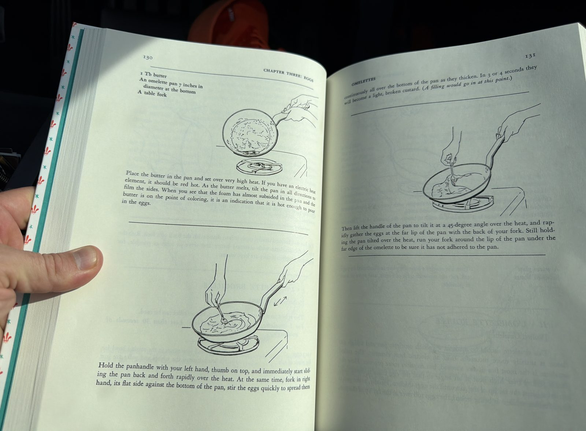
*Source pages 132–133: the end of Method I (loosening the omelette with sharp blows) sits just above where Method II begins on the facing page — its own eggs-settling moment is Method II's Step 3 below.*

#### D. Method II — L'Omelette Roulée (Rolled Omelette)

*This omelette should be made in a French omelette pan; a high gas flame is usually more successful than an electric heat element.* **The most fun of any method, but it requires more practice** — here the pan is jerked over high heat at an angle so the egg mass is continually hurled against the far lip of the pan until the eggs thicken; finally, as the pan tilts further while being jerked, the eggs roll over on themselves to form an omelette shape.

*"A simple-minded but perfect way to master the movement is to practice outdoors with half a cupful of dried beans. As soon as you're able to make them flip over themselves in a group, you have the right feeling; but the actual omelette-making gesture is sharper and rougher."*

**For 1 omelette, 1 to 2 servings. Time: less than 30 seconds of cooking.**

**Ingredients:** 2 or 3 eggs; a big pinch of salt; a pinch of pepper; 1 Tbsp butter; a warm plate; softened butter, to finish.

**You'll need:** a mixing bowl, a table fork, an omelette pan 7 inches in diameter at the bottom.

**1. Beat the eggs. 20 to 30 seconds.**
Beat the eggs and seasonings in the mixing bowl until the whites and yolks are just blended.

**2. Heat the butter until it's on the point of coloring.**
Place the butter in the pan and set over very high heat. As the butter melts, tilt the pan in all directions to film the sides. When the foam has almost subsided and the butter is on the point of coloring — indicating it's hot enough — pour in the eggs. **It's of the utmost importance in this method that the butter be at the correct temperature.**

**3. Let the eggs settle. 2 to 3 seconds.**
Let the eggs settle in the pan for 2 or 3 seconds to form a film of coagulated egg on the bottom of the pan. *(A filling would go in at this point.)*

**4. Jerk the pan toward you. About one jerk per second.**
Grasp the handle of the pan with both hands, thumbs on top, and immediately begin jerking the pan vigorously and roughly toward you at an even, 20-degree angle over the heat, one jerk per second. It's the sharp pull of the pan toward you that throws the eggs against the far lip of the pan, then back over its bottom surface. **You must have the courage to be rough, or the eggs won't loosen themselves from the bottom of the pan.** After several jerks, the eggs will begin to thicken.

**5. Increase the tilt to roll the omelette over on itself.**
Then increase the angle of the pan slightly, which will force the egg mass to roll over on itself with each jerk at the far lip of the pan.

*Source pages 134–135: jerking and rolling (Steps 4–5), then browning the shaped omelette and turning it out (Step 6) at the top of the facing page.*

**6. Brown lightly, then turn out.**
Hold the pan tilted over the heat for 1 or 2 seconds to brown the bottom of the omelette very lightly, but not too long or the eggs will overcook — **the center should remain soft and creamy.** If the omelette hasn't formed neatly, push it into shape with the back of your fork. Turn it onto the plate as described in Section E, rub the top with a bit of softened butter, and serve as soon as possible — **omelettes toughen if kept warm.**

#### E. Transferring the Omelette from Pan to Plate

*In each of the methods described, the finished omelette ends up at the far lip of the pan. This is how to move it from the pan to the plate, in either method.*

Hold the plate in your left hand. Turn the omelette pan so its handle is to your right. Grasp the handle with your right hand, thumb on top. Rest the lip of the pan slightly off-center of the plate, so the omelette will land in the middle of the plate. Then tilt the plate and pan against each other at a 45-degree angle, and quickly turn the pan upside down over the plate — the omelette will drop into position. If it hasn't formed neatly, push it into shape with the back of a fork.

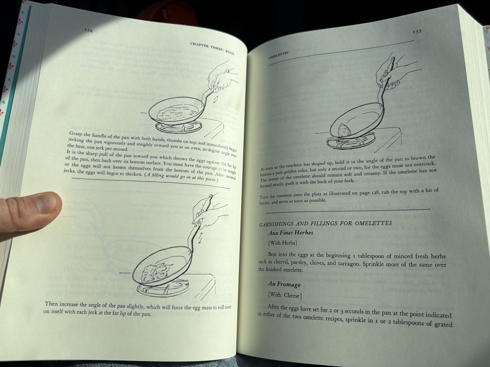
*Source pages 128–129: the pan-to-plate transfer, plus the start of Method I on the facing page.*

#### F. Garnishings and Fillings for Omelettes

*After the eggs have set for 2 or 3 seconds in the pan, at the point indicated in either recipe above, add the filling.*

**Aux Fines Herbes (With Herbs).** Beat 1 Tbsp of minced fresh herbs — chervil, parsley, chives, and tarragon — into the eggs at the start. Sprinkle more of the same over the finished omelette.

**Au Fromage (With Cheese).** After the eggs have set for 2 or 3 seconds in the pan, sprinkle in 1 or 2 Tbsp of grated Swiss cheese; **or**, stir 4 to 6 spoonfuls of grated Swiss cheese into the eggs along with the enrichment butter at the end.

**Aux Truffes (With Truffles).** Stir 1 or 2 diced truffles into the eggs before scrambling them. Sprinkle a bit of chopped truffle over the eggs before serving.

**Other garnishings, per the source:** aside from ham, bacon, or sausages, the platter may be garnished with broiled or sautéed mushrooms, kidneys, or chicken livers; sautéed eggplant or zucchini; broiled tomatoes, tomato sauce, or the *pipérade* mixture (source p. 137 — not yet transcribed); diced sautéed potatoes; or buttered peas, asparagus tips, or artichoke hearts.

#### Nutrition *(estimated, per plain 3-egg omelette, unfilled)*

| | Calories | Fat | Protein | Carbs | Fiber |
|---|---|---|---|---|---|
| **Whole omelette** *(3 eggs, 1 Tbsp cooking butter, plus a pat to finish)* | ~370 | 30 g | 19 g | 1.5 g | 0 g |
| **Per serving** *(1 to 2 servings)* | ~250–370 | 20–30 g | 13–19 g | 1 g | 0 g |

**What a serving is:** one omelette serves 1 as a light meal, or 2 as part of a bigger spread — the source gives both counts. Fillings and garnishes (cheese, herbs, ham) aren't counted here; add them from their own ingredients.

[↑ Table of Contents](#table-of-contents)

---

### T26. Pâte Brisée & Pastry Shells (Pie Dough, Shaping, and Baking)

<!-- TECHNIQUE-TAGS: pastry, pie-dough, pate-brisee, quiche, tart, formula, french -->
**Tags:** `pastry` · `pie-dough` · `pâte-brisée` · `quiche` · `tart` · `formula` · `french`
**Source:** Mastering the Art of French Cooking, Chapter Four: Entrées and Luncheon Dishes, p. 139–146.
**Used in:** [§10.7 Quiche Lorraine](#107-quiche-lorraine-cream-and-bacon-quiche), which cites this exact page (146) for its pastry shell — now resolved and cross-linked. Also feeds the open-faced tarts and quiches this chapter builds.

> *"A good French pastry crust is tender, crunchy, and buttery. The best one, pâte brisée fine, is made in the proportions, according to weight, of 5 parts flour to 4 parts butter. American all-purpose flour produces a slightly brittle crust if only butter is used. However, a mixture of 3 parts butter and 1 part vegetable shortening will give a tender crust with a good buttery flavor. Unlike standard American methods, the French system calls for a fraisage at the end of the operation, which is a short pushing out of the dough with the heel of the hand to insure an even blending of fat and flour."*

⚠️ **A note on this entry's illustrations**, same as [§T25](#t25-the-french-omelette-two-methods): the fraisage, rolling, and shell-molding steps below are taught in the source with hand-drawn illustrations this cookbook can't embed. Each step is described in enough detail to follow without them.

**🟡 Medium** · **Prep ~20 min** *(mixing, the fraisage, rolling, and molding into the shell)* · **Cook ~15 min** *(8 to 19 min baking, partially or fully cooked)* · **Start to finish ~35 min** *(plus 1 to 2 hr chilling the dough — lead time, not active work)*

#### A. Proportions per Cup of Flour (for measuring by other quantities)

| For | Amount |
|---|---|
| Flour | 1 cup |
| Butter and chilled shortening | 3 to 4½ Tbsp |
| Iced water | as needed, by droplets |
| Salt | ½ tsp |
| Sugar (optional, for color) | ⅛ tsp |

#### B. Ingredients (for one 8- to 9-inch shell)

- 2 cups all-purpose flour (scooped and leveled)
- 1 tsp salt
- ¼ tsp sugar
- 6 oz (1½ sticks) chilled butter, cut into ½-inch bits
- 4 Tbsp chilled vegetable shortening
- A scant ½ cup iced water, plus droplets more as needed

**You'll need:** a big mixing bowl, or a food processor with a 2-quart capacity (steel blade); a lightly floured pastry board; a rolling pin; waxed paper.

#### C. Method 1 — Hand Mixing

**1. Rub the fat into the flour.**
Place the flour, salt, sugar, butter, and shortening in a big mixing bowl. Rub the flour and fat together rapidly between the tips of your fingers until the fat is broken into pieces the size of oatmeal flakes. Don't overdo this step — the fat gets blended more thoroughly later, in the fraisage.

**2. Add the water and mass the dough.**
Add the water and blend quickly with one hand, fingers held together and slightly cupped, rapidly gathering the dough into a mass. Sprinkle up to 1 Tbsp more water by droplets over any unmassed remains and work it in. Press the dough firmly into a roughly shaped ball — it should just hold together and be pliable, but not sticky.

> **Per the source, on working fast:** *"You must train yourself to work rapidly, particularly if your kitchen is warm, so that the butter will soften as little as possible. Use very quick, light finger movements, and do not linger on the dough at all with the warm palms of your hands. A pastry blender may be used if you wish, but a necessary part of learning how to cook is to get the feel of the dough in your fingers. Il faut mettre la main à la pâte!"* — you have to put your hand to the dough.

#### D. Method 2 — Food Processor

The proportions above suit a machine with a 2-quart capacity; a larger container would take double the amount.

**1. Cut in the fat.**
Measure the dry ingredients into the bowl fitted with the steel blade. Quarter the chilled sticks of butter lengthwise and cut crosswise into ⅜-inch pieces; add to the flour along with the chilled shortening. Flick the machine on and off 4 or 5 times.

**2. Add the water and mass.**
Measure out a scant ½ cup of iced water. Turn the machine on and pour it all in at once; immediately flick the machine on and off several times, and the dough should begin to mass on the blade. If it doesn't, dribble in a little more water and repeat, adding more if needed. **The dough is done as soon as it begins to mass — don't overmix it.** Scrape it out onto your work surface.

#### E. The Fraisage — Final Blending (for hand-made or machine dough)

Place the dough on a lightly floured pastry board. With the heel of one hand, not the palm which is too warm, rapidly press the pastry down in two-spoonful bits, in a firm, quick smear about 6 inches long, pushing it away from you across the board. This is the final blending of fat and flour — the *fraisage* — and it's what makes the French method distinct from just cutting fat into flour.

With a scraper or spatula, gather the dough back into a mass; knead it briefly into a fairly smooth round ball. Sprinkle it lightly with flour and wrap it in waxed paper. Either place it in the freezer for about 1 hour until firm but not congealed, or refrigerate for 2 hours or overnight.

> **Storage, per the source:** uncooked pastry dough keeps 2 to 3 days refrigerated, or freezes for several weeks. Always wrap it airtight in waxed paper and a plastic bag.

#### F. Rolling Out the Dough

Because of its high butter content, roll the dough out as quickly as possible, so it doesn't soften and become hard to handle. Place it on a lightly floured board or marble surface. If the dough is hard straight from the fridge, beat it with the rolling pin to soften it, then knead it briefly into a fairly flat circle — just malleable enough to roll out without cracking.

#### G. Molding the Shell

**1. Transfer the dough to the mold.**
*Either* reverse the dough onto the rolling pin and unroll it over the mold, *or* fold the dough in half, then in half again, lay it in the mold, and unfold it.

**2. Press it into the mold and trim.**
Press the dough lightly into the bottom of the pan (or onto the baking sheet, if using a flan ring). Lift the edges of the dough and work it gently down the inside edges of the mold with your fingers, taking in about ⅜ inch of dough all around the circumference — this makes the sides of the shell a little thicker and sturdier. Trim off excess dough by rolling the pin over the top of the mold.

**3. Build the rim.**
With your thumbs, push the dough ⅛ inch above the edge of the mold, to make an even, rounded rim of dough all around the inside circumference.

**4. Decorate the edge, and dock the bottom.**
Press a decorative edge around the rim with the dull edge of a knife. Prick the bottom of the pastry with a fork at ½-inch intervals — this keeps it from puffing up unevenly.

**5. Weight it so it holds its shape.**
To keep the sides from collapsing and the bottom from puffing up during baking, *either* butter the bottom of another mold, weight it with a handful of dry beans, and set it inside the pastry, *or* line the pastry with buttered lightweight foil or buttered brown paper, press it against the sides, and fill it with dried beans — the weight of the beans holds the pastry against the mold as it bakes.

Refrigerate if not baking immediately.

#### H. Baking the Shell

**Partially cooked shell** *(for quiches, and for tarts whose filling cooks in the shell)*: bake at the middle level of a preheated 400°F oven for 8 to 9 minutes, until the pastry is set. Remove the weighting mold or foil and beans. Prick the bottom of the pastry with a fork to keep it from rising further. Return to the oven 2 to 3 minutes more. When the shell is starting to color and just beginning to shrink from the sides of the mold, remove it from the oven. **If the sides seem fragile, or liable to crack or leak under the weight of the filling to come, don't unmold it until your tart or quiche is filled and finally baked.**

**Fully cooked shell** *(for tarts filled with cooked ingredients that need only a brief reheating, or for fresh fruit tarts served cold)*: bake 7 to 10 minutes more, or until the shell is very lightly browned.

**Unmolding:** when the shell is done, unmold it and slip it onto a rack. Air circulating around it while it cools keeps it from getting soggy.

#### I. On Quiche Sizing, Per the Source

*"The following recipes are all designed for pastry shells 8 inches in diameter. The quiche ingredients should fill the shell by no more than three-fourths, to allow room for puffing. An 8-inch shell will hold about 2½ cups of filling and serves 4 to 6 people. A 10-inch shell, serving 6 to 8, will hold one and a half times this amount or slightly more."*

#### J. Grocery Shopping List

**🛒 General grocery**

- 🛒 All-purpose flour — 2 cups
- 🛒 Salt — 1 tsp
- 🛒 Sugar — ¼ tsp, optional (for color)
- 🛒 Butter — 6 oz (1½ sticks), chilled
- 🛒 Vegetable shortening — 4 Tbsp, chilled
- 🛒 Dried beans — for weighting the shell during baking (reusable, not eaten)

#### Nutrition *(estimated, whole shell)*

| | Calories | Fat | Protein | Carbs | Fiber |
|---|---|---|---|---|---|
| **Whole shell** *(8- to 9-inch)* | ~1,850 | 128 g | 18 g | 155 g | 5 g |
| **Per slice** *(⅙ of the shell alone, if tracked separately from a filled quiche)* | ~310 | 21 g | 3 g | 26 g | 0.8 g |

**What a serving is:** the shell isn't eaten on its own — these figures exist so a filled quiche or tart's own nutrition can add the shell in, rather than double-counting a separately-listed crust.

[↑ Table of Contents](#table-of-contents)

---

### T27. Sous Vide "Not-So-Premium" Steak Cuts (Cody's Method)

<!-- TECHNIQUE-TAGS: sous-vide, steak, tenderizing, sear, cast-iron, formula -->
**Tags:** `sous-vide` · `steak` · `tenderizing` · `sear` · `cast-iron` · `formula`
**Source:** Cody's own method, dictated directly — not from a photographed page.
**Used in:** **[§3 Darcy's Steak](#3-darcys-steak)** — the numbered-recipe version of this same idea, with Cody's own temperatures, the ice-cooler chill, and a charcoal-chimney sear in place of the cast iron.

> **📌 This is Cody's answer to "the perfect steak," full stop — not just a fix for cheap cuts.** Shown Steven Raichlen's *How to Grill the Perfect Steak* technique page (the grill-and-crosshatch method), his response was direct: ***"Actually I prefer sous vide — to me, the perfect steak is sous vide."*** That grilling technique was **not added to this cookbook**, on his call. Worth recording as a standing preference: when a recipe here says to grill or pan-sear a steak, sous-vide-then-sear is the house alternative, and this entry plus [§T28 Sous Vide Chicken](#t28-sous-vide-chicken-codys-method) are the methods to reach for.

Cody's go-to for **tougher, less expensive steak cuts** — the ones that don't get tender enough on a quick sear alone. Long, low-temperature sous vide does the tenderizing that a premium cut like ribeye or filet doesn't need, then a short, screaming-hot cast iron sear builds the crust at the end. *Typical candidates: chuck steak, top round, sirloin, flank, skirt, flat iron — anything with more connective tissue and a lower price tag than the steakhouse cuts. Cody didn't name a specific cut, so treat this as a technique that applies broadly, not a recipe for one.*

> **This is a formula, not a fixed recipe** — same spirit as [§T8 Pan Sauce](#t8-pan-sauce-formula) and [§T14 Grilled Pork Tenderloin](#t14-how-to-grill-pork-tenderloin-cuban-mojo): the steps are exact, but the rub and the cut are up to you.

> **On 129°F, and why this doesn't conflict with the rule in [§1 Cody's Pho](#1-codys-pho).** That recipe's own established note says *do not run sous vide at 129°F* — but that warning is specifically about a **multi-day** cook (24–36 hours), where *C. perfringens* has enough time at a sub-131°F temperature to actually grow. A single steak-sized cut at 129°F for 6 to 8 hours is a different situation entirely: pasteurization at that temperature is reached well within the first few hours for a cut this size, and the hold time here never approaches the multi-day window the pho warning is guarding against. 129°F is in fact a completely standard sous vide target for medium-rare steak — this technique just runs it long enough to tenderize a tougher cut, not because tenderizing needs a special temperature.

> **The same anaerobic-bag rule from Cody's Pho still applies here: no fresh garlic, no liquid, in the bag.** "Whatever rub you like" is fine as long as it's a dry rub — kosher salt, pepper, garlic powder, any of §4's dry rubs ([§4.1 Darcy's Steak Rub](#41-darcys-steak-rub) is a natural fit). Skip fresh garlic or fresh herbs sealed in the bag; garlic powder gets the flavor without the risk.

**🟡 Medium** · **Prep ~5 min** *(seasoning and bagging)* · **Cook ~10 min** *(getting the cast iron screaming hot, then the sear itself)* · **Slow cook 6–8 hr** *(sous vide, unattended)* · **Start to finish ~6 hr 15 min – 8 hr 15 min**

#### A. Ingredients

- Steak — a tougher, not-so-premium cut (chuck, top round, sirloin, flank, skirt, flat iron, etc.)
- Dry rub of your choice — a dry rub only, no fresh garlic or liquid (see caution above)
- Avocado oil, in a spray bottle or mister
- A vacuum sealer or zip-top bag (with the water-displacement method if not vacuum sealing)

#### B. Cooking Instructions

**1. Season the steak.**
Rub both sides with your seasoning of choice.

**2. Bag and seal.**
Vacuum seal, or use a zip-top bag and the water-displacement method to press out the air before sealing.

**3. Sous vide at 129°F for 6 to 8 hours.**
This is the tenderizing stage — the long, low-and-slow hold breaks down connective tissue in a cut that would otherwise stay chewy, while holding the meat at a steady medium-rare the whole time. Fully hands-off once the bag is in the water.

**4. Pat the steak completely dry.**
Out of the bag and dried thoroughly with paper towels — every bit of surface moisture. This is the step that determines whether the sear actually browns or just steams; a wet surface won't take a crust no matter how hot the pan is.

**5. Spray avocado oil on both sides.**
Avocado oil's high smoke point (above 500°F) is what makes it work here — an oil that smokes at a lower temperature would burn and turn acrid the instant it hits a blazing-hot pan.

**6. Sear in a blazing hot cast iron skillet. 30 to 45 seconds per side.**
The pan needs to be genuinely screaming hot before the steak goes in — this isn't a "medium-high" sear. Since the meat is already fully cooked from the sous vide, this step is purely about building a crust; there's no doneness cushion left to lean on, so don't walk away or guess. Thirty to forty-five seconds a side is enough to brown deeply without pushing the interior past the temperature it already sous vide'd to.

#### C. Rubs for This — What's Already in the Cookbook

"Whatever rub you like" means these. **All are dry, so all are bag-safe** *(see the no-fresh-garlic caution above)*. Notes in quotes are the source's own recommendations, not guesses.

| Rub | Why it fits steak |
|---|---|
| **[§4.1 Darcy's Steak Rub](#41-darcys-steak-rub)** ❤️ | **The dedicated steak rub in this cookbook**, and a family favorite — *Cody: "Love it."* Coarse and herb-forward, layered on top of salt and pepper rather than replacing them |
| **[§4.32 Texas Chili Rub](#432-texas-chili-rub)** | *"This no-nonsense rub will add drama to any meat, from steak to brisket"* — chipotle-based |
| **[§4.29 Java Rub](#429-java-rub)** | *"The bittersweet flavor of coffee goes great on beef (especially brisket) and pork"* |
| **[§4.27 Cajun Rub](#427-cajun-rub)** | *"...especially chicken, steak, and seafood"* — the one rub that spans this entry and [§T28](#t28-sous-vide-chicken-codys-method) equally |
| **[§4.30 Mucho Macho Pepper Rub](#430-mucho-macho-pepper-rub)** | Built for cuts that *"call for a spice mix that bites back"* — worth knowing it's a heat rub going in |
| **[§4.26 Basic Barbecue Rub](#426-basic-barbecue-rub)** | Raichlen's *"ground zero — the ur American barbecue rub."* Sweet-and-smoky rather than steakhouse, but it works |
| **[§4.7 Captain Mike's Seasoning](#47-captain-mikes-seasoning)** ❤️ | Cody's own white-pepper blend — *"a great seasoning... it goes great in cream sauces,"* which makes it a natural if a cream or butter sauce is going on top |

> **Two rubs to think twice about here.** **[§4.33 Sesame Seasoning](#433-sesame-seasoning)** is explicitly a *finishing* seasoning — the source says it *"tastes best sprinkled on after the food comes off the grill"* — so sprinkle it after the sear rather than sealing it in the bag. And **[§4.28 Chinese Five-Spice Rub](#428-chinese-five-spice-rub)** carries [§1 Cody's Pho](#1-codys-pho)'s warning that star anise and clove *"turn harsh and medicinal over 24+ hours in a bag"* — at 6 to 8 hours you're well short of that window, so it's fine here, just don't stretch the cook overnight with it.

> **Dosing, per the rub pages themselves:** most of the Raichlen rubs call for **2 to 3 teaspoons per pound of meat.**

#### D. Sauces for This — What's Already in the Cookbook

Because the sear leaves you with a fully cooked steak and a hot pan, **anything in §4 can go on top** — nothing has to cook the meat further. These are the ones this cookbook actually pairs with beef:

**The classic steakhouse emulsions**

| Sauce | Note |
|---|---|
| **[§4.10 New Orleans Béarnaise Sauce](#410-new-orleans-béarnaise-sauce)** | The classic steak sauce — tarragon and white wine folded into warm Hollandaise. 🔴 built on [§4.9 Hollandaise](#49-hollandaise-sauce), so it can break |
| **[§4.61 Béarnaise Mayonnaise](#461-béarnaise-mayonnaise)** | **The no-break shortcut** — the same shallot-and-tarragon reduction stirred into real mayonnaise. 🟢 Easy, and the sensible choice on a weeknight |
| **[§4.11 Choron Sauce](#411-choron-sauce)** | Béarnaise's tomato cousin, same build |
| **[§4.9 Hollandaise Sauce](#49-hollandaise-sauce)** ❤️ | The parent emulsion, if you want it plain |

**French brown sauces** *(all from [§T24](#t24-the-french-sauce-families--roux-ratios)'s brown family — each needs a brown-sauce base first)*

| Sauce | The source's own "For:" line |
|---|---|
| **[§4.80 Sauce Madère / au Porto](#480-sauce-madère--sauce-au-porto-brown-madeira-or-port-wine-sauce)** | *"filet of beef,"* ham, veal, chicken livers, egg dishes |
| **[§4.81 Sauce Périgueux](#481-sauce-périgueux-brown-madeira-sauce-with-truffles)** | *"filet of beef,"* fresh foie gras, ham, veal — Madère plus truffles, the most luxurious sauce in the chapter |
| **[§4.75 Sauce Piquante](#475-sauce-piquante-brown-sauce-with-pickles-and-capers)** | *"boiled beef,"* pork, tongue, hot meat leftovers |
| **[§4.79 Sauce Duxelles](#479-sauce-duxelles-brown-mushroom-sauce)** | The source files it under chicken and veal, but a brown mushroom sauce on steak needs no defense |

**Butters, relishes, and cold sauces**

| Sauce | Note |
|---|---|
| **[§4.55 Fresh Herb Butter](#455-fresh-herb-butter)** · **[§4.56 Canal House Lemon Butter](#456-canal-house-lemon-butter)** · **[§4.57 Fresh Horseradish Butter](#457-fresh-horseradish-butter)** · **[§4.58 Pimentón Butter](#458-pimentón-butter)** | **All four come from a single source page built around grilled steaks** — the most directly on-point group in the cookbook. A slice melting over the steak as it rests |
| **[§4.44 Three-Herb Chimichurri](#444-three-herb-chimichurri)** | *"Served with grilled beef in Argentina"* |
| **[§4.40 Herbed Horseradish Sauce](#440-herbed-horseradish-sauce)** | *"Roast beef and horseradish sauce are as English as Big Ben"* |
| **[§4.51 Shallot Marmalade](#451-shallot-marmalade)** | The source serves it with [§7.32 Herb-Crusted Beef Tenderloin](#732-herb-crusted-grilled-beef-tenderloin) |
| **[§4.15 New Orleans Bordelaise Sauce](#415-new-orleans-bordelaise-sauce)** | Garlic gently cooked in butter, served as a dip rather than a topping |
| **[§4.86 Beurre Noir / Noisette](#486-beurre-noir--beurre-noisette-brown-butter-sauce)** | Brown butter — 🟡 because it goes from nutty to burnt in seconds |

> **Don't waste the sear pan.** You've just pulled a steak out of a screaming-hot skillet with fond in the bottom — that's exactly the setup **[§T8 Pan Sauce Formula](#t8-pan-sauce-formula)** starts from. Deglaze with ¾ cup of wine or stock, reduce by half, swirl in cold butter off the heat. **The juices left in the sous vide bag are worth saving for it** — they're concentrated beef juice and they go straight into the deglaze. *(That last part is a suggestion, not something Cody specified.)*

> **One steak sauce named in this cookbook but not transcribed:** **Sauce Bordelaise** — red wine with beef marrow, which [§T24](#t24-the-french-sauce-families--roux-ratios) lists as *"Steaks, hamburgers, egg dishes."* It's printed in another chapter of its source and hasn't been photographed. Not to be confused with [§4.15 New Orleans Bordelaise](#415-new-orleans-bordelaise-sauce) above, which is an entirely different (and much simpler) sauce that shares the name.

#### E. Grocery Shopping List

**🏪 Specific store — butcher**

- 🏪 Steak — a tougher, not-so-premium cut (see Part A for candidates)

**🛒 General grocery**

- 🛒 Avocado oil — spray bottle or mister
- 🛒 Dry rub or seasoning of choice — no fresh garlic
- 🛒 Zip-top freezer bags, if not vacuum sealing

#### Nutrition

Not tracked here — this is a cut- and weight-agnostic technique (Cody didn't specify a cut or a portion size), and nutrition for beef steak varies enormously by which cut is used. Once this technique gets used in a numbered recipe with a specific cut and weight, that recipe carries its own Nutrition block.

[↑ Table of Contents](#table-of-contents)

---

### T28. Sous Vide Chicken (Cody's Method)

<!-- TECHNIQUE-TAGS: sous-vide, chicken, poultry, sear, cast-iron, formula -->
**Tags:** `sous-vide` · `chicken` · `poultry` · `sear` · `cast-iron` · `formula`
**Source:** Cody's own method, dictated directly — not from a photographed page.
**Used in:** no numbered recipe cites it yet.

**The chicken counterpart to [§T27 Sous Vide "Not-So-Premium" Steak Cuts](#t27-sous-vide-not-so-premium-steak-cuts-codys-method).** Identical shape — season, bag, sous vide, dry, oil, hard sear — and the sear at the end is exactly the same. What changes is the dial: **chicken runs hotter and for far less time — 148°F for 1½ to 4 hours.**

> **Chicken does not get the steak's 6-to-8-hour hold, and never has.** Those long hours in [§T27](#t27-sous-vide-not-so-premium-steak-cuts-codys-method) are doing a specific job — breaking down connective tissue in a tough, cheap cut at a low 129°F. Chicken has no such problem to solve: at 148°F it's cooked through early, and the remaining time is only about how tender you want it. **1½ to 4 hours is the whole range.**

> **This is a formula, not a fixed recipe** — same spirit as [§T27](#t27-sous-vide-not-so-premium-steak-cuts-codys-method) and [§T8 Pan Sauce](#t8-pan-sauce-formula): the steps and temperature are exact, the rub and the cut are up to you.

> **Cody's own note on the time range: it's driven by two things — thickness, and how tender you want it.** A thin cutlet is done at the short end; a thick bone-in piece wants longer. Beyond simply coming up to temperature, extra time in the bath keeps working on texture, so the range is a dial rather than a deadline.

> **No temperature caveat here, unlike [§T27](#t27-sous-vide-not-so-premium-steak-cuts-codys-method).** That entry had to reconcile 129°F against [§1 Cody's Pho](#1-codys-pho)'s "don't run sous vide at 129°F" rule. **148°F raises no such question** — it's comfortably above the sub-131°F range that warning is about, and chicken pasteurizes at 148°F in a matter of minutes, so even the 1½-hour short end has an enormous safety margin. Nothing to reconcile.

> **The same anaerobic-bag rule still applies: dry rub only — no fresh garlic, no liquid, in the bag.** See [§1 Cody's Pho](#1-codys-pho)'s established note; garlic powder gets the flavor without the botulism risk.

**🟡 Medium** · **Prep ~5 min** *(seasoning and bagging)* · **Cook ~10 min** *(heating the cast iron, then the sear)* · **Slow cook 1½–4 hr** *(sous vide, unattended)* · **Start to finish ~1 hr 45 min – 4 hr 15 min**

#### A. Ingredients

- Chicken — breasts, thighs, or whatever cut you're cooking
- Dry rub or seasoning of your choice — dry only, no fresh garlic or liquid (see caution above)
- Avocado oil, in a spray bottle or mister
- A vacuum sealer or zip-top bag (with the water-displacement method if not vacuum sealing)

#### B. Cooking Instructions

**1. Season the chicken.**
Rub it with whatever rub or seasoning you like — see Part C for what's already in this cookbook.

**2. Bag and seal.**
Vacuum seal, or use a zip-top bag and the water-displacement method to press the air out before sealing.

**3. Sous vide at 148°F for 1½ to 4 hours.**
Time depends on **thickness and how tender you want it** — thin cutlets at the short end, thicker or bone-in pieces longer. Fully hands-off once the bag is in the water. At this temperature the chicken holds a juicy, fully-cooked texture the entire time rather than drying out the way it would past a certain point in an oven or a pan.

**4. Remove from the bag and pat completely dry.**
Paper towels, and be thorough — every bit of surface moisture. This is the step that decides whether the sear browns or just steams. Chicken comes out of the bag wetter than steak does, so this matters even more here.

**5. Spray both sides with avocado oil.**
Avocado oil's high smoke point (above 500°F) is the point — a lower-smoke-point oil scorches and turns acrid the instant it hits the pan.

**6. Sear in a blazing hot cast iron skillet. 30 to 45 seconds per side.**
Genuinely screaming hot, not medium-high. The chicken is already fully cooked, so this is purely crust-building — there's no doneness cushion left, and it's easy to overshoot into dry meat if you linger. Thirty to forty-five seconds a side is enough for real browning. **If the skin is on, give the skin side the bulk of the attention** — that's where the crust that's worth having lives.

#### C. Rubs for This — What's Already in the Cookbook

> **Answering Cody's own question directly: no, there isn't a dedicated chicken rub in this cookbook** — nothing here is titled "chicken rub" the way [§4.1 Darcy's Steak Rub](#41-darcys-steak-rub) is titled for steak. **But five rubs already here name chicken explicitly in their own source text**, and four of them print a dosing figure specifically for a 4-pound chicken. So the gap is a naming gap, not a real one.

| Rub | The source's own words on chicken | Dosing |
|---|---|---|
| **[§4.27 Cajun Rub](#427-cajun-rub)** | *"...will lend a Cajun accent to anything on which you sprinkle it, **especially chicken**, steak, and seafood"* | 2–3 tsp per lb — **1½ to 2 Tbsp for a 4 lb chicken** |
| **[§4.31 Mediterranean Herb Rub](#431-mediterranean-herb-rub)** | *"Tastes terrific on lamb, **chicken**, and seafood"* — herbes de Provence meets Kansas City | 2–3 tsp per lb — **1½ to 2 Tbsp for a 4 lb chicken** |
| **[§4.26 Basic Barbecue Rub](#426-basic-barbecue-rub)** | *"Ground zero — the ur American barbecue rub. Use it on ribs, pork shoulders, or **chicken**"* | 2–3 tsp per lb — **1½ to 2 Tbsp for a 4 lb chicken** |
| **[§4.30 Mucho Macho Pepper Rub](#430-mucho-macho-pepper-rub)** | A heat rub — the source prints a 4 lb chicken dose, so it's meant for poultry as much as chops | 2–3 tsp per lb — **1½ to 2 Tbsp for a 4 lb chicken** |
| **[§4.33 Sesame Seasoning](#433-sesame-seasoning)** | *"...as well as grilled fish and **chicken**"* | **Not a bag rub — see below** |
| **[§4.7 Captain Mike's Seasoning](#47-captain-mikes-seasoning)** ❤️ | Cody's own white-pepper blend. Doesn't name chicken, but *"it goes great in cream sauces"* — which is most of Part D below | To taste |

> **[§4.33 Sesame Seasoning](#433-sesame-seasoning) is a finishing seasoning, not a bag rub.** Its own source says it *"tastes best sprinkled on after the food comes off the grill"* — so sprinkle it on after the sear, not into the bag.

> **[§4.28 Chinese Five-Spice Rub](#428-chinese-five-spice-rub) is fine at these times.** [§1 Cody's Pho](#1-codys-pho) warns that star anise and clove turn harsh over **24+ hours** in a bag; a 1½-to-4-hour cook is nowhere near that.

#### D. Sauces for This — What's Already in the Cookbook

**This is where chicken has the real advantage over steak in this cookbook.** The entire French white-sauce family exists to go on poultry, and this cookbook now has all of it. Every "For:" line below is the source's own recommendation, quoted — not a guess.

**The white sauce family** *(all built on [§4.63](#463-sauce-béchamel--sauce-velouté-master-white-sauce) — and note that **velouté made with chicken stock is literally the chicken version of the master sauce**)*

| Sauce | The source's own "For:" line |
|---|---|
| **[§4.63 Sauce Béchamel / Velouté](#463-sauce-béchamel--sauce-velouté-master-white-sauce)** | The master white sauce. *"Béchamel uses milk; velouté uses **chicken**, veal, or fish stock"* — start here |
| **[§4.67 Sauce Chivry / à l'Estragon](#467-sauce-chivry--sauce-à-lestragon-herbal-white-wine-sauce-and-tarragon-sauce)** | *"eggs, fish, vegetables, or **poached chicken**"* — **the tarragon sauce, and the most classically chicken of the group** |
| **[§4.69 Sauce Soubise](#469-sauce-soubise-onion-sauce)** | *"eggs, veal, **chicken, turkey**, lamb, vegetables"* — onion sauce |
| **[§4.68 Sauce au Cari](#468-sauce-au-cari-light-curry-sauce)** | *"fish, veal, lamb, **chicken, turkey**, eggs, and vegetables"* — light curry |
| **[§4.65 Sauce Mornay](#465-sauce-mornay-cheese-sauce)** | *"eggs, fish, **poultry**, veal, vegetables, pastas"* — cheese sauce |
| **[§4.66 Sauce Aurore](#466-sauce-aurore-béchamel-or-velouté-with-tomato-flavoring)** | *"eggs, fish, **chicken**, vegetables"* — with tomato |
| **[§4.70 Sauce Bâtarde](#470-sauce-bâtarde--sauce-au-beurre-mock-hollandaise)** | *"boiled fish, **boiled chicken**, boiled lamb..."* — mock hollandaise, no emulsion risk |
| **[§4.64 Sauce Parisienne](#464-sauce-parisienne-egg-yolk-and-cream-enrichment)** | Not a sauce on its own — the egg-yolk-and-cream enrichment that makes any of the above *"among the richest and most velvety in all the French repertoire"* |

**The brown sauce family** *(each needs a brown-sauce base — [§4.71](#471-sauce-brune-flour-based-brown-sauce--brown-sauce-1), [§4.72](#472-sauce-ragoût-flour-based-brown-sauce-with-giblets--brown-sauce-2), or the 5-minute [§4.73 Jus Lié](#473-jus-lié-starch-thickened-brown-sauce--brown-sauce-3))*

| Sauce | The source's own "For:" line |
|---|---|
| **[§4.79 Sauce Duxelles](#479-sauce-duxelles-brown-mushroom-sauce)** | *"**broiled or sautéed chicken**, veal, rabbit..."* — brown mushroom sauce |
| **[§4.77 Sauce Brune aux Fines Herbes / à l'Estragon](#477-sauce-brune-aux-fines-herbes--sauce-brune-à-lestragon-brown-herb-or-tarragon-sauce)** | *"**sautéed chicken**, veal, rabbit, braised vegetables..."* — the brown-sauce answer to §4.67 |
| **[§4.74 Sauce Diable](#474-sauce-diable-peppery-brown-sauce)** | *"**broiled chicken**, roast or braised pork, pork chops..."* — peppery |
| **[§4.76 Sauce Robert](#476-sauce-robert-brown-mustard-sauce)** | *"roast or braised pork, boiled beef, **broiled chicken or turkey**..."* — mustard |
| **[§4.78 Sauce Brune au Cari](#478-sauce-brune-au-cari-brown-curry-sauce)** | *"lamb, **chicken**, beef, rice, and egg dishes"* — brown curry |
| **[§4.80 Sauce Madère / au Porto](#480-sauce-madère--sauce-au-porto-brown-madeira-or-port-wine-sauce)** | The source's line names *"chicken **livers**"* rather than chicken generally — but port and chicken is a proven pairing in this very cookbook: see **[§7.57 Poulet au Porto](#757-poulet-au-porto-roast-chicken-steeped-with-port-wine-cream-and-mushrooms)**, an entire roast chicken built on it |

**Butter sauces, cold sauces, and American barbecue**

| Sauce | Note |
|---|---|
| **[§4.86 Beurre Noir / Noisette](#486-beurre-noir--beurre-noisette-brown-butter-sauce)** | Source's own "For:" names **"chicken breasts"** outright. 🟡 — nutty to burnt in seconds |
| **[§4.85 Beurre Blanc / Nantais](#485-beurre-blanc--beurre-nantais-white-butter-sauce)** | *"...and sautés of veal, **chicken**, kidneys, and livers."* 🔴 — the emulsion breaks easily |
| **[§4.83 Coulis de Tomates à la Provençale](#483-coulis-de-tomates-à-la-provençale-fresh-tomato-purée-with-garlic-and-herbs)** | *"**broiled or boiled chicken**, boiled beef, meat patties..."* |
| **[§4.84 Sauce Vinaigrette](#484-sauce-vinaigrette-french-dressing)** | *"For cold or hot boiled beef, **boiled chicken**, boiled fish..."* — the move if you're serving it cold |
| **[§4.37 White Barbecue Sauce](#437-white-barbecue-sauce)** | Alabama's own: *"When you're looking for something different to serve with barbecued **chicken, turkey**, and even pork..."* **You must use real mayonnaise** |
| **[§4.62 Walnut-Dill Pesto](#462-walnut-dill-pesto)** | **Came into this cookbook from a chicken recipe** — the source page is "Spatchcocked Chicken with Walnut-Dill Pesto." Purpose-built for this |
| **[§4.41 Asian Peanut Sauce](#441-asian-peanut-sauce)** | *"The traditional accompaniment to the satés of Southeast Asia"* — pair with [§4.33 Sesame Seasoning](#433-sesame-seasoning) sprinkled after the sear |
| **[§4.9 Hollandaise](#49-hollandaise-sauce)** ❤️ · **[§4.10 Béarnaise](#410-new-orleans-béarnaise-sauce)** · **[§4.61 Béarnaise Mayonnaise](#461-béarnaise-mayonnaise)** | Not chicken-specific, but they go on anything seared. The **[§4.61](#461-béarnaise-mayonnaise) shortcut can't break** — worth knowing |

> **Don't waste the sear pan.** Same as [§T27](#t27-sous-vide-not-so-premium-steak-cuts-codys-method): you're left with a hot skillet and fond, which is exactly what **[§T8 Pan Sauce Formula](#t8-pan-sauce-formula)** is built for — deglaze with ¾ cup wine or stock, reduce by half, swirl in cold butter off the heat. **The juices in the bag go straight into the deglaze.** *(A suggestion, not something Cody specified.)*

> **If you want the shortest path to a real French sauce:** [§4.73 Jus Lié](#473-jus-lié-starch-thickened-brown-sauce--brown-sauce-3) is a 5-minute brown-sauce base — the source calls it *"a most useful alternative to the preceding long-simmered brown sauces"* — and it unlocks every brown sauce in the table above without a 2-hour simmer. See **[§T24 The French Sauce Families & Roux Ratios](#t24-the-french-sauce-families--roux-ratios)** for how the whole system fits together.

#### E. Grocery Shopping List

**🏪 Specific store — butcher**

- 🏪 Chicken — breasts, thighs, or your cut of choice

**🛒 General grocery**

- 🛒 Avocado oil — spray bottle or mister
- 🛒 Dry rub or seasoning of choice — no fresh garlic
- 🛒 Zip-top freezer bags, if not vacuum sealing

#### Nutrition

Not tracked here — like [§T27](#t27-sous-vide-not-so-premium-steak-cuts-codys-method), this is a cut- and weight-agnostic technique (Cody didn't specify a cut or a portion size), and chicken varies widely between a skinless breast and a bone-in thigh. Any numbered recipe built on this technique carries its own Nutrition block.

[↑ Table of Contents](#table-of-contents)

---

### T29. How to Salt

<!-- TECHNIQUE-TAGS: salt, seasoning, timing, tasting, brine, salting-water, layering -->
**Tags:** `salt` · `seasoning` · `timing` · `tasting` · `brine` · `salting-water` · `layering`
**Source:** Samin Nosrat, per Cody — almost certainly her *Salt, Fat, Acid, Heat*, going by the framing and content, though this entry is Cody's own distillation rather than a photographed page, so it's transcribed as a paraphrase and taught here in his words rather than quoted as the book's exact text. **The same book is the presumed source behind [§T16 How to Make a Mayonnaise](#t16-how-to-make-a-mayonnaise-and-fix-a-broken-one)** — that one was inferred from illustration style and never confirmed against a title page either; the two entries now corroborate each other without either being a hard confirmation.
**Used in:** every recipe in this cookbook touches salt somewhere, but especially the ones already built around *when* to salt — [§T22 Rib Marinade](#t22-rib-marinade--dry-brine-or-wet-marinade-codys-method)'s dry brine, [§T27](#t27-sous-vide-not-so-premium-steak-cuts-codys-method) and [§T28](#t28-sous-vide-chicken-codys-method)'s sous vide salting, [§7.48 Corned Beef & Cabbage](#748-corned-beef--cabbage)'s multi-day cure, and the salted-boiling-water steps in [§T19 How to Boil an Egg](#t19-how-to-boil-an-egg-canal-houses-timing-guide) and [§T20 Fresh Pasta](#t20-fresh-pasta-and-how-to-cut-it). **Read alongside [§T30 How to Use Fat](#t30-how-to-use-fat) and [§T31 How to Use Acid](#t31-how-to-use-acid)** — same source, and the three interact directly. The one-line summary of all three: **salt to enhance, fat to carry, acid to balance.** **Also read alongside [§T37 Salt, Brining, and the Dry Brine](#t37-salt-brining-and-the-dry-brine--codys-standing-practice-heavy-every-time)** — a different source (Meathead Goldwyn) covering the same ground with actual measured numbers and the wet-vs-dry brine science this entry doesn't get into.

#### The big idea

Salt isn't a flavor you add on top. It's the thing that makes everything else taste more like itself. Used right, it brings out sweetness, hides bitterness, and makes smells hit harder. Used wrong — which almost always means *too little*, added *too late* — food tastes flat and you can't say why. The goal isn't more salt. It's the right amount, at the right time, in the right form.

Here's how you know you got it right: the food doesn't taste salty. It just tastes *better*. Brighter. More finished. If you taste it and think "salty," you went too far. If you taste it and think "good, but something's missing" — it almost always needs salt.

**A trick for when you're not sure:** if a dish tastes boring, don't dump salt in the whole pot. Scoop out one spoonful, salt just that spoonful, and taste it next to the unsalted version. If the little sample suddenly tastes great, now you know, and you can salt the whole batch without guessing.

#### Picking your salt

Different salts are way stronger than each other **when you measure by the spoonful**, because the grains are different shapes and pack together differently. A tablespoon of fine, heavy salt can be two or three times saltier than a tablespoon of big flaky salt. That's why swapping brands without thinking wrecks a recipe.

- **Kosher salt** is your everyday salt — cheap, clean-tasting, hard to mess up. Watch out: the two big brands are *not* the same. One is light and flaky; the other is heavy and about twice as salty per spoonful. Big light flakes melt faster, stick to food better, and give you more room to catch yourself before you overdo it.
- **Fine sea salt** is best when you want salt to disappear into something — salting water, dough, batter, brine.
- **Flaky finishing salts** (Maldon, fleur de sel, sel gris) are for crunch. That's the whole point of them. Dumping them in pasta water is like using expensive olive oil to grease a pan — a waste.
- **Iodized table salt** — just stop buying it. It has a faint metal taste, and the stuff they add to keep it from clumping does nothing good for you.

The simple move: keep two salts. A cheap one you cook with all the time, and a nice flaky one you sprinkle on at the very end.

Then *get to know* the one you cook with. How big are the grains? How fast does it melt in boiling water? How much does a chicken need? Knowing your one salt well beats owning six kinds.

#### Timing matters more than amount

Salt is slow. It takes time to travel from the outside of the food into the middle. So **when** you salt matters more than **how much** — a little salt added early beats a lot added at the table.

Working backward from dinner:

- **Days ahead** — big, tough, thick cuts: whole turkeys, roasts, short ribs, shanks, oxtails. The bigger and colder it is, the more time it needs. *(Same idea behind [§7.48 Corned Beef & Cabbage](#748-corned-beef--cabbage)'s 5–7 day cure.)*
- **A day ahead** — a whole chicken, thick steaks, duck, quail. Also dried beans, salted right when you set them to soak.
- **A few hours ahead, or whenever you remember** — anything you *meant* to salt earlier. A little head start always beats none. Short on time? Leave the meat on the counter instead of putting it back in the fridge — warm food takes salt faster. Cutting it into smaller pieces helps too.
- **15–20 minutes ahead** — watery vegetables headed for the grill or oven (eggplant, zucchini, tomatoes, cabbage for slaw), and thick tuna or swordfish steaks. Pat them dry before cooking, because the salt will have pulled water up to the surface.
- **Right before cooking** — delicate fish and shellfish, vegetables going in to roast, scrambled eggs, and the water in your pot.
- **While it's cooking** — mushrooms (wait until they've started to brown, or they'll go watery), sautéed vegetables, simmering sauces.
- **Right before serving** — salad, and anything getting a flaky-salt sprinkle.

Two exceptions. **Fish and shellfish break the "earlier is better" rule** — more than about fifteen minutes and delicate fish gets tough and dry. Thicker tuna or swordfish can handle maybe thirty. And meat can be salted *too* early: after a day or two it starts turning into cured meat instead of fresh meat. If your plans change, throw it in the freezer salted and pick up where you left off.

A good way to think about meat: instead of asking "how much salt?", ask **"how long until we eat?"** A full day means you can salt a whole bird and let it sit — see [§T28 Sous Vide Chicken](#t28-sous-vide-chicken-codys-method) and [§T22 Rib Marinade](#t22-rib-marinade--dry-brine-or-wet-marinade-codys-method) for exactly this trade-off on a real cut. Eight hours means split the bird open and salt both sides. Twenty minutes means cut it into small pieces and cook it in liquid — a broth, a braise, a splash of wine — so the liquid carries the salt inward for you.

#### Salting the water isn't wasting salt

Food cooked in salty water gets seasoned all the way through. Roast a potato with salt on the outside and you taste salt on the outside. Boil one in salty water and it's seasoned to the middle. Vegetables boiled in well-salted water also stay greener, cook faster, and keep more of their own flavor instead of losing it to the pot.

Salt the water generously and **taste it before the food goes in**. It should taste clearly salty — but not like ocean water. It doesn't matter if you salt before or after the pot goes on the stove, as long as the salt fully melts before the food arrives. One thing to watch: if a pot's been boiling a long time, water evaporates and the salt gets stronger. Taste it, then fix it with more water or more salt.

Two adjustments. Rice, farro, and quinoa cook long enough for salt to spread out well, so they need less salt in the water than blanching vegetables do. And any time *all* the liquid gets soaked up, be careful — all the salt stays in the food too, so go light rather than heavy.

For braises, stews, and poached meats, salt the meat well ahead of time but go easy on the liquid, since you'll be eating that liquid. Taste and fix both at the end.

#### How to actually put salt on food

Ditch the shaker. Pour salt into an open bowl wide enough for your whole hand. You can't season well through a hole the size of a pinhead. Real kitchens make salt bowls out of whatever's lying around, because working from a bowl is that much better.

Three hand moves, each for a different job:

- **The pinch** — for precision. A few grains on avocado toast, on halved boiled eggs, on one caramel. Great for getting a single bite exactly right. Useless for a whole tray of squash — your hand will get tired way before you finish.
- **The palmful** — for covering a lot. Grab a handful and let it go.
- **The wrist wag** — the one worth practicing. Hold a palmful loosely and let it rain down while you sweep your wrist across the food. This is how you get even coverage on a tray of vegetables, a big cut of meat, or a sheet of dough.

Dry your hands first or the salt sticks to your fingers. Then practice over parchment paper or a sheet pan and *look* at where it lands. Blotchy scatter means blotchy seasoning. Loose, flowing motions spread it evenly; stiff, jerky ones don't. Pour it back in the bowl and try again — it costs you nothing.

While you're at it, build a picture in your head of what "seasoned" looks like. A properly salted chicken should look like a light snow fell on it. Notice how it looked going in, then notice how it tasted at the table, and connect the two. That's how you stop needing to measure.

#### Measuring with your tongue, not a spoon

Your mouth is the real tool here. No two times in the kitchen are the same — different pot, different amount of water, different size chicken — so a number in a recipe is only ever a starting point.

If you want numbers to start from: about **1% salt by weight** for meat, vegetables, and grains, and about **2% salt** for blanching and pasta water. Dough and batter want a little more. Meat on the bone wants a little more than boneless.

If those numbers sound like a lot, test it yourself: set up two pots of water, salt one the way you always do and one to about 2%. Cook half your green beans (or pasta) in each and taste them side by side. Trying it beats arguing about it.

#### Salt comes from more places than the salt box

Lots of ingredients are already salty — anchovies, capers, olives, bacon and cured meats, cheese, soy sauce, fish sauce, miso, pickles, sauerkraut, seaweed, most condiments, salted butter. Using several of these in one dish is how you build real depth instead of just making it salty.

The trick is to **plan for them before you start**. If you salt as you go and forget about the anchovies and Parmesan coming later, you'll blow right past where you wanted to be.

Caesar dressing is the classic practice run. Anchovies, Parmesan, Worcestershire, garlic mashed with salt, plus salt itself — five sources of salt in one dressing. Start with an unsalted mayonnaise base, then add each salty ingredient a little at a time, tasting between each one. Add something acidic to balance as you go. Save the actual salt for last, and only use it to fill whatever gap is left. And since dressing tastes different on a leaf than off a spoon, dip a piece of lettuce in for the final check. *(That unsalted mayo base is [§T16](#t16-how-to-make-a-mayonnaise-and-fix-a-broken-one)'s Golden Mayo Ratio. This dressing is now written up in full, with real quantities, as [§4.134 Creamy Caesar Dressing](#4134-creamy-caesar-dressing).)*

The habit to build: when a dish needs more salt, stop and ask *where should that salt come from?* More anchovy? More cheese? A splash of fish sauce? Sometimes plain salt is the right answer. Often something else is better, because it brings flavor along with the salt.

#### Salt with pepper, and salt in desserts

Pepper is not salt's automatic sidekick. Salt belongs in almost everything; pepper is a spice, and whether it fits depends on the dish. Plenty of cuisines reach for cumin, chili, or za'atar where others reach for black pepper. Decide on purpose instead of out of habit.

When you do use pepper, buy whole peppercorns and grind them right before you use them. Grinding releases the flavor oils, and heat releases more — pre-ground pepper has been leaking its flavor away for months on the shelf. Whole peppercorns dropped into a brine, a braise, or a pot of beans at the start do something a sprinkle at the end never can.

And don't forget salt when you make dessert. The main ingredients in sweets — flour, butter, eggs, cream — are some of the blandest things in the kitchen, and you'd never leave them unsalted in a savory dish. A pinch or two whisked into a dough, batter, or custard lifts everything. Want proof? Split a batch of cookie dough and leave the salt out of half. The salted half will taste noticeably nuttier and more buttery.

Match the salt to how it gets eaten: fine salt when you want it to vanish into the dough, flaky salt on top when you want the crunch.

#### When you put in too much salt

Three options, from best to worst.

**Water it down** — add more of the unsalted stuff, or more liquid, so the salt gets spread across more food.

**Turn it into something else** — stop trying to rescue the dish and make it a different dish, where the too-salty thing is just one piece of it. Shred that over-salted meat into a stew, a chili, a hash, or a ravioli filling. Went too far on flaky white fish? Lean into it and head toward salt cod.

**Give up** — sometimes the right call is to start over or order a pizza. It's one dinner. There's another one tomorrow.

More useful than any of that: treat both under-salting and over-salting as information. Mistakes almost always happen because you weren't tasting along the way.

#### The habit that ties it all together

**Stir, taste, fix.** Taste everything, at every stage — the onions, the raw ingredients, the mix before it goes in the oven, the water before the pasta. Not just once at the end. Make salt the first thing you check when you taste and the last thing you fix before serving.

That's the real skill. Recipes and ratios are training wheels; tasting constantly is what replaces them. Once tasting becomes automatic, nobody has to tell you when to salt — you can feel when a dish is close and what it's missing. And that's the point where you can cook without a recipe at all.

#### Grocery Shopping List

The two-salt standing shelf this entire entry assumes.

**🛒 General grocery**

- 🛒 Kosher salt — the everyday cooking salt; know your brand's density before you measure by volume
- 🛒 Flaky finishing salt (Maldon, fleur de sel, or sel gris) — for scattering just before serving, not for cooking
- 🛒 Fine sea salt — for salting water, doughs, batters, and brines
- 🛒 Whole black peppercorns, for a pepper mill — skip pre-ground

[↑ Table of Contents](#table-of-contents)

---

### T30. How to Use Fat

<!-- TECHNIQUE-TAGS: fat, oil, butter, olive-oil, crisp, emulsion, flaky, tender, smoke-point, rendering -->
**Tags:** `fat` · `oil` · `butter` · `olive-oil` · `crisp` · `emulsion` · `flaky` · `tender` · `smoke-point` · `rendering`
**Source:** Samin Nosrat, per Cody — the middle piece of the trio with [§T29 How to Salt](#t29-how-to-salt) and [§T31 How to Use Acid](#t31-how-to-use-acid), from the same book (*Salt, Fat, Acid, Heat*). Same caveat as §T29: this is Cody's own distillation rather than a photographed page, so it's a paraphrase rather than the book's exact wording. The one-line summary of all three: **salt to enhance, fat to carry, acid to balance.**
**Used in:** [§T3 Butter, Oil, Pan Frying & Frying](#t3-butter-oil-pan-frying--frying) covers the same ground from the Cajun side and is worth reading alongside this · [§T2 Hot Pan First, Then Oil](#t2-hot-pan-first-then-oil) is the "preheat the pan, then the fat" rule as its own entry · [§T16 How to Make a Mayonnaise](#t16-how-to-make-a-mayonnaise-and-fix-a-broken-one) is the emulsion section spelled out with real numbers · [§T8 Pan Sauce Formula](#t8-pan-sauce-formula) and [§4.85 Beurre Blanc](#485-beurre-blanc--beurre-nantais-white-butter-sauce) are the butter-sauce trick · [§4.86 Beurre Noir / Noisette](#486-beurre-noir--beurre-noisette-brown-butter-sauce) is brown butter · [§T26 Pâte Brisée](#t26-pâte-brisée--pastry-shells-pie-dough-shaping-and-baking) is the flaky-dough section as an actual recipe

#### The big idea

Food can only taste as good as the fat you cook it in. That's the whole lesson. Cook an onion in butter and it tastes one way. Cook it in good olive oil and it tastes another. Cook it in bad, old olive oil and the whole dish tastes a little off — even if everything else you did was perfect.

Fat does two big jobs. It **carries flavor**, and it **makes texture**. Salt makes food taste more like itself; fat decides whether that food comes out crispy, creamy, flaky, tender, or light.

#### Fat plays three roles

Before you pick a fat, figure out what job it's doing. Ask yourself:

- **Is it a main ingredient?** Butter in a pie crust. Olive oil in pesto. Cream and egg yolks in ice cream. Here the fat *is* the dish.
- **Is it a cooking medium?** The oil you fry chicken in. The butter you sauté vegetables in. Here the fat is the thing that gets hot and does the work.
- **Is it a seasoning?** A few drops of sesame oil on soup right before serving. A spoonful of sour cream on a baked potato. Here the fat is a finishing touch at the end.

Same fat, different job, depending on when and how you use it.

#### Why fat carries flavor

Here's a test you can run at home. Slice two cloves of garlic. Cook one in a little water and one in a little olive oil. Taste both liquids. The oil one will taste *way* more like garlic.

That's because fat coats your tongue and keeps flavors hanging around longer. So if you want a flavor to spread through a dish, put it into the fat — cook your garlic and herbs in the oil, or stir vanilla into the butter when you're baking.

Fat also gets much hotter than water can. That's how you get golden-brown crusts, and browning creates brand-new flavors that weren't there before — nutty, sweet, meaty, savory. Think about a plain boiled chicken breast versus one browned in olive oil. Same chicken. Completely different experience.

#### Picking your fat

Different fats taste different, and different cuisines are built on different fats. Use the wrong one and your food will never taste quite right, no matter how well you season it. Don't reach for olive oil when you're making Vietnamese food, or bacon fat when you're making Indian food.

**Olive oil** is your default for Italian, Spanish, Greek, Turkish, North African, and Middle Eastern food. Buy it by taste, not by price — an expensive bottle you don't like is still a bottle you don't like, and a cheap one you love is a win.

> ⚠️ **A lot of olive oil in stores is rancid** — meaning old and spoiled. Color tells you nothing. **Smell it instead.** If it smells like a box of crayons, candle wax, or the oil sitting on top of an old jar of peanut butter, it's rancid. Toss it. Look for a production date on the label, store your oil somewhere cool and dark away from the stove, and don't save it for a special occasion — it goes bad about a year after pressing.

**Butter** isn't pure fat — it's fat plus water plus milk solids, and those milk solids are where a lot of the flavor lives. Use unsalted butter for cooking so you control the salt yourself *(see [§T29 How to Salt](#t29-how-to-salt))*. Heat it gently until the solids turn brown and you get **brown butter** — nutty, sweet, and great with hazelnuts, squash, and sage. *(That's [§4.86 Beurre Noisette](#486-beurre-noir--beurre-noisette-brown-butter-sauce), written up as its own sauce.)*

**Clarified butter** is butter with the milk solids taken out. Melt butter slowly, skim the foam, pour off the clear yellow fat, and leave the white stuff behind. Now it won't burn, so you can cook hotter with it. Ghee is the same thing cooked further so the solids brown first.

**Neutral oils** — grapeseed, canola, peanut — are useful *because* they taste like nothing. They also handle high heat well, so they're your frying oils.

**Animal fats** taste strongly of their animal. Beef fat tastes beefier than steak. Chicken fat tastes more chickeny than chicken. Save the duck fat when you roast a duck and fry potatoes in it later — few things are better. Bacon fat makes hash browns taste smoky with no meat on the plate at all.

#### Texture #1: CRISP

Crispy is the most popular texture on earth. To get it, the water on the surface of the food has to boil away and the surface has to get hotter than boiling. Fat is what makes that possible — it fills all the tiny gaps between the food and the pan so the heat touches everything evenly.

Rules for crispy:

- **Preheat the pan, then preheat the fat.** A cold pan means soggy, greasy food that soaks up oil instead of browning. *(This is [§T2](#t2-hot-pan-first-then-oil)'s whole rule.)*
- **Test it.** Flick a drop of water in. If it crackles a bit before disappearing, you're ready. When the food goes in, you should hear a gentle sizzle. No sizzle? Take the food out, let the pan heat more, try again.
- **Don't crowd the pan.** More than one layer of food drops the temperature and traps steam, and steam makes everything soggy.
- **Don't just crank the heat, either.** Too hot and the outside burns before the inside cooks. That's how you get onion rings where the onion slides out raw, or chicken with burnt skin and a raw middle.
- **For thick things,** start hot to build a crust, then turn the heat down so the center can cook through.
- **Keep the crisp.** Never cover crispy food or pile it up — it keeps releasing steam and will sog itself. Spread it in a single layer. To keep fried chicken warm, leave it uncovered somewhere warm, or reheat it in a hot oven right before serving.

**Rendering** is the trick for fatty things. It means melting solid fat out slowly with gentle heat. Cook bacon too fast and it burns outside while staying floppy. Cook it slowly — in the oven at 350°F is easiest — and the fat melts at the same speed the bacon browns. That's crisp bacon. For duck, prick the skin all over with a skewer so the melting fat can escape and coat the skin. For a pork chop or ribeye with a fat cap, stand it on its edge in the pan and let that strip render instead of leaving it flabby.

#### Texture #2: CREAMY

Creamy usually means an **emulsion** — fat and water forced to mix even though they normally refuse. Mayonnaise, butter, ice cream, chocolate, vinaigrette, peanut butter, the foam on an espresso. All emulsions.

Whisk oil and vinegar together and they combine — briefly. Left alone they separate again, or **break**. A broken dressing coats lettuce unevenly: one bite too sour, the next too oily. A properly emulsified one tastes balanced in every bite.

An **emulsifier** is a peacemaker that holds the two sides together. Mustard does this in a vinaigrette. Egg yolk does it in mayonnaise.

**Making mayonnaise by hand** *(full ratio version at [§T16](#t16-how-to-make-a-mayonnaise-and-fix-a-broken-one))*:

- Start with the egg at room temperature, not straight from the fridge. In a hurry? Sit it in warm water a few minutes.
- Set your bowl on a damp towel in a saucepan so it doesn't skid around.
- Add the oil **one drop at a time** at first, whisking hard. Once you're about halfway and it's holding together, you can pour faster.
- If it gets too thick to whisk, add a few drops of water or lemon juice to loosen it.
- One egg yolk holds about ¾ cup of oil. Make small batches — it's best fresh.

**If your mayonnaise breaks, you can save it.** Scrape the broken mess into a cup. Clean the bowl but keep the same oily whisk. Put about half a teaspoon of the hottest tap water in the clean bowl and whisk like crazy until it foams. Then add the broken mayo back **drop by drop**, whisking hard. It'll come back together.

Warning signs: if the whisk isn't leaving visible tracks and it isn't thickening, **stop adding oil immediately**. Sometimes just whisking harder fixes it. A chip of ice or a splash of cold water also helps cool things down and keep the peace.

**Butter** is the most forgiving emulsion there is. Most emulsions only survive within a few degrees; butter holds together from freezing all the way up to about 90°F. But melt it and it's broken forever — it never goes back. That's why butter sweats on a hot counter, and why recipes are so picky about butter temperature.

**Butter sauce** is a great trick. After you cook a steak or a fish fillet, pour off the extra fat, put the pan back on medium-high, and add a splash of water, stock, or wine — just enough to coat the bottom. Scrape up the tasty brown bits. Now add *cold* butter and swirl. Hot pan, cold butter, constant swirling. When it thickens, turn off the heat and let the rest melt from the leftover warmth, still swirling. Salt it, maybe squeeze in some lemon, and spoon it over. *(That's [§T8 Pan Sauce Formula](#t8-pan-sauce-formula) and [§4.85 Beurre Blanc](#485-beurre-blanc--beurre-nantais-white-butter-sauce).)* The same trick in a pasta pan with pecorino and black pepper gets you Cacio e Pepe.

#### Texture #3: FLAKY

Flaky means layers — like a pie crust that shatters into shards. You get layers by keeping **butter in visible chunks** inside the dough, not blended in.

The enemy is warm butter. Warm butter melts into the flour, glues the layers together, and you end up with something chewy instead of flaky.

So: **keep everything cold.** Chill the diced butter, the flour, even your tools in the freezer. Work fast. Don't overmix. Chill the dough again between mixing, rolling, assembling, and baking. Pastry chefs are famously obsessive about cold, and they're right. *(See [§T26 Pâte Brisée](#t26-pâte-brisée--pastry-shells-pie-dough-shaping-and-baking) for this as an actual dough recipe.)*

Then slide the cold pie straight into a **hot** oven. The water inside the butter turns to steam, and the steam physically pushes the layers apart. That's what makes the flakes. If the oven isn't hot enough: no steam, no layers, and the filling soaks in before the crust sets — soggy bottom.

You can make pie dough ahead and freeze it wrapped up for two months. That's the slow part done, so a pie is always within reach.

**Flaky and tender at the same time?** Use big chunks of cold butter and minimal mixing for the flaky layers, then use a liquid fat like cream or crème fraîche to bind — it coats the leftover flour and keeps it tender.

*(You could use shortening instead of butter — it's more forgiving in a warm kitchen. But it doesn't melt on your tongue, so it leaves a weird plasticky feeling in your mouth. Butter melts away and leaves only its flavor behind. Worth the extra trouble.)*

#### Texture #4: TENDER

Tender is the opposite approach: instead of keeping fat in chunks, you blend it in completely so it coats every particle of flour.

**Oil** is the champion here. It coats flour better than anything, which is why oil cakes come out so moist — carrot cake, olive oil cake, chocolate cake made with oil. Even boxed cake mixes have you add oil. Once you know this, you can read a recipe and predict how the cake will turn out before you bake it.

**Short** doughs like shortbread are the most tender of all — flour and fat mixed together completely and smoothly, often with very soft or melted butter, so the dough is soft enough to press into the pan.

#### Texture #5: LIGHT

Fat can trap air. That's what makes cakes rise and turns liquid cream into fluffy clouds. Some classic cakes have no baking powder or baking soda at all — the whipped fat is doing all the lifting.

**Creaming butter and sugar** is how you trap that air. Beat cool room-temperature butter with sugar for 4 to 7 minutes until it's light and fluffy. The butter becomes a net full of millions of tiny air bubbles.

Two things to get right:

- **Go slow.** Cranking the mixer to high creates friction, friction creates heat, and heat melts your butter. Fast mixing leads to flat, dense, fallen cakes.
- **Watch the temperature.** Too warm and the butter melts and releases all the air. Too cold and air can't get in evenly, so the cake rises crooked.

Melting butter instead of creaming it seems easier — it stirs in so nicely! — but you've just destroyed any chance of getting air in. Flat, dense results every time.

**Folding** protects the air you worked for. Once you've whipped air in, dumping the dry ingredients in and stirring hard knocks it all back out. Instead use a rubber spatula in one hand and spin the bowl with the other, moving gently.

**Whipped cream** works the same way — fat surrounding air bubbles. Start with very cold cream. Whip too far and the fat clumps up and goes grainy. Keep going and it breaks completely into butter and buttermilk.

#### Too much or too little fat

**Too little** and food sticks and burns. Some ingredients — eggplant, mushrooms — soak up fat like sponges, then cook dry against the metal and develop bitter black blisters. Add more fat when they've drunk it all.

**Too much** and you get a greasy puddle on the plate, which can ruin a meal after the fact. Drain fried food on a towel. Lift sautéed food out with a slotted spoon instead of tipping the whole pan onto a plate. If you notice too much fat mid-cook, carefully tip some out — or take the food out first if the pan is heavy or hot. Not worth a burn to save washing a dish.

Judge by looking, not by the recipe. Two tablespoons of oil might coat a small pan perfectly and barely reach halfway across a big one. Recipes are a starting point; your eyes and ears know your kitchen better.

#### Smoke point

Every fat has a temperature where it starts breaking down into nasty-smelling smoke. Once it smokes, it's ruined — bad flavor, and you have to start over.

- **Neutral refined oils** (grapeseed, canola, peanut) smoke around **400°F**. These are your deep-frying and stir-frying oils.
- **Unfiltered olive oil and butter** start burning around **350°F**, because the sediment and milk solids burn before the fat does. Use them where you don't need screaming heat — gentle sautés, pan-frying, oil-poaching — or in things you never heat at all, like mayonnaise and vinaigrette.

Small exception to "preheat the pan": **butter and garlic burn easily**, so heat those gently instead of blasting them.

> **Worth knowing against [§T1 How to Make a Roux](#t1-how-to-make-a-roux):** the fast Cajun roux deliberately runs oil *well past* 500°F — hotter than every number in this section. That's not a contradiction, it's the exception that proves the rule, and it's exactly why §T1 is the most dangerous technique in this cookbook.

#### Layering and balancing fat

Just like salt, you can use more than one fat in a dish. Fry fish in grapeseed oil (high heat) and serve it with a garlicky olive-oil mayo. Make a moist oil cake and frost it with buttercream. Melt butter into waffle batter but brush the hot iron with bacon fat.

Just make sure they get along, and that they fit the food. Blood orange and avocado in a salad? Finish it with citrusy olive oil to amplify what's already there.

**If a dish is too greasy,** fix it the same way you'd fix too much salt: add more of everything else, add acid to cut through it, water it down, or add something starchy. If you can chill it, the fat rises and hardens on top and you can just skim it off. Or lift the food out of the greasy pan and blot it on a towel.

**If a dish is too dry or just kind of flat,** a little fat is almost always the fix — a drizzle of olive oil, a spoonful of sour cream, crème fraîche, an egg yolk, some goat cheese, mayo, or avocado. A sandwich piled with lean stuff on thick crusty bread desperately needs something creamy.

#### Putting salt and fat together

Now you have two tools instead of one, and they interact.

If you're going to shower a salad with salty cheese at the end, **hold back some salt** until you've tasted a bite *with* the cheese. If you're cooking pancetta into a pasta sauce, wait to season the sauce until it's soaked up the salt from the pork. Otherwise you'll overshoot. *(This is [§T29](#t29-how-to-salt)'s layering section, seen from the fat side.)*

And once you understand this stuff, you can start noticing when a recipe is wrong. If a pizza dough recipe tells you to add the salt *after* kneading in the oil — think twice. You know salt strengthens gluten and oil coats it. Trust what you know.

That's how you stop following recipes and start cooking.

#### Grocery Shopping List

The standing fat shelf this entry assumes.

**🛒 General grocery**

- 🛒 Olive oil — buy by taste, check the production date, store cool and dark, replace it yearly
- 🛒 Unsalted butter — so you control the salt yourself
- 🛒 Neutral oil (grapeseed, canola, or peanut) — for high heat and frying
- 🛒 Heavy cream — for whipping, and for binding tender doughs
- 🛒 Sour cream or crème fraîche — a finishing fat for anything that tastes flat
- 🛒 *Free if you're already cooking:* save your bacon fat and duck fat in a jar in the fridge

[↑ Table of Contents](#table-of-contents)

---

### T31. How to Use Acid

<!-- TECHNIQUE-TAGS: acid, vinegar, citrus, lemon, lime, balance, macerating, pickles, fermentation, umami -->
**Tags:** `acid` · `vinegar` · `citrus` · `lemon` · `lime` · `balance` · `macerating` · `pickles` · `fermentation` · `umami`
**Source:** Samin Nosrat, per Cody — the third of the trio with [§T29 How to Salt](#t29-how-to-salt) and [§T30 How to Use Fat](#t30-how-to-use-fat), from the same book (*Salt, Fat, Acid, Heat*). Same caveat as those two: Cody's own distillation, so this is a paraphrase rather than the book's exact wording.
**Used in:** [§7.22 Captain Mike's Ceviche](#722-captain-mikes-ceviche) is the acid-toughens-fish rule taken all the way to its endpoint on purpose · [§4.5 Pickled Pink Onions](#45-pickled-pink-onions) is macerating as its own recipe · [§4.6 No-Heat Sour Kraut](#46-no-heat-sour-kraut) and [§5.26 Pickled Okra](#526-pickled-okra) are the pickle-and-ferment side · [§T21 Preserved Lemons](#t21-preserved-lemons-meyer-or-regular) is citrus turned into a cured condiment · [§5.23 Greek Salad](#523-greek-salad-with-crumbled-goat-cheese) is the four-acids-at-once example, and [§5.13 North Carolina Coleslaw](#513-north-carolina-coleslaw) with [§4.36 North Carolina Vinegar Sauce](#436-north-carolina-vinegar-sauce) is acid steering a slaw · [§7.16 Red Beans & Rice](#716-red-beans--rice) quietly follows this entry's most important rule — see the callout in *Acid changes texture* below

#### The big idea

Acid is anything sour — lemon juice, vinegar, wine, yogurt, pickles, tomatoes.

Here's the difference between acid and salt:

- **Salt makes flavors bigger.**
- **Acid makes flavors balanced.**

Think about a rich, heavy Thanksgiving dinner. Turkey, mashed potatoes, gravy, stuffing. It's all soft and rich, and after a few bites you get bored. You keep eating and eating hoping to feel satisfied, and you never quite do. Then you spoon on cranberry sauce — because on that whole table, cranberry sauce is often the *only* sour thing there.

Acid gives your mouth a break. It cuts through richness so you can keep enjoying the food instead of getting worn out by it.

#### The vinegar-in-the-soup trick

Here's a story that shows what acid really does.

A cook made a big pot of carrot soup — onions cooked in butter and olive oil, carrots, stock, salt, all blended smooth. It tasted good. The chef tasted it and said: add a splash of vinegar.

Vinegar? In carrot soup? That sounds like it would ruin it.

She added one drop to a spoonful and tasted. It didn't taste sour at all. Instead, the vinegar acted like a prism — suddenly she could taste *everything separately*. The butter. The oil. The onions. The stock. Even the natural sweetness of the carrots. It all came into focus.

That's the trick. A little acid doesn't make food sour. It makes food *clearer*.

#### How to tell if you got it right

- **Too much acid?** It tastes noticeably sour. You went too far.
- **Just right?** It tastes bright and clean. You probably can't even name the acid — you just know the dish is good.

If a dish tastes flat, heavy, or boring and salt isn't fixing it, acid is what's missing.

#### The lemonade lesson

Salt and acid work differently, and this example shows why.

If you put way too much salt in a pot of soup, the only fix is to add a lot more unsalted liquid. Too salty is just too salty.

Now think about lemonade. Mix lemon juice and water and taste it. Way too sour, undrinkable. Now add sugar and taste again. Delicious.

But here's the thing — **the lemonade is exactly as acidic as it was before.** You didn't remove any acid. You *balanced* it with sweetness.

That's the whole point: acid balance is about contrast, not amount. And sugar isn't the only thing that balances acid — salt, fat, bitterness, and starchy foods all work too.

#### Where acid comes from

Way more places than you'd think:

**Straight-up acids:** vinegar, lemon and lime juice, wine

**Foods that bring acid along with them:** mustard, ketchup, salsa, mayo, hot sauce, chutney, fruit and dried fruit, chocolate and cocoa powder, cured meats like salami, cheese, yogurt, buttermilk, sour cream, crème fraîche, pickles and their brine, coffee and tea, tomatoes, beer, sourdough bread, honey, molasses, dark caramel

Basically anything **fermented** (cheese, sourdough, coffee, chocolate, pickles, wine, beer) has a pleasant tang. So does most fruit — including tomatoes, which pretend to be a vegetable but aren't.

You don't need a science meter to find acid. Your tongue is the meter. **If it tastes sour, it's acid.**

#### Matching acid to the food

Different places around the world use different acids, and using the right one makes food taste "correct."

- **Vinegars:** wine-making countries (Italy, France, Germany, Spain) use wine vinegars. Rice vinegar across much of Asia. Apple cider vinegar in Britain, Germany, and the American South. Malt vinegar on fish and chips — a British plate of fish and chips without it just feels wrong.
- **Citrus:** lemons grow well in Mediterranean climates, so lemon goes with hummus, tabbouleh, Greek and Italian food. Limes grow in tropical places, so lime goes with Mexican, Cuban, Indian, Vietnamese, and Thai food.
- **One rule:** never use bottled citrus juice. It's made from concentrate with preservatives added, and it tastes bitter. Squeeze it fresh.
- **Pickles:** every culture has them. Kimchi, sauerkraut, Indian achar, Japanese tsukemono, Southern chow-chow. A few slices of steak plus kimchi becomes Korean. The same steak with pickled carrots and jalapeños becomes a taco.
- **Dairy:** feta, gorgonzola, sour cream, crema, crème fraîche, yogurt. These are a sneaky, easy way to add acid.

Acid can *steer* a dish. The same cabbage slaw becomes Southern with mustard and cider vinegar, Mexican with lime and cilantro, or Chinese with rice vinegar and peanuts. *(This cookbook already has the Southern version — [§5.13 North Carolina Coleslaw](#513-north-carolina-coleslaw), dressed with [§4.36 North Carolina Vinegar Sauce](#436-north-carolina-vinegar-sauce).)*

#### Two kinds of acid: cooking and garnishing

**Cooking acids** go in early and cook along with everything. Tomatoes in pasta sauce. Wine in a braise. Beer in chili. Vinegar in a chicken dish.

These are gentle and quiet. Time and heat soften their sharp edges. Often you can't even taste them directly — but if you leave them out, you *feel* their absence. A meat sauce without tomatoes tastes too sweet and oniony. Deglazing a pan with wine (splashing wine into a hot pan and scraping up the brown bits) keeps things from tipping too sweet.

**Garnishing acids** go on at the very end. A squeeze of lemon. Crumbled goat cheese. A pile of pickles. A splash of vinegar.

Timing matters here. Fresh citrus loses its brightness as it sits, so squeeze it right before serving. Heat dulls citrus and mellows vinegar — so if you want their full punch, add them last.

Here's an important difference from salt: **salt at the table can't fix food you forgot to season inside.** But a hit of acid at the last second genuinely improves almost anything. That's why garnishing acids are so useful.

#### Layering acid

Just like salt and fat, one dish can use several acids at once.

Take a Greek salad: feta, tomatoes, olives, and red wine vinegar. That's four different sources of acid working together. *(See [§5.23 Greek Salad with Crumbled Goat Cheese](#523-greek-salad-with-crumbled-goat-cheese) — Cody's version swaps in goat cheese and green olives, but the four-acid structure is the same.)*

Or Caesar dressing: Parmesan and Worcestershire both bring acid *and* salt, then you balance with wine vinegar and lemon juice. Four sources again. Adjust each one little by little, tasting as you go. *(This is the same dressing [§T29](#t29-how-to-salt) uses as its salt-layering exercise — one dish, teaching both lessons. Full recipe: [§4.134 Creamy Caesar Dressing](#4134-creamy-caesar-dressing).)*

A nice move is to use the **same acid twice** — once for cooking, once for garnish. Braise pork with tomatoes, then spoon tomato salsa over it. Cook risotto with wine, then splash a little of that same wine over at the end. You get two different tastes of one ingredient.

Sometimes you layer *different* acids because one isn't enough. Balsamic vinegar alone isn't sharp enough to dress a salad, so add red wine vinegar. Or combine vinegar with citrus juice, which is brighter — white wine vinegar plus blood orange juice over avocado. The vinegar cuts the avocado's richness; the orange juice rounds it out.

#### Macerating: the onion trick

**Macerate** means soaking something in acid to soften its harshness.

Raw shallots and onions are aggressive. But coat them in vinegar or citrus juice — they don't even need to be fully covered — and wait 15 or 20 minutes, and they mellow right out.

Practical version: when making salad dressing, put the shallots in the bowl first with a couple tablespoons of vinegar. Wait 15–20 minutes. *Then* add the oil and build the dressing in the same bowl. *(Worth trying on [§4.84 Sauce Vinaigrette](#484-sauce-vinaigrette-french-dressing) and [§4.89 Cody's Greek Vinaigrette](#489-codys-greek-vinaigrette-lime--olive-oil).)*

Bonus: it prevents dragon breath.

**[§4.5 Pickled Pink Onions](#45-pickled-pink-onions) is this same idea taken further** — macerating turned into a keep-in-the-fridge condiment.

#### Acid changes color

This one's easy to remember and immediately useful.

- **Acid turns green things drab and army-colored.** So dress salads at the last possible moment, and squeeze lemon on cooked greens like spinach right before serving.
- **Acid keeps reds and purples bright.** Cabbage, red chard stems, and beets hold their color much better if you cook them with something acidic like apples, lemon, or vinegar.
- **Acid stops browning.** Sliced apples, bananas, avocados, and artichokes turn brown when they hit air. Coat them in a little acid, or keep them in water with a few drops of lemon juice or vinegar, and they stay their natural color.

#### Acid changes texture

This is the part that trips people up if they don't know it.

**Acid keeps vegetables and beans firm — for a long time.** Carrots that would soften in 15 minutes of plain water will still be firm after an *hour* of stewing in red wine.

This explains a mystery you may have noticed: onions in a pot of tomato sauce that float around staying crunchy forever, no matter how long you cook it. The acid in the tomatoes is locking them up.

> ⚠️ **The fix is simple: cook your onions until tender BEFORE you add tomatoes, wine, or vinegar.** Same rule for beans — cook them completely soft *before* anything acidic goes in.
>
> **[§7.16 Red Beans & Rice](#716-red-beans--rice) already does this right, without saying why.** Its beans simmer 2 to 2½ hours in stock, and the tomato sauce and vinegar don't go in until Step 5, for the last half hour. Had the tomato gone in at the start, those beans would still be firm hours later. Worth knowing the reason, because it tells you what you can and can't rearrange in any bean or tomato recipe.

And a related tip: if you're dressing cooked beans with vinegar for a salad, that acid will tighten their skins a bit, so cook the beans just a touch longer than usual to account for it.

Use this on purpose:

- Want vegetables to hold their shape? **Roast** big slices of cauliflower or broccoli.
- Want them to melt into softness for mashing or puréeing? **Boil** them — the water dilutes the acid inside their cells.

**Acid also does these things:**

- **Helps jam set.** It helps the natural gelling agent in fruit trap water. Low-acid fruits like apples and blueberries need a squeeze of lemon to firm up properly in jam or pie filling.
- **Makes baking soda work.** Remember the baking soda and vinegar volcano? Same reaction, much smaller. Baking soda needs an acid partner to make bubbles — that's why recipes with baking soda usually include buttermilk, brown sugar, honey, or natural cocoa powder. (Baking powder already has its acid built in, so it doesn't need help.)
- **Makes eggs better.** A few drops of lemon juice in scrambled eggs keeps them creamier and more tender. A capful of vinegar in poaching water helps the white set up neatly while the yolk stays runny. A few drops of lemon or vinegar per egg white helps whipped whites get fluffier and hold up.
- **Curdles dairy.** Add fresh milk or cream to something acidic too early and it curdles. So add dairy at the very last minute (butter and heavy cream are safe — they're low in protein). But this same reaction, done on purpose, is how we get yogurt, crème fraîche, and cheese.
- **Makes doughs tender.** Acid in a batter — from buttermilk, cocoa powder, or vinegar — keeps things tender. If you want *chewy* instead, add acidic ingredients as late as possible.

#### Acid and meat: tender, then tough

Acid first **tenderizes** meat and fish, then **toughens** it if you leave it too long.

Picture it as a sequence with raw fish:

1. Plain sashimi — soft and delicate.
2. Add a little acid → bright, tender fish tartare.
3. Leave it in acid a long while → chewy ceviche.

So: **don't marinate fish in acid for more than a few minutes** if you plan to cook it. But dipping white fish in buttermilk before frying, or tossing sea bass with lemon juice right before it hits the grill, gets you the moisture and tartness without the toughness.

> **[§7.22 Captain Mike's Ceviche](#722-captain-mikes-ceviche) is step 3 on purpose** — 36 to 48 hours in lime juice, no heat anywhere. That's not a mistake against this rule, it's the rule used deliberately: the acid *is* the cooking. Worth reading the two together, since it makes clear why that recipe's timing is so specific and why it can't be shortened into a quick marinade.

For tough cuts of meat, acid is your friend in a different way — it helps break down the tough connective tissue. Add wine or tomatoes at the *start* of a braise or stew, and the meat gets juicy and falling-apart sooner.

#### Making your own crème fraîche

This is genuinely easy and it's a great acid source:

Mix 2 tablespoons of crème fraîche or cultured buttermilk into 2 cups of heavy cream. Pour it into a clean glass jar, cover loosely or leave it open, and leave it out at warm room temperature for about 2 days until it thickens. Done. It keeps in the fridge about two weeks — and save the last few spoonfuls to start your next batch.

#### You can also *make* acid while cooking

Two ways:

**Fast: browning.** When you brown food — toast, cookies, seared meat, caramel — you create hundreds of new flavor compounds, and some of them are acidic. Caramel is genuinely acidic, which is why caramelized sugar tastes less sweet and more interesting than plain sugar. Two batches of ice cream with identical sugar taste totally different if one uses caramel instead.

**Slow: fermentation.** This is where wine, beer, cider, sourdough bread, pickles, cured meats, yogurt, coffee, and chocolate all come from. Slow-risen sourdough tastes better partly because it's subtly sour, and it browns better in the oven too. *(This cookbook's fermented corner: [§4.6 No-Heat Sour Kraut](#46-no-heat-sour-kraut), [§5.26 Pickled Okra](#526-pickled-okra), and [§T21 Preserved Lemons](#t21-preserved-lemons-meyer-or-regular).)*

#### Balance sweetness with acid

Think about a perfect peach. Sweet, juicy — but also a little tart. Without that tartness it'd just be sugar.

Bakers know this. The best pie apples aren't the sweetest ones — they're the tart ones. Chocolate and coffee make great dessert bases precisely because they're bitter and sour on their own. Salted caramel is a classic because with salt added, a single bite hits all five basic tastes at once.

And this applies outside dessert. Roasted beets are sweet and earthy — a splash of red wine vinegar plus olive oil and salt converts beet-haters. Roasted carrots, cauliflower, broccoli, anything that got sweet from browning: a squeeze of lemon or touch of vinegar. A little goes a long way.

#### Balance the whole meal, not just the dish

There's a great story here. A team of cooks made a garden salad with a delicate vinaigrette. Standing in the kitchen afterward, exhausted, eating leftover lettuce with their fingers, they all agreed it was the most delicious thing they'd ever tasted.

Then the head chef walked in and said it needed more acid.

They protested. But she was right — and here's why. *They* were eating the salad alone, on an empty stomach. The *guests* were piling it onto a plate next to grilled lamb, beans, and a rich sauce, after courses of creamy lasagna and shellfish soup. A salad's job is to clean and refresh your palate after heavy food. On that plate, it wasn't strong enough to do its job.

So think about the whole meal:

- Rich caramelized onion tart (lots of butter) → serve with lettuce in a sharp mustard vinaigrette
- Slow-cooked barbecue pork shoulder → serve with bright, tangy slaw
- Rich coconut milk Thai curry → start the meal with a crunchy shaved cucumber salad

#### One more tool: umami

Umami is the fifth basic taste (after sweet, sour, salty, bitter). It roughly means "savoriness" or "deliciousness."

Umami-rich foods: tomatoes and tomato products, mushrooms, cured meats and bacon, cheese (especially Parmesan), anchovies and fish broths, seaweed, Marmite and nutritional yeast, soy sauce, fish sauce.

Notice how much that list overlaps with the salt and acid lists. That's convenient — a grating of Parmesan gives you salt, acid, *and* umami all at once. Ketchup does the same, which is part of why it makes fries taste so good.

But there's such a thing as **"toomami."** Don't cram bacon *and* tomatoes *and* fish sauce *and* cheese *and* mushrooms into one dish. A little goes a long way.

#### Putting all three together

Here's the summary that ties everything up:

> **Salt to enhance. Fat to carry. Acid to balance.**

Think of any dish you truly love — tortilla soup, Caesar salad, a bánh mì, margherita pizza, feta and cucumber in flatbread. It almost certainly has all three in balance. That's not a coincidence. Our bodies can't make salt, fat, and acid on their own, so we evolved to seek them out. Every cuisine on earth arrives at the same balance in its own way.

**Timing rules:**

- Salt goes in **early** to a pot of beans; acid goes in **late**.
- Meat for a braise: salt it **in advance**, start cooking with a **cooking acid**, then brighten it at the end with a **garnishing acid**.

**If improvising scares you, start small.** Pick one dish and make it enough times to know it by heart. Then change *one* element at a time. Take a basic cabbage slaw: swap olive oil for mayonnaise and it becomes classic Southern. Swap red wine vinegar for rice vinegar and it goes Asian. Same dish, different destination.

**And this works on food you didn't even cook.** A boring restaurant taco? Ask for sour cream, guacamole, pickles, or salsa. A dry falafel sandwich? Yogurt, tahini, hot sauce, pickled onions. Look at the salad bar's dressings, cheeses, and pickles with new eyes.

You've got three notes now. Play them together.

#### Grocery Shopping List

The standing acid shelf this entry assumes.

**🛒 General grocery**

- 🛒 Red wine vinegar — the everyday all-purpose vinegar
- 🛒 Apple cider vinegar — for Southern and British-leaning dishes; already on the list for [§T22 Rib Marinade](#t22-rib-marinade--dry-brine-or-wet-marinade-codys-method)
- 🛒 Rice vinegar — for anything Asian
- 🛒 Fresh lemons and limes — **never bottled juice**; it's made from concentrate and tastes bitter
- 🛒 Dijon or whole-grain mustard — acid plus an emulsifier in one jar
- 🛒 Buttermilk — for marinades, batters, and starting crème fraîche
- 🛒 Sour cream, crème fraîche, or plain yogurt — the easiest finishing acid there is
- 🛒 Canned tomatoes — the workhorse cooking acid
- 🛒 Parmesan — salt, acid, and umami in one block

[↑ Table of Contents](#table-of-contents)

---

### T32. How to Use Heat

<!-- TECHNIQUE-TAGS: heat, temperature, doneness, maillard, browning, crispy, searing, simmering, frying, roasting, internal-temp, carryover -->
**Tags:** `heat` · `temperature` · `doneness` · `maillard` · `browning` · `crispy` · `searing` · `simmering` · `frying` · `roasting` · `internal-temp` · `carryover`
**Source:** **Samin Nosrat**, per Cody — the fourth and last of the set with [§T29 How to Salt](#t29-how-to-salt), [§T30 How to Use Fat](#t30-how-to-use-fat), and [§T31 How to Use Acid](#t31-how-to-use-acid), all from her book ***Salt, Fat, Acid, Heat***. Same caveat as the other three: Cody's own distillation, paraphrased rather than the book's exact wording — and **condensed hard at Cody's own request**, down from a much longer dictation, since heat is mostly a numbers problem and the numbers are what matter most standing at the stove.
**Used in:** cross-references most doneness temps already scattered through this cookbook — [§T27 Sous Vide Steak](#t27-sous-vide-not-so-premium-steak-cuts-codys-method)/[§T28 Sous Vide Chicken](#t28-sous-vide-chicken-codys-method) anchor the low end, [§6.2 Pulled Pork](#62-pulled-pork)'s 195°F pull temp and [§6.8 Memphis-Style Beef Ribs](#68-memphis-style-beef-ribs)'s bone-wiggle test anchor the high end, [§7.76 Hamburgers with Herb Butter](#776-hamburgers-with-herb-butter)'s 160°F is the food-safety floor, and [§T1 How to Make a Roux](#t1-how-to-make-a-roux) is browning gone right up until it goes very wrong.

> ⚠️ **Standing override, now applied: [§T44 Food Safety — The Real Logic](#t44-food-safety--the-real-logic-and-the-target-temperature-table) beats this table on meat doneness temps.** Meathead Goldwyn is a BBQ Hall of Famer and a dedicated meat-science writer — Nosrat's *Salt, Fat, Acid, Heat* is a general cooking text, not a barbecue specialty source, and per Cody's own standing rule, Meathead wins wherever the two disagree. **His figures have now arrived** (T33–T45) and are reconciled into the table below rather than left to quietly conflict — see the struck-through rows.

#### One reconciled table, not two competing ones

Where §T44's numbers landed differently from Nosrat's original figures below, the row is struck through and the correction sits beside it — this keeps the original text visible rather than silently editing history, matching how this cookbook handles every other superseded figure.

#### The big idea, in one line

Heat has no flavor of its own — it's what turns raw into cooked, crisp, or browned. **Stop watching the dial, start watching the food**: ovens genuinely swing ±20°F around their set point, but your eyes, ears, nose, and fingers almost never lie to you.

#### Internal temperatures — meat, poultry, eggs

| Target | Temp | Note |
|---|---|---|
| Tender red meat (steak, lamb chop) starts drying out | past **140°F** | **confirmed by [§T44](#t44-food-safety--the-real-logic-and-the-target-temperature-table)** — his own chef-temp target (130–135°F medium-rare) sits safely below this line |
| Chicken/turkey breast starts drying out | past **160°F** | **confirmed by §T44** — his chefs pull at 160°F for the same reason, letting carryover finish the climb to USDA's 165°F |
| Ground beef — food-safety floor | **160°F** | **confirmed exactly by §T44** — "no exceptions," since grinding spreads surface bacteria all the way through the meat; see [§7.76](#776-hamburgers-with-herb-butter) |
| Pulled pork / ribs / brisket, fall-apart tender — corrected ⚠️ | ~~~195°F~~ → **203°F** | **[§T44](#t44-food-safety--the-real-logic-and-the-target-temperature-table)'s actual number, and it wins** — past this point you're melting connective tissue and rendering fat, not just checking doneness; [§6.2 Pulled Pork](#62-pulled-pork)'s printed 195°F is now flagged as slightly conservative against this figure, not wrong |
| Custard, done | jiggles at center, set at edge | judged by wobble, never by a number — untouched by Meathead's material, which doesn't cover eggs |
| Carryover after pulling — Nosrat's rule of thumb, superseded ⚠️ | ~~+15°F large roasts, +5°F steaks/chops~~ | **[§T33](#t33-how-meat-actually-cooks--conduction-carryover-and-why-resting-is-a-myth) busts this as a myth** — carryover has no fixed number, it depends on cut thickness and how hot the fire was |
| Once internal hits 100°F, a roast climbs about | **1°F per minute** | Nosrat's figure — Meathead's material doesn't address this one directly, so it stands unless/until contradicted |

**Full detail, myths, and the rest of the target-temperature table (fish, pork chops, precooked ham) now live at [§T44](#t44-food-safety--the-real-logic-and-the-target-temperature-table)** — this table keeps only the rows that overlap what Nosrat originally covered here.

#### What temperature gets you crispy, browned, or caramelized

| Effect | Temp | Why |
|---|---|---|
| Water boils (sea level) | **212°F** | the ceiling for anything water-based — water alone can't brown food |
| Maillard browning starts | **~230°F** | surface has to fully dry first; any surface moisture stalls at 212°F until it's gone |
| Sugar syrup sets as nougat | **~290°F** | |
| Same syrup becomes toffee | **~300°F** | just 10°F more |
| Sugar caramelizes | **~340°F** | molecules break apart and reorganize — the source of bitter/nutty/buttery caramel flavor |
| Deep- or shallow-frying, the sweet spot | **365°F** | lower turns soggy; higher burns the outside before the inside cooks |
| Rendering animal fat — safety ceiling | **375°F** | this is the smoke point of most animal fats; go hotter and rendering fat can ignite |

#### Cooking-method temperature reference

| Method | Temp | Best for |
|---|---|---|
| Poaching | gentler than a simmer, barely moving | eggs, fish, shellfish, tender meats |
| Simmering | **180–205°F**, small steady bubbles | almost everything cooked in liquid — beans, braises, stock, sauces, risotto |
| Boiling | **212°F**, full rolling | vegetables, pasta, blanching, reducing |
| Bain-marie / water bath | never exceeds **212°F** | custards, soufflés, melting chocolate — the widest margin for error |
| Sweating | low heat, covered, steam trapped | onions and mirepoix, no browning wanted |
| Sautéing | high heat, thin film of fat | small, fast-cooking pieces |
| Pan-frying | medium-high, about ¼" fat | fish fillets, chops — a bit cooler than sautéing so the inside catches up |
| Shallow- or deep-frying | **365°F** | battered/breaded food, starchy vegetables |
| Braising (oven) | start 425°F+, drop to **275–350°F** | tough, collagen-rich cuts |
| Confit | fat barely bubbling — a bubble every few seconds | duck legs and other slow fat-poaching |
| Dehydrating | **under 200°F** | jerky, dried fruit and tomatoes — water out, no color |
| Oven, low | **175–275°F** | meringues — dries without browning |
| Oven, medium-low | **275–350°F** | most baking — cakes, cookies, pie crust |
| Oven, medium-high | **350–425°F** | gratins, casseroles — browning the top |
| Oven, high | **425°F+** | flaky pastry, cream puffs — fast steam-driven oven spring |
| Slow-roasting | **200–300°F** | fatty fish or meat basting itself as its own fat renders |
| Roasting | **350–450°F**, start hot then step down in 25°F increments | most roasts, once browning has started |
| Toasting | **350–450°F** | thin and delicate at the low end, thick at the high end |
| Grilling, indirect zone | **200–300°F** | bone-in cuts, whole birds — this is barbecue and smoking |
| Broiling | very high, close to the element | 20 seconds from perfect to burnt — never walk away |

#### The two categories everything above sorts into

- **Gentle heat → tenderness.** Poaching, simmering, steaming, braising, confit, sweating, bain-marie, slow-roasting, low-heat baking, smoking.
- **Intense heat → browning.** Sautéing, frying, searing, grilling direct, broiling, high-heat baking, roasting, toasting.
- **Tough or starchy food usually needs both, in order** — brown first, then cook low and slow (a braise); or simmer tender, then fry crisp (a potato hash).

#### Three rules worth keeping

- **The grilled-cheese test.** The outside should finish browning at the exact moment the inside finishes cooking — too hot burns the surface before the center catches up, too low dries the surface before it ever browns. Ask this of everything: a roast chicken's skin against its meat, a seared steak's crust against its center.
- **Don't trust the oven dial.** Set to 350°F, an oven actually cycles roughly 330–370°F the whole time it's running, and opening the door drops it further. Set the timer a little short and finish by watching the food.
- **Salt meat ahead when there's time.** It restructures the protein so the meat holds more water through cooking — real insurance against overcooking a tender cut, covered in full at [§T29 How to Salt](#t29-how-to-salt).

[↑ Table of Contents](#table-of-contents)

---

### T33. How Meat Actually Cooks — Conduction, Carryover, and Why Resting Is a Myth

<!-- TECHNIQUE-TAGS: meathead, conduction, carryover, resting, stall, myth, internal-temp, meat-science -->
**Tags:** `meathead` · `conduction` · `carryover` · `resting` · `stall` · `myth` · `internal-temp` · `meat-science`
**Source:** **Meathead Goldwyn**, ***Meathead: The Science of Great Barbecue and Grilling*** — dictated by Cody. Meathead is a BBQ Hall of Famer and world champion, and per the [§T32](#t32-how-to-use-heat) override Cody recorded, **his meat-doneness material beats [§T32 How to Use Heat](#t32-how-to-use-heat)'s Nosrat-sourced figures wherever the two disagree** — see the flagged carryover row in that entry's Internal Temperatures table, corrected against this one below.
**Used in:** applies to every roasted or smoked cut in this cookbook — [§6.2 Pulled Pork](#62-pulled-pork), [§6.8 Memphis-Style Beef Ribs](#68-memphis-style-beef-ribs), and every future [§13 Meathead Cookbook](#13-meathead-cookbook) recipe should be read with the resting myth-bust in mind rather than a generic "let it rest" instruction.

#### The big idea, in one line

**The outside of the meat cooks the inside** — the fire only ever touches the surface, and that heat has to crawl inward molecule by molecule (conduction). Meat is ~70% water, and water trapped in muscle fiber is a great heat *absorber*, which is exactly why that crawl is slow — fat insulates even more.

#### Meat is never one temperature

Surface can hit 212°F while the center is still 125°F. **212°F is the practical ceiling on the surface itself**, not just the cooking liquid — evaporating surface moisture carries heat away as fast as it arrives, so the wet surface can't climb much past boiling until it actually dries out. That's the same mechanism [§T32](#t32-how-to-use-heat) uses to explain why Maillard browning needs a dry surface first.

- **Corners and thin points overcook first** — heat attacks them from two or three sides at once.
- **Bones heat slower than meat** — they're full of air and fat, not water, so they lag behind and can throw off a probe reading taken too close to one.

#### Carryover cooking — the real rule

After the meat comes off the heat, stored heat in the outer layers keeps marching toward the center for 20 minutes or more. That part's real. What's not real:

> ⚠️ **Myth busted: "plan on 5–10°F of carryover."** There's no fixed rule of thumb, and the flat **+15°F large roasts / +5°F steaks** figure some sources give (including [§T32](#t32-how-to-use-heat)'s Nosrat-sourced version) doesn't hold up. **Carryover depends on thickness and cooking temperature:** thin cuts have more surface relative to their interior, so proportionally more stored heat pushes inward. And a 500°F fire crams far more energy into the outer layer than a 225°F fire does — so **hot-and-fast cooking always means more carryover**, not a fixed number regardless of method.

**Meathead's own roast example, worth keeping as a cautionary case:** pulled at 130°F center → after 10 minutes the center has already passed medium-rare → after 20 minutes the whole roast has equalized at medium-well, and moisture that migrated out from the interior has gone and softened what was a good crust. Pulled "in time" by the numbers, ruined by carryover anyway. **The fix isn't a bigger safety margin — it's understanding that the margin itself moves** with thickness and fire temperature.

#### Myth busted: meat needs to rest

> **The claim, as usually stated:** muscle fibers are like water balloons squeezed tight by heat; resting lets them relax so the juices stay in when you cut.
>
> **Why it's wrong, per meat scientist Antonio Mata:** fibers aren't balloons. Water isn't trapped under pressure inside them the way the analogy implies, so pressure equalizes almost instantly rather than needing minutes to "relax" — and water doesn't expand meaningfully at meat-cooking temperatures in the first place.
>
> **The tests, run by Prof. Greg Blonder:**
> - Two ribeyes cooked to 125°F — the unrested steak gave up about 6 tsp of juice on the cutting board; the rested one gave up about 5 tsp. Barely a difference.
> - Two 33-oz pork loins cooked to 140°F — unrested lost 3 oz of juice, rested lost 2 oz. Then he poured that 3 oz back over the sliced *unrested* meat, and it reabsorbed about 1 oz — which is roughly the entire "savings" resting was supposed to buy.
>
> **Resting has real costs, not just a non-benefit:** a soggy crust (moisture migrating back into it instead of staying crisp), waxy congealing fat, and — tying back to the carryover section above — genuine overcooking risk while the meat sits covered on the counter.
>
> **Meathead's verdict: serve it hot. It rests on the plate**, in the time it takes to plate the rest of the meal and for people to sit down — not covered in foil on the counter beforehand.

#### The stall

Boiling water can't exceed 212°F no matter how big the flame — the extra energy just goes into turning more of it to steam instead of raising its temperature. (Slightly lower at altitude, since there's less air pressure pushing down; slightly higher with salt dissolved in it.)

**Low-and-slow cooking runs into the same physics from the meat's own surface moisture.** At a low pit temperature like 225°F, evaporative cooling off the meat's surface can match the heat coming in from the fire — so the internal temperature parks at **150–165°F for hours** and appears to stop rising. This is **the stall**, and it's not a sign anything's wrong.

**Why the stall goes away at 325°F:** you're adding heat faster than evaporation can steal it, so the internal temperature keeps climbing instead of holding. This is the actual mechanism behind "wrap it in foil to push through the stall" — foil (or butcher paper) traps the evaporating moisture at the meat's surface instead of letting it carry heat away.

[↑ Table of Contents](#table-of-contents)

---

### T34. Two-Zone Fire Setup

<!-- TECHNIQUE-TAGS: meathead, two-zone, direct-heat, indirect-heat, grilling, searing, lid -->
**Tags:** `meathead` · `two-zone` · `direct-heat` · `indirect-heat` · `grilling` · `searing` · `lid`
**Source:** **Meathead Goldwyn**, ***Meathead: The Science of Great Barbecue and Grilling*** — dictated by Cody.
**Used in:** this is the setup already assumed, unnamed, by every "set up the grill for indirect grilling" step in this cookbook — [§6.2 Pulled Pork](#62-pulled-pork), [§6.6](#66-north-carolina-pulled-pork-karmel-version), [§6.7 Texas-Style Barbecued Brisket](#67-texas-style-barbecued-brisket), [§6.8 Memphis-Style Beef Ribs](#68-memphis-style-beef-ribs), and [§7.50 Asian Flavor Baby Back Ribs](#750-asian-flavor-baby-back-ribs) all use it without spelling out why it works.
**The other half of the same idea:** [§T109 Indirect Heat](#t109-indirect-heat--putting-something-between-the-fire-and-the-food) — this entry is fire on one side and food on the other; T109 is a barrier (a convEGGtor, a pan) set *between* the fire and the food. Two ways to get the food out of the flame; neither replaces the other.

#### The setup

Fire on one side (direct radiant heat), nothing under the other side (indirect convection heat, using the grill more like an oven). Two temperatures available on the same grate at the same time.

**Why it's the single most useful trick in grilling:** without it, you're stuck flipping frantically over one giant hot zone, trying to hit a safe internal temperature before the outside burns — which is exactly how you end up serving something charred outside and raw inside. With two zones, cook gently on the indirect side to bring the interior up to temperature, then finish with a hard sear over the direct side right at the end.

#### The lid rule

- **Thicker than ¾ inch → lid on.** Heat surrounds the food from all sides, which is what a thick cut needs to actually cook through in the center.
- **Thinner than ¾ inch → lid off, high heat, flip often.** With the lid on, a thin cut's center finishes cooking before either surface has had time to brown — you'd be steaming it, not grilling it.

[↑ Table of Contents](#table-of-contents)

---

### T35. Smoke Science — Combustion, the Smoke Ring, and Getting Blue Smoke

<!-- TECHNIQUE-TAGS: meathead, smoke, smoke-ring, wood, creosote, blue-smoke, combustion, myth -->
**Tags:** `meathead` · `smoke` · `smoke-ring` · `wood` · `creosote` · `blue-smoke` · `combustion` · `myth`
**Source:** **Meathead Goldwyn**, ***Meathead: The Science of Great Barbecue and Grilling*** — dictated by Cody. **One section at the end is Cody's own and is labeled as such: *Cody's rule — don't overload the pit with wood*.**
**Used in:** every smoked entry in this cookbook — [§6.2 Pulled Pork](#62-pulled-pork) *(wood chips)*, [§6.7 Texas-Style Barbecued Brisket](#67-texas-style-barbecued-brisket), [§6.8 Memphis-Style Beef Ribs](#68-memphis-style-beef-ribs) *(hickory)*, and every future entry under the still-mostly-placeholder [§6 Smoked Meats](#6-smoked-meats) or [§13 Meathead Cookbook](#13-meathead-cookbook). **Cody's own wood rule at the bottom of this entry governs everything *he* smokes** — [§6.9 Cody's Pulled Pork](#69-codys-pulled-pork) and [§7.9 Caveman Chicken Wings](#79-caveman-chicken-wings) today, and [§6.1](#61-smoked-brisket), [§6.3](#63-smoked-whole-hen), [§6.4](#64-smoked-steak) and [§6.5](#65-smoked-ribs) as they get written up.

#### What smoke actually is

Three sources feed a fire: **drippings, fuel, and wood.** Combustion itself needs **fuel + oxygen + ignition**, and gives back **fire/light, heat, and smoke.** Wood ignites around 500–600°F (call it 575°F).

**Why smoke exists at all:** heat drives flammable gases out of the wood. If there's enough oxygen present, those gases burn completely — a clean blue flame, no smoke. If there isn't, they escape unburned, cool in the air, and condense into visible smoke. **Most of the flavor lives in the invisible gases, not the visible particles you can see.**

#### Smoke sticks to cold, wet surfaces

Cool surfaces attract smoke particles (a real physical effect called thermophoresis), and surface moisture gives those particles something to cling to. **Meathead's beer-can test:** three cans painted white — one filled with ice water, one empty, one left off the cooker entirely — showed the ice-water can collecting far more visible smoke residue than the empty one. **This is why smoke flavor builds early in a cook and tapers off as the meat's surface dries out.**

> ⚠️ **Myth busted: meat stops taking smoke after an hour or two.** Meat has no windows that shut. It just dries out — spritz it or baste it and it starts absorbing smoke again. **Don't over-spritz, though** — a heavy blast of liquid can rinse off hours of smoke that already built up on the surface.

**Flavor is only skin-deep.** Smoke molecules are too large to penetrate more than about ⅛ inch into the meat, no matter how long the cook runs.

#### The smoke ring

That pink layer just under the crust. **Why it forms:** myoglobin normally turns gray as it heats, but nitric oxide and carbon monoxide from combustion dissolve into the meat's wet surface and lock the pink color in before it can gray out. It only reaches about ⅛ to ¼ inch deep because those gases can't diffuse any further before the interior heats past the point where it would gray on its own anyway.

> ⚠️ **Myth busted: the ring is caused by billowing smoke.** You can get a full smoke ring with *no smoke at all* — curing salts produce it chemically (this is exactly how some barbecue-competition cheaters have faked a ring without ever smoking the meat). A water pan genuinely helps form a ring, but only because a wetter surface absorbs more of the gas — **it's a badge of a certain chemistry, not a flavor indicator.**

#### Two more smoke myths

> ⚠️ **"Creosote must be avoided at all costs."** Busted. Wood-tar creosote (what you get off a smoker) is chemically different from the coal-tar creosote that coats old telephone poles. Its components — guaiacol, syringol, various phenols — **are** what smoke flavor actually is; cook without any of it and you might as well have boiled the meat. **It only turns bitter and sooty when you choke the fire for oxygen**, which pushes combustion below the clean-burning zone.

> ⚠️ **"More smoke is better."** Backwards. The goal is thin, barely-visible **blue** smoke. **It comes down to particle size:** pale blue smoke means the tiniest particles and the cleanest combustion. White smoke means bigger particles. Gray or black smoke means an oxygen-starved fire, and food that ends up tasting like an ashtray.

#### Buying and using wood

Use **hardwoods, fruitwoods, and nutwoods** — their dense cell structure burns slow and even. **Avoid softwoods** (pine, fir, cedar, spruce) entirely: their sap and trapped air make them burn fast and spark, they taste bad, and they can actually make people sick.

**Wood should be dry, not green.** Fresh-cut wood can be up to 50% water by weight; 5–20% moisture left is fine for smoking. By mass, dry wood breaks down to roughly 38% cellulose, 38% hemicellulose, **18% lignin — which is where the flavor and aroma actually come from** — and about 1% minerals, which still affect smell and taste.

**Forms, and how to use each:**

| Form | Behavior | Notes |
|---|---|---|
| Logs | slow, sustained | for dedicated offset smokers |
| Chunks | slow and steady | golf-ball to fist size; one or two is usually plenty for a whole cook |
| Chips | fast-burning | need replenishing through a long cook |
| Pellets | hot and fast | compressed sawdust, no binders; burns through in ~20 min at 225°F — **get the meat on the grate first**, before lighting |
| Blocks, bisquettes, sawdust | device-specific | made for particular smoker models |

> ⚠️ **Never use heating pellets in place of cooking pellets.** They may contain pine, and the machines that make them are often lubricated with petroleum — neither belongs anywhere near food.

> ⚠️ **Myth busted: match the wood species to the meat.** Meathead calls this humbug outright. There are too many uncontrolled variables — species, subspecies, bark content, age, soil the tree grew in, how much wood you used, how hot the fire ran — and the meat itself, the rub, the sauce, and the cooking temperature all dominate the final flavor far more than wood species does. **Pick one wood, stick with it, and get everything else dialed in first.** (Mesquite is strong enough that its character actually comes through; delicate fish shows wood differences more than a heavily-rubbed brisket ever will.)

**A rough guide anyway, since people ask:** **mild** — alder, cherry, grape, maple, mulberry, oak, orange, pecan, peach. **Strong** — apple, walnut, hickory, mesquite, whiskey barrel.

> ⚠️ **Myth busted: soak your wood chips and chunks before use.** Meathead weighed wood before and after a 12-hour soak: chunks gained only about 3%, chips about 6% (more surface area picks up more water). A 24-hour soak in blue dye colored only the surface and existing cracks — the interior stayed bone dry the whole time. **Why soaking actively hurts:** wet wood can't exceed 212°F until its surface water steams off, so it stalls instead of smoking cleanly — and wood dripping water onto coals cools the fire down. That satisfying white cloud people associate with a good smoke? That's just steam. Meathead emailed 15 top competition barbecue teams; **none of them soak their wood.**

#### Getting blue smoke

- Keep the cooker clean — built-up carbon and grease produce greasy, dirty-tasting smoke on their own
- Use aged, properly dry wood, and keep it out of the rain
- **Run a small, hot fire with visible flame** — a smoldering fire makes dirty smoke; actual flame burns off impurities as it goes
- Warm the pit for about an hour before food goes on — cold cooker walls fight your fire and collect grease that later turns rancid and smokes badly
- Burn fuel off to the side and add glowing embers as needed; prefer briquets over lump charcoal (lump is often incompletely carbonized, which means more smoke, not less)
- Cook indirect so drippings don't hit the fire directly and create pungent, acrid smoke
- **Rough amounts by weight:** 4 to 6 oz for turkey or chicken, 8 oz for ribs, up to 16 oz max for pulled pork or brisket. Double these amounts on a gas grill. Start with 2 to 4 oz, and add another 2 oz once you stop seeing smoke.
- Use your nose as the real gauge — good smoke smells sweet and faint, with the meat and spices still leading, not overpowered by wood
- Weigh the wood you use and write down what worked, so a good cook is repeatable

**Chips flaming up is actually fine, not a problem to panic over** — flames mean clean combustion and blue smoke; you'll just burn through wood faster and risk a temperature spike. To control it, wrap chips in heavy foil poked with holes, use a small perforated pan, or a cast iron skillet.

**The "smoke bomb" trick for long cooks you can't easily reach under the grate:** set out two foil pans of dry wood chips, and cover just one of them with water. The dry pan starts smoking immediately; about 15 minutes after it burns out, the second, previously-wet pan has dried out from the ambient heat and takes over — giving you a second wave of smoke without having to open the cooker.

#### Cody's rule — don't overload the pit with wood

*Everything above this heading is Meathead's. This part is **Cody's own practice**, dictated 2026-09-08, and he called it **"the tip of the day."***

> 🪵 **Do not put too much raw wood in the pit. Only a couple of chunks — about a handful, the size that fits in the palm of your hand.**
>
> That's the whole rule, and it's a small enough amount that most people won't believe it until they've overshot once. **Any more than a palmful and it genuinely tastes too smoky** — not richer, not deeper, just too smoky, in a way that doesn't cook back out. Cody is emphatic that this is a real failure mode and not a theoretical one, because he didn't believe it either: *"I used to not think that was a possibility, but it is."*
>
> **Why it works, in this entry's own terms.** It's the *"more smoke is better"* myth, busted above, arriving as a practical number. **Smoke flavor is only about ⅛ inch deep** no matter how long the cook runs, so past the point where the surface has taken what it can, more wood isn't buying depth — it's just laying on more of the acrid, heavy end of the smoke. A small fire with a couple of chunks makes the thin blue smoke you want; a firebox packed with wood smolders, and smoldering is what makes the dirty white stuff.
>
> **He sits at the bottom of the book's own range, deliberately.** Meathead's rough amounts above run 4–6 oz for chicken or turkey, 8 oz for ribs, and up to 16 oz for pulled pork or brisket. A couple of chunks is roughly **4 to 8 oz** — so even on a twelve-hour pork butt, Cody is running the low end of that scale rather than the high end, and getting the result he wants.
>
> **This was already his practice before he said it out loud.** [§7.9 Caveman Chicken Wings](#79-caveman-chicken-wings) has read **"one hickory chunk. One."** since it was written — the same rule, stated for the cut where the margin is narrowest, because wings are small, thin, and skin-heavy and take on smoke fast. The rule was implicit across his cooking all along; it's now stated once, here, and it applies to everything he smokes.
>
> **Where it applies:** [§6.9 Cody's Pulled Pork](#69-codys-pulled-pork) *(pecan; hickory works)* · [§7.9 Caveman Chicken Wings](#79-caveman-chicken-wings) *(one hickory chunk)* · [§6.1 Smoked Brisket](#61-smoked-brisket) · [§6.3 Smoked Whole Hen](#63-smoked-whole-hen) · [§6.4 Smoked Steak](#64-smoked-steak) · [§6.5 Smoked Ribs](#65-smoked-ribs) *(prep at [§T22](#t22-rib-marinade--dry-brine-or-wet-marinade-codys-method))* — the four placeholders inherit it the moment they're written up, so the wood question in each is already half-answered.

[↑ Table of Contents](#table-of-contents)

---

### T36. What Meat Actually Is — Composition, Connective Tissue, and Buying It Right

<!-- TECHNIQUE-TAGS: meathead, meat-science, connective-tissue, collagen, myoglobin, marbling, buying-meat, tenderizing -->
**Tags:** `meathead` · `meat-science` · `connective-tissue` · `collagen` · `myoglobin` · `marbling` · `buying-meat` · `tenderizing`
**Source:** **Meathead Goldwyn**, ***Meathead: The Science of Great Barbecue and Grilling*** — the "Software" chapter (p. 26–41), dictated by Cody. Companion to [§T33–T35](#t33-how-meat-actually-cooks--conduction-carryover-and-why-resting-is-a-myth) from the same book's heat/smoke chapters. **Condensed at Cody's own invitation** ("don't be afraid to condense this") rather than kept at full length like T33–T35.
**Used in:** the science behind why [§6.2 Pulled Pork](#62-pulled-pork), [§6.7 Texas-Style Barbecued Brisket](#67-texas-style-barbecued-brisket), and [§6.8 Memphis-Style Beef Ribs](#68-memphis-style-beef-ribs) are all low-and-slow, collagen-rich cuts, while lean cuts in this cookbook never get that treatment.

#### Muscle, in one line

Water, protein, fat, and trace stuff — every cut is built the same way, just in different proportions. *(Roughly, water/protein/fat: beef 72/21/6, pork 69/20/10, chicken 73/21/5, lamb 73/20/5, cod 81/17/1, salmon 64/21/14.)*

#### Connective tissue — the one that matters most

- **Collagen**, scattered through the muscle, melts into gelatin under low, slow heat — silky and juicy. Tough cuts (ribs, shoulder, brisket) are loaded with it; lean cuts (tenderloin, chicken breast) have almost none, so a long cook does nothing for them.
- **Elastin** (tendons, ligaments, silverskin) never breaks down, no matter how long it cooks — trim it rather than try to cook through it.

#### Fat

Subcutaneous (under the skin), intermuscular (between muscles), and intramuscular — **marbling**. Marbling starts melting at 130–140°F, exactly when muscle fibers are turning tough from heat, so it self-bastes from the inside. Fat also banks the animal's diet as flavor over time: older animal = more flavor, tougher; younger = milder, more tender.

#### Myowater, not blood

The pink liquid on a plate or in the package is **myowater** — water carrying myoglobin, the muscle's oxygen-storage protein. Real blood is dark and coagulates; myowater stays thin and pink.

> ⚠️ **Myth busted: that's blood.** It isn't. Meathead thinks this mislabeling is a real reason people over-order "well done" or give up on meat entirely.

#### Slow-twitch vs. fast-twitch — why dark meat is dark

Muscles that work steadily (legs, thighs) need more oxygen, so they carry more myoglobin — darker, richer, more forgiving to cook. Muscles built for short bursts (chicken breast) carry less myoglobin, less fat, less collagen — exactly why breast dries out and thighs don't. Same logic: duck/goose breast runs nearly beef-dark (they fly and swim); fish is never tough but does dry out (almost no collagen to convert); heritage pastured pork runs redder and juicier than lean confinement-raised pork.

#### Buying meat

- **Know your butcher** — introduce yourself, get their direct line. They'll special-order a whole brisket, custom-grind, cut to your thickness.
- Look for **even thickness** (a tapered end overcooks before the thick end is done) and **good marbling**.
- **Avoid "purge"** — pooled liquid in the package usually means it was frozen and thawed; that flavor is gone for good.
- **Skip "enhanced"/"self-basting"/"injected"/"marinated" labels** — that's salty fluid you're paying meat prices for. Salt it yourself.

#### Tenderizing — what actually works

- **Enzyme tenderizers** (papain, bromelain) only work fresh, in a 120–160°F window — a mushy surface with no real interior effect on a steak cooked rare-to-medium. Skip them, and never stab meat with a fork hoping to help absorption — that drives surface bacteria inward.
- **Jaccard/needle tenderizers** genuinely work, but push surface pathogens deep — only safe on meat headed to 165°F+.
- **Pound chicken breast flat** (bag it, whack with the bottom of a heavy pan, not a mallet) so the thick end and thin end finish cooking together.
- **Slice against the grain** — find which way the fibers run, cut across them. You're doing the chewing for your teeth.

> ⚠️ **Myth busted: let meat come to room temperature first.** The math looks right (less climb to target = less overcooked meat under the surface), but the real numbers don't cooperate — a 1½" steak needs over 2 hours to actually reach room temp at the center, a 4½ lb pork roast needs 10. **Straight from the fridge is fine** — it heats faster once it's actually in the cooker than it ever does sitting on the counter, and cold meat pulls in more smoke besides.

[↑ Table of Contents](#table-of-contents)

---

### T37. Salt, Brining, and the Dry Brine — Cody's Standing Practice: Heavy, Every Time

<!-- TECHNIQUE-TAGS: meathead, salt, dry-brine, wet-brine, juiciness, myth, roberts-way -->
**Tags:** `meathead` · `salt` · `dry-brine` · `wet-brine` · `juiciness` · `myth` · `roberts-way`
**Source:** **Meathead Goldwyn**, same book and chapter as [§T36](#t36-what-meat-actually-is--composition-connective-tissue-and-buying-it-right). Reads alongside **[§T29 How to Salt](#t29-how-to-salt)** (Nosrat) rather than replacing it — where the two overlap they agree; this entry adds Meathead's actual measured numbers and the dry-vs-wet brine science §T29 doesn't cover as specifically.
**Used in:** [§T22 Rib Marinade](#t22-rib-marinade--dry-brine-or-wet-marinade-codys-method) is Cody's own dry-brine-or-wet-marinade method for ribs, already doing exactly what this entry explains; the rub-cure steps in [§6.2](#62-pulled-pork), [§6.6](#66-north-carolina-pulled-pork-karmel-version), and [§6.8](#68-memphis-style-beef-ribs) are all dry brines by another name.

> **📌 "On the Roberts Way," per Cody: dry brine, heavy, every time.** Not a guess — it's what the numbers below actually favor, and it's why this entry exists rather than staying folded into §T29.

#### Salt types — in practice, you can't taste the difference

Table salt is fine, uniform, usually iodized. Kosher salt (Meathead uses Morton's) has bigger flake grains, no iodine, dissolves slowly — good for pinching and for finishing. Pickling salt has nothing added and dissolves fast in cold water — good for brines. Sea salt is ~99.5% NaCl once refined — fine as a tableside garnish, nothing more. **Curing salts** (Prague Powder #1/#2) are dyed pink and contain nitrite — they fight botulism specifically and are never a table seasoning. **Himalayan pink salt is NOT a curing salt.**

> **Measure salt by weight, not volume.** Grain size changes how much air sits in a spoonful — 1 tsp Morton's Kosher ≈ ½ tsp table salt. A pound of any of them has the same total NaCl.

> ⚠️ **Myth busted: searing seals in the juices.** The crust isn't waterproof — that sizzle is moisture still escaping right through it. Sear anyway, for the browning flavor, not to seal anything.

#### Why brining works — the actual numbers

Salt restructures meat proteins so they **grip water more tightly** under heat. *Cook's Illustrated*: untreated chicken lost 18% of its weight cooking, plain-water-soaked lost 12%, **brined lost only 7%** — and the retained water sits mostly near the surface, exactly where meat dries out first.

**How far salt travels with a wet brine and no heat:** 30 min → ⅒", 1 hr → ¼", 8 hr → ½", 24 hr → ⅔" — **not even a full inch after a full day.**

**Heat moves salt far faster than soaking time does.** Cooked at 230°F: salt reached ⅓" at 100°F internal, ½" at 125°F, ¾" at 145°F, 1" at 160°F. **The real lesson: cooking does most of the distributing, not the wait.**

> ⚠️ **Myth busted: it's osmosis.** Salt is a tiny molecule — it mostly just diffuses through the wide-open cuts, cracks, and capillaries already in the meat. Osmosis only matters once it's already inside the cell.

**The one hard ceiling:** too much salt re-toughens the muscle proteins during cooking — that's the actual thing to watch for, not just "too salty."

#### Dry brine vs. wet brine

| | Dry brine | Wet brine |
|---|---|---|
| Method | salt straight onto the surface, into the fridge | submerge in 5–10% salt water |
| Best for | almost everything — Meathead's own default now | fish, chicken/turkey breasts, pork chops — fast-cooking cuts that would dry out before absorbed water can escape |
| Skip it on | — | fatty cuts (thighs, ribs, shoulder) that don't need the help |
| Poultry skin | **crisps it** | softens and sogs it |
| Amount | ~½ tsp kosher salt (¼ tsp table) per lb — **salt tolerance is personal; treat this as a floor, not a ceiling** | 5–10% salt by weight (1 cup table salt per gallon water ≈ 7.7%) |
| Timing | steaks/chops ~1 hr ahead; roasts overnight to a full day; chicken/turkey at least 2–4 hr, right on the skin | long enough to hit the numbers above — usually overnight |

**Sugar in the brine** (roughly equal to the salt): it can't penetrate more than a fraction of an inch, but it's worth adding anyway — it clings to the surface and pores and helps browning, especially at lower cooking temps.

**Pickling and curing are the same idea, escalated:** pickling brine is stronger and slower (days, since bigger flavor/preservative molecules move in gradually); curing brine adds nitrite/nitrate specifically against botulism (corned beef, bacon, ham, hot dogs) and runs salty enough to actually dehydrate the meat.

> ⚠️ **DOUBLE-SALT JEOPARDY — the one that matters most for going heavy on dry brine.** Commercial rubs are usually already salt-heavy. Brine heavy, then add a salty rub on top, and the two stack into inedible. **Fix: leave salt out of the rub blend and season it separately from the brine**, so it's only ever counted once. Never brine anything already labeled "enhanced"/"basted," and taste before salting any gravy made from brined drippings — salt can be added, never subtracted.

#### On going heavier than Meathead's own ½ tsp/lb — three things worth knowing

1. **Big cuts hide a lot of salt.** Even after 24 hours, salt has moved maybe ⅔" into a brisket or pork butt — most of the interior mass stays unsalted. A heavy surface dose on a 15 lb butt reads far milder on the plate than the same dose on a steak, so going heavier specifically on big smoked cuts is exactly where that instinct pays off.
2. **The ceiling is toughening, not saltiness** — that's the thing to actually watch for.
3. **A thick fat cap blocks salt almost completely** — on a brisket, the salt is only doing real work where the meat itself is exposed.

[↑ Table of Contents](#table-of-contents)

---

### T38. Rubs, Injecting, and Marinades — How Deep Each One Actually Goes

<!-- TECHNIQUE-TAGS: meathead, rub, injection, marinade, myth -->
**Tags:** `meathead` · `rub` · `injection` · `marinade` · `myth`
**Source:** **Meathead Goldwyn**, same book and chapter as [§T36](#t36-what-meat-actually-is--composition-connective-tissue-and-buying-it-right)/[§T37](#t37-salt-brining-and-the-dry-brine--codys-standing-practice-heavy-every-time).
**Used in:** [§T22 Rib Marinade](#t22-rib-marinade--dry-brine-or-wet-marinade-codys-method) and every rub in [§4 Rubs, Seasonings, Sauces & Condiments](#4-rubs-seasonings-sauces--condiments) — [§4.26 Basic Barbecue Rub](#426-basic-barbecue-rub) and the rest — are all working within the ⅛-inch limit this entry describes.

**The one idea that organizes all three:** salt is small enough to actually get inside meat (see [§T37](#t37-salt-brining-and-the-dry-brine--codys-standing-practice-heavy-every-time)); spice, herb, and marinade molecules are huge by comparison and rarely get past ⅛ inch. **Salt is an interior treatment. Everything below is an exterior one — a flavorful crust, not a deep cure.**

#### Rubs

Strong-tasting meat (a great steak, fresh swordfish) needs little beyond salt and pepper; mild meat (pork, chicken breast, turkey) is a blank canvas. **Taste it cooked, not from the jar** — meat juices and fire heat drive reactions among the spices that don't exist in the dry mix. Batch a rub and keep it in a shaker; a few grains of oven-dried rice absorb moisture if it clumps.

> ⚠️ **Myth busted: massaging the rub in squeezes out juice.** No — the surface is already cut open in countless places, so rubbing loses no more juice than sprinkling, and it helps the rub actually make contact.
> ⚠️ **Myth busted: rub it, wrap in plastic, rest overnight for deeper penetration.** Plastic wrap isn't a pressure system, and it pulls the rub right back off when you unwrap it. **Rub doesn't need a head start the way salt does — apply it just before cooking.** A little water, mustard, or ketchup helps it stick; the binder itself makes no real flavor difference.

#### Injecting

The only way to get big flavor molecules **deep** into the muscle, since rubs, mops, marinades, and brines all stop at the surface.

- Keep it simple: **1–2% of the meat's weight in salt**, saltwater or stock as the base — skip garlic/pepper/herbs, which mask the meat rather than flavoring it from within.
- The liquid moves between fiber bundles, not inside individual fibers; excess squirts back out.
- **Safety: only inject meat headed to 160°F or higher** (chicken, turkey, pork butt, brisket) — injecting drives surface contaminants deep.
- Use a real meat injector (stainless, side-holed needle) — a plain tip-hole needle clogs with meat instantly.

#### Marinades

> ⚠️ **Myth busted: marinades penetrate deep.** Rarely past ⅛ inch even overnight. Meathead proved it with green food coloring (a molecule comparable in size to real flavor compounds): surface color only on most meats, none in a core sample from the center; oil poured into a carved-out crater in a steak still hadn't soaked in hours later (meat is ~70% water, and oil and water don't mix).

- What a marinade actually does well: **bake onto the surface as a flavorful crust** — basically a wet rub — not tenderize or flavor the interior.
- Best on **thin cuts**; **gashing/scoring the surface** helps it reach more cracks and adds browning surface area too.
- A wet surface fights browning — this is the real cost of marinating, not a myth.
- Building one: **salt first** (the one ingredient that really does penetrate — soy sauce is a good vehicle), go wild on dry flavorings, keep **acid to ⅛ of the blend or less** (more turns the surface mushy rather than just flavoring it), keep the whole thing **thin** (never marinate in barbecue sauce — too thick to penetrate, and it'll burn), and skip alcohol.

#### Marinade practicalities, continued

- **Cook off alcohol first.** Per Thomas Keller (*The French Laundry Cookbook*), raw alcohol in a marinade effectively *cooks the exterior* of the meat on contact, blocking flavor absorption. Simmer the wine or spirit, cool it, then pour it on — reduced wine tastes better besides.
- **Nonreactive container only** — acid and salt react with aluminum, copper, and cast iron and pick up off flavors. Zip-top bags are best: less marinade needed, squeeze the air out for full contact, no cleanup.
- **Go naked.** Chicken/turkey skin is a fat barrier that blocks marinade and turns soggy under one. If the skin isn't going to crisp anyway, pull it off — skinless meat soaks up more.
- **Cut it small.** Thin, small pieces marinate faster, for the same ⅛-inch-limit reasons as above.
- **Time it short:** 30–60 minutes max for fish and vegetables; an hour or two for most meats. Flip every hour or two, always in the fridge, and **throw the used marinade out** — it's been sitting with raw juices in it.

> ⚠️ **Skip vacuum marinators.** The vacuum can pull surface microbes into the food along with the marinade — a real risk unless you're cooking all the way to 165°F anyway.

> ⚠️ **Skip store-bought premarinated meat too** — it may not be the freshest, it comes with additives and preservatives, and you're paying meat prices for water.

**Meathead's own ranking:** a spice rub delivers more flavor per square inch than a marinade ever will, and a simple board sauce (herbs, oil, vinegar or citrus, aromatics, chopped right into the resting meat's juices) beats both.

[↑ Table of Contents](#table-of-contents)

---

### T39. Maillard vs. Caramelization — GBD

<!-- TECHNIQUE-TAGS: meathead, maillard, caramelization, browning, gbd, sugar, myth -->
**Tags:** `meathead` · `maillard` · `caramelization` · `browning` · `gbd` · `sugar` · `myth`
**Source:** **Meathead Goldwyn**, ***Meathead: The Science of Great Barbecue and Grilling*** (p. 42–57), dictated by Cody. Same chapter as the [§T36](#t36-what-meat-actually-is--composition-connective-tissue-and-buying-it-right)–[§T38](#t38-rubs-injecting-and-marinades--how-deep-each-one-actually-goes) set. **Read alongside [§T32 How to Use Heat](#t32-how-to-use-heat)** — Nosrat's entry gives Maillard's ~230°F starting point; this one adds the time-vs-temperature tradeoff and the practical "how to get more browning" checklist Nosrat's entry doesn't cover.
**Used in:** [§T1 How to Make a Roux](#t1-how-to-make-a-roux) is Maillard pushed to its most dangerous extreme; [§6.7 Texas-Style Barbecued Brisket](#67-texas-style-barbecued-brisket) and [§6.8 Memphis-Style Beef Ribs](#68-memphis-style-beef-ribs) both build bark this way over many hours at low heat rather than briefly at high heat.

#### Two different reactions, one nickname

**GBD = golden brown and delicious.** Chefs call all of it "caramelization," but that's sloppy — they're two separate reactions that just happen to look similar and often overlap:

- **Maillard reaction** — amino acids and proteins reacting with each other on the surface, named for Louis-Camille Maillard, who studied it in the early 1900s. It produces **scores of entirely new flavor compounds** that don't exist in the raw food.
- **Caramelization** — sugars and carbohydrates breaking down, the same chemistry that makes actual caramel. It's why grilled corn and onion taste sweeter, and why a sweet barbecue sauce develops whole new flavors once it's on a hot rack of ribs.

#### Time trades against temperature

Maillard starts low but really accelerates past **300°F**. **That's why a brisket held at 225°F for 12 hours still develops deep bark** — nearly as deep as 15 minutes on a hot grill produces — even though the two never see the same peak temperature. The exact flavor compounds that form actually differ between the two paths, which is a good thing: otherwise everything cooked to GBD would taste identical.

**Brown is good, black is bad.** The target is golden amber through whiskey brown — black is just coarse carbon, not flavor, no matter how it got there.

#### How to get more browning

- **A pinch of sugar in the rub helps — for low-and-slow only.** Skip it for hot-and-fast cooking, where it'll burn before the meat is done. Sugar substitutes don't caramelize and do nothing for browning.
- **Keep the surface dry.** Water caps out at 212°F, but fructose won't caramelize until 230°F and glucose not until 320°F — a wet surface simply can't get hot enough to brown. Pat the surface dry with paper towels before it hits the heat. **This is exactly why Meathead is lukewarm on marinades and bastes** — both add surface moisture right when you don't want it.
- **The right temperature, and nothing in between.** You need either intense direct radiant heat from below, or a long, low cook — nothing in the middle range does the job well.
- **Turn frequently, not once.** Frequent flipping is basically rotisserie cooking in miniature: each side browns a little, then cools before it can burn. Turning only once lets heat build unevenly and scorch the side facing the fire.
- **Give food room to breathe.** Crowded food traps its own steam and the surface temperature drops — no steam escape, no GBD.

[↑ Table of Contents](#table-of-contents)

---

### T40. The Fat Cap — Trim or Not

<!-- TECHNIQUE-TAGS: meathead, fat-cap, trimming, brisket, myth, flare-up -->
**Tags:** `meathead` · `fat-cap` · `trimming` · `brisket` · `myth` · `flare-up`
**Source:** **Meathead Goldwyn**, same book and chapter as [§T39](#t39-maillard-vs-caramelization--gbd).
**Used in:** [§6.7 Texas-Style Barbecued Brisket](#67-texas-style-barbecued-brisket) already tells Cody to buy an untrimmed brisket with a thick fat cap and doesn't say how much to remove — this entry is the missing "how much" answer.

#### The best strategy

**Trim to a thin ¼- to ⅛-inch layer, on one side only** — this applies to brisket, pulled pork, ham, and leg of lamb alike. Leaving a sliver rather than trimming to bare meat means most of it still melts away during the cook, but there's enough left that people get a real taste of the fat's flavor, and a thin layer slows surface evaporation for juicier meat.

**Don't leave it thick.** A thick cap blocks a hard, crispy bark from forming at all, and it physically covers up the rub that was carefully applied underneath it.

**If the meat sits directly over the heat source, orient the fat cap side down** — it acts as a heat shield, protecting the meat's surface from drying out directly over the fire.

> ⚠️ **Myth busted: the fat cap melts and bastes the meat, making it juicier.** Per Dr. Antonio Mata: fat does not migrate into muscle during cooking. Fat is mostly oil and meat is mostly water, and the two don't mix — on top of that, there's usually a layer of connective tissue physically separating the muscle from the fat cap in the first place. **What actually happens:** some melted fat drips onto the fire, vaporizes, and resettles on the meat's surface as smoke flavor — a real effect, just not "basting." Worse, **a thick cap on steaks and chops drips enough to cause flare-ups and soot.** And most people trim the fat off at the table before eating anyway, taking the carefully applied rub with it.

[↑ Table of Contents](#table-of-contents)

---

### T41. Reverse Sear — Two-Stage Cooking

<!-- TECHNIQUE-TAGS: meathead, reverse-sear, two-zone, steak, chicken-breast, prime-rib -->
**Tags:** `meathead` · `reverse-sear` · `two-zone` · `steak` · `chicken-breast` · `prime-rib`
**Source:** **Meathead Goldwyn**, same book and chapter as [§T39](#t39-maillard-vs-caramelization--gbd)/[§T40](#t40-the-fat-cap--trim-or-not). Builds directly on **[§T34 Two-Zone Fire Setup](#t34-two-zone-fire-setup)**.
**Used in:** the fix for the exact tradeoff [§T39](#t39-maillard-vs-caramelization--gbd) describes — a thick cut cooked at one single temperature either gets even color with no crust, or a great crust with a gray overcooked band underneath.

#### The problem this solves

A 2-inch steak held at 225°F the whole way through gets beautifully even interior color but never develops a real dark crust. The same steak seared hot from the start gets a great crust, but leaves a gray, overcooked band of meat directly beneath it. **The fix is to stop trying to do both jobs with one temperature — do them separately, in sequence.**

#### The method

1. Set up [§T34's two-zone fire](#t34-two-zone-fire-setup), indirect side as close to 225°F as you can hold it with the lid on. Toss on a little hardwood.
2. Put the meat on the **indirect** side, lid closed, letting it cook in smoky convection air. Flip once or twice.
3. **Pull it about 15°F below your final target** — steak around 115°F, pork chops/roasts around 130°F, chicken/turkey around 150°F — using a real instant-read thermometer (Meathead's own recommendation: a Thermapen).
4. Crank the **direct** side as hot as it goes — coals right under the grate, gas burners on high or a dedicated sear burner, or a griddle on a pellet smoker.
5. **Pat one side dry** first, so evaporating surface water doesn't cool and steam that surface instead of browning it. Dry side down, **lid open** this time — an open lid keeps heat from reflecting back down and roasting the interior further; you want to pound just the one surface with direct energy.
6. Keep flipping, never letting the surface cool, until the crust is a deep bourbon brown (not black) and the interior has come up to around 130°F for a medium-rare steak.

**A bonus effect:** the slower first stage also gives salt more time to migrate inward, seasoning the meat more evenly throughout, not just at the surface.

#### Reverse sear on chicken breasts

A chicken breast has fatty skin on one side and lean meat on the other — cook it hot-and-fast and the skin blackens before the inside is done; skin-side up the whole time leaves the bottom dry and the skin rubbery. **The fix:** cook indirect to just under target, then finish skin-side down over direct heat to crisp it. Meathead's own comparison: hot-and-fast breast reads 165°F and juicy at the top but **200°F and dry at the bottom**; reverse-seared breast reads 165°F and juicy at the top *and* **170°F and still moist at the bottom.**

**The same principle works on prime rib** (low and slow, lid down; finish hot and fast, lid up — no more 1-inch gray band under the crust) and even on baked potatoes.

[↑ Table of Contents](#table-of-contents)

---

### T42. What Controls Cooking Time

<!-- TECHNIQUE-TAGS: meathead, cooking-time, thickness, weather, humidity, thermometer -->
**Tags:** `meathead` · `cooking-time` · `thickness` · `weather` · `humidity` · `thermometer`
**Source:** **Meathead Goldwyn**, same book and chapter as [§T39](#t39-maillard-vs-caramelization--gbd)–[§T41](#t41-reverse-sear--two-stage-cooking).
**Used in:** every "cook X to Y hours" figure in this cookbook is really a stand-in for "cook until the center hits temperature" — this entry explains why the clock is never the real measurement.

Six things actually control how long a cook takes, and only one of them is the big one:

- **Cooking temperature** — a hotter cooker finishes sooner, unsurprisingly. Run two good digital thermometers: one dedicated to the cooker's own air temp, one to the food.
- **Cooking method** — direct heat beats indirect; a foil-wrapped pork butt cooks noticeably faster than one left unwrapped; thick cast-iron grates speed things slightly, because metal absorbs and conducts heat better than the surrounding air does.
- **Type of meat** — tough, collagen-rich cuts (ribs, brisket, shoulder, rump) actually get *tougher* at high heat and *more tender* at low heat — the opposite of what intuition suggests.
- **Thickness, not weight — this is the one that actually matters most.** Meat is done when its geographic center hits temperature, and heat only ever travels inward from the outside. **Distance to the center is what determines cook time**, not how much the piece weighs: a 10-inch, 8-inch, and 5-inch log of the same 4-inch diameter all take about the same time to cook through, while a shorter *but narrower* piece finishes faster.
- **Weather** — cold air cools both the intake air and the coals themselves; wind and rain chill the cooker's body. Expect to burn more fuel and serve dinner later on a bad-weather day.
- **Humidity** — as air warms, moisture evaporates off the meat's surface and cools it right back down. At a low 225°F, that evaporative cooling can stall the cook for hours (see [§T33's stall](#t33-how-meat-actually-cooks--conduction-carryover-and-why-resting-is-a-myth)). Cold air also holds less moisture than warm air, so a cold day is doubly bad for stalling. **A water pan raises humidity inside the cooker and reduces this evaporative cooling.**

[↑ Table of Contents](#table-of-contents)

---

### T43. Faux Cambro — Holding Meat Hot for Hours

<!-- TECHNIQUE-TAGS: meathead, cambro, holding, cooler, brisket, tenderizing -->
**Tags:** `meathead` · `cambro` · `holding` · `cooler` · `brisket` · `tenderizing`
**Source:** **Meathead Goldwyn**, same book and chapter as [§T39](#t39-maillard-vs-caramelization--gbd)–[§T42](#t42-what-controls-cooking-time).
**Used in:** genuinely useful for [§6.7 Texas-Style Barbecued Brisket](#67-texas-style-barbecued-brisket) and [§6.8 Memphis-Style Beef Ribs](#68-memphis-style-beef-ribs) on a day when the smoker finishes early, or the meal needs to travel.

A Cambro is the insulated box caterers use to hold hot food. **The homemade version is a big, well-insulated, tight-sealing beer cooler**, with an aluminum pan set inside it for easy cleanup.

**How to build one:** if the meat should take 3 hours, start 4 hours ahead of when it's needed. Line the cooler bottom with a towel, set an aluminum pan on the towel, wrap the finished meat in foil (leaving the probe thermometer in place if it's still tracking), set the wrapped meat in the pan, lay a second towel on top, and close the lid with the probe cable hanging out. Meathead has held meat above 150°F for 3 hours this way.

**Why it's more than just a holding trick:** holding brisket at a sustained high temperature actually **continues to tenderize it** — he calls a faux Cambro close to a necessity for beef brisket specifically, not just a convenience. It's also how you get ribs to a tailgate, or a turkey to grandma's house, still properly hot.

**Two catches:**
- **Carryover can still push the internal temperature up another 10°F** while it sits — account for that when deciding your pull temperature.
- **Skin and bark both soften** during the hold. Fix it with a few minutes back on a hot grill right before serving.

Clean the cooler after every use — bleach cleaner, or 1 gallon water plus 1 Tbsp bleach.

[↑ Table of Contents](#table-of-contents)

---

### T44. Food Safety — The Real Logic (and the Target Temperature Table)

<!-- TECHNIQUE-TAGS: meathead, food-safety, pasteurization, 7d, internal-temp, myth, ground-meat -->
**Tags:** `meathead` · `food-safety` · `pasteurization` · `7d` · `internal-temp` · `myth` · `ground-meat`
**Source:** **Meathead Goldwyn**, ***Meathead: The Science of Great Barbecue and Grilling*** (p. 42–57), dictated by Cody.
**Standing override, now applied:** per [§13 Meathead Cookbook](#13-meathead-cookbook)'s recorded rule, **this entry's target temperature table now supersedes [§T32 How to Use Heat](#t32-how-to-use-heat)'s Nosrat-sourced meat-doneness figures wherever the two touch the same ground.** §T32's own table has been annotated to point here rather than silently left to disagree.
**Used in:** the doneness temperature behind every meat and poultry entry in this cookbook — [§6.2 Pulled Pork](#62-pulled-pork)'s 195°F is actually on the low side of the 203°F this entry recommends, [§7.76 Hamburgers with Herb Butter](#776-hamburgers-with-herb-butter)'s 160°F ground-beef floor is confirmed exactly, and [§T27](#t27-sous-vide-not-so-premium-steak-cuts-codys-method)/[§T28](#t28-sous-vide-chicken-codys-method)'s sous vide temperatures sit inside the "chef temp" band below.

#### The actual standard: pasteurization, not sterilization

You can't sterilize meat and have it still be food — so the real standard is **pasteurization**: reducing pathogens until getting sick is extremely unlikely, not reducing them to zero. The USDA's benchmark is the **7D kill rate** — one cell surviving out of 10,000,000. Concretely: take 10,000 steaks with 1,000 bacteria each, and a true 7D reduction leaves a single surviving cell on just one of those 10,000 steaks.

**Pathogens don't die at one magic number — it's temperature *and* time together:**

| Temp | Time to 7D kill |
|---|---|
| 130°F | ~2 hours |
| 140°F | ~12 minutes |
| 160°F | ~8 seconds |
| 165°F | essentially instant |

**Carryover keeps killing microbes even after the meat is off the heat** — pull a turkey breast at 155°F and it keeps working toward safe the whole time it rests.

#### Whole muscle vs. ground meat — the distinction that actually matters

Microbes on a steak live **only on the surface**, and that surface hits well past 165°F almost instantly once it touches heat — so a 145°F *center* reading is genuinely fine on a whole cut. **Grinding changes everything:** it mixes surface contamination all the way through the meat, which is exactly why burgers need a full 160°F at the center, with no exceptions. Cattle and pigs are penned closely, fecal matter gets onto hides, knives cut through it during processing, and intestines occasionally get nicked — E. coli sitting harmlessly on a steak's surface becomes dangerous the instant it's ground into the center of a patty.

**The steakhouse math, as an illustration, not a recommendation:** chefs know beef tastes best at 130°F and would go out of business cooking every steak to the USDA's 145°F recommendation — and go out of business faster if a customer got sick. Accepting a 6D reduction (10 surviving cells among 10,000 steaks) or even 5D (100 cells) is how a rare steak stays on a menu at all — a real, if small, elevated risk, and this cookbook's own [§T27 Sous Vide Steak](#t27-sous-vide-not-so-premium-steak-cuts-codys-method) already operates in exactly this band. **Ground beef and poultry are a different case: contamination rates there run high enough that this cookbook sticks close to the USDA figures**, per [§7.76](#776-hamburgers-with-herb-butter)'s existing 160°F callout, unless the meat is irradiated.

#### Myths this section busts

> ⚠️ **"Pink pork means trichinosis."** True historically, when hogs ate garbage — today the parasite is essentially eradicated in developed countries, with fewer than a dozen U.S. cases a year, mostly from wild game like bear rather than farmed pork. The parasite itself dies at 138°F, and the USDA's own pork minimum is now 145°F, well above that. (Cooking bear specifically: at least 138°F.)

> ⚠️ **"Cook chicken until the juices run clear."** Indisputably false, and following it will over- or under-cook the bird. The pink color is myoglobin, and cooking does change its structure so it absorbs light differently — but **there's no single fixed temperature where that change happens.** pH is a major factor: high-pH, low-acid muscle can need 170–180°F before the juices run fully clear, and thighs/drumsticks (more myoglobin than breast) need even more. **165°F is safe regardless of what color the juices are.**

> ⚠️ **"Meat is safe once it's no longer pink."** Color is never a reliable guide in either direction. Red or purple-tinted bones are just marrow, where blood is made — modern chickens are slaughtered at only 6–8 weeks, before their bones fully calcify, so that color shows through the shell and can tint nearby meat even at 180°F, fully safe. Pink meat can also come from nitric oxide or carbon monoxide in the cooker locking in myoglobin's color (the same chemistry behind [§T35's smoke ring](#t35-smoke-science--combustion-the-smoke-ring-and-getting-blue-smoke)). And ground beef can turn brown from plain oxidation long before it's actually safe at 160°F. **Use a thermometer — never color.**

#### Target temperatures

| Food | Target |
|---|---|
| Beef, lamb, venison, duck breast | 130–135°F medium-rare (chef temp); USDA minimum 145°F |
| Pork chops/roasts | 130–135°F (chef temp); USDA minimum 145°F |
| Ribs, pork shoulder, brisket | **203°F** — deliberately well past well-done, for the connective tissue, not the doneness |
| Chicken & turkey | 165°F USDA; most chefs pull at 160°F to let carryover finish the job |
| Ground meat, burgers, sausage | **160°F, no exceptions** |
| Fish | 145°F (parasite safety) |
| Precooked ham & hot dogs | 140°F — already cured and cooked, this is just reheating |

*Why 203°F for the big smoked cuts specifically:* past that point you're no longer cooking for doneness at all — you're melting connective tissue and rendering fat, which is a completely different goal than "safely cooked."

#### Other useful benchmarks, in one place

34–39°F ideal fridge temp · 41–130°F the food-safety danger zone · 95–130°F animal fats begin to soften and melt · 130°F+ the kill zone begins · 135°F connective tissue starts contracting and squeezing out juice · 150–165°F the stall zone (see [§T33](#t33-how-meat-actually-cooks--conduction-carryover-and-why-resting-is-a-myth)) · 160–205°F collagen actively melts into gelatin · 160–165°F the instant-kill zone for pathogens · 212°F boiling point at sea level, dropping ~2°F per 1,000 ft of elevation · 225°F the recommended low-and-slow air temperature · 310°F Maillard really accelerates · 325°F the recommended poultry temperature, hot enough to render fat and crisp skin · 425°F where Teflon-coated thermometer cables start to melt · 500–700°F hardwood smokes · 700–1,000°F hardwood actively flames.

**To temp a whole bird:** push the probe through the thickest part of the breast all the way to the ribs, then slowly withdraw it, reading continuously as it comes back out — the lowest reading along that path is the one that matters.

[↑ Table of Contents](#table-of-contents)

---

### T45. Bones — Do They Actually Add Flavor?

<!-- TECHNIQUE-TAGS: meathead, bones, marrow, wet-vs-dry, grill-marks, myth -->
**Tags:** `meathead` · `bones` · `marrow` · `wet-vs-dry` · `grill-marks` · `myth`
**Source:** **Meathead Goldwyn**, same book and chapter as [§T39](#t39-maillard-vs-caramelization--gbd)–[§T44](#t44-food-safety--the-real-logic-and-the-target-temperature-table).
**Used in:** every bone-in cut in this cookbook — [§6.8 Memphis-Style Beef Ribs](#68-memphis-style-beef-ribs), any bone-in roast — is dry-cooked, which is exactly the case where this entry says bones don't actually contribute flavor.

**The common belief is that bones make grilled meat taste better. The truth depends entirely on the bone and the cooking method.**

- **Bone exterior** is compact bone — calcium and minerals, thicker in bigger animals. It doesn't dissolve or melt under heat. Tiny channels do carry blood to the marrow inside, but the calcium itself isn't porous, so **no measurable marrow or flavor leaks out during ordinary roasting or grilling.**
- **Red marrow** is the hard, honeycomb-textured material visible in a bandsawed ribeye, T-bone, or porterhouse. It's where blood-making stem cells live, along with some trapped blood.
- **Yellow marrow**, found in the center of femurs and leg bones, is mostly delicious pure fat — cowboys call it prairie butter, Meathead calls it poor man's foie gras.
- **Connective tissue** wraps the outer bone wall and anchors muscle to it. It stays tough no matter how long it's cooked.

**The verdict:** in **wet** cooking — braising, or simmering for hours fully submerged — marrow genuinely can dissolve out and flavor the surrounding liquid and meat. In **dry** cooking — grilling and smoking — **bones contribute no significant flavor.** A little marrow might escape from a bandsawed-open T-bone or ribeye, but there's simply too little liquid in red marrow for it to travel any distance onto or into the meat.

> ⚠️ **Myth busted: grill marks are the sign of a great steak.** They're superficial branding, nothing more. On a typical grill-marked ribeye, only about one-third of the surface is actually fully browned — the diamonds of unmarked meat in between stay tan and well-done without ever reaching real Maillard/caramelization color. That's a real loss: dark brown means hundreds of the flavor compounds [§T39](#t39-maillard-vs-caramelization--gbd) describes, and the actual goal is golden-to-dark brown across as much surface as possible — not stripes.

**Grill marks do genuinely help on thin foods** — shrimp, skinny chops, skirt steak, asparagus, bell peppers — anywhere you need to brown fast without cooking the interior all the way through. Just don't let the stripes turn into burnt, bitter scars.

**For maximum crust on a thick steak (over 1 inch):** use cheap, thin wire grates rather than heavy cast-iron ones, so browning comes from the fire's direct radiant heat itself rather than from hot metal — and **keep moving the meat** rather than letting it sit. Thin grates won't leave visible marks the way thick ones do, but constant repositioning gives maximum radiant exposure and an even mahogany color across the whole surface instead of a few dark stripes.

[↑ Table of Contents](#table-of-contents)

---

### T46. Freezing and Reheating Leftovers

<!-- TECHNIQUE-TAGS: meathead, leftovers, freezing, reheating, vacuum-seal, sous-vide -->
**Tags:** `meathead` · `leftovers` · `freezing` · `reheating` · `vacuum-seal` · `sous-vide`
**Source:** **Meathead Goldwyn**, ***Meathead: The Science of Great Barbecue and Grilling*** — the "Software" chapter, dictated by Cody.
**Used in:** every smoked or slow-cooked cut in this cookbook that outlasts one meal — [§6.2 Pulled Pork](#62-pulled-pork), [§6.7 Texas-Style Barbecued Brisket](#67-texas-style-barbecued-brisket), [§6.8 Memphis-Style Beef Ribs](#68-memphis-style-beef-ribs) — and pairs directly with [§T27](#t27-sous-vide-not-so-premium-steak-cuts-codys-method)/[§T28](#t28-sous-vide-chicken-codys-method)'s equipment for the reheat method below.

> ✅ **Expanded and corrected 2026-09-06 during the page-order audit of this book's 21-page scan.** The whole "Freezing and Reheating Leftovers" spread is book **pp. 66–67**, both present in the scan, and it prints specific temperatures and times this entry had either rounded off or replaced. Those printed figures are now restored below, and the one instruction that came from Cody rather than the book is labeled as such rather than left looking like a transcription.

> ✅ **2026-09-07 second-pass QC against pp. 66–67:** every printed figure re-read at native resolution and confirmed (6–8 hr fridge thaw for ribs, 30-minute water changes, 30 min per lb, 20 lb turkey = 10 hr, 225°F oven, 155°F center, ~30 min for ribs, 5–10 min broil, 1-minute microwave start, 3 hr + 2–3 hr make-ahead ribs). Three corrections: the broiler step is **5 to 10 minutes on one side, then turn and broil a few more minutes** — not "5 to 10 minutes per side"; two unprinted claims ("portion into meal-sized amounts," "quality drifts down after a few months") are struck; the page's own planning amounts (1–1½ lb of ribs per person, about 1 lb of pulled pork or brisket per person, freeze what won't be eaten in 3–4 days) and the make-ahead-ribs caveat (only if you have no choice — ribs dry out easily) are added. Two useful non-printed clarifications ("never on the counter," the bark-and-crust note) are now labeled as cookbook gloss.

**How much to cook, per the page:** Meathead deliberately cooks more than needed. Plan on **at least 1 to 1½ pounds of ribs per person** for a meal (about half a slab's weight is bone, and there's drip loss), and **about a pound per person of pulled pork or brisket** to cover shrinkage and waste. Leftover meat you won't eat within **3 to 4 days** gets frozen as follows.

**Freeze it right or the freezer does the damage.** **A vacuum sealer is the best way to pack food for the freezer or the fridge.** It sucks out oxygen — the culprit in the oxidation that creates off-flavors in frozen and refrigerated food — and getting out as much air as possible minimizes freezer burn and oxidation. **Label the bag with its contents and the date.**

**No vacuum sealer? Use the water-displacement trick.** Put the meat in a zipper-top freezer bag with **a little broth or stock**, and slowly lower the bag into a pot of water. The water pressure pushes the air out of the bag; then zip it closed. *(The page's thawing paragraph, below, spells out the same move: bag unzipped, zipper kept above the waterline, zip once it's down.)*

**Thaw in the refrigerator**, well before you plan to eat — *and, as cookbook gloss rather than the page's words, never on the counter; see [§T44](#t44-food-safety--the-real-logic-and-the-target-temperature-table)*. **Allow 6 to 8 hours for ribs, longer for thicker cuts.** For a slightly faster thaw, fill the sink or a big pot with **cold** water, put the meat in a watertight zipper-top bag, leave the bag unzipped, and slowly submerge it with the zipper above the water so the pressure pushes out all the air; zip it tight, leave it in the cold water, and hold it under with a plate if it floats. **Change the water every 30 minutes** to keep the meat cold, and stir occasionally to break up the envelope of cold water around it. **Allow 30 minutes per pound** — a 20 lb turkey takes 10 hours.

**Reheating in an indoor oven — the book's main method.** Reheat thawed meat at low temperature so you don't dry it out. If you're using barbecue sauce, paint the meat all over first, then **wrap it in aluminum foil**, taking care not to puncture it, and set the package on a baking pan or cookie sheet in case it leaks. **Preheat to about 225°F** and bake on a rack in the middle of the oven **until the center reaches 155°F** — about **30 minutes for ribs**, longer for larger cuts. If you used a sweet sauce, unwrap and put it **under the broiler on one side for 5 to 10 minutes, until the sauce begins to bubble**, leaving the oven door open so the thermostat doesn't cut the broiler off. **Do not walk away** — sauce goes from bubbling to carbon black in minutes. Then **turn the meat over and broil a few more minutes** until that side's sauce bubbles too.

**Reheating on a grill.** Heat the grill to about **225°F with the lid closed** (probably about medium on a gas grill) in a two-zone setup per [§T34](#t34-two-zone-fire-setup). Wrap the meat in foil and cook it in the indirect zone until the center reaches your target temperature, then unwrap and grill over the direct zone **5 to 10 minutes on each side** — don't let the sauce burn.

**Pulled or sliced meat is easiest of all:** freeze it in zipper-top or vacuum bags and **reheat the sealed bag in a pot of simmering water.**

**Microwave last.** For sliced meat, lay it in a **single layer** on a plate and cover with **parchment paper, never foil**. Don't run it too long or the meat turns mushy, and microwaves can make sauce runny — the book prefers the dry heat of an oven or grill, which firms up the sauce and caramelizes its sugars. If you must, **start with about 1 minute** and touch the meat periodically to see if it's ready.

> 📌 **Cody's own preference, not printed in this source:** reheating low-and-slow leftovers **sous vide** — sealed, in a water bath around 140–150°F, with a splash of stock or reserved juices in the bag — for the gentlest, most even reheat, on the same logic as [§T27](#t27-sous-vide-not-so-premium-steak-cuts-codys-method)/[§T28](#t28-sous-vide-chicken-codys-method). The book's own closest equivalent is the simmering-water bag reheat for pulled or sliced meat, above. Flagged here rather than left standing as if Meathead printed it.

*(Cookbook gloss, not the page's words:)* **bark and crust don't survive a gentle foil reheat** — which is exactly why the oven and grill methods above both end with an unwrapped blast of direct heat once the interior is warm, and why the make-ahead-ribs line below says "firm the crust" before saucing.

**Make-ahead ribs, from the top of p. 66:** ribs have a high ratio of surface area to meat, so they can dry out — the page frames this as a **no-other-choice** option. If you must: cook ribs about **3 hours at 225°F**, foil-wrap them, chill them rapidly, and the next day warm them **2 to 3 hours at 225°F still in the foil**. Then remove the foil, firm the crust, add the sauce, and you're ready to rock.

[↑ Table of Contents](#table-of-contents)

---

### T47. Cooking Vegetables and Fruits — and Reverse-Searing Them Too

<!-- TECHNIQUE-TAGS: meathead, vegetables, fruit, reverse-sear, grilling, two-zone -->
**Tags:** `meathead` · `vegetables` · `fruit` · `reverse-sear` · `grilling` · `two-zone`
**Source:** **Meathead Goldwyn**, ***Meathead: The Science of Great Barbecue and Grilling*** — the "Software" chapter, dictated by Cody. Pairs with [§T41 Reverse Sear](#t41-reverse-sear--two-stage-cooking), which covers the same two-stage idea for meat (the page itself points at the book's p. 48 reverse-sear section).
**Used in:** [§5.14 Grilled Corn](#514-grilled-corn), [§5.38 Roasted Veggies](#538-roasted-veggies), and any future grilled vegetable or fruit side.

> ✅ **Extended 2026-09-06 during the page-order audit** with the printed specifics from book p. 67, which the condensed version had left out.

> ✅ **2026-09-07 second-pass QC against p. 67:** the printed list of what cooking does to plant food, the reverse-sear candidates (Brussels sprouts, cabbage, cauliflower; sweet potatoes and carrots), the peel/slice/salt/oil, disks-on-a-grill-topper, and parboil/steam/microwave tricks, and the al dente / err-on-undercooking rule all confirmed. **Struck as unprinted:** an entire "fruit caramelizes fast" paragraph (peach halves, pineapple rings, bananas, "a couple of minutes," the under-a-minute burn window) — p. 67 says only that fruits and seeds, like vegetables, taste better grilled or smoked; a "couple of minutes a side" finishing time and a burns-before-the-center-softens rationale for the reverse sear; and a crowd-the-pan-and-they-steam line. The opening composition claim is restated in the page's own terms (less protein and fat, more water, more carbohydrates — not "mostly water and simple sugars"). The quick-cooking list is the page's (bell peppers, asparagus, zucchini, eggplant).

**Plant matter is a different material from meat, per the page:** much less protein and fat than meat, more water than most meats, and more carbohydrates. So most of the meat-science apparatus in [§T33](#t33-how-meat-actually-cooks--conduction-carryover-and-why-resting-is-a-myth)/[§T36](#t36-what-meat-actually-is--composition-connective-tissue-and-buying-it-right) doesn't apply — *(cookbook cross-reference, not the page's words:)* the browning chemistry in [§T39](#t39-maillard-vs-caramelization--gbd) still does. Most folks think of meat when they think of barbecue and grilling, but **many vegetables, fruits, and seeds also taste better grilled or smoked.**

**What cooking actually does to plant food, per the source:** it often enhances flavors, reduces some bitterness, helps convert carbohydrates to sugars, caramelizes those sugars, breaks down indigestible woody compounds, releases nutrients, and kills microbes.

**Reverse searing is a great technique for many vegetables** — the page's own pull quote. **Bell peppers, asparagus, zucchini, and eggplant soften quickly over direct heat** and don't need it. But **Brussels sprouts, cabbage, and cauliflower, to name a few, are enhanced by the process, and dense, tough root vegetables like sweet potatoes and carrots are transformed into sweet, rich treats by a slow reverse sear** — low-and-slow indirect first until tender, then direct heat for the browning, the same two stages [§T41](#t41-reverse-sear--two-stage-cooking) lays out for a thick steak.

**Three printed tricks that speed it up:** **peeling, slicing, salting, and oiling** the vegetable first will often help; **cutting root vegetables into smaller pieces like disks or chunks and cooking them on a grill topper** speeds the process along and gives you more surface area for browning; and you can **parboil, steam, or microwave** a tougher root vegetable until it begins to soften, then finish it on the grill. **Serve them al dente — tender but with a bit of crunch. Err on the side of undercooking to avoid limp vegetables.**

[↑ Table of Contents](#table-of-contents)

---

### T48. Basting and Spritzing — and What's Really Oozing Out of the Meat

<!-- TECHNIQUE-TAGS: meathead, basting, spritzing, bark, stall, myoglobin, albumin -->
**Tags:** `meathead` · `basting` · `spritzing` · `bark` · `stall` · `myoglobin` · `albumin`
**Source:** **Meathead Goldwyn**, ***Meathead: The Science of Great Barbecue and Grilling*** — the "Software" chapter, dictated by Cody. Reads alongside [§T33's stall section](#t33-how-meat-actually-cooks--conduction-carryover-and-why-resting-is-a-myth) and [§T36's myowater note](#t36-what-meat-actually-is--composition-connective-tissue-and-buying-it-right).
**Used in:** any long smoke where bark matters — [§6.7 Texas-Style Barbecued Brisket](#67-texas-style-barbecued-brisket), [§6.8 Memphis-Style Beef Ribs](#68-memphis-style-beef-ribs) — and every mop sauce in [§4](#4-rubs-seasonings-sauces--condiments), including the new Meathead ones ([§4.119](#4119-east-carolina-mop-sauce), [§4.121](#4121-texas-mop-sauce)).

> ⚠️ **Method corrected 2026-09-06 during the page-order audit of this book's 21-page scan — this entry had the source's central point backwards.** The earlier version stated that basting and spritzing "neither meaningfully slow the actual cook nor 'wash off' a rub." **The source says the opposite of both**, in its own bolded subheads on book pp. 60–61: **"WE ARE LENGTHENING COOKING TIME"** and **"WE ARE REMOVING FLAVOR."** The corrected version follows. This matters in practice: it's the difference between mopping freely and mopping deliberately.

> ✅ **2026-09-07 second-pass QC against pp. 61–62 (basting) and the p. 58 sidebar (the ooze):** the 250°F / 203°F / 10-to-20-percent figures, the eight pros-and-cons subheads, the baste-after-flipping rule, and the 15-minute stop are all confirmed. **Corrected:** the salmon-and-burger sidebar had been rewritten from memory — the egg-white analogy, "a sign of nothing worse than a bit overcooked," and "mild heat keeps it from showing up" are not printed; the page's actual remedies (brine the salmon; wipe the ooze off with a paper towel or brush; paint the surface with an acidic wash) and its burger explanation (credited to Dr. Antonio Mata; the fluid is pink first, then gels and turns tan; perfectly safe) are restored. Oil on skin "can *sometimes* help" browning, per the page. The page's "smoke sticks better to wet surfaces, so basting makes food taste smokier" line is added. The thin-mop-versus-thick-sauce paragraph is now credited to the p. 178 mop-sauce headnote where it's actually printed, and an invented "pulled in as surface moisture evaporates" mechanism is struck.

**What that white stuff on salmon and the pink-then-tan liquid on a burger actually are, per the p. 58 sidebar:** in salmon it's a group of proteins called **albumin**, pushed to the surface by heat-driven shrinkage of the flesh. **Brining the salmon helps minimize the white ooze**; it can also be wiped off with a paper towel or a brush; and painting the surface with a simple acidic wash — wine, mirin, or a glaze — is another good technique. On hamburgers, per food scientist Dr. Antonio Mata, the tan goop is **protein dissolved in water, mostly myoglobin** — not blood, exactly as [§T36](#t36-what-meat-actually-is--composition-connective-tissue-and-buying-it-right) already busts. Grinding shears the plump muscle fibers open; as the burger cooks, protein and collagen shrink and squeeze the fluid out. It looks pink at first, then gels and turns tan. **It's perfectly safe to eat.**

**Basting and spritzing are the ritual of standing at the grill with a brush, painting the food with a secret liquid** — the page's own framing — and it lists real pros and cons. *(Cookbook gloss on the two words: basting brushes a liquid on — mop sauce, melted fat, pan drippings; spritzing mists a thin liquid from a spray bottle, a lighter touch.)*

**The source's own pros-and-cons list, as printed:**

- **We are lengthening cooking time.** In low-and-slow cooking — cooker under 250°F, meat taken to an internal temperature of 203°F or so — **the extra moisture causes evaporative cooling on the meat's surface, which can increase the cooking time by 10 to 20 percent.** For grilled steaks, burgers, and chicken, spritzing, mopping, and basting have less effect on cooking time. *(Cookbook note: on an all-day smoke, plan for that.)*
- **We are softening the crust.** The danger of basting is that it can hamper browning and crust formation. Chicken, turkey, and duck skin tastes best dark and crispy, and painting it with **water-based** bastes — even pan drippings or butter, which has water in it — wets the skin and makes it rubbery. **Painting skin with oil, however, can sometimes help browning and crisping, especially if the cooker is really hot.**
- **We are removing flavor.** **Basting can wash off smoke, spices, and marinades. Do it too often and you can remove a significant amount of flavor.**
- **We are adding flavor.** A **thicker** baste, like a Texas mop ([§4.121](#4121-texas-mop-sauce)), can adhere to the surface and add more flavor than a thin mop of apple juice, beer, or wine.
- **We are retarding browning.** Water on the surface has to steam off before the surface can brown.
- **We are aiding browning.** Mops high in sugar, such as those made with apple juice, can caramelize and help brown the surface, adding new levels of complexity to the bark.
- **We are attracting smoke.** Smoke is attracted to, and sticks better to, wet surfaces — so when we baste, we make the food taste smokier.
- **We are helping the smoke ring.** Keeping the surface damp lets the nitric oxide and carbon monoxide in the smoke combine with the meat's myoglobin to create the smoke ring (see [§T35](#t35-smoke-science--combustion-the-smoke-ring-and-getting-blue-smoke)).

**When to baste, per the source: right *after* flipping, not right before.** The best time is after the crust forms, immediately after you turn the meat — the top surface is still hot and bubbly, the mop mixes with the meat's juices, the water evaporates and cools the surface, and the flavor is left behind. **If you baste and then flip immediately, you merely pour off the flavorings** — and you might actually retard the formation of the crust.

> ⚠️ **Food safety — stop basting 15 minutes before serving.** All uncooked meat contains potentially hazardous microbes and spores. A brush can carry contaminated juices from the meat into the unused baste and back again, especially if that liquid was also used as a marinade. **Stopping 15 minutes out exposes any contaminated baste on the meat to enough heat to make it safe.** See also [§T50](#t50-saucing-strategies--when-how-much-and-food-safety) on pouring off only what you need and discarding the rest.

**Thin mop vs. thick sauce — from the p. 178 mop-sauce headnote, not this spread:** a thin, vinegary Carolina-style mop is *thin and penetrating, unlike thick Kansas City sauce*, so it can be used throughout the cook as a mop ([§4.119](#4119-east-carolina-mop-sauce), [§4.120](#4120-lexington-dip-west-carolina-barbecue-sauce)); a thick, sugary sauce like [§4.117](#4117-kansas-city-classic-barbecue-sauce) is saved for the final minutes so its sugar doesn't scorch — see [§T50](#t50-saucing-strategies--when-how-much-and-food-safety) for the printed timing.

[↑ Table of Contents](#table-of-contents)

---

### T49. "Lookin' Ain't Cookin'" — and Other Lid Myths

<!-- TECHNIQUE-TAGS: meathead, lid, myth, two-zone, temperature-drop -->
**Tags:** `meathead` · `lid` · `myth` · `two-zone` · `temperature-drop`
**Source:** **Meathead Goldwyn**, ***Meathead: The Science of Great Barbecue and Grilling*** — the "Software" chapter, dictated by Cody. Companion to [§T34 Two-Zone Fire Setup](#t34-two-zone-fire-setup).
**Used in:** every low-and-slow cook in this cookbook — [§6.2 Pulled Pork](#62-pulled-pork), [§6.7 Texas-Style Barbecued Brisket](#67-texas-style-barbecued-brisket), [§6.8 Memphis-Style Beef Ribs](#68-memphis-style-beef-ribs) — where the temptation to check on the meat is strongest and the cost of giving in is highest.

> ⚠️ **Myth busted: "if you're lookin', you ain't cookin'."** The old warning — printed in practically every barbecue book ever written — is that opening the lid lets hot air escape, cooking slows, and each peek adds lots of time to the cook. It's meant to caution cooks who are constantly basting their food or just admiring their handiwork. **The source's verdict, in its own words: "You can peek and you will pay only a minimal penalty. Lookin' doesn't stop the cookin'."**

> ✅ **Extended 2026-09-06 during the page-order audit** with Prof. Greg Blonder's actual printed experiment (book p. 62), which the condensed version had summarized away, and with the source's own conclusion — which is stronger than the earlier "batch your lid-opens" framing suggested.

> ✅ **2026-09-07 second-pass QC against p. 62 (and the p. 60 flipping myth box):** one figure was wrong — the charcoal kettle opened for 1 minute recovered most of the way in **about 2 minutes**, not "about 10." The 1-to-2-minute and almost-20-minute gas-grill figures, the meat-barely-responded finding, and the lesson are confirmed; the page's test-day condition (ambient in the 70s) is added. The closing "related myth" paragraph had invented its own theory ("what actually hurts is the lid discipline on an indirect cook") that contradicts the page it sits under; it is replaced with what p. 60's *Flip your meat as little as possible* box actually prints. The practical-takeaway paragraph is kept but labeled as cookbook gloss.

**What Blonder actually measured**, on a Weber Kettle charcoal grill and a gas grill, on a day with the ambient temperature in the 70s:

- **Charcoal, lid open 1 minute:** the temperature dropped almost instantly and recovered most of the way **in about 2 minutes**, because the metal remained hot and hot air remained trapped under the lid. It never recovered *all* the way, because the coals had burned down a bit.
- **Charcoal, lid open 5 minutes:** the temperature bounced back fairly quickly, but again not all the way.
- **Gas, lid closed after 1 minute:** the air temperature recovered **completely in a minute or two**, because the fuel kept burning at the same rate.
- **Gas, lid open 5 minutes:** the temperature took **almost 20 minutes** to recover, because the metal had a chance to cool off.

**But the point of the experiment is what happened to the meat: in every case, it was barely affected by the dip in air temperature.** The heat stored in the meat's own thermal mass was enough to continue cooking it, much like carryover. As the source puts it, the chicken was cooking the chicken more than the air was.

*(Cookbook gloss, drawn from the figures above rather than printed as advice:)* the one case with a real recovery cost is a gas grill left open for minutes at a stretch — so don't stand there with the lid up. A quick peek to check color, spritz, or move something costs almost nothing; check on your food when you need to instead of flying blind.

**A related myth from the same chapter (p. 60): "Flip your meat as little as possible." Busted.** Frequent flipping gives better flavor, more even color and doneness in the interior, a better, even-colored crust, and a shorter cooking time. The advocates the page names are Harold McGee, J. Kenji López-Alt, Nathan Myhrvold, and Blonder; McGee's own rule is *flip every minute* — frequent turns mean neither side has time to absorb or release large amounts of heat, so the meat cooks faster and its outer layers end up less overcooked. This is the same advice [§T39](#t39-maillard-vs-caramelization--gbd) and [§7.107 Skinny Steaks](#7107-skinny-steaks) already carry. *(The first two lines of that box sit under glare in the scan; the list of benefits and the McGee quote read cleanly.)*

[↑ Table of Contents](#table-of-contents)

---

### T50. Saucing Strategies — When, How Much, and Food Safety

<!-- TECHNIQUE-TAGS: meathead, barbecue-sauce, saucing, food-safety, storage -->
**Tags:** `meathead` · `barbecue-sauce` · `saucing` · `food-safety` · `storage`
**Source:** **Meathead Goldwyn**, ***Meathead: The Science of Great Barbecue and Grilling*** — both the "Software" chapter's serving-strategy page (p. 63) and the "Brines, Rubs, and Sauces" chapter's own Saucing Strategies sidebar (p. 173) and "How Long Can You Keep a Barbecue Sauce?" sidebar (p. 176), dictated by Cody.
**Used in:** every barbecue sauce in [§4](#4-rubs-seasonings-sauces--condiments), old and new — [§4.35](#435-mustard-barbecue-sauce), [§4.92](#492-carolina-mustard-barbecue-sauce), and the new Meathead sauces ([§4.117](#4117-kansas-city-classic-barbecue-sauce) through [§4.121](#4121-texas-mop-sauce)) all get sauced per the timing rules below rather than however feels natural in the moment.

> ✅ **2026-09-07 second-pass QC against pp. 63, 173, and 176:** the 320°F caramelization threshold, one-or-two coats (two max), sauce about 30 minutes before pulling a low-and-slow cook, about 5 minutes per side for the final sizzle, the cat-eyeing-a-bird and clean-hog lines, the overcooked-ribs hazard, the pour-into-a-cup rule, and "boiling may not properly kill spores" are all printed and confirmed. **Corrected:** storage is *months* in the fridge, not "weeks" — and the page's point is that commercial sauces carry preservatives while these recipes don't, not that homemade sauce "isn't shelf-stable at room temperature"; an unprinted "a thick coat scorches before it ever sets" is struck; the mop-vs-sauce bullet's "thin enough not to burn" reasoning is labeled as cookbook gloss. **Added from the pages:** the option to skip sauce entirely; the broiler method starting with the back (non-meat) side, the offset-firebox grate, the preheated gas grill, and the ~$30 butane torch; canning jars and clean condiment bottles; oxygen and heat as the enemies of freshness; and why the book's sauces lean on dried herbs and spices.

**Some sauces are great right from the bottle, but most benefit from cooking on the food — and timing is everything.** Juices and heat alter a sauce's molecules and flavors once it's applied. **At temperatures above 320°F, some sugars begin to caramelize**, creating a more complex flavor than plain sugar — but a sweet sauce can get gummy or even burn.

- **Skip it, or serve it at the table.** If the meat tastes great — and it should, if you've cooked it properly — you might skip the sauce entirely, like many restaurants do; a good dry rub, proper smoke flavor, and careful cooking let you *go commando*. Or serve the sauce on the side and let guests apply it if they wish.
- **Show some restraint.** **One coat is usually enough — two, max.** Apply a sweet sauce at the **end** of cooking, just long enough to heat it and cook it without burning it. Resist the temptation to pour sauce all over pulled pork before serving; let the meat shine through. **Don't oversauce.**
- **Low-and-slow cooks:** add the sauce **about 30 minutes before removing the meat**, then, for the final sizzle, put the meat **right over direct radiant heat for about 5 minutes on each side** to caramelize the sugars — this changes the sauce's flavor and gives it more complexity. On a smoker you may need to crank the grill up or move the meat indoors under the broiler. Other printed ways to sizzle it: a grate over the flame in an offset firebox; a preheated gas grill (the author's recommendation); a kitchen broiler for **5 to 10 minutes per side, starting with the back (non-meat) side**; or a propane soldering torch or a **~$30 butane culinary torch**, scorching the sauce just enough to caramelize the sugars. **Stand there and watch it like a cat eyeing a bird** — the sauce "can go from red to black faster than a clean hog can go from pink to brown."
- **Incineration isn't the only hazard of that final sizzle** — if you have perfectly cooked ribs, sizzling the sauce can overcook the meat. Weigh the glaze against the meat you already have.
- **A thin mop sauce is a different tool from a thick finishing sauce** (see [§T48](#t48-basting-and-spritzing--and-whats-really-oozing-out-of-the-meat) and the p. 178 headnote it cites) — *(cookbook gloss:)* the thin mop goes on through the cook; the thick, sugary sauce goes on only at the end, per the timing above.

**Food safety for the sauce itself, separate from the meat:**

- **Never reuse sauce that's touched raw or undercooked meat** — all undercooked meat can contain microbes and spores and is therefore potentially hazardous. **Pour only as much sauce as you need into a cup or bowl and dip your brush or spoon into *that*.** When you're done cooking, throw out whatever's left in the cup — **boiling it may not properly kill spores.** Never save it or serve it tableside; use only fresh, uncontaminated sauce for brushing and for serving at the table. And per [§T48](#t48-basting-and-spritzing--and-whats-really-oozing-out-of-the-meat), **stop basting 15 minutes before serving** so any contaminated baste left on the meat gets enough heat to be made safe.
- **How long a homemade sauce keeps (p. 176):** commercial sauces usually have preservatives, so they keep in the fridge in a tight-lidded bottle for many months, even a year or more. **The book's recipes have no added preservatives** — but vinegar, salt, sugars, some spices, and other common ingredients have antimicrobial and preservative properties, so **kept refrigerated, a homemade sauce should stay fresh-tasting and safe from microbes for months**, with little risk of foodborne illness. When the sauce is done, put it in a **very clean glass bottle or jar with a tight-fitting lid** — the author uses Ball canning jars and lids run through the dishwasher; jelly jars and bottles from other condiments work fine as long as they're ultra-clean and seal tight. Another good strategy: **pour the sauce into a clean bottle while it's still boiling hot**, which can help kill any stray microbes from the air. **Oxygen and heat are the natural enemies of freshness** — don't let bottles sit out on the dining table for long, and certainly don't keep them on the shelf next to the grill. *(Same sidebar, on ingredients: store-bought herbs and spices are often steam-treated or irradiated to kill microbes, while fresh ones can pick up contamination from airflow, birds, or critters — a small risk, and the reason most of the book's sauces call for dried herbs and spices.)*

[↑ Table of Contents](#table-of-contents)

---

### T51. Cooking More Than One Large Piece of Meat at Once

<!-- TECHNIQUE-TAGS: meathead, multiple-cuts, batch-cooking, smoker-capacity, cooking-time -->
**Tags:** `meathead` · `multiple-cuts` · `batch-cooking` · `smoker-capacity` · `cooking-time`
**Source:** **Meathead Goldwyn**, ***Meathead: The Science of Great Barbecue and Grilling*** — the "Software" chapter's "Cooking More Than One Large Hunk of Meat," which begins at the bottom of p. 63 and continues onto p. 64, dictated by Cody. Reads alongside [§T42 What Controls Cooking Time](#t42-what-controls-cooking-time), which names thickness (not weight) as the driver this entry builds on.
**Used in:** [§6.9 Cody's Pulled Pork](#69-codys-pulled-pork) — **the cookbook's live case for this entry: Cody runs four or five 7-to-10 lb butts at a time, overnight**, and this is why that doesn't lengthen the cook · any cookout feeding a crowd off one smoker — multiple racks of [§6.8 Memphis-Style Beef Ribs](#68-memphis-style-beef-ribs), two briskets at once for [§6.7 Texas-Style Barbecued Brisket](#67-texas-style-barbecued-brisket).

> ⚠️ **2026-09-07 second-pass QC against p. 63:** only the section's opening paragraph was on a photographed page; it ended mid-sentence and the rest of the argument sat on p. 64. The earlier version's three bullets were not on the scanned page — one of them (a full smoker "recovers its temperature more slowly after the lid opens… amplified when the box is full") directly contradicts the lid experiment in [§T49](#t49-lookin-aint-cookin--and-other-lid-myths) and was struck.
>
> ✅ **2026-09-07 closed from reshoot of p. 64.** The whole section is now on photographed pages and is condensed below as printed. Of the two bullets held as gloss, the "leave space" one turned out to be the page's own rule (with a number — 2 inches) and is now stated as print; the "different thicknesses finish at different times" one is not on p. 64 at all and is dropped — the page's actual claim is the opposite case: *same-size* pieces, given room, each cook in about the time one would. The [§T43 Faux Cambro](#t43-faux-cambro--holding-meat-hot-for-hours) payoff paragraph is the page's own closing advice, now attributed to it. The page also opens a **"Cook Today, Serve Tomorrow"** sidebar that runs onto p. 65, which was not shot — only the p. 64 half is condensed here.

**Starting several cold hunks at once (p. 63):** when the whole family is coming over you may want to cook a lot of meat at once — say **three 8-pound pork butts at 225°F for pulled pork.** When you put several cold hunks of meat into a preheated cooker, **the air temperature will drop a bit.** How much depends on how much air is in the cooker and how fast it's flowing through: **in a large smoker the drop is barely noticeable; in a small unit it can be 10°F or more.** Once you're back at the target temperature (p. 64), **each piece of meat will cook independently, in about the same time as if you had only one hunk in there.** There may be slight variations from humidity and impeded airflow, but they shouldn't be significant. *(This is the same physics [§T42](#t42-what-controls-cooking-time) explains — heat travels into each piece from its own surface.)*

**Keep at least 2 inches between hunks of meat.** If the butts are crammed in tight, practically touching, hot air can't flow between them and **they act like one big hunk of meat, significantly changing the cooking time.**

**The "heat shadow," in an offset smoker.** An offset barrel smoker (the book's p. 90) has a firebox on one side and a chimney on the other. **The meat closest to the heat cooks faster, while the rest sits in the heat shadow cast by that meat** — the first hunk in line blocks heat from the ones behind it *(the term is the page's; the one-line explanation is cookbook gloss)*. **Rotate the meat once or twice during cooking** so the meat near the firebox doesn't overcook and the meat in the heat shadow doesn't undercook.

**Two grates in a vertical smoker behave differently.** In a Weber Smokey Mountain (the book's p. 87) there are two cooking grates: one right above the water pan and closer to the heat, the other about a foot higher, below a parabolic dome. Meat on the **lower rack** is protected from direct heat by the water pan, gets cool air and moisture from it, and sits in a small space where airflow is inhibited — so **food on the lower rack runs cooler.** Meanwhile hot air rises to the exhaust vent in the dome, where some escapes and some pools, so meat on the **upper rack** practically floats in warm convection currents and even picks up some mild radiant heat reflecting off the dome. Again, rotate the meat to compensate for hot spots — **or put the larger hunk up top.**

**The solution to cooking multiple big cuts is simple: start earlier than you think is necessary and monitor temperatures closely.** If the meat is done earlier than expected, you can always hold it at serving temperature in your cooker, in your indoor oven, or in a faux Cambro — see [§T43](#t43-faux-cambro--holding-meat-hot-for-hours) *(a "faux Cambro" is a picnic cooler used as a hot-holding box, standing in for the insulated Cambro carriers caterers use — cookbook gloss; the page just uses the name)*.

**Sidebar — "Cook Today, Serve Tomorrow" (p. 64; continues on p. 65).** The author's most frequent question runs like this: *"I got roped into serving pulled pork for fifty people at the company picnic on Sunday. I plan to cook it Saturday at home and bring it to the park. What's the best way?"* His answer starts with **fresh is best** — straight from the cooker the juices are hot, the connective tissue has melted to gelatin, the fat has rendered and lubricated the muscle fibers, the browned surfaces are crunchy, and the vegetables are bright and crisp. By the next day many of the juices have evaporated or run off, much of the tenderness is lost, the bark and other crunchy bits have gone soggy, oxidation has begun to deteriorate flavor, and the volatile organic compounds you can smell from a block away are largely gone forever. **If you can't serve fresh, rethink the plan: skip the pulled pork, brisket, and ribs, and grill fresh chicken, burgers, or hot dogs instead.** *(What the page says to do if you must cook ahead anyway continues on p. 65. 🚫 2026-09-07 — Cody: not pursuing p. 65; the p. 64 half stays as is, and [§T46 Freezing and Reheating Leftovers](#t46-freezing-and-reheating-leftovers) is this cookbook's guidance for cooking ahead.)*

[↑ Table of Contents](#table-of-contents)

---

### T52. Water Pans and Drip Pans

<!-- TECHNIQUE-TAGS: meathead, water-pan, drip-pan, hardware, humidity, stall, flare-up -->
**Tags:** `meathead` · `water-pan` · `drip-pan` · `hardware` · `humidity` · `stall` · `flare-up`
**Source:** **Meathead Goldwyn**, ***Meathead: The Science of Great Barbecue and Grilling*** — the "Hardware" chapter, dictated by Cody.
**Used in:** [§T34 Two-Zone Fire Setup](#t34-two-zone-fire-setup) (a water/drip pan sits on the side away from the coals in the charcoal rig below) and every long smoke in [§6](#6-smoked-meats).

> ⚠️ **Corrected and extended 2026-09-06 during the page-order audit of this book's 21-page scan (book pp. 140–141, plus a close-up of the drip-pan section).** Two things in the earlier version contradicted the printed page and have been struck: the suggestion to fill a water pan with **stock, wine, or aromatics**, and the claim that sand or a firebrick is a **reasonable substitute on a cooker that runs cool**. The source rejects both, in as many words.

> ⚠️ **2026-09-07 second-pass QC against pp. 140–142 — one more reversal found and fixed.** The opening line had the pan in the wrong place: the page's definition is that **a water pan goes *over* the heat source, while a drip pan goes *under* the food** — not "on the indirect side, under or beside the meat." The earlier "two jobs" summary (thermal ballast against wind, lid-opening, and fuel additions; humidity that "has a smaller effect than commonly claimed") was not the page's either; it is replaced by the **seven functions the page actually lists**, condensed. Added from the page: fill with *hot* water (cold only if the cooker is running hot and you want it cooled), fill to just below the lip, put it above the hottest spot, and that vertical smokers like the Weber Smokey Mountain often come with one. Everything else — the just-water rule, sand and gravel, lava rocks, foil and cleanup, drip pans, the p. 142 water-loaded drip pan and the inch-or-two rule — re-read and confirmed.

**What they are, per the page: a water pan goes over the heat source; a drip pan goes under the food.** A water pan is a trick for both grills and smokers at any temperature, and vertical smokers like the Weber Smokey Mountain often come with one. **The page lists seven things a water pan does:**

1. **The water absorbs heat and never rises above 212°F**, helping keep the cooking-chamber temperature down.
2. **It blocks direct flame**, so you can cook with indirect heat.
3. **Water vapor mixes with the combustion gases**, improving flavor.
4. **Water vapor condenses on the meat and makes it "sticky,"** encouraging more smoke to adhere (see [§T35](#t35-smoke-science--combustion-the-smoke-ring-and-getting-blue-smoke)).
5. **Condensation wets and cools the meat, which slows cooking** — allowing more time for connective tissue and fat to melt.
6. **It adds a small amount of humidity** to the cooker and helps keep food from drying out — an effect that varies significantly with the cooker's design.
7. **Higher humidity can also help the smoke ring develop.**

**Fill it with hot water.** Cold water will cool your cooker and should only be used if the grill is running hot and you need to bring it down. **Fill the pan to just below the lip** so you don't have to keep opening the lid to refill, and **put it above the hottest place in the cooker** so more water evaporates. **On a charcoal grill,** put the coals on one side and a water/drip pan on the other; then, with the top rack on, put the meat on the top rack above the water/drip pan and **another water pan on the rack above the coals.**

**What goes in a water pan: hot water. Just hot water.** The source is emphatic about this — *"Pitmasters argue over this. Some like to put beer, wine, apple juice, onions, spices, and herbs in water pans… But there's a reason it is called a* water *pan. Drink the beer. Drink the wine. Drink the juice. Put the spices on the meat. Just use hot water in the water pan."* **Many of the compounds in those other liquids never evaporate, and even the ones that do have no impact on the flavor of the meat.** You may smell them, but there are so few flavor molecules in beer, wine, or juice that even if they landed on the food they'd be spread too thinly to notice — and the rub, the smoke, and the sauce all mask them anyway. **That goes for drip pans too: their job is to collect drippings, not to vaporize flavors.**

**Sand, gravel, dirt, and terra-cotta are not equivalent to water.** Solids **do nothing for humidity or flavor.** They may help stabilize temperature fluctuations a little, but **they will not keep the temperature down the way water does** — water can never go over 212°F, while sand and other solids heat up to whatever the oven temperature is.

**To further increase evaporation:** fill the pan with the **red lava rocks** sold at garden stores and then add the water, leaving the rocks uncovered. They're very porous, so they act like wicks, and the large surface area pumps more moisture into the air.

**Line the pan with foil and cleanup is a lot easier.** When you're done you'll have a pan of smoky water and possibly fat; let it cool and the fat should solidify (throw in some ice cubes if it's taking too long), then peel the fat off and discard it. The author discards the liquid in old bottles or flushes it (and cleans the toilet after) — or, on a charcoal cooker, mixes the drippings with ash and bins them.

**A drip pan is different: its purpose is to collect the flavorful juices that come off the meat, for use in a sauce or stock.** The book's own gas-grill setup has a drip pan under the meat filled with goodies to make a flavorful stock for gravy, with a small pan of wood chips resting on a hot burner beside it so the chips smolder. Its Ultimate Smoked Turkey ([§7.122](#7122-the-ultimate-smoked-turkey)) is its worked example — when you're done, you have a smoked turkey stock that becomes the base for the gravy. See the [§T8 Pan Sauce Formula](#t8-pan-sauce-formula) for what to do with drippings.

**A drip pan loaded with water does both jobs (p. 142).** It also absorbs heat from the fire below, reduces the grill temperature, moderates temperature fluctuations, **prevents flare-ups** *(cookbook cross-reference: a real risk with a fatty cut, per [§T40](#t40-the-fat-cap--trim-or-not))*, and adds humidity to the cooking chamber. **Keep an eye on it so it doesn't dry out and burn all your precious gravy — keep adding steaming hot water so the liquid is always at least an inch or two deep.**

[↑ Table of Contents](#table-of-contents)

---

### T53. The Science of a Good Rub — Three S's, No Salt in Rubs, and Storage

<!-- TECHNIQUE-TAGS: meathead, rub-blending, sugar-savory-spicy, no-salt-in-rubs, storage, fresh-vs-dried-herbs -->
**Tags:** `meathead` · `rub-blending` · `sugar-savory-spicy` · `no-salt-in-rubs` · `storage` · `fresh-vs-dried-herbs`
**Source:** **Meathead Goldwyn**, ***Meathead: The Science of Great Barbecue and Grilling*** — the "Brines, Rubs, and Sauces" chapter, dictated by Cody. Reads alongside [§T38 Rubs, Injecting, and Marinades](#t38-rubs-injecting-and-marinades--how-deep-each-one-actually-goes) (the ⅛-inch penetration limit) and [§T37's double-salt-jeopardy warning](#t37-salt-brining-and-the-dry-brine--codys-standing-practice-heavy-every-time) — this entry is where the book's *own* version of that same warning comes from.
**Used in:** every rub in [§4](#4-rubs-seasonings-sauces--condiments), including all the new Meathead rubs, [§4.105](#4105-dalmatian-rub) through [§4.116](#4116-butcher-block-seasoning), all printed exactly as the book gives them.

> ✅ **Extended 2026-09-06 during the page-order audit** with the source's own printed instructions for *applying* a rub (book p. 164), which the condensed version had left out entirely.

> ✅ **2026-09-07 second-pass QC against pp. 164–165:** the application method, the pull quote, the Three S's, the four numbered no-salt reasons, up-to-a-year storage, the 225°F / 15-minute de-clumping, the dried-first / fresh-last herb rule, and the sift-the-pepper trick are all confirmed. **Corrected:** the car analogy is *gas pedal, brake, and clutch* (three controls, not two); the rice tip is *dry some rice in the oven or a pan, then add it to the jar*, not "a few grains"; black pepper should be **ground fresh as you need it, always** — the grind-and-sift trick is specifically for steaks and other things grilled hot, and the page never says "coarse"; the Savory list is the page's (glutamates, green herbs, *some spices*, garlic); an unprinted "the one S that overwhelms the others fastest" is struck. **Added from the page:** the principle behind No Salt in Rubs — *salt by the meat's weight, spices and herbs by its surface area* — and the rib-roast / ribeye / skirt-steak example; and the note that a rub tastes very different after cooking.

#### How to actually apply a rub, as printed

**Remember that rubs are a surface treatment — they do not penetrate more than ⅛ inch** (the same limit [§T38](#t38-rubs-injecting-and-marinades--how-deep-each-one-actually-goes) documents). So: **lightly coat the food with water to help the rub stick** — Meathead just wets his hands and pats the food's surface — **then sprinkle liberally with the rub, even if you're a conservative — but not so much that you completely coat the meat.** Then **rub it in**, working it into the cracks and pores. **You don't have to let it sit overnight.** It just won't go very far; you can cook soon after applying it. And keep in mind that **a rub tastes very different after cooking** — the meat's juices mix with the herbs and spices, and they undergo chemical reactions catalyzed by the heat.

> **"Salts, rubs, and sauces are like oil, antifreeze, and gas. They all go into the engine, but don't mix them!"** — the source's own pull quote, and the cleanest statement of the argument below.

#### The Three S's of a good rub

A good rub is like a good orchestra — a range of instruments to play all the notes in harmony:

- **Sugar.** Sweetness is a flavor enhancer, helps browning, and is essential for crust formation. You only need a little to have a big impact.
- **Savory.** Savory flavors come from amino acids called glutamates, green herbs, some spices, garlic, and other flavorings *(cookbook gloss: the umami side of the blend)*. They add richness, depth, and complexity.
- **Spicy.** Hot chile pepper sensations are often included because they add excitement. Black pepper is another common source of spicy, as are ginger, horseradish, and mustard powder. **Go easy.**

#### 📌 "No Salt in Rubs" — the book's own argument, and this cookbook's actual practice

**The principle, as printed: salt penetrates deep into the center of the meat, so the amount you apply should depend on the meat's *weight*; spices and herbs are large molecules that sit on the surface, so they should be added in proportion to the *surface area*.** You need more salt on a rib roast than on a ribeye steak, and more on a ribeye than on a thinner skirt steak — but the quantity of spices and herbs is about the same per square inch. **Applying the salt, spices, herbs, and sauce separately is like controlling the gas pedal, brake, and clutch — work them in harmony, but separately.** The page's four further reasons for leaving salt out of the rub blend: (1) cured meats (ham, bacon, corned beef) don't need any salt at all, but you might want a rub; (2) nowadays almost all turkeys and many other meats are injected with a salt solution at the processor, and a bird salted at the plant shouldn't get salt in its rub too; (3) some people are on salt-restricted diets; (4) leaving salt out of the mix leaves room for a **finishing salt** just before serving — a sprinkle of large-grain salt on a steak as it comes off the grill gives it real pop — and if you plan on a finishing salt you can cut back on the salt before cooking without reducing the herbs and spices.

**This is the same principle as [§T37's double-salt-jeopardy warning](#t37-salt-brining-and-the-dry-brine--codys-standing-practice-heavy-every-time)**, already this cookbook's standing practice — brine heavy, then leave salt out of whatever rub goes on top, so it's only ever counted once.

**Cody's own "more salt than the book recommends" standing preference is specifically about the brining step, not the rub itself** — see [§4.100](#4100-the-simple-blonder-wet-brine-63-salinity)'s heavier-than-printed salinity and [§4.101](#4101-basic-brinerade)–[§4.104](#4104-beef-or-venison-brine-injection)'s bumped brine/injection amounts. **Every rub in this batch, [§4.105](#4105-dalmatian-rub) through [§4.116](#4116-butcher-block-seasoning), keeps the book's own printed salt amount (including zero, where the book prints zero)**, in line with the "No Salt in Rubs" reasoning above — an earlier pass at this batch mistakenly bumped rub and sauce salt too, and that's been corrected (see the 2026-09-05 changelog entry).

#### Storage, freshness, and grinding

- **Keep a jar of every house rub on hand at all times** rather than scrambling to mix a batch each time you need it — store rubs in tightly sealed bottles in a dark place. They slowly decline in quality but should be fine for up to a year.
- **If a rub clumps after a while in storage**, chop it up, or spread it on a baking sheet in a **225°F oven (no hotter, or it might burn) for 15 minutes** to drive off moisture. **Dry some rice in the oven or in a pan and add it to the jar** to absorb moisture too.
- **Dried spices and herbs are often added at the beginning of cooking** so they can absorb water and give up flavor; **fresh spices and herbs are usually added a minute or two before serving**, to preserve their freshness — and chopping fresh herbs helps them release their flavors more easily.
- **Black pepper: it's always better to grind your own with a pepper mill as you need it.** For steaks or anything else you're grilling hot, grind the pepper and **sift it through a mesh strainer** — save the powder for something else, like your homemade barbecue sauce, and use the big chunks on the steak, sprinkled on and pressed in with your hands.

[↑ Table of Contents](#table-of-contents)

---

### T54. Buying and Cooking Fish

<!-- TECHNIQUE-TAGS: meathead, seafood, buying-fish, freshness, fish-science -->
**Tags:** `meathead` · `seafood` · `buying-fish` · `freshness` · `fish-science`
**Source:** **Meathead Goldwyn**, ***Meathead: The Science of Great Barbecue and Grilling*** — the "Seafood" chapter.
**Used in:** every seafood entry sourced from this chapter, [§7.87](#787-smoked-salmon-mousse-canapés) through [§7.94](#794-gregs-grilled-lobster).

> ✅ **Independently re-verified 2026-09-07** against book pp. 320–321 and the p. 324 sidebar (scan indexes 41 and 43, enlarged). Every claim below is on the page — the three-day freshness gap, "freshness often trumps the type of fish," the ice-contact rule, flash-freezing at sea, the nose/eyes/gills checks, FishChoice.com, swordfish in late summer and Alaskan salmon in spring, the whole/fillet/steak cuts, the 30-to-60-minute brine, and the smoker-washing sidebar. No change.

**Buy fresh, not previously-frozen-and-thawed — freshness beats species almost every time.** Fish quality drops faster after death than any other meat; Meathead would rather cook fresh farm-raised salmon than week-old wild grouper. Buy from a store that moves a lot of fish — a dedicated fish market or a busy seafood counter — and ask the fishmonger by name what's actually fresh today, rather than picking blind.

**Ice contact matters as much as the fish itself.** The flesh should sit directly on ice, not on a tray or plastic set on top of it — fish resting on top of ice rather than in it is a sign a store is trying to save money on ice, not keep the fish cold. Freezing itself isn't the enemy; a flash-frozen fish (frozen fast, on the boat, before large ice crystals can form and rupture cells) beats a "fresh" fish that was actually frozen once already, thawed, and sold as fresh after a slower trip through a ship's hold and a warehouse.

**Freshness signals for when there's no catch date posted:** it should smell like the ocean or seaweed, not "fishy"; eyes should be clear, not cloudy (bruised eyes from rough handling are a separate issue from age); gills should be bright red — brown gills mean the fish has been dead a while. FishChoice.com's seafood guide covers what's in season by region and which species to avoid.

**Cold-water fish runs fatter, and that fat carries flavor and moisture** — swordfish (best late summer) and line-caught Alaskan salmon (best in spring) are both examples. Whole, filleted, or cut into steaks, each cooks differently, so match the cut to the method.

**Fish absorbs marinades and salt faster than meat does — use it.** It's white-fleshed, lower in myoglobin, higher in water, and lower in fat than most other meat, so even 30 to 60 minutes of dry or wet brining measurably improves flavor and moisture. The tradeoff is real too: fish cooks fast, is delicate, and can fall apart if handled roughly — see [§T55](#t55-how-to-fillet-a-whole-fish) for handling a whole fish, and each recipe in this batch for its own doneness targets.

**Fish oils get into a smoker's walls more than most meat does.** If you smoke a lot of fish, give the smoker a thorough wash afterward — and if you smoke fish often, a dedicated smoker just for fish is worth considering, so the oils don't carry over and flavor the next thing you cook in it.

[↑ Table of Contents](#table-of-contents)

---

### T55. How to Fillet a Whole Fish

<!-- TECHNIQUE-TAGS: meathead, seafood, filleting, whole-fish, butchery -->
**Tags:** `meathead` · `seafood` · `filleting` · `whole-fish` · `butchery`
**Source:** **Meathead Goldwyn**, ***Meathead: The Science of Great Barbecue and Grilling*** — the "Seafood" chapter.
**Used in:** [§7.88 Smoked Trout, Florida Mullet Style](#788-smoked-trout-florida-mullet-style) *(gutting only — the fish stays whole)* and [§7.92 Butter-Poached Fillets](#792-butter-poached-fillets), which starts from a whole fish.

> ✅ **Independently re-verified 2026-09-07** against book pp. 322–323 (scan index 42, enlarged). Fins, scales, gutting from the anal fin forward to the collar, the vein along the spine, the cheeks and collar, the freezer-bag head tip, the shallow cut along the spine, and the needle-nose pliers for pin bones all match the page. No change.

**Trim, scale, and gut before anything else.** Snip off the fins with kitchen shears — carefully, they can stab you and cause a nasty infection. Leave the tail on or remove it (it tends to burn on the grill). If needed, scrape off the scales in the sink, since they fly everywhere — a dedicated fish scaler makes it easy, but a serrated knife or another small knife works too.

**Gut it if it hasn't been already** — most store-bought fish already has. Get a sharp, pointed knife (scissors work too), insert it just in front of the anal fin, and cut forward to the collar. Reach in and pull out all the entrails, then rinse the fish, especially the cavity. Any leftover vein or blood along the spine isn't worth chasing — it's right against the bone, in a spot you likely won't be eating anyway.

**The head has a bonus: the cheeks.** If you don't want a fish "watching" you from the plate, remove it — lift the gill cover and cut through it, then through the collar bone just behind the gill slot, which also carries good meat. *(Tip: freeze fish heads in a zipper-top bag as you go, and once you've collected half a dozen, simmer them into a stock for soup base, couscous, or rice.)*

**To fillet it, run the knife along the spine.** Make a shallow cut, then keep working the tip farther down, scraping along the top of the bones as you go. Once the fillet is off the skeleton, run your hands along it to feel for pin bones — there are often rib bones left behind around the belly cavity — and pull them straight out with clean needle-nose pliers.

**From there, cook it whole, cut it into steaks (perpendicular to the spine), or fillet the other side the same way.**

[↑ Table of Contents](#table-of-contents)

---

### T56. Shrimp: Sizing, Deveining, and Brining

<!-- TECHNIQUE-TAGS: meathead, seafood, shrimp, deveining, brining, shrimp-sizing -->
**Tags:** `meathead` · `seafood` · `shrimp` · `deveining` · `brining` · `shrimp-sizing`
**Source:** **Meathead Goldwyn**, ***Meathead: The Science of Great Barbecue and Grilling*** — the "Seafood" chapter (book pp. 341–343). **Re-verified line by line against photographs of pp. 341, 342 and 343 on 2026-09-06**, which added four passages the original transcription had left out (choosing shrimp, cleaning whole shrimp, the shell-eater's tail snip, and the chitin pronunciation) and corrected the brine soak time — see the marked notes below.
**Used in:** any shrimp recipe in this cookbook — [§7.2 Boiled Shrimp with Tony's](#72-boiled-shrimp-with-tonys), [§7.10 Cilantro Lime Shrimp](#710-cilantro-lime-shrimp), [§7.40 Shrimp Risotto](#740-shrimp-risotto), [§7.47 Shrimp Roast](#747-shrimp-roast) — and pairs with [§T17 The Raw Egg Soak](#t17-the-raw-egg-soak-deodorizing-fish--shellfish) for deodorizing.

> ✅ **Independently re-verified 2026-09-07** against book pp. 341–343 (scan indexes 5, 46, enlarged). The size counts, the 16/20 grilling threshold, chitin, the tail-fin snip, the head-and-legs cleaning, the vein removal and butterfly cuts, and the brine (¼ cup kosher salt, 1 cup warm water, 2 cups cold water, about 20 minutes but no longer) all match. No change.

> ✅ **2026-09-07 second-pass QC against Cody's photos of p. 341 (partial — the single "Choosing and Prepping Shrimp" column only), p. 342 and p. 343 (full-resolution column crops): verified.** Every number and claim above is on the photographed pages, with one exception now marked as cookbook gloss — the anatomy paragraph's explanation of what the abdomen and swimmerets *do* is not printed; the page only labels them. The shrimp diagram's six labels (head, abdomen, antenna, swimmerets, legs, tail) match.

**Choosing shrimp in the first place** *(added 2026-09-06 — this paragraph is the book's own "Choosing and Prepping Shrimp" opener on book p. 341, which the original transcription skipped entirely).* Most shrimp today are farm raised in Asia, and recent years have brought some unpleasant revelations about conditions there, for both people and shrimp — **if you can get wild shrimp from the Gulf of Mexico, you should.** As with so much seafood, flash-frozen shrimp is usually high quality; just defrost it in the fridge. So-called "fresh" shrimp has often been frozen and then thawed, or traveled a long distance, and is not really fresh.

**Shrimp are sold by count per pound, and the size labels vary by merchant.** "31/35" means 31 to 35 shrimp per pound (called medium, though sometimes marketed as large); "16/20" are called jumbos, *though Meathead considers them large*; "U-12" or "U-10" (under 12 or under 10 per pound) are colossal or super colossal. **16/20 or larger is the sweet spot for grilling** — small shrimp are tedious to clean, fall through the grates, and often cook through before they've browned; large shrimp are easier to prep, cook properly, and take grill marks well.

**Anatomy, if you're breaking one down:** head, abdomen, tail, legs, swimmerets, and antenna are the parts on the book's own diagram. *(Cookbook gloss, not printed: the segmented abdomen is the part that holds the meat, and the swimmerets are the small paired paddles under it that a shrimp swims with.)*

**Cook shrimp with the shell on when you can.** The shell (chitin — *pronounced KITE-in* — rich in sugars) contributes real flavor and protects the delicate meat from overcooking — but it also blocks marinade from reaching the meat, and shrimp absorb marinade better than almost any other protein. Seasoning on the outside of the shell still matters, though: it gets on your fingers as you peel and eat, and your fingers act as part of the seasoning.

**Cleaning whole (head-on) shrimp** *(added 2026-09-06 — printed on book p. 342 and missing from the original transcription).* Break off the head at the point where the large solid shell, called the carapace, meets the smaller segmented shell sections of the abdomen. Then rip off the legs.

**If you're a shell eater, snip the tail first** *(also added 2026-09-06 from book p. 342).* Some people eat the shells, swimmerets, and tails when they're soft enough — they're tasty, covered in seasoning and smoke from the grill, and full of nutrients. **If you plan to eat them, snip off the point between the tail fins before cooking** so it can't lodge in your throat and end dinner with a trip to the emergency room.

**Removing the vein without losing the shell:** the vein (the digestive tract, sometimes gritty, often black) runs along the convex/back side of the abdomen. Cut the shell with scissors along the center of the back all the way to the tail, then use a sharp paring knife to cut through the flesh just until you see the vein — don't cut all the way through, or you'll end up with shrimp halves. Slip the tip of the knife or a fingernail under the vein and gently lift; it should come out in one piece, or repeat if it breaks. For butterflied shrimp, extend the same cut a little deeper (still not all the way through) and spread the two halves open. Rinse off any sand or shell afterward, pat the shrimp dry, and wash your hands.

**Brining plumps shrimp before grilling, offsetting the grill's drying effect:** per pound of shrimp, dissolve ¼ cup kosher salt in 1 cup warm water, then stir in 2 cups cold water and add the shrimp. Soak **about 20 minutes — but no longer** — then drain and pat dry before grilling. *(Soak time corrected 2026-09-06 — the earlier entry said "15 to 20 minutes"; book p. 343 prints "about 20 minutes—but no longer." The salt and water amounts were transcribed correctly and are unchanged.)*

[↑ Table of Contents](#table-of-contents)

---

### T57. Lobster: Choosing, Preparing, and Storing

<!-- TECHNIQUE-TAGS: meathead, seafood, lobster, live-storage, lobster-anatomy, cold-water, warm-water -->
**Tags:** `meathead` · `seafood` · `lobster` · `live-storage` · `lobster-anatomy` · `cold-water` · `warm-water`
**Source:** **Meathead Goldwyn**, ***Meathead: The Science of Great Barbecue and Grilling*** — the "Seafood" chapter (book pp. 344–346). **Now complete.** The original 2026-09-05 condensation only had the live-storage tip (book p. 346) — the rest of "Lobster: Choosing and Preparing" sat on book pp. 344–345, missing from that day's photographed set. Cody supplied photos of the missing pages the same day, and this entry is rewritten in full below. ✅ **Re-verified line by line against the p. 344–345 photograph on 2026-09-06 and found correct as written — no changes needed:** the cold-water/warm-water contrast, the 1½-to-2-pound weights and the sub-1-pound meat yield, the lively-vs-listless test, the green-algae aside, the rubber bands, the grasp-from-above warning and the same-day advice all match the page exactly, as do all eight labels on the book's lobster diagram. *(The storing paragraph below comes from book p. 346, which was not in that photograph.)* ✅ **Independently re-verified 2026-09-07** against pp. 344–345 (scan index 54) **and p. 346 (scan index 47, the Greg's Grilled Lobster spread), so the storage paragraph is now checked too.** Two corrections there: the page says a handled-well lobster stays alive and fresh in the fridge **for 2 to 3 days** (the entry had "a day or two"), and its last line is simply *"Do not cover with ice"* — the entry's "which kills it too" was not printed.
**Used in:** [§7.94 Greg's Grilled Lobster](#794-gregs-grilled-lobster), or any time live lobster is bought ahead of when it'll be cooked.

**Cold-water vs. warm-water — pick the right one for the job.** Cold-water lobsters (aka Maine lobsters) are dark — usually black or brown, sometimes greenish — with two large, meaty front claws; many come from Maine, some from the cooler waters farther down the coast. Warm-water lobsters (aka Florida lobsters, spiny lobsters, rock lobsters) come from the Caribbean or the Gulf of Mexico, don't have big claws at all, and look more like huge shrimp with really thick antennae — tan or orange rather than dark. **Use a cold-water lobster whenever a recipe wants claw meat** — that's the toothsome part warm-water lobsters simply don't have; reach for a warm-water lobster only when tails are all you need.

**Picking a lively one.** Cold-water lobsters usually weigh 1½ to 2 pounds — a typical 1½-pound lobster yields less than 1 pound of raw tail and claw meat combined, so buy bigger than you think for the yield you actually want. Pick an animal that's lively — walking or swimming in the tank. A listless one with a curled tail and meat visible between the tail and the upper thoracic carapace is a bad choice; a little green algae in the tank is nothing to worry about.

**Lobster anatomy, if you're breaking one down:** the book's own diagram of a raw cold-water lobster labels head, tail, claw, tail fan, legs, and swimmerets, plus two internal parts worth knowing by name — the tomalley and the roe, which the diagram also labels "coral." *(Cookbook gloss, not printed on the page: the tomalley is the soft green liver-like organ in the body, and the roe is a female's eggs.)*

> ✅ **2026-09-07 second-pass QC against Cody's photo of pp. 344–345: verified for everything on those pages** — the cold-water/warm-water contrast, the weights and meat yield, the lively-vs-listless test, the algae aside, the rubber bands, the grasp-from-above warning, all eight diagram labels, and the same-day advice. The photo ends mid-sentence at the bottom of p. 345 ("…it will stay alive and fresh in"). The tomalley/roe explanations are now marked as cookbook gloss.
>
> ✅ **2026-09-07 closed from reshoot of pp. 346–347.** The storage paragraph is now read directly off p. 346: **2 to 3 days** in the fridge if handled well; never submerge a saltwater lobster in fresh water (it kills it); a pot so it can't crawl, about ¼ inch of water in the bottom, a **damp cloth or newspapers** over it; lobsters breathe air; *do not cover with ice.* All as the entry already had it — no change to the advice. Added from the same page: what to do with leftover cooked meat.

**Handling a live lobster safely.** Live cold-water lobsters ship with rubber bands on the big front claws — leave them on until after the animal is dead. Always grasp a lobster from above, by the solid shell on the upper half, never by the tail — the tail has sharp edges that can gash you even after the lobster is dead.

**Cook it the same day you buy it if you can** — it will stay alive and fresh in the fridge for 2 to 3 days if it has been handled well, but same-day is best.

**Storing it if it does have to wait a day or two:** put it in a pot so it can't crawl around the fridge, add about ¼ inch of water in the bottom to keep it moist, and cover it with a damp cloth or newspapers. Lobsters can breathe air, so they'll be fine without being submerged. **Never submerge a saltwater lobster in fresh water** — this will kill it — **and do not cover it with ice.**

**Leftover cooked lobster meat** (p. 346, from the [§7.94](#794-gregs-grilled-lobster) headnote): great on a sandwich with mayo, and especially good mixed into mac and cheese.

[↑ Table of Contents](#table-of-contents)

---

### T58. The Different Cuts of Ribs

<!-- TECHNIQUE-TAGS: meathead, pork, ribs, pork-cuts, baby-back, spareribs, st-louis-cut, rib-tips, country-style -->
**Tags:** `meathead` · `pork` · `ribs` · `pork-cuts` · `baby-back` · `spareribs` · `st-louis-cut` · `rib-tips` · `country-style`
**Source:** **Meathead Goldwyn**, ***Meathead: The Science of Great Barbecue and Grilling*** — the "Pork" chapter (book p. 204–205), dictated by Cody.
**Used in:** [§7.97 Last-Meal Ribs](#797-last-meal-ribs), [§7.98 Happy Mouth Yakitori Ribs](#798-happy-mouth-yakitori-ribs), [§7.50 Asian Flavor Baby Back Ribs](#750-asian-flavor-baby-back-ribs), [§6.5 Smoked Ribs](#65-smoked-ribs) *(placeholder)*.

> ✅ **Re-verified line by line, 2026-09-07, against book pp. 204–205 (second-pass QC) — rewritten to the page.** The earlier summary had baby backs *"curved like a smile with the meat sitting mostly between the bones rather than piled on top"* — the page says the opposite (*usually more meat on top of the bones than between them*, curved like a *hockey stick*), and that reversed description is what a shopper would use at the counter. It also carried several glosses the page doesn't print (spares "longer and straighter," St. Louis cut "easier to fit on a small grill," rib tips "often sold on their own," country-style "cook faster") and dropped every printed number — bone counts, bone lengths, slab weights, how many people a slab feeds. All of that is now as printed. Nothing illegible.

Pigs have 14 rib bones, attached to the spine, and are usually divided into four popular cuts: back ribs, spareribs, center-cut ribs, and rib tips.

- **Back ribs (aka baby back ribs, baby backs, loin back ribs, loin ribs, Canadian back ribs)** — connected to the backbone, nestled beneath the loin muscle; the most tender and lean ribs. Called "babies" because they are shorter than spareribs. A typical full slab has **11 to 13 bones**, tapered at one end, with the shortest bones only about 3 inches and the longest about 6; they're usually curved like a hockey stick at the end where they meet the spine. Depending on how the butcher removes the loin meat on the humped side of the bones, some slabs have up to ½ inch of delicate, lean loin meat on top of the bones. **There is usually more meat on top of the bones than between them** — about **2 pounds per slab**, about half of which is bone. Hungry adults can eat a whole slab. When you shop, try to buy slabs **without shiners** — bones showing through on top; you want a layer of meat on top of the bones.
- **Spareribs (aka spares, side ribs)** — not extras, leftovers, or an inferior cut, and not named because the meat is scant. Spares are excellent tasting, usually richer and more flavorful than baby backs because they are fattier and have more connective tissue. A slab should have **at least 11 bones**; there is usually more bone than meat, with **more meat between the bones than on top of them**. Spares are cut from the ends of the baby backs, farther down the side of the hog, running all the way to the breastbone: along one edge the bone ends show marrow (where they were cut from the baby backs); the other end, with no bones sticking out, is from the chest — a flap of meat, small bones, cartilage, and gristle called rib tips. A rack generally runs **3 pounds or more and can usually feed two people**. Spares are a little less expensive per pound than back ribs, because they have more bone and because demand for baby backs grew after the Chili's restaurant chain promoted them with a catchy jingle.
- **Center-cut ribs (aka St. Louis–cut, SLC, barbecue cut, Kansas City cut)** — take a slab of spareribs, lop off the gristly rib tips, trim the loose meat from the edge, and what remains is a flat rectangular slab that goes by several names. If your butcher doesn't know what St. Louis–cut or center-cut means, ask for *spareribs with the tips removed* — or remove them yourself and cook them, too. A standard **2-pound slab can serve two people or one really hungry big man.** Per the source: *"These are the cut I like best."*
- **Rib tips (aka brisket, costal cartilages, breaks)** — strips cut from the lower ends of the spareribs when making center-cut ribs; they typically run **8 to 12 inches long and 1 to 3 inches wide**. Eating them takes a bit more gnawing than other cuts because they are chewy and the small tubes of cartilage in them go every which way. In some regions tips are a delicacy preferred over other cuts; in others, nobody wants them. When served, they are usually chopped with a cleaver into chunks about 2 inches square. Two full strips trimmed from a slab of spares will serve a normal person.
- **Country-style ribs** — not really ribs at all but pork chops; see [§T62 Types of Pork Chops](#t62-types-of-pork-chops).

[↑ Table of Contents](#table-of-contents)

---

### T59. Rib Anatomy and How to Skin & Trim Ribs

<!-- TECHNIQUE-TAGS: meathead, pork, ribs, membrane, silverskin, trimming -->
**Tags:** `meathead` · `pork` · `ribs` · `membrane` · `silverskin` · `trimming`
**Source:** **Meathead Goldwyn**, same book and chapter as [§T58](#t58-the-different-cuts-of-ribs) (book p. 203, 208).
**Used in:** [§7.97 Last-Meal Ribs](#797-last-meal-ribs), [§7.98 Happy Mouth Yakitori Ribs](#798-happy-mouth-yakitori-ribs), and any other rack of ribs in this cookbook.

> ✅ **Re-verified line by line, 2026-09-07, against book pp. 203 and 208 (second-pass QC) — rewritten to the pages.** The earlier text carried a good deal the pages don't print: a "¼ to ½ inch of pull-back" doneness rule, the smoke ring as "cosmetic, not a doneness indicator," membrane removal as "the single most common rib mistake" that "blocks rub and smoke," a paring knife, a single steady pull, and "square off ragged edges." It also mislabeled the diagram's *Loin Meat* as "lean meat." What the pages actually print — the bark-and-bite description of a properly cooked rib, the diaphragm flap, the butter-knife-or-ice-pick method, the paper-towel grip, and trimming a bone or two off an irregular slab — is now here, and nothing else. Nothing illegible.

**Anatomy of a baby back (book p. 203).** The book's labeled cross-section marks the **chine side** (where the rack attached to the backbone), the **loin meat** on top of the bones, the **bark**, the **smoke ring** just beneath it, and the **cooked meat** between the bones; beside it, two bones side by side — *undercooked*, still shaggy with clinging meat, and *properly cooked*, clean. In the source's words, what you're after: *"Below the sauce, the surface of the meat should have a crusty bark, a little crunchy and a little chewy. The meat in the center should be tender, yet still retain resistance when you bite into it, like a steak. It should pull off the bone cleanly and with little effort, leaving behind bare bone, but it should not fall off the bone. If it does, chances are it has been boiled or steamed, and that robs the meat of the natural pork essence."*

**How to skin and trim ribs (book p. 208).** Turn the slab to the bone side. On center-cut and spareribs there is a flap of thick meat from the diaphragm that most chefs remove — the source slices it off, tosses it in the smoker, and munches on it a few hours into cooking. *Cook's bonus!*

If the butcher has not removed the shiny, silvery membrane on the concave bone side, you should do so: it can get rubbery, and removing it helps the layer of fat under the membrane melt and drain. Insert a **butter knife** (or, as the book's cook does, an **ice pick**) between the membrane and the meat at one end. Work your fingers around under it to loosen it so you can get a grip on it, then gently begin peeling it off, trying not to rip it. The source likes to use a **paper towel** to help grip the slippery thing.

If the slab is irregular at the ends or too long to fit on the smoker, trim off a bone or two. Cook those loose bones with the slab — they'll be done in a couple of hours, so you can grab them before the rest of the ribs are done. *Another cook's bonus!*

[↑ Table of Contents](#table-of-contents)

---

### T60. Butt Basics — Brines, Injections, and Cooking Time for Pork Shoulder

<!-- TECHNIQUE-TAGS: meathead, pork, pork-butt, boston-butt, brine, injection, cooking-time, pulled-pork -->
**Tags:** `meathead` · `pork` · `pork-butt` · `boston-butt` · `brine` · `injection` · `cooking-time` · `pulled-pork`
**Source:** **Meathead Goldwyn**, same book and chapter (book p. 200).
**Used in:** [§7.95 Perfect Pulled Pork](#795-perfect-pulled-pork), [§6.2 Pulled Pork](#62-pulled-pork), [§6.6 North Carolina Pulled Pork (Karmel Version)](#66-north-carolina-pulled-pork-karmel-version).

> ✅ **Re-verified line by line, 2026-09-07, against book p. 200 (second-pass QC) — rewritten to the page.** The earlier text had garbled the sidebar badly. Its "if you do inject anyway, plan on about 1 pound of injected liquid per 30 percent of the butt's original weight, done 30 minutes to 1 day ahead" is not on the page at all — it is a mash-up of the page's **How much *meat* will you need?** paragraph (30 percent shrinkage; buy 1 pound per person) with nothing about injection quantities. Its "1½ hours per pound at 225°F, nearly double on the high end" and "never judge a butt as done by the clock" are not printed either. What the page actually prints — the 30-percent-loss buying rule, why the source skips injecting at home, thickness over weight (a whole shoulder barely takes longer than a butt), 203°F, cranking to about 275°F to save 2 to 4 hours, and *slice it if it isn't ready* — is now here, and the invented figures are gone. Nothing illegible.

**How much meat will you need?** There is significant shrinkage during cooking, and waste in the form of bone and globs of fat that you discard when pulling. Count on about **30 percent loss** — if there is less, you'll have leftovers. The source usually buys **1 pound per person** and looks forward to leftovers; it freezes beautifully ([§T61](#t61-leftover-pulled-pork--storage-and-reheating)).

**Skip the marinade, injections, and brines.** Some folks like to inject butt with an internal marinade. If you are in a competition, you should consider injections to get an edge — but the improvement is small. When the source is cooking at home, he doesn't bother: dry brining works, and if you can get salt on a day in advance, it will penetrate deep. Then use a good rub, and let the smoke flavor it and the internal fat and collagen moisturize it. (The deeper science lives at [§T37](#t37-salt-brining-and-the-dry-brine--codys-standing-practice-heavy-every-time)/[§T38](#t38-rubs-injecting-and-marinades--how-deep-each-one-actually-goes); for the competition version that *does* inject, see [§7.137 Tuffy Stone's Championship Pork Butt](#7137-tuffy-stones-championship-pork-butt).)

**Cooking time.** The determining factor in cooking time for all meats is **thickness** ([§T42](#t42-what-controls-cooking-time)), so smaller butts cook faster because they are skinnier. Surprisingly, if you are cooking a whole shoulder with the butt and the picnic combined, it will not take much longer than a butt alone, since the added weight isn't thickness but length.

The meat is at its maximum tenderness and juiciness when it hits about **203°F**. If the roast is not ready on time, don't panic — you can crank up the heat if you are running behind; butt can handle it. The bark might get a bit dry and there might be a little more shrinkage than usual, but it will still be delicious. **If you kick the temperature up to about 275°F, you can cut the cooking time by 2 to 4 hours.** And if it is time to serve and the butt is still not at the ideal internal temperature, **just slice the meat** — don't pull it, because it won't shred easily. Slices of smoked pork butt are wonderful. *(This cookbook's own [§6.2 Pulled Pork](#62-pulled-pork) prints a 195°F target, on the conservative side of what the meat can take.)*

[↑ Table of Contents](#table-of-contents)

---

### T61. Leftover Pulled Pork — Storage and Reheating

<!-- TECHNIQUE-TAGS: meathead, pork, leftovers, pulled-pork, reheating, freezing -->
**Tags:** `meathead` · `pork` · `leftovers` · `pulled-pork` · `reheating` · `freezing`
**Source:** **Meathead Goldwyn**, same book and chapter (book p. 201).
**Used in:** [§7.95 Perfect Pulled Pork](#795-perfect-pulled-pork), [§7.96 Really Loaded Potato Canoes](#796-really-loaded-potato-canoes), [§6.2 Pulled Pork](#62-pulled-pork), [§7.1 Pulled Pork Tacos](#71-pulled-pork-tacos).

> ✅ **Re-verified line by line, 2026-09-07, against book p. 201 (second-pass QC) — rewritten to the page.** The earlier text contradicted the sidebar on its central point: it said **"don't microwave straight from frozen,"** while the page's opening image is *tossing a frozen brick of pulled pork into the microwave on a Tuesday night*, and the page names the microwave as one of its two best reheating methods. The "1 Tbsp butter per pound plus 1 to 2 Tbsp drippings" freezing formula was not printed here either (the butter figure belongs to the party-pan paragraph of [§7.95](#795-perfect-pulled-pork) Step 9), nor was "thaw in the fridge first," the sous vide recommendation, or the cookbook's own list of uses. The page's words are now here, and its full list of leftover ideas. Nothing illegible.

**Plan on making more pulled pork than you need.** Per the source: *"There's nothing like tossing a frozen brick of pulled pork into the microwave on a Tuesday night after working late and chowing down on a big juicy sandwich that will wash all the stress away."* (And per [§T60](#t60-butt-basics--brines-injections-and-cooking-time-for-pork-shoulder), buy about 1 pound per person and look forward to the leftovers.)

**To freeze:** mix in a bit of barbecue sauce with the leftovers, and freeze measured meal-size portions in zipper-top bags. **The sauce prevents freezer burn.**

**To reheat:** the best methods are to **slowly warm the pork in the bag in simmering water**, or to remove the pork from the bag, put it in a bowl, and **microwave it**. *(For this cookbook's general leftover practice, see [§T46](#t46-freezing-and-reheating-leftovers).)*

**Where leftover pulled pork goes — the source's own list:** tacos ([§7.1](#71-pulled-pork-tacos)), enchiladas, nachos, scrambled eggs, egg muffins, BBQ eggs Benedict, jalapeño poppers, dirty rice, bistro salad, Brunswick stew, BBQ spaghetti, ravioli, hash, sausages, mac and cheese pie, grilled cheese sandwiches, rangoons, egg rolls, or on a baked potato — [§7.96 Really Loaded Potato Canoes](#796-really-loaded-potato-canoes).

[↑ Table of Contents](#table-of-contents)

---

### T62. Types of Pork Chops

<!-- TECHNIQUE-TAGS: meathead, pork, pork-chops, pork-cuts, boneless-loin-chop, rib-chop, t-bone, blade-chop -->
**Tags:** `meathead` · `pork` · `pork-chops` · `pork-cuts` · `boneless-loin-chop` · `rib-chop` · `t-bone` · `blade-chop`
**Source:** **Meathead Goldwyn**, same book and chapter (book p. 212–213).
**Used in:** [§7.99 Kermit's Second-Favorite Pork Chops](#799-kermits-second-favorite-pork-chops), [§7.4 Pork Chops](#74-pork-chops) *(placeholder)*.

> ✅ **Re-verified line by line, 2026-09-07, against book p. 213 (second-pass QC) — rewritten to the page.** The earlier list had the bone-in chop's alias wrong (the page says *aka ribeye*, not "rib chop"), invented reasoning the page doesn't print ("no bone to insulate," "the two muscles cook at different rates"), and described country-style ribs as *"more marbled than a true chop… tolerate low-and-slow cooking better"* where the page prints the reverse — *less marbled than real ribs* and *should be cooked like chops, not ribs*. It also dropped the sidebar's opening rule: **cook every chop to 135 to 140°F by thermometer, wet brine, then reverse sear.** All now as printed; the four cuts are in the page's order. Nothing illegible.

There are several types of pork chops you need to know about. **They are all easy to overcook and ruin, so be sure to use a thermometer and cook to 135 to 140°F.** They respond well to **wet brining followed by a reverse sear** ([§T41](#t41-reverse-sear--two-stage-cooking); [§7.99 Kermit's Second-Favorite Pork Chops](#799-kermits-second-favorite-pork-chops) is exactly that).

- **Bone-in loin chop (aka ribeye)** — comes from the loin muscle that runs along the backbone (*longissimus dorsi*). The meat is very lean. This is the "other white meat" you've heard of — mild and tender because the loin muscle does not get a lot of work. Usually about 4 inches in diameter, with a curved rib bone attached to the other side.
- **Boneless loin chop** — the same cut as above, but the rib bone has been removed. Like a chicken breast, it is lean and tender. Sometimes it is slit along the side and folded open like a book, making a **butterflied** loin chop.
- **T-bone or porterhouse** — cut from behind the rib cage; the T-shaped bone has a large hunk of loin meat on one side and, on the other side of the bone, a smaller round section of the tenderloin.
- **Country-style ribs (aka country ribs, blade steaks, blade chops)** — really pork chops, not ribs: more meaty and less marbled than real ribs, and **should be cooked like chops, not ribs**. They are cut from the front end of the baby backs near the shoulder. A tray of country-style ribs in the grocery store might contain a rib or two, but more than likely there will be a section of shoulder blade. Because they vary in size and thickness, they are hard to cook to an even doneness, and they often contain large chunks of fat and gristle.

[↑ Table of Contents](#table-of-contents)

---

### T63. Don't Stuff the Chop

<!-- TECHNIQUE-TAGS: meathead, pork, pork-chops, stuffing, myth, food-safety -->
**Tags:** `meathead` · `pork` · `pork-chops` · `stuffing` · `myth` · `food-safety`
**Source:** **Meathead Goldwyn**, same book and chapter (book p. 211).
**Used in:** a "why not" cross-reference for [§7.99 Kermit's Second-Favorite Pork Chops](#799-kermits-second-favorite-pork-chops) and [§7.4 Pork Chops](#74-pork-chops); contrasted with [§7.103 Stuffed Pork Loin Roast](#7103-stuffed-pork-loin-roast).

> ✅ **Re-verified line by line, 2026-09-07, against book p. 211 (second-pass QC) — rewritten to the page.** The earlier text gave a food-safety rationale the sidebar doesn't print (bacteria from the board and hands on the pocket surface; the pocket "may never spend long enough at a safe temperature") and omitted the page's actual point and its escape hatch. The page's argument is simpler: by the time the stuffing's center is hot enough to be safe, **the meat — now two thin chops sandwiching the stuffing — is overcooked**; and if you must, **pre-cook the stuffing and cook at 225°F and no hotter.** The stuffed-roast contrast now uses the reason the book itself gives on p. 216. Nothing illegible.

> ⚠️ **The source does not recommend stuffing pork chops.** Stuffed chops are made by cutting a slit into a thick chop, working a knife around to create a pocket, and stuffing filling in the pocket. **By the time the center of the stuffing is warm enough to kill bacteria, the meat — which is now really two thin chops sandwiching the stuffing — is overcooked.** If you must stuff a chop, **pre-cook the stuffing** so you can get the meat off the heat sooner, and **cook the chops at 225°F and no hotter.**
>
> **A stuffed roast is a different story** — see [§7.103 Stuffed Pork Loin Roast](#7103-stuffed-pork-loin-roast). In the source's own words on that page: *"Because the stuffing layer is thinner than in a stuffed pork chop, the meat won't overcook."*

[↑ Table of Contents](#table-of-contents)

---

### T64. Hot-and-Fast Ribs (Dreamland Style) — the Philosophy

<!-- TECHNIQUE-TAGS: meathead, pork, ribs, hot-and-fast, no-wrap, dreamland -->
**Tags:** `meathead` · `pork` · `ribs` · `hot-and-fast` · `no-wrap` · `dreamland`
**Source:** **Meathead Goldwyn**, same book and chapter (book pp. 207, 209).
**Used in:** the *why* behind **[§7.145 60-Minute Ribs, Dreamland Style](#7145-60-minute-ribs-dreamland-style)**, and an alternative philosophy note alongside [§7.97 Last-Meal Ribs](#797-last-meal-ribs), [§7.98 Happy Mouth Yakitori Ribs](#798-happy-mouth-yakitori-ribs), and [§T22 Rib Marinade](#t22-rib-marinade--dry-brine-or-wet-marinade-codys-method), all of which use the low-and-slow method instead.

> ✅ **Re-verified line by line, 2026-09-07, against book pp. 207 and 209 (second-pass QC) — correct as written.** The Dreamland story (Dave Raymond, Barry Sorkin, 1958, 30 to 36 inches above burning logs), the flavor and texture paragraphs, "up to 6 hours" for low-and-slow, at least 24 inches above the coals, the Weber Smokey Mountain with the water pan pulled, the campfire grate, and the long-handled tongs all match the pages. No change.

> ✅ **Corrected on 2026-09-06 by the page-order audit of this scan.** This entry used to say the source *"presents this as a narrative profile… prose with no ingredient list or numbered steps of its own, so there are no quantities here to build an A/B/C recipe from."* **That was wrong.** The headnote does start on book p. 207, but the actual recipe box — MAKES, TAKES, a four-item ingredient list, and Steps 1 and 2 — sits on **book p. 209**, and Steps 3 and 4 continue at the top of **book p. 210**. Both pages are in the scan; they just sit at file indexes 9 and 10, nowhere near p. 207 at index 8's right-hand page. The full recipe is now written up at **[§7.145](#7145-60-minute-ribs-dreamland-style)**. This entry keeps only the philosophy behind it.

**The story.** The source went to **Dreamland Bar-B-Que in Tuscaloosa, Alabama** with a chip on his shoulder — he'd heard how they cook their ribs and it sounded all wrong. He brought a couple of barbecue mavens with him for validation of his inevitable disdain: Dave Raymond, creator of Sweet Baby Ray's Barbecue Sauce and restaurants, and Barry Sorkin, who makes the source's favorite barbecue in Chicago at Smoque BBQ. Dreamland has been around since 1958 and not much has changed — even on a bright summer day, it is dark, worn, creaky, and smoke stained, with an aged brick grill straight to the back, right on the edge of the dining room. When John "Big Daddy" Bishop opened the first Dreamland, he cooked his whole sparerib slabs **hot and fast, 30 to 36 inches above burning logs** — direct heat, all wrong. *"Well, I'm here to tell you that those ribs were all right with Sweet Baby Ray, Barry, and me."*

**Why they taste different: flavor.** Because they cook in an hour or two, they are very different from low-and-slow ribs that can take up to 6 hours like [§7.97 Last-Meal Ribs](#797-last-meal-ribs). Before the sauce is applied, there's **some charring on the surface** — it still tastes like pork, but there is a distinct overtone of a **hot grilled steak**, and it is a luscious surprise. That personality comes from the radiant heat, the hot metal grates the meat rests on, the wood embers, and the drippings that hit those embers, are vaporized, and are borne back up to light on the meat. Part of the secret is that the logs have been **mostly reduced to embers**, so they put out little smoke — but every now and then the pitmaster throws another log on the fire and it belches smoke.

**Why they taste different: texture.** These ribs **have some chew**. They are not tough — they just chew more like a strip steak than most other Southern-style ribs. Hot-and-fast doesn't render nearly as much connective tissue as a long, slow cook does, so the texture lands well short of fall-off-the-bone. That's a matter of taste, not a mistake; barbecue people (the source included) disagree about which texture is actually better.

**The trick is the grill setup, not the recipe.** You need a **charcoal or wood-burning grill**, and a way to get the meat **at least 24 inches above the coals**. A bullet smoker like the Weber Smokey Mountain is perfect for the job — just remove the water pan and cook on the top grate. Or you can simply make a campfire and suspend a grate above it. You will also need a **long-handled pair of tongs**, because the cooker will discharge smoke every time you toss on the wood.

[↑ Table of Contents](#table-of-contents)

---

### T65. Steaks — Grades, Cuts, and Matching Temperature to Thickness

<!-- TECHNIQUE-TAGS: meathead, beef, steak, usda-grades, wagyu, reverse-sear, thickness -->
**Tags:** `meathead` · `beef` · `steak` · `usda-grades` · `wagyu` · `reverse-sear` · `thickness`
**Source:** **Meathead Goldwyn**, ***Meathead: The Science of Great Barbecue and Grilling*** — the "Beef" chapter (book p. 242–243).
**Used in:** [§7.106 Big, Thick Steakhouse Steaks](#7106-big-thick-steakhouse-steaks) and [§7.107 Skinny Steaks](#7107-skinny-steaks) both build directly on this entry's thickness-to-temperature logic; builds on [§T41 Reverse Sear](#t41-reverse-sear--two-stage-cooking).

> ✅ **Re-verified line by line, 2026-09-07, against book pp. 242–243 (second-pass QC).** The cuts, the grades (Prime's 3 percent, Choice's unlabeled levels), the seasoning advice, and the *thicker steak, lower temperature* rule are all as printed. **Three things were not:** the thickness paragraph carried an unprinted explanation (a "gray, overcooked band" from cooking hot straight through, and a gentle-all-the-way steak that "never really browns") — the page says only that you want *a dark but not burned crust and even doneness from top to bottom*, so the gloss is struck; the thick-steak threshold read "over 1½ inches," but no threshold is printed here — it comes from [§7.106](#7106-big-thick-steakhouse-steaks)'s p. 244 (*cuts 1½ to 2 inches thick are best*), and the thin-steak rule (*1 inch thick or less — very high heat, keep them moving*) is [§7.107](#7107-skinny-steaks)'s p. 246, now credited as such; and Wagyu was called "even more marbled than Prime" where the page says *extremely marbled* and *even harder to find than Prime*. Small additions the page prints and the entry lacked: ribeyes head the list of expensive cuts; Kobe is *almost too fatty* and *can cost as much as a small car*; Prime is absent from *discount* steakhouses in mall parking lots. Nothing illegible.

#### The cuts

Prime steakhouses serve the best cuts, usually from the area along the spine of the steer — also the most expensive: ribeyes, porterhouses, T-bones, strip steaks, and cuts from the tenderloin such as the chateaubriand and filet mignon. You can make darn tasty meals from the sirloin, round, flank, and other cuts, but those muscles aren't as tender.

Meathead's own preference is the **ribeye** — the best cut for flavor and tenderness combined. Some argue for the strip steak, but that is the *same muscle* as the ribeye (the *longissimus dorsi*), so that argument is "like debating which side of *Abbey Road* is better." A lot of folks prefer meat from the tenderloin because it is more tender, but tenderloins are also leaner than ribeyes, so they don't have the flavor that fat brings to the party.

#### The grades

Meathead calls the best steakhouses "prime steakhouses" because USDA Prime is the grade of meat they serve.

- **USDA Prime** — a lot of marbling (thin hairline threads of fat), and only about **3 percent of all beef sold**. You won't find it in discount steakhouses in mall parking lots or in most grocery stores.
- **Wagyu** — another upscale grade, from a special breed of cattle with roots in Japan that produces extremely marbled meat. Even harder to find than Prime.
- **Kobe** — rarest of all is genuine Japanese Kobe, which is almost *too* fatty and can cost as much as a small car. Real Kobe comes only from Japan; if the meat comes from the U.S., it is Wagyu.
- **USDA Choice** — the next grade down from Prime, and common in grocery stores — but not all Choice is the same. There are several levels of Choice whose names never show up on the label. Don't just grab any old steak from the meat counter: ask the butcher for help, explain you have a special dinner and want the best-looking cuts they can find. They will often look in the back room for a particularly nice piece of meat or custom-cut exactly what you want.

#### Seasoning

Some prime steakhouses use a secret mix of herbs and spices (Lawry's Seasoned Salt is the most famous), but many use only salt and pepper, and some only salt. Meathead has never seen a prime steakhouse marinate a steak — marinades mask the meat's natural flavors, and a wet surface creates steam and prevents crust formation. **The only prep you need to do is dry brine** — salt the steaks at least an hour or two before cooking (Meathead salts in the morning and cooks in the evening). To jazz it up a bit, use [§4.116 Butcher Block Seasoning](#4116-butcher-block-seasoning); and if you can cook over wood, real smoke is a seasoning you just can't get from a jar.

#### Matching cooking temperature to thickness

**The best temperature for cooking thick steaks is different from the recommended temperature for thin steaks — a crucial concept.** Because you want a dark but not burned crust and even doneness from top to bottom on the inside, you have to choose the right temperature: **the thicker the steak, the lower the cooking temperature.** Prime steakhouses cook the same meats from the same supplier at the same thickness day in and day out, so they have their process finely tuned; backyard grills aren't so manageable or predictable, and they're subject to weather and other variables. But there is a nifty technique for thick steakhouse steaks that gives incredible results: **the reverse sear** ([§T41](#t41-reverse-sear--two-stage-cooking); [§7.106](#7106-big-thick-steakhouse-steaks), whose page calls for cuts 1½ to 2 inches thick). Thin steaks want a very different technique — for **steaks 1 inch thick or less, the secret is very high heat and keeping them moving** ([§7.107 Skinny Steaks](#7107-skinny-steaks), where that rule is printed).

[↑ Table of Contents](#table-of-contents)

---

### T66. Prime Rib & Rib Roast — Ordering, Bones, and Carving

<!-- TECHNIQUE-TAGS: meathead, beef, prime-rib, rib-roast, bones, carving, rib-cap -->
**Tags:** `meathead` · `beef` · `prime-rib` · `rib-roast` · `bones` · `carving` · `rib-cap`
**Source:** **Meathead Goldwyn**, same book and chapter (book p. 247–250).
**Used in:** [§7.114 Prime Rib](#7114-prime-rib). **Distinct from [§T45 Bones — Do They Actually Add Flavor?](#t45-bones--do-they-actually-add-flavor)** — T45 busts the myth that bones add flavor or juiciness during dry cooking; this entry covers different ground specific to a whole bone-in rib roast: naming, ordering, anatomy, and why the bones come *off* before roasting.

> ✅ **Re-verified line by line, 2026-09-07, against book pp. 247–250 (second-pass QC).** Every printed figure holds — ribs 6 through 12, about 2 pounds per bone, at least 1 pound per person or one bone width for two, delivery 2 or 3 days ahead, 28-day wet-aged, 130 to 135°F, no more than ¼ inch overcooked, one third of the surface kept from browning — and two the entry lacked are added: the roast carries **7 bones**, and the buying rule allows for **20 percent shrinkage**. **One claim was invented and is struck:** the entry said the bones get *tied back onto the roast for presentation* and pointed at [§7.114](#7114-prime-rib) Step 3 — neither page mentions it; the printed Step 3 only squishes the boneless roast round and ties it with twine, and what p. 248 actually says about the bones is now here: a bone-in roast is a "standing rib roast," buy bone-in only if it's cheaper per pound, have the butcher remove the bones or do it yourself, and **the bones make a delicious second meal**. The page's five reasons for removing them (the entry had folded crust and carving into one) are restored as five, the rib cap gains its printed reason for removal (*it tends to go to well-done, so grill it separately*), and the p. 247 opening — which other roasts the method suits, and which cheaper cuts come close — is added. Nothing illegible.

#### What the method suits

Per p. 247, a prime rib roast is easy to make outdoors and definitely tastes better that way, and the same technique — the reverse sear ([§T41](#t41-reverse-sear--two-stage-cooking)) — works fine for other beef roasts: strip loin and short loin, tenderloin, tri-tip, chuck eye roll, chuck roast, shoulder clod, top sirloin butt, and even tough round. If you can afford it, buy a prime rib or strip loin for the best combination of tenderness, juiciness, and tastiness; a chuck eye roast can be darn close and a lot cheaper, and top sirloin butt can be superb and cheaper still. Nothing rivals the tenderloin for tenderness, but tri-tip is close.

#### Naming and ordering

The long muscle group on either side of the backbone, above the curved back ribs, is the most desirable part of the steer. The primary muscle running through it is the *longissimus dorsi* — the eye of the ribeye — tender, juicy, and woven with thin, lacy lines of fat that melt during cooking. **The front half of this section is the rib roast, with 7 bones, from ribs 6 through 12; the rear is called the strip loin.** Carve the rib roast into steaks and you have ribeyes; carve the strip loin into steaks and you have strip steaks.

"Prime rib" is so named because it comes from the **rib primal**, one of the large sections a steer is broken into — it is *not* necessarily USDA Prime grade. What your grocer is probably selling is **USDA Choice**, and technically it should be called a "beef rib roast." You can order a USDA Prime-grade rib roast if you wish — a real treat, but bring a wheelbarrow full of cash — or simply ask the butcher for the best-looking, most marbled rib roast in the house, or to order you one. Prime rib is not something most butchers keep in stock: **order it fresh, not frozen, well in advance, and take delivery 2 or 3 days before you plan to serve it.** If you can get 28-day wet-aged, go for it.

A typical bone-in prime rib roast weighs **about 2 pounds per bone**, depending on the size and age of the steer (and that weight has gone up in recent years). Allowing for fat and bone waste and **20 percent shrinkage** when cooking, **buy at least 1 pound per person, or one bone width for two people.**

#### Bones on or off?

A bone-in rib roast is often called a "standing rib roast," because the curved back ribs make a great stand for roasting the meat. Meathead likes to get bone-in *if it is cheaper per pound* — if it's the same price as boneless, you are paying the same price for bone as for meat. Ask your butcher to remove the bones for you, or remove them yourself: **they make a delicious second meal.** Here's why you want the bones off:

- **Bones don't add flavor.** That myth is debunked at [§T45](#t45-bones--do-they-actually-add-flavor).
- **Bones make a roast oblong.** Oblong roasts cook unevenly, with the ends and corners cooking faster because they're being attacked by heat on more sides. When you remove the bones, you can make the meat into a cylinder — the page's diagram: *oblong shape overcooks on ends; circular shape heats evenly.*
- **Bones get in the way of crust formation.** The bones keep one third of the meat surface from browning and developing that rich, seasoned crust.
- **Bones prevent even cooking.** Because they have a honeycomb structure, rib bones act as an insulator — so if the meat is medium-rare in the center, it will be rare to raw near the bone.
- **Bones make carving difficult.** You don't want to struggle when everyone is watching, and you don't want juice all over the tablecloth.

Once the bones are off, [§7.114 Prime Rib](#7114-prime-rib) Step 3 squishes the roast into a round tube and ties it with butcher's twine every inch or two to keep that shape.

#### Rib cap and lip

Sitting on top of the eye of the ribeye is the **rib cap** — shaped like a large fish fillet and heavily marbled; Meathead thinks it's the single best muscle on the steer. It tends to go to well-done, so he likes to remove it and grill it separately — you can practically peel it off with your bare hand, because there is a layer of fat between the rib cap and the eye. On the opposite side of the rib cap is another little muscle called the **lip**; there isn't much meat there and it's buried in thick layers of fat, so he removes it and grinds it into hamburger.

#### The hallmarks of a great roast

- **Maximum tenderness and juiciness** — beef roasts are at their best cooked to **130 to 135°F** internal: medium-rare, no longer purple but deep red, and not yet pink.
- **Even color** — the same red, bumper to bumper, with no overcooked meat beyond **¼ inch** deep.
- **Crust** — deep, dark, and crunchy, enriched by salt, herbs, and spices mixing with beef juices dried to a bark by the smoke-roasting process.

[↑ Table of Contents](#table-of-contents)

---

### T67. Ban the V-Shaped Rack

<!-- TECHNIQUE-TAGS: meathead, roasting-pan, v-rack, airflow, turkey, prime-rib -->
**Tags:** `meathead` · `roasting-pan` · `v-rack` · `airflow` · `turkey` · `prime-rib`
**Source:** **Meathead Goldwyn**, same book and chapter (book p. 252).
**Used in:** [§7.114 Prime Rib](#7114-prime-rib) and any future roast or whole turkey cooked in a roasting pan.

> ✅ **Re-verified line by line, 2026-09-07, against book p. 252 (second-pass QC).** The 2-inch figures (meat at least 2 inches above the pan; drip pan at least 2 inches below the meat on the grill), the flat-wire-rack substitute, and the expensive-and-hampers-even-cooking verdict are as printed. **Two glosses were not:** "the higher, the better" is nowhere on the page, and the entry explained the raised-to-the-top-of-the-pan case as the meat being "no longer shielded from air on the sides" — the page says only that *the bottom of the meat is much warmer*. Both struck. The page's *dry heat, not boil or braise* reason and its *undercooked* (not just soggy) result are added, and the illustration's temperatures — 240°F under meat in a V-rack, 300°F resting on the pan, 325°F all around at 2 inches, over 175°F liquid in every case — are now recorded. Nothing illegible.

**Please do not use a roasting pan with a V-shaped rack for roasts or turkeys.** They hamper even cooking, and they're expensive. You want to roast this meat with **dry heat, not boil or braise it.** In the page's illustrations, when the meat is in a V-shaped rack in a roasting pan, the sides of the pan block hot air and the liquid in the pan cools the meat, leaving it **undercooked and soggy** — the air reaching the meat's underside is only about 240°F, over 175°F liquid. Raise the meat to the top of the pan and the bottom of the meat is much warmer (about 300°F). **Raise it at least 2 inches above the pan and warm air surrounds the meat from all sides — about 325°F all around — and it cooks evenly.**

**If you must use a roasting pan, forgo the V-shaped rack and place a standard flat wire rack from your oven on top of the pan.** On the grill, try to get the drip pan at least **2 inches below the meat**.

[↑ Table of Contents](#table-of-contents)

---

### T68. Beef Ribs — The Long and the Short of Them

<!-- TECHNIQUE-TAGS: meathead, beef, short-ribs, back-ribs, rib-cuts -->
**Tags:** `meathead` · `beef` · `short-ribs` · `back-ribs` · `rib-cuts`
**Source:** **Meathead Goldwyn**, same book and chapter (book p. 256).
**Used in:** [§7.110 Short Ribs, Texas Style](#7110-short-ribs-texas-style) and [§7.111 Short Ribs, Brazilian Steakhouse Style](#7111-short-ribs-brazilian-steakhouse-style); distinguishes both from [§6.8 Memphis-Style Beef Ribs](#68-memphis-style-beef-ribs), which uses back ribs instead.

> ✅ **Re-verified line by line, 2026-09-07, against book p. 256 (second-pass QC) — rewritten to the page.** The earlier summary had the short-rib figures wrong three ways: "bones run 1 to 2 inches apart" — the page says the bones are *almost straight* and carry **1 to 2 inches of meat on top**; "2- to 3-bone sections" — the page's 2-to-3 figure is *riblets 2 to 3 inches long*, and slabs come with **4 bones**; and the Texas short plate is **about 8 by 8 inches**, not 8 by 9. It also gave back ribs an unprinted reason for cooking faster ("the tender end of the steer, not the tough end") and called them "leaner," neither of which is printed — the page says to *treat back ribs the same as short ribs*; they cook faster depending on how much meat is on them and the thickness of the bones, and can be finished in **as little as 3 hours**. The page's *short plate* naming, the rubbery sheath of connective tissue, the full list of forms shorties are sold in, the 8-or-more-bone back-rib slabs, and Meathead's own preference are all restored. The 2-pound single bone and the hardworking-muscle description are printed on p. 257 ([§7.110](#7110-short-ribs-texas-style)'s page), not this sidebar, and are credited as such. Nothing illegible.

**Short ribs** come from the lower, ventral section of the steer, usually from **ribs 6 through 10**. They are called short ribs not because they are short in length, but because they come from a section called the **short plate**. The bones are almost straight, and they have **1 to 2 inches of meat on top**, depending on which end of the slab you are gnawing on. The meat is fastened to the bone by a thick, rubbery sheath of connective tissue that you will easily find and avoid when you eat. (Per the [§7.110 Short Ribs, Texas Style](#7110-short-ribs-texas-style) page, p. 257: a single bone with meat on top can weigh 2 pounds, and the muscles on top of the lower rib cage near the front of the animal are hardworking and tough — cooked low and slow for hours, the fats and collagens melt into an unctuous mouthful.)

**Shorties come in many forms.** You can buy slabs with **4 bones** connected to each other, individual bones, riblets **2 to 3 inches long**, steaks with cross-sections of bones, and even boneless short rib meat. **The Texas way is to buy a full 4-bone "short plate," about 8 by 8 inches.**

**Back ribs** are usually cut from below the prime rib roast. Because rib roasts are so expensive, there is very little meat on the surface of the back rib bones, but there is some tasty stuff between the bones. Back ribs can often be found in slabs of **8 or more 8-inch-long bones**. Meathead prefers the meatier short ribs, but when he sees a deal on back ribs he grabs them — they are spectacular served in a slab. **Treat back ribs the same as short ribs.** Depending on how much meat is on them and the thickness of the bones, they cook faster and can be finished in **as little as 3 hours**.

[↑ Table of Contents](#table-of-contents)

---

### T69. Brisket Basics — Anatomy of a Whole Packer Brisket

<!-- TECHNIQUE-TAGS: meathead, beef, brisket, flat, point, packer, usda-grades -->
**Tags:** `meathead` · `beef` · `brisket` · `flat` · `point` · `packer` · `usda-grades`
**Source:** **Meathead Goldwyn**, same book and chapter (book p. 258–259).
**Used in:** [§7.112 Texas Beef Brisket](#7112-texas-beef-brisket); complements [§T40 The Fat Cap — Trim or Not](#t40-the-fat-cap--trim-or-not), which already covers how much fat to leave on.

> ✅ **Re-verified line by line, 2026-09-07, against book pp. 258–259 (second-pass QC).** The 8-to-16-pound packer, the up-to-1-inch fat cap, the Choice/Prime/Wagyu buying rule, and the corned-beef warning are as printed. **One description was invented:** "the flat is rectangular, the point is oval" — the page says *the flat is pointy and the point is oval. Go figure.* Struck and restated. The other side of the packer is *pretty close to fat-free*, not "none." Printed content the entry lacked is added: the pectorals bear **about 60 percent** of the animal's weight; the three cuts a butcher offers (whole packer; flat, or first cut; point, or second cut or deckle) each need to be cooked differently; the fat-free side may carry tough silverskin that must be removed; the flat runs **¼ inch to about 1½ inches** thick and the point **more than 4 inches**; the diagram's muscle names (*pectoralis profundus* is the point, *pectoralis superficialis* the flat); and the page's shopping instruction to handpick the slab with the most marbling and treat an unlabeled one as Select. Nothing illegible.

**Briskets are the pectoral muscles of the steer**, from the chest area between the forelegs. There are two per animal, and because cattle have no collarbones, these muscles bear **about 60 percent of the animal's weight**. They get a lot of work, so there is a lot of springy connective tissue in and around the muscle fibers — that's why they are so tough. Much of the world's brisket is simmered low and slow to break down the connective tissues and made into corned beef, pastrami, or pot roast; but it is also a fine cut for barbecue, and it is required in Kansas City Barbeque Society cooking contests.

**I cannot stress this enough**, says the page: when shopping for brisket, **go for the highest grade you can afford — USDA Choice, USDA Prime, or Wagyu — and handpick the slab with the most marbling visible.** If it is not labeled, chances are it is USDA Select. Avoid it.

> ⚠️ **Beware: corned beef is brisket that has been corned** — preserved with salt, preservatives, and flavorings. *It is not suitable for this recipe!* To make Texas brisket ([§7.112](#7112-texas-beef-brisket)) you need raw beef. ([§7.113 Close to Katz's Pastrami](#7113-close-to-katzs-pastrami) is the recipe that starts from corned beef on purpose.)

**A whole packer brisket weighs 8 to 16 pounds** and comes in an airtight Cryovac-type package. There is a fat cap on one side that can be **up to 1 inch thick**, and it is pretty close to fat-free on the other side — though that side may carry some tough silverskin that must be removed. Notice the fat layer that runs between the flat and the point.

**There are two distinct muscles in a whole packer brisket:** a long, flat, lean muscle called the **flat** (*pectoralis superficialis* on the page's diagram), and a narrower, thicker, fattier muscle called the **point** (*pectoralis profundus*), which rests on top of one end of the flat — in the page's photos, on top of the right side of the flat. **The flat is pointy and the point is oval. Go figure.** Seen from the side, the flat ranges from **¼ inch thick at one end to about 1½ inches** at the other, and the point is **more than 4 inches thick**.

Your butcher probably offers **three cuts of brisket**: a whole packer brisket; a **flat** (sometimes called *first cut*); and a **point** (sometimes called *second cut*, or the *deckle*). Each cut needs to be cooked differently.

[↑ Table of Contents](#table-of-contents)

---

### T70. Slicing Brisket — The Easy Way vs. the Sorkin Way

<!-- TECHNIQUE-TAGS: meathead, beef, brisket, slicing, carving -->
**Tags:** `meathead` · `beef` · `brisket` · `slicing` · `carving`
**Source:** **Meathead Goldwyn**, same book and chapter (book p. 262).
**Used in:** [§7.112 Texas Beef Brisket](#7112-texas-beef-brisket) and [§7.113 Close to Katz's Pastrami](#7113-close-to-katzs-pastrami), both of which point back here for slicing.

> ✅ **Re-verified line by line, 2026-09-07, against book p. 262 (second-pass QC).** Both methods are as printed — the 1-inch trim, the triangular lump of fat, the ¼-inch pencil-thick slices, the 45-degree turn, the fanned sandwich of point and flat. **One printed rule was missing and is added:** *if the first slice falls apart, cut thicker slices.* Step 3's stopping point is restated in the page's words (until the point starts to overlap the flat and you see the fat layer separating the two), and the "scrapes off easily" gloss on the fat is trimmed to the page's *scrape off the fat between the two*. Nothing illegible.

**The easy way:** separate the point and flat, because the grains don't run in the same direction. Scrape off the fat between the two. Slice each muscle across the grain. The problem with this is that the point is juicier, so some slices are flat only and a lot drier — they may need some [Texas Mop Sauce](#4121-texas-mop-sauce).

**The Sorkin way** — Meathead learned this from Barry Sorkin of Smoque BBQ in Chicago, renowned for some of the best brisket in the world, and the result is maximum eating pleasure:

1. Start by lopping off about **1 inch** from the thin end of the flat. It is likely overcooked and dry — chop it and smother it in sauce for chopped brisket sandwiches.
2. Look at the sides of the brisket and find the fat layer between the point and flat. Slide your knife between the two muscles and cut out that thick triangular lump of excess fat.
3. Find the grain of the flat and cut across the grain into uniform sandwich slices **about ¼ inch thick, about the thickness of a pencil**. **If the first slice falls apart, cut thicker slices.** Keep cutting until you hit the place at which the point starts to overlap the flat and you see the fat layer separating the two.
4. Now turn the meat **45 degrees** so one of the two uncut edges points away from you, and start slicing perpendicular to the two cut sides.
5. Sorkin then fans the slices on a bun — the sandwich he serves includes slices of both point and flat.

[↑ Table of Contents](#table-of-contents)

---

### T71. Burnt Ends

<!-- TECHNIQUE-TAGS: meathead, beef, brisket, burnt-ends, point -->
**Tags:** `meathead` · `beef` · `brisket` · `burnt-ends` · `point`
**Source:** **Meathead Goldwyn**, same book and chapter (book p. 263).
**Used in:** an optional next step for [§7.112 Texas Beef Brisket](#7112-texas-beef-brisket), once the point and flat have been separated per [§T70](#t70-slicing-brisket--the-easy-way-vs-the-sorkin-way).

> ✅ **Re-verified line by line, 2026-09-07, against book p. 263 (second-pass QC).** The ¾-inch cubes, the KC Classic Sauce (p. 175 — this cookbook's [§4.117](#4117-kansas-city-classic-barbecue-sauce)), the grill finish, and the either-muscle-but-usually-the-point reasoning are all as printed. **One printed option was missing and is added:** Meathead has been known to crisp them in a frying pan with bacon fat or duck fat — *that will get you disqualified at a competition, but not at the dinner table.* Nothing illegible.

If you separated point and flat, you can make a treat that some people consider the ultimate expression of brisket: **burnt ends** — dark, rich, crunchy, bite-sized nuggets that absolutely burst with delectation. You can make them from either muscle, but most people make them from the **point**, because its uneven shape makes it hard to get nice symmetrical slices — plus, the extra fat makes them more lush.

Meathead makes them by cutting the meat into about **¾-inch cubes**, taking them for a swim in [§4.117 Kansas City Classic Barbecue Sauce](#4117-kansas-city-classic-barbecue-sauce), and tossing them on the grill to crisp them. He's also been known to toss them in a frying pan with bacon fat or duck fat — that will get you disqualified at a competition, but not at the dinner table.

[↑ Table of Contents](#table-of-contents)

---

### T72. Steaming Pastrami

<!-- TECHNIQUE-TAGS: meathead, beef, pastrami, corned-beef, steaming, reheating -->
**Tags:** `meathead` · `beef` · `pastrami` · `corned-beef` · `steaming` · `reheating`
**Source:** **Meathead Goldwyn**, same book and chapter (book p. 265).
**Used in:** an optional finishing step for [§7.113 Close to Katz's Pastrami](#7113-close-to-katzs-pastrami), and the reheat method for its leftovers.

> ✅ **Re-verified line by line, 2026-09-07, against book p. 265 (second-pass QC).** The 2-to-3-hour steam at medium-low to 203°F, the don't-slice-first rule, the bamboo-or-metal steamer, the rack-in-a-pan build with foil over the rack, and the fire warning are as printed; the cross-references hold — p. 264's Step 4 says *you can serve it, or some folks like to steam it (see opposite page)* and its Step 7 says to bring refrigerated leftovers *back to life by steaming*. **One instruction was reversed and is corrected:** the warning said "if the pan is steel, keep the foil off the *metal*" — the page says **don't let the foil touch the *meat***; it is the salt, water, steel, and aluminum together that might interact and create electrical charges that can *melt* the foil (the entry said "eats through"). The page's note that the exact time depends on the meat's thickness and how hot the water is, is added. Nothing illegible.

**Pastrami aficionados like to steam the meat after smoking.** It softens the crust, but it does make it slightly more tender. **Do not slice the meat before steaming.** If you have a bamboo or metal steamer in which the meat will fit, use that. If not, make a steamer by putting a wire rack in a baking pan, and cover the rack with foil to keep the rub from washing off.

> ⚠️ **If the pan is steel, don't let the foil touch the meat.** The salt, water, steel, and aluminum might interact and create electrical charges that can melt the foil — a phenomenon called "the lasagna effect."

Put the pan on a burner, add water to the bottom of the pan, turn the heat to **medium-low**, and steam the meat for **2 to 3 hours, until heated through to 203°F**. The exact time will depend on the meat's thickness and how hot the water is. Keep a close eye on it and add hot water as needed, making sure the pan never dries out — this can happen quickly and can cause a fire.

[↑ Table of Contents](#table-of-contents)

---

### T73. Burger Basics — Fat Content, Grind, and Handling

<!-- TECHNIQUE-TAGS: meathead, ground-meats, burgers, fat-content, grind, handling -->
**Tags:** `meathead` · `ground-meats` · `burgers` · `fat-content` · `grind` · `handling`
**Source:** **Meathead Goldwyn**, ***Meathead: The Science of Great Barbecue and Grilling*** — the "Ground Meats" chapter (book p. 268).
**Used in:** [§7.115 The Great American Steakhouse Steakburger](#7115-the-great-american-steakhouse-steakburger), and any future burger recipe in this cookbook — see also the existing [§7.76 Hamburgers with Herb Butter](#776-hamburgers-with-herb-butter).

> ✅ **Re-verified line by line, 2026-09-07, against book p. 268 (second-pass QC).** The printed figures — *at least 20 percent fat, not 15*; *25 to 30 percent* per many top chefs; *20 to 30 percent* after adding white fat; preground chuck *15 to 20 percent*, ground round *10 to 15*, ground sirloin *5 to 10*; the *¼-inch* grinder holes, once through; the USDA *160°F*; the *30-second* boiling-water dip — are all now in the entry. **What was wrong:** the entry said grocery-store ground chuck "is usually closer to 15 percent fat" (the page: *15 to 20 percent*); it explained the oxidation with "grinding exposes far more surface area to air than a whole cut" and claimed a coarse grind "holds its texture and traps more juice than a fine one, which packs down into a denser, drier patty" — neither sentence is printed; the page's reason is the *thick, wavy spaghetti* look, an uneven surface, and air pockets inside that hold juices. **Missing and restored:** the USDA Choice chuck steak plus white fat method, *don't waste money on ribeye or Wagyu*, the list of cheap flavorful cuts, the ground-round and ground-sirloin figures, the suet tip, the grind-it-yourself paragraph, and the pasteurize-the-surface trick for burgers cooked under 160°F. Nothing illegible.

**Preground meat — even some ground from the better cuts, such as ground chuck — may have been ground miles away and days ago.** Once meat is ground, it begins to oxidize and its fat can start to get rancid. Shop at a store with a butcher in the back room who can grind meat to order for you.

**Never, ever buy something labeled "hamburger" or "ground beef" for burgers.** Save these for chili or sloppy Joes. Butchers toss trimmings from any cut in there, and much of the stuff in preformed patties comes from old bulls and no-longer-productive dairy cows. Those patties may also have added seasonings — you want to add your own.

**You want at least 20 percent fat, not 15 percent.** Many top chefs now recommend 25 to 30 percent fat, especially if you cook the meat to the USDA-recommended safe temperature of 160°F.

**The easiest thing to do is pick a nice-looking USDA Choice–grade chuck steak, ask the butcher to grind it, and add more white fat if needed to get the blend up to 20 to 30 percent.** Don't waste money on expensive cuts like ribeye or Wagyu beef — the grinding process will make tough cuts tender. Go for less expensive meat that has great beefy flavor, like chuck, short ribs, flank, skirt, sirloin, hanger, brisket, or a blend.

**Ask for a coarse grind, using the ¼-inch holes, only once through the grinder, and ask for it to be packaged loosely.** It should come out looking like thick, wavy spaghetti. Coarser grinds and looser packing make for an uneven surface plus air pockets inside, and that's good for holding juices.

**If you can't get your meat ground to order, buy preground chuck, which is usually 15 to 20 percent fat.** (Ground round is usually 10 to 15 percent fat; ground sirloin is only 5 to 10 percent.) While you're at it, ask for some suet (beef fat) to freeze and mix in the next time your meat is too lean — get fresh white fat, not yellow fat. Your butcher may even grind it for you; if not, you can grind it easily in a food processor.

**If you have a meat grinder, the best way to control quality is to grind the meat yourself.** That way you can select the exact cut, control the fat-to-lean ratio, get the freshest meat, and reduce oxidation and the risk of microbial contamination. To further reduce risk — especially if you insist on cooking your burgers to less than 160°F — take the whole muscle steak before grinding and dip it in boiling water for 30 seconds. That will pasteurize the surface, which is where any contamination is most likely to be found. It will still grind and cook perfectly.

[↑ Table of Contents](#table-of-contents)

---

### T74. Flavoring the Burger — Salting Timing and the Weight-Loss Test

<!-- TECHNIQUE-TAGS: meathead, ground-meats, burgers, salting, seasoning, weight-loss-test -->
**Tags:** `meathead` · `ground-meats` · `burgers` · `salting` · `seasoning` · `weight-loss-test`
**Source:** **Meathead Goldwyn**, same book and chapter (book p. 269).
**Used in:** [§7.115 The Great American Steakhouse Steakburger](#7115-the-great-american-steakhouse-steakburger), Steps 1, 4, and 5 — seasonings mixed in, salt on the surface.

> ✅ **Re-verified line by line, 2026-09-07, against book p. 269 (second-pass QC).** **The weight-loss figures were wrong:** the entry read 30 / 28 / 22 percent; the page's graphic prints **31% loss (no salt), 30% loss (salt on surface), 21% loss (salt mixed in)**, cleanly legible at full resolution, so the old "approximate, read off a small printed graphic" caveat is struck. The test's conditions — Professor Blonder, three meatballs of *80% lean* ground beef cooked at *325°F* — were missing. **The advice was argued backwards:** the entry said surface-salting is "still the more common practice" because it "keeps the raw meat easier to handle and shape" and because "a well-seasoned crust from the Maillard reaction matters more than the last few percentage points of retained moisture" — none of that is printed. The page's reason is that mixing in salt *compacted the meat and it became dense and rubbery*; much of the juiciness in ground meat comes from fat, and the best burgers have a loose texture with pockets to hold juice — so the book *recommends salting the exterior just before cooking or even during cooking*. The mix-ins paragraph was invented too ("raw egg or breadcrumbs... add contamination risk from handling"): the page says Meathead adds garlic and onion powder *because they would burn and get bitter sprinkled on the surface*, and to avoid wet ingredients like wine and Worcestershire. Bobby Flay's quote, the *6-to-8-ounce* and *½-to-¾-inch* sizing, the ice-cream-scoop tip, and the no-dimple paragraph are restored. Nothing illegible.

**A controversy rages over the wisdom of mixing ingredients into the patty.** Food Network's Bobby Flay — author of *Bobby Flay's Burgers, Fries & Shakes* and owner of several locations of Bobby's Burger Palace, among other things — once told Meathead his patties are nothing but chuck, sprinkled with salt and pepper on the exterior just before cooking. *"I don't put anything in my burgers like onion, eggs, breadcrumbs, anything. That's meatloaf."*

> **The book's own test — Meathead's colleague Professor Blonder studied what happens to burger meat when salt is mixed in.** Three meatballs made from 80% lean ground beef, cooked at 325°F, weighed before and after:
>
> | | No salt | Salt on surface | Salt mixed in |
> |---|---|---|---|
> | **Weight loss in cooking** | 31% | 30% | 21% |
>
> Salt helped retain water, so there was less weight loss during cooking — **but mixing in salt also compacted the meat, and it became dense and rubbery.** Remember, much of the juiciness in ground meat comes from fat. The best burgers have a loose texture with pockets to hold juice. **For this reason the book recommends salting the exterior just before cooking, or even during cooking** — which is exactly what [§7.115](#7115-the-great-american-steakhouse-steakburger) does: one side salted as the patties go onto the indirect side (Step 4), the other when they're turned (Step 5), and nothing on the inside.

**As for mix-ins,** Meathead adds a few seasonings such as garlic and onion powder, which would burn and get bitter if sprinkled on the surface. Avoid adding wet ingredients like wine and Worcestershire sauce, which require you to work the meat hard to mix them in; they can also retard browning.

**Learn to make the same size burgers every time,** so you can get a sense of how long it takes to cook them properly — an ice cream scoop is a good tool for this. For steakhouse burgers, 6 to 8 ounces of meat is ideal. Make disks ½ to ¾ inch thick, packing them loosely with your hands so there are air pockets to hold the juices.

**Skip the dimple.** It has become fashionable to make indentations in the centers of burgers on the theory that it will keep the burger from puffing out. Meathead doesn't, because they don't puff up much and he wants uniform thickness, especially in the center.

[↑ Table of Contents](#table-of-contents)

---

### T75. Regional Hot Dogs — A Cross-Country Survey

<!-- TECHNIQUE-TAGS: meathead, ground-meats, hot-dogs, regional-styles -->
**Tags:** `meathead` · `ground-meats` · `hot-dogs` · `regional-styles`
**Source:** **Meathead Goldwyn**, same book and chapter (book p. 276, the "Regional Dogs" sidebar).
**Used in:** background reference only — no recipe in this cookbook is built around a specific regional hot dog yet.

> ✅ **Re-verified line by line, 2026-09-07, against book p. 276 (second-pass QC).** **Most of the survey was not what the page prints.** The entry had merged the Cincinnati Cheese Coney and the Detroit Coney Dog into one "Cincinnati/Detroit Coney" dressed with "a thin, cinnamon-and-clove-spiced meat sauce" — no spice is named anywhere on the page; the Cincinnati is a *pork-and-beef* frank with natural casing (mustard, then chili, then chopped onions, then an ungodly amount of shredded cheddar), and the Detroit is a *skinless beef* frank with a chili *made mostly from beef hearts, no beans allowed*. New York City's **Coney Island Hot Dog** (spicy brown mustard, sauerkraut, griddled onions — no relish, no chili, no ketchup) was missing entirely. The Chicago Dog's frank is *simmered in water laden with flavor from other dogs* — the "dirty water" method; Meathead grills or griddles his — not "steamed or water-boiled"; it carries *tomato slices* (not wedges) and a *kosher* pickle spear (not "dill"), and the page's *seven ingredients, no more, no less, no variation allowed* rule and its "garden on a bun" line were dropped. Three toppings were invented for dogs the page only names: "cream cheese and grilled onions" for Seattle, a "garlic-and-relish" Puka Dog, and a "Ripper" nickname for what the page calls the *North Jersey* Italian Dog; the Texas Wiener (Connecticut) and the Sonoran Hot Dog were missing from that name list. The closing "pick one region's full topping list and follow it" takeaway was unprinted — the page ends on hamburgers having lost their regionality to the chains. Rewritten to the page. Nothing illegible.

**Many cities have a signature method for dressing their frankfurters** — Meathead loves throwing parties with a hot dog road trip as the theme. The page's "most iconic styles," as printed:

- **The Chicago Dog** — a juicy, crunchy, sloppy combo that leaves your fingers fragrant for hours. It starts with a garlicky all-beef frankfurter with a snappy natural casing, simmered in water laden with flavor from other dogs. This "dirty water" method is standard, but a few renegades like Meathead grill or griddle them. Served on a bun studded with poppy seeds and topped with **seven ingredients, no more, no less, no variation allowed:** solar-yellow mustard, kryptonite-green sweet pickle relish, chopped raw onion, juicy tomato slices, spicy hot "sport" peppers, a crunchy salty kosher pickle spear, and a sprinkle of that magic dust, celery salt. **Ketchup is strictly forbidden.** The result is a sandwich with so much vegetation that it is called a "garden on a bun."
- **The Coney Island Hot Dog** — found all over New York City: an all-beef frank wrapped with a natural casing, cooked on a griddle or simmered, and most often dressed with spicy brown mustard, sauerkraut, and griddled onions. Sometimes those onions have been mixed with a sweet mustard sauce. That's all — no relish, chili, and especially no ketchup. A purist orders only mustard, kraut, and onions.
- **The West Virginia Slaw Dog** — a tasty but improbable construct of frank, bun, a beanless ground beef sauce sometimes forming a bed beneath the frank (they insist it is a "meat sauce" and not to be called chili), yellow mustard, and finely chopped creamy coleslaw crowning it.
- **The Cincinnati Cheese Coney** — a pork-and-beef frank with a natural casing topped with mustard, then chili, then chopped onions, and finally an ungodly amount of shredded cheddar mounded on top.
- **The Detroit Coney Dog** — a skinless beef frank loaded with mustard, then a chili made mostly from beef hearts (no beans allowed), and crowned with chopped onions. Served all around the state in restaurants called Coney Islands.
- **Named on the page but not described:** the **Texas Wiener** served in Connecticut, the **New York System Hot Wieners** in Rhode Island, the **North Jersey Italian Dog**, the **Rochester Garbage Plate**, the **Montana Tater-Pig**, the **Sonoran Hot Dog**, the **Seattle Cream Cheese Dog**, the **Hawaiian Puka Dog**, the **Fenway Frank**, and the **Dodger Dog**.

Meathead's closing thought: ironically, there is no such regionality with hamburgers — maybe because there are so many huge burger chains that have globalized the genre. *Let's hope the same fate never befalls hot dogs!*

[↑ Table of Contents](#table-of-contents)

---

### T76. Cooking Sausages — Precooked vs. Raw, Temperature Targets

<!-- TECHNIQUE-TAGS: meathead, ground-meats, sausages, precooked, raw, temperature, two-zone -->
**Tags:** `meathead` · `ground-meats` · `sausages` · `precooked` · `raw` · `temperature` · `two-zone`
**Source:** **Meathead Goldwyn**, same book and chapter (book p. 277, the "Cooking Sausages" sidebar).
**Used in:** background reference for any sausage cooked on the grill; complements [§T23 How to Prepare and Fill Sausage Casings](#t23-how-to-prepare-and-fill-sausage-casings-lagniappe), which covers stuffing a raw sausage rather than cooking a finished one.

> ✅ **Re-verified line by line, 2026-09-07, against book p. 277 (second-pass QC).** **Two pieces of advice were reversed and one figure was invented.** The entry said "most supermarket sausage is sold precooked — the book estimates around 75 percent of it"; the page says *some sausages are precooked, but **most are sold raw***, and prints no percentage at all. The entry kept the sausages "mostly on the indirect, cooler side... then roll them onto the direct side just at the end"; the page says *you will cook over direct heat most of the time* — with the direct zone's heat kept down — and that the indirect zone is *a safe zone, or to hold them when they are finished*. Two rationales were unprinted: "puncturing lets the juices run out and can cause a grease flare-up" (the page: cut into a raw sausage and *it will fall apart*) and "sausage can look done on the outside well before the inside catches up" (the page: most of your past sausages were dry because *you overcooked them*). **Confirmed as printed:** 25 percent fat, 140°F for precooked, 160°F for uncooked, thermometer in through one end rather than through the casing. **Restored:** get the bend out so they lie flat, line them up parallel to the grates and roll them gap to gap, and don't let them split. Nothing illegible.

**Some sausages are precooked, but most are sold raw, so you need to read the label.** The average sausage is probably 25 percent fat.

**Use a two-zone setup and keep the heat in the direct zone down.** You will cook over direct heat most of the time, but you need that indirect zone as a safe zone, or to hold them when they are finished.

**As with hot dogs, try to get the bend out so they lie flat and are easier to turn,** and line them up parallel to the grates so you can roll them from gap to gap and get the allover tan of a Hollywood movie star.

> ⚠️ **Unlike frankfurters, raw sausages should not be cut into, or they will fall apart.** Rather than puncture the casing, stick the thermometer in through one end. And don't let them split.

**The other key is to be sure to use your instant-read thermometer: take them to 140°F for precooked, 160°F for uncooked.** Most of the sausages you've cooked in the past have been drier than necessary because you overcooked them. You will be amazed how much juicier your sausages are if you use a thermometer.

[↑ Table of Contents](#table-of-contents)

---

### T77. Tips on Cooking Poultry

<!-- TECHNIQUE-TAGS: meathead, poultry, chicken, turkey, reverse-sear, spatchcock, rotisserie, breaking-down -->
**Tags:** `meathead` · `poultry` · `chicken` · `turkey` · `reverse-sear` · `spatchcock` · `rotisserie` · `breaking-down`
**Source:** **Meathead Goldwyn**, ***Meathead: The Science of Great Barbecue and Grilling*** — the "Chicken and Turkey" chapter (book pp. 294–295 and 297, the "Tips on Cooking Poultry" sidebar).
**Used in:** [§7.118](#7118-simon--garfunkel-chicken)–[§7.122](#7122-the-ultimate-smoked-turkey) and any future poultry recipe in this cookbook.

> ✅ **Re-verified line by line, 2026-09-07, against book pp. 294–295 and 297 (second-pass QC).** **Two figures were invented and most of the explanations were not the page's.** The dark-meat target was given as "the 165–175°F range"; the page prints *about 170°F* (dark meat has about 10 percent fat), and the entry had dropped the white-meat reasoning entirely — about 6 percent fat, best at about 155°F, but that is 10°F under the USDA line, so cook it to 160°F and let carryover finish it at 165°F. The indirect-side temperature was "325–350°F"; the page reverse-sears parts and halves *starting at 325°F*, and its 350 to 400°F is the indoor oven or hot grill you move the bird to if the skin isn't crisp when the meat hits 145°F. The reverse-sear paragraph had lost its printed pull point (*not quite done, about 145°F*), its lid-down / lid-up instruction, and its stated reason (renders fat, prevents flare-ups and burnt skin); "starting hot risks blackening the skin before the interior finishes" was not printed. The spatchcock warning had grown into an unprinted story about legs "falling off the direct side into the flame" because they "sit at a different angle" — the page only says be careful the legs don't fall off when you flip. "Roasting it whole" blamed thighs needing a higher temperature than breast; the page's reason is that all the heat comes from the outside and the breasts are much thicker and unforgiving. "Halving" was described as a simpler cut through backbone and breastbone; the page says the fat drains through the cut skin and both sides brown, but the thighs tear off easily and the wings sit on top of the breast and cook at a different rate. "A rotisserie is worth owning" was unprinted; the page's point is that the juices roll around the surface and fewer fall into the fire. The vertical-roast paragraph regains the page's knife-through-the-neck "chimney" trick, and the page's wings-finish-first rule, cut-it-up-yourself-for-stock advice, and "Going Skinless" and "Smoking Poultry" paragraphs are added. The 225-to-325°F range, the digital-thermometer-only rule, and the no-wiggle / no-clear-juices / no-color rule are confirmed. No recipe quantity or badge changed.

In general, the goal is crispy golden skin on top of tender, moist meat, without masking the natural flavor of the meat.

**Reverse sear.** The best cooking technique for poultry — the same two-stage idea as [§T41 Reverse Sear](#t41-reverse-sear--two-stage-cooking). Set up a two-zone configuration on the grill ([§T34](#t34-two-zone-fire-setup)). Slowly warm the bird at low to moderate temperatures — **225 to 325°F** — in the indirect zone with the lid down until it is not quite done, **about 145°F**. This renders fat and prevents flare-ups and burning of the volatile skin. Then hit it with high direct radiant heat, lid up, to brown and crisp the skin and the meaty side.

**Break down the bird.** When you grill chicken parts, the meat can brown on all sides (brown is flavor), and you can remove each piece when it hits its optimum temperature. Some cooks worry that more cut surfaces mean more moisture loss, but cut parts cook a whole lot faster than a whole bird, and the longer the bird is on the heat, the more it dries out. You can save money by buying a whole bird and cutting it up yourself: use kitchen shears to remove the backbone and save it for stock (homemade stock is always better than store-bought); trim off the excess fat and skin and the wing tips and throw them in with the back, along with the neck and giblets; save the livers in the freezer, and when you have enough, grill them or make a pâté. Snip the thin meat that connects the thigh to the breast; if you wish, cut the drumstick off the thigh and the wing off the breast. (The fuller cut-by-cut guide is [§T95](#t95-cutting-up-a-chicken--halves-quarters-eight-or-ten-pieces-and-carving-a-whole-bird-the-meathead-method).)

**Halving the bird.** Also a good technique — the fat drains easily through the cut skin, and you can brown both sides. The problem is that the thighs tear off easily when you move the meat around, since there is little other than skin holding them to the breasts, and the wings sit on top of the breast, so they cook at a much different rate than everything else.

**Spatchcock (butterfly) the bird.** Take out the backbone and flatten the bird. Cook it skin up on the indirect side, then flip it skin down on the direct side for a few minutes. This browns all sides, but you have to be careful that the legs don't fall off when you flip.

**Roasting it whole.** You can roast a whole bird easily on the grill. The problem is that all the heat still comes from the outside, so the outside tends to overcook while the inside remains colorless and sometimes undercooked. Because the breasts are much thicker than the other parts, and not very forgiving, cooking whole birds usually ends up with something over- or undercooked.

**Rotisserie chicken.** Season the interior and exterior of a whole bird; the juices from the rotating bird roll around on the surface, and fewer juices fall into the fire compared to a bird sitting still on the grill.

**Vertical roast.** If you must cook whole birds, use a vertical wire roasting frame, which allows air to enter the cavity and cook the meat on the inside. Vertical roasting over indirect heat cooks the meat uniformly and crisps the skin: the legs are closer to the heat, so they get close to their optimal temperature while the breasts lag just the right amount behind. As long as you monitor the temperature, the meat will be moist and tender. But the inside still doesn't brown, because the air gets trapped in there and convection flow browns better — so if you use a wire frame, insert a knife down into the neck cavity from above and open a "chimney" connecting to the abdominal cavity, so hot air can travel through.

**Proper meat temperature.** You cannot tell when chicken is safe by wiggling the drumstick, watching for the juices to run clear, or looking at the color of the flesh. There is only one way: a digital thermometer ([§T44](#t44-food-safety--the-real-logic-and-the-target-temperature-table)). Place the instant-read probe in the thickest part of each piece, without touching the bones. **The wings finish much faster than the other parts, so put them on late and be prepared to remove them early.** **Dark meat** has about 10 percent fat, so it tastes and feels best at **about 170°F**. **White meat** has only about 6 percent fat and dries out quickly if overcooked; its best texture and juiciness is at about 155°F, but that is 10°F below the USDA recommendation and the risk is too great — cook it to **160°F** and let the temperature rise to **165°F** from carryover while it moves from the cooker to the carving board.

**Cooking temperature.** Chicken and turkey don't have a lot of tough connective tissue, so they don't have to be cooked as low and slow as things like pork ribs. Reverse sear parts and halves **starting at 325°F** on the indirect side, to render more fat from the skin and get it crispier. If your smoker or grill doesn't reach 325°F in the indirect zone, you'll need to cook the bird longer — don't sweat it: the skin will still brown, because the Maillard reaction takes place at lower temperatures too, just at a much slower pace, and the smoke darkens the skin as well. If the skin isn't crisp by the time the meat hits **145°F**, move the bird over direct heat, or put it in an indoor oven or on a grill at **350 to 400°F**.

**Going skinless.** The skin tastes great, and there is a lot of moisture and flavor in the fat just under it, but if you take it off you save enough calories to have ice cream for dessert. Surprisingly, you can still get a nice crispiness on skinless chicken during the searing part of the reverse sear; add the right rub and you get a bark.

**Smoking poultry.** Go easy on the smoke — it is really easy to oversmoke poultry. It likes smoke, but not too much.

[↑ Table of Contents](#table-of-contents)

---

### T78. Myth — Beer Can Chicken Is the Best Way to Cook a Bird

<!-- TECHNIQUE-TAGS: meathead, myth, chicken, beer-can, food-science -->
**Tags:** `meathead` · `myth` · `chicken` · `beer-can` · `food-science`
**Source:** **Meathead Goldwyn**, same book and chapter (book p. 296, the "Myth" box).
**Used in:** background reference — the reasoning behind why this cookbook's whole-bird recipes ([§7.118](#7118-simon--garfunkel-chicken), [§7.121](#7121-marinated-cornish-game-hens)) use two-zone/reverse-sear methods ([§T77](#t77-tips-on-cooking-poultry)) instead.

> ✅ **Re-verified line by line, 2026-09-07, against book p. 296 (second-pass QC).** **The page's numbers were missing and its safety point was replaced with an unprinted one.** The entry said the beer "is still nowhere near its 212°F boiling point" when the chicken is done; the page prints the actual figures — the meat is 70 percent water and the beer more than 92 percent, the two become a single thermal mass, and when the chicken reaches 160°F the beer will not rise above 150°F, 62°F below the boiling point. The "safety risk" had been rewritten as a can that "is not the most stable footing on a hot grill"; the page's health risk is the opposite end of the problem — the center of the bird is cooled by the can, so the risk of *undercooking* is high — plus the nasty burn from wiggling the can out. "Halved citrus" for the cavity was not printed (the page: throw herbs and spices in there); the 92-percent-water / 5-percent-alcohol figures are confirmed and now carry the page's attribution (Scott Bruslind, laboratory manager at Analysis Laboratory). The page's description of the popular procedure, the can-blocks-sideways-movement point, and the white-tablecloth-restaurant "final proof" are added. No recipe quantity or badge changed.

> ⚠️ **Busted.** Yes, your beer can chicken tastes wonderful, and your neighbors and family think it is fabulous — because it is a roast chicken, and what's not to love about roast chicken? But beer can chicken is a waste of good beer and an inferior cooking technique.

**The popular procedure:** room-temperature beer, drink half the can, punch holes in the top (some folks put herbs and spices in the can and use a nice flavorful rub), insert the can in the cavity, and set the bird on the grill.

**Why the beer does nothing.** Believers think the beer moisturizes the meat, but there's no way for it to escape the can and contact the flesh: the can blocks sideways movement, and the beer never gets hot enough to steam and come out the top. The chicken is a thick, wet insulation blanket wrapped around the beer — a chicken beer koozie — so the beer warms at about the same rate as the meat. The meat is **70 percent water** and the beer **more than 92 percent water**; they become a single thermal mass. Cook the chicken to **160°F** and the beer will not rise above **150°F — 62°F below the boiling point of water.** In all of the book's tests, the weight of the can was the same before and after cooking, and in some cases it weighed *more*, because fat had dripped into it. With a fat layer on top, metal all around, and a temperature below boiling, the beer cannot escape to moisten or flavor the meat.

**Why it adds no flavor.** According to Scott Bruslind, laboratory manager at Analysis Laboratory, on average **92 percent of beer is flavorless water and 5 percent is flavorless alcohol.** If you want to add flavor to the inside of the bird, throw herbs and spices in there.

**It's also a health risk.** Because the center of the bird is cooled by the beer can, the risk of *undercooking* is high. And wiggling that can out of the cavity can cause a nasty burn.

**The final proof:** many fine-dining restaurants serve roast chicken, but you've never seen a white-tablecloth restaurant serve beer can chicken — professional chefs know there are many better ways to roast a chicken, and they hate wasting beer. Those better ways are at [§T77](#t77-tips-on-cooking-poultry): reverse sear, spatchcocking, or a rotisserie or vertical rack.

[↑ Table of Contents](#table-of-contents)

---

### T79. Anatomy of a Chicken Wing

<!-- TECHNIQUE-TAGS: meathead, chicken, wings, anatomy -->
**Tags:** `meathead` · `chicken` · `wings` · `anatomy`
**Source:** **Meathead Goldwyn**, same book and chapter (book p. 304, the "Anatomy of a Chicken Wing" sidebar and its labeled photo).
**Used in:** [§7.120 Blasphemy Buffalo Chicken Wings](#7120-blasphemy-buffalo-chicken-wings).

> ✅ **Re-verified line by line, 2026-09-07, against book p. 304 (second-pass QC).** **No figure was wrong — the page prints only one, "3 distinct pieces" — but the descriptions were not the page's.** "Shaped like a miniature drumstick," "two thin bones running through it," and "mostly skin, cartilage, and little bones, with almost no meat" are all unprinted; the sidebar only names the three pieces and where they sit (the tips; the wingettes, or flats, in the center; the drumettes on the end that attach to the shoulders). The reason for separating them was given as keeping "the nearly-meatless tips from burning long before the rest is done"; the page's reason is simply that the pieces cook at different rates and finish at different times, and it adds the line the entry had dropped — the author serves only the drumettes and wingettes. The diagram's three labels (Drumette, Wingette, Tip) match. No recipe quantity or badge changed.

A whole wing is **three distinct pieces**, each with a different thickness and a different ratio of skin to meat:

- **The tips.**
- **The wingettes (or flats)** — the center section.
- **The drumettes** — the end that attaches to the shoulder.

Because of that, the pieces cook at different rates and finish at different times. **The best thing to do is separate them into their component parts before cooking.** Serve only the drumettes and wingettes, and freeze the tips for making stock.

[↑ Table of Contents](#table-of-contents)

---

### T80. Choosing Your Turkey

<!-- TECHNIQUE-TAGS: meathead, turkey, buying, fresh-vs-frozen, thanksgiving -->
**Tags:** `meathead` · `turkey` · `buying` · `fresh-vs-frozen` · `thanksgiving`
**Source:** **Meathead Goldwyn**, same book and chapter (book p. 308, the "Choosing Your Turkey" sidebar).
**Used in:** [§7.122 The Ultimate Smoked Turkey](#7122-the-ultimate-smoked-turkey).

> ✅ **Re-verified line by line, 2026-09-07, against book p. 308 (second-pass QC).** **One figure was wrong, one was missing, and two paragraphs had been run together.** The yield after bones, giblets, and shrinkage was given as "roughly ⅓ pound of cooked meat per person"; the page prints *about ½ pound per person — still more than enough, and folks can take home leftovers*. The page's "almost mission impossible" line is about finding a bird that has *not been salted* — special-order it, go to a specialty store like Whole Foods, or buy from a farmer — not about finding a fresh one; the entry had folded it into the fresh-turkey paragraph. The page's USDA definition of "fresh" was missing entirely: a bird not taken below **26°F** by the processor, which can be as hard as a bowling ball — *the USDA is allowing marketers to deceive the public*. The fresh-bird rule is *killed within a week of the date you will consume it*, not "within the past week." Two small birds cook faster *and are more tender and juicy* (the entry: "more evenly"). Confirmed: 1 pound raw weight per person, up to 8 percent injected, "natural" or "organic" still allowed, kosher birds salted outside and in the cavity, 24 hours in the fridge per 4 pounds to thaw. No recipe quantity or badge changed.

**Sizing:** as a rule of thumb, **1 pound raw weight per person** is more than enough. Subtract bones, giblets, and shrinkage and you'll have **about ½ pound per person** — still more than enough, and folks can take home leftovers. **If you need a lot of turkey, cook two small birds rather than one giant one.** They cook faster and are more tender and juicy. The bigger the bird, the thicker the breasts and the longer it takes to cook the center of the breasts to proper doneness; by the time they're done, the thinner parts are overcooked and the outer parts of the breasts are dry.

**"Basted," "self-basted," or "enhanced" turkeys** have been injected with a salt solution and possibly flavor enhancers and tenderizers. Processors are allowed to inject **up to 8 percent of the weight of the bird**, and even a bird pumped with salt and water can still legally be labeled "natural" or "organic."

**"Kosher" birds have been salted on the outside and inside the cavity.** Do not brine these — they will be too salty.

**Finding a supermarket bird that has *not* been salted is almost mission impossible.** To get one that isn't pumped, you may need to special-order it, go to a specialty store like Whole Foods, or buy directly from a farmer.

**Surprisingly, a "fresh" turkey may not be the best choice.** "Fresh," according to the USDA, means only that the processor has not taken the bird below **26°F** — at which point it can be as hard as a bowling ball. The USDA is allowing marketers to deceive the public. Sometimes you can buy a truly fresh turkey from a farmer or specialty butcher; buy one only if you are certain it was killed within a week of the date you will consume it. A bird flash-frozen right after slaughter beats an unfrozen one that has been sitting around in the fridge for a couple of weeks — proper cooking is far more important than having a "fresh" bird.

**To thaw a frozen turkey, allow 24 hours in the fridge for every 4 pounds.**

[↑ Table of Contents](#table-of-contents)

---

### T81. Cooking the Perfect Turkey

<!-- TECHNIQUE-TAGS: meathead, turkey, dos-and-donts, thanksgiving -->
**Tags:** `meathead` · `turkey` · `dos-and-donts` · `thanksgiving`
**Source:** **Meathead Goldwyn**, same book and chapter (book p. 309, the "Cooking the Perfect Turkey" sidebar).
**Used in:** [§7.122 The Ultimate Smoked Turkey](#7122-the-ultimate-smoked-turkey).

> ✅ **Re-verified line by line, 2026-09-07, against book p. 309 (second-pass QC).** **One printed rule was missing, one was softened into its opposite, and several reasons were not the page's.** The page's "Cook It at the Right Temperature" rule — *roast the bird as close to 325°F as your cooker will let you; this crisps the skin* — was absent from the list. The foil bullet said "a short rest uncovered is plenty"; the page's heading is *Do Not Rest or Tent with Foil*, resting to redistribute juices is *not necessary*, and its carryover bullet says take the bird off and *start carving immediately* — not "without an unnecessarily long rest." The pop-up bullet said "not the 170°F+ that many older recipes call for"; the page prints *170 to 180°F, as many recipes recommend*, and its stated key is avoiding over- or undercooking *even the slightest bit*. Unprinted glosses struck: trussing "traps those spots at a cooler temperature," basting "makes it wet, not moist, and slows down browning every time you open the lid," stuffing keeps "the meat around it" from being "safely done," and roasting "up on a rack" (the page: *above* a roasting pan, with the illustration on its p. 252 — [§T67](#t67-ban-the-v-shaped-rack) — and on a grill or smoker, the drip pan under the grate). Restored from the page: the cavity bullet's *onions and oranges do very little to enhance flavor and just block airflow* and *heat and smoke flavors* entering an empty cavity, the trussing bullet's *nobody wants to eat rubbery skin*, the dry-brine bullet's *if your turkey has not been salted by the processor* and *apple juice*, and "August *or October*." Confirmed: 160°F breasts, 24 hours per 4 pounds is [§T80](#t80-choosing-your-turkey)'s, and the butterfly bullet points at p. 295 ([§T77](#t77-tips-on-cooking-poultry)). No recipe quantity or badge changed.

A do's-and-don'ts list, straight from the book:

- **Do not take risks with Thanksgiving dinner.** If you have doubts, practice before the big day — you're allowed to eat turkey in August or October.
- **Let the turkey flavor shine.** Don't go crazy with powerful injections and rubs that hide the natural flavor of the bird.
- **Do not trust the pop-up thermometer.** The key to turkey success is to avoid overcooking or undercooking it even the slightest bit, and a good digital thermometer is never more important. **Remove the turkey from the heat when the breasts hit 160°F** — not the 170 to 180°F that many recipes recommend.
- **Do not put anything in the cavity.** When you stuff the bird, heat takes far longer to travel to the center of the stuffing, and in the process the exterior gets way too hot and the meat becomes overcooked. Leave the cavity empty and the heat and smoke flavors can enter it, cooking the bird much faster and more evenly. Onions and oranges in the cavity do very little to enhance flavor and just block airflow; to bring flavor, sprinkle the cavity with spices and herbs.
- **Dry brine.** If your turkey has not been salted by the processor (see [§T80](#t80-choosing-your-turkey)), use a dry brine, per [§T37](#t37-salt-brining-and-the-dry-brine--codys-standing-practice-heavy-every-time). Don't waste money making a big bucket of wet brine loaded with apple juice, sugar, and spices that can't penetrate muscle — but the proper amount of salt is a game changer.
- **Never put the turkey in a roasting pan.** Roasting pans block airflow, and the underside of the bird doesn't cook properly. Instead, place the turkey *above* a roasting pan so air can flow all around it, cooking and browning the underside properly (the illustration is the one at [§T67](#t67-ban-the-v-shaped-rack)). On a grill or smoker, a drip pan under the grate is perfect — that is exactly how [§7.122](#7122-the-ultimate-smoked-turkey) is set up.
- **Do not truss the legs.** If you cook the bird whole, do not truss or tie it. Let the entire surface brown, even the armpits and crotch, because nobody wants to eat rubbery skin. This also helps the thighs and drumsticks cook faster, and they need to be cooked to a higher temperature than the breasts.
- **Cook it at the right temperature.** Roast the bird as close to **325°F** as your cooker will let you. This crisps the skin.
- **Do not baste during cooking.** Putting drippings on the skin just makes it soft.
- **Do not rest or tent with foil.** Many recipes tell you to cover the bird with foil when you bring it in; steam trapped under the foil softens the skin. Resting to redistribute juices is not necessary — see [§T33](#t33-how-meat-actually-cooks--conduction-carryover-and-why-resting-is-a-myth).
- **Prevent carryover cooking.** Meat keeps cooking after you take it out of the heat. Take the bird off and start carving immediately ([§T82](#t82-how-to-carve-a-turkey)).
- **Consider butterflying (spatchcocking) the bird, or cutting it in pieces**, per [§T77](#t77-tips-on-cooking-poultry). This guarantees more delicious brown surfaces and cooks it much faster, producing moister meat. Yes, a Norman Rockwell whole turkey looks cool, but it really isn't the best way to cook it.

[↑ Table of Contents](#table-of-contents)

---

### T82. How to Carve a Turkey

<!-- TECHNIQUE-TAGS: meathead, turkey, carving -->
**Tags:** `meathead` · `turkey` · `carving`
**Source:** **Meathead Goldwyn**, same book and chapter (book pp. 312–313, the "How to Carve a Turkey" sidebar and its seven numbered photos).
**Used in:** [§7.122 The Ultimate Smoked Turkey](#7122-the-ultimate-smoked-turkey), Step 11 (Serve).

> ✅ **Re-verified line by line, 2026-09-07, against book pp. 312–313 (second-pass QC).** **The page's only figure was missing, two joints were misdescribed, one step was reversed, one was absent, and the order was not the page's.** The breast slices are *at least ¼ inch thick* — the entry had no thickness at all. Its Step 2 said "bend the leg back to find the hip joint between the thigh and drumstick"; on the page the hip is where the thigh meets the body (*hold the thigh and bend it back to find the hip; cut through the ball joint, removing the thigh*), and the knee is the drumstick-thigh joint the page has you flex first. Boning the thigh was "run the knife along the bone from the skin side"; the page flips the thigh *skin side down*, runs the knife around and under the bone until it lifts out, then turns it skin side up to slice across the grain. The wings step (bend back to find the shoulder joint, cut the tendons holding the ball and socket — the page's picture 5) was missing. The turkey oysters were moved from the page's end to the entry's Step 3 and given a "spoon" and a "near where the wings attach" the page states as *right under each shoulder blade* — restored to the page's place, after the breasts, popped out with the fingers. The breast step regains the page's long strokes along the rib cage, the wishbone, the *one teardrop-shaped hunk*, the thumb-and-forefinger-on-the-skin technique, and *reassemble the slices into a breast to keep it warm and wet*; "pass the rest of the gravy at the table" was unprinted — the page pours enough to moisten but not drown, and serves. The intro is confirmed exact. No recipe quantity or badge changed.

**Carve in the kitchen, not at the dining table** — go ahead and parade the whole bird around the room and take a few bows first, but the carving can be messy. You'll need a sharp knife (not serrated), a cutting board with gutters to catch the ample juices, and a serving platter. The numbers below are the page's picture numbers.

**1. Start with the dark meat — remove the leg.** Take a paper towel and grab the top of a drumstick, then bend it until the joint between it and the thigh is visible. Flex it back and forth until you have a good clear shot at the knee from behind. Sever the meat around the joint, then cut between the ball and socket to remove the leg (picture 1).

**2. Slice the drumstick.** Serve it whole for the cavemen at the table, or stand it on its meaty end and slice downward, removing the meat (2).

**3. Pull the tendons.** Pull those pieces of stiff tendon out with your fingers (3).

**4. Remove and slice the thigh.** Hold the thigh and bend it back to find the hip. Cut through the ball joint, removing the thigh (4). You can serve the thigh whole, but then the choicest pieces of dark meat go to only two guests. If more people want thigh meat, remove the bone so you can slice it: flip the thigh skin side *down* and run the knife around the bone and under it until you can lift it out, then turn the thigh skin side up and cut it into slices across the grain.

**5. Remove the wings.** Grab a wing, bend it back to locate the shoulder joint, and cut through the tendons holding the ball and socket together (5).

**6. Remove the breasts.** Don't slice the breasts while they are still on the bird — that is cutting with the grain, which makes the meat stringy when you chew. Instead, remove each breast lobe and slice it across the grain. In the middle of the two lobes is the breastbone, sometimes called the keel bone. Cut down along one side of it with long strokes until the knife hits the rib cage (6). Tilt the knife and work along the rib cage with long strokes; toward the front, the knife will slide along the wishbone. Slice until the breast falls away in one teardrop-shaped hunk. Repeat on the other side.

**7. Slice the breasts.** Lay each breast skin side up on the cutting board and slice it across the grain, **at least ¼ inch thick** (7) — thicker is fine, especially if the meat is tender. If you're not careful the skin will slip and you won't get neat slices with skin on each one, so: place the knife on the center of the breast near its handle, put the thumb and forefinger of your free hand on either side of the knife, pressing down gently on the skin, and in one gentle, steady stroke with slight downward pressure, draw the knife toward yourself across the skin, cutting down through it and into the meat. Don't use a sawing motion, or the skin will move around. When the meat is cut, reassemble it into a breast to keep it warm and wet.

**8. Find the turkey oysters.** Flip the carcass over so the backbone is facing up and run your fingers along the sides of the backbone. Near the joints where the wings were attached, right under each shoulder blade, you'll find a tender, juicy blob of meat about the size and shape of the meat from an oyster — hence the nickname. Pop them out with your fingers. They are some of the best meat on the bird; give yourself a reward.

**Serve.** Pour a little gravy over the meat on the platter — enough to moisten but not drown it — and serve.

[↑ Table of Contents](#table-of-contents)

---

### T83. About Balsamic — Grades and Buying

<!-- TECHNIQUE-TAGS: meathead, balsamic, vinegar, buying-guide, condiments -->
**Tags:** `meathead` · `balsamic` · `vinegar` · `buying-guide` · `condiments`
**Source:** **Meathead Goldwyn**, ***Meathead: The Science of Great Barbecue and Grilling*** — the "Sides" chapter (book p. 351).
**Used in:** [§5.41 Grilled Asparagus](#541-grilled-asparagus) — whose Step 1 sends you here for the reduction method.

> ✅ **Independently re-verified 2026-09-07** against book p. 351 (scan index 50, enlarged) — and rewritten, because the earlier entry didn't match the sidebar. What the page actually prints: the real thing comes **only from Modena** (no Reggio Emilia); **Extra Vecchio averages twenty-five years and sells for about $150** per 100 ml (the entry had $250); **Aceto Balsamico Condimento is called "the best value," about $40 for 250 ml — "if you can afford it, get it"** (the entry had called condimento "unregulated" and told you to read the back label — none of that is on the page); and the everyday bottles are **Balsamic Vinegar di Modena** at about $1 an ounce, which the source names *salad-grade*. Most importantly, the sidebar's **balsamic-reduction method** — the thing §5.41 points here for — was missing entirely and is now below.

**Most of the "balsamic" at the grocery isn't the real thing.** Per the source, remember when nobody had heard of balsamic vinegar, and now the grocery has scores of brands? That's the problem: a lot of them are simply wine vinegar with sugar and caramel coloring, so there's a good chance you've never tasted the real thing — which is hard to make, barrel-aged, and expensive, and comes only from Modena, Italy.

**The grades, top to bottom, as the source prices them:**

- **Aceto Balsamico Tradizionale Extra Vecchio** — the top of the line, a blend that might average twenty-five years old. A 100 ml bottle (less than ½ cup) sells for about $150.
- **Aceto Balsamico Tradizionale Affinato** — might average twelve years old; about $100.
- **Aceto Balsamico Condimento** — the best value, at about $40 for 250 ml (about 1 cup). *"If you can afford it, get it."*
- **Balsamic Vinegar di Modena** — the rest, about $1 an ounce, labeled inconsistently and often fraudulently. For lack of a better name, the source calls these **salad-grade** balsamic ("marinating-grade might be a better sobriquet"). The first thing to know: if a salad-grade bottle states an age, it's a lie — that's against the law. And there is no such thing as white balsamico, raspberry balsamico, or any other flavor (though the source confesses an affection for raspberry, whatever's in there).

**Taste several, then reduce the losers into syrup — this is the reduction §5.41 calls for.** Go to the grocery, buy several varieties, and taste them on a spoon or on bread. Then take the ones you liked least and make a **balsamic reduction**: simmer over a low burner until it reduces by half and you have a thick, sweet syrup. **Be careful not to boil it, or it can form a taffy-like candy.** The syrup is very nice on salads and dishes like [§5.41 Grilled Asparagus](#541-grilled-asparagus); the source keeps a bottle on hand at all times. If you have tradizionale or condimento, skip the reduction and use it straight.

[↑ Table of Contents](#table-of-contents)

---

### T84. Salsa Math — The Herb Salsa Formula

<!-- TECHNIQUE-TAGS: salsa, herb-sauce, macerating, salsa-verde, chutney, condiment, formula -->
**Tags:** `salsa` · `herb-sauce` · `macerating` · `salsa-verde` · `chutney` · `condiment` · `formula`
**Source:** **Samin Nosrat**, ***Salt, Fat, Acid, Heat*** — the section intro and handwritten diagram opening her "Sauces" chapter (book p. 358–359), the same book behind [§T29 How to Salt](#t29-how-to-salt)–[§T32 How to Use Heat](#t32-how-to-use-heat).
**Used in:** [§4.146](#4146-basic-salsa-verde)–[§4.151](#4151-meyer-lemon-salsa) — every herb salsa in that run is this same formula with a different herb, acid, and oil.

> ✅ **Independently re-verified 2026-09-07** against book pp. 358–359 (scan p. 47, enlarged). The handwritten formula is transcribed word for word — *chopped herbs + salt + olive oil to cover (use more for a sauce to drizzle, less for a thicker sauce) + shallots macerated in acid = herb salsa* — and the Herb Salsa intro's three points (parsley leaves only, stems to the stock freezer; cilantro stems are the most flavorful part; food processor works but chop each ingredient separately and stir together by hand) match the page. Nothing changed.

**The source's own formula, exactly as she writes it:**

> CHOPPED HERBS + SALT + OLIVE OIL TO COVER (use more for a sauce to drizzle, less for a thicker sauce) + SHALLOTS MACERATED IN ACID = HERB SALSA

**Every herb salsa in this cookbook's newest batch is a variation on that same four-part sum** — swap the herb, the acid, and the oil, and the character of the sauce changes completely while the method stays identical. That's also what the source means calling any sauce a trusted source of **Salt, Fat, and Acid**: taste it alongside a bite of whatever it's going on, and adjust those same three things until it's right, rather than judging the sauce on its own.

**Why the shallot macerates separately, and goes in last.** Macerating means soaking something in acid to soften its harshness — see [§T31 How to Use Acid](#t31-how-to-use-acid)'s "Macerating: the onion trick" for the fuller mechanics. Raw shallot straight off the cutting board is sharp enough to overpower a delicate herb oil; 15 minutes sitting in vinegar or citrus juice mellows it out completely without cooking it. It's added with a slotted spoon, not its liquid, so the herb oil doesn't turn watery — the leftover acid gets tasted back in afterward, a little at a time, only if the salsa needs more brightness.

**Parsley vs. cilantro stems, handled differently.** Pick parsley leaves off their stems before chopping — the stems are tough and better saved in the freezer for the next batch of stock. Cilantro stems are the opposite: they're the most flavorful part of the herb and much less fibrous, so the tender ones get chopped and used right along with the leaves.

**Hand-chopped vs. food processor.** The source is a self-described salsa purist who chops everything by hand, but a food processor works too — it'll just leave the salsa a little thicker in texture. Since different ingredients break down at different speeds in a machine, pulse each one (herbs, shallot, etc.) separately rather than throwing everything in together, then stir them all together by hand in a bowl afterward.

**What "-ish" means in these names.** [§4.147](#4147-classic-french-herb-salsa) through [§4.150](#4150-japanese-ish-herb-salsa) aren't attempts at strict regional authenticity — each is this same chopped-herb-and-acid formula wearing a different, recognizable flavor signature: French leans on the delicate *fines herbes* (chervil, chives, tarragon); Mexican-ish swaps in lime, cilantro, and jalapeño; Southeast Asian-ish adds grated ginger to that same base; Japanese-ish drops the macerated shallot entirely and gets its salt and acid from soy sauce and rice vinegar instead. [§4.153 Indian Coconut-Cilantro Chutney](#4153-indian-coconut-cilantro-chutney) and [§4.152 North African Charmoula](#4152-north-african-charmoula) follow the same chopped-herbs-plus-acid logic but get blended smooth in a machine rather than kept chunky — the source calls those two "chutney" and "charmoula" rather than "salsa," a difference of texture and tradition, not ingredients.

[↑ Table of Contents](#table-of-contents)

---

### T85. Cooking Onions — Blond, Browned, Caramelized

<!-- TECHNIQUE-TAGS: onions, blond, browned, caramelized, alliums, vegetables -->
**Tags:** `onions` · `blond` · `browned` · `caramelized` · `alliums` · `vegetables`
**Source:** **Samin Nosrat**, ***Salt, Fat, Acid, Heat*** — opening page of her "Vegetables" recipe section (book p. 254–255), the same book behind [§T29 How to Salt](#t29-how-to-salt)–[§T32 How to Use Heat](#t32-how-to-use-heat). Condensed and paraphrased from the source's own page, matching how [§T29](#t29-how-to-salt)–[§T32](#t32-how-to-use-heat) already handle this book.
**Used in:** [§8.39 Smooth: Silky Sweet Corn Soup](#839-smooth-silky-sweet-corn-soup) (blond onions, already explained there in the same terms); [§7.126 Chicken with Vinegar](#7126-chicken-with-vinegar) (browned). The source itself cross-references a Caramelized Onion Tart and a Chicken with Lentil Rice — neither is documented in this cookbook yet, so both are noted rather than invented.

> ✅ **Corrected and substantially extended by the 2026-09-06 page-order audit.** The original Vegetables/Stock/Mains batch condensed this entry from a 90°-rotated photograph of book pp. 254–255 and got three things wrong, all now fixed against a straightened, full-resolution read of the same spread: **blond onions are cooked over medium-*low* heat, not medium**; **the Caramelized Onion Tart belongs to the caramelized stage, not the browned one**; and **a "Chicken with Sweet Onion Soup" cross-reference appeared in the entry that is not printed anywhere on those two pages** — it has been removed rather than left standing. **More importantly, the entire right-hand page was never transcribed:** the source's own step-by-step method for actually making caramelized onions — how many onions, what pan, what fat, what heat, how long, and how to finish them — lived on p. 255 and is restored in full below.

> ✅ **Independently re-verified 2026-09-07 against book pp. 254–255** (file index 11, turned upright and read at 300 dpi). Every figure confirmed as printed: medium-low for blond, medium-high to start the caramelized batch then down to medium, at least 8 onions, "at least 45 minutes, and up to an hour," salt and *a rumor of red wine vinegar* to finish, and the illustration's own three timings — *Blond (about 15 min.) · Browned (about 25 min.) · Caramelized (about 45 min.)*. Every use the page lists for each stage is here, in printed order. Two sentences the page does not print were trimmed from the method (a "fewer isn't worth it" gloss on Step 1 and a "don't rush it with high heat" warning on Step 4); the keeps-for note now uses the page's own phrasing. Nothing on either page was illegible.

**The general rule, in the source's own words: you don't need to caramelize every onion you cook — but cook every onion at least until it's lost its crunch.** The longer onions cook, the deeper their flavor gets, and a dish that wants a light color and a clean onion note doesn't need the same treatment as a French onion soup base. But there is a floor: only once the crunch is gone will an onion truly deliver sweetness to a dish. Match the stage to the dish above that floor, rather than always reaching for the darkest, longest-cooked onion.

**Blond — about 15 minutes.** Cooked until soft and translucent, without taking on any color. **Cook them over medium-low heat**, specifically, to keep them from browning. This is the stage for a dish where the onion should melt into the background rather than announce itself, or where the light color of the dish is a priority — [§8.39 Silky Sweet Corn Soup](#839-smooth-silky-sweet-corn-soup) is the source's own example, and already uses this exact word the same way: pale golden rather than actually browned, a different use of "blond" than a dark Cajun roux ([§T1](#t1-how-to-make-a-roux)) has nothing to do with. If the onions start to stick or catch before they've softened, a splash of water into the pan discourages browning and buys more time.

**Browned — about 25 minutes.** Carried further, until they take on some color and begin to deepen in flavor as a result. This is the workhorse stage: **ideal for pasta sauces, and as the base for countless braises and soups** — [§7.126 Chicken with Vinegar](#7126-chicken-with-vinegar) uses it for its pan sauce, and the source uses it for a Chicken with Lentil Rice *(not documented in this cookbook yet, so noted rather than invented)*.

**Caramelized — about 45 minutes** *(the illustration's figure; the method below allows up to an hour)*. Onions taken to the very edge of browning, where they collapse into a deep amber-brown, jammy mass with the deepest flavor of the three stages — the sugars naturally present in the onion browning the same way any sugar does at high enough heat (see [§T32 How to Use Heat](#t32-how-to-use-heat) on caramelization). The source's own aside is worth keeping: the name is arguably a misnomer, since much of what's happening is the Maillard reaction rather than caramelization alone — *"Maillarded onions just doesn't sound right!"* — but there's nothing wrong about caramelized onions. **Use them for** a Caramelized Onion Tart *(not in this cookbook yet)*, tossed with blanched broccoli or green beans, piled atop burgers and steak sandwiches, or finely chopped and stirred into crème fraîche for an unbeatable onion dip. **Because they take so long to make, and because they are so good, make more caramelized onions than you'll need for a single meal** — use them over the course of four or five days as the base of any of the many dishes that benefit from deeply flavored onions.

**How to actually make caramelized onions — the source's own method, from book p. 255:**

**1. Start with at least 8 thinly sliced onions.**

**2. Set your largest skillet, or a large Dutch oven, over medium-high heat, and add enough butter, olive oil, or some of each to generously coat the bottom of the pan.** Let the fat heat up until it shimmers before the onions go in (see [§T2 Hot Pan First, Then Oil](#t2-hot-pan-first-then-oil)).

**3. Add the onions and season lightly with salt.** The salt draws water out and *delays* browning at first — that's not a mistake, it's the point: it softens the onions and leads to more even browning over the long haul.

**4. Reduce the heat to medium and cook at least 45 minutes, and up to an hour, stirring as necessary.** Keep an eye on the onions so they don't burn, and so they don't brown too quickly in any one spot of the pan. It'll take a while for them to cook all the way through.

**5. Finish with salt and a splash of red wine vinegar.** When the onions are done, taste and adjust the seasoning with salt and — in the source's own phrase — *"a rumor of red wine vinegar"* to balance out their sweetness. That last acid hit is what keeps a pan of caramelized onions from tasting flatly, cloyingly sweet; see [§T31 How to Use Acid](#t31-how-to-use-acid).

[↑ Table of Contents](#table-of-contents)

---

### T86. Three Ways to Cook Grains (and Quinoa)

<!-- TECHNIQUE-TAGS: grains, rice, quinoa, steam-method, ratios, basmati, jasmine, arborio, polenta, oats -->
**Tags:** `grains` · `rice` · `quinoa` · `steam-method` · `ratios` · `basmati` · `jasmine` · `arborio` · `polenta` · `oats`
**Source:** **Samin Nosrat**, ***Salt, Fat, Acid, Heat*** (book p. 282–283), the same book as [§T29](#t29-how-to-salt)–[§T32](#t32-how-to-use-heat) and [§T85 Cooking Onions](#t85-cooking-onions--blond-browned-caramelized). Quinoa rides along on the same chart despite being a seed rather than a true grain — the source's own footnote calls it out as "a pseudograin."
**Used in:** [§5.49 Persian-ish Rice](#549-persian-ish-rice) (basmati, though that recipe's own par-boil-then-pan-fry method is a different technique built for *tahdig*); [§7.128 Glazed Five-Spice Chicken](#7128-glazed-five-spice-chicken)'s Steamed Jasmine Rice serving suggestion, which isn't written up as its own recipe in this cookbook.

> ✅ **Independently re-verified 2026-09-07 against book pp. 282–283** (file index 23, read at 300 dpi, the chart's nine cells cropped and enlarged one at a time so the cups could be counted). **The steam-method text is confirmed as printed** — boil, salt generously, add the grain, very gentle simmer covered until absorbed and tender, rest covered 10 minutes off the heat, never stir except for risotto, fluff with a fork, 1 cup uncooked rice serves 2 to 3 — and the page's rinsing note and its three standby rices, which the entry had left out, are added. **The ratio chart was wrong in four of nine cells, and the caveat attached to polenta was pointing the wrong way.** Counted cup by cup: **jasmine rice is drawn 1 : 3, not 1 : 2; brown rice 1 : 4, not 1 : 3; steel-cut oats 1 : 4, not 1 : 3; polenta & grits 1 : 4, not 1 : 2** — so the page shows *more* liquid for polenta than convention, not less, and the old "runs low against convention" flag is retired. Sushi rice (1 : 1), quinoa (1 : 2), basmati (1 : 2), and rolled oats (1 : 2) were right. **Arborio does have a cell** — the entry had said it carried no ratio — drawn as one cup of rice and three cups of liquid, two of them the same pale blue as every other water cup and the third a pale khaki the page never labels (see the table). Nothing on the page is illegible; the cell counts are unambiguous at 300 dpi.

**The steam method, condensed from the source's own text.** Steaming is the source's preferred way to cook rice for weeknight dinners, because it's quick and simple, yet the grains have the chance to absorb the flavors of the cooking liquid — water, stock, and coconut milk all work well. Her standbys are basmati, jasmine, and a Japanese variety called *haiga*, milled to preserve its nutritious germ yet cook quickly; the more often you cook rice, the more proficient you'll grow, and the most important variable is getting the right ratio of liquid to grain. **Rinsing:** basmati and jasmine are traditionally rinsed multiple times until the water runs clear, but for a typical weeknight dinner she doesn't usually bother — save the rinsing step for dinner parties. The method is the same regardless of which grain:

**1. Measure liquid to grain by the chart below**, using whatever liquid you like.
**2. Bring the liquid to a boil, season it generously with salt, and add the grain** (or quinoa, which cooks the same way).
**3. Reduce to a very gentle simmer, cover, and cook until all the liquid has been absorbed and the grains are tender.**
**4. Let it rest, covered, for 10 minutes after you turn off the heat**, then fluff with a fork before serving.

**Never, ever stir rice while it's cooking** — apart from risotto, which the source calls "an entirely different story" and leaves there. *(The page prints nothing more about risotto; the usual method — hot stock added a ladleful at a time while stirring constantly, the stirring deliberately releasing arborio's starch for a creamy texture — is general knowledge, not this page, and is noted here only so the "never stir" rule isn't applied to a risotto.)*

**Rule of thumb for how much to make:** 1 cup of uncooked rice serves 2 to 3 people.

**Grain : water ratios, from the source's own chart** *(book p. 283, "grain : water — the perfect ratios": a hand-illustrated diagram of measuring cups rather than printed numbers, one cup of grain and some number of cups of water per cell. Counted cup by cup on 2026-09-07; rows are in the chart's own order, left to right, top to bottom.)*:

| Grain | Ratio (grain : liquid), as drawn |
|---|---|
| Sushi rice | 1 : 1 |
| Jasmine rice | 1 : 3 |
| Quinoa | 1 : 2 |
| Basmati rice (and other long-grain white rice) | 1 : 2 |
| Brown rice | 1 : 4 |
| Steel-cut oats | 1 : 4 |
| Rolled oats | 1 : 2 |
| Polenta & grits | 1 : 4 |
| Arborio rice | 1 : 3 as drawn — one cup of rice, two cups of water-blue liquid, and one cup drawn a pale khaki that the page doesn't label *(read as a third cup of liquid, plausibly stock; the text says only that risotto is "an entirely different story")* |

**Two things worth knowing before trusting the jasmine and arborio rows.** The jasmine cell clearly shows three water cups to one of rice — that is what the page draws, and it is recorded as drawn — but it is a good deal wetter than jasmine is usually cooked, so if a pot comes out soft, that's the row to adjust first, not the method. The arborio row is a reading of an unlabeled drawing rather than a printed number; treat it as the chart's suggestion, not a rule.

[↑ Table of Contents](#table-of-contents)

---

### T87. Stock — Saving Scraps for the Pot

<!-- TECHNIQUE-TAGS: stock, broth, scraps, freezer, bones, zero-waste -->
**Tags:** `stock` · `broth` · `scraps` · `freezer` · `bones` · `zero-waste`
**Source:** **Samin Nosrat**, ***Salt, Fat, Acid, Heat*** (book p. 270), opening her "Stock and Soups" chapter — the same book as [§T29](#t29-how-to-salt)–[§T32](#t32-how-to-use-heat) and [§8.37 Chicken and Garlic Soup](#837-chicken-and-garlic-soup).
**Used in:** [§8.40 Chicken Stock](#840-chicken-stock) — the recipe this practice feeds; distinct from this cookbook's other stock formulas at [§T12 Fast Homemade Chicken Broth](#t12-fast-homemade-chicken-broth) and [§T13 Basic Stock Formula](#t13-basic-stock-formula-fowl-beef-pork--seafood) (Prudhomme's *Louisiana Kitchen*), which cover the same ground from a different source.

> ✅ **Independently re-verified 2026-09-07 against book p. 270** (file index 18, left-hand page, read at 300 dpi). The passage prints no figures beyond "three or four" carcasses and "a few pounds" of raw bones, and both are confirmed. Three wording slips fixed against the page: the parts to cut off are the **neck *or head*, feet, and wingtips, "and even the backbone, when spatchcocking"** — the entry had listed the backbone twice and dropped the head, and had lost the printed timing, *before salting*; the page says to make stock **"every month or two,"** which was missing; and grains cooked in stock deliver flavor and **protein**, not "body." The page's full list of what stock makes possible (soup, stuffing, *panade*, grains, a poached egg with wilted spinach) is now here rather than a two-item summary. Nothing was illegible.

**With stock on hand, dinner is always within reach** — a tasty, simple, quick dinner that can take one of countless forms: soup, of course, but also stuffing and *panade* (a gratin made with bread and abundant stock); grains cooked in stock, which deliver flavor and protein without relying on meat; a poached egg and just-wilted spinach drowned in stock; and then the endless braises, soups, and stews that stock will enrich.

**The habit, condensed from the source:** every time you roast a chicken, cut off the neck or head, feet, and wingtips — and even the backbone, when spatchcocking — *before salting*, and throw them all into the freezer in a plastic bag. Then, after dinner, add the carcass to the bag. One chicken carcass isn't really enough to warrant a pot of stock, so save up three or four and make stock every month or two. You can also save onion ends, the last stalk of celery that's about to go rubbery, parsley stems, and carrot ends, and store these in a bag in the freezer. When your freezer can no longer contain the mess, empty it all out into a big pot and prepare to make stock.

**If all you have on hand is roasted bones, it's worth making a trek out to the butcher shop** to buy a few pounds of chicken heads and feet, or some wingtips — the gelatin the raw bones contain will add a ton of body and richness to the stock (see [§8.40 Chicken Stock](#840-chicken-stock)'s own note on why a cloudy, jiggly stock is normal, not a flaw).

[↑ Table of Contents](#table-of-contents)

---

### T88. Braise — The Six-Step Method

<!-- TECHNIQUE-TAGS: braise, braising, technique, stew, pot-roast, dutch-oven -->
**Tags:** `braise` · `braising` · `technique` · `stew` · `pot-roast` · `dutch-oven`
**Source:** **Samin Nosrat**, ***Salt, Fat, Acid, Heat*** — an illustrated, hand-drawn technique page titled simply "BRAISE," the same book as [§T29](#t29-how-to-salt)–[§T32](#t32-how-to-use-heat). Condensed from the diagram's own six numbered steps — Salt, Brown, Build, Boil, Simmer, Serve — into this cookbook's prose format, the same way this cookbook already condenses this source's other illustrated pages.
**Used in:** [§7.126 Chicken with Vinegar](#7126-chicken-with-vinegar) and, in spirit, every other braise already in this cookbook — [§7.42 Breast of Veal Braised with Green Olives & Tomatoes](#742-breast-of-veal-braised-with-green-olives--tomatoes), [§7.55 Braised Beef-Pot Roast — Boeuf à la Mode](#755-braised-beef-pot-roast--boeuf-à-la-mode-beef-braised-in-red-wine), and [§7.38 Roast Pork with Salmoriglio](#738-roast-pork-with-salmoriglio) all follow this same shape; this entry cross-references rather than duplicates each recipe's own steps.

> **Overlaps with [§T32 How to Use Heat](#t32-how-to-use-heat)'s braising row** ("start 425°F+, drop to 275–350°F, for tough, collagen-rich cuts") and [§T36](#t36-what-meat-actually-is--composition-connective-tissue-and-buying-it-right)'s collagen-to-gelatin explanation — this entry is the step-by-step method those two describe from the food-science side. Note that the BRAISE page prints its own simmer range, **250°–350°F**, which is what Step 5 below carries; §T32's 275–350°F row comes from a different page of the same book.

> ✅ **Independently re-verified 2026-09-07 against the BRAISE spread** (file index 34 — an unnumbered, hand-lettered two-page diagram; read at 300 dpi, each half enlarged). **Three things the first pass had wrong, two of which change how a cook proceeds:** **(1) the liquid goes ⅓ of the way up the meat** — the page's own footnote reads *"liquid should go ⅓ up meat"* — not "at most two-thirds"; **(2) the lid rule was reversed** — the page says *"if pieces are small, leave them uncovered; if they're big, cover them up,"* and the entry had small-covered, big-uncovered; **(3) the deglazing liquid is "(acidic) liquid," pointing at the book's "World of Acid" chapter** — the entry had offered stock as an option, which isn't acidic. Also restored from the page: the Build step's note that the liquid layer is the deglazing liquid *plus water or stock if needed*; the Boil step happens *in the oven* ("put in the oven and crank up the heat"); the Simmer step's printed temperature scale — **250°F "cooking all day" to 350°F "the fast cook," 325°F marked between**; and the doneness cue in the page's words, *falling off the bone or falls apart under your finger*. Salt's "ideally yesterday," "at least 30 min–3 hours," "the more time the better," Brown's "heat pan to medium-high" and "more space between meat gets it brown(er)," and the six steps in printed order are confirmed. Unprinted glosses trimmed from Steps 2, 5, and 6. Nothing on the spread was illegible.

**1. Salt — aka season in advance, ideally yesterday.** Salt generously on all sides and let sit overnight; or salt at least 30 minutes to 3 hours ahead — the more time the better. See [§T29 How to Salt](#t29-how-to-salt).

**2. Brown — today. Heat the pan to medium-high, then the meat (2A) and the aromatics (2B).** *2A, the meat:* brown it on all sides — more space between the pieces gets them browner (see [§T2 Hot Pan First, Then Oil](#t2-hot-pan-first-then-oil)). Set the meat aside and drain the fat. Deglaze the hot pan with an *acidic* liquid — the page points at the book's "World of Acid" chapter; see [§T31 How to Use Acid](#t31-how-to-use-acid) — and set that liquid aside. *2B, the aromatics, aka flavor enhancers* — the page draws onion, vegetables and spice, and tomato, and points at the book's spice wheel and aromatic chart for tips: brown and cook them down. It doesn't matter if these are pretty; you're the only one who's going to see them.

**3. Build — layer the ingredients into the pan.** From the bottom up: **liquid** (the deglazing liquid from 2A, plus water or stock if needed), then the **meat** (2A), then the **aromatics** (2B), then **herbs** on top — flavorful things that you don't want to burn. The page's own footnote: **the liquid should go ⅓ of the way up the meat.** Picture a pan or a baking dish.

**4. Boil — in the oven, heat cranked up.** Put it in the oven and crank up the heat. **If the pieces are small, leave them uncovered. If they're big, cover them up.**

**5. Then… simmer — turn down the heat and prepare to wait.** Patience is rewarded. The page's scale runs **250°F** (*"cooking all day"*) through **325°F** to **350°F** (*"the fast cook"*) — pick the end that matches your day. Then, **when the meat is falling off the bone or falls apart under your finger, prepare the sauce.**

**6. Serve.** *(The page draws a plate with a fork, a spoon, and a knife — with an arrow to the knife: "not that you're going to need this.")*

[↑ Table of Contents](#table-of-contents)

---

### T89. Butter-and-Flour Doughs — Weighing, Retaining Creaminess, and Breaking an Emulsion

<!-- TECHNIQUE-TAGS: doughs, baking-precision, weigh-flour, butter, emulsion, pie-dough, flaky -->
**Tags:** `doughs` · `baking-precision` · `weigh-flour` · `butter` · `emulsion` · `pie-dough` · `flaky`
**Source:** **Samin Nosrat**, ***Salt, Fat, Acid, Heat*** — three short passages from the same book as [§T29](#t29-how-to-salt)–[§T32](#t32-how-to-use-heat) and [§T85](#t85-cooking-onions--blond-browned-caramelized)–[§T88](#t88-braise--the-six-step-method): the "Butter-and-Flour Doughs" chapter intro, and two callouts from her earlier FAT chapter, "Retaining Creaminess: Butter" and "Breaking and Fixing Emulsions."
**Used in:** [§14.35 All-Butter Pie Dough](#1435-all-butter-pie-dough) *(the chapter's own first recipe — this is its intro)*, [§14.26 Classic Pumpkin Pie](#1426-classic-pumpkin-pie), [§T16 How to Make a Mayonnaise](#t16-how-to-make-a-mayonnaise-and-fix-a-broken-one), [§T30 How to Use Fat](#t30-how-to-use-fat), [§T26 Pâte Brisée](#t26-pâte-brisée--pastry-shells-pie-dough-shaping-and-baking), [§14.19 Vodka Pie Crust](#1419-vodka-pie-crust), and [§14.27 Light and Flaky Buttermilk Biscuits](#1427-light-and-flaky-buttermilk-biscuits).

> ✅ **Completed 2026-09-06 from the full chapter intro (book p. 385).** This entry was originally written from a partial read of that page, and Part A carried only the gist of it. **Cody photographed p. 385 in this round**, and Part A below is now built from the whole printed intro — the "follow the directions" argument, the digital-scale recommendation, the source's own step-by-step **spoon-and-sweep** instruction, and, most importantly, **the mechanism it actually gives for why butter-and-flour doughs must stay cold**, which the earlier version had only gestured at. **Part B's standing gap is closed too:** the source's forward reference from this chapter points at its **All-Butter Pie Dough**, and that recipe is now in this cookbook at [§14.35](#1435-all-butter-pie-dough).

> ✅ **Part A re-verified against Cody's photograph of p. 385, 2026-09-07 — correct as written.** The precision argument, the spices-herbs-flavors escape hatch, the digital-scale recommendation, the spoon-and-sweep instruction, the chilly-minded pastry chef, and the butter-contains-water → gluten mechanism all read as printed. No change.

> **Parts B and C are still deliberately short.** Two of the three source passages this entry is built from — butter as an emulsion, and how to break and fix one — are the same content this cookbook already condensed from this same book at [§T16](#t16-how-to-make-a-mayonnaise-and-fix-a-broken-one) and [§T30](#t30-how-to-use-fat). Rather than write it a third time, those two parts cross-reference and add only what's genuinely new.

#### A. Baking precision — follow the recipe, weigh the flour, and keep everything cold

**Baking is one kitchen endeavor where precision matters.** Everything in a baking recipe is there for a reason, from the temperatures to the carefully measured amounts, **because the chemical reactions that make a baked good what it is are set off by particular ingredients in particular proportions.** Savory cooking tolerates "about a cup" of onion; a pastry dough does not tolerate "about a cup" of flour nearly as well, because the ratio of flour to fat to liquid is what decides whether the result comes out flaky, tender, or tough.

**So this is the place to follow directions as closely as possible** — the source is explicit about it. **That doesn't mean baking is joyless or fixed.** Instead of changing the crucial particulars of a baked good, **put your own spin on things by using different spices, herbs, or flavors.** Swap the seasoning, not the structure.

**Invest in a digital kitchen scale, and start baking by weight rather than by volume.** The source is unusually direct here — it isn't generally one for kitchen gadgets, but it urges this one, and promises **an immediate change in the quality and consistency of your baking** once you make the switch. The reason is simple: a cup is a measure of space, and flour can be packed loosely or tightly into the same space. A weight can't be.

**If you'd rather measure dry ingredients by volume, use the spoon-and-sweep method — here's exactly what that means.** Don't dip the measuring cup into the flour bag; dipping compacts the flour and packs extra into the same cup. Instead:

1. **Fill the measuring cup using a separate spoon or scoop**, letting the flour fall in loosely, **without applying too much pressure.**
2. **Run the straight edge of a knife across the rim of the cup** to level off the excess flour.

That's the whole technique, and it's what turns "a cup of flour" into something close to repeatable. **[§14.35 All-Butter Pie Dough](#1435-all-butter-pie-dough) prints both a volume and a weight for its flour** (2¼ cups / 12 ounces) for exactly this reason, and this cookbook's other crust recipes measure the same way.

**Measurements matter in baking, and so do temperatures — which is why butter-and-flour doughs are kept chilled from start to finish.** The source's own mechanism, which is the single most useful thing on this page: **butter contains water.** Keep the butter cold and that water stays locked inside the butter, where it can't reach the flour. **If the butter is allowed to melt, the water it contains combines with the flour to make gluten — and gluten is what leads to tough, chewy pastries.** Cold butter also stays in **distinct, separate pieces** rather than smearing evenly through the dough, and it's those pieces, melting and flashing off steam in a hot oven, that pry the dough apart into flakes.

**The source credits this to a pastry chef she once worked with** — a chilly-minded one, who made the most ethereal pastries she'd ever tasted precisely because she knew that flaky texture demands discouraging the formation of excess gluten at every stage. The whole chilling regimen in a recipe like [§14.35](#1435-all-butter-pie-dough) — freeze the bowl, freeze the butter, freeze the water, chill the finished disks two hours or overnight — follows from that one fact about butter. Same ground as [§T30's "Texture #3: FLAKY"](#t30-how-to-use-fat) section, from the other direction.

#### B. Retaining creaminess: butter — cross-referenced, not repeated

Butter is itself an emulsion — fat, water, and air held together — and the science of why it stays creamy across a surprisingly wide temperature range, and breaks permanently once melted, is already written out in full at [§T30 How to Use Fat](#t30-how-to-use-fat)'s "Texture #2: CREAMY" section (see its "Butter is the most forgiving emulsion there is" paragraph). Not repeated here.

**What's new — and now resolved:** the source's own forward reference from this passage points to its **"All-Butter Pie Dough," book p. 386.** That recipe was a verified gap in this cookbook for as long as this entry existed — the 2026-09-06 page-order audit read the page number off [§14.26 Classic Pumpkin Pie](#1426-classic-pumpkin-pie)'s ingredient list (correcting an earlier "page 380") and then confirmed p. 386 appeared at no index in the 50-page scan. **Cody photographed p. 386 on 2026-09-06, and it is now written up in full at [§14.35 All-Butter Pie Dough](#1435-all-butter-pie-dough).** It remains distinct from [§14.19 Vodka Pie Crust](#1419-vodka-pie-crust) (a food-processor dough built on both butter *and* shortening, with vodka standing in for some of the water) and [§T26 Pâte Brisée](#t26-pâte-brisée--pastry-shells-pie-dough-shaping-and-baking) (the classic hand-laminated all-butter method, from a different book) — all three are kept and cross-referenced.

#### C. Breaking and fixing emulsions — the wider version of T16/T30's fix

**Why an emulsion breaks:** either a temperature swing (too hot or too cold pushes the fat and the water-based liquid back apart) or adding fat faster than the emulsifier — egg yolk's lecithin in mayonnaise, mustard in a vinaigrette — can keep suspending it. Once it breaks, it looks curdled and greasy instead of smooth.

**The fix** — clean bowl, a half-teaspoon of the hottest tap water whisked to a foam, then the broken mixture drizzled back in drop by drop, checking after about half is back in — is exactly [§T16 Part C](#t16-how-to-make-a-mayonnaise-and-fix-a-broken-one)'s method, word for word the same trick as [§T30](#t30-how-to-use-fat)'s "If your mayonnaise breaks" paragraph. Not repeated a third time here — go to either entry for the numbered steps.

**What's new here is the wider frame:** this isn't only a mayonnaise problem. Beurre blanc, a broken vinaigrette, chocolate ganache, and an over-churned ice cream base can all break the same way, for the same two reasons, and the same fix logic — start a fresh emulsion, then reincorporate the broken one slowly — applies across all of them, not mayonnaise alone.

**Confirmed already documented, not a gap:** the source's own worked example of a butter-water emulsion used as a pasta sauce, **Pasta Cacio e Pepe**, is already in this cookbook — cross-referenced at [§T30](#t30-how-to-use-fat)'s "Butter sauce" paragraph, alongside [§T8 Pan Sauce Formula](#t8-pan-sauce-formula) and [§4.85 Beurre Blanc](#485-beurre-blanc--beurre-nantais-white-butter-sauce). Checked and confirmed rather than assumed.

[↑ Table of Contents](#table-of-contents)

---

### T90. The Five S's of a Rub, Sugar Wariness, and No Salt (The Meathead Method)

<!-- TECHNIQUE-TAGS: meathead, meathead-method, rub-blending, five-ss, sugar-glycemic-load, no-salt-in-rubs, dry-brine-timing -->
**Tags:** `meathead` · `meathead-method` · `rub-blending` · `five-ss` · `sugar-glycemic-load` · `no-salt-in-rubs` · `dry-brine-timing`
**Source:** **Meathead Goldwyn**, ***The Meathead Method*** — the "Rubs and Spice Blends" chapter (book p. 158–162). **A different book from [§T53](#t53-the-science-of-a-good-rub--three-ss-no-salt-in-rubs-and-storage)'s source**, *Meathead: The Science of Great Barbecue and Grilling* — same author, revisiting and expanding the same territory in his newer book. See [§13](#13-meathead-cookbook) for how this cookbook tells the two books apart going forward.
**Used in:** [§4.165 Red Meat Rub](#4165-red-meat-rub), [§4.166 French Rub](#4166-french-rub), [§4.169 Cool Smoke Rub](#4169-cool-smoke-rub), [§4.173 Lexington Dip #2](#4173-lexington-dip-2), and every future rub sourced from this same book.

#### The Five S's of a rub

A good rub is like a good orchestra — a range of instruments playing in harmony. This book expands the earlier book's Three S's ([§T53](#t53-the-science-of-a-good-rub--three-ss-no-salt-in-rubs-and-storage)) into five:

- **Spices and herbs.** Not all of them taste good on everything, but the spice rack is full of great flavors. Garlic and onion powder are common; mild paprika shows up in barbecue rubs mostly for color, not flavor. The author urges experimenting with others.
- **Spicy hot.** Hot pepper sensations add excitement, but go easy — not everyone likes it as hot as you do. Black pepper, hot chiles, ginger, horseradish, and mustard powder all bring heat in this sense. A rub that tastes too spicy straight from the jar usually isn't: there's a bite-sized piece of watery food under it diluting every pinch.
- **Savory.** The earthy, meaty, umami-laden flavors that come from glutamic acid — not the herb literally named "savory." Add something with glutamate, like Ac'cent, nutritional yeast, dried tomatoes, or powdered mushrooms, to bring this out.
- **Sugar.** A flavor amplifier that also helps browning and crust formation, offsets bitterness and acidity, and is hygroscopic — it pulls moisture to the meat's surface, where it dissolves and melds with juices, fats, and protein into bark. The more the sugar cooks, the more its chemistry changes and the less sweetness survives.
- **Salty.** Salt penetrates deep, amplifies flavor, hides bitterness, and helps meat retain moisture — but see "No salt in my rub recipes" below for why this book still leaves it out of the blend itself.

#### For those wary of sugar

About 2 tablespoons of his all-purpose Meathead's Memphis Dust (this book prints it at p. 165; it's in this cookbook at [§4.108](#4108-meatheads-memphis-dust) from the earlier book) goes on a slab of ribs, and less than half of that is sugar — some of which scrapes or drips off during cooking. Eating half a slab works out to about 1 teaspoon of sugar, a glycemic load (GL) of about 3, compared to about 11 for a slice of white bread. (Glycemic load, per the page, is a measure of how much a carbohydrate raises blood sugar.) Even a classic sweet Kansas City-style sauce, applied as one light coat (about 5 Tbsp on a slab), adds only about 1½ teaspoons of sugar to half a slab — also a GL of about 3. Rub and sauce combined, that's a GL of about 6, roughly 54% of a slice of white bread's. **If that's still too much, [§4.173 Lexington Dip #2](#4173-lexington-dip-2) is the source's own answer** — a fun sauce with little to no added sugar.

#### No salt in my rub recipes — the book's own argument

Almost all commercial rubs have salt in them, sometimes half the blend by volume — expensive salt, since the more salt, the more profit for the maker. **Remember: you can always add salt, but you can't take it away.** A commercial salt-laden rub applied to something thin like ribs will have its salt reach the center in an hour or two, while the herbs and spices stay on the surface. But the same blend on an 8-pound pork shoulder can take eight or more hours to penetrate, and the salt concentration ends up much lower — a pork butt needs far more salt than ribs simply because there's more meat for it to reach.

**Why salt gets in and spices don't:** salt is two atoms (sodium and chloride) that ionize — take on an electrical charge — when wet and slowly work their way deep. Table sugar is 45 atoms, piperine (the active part of black pepper) is 40, and garlic, oregano, thyme, and ginger are bigger still; they're simply too large to get past the pores and cracks in the surface of most meats and produce. The page's exceptions: fish, and porous vegetables like zucchini and eggplant.

Because salt penetrates deep and herbs and spices cannot, the Meathead Method's rule is to **apply salt based on the meat's weight, and herbs/spices based on its surface area:**

> **Dry brine with about ½ teaspoon of Morton Coarse Kosher Salt per pound of meat, hours before cooking. For herbs and spices, use about ½ teaspoon per 24 square inches** — that's the size of a 4×6-inch postcard, or a typical pork chop. You don't want it on so thick you can't see the meat.

**The book's own list of reasons its rubs carry no salt** (p. 160–162, condensed):

1. **Salt needs a head start; spices don't.** Dry-brining works because salt takes time to reach the center; spices applied early do little for the meat below the surface. Salt well in advance — and if you're using a rub that already has salt in it, go ahead, the salt penetrates while the spices sit on top waiting for you to fire up.
2. **Cured meats need no salt at all** — ham, bacon, corned beef are already heavily salted at the processor. You may still want sugar, savory, spices, and heat, so a commercial (salted) rub will likely make them too salty.
3. **Many meats are already injected.** Most turkeys and many ribs, pork loins, and chickens are injected with a salt solution at the plant — anything labeled "enhanced," "flavor enhanced," "self-basting," or "basted." Kosher meat has also been salted at the plant. Don't salt these, and a commercial rub might make them too salty.
4. **People like different amounts of salt.** Keeping it separate lets you tailor saltiness to taste.
5. **Salt-restricted diets** — though ½ teaspoon of Morton Coarse Kosher Salt per pound works out to only about 355 mg sodium in a 6-ounce serving, against a 2,300 mg recommended daily allowance.
6. **Room for a finishing salt.** A sprinkle of large-grain salt on a steak as it hits the table gives it pop; Memphis-style "dry" ribs (served without sauce) get a layer of rub *after* cooking, as at the Rendezvous restaurant — with no salt in the rub, there's no risk of oversalting.
7. **Sous vide** — see [§T91](#t91-how-to-use-rubs--application-order-storage-and-plastic-wrap-the-meathead-method).
8. **Oil.** Salt won't dissolve in oil, so if you oil the meat for browning, salt first — the meat's own water pulls it in — and the oil won't interfere.

The page's closing analogy: salt, rub, and sauce are like antifreeze, oil, and gas — all go into the engine, but you don't mix them; apply each in the right proportion at the right time.

**Do this experiment:** buy a 6-inch piece of pork loin (not tenderloin) and cut it into two 3-inch lengths. Season one half with a variety of spices 24 hours ahead, no salt at all. Leave the other half completely bare. Cook both to 140°F. Cut a ¾-inch slice from the center of each half, wipe the cut surfaces with a wet paper towel to make sure the knife hasn't smeared surface spice onto the cut face, then serve the center-cut samples to a friend or two and ask if they can tell the difference. The book's own bet: they'll taste the same — proof that surface spices never make it to the interior of a thick piece of meat, no matter how long you wait.

**This is the same underlying idea as this cookbook's existing [§T37 double-salt-jeopardy warning](#t37-salt-brining-and-the-dry-brine--codys-standing-practice-heavy-every-time) and [§T53](#t53-the-science-of-a-good-rub--three-ss-no-salt-in-rubs-and-storage)'s "No Salt in Rubs" from the earlier book** — brine or dry-brine heavy, then leave salt out of whatever rub goes on top, so it's only ever counted once. **Every rub in this batch keeps the book's own printed salt amount, including zero, where the book prints zero** — see the 2026-09-06 changelog entry; Cody's standing "heavier salt" preference is specifically about brining, not about rub recipes, and does not apply to this batch either.

✅ 2026-09-07 second-pass QC against p. 158–162: Five S's, sugar math (2 Tbsp Memphis Dust / 1 tsp / GL 3 vs 11 / 5 Tbsp sauce / GL 6 / 54%), ½ tsp per lb and per 24 sq in, and the pork-loin experiment all verified. Memphis Dust is printed in *this* book (p. 165), not only the earlier one — fixed. Added what was missing: the molecule-size explanation with its fish/porous-vegetable exception, the book's eight numbered reasons for salt-free rubs (p. 160–162), the raw-tasting caveat, and the antifreeze/oil/gas analogy. No salt guidance changed.

[↑ Table of Contents](#table-of-contents)

---

### T91. How to Use Rubs — Application Order, Storage, and Plastic Wrap (The Meathead Method)

<!-- TECHNIQUE-TAGS: meathead, meathead-method, rub-application, wet-vs-dry, storage, plastic-wrap-myth, sous-vide-salt-timing -->
**Tags:** `meathead` · `meathead-method` · `rub-application` · `wet-vs-dry` · `storage` · `plastic-wrap-myth` · `sous-vide-salt-timing`
**Source:** **Meathead Goldwyn**, ***The Meathead Method*** — the "Rubs and Spice Blends" chapter, "How to Use Rubs" (book p. 162–164; the p. 164 tail arrived in the 2026-09-07 reshoot). A different book from [§T38](#t38-rubs-injecting-and-marinades--how-deep-each-one-actually-goes)'s source; see [§13](#13-meathead-cookbook).
**Used in:** every rub in this batch, [§4.165](#4165-red-meat-rub) through [§4.169](#4169-cool-smoke-rub).

**Store rubs in an airtight jar, in a cool dark place — not a plastic bag.** Most plastic bags breathe, and rubs contain oils that oxidize with air exposure.

**Wet or dry application — a rub can go straight onto bare meat, or the meat can be moistened first** with a little water, mustard or ketchup (both mostly water), or oil or mayo (mostly oil) to help it stick. A mustard slather doesn't add real mustard flavor by the time it cooks off — bottled mustard is mustard powder plus water, vinegar, and/or white wine, and the powder residue left behind is minuscule; sprinkle mustard powder directly on the meat instead if you actually want that flavor (carefully — it's strong).

**Herbs and spices dissolve better in water than in oil.** The source tested its two most popular rubs — Meathead's Memphis Dust (mostly spices) and Simon & Garfunkel Rub (mostly herbs) — ½ teaspoon each in 1 ounce of vegetable oil and 1 ounce of tap water for 30 minutes. Both dissolved better in water, the same reason tea leaves infuse water so readily. Wetting your hands and patting the meat before sprinkling on the rub lets the spices melt into a flavorful slurry that becomes part of the bark as it dries and heats.

**One hand sprinkles, the other hand rubs — never cross the two.** Keep one hand dedicated to the rub or spice jar, the other dedicated to touching the meat, so the jar and bag of rub never get contaminated by raw-meat-covered fingers.

**After salting or rubbing, rest the food on a wire rack over a pan — skip the plastic wrap.** Plastic wrap does nothing to force salt or rub molecules into the meat; it isn't a pressure or vacuum system. All it actually does is stick to the rub and pull some of it back off when you remove the wrap, while trapped liquid underneath washes still more of it away. And plastic wrap doesn't even stop some aromas from **entering and exiting** (the sentence finishes on p. 164): if you're in Satriale's Pork Store and one of Tony Soprano's dead friends is hanging in your walk-in, the smell can penetrate most of your plastic-wrapped meats — *if you don't believe me, pour some ammonia in a zipper bag and sniff.* *(An earlier version of this entry had the aroma point backwards — claiming wrap blocked aromas that would bake into bark. That isn't what the page says; corrected 2026-09-07.)*

**If you are dry brining, you want airflow around the meat to help desiccate the skin** (p. 164) — another reason to leave it uncovered on the rack.

**The one caveat — the restaurant cover rule** (p. 164): in the restaurant world you are required by law to cover or wrap the meat so juices won't contaminate other foods like veggies. That makes sense, so **be very careful if you leave raw meat uncovered in the fridge** — keep it on a rack over a pan, below and away from anything eaten raw *(the placement advice is cookbook gloss; the page just says be careful)*.

✅ 2026-09-07 closed from reshoot of p. 164. The cut-off sentence reads "entering and exiting" — aromas pass both ways through plastic — followed by the Satriale's/ammonia illustration, the dry-brining airflow point, and the restaurant cover rule, all now in the entry.

**Salt and rub timing around sous vide, specifically** (p. 162): salt food before sous vide — the bath gives the salt plenty of time to penetrate. But hold off on a salty rub until *after* sous vide; the water bath will wash the herbs and spices mostly off, and if there's salt in the rub, the food ends up too salty.

**Salt before oil** (p. 162): if you oil the meat to help browning and moisture retention, salt first. Salt won't dissolve in oil; applied to bare meat, the meat's own water pulls it in, and then the oil can't interfere.

**Salt heavier on thick sections, lighter on thin ones** (p. 162) — the fat end of a turkey breast gets more salt than the thin end.

**You can still use a salted commercial rub — as the dry brine itself** (p. 162): sprinkle it on well in advance so the salt has time to penetrate.

**Salt appears first on a commercial rub's ingredient label because labeling law requires ingredients to be listed by weight, and salt weighs far more than pepper, paprika, thyme, or any other spice** (p. 162) — first on the label means heaviest, not necessarily most.

✅ 2026-09-07 second-pass QC against p. 162–163: storage, wet/dry application, mustard-slather point, the ½ tsp-in-1 oz solubility test (30 min), wet-hands method, two-hands rule, and wire-rack/no-wrap all verified. **Reversed claim fixed:** the page says plastic wrap does *not* keep some aromas out; the old "blocks aromas that bake into bark" line was invented. Added from p. 162: salt-before-oil, salted commercial rub as dry brine, mustard-powder strength warning, and the test's actual quantities.

[↑ Table of Contents](#table-of-contents)

---

### T92. Beef Grading Beyond Prime and Choice — Angus, Wagyu, and Grass-Fed Terms (The Meathead Method)

<!-- TECHNIQUE-TAGS: meathead, meathead-method, beef, usda-grades, angus, certified-angus-beef, wagyu, kobe, grass-fed, grain-finished, myth -->
**Tags:** `meathead` · `meathead-method` · `beef` · `usda-grades` · `angus` · `certified-angus-beef` · `wagyu` · `kobe` · `grass-fed` · `grain-finished` · `myth`
**Source:** **Meathead Goldwyn**, ***The Meathead Method*** — the "Beef, Bison, Lamb" chapter (book p. 208–209). A different book from [§T65](#t65-steaks--grades-cuts-and-matching-temperature-to-thickness)'s source; see [§13](#13-meathead-cookbook).
**Used in:** [§7.135 Championship Brisket and Burnt Ends](#7135-championship-brisket-and-burnt-ends) (grading choice); complements rather than repeats [§T65 Steaks — Grades, Cuts, and Matching Temperature to Thickness](#t65-steaks--grades-cuts-and-matching-temperature-to-thickness), which already covers the basics of USDA Prime, Choice, Wagyu, and Kobe — this entry adds the grades and terms that one doesn't.

**The USDA grade ladder as the page prints it, with its fat percentages** (fat by weight, as printed):
- **USDA Prime** — the author's all-round favorite; often from younger cattle; almost always better tasting and more tender than Choice. Only about 3% of all beef grades Prime, most of it reserved for the restaurant trade, though there's more of it around than ever. Normally about 10–13% fat; a dry-aged Prime steak can be 15–18%.
- **USDA Top Choice** — Choice with a bit more marbling than normal, just below Prime. About 7–9% fat.
- **USDA Choice** — about half of all beef; a good option. Walmart "Choice Premium" is plain USDA Choice. About 4–7% fat.
- **USDA Select, Standard, Commercial, Utility, Cutter, Canner** — the page groups all six together as the lowest grades: best for soups, stews, Hamburger Helper, chili, sloppy joes. You're unlikely to see them sold as steaks in a grocery. About 2–4% fat. *(An earlier version of this entry put Select on its own rung above the rest and added "hot dogs and processed products" — neither is on the page; corrected 2026-09-07.)*

**Angus isn't a guarantee of quality on its own.** Angus is an especially flavorful breed, but it's almost impossible to know whether what you're buying is really Angus — nobody does genetic testing and few herds have documented heritage. Farmers and the USDA just look for black hides: a strong indicator of Angus genes, not a guarantee (most black-hided animals are Angus, but not all). **Certified Angus Beef (CAB)** is a trademarked brand that's reliably above average, because the carcass must be USDA Choice or Prime and pass other quality-control standards — but it's "certified" by hide color, not genetics. CAB costs a bit more because the association charges farmers a fee to certify the cattle and markups follow down the distribution chain.

**American Wagyu.** The page's advice is not to die without tasting it. These cattle are said to have Japanese bloodlines but are often crossed with Angus (sometimes called "Wangus"), and there's no proof they're actually of Japanese descent. True wagyu is remarkable — shot through with thin wisps of buttery marbling (the author admits an addiction to wagyu flank steak). American wagyu is more marbled than USDA Prime but less than Japanese wagyu, can run about twice the price of Prime, and its ribeyes can run up to 30% fat.

**Kobe, Tajima, and other Japanese Wagyu.** Kobe is a trademarked name whose brand oversees producers, slaughterhouses, distributors, retailers, and restaurants that use it. The steer must be born, raised, and slaughtered in Hyōgo Prefecture (a prefecture is like a state) and fed a specified diet. Only about four thousand cattle a year are slaughtered for Kobe, and 90% of it is consumed in Japan. It has a high ratio of fat to muscle and is revered for flavor, tenderness, and above all the richness of its fat, which practically melts in your mouth. Japan grades beef A1 to A5, A5 having the most marbling. A 12-ounce ribeye can cost $300 in a U.S. restaurant; you're unlikely to find it in a store. Despite what you may have read, the cattle are not fed beer or routinely massaged. Other rare bloodlines such as **Tajima** are similar to Kobe — the author has bought Tajima online and calls it mind-blowing — but beware of fraudsters.

**"Grass-fed" is a misleading term on its own — all cattle eat grass and hay for most of their lives.** The distinction that matters is what an animal is *finished* on:
- **Grain- or corn-fed beef** spends its last few months eating corn and other grains to add weight and marbling; the page says it should really be called grain- or corn-*finished*.
- **Grass-finished beef** eats grass or hay its entire life, and more cattle are being finished this way. It's popular because people believe it's more humane and natural, but in taste tests grain-finished usually wins — tastier and more tender. Grass-finished also tends to cost more: the animals grow more slowly, need more food and care, are slaughtered about 150 pounds lighter (less meat per animal), and take longer to reach slaughter age, so they produce more methane, CO₂, and manure. *(An earlier version described grass-finished flavor as "mineral, beefy, or gamey" — not on the page; struck 2026-09-07.)*

> ⚠️ **Myth busted: buy only rosy-colored beef.** Rosy in the store doesn't have to mean fresh: packers have perfected sealing meat in an airtight package with a **carbon monoxide** atmosphere, which keeps it from oxidizing and browning even if it's stored improperly for a long time. Check the sell-by date — and know that health inspectors can tell tales of unscrupulous butchers changing labels to extend it. **The page's solution: get to know your butcher and stay on your toes.** *(Earlier version said "a mix of gases, often including carbon dioxide" — the page says carbon monoxide; corrected 2026-09-07.)*

✅ 2026-09-07 second-pass QC against p. 208–210: Kobe figures (Hyōgo, ~4,000 head, 90% in Japan) verified. Fixed: grade ladder grouping and invented product list; carbon dioxide → carbon monoxide; invented grass-finished flavor notes; American Wagyu and Tajima descriptions rewritten to the page. Added the printed fat percentages, Top Choice, ~3% Prime, Walmart Choice Premium note, A1–A5 Japanese grading, $300 ribeye, beer/massage myths, and the grass-finished economics.

[↑ Table of Contents](#table-of-contents)

---

### T93. Aging Beef and Label Claims — Wet-Aging, Dry-Aging, and What "Organic" Actually Means (The Meathead Method)

<!-- TECHNIQUE-TAGS: meathead, meathead-method, beef, wet-aging, dry-aging, blade-tenderized, organic, natural, kosher, halal -->
**Tags:** `meathead` · `meathead-method` · `beef` · `wet-aging` · `dry-aging` · `blade-tenderized` · `organic` · `natural` · `kosher` · `halal`
**Source:** **Meathead Goldwyn**, ***The Meathead Method*** — the "Beef, Bison, Lamb" chapter (book p. 210–212). A different book from [§T65](#t65-steaks--grades-cuts-and-matching-temperature-to-thickness)'s source; see [§13](#13-meathead-cookbook).
**Used in:** any future dry-aged or wet-aged beef purchase; complements [§T66 Prime Rib & Rib Roast](#t66-prime-rib--rib-roast--ordering-bones-and-carving), which already mentions ordering a 28-day wet-aged roast — this entry explains what that actually means, plus dry-aging and label terms T66 doesn't cover.

**After slaughter, chemical changes called rigor mortis make the meat tough.** The carcass must be chilled rapidly but not frozen, and it takes a couple of days for enzymes to relax the muscles enough for the meat to be sold. After that it can be aged further for tenderness, under carefully controlled temperature and humidity — enzymes and oxygen work on the meat, but too much age spoils it.

- **Wet-aging** is what most beef gets: shipped from the slaughterhouse in large wholesale cuts packed in plastic vacuum bags in boxes. Kept this way about 30 days, enzymes tenderize the meat, but the flavor doesn't change as much as it does with dry-aging.
- **Dry-aging** — the page says if you haven't tried it, you need to, and to start saving now. Large hunks of meat, usually the best cuts such as the rib primal, are held in a room at **34–38°F and 70–80% humidity with brisk airflow, typically 30–75 days**. It's sometimes called "controlled rotting": the exterior of the muscle darkens and mold sometimes grows on the outside while the interior stays rosy. Natural enzymes break down connective tissue and tenderize the meat while moisture evaporates, shrinking it as much as 20%; the outside crust is trimmed off before slicing into steaks, so another 15% is lost — which is why it's expensive. The chemistry of the fat changes drastically, and the page's descriptors are **earthy, nutty, gamey, leathery, or even mushroomy** — some people are addicted, some plain don't like it. *(An earlier version said "buttery, or even a little blue-cheesy" — not on the page; corrected 2026-09-07.)* You can occasionally buy it from specialty butchers, or do the author's favorite: take friends to a restaurant that specializes in dry-aged beef and compare several ages.
- **Dry-aging at home** (p. 211–212): works for large cuts such as rib primals; individual steaks don't dry-age well. The simplest way is a commercial dry-aging box (SteakAger or Steak Locker — various sizes, some talk to your phone), or adapt a spare fridge. The author also recommends the UMAi Dry system: wash the meat, seal it in the semipermeable vacuum bag (lets oxygen and moisture through), refrigerate, and come back in 28 or more days — high-quality and fairly inexpensive.

> ⚠️ **Blade-tenderized beef — beware.** Some meat suppliers tenderize beef with a device called a blade tenderizer or jaccard: a series of thin, sharp blades or needles that stab the meat and cut through tough fibers and connective tissue. Pathogens are common on the surface of meat but die almost instantly when cooked; blade-tenderizing pushes them down into the center, which often isn't heated enough to kill them. That makes the process risky. **USDA requires raw meat tenderized this way to be labeled "Mechanically Tenderized," "Needle Tenderized," or "Blade Tenderized."** The page's instruction: **use them only for stews.** *(Earlier version said "check before buying anything you plan to cook less than well-done" — the page is stricter; corrected 2026-09-07.)*

**Label terms, briefly** (p. 210):
- **Organic beef** — USDA rules require production under strict rules, verified with an elaborate paper trail on every animal (breed, feed, medical history). The cattle must eat only organic grasses and grains, have unrestricted outdoor access, get no antibiotics or hormones, and be treated humanely. The page notes all of this is hard to verify, and organic beef costs more. *(Earlier "third-party inspection" wording wasn't the page's; it says paper trail.)*
- **Natural beef** — no antibiotics or hormones, but the cattle can be grown, fed, and handled the same way as any other.
- **Kosher** and **halal beef** — grown and slaughtered according to Jewish law (kosher) or Muslim law (halal). The requirements are similar: both require the animal be slaughtered by slitting the neck veins and drained of practically all blood, a method some experts consider painful and inhumane.

✅ 2026-09-07 second-pass QC against p. 210–212: wet-aging 30 days verified. Fixed: dry-aging flavor descriptors were partly invented; blade-tenderized advice softened from the page's "stews only"; organic wording. Added the printed dry-aging conditions (34–38°F, 70–80% humidity, 30–75 days), the 20% + 15% losses, home dry-aging options (p. 212), and the kosher/halal slaughter detail.

[↑ Table of Contents](#table-of-contents)

---

### T94. Buying Pork and the Whole-Hog Cut Map (The Meathead Method)

<!-- TECHNIQUE-TAGS: meathead, meathead-method, pork, pork-cuts, usda-grades, myoglobin, loin-vs-tenderloin, myth -->
**Tags:** `meathead` · `meathead-method` · `pork` · `pork-cuts` · `usda-grades` · `myoglobin` · `loin-vs-tenderloin` · `myth`
**Source:** **Meathead Goldwyn**, ***The Meathead Method*** — the "Pork" chapter opener (book p. 244), a whole-hog cut diagram plus buying notes. A different book from [§T58](#t58-the-different-cuts-of-ribs)/[§T59](#t59-rib-anatomy-and-how-to-skin--trim-ribs)'s source; see [§13](#13-meathead-cookbook).
**Used in:** [§7.136 Championship Pork Ribs](#7136-championship-pork-ribs), [§7.137 Tuffy Stone's Championship Pork Butt](#7137-tuffy-stones-championship-pork-butt), and any pork purchase generally.

**Unlike beef, pork carries no USDA quality grade at all** — there's no Prime/Choice/Select ladder to look for on the package (see [§T65](#t65-steaks--grades-cuts-and-matching-temperature-to-thickness)/[§T92](#t92-beef-grading-beyond-prime-and-choice--angus-wagyu-and-grass-fed-terms-the-meathead-method) for how different that is from beef). **Buy by color instead:** look for meat that's pale pink with white fat, but favor the rosier-looking muscles over the palest ones — a rosier color means more myoglobin, and more myoglobin means more flavor (the same oxygen-carrying-protein logic [§T36](#t36-what-meat-actually-is--composition-connective-tissue-and-buying-it-right) already covers for meat generally).

**Loin and tenderloin are very different cuts, although they're often confused** — that one sentence is all the page says in words; the rest comes from its diagram. On the diagram the **loin** runs along the back (labeled loin, ribeye, rib roast, crown roast, with sirloin/T-bone/porterhouse behind it), and the **tenderloins** sit inside the rib cage, under the spine — the same tenderloin this cookbook already uses at [§7.100](#7100-pork-tenderloin-with-cowboy-java-rub)/[§7.101](#7101-sweet-and-sour-pork-tenderloin). *(Cookbook gloss, not printed: the two cook very differently, so don't let a butcher swap one for the other.)*

**The whole-hog map, as the diagram labels it** — snout, cheek, jowl, ear; shoulder butt and country ribs ([§7.95](#795-perfect-pulled-pork)/[§7.137](#7137-tuffy-stones-championship-pork-butt)); picnic ham (the lower front shoulder), with hock and trotter below; loin (ribeye, rib roast, crown roast) and baby back ribs along the back; sirloin, T-bone, porterhouse; ham (the hind leg), hock, trotter; spareribs = rib tips + St. Louis cut ribs; belly/bacon ([§7.105](#7105-momofuku-inspired-ramen-bowl)'s smoked belly). A second drawing shows the rib cage — neck, spine, riblets, baby backs, St. Louis cut, rib tips — which **[§T58 The Different Cuts of Ribs](#t58-the-different-cuts-of-ribs) already covers in full**. One line worth carrying from the facing page (p. 245): **country ribs aren't really a rib cut** — they're pork chops from the shoulder (some contain rib bones) and should be cooked much differently than ribs, to a much lower temperature.

✅ 2026-09-07 second-pass QC against p. 244–245: no-USDA-grade, pale-pink/white-fat, rosier-is-more-myoglobin, and loin-vs-tenderloin lines verified. The old loin/tenderloin anatomy paragraph ("long, wide muscle," "very lean," "wrong cooking method entirely") was invented beyond the one printed sentence — rewritten to what the page and its diagram actually show, with the cooking caveat marked as gloss. Diagram labels and the p. 245 country-rib note added.

[↑ Table of Contents](#table-of-contents)

---

### T95. Cutting Up a Chicken — Halves, Quarters, Eight (or Ten) Pieces, and Carving a Whole Bird (The Meathead Method)

<!-- TECHNIQUE-TAGS: meathead, meathead-method, chicken, poultry, butchery, halving, quartering, carving, ten-pieces -->
**Tags:** `meathead` · `meathead-method` · `chicken` · `poultry` · `butchery` · `halving` · `quartering` · `carving` · `ten-pieces`
**Source:** **Meathead Goldwyn**, ***The Meathead Method*** — the "Chicken and Turkey" chapter (book p. 262–264), picking up right after the chapter's spatchcocking discussion with a fuller breakdown-and-carving guide. A different book from [§T77](#t77-tips-on-cooking-poultry)/[§T82](#t82-how-to-carve-a-turkey)'s source; see [§13](#13-meathead-cookbook).
**Used in:** [§7.138 Real Fried Chicken on a Gas Grill](#7138-real-fried-chicken-on-a-gas-grill-its-safe) (the 10-piece cut), [§7.140 Tandoori Chicken](#7140-tandoori-chicken) (the no-rotisserie option), and any recipe calling for a chicken cut into parts.

This is the fuller, step-by-step version of what [§T77 Tips on Cooking Poultry](#t77-tips-on-cooking-poultry) already covers at a summary level ("breaking down the bird," "halving the bird") — cross-referenced rather than repeated where the two overlap.

**Halving.** After spatchcocking (removing the backbone and flattening the bird — already covered at [§T77](#t77-tips-on-cooking-poultry)), flip the bird back over and cut between the two breast lobes along one side of the keel bone. That gives two halves — a generous single serving each for a hungry person.

**Quartering.** The page's reason: on a spatchcocked or halved bird the thighs are only loosely connected, and when you move or flip it during cooking the legs tear off anyway — so remove them before they fall off. That's four parts. Quartering is also the best way to make sure dark-meat and white-meat eaters each get what they want, and the author's pick for the best chance of cooking every piece perfectly: with four parts you can check each with an instant-read thermometer and move it closer to or farther from the heat as needed. You'll be surprised how differently two identical legs cook.

**Eight or ten pieces — the method the author recommends most often.** Done right, every piece comes out tender, juicy, browned all over, and cooked to its own perfection — impossible on a whole or even spatchcocked bird — and there's no wrestling a hot whole bird at carving time.

- **First, after quartering, remove the wings.** Their charm is skin that crisps, but they're so thin they burn easily while still attached to the breast. The shoulder joint is buried in the breast, so grab the wing by the drumette near where it joins the body and wiggle it aggressively until the ball and socket pops; then a knife goes into the joint easily and cuts through the meat and skin. Cook wings alongside the other pieces, but pull them from the heat sooner — or add them after the thighs and breasts have cooked about **15 minutes**. Or freeze them and make a meal of wings once you've saved up a batch.
- **Then separate the drumsticks from the thighs.** Turn each leg skin side down and you'll see a seam of fat running right where the joint is. Follow that seam with your knife, just a bit toward the drumstick side, and you should hit the knee joint. If you're having trouble, grab both parts and bend until the joint pops, then finish with the knife. **That's 8 pieces.**
- **Ten pieces, for deep-frying.** When deep-frying, all the pieces need to be about the same size so they finish at the same time — so cut each breast in half, chopping right through the rib cage, so each half is about the size of a thigh. **That's 10 pieces.** See [§7.138 Real Fried Chicken on a Gas Grill](#7138-real-fried-chicken-on-a-gas-grill-its-safe) for this cut in use.

**Carving a whole cooked bird** (if you must cook it whole or spatchcocked). Set the bird on a cutting board wings and thighs down, breasts up. Bend the thighs until you see the hip joint and cut the two bones apart to remove the legs. Locate the keel bone down the center of the breast, place a filleting knife on one side of it, and draw it across the skin and downward a few times until you strike the ribs; turn the blade slightly outward and slide it along the ribs until the whole breast lobe falls off. Repeat on the other side. Cut each lobe into ½-inch slices across the grain so every slice has some skin. Roll the carcass on its side, bend the wing back until you see the shoulder joint, and cut through it; repeat on the other side. Flip the bird upside down and feel along the backbone near where the hip joints were — two little hunks of succulent meat, one either side of the backbone, called the "oysters" because they're about the size of an oyster's meat (the same treat [§T82 How to Carve a Turkey](#t82-how-to-carve-a-turkey) calls out on a turkey). Make sure nobody's watching, then eat them — you earned it. Break the remaining carcass into pieces and set it aside for stock.

✅ 2026-09-07 second-pass QC against p. 262–264: halving, the fat-seam/knee-joint drumstick split, ½-inch breast slices, and the oysters all verified. Fixed: the wing-removal step (drumette wiggle, shoulder joint buried in the breast, pull wings early or add after ~15 min) was missing entirely; the ten-piece cut had been described as two cuts per breast — the page makes one cut through the rib cage per breast; quartering's printed reason (legs tear off a spatchcocked bird) restored; wing removal at carving is "roll on its side," not flip; "pop them out with a spoon" was invented.

[↑ Table of Contents](#table-of-contents)

---

### T96. Coating the Chicken — Dredges, Batters, and Why Baking Powder Works (The Meathead Method)

<!-- TECHNIQUE-TAGS: meathead, meathead-method, chicken, fried-chicken, dredge, batter, baking-powder, evercrisp -->
**Tags:** `meathead` · `meathead-method` · `chicken` · `fried-chicken` · `dredge` · `batter` · `baking-powder` · `evercrisp`
**Source:** **Meathead Goldwyn**, ***The Meathead Method*** — the "Chicken and Turkey" chapter, a "Coating the Chicken" sidebar (book p. 279) alongside Real Fried Chicken on a Gas Grill, plus that recipe's own notes (p. 280–281) and the Extra Crispy Wings headnote (p. 270).
**Used in:** [§7.138 Real Fried Chicken on a Gas Grill](#7138-real-fried-chicken-on-a-gas-grill-its-safe), [§7.139 Extra Crispy Chicken Wings Without Frying](#7139-extra-crispy-chicken-wings-without-frying).

**Dry: dredges and breadings.** The author usually does chicken with a dredge, not a batter. **The simplest dredge: pat the chicken with a wet paper towel, then dip it in all-purpose flour** — it works surprisingly well. So it doesn't pop off in the fryer, don't let the floured meat sit around too long, or the flour absorbs water and gelatinizes (turns gummy). For a thicker, crunchier crust there's the old triple-dip breading — flour, egg, flour; or flour, egg, bread crumbs (or panko, cornflakes, Cheez-Its, or Cheetos); or flour, egg, flour, egg, flour. Some chefs mix rice flour, potato flour, cornstarch, and baking powder into the dredge. *(An earlier version said plain flour "doesn't cling as well and won't hold up as long" — the page says the opposite about plain flour and only warns against letting it sit; corrected 2026-09-07.)*

**Wet: batters** are usually a wet flour-based goop, thick and runny like a milkshake; many are made with beer or another carbonated beverage. Because a batter is liquid, the oil takes longer to drive off all its moisture, but the steam bubbling inside makes the cooked coating lighter and crunchier. You must dunk and fry rapidly, before the carbonation goes away. Onion rings and fish are often battered; Japanese tempura always is.

**Why baking powder crisps skin** (from the Extra Crispy Wings headnote, p. 270). Chicken skin isn't all fat — there's a lot of fat in and under it, but also a lot of water and protein. For crunchy skin, the connective tissue has to break down (which creates a lot of moisture), that moisture has to leave, and the proteins have to toughen. Baking powder on poultry or pork skin helps make it crackling-good: when wet it produces CO₂ gas, which makes thin blisters in the skin — more surface area to crisp, especially when baked in an oven or an oven-like grill. In [§7.138](#7138-real-fried-chicken-on-a-gas-grill-its-safe) the baking powder goes *into* the flour/cornstarch dredge; in [§7.139](#7139-extra-crispy-chicken-wings-without-frying) it goes on the skin. *(An earlier version said "applied directly to the skin, not stirred into the flour" and added a baking-soda comparison — neither is printed, and the first contradicts the fried-chicken recipe itself; struck 2026-09-07.)*

**No buttermilk or eggs** (p. 280). Practically every Southern chef marinates or dips chicken in buttermilk or eggs before the flour (the book explains why in the Yogurt Marinade headnote on its p. 175, now in the uploads: the lactic acid in yogurt and buttermilk slightly tenderizes the surface proteins, penetrates a little below the surface, and adds brightness to the meat's taste). The problem: they tend to brown the crust before the meat is cooked through, so it has to go into an oven to finish to a safe temperature — and the author thinks fried chicken should be golden, not brown. Just about any acid has the same effect on protein as buttermilk: a quick soak in pickle juice, vinegar, or lemon juice does the same job with better flavor and without the browning. With vinegar the meat picks up a tang reminiscent of salt-and-vinegar potato chips; with pickle juice you get vinegar's tenderizing plus salt's flavor and moisture benefits. Per the page: fried chicken works fine without buttermilk. (Pickle brine should be from classic dill pickles — nothing sweet.)

**EverCrisp** (p. 280–281) is a product many restaurants use for fried chicken: it makes dredges and batters crunchier and keeps them crunchy longer. It's a powder made from a starch called wheat dextrin, nothing more — substitute it for 20% of the flour/cornstarch mix if you have some. Optional, not required in either recipe above.

**Frying-oil notes from the same recipe page** (p. 279): deep-frying is best started at 375°F for chicken and most other things (donuts and fish like a 350°F start), in a neutral-tasting, high-smoke-point oil — the author recommends a vegetable oil blend (high smoke point, cheap, neutral). Change the oil when it looks dark brown, has a lot of debris in it, starts to smoke, or smells faintly of crayons (rancidity); otherwise filter and save it. Never pour spent oil down the drain — it coagulates and clogs pipes (and city sewers: "fatbergs").

✅ 2026-09-07 second-pass QC against p. 270, 279–281: EverCrisp 20% verified. Fixed: plain-flour dredge claim was reversed; "baking powder on the skin, not in the flour" contradicted the book's own fried-chicken dredge and the p. 279 sidebar; the baking-soda aside was invented. Baking-powder science now cited to its real page (270). Added the page's dredge options, batter behavior, dill-brine rule, p. 175 reference, golden-not-brown, and the frying-oil guidance.

[↑ Table of Contents](#table-of-contents)

---

### T97. Myth — Truss Poultry Legs (The Meathead Method)

<!-- TECHNIQUE-TAGS: meathead, meathead-method, myth, poultry, trussing -->
**Tags:** `meathead` · `meathead-method` · `myth` · `poultry` · `trussing`
**Source:** **Meathead Goldwyn**, ***The Meathead Method*** — the "Chicken and Turkey" chapter, a "Truss Poultry Legs" myth box (book p. 266), right beside Championship Chicken.
**Used in:** background for [§7.138](#7138-real-fried-chicken-on-a-gas-grill-its-safe)–[§7.142](#7142-buttered-up-turkey-breast-with-drunken-cranberries-and-crunchy-skin); reinforces [§T81 Cooking the Perfect Turkey](#t81-cooking-the-perfect-turkey)'s existing "don't truss the legs" bullet, from the earlier Meathead book — the same conclusion, reached independently in both of the author's books, so noted here rather than duplicated in full.

> ⚠️ **Busted.** All the cookbooks and TV chefs tell us to tie the drumstick tips together so the thighs hug the body. So what happens when you do? You make the thermal mass larger by adding weight to the body, which slows the cooking and increases moisture loss. You're also pulling the insides of the thighs in close to the crotch — a recipe for a rash in humans, and in poultry a lot of tan, flabby skin. Let the thighs hang out instead and hot air can get in there and brown the skin; it can also cook the thighs from all sides, which is good, because we like the thighs to end up 10°F warmer than the breasts. **The only time the author trusses is on a rotisserie** — if the legs aren't trussed there, they'll flop around and break off.

✅ 2026-09-07 second-pass QC against p. 266: verified. Two glosses tightened to the page — the extra mass comes from added weight (not from the thighs being pulled in), and "traps steam in the armpits" / "opposite of crisp skin" were paraphrase, not print.

[↑ Table of Contents](#table-of-contents)

---

### T98. For French Fries — The Double-Fry, Pickle-Brine Method (The Meathead Method)

<!-- TECHNIQUE-TAGS: meathead, meathead-method, french-fries, double-fry, pickle-brine -->
**Tags:** `meathead` · `meathead-method` · `french-fries` · `double-fry` · `pickle-brine`
**Source:** **Meathead Goldwyn**, ***The Meathead Method*** — the "Chicken and Turkey" chapter, a "For French Fries" sidebar (book p. 280) next to Real Fried Chicken on a Gas Grill.
**Used in:** a natural pairing for [§7.138 Real Fried Chicken on a Gas Grill](#7138-real-fried-chicken-on-a-gas-grill-its-safe) (same oil, same grill). **Distinct from this cookbook's existing [§7.46 Skirt Steak with Buttered Spinach & French Fries](#746-skirt-steak-with-buttered-spinach--french-fries)**, which starts from frozen fries and double-fries at a flat 350°F both times — this is the from-scratch, fresh-cut version, with a cold-water starch soak and two different frying temperatures. Both are kept, as genuinely different starting points and specs.

The best fries are made in two frying steps, usually from **russet Burbanks** — low in moisture, high in starch.

**1. Soak.** Scrub the potatoes and cut them into strips about **⅓ inch wide**. Soak them in cold water with 1 tablespoon of distilled vinegar per quart of water, **in the fridge, for an hour**. This removes excess starch.

**2. First fry — set, don't finish.** Drain and pat the potatoes dry, then deep-fry in a Dutch oven in 300°F vegetable oil for about 3 minutes, just until the surface begins to darken in color and firm up. Take them out, let them drain and cool. From here they can sit in the fridge for hours, even a day; some cooks even freeze them.

**3. Second fry — just before serving.** Fry again in 375°F oil for 3 to 4 minutes, depending on thickness, until golden brown. Salt generously and serve immediately.

✅ 2026-09-07 second-pass QC against p. 280: 1 Tbsp vinegar per quart, 1 hr soak, 300°F/3 min, 375°F/3–4 min, fridge-or-freeze verified. **Fixed: strips are ⅓ inch wide, not ½.** Added the printed russet Burbank recommendation and that the soak happens in the fridge; struck the unprinted "surface starch / mushy" explanation and "don't hold their crunch" line.

[↑ Table of Contents](#table-of-contents)

---

### T99. The "Warp" Heat Scale (The Meathead Method)

<!-- TECHNIQUE-TAGS: meathead, meathead-method, warp-scale, heat-level, direct-heat, grilling -->
**Tags:** `meathead` · `meathead-method` · `warp-scale` · `heat-level` · `direct-heat` · `grilling`
**Source:** **Meathead Goldwyn**, ***The Meathead Method*** — used casually across several of this book's chapters (e.g. book p. 194, 286, 339, 380) as shorthand for how hot a grill's direct side is dialed, rather than always giving a specific °F. The page that actually defines the scale numbers has not turned up among any of this project's photographed batches of this book so far.
**Used in:** [§7.142 Buttered-Up Turkey Breast with Drunken Cranberries and Crunchy Skin](#7142-buttered-up-turkey-breast-with-drunken-cranberries-and-crunchy-skin), Step 4 ("Warp 5 on the direct heat side") — the first time this scale actually drove a temperature in a recipe in this cookbook. **[§4.174 Poblano-Basil Cream Sauce](#4174-poblano-basil-cream-sauce), Step 2, is the "roasted-poblano recipe" this entry originally described anonymously** ("Warp 10 on the direct heat side," for an aggressive char) — now named, from the Vegetables & Seafood batch. **[§14.32 Grilled Pound Cake with Leah's Chocolate Buttercream Sauce](#1432-grilled-pound-cake-with-leahs-chocolate-buttercream-sauce), Steps 2–3, is the "grilled pound cake" this entry's own comparison paragraph below already referenced anonymously** ("Warp 5" for a solid sear) — now named, from the Desserts batch. **[§7.148 Close Proximity Smoked Fish](#7148-close-proximity-smoked-fish-with-poblano-basil-cream-sauce), Step 2, adds a fourth data point — "Warp 7 on the direct heat side"** (2026-09-07), which sits between the Warp 5 sears and [§4.174](#4174-poblano-basil-cream-sauce)'s Warp 10 char and is read here as high-but-not-maximum direct heat. **[§7.149 The Ultimate Prime Rib Roast](#7149-the-ultimate-prime-rib-roast) uses "Warp 10"** for its finishing sear, the second Warp 10 in the book after the poblano.

**This book refers to direct-grilling heat intensity on a 1-to-10 "Warp" scale** — a nod to the sci-fi warp-speed idea — rather than a specific number of degrees for the direct side of the grill.

> ⚠️ **Flagged rather than quoted.** No photographed page across this whole multi-batch project actually spells out what temperature each Warp number corresponds to. The description below is inferred from comparing how the scale gets used, relative to itself, across several of this book's own recipes — not transcribed from a printed definition.

✅ 2026-09-07 second-pass QC: **not verifiable — the defining page is not in the uploads.** All 55 pages of the 12b42df9 scan were checked; the book's "Using My Recipes" front matter is present only from p. 144 to p. 154, and none of those pages defines the scale. The p. 194 usage ("Warp 10 on the direct heat side," [§4.174](#4174-poblano-basil-cream-sauce)) is confirmed as printed. The definition most likely sits on the pages just before p. 144 (the two-zone setup discussion), which have never been photographed. This entry stays an inference, as labeled.

✅ 2026-09-07 reshoot check of **p. 143** ("Using My Recipes"): **the Warp definition is not on this page either.** p. 143 is the tail of the chapter's general-rules list — mise en place, always preheat the cooker, thermometers are required ("cook with a thermometer, not a clock"), 2-zone almost everything (pointing at "2-Zone Setup for Almost Everything, page 49"), lid position, taste as you go, clean as you go, don't be discouraged by mistakes, test new recipes, how much wood, and cooking in a pan or pot. The scale is therefore defined earlier still — most likely on **p. 142 or in the p. 49 two-zone setup** — neither of which has been photographed. The only p. 143 rules that bear on this entry are worth two lines: **almost every recipe in the book cooks, roasts, bakes, and smokes with indirect convection heat, lid down; when the author says *sear*, the food is over direct infrared radiant heat, and most of the time the lid is up** — so a Warp number is always describing the *direct* side of a 2-zone grill, with the indirect side as the safe zone. *(The rest of p. 143's list is general good practice already covered by [§T34 Two-Zone Fire Setup](#t34-two-zone-fire-setup), [§T49 Lookin' Ain't Cookin'](#t49-lookin-aint-cookin--and-other-lid-myths), and [§T35 Smoke Science](#t35-smoke-science--combustion-the-smoke-ring-and-getting-blue-smoke), and isn't duplicated here.)*

🚫 2026-09-07 — Cody: not pursuing; the Warp scale stays an inference, as labeled above, and no further page hunt (p. 142, p. 49) is planned.

Based on that comparison — a vegetable-grilling sidebar warns that "many vegetables are best cooked over direct heat, but not Warp 10; dial back to Warp 5 to 7," [§4.174 Poblano-Basil Cream Sauce](#4174-poblano-basil-cream-sauce) calls for "Warp 10 on the direct heat" to get an aggressive char on its poblano, and both a turkey-skin sear and a grilled pound cake use "Warp 5" for a solid, confident sear — **higher numbers mean hotter, more intense direct heat**, with Warp 10 at the screaming-hot, aggressive-char end of the dial and Warp 5 landing as a solid, moderate-high sear well short of that. Treat "Warp 5" as "a confident direct sear, not the grill's most aggressive setting" and adjust to taste rather than hunting for an exact number.

[↑ Table of Contents](#table-of-contents)

---

### T100. Mushroom Varieties, Buying, Storing, and Drying (The Meathead Method)

<!-- TECHNIQUE-TAGS: meathead, meathead-method, mushrooms, buying-guide, storage, drying, myth, dont-wash-mushrooms -->
**Tags:** `meathead` · `meathead-method` · `mushrooms` · `buying-guide` · `storage` · `drying` · `myth` · `dont-wash-mushrooms`
**Source:** **Meathead Goldwyn**, ***The Meathead Method*** — the ingredient-notes reference section near the front of the book (book p. 146–147).
**Used in:** background reference for any recipe calling for mushrooms, including this cookbook's existing [§7.57 Poulet au Porto](#757-poulet-au-porto-roast-chicken-steeped-with-port-wine-cream-and-mushrooms) and [§9.26 Mushroom Florentine](#926-mushroom-florentine) — both of which instruct washing the mushrooms; per the myth-bust below, that's a harmless, valid choice, not an error to correct.

**Twelve varieties, buying, and storage.** The source pictures and names twelve mushrooms worth knowing: **buttons, chanterelles, criminis, enokis, hen of the woods, matsutakes, morels, oysters, porcini, portobellos, shiitakes,** and **truffles**. Its own buying advice: morels are wonderful but expensive — good old button mushrooms work just fine as a substitute, and tasted side by side, they're not embarrassed by their pricier cousins.

**Storage.** Fresh mushrooms keep in the fridge for about 2 weeks, depending on how fresh they were at purchase. Store them **unchopped and unwashed in a paper bag** — plastic bags, plastic wrap, or an airtight container all make them deteriorate faster by trapping moisture. Most mushrooms don't freeze well.

**When it's time to cook,** if the stems are woody, pull them, freeze them, and toss them in the pot along with bones and meat trim when making stock. Otherwise, just slice off the fibrous stem end and compost it.

**Dried mushrooms** can be almost as good as fresh, and they keep for years at room temperature stored in a dark cabinet in a paper bag. Reconstitute by soaking in hot water for about 15 minutes — the soaking water comes out laden with flavor, so reduce it for sauces or stocks, or freeze it to save for later. Dry mushrooms can also be grated into a powder and added like a spice to rubs; a few pinches on burgers add real umami oomph, and it can be sprinkled on meats and veggies (p. 148). **Canned mushrooms** (p. 148) concentrate flavor and come with a rich, briny liquid — different from fresh, but often very good in an umami-loaded way. Never use a can that's bulging or dented, and be wary of home-canned mushrooms.

> 🚫 **MYTH — Don't wash mushrooms. BUSTED.** Most chefs say you should never wash mushrooms — just wipe them with a brush or a damp paper towel. The source's own side-by-side test says otherwise: mushrooms are about 90% water and absorb very little more when washed, and tasted washed vs. brushed side by side, the source couldn't tell the difference. Mushroom cells are mostly built from **chitin** — the same compound behind lobster, shrimp, and crab shells — which is part of why mushrooms are hard to overcook. **The source's own weighed experiment: an unwashed batch of button mushrooms came in at 2⅜ oz; the same mushrooms, washed, weighed 2⅝ oz** — a small water gain, not the soggy, waterlogged mess the myth predicts. The source also cites **Lan Lam of *Cook's Illustrated*** (printed in the book as "Lam Lan"), who showed that submerging mushrooms in a bowl of water and microwaving them for 2 minutes drives a lot of water and air back out, compressing the mushroom and actually concentrating its flavor and umami. **A serving suggestion from the same page:** melt butter, add a sprinkle of salt and some pressed or minced garlic, baste mushrooms with the garlic butter, and grill them on a metal grill topper — they'll absorb tons of flavor this way.

✅ 2026-09-07 second-pass QC against p. 146–148: verified in full — twelve varieties, 2-week fridge life, paper bag, no freezing, 15-minute soak, 90% water, chitin, the 2-minute microwave, and the 2⅜ / 2⅝ oz weights all match print. Added the p. 148 continuation (mushroom powder on burgers, canned-mushroom notes).

[↑ Table of Contents](#table-of-contents)

---

### T101. Buying Scallops — Bay, Sea, Diver, Day-Boat, Wet, and Dry (The Meathead Method)

<!-- TECHNIQUE-TAGS: meathead, meathead-method, scallops, seafood, buying-guide, dry-scallops, wet-scallops -->
**Tags:** `meathead` · `meathead-method` · `scallops` · `seafood` · `buying-guide` · `dry-scallops` · `wet-scallops`
**Source:** **Meathead Goldwyn**, ***The Meathead Method*** — the "Seafood" chapter (book p. 318), the buying-guide sidebar alongside [§7.143 Scallops with Black Garlic Butter Sauce](#7143-scallops-with-black-garlic-butter-sauce).
**Used in:** [§7.143 Scallops with Black Garlic Butter Sauce](#7143-scallops-with-black-garlic-butter-sauce); also relevant to this cookbook's existing [§7.81 Scallops with Quick Pickled Vegetables and Pomegranate Reduction](#781-scallops-with-quick-pickled-vegetables-and-pomegranate-reduction), which calls for **"large day boat scallops"** by name — *(corrected 2026-09-06: that entry previously read "dry sea scallops," a misreading of its source page. "Day boat" is one of the six terms defined below, and it's a different claim from "dry" — see the entries for each.)*

Six terms worth knowing when buying scallops:

- **Bay scallops** are small, about 1 inch in diameter or less, and are hand-harvested from shallow waters.
- **Sea scallops** are larger, perhaps 2 inches in diameter, and grow in deeper waters. Both bay and sea scallops are excellent tasting.
- **Diver scallops** are usually sea scallops hand-harvested by scuba divers.
- **Day-boat scallops** are caught on smaller vessels that drag the bottom with chain nets.
- **Wet scallops** are brined in a solution of trisodium phosphate, which extends shelf life — but also adds weight and dilutes the flavor slightly.
- **Dry scallops** are untreated, and **the better choice** — that's all the page says.

**What you're buying** (from the recipe headnote, p. 317): scallops are usually sold already shucked and cleaned — white pillows typically about 1 inch across and ½ inch thick, though they run larger and smaller. Shucked scallops have usually had the orange roe sack (the "coral") removed because it spoils rapidly; if you buy them in the shell, there's a good chance it's still there. Don't discard it.

*(Cookbook gloss, not printed on the sidebar: a wet scallop's added water is what keeps it from browning — it steams before it sears. The recipe itself, [§7.143](#7143-scallops-with-black-garlic-butter-sauce), does say to pat the scallops very dry before searing, so buy dry scallops when you have the choice and dry them regardless.)*

✅ 2026-09-07 second-pass QC against p. 317–318: all six definitions verified (1 in / 2 in, scuba divers, chain nets, trisodium phosphate). The sear/steam explanation attached to "dry scallops" was cookbook reasoning, not print — now marked as gloss. Added the printed size and coral notes from the headnote.

[↑ Table of Contents](#table-of-contents)

---

### T102. Basic Ingredient Notes — Eggs, Flour, Fruits & Vegetables, Mayonnaise, Milk, Room Temperature, and a Cooking Diary (The Meathead Method)

<!-- TECHNIQUE-TAGS: meathead, meathead-method, ingredient-conventions, eggs, flour, mayonnaise, milk, room-temperature, cooking-diary -->
**Tags:** `meathead` · `meathead-method` · `ingredient-conventions` · `eggs` · `flour` · `mayonnaise` · `milk` · `room-temperature` · `cooking-diary`
**Source:** **Meathead Goldwyn**, ***The Meathead Method*** — the "Using My Recipes" reference section, front matter to the book's own recipes (book p. 144, 146).
**Used in:** background convention for any recipe in this cookbook sourced from *The Meathead Method* — read alongside this cookbook's own existing [§T4 Stocks & Ingredient Conventions](#t4-stocks--ingredient-conventions) for a similar Louisiana-Kitchen-side set of defaults.

The source states a short list of defaults it assumes whenever a recipe just names an ingredient with no further detail:

- **Eggs** — "large."
- **Flour** — "all-purpose flour" unless otherwise specified. **Sift it and weigh it**; measuring by volume (tablespoons, cups) is highly inaccurate.
- **Fruits and vegetables** — the default size is medium. They should always be fresh and **scrubbed** with cool water.
- **Mayonnaise** — full-fat mayo only. Never substitute low-fat mayo or Miracle Whip; the chemistry is very different.
- **Milk** — whole milk or 2%. Not fat-free milk, soy milk, almond milk, or any other substitute.

**Room temperature**, wherever a recipe calls for it, means **70° to 72°F**.

**Keep records with a cooking diary.** Be specific: record times and temperatures, and weigh the amount of wood. The author's own cooking diary/log can be downloaded from AmazingRibs.com/diary. *(Cookbook gloss: this is the same habit this cookbook's changelog keeps at the project level; the source's version is a personal, cook-by-cook log.)*

✅ 2026-09-07 second-pass QC against p. 144, 146–147: eggs, flour, mayo, and milk verified. Fixed: room temperature is printed as 70–72°F (had "about 70°F"); produce is "scrubbed," and "unblemished" was not printed; "sift it" was missing from the flour rule; the mayo explanation (fat content, emulsifiers) and the diary rationale were gloss, now trimmed or marked. Added the printed diary specifics (times, temperatures, wood weight, download link).

[↑ Table of Contents](#table-of-contents)

---

### T103. Pepper Grinds Make a Difference (The Meathead Method)

<!-- TECHNIQUE-TAGS: meathead, meathead-method, pepper, peppercorns, grind-size, spice-grinding -->
**Tags:** `meathead` · `meathead-method` · `pepper` · `peppercorns` · `grind-size` · `spice-grinding`
**Source:** **Meathead Goldwyn**, ***The Meathead Method*** — the "Using My Recipes" reference section (book p. 154 — see QC note below).
**Used in:** background reference for any recipe calling for a specific pepper grind; read alongside [§T104](#t104-herbs-and-spices--buying-storing-blooming-and-peppercorn-colors-the-meathead-method) for the peppercorn-color side of the same topic.

**Whole peppercorns aren't very flavorful — grinding is what releases their oils.** Store peppercorns whole in a peppermill and grind them as needed rather than buying pre-ground pepper: peppercorn flavor comes from delicate oils and compounds that evaporate and oxidize quickly once the corn is broken open, and light damages them too. The source recommends a peppermill with an adjustable grind and the grinder on top, so it doesn't leave a little pile of dust on the table.

**Four grind sizes, each with its own job:**

- **Cracked** — barely crushed, pieces as large as half a peppercorn. Used in dishes like steak au poivre for exciting, crunchy pops of flavor and spice.
- **Coarse grind** — large chunks, roughly one-eighth the size of a whole peppercorn. Still gives distinctive texture and pops of flavor.
- **Medium / shaker / table grind** — fine enough to fit through the holes of a pepper shaker, and the size most table pepper and most pre-ground grocery-store pepper actually is.
- **Fine grind** — almost a powder. Useful worked into spice rubs and blends, but can scorch when it hits high heat.

*(Cookbook gloss, not printed: the same weight of pepper behaves very differently by grind — cracked gives big separate pops, fine melts into the background of a rub — so a recipe that names a grind is telling you something real. What the page does say is that grind size is a quality factor and the author usually specifies the size he recommends for a recipe.)*

✅ 2026-09-07 second-pass QC against the "Pepper Grinds Make a Difference" sidebar: all four grind definitions verified (halves; one-eighth; fits a shaker, matches grocery pre-ground; near-powder, scorches). The closing "why it matters" paragraph was cookbook reasoning — now marked as gloss. Page corrected from 152 to 154: the sidebar shares its page with the continuation of p. 153's "Other peppercorns" list (the footer itself is out of frame in the scan, so 154 is inferred from that continuity).

[↑ Table of Contents](#table-of-contents)

---

### T104. Herbs and Spices — Buying, Storing, Blooming, and Peppercorn Colors (The Meathead Method)

<!-- TECHNIQUE-TAGS: meathead, meathead-method, herbs, spices, fresh-herbs, dried-herbs, blooming-spices, peppercorn-colors, granulated-vs-powder -->
**Tags:** `meathead` · `meathead-method` · `herbs` · `spices` · `fresh-herbs` · `dried-herbs` · `blooming-spices` · `peppercorn-colors` · `granulated-vs-powder`
**Source:** **Meathead Goldwyn**, ***The Meathead Method*** — the "Using My Recipes" reference section (book p. 151–154).
**Used in:** background reference for any recipe calling for fresh or dried herbs, or a specific peppercorn color; **read alongside this cookbook's existing [§T5 Seasonings & Peppers](#t5-seasonings--peppers)** (Chef Paul Prudhomme's *Louisiana Kitchen*) — same general territory, different source and slightly different emphasis, flagged below rather than silently merged.

#### Fresh herbs

**Herbs vs. spices, and the printed substitution rule** (p. 151): spices are usually made from seeds, bark, roots, berries, and fruits; herbs from green leaves. Because dried herbs have no water, they're more concentrated than fresh — **to substitute dried for fresh, the page's rule of thumb is to use half to one-third as much.** Many of the book's recipes call for grocery-store dried herbs (or online specialty spice merchants); occasionally it calls for fresh, found in better produce sections.

**Three fresh herbs the author's household uses a lot** (p. 151–152): **thyme**, close to an all-purpose herb for just about any dish; **tarragon**, superb for eggs, fish, chicken, cream, cheese, butter, and most starches; and **rosemary**, which goes with many meats and especially loves lamb, beef, venison, pork, chicken, potatoes, and winter squash. *(An earlier version listed veal and game for rosemary and "mustard sauces" for tarragon — neither is printed; corrected 2026-09-07.)*

**Storing and using fresh herbs** (p. 152): remove them from the packaging, cut off and discard the bottoms of the stems, wrap the stems in a damp paper towel, slip the stem ends into a plastic bag leaving the leaves out in the air, and refrigerate. **Add fresh herbs two to three minutes before serving.** Dried herbs are the opposite — they need a little time to hydrate before they contribute, so add them during cooking. *(The "hang bunches upside down to air-dry" line in the earlier version is not on these pages — struck 2026-09-07.)*

#### Dried spices

**"Blooming" gets the most out of dried spices** (p. 152) — and it's a good way to breathe life into old ones. Two ways:
- **Dry:** pour them into a dry pan over medium heat, stirring often. Toasting breaks down some of the structure and releases the oils. **Don't let them sit still more than 10 seconds or they can burn**; a minute or two is all it takes. When they smell strong and nutty, pour them out of the hot pan so they stop cooking.
- **In oil:** preheat a saucepan to something under 300°F, add a few tablespoons of oil — just enough to make a paste with the rub — pour in the spices, stir them around in the puddle, and cook **no more than 2 minutes** (longer drives off the volatile compounds — the aromatic molecules that evaporate easily). Tiny bubbles form as water vapor escapes and some seeds can pop and spatter like popcorn, which is why the page says saucepan, not skillet. Butter works but can brown if the pan's too hot; brown butter is wonderful but not for everything. Whole vanilla beans and dried chiles can be bloomed too.

**Date your spice jars** (p. 152) — bottled herbs and spices lose potency, oxidize, and their oils go rancid with time. Store them in a dark space. **Rule of thumb: replace them after a year.** (The author burns old spices and herbs in recipes like his Tea-Smoked Whitefish, p. 310.)

**Buy whole seeds and grind as needed** (p. 152) — preground spices lose fragrance and potency faster. The page's list: caraway, cardamom, celery, coriander, cumin, dill, fennel, mustard, and peppercorns. The author uses a dedicated Shardor electric grinder (coffee, herbs, spices, even wet things like garlic; the blade cups go in the dishwasher) after a cup of coffee ground in the same grinder as chipotles set him aflame. **If a recipe calls for seeds and you only have ground, cut the quantity in half.** For other substitutions the page defers to the table in his last book or on his website, and recommends *The Food Substitutions Bible* by David Joachim.

> ✅ **Re-audited 2026-09-06, per Cody's page-order concern (see changelog)** — and **corrected 2026-09-07 on second-pass QC.** The 09-06 note claimed no dried-to-fresh herb ratio was printed anywhere in this source and that the garlic prose "defers to a table." Both were wrong: **p. 151 prints "half to one-third" for dried-in-place-of-fresh herbs, p. 152 prints "cut the quantity in half" for ground-in-place-of-seeds, and p. 153 prints "add about 25% more" for granulated garlic in place of garlic powder.** The "deferral to the last book's table" is about *other* substitutions. The earlier "roughly 1 part dried to 3 parts fresh" background figure is withdrawn in favor of the printed rule above. The badly rotated page identified on 09-06 as the Pepper Grinds sidebar is now [§T103](#t103-pepper-grinds-make-a-difference-the-meathead-method).

**Granulated vs. powder, and garlic** (p. 153): **granulated onion** has larger grains and more air than onion powder; the book's recipes use powdered onion. **Fresh garlic** is pressed or minced in many recipes because that extracts more juice and flavor than chopping or slicing; the author never uses pre-crushed garlic because it can oxidize; add fresh garlic last and cook it only a minute or two, or it browns and turns bitter. **Dried garlic** has a very different flavor from fresh, so don't swap them; **granulated garlic** has a slightly larger grain (about sand-sized) than garlic powder — **if you use it in place of powder, add about 25% more.** He never uses garlic salt: it has salt in it, and the salt is already handled separately (see [§T90](#t90-the-five-ss-of-a-rub-sugar-wariness-and-no-salt-the-meathead-method)). This is a different emphasis from **this cookbook's existing [§T5 Seasonings & Peppers](#t5-seasonings--peppers)** ("powder vs. granulated: no meaningful difference anymore," per Chef Paul Prudhomme). Both stand as written — two sources, minor disagreement, and neither changes a printed recipe amount anywhere in this cookbook.

#### Peppercorn colors (p. 153)

All but pink come from the *Piper nigrum* vine, a tropical plant, handled differently:

- **Black peppercorns** — the most popular spice in the world. Buy whole and grind as needed for better flavor. The zing comes from a compound called piperine. Tellicherry (India) and Lampong (Indonesia) are considered among the best, and size matters — larger peppercorns contain more aromatic compounds.
- **Green peppercorns** — *Piper nigrum* berries picked green and treated to keep their color; sometimes sold in brine; short shelf life. Very fragrant, with a milder, brighter, more floral character; work well on white meats with herbs.
- **White peppercorns** — ripe peppercorns dried with the skin removed, leaving a white seed. The author uses ground white pepper where black specks would be unsightly: white sauces, cream soups, mashed potatoes, fish dishes.
- **Red peppercorns** — as *Piper nigrum* berries ripen they turn red; some are treated to retain the color and sold as red peppercorns.
- **Pink peppercorns** — not *Piper nigrum* at all. They come from three different bushes, mostly the Baies rose; another variety is related to cashews, which makes it a tree nut and potentially hazardous to people with tree-nut allergies. They add color and a sweet citrus character. Their husks tend to clog peppermills, so grind them with a mortar and pestle.
- **Other peppercorns** — a variety of hard-to-find things named pepper: cubeb (Java pepper, tailed pepper), Tasmanian pepper, Dorrigo pepper, grains of paradise (alligator pepper)… the list runs onto p. 154.

*(Earlier version's "picked underripe and dried until they blacken," "decorticated," "milder and less complex," "slightly fruity," "French pepper sauces," "*Schinus*/Peruvian pepper tree/mangoes," and "medley" details were not printed — struck 2026-09-07.)*

✅ 2026-09-07 second-pass QC against p. 151–154: herb storage, dry-blooming, date-the-jar, and the tree-nut warning verified. **Major fix:** the 09-06 re-audit box wrongly said no substitution ratio was printed — the page gives half to one-third (dried for fresh), half (ground for seeds), and +25% (granulated garlic for powder). Also fixed: rosemary/tarragon pairings, "last few minutes" → 2–3 minutes before serving, invented air-drying line, and most of the peppercorn-color detail, which had been written from general knowledge rather than the page. Added: oil-blooming method with its 300°F / 2-minute limits and the 10-second rule, one-year replacement rule, whole-seed list, and the "Other peppercorns" line.

[↑ Table of Contents](#table-of-contents)

---

### T105. Chiles, Chipotles in Adobo, and Paprika (The Meathead Method)

<!-- TECHNIQUE-TAGS: meathead, meathead-method, chiles, scoville-scale, shu, chipotle, adobo-sauce, paprika -->
**Tags:** `meathead` · `meathead-method` · `chiles` · `scoville-scale` · `shu` · `chipotle` · `adobo-sauce` · `paprika`
**Source:** **Meathead Goldwyn**, ***The Meathead Method*** — the "Notes on Some of My Ingredients" reference section (book p. 144–145), plus the "About Chipotles in Adobo Sauce" sidebar next to [§4.173 Lexington Dip #2](#4173-lexington-dip-2) (book p. 184, fully legible as of the 2026-09-07 reshoot). For making chile flakes, powders, chipotle, and paprika yourself, see [§T108](#t108-make-your-own-pepper-flakes-powders-and-smoked-paprika-the-meathead-method).
**Used in:** background reference for any recipe calling for a specific chile, chipotle, or paprika — including this cookbook's existing [§4.173 Lexington Dip #2](#4173-lexington-dip-2), which already uses adobo sauce from a can of chipotles.

#### Chiles and heat

**Chiles** (with an "e") are the fruits of the *Capsicum* plant. They get their heat from **capsaicin**, a chemical irritant — and **most of it (85%) comes from capsaicin glands in the ribs, not the seeds**, so you can get a chile's flavor without its full heat by removing the ribs. *(Earlier version said "seeds and the pale membrane" — the page specifically says ribs, not seeds; corrected 2026-09-07.)* Wear gloves when chopping hot chiles, and don't rub your eyes (or anything else) before washing thoroughly. **Capsaicin oils are not water-soluble**: if your mouth ignites, beer and cold water only slosh the oil around. Lipids (fats) bind with capsaicin, so cream, milk, yogurt, butter, chocolate, and other fats do a better job of damping the flames.

**Heat is measured on the Scoville Heat Unit (SHU) scale** — the page calls it a culinary Richter scale — and the chart is average, estimated, and not written in stone: the author has picked two jalapeños from the same plant that differed significantly in heat.

> ✅ **Re-audited 2026-09-06, per Cody's page-order concern (see changelog).** The chart's top row genuinely is the habanero/Scotch bonnet range — there is no higher-heat row printed on this page or elsewhere in the 55-page scan. **Corrected 2026-09-07 on second-pass QC:** the 09-06 note vouched for the chart as "complete," but five of its twelve rows were mis-transcribed (see QC note below). The table now matches p. 145 row for row.

| SHU (estimated) | Chile / product |
|---|---|
| 100,000–350,000 | Scotch bonnet chiles, habanero chiles |
| 50,000–100,000 | Thai bird chiles |
| 15,000–30,000 | McCormick crushed red pepper flakes |
| 10,000–25,000 | Serrano chiles |
| 2,500–8,000 | Jalapeño chiles, chipotle powder and chiles |
| 2,500–5,000 | Tabasco Sauce, Cholula Sauce |
| 2,200 | Sriracha Sauce by Huy Fong (other brands are different) |
| 1,500–2,500 | Tabasco Chipotle Sauce |
| 1,000–3,000 | Anaheim chiles, cascabel chiles, pasilla chiles |
| 1,000–1,500 | Poblano chiles, ancho chiles, American chili powder |
| 450 | Frank's RedHot Original Cayenne Pepper Sauce |
| 0 | Bell peppers, banana peppers, mild paprika |

**"Chili" vs. "chile" vs. "chilli"** (p. 144): chili (with an "i") has multiple definitions. In the US, **chili powder** is a powdered seasoning mix of dried chile peppers, cumin, garlic, and other spices; in Europe, chili is usually just ground dried hot chiles. Chili is also the savory meat stew, usually beef, seasoned with American chili powder. "Chilli" with two l's is a misspelling. *(Cookbook gloss: check the label before assuming which one a recipe means.)* The page adds that most ground dried chiles, flakes, and sauces have little pepper flavor — just heat — and standard grocery hot-pepper flakes can carry a lot of hard, woody, flavorless seeds that stick in your teeth.

#### Chipotles in adobo sauce

**Chipotles** (p. 145) are used to make hot sauce, or packed in a can with a vinegar-and-tomato sauce called chipotle in adobo. The author uses Tabasco Chipotle sauce a lot (tasty, not too hot, easy to find); the canned version in adobo is great for stews and sauces — use the whole chiles, chop them up, or use the adobo sauce straight. Many of his recipes use **ground chipotle** as the heat source: it has no seeds, it's smoked, it has a nice flavor, and it's not painfully hot (but be careful with it). It's great on pastas and pizzas and anywhere you want heat. Ground chipotle is made from red jalapeños that are smoked and dried, seeds removed, and ground — easy to do at home — and he keeps a shaker on the dining table. **[§4.173 Lexington Dip #2](#4173-lexington-dip-2) wants just the sauce, not the chiles.** Its "About Chipotles in Adobo Sauce" sidebar (p. 184), now fully legible on the 2026-09-07 reshoot, says: this is chipotles — **smoked and dried jalapeños** — swimming in a **vinegary tomato sauce with onion, garlic, and a kiss of sugar**, sold in small cans. Just use the sauce from the can, not the chiles, for that recipe. Traditional Carolina vinegar sauces use hot pepper flakes instead, and those take a day or two to blend in; the adobo version is ready to go. *(The "kiss of sugar" the earlier entry had only as gloss is the page's own; the "freeze leftovers in an ice cube tray" tip is not on the page and is dropped.)* **Making your own chipotle from red jalapeños** is in [§T108](#t108-make-your-own-pepper-flakes-powders-and-smoked-paprika-the-meathead-method).

#### Paprika

> ✅ **Re-audited 2026-09-06, per Cody's page-order concern (see changelog)** — and **corrected 2026-09-07 on second-pass QC.** The 09-06 note said the sidebar ends with "three types." The page actually names **four** of the author's own terms, and the earlier descriptions (deep-red, Hungarian, ethnic grocery, pimentón) were general knowledge, not print.

**Paprika** (p. 145), as we know it in the US, is made from ground dried sweet chiles. In many countries paprika is ground from dried *hot* peppers, and in some countries "paprika" means fresh sweet chile peppers, not ground. Many cookbooks call the US kind "sweet paprika," which the author finds confusing — there's no sugar in it, and no paprika bottle actually says "sweet." So he uses his own nomenclature:

- **Mild paprika** — the simple, mild-flavored orange-red powder on most American grocery-store spice racks. This is the "mild paprika" at 0 SHU on the chart above.
- **Hot paprika** — has some hot peppers in the blend.
- **Smoked mild paprika** and **smoked hot paprika** — the smoked versions of each.

✅ 2026-09-07 second-pass QC against p. 144–145 (plus the partly legible p. 184 sidebar): **SHU chart had five wrong rows** — jalapeño is 2,500–8,000 (had 2,000–5,000); Tabasco Chipotle is 1,500–2,500 (had 2,500–8,000); Sriracha is a single 2,200 (had 1,500–2,500); pasilla sits with Anaheim/cascabel and American chili powder with poblano/ancho (were swapped); and the "30,000–50,000 cayenne pepper / original Tabasco" row does not exist — Tabasco Sauce and Cholula are printed at 2,500–5,000. Also fixed: heat is in the ribs not the seeds (85%); paprika is four terms, not three; chipotle description rewritten to the page. Added the dairy-not-water remedy, the jalapeño-variation caveat, and the chili/chile/chilli definitions as printed.

✅ 2026-09-07 closed from reshoot of p. 184: the chipotles-in-adobo sidebar is now transcribed to print (above). On the same clean page, [§4.172 Alabama White Sauce](#4172-alabama-white-sauce) (all ten ingredients, MAKES 1 quart, TAKES 10 min + 2 hr) and [§4.173 Lexington Dip #2](#4173-lexington-dip-2) (all seven ingredients, MAKES 2 cups, TAKES 30 min, method, TO USE) re-verified — no change to either.

[↑ Table of Contents](#table-of-contents)

---

### T106. Salts, Stocks & Broths, Sugars, Vinegars, Wine/Beer/Spirits, and Zest — Pantry Reference (The Meathead Method)

<!-- TECHNIQUE-TAGS: meathead, meathead-method, pantry-reference, salt, stock, broth, sugar, vinegar, wine, beer, spirits, zest -->
**Tags:** `meathead` · `meathead-method` · `pantry-reference` · `salt` · `stock` · `broth` · `sugar` · `vinegar` · `wine` · `beer` · `spirits` · `zest`
**Source:** **Meathead Goldwyn**, ***The Meathead Method*** — the "Using My Recipes" reference section (book p. 148–151); see also T105 for the chiles/paprika portion of the same pages.
**Used in:** background pantry reference for recipes throughout this cookbook, especially any sourced from *The Meathead Method*. **Salt is already extensively covered at [§T29 How to Salt](#t29-how-to-salt) and [§T37 Salt, Brining, and the Dry Brine](#t37-salt-brining-and-the-dry-brine--codys-standing-practice-heavy-every-time)** — only the one new, source-specific point (which two salts this book actually cooks with) is added here rather than re-explaining salt fundamentals. **Balsamic vinegar specifically is already covered in full at [§T83 About Balsamic — Grades and Buying](#t83-about-balsamic--grades-and-buying)** — not repeated here beyond a cross-reference. **General acid theory (why acid matters, not which vinegar to buy) is already covered at [§T31 How to Use Acid](#t31-how-to-use-acid)** — this entry is the complementary "which bottle" side of that same topic.

#### Salt

**The source uses only two salts in its recipes: Morton Coarse Kosher Salt and Maldon Sea Salt flakes** (p. 148). Salt grains come in different sizes and are therefore different strengths when measured by volume. Morton is in every store and easy to pinch and sprinkle — **he cooks with it**. Maldon is for sprinkling at the table — **he doesn't cook with it**; its larger grains give a crunchy pop, like pretzel salt. (He notes he isn't paid for these endorsements.) **If you must use table salt, reduce the quantity called for by about half**, because it's a small grain. *(Earlier version said Morton was for "seasoning and injecting" — "injecting" isn't printed here; corrected 2026-09-07.)* This matches the "keep two salts" advice already in [§T29](#t29-how-to-salt) almost exactly, and confirms **Morton Coarse Kosher Salt specifically** as the salt behind every per-pound rub and dry-brine ratio across this whole multi-batch project ([§T90](#t90-the-five-ss-of-a-rub-sugar-wariness-and-no-salt-the-meathead-method), [§T91](#t91-how-to-use-rubs--application-order-storage-and-plastic-wrap-the-meathead-method)).

#### Soy sauce, tamari, shoyu, liquid aminos

(p. 148) All rich, dark brown, salty, glutamate/umami-loaded liquid condiments, from many brands and countries — a tasting can be as interesting as a wine tasting, with real differences in flavor and saltiness. The author stocks three: a basic dark soy sauce, a reduced-sodium soy sauce, and a high-quality tamari for finishing and tableside use. Beware of Chinese take-out "soy sauce" packets — the page shows one whose ingredients contain no soybeans at all.

#### Stocks and broths

**"Stock from bones, broth from meat" — the page says not true** (p. 148): there are vegetable stocks; broths can gel when cooled just as stocks do. For all practical purposes there's no difference, and the author uses the terms interchangeably. *(Earlier version said the technical distinction "exists" — the page rejects it; corrected 2026-09-07.)* Uses: bases for soups, stews, gravies, sauces; cooking grains (rice, bulgur, farro) and pastas like couscous; poaching eggs and meats. They're easy to make from leftovers, bones, and trim — chicken necks, mushroom stems. Method (p. 149): meats, bones, and skin go into cold water, brought to a simmer but not a boil; after a short while skim off the foam and fat; then add vegetables, herbs, and spices and simmer 2 to 12 hours to extract flavor, proteins, and gelatin. Grilling or smoking the meats, bones, and vegetables first really cranks up the flavor. Strain or filter after simmering. **Freeze in ice cube trays and store the cubes in plastic bags.** *(Complementary to this cookbook's existing [§T87 Stock — Saving Scraps for the Pot](#t87-stock--saving-scraps-for-the-pot) and [§T13 Basic Stock Formula](#t13-basic-stock-formula-fowl-beef-pork--seafood).)*

#### Sugars

(p. 149) Used sparingly, sugar creates a richer middle flavor — like adding a cello to the orchestra — and sprinkled judiciously on the surface it helps browning, a handy trick on a gas grill or pellet smoker that doesn't get hot enough for a great sear. **"Sugar" means granulated white sugar.** For brown sugar, light or dark both work; the author usually uses dark. Brown sugar is granulated white sugar with molasses added, with a different flavor and different chemical properties. None of his recipes call for raw sugar, muscovado, Barbados, demerara, or turbinado: in grilling, smoking, or his sauces they make little difference in the outcome, and they're expensive — in baking there can be quality differences you can taste. *(Earlier "dark has more molasses, more flavor" and "extra moisture content matters in baking" were not printed; struck 2026-09-07.)*

#### Vinegars

Vinegar brings liveliness — acidity is a crucial element — and the author uses them all (p. 149–150):

- **Distilled white vinegar** — first choice for pickling, slaws, some dressings, and sauces. Made from clear distilled spirits like vodka. **About 6 to 8% acidity** *(had 5–8%; corrected 2026-09-07)*.
- **Apple cider vinegar** — made from apple juice, straw colored, more flavorful than distilled. Usually don't use it where a recipe calls for distilled: the flavors may clash, and it's sometimes slightly sweetened. Typically 5% acidity.
- **Wine vinegar** — made from inexpensive red or white wine; more flavor than distilled. He keeps red and white on hand for salad dressings. Usually around 5%.
- **Rice vinegar** — made from rice wine; usually pale straw colored, not as high in acid as other vinegars, with a mild hint of sweetness — excellent when a dish needs livening up without getting too puckery. He uses it a lot, not just in Asian dishes (try it in coleslaw). Seasoned rice vinegar is the same with a bit of salt added; his recipes usually call for unseasoned. About 4%.
- **Balsamic vinegar** — three tiers as the page prints them (see [§T83](#t83-about-balsamic--grades-and-buying) for the fuller grading/buying breakdown): **balsamico tradizionale** — true balsamics are made in Italy and the best are labeled tradizionale; can cost more than $100 for a 100 ml (3.4 oz) bottle; never carry an age on the label because they're a blend of vintages, but usually average at least twelve years and go up to fifty; some are as thick as maple syrup and almost as sweet; the author drizzles it like syrup on ripe tomatoes in August Caprese salads; 4.5% acid. Balsamic made in California or elsewhere may be delicious but isn't really balsamic. **Condimento** — made by a similar method but younger; thick but not syrupy; $30–50 for 8 oz; great on tomato salads; 4.5%. **"Salad-grade"** — the author's own term for the inexpensive grocery-store stuff: wine vinegars made in large tanks, sweetened with sugar, artificially colored, often with bogus age claims — still, some are delightful; he keeps some for marinades and sauces and reduces it to syrup for drizzling (his Balsamic Syrup, p. 198); 5%. *(Earlier version's "mid-tier solera-style vinegar outside Modena's regulated system" was invented; replaced 2026-09-07.)*
- **Other vinegars** — malt, sherry, Chinese black; vinegars from cane juice, date juice, raisins, coconut, all manner of fruits. Vinegar is a strong solvent, so anything you put in it — tarragon and other herbs, chile peppers, even fruits and vegetables — gives up its flavor in short order; raspberry vinegar is common, and fruit vinegars are especially nice on spinach salad or dark bitter greens. One of the author's all-time favorites is calamansi vinegar from France, 7.5% acidity.

*(The earlier "general rule for any vinegar — dilute with water or add sugar" paragraph was not printed; struck 2026-09-07.)*

#### Wine, beer, and spirits

(p. 150–151) Flavorful liquids that amp up many recipes: wines bring complex fruit flavors, whiskeys often woody flavors, liqueurs exotic flavors and sweetness. The bad news is that **alcohol is not your friend in cooking** — it can taste awful in sauces, and it can denature proteins and make meats mushy; cooking with beer can make dishes bitter. For those reasons the author rarely marinates with them. He does use them in sauces, but **first boils them to get rid of most of the alcohol** ("I hear you sobbing, but it must be done"). If you'd rather not use wine, beer, or spirits where a recipe calls for them, substitute water or juices — just be thoughtful about the flavors. **Beware of young tannic reds** such as Cabernet Sauvignon: tannin (found in grape skins and seeds) has a tactile powdery sensation — like licking dusty window blinds — and is bitter, and in a red-wine sauce the tannins concentrate. Choose fruity, low-tannin reds like Gamays. **Never use anything labeled "cooking wine"** — usually poor-quality wine altered by adding salt to make it undrinkable, so restaurant kitchen help won't nip at it and so it can be sold in stores without liquor licenses. Cook only with wine you'd drink; it needn't be expensive, but it should have lots of flavor and taste good — the author rarely spends more than $15 on a bottle for cooking.

#### Zest

(p. 151) Several recipes call for the zest of a lemon, lime, orange, or grapefruit. A citrus peel has two parts: the colored, bumpy, thin outer layer filled with fragrant citrus oil — that's the zest, the good stuff — and beneath it a white, cardboardy, bitter pith. Get small bits of zest for cooking with a Microplane or the medium holes of a box grater; for wide strips (cocktails), use a vegetable peeler. **Zest left in a bowl will dry overnight and can be saved for later.** Yields, depending on size: an orange gives about 1½ to 2 tablespoons fresh zest (less than 1 tablespoon dried); a lemon or lime about 1 tablespoon fresh (½ teaspoon dried). Citrus skins can be contaminated during growing, harvesting, and handling, so **wash citrus thoroughly with soapy water, rinse thoroughly, and dry** before zesting — yes, soap; just rinse well. *(Earlier version's "use it promptly; the oils fade fast" contradicts the page, which says to dry and save it; corrected 2026-09-07.)*

✅ 2026-09-07 second-pass QC against p. 148–151: two-salt rule, 2–12 hr simmer, ice-cube-tray freezing, cider 5%, Gamay, cooking-wine salt, and $15 verified. Fixed: distilled vinegar is 6–8% not 5–8%; stock/broth distinction is rejected by the page, not acknowledged; zest advice was reversed; balsamic "solera mid-tier" and the vinegar dilute-or-sweeten rule were invented; "injecting" and two sugar claims unprinted. Added the printed table-salt halving rule, soy/tamari section, wine vinegar, rice-vinegar detail, the three balsamic tiers with prices and acidities, other vinegars, the water/juice substitution, zesting tools, yields, and the soap-wash rule. No salt guidance added beyond what the page prints.

[↑ Table of Contents](#table-of-contents)

---

### T107. Grilling and Smoking Cheese (a Meathead Method Technique)

<!-- TECHNIQUE-TAGS: meathead, meathead-method, cheese, grilling-cheese, smoking-cheese, halloumi, cold-smoke -->
**Tags:** `meathead` · `meathead-method` · `cheese` · `grilling-cheese` · `smoking-cheese` · `halloumi` · `cold-smoke`
**Source:** **Meathead Goldwyn**, ***The Meathead Method*** — a "Grilling Cheeses" / "Smoked Cheeses" sidebar pair (book p. 196).
**Used in:** nothing else in this cookbook yet — **this is an optional technique note specific to this book's own grilling/smoking methods, not a general instruction for how this cookbook treats cheese elsewhere.** It is not cross-linked into any existing recipe that happens to use cheese the ordinary way (melted into a sauce, grated over pasta, and so on) — those recipes stay exactly as written. Read this only if you're specifically looking to grill or smoke a piece of cheese as its own thing.

> **Scope note, per Cody:** this entry documents *The Meathead Method*'s own technique for treating cheese as a grilled or smoked ingredient in its own right — it is not a claim that cheese generally, anywhere in this cookbook, should be grilled or smoked. Treat it the same way you'd treat any other single-purpose technique entry: useful if and when you want to try it, irrelevant otherwise.

#### Grilling cheeses

**Yes, you can actually grill some dry cheeses.** **Halloumi, paneer, and queso seco** can be grilled over medium heat and retain their integrity (they hold together instead of melting into a puddle). Serve them with a drizzle of honey and some fresh herbs. The page also points to Milk Street's recipe for fried halloumi and peach sandwiches with honey.

**A fun one — the Parmigiano-Reggiano rind:** Parmigiano wheels are not coated in wax; the rinds are hard because they're dehydrated. After you grate a wedge, toss the hard rind on the grill over direct heat and in a few minutes it softens like taffy. Plop it on some garlic bread for a treat. *(Related, from the book's p. 148 ingredient notes: Parmigiano-Reggiano is the "king of cheeses" — a salty, hard cow's-milk cheese made only in Parma, Italy, aged a minimum of two years, best for grating, often with crunchy crystals from age. No exact substitute; Grana Padano and pecorino are suitable, American "parmesan" is a poor one.)*

#### Smoked cheeses

**You can smoke almost any cheese in a smoker.** Start with cold (but not frozen) cheese, keep the cooker's temperature **under 90°F**, and put the cheese in a pan that will contain it if it melts; sit that pan on top of another pan of ice. Or use a smoke generator such as a smoking gun and **cover the pan with foil or plastic wrap** to hold the smoke in. The author has even done it in a grill with a disposable pan filled with sawdust. Wait until there's an amber hue to the cheese — as long as an hour or two. **Try it with mozzarella, Gouda, cheddar, and even cream cheese.**

**Smoked cream cheese** — the page guarantees you'll love it: take a brick, score it with crosshatches every inch or so, sprinkle it with your favorite rub, place it in a pan, and smoke at about **80°F** until golden. Spread it on crackers, bagel chips, or garlic bread, or fill celery sticks with it.

✅ 2026-09-07 second-pass QC against p. 196 (with the p. 148 Parmigiano note): verified — 90°F ceiling, pan-on-ice, sawdust pan, amber hue in an hour or two, the four named cheeses, 1-inch crosshatch, 80°F. Added two printed details that were missing: cover the pan with foil or plastic wrap when using a smoking gun, and the Milk Street halloumi-and-peach reference. Scope unchanged — this stays a Meathead Method technique, not cookbook-wide cheese guidance, per Cody. The standalone `-image.jpg` uploads don't include p. 196, so the PDF page is the sole source.

[↑ Table of Contents](#table-of-contents)

---

### T108. Make Your Own Pepper Flakes, Powders, and Smoked Paprika (The Meathead Method)

<!-- TECHNIQUE-TAGS: meathead, meathead-method, chiles, pepper-flakes, chile-powder, paprika, smoked-paprika, chipotle, ancho, dehydrating, cayenne -->
**Tags:** `meathead` · `meathead-method` · `chiles` · `pepper-flakes` · `chile-powder` · `paprika` · `smoked-paprika` · `chipotle` · `ancho` · `dehydrating` · `cayenne`
**Source:** **Meathead Goldwyn**, ***The Meathead Method*** — the "Rubs and Spice Blends" chapter, a sidebar on book p. 164 (the page also finishes "How to Use Rubs," [§T91](#t91-how-to-use-rubs--application-order-storage-and-plastic-wrap-the-meathead-method)). Condensed.
**Used in:** any rub or sauce in this cookbook that calls for paprika, smoked paprika, ground chipotle, ground ancho, or red pepper flakes — [§4.112 Cajun Seasoning](#4112-cajun-seasoning) (paprika, ancho, flakes), [§4.108 Meathead's Memphis Dust](#4108-meatheads-memphis-dust), [§4.165 Red Meat Rub](#4165-red-meat-rub), and the chile reference at [§T105](#t105-chiles-chipotles-in-adobo-and-paprika-the-meathead-method), which explains what each of these chiles is.

**Why bother, per the page:** stop spending money on flavorless paprika, stale smoked paprika, hot chile flakes that are mostly seeds, and chipotle without a bite. It's a snap to make your own.

**The method, as printed.** Split the fresh peppers in half and remove the seeds and stems. **Depending on how much heat you want, leave or remove the ribs** — the ribs, not the seeds, are where most of the capsaicin lives ([§T105](#t105-chiles-chipotles-in-adobo-and-paprika-the-meathead-method)). Put them in the **smoker, oven, or dehydrator at about 140°F for about 6 hours or more,** depending on the thickness of the flesh. Then **crush or grind them** in a spice grinder, blender, or food processor. Use whatever chiles you want, any color. **Wear gloves and a mask if you're fiddling with the hot stuff.** *(Per this cookbook's house rule, dehydrator work is Slow cook at any length — this is a set-it-and-wait job.)*

**What the author makes every year:**

- **Cayenne flakes and powder** — far superior to grocery-store pepper flakes, and no seeds. Cayennes are easy to grow if you have a garden.
- **Carmens, for paprika** — Carmen peppers are a tapered, thin-skinned sweet pepper that ripens red in about 75 days in his cool-climate garden west of Chicago; you can buy seeds and grow them. If not, **good old sweet red bell peppers will do.** Powdered, they make a mild paprika that he says tastes better than anything from Hungary or Spain.
- **Smoked paprika** — the same Carmens, smoked and then ground. An easy way to add character to a dish and bring the outdoors indoors on cold days, and an excellent addition to a spice rub; he uses it on everything from baked potatoes to pasta to pizza to chicken paprikash.
- **Jalapeños → chipotle** — split, seed, and smoke *red* jalapeños, dry them, and grind them, and you have chipotle. His first choice for pizza and pasta.
- **Poblanos → ancho** — dried poblanos are called anchos; they have a slight chocolaty/pruney flavor, are the cornerstone of chili powders and mole sauces, and bring richness and depth to a stew. Their heat is barely noticeable.

✅ 2026-09-07 transcribed and verified against reshoot of p. 164 — the sidebar is complete on the page (it starts in the left column and finishes at the bottom of the right); nothing runs onto p. 165.

[↑ Table of Contents](#table-of-contents)

---

### T109. Indirect Heat — Putting Something Between the Fire and the Food

<!-- TECHNIQUE-TAGS: cody, indirect-heat, direct-heat, two-zone, conveggtor, plate-setter, big-green-egg, kamado, convection, radiant-heat, drip-pan, water-pan, flare-ups, grilling, smoking -->
**Tags:** `cody` · `indirect-heat` · `direct-heat` · `two-zone` · `conveggtor` · `plate-setter` · `big-green-egg` · `kamado` · `convection` · `radiant-heat` · `drip-pan` · `water-pan` · `flare-ups` · `grilling` · `smoking`
**Source:** **Cody**, dictated 2026-09-07 — with the equipment details and food-science reasoning filled in as cookbook judgment per [§13](#13-meathead-cookbook).
**Used in:** [§7.9 Caveman Chicken Wings](#79-caveman-chicken-wings) *(indirect at 400°F on the Egg — the recipe that prompted this entry)* · [§6.2 Pulled Pork](#62-pulled-pork) · [§6.6 North Carolina Pulled Pork](#66-north-carolina-pulled-pork-karmel-version) · [§6.7 Texas-Style Barbecued Brisket](#67-texas-style-barbecued-brisket) · [§7.130 Beef Back Ribs](#7130-beef-back-ribs) · [§7.135 Championship Brisket and Burnt Ends](#7135-championship-brisket-and-burnt-ends) · [§7.136 Championship Pork Ribs](#7136-championship-pork-ribs) · [§7.137 Tuffy Stone's Championship Pork Butt](#7137-tuffy-stones-championship-pork-butt) · [§7.122 The Ultimate Smoked Turkey](#7122-the-ultimate-smoked-turkey) · [§7.140 Tandoori Chicken](#7140-tandoori-chicken) — and every step anywhere in this book that says "set the grill up for indirect."

#### What indirect heat is

In Cody's words: ***"Indirect heat is not over open flame. There's a separation — by either a pan, or in the Big Green Egg it's the convector, and it is a stone, a large cooking stone that separates, and it heats up. It's like a big pizza stone, actually. It's really nice."***

That's the whole definition, and the important half of it is the word *separation*. **The food is never over open flame.** Something solid — ceramic, steel, aluminum — sits between the fire and the food, and it changes what is actually cooking the meat. Over open flame you're cooking with **radiant heat straight off the fire**: infrared energy traveling in a straight line from the coals to whatever is directly above them, which is why one side chars while the other side stays cool. Put a barrier in the way and that straight line is broken. What reaches the food instead is **hot air circulating around it (convection)** plus **radiant heat re-emitted off the hot metal or ceramic** — the barrier soaks up the fire's energy and gives it back, gently and from every direction, at whatever temperature the cooker is holding.

**The grill stops being a grill and becomes an oven.** That is the single sentence worth remembering. Everything that follows — no flare-ups, no scorched underside, a temperature you can actually hold for six hours — falls out of that one change.

#### Three ways to get the separation

Same idea, three sets of hardware. Pick whichever the cooker in front of you supports.

**1. A ceramic plate.** On a Big Green Egg this is the **convEGGtor** — that's the manufacturer's spelling, and it's worth knowing because older versions of the same part, and the generic term for it on any other kamado, are called a **plate setter**. It's a heavy ceramic disc on three legs that sits **under the cooking grate and above the fire**, and it's exactly what Cody says it is: *it's like a big pizza stone.* It absorbs heat from the coals, holds a lot of it, and re-radiates it evenly up into the dome, so the whole cooker fills with steady, even, oven-like heat instead of a hot column over the fire. **It's what turns a kamado into an oven** — with the convEGGtor out, an Egg is a searing machine; with it in, it's a smoker or a roasting oven, and nothing about the fire itself changed. It's really nice, and it's the reason a kamado can hold 225°F for a twelve-hour brisket and 400°F for a pan of wings with the same charcoal.

**2. A pan.** On a kettle or a gas grill, the barrier is a **sheet pan, a drip pan, or a cheap foil pan** set between the fire and the food. It does the same job as the ceramic — blocks the line of sight to the flame — and it catches the drippings while it's at it. A **water pan** does that plus adds humidity to the cooker. **Mind the placement rule from [§T52 Water Pans and Drip Pans](#t52-water-pans-and-drip-pans), because the two pans are not interchangeable: the water pan goes *over* the heat source; the drip pan goes *under* the food.** That's the page's own distinction and it's easy to get backwards.

**3. Moving the food off the fire entirely.** Build the fire on one side and put the food on the other — that's **[§T34 Two-Zone Fire Setup](#t34-two-zone-fire-setup)**, and it's indirect heat by *geometry* rather than by a barrier. **T34 and this entry are the two halves of one idea:** T34 is fire on one side and food on the other; T109 is a barrier in between. Neither one duplicates the other — a two-zone kettle gets even better with a drip pan under the meat, and a convEGGtor'd Egg has no second zone at all. Read them together and you have every way there is to get a piece of meat out from over the flame.

#### Why it matters, in food terms

- **No flare-ups.** Fat drips. Over open flame it lands on the coals, ignites, and throws sooty flame up onto the food — which is not smoke flavor, it's scorch. With a pan or a plate in the way, the drippings hit the barrier and never reach the fire.
- **Nothing scorches on the side facing the fire.** No line of sight to the flame means no side of the food is getting cooked hundreds of degrees hotter than the rest.
- **You can hold a real temperature, for hours.** 225°F for a long smoke, 400°F for wings or a roast, and it stays there. Direct fire doesn't have a temperature so much as a distance from the coals; indirect heat does.
- **Anything thicker than about ¾ inch needs it**, because direct radiant heat burns the outside long before the middle is done. So does **anything wearing a sugar-bearing rub or sauce** — sugar starts to burn well below grilling temperatures, so a sauced rack over open flame goes black and bitter while the meat is still raw. The lid rule that goes with the ¾-inch threshold is already written up in **[§T34](#t34-two-zone-fire-setup)** and isn't repeated here.

#### What still needs direct heat

Indirect is not the answer to everything. **Searing** is direct-heat work by definition — you want that hard radiant blast on the surface to build a crust. **Thin cuts** (under about ¾ inch) are direct: they finish so fast that indirect heat would leave them gray and unbrowned. And the **final crisping or charring pass** on almost anything is direct.

The practical shape of it: **most barbecue is indirect the whole way with a short direct finish.** Cook it low and slow out of the flame, then move it over the fire — or pull the barrier — for the last couple of minutes. That's exactly what [§7.131 Smoked Sous-Vide Steak](#7131-smoked-sous-vide-steak) does (bath, then a light smoke, then a hard sear), what [§7.134 Afterburner Fajitas](#7134-afterburner-fajitas) does with its charcoal-chimney sear, and what [§7.138 Real Fried Chicken on a Gas Grill](#7138-real-fried-chicken-on-a-gas-grill-its-safe) does when it finishes over the lit burner. Same pattern every time: indirect to cook it, direct to finish it.

#### A practical note on getting the barrier up to temperature

**A ceramic plate takes a long time to come up to temperature, and just as long to come back down.** That mass is the whole point — it's why the heat is so steady — but it means the cooker lies to you early. The dome thermometer will read 400°F while the convEGGtor is still cold and climbing, and half an hour later the stone is finally hot and the cooker is drifting up past where you set it. **So on a kamado: set the vents, then leave it alone and let it settle before the food goes on.** This is why Cody's Egg gets about an hour to stabilize — see [§7.9 Caveman Chicken Wings](#79-caveman-chicken-wings), where that hour is written into the method. Chasing the temperature with the vents during that hour is the classic way to overshoot, and coming back *down* from an overshoot on a kamado is slow, because you have to wait for the ceramic to give up its heat.

**On a kettle or a gas grill the trade is reversed:** a sheet pan or foil pan is up to temperature in minutes, so there's little waiting — but it stores almost nothing, so the cooker holds less steady and every lid-opening costs you real heat. Thin barrier, fast and twitchy; thick barrier, slow and rock-solid.

[↑ Table of Contents](#table-of-contents)

---

# Placeholder Sections (§5–§11)

Everything from here down is a **stub**. Each one is a dish Cody named with details still to come. They're grouped by category so they're easy to find and easy to fill in, and each keeps the standard three-section skeleton — Ingredients, Cooking Instructions, Grocery Shopping List — so writing one up is a matter of filling blanks rather than building structure.

**How to fill one in:** tell me the dish and talk me through it the way you did with the pork belly. Method, quantities, doneness cues, the things that go wrong — all of it. I'll write it up in the two-layer format and push the groceries to Reminders at the same time.

**Nothing here has been pushed to the Groceries list yet**, because no ingredients are documented. That happens per-recipe as each one gets written up.

---

## 5. Vegetables & Sides

### 5.1 Green Beans
> *Placeholder — details forthcoming.* Ingredients · Instructions · Grocery list all to be documented.
>
> **The version to write up is Vicky's lemon zest green beans**, per Cody — *"amazing."* That's the first real detail this stub has: it's a **lemon-zest** preparation, and it's hers, so the method should come from her rather than being reconstructed from a generic recipe. **Still needed:** the beans' prep (trimmed whole? cut?), the cooking method (blanched, sautéed, roasted?), when the zest goes in, whether there's garlic/butter/almonds alongside, and quantities.

**❤️ Family favorite** — *Cody: "Vicky has some lemon zest green beans that are amazing."*

### 5.2 Asparagus
> *Placeholder — details forthcoming.* Ingredients · Instructions · Grocery list all to be documented.

**❤️ Family favorite** — *Cody: "A go-to."*

### 5.3 Squash
> *Placeholder — details forthcoming.* Ingredients · Instructions · Grocery list all to be documented.

**👍 Tried and liked** — *Cody: "Squash, if it's cooked right, is delicious."*

### 5.4 Okra
> *Placeholder — details forthcoming.* Ingredients · Instructions · Grocery list all to be documented.

**❤️ Family favorite** — *Cody: "Delicious."*

### 5.5 Zucchini
> *Placeholder — details forthcoming.* Ingredients · Instructions · Grocery list all to be documented.

**❤️ Family favorite** — *Cody: "Delicious."*

### 5.6 Cauliflower
> *Placeholder — details forthcoming.* Ingredients · Instructions · Grocery list all to be documented.

### 5.7 Brussels Sprouts
> *Placeholder — details forthcoming.* Ingredients · Instructions · Grocery list all to be documented.

**❤️ Family favorite** — *Cody: "Delicious."*

### 5.8 Fried Zucchini in Almond Flour
> *Placeholder — details forthcoming.* Distinct from §5.5 — this is the breaded/fried preparation. Ingredients · Instructions · Grocery list all to be documented.

**🔖 Want to try** — *Cody: "Haven't tried that just yet, but it sounds rocking."*

### 5.9 Goat Cheese Salad
> *Placeholder — details forthcoming.* Ingredients · Instructions · Grocery list all to be documented.

---

### 5.10 Bacon Tomato Avocado Pasta Salad

Printed from lifesambrosia.com. A cold, make-ahead pasta salad — crisp bacon, rotini, cherry tomatoes, and avocado in a lemon-dill mayo dressing, chilled 30 minutes before serving.

> **📌 Scaled up and one substitution made, per Cody's own recipe spreadsheet.** He bumped the pasta from 8 oz to 12 oz and scaled every other ingredient by the same 1.5×, and swapped bacon bits in for the 6 slices of bacon. His own notes on the card: *"Substitute bacon bits for bacon."* and *"Substituted 12 oz of pasta for 8oz & changed amounts of ingredients accordingly."* Both changes carried through below — this is the current version of the recipe, not a second one.

**🟢 Easy** · **Prep ~20 min** · **Cook ~15 min** · **Start to finish ~1 hr** *(plus 30 min fridge chill before serving)*

**❤️ Family favorite** — *Cody: "Awesome."*

#### A. Ingredients

- ½ jar real bacon bits *(Cody's substitution for sliced bacon)*
- 12 oz (1 box) dried rotini pasta
- ¾ cup mayonnaise
- 1½ Tbsp lemon juice
- ¾ tsp salt
- ¾ tsp garlic powder
- ½ tsp pepper
- 1½ tsp dried dill
- 1 container cherry tomatoes, halved
- 1 to 2 avocados, pitted and sliced — **added just before serving, after the chill**

#### B. Cooking Instructions

**1. Cook the pasta, then cool it fast.**
Cook the rotini per the package directions, strain, and run cold water over it right away until it's fully cooled. *The original recipe's listed 5-minute cook time runs short for rotini, which usually wants 8–11 minutes — go by the package, not the card.*

**2. Whisk the dressing while the pasta cooks.**
Mayonnaise, lemon juice, salt, garlic powder, pepper, and dried dill, whisked together in a bowl.

**3. Toss everything together and chill. 30 minutes.**
Stir the cooled pasta, cherry tomatoes, and the bacon bits into the dressing — **not the avocado yet.** Toss to combine, then refrigerate for 30 minutes before serving — this isn't optional resting, it's what lets the dressing coat everything and the flavors settle.

**4. Add the avocado, then serve cold.**
Slice the avocado only now, after the chill, and fold it in gently right before the salad goes on the table. Added before the rest it browns and goes mushy; added last it stays green and firm. The lemon juice is already in the dressing from Step 2 — that's where it belongs.

#### C. Grocery Shopping List

**🛒 General grocery**

- 🛒 Real bacon bits — ½ jar
- 🛒 Rotini pasta — 12 oz (1 box)
- 🛒 Mayonnaise — ¾ cup
- 🛒 Lemon — for 1½ Tbsp juice
- 🛒 Salt
- 🛒 Garlic powder
- 🛒 Black pepper
- 🛒 Dried dill
- 🛒 Cherry tomatoes — 1 container
- 🛒 Avocado — 1 to 2

#### Nutrition *(estimated)*

| | Calories | Fat | Protein | Carbs | Fiber |
|---|---|---|---|---|---|
| **Whole dish** | ~2,870 | 165 g | 62 g | 273 g | 30 g |
| **Per serving** *(serves 6)* | ~480 | 28 g | 10 g | 46 g | 5 g |

**What a serving is:** about 1½ cups — a full lunch portion, or a generous side at a cookout.

*Mayonnaise and avocado together still account for most of the fat; bacon bits run a little leaner than fried bacon slices, but not enough to change that.*

#### D. Open Questions

- ✅ 2026-09-07 per Cody: the lemon goes in the dressing (Step 2), and the avocado is added just before serving, after the chill (Step 4) — not tossed in before the 30-minute rest. Steps rewritten to match.

[↑ Table of Contents](#table-of-contents)

---

### 5.11 Sweet Potato Casserole

🦃 **Thanksgiving side.** Transcribed from a handwritten family recipe, attributed on the card to **Mika in Alaska**. A big Thanksgiving-scale sweet potato casserole — canned yams mashed with butter, sugar, and evaporated milk, under a cornflake-brown-sugar-pecan topping.

**Yield:** a large casserole dish — serves about 16 as a holiday side

**🟢 Easy** · **Prep ~20 min** · **Cook ~25 min** · **Start to finish ~45 min**

**👍 Tried and liked** — *Cody: "Good for Thanksgiving."*

> **This is a big one.** Three 29 oz. cans of yams is roughly 5½ pounds — sized for a holiday table, not a weeknight. Halve it for a smaller crowd.

#### A. Ingredients

**Potato base**

- 3 (29 oz.) cans yams
- ¾ stick oleo or butter, softened
- 2 eggs
- 1 cup sugar
- 1 large can evaporated milk
- Dash cinnamon *(the card says "dash plus" — a little more than a dash)*
- Dash salt *(the card is specific: "dash only")*

**Topping**

- 1 cup corn flakes, crushed fine
- ½ cup brown sugar, packed well
- ¾ stick oleo or butter, softened
- ½ cup chopped nuts

#### B. Cooking Instructions

**1. Mash the yams with the butter.**
Drain the yams, add the softened butter, and mash the two together.

**2. Mix the wet ingredients separately, then fold into the potatoes.**
In a bowl, mix the eggs, sugar, evaporated milk, cinnamon, and salt together well — *the card is emphatic that these get combined in a bowl first rather than added straight to the potatoes*. Then add that mixture to the mashed yams and mix well.

**3. Transfer to a large casserole dish.**

**4. Mix the topping by hand and layer it over the potatoes.**
Crushed corn flakes, packed brown sugar, softened butter, and chopped nuts mixed together **by hand** — you want it clumpy and crumbly, not creamed smooth. Spread it evenly over the top.

**5. Bake 20–25 minutes at 400°F.**
*See Open Questions — the card appears to say "covered," which is worth confirming given the topping.*

#### C. Grocery Shopping List

**🛒 General grocery**

- 🛒 Canned yams — 3 × 29 oz.
- 🛒 Butter or oleo — 1½ sticks total *(¾ for the base, ¾ for the topping)*
- 🛒 Eggs — 2
- 🛒 Sugar — 1 cup
- 🛒 Evaporated milk — 1 large can
- 🛒 Cinnamon, salt
- 🛒 Corn flakes — 1 cup, to crush
- 🛒 Brown sugar — ½ cup
- 🛒 Chopped nuts — ½ cup *(pecans are the Southern default; see [§T4](#t4-stocks--ingredient-conventions) on dry-roasting them first)*

#### Nutrition *(estimated)*

| | Calories | Fat | Protein | Carbs | Fiber |
|---|---|---|---|---|---|
| **Whole dish** | ~5,700 | 214 g | 69 g | 895 g | 61 g |
| **Per serving** *(serves 16)* | ~360 | 13 g | 4 g | 56 g | 4 g |

**What a serving is:** about ½ cup — one spoonful on a holiday plate alongside everything else.

*This is a dessert-sweet side: between the yams' packing syrup, 1 cup of sugar, and ½ cup of brown sugar, sugar accounts for most of the carbs. Draining the yams well pulls some of that back.*

#### D. Open Questions

- **Covered or uncovered?** The word after "Bake 20–25 min. at 400" reads as *covered*, but a cornflake-and-nut topping normally bakes **uncovered** so it crisps and browns — covered would steam it soft. Worth confirming how the family actually does it. *(If in doubt, uncovered at 400°F for 20–25 min is the conventional treatment.)*
- **What kind of nuts?** The card just says "chopped nuts." Pecans are the standard for this dish in the South, but confirm.

[↑ Table of Contents](#table-of-contents)

---

### 5.12 Southern Cornbread Stuffing

🦃 **Thanksgiving side.** Transcribed from a handwritten family recipe, marked on the card as **"mom's recipe."** A plain, old-style Southern cornbread dressing — dry cornbread, celery, onion, and egg, blended and used to stuff the bird.

**Yield:** about 8 servings

**🟢 Easy** · **Prep ~15 min** · **Cook none on its own** · **Slow cook with the bird** *(roasts inside or alongside the turkey)* · **Start to finish** *set by the bird, not by this*

**👍 Tried and liked** — *Cody: "Good for Thanksgiving."*

> ⚠️ **Food-safety note the card doesn't mention.** Stuffing cooked inside a bird has to reach **165°F** at the center of the stuffing — not just the meat — before it's safe, and it's the last thing in the bird to get there. Check it with a thermometer, or bake the dressing in a separate pan (which the card already allows for the overflow) and skip the question entirely.

#### A. Ingredients

- 4 cups dry cornbread
- 1 cup chopped celery, crisp
- ½ chopped onion *(see Open Questions — likely ½ cup)*
- 2 tsp salt
- ½ tsp pepper
- 3 eggs, beaten lightly

#### B. Cooking Instructions

**1. Blend everything lightly with a fork.**
All the ingredients together, mixed **lightly, with a fork** — the card is specific about the tool and the touch. Overworking dressing turns it pasty; you want it loose and crumbly.

**2. Stuff the bird with what you need.**

**3. Bake any extra in the roasting pan, basting frequently.**
Whatever dressing doesn't fit as filling goes into the roasting pan alongside the bird, basted often as the bird cooks. That basting is what keeps it from drying out — it's picking up the drippings.

#### C. Grocery Shopping List

**🛒 General grocery**

- 🛒 Cornbread — enough for 4 cups dried and crumbled *(made ahead and left to dry out — boxed mix works, or **[§11.3 Keto Skillet Cornbread](#113-keto-skillet-cornbread)** for a low-carb version)*
- 🛒 Celery — 1 cup chopped
- 🛒 Onion
- 🛒 Eggs — 3
- 🛒 Salt, pepper

#### Nutrition *(estimated)*

| | Calories | Fat | Protein | Carbs | Fiber |
|---|---|---|---|---|---|
| **Whole dish** | ~1,660 | 60 g | 46 g | 220 g | 15 g |
| **Per serving** *(serves 8)* | ~210 | 7.5 g | 6 g | 27 g | 2 g |

**What a serving is:** about ½ cup — one spoonful of dressing on a holiday plate.

*Estimated from a standard cornbread; the actual numbers move a lot with whose cornbread you start from. **Does not include** drippings absorbed from the bird, which will add meaningfully to the fat if it's roasted in the pan or as filling.*

#### D. Open Questions

- **"½ chopped onion" — half a cup, or half an onion?** The line directly above it reads "1 cup chopped celery," which suggests **½ cup** was meant. Half a medium onion lands close to that anyway, so either reading works in practice — but worth confirming.
- **No baking time or temperature is given** for the dressing on its own, because the card assumes it goes in the bird. If you're making it as a standalone pan of dressing, that's a detail to add once you've settled on one.
- **The cornbread has to be dry**, which means making it a day ahead — the card takes that as understood rather than saying so.

[↑ Table of Contents](#table-of-contents)

---

### 5.13 North Carolina Coleslaw

Transcribed from **Steven Raichlen's *How to Grill*** (Workman Publishing, 2001), the same source as [§6.2 Pulled Pork](#62-pulled-pork) — see that recipe's note on how the source was confirmed. A plain vinegar slaw, no mayonnaise, built to top a pulled pork sandwich. **Its Open Question is now resolved** — [§4.36 North Carolina Vinegar Sauce](#436-north-carolina-vinegar-sauce) turned up in a later batch of photos.

> **A second version of this same recipe turned up in a different Raichlen book (the one behind [§4.90](#490-pickled-vegetables-encurtido)/[§4.91](#491-vinegar-sauce-eastern-north-carolina-diluted-style)) — and it's the same dish, so this entry was updated rather than duplicated.** Cabbage plus 1 cup of vinegar sauce, both times. What the newer printing adds is folded in below: **optional salt**, a **10-minute stand** before the final taste, and a **mandoline** as an alternative to the food processor. Its own framing is worth keeping — *"This is coleslaw at its simplest and best. No onions. No carrots. No peppers. No mayonnaise. Just cabbage and peppery barbecue sauce."*
>
> **Which vinegar sauce to use is a real choice, though.** The newer book pairs this slaw with its own [§4.91](#491-vinegar-sauce-eastern-north-carolina-diluted-style) — milder, sweeter, more tomatoey, and cut with water. The original pairs it with [§4.36](#436-north-carolina-vinegar-sauce), which is sharper and more concentrated. Both work; §4.91 makes a gentler slaw, §4.36 a punchier one.

**Yield:** about 6 cups *(the newer printing's figure)*; 6 to 8 cups per the original — serves 10 to 12

**🟢 Easy** · **Prep ~10 min** · **Cook none** · **Start to finish ~20 min** *(includes the 10 min stand before the final seasoning check)*

**👍 Tried and liked** — *Cody: "I think I've had it and it's good."*

#### A. Ingredients

- 1 small or ½ large head green (or savoy) cabbage, about 2 lb, cored
- 1 cup vinegar sauce, or more to taste — either [§4.36](#436-north-carolina-vinegar-sauce) *(sharper)* or [§4.91](#491-vinegar-sauce-eastern-north-carolina-diluted-style) *(milder, the newer book's own pairing)*
- Salt, optional

#### B. Cooking Instructions

**1. Core and finely chop the cabbage.**
Core the cabbage and remove the outside leaves. Chop it finely by hand, shred it on a mandoline, or cut it into chunks and run it through the shredding disk of a food processor.

**2. Dress it with the vinegar sauce.**
Transfer the cabbage to a large nonreactive bowl and stir in the vinegar sauce.

**3. Let it stand 10 minutes, then taste.**
Adjust with salt and/or more vinegar sauce as needed. The rest lets the cabbage take on the sauce before you judge the seasoning — taste it straight away and you'll almost always overdress it.

#### C. Grocery Shopping List

**🛒 General grocery**

- 🛒 Green or savoy cabbage — 1 small head (about 2 lb)

#### Nutrition *(estimated)*

| | Calories | Fat | Protein | Carbs | Fiber |
|---|---|---|---|---|---|
| **Whole dish** | ~285 | 1 g | 12 g | 67 g | 24 g |
| **Per serving** *(serves 11)* | ~26 | 0.1 g | 1.1 g | 6 g | 2.2 g |

**What a serving is:** about ½ to ¾ cup — a sandwich-topping portion, per [§6.2 Pulled Pork](#62-pulled-pork).

*Plain chopped cabbage is naturally very light; almost none of the fat or protein here comes from the cabbage itself. Recalculate once [§4.36](#436-north-carolina-vinegar-sauce)'s actual per-cup figures are folded in precisely — this estimate used a placeholder before that recipe was captured.*

[↑ Table of Contents](#table-of-contents)

---

### 5.14 Grilled Corn

Transcribed from **Steven Raichlen's *How to Grill***, the same book as [§5.13](#513-north-carolina-coleslaw) and every §4.40+ sauce this session. Corn grilled in its husk with a garlic-parsley butter.

**Yield:** 4 ears; serves 2 to 4

**🟢 Easy** · **Prep ~10 min** · **Cook ~10 min** · **Start to finish ~20 min**

**👍 Tried and liked** — *Cody: "Good."*

> **You'll need:** butcher's string.
>
> **Variations, per the source:** dill, basil, or tarragon all make tasty alternatives to the parsley in the butter. Grilled corn kernels also make a delectable addition to salsas and salads — lay the ears on their side and cut the kernels off the cob with broad lengthwise strokes of a knife.

#### A. Ingredients

- 4 ears sweet corn in their husks
- 6 Tbsp (¾ stick) butter, at room temperature
- 2 Tbsp minced fresh flat-leaf parsley
- 1 clove garlic, minced
- Coarse salt and black pepper

#### B. Cooking Instructions

**1. Set up the grill for direct grilling and preheat to high.**

**2. Prep the husk into a handle.**
Strip back the husk of each ear of corn, starting at the top — the motion is rather like peeling a banana. Leave the husk attached at the stem end. Remove the corn silk and fold the husk back over the stalk. Tie the husk with string to form a handle.

**3. Make the garlic-parsley butter.**
Place the butter, parsley, and garlic in a mixing bowl and whisk or beat until smooth and creamy.

**4. Grill, brushing with butter. 8 to 12 minutes.**
When ready to cook, lightly brush each ear of corn with a little of the garlic-parsley butter and arrange on the hot grate, positioning the ears so the husks are away from the fire. Grill the corn until the kernels are handsomely browned all over, 8 to 12 minutes in all, turning as needed, brushing with the remaining butter, and seasoning generously with salt and pepper. Remove from the grill and serve at once.

> **Keeping the husks from burning, per the source:** slide a sheet of aluminum foil under the husks where they extend past the grill grate.

#### C. Grocery Shopping List

**🛒 General grocery**

- 🛒 Sweet corn, in the husk — 4 ears
- 🛒 Butter — 6 Tbsp (¾ stick)
- 🛒 Fresh flat-leaf parsley — 2 Tbsp minced
- 🛒 Garlic — 1 clove
- 🛒 Coarse salt, black pepper
- 🛒 Butcher's string

#### Nutrition *(estimated)*

| | Calories | Fat | Protein | Carbs | Fiber |
|---|---|---|---|---|---|
| **Whole dish** | ~920 | 73 g | 7 g | 68 g | 8 g |
| **Per serving** *(serves 3)* | ~307 | 24 g | 2 g | 23 g | 2.7 g |

**What a serving is:** one to two ears of corn with butter — a side portion for a cookout plate.

[↑ Table of Contents](#table-of-contents)

---

### 5.15 Roasted Asparagus

Transcribed from **Canal House Cooks Every Day**, the same book as [§4.52](#452-balsamella)–[§4.59](#459-tonnato-sauce) and [§7.34](#734-rolled-flank-steak-with-pesto)–[§7.38](#738-roast-pork-with-salmoriglio). **Distinct from [§5.2 Asparagus](#52-asparagus)** — that entry is Cody's own go-to method, still undocumented; this and the two asparagus recipes that follow ([§5.16](#516-asparagus-with-lemon-butter-sauce), [§5.17](#517-asparagus-on-pasta-with-a-poached-egg--lemon-butter)) are new from this source, untried so far but highly rated. *"A good, aged balsamic vinegar — one that is composed of wine vinegar and reduced must and contains no artificial colorings or additives — makes these asparagus sing."*

> The source's margin note: *"April 15th, 34°, clear & blustery."*

**Yield:** serves 4

**🟢 Easy** · **Prep ~10 min** · **Cook ~25 min** · **Start to finish ~35 min**

**🔖 Want to try** — *Cody: "We haven't tried these yet, but heard they were delicious."*

#### A. Ingredients

- 16–25 fat asparagus spears, peeled and trimmed
- 2 Tbsp extra-virgin olive oil
- Salt and pepper
- A hunk of parmigiano-reggiano, for shaving
- 1 Tbsp good aged balsamic vinegar

#### B. Cooking Instructions

**1. Preheat the oven to 400°F.**

**2. Arrange the asparagus in a single layer, all pointing the same direction.**
Put the peeled, trimmed asparagus into a baking dish in a single layer, all pointing the same way — it makes serving cleaner. Rub all over with the olive oil. Season with salt and pepper.

**3. Roast. 20–25 minutes, until tender.**

**4. Shave parmesan over the top and finish with balsamic.**
Use a vegetable peeler to shave thin shards of parmigiano-reggiano over the hot asparagus. Drizzle with the aged balsamic vinegar.

#### C. Grocery Shopping List

**🛒 General grocery**

- 🛒 Asparagus — 16–25 fat spears
- 🛒 Extra-virgin olive oil — 2 Tbsp
- 🛒 Salt, pepper
- 🛒 Parmigiano-reggiano — a hunk, for shaving
- 🛒 Good aged balsamic vinegar — 1 Tbsp

#### Nutrition *(estimated)*

| | Calories | Fat | Protein | Carbs | Fiber |
|---|---|---|---|---|---|
| **Whole dish** | ~480 | 34 g | 22 g | 26 g | 12 g |
| **Per serving** *(serves 4)* | ~120 | 8.5 g | 5.5 g | 6.5 g | 3 g |

**What a serving is:** 4–6 spears with a few shards of parmesan and a light drizzle of balsamic.

[↑ Table of Contents](#table-of-contents)

---

### 5.16 Asparagus with Lemon-Butter Sauce

Transcribed from **Canal House Cooks Every Day**, the same page as [§5.15 Roasted Asparagus](#515-roasted-asparagus). *"We first tasted a version of this very light hollandaise sauce at Ballymaloe Cookery School in Ireland. The real trick is to use good salted Irish butter, now readily available at many local supermarkets. We find that this sauce isn't as finicky as most delicate butter sauces."*

> The source's margin note: *"April 16th, 48°, light rain."*

**Yield:** serves 2–4

**🟡 Medium** · **Prep ~10 min** · **Cook ~15 min** · **Start to finish ~25 min**

> **Why Medium, not Hard like [§4.9 Hollandaise](#49-hollandaise-sauce):** it's built the same way — yolks, then butter whisked in over gentle heat — but the source's own note that it "isn't as finicky" and its own built-in save (whisk in a piece of cold butter to cool it back down if it starts to separate) put it in the same tier as [§T16 Mayonnaise](#t16-how-to-make-a-mayonnaise-and-fix-a-broken-one) rather than alongside Hollandaise.

**🔖 Want to try** — *Cody: "We haven't tried these yet, but heard they were delicious."*

#### A. Ingredients

**For the lemon-butter sauce**

- 2 large egg yolks
- 1 Tbsp water
- 8 Tbsp (1 stick) cold butter, cut into 8 pieces
- Juice of ½ lemon, or to taste
- Pinch of cayenne, or to taste
- Salt

**For the asparagus**

- 1 lb (about 12 spears) fat asparagus, peeled and trimmed
- Salt
- 2 lemon wedges

#### B. Cooking Instructions

**1. Whisk the yolks and water over low heat.**
Whisk together the egg yolks and water in a heavy medium saucepan. Heat over low heat, whisking constantly, to prevent the yolks from "scrambling."

**2. Whisk in the butter, one piece at a time.**
Add the butter one piece at a time, whisking until each piece has melted into the sauce before adding the next. **If the sauce starts to separate,** pull the pan off the heat and whisk in another piece of cold butter to cool it back down.

**3. Season, and keep it warm without a skin.**
Remove the pan from the heat and whisk in enough lemon juice to suit your taste. Season with cayenne and salt. Keep the sauce warm by setting the pan in a larger pan of hot water over low heat. Whisk it frequently, or lay a sheet of plastic wrap directly on the surface, to keep a skin from forming.

**4. Steam or boil the asparagus. 4–5 minutes.**
Steam or boil the asparagus in a wide pot of salted water until tender. Drain.

**5. Plate and serve.**
Spoon a pool of the lemon-butter sauce onto each plate, lay the asparagus on top, and season with a little salt and a squeeze of lemon juice.

#### C. Grocery Shopping List

**🛒 General grocery**

- 🛒 Eggs — 2 (yolks only)
- 🛒 Salted Irish butter — 8 Tbsp (1 stick)
- 🛒 Lemon — 1 (for the sauce and the wedges)
- 🛒 Cayenne pepper
- 🛒 Salt
- 🛒 Asparagus — 1 lb (about 12 spears)

#### Nutrition *(estimated)*

| | Calories | Fat | Protein | Carbs | Fiber |
|---|---|---|---|---|---|
| **Whole dish** | ~1,010 | 102 g | 15 g | 17 g | 9 g |
| **Per serving** *(serves 4)* | ~250 | 26 g | 4 g | 4 g | 2 g |

**What a serving is:** 3–4 spears with a generous pool of sauce underneath — figure the smaller serving count if this is the main vegetable at dinner, the larger if it's one of several sides.

[↑ Table of Contents](#table-of-contents)

---

### 5.17 Asparagus on Pasta with a Poached Egg & Lemon Butter

Transcribed from **Canal House Cooks Every Day**, the same book as [§5.15](#515-roasted-asparagus)–[§5.16](#516-asparagus-with-lemon-butter-sauce). *"Although this dish looks elegant, there's really nothing fancy about it — it came together quickly one day for lunch, built around a package of fresh pasta sheets and an asparagus season going full tilt. The rest is just turning simple ingredients into something satisfying."* **Some of the source's own wording was hard to make out from the photo** — paraphrased here rather than quoted directly; see Open Questions.

> The source's margin note: *"April 18th, 61°, scattered clouds."*

**Yield:** serves 2

**🟡 Medium** · **Prep ~10 min** · **Cook ~15 min** · **Start to finish ~25 min**

**🔖 Want to try** — *Cody: "We haven't tried these yet, but heard they were delicious."*

#### A. Ingredients

- 4–6 Tbsp butter
- Juice of ½ lemon
- 1 lb (about 12 spears) fat asparagus, peeled and trimmed
- 2 eggs
- Splash of vinegar
- 4 sheets fresh pasta, each about 4 inches long
- 1 small hunk parmigiano-reggiano
- Maldon sea salt or fleur de sel, optional
- Salt and pepper

#### B. Cooking Instructions

**1. Get two pots going.**
Bring a large pot of salted water to a boil for the asparagus and pasta. Bring a medium saucepan of salted water to a simmer for poaching the eggs.

**2. Make the lemon butter.**
Melt the butter in a medium skillet over medium-low heat and swirl in enough lemon juice to suit your taste. Keep warm over low heat.

**3. Cook the asparagus. 4–5 minutes.**
Cook in the pot of boiling water until tender. Lift out with a slotted spatula and drain on a clean dishcloth.

**4. Poach the eggs. About 3 minutes.**
Crack the eggs into 2 small cups. Add the vinegar to the simmering water, give it a good circular stir, then tip in 1 egg at a time into the center of the swirl. Simmer over medium-low heat until the whites are set and the yolks are still soft, about 3 minutes. Transfer to the dishcloth to drain.

**5. Cook the pasta. 2–3 minutes.**
Cook the pasta sheets in the same pot of boiling water until tender. Divide between 2 warm plates with a slotted spatula or long-handled strainer, letting most of the water drip off first.

**6. Assemble.**
Warm the asparagus through in the lemon butter, then divide the spears between the plates. Put a poached egg on each plate. Spoon the lemon butter over the asparagus and pasta. Shave some parmigiano over each plate with a vegetable peeler. Season with the sea salt, if using — it adds a nice crunch — or whatever salt you have on hand, and with pepper.

#### C. Grocery Shopping List

**🛒 General grocery**

- 🛒 Butter — 4–6 Tbsp
- 🛒 Lemon — for juice
- 🛒 Asparagus — 1 lb (about 12 spears)
- 🛒 Eggs — 2
- 🛒 Vinegar — a splash, for poaching
- 🛒 Fresh pasta sheets — 4, each about 4 inches
- 🛒 Parmigiano-reggiano — a small hunk
- 🛒 Maldon sea salt or fleur de sel — optional
- 🛒 Salt, pepper

#### Nutrition *(estimated)*

| | Calories | Fat | Protein | Carbs | Fiber |
|---|---|---|---|---|---|
| **Whole dish** | ~1,380 | 70 g | 48 g | 127 g | 13 g |
| **Per serving** *(serves 2)* | ~690 | 35 g | 24 g | 64 g | 6.5 g |

**What a serving is:** a full plate — half the pasta, half the asparagus, one poached egg, and a shower of parmesan. A substantial lunch on its own.

#### D. Open Questions

- The source's intro paragraph was photographed at a steep angle and partly hard to read — the transcription above is **paraphrased, not a direct quote**, and keeps that label permanently. 🚫 2026-09-08 — Cody: not pursuing a reshoot; the paraphrase stands as this entry's final form. Nothing in the ingredients or the method depends on it — only the headnote's exact wording is unverified.

[↑ Table of Contents](#table-of-contents)

---

### 5.18 Pickled Beets with Horseradish Cream

Transcribed from **Canal House Cooks Every Day**. *"Beets and eggs are old friends, often pickled together in a jar full of brine. As pretty as those pink-stained eggs are, we prefer to keep the egg flavor unpickled for this salad."* Photographed as part of an Easter spread — the source's own photo caption lists it alongside Sister Frances's Potatoes, a Green Sauce with Mint & Parsley, and Roast Leg of Lamb, none of which are transcribed here.

**For the 6 hard-boiled eggs:** see [§T19 How to Boil an Egg](#t19-how-to-boil-an-egg-canal-houses-timing-guide) — 10 minutes is the source's own default for a standard hard-boiled egg.

**Yield:** serves 8

**🟢 Easy** · **Prep ~20 min** · **Cook ~1 hr** *(beets roast unattended)* · **Start to finish ~1 hr 20 min**

**🔖 Want to try** — *Cody: "We haven't tried these yet, but heard they were delicious."*

#### A. Ingredients

**For the beets**

- 16 small beets (2–3 lbs), trimmed
- 3 Tbsp sugar
- 3 Tbsp cider vinegar
- Pepper

**For the horseradish cream**

- 2 Tbsp Dijon mustard
- ⅔ cup heavy cream
- 2–3 Tbsp finely grated fresh horseradish
- Salt

**To finish**

- 4 cups watercress or baby arugula
- 6 hard-boiled eggs, halved
- Small handful chopped fresh chives

#### B. Cooking Instructions

**1. Roast the beets, wrapped in foil. About 1 hour.**
Preheat the oven to 400°F. Wrap each beet in foil, place on a baking sheet, and roast until tender when pierced with a knife.

**2. Make the pickling liquid while the beets roast.**
Whisk the sugar and vinegar together in a large bowl until the sugar dissolves. Season with a pinch of pepper.

**3. Peel, halve, and pickle the beets.**
When the beets are done, unwrap and let cool enough to handle. Peel them — the skins should slip right off — cut in half lengthwise, and add to the bowl with the pickling liquid. Toss and set aside.

**4. Make the horseradish cream.**
Whisk together the mustard and horseradish in a small bowl, then whisk in the cream. Season with salt and adjust to taste.

**5. Build the platter.**
Make a bed of watercress or arugula on a large platter. Pile the pickled beets in the center. Arrange the halved eggs around the beets. Spoon some of the horseradish cream over the top, and scatter with the chives. Serve the remaining horseradish cream in a bowl on the side.

#### C. Grocery Shopping List

**🛒 General grocery**

- 🛒 Small beets — 16 (2–3 lbs)
- 🛒 Sugar — 3 Tbsp
- 🛒 Cider vinegar — 3 Tbsp
- 🛒 Pepper
- 🛒 Dijon mustard — 2 Tbsp
- 🛒 Heavy cream — ⅔ cup
- 🛒 Fresh horseradish — 2–3 Tbsp grated
- 🛒 Salt
- 🛒 Watercress or baby arugula — 4 cups
- 🛒 Eggs — 6, for hard-boiling
- 🛒 Fresh chives — a small handful

#### Nutrition *(estimated)*

| | Calories | Fat | Protein | Carbs | Fiber |
|---|---|---|---|---|---|
| **Whole dish** | ~1,720 | 96 g | 59 g | 157 g | 24 g |
| **Per serving** *(serves 8)* | ~215 | 12 g | 7 g | 20 g | 3 g |

**What a serving is:** a generous mound of pickled beets and watercress with 1½ egg halves and a spoonful of horseradish cream. *A meaningful share of the carbs is the beets' own natural sugar plus the pickling sugar, not added starch.*

#### D. Open Questions

- **The horseradish cream mixing step was hard to read from the photo** (steep angle, partly obscured) — the method above is **reconstructed** to match the printed ingredient list (mustard, horseradish, cream, salt — no sugar or vinegar in this component) rather than transcribed word-for-word, and keeps that label permanently. 🚫 2026-09-08 — Cody: not pursuing a reshoot; the reconstruction stands as this entry's final form. The ingredient list itself is read straight off the page, so the salad is fully makeable as written.

[↑ Table of Contents](#table-of-contents)

---

### 5.19 Brazilian Salad

**Source: Cody's own recipe, dictated directly — not from a photographed cookbook page.** A hearts of palm and tomato salad, dressed simply with olive oil and red wine vinegar.

**Yield:** serves 4, as a side

**🟢 Easy** · **Prep ~15 min** · **Cook none** · **Start to finish ~25 min** *(includes a 5–10 min rest for the flavors to mingle)*

#### A. Ingredients

- 1 (14–15 oz) can whole hearts of palm, drained
- 2 large ripe tomatoes (or about 3 cups cherry/grape tomatoes)
- ½ small red onion, very thinly sliced *(optional but traditional)*
- ½ red or yellow bell pepper, thinly sliced or diced *(optional)*
- Good extra-virgin olive oil
- Red wine vinegar
- Salt and freshly ground black pepper

#### B. Cooking Instructions

**1. Slice the hearts of palm.**
Drain them well and slice into ½-inch rounds, or on a slight diagonal.

**2. Prep the tomatoes and onion.**
Slice the tomatoes into rounds or wedges, or halve them if using cherry tomatoes. If using the onion, soak the thin slices in cold water for a few minutes to mellow the bite, then drain.

**3. Arrange or toss.**
Arrange the tomato slices around the edge of a platter and pile the hearts of palm in the center — the classic presentation — or just toss everything together in a bowl. Add the onion and/or bell pepper if using.

**4. Dress and season.**
Drizzle generously with olive oil and red wine vinegar — start with roughly 3 parts oil to 1 part vinegar and adjust to taste. Season well with salt and pepper.

**5. Rest, then serve. 5–10 minutes.**
Let it sit so the flavors mingle. Serve at room temperature.

> **Quality matters here more than technique** — this is a clean, simple salad with nowhere to hide, so the olive oil and red wine vinegar are doing most of the work. Reach for good versions of both.

#### C. Grocery Shopping List

**🛒 General grocery**

- 🛒 Whole hearts of palm — one 14–15 oz can
- 🛒 Ripe tomatoes — 2 large, or about 3 cups cherry/grape tomatoes
- 🛒 Red onion — ½ small, optional
- 🛒 Red or yellow bell pepper — ½, optional
- 🛒 Good extra-virgin olive oil
- 🛒 Red wine vinegar
- 🛒 Salt, black pepper

#### Nutrition *(estimated)*

| | Calories | Fat | Protein | Carbs | Fiber |
|---|---|---|---|---|---|
| **Whole dish** *(with onion and bell pepper)* | ~585 | 41 g | 14 g | 46 g | 15 g |
| **Per serving** *(serves 4)* | ~145 | 10 g | 3.5 g | 11.5 g | 4 g |

**What a serving is:** about 1 cup — a generous side portion. Skipping the optional onion or pepper trims the carb and fiber numbers slightly.

[↑ Table of Contents](#table-of-contents)

---

### 5.20 Escarole Salad with Lemon & Parmigiano

Transcribed from **Canal House Cooks Every Day**, p. 228 — the same page as [§9.19 Day-After-Thanksgiving Turkey Sandwich](#919-day-after-thanksgiving-turkey-sandwich) and [§8.12 Turkey & Potato Soup](#812-turkey--potato-soup). *"Use the best olive oil you can find to make this salad."*

**For the diced Preserved Lemon rind, see [§T21 Preserved Lemons](#t21-preserved-lemons-meyer-or-regular)** — now transcribed, resolving what used to be an open reference here, in [§9.15 Anchovy & Lemon Butter](#915-anchovy--lemon-butter), and in [§9.16 Deviled Eggs](#916-deviled-eggs).

**Yield:** serves 4

**🟢 Easy** · **Prep ~10 min** · **Cook none** · **Start to finish ~10 min**

#### A. Ingredients

- ½ clove garlic
- A pinch of salt
- Diced rind of ¼ preserved lemon
- Juice of ½ lemon
- 4–6 Tbsp really good extra-virgin olive oil
- 4–6 cups dry, trimmed escarole leaves
- Plenty of thin shavings of parmigiano-reggiano
- Cracked black pepper

#### B. Cooking Instructions

**1. Mash the garlic and salt.**
Mash together the garlic and a pinch of salt with the back of a wooden spoon in a salad bowl.

**2. Build the vinaigrette.**
Stir in the diced preserved lemon rind and the lemon juice. Whisk in the olive oil, adding more to taste.

**3. Toss and garnish.**
Toss the escarole with the vinaigrette. Serve garnished with plenty of parmigiano shavings and some cracked black pepper.

#### C. Grocery Shopping List

**🏪 Specific store — gourmet/Mediterranean**

- 🏪 Preserved lemon — ¼, for the diced rind

**🛒 General grocery**

- 🛒 Garlic — ½ clove
- 🛒 Salt
- 🛒 Lemon — for ½ juice
- 🛒 Really good extra-virgin olive oil — 4–6 Tbsp
- 🛒 Escarole — 4–6 cups, trimmed
- 🛒 Parmigiano-reggiano — for shaving over
- 🛒 Black pepper

#### Nutrition *(estimated)*

| | Calories | Fat | Protein | Carbs | Fiber |
|---|---|---|---|---|---|
| **Whole dish** | ~760 | 75 g | 12 g | 14 g | 4 g |
| **Per serving** *(serves 4)* | ~190 | 19 g | 3 g | 4 g | 1 g |

**What a serving is:** a generous side salad, about 1–1½ cups of dressed escarole with cheese.

[↑ Table of Contents](#table-of-contents)

---

### 5.21 Sautéed Kale

**Only the sautéed-kale portion of a larger Canal House recipe, per Cody's request.** The full source page (p. 283) is "Borlotti Beans with Sautéed Baby Kale" — a brothy bean dish served with kale sautéed on the side and toast. Only the kale component is transcribed here; the beans portion is not written up.

> **Baby kale substitution — yes, this works.** Baby kale is just young, tender kale leaves, usually sold pre-washed in a bag or clamshell like baby spinach — smaller and faster-cooking than mature kale, but the same plant. Regular curly kale, lacinato (dinosaur) kale, or red Russian kale all substitute fine. Strip any tough stems first, and expect the cook time to run toward the longer end of the range below since mature leaves take a bit more sautéing to wilt and tenderize than baby kale does.

**Yield:** serves 4, as a side

**🟢 Easy** · **Prep ~5 min** · **Cook ~8 min** · **Start to finish ~15 min**

#### A. Ingredients

- 3 Tbsp really good extra-virgin olive oil
- 2 cloves garlic, thinly sliced
- 1–1½ lbs baby kale, or regular kale with tough stems removed
- Salt and pepper

#### B. Cooking Instructions

**1. Warm the oil and garlic.**
Put the olive oil and garlic in a heavy medium pot and warm together over medium heat.

**2. Sauté the kale. 5–10 minutes.**
Rinse the kale and add it to the pot with the water still clinging to the leaves. Sauté, stirring and turning the leaves in the oil, until wilted and tender — add a splash of water if the kale begins to dry out.

**3. Season and serve.**
Season with salt and pepper.

#### C. Grocery Shopping List

**🛒 General grocery**

- 🛒 Really good extra-virgin olive oil — 3 Tbsp
- 🛒 Garlic — 2 cloves
- 🛒 Baby kale, or regular kale — 1–1½ lbs
- 🛒 Salt, pepper

#### Nutrition *(estimated)*

| | Calories | Fat | Protein | Carbs | Fiber |
|---|---|---|---|---|---|
| **Whole dish** | ~640 | 40 g | 24 g | 51 g | 20 g |
| **Per serving** *(serves 4)* | ~160 | 10 g | 6 g | 13 g | 5 g |

**What a serving is:** a generous side portion, about 1 cup wilted.

[↑ Table of Contents](#table-of-contents)

---

### 5.22 Ratatouille (Eggplant Casserole)

Transcribed from **Mastering the Art of French Cooking, Volume One** (Julia Child, Louisette Bertholle, Simone Beck), Chapter Eight: Vegetables, p. 504 — the source's own subtitle is *"Eggplant Casserole — with tomatoes, onions, peppers, and zucchini."* *Not* the Volume Two behind [§15.1 Plain French Bread](#151-plain-french-bread-pain-français); flagged so the two volumes stay straight. **Filed here in §5 as a side dish, per Cody's explicit instruction** ("ratatouille only as a side dish"), even though the source's own headnote treats it as flexible enough to also serve as a cold hors d'oeuvre.

*"Ratatouille perfumes the kitchen with the essence of Provence and is certainly one of the great Mediterranean dishes. As it is strongly flavored it is best when it accompanies plain roast or broiled beef or lamb, pot-au-feu (boiled beef), or plain roast, broiled, or sautéed chicken. Equally good hot or cold, it also makes a fine accompaniment to cold meats, or may be served as a cold hors d'oeuvre. A really good ratatouille is not one of the quicker dishes to make, as each element is cooked separately before it is arranged in the casserole to partake of a brief communal simmer. This recipe is the only one we know of which produces a ratatouille in which each vegetable retains its own shape and character. Happily a ratatouille may be cooked completely the day before it is to be served, and it seems to gain in flavor when reheated."*

> **A garbled fragment at the top of the source page is NOT part of this recipe.** Just above the horizontal rule that opens "RATATOUILLE," a leftover paragraph reads: *"About 40 minutes before serving, arrange in roasting pan and surround with ⅛ inch of water. Bake in upper third of preheated oven for 25 to 30 minutes to heat thoroughly and brown the cheese and bread crumbs."* That's the tail end of the *preceding* recipe in the chapter's eggplant section, which wasn't photographed — ratatouille has no cheese or breadcrumbs anywhere in its own ingredient list, and it's never oven-baked, only sautéed and simmered on the stovetop. (The eggplant section runs right up to a *"MOUSSAKA... is in the Lamb section, page 349"* pointer on p. 505, and its stuffed and gratinéed eggplant dishes are exactly the kind finished with cheese and breadcrumbs in the oven — but which specific recipe the fragment belongs to can't be confirmed without the missing page.) Left out here rather than guessed into the method.

**Yield:** for 6 to 8 people, as a side

**🟢 Easy** · **Prep ~35 min** · **Cook ~1 hr** *(batch-sautéing, two separate reductions, then a basted simmer — watch your heat during the final uncovered stretch so nothing scorches)* · **Start to finish ~2 hr 5 min** *(includes a 30 min salt-and-drain rest for the eggplant and zucchini)*

#### A. Ingredients

- 1 lb. eggplant
- 1 lb. zucchini
- A 3-quart porcelain or stainless steel mixing bowl
- 1 tsp salt
- A 10- to 12-inch enameled skillet
- 4 Tb olive oil, more if needed
- ½ lb. (about 1½ cups) thinly sliced yellow onions
- 2 (about 1 cup) sliced green bell peppers
- 2 to 3 Tb olive oil, if necessary
- 2 cloves mashed garlic
- Salt and pepper to taste
- 1 lb. firm, ripe, red tomatoes, peeled, seeded, and juiced (see Step 2 below; makes about 1½ cups pulp)
- Salt and pepper
- A 2½-quart fireproof casserole, about 2½ inches deep
- 3 Tb minced parsley
- Salt and pepper

#### B. Cooking Instructions

**1. Salt and drain the eggplant and zucchini. 30 minutes.**
Peel the eggplant and cut into lengthwise slices ⅜ inch thick, about 3 inches long and 1 inch wide. Scrub the zucchini, slice off the two ends, and cut it into slices about the same size as the eggplant. Toss both in the mixing bowl with the 1 tsp salt. Let stand for 30 minutes, then drain and dry each slice in a towel — this pulls out excess water so the vegetables brown instead of steam in the next step.

**2. Peel, seed, and juice the tomatoes.**
Drop the tomatoes one or two at a time into boiling water and boil for exactly 10 seconds, then lift out and cut out the stem — the skin loosens from the blanching and peels off easily starting at the stem hole.

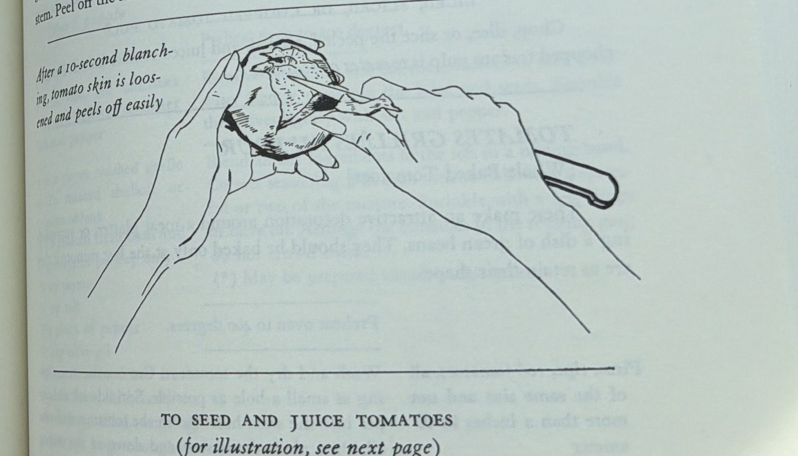
*Source page 505, "To Peel Tomatoes" — after a 10-second blanch, the skin is loosened and peels off easily.*

Cut the peeled tomatoes in half crosswise, not through the stem. Squeeze each half gently to extract the seeds and juices from the center, working over a bowl or strainer to catch the juice. *(The source adds one note that doesn't apply here: halves destined for a cold stuffing get their interiors sprinkled with salt and are inverted in a colander to draw out more juice — skip that for ratatouille.)*

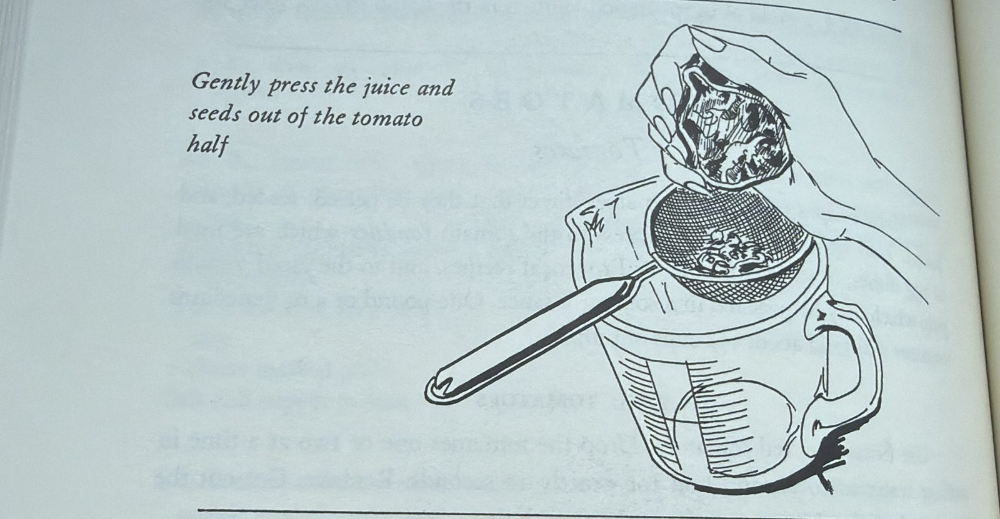
*Source page 506, "To Seed and Juice Tomatoes" — gently press the juice and seeds out of the tomato half.*

Slice the peeled, seeded, and juiced tomato halves into ⅜-inch strips — this is the pulp the recipe calls for. (Roughly chopped instead of sliced, the same peeled-seeded-juiced pulp is *tomates concassées*.)

**3. Sauté the eggplant and zucchini.**
One layer at a time, sauté the eggplant, then the zucchini, in hot olive oil for about a minute on each side, just to brown very lightly. Remove each batch to a side dish as it finishes. Add more oil between batches if the pan runs dry.

**4. Cook the onions and peppers. 10 minutes.**
In the same skillet, cook the onions and peppers slowly in olive oil for about 10 minutes, or until tender but not browned. Stir in the garlic and season to taste.

**5. Cook the tomato pulp.**
Lay the sliced tomato pulp over the onions and peppers. Season with salt and pepper. Cover the skillet and cook over low heat for 5 minutes, or until the tomatoes have begun to render their juice. Uncover, baste the tomatoes with their own juices, raise the heat, and boil for several minutes until the juice has almost entirely evaporated.

**6. Layer everything into the casserole.**
Place a third of the tomato mixture in the bottom of the fireproof casserole and sprinkle over it 1 tablespoon of parsley. Arrange half of the eggplant and zucchini on top, then half of the remaining tomatoes and parsley. Put in the rest of the eggplant and zucchini, finishing with the remaining tomatoes and parsley. (No extra seasoning goes in here — each component was already seasoned as it cooked, and the next step corrects the seasoning if needed.)

**7. Simmer, then finish uncovered. About 25 minutes.**
Cover the casserole and simmer over low heat for 10 minutes. Uncover, tip the casserole, and baste with the rendered juices. Correct the seasoning if necessary. Raise the heat slightly and cook uncovered for about 15 minutes more, basting several times, until the juices have evaporated and left behind just a spoonful or two of flavored olive oil. Watch your heat here — this is the one point in the recipe that can scorch if the pan runs dry and is left unattended, so keep basting and don't walk away.

*(*) May be set aside uncovered and reheated slowly at serving time, or served cold — the source notes it actually gains flavor overnight.*

#### C. Grocery Shopping List

**🛒 General grocery**

- 🛒 Eggplant — 1 lb
- 🛒 Zucchini — 1 lb
- 🛒 Olive oil — about ½ cup (6–7 Tbsp) total
- 🛒 Yellow onions — ½ lb
- 🛒 Green bell peppers — 2
- 🛒 Garlic — 2 cloves
- 🛒 Firm, ripe, red tomatoes — 1 lb (4–5 medium)
- 🛒 Parsley — 3 Tbsp minced, fresh
- 🛒 Salt and pepper

#### Nutrition *(estimated)*

| | Calories | Fat | Protein | Carbs | Fiber |
|---|---|---|---|---|---|
| **Whole dish** | ~1,200 | 93 g | 18 g | 94 g | 27 g |
| **Per serving** *(serves 6, the low end of the source's 6-to-8 range)* | ~200 | 15 g | 3 g | 16 g | 4.5 g |

**What a serving is:** a generous 1-cup side portion. Most of the fat and calories come from the olive oil, which stays in the dish as the "spoonful or two of flavored olive oil" the recipe finishes with — it's eaten, not drained off.

[↑ Table of Contents](#table-of-contents)

---

### 5.23 Greek Salad with Crumbled Goat Cheese

**❤️ Family favorite** — *Cody: "That is a great, great Mediterranean salad."*

Cody's own salad, dictated directly — not from a photographed page. Built to go alongside **[§7.59 Mediterranean Pork Tenderloin Platter](#759-mediterranean-pork-tenderloin-platter-vegeta-rubbed-sous-vide--seared)**, and dressed with **[§4.89 Cody's Greek Vinaigrette](#489-codys-greek-vinaigrette-lime--olive-oil)**.

> **Goat cheese, not feta — and Cody was emphatic about it.** He talked himself through it out loud and landed hard: *"crumbled goat cheese, not feta... don't use feta unless you absolutely have to."* Feta is the default in essentially every Greek salad ever published, so this is a deliberate departure, recorded as stated. **He also self-corrected from blue cheese to goat cheese mid-sentence** — blue cheese is not in this salad.

> **Green olives, not kalamata** — also as stated. Another quiet departure from the standard Greek salad, which almost always uses kalamatas.

> **No quantities were given.** Cody named the components without amounts, so the figures below are reasonable working proportions for four people rather than his numbers. Adjust freely — this is a salad, not a bake.

**Yield:** serves 4 as a side

**🟢 Easy** · **Prep ~15 min** · **Cook none** · **Start to finish ~15 min**

#### A. Ingredients

- 1 large head romaine lettuce, chopped
- ½ cup green olives *(not kalamata — see note above)*
- ½ red (purple) onion, sliced thin, raw
- 4 oz crumbled goat cheese *(not feta, not blue — see note above)*
- **[§4.89 Cody's Greek Vinaigrette](#489-codys-greek-vinaigrette-lime--olive-oil)** — about ¼ cup

#### B. Cooking Instructions

**1. Chop and dry the romaine.**
Wash and chop the romaine, then get it genuinely dry — a salad spinner or a towel. Wet leaves refuse to hold dressing; it slides off and pools in the bottom of the bowl.

**2. Slice the onion thin and raw.**
Thin is the point. Raw red onion sliced thick dominates every bite it's in; sliced thin it reads as a sharp accent instead. *If it's still too aggressive, soak the slices in cold water for 10 minutes and pat dry — that pulls the harsh edge without cooking it.*

**3. Assemble with the olives and goat cheese.**
Romaine, green olives, and onion in the bowl, then crumble the goat cheese over the top rather than tossing it through — it's soft enough that tossing turns it into a paste that coats everything.

**4. Dress it right before it goes to the table.**
Shake the vinaigrette again and add it just before serving. Romaine holds up better than most greens, but dressed early it still goes limp.

#### C. Grocery Shopping List

**🛒 General grocery**

- 🛒 Romaine lettuce — 1 large head
- 🛒 Green olives — ½ cup
- 🛒 Red (purple) onion — 1
- 🛒 Crumbled goat cheese — 4 oz
- 🛒 *Plus the [§4.89](#489-codys-greek-vinaigrette-lime--olive-oil) vinaigrette items — olive oil and limes*

#### Nutrition *(estimated)*

| | Calories | Fat | Protein | Carbs | Fiber |
|---|---|---|---|---|---|
| **Whole dish** | ~1,020 | 68 g | 28 g | 30 g | 8 g |
| **Per serving** *(serves 4)* | ~255 | 17 g | 7 g | 7.5 g | 2 g |

**What a serving is:** a full dinner-plate side salad — about 2 cups of dressed greens. *Built on the assumed quantities above rather than stated ones, and includes its share of the vinaigrette.*

[↑ Table of Contents](#table-of-contents)

---

### 5.24 Cranberry Sauce
> *Placeholder — details forthcoming.* Ingredients · Instructions · Grocery list all to be documented.

**🦃 Holiday side.** Per Cody: homemade, and easy — *"I think they just follow the package, which is good."* That reads as a package-back recipe (like the one on a bag of fresh/frozen cranberries) rather than one built from scratch measurements — flagged in Open Questions rather than assumed either way until the actual method is captured.

[↑ Table of Contents](#table-of-contents)

---

### 5.25 Heather's Mashed Potatoes

Transcribed from a handwritten recipe card — headed "From the Kitchen of: Joetta, To: Geviene." That's the card's own provenance; Cody calls the finished dish **Heather's Mashed Potatoes**, and that's the name it carries here. A make-ahead mashed potato casserole — potatoes mashed with milk and butter, then enriched with cream cheese and sour cream, topped with melted butter, and baked. Card's own note: **"This freezes well!!!"**

**Yield:** a big batch — 10 lb of potatoes splits across roughly two 9×13 casseroles; estimated to serve 12 to 16 as a side (not stated on the card — see Open Questions)

**🟢 Easy** · **Prep ~30 min** *(peeling and cutting 10 lb of potatoes)* · **Cook ~1 hr 25 min** *(~25 min boiling the potatoes, then an estimated 45–60 min bake at 300°F — not printed on the card, see Open Questions)* · **Start to finish ~1 hr 55 min** *(plus optional freeze-ahead — see the card's own note below)*

> ✅ **2026-09-07 second-pass QC against the card photo (rotated upright, cropped at full resolution): verified.** All seven ingredient lines (10 lb potatoes, 12 oz cream cheese, 2 cups sour cream, 2 tsp salt, 4 tsp onion salt, ½ tsp pepper, ½ cup butter), the three method lines, "Cook at 300°," the freezes-well note, the "Joetta" / "Geviene" header, and the three blank form fields all match. The card gives no quantities for the mashing milk and butter, no time, and no serving count — the nutrition block's "doubly estimated" wording stands. The boil time in Step 1 is now marked as cookbook gloss; nothing on the card gives one.

> ✅ **Verified line by line against the card photo (2026-09-06).** Every ingredient, quantity, and method line matches what's written; nothing on the card was missed and nothing here was invented. **All three of the card's preprinted fields at the bottom — "Oven Temp:", "Time:", and "Serves:" — were re-checked at full magnification and every one of them is blank.** The 300°F comes from the *body* of the handwritten method ("Cook at 300°"), not from the "Oven Temp:" field, which the writer left empty like the other two. So the three things this entry flags as absent really are absent from the card.

> ⚠️ **Two things the card leaves blank: serving count and bake time.** The only temperature anywhere on the card is the 300° written into the method line — no "Serves," no "Time," and no minutes for the bake itself. The estimate above is reasoned from the dish, not copied from the card: 10 lb of already-cooked mashed potatoes just needs to heat through and set, and 300°F is a low, gentle reheat temperature, so 45–60 minutes is a sensible range rather than a fast hot-oven bake. Confirm against how the family actually times it — flagged again below in Open Questions.

#### A. Ingredients

- 10 lb potatoes, peeled and cut for boiling
- Milk, for mashing — amount not specified on the card (see Open Questions)
- Butter, for mashing — amount not specified on the card (see Open Questions)
- 12 oz cream cheese, softened
- 2 cups sour cream
- 2 tsp salt
- 4 tsp onion salt
- ½ tsp pepper
- ½ cup butter, melted (for the top)

#### B. Cooking Instructions

**1. Peel, boil, and mash the potatoes with milk and butter.**
Peel and cut the 10 lb of potatoes into even chunks so they cook evenly. Boil in salted water until fork-tender — about 20–25 minutes *(cookbook gloss; the card says only "cooked & mashed")* — then drain well. Mash with milk and butter to your usual mashed-potato consistency — the card doesn't give exact amounts for either, so add them gradually and season as you go rather than following a fixed measure. *(See Open Questions.)*

**2. Mix in the cream cheese, sour cream, and seasonings.**
While the potatoes are still warm, stir in the softened cream cheese, sour cream, salt, onion salt, and pepper until smooth. Warm potatoes melt the cream cheese in evenly; cold potatoes will leave lumps. *(The card writes this step in shorthand — "Mix potatoes, cream cheese, s cream, s & p" — and doesn't name the onion salt again there. It's listed in the ingredients with nowhere else to go, so it belongs in this step with the rest of the seasoning.)*

**3. Spread into casserole dish(es).**
A batch this size — 10 lb of potatoes — runs to roughly two standard 9×13 casseroles rather than one. Split it across as many dishes as you need to keep the depth even, so it heats through consistently.

**4. Pour melted butter over the top.**
The ½ cup of melted butter goes over the surface just before baking — this is what browns and enriches the top as it bakes, rather than being stirred in.

**5. Bake at 300°F. Estimated 45–60 minutes.**
The card's own words are just *"Cook at 300°"* — a temperature and nothing else. Bake until it's hot all the way through and the butter on top is bubbling gently at the edges — check the center with a spoon or thermometer rather than trusting a fixed clock, since oven and dish depth both move this around. *(See Open Questions.)*

**6. Serve, or freeze ahead — the card's own note: "This freezes well!!!"**
Cool completely before wrapping tightly and freezing, whether you freeze it unbaked (assembled through step 4, ready to bake) or fully baked and reheated later. The card doesn't say which way the family actually does it, or whether it goes into the oven frozen or thawed first — if frozen, thaw fully in the fridge before baking as above; if you bake it straight from frozen, expect to add meaningful extra time and check the center carefully before serving.

#### C. Grocery Shopping List

**🛒 General grocery**

- 🛒 Potatoes — 10 lb
- 🛒 Milk — for mashing, amount to taste
- 🛒 Butter — for mashing, amount to taste, plus ½ cup melted for the top
- 🛒 Cream cheese — 12 oz
- 🛒 Sour cream — 2 cups
- 🛒 Salt — 2 tsp
- 🛒 Onion salt — 4 tsp
- 🛒 Pepper — ½ tsp

#### Nutrition *(estimated)*

| | Calories | Fat | Protein | Carbs | Fiber |
|---|---|---|---|---|---|
| **Whole dish** | ~7,500 | 400 g | 140 g | 830 g | 100 g |
| **Per serving** *(serves 14, midpoint of an estimated 12–16)* | ~535 | 29 g | 10 g | 59 g | 7 g |

**What a serving is:** a generous ¾ to 1 cup — one scoop from a 9×13 dish, since this batch splits across roughly two of them.

**Doubly estimated, and said so on purpose:** the card gives no milk or butter amount for the mashing step, so this assumes a standard ratio (about 1 cup milk and 6 Tbsp butter per 5 lb of potatoes) on top of an already-estimated serving count. This is a rich, holiday-table side, not a light one — cream cheese, sour cream, and two separate additions of butter all land on the fat number.

#### D. Open Questions

- **No serving count is given — re-confirmed 2026-09-06.** The card's preprinted "Serves:" field was checked again at full magnification and is blank. 12 to 16 is a reasoned estimate for 10 lb of potatoes split across two casseroles, not a printed figure.
- **No bake time is given — re-confirmed 2026-09-06.** The preprinted "Time:" field is blank too. The only temperature on the card is the 300° written into the method line itself, *"Cook at 300°"*; the preprinted "Oven Temp:" field is **also** left blank, so even that figure comes from the body of the recipe rather than from the form. *(Corrected: this entry previously cited it as "Oven Temp: 300°F," as though the field had been filled in.)* The 45–60 minute estimate above is reasoned from the dish (already-cooked potatoes at a low, gentle reheat temperature), not copied from the card.
- **Milk and butter amounts for the mashing step aren't specified — re-confirmed 2026-09-06.** The card's first line reads in full: *"10 lb potatoes, cooked & mashed w/ milk & butter"* — no amounts for either, assuming the cook already knows their own ratio. (The ½ cup of butter listed separately is the melted butter for the top, not for the mash.) Use your usual mashed-potato measure, or the standard cited above.
- **Frozen unbaked or frozen baked?** The card's "This freezes well!!!" doesn't say which stage freezes, or whether a frozen dish goes into the oven frozen or thawed. Worth confirming once the family's actual practice is known.

[↑ Table of Contents](#table-of-contents)

---

### 5.26 Pickled Okra

Transcribed from a printed page — ***Talk About Good!*** (p. 57), credited to **Mrs. Pauline L. Sibille, Lake Providence, La.** A hot-brine pickle, seasoned per pint rather than as one fixed batch.

**Yield:** the seasoning list is **per pint jar** — scale up by the number of jars you're packing.

**🟢 Easy** · **Prep ~20 min** *(washing the okra, sterilizing jars, measuring seasoning — separate from the 1 hr ice-water soak below)* · **Cook ~10 min** *(bringing the vinegar and water to a boil)* · **Slow cook 2–3 weeks** *(pickling in the sealed jar — the source's own stated time to pickle properly)* · **Start to finish 2–3 weeks** *(plus a 1 hr ice-water soak before packing)*

> ⚠️ **Read before canning shelf-stable.** The source says "seal" but never mentions processing the filled jars in a boiling water bath afterward, which is the standard extra step for shelf-stable home-canned pickles. As written, this is safest treated as a **refrigerator pickle** — sealed and kept cold — rather than assumed pantry-stable. ✅ 2026-09-07 per Cody (deferring to cookbook judgment): **these are refrigerator pickles.** Lid the jars, let them cool, and keep them in the refrigerator while they pickle and after; no canning step is described here and none should be assumed from the card.

#### A. Ingredients

- Small okra, enough to fill your jars
- Ice water, for soaking

**Per pint:**

- 1 tsp red pepper
- 1 tsp celery salt
- 1 tsp mustard seed
- 1 tsp dill seed
- 2 tsp salt (not iodized)
- 1 cup white vinegar
- ¼ cup water
- 3 cloves garlic

#### B. Cooking Instructions

**1. Wash the okra and soak. 1 hour.**
Use small okra. Wash it, then soak in ice water for one hour.

**2. Pack the jars.**
Pack the okra into sterilized pint jars.

**3. Boil the vinegar and water.**
Heat the water and vinegar together and bring to a boil.

**4. Season, then fill the jars.**
Put the seasoning (red pepper, celery salt, mustard seed, dill seed, salt, and garlic) over the okra in each jar. Pour the hot vinegar-and-water mixture into the jars.

**5. Seal, cool, and refrigerate.**
Lid the jars, let them cool to room temperature, and put them in the refrigerator. These are refrigerator pickles, not shelf-stable canned goods — they live in the fridge from here on.

**6. Let it pickle in the fridge. 2 to 3 weeks.**
This is how long it takes to pickle properly — don't rush into the jar early.

#### C. Grocery Shopping List

**🛒 General grocery**

- 🛒 Small okra
- 🛒 Red pepper — 1 tsp per pint
- 🛒 Celery salt — 1 tsp per pint
- 🛒 Mustard seed — 1 tsp per pint
- 🛒 Dill seed — 1 tsp per pint
- 🛒 Salt, not iodized — 2 tsp per pint
- 🛒 White vinegar — 1 cup per pint
- 🛒 Garlic — 3 cloves per pint

#### Nutrition *(estimated, per pint jar)*

| | Calories | Fat | Protein | Carbs | Fiber |
|---|---|---|---|---|---|
| **Whole pint** | ~160 | 0 g | 5 g | 18 g | 7 g |
| **Per serving** *(¼ cup, about 6 servings per pint)* | ~27 | 0 g | 1 g | 3 g | 1 g |

**What a serving is:** a small handful of pickled spears, about ¼ cup.

[↑ Table of Contents](#table-of-contents)

---

### 5.27 Smothered Eggplant, Onion & Bell Pepper

Transcribed from a printed page — ***Talk About Good!***, credited to **Mrs. P. J. Blanchet, Jr.** **This entry's own title wasn't captured in the photo** — the crop cuts off right above this recipe's heading, so the name above is a working description built from the ingredients rather than the source's actual title. Flagged rather than invented outright.

**Yield:** serves 6 to 8 *(as printed)*

**🟢 Easy** *(a covered, slow-fire braise — the source's own doneness cue is that the eggplant breaks apart when ready)* · **Prep ~25 min** *(estimated — peeling and soaking the eggplant 20 min, chopping onion and bell pepper)* · **Cook ~35 min** *(estimated — "cook, covered, on slow fire until tender," no time given)* · **Start to finish ~1 hr**

#### A. Ingredients

- Eggplant *(quantity not given by the source)*
- Onion *(quantity not given)*
- Bell pepper *(quantity not given)*
- Salt and pepper, to taste
- Hot grease, for cooking *(quantity not given)*

#### B. Cooking Instructions

**1. Peel and soak the eggplant. 20 minutes.**
Peel the eggplant and soak in salted water. Drain.

**2. Add everything to hot grease.**
Add the eggplant, onion, bell pepper, salt, and pepper to the hot grease.

**3. Cook covered on a slow fire until tender.**
The eggplant will break apart as it finishes — that's the doneness cue, not a problem.

#### C. Grocery Shopping List

**🛒 General grocery**

- 🛒 Eggplant
- 🛒 Onion
- 🛒 Bell pepper
- 🛒 Cooking fat/grease
- 🛒 Salt, pepper

#### Nutrition

Not calculable — the source gives no quantities at all for the eggplant, onion, bell pepper, or grease, only "add" with no amounts.

#### D. Open Questions

- **The recipe's own title is missing** — the photo starts mid-page. 🚫 2026-09-07 — Cody: not pursuing the top of the page; the entry stays as is, working title and all.
- **No quantities given for any ingredient** — Nutrition can't be estimated responsibly without at least a rough amount.

[↑ Table of Contents](#table-of-contents)

---

### 5.28 "Fake" Stuffed Eggplant

Transcribed from a printed page — ***Talk About Good!*** (p. 151), credited to **Wandy Frey** *(spelled slightly differently from "Wanda Frey," credited on [§7.63 Crab and Eggplant Dressing](#763-crab-and-eggplant-dressing) and its related entries — possibly the same contributor, transcribed exactly as each page prints it rather than normalized to match)*. Halved and scored rather than hollowed and filled — a quicker take on a stuffed eggplant, per the source's own line: *"This makes a fancier dish than reads the recipe."*

**Yield:** serves 2 or 20 *(as printed — scales by how many eggplant halves you make)*

**🟢 Easy** · **Prep ~15 min** *(cutting, scoring, buttering, and topping)* · **Cook ~35 min** *(30–45 min bake, per the source, depending on eggplant size)* · **Start to finish ~50 min**

#### A. Ingredients

- Small eggplants, halved *(quantity scales to however many you're serving)*
- Softened butter
- Salt and pepper
- Crushed oregano
- Freshly grated Romano cheese
- Seasoned bread crumbs

#### B. Cooking Instructions

**1. Halve the eggplant — don't peel.**
Cut small eggplants in half. Run a knife around the inside edges and score the pulp deeply in bite-size sections.

**2. Butter each half generously.**
With the cut side up, rub a generous amount of softened butter on each half.

**3. Season.**
Sprinkle lightly with salt, pepper, and crushed oregano.

**4. Top with cheese, then bread crumbs.**
Add the freshly grated Romano on top of the seasoning, then the seasoned bread crumbs.

**5. Bake. 30–45 minutes at 375°F.**
Time depends on the size of the eggplant.

#### C. Grocery Shopping List

**🛒 General grocery**

- 🛒 Small eggplants
- 🛒 Butter, softened
- 🛒 Dried oregano
- 🛒 Romano cheese, freshly grated
- 🛒 Seasoned bread crumbs
- 🛒 Salt, pepper

#### Nutrition *(estimated, per eggplant half)*

| | Calories | Fat | Protein | Carbs | Fiber |
|---|---|---|---|---|---|
| **Per half** *(1 small eggplant half)* | ~190 | 12 g | 6 g | 17 g | 5 g |

**What a serving is:** one eggplant half — the recipe scales directly with however many you make, per the source's own "serves 2 or 20."

[↑ Table of Contents](#table-of-contents)

---

### 5.29 Smothered Mustard Greens

Transcribed from a printed page — ***Talk About Good!***, credited to **Mrs. Paul J. Blanchet, Jr.** Boiled greens finished in a quick roux with bacon and bell pepper.

**Yield:** serves 4 to 6 *(as printed)*

**🟡 Medium** *(a real, if quick, roux — flour and grease sautéed with onion for 3–4 minutes before the greens go in)* · **Prep ~30 min** *(cleaning and soaking the greens 15 min, chopping onion and bell pepper, prepping the bacon)* · **Cook ~1 hr 20 min** *(15 min boiling the greens, a few minutes on the roux, then a 1 hr covered simmer)* · **Start to finish ~1 hr 50 min**

**Techniques used:** related to [T1 How to Make a Roux](#t1-how-to-make-a-roux) *(a quick, light version — a few minutes, not the dark Cajun target)*

#### A. Ingredients

- 1 gal water
- 2 bunches mustard greens
- Salt and pepper, to taste
- 4 slices bacon
- 1 small bell pepper
- 1 medium onion, chopped
- ½ cup grease
- ¼ cup flour

#### B. Cooking Instructions

**1. Clean the greens. 15 minutes.**
Fill a large container with warm salted water and soak the leaves for 15 minutes, then clean each leaf individually. Remove any heavy stems now, if desired.

**2. Boil the greens. 15 minutes.**
While the greens soak, get the gallon of water heating to a boil. Submerge the greens and boil for 15 minutes, then drain in a colander.

**3. Make a quick roux. 3–4 minutes.**
With the ¼ cup flour, ½ cup grease, and the chopped onion. Bacon may be added along with it. Sauté.

**4. Add the drained greens, bell pepper, salt, and pepper.**

**5. Cook covered, slowly. About 1 hour.**
Add a little water if it needs it along the way.

#### C. Grocery Shopping List

**🛒 General grocery**

- 🛒 Mustard greens — 2 bunches
- 🛒 Bacon — 4 slices
- 🛒 Bell pepper — 1 small
- 🛒 Onion — 1 medium
- 🛒 Cooking grease/fat — ½ cup
- 🛒 All-purpose flour — ¼ cup
- 🛒 Salt, pepper

#### Nutrition *(estimated)*

| | Calories | Fat | Protein | Carbs | Fiber |
|---|---|---|---|---|---|
| **Whole dish** | ~1,385 | 111 g | 27 g | 65 g | 22 g |
| **Per serving** *(serves 5, midpoint of the printed 4–6)* | ~277 | 22 g | 5 g | 13 g | 4 g |

**What a serving is:** a generous side portion, about ¾ to 1 cup.

[↑ Table of Contents](#table-of-contents)

---

### 5.30 Grandma's Mustard Greens & Turnips

Transcribed from a printed page — ***Talk About Good!***, credited to **Mrs. Felix Bernard**. No roux — greens and turnips boiled separately, then finished together in oil.

**Yield:** not stated; estimated to serve 6, flagged below.

**🟢 Easy** · **Prep ~15 min** *(cubing the turnips into fairly large pieces, chopping the onion)* · **Cook ~35 min** *(boiling the greens and turnips, then finishing together)* · **Start to finish ~50 min**

#### A. Ingredients

- 2 bunches mustard greens
- 4 medium turnips, cubed into fairly large pieces
- 1 medium onion, chopped
- 2 Tbsp cooking oil
- Salt, pepper, and sugar, to taste

#### B. Cooking Instructions

**1. Boil the mustard greens until tender, then drain.**

**2. Boil the turnips separately, with sugar and salt, until tender.**
Cube the turnips into fairly large pieces first — they'll mash down as they cook, so starting big keeps them from disappearing entirely.

**3. Combine and finish.**
Put the cooking oil, mustard greens, turnips, pepper, onion, and salt into a pot and cook until done, stirring frequently.

#### C. Grocery Shopping List

**🛒 General grocery**

- 🛒 Mustard greens — 2 bunches
- 🛒 Turnips — 4 medium
- 🛒 Onion — 1 medium
- 🛒 Cooking oil — 2 Tbsp
- 🛒 Sugar, salt, pepper

#### Nutrition *(estimated)*

| | Calories | Fat | Protein | Carbs | Fiber |
|---|---|---|---|---|---|
| **Whole dish** | ~620 | 28 g | 21 g | 75 g | 27 g |
| **Per serving** *(estimated 6 servings)* | ~105 | 5 g | 4 g | 13 g | 5 g |

**What a serving is:** a generous side portion, about ¾ to 1 cup. *A genuinely light, high-fiber side — no roux and only 2 Tbsp of oil in the whole pot.*

[↑ Table of Contents](#table-of-contents)

---

### 5.31 Scalloped Oyster Dressing

Transcribed from a printed page — ***Talk About Good!*** (p. 265), credited to **Mrs. F. M. McGinn** — the same contributor as [§8.29 Mrs. McGinn's Seafood Gumbo](#829-mrs-mcginns-seafood-gumbo) — who calls it *"our favorite with turkey, goose and duck when dressing is not served."* A layered cracker-and-oyster casserole, distinct from a bread- or cornbread-based dressing. *(This entry was credited to Mrs. Frank C. Rogers until the 2026-09-07 re-verification; Rogers is the contributor of the untitled rice–corn bread dressing cut off above this one on the page, and the "20 years in Lafayette" line this entry used to quote belongs to that recipe, not this one.)*

**Yield:** not stated; estimated to serve 8, flagged below.

**🦃 Holiday side.** **🟢 Easy** · **Prep ~20 min** *(layering)* · **Cook ~1 hr** *(bake at 325°F, until it reaches serving consistency)* · **Start to finish ~1 hr 20 min**

> **Per the source, in her own words:** *"Remember, it must have plenty of black pepper and butter."*

#### A. Ingredients

- Crackers, broken *(quantity not given by the source)*
- 2 pt oysters, drained
- Celery hearts, chopped *(quantity not given)*
- Parsley, chopped *(quantity not given)*
- Salt, red and black pepper
- Oyster juice
- Milk
- Cream
- A few drops Worcestershire sauce *(named in the instructions, not the source's own ingredient list)*
- Butter, for dotting liberally *(named in the instructions, not the source's own ingredient list)*
- Paprika, for the top *(named in the instructions, not the source's own ingredient list)*

#### B. Cooking Instructions

**1. Layer the bottom of the dish.**
In a large greased oblong baking dish, place a thick layer of broken crackers. Arrange the drained raw oysters close together on top.

**2. Cover the oysters.**
Cover each oyster with chopped celery hearts and chopped parsley. Salt and pepper all over.

**3. Add a second cracker layer.**
Another layer of broken crackers over the top.

**4. Mix the liquid and pour it in — but don't cover the top layer of crackers.**
Mix the milk, cream, oyster juice, a few drops of Worcestershire sauce, and black pepper together, then pour it into the dish, stopping short of the top cracker layer.

**5. Dot with butter and sprinkle with paprika.**

**6. Bake, uncovered. About 1 hour at 325°F, or until it's at serving consistency.**

#### C. Grocery Shopping List

**🛒 General grocery**

- 🛒 Crackers (saltines or similar)
- 🛒 Oysters — 2 pt
- 🛒 Celery
- 🛒 Fresh parsley
- 🛒 Worcestershire sauce
- 🛒 Milk
- 🛒 Cream
- 🛒 Butter
- 🛒 Paprika
- 🛒 Salt, red and black pepper

#### Nutrition *(heavily estimated — the source gives a quantity only for the oysters; crackers, milk, cream, celery, and parsley are all assumed)*

| | Calories | Fat | Protein | Carbs | Fiber |
|---|---|---|---|---|---|
| **Whole dish** | ~2,860 | 187 g | 92 g | 199 g | 5 g |
| **Per serving** *(estimated 8 servings)* | ~360 | 23 g | 12 g | 25 g | 1 g |

**What a serving is:** a generous scoop, about 1 cup.

#### D. Open Questions

- ✅ 2026-09-07 per Cody: **no** — the card has no amounts beyond the 2 pt of oysters, so there is nothing more to confirm. The assumed quantities and serving count stay, and the Nutrition block stays labeled as the heavy estimate it is.

✅ *Re-verified against the p. 265 photo, 2026-09-07:* contributor corrected from Mrs. Frank C. Rogers to the printed **Mrs. F. M. McGinn**; the Worcestershire and black pepper now go into the milk-cream-oyster-juice mixture, as printed, rather than being sprinkled over the second cracker layer; Worcestershire and butter marked as instruction-only ingredients (the printed list has neither). Every printed quantity — there is only one, the 2 pt of oysters — and the 325°F / one-hour bake match.

[↑ Table of Contents](#table-of-contents)

---

### 5.32 Oyster Dressing (For 10 to 12 lb. Turkey)

Transcribed from a printed page — ***Talk About Good!*** (p. 266), credited to **Mrs. B. H. DeHart**. A stale-French-bread dressing built around oysters cooked just until the edges curl, sized to stuff or accompany a 10–12 lb turkey.

**Yield:** enough to stuff or accompany a 10–12 lb turkey; if baked separately, makes 2 large casseroles

**🦃 Holiday side.** **🟢 Easy** · **Prep ~30 min** *(draining the oysters, soaking and squeezing the bread, chopping the aromatics)* · **Cook ~55 min** *(curling the oysters, sautéing the aromatics, 10 min stovetop, then a 30 min bake)* · **Start to finish ~1 hr 25 min**

> ⚠️ **Food-safety note, same as [§5.12 Southern Cornbread Stuffing](#512-southern-cornbread-stuffing).** If this goes inside the bird rather than into casseroles, the stuffing itself has to reach 165°F at its center — not just the meat around it — before it's safe. The source's own preference is to bake it separately in casseroles, which sidesteps the question entirely.

#### A. Ingredients

- 3 pt raw oysters
- 1 loaf stale French bread
- 1 bunch shallots, chopped
- 1 medium onion, chopped
- 3 or 4 toes garlic
- 2 Tbsp chopped parsley
- 1 sprig thyme
- 2 eggs
- 3 Tbsp butter or margarine, divided
- Salt and pepper, to taste

#### B. Cooking Instructions

**1. Drain the oysters, saving the liquid.**
Drain in a colander, letting the oyster liquid fall into a bowl.

**2. Curl the oysters. A few minutes, low heat.**
Place the drained oysters in a heavy iron skillet on low fire until the ends of the oysters start to curl. Drain again, letting the warm liquid mix with the liquid already in the bowl. Move the oysters to a large wooden (or salad) bowl.

**3. Soak the bread in the oyster liquid.**
Break the stale French bread into large hunks and let it soak in the oyster liquid until soft. Remove the bread, squeeze out the liquid, and add it to the bowl with the oysters. Chop both into very small pieces.

**4. Sauté the shallots, onion, and garlic. Just until soft.**
In 1 tablespoon of the butter.

**5. Combine everything.**
Add the sautéed aromatics to the oysters and bread. Add the parsley, thyme, eggs, salt, and pepper, and mix well.

**6. Cook in the skillet. About 10 minutes.**
Put the mixed dressing in the iron skillet with the remaining 2 tablespoons of butter and heat on low fire, stirring constantly.

**7. Stuff or bake.**
Stuff into the fowl, or bake covered in 2 large casseroles at 350°F for 30 minutes.

> **Make-ahead, per the source:** this dressing is best prepared the night before and refrigerated — **not stuffed into the bird ahead of time** — to let the flavor develop.

#### C. Grocery Shopping List

**🛒 General grocery**

- 🛒 Raw oysters — 3 pt
- 🛒 Stale French bread — 1 loaf
- 🛒 Shallots — 1 bunch
- 🛒 Onion — 1 medium
- 🛒 Garlic — 3 or 4 cloves
- 🛒 Fresh parsley — 2 Tbsp
- 🛒 Fresh thyme — 1 sprig
- 🛒 Eggs — 2
- 🛒 Butter or margarine — 3 Tbsp
- 🛒 Salt, pepper

#### Nutrition *(estimated)*

| | Calories | Fat | Protein | Carbs | Fiber |
|---|---|---|---|---|---|
| **Whole batch** | ~2,680 | 78 g | 153 g | 306 g | 12 g |
| **Per serving** *(estimated 10 servings)* | ~270 | 8 g | 15 g | 31 g | 1 g |

**What a serving is:** a generous scoop, about 1 cup, whether stuffed in the bird or baked separately.

[↑ Table of Contents](#table-of-contents)

---

### 5.33 Quick and Smoky Baked Beans

Transcribed from **Steven Raichlen** (p. 437), from the *Rice, Beans, and Beyond* chapter — **a different Raichlen book from the [§7.50](#750-asian-flavor-baby-back-ribs)/[§7.67](#767-grilled-quail-with-pear-and-pine-nut-salad) *How to Grill***. This one tags each recipe by country of origin (this one's **U.S.A.**) and carries *Special Equipment* and *Advance Preparation* headers that *How to Grill* doesn't use. **Most likely *The Barbecue! Bible* or *Planet Barbecue* — given as an educated guess rather than asserted**, same practice this cookbook used for [§13 Meathead Cookbook](#13-meathead-cookbook): the title gets stated once an actual title page confirms it, not before.

> **Per the source:** *"Not everyone has the time to make baked beans from scratch. This recipe starts with canned beans, but a quick smoke on the grill produces such rich flavor, you'd swear the beans had been cooked for hours. For the best results, add a couple of cups of diced barbecued pork, ham, or brisket and/or meat drippings left over from a previous cookout."*

**Yield:** serves 6 to 8 *(as printed)*

> **You'll need:** 2 cups wood chips or chunks, soaked 1 hour in cold water to cover, then drained.

**🟢 Easy** · **Prep ~15 min** · **Cook ~10 min** *(bacon and aromatics on the stove)* · **Slow cook 30 min** *(smoke-roasting on the grill, covered — same treatment as [§T15 Barbecue Cabbage](#t15-how-to-barbecue-cabbage) and [§7.50](#750-asian-flavor-baby-back-ribs))* · **Start to finish ~55 min** *(plus the 1 hr wood chip soak, which can run while you prep)*

**Techniques used:** indirect grilling · [§T30 How to Use Fat](#t30-how-to-use-fat) *(rendering bacon, and saving the fat)*

> **Why the acid here doesn't ruin the beans — worth knowing.** This recipe dumps ketchup, cider vinegar, molasses, and mustard straight onto the beans, which looks like it breaks [§T31 How to Use Acid](#t31-how-to-use-acid)'s firm-keeping rule. It doesn't, because **the beans are canned — already cooked completely soft before any acid touches them.** That's exactly the loophole the rule allows. Try this same ingredient list with dried beans that haven't been fully cooked first and they'd stay firm no matter how long you smoked them. *(Compare [§7.16 Red Beans & Rice](#716-red-beans--rice), which gets to the same place the long way — 2½ hours of simmering before the tomato goes in.)*

#### A. Ingredients

- 4 thick-cut slices bacon (about 4 oz), cut into ¼-inch slivers
- 1 large onion, finely chopped
- 3 cloves garlic, minced
- 1 Tbsp grated peeled fresh ginger
- 2 cans (15 oz each) Great Northern or kidney beans, rinsed and drained
- ¼ cup firmly packed dark brown sugar
- ¼ cup molasses
- ¼ cup barbecue sauce *(any of [§4.34](#434-basic-barbecue-mop-sauce)–[§4.37](#437-white-barbecue-sauce) work)*
- ¼ cup ketchup
- 2 Tbsp Worcestershire sauce
- 1 Tbsp dry mustard
- 1 Tbsp prepared mustard
- 1 Tbsp cider vinegar
- 1 to 2 cups diced smoked or barbecued pork, ham, or brisket *(optional — the source strongly recommends it)*
- 1 Tbsp barbecued meat drippings *(optional)*
- Salt and freshly ground black pepper

#### B. Cooking Instructions

**1. Render the bacon. About 5 minutes.**
Place the bacon in a large, heavy pot and cook over medium heat until lightly browned. Discard all but 2 Tbsp of the bacon fat.

**2. Cook the onion, garlic, and ginger. About 5 minutes.**
Add them to the pot and cook until the onion is golden brown. Remove the pot from the heat.

**3. Stir in everything else.**
Add the beans, brown sugar, molasses, barbecue sauce, ketchup, Worcestershire, both mustards, cider vinegar, and the meat and drippings if using. Transfer to a baking dish — an aluminum-foil turkey pan works well.

**4. Set up the grill for indirect grilling.**
No drip pan needed for this one. *For gas:* put all the wood chips in the smoker box and preheat to high; when smoke appears, drop to medium. *For charcoal:* preheat to medium.

**5. Smoke-roast. About 30 minutes.**
If using charcoal, toss all the wood chips on the coals now. Set the pan in the center of the hot grate, away from the heat, and cover the grill. Cook until thick and richly flavored.

**6. Season and serve at once.**
Salt and pepper to taste.

> **Per the source:** these can also be made in the oven — bake 30 minutes at 350°F. *(You lose the smoke, which is the entire point of the recipe, so treat this as the fallback rather than the plan.)*

#### C. Grocery Shopping List

**🛒 General grocery**

- 🛒 Thick-cut bacon — 4 slices (about 4 oz)
- 🛒 Onion — 1 large
- 🛒 Garlic — 3 cloves
- 🛒 Fresh ginger — for 1 Tbsp grated
- 🛒 Canned Great Northern or kidney beans — 2 (15 oz) cans
- 🛒 Dark brown sugar — ¼ cup
- 🛒 Molasses — ¼ cup
- 🛒 Barbecue sauce — ¼ cup
- 🛒 Ketchup — ¼ cup
- 🛒 Worcestershire sauce — 2 Tbsp
- 🛒 Dry mustard — 1 Tbsp
- 🛒 Prepared mustard — 1 Tbsp
- 🛒 Cider vinegar — 1 Tbsp
- 🛒 *Optional but recommended:* leftover barbecued pork, ham, or brisket — 1 to 2 cups diced, plus any saved drippings
- 🛒 Wood chips or chunks — 2 cups

#### Nutrition *(estimated, without the optional meat)*

| | Calories | Fat | Protein | Carbs | Fiber |
|---|---|---|---|---|---|
| **Whole dish** | ~2,110 | 42 g | 66 g | 380 g | 42 g |
| **Per serving** *(serves 7, midpoint of the printed 6–8)* | ~300 | 6 g | 9 g | 54 g | 6 g |

**What a serving is:** a generous scoop alongside barbecue, about ¾ cup. *Sugar and molasses carry most of the calories here — this is a sweet barbecue side, not a lean one. Adding the optional 2 cups of diced barbecued pork roughly doubles the protein and adds ~700 calories to the pot.*

[↑ Table of Contents](#table-of-contents)

---

### 5.34 Brazilian Black Beans with Bacon (Tutu Mineira)

Transcribed from the same **Steven Raichlen** book as [§5.33](#533-quick-and-smoky-baked-beans) (p. 438), tagged **Brazil** and filed by the source under *On the Side*. Half the beans get mashed right in the skillet and thickened with manioc flour — no grill involved at all, despite the book it comes from.

> **Per the source:** *"Here's the Brazilian version of baked beans. Actually, it's only one of the versions. Brazilians love beans so much they have dozens of dishes to choose from. Tutu comes from Minas Gerais (a mining state in northwest Brazil), where it's made with black beans and bacon. I've lightened up the recipe a little — the original is the sort of fare you want to eat before engaging in strenuous physical labor."*

**Yield:** serves 8 *(as printed)*

**🟢 Easy** · **Prep ~15 min** · **Cook ~15 min** · **Start to finish ~30 min**

**Techniques used:** [§T30 How to Use Fat](#t30-how-to-use-fat) *(rendering bacon)* · [§T19 How to Boil an Egg](#t19-how-to-boil-an-egg-canal-houses-timing-guide) *(for the hard-cooked eggs on top)*

#### A. Ingredients

- 4 slices bacon (about 4 oz)
- 1 medium onion, finely chopped
- 4 cloves garlic, minced
- ¼ cup chopped fresh flat-leaf parsley, divided
- 1 bay leaf
- 4 cups cooked black beans *(if using canned, you'll need two 15 oz cans)*
- ½ to 1 cup homemade chicken stock, canned low-sodium chicken broth, or liquid reserved from cooking the beans — *see [§T13 Basic Stock Formula](#t13-basic-stock-formula-fowl-beef-pork--seafood)*
- ¼ tsp Portuguese hot sauce, or your favorite hot sauce, or more to taste
- 3 to 4 Tbsp manioc flour *(see the note below)*
- Salt and freshly ground black pepper
- 2 hard-cooked eggs, coarsely chopped

#### B. Cooking Instructions

**1. Render the bacon. About 5 minutes.**
Cook in a large skillet over medium heat until lightly browned. Pour off all but 2 Tbsp of the fat.

**2. Cook the aromatics. About 4 minutes.**
Add the onion, garlic, 2 Tbsp of the parsley, and the bay leaf, and cook until the onion is golden brown.

**3. Add the beans, ½ cup of the stock, and the hot sauce. Simmer 5 minutes.**
Start with ½ cup of stock — the rest is held back for thinning in Step 5. Then discard the bay leaf.

**4. Mash half the beans right in the skillet.**
Use a pestle, a potato masher, or the back of a wooden spoon. This is what gives the dish its body.

**5. Stir in the manioc flour and simmer uncovered. About 3 minutes.**
Start with 3 Tbsp. Simmer until nice and thick. If it's too thick, add a little more bean cooking liquid; if too thin, add the last tablespoon of manioc flour.

**6. Season, top, and serve at once.**
Taste and adjust salt, pepper, and hot sauce. Sprinkle with the chopped eggs and the remaining 2 Tbsp of parsley.

> **Substitution, per the source:** if manioc flour isn't available, use toasted bread crumbs instead.

#### C. Grocery Shopping List

**🏪 Specific store — Latin/Brazilian market**

- 🏪 Manioc flour (cassava flour / *farinha de mandioca*) — 3 to 4 Tbsp *(or substitute toasted bread crumbs)*
- 🏪 Portuguese hot sauce — *or use any hot sauce you like*

**🛒 General grocery**

- 🛒 Bacon — 4 slices (about 4 oz)
- 🛒 Onion — 1 medium
- 🛒 Garlic — 4 cloves
- 🛒 Fresh flat-leaf parsley — ¼ cup chopped
- 🛒 Bay leaf — 1
- 🛒 Cooked or canned black beans — 4 cups, or two 15 oz cans
- 🛒 Chicken stock or broth — ½ to 1 cup
- 🛒 Eggs — 2, hard-cooked
- 🛒 Salt, black pepper

#### Nutrition *(estimated)*

| | Calories | Fat | Protein | Carbs | Fiber |
|---|---|---|---|---|---|
| **Whole dish** | ~1,610 | 52 g | 89 g | 200 g | 48 g |
| **Per serving** *(serves 8, as printed)* | ~200 | 6.5 g | 11 g | 25 g | 6 g |

**What a serving is:** a scoop alongside a Brazilian barbecue main, about ½ to ¾ cup. *A genuinely high-fiber, high-protein side — the beans do all the work and only 2 Tbsp of bacon fat stays in the pan.*

[↑ Table of Contents](#table-of-contents)

---

### 5.35 Cole Slaw

Transcribed from Cody's own recipe/grocery-planning spreadsheet. A quick mayo-based slaw finished with Tony's — **a different dish from [§5.13 North Carolina Coleslaw](#513-north-carolina-coleslaw)**, which is vinegar-based with no mayonnaise at all. Both are kept; this is the everyday weeknight version, §5.13 is the Carolina barbecue-specific one.

**🟢 Easy** · **Prep ~10 min** · **Cook none** · **Start to finish ~40 min to 1 hr 10 min** *(30–60 min chill)*

> ✅ 2026-09-07 per Cody ("use your judgment on mayo, and Tony's until salty enough") — **cookbook judgment on the amounts.** The card says "to taste" for both. The mayo figure below is the standard creamy-slaw ratio — **½ cup per 14-oz bag** (Food Network Kitchen, *Easy Creamy Slaw*, https://www.foodnetwork.com/recipes/food-network-kitchen/easy-creamy-slaw-5482553; The Country Cook's Southern slaw runs lighter, ½ cup for two bags, https://www.thecountrycook.net/southern-coleslaw/). Tony's is Cody's rule — *until salty enough* — with a starting point and an expected landing zone from a Creole slaw that uses it (https://www.food.com/recipe/kickin-coleslaw-312164).

#### A. Ingredients

- 1 bag (14 oz, about 7 cups) cabbage slaw mix
- ½ cup mayonnaise *(cookbook judgment — start at ⅓ cup, go to ⅔ if you like it wet)*
- About 1 Tbsp fresh lemon juice
- Tony's (Cajun seasoning) — **1 tsp to start, then ¼ tsp at a time until salty enough**; expect to land at 1½–2 tsp *(starting amount is cookbook judgment; "until salty enough" is Cody's)*
- Optional: 1 tsp sugar *(not on the card; most Southern slaws have it)*

*A whole head of cabbage (~2 lb) is about two bags — double everything.*

#### B. Cooking Instructions

**1. Mix the dressing, then toss.**
Stir the mayonnaise, lemon juice, 1 tsp Tony's, and the sugar if using together in the bottom of a big bowl, then add the slaw mix and toss until every shred is coated. Dressing first keeps the mayo from clumping in one corner of the cabbage.

**2. Season with Tony's until it's salty enough.**
Taste. Add Tony's ¼ teaspoon at a time and toss again until it reads seasoned — most batches land between 1½ and 2 teaspoons. Tony's is salty, so don't add plain salt.

**3. Refrigerate 30–60 minutes, then toss again and serve.**
Cover and chill at least 30 minutes so the cabbage softens slightly and takes on the dressing. It weeps as it sits — toss it once more right before it goes on the table. Best the same day; by the next it's wet.

#### C. Grocery Shopping List

**🛒 General grocery**

- 🛒 Cabbage slaw mix — 1 bag (14 oz)
- 🛒 Mayonnaise — ½ cup
- 🛒 Lemon — for about 1 Tbsp juice
- 🛒 Tony's Cajun seasoning — about 2 tsp
- 🛒 Sugar — 1 tsp *(optional)*

#### Nutrition *(estimated)*

| | Calories | Fat | Protein | Carbs | Fiber |
|---|---|---|---|---|---|
| **Whole dish** | ~830 | 81 g | 5 g | 24 g | 9 g |
| **Per serving** *(serves 4)* | ~205 | 20 g | 1 g | 6 g | 2 g |

**What a serving is:** about ¾ to 1 cup — a normal side portion. Nearly all of the calories are the ½ cup of mayonnaise (~720); at ⅓ cup the per-serving figure drops to about 150.

#### D. Open Questions

- ✅ 2026-09-07 per Cody ("use your judgment on mayo; Tony's until salty enough") — **½ cup mayo per bag, Tony's from 1 tsp up to salty enough (expect 1½–2 tsp).** Cookbook judgment on the mayo and the Tony's starting point; sources in the note above. Nutrition recomputed on ½ cup.
- ✅ 2026-09-07 — **Refrigeration time:** 30–60 minutes, cookbook judgment; the card only says "refrigerate."

[↑ Table of Contents](#table-of-contents)

---

### 5.36 Lemon Green Beans

Transcribed from Cody's own recipe/grocery-planning spreadsheet. Green beans blanched until tender and tossed with olive oil, salt, and lemon juice, finished with lemon zest.

**👍 Tried and liked** — *Cody: "Yummie."*

**🟢 Easy** · **Prep ~10 min** · **Cook ~10 min** · **Start to finish ~20 min**

#### A. Ingredients

- 1 lemon
- 1 lb green beans, trimmed
- 1½ Tbsp olive oil
- 1¼ tsp salt

#### B. Cooking Instructions

**1. Zest and juice the lemon.**
Grate the zest of the lemon into one bowl, then squeeze the whole lemon for its juice into a separate bowl.

**2. Boil the beans until tender. About 10 minutes.**
Cook the beans in a saucepan of boiling salted water until tender, about 10 minutes. Drain and return them to the pan, off the heat.

**3. Toss and serve.**
Toss the beans with the olive oil, 1¼ teaspoons salt, and the lemon juice. Serve sprinkled with the lemon zest.

#### C. Grocery Shopping List

**🛒 General grocery**

- 🛒 Lemon — 1
- 🛒 Green beans — 1 lb, trimmed
- 🛒 Olive oil — 1½ Tbsp
- 🛒 Salt

#### Nutrition *(estimated)*

| | Calories | Fat | Protein | Carbs | Fiber |
|---|---|---|---|---|---|
| **Whole dish** | ~320 | 20 g | 4 g | 25 g | 10 g |
| **Per serving** *(serves 4)* | ~80 | 5 g | 1 g | 6 g | 2.5 g |

**What a serving is:** about ¾ cup — a normal side portion.

[↑ Table of Contents](#table-of-contents)

---

### 5.37 Mamma's Spinach

Transcribed from Cody's own recipe/grocery-planning spreadsheet. Fresh spinach wilted quickly in olive oil and butter with browned garlic, brightened with lemon and salt.

**❤️ Family favorite** — *Cody: "Favorite."* Cody's own note on the card: **"easy."**

**🟢 Easy** · **Prep ~5 min** · **Cook ~8 min** · **Start to finish ~15 min**

#### A. Ingredients

- 1 large bag fresh spinach
- 3 cloves garlic, chopped
- ½ lemon
- 1 tsp butter
- 1 tsp olive oil

#### B. Cooking Instructions

**1. Heat the oil and butter.**
Put a very small amount of olive oil and butter in a pan over medium heat.

**2. Brown the garlic.**
Add the chopped garlic and brown it.

**3. Wilt the spinach. Don't overcook it.**
Add the entire bag of spinach to the pan. Cook just until wilted — pull it before it overcooks and turns to mush.

**4. Finish with lemon and salt.**
Squeeze the half lemon over the spinach. **Salt it** — per Cody's own note, the combination of lemon juice and salt is the key to this dish.

#### C. Grocery Shopping List

**🛒 General grocery**

- 🛒 Fresh spinach — 1 large bag
- 🛒 Garlic — 3 cloves
- 🛒 Lemon — ½
- 🛒 Butter — 1 tsp
- 🛒 Olive oil — 1 tsp
- 🛒 Salt

#### Nutrition *(estimated)*

| | Calories | Fat | Protein | Carbs | Fiber |
|---|---|---|---|---|---|
| **Whole dish** | ~150 | 9 g | 6 g | 12 g | 6 g |
| **Per serving** *(serves 2 to 3)* | ~60 | 3.5 g | 2.5 g | 5 g | 2.5 g |

**What a serving is:** about 1 cup — a spinach bag cooks down substantially, so this is a modest side for 2 to 3.

#### D. Open Questions

- **"Mamma"** isn't identified further on the card — worth confirming whose recipe this is, for the record.
- **No salt quantity given** — "SALT IT!" is emphatic but not measured; season to taste.

[↑ Table of Contents](#table-of-contents)

---

### 5.38 Roasted Veggies

Transcribed from Cody's own recipe/grocery-planning spreadsheet — a loose formula rather than a fixed recipe. **The card itself calls the amount "wing it,"** and the card's method is exactly as short as this: whatever vegetables are on hand, olive oil, Tony's, a cookie sheet, and the oven. **A second card ("Asparagus") repeats the same "Veggies for Roasting / wing it" header with no further detail visible in the photo** — read as asparagus being one vegetable this formula works well on, not a separate recipe; see Open Questions.

> ✅ **2026-09-08 — Cody's actual practice is now on top of the card, and it fills in the two things the card never said.** The card is still the recipe and it's still "wing it," but he doesn't just tip vegetables onto a bare sheet pan: **he sets an elevated rack on the sheet so air gets underneath**, adds **sprigs of rosemary**, and roasts at **400°F, which is the number from *Salt, Fat, Acid, Heat***. And he's honest about how they come out: **firm — because he pulls them before they burn.** The one thing he's still turning over is whether a slightly lower oven would soften them; that's an open question below, not a change to the recipe.
>
> **Where each piece comes from, so the provenance is clear:** the vegetables, olive oil, Tony's, and the cookie sheet are **the card**. The **elevated rack**, the **rosemary**, and **pulling them early** are **Cody's**. The **400°F** is ***Salt, Fat, Acid, Heat*** — the same source behind [§T29 How to Salt](#t29-how-to-salt)–[§T32 How to Use Heat](#t32-how-to-use-heat), whose own heat table puts roasting at 350–450°F ([§T32](#t32-how-to-use-heat)), so 400°F sits right in the middle of it.

**🟢 Easy** · **Prep ~10 min** · **Cook ~20–25 min** *(at 400°F, and pull them when they look right rather than when the timer says so)* · **Start to finish ~35 min**

#### A. Ingredients

- Vegetables for roasting — **wing it**. Asparagus is called out by name on a second card as one that works well this way.
- Olive oil
- Tony's Cajun seasoning
- **Fresh rosemary** — a few sprigs *(Cody's addition, not on the card)*

#### B. Cooking Instructions

**1. Heat the oven to 400°F, and set an elevated rack on the sheet pan.**
**400°F is *Salt, Fat, Acid, Heat*'s number**, and it's the temperature Cody roasts at. **Then the part that actually changes how these come out: put a rack — a cooling rack, a grid, any elevated grate that fits — down on the cookie sheet, and roast on top of that instead of directly on the pan.** ✅ *Cody's own practice, 2026-09-08.* The reason is worth understanding because it is the whole difference between roasting and steaming: a vegetable sitting flat on a sheet pan gives off water, that water pools underneath it, and the underside sits and **steams** in its own moisture while the top browns. Lift it onto a rack and the hot air gets **all the way around** — the moisture drops away, every surface is dry, and every surface browns. It's the same principle [§T39 Maillard vs. Caramelization — GBD](#t39-maillard-vs-caramelization--gbd) makes about giving vegetables room on the pan: **browning needs a dry surface and moving air**, and crowding or contact denies it both. The rack solves the contact half; not piling the pan solves the other half.

**2. Drizzle with olive oil, lay rosemary sprigs over the top, and season.**
Vegetables onto the rack, a **drizzle of olive oil** over them — enough to coat, not enough to pool — then **a few sprigs of fresh rosemary** laid over the top *(Cody's, not the card's)*, and **Tony's Cajun seasoning** to season. Spread them out in one layer with space between; a heaped pan steams no matter what rack it's sitting on.

**3. Roast at 400°F, 20 to 25 minutes — and pull them before they burn.**
Thinner things move faster: asparagus and other slender vegetables can be done closer to **12 to 15 minutes**, while dense root vegetables want the long end or a little past it. **Watch the pan, not the clock**, and take them out when they've got color on them and are still holding their shape. **Cody's vegetables come out firm, and that's cause and effect rather than an accident — he pulls them before they burn.** ✅ *2026-09-08, in his own words.* That's a real tradeoff, honestly stated: leaving them in longer gets you softer and browner right up until it gets you burnt, and he'd rather eat them firm than risk the other end. If you want them softer, the thing to change is the oven, not your nerve — see Open Questions.

#### C. Grocery Shopping List

**🛒 General grocery**

- 🛒 Vegetables of choice, for roasting
- 🛒 Olive oil
- 🛒 Tony's Cajun seasoning
- 🛒 Fresh rosemary — a package *(for the sprigs; Cody's addition)*

*Not a grocery, but it's what makes this work: **an elevated rack or grid that fits inside your sheet pan** (Step 1).*

#### Nutrition *(not calculable as written)*

This is a "wing it" formula with no fixed vegetables or amounts, so there's no single dish to compute exact numbers for. As a rough sense of scale, a 1-cup serving of most vegetables roasted in a light coating of olive oil runs somewhere around 120–180 calories, 8–12 g fat, 2–4 g protein, 12–18 g carbs, and 3–5 g fiber — but the real numbers swing with which vegetables go on the pan and how much oil gets used. The rosemary contributes nothing worth counting.

**What a serving is:** not fixed — whatever portion comes off the sheet pan.

#### D. Open Questions

- **Would 375°F give a softer vegetable? Cody's own question, and it is not settled.** In his words: *"I wonder if 375 will do, just for a little bit softer of a vegetable."* **The recipe above stays at 400°F** — that's the *Salt, Fat, Acid, Heat* number and it's what he actually cooks. **375°F is a thing to try, not an answer**, and it's worth trying deliberately: a lower oven gives the inside longer to soften before the outside browns, which is exactly the direction he's asking about — but it also means more time on the pan, so it trades one risk for another. Cook a pan each way and the question closes itself.
- **No specific vegetables or amounts are given** — that's the card's own "wing it," and it stays that way on purpose. **The temperature is no longer a guess**, though: 400°F is sourced to *Salt, Fat, Acid, Heat* and is what Cody uses.
- **The "Asparagus" card appears cut off in the photo** — it repeats the same header and "wing it" amount with no visible ingredient or direction detail beyond that. Treated here as a note on this same formula rather than invented into a separate entry. 🚫 2026-09-07 — Cody: not pursuing the Asparagus card; it stays a note on this formula.

[↑ Table of Contents](#table-of-contents)

---

### 5.39 Fennel Fondant

Transcribed from photographed pages — ***Champions of Sous Vide*** (page number verified absent — the page's footer is cropped past the bottom edge of the photograph; see Open Questions), recipe by **Stefan Boer**, *StefanGourmet.com*.

> **Per the source:** *"After the success of parsnip sous vide fondant, I decided to prepare more vegetables this way. My next experiment was with fennel, and it turned out great. The recipe is very simple and very tasty. The nice thing about parcooking the fennel sous vide is that the fennel becomes tender but stays firm at the same time, which gives it a pleasant bite. You can make a vegetarian version by using vegetable stock instead of chicken stock."*

> ✅ **The "ingredient list may be incomplete" flag is RETIRED — the list was right all along** *(2026-09-06 source audit)*. Re-read at full resolution, the source's ingredient column is fully legible and prints exactly three lines: fennel, reduced stock, and clarified butter or olive oil. Nothing is missing and nothing was obscured in that column. The only thing a finger actually covers on this page is a short span inside one sentence of the browning step — see Step 5 below.

*Cooks: 185°F (85°C) for 45 minutes • Serves: 4*

> ✅ **Re-verified line by line against the source page on 2026-09-07 by an independent second pass** — every ingredient quantity, every step in its printed order, the sous vide temperature and time, the serving count, and the contributor credit all match the page as written; the three-line ingredient list and the 185°F / 45-minute cook are confirmed again, and nothing needed changing.

**🟢 Easy** · **Prep ~10 min** · **Cook ~15 min** *(browning the fennel and reducing the sauce)* · **Slow cook 45 min** *(sous vide, unattended)* · **Start to finish ~1 hr 10 min**

#### A. Ingredients

- 1 fennel bulb
- Chicken stock or vegetable stock, simmered down to ¼ of its original volume — about 2 Tbsp per fennel bulb
- Clarified butter or olive oil, for browning

*Exactly as printed — the source's list is three lines long, confirmed by the 2026-09-06 audit.*

#### B. Cooking Instructions

**1. Cut the fennel into quarters.**
Trim the bottom and top off the bulb, then cut it into quarters.

**2. Reduce the stock, then bag it frozen with the fennel.**
Simmer the stock down to about ¼ of its original volume — roughly 2 Tbsp per bulb — and add a little salt if the stock was unsalted. Vacuum seal the fennel quarters with the stock frozen solid: freezing it first keeps a FoodSaver-type sealer from pulling the liquid out during sealing. *(Skip the freezing step with a chamber vacuum sealer instead — it doesn't have the same problem with liquids.)*

**3. Sous vide at 185°F (85°C) for 45 minutes.**
Hands-off once it's in the bath. This step gives the fennel its particular texture — tender all the way through, but with a bite still left in it, rather than the soft collapse you'd get from simmering it directly in the stock.

**4. Drain the bag, then pat the fennel dry.**
Pour the liquid from the bag into a bowl and set it aside — it's the base for the pan sauce in the next step. Pat the fennel thoroughly dry with paper towels; a wet surface won't brown.

**5. Brown the fennel hard in a hot pan.**
Heat clarified butter or olive oil in a frying pan over high heat and brown the fennel quickly on the cut sides.

**6. Add the reserved liquid back in and cook the juices down to a sauce.**
Pour the liquid from the bag back into the pan and cook, turning and basting the fennel in it, until the juices reduce to a sauce that coats the pieces. *(The source's own sentence here is the one place on this page a finger covers the print — three short spans, each a few words long. The sentence is unambiguous around them; nothing about the technique or an amount is in doubt.)*

**7. Serve with the sauce spooned over.**

#### C. Grocery Shopping List

**🛒 General grocery**

- 🛒 Fennel — 1 bulb
- 🛒 Chicken stock or vegetable stock
- 🛒 Clarified butter or olive oil

#### Nutrition *(estimated)*

| | Calories | Fat | Protein | Carbs | Fiber |
|---|---|---|---|---|---|
| **Whole dish** | ~290 | 24 g | 2 g | 15 g | 6 g |
| **Per serving** *(serves 4)* | ~70 | 6 g | 0.5 g | 4 g | 1.5 g |

**What a serving is:** one fennel quarter with sauce spooned over — a light vegetable side.

#### D. Open Questions

- ✅ **The "incomplete ingredient list" flag is retired** *(2026-09-06 audit)*. The source prints three ingredients and only three; the entry above is complete as written.
- **A finger covers three short spans inside one sentence of the browning step** — physically unrecoverable from this photograph, but the sentence reads unambiguously around them ("Heat some clarified butter or olive oil in a f… and quickly brown the fennel over high heat. Add t… the bag. Cook until the juices have reduced to a s…, turning and basting the fennel in the sauce"). No quantity, temperature, or technique is in doubt.
- **The source page number is verified absent from the scan**, not merely unread: this page's footer sits below the bottom edge of the photograph. Nothing else in the 11-page scan carries it. *(The facing page in the same photo belongs to a different, later recipe — its own ingredient column is cropped to one or two characters per line and is not recoverable; it is not part of this entry.)*

[↑ Table of Contents](#table-of-contents)

---

### 5.40 Simple Grilled Crostini

Transcribed from **Meathead Goldwyn**, ***Meathead: The Science of Great Barbecue and Grilling*** — the "Sides" chapter, opening it (book p. 350). Per the book, crostini are "a dandy side for pasta and all manner of barbecue," and especially good with clams, oysters, and mussels, where they soak up the cooking liquid "like a delectable sponge."

**Makes 1 baguette · Takes 20 minutes** *(as printed)*

**🟢 Easy** · **Prep ~10 min** · **Cook ~5 min** · **Start to finish ~20 min**

> ✅ **Re-verified against the source page on 2026-09-06** during the page-order audit of this scan; printed quantities and steps corrected below.
> ✅ **Independently re-verified 2026-09-07** against book p. 350 (scan index 50, enlarged). Every ingredient line, all four steps, the ¾-inch slices, and the MAKES/TAKES line match the page. No change.

#### A. Ingredients

- 1 fresh baguette or another loaf of crusty bread, cut into slices about **¾ inch thick**
- High-quality extra-virgin olive oil, for brushing
- Halved garlic clove **or tomato**, for rubbing (optional)
- Large-grain salt, such as Maldon
- Coarsely ground black pepper
- Parmigiano-Reggiano cheese, grated (optional)

#### B. Cooking Instructions

**1. Brush the bread.**
Paint each slice of bread with olive oil. **Be generous, and make sure you get it all the way to the edges or they will burn.** Alternatively, pour oil onto a plate and dip the cut side of the bread in it. To amp up the crostini, slice a garlic clove **or a tomato** in half and rub it all over the surface before grilling. Sprinkle with salt and pepper.

**2. Fire up.**
Heat the grill to medium-high, direct heat.

**3. Toast — oiled sides only, lid open.**
Toast the bread slices on their oiled sides only, keeping the lid open and checking often. **They can burn in a hurry.** Sprinkle with some Parmigiano-Reggiano cheese if you like.

**4. Serve.**
Transfer to a platter. Crostini are best warm, but still mighty good at room temperature. Pile them next to clams, oysters, mussels, or a bowl of pasta so they can soak up the cooking liquid.

#### C. Grocery Shopping List

**🛒 General grocery**

- 🛒 Baguette or other crusty bread — 1 loaf
- 🛒 Extra-virgin olive oil, high quality
- 🛒 Garlic — 1 clove *(optional)*
- 🛒 Large-grain salt (e.g. Maldon) and black pepper
- 🛒 Parmigiano-Reggiano cheese *(optional)*

#### Nutrition *(estimated)*

| | Calories | Fat | Protein | Carbs | Fiber |
|---|---|---|---|---|---|
| **Whole dish** | ~1,150 | 42 g | 30 g | 150 g | 8 g |
| **Per serving** *(serves 5, about 4 slices each)* | ~230 | 8 g | 6 g | 30 g | 1.5 g |

**What a serving is:** about 4 slices — enough to line a bowl of mussels or a plate of pasta.

[↑ Table of Contents](#table-of-contents)

---

### 5.41 Grilled Asparagus

Transcribed from **Meathead Goldwyn**, ***Meathead: The Science of Great Barbecue and Grilling*** — the "Sides" chapter (book p. 350–351). Per the book, "Asparagus is fresh, crunchy, and unique in spring. Look for spears with tight, closed tips" — grilled here with a rub, shaved Parmigiano-Reggiano, and a finish of real balsamic (see [§T83 About Balsamic](#t83-about-balsamic--grades-and-buying)). **Kept distinct from this cookbook's existing asparagus entries** — the still-undocumented [§5.2 Asparagus](#52-asparagus), and the fully written [§5.15 Roasted Asparagus](#515-roasted-asparagus)/[§5.16 Asparagus with Lemon-Butter Sauce](#516-asparagus-with-lemon-butter-sauce)/[§5.17 Asparagus on Pasta with a Poached Egg & Lemon Butter](#517-asparagus-on-pasta-with-a-poached-egg--lemon-butter) (all from *Canal House Cooks Every Day*) — this is a grilled, rub-and-balsamic treatment from a different source, not a duplicate.

**Techniques used:** [§T34 Two-Zone Fire Setup](#t34-two-zone-fire-setup) *(a grill topper or perpendicular grates so thin spears don't fall through)*

**Makes 2 servings · Takes 10 minutes to prepare, 10 minutes to cook** *(as printed)*

**🟢 Easy** · **Prep ~10 min** · **Cook ~10 min** · **Start to finish ~20 min**

> ✅ **Re-verified against the source page on 2026-09-06** during the page-order audit of this scan; printed quantities and steps corrected below.
> ✅ **Independently re-verified 2026-09-07** against book pp. 351–352 (scan indexes 50 and 48, enlarged). Every quantity, all five steps, the 325°F indirect target, the 5-minute / 2-to-3-minute cook, and the 5-minute cool match. Grocery list fixed: the balsamic is a printed ingredient, not optional, and the kosher salt was missing from the list.

#### A. Ingredients

- 16 fresh asparagus stalks
- 1 tablespoon extra-virgin olive oil
- 1¼ teaspoons Simon & Garfunkel Rub ([§4.109](#4109-simon--garfunkel-rub))
- ¼ teaspoon kosher salt
- 4 ounces Parmigiano-Reggiano cheese
- 1 tablespoon balsamico condimento or balsamic reduction *(see [§T83](#t83-about-balsamic--grades-and-buying))*

#### B. Cooking Instructions

**1. Prep the balsamic.**
If you have balsamico tradizionale or condimento, you can use it straight. If you have inexpensive salad-grade balsamic, make a reduction as described at [§T83 About Balsamic](#t83-about-balsamic--grades-and-buying).

**2. Trim, oil, and season.**
Chop off the woody bottoms of the asparagus spears, **1 to 3 inches**. Lay the spears on a platter or in a pan, pour the oil over them, and roll them around until they are lightly covered. Sprinkle with the rub and the salt. **Shave the cheese on the long shaving side of a box grater so you have wide ribbons**, and set it aside.

**3. Fire up.**
Set up your grill for two-zone cooking ([§T34](#t34-two-zone-fire-setup)) and get it up to about 325°F on the indirect side.

**4. Cook. About 5 minutes on the first side, 2 to 3 on the second.**
Place the asparagus spears over **direct** heat. If you have a grill topper, this is a good time to use it; otherwise arrange the spears at a right angle to the grill grates so they don't fall through. Cook the asparagus, lid on, until they get some brown spots on one side, about 5 minutes; roll them and cook for only 2 to 3 minutes on the second side. **A few char marks are OK, but don't blacken them.** Stand by your grill: bite into one near the base to make sure the doneness is the way you like it (the source likes it with a bit of crunch). **Skinnier spears will finish first — yank them off as soon as they bend when lifted by tongs.**

**5. Serve.**
Arrange the spears on a platter so they are all pointing in the same direction. Let them cool for about 5 minutes. Drizzle with the balsamic and top with the shaved cheese.

#### C. Grocery Shopping List

**🛒 General grocery**

- 🛒 Asparagus — 16 stalks
- 🛒 Extra-virgin olive oil
- 🛒 Kosher salt
- 🛒 Parmigiano-Reggiano cheese — 4 oz
- 🛒 Balsamico condimento, or a salad-grade balsamic to reduce yourself — 1 Tbsp *(see [§T83](#t83-about-balsamic--grades-and-buying) on what to buy and how to reduce it)*

*Simon & Garfunkel Rub ingredients already documented at [§4.109](#4109-simon--garfunkel-rub).*

#### Nutrition *(estimated)*

| | Calories | Fat | Protein | Carbs | Fiber |
|---|---|---|---|---|---|
| **Whole dish** | ~700 | 54 g | 40 g | 18 g | 8 g |
| **Per serving** *(serves 2, as printed)* | ~350 | 27 g | 20 g | 9 g | 4 g |

**What a serving is:** 8 spears under wide ribbons of shaved Parmigiano and a drizzle of balsamic — the source's own two-person side.

[↑ Table of Contents](#table-of-contents)

---

### 5.42 Grilled Cauliflower

Transcribed from **Meathead Goldwyn**, ***Meathead: The Science of Great Barbecue and Grilling*** — the "Sides" chapter (book p. 352). Per the book, cauliflower "doesn't get the respect it deserves" — most people just steam or boil it, but grilling it as thick "steaks" plus loose florets gets real char and nuttiness out of it. **Kept distinct from the still-undocumented [§5.6 Cauliflower](#56-cauliflower)** placeholder.

**Techniques used:** [§T34 Two-Zone Fire Setup](#t34-two-zone-fire-setup) · [§T47 Cooking Vegetables and Fruits — and Reverse-Searing Them Too](#t47-cooking-vegetables-and-fruits--and-reverse-searing-them-too) *(the steaks get the reverse-sear treatment — indirect until tender, then a direct-heat finish for color)*

**Makes 2 to 4 servings · Takes 40 minutes** *(as printed)*

**🟢 Easy** · **Prep ~15 min** · **Cook ~25 min** · **Start to finish ~40 min**

> ✅ **Re-verified against the source page on 2026-09-06** during the page-order audit of this scan; printed quantities and steps corrected below.
> ✅ **Independently re-verified 2026-09-07** against book pp. 352–353 (scan index 48, enlarged). All four ingredient lines, all six steps, the ⅛-inch stem trim, the ¼-to-½-inch steaks, the 325°F indirect target, the 20-minute / 5-minute floret cook, and the 4-minute steak sear match. No change.

#### A. Ingredients

- 1 head cauliflower
- Kosher salt and freshly ground black pepper
- Olive oil
- Butter *(optional, for serving)*

#### B. Cooking Instructions

**1. Cut the steaks.**
Because they need the stem to remain intact, you'll probably only get **2 to 4 steaks** from a head — the rest becomes florets. Remove all the leaves and, with a sharp knife, shave off any brown spots. Cut off the lower ⅛ inch of the stem. Stand the head stem side up and, with a long, sharp knife, cut straight down through the stem, making 2 to 4 fan-shaped steaks **¼ to ½ inch thick**. Put them on a plate, salt and pepper them, and sprinkle them with oil.

**2. Break the rest into florets.**
With your hands, break the remainder of the head into florets. Put them in a bowl, salt and pepper them, and sprinkle with oil.

**3. Fire up.**
Set up your grill for two-zone cooking ([§T34](#t34-two-zone-fire-setup)) and get it to about 325°F on the indirect side. **Put a grill topper over the indirect side.**

**4. Cook the florets. About 20 minutes indirect, then about 5 direct.**
When the topper has warmed up, drizzle or spray some more oil onto it to prevent sticking and spread the florets onto the topper in **one layer**. Close the lid and cook until they are almost the desired tenderness, about 20 minutes. Then scoot the grill topper, florets and all, onto the **direct** side and finish them there for about 5 minutes, giving them some color, until they are the desired tenderness.

**5. Cook the steaks. About 4 minutes a side.**
While the florets are cooking on the indirect side, place the cauliflower steaks on the **direct** side. Cook until they get some dark marks, perhaps 4 minutes, flip, and keep flipping until they are tender enough that a fork slides in easily.

**6. Serve.**
You can simply serve the steaks or florets right off the grill, or top them with a drizzle of oil or melted butter.

#### C. Grocery Shopping List

**🛒 General grocery**

- 🛒 Cauliflower — 1 head
- 🛒 Olive oil
- 🛒 Kosher salt, black pepper
- 🛒 Butter *(optional)*

#### Nutrition *(estimated)*

| | Calories | Fat | Protein | Carbs | Fiber |
|---|---|---|---|---|---|
| **Whole dish** | ~500 | 40 g | 8 g | 30 g | 12 g |
| **Per serving** *(serves 3; the source says 2 to 4)* | ~165 | 13 g | 3 g | 10 g | 4 g |

**What a serving is:** one fan-shaped cauliflower "steak" or an equivalent pile of florets — a normal side portion.

[↑ Table of Contents](#table-of-contents)

---

### 5.43 The Ultimate Grilled Corn on the Cob

Transcribed from **Meathead Goldwyn**, ***Meathead: The Science of Great Barbecue and Grilling*** — the "Sides" chapter (book p. 352–353). Meathead quotes Garrison Keillor — *"Sex is good, but not as good as fresh sweet corn"* — and argues the grill beats the popular soak-and-grill-in-the-husk method: shucking the corn first lets it pick up real char instead of steaming inside a wet husk. **Kept distinct from this cookbook's existing [§5.14 Grilled Corn](#514-grilled-corn)** (Raichlen's *How to Grill*, husk-on with a garlic-parsley butter) — same vegetable, different technique and a different herb butter; both are worth keeping.

**Techniques used:** [§T34 Two-Zone Fire Setup](#t34-two-zone-fire-setup) · [§T47 Cooking Vegetables and Fruits](#t47-cooking-vegetables-and-fruits--and-reverse-searing-them-too) *(thin, quick-cooking corn skips the reverse-sear — direct heat the whole way)*

**Makes 4 ears · Takes 25 minutes to prepare and 20 minutes to cook** *(as printed)*

**🟢 Easy** · **Prep ~25 min** · **Cook ~20 min** · **Start to finish ~45 min**

> ✅ **Re-verified against the source page on 2026-09-06** during the page-order audit of this scan; printed quantities and steps corrected below.
> ✅ **Independently re-verified 2026-09-07** against book pp. 353–354 (scan indexes 48–49, enlarged). Ingredients, the MAKES/TAKES line, and Steps 1, 3, 4, and 5 match. **Step 2 was wrong about the heat:** the page melts the butter over *medium-low*, adds the tarragon, then *reduces the heat to very low* and infuses for at least 15 minutes — on the burner, not "off the heat." Corrected.

#### A. Ingredients

- 4 ears very fresh sweet corn *(the source's current favorite variety is **Mirai**)*
- 4 tablespoons (½ stick) butter
- ¼ cup loosely packed fresh tarragon, minced *(or about 2 tablespoons dried; see Notes)*

#### B. Cooking Instructions

**1. Prep.**
Remove the husks from the corn and pull off all the silky threads. Wash the ears in cold water.

**2. Infuse the butter. At least 15 minutes on very low heat.**
Melt the butter in a small saucepan over medium-low heat. Add the tarragon to the butter. Reduce the heat to very low and let the tarragon infuse the butter for at least 15 minutes.

**3. Fire up.**
Set up the grill for two-zone cooking ([§T34](#t34-two-zone-fire-setup)) and get the direct side to medium-high.

**4. Cook. About 5 minutes per quarter turn.**
Put the corn on the direct-heat side of the grill. **Rest the ears between the bars of the grates so you can roll them from groove to groove.** Paint them lightly on the top with the tarragon butter, making sure to get some bits of tarragon on the corn. **Try not to let too much butter drip onto the fire or it will cause flare-ups, which will coat the corn in soot** — if there is a flare-up, move the corn away. Close the lid and grill until some of the kernels get toasty golden to brown, about 5 minutes per side. Roll the ears a couple of grooves, about a quarter turn, and paint them again. Keep browning, turning, and painting until you have done all four quarters.

**5. Serve.**
You can put butter and salt on the table, but urge your guests to **taste their corn unadulterated first** — chances are they won't use any more butter or salt.

> **Notes, per the source.** Swap in thyme, oregano, or rosemary for the tarragon if you'd rather. Dried herbs work too, but they're more concentrated — use about half the amount.

#### C. Grocery Shopping List

**🛒 General grocery**

- 🛒 Sweet corn — 4 ears
- 🛒 Butter — 4 Tbsp (½ stick)
- 🛒 Fresh tarragon *(or dried, about half the amount)*

#### Nutrition *(estimated)*

| | Calories | Fat | Protein | Carbs | Fiber |
|---|---|---|---|---|---|
| **Whole dish** | ~800 | 48 g | 16 g | 88 g | 8 g |
| **Per serving** *(serves 4, 1 ear each)* | ~200 | 12 g | 4 g | 22 g | 2 g |

**What a serving is:** one buttered ear of corn — a standard cookout side.

[↑ Table of Contents](#table-of-contents)

---

### 5.44 Chipotle-Lime Corn on the Cob

Transcribed from **Meathead Goldwyn**, ***Meathead: The Science of Great Barbecue and Grilling*** — the "Sides" chapter (book p. 354), presented right alongside [§5.43 The Ultimate Grilled Corn on the Cob](#543-the-ultimate-grilled-corn-on-the-cob) as a late-summer variation for corn that needs a little help.

**Techniques used:** [§T34 Two-Zone Fire Setup](#t34-two-zone-fire-setup)

**Makes 2 ears · Takes 30 minutes** *(as printed)*

**🟢 Easy** · **Prep ~10 min** · **Cook ~15 min** · **Start to finish ~30 min**

> ✅ **Re-verified against the source page on 2026-09-06** during the page-order audit of this scan; printed quantities and steps corrected below.
> **Halved, not doubled.** The earlier transcription scaled this to 4 ears and a full stick of butter. The printed recipe makes **2 ears** with **2 tablespoons** of butter and the zest of **half** a lime — the source presents it as a late-summer rescue for corn that's past its peak, not a party-size batch.
> ✅ **Independently re-verified 2026-09-07** against book pp. 354–355 (scan index 49, enlarged). The 2026-09-06 halving is confirmed on the page, and every other quantity, all four steps, the 3-minute simmer, the 2-minute first check, and the 5-minutes-per-side figure match. No change.

#### A. Ingredients

- ½ lime
- 2 tablespoons unsalted butter
- 1 teaspoon adobo sauce (from a can of chipotles in adobo)
- ¼ teaspoon kosher salt
- 2 ears corn, husked

#### B. Cooking Instructions

**1. Prep and make the chipotle-lime butter.**
**Scrub the lime thoroughly**, then zest it into a small bowl. In a small saucepan, melt the butter over medium heat. Stir in the adobo sauce, lime zest, and salt, and simmer on low for about 3 minutes. Turn off the heat.

**2. Fire up.**
Set up your grill for two-zone cooking ([§T34](#t34-two-zone-fire-setup)) and get it medium-hot on the direct-heat side.

**3. Cook. About 5 minutes per side.**
Place the corn over direct heat, close the lid, and check the corn in about 2 minutes. As the kernels begin to darken, roll the corn a quarter turn and repeat until all sides are golden with a few brown spots. **Move the corn to the indirect side and paint it all over with the chipotle butter — don't paint it over direct heat or there could be flare-ups and soot.** It should only take about 5 minutes per side, depending on how hot your grill is.

**4. Serve.**
Transfer the corn to a platter for serving. Put the remaining chipotle butter in a cup on the table so people can add more if they wish.

#### C. Grocery Shopping List

**🛒 General grocery**

- 🛒 Sweet corn — 2 ears
- 🛒 Unsalted butter — 2 Tbsp
- 🛒 Lime — 1 *(only half is used, for zest)*
- 🛒 Canned chipotles in adobo *(for the adobo sauce)*
- 🛒 Kosher salt

#### Nutrition *(estimated)*

| | Calories | Fat | Protein | Carbs | Fiber |
|---|---|---|---|---|---|
| **Whole dish** | ~410 | 24 g | 8 g | 45 g | 5 g |
| **Per serving** *(makes 2 ears, as printed — 1 ear each)* | ~205 | 12 g | 4 g | 22 g | 2.5 g |

**What a serving is:** one buttered ear of corn — a standard cookout side.

[↑ Table of Contents](#table-of-contents)

---

### 5.45 Grilled Romaine Salad

Transcribed from **Meathead Goldwyn**, ***Meathead: The Science of Great Barbecue and Grilling*** — the "Sides" chapter (book p. 354–355). Per the book, romaine is "perfect for the job" of a grilled salad because it holds up well over fire while the cut edges caramelize where the dressing meets the heat.

**Techniques used:** [§T47 Cooking Vegetables and Fruits](#t47-cooking-vegetables-and-fruits--and-reverse-searing-them-too) *(a quick, thin, direct-heat char — no reverse-sear needed)*

**Makes 4 servings · Takes 30 minutes** *(as printed)*

**🟢 Easy** · **Prep ~20 min** · **Cook ~10 min** · **Start to finish ~30 min**

> ✅ **Re-verified against the source page on 2026-09-06** during the page-order audit of this scan; printed quantities and steps corrected below.
> **The cherry tomatoes were missing entirely** from the first transcription, and the dressing was transcribed at roughly a quarter of its printed volume (¼ cup oil and 1 tablespoon vinegar instead of ¾ cup and ¼ cup). Both are corrected, along with the method: the dressing is **puréed in a blender**, and the romaine halves get **painted with some of it before they hit the grill**.
> ✅ **Independently re-verified 2026-09-07** against book p. 355 (scan index 49, enlarged). The 2026-09-06 corrections are confirmed on the page — ¾ cup oil, ¼ cup vinegar, 24 basil leaves, 12–16 cherry tomatoes, 4 oz blue cheese, ½ cup pecans — and all five steps, the MAKES/TAKES line, and the 5-minute walnut-toasting Note match. No change.

#### A. Ingredients

**Lemon-Basil Dressing**

- ¾ cup olive oil
- ¼ cup red wine vinegar
- 24 fresh medium basil leaves
- Zest and juice of 1 lemon
- ½ teaspoon sugar
- Kosher salt and freshly ground black pepper

**Salad**

- 12–16 cherry tomatoes, halved
- Kosher salt and freshly ground black pepper
- 2 heads romaine lettuce, cut in half lengthwise, rinsed and patted dry
- 4 ounces blue cheese, crumbled
- ½ cup candied or roasted pecans (see Note)

#### B. Cooking Instructions

**1. Make the dressing.**
Add all the dressing ingredients **except the salt and pepper** to a blender or food processor and purée. Season with salt and pepper.

**2. Season the tomatoes and paint the romaine.**
Season the tomato halves with salt and pepper and set aside. **Paint the outsides of the romaine halves with some of the dressing.** Set the remaining dressing aside for serving.

**3. Fire up.**
Set up your grill for two-zone cooking ([§T34](#t34-two-zone-fire-setup)) and get the direct side to medium-hot.

**4. Cook.**
Put the romaine halves on the **direct-heat** side of the grill and cook, **lid up**, until the edges of the leaves get dark. Turn the halves as they cook to brown both sides.

**5. Serve.**
Place each romaine half on a plate. Divide the blue cheese, pecans, and tomatoes between the plates and finish with a generous drizzle of the reserved dressing.

> **Note, per the source.** If you can't get candied nuts, toast some walnuts in a dry skillet over medium heat until they start to darken and get fragrant, about 5 minutes.

#### C. Grocery Shopping List

**🛒 General grocery**

- 🛒 Olive oil — ¾ cup
- 🛒 Red wine vinegar — ¼ cup
- 🛒 Fresh basil — 24 medium leaves
- 🛒 Lemon — 1
- 🛒 Sugar
- 🛒 Cherry tomatoes — 12 to 16
- 🛒 Romaine lettuce — 2 heads
- 🛒 Blue cheese — 4 oz
- 🛒 Candied or roasted pecans — ½ cup *(or walnuts to toast yourself)*
- 🛒 Kosher salt, black pepper

#### Nutrition *(estimated)*

| | Calories | Fat | Protein | Carbs | Fiber |
|---|---|---|---|---|---|
| **Whole dish** *(counting about half the dressing as actually eaten)* | ~1,700 | 155 g | 32 g | 44 g | 13 g |
| **Per serving** *(serves 4, as printed — half a head each)* | ~425 | 39 g | 8 g | 11 g | 3 g |

**What a serving is:** half a grilled romaine head with blue cheese, pecans, and 3 or 4 halved cherry tomatoes, under a drizzle of lemon-basil dressing — a substantial salad side. Roughly half the dressing stays in the bowl rather than on the plate.

[↑ Table of Contents](#table-of-contents)

---

### 5.46 Fire-Roasted Eggplant Baba Ghanoush

Transcribed from **Meathead Goldwyn**, ***Meathead: The Science of Great Barbecue and Grilling*** — the "Sides" chapter (book p. 356). Per the book, baba ghanoush is "a classic Middle Eastern dip made from roasted eggplant" — grilling it, rather than roasting it in the oven, gets more smoke into the flesh than usual.

**Techniques used:** [§T47 Cooking Vegetables and Fruits](#t47-cooking-vegetables-and-fruits--and-reverse-searing-them-too) *(dense eggplant halves cook through over direct heat while the cut side chars)*

**Makes 1½ to 2 cups · Takes 45 minutes** *(as printed; the first fraction was read through a glare band — see Open Questions)*

**🟢 Easy** · **Prep ~20 min** · **Cook ~25 min** · **Start to finish ~45 min**

> ✅ **Re-verified against the source page on 2026-09-06** during the page-order audit of this scan; printed quantities and steps corrected below.
> ✅ **Independently re-verified 2026-09-07** against book pp. 356–357 (scan index 51, enlarged). **Two corrections that change what you buy and cook:** the pitas are **6 (8-inch) pitas**, not 6-inch, and **Step 4 toasts them "until they're nice and crispy"** — the entry's "warmed and lightly toasted, about 1 to 2 minutes per side" was not printed. Also fixed: the page's six steps were split into seven (the spice bloom and the purée are one printed step); the serve step garnishes with paprika and herbs only — the "drizzle of oil" and the ingredient list's "plus more for garnish" were not printed and are struck; and the Notes are restored in full (harissa also carries coriander and can be swapped for *American chili powder in a pinch*; garam masala's printed spice list; tahini's printed note). Nutrition re-estimated for the larger pitas. ⚠️ **One thing unreadable:** the MAKES line sits under a glare band on the photo — *"1[?] to 2 cups"* — and the first fraction can't be resolved even enlarged and contrast-stretched (1½ or 1¼ both fit). The standing "1½" is kept as previously transcribed, flagged here, and recorded in Open Questions.

#### A. Ingredients

- 1½ pounds eggplant
- 6 tablespoons olive oil, divided *(¼ cup for the eggplant, 2 tablespoons for blooming the spices)*
- 6 (8-inch) pitas
- 3 garlic cloves, minced or pressed
- ½ teaspoon harissa powder *(see Notes)*
- ½ teaspoon garam masala *(see Notes)*
- 3 tablespoons tahini *(see Notes)*
- 3 tablespoons fresh lemon juice
- 1 teaspoon kosher salt
- Sweet paprika, for garnish *(optional)*
- Finely chopped fresh cilantro or flat-leaf parsley, for garnish *(optional)*

#### B. Cooking Instructions

**1. Prep — peel, then cut into half-moons.**
**Peel the eggplants completely** and remove the stems. Halve them lengthwise and then cut them into **thick half-moons**. In a bowl, toss the pieces of eggplant with **¼ cup** of the olive oil.

**2. Fire up.**
Set up your grill for two-zone cooking ([§T34](#t34-two-zone-fire-setup)). Get the direct-heat side medium-hot. You will cook with direct heat, and the indirect zone is your safe zone.

**3. Cook the eggplant.**
Place the eggplant pieces over direct heat and cook, **lid down**, until they get some brown spots and grill marks. Flip and cook the other side. **The interior should be soft and custardlike.** As each piece is finished, transfer it to a platter.

**4. Toast the pita.**
Toss the pitas right on the grill grates and toast them up until they're nice and crispy, then remove them from the grill and cut them into wedges.

**5. Bloom the spices, then purée. 2 to 3 minutes over low heat.**
In a small skillet, combine the remaining **2 tablespoons** olive oil with the garlic, harissa powder, and garam masala and cook over low heat for 2 to 3 minutes. Transfer to a blender or food processor, add the grilled eggplant, tahini, lemon juice, and salt, and purée until smooth. Taste and adjust the seasonings.

**6. Serve.**
Spoon the dip into your favorite serving bowl, garnish with paprika and fresh herbs, if desired, and serve with the toasted pita wedges.

> **Notes, per the source.** Harissa is a blend of chile peppers, garlic, coriander, and other spices, sometimes sold as a powder and sometimes as a paste. It's available in better grocery stores or in Middle Eastern stores — and in a pinch, you can substitute American chili powder. Garam masala is a popular spice blend from India, typically made with peppercorns, cumin, cinnamon, clove, nutmeg, bay leaf, and cardamom. Tahini is a paste of crushed sesame seeds, available in most grocery stores (check the international foods aisle) or Middle Eastern stores.

#### C. Grocery Shopping List

**🛒 General grocery**

- 🛒 Eggplant — 1½ lb
- 🛒 Olive oil
- 🛒 Garlic — 3 cloves
- 🛒 Harissa powder *(better grocery stores or a Middle Eastern grocery; American chili powder in a pinch)*
- 🛒 Garam masala *(spice aisle or Indian grocery)*
- 🛒 Tahini *(international foods aisle or Middle Eastern grocery)*
- 🛒 Lemon
- 🛒 Pitas — 6 (8-inch)
- 🛒 Sweet paprika *(optional)*
- 🛒 Fresh cilantro or flat-leaf parsley *(optional)*

#### Nutrition *(estimated)*

| | Calories | Fat | Protein | Carbs | Fiber |
|---|---|---|---|---|---|
| **Whole dish** *(makes 1½ to 2 cups of dip, plus 6 pitas)* | ~2,400 | 103 g | 54 g | 320 g | 30 g |
| **Per serving** *(serves 6 — dip + 1 pita each)* | ~400 | 17 g | 9 g | 53 g | 5 g |

**What a serving is:** about ¼ to ⅓ cup of dip with one toasted 8-inch pita, cut into wedges.

#### D. Open Questions

- 🚫 2026-09-07 — Cody: not pursuing a re-shoot of the MAKES line; it stays **1½ to 2 cups**. *(History: book p. 356's first fraction sits under a glare band — 1½ and 1¼ both fit the smudge; it affects only the yield line, not any ingredient or step.)*

[↑ Table of Contents](#table-of-contents)

---

### 5.47 Smoked Potato Salad

Transcribed from **Meathead Goldwyn**, ***Meathead: The Science of Great Barbecue and Grilling*** — the "Sides" chapter (book p. 357). Per the book, there are "a bazillion ways to make potato salad," and this one swaps the usual boiled potatoes for smoked ones.

**Techniques used:** [§T34 Two-Zone Fire Setup](#t34-two-zone-fire-setup)

**Makes 8 servings · Takes 1½ hours** *(as printed, not counting the chill)*

**🟢 Easy** · **Prep ~20 min** · **Slow cook 45 min** *(smoker, unattended)* · **Start to finish ~3 hr** *(includes at least 2 hr chilling — overnight is better)*

> ✅ **Re-verified against the source page on 2026-09-06** during the page-order audit of this scan; printed quantities and steps corrected below.
> ✅ **Independently re-verified 2026-09-07** against book p. 357 (scan index 51, enlarged). **One quantity was wrong: the dressing takes ¼ teaspoon dried dill, not ½** — corrected. The pepper is printed as *coarsely* ground; the grocery list said 1 celery stalk against the printed 2 — fixed. Three method details restored from the page: the potatoes are smoked "for about 45 minutes" and cooled to room temperature (the entry's "until tender with a light smoky crust" was not printed), they're folded into the dressing *"trying not to smush them,"* and the dressing gets a *taste and adjust* before it chills. Every other quantity, the ½-inch water cover, 2 pinches of salt, the 150°F parboil, the 15-minute ice bath, 225°F, and the 30-minute warm-up match.

> **Why Easy.** The smoke itself is a walk-away 45 minutes, same reasoning as this cookbook's other smoked and slow-cooked dishes — nothing here can go from perfect to ruined the way a roux or a broken emulsion can.

#### A. Ingredients

**Potatoes**

- 10 small red potatoes, peels left on, cut into bite-size pieces
- Kosher salt
- 3 tablespoons cooking oil

**Dressing**

- ¼ cup finely chopped onion
- 2 celery stalks, finely chopped
- 2 tablespoons sweet pickle relish
- 1 cup mayonnaise
- 2 tablespoons Dijon mustard
- ¼ cup chopped fresh flat-leaf parsley
- ¼ teaspoon dried dill
- Zest and juice of ½ lemon
- ½ teaspoon sugar
- ½ teaspoon garlic powder
- ½ teaspoon kosher salt
- ¼ teaspoon coarsely ground black pepper

#### B. Cooking Instructions

**1. Prep the potatoes — parboil to 150°F, then shock in ice water.**
Place the potatoes in a saucepan and add cold water to cover them by **at least ½ inch**. Add **2 pinches of salt**. Fill a large bowl with ice and water and set it nearby. Bring the water in the saucepan to a boil and cook the potatoes until they hit about **150°F in the center** — you do not want to cook them all the way through; test more than one chunk. **Drain and cool them immediately in the ice water.** Drain them again after they've cooled for about 15 minutes, then transfer to a bowl and coat them lightly with the oil.

**2. Fire up.**
Get the smoker to 225°F, or set up the grill for two-zone cooking ([§T34](#t34-two-zone-fire-setup)) and shoot for about 225°F on the indirect side. Oil a grill topper and set it on the indirect side; get some wood smoking.

**3. Smoke the potatoes. About 45 minutes.**
Gently slide the potatoes onto the topper and space them out so they don't overlap. Close the lid and smoke the potatoes for about 45 minutes, then transfer them to a platter and let cool to room temperature. You can smoke them a day ahead.

**4. Make the dressing and toss.**
In a serving bowl, whisk together the onion, celery, pickle relish, mayonnaise, Dijon, parsley, dill, lemon zest and juice, sugar, garlic powder, salt, and pepper. Fold in the potatoes, trying not to smush them. Taste and adjust the seasonings. Stash the salad in the fridge for a couple of hours before serving to let the flavors meld — overnight is even better.

**5. Serve.**
Remove the salad from the fridge **30 minutes** before serving to let it warm slightly.

#### C. Grocery Shopping List

**🛒 General grocery**

- 🛒 Small red potatoes — 10
- 🛒 Cooking oil
- 🛒 Ice *(for the shock bath in Step 1)*
- 🛒 Onion
- 🛒 Celery — 2 stalks
- 🛒 Sweet pickle relish
- 🛒 Mayonnaise — 1 cup
- 🛒 Dijon mustard
- 🛒 Fresh flat-leaf parsley
- 🛒 Dried dill
- 🛒 Lemon
- 🛒 Sugar
- 🛒 Garlic powder
- 🛒 Wood chips or chunks, for smoking

#### Nutrition *(estimated)*

| | Calories | Fat | Protein | Carbs | Fiber |
|---|---|---|---|---|---|
| **Whole dish** | ~2,300 | 175 g | 20 g | 165 g | 15 g |
| **Per serving** *(serves 8, as printed)* | ~290 | 22 g | 2.5 g | 21 g | 2 g |

**What a serving is:** a generous ½-cup scoop — a normal cookout-plate side.

[↑ Table of Contents](#table-of-contents)

---

### 5.48 Boston Barbecue Beans

Transcribed from **Meathead Goldwyn**, ***Meathead: The Science of Great Barbecue and Grilling*** — the "Sides" chapter (book p. 361–362). Per the book, "they don't call it Beantown for naught" — the original Boston baked bean was sweetened with molasses in an earthenware pot, but Meathead's version cooks the beans in a pan directly under a rack of ribs so the rub-laden drippings fall straight into the pot. **Kept distinct from this cookbook's existing bean sides** — [§5.33 Quick and Smoky Baked Beans](#533-quick-and-smoky-baked-beans) (Raichlen, canned beans smoke-roasted 30 minutes on the grill) and [§5.34 Brazilian Black Beans with Bacon](#534-brazilian-black-beans-with-bacon-tutu-mineira) — this one runs several hours under smoking ribs and uses navy or pea beans with molasses and KC-style sauce; all three are worth keeping side by side.

**Techniques used:** [§T34 Two-Zone Fire Setup](#t34-two-zone-fire-setup) · [§T59 Rib Anatomy and How to Skin & Trim Ribs](#t59-rib-anatomy-and-how-to-skin--trim-ribs) *(prep the ribs the same way as [§7.97 Last-Meal Ribs](#797-last-meal-ribs))*

**Makes 4 servings · Takes 3 to 4 hours to cook** *(as printed)*

**🟡 Medium** · **Prep ~20 min** · **Slow cook 3 to 4 hr** *(under a rack of ribs on the smoker, stirred occasionally)* · **Start to finish ~4 hr**

> ✅ **Independently re-verified 2026-09-07** against book pp. 361–362 (scan indexes 53 and 52 — the second photo tilted, straightened and enlarged). All twelve ingredient lines and all seven steps match the page — 225°F, the 9-by-13-inch pan, the ½-inch bacon chunks, 1 tablespoon of fat kept, 2 cups hot water, the 3-to-4-hour range. Two small fixes: the page keeps the poured-off bacon fat *"in the fridge for another day,"* and the finish is simply "painting them with barbecue sauce and sizzling them on the direct-heat side" — the entry's "for a couple of minutes to set the glaze" was not printed and is struck. The printed MAKES/TAKES line was missing — added.

> **Why Medium, not Easy.** This isn't a true walk-away slow cook — the pot needs periodic stirring and checking over several hours, and it can scorch on one side or dry out if left completely alone, per the book's own warnings. That's a real failure mode, even though it's a forgiving and recoverable one (rotate the pan, add a splash of water) rather than the kind of unwatchable, unrecoverable failure that earns a 🔴, per [CLAUDE.md §3a](CLAUDE.md).

#### A. Ingredients

- 2 slabs baby back ribs *(prepped as in [§7.97 Last-Meal Ribs](#797-last-meal-ribs) — membrane removed, trimmed, salted, and rubbed)*
- 6 thick bacon slices, or ¼ pound pork fatback
- 1 large onion, coarsely chopped
- 2 (15-ounce) cans navy or pea beans, rinsed and drained
- ¼ cup dark molasses
- ¼ cup Kansas City Classic Barbecue Sauce ([§4.117](#4117-kansas-city-classic-barbecue-sauce)), plus more for the ribs
- 1 tablespoon Dijon mustard
- 1 bay leaf
- ½ teaspoon kosher salt
- ¼ teaspoon freshly ground black pepper
- 1 teaspoon fresh lemon juice *(optional)*
- Diced fresh jalapeños *(optional)*

#### B. Cooking Instructions

**1. Prep the ribs.**
Prepare the baby backs the same way as [§7.97 Last-Meal Ribs](#797-last-meal-ribs) — pull the membrane, trim, salt, and rub them ([§T59](#t59-rib-anatomy-and-how-to-skin--trim-ribs)).

**2. Fire up.**
Get the smoker to 225°F, or set up the grill for two-zone cooking ([§T34](#t34-two-zone-fire-setup)) and shoot for about 225°F on the indirect side. Warm a 9-by-13-inch metal pan on the direct side.

**3. Render the bacon.**
Put the bacon in the pan and cook until browned on both sides. Remove the bacon before it is hard and crunchy and set aside. When it cools, chop it into ½-inch chunks. Pour off all but 1 tablespoon of the fat from the pan and save it in the fridge for another day.

**4. Build the beans.**
Add the onion to the fat left in the pan and cook until limp but not browned. Stir in 2 cups hot water, the beans, molasses, barbecue sauce, mustard, bay leaf, salt, pepper, and the chopped bacon, scraping up any browned bits from the bottom of the pan.

**5. Smoke together.**
Move the pan of beans to the indirect side and set the ribs on a rack directly above it, so the rib drippings fall straight into the beans. Close the lid and get the smoke rolling.

**6. Tend the pot. 3 to 4 hours.**
Stir the beans occasionally, scraping the bottom so nothing sticks or scorches — if one side is cooking faster than the other, turn the pan. Total time runs 3 to 4 hours, depending on the ribs, your smoker, and the weather. Add a splash of water if the beans start to dry out. Just before serving, taste and adjust with salt, pepper, more barbecue sauce, water, or molasses; stir in the lemon juice and/or jalapeños if using.

**7. Finish and serve.**
Finish the ribs by painting them with barbecue sauce and sizzling them on the direct-heat side. Serve with the beans and other sides of your choice.

#### C. Grocery Shopping List

**🛒 General grocery**

- 🛒 Baby back ribs — 2 slabs
- 🛒 Thick bacon — 6 slices *(or pork fatback)*
- 🛒 Onion — 1 large
- 🛒 Canned navy or pea beans — 2 (15 oz) cans
- 🛒 Dark molasses
- 🛒 Dijon mustard
- 🛒 Bay leaf
- 🛒 Fresh jalapeños *(optional)*
- 🛒 Lemon *(optional)*
- 🛒 Wood chips or chunks, for smoking

*Kansas City Classic Barbecue Sauce ingredients already documented at [§4.117](#4117-kansas-city-classic-barbecue-sauce).*

#### Nutrition *(estimated)*

| | Calories | Fat | Protein | Carbs | Fiber |
|---|---|---|---|---|---|
| **Whole dish** | ~3,600 | 220 g | 220 g | 180 g | 40 g |
| **Per serving** *(serves 4)* | ~900 | 55 g | 55 g | 45 g | 10 g |

**What a serving is:** about a half rack of ribs with a generous 1-cup scoop of beans — a full dinner plate, not just a side dish.

[↑ Table of Contents](#table-of-contents)

---

### 5.49 Persian-ish Rice

Transcribed from photographed pages — **Samin Nosrat's *Salt, Fat, Acid, Heat*** (p. 285–287). Same source as [§T29 How to Salt](#t29-how-to-salt)–[§T32 How to Use Heat](#t32-how-to-use-heat) and [§8.37 Chicken and Garlic Soup](#837-chicken-and-garlic-soup)–[§14.21 Lori's Chocolate Midnight Cake](#1421-loris-chocolate-midnight-cake). Two photographed pages (285, then 286–287) combine into one continuous recipe here — the second picks up mid-sentence exactly where the first leaves off. Four named variations (Bread *Tahdig*, Saffron Rice, Herbed Rice, Fava Bean and Dill Rice) are folded in as callouts, matching this cookbook's precedent for keeping a source's own variations inline — see [§8.37](#837-chicken-and-garlic-soup) — rather than spinning each into a separate numbered recipe.

> **Per the source:** *"Every Persian has a special relationship with rice, and particularly with* tahdig*, the crispy crust by which every Iranian* maman*'s culinary prowess is measured. Judged on its even browning, perfect crispness, and whether it emerges from the pot in a beautiful cake, as well as its taste, a good* tahdig *is something to be proud of. Since traditional Persian rice can take years to perfect and hours to make, I'm including this Persian-ish variation, which I accidentally devised one night when I found myself with a few extra cups of just-boiled basmati rice on my hands."*

**Serves 4 to 6**

**🟡 Medium** · **Prep ~15 min** · **Cook ~55 min** *(includes ~35–40 min of mostly hands-off pan time, turning the pan every few minutes)* · **Start to finish ~1 hr 10 min**

> ✅ **2026-09-07 second-pass QC against Cody's photos of p. 285 and pp. 286–287 (full-resolution crops): verified.** All five ingredient lines, "serves 4 to 6," the 4 quarts of water, the five rinses, the salt amounts (6 tablespoons fine sea salt or a generous ½ cup kosher — as printed, no adjustment), 6 to 8 minutes to al dente, the 1 cup of yogurt rice, the 10-inch pan over medium heat, five or six holes, quarter turns every 3 or 4 minutes, 15 to 20 minutes then 15 to 20 more on low, the 35-minute early-pull option, the unmolding, the grandmother's fallback, all four pairings and all four variations (including the 12-minute bread *tahdig* cue, the 2-tablespoon saffron tea, 6 tablespoons of herbs, ⅓ cup dill and ¾ cup favas) match the page. No change to the food; several unprinted explanations (why rinse, what the yogurt layer does, how salt helps grind saffron) are now marked as cookbook gloss.

> ⚠️ **Why Medium, not Easy.** Per [CLAUDE.md §3a](CLAUDE.md)'s technique-risk test — can a step go from perfect to ruined? — unmolding the *tahdig* genuinely can. The source is blunt about it: *"There isn't a way to tell what* tahdig *will look like until you flip it... gather your courage, and then carefully flip it onto a platter or cutting board."* A crust that sticks or breaks apart isn't a ruined dinner (the source's own fallback below handles that), but it is a real, un-telegraphed moment where a step can go sideways — not a hands-off bake or a forgiving braise like most of this cookbook's 🟢 Easy entries.

#### A. Ingredients

- 2 cups basmati rice
- Salt
- 3 tablespoons plain yogurt
- 3 tablespoons butter
- 3 tablespoons neutral-tasting oil

> **What "-ish" means here.** Traditional Persian rice — *chelow* — takes years to master and hours to make, cooked from scratch with its own careful steaming process. This is the source's own deliberately simplified shortcut, built around rice that's already been boiled, which is why the ingredient list is so short.

#### B. Cooking Instructions

**1. Start 4 quarts of water heating, then rinse the rice until the water runs clear. At least five changes of water.**
Fill a large stockpot with 4 quarts of water and set it over high heat *first* — the source's own order is to get the pot going and then rinse *"in the meantime,"* while the water climbs to a boil, so the two happen at once rather than back to back. Place the rice in a bowl and rinse with cold water, swirling vigorously with your fingers and changing the water at least five times, until the starch has run off and the water runs clear. Drain. *(Cookbook gloss: this washes off the loose surface starch that would otherwise make the rice gummy — the difference between distinct grains and a sticky clump.)*

**2. Salt the boiling water heavily.**
Once the water comes to a boil, salt it heavily — about 6 tablespoons fine sea salt or a generous ½ cup kosher salt. The water should taste saltier than the saltiest seawater you've ever tasted. This is your only chance to season the rice from within, since it's only going to spend a few minutes in the salted water, so don't panic about oversalting your food. *(This is [§T29 How to Salt](#t29-how-to-salt)'s "salting the water isn't wasting salt" rule, taken almost to its limit.)*

**3. Parboil the rice to al dente — about 6 to 8 minutes — then stop the cooking cold.**
Add the rice to the boiling water and stir. Set a fine-mesh sieve or colander in the sink. Cook the rice, stirring from time to time, until it's **al dente** — for rice, that means the outside of the grain is tender but there's still a firm, slightly undercooked core at the center, the same "still has a bite to it" idea as al dente pasta. About 6 to 8 minutes gets you there. Drain into the sieve and immediately begin rinsing with cold water to stop the rice from cooking further — the cold water shocks it and halts the carryover cooking on the spot. Drain again. Don't cook the rice fully through at this stage; it still has to finish cooking later inside the pan, and rice that's already fully tender now will turn to mush by the time the crust forms.

**4. Mix 1 cup of the rice with the yogurt.**
Remove 1 cup of the parcooked rice and combine it with the yogurt. This yogurt-rice mixture becomes the very bottom layer of the pan *(cookbook gloss: the yogurt is what browns into the crust and lends it a faint tang — the page doesn't explain it)*.

**5. Build the tahdig base in a hot, well-seasoned pan.**
Set a large, very well seasoned 10-inch cast iron skillet or nonstick frying pan over medium heat, then add the oil and butter. When the butter melts, add the yogurt-rice mixture to the pan and level it out. Pile the remaining rice into the pan, mounding it gently toward the center. Using the handle of a wooden spoon, gently dig five or six holes down into the rice, all the way to the bottom of the pot, which will be gently sizzling. **This is what *tahdig* actually is** — the golden, crisp-fried layer of rice that forms against the hot, oiled bottom of the pan while the rest of the rice above it steams soft. It's the single most prized part of Persian rice cookery, which is why the source frames the whole dish around it. The holes let steam escape from that bottommost layer so a crisp crust can actually form instead of steaming soft like the rest of the rice. There should be enough oil in the pan that you can see it bubbling up the sides; add a little more oil if you can't see those bubbles.

**6. Cook until a golden crust starts forming at the edges. About 15 to 20 minutes.**
Continue cooking the rice over medium heat, turning the pan a quarter turn every 3 or 4 minutes to ensure even browning, until you start to see a golden crust begin to form at the sides of the pan — the color moving from pale to amber, about 15 to 20 minutes.

**7. Drop the heat and finish cooking through. About 15 to 20 minutes more.**
Once the crust at the sides turns from pale amber to gold, reduce the heat to low and continue cooking for another 15 to 20 minutes. The edges of the crust should be golden, and the rice should be cooked completely through. There's no way to tell what the *tahdig* actually looks like until you flip it out of the pan, so the source's own preference is to err on the side of overbrowning — but if that makes you nervous, pull the rice after about 35 total minutes in the pan rather than pushing further.

**8. Unmold — the moment that can go wrong.**
Carefully run a spatula along the edges of the pan to make sure no part of the crust is sticking. Tip out any excess fat at the bottom of the pan into a bowl, gather your courage, and carefully flip the pan over onto a platter or cutting board. Done right, it should look like a beautiful cake of fluffy rice with a golden crust. **If for any reason the rice doesn't slip out in one piece**, per the source, do what every Persian grandmother has done since the beginning of time: scoop out the rice, chip out the *tahdig* in pieces with a spoon or metal spatula, and pretend you meant to do it that way. No one will be the wiser — a broken crust still tastes exactly the same as a perfect one.

Serve immediately. *Pairs well with Slow-Roasted Salmon (not yet in this cookbook), [§7.123 Kufte Kebabs](#7123-kufte-kebabs), [§7.127 Persian Roast Chicken](#7127-buttermilk-marinated-roast-chicken), or Kuku Sabzi (not yet in this cookbook)* — all four are the source's own suggested pairings; the Persian Roast Chicken gap flagged here has since been filled by this cookbook's Vegetables/Stock/Mains batch, folded in as a variation on [§7.127 Buttermilk-Marinated Roast Chicken](#7127-buttermilk-marinated-roast-chicken). The salmon and Kuku Sabzi aren't documented here since those pages weren't among the ones photographed, so they're noted rather than invented.

> **Variation — Bread *Tahdig*.** In place of the plain rice crust, cut a 10-inch circle out of a piece of lavash bread, or use a 10-inch flour tortilla. Mix the yogurt into the entire amount of parcooked rice instead of just 1 cup. Preheat the pan as directed above, add the butter and oil, then lay the bread circle or tortilla into the pan before spooning in the rice and continuing as above. A bread *tahdig* browns faster than an all-rice one — keep a closer eye on it and turn the heat down to low after about 12 minutes rather than 15 to 20.

> **Variation — Saffron Rice.** Make **saffron tea** — this is the extraction step behind any Persian recipe that calls for saffron, including [§7.123 Kufte Kebabs](#7123-kufte-kebabs). Grind a generous pinch of saffron threads to a powder with a pinch of salt in a mortar and pestle, then add 2 tablespoons of boiling water and let it steep for 5 minutes. *(Cookbook gloss: the salt gives the pestle some grit to grind the fibrous threads against, and steeping is what actually pulls saffron's color and aroma out into a liquid you can spread through a dish — the page just gives the method.)* Drizzle the tea over the drained, parcooked rice and continue adding the rice to the frying pan as directed above. Serve with [§7.123 Kufte Kebabs](#7123-kufte-kebabs).

> **Variation — Herbed Rice.** Stir 6 tablespoons of finely chopped parsley, cilantro, and/or dill (any combination) into the cooked, drained rice. Cook as directed above. Serve with Slow-Roasted Salmon (source p. 310 — not yet in this cookbook) and [§4.155 Herbed Yogurt](#4155-herbed-yogurt) — the source names its own Herbed Yogurt (p. 370) here, and that gap has since been filled by this cookbook's Salsas & Yogurt Sauces batch.

> **Variation — Fava Bean and Dill Rice.** Stir ⅓ cup finely chopped dill and ¾ cup fresh or thawed frozen, peeled fava or lima beans into the drained, cooked rice. Cook as directed above. Serve with [§7.127 Persian Roast Chicken](#7127-buttermilk-marinated-roast-chicken).

#### C. Grocery Shopping List

**🛒 General grocery**

- 🛒 Basmati rice — 2 cups
- 🛒 Salt (table or fine sea salt, for the boiling water) and kosher salt
- 🛒 Plain yogurt — 3 Tbsp (plus more for Bread *Tahdig*, which uses the full batch)
- 🛒 Butter — 3 Tbsp
- 🛒 Neutral-tasting oil (grapeseed, canola, or vegetable) — 3 Tbsp
- 🛒 Saffron threads — a generous pinch, for Saffron Rice
- 🛒 Lavash bread or a 10-inch flour tortilla — for Bread *Tahdig*
- 🛒 Fresh parsley, cilantro, and/or dill — 6 Tbsp chopped, for Herbed Rice
- 🛒 Fresh or frozen fava or lima beans — ¾ cup, plus fresh dill — ⅓ cup chopped, for Fava Bean and Dill Rice

#### Nutrition *(estimated)*

*Base recipe (plain rice, no variations) — the variations add relatively little (a spoonful of herbs, a splash of saffron tea) except Bread* Tahdig*, which adds roughly one tortilla's worth of calories and carbs on top of the numbers below.*

| | Calories | Fat | Protein | Carbs | Fiber |
|---|---|---|---|---|---|
| **Whole dish** | ~2,035 | 77 g | 29 g | 302 g | 8 g |
| **Per serving** *(serves 5)* | ~405 | 15 g | 6 g | 60 g | 2 g |

**What a serving is:** a generous ¾ to 1 cup of rice, including a piece of the golden crust.

[↑ Table of Contents](#table-of-contents)

---

### 5.50 Vietnamese Cucumber Salad

Transcribed from photographed pages — **Samin Nosrat's *Salt, Fat, Acid, Heat*** (p. 226), the first of her "Three Classic Shaved Salads." Same source as [§T29 How to Salt](#t29-how-to-salt)–[§T32 How to Use Heat](#t32-how-to-use-heat).

> **Per the source, on shaved salads generally:** *"I inherited my fondness for shaved salads from my friend Cal Peternell, the chef who taught me exactly how much salt it takes to season a pot of polenta (hint: a lot) during my early days at Chez Panisse. One out of three salads I eat at Cal's house is shaved. While I can't speculate on why he seems to have such a soft spot for them, my own reasons are clear: they're easy to make and lend crunch and brightness to any meal."* A **shaved salad** is just a raw vegetable salad built almost entirely on thin, even slices — usually cut with a mandoline (a flat slicing tool with an adjustable blade you drag the vegetable across) rather than a knife, for slices thin and consistent enough to eat raw with real crunch. This is the one of the source's three shaved salads that was among the pages photographed for this cookbook.

**Serves 4 to 6**

**🟢 Easy** · **Prep ~20 min** · **Cook none** · **Start to finish ~20 min**

#### A. Ingredients

- 2 pounds (about 8) Persian or Japanese cucumbers, **stripey peeled** (see below)
- 1 large jalapeño, seeds and veins removed if desired, thinly sliced
- 3 scallions, finely sliced
- 1 garlic clove, finely grated or pounded with a pinch of salt
- ½ cup coarsely chopped cilantro leaves
- 16 large mint leaves, coarsely chopped
- ½ cup toasted peanuts, coarsely chopped
- ¼ cup neutral-tasting oil
- 4 to 5 tablespoons lime juice
- 4 teaspoons seasoned rice wine vinegar
- 1 tablespoon fish sauce
- 1 teaspoon sugar
- Pinch of salt

> **"Stripey peeled"** means running a vegetable peeler down the cucumber in alternating strips, leaving some skin on and taking some off, so the peeled cucumber comes out looking striped rather than bald or fully skinned. It's a look, not just a shortcut — the remaining skin strips add color, a bit more crunch, and a slightly bitter edge that balances the salad, while the peeled strips let the dressing cling better than a fully-skinned cucumber would. The source's own instructional page for the technique (page 220) wasn't among the pages photographed for this cookbook, but the method above is enough to do it: peel long strips the length of the cucumber, skipping every other strip.

#### B. Cooking Instructions

**1. Thinly slice the cucumbers into coins.**
Using either a Japanese mandoline or a sharp knife, thinly slice the stripey-peeled cucumbers into coins, discarding the ends. A mandoline gets you thin, even slices fast and consistently — if you're using one, always use the hand guard that comes with it; the blade is exposed and very sharp.

**2. Combine everything raw in a large bowl.**
In a large bowl, combine the cucumbers, jalapeño, scallions, garlic, cilantro, mint, and peanuts.

**3. Whisk the dressing separately.**
In a small bowl, whisk together the oil, 4 tablespoons of the lime juice, the vinegar, fish sauce, sugar, and a small pinch of salt.

**4. Dress, toss, and adjust.**
Dress the salad with the vinaigrette and toss to combine. Taste and adjust seasoning with salt and more lime juice as needed.

Serve immediately — this is a salad meant to be eaten while the cucumbers are still crisp, not made ahead.

#### C. Grocery Shopping List

**☯️ Hong Kong / Chinese market**

- ☯️ Persian or Japanese cucumbers — 2 lbs (about 8)
- ☯️ Fish sauce — 1 Tbsp
- ☯️ Seasoned rice wine vinegar — 4 tsp

**🛒 General grocery**

- 🛒 Jalapeño — 1 large
- 🛒 Scallions — 3
- 🛒 Garlic — 1 clove
- 🛒 Cilantro — ½ cup chopped
- 🛒 Mint — 16 large leaves
- 🛒 Peanuts, toasted — ½ cup chopped
- 🛒 Neutral-tasting oil (grapeseed, canola, or vegetable) — ¼ cup
- 🛒 Limes, for juice — 4 to 5 Tbsp
- 🛒 Sugar — 1 tsp
- 🛒 Salt

#### Nutrition *(estimated)*

| | Calories | Fat | Protein | Carbs | Fiber |
|---|---|---|---|---|---|
| **Whole dish** *(serves 5)* | ~1,100 | 90 g | 20 g | 55 g | 10 g |
| **Per serving** *(serves 5)* | ~220 | 18 g | 4 g | 11 g | 2 g |

**What a serving is:** about 1 cup — a normal side-salad portion.

[↑ Table of Contents](#table-of-contents)

---

### 5.51 Spring: Asparagus and Feta with Mint

Transcribed from photographed pages — **Samin Nosrat's *Salt, Fat, Acid, Heat*** (p. 235). Same source as [§T29](#t29-how-to-salt)–[§T32](#t32-how-to-use-heat) and [§5.50 Vietnamese Cucumber Salad](#550-vietnamese-cucumber-salad). Part of a seasonal salad set in the same chapter as [§5.52 Summer: Tomato, Basil, and Cucumber](#552-summer-tomato-basil-and-cucumber).

**Serves 4 generously**

**🟢 Easy** · **Prep ~20 min** · **Cook ~10 min** *(boiling water + a 3½ min blanch)* · **Start to finish ~45 min** *(includes a 20 min onion macerate and two 10 min crouton rests, overlapping with the active work)*

#### A. Ingredients

- Salt
- ½ medium red onion, sliced thinly
- 1 tablespoon red wine vinegar
- 1½ pounds asparagus (about 2 bunches), woody ends removed
- 4 cups torn croutons *(see the note below)*
- 24 large mint leaves
- 3 ounces feta cheese
- Double batch of [§4.138 Red Wine Vinaigrette](#4138-red-wine-vinaigrette)

> **Torn croutons, and how to make them.** Per the source, these bread-forward salads want croutons that are *torn* — bread pulled into rough, irregular pieces rather than cut into neat cubes — so the jagged edges crisp unevenly and grab more dressing. Tear a rustic loaf (day-old is ideal) into 1- to 2-inch craggy pieces, toss with olive oil and salt, spread on a sheet pan, and toast at 400°F until golden, about 10 minutes, tossing once. You want them crisp outside with a little chew left in the middle — fully dried-out croutons turn to gravel instead of soaking up the vinaigrette. Good store-bought croutons work in a pinch. Same method is used at [§4.134 Creamy Caesar Dressing](#4134-creamy-caesar-dressing) and [§5.52](#552-summer-tomato-basil-and-cucumber).

#### B. Cooking Instructions

**1. Boil a big pot of salted water. Season it "like the summer sea."**
Set a large pot of water on to boil over high heat. Season it with salt until it tastes like the summer sea — a very salty pinch, not a shy one; per [§T29 How to Salt](#t29-how-to-salt), salting the water isn't wasting salt, it's the only chance to season the asparagus from the inside. Line two baking sheets with parchment paper and set aside.

**2. Macerate the onion. 20 minutes.**
Toss the sliced onion in a small bowl with the vinegar and let it sit for 20 minutes to macerate — see [§T31 How to Use Acid](#t31-how-to-use-acid). Set aside.

**3. Stripey peel and slice the asparagus.**
If the asparagus is thicker than a pencil, stripey peel it — see [§5.50 Vietnamese Cucumber Salad](#550-vietnamese-cucumber-salad) for what that means — pressing lightly with a vegetable peeler to remove only the outermost skin from about 1 inch below the blossom to the base. Slice the asparagus into 1½-inch-long pieces on a bias (an angled cut, not straight across — it exposes more surface area to the dressing and looks nicer on the plate).

**4. Blanch until just tender. About 3½ minutes.**
Blanch the asparagus in the boiling water until it's just tender, about 3½ minutes (less for thinner stalks). Taste a piece to determine doneness — it should still have the faintest crunch in the center. Drain and allow to cool in a single layer on the prepared baking sheets, so residual steam doesn't keep cooking it past that point.

**5. Let half the croutons soak up dressing. 10 minutes.**
Place half of the croutons in a large salad bowl and toss with ⅓ cup of the vinaigrette. Let sit for 10 minutes — this is deliberate: the first half of croutons goes in early and soft-soaks, while the second half (next step) stays crisp for contrast.

**6. Add everything else and dress again.**
Add the remaining croutons, the asparagus, and the macerated onions (but not their vinegar, yet). Tear in the mint leaves in small pieces. Crumble in the feta in large pieces. Dress with another ⅓ cup vinaigrette and season with salt, then taste.

**7. Adjust and serve.**
Adjust seasoning with salt, vinaigrette, and the macerating vinegar as needed. Toss, taste again, and serve at room temperature.

Refrigerate leftovers, covered, for up to 1 night.

#### C. Grocery Shopping List

**🛒 General grocery**

- 🛒 Red onion — ½ medium
- 🛒 Red wine vinegar — 1 Tbsp, for macerating
- 🛒 Asparagus — 1½ lbs (about 2 bunches)
- 🛒 Rustic bread — for 4 cups torn croutons (see note), or store-bought croutons
- 🛒 Mint — 24 large leaves
- 🛒 Feta cheese — 3 oz
- 🛒 Ingredients for a double batch of [§4.138 Red Wine Vinaigrette](#4138-red-wine-vinaigrette) — shallot, red wine vinegar, extra-virgin olive oil, salt, pepper
- 🛒 Salt (for the blanching water)

#### Nutrition *(estimated)*

| | Calories | Fat | Protein | Carbs | Fiber |
|---|---|---|---|---|---|
| **Whole dish** *(serves 4)* | ~2,185 | 188 g | 38 g | 100 g | 17 g |
| **Per serving** *(serves 4)* | ~545 | 47 g | 9 g | 25 g | 4 g |

**What a serving is:** a generous 1½-cup salad plate. *(This dish is dressed heavily by design — a full double batch of vinaigrette goes in — so per-serving fat runs high; use a lighter hand with the vinaigrette if you'd rather not use the whole double batch.)*

[↑ Table of Contents](#table-of-contents)

---

### 5.52 Summer: Tomato, Basil, and Cucumber

Transcribed from photographed pages — **Samin Nosrat's *Salt, Fat, Acid, Heat*** (p. 231). Same source as [§T29](#t29-how-to-salt)–[§T32](#t32-how-to-use-heat) and [§5.51 Spring: Asparagus and Feta with Mint](#551-spring-asparagus-and-feta-with-mint), part of the same seasonal salad set — *per the source's own headnote, a memorable set of ingredient combinations meant to shift with the seasons so a version of this bread salad is on the table year-round.*

**Serves 4 generously**

**🟢 Easy** · **Prep ~20 min** · **Cook none** · **Start to finish ~45 min** *(includes a 20 min onion macerate and two rests of about 10 min each)*

#### A. Ingredients

- ½ medium red onion, sliced thinly
- 1 tablespoon red wine vinegar
- 4 cups torn croutons *(see the note at [§5.51](#551-spring-asparagus-and-feta-with-mint))*
- Double batch of [§4.137 Tomato Vinaigrette](#4137-tomato-vinaigrette)
- 1 pint cherry tomatoes, stemmed and halved
- 1½ pounds Early Girl or other flavorful small tomatoes (about 8 tomatoes), cored and wedged into bite-size pieces
- 4 Persian cucumbers, **stripey peeled** (see [§5.50](#550-vietnamese-cucumber-salad)) and cut into ½-inch slices
- 16 basil leaves
- Flaky sea salt

#### B. Cooking Instructions

**1. Macerate the onion. 20 minutes.**
In a small bowl, toss the sliced onion with the vinegar and let it sit for 20 minutes to macerate (see [§T31](#t31-how-to-use-acid)). Set aside.

**2. Let the croutons soak up dressing under the tomatoes. 10 minutes.**
In a large salad bowl, toss half the croutons with ½ cup of vinaigrette. Place the cherry and wedged tomatoes on top of the croutons and season with salt to encourage them to release some of their juices. Let sit for about 10 minutes — the tomato juice and dressing both work their way down into the croutons underneath.

**3. Assemble everything else and dress again.**
Continue assembling the salad: add the remaining croutons, cucumbers, and the macerated onions (but not their vinegar, yet). Tear in the basil leaves in large pieces. Dress with another ½ cup of vinaigrette and taste.

**4. Adjust and rest once more.**
Adjust seasoning as needed, adding salt, more vinaigrette, and/or the macerating vinegar to taste. Toss, taste again, and let sit for about 10 minutes — this last rest lets the flavors settle together before serving.

Refrigerate leftovers, covered, for up to one night.

#### C. Grocery Shopping List

**🛒 General grocery**

- 🛒 Red onion — ½ medium
- 🛒 Red wine vinegar — 1 Tbsp, for macerating
- 🛒 Rustic bread — for 4 cups torn croutons (see the note at [§5.51](#551-spring-asparagus-and-feta-with-mint)), or store-bought croutons
- 🛒 Ingredients for a double batch of [§4.137 Tomato Vinaigrette](#4137-tomato-vinaigrette) — shallots, red wine vinegar, balsamic vinegar, a ripe tomato, basil, extra-virgin olive oil, garlic, salt
- 🛒 Cherry tomatoes — 1 pint
- 🛒 Early Girl or other flavorful small tomatoes — 1½ lbs (about 8)
- 🛒 Persian cucumbers — 4
- 🛒 Basil — 16 leaves
- 🛒 Flaky sea salt

#### Nutrition *(estimated)*

| | Calories | Fat | Protein | Carbs | Fiber |
|---|---|---|---|---|---|
| **Whole dish** *(serves 4)* | ~1,720 | 114 g | 12 g | 160 g | 21 g |
| **Per serving** *(serves 4)* | ~430 | 29 g | 3 g | 40 g | 5 g |

**What a serving is:** a big 2-cup bread-salad bowl.

[↑ Table of Contents](#table-of-contents)

---

### 5.53 Bright Cabbage Slaw

Transcribed from photographed pages — **Samin Nosrat's *Salt, Fat, Acid, Heat*** (**p. 224–225** — page numbers confirmed by the 2026-09-06 page-order audit from the printed footers, correcting the original batch's "p. 244–245"; pp. 244–245 are in fact [§4.136](#4136-any-other-citrus-vinaigrette)/[§4.137](#4137-tomato-vinaigrette)). Same source as [§T29](#t29-how-to-salt)–[§T32](#t32-how-to-use-heat). **No duplicate** — this is a genuinely different slaw from this cookbook's two existing ones: [§5.13 North Carolina Coleslaw](#513-north-carolina-coleslaw) (a vinegar slaw with a distinct Carolina-barbecue seasoning) and [§5.35 Cole Slaw](#535-cole-slaw) (mayo-based). All three are kept, cross-referenced here rather than treated as overlapping.

> **Per the source:** *"I know that some people hate coleslaw. But I've converted even the most fervent among them with this version, which bears no resemblance to the cloying stuff many of us grew up eating. Light and clean, it'll lend crunch and brightness to any plate."*

**Serves 4 generously**

**🟢 Easy** · **Prep ~15 min** · **Cook none** · **Start to finish ~35 min** *(a 20 min cabbage salt-draw and a 20 min onion macerate run in parallel)*

#### A. Ingredients

- ½ medium head of red or green cabbage (about 1½ pounds)
- ½ small red onion, thinly sliced
- ¼ cup lemon juice
- Salt
- ½ cup coarsely chopped parsley leaves
- 3 tablespoons red wine vinegar
- 6 tablespoons extra-virgin olive oil

#### B. Cooking Instructions

**1. Cut the cabbage and salt it to draw out water. 20 minutes.**
Quarter the cabbage through the core. Use a sharp knife to cut the core out at an angle. Thinly slice the cabbage crosswise and place it in a colander set inside a large salad bowl. Season with two generous pinches of salt to help draw out water, toss the slices, and set aside.

**2. Macerate the onion at the same time. 20 minutes.**
In a small bowl, toss the sliced onion with the lemon juice and let it sit for 20 minutes to macerate — see [§T31 How to Use Acid](#t31-how-to-use-acid). Set aside. Run this step alongside step 1 rather than after it — both take the same 20 minutes.

**3. Drain the cabbage and combine.**
After 20 minutes, drain any water the cabbage may have given off (it's fine if there's nothing to drain — sometimes cabbage isn't very watery). Place the cabbage in the bowl and add the parsley and the macerated onions, but not their lemony juices yet. Dress the slaw with the vinegar and olive oil. Toss very well to combine.

**4. Taste and adjust.**
Taste and adjust, adding the remaining macerating lemon juice and salt as needed. When your palate zings with pleasure, it's ready.

Serve chilled or at room temperature. Store leftover slaw, covered, in the fridge, for up to two days.

> **A rule worth remembering, per the source:** the richer the food you plan to serve this slaw with, the more acidic the slaw should be — so don't be shy with extra lemon juice or vinegar when pairing it with something fatty like fried chicken or barbecue.

**Serve the Mexican variation (below) with [§7.125 Beer-Battered Fish](#7125-beer-battered-fish) and tortillas** for fish tacos. **Make Classic Southern Slaw to serve alongside Spicy Fried Chicken** *(source p. 320 — not documented in this cookbook)*.

> **Variation — Alterna-slaw.** If you don't have cabbage on hand, or simply want to try something new, make it with 1 large bunch raw kale, 1½ pounds raw Brussels sprouts, or 1½ pounds raw kohlrabi instead.

> **Variation — Mexi-Slaw.** Substitute a neutral-tasting oil for the olive oil, lime juice for the lemon juice, and cilantro for the parsley. Add 1 sliced jalapeño pepper to the cabbage along with the macerated onions. Taste and adjust seasoning with the macerating lime juice and salt.

> **Variation — Asian Slaw.** Toss the cabbage with just one generous pinch of salt and add 2 teaspoons soy sauce. Substitute lime juice for the lemon juice. Skip the parsley and add 1 small garlic clove, finely grated or pounded; 2 thinly sliced scallions; 1 teaspoon finely grated ginger; and ¼ cup chopped, toasted peanuts to the cabbage along with the macerated onions. Skip the red wine vinegar and olive oil and dress with [§4.142 Rice Wine Vinaigrette](#4142-rice-wine-vinaigrette). Taste and adjust seasoning with the macerating lime juice and salt.

> **Variation — Classic Southern Slaw.** Substitute ½ cup **stiff** [§4.160 Classic Sandwich Mayo](#4160-classic-sandwich-mayo) for the olive oil and vinegar — the source's own recipe, now documented and resolved since this recipe was first written up (previously flagged as the same undocumented Basic Mayonnaise gap as [§4.134](#4134-creamy-caesar-dressing)/[§4.144](#4144-green-goddess-dressing)). Add 1 teaspoon sugar, 1 cup julienned or grated carrots, and 1 julienned or grated tart apple, such as Honeycrisp or Fuji, to the cabbage along with the macerated onions.

#### C. Grocery Shopping List

**🛒 General grocery**

- 🛒 Red or green cabbage — ½ medium head (about 1½ lbs)
- 🛒 Red onion — ½ small
- 🛒 Lemons, for juice — ¼ cup
- 🛒 Salt
- 🛒 Parsley — ½ cup chopped
- 🛒 Red wine vinegar — 3 Tbsp
- 🛒 Extra-virgin olive oil — 6 Tbsp
- 🛒 Kale, Brussels sprouts, or kohlrabi — for the Alterna-slaw variation
- 🛒 Limes — for the Mexi-Slaw and Asian Slaw variations
- 🛒 Cilantro, jalapeño — for the Mexi-Slaw variation
- 🛒 Carrots, tart apple (Honeycrisp or Fuji) — for the Classic Southern Slaw variation
- 🛒 Mayonnaise — ½ cup stiff, for the Classic Southern Slaw variation

**☯️ Hong Kong / Chinese market**

- ☯️ Soy sauce — 2 tsp, for the Asian Slaw variation
- ☯️ Fresh ginger — 1 tsp grated, for the Asian Slaw variation
- ☯️ Toasted peanuts — ¼ cup chopped, for the Asian Slaw variation

#### Nutrition *(estimated)*

| | Calories | Fat | Protein | Carbs | Fiber |
|---|---|---|---|---|---|
| **Whole dish** *(serves 4, base recipe)* | ~935 | 81 g | 6 g | 52 g | 18 g |
| **Per serving** *(serves 4)* | ~235 | 20 g | 1.5 g | 13 g | 4.5 g |

**What a serving is:** a generous 1-cup slaw side. *(Figures are for the base recipe; each variation swaps or adds ingredients and isn't separately recalculated.)*

[↑ Table of Contents](#table-of-contents)

---

### 5.54 Sauté: Snap Peas with Chilies and Mint

Transcribed from photographed pages — **Samin Nosrat's *Salt, Fat, Acid, Heat*** (p. 260), opening the "Sauté" section of her Vegetables chapter. Same source as [§T29 How to Salt](#t29-how-to-salt)–[§T32 How to Use Heat](#t32-how-to-use-heat).

> **Per the source, on sautéing:** *"You might remember my mentioning that the word* sauté *refers to the flip of the wrist that makes all the food cooking in a pan jump."* If you haven't got the wrist-flip down, tongs work fine in the meantime — see [§T11 How to Sauté](#t11-how-to-sauté-master-technique-for-sautéed-cuts) for the full master technique. **Sauté vegetables that cook quickly**, in just a few minutes, and whose texture, color, or flavor would suffer from overcooking — snap peas are exactly that kind of vegetable.

**Serves 4 generously**

**🟢 Easy** · **Prep ~5 min** · **Cook ~6 min** · **Start to finish ~15 min**

**Techniques used:** [T11 How to Sauté](#t11-how-to-sauté-master-technique-for-sautéed-cuts)

#### A. Ingredients

- About 2 tablespoons extra-virgin olive oil
- 1½ pounds sugar snap peas, trimmed
- Salt
- 12 mint leaves, julienned
- Finely grated zest of 1 small lemon (about 1 teaspoon)
- ½ teaspoon red chili flakes

#### B. Cooking Instructions

**1. Get the pan hot before the oil goes in.**
Set a large frying pan over high heat. When it's nice and hot, add just enough olive oil to barely coat the bottom of the pan — per [§T11](#t11-how-to-sauté-master-technique-for-sautéed-cuts), a hot pan first is what keeps a quick sauté from turning into a stew.

**2. Sauté the peas until they start to brown. About 5 to 6 minutes.**
When the oil shimmers, add the snap peas and season with salt. Cook over high heat, sautéing as the peas start to brown, until they are sweet but still crisp. Don't walk away — this is a fast-cooking vegetable, and a couple of extra minutes is the difference between crisp-tender and limp.

**3. Off the heat, stir in the finishing flavors.**
Remove the pan from the heat and stir in the mint, lemon zest, and chili flakes — added off the heat so the mint stays bright and the zest doesn't scorch. Taste and adjust salt as needed.

Serve immediately.

#### C. Grocery Shopping List

**🛒 General grocery**

- 🛒 Sugar snap peas — 1½ lbs, trimmed
- 🛒 Extra-virgin olive oil
- 🛒 Fresh mint — 12 leaves
- 🛒 Lemon — for zest
- 🛒 Red chili flakes
- 🛒 Salt

#### Nutrition *(estimated)*

| | Calories | Fat | Protein | Carbs | Fiber |
|---|---|---|---|---|---|
| **Whole dish** | ~410 | 28 g | 12 g | 34 g | 12 g |
| **Per serving** *(serves 4)* | ~100 | 7 g | 3 g | 8.5 g | 3 g |

**What a serving is:** about ¾ cup — a normal vegetable side portion.

[↑ Table of Contents](#table-of-contents)

---

### 5.55 Steamy Sauté: Garlicky Green Beans

Transcribed from photographed pages — **Samin Nosrat's *Salt, Fat, Acid, Heat*** (p. 261), facing [§5.54 Sauté: Snap Peas with Chilies and Mint](#554-sauté-snap-peas-with-chilies-and-mint). Same source as [§T29](#t29-how-to-salt)–[§T32](#t32-how-to-use-heat). **No duplicate** — distinct from [§5.1 Green Beans](#51-green-beans) (a placeholder for Vicky's own lemon-zest green beans) and [§5.36 Lemon Green Beans](#536-lemon-green-beans) (an existing full recipe, lemon-forward rather than garlic-forward); this is a genuinely different technique, kept alongside both.

> **What "steamy sautéing" means, per the source:** *"Steamy sautéing is a method for vegetables that are a little bit too dense to sauté directly. By cooking them with water for a few minutes before turning up the heat and letting them brown, you'll ensure they're cooked all the way through."* Green beans are too dense to go straight into a hot dry pan the way [§5.54](#554-sauté-snap-peas-with-chilies-and-mint)'s snap peas can — they'd scorch outside before the inside ever cooked through. Steaming them first in a splash of water solves that; only then does the pan go dry and hot to build color.

**Serves 6 generously**

**🟢 Easy** · **Prep ~10 min** · **Cook ~11 min** · **Start to finish ~20 min**

**Techniques used:** [T11 How to Sauté](#t11-how-to-sauté-master-technique-for-sautéed-cuts)

#### A. Ingredients

- 2 pounds fresh green beans, yellow wax beans, Romano beans, or haricots verts, trimmed
- Salt
- 2 tablespoons extra-virgin olive oil
- 3 garlic cloves, minced

#### B. Cooking Instructions

**1. Steam the beans in a splash of water, covered. 4 to 10 minutes, depending on the bean.**
Set your largest frying pan over medium-high heat and bring ½ cup of water to a simmer. Add the green beans, season with a couple of generous pinches of salt, and cover, removing the lid every minute or so to stir. Cook until they're almost completely tender — about 4 minutes for haricots verts, 7 to 10 minutes for thicker, more mature beans.

**2. Drive off the water.**
Tip any remaining water out of the pan, using the lid to hold the beans back so they don't spill out with it.

**3. Brown the beans and bloom the garlic. About 30 seconds for the garlic.**
Return the pan to the stove, increase the heat to high, and dig a little hole in the center of the pan. Pour the olive oil into the hole and add the garlic. Let it sizzle gently for about 30 seconds, just until it releases its aroma — **don't let the garlic sit still in the oil any longer than that, or it browns and turns bitter before the beans ever pick it up.** Immediately toss the garlic through the beans before it has a chance to take on any color.

**4. Off the heat, taste, adjust the seasoning, and serve immediately.**
Remove the pan from the heat as soon as the garlic is tossed through — the beans keep cooking in a hot pan, and so does the garlic.

> **Variation — Classic French flavors.** Replace the olive oil with unsalted butter, omit the garlic, and toss with 1 teaspoon finely chopped tarragon before serving.

> **Variation — Indian flavors.** Replace the olive oil with ghee or unsalted butter and add 1 tablespoon minced fresh ginger to the garlic.

#### C. Grocery Shopping List

**🛒 General grocery**

- 🛒 Green beans, yellow wax beans, Romano beans, or haricots verts — 2 lbs, trimmed
- 🛒 Extra-virgin olive oil
- 🛒 Garlic — 3 cloves
- 🛒 Salt
- 🛒 Unsalted butter, fresh tarragon — for the French variation
- 🛒 Ghee or unsalted butter, fresh ginger — for the Indian variation

#### Nutrition *(estimated)*

| | Calories | Fat | Protein | Carbs | Fiber |
|---|---|---|---|---|---|
| **Whole dish** *(base recipe)* | ~530 | 30 g | 14 g | 60 g | 24 g |
| **Per serving** *(serves 6)* | ~90 | 5 g | 2.5 g | 10 g | 4 g |

**What a serving is:** about ¾ cup — a normal vegetable side portion. *(Figures are for the base recipe; the butter-based variations run a little richer.)*

[↑ Table of Contents](#table-of-contents)

---

### 5.56 Cherry Tomato Confit

Transcribed from photographed pages — **Samin Nosrat's *Salt, Fat, Acid, Heat*** (p. 256–257). Same source as [§T29](#t29-how-to-salt)–[§T32](#t32-how-to-use-heat). **No duplicate** — no existing tomato confit in this cookbook; several already-documented salsas name a "Tuna Confit" as a serving suggestion, but this is the first confit recipe of any kind written up here.

> **Per the source, on serving it:** at the height of summer, confit a batch of cherry tomatoes once a week and use it as a quick pasta sauce, spoon it over grilled fish or chicken, or serve it alongside grilled croutons rubbed with garlic. Use the sweetest, most flavorful tomatoes you can find. **Strain and save the leftover oil** — it deepens and gets sweeter the more it's used, so reuse it for a second batch of confit, or use it to make [§4.137 Tomato Vinaigrette](#4137-tomato-vinaigrette).

**Makes about 4 cups**

**🟢 Easy** · **Prep ~15 min** · **Cook ~40 min** *(unattended oven time)* · **Start to finish ~55 min**

#### A. Ingredients

- 4 cups cherry tomatoes, stemmed (about 1½ dry pints)
- A small handful basil leaves and/or stems *(the stems are packed with flavor too)*
- 4 garlic cloves, peeled
- Salt
- 2 cups extra-virgin olive oil

#### B. Cooking Instructions

**1. Preheat the oven to 300°F.**

**2. Layer the tomatoes over basil and garlic, then cover with oil.**
Lay the cherry tomatoes in a single layer into a shallow roasting dish, over a bed of the basil leaves and/or stems and the garlic cloves. Cover with about 2 cups of olive oil. The tomatoes don't have to be fully submerged, but they should all be in contact with the oil.

**3. Salt, stir, and roast. About 35 to 40 minutes.**
Season liberally with salt and give everything a stir, then roast. **At no time should the dish ever actually boil** — a bare simmer, at most, is fine. **You'll know they're done when they're tender all the way through when pierced with a skewer, and the first skins start to split.**

**4. Cool, then store.**
Pull the dish from the oven and let the tomatoes cool a bit before using, or let them cool completely and refrigerate, covered, right in their oil — they keep this way for up to 5 days.

**5. Discard the basil before using. Serve warm or at room temperature.**

> **Variation — Confit large tomatoes.** Peel 12 Early Girls or similarly sized tomatoes first: use the tip of a small, sharp knife to core them, then flip them over and cut a small X in the base. Blanch in boiling water for 30 seconds, or just until the skins start to loosen, then drop into an ice bath and remove the skins. Cook as directed above, in a single layer, with enough oil to come about two-thirds of the way up the sides. Adjust the cooking time to about 45 minutes, or until the tomatoes are soft all the way through. Use to make [§4.137 Tomato Vinaigrette](#4137-tomato-vinaigrette).

> **Variation — Artichoke Confit.** Remove the tough outer leaves of 6 large or 12 baby artichokes. Use a vegetable peeler or sharp paring knife to peel away the dark green, fibrous skin at the base and along the stem of each artichoke, then halve them and use a spoon to scoop out the hairy chokes. Cook as directed above, in a single layer, with enough oil to come two-thirds of the way up the sides, about 40 minutes, until completely tender when pricked with a fork or paring knife. Toss with pasta, lemon zest, and pecorino; chop up with a fork or paring knife with a few mint leaves, a clove of pounded garlic, and a squeeze of lemon juice and spread atop crostini; or serve at room temperature as an antipasto alongside cured meats and cheeses.

#### C. Grocery Shopping List

**🛒 General grocery**

- 🛒 Cherry tomatoes — 4 cups (about 1½ dry pints)
- 🛒 Fresh basil — a small handful (leaves and/or stems)
- 🛒 Garlic — 4 cloves
- 🛒 Salt
- 🛒 Extra-virgin olive oil — 2 cups
- 🛒 Early Girl or similar tomatoes — 12, for the Confit Large Tomatoes variation
- 🛒 Baby or large artichokes — 12 baby or 6 large, for the Artichoke Confit variation
- 🛒 Fresh mint, lemon, pecorino cheese — for the Artichoke Confit variation

#### Nutrition *(estimated — most of the 2 cups of oil is strained off and reused rather than eaten with the tomatoes)*

| | Calories | Fat | Protein | Carbs | Fiber |
|---|---|---|---|---|---|
| **Whole dish** *(tomatoes and clinging oil only, not the full 2 cups)* | ~950 | 88 g | 8 g | 40 g | 10 g |
| **Per serving** *(makes 4 cups — about 8 servings of ½ cup)* | ~120 | 11 g | 1 g | 5 g | 1.3 g |

**What a serving is:** about ½ cup — a spoonful over pasta or fish, or a small dish alongside bread. *(Figures assume roughly ¼ cup of the confit oil ends up eaten across the whole batch, with the rest strained off and reused — the tomatoes and garlic carry the fiber and most of the carbs.)*

[↑ Table of Contents](#table-of-contents)

---

### 5.57 Smoke-Roasted Garlic

Transcribed from **Meathead Goldwyn**, ***The Meathead Method*** — the "Vegetables" chapter (book p. 339).

> Per the source's own headnote: raw garlic is harsh and sulfurous, strong enough to ward off vampires — but it gets mellow, nutty, and sweet when cooked, without going *too* mellow; it still keeps its own character. Smoking it soft with a little olive oil turns it spreadable on bread, toast, or crackers, or stirred into mashed potatoes, salad dressings, soups, and sauces. Make extra — pop the cooked cloves out of their skins, refrigerate in a plastic bag for up to a week, or freeze them (whole or puréed). The source uses this in its own Smoke-Roasted Garlic Bread (book p. 367, not yet in this cookbook).

**🟢 Easy** · **Prep ~5 min** · **Slow cook ~45 min** *(smoker or indirect grill, unattended)* · **Start to finish ~1 hr**

> **Why Easy.** Per [CLAUDE.md §3a](CLAUDE.md)'s technique-risk test, nothing here can go from perfect to ruined — it's a whole head of garlic left alone on the cool side of a grill or smoker until a thermometer says it's soft. The long hands-off stretch belongs in Slow cook, not Cook, per [CLAUDE.md §3a](CLAUDE.md)'s rule that smoker work is Slow cook at any length.

#### A. Ingredients

- 1 head garlic
- 1 tablespoon inexpensive olive oil

#### B. Cooking Instructions

**1. Fire up.**
Start your smoker and aim for 225°F, or set up a grill for 2-zone cooking with 225°F on the indirect side. Get some smoke rolling.

**2. Prep the garlic.**
With a sharp knife, cut off the pointy end of the garlic head about ½ inch below the top — deep enough to expose the flesh of most of the cloves inside. If it isn't, cut a little farther down. Squeeze the head gently to separate the cloves slightly so there's a bit of space between them. Drizzle the olive oil over the bare garlic meats and let it run down between the cloves.

**3. Roast.**
Place the whole head on the grill, on the indirect heat side. After about 30 minutes, stick a thermometer probe into one of the center cloves. If it meets resistance, give it another 15 minutes. If it slides in like buttah, it's done.

#### C. Grocery Shopping List

**🛒 General grocery**

- 🛒 Garlic — 1 head
- 🛒 Olive oil — 1 tablespoon (inexpensive is fine)

#### Nutrition *(estimated)*

| | Calories | Fat | Protein | Carbs | Fiber |
|---|---|---|---|---|---|
| **Whole dish** *(1 head garlic, about 12 cloves, plus the oil)* | ~170 | 15 g | 2 g | 10 g | 1 g |
| **Per serving** *(makes about 12 cloves — 2 cloves per serving)* | ~30 | 2.5 g | 0.5 g | 1.5 g | 0 g |

**What a serving is:** 2 cloves smeared on bread, stirred into mashed potatoes, or worked into a dressing.

[↑ Table of Contents](#table-of-contents)

---

### 5.58 Smoked Tomato Raisins

Transcribed from **Meathead Goldwyn**, ***The Meathead Method*** — the "Vegetables" chapter (book p. 339–340).

> Per the source's own headnote: "when a guy named Meathead says one of his favorite things to smoke is a vegetable, it is time to pay attention." Nothing is simpler to make on a smoker than smoked tomato raisins — in essence, just like sun-dried tomatoes, but with a smoky flavor. Dehydration makes them as sweet as raisins. They're good in salads, on a pizza or focaccia, in pasta, baked into breads, on baked potatoes, in stews, in pot pies, in roulades like porchetta, on a BLT, stuffed into chicken breasts or pork chops, in omelets or scrambled eggs, in anything with a cream sauce, or anywhere you'd use raisins or sun-dried tomatoes. The source uses them in its own Best Chicken Burger Ever (book p. 292) and Not Grannie's Meatloaf (book p. 296), neither yet in this cookbook. This process also works on full-size meaty tomatoes, especially Romas or San Marzanos — a good use for a cherry tomato plant's overwhelming late-summer output.

**🟢 Easy** · **Prep ~5 min** · **Slow cook ~6 hr** *(smoker, unattended)* · **Start to finish ~6 hr**

> **Why Easy.** Per [CLAUDE.md §3a](CLAUDE.md)'s technique-risk test, this is tomatoes left on a cool smoker for hours until they shrink and turn pliable — there's no moment where it can go from perfect to ruined. The long unattended stretch is Slow cook, per [CLAUDE.md §3a](CLAUDE.md)'s rule that any smoker work counts as Slow cook regardless of length.

#### A. Ingredients

- Tomatoes — as many as you can fit on your grill topper (cherry tomatoes, or meaty full-size ones like Romas or San Marzanos)

*Special tools: a grill topper, or something else to keep the tomatoes from falling through the grates as they shrink.*

#### B. Cooking Instructions

**1. Prep.**
Pop the stems off the tomatoes and stab each one 3 or 4 times with the tip of a sharp knife so moisture has somewhere to escape.

**2. Fire up.**
Set the temperature for a smoker, or the indirect zone of a grill, as low as 170 to 200°F — don't get any hotter than this. Get some smoke rolling and keep it rolling for at least an hour or two.

**3. Smoke. About 6 hours.**
Spread the tomatoes around on a grill topper, trying to leave a little room between them. After about 3 hours, roll them around a bit. If you want, you can bring them inside and finish them in the oven or a dehydrator. **They're done when they've shrunk to about 25% of their original size yet remain pliable, like raisins** — don't let them get hard. They'll keep in the fridge for weeks depending on the moisture content, or in the freezer in zip-top bags for up to a year.

#### C. Grocery Shopping List

**🛒 General grocery**

- 🛒 Tomatoes — cherry tomatoes, or meaty Romas/San Marzanos, as many as fit on your grill topper

#### Nutrition *(estimated)*

| | Calories | Fat | Protein | Carbs | Fiber |
|---|---|---|---|---|---|
| **Whole dish** *(based on 2 lb fresh tomatoes before smoking — dehydration concentrates flavor, not calories)* | ~170 | 2 g | 8 g | 37 g | 12 g |
| **Per serving** *(2 lb fresh tomatoes yields about 1 cup of smoked raisins, roughly 8 servings of 2 Tbsp each)* | ~20 | 0 g | 1 g | 4.5 g | 1.5 g |

**What a serving is:** about 2 tablespoons — a small handful scattered over a salad, pizza, or bowl of pasta.

[↑ Table of Contents](#table-of-contents)

---

### 5.59 Squash Bisque

Transcribed from **Meathead Goldwyn**, ***The Meathead Method*** — the "Vegetables" chapter (book p. 350).

> Per the source's own headnote: a lush, sensuous make-ahead dish, perfect for cool weather — how about Thanksgiving? Buy two pumpkins for Halloween, carve one, and draw a face on the other with a Magic Marker; that's the one to eat. Or use kabocha, acorn, or butternut squash — frankly, they're better. If there's homemade Smoked Bone Broth in the freezer, use it instead of chicken broth. **This cookbook's own [§7.104 Smoked Bone Broth](#7104-smoked-bone-broth)** (from the earlier *Meathead* book) is a close, ready-made stand-in for the source's own same-named broth (book p. 217), which isn't in this batch's scan.

**Makes 4 servings**

**🟢 Easy** · **Prep ~35 min** · **Cook ~30 min** *(the soup — simmer, blend, and finish)* · **Slow cook 40 min** *(smoking the squash and seeds, unattended)* · **Start to finish ~1 hr 45 min**

> **Why Easy despite the moving parts.** Per [CLAUDE.md §3a](CLAUDE.md)'s technique-risk test, nothing here can go from perfect to ruined — smoking is hands-off, and the soup itself is a forgiving simmer-then-blend with no scorch-fast or break-fast step the way a roux or a broken sauce would have. Length and component count (bacon, brined seeds, smoked squash, a stovetop base, a blend, a sage finish) don't change that.

#### A. Ingredients

- 1 large shallot or small onion
- 4 slices bacon
- 2 pounds of meat from a fresh orange squash, such as pumpkin, kabocha, acorn, or butternut
- Morton Coarse Kosher Salt
- 3 cups Smoked Bone Broth *(see [§7.104](#7104-smoked-bone-broth))*, chicken stock, or beef stock
- ¼ cup dry white wine
- 1½ tablespoons honey
- ¼ teaspoon ground chipotle
- 1 cup cream or half-and-half
- 12 large fresh sage leaves, or 6 dried leaves
- ¼ cup plain thick yogurt

*If you don't do wine: just add more broth. About the chipotle: the source has also made this with other chile powders, and even gochujang.*

*Special tools: a grill topper, a blender or food processor.*

#### B. Cooking Instructions

**1. Prep.**
Peel and mince the shallot. In a skillet, cook the bacon until it's crisp; once cool, crumble it and reserve the drippings. Cut the squash in half. Scoop out the seeds and clean them, removing as much of the stringy, slimy stuff as possible — if some remains, don't worry, it'll disappear in the smoking process. With a vegetable peeler or paring knife, peel the skin off the squash; it's tough, so don't worry if you take a little meat with it. Cut the squash meat into 1-inch cubes. Keep 2 pounds for the recipe and freeze the rest, or use it all and scale up the rest of the ingredients.

**2. Soak the seeds. 30 minutes.**
Dissolve 2 tablespoons Morton Coarse Kosher Salt in 1 cup hot water and add the reserved seeds. Let stand for 30 minutes, then drain and leave them wet.

**3. Fire up.**
Light your smoker and get it up to 225°F, or set up your grill for 2-zone cooking and get the indirect side to 225°F. Get some smoke rolling.

**4. Smoke. 40 minutes.**
Distribute the squash cubes and the wet seeds on a grill topper. Smoke, lid down, for 40 minutes. Reserve the cubes and seeds separately.

**5. Start the soup. 30 to 40 minutes.**
In a large saucepan, heat 2 tablespoons of the reserved bacon fat over medium heat until hot. Add the shallot and cook until tender, about 4 minutes. Add the smoked squash, the broth, wine, honey, chipotle, and 1 teaspoon kosher salt. Simmer until the squash is tender, 30 to 40 minutes.

**6. Blend.**
Add the cream and carefully transfer everything to a blender or food processor; purée until very smooth — a stick blender doesn't have the horsepower for this, so don't try it that way. Pour the purée through a sieve into a pot to catch any chunks. Taste, and adjust with salt, chipotle, and cream as desired.

**7. Sage advice.**
Cut the sage leaves in half across their width and add them to the soup. Heat it back to a simmer.

**8. Serve.**
Ladle the soup into bowls and dollop a spoonful of yogurt in the center. Scatter with the reserved bacon and smoked pumpkin seeds.

#### C. Grocery Shopping List

**🛒 General grocery**

- 🛒 Shallot or small onion — 1 large
- 🛒 Bacon — 4 slices
- 🛒 A fresh orange squash (pumpkin, kabocha, acorn, or butternut) — 2 lb of meat
- 🛒 Morton Coarse Kosher Salt
- 🛒 Chicken or beef stock — 3 cups, if not using homemade Smoked Bone Broth (see [§7.104](#7104-smoked-bone-broth))
- 🛒 Dry white wine — ¼ cup
- 🛒 Honey — 1½ tablespoons
- 🛒 Ground chipotle — ¼ teaspoon
- 🛒 Cream or half-and-half — 1 cup
- 🛒 Fresh sage — 12 large leaves (or 6 dried)
- 🛒 Plain thick yogurt — ¼ cup

#### Nutrition *(estimated)*

| | Calories | Fat | Protein | Carbs | Fiber |
|---|---|---|---|---|---|
| **Whole dish** | ~1,250 | 50 g | 40 g | 145 g | 19 g |
| **Per serving** *(serves 4)* | ~310 | 13 g | 10 g | 36 g | 5 g |

**What a serving is:** a generous 1½-cup bowl, dolloped with yogurt and scattered with bacon and pumpkin seeds.

[↑ Table of Contents](#table-of-contents)

---

### 5.60 Curd Rice

Transcribed from **Canal House Cooks Every Day**, p. 296 — the *winter* chapter. A cooled yogurt rice from South India, and the source's own pairing for [§7.47 Shrimp Roast](#747-shrimp-roast), which is printed directly above it on the same page.

> ✅ **2026-09-08 transcribed and verified against Cody's photograph of p. 296.** This one had been logged for months as a bare title with "instructions on a page not photographed." It isn't on another page at all — **it is printed on the same page as [§7.47](#747-shrimp-roast), as a single unbroken run-on paragraph with the quantities set inline in red**, with no separate ingredient list of the kind every other recipe in this book gets. That layout is why it read as a title with nothing under it. Every quantity below is pulled out of that paragraph and checked at native resolution.

> **Why it goes with the curry.** [§7.47 Shrimp Roast](#747-shrimp-roast) is built on Kashmiri chile, dried red chiles, and a bloomed spice blend — it is a hot dish. This is the cooling half of the plate: yogurt, milk, and rice served at **room temperature**, not hot, with just enough ginger and green chile to keep it from being bland. Serve it cold-ish alongside, not underneath — it isn't a pilaf and it isn't meant to soak up sauce.

**Yield:** makes 4 cups

**🟢 Easy** · **Prep ~10 min** *(mincing the ginger, green chile, and cilantro; stirring the yogurt mixture together)* · **Cook ~30 min** *(bring to a boil, then 25 min covered and undisturbed)* · **Start to finish ~1 hr** *(includes cooling the rice — it's served at room temperature, so don't rush this)*

#### A. Ingredients

- 1 cup jasmine rice
- 1 tsp salt
- 2 cups water
- ¼ cup milk, plus a little extra for moistening
- ¾ cup whole-milk yogurt, plus a little extra for moistening
- 1½ tsp peeled and minced fresh ginger
- ¾ tsp green chile
- 2 Tbsp chopped fresh cilantro
- Salt, to taste

#### B. Cooking Instructions

**1. Cook the rice. 25 minutes, undisturbed.**
Put the jasmine rice, the 1 tsp salt, and the 2 cups water in a medium saucepan. Bring to a boil, cover, and reduce the heat to low. Cook **undisturbed for 25 minutes** — undisturbed means lid on, no stirring, no peeking. Every lift of the lid costs steam, and this rice has exactly the water it needs and no spare.

**2. Fluff and cool.**
Fluff the rice with a fork and transfer it to a large bowl to cool. It has to come down to room temperature before the yogurt goes in — stir cold yogurt into hot rice and it will thin out and split rather than coat.

**3. Mix the yogurt base.**
Combine the ¼ cup milk, ¾ cup whole-milk yogurt, minced ginger, green chile, chopped cilantro, and salt to taste.

**4. Fold in the rice.**
Add the rice and stir well. **Moisten the rice with a little extra milk and yogurt if needed** — the source builds that adjustment right into the recipe, because how much the rice drinks up depends on how dry it cooled. You want it creamy and loose, not stiff.

**5. Serve at room temperature.**
Serve at room temperature, alongside [§7.47 Shrimp Roast](#747-shrimp-roast) or any other hot curry.

#### C. Grocery Shopping List

**🛒 General grocery**

- 🛒 Jasmine rice — 1 cup
- 🛒 Milk — ¼ cup, plus extra
- 🛒 Whole-milk yogurt — ¾ cup, plus extra
- 🛒 Fresh ginger — for 1½ tsp minced
- 🛒 Green chile — ¾ tsp minced
- 🛒 Fresh cilantro — 2 Tbsp chopped
- 🛒 Salt

#### Nutrition *(estimated)*

| | Calories | Fat | Protein | Carbs | Fiber |
|---|---|---|---|---|---|
| **Whole dish** *(makes 4 cups)* | ~830 | 9 g | 21 g | 161 g | 2.5 g |
| **Per serving** *(serves 8 as a side)* | ~105 | 1 g | 3 g | 20 g | 0.3 g |

**What a serving is:** a half-cup scoop — a side portion next to a curry, not a plate of rice. Four cups feeds the 4-to-6 that [§7.47 Shrimp Roast](#747-shrimp-roast) serves, with a little over.

*Nearly all of this is the rice. The yogurt and milk add creaminess and about a gram of fat per serving; there is no oil or butter in it at all, which is part of why it works as a foil for a coconut-oil curry.*

[↑ Table of Contents](#table-of-contents)

---

## 6. Smoked Meats

Smoker work shares a lot of DNA across cuts — rub, wood, target internal temp, wrap or no wrap, rest. Once two or three of these are written up it may be worth pulling the common technique into its own reference the way §4 did for rubs.

### 6.1 Smoked Brisket
> *Placeholder — details forthcoming.* Ingredients · Instructions · Grocery list all to be documented. **What's still needed is Cody's own smoking method** — wood, temp, wrap or no wrap, time and doneness cues. He's said there are several ways he does it and he'll walk through them later.
>
> **One piece of the fire is already answered:** *how much* wood. Cody's standing rule is **a couple of chunks, about a palmful, and no more** — [§T35's *Cody's rule — don't overload the pit with wood*](#t35-smoke-science--combustion-the-smoke-ring-and-getting-blue-smoke). Only the species, the temperature, the wrap and the timing are still open.
>
> **Partly unblocked, though: the rub and the dry brine can come from [§6.7 Texas-Style Barbecued Brisket](#67-texas-style-barbecued-brisket).** Cody read that recipe's seasoning and 4–8 hour cure and signed off on both — *"the seasoning and letting it dry brine is OK, it's all real good"* — while noting his smoking technique differs. So §6.7's Steps 1–2 are usable here today; only the fire is still open.

**❤️ Family favorite** — *Cody: "Awesome."*

### 6.2 Pulled Pork

**North Carolina Pulled Pork.** Transcribed from **Steven Raichlen's *How to Grill*** (Workman Publishing, 2001) — identified via a clearly photographed ISBN on a later page ([§T14](#t14-how-to-grill-pork-tenderloin-cuban-mojo) and [§7.30](#730-basil-grilled-tuna-with-arugula-salad)/[§7.31](#731-salmon-with-mustard-glaze)'s pages), matched back to this recipe by its identical "THE RECIPE / SERVES X / YOU'LL NEED" box format and continuous page numbering. *(An ISBN digit read earlier off this page looked different from the confirmed one — most likely a misread on a small, blurry barcode rather than a second book; treat this as the same source.)* Feeds [§7.1 Pulled Pork Tacos](#71-pulled-pork-tacos). An indirect-grilled (or smoked) Boston butt, mopped hourly, pulled or chopped, and finished with a vinegar sauce. **Both referenced pages are now captured** — [§4.26 Basic Barbecue Rub](#426-basic-barbecue-rub) and [§4.36 North Carolina Vinegar Sauce](#436-north-carolina-vinegar-sauce) turned up in a later batch of photos, closing this recipe's Open Questions.

**Yield:** serves 10 to 12

**🟢 Easy** · **Prep ~15 min** · **Cook ~15 min** · **Slow cook 4–6 hr** *(indirect grill; 6–8 hr at 225°F if using a smoker instead)* · **Start to finish ~4 hr 30 min – 6 hr 30 min** *(plus an optional up-to-24-hr rub cure in the fridge before grilling)*

**❤️ Family favorite** — *Cody: "Awesome. North Carolina style, that's a good one — but I've got another recipe I'm going to add."*

> **📌 195°F vs. 203°F, per [§T44 Food Safety](#t44-food-safety--the-real-logic-and-the-target-temperature-table):** the source's own printed pull temperature below (195°F) is kept exactly as written, since it's a direct transcription — but Meathead's target for this category of cut (pork shoulder, ribs, brisket) runs to 203°F, past the point of doneness and into fully melted connective tissue and rendered fat. Not a correction to the recipe, just worth knowing if the pork isn't quite falling-apart tender at 195°F: a higher pull temperature, not more time at the same temperature, is the fix.

> ✅ **It arrived — Cody's own pulled pork is now [§6.9 Cody's Pulled Pork](#69-codys-pulled-pork), dictated 2026-09-07.** This entry is unchanged by it, which is exactly what this note promised: the North Carolina method here is transcribed from a published source and rated on its own merits, §6.9 is Cody's own method, and both stand rather than one overwriting the other. **What's different about his:** a heavy overnight Morton kosher salt dry brine, a yellow mustard slather under [§4.108 Meathead's Memphis Dust](#4108-meatheads-memphis-dust) with extra fresh rosemary ground over it, **225°F fat side up with no flip, no wrap, and no mop at all** — where this recipe mops hourly — a pull at **203°F** rather than the 195°F printed here (see the callout above), and a long unwrapped cooler rest before pulling. **All five of this cookbook's pulled pork recipes are compared side by side in [§6.9](#69-codys-pulled-pork)'s own table** — this one, [§6.6](#66-north-carolina-pulled-pork-karmel-version), [§7.95](#795-perfect-pulled-pork), and [§7.137](#7137-tuffy-stones-championship-pork-butt).

> **📌 What "Boston butt" actually means, per the source's technique spread.** It's an odd name for the cut — a bone-in pork shoulder roast containing a blade-shaped bone, typically weighing 5 to 8 lb. This recipe calls for the smaller end of that range (5 to 7 lb).

> **🗺️ The three Carolina barbecue-sauce traditions, per this source's own TIP box** — worth reading alongside [§4.91](#491-vinegar-sauce-eastern-north-carolina-diluted-style)'s own source quote, since the two Raichlen books frame the regions a little differently. **This book:** eastern North Carolina sauce is clear, western North Carolina sauce is red (with a touch of ketchup), and South Carolina is mustard-based — the mustard style is [§4.92 Carolina Mustard Barbecue Sauce](#492-carolina-mustard-barbecue-sauce). **§4.91's book** describes it as eastern being peppery/piquant, western more tomatoey, and southern mustard-based — and by that description, [§4.36](#436-north-carolina-vinegar-sauce) (used in this recipe, only 3 Tbsp ketchup) reads closer to "clear/eastern," while [§4.91](#491-vinegar-sauce-eastern-north-carolina-diluted-style) (½ cup+ ketchup) reads closer to "red/western" — even though §4.91 explicitly calls itself the eastern one. **Left as an interesting tension between the two sources rather than forced into agreement**; both sauces are kept exactly as their own books present them.

> **You'll need:** 4 to 6 cups wood chips (preferably hickory), soaked 1 hour in cold water then drained; rubber gloves (for pulling the hot pork by hand — it pulls easiest while still hot).

#### A. Ingredients

- 1 Boston butt (bone-in pork shoulder roast; 5 to 7 lb)
- 3 to 4 Tbsp [§4.26 Basic Barbecue Rub](#426-basic-barbecue-rub)

**For the mop sauce**

- 1 cup cider vinegar
- 1 small onion, thinly sliced
- 1 to 2 jalapeño peppers, thinly sliced
- 1 Tbsp coarse salt
- 1 Tbsp brown sugar
- 1 tsp black pepper
- 1 tsp hot red pepper flakes
- ½ cup water *(added when mixing the mop, per Step 3)*

**For serving**

- 3 cups [§4.36 North Carolina Vinegar Sauce](#436-north-carolina-vinegar-sauce)
- 10 to 12 hamburger buns
- [§5.13 North Carolina Coleslaw](#513-north-carolina-coleslaw)

#### B. Cooking Instructions

**1. Rub the pork. Cure it up to 24 hours if you have time.**
Sprinkle the pork shoulder on all sides with the rub, patting it onto the meat with your fingers. Grill right away, or let it stand in the refrigerator, covered, for up to 24 hours — the longer it cures, the richer the flavor.

**2. Set up the grill for indirect heat.**
Preheat to medium-low. If using charcoal, place a large drip pan in the center. If using a gas grill, place all the wood chips in the smoker box or a smoker pouch and preheat to high until you see smoke, then reduce the heat to medium-low.

**3. Mix the mop sauce.**
Combine all the mop sauce ingredients with ½ cup water in a nonreactive bowl and stir until the salt and brown sugar dissolve.

**4. Grill the pork low and slow until it hits about 195°F. 4 to 6 hours.**
If using charcoal, toss 1 cup of wood chips on the coals. Place the pork fat-side up in the center of the hot grate, away from the heat. Cover the grill and cook until very tender, 4 to 6 hours (about 195°F on an instant-read thermometer). Expect a crusty exterior to develop by about the 4-hour mark. If using charcoal, add 12 fresh coals and ½ cup wood chips per side every hour. After the first hour, baste the pork with the mop sauce, and repeat every hour after that. **A second doneness check, per the source:** try wiggling the blade bone — it should move easily when the pork is ready.

**5. Rest, then pull or chop.**
Transfer the cooked pork to a cutting board, cover loosely with aluminum foil, and let it rest 15 minutes. Wearing rubber gloves, pull off the skin and fat while the pork is still hot — it pulls easiest that way. Finely chop the crisp skin with a cleaver to stir back into the pulled pork, or discard it. Discard the fat. Pull the pork into thin, tender shreds by hand, about 2 inches long, working along the grain — or chop it with a knife or cleaver if pulling feels too slow.

**6. Sauce the pulled pork and keep it warm.**
Transfer the shredded pork to a roasting pan and stir in 1 to 1½ cups of the vinegar sauce — enough to keep it moist. Cover with foil and keep warm.

**7. Build the sandwiches.**
Mound the pork on hamburger buns — or, per the source's own Carolina tradition, a slice of white bread — and top with coleslaw. Serve any remaining vinegar sauce on the side.

> **Smoker variation:** the pork shoulder can also go in a horizontal barrel or vertical water smoker. The heat runs lower there — about 225°F — so the cook stretches somewhat longer, 6 to 8 hours.
>
> **Whole-hog note, for the ambitious:** North Carolina pig pickings are traditionally built around a whole hog rather than individual shoulders — a much bigger undertaking, not covered here.

#### C. Grocery Shopping List

**🏪 Specific store — butcher**

- 🏪 Boston butt (bone-in pork shoulder) — 5 to 7 lb

**🛒 General grocery**

- 🛒 Cider vinegar — 1 cup, for the mop
- 🛒 Onion — 1 small, thinly sliced
- 🛒 Jalapeño peppers — 1 to 2, thinly sliced
- 🛒 Coarse salt, black pepper, hot red pepper flakes, brown sugar — for the mop
- 🛒 Hamburger buns — 10 to 12
- 🛒 Hickory wood chips — 4 to 6 cups
- 🛒 Rubber gloves
- Plus everything for [§4.26 Basic Barbecue Rub](#426-basic-barbecue-rub) and [§4.36 North Carolina Vinegar Sauce](#436-north-carolina-vinegar-sauce) — see their own grocery lists

#### Nutrition *(estimated)*

| | Calories | Fat | Protein | Carbs | Fiber |
|---|---|---|---|---|---|
| **Whole dish** | ~5,200 | 242 g | 373 g | 366 g | 18 g |
| **Per serving** *(serves 12, 1 sandwich each)* | ~435 | 20 g | 31 g | 30 g | 1.5 g |

**What a serving is:** one hamburger bun piled with pulled pork, topped with [coleslaw](#513-north-carolina-coleslaw) (tracked separately, in its own Nutrition block).

*1 to 1½ cups of [§4.36 North Carolina Vinegar Sauce](#436-north-carolina-vinegar-sauce) gets stirred into the pork — a real, now-confirmed figure rather than the earlier placeholder, though it's a light sauce and doesn't move these totals much. The rub in [§4.26](#426-basic-barbecue-rub) mostly stays on the meat's surface and isn't separately counted.*

[↑ Table of Contents](#table-of-contents)

### 6.3 Smoked Whole Hen
> *Placeholder — details forthcoming.* Ingredients · Instructions · Grocery list all to be documented. **The wood amount is already settled by Cody's standing rule — a couple of chunks, about a palmful, and no more** ([§T35's *Cody's rule — don't overload the pit with wood*](#t35-smoke-science--combustion-the-smoke-ring-and-getting-blue-smoke)), which matters more on a bird than on anything else, since poultry takes smoke fast.
>
> ⚠️ **Possible naming mix-up, flagged rather than silently corrected.** When rating this section Cody said *"smoked ham, smoked steak, perfect"* — but this stub has always read **hen**. Those are different animals, and it's worth settling which one he meant: is §6.3 a smoked whole chicken/hen, a smoked ham, or are both worth their own entry? The ❤️ below is recorded against whichever he was actually rating.

**❤️ Family favorite** — *Cody: "Perfect."*

### 6.4 Smoked Steak
> *Placeholder — details forthcoming.* Separate from [§3 Darcy's Steak](#3-darcys-steak), which is its own method. [§4.1 Darcy's Steak Rub](#41-darcys-steak-rub) may apply here too. Ingredients · Instructions · Grocery list all to be documented. **Whatever the fire turns out to be, the wood amount is Cody's standing rule: a couple of chunks, about a palmful, and no more** — [§T35's *Cody's rule — don't overload the pit with wood*](#t35-smoke-science--combustion-the-smoke-ring-and-getting-blue-smoke).
>
> **Worth knowing when this gets written up:** Cody's stated ideal for steak is **sous vide, not grilled** — *"to me, the perfect steak is sous vide"* — documented at [§T27](#t27-sous-vide-not-so-premium-steak-cuts-codys-method). That doesn't rule out a smoked steak, but it does mean this entry should be his smoker method specifically, rather than a general "best way to cook a steak."

**❤️ Family favorite** — *Cody: "Perfect."*

### 6.5 Smoked Ribs
> *Placeholder — details forthcoming.* The marinade step is documented at **[§T22 Rib Marinade](#t22-rib-marinade--dry-brine-or-wet-marinade-codys-method)** — dry brine or apple cider vinegar and lemon juice, scaled by rack count. **Still needed to complete this recipe:** the rub (if any, beyond or instead of the dry brine), wood *species*, smoker temp, and time/doneness cues. **The wood *amount* is already answered** by Cody's standing rule — **a couple of chunks, about a palmful, and no more** ([§T35's *Cody's rule — don't overload the pit with wood*](#t35-smoke-science--combustion-the-smoke-ring-and-getting-blue-smoke)). Ingredients · Instructions · Grocery list all to be documented.

[↑ Table of Contents](#table-of-contents)

---

### 6.6 North Carolina Pulled Pork (Karmel Version)

Transcribed from the same **Steven Raichlen** book as [§5.33 Quick and Smoky Baked Beans](#533-quick-and-smoky-baked-beans) (p. 175–176), from its *High on Hog* chapter, tagged **U.S.A.** and credited by the author to **Elizabeth Karmel of Greensboro, North Carolina** — *"my friend and barbecue buddy… makes some of the best pork shoulder I've ever tasted."*

> ⚠️ **This is NOT a duplicate of [§6.2 Pulled Pork](#62-pulled-pork) — same author, same dish, different book, meaningfully different method.** Both are kept, same as [§4.36](#436-north-carolina-vinegar-sauce)/[§4.91 Vinegar Sauce](#491-vinegar-sauce-eastern-north-carolina-diluted-style). What actually differs:
>
> | | [§6.2](#62-pulled-pork) *(How to Grill)* | §6.6 *(this one)* |
> |---|---|---|
> | **Mop sauce** | **yes** — basted hourly with a vinegar/onion/jalapeño mop | **none at all** |
> | **Rub** | [§4.26 Basic Barbecue Rub](#426-basic-barbecue-rub), always | its own 9-spice rub, and **optional** |
> | **No-rub option** | — | **yes** — just coarse salt and pepper, start cooking immediately |
> | **Rub cure** | up to 24 hr | 3 to 8 hr |
> | **Charcoal temp** | medium-low *(unstated °F)* | medium-low, vents adjusted to **300°F** |
> | **Shred size** | not specified | 1–2 in long, ⅛–¼ in wide |
>
> **In short:** §6.2 is the mopped version; §6.6 is the hands-off version with a better-specified fire. Same 195°F target, same 4–6 hours, same yield.

> **Per the source, on why 195°F:** *"Her secret is to cook the pork to an internal temperature of 195°F — higher than is recommended by most books. But this is the temperature needed for the pork to separate easily into the fine, moist, tender shreds characteristic of true Carolina barbecue."*

**Yield:** serves 10 to 12 *(as printed)*

**Advance preparation:** 3 to 8 hours for the optional rub cure, plus 4 to 6 hours of cooking time.

> **You'll need:** 6 cups hickory chips or chunks, soaked 1 hour in cold water and drained. Rubber or plastic gloves for applying the rub and pulling the hot pork.

**🟢 Easy** *(long, but nothing here can fail on you — same reasoning as [§6.2](#62-pulled-pork) and [§1 Cody's Pho](#1-codys-pho))* · **Prep ~20 min** · **Slow cook 4–6 hr** *(indirect grill at 300°F)* · **Start to finish ~4 hr 45 min – 6 hr 45 min** *(plus the optional 3–8 hr rub cure)*

**Techniques used:** indirect grilling · [§T29 How to Salt](#t29-how-to-salt) — *the optional 3–8 hr rub cure is that entry's "a day ahead / hours ahead" timing rule applied to a big cut*

#### A. Ingredients

**For the rub (optional)**

- 1 Tbsp mild paprika
- 2 tsp light brown sugar
- 1½ tsp hot paprika
- ½ tsp celery salt
- ½ tsp garlic salt
- ½ tsp dry mustard
- ½ tsp freshly ground black pepper
- ½ tsp onion powder
- ¼ tsp salt

**For the barbecue**

- 1 Boston butt (bone-in pork shoulder roast; 5 to 6 lb), covered with a thick (½ inch) layer of fat *(corrected 2026-09-07 from ¼ inch — the page prints ½ inch)*
- [§4.91 Vinegar Sauce](#491-vinegar-sauce-eastern-north-carolina-diluted-style) — *the source's own pairing; [§4.36](#436-north-carolina-vinegar-sauce) also works and runs sharper*
- 10 to 12 hamburger buns
- [§5.13 North Carolina Coleslaw](#513-north-carolina-coleslaw)

> **Per the source, on the cut:** *"A true pork shoulder includes both the Boston butt (the upper part of the shoulder blade) and the picnic ham (the actual foreleg), a cut of meat that weighs fourteen to eighteen pounds and is used chiefly at professional barbecue competitions. The recipe here calls for Boston butt alone (five to six pounds), which gives you superb barbecue, thanks to its generous marbling."*

#### B. Cooking Instructions

**1. Rub and cure — or skip it and go straight to the fire.**
*If using the rub:* combine the mild paprika, brown sugar, hot paprika, celery salt, garlic salt, dry mustard, black pepper, onion powder, and salt, and toss with your fingers to mix. Wearing gloves if you like, rub the mixture over the pork on all sides, cover with plastic wrap, and refrigerate **at least 3 hours, preferably 8**.
*If not using the rub:* season the pork generously all over with coarse (kosher or sea) salt and freshly ground black pepper — you can start cooking immediately.

**2. Set up the grill for indirect grilling and place a drip pan in the center.**

**3. Get the fire and smoke going.**
*For gas:* put all the wood chips in the smoker box and preheat to high; when smoke appears, reduce to medium. *For charcoal:* preheat the grill to **medium-low** and **adjust the vents to obtain a temperature of 300°F**. Medium-low with the vents doing the fine work is the whole fire management here — set it once and it holds for hours.

**4. Smoke-cook to 195°F. 4 to 6 hours.**
If using charcoal, toss 1 cup of wood chips on the coals. Place the pork **fat side up** on the hot grate over the drip pan, cover the grill, and cook until fall-off-the-bone tender and the internal temperature reaches **195°F**. Time depends on the size of the roast and the heat of the grill. With charcoal, add 10 to 12 fresh coals per side every hour and about ½ cup more wood chips per side each time you replenish. With gas, just start with a full tank. **If the pork begins to brown too much, drape foil loosely over it or lower the heat.**

**5. Rest. 15 minutes.**
Transfer to a cutting board and tent loosely with foil.

**6. Pull the pork.**
Wearing heavy-duty gloves, pull off and discard the skin, then pull the meat into pieces, discarding bones and fat. Using your fingertips or a fork, pull each piece into shreds **1 to 2 inches long and ⅛ to ¼ inch wide**. *Per the source: "This requires time and patience, but a human touch is needed to achieve perfect texture. If patience isn't one of your virtues (many respected North Carolina barbecue joints serve chopped 'cue), you can finely chop the pork with a cleaver."*

**7. Sauce and hold warm. Up to 30 minutes.**
Transfer the shredded pork to a nonreactive roasting pan and stir in **1 to 1½ cups of the vinegar sauce** — enough to keep it moist. Cover with foil and set it back on the grill to keep warm.

**8. Build the sandwiches.**
Mound the pork on buns and top with coleslaw. Let each person add more vinegar sauce to taste.

✅ 2026-09-08 closed from Cody's photograph of *The Barbecue! Bible* pp. 175–176: **the missing digit is resolved — the page prints 300°F**, and the ⚠️ flag on Step 3 is gone. The same line also corrects the charcoal preheat to **medium-low** (the entry had "medium"), and Step 6's shreds are **1 to 2 inches long** as printed, not a flat 2 inches; both the comparison table rows above are restated to match. Everything else on those two pages was checked line by line and stands as written: the printed **INDIRECT GRILLING · SERVES 10 TO 12** header, the 3–8 hr optional marinate plus 4–6 hr cook, 6 cups hickory soaked 1 hour, all nine optional-rub lines, the 5–6 lb Boston butt with its **½-inch** fat layer, the 195°F target over 4–6 hours, 1 cup of chips at the start and 10–12 fresh coals plus ~½ cup chips per side every hour, the 15-minute rest, 1–1½ cups vinegar sauce, up to 30 minutes back on the grill to hold, 10–12 buns, and Elizabeth Karmel of Greensboro with her 195°F rationale.

#### C. Grocery Shopping List

**🏪 Specific store — butcher**

- 🏪 Boston butt (bone-in pork shoulder roast) — 5 to 6 lb, **with a thick ½-inch fat cap**

**🛒 General grocery**

- 🛒 Mild paprika — 1 Tbsp · 🛒 Hot paprika — 1½ tsp
- 🛒 Light brown sugar — 2 tsp
- 🛒 Celery salt · 🛒 Garlic salt · 🛒 Onion powder · 🛒 Dry mustard
- 🛒 Coarse salt (kosher or sea), black pepper
- 🛒 Hamburger buns — 10 to 12
- 🛒 Hickory chips or chunks — 6 cups
- 🛒 *Plus everything for [§4.91 Vinegar Sauce](#491-vinegar-sauce-eastern-north-carolina-diluted-style) and [§5.13 Coleslaw](#513-north-carolina-coleslaw)*

#### Nutrition *(estimated)*

| | Calories | Fat | Protein | Carbs | Fiber |
|---|---|---|---|---|---|
| **Whole batch** *(pork and buns, sauced)* | ~7,900 | 430 g | 545 g | 420 g | 18 g |
| **Per serving** *(serves 11, midpoint of the printed 10–12)* | ~720 | 39 g | 50 g | 38 g | 1.6 g |

**What a serving is:** one sandwich — a generous mound of pulled pork on a bun with coleslaw. *Counts the meat as eaten after rendering and after skin and fat are discarded, not the raw weight; the coleslaw is tracked separately at [§5.13](#513-north-carolina-coleslaw).*

[↑ Table of Contents](#table-of-contents)

---

### 6.7 Texas-Style Barbecued Brisket

Transcribed from **Steven Raichlen's *The Barbecue! Bible*, pp. 135–136** — the same book as [§6.6](#66-north-carolina-pulled-pork-karmel-version), and the opening recipe of its *What's Your Beef?* chapter. Printed as **U.S.A. · INDIRECT GRILLING · SERVES 10 TO 12**. A salt-chili-cumin rubbed brisket, smoked fat-side-up in a foil pan so it bastes in its own juices.

> **📛 Renamed 2026-09-08, not silently.** This entry stood as **"Texas-Style Smoked Brisket"** from the day it was added, because the page carrying the title had never been photographed and that was this cookbook's working title for it. Cody's photograph of **p. 135** shows the printed title is **"Texas-Style Barbecued Brisket"** — *barbecued*, not *smoked* — so the entry now carries the source's own name. The old title is recorded here so anyone searching for it lands in the right place; every link in this cookbook was repointed to the new anchor at the same time.

> **Per the source, on why brisket is both the easiest and the hardest thing on the pit:** *"Barbecued brisket is simultaneously one of the easiest and most challenging recipes in the world of barbecue. Easy because it requires only one main ingredient: brisket (even the rub is optional). Challenging because pit masters spend years learning the right combination of smoke (lots), heat (low), and time (measured in half days rather than hours) to transform one of the toughest, most ornery parts of the steer into tender, meaty perfection."*

> **📌 Per Cody, on what to take from this recipe and what not to.** He endorses **the seasoning and the dry brine** — *"the seasoning and letting it dry brine is OK, it's all real good."* But **he has his own smoking technique that differs from this one, and it's coming later**: *"there are different ways to cook this brisket, and I'll provide those different ways at a later time… got a different technique on smoking meats."* So treat Steps 1–2 below as endorsed, and Steps 3–5 as this book's method rather than the house method. **[§6.1 Smoked Brisket](#61-smoked-brisket) stays open** as the placeholder for Cody's own version.

> ⚠️ **Buy the right brisket or don't bother — the source is blunt about this.** *"Here I call for a partially trimmed brisket — a cut weighing five to six pounds. Do not attempt to make this with a two-pound trimmed, fatless brisket; it will turn out much too dry."* The key, in his words, is *"untrimmed, with a thick sheath of fat"* — at least ¼ inch, preferably ½ inch — *"and then cooking the brisket in a shallow pan."* A whole packer brisket (the sort a restaurant cooks) runs 18 to 20 lb; this recipe uses a 5-to-6-lb, partially trimmed piece.

> ⚠️ **Charcoal or a smoker only — not gas.** Per the source: *"To achieve the requisite smoke flavor, you need to smoke the brisket in a charcoal grill — or in a smoker. A gas grill will not produce enough smoke."* This is a harder line than the same book draws for [§6.6](#66-north-carolina-pulled-pork-karmel-version), where gas is explicitly allowed.

**Yield:** **SERVES 10 TO 12** *(as printed on p. 135)* — a 5–6 lb brisket

**Advance preparation:** 4 to 8 hours for curing the meat (optional), plus about 6 hours of cooking time.

> **You'll need:** 6 cups hickory or mesquite chips or chunks, soaked 1 hour in cold water and drained. An aluminum foil pan, or a pan made from a double sheet of heavy-duty foil.

**🟢 Easy** *(long and demanding of attention every hour, but no step turns from perfect to ruined — the [§1 Cody's Pho](#1-codys-pho) reasoning again. The real risk here is a shopping mistake, not a technique failure: see the trimmed-brisket warning above)* · **Prep ~15 min** · **Slow cook 6–8 hr** *(indirect charcoal, low)* · **Start to finish ~6 hr 30 min – 8 hr 30 min** *(plus the optional 4–8 hr cure)*

**Techniques used:** indirect grilling · [§T29 How to Salt](#t29-how-to-salt) — *the 4-to-8-hour cure is that entry's dry-brine timing on a big, dense cut, and it's the part Cody signs off on*

#### A. Ingredients

- 1 beef brisket (5 to 6 lb), with a layer of fat at least ¼ inch thick, preferably ½ inch
- 1 Tbsp coarse salt (kosher or sea)
- 1 Tbsp chili powder
- 2 tsp sugar
- 1 tsp freshly ground black pepper
- 1 tsp ground cumin

#### B. Cooking Instructions

**1. Rinse and dry the brisket.**
Under cold running water, then blot dry with paper towels.

**2. Mix the rub and apply it. Cure 4–8 hours if you have time.**
Combine the salt, chili powder, sugar, black pepper, and cumin in a bowl and toss with your fingers to mix. Rub over the brisket on all sides. Wrap in plastic and refrigerate **4 to 8 hours, or even overnight**. *Per the source: don't worry if you don't have time — it'll be plenty flavorful cooked right away.* **This step and Step 1 are the parts Cody endorses.**

**3. Set up a charcoal grill for indirect grilling and preheat to low.**
No drip pan needed — the foil pan does that job.

**4. Get the brisket in the pan and the smoke going.**
Toss 1½ cups of wood chips on the coals (¾ cup per side). Place the brisket **fat side up** in an aluminum foil pan. Set the pan in the center of the hot grate, away from the heat, and cover the grill.

**5. Smoke-cook 6 to 8 hours, basting and refueling hourly.**
Cook until tender enough to shred with your fingers — 6 hours will likely do it, but it may take as long as 8, depending on brisket size and grill heat. **Baste from time to time with the fat and juices collecting in the pan** — that's what the pan is for. Add 10 to 12 fresh coals per side every hour, and toss about ¾ cup more wood chips per side each time you replenish, **for the first 3 hours only**.

**6. Rest 15 minutes, then slice across the grain.**
Take the pan off the grill and let the brisket rest in it. Transfer to a cutting board and slice thinly **across the grain** with a sharp knife, electric knife, or cleaver. Move to a platter, pour the pan juices over the top, and serve at once.

> **Barbecue Sauce, the Texas Way — the source's own sidebar formula:** *"The best Texas-style barbecue sauce combines the sweetness of Kansas City–style tomato sauces with the mouth-puckering tartness of a North Carolina vinegar sauce."* His version is **equal parts Basic Barbecue Sauce and North Carolina Vinegar Sauce**. For a really good sauce, add some meat drippings or a little chopped brisket. *(The sidebar names its two halves by page: **Basic Barbecue Sauce, book p. 463**, and **North Carolina Vinegar Sauce, book p. 466**. The vinegar half is **[§4.93](#493-north-carolina-vinegar-sauce-sauces-chapter--no-tomato)** — the page reference points there specifically, now confirmed. **The Basic Barbecue Sauce half is recorded here by name and page only and is deliberately not transcribed**: Cody declined chasing book p. 463 on 2026-09-07, so the formula stands as half-documented on purpose, not by oversight.)*

#### C. Grocery Shopping List

**🏪 Specific store — butcher**

- 🏪 Beef brisket — 5 to 6 lb, **untrimmed, fat cap at least ¼ inch and preferably ½ inch thick**

**🛒 General grocery**

- 🛒 Coarse salt (kosher or sea) — 1 Tbsp
- 🛒 Chili powder — 1 Tbsp
- 🛒 Sugar — 2 tsp
- 🛒 Black pepper — 1 tsp
- 🛒 Ground cumin — 1 tsp
- 🛒 Hickory or mesquite chips or chunks — 6 cups
- 🛒 Aluminum foil pan, or heavy-duty foil

#### Nutrition *(estimated)*

| | Calories | Fat | Protein | Carbs | Fiber |
|---|---|---|---|---|---|
| **Whole brisket** | ~5,300 | 380 g | 450 g | 12 g | 3 g |
| **Per serving** *(serves 11, midpoint of the printed 10–12)* | ~480 | 35 g | 41 g | 1 g | <1 g |

**What a serving is:** several thin slices across the grain, about 5 to 6 oz of cooked meat, with pan juices spooned over. *Counts the meat as eaten after rendering — a good deal of that thick fat cap renders off into the pan and doesn't land on the plate, though the basting puts some of it back.*

✅ 2026-09-08 closed from Cody's photograph of *The Barbecue! Bible* pp. 135–136: **p. 135, the title page, had never been shot before, and it settles the entry's name and its yield at once.** The printed title is **"Texas-Style Barbecued Brisket"** (see the rename note at the top), tagged **U.S.A. · INDIRECT GRILLING · SERVES 10 TO 12** — so the serving count is no longer an estimate, and the per-serving nutrition is restated on 11 servings instead of the guessed 8. Both of those Open Questions are closed. Everything on p. 136 was re-read line by line and stands: the 4–8 hr optional cure plus about 6 hours of cooking, 6 cups hickory or mesquite soaked 1 hour, the 5–6 lb brisket with a fat layer **at least ¼ inch and preferably ½ inch**, the five-line rub, a charcoal grill preheated to **low** with **no drip pan**, **1½ cups of chips (¾ cup per side)**, the brisket **fat side up in an aluminum foil pan** set away from the heat, 6 hours likely and up to 8, basting with the pan fat and juices, 10–12 fresh coals per side every hour with ¾ cup chips per side **during the first 3 hours**, the 15-minute rest, thin slices across the grain, and the pan juices poured over. The **Barbecue Sauce, the Texas Way** sidebar is captured with its two named halves and their page numbers.

#### D. Open Questions

- **The Basic Barbecue Sauce (source p. 463) referenced in the Texas Way sidebar isn't in this cookbook.** Half the sauce formula is therefore unmakeable as written. 🚫 2026-09-07 — Cody: not wanted; the sidebar stays half-documented, with [§4.93](#493-north-carolina-vinegar-sauce-sauces-chapter--no-tomato) as the vinegar half.
- ✅ **Settled: the "page 466" North Carolina Vinegar Sauce is a *third* version, now transcribed at [§4.93](#493-north-carolina-vinegar-sauce-sauces-chapter--no-tomato).** It was flagged here as possibly the same recipe reprinted; it isn't. §4.93 has **no tomato at all**, carries fresh sliced onion and jalapeño, and **doesn't keep past the day it's made** — all three points distinguish it from [§4.91](#491-vinegar-sauce-eastern-north-carolina-diluted-style). **For the Texas Way sauce formula above, §4.93 is the half the sidebar actually means.**
- **Cody's own brisket smoking method is still to come** — see the note at the top of this entry and the open [§6.1 Smoked Brisket](#61-smoked-brisket) placeholder.

[↑ Table of Contents](#table-of-contents)

---

### 6.8 Memphis-Style Beef Ribs

Transcribed from **Steven Raichlen's *How to Grill*** (p. 94–97), following its own "How to Smoke Beef Ribs" technique spread — same source and the same technique-plus-recipe pattern as [§7.50](#750-asian-flavor-baby-back-ribs)/[§6.2](#62-pulled-pork)/[§7.76](#776-hamburgers-with-herb-butter). *Wet* barbecue means sweet, sticky, sauce-slathered ribs (Kansas City style); *dry* means the spice-crusted ribs of Memphis, Tennessee. This is the dry kind, and the rib itself is a by-product cut of prime rib.

> **Per the source:** *"The rib in question here comes from the steer, specifically from one of the most prized cuts of beef — the prime rib. When the butcher cuts a rib roast, the by-product is a rack of ribs. It's not only the formidable size of these meaty staves that makes them so good. No, it's their generous marbling that turns the meat crusty and moist, without the greasiness associated with pork ribs."*

**Three cross-links confirmed by matching page number, not guessed at:** the optional **North Carolina Vinegar Sauce is [§4.36](#436-north-carolina-vinegar-sauce)** (same book, same page — 448); the rub the Tips box allows as a substitute is **[§4.26 Basic Barbecue Rub](#426-basic-barbecue-rub)** (page 441); and the "Asian-style ribs" named in the Variations sidebar is **[§7.50 Asian Flavor Baby Back Ribs](#750-asian-flavor-baby-back-ribs)** (page 143).

> **You'll need:** 2 cups wood chips or chunks, preferably hickory, soaked 1 hour in cold water to cover, then drained.

**Yield:** 2 racks of beef ribs (2½ to 3 lb each) — **serves 4**. A full rack has 7 ribs and comfortably feeds two.

**🟢 Easy** · **Prep ~20 min** *(rub mixed and applied, ribs rest 30 min, mop sauce mixed)* · **Slow cook ~1½–2 hr** *(indirect grill — add fresh coals and the remaining wood chips per side after 1 hr if using charcoal)* · **Start to finish ~2 hr 20 min**

#### A. Ingredients

- 2 racks of beef ribs (2½ to 3 lb each)
- 3 Tbsp sweet paprika
- 2 tsp hot red pepper flakes
- 2 tsp mustard seeds
- 3 tsp coarse salt, divided (2 tsp for the rub, 1 tsp for the mop)
- 2 tsp black pepper
- 2 tsp brown sugar
- 1 tsp celery salt
- 1 tsp garlic powder
- 1 tsp onion powder
- 1 tsp dried oregano
- 1 tsp cumin
- 1 cup distilled white vinegar
- North Carolina Vinegar Sauce, for serving (optional; [§4.36](#436-north-carolina-vinegar-sauce))

#### B. Cooking Instructions

**1. Season the ribs and let them sit.**
Rinse the ribs under cold running water and blot dry with paper towels. Combine the paprika, hot pepper flakes, mustard seeds, 2 teaspoons of the coarse salt, black pepper, brown sugar, celery salt, garlic powder, onion powder, dried oregano, and cumin in a small bowl or spice shaker. Set aside 2 tablespoons of this rub for the mop sauce. Sprinkle about 1 tablespoon of the remaining rub on the meat side and ½ tablespoon on the bone side of each rack, rubbing the spices on with your fingers. Set the rest of the rub aside for serving. Let the ribs sit for 30 minutes while you make the mop sauce and preheat the grill.

**2. Make the mop sauce.**
Combine the vinegar and the remaining 1 teaspoon salt with the 2 tablespoons reserved rub in a small bowl and stir until the salt is dissolved.

**3. Set up the grill for indirect grilling. Preheat to medium.**
If using charcoal, place a large drip pan in the center. If using a gas grill, place all the wood chips or chunks in the smoker box or a smoker pouch and preheat the grill on high until you see smoke, then reduce the heat to medium.

**4. Smoke the ribs, covered, away from the heat. 1½ to 2 hours.**
If using charcoal, toss half the wood chips or chunks onto the coals. Place the ribs in the center of the hot grate, away from the coals, and cover the grill. Cook for 1½ to 2 hours; if using charcoal, add 12 fresh coals per side and toss on the remaining wood chips after the first hour. The ribs are done when they're mahogany brown and tender enough to pull apart with your fingers — the meat will have shrunk back from the ends of the bones.

**5. Mop, rest, and serve.**
Transfer the ribs to a clean cutting board. Mop on both sides with the mop sauce and sprinkle with the remaining rub. Cut the rack into individual ribs and serve at once with any remaining mop sauce or the North Carolina Vinegar Sauce, if desired.

> **Tip, per the source:** use any rub you fancy for the ribs — Raichlen names [§4.26 Basic Barbecue Rub](#426-basic-barbecue-rub) itself as a substitute. The rub goes on twice, once before cooking and once just before serving, for a double blast of flavor. **For maximum showmanship, apply the mop sauce in front of your guests with an actual barbecue mop** — the same literal-floor-mop origin already recorded at [§4.96](#496-vinegar-based-mop-sauce).
>
> **Where to buy them, per the technique spread's own tip (p. 95):** look for beef ribs at your local butcher shop or in the meat section of your local supermarket — *try the latter first; the price is apt to be more reasonable.* The spread also puts the numbers plainly: **a full rack has 7 ribs and comfortably feeds two**, and the rub is easiest to apply from a large shaker.

> **Variations, per the source:** beef ribs can also be prepared wet, like the Kansas City Sweet-and-Smoky Ribs (page 139), or even in the Asian style — [§7.50 Asian Flavor Baby Back Ribs](#750-asian-flavor-baby-back-ribs) here.

**Also good for, per the source:** spare ribs or baby rack pork ribs, done the same Memphis dry-rub way — see [§6.5 Smoked Ribs](#65-smoked-ribs), still an open placeholder for Cody's own pork rib method.

#### C. Grocery Shopping List

**🏪 Specific store — butcher**

- 🏪 Beef ribs — 2 racks, 2½ to 3 lb each

**🛒 General grocery**

- 🛒 Sweet paprika — 3 Tbsp
- 🛒 Hot red pepper flakes — 2 tsp
- 🛒 Mustard seeds — 2 tsp
- 🛒 Coarse salt — 3 tsp
- 🛒 Black pepper — 2 tsp
- 🛒 Brown sugar — 2 tsp
- 🛒 Celery salt, garlic powder, onion powder, dried oregano, cumin — 1 tsp each
- 🛒 Distilled white vinegar — 1 cup
- 🛒 Wood chips or chunks — 2 cups, preferably hickory

#### Nutrition *(estimated)*

| | Calories | Fat | Protein | Carbs | Fiber |
|---|---|---|---|---|---|
| **Whole dish** | ~2,600 | 190 g | 190 g | 40 g | 3 g |
| **Per serving** *(serves 4)* | ~650 | 48 g | 48 g | 10 g | 1 g |

**What a serving is:** about half a rack — roughly 3 to 4 ribs.

#### Open Questions

- **Kansas City Sweet-and-Smoky Ribs (page 139)**, named in the Variations sidebar as the "wet" alternative to this dry style — not transcribed, not in this cookbook. 🚫 2026-09-07 — Cody: not wanted.
- ✅ **Retired 2026-09-07:** an earlier flag said the TIP and YOU'LL NEED sidebars on the technique spread (p. 95) were partly hidden by dog-eared pages. Re-read enlarged, the p. 95 TIP is fully legible (it's the where-to-buy note now folded in above), and the sidebar that looked hidden beside it is p. 109's pulled-pork YOU'LL NEED box showing through from a later page — not part of this recipe. Nothing is missing.

[↑ Table of Contents](#table-of-contents)

---

### 6.9 Cody's Pulled Pork

Cody's own pulled pork, dictated 2026-09-07, with the timing filled in by him on 2026-09-08 — **the second pulled pork recipe [§6.2](#62-pulled-pork) has been promising, now here in its own entry rather than on top of that one.** The shape of it: **salt it hard the night before** and leave it uncovered on a rack in the fridge, **mustard slather and [§4.108 Meathead's Memphis Dust](#4108-meatheads-memphis-dust) the next morning** with extra rosemary ground over the top, **on the smoker around 10 p.m. and cooked overnight at 225°F over pecan** — fat side up, no flip, no wrap, no mop, fat cap untrimmed — **held steady all night by an Egg Genius fan controller**, off past 10 a.m. at **203°F internal**, then **straight into a cooler** to rest **1 to 3 hours** before it's pulled with a little white vinegar. **He runs four or five bone-in butts at a time, 7 to 10 pounds each**, because pulled pork freezes better than almost anything else in this book. Two ingredients, one temperature, and a night's sleep.

> ✅ **2026-09-08 per Cody: the recipe's biggest planning gap is closed — this is an overnight cook, and he runs four or five butts at a time.** **The schedule:** on the pit around **10 p.m.**, off **past 10 a.m., sometimes longer — 12 to 14+ hours at 225°F**, and it is **done at 203°F internal, not at a clock time.** **The pit is held by an Egg Genius**, a fan-driven temperature controller for the Big Green Egg that reads the pit with a probe, blows on the fire through the bottom vent, and holds the temperature you set it to all night by itself; without one you're managing vents by hand and should **expect to babysit it** — the note above says how. **The load:** **four or five butts in one go**, because pulled pork freezes so well that he'd rather bank the surplus than fire the Egg twice — which is now folded into the yield (20–35 lb, serving 40–70), the vacuum-seal-with-butter freezing step, the grocery quantities, and the Nutrition block. **A full pit doesn't meaningfully change the cook time per butt** — they all sit in the same air and each one cooks on its own, per [§T51](#t51-cooking-more-than-one-large-piece-of-meat-at-once); just keep 2 inches between them. ✅ **And the size is closed now too.** He buys them **bone-in, 7 to 10 lb** — in his words, *"seven to eleven pounds sometimes… I don't know, seven to ten pounds, something like that."* The entry is written and costed across that range rather than around an assumed 8 lb butt, and **bone-in is his pick**, not an incidental detail.

> **Why this is 🟢 Easy, and it isn't a close call.** Nothing in this recipe can go from perfect to ruined. Salt, wait, rub, cook, wait, pull — every step has a wide window, and the two long stretches (the overnight brine and the smoke) are the fridge's work and the smoker's work, not yours. Per [CLAUDE.md §3a](CLAUDE.md), length and lead time belong in the time fields and never inflate the rating. It's the same call as [§1 Cody's Pho](#1-codys-pho), and in Cody's own words about that one: *it's a long distance run.* Same here.

**Five pulled pork recipes in this cookbook, all genuinely different — this is Cody's own.** Nothing is merged; each stands as its own method.

| | Salt / cure | Rub | Fire | Wrap / mop | Pull temp | Rest |
|---|---|---|---|---|---|---|
| **§6.9 — Cody's** *(this one)* | heavy Morton kosher, overnight, uncovered on a rack | mustard slather + [§4.108 Memphis Dust](#4108-meatheads-memphis-dust) + extra rosemary | **225°F overnight, fat side up, no flip** *(Egg Genius holds the pit)* | **neither** | **203°F** | **cooler, unwrapped, hours** |
| [§6.2 Pulled Pork](#62-pulled-pork) ❤️ *(Raichlen, North Carolina)* | optional, up to 24 hr | [§4.26 Basic Barbecue Rub](#426-basic-barbecue-rub) | indirect, medium-low *(225°F on a smoker)* | **mopped hourly** | 195°F *(as printed)* | 15 min under foil |
| [§6.6 NC Pulled Pork, Karmel Version](#66-north-carolina-pulled-pork-karmel-version) | optional | optional 9-spice, or salt & pepper only | charcoal held at **300°F** | **no mop at all** | 195°F *(as printed)* | — |
| [§7.95 Perfect Pulled Pork](#795-perfect-pulled-pork) *(Meathead)* | dry brine, 12–24 hr | [§4.108 Memphis Dust](#4108-meatheads-memphis-dust) | 225°F | optional | **203°F** | faux Cambro |
| [§7.137 Tuffy Stone's Championship Pork Butt](#7137-tuffy-stones-championship-pork-butt) | **injected** | Cool Smoke rub ([§4.169](#4169-cool-smoke-rub)) | **300°F** | **Texas-crutched**, sauced | 203°F | wrapped hold |

**[§7.95 Perfect Pulled Pork](#795-perfect-pulled-pork) is this recipe's closest cousin** — same rub, same 225°F, same 203°F, same cooler hold — which is no accident: Cody names Meathead's method by name below. The differences are real, though, and they're his: **§7.95 trims the butt, injects nothing, and allows a wrap; §6.9 doesn't trim to a number, never wraps, adds a mustard slather and a second dose of rosemary, and finishes the pulled meat with white vinegar.**

**Techniques used:** [§T37 Salt, Brining, and the Dry Brine](#t37-salt-brining-and-the-dry-brine--codys-standing-practice-heavy-every-time) *(the overnight salting **is** the dry brine — this is the Roberts Way, heavy, every time)* · [§T60 Butt Basics](#t60-butt-basics--brines-injections-and-cooking-time-for-pork-shoulder) · [§T44 Food Safety — Target Temperatures](#t44-food-safety--the-real-logic-and-the-target-temperature-table) *(203°F, and the 140°F floor for the cooler rest)* · [§T43 Faux Cambro](#t43-faux-cambro--holding-meat-hot-for-hours) · [§T51 Cooking More Than One Large Piece of Meat at Once](#t51-cooking-more-than-one-large-piece-of-meat-at-once) · [§T46 Freezing and Reheating Leftovers](#t46-freezing-and-reheating-leftovers) · [§T61 Leftover Pulled Pork](#t61-leftover-pulled-pork--storage-and-reheating) · [§T109 Indirect Heat](#t109-indirect-heat--putting-something-between-the-fire-and-the-food) · [§T35 Smoke Science](#t35-smoke-science--combustion-the-smoke-ring-and-getting-blue-smoke) · [§T40 The Fat Cap — Trim or Not](#t40-the-fat-cap--trim-or-not) *(why fat side up is right, and why it isn't for the reason most people say)*

> 🧂 **Necessity number one — the salt bowl.** Cody keeps an **open bowl of kosher salt sitting out in the kitchen**, and he's emphatic about it: *"you gotta have a salt bowl."* It isn't decoration — it's the whole reason he can salt by feel. You can't take a pinch out of a shaker, you can't see how much you've got in your fingers, and you can't cover a 7-to-10-pound butt evenly one shake at a time. A bowl lets you grab a real handful, see it, and throw it. **This recipe has no measured salt quantity because he doesn't use one**, and that's fine on a cut this size — but see the Morton note below before you scale his handful to a different brand of salt.

> 📌 **The salt is Morton's, and the brand is not a detail — it's a 1.5× difference.** Cody specified **Morton kosher salt flakes**. Morton's grains are denser and flatter than **Diamond Crystal's**, so **the same volume of Morton carries roughly one and a half times the salt** — a tablespoon of Morton is about a tablespoon and a half of Diamond Crystal's worth of sodium. Since this recipe is salted by feel out of a bowl rather than by measurement, that matters for anyone cooking it who isn't Cody: **if your box is Diamond Crystal, use noticeably more by volume, not less.** Going the other way is the dangerous direction — a Diamond Crystal handful of Morton is a genuinely oversalted butt. The cookbook's salt background is at [§T37](#t37-salt-brining-and-the-dry-brine--codys-standing-practice-heavy-every-time) and [§T29 How to Salt](#t29-how-to-salt); [§T106](#t106-salts-stocks--broths-sugars-vinegars-winebeerspirits-and-zest--pantry-reference-the-meathead-method) records that **Morton Coarse Kosher Salt is the salt behind every per-pound ratio in this book**, so Cody and the reference agree. *(The 1.5× ratio is cookbook judgment per [§13](#13-meathead-cookbook) — it's the standard kitchen conversion between the two brands, not a figure from any page transcribed here. Weigh the salt if you want it exact; a pound of either is the same pound of salt.)*

**Yield:** about **5 to 7 lb of pulled pork per butt** from the **7 to 10 lb bone-in butts Cody buys** — **serves about 10 to 14 per butt**, counting on roughly 30 percent loss to bone, rendered fat, and shrinkage. **And Cody cooks four or five at once**, so a real cook off this recipe makes **20 to 35 lb of pulled pork, serving 40 to 70**, with the surplus vacuum-sealed and frozen on purpose *(see Step 8)*.

**🟢 Easy** · **Prep ~20 min** *(the salting, then next day's mustard slather and rub)* · **Slow cook ~12–14+ hr** *(225°F overnight, unattended and unwrapped — on around 10 p.m., off past 10 a.m.; done at 203°F, not at a clock time)* · **Start to finish ~1½ days** *(+ the overnight uncovered dry brine before it, and a 1–3 hr cooler rest after it)*

> ✅ **The cook time is Cody's own now, and it's an overnight — 2026-09-08.** This was the biggest planning gap in the book, and it's closed. **He puts the meat on around 10 p.m. and it comes off past 10 a.m., sometimes longer — call it 12 to 14+ hours at 225°F.** The **plus** is doing real work in that sentence: **this recipe is finished by temperature, not by the clock.** It comes off when it hits **203°F internal**, whenever that happens to be. If that's 9:30 a.m., it's done; if it's 1 p.m., it's done then, and the cooler rest is what absorbs the difference — which is exactly why the cooler is in the method and not an afterthought. **Start it at night on purpose.** An overnight is the right shape for a butt for two reasons: the hours you'd otherwise spend staring at a smoker are hours you're asleep, and it puts the finish in late morning with the whole afternoon of cooler rest ahead of the meal instead of behind it. **Two things that still apply.** **(1) Weight is the wrong variable and this book says so:** [§T60](#t60-butt-basics--brines-injections-and-cooking-time-for-pork-shoulder) and [§T42 What Controls Cooking Time](#t42-what-controls-cooking-time) both name **thickness**, not weight, as what drives the cook. His 12–14+ hours is the number for the **7-to-10 lb bone-in butts he buys**; a noticeably thicker one will run past it. The old **1½–2 hr per pound** rule of thumb is kept below only as a *scheduling* aid for a differently sized butt, and it's still cookbook judgment per [§13](#13-meathead-cookbook), not his. **(2) The stall is where the hours go.** Somewhere around **150–165°F** the meat's temperature flatlines while evaporative cooling matches the heat going in ([§T33](#t33-how-meat-actually-cooks--conduction-carryover-and-why-resting-is-a-myth), [§T44](#t44-food-safety--the-real-logic-and-the-target-temperature-table)); unwrapped, as Cody cooks it, the stall runs long — it's the price of the bark he's after, since a wrap is what shortens it. **This is the single best argument for the overnight**, because a stall that stretches three hours costs you nothing if you're in bed. **Cross-checks inside this cookbook:** [§7.95 Perfect Pulled Pork](#795-perfect-pulled-pork) prints **8 to 12 hours for a 5 lb butt** at the same 225°F — 1.6–2.4 hr per pound, consistent with his overnight on a bigger butt.

> 🌬️ **The Egg Genius is what makes the overnight possible — and here's what it is.** ✅ **2026-09-08, Cody's own equipment.** An **Egg Genius** is a **fan-driven temperature controller for the Big Green Egg**: a probe reads the pit temperature, a small blower clamps onto the Egg's bottom vent, and the unit **speeds the fan up or slows it down to hold whatever temperature you dial in** — 225°F, all night, without anyone touching it. A second probe watches the meat, and it reports both to a phone. Traeger, FireBoard, BBQ Guru and Flame Boss all make the same kind of thing; the category name is a **pit controller** or **automatic draft controller**, and any of them does this job. **Why it matters here:** on a kamado, temperature is controlled by airflow, and airflow drifts — the fire beds down, ash builds up, the weather changes, and a hand-set vent that was perfect at midnight is running hot or cold by 4 a.m. A controller closes that loop for you. **Without one, you are the controller.** That doesn't make the recipe impossible — plenty of people cook butts overnight on vents alone, and a heavy ceramic cooker is about the most forgiving thing to try it on — but **expect to babysit it**: set the vents, let the Egg settle for a good hour before the meat goes on, and get up once or twice in the night to check the dome and nudge the bottom vent. **At minimum, run a remote probe thermometer with an alarm** so the cooker can wake you instead of the other way around. And this is a genuinely forgiving cook: 225°F drifting to 250°F for an hour costs you nothing but time, which is a large part of why the recipe is still 🟢 Easy either way.

#### A. Ingredients

*Everything below is **per butt**. Multiply by however many go on the pit — Cody runs **four or five at a time**, so a real cook off this recipe is these quantities times four or five. The cook time doesn't change; see Step 4.*

- **1 bone-in Boston butt (pork shoulder)** — **7 to 10 lb**, which is the range Cody shops, and **bone-in is his pick**. ✅ *2026-09-08, in his words: "seven to eleven pounds sometimes… I don't know, seven to ten pounds, something like that."* **He buys four or five at a time**, because pulled pork freezes so well that he'd rather bank the leftovers than fire the Egg again. *([§T60](#t60-butt-basics--brines-injections-and-cooking-time-for-pork-shoulder)'s buying rule: about **1 lb per person**, counting on **30 percent loss** to bone, rendered fat, and shrinkage — so one butt feeds 10 to 14.)*
- **Morton kosher salt** — **a heavy amount**, no measured quantity; Cody salts by hand out of the salt bowl. *(For a figure to start from if you want one: [§T37](#t37-salt-brining-and-the-dry-brine--codys-standing-practice-heavy-every-time) puts ~½ tsp per pound as a **floor**, so roughly 3½ to 5 tsp across a 7-to-10 lb butt — and Cody deliberately goes well past that. See the Morton vs. Diamond Crystal note above.)*
- **Yellow mustard** — a few tablespoons, as a slather; it's glue for the rub, not a flavor
- **[§4.108 Meathead's Memphis Dust](#4108-meatheads-memphis-dust)** — applied **pretty heavily**, roughly **¾ to 1¼ cups** depending on where the butt falls in the 7-to-10 lb range *(the rub itself has no salt in it, by design — see its own entry)*
- **Fresh rosemary** — 3 or 4 sprigs, ground or crumbled over the rubbed butt; plus a few whole sprigs to lay on top if you want to be fancy
- **Distilled white vinegar** — stirred into the pulled meat at the end, **to taste** — a little, taste, repeat. Its job is **to balance the richness of the pork**
- **Butter** — about **1 Tbsp per pound** of pork going into the freezer, one pat per vacuum bag *(not part of the dish as served; see Step 8 and the Nutrition note)*

#### B. Cooking Instructions

**1. The night before — salt it hard, then onto a rack, uncovered, in the fridge. Overnight.**
Cody's words: *"I salt that sucker down like crazy… a heavy amount."* Take a real handful of **Morton kosher salt** out of the salt bowl and cover every surface of the butt — top, bottom, sides, and into the seams. Don't be shy about it and don't measure it. Then set it on a **wire rack over a sheet pan** and leave it **uncovered** in the refrigerator overnight. That's the whole first day. **This is a dry brine, and it's the single most important step in the recipe** — the salt draws moisture to the surface, dissolves in it, and gets carried back into the meat seasoned, while the open fridge air dries the outside so it takes bark instead of steaming. Going heavy is deliberate and it's right on a cut this size: even after a full day, salt has only travelled about ⅔ of an inch into the meat, so most of a 7-to-10 lb butt's interior never sees any of it. The ceiling to actually watch for is **toughening the proteins**, not saltiness. Full reasoning at [§T37](#t37-salt-brining-and-the-dry-brine--codys-standing-practice-heavy-every-time) — this is what that entry calls the Roberts Way. **Don't cover it, don't wrap it, don't stack anything on it.**

**2. Next morning — slather it with yellow mustard.**
Straight from the fridge, smear the whole butt with plain **yellow mustard** — a thin, even coat, enough to make the surface tacky. It is not a flavor; you will not taste it in the finished pork, because the vinegar and the mustard's own volatiles cook off. **It is glue**, and that's all it is. Its one job is to hold the rub on the meat instead of on your hands, the rack, and the bottom of the smoker.

**3. Rub it with Memphis Dust — pretty heavily, but not caked on. Then grind rosemary over the top.**
Cody: *"pretty heavily… not super duper thick, but it's covered — all the crevices."* That's the right target. Take about **¾ to 1 cup of [§4.108 Meathead's Memphis Dust](#4108-meatheads-memphis-dust)** and work it over every surface with your fingers, pushing it into the seams and folds where the meat separates — those crevices are where a butt hides its unseasoned spots. You want the meat covered, not buried; a caked-on layer goes pasty and never dries into bark. **Then grind fresh rosemary sprigs over the top of the rub.** Note that this is *extra* rosemary on purpose, not a substitution: **Memphis Dust already contains 2 tsp of crushed dried rosemary** in a roughly 3-cup batch *(verified against [§4.108](#4108-meatheads-memphis-dust)'s ingredient list)*, and Cody adds fresh on top of that because he wants more of it. **And if you want to be fancy, lay a few whole fresh sprigs on top of the butt** before it goes on — they'll perfume the bark as they scorch. **No salt goes in or on the rub** — the salt was last night's job and the rub is salt-free by design, which is exactly how [§T37](#t37-salt-brining-and-the-dry-brine--codys-standing-practice-heavy-every-time)'s double-salt jeopardy is avoided.

> 📌 **There is no baking powder in this recipe — not in the salt, not in the slather, not in the rub.** ✅ *Cody said so outright on 2026-09-08*, reconciling it against the wings, so it's recorded here to save the next person the same question. The baking powder in [§7.9 Caveman Chicken Wings](#79-caveman-chicken-wings) is a **skin** trick for small, thin, skin-heavy pieces ([§T96](#t96-coating-the-chicken--dredges-batters-and-why-baking-powder-works-the-meathead-method)); a pork butt gets its bark from salt, sugar, and twelve hours of dry heat instead, and needs no help.

**4. On around 10 p.m. — onto the smoker at 225°F, indirect, FAT SIDE UP. No flipping. It cooks overnight.**
Bring the cooker to a steady **225°F** and set it up for **indirect heat** — nothing over open flame ([§T109](#t109-indirect-heat--putting-something-between-the-fire-and-the-food); on the Big Green Egg that's the convEGGtor in, and give the ceramic about an hour to settle before the meat goes on). Put the butt on **fat side up** and then **leave it alone** — Cody: *"I'm too lazy, I don't even turn it."* There is no flipping, no wrap, no crutch, and no mop in this recipe. **Wood is pecan.** ✅ *2026-09-08* — **hickory works, but pecan is his favorite**, and pecan is the softer, sweeter, less aggressive of the two, which suits a butt sitting in smoke for twelve hours. **Hickory is the standard alternative** and a perfectly good one — it's the same wood he burns for [§7.9 Caveman Chicken Wings](#79-caveman-chicken-wings). **And go light on it — only a couple of chunks, about a palmful.** That's Cody's own standing rule for every pit he lights, written up at [§T35's *Cody's rule — don't overload the pit with wood*](#t35-smoke-science--combustion-the-smoke-ring-and-getting-blue-smoke); more than that and even a twelve-hour butt comes out tasting too smoky. Thin blue smoke, not a firebox full of wood.

**This is an overnight cook, and that's the design, not a coincidence.** Cody puts it on around **10 p.m.** and it runs **past 10 a.m., sometimes longer** — **12 to 14+ hours.** He holds the pit with an **Egg Genius**, the fan controller described above, which keeps 225°F all night without anyone getting out of bed; without a controller, set your vents, let the cooker settle, run a probe alarm, and expect to check on it once or twice. Either way, **go to bed.** The one rule that survives the night is Step 5's: **it is done at 203°F, not at a time.**

**Running four or five butts at once — which is what Cody actually does.** He loads the pit with **four or five butts** in one go, because the leftovers freeze so well (Step 8) that a second cook is wasted effort. **A full pit does not meaningfully change the cook time per butt.** [§T51](#t51-cooking-more-than-one-large-piece-of-meat-at-once) is the entry on this and its finding is the useful one: putting several cold hunks in drops the air temperature briefly — barely noticeable in a big cooker, 10°F or more in a small one — and once the pit is back at target, **each piece cooks independently, in about the same time as if it were the only thing in there.** Heat travels into each butt from its own surface, so five butts is not one 40-pound roast. **The one thing that ruins that is crowding: keep at least 2 inches between them.** Packed tight, they block the airflow between each other, behave like one big hunk of meat, and the timing goes out the window. Also worth knowing from §T51: **hot spots are real** — rotate the butts once during a long cook if your cooker has a heat shadow, and put the biggest one where the heat is strongest.

> 🔥 **His fat-side-up reasoning is right — and it's right for the practical reason, not the popular one.** Cody's stated argument is that **fat side down welds itself to the grate** and tears when you lift it. That's the real argument, and it holds. What is *not* an argument, though it's the one you'll hear most: **the fat cap does not melt down through the meat and baste it.** Fat is mostly oil and meat is mostly water, they don't mix, and there's usually a sheet of connective tissue physically separating the two in the first place. The myth is busted in full at [§T40 The Fat Cap — Trim or Not](#t40-the-fat-cap--trim-or-not) — not restated here. So: fat side up, for grate release and for a fat cap that shields the meat's top surface from drying radiant heat. Just don't expect it to baste anything. **And he does not trim that cap — at all.** ✅ *2026-09-08, asked and answered:* the butt goes on the pit with its fat cap exactly as it came from the butcher. [§T40](#t40-the-fat-cap--trim-or-not)'s ¼–⅛ inch target is the book's general guidance, not Cody's practice — he leaves it whole, and on a fat-side-up overnight at 225°F there is nothing wrong with that.

**5. Cook to 203°F internal. That's the number, and it isn't 195°F.**
Cody, verbatim: *"That's the trick. A lot of literature says 195 or 200. I cook it to 203. And I do that with all of my briskets and my meat… 203 guarantees that all of the collagen melts into liquid, into savory liquid. And that is Meathead's method."* He's describing it correctly. Past about 160°F collagen actively melts into gelatin, and by **203°F** you're no longer cooking for doneness at all — the meat has been safely cooked for hours — you're cooking to finish rendering fat and turn connective tissue to liquid, which is what makes a butt shred instead of slice. This cookbook's target-temperature table at **[§T44](#t44-food-safety--the-real-logic-and-the-target-temperature-table)** lists exactly this: *ribs, pork shoulder, brisket — 203°F, deliberately well past well-done, for the connective tissue, not the doneness*, and [§T60](#t60-butt-basics--brines-injections-and-cooking-time-for-pork-shoulder) says the same. **Probe in two or three spots away from the bone** — a butt has thick and thin ends and they don't finish together. Backup cue: the blade bone should wiggle free with almost no resistance. **On Cody's overnight schedule this lands past 10 a.m., sometimes later — but the clock has no vote.** It comes off at 203°F whenever 203°F arrives, and if you're running four or five butts, **they will not all get there at the same moment**; pull each one as it hits and send it to the cooler, the same way [§7.9 Caveman Chicken Wings](#79-caveman-chicken-wings) come off the grate one at a time.

> 📌 **203°F vs. the 195°F elsewhere in this cookbook — both stay as written, and here's why.** [§6.2](#62-pulled-pork) and [§6.6](#66-north-carolina-pulled-pork-karmel-version) print **195°F**, and those numbers are kept exactly as transcribed because those entries are direct transcriptions of a published source and are rated on their own terms; [§7.137](#7137-tuffy-stones-championship-pork-butt) prints its own competition figures. **§6.9 is not a correction to any of them** — it's Cody's own standing practice, recorded as his. The gap is real but small in effect: 195°F is on the conservative side, and if pork isn't quite falling apart there, **a higher pull temperature is the fix, not more time at the same one.** [§6.2](#62-pulled-pork) already carries a callout saying so, and [§T44](#t44-food-safety--the-real-logic-and-the-target-temperature-table)/[§T60](#t60-butt-basics--brines-injections-and-cooking-time-for-pork-shoulder) both come down at 203°F. **Cody applies 203°F across his briskets too**, not just pork — worth remembering when [§6.1 Smoked Brisket](#61-smoked-brisket) finally gets his method written into it.

**6. Straight into a cooler, unwrapped. Rest 1 to 3 hours.**
Off the smoker and **directly into a dedicated cooler** — Cody keeps one just for meat — and he doesn't bother wrapping it: *"don't have to wrap it up."* Shut the lid and walk away. **The rest runs 1 to 3 hours, and Cody's verdict on it is simply that it's great** — ✅ *2026-09-08*. Take that as written: the cooler is **not** a compromise and **not** a holding pen for a late meal, and it isn't the step to shorten when you're in a hurry. It is part of the method, and the pork comes out of it better than it went in. It will still be too hot to handle hours later. **☠️ And it is worth being blunt about the one way to ruin this step: THERE IS NO ICE IN THIS COOLER.** ✅ *Cody asked for this spelled out, 2026-09-08.* The cooler here is an **insulated box holding heat in** — you want it hot and steaming in there. **Ice would destroy it.** The reason the warning is worth printing is that this cookbook has a second cooler doing the exact opposite job: **[§3 Darcy's Steak](#3-darcys-steak)'s cooler is packed with ice**, because that one is chilling a bagged sous vide steak down hard before it goes to the fire. **Same equipment, opposite purpose — pork cooler hot and dry, steak cooler cold and full of ice.** This is the **faux Cambro** ([§T43](#t43-faux-cambro--holding-meat-hot-for-hours)): a big, well-insulated, tight-sealing cooler is functionally the insulated holding box caterers use, and the sheer thermal mass of a 7-to-10 lb butt is what makes it work. Two things worth knowing while it sits: **carryover can still push the internal temperature up another 10°F**, and **the bark softens** during the hold — a few minutes back on a hot grill fixes that if you care. Clean the cooler after every use.

> 🌡️ **The cooler rest has a real rule behind it: 140°F. Check it, don't guess it.** This is stated as **cookbook judgment** per [§13](#13-meathead-cookbook) — it's food-safety reasoning added to Cody's method, not something he said. **The hold is safe for as long as the meat stays above 140°F.** That's the top of the danger zone ([§T44](#t44-food-safety--the-real-logic-and-the-target-temperature-table) puts it at 41–130°F, with 140°F the conventional hot-holding floor and a comfortable margin above it); below that number the clock genuinely starts, and hours of sitting at 110°F is a different situation entirely. **The good news is that a whole butt makes this easy.** **Preheat the cooler first** — fill it with hot tap water, close it for ten minutes, dump the water, dry it, line it with a towel, and load the meat into an aluminum pan on top. Preheated and packed that way, a whole 8-pounder that went in at 203°F will sit **above 140°F for four-plus hours without difficulty**, purely on mass. **Cody's 1-to-3-hour rest sits comfortably inside that window** — a whole butt isn't going to approach 140°F in three hours — so this is a ceiling worth knowing rather than a constraint on his method. **Leave a probe thermometer in it with the cable out the lid, and let the number tell you, rather than the feel of the lid.** A butt already pulled into shreds cools far faster than a whole one; that's a fridge job, not a cooler job.

**7. Pull it. White vinegar to taste, then taste and salt again if it needs it.**
When you're ready to eat, pull the butt apart — it's easiest while it's still hot, and gloves help. Discard the bone and the big globs of fat that didn't render. **Then add distilled white vinegar — to taste.** ✅ *2026-09-08:* that is the measurement, and there isn't a better one — add a little, toss it through, taste it, and go again until it's right. **Its job is to balance the richness of the pork**, and that reasoning is the part worth holding onto, because it tells you when to stop: pork shoulder is rich and fatty, and a shot of acid cuts straight through that and makes the whole bowl taste less heavy — the same reason every Carolina tradition in this book finishes pork with a vinegar sauce ([§4.36](#436-north-carolina-vinegar-sauce), [§4.91](#491-vinegar-sauce-eastern-north-carolina-diluted-style), [§4.93](#493-north-carolina-vinegar-sauce-sauces-chapter--no-tomato)). **Then taste it and add more salt if it wants it.** Cody: *"that's where I taste it and make sure it's perfectly salted."* This is the correction step for the whole recipe — you salted a raw 8-pound roast by feel a day and a half ago, and the pulled, mixed, rendered-down result is the first honest read you get. Don't skip it, and don't over-correct; salt goes in easier than it comes out.

**8. Freezing what's left — vacuum seal it with a pat of butter in the bag. This is the reason for four or five butts.**
Plan on leftovers; this recipe is written assuming them, and **Cody cooks four or five butts at a time specifically to have them.** That's **20 to 35 lb of pulled pork** off one overnight — far more than any meal needs — and the logic is sound: the Egg gets fired once, the fuel and the night are spent once, and the freezer does the rest. **Pulled pork freezes better than almost anything else in this book**, which is exactly why it's worth cooking in bulk while a brisket isn't. **Vacuum-seal the pulled pork in meal-sized bags with a little butter in each one** — about a tablespoon per pound. Cody's reasoning, and it's sound: *"when that dry meat wants to soak something up, it'll just soak up just a little bit of that butter."* Reheated pulled pork is drier than fresh, and a small amount of fat in the bag gives it something to take back up instead of pulling moisture out of the meat. A vacuum sealer is the right tool here for its own reason too — it pulls out the **oxygen** that causes the off-flavors of freezer burn ([§T46](#t46-freezing-and-reheating-leftovers)). **Label every bag with contents and date.** Anything you'll eat within 3 to 4 days can just go in the fridge.

**9. Reheating — crock pot, microwave, or sous vide. All three work.**
Cody has tried all three and says all three work really well, so pick by convenience: **a crock pot on low** for a big batch going back on the table, **the microwave** for a single portion (single layer, covered with parchment, start at about a minute and check — don't run it long or it goes mushy), or **sous vide** — drop the sealed bag straight into a water bath and bring it to serving temperature, which is the gentlest of the three and the hardest to overshoot, since the bag never gets hotter than the bath. That last one pairs naturally with the vacuum bags from Step 8: seal, freeze, and reheat in the same bag. Fuller detail and the book's own oven and grill methods are at [§T46](#t46-freezing-and-reheating-leftovers) and [§T61 Leftover Pulled Pork](#t61-leftover-pulled-pork--storage-and-reheating). **Thaw in the refrigerator, never on the counter.**

#### C. Grocery Shopping List

**🏪 Specific store — butcher**

- 🏪 Bone-in Boston butt (pork shoulder) — **7 to 10 lb each, bone-in, and Cody buys 4 or 5 of them** *(buy about 1 lb per person and expect ~30% loss. A full load of four or five is **28 to 50 lb of raw pork** — worth a phone call to the butcher rather than a walk-in)*

**🛒 General grocery**

- 🛒 **Morton kosher salt** — a full box; **the brand matters, see the note above** *(Diamond Crystal users: same box is fine, but use more by volume. A four- or five-butt load will genuinely go through a box)*
- 🛒 Yellow mustard — 1 squeeze bottle *(2 for a full load)*
- 🛒 Fresh rosemary — 1 package per butt *(3–4 sprigs to grind on each, plus a few whole ones for the top)*
- 🛒 Distilled white vinegar — 1 bottle
- 🛒 Butter — 1 stick per butt, for the freezer bags *(a full load is 20–25 lb of pork going into bags at ~1 Tbsp per pound — that's 4 to 6 sticks)*
- 🛒 Vacuum sealer bags — **buy the big roll** *(a four- or five-butt cook is a lot of meal-sized bags)*
- 🛒 Smoking wood — **pecan chunks** *(his favorite for pork; **hickory** is the standard alternative and works fine — it's what he burns for [§7.9 Caveman Chicken Wings](#79-caveman-chicken-wings). Buy chunks, not chips, and buy fewer than you think you need — a cook takes **a couple of chunks, a palmful**, per [§T35's *Cody's rule — don't overload the pit with wood*](#t35-smoke-science--combustion-the-smoke-ring-and-getting-blue-smoke))*
- Plus everything for [§4.108 Meathead's Memphis Dust](#4108-meatheads-memphis-dust) — see its own grocery list; one batch makes about 3 cups, enough for about three butts at ¾–1¼ cups each, so **a full load wants a batch and a half to two batches**

*Not groceries, but don't start without them: a **pit controller** (Cody's is an **Egg Genius** — see the note above), a **probe thermometer with an alarm**, a **dedicated cooler** for the rest, and a **vacuum sealer**.*

#### Nutrition *(estimated)*

| | Calories | Fat | Protein | Carbs | Fiber |
|---|---|---|---|---|---|
| **One 7 lb butt** *(~5 lb pulled pork, as eaten)* | ~5,700 | 320 g | 585 g | 85 g | 6 g |
| **One 10 lb butt** *(~7 lb pulled pork, as eaten)* | ~7,980 | 450 g | 820 g | 105 g | 7 g |
| **A full load of 4 or 5 butts** *(~20–35 lb pulled)* | ~22,800–39,900 | 1,280–2,250 g | 2,340–4,100 g | 340–525 g | 24–35 g |
| **Per serving** *(serves 10 to 14 per butt — 40 to 70 off a full load)* | ~570 | 32 g | 59 g | 9 g | 0.5 g |

**What a serving is:** about **8 oz of pulled pork** — a heaped double handful, enough for two good sandwiches, or a plateful next to slaw and beans. It's a generous portion; a lighter one on a bun with slaw runs closer to 5 oz and about 360 calories.

> **Read the per-serving row, not the load rows.** **The figures here are per butt**, and the full-load rows are there only so the shopping and freezer math is visible — **nobody eats 35 lb of pulled pork at a sitting.** Cody's four or five butts are a *batch-cooking and freezing* decision (Step 8), not a portion decision: most of that meat gets vacuum-sealed and eaten weeks later, a meal-sized bag at a time. The number that matters on a plate is **~570 calories for 8 oz**, and it doesn't change no matter how many butts went on the pit.

**How these were figured.** Estimated from the ingredient list, not lab figures, and built on **Cody's actual range — bone-in butts of 7 to 10 lb** *(✅ 2026-09-08; these were previously costed on an assumed 8 lb butt, and both ends of the real range are now shown instead)*. **The per-serving row is the one that travels**: it is a fixed 8 oz portion and it barely moves no matter which end of the range the butt came from — only the number of servings changes. **These count what actually gets eaten, not what gets bought.** A 7 lb bone-in butt yields roughly **5 lb of pulled meat** and a 10 lb one roughly **7 lb**: the blade bone is about a pound, and a great deal of fat renders out into the pit or gets pulled off and thrown away at Step 7 — per [§T60](#t60-butt-basics--brines-injections-and-cooking-time-for-pork-shoulder), count on about **30 percent loss** overall. **The salt and most of the rub stay on the bark**, which *is* eaten here, so Memphis Dust is counted — it's where essentially all the carbohydrate comes from, since the rub is about half sugar; the spices contribute the fiber. **The mustard slather is not counted** — it's a thin coat, and it cooks off. **The butter is not counted either**, because it goes into the freezer bags rather than onto the plate; if you reheat a buttered bag, add roughly 100 calories and 11 g of fat per tablespoon to that portion.

#### D. Open Questions

- ✅ **CLOSED 2026-09-08 — the butt is bone-in, 7 to 10 lb.** The last assumption in this entry is gone. In his words: *"seven to eleven pounds sometimes… I don't know, seven to ten pounds, something like that"* — so **7 to 10 lb is the range he shops**, and **bone-in is the pick**. The entry no longer carries an unlabeled 8 lb butt anywhere: the yield, the salt and rub quantities, the grocery amounts, and the Nutrition block are all recosted across the range, with both ends shown rather than a single midpoint. *(Together with the count — four or five at a time — this is the whole load: **28 to 50 lb of raw pork** in one overnight.)*
- ✅ **CLOSED 2026-09-08 — the cook time is his, and it's an overnight.** He puts it on around **10 p.m.** and takes it off **past 10 a.m., sometimes longer — 12 to 14+ hours at 225°F**, held there overnight by an **Egg Genius** fan controller, and **it comes off at 203°F internal whenever that happens, not at a clock time.** The stall costs nothing while you're asleep, and it puts the finish in late morning with the whole afternoon of cooler rest ahead of the meal. Without a controller, expect to babysit it — see the note above.
- ✅ **CLOSED 2026-09-08 — the wood is pecan, and hickory is fine.** His answer: **hickory works, but pecan is his favorite.** Pecan is written into Step 4 as the preference and hickory as the standard alternative — which also reconciles this entry with [§7.9 Caveman Chicken Wings](#79-caveman-chicken-wings), where hickory has always been the named wood. **And the amount matters more than the species:** only a couple of chunks, about a palmful — his own rule, and it now lives at [§T35 Smoke Science](#t35-smoke-science--combustion-the-smoke-ring-and-getting-blue-smoke).
- **Does he run a water pan?** Not mentioned. It's a real fork in the method — a water pan buffers pit temperature and slows the bark. [§T52 Water Pans and Drip Pans](#t52-water-pans-and-drip-pans) covers the tradeoff; the recipe above doesn't call for one either way.
- ✅ **CLOSED 2026-09-08 — the cooler rest is 1 to 3 hours, and he thinks it's great.** Not "hours" and not indefinite: **1 to 3 hours**, and his verdict on it is unqualified. That last part is the useful half of the answer — **the rest is part of the method, not a compromise** to be shortened when the meal is running late. Step 6 is rewritten to say so, and 1 to 3 hours sits comfortably inside the 140°F safety window described there.
- ✅ **CLOSED 2026-09-08 — the white vinegar goes in to taste, and here's what it's for.** There is no number, and there doesn't need to be one: **add a little, toss, taste, repeat.** **Its job is to balance the richness of the pork** — that's Cody's own reasoning, and it's the part that makes the step usable, because it tells you when to stop. When the bowl stops tasting heavy, you're done. Written into the ingredient list and Step 7 in exactly those terms rather than as a measurement.
- ✅ **CLOSED 2026-09-08 — he does not trim the fat cap. At all.** No trim, no scoring, no taking it down to a quarter inch: the butt goes on the pit with its cap exactly as it came from the butcher, fat side up. [§T40](#t40-the-fat-cap--trim-or-not)'s ¼–⅛ inch figure stays where it is as the book's general guidance — it is not what Cody does, and this entry no longer implies a trim anywhere.

[↑ Table of Contents](#table-of-contents)

---

## 7. Mains & Proteins

### 7.1 Pulled Pork Tacos

**Street-taco style, dictated by Cody rather than from a photographed page.** Builds on [§6.2 Pulled Pork](#62-pulled-pork) for the meat.

**❤️ Family favorite** — *Cody: "A family favorite."*

> **✅ 2026-09-07 per Cody — settled, no longer a judgment call: no barbecue sauce goes into this pulled pork. None.** §6.2's own recipe finishes by stirring 1 to 1½ cups of [§4.36 North Carolina Vinegar Sauce](#436-north-carolina-vinegar-sauce) into the shredded pork before serving; for these tacos that step is skipped and the pork goes in plain, straight off the smoker. The only sauce is [§4.98 Herdez Street Taco Sauce](#498-herdez-street-taco-sauce-store-bought), and it is **added to each taco individually at the table — never stirred into the meat.** In Cody's words: *"there's no sauce added to this pulled pork, as in no barbecue sauce is added; however the street taco sauce is something that you add to the tacos individually."*

**Yield:** 20 tacos — **feeds a family**, sized so the adults can eat like adults: figure 2 adults at up to 5 tacos each (10) plus 2 to 3 kids at 2 to 3 tacos each (6 to 9), with a couple spare. **Scale the whole batch up or down from there by headcount** — the 2 oz-per-taco pork figure and topping ratios below hold at any size.

> **📌 Portion correction, per Cody: "I am a grown man and I can eat 5 street tacos."** The first pass on this recipe sized a family batch around 2 to 3 tacos a person, which undersells how these actually get eaten. Street tacos are small and light by design — 2 corn tortillas, 2 oz of meat — which is exactly why 5 of them is a normal adult meal, not an overindulgence. Sized accordingly now.

**🟢 Easy** · **Prep ~20 min** *(chopping toppings, warming tortillas)* · **Cook ~5 min** *(warming the tortillas and rewarming the pork)* · **Start to finish ~25 min** *(using pork already cooked via [§6.2](#62-pulled-pork))*

#### A. Ingredients

*No exact quantities were dictated, so this batch is built on typical street-taco proportions — small tortillas, a light fill, and a generous hand with the fresh toppings — scaled to a real family portion rather than an appetizer-size one. Scale up or down by the same ratios for a bigger or smaller crowd.*

- 2½ lb [§6.2 Pulled Pork](#62-pulled-pork), plain and warm — **no barbecue sauce in it** (see the note above) — about 2 oz per taco
- 40 small (4 to 5 inch) corn tortillas, doubled per taco, or 20 six-inch flour tortillas
- 1½ medium onions (white or yellow), finely diced (about 1¼ cups) — about 1 Tbsp per taco
- ¾ cup fresh cilantro, chopped — about 2 tsp per taco
- 3 to 4 jalapeños, thinly sliced — 2 to 3 slices per taco
- 1 cup [§4.98 Herdez Street Taco Sauce](#498-herdez-street-taco-sauce-store-bought), any flavor, for drizzling **on each taco individually — it never goes into the pork** *(roughly one bottle)* — about 2 tsp per taco
- 5 limes, cut into wedges

#### B. Cooking Instructions

**1. Rewarm the pork, if it was made ahead — plain, with nothing added.**
A covered skillet over medium-low heat with a splash of water works well, or a low oven. **No barbecue sauce goes into the pork**, now or at any point — it stays plain, and the sauce comes later, one taco at a time.

**2. Heat the tortillas properly — this step isn't optional.**
Warm the tortillas on a dry skillet or comal, or directly over a gas flame, a few seconds per side, until soft, pliable, and lightly toasted in spots. A cold, stiff tortilla tears and tastes like nothing — this is the single biggest thing separating a real street taco from a mediocre one. Stack warmed tortillas in a clean kitchen towel to keep them soft and hot until serving.

**3. Build the tacos.**
Double up the corn tortillas (or use one flour tortilla per taco). Top each with about 2 oz pulled pork, then 1 Tbsp diced onion, 2 tsp chopped cilantro, and 2 to 3 jalapeño slices.

**4. Sauce each taco individually, then finish.**
The Herdez Street Taco Sauce goes **on the tacos, not in the pork**: drizzle each built taco with about 2 tsp and a squeeze of fresh lime. Serve immediately, with extra lime wedges and the sauce bottle on the table so everyone doses their own.

#### C. Grocery Shopping List

**🛒 General grocery**

- 🛒 Onion — 1½ medium, white or yellow
- 🛒 Fresh cilantro — ¾ cup chopped
- 🛒 Jalapeños — 3 to 4
- 🛒 Corn tortillas — 40 small, or 20 six-inch flour tortillas — the good ones, not the cheapest on the shelf
- 🛒 Herdez Street Taco Sauce, any flavor — 1 cup, roughly one bottle ([§4.98](#498-herdez-street-taco-sauce-store-bought)) *(goes on each taco, not in the pork)*
- 🛒 Limes — 5
- Plus [§6.2 Pulled Pork](#62-pulled-pork) — 2½ lb needed here; see its own grocery list

#### Nutrition *(estimated)*

| | Calories | Fat | Protein | Carbs | Fiber |
|---|---|---|---|---|---|
| **Whole dish** *(20 tacos)* | ~6,600 | 260 g | 380 g | 600 g | 50 g |
| **Adult serving** *(5 tacos)* | ~1,650 | 65 g | 95 g | 150 g | 12.5 g |
| **Kid serving** *(2½ tacos)* | ~825 | 33 g | 47 g | 75 g | 6 g |
| **Per taco** | ~330 | 13 g | 19 g | 30 g | 2.5 g |

**What a serving is:** one taco is two small corn tortillas (or one flour tortilla), about 2 oz of pulled pork, with onion, cilantro, jalapeño, sauce, and a lime squeeze. **A normal adult portion here is 5 tacos, not 2 or 3** — they're small and light by design, that's the whole point of the format. Kids typically run 2 to 3.

[↑ Table of Contents](#table-of-contents)

---

### 7.2 Boiled Shrimp with Tony's
> *Placeholder — details forthcoming.* Ingredients · Instructions · Grocery list all to be documented.

**👍 Tried and liked** — *Cody: "Pretty good — but we love it if it's fresh shrimp."*

> **When the shrimp isn't fresh, there's a fix:** [§T17 The Raw Egg Soak](#t17-the-raw-egg-soak-deodorizing-fish--shellfish). Cody names boiled shrimp specifically as one of the two things he does this before. Smell the bag first — if there's no fish smell, skip it.

### 7.3 Seafood Stuffed Flounder

Transcribed from **Chef Paul Prudhomme's *Louisiana Kitchen*** (p. 62–63, *Fish & Seafoods*) — the same book as [§7.20 Chicken and Seafood Jambalaya](#720-chicken-and-seafood-jambalaya), [§8.5 Cajun Seafood Gumbo](#85-cajun-seafood-gumbo-with-andouille-smoked-sausage), and [§4.8 Shrimp and Crab Butter Cream Sauce](#48-shrimp-and-crab-butter-cream-sauce), which is why they all call for the same Basic Seafood Stock. Whole flounder stuffed with a puréed shrimp-and-oyster dressing over cheddar, pan-fried on the bottom and finished in a 550°F oven.

**The margin note in Cody's hand reads: "12/5/14 ★ Delish!"** — so this one already has a track record.

> **This filled the old §7.3 *Flounder* placeholder.** That stub was generic. If Cody had a simpler everyday flounder in mind, it can still be added alongside — and **[§T11 How to Sauté](#t11-how-to-sauté-master-technique-for-sautéed-cuts)** already covers the plain pan-fried route, which is a *far* easier weeknight option than this.

**Yield:** 6 servings

**🔴 Hard** · **Prep ~1 hr** · **Cook ~45 min** · **Start to finish ~4 hr** *(includes a 30 min stuffing chill and a 1–2 hr chill after stuffing)*

**❤️ Family favorite** — *Cody: "Had it in 2014. I loved it at the time, thought it was awesome."*

**Techniques used:** [T5 Seasoning-Mix System](#t5-seasonings--peppers) *(two separate mixes)* · [T6 Seafood Notes](#t6-seafood-notes) · [T3 Butter, Oil, Pan Frying & Frying](#t3-butter-oil-pan-frying--frying)

> ⚠️ **Why this is rated Hard, and it's not the ingredient list.** Three things can genuinely go wrong: the butter-flour binder can **break and weep oil** (the recipe anticipates this and gives the fix), the stuffing must be **properly chilled** or it won't hold inside the fish, and the finish is a **550°F oven** — extreme heat where the tails will burn if you don't shield them. Read all the way through before starting.

#### A. Ingredients

**Seasoning mix #1 — for the stuffing**

- 1 tsp salt
- ½ tsp sweet paprika
- ½ tsp black pepper
- ½ tsp dried thyme leaves
- ½ tsp dried sweet basil leaves
- ½ tsp gumbo filé (filé powder), optional — *see [§T5](#t5-seasonings--peppers)*

**Stuffing**

- 3 slices bacon, diced
- 1½ cups very finely chopped onions
- 1 cup very finely chopped celery
- 1 cup very finely chopped green bell peppers
- ¼ lb (1 stick) **plus** 1 Tbsp unsalted butter, **in all** *(3 Tbsp with the vegetables, 6 Tbsp for the binder)*
- ¾ tsp white pepper
- ¾ tsp ground red pepper, preferably cayenne
- ½ lb peeled small shrimp
- 1½ cups Basic Seafood Stock — *see [§T13](#t13-basic-stock-formula-fowl-beef-pork--seafood)*
- 6 shucked oysters, medium-size — about 3 oz.
- ¾ cup all-purpose flour, **in all** *(¼ cup for the binder, ½ cup for the dredge)*
- ½ cup very finely chopped green onions
- ¼ cup finely grated Parmesan cheese, preferably imported

**Flounder seasoning mix #2 — for the fish**

- 2 tsp salt
- 1 tsp sweet paprika
- ½ tsp white pepper
- ½ tsp onion powder
- ½ tsp garlic powder
- ½ tsp dry mustard
- ¼ tsp ground red pepper, preferably cayenne
- ¼ tsp dried thyme leaves
- ¼ tsp dried sweet basil leaves

**Fish and finish**

- 6 flounders, 1 to 1¼ lb each — **boned, heads removed, brown side split down the center**
- 1½ cups grated cheddar cheese
- Vegetable oil for pan frying

#### B. Cooking Instructions

**1. Mix seasoning mix #1 and set it aside.**
Combine the first six ingredients in a small bowl. Per [§T5](#t5-seasonings--peppers), premixing is what keeps this manageable — there are two separate mixes in this recipe and they are **not** interchangeable.

**2. Fry the bacon crisp, then sauté the trinity. About 5 minutes.**
Bacon diced into a large skillet over high heat, fried until crisp. Add the onions, celery, and bell peppers, stir well, and sauté until the vegetables start to get tender, stirring occasionally.

**3. Add 3 Tbsp butter and the peppers, then the shrimp and seasoning mix #1. 3–5 minutes.**
Stir in **3 Tbsp** of the butter along with the white and red peppers until the butter melts. Then stir in the shrimp and seasoning mix #1, cooking and stirring occasionally, scraping the pan bottom well.

**4. Add the stock and oysters. 6–8 minutes.**
Cook and stir, then remove from heat.

**5. Purée the solids — leave the liquid in the skillet.**
Use a **slotted spoon** to move the seafood-vegetable mixture into a food processor or blender, **leaving the liquid behind in the skillet**. Process until smooth, 15–30 seconds.

**6. Return the purée to the skillet and cook it down. About 5 minutes.**
Stir it back into the reserved liquid, turn the heat to high, and cook until the mixture **starts sticking excessively**, stirring occasionally and scraping the pan bottom well. Remove from heat.

**7. Meanwhile, make the butter-flour binder.**
In a 1-quart saucepan, melt the remaining **6 Tbsp** butter over high heat. When it's *almost* melted, take it off the heat and stir in **¼ cup** of the flour until smooth. Return to high heat for 1 minute, stirring constantly.

**8. Blend the binder into the stuffing. 1–2 minutes, stirring constantly.**
Heat back to high under the stuffing, then gradually add the butter-flour mixture, stirring constantly until well blended. **If it starts "weeping" oil, stir in about 2 Tbsp more stock or water** — that's the fix, and the recipe expects you may need it. Keep cooking until **very thick**.

**9. Finish with green onions and Parmesan, then chill. About 30 minutes.**
Add the green onions and cook 1 minute more, stirring constantly. Off the heat, stir in the Parmesan. Cool slightly, then refrigerate until chilled. **The stuffing has to be cold before it goes in the fish.**

**10. Mix seasoning mix #2, then stuff the flounders.**
Combine the nine flounder-seasoning ingredients thoroughly. Open each flounder and sprinkle **¼ tsp** of the mix inside. Mound **¼ cup cheddar** in the center of each, then spoon **a scant ½ cup** of chilled stuffing on top of the cheese. **Close the fish so the stuffing doesn't show.**

**11. Chill the stuffed fish. 1–2 hours.**
Cover and refrigerate. Don't shortcut this — it's what holds the whole thing together through frying.

**12. Season the outside and set up the dredge.**
Sprinkle **¼ tsp** of the seasoning mix on each side of each chilled flounder, patting it in with your hands. In a cake or pie pan, combine whatever seasoning mix remains with the remaining **½ cup flour**.

**13. Fry the bottom only. 3–4 minutes, at 350°F.**
Heat **¼ inch** of oil in a large heavy skillet over high heat to about 350°F. Place each flounder **split side up** into the seasoned flour to coat **only the bottom surface**. Slide it carefully into the hot oil and fry the bottom until it's *"crispy, crunchy and brown-brown!"* — the card's own words.

**14. Bake at 550°F. About 10 minutes — shield the tails at 4 minutes.**
**Without draining**, move each flounder — still split side up — to an ungreased cookie sheet. Bake until the fish are cooked through and well browned on top. **After about 4 minutes, drape a piece of aluminum foil over the tails so they don't burn.** At 550°F this happens fast; set a timer.

**15. Serve immediately.**
As is, or topped with a sauce — see Part E.

#### C. Grocery Shopping List

**🏪 Specific store — fish market**

- 🏪 Flounder — 6 whole fish, 1 to 1¼ lb each, **boned, heads removed, brown side split down the center** *(ask the fishmonger — this is not a trivial home butchery job)*
- 🏪 Small shrimp, peeled — ½ lb
- 🏪 Shucked oysters — 6 medium, about 3 oz.

**🛒 General grocery**

- 🛒 Bacon — 3 slices
- 🛒 Onions, celery, green bell peppers *(all very finely chopped — about 3½ cups total)*
- 🛒 Unsalted butter — 1 stick plus 1 Tbsp
- 🛒 All-purpose flour — ¾ cup
- 🛒 Green onions — ½ cup chopped
- 🛒 Parmesan cheese, imported preferred — ¼ cup
- 🛒 Cheddar cheese, grated — 1½ cups
- 🛒 Vegetable oil, for pan frying
- 🛒 Salt, sweet paprika, black pepper, white pepper, cayenne, dried thyme, dried sweet basil, onion powder, garlic powder, dry mustard
- 🛒 Gumbo filé *(optional — also on the [§T5](#t5-seasonings--peppers) and [§T7](#t7-louisiana-language--ingredients) lists)*
- 🛒 Seafood stock — 1½ cups *(see Open Questions)*

#### Nutrition *(estimated)*

| | Calories | Fat | Protein | Carbs | Fiber |
|---|---|---|---|---|---|
| **Whole dish** | ~4,620 | 270 g | 403 g | 117 g | 12 g |
| **Per serving** *(serves 6)* | ~770 | 45 g | 67 g | 20 g | 2 g |

**What a serving is:** one whole stuffed flounder — a 1 to 1¼ lb fish carrying ¼ cup of cheddar and a scant ½ cup of stuffing.

*A stick of butter, 1½ cups of cheddar, and the fry oil together drive the fat. Only the bottom of each fish is floured and fried, so oil absorption is lower than a fully breaded fish would be. Any sauce served on top is **not** included.*

#### D. Open Questions

- ~~Basic Seafood Stock (page 32) — the same gap as §7.20 and §8.5.~~ **Settled 2026-08-09 — now written up at [§T13 Basic Stock Formula](#t13-basic-stock-formula-fowl-beef-pork--seafood)**, the seafood variant.
- ✅ 2026-09-07 per Cody: **keep the recipe as written** — the 550°F finish stands, and the handwritten comment on the card about the oven temperature is to be disregarded. *(Practical note only: if your oven tops out below 550°F, use its maximum and give the fish a few more minutes; that's a workaround, not a change to the recipe.)*
- ~~The three finishing sauces — two down, one to go.~~ **Settled 2026-08-09 — all three are done.** [§4.8 Shrimp and Crab Butter Cream Sauce](#48-shrimp-and-crab-butter-cream-sauce), [§4.9 Hollandaise](#49-hollandaise-sauce), and [§4.10 Béarnaise](#410-new-orleans-béarnaise-sauce) are all written up. *(Jarred hollandaise is used in [§7.14 Chicken Oscar](#714-chicken-oscar-court-of-2-sisters) if you'd rather not make §4.9 from scratch.)*

#### E. Serving Suggestions

Serve immediately, either plain or topped with one of the source book's sauces:

- **[Hollandaise](#49-hollandaise-sauce)** — ✅ **written up at §4.9**
- **[Béarnaise](#410-new-orleans-béarnaise-sauce)** — ✅ **written up at §4.10**
- **[Shrimp and Crab Butter Cream Sauce](#48-shrimp-and-crab-butter-cream-sauce)** — ✅ **written up at §4.8**

**All three are now in this cookbook.**

[↑ Table of Contents](#table-of-contents)

---

### 7.4 Pork Chops
> *Placeholder — details forthcoming.* Ingredients · Instructions · Grocery list all to be documented.
>
> **Method already on file:** **[§T11 How to Sauté](#t11-how-to-sauté-master-technique-for-sautéed-cuts)** covers boneless loin chops — *buy them 1 to 1¼ inches thick and boneless*, 6–7 min, turned once. This stub just needs Cody's own take.

### 7.5 Chicken Thighs
> *Placeholder — details forthcoming.* Ingredients · Instructions · Grocery list all to be documented.

**❤️ Family favorite** — *Cody: "Awesome."*

### 7.6 Chicken Hearts
> *Placeholder — details forthcoming.* Ingredients · Instructions · Grocery list all to be documented.

**❤️ Family favorite** — *Cody: "Awesome."*

### 7.7 Chicken Livers
> *Placeholder — details forthcoming.* Ingredients · Instructions · Grocery list all to be documented.

**👍 Split verdict** — *Cody: "I love it, but I don't think my family likes it."*

### 7.8 Fried Catfish
> *Placeholder — details forthcoming.* Ingredients · Instructions · Grocery list all to be documented.

**❤️ Family favorite** — *Cody: "Awesome."*

### 7.9 Caveman Chicken Wings

Cody's own wings, dictated 2026-09-07, cooked and confirmed 2026-09-08. **These are big wings — whole and uncut, the drumette still attached to the flat. That's what "caveman" means here**, and it's the first thing to get right, because it isn't what's sitting party-cut in most meat cases. Oven or Big Green Egg, **400°F**, cooked **on a rack** so air gets underneath. The whole method is a **Tony's-and-baking-powder dry brine overnight** in the fridge, a spray of avocado oil the next day, one flip at the halfway mark, and then **wings coming off the grate one at a time as each one crisps** — not all at once when a timer goes off. Cody finishes them by shaking them in a lidded container with bottled **Buffalo Wild Wings** sauce. Nothing in it is fussy — it's a season-it-and-wait recipe.

> ✅ **The name is Cody's, and it describes the wing, not the fire — settled 2026-09-08.** In his words: *"remember these are big wings, it's where the drumstick is attached to the wing itself — they're called caveman wings."* So a **caveman wing is the whole, uncut wing with the drumette still attached** — **not party-cut**, not split into a drumette and a flat. That's what the name is pointing at: a big, primitive, hold-it-in-your-fist piece of chicken. **It is still not the barbecue term.** In barbecue, *caveman* (or "dirty," or "caveman grilling") normally means cooking the meat **directly on the live coals**, and this is not that — these sit on a rack in the oven or on the Egg at a steady 400°F. Worth knowing both, so nobody goes looking for the coals-direct technique here. *(The whole-wing definition is Cody's own; the barbecue-term disambiguation is a cookbook gloss.)*

**❤️ Family favorite** — *Cody: "Awesome."*

> ✅ **2026-09-08 per Cody, after cooking them: three things changed, and one of them changes the recipe's identity.** **(1) These are whole, uncut wings** — *"remember these are big wings, it's where the drumstick is attached to the wing itself — they're called caveman wings."* That closes the party-cut Open Question, explains the name, and is corrected everywhere: ~16–20 whole wings instead of ~40 party-cut pieces, new serving sizes, new Nutrition. **(2) The cook runs longer than the research said, and the clock isn't the boss.** His came off at about **1 hr 10 min**, but his instruction about that figure was *"don't say that — you really have to check them"* — so the entry says **plan on an hour to an hour and fifteen, start checking at 45 minutes, and pull each wing when its skin is crisp.** Attached to that: **a grill has hot spots and the wings finish at different times — on his Egg the back is hotter, so the back wings come off first.** **Pull them off one at a time as each one crisps**, never the whole grate at once. **(3) A sauce finish, new to the entry** — **bottled Buffalo Wild Wings sauce (Asian Zing, and their hot wing sauces), tossed by shaking the hot wings in a lidded container**, about **2 Tbsp per wing**, recorded as his preference rather than a rule.

> ⚠️ **Correction — baking powder, not baking soda.** Cody named **baking powder** in his ingredient list, then said *"dust it with baking soda"* when he walked through the step. **Baking powder is what this recipe uses**, and the difference matters: baking soda is pure sodium bicarbonate and far more alkaline, and in anything past a trace it leaves a soapy, metallic, faintly bitter taste on the skin. Baking powder is a small amount of that same soda already buffered with an acid salt and a little starch — it raises the skin's pH just enough to blister and brown it without the off-flavor. **Use aluminum-free baking powder if you have it** (no metallic edge). Noted here rather than silently corrected, so the record shows why the entry says what it says. The science of *why* baking powder crisps skin is already written up at [§T96](#t96-coating-the-chicken--dredges-batters-and-why-baking-powder-works-the-meathead-method) — it's not repeated here.

> ✅ **CLOSED 2026-09-08 — the baking powder goes on with the Tony's, before the air-dry. The method below is rewritten to match.** Asked directly where the powder belongs, Cody described what he actually does: *"I salt the wings — or Tony's the wings — and then put some baking powder on them, and then that'll get into the wings."* So the sequence is **Tony's and baking powder together → the overnight uncovered air-dry → the oil spray the next day, just before they go on the heat.** That is also the conventional order, and it resolves the A/B this entry had been carrying in favor of the alternative it was calling *worth trying* — so the suggestion is now the recipe.
>
> **Hold onto his reasoning, because it's the reason the order matters: *that'll get into the wings*.** Baking powder doesn't work by sitting on the surface for ten minutes — it works by **contact with the skin, over hours**. Raising the skin's pH is slow work, and the overnight is where it happens; that's the same window in which the salt is going in and the moisture is coming out. Two mechanical reasons the same way round: powder dusted onto **already-oiled** skin clumps and slides off instead of coating evenly, and oil sprayed on **last** goes exactly where you want it — on a dry, powdered, ready-to-blister surface — instead of underneath everything.
>
> 📌 **What the entry said before, and why it changed.** Through 2026-09-07 this recipe was written **Tony's overnight → oil spray → baking powder → cook**, because that was the order he walked through the first time, and the entry followed his order on principle. **He cooked it that way and the wings were good** — that's worth keeping on the record rather than deleting, since it means the oil-then-powder sequence is a working fallback if you forget the powder the night before. But it isn't his standing practice, and the powder gets a night of contact in the version below instead of a few minutes.

**Cross-references — three wing recipes in this cookbook, all different:** this one (**whole uncut wings**, Tony's dry brine, baking powder, rack at 400°F, oven or Egg, finished with bottled Buffalo Wild Wings sauce) · [§7.120 Blasphemy Buffalo Chicken Wings](#7120-blasphemy-buffalo-chicken-wings) *(Meathead — grilled or smoked, then tossed in a **scratch-made** Buffalo sauce with a blue cheese dip)* · [§7.139 Extra Crispy Chicken Wings Without Frying](#7139-extra-crispy-chicken-wings-without-frying) *(The Meathead Method — baking powder + salt, a 24 hr air-dry, roasted then direct-seared)*. The baking-powder-and-air-dry idea shows up in this one and §7.139 independently, which is a good sign it's the right idea — and as of 2026-09-08 they agree on the **order** too: §7.139 puts baking powder on with the salt before its 24 hr air-dry, and so does Cody. **§7.9 and §7.120 both finish in sauce now and are still not the same recipe** — §7.120 makes its own hot sauce from scratch and cuts its wings apart; §7.9 shakes big whole wings in a store-bought bottle.

**Techniques used:** [§T37 Salt, Brining, and the Dry Brine](#t37-salt-brining-and-the-dry-brine--codys-standing-practice-heavy-every-time) *(the overnight Tony's **is** the dry brine — see below)* · [§T96 Why Baking Powder Works](#t96-coating-the-chicken--dredges-batters-and-why-baking-powder-works-the-meathead-method) · [§T109 Indirect Heat](#t109-indirect-heat--putting-something-between-the-fire-and-the-food) *(on the Egg these cook **indirect** at 400°F — convEGGtor in, nothing over open flame)* · [§T35 Smoke Science](#t35-smoke-science--combustion-the-smoke-ring-and-getting-blue-smoke) *(why one chunk of hickory, not a load)* · [§T44 Food Safety — Target Temperatures](#t44-food-safety--the-real-logic-and-the-target-temperature-table) · [§T79 Anatomy of a Chicken Wing](#t79-anatomy-of-a-chicken-wing)

> 🧂 **Tony's is the salt — don't add more.** Tony Chachere's is a salt-forward Creole blend, so the healthy coat that goes on the night before **is** the dry brine: the salt draws moisture to the surface, then pulls it back in seasoned, while the uncovered fridge air dries the skin out. That's the whole point of doing it overnight. No separate kosher salt goes on this recipe. General dry-brine background at [§T37](#t37-salt-brining-and-the-dry-brine--codys-standing-practice-heavy-every-time).

**Makes about 4 lb of wings — roughly 16 to 20 whole, uncut wings, since a caveman wing runs about 3 to 4 oz apiece · Serves 4 as a meal (4 to 5 big wings each) or 8 as an appetizer (2 each)**

**🟢 Easy** · **Prep ~15 min** · **Cook ~1 hr to 1 hr 15 min** *(400°F on a rack, one flip halfway; start checking at 45 min and pull each wing as its skin crisps)* · **Start to finish ~1 hr 30 min** *(+ an overnight 8–24 hr uncovered fridge dry-brine the night before, and ~1 hr to bring an Egg or smoker up to temperature)*

> **Why Easy.** Nothing in this recipe can go from perfect to ruined. It's season, wait, cook, flip, pull — wings are thin, they finish in a wide window, and the only real mistake available is pulling them early. The overnight sits in the fridge and the hour on the Egg is the Egg's work, not yours; per [CLAUDE.md §3a](CLAUDE.md), lead time and hands-off time never inflate the rating.

#### A. Ingredients

- **4 lb whole chicken wings, left UNCUT** — **about 16 to 20 wings**, at roughly 3 to 4 oz each *(two standard family packs. **Do not party-cut them**: the drumette stays attached to the flat, and that whole wing is what "caveman" means — see the note above. [§T79](#t79-anatomy-of-a-chicken-wing) has the drumette / flat / tip anatomy if you want to know what you're leaving joined)*
- **Tony Chachere's Creole Seasoning** — about 2 Tbsp for 4 lb, a **healthy** coat; **Tony's BOLD** is Cody's call here, the spicier blend of the line. *Goes on the night before.*
- **4 tsp baking powder** — **not baking soda** *(1 tsp per pound of wings; aluminum-free preferred)*. **Goes on the night before too, with the Tony's** — it needs the whole overnight in contact with the skin to do its job.
- **Avocado oil**, in a spray can — about 1 Tbsp's worth, sprayed on **the next day, just before they go on the heat** *(Cody uses the spray; a light brush of plain avocado oil does the same job)*
- **1 hickory chunk** — only if cooking on the Big Green Egg, a kamado, or a smoker. **One.** Not a basketful.
- **Buffalo Wild Wings bottled sauce** — **optional finish, and it's how Cody eats them.** He names **Asian Zing** and their **hot wing sauces** *("various kinds")*. At his rate of **about 2 Tbsp per wing**, a 16–20 wing batch takes roughly **2 to 2½ cups — a bottle and a half.** Undressed is a perfectly good wing too; see Step 8 before you buy that second bottle.

#### B. Cooking Instructions

**1. The night before — season the wings with Tony's AND baking powder, then onto a rack, uncovered, in the fridge. 8–24 hours.**
Hit the wings with a healthy amount of Tony Chachere's — Cody likes **Tony's BOLD**, the spicier one — and **then dust on the baking powder, about 1 tsp per pound (4 tsp for a 4-lb batch)**, and toss so every piece is coated in both. Cody's own description of the step: *"I salt the wings — or Tony's the wings — and then put some baking powder on them, and then that'll get into the wings."* **That last phrase is the whole reason the powder goes on now rather than in the morning** — it needs hours of contact with the skin, not a dusting a few minutes before the heat. Keep the powder **light**: if you can see white patches after tossing, it's too much, and a heavy coat goes chalky. **It is baking powder, not baking soda** — see the correction note above. Lay them out in a single layer on a **wire rack set over a sheet pan**, so air gets underneath them too, and leave them **uncovered** in the refrigerator overnight. This does two jobs at once, and both matter: the **salt goes into the chicken** — that's the dry brine, and it seasons the meat rather than just the outside — and the open fridge air **dries out the skin**, which is exactly what you want, because wet skin steams and dry skin crisps. Don't cover them, don't stack them, don't rush it. Tony's is salty on its own, so no other salt goes on this bird at any point.

**2. The next day — fire up to 400°F. Give an Egg or smoker about an hour to settle.**
Oven or Big Green Egg, both work, both at **400°F**. On the **Egg, a kamado, or a smoker: one hickory chunk. One.** Don't load it with hickory — wings are small, thin, and skin-heavy, and they take on smoke fast; a firebox full of wood turns them acrid and bitter instead of smoky (see [§T35](#t35-smoke-science--combustion-the-smoke-ring-and-getting-blue-smoke) on why thin blue smoke beats a lot of smoke). **This one chunk was the cookbook's first sighting of what is now Cody's standing rule for every pit he lights: a couple of chunks, about a palmful, and no more** — [§T35's *Cody's rule — don't overload the pit with wood*](#t35-smoke-science--combustion-the-smoke-ring-and-getting-blue-smoke), stated centrally on 2026-09-08. Wings, being the smallest and thinnest thing he smokes, sit at the bottom even of that: **one chunk, not two.** In Cody's words: *let it go for one hour and let that egg heat up to 400.* Give it that hour to come up and hold steady — a kamado that's still climbing will drift on you later. **Set the Egg up for indirect heat — convEGGtor in, so nothing sits over open flame** ([§T109](#t109-indirect-heat--putting-something-between-the-fire-and-the-food)); dripping wing fat over live coals is a flare-up waiting to happen, and the ceramic is also why the cooker needs that full hour to settle rather than the ten minutes the dome thermometer suggests.

**3. The next day, just before they go on — spray with avocado oil. That's all that happens in the morning.**
Take the wings straight from the fridge — skin dry and tight, powder long since worked in — and hit them with the **avocado oil spray**: a light, even coat, not a soaking. **Nothing else goes on now.** The Tony's and the baking powder did their work overnight (Step 1), and the oil goes on **last, over the top of them**, which is the right way round: it lands on a dry, powdered surface ready to blister, rather than sitting underneath a dusting that would clump and slide off it. Cody on what the powder buys you: *"that will crisp it up even more"* — he's right, and [§T96](#t96-coating-the-chicken--dredges-batters-and-why-baking-powder-works-the-meathead-method) explains the mechanism.

**4. Cook the first half skin side DOWN. About 30 to 35 minutes at 400°F, on a rack.**
Wings go on a **rack** — in the oven over a sheet pan, or straight on the grate on the Egg — so hot air circulates underneath and rendering fat has somewhere to drip. Never lay them flat on a solid pan; the underside sits in its own grease and comes out limp. Start them **skin side down** and leave them alone for the first half of the cook. Whole wings are bigger and thicker than party-cut pieces, which is exactly why this side of the cook runs past half an hour rather than the twenty-odd minutes a drumette wants.

**5. Flip skin side UP and finish.**
Turn every wing over for the second half. **Skin has to face up to crisp**, and the reason is Cody's and it's correct: **the juices always run to the bottom**, and skin sitting in its own juice will never crisp — it poaches. Finishing skin-up puts the rendered fat and juice on the meat side and leaves the skin dry and exposed to the heat.

**6. Pull them at 175–185°F, not 165°F.**
Chicken is **safe at 165°F** — that's the food-safety number and it doesn't move (see [§T44](#t44-food-safety--the-real-logic-and-the-target-temperature-table)). But wings are **dark meat**, and dark meat is much better a good bit past safe: between about **175°F and 185°F** the collagen in the joints melts to gelatin and the fat under the skin renders out, so the meat goes tender and the skin goes crisp instead of rubbery. At 165°F a wing is safe but chewy. Probe the thickest part of the drumette, off the bone. The visual cues line up with the thermometer: **deep golden brown, skin tight and blistered, joints loose** when you wiggle them. Serve straight away — no rest, no foil tent; either one softens the skin you just spent a night and an hour earning.

**7. Plan on an hour to an hour and fifteen — and pull each wing when its skin is crisp, not when a timer says so. The back of the grill runs hotter.**
This is the step to read twice, because it's the one Cody was emphatic about. **Start checking at 45 minutes** — that's the earliest they might be ready, not the finish line. **The real range runs longer: roughly 1 hour to 1 hour 15.** His own cook came in at about **1 hour 10 minutes**, and his instruction about that number is *"don't say that — you really have to check them."* So don't set a timer for 1:10 and walk away either. Check them, and let the skin decide.

Then work the grate one wing at a time. **A grill has hot spots, and wings in different zones finish at different times** — some will come out noticeably darker than others. **On Cody's Egg the back is hotter, so the back wings come off first.** Do not lift the whole grate and take them all at once: go in with tongs and **pull each wing off as it crisps**, leaving the pale ones to keep cooking, and give the stragglers another five or ten minutes. In an oven the same thing happens against the back wall and near the element, just less dramatically — rotate the pan if you'd rather not stand there, but checking individually is still the better answer.

**8. Optional — sauce them the moment they come off, by shaking, not brushing.**
Cody's finish is **bottled Buffalo Wild Wings sauce** — **Asian Zing** and their **hot wing sauces**, various kinds. The method is the good part: **put the hot wings in a plastic Tupperware or any lidded container, pour the sauce in, put the lid on, and shake it.** Brushing sauce on leaves half the wing bare and drags the crisp skin around; shaking coats every surface in about four seconds. Sauce goes on **after** they come off the heat, **while they're still hot**, so it clings and gloss up instead of sliding off cold skin — and never before or during the cook, since a sugary sauce on the grate at 400°F just burns.

**How much:** **about 2 Tbsp of sauce per wing**, which on a 16–20 wing batch is roughly **2 to 2½ cups — call it a bottle and a half.** That is a heavy hand by the standards of most wing recipes, and it's deliberate: **these are big wings.** ✅ **Recorded as Cody's own preference, not a rule** — he first said 2 Tbsp per wing, talked himself toward 3, and landed on *"let's go with two, I don't know, use your judgment, remember these are big wings."* **Go to 3 Tbsp per wing if you want them wetter**, sauce pooling in the bottom of the bowl; go lighter — half a cup for the whole batch is the common ratio elsewhere — if you want the skin to stay audibly crisp. Sauce softens skin the longer it sits, so shake and serve.

> ✅ **Cook time — Cody's own number now, replacing the researched estimate.** The entry originally carried a researched **45–50 minutes** at 400°F, labeled cookbook judgment per the [§13](#13-meathead-cookbook) "use your judgment" rule, with a note that his own timing would supersede it the day he cooked one. He has: **about 1 hour 10 minutes**, whole uncut wings on the Egg at 400°F. **The 45–50 minute figure stays visible on purpose** — it's the earliest a wing might be ready and it's where the checking starts — but **the real range is an hour to an hour and fifteen**, and the finish line is crisp skin, not the clock. The **175–185°F** pull for dark meat and the **baking powder** technique are unchanged and still come from the research: **Serious Eats / J. Kenji López-Alt**, the oven-fried Buffalo wing method that established the baking-powder-and-air-dry technique (https://www.seriouseats.com/the-best-baked-buffalo-wings-food-lab-crispy-recipe); corroborated on 400°F rack timing by **Food Network**, *Crispy Baked Chicken Wings* (https://www.foodnetwork.com/fnk/recipes/crispy-baked-chicken-wings-8358725) and **Chili Pepper Madness**, *Crispy Baked Chicken Wings* (https://www.chilipeppermadness.com/recipes/crispy-baked-chicken-wings/). Those sources time **party-cut** pieces, which is a good part of why they ran short — a whole caveman wing is a bigger piece of meat.

#### C. Grocery Shopping List

**🛒 General grocery**

- 🛒 Chicken wings — 4 lb, **whole and uncut**, about 16–20 big wings *(two family packs. **Do not have them party-cut** — the drumette stays attached. If the case only has split wings, ask the butcher for whole ones; a lot of stores keep them in back)*
- 🛒 Tony Chachere's Creole Seasoning — **BOLD** *(the spicier blend; the green-label Original works if BOLD isn't on the shelf)*
- 🛒 Baking powder — **not baking soda**; aluminum-free preferred
- 🛒 Avocado oil spray — 1 can
- 🛒 Hickory chunks — 1 bag *(only if cooking on the Egg, a kamado, or a smoker; you need **one chunk** per cook, so a bag lasts a long time)*
- 🛒 Buffalo Wild Wings **Asian Zing** sauce — 1 to 2 bottles *(optional finish; at Cody's 2 Tbsp per wing a 16–20 wing batch takes about a bottle and a half)*
- 🛒 Buffalo Wild Wings **hot wing sauce** — 1 to 2 bottles *(optional finish; he keeps various kinds, so buy whichever heat level you want)*
- 🛒 Lidded plastic container / Tupperware — for shaking the wings in the sauce *(a big one with a lid that actually latches; you already own this)*

#### Nutrition *(estimated)*

| | Calories | Fat | Protein | Carbs | Fiber |
|---|---|---|---|---|---|
| **Whole batch, UNSAUCED** *(4 lb wings, as eaten)* | ~2,600 | 175 g | 235 g | 8 g | 0 g |
| **Per serving, unsauced** *(serves 4 as a meal)* | ~650 | 44 g | 59 g | 2 g | 0 g |
| **Per serving, unsauced** *(serves 8 as an appetizer)* | ~325 | 22 g | 29 g | 1 g | 0 g |
| **Whole batch, SAUCED** *(+ ~2 Tbsp Asian Zing per wing)* | ~3,600 | 175 g | 235 g | 230 g | 0 g |
| **Per serving, sauced** *(serves 4 as a meal)* | ~900 | 44 g | 59 g | 58 g | 0 g |
| **Per serving, sauced** *(serves 8 as an appetizer)* | ~450 | 22 g | 29 g | 29 g | 0 g |

**What a serving is:** as a meal, **4 to 5 whole caveman wings** — a dinner plate of wings and nothing else. As an appetizer, **2 whole wings**, a couple off a platter. These are not party-cut pieces; one caveman wing is roughly two of those.

**How these were figured.** Estimated from the ingredient list, not lab figures. **A lot of fat renders out of wings and drips through the rack onto the pan — it never gets eaten**, so these numbers are for the cooked, eaten portion rather than the raw 4 lb off the shopping list; the wing tips, which stay attached here and are mostly skin and bone, are counted but contribute little. The **avocado oil is counted lightly** — most of a spray coat renders off with the fat. **Tony Chachere's is the salt in this recipe** and it's a salt-forward blend, so the sodium runs high even though it contributes almost nothing to the five numbers above; the baking powder adds the couple of grams of carbohydrate (its starch) and a little more sodium.

> ⚠️ **What the sauce adds, honestly: it roughly doubles the meal.** At Cody's rate of **2 Tbsp per wing**, a 16–20 wing batch takes about **2 to 2½ cups of bottled sauce**, and bottled wing sauce is not a rounding error. The sauced rows above assume **Asian Zing** and count roughly **three-quarters of the sauce as eaten**, with the rest left behind in the shaking container. That comes to about **+1,000 calories and +220 g of carbohydrate across the batch** — **+250 calories and +56 g of carbs per meal serving** — essentially all of it **sugar**, since Asian Zing runs about 70 calories and 16 g of carbs (14 of them sugar) per 2 Tbsp. **The hot wing sauces are a completely different shape:** a cayenne-and-vinegar Buffalo-style sauce is roughly 40–50 calories and about 1 g of carbohydrate per 2 Tbsp, mostly fat rather than sugar, so it adds maybe **+500 calories and almost no carbs** to the batch and leaves the carb column near zero. **Sodium is the number that goes wild either way** — both sauces run 500–600 mg per 2 Tbsp, so 2 Tbsp per wing puts on the order of **8,000–10,000 mg of sodium** on a batch, roughly **2,000–2,500 mg per meal serving**, on top of a bird already dry-brined in Tony's. **A lighter hand fixes all of this at once:** half a cup for the whole batch — the ratio most wing recipes use — costs about 130 calories total. **This entry follows Cody's number because it's his, not because it's a nutritional recommendation.**

#### D. Open Questions

- ✅ **CLOSED 2026-09-08 — Party-cut or whole? Whole.** Cody: *"remember these are big wings, it's where the drumstick is attached to the wing itself — they're called caveman wings."* The wings are **uncut, drumette still attached**, and that is what the recipe's name means. The entry had been written party-cut as a labeled cookbook assumption; **that assumption was wrong and is corrected throughout** — the piece count (~16–20 whole wings, not ~40 pieces), the serving sizes, the cook time, the grocery line, and the Nutrition block all now reflect whole wings.
- ⚠️ **Mostly moot now — "let it go for one hour," the cook or the fire?** Cody's original dictation said *"let it go for one hour and let that egg heat up to 400,"* which could have meant either the cook or the Egg's warm-up. **His 2026-09-08 cook makes the distinction stop mattering: both are about an hour.** The wings ran roughly **1 hr 10 min**, and the Egg still wants its hour to settle before they go on. The entry keeps both. **Only worth raising again** if it turns out he doesn't actually give the Egg a separate hour.
- ✅ **CLOSED 2026-09-08 — before the air-dry, with the Tony's. The oil goes on last, the next day.** His answer, describing what he actually does: *"I salt the wings — or Tony's the wings — and then put some baking powder on them, and then that'll get into the wings."* So: **Tony's + baking powder → overnight uncovered air-dry → oil spray the next day → cook.** That's the conventional order, and it settles the A/B in favor of what this entry had been carrying only as a suggestion. **His reasoning is the part that generalizes** — *that'll get into the wings*: the powder needs hours of contact with the skin, not minutes on top of oil. The old order (oil, then powder, on the morning of the cook) is kept above as a note about what he did the first time and why it changed, since it did work.
- 🔎 **RESEARCH REQUEST, reframed 2026-09-08 — find a healthier bottled wing sauce, ideally one Walmart carries.** He was asked which Buffalo Wild Wings sauce is the house default and **didn't want that settled** — he wants a different question answered instead. **What he's looking for: a bottled wing sauce with no corn syrup and no vegetable oil**, close enough in flavor to what he's using now, and **available at Walmart** so it's a normal grocery run rather than a special order. *(Read the label for both at once: high-fructose corn syrup or plain corn syrup in the sweetener slot, and soybean/canola/"vegetable oil" in the fat slot — those are the two he's ruling out. The nutrition note above is the reason this matters for the recipe rather than just in principle: at his 2 Tbsp per wing, the sauce is carrying most of the sugar in the dish.)* Until something is found, the entry stays as written — **Asian Zing** and *"their hot wing sauces, various kinds"* — and the Nutrition block keeps treating the sweet and the cayenne-vinegar styles as separate cases, because they are nutritionally nothing alike.

[↑ Table of Contents](#table-of-contents)

---

### 7.10 Cilantro Lime Shrimp
> *Placeholder — details forthcoming.* Ingredients · Instructions · Grocery list all to be documented.

**👍 Tried and liked** — *Cody: "Pretty good — but you've just got to have the right shrimp."*

> **"The right shrimp" has a workaround:** [§T17 The Raw Egg Soak](#t17-the-raw-egg-soak-deodorizing-fish--shellfish) pulls the fishy edge off shrimp that isn't genuinely fresh. Smell the bag first — if there's no fish smell, skip it.

### 7.11 Corned Beef and Cabbage

Transcribed from Cody's own recipe/grocery-planning spreadsheet. **The card's own title field was never filled in** — it still reads the template default, "TITLE OF DISH" — but the content is unmistakably this cookbook's long-standing Corned Beef and Cabbage placeholder, so it's filled in here rather than left as an unidentified stub. A simple boiled corned beef with root vegetables added in stages so nothing overcooks.

> **Checked against the printed Canal House recipe on 2026-09-08 and left as Cody wrote it.** Cody's photograph of *Canal House Cooks Every Day* p. 338 shows a corned beef and cabbage that is **a different dish from this one**, and it is already written up separately at [§7.48 Corned Beef & Cabbage](#748-corned-beef--cabbage). The differences, so nobody tries to merge them: theirs cures a 5-lb brisket for 5 to 7 days with pink curing salt and a crushed spice mix; **this one starts with a 3-lb corned beef already cured**. Theirs uses potatoes, carrots, spring onions, and Savoy cabbage in the broth; **this one uses carrots, turnips, parsnips, onions, and garlic, and keeps cabbage out of the pot entirely.** Neither is a better version of the other, and **this entry was not overwritten** — it is Cody's, it is the family favorite, and it stands as written. The card's unfilled title field is still just an unfilled title field.

> ⚠️ **There's no cabbage in this method at all — deliberately.** The card's own closing note: *"Corned beef is also served with cabbage, but never boil the cabbage in the beef, as both will become indigestible."* If cabbage is wanted alongside, cook it separately (steamed or boiled on its own) rather than in the corned beef pot.

**❤️ Family favorite** — *Cody: "Awesome."*

**🟢 Easy** · **Prep ~15 min** · **Slow cook ~3 hr** *(simmer, mostly unattended)* · **Start to finish ~3 hr 15 min**

#### A. Ingredients

- 3 lb corned beef
- 4 carrots, whole
- 2 turnips, quartered
- 4 small parsnips, quartered
- 4 small onions
- 1 clove garlic, chopped fine

#### B. Cooking Instructions

**1. Put the corned beef on to boil, covered, in cold water.**
Start it in cold water in a large pot, and cover the pot.

**2. Once it's boiling well, drop it to a gentle simmer. About 3 hours, until tender.**
Cover and let it cook gently — **the meat should be as tender as a spring chicken when done.**

**3. Add the carrots, turnips, and parsnips. 2 hours before serving.**
Add the whole carrots and the quartered turnips and parsnips to the pot with the beef, and let them boil along with it.

**4. Add the onions and garlic. About 30 minutes before serving.**
Stir in the small onions and the chopped garlic. Let everything finish cooking together.

**5. Serve.**
Arrange the vegetables around the rim of a platter with the sliced corned beef. If cabbage is wanted, cook it separately — see the warning above.

#### C. Grocery Shopping List

**🏪 Specific store — butcher or deli**

- 🏪 Corned beef — 3 lb

**🛒 General grocery**

- 🛒 Carrots — 4
- 🛒 Turnips — 2
- 🛒 Parsnips — 4 small
- 🛒 Onions — 4 small
- 🛒 Garlic — 1 clove
- 🛒 Cabbage, if serving it alongside (cooked separately)

#### Nutrition *(estimated)*

| | Calories | Fat | Protein | Carbs | Fiber |
|---|---|---|---|---|---|
| **Whole dish** | ~2,900 | 190 g | 190 g | 90 g | 18 g |
| **Per serving** *(serves 6)* | ~485 | 32 g | 32 g | 15 g | 3 g |

**What a serving is:** a few slices of corned beef with a portion of the root vegetables, plated together.

[↑ Table of Contents](#table-of-contents)

---

### 7.12 Pesto Chickpea Pasta
> *Placeholder — details forthcoming.* Pesto itself is documented at [§4.3 Pesto](#43-pesto-basil-parmesan-and-pine-nut-sauce) — this entry just needs the chickpea pasta half of the dish. Ingredients · Instructions · Grocery list all to be documented.

**👍 Tried and liked** — *Cody: "Healthy."*

---

### 7.13 Crawfish Elegante

Transcribed from Cody's photographed recipe card. A rich, sherry-and-cream crawfish sauce over pasta, with asparagus on the side. The card's own closing instruction, in Cody's handwriting, was simply *"taste the food please..."* — treat every quantity below as a starting point, not a fixed target.

**Techniques used:** [T6 Seafood Notes](#t6-seafood-notes)

**🟡 Medium** · **Prep ~15 min** · **Cook ~30 min** · **Start to finish ~45 min** *(two skillets going at once — all of it attended)*

> ✅ **Cooked and validated, 2026-09-08. Cody's daughter made this straight off the method as written in this cookbook, and it came out perfectly.** That's the strongest evidence any entry in the book has — not a transcription checked against a card, but a real cook in a real kitchen following these steps and getting the dish. **Treat the instructions below as proven.** It also settles the practical worry behind the open question: whatever the card leaves unsaid about the sauce, following steps 1–7 as written works.

#### A. Ingredients

- 1 lb crawfish tails or shrimp
- ½ cup butter, divided
- 1 bunch green onions, chopped
- ½ cup parsley, chopped
- 1½ Tbsp flour
- 3 Tbsp sherry
- 1 pint half & half
- Salt and cayenne pepper, to taste
- [Captain Mike's Seasoning](#47-captain-mikes-seasoning), to taste *(the card writes it "Capt. Mike's" / "capn' mike's" — now documented at §4.7)*
- 1 box pasta
- 1 bunch asparagus
- Crystal hot sauce (Cody's card spells it "Krystal's") — to taste

#### B. Cooking Instructions

**1. Sauté the crawfish. About 10 minutes.**
Sauté the crawfish (or shrimp — see [T6](#t6-seafood-notes) on when the swap is fine) in half of the butter. Season with Capt. Mike's while it cooks.

**2. In a second skillet, sauté the green onions and parsley in the remaining butter.**

**3. Blend in the flour.**
Stir the flour into the butter, onions, and parsley — this is the base the sauce thickens from.

**4. Gradually add the half & half to build a thick sauce.**
Pour it in slowly, stirring the whole time, so it comes together smooth instead of breaking or going lumpy.

**5. Add the sherry, the sautéed crawfish, salt, Capt. Mike's, and cayenne.**

**6. Finish with generous, to-taste portions of Crystal hot sauce and butter.**
This is the step the card underlines: *taste the food, please.* Add hot sauce and butter in stages, tasting between each addition, until it's right — not to a fixed measurement.

**7. Toss with cooked pasta and serve with asparagus alongside.**
Cook the pasta and prepare the asparagus (steamed or roasted both work) while the sauce comes together in step 6.

#### C. Grocery Shopping List

**🛒 General grocery**

- 🛒 Crawfish tails or shrimp — 1 lb
- 🛒 Butter — ½ C, plus extra for finishing to taste
- 🛒 Green onions — 1 bunch
- 🛒 Parsley — ½ C
- 🛒 Flour
- 🛒 Sherry
- 🛒 Half & half — 1 pint
- 🛒 Salt & cayenne pepper
- 🛒 [Captain Mike's Seasoning](#47-captain-mikes-seasoning) — *not a store brand; mix it yourself from §4.7*
- 🛒 Pasta — 1 box
- 🛒 Asparagus — 1 bunch
- 🛒 Crystal hot sauce — 1 jar

#### Nutrition *(estimated)*

| | Calories | Fat | Protein | Carbs | Fiber |
|---|---|---|---|---|---|
| **Whole dish** | ~3,630 | 153 g | 155 g | 372 g | 26 g |
| **Per serving** *(serves 4)* | ~910 | 38 g | 39 g | 93 g | 6 g |

**What a serving is:** about 1½ cups of sauced pasta, with 4–5 asparagus spears alongside.

*Includes the full box of pasta and the asparagus. The butter goes in twice — half at the start, more to taste at the end — so the fat number moves with how heavy a hand you use.*

#### D. Open Questions

- ~~"Capt. Mike's" appears on the card as the seasoning brand — worth confirming exactly which product this is.~~ **Settled 2026-08-09 — it isn't a store brand at all.** Cody identified it as a blend: onion and garlic salt, white pepper, cayenne, black pepper, sweet basil, bay leaf, oregano, and thyme, with the **white pepper** as its defining note. Now documented at **[§4.7 Captain Mike's Seasoning](#47-captain-mikes-seasoning)** — no store trip needed. *(Proportions still aren't recorded — that's an open question on §4.7 now.)*
- 🔁 **Still open, and deliberately re-posed 2026-09-08.** Asked again; Cody doesn't know the answer himself and said *"ask me that question again, I guess"* — so it stays on the list rather than being closed. **Partial evidence in hand:** his daughter cooked the recipe exactly as written above and it came out perfectly, so the method is not broken as it stands. What's still missing is the number.
  - **The question, precisely: after step 4 — once all the half & half is in and the sauce has come together — does the sauce need to simmer to thicken further before the crawfish goes in, or is it done the moment the cream is incorporated?** And if it does simmer: **for how many minutes, at what heat, and how do you know it's thick enough — does it coat the back of a spoon, or should it hold a line when you drag a finger through it?**
  - *Ask it that way next time. A yes/no plus a number is all this entry needs to close.*

[↑ Table of Contents](#table-of-contents)

---

### 7.14 Chicken Oscar (Court of 2 Sisters)

Transcribed from Cody's photographed recipe card — a pan-seared chicken breast topped with crabmeat and hollandaise, browned under the broiler, finished with asparagus. Named for the New Orleans restaurant the recipe traces back to.

**Techniques used:** [T7 Louisiana Language & Ingredients](#t7-louisiana-language--ingredients)

**🟡 Medium** · **Prep ~15 min** · **Cook ~25 min** · **Start to finish ~40 min** *(the broiler step is 1–2 min and needs watching)*

#### A. Ingredients

- 2 boneless, skinless chicken breasts, 5 oz. each
- 3 oz. jumbo lump crabmeat
- 2 oz. hollandaise sauce
- 2 jumbo asparagus spears
- 1 tsp garlic in oil
- ½ oz. sherry
- 1 Tbsp green onion, chopped
- 3 oz. margarine
- Flour, for dredging
- Chopped parsley, for garnish

#### B. Cooking Instructions

**1. Season and dredge the chicken.**
Season the chicken breasts with salt and pepper, then dredge them in flour.

**2. Sauté in 2 oz. of the margarine.**
Cook until browned outside and cooked through, then remove the chicken from the pan and set aside.

**3. Deglaze the pan, bloom the aromatics 30 seconds, then warm the crabmeat 1–2 minutes.**
Add the remaining 1 oz. margarine to the pan. Deglaze with the sherry, scraping up anything stuck to the bottom, then add the garlic in oil and the green onion and give them about **30 seconds** — no more — before stirring in the crabmeat. Heat the crabmeat through for **1–2 minutes** and pull the pan off the heat; it just needs to warm, not cook further, and every extra stir breaks jumbo lump into shreds.

*Why here, and why so brief: garlic in oil is already cooked and suspended in fat, so it only needs to warm — hold it in a hot pan and it turns bitter. Green onion is a finishing allium; past a minute it goes limp and gives up the fresh bite it was added for. And the crab goes in dead last because it's the one thing in the pan that can only get worse with heat.*

**4. Plate and top.**
Place the chicken on a dinner plate, spoon the crabmeat mixture over the top, then top with the hollandaise sauce.

**5. Broil to brown the sauce, then add the asparagus.**
Place the plate under the broiler just long enough to slightly brown the hollandaise. Place the asparagus on top.

**6. Finish with parsley.**
Sprinkle chopped parsley over the top and serve.

#### C. Grocery Shopping List

**🛒 General grocery**

- 🛒 Chicken breast, boneless skinless — 2 × 5 oz.
- 🛒 Jumbo lump crabmeat — 3 oz.
- 🛒 Hollandaise sauce — 2 oz. *(jarred, or homemade if you'd rather)*
- 🛒 Asparagus — 2 jumbo spears
- 🛒 Garlic in oil — 1 tsp
- 🛒 Sherry — ½ oz.
- 🛒 Green onion
- 🛒 Margarine — 3 oz.
- 🛒 Flour
- 🛒 Parsley

#### Nutrition *(estimated)*

| | Calories | Fat | Protein | Carbs | Fiber |
|---|---|---|---|---|---|
| **Whole dish** | ~1,320 | 98 g | 82 g | 29 g | 3 g |
| **Per serving** *(serves 2)* | ~660 | 49 g | 41 g | 15 g | 1.5 g |

**What a serving is:** one 5 oz chicken breast topped with crabmeat and hollandaise, plus an asparagus spear.

*Assumes most of the 3 oz of margarine ends up on the plate. Only part of the flour dredge adheres.*

#### D. Open Questions

- ✅ **2026-09-08 per Cody ("use your judgment — I have no idea") — closed as cookbook judgment.** The card never says when the garlic in oil and green onion go in; **step 3 is now the answer**: into the deglazed pan, about 30 seconds, immediately before the crabmeat, which then warms for 1–2 minutes. **This is the cookbook's call, not the card's.** Reasoned from the butter-sauce sequence in **Chef Paul Prudhomme's *Louisiana Kitchen*** as transcribed at [§4.8 Shrimp and Crab Butter Cream Sauce](#48-shrimp-and-crab-butter-cream-sauce) — aromatics into the fat first, seafood in last and only long enough to heat through — and from this book's own [§7.13 Crawfish Elegante](#713-crawfish-elegante), which builds its sauce the same way. If Cody ever recalls the Court of Two Sisters order differently, his version supersedes this.

[↑ Table of Contents](#table-of-contents)

---

### 7.15 Pauls Jambalaya

Transcribed from Cody's photographed recipe card — a baked jambalaya built on tasso and chicken, using the premixed-seasoning approach. *A second, seafood-forward jambalaya lives at [§7.20 Chicken and Seafood Jambalaya](#720-chicken-and-seafood-jambalaya).*

**Techniques used:** [T5 Seasonings & Peppers](#t5-seasonings--peppers) · [T7 Louisiana Language & Ingredients](#t7-louisiana-language--ingredients)

**🟡 Medium** · **Prep ~15 min** · **Cook ~1 hr 20 min** · **Start to finish ~1 hr 35 min** *(1 hr of the cook is an unattended oven bake)*

**❤️ Family favorite** — *Cody: "Awesome."*

#### A. Ingredients

- 2 bay leaves
- 2 tsp cayenne
- 1½ tsp salt
- 1½ tsp white pepper
- 1 tsp thyme
- ½ tsp black pepper
- ¼ tsp sage
- 2 Tbsp butter
- 1 pack tasso, diced
- 2 cups chicken breast, diced
- 1 container creole veggies (the Holy Trinity — onion, celery, bell pepper — pre-chopped)
- ½ cup tomato sauce
- 1 small can diced tomato
- 1 box (about 2 cups) chicken stock
- 1½ cups rice
- 1 loaf French bread, for serving

#### B. Cooking Instructions

**1. Combine the seasoning mix.**
Mix the bay leaves, cayenne, salt, white pepper, thyme, black pepper, and sage together in a small bowl before you start cooking. See [T5](#t5-seasonings--peppers) — premixing means you're not juggling seven jars mid-cook.

**2. Melt the butter in a 2-quart pan over high heat.**

**3. Add the tasso. About 3 minutes.**
Let it render and pick up some color before moving on.

**4. Add the chicken and brown it.**

**5. Stir in the seasoning mix and half the veggies. Cook about 5 minutes.**

**6. Stir in the tomato sauce.**

**7. Add the rest of the veggies and the diced tomato, then pull the pan off the heat.**

**8. Stir in the stock and rice.**

**9. Bake uncovered in an 8×8 pan at 350°F for about 1 hour.**
Check toward the end of the hour — the rice should be tender and most of the liquid absorbed.

Serve with French bread.

#### C. Grocery Shopping List

**🛒 General grocery**

- 🛒 Bay leaves
- 🛒 Cayenne
- 🛒 Salt
- 🛒 White pepper
- 🛒 Thyme
- 🛒 Black pepper
- 🛒 Sage
- 🛒 Butter
- 🛒 Tasso — 1 pack
- 🛒 Chicken breast — 2 C
- 🛒 Creole veggies (Holy Trinity) — 1 container
- 🛒 Tomato sauce — ½ C
- 🛒 Diced tomato — 1 small can
- 🛒 Chicken stock — 1 box
- 🛒 Rice — 1½ C
- 🛒 French bread — 1 loaf

#### Nutrition *(estimated)*

| | Calories | Fat | Protein | Carbs | Fiber |
|---|---|---|---|---|---|
| **Whole dish** | ~2,170 | 47 g | 156 g | 262 g | 13 g |
| **Per serving** *(serves 6)* | ~360 | 8 g | 26 g | 44 g | 2 g |

**What a serving is:** about 1 cup — one scoop from the 8×8 pan, roughly a sixth of it.

*French bread for serving is not included.*

[↑ Table of Contents](#table-of-contents)

---

### 7.16 Red Beans & Rice

Transcribed from Cody's photographed recipe card, with a nod to Louis Armstrong's own version for the tomato sauce trick.

**Techniques used:** [T5 Seasonings & Peppers](#t5-seasonings--peppers) · [T7 Louisiana Language & Ingredients](#t7-louisiana-language--ingredients)

**🟡 Medium** · **Prep ~20 min** · **Cook ~15 min** · **Slow cook ~3 hr** *(simmer)* · **Start to finish ~3 hr 35 min** *(plus an overnight bean soak — start the day before)*

**❤️ Family favorite** — *Cody: "Awesome."*

#### A. Ingredients

- 1 Tbsp unsalted butter
- 2 Tbsp Creole seasoning
- 1 cup onion, chopped
- ½ cup bell pepper, chopped
- ¼ cup celery, chopped
- 1 cup andouille sausage, cubed
- 1 cup tasso, cubed
- ½ lb small red beans, soaked overnight (or at least a few hours) and drained
- 1 Tbsp fresh garlic, minced
- 3½ cups chicken stock (water works too)
- 3 fresh bay leaves
- 1 tsp red wine vinegar *(skip this if you're using pickle meat instead of tasso/andouille — see Chef's Notes)*
- ½ cup tomato sauce
- 1 Tbsp Italian parsley, finely chopped
- ¼ cup green onions, thinly sliced on the bias
- About 2 cups rice, cooked separately
- French bread, for serving

#### B. Cooking Instructions

**1. Prep the Holy Trinity and drain the beans.**
Mix together the chopped onion, celery, and bell pepper — the Holy Trinity. Drain the soaked red beans.

**2. Melt the butter and sear half the trinity with the meats. 7–10 minutes.**
Melt the butter over medium heat. Add half of the Holy Trinity, 1 Tbsp of the Creole seasoning, the tasso, and the andouille. Turn the heat to medium-high and cook, stirring occasionally, until the vegetables start to pick up some color.

**3. Add the beans. About 5 minutes.**
Stir in the drained red beans and cook, stirring occasionally.

**4. Add stock, garlic, bay leaves, the rest of the trinity, and the rest of the seasoning. Bring to a boil, then simmer 2 to 2½ hours.**
Bring the pot to a boil, then drop it to a simmer. The first hour is low-maintenance — an occasional stir, and make sure the beans stay covered in liquid. In the second hour check more often: the beans start really absorbing the liquid and you don't want them sticking to the bottom.

**5. Stir in the tomato sauce, parsley, and half the green onions. Start the rice. Simmer another 30 minutes.**
After about 2 hours of cooking, stir these in and let the beans go for a final half hour while the rice cooks.

**6. To serve, pull the bay leaves and plate.**
Mound about ½ cup of rice per plate, cover with a generous helping of red beans, and garnish with the remaining green onions. Put a bottle of hot sauce on the table. Good company for this meal: a simple vinaigrette salad, good crusty French bread, and a cold beer.

#### Chef's Notes

When Cody doesn't use pickle meat, he adds a little red wine vinegar for the flavor it lends — pickle meat itself makes wonderful red beans (recipe forthcoming). The tomato sauce touch is borrowed from Louis Armstrong's own red beans recipe.

#### C. Grocery Shopping List

**🛒 General grocery**

- 🛒 Unsalted butter
- 🛒 Creole seasoning
- 🛒 Onion
- 🛒 Bell pepper
- 🛒 Celery
- 🛒 Andouille sausage
- 🛒 Tasso
- 🛒 Small red beans — 1 lb bag
- 🛒 Fresh garlic
- 🛒 Chicken stock — 1 box
- 🛒 Bay leaves
- 🛒 Red wine vinegar
- 🛒 Tomato sauce
- 🛒 Italian parsley
- 🛒 Green onions
- 🛒 Rice — 2 C
- 🛒 French bread

#### Nutrition *(estimated)*

| | Calories | Fat | Protein | Carbs | Fiber |
|---|---|---|---|---|---|
| **Whole dish** | ~2,160 | 58 g | 145 g | 267 g | 44 g |
| **Per serving** *(serves 6)* | ~360 | 10 g | 24 g | 45 g | 7 g |

**What a serving is:** the recipe's own portion: about ½ cup of rice per plate with a generous ladle of beans over it.

*Includes the rice. Beans carry nearly all of the fiber.*

[↑ Table of Contents](#table-of-contents)

---

### 7.17 White Beans (Slow Cooker Ham & White Beans)

Transcribed from Cody's photographed recipe card — a hands-off slow-cooker version of white beans and ham, with pan-fried Cajun sausage on the side.

**🟢 Easy** · **Prep ~10 min** · **Cook ~15 min** · **Slow cook 8 hr** *(crock pot)* · **Start to finish ~8½ hr** *(load it in the morning, forget it until dinner — 25 min of actual work)*

**❤️ Family favorite** — *Cody: "Awesome."*

#### A. Ingredients

- 1 lb dried great northern beans, rinsed and sorted for pebbles
- Ham bone, hocks, or shanks — about 1 lb *(diced ham works too)*
- 2 tsp onion powder
- Salt, to taste
- Tony's (Cajun seasoning), to taste, plus more to finish
- 6 cups water
- ¼ jar pepperoncini, for serving
- 1 lb Cajun sausage
- 1 box white rice
- 1 box cornbread mix

#### B. Cooking Instructions

**1. Load the crock pot. Cook on low, about 8 hours.**
Rinse and sort the beans. Add the rinsed beans, onion powder, salt, Tony's, and the ham to the crock pot. Add the water, cover, and cook on low until the beans are tender — about 8 hours.

**2. Pull the ham and stir the meat back in.**
Remove the ham bone, shanks, or hocks and pull the meat off the bone. Stir the pulled meat back into the pot.

**3. Season again.**
Taste, and season again with Tony's until it's salty enough — the beans soak up a lot of salt as they cook, so don't be shy here.

**4. Pan-fry the Cajun sausage and serve alongside.**

**5. Serve with cornbread and pepperoncini.**
The vinegary pepperoncini is the bright counterpoint the dish wants.

#### C. Grocery Shopping List

**🛒 General grocery**

- 🛒 Dried great northern beans — 1 lb package
- 🛒 Ham bone, hocks, or shanks — about 1 lb
- 🛒 Onion powder
- 🛒 Tony's seasoning
- 🛒 Pepperoncini — 1 jar
- 🛒 White rice — 1 box
- 🛒 Cornbread mix — 1 box *(or make **[§11.3 Keto Skillet Cornbread](#113-keto-skillet-cornbread)** from scratch)*
- 🛒 Cajun sausage — 1 lb

#### Nutrition *(estimated)*

| | Calories | Fat | Protein | Carbs | Fiber |
|---|---|---|---|---|---|
| **Whole dish** | ~4,360 | 160 g | 250 g | 412 g | 70 g |
| **Per serving** *(serves 8)* | ~545 | 20 g | 31 g | 52 g | 9 g |

**What a serving is:** about 1 cup of beans over ½ cup of rice, with a link or two of the fried sausage alongside.

*Includes the rice and the Cajun sausage. Cornbread and pepperoncini are not included.*

[↑ Table of Contents](#table-of-contents)

---

### 7.18 Spaghetti

Transcribed from Cody's photographed recipe card. Rated **"Good + Easy"** on the card itself.

> **Directions weren't included on the original card** — only the ingredient list. The method below is a standard spaghetti-and-meat-sauce approach inferred from the ingredients; flag any corrections to Cody so this can be tightened up into his actual method.

**🟢 Easy** · **Prep ~15 min** · **Cook ~40 min** · **Start to finish ~55 min** *(20–30 min of the cook is an unattended sauce simmer)*

**❤️ Family favorite** — *Cody: "A staple in our family."*

#### A. Ingredients

- 1 lb Italian sausage
- 1 package mushrooms
- 1 green pepper
- 1 onion
- 2 (15 oz.) cans tomato sauce
- 1 (15 oz.) can diced tomato
- 1 (7 oz.) can tomato paste
- 1 box noodles or ravioli
- Italian seasoning, to taste
- Salt & pepper, to taste
- 1 tsp garlic
- Bread, for serving

#### B. Cooking Instructions *(provisional — see note above)*

**1. Brown the Italian sausage.**
Break it up in a pot over medium heat until browned through.

**2. Sauté the vegetables.**
Add the chopped onion, green pepper, and mushrooms and cook until softened.

**3. Add the tomatoes and seasoning.**
Stir in the tomato sauce, diced tomatoes, and tomato paste. Season with the garlic, Italian seasoning, salt, and pepper.

**4. Simmer. At least 20–30 minutes.**
Let the sauce reduce and come together over low heat, stirring occasionally.

**5. Cook the pasta and serve.**
Boil the noodles or ravioli per the package, top with the sauce, and serve with bread on the side.

#### C. Grocery Shopping List

**🛒 General grocery**

- 🛒 Italian sausage — 1 lb
- 🛒 Mushrooms — 1 package
- 🛒 Green pepper
- 🛒 Onion
- 🛒 Tomato sauce — 2 × 15 oz. cans
- 🛒 Diced tomato — 1 × 15 oz. can
- 🛒 Tomato paste — 1 × 7 oz. can
- 🛒 Noodles or ravioli — 1 box
- 🛒 Italian seasoning
- 🛒 Salt & pepper
- 🛒 Garlic
- 🛒 Bread — 1 box/loaf

#### Nutrition *(estimated)*

| | Calories | Fat | Protein | Carbs | Fiber |
|---|---|---|---|---|---|
| **Whole dish** | ~3,590 | 113 g | 173 g | 469 g | 47 g |
| **Per serving** *(serves 6)* | ~600 | 19 g | 29 g | 78 g | 8 g |

**What a serving is:** about 1 cup of sauce over 1½ cups of cooked noodles.

*Includes the full box of noodles. Bread for serving is not included.*

[↑ Table of Contents](#table-of-contents)

---

### 7.19 Honey Chicken Marinade & Kabobs

Transcribed from Cody's spreadsheet — a simple honey-soy marinade for grilled chicken, built out into a full kabob spread with the fruit, vegetables, and kielbasa he listed alongside it. Rated **"Yummie"** on the sheet itself.

> ✅ 2026-09-07 per Cody ("use your judgment") — **two kinds of skewer, and a 4-to-6-hour marinade.** Cody's words: the **kielbasa** goes with the zucchini, onions, tomatoes, and squash; the **chicken** goes with *a lot of pineapple*; and it's a 4-to-6-hour marinade — *"you don't really marinate chicken overnight, do you?"* So the build below is **Skewer A: chicken and pineapple** and **Skewer B: kielbasa and vegetables**, and the old "overnight is fine" is gone. **Quantities for the pineapple, zucchini, squash, tomatoes, and kielbasa weren't on the original sheet** — only the item names were listed, with amounts given for the marinade, chicken, garlic, onion, and bell pepper. The amounts and cut sizes for those five are **cookbook judgment**, sized to 8 breast halves' worth of skewers and checked against America's Test Kitchen's grilled chicken kebabs (1-inch cubes, 3–6 hr marinade, ~3 min per side over direct heat; https://www.americastestkitchen.com/recipes/3027-grilled-chicken-kebabs and https://www.americastestkitchen.com/recipes/16949-go-to-grilled-chicken-kebabs) and Food Network Kitchen's (https://www.foodnetwork.com/recipes/food-network-kitchen/grilled-chicken-kebabs-3812068). The sheet's ingredient list (column A–C) also includes a second, unquantified "onions" line beyond the 5 small onions already called for — treated here as the same onions rather than a separate addition, since no second amount was given.

**🟡 Medium** · **Prep ~40 min** *(all the cutting and skewering)* · **Cook ~12 min** · **Start to finish ~5–7 hr** *(4–6 hr marinate)*

**❤️ Family favorite** — *Cody: "Freaking awesome."*

#### A. Ingredients

**Marinade**

- ¼ cup olive oil
- ⅓ cup honey
- ⅓ cup soy sauce
- ¼ tsp ground black pepper
- 2 cloves garlic, minced

**Skewer A — chicken & pineapple** *(about 10 skewers)*

- 8 skinless, boneless chicken breast halves (about 3 lb), cut into 1-inch cubes
- 2 whole pineapples, cored and cut into 1-inch chunks *(cookbook judgment — "a lot of pineapple," per Cody; one pineapple gives 40–50 chunks and you want one per chicken cube)*

**Skewer B — kielbasa & vegetables** *(about 8 skewers)*

- 1½ lb kielbasa (kalbasa), sliced into 1-inch rounds *(cookbook judgment — not on the sheet)*
- 5 small onions, quartered (about 2-inch chunks)
- 2 red bell peppers, cut into 2-inch pieces
- 2 medium zucchini, cut into ¾-inch rounds *(cookbook judgment — not on the sheet)*
- 2 medium yellow squash, cut into ¾-inch rounds *(cookbook judgment — not on the sheet)*
- 2 large tomatoes, cut into quarters *(cookbook judgment — not on the sheet; Cody specified bigger tomatoes, not cherry)*

**Both**

- Cavender's seasoning, to taste — liberally
- Skewers *(about 18; soak wooden ones 30 min)*

#### B. Cooking Instructions

**1. Make the marinade.**
Whisk the olive oil, honey, soy sauce, black pepper, and minced garlic together in a bowl until combined. This is about 1 cup — the right amount for 3 lb of chicken.

**2. Marinate the chicken. 4 to 6 hours in the refrigerator — not overnight.**
Cube the chicken and toss it with the marinade in a zip-top bag, press the air out, and refrigerate. **Four to six hours is the window, per Cody.** Two hours will still pick up flavor if you're short; past six the soy starts curing the surface rather than flavoring it, and the texture goes drier and hammier — which is why it doesn't go overnight. Discard the bag and the marinade when the chicken comes out.

**3. Cut the fruit and vegetables.**
Pineapple in 1-inch chunks to match the chicken. Onions quartered, bell peppers in 2-inch pieces, zucchini and squash in ¾-inch rounds — all roughly the same size so Skewer B finishes evenly. Cut the tomatoes into **quarters**, chunkier than wedges, so they hold together longer on the fire.

**4. Slice the kielbasa.**
Kielbasa is already fully cooked, so it's not marinating with the chicken — it just needs 1-inch rounds thick enough to blister and pick up char without drying out. A 1½-lb rope gives about 24 rounds, three per skewer.

**5. Thread Skewer A: chicken and pineapple, one for one.**
Alternate **1 chicken cube, 1 pineapple chunk** — about 6 chicken and 5–6 pineapple per skewer, packed snug so the pineapple bastes the chicken. That's the whole skewer; no vegetables on this one. Makes about 10.

**6. Thread Skewer B: kielbasa and vegetables, with the tomato shielded.**
Kielbasa rounds alternating with zucchini, squash, onion, and bell pepper. Put each tomato quarter **mid-skewer between two kielbasa rounds** — the sausage shields it from the direct flame. It will still soften; that's fine on a skewer that only needs 8–10 minutes. Makes about 8.

**7. Season both skewer types liberally with Cavender's before they hit the grill.**

**8. Grill over direct medium-high, about 400–450°F, grates oiled. Skewer A 10–12 minutes, Skewer B 8–10.**
Start Skewer A first. Turn every 3 minutes so all four sides see the fire — the honey will blacken at the edges, and that's the look, but if it's charring hard before the 8-minute mark, slide them to a cooler zone. **Chicken is done at 160–165°F in the thickest cube.** Put Skewer B on about 2 minutes after A and turn it the same way; it's done when the kielbasa is blistered and the squash is tender with char. Both come off together. Serve hot, off the skewers or on them.

#### C. Grocery Shopping List

**🛒 General grocery**

- 🛒 Olive oil — ¼ cup
- 🛒 Honey — ⅓ cup
- 🛒 Soy sauce — ⅓ cup
- 🛒 Ground black pepper
- 🛒 Garlic — 2 cloves
- 🛒 Skinless, boneless chicken breast — 8 halves (about 3 lb)
- 🛒 Pineapple — 2 whole
- 🛒 Kielbasa (kalbasa) — 1½ lb
- 🛒 Small onions — 5
- 🛒 Red bell peppers — 2
- 🛒 Zucchini — 2 medium
- 🛒 Yellow squash — 2 medium
- 🛒 Tomatoes (large, not cherry) — 2
- 🛒 Cavender's seasoning
- 🛒 Skewers — about 18

#### Nutrition *(estimated)*

| | Calories | Fat | Protein | Carbs | Fiber |
|---|---|---|---|---|---|
| **Whole dish** | ~5,600 | 250 g | 410 g | 395 g | 50 g |
| **Per serving** *(serves 8)* | ~700 | 31 g | 51 g | 49 g | 6 g |

**What a serving is:** one chicken-and-pineapple skewer plus one kielbasa-and-vegetable skewer — roughly 6 oz of chicken, 3 oz of sausage, and the fruit and vegetables threaded with them.

*Only about 60% of the marinade is counted — the rest stays in the bag. The second pineapple and the kielbasa are what moved the numbers up from the earlier estimate; pineapple and honey together drive most of the carbs.*

#### D. Open Questions

- ✅ 2026-09-07 per Cody ("use your judgment") — **amounts and cut sizes for pineapple, zucchini, squash, tomato, and kielbasa** set as cookbook judgment (two pineapples, 1½ lb kielbasa, tomatoes quartered and shielded), sized to 8 breast halves; basis and sources in the note above. Adjust after a cook and say so.
- ✅ 2026-09-07 per Cody — **two skewer types**: chicken with pineapple; kielbasa with zucchini, onions, tomatoes, and squash (bell pepper rides with the vegetables since it's on the sheet).
- ✅ 2026-09-07 per Cody — **marinate 4–6 hours, not overnight.** The "overnight is fine" line is removed.
- Confirm the "onions" line lower on the sheet isn't meant to be a second, separate quantity beyond the 5 small onions already called for.

[↑ Table of Contents](#table-of-contents)

---

### 7.20 Chicken and Seafood Jambalaya

Transcribed from **Chef Paul Prudhomme's *Louisiana Kitchen*** — a baked jambalaya running chicken, tasso, and andouille alongside shrimp and oysters, finished in the oven rather than on the stovetop. A second, more involved jambalaya alongside [§7.15 Pauls Jambalaya](#715-pauls-jambalaya) — that one's a family card; this one's from a proper Cajun cookbook and leans harder into the seafood side.

> **Serve as is, or topped with [§4.14 Creole Sauce](#414-creole-sauce)** — now written up in this cookbook, page-number confirmed against the source's own reference. Still entirely optional; the jambalaya stands on its own.

**Techniques used:** [T5 Seasoning-Mix System](#t5-seasonings--peppers) · [T6 Seafood Notes](#t6-seafood-notes) · [T7 Louisiana Language & Ingredients](#t7-louisiana-language--ingredients)

**🟡 Medium** · **Prep ~30 min** · **Cook ~55 min** · **Start to finish ~1 hr 25 min** *(20–30 min of the cook is an unattended oven bake)*

**❤️ Family favorite** — *Cody: "Awesome."*

#### A. Ingredients

**Seasoning mix**

- 2 whole bay leaves
- 1½ tsp salt
- 1½ tsp ground red pepper, preferably cayenne
- 1½ tsp dried oregano leaves
- 1½ tsp white pepper
- 1 tsp black pepper
- ¾ tsp dried thyme leaves

**Everything else**

- 2½ Tbsp chicken fat, pork lard, or beef fat
- ⅔ cup chopped tasso (preferred) or other smoked ham, preferably [Cure 81](#t7-louisiana-language--ingredients) — about 3 oz.
- ½ cup chopped andouille smoked sausage (preferred), or any other good pure smoked pork sausage such as kielbasa — about 3 oz.
- 1½ cups chopped onions
- 1 cup chopped celery
- ¾ cup chopped green bell peppers
- ½ cup chicken, cut into bite-size pieces — about 3 oz.
- 1½ tsp minced garlic
- 4 medium tomatoes, peeled and chopped — about 1 lb.
- ¾ cup canned tomato sauce
- 2 cups seafood stock — *see Open Questions*
- ½ cup chopped green onions
- 2 cups uncooked rice, preferably converted (parboiled) — *holds its texture through the bake better than regular long-grain*
- 1½ dozen peeled medium shrimp — about ½ lb.
- 1½ dozen oysters in their liquor, medium-size — about 10 oz.

#### B. Cooking Instructions

**1. Combine the seasoning mix and set it aside.**
All seven seasoning-mix ingredients into a small bowl. Per [T5](#t5-seasonings--peppers), premixing means one bowl to grab mid-cook instead of seven jars.

**2. Melt the fat, then render the tasso and andouille. 5–8 minutes.**
In a 4-quart saucepan over medium heat, melt the chicken fat, lard, or beef fat. Add the tasso and andouille and sauté until crisp, stirring frequently.

**3. Sauté the trinity. About 5 minutes.**
Add the onions, celery, and bell peppers. Sauté until tender but still firm, stirring occasionally and scraping the pan bottom well.

**4. Raise the heat and cook 1 minute, stirring constantly.**

**5. Add the seasoning mix and garlic. About 3 minutes.**
Stir in the seasoning mix and the minced garlic. Cook, stirring constantly and scraping the pan bottom as needed.

**6. Add the chicken and tomatoes. Cook until the chicken is tender, 5–8 minutes.**
Stirring frequently. *(See Open Questions — the source page's wording around exactly where the chicken goes in is slightly garbled by a page break; this is the most sensible reading of it.)*

**7. Add the seafood stock and tomato sauce. Cook 7 minutes, stirring fairly often.**

**8. Stir in the green onions. About 2 minutes.**

**9. Stir in the rice, shrimp, and oysters. Mix well and pull off the heat.**
Everything goes in raw — the rice hasn't been cooked yet, and the shrimp and oysters finish in the oven along with it.

**10. Transfer to an 8×8 baking pan, cover tightly, and bake at 350°F. 20–30 minutes.**
Ungreased pan, sealed snugly with aluminum foil. You want the rice tender but still a bit crunchy when it comes out — not fully soft. Remove the bay leaves before serving.

**11. Mold and serve immediately.**
Pack the rice into an 8 oz. cup and unmold it onto the plate: 2 cups per person for a main course, 1 cup for an appetizer portion.

#### C. Grocery Shopping List

**🛒 General grocery**

- 🛒 Bay leaves
- 🛒 Salt, ground red pepper (cayenne), dried oregano, white pepper, black pepper, dried thyme
- 🛒 Chicken fat, pork lard, or beef fat
- 🛒 Tasso or smoked ham (Cure 81)
- 🛒 Andouille sausage or kielbasa
- 🛒 Onions, celery, green bell peppers
- 🛒 Chicken — about 3 oz., bite-size pieces
- 🛒 Garlic
- 🛒 Tomatoes — 4 medium
- 🛒 Canned tomato sauce
- 🛒 Green onions
- 🛒 Converted (parboiled) rice — 2 cups

**🏪 Specific store — fish market**

- 🏪 Peeled medium shrimp — about ½ lb.
- 🏪 Oysters in their liquor, medium-size — about 10 oz. *(per [§T6](#t6-seafood-notes), buy from a market you trust and keep the liquor if you're not using all of it here)*

#### Nutrition *(estimated)*

| | Calories | Fat | Protein | Carbs | Fiber |
|---|---|---|---|---|---|
| **Whole dish** | ~2,890 | 73 g | 155 g | 385 g | 20 g |
| **Per serving** *(serves 4 as a main, 8 as an appetizer)* | ~725 | 18 g | 39 g | 96 g | 5 g |

**What a serving is:** the source's own portion: 2 cups of molded rice for a main course, 1 cup as an appetizer. Per-serving figures above are for the main-course portion — halve them for the appetizer.

#### D. Open Questions

- ~~Seafood stock: the source calls for a Basic Seafood Stock recipe not photographed here.~~ **Settled 2026-08-09 — now written up at [§T13 Basic Stock Formula](#t13-basic-stock-formula-fowl-beef-pork--seafood)**, the seafood variant.
- **Where the chicken goes in:** the source text wraps across a page break right at "Add the season-[ing mix]...", and the sentence that follows references "until chicken is tender" without an explicit "add the chicken" a moment earlier. Step 6 above reconstructs the likely intent — confirm against the actual page if there's any doubt.
- **The rice/shrimp/oyster step reads as a near-duplicate in the source** ("stir in the rice... add the rice, shrimp and oysters"). Consolidated into one addition in Step 9 — worth double-checking there isn't a genuine two-stage rice addition being missed.
- ~~Creole Sauce (page 248 of the source) isn't in this cookbook.~~ **Settled 2026-08-09 — now at [§4.14](#414-creole-sauce)**, with the page number confirmed as an exact match.

[↑ Table of Contents](#table-of-contents)

---

### 7.21 Fried Chicken (Low-Carb, Whey-Breaded)

Transcribed from a printed keto cookbook page (p. 182). Southern fried chicken with **whey protein powder standing in for flour** — not a traditional breading, but it fries up light and crispy and keeps the whole thing at ~2 g net carbs.

> **The author's own framing:** grew up in Kentucky, where KFC started — but insists most Southerners actually prefer Lee's Famous Recipe, and that's the fried chicken that shows up at potlucks and family gatherings. This is their low-carb version of it, and the pitch is that you'd never guess it was keto.

**Yield:** 4 servings

**🥑 Keto** · **🟡 Medium** · **Prep ~25 min** · **Cook ~35 min** · **Start to finish ~1 hr** *(includes a 10 min rest before serving)*

**🔖 Want to try** — *Cody: "Haven't tried yet."*

**Techniques used:** [T3 Butter, Oil, Pan Frying & Frying](#t3-butter-oil-pan-frying--frying) — *the four keys to frying apply here directly*

**Special equipment:** a **candy thermometer**, and a meat thermometer for doneness.

> ⚠️ **Do not use an air fryer for this one.** The whey protein breading needs hot oil to set properly — the source page says so outright. This is a deep-fry recipe or it doesn't work.

#### A. Ingredients

**For frying**

- High-quality oil for frying — enough for 3 inches in the pot

**Egg wash**

- 2 large eggs
- ¾ cup heavy whipping cream
- ¼ cup water

**Breading**

- 1 cup whey protein powder — **unflavored and unsweetened**
- 1 Tbsp paprika
- 1 tsp ground black pepper
- 1 tsp garlic powder
- 1 tsp onion powder
- 1 tsp salt

**Chicken**

- 4 bone-in, skin-on chicken breast halves or thighs, **or** 8 drumsticks (1¾ to 2¼ lbs)

#### B. Cooking Instructions

**1. Get the oil to 350°F.**
Clip a candy thermometer to a Dutch oven or other large heavy pot, pour in **3 inches** of oil, and set it over medium-high heat. Per [§T3](#t3-butter-oil-pan-frying--frying), use fresh unused oil — and note this is the deep-fry exception to [§T2](#t2-hot-pan-first-then-oil): the oil heats *in* the pot from the start, and you go by the thermometer, not by preheating the pan.

**2. While the oil heats, beat the egg wash.**
Eggs, heavy cream, and water beaten together in a shallow dish.

**3. Shake the breading together in a bag.**
Whey protein powder, paprika, black pepper, garlic powder, onion powder, and salt into a gallon-sized resealable plastic bag. Seal and shake gently to combine.

**4. Dip, then shake to coat — one or two pieces at a time.**
Dip both sides of a piece in the egg mixture and let the excess drip back into the bowl, then drop it into the bag. Add one or two more pieces depending on their size, seal, and shake gently to coat. Repeat until every piece is breaded. *Per [§T3](#t3-butter-oil-pan-frying--frying), bread it right before it goes in the oil — coating that sits gets gummy, then hard.*

**5. Fry in small batches, turning every 1–2 minutes. 10–12 minutes per batch.**
**Small batches matter** — crowding drops the oil temperature and you lose the crust. Turn with tongs every 1 to 2 minutes until the skin is deep golden brown and a meat thermometer in the thickest part reads **165°F**. Move each finished piece to a **wire rack** (not paper towels — the rack keeps the underside crisp), and repeat with the rest.

**6. Rest 10 minutes before serving.**
Don't skip it; it's built into the cook time above.

#### C. Grocery Shopping List

**🛒 General grocery**

- 🛒 Bone-in, skin-on chicken — 4 breast halves or thighs, or 8 drumsticks (1¾–2¼ lbs)
- 🛒 High-quality frying oil — enough for 3 inches in a Dutch oven *(peanut oil is the [§T3](#t3-butter-oil-pan-frying--frying) pick for deep frying)*
- 🛒 Eggs — 2 large
- 🛒 Heavy whipping cream — ¾ cup
- 🛒 Whey protein powder — **unflavored, unsweetened** — 1 cup
- 🛒 Paprika, black pepper, garlic powder, onion powder, salt

**Not a grocery item, but required:** a candy thermometer, a meat thermometer, and a wire rack.

#### Nutrition *(per serving, as printed on the source page)*

| | Calories | Fat | Protein | Carbs | Fiber |
|---|---|---|---|---|---|
| **Whole dish** | ~2,590 | 124 g | 348 g | 12 g | 3.6 g |
| **Per serving** *(serves 4)* | 648 | 31 g | 87.1 g | 3 g | 0.9 g |

**What a serving is:** one bone-in breast half or thigh, or two drumsticks.

**Net carbs: 2.1 g per serving.** Whole-dish figures are calculated from the source's per-serving numbers at 4 servings. Frying oil absorption is already accounted for in the source's figures.

[↑ Table of Contents](#table-of-contents)

---

### 7.22 Captain Mike's Ceviche

Transcribed from Captain Mike's printed recipe card, complete with his "Captain's Log" notes. Raw fish "cooked" by lime juice over a day and a half — no heat anywhere in this recipe. Uses [§4.7 Captain Mike's Seasoning](#47-captain-mikes-seasoning).

**Yield:** serves 4

**🟡 Medium** · **Prep ~30 min** · **Cook none** *(no heat at all)* · **Slow cook 36–48 hr** *(the lime juice does the cooking)* · **Start to finish 1½–2 days**

**❤️ Family favorite** — *Cody: "Awesome — but it's rare that we get that freshest shrimp."*

> ### ⚠️ Freshness is the whole recipe
>
> **Cody's rule, and it is not negotiable: if you can't get genuinely fresh shrimp, don't make ceviche with shrimp.** Not "make it anyway and hope" — don't make it. The card says the same thing about fish: *"It is imperative that the seafood be absolutely fresh or fresh-frozen."*
>
> **The card's own test:** *"Remember, your 'nose knows'. If it smells good, it is good."*
>
> **Fresh-frozen genuinely can beat "fresh,"** and the card is right about this — commercially fresh-frozen seafood is frozen hard enough to kill parasites, which is exactly why sushi-grade fish is frozen. Fish sitting on ice at the counter for three days has had none of that protection. When in doubt, buy fresh-frozen.
>
>
> **The one fix that does not apply here:** [§T17 The Raw Egg Soak](#t17-the-raw-egg-soak-deodorizing-fish--shellfish) is Cody's standing method for pulling the fishy edge off shrimp that isn't fresh — and he rules it out for ceviche explicitly. This recipe never applies heat, so don't carry it over.
>
> Because the acid cure isn't heat, it doesn't make questionable seafood safe. Everything rides on what you start with.

**Techniques used:** [T6 Seafood Notes](#t6-seafood-notes)

#### A. Ingredients

**Vegetables — all chopped medium**

- 1 large white onion (or 2 medium)
- 1 medium bell pepper
- 2 stalks celery, tender part
- 1 bunch shallots (green onion)

**Seafood**

- 1–1½ lbs fish fillets — **not over ½ inch thick**, a non-oily firm-fleshed variety, absolutely fresh or fresh-frozen *(see Part D for which fish)*

**Cure and seasoning**

- 4 limes
- 1 lemon
- 2 Tbsp [Captain Mike's Seasoning](#47-captain-mikes-seasoning) — *plus more for the fish, not counted here*
- 2 Tbsp ground cumin
- 4 tsp cilantro
- 3 Tbsp Pickapeppa sauce (or any Jamaica-style sauce)
- 4 Tbsp Worcestershire sauce
- 2 tsp habanero pepper sauce
- 1 tsp Tabasco-style pepper sauce
- 10–12 oz. extra-virgin olive oil, good grade

**To serve**

- 1 head lettuce
- 1 ripe avocado *(optional)*
- 2 cups seedless, skinless diced tomatoes *(optional)*

#### B. Cooking Instructions

**1. Cut the fish and season it — this seasoning is extra.**
Cut the fish into bite-size pieces and sprinkle **liberally** with Captain Mike's Seasoning, then set aside. *The card is explicit that this amount is **not** the 2 Tbsp in the ingredient list — that goes in the marinade separately.*

**2. Juice the citrus, strain it, and blend with the olive oil.**
Squeeze the 4 limes and 1 lemon, remove the pulp and seeds, and mix the juice thoroughly with the olive oil.

**Don't change these proportions** — the card says so outright, and explains why each one is there:

- **The lime juice does the cooking.** It's the acid that turns the fish opaque.
- **The lemon is for flavor**, not for curing.
- **The olive oil is for smoothness** — enough of it to take the harsh edge off the lime juice.

**3. Combine everything and fold the seafood in — piece by piece.**
Mix all the ingredients well, then stir in the seafood **making sure no pieces stick together**. Any two pieces pressed against each other won't cure where they touch.

**4. Refrigerate 36–48 hours in glass or plastic. No metal, no foil.**
Cover and refrigerate. **The container matters** — the card specifies plastic or glass and rules out metal and foil, because this much acid reacts with metal. It's done when the fish has gone opaque all the way through. Good up to 72 hours, though per the card, *"ceviche remaining that long in this galley is a rare event."*

**5. Serve over crisp lettuce with avocado and tomato.**

#### C. Grocery Shopping List

**🏪 Specific store — fish market**

- 🏪 Fish fillets — 1–1½ lbs, non-oily and firm-fleshed, **absolutely fresh or fresh-frozen** *(see Part D)*
- 🏪 Louisiana Gulf shrimp — *if going the shrimp route; the card prefers these over imported pond-raised*

**🛒 General grocery**

- 🛒 White onion — 1 large or 2 medium
- 🛒 Bell pepper — 1 medium
- 🛒 Celery — 2 stalks
- 🛒 Green onions — 1 bunch
- 🛒 Limes — 4 · Lemon — 1
- 🛒 [Captain Mike's Seasoning](#47-captain-mikes-seasoning) — 2 Tbsp for the marinade, plus more for the fish
- 🛒 Ground cumin, cilantro
- 🛒 Worcestershire sauce
- 🛒 Habanero pepper sauce, Tabasco-style pepper sauce
- 🛒 Extra-virgin olive oil, good grade — 10–12 oz.
- 🛒 Lettuce, avocado, tomatoes

**🏪 Specific store**

- 🏪 Pickapeppa sauce — *Caribbean/international aisle, or any Jamaica-style sauce*

#### D. Choosing the Seafood — Captain's Log

The card's own guidance, worth keeping in full because it's the part that decides the dish.

| | |
|---|---|
| **Best fish** | Black drum, sheepshead, flounder, red drum, red snapper, pompano, grouper — most saltwater species work well |
| **Avoid** | Mackerel and bluefish *(too oily)*; trout and weakfish *(too soft)* |
| **Why** | Soft fish are better fried; oily fish are better grilled or smoked |
| **Thickness** | No more than **½ inch** |
| **Scallops** | Also very good |
| **Shrimp** | *"Super excellent"* — but they're dense, so **butterfly them** (peel and split halfway through) and rinse in cold water. **Louisiana Gulf shrimp preferred**; imported pond-raised are inferior in quality, taste, and texture |
| **Also seen** | Conch, and in some places even chicken |

#### Nutrition *(estimated)*

| | Calories | Fat | Protein | Carbs | Fiber |
|---|---|---|---|---|---|
| **Whole dish** | ~2,450 | 165 g | 125 g | 90 g | 14 g |
| **Per serving** *(serves 4)* | ~610 | 41 g | 31 g | 22 g | 4 g |

**What a serving is:** about 1 cup of ceviche over a bed of crisp lettuce, with a few avocado slices and tomato alongside — a full main course.

*Roughly half the olive-oil marinade is assumed to stay in the bowl rather than on the plate; serve it with a slotted spoon and less comes along. The 10–12 oz. of olive oil is far and away the biggest number here — it's what makes this a rich dish despite being lean fish and vegetables.*

#### E. Serving & Leftovers

Serve over a crisp bed of lettuce with avocado slices and tomato.

**Leftovers make a good cold pasta salad** — the card's own suggestion, and a natural one given the marinade is already a vinaigrette.

[↑ Table of Contents](#table-of-contents)

---

### 7.23 Fish with Pecan Butter Sauce and Meunière Sauce

Transcribed from **Chef Paul Prudhomme's *Louisiana Kitchen*** (p. 54–55, Color picture 7). Pan-fried trout, redfish, or other firm-fleshed fish fillets, double-dredged in seasoned flour and egg, finished with a spoonful of hot [§4.24 Pecan Butter Sauce](#424-pecan-butter-sauce) melting into the fillet and plated over [§4.20 Meunière Sauce](#420-meunière-sauce).

> *"The fish are pan fried in this dish."* — per the source. See [T3](#t3-butter-oil-pan-frying--frying) for more on pan frying.

**Yield:** 6 servings

**🟡 Medium** · **Prep ~15 min** · **Cook ~20 min** · **Start to finish ~35 min** *(assumes [§4.24 Pecan Butter Sauce](#424-pecan-butter-sauce) and [§4.20 Meunière Sauce](#420-meunière-sauce) are already made — budget their own time on top if starting from scratch)*

**🔖 Want to try** — *Cody: "Haven't tried yet."*

**Techniques used:** [T3 Butter, Oil, Pan Frying & Frying](#t3-butter-oil-pan-frying--frying)

#### A. Ingredients

- [§4.24 Pecan Butter Sauce](#424-pecan-butter-sauce)
- [§4.20 Meunière Sauce](#420-meunière-sauce)
- ½ cup milk
- 1 egg, beaten

**Seasoning mix**

- 1 Tbsp salt
- 1 tsp onion powder
- 1 tsp sweet paprika
- ¾ tsp ground red pepper, preferably cayenne
- ½ tsp white pepper
- ½ tsp garlic powder
- ½ tsp black pepper
- ¼ tsp dry mustard
- ¼ tsp dried oregano leaves
- ¼ tsp dried thyme leaves

- 1 cup all-purpose flour
- 6 (4-ounce) trout, redfish, or other firm-fleshed fish fillets
- Vegetable oil for pan frying
- 6 Tbsp coarsely chopped pecans, dry roasted *(garnish — separate from the pecans inside the Pecan Butter Sauce)*

#### B. Cooking Instructions

**1. Make the Pecan Butter Sauce and the Meunière Sauce first, and set both aside.**

**2. Combine the milk and egg; combine the seasoning mix separately; season the flour and the fish.**
Combine the milk and egg in a pan (a loaf, cake, or pie pan works well) until well blended. In a small bowl, thoroughly combine the seasoning mix ingredients. In a separate pan, add 1 tablespoon of the seasoning mix to the flour and mix well. Sprinkle the rest of the seasoning mix lightly and evenly on both sides of the fish, patting it in by hand — save any leftover seasoning mix for another recipe.

**3. Warm the serving plates in a 250° oven.**

**4. Heat ¼ inch oil to about 350°, then double-dredge and fry each fillet. 2 to 3 minutes per side.**
Dredge each fillet in the seasoned flour, shaking off the excess, then soak it in the egg mixture. Just before frying, drain off the excess egg mixture and dredge the fillet once more in the flour, shaking off the excess. Fry in the hot oil until golden brown, about 2 to 3 minutes per side, adjusting the heat as necessary to hold the oil's temperature. Drain on paper towels and, while the fillet is still very hot, spread a scant 2 tablespoons of the Pecan Butter Sauce over the top. Serve immediately.

**5. Plate over Meunière Sauce and garnish with pecans.**
Spoon a scant ⅓ cup Meunière Sauce onto each heated serving plate and place a fillet on top. Sprinkle each fillet with about 1 tablespoon of the chopped pecans.

#### C. Grocery Shopping List

**🏪 Specific store — fish market**

- 🏪 Trout, redfish, or other firm-fleshed fish fillets — 6 (4 oz. each)

**🛒 General grocery**

- 🛒 Milk — ½ cup
- 🛒 Egg — 1
- 🛒 Salt, onion powder, sweet paprika, ground red pepper (cayenne), white pepper, garlic powder, black pepper, dry mustard, dried oregano, dried thyme — for the seasoning mix
- 🛒 All-purpose flour — 1 cup
- 🛒 Vegetable oil for pan frying
- 🛒 Pecans, dry roasted — 6 Tbsp coarsely chopped, for garnish
- Plus everything for [§4.24 Pecan Butter Sauce](#424-pecan-butter-sauce) and [§4.20 Meunière Sauce](#420-meunière-sauce) — see their own grocery lists

#### Nutrition *(estimated)*

| | Calories | Fat | Protein | Carbs | Fiber |
|---|---|---|---|---|---|
| **Whole dish** | ~4,600 | 415 g | 160 g | 60 g | 7 g |
| **Per serving** *(serves 6)* | ~765 | 69 g | 27 g | 10 g | 1 g |

**What a serving is:** one 4 oz. pan-fried fish fillet, plated over a scant ⅓ cup Meunière Sauce, topped with a scant 2 Tbsp Pecan Butter Sauce and a sprinkle of chopped pecans — a full plated entrée.

*Includes a full batch each of [§4.24 Pecan Butter Sauce](#424-pecan-butter-sauce) and [§4.20 Meunière Sauce](#420-meunière-sauce), since 6 servings uses essentially all of both — the numbers work out almost exactly against each sauce's own yield. Both sauces are heavy on butter, which is most of the fat total here.*

[↑ Table of Contents](#table-of-contents)

---

### 7.24 Seafood Stuffed Zucchini with Seafood Cream Sauce

Transcribed from **Chef Paul Prudhomme's *Louisiana Kitchen*** (p. 69–71, Color picture 11). Zucchini shells stuffed with a slow-baked crabmeat-and-shrimp-or-crawfish filling, topped with fried zucchini "balls" scooped from the same zucchini, and finished with a seafood cream sauce. The **eighth** recipe in this cookbook to need Basic Seafood Stock — resolved via [§T13 Basic Stock Formula](#t13-basic-stock-formula-fowl-beef-pork--seafood).

> *"The zucchini shells and pulp can be prepared ahead of time and refrigerated until ready to use."* — per the source.

**Yield:** 6 servings

**🟡 Medium** · **Prep ~35 min** · **Cook ~2 hr** *(most of it is a 450° oven bake, checked and built on every 10–15 minutes rather than fully hands-off)* · **Start to finish ~2 hr 35 min**

**🔖 Want to try** — *Cody: "Haven't tried yet."*

**Techniques used:** [T13 Basic Stock Formula](#t13-basic-stock-formula-fowl-beef-pork--seafood) — *for the Basic Seafood Stock*

#### A. Ingredients

- 10 (5- to 6-inch) zucchini, **in all**
- 1¼ cups minced celery
- 1 cup minced onions
- 1 cup minced green bell peppers

**Seasoning mix**

- 1½ tsp salt
- ¾ tsp sweet paprika
- ½ tsp black pepper
- ¼ tsp white pepper
- ¼ tsp onion powder
- ¼ tsp garlic powder
- ¼ tsp dry mustard
- ¼ tsp ground red pepper, preferably cayenne
- ¼ tsp gumbo filé (filé powder), optional
- Pinch of dried sweet basil leaves
- Pinch of dried thyme leaves

- ⅜ lb (1½ sticks) margarine, **in all**
- 4 Tbsp unsalted butter
- 1 Tbsp minced garlic
- 3 bay leaves
- 3 cups, **in all**, Basic Seafood Stock — *see [§T13](#t13-basic-stock-formula-fowl-beef-pork--seafood)*
- 1 cup very fine dry bread crumbs, **in all**
- ½ cup finely chopped green onions
- ½ tsp white pepper
- ½ tsp ground red pepper, preferably cayenne
- ½ lb, **in all**, peeled shrimp or crawfish tails, coarsely chopped
- 6 oz, **in all**, crabmeat (picked over) or fish, cut in small pieces
- ½ cup chopped onions
- 3½ Tbsp unsalted butter, softened
- 2 Tbsp all-purpose flour
- 1 cup heavy cream
- Vegetable oil for frying

#### B. Cooking Instructions

**1. Cut and hollow the zucchini shells; grate the rest of the pulp. Can be done ahead and refrigerated.**
Cut 6 of the zucchini in half lengthwise, leaving up to ¾ inch of the stem on. Cut a thin slice from the rounded side of each half so it sits level. Scoop out 36 small balls of the pulp with a melon baller and reserve — these become the fried garnish later. With the melon baller or a teaspoon, carefully remove the remaining pulp, leaving a ⅛-inch shell. Coarsely grate enough of the pulp to obtain 6 cups; you'll need the remaining 4 whole zucchini too, to have enough.

**2. Combine the vegetable mix and the seasoning mix, each in its own bowl.**
Thoroughly combine the celery, minced onions, and bell peppers in a medium-size bowl and set aside. In a small bowl, combine the seasoning mix ingredients; mix well and set aside.

**3. Brown half the vegetables in margarine and butter, then add garlic, bay leaves, and the rest of the margarine. About 12 minutes.**
In a large ovenproof skillet, melt 4 tablespoons of the margarine and the 4 tablespoons butter over high heat. Add about half the vegetable mixture and sauté about 2 minutes, stirring occasionally. Stir in the garlic, bay leaves, the remaining 1 stick margarine, and 1 tablespoon of the seasoning mix. Cook until the mixture browns, about 10 minutes, stirring occasionally.

**4. Add the rest of the vegetables and 5 cups of the grated zucchini. About 2 minutes.**
Stir well, scraping the pan bottom, and continue cooking about 2 minutes, stirring occasionally.

**5. Bake the stuffing in a 450° oven, building it in three stages. About 1 hour 5 minutes total.**
Place the skillet in a 450° oven and bake until the surface is somewhat oily and the edges are browned and crispy, about 20 minutes. Stir in 1 cup of the stock and continue baking until oil has reappeared on the surface, about 15 minutes. Sprinkle ½ cup of the bread crumbs onto the oil, then stir well into the mixture, and continue baking 15 minutes. Stir in the remaining bread crumbs and cook 15 minutes more, stirring once after 10 minutes.

**6. Finish the filling and stuff the shells. Bake 15 minutes.**
Remove from the oven and discard the bay leaves. Stir in the green onions, the white and red peppers, half the shrimp or crawfish, and half the crabmeat or fish. Fill the zucchini halves with 3 to 4 tablespoons of this stuffing and place in a single layer in an ungreased baking pan just big enough for the shells to fit snugly — about 13x9 inches. Bake at 450° for 15 minutes.

**7. Start the sauce while the stuffing is in the oven: reduce stock, zucchini, and onions. About 15 minutes.**
Begin this as soon as the stuffing skillet goes into the oven. In a 1-quart saucepan, combine the remaining 2 cups stock, the remaining 1 cup grated zucchini, and the chopped onions. Bring to a boil over high heat and continue boiling until the vegetables are soft and the liquid has reduced some, about 15 minutes, stirring occasionally. Set aside.

**8. Thicken the sauce and finish it with cream and the rest of the seafood. About 2 minutes.**
In a small bowl, combine the 3½ tablespoons softened butter and the flour with a fork until smooth. Return the stock mixture to high heat and whisk in the flour mixture by spoonfuls, whisking in each addition with a metal whisk until dissolved. Add the cream, the remaining seasoning mix, and the remaining shrimp or crawfish. Bring to a slow boil, whisking constantly, then reduce heat and simmer 1 minute, whisking almost constantly. Stir in the remaining crabmeat or fish and cook 1 minute more, whisking constantly. Remove from heat and set aside.

**9. Fry the reserved zucchini balls. 1 to 2 minutes per side.**
Five minutes before the zucchini are done, heat the serving plates in a 250° oven. Meanwhile, in a 2-quart saucepan, heat ¼ inch oil to about 350°. Fry the zucchini balls until brown, about 1 to 2 minutes per side. Drain on paper towels.

**10. Plate and serve.**
Place 2 zucchini halves on each heated serving plate. Arrange 3 fried zucchini balls on each half and top with about ½ cup seafood cream sauce, pouring most of the sauce onto the plate so the stuffed zucchini shows through it. Serve immediately.

#### C. Grocery Shopping List

**🏪 Specific store — fish market**

- 🏪 Peeled shrimp or crawfish tails — ½ lb
- 🏪 Crabmeat (picked over) or fish — 6 oz
- 🏪 Basic Seafood Stock — 3 cups, *see [§T13](#t13-basic-stock-formula-fowl-beef-pork--seafood)*

**🛒 General grocery**

- 🛒 Zucchini — 10 (5- to 6-inch)
- 🛒 Celery, onions, green bell peppers, green onions
- 🛒 Margarine — ⅜ lb (1½ sticks)
- 🛒 Unsalted butter — 4 Tbsp + 3½ Tbsp
- 🛒 Garlic
- 🛒 Bay leaves
- 🛒 Very fine dry bread crumbs — 1 cup
- 🛒 White pepper, ground red pepper (cayenne) — extra, beyond the seasoning mix
- 🛒 All-purpose flour — 2 Tbsp
- 🛒 Heavy cream — 1 cup
- 🛒 Vegetable oil for frying
- 🛒 Salt, sweet paprika, black pepper, white pepper, onion powder, garlic powder, dry mustard, ground red pepper (cayenne), dried sweet basil, dried thyme — for the seasoning mix
- 🛒 Gumbo filé (filé powder) — optional

#### Nutrition *(estimated)*

| | Calories | Fat | Protein | Carbs | Fiber |
|---|---|---|---|---|---|
| **Whole dish** | ~4,720 | 390 g | 125 g | 190 g | 30 g |
| **Per serving** *(serves 6)* | ~785 | 65 g | 21 g | 32 g | 5 g |

**What a serving is:** 2 stuffed zucchini halves plus 3 fried zucchini balls, topped with about ½ cup seafood cream sauce — a full plated entrée.

*1½ sticks of margarine, two more butter additions, and a cup of heavy cream make this a genuinely rich dish despite the zucchini base — most of the fat total comes from those, not the seafood.*

[↑ Table of Contents](#table-of-contents)

---

### 7.25 Sautéed Crawfish

Transcribed from **Chef Paul Prudhomme's *Louisiana Kitchen*** (p. 77–78). A quick butter-and-stock crawfish sauté spooned over rice — no roux, deliberately kept to a small batch.

> *"The sauce for this dish is best if made only three servings at a time. If you want to make more than three servings, do so in separate batches but serve while piping hot."* — per the source.

**Yield:** 3 servings

**🟢 Easy** · **Prep ~10 min** · **Cook ~15 min** · **Start to finish ~25 min**

**🔖 Want to try** — *Cody: "Haven't tried yet."*

#### A. Ingredients

**Seasoning mix**

- 1 tsp white pepper
- ½ tsp salt
- ½ tsp ground red pepper, preferably cayenne
- ½ tsp black pepper
- ½ tsp dried sweet basil leaves
- ¼ tsp dry mustard

- ½ lb (2 sticks) unsalted butter, **in all**
- ½ cup finely chopped green onions (tops only)
- 1 tsp minced garlic
- 1 lb peeled crawfish tails
- 1 tsp Tabasco sauce
- ½ cup Basic Seafood Stock — *see [§T13](#t13-basic-stock-formula-fowl-beef-pork--seafood)*
- 1½ cups hot Basic Cooked Rice (page 224) — *not in this cookbook; plain cooked white rice substitutes fine*

#### B. Cooking Instructions

**1. Combine the seasoning mix and warm the plates.**
Combine the seasoning mix ingredients in a small bowl and set aside. Heat the serving plates in a 250° oven.

**2. Sauté the onions and garlic in butter. 1 minute.**
Place 1 stick of the butter, the onions, and the garlic in a large deep skillet. Sauté 1 minute over high heat, then turn off the heat.

**3. Add the crawfish, Tabasco, and seasoning mix. About 3 minutes.**
Add the crawfish, Tabasco, and seasoning mix; turn heat to high and sauté about 3 minutes, stirring occasionally.

**4. Finish with the remaining butter and stock, shaking the pan constantly. 6 minutes.**
Add the remaining stick of butter, breaking it into chunks in the pan. Slowly add the stock while moving the pan back and forth on the burner — shake it hard enough to toss the ingredients without spilling them (see the note below). Cook over high heat 6 minutes, shaking the pan constantly. Serve immediately.

**5. Plate and serve.**
Mound ½ cup rice in the middle of each heated serving plate. Encircle the rice with 1 cup sautéed crawfish and their sauce.

> **Why shake instead of stir.** Melting butter releases a certain percentage of oil; shaking the pan in a back-and-forth motion while adding the stock keeps the sauce from separating and turning oily. Stirring doesn't produce the same effect — per the source, this is a real technique difference, not a stylistic preference.

#### C. Grocery Shopping List

**🏪 Specific store — fish market**

- 🏪 Peeled crawfish tails — 1 lb
- 🏪 Basic Seafood Stock — ½ cup, *see [§T13](#t13-basic-stock-formula-fowl-beef-pork--seafood)*

**🛒 General grocery**

- 🛒 White pepper, salt, ground red pepper (cayenne), black pepper, dried sweet basil, dry mustard — for the seasoning mix
- 🛒 Unsalted butter — ½ lb (2 sticks)
- 🛒 Green onions — ½ cup finely chopped, tops only
- 🛒 Garlic
- 🛒 Tabasco sauce
- 🛒 Rice — 1½ cups cooked

#### Nutrition *(estimated)*

| | Calories | Fat | Protein | Carbs | Fiber |
|---|---|---|---|---|---|
| **Whole dish** | ~2,340 | 184 g | 81 g | 67 g | 1 g |
| **Per serving** *(serves 3)* | ~780 | 61 g | 27 g | 22 g | 0.3 g |

**What a serving is:** ½ cup rice encircled by about 1 cup sautéed crawfish and sauce — the source's own per-plate portion.

*Two sticks of butter across only 3 servings makes this rich per portion — a small-batch dish, not meant to be doubled casually per the source's own note above.*

[↑ Table of Contents](#table-of-contents)

---

### 7.26 Crawfish Magnifique in a Mirliton Pirogue

Transcribed from **Chef Paul Prudhomme's *Louisiana Kitchen*** (p. 78–80). Mirlitons (chayotes) hollowed into shells ("pirogues" — small boats), then breaded and fried, and served under a crawfish cream sauce built on a real dark red-brown roux. The **seventh** recipe in this cookbook needing [§T1](#t1-how-to-make-a-roux)'s technique.

> *"We've filled these pirogues with wonderful Louisiana crawfish. The pirogues can be hollowed out ahead of time; cover well and refrigerate until ready to use."* — per the source.

**Yield:** 6 servings

**🔴 Hard** · **Prep ~25 min** · **Cook ~40 min** · **Start to finish ~1 hr 5 min** *(the roux is the hard part — read [§T1](#t1-how-to-make-a-roux) first)*

**🔖 Want to try** — *Cody: "Haven't tried yet."*

**Techniques used:** [T1 How to Make a Roux](#t1-how-to-make-a-roux) · [T3 Butter, Oil, Pan Frying & Frying](#t3-butter-oil-pan-frying--frying)

#### A. Ingredients

- 3 medium-size mirlitons (chayotes)

**Crawfish Magnifique**

- ¼ cup vegetable oil
- ¾ cup all-purpose flour, **in all**
- ½ cup minced green bell peppers
- ⅓ cup minced onions
- ¼ cup minced celery
- 1½ cups heavy cream

**Seasoning mix**

- 1 Tbsp salt
- 2 tsp sweet paprika
- ¾ tsp white pepper
- ¾ tsp ground red pepper, preferably cayenne
- ¾ tsp black pepper
- ½ tsp onion powder
- ½ tsp garlic powder
- ½ tsp dry mustard
- ½ tsp gumbo filé (filé powder), optional
- ¼ tsp dried thyme leaves
- ¼ tsp dried sweet basil leaves

- ⅜ lb (1½ sticks) unsalted butter
- ¾ cup finely chopped green onions
- 1 tsp minced garlic
- 1½ lb peeled crawfish tails
- ¾ cup very fine dry bread crumbs
- ½ cup milk
- 1 egg
- Vegetable oil for deep frying

#### B. Cooking Instructions

**1. Boil, peel, and hollow the mirlitons into shells.**
Boil the mirlitons just until fork tender. Cool and peel. Cut each in half lengthwise and trim off the tough pulp at the end closest to the seed. Remove the seed — eat it or save it for a salad. Cut a thin slice from the rounded side of each mirliton half so it will sit level. Carefully spoon out the pulp from inside, leaving a ¼-inch-thick shell (use the pulp in another recipe). Set aside.

**2. Make a small dark red-brown roux, then stop it with the vegetables. About 5 minutes.**
In a heavy 1-quart saucepan, heat the vegetable oil until it begins to smoke, about 2 minutes. With a long-handled metal whisk or wooden spoon, gradually stir in ¼ cup of the flour and cook, whisking constantly or stirring briskly, until the roux is a dark red-brown, about 2 to 3 minutes — pull the pan off the heat momentarily if it's browning too fast for you to keep it from scorching, and be careful not to splash it on your skin. Remove from heat and immediately stir in the bell peppers, onions, and celery. Keep whisking until the mixture cools, about 3 minutes. Set aside.

**3. Whisk the cream to a simmer, then whisk in the roux. Bring to a boil.**
In a 2-quart saucepan, heat the cream to a quick simmer over high heat, whisking almost constantly. Gradually add the roux, stirring until it dissolves between each addition. Bring to a boil, whisking constantly so it doesn't scorch. Remove from heat and set aside.

**4. Combine the seasoning mix.**
Thoroughly combine the seasoning mix ingredients in a small bowl and set aside.

**5. Sauté the crawfish in butter, then stir in the cream sauce. About 3 minutes.**
In a large skillet, combine the butter with the green onions and garlic; cook over low heat until the butter melts, stirring occasionally. Add the crawfish and 1½ tablespoons of the seasoning mix; turn heat to high and sauté until the crawfish are hot, about 3 minutes, stirring almost constantly. Stir the cream mixture into the crawfish mixture.

**6. Hold the sauce on very low heat while you fry the mirlitons.**
Reduce heat to very low to keep the crawfish sauce hot while frying the mirlitons; stir occasionally. Heat the serving plates in a 250° oven.

**7. Set up a three-station dredge and bread the mirlitons.**
Place the remaining ½ cup flour in a pan (a loaf, cake, or pie pan works well). Place the bread crumbs in another. Mix 1¾ teaspoons of the seasoning mix into the flour and 2 teaspoons into the bread crumbs. Sprinkle a total of about ¼ teaspoon seasoning mix over both sides of the mirlitons. In a separate pan, combine the milk and egg until well blended.

**8. Fry the mirlitons at 350°. 1 to 2 minutes per side.**
Heat 1 inch of oil in a 2-quart saucepan or deep fryer to 350°. Dredge each mirliton in the seasoned flour, shaking off the excess, then coat well with the milk mixture and then with the bread crumbs. Fry in the hot oil until golden brown, about 1 to 2 minutes per side, adjusting the heat as necessary to hold the oil at about 350°. Do not crowd. Drain on paper towels. Serve immediately.

**9. Plate and serve.**
Place a pirogue on each heated serving plate and spoon in about ¾ cup crawfish sauce.

#### C. Grocery Shopping List

**🏪 Specific store — fish market**

- 🏪 Peeled crawfish tails — 1½ lb

**🛒 General grocery**

- 🛒 Mirlitons (chayotes) — 3 medium
- 🛒 Vegetable oil — ¼ cup for the roux, plus more for deep frying
- 🛒 All-purpose flour — ¾ cup
- 🛒 Green bell peppers, onions, celery, green onions
- 🛒 Heavy cream — 1½ cups
- 🛒 Salt, sweet paprika, white pepper, ground red pepper (cayenne), black pepper, onion powder, garlic powder, dry mustard, dried thyme, dried sweet basil — for the seasoning mix
- 🛒 Gumbo filé (filé powder) — optional
- 🛒 Unsalted butter — ⅜ lb (1½ sticks)
- 🛒 Garlic
- 🛒 Very fine dry bread crumbs — ¾ cup
- 🛒 Milk — ½ cup
- 🛒 Egg — 1

#### Nutrition *(estimated)*

| | Calories | Fat | Protein | Carbs | Fiber |
|---|---|---|---|---|---|
| **Whole dish** | ~4,100 | 334 g | 137 g | 97 g | 12 g |
| **Per serving** *(serves 6)* | ~685 | 56 g | 23 g | 16 g | 2 g |

**What a serving is:** 1 stuffed mirliton pirogue half, topped with about ¾ cup crawfish cream sauce.

*Heavy cream, a stick and a half of butter, and the roux oil are most of the fat here — a genuinely rich sauce over a naturally light vegetable.*

[↑ Table of Contents](#table-of-contents)

---

### 7.27 Panéed Veal with Czarina Sauce

Transcribed from **Chef Paul Prudhomme's *Louisiana Kitchen*** (p. 116–117). Breaded, pan-fried veal cutlets over fettuccine tossed in a cream-and-Parmesan sauce.

> *"The veal in this dish is pan fried."* — per the source. See [T3](#t3-butter-oil-pan-frying--frying) for more on pan frying.

> **Same sauce name as [§4.21 Czarina Sauce with Shrimp (or Crawfish)](#421-czarina-sauce-with-shrimp-or-crawfish) — a different recipe, not a duplicate.** §4.21 is a julienned-vegetable cream sauce built for shrimp or crawfish; this "Czarina Sauce" is a plainer butter-cream-Parmesan reduction built for veal and fettuccine. Kept as printed rather than merged.

**Yield:** 6 servings

**🟡 Medium** · **Prep ~20 min** · **Cook ~35 min** · **Start to finish ~55 min**

**🔖 Want to try** — *Cody: "Haven't tried yet."*

**Techniques used:** [T3 Butter, Oil, Pan Frying & Frying](#t3-butter-oil-pan-frying--frying)

#### A. Ingredients

- ¾ lb fresh fettuccine, or ½ lb dry
- Water, salt, and 2 Tbsp oil, for cooking the fettuccine — *quantities not given in the source; see Open Questions*
- ½ lb (2 sticks) unsalted butter
- 2½ cups heavy cream
- ½ tsp ground red pepper, preferably cayenne (or less, for the faint of heart)
- ¾ cup plus 4 tsp, **in all**, finely grated Parmesan cheese, preferably imported
- 1¾ cups very fine dry bread crumbs
- 1½ Tbsp minced fresh parsley
- 1½ Tbsp olive oil
- ¾ tsp white pepper
- ½ tsp onion powder
- ½ tsp garlic powder
- 3 eggs
- 6 (3½- to 4-ounce) slices baby white veal, pounded thin
- Vegetable oil for pan frying

#### B. Cooking Instructions

**1. Cook the fettuccine. 3 minutes fresh, 7 minutes dry.**
Place the water, the 2 tablespoons oil, and the salt in a large pot over high heat; cover and bring to a boil. When the water reaches a rolling boil, add the fettuccine in small amounts at a time, breaking up any clumps as you drop it in. Return to boiling and cook uncovered to al dente, about 3 minutes if fresh, 7 minutes if dry — do not overcook. During this time, use a wooden or spaghetti spoon to lift the fettuccine out of the water by spoonfuls and shake the strands back in; it may be an old wives' tale, but this seems to improve the pasta's texture.

**2. Drain, cool, and oil the fettuccine by hand.**
Drain immediately in a colander and stop the cooking by running cold water over the strands (if using dry pasta, first rinse with hot water to wash off the starch). Once fully cooled, about 2 to 3 minutes, pour a liberal amount of vegetable oil into your hands and toss the fettuccine with it. Set aside, still in the colander.

**3. Build the cheese sauce: reduce butter, cream, and red pepper, then melt in the Parmesan. About 8 minutes.**
Melt the butter in a large skillet over medium-low heat; add the cream and red pepper. Turn heat to medium-high and whip the mixture constantly with a metal whisk as it comes to a boil. Reduce heat and simmer until the sauce has reduced some and thickened enough to coat a spoon well, about 7 to 8 minutes, whisking constantly. Remove from heat and gradually whisk in ¾ cup of the Parmesan until melted. Set aside.

**4. Warm the serving plates in a 250° oven.**

**5. Build the breading station and soak the veal.**
In a shallow pan (a cake or pie pan works well), combine the bread crumbs, parsley, olive oil, white pepper, onion powder, and garlic powder; mix well. In a separate pan, beat the eggs well, then beat in the remaining 4 teaspoons Parmesan. Soak the veal in the egg mixture for at least 5 minutes, making sure it's well coated.

**6. Fry the veal at about 400°. About 1 minute per side.**
Heat ¼ inch oil to about 400° in a large skillet. Just before frying, dredge the veal in the bread crumbs, coating well and pressing the crumbs in with your hands, then shake off the excess. Fry in the hot oil until golden brown, about 1 minute per side. Do not crowd — and change the oil partway through if the crumbs in the bottom start to burn. Remove the veal to a large platter and set aside.

**7. Reheat the sauce and toss with the fettuccine.**
Reheat the cheese sauce over medium-high heat, whisking frequently. *If the butter starts separating from the sauce, whisk in about 1 tablespoon cream or water.* Add the fettuccine and toss until thoroughly coated and heated through, about 1 minute. Remove from heat and serve immediately.

**8. Plate and serve.**
Place a piece of veal on each heated serving plate. Roll a portion of fettuccine onto a large fork and lift it onto the plate; top the fettuccine with additional sauce from the skillet.

> **Testing doneness:** cut a strand of fettuccine in half near the end of the cooking time. When it's done, there should be only a speck of white left in the center.

#### C. Grocery Shopping List

**🏪 Specific store**

- 🏪 Baby white veal — 6 slices (3½ to 4 oz. each), pounded thin

**🛒 General grocery**

- 🛒 Fresh fettuccine — ¾ lb, or ½ lb dry
- 🛒 Unsalted butter — ½ lb (2 sticks)
- 🛒 Heavy cream — 2½ cups
- 🛒 Ground red pepper (cayenne)
- 🛒 Parmesan cheese, finely grated, preferably imported — ¾ cup plus 4 tsp
- 🛒 Very fine dry bread crumbs — 1¾ cups
- 🛒 Fresh parsley
- 🛒 Olive oil — 1½ Tbsp
- 🛒 White pepper, onion powder, garlic powder
- 🛒 Eggs — 3
- 🛒 Vegetable oil for pan frying, plus salt and about 2 Tbsp oil for the pasta water

#### Nutrition *(estimated)*

| | Calories | Fat | Protein | Carbs | Fiber |
|---|---|---|---|---|---|
| **Whole dish** | ~7,200 | 545 g | 308 g | 268 g | 11 g |
| **Per serving** *(serves 6)* | ~1,200 | 91 g | 51 g | 45 g | 2 g |

**What a serving is:** one breaded pan-fried veal cutlet over a forkful of fettuccine tossed in cheese sauce, with extra sauce spooned on top.

*Two sticks of butter, 2½ cups heavy cream, and a full pound-plus of breaded, pan-fried veal make this one of the richest per-serving dishes in this cookbook — a special-occasion plate, not a weeknight one.*

#### D. Open Questions

- The instructions call for "the 2 tablespoons oil and the salt" in the pasta water, but neither appears in the source's own printed ingredient list — a real gap in the source, not a transcription error. Written in above without a specific salt quantity; season the pasta water the way you normally would.

[↑ Table of Contents](#table-of-contents)

---

### 7.28 Chicken Sauce Piquant

Transcribed from **Chef Paul Prudhomme's *Louisiana Kitchen*** (p. 139–140). Fried chicken pieces simmered in a tomato-and-jalapeño sauce built from the frying-pan sediment — a classic Cajun "piquant" (sharp, hot) preparation.

**Yield:** 8 servings

**🟡 Medium** · **Prep ~30 min** · **Cook ~55 min** · **Start to finish ~1 hr 25 min**

**🔖 Want to try** — *Cody: "Haven't tried yet."*

**Techniques used:** [T3 Butter, Oil, Pan Frying & Frying](#t3-butter-oil-pan-frying--frying) · [T13 Basic Stock Formula](#t13-basic-stock-formula-fowl-beef-pork--seafood) — *for the Basic Chicken Stock*

> **"Piquant" is a real word for a real sensation, per the source.** *"'Piquant' to a Cajun means 'it's hot and hurts like a sticker in your tongue.'"* Reduce the jalapeños by half for less heat. Louisiana takes this sauce seriously enough that the town of Raceland runs an annual Sauce Piquant Festival built entirely around it.

#### A. Ingredients

**Seasoning mix**

- 1 Tbsp plus 1 tsp salt
- 1 Tbsp black pepper
- 2 tsp onion powder
- 2 tsp garlic powder
- 2 tsp ground red pepper, preferably cayenne
- 1 tsp white pepper
- 1 tsp dried thyme leaves

- 1 cup all-purpose flour
- 2 (2½- to 3-lb) fryers, each cut in 8 pieces
- Vegetable oil for frying
- 1¾ cups chopped onions
- 1¾ cups chopped celery
- 1¾ cups chopped green bell peppers
- 1¾ cups peeled and chopped tomatoes
- 3 Tbsp finely chopped jalapeño peppers *(fresh preferred; if using pickled, rinse off as much vinegar as possible)*
- 2 Tbsp minced garlic
- 1¾ cups canned tomato sauce
- 1 Tbsp plus 2 tsp Tabasco sauce
- 4 cups Basic Chicken Stock — *see [§T13](#t13-basic-stock-formula-fowl-beef-pork--seafood)*
- Hot Basic Cooked Rice (page 224), or noodles — *not in this cookbook; plain cooked white rice substitutes fine*

#### B. Cooking Instructions

**1. Combine the seasoning mix; season and dredge the chicken.**
Combine the seasoning mix ingredients in a small bowl, mixing well. In a paper or plastic bag, mix 1 tablespoon of the seasoning mix into the flour. Trim excess fat from the chicken pieces and sprinkle the remaining seasoning mix evenly over them. Dredge the chicken in the seasoned flour until well coated.

**2. Fry the chicken. 5 to 8 minutes per side.**
In a large skillet, heat ½ inch oil to 350°. Fry the chicken — large pieces and skin side down first — until browned and crispy on both sides and the meat is cooked, about 5 to 8 minutes per side. Do not crowd. Lower the heat if the drippings start getting dark red-brown; don't let them burn. Drain on paper towels.

**3. Build the vegetable base in the fond.**
Carefully pour the hot oil from the skillet into a glass measuring cup, leaving as much sediment in the pan as possible, then return ¼ cup of the hot oil to the skillet. Turn heat to high. Using a spoon, loosen any particles stuck to the pan bottom and add the onions, celery, and bell peppers; cook, stirring constantly and scraping the pan bottom well, until the sediment is well mixed into the vegetables.

**4. Add the tomatoes, jalapeños, and garlic. About 2 minutes.**
Stir well and cook about 2 minutes, stirring once or twice.

**5. Add the tomato sauce, then the Tabasco. About 3 minutes.**
Cook about 3 minutes, stirring occasionally, then stir in the Tabasco and remove from heat.

**6. Warm the serving plates in a 250° oven.**

**7. Simmer the chicken in stock, adding the tomato mixture in two stages. About 18 to 20 minutes.**
Meanwhile, place the chicken pieces and stock in a 5½-quart saucepan or large Dutch oven and bring to a boil. Cover, reduce heat to medium, and cook 5 minutes. Stir half the tomato mixture into the stock, cover, and simmer over low heat 5 minutes. Stir in the remaining tomato mixture, cover, and simmer 8 to 10 minutes more, stirring occasionally. Remove from heat and serve immediately over rice or noodles.

#### C. Grocery Shopping List

**🛒 General grocery**

- 🛒 Salt, black pepper, onion powder, garlic powder, ground red pepper (cayenne), white pepper, dried thyme — for the seasoning mix
- 🛒 All-purpose flour — 1 cup
- 🛒 Whole fryer chickens, cut in 8 pieces — 2 (2½ to 3 lb each)
- 🛒 Vegetable oil for frying
- 🛒 Onions, celery, green bell peppers — 1¾ cups each, chopped
- 🛒 Tomatoes — 1¾ cups peeled and chopped
- 🛒 Jalapeño peppers — 3 Tbsp finely chopped, fresh preferred
- 🛒 Garlic
- 🛒 Canned tomato sauce — 1¾ cups
- 🛒 Tabasco sauce
- 🛒 Rice or noodles, for serving

#### Nutrition *(estimated)*

| | Calories | Fat | Protein | Carbs | Fiber |
|---|---|---|---|---|---|
| **Whole dish** | ~4,740 | 252 g | 293 g | 311 g | 16 g |
| **Per serving** *(serves 8)* | ~590 | 31 g | 37 g | 39 g | 2 g |

**What a serving is:** two pieces of fried chicken in sauce over about ½ cup rice — a full plated dinner.

*Assumes about ½ cup cooked rice per serving, since the source lists "Hot Basic Cooked Rice" without a quantity. Most of the frying oil is poured off after browning the chicken — only about ¼ cup goes back into the sauce base.*

[↑ Table of Contents](#table-of-contents)

---

### 7.29 Panéed Chicken and Fettucini

Transcribed from **Chef Paul Prudhomme's *Louisiana Kitchen*** (p. 161–163). A chicken counterpart to [§7.27 Panéed Veal with Czarina Sauce](#727-panéed-veal-with-czarina-sauce) — breaded, pan-fried boneless chicken thighs over fettuccine tossed in a cream-Parmesan sauce, but with a mustard-and-catsup seasoning mix instead of the veal recipe's plain herb blend.

> *"It is important that the oil for frying the chicken be hot enough (at least 300°) to seal the meat in the bread crumbs without the oil penetrating the crumbs."* — per the source. See [T3](#t3-butter-oil-pan-frying--frying) for more.

**Yield:** 4 servings

**🟡 Medium** · **Prep ~20 min** · **Cook ~25 min** · **Start to finish ~50 min** *(includes a 15–30 min chicken soak in the egg mixture that overlaps with other prep)*

**🔖 Want to try** — *Cody: "Haven't tried yet."*

**Techniques used:** [T3 Butter, Oil, Pan Frying & Frying](#t3-butter-oil-pan-frying--frying)

#### A. Ingredients

- ⅜ lb (1½ sticks) unsalted butter
- 2 cups heavy cream
- ½ tsp ground red pepper, preferably cayenne
- ½ cup plus ⅓ cup, **in all**, finely grated Parmesan cheese, preferably imported
- 4 quarts hot water
- 2 Tbsp vegetable oil
- 1 Tbsp salt
- ½ lb fresh fettuccine, or 6 oz. dry
- 5 eggs

**Seasoning mix**

- ¼ cup catsup
- 3 Tbsp Creole mustard (preferred) or brown mustard
- 1 Tbsp white pepper
- 1 Tbsp ground red pepper, preferably cayenne
- 2 tsp garlic powder
- 2 tsp sweet paprika
- ½ tsp dried thyme leaves
- ¼ tsp rubbed sage
- ¼ tsp dried sweet basil leaves

- 2 cups very fine dry bread crumbs, toasted
- 4 chicken-leg thigh pieces, skinned, boned, and pounded just until each piece is flat and of uniform thickness
- Vegetable oil for pan frying

#### B. Cooking Instructions

**1. Build the cheese sauce: reduce butter, cream, and red pepper, then melt in Parmesan. About 8 minutes.**
Melt the butter in a large skillet over medium-low heat; add the cream and red pepper. Turn heat to medium-high. With a metal whisk, whip the cream mixture constantly as it comes to a boil. Reduce heat and simmer until the sauce thickens enough to coat a spoon well, about 7 to 8 minutes, whisking constantly. Remove from heat and gradually add ½ cup of the Parmesan, whipping until the cheese is melted. Set this sauce aside.

**2. Cook the fettuccine. 3 minutes fresh, 7 minutes dry.**
Place the hot water, 2 tablespoons oil, and the salt in a large pot over high heat; cover and bring to a boil. When the water reaches a rolling boil, add a handful of fettuccine at a time, breaking up oil patches as you drop it in. Return to boiling and cook to al dente, about 3 minutes if fresh, 7 minutes if dry — do not overcook. During this time, use a wooden or spaghetti spoon to lift the fettuccine out by spoonfuls and shake the strands back into the boiling water; it may be an old wives' tale, but this seems to improve the pasta's texture.

**3. Drain, cool, and oil the fettuccine by hand.**
Immediately drain into a colander and stop the cooking by running cold water over it (if using dry pasta, first rinse with hot water to wash off the starch). Once fully cooled, about 2 to 3 minutes, pour a liberal amount of vegetable oil into your hands and toss the fettuccine with it. Set aside, still in the colander.

**4. Build three stations: seasoning mix, egg-Parmesan wash, seasoned bread crumbs.**
Combine the seasoning mix ingredients in a small bowl and mix well. Combine the eggs and the remaining ⅓ cup Parmesan in a pan (a cake or pie pan works well) and beat well. In a separate pan, combine 2 tablespoons of the seasoning mix with the bread crumbs, mixing very well — a food processor or blender is easiest for this. Set aside.

**5. Season the chicken, then soak it in the egg mixture. 15 to 30 minutes.**
Spread a thin layer of the remaining seasoning mix evenly on both sides of the chicken (save any leftover seasoning mix for another recipe). Soak the chicken pieces in the egg mixture for 15 to 30 minutes.

**6. Warm the serving plates in a 250° oven.**

**7. Bread and fry the chicken at 300°+. 2 to 3 minutes per side.**
In a large skillet, heat about ¼ inch oil to at least 300°. Drain the excess egg mixture well from the chicken, then dredge the pieces in the bread crumbs, pressing them in with your fingertips — there should be a thin, even layer of crumbs, with no clumps in the meat's creases. Shake off the excess and gently drop the chicken into the hot oil, skin side down first, flattening the meat as needed so it fries evenly. Fry until golden brown on both sides, about 2 to 3 minutes per side, adjusting the heat as necessary to hold the oil at least 300°. Drain on paper towels.

**8. Reheat the sauce and toss with the fettuccine.**
Reheat the cheese sauce over medium-high heat, whisking frequently. If the butter starts separating from the sauce, whisk in about 1 tablespoon additional cream. Add the fettuccine and toss until thoroughly coated. Serve immediately.

**9. Plate and serve.**
Place a piece of chicken on each heated serving plate. Roll a portion of fettuccine onto a large fork and lift it onto the plate; top the fettuccine with additional sauce remaining in the pan.

> **Testing doneness:** cut a strand of fettuccine in half near the end of the cooking time. When it's done, there should be only a speck of white left in the center.

#### C. Grocery Shopping List

**🛒 General grocery**

- 🛒 Unsalted butter — ⅜ lb (1½ sticks)
- 🛒 Heavy cream — 2 cups
- 🛒 Ground red pepper (cayenne)
- 🛒 Parmesan cheese, finely grated, preferably imported — ½ cup plus ⅓ cup
- 🛒 Vegetable oil — 2 Tbsp for the pasta water, plus more for pan frying
- 🛒 Salt
- 🛒 Fresh fettuccine — ½ lb, or 6 oz. dry
- 🛒 Eggs — 5
- 🛒 Catsup
- 🛒 Creole mustard (preferred) or brown mustard
- 🛒 White pepper, garlic powder, sweet paprika, dried thyme, rubbed sage, dried sweet basil
- 🛒 Very fine dry bread crumbs — 2 cups

**🏪 Specific store — butcher**

- 🏪 Chicken-leg thigh pieces, skinned and boned — 4

#### Nutrition *(estimated)*

| | Calories | Fat | Protein | Carbs | Fiber |
|---|---|---|---|---|---|
| **Whole dish** | ~5,300 | 400 g | 210 g | 210 g | 8 g |
| **Per serving** *(serves 4)* | ~1,325 | 100 g | 53 g | 53 g | 2 g |

**What a serving is:** one breaded pan-fried chicken thigh over a forkful of fettuccine tossed in cheese sauce, with extra sauce spooned on top.

*Only 4 servings share 1½ sticks of butter, 2 cups of cream, and 5 eggs' worth of breading — this is a rich plate, similar in spirit to [§7.27](#727-panéed-veal-with-czarina-sauce) but with the same total richness spread across fewer servings.*

[↑ Table of Contents](#table-of-contents)

---

### 7.30 Basil-Grilled Tuna with Arugula Salad

Transcribed from **Steven Raichlen's *How to Grill*** (Workman Publishing, 2001), p. 301–303 — the same book as [§6.2 Pulled Pork](#62-pulled-pork) and [§T14](#t14-how-to-grill-pork-tenderloin-cuban-mojo). Tuna steaks puréed-marinated in basil, garlic, and lemon, direct-grilled to a crosshatch sear, served over a bright lemon-dressed arugula and yellow tomato salad.

> **Also good for:** any fish steak can take this marinade, per the source, and the basil purée works on fillets or small whole fish too.
>
> **Variations named in the source:** for Indian-style tuna, use the tandoori marinade from *Tandoori Lamb Chops* (Steps 1 and 3, page 185) instead. Or season the steaks with a dry rub like the one in Step 1 of the *Sichuan-Spiced Lamb Chops* (page 180).

**Yield:** 4 servings

**🟡 Medium** · **Prep ~15 min** · **Cook ~15 min** · **Start to finish ~30 min** *(plus 30 min–2 hr marinating — lead time, not cooking)*

**❤️ Family favorite** — *Cody: "Fantastic."*

> **You'll need:** 1 cup wood chips (optional; preferably oak), unsoaked.

#### A. Ingredients

**For the tuna**

- 4 tuna steaks (¾ to 1 inch thick; 6 to 8 oz. each)
- 1 bunch fresh basil, washed and stemmed
- 4 cloves garlic, peeled
- 3 strips lemon zest
- Juice of 1 lemon
- 1 Tbsp white wine vinegar
- 1 cup extra-virgin olive oil
- 1 tsp coarse salt
- 1 tsp black pepper

**For the Arugula and Yellow Tomato Salad** *(makes 4 servings)*

- 1 bunch arugula, washed and spun dry
- 1 pint yellow cherry tomatoes, cut in half *(red is fine if you can't find yellow — see Note below)*
- 3 Tbsp finely chopped red onion
- 2 Tbsp lemon juice
- 3 to 4 Tbsp extra-virgin olive oil
- Coarse salt and black pepper

> **Note:** Yellow cherry tomatoes are available at gourmet shops; if you can't find them, use red.

#### B. Cooking Instructions

**1. Trim and rinse the tuna.**
Trim any skin or dark or bloody spots off the tuna. Rinse under cold running water and blot dry with paper towels. Arrange the steaks in a nonreactive baking dish.

**2. Purée the marinade and marinate. 30 minutes to 2 hours.**
Combine the basil, garlic, lemon zest, lemon juice, vinegar, oil, salt, and pepper in a food processor or blender and purée until smooth. Pour this mixture over the tuna and let marinate in the refrigerator, covered, turning the steaks several times.

**3. Set up the grill for direct grilling and preheat to high.**
If using a gas grill, place the wood chips (if using) in the smoker box or a smoker pouch and preheat until you see smoke. When ready to cook, brush and oil the grill grate. If using charcoal, toss the wood chips (if using) on the coals.

**4. Grill the tuna, rotating for a crosshatch sear. 2 to 6 minutes per side.**
Drain the tuna steaks and arrange on the grill. Grill until cooked to taste — 2 to 3 minutes per side for rare, 4 to 6 minutes per side for medium — rotating the steaks 45 degrees after 2 minutes to create an attractive crosshatch of grill marks. The steaks should be nicely browned on the outside.

**5. Test for doneness with the poke method.**
A rare steak will be quite soft, with just a little resistance at the surface; a medium-rare steak will be gently yielding; a medium steak will be quite firm.

**6. Rest, then serve over the salad.**
Transfer the steaks to plates or a platter and let rest 3 minutes. Serve with the arugula salad.

**7. Make the salad — any time before serving.**
Combine the arugula, tomatoes, onion, lemon juice, and oil in a nonreactive bowl and gently toss to mix. Add salt and pepper to taste.

#### C. Grocery Shopping List

**🏪 Specific store — fish market**

- 🏪 Tuna steaks — 4 (¾ to 1 inch thick, 6 to 8 oz. each)

**🛒 General grocery**

- 🛒 Fresh basil — 1 bunch
- 🛒 Garlic — 4 cloves
- 🛒 Lemons — for zest and juice, plus more for the salad
- 🛒 White wine vinegar
- 🛒 Extra-virgin olive oil — 1 cup for the marinade, plus 3–4 Tbsp for the salad
- 🛒 Coarse salt, black pepper
- 🛒 Wood chips, preferably oak — 1 cup, optional
- 🛒 Arugula — 1 bunch
- 🛒 Yellow cherry tomatoes (or red) — 1 pint
- 🛒 Red onion — 3 Tbsp finely chopped

#### Nutrition *(estimated)*

| | Calories | Fat | Protein | Carbs | Fiber |
|---|---|---|---|---|---|
| **Whole dish** | ~2,180 | 129 g | 225 g | 15 g | 4 g |
| **Per serving** *(serves 4)* | ~545 | 32 g | 56 g | 4 g | 1 g |

**What a serving is:** one grilled tuna steak (6 to 8 oz.) over a generous serving of arugula and tomato salad.

*Naturally low-carb and high-protein, though the source doesn't print net carbs — per [CLAUDE.md §3c](CLAUDE.md), the 🥑 tag is reserved for recipes whose source explicitly prints that figure, so this one isn't tagged despite fitting the pattern. Much of the marinade oil stays in the dish rather than the plate; figures above assume roughly a third of the cup of oil is actually consumed.*

[↑ Table of Contents](#table-of-contents)

---

### 7.31 Salmon with Mustard Glaze

Transcribed from **Steven Raichlen's *How to Grill*** (Workman Publishing, 2001), p. 292–294 — the same book as [§7.30](#730-basil-grilled-tuna-with-arugula-salad). Skin-on salmon fillets grilled skin-side down and finished with a mustard-mayonnaise glaze. **Now complete** — a cleaner photo of page 294 filled in Step 2's ending and all of Step 3, which had been reconstructed from a related technique spread rather than confirmed. Both are rewritten below to the source's actual wording.

> **Also good for, per the source:** any fish with edible skin can be cooked this way, including striped bass, redfish, and snapper. Avoid fish with tough skin or tiny scales, like monkfish, sole, or flounder.

**Yield:** 6 servings

**🟡 Medium** · **Prep ~10 min** · **Cook ~15 min** · **Start to finish ~25 min**

**❤️ Family favorite** — *Cody: "Fantastic."*

**Techniques used:** [T3 Butter, Oil, Pan Frying & Frying](#t3-butter-oil-pan-frying--frying) — *the hot-fat principle carries over to hot-grate grilling*

#### A. Ingredients

**For the salmon**

- 6 pieces salmon fillets, skin on (6 to 8 oz. each — ask your fishmonger to cut them for you)
- 1 Tbsp olive oil or melted butter
- Coarse salt and black pepper

**For the glaze**

- 4 tsp toasted yellow mustard seeds
- ¾ cup mayonnaise
- ⅓ cup grainy mustard
- 1 Tbsp chopped fresh dill
- 1 tsp brown sugar, optional
- Coarse salt and black pepper

> **Tip, per the source:** *"Because there are so few ingredients in this recipe, you need to use good ones: real mayonnaise, like Hellmann's, and a sharp, grainy mustard, like a Meaux-style one from France. To punch up the flavor and texture, I like to add toasted whole mustard seeds and fresh dill."*

#### B. Cooking Instructions

**1. Check for bones, then oil and season the salmon.**
Run your fingers over the meat side of the salmon pieces, feeling for bones. Pull out any you find with needle-nose pliers or tweezers. Rinse the salmon under cold running water and blot dry with paper towels. Brush the skin side of the fish with the oil and season both sides with salt and pepper.

**2. Make the glaze.**
In a nonreactive mixing bowl, whisk together 2 teaspoons of the toasted mustard seeds and the mayonnaise, mustard, dill, and brown sugar, if using. Add salt and pepper to taste.

**3. Grill skin-side down, glazed and covered. 12 to 15 minutes.**
Set up the grill for direct grilling and preheat to medium. When ready to cook, brush and oil the grill grate. Gently place the salmon pieces skin-side down on the hot grate. Spoon the glaze evenly over the tops of the fish pieces and sprinkle with the remaining mustard seeds. Cover the grill. Grill the salmon pieces until cooked through, 12 to 15 minutes — the skin will become dark and crisp. If it starts to burn, slide folded rectangles of aluminum foil beneath each piece to protect the skin. To test for doneness, insert a metal skewer through the side; it should come out very hot to the touch after 20 seconds, and the top of the fish should be lightly browned. Transfer the salmon to plates or a platter and serve at once.

#### C. Grocery Shopping List

**🏪 Specific store — fish market**

- 🏪 Salmon fillets, skin on — 6 pieces (6 to 8 oz. each)

**🛒 General grocery**

- 🛒 Olive oil or butter
- 🛒 Coarse salt, black pepper
- 🛒 Toasted yellow mustard seeds — 4 tsp
- 🛒 Real mayonnaise (Hellmann's or similar) — ¾ cup
- 🛒 Grainy mustard, sharp/Meaux-style — ⅓ cup
- 🛒 Fresh dill — 1 Tbsp chopped
- 🛒 Brown sugar — optional

#### Nutrition *(estimated)*

| | Calories | Fat | Protein | Carbs | Fiber |
|---|---|---|---|---|---|
| **Whole dish** | ~3,940 | 302 g | 244 g | 14 g | 2 g |
| **Per serving** *(serves 6)* | ~655 | 50 g | 41 g | 2 g | 0.3 g |

**What a serving is:** one 6 to 8 oz. skin-on salmon fillet with mustard glaze — a generous main course portion.

*Rich mostly from the salmon's own fat and a ¾ cup of real mayonnaise — appropriately so, per the source's own note that this recipe rides entirely on a few good ingredients.*

[↑ Table of Contents](#table-of-contents)

---

### 7.32 Herb-Crusted Grilled Beef Tenderloin

Transcribed from **Steven Raichlen's *How to Grill*** (Workman Publishing, 2001), p. 46–50 — the same book as [§7.30](#730-basil-grilled-tuna-with-arugula-salad) and [§7.31](#731-salmon-with-mustard-glaze). A whole beef tenderloin, trimmed and tied for even cooking, coated in garlic and a big mix of fresh herbs, direct-grilled to a dark, crusty medium-rare.

> **Per the source:** *"This is the sort of technique I call millionaire grilling. You spend 15 minutes of preparation time and you wind up with a dish that looks and tastes like a million bucks... It's simple and regal, and anyone who has priced beef tenderloin recently will appreciate the veritable painter's palette of barbecue and steak sauces served with the beef."* Raichlen serves it fanned out with a spread of sauces: [§4.61 Béarnaise Mayonnaise](#461-béarnaise-mayonnaise), [§4.38 Mustard Sauce](#438-mustard-sauce), [§4.44 Three-Herb Chimichurri](#444-three-herb-chimichurri), [§4.50 Cucumber Relish](#450-cucumber-relish), and [§4.51 Shallot Marmalade](#451-shallot-marmalade). **All five are now transcribed**, though the tenderloin itself doesn't need any of them to work.

> **Also good for, per the source:** the same herb crust works well on whole pork loins and pork tenderloins.

**Yield:** one 5 lb whole tenderloin — this cookbook's estimate is **8 to 10 servings** as a main course; the source doesn't state a serving count for this entry the way it does for [§7.30](#730-basil-grilled-tuna-with-arugula-salad) and [§7.31](#731-salmon-with-mustard-glaze)

**🟡 Medium** · **Prep ~15 min** · **Cook ~30 min** · **Start to finish ~50 min** *(plus an optional 1–2 hr marinate — lead time, not cooking — and a 5 min rest)*

**❤️ Family favorite** — *Cody: "I think I've tried it, and I think it's awesome."*

**Techniques used:** [T3 Butter, Oil, Pan Frying & Frying](#t3-butter-oil-pan-frying--frying) — *the hot-fat principle carries over to hot-grate grilling*

#### A. Ingredients

**For the tenderloin**

- 1 whole beef tenderloin (about 5 lb)
- 3 to 4 Tbsp extra-virgin olive oil
- Coarse salt and black pepper
- 4 cloves garlic, minced
- 2 cups chopped mixed fresh herbs — tarragon, basil, rosemary, oregano, and/or flat-leaf parsley

**For serving** *(any or all — all five are now transcribed)*

- [§4.61 Béarnaise Mayonnaise](#461-béarnaise-mayonnaise)
- [§4.38 Mustard Sauce](#438-mustard-sauce) — names this exact dish in its own source text
- [§4.44 Three-Herb Chimichurri](#444-three-herb-chimichurri)
- [§4.50 Cucumber Relish](#450-cucumber-relish)
- [§4.51 Shallot Marmalade](#451-shallot-marmalade) — also names this exact dish in its own source text

#### B. Cooking Instructions

**1. Trim the chain, fat, and silverskin.**
A whole tenderloin has a ropelike strip of meat running its length called the chain — fattier than the tenderloin and not as tender; pull it off and save it for kebabs or burgers. Trim off all the remaining fat and pull off the silverskin (the sheath of sinew covering the tenderloin) with your fingers, sliding a knife under it toward the head to loosen it if it won't come off cleanly.

**2. Trim the head, and cut partway through the tail.**
Trim the head to a uniform diameter with the rest of the tenderloin — save this trim for kebabs too, along with the pocket of fat connecting the head to the center. Cut halfway through the tail, about 4 inches above the end of the tenderloin.

**3. Tie it into a uniform cylinder.**
Fold the tail under and tie it with butcher's string, then tie the head as well. This gives you a piece of meat of even thickness so it cooks evenly end to end.

**4. Oil, season, and herb-crust it. Marinate 30 minutes to 2 hours.**
Working on a baking sheet, drizzle the tenderloin generously with the olive oil, rubbing it onto the meat by hand — tenderloin is lean, so don't be shy with the oil. Sprinkle with salt, pepper, and the minced garlic, then coat thickly with the chopped herbs, patting everything onto the meat with your fingertips. It can be grilled right away, but it's more flavorful if you let it sit, covered, in the refrigerator for 1 to 2 hours.

**5. Set up the grill for direct grilling and preheat to medium-high.**

**6. Grill, rotating for an even crust, to 145°F internal. 6 to 8 minutes per side, about 30 minutes total.**
Brush and oil the hot grate. Place the tenderloin on it and grill, turning with tongs, until crusty and darkly seared on the outside and cooked to medium-rare — about 6 to 8 minutes per side, 30 minutes total. Test doneness with an instant-read thermometer in the thickest part: about 145°F for medium-rare.

**7. Rest, then carve and serve.**
Transfer to a cutting board, cover loosely with foil, and let rest 5 minutes. Remove the string, carve into crosswise slices, and serve with whichever sauces you're using.

> **Beef Kebabs, a variation using the same trim and marinade:** cut a piece of tenderloin (the trimmed chain and head work well here) into 1-inch cubes and marinate in the oil, garlic, and herbs from Step 4. Thread 6 cubes per skewer and grill directly over high heat, 2 to 3 minutes per side, 8 to 12 minutes total.

#### C. Grocery Shopping List

**🏪 Specific store — butcher**

- 🏪 Whole beef tenderloin — about 5 lb

**🛒 General grocery**

- 🛒 Extra-virgin olive oil — 3 to 4 Tbsp
- 🛒 Coarse salt, black pepper
- 🛒 Garlic — 4 cloves
- 🛒 Fresh herbs — 2 cups chopped, mixed: tarragon, basil, rosemary, oregano, and/or flat-leaf parsley
- 🛒 Butcher's string

#### Nutrition *(estimated)*

| | Calories | Fat | Protein | Carbs | Fiber |
|---|---|---|---|---|---|
| **Whole dish** | ~3,970 | 269 g | 376 g | 5 g | 2 g |
| **Per serving** *(serves 8)* | ~495 | 34 g | 47 g | 0.6 g | 0.3 g |

**What a serving is:** a generous few slices — about ½ lb raw tenderloin per person before trimming loss, a normal steakhouse-size portion.

*Beef tenderloin is naturally lean for a steak cut, so this leans heavily toward protein and fat with almost no carbs — accurate whether or not any of the five serving sauces get made, since none of them are counted here.*

[↑ Table of Contents](#table-of-contents)

---

### 7.33 Grilled Stuffed Chicken Breasts

Transcribed from **Steven Raichlen's *How to Grill*** (Workman Publishing, 2001), p. 240–243 — the same book as [§7.30](#730-basil-grilled-tuna-with-arugula-salad)–[§7.32](#732-herb-crusted-grilled-beef-tenderloin). Boneless chicken breasts pocketed and stuffed with sun-dried tomato, basil, and goat cheese, pinned shut, marinated briefly in oil and lemon, and direct-grilled to a crosshatch sear.

> **Variations, per the source:** chicken breasts can be filled with myriad stuffings — prosciutto, mozzarella, and sage leaves, for example, or smoked cheese, sliced kielbasa, and sauerkraut. The possibilities are limited only by your imagination.

**Yield:** serves 4

**🟡 Medium** · **Prep ~25 min** · **Cook ~10 min** · **Start to finish ~35 min**

**👍 Tried and liked** — *Cody: "Really good. But I wonder if we can substitute with chicken thighs."*

> **On Cody's thigh question — yes, with one real adjustment.** This is Claude's read, not the source's; the source never mentions thighs. Boneless skinless thighs are thinner and less uniform than a breast half, so there's usually no lobe thick enough to cut a proper pocket into. The move is to **butterfly the thigh flat, lay the filling on one half, and fold it over**, then pin the seam with the same oiled toothpicks — a turnover rather than a stuffed pocket. Everything else holds: same filling, same marinade, same crosshatch sear. Expect **slightly longer on the grill** (thighs want to reach about 175°F, versus a breast's 165°F), and they're **far more forgiving** — the extra fat means the overcooking risk that makes stuffed breasts fussy largely goes away. Worth trying next time and recording the result here.

> **You'll need:** unflavored dental floss, for slicing the goat cheese cleanly; wooden toothpicks, soaked in oil.

#### A. Ingredients

- 2 large, whole, boneless, skinless chicken breasts (each 12 to 16 oz.), or 4 half breasts (each half 6 to 8 oz.)
- 8 sun-dried tomatoes, soaked in hot water for 1 hour, then drained
- 8 large fresh basil leaves
- 4 oz. creamy goat cheese
- Coarse salt and black pepper
- 3 Tbsp extra-virgin olive oil
- 2 Tbsp lemon juice

#### B. Cooking Instructions

**1. Slice the goat cheese with dental floss.**
Hold a length of unflavored dental floss taut between your hands and slice straight down through the goat cheese — it cuts cleaner, thinner, and more evenly than a knife through soft cheese. Cut it into 8 slices.

**2. Halve the breasts and remove the tenders.**
Cut each whole breast in half. Remove the tenders — the long slender strip loosely attached to the underside — by lifting the loose end and gently pulling it off, using a knife to cut it free at the base. Set the tenders aside for another use (they freeze well — save them up for a saté recipe). Trim any sinews or excess fat off the breasts and discard. Rinse under cold running water and blot dry with paper towels.

**3. Cut a deep pocket in each breast.**
Place a breast at the edge of the cutting board, thicker side facing out. Holding it flat with the palm of your free hand and the knife parallel to the cutting board, cut a deep pocket into the breast — do not cut all the way through. It's fine to make several successive cuts to get there; the important thing is not to pierce the top or bottom of the breast, though it isn't the end of the world if you do.

**4. Stuff and pin each breast shut.**
Place 2 soaked sun-dried tomatoes in the pocket, then 2 basil leaves, then 2 slices of goat cheese. Pin the breast shut with oiled toothpicks — oiling them makes them easier to remove once the chicken is cooked.

**5. Marinate briefly while the grill heats.**
Place the stuffed breasts in a nonreactive baking dish and season generously with salt and pepper. Pour the olive oil and lemon juice over the breasts and let marinate, turning once or twice, while you preheat the grill.

**6. Set up the grill for direct grilling and preheat to high.**
When ready to cook, brush and oil the grill grate.

**7. Grill for a crosshatch sear. 4 to 6 minutes per side.**
Arrange the breasts on the hot grate, all facing the same direction, at a 45-degree angle to the bars of the grate. Grill 4 to 6 minutes per side, rotating each breast 90 degrees after 2 minutes on each side to create an attractive crosshatch of grill marks.

**8. Test for doneness with the poke test.**
Poke a breast in the thickest part with your finger — it should feel firm to the touch.

**9. Rest, unpin, and serve.**
Transfer the breasts to plates or a platter and remove the toothpicks before serving. For a prettier presentation, cut the breasts crosswise into thin slices with an electric knife or sharp carving knife.

#### C. Grocery Shopping List

**🏪 Specific store — butcher**

- 🏪 Boneless, skinless chicken breasts — 2 large or 4 half breasts

**🛒 General grocery**

- 🛒 Sun-dried tomatoes — 8
- 🛒 Fresh basil leaves — 8 large
- 🛒 Creamy goat cheese — 4 oz.
- 🛒 Coarse salt, black pepper
- 🛒 Extra-virgin olive oil — 3 Tbsp
- 🛒 Lemon — for 2 Tbsp juice
- 🛒 Unflavored dental floss, wooden toothpicks

#### Nutrition *(estimated)*

| | Calories | Fat | Protein | Carbs | Fiber |
|---|---|---|---|---|---|
| **Whole dish** | ~2,165 | 103 g | 274 g | 22 g | 4 g |
| **Per serving** *(serves 4)* | ~540 | 26 g | 69 g | 5.5 g | 1 g |

**What a serving is:** one stuffed chicken breast half (or half of a whole stuffed breast), sliced.

*A very lean, high-protein plate — goat cheese and olive oil are most of the fat here, and there's almost no carb beyond the sun-dried tomatoes.*

[↑ Table of Contents](#table-of-contents)

---

### 7.34 Rolled Flank Steak with Pesto

Transcribed from **Canal House Cooks Every Day** (Christopher Hirsheimer and Melissa Hamilton), p. 78 — a new source this session. A flank steak butterflied, spread with an olive-and-anchovy pesto, rolled and tied, then grilled.

> **Per the source:** *"We first had these delicacies at the bar at Le Caprice in London, during a layover on our way to Rome, and now we always keep them on hand — they're a great salty nibble with a drink. You can grill the steak ahead of time and serve it cold with a big salad for simple summer-style entertaining. That way you can take a swim or run through the sprinkler before dinner."*
>
> The source's own margin note on this page: *"June 16th, 79°, clear still day."* Canal House's recipes carry a date and weather note throughout the book — a small, distinctive touch of this source worth knowing about if more of it gets photographed.

**Yield:** serves 6

**🟡 Medium** · **Prep ~30 min** · **Cook ~20 min** · **Start to finish ~1 hr** *(includes a 10 min flame-side rest and a 10 min final rest before slicing)*

#### A. Ingredients

**For the pesto**

- ¼ cup really good extra-virgin olive oil
- ½ cup grated parmigiano-reggiano
- 2 loosely packed cups basil leaves
- 2 loosely packed cups fresh parsley leaves
- 1 clove garlic, sliced
- ¼ to ½ cup pitted green olives
- 3 anchovy filets

**For the steak**

- One 2 lb flank steak
- Salt and pepper

#### B. Cooking Instructions

**1. Purée the pesto.**
Purée the basil, parsley, garlic, green olives, and anchovies with the olive oil in a food processor and pulse a couple of times. Add the parmigiano and pulse a couple more times, until well combined. Transfer to a small bowl and place a piece of plastic wrap directly on the surface of the pesto to keep it from turning dark.

**2. Butterfly the steak.**
Place the flank steak flat on a work surface with the grain of the meat running perpendicular to you. Using a long, thin, very sharp knife, butterfly the meat by slicing through the long side of the steak, opening it up as you go, stopping ½ inch short of cutting the steak in two.

**3. Flatten, spread the pesto, and roll.**
Press the meat flat, leaving a 1-inch space all around the edge. Spread the pesto all over the meat, with the grain running the length of the roll — this is the way it "wants" to roll. Roll up the steak, tying it with kitchen string every 2 inches.

**4. Chill until ready to grill.**
Wrap with plastic wrap and refrigerate until ready to grill.

**5. Grill over a two-zone fire, then move off heat to finish. About 20 minutes total.**
Grill over a medium-hot fire built on one side of the grill, turning the steak until it has browned on all sides, about 10 minutes. Move the steak over to the side of the grill off the fire, allowing it to cook as it rests, about 10 minutes.

**6. Rest again, then slice.**
Place the steak on a cutting board and let it rest for 10 minutes. Remove the strings and slice across the grain into 1- to 2-inch slices.

#### C. Grocery Shopping List

**🏪 Specific store — butcher**

- 🏪 Flank steak — one 2 lb

**🛒 General grocery**

- 🛒 Extra-virgin olive oil — ¼ cup
- 🛒 Parmigiano-reggiano — ½ cup grated
- 🛒 Fresh basil — 2 loosely packed cups
- 🛒 Fresh parsley — 2 loosely packed cups
- 🛒 Garlic — 1 clove
- 🛒 Pitted green olives — ¼ to ½ cup
- 🛒 Anchovy filets — 3
- 🛒 Salt, pepper
- 🛒 Kitchen string

#### Nutrition *(estimated)*

| | Calories | Fat | Protein | Carbs | Fiber |
|---|---|---|---|---|---|
| **Whole dish** | ~2,950 | 195 g | 245 g | 10 g | 3 g |
| **Per serving** *(serves 6)* | ~490 | 32 g | 41 g | 1.7 g | 0.5 g |

**What a serving is:** 2 to 3 slices — a normal dinner portion, or fewer as the cold cocktail-hour nibble the source describes.

*Lean flank steak carries most of the protein; the pesto's olive oil, parmigiano, and olives are most of the fat. Serve cold with a big salad, per the source, and this doubles as a make-ahead entertaining dish rather than a straight-off-the-grill one.*

[↑ Table of Contents](#table-of-contents)

---

### 7.35 Whole Beef Tenderloin, Peppered & Grilled

Transcribed from **Canal House Cooks Every Day**, p. 134 — the same book as [§7.34](#734-rolled-flank-steak-with-pesto). **This is one of the two steak recipes [§4.55 Fresh Herb Butter](#455-fresh-herb-butter) was built to go with** — that entry's own page named a whole grilled tenderloin and a two-steak preparation as its pairing; both are now transcribed (see also [§7.36](#736-two-steaks-feed-four)).

> **Per the source:** *"For those of us who enjoy a good piece of chewy, on-the-bone, grilled steak, a filet seems kind of wimpy — the meat is so lean and mild. But it's these very qualities and its supreme tenderness that make it the perfect choice for grilling whole and serving either warm or cold."*
>
> The source's margin note: *"August 15th, 87°, hot & sunny."*

**Yield:** serves 12

**🟡 Medium** · **Prep ~20 min** · **Cook ~35 min** *(includes a 15 min rest)* · **Start to finish ~55 min** *(or up to 3 days if serving cold — see Step 5)*

#### A. Ingredients

**For the beef**

- 1 whole beef tenderloin, 6 to 7 lb
- ¼ cup coarsely ground black pepper
- Salt

**For the salad**

- 6 to 8 anchovy filets, finely chopped
- Salt and pepper
- Juice of 1 lemon
- 4 to 6 Tbsp really good extra-virgin olive oil
- 1 bunch arugula, torn in pieces
- 1 small head Bibb lettuce, torn in pieces
- A handful each fresh parsley, celery leaves, and fresh tarragon leaves, chopped

#### B. Cooking Instructions

**1. Trim and tie the tenderloin.**
Using a sharp knife, trim off any fat from the tenderloin. Slide the blade under the long sinewy silver skin and trim it off. Fold under about 6 inches of the thin end of the filet so it's about as thick as the rest and will cook evenly. Tie into a neat package with kitchen string.

**2. Season.**
Rub with the pepper, pressing it into the meat, and season with salt.

**3. Sear over the hottest part of the fire, then move to finish. About 20 minutes, checked from there.**
Prepare a medium-hot hardwood charcoal fire or heat a gas grill. Grill the filet over the hottest part of the grill, turning it as a good brown crust develops. Once browned all over, move it to a cooler spot on the grill to finish cooking, turning occasionally, until the internal temperature reaches **120°F for rare** or **130°F for medium-rare**. Grilling time varies by grill and heat — start checking the internal temperature after 20 minutes.

**4. Rest.**
Take the meat off the grill and let it rest 15 minutes.

**5. Serve warm, or chill for up to 3 days and serve cold.**
Serve warm, or let it cool, then wrap and refrigerate for up to 3 days before serving it cold and sliced.

**6. Build the salad.**
Mash the anchovies with pinches of salt and pepper in the bottom of a salad bowl. Whisk in the lemon juice, then the olive oil. Pile the greens and herbs into the bowl and toss when ready to serve alongside the grilled filet.

#### C. Grocery Shopping List

**🏪 Specific store — butcher**

- 🏪 Whole beef tenderloin — 6 to 7 lb

**🛒 General grocery**

- 🛒 Black pepper, salt
- 🛒 Anchovy filets — 6 to 8
- 🛒 Lemon — for juice
- 🛒 Extra-virgin olive oil — 4 to 6 Tbsp
- 🛒 Arugula — 1 bunch
- 🛒 Bibb lettuce — 1 small head
- 🛒 Fresh parsley, celery leaves, fresh tarragon

#### Nutrition *(estimated)*

| | Calories | Fat | Protein | Carbs | Fiber |
|---|---|---|---|---|---|
| **Whole dish** | ~5,185 | 352 g | 498 g | 3 g | 1 g |
| **Per serving** *(serves 12)* | ~430 | 29 g | 41 g | 0.3 g | 0.1 g |

**What a serving is:** a few slices of tenderloin with a handful of the anchovy-dressed salad — a lean, high-protein plate suited to a crowd, warm or cold.

[↑ Table of Contents](#table-of-contents)

---

### 7.36 Two Steaks Feed Four

Transcribed from **Canal House Cooks Every Day**, p. 134 — the same page as [§7.35 Whole Beef Tenderloin](#735-whole-beef-tenderloin-peppered--grilled), and **the second of the two steak recipes [§4.55 Fresh Herb Butter](#455-fresh-herb-butter) was built to pair with.**

**Yield:** serves 4

**🟡 Medium** · **Prep ~10 min** · **Cook ~25 min** *(includes a 10–15 min rest)* · **Start to finish ~35 min**

#### A. Ingredients

- 2 ribeye steaks on the bone, 2 to 3 inches thick
- Salt and pepper

#### B. Cooking Instructions

**1. Tie each steak into a neat package.**
Tie each steak with kitchen string so the meat cooks evenly and doesn't pull away from the bone.

**2. Season generously.**
Salt and pepper both sides of the steaks.

**3. Sear the first side. About 8 minutes.**
Prepare a hot charcoal or gas grill. Grill the steaks over the hottest section of coals until a good browned crust has developed on the first side. **Resist the urge to move or fiddle with the steaks while they're cooking** — but if flare-ups threaten to burn the meat, move it to a cooler spot.

**4. Flip and sear the second side. About 5 minutes.**

**5. Move to finish over gentler heat, to your target doneness. 5 to 15 minutes.**
Move the steaks to a cooler spot on the grill, turning occasionally, until the internal temperature reaches **120°F for rare, 130°F for medium-rare, or 140°F for medium** — the time depends on the thickness of the steaks and the doneness you want.

**6. Rest, then carve off the bone.**
Pull the steaks off the grill and let them rest 10 to 15 minutes. Cut the steak from the bone and slice the meat — you'll be fighting over the bones.

> **Serve with a compound butter:** [§4.55 Fresh Herb Butter](#455-fresh-herb-butter), [§4.56 Canal House Lemon Butter](#456-canal-house-lemon-butter), [§4.57 Fresh Horseradish Butter](#457-fresh-horseradish-butter), or [§4.58 Pimentón Butter](#458-pimentón-butter) — the source's own pairing for this exact recipe.

#### C. Grocery Shopping List

**🏪 Specific store — butcher**

- 🏪 Bone-in ribeye steaks — 2, cut 2 to 3 inches thick

**🛒 General grocery**

- 🛒 Salt, pepper
- 🛒 Kitchen string

#### Nutrition *(estimated)*

| | Calories | Fat | Protein | Carbs | Fiber |
|---|---|---|---|---|---|
| **Whole dish** | ~3,965 | 286 g | 327 g | 0 g | 0 g |
| **Per serving** *(serves 4)* | ~990 | 72 g | 82 g | 0 g | 0 g |

**What a serving is:** roughly half of one bone-in ribeye, sliced — a serious steakhouse-scale portion, meant to be shared from the two whole steaks. Figures above don't include a compound butter; add [§4.55](#455-fresh-herb-butter)'s per-serving numbers on top if you're using one.

[↑ Table of Contents](#table-of-contents)

---

### 7.37 The Fry Queen's Fried Chicken

Transcribed from **Canal House Cooks Every Day**, p. 112 — the same book as [§7.34](#734-rolled-flank-steak-with-pesto)–[§7.36](#736-two-steaks-feed-four). *"Our friend and reigning Fry Queen, Julia Lee, cuts her chicken up into pieces that are fairly uniform in size so they can cook evenly — without burning the outside crust before the chicken is done. She brines the chicken pieces first to keep the meat moist and tender, a step we always do when time permits. And the final trick to crispier fried chicken is to drain the pieces on a wire rack."*

> The source's margin note: *"July 12th, 81°, perfect summer day."*

**Yield:** serves 4

**🟡 Medium** · **Prep ~20 min** · **Cook ~20 min** · **Start to finish ~2 hr 50 min** *(includes a 2 hr brine — lead time, not hands-on)*

#### A. Ingredients

- 1 whole chicken
- 1 cup kosher salt, plus more for seasoning
- ½ cup sugar
- 1½ cups flour
- 1 tsp baking powder
- ½ tsp pepper
- Canola oil

#### B. Cooking Instructions

**1. Cut the chicken into 10 pieces.**
Separate the thighs, drumsticks, and wings, and cut each breast in half.

**2. Brine. 2 hours.**
Put the salt, sugar, and 4 cups cold water in a large bowl and stir until completely dissolved. Put the chicken pieces into the brine and refrigerate 2 hours.

**3. Drain and dry.**
Drain, rinse, and pat the chicken pieces dry with paper towels.

**4. Dredge — twice, for extra crunch.**
Whisk together the flour, baking powder, ½ tsp salt, and the pepper in a large bowl. Dredge the chicken in the seasoned flour one piece at a time, making sure each piece is well coated. For an extra crunchy coating, double-dip: dredge the pieces, then dredge them again 10 minutes or so later.

**5. Heat 2 inches of oil to 350°F.**
Pour enough oil into a large cast-iron skillet to reach a depth of 2 inches. Heat over medium heat until it registers 350° on a candy thermometer — or dip a wooden chopstick into the oil until the tip touches the bottom of the skillet; if lots of bubbles form right away around the tip, the oil is ready.

**6. Fry, skin side down first. About 8 minutes per side.**
Fry the chicken in the hot oil, larger pieces first, skin side down. Turn once, and fry until golden and crispy, about 8 minutes per side.

**7. Drain on a rack, and salt while hot.**
Transfer the fried chicken to a wire rack set on top of paper towels to drain. Season to taste with salt while still hot.

#### C. Grocery Shopping List

**🏪 Specific store — butcher**

- 🏪 Whole chicken — 1

**🛒 General grocery**

- 🛒 Kosher salt — 1 cup, plus more for seasoning
- 🛒 Sugar — ½ cup
- 🛒 All-purpose flour — 1½ cups
- 🛒 Baking powder — 1 tsp
- 🛒 Black pepper
- 🛒 Canola oil, for frying

**Not a grocery item, but worth owning:** a candy thermometer, and a wire rack that fits over a sheet pan.

#### Nutrition *(estimated)*

| | Calories | Fat | Protein | Carbs | Fiber |
|---|---|---|---|---|---|
| **Whole dish** | ~4,530 | 382 g | 198 g | 60 g | 2 g |
| **Per serving** *(serves 4)* | ~1,130 | 95 g | 50 g | 15 g | 0.5 g |

**What a serving is:** about 2½ pieces — a quarter of the whole bird, a generous fried-chicken dinner portion.

*A genuinely rich number, and honestly so — this is deep-fried in 2 inches of oil with a double dredge, not lightly pan-fried. The brine is mostly discarded rather than eaten, so it isn't a caloric contributor, though it does mean this dish runs saltier than the ingredient list alone suggests.*

[↑ Table of Contents](#table-of-contents)

---

### 7.38 Roast Pork with Salmoriglio

Transcribed from **Canal House Cooks Every Day**, the same book as [§7.34](#734-rolled-flank-steak-with-pesto)–[§7.37](#737-the-fry-queens-fried-chicken). *"When we have the time, we like to 'dry brine' pork roasts, including crowns, loins, and bellies. It makes the meat more flavorful and juicy. Wet brines that soak the meat in a bath of salted water (and sometimes additionally seasoned with sugar and spices) do the same thing, of course, but we find them cumbersome — it's always a dilemma finding a large enough pot and then room in the fridge."*

> The source's margin note: *"April 7th, 49°, overcast."*

**Yield:** serves 6–8

**🟢 Easy** · **Prep ~20 min** · **Cook ~15 min** *(browning)* · **Slow cook ~3 hr** *(covered braise, oven)* · **Start to finish ~3 hr 35 min** *(plus at least 1 hr dry-brine lead time — can go as long as overnight)*

#### A. Ingredients

**For the roast pork**

- 1 boneless pork shoulder or butt, 3–4 lbs
- ½ cup salt
- ½ cup sugar
- Small handful fresh oregano leaves
- Small handful fresh thyme leaves
- 6 anchovy fillets
- Pepper
- 2 Tbsp olive oil
- ¼ cup water

**For the salmoriglio**

- 1–2 cloves garlic, minced
- Small handful fresh oregano leaves, finely chopped
- Small handful fresh parsley leaves, finely chopped
- Juice of 2 lemons
- 1 cup extra-virgin olive oil
- Salt and pepper

#### B. Cooking Instructions

**1. Dry-brine the pork. At least 1 hour, up to overnight.**
Place the pork in a wide dish and coat it all over with the salt and sugar. Cover with plastic wrap and refrigerate.

**2. Make the herb-anchovy paste, and rub it on.**
Preheat the oven to 300°F. Uncover the pork and brush off any residual salt and sugar. Pile the oregano, thyme, anchovies, and a pinch of salt and pepper on a cutting board and finely chop it all together into a paste. Rub the paste all over the meat.

**3. Brown the pork. About 10 minutes.**
Heat the olive oil in an enameled cast-iron or other heavy wide pot with a lid, over medium heat. Add the pork and brown it on all sides.

**4. Add water, cover, and braise in the oven. About 3 hours, until fork-tender.**
Add the ¼ cup water to the pot, cover, and transfer to the oven. Roast until the pork is fork-tender.

**5. Make the salmoriglio.**
Put the garlic, oregano, parsley, and lemon juice in a medium bowl and stir in the olive oil. Season to taste with salt and pepper.

**6. Slice and serve, with the pan juices and the salmoriglio passed at the table.**
Slice the meat and arrange it on a warm platter with some of the juices from the pot spooned over. Pass the bowl of salmoriglio separately, for spooning over each serving.

> **Cody's idea — untested, not from the source:** this might adapt well to the grill — dry-brine and rub the same way, then cook over indirect heat with a drip pan under the meat (the ¼ cup water could go in the drip pan instead of the pot) until it's fork-tender, the same target the oven method is chasing. This hasn't been tried yet, so treat it as a starting point rather than a proven method — the oven version above is the one that's actually been printed and tested.

#### C. Grocery Shopping List

**🏪 Specific store — butcher**

- 🏪 Boneless pork shoulder or butt — 3–4 lbs

**🛒 General grocery**

- 🛒 Salt — ½ cup, plus more to season the salmoriglio
- 🛒 Sugar — ½ cup
- 🛒 Fresh oregano — enough for two small handfuls (rub + salmoriglio)
- 🛒 Fresh thyme — a small handful
- 🛒 Fresh parsley — a small handful
- 🛒 Anchovy fillets — 6
- 🛒 Garlic — 1–2 cloves
- 🛒 Lemons — 2
- 🛒 Olive oil — 2 Tbsp for browning, plus 1 cup for the salmoriglio
- 🛒 Pepper

#### Nutrition *(estimated)*

| | Calories | Fat | Protein | Carbs | Fiber |
|---|---|---|---|---|---|
| **Whole dish** *(pork + full batch of salmoriglio)* | ~4,700 | 413 g | 242 g | 8 g | 1 g |
| **Per serving** *(serves 7)* | ~670 | 59 g | 35 g | 1 g | 0.1 g |

**What a serving is:** about 5–6 oz of sliced pork with a generous 2–3 Tbsp of salmoriglio spooned over. The salmoriglio is mostly olive oil, so the per-serving fat number assumes the whole bowl gets used across the meal — use less and the number drops.

[↑ Table of Contents](#table-of-contents)

---

### 7.39 Fennel & Ginger-Rubbed Chicken with Cauliflower

Transcribed from **Canal House Cooks Every Day**, the same book as [§4.52](#452-balsamella)–[§4.59](#459-tonnato-sauce), [§5.15](#515-roasted-asparagus)–[§5.17](#517-asparagus-on-pasta-with-a-poached-egg--lemon-butter), and [§7.34](#734-rolled-flank-steak-with-pesto)–[§7.38](#738-roast-pork-with-salmoriglio). *"We restock our pantry a couple times a year through mail order so we always have specialty spices on hand for dishes like this. Garam masala, or 'hot spices,' is always on the list. The mixture that makes up this Indian seasoning varies from region to region, but always includes ones thought to warm up the body — cloves, cinnamon, nutmeg, mace, and black pepper."*

> The source's margin note: *"April 12th, 51°, heavy rain & wind."*

**Yield:** serves 4

**🟢 Easy** · **Prep ~15 min** · **Cook ~35 min** · **Start to finish ~50 min**

**🔖 Want to try** — *Cody: "We haven't tried these yet, but heard they were delicious."*

#### A. Ingredients

- 1 whole chicken
- 2 tsp garam masala
- Salt and pepper
- 2 Tbsp olive or vegetable oil
- ½ tsp fennel seeds
- 1 small onion, minced
- 1 Tbsp grated, peeled fresh ginger
- 2–3 cloves garlic, grated
- 1 head cauliflower, cut into tiny florets
- ¼ tsp cayenne, or to taste
- ½ cup water
- 1 lemon, halved
- 1 bunch scallions, chopped

#### B. Cooking Instructions

**1. Cut and season the chicken.**
Cut the chicken into pieces, separating the thighs, drumsticks, and wings; cut each breast in half. There will be 10 pieces. Season them all over with the garam masala and salt and pepper.

**2. Brown the chicken, in batches. About 15 minutes.**
Heat the oil in a heavy large skillet over medium-high heat. Working in batches so the pan isn't crowded, brown the chicken all over. Transfer to a large plate.

**3. Toast the fennel seeds. About 1 minute.**
Reduce the heat to medium and pour off any excess fat from the skillet. Add the fennel seeds and toast.

**4. Cook the aromatics. About 5 minutes.**
Add the onion, ginger, and garlic and cook, stirring and scraping the bottom of the skillet with a wooden spoon to keep it from sticking.

**5. Add the cauliflower and the chicken back in.**
Add the cauliflower, cayenne, and a big pinch of salt to the skillet and stir. Arrange the chicken over the cauliflower and pour in any juices that collected on the plate.

**6. Cover and cook. About 15 minutes.**
Drizzle the water into the skillet, then cover and cook until the chicken is cooked through and the cauliflower is tender — pull the breast pieces out early if they finish first.

**7. Finish with lemon and scallions.**
Add the juice of the lemon and the chopped scallions.

> **Serve with:** yogurt and/or rice and/or a big floppy flatbread like chapatis, per the source.

#### C. Grocery Shopping List

**🏪 Specific store — spices**

- 🏪 Garam masala — 2 tsp

**🛒 General grocery**

- 🛒 Whole chicken — 1
- 🛒 Olive or vegetable oil — 2 Tbsp
- 🛒 Fennel seeds — ½ tsp
- 🛒 Onion — 1 small
- 🛒 Fresh ginger — for 1 Tbsp grated
- 🛒 Garlic — 2–3 cloves
- 🛒 Cauliflower — 1 head
- 🛒 Cayenne pepper
- 🛒 Lemon — 1
- 🛒 Scallions — 1 bunch
- 🛒 Salt, pepper
- 🛒 Yogurt, rice, and/or flatbread — for serving, optional

#### Nutrition *(estimated)*

| | Calories | Fat | Protein | Carbs | Fiber |
|---|---|---|---|---|---|
| **Whole dish** | ~3,200 | 220 g | 235 g | 35 g | 13 g |
| **Per serving** *(serves 4)* | ~800 | 55 g | 59 g | 9 g | 3 g |

**What a serving is:** 2–3 pieces of chicken with a generous cup of the spiced cauliflower and pan juices — figures above don't include rice, yogurt, or flatbread on the side.

[↑ Table of Contents](#table-of-contents)

---

### 7.40 Shrimp Risotto

Transcribed from **Canal House Cooks Every Day**, p. 46 — the same book as [§4.52](#452-balsamella)–[§4.59](#459-tonnato-sauce), [§5.15](#515-roasted-asparagus)–[§5.18](#518-pickled-beets-with-horseradish-cream), and [§7.34](#734-rolled-flank-steak-with-pesto)–[§7.39](#739-fennel--ginger-rubbed-chicken-with-cauliflower). *"Risotto is traditionally made with short-grain Italian rice grown in Piedmont's Po Valley. There are three main varieties of that rice: arborio, with large plump grains, produces a looser (wavy) risotto; carnaroli, smaller grains, produces a starchy risotto; and vialone nano, with firm grains, cooks up soft with a kernel of chewiness in the center, just the way Italians like it."*

> The source's margin note: *"May 12th, 75°, puffy clouds."*

**Yield:** serves 4

**🟡 Medium** · **Prep ~15 min** · **Cook ~45 min** · **Start to finish ~1 hr**

#### A. Ingredients

- 1 lb shrimp
- 4 Tbsp butter, divided
- 1 Tbsp extra-virgin olive oil
- 2 small onions, finely chopped, divided
- 1 rib celery, finely chopped
- 1 carrot, finely chopped
- 1 clove garlic, sliced
- Handful of parsley stems, chopped
- Salt and pepper
- One 14-oz can crushed tomatoes
- ⅔ cup dry vermouth, divided
- Peel of 1 lemon
- 1 cup arborio, carnaroli, or vialone nano rice

#### B. Cooking Instructions

**1. Peel and devein the shrimp, keeping the shells.**
Set the shrimp aside; the shells go into the broth.

**2. Build a quick shellfish broth. About 25 minutes.**
Melt 1 Tbsp of the butter with the olive oil in a large pot over medium-high heat. Add the shrimp shells, half of the onions, the celery, carrot, garlic, and parsley stems. Season with salt and pepper and sauté until golden, about 10 minutes. Add the tomatoes and half the vermouth, and cook for a few minutes more. Add 4 cups water and the lemon peel, and simmer for 15 minutes. Strain the broth, then return it to the pot; set it on the stove off the heat, ready to ladle from.

**3. Cook the remaining onions in butter. About 3 minutes.**
Melt 2 Tbsp of the butter in a heavy deep sauté pan over medium-high heat. Add the remaining onions and cook, stirring constantly with a wooden spoon, until soft and translucent.

**4. Toast the rice and add the rest of the vermouth.**
Add the rice, stirring until it is coated with butter. Add the remaining vermouth and let it cook off, stirring.

**5. Add the broth gradually, stirring, until the rice is tender. About 20 minutes.**
Add ½ cup of the hot broth, stirring constantly to keep the rice from sticking to the bottom of the pan and pushing any rice that climbs the sides back down into the liquid. When the rice has absorbed all the broth, add another ½ cup. Keep adding broth and stirring until the rice is tender with a firm center — taste it to check.

**6. Finish with the shrimp and the last of the butter.**
Add the shrimp and the remaining 1 Tbsp of butter and stir until the butter has melted in and the shrimp is cooked through.

#### C. Grocery Shopping List

**🛒 General grocery**

- 🛒 Shrimp — 1 lb
- 🛒 Butter — 4 Tbsp
- 🛒 Extra-virgin olive oil — 1 Tbsp
- 🛒 Onions — 2 small
- 🛒 Celery — 1 rib
- 🛒 Carrot — 1
- 🛒 Garlic — 1 clove
- 🛒 Parsley — a handful of stems
- 🛒 Salt, pepper
- 🛒 Crushed tomatoes — one 14-oz can
- 🛒 Dry vermouth — ⅔ cup
- 🛒 Lemon — 1, for the peel
- 🛒 Arborio, carnaroli, or vialone nano rice — 1 cup

#### Nutrition *(estimated)*

| | Calories | Fat | Protein | Carbs | Fiber |
|---|---|---|---|---|---|
| **Whole dish** | ~1,950 | 64 g | 108 g | 190 g | 11 g |
| **Per serving** *(serves 4)* | ~490 | 16 g | 27 g | 48 g | 3 g |

**What a serving is:** about 1½ cups — a generous dinner bowl.

#### D. Open Questions

- ✅ 2026-09-07 per Cody ("use your judgment on the words; tell me if it affects the recipe") — **settled on the wording above; it does not affect the recipe.** Whether the half-vermouth goes in before or after the tomatoes, and whether the lemon peel goes in with the tomatoes or with the water, everything spends 15 minutes or more in the same simmering broth: the alcohol cooks off either way and the peel infuses either way. The only order that would matter — lemon peel meant for the finished risotto rather than the broth — is ruled out by the ingredient list, which groups the peel with the broth items. The page is photographed at an angle with line-wrap hyphenation, so Step 2 remains a reconstruction rather than a word-for-word transcription; no credible reprint of the book text was found online to check against. Cookbook judgment.

[↑ Table of Contents](#table-of-contents)

---

### 7.41 Spinach Tagliatelle & Peas in Golden Chicken Broth

Transcribed from **Canal House Cooks Every Day**, the same page as [§7.40 Shrimp Risotto](#740-shrimp-risotto). A short, source's-own-wording recipe — no separate ingredients block on the page, just this paragraph with quantities built in, the same short-form style as [§5.15 Roasted Asparagus](#515-roasted-asparagus).

**One of its two open references is now resolved: [§T20 Fresh Pasta (and How to Cut It)](#t20-fresh-pasta-and-how-to-cut-it)** is the pasta-cutting technique (source p. 236) this recipe pointed at. **Spinach Pasta itself (source p. 238) is still untranscribed** — the recipe allows dried tagliatelle as a substitute, so it's fully cookable without it. **"Rich chicken broth" isn't tied to a specific named source recipe on this page** — this cookbook's own [§T12 Fast Homemade Chicken Broth](#t12-fast-homemade-chicken-broth) or [§T13 Basic Stock Formula](#t13-basic-stock-formula-fowl-beef-pork--seafood) are reasonable stand-ins, or use good store-bought broth.

**Yield:** serves 6

**🟢 Easy** · **Prep ~5 min** · **Cook ~15 min** · **Start to finish ~20 min**

#### A. Ingredients

- 8 cups rich chicken broth
- Salt
- ½ recipe Spinach Pasta (source p. 238), cut into tagliatelle (source p. 236), or ½ lb dried tagliatelle
- 2 cups fresh or frozen peas
- Grated parmigiano-reggiano, for serving, if you like

#### B. Cooking Instructions

**1. Bring the broth to a boil and season.**
Heat the chicken broth in a heavy large pot over medium-high heat. When it comes to a boil, taste and season with salt.

**2. Cook the pasta in the broth. About 1 minute.**
Add the spinach tagliatelle (or dried tagliatelle) and cook.

**3. Add the peas and finish. About 1 minute more.**
Add the peas and cook until the pasta is done.

**4. Serve with parmesan.**
Ladle into bowls with a sprinkling of grated parmigiano-reggiano, if you like.

#### C. Grocery Shopping List

**🛒 General grocery**

- 🛒 Rich chicken broth — 8 cups, homemade or good store-bought
- 🛒 Salt
- 🛒 Fresh or dried tagliatelle — ½ recipe fresh spinach pasta, or ½ lb dried
- 🛒 Peas, fresh or frozen — 2 cups
- 🛒 Parmigiano-reggiano — for grating over, optional

#### Nutrition *(estimated)*

| | Calories | Fat | Protein | Carbs | Fiber |
|---|---|---|---|---|---|
| **Whole dish** *(using dried tagliatelle and a light parmesan sprinkle)* | ~1,470 | 25 g | 82 g | 209 g | 21 g |
| **Per serving** *(serves 6)* | ~245 | 4 g | 14 g | 35 g | 3.5 g |

**What a serving is:** a generous bowl — about 1¼ cups of broth with pasta and peas, plus a sprinkle of parmesan. Using fresh spinach pasta instead of dried will shift these numbers somewhat.

[↑ Table of Contents](#table-of-contents)

---

### 7.42 Breast of Veal Braised with Green Olives & Tomatoes

Transcribed from **Canal House Cooks Every Day**, p. 50 — the same book as [§4.52](#452-balsamella)–[§4.59](#459-tonnato-sauce), [§5.15](#515-roasted-asparagus)–[§5.18](#518-pickled-beets-with-horseradish-cream), and [§7.34](#734-rolled-flank-steak-with-pesto)–[§7.41](#741-spinach-tagliatelle--peas-in-golden-chicken-broth). *"Breast of veal is an often overlooked cut of meat. It looks complicated, with layers of meat interspersed between layers of fat, rib bones, and cartilage. Today's busy cooks tend to grab packages of skinless, boneless chicken breasts — no muss, no fuss — and often steer away from anything that might take longer than 15 minutes to prepare, like breast of veal. We understand the feeling; we too want to get dinner on the table lickety-split! But we know there's a big payoff from slow-braising inexpensive cuts until they're flavorful, tender, and juicy. Sometimes a butcher shop (rather than the grocery store) will sell better and meatier cuts of veal. Don't be intimidated by this complicated-looking cut — after cooking, the fat can be removed, and it's easy to pull the bones and cartilage from the tender meat. We urge you to try it; it's actually pretty simple, and it's easy to see why."*

> The source's margin note: *"May 16th, 65°, rain, rain, rain."*

**Plated the source's own way — see [§T18 "Pile It On"](#t18-pile-it-on--canal-houses-plating-formula):** the overleaf photo shows this exact dish sliced over mashed potatoes with string beans piled on top and the braising sauce spooned over everything.

**Yield:** serves 4–6

**🟢 Easy** · **Prep ~15 min** · **Cook ~30 min** · **Slow cook ~2 hr** *(covered braise, oven)* · **Start to finish ~2 hr 45 min**

#### A. Ingredients

- 1 breast of veal, 5–6 lbs
- Salt and pepper
- 3 Tbsp olive oil
- 6 anchovy fillets
- 3 cloves garlic, minced
- 2 medium onions, coarsely chopped
- One 28-oz can plum tomatoes
- 1 cup green olives, pitted

#### B. Cooking Instructions

**1. Season the veal.**
Preheat the oven to 325°F. Rub the veal breast all over with lots of salt and pepper.

**2. Brown the veal. About 10 minutes.**
Heat the olive oil in a heavy large ovenproof pot with a lid over medium-high heat (a heavy roasting pan works too). Put the veal in the pot and brown it well on both sides. Remove it from the pot and set aside.

**3. Build the sauce base. About 6 minutes.**
Reduce the heat to medium and add the anchovies and garlic to the pot, stirring until the anchovies melt in, about 1 minute. Add the onions, stirring and scraping up the browned bits from the bottom of the pot, and cook until softened, about 5 minutes.

**4. Add the tomatoes and olives, then the veal.**
Add the tomatoes and olives to the pot, crushing the tomatoes with your hand. Put the veal, bone side down, into the pot.

**5. Cover and braise. About 2 hours, until very tender.**
Cover and braise in the oven until the veal is very tender.

**6. Pull the bones and cartilage.**
Remove the pot from the oven and transfer the veal to a cutting board. When the meat is cool enough to handle, remove and discard the rib bones, connective tissue, gristle, and any large pieces of fat.

**7. Reduce, strain, and finish the sauce.**
Skim the fat from the top of the sauce. If it looks thin, return the pot to the stove and cook over medium-low heat to reduce and thicken slightly. Strain the sauce through a fine-mesh sieve, then return the olives to the sauce and keep it warm over very low heat.

**8. Slice and serve.**
Just before serving, thinly slice the meat on a cutting board and arrange it on a platter. Spoon the sauce over the meat.

#### C. Grocery Shopping List

**🏪 Specific store — butcher**

- 🏪 Breast of veal — 5–6 lbs

**🛒 General grocery**

- 🛒 Salt, pepper
- 🛒 Olive oil — 3 Tbsp
- 🛒 Anchovy fillets — 6
- 🛒 Garlic — 3 cloves
- 🛒 Onions — 2 medium
- 🛒 Plum tomatoes — one 28-oz can
- 🛒 Green olives, pitted — 1 cup

#### Nutrition *(estimated)*

| | Calories | Fat | Protein | Carbs | Fiber |
|---|---|---|---|---|---|
| **Whole dish** *(after bones, cartilage, and excess fat are removed)* | ~3,330 | 225 g | 264 g | 62 g | 18 g |
| **Per serving** *(serves 5)* | ~665 | 45 g | 53 g | 12 g | 3.5 g |

**What a serving is:** a generous 5–6 oz of sliced veal with sauce and olives spooned over — pairs naturally with a mashed-potato base per [§T18 "Pile It On"](#t18-pile-it-on--canal-houses-plating-formula).

[↑ Table of Contents](#table-of-contents)

---

### 7.43 Hot Spaghetti Tossed with Raw Tomato Sauce

Transcribed from **Canal House Cooks Every Day**, p. 128 — a summer sauce made with only fresh tomatoes, no cooking. *"Use the juiciest, sweetest summer tomatoes you can find for this light, fresh sauce. (Maybe you have a garden full of them? It's everyone's dream.)"*

> The source's margin note: *"August 9th, 82°, afternoon storm."*

**Yield:** serves 4–6

**🟢 Easy** · **Prep ~15 min** · **Cook ~12 min** *(just the pasta — the sauce itself is never cooked)* · **Start to finish ~30 min**

#### A. Ingredients

- 1½–2 lbs ripe tomatoes, halved
- 1–2 cloves garlic, finely minced
- ½ cup passato di pomodoro, or strained tomatoes
- 4–6 Tbsp really good extra-virgin olive oil, plus more for drizzling
- Salt and pepper
- 1 lb spaghetti
- Freshly grated parmigiano-reggiano
- Basil leaves, if you like

#### B. Cooking Instructions

**1. Grate the tomatoes.**
Grate the fleshy sides of the tomatoes on the large holes of a box grater into a big bowl. Discard the skins.

**2. Build the raw sauce.**
Add the garlic, passato, and olive oil, and season with salt and pepper.

**3. Cook the spaghetti. About 12 minutes.**
Cook in a large pot of salted boiling water over high heat until just cooked through. Drain.

**4. Toss and finish.**
Toss the pasta with the sauce. Drizzle with olive oil and season with salt and pepper. Serve with lots of freshly grated parmigiano-reggiano, and basil leaves, if you like.

#### C. Grocery Shopping List

**🛒 General grocery**

- 🛒 Ripe tomatoes — 1½–2 lbs
- 🛒 Garlic — 1–2 cloves
- 🛒 Passato di pomodoro (strained tomatoes) — ½ cup
- 🛒 Really good extra-virgin olive oil — 4–6 Tbsp, plus more for drizzling
- 🛒 Salt, pepper
- 🛒 Spaghetti — 1 lb
- 🛒 Parmigiano-reggiano — for grating over
- 🛒 Basil leaves — optional

#### Nutrition *(estimated)*

| | Calories | Fat | Protein | Carbs | Fiber |
|---|---|---|---|---|---|
| **Whole dish** | ~2,455 | 82 g | 71 g | 355 g | 24 g |
| **Per serving** *(serves 5)* | ~490 | 16 g | 14 g | 71 g | 5 g |

**What a serving is:** about 1½ cups — a generous pasta bowl.

[↑ Table of Contents](#table-of-contents)

---

### 7.44 Rigatoni with Passato & Parmigiano-Reggiano

Transcribed from **Canal House Cooks Every Day**, p. 188 — the plainest possible tomato pasta, built to show off the passato itself.

> The source's margin note: *"October 10th, 68°, azure blue sky."*

**Yield:** serves 4–6

**🟢 Easy** · **Prep ~10 min** · **Cook ~35 min** · **Start to finish ~45 min**

#### A. Ingredients

- 3–4 cups passato di pomodoro (strained tomatoes)
- 1 medium onion, halved
- 4–6 Tbsp butter
- 1–2 Tbsp extra-virgin olive oil
- Salt and pepper
- 1 lb rigatoni
- Grated parmigiano-reggiano

#### B. Cooking Instructions

**1. Simmer the sauce. About 30 minutes.**
Put the passato and a splash of water into a medium saucepan. Add the onion, butter, and olive oil, and season with salt and pepper. Simmer over medium-low heat, stirring occasionally, until the onion softens and the sauce thickens a bit.

**2. Taste and adjust.**
Depending on the acidity of the tomatoes, you may want to soften the sauce — more butter rounds out the flavor, and a pinch or two of sugar can balance acidity if needed.

**3. Discard the onion.**
Remove and discard the onion halves from the sauce before using. Keep the sauce warm over low heat.

**4. Cook the pasta. 12–15 minutes.**
Cook the rigatoni in a large pot of salted boiling water over high heat until just tender. Drain, reserving some of the pasta cooking water, and return the pasta to the pot.

**5. Sauce and serve.**
Pour the sauce over the pasta and gently stir to combine, adding some of the reserved pasta water to thin and loosen the sauce if needed. Serve sprinkled with plenty of grated cheese.

#### C. Grocery Shopping List

**🛒 General grocery**

- 🛒 Passato di pomodoro (strained tomatoes) — 3–4 cups
- 🛒 Onion — 1 medium
- 🛒 Butter — 4–6 Tbsp
- 🛒 Extra-virgin olive oil — 1–2 Tbsp
- 🛒 Salt, pepper
- 🛒 Rigatoni — 1 lb
- 🛒 Parmigiano-reggiano — for grating over

#### Nutrition *(estimated)*

| | Calories | Fat | Protein | Carbs | Fiber |
|---|---|---|---|---|---|
| **Whole dish** | ~2,525 | 91 g | 71 g | 355 g | 23 g |
| **Per serving** *(serves 5)* | ~505 | 18 g | 14 g | 71 g | 5 g |

**What a serving is:** about 1½ cups — a generous pasta bowl.

[↑ Table of Contents](#table-of-contents)

---

### 7.45 Sausage & Clam Stew

Transcribed from **Canal House Cooks Every Day**, p. 188–189. *"We were doing a little spring cleaning one fall day at the studio and came across our forgotten copper cataplana high up on a shelf. There was nothing else to do but cook a quick Portuguese-inspired stew of clams and sausages spiced up with Aleppo pepper. We rolled up our sleeves and sopped up the broth with good crusty bread. A wide pot with a lid will work for this stew too, but this beautiful vessel is an inspiration."*

> The source's margin note: *"October 11th, 60°, crisp & cool."*

**Yield:** serves 4–8

**🟢 Easy** · **Prep ~15 min** · **Cook ~25 min** · **Start to finish ~40 min**

#### A. Ingredients

- 4 Tbsp extra-virgin olive oil, divided
- 1½ lbs Italian sausage (any variety), sliced into thick rounds
- 1 small onion, chopped
- 2–3 cloves garlic, finely chopped
- 4 lbs small clams, such as cockles or littlenecks, scrubbed
- 2–3 pinches of Aleppo pepper or pimentón

#### B. Cooking Instructions

**1. Brown the sausage. About 10 minutes.**
Heat 2 Tbsp of the olive oil in a large cataplana or heavy pot with a lid over medium-high heat. Add the sausage and cook, stirring occasionally, until browned all over.

**2. Soften the onion and garlic. About 5 minutes.**
Add the onion and garlic and cook until softened.

**3. Add the clams, spice, and remaining oil.**
Add the clams and Aleppo pepper, then drizzle with the remaining 2 Tbsp olive oil. **No wine or water goes in** — the clams release their own liquor, and the lid keeps it. That's the whole broth.

**4. Steam the clams open. About 5 minutes.**
Clamp the lid shut (or cover the pot) and cook, shaking the pan over the heat occasionally, until the clams open. Discard any that don't.

**5. Serve.**
Serve in wide soup bowls with warm, crusty bread for sopping up the flavorful broth.

#### C. Grocery Shopping List

**🏪 Specific store — fishmonger**

- 🏪 Small clams, such as cockles or littlenecks — 4 lbs, scrubbed

**🛒 General grocery**

- 🛒 Extra-virgin olive oil — 4 Tbsp
- 🛒 Italian sausage — 1½ lbs
- 🛒 Onion — 1 small
- 🛒 Garlic — 2–3 cloves
- 🛒 Aleppo pepper or pimentón
- 🛒 Good crusty bread — for serving

#### D. Open Questions

- ✅ 2026-09-07 per Cody ("use your judgment on the words; tell me if it affects the recipe") — **settled on the wording above; it does not affect the recipe.** The only things a page break could hide are whether the onion and garlic go in with the sausage or after it (after is standard, and it's 5 minutes either way) and whether any liquid is added — and the ingredient list has none, which is correct for a cataplana: the clams make the broth. Search excerpts of the book's ingredient list (4 Tbsp olive oil, 1½ lb Italian sausage, 1 small onion, 2–3 cloves garlic, 4 lb small clams, 2–3 pinches Aleppo) match the entry exactly, and its directions open "heat 2 Tbsp of the oil in a large heavy pot with a lid over medium-high," as transcribed. A clarifying sentence is added to Step 3 so nobody "fixes" it by adding wine. Cookbook judgment.

#### Nutrition *(estimated)*

| | Calories | Fat | Protein | Carbs | Fiber |
|---|---|---|---|---|---|
| **Whole dish** | ~2,775 | 227 g | 124 g | 32 g | 2 g |
| **Per serving** *(serves 6)* | ~465 | 38 g | 21 g | 5 g | 0.5 g |

**What a serving is:** a generous bowl of sausage and clams in broth — about 8–10 clams and a few sausage rounds, plus bread for sopping.

[↑ Table of Contents](#table-of-contents)

---

### 7.46 Skirt Steak with Buttered Spinach & French Fries

Transcribed from **Canal House Cooks Every Day**. *"When we are in a pinch we pull out the frozen French fries. When they are double fried (as all classic French fries are), they taste mighty close to homemade fries. The trick to skirt steak — a flavorful but not so tender cut — is to slice it across the grain. Then it is one of the most delectable pieces of beef around."*

> The source's margin note: *"November 15th, 48°, dark overcast day."*

**Yield:** serves 4

**🟡 Medium** · **Prep ~10 min** · **Cook ~35 min** · **Start to finish ~45 min**

#### A. Ingredients

**For the French fries**

- Canola oil
- 2-lb bag frozen French fries
- Salt and pepper

**For the spinach**

- 8 Tbsp butter
- 1 lb fresh spinach
- Salt and pepper

**For the steak**

- 1¼ lbs skirt steak, cut in half crosswise
- Salt and pepper

#### B. Cooking Instructions

**1. First-fry the potatoes. About 2 minutes.**
Add enough canola oil to a heavy medium pot to reach a depth of 3 inches. Heat over medium-high heat until the oil reaches 350°F on a candy thermometer — or, if a wooden chopstick dipped into the oil sends bubbles up right away, it's ready. Working in batches, carefully slip in the frozen fries and fry until pale golden. *(The second frying is what makes them crisp — don't worry that they're pale now.)* Transfer with a slotted spatula to a wire rack set over paper towels to drain.

**2. Cook the spinach. 10–12 minutes.**
Melt the butter in a large pot over medium heat. Add the spinach by handfuls, turning with tongs to coat with butter, adding more handfuls as it wilts and tossing with each addition. Once all the spinach is in, cover, reduce the heat to medium-low, and cook, tossing occasionally, until the spinach is very silky. Remove from the heat, season with salt and pepper, and cover to keep warm.

**3. Sear the steak. 2–3 minutes per side.**
Heat a large grill pan over medium-high heat. Season the steaks well on both sides with salt and pepper. When the pan is hot, cook the steaks until well browned on both sides. Remove from the heat and let them rest on a cutting board.

**4. Second-fry the potatoes. 2–3 minutes.**
As the steaks rest, reheat the oil to 350°F and fry the potatoes again, working in batches, until deep golden. Transfer to the wire rack to drain and season with salt.

**5. Slice and serve.**
Thinly slice the steaks across the grain, and serve with the buttered spinach and hot French fries.

#### C. Grocery Shopping List

**🏪 Specific store — butcher**

- 🏪 Skirt steak — 1¼ lbs

**🛒 General grocery**

- 🛒 Canola oil — for frying
- 🛒 Frozen French fries — one 2-lb bag
- 🛒 Butter — 8 Tbsp
- 🛒 Fresh spinach — 1 lb
- 🛒 Salt, pepper

#### Nutrition *(estimated)*

| | Calories | Fat | Protein | Carbs | Fiber |
|---|---|---|---|---|---|
| **Whole dish** | ~3,490 | 224 g | 133 g | 245 g | 29 g |
| **Per serving** *(serves 4)* | ~875 | 56 g | 33 g | 61 g | 7 g |

**What a serving is:** sliced steak with a generous pile of buttered spinach and hot fries — a full dinner plate.

[↑ Table of Contents](#table-of-contents)

---

### 7.47 Shrimp Roast

Transcribed from **Canal House Cooks Every Day**. *"Our dear friend Maya Kaimal sent us this recipe for her curry. It gets its heat from ground Kashmiri chile and its wonderful complex flavor from a masterful blend of spices. Her delicious, ready-to-heat curry sauces of the same name are always in our fridges."*

> The source's margin note: *"February 1st, 28°, light freezing rain."*

> ✅ **2026-09-08 verified against Cody's photograph of p. 296 — every quantity is correct, and the Curd Rice question is closed.** All eighteen quantities in the spice blend, the shrimp, and the tarka check out line for line against the printed page. **What did need fixing was grouping and step order, both symptoms of the same thing** — this page prints its ingredients in two columns and the *For the shrimp* list runs down the left column and continues at the top of the right one. Three ingredients had been pulled into the wrong group by that column break: **turmeric, salt, and the ¼ cup of coconut oil belong to the shrimp, not to the spice blend**, and the method now reflects it. Four method corrections followed: the spice blend is only coriander, garam masala, and fennel; **turmeric and salt are tossed onto the shrimp** with the chile powder and pepper; the onion is sautéed over **medium** heat, not medium-high; and **the tomato paste goes in with the garlic, ginger, and chiles**, before the spice blend, not with it.

**The source's own pairing, Curd Rice, is now written up in full at [§5.60 Curd Rice](#560-curd-rice).** It is printed as a single run-on paragraph directly beneath this recipe on the same page, which is why it read as a bare title before.

**Yield:** serves 4–6

**🟡 Medium** · **Prep ~20 min** · **Cook ~20 min** · **Start to finish ~40 min**

#### A. Ingredients

**For the spice blend**

- 2 tsp ground coriander
- ½ tsp Kerala-style garam masala
- ¼ tsp lightly crushed fennel seeds

**For the shrimp**

- 5 small dried red chiles, preferably bright red in color
- 1½ lbs medium shrimp, peeled and cleaned
- 1 tsp Kashmiri chile powder
- ¼ tsp coarsely ground black pepper
- ¼ tsp ground turmeric
- ¾–1 tsp salt
- ¼ cup coconut oil
- 1 medium onion, diced
- 4 cloves garlic, minced
- 1 tsp peeled and finely minced fresh ginger
- 1 Tbsp tomato paste

**For the tarka**

- 2 Tbsp coconut oil
- 20 fresh curry leaves

#### B. Cooking Instructions

**1. Mix the spice blend.**
Mix together the coriander, garam masala, and fennel seeds in a bowl. Set aside. That's the whole blend — three things. The turmeric and salt are not part of it; they go onto the shrimp.

**2. Rehydrate and mince the dried chiles. 1 minute boil, 5 minute sit.**
Put the chiles in a small saucepan with 1 cup of water. Boil for 1 minute, remove from the heat, and allow to sit for 5 minutes. Drain the chiles and mince them — **you should have about 2 teaspoons.** That yield is the useful check; if you're well short, your chiles were smaller than the source's. Set aside.

**3. Season the shrimp.**
Pat the shrimp dry and put them in a medium bowl. Add the Kashmiri chile powder, black pepper, **turmeric, and salt**, and toss to coat. Set aside.

**4. Brown the onion. About 8 minutes.**
Heat the ¼ cup coconut oil in a large wide skillet or wok over **medium** heat. Add the onions and sauté until they begin to **brown around the edges**, about 8 minutes. Medium, not higher — you want the edges to color over eight minutes, not to scorch in three.

**5. Fry the aromatics and tomato paste. 1 minute.**
Add the garlic, ginger, **tomato paste**, and the reserved minced red chiles, and fry for 1 minute. The tomato paste goes in **here**, with the aromatics, so it gets a minute in hot oil to lose its raw edge.

**6. Add the spice blend.**
Add the spice blend and fry **briefly** until fragrant. Briefly is the whole instruction — ground spices in hot oil go from fragrant to bitter fast.

**7. Cook the shrimp. About 5 minutes.**
**Increase the heat to high** and add the shrimp, **stirring constantly**, until the shrimp are cooked through, about 5 minutes. Transfer to a serving dish.

**8. Make the tarka.**
Heat the 2 Tbsp coconut oil in a small skillet over medium-high heat. Add the curry leaves and fry briefly **until they crackle**. The crackle is the cue — it's the leaves' water flashing off, and it happens in seconds.

**9. Finish and serve.**
Pour the tarka over the shrimp. Serve with **[§5.60 Curd Rice](#560-curd-rice)**, the source's own pairing, printed directly beneath this recipe on the same page.

#### C. Grocery Shopping List

**🏪 Specific store — Indian market**

- 🏪 Kerala-style garam masala — ½ tsp
- 🏪 Kashmiri chile powder — 1 tsp
- 🏪 Small dried red chiles — 5
- 🏪 Fresh curry leaves — 20
- 🏪 Coconut oil — ¼ cup plus 2 Tbsp

**🛒 General grocery**

- 🛒 Ground coriander — 2 tsp
- 🛒 Fennel seeds — ¼ tsp
- 🛒 Ground turmeric — ¼ tsp
- 🛒 Salt
- 🛒 Medium shrimp, peeled and cleaned — 1½ lbs
- 🛒 Black pepper
- 🛒 Onion — 1 medium
- 🛒 Garlic — 4 cloves
- 🛒 Fresh ginger — 1 tsp minced
- 🛒 Tomato paste — 1 Tbsp

#### Nutrition *(estimated)*

| | Calories | Fat | Protein | Carbs | Fiber |
|---|---|---|---|---|---|
| **Whole dish** | ~1,425 | 88 g | 124 g | 17 g | 3 g |
| **Per serving** *(serves 5)* | ~285 | 18 g | 25 g | 3 g | 0.5 g |

**What a serving is:** a generous scoop of shrimp with the tarka spooned over — figures above don't include the [§5.60 Curd Rice](#560-curd-rice) served alongside, which adds about 100 calories and 20 g of carbs per half-cup.

[↑ Table of Contents](#table-of-contents)

---

### 7.48 Corned Beef & Cabbage

Transcribed from **Canal House Cooks Every Day**, p. 338 — the *winter* chapter. A from-scratch corned beef, dry-cured before it's simmered. *"We are a bit balmy, so naturally we like to brine our own corned beef. It's our Saint Paddy's Day tradition. It is actually quite easy and well worth it; you just have to think ahead. But if you're short on time, by all means skip the first step of this recipe and buy a ready-to-go corned beef from your market. We serve our corned-beef dinner with a creamy Parsley Sauce (opposite page) as they do back in the Old Country."*

> ✅ **2026-09-08 verified against Cody's photograph of p. 338 — this is the printed recipe, and every quantity in it is correct.** All fifteen ingredients check out line for line. **Four fixes to the method, and one to the headnote:** the potatoes get their own **10 minutes over medium heat** before the carrots and onions join them; the foil loosely covers the **platter of finished vegetables**, not the pot the cabbage cooks in; **the melted butter was in the ingredient list but missing from the instructions entirely** — it gets poured over the potatoes at the end; the broth is ladled **over everything**, not just the potatoes; and the headnote quote had garbled the source's *"you just have to think ahead."*

> ⚠️ **Pink curing salt is a food-safety ingredient, and it is not interchangeable with kosher salt.** Pink curing salt — sold as Prague Powder #1, Insta Cure #1, or tinted cure mix — is **6.25% sodium nitrite** in a salt carrier, dyed pink **specifically so nobody mistakes it for table or kosher salt**. In this recipe it is what makes the brisket *corned beef*: it holds the meat pink and cured through a 5-to-7-day refrigerated cure, and it guards against botulism over those days. **It is not a seasoning and it is not a substitute for the ¾ cup of kosher salt — the recipe calls for both, and they do different jobs.** Do not scale it up, do not swap one for the other in either direction, and do not use it anywhere the recipe doesn't ask for it: sodium nitrite is toxic in quantity, which is exactly why it is sold pre-diluted and dyed. If you'd rather not handle it, take the source's own out and **buy a ready-to-go corned beef**, skipping step 1 entirely. Also distinct from **pink Himalayan salt**, which is an ordinary table salt and will cure nothing.

> **References the source's own Parsley Sauce, printed on the facing page — named, not transcribed.** 🚫 2026-09-08 — Cody: not pursuing; that page is not in this cookbook and won't be chased. **[§4.20 Meunière Sauce](#420-meunière-sauce) stands in** — it is the butter-sauce family this cookbook does carry, and it goes on the corned beef the same way. The dinner is complete either way; the sauce was always the optional half.

> **Not a duplicate of [§7.11 Corned Beef and Cabbage](#711-corned-beef-and-cabbage) — they are two genuinely different dishes.** §7.11 is **Cody's own**, from his recipe/grocery spreadsheet: a store-bought 3-lb corned beef simmered with carrots, turnips, parsnips, onions, and garlic, with **no cure step and deliberately no cabbage in the pot**. This one is Canal House's: a 5-lb brisket you cure yourself for a week, with potatoes, carrots, spring onions, and Savoy cabbage cooked in the broth in stages. Cody's version stands as written and was **not** overwritten by the printed one.

> The source's margin note: *"March 17th, 43°, a soft Irish misty day."* And its caption: *"Overleaf: left to right, boiled cabbage and other vegetables, Corned Beef, Parsley Sauce."*

**Yield:** serves 6

**🟡 Medium** · **Prep ~25 min** · **Cook ~30 min** *(vegetable stages)* · **Slow cook ~3½ hr** *(brisket simmer, unattended)* · **Start to finish ~4 hr 25 min** *(plus a 5–7 day dry-brine cure — lead time, plan well ahead; store-bought corned beef skips this entirely, per the source's own suggestion)*

#### A. Ingredients

**For the corned beef**

- ¾ cup kosher salt
- 2 Tbsp brown sugar
- 1 Tbsp pink curing salt
- 1 beef brisket, about 5 lbs
- 2 Tbsp black peppercorns
- 2 Tbsp mustard seeds
- 2 Tbsp coriander seeds
- 6 bay leaves, roughly torn
- 6 whole cloves

**For the vegetables**

- 1 lb small white potatoes, peeled
- 1 lb carrots, peeled
- 12 small spring onions, long green stems attached
- 1 small Savoy cabbage, cut into 6 wedges
- 2–4 Tbsp salted butter, melted
- Handful of fresh parsley leaves, chopped

#### B. Cooking Instructions

**1. Cure the brisket. 5–7 days.**
Stir together the kosher salt, brown sugar, and pink curing salt, and rub it all over the brisket. Lightly crush the peppercorns, mustard seeds, coriander seeds, bay leaves, and cloves with a mortar and pestle, then press the mixture all over the meat. Put the brisket, along with any loose spices, into a large resealable plastic bag. Squeeze out the air, seal, and refrigerate, flipping the bag every day.

**2. Rinse and simmer. 3–4 hours.**
The day of the meal, remove the brisket from the bag and rinse all the spices off under running water. Put it in a heavy large pot with a lid and cover with water by several inches. Bring to a simmer over medium-high heat, skimming off the foam. Reduce the heat to low, cover, and cook until fork-tender.

**3. Rest the meat.**
Transfer the meat to a platter and cover with foil.

**4. Cook the potatoes. 10 minutes.**
Strain the broth and return it to the pot. Add the potatoes and cook gently over medium heat for 10 minutes. They get a head start because they take the longest — everything else joins them once they're underway.

**5. Add the carrots and spring onions. 15–20 minutes.**
Add the carrots and spring onions and cook until all the vegetables are tender. **Transfer the vegetables to a serving platter as each is done and cover them loosely with foil** — they won't all finish at the same moment, and pulling them as they're ready is what keeps the carrots from going to mush while the potatoes catch up.

**6. Cook the cabbage. 10–15 minutes.**
Add the cabbage wedges to the pot and cook until tender.

**7. Reheat the meat and slice.**
Reheat the corned beef in the simmering broth until warmed through. Transfer to a cutting board and thinly slice across the grain, then arrange on a serving platter.

**8. Finish and serve.**
Ladle some of the broth **over everything**. **Pour the melted salted butter over the potatoes** — this is the one place the 2 to 4 Tbsp of butter in the ingredient list gets used — and garnish with the chopped parsley. Serve with the source's Parsley Sauce if you have it.

#### C. Grocery Shopping List

**🏪 Specific store — butcher**

- 🏪 Beef brisket — about 5 lbs
- 🏪 Pink curing salt — 1 Tbsp *(Prague Powder #1 / Insta Cure #1 — sodium-nitrite curing salt. **Not** kosher salt, **not** pink Himalayan salt, and not a substitute for either; see the warning at the top of this entry. Butcher-supply shops, brewing/sausage-making suppliers, or online.)*

**🛒 General grocery**

- 🛒 Kosher salt — ¾ cup
- 🛒 Brown sugar — 2 Tbsp
- 🛒 Black peppercorns — 2 Tbsp
- 🛒 Mustard seeds — 2 Tbsp
- 🛒 Coriander seeds — 2 Tbsp
- 🛒 Bay leaves — 6
- 🛒 Whole cloves — 6
- 🛒 Small white potatoes — 1 lb
- 🛒 Carrots — 1 lb
- 🛒 Small spring onions — 12
- 🛒 Small Savoy cabbage — 1
- 🛒 Salted butter — 2–4 Tbsp
- 🛒 Fresh parsley — a handful

#### D. Still Open

- **Parsley Sauce, the source's own pairing, is named, not transcribed** — printed on the page facing p. 338. 🚫 2026-09-08 — Cody: not pursuing; **[§4.20 Meunière Sauce](#420-meunière-sauce) stands in for it**, and the corned beef and cabbage is a complete dinner without any sauce at all.

#### Nutrition *(estimated)*

| | Calories | Fat | Protein | Carbs | Fiber |
|---|---|---|---|---|---|
| **Whole dish** | ~4,500 | 265 g | 342 g | 182 g | 45 g |
| **Per serving** *(serves 6)* | ~750 | 44 g | 57 g | 30 g | 7.5 g |

**What a serving is:** a generous plate of sliced brisket with potatoes, carrots, spring onion, and a cabbage wedge — about 8–10 oz of meat with vegetables.

[↑ Table of Contents](#table-of-contents)

---

### 7.49 "Brunette" de Veau

Transcribed from **Canal House Cooks Every Day**. *"Blanquette de Veau, the basis for this recipe, is — as its name tells you — 'veal in a white sauce.' In the classic preparation, great care is taken to avoid browning the meat, which could color the delicate pale, creamy sauce. Even though we are usually traditionalists, we prefer the extra flavor that browned meat and the caramelization on the bottom of the pan gives to the sauce. So we call this 'brunette' instead. Using veal shank rather than veal stew meat ensures the tenderest, most succulent stew. We like to serve this dish with parsleyed and buttered wide egg noodles."*

> The source's margin note: *"March 22nd, 53°, mild pretty day."*

**Yield:** serves 4

**🟡 Medium** · **Prep ~15 min** · **Cook ~50 min** · **Slow cook ~2½ hr** *(braise, unattended)* · **Start to finish ~3 hr 20 min**

#### A. Ingredients

- Four 1-lb veal shank pieces
- Salt and pepper
- ¼ cup flour
- 3 Tbsp olive oil, divided
- 2 medium onions, chopped
- 2 cloves garlic, chopped
- 3 cups beef stock
- 5 sprigs fresh thyme
- 3 bay leaves
- ¼ cup heavy cream
- Juice of ½ lemon

#### B. Cooking Instructions

**1. Season and dust the veal.**
Season the veal shanks with salt and pepper, then dust with flour.

**2. Brown well, in batches. About 5 minutes per side.**
Heat 2 Tbsp of the olive oil in a heavy large pot over medium heat. Add the veal shanks and brown well, working in batches if necessary — crowding the pot will make the shanks steam instead of brown.

**3. Sauté the onions and garlic. 5–10 minutes.**
Remove the meat from the pot and reduce the heat to medium. Add the onions and garlic and cook, stirring and scraping up the browned bits from the bottom, until nice and soft. Add the remaining 1 Tbsp olive oil if the pot seems dry.

**4. Braise. 2–3 hours.**
Return the meat to the pot, then add the stock, thyme, and bay leaves. Bring to a simmer, cover, and cook over low heat until the meat is fork-tender. Check for doneness at the early end of the timing; transfer any shanks that are ready to a large plate and continue cooking the rest until all are tender.

**5. Reduce the sauce. About 30 minutes.**
Simmer the sauce, uncovered, stirring occasionally, until it has thickened and reduced. Remove and discard the thyme and bay leaves.

**6. Strain and enrich.**
Transfer the sauce to a large clean pot and strain it through a fine-mesh sieve until smooth. Stir in the cream, then add the lemon juice, and season with salt and pepper.

**7. Reheat and serve. About 10 minutes.**
Return the veal to the pot and heat through. Serve with parsleyed, buttered wide egg noodles, per the source.

#### C. Grocery Shopping List

**🏪 Specific store — butcher**

- 🏪 Veal shank — four 1-lb pieces

**🛒 General grocery**

- 🛒 Salt, pepper
- 🛒 All-purpose flour — ¼ cup
- 🛒 Olive oil — 3 Tbsp
- 🛒 Onions — 2 medium
- 🛒 Garlic — 2 cloves
- 🛒 Beef stock — 3 cups
- 🛒 Fresh thyme — 5 sprigs
- 🛒 Bay leaves — 3
- 🛒 Heavy cream — ¼ cup
- 🛒 Lemon — for ½ juice
- 🛒 Wide egg noodles, parsley, butter — for serving

#### Nutrition *(estimated)*

| | Calories | Fat | Protein | Carbs | Fiber |
|---|---|---|---|---|---|
| **Whole dish** | ~2,665 | 135 g | 286 g | 58 g | 6 g |
| **Per serving** *(serves 4)* | ~665 | 34 g | 72 g | 15 g | 1.5 g |

**What a serving is:** a generous portion of veal shank with sauce, about 1 lb bone-in — figures above don't include the egg noodles on the side.

[↑ Table of Contents](#table-of-contents)

---

### 7.50 Asian Flavor Baby Back Ribs

Transcribed from **Steven Raichlen's *How to Grill*** (Workman Publishing, 2001), p. 140–143 — the *Pork and Sausages* chapter, following its own "How to Indirect Grill Baby Back Ribs" technique spread. A lemongrass, ginger, and fish sauce marinade rubbed onto trimmed racks, then grilled low and slow over indirect heat with no wood at all. **This resolves the open reference in [§4.43 Vietnamese Dipping Sauce](#443-vietnamese-dipping-sauce)**, which has been citing this exact dish ("page 143, not in this cookbook") as its pairing since it was added; §4.43's own text is updated now that it's here.

> **Per the source:** *"You may be surprised that no wood chips are used in this recipe. Smoking is a North American phenomenon. When Asians cook ribs, they use fire, not smoke."*

**Also good for, per the source:** pork chops prepared the same way; chicken, cut into pieces for marinating, and steak would work too.

> **Cody's own preference: St. Louis-cut or spare ribs instead of baby backs.** Everything else about the recipe — the marinade, the trim, the indirect setup — carries over unchanged. **Cook time needs adjusting, though.** St. Louis and spare ribs are bigger, meatier racks with more connective tissue than a baby back, so they take longer to render tender at the same medium heat: figure roughly **1¾ to 2½ hours for St. Louis cut, 2 to 3 hours for full spare ribs**, versus the source's 1¼–1½ hours for baby backs. This range is Claude's own estimate, not the source's — go by the same doneness cues either way (meat pulled back ¼ inch from the bone ends, tears apart with a little chew left) rather than the clock. A rack of spares also won't fit as many to a grill upright in a rib rack, so plan on fewer racks at once or a bigger grill.

**Yield:** 4 racks (about 4 lb total, if using baby backs as printed) — **serves 8 as an appetizer, 4 as a main course**

> **You'll need:** a rib rack (optional) — lets you stand all four racks upright so they fit on a conventional-size grill at once.

**🟢 Easy** · **Prep ~25 min** · **Slow cook ~1¼–1½ hr** *(indirect grill, covered — add fresh coals per side after 1 hr if using charcoal; ~1¾–2½ hr for St. Louis cut or ~2–3 hr for spare ribs, Cody's preferred cuts — see note above)* · **Start to finish ~2 hr** *(plus a 6–12 hr marinate — lead time, not cooking; longer end-to-end with St. Louis or spare ribs)*

**Techniques used:** indirect grilling — the same setup as [§T15 Barbecue Cabbage](#t15-how-to-barbecue-cabbage)

#### A. Ingredients

**For the ribs and marinade**

- 4 racks baby back pork ribs (about 4 lb total), or St. Louis-cut or spare ribs — Cody's preferred substitution, see note above
- 4 stalks lemongrass, trimmed and finely chopped
- 4 cloves garlic, finely chopped
- 2 shallots, finely chopped
- 1 piece (2 inches) fresh ginger, peeled and finely chopped
- 2 to 6 jalapeño peppers or Thai chiles, thinly sliced
- 1 cup chopped fresh cilantro
- 3 Tbsp sugar
- 2 tsp ground coriander
- 1 tsp black pepper
- ¼ cup soy sauce
- 3 Tbsp Asian fish sauce, or an equal amount soy sauce
- 3 Tbsp lemon juice
- ⅓ cup vegetable oil

**For serving**

- ¾ cup chopped fresh cilantro
- ¾ cup chopped dry-roasted peanuts
- [§4.43 Vietnamese Dipping Sauce](#443-vietnamese-dipping-sauce)

#### B. Cooking Instructions

**1. Remove the membrane from the back of each rack.**
Worm a sharp implement — the tip of a meat thermometer works well — under the thin membrane covering the ribs, starting right next to a rib, which is the easiest spot to get under it. Using a dishcloth or paper towel to get a good grip, pull the membrane off in one piece. Have your butcher do this for you instead if you'd rather skip it. Arrange the trimmed ribs in a large nonreactive roasting pan.

**2. Make the marinade and rub it on.**
Combine the lemongrass, garlic, shallots, ginger, jalapeños, and cilantro in a nonreactive mixing bowl. Stir in the sugar, coriander, black pepper, soy sauce, fish sauce, lemon juice, and oil. Pour the mixture over the ribs and rub it onto the meat on both sides.

**3. Marinate, refrigerated. At least 6 hours, up to 12.**
Cover and refrigerate, turning the ribs two or three times while they marinate.

**4. Set up the grill for indirect heat.**
Preheat to medium. For charcoal: light the coals in a chimney starter, then rake them into two piles at opposite sides of the grill — or divide between side baskets if your grill has them — with a drip pan in the center. For gas, follow your grill's indirect setup.

**5. Grill, covered, away from the heat. 1¼ to 1½ hours.**
Place the ribs — preferably standing upright in a rib rack — in the center of the hot grate, away from direct heat, and cover the grill. If using charcoal, add 12 fresh coals per side after the first hour. The ribs are done when the meat has shrunk back from the bone ends by about ¼ inch and is tender enough to tear apart with your fingers. Don't overcook past that point — the ribs should still have some chew to them.

**6. Rest, carve, and serve.**
Transfer the ribs to a cutting board and let rest a few minutes. Cut the racks into individual ribs with a chef's knife and arrange on plates or a platter. Sprinkle with the cilantro and peanuts and serve at once, with Vietnamese Dipping Sauce alongside.

> **Substitution notes, per the source:** fish sauce is a malodorous but tasty condiment made from pickled anchovies — if you can't find it or don't care for it, use an equal amount of soy sauce instead. Lemongrass has a haunting herbal lemon flavor with none of the acidity of actual lemons; if it's unavailable, substitute the zest of 1 lemon.

#### C. Grocery Shopping List

**🏪 Specific store — butcher**

- 🏪 Baby back pork ribs — 4 racks, about 4 lb total; or St. Louis-cut or spare ribs, Cody's preference

**🏪 Specific store — Asian market**

- 🏪 Lemongrass — 4 stalks
- 🏪 Asian fish sauce — 3 Tbsp *(or substitute soy sauce)*
- 🏪 Thai chiles — if using instead of jalapeños

**🛒 General grocery**

- 🛒 Garlic — 4 cloves
- 🛒 Shallots — 2
- 🛒 Fresh ginger — 1 piece (2 inches)
- 🛒 Jalapeño peppers — 2 to 6, or Thai chiles
- 🛒 Fresh cilantro — 1 cup for the marinade, plus ¾ cup for serving
- 🛒 Sugar — 3 Tbsp
- 🛒 Ground coriander — 2 tsp
- 🛒 Black pepper — 1 tsp
- 🛒 Soy sauce — ¼ cup
- 🛒 Lemon — for 3 Tbsp juice
- 🛒 Vegetable oil — ⅓ cup
- 🛒 Dry-roasted peanuts — ¾ cup, chopped
- Plus everything for [§4.43 Vietnamese Dipping Sauce](#443-vietnamese-dipping-sauce) — see its own grocery list

#### Nutrition *(estimated)*

| | Calories | Fat | Protein | Carbs | Fiber |
|---|---|---|---|---|---|
| **Whole dish** | ~4,230 | 343 g | 254 g | 45 g | 10 g |
| **Per serving** *(appetizer, serves 8)* | ~530 | 43 g | 32 g | 6 g | 1.3 g |
| **Per serving** *(main course, serves 4)* | ~1,060 | 86 g | 64 g | 11 g | 2.5 g |

**What a serving is:** as an appetizer, a few ribs (about half a rack) with a sprinkle of cilantro and peanuts and a small bowl of dipping sauce; as a main course, about one full rack.

*Ribs are a fatty cut, and this figure counts the meat and its rendered fat as grilled — not the drippings left in the drip pan. The dipping sauce is tracked separately in [§4.43](#443-vietnamese-dipping-sauce)'s own Nutrition block, not folded in here.*

[↑ Table of Contents](#table-of-contents)

---

### 7.51 Boudin Blanc (Boudin)

Transcribed from **The Prudhomme Family Cookbook** — Darilee and Saul's recipe, pp. 242–246.

✅ **2026-09-08 verified/corrected against Cody's photographs of pp. 244, 245 and 246** — and **the book is confirmed by its running head**: pp. 244 and 246 read *The Prudhomme Family Cookbook*, p. 245 reads *Jambalayas & Boudins*. **This is not [§4.8](#48-shrimp-and-crab-butter-cream-sauce)'s *Chef Paul Prudhomme's Louisiana Kitchen*** — two different books, and the running head is the only thing that tells them apart. **The step-8 photo that was flagged worn and low-contrast is now legible, and the reconstruction flag comes off.** Six corrections follow — the ⅜-inch grinding disc, the 7 cups of stock, the 2 cups reserved, the 6 cups of rice, and the 4-inch link all confirmed as printed. **A different book from [T1](#t1-how-to-make-a-roux) and this cookbook's *Louisiana Kitchen* sauces**, despite sharing the Prudhomme name — this is a community/family cookbook of contributed recipes, credited by name to individual family members rather than to Chef Paul Prudhomme alone. *"Cajun boudin blanc is a white pork sausage with rice mixed into the stuffing. Boudin rouge, red boudin, contains fresh pork blood; otherwise, the recipe is essentially the same as for boudin blanc, which Cajuns always call simply 'boudin.' Up until Saul was forty years old, his family and the Prudhommes cooked the meat for boudin outdoors in big pots over a wood fire."*

> *"Darilee and Saul say boudin alone is great, but it's also 'très bon' with saltines and cold beer. It makes a wonderful snack or breakfast food, and it's ideal to serve at parties. You can also use the cooked boudin as a side dish or to stuff meat and fowl."*

**Yield:** about 5 lb, or about 15 snack or lunch servings — the source notes the recipe yields about 2½ quarts of filling

> **Two source references still untranscribed, noted rather than guessed at:** the ingredient list calls for **Basic Pork Stock (page 252)** and **Basic Cooked Rice**, neither photographed yet — a general pork or chicken stock and plain cooked rice work fine in their place. The method's third reference, the **"Lagniappe," page 241**, is now resolved — see [§T23 How to Prepare and Fill Sausage Casings](#t23-how-to-prepare-and-fill-sausage-casings-lagniappe).

**🟡 Medium** *(no roux anywhere in it, so the [roux tiers](#difficulty--time-index) don't apply. The Medium is the poach: hold the water above a simmer and the casings burst, and a burst link can't be re-stuffed. Everything else here is long, fiddly, and forgiving)* · **Prep ~45 min** *(deboning, grinding, mixing, stuffing casings)* · **Cook ~20 min** *(poaching)* · **Slow cook ~2 hr** *(simmering the meat and liver in stock, unattended)* · **Start to finish ~3 hr 5 min** *(+ **1 hr 30 min** of ice-water bath if you're not serving it straight away — see step 8; that's chilling, not cooking, so it isn't in the numbers above)*

#### A. Ingredients

- 1½ lb bone-in pork shoulder steak, about 1 inch thick, cut into about 4 pieces (one or more pieces will contain bone)
- ¼ lb pork liver, coarsely chopped *(see Note)*
- 1 small package 37-millimeter natural hog casings
- About 2½ quarts, in all, pork stock *(Basic Pork Stock, source p. 252 — not yet transcribed; a general pork or chicken stock substitutes fine)*
- 6 to 9 cups hot cooked rice, freshly made *(see Note)*
- 1 cup minced onions
- 1 cup finely chopped green onions (tops only)
- ¾ cup coarsely chopped fresh parsley
- 1 Tbsp minced garlic
- About 1 Tbsp, in all, ground red pepper (preferably cayenne)
- 2 tsp salt
- 1½ tsp black pepper
- Water, for poaching

> **Note, per the source:** if you can't obtain very fresh (and never frozen) liver, it's best to omit it — an off liver taste will dominate all the other flavors if it isn't fresh. For best results, use freshly made rice rather than leftovers.

#### B. Cooking Instructions

**1. Simmer the meat and liver in stock. About 2 hours.**
Place the pork shoulder, liver, and 7 cups of the stock in a 4-quart saucepan. Cover and bring to a boil over high heat, stirring once or twice. Uncover and boil about 15 minutes, stirring occasionally and skimming off any foam. Reduce the heat to a strong simmer, cover the pan with **the lid askew**, and cook until the meat falls away from the bones, about 2 hours, stirring occasionally. Add more stock or water toward the end of the cooking time if the meat isn't almost completely covered with liquid. Remove from heat.

*Use this two hours to assemble the grinding and stuffing equipment and to prepare the casings — see [§T23](#t23-how-to-prepare-and-fill-sausage-casings-lagniappe), the source's own "Lagniappe" on its p. 241.*

**2. Strain and reserve the stock.**
Lift the meat and any pieces of fat into a large bowl with a slotted spoon. Strain the cooking stock and reserve 2 cups of it, topping up with more stock or water if you come up short.

**3. Debone and grind the meat.**
Pick out any bones, including small ones, not just the obvious large ones. Grind the meat and fat through a meat grinder fitted with a coarse disc (about ⅜-inch holes) into a large bowl.

**4. Mix in the rice and seasonings — only 2½ tsp of the red pepper at this stage.**
Stir in **6 cups** of the rice, the onions, green onions, parsley, garlic, **2½ tsp of the red pepper** (not the whole tablespoon — that's why the ingredient list says *in all*), the salt, and the black pepper, mixing well. **Then taste, and add more red pepper if the red pepper taste isn't clearly present.** *That's the source's own cue, and it's a better one than "to taste": you're not chasing heat, you're checking that the cayenne reads as a distinct flavor in the mix. Season it now — once it's in a casing you can't fix it.* Stir in the reserved 2 cups of stock, mixing well.

**5. Adjust the texture.**
**If the mixture is very moist but not runny, it's ready to be stuffed.** If it's runny, stir in **1 to 3 cups** more rice, **one cup at a time**. If it's too dry, add more stock, just a little at a time, so you won't overdo it.

**6. Stuff the casings while the mixture is still hot.**
Fill the casings using a sausage-stuffing attachment, a food processor fitted with a sausage horn, or a sausage funnel. See **[§T23 How to Prepare and Fill Sausage Casings](#t23-how-to-prepare-and-fill-sausage-casings-lagniappe)** for the source's own casing-prep and filling technique — soaking and rinsing the casings, loading the stuffing tube, working air bubbles out, and fixing a burst casing without starting over. Twist into links if you like, turning the sausage two or three turns at each point you want a link to end — a 4-inch link is a good size.

**7. Poach — up to 180°F, then hold 175–185°F. 15 to 20 minutes.**
Carefully place the boudin, **coiled loosely in a single layer**, in an 8-quart or larger **broad-bottomed** saucepan or Dutch oven. Cover the boudin with water and heat **over high heat until the water reaches 180°F — just below a simmer.** Then reduce the heat to hold the water **between 175° and 185°F** and keep cooking until the boudin is heated through and the flavors marry, **15 to 20 minutes**.

> ⚠️ **Do not let the water reach a simmer, or the casings may burst.** This is the one genuinely losable moment in a three-hour recipe, and it's the reason for the badge. **Use a thermometer** — "just below a simmer" is a five-degree window you cannot judge by eye, and by the time you see bubbles breaking the surface you're already past it.

**8. Drain, rest 15 minutes, then serve — or fry.**
Drain and **let it sit about 15 minutes before slicing**. Then serve immediately, or **fry it as you fry the patties in Section D, leaving the casings on**. **For each serving, allow about one 4-inch piece.** Depending on individual preference, the casings are eaten or removed as the boudin is eaten.

**9. If it isn't going out right away: ice-water bath, 1 hour 30 minutes.**
**If you don't plan to serve the boudin right away, immediately pack it very loosely in Ziploc bags and give it an ice-water bath for 1 hour 30 minutes** — or until a thermometer inserted into the thickest part of a link reads **40°F or less** — to cool it down as quickly as possible, **making sure the ice water comes in contact with all surfaces of each bag.** Then refrigerate.

> 🧊 **The source's own NOTE, and it's a food-safety instruction, not a convenience one:** *the boudin is poached first, then cooled down as quickly as possible, to give it a longer shelf-life.* **Reheat in 175° to 185°F water — hot, but not simmering — exactly as directed in step 7.** Two details do real work here: **very loosely packed** bags and **all surfaces in contact with the ice water** are both about surface area, because a densely packed bag cools from the outside in and leaves the center warm for hours. **The source says refrigerate — it does not mention freezing**, and an earlier version of this entry added freezing on its own; that has been struck.

> **Leftover filling, per the source:** the bit that won't go through the sausage funnel is great spread on crackers or French bread, and leftover cooked boudin can spice up a winter soup. **The source's own use for it is the recipe in [Section D](#d-variation--fried-boudin-patties) below**, printed on its p. 245 immediately after the boudin.

#### C. Grocery Shopping List

**🏪 Specific store — butcher**

- 🏪 Bone-in pork shoulder steak — 1½ lb, about 1 inch thick
- 🏪 Pork liver — ¼ lb, as fresh as possible, never frozen
- 🏪 Natural hog casings — 1 small package, 37 mm

**🛒 General grocery**

- 🛒 Pork stock (or a general pork or chicken stock) — about 2½ quarts total
- 🛒 Cooked rice, freshly made — 6 to 9 cups
- 🛒 Onions — 1 cup minced
- 🛒 Green onions — 1 cup finely chopped (tops only)
- 🛒 Fresh parsley — ¾ cup, coarsely chopped
- 🛒 Garlic — 1 Tbsp minced
- 🛒 Ground red pepper, preferably cayenne — about 1 Tbsp
- 🛒 Salt — 2 tsp
- 🛒 Black pepper — 1½ tsp
- 🛒 Vegetable oil — for frying leftover patties, if making them

#### Nutrition *(estimated)*

| | Calories | Fat | Protein | Carbs | Fiber |
|---|---|---|---|---|---|
| **Whole batch** *(about 5 lb, 15 servings)* | ~3,400 | 106 g | 182 g | 368 g | 9 g |
| **Per serving** *(serves 15, about 5 oz each)* | ~225 | 7 g | 12 g | 25 g | 0.6 g |

**What a serving is:** about 5 oz — one large link, or a hearty snack or breakfast portion, per the source's own "15 snack or lunch servings" count.

*This is a rice-forward sausage rather than a fatty one — 6 to 9 cups of rice against 1¾ lb of meat and liver keeps the carb count high and the fat count comparatively low for a pork sausage.*

#### D. Variation — Fried Boudin Patties

Transcribed from **The Prudhomme Family Cookbook**, **p. 245** (its NOTE finishes on p. 246), printed immediately after the boudin above and built entirely from its leftovers.

✅ **2026-09-08 transcribed and verified against Cody's photographs of pp. 245 and 246** — p. 245 confirmed by its printed footer and the *Jambalayas & Boudins* running head, p. 246 by the *The Prudhomme Family Cookbook* running head. Both quantities, both dimensions, the oil depth and the per-side time all read clean at native resolution.

> **Why this is a section of §7.51 and not its own numbered entry.** It cannot be made without a batch of the boudin above — its entire ingredient list is *"½ cup leftover chilled stuffing for each patty."* **This cookbook has already ruled on this exact case twice:** [§8.18 Gazpacho](#818-gazpacho)'s Gazpacho Cooler was folded in *"the same treatment as §7.51's Fried Boudin Patties,"* and the companion **Fried Crawfish Patties** was deliberately held back from standing alone *"rather than standing alone without the recipe it's a leftover-use variation of."* Same source, same shape, same answer. It still gets a full badge, a [Difficulty & Time Index](#difficulty--time-index) row, and its own Nutrition block, so it stays findable and plannable on its own terms.

**Yield:** one 3½-inch patty per ½ cup of leftover stuffing — figure **4 patties** from 2 cups

**🟢 Easy** · **Prep ~10 min** *(shaping the patties)* · **Cook ~5 min** *(about 1 minute per side, in batches)* · **Start to finish ~15 min** *(the stuffing must already be **well chilled** — that's leftover-from-yesterday time, not part of this recipe)*

##### Ingredients

- ½ cup leftover chilled boudin stuffing **for each patty** — from [§7.51](#751-boudin-blanc-boudin) above
- Vegetable oil, for frying — enough to stand **¼ inch deep** in the skillet

##### Cooking Instructions

**1. Shape each ½ cup of filling into a 3½-inch patty about ¾ inch thick.**
One measured half-cup per patty, patted out to those dimensions. *The ¾-inch thickness is doing real work: any thicker and one minute a side won't heat the middle, any thinner and the patty dries out before the crust forms.*

**2. Heat the oil ¼ inch deep, over high heat, until a drop of water sizzles in it.**
A large skillet, oil standing a quarter inch deep — this is shallow frying, not deep frying. **The doneness cue is the source's own: sprinkle in a drop of water and listen for the sizzle.** Don't start the patties before it does; cool oil is what makes a greasy patty instead of a crisp one.

**3. Fry until crisp and brown — about 1 minute per side.**
Turn once. **It helps to use two spatulas to hold the patty securely while turning** — this is a loose, rice-bound patty with no egg or flour holding it together, and one spatula under a hot patty is how it comes apart mid-flip.

**4. Drain, blot the tops too, and serve immediately.**
Drain on paper towels **and also blot the tops of the patties with paper towels**. *That second half is easy to skip and worth doing — a patty drained on one side only sits in its own oil on the other.*

> ⚠️ **NOTE, per the source — and it's a happy accident, not a disaster.** **If the stuffing isn't well chilled, it will break apart and make a fantastic fried rice.** So the failure mode of this recipe is a different, perfectly good dish; there's nothing here that can genuinely be ruined, which is why it rates 🟢 Easy despite the hot oil.

> **The same method works on whole leftover links.** Per the source: **any leftover boiled boudin — hot or chilled — can be cut into desired lengths and fried in the same manner. You need not slice links open to fry them.** As they cook the casings will shrink and may even split, **but that will not affect the wonderful taste.** *(This is the same fry [step 8](#751-boudin-blanc-boudin) of the boudin sends you to, "leaving casings on.")*

##### Grocery Shopping List

**🛒 General grocery**

- 🛒 Vegetable oil — enough for ¼ inch in a large skillet *(already on [§7.51's list](#751-boudin-blanc-boudin) above)*

*Everything else comes out of the refrigerator — this recipe buys nothing.*

#### Nutrition *(estimated — Fried Boudin Patties)*

| | Calories | Fat | Protein | Carbs | Fiber |
|---|---|---|---|---|---|
| **Whole dish** *(4 patties, from 2 cups of leftover stuffing)* | ~920 | 49 g | 36 g | 74 g | 2 g |
| **Per serving** *(1 patty)* | ~230 | 12 g | 9 g | 18 g | 0.5 g |

**What a serving is:** **one patty — a browned disc about the width of a drink coaster and a finger-joint thick.** Two make a light lunch with hot sauce; one alongside eggs is a breakfast portion.

*Built from [§7.51](#751-boudin-blanc-boudin)'s own filling figures at ½ cup per patty, plus roughly 1½ tsp of frying oil actually absorbed per patty — the rest stays in the skillet, and blotting the tops takes a little more off. The oil is why a fried patty carries about double the fat of the same filling poached in a casing.*

[↑ Table of Contents](#table-of-contents)

---

### 7.52 Chicken Marbella

Transcribed from **The Silver Palate Cookbook**, p. 105 — the *Chicken Every Way* chapter. **Per Cody, this is the most famous recipe in the whole book** — and the source backs that up: *"This was the first main-course dish to be offered at The Silver Palate shop, and the distinctive colors and flavors of the prunes, olives, and capers have kept it a favorite for years. It's good hot or at room temperature. When prepared with small drumsticks and wings, it makes a delicious appetizer."*

> *"The overnight marination is essential to the moistness of the finished product. The chicken keeps and even improves over several days of refrigeration; it travels well and makes excellent picnic fare."*

> **A suggested menu box shares this page, not transcribed:** the source pairs Chicken Marbella with Cheese Straws, Crudités and Assorted Dips, Semolina Bread, Boucheron Cheese, Lime Mousse, and Chocolate Chip Cookies for a "Country Weekend Lunch." None of those are captured here — just noted in case they turn up later.

**Yield:** 16 pieces (four 2½ lb chickens, quartered), 10 or more portions — fewer, larger portions as a main course; more, smaller ones as an appetizer with drumsticks and wings

**🟢 Easy** · **Prep ~30 min** *(marinade the night before, plus arranging and prepping the chicken before baking)* · **Cook ~55 min** *(bake time, with periodic basting)* · **Start to finish ~1 hr 25 min** *(plus an overnight marinate — lead time, not cooking)*

#### A. Ingredients

- ½ cup olive oil
- ½ cup red wine vinegar
- 1 cup pitted prunes
- ½ cup pitted Spanish green olives
- ½ cup capers, with a bit of their juice
- 6 bay leaves
- 1 head garlic, peeled and finely puréed
- ¼ cup dried oregano
- Coarse salt and freshly ground black pepper, to taste
- 4 chickens (2½ lb each), quartered
- 1 cup brown sugar
- 1 cup dry white wine
- ¼ cup fresh Italian (flat-leaf) parsley or fresh cilantro, finely chopped

#### B. Cooking Instructions

**1. Marinate overnight.**
Combine the olive oil, vinegar, prunes, olives, capers, bay leaves, garlic, oregano, salt, and pepper in a large bowl. Add the chicken and stir to coat. Cover and refrigerate overnight.

**2. Preheat the oven to 350°F.**

**3. Arrange the chicken and finish dressing it.**
Arrange the chicken in a single layer in one or two large, shallow baking pans and spoon the marinade over it evenly. Sprinkle the chicken pieces with the brown sugar and pour the white wine around them.

**4. Bake, basting often. 50 minutes to 1 hour.**
Bake, basting frequently with the pan juices, until the thigh pieces yield clear yellow (rather than pink) juice when pricked with a fork.

**5. Plate and finish.**
With a slotted spoon, transfer the chicken, prunes, olives, and capers to a serving platter. Moisten with a few spoonfuls of the pan juices and sprinkle generously with the parsley or cilantro. Pass the remaining pan juices in a sauceboat.

> **Note, per the source, for serving cold or reheating:** to serve cold, cool the chicken to room temperature before moving it to a serving platter. If it's been covered and refrigerated, reheat it in its own juices, then let it come back to room temperature before serving. Spoon some of the reserved juice over the chicken either way.

#### C. Grocery Shopping List

**🏪 Specific store — butcher**

- 🏪 Whole chickens — 4, about 2½ lb each, quartered

**🛒 General grocery**

- 🛒 Olive oil — ½ cup
- 🛒 Red wine vinegar — ½ cup
- 🛒 Pitted prunes — 1 cup
- 🛒 Pitted Spanish green olives — ½ cup
- 🛒 Capers — ½ cup
- 🛒 Bay leaves — 6
- 🛒 Garlic — 1 head
- 🛒 Dried oregano — ¼ cup
- 🛒 Coarse salt and black pepper
- 🛒 Brown sugar — 1 cup
- 🛒 Dry white wine — 1 cup
- 🛒 Fresh Italian parsley or cilantro — ¼ cup chopped

#### Nutrition *(estimated)*

| | Calories | Fat | Protein | Carbs | Fiber |
|---|---|---|---|---|---|
| **Whole dish** | ~12,420 | 800 g | 825 g | 365 g | 19 g |
| **Per piece** *(16 pieces)* | ~775 | 50 g | 52 g | 23 g | 1.2 g |
| **Per portion** *(10 servings, about 1.6 pieces each)* | ~1,240 | 80 g | 82 g | 36 g | 1.9 g |

**What a serving is:** flexible by design, per the source — a single piece (leg, thigh, breast, or wing) as a lighter serving or appetizer, or closer to two pieces for a main-course portion.

*Bay leaves are aromatic only and aren't counted as eaten. Olive oil, brown sugar, and the chicken itself (skin-on, bone-in) carry most of the calories.*

[↑ Table of Contents](#table-of-contents)

---

### 7.53 Pasta Puttanesca

Transcribed from **The Silver Palate Cookbook**, p. 88–89 — the *Pasta Perfect / Piping Hot Pasta* spread, the same source as [§7.52 Chicken Marbella](#752-chicken-marbella) and this cookbook's [§8.17](#817-minted-sweet-pea-and-spinach-soup), [§8.18](#818-gazpacho), and [§8.20](#820-six-onion-soup). *"This racy pasta sauce is named for Italian ladies of the night (the puttane). It's quick and cheap and we hope it offends no one to say so. Puttanesca with its zesty nuggets of garlic, capers, olives, and anchovies is not for the faint-hearted. Serve it to food-loving friends and pour an earthy red wine. With practice you can have this sauce ready to eat in 20 minutes. This is our friend Bobbie's recipe. She can make it blindfolded."*

> **The sauce cooks in the time the pasta boils** — that's the whole design of this recipe. Start the water first, and the sauce comes together while the spaghetti cooks; the source's 20-minute claim is realistic once you've made it once.

> **A "Capers" sidebar essay shares this page** — on how capers are the unopened flower buds of a wild Mediterranean bush, hand-harvested and graded by size from nonpareils up, and either brined in vinegar or salt-packed. Not transcribed here, since this batch was Puttanesca only, but it's available if it's ever worth folding into [§T5 Seasonings & Peppers](#t5-seasonings--peppers).

> **Not this page's other recipes.** A sausage-and-tomato pasta sauce sits above the Puttanesca intro on p. 88, and **Creamy Pasta Sauce with Fresh Herbs** sits below the method on p. 89 — both complete on the page but deliberately left out, per Cody's "Puttanesca only."

**Yield:** 4 main-course portions

**🟢 Easy** · **Prep ~10 min** *(draining and squeezing the tomatoes, chopping the garlic, anchovies, olives, and parsley)* · **Cook ~15 min** *(pasta boil, with the sauce cooking alongside in 3–5 min)* · **Start to finish ~25 min** *(the source says 20 min once you've got the rhythm)*

#### A. Ingredients

- 1 lb spaghetti, linguine, or other thin dried pasta
- 2 cans (2 lb 3 oz each) Italian plum tomatoes
- ¼ cup best-quality olive oil
- 1 tsp dried oregano
- ⅛ tsp crushed red pepper flakes, or to taste
- ½ cup tiny black niçoise olives
- ¼ cup drained capers
- 4 garlic cloves, peeled and chopped
- 8 anchovy fillets, coarsely chopped
- ½ cup chopped fresh Italian (flat-leaf) parsley, plus extra for garnish
- Salt, to taste

#### B. Cooking Instructions

**1. Boil the pasta.**
Bring 4 quarts of salted water to a boil in a large pot. Stir in the spaghetti and cook until tender but still firm. Drain immediately and transfer to 4 heated plates.

**2. Drain and squeeze the tomatoes — while the pasta cooks.**
Drain the canned tomatoes, cut them crosswise into halves, and squeeze out as much liquid as possible. This is what keeps the sauce from going watery; don't skip the squeeze.

**3. Bring the sauce to a full boil and add everything at once.**
Combine the tomatoes and olive oil in a skillet and bring to a boil. Keeping the sauce at a full boil, add the oregano, red pepper flakes, olives, capers, garlic, anchovies, and ½ cup parsley, stirring frequently.

**4. Thicken and serve. 3 to 5 minutes.**
Reduce the heat slightly and continue to cook until the sauce has thickened to your liking, 3 to 5 minutes. Taste and add salt if desired — the anchovies and capers are already salty, so taste before reaching for it. Serve immediately over the hot pasta, garnished with the additional chopped parsley.

#### C. Grocery Shopping List

**🛒 General grocery**

- 🛒 Spaghetti, linguine, or other thin dried pasta — 1 lb
- 🛒 Canned Italian plum tomatoes — 2 cans, 2 lb 3 oz each
- 🛒 Best-quality olive oil — ¼ cup
- 🛒 Dried oregano — 1 tsp
- 🛒 Crushed red pepper flakes
- 🛒 Tiny black niçoise olives — ½ cup
- 🛒 Capers — ¼ cup drained
- 🛒 Garlic — 4 cloves
- 🛒 Anchovy fillets — 8
- 🛒 Fresh Italian (flat-leaf) parsley — ½ cup chopped, plus extra to garnish
- 🛒 Salt

#### Nutrition *(estimated)*

| | Calories | Fat | Protein | Carbs | Fiber |
|---|---|---|---|---|---|
| **Whole dish** | ~2,580 | 77 g | 72 g | 396 g | 32 g |
| **Per serving** *(serves 4)* | ~645 | 19 g | 18 g | 99 g | 8 g |

**What a serving is:** a full main-course plate — a quarter pound of pasta with a generous ladle of sauce over it.

*The tomato liquid squeezed out in Step 2 isn't counted, since it's discarded rather than eaten. Pasta carries nearly all the carbs; the olive oil and olives carry most of the fat.*

[↑ Table of Contents](#table-of-contents)

---

### 7.54 Boeuf Bourguignon (Beef Stew in Red Wine, with Bacon, Onions, and Mushrooms)

Transcribed from **Mastering the Art of French Cooking** — Chapter Seven: Meat, the *Beef Stews* section. **First recipe from this source outside the Sauces chapter.** *"As is the case with most famous dishes, there are more ways than one to arrive at a good boeuf bourguignon. Carefully done, and perfectly flavored, it is certainly one of the most delicious of beef dishes concocted by man, and can well be the main course for a buffet dinner. Fortunately you can prepare it completely ahead, even a day in advance, and it only gains in flavor when reheated."*

> **On the beef, per the source:** the chapter's own preceding list of cuts suitable for stewing — including Top Round and Bottom Round (*Gîte à la Noix*) — wasn't fully photographed. Lean stewing beef cut into 2-inch cubes (a well-marbled chuck roast is the standard choice) is what's called for here; **beef stews take 2 to 3 hours of simmering depending on the quality and tenderness of the meat, less if it's been marinated first**, and the oven is preferable to the stovetop because its heat is more uniform.

> **Serving suggestions, per the source:** boiled potatoes are traditional; buttered noodles or steamed rice work too. Add buttered peas if you want a green vegetable alongside. Pour a fairly full-bodied, young red wine — Beaujolais, Côtes du Rhône, Bordeaux-St. Émilion, or Burgundy.

> **Two garnish techniques the source hands off to its own pages:** **brown-braised onions (p. 483)** and **sautéed mushrooms (p. 513)** are what finish this dish. 🚫 2026-09-08 — Cody: not pursuing; those page numbers stay as pointers into *Mastering the Art of French Cooking* and this cookbook will not carry the two methods. **Use the stand-in below — it is now the permanent method here, and [§7.55](#755-braised-beef-pot-roast--boeuf-à-la-mode-beef-braised-in-red-wine) and [§7.56](#756-coq-au-vin-chicken-in-red-wine-with-onions-mushrooms-and-bacon) both point at it:** braise 18–24 peeled pearl onions in a little stock and butter until tender and glazed, and sauté 1 lb quartered mushrooms in butter over high heat until browned.

> **This is a flour-crust technique, not a roux** — the beef gets tossed in flour and browned dry in a hot oven rather than cooked into a butter-and-flour paste first. It thickens the braising liquid the same way a roux would, without that failure point. That's part of why this rates Medium rather than Hard, unlike this cookbook's roux-built sauces from the same source.

**Yield:** for 6 people

**🟡 Medium** · **Prep ~45 min** *(bacon, cubing and browning the beef in batches, browning the vegetables, tossing with flour)* · **Cook ~15 min** *(8 min browning the flour crust in a hot oven, plus reducing the sauce and reheating at the end)* · **Slow cook ~2¾ hr** *(2½–3 hr braise, mostly unattended once it's in the oven)* · **Start to finish ~3 hr 45 min** *(can be made a day ahead — the source says it only improves)*

#### A. Ingredients

- A 6-oz chunk of bacon
- 1 Tbsp olive oil or cooking oil
- 3 lb lean stewing beef, cut into 2-inch cubes
- 1 carrot, sliced
- 1 onion, sliced
- 1 tsp salt
- ¼ tsp pepper
- 2 Tbsp flour
- 3 cups full-bodied young red wine, such as one of those suggested for serving, or a Chianti
- 2 to 3 cups brown beef stock or canned beef bouillon
- 1 Tbsp tomato paste
- 2 cloves mashed garlic
- ½ tsp thyme
- A crumbled bay leaf
- The blanched bacon rind
- 18 to 24 small white onions, brown-braised in stock *(source p. 483 — named, not transcribed; 🚫 not pursued — use the stand-in above)*
- 1 lb quartered fresh mushrooms, sautéed in butter *(source p. 513 — named, not transcribed; 🚫 not pursued — use the stand-in above)*

**You'll need:** a 9- to 10-inch fireproof casserole, 3 inches deep; a slotted spoon.

#### B. Cooking Instructions

**1. Blanch the bacon. 10 minutes.**
Remove the rind and cut the bacon into lardons — sticks ¼ inch thick and 1½ inches long. Simmer the rind and bacon for 10 minutes in 1½ quarts of water. Drain and dry.

**2. Preheat the oven to 450°F.**

**3. Brown the bacon, then the beef, then the vegetables.**
Sauté the bacon in the oil over moderate heat for 2 to 3 minutes to brown it lightly. Remove it to a side dish with a slotted spoon; set the casserole aside. Reheat the fat until almost smoking. Dry the beef thoroughly with paper towels — it won't brown if it's damp — and sauté it a few pieces at a time in the hot oil and bacon fat until nicely browned on all sides. Add it to the bacon. In the same fat, brown the sliced carrot and onion. Pour out the sautéing fat.

**4. Toss with flour and crust it in the oven. 8 minutes.**
Return the beef and bacon to the casserole and toss with the salt and pepper. Sprinkle on the flour and toss again to coat the beef lightly. Set the casserole uncovered in the middle of the preheated oven for 4 minutes. Toss the meat and return it for 4 minutes more — this browns the flour and covers the meat with a light crust. Remove the casserole and turn the oven down to 325°F.

**5. Build the braising liquid and set it to simmer. 2½ to 3 hours.**
Stir in the wine and enough stock or bouillon so the meat is barely covered. Add the tomato paste, garlic, thyme, bay leaf, and the blanched bacon rind. Bring to a simmer on top of the stove, then cover and set in the lower third of the oven. Regulate the heat so the liquid simmers very slowly for 2½ to 3 hours. The meat is done when a fork pierces it easily.

**6. Meanwhile, prepare the onions and mushrooms.**
While the beef cooks, prepare the brown-braised onions and sautéed mushrooms. Set them aside until needed.

**7. Strain, reassemble, and reduce the sauce.**
When the meat is tender, pour the contents of the casserole into a sieve set over a saucepan. Wash out the casserole and return the beef and bacon to it. Distribute the cooked onions and mushrooms over the meat. Skim the fat off the strained sauce, then simmer it for a minute or two, skimming off more fat as it rises. You should end up with about 2½ cups of sauce, thick enough to coat a spoon lightly — boil it down rapidly if it's too thin, or thin it with a few tablespoons of stock if it's too thick. Taste carefully for seasoning. Pour the sauce over the meat and vegetables.

> **This is where the recipe may be completed in advance,** per the source.

**8a. For immediate serving.**
Cover the casserole and simmer 2 to 3 minutes, basting the meat and vegetables several times. Serve in its casserole, or arrange on a platter surrounded with potatoes, noodles, or rice, and decorated with parsley.

**8b. For later serving.**
When cold, cover and refrigerate. About 15 to 20 minutes before serving, bring to a simmer, cover, and simmer very slowly for 10 minutes, basting the meat and vegetables with the sauce occasionally.

#### C. Grocery Shopping List

**🏪 Specific store — butcher**

- 🏪 Bacon, in a chunk — 6 oz
- 🏪 Lean stewing beef (chuck) — 3 lb, cut into 2-inch cubes

**🛒 General grocery**

- 🛒 Olive oil or cooking oil — 1 Tbsp
- 🛒 Carrot — 1, sliced
- 🛒 Onion — 1, sliced, plus 18 to 24 small white onions for the garnish
- 🛒 All-purpose flour — 2 Tbsp
- 🛒 Full-bodied young red wine — 3 cups *(Beaujolais, Côtes du Rhône, Bordeaux-St. Émilion, Burgundy, or a Chianti)*
- 🛒 Brown beef stock or canned beef bouillon — 2 to 3 cups
- 🛒 Tomato paste — 1 Tbsp
- 🛒 Garlic — 2 cloves
- 🛒 Thyme and bay leaf
- 🛒 Fresh mushrooms — 1 lb, quartered
- 🛒 Butter — for the onion and mushroom garnishes
- 🛒 Boiled potatoes, buttered noodles, or steamed rice — for serving
- 🛒 Buttered peas — optional, for a green vegetable
- 🛒 Parsley — for garnish

#### Nutrition *(estimated)*

| | Calories | Fat | Protein | Carbs | Fiber |
|---|---|---|---|---|---|
| **Whole dish** | ~5,550 | 363 g | 301 g | 105 g | 14 g |
| **Per serving** *(serves 6)* | ~925 | 60 g | 50 g | 17.5 g | 2.3 g |

**What a serving is:** a hearty bowl, about 1½ cups of stew with onions and mushrooms — figures don't include the potatoes, noodles, or rice served alongside.

*Bacon and beef carry most of the fat and protein; the sautéed-mushroom and braised-onion garnishes add butter on top. Most of the wine's alcohol cooks off over the long braise, but its residual sugar and body stay in the reduced sauce.*

[↑ Table of Contents](#table-of-contents)

---

### 7.55 Braised Beef-Pot Roast — Boeuf à la Mode (Beef Braised in Red Wine)

Transcribed from **Mastering the Art of French Cooking**, Chapter Seven: Meat, p. 310–312 — the same *Braised Beef* section as [§7.54 Boeuf Bourguignon](#754-boeuf-bourguignon-beef-stew-in-red-wine-with-bacon-onions-and-mushrooms). *"Braised beef is a wonderful party dish; it is not only delicious to smell, look at, and eat, but you have no worries about overdone meat, and you can cook it ahead of time if you need to. The following recipe calls for a 6- to 24-hour marination of the beef in red wine and aromatic vegetables before cooking."*

> **Three serving sauces named just before this recipe, in the chapter's general braised-beef intro:** flavored with mustard and tomato (source p. 387 — not yet transcribed); **Sauce Tomate or Coulis de Tomates**, already in this cookbook as [§4.82](#482-sauce-tomate-tomato-sauce) and [§4.83](#483-coulis-de-tomates-à-la-provençale-fresh-tomato-purée-with-garlic-and-herbs); and **Sauce Suprême**, a velouté enriched with cream and the beef's own cooking stock (source p. 59 — not yet transcribed, and distinct from the plain [§4.63](#463-sauce-béchamel--sauce-velouté-master-white-sauce) and [§4.64 Sauce Parisienne](#464-sauce-parisienne-egg-yolk-and-cream-enrichment)).

> **On the cut, per the source:** braising beef is traditionally larded — strips of fresh pork fat threaded through the grain to baste it from the inside as it cooks — though the source calls this optional and notes most butchers will do it for you. Choose a piece **at least 3 lb, at least 4 inches wide** (it shrinks considerably), figuring 1 lb boneless beef per 2 to 3 people. **First choice: Rump Pot Roast** (*Pointe de Culotte* or *Aiguillette de Rumsteck*). Other choices: Sirloin Tip/Knuckle, Chuck Pot Roast, Top Round, Bottom Round (*Gîte à la Noix*), Eye of Round.

> **Serving suggestions, per the source:** traditionally garnished with braised carrots and onions, and served with buttered noodles, parsley potatoes, or steamed rice. Braised lettuce, celery, or leeks, or buttered green peas, are other vegetable options. Pour a good, characterful red wine — Burgundy, Hermitage, Côte Rôtie, or Châteauneuf-du-Pape.

> **Two garnish techniques the source hands off to its own pages, one of them shared with [§7.54](#754-boeuf-bourguignon-beef-stew-in-red-wine-with-bacon-onions-and-mushrooms):** carrots braised in butter (source p. 477) and small white onions brown-braised in stock (source p. 483 — the same page §7.54 points to). 🚫 2026-09-08 — Cody: not pursuing; both page numbers stay as pointers into the book and this cookbook will not carry the methods. **The stand-in below is the permanent method here:** quarter and braise the carrots slowly in butter with a splash of stock until tender and glazed; braise the peeled onions the same way §7.54 does.

> **Distinct from [§7.54 Boeuf Bourguignon](#754-boeuf-bourguignon-beef-stew-in-red-wine-with-bacon-onions-and-mushrooms), despite the shared chapter and wine-braise family:** this is one large roast, marinated whole for 6 to 24 hours before it's ever browned, rather than cubed stewing beef browned and floured in batches. No bacon, no mushrooms, and the sauce is thickened by reduction (with an optional starch assist) rather than a flour crust.

**Yield:** for 10 to 12 people

**🟢 Easy** · **Prep ~20 min** *(chopping the marinade vegetables)* · **Cook ~50 min** *(browning the meat, reducing the marinade, straining and finishing the sauce)* · **Slow cook ~2¾ hr** *(braise, mostly unattended — turn the meat occasionally)* · **Start to finish ~4 hr** *(plus a 6–24 hr marinate — lead time, not cooking)*

#### A. Ingredients

**For the red wine marinade**

- 1 cup each: thinly sliced carrots, onions, and celery stalks
- 2 cloves garlic, halved
- 1 Tbsp thyme
- 2 bay leaves
- ¼ cup minced parsley
- 3 whole cloves, or 4 allspice berries
- A 5-lb piece of braising beef, trimmed and tied for cooking
- 1 Tbsp salt
- ½ tsp pepper
- 3 cups young red wine — Burgundy, Côtes du Rhône, Mâcon, or Chianti
- ½ cup brandy
- ½ cup olive oil

**For browning and braising**

- 4 to 6 Tbsp rendered pork fat or cooking oil
- One or all of these, to give body to the sauce: 1 or 2 split calf's feet; 1 or 2 cracked veal knuckles; 4 to 8 oz fresh pork rind or bacon rind, simmered 10 minutes in a quart of water, rinsed and drained *(specialty butcher items — gelatin for body; see note below)*
- 4 to 6 cups beef stock, or canned beef bouillon

**For the garnish and finishing**

- 2 lb carrots, quartered, braised in butter *(source p. 477 — named, not transcribed; 🚫 not pursued — use the stand-in above)*
- 24 to 36 small white onions, brown-braised in stock *(source p. 483 — named, not transcribed; 🚫 not pursued — use the [§7.54](#754-boeuf-bourguignon-beef-stew-in-red-wine-with-bacon-onions-and-mushrooms) stand-in)*
- 1 Tbsp arrowroot or cornstarch mixed with 2 Tbsp Madeira or port, if the sauce needs thickening
- Parsley sprigs, for decoration

> **Note on the calf's feet, veal knuckles, and pork rind:** these are optional but recommended — they add natural gelatin that gives the braising liquid body once it's reduced into a sauce. If you can't source them, the dish still works; the sauce will just be a touch lighter-bodied.

#### B. Cooking Instructions

**1. Marinate. 6 to 24 hours.**
Place half the vegetables, herbs, and spices in the bottom of an enameled, Pyrex, or porcelain bowl just large enough to hold everything. Rub the meat with the salt and pepper. Spread the rest of the vegetables and herbs over the meat and set it on top of the vegetables in the bowl. Pour the wine, brandy, and olive oil over all. Cover and marinate at least 6 hours — 12 to 24 hours if refrigerated. Turn and baste the meat every hour or so. *(If you'd rather skip the marinating step, pour the marinade ingredients into the casserole after browning the meat instead.)*

**2. Dry the meat. 30 minutes before cooking.**
Drain the meat from its marinade — reserve the marinade — and dry it thoroughly with paper towels. It won't brown if it's damp.

**3. Preheat the oven to 350°F.**

**4. Brown the meat. About 15 minutes.**
Add the fat to a fireproof casserole or heavy roaster just large enough to hold the meat and braising ingredients, and set over moderately high heat. When the fat is on the point of smoking, brown the meat on all sides — about 15 minutes. Pour out the browning fat.

> **This is where the recipe may be prepared in advance,** per the source.

**5. Reduce the marinade, then build and start the braise.**
Pour in the reserved wine marinade and boil it down rapidly until it's reduced by half. Add the calf's feet, veal knuckles, and pork rind, whichever you're using, and pour in enough stock or bouillon to come two-thirds of the way up the beef. Bring to a simmer on top of the stove, skim, cover tightly, and set in the lower third of the preheated oven.

**6. Braise. 2½ to 3 hours.**
Regulate the heat so the liquid holds a gentle simmer throughout, and turn the meat several times as it cooks. The beef is done when a sharp-pronged fork pierces it easily.

**7. Meanwhile, prepare the carrot and onion garnish.**
While the beef braises, cook the carrots and onions separately. Set them aside until needed.

**8. Strain, degrease, and reduce the sauce.**
When the meat is tender, remove it to a platter. Strain the braising liquid through a sieve into a saucepan, pressing the liquid out of the vegetables, and skim the fat. Simmer a minute or two, skimming, then boil rapidly until reduced to about 3½ cups and full of flavor. Taste carefully for seasoning — the sauce should be lightly thickened. If it's too thin, beat in the arrowroot or cornstarch mixture and simmer 3 minutes. Add the cooked carrots and onions and simmer 2 minutes more to blend the flavors.

**9. Plate and serve.**
Remove the vegetables with a slotted spoon and arrange them around the meat. Decorate with parsley. Pour a little sauce over the meat and send the rest to the table in a warmed sauceboat — or carve the meat first and arrange it on the platter with the vegetables and parsley, spooning some sauce over the top.

> **Ahead-of-time notes, per the source:** for a wait of up to an hour, return the meat, vegetables, and sauce to the casserole, cover loosely, and hold over barely simmering water. For a longer wait, slice the meat and arrange it with the vegetables on a fireproof platter, baste with the sauce, and reheat covered in a 350°F oven about half an hour before serving. **Leftovers reheat the same way and are just as good the next day.**

> **Variation glimpsed, not captured — Cold Braised Beef.** The source notes this same braise can also be served cold, seasoned differently, by following directions for a related recipe (possibly *boeuf à la parisienne* or a minced version) on the following page — the text is cut off before the method, and that page isn't photographed.

#### C. Grocery Shopping List

**🏪 Specific store — butcher**

- 🏪 Braising beef — a 5-lb piece, trimmed and tied (rump pot roast preferred; see cut notes above)
- 🏪 Calf's feet, veal knuckles, or pork/bacon rind — for the sauce's body, optional but recommended

**🛒 General grocery**

- 🛒 Carrots — 1 cup thinly sliced for the marinade, plus 2 lb quartered for the garnish
- 🛒 Onions — 1 cup thinly sliced for the marinade, plus 24 to 36 small white onions for the garnish
- 🛒 Celery — 1 cup thinly sliced
- 🛒 Garlic — 2 cloves
- 🛒 Thyme, bay leaves, whole cloves or allspice berries
- 🛒 Fresh parsley — ¼ cup minced, plus sprigs for garnish
- 🛒 Young red wine — 3 cups (Burgundy, Côtes du Rhône, Mâcon, or Chianti)
- 🛒 Brandy — ½ cup
- 🛒 Olive oil — ½ cup
- 🛒 Beef stock or canned beef bouillon — 4 to 6 cups
- 🛒 Butter — for braising the carrot and onion garnish
- 🛒 Arrowroot or cornstarch, and Madeira or port — if the sauce needs thickening
- 🛒 Boiled potatoes, buttered noodles, or steamed rice — for serving

#### Nutrition *(estimated)*

| | Calories | Fat | Protein | Carbs | Fiber |
|---|---|---|---|---|---|
| **Whole dish** | ~7,750 | 417 g | 485 g | 184 g | 21 g |
| **Per serving** *(serves 11, midpoint of 10–12)* | ~705 | 38 g | 44 g | 17 g | 2 g |

**What a serving is:** a generous 6- to 7-oz slice of beef with braised carrots and onions and a ladle of sauce — figures don't include the noodles, potatoes, or rice served alongside.

*The marinade vegetables are strained and pressed rather than eaten, so most of their bulk doesn't land on the plate. Beef and olive oil carry most of the fat and protein; the carrot and onion garnish carries most of the fiber.*

[↑ Table of Contents](#table-of-contents)

---

### 7.56 Coq au Vin (Chicken in Red Wine with Onions, Mushrooms, and Bacon)

Transcribed from **Mastering the Art of French Cooking**, Chapter Six: Poultry, p. 263–265. *"This popular dish may be called coq au Chambertin, coq au riesling, or coq au whatever wine you use for its cooking. It is made with either white or red wine, but the red is more characteristic. In France it is usually accompanied only by parsley potatoes; buttered green peas could be included if you wish a green vegetable. Serve with it a young, full-bodied red Burgundy, Beaujolais, Côtes du Rhône, or Chianti."*

> ✅ **2026-09-08 closed from Cody's photograph of pp. 264–265: the entire finishing half of the recipe.** The reduction to 2¼ cups, the beurre manié, the arrangement with the onions and mushrooms, the source's own (*) make-ahead note, and the reheat-and-serve step are all now transcribed from the page. **The earlier pass's doubt about p. 265 is resolved and was mistaken:** that page's running head does read *CHICKEN FRICASSEE* — it is the book's section running head for this stretch of the poultry chapter — but the text on it is a direct, untitled continuation of this recipe from p. 264, which breaks off mid-method at "prepare the onions and mushrooms." The page's own content settles it: it discards **the bay leaf** this recipe adds, arranges **the mushrooms and onions** this recipe calls for, and finishes with **sprigs of parsley**, the last ingredient in this recipe's own list. Nothing on it belongs to another dish. The ⚠️ incomplete flag and the provisional difficulty are removed accordingly.

> **This is the third of this cookbook's three wine-braises from the same book, and the source itself groups them.** [§T24](#t24-the-french-sauce-families--roux-ratios)'s own note on *Sauce Bourguignonne* names *"boeuf bourguignon and coq au vin"* as its two examples, citing this exact recipe's page (263) directly. Compare [§7.54 Boeuf Bourguignon](#754-boeuf-bourguignon-beef-stew-in-red-wine-with-bacon-onions-and-mushrooms) and [§7.55 Boeuf à la Mode](#755-braised-beef-pot-roast--boeuf-à-la-mode-beef-braised-in-red-wine) — same bacon-onion-mushroom-in-red-wine family, chicken instead of beef.

> **Two garnish techniques the source hands off to its own pages, both already flagged in [§7.54](#754-boeuf-bourguignon-beef-stew-in-red-wine-with-bacon-onions-and-mushrooms)/[§7.55](#755-braised-beef-pot-roast--boeuf-à-la-mode-beef-braised-in-red-wine):** small onions brown-braised in stock (source p. 483) and mushrooms sautéed in butter (source p. 513) — the same two pages those recipes cite. 🚫 2026-09-08 — Cody: not pursuing; the page numbers stay as pointers into the book, and **[§7.54](#754-boeuf-bourguignon-beef-stew-in-red-wine-with-bacon-onions-and-mushrooms)'s stand-in — pearl onions braised in stock and butter, mushrooms sautéed in butter over high heat — is the permanent method for all three recipes.**

**Yield:** for 4 to 6 people

**🟡 Medium** · **Prep ~25 min** *(cutting the bacon into lardons, drying and seasoning the chicken, mashing the garlic, blending the beurre manié; the onions and mushrooms get prepped during the braise, so they don't add to this)* · **Cook ~1 hr 15 min** *(10 min blanching the bacon, browning the bacon and chicken, 10 min covered, the flambé, a 25–30 min simmer, then the reduction and beurre manié finish)* · **Start to finish ~1 hr 40 min** *(the source's own (\*) note lets you stop after the sauce is made and hold it indefinitely — see step 12)*

> **Why 🟡 Medium and not 🔴 — the beurre manié is not a roux you can burn.** Flour and softened butter are blended cold into a paste and beaten straight into hot liquid; nothing browns, nothing sits over heat, and the whole thing simmers one or two minutes. Per [the roux tiers](#difficulty--time-index), a blond thickener like this isn't a Hard-earning step at all, so the rating comes from the rest of the recipe — and two steps there do have real windows. **The cognac flambé** is a one-shot step with an open flame and a face to avert. **The reduction to a specific 2¼ cups** is a hard boil you have to stand over; walk away and it goes past the target, gets salty, and eventually scorches on the bottom. Neither ruins the dish the way a dark roux does — an over-reduced sauce can be let back down with stock — so this lands at Medium, exactly where the same source's [§7.54 Boeuf Bourguignon](#754-boeuf-bourguignon-beef-stew-in-red-wine-with-bacon-onions-and-mushrooms) sits for much the same reason.

#### A. Ingredients

- A 3- to 4-oz chunk of lean bacon
- 2 Tbsp butter
- 2½ to 3 lb cut-up frying chicken
- ½ tsp salt
- ⅛ tsp pepper
- ¼ cup cognac
- 3 cups young, full-bodied red wine — Burgundy, Beaujolais, Côtes du Rhône, or Chianti
- 1 to 2 cups brown chicken stock, brown stock, or canned beef bouillon
- ½ Tbsp tomato paste
- 2 cloves mashed garlic
- ¼ tsp thyme
- 1 bay leaf
- 12 to 24 small onions, brown-braised in stock *(source p. 483 — named, not transcribed; 🚫 not pursued — use the [§7.54](#754-boeuf-bourguignon-beef-stew-in-red-wine-with-bacon-onions-and-mushrooms) stand-in)*
- ½ lb mushrooms, sautéed in butter *(source p. 513 — named, not transcribed; 🚫 not pursued — use the [§7.54](#754-boeuf-bourguignon-beef-stew-in-red-wine-with-bacon-onions-and-mushrooms) stand-in)*
- Salt and pepper, to correct the seasoning at the end
- 3 Tbsp flour
- 2 Tbsp softened butter
- Sprigs of fresh parsley, for garnish

**You'll need:** a heavy, 10-inch fireproof casserole, or an electric skillet. For the beurre manié, the source also lists a saucer, a rubber spatula, and a wire whip.

#### B. Cooking Instructions

**1. Blanch and cut the bacon. 10 minutes.**
Remove the rind and cut the bacon into lardons — rectangles about ¼ inch across and 1 inch long. Simmer 10 minutes in 2 quarts of water, then rinse in cold water and dry.

**2. Brown the bacon.**
Sauté the bacon slowly in the hot butter until it is *very* lightly browned — 260°F if you're using an electric skillet. Remove it to a side dish; the fat stays in the pan and browns the chicken next.

**3. Brown the chicken.**
Dry the chicken thoroughly — wet skin steams instead of browning — and brown it in the hot fat in the casserole, 360°F for an electric skillet.

**4. Season, return the bacon, and cook covered. 10 minutes.**
Season the chicken with the salt and pepper. Return the bacon to the casserole with it, cover, and cook slowly — 300°F — for 10 minutes, turning the chicken once.

**5. Flambé with cognac.**
Uncover and pour in the cognac. Averting your face, ignite it with a lighted match. Shake the casserole back and forth for several seconds until the flames subside.

**6. Add the wine and aromatics, then simmer. 25 to 30 minutes.**
Pour in the wine and add just enough stock or bouillon to cover the chicken. Stir in the tomato paste, garlic, thyme, and bay leaf. Bring to a simmer, cover, and simmer slowly for 25 to 30 minutes, until the chicken is tender and its juices run clear yellow when pricked with a fork. Remove the chicken to a side dish.

**7. Meanwhile, prepare the onions and mushrooms.**
While the chicken cooks, prepare the brown-braised onions and sautéed mushrooms. Set aside until needed. This is dead time in the braise, so it costs you nothing extra.

**8. Skim and reduce the cooking liquid. Down to about 2¼ cups.**
Simmer the liquid left in the casserole for a minute or two, skimming the fat off the top. Then raise the heat and boil it rapidly, reducing it to **about 2¼ cups**. Stand over this — it's a hard boil against a fixed target, and past that point the sauce turns salty and will eventually catch on the bottom. If you overshoot, let it back down with a little stock rather than pressing on. Correct the seasoning with salt and pepper, take it off the heat, and discard the bay leaf.

**9. Blend the beurre manié.**
On a saucer, blend the 3 Tbsp flour and 2 Tbsp softened butter together with a rubber spatula into a smooth paste — that paste is the *beurre manié*. It's raw: nothing browns, nothing goes over heat, and there's no way to burn it. This is the blond end of the thickener family, not a roux you can ruin.

**10. Beat it into the sauce and simmer. 1 to 2 minutes.**
Beat the paste into the hot liquid with a wire whip. Bring back to a simmer, stirring, and simmer a minute or two. **The sauce should be thick enough to coat a spoon lightly** — that's the doneness cue, not a clock.

**11. Arrange the dish and baste.**
Put the chicken back in the casserole, place the mushrooms and onions around it, and baste everything with the sauce.

**12. (\*) To hold it — the source's own make-ahead.**
If the dish isn't going to be served right away, film the top of the sauce with a little stock, or dot it with small pieces of butter, and set it aside **uncovered**. The source's words: *it can now wait indefinitely.* The film is what matters — it keeps a skin from forming on the sauce.

**13. Reheat and serve. 4 to 5 minutes.**
Shortly before serving, bring it to a simmer, basting the chicken with the sauce. Cover and simmer slowly 4 to 5 minutes, until the chicken is hot through. Serve straight from the casserole or arrange on a hot platter, and decorate with sprigs of parsley.

#### C. Grocery Shopping List

**🏪 Specific store — butcher**

- 🏪 Lean bacon, in a chunk — 3 to 4 oz
- 🏪 Cut-up chicken — 2½ to 3 lb

**🛒 General grocery**

- 🛒 Butter — 4 Tbsp total *(2 Tbsp for browning the bacon, 2 Tbsp softened for the beurre manié)*
- 🛒 Flour — 3 Tbsp
- 🛒 Cognac — ¼ cup
- 🛒 Young, full-bodied red wine — 3 cups (Burgundy, Beaujolais, Côtes du Rhône, or Chianti)
- 🛒 Brown chicken stock, brown stock, or canned beef bouillon — 1 to 2 cups
- 🛒 Tomato paste — ½ Tbsp
- 🛒 Garlic — 2 cloves
- 🛒 Thyme and bay leaf
- 🛒 Small onions — 12 to 24
- 🛒 Mushrooms — ½ lb
- 🛒 Fresh parsley — for garnish

#### D. Still Open

**The recipe itself is complete.** The only things not transcribed are the two garnish techniques it points at by page number, and neither is a gap in *this* recipe's method:

- **Brown-braised onions, source p. 483 — named, not transcribed.** The same page [§7.54](#754-boeuf-bourguignon-beef-stew-in-red-wine-with-bacon-onions-and-mushrooms) and [§7.55](#755-braised-beef-pot-roast--boeuf-à-la-mode-beef-braised-in-red-wine) cite. 🚫 2026-09-08 — Cody: not pursuing; the reference stays a pointer to the book, and [§7.54](#754-boeuf-bourguignon-beef-stew-in-red-wine-with-bacon-onions-and-mushrooms)'s stand-in method is what this cookbook uses — permanently, not provisionally.
- **Sautéed mushrooms, source p. 513 — named, not transcribed.** 🚫 2026-09-08 — same ruling, same stand-in: sauté quartered mushrooms in butter over high heat until browned, per [§7.54](#754-boeuf-bourguignon-beef-stew-in-red-wine-with-bacon-onions-and-mushrooms).

#### Nutrition *(estimated)*

| | Calories | Fat | Protein | Carbs | Fiber |
|---|---|---|---|---|---|
| **Whole dish** | ~3,200 | 195 g | 168 g | 75 g | 6 g |
| **Per serving** *(serves 5, midpoint of 4–6)* | ~640 | 39 g | 34 g | 15 g | 1 g |

**What a serving is:** a piece or two of chicken — about a fifth of a 2½-to-3-lb bird, skin on — with three or four braised onions, a spoonful of mushrooms, and a ladle of the red wine sauce over it. The parsley potatoes the source serves alongside aren't counted here.

*What's eaten versus what's bought: the fat skimmed off the braising liquid at step 8 is discarded and comes out of these numbers. The wine's alcohol calories mostly boil off across the flambé, the 25–30 minute simmer, and the hard reduction, but its sugars stay and are counted. The bacon is blanched first, which pulls some salt and fat out before it ever hits the pan.*

[↑ Table of Contents](#table-of-contents)

---

### 7.57 Poulet au Porto (Roast Chicken Steeped with Port Wine, Cream, and Mushrooms)

Transcribed from **Mastering the Art of French Cooking**, Chapter Six: Poultry, p. 245–246. *"Chicken, cream, and mushrooms occur again and again, as it is one of the perfectly delicious combinations. This recipe is not difficult, but it cannot be prepared ahead of time or the chicken will lose its fresh and juicy quality. The chicken is roasted, then carved, flamed in cognac, and steeped several minutes with cream, mushrooms, and port wine — the kind of dish you can receive good, food-loving friends in your kitchen with, when you are entertaining a few."*

> **Vegetable suggestions, per the source:** *"Nothing should interfere with these special flavors."* Serve only potatoes sautéed in butter (source p. 526 — not yet transcribed) or braised onions (source p. 481 — not yet transcribed); peas or asparagus tips could be added if you feel the need for more vegetables.

> **Wine suggestions, per the source:** a very good, chilled white Burgundy such as a Meursault or Montrachet, or an excellent château-bottled white Graves.

> **This recipe leans on an untranscribed master recipe for the roast itself.** Step 1 says simply *"roast the chicken as described in the master recipe on page 240."* That page isn't photographed yet — it's the same one this cookbook's [§T24](#t24-the-french-sauce-families--roux-ratios) already cites for the source's own brown deglazing sauce, illustrated *"under roast chicken, p. 240."* In the meantime, roast a 3-lb bird by your usual method, about 1 to 1¼ hours, until the juices run clear.

**Yield:** for 4 people

**🟡 Medium** · **Prep ~15 min** *(trimming mushrooms, mincing shallots — done while the chicken roasts)* · **Cook ~1 hr 35 min** *(roughly 1 to 1¼ hr to roast the chicken, per standard timing for a 3-lb bird — the source's own exact method is on its untranscribed master recipe — plus about 20 min of stovetop work once it's out: poaching the mushrooms, reducing the pan sauce, and a final flambé and steep)* · **Start to finish ~1 hr 50 min**

#### A. Ingredients

**The chicken**

- A 3-lb, ready-to-cook roasting or frying chicken

**For poaching the mushrooms**

- 1 lb fresh mushrooms
- ¼ cup water
- ½ Tbsp butter
- ½ tsp lemon juice
- ¼ tsp salt

**The cream mixture**

- 1 cup whipping cream
- ½ Tbsp cornstarch, blended with 1 Tbsp of the cream
- Salt and pepper

**For the sauce**

- ½ Tbsp minced shallots or green onions
- ⅓ cup medium-dry port
- The mushroom cooking liquid, reserved
- The mushrooms in cream, from above
- Salt and pepper
- Drops of lemon juice

**For flambéing and serving**

- 1 Tbsp butter
- ⅛ tsp salt
- ¼ cup cognac

**You'll need:** a 2½-quart enameled or stainless steel saucepan; a fireproof casserole or a chafing dish.

#### B. Cooking Instructions

**1. Roast the chicken. Be sure not to overcook it.**
Roast the chicken as described in the master recipe (source p. 240 — not yet transcribed; see note above).

**2. Meanwhile, trim and wash the mushrooms.**
Quarter them if large, leave them whole if small.

**3. Poach the mushrooms. 8 minutes.**
Bring the water to a boil in the saucepan with the butter, lemon juice, and salt. Toss in the mushrooms, cover, and boil slowly for 8 minutes. Pour off the cooking liquid and reserve it.

**4. Fold the mushrooms into the cream mixture. 2 minutes.**
Pour the cream and the cornstarch mixture over the mushrooms. Simmer 2 minutes. Correct the seasoning.

**5. Rest the chicken while you finish the sauce.**
When the chicken is done, remove it to a carving board and let it rest at room temperature while you complete the sauce.

**6. Deglaze the roasting pan and reduce with the port. To about ¼ cup.**
Remove all but 2 Tbsp of fat from the roasting pan. Stir in the shallots or onions and cook slowly 1 minute. Add the port and the reserved mushroom cooking liquid, and boil down rapidly, scraping up the coagulated roasting juices, until the liquid has reduced to about ¼ cup.

**7. Add the mushrooms and cream. 2 to 3 minutes.**
Add the mushrooms and cream to the reduced pan liquid and simmer 2 to 3 minutes, allowing it to thicken slightly. Correct the seasoning and add lemon juice to taste.

**8. Carve the chicken into the casserole.**
Smear the inside of a fireproof casserole or a chafing dish with butter. Rapidly carve the chicken into serving pieces. Sprinkle lightly with salt, and arrange in the casserole or chafing dish.

**9. Flambé with cognac.**
Set over moderate heat or an alcohol flame until you hear the chicken begin to sizzle. Pour the cognac over it. Averting your face, ignite it with a lighted match. Shake the casserole gently until the flames subside.

**10. Add the sauce and steep. 5 minutes.**
Pour in the mushroom-cream mixture. Cover and steep for 5 minutes **without letting the sauce boil** — a hard boil risks curdling the cream. Serve.

> **Holding it, per the source:** the chicken may sit in its casserole over barely simmering water, or in a turned-off hot oven with its door ajar, for 10 to 15 minutes — but the sooner it's served, the better it will be.

#### C. Grocery Shopping List

**🏪 Specific store — butcher**

- 🏪 Whole roasting or frying chicken — 3 lb

**🛒 General grocery**

- 🛒 Fresh mushrooms — 1 lb
- 🛒 Butter — ½ Tbsp for poaching, 1 Tbsp for the casserole
- 🛒 Lemon — for juice
- 🛒 Whipping cream — 1 cup
- 🛒 Cornstarch — ½ Tbsp
- 🛒 Shallots or green onions — ½ Tbsp minced
- 🛒 Medium-dry port — ⅓ cup
- 🛒 Cognac — ¼ cup
- 🛒 Salt and pepper

#### Nutrition *(estimated)*

| | Calories | Fat | Protein | Carbs | Fiber |
|---|---|---|---|---|---|
| **Whole dish** | ~4,200 | 309 g | 264 g | 32 g | 4.5 g |
| **Per serving** *(serves 4)* | ~1,050 | 77 g | 66 g | 8 g | 1.1 g |

**What a serving is:** a quarter of the chicken with mushroom-cream-port sauce — figures don't include the potatoes or braised onions served alongside.

*The whole chicken and heavy cream carry nearly all the fat and protein here. Much of the cognac's alcohol — and some of its calories — burns off in the flambé, but not all of it; figures count what plausibly remains.*

[↑ Table of Contents](#table-of-contents)

---

### 7.58 Poulet Sauté (Sautéed Chicken)

Transcribed from **Mastering the Art of French Cooking, Volume One**, Chapter Six: Poultry, pp. 254–257 — the same volume and chapter as [§7.57 Poulet au Porto](#757-poulet-au-porto-roast-chicken-steeped-with-port-wine-cream-and-mushrooms) *(not the Volume Two behind [§15.1 Plain French Bread](#151-plain-french-bread-pain-français) — flagged so the two volumes stay straight)*. The book's own section head is **SAUTÉED CHICKEN**, and the recipe is starred; it is *"for: frying chickens."* *"In a true sauté the cut-up chicken is cooked entirely in butter, or butter and oil, with seasonings. No liquid comes in contact with it until the very end. It is a quick and delicious way to cook chicken, but should be served as soon as possible after it is done or it loses the fresh and juicy characteristics of a sauté. The fricassees, however, as they cook in a sauce, take well to reheating."*

> ✅ **2026-09-08 verified and corrected against Cody's photographs of pp. 254, 255, 256, and 257.** The two passages that had been flagged as *"reconstructed from a hard-to-read photo"* are now read clean off the page, and the ⚠️ flag is gone. **Seven real corrections came out of the check, not just polish:**
>
> 1. **The browning time was wrong.** The entry said *"Brown the chicken. 20 to 25 minutes."* The page's own sub-heads are **Browning the chicken (8 to 10 minutes)** and **Finishing the cooking (20 to 25 minutes)** — the 20-to-25 belongs to the finish, not the browning. Total cooking time, printed: **30 to 35 minutes**.
> 2. **The wings were in the wrong group.** The entry seasoned *"the dark meat (legs, thighs, wings)"* first. The page is explicit the other way: *"(The wings and breasts are done later, as they cook faster.)"* Wings go in **with the white meat**.
> 3. **The deglazing stock was short.** The page reads **¾ to 1 cup** brown chicken stock; the entry had a flat ¾ cup.
> 4. **A whole ingredient was missing from the master recipe** — **2 or 3 Tbsp butter, if necessary**, for when the browning fat has burned and has to be poured out and replaced.
> 5. **A whole ingredient was missing from the Provence variation** — **1 tsp basil**, which is the herb its own headnote leads with.
> 6. **The Provence variation had the garlic in the wrong step.** The page adds the 3 unpeeled cloves with the **dark** meat, not with the white meat later; and it removes only the **white** meat after browning, not all of it.
> 7. **The two (\*) make-ahead notes on p. 256 were missing from the entry entirely.** They are now transcribed in full at Section F.

> **A note on disjointing the chicken — the source's own, now read clean.** *French* chicken is disjointed so that **each wing includes a strip from the lower part of the breast**; the breast, minus ribs, is cut in two crosswise; and the drumsticks are separated from the second joints. **That makes 8 good serving pieces, plus the back cut in two crosswise if you wish to include it.** *American* chicken is usually disjointed into 2 drumsticks, 2 second joints, the 2 halves of the breast, and **2 wings with no breast meat attached**. So that the breasts will cook evenly, **slip a knife under the ribs and remove them**. Each breast half may be chopped in two crosswise if you wish.

> **Wine and vegetable suggestions, per the source:** the same as for roast chicken, source p. 240 — the same untranscribed master recipe [§7.57](#757-poulet-au-porto-roast-chicken-steeped-with-port-wine-cream-and-mushrooms) points to.

**Yield:** for 4 to 6 people

**Total cooking time, per the source: 30 to 35 minutes** — browning 8 to 10 minutes, finishing 20 to 25 minutes.

**🟡 Medium** · **Prep ~15 min** *(disjointing and drying the chicken, mincing shallots)* · **Cook ~40 min** *(the source's own 30–35 min for browning and finishing, plus the deglazing sauce)* · **Start to finish ~55 min**

#### A. Ingredients — The Master Recipe

**For browning *(8 to 10 minutes)***

- 2½ to 3 lb cut-up frying chicken, dried thoroughly
- 2 Tbsp butter and 1 Tbsp oil, more if necessary to keep the bottom of the pan filmed with fat

**For finishing *(20 to 25 minutes)***

- Salt and pepper
- Optional: 1 to 2 tsp fresh green herbs — thyme, basil, and tarragon, or tarragon only; **or** 1 tsp dried herbs
- 2 or 3 Tbsp butter, if necessary *(only if the browning fat has burned and has to be poured off)*

**For the brown deglazing sauce**

- 1 Tbsp minced shallot or green onions
- Optional: ½ cup dry white wine, or ⅓ cup dry white vermouth
- ¾ to 1 cup brown chicken stock, canned beef bouillon, or canned chicken broth
- 1 to 2 Tbsp softened butter
- Optional: 1 to 2 Tbsp minced parsley or fresh green herbs

**You'll need:** a heavy, 10-inch casserole, skillet, or electric skillet; tongs for turning the chicken; a bulb baster.

#### B. Cooking Instructions — The Master Recipe

**1. Dry every piece.**
Dry each piece of chicken thoroughly. The source is blunt about why: **it will not brown if it is damp.** This is the one step people skip and then wonder why the skin went gray.

**2. Brown the chicken. 8 to 10 minutes.**
Set the casserole or skillet over moderately high heat with the butter and oil — 360°F for an electric skillet. When you see the butter foam has almost subsided, add as many pieces skin-side down as fit easily **in one layer**. In 2 to 3 minutes, when a piece has browned to a nice golden color on one side, turn it to brown on another. Regulate the heat so the fat is always **very hot but not burning**. Remove browned pieces as they're done and add fresh ones until everything has browned. Crowding the pan is what turns this into steaming.

**3. Season and slow-cook the dark meat. 8 to 9 minutes.**
Season the dark meat with salt, pepper, and the optional herbs — **the wings and breasts go in later, because they cook faster.** If the browning fat has burned, pour it out of the casserole and add the fresh 2 or 3 Tbsp butter. Set over moderate heat (300°F for an electric skillet), add the dark meats, cover, and cook slowly.

**4. Add the white meat and finish. About 15 minutes.**
Season the white meat, add it to the dark meat, and baste the chicken with the butter in the casserole. Cover and continue cooking, **turning and basting 2 or 3 times.**

**5. Check for doneness.**
Two cues, both the source's: **the fattest part of the drumsticks is tender if pinched**, and **the juices run clear yellow when the meat is pricked deeply with a fork.** Pinkish juice means keep going.

**6. Rest the chicken. 2 to 3 minutes.**
Remove the chicken to a hot serving platter. Cover and keep warm for 2 to 3 minutes while you finish the sauce — that's all the time the sauce needs, and this is a sauté, which the source says should be served as soon as possible.

**7. Deglaze and reduce. To about ⅓ cup.**
Remove all but 2 or 3 Tbsp of fat from the casserole. Add the shallots or onions and cook slowly 1 minute. Pour in the optional wine and the stock, raise the heat, and boil rapidly, scraping up the coagulated sauté juices, until reduced to about ⅓ cup. Correct the seasoning. That ⅓ cup is a small, concentrated amount — this is a glaze for the chicken, not a gravy to pour.

**8. Off heat, finish with butter and herbs, then serve.**
**Off heat** and just before serving, swirl in the enrichment butter and the optional parsley or herbs. Off heat matters: the butter is there to enrich and gloss the sauce, and boiling it will break that. Arrange whatever vegetables you've chosen around the platter, pour the sauce over the chicken, and serve.

#### C. Variation — Poulet Sauté à la Crème (Deglazing Sauce with Cream)

*Verified against source p. 256, under the page's own heading* **OTHER SAUCES**. Sauté the chicken exactly as in the master recipe above and place it on a hot platter. Then:

- 1 Tbsp minced shallots or green onions
- ½ cup dry white wine, or ⅓ cup dry white vermouth
- 1 cup whipping cream
- 1 to 2 Tbsp softened butter
- Optional: 1 to 2 Tbsp minced parsley or mixed green herbs

**1. Deglaze and reduce the wine hard. Down to about 3 Tbsp.**
Remove all but **1 Tbsp** of fat from the casserole — less than the master recipe leaves, because cream is coming. Stir in the shallots or onions and cook slowly 1 minute. Add the wine and boil it rapidly down to about 3 tablespoons, scraping up the coagulated cooking juices.

**2. Add the cream and reduce again.**
Add the cream and boil it down until it has thickened slightly. Correct the seasoning.

**3. Off heat, finish with butter and herbs.**
Just before serving, off heat, swirl in the butter and optional herbs. Pour the sauce over the chicken.

#### D. Variation — Poulet Sauté Chasseur (Tomato and Mushroom Sauce) *(named, not transcribed — 🚫 closed 2026-09-08)*

Printed on source p. 256 directly under à la Crème, and it is one sentence long: *"Use the same technique as for the veal scallops on page 368,* escalopes de veau chasseur.*"* The whole sauce is handed off to that veal-scallop recipe, and nothing about it is printed with the chicken. 🚫 2026-09-08 — Cody: not pursuing; **the p. 368 reference stays as a pointer into *Mastering the Art of French Cooking*, and this cookbook will not carry the chasseur.** A chasseur is a tomato-and-mushroom pan sauce, but the source's own proportions and method are on that page and are deliberately not invented here. **What to cook instead:** sauté the chicken by the master recipe above and finish it with the [à la Crème variation in Section C](#758-poulet-sauté-sautéed-chicken), which is printed in full — or open the book to p. 368.

#### E. Variation — Poulet Sauté aux Herbes de Provence (Chicken Sautéed with Herbs and Garlic, Egg Yolk and Butter Sauce)

*Verified against source p. 257.* *"Basil, thyme or savory, a pinch of fennel, and a bit of garlic give this sauté a fine Provençal flavor that is even more pronounced if your herbs are fresh. The sauce is a type of hollandaise, as the herbal, buttery pan juices are beaten into egg yolks to make a thick and creamy liaison."* Serve with potatoes sautéed in butter or potato crêpes (source pp. 521 or 526), broiled tomatoes, and a chilled rosé.

> **This variation is harder than the master recipe.** The finish is a hollandaise-style egg yolk liaison, which can curdle — the one genuinely fail-prone step anywhere in this entry. Treat it with the same care as [§4.9 Hollandaise](#49-hollandaise-sauce).

**Yield:** for 4 to 6 people

**Ingredients**

- ¼ lb (1 stick) butter
- 2½ to 3 lb cut-up frying chicken, dried in a towel
- 1 tsp thyme or savory
- **1 tsp basil**
- ¼ tsp ground fennel
- Salt and pepper
- 3 cloves unpeeled garlic
- ⅔ cup dry white wine, or ½ cup dry white vermouth
- 2 egg yolks
- 1 Tbsp lemon juice
- 1 Tbsp dry white wine or white vermouth
- Optional: 2 or 3 Tbsp softened butter

**You'll need:** a heavy, 10-inch fireproof casserole, skillet, or electric skillet set at 300°F; a small enameled saucepan; a wire whip.

**1. Turn the chicken in foaming butter. 7 to 8 minutes.**
Heat the butter until it is foaming, then turn the chicken pieces in it for 7 to 8 minutes, **not letting them color more than a deep yellow.** This is not the hard browning of the master recipe — you want colour, not crust. Then remove **the white meat** only.

**2. Season the dark meat, add the garlic, and cook slowly. 8 to 9 minutes.**
Season the dark meat with the herbs, salt, and pepper, and add the 3 unpeeled garlic cloves to the casserole. Cover and cook slowly. The garlic goes in **here**, with the dark meat, so it has the full time to soften in the butter — it gets mashed into the sauce later.

**3. Add the white meat and finish. About 15 minutes.**
Season the white meat and add it to the casserole, basting the chicken with the butter. Cook, turning and basting 2 or 3 times, until the chicken is tender and **its juices run pale yellow** when pricked with a fork.

**4. Rest the chicken.**
Remove it to a hot platter, cover, and keep warm.

**5. Mash the garlic and reduce the wine by half.**
Mash the garlic cloves in the casserole with a spoon, then remove the garlic peel. Add the wine and boil it down over high heat, scraping up the coagulated sauté juices, until the wine has been **reduced by half**.

**6. Build the egg yolk liaison.**
Beat the egg yolks in the small saucepan until they are thick and sticky. Beat in the lemon juice and the 1 Tbsp wine. Then beat in the casserole liquid **a half-teaspoon at a time**, to make a thick creamy sauce like a hollandaise. Half a teaspoon at a time is not fussiness — dump it in and the yolks scramble.

**7. Warm the sauce very gently. 4 to 5 seconds.**
Beat the sauce over **very low** heat for 4 to 5 seconds to warm and thicken it. Seconds, not minutes: this is the moment it can break, and there is no rescuing it once the yolks seize.

**8. Beat in the butter off the heat. ⚠️ The final quantity is inferred, not printed.**
Source p. 257 ends mid-sentence at *"Remove from heat and beat in"* and the rest is on p. 258. 🚫 2026-09-08 — Cody: not pursuing that page; **this is the one place in the cookbook where a step's ending is genuinely missing, and the entry says so rather than papering over it.** Cook it this way: **off the heat, beat in the optional 2 to 3 Tbsp of softened butter** listed in this step's own ingredient column, exactly as the master recipe and the à la Crème variation both finish, then spoon the sauce over the chicken and serve at once. **Read that butter quantity as inferred from the ingredient column and from the pattern of the other two sauces in this entry — it is not printed text**, and whatever else p. 258 says about pouring or serving is unknown and will stay unknown. The sauce works as written; the uncertainty is in the amount, not the technique.

#### F. The Source's Two (\*) Make-Ahead Notes *(source p. 256)*

Both are printed with the book's (\*) marker and both apply to the master recipe.

**(\*) For a wait up to half an hour.**
Finish the sauce **except for its final buttering**. Arrange the cooked chicken in an enameled, glazed, pyrex, or stainless steel casserole and baste it with the sauce. Cover loosely and set over **barely simmering water**. Just before serving, and **off heat**, tip the casserole, add the enrichment butter, and baste the chicken with the sauce. The metal list is not fussiness — bare aluminum or unlined cast iron will grey a wine-and-butter sauce.

**(\*) Partial cooking in advance.**
The chicken may be browned, the dark meat cooked for **8 to 9 minutes**, and the white meat added and cooked for **5 minutes more**. Then set the casserole aside, **uncovered**. About **10 to 15 minutes** before serving time, cover and finish the cooking on top of the stove; **or** heat the casserole and set it in a preheated **350°F oven for 15 to 20 minutes**. Note the white meat gets 5 minutes here rather than the full 15 — the rest of its cooking happens in the reheat.

#### G. Grocery Shopping List *(master recipe)*

**🏪 Specific store — butcher**

- 🏪 Cut-up frying chicken — 2½ to 3 lb

**🛒 General grocery**

- 🛒 Butter — 2 Tbsp for browning, 2 to 3 Tbsp in reserve in case the browning fat burns, plus 1 to 2 Tbsp for the sauce
- 🛒 Oil — 1 Tbsp, more if needed
- 🛒 Fresh or dried herbs — thyme, basil, and tarragon, or tarragon only, optional
- 🛒 Shallots or green onions — 1 Tbsp minced
- 🛒 Dry white wine or dry white vermouth — ½ cup, optional
- 🛒 Brown chicken stock, canned beef bouillon, or canned chicken broth — ¾ to 1 cup
- 🛒 Fresh parsley or green herbs — optional
- 🛒 Salt and pepper

**For the aux Herbes de Provence variation, add:**

- 🛒 Butter — ¼ lb (1 stick), plus 2 to 3 Tbsp optional for the finish
- 🛒 Thyme or savory, basil, ground fennel
- 🛒 Garlic — 3 cloves, left unpeeled
- 🛒 Dry white wine or vermouth — ⅔ cup plus 1 Tbsp
- 🛒 Eggs — 2, for the yolks
- 🛒 Lemon — for 1 Tbsp juice

#### Nutrition *(estimated, master recipe)*

| | Calories | Fat | Protein | Carbs | Fiber |
|---|---|---|---|---|---|
| **Whole dish** | ~3,270 | 238 g | 228 g | 5 g | 0 g |
| **Per serving** *(serves 5, midpoint of 4–6)* | ~655 | 48 g | 46 g | 1 g | 0 g |

**What a serving is:** a leg-and-thigh or a breast portion — roughly a fifth of a 2½-to-3-lb bird — with a couple of spoonfuls of the deglazing sauce over it, not counting whatever vegetable or starch goes alongside.

*The chicken and its browning fat carry almost everything here; the deglazing sauce reduces to about ⅓ cup total and adds flavor and very little else. Most of the fat poured off at the deglaze is discarded and isn't counted. À la Crème's cup of cream adds roughly 800 calories to the whole batch; aux Herbes de Provence, with its full stick of butter and egg-yolk liaison, runs closer to 4,000 calories whole / ~800 per serving.*

[↑ Table of Contents](#table-of-contents)

---

### 7.59 Mediterranean Pork Tenderloin Platter (Vegeta-Rubbed, Sous Vide & Seared)

**❤️ Family favorite** — *Cody: "That's a Mediterranean dish that rocks."* On the chicken version: *"the chicken is out of this world."*

Cody's own dish, dictated directly — not from a photographed page. **A big shared platter**: goat cheese spread across the bottom, hot seared pork cubes piled on top of it, grilled vegetables around, hummus and warm garlic naan alongside. *(This build — a spread base, grilled things, dips, and bread on one large communal platter — is what Mediterranean cooking calls a **mezze** platter. That's my word for it, not Cody's.)*

**The seasoning is the whole point.** This is **[§4.88 Vegeta](#488-vegeta-store-bought-croatian-all-purpose-seasoning)**'s headline dish — per Cody, season the meat with it and *"that's a whole Lebanese Mediterranean dish."* **[§4.87 Cavender's](#487-cavenders-all-purpose-greek-seasoning-store-bought)** also works, especially on the chicken version.

> ✅ 2026-09-07 — **Pork TENDERLOIN now, not loin.** This entry was first dictated as a pork *loin* — Cody said "loin" explicitly at the time, and the entry carried a note insisting on it. On 2026-09-07 he changed it: *"let's make it pork tenderloin instead, not pork loin."* Everything below is rewritten for the tenderloin — a slim, very lean muscle about 1½ inches across, 1–1¼ lb each, so it takes three of them to match the old 3-lb roast. It's the same cut [§T14 How to Grill Pork Tenderloin](#t14-how-to-grill-pork-tenderloin-cuban-mojo) grills; that entry is the alternative to this sous vide method, not a contrast to it.

> **Pork tenderloin is lean, and Cody was insistent that it needs help.** In his words: *"it needs fat. It needs help."* That's why fat goes into the bag with it — olive oil and butter — rather than relying on the cut to carry itself. A tenderloin has almost no intramuscular fat, so left alone it sous vides into something correct and dull.

> ✅ 2026-09-07 per Cody ("use your judgment with regards to sous vide") — **cookbook judgment: 140°F for 1½ hours, window 1–4 hours.** Cody described the method (season, bag with fat, sous vide, sear, cube) but never named a temperature or a duration. The numbers are the standard from Serious Eats / Kenji López-Alt (*Sous Vide Pork Tenderloin*, https://www.seriouseats.com/sous-vide-pork-tenderloin-recipe) and Anova's guide (https://anovaculinary.com/pages/sous-vide-pork-tenderloin-guide, chart at https://recipes.anovaculinary.com/recipe/pork-tenderloin): 130°F is medium-rare and buttery, **140°F is medium — firm but tender, moderately juicy — and the default**, 150°F is medium-well; all with a 1–4 hour window. 140°F for an hour or more pasteurizes a 1½-inch tenderloin. **1½ hours is the target; don't run the full 4 on a slim tenderloin with fat in the bag** — past about 3 hours the texture goes soft. If the family wants no pink at all, 145°F.

**Yield:** serves 6 generously, as a shared platter

**🟡 Medium** · **Prep ~40 min** *(trimming and bagging the tenderloins, cutting all the vegetables, softening the cheese)* · **Cook ~40 min** *(grilling the vegetables, searing, warming the naan)* · **Slow cook 1½ hr** *(sous vide, unattended; 1–4 hr window)* · **Start to finish ~3 hr**

#### A. Ingredients

**The pork**

- 3 pork tenderloins, 1–1¼ lb each (about 3–3½ lb total), silverskin trimmed *(**tenderloin**, per Cody 2026-09-07; count is cookbook judgment — 2 is enough if this is one of several mezze items)*
- **[§4.88 Vegeta](#488-vegeta-store-bought-croatian-all-purpose-seasoning)** — seasoned liberally all over *(or [§4.87 Cavender's](#487-cavenders-all-purpose-greek-seasoning-store-bought))*
- 4–6 garlic cloves, peeled *(optional — slivered and inserted into the meat)*
- 3 Tbsp olive oil, for the bags
- 2 Tbsp butter, for the bags
- Avocado oil, in a spray bottle, for the sear

**The platter**

- 16–20 oz goat cheese (two 8- to 10.5-oz logs), softened — for the bed at the bottom of the platter *(amount is cookbook judgment for Cody's "medium-thin layer across the bottom of the serving dish" — see Step 8)*
- 2–3 Tbsp olive oil and a splash of milk, to loosen the goat cheese
- 2 zucchini, cut into planks
- 2 yellow squash, cut into planks
- 2 onions, cut into thick rounds
- 3–4 tomatoes, halved
- Olive oil, salt, and pepper for the vegetables
- **[§9.21 Dressed-Up Hummus with Garlic Naan](#921-dressed-up-hummus-with-garlic-naan)** — served alongside

#### B. Cooking Instructions

**1. Trim the tenderloins and season them hard, all over.**
Pull the silverskin off each tenderloin with a thin knife (it won't render; it just tightens and curls). Then Vegeta on every surface, liberally. Remember it's mostly salt — this *is* the salting step, so don't add more on top. Per [§1 Cody's Pho](#1-codys-pho)'s established note, nothing escapes a sealed bag: the salt equilibrates through the meat over the cook rather than cooking off, so it'll taste less sharp at the end than it does going in without actually being any less salty.

**2. Optional — sliver garlic into it.**
Cody's own suggestion. Cut small slits along each tenderloin and push a sliver of garlic into each. **Use whole peeled cloves or slivers, not crushed or chopped garlic** — and see the warning below on fresh garlic in a bag. *(The earlier version of this entry offered stuffing the roast with goat cheese; a tenderloin has no cross-section to cut a pocket in, so that option is dropped — all the goat cheese goes on the platter now.)*

> ⚠️ **This is a documented exception to the no-fresh-garlic-in-the-bag rule, and it needs care.** [§1 Cody's Pho](#1-codys-pho) established that raw garlic sealed in an anaerobic bag at sub-boiling temperature is a botulism setup, and [§T27](#t27-sous-vide-not-so-premium-steak-cuts-codys-method)/[§T28](#t28-sous-vide-chicken-codys-method) both carry that rule forward. Cody specifically asked for real garlic cloves here. **Two things make that materially safer than the pho case:** this cook is 1½ hours rather than 24 to 36, and 140°F is above the growth range that matters. **Do it Cody's way, but keep the cook short, keep it refrigerated until it goes in the bath, and don't hold the bagged raw meat in the fridge overnight first.** If you'd rather not think about it at all, **garlic powder in the rub gets most of the flavor with none of the question.**

**3. Bag them with the fat — no more than two to a bag.**
Olive oil and butter divided between the bags with the tenderloins, laid flat and not overlapping. This is the "it needs help" step — the fat bastes the lean meat through the whole cook. Vacuum seal, or use zip-top bags and the water-displacement method. *(Fat in the bag makes a vacuum sealer messier; zip-top bags are easier here.)*

**4. Sous vide at 140°F for 1½ hours. (1–4 hour window; don't push past 3 on tenderloin.)** *(cookbook judgment — see the note above)*
Hands-off once it's in. The tenderloins come out cooked through — medium, a faint blush of pink at the center — juicy, and, importantly, nowhere near done as far as the final dish is concerned. All the color comes later.

**5. While it cooks, grill the vegetables and soften the cheese.**
Zucchini and squash planks, thick onion rounds, halved tomatoes. Toss with olive oil, salt, and pepper, and grill over medium-high until they've taken real char and gone tender. **Give the tomatoes the least time** — they collapse fastest, same lesson as [§7.19 Honey Chicken Kabobs](#719-honey-chicken-marinade--kabobs), where they ride between kielbasa rounds for exactly this reason. Leave the goat cheese out on the counter to soften while all this happens.

**6. Out of the bag, pat completely dry, and sear the tenderloins WHOLE. 30–45 seconds a side, four sides, 2–3 minutes total.**
Dry them thoroughly with paper towels — with oil and butter in the bag they come out especially wet, and a wet surface will not sear. Spray with avocado oil and lay them in blazing-hot cast iron, exactly as in [§T27](#t27-sous-vide-not-so-premium-steak-cuts-codys-method) and [§T28](#t28-sous-vide-chicken-codys-method), rolling a quarter turn every 30–45 seconds until all four sides have crust. **Whole, not as medallions — this is a change from the loin version and it's deliberate.** A loin medallion is wide enough to crust before it overcooks; a ¾-inch tenderloin medallion is not — it would go gray and dry in the 30 seconds it needs for color. The pork is already fully cooked, so this is purely crust; there's no doneness cushion left.

**7. Rest 2 minutes, slice into 1-inch medallions, then halve each into cubes.**
Rest briefly so the juice settles, then cut crosswise into inch-thick medallions and halve each one. Every cube now has a seared face and a juicy middle, and the pieces are small enough to eat off a shared platter by hand or with a fork.

**8. Spread the goat cheese across the bottom of the platter — a medium-thin layer, the whole surface.**
Beat the softened goat cheese with 2–3 Tbsp olive oil and a splash of milk until it spreads like a dip, then spread it edge to edge across the platter — **not dolloped**, and not a thick slab: per Cody, *"enough to spread a medium-thin layer at the bottom of your serving dish."* On a big 18-by-12-inch platter that's about ⅛ inch deep, which is what 16–20 oz gives you. This is the base the entire dish is assembled on.

**9. Pile the hot cubes straight onto the goat cheese.**
This is the move that makes the dish. **The residual heat from the meat warms the cheese from above** — it goes soft and lukewarm and half-melted, and starts behaving like a sauce rather than a garnish. Cody's own description: it *"kind of almost melts."* Don't let the meat cool first; the heat is doing real work here.

**10. Arrange the grilled vegetables around the meat, add hummus and naan, and serve.**
Grilled zucchini, squash, onions, and tomatoes around the edges, with **[§9.21 hummus and warm garlic naan](#921-dressed-up-hummus-with-garlic-naan)** alongside, and a **[§5.23 Greek Salad](#523-greek-salad-with-crumbled-goat-cheese)** if you're making the full meal. Serve it as one big communal platter — that's the format the dish is designed around.

#### C. The Chicken Version

**Per Cody, this may be the better one:** *"we've done it with chicken, and the chicken is out of this world."*

Everything above holds, with these changes:

| | Pork tenderloin | Chicken |
|---|---|---|
| **Cut** | 3 pork tenderloins, ~3–3½ lb | **Chicken thighs**, or a whole hen |
| **Seasoning** | [§4.88 Vegeta](#488-vegeta-store-bought-croatian-all-purpose-seasoning) | Vegeta, or **[§4.87 Cavender's](#487-cavenders-all-purpose-greek-seasoning-store-bought)** — Cody recalls using Cavender's on chicken at least once |
| **Sous vide** | 140°F, 1½ hr *(cookbook judgment)* | **148°F, 1½–4 hr** — [§T28](#t28-sous-vide-chicken-codys-method)'s numbers, which are Cody's own |
| **Fat in the bag** | Needed — the tenderloin is lean | **Less critical.** Thighs carry their own fat; a whole hen more so |

**A whole hen doesn't sous vide well** — it's an awkward shape for a bag and cooks unevenly. Roast or smoke it with the Vegeta on instead; this cookbook already has **[§6.3 Smoked Whole Hen](#63-smoked-whole-hen)** ❤️ as a landing spot for that.

#### D. Grocery Shopping List

**🏪 Specific store — butcher**

- 🏪 Pork tenderloins — 3, about 1–1¼ lb each *(**tenderloin**, per Cody 2026-09-07)* — **or** chicken thighs for the chicken version

**🛒 General grocery**

- 🛒 **[§4.88 Vegeta](#488-vegeta-store-bought-croatian-all-purpose-seasoning)** — international aisle or Eastern European market
- 🛒 Goat cheese — **16–20 oz (two logs)** for the platter bed
- 🛒 Milk — a splash, to loosen the cheese
- 🛒 Garlic — 4–6 cloves
- 🛒 Zucchini — 2
- 🛒 Yellow squash — 2
- 🛒 Onions — 2
- 🛒 Tomatoes — 3–4
- 🛒 Olive oil, butter, avocado oil spray
- 🛒 *Plus the [§9.21](#921-dressed-up-hummus-with-garlic-naan) hummus and naan, and the [§5.23](#523-greek-salad-with-crumbled-goat-cheese) salad items*

#### Nutrition *(estimated)*

| | Calories | Fat | Protein | Carbs | Fiber |
|---|---|---|---|---|---|
| **Whole dish** | ~4,700 | 285 g | 425 g | 70 g | 14 g |
| **Per serving** *(serves 6)* | ~780 | 47 g | 71 g | 11 g | 2 g |

**What a serving is:** a loaded plate off the platter — roughly 5 oz of seared pork, a good smear of the goat cheese underneath (about 3 oz — it's a big bed now), and a share of the grilled vegetables.

*Covers the pork, the platter's goat cheese, and the grilled vegetables only. **The hummus and naan are counted in [§9.21](#921-dressed-up-hummus-with-garlic-naan)** and the salad in [§5.23](#523-greek-salad-with-crumbled-goat-cheese), so they aren't double-counted here. Most of the olive oil and butter in the sous vide bags stays in the bags and is not counted as eaten. The goat cheese went from 8 oz to 16–20 oz on 2026-09-07 and is now the biggest single line — about 1,850 of the calories; if a third of the bed is left on the platter, knock roughly 100 calories off each serving.*

#### E. Open Questions

- ✅ 2026-09-07 per Cody ("use your judgment with regards to sous vide") — **140°F for 1½ hours (1–4 hr window)**, cookbook judgment from Serious Eats / Kenji and Anova, cited in the note above. Seared whole rather than as medallions for the same reason.
- ✅ 2026-09-07 per Cody — **the stuffed-goat-cheese option is dropped**; there's no pocket to cut in a tenderloin. All the cheese is the bed: **16–20 oz for a medium-thin layer**, cookbook judgment sized to a large platter from Cody's description.
- ✅ 2026-09-07 per Cody — **tenderloin, not loin.** Reversed from the original dictation; dated note above.
- ✅ 2026-09-07 per Cody — **the Vegeta also goes on the naan**, a little, with olive oil, on the grill. The broken-off passage in the original dictation was about the naan; it's written into [§9.21](#921-dressed-up-hummus-with-garlic-naan) Step 4. Feta as a second spread is still only a wish (see §9.21's Open Questions).

[↑ Table of Contents](#table-of-contents)

---

### 7.60 Nana's Chicken and Dressing
> *Placeholder — details forthcoming.* Ingredients · Instructions · Grocery list all to be documented.

**🦃 Holiday main.** Nana's recipe, per Cody.

[↑ Table of Contents](#table-of-contents)

---

### 7.61 Broiled Fish

Transcribed from a printed page — ***Talk About Good!*** (p. 171), credited to **Sarah Beacham**. A simple broiler technique for whole salt-water fish, with four optional finishing variations. *"Salt water fish and large bass and Sac-a-lait are very good broiled,"* per the source — **Sac-a-lait** is the Louisiana name for white crappie, a popular freshwater panfish.

**Yield:** scales per fish — quantities below are stated per fish; the optional garlic-butter sauce (Variation 4) makes enough for 2–3 fish.

**🟡 Medium** *(the source's own warning: "fish burns quickly" under a broiler — a real, fast failure mode, not a forgiving one)* · **Prep ~10 min** *(scoring and seasoning — estimated)* · **Cook ~20 min** *(about 15 min per pound, turned once — estimated for a 1½ lb fish; scales with fish size)* · **Start to finish ~30 min**

#### A. Ingredients

- Fish (salt water fish, large bass, or Sac-a-lait)
- Salt
- Pepper
- 1 tsp (plus) lemon juice, per fish
- 1 Tbsp butter, per fish

**For variety, pick one:**

1. Thin onion slices, added after turning, basted with lemon butter
2. Fresh tomato slices, added after turning, basted while broiling
3. Almonds, browned in butter and poured over the broiled fish
4. A garlic butter sauce, poured over the fish and basted with while broiling: 1 onion, minced · 2 tsp parsley · 1 pod garlic, minced · 1 tsp Worcestershire sauce · ½ stick butter *(enough for 2–3 fish)*

#### B. Cooking Instructions

**1. Score the fish.**
Score both sides at 2-inch intervals.

**2. Season and dot with butter and lemon juice.**
Sprinkle with salt and pepper, and dot with the butter and lemon juice.

**3. Broil. About 15 minutes per pound, basting often.**
Turn the fish once, with a spatula, at the end of 5 minutes, and continue basting.

**4. Watch closely — fish burns quickly under a broiler.**
Test doneness by pricking with a fork; the fish falls apart when done.

**5. For variety, finish with one of the four options above.**
Onion or tomato slices go on after the fish is turned, basted the same way. The browned almonds (Variation 3) are poured over the fish once it's broiled. The garlic butter sauce (Variation 4, enough for 2–3 fish) is poured over the fish and used as the baste *while* it broils — not added afterward.

✅ *Re-verified against the p. 171 photo, 2026-09-07:* Variation 4 corrected — the page reads "Pour over fish and baste while broiling," where this entry had it going on after; the garlic is printed as "1 pod." All other ingredients, the 2-inch scoring, the 15-min-per-pound / turn-at-5-minutes timing, and the doneness cues match.

#### C. Grocery Shopping List

**🛒 General grocery**

- 🛒 Fish — salt water fish, large bass, or Sac-a-lait
- 🛒 Butter — 1 Tbsp per fish, plus more for whichever variation you pick
- 🛒 Lemon juice — 1 tsp (plus) per fish
- 🛒 Salt, pepper
- 🛒 *Variation 1:* onion
- 🛒 *Variation 2:* fresh tomato
- 🛒 *Variation 3:* almonds
- 🛒 *Variation 4:* onion, fresh parsley, garlic, Worcestershire sauce, butter

#### Nutrition *(estimated, per fish — base recipe only, no variation)*

| | Calories | Fat | Protein | Carbs | Fiber |
|---|---|---|---|---|---|
| **Per 1 lb fish** | ~620 | 35 g | 72 g | 1 g | 0 g |

**What a serving is:** one whole broiled fish, about 1 lb — scale up or down with fish size. *Figures are for the base recipe (fish, butter, lemon juice, salt, pepper) only; none of the four variations are included, since they're optional and interchangeable.*

[↑ Table of Contents](#table-of-contents)

---

### 7.62 Catfish Étouffée

Transcribed from a printed page — ***Talk About Good!***, credited to **Mrs. E. A. Veillon, Eunice, La.** A layered, unstirred étouffée — the fish is never stirred, only shaken in the pot, so it stays in large pieces instead of breaking apart.

**Yield:** not stated; estimated to serve 7, flagged below.

**🟡 Medium** *(the technique itself is the risk here, not a roux — stir out of habit and you break the fish; the source's own instruction is blunt: "never stir")* · **Prep ~25 min** *(estimated — cutting and seasoning the fish, chopping the vegetables)* · **Cook ~1 hr 5 min** *(layering, then a 1 hr simmer)* · **Start to finish ~1 hr 30 min**

#### A. Ingredients

- 5 lb catfish, cut in large pieces
- 1 tsp salt
- 1 tsp black pepper
- ¼ tsp red pepper
- 3 Tbsp salad oil
- 2 pods garlic, minced
- 1 bunch parsley, chopped
- 1 large bell pepper, chopped
- 3 stalks celery, chopped
- 1 large bunch green onions, chopped (both white and green parts)
- 2 Tbsp flour
- 1½ cans tomato sauce
- ¼ tsp thyme
- 1 large bay leaf
- 2 slices lemon
- ¼ cup water

#### B. Cooking Instructions

**1. Choose a black iron pot you can shake, not stir.**
You never stir the fish while it cooks — the pot gets shaken instead.

**2. Rub the fish with the seasoning.**
Rub the fish pieces well with a mixture of the salt, black pepper, and red pepper.

**3. Layer the pot, unheated, starting with oil.**
Put the oil in the unheated pot. Arrange half the fish on the bottom. Mix the chopped garlic, parsley, bell pepper, celery, and green onions, and sprinkle half over the fish. Sprinkle 1 Tbsp of the flour over the vegetables, then half the tomato sauce. Repeat the layers with the rest of the fish, vegetables, flour, and tomato sauce.

**4. Add the aromatics and water.**
Add the thyme, bay leaf, lemon slices, and ¼ cup water.

**5. Cook low and slow. About 1 hour.**
Place the pot over a low flame and cook slowly until the fish is tender. Shake the pot often to keep it from sticking — **never stir, or you'll break the fish.**

**6. Taste and adjust seasoning before serving.**

#### C. Grocery Shopping List

**🛒 General grocery**

- 🛒 Catfish — 5 lb, cut in large pieces
- 🛒 Salad oil — 3 Tbsp
- 🛒 Garlic — 2 pods
- 🛒 Fresh parsley — 1 bunch
- 🛒 Bell pepper — 1 large
- 🛒 Celery — 3 stalks
- 🛒 Green onions — 1 large bunch
- 🛒 All-purpose flour — 2 Tbsp
- 🛒 Tomato sauce — 1½ cans
- 🛒 Dried thyme — ¼ tsp
- 🛒 Bay leaf — 1 large
- 🛒 Lemon — 2 slices
- 🛒 Salt, black pepper, red pepper

#### Nutrition *(estimated)*

| | Calories | Fat | Protein | Carbs | Fiber |
|---|---|---|---|---|---|
| **Whole pot** | ~3,070 | 157 g | 368 g | 69 g | 6 g |
| **Per serving** *(estimated 7 servings)* | ~440 | 22 g | 53 g | 10 g | 1 g |

**What a serving is:** a generous portion of fish and sauce, about ¾ lb of catfish per person before cooking loss.

#### D. Open Questions

- **No serving count given** — 7 is Claude's estimate, based on the 5 lb of fish.

[↑ Table of Contents](#table-of-contents)

---

### 7.63 Crab and Eggplant Dressing

Transcribed from a printed page — ***Talk About Good!***, credited to **Wanda Frey**. A crab-and-eggplant casserole dressing, mashed down with a potato masher as it cooks. **The source's own stuffed-bell-pepper variation on this dressing exists on the same page but was left out of this cookbook at Cody's request** — this entry is the dressing itself only.

**Yield:** not stated; estimated to serve 8, flagged below.

**🟢 Easy** · **Prep ~20 min** *(estimated — peeling, cubing, and salt-soaking the eggplant, chopping vegetables)* · **Cook ~1 hr 45 min** *(about 1 hr cooking the eggplant down, then finishing and a 30 min bake)* · **Start to finish ~2 hr 5 min**

#### A. Ingredients

- 4 large eggplants
- 2 Tbsp bacon fat
- Salt and red pepper, to taste
- 2 large onions
- 1 large bell pepper
- 2 stalks celery, chopped
- 2 lb lump crabmeat *(or fresh shrimp)*
- Seasoned bread crumbs, to absorb liquid, plus more for topping
- ½ cup freshly grated Romano cheese, plus more for topping

#### B. Cooking Instructions

**1. Peel, cube, and soak the eggplant.**
Peel and cube the eggplants and soak in cold salted water. Drain.

**2. Cook the eggplant down in bacon fat. About 1 hour.**
Cook in a large Dutch oven in the bacon fat over medium heat. A potato masher works well to break up the eggplant as it cooks.

**3. Add the seasoning and vegetables. Cook until done.**
Add the salt, red pepper, onions, bell pepper, and celery. Continue cooking until thoroughly done. If using fresh shrimp, cook 10 minutes longer once added.

**4. Fold in the crabmeat.**
If using lump crabmeat (or ham), stir it in without further cooking.

**5. Thicken with bread crumbs and stir in the cheese.**
Add enough seasoned bread crumbs to absorb the liquid, then stir in the ½ cup of Romano.

**6. Bake. 30 minutes at 350°F.**
Place in a 2-quart casserole, top lightly with more crumbs and cheese, and bake.

#### C. Grocery Shopping List

**🛒 General grocery**

- 🛒 Eggplants — 4 large
- 🛒 Bacon fat — 2 Tbsp
- 🛒 Onions — 2 large
- 🛒 Bell pepper — 1 large
- 🛒 Celery — 2 stalks
- 🛒 Lump crabmeat — 2 lb, or fresh shrimp
- 🛒 Seasoned bread crumbs
- 🛒 Romano cheese, freshly grated — ½ cup, plus more for topping
- 🛒 Salt, red pepper

#### Nutrition *(estimated)*

| | Calories | Fat | Protein | Carbs | Fiber |
|---|---|---|---|---|---|
| **Whole casserole** | ~2,320 | 57 g | 193 g | 238 g | 55 g |
| **Per serving** *(estimated 8 servings)* | ~290 | 7 g | 24 g | 30 g | 7 g |

**What a serving is:** a generous scoop, about 1 cup. *The fiber count is genuinely this high — four whole eggplants is a lot of vegetable.*

#### D. Open Questions

- **No serving count given** — 8 is Claude's estimate.
- **"Ham" is named as a crabmeat substitute in the instructions but not in the source's own ingredient list** — noted here rather than left out.

[↑ Table of Contents](#table-of-contents)

---

### 7.64 Seafood Stuffed Eggplant

Transcribed from a printed page — ***Talk About Good!***, credited to **Mrs. James P. Williams**. Whole eggplant shells stuffed with a shrimp, crabmeat, and rice filling.

**Yield:** serves 6 *(as printed)*

**🟢 Easy** · **Prep ~25 min** *(estimated — scooping and dicing the eggplant, prepping the shrimp and rice)* · **Cook ~40 min** *(parboiling the shells, sautéing the filling, and a 30 min bake)* · **Start to finish ~1 hr 5 min**

#### A. Ingredients

- 3 medium eggplants
- 2 cups water
- 1 tsp salt
- 4 Tbsp butter
- ½ cup diced celery
- ½ cup chopped green onion
- ¼ cup diced bell pepper
- ½ cup chopped parsley
- 2 cups cooked rice
- 1 lb small shrimp, peeled
- 2 cups crabmeat
- ½ tsp salt
- Pepper, to taste
- ½ tsp thyme
- 1 tsp Worcestershire sauce
- Buttered bread crumbs, optional, for the last 5 minutes of baking

#### B. Cooking Instructions

**1. Scoop the eggplants and parboil the shells. 4–5 minutes.**
Pour the water and salt into a pan. Scoop out the eggplant shells, saving the meat — dice it and set aside. Let the shells come to a boil, then boil only 4 to 5 minutes. Drain.

**2. Sauté the vegetables in butter.**
Melt the butter in a frying pan. Add the celery, green onions, bell pepper, and parsley, and sauté until tender.

**3. Add the eggplant, rice, shrimp, crabmeat, and seasonings. Cook 5 minutes.**
Stir in the diced raw eggplant, rice, shrimp, crabmeat, and seasonings, and cook, stirring constantly.

**4. Fill the shells and bake. About 30 minutes at 375°F.**
Fill the eggplant halves and bake. Buttered bread crumbs may be added for the last 5 minutes, if using.

#### C. Grocery Shopping List

**🛒 General grocery**

- 🛒 Eggplants — 3 medium
- 🛒 Butter — 4 Tbsp, plus more for the optional bread crumb topping
- 🛒 Celery — ½ cup diced
- 🛒 Green onion — ½ cup chopped
- 🛒 Bell pepper — ¼ cup diced
- 🛒 Fresh parsley — ½ cup chopped
- 🛒 Cooked rice — 2 cups
- 🛒 Small shrimp, peeled — 1 lb
- 🛒 Crabmeat — 2 cups
- 🛒 Worcestershire sauce — 1 tsp
- 🛒 Dried thyme — ½ tsp
- 🛒 Salt, pepper
- 🛒 Bread crumbs — optional topping

#### Nutrition *(estimated)*

| | Calories | Fat | Protein | Carbs | Fiber |
|---|---|---|---|---|---|
| **Whole dish** | ~1,760 | 58 g | 150 g | 157 g | 30 g |
| **Per serving** *(serves 6, as printed)* | ~295 | 10 g | 25 g | 26 g | 5 g |

**What a serving is:** one stuffed eggplant half.

[↑ Table of Contents](#table-of-contents)

---

### 7.65 Crawfish Pie I

Transcribed from a printed page — ***Talk About Good!***, credited to **Mrs. Carmen Montegut**, the same contributor behind the Margarine Roux in [§T1](#t1-how-to-make-a-roux). A real roux-and-vegetable filling, baked in a double crust of [§14.17 Flaky French Pastry](#1417-flaky-french-pastry) — also Montegut's own recipe, now transcribed in full. **This is also the recipe that resolves [§T1](#t1-how-to-make-a-roux)'s "taree" mystery** — the source glosses its own term right in the instructions: *"'Taree' (simmer)."*

**Yield:** serves 6 *(as printed)*

**🟡 Medium** *(a light margarine roux, browned gently rather than fast and dark — same reasoning as [§4.17 Giblet Gravy](#417-giblet-gravy))* · **Prep ~25 min** *(estimated — chopping onion, garlic, green pepper, shallots, parsley, and celery; making the pastry)* · **Cook ~1 hr 45 min** *(1 hr frying the roux and vegetables, stirring frequently; 15 min cooking the crawfish tails; about 30 min baking, at two oven temperatures)* · **Slow cook ~2½ hr** *("taree" — the source's own term for a long simmer, several hours, mostly unattended)* · **Start to finish ~4 hr 40 min**

**Techniques used:** [T1 How to Make a Roux](#t1-how-to-make-a-roux) *(the Margarine Roux variant, §D)*

#### A. Ingredients

- 3 lb crawfish tails
- 2 sticks margarine
- ½ cup flour
- 1 onion, chopped
- 2 cloves garlic
- 1 green pepper, chopped
- 2 bunches shallots, chopped *(keep the tops separate)*
- 1 bunch parsley, chopped
- 1 cup celery
- 3 Tbsp tomato sauce
- Salt, cayenne, black pepper, to taste
- 3 cups water
- 2 Tbsp cornstarch, mixed with water to a cream consistency *(if the filling thins out)*
- 1 recipe [§14.17 Flaky French Pastry](#1417-flaky-french-pastry), for a double-crust pie

#### B. Cooking Instructions

**1. Make a light roux.**
Melt the margarine. Add the flour and brown lightly.

**2. Add the vegetables and fry. About 1 hour.**
Add the garlic, onion, shallot bottoms, green pepper, celery, and tomato sauce. Cover and fry, stirring frequently to keep from sticking. *(The shallot tops and the parsley wait until Step 6.)*

**3. Add water and let it "taree." Several hours.**
Add the 3 cups of water and let it simmer ("taree," per the source) for several hours, adding more water if it thickens too much. The mixture should be creamy and thick by the time you add the tails.

**4. Add the crawfish tails and fat. About 15 minutes.**
Cook until the tails are tender.

**5. Thicken if needed.**
If the mixture thins out after the tails go in, thicken it with the cornstarch slurry.

**6. Finish with onion tops and parsley.**
The filling is now ready for the pie shell, or to serve over steaming rice as an étouffée.

**7. Fill and top the pie.**
Prepare the pie shell with the [§14.17 Flaky French Pastry](#1417-flaky-french-pastry). Pour the filling over the bottom crust, cover with another layer of dough, and cut slits in the top.

**8. Bake in two stages. About 30 minutes total.**
Bake at 350°F for about 15 minutes, then reduce the heat to 300°F and bake another 12 to 15 minutes, or until golden brown.

#### C. Grocery Shopping List

**🛒 General grocery**

- 🛒 Crawfish tails — 3 lb
- 🛒 Margarine — 2 sticks
- 🛒 All-purpose flour — ½ cup, plus 2 Tbsp cornstarch on hand
- 🛒 Onion — 1
- 🛒 Garlic — 2 cloves
- 🛒 Green pepper — 1
- 🛒 Shallots — 2 bunches
- 🛒 Fresh parsley — 1 bunch
- 🛒 Celery — 1 cup
- 🛒 Tomato sauce — 3 Tbsp
- 🛒 Salt, cayenne, black pepper
- 🛒 Flaky French pastry — 1 recipe (double crust)

#### Nutrition *(estimated)*

| | Calories | Fat | Protein | Carbs | Fiber |
|---|---|---|---|---|---|
| **Whole pie** | ~5,020 | 312 g | 216 g | 257 g | 7 g |
| **Per serving** *(serves 6, as printed)* | ~835 | 52 g | 36 g | 43 g | 1 g |

**What a serving is:** one generous slice, about ⅙ of the pie.

✅ *Re-verified against the photo, 2026-09-07:* Step 2 had dropped two of the printed vegetables — the page fries garlic, onions, **shallot (bottoms), green pepper**, celery, and tomato sauce together; the entry listed only garlic, onion, celery, and tomato sauce. Restored. Every quantity, the 1-hour fry, the 3 cups water, the 15-minute tail cook, the two-stage 350°F/300°F bake, and "Serves 6" match the page.

[↑ Table of Contents](#table-of-contents)

---

### 7.66 Crawfish Pie II

Transcribed from a printed page — ***Talk About Good!***, credited to **Lee Broussard**. A quick, canned-soup crawfish pie filling — no roux at all, kept distinct from [§7.65 Crawfish Pie I](#765-crawfish-pie-i)'s slow-cooked roux version rather than merged in.

**Yield:** not stated; estimated to serve 6, flagged below.

**🟢 Easy** · **Prep ~15 min** *(estimated — chopping onion and celery, prepping the crust)* · **Cook ~30 min** *(sautéing, a 10–15 min simmer, then baking until the crust browns)* · **Start to finish ~45 min**

#### A. Ingredients

- 2 lb peeled crawfish tails and fat
- 1 stick oleo (margarine, *not* butter)
- 1 can cream of mushroom soup
- 1 large can Carnation (evaporated) milk
- 1 tsp cornstarch
- ⅛ bottle garlic powder *(1¼ oz size bottle — roughly 1 tsp)*
- 1 cup chopped onion
- 1 cup chopped celery
- 1 unbaked pie crust and top

#### B. Cooking Instructions

**1. Sauté the onion and celery until wilted.**
Sauté in the oleo until thoroughly wilted.

**2. Add the soup, milk, crawfish fat, cornstarch, and garlic powder.**
Dilute the cornstarch and garlic powder in a little water first.

**3. Cook. 10–15 minutes.**

**4. Add the crawfish tails and mix thoroughly.**

**5. Fill the crust and bake until browned.**
Use as filling with your favorite pie crust recipe. Bake in a 350°F oven until the crust is browned.

> **Per the source:** shrimp may be substituted for crawfish.

#### C. Grocery Shopping List

**🛒 General grocery**

- 🛒 Crawfish tails and fat — 2 lb, peeled
- 🛒 Oleo (margarine) — 1 stick
- 🛒 Cream of mushroom soup — 1 can
- 🛒 Carnation (evaporated) milk — 1 large can
- 🛒 Cornstarch — 1 tsp
- 🛒 Garlic powder
- 🛒 Onion — 1 cup chopped
- 🛒 Celery — 1 cup chopped
- 🛒 Pie crust, top and bottom — 1, your own recipe

#### Nutrition *(estimated)*

| | Calories | Fat | Protein | Carbs | Fiber |
|---|---|---|---|---|---|
| **Whole pie** | ~4,190 | 252 g | 172 g | 246 g | 5 g |
| **Per serving** *(estimated 6 servings)* | ~700 | 42 g | 29 g | 41 g | 1 g |

**What a serving is:** one generous slice, about ⅙ of the pie.

#### D. Open Questions

- **No serving count given** — 6 is Claude's estimate, matching [§7.65](#765-crawfish-pie-i).
- **Pie crust nutrition is a generic double-crust estimate** — the source names no specific recipe ("your favorite pie crust").

[↑ Table of Contents](#table-of-contents)

---

### 7.67 Grilled Quail with Pear and Pine Nut Salad

Transcribed from **Steven Raichlen's *How to Grill*** (p. 276–279) — the *Chicken and More* chapter, following its own "How to Grill Quail" technique spread, the same pairing this cookbook already uses for [§7.50 Asian Flavor Baby Back Ribs](#750-asian-flavor-baby-back-ribs) and its "How to Indirect Grill Baby Back Ribs" spread. A spice-rubbed, buttermilk-marinated quail, skewered flat with three bamboo skewers, grilled hot and fast, and served over a mesclun, Roquefort, and grilled-pear salad with a hazelnut oil dressing.

> **Per the source, on the bird itself:** *"Despite its diminutive size, quail is more flavorful than chicken, but not as gamy as squab or partridge."* Most quail sold in the U.S. comes frozen, partially boned, and fitted with a wire frame to hold it flat — that's normal, not a problem. If a wire frame isn't there, spatchcock the bird the same way as chicken (the source points to its own chicken-spatchcocking steps).

**Also good for, per the source:** the rub, buttermilk marinade, and salad all work with other poultry and meats — chicken, squab, pork chops, lamb loin chops, venison.

**Yield:** serves 4 — 1 quail and 2 pear halves per plate

> **You'll need:** 12 long (10- to 12-inch) slender bamboo skewers, soaked for 1 hour in cold water to cover, then drained — 3 per quail.

**🟡 Medium** *(quail is small, lean, and quick to overcook; the three-skewer technique takes some care to get flat and even)* · **Prep ~35 min** *(skewering, mixing the rub, prepping the salad and pears — plus soaking the skewers 1 hr ahead, which can happen alongside other prep)* · **Marinate 30 min** *(buttermilk, refrigerated, per the source)* · **Cook ~15 min** *(grilling the quail and the pears)* · **Start to finish ~1 hr 20 min** *(plus the 1 hr skewer soak running in parallel)*

#### A. Ingredients

**For the quail**

- 4 quail (about 1 lb total)
- 1½ tsp coarse salt, divided
- 1 tsp brown sugar
- 1 tsp sweet paprika
- ½ tsp ground coriander
- ½ tsp garlic powder
- ½ tsp ground cumin
- ¼ tsp ground cinnamon
- 1 tsp black pepper, divided
- 1 cup buttermilk

**For the salad**

- 1 Tbsp balsamic vinegar
- 1 Tbsp lemon juice
- 1 Tbsp honey
- 5 Tbsp hazelnut oil, walnut oil, or extra-virgin olive oil, divided
- 3 Tbsp pine nuts, toasted
- 3 Tbsp currants or dried cranberries *(optional)*
- 6 cups mesclun (mixed baby salad greens), washed and spun dry
- 6 oz Roquefort cheese, crumbled
- 4 small ripe pears (preferably Bosc), halved lengthwise, cored, and rubbed with lemon

#### B. Cooking Instructions

**1. Prep the quail and skewer them flat.**
Remove the wire frames from the quail if present, or spatchcock them the same way as chicken. Rinse under cold running water and blot dry. Insert 3 bamboo skewers in each quail: one through the top portion, starting midwing on one side and coming out midwing on the other; a second straight through the middle; a third straight through from thigh to thigh. Wrap the skewer ends together with foil to hold them in place.

**2. Make the rub and season the quail.**
Combine 1 tsp of the salt with the brown sugar, paprika, coriander, garlic powder, cumin, cinnamon, and ½ tsp of the pepper. Sprinkle over the quail on both sides, patting it on with your fingers — a little inside the cavity too.

**3. Marinate in buttermilk. 30 minutes, refrigerated.**
Pour the buttermilk over the quail, cover, and marinate, turning once or twice.

**4. Set up the grill for direct heat and preheat to high.**

**5. Start the salad while the grill heats.**
Whisk the vinegar, lemon juice, honey, and the remaining ½ tsp each salt and pepper together. Whisk in 3 Tbsp of the oil, plus the pine nuts and currants if using. Place the greens and crumbled Roquefort on top of the dressing in the bowl — don't toss yet.

**6. Grill the quail. 4–6 minutes per side.**
Remove the quail from the marinade and drain well. Brush and oil the grill grate. Grill until nicely browned outside and firm when cooked through, basting with 1 Tbsp of the oil and rotating the birds 90° after 1½ minutes on each side for cross-hatch grill marks. Slide a sheet of foil under the skewer ends to keep them from burning.

**7. Grill the pears. 2–4 minutes per side.**
Place the pear halves on the hot grate and grill until browned and tender, basting with the last 1 Tbsp of oil.

**8. Toss the salad and plate.**
Toss the greens with the dressing, pine nuts, cheese, and currants. Mound on plates and top each with 1 quail and 2 pear halves. Serve at once.

> **Variations, per the source:** swap in goat cheese or Cheddar for the Roquefort, or use dried cranberries or cherries in place of the currants.

> **Note, per the source:** hazelnut oil is available at gourmet shops and many supermarkets and brings a nutty flavor that suits this autumnal salad well — but it's fairly perishable, so keep an opened bottle refrigerated.

#### C. Grocery Shopping List

**🏪 Specific store — butcher or well-stocked supermarket**

- 🏪 Quail — 4, about 1 lb total *(likely frozen — that's normal, per the source)*

**🏪 Specific store — gourmet shop**

- 🏪 Hazelnut oil or walnut oil *(or substitute extra-virgin olive oil)*

**🛒 General grocery**

- 🛒 Coarse salt
- 🛒 Brown sugar
- 🛒 Sweet paprika
- 🛒 Ground coriander
- 🛒 Garlic powder
- 🛒 Ground cumin
- 🛒 Ground cinnamon
- 🛒 Black pepper
- 🛒 Buttermilk — 1 cup
- 🛒 Balsamic vinegar — 1 Tbsp
- 🛒 Lemon — for 1 Tbsp juice, plus more for rubbing the pears
- 🛒 Honey — 1 Tbsp
- 🛒 Pine nuts — 3 Tbsp, toasted
- 🛒 Currants or dried cranberries — 3 Tbsp, optional
- 🛒 Mesclun (mixed baby greens) — 6 cups
- 🛒 Roquefort cheese — 6 oz, crumbled
- 🛒 Ripe pears, preferably Bosc — 4 small
- 🛒 Bamboo skewers — 12 long (10–12 inch)

#### Nutrition *(estimated)*

| | Calories | Fat | Protein | Carbs | Fiber |
|---|---|---|---|---|---|
| **Whole dish** | ~2,890 | 184 g | 148 g | 160 g | 22 g |
| **Per serving** *(serves 4)* | ~720 | 46 g | 37 g | 40 g | 6 g |

**What a serving is:** 1 quail and 2 grilled pear halves over a mounded plate of dressed salad greens with Roquefort and pine nuts — a full dinner salad, not a side.

[↑ Table of Contents](#table-of-contents)

---

### 7.68 Peruvian Beef Kebabs (Anticuchos)

Transcribed from the same **Steven Raichlen** book as [§5.33 Quick and Smoky Baked Beans](#533-quick-and-smoky-baked-beans), from its *What's Your Beef?* chapter, tagged **Peru**. The first of eight new beef kebab entries from this chapter, added in one batch — see [§7.69](#769-bengali-shish-kebabs) through [§7.76](#776-hamburgers-with-herb-butter) for the rest, plus [§4.97 Aromatic Lemongrass Marinade](#497-aromatic-lemongrass-marinade).

> **Per the source:** *"Peru's national snack, anticuchos are spicy kebabs of beef heart grilled to order by street vendors. Because beef hearts aren't part of most North American diets, I've redesigned the dish for sirloin. The traditional recipe calls for aji amarillo and achiote. Aji amarillo is a fiery yellow chile powder made from a potent Peruvian chile. Achiote are the orange seeds of the Caribbean annatto plant... rest assured that you can make perfectly delectable anticuchos using the substitutions suggested below."*

> **📌 On Trimming Fat from Meat, per the source — a general principle worth keeping in mind for every kebab in this batch, not repeated in each entry.** What you want to trim is sinew, gristle, and silverskin, and *excess* fat — not *all* fat. Excess means large pieces (an inch or more) of fat, or a layer more than ½ inch thick. Grilling is a dry-cooking method: the blast of dry heat renders fat as a well-marbled piece of meat cooks, basting the meat fibers and keeping them moist and succulent, and there's nothing more delicious than the flame-charred fat at the edge of a steak or rib. So resist the urge to trim off all the fat — the barbecue will be better for it. **[§7.69](#769-bengali-shish-kebabs) through [§7.76](#776-hamburgers-with-herb-butter) all trim by this same rule.**

**Special equipment:** 4 long metal skewers

**Yield:** serves 4

> **Per the source, for an accompaniment:** *Peruvian Potato Mixed Grill* (its page 418) would go well with the anticuchos — not transcribed, not in this cookbook.

**🟢 Easy** · **Prep ~20 min** · **Cook ~10 min** *(5 min glaze + 6–8 min grill)* · **Start to finish ~2 hr 30 min** *(includes a 2 hr marinate — lead time, not cooking)*

#### A. Ingredients

**For the beef and marinade:**
- 1½ lb boneless beef sirloin or tenderloin
- 2 cloves garlic, minced
- 2 to 4 tsp aji amarillo (chile powder or paste), or hot paprika
- ½ tsp ground annatto seeds, or ½ tsp ground turmeric
- 1 tsp ground cumin
- 1 tsp salt
- 1 tsp freshly ground black pepper
- ½ cup extra-virgin olive oil
- ⅓ cup red wine vinegar

**For the glaze:**
- 3 Tbsp vegetable oil
- 1 to 3 tsp aji amarillo (chile powder or paste), or hot paprika
- 1 tsp salt
- ½ tsp freshly ground black pepper
- 3 Tbsp finely chopped fresh flat-leaf parsley

**For the kebabs:**
- 1 medium green bell pepper, cored, seeded, cut into ½-inch pieces
- 1 medium red or yellow bell pepper, cored, seeded, cut into ½-inch pieces

#### B. Cooking Instructions

**1. Prepare the beef and marinade.**
Trim any sinews and excess fat off the beef (see the callout above), then cut the meat into ½-inch cubes. Toss the beef with the garlic, 2 to 4 teaspoons aji amarillo, annatto, cumin, 1 teaspoon salt, and 1 teaspoon black pepper in a large nonreactive baking dish. Cover and refrigerate the beef for 30 minutes.

**2. Add the oil and vinegar, and keep marinating.**
Stir in the olive oil and wine vinegar, re-cover the beef, and let it marinate in the refrigerator for 1½ hours more (2 hours total).

**3. Make the glaze.**
Heat the vegetable oil in a small skillet or saucepan. Add the 1 to 3 teaspoons aji amarillo, 1 teaspoon salt, and ½ teaspoon black pepper. Cook, stirring, over low heat until orange and fragrant, about 5 minutes. Stir in the parsley and cook for 1 minute. Remove the glaze from the heat and set aside to cool.

**4. Assemble the kebabs.**
Thread the pieces of beef onto the skewers, alternating with pieces of bell pepper. Brush the kebabs with half of the glaze.

**5. Set up the grill for direct grilling and preheat to high.**

**6. Grill, turning once, 3 to 4 minutes per side.**
Brush and oil the grill grate. Arrange the skewers on the hot grate. Grill the kebabs, turning once with tongs, until the meat is cooked to taste, 3 to 4 minutes per side (6 to 8 minutes in all) for medium-rare. Brush the kebabs as they cook with the remaining glaze — but not during the last 2 minutes of grilling. Serve at once.

#### C. Grocery Shopping List

**🏪 Specific store — butcher**

- 🏪 Beef sirloin or tenderloin — 1½ lb

**🛒 General grocery**

- 🛒 Garlic — 2 cloves
- 🛒 Aji amarillo (chile powder or paste), or hot paprika as a substitute
- 🛒 Ground annatto seeds, or ground turmeric as a substitute
- 🛒 Ground cumin
- 🛒 Extra-virgin olive oil — ½ cup
- 🛒 Red wine vinegar — ⅓ cup
- 🛒 Vegetable oil — 3 Tbsp
- 🛒 Fresh flat-leaf parsley
- 🛒 Green bell pepper — 1 medium
- 🛒 Red or yellow bell pepper — 1 medium

#### Nutrition *(estimated)*

| | Calories | Fat | Protein | Carbs | Fiber |
|---|---|---|---|---|---|
| **Whole dish** | ~1,550 | 100 g | 130 g | 15 g | 3 g |
| **Per serving** *(serves 4)* | ~390 | 25 g | 33 g | 4 g | 1 g |

**What a serving is:** one skewer, about 6 oz of beef with peppers.

[↑ Table of Contents](#table-of-contents)

---

### 7.69 Bengali Shish Kebabs

Transcribed from the same **Steven Raichlen** book as [§7.68 Peruvian Beef Kebabs](#768-peruvian-beef-kebabs-anticuchos), from its *What's Your Beef?* chapter, tagged **Bangladesh**. Trimming follows the general rule at [§7.68](#768-peruvian-beef-kebabs-anticuchos).

> **Per the source:** *"Shish kebab is the world's most popular barbecue dish. The meat and the kind of skewers may vary but the principle — meat grilled on a stick — remains constant. Here's a Bengali version that's as popular an after-school snack in Bangladesh as burgers are in the U.S. The spicing is more restrained than Indian tandoori kebabs, and the spice mix is rubbed onto the meat before the oil is added for marinating; it gets into the meat better this way. I call for beef tenderloin here, but you can also use tenderloin tips or sirloin."*

**Special equipment:** 4 long metal skewers, or 8 short bamboo skewers and an aluminum foil shield

**Yield:** serves 8 as an appetizer, 4 as a main course

**🟢 Easy** · **Prep ~15 min** · **Cook ~10 min** · **Start to finish ~2 hr 25 min** *(includes a 2 hr marinate — lead time, not cooking)*

#### A. Ingredients

- 1½ lb beef tenderloin (or tenderloin tips or sirloin)
- 3 cloves garlic, minced
- 1 Tbsp minced peeled fresh ginger
- 1½ tsp salt
- 1 Tbsp ground coriander (see Note)
- 1 tsp ground cumin (see Note)
- 1 tsp freshly ground black pepper
- ½ to 1 tsp cayenne pepper *(corrected 2026-09-07 from ¼ to 1 tsp — the page prints ½ to 1)*
- 3 Tbsp vegetable oil

**For serving:**
- Tandoori-Baked Flat Breads (page 131), or pita bread
- 1 cucumber, seeded and cut into ½-inch dice
- 1 tomato, seeded and cut into ½-inch dice
- 1 small onion, cut into ½-inch dice
- 1 lemon, cut into wedges
- Bengali Mango-Tamarind Barbecue Sauce (optional; page 470)

> **Note, per the source, for extra flavor:** start with whole cumin and coriander seeds. Toast them in a dry skillet over medium heat, shaking the pan frequently (don't use a nonstick skillet for this), until lightly colored and fragrant, 3 to 5 minutes. Let the seeds cool, then grind them in a food processor.

#### B. Cooking Instructions

**1. Prepare the beef.**
Trim any sinews and excess fat off the beef, then cut the meat into 1-inch cubes.

**2. Season, then marinate.**
Combine the beef, garlic, ginger, salt, coriander, cumin, black pepper, and cayenne in a bowl and toss thoroughly to mix. Add the oil and toss again. Let the beef marinate in the refrigerator, covered, for 2 hours. Then thread the beef cubes onto the skewers.

**3. Set up the grill for direct grilling and preheat to high.**

**4. Grill, turning with tongs, 2 to 3 minutes per side.**
Brush and oil the grill grate. Arrange the kebabs on the hot grate (place an aluminum foil shield under the ends if using bamboo skewers). Grill until the beef is cooked to taste, 2 to 3 minutes per side (8 to 12 minutes in all) for medium-rare. Transfer the kebabs to a platter.

**5. Serve.**
Arrange the breads of your choice in one layer on the grate and grill until pliable, about 20 seconds per side. If serving the kebabs as an appetizer, cut each bread in half. Unskewer the beef onto the breads — or fold a bread in half around the meat on each skewer and remove the skewer. Sprinkle the diced cucumber, tomato, and onion over the meat and squeeze a little lemon juice on top. Spoon the Bengali Mango-Tamarind Barbecue Sauce on top, or use it as a dipping sauce. Serve at once.

#### C. Grocery Shopping List

**🛒 General grocery**

- 🛒 Beef tenderloin (or tenderloin tips or sirloin) — 1½ lb
- 🛒 Garlic — 3 cloves
- 🛒 Fresh ginger — 1 Tbsp minced
- 🛒 Ground coriander and cumin, or whole seeds to toast and grind
- 🛒 Cayenne pepper
- 🛒 Vegetable oil — 3 Tbsp
- 🛒 Pita bread *(or Tandoori-Baked Flat Breads, page 131 — not yet in this cookbook)*
- 🛒 Cucumber, tomato, onion — 1 each, for the topping
- 🛒 Lemon — 1, cut into wedges

#### Nutrition *(estimated)*

| | Calories | Fat | Protein | Carbs | Fiber |
|---|---|---|---|---|---|
*Counted on the kebabs only — the marinated, grilled beef, all four skewers. The bread isn't quantified on the page (pita or Tandoori-Baked Flat Breads, count unstated), so it and the cucumber–tomato–onion topping are noted separately below rather than folded into the table.*

| | Calories | Fat | Protein | Carbs | Fiber |
|---|---|---|---|---|---|
| **Whole dish** *(kebabs only, 4 skewers)* | ~1,500 | 95 g | 145 g | 15 g | 3 g |
| **Per serving** *(appetizer, serves 8 — kebabs only)* | ~190 | 12 g | 18 g | 2 g | 0.5 g |
| **Per serving** *(main course, serves 4 — kebabs only)* | ~375 | 24 g | 36 g | 4 g | 1 g |

**What a serving is:** as an appetizer, half a skewer's worth of beef (about 3 oz cooked) wrapped in a flatbread with toppings; as a main course, one full skewer (about 6 oz cooked) with bread and toppings. **The bread and toppings are extra:** figure roughly +165 calories, 1 g fat, 5 g protein, 33 g carbs, and 1 g fiber per 6-inch pita, and about +10 calories and 2 g carbs per serving for the diced cucumber, tomato, and onion — so a main-course plate with one pita lands around 550 calories.

#### Open Questions

- **Tandoori-Baked Flat Breads (page 131)** and **Bengali Mango-Tamarind Barbecue Sauce (page 470)** — both cited by name as the intended bread and sauce, not transcribed or in this cookbook. Pita bread is given as a workable substitute for the bread, per the source's own alternative. 🚫 2026-09-07 — Cody: not wanted; pita stays as the bread.

✅ 2026-09-07 index/nutrition housekeeping: per-serving rows restated as kebabs only (~190 cal ÷ 8 / ~375 cal ÷ 4, derived from the ~1,500-cal whole dish) — they had included bread and toppings the whole-dish row didn't, so the two didn't reconcile (280 × 8 = 2,240 vs 1,500). Bread and topping figures now given separately, since the page doesn't quantify the bread.

[↑ Table of Contents](#table-of-contents)

---

### 7.70 Russian Shashlik

Transcribed from the same **Steven Raichlen** book as [§7.68 Peruvian Beef Kebabs](#768-peruvian-beef-kebabs-anticuchos), from its *What's Your Beef?* chapter, tagged **Russia**. Trimming follows the general rule at [§7.68](#768-peruvian-beef-kebabs-anticuchos).

> **Per the source:** *"Muscovites love to take to the country on the weekends, and when they do, chances are they'll cook these robust beef kebabs. Grating the onion is a traditional Slavic technique that produces a fuller, richer onion flavor than dicing."*

**Special equipment:** 4 to 6 long metal skewers

**Yield:** serves 4 to 6

**🟢 Easy** · **Prep ~20 min** · **Cook ~10 min** · **Start to finish ~8 hr 30 min** *(plus a 4–8 hr marinate — lead time, not cooking; the source prefers the longer end)*

#### A. Ingredients

**For the beef and marinade:**
- 1½ to 2 lb boneless beef sirloin or tenderloin tips
- 1 large onion, coarsely grated
- 6 cloves garlic, minced
- ½ cup dry red wine
- ¼ cup red wine vinegar
- 3 Tbsp extra-virgin olive oil
- 2 bay leaves
- 1½ tsp salt
- 1 tsp freshly ground pepper

**For the kebabs:**
- 1 large onion, cut into 1-inch pieces
- 1 large green bell pepper, cored, seeded, and cut into 1-inch pieces

#### B. Cooking Instructions

**1. Prepare the beef.**
Trim any sinew and excess fat off the beef, then cut the meat into 1½-inch cubes.

**2. Marinate — at least 4 hours, preferably 8.**
Combine the grated onion, garlic, wine, wine vinegar, olive oil, bay leaves, salt, and black pepper in a large nonreactive baking dish. Add the beef and toss thoroughly to coat. Let the beef marinate in the refrigerator, covered, for at least 4 hours, preferably 8, stirring once or twice.

**3. Assemble the kebabs.**
Remove the beef from the marinade, setting the marinade aside. Thread the beef onto the skewers, alternating it with pieces of onion and bell pepper.

**4. Set up the grill for direct grilling and preheat to high.**

**5. Grill, basting, 2 to 3 minutes per side.**
Brush and oil the grill grate. Arrange the kebabs on the hot grate and grill, turning with tongs, until the meat is cooked to taste, 2 to 3 minutes per side (8 to 12 minutes in all) for medium-rare. Baste the beef with the marinade as it cooks, but not during the last 3 minutes of grilling. Serve the kebabs at once.

> **Per the source, for serving:** serve the beef kebabs with plenty of ice-cold beer.

#### C. Grocery Shopping List

**🏪 Specific store — butcher**

- 🏪 Beef sirloin or tenderloin tips — 1½ to 2 lb

**🛒 General grocery**

- 🛒 Onion — 2 large (1 grated for the marinade, 1 cut into pieces for skewering)
- 🛒 Garlic — 6 cloves
- 🛒 Dry red wine — ½ cup
- 🛒 Red wine vinegar — ¼ cup
- 🛒 Extra-virgin olive oil — 3 Tbsp
- 🛒 Bay leaves — 2
- 🛒 Green bell pepper — 1 large
- 🛒 Beer, ice-cold, for serving

#### Nutrition *(estimated)*

| | Calories | Fat | Protein | Carbs | Fiber |
|---|---|---|---|---|---|
| **Whole dish** | ~1,650 | 105 g | 155 g | 20 g | 3 g |
| **Per serving** *(serves 5, splitting the 4–6 range)* | ~330 | 21 g | 31 g | 4 g | 1 g |

**What a serving is:** one skewer, roughly 5 to 6 oz of beef with onion and pepper.

[↑ Table of Contents](#table-of-contents)

---

### 7.71 Fiery Stick Meat (Suyas)

Transcribed from the same **Steven Raichlen** book as [§7.68 Peruvian Beef Kebabs](#768-peruvian-beef-kebabs-anticuchos), from its *What's Your Beef?* chapter, tagged **Nigeria**. Trimming follows the general rule at [§7.68](#768-peruvian-beef-kebabs-anticuchos).

> **Per the source:** *"I first encountered 'stick meat' (fiery beef kebabs) at a Nigerian restaurant in Washington, D.C. But it was Dozie Nnamah, a cab driver in Chicago, who set the scene for properly enjoying this West African snack... The last stop is the nearest stick meat vendor, where you buy a few dozen suyas, fiery beef kebabs. You eat the stick meat with raw onion and as much cayenne pepper as you can stand, and that's how it goes — for an evening, at least, it's hard to imagine that life gets better than this. Note that the meat shouldn't be too lean for stick meat; you need a few pieces of fat to baste and tenderize the beef as it cooks. As usual, I offer a range of heat from the cayenne. At my house, I would use a tablespoon of cayenne for the marinade."*

> **Note, per the source, on doneness:** these times give well-done meat — all the stick meat the source has had was served that way, made with cheap cuts requiring prolonged cooking to tenderize. To serve medium-rare stick meat instead, use a more tender cut and cook the kebabs 1½ to 2 minutes per side.

**Special equipment:** 20 short bamboo skewers and an aluminum foil shield

**Yield:** serves 8 as an appetizer, 4 as a main course

**🟢 Easy** · **Prep ~15 min** · **Cook ~10 min** · **Start to finish ~1 hr 45 min** *(plus a 1–2 hr marinate — lead time, not cooking)*

#### A. Ingredients

- 1½ lb boneless beef sirloin (try to choose a piece with some fat on it, or ask your butcher for a piece of beef fat)
- 3 beef bouillon cubes
- 1 to 3 tsp cayenne pepper, plus 1 Tbsp for serving
- 1 tsp freshly ground black pepper
- ½ tsp salt
- 2 Tbsp vegetable oil
- 1 medium onion, cut into ½-inch pieces, for serving

#### B. Cooking Instructions

**1. Prepare the beef and marinade.**
Trim any sinews and excess fat off the beef, then cut the meat into ½-inch cubes. Crumble the bouillon cubes in a large bowl and mix with 1 tablespoon of water to make a thick paste. Stir in the 1 to 3 teaspoons cayenne, black pepper, and salt. Add the meat and toss thoroughly to coat. Let the beef marinate in the refrigerator, covered, for 1 to 2 hours.

**2. Assemble the kebabs.**
Remove the beef from the marinade and thread it onto the skewers, 6 to 8 cubes to a skewer, leaving the point (the last ¼ inch of the skewer) exposed. Pour the oil onto a plate and roll the skewers around in it to coat the meat.

**3. Set up the grill for direct grilling and preheat to high.**

**4. Grill, 2 to 3 minutes per side.**
Brush and oil the grill grate. Arrange the skewers on the hot grate with the aluminum foil shield under the ends of the skewers. Grill, turning with tongs, until the meat is cooked to taste, 2 to 3 minutes per side (8 to 12 minutes in all; see the doneness Note above).

**5. Serve with raw onion and cayenne.**
Place the onion in a small bowl and the remaining 1 tablespoon cayenne pepper in another. To eat, spear a piece of onion on the end of the skewer, then sprinkle the meat with as much additional cayenne as you can bear.

#### C. Grocery Shopping List

**🏪 Specific store — butcher**

- 🏪 Beef sirloin — 1½ lb, with some fat on it, or a separate piece of beef fat

**🛒 General grocery**

- 🛒 Beef bouillon cubes — 3
- 🛒 Cayenne pepper — for the marinade, plus 1 Tbsp extra for serving
- 🛒 Black pepper, salt
- 🛒 Vegetable oil — 2 Tbsp
- 🛒 Onion — 1 medium, for serving

#### Nutrition *(estimated)*

| | Calories | Fat | Protein | Carbs | Fiber |
|---|---|---|---|---|---|
| **Whole dish** | ~1,500 | 95 g | 150 g | 8 g | 2 g |
| **Per serving** *(appetizer, serves 8)* | ~190 | 12 g | 19 g | 1 g | <1 g |
| **Per serving** *(main course, serves 4)* | ~375 | 24 g | 38 g | 2 g | 1 g |

**What a serving is:** as an appetizer, 2 to 3 skewers; as a main course, 5 to 6 skewers, with raw onion and cayenne on the side.

[↑ Table of Contents](#table-of-contents)

---

### 7.72 Quick Persian Beef Kebabs

Transcribed from the same **Steven Raichlen** book as [§7.68 Peruvian Beef Kebabs](#768-peruvian-beef-kebabs-anticuchos), from its *What's Your Beef?* chapter, tagged **Iran**. Trimming follows the general rule at [§7.68](#768-peruvian-beef-kebabs-anticuchos).

> **Per the source:** *"As a rule, Iranian kebabs are easy to make, but they do require a day or two of marinating. Here, however, is a beef kebab from that country that you can make and serve in the time it takes you to preheat the grill. The secret is to use thinly sliced beef tenderloin, which is so tender it needs no advance marinating."*

**Special equipment:** 4 flat metal skewers

**Yield:** serves 4

**🟢 Easy** · **Prep ~20 min** · **Cook ~10 min** · **Start to finish ~30 min**

#### A. Ingredients

- 1½ lb beef tenderloin, all fat and sinew trimmed off
- 1 large onion, cut into 1-inch chunks
- 3 Tbsp fresh lime juice
- 3 Tbsp extra-virgin olive oil
- 1 Tbsp cracked black peppercorns
- Salt
- 2 Tbsp (¼ stick) unsalted butter, in one piece
- Lavash (flat bread), for serving

#### B. Cooking Instructions

**1. Slice and skewer the beef.**
Cut the tenderloin crosswise into 1-inch-thick slices. Place the slices flat on the cutting board and cut them into 1-inch-wide strips. Cut each strip crosswise into ½-inch-thick pieces. Thread the beef onto the skewers and place them on a large nonreactive platter.

**2. Puree the onion.**
Puree the onion in a food processor. Strain the onion puree over the kebabs, turning to coat all sides.

**3. Make and add the marinade.**
Place the lime juice, olive oil, and peppercorns in a small bowl and beat them with a fork. Season with salt to taste, then pour the marinade over the kebabs, turning to coat all sides. Let the kebabs marinate for 15 minutes.

**4. Set up the grill for direct grilling and preheat to high.**

**5. Grill, 1½ to 2 minutes per side.**
Brush and oil the grill grate. Drain the kebabs, arrange them on the hot grate, and grill until cooked to taste — 1½ to 2 minutes per side (6 to 8 minutes in all); Iranians like their beef on the medium side of medium-rare.

**6. Finish with butter and serve.**
Transfer the kebabs to a platter. Skewer the butter on the end of a fork for easy handling and rub some of it over each kebab. Serve the kebabs immediately, with the lavash, using a piece of the bread to protect your hand as you slide the beef off the skewer.

#### C. Grocery Shopping List

**🏪 Specific store — butcher**

- 🏪 Beef tenderloin — 1½ lb

**🛒 General grocery**

- 🛒 Onion — 1 large
- 🛒 Lime — for 3 Tbsp juice
- 🛒 Extra-virgin olive oil — 3 Tbsp
- 🛒 Black peppercorns — 1 Tbsp, cracked
- 🛒 Unsalted butter — 2 Tbsp
- 🛒 Lavash flat bread

#### Nutrition *(estimated)*

| | Calories | Fat | Protein | Carbs | Fiber |
|---|---|---|---|---|---|
| **Whole dish** | ~1,850 | 130 g | 120 g | 8 g | 1 g |
| **Per serving** *(serves 4, not counting the lavash)* | ~460 | 32 g | 30 g | 2 g | <1 g |

**What a serving is:** one skewer, about 6 oz of beef, buttered, with a piece of lavash for handling.

[↑ Table of Contents](#table-of-contents)

---

### 7.73 Bani Marine Street Beef Kebabs

Transcribed from the same **Steven Raichlen** book as [§7.68 Peruvian Beef Kebabs](#768-peruvian-beef-kebabs-anticuchos), from its *What's Your Beef?* chapter, tagged **Morocco**. Trimming follows the general rule at [§7.68](#768-peruvian-beef-kebabs-anticuchos).

> **Per the source:** *"Bani Marine Street is one of the barbecue lanes in Marrakech, a crowded street off the Jema al-Fna marketplace lined with simple storefront grill restaurants. You don't really need a menu, since the bill of fare is displayed in the windows: lamb chops, liver, merguez sausages reddened with paprika and cayenne, and decoratively sculpted mounds of kefta (ground spiced lamb). A meal at one of these restaurants is a simple but soul-satisfying experience: a dish of olives and a plate of kebabs, served with fiery harissa, fire-toasted bread, and shallot relish (a rather ingenious condiment since the parsley neutralizes the pungency of the shallots). As in Indonesia, the meat for the kebabs is diced very small to keep it tender. And it doesn't hurt to put a little fatty beef or beef fat on the kebabs as well as the lean sirloin to keep the meat moist."*

**Special equipment:** 20 short bamboo skewers and an aluminum foil shield

**Yield:** serves 4

**🟢 Easy** · **Prep ~15 min** · **Cook ~8 min** · **Start to finish ~2 hr 25 min** *(plus 2 to 8 hr marinate — lead time, not cooking)*

#### A. Ingredients

- 1½ lb boneless beef sirloin
- 1 medium onion, finely chopped or grated
- ¼ cup finely chopped fresh flat-leaf parsley
- 1 tsp sweet paprika
- 1 tsp salt, plus 1 Tbsp for serving
- ½ tsp ground cumin, plus 1 Tbsp for serving
- ½ tsp freshly ground white pepper
- 2 Tbsp vegetable oil
- Moroccan Shallot Relish (page 445)
- A Simple Harissa (page 481)
- Moroccan bread, French bread, or pita bread

#### B. Cooking Instructions

**1. Prepare the beef and marinade.**
Trim any sinews and excess fat off the beef, then cut it into ½-inch cubes. Combine the onion, parsley, paprika, 1 teaspoon salt, ½ teaspoon cumin, white pepper, and oil in a large baking dish. Add the beef and toss thoroughly to coat. Let marinate in the refrigerator, covered, for at least 2 hours, preferably 8. Then thread the beef onto the skewers.

**2. Set up the grill for direct grilling and preheat to high.**

**3. Grill, 3 to 4 minutes per side.**
Brush and oil the grill grate. Arrange the kebabs on the hot grate with the aluminum shield under the ends of the skewers. Grill, turning once with tongs, until the meat is cooked to taste, 3 to 4 minutes per side (6 to 8 minutes in all) for medium — Moroccans tend to eat their beef well-done.

**4. Serve with salt, cumin, relish, and harissa on the side.**
Place 1 tablespoon each of salt and cumin in separate tiny bowls and put them on the table side by side, along with bowls of the shallot relish and harissa. Slide the meat off the skewers onto plates. Let each person season his or her portion to taste with the salt and cumin, then spoon the relish and harissa on top. Serve the bread, in chunks, to soak up the juices.

#### C. Grocery Shopping List

**🏪 Specific store — butcher**

- 🏪 Beef sirloin — 1½ lb, with a little extra fat if possible

**🛒 General grocery**

- 🛒 Onion — 1 medium
- 🛒 Fresh flat-leaf parsley — ¼ cup chopped
- 🛒 Sweet paprika, cumin, white pepper
- 🛒 Vegetable oil — 2 Tbsp
- 🛒 Moroccan, French, or pita bread

#### Nutrition *(estimated)*

| | Calories | Fat | Protein | Carbs | Fiber |
|---|---|---|---|---|---|
| **Whole dish** | ~1,400 | 90 g | 135 g | 8 g | 2 g |
| **Per serving** *(serves 4, not counting bread, relish, or harissa)* | ~350 | 23 g | 34 g | 2 g | <1 g |

**What a serving is:** one skewer's worth of beef, about 6 oz, seasoned to taste at the table.

#### Open Questions

- **Moroccan Shallot Relish (page 445)** and **A Simple Harissa (page 481)** — the source's own accompaniments, cited by name. 🚫 2026-09-08 — Cody: not pursuing; the kebabs stand on their own and both condiments are simply not in this cookbook. **Buy harissa** (`GEN Harissa paste`) rather than chase the page, and serve the shallots as a quick raw relish — sliced shallot, lemon, salt, parsley — if you want one.

[↑ Table of Contents](#table-of-contents)

---

### 7.74 Madeira Beef and Bay Leaf Kebabs (Espetadas)

Transcribed from the same **Steven Raichlen** book as [§7.68 Peruvian Beef Kebabs](#768-peruvian-beef-kebabs-anticuchos), from its *What's Your Beef?* chapter, tagged **Portugal**. Trimming follows the general rule at [§7.68](#768-peruvian-beef-kebabs-anticuchos).

> **Per the source:** *"Grilled beef is beloved throughout Portugal, but nowhere as much as on the island of Madeira. Restaurants on this hilly island have a unique accoutrement: an inverted L-shaped metal pole attached to one end of each table. The beef is grilled on special metal skewers with eyelets at the end, which are then brought to the table and hung with great ceremony from the L-shaped pole, over a bowl piled with Portuguese bread. As the kebabs hang, the meat juices drip onto the bread, which becomes as much a delicacy as the beef... It's interesting to note that in the old days (and now, deep in the countryside), the beef was skewered and grilled on branches of a bay leaf tree."*

> **You can approximate the effect, per the source:** serve the kebabs on a platter lined with sliced Portuguese bread.

**Special equipment:** 4 to 6 long metal skewers

**Yield:** serves 4 to 6

**🟢 Easy** · **Prep ~15 min** · **Cook ~10 min** · **Start to finish ~5 hr 25 min** *(plus a 4–6 hr marinate — lead time, not cooking)*

#### A. Ingredients

- 1½ lb beef tenderloin or boneless sirloin
- ¼ cup extra-virgin olive oil
- ¼ cup red wine vinegar
- 1 onion, finely chopped
- ½ cup chopped fresh flat-leaf parsley
- 4 cloves garlic, finely chopped
- 1 tsp salt
- 1 tsp freshly ground black pepper
- 14 bay leaves
- Portuguese or other crusty country-style bread, for serving

#### B. Cooking Instructions

**1. Prepare the beef and marinade.**
Trim any sinews and excess fat off the beef, then cut the meat into 1½-inch cubes. Combine the olive oil, wine vinegar, onion, parsley, garlic, salt, pepper, and 2 of the bay leaves in a large nonreactive baking dish. Add the beef and toss thoroughly to coat. Let marinate in the refrigerator, covered, for 4 to 6 hours.

**2. Skewer the beef with bay leaves.**
Remove the beef and bay leaves from the marinade, discarding the 2 bay leaves that marinated. Set the marinade aside. Thread the meat and the remaining 12 bay leaves onto the skewers, dividing the bay leaves among the kebabs.

**3. Set up the grill for direct grilling and preheat to high.**

**4. Grill, basting, 2 to 3 minutes per side.**
Brush and oil the grill grate. Arrange the kebabs on the hot grate and grill, turning with tongs, until the meat is cooked to taste, 2 to 3 minutes per side (8 to 12 minutes in all) for medium-rare. Baste the espetadas with the marinade, but not during the last 3 minutes of grilling.

**5. Serve on or off the skewers.**
Serve the espetadas on or off the skewers, on slices or chunks of Portuguese bread to soak up the juices.

> ⚠️ **The bay leaves on the skewers are for aroma and presentation, not for eating** — they stay woody and sharp-edged even after grilling. Set them aside on the plate rather than treating them as an ingredient to chew.

#### C. Grocery Shopping List

**🏪 Specific store — butcher**

- 🏪 Beef tenderloin or boneless sirloin — 1½ lb

**🛒 General grocery**

- 🛒 Extra-virgin olive oil — ¼ cup
- 🛒 Red wine vinegar — ¼ cup
- 🛒 Onion — 1
- 🛒 Fresh flat-leaf parsley — ½ cup chopped
- 🛒 Garlic — 4 cloves
- 🛒 Bay leaves — 14, fresh if you can find them
- 🛒 Crusty Portuguese or other country-style bread

#### Nutrition *(estimated)*

| | Calories | Fat | Protein | Carbs | Fiber |
|---|---|---|---|---|---|
| **Whole dish** | ~1,500 | 110 g | 120 g | 6 g | 1 g |
| **Per serving** *(serves 5, splitting the 4–6 range, not counting bread)* | ~300 | 22 g | 24 g | 1 g | <1 g |

**What a serving is:** one skewer, about 5 to 6 oz of beef, with bread on the side to soak up the juices.

[↑ Table of Contents](#table-of-contents)

---

### 7.75 Lettuce Bundles with Grilled Beef

Transcribed from the same **Steven Raichlen** book as [§7.68 Peruvian Beef Kebabs](#768-peruvian-beef-kebabs-anticuchos), from its *What's Your Beef?* chapter, tagged **Vietnam**. Uses **[§4.97 Aromatic Lemongrass Marinade](#497-aromatic-lemongrass-marinade)**, transcribed alongside this entry since the recipe calls for it by name rather than reprinting it.

> **Per the source:** *"This dish could be thought of as a Vietnamese taco. Although it doesn't really exist there, I was inspired to create it by a classic Vietnamese dish called bo bun (beef with rice paper). It's a fun combination of salad, pasta, and meat courses mixed into a single, satisfying mouthful. It's also a versatile dish that you can prepare with any type of meat (or seafood) and a variety of noodles — I've used Thai rice vermicelli, Japanese soba, and Western-style spaghetti. The recipe calls for sirloin, but you could also use shell steak or New York strip steak."*

**Special equipment:** 24 short bamboo skewers and an aluminum foil shield

**Yield:** serves 4 as an appetizer, 2 to 3 as a main course

**🟢 Easy** · **Prep ~20 min** · **Cook ~5 min** · **Start to finish ~55 min** *(includes a 30 min marinate/noodle-soak, done in parallel)*

#### A. Ingredients

- 1 boneless sirloin beefsteak (about 1 lb), cut about 1 inch thick
- [§4.97 Aromatic Lemongrass Marinade](#497-aromatic-lemongrass-marinade)
- 4 oz rice vermicelli, soba noodles, angel hair pasta, or spaghetti
- 1 bunch fresh basil, preferably Thai basil, stemmed
- 1 bunch fresh mint (optional), stemmed
- 2 jalapeño peppers, seeded and thinly sliced (optional — for hotter lettuce bundles, leave the seeds in)
- 1 head Boston or Bibb lettuce, separated into leaves, rinsed and spun dry
- [**Thai Peanut Sauce**](#4190-thai-peanut-sauce) — *now transcribed at [§4.190](#4190-thai-peanut-sauce), from this same book's p. 476*

#### B. Cooking Instructions

**1. Slice the beef and marinate.**
Place the steak flat on a cutting board. Using a sharp knife, cut it lengthwise into ⅛-inch-wide strips, then transfer these to a nonreactive baking dish. Add the Aromatic Lemongrass Marinade and toss the beef to coat thoroughly. Let marinate in the refrigerator, covered, for 30 minutes.

**2. Soak or cook the noodles, and set up the rest.**
If using rice vermicelli, place it in a bowl, add cold water to cover, and let it soak until soft and pliable, about 30 minutes — no soaking needed if using soba, angel hair, or spaghetti. If using rice vermicelli, drain and cook in 3 quarts rapidly boiling water until tender, 1 to 3 minutes (6 to 8 minutes for the other noodles). Drain again and rinse with cold water, then transfer to a bowl. Arrange the basil, mint (if using), and jalapeños (if using) in small bowls or on plates. Arrange the lettuce leaves on plates and divide the peanut sauce among 4 small bowls. Weave the beef strips lengthwise onto the skewers.

**3. Set up the grill for direct grilling and preheat to high.**

**4. Grill, 1 to 2 minutes per side.**
Brush and oil the grill grate. Arrange the skewers on the hot grate with the aluminum foil shield under the ends of the skewers. Grill, turning with tongs, until the meat is cooked to taste, 1 to 2 minutes per side (2 to 4 minutes in all) for well-done. Transfer to a platter.

**5. Assemble and eat.**
To eat, wrap a strip of beef off its skewer, a forkful of noodles, some basil, and some mint leaves and jalapeño slices (if using) in a lettuce leaf. Slide the skewer out — the lettuce leaf doubles as a pot holder for sliding the beef off. Dip the resulting bundle in the Thai Peanut Sauce, and then pop it into your mouth — the contrast of textures, temperatures, and flavors is dazzling.

#### C. Grocery Shopping List

**🏪 Specific store — Asian market**

- 🏪 Rice vermicelli, or substitute soba, angel hair pasta, or spaghetti
- 🏪 Thai basil, if available

**🛒 General grocery**

- 🛒 Boneless sirloin beefsteak — 1 lb, or shell steak or New York strip
- 🛒 Fresh basil — 1 bunch
- 🛒 Fresh mint — 1 bunch, optional
- 🛒 Jalapeño peppers — 2, optional
- 🛒 Boston or Bibb lettuce — 1 head
- Plus everything for [§4.97 Aromatic Lemongrass Marinade](#497-aromatic-lemongrass-marinade) — see its own grocery list

#### Nutrition *(estimated)*

| | Calories | Fat | Protein | Carbs | Fiber |
|---|---|---|---|---|---|
| **Whole dish** | ~1,650 | 65 g | 105 g | 155 g | 6 g |
| **Per serving** *(appetizer, serves 4)* | ~410 | 16 g | 26 g | 39 g | 1.5 g |
| **Per serving** *(main course, serves 2–3)* | ~550–825 | 22–33 g | 35–52 g | 52–78 g | 2–3 g |

**What a serving is:** as an appetizer, about 6 lettuce bundles with noodles and beef; as a main course, closer to half the batch. The peanut sauce is tracked separately at [§4.190](#4190-thai-peanut-sauce) with its own Nutrition block, not folded in here — figure about **2 Tbsp per person**, which is one batch of §4.190 divided among the four bowls this recipe calls for.

#### Open Questions

- ~~**Thai Peanut Sauce (page 476)**, the dipping sauce this dish is built around — not yet transcribed or in this cookbook.~~ ✅ **Closed 2026-09-08 — it is now [§4.190 Thai Peanut Sauce](#4190-thai-peanut-sauce)**, transcribed from Cody's photograph of that exact page. Same book, same page number the recipe cites. Its batch makes about 1 cup, which divides neatly into the four small bowls this dish calls for.

[↑ Table of Contents](#table-of-contents)

---

### 7.76 Hamburgers with Herb Butter

Transcribed from **Steven Raichlen's *How to Grill*** (p. 98–101), following its own "How to Grill the Perfect Hamburger" technique spread — same source and the same technique-plus-recipe pattern as [§6.8](#68-memphis-style-beef-ribs)/[§7.50](#750-asian-flavor-baby-back-ribs)/[§6.2](#62-pulled-pork).

> **Per the source:** *"Chances are, if you're like most Americans, you dream of serving up smoky briskets and competition-quality ribs. But most of the time, when you fire up your grill, it's to cook a humble hamburger. Cooking a great burger has gotten harder in recent years, even though grills have become more sophisticated. The problem lies with the beef. When I was growing up, salmonella poisoning was a freak occurrence. Now, science and prudence dictate that you cook a hamburger to an internal temperature that is at least 160°F — in other words, until it's medium to medium-well done. Desperate times require desperate measures. Here's a burger quite unlike any you've probably ever tasted. In order to keep succulence in a fully cooked burger, I place a disk of herb butter in the center. The melting butter moistens the meat from the inside, so you can cook it through without drying it out."*

> ⚠️ **Food safety, stated plainly by the source itself: ground beef must reach 160°F internally.** Unlike a whole steak, grinding redistributes any surface bacteria all the way through the meat, so a pink or rare burger center carries real salmonella risk. Use an instant-read thermometer inserted through the side of the patty into the center — that's what makes this recipe's whole premise work, since the melting herb butter is doing the moisture job that an undercooked center would otherwise be relied on for.

> **Tips, per the source:**
> - **The first secret to a great burger is a flavorful cut of meat.** Ground chuck is perfect. So is ground round — or for a classy touch, ground sirloin.
> - **The second secret is fat.** Forget calorie counting when you make burgers; a succulent burger needs a fat content of 15 to 20 percent.
> - **Handle the burger as little as possible.** A few pats to form it and envelop the butter — that's it. Excess handling bruises the meat.
> - Round slices of pancetta (Italian bacon) are the perfect shape for putting on a burger.

**Special equipment:** an instant-read meat thermometer

**Yield:** serves 4

**🟢 Easy** · **Prep ~15 min** · **Cook ~10–14 min** · **Start to finish ~30 min**

#### A. Ingredients

**For the hamburgers:**
- 1½ lb ground sirloin, round, or chuck (15–20% fat)
- 4 Tbsp Garlic-Herb Butter (page 450), cut into 4 half-inch-thick slices
- Coarse salt and black pepper
- 4 slices (2 to 3 oz) pancetta (Italian bacon; optional)
- 4 slices white Cheddar cheese (optional)
- 4 hamburger buns or kaiser rolls
- 2 Tbsp melted butter

**For the toppings (any or all):**
- Bibb or red leaf lettuce leaves
- Thin slices of raw or grilled sweet onion (page 380)
- Sliced ripe red tomato
- Mustard, ketchup, mayonnaise, relish, or whatever other condiment you may fancy

#### B. Cooking Instructions

**1. Form the patties around the butter.**
Wet your hands with cold water and divide the ground beef into 4 portions. Pat each portion into a thick patty filled with a slice of herb butter — mold the beef around the butter to fully encase it, handling it as little as possible. Season with salt and pepper and refrigerate the burgers, covered, on a plate lined with plastic wrap while you preheat the grill.

**2. Set up the grill for direct grilling and preheat to high.**
Brush and oil the grill grate.

**3. Grill the pancetta, if using.**
Grill until golden brown, 2 to 3 minutes per side. Transfer to a plate lined with paper towels to drain.

**4. Grill the burgers. 5 to 7 minutes per side for medium.**
Place the burgers on the hot grate and season again with salt and pepper. Grill until cooked through, 5 to 7 minutes per side for medium. (If you like, rotate the burgers 90 degrees halfway through each side to create an attractive crosshatch of grill marks.) If using cheese and/or pancetta, place a slice of each on the burger after you've turned it — pancetta first. **To test for doneness, insert an instant-read meat thermometer through the side of the burger into the center — it must read at least 160°F.**

**5. Toast the buns.**
Brush the buns with the melted butter and toast them on the grill, 30 seconds to 1 minute.

**6. Assemble.**
On the bottom half of each bun, place a lettuce leaf, followed by a slice of onion and tomato. Top with the burger, the condiments of your choice, and the top half of the bun.

> **Variations, per the source:** in the Balkans, burgers are made with a mixture of ground beef, veal, pork, and sometimes lamb, with a more extravagant spicing — diced onion, chopped parsley, cumin, paprika, and fresh dill. To make lamb burgers, use ground lamb in place of the beef; for lamb cheeseburgers, substitute goat cheese for the Cheddar.

#### C. Grocery Shopping List

**🏪 Specific store — butcher**

- 🏪 Ground sirloin, round, or chuck — 1½ lb, 15–20% fat
- 🏪 Pancetta — 4 slices (2 to 3 oz), optional

**🛒 General grocery**

- 🛒 White Cheddar cheese — 4 slices, optional
- 🛒 Hamburger buns or kaiser rolls — 4
- 🛒 Butter — 2 Tbsp melted, plus what's needed for the Garlic-Herb Butter
- 🛒 Bibb or red leaf lettuce
- 🛒 Sweet onion
- 🛒 Ripe red tomato
- 🛒 Mustard, ketchup, mayonnaise, relish, or other condiments to taste

#### Nutrition *(estimated)*

| | Calories | Fat | Protein | Carbs | Fiber |
|---|---|---|---|---|---|
| **Whole dish** | ~3,400 | 220 g | 190 g | 160 g | 8 g |
| **Per serving** *(serves 4, one burger fully dressed with bun, cheese, and pancetta)* | ~850 | 55 g | 48 g | 40 g | 2 g |

**What a serving is:** one fully dressed burger on a bun, with cheese and pancetta if using.

#### Open Questions

- **Garlic-Herb Butter (page 450)** — the herb butter this recipe is built around, cited by name. 🚫 2026-09-08 — Cody: not pursuing; the source's page is simply not in this cookbook. **Stand in a compound butter from what is here:** mash softened salted butter with minced garlic and chopped parsley, chives or tarragon, chill it, and slice it into the four half-inch coins the recipe calls for — the same logic as [§4.19 Browned Garlic Butter Sauce](#419-browned-garlic-butter-sauce) and [§4.133 Beef Butter](#4133-beef-butter). The burger is complete with it.
- **Sweet onion prep (page 380)** — referenced for the optional grilled-onion topping. 🚫 2026-09-08 — Cody: not pursuing; it is an optional topping on an optional page. Slice a sweet onion thin and use it raw, or grill the slices until they char and soften — that is the whole of it.

[↑ Table of Contents](#table-of-contents)

---

### 7.77 Carne Asada (Flank Steak)

> *Placeholder — cut of meat only, method deliberately not included.* A marinade-and-broil method for flank steak was on the same card as [§4.99 Tomatillo Avocado Salsa](#499-tomatillo-avocado-salsa) — that salsa is transcribed in full, but **per Cody, the way to cook the meat on that card is not what goes here.** Only the cut — **flank steak** — is recorded as a placeholder, so his own method can be dictated later without an unwanted default already sitting in the entry. Ingredients · Instructions · Grocery list all still to come, from Cody.

[↑ Table of Contents](#table-of-contents)

---

### 7.78 Boar Tenderloin with Cherry Chutney

Transcribed from photographed pages — ***Champions of Sous Vide*** (p. 86), recipe by **Jason Logsdon**, *Amazing Food Made Easy*, ISVA President.

> **Per the source:** *"Boar behaves very similarly to pork but has a richer, sometimes nutty flavor. I like to prepare it just like pork, cooking it at 140°F (60°C) long enough to cook it through and pasteurize it. Here I serve it with a sweet and spicy cherry chutney that compliments the flavor of the meat really well. It also goes great with any sides you normally like to serve with pork, such as roasted vegetables, casserole, or a salad. This recipe also works very nicely with pork tenderloin."*

*Cooks: 140°F (60°C) for 2 to 3 hours • Serves: 4*

> ✅ **Re-verified line by line against the source page on 2026-09-07 by an independent second pass** — every ingredient quantity, every step in its printed order, the sous vide temperature and time, the serving count, and the contributor credit all match the page as written; nothing needed changing.

**🟢 Easy** · **Prep ~15 min** *(mixing the spice rub and bagging the boar; dicing the chutney vegetables)* · **Cook ~20 min** *(simmering the chutney, then a quick sear)* · **Slow cook 2–3 hr** *(sous vide, unattended)* · **Start to finish ~2 hr 35 min – 3 hr 35 min**

#### A. Ingredients

**For the Boar Tenderloin**

- 2 lb boar tenderloin (900 g)
- 1 tsp garlic powder
- ½ tsp coriander
- ½ tsp cumin
- 4 sprigs rosemary
- Salt and pepper

**For the Cherry Chutney**

- Olive oil
- ¼ onion, diced
- 1 cup coarsely diced, pitted cherries (about 15)
- 2 tsp minced ginger
- 1 Tbsp balsamic vinegar
- 2 Tbsp spiced rum
- ⅛ tsp chili powder, preferably chipotle
- ¼ tsp allspice
- ¼ tsp cinnamon

**To Assemble**

- Fresh rosemary, minced

#### B. Cooking Instructions

**1. Season the boar and bag it with rosemary.**
Preheat a water bath to 140°F (60°C). Mix the garlic powder, coriander, and cumin together in a bowl. Lightly salt and pepper the boar tenderloin, then sprinkle it with the spice mix. Place it in a sous vide pouch with the rosemary sprigs, seal, and set aside for the bath.

**2. Sous vide at 140°F (60°C) for 2 to 3 hours.**
Fully hands-off — this cooks the boar through and pasteurizes it, the same target as pork.

**3. While it cooks, make the cherry chutney.**
Heat some olive oil in a pan over medium heat. Add the onion and cook until just starting to brown. Add the cherries and ginger and cook for 5 minutes. Stir in the balsamic vinegar, spiced rum, chili powder, allspice, and cinnamon, and cook until it's thickened to the consistency you want, adding a splash of water if it thickens too fast. Taste and adjust the seasoning. *(The chutney holds in the fridge for several days, so it can be made well ahead.)*

**4. Sear the boar hard, just until it colors.**
Remove the boar from the bag and dry it off well. Sear it quickly in a hot pan just until color develops — it's already fully cooked, so this is purely for the crust.

**5. Plate and finish.**
Put the boar tenderloin on a plate, top with the cherry chutney, and sprinkle with minced fresh rosemary before serving.

#### C. Grocery Shopping List

**🏪 Specific store — butcher / game meat purveyor**

- 🏪 Boar tenderloin — 2 lb *(specialty butcher or an online game-meat purveyor; pork tenderloin substitutes directly, per the source)*

**🛒 General grocery**

- 🛒 Garlic powder, coriander, cumin
- 🛒 Fresh rosemary — enough for 4 sprigs plus a minced garnish
- 🛒 Salt and pepper
- 🛒 Olive oil
- 🛒 Onion
- 🛒 Cherries — 1 cup diced, pitted (about 15)
- 🛒 Fresh ginger
- 🛒 Balsamic vinegar
- 🛒 Spiced rum
- 🛒 Chili powder, preferably chipotle
- 🛒 Allspice, cinnamon

#### Nutrition *(estimated)*

| | Calories | Fat | Protein | Carbs | Fiber |
|---|---|---|---|---|---|
| **Whole dish** | ~1,120 | 26 g | 160 g | 52 g | 4 g |
| **Per serving** *(serves 4)* | ~280 | 6.5 g | 40 g | 13 g | 1 g |

**What a serving is:** a 4–5 oz portion of sliced boar tenderloin with a generous spoonful of cherry chutney.

*Boar tenderloin is lean like pork tenderloin — the estimate above treats it the same way nutritionally, per the source's own note that the two cuts are interchangeable.*

[↑ Table of Contents](#table-of-contents)

---

### 7.79 Short Rib Ragù

Transcribed from photographed pages — ***Champions of Sous Vide*** (p. 46–47, Beef and Veal section), recipe by **Erika Turk**, *Culinary Focus* and *The Spice Guild LLC*.

> ✅ **The "photographed sideways, reconstructed" flag is RETIRED** *(2026-09-06 source audit)*. The page is rotated 90° in the scan, not illegible — rotated back and read at full resolution it is completely clear, and the step order below is now transcribed rather than reconstructed.
>
> ⚠️ **But the first pass got real things wrong, so re-read this entry if you cooked the earlier version.** Against the printed page: the searing fat is **3 tablespoons**, not 1; the ribs are **3½ lb (1,575 g)**, not 4 lb; **celery is printed with a quantity — 2 stalks** (the old "quantity not printed" flag was unfounded); garlic is **4 cloves**, not 2; tomato paste is **¼ cup**, not ½; and **2 Tbsp neutral oil for the sauce and 2 sprigs of fresh rosemary were missing from the ingredient list entirely.** On the method side, the old Step 6 fused two separate steps: the flour-and-tomato-paste cook is **2–3 minutes**, and it is the **wine** that reduces by half over 10–15 minutes. The contributor's affiliation was also wrong — *Culinary Focus*, not "Culinary Pieces."

*Cooks: 170°F (76.7°C) for 24 to 30 hours • Serves: 2 to 4*

> ✅ **Re-verified line by line against the source page on 2026-09-07 by an independent second pass** — every ingredient quantity, every step in its printed order, the sous vide temperature and time, the serving count, and the contributor credit all match the page. Every 2026-09-06 correction (3 Tbsp fat, 3½ lb ribs, 2 stalks celery, 4 cloves garlic, ¼ cup tomato paste, the 2 Tbsp oil and 2 rosemary sprigs, the 2–3 minute flour step, the wine reduced by half, *Culinary Focus*) is confirmed present in the entry and correct against the page.

**🟡 Medium** · **Prep ~15 min** *(seasoning the ribs, trimming and mincing the vegetables)* · **Cook ~55 min** *(searing the ribs in batches, then building and reducing the sauce — stirring frequently throughout)* · **Slow cook 24–30 hr** *(sous vide, unattended)* · **Start to finish ~25–31 hr**

> ⚠️ **Why Medium.** This is a long stovetop sauce that needs real attention — the vegetable mixture, the flour-and-tomato-paste reduction, and the final thickening all call for frequent stirring to avoid scorching or sticking, the same reasoning as [§7.82 Ragù alla Bolognese](#782-ragù-alla-bolognese-sous-vide) below.

#### A. Ingredients

**For the Sous Vide Short Ribs**

- 3 Tbsp beef tallow, or a neutral oil
- 3½ lb bone-in short ribs (1,575 g)
- Salt & pepper, to taste
- ½ cup dry red wine or beef stock

**For the Sauce**

- 4 carrots
- 2 stalks celery
- 1 onion, medium
- 2 shallots
- 2 Tbsp neutral oil
- 4 cloves garlic, finely minced
- 1 Tbsp all-purpose flour
- ¼ cup tomato paste
- 2½ cups dry red wine
- 1 bay leaf, dried
- 2 sprigs rosemary, fresh
- 5 sprigs thyme, fresh
- 3½ cups beef stock, broth, or bone broth
- Salt & pepper

**To Finish**

- 1 lb cooked pasta or gnocchi
- Pecorino romano cheese
- Fresh basil

#### B. Cooking Instructions

**1. Sear the short ribs in batches, then bag with the reduced wine.**
Preheat the sous vide bath to 170°F (76.7°C). Heat the 3 Tbsp of tallow or neutral oil in a Dutch oven or other large pot over medium-high heat. Season the short ribs liberally with salt and pepper. Once the pan is hot, sear them in stages — don't crowd the pan — just until deeply browned on **one** side. Set the ribs aside, then add the red wine to the same pot and cook until the alcohol smell has dissipated, scraping the bottom with a wooden spoon to loosen any stuck-on bits. Bag the ribs with the reduced wine and pan drippings, seal, and set aside for the bath.

**2. Sous vide at 170°F (76.7°C) for 24 to 30 hours.**
Hands-off once it's in the water.

**3. Shred the cooked ribs.**
Remove the ribs from the bag, pull the meat off the bones, and shred it. Set the shredded meat aside for the sauce.

**4. Mince the vegetables in a food processor.**
Combine the carrots, celery, onion, and shallots in a food processor and process until very finely minced.

**5. Cook the vegetable mixture down. 10 to 15 minutes.**
In a Dutch oven over medium heat, add the 2 Tbsp neutral oil, the processed vegetables, and the garlic. Cook, **stirring frequently**, until the vegetables have softened and reduced.

**6. Stir in the flour and tomato paste. 2 to 3 minutes.**
Stir them in until fully combined and let the mixture cook, stirring frequently — this is a short step, just long enough to cook the raw edge off the flour and the paste.

**7. Add the red wine and reduce it by half. 10 to 15 minutes.**
Pour in the 2½ cups of wine and let it cook down, stirring frequently, until reduced by half.

**8. Add the aromatics, stock, and shredded meat, and thicken. About 20 minutes.**
Add the bay leaf, rosemary, thyme, beef broth, and the shredded sous vide short ribs. Cook over medium-high heat, stirring frequently, until the sauce thickens and the ribs shred further into it. Season to taste with salt and pepper.

**9. Serve over pasta or gnocchi.**
Top with grated pecorino romano and fresh basil.

#### C. Grocery Shopping List

**🏪 Specific store — butcher**

- 🏪 Bone-in short ribs — 3½ lb (1,575 g)

**🛒 General grocery**

- 🛒 Beef tallow, or a neutral oil — 3 Tbsp for searing, plus 2 Tbsp neutral oil for the sauce
- 🛒 Carrots — 4
- 🛒 Celery — 2 stalks
- 🛒 Onion — 1 medium
- 🛒 Shallots — 2
- 🛒 Garlic — 4 cloves
- 🛒 All-purpose flour
- 🛒 Tomato paste — ¼ cup
- 🛒 Dry red wine — 3 cups total *(½ cup for the bag, 2½ cups for the sauce)*
- 🛒 Bay leaf; fresh rosemary — 2 sprigs; fresh thyme — 5 sprigs
- 🛒 Beef stock, broth, or bone broth — 3½ cups
- 🛒 Pasta or gnocchi — 1 lb
- 🛒 Pecorino romano cheese
- 🛒 Fresh basil

#### Nutrition *(estimated)*

| | Calories | Fat | Protein | Carbs | Fiber |
|---|---|---|---|---|---|
| **Whole dish** | ~4,400 | 180 g | 220 g | 385 g | 22 g |
| **Per serving** *(serves 4)* | ~1,100 | 45 g | 55 g | 96 g | 5.5 g |

**What a serving is:** a hearty bowl — about 1 cup of pasta with a generous ladle of shredded short rib ragù and grated pecorino.

*A rich, restaurant-portion number, and honestly so — 3½ lb of bone-in short ribs plus a full pound of pasta split 4 ways is a substantial dinner. If splitting between only 2 people (the low end of the source's own "serves 2 to 4"), roughly double the per-serving figures above. Recalculated 2026-09-06 for the corrected rib weight and the ¼-cup tomato paste.*

#### D. Open Questions

- ✅ **The "celery has no printed quantity" flag is retired — it was unfounded.** The source's own Sauce list prints **2 stalks celery**, right between the carrots and the onion; the first pass simply missed the line on the rotated page.
- ✅ **The "reconstructed from a sideways photo" flag is retired.** The page is rotated in the scan, not unreadable; rotated back it is fully legible, and the step order above is now transcribed directly. Several ingredient amounts and one method step turned out to be *wrong*, not merely uncertain — see the correction note at the top of this entry.

[↑ Table of Contents](#table-of-contents)

---

### 7.80 BBQ Fried Chicken

Transcribed from photographed pages — ***Champions of Sous Vide*** (p. 106), recipe by **Mike La Charite**, CEO, International Sous Vide Association.

> **Per the source:** *"You haven't lived until you've eaten sous vide fried chicken! You get perfectly-cooked, juicy chicken paired with a crispy and flavorful crust. The breading recipe is based on ChefSteps' Can't-F***-It-Up Fried Chicken, but I replaced their seasonings with one of my favorite BBQ rubs. This could work with so many different flavors!"*

> **Note, per the source:** *"If you attended the Sous Vide Summit, you enjoyed a Gochujang Glazed Fried Chicken at the Friday reception courtesy of Chef David Pietranczyk. You can use this same recipe for the chicken (except season the flour simply with salt, pepper and garlic), and check out Serious Eats for a great Gochujang glaze recipe."*

*Cooks: 150°F (65.5°C) for 3 hours • Serves: 4*

> ✅ **Re-verified line by line against the source page on 2026-09-07 by an independent second pass** — every ingredient quantity, every step in its printed order, the sous vide temperature and time, the serving count, and the contributor credit all match the page. The only change is fidelity: the chicken line now quotes the source's own pick (the Frenched Chicken Drumsticks from Allen Brothers) instead of paraphrasing it.

**🟡 Medium** · **Prep ~20 min** *(seasoning/bagging before the bath; dredging after the chill)* · **Cook ~20 min** *(heating the frying oil, then frying in batches)* · **Slow cook 3 hr** *(sous vide, unattended)* · **Start to finish ~5¾–6¾ hr** *(includes an ice bath + 2–3 hr fridge rest after the sous vide — not active work, see note below)*

> ⚠️ **Why Medium, not Easy.** Deep-frying at a controlled oil temperature is a real failure point — 2 to 4 inches of 400°F oil can splatter, scorch, or overcook the crust fast if you step away, unlike the hands-off sous vide stage before it.

> **The ice bath and fridge rest are lead time, not cook time.** The chicken needs to fully chill before it's dry enough to bread and fry well — that's 2 to 3 hours of doing nothing, not part of the active Prep or Cook numbers above.

#### A. Ingredients

**For the Chicken**

- 3–4 lb chicken pieces, dark meat preferred *(the source's own pick: "the Frenched Chicken Drumsticks from Allen Brothers")*
- 2 Tbsp kosher salt

**For the Oil**

- 2 quarts canola oil

**For the Breading**

- 6 cups pastry flour *(all-purpose or bread flour work too)*
- ¾ cup Meat Church Honey Hog BBQ rub
- 2 cups buttermilk

#### B. Cooking Instructions

**1. Salt the chicken and bag it.**
Preheat a sous vide bath to 150°F (65.5°C) — or 140°F (60°C) if using white meat. Salt the chicken pieces and seal them in a sous vide bag.

**2. Sous vide until pasteurized, about 3 hours.**
Submerge and cook. Fully hands-off.

**3. Ice bath, then chill in the fridge at least 2 to 3 hours.**
Cool the chicken immediately in an ice bath, then transfer it to the refrigerator and let it sit until fully chilled — this is lead time, not active work, but it matters: the chicken needs to be cold and dry-surfaced to bread and fry well.

**4. Heat the frying oil to 400°F.**
While you build the breading, heat 3 to 4 inches of canola oil (or another neutral frying oil) in a Dutch oven or large pot.

**5. Mix the breading and set up the dredge.**
Combine the pastry flour and BBQ rub in a bowl and mix well. Pour the buttermilk into a separate bowl or shallow dish.

**6. Double-dredge the chicken.**
Remove the chicken from the fridge, unbag it, and pat it dry. Dredge each piece in the flour, then the buttermilk, then back in the flour again. *(For a crispier, less crunchy crust, skip the first flour dredge.)*

**7. Fry in batches, 2 to 3 minutes per batch.**
Once the oil is at temperature, fry the chicken until golden brown — remember, the inside is already fully cooked, so this is purely about the crust. Work in batches; don't crowd the pot.

**8. Drain and serve hot.**
Move the fried chicken to a wire rack to drain, then serve.

#### C. Grocery Shopping List

**🛒 General grocery**

- 🛒 Chicken pieces, dark meat preferred — 3–4 lb *(drumsticks work well)*
- 🛒 Kosher salt
- 🛒 Canola oil — 2 quarts
- 🛒 Pastry flour (or all-purpose/bread flour) — 6 cups
- 🛒 Buttermilk — 2 cups

**🏪 Specific store**

- 🏪 Meat Church Honey Hog BBQ rub — ¾ cup *(specialty spice shop, BBQ supply store, or online)*

#### Nutrition *(estimated)*

| | Calories | Fat | Protein | Carbs | Fiber |
|---|---|---|---|---|---|
| **Whole dish** | ~4,040 | 239 g | 302 g | 90 g | 3 g |
| **Per serving** *(serves 4)* | ~1,010 | 60 g | 75 g | 22 g | 1 g |

**What a serving is:** about 2 to 3 pieces of fried chicken — a quarter of the batch, a hearty fried-chicken dinner.

*Most of the 6 cups of dredging flour and the buttermilk never gets eaten — it's a dredge, not an ingredient that's all consumed — so the estimate above counts only what actually clings to and fries onto the chicken, plus a reasonable amount of oil absorbed during frying.*

[↑ Table of Contents](#table-of-contents)

---

### 7.81 Scallops with Quick Pickled Vegetables and Pomegranate Reduction

Transcribed from photographed pages — ***Champions of Sous Vide*** (p. 128–129, Fish and Seafood section), recipe by **Steve Roybal**, *Roybal Supper Club*.

> **Per the source:** *"This is not a main course dish but is a relatively easy appetizer to make that really steals the show. Because you sous vide the scallops without worrying about precise cook time and you 'quick pickle' the veggies, you can focus on achieving the right consistency for your reduction sauce while everything else just hangs out. I purposely designed this dish to look and taste great with minimal effort so you can still pull off whatever your main course is. Enjoy!"*

> ⚠️ **This entry was substantially wrong and has been corrected — re-read it if you made the earlier version** *(2026-09-06 source audit)*. Against the printed page: **the contributor is Steve Roybal of the Roybal Supper Club**, not "Steve Baytal, Bayhat Pepper Club"; the **bath is 125°F (52°C)**, not 122°F; the scallops are **3–5 large *day boat* scallops per serving** — 12 to 20 for the four appetizer servings — not a flat 12 "dry sea" scallops; and **four pickling and reduction quantities were each half of what the source prints** — water **½ cup** (was ¼), rice wine vinegar **½ cup** (was ¼), red wine **½ cup** (was ¼) — while the **salt went the other way and was double: the source prints 1 tablespoon, not 2.** The source page is also now pinned down as p. 128–129.
>
> ✅ **The "small print, some uncertainty" hedge is retired.** The page is small-print but fully legible at full resolution; the plating paragraph below is now transcribed rather than approximated.

*Cooks: 125°F (52°C) for 30 minutes • Serves: 4 as an appetizer*

> ✅ **Re-verified line by line against the source page on 2026-09-07 by an independent second pass** — every ingredient quantity, every step in its printed order, the sous vide temperature and time, the serving count, and the contributor credit all match the page. Every 2026-09-06 correction (Steve Roybal / Roybal Supper Club, 125°F, 3–5 day boat scallops per serving, ½ cup each of water, rice wine vinegar, and red wine, 1 tablespoon of salt) is confirmed present and correct against the page, read at full magnification.

**🟢 Easy** · **Prep ~15 min** *(slicing vegetables, mixing the pickle liquid, vacuum sealing the scallops)* · **Cook ~15 min** *(reducing the pomegranate sauce, then a quick sear)* · **Slow cook 30 min** *(sous vide, unattended)* · **Start to finish ~1 hr**

> **Why Easy despite the moving parts:** the source's own text says the timing is forgiving — the scallops can sit past the 30-minute mark with no real quality loss while the reduction finishes, so nothing here has to happen on a tight clock.

#### A. Ingredients

**For the Scallops**

- 3–5 large **day boat** scallops **per serving** *(as printed — 12 to 20 total for the four appetizer servings)*

> **"Day boat," explained.** It describes how the scallops were landed, not what species they are: a day boat goes out and comes back the same day, so its catch reaches the counter within hours rather than after days at sea. It's a freshness claim. It is **not** the same as "dry" (a separate claim about whether the scallops were soaked in a phosphate solution) — this cookbook's [§T101 Buying Scallops](#t101-buying-scallops--bay-sea-diver-day-boat-wet-and-dry-the-meathead-method) lays out all six of the terms you'll see at a fish counter, and dry is the one worth insisting on for a hard sear.

**For the Pickled Vegetables**

- ½ cup mirin *(substitute 1 Tbsp sugar if you don't have mirin)*
- ½ cup water
- 1 Tbsp salt
- ½ cup rice wine vinegar
- 1 cucumber
- 1 watermelon radish

**For the Pomegranate Reduction**

- 2 cups pomegranate juice
- ½ cup red wine *(the source likes Cabernet Sauvignon)*
- 1 Tbsp honey

**To Finish**

- 2 Tbsp avocado oil, for searing
- 1 Tbsp butter
- Pomegranate seeds and micro radish, for garnish

#### B. Cooking Instructions

**1. Bag and sous vide the scallops at 125°F (52°C) for at least 30 minutes.**
Set the precision cooker to 125°F (52°C). Vacuum seal the scallops, or bag them in a zip-top bag and use the water-displacement method to submerge them. *(The source's own point: this doesn't have to be exact — the scallops hold well past 30 minutes if the sauce below needs more time.)*

**2. Quick-pickle the vegetables. No refrigeration needed.**
Combine the mirin, water, salt, and rice wine vinegar in a bowl and microwave the mixture for 1 minute, stirring when it's done to dissolve the salt. Using a mandolin set to its thinnest setting, slice several pieces of cucumber lengthwise and several slices of watermelon radish — **slice more than you need**, since they sometimes come off the blade slightly differently and you'll want to pick the best ones for the plate. Put the slices in the pickling liquid, making sure they're submerged, and cover the bowl. **Do not refrigerate.**

**3. Reduce the pomegranate sauce to a syrup.**
Combine the pomegranate juice, red wine, and honey in a wide pan (more surface area reduces faster) over the highest heat. Let it reduce until it thickens to a syrup. *(This tends to finish around the same time as the scallops — if it runs long, that's fine; see the note above.)* Once it's at the right consistency, drop the heat to low.

**4. Sear the scallops hard, then flip them back through the browned butter.**
Heat the avocado oil in a searing pan of your choice (the source uses stainless steel) on the highest setting until it just starts to smoke. Remove the scallops from the bath, pat them **very** dry, and sear about **30 seconds**. Flip them and add the butter to the pan, searing **30 seconds more** — then flip back onto the first side for a second or two so that side dips in the melted, browned butter. Remove and salt to taste.

**5. Plate: brush the sauce, line up the scallops, tuck in the pickles.**
Put a (preferably silicone) brush in the sauce and drag it the length of the plate — *"forget all that 'don't use the rim' talk, it looks cool."* You may need to do this more than once to get the brushed look you want; if the sauce has over-thickened, stir in a little more pomegranate juice, raise the heat, and stir. Place the scallops in the middle of the plate, lined up along the brushed sauce, **leaning each scallop against the next**. Take 2–3 watermelon radish slices, fold each in half, and slide them between two of the scallops, alternating sides as you go. Roll the cucumber slices just slightly offset and stand them on the opposite side of the watermelon radish, between two scallops. Finish by sprinkling a few pomegranate seeds on each side of the brushed sauce and laying a couple of micro greens along the length of the dish.

#### C. Grocery Shopping List

**🏪 Specific store — seafood counter**

- 🏪 Large day boat scallops — 3 to 5 per person; **12 to 20 for 4 servings**

**🏪 Specific store — Asian market**

- 🏪 Mirin — ½ cup *(or substitute 1 Tbsp sugar)*
- 🏪 Rice wine vinegar — ½ cup

**🛒 General grocery**

- 🛒 Cucumber — 1
- 🛒 Watermelon radish — 1
- 🛒 Pomegranate juice — 2 cups
- 🛒 Red wine (Cabernet Sauvignon or similar) — ½ cup
- 🛒 Honey
- 🛒 Avocado oil
- 🛒 Butter
- 🛒 Salt
- 🛒 Pomegranate seeds and micro radish, for garnish

#### Nutrition *(estimated)*

| | Calories | Fat | Protein | Carbs | Fiber |
|---|---|---|---|---|---|
| **Whole dish** | ~900 | 26 g | 87 g | 62 g | 5.5 g |
| **Per serving** *(serves 4, as an appetizer)* | ~225 | 6.5 g | 22 g | 15 g | 1.5 g |

**What a serving is:** 3 to 5 seared day boat scallops with folded pickled radish and cucumber and a brushed pomegranate reduction — a composed appetizer plate.

*Recalculated 2026-09-06 for the corrected scallop count. The pickling liquid is poured off rather than eaten, so it isn't counted; the figures assume most of the searing fat and roughly a third of the reduced sauce end up on the plate, with the rest left in the pan.*

#### D. Open Questions

- ✅ **The source page is confirmed as p. 128–129** (the footer reads "128 Champions of Sous Vide"; the facing page carries the method). The old "partial …08" reading is retired.
- ✅ **The "12 scallops" puzzle is resolved, and it was a transcription error, not an oddity in the source.** The page prints **"3-5 large day boat scallops (per serving)"** — so 12 to 20 scallops for the stated four appetizer servings. Both the count and the descriptor ("day boat," a freshness/handling term for scallops landed and sold the same day, not "dry sea") were wrong in the first pass.
- ✅ **The "pickling quantities and plating approximate" hedge is retired** — all of it is printed plainly and is transcribed exactly above.

[↑ Table of Contents](#table-of-contents)

---

### 7.82 Ragù alla Bolognese (Sous Vide)

Transcribed from photographed pages — ***Champions of Sous Vide*** (p. 56–57, Beef and Veal section), recipe by **Stefan Boer**, *StefanGourmet.com*. **Distinct from [§4.54 Ragù Bolognese](#454-ragù-bolognese)**, the Canal House stovetop sauce already in this cookbook — that one browns ground chuck and pork directly and simmers 6 to 7 hours on the stove; this one browns whole steaks, cools and grinds the meat, builds the sauce around the drippings, and finishes the whole thing in a 24-hour sous vide bath.

> ✅ **The "HEAVY UNCERTAINTY" flag is RETIRED** *(2026-09-06 source audit)*. The page is rotated 90° in the scan, not illegible. Rotated back and read at full resolution, every ingredient and all fifteen printed instruction paragraphs are clear, and the entry below is now transcribed rather than reconstructed.
>
> ⚠️ **Retiring the hedge turned up four real errors — re-read this entry if you cooked the earlier version.** Against the printed page: **250 g (9 oz) of minced prosciutto was missing from the ingredient list entirely** — it goes into the sofritto alongside the pancetta; the meat is **1.5 kg (3.3 lb)**, not 1.3 kg; the tomatoes are **1.5 kg (53 oz) sieved tomatoes — *passata di pomodoro*** — not "canned tomatoes, or tomato purée if not using ripe tomatoes"; and **the source's own two teaspoons of salt, stirred into the sauce with the ground meat, were missing from the method.** The nutmeg was also in the wrong step: it goes in with the tomatoes and the reserved meat juices, before the milk, not after.

> **Per the source's own headnote:** *"The most famous Italian meat sauce for pasta is of course the one from Bologna: ragù alla bolognese. And with reason: if made properly it can be divine. Outside of Italy (or inside of Italy in tourist traps) it is often served over spaghetti. But 'alla bolognese' means 'like they do it in Bologna'. And in the city of Bologna, ragù is served on pasta ribbons made with egg, preferably fresh pasta. Which of course is locally just called 'tagliatelle al ragù', as it is implied that the ragù is the local version. For this recipe I use traditional ingredients for the ragù, but what I changed is the method for cooking the meat, using an improved method of preparing the ragù sous vide. The ragù freezes very well, so it is a great idea to make a large batch and then cook it sous vide in portions and freeze them for later use. Defrosting and reheating should of course be done sous vide."*

*Cooks: 165°F (74°C) for 24 hours • Serves: 20 — a large batch, freezes well*

> ✅ **Re-verified line by line against the source page on 2026-09-07 by an independent second pass** — every ingredient quantity, every step in its printed order, the sous vide temperature and time, the serving count, and the contributor credit all match the page. Every 2026-09-06 correction (the 250 g of prosciutto, 1.5 kg of meat, the sieved-tomato passata, the two teaspoons of salt with the ground meat, the nutmeg going in with the tomatoes) is confirmed present and correct against the page; the ingredient note above now says plainly that salt and pepper come from the method, not the printed list.

**🟡 Medium** · **Prep ~30 min** *(mincing the pancetta and vegetables; grinding the cooled meat after browning)* · **Cook ~2 hr 45 min** *(10 min browning the meat, 15 min browning the vegetables, 10 min wine reduction, then about an hour each reducing the tomatoes and the milk — stirring regularly throughout)* · **Slow cook 24 hr** *(sous vide, unattended)* · **Start to finish ~27 hr**

> ⚠️ **Why Medium.** The wine and milk reductions each run about an hour on the stove and need real attention — stirred regularly so nothing scorches or sticks — the same reasoning as [§7.79 Short Rib Ragù](#779-short-rib-ragù) above. The 24-hour sous vide stage that follows is completely hands-off.

#### A. Ingredients

*Exactly as printed, confirmed by the 2026-09-06 audit and re-confirmed 2026-09-07 — with one honest addition: the source's ingredient column does not list salt or pepper at all, but its method calls for both (two teaspoons of salt with the ground meat, plus seasoning to taste), so they are listed here to keep the ingredients matching the instructions.*

- Olive oil
- 1.5 kg (3.3 lb) veal or beef, in steaks
- 250 g (9 oz) prosciutto, minced
- 250 g (9 oz) pancetta, minced
- 1.5 kg (53 oz) sieved tomatoes *(tomato purée, passata di pomodoro)*
- 250 g onion, minced
- 250 g celery, minced
- 250 g carrots, minced
- 300 ml (1¼ cups) red or white wine
- 600 ml (2½ cups) whole milk
- Freshly grated nutmeg
- Salt *(2 tsp goes into the sauce in Step 6, plus more to taste)* and freshly ground black pepper

**To Finish**

- Cooked pasta *(tagliatelle traditionally, per the source's own headnote)*
- Fresh parmigiano reggiano cheese

#### B. Cooking Instructions

**1. Brown the meat in batches, leaving it raw inside, then chill it.**
Heat a generous amount of olive oil in a large casserole (Dutch oven). Brown the meat **in batches**, so the casserole isn't crowded — it should be nicely browned on the outside but **remain raw on the inside**. Reserve the meat and let it cool; once it's down to room temperature, cover it with plastic wrap and refrigerate. Leave the drippings in the casserole — they hold a lot of flavor and go into the sauce.

**2. Brown the prosciutto, pancetta, and minced vegetables. Until it starts to sizzle.**
Add the minced celery, carrot, onion, **prosciutto**, and pancetta to the drippings, adding more olive oil if needed. Brown over medium-high heat, stirring regularly, until it starts to sizzle — that's the cue that most of the moisture is gone.

**3. Add the wine and cook it out. About 10 minutes.**
Add the wine, bring to a boil, and cook, stirring regularly, until most of it has evaporated.

**4. Add the tomatoes, the reserved juices, and the nutmeg, and simmer down. About 1 hour.**
Add the sieved tomatoes, stir, and bring to a boil, then reduce to a nice simmer. Add any juices that have leaked from the reserved meat while it chilled, and grate in the fresh nutmeg **here** — not later. Let the sauce bubble over low to medium heat, stirring regularly, until it's no longer watery. This could easily take an hour.

**5. Add the milk and reduce again. About 1 hour.**
Stir in the milk and bring it back to a boil, then let it reduce over low heat, stirring regularly, until the sauce has reduced to the right thickness. **There will be no more reduction after this**, so this is where you decide how thick it ends up — again, easily an hour. Season to taste with salt and freshly ground black pepper.

**6. Cool the sauce, grind the reserved meat, and stir it in with 2 teaspoons of salt.**
Cool the sauce — immersing the casserole in cold water speeds this up. While it cools, take the meat out of the refrigerator and cut it into chunks that fit your grinder's feed tube (it's still raw inside, which is the point), and grind all of it. Once the sauce has cooled to room temperature, add the ground meat, **add two teaspoons of salt**, and stir to mix it well.

**7. Vacuum seal in portions and sous vide at 165°F (74°C) for 24 hours.**
Portion into vacuum bags — about 300 g (10.5 oz) of ragù makes 2 servings. *(No chamber sealer? Freeze the portions flat in a zip-top bag first, then vacuum seal once frozen, or use the water-displacement method.)* Cook the whole batch sous vide at once, even if you're only eating part of it now — freeze the rest. Frozen flat portions can go straight from the freezer into a 165°F (74°C) bath and be ready to eat in about an hour.

**8. Finish with pasta and serve.**
Preheat a pan over low heat and add the contents of one bag of ragù. Taste and adjust the seasoning. Add cooked, drained pasta along with freshly grated parmigiano reggiano (about 25 g / 1 oz per 2 servings) and toss to combine. Serve at once on warm plates, with more parmigiano on top.

#### C. Grocery Shopping List

**🏪 Specific store — butcher/deli**

- 🏪 Veal or beef steaks — 1.5 kg (3.3 lb)
- 🏪 Prosciutto — 250 g (9 oz)
- 🏪 Pancetta — 250 g (9 oz)

**🛒 General grocery**

- 🛒 Olive oil
- 🛒 Carrots, onions, celery — 250 g each
- 🛒 Sieved tomatoes / passata di pomodoro — 1.5 kg (53 oz)
- 🛒 Red or white wine — 300 ml (1¼ cups)
- 🛒 Whole milk — 600 ml (2½ cups)
- 🛒 Whole nutmeg
- 🛒 Salt and pepper
- 🛒 Pasta, tagliatelle traditionally
- 🛒 Fresh parmigiano reggiano

#### Nutrition *(estimated, whole batch as a large-batch sauce — figures include the pasta it's tossed with per serving)*

| | Calories | Fat | Protein | Carbs | Fiber |
|---|---|---|---|---|---|
| **Whole batch** *(sauce + pasta, 20 servings)* | ~12,900 | 575 g | 745 g | 945 g | 61 g |
| **Per serving** *(serves 20)* | ~645 | 29 g | 37 g | 47 g | 3 g |

**What a serving is:** about 1 cup of pasta tossed with roughly ½ cup of ragù and grated parmigiano — a standard pasta dinner serving. *(Recalculated 2026-09-06 for the recovered 250 g of prosciutto and the corrected 1.5 kg of meat.)*

#### D. Open Questions

- ✅ **The "heavy transcription uncertainty" flag is retired.** The page is rotated in the scan, not unreadable — rotated back, all fifteen printed instruction paragraphs and every ingredient line are legible, and the entry above is transcribed directly from them. The reduction steps in particular are now confirmed exactly as printed.
- ⚠️ **Retiring the hedge exposed four genuine errors**, listed in the correction note at the top of this entry — the missing prosciutto and the missing two teaspoons of salt are the two that change how the dish actually tastes.

[↑ Table of Contents](#table-of-contents)

---

### 7.83 Short Rib Korean-Style Lettuce Wraps

Transcribed from photographed pages — ***Champions of Sous Vide*** (p. 34), recipe by **Jason Logsdon**, *Amazing Food Made Easy*, ISVA President.

> **Per the source:** *"I love to serve sous vide short ribs in the Korean BBQ style with lettuce wraps, kimchi, and pickled vegetables. It's a light meal that fills you up but doesn't leave you feeling sluggish afterwards... Sous vide short ribs are a classic 'must make' sous vide dish. Due to the high fat content they can be cooked anywhere from 131°F to 185°F (55°C to 85°C) for 12 hours to 3 days, and the final dish will greatly depend on the time and temperature you use... For this recipe we want a tender, medium-rare steak-like texture, so the short ribs are cooked at 131°F (55°C) for 48 to 72 hours."*

*Cooks: 131°F (55°C) for 48 to 72 hours • Serves: 4*

> ✅ **Re-verified line by line against the source page on 2026-09-07 by an independent second pass** — every ingredient quantity, every step in its printed order, the sous vide temperature and time, the serving count, and the contributor credit all match the page as written; nothing needed changing.

**🟢 Easy** · **Prep ~10 min** *(mixing the spice rub and coating the ribs)* · **Cook ~10 min** *(searing the meat and slicing it into strips)* · **Slow cook 48–72 hr** *(sous vide, unattended)* · **Start to finish ~48 hr 20 min – 72 hr 20 min**

#### A. Ingredients

**For the Short Ribs**

- 1 tsp salt
- 1 tsp garlic powder
- ½ tsp ginger powder
- ½ tsp ancho chili powder
- ¼ tsp chipotle chili powder
- ¼ tsp black pepper
- 2 lb short ribs (900 g)

**To Assemble**

- Leafy lettuce, such as bibb or romaine
- Kimchi
- Pickled cucumbers
- Assorted vegetables
- Gochujang or other hot sauce

#### B. Cooking Instructions

**1. Mix the spice rub and coat the ribs.**
Preheat a water bath to 131°F (55°C). Combine all the spices in a bowl. Lightly coat the short ribs all over with the mix, then place them in a sous vide bag, seal, and set aside for the bath.

**2. Sous vide at 131°F (55°C) for 48 to 72 hours.**
Fully hands-off — this long, low hold at 131°F is what gives the ribs a tender, steak-like, medium-rare texture rather than a fall-apart braise.

**3. Sear, slice, and serve family style.**
Remove the ribs from the bag and dry the meat well. Sear quickly to build color, then slice into strips. Put everything out family style — lettuce, kimchi, pickled cucumbers, assorted vegetables, and gochujang or other hot sauce — and let everyone build their own wraps.

#### C. Grocery Shopping List

**🏪 Specific store — butcher**

- 🏪 Short ribs — 2 lb (900 g)

**🛒 General grocery**

- 🛒 Salt, garlic powder, ginger powder, ancho and chipotle chili powder, black pepper
- 🛒 Leafy lettuce (bibb or romaine)
- 🛒 Assorted vegetables, for the wraps

**🏪 Specific store — Asian market**

- 🏪 Kimchi
- 🏪 Pickled cucumbers
- 🏪 Gochujang or other hot sauce

#### Nutrition *(estimated)*

| | Calories | Fat | Protein | Carbs | Fiber |
|---|---|---|---|---|---|
| **Whole dish** | ~1,900 | 145 g | 135 g | 30 g | 3 g |
| **Per serving** *(serves 4)* | ~475 | 36 g | 34 g | 7 g | 1 g |

**What a serving is:** a handful of lettuce wraps — about 4 oz of sliced short rib with kimchi, pickles, and sauce, filling 4 to 5 lettuce cups.

[↑ Table of Contents](#table-of-contents)

---

### 7.84 Rockfish Burger with Key Lime Aioli

Transcribed from photographed pages — ***Champions of Sous Vide*** (p. 124), recipe by **Mike La Charite**, CEO, International Sous Vide Association. **Not a duplicate of [§4.161 Aioli (Garlic Mayonnaise)](#4161-aioli-garlic-mayonnaise)**, added later from Samin Nosrat's *Salt, Fat, Acid, Heat* — this one is a citrus-forward, blender-built burger topping built into the recipe itself; §4.161 is the plain garlic version, made separately.

*Cooks: 130°F (55°C) for 30 minutes • Serves: 2*

> ✅ **Re-verified line by line against the source page on 2026-09-07 by an independent second pass** — every ingredient quantity, every step in its printed order, the sous vide temperature and time, the serving count, and the contributor credit all match the page as written; nothing needed changing. *(The page itself prints the credit as "Recipe by By Mike La Charite" — a typo in the book, not in this entry.)*.

**🟡 Medium** · **Prep ~15 min** *(chopping and processing the fish, forming the patties)* · **Cook ~10 min** *(blending the aioli, searing the patties)* · **Slow cook 30 min** *(sous vide, unattended)* · **Start to finish ~1 hr 25 min** *(includes a 30 min freeze to firm the patties before bagging)*

> ⚠️ **Why Medium, not Easy.** The aioli is an immersion-blender emulsion, and the source's own instructions warn to "be careful not to shoot aioli out of the cup" — it's a build that can go wrong (or make a mess) if the oil goes in the wrong way or the blender is worked too aggressively.

#### A. Ingredients

**For the Rockfish Burger**

- 1 lb rockfish (striped bass) fillets, skin removed (450 g)
- 1½ tsp Dijon mustard
- 2 Tbsp fresh dill
- 1 Tbsp key lime zest (about 5 key limes)
- Salt, white pepper, and garlic powder, to taste

**For the Key Lime Aioli**

- 1 large egg
- 1 tsp Dijon mustard
- 2 medium cloves garlic, minced
- 2 Tbsp key lime juice
- 2 tsp key lime zest
- 1 cup vegetable or canola oil
- Kosher salt and ground white pepper, to taste

**To Finish**

- Brioche rolls, toasted if desired
- Key Lime Aioli
- Baby arugula
- Heirloom tomato slices (optional)

#### B. Cooking Instructions

**1. Process the fish into a paste, then fold in the rest.**
Preheat your water bath to 130°F (55°C). Rough-chop the fish into 1-inch cubes (25 mm). Process about ¼ of the fish with the Dijon mustard into a paste — this is what holds the burger together. Add the remaining ingredients and pulse just until combined; you want the fish to stay chunky, not turn to purée.

**2. Form patties and freeze 30 minutes to firm.**
Divide the mixture in two and shape into patties about 1 to 1¼ inches thick. Wrap in plastic wrap and freeze for 30 minutes, or until firm enough to hold their shape under vacuum.

**3. Bag and sous vide at 130°F (55°C) for 30 minutes.**
Unwrap the patties, place in a sous vide bag, and vacuum seal. Submerge fully and cook.

**4. Make the aioli while the burgers cook.**
Combine all the aioli ingredients in a measuring cup just wide enough to fit an immersion blender — make sure the oil goes in last. Insert the blender, rest it on the bottom of the cup, and blend until a thick emulsion forms, moving the blender up and down as needed to bring in all the oil. **Be careful not to shoot aioli out of the cup.** *(Keeps refrigerated 2 to 3 days in an airtight container.)*

**5. Sear the patties hard, 30 to 45 seconds per side.**
Preheat a grill or cast iron pan as hot as it will go. Remove the patty from the bag and dry it well — wipe off any white albumin foam on the surface first. Sear on each side until golden brown.

**6. Build the burger and serve.**
Spread a thin layer of aioli on both cut sides of the bun. Arugula on the bottom, then the patty, an optional slice of heirloom tomato, and the top bun.

#### C. Grocery Shopping List

**🏪 Specific store — seafood counter**

- 🏪 Rockfish (striped bass) fillets, skin removed — 1 lb

**🛒 General grocery**

- 🛒 Dijon mustard
- 🛒 Fresh dill
- 🛒 Key limes — about 7 total, for zest and juice
- 🛒 Salt, white pepper, garlic powder
- 🛒 Egg — 1 large
- 🛒 Garlic — 2 cloves
- 🛒 Vegetable or canola oil — 1 cup
- 🛒 Brioche rolls — 2
- 🛒 Baby arugula
- 🛒 Heirloom tomato (optional)

#### Nutrition *(estimated)*

| | Calories | Fat | Protein | Carbs | Fiber |
|---|---|---|---|---|---|
| **Whole dish** | ~1,160 | 54 g | 97 g | 65 g | 3 g |
| **Per serving** *(serves 2)* | ~580 | 27 g | 49 g | 33 g | 1.5 g |

**What a serving is:** one full burger — a 6 to 8 oz fish patty on a brioche bun with aioli, arugula, and tomato.

*The aioli recipe makes far more than one burger needs — figures above count only a thin spread's worth per bun, not the full batch, since the rest keeps in the fridge for other uses.*

[↑ Table of Contents](#table-of-contents)

---

### 7.85 Hanger Steak with Duck Fat Wild Mushrooms

Transcribed from photographed pages — ***Champions of Sous Vide*** (page number verified absent — the bottom of this spread, where the footer sits, is cropped past the edge of the photograph; the recipe text itself is whole), recipe by **Cole Wagoner**, *Anova Culinary*.

> **Per the source:** *"A hanger steak, also known as butcher's steak, is a cut of beef that packs wicked flavor and is super tender. If your butcher can track this down, you're in for a top-notch sous vide treat. We start off by infusing some tasty duck fat into the steak, and then sear in duck fat for a wild finish. Paired with some mushrooms, it makes for a wicked delicious dish."* *(Quoted exactly as printed — the 2026-09-06 audit found the earlier version of this quotation had been silently reworded.)*

*Cooks: 129°F (53.8°C) for 4 hours • Serves: 2*

> ✅ **Re-verified line by line against the source page on 2026-09-07 by an independent second pass** — every ingredient quantity, every step in its printed order, the sous vide temperature and time, the serving count, and the contributor credit all match the page as written; nothing needed changing, and the footer is confirmed to sit below the edge of the photograph.

**🟢 Easy** · **Prep ~5 min** *(seasoning the steak)* · **Cook ~10 min** *(searing the steak, then sautéing the mushrooms)* · **Slow cook 4 hr** *(sous vide, unattended)* · **Start to finish ~4 hr 15 min**

#### A. Ingredients

**For the Steak**

- 1 hanger steak, 14–16 oz (397–454 g)
- 3 Tbsp duck fat

**To Finish**

- 1 lb wild mushrooms of your choice (450 g)
- 2 Tbsp duck fat
- ¼ cup chopped fresh basil, to finish
- Kosher salt

#### B. Cooking Instructions

**1. Bag the steak with duck fat and sous vide at 129°F (53.8°C) for 4 hours.**
Set your sous vide precision cooker to 129°F (53.8°C). Season the steak with salt. Place it in a resealable bag or vacuum bag with the 3 Tbsp of duck fat. Submerge and cook. Fully hands-off.

**2. Sear the steak hard in smoking duck fat.**
Heat a heavy skillet (cast iron is ideal) over high heat and add 2 Tbsp duck fat. Remove the steak from the bath and bag, and pat it dry. Add it to the smoking-hot fat and sear 1 minute per side, basting with the fat as you go.

**3. Sauté the mushrooms in the same pan.**
Remove the steak, add the mushrooms to the same pan, and sauté 4 to 5 minutes, until golden and cooked through.

**4. Plate and finish with basil.**

#### C. Grocery Shopping List

**🏪 Specific store — butcher**

- 🏪 Hanger steak — 14–16 oz *("if your butcher can track this down," per the source)*

**🏪 Specific store — gourmet/specialty grocery**

- 🏪 Duck fat — 5 Tbsp total *(3 Tbsp for the bag, 2 Tbsp for searing)*

**🛒 General grocery**

- 🛒 Wild mushrooms of choice — 1 lb
- 🛒 Fresh basil
- 🛒 Kosher salt

#### Nutrition *(estimated)*

| | Calories | Fat | Protein | Carbs | Fiber |
|---|---|---|---|---|---|
| **Whole dish** | ~1,275 | 99 g | 75 g | 15 g | 6 g |
| **Per serving** *(serves 2)* | ~640 | 50 g | 38 g | 7.5 g | 3 g |

**What a serving is:** half the steak (about 7 oz) with a generous pile of sautéed wild mushrooms.

*Most of the duck fat used for searing stays in the pan rather than on the plate — the estimate counts only what the steak and mushrooms actually absorb.*

[↑ Table of Contents](#table-of-contents)

---

### 7.86 Carpaccio of Sous Vide Octopus

Transcribed from photographed pages — ***Champions of Sous Vide*** (p. 126–127, Fish and Seafood section), recipe by **Stefan Boer**, *StefanGourmet.com*.

> ✅ **The "small, dense print — approximate" flag is RETIRED** *(2026-09-06 source audit)*. This page is underexposed in the scan, not small-printed beyond reading; brightened and read at full resolution, the transglutaminase and bottle-forming steps are printed plainly and are transcribed exactly below. The 2%-by-weight ratio, the plastic-bottle method, and the 4-hour firming were all confirmed as printed.
>
> ⚠️ **Retiring the hedge exposed five quantity errors — re-read this entry if you made the earlier version.** The bath is **170°F (77°C)**, not 175°F (79°C); the recipe **serves 6** as an appetizer, not 4; **1 carrot was missing from the ingredient list entirely**; there are **2 bay leaves**, not 1; and **6 juniper berries**, not 4. The bottle incisions are also **1.5 cm (½ inch)** apart, and the firming step calls for **a heavy object on top** — both details the first pass dropped.

*Cooks: 170°F (77°C) for 5 to 7 hours • Serves: 6 as an appetizer*

> ✅ **Re-verified line by line against the source page on 2026-09-07 by an independent second pass** — every ingredient quantity, every step in its printed order, the sous vide temperature and time, the serving count, and the contributor credit all match the page. Every 2026-09-06 correction (170°F / 77°C, serves 6, the carrot, 2 bay leaves, 6 juniper berries, the 1.5 cm incisions, the heavy object on top) is confirmed present and correct against the page, brightened to legibility; the Difficulty & Time Index row is aligned to this entry's own ~35-minute prep.

**🔴 Hard** · **Prep ~35 min** *(chopping aromatics and vacuum sealing before the bath; draining, coating with transglutaminase, packing, and compressing after)* · **Cook none** · **Slow cook 5–7 hr** *(sous vide, unattended)* · **Start to finish ~10–12 hr** *(includes at least 4 hr fridge firming before slicing)*

> ⚠️ **Why Hard.** This uses transglutaminase ("meat glue") to bind the sliced octopus tentacles into a solid roll — a genuinely fail-prone specialty technique, not a normal kitchen step. The compression-forming stage has to set correctly, or the roll falls apart when you try to slice it.

#### A. Ingredients

**For the Octopus**

- 2 kg (4.4 lb) octopus
- 1 onion
- 1 carrot
- 2 celery stalks
- 2 bay leaves
- 6 juniper berries
- 6 black peppercorns
- Transglutaminase *(listed plainly in the source, not as optional — it's what makes the roll sliceable)*
- Salt

**For the Dressing**

- 1 lemon
- Extra virgin olive oil
- Fresh flat-leaf parsley
- Salt
- Garlic, minced (optional)

**For Serving**

- Tomatoes (optional)

#### B. Cooking Instructions

**1. Bag the octopus with aromatics and sous vide at 170°F (77°C) for 5 to 7 hours.**
Roughly chop the onion, carrot, celery, and bay leaves. Cut the tentacles off the octopus, but leave them whole. Vacuum seal the octopus with the bay leaves, carrot, onion, celery stalks, juniper berries, black peppercorns, and salt — **or** use a zip pouch and the water-displacement method, since the octopus releases a lot of liquid and can therefore be difficult to seal with a FoodSaver-type vacuum sealer. Submerge and cook. It will release a lot of liquid in the bag; that's normal, not a leak.

**2. Drain, then coat the octopus with transglutaminase. 2% of its cooked weight.**
Drain the octopus and discard the aromatics. Weigh the octopus, calculate **2% of the weight of the cooked octopus**, and add that amount of transglutaminase. Toss the octopus with it until it's coated on all sides. *(Clean your hands and anything else the transglutaminase touched quickly — per the source, "it is very sticky stuff indeed.")*

**3. Pack and compress the octopus into a "sausage."**
Take a plastic water bottle — preferably a still-water bottle, at least **1 litre / 1 quart** — and cut off the top. Arrange the octopus in the bottle with the tentacles as **vertical** as possible, so you get nice slices later. Press down on the octopus with an appropriately sized object; the source used a cleaned bottle of olive oil. Then make incisions in the plastic **above** the octopus, about **1.5 cm (½ inch)** apart, cutting off the top of the bottle so that the strips of plastic sticking out are about the same length as the bottle's diameter. Fold the strips toward the center to close the bottle, and wrap it in plastic wrap.

**4. Refrigerate at least 4 hours to firm, with a heavy object on top.**
Let it firm up in the refrigerator **with a heavy object sitting on top** for at least 4 hours. This isn't optional — the transglutaminase needs time, cold, and pressure to actually bind the pieces into a sliceable form.

**5. Cut away the bottle and slice thin.**
After those 4 hours, cut away most of the bottle — leaving the bottom on makes a nice handhold while you work. Slice the octopus "sausage" thinly; a slicing machine makes this much easier if you own one.

**6. Make the dressing and serve.**
Whisk together olive oil, chopped parsley, lemon juice, and salt, with minced garlic if you want it. Serve the sliced octopus with the dressing and a lemon slice. *(The source notes having a similar dish in Liguria, Italy, served with chopped raw tomatoes — a nice optional addition.)*

#### C. Grocery Shopping List

**🏪 Specific store — seafood counter (or an Asian/Hong Kong market, which often carries whole octopus affordably)**

- 🏪 Octopus — 2 kg (4.4 lb)

**🏪 Specific store — specialty/online**

- 🏪 Transglutaminase — enough for 2% of the cooked octopus's weight *(specialty ingredient supplier, e.g. Modernist Pantry — online is often the easiest source)*

**🛒 General grocery**

- 🛒 Onion — 1; carrot — 1; celery — 2 stalks
- 🛒 Bay leaves — 2; juniper berries — 6; black peppercorns — 6
- 🛒 Salt
- 🛒 Lemon
- 🛒 Extra virgin olive oil
- 🛒 Fresh flat-leaf parsley
- 🛒 Garlic (optional)
- 🛒 Tomatoes (optional, for serving)

#### Nutrition *(estimated)*

| | Calories | Fat | Protein | Carbs | Fiber |
|---|---|---|---|---|---|
| **Whole dish** | ~1,560 | 53 g | 216 g | 3 g | 0.5 g |
| **Per serving** *(serves 6, as an appetizer)* | ~260 | 9 g | 36 g | 0.5 g | 0 g |

**What a serving is:** about 4 to 5 thin slices of octopus carpaccio with dressing and a lemon slice — a proper seafood appetizer course.

*A 2 kg whole octopus loses a lot of its raw weight to cooking, discarded aromatics, and using only the tentacles — the estimate assumes roughly 800 g of cooked, compressed octopus makes it into the finished "sausage" and onto the plates. Per-serving figures recalculated 2026-09-06 for the source's printed serving count of 6.*

#### D. Open Questions

- ✅ **The "transglutaminase and compression steps are approximate" flag is retired.** Brightened and read at full resolution, both are printed plainly, and the 2%-by-weight ratio, the water-bottle forming method, and the 4-hour firming with a weight on top are all confirmed exactly as transcribed above.
- ✅ **Source page confirmed as p. 126–127, in the Fish and Seafood section** (the footer reads "Fish and Seafood 127").

[↑ Table of Contents](#table-of-contents)

---

### 7.87 Smoked Salmon Mousse Canapés

Transcribed from **Meathead Goldwyn**, ***Meathead: The Science of Great Barbecue and Grilling*** — the "Seafood" chapter. A cold hors d'oeuvre built on hot-smoked salmon puréed into a horseradish-and-dill mousse, piped onto toasted rye or pumpernickel with a ribbon of cucumber.

**Makes about 1½ pounds, enough for 50 canapés · Takes 2 hours** *(as printed)*

**🟢 Easy** · **Prep ~20 min** · **Cook ~3 min** *(toasting the bread rounds)* · **Start to finish ~2 hr** *(includes chilling the piped mousse until firm — the book doesn't give an exact chill time)*

> ✅ **Independently re-verified 2026-09-07** against book p. 329 (scan index 1, enlarged). One quantity was wrong: the lemon is **¼ lemon**, zest and juice — the entry had ¾. Steps 3 and 4 are re-split the way the page prints them (cucumber in 3; cutting *and* toasting the bread rounds in 4). Everything else — every other quantity, the ⅛-inch slices, the 1-inch chive lengths, the MAKES/TAKES line — matches.

#### A. Ingredients

**Mousse**

- 8 oz hot-smoked salmon *(the source's own Schmancy Hot-Smoked Salmon, "about ¼ recipe," or any good hot-smoked salmon)*
- Grated zest and juice of ¼ lemon
- 2 oz cream cheese
- ¼ cup sour cream
- ½ tablespoon prepared white horseradish
- 1 teaspoon minced fresh dill or chives
- ¼ teaspoon freshly ground white pepper
- ½ teaspoon kosher salt

**Canapés**

- 1 seedless cucumber
- 1 loaf cocktail rye or pumpernickel bread *(crackers or toast points also work, per the source)*
- 4 or 5 long, thin chives

#### B. Cooking Instructions

**1. Make the mousse.**
Make sure all the bones are removed from the salmon, then put it in a food processor or blender with the lemon zest, lemon juice, cream cheese, sour cream, horseradish, dill, white pepper, and salt. Purée. Taste and adjust the flavor with a little more of any ingredient.

**2. Pipe and chill.**
Spoon the mousse into a piping bag fitted with a small star tip and stash it in the fridge until well chilled. No piping bag? Spoon it into a plastic bag and snip off one corner when you're ready to pipe — or just use a spoon.

**3. Cut the cucumber.**
Use a vegetable peeler to cut long ribbons of skin from tip to tip of the cucumber, making stripes — leaving some skin on gives it a bit more crunch and texture. Cut the ends off and slice the cucumber into ⅛-inch-thick slices. (If you have a mandoline, now's the time to trot it out.)

**4. Cut and toast the bread.**
Cut the bread into small, round slices just a little larger than the cucumber slices, using a small round cookie cutter or by cutting around the lip of a glass with a sharp knife. Toast the bread rounds on the grill or under the broiler until golden brown on one side. Watch closely — they can burn in a hurry.

**5. Snip the chives.**
Use kitchen scissors to snip the chives into 1-inch lengths.

**6. Assemble and serve.**
Pipe a dab of mousse on each bread round to act as glue, and stick a cucumber slice to it. Pipe a nice mound of mousse on top of the cucumber, garnish with a piece or two of chive, and serve.

#### C. Grocery Shopping List

**🏪 Specific store — smoked-fish counter or specialty market**

- 🏪 Hot-smoked salmon — 8 oz

**🛒 General grocery**

- 🛒 Lemon
- 🛒 Cream cheese
- 🛒 Sour cream
- 🛒 Prepared white horseradish
- 🛒 Fresh dill or chives
- 🛒 White pepper, kosher salt
- 🛒 Seedless cucumber
- 🛒 Cocktail rye or pumpernickel bread (or crackers/toast points)
- 🛒 Fresh chives (for garnish)

#### Nutrition *(estimated)*

| | Calories | Fat | Protein | Carbs | Fiber |
|---|---|---|---|---|---|
| **Whole batch** | ~1,450 | 59 g | 73 g | 150 g | 9 g |
| **Per canapé** *(makes about 50)* | ~29 | 1 g | 1.5 g | 3 g | <0.5 g |

**What a serving is:** one bite-size canapé — a dab of mousse and a cucumber slice on a small toasted bread round. As an appetizer, most people eat 4 to 5 in a sitting (roughly 115–145 calories' worth).

[↑ Table of Contents](#table-of-contents)

---

### 7.88 Smoked Trout, Florida Mullet Style

Transcribed from **Meathead Goldwyn**, ***Meathead: The Science of Great Barbecue and Grilling*** — the "Seafood" chapter. Meathead's stand-in for the mullet smoked along Florida's Gulf Coast since long before European-style barbecue arrived — Native Americans in the Caribbean and Florida were slow-smoking fish on open-air wooden *barbacoa* grates before conquistadors ever showed up with hogs and cattle. Real mullet is hard to find outside the Gulf Coast, so this version uses farmed trout, smoked the same oily-fish way.

> **Where this points:** the source calls out Ted Peters Famous Smoked Fish in South St. Petersburg, Florida (smoking mullet since 1945) as the mecca for the real thing. Flaked off the skin, the smoked flesh doubles as a fish salad base — see [§7.91 Smoked Halibut Salad](#791-smoked-halibut-salad) for the same idea with a different fish — or mixed with eggs, pasta, or potatoes.

**Makes 1 serving · Takes 5 minutes to prep, 30 minutes to cook** *(as printed; Step 3 itself allows 30 to 45 minutes)*

**🟢 Easy** · **Prep ~5 min** · **Slow cook 30–45 min** *(smoker, unattended)* · **Start to finish ~1 hr 15 min** *(plus a 30 min fridge rest after seasoning — lead time, not cooking)*

> ✅ **Independently re-verified 2026-09-07** against book pp. 325–326 (scan indexes 43 and 2, enlarged). Every quantity, temperature, and step matches the page. Added: the printed MAKES/TAKES line and two headnote notes the entry had dropped — the recipe uses a whole fish *but fillets work too*, and *bluefish*, oily like mullet, is the source's other stand-in.

> **Whole or fillets, trout or bluefish.** Per the source, "this recipe uses whole fish, but you can also use fillets," and you can also use bluefish, which, like mullet, is oily.

#### A. Ingredients

- 1 (1-lb) trout, boned
- ¼ teaspoon kosher salt
- 1 tablespoon Meathead's Memphis Dust *(see [§4.108](#4108-meatheads-memphis-dust))*
- Lemon wedges or tartar sauce, for serving *(see [§4.124 Tartar Sauce](#4124-tartar-sauce))*

#### B. Cooking Instructions

**1. Prep.**
Scale and gut the fish (see [§T55](#t55-how-to-fillet-a-whole-fish)). Remove the head and tail, open the fish so it lies flat, and sprinkle it with the salt and Memphis Dust. Refrigerate for about 30 minutes.

**2. Fire up.**
Get your smoker up to 225°F, or set up the grill for two-zone cooking and shoot for about 225°F on the indirect side. Get some dense smoke rolling.

**3. Cook.**
Put the fish in the smoke, splayed open, skin side down. The target internal temperature is 130°F, and it won't take long to get there — 30 to 45 minutes, depending on the thickness of the fish.

**4. Serve.**
Serve it right out of the smoker, or cold, with a wedge of lemon or tartar sauce. If you flake the flesh off the skin with a fork, use it for a fish salad, or mix it with eggs, pasta, or potatoes.

#### C. Grocery Shopping List

**🏪 Specific store — fish market**

- 🏪 Whole trout, boned — 1 lb *(or fillets; or mullet or bluefish, if you can source them)*

**🛒 General grocery**

- 🛒 Kosher salt
- 🛒 Lemon or tartar sauce ingredients

#### Nutrition *(estimated)*

| | Calories | Fat | Protein | Carbs | Fiber |
|---|---|---|---|---|---|
| **Whole dish** | ~595 | 24 g | 85 g | 3 g | 0 g |
| **Per serving** *(makes 1 serving, as printed)* | ~595 | 24 g | 85 g | 3 g | 0 g |

**What a serving is:** the flesh off a whole 1-lb boned trout — a hearty single-portion whole smoked fish.

[↑ Table of Contents](#table-of-contents)

---

### 7.89 Chef Bonner's Fish Fillets with Brioni Broth

Transcribed from **Meathead Goldwyn**, ***Meathead: The Science of Great Barbecue and Grilling*** — the "Seafood" chapter, credited there to **Chef Mychael Bonner**, co-owner of The Reel Club in Oak Brook, Illinois. Meathead's take on one of Bonner's dishes — mayo-coated, skin-side-down grilled fillets served over a light, buttery white-wine-and-thyme broth Bonner calls "Brioni Broth," named for a chef friend.

> **Three tricks from Chef Bonner, folded into this recipe:** he grills fillets skin side down only ("unilateral cooking") for potato-chip-crisp skin — though he warns catfish and other scaleless fish don't crisp well this way; he coats the skin with mayonnaise (about 60% oil, so it prevents sticking and adds flavor — don't use light mayonnaise or a substitute, and if the fish still sticks, next time use a metal grill topper); and a perfectly grilled fillet needs no sauce, but he sometimes serves his with a thin, buttery Brioni Broth that "never challenges even the most delicate fish for center stage." On the plate, **Bonner floats his fillet on a raft of carrot sticks to keep the skin crisp** above the broth.

**Makes 4 servings · Takes 1 hour to dry brine, 5 minutes to prep, and 15 minutes to cook** *(as printed)*

**🟡 Medium** · **Prep ~5 min** · **Cook ~15 min** · **Start to finish ~1 hr 20 min** *(plus a 1 hr fridge dry-brine before cooking — lead time, not cooking)*

> ✅ **Independently re-verified 2026-09-07** against book pp. 323–325 (scan indexes 42–43, enlarged). Every ingredient quantity, the 450°F direct-heat target, the 120°F internal target, and the 5-minute simmer match. Two corrections: the page prints **five** steps (fish prep and broth are separate), and the entry had merged them — re-split; and the **carrot sticks are a serving raft on the plate, "to keep the skin crisp"** (the last sentence of Step 5, which runs onto p. 325) — the entry had them on the grill "to keep the skin from scorching," which the page does not say. Ingredient qualifier, headnote, and Step 5 corrected.

> ⚠️ **Why Medium.** The fish cooks skin side down the whole time, off a precise 120°F internal target, without flipping — the instructions are explicit not to risk breaking it apart by flipping even if it's browning too fast near the grates. Overshoot the temperature and the fillet dries out; a fillet that won't release from the grates has to be judged by feel, not by the clock.

#### A. Ingredients

**Fish**

- ¼ teaspoon kosher salt
- 4 fresh branzino fillets (or sea bass, snapper, salmon, grouper, or trout), about 6 oz each
- 1 teaspoon Marietta's Fish Rub *(see [§4.111](#4111-mariettas-fish-rub))*
- Mayonnaise, for the skin

**Brioni Broth**

- 3 tablespoons unsalted butter, divided
- ¼ cup diced white onion
- 1 teaspoon fresh thyme leaves
- ½ cup dry white wine
- 2 cups low-sodium chicken broth
- ⅛ teaspoon white pepper
- Salt, to taste
- Carrot sticks (optional — a raft to float the fillet on at serving time, so the skin stays crisp above the broth)

#### B. Cooking Instructions

**1. Prep the fish.**
Salt the fillets on both sides and dry brine for about 1 hour. Just before cooking, pat the fish totally dry with paper towels, sprinkle both sides with Marietta's Fish Rub, and lightly coat the skin side with mayonnaise to help keep it from sticking to the grill.

**2. Make the broth.**
Melt 1 tablespoon of the butter in a saucepan over medium heat and add the onion and thyme. Sauté until the onion is limp and a very light color (not golden). Add the wine, turn up the heat, and boil until it's almost gone. Add the chicken broth and bring to a boil, then turn the heat back down and simmer for 5 minutes. Strain to remove the onion and thyme solids, then whisk in the remaining 2 tablespoons butter over low heat until melted and blended in. Keep warm until the fish is done.

**3. Fire up.**
Set up the grill for two-zone cooking and shoot for about 450°F on the direct-heat side.

**4. Cook.**
Put the fillets on the grates over direct heat, skin side down, close the lid, and leave them alone until they get dark grill marks. As the fish cooks, rotate it 45 degrees to make crosshatches and to prevent burning — but don't flip it. If the fish won't let go of the grates, just leave it alone for now. When it hits 120°F in the center, remove it from the grill. If it's close to burning but not warmed through, move it to the indirect zone and close the lid until it hits the mark — don't risk breaking it up by flipping it.

**5. Serve.**
Divide the sauce among the plates and place the fish in the center, skin side facing up. If the skin has charred or torn, plate it skin side down. Bonner floats his on a raft of carrot sticks to keep the skin crisp.

#### C. Grocery Shopping List

**🏪 Specific store — fish market**

- 🏪 Branzino fillets — 4, about 6 oz each *(or sea bass, snapper, salmon, grouper, or trout)*

**🛒 General grocery**

- 🛒 Kosher salt
- 🛒 Mayonnaise
- 🛒 Unsalted butter
- 🛒 White onion
- 🛒 Fresh thyme
- 🛒 Dry white wine
- 🛒 Low-sodium chicken broth
- 🛒 White pepper
- 🛒 Carrot sticks (optional, for the serving raft)

#### Nutrition *(estimated)*

| | Calories | Fat | Protein | Carbs | Fiber |
|---|---|---|---|---|---|
| **Whole dish** | ~1,380 | 83 g | 127 g | 4 g | 0 g |
| **Per serving** *(serves 4)* | ~345 | 21 g | 32 g | 1 g | 0 g |

**What a serving is:** one 6 oz fillet with about 2 to 3 tablespoons of Brioni Broth spooned over.

[↑ Table of Contents](#table-of-contents)

---

### 7.90 Smoked Salmon Quiche

Transcribed from **Meathead Goldwyn**, ***Meathead: The Science of Great Barbecue and Grilling*** — the "Seafood" chapter. A make-ahead Sunday brunch dish built to use up leftover smoked fish — trout, mullet, or swordfish all work in place of the salmon.

**Makes 1 (9-inch) pie (6 servings) · Takes 30 minutes to prepare if you have the smoked fish and piecrust ready, 40 to 50 minutes to bake** *(as printed)*

**🟢 Easy** · **Prep ~30 min** *(includes a 20 min blind bake of the crust)* · **Cook ~45 min** *(oven bake, unattended)* · **Start to finish ~1 hr 30 min** *(includes a 15 min cooling rest before slicing)*

> ✅ **Independently re-verified 2026-09-07** against book p. 330 (scan index 44, enlarged). Every ingredient, the 325°F oven, the 20-minute blind bake, the 40-to-50-minute bake, the 180–185°F internal target, and the 15-minute rest all match. Only the printed MAKES/TAKES line was missing — added.

#### A. Ingredients

- 1 (9-inch) piecrust, store-bought or homemade
- 1 cup fresh spinach leaves
- ¼ red onion, thinly sliced
- 6 oz hot-smoked salmon *(the source's own Schmancy Hot-Smoked Salmon, or any good hot-smoked salmon — or the smoked trout from [§7.88](#788-smoked-trout-florida-mullet-style))*
- 5 large eggs
- ½ cup whole or 2% milk
- ¼ teaspoon kosher salt
- ⅛ teaspoon freshly ground black pepper

#### B. Cooking Instructions

**1. Prep and blind-bake the crust.**
Preheat the oven to 325°F. Fit the crust into a pie pan and prick the bottom with a fork about 6 times. Add pie weights or dried beans and bake for about 20 minutes, until the dough starts to turn light brown. Remove from the oven (leave the oven on), remove the weights, and let the crust cool on a rack for 10 minutes.

**2. Fill the crust.**
Spread the spinach over the crust and top with the sliced onion. Make sure there are no bones in the salmon, then flake it and spread it over the onion.

**3. Add the egg mixture.**
In a bowl, whisk together the eggs, milk, salt, and pepper until well blended. Pour the egg mixture over the ingredients in the piecrust, giving the pan a little shake so everything settles and any air gaps fill with egg.

**4. Cook.**
Bake for 40 to 50 minutes, until the internal temperature reaches 180 to 185°F, the egg is set throughout, and the crust is a nice golden brown.

**5. Serve.**
Let the quiche cool on a rack for at least 15 minutes, then slice and serve hot or at room temperature — it's pretty good cold, too.

#### C. Grocery Shopping List

**🏪 Specific store — smoked-fish counter**

- 🏪 Hot-smoked salmon — 6 oz

**🛒 General grocery**

- 🛒 9-inch piecrust, store-bought or homemade
- 🛒 Fresh spinach — 1 cup
- 🛒 Red onion
- 🛒 Eggs — 5 large
- 🛒 Whole or 2% milk
- 🛒 Kosher salt, black pepper

#### Nutrition *(estimated)*

| | Calories | Fat | Protein | Carbs | Fiber |
|---|---|---|---|---|---|
| **Whole dish** | ~1,720 | 108 g | 80 g | 100 g | 4 g |
| **Per serving** *(serves 6)* | ~285 | 18 g | 13 g | 17 g | 0.7 g |

**What a serving is:** one standard wedge — ⅙ of a 9-inch quiche.

[↑ Table of Contents](#table-of-contents)

---

### 7.91 Smoked Halibut Salad

Transcribed from **Meathead Goldwyn**, ***Meathead: The Science of Great Barbecue and Grilling*** — the "Seafood" chapter. A smoked-fish riff on classic tuna salad, built around smoked halibut instead of canned tuna.

**Makes about 2 servings · Takes 20 minutes** *(as printed — the page gives no separate smoke time; the fish is smoked to temperature, then chilled before it's dressed)*

**🟢 Easy** · **Prep ~10 min** · **Slow cook to temperature** *(smoker at 225°F, to 140–145°F internal — the page prints 20 minutes for the whole recipe and no smoke duration of its own)* · **Start to finish ~20 min active** *(plus chilling the smoked fish until cold — lead time the page doesn't quantify)*

> ✅ **Independently re-verified 2026-09-07** against book pp. 330–331 (scan index 44, enlarged). Every ingredient quantity, the 225°F smoker, and the 140–145°F / 160°F internal targets match. The badge's "30–45 min smoke" was not printed anywhere on the page — the page's only figure is *Takes 20 minutes* — so the badge and index row now say what the page says. Substitutions from the headnote (salmon, trout, or another fish) added.

> **Substitutions, per the source:** feel free to substitute salmon, trout, or another fish for the halibut — the smoked trout from [§7.88](#788-smoked-trout-florida-mullet-style) is the obvious one.

#### A. Ingredients

- 8 oz fresh halibut fillets
- ⅛ teaspoon kosher salt
- ⅛ teaspoon freshly ground black pepper
- ½ cup mayonnaise
- Juice of 1 lemon
- 1 celery stalk, minced
- 1½ tablespoons minced onion
- 1 tablespoon minced sweet pickle or pickle relish
- 2 pinches curry powder
- 2 hard-boiled large eggs

#### B. Cooking Instructions

**1. Prep.**
Season the fish with the salt and pepper.

**2. Fire up.**
Get your smoker up to 225°F, or set up the grill for two-zone cooking and shoot for about 225°F on the indirect side. Add a mild wood for smoke.

**3. Cook.**
Put the fish in the smoke. If you'll eat it within 1 day, smoke it until the internal temperature hits 140–145°F. If it'll sit in the fridge for a few days first, take it to 160°F. Remove from the smoker and refrigerate until cold.

**4. Serve.**
In a bowl, whisk together the mayonnaise, lemon juice, celery, onion, pickle, and curry powder. Flake the chilled fish into bite-size chunks, making sure there are no bones. Chop the eggs into small pieces (an egg slicer works well) and gently fold the fish and eggs into the mayonnaise dressing. Taste, adjust seasoning if needed, and serve.

#### C. Grocery Shopping List

**🏪 Specific store — fish market**

- 🏪 Fresh halibut fillets — 8 oz

**🛒 General grocery**

- 🛒 Kosher salt, black pepper
- 🛒 Mayonnaise
- 🛒 Lemon
- 🛒 Celery
- 🛒 Onion
- 🛒 Sweet pickle or pickle relish
- 🛒 Curry powder
- 🛒 Eggs — 2, for hard-boiling

#### Nutrition *(estimated)*

| | Calories | Fat | Protein | Carbs | Fiber |
|---|---|---|---|---|---|
| **Whole dish** | ~1,210 | 98 g | 64 g | 11 g | 0.5 g |
| **Per serving** *(serves 2, as printed)* | ~605 | 49 g | 32 g | 5 g | 0.3 g |

**What a serving is:** about ¾ cup — enough for a hearty sandwich or a scoop on crackers. Stretches to 4 lighter servings as an appetizer spread.

*Mayo-heavy by design, the same way classic tuna salad is — this isn't a light dish.*

[↑ Table of Contents](#table-of-contents)

---

### 7.92 Butter-Poached Fillets

Transcribed from **Meathead Goldwyn**, ***Meathead: The Science of Great Barbecue and Grilling*** — the "Seafood" chapter. Meathead's own improvised method from a cold autumn canoe trip in Ithaca, New York, built around a five-pound largemouth bass — works on any delicate white-fleshed fillet, bass or tilapia especially. Serve with crusty bread to mop up the garlicky brown butter.

**Makes 4 servings · Takes about 40 minutes** *(as printed — the 1-hour dry brine in Step 1 is on top of that)*

**🟢 Easy** · **Prep ~10 min** *(melting and flavoring the butter)* · **Cook ~30 min** *(indirect zone at 225°F, to 120°F internal — mostly unattended; the page prints "about 40 minutes" for the whole recipe and no separate cook time)* · **Start to finish ~1 hr 40 min** *(includes the 1 hr fridge dry-brine — lead time, not cooking)*

> ✅ **Independently re-verified 2026-09-07** against book pp. 331–332 (scan indexes 44–45, enlarged). Every ingredient quantity, the ⅛-inch fat depth, the 5-minute infusion, the 225°F target, and the 120°F doneness match, as does the Note. The badge's "15–20 min" cook was not printed — the page's only figure is *about 40 minutes* — so the badge, start-to-finish arithmetic, and index row now follow the page.

#### A. Ingredients

- 4 lb fresh white-fleshed fish, such as bass or tilapia, filleted *(see [§T55](#t55-how-to-fillet-a-whole-fish))*
- 2 teaspoons kosher salt
- 8 tablespoons (1 stick) unsalted butter
- 3 tablespoons olive oil
- 3 tablespoons chopped fresh tarragon *(or 2 tablespoons dried)*
- 3 garlic cloves, crushed

#### B. Cooking Instructions

**1. Prep.**
Sprinkle the fish with salt and dry brine for an hour. Find a baking pan or oven-safe frying pan not much bigger than the fish, but large enough that the fillets lie flat without overlapping. Melt the butter in the pan over medium-low heat, then add the oil — there should be enough fat to cover the bottom of the pan about ⅛ inch deep; increase the quantities if needed. Stir the tarragon and garlic into the butter and cook gently for about 5 minutes to let them flavor it.

**2. Fire up.**
Set up the grill for two-zone cooking and shoot for about 225°F on the indirect side, or get your smoker up to 225°F. Put a lot of smoke in the air — a pan of sawdust, wood chips, dried herbs, or even tea right over the flames works.

**3. Cook.**
Put the fish in the pan and spoon some of the butter over it. Place it in the indirect-heat zone and close the lid. The butter will probably brown — that's fine; brown butter's nutty flavor loves fish. Just don't let it blacken. When the flesh in the center of the fish hits 120°F, transfer it to a serving platter and spoon some of the brown butter over the top.

*Note: fresh tarragon is best, but 2 tablespoons dried works if you can't find it.*

#### C. Grocery Shopping List

**🏪 Specific store — fish market**

- 🏪 White-fleshed fish fillets (bass or tilapia) — 4 lb

**🛒 General grocery**

- 🛒 Kosher salt
- 🛒 Unsalted butter — 1 stick
- 🛒 Olive oil
- 🛒 Fresh tarragon
- 🛒 Garlic

#### Nutrition *(estimated)*

| | Calories | Fat | Protein | Carbs | Fiber |
|---|---|---|---|---|---|
| **Whole dish** | ~2,230 | 89 g | 363 g | 3 g | 0 g |
| **Per serving** *(serves 4)* | ~555 | 22 g | 91 g | 1 g | 0 g |

**What a serving is:** one hefty 1-lb fillet portion with a spoonful of brown butter — the recipe is printed at a generous 1 lb of raw fish per person.

*Most of the butter and oil stays in the pan; the figures above assume roughly 40% of it ends up spooned over the fish rather than left behind.*

[↑ Table of Contents](#table-of-contents)

---

### 7.93 Baja Fish Tacos

Transcribed from **Meathead Goldwyn**, ***Meathead: The Science of Great Barbecue and Grilling*** — the "Seafood" chapter. The fish taco is to Baja, California what the cheesesteak is to Philly — Meathead's grilled take on the classic deep-fried Baja original.

**Makes 2 servings · Takes 45 minutes** *(as printed)*

**🟢 Easy** · **Prep ~20 min** · **Cook ~10 min** · **Start to finish ~45 min**

> ✅ **Independently re-verified 2026-09-07** against book pp. 332–333 (scan index 45, enlarged). One quantity was wrong: the crema takes **½ cup sour cream**, not ¼ — corrected here, in the grocery list, and in the nutrition estimate. Two unprinted glosses struck from Steps 3–4: the page calls for a metal grill topper outright (no "if you have one"), and it never offers "directly on well-oiled grates" as an alternative. Every other quantity, the ½ teaspoon of salt in Step 1, the 125°F doneness, the 5-minutes-per-side ceiling, and the 30-second tortilla toast match.

#### A. Ingredients

- 1 lb skinless mild white-fleshed fish fillets, such as snapper, mahi-mahi, grouper, or tilapia
- Kosher salt
- 1 tablespoon ancho chile powder
- 1 tablespoon freshly ground black pepper
- ½ cup sour cream
- 1 tablespoon mayonnaise, plus more for coating the fish
- 2½ teaspoons finely chopped chipotle in adobo sauce
- 4 fresh corn tortillas *(or good-quality supermarket corn tortillas, doubled up if thin)*
- 1 ripe avocado
- 2 limes, quartered
- ¼ small head cabbage, shredded
- Pico de gallo or red salsa

#### B. Cooking Instructions

**1. Prep the fish.**
Put the fish fillets on a plate. Sprinkle them with about ½ teaspoon salt and dust liberally with the ancho chile powder and black pepper.

**2. Make the crema.**
In a small bowl, mix the sour cream, mayonnaise, and chipotle in adobo. Season with a pinch of salt. Refrigerate.

**3. Fire up.**
Set up the grill in a two-zone configuration (the indirect zone is the safe zone). Preheat the grill and a metal grill topper to medium-high heat in the direct zone.

**4. Cook the fish.**
Coat the fish with a thin layer of mayonnaise and place it on the hot grill topper. Cook with the lid up until you get some nice golden color on one side. Turn the fish over and cook until the internal temperature is about 125°F — it shouldn't need more than 5 minutes per side. Don't worry if the fish starts to break apart. Transfer to a warm bowl and break it into large chunks.

**5. Toast the tortillas.**
Meanwhile, warm an empty skillet just larger than the tortillas over medium heat. Lightly toast the tortillas by tossing them on the hot grill for about 30 seconds per side, until they get a few dark spots. Be careful not to dry them out — they need to stay flexible. Put them in the skillet and cover to keep warm. If they're a little stiff, moisten two paper towels, squeeze out most of the water, sandwich the tortillas between them, and heat in the microwave for a few seconds, or in the oven, until pliable.

**6. Prep the avocado and toppings.**
While the fish and tortillas are cooking, halve the avocado, remove the pit, and scoop out the flesh. Lay it curved side up on a cutting board and cut it into ¼-inch-thick slices. Put them in a bowl and drizzle with some lime juice to keep them from browning. Put the cabbage and pico de gallo in separate bowls with spoons so people can assemble their own tacos at the table.

**7. Serve.**
Divide the fish among the tortillas. Top with the sour cream mixture and any toppings you like. Serve with the lime wedges.

*Note: the classic fish taco is made with corn tortillas, but flour tortillas work just fine. Fresh tortillas from a Mexican market are best; thin supermarket tortillas work if doubled up.*

#### C. Grocery Shopping List

**🏪 Specific store — fish market**

- 🏪 White-fleshed fish fillets (snapper, mahi-mahi, grouper, or tilapia) — 1 lb, skinless

**☯️ Hong Kong Market / Chinese market**

- ☯️ Fresh corn tortillas — a Mexican market is the classic source, but a well-stocked Asian grocery is often the closer option

**🛒 General grocery**

- 🛒 Kosher salt, black pepper
- 🛒 Ancho chile powder
- 🛒 Sour cream — ½ cup
- 🛒 Mayonnaise
- 🛒 Chipotle in adobo sauce
- 🛒 Avocado
- 🛒 Limes
- 🛒 Cabbage
- 🛒 Pico de gallo or red salsa
- 🛒 Metal grill topper *(the page calls for one; see [§T34](#t34-two-zone-fire-setup))*

#### Nutrition *(estimated)*

| | Calories | Fat | Protein | Carbs | Fiber |
|---|---|---|---|---|---|
| **Whole dish** | ~1,480 | 79 g | 101 g | 67 g | 22 g |
| **Per serving** *(serves 2, as printed)* | ~740 | 40 g | 50 g | 34 g | 11 g |

**What a serving is:** 2 tacos — 2 corn tortillas each, topped with seasoned grilled fish, cabbage, pico de gallo, avocado, and chipotle crema.

[↑ Table of Contents](#table-of-contents)

---

### 7.94 Greg's Grilled Lobster

Transcribed from **Meathead Goldwyn**, ***Meathead: The Science of Great Barbecue and Grilling*** — the "Seafood" chapter, from Professor Blonder's method. Lobster grilled hard and fast over max direct heat rather than boiled — a bit chewier than boiled lobster, but never mushy, with more concentrated flavor.

> **Buying ahead of time, or picking one out at the counter?** See [§T57 Lobster: Choosing, Preparing, and Storing](#t57-lobster-choosing-preparing-and-storing) for cold-water vs. warm-water, picking a lively one, and how to keep it alive in the fridge for 2 to 3 days rather than cooking it immediately.

**Makes 2 servings · Takes 30 minutes** *(as printed)*

**🟡 Medium** · **Prep ~15 min** · **Cook ~10 min** · **Start to finish ~30 min**

> ✅ **Independently re-verified 2026-09-07** against book pp. 346–347 (scan index 47, enlarged). Every ingredient quantity, all six steps in order, the ½-inch knife placement, warp 10, the 3-to-4-minute baste interval, the 145°F minimum, the 6-to-10-minute window, and the Note match. Two wording slips fixed: the gills and small legs freeze *for lobster bisque* (had "stock"), and the serving note called the butter "garlic-herb" — there is no garlic in it.

> ✅ **2026-09-07 verified a third time against Cody's flat reshoot of the pp. 346–347 spread, read at native resolution.** All nine ingredient lines (¼ tsp kosher salt unchanged), **MAKES 2 servings / TAKES 30 minutes**, all six steps, and the salted-butter NOTE match exactly. Confirmed complete — nothing runs onto another page. The headnote's leftover-meat line (sandwich with mayo; mixed into mac and cheese) is now in [§T57](#t57-lobster-choosing-preparing-and-storing).

> ⚠️ **Why Medium.** The grill runs at its absolute highest setting, and the tail only needs 6 to 10 minutes to go from translucent to done — past that window the meat toughens fast, with none of the gentle margin a sous vide or smoker cook gives you.

#### A. Ingredients

- 3 tablespoons unsalted butter *(see Note)*
- ½ tablespoon olive oil
- 1 tablespoon minced fresh flat-leaf parsley
- 1 teaspoon chopped fresh tarragon *(or ½ teaspoon dried)*
- 1 teaspoon chopped fresh chives
- ¼ teaspoon kosher salt *(see Note)*
- Freshly cracked black pepper
- 2 live Maine lobsters, each about 1½ lb
- 2 lemon wedges (optional)

#### B. Cooking Instructions

**1. Prep the butter sauce.**
In a small saucepan, melt the butter over medium heat. Stir in the olive oil, parsley, tarragon, chives, salt, and pepper to taste. Let the flavors blend for a bit over low heat, being careful not to let the butter brown. Remove from the heat and cover to keep warm.

**2. Kill the lobsters quickly and painlessly.**
Put a lobster in a baking pan or sheet pan, facing you. Place the tip of a sharp, heavy chef's knife between the lobster's eyes, about ½ inch behind them, sharp edge facing you. Plunge the knife all the way through the lobster's head and slice down, cutting the head right between the eyes and severing all major nerves. The lobster may twitch afterward, but it's dead, and because the nerves are cut, it feels no pain. Flip it over, legs in the air, and cut it in half along the midsection, holding it firmly so it doesn't slip — save any juices that emerge and mix them into the basting butter. Repeat with the second lobster.

**3. Clean the halves.**
Remove the rubber bands from the claws. Scoop any roe and tomalley out of the head area. Roe (coral) is a sac of eggs in female lobsters — dark green or black when fresh, turning reddish or orange when cooked; you may even find some in the tail if the female was laying. It can go into the butter. The pale green tomalley is part of the digestive system; the USDA warned in 2008 that it can filter pollutants, including bacteria, from the water the lobster lived in, so discard it until the waters it comes from are cleaner.

**4. Fire up.**
Preheat the grill for two-zone cooking with the direct-heat side on warp 10 (maximum). You'll cook with direct heat; the indirect zone is your safe zone.

**5. Cook.**
Place the lobster halves shell side down over direct heat, positioning the shells between two rungs of the cooking grate to keep them from rolling — you may need to manipulate the large claw, or place two halves side by side. Some cooks start them meat side down for a few minutes for more smoke flavor and grill marks, but that tends to dry them out. Baste the meat with the butter sauce, close the lid, and baste again after 3 to 4 minutes. When the meat has changed from translucent to pearly white and the thickest part of the tail hits a minimum of 145°F — perhaps 6 to 10 minutes — the lobsters are done. Baste one last time and remove them.

**6. Serve.**
Crack the claws with a wooden mallet, rolling pin, meat tenderizer, hammer, or kitchen shears. Serve with any leftover butter for dunking, and squeeze the lemon wedges over the meat if you like. You can suck on the feathery gills and the small legs, or freeze them for making lobster bisque.

*Note: if you use salted butter, cut the amount of salt in half. You can always add salt, but you can't take it away.*

#### C. Grocery Shopping List

**🏪 Specific store — fish market or seafood counter**

- 🏪 Live Maine lobsters — 2, about 1½ lb each

**🛒 General grocery**

- 🛒 Unsalted butter
- 🛒 Olive oil
- 🛒 Fresh flat-leaf parsley
- 🛒 Fresh tarragon
- 🛒 Fresh chives
- 🛒 Kosher salt, black pepper
- 🛒 Lemon (optional)

#### Nutrition *(estimated)*

| | Calories | Fat | Protein | Carbs | Fiber |
|---|---|---|---|---|---|
| **Whole dish** | ~555 | 28 g | 70 g | 1 g | 0 g |
| **Per serving** *(serves 2)* | ~278 | 14 g | 35 g | 0.5 g | 0 g |

**What a serving is:** one whole 1½-lb lobster, split, with the parsley-tarragon-chive butter for dunking.

[↑ Table of Contents](#table-of-contents)

---

### 7.95 Perfect Pulled Pork

Transcribed from **Meathead Goldwyn**, ***Meathead: The Science of Great Barbecue and Grilling*** — the "Pork" chapter (book pp. 198–201). Pork shoulder is laced with fat and connective tissue that melts during long, slow cooking, making it one of the most forgiving and versatile cuts to smoke — distinct from this cookbook's existing [§6.2 Pulled Pork](#62-pulled-pork) (North Carolina style) and [§6.6 North Carolina Pulled Pork, Karmel Version](#66-north-carolina-pulled-pork-karmel-version), both different rubs and methods.

> ✅ **Re-verified against the source page on 2026-09-06** during the page-order audit of this scan. The original transcription was reconstructed from a rotated photo and got several printed quantities and steps wrong; everything below now matches the printed page exactly.

> **The recipe runs across four book pages, not two.** Steps 8 and 9 — the pulling and the whole serving section — sit on book pp. 200–201 alongside the *Butt Basics* and *Leftover Pulled Pork* sidebars ([§T60](#t60-butt-basics--brines-injections-and-cooking-time-for-pork-shoulder)/[§T61](#t61-leftover-pulled-pork--storage-and-reheating)), and were missing from the first transcription. They're restored below.

> ✅ **Re-verified line by line, 2026-09-07, against book pp. 198–201 (second-pass QC).** All five ingredient lines, the MAKES/TAKES line, the 225°F / 225–250°F / 300°F / 150°F / 170°F / 195°F / 203°F figures, the 4-oz-every-30-minutes wood schedule, the 8-to-12-hour cook, the two holding rules, and the party math (½ cup sauce per 5 lb, 1 Tbsp butter per lb) are exactly as printed. **Two fixes:** the page's 195°F/203°F, bone-wiggle, and "don't add sauce while it is on the cooker" paragraph belongs to **Step 5** (it runs on the page before the numbered Step 6), and Step 6 as printed is only *take a taste* — restored to the printed order; and Step 9's slaw sentence names the source's own **Classic Deli Slaw (book p. 364)**, which is not in this cookbook — now said. No salt quantity changed; nothing illegible.

**Makes 3 pounds pork, enough for 8 to 12 generous sandwiches** *(as printed)*

**🟢 Easy** · **Prep ~25 min** *(trimming and salting)* · **Slow cook 8–12 hr** *(indirect grill or smoker, unattended)* · **Start to finish ~8¾–12¾ hr** *(+ an optional 12–24 hr dry brine; pulling takes 20 min by hand, 10 min with Bear Paws)*

#### A. Ingredients

- 1 pork butt (about 5 lb)
- ½ teaspoon kosher salt per pound of meat *(2½ teaspoons for 5 pounds)*
- ⅓ cup Meathead's Memphis Dust rub ([§4.108](#4108-meatheads-memphis-dust))
- 12 kaiser rolls or hamburger buns
- 1 cup barbecue sauce *(use your favorite — the source is partial to South Carolina mustard sauces like [§4.118 Columbia Gold](#4118-columbia-gold-south-carolina-mustard-sauce); [§4.117 Kansas City Classic](#4117-kansas-city-classic-barbecue-sauce), [§4.119 East Carolina Mop Sauce](#4119-east-carolina-mop-sauce), and [§4.120 Lexington Dip](#4120-lexington-dip-west-carolina-barbecue-sauce) are all named in the source's own serving notes)*

#### B. Cooking Instructions

**1. Prep, the day before serving.**
Trim all but ⅛ inch of the fat from the exterior of the meat. If it has flaps hanging out, you might need to tie it with butcher's twine — don't worry if it doesn't look fancy. Rinse the meat to remove any bone shards from butchering. Dry it and salt it, using ½ teaspoon per pound of meat. It's best to let it rest in the fridge overnight ([§T29](#t29-how-to-salt)); see [§T60](#t60-butt-basics--brines-injections-and-cooking-time-for-pork-shoulder) on why the source skips marinades, injections, and wet brines for this cut.

**2. Rub, just before cooking.**
Lightly moisten all surfaces of the meat with water. This helps the rub adhere and also helps it dissolve to aid bark formation. Now cover your butt (ahem) generously with Meathead's Memphis Dust.

**3. Insert the thermometer.**
Insert a leave-in digital meat thermometer if you have one, positioning the tip right in the center of the meat. Make sure it is not within 1 inch of the bone.

**4. Fire up.**
Get your smoker up to 225°F or set up the grill for two-zone cooking ([§T34](#t34-two-zone-fire-setup)) and shoot for about 225°F on the indirect side.

**5. Cook. 8 to 12 hours.**
Put the meat right on the grate, not in a pan. Put about 4 ounces of wood on the fire and make your sauce, slaw, and beans. Watch the game. Then cut the lawn. Wash the windows. Read a book. You've got plenty of time. Check the cooker every hour or so to make sure the fuel is sufficient and the temperature is holding at 225 to 250°F. This cut is forgiving, so if it goes up to 300°F, don't worry, but try to keep it under 250°F. Add about 4 ounces of fresh wood every 30 minutes for the first 2 hours for a total of 1 pound — no need to add more.

When the meat hits about 150°F, you can expect the stall ([§T33](#t33-how-meat-actually-cooks--conduction-carryover-and-why-resting-is-a-myth)). The exact temperature depends on a number of variables, but if you are cooking under 300°F, the meat will stall. During cooking, moisture is constantly evaporating from the surface, and it cools the meat like sweat on a marathon runner; the cooling effect of the evaporation just about equals the heating of the meat.

Now you have a choice. You can let it take its time — the surface will dry out, making your bark, and when the pork reaches about 170°F, collagens begin to melt and turn to gelatin. That's magic, baby: the meat gets much more tender and juicy when this happens. Or you can power through the stall by tightly wrapping the meat in foil, a process called the Texas crutch (see [§7.112](#7112-texas-beef-brisket)), so moisture cannot evaporate and cool the meat. This can cut as much as 4 hours off your cooking time. The meat will be just as moist and tender, but the crutch will make the bark softer. Your choice. Per the source: *"Me? I rarely crutch."*

When it hits 195°F, it may be ready, but the source recommends waiting until the pork hits 203°F. If there is a bone (see [§T60](#t60-butt-basics--brines-injections-and-cooking-time-for-pork-shoulder)), use a glove or paper towel to protect your fingers and wiggle it — it should be loose enough to pull out. The exterior should be dark brown; some rubs and cookers will make the meat look black like a meteorite, but it is not burned and it won't taste burned. There may be glistening bits of melted fat on the surface; on a gas cooker, it may look shiny pink. **Don't add sauce while it is on the cooker** — that comes after you pull it.

**6. Taste.**
When the pork is finally ready, go ahead and take a taste: you should notice a thick, flavorful crust with the telltale smoke ring directly beneath it.

**7. Hold it, if dinner isn't ready.**
If you are more than an hour from mealtime, you can leave the meat on the cooker with the heat off, or put it in the indoor oven at about 170°F and hold it there. If you are more than 2 hours from mealtime, wrap it in foil to keep it from drying out and hold it at 170°F. If you are taking the meat to a party, wrap it in foil and put it in a [faux Cambro](#t43-faux-cambro--holding-meat-hot-for-hours).

**8. Pull. About 30 minutes before sitting down to dinner.**
Put the meat in a large pan to catch the drippings. Now pull the clod apart with Bear Paws (meat-shredding claws) or use gloved hands or forks. If you wish, you can slice it or chop it like they do in North Carolina, but the source thinks you lose less moisture pulling it apart by hand, since the meat separates into bundles of muscle fibers — which is why it is called pulled pork. The bone should pull out easily with two fingers and have almost no meat stuck to it. Discard any big chunks of fat. Try not to eat all the flavorful crusty bits while you are pulling; distribute them evenly throughout instead. **Make sure you save any flavorful drippings.**

**9. Serve.**
The classic pulled pork sammich is the source's favorite way to serve it: mound it high on a nice bun and top it with a **small** amount of your favorite sauce. [§4.117 KC Classic](#4117-kansas-city-classic-barbecue-sauce) sweet red sauce is always popular, but pulled pork is where [§4.119 East Carolina Mop Sauce](#4119-east-carolina-mop-sauce) really shines — or try [§4.120 Lexington Dip](#4120-lexington-dip-west-carolina-barbecue-sauce), or the mustard sauces like [§4.118 Columbia Gold](#4118-columbia-gold-south-carolina-mustard-sauce). The source likes his pulled pork with chopped raw onion mixed in; his wife likes hers with grilled onion on top; sometimes they chop up raw apple and mix it in too. Occasionally he slices the roast rather than pulling it and douses it with a classic Texas sauce ([§4.121 Texas Mop Sauce](#4121-texas-mop-sauce)), which is thin and more like a gravy — it lets the meat flavor come through without masking it. Some folks garnish pulled pork with sliced tomato, pickle chips, and a raw onion slice; in South Carolina and other places in the South, people mound it on a bun with slaw *(the source points to its own Classic Deli Slaw, book p. 364 — not in this cookbook; [§5.13 North Carolina Coleslaw](#513-north-carolina-coleslaw) is the nearest thing on hand)*.

*For big parties away from home, the source smokes 3 or more butts, pulls them, and puts them in a big pan, adding about ½ cup sauce per 5 pounds of meat and about 1 tablespoon butter per pound to keep it moist — then carries it to the party in a [faux Cambro](#t43-faux-cambro--holding-meat-hot-for-hours), heats it in a slow cooker on arrival, and serves the sauce on the side.*

*See [§T61 Leftover Pulled Pork](#t61-leftover-pulled-pork--storage-and-reheating) for freezing and reheating, and [§7.96 Really Loaded Potato Canoes](#796-really-loaded-potato-canoes) for where the leftovers go.*

#### C. Grocery Shopping List

**🛒 General grocery**

- 🛒 Pork butt, about 5 lb *(or a butcher counter)*
- 🛒 Kosher salt
- 🛒 Kaiser rolls or hamburger buns — 12
- 🛒 Hardwood, for smoking — about 1 lb

*Memphis Dust rub ingredients are already documented at [§4.108](#4108-meatheads-memphis-dust); sauce ingredients at [§4.117](#4117-kansas-city-classic-barbecue-sauce)/[§4.118](#4118-columbia-gold-south-carolina-mustard-sauce)/[§4.119](#4119-east-carolina-mop-sauce)/[§4.120](#4120-lexington-dip-west-carolina-barbecue-sauce)/[§4.121](#4121-texas-mop-sauce) — nothing new to shop for there.*

#### Nutrition *(estimated)*

| | Calories | Fat | Protein | Carbs | Fiber |
|---|---|---|---|---|---|
| **Whole dish** *(~3 lb pulled meat, no buns or sauce)* | ~3,250 | 232 g | 273 g | 0 g | 0 g |
| **Per serving** *(10 sandwiches' worth of meat; the source says 8 to 12)* | ~325 | 23 g | 27 g | 0 g | 0 g |

**What a serving is:** about 5 oz of pulled pork — one generous sandwich's worth of meat, before the bun (add roughly 150 calories and 28 g carbs for a kaiser roll) and before sauce.

[↑ Table of Contents](#table-of-contents)

---

### 7.96 Really Loaded Potato Canoes

Transcribed from **Meathead Goldwyn**, ***Meathead: The Science of Great Barbecue and Grilling*** — the "Pork" chapter (book p. 202). A loaded-potato spin built specifically around leftover [§7.95 Perfect Pulled Pork](#795-perfect-pulled-pork) — the book calls it a hollowed-out "canoe" instead of the usual split baked potato so it holds up under a genuinely generous pile of toppings. Per the source: *"almost all the hip gastropubs serve some sort of 'loaded' potato skins, but usually they are not really very loaded. My potato canoes, on the other hand, are not only loaded with enough of the good stuff to capsize them, but one of them can even make a meal."*

> ✅ **Re-verified against the source page on 2026-09-06** during the page-order audit of this scan. The original transcription was reconstructed from a rotated photo and got several printed quantities and steps wrong; everything below now matches the printed page exactly.

> ✅ **Re-verified line by line, 2026-09-07, against book p. 202 (second-pass QC) — correct as written.** All six ingredient lines, MAKES 4 / TAKES about 2 hours, the 325°F indirect zone, the 210°F internal target, the 1 hr 15 min–1 hr 40 min foil bake, the 10-minute cool, the ¼-inch wall, the 5-minute skin-down crisp, and the 1 tsp sour cream / 1 Tbsp cheese per canoe all match the page; seven steps in printed order. No change.

**Makes 4 servings · Takes about 2 hours** *(as printed)*

**🟢 Easy** · **Prep ~15 min** · **Cook ~1¾ hr** *(foil-baked on the indirect side, mostly unattended, then about 10 min of direct-heat crisping and melting)* · **Start to finish ~2 hr**

#### A. Ingredients

- 2 large russet potatoes
- 2 tablespoons vegetable oil
- 3 tablespoons sour cream
- ½ lb Perfect Pulled Pork ([§7.95](#795-perfect-pulled-pork))
- 2 oz shredded cheddar or another melting cheese
- ¼ cup sliced green onions

#### B. Cooking Instructions

**1. Prep.**
Wash and scrub the potatoes.

**2. Fire up.**
Set up the grill for two-zone cooking ([§T34](#t34-two-zone-fire-setup)) and get it to 325°F in the indirect zone.

**3. Cook. 1 hour 15 minutes to 1 hour 40 minutes.**
**Wrap the potatoes in foil** and bake to an internal temperature of at least 210°F. Depending on how thick the potatoes are, this can take 1 hour 15 minutes to 1 hour 40 minutes. Normally you don't want to cook potatoes in foil, because the skin won't crisp — but in this case Step 5 fixes that.

**4. Hollow into canoes.**
Unwrap the potatoes and let them cool until you can handle them, about 10 minutes. Slice them in half lengthwise and use a spoon to scoop out the center of each half, leaving about ¼ inch of potato flesh all the way around. Set the scoopings aside and freeze them for use in potato soup, mashed potatoes, or potato pancakes.

**5. Crisp them over direct heat. About 5 minutes.**
Brush the potatoes inside and out with the oil and arrange them scooped sides down on the grill over **direct** heat until the flesh is toasty golden. Flip them skin down and grill until the bottom gets dark but not burned, about 5 minutes.

**6. Load them up and melt.**
Spread about 1 teaspoon of the sour cream in each hollowed-out potato. Divide the pork evenly among them and top with about 1 tablespoon of the shredded cheese. Slide the potatoes back onto the grill on the **indirect** side until the cheese melts.

**7. Serve.**
Top each with another spoonful of cold sour cream and sprinkle generously with the chopped green onions.

#### C. Grocery Shopping List

**🛒 General grocery**

- 🛒 Russet potatoes — 2 large
- 🛒 Vegetable oil
- 🛒 Sour cream
- 🛒 Shredded cheddar or other melting cheese — 2 oz
- 🛒 Green onions
- 🛒 Aluminum foil

*Uses leftover [§7.95 Perfect Pulled Pork](#795-perfect-pulled-pork) — nothing separate to buy for the pork itself.*

#### Nutrition *(estimated)*

| | Calories | Fat | Protein | Carbs | Fiber |
|---|---|---|---|---|---|
| **Whole dish** | ~1,600 | 84 g | 78 g | 130 g | 15 g |
| **Per serving** *(serves 4, as printed — one canoe each)* | ~400 | 21 g | 20 g | 33 g | 4 g |

**What a serving is:** one loaded potato canoe — half a large russet, hollowed and packed with pulled pork, melted cheese, sour cream, and green onions. The source notes one of these can make a meal on its own.

[↑ Table of Contents](#table-of-contents)

---

### 7.97 Last-Meal Ribs

Transcribed from **Meathead Goldwyn**, ***Meathead: The Science of Great Barbecue and Grilling*** — the "Pork" chapter (book pp. 206–207), credited to Doug and Trudy Calvin of Palm Springs, California. Per the book, Doug wrote: *"I fixed ribs yesterday by following your recipe. My girlfriend made me promise that, for her last meal on this planet, I would fix the same ribs."*

> ✅ **Re-verified against the source page on 2026-09-06** during the page-order audit of this scan. The original transcription was reconstructed from a rotated photo and got several printed quantities and steps wrong; everything below now matches the printed page exactly.

> ✅ **Re-verified line by line, 2026-09-07, against book pp. 206–207 (second-pass QC).** The four ingredient lines, the full TAKES line, ½ tsp salt per pound, 1-to-2 hours of dry brine, about 2 Tbsp rub per side, 225°F, 4 oz of wood with more after 20 to 30 minutes, meat side up with no flip, the halfway slab swap, the bend test, and the ¾ / ½ / ⅓ cup sauce rule of thumb with another ½ cup at the table are exactly as printed; eight steps in printed order. **One fix:** the page's sauce line is simply *1 cup barbecue sauce (optional)* — it names no sauce. The entry had attached Kansas City Classic and Columbia Gold to that line as though printed; they are now labeled as this cookbook's suggestions. No salt quantity changed; nothing illegible.

**Makes 2 servings · Takes 15 minutes for trimming, about 2 hours for dry brining, about 5 minutes for rubbing; cooking time is 5 to 6 hours for spareribs or center-cut ribs, 3 to 4 hours for back ribs — if you use rib holders so the slabs are crammed close to each other, add another hour** *(as printed)*

**🟢 Easy** · **Prep ~20 min** · **Slow cook 5–6 hr** *(indirect smoker, unattended; 3–4 hr for back ribs)* · **Start to finish ~7–8 hr** *(includes about a 2 hr dry brine)*

#### A. Ingredients

- 1 slab center-cut pork ribs (11 to 13 bones)
- Kosher salt *(Step 1 uses ½ teaspoon per pound)*
- ¼ cup Meathead's Memphis Dust rub ([§4.108](#4108-meatheads-memphis-dust))
- 1 cup barbecue sauce (optional) *(the page names no sauce — this cookbook's suggestions are [§4.117 Kansas City Classic](#4117-kansas-city-classic-barbecue-sauce) or [§4.118 Columbia Gold](#4118-columbia-gold-south-carolina-mustard-sauce))*

#### B. Cooking Instructions

**1. Prep.**
Remove the membrane (see [§T59 Rib Anatomy and How to Skin & Trim Ribs](#t59-rib-anatomy-and-how-to-skin--trim-ribs)). Rinse the ribs in cool water to remove any bone bits from butchering. Salt the meat, using **½ teaspoon per pound**. If time permits, get the salt on 1 to 2 hours before cooking ([§T29](#t29-how-to-salt)).

**2. Rub.**
Sprinkle the Meathead's Memphis Dust right on the meat, or help it stick by first moistening the meat with a little water or a slather of mustard, ketchup, or cooking oil. Sprinkle enough rub to coat all surfaces but not so much that the meat doesn't show through — about **2 tablespoons per side**, depending on the size of the slab. Rub it in.

**3. Fire up.**
Set up the grill for two-zone smoking ([§T34](#t34-two-zone-fire-setup)) or fire up the smoker and preheat to about 225°F.

**4. Cook.**
Add 4 ounces of wood, add the meat, and close the lid. When the smoke dwindles after 20 to 30 minutes, add a little more wood. That's it. Leave the slab **meat side up** — there is no need to flip it. If you have more than one slab on the grill, halfway through cooking move the ribs closest to the fire away from the heat, and the slabs farthest from the fire closer to it.

**5. Judge doneness by the bend test, not a thermometer.**
This is one of the few meats for which a digital instant-read thermometer is not very helpful — the bones and the thin meat make it hard to get an accurate reading. Instead, pick up the slab with tongs in the center and bounce it gently. **If the surface cracks, the ribs are ready.**

**6. Sauce, or don't — and how much.**
Taste them without first. Sauceless ribs, with rub only, are a thing in Memphis, Tennessee; it shows you have confidence in the meat. But a glistening coat of sweet and tart sauce is mighty nice — just not too much. **The source's rule of thumb:** a full slab of spareribs with the tips still on needs at least **¾ cup** of a thick sauce for both sides; a slab of St. Louis–cut ribs needs **½ cup**; a slab of baby back ribs needs **⅓ cup**. Put another **½ cup or so** in a bowl on the table for folks who want more.

**7. Sizzle the sauce. A few minutes.**
Heat the sauced ribs on a hot grill or under the indoor broiler for just a few minutes. This caramelizes the sugars and alters the chemistry for the better. **Watch the sauce very carefully** — it can go from caramelized to carbonized in a hurry.

**8. Serve.**
Be ready to take a bow when the applause swells from the audience.

#### C. Grocery Shopping List

**🛒 General grocery**

- 🛒 Center-cut pork ribs — 1 slab, 11 to 13 bones *(or a butcher counter)*
- 🛒 Kosher salt
- 🛒 Hardwood, for smoking

*Memphis Dust ingredients already documented at [§4.108](#4108-meatheads-memphis-dust); if you go with one of the suggested sauces, [§4.117](#4117-kansas-city-classic-barbecue-sauce)/[§4.118](#4118-columbia-gold-south-carolina-mustard-sauce) are documented too.*

#### Nutrition *(estimated)*

| | Calories | Fat | Protein | Carbs | Fiber |
|---|---|---|---|---|---|
| **Whole dish** *(~1.8 lb cooked meat off the bone, plus sauce)* | ~2,700 | 197 g | 157 g | 60 g | 1 g |
| **Per serving** *(serves 2, as printed)* | ~1,350 | 99 g | 79 g | 30 g | 0.5 g |

**What a serving is:** half a slab of ribs (5 or 6 bones), on the bone, lightly sauced. This is a big, celebratory portion — the source's own serving count, not a light plate.

[↑ Table of Contents](#table-of-contents)

---

### 7.98 Happy Mouth Yakitori Ribs

Transcribed from **Meathead Goldwyn**, ***Meathead: The Science of Great Barbecue and Grilling*** — the "Pork" chapter (book p. 210). Per the source: *"Ribs are not traditional in Japanese yakitori restaurants, where chicken on skewers is popular, but the sauce is wonderful on them. Here's how I do yakitori ribs."*

> ✅ **Re-verified against the source page on 2026-09-06** during the page-order audit of this scan. The original transcription was reconstructed from a rotated photo and got several printed quantities and steps wrong; everything below now matches the printed page exactly.

> ✅ **Happy Mouth Yakitori Sauce is now documented — the gap is closed as of 2026-09-06.** This entry carried a standing ⚠️ flag from the day it was added, and the 2026-09-06 page-order audit narrowed it precisely: **book p. 191 *is* in that scan**, carrying the recipe's red title box — *Japanese "Happy Mouth" Yakitori Sauce* — plus a full-column headnote about a Japanese ball game, the vendor with the steaming box, and the waitress who called the sauce "happy mouth"; but the headnote runs to the last line of p. 191 and **the MAKES/TAKES line and ingredient list continue onto p. 192, which appeared at no index.** **Cody has now photographed p. 192**, and the sauce is written up in full at **[§4.181 Japanese Happy Mouth Yakitori Sauce](#4181-japanese-happy-mouth-yakitori-sauce)** — MAKES 2 generous cups, ten ingredients, three steps, and the source's own ginger-grating Note. A bottled teriyaki or yakitori sauce still works in a pinch, and the closely related **[§4.175 Teriyaki Sauce](#4175-teriyaki-sauce)** (book p. 184) remains a same-book cousin.

> ✅ **Re-verified line by line, 2026-09-07, against book p. 210 (second-pass QC) — correct as written.** Three ingredient lines (1 slab baby back ribs, ½ cup Japanese Happy Mouth Yakitori Sauce p. 191, 2 green onions), MAKES 2 / TAKES 20 minutes to prep and about 90 minutes to cook, 225°F indirect, no wood, the fork-twist test at about 1½ hours, the 15-minute sauce bake with one coat, the green-onion garnish, and the wasabi Note all match the page; four steps in printed order. No change.

**Makes 2 servings · Takes 20 minutes to prep, and about 90 minutes to cook** *(as printed)*

**🟢 Easy** · **Prep ~20 min** · **Slow cook ~1¾ hr** *(indirect grill or smoker, unattended)* · **Start to finish ~2 hr 10 min**

#### A. Ingredients

- 1 slab **baby back** ribs
- ½ cup [Japanese Happy Mouth Yakitori Sauce](#4181-japanese-happy-mouth-yakitori-sauce) *(§4.181 — the source's own sauce, book p. 191–192, **now documented in full** as of 2026-09-06)*
- 2 green onions, thinly sliced, for garnish

#### B. Cooking Instructions

**1. Prep.**
Skin and trim the slab (see [§T59](#t59-rib-anatomy-and-how-to-skin--trim-ribs)). **Cut the slab into individual bones**, trying to leave the same amount of meat on all sides of all the bones.

**2. Fire up.**
Get your smoker up to 225°F, or set up the grill for two-zone cooking ([§T34](#t34-two-zone-fire-setup)) and shoot for about 225°F on the indirect side.

**3. Cook. About 1½ hours, then 15 minutes more with sauce.**
Put the ribs over indirect heat. Put the lid on and **resist the temptation to add wood** — smoke flavor clashes with the sauce. Cut into individual bones, they cook a lot faster than they would as a slab. After about 1½ hours, insert a fork and twist it; if it twists easily, the ribs are done. (The meat is too thin to get an accurate reading with a thermometer.) Paint both sides of the ribs with sauce, or dip them in the sauce, and put them back on the grill in the indirect zone for about 15 minutes to bake it on. **One coat should be enough.**

**4. Serve.**
Just before serving, sprinkle the ribs with the green onions as a garnish. Per the source: *"If anyone reaches for a knife and fork, throw him out."*

**Note:** if you like the high heat of wasabi, put a dab on your plate and dip the meat into the paste.

#### C. Grocery Shopping List

**☯️ Hong Kong / Chinese market**

- ☯️ Yakitori sauce — ½ cup *(make [§4.181 Japanese Happy Mouth Yakitori Sauce](#4181-japanese-happy-mouth-yakitori-sauce), the source's own; a bottled teriyaki or yakitori sauce also works)*
- ☯️ Wasabi paste *(optional, per the Note)*

**🛒 General grocery**

- 🛒 Baby back ribs — 1 slab
- 🛒 Green onions — 2

#### Nutrition *(estimated)*

| | Calories | Fat | Protein | Carbs | Fiber |
|---|---|---|---|---|---|
| **Whole dish** *(~1.2 lb cooked meat off the bone, plus glaze)* | ~1,900 | 130 g | 115 g | 62 g | 0.5 g |
| **Per serving** *(serves 2, as printed)* | ~950 | 65 g | 58 g | 31 g | <0.5 g |

**What a serving is:** half a slab of baby backs, cut into individual bones and lacquered with yakitori glaze — about 5 or 6 ribs.

[↑ Table of Contents](#table-of-contents)

---

### 7.99 Kermit's Second-Favorite Pork Chops

Transcribed from **Meathead Goldwyn**, ***Meathead: The Science of Great Barbecue and Grilling*** — the "Pork" chapter (book p. 211), credited to Meathead's barbecue friend Kermit. Per the source: *"Kermit the Frog's first love is Miss Piggy, but the last time we went out for drinks, he told me he liked thick pork chops. Could this be why they broke up?"* Pork chops are best cut thick, at least 1 inch; thin chops are easy to overcook, and you can ask your butcher to cut them thicker than those on display. **This is one of the rare occasions when the source prefers a wet brine**, because a bit of water is drawn into the meat and this lean cut needs all the water it can get. The source recommends cooking low and slow with indirect heat at about 225°F — *"low and slow is especially important for shoulder chops, which have a lot more connective tissue."*

> ✅ **Re-verified against the source page on 2026-09-06** during the page-order audit of this scan. The original transcription was reconstructed from a rotated photo and got several printed quantities and steps wrong; everything below now matches the printed page exactly.

> ✅ **Re-verified line by line, 2026-09-07, against book pp. 210–211 (second-pass QC).** All four ingredient lines (2 chops at least 1 inch thick, 2 cups Simple Blonder Wet Brine p. 160, 2 tsp Memphis Dust p. 167, ½ cup Columbia Gold p. 177), MAKES 2 / TAKES about 5 minutes to prepare, 2 hours to wet brine, 45 to 60 minutes to cook, the 2-hour brine in a 1-gallon zipper-top bag or nonreactive bowl, 225°F indirect, the 125°F sauce cue, 3 + 3 minutes over direct heat with the lid open, and the 135-to-140°F finish are exactly as printed; five steps in printed order; the Note matches. **One addition:** the headnote's last two sentences — cook low and slow with indirect heat at about 225°F, especially for shoulder chops — were missing and are restored above. No salt quantity changed; nothing illegible.

**Makes 2 servings · Takes about 5 minutes to prepare, 2 hours to wet brine, and 45 to 60 minutes to cook** *(as printed)*

**🟡 Medium** · **Prep ~5 min** · **Cook ~45–60 min** *(mostly indirect at 225°F, then a closely watched sauced finish over direct heat)* · **Start to finish ~2 hr 50 min** *(includes a 2 hr wet brine)*

> ⚠️ **Why Medium.** The finish is the risky part and the source flags it in its own words: once the sauce goes on and the chops move to direct heat, *"the sauce will blacken unless the chops are watched carefully."* A sugary mustard sauce over a hot fire is a genuine perfect-to-ruined window, unlike the forgiving 225°F stretch before it.

#### A. Ingredients

- 2 pork chops, at least 1 inch thick
- 2 cups The Simple Blonder Wet Brine ([§4.100](#4100-the-simple-blonder-wet-brine-63-salinity))
- 2 teaspoons Meathead's Memphis Dust ([§4.108](#4108-meatheads-memphis-dust))
- ½ cup Columbia Gold ([§4.118](#4118-columbia-gold-south-carolina-mustard-sauce); see Note)

#### B. Cooking Instructions

**1. Prep.**
If you have loin chops, there might be a band of fat around the perimeter, and beneath the fat is a thin layer of connective tissue called silverskin. **Trim off the fat and silverskin** — as they cook, they shrink and cause the meat to form a cup.

**2. Wet brine. 2 hours.**
Pour the brine into a 1-gallon zipper-top bag or nonreactive bowl. Add the chops and refrigerate for 2 hours.

**3. Season just before cooking.**
Season the chops with Meathead's Memphis Dust just before cooking.

**4. Fire up.**
Set up the grill for two-zone cooking ([§T34](#t34-two-zone-fire-setup)) and shoot for about 225°F on the indirect side.

**5. Cook. About 45 to 60 minutes, then about 6 minutes over direct heat.**
Toss in some wood and cook on indirect heat with the lid down. When the meat hits about **125°F**, paint one side of the chops with the sauce. Move them to direct heat, **sauce side down**, paint the second side, and leave the lid open. After 3 minutes, flip the chops and cook for 3 minutes longer. **You've got to be careful here: the sauce will blacken unless the chops are watched carefully.** They're ready to come off when the centers reach **135 to 140°F**. You may see a little pale pink in the meat — when there is still a hint of pink, it's at peak tenderness and juiciness. Don't worry about trichinosis; per the source it is never found in modern USDA-inspected pork and is, for all practical purposes, extinct.

**Note:** you can use your favorite barbecue sauce instead of the Columbia Gold, but the source has tried them all and this mustard-based sauce is by far his favorite.

*See [§T62 Types of Pork Chops](#t62-types-of-pork-chops) for the cuts, and [§T63 Don't Stuff the Chop](#t63-dont-stuff-the-chop) for why this recipe (and this cookbook) doesn't recommend cutting a pocket into a chop like this one.*

#### C. Grocery Shopping List

**🛒 General grocery**

- 🛒 Pork chops — 2, at least 1 inch thick *(ask the butcher to cut them thicker than the case display)*
- 🛒 Wood chips or chunks, for smoking

*Wet brine ingredients are documented at [§4.100](#4100-the-simple-blonder-wet-brine-63-salinity); Memphis Dust at [§4.108](#4108-meatheads-memphis-dust); Columbia Gold at [§4.118](#4118-columbia-gold-south-carolina-mustard-sauce).*

#### Nutrition *(estimated)*

| | Calories | Fat | Protein | Carbs | Fiber |
|---|---|---|---|---|---|
| **Whole dish** *(2 chops, with the sauce that stays on the meat)* | ~1,010 | 44 g | 108 g | 42 g | 1 g |
| **Per serving** *(serves 2, as printed — one chop each)* | ~505 | 22 g | 54 g | 21 g | 0.5 g |

**What a serving is:** one thick, glazed bone-in chop, about 8 oz cooked. Most of the brine is poured off and doesn't land on the plate; roughly half the ½ cup of sauce is counted above.

[↑ Table of Contents](#table-of-contents)

---

### 7.100 Pork Tenderloin with Cowboy Java Rub

Transcribed from **Meathead Goldwyn**, ***Meathead: The Science of Great Barbecue and Grilling*** — the "Pork" chapter (book p. 212). Built on this cookbook's existing [§4.114 Cowboy Java Rub](#4114-cowboy-java-rub). Per the source, tenderloin is a small tube of muscle, at most 2 inches in diameter, and the most tender cut on the hog — **not** the same as the loin, though many people confuse them: the tenderloins lie *inside* the rib cage, while the loin lies *on top* of it. A single tenderloin is a meal for four; a whole loin can feed twenty. *"Beware: nowadays packers have been putting two tenderloins in a plastic bag so they look like one big thick tube. Then you open the bag, and surprise!"*

> ✅ **Re-verified against the source page on 2026-09-06** during the page-order audit of this scan. The original transcription was reconstructed from a rotated photo and got several printed quantities and steps wrong; everything below now matches the printed page exactly.

> **This is a hot-and-fast direct grill, not a reverse sear.** The earlier transcription had it cooking indirect at 225°F and then searing; the printed recipe grills it straight over a hot fire with the lid up. Because the cut is tender and juicy, it can take high heat to brown the exterior. There is a skinny end and it will cook faster — handy if somebody at the table won't eat slightly pink pork. The source notes it is *especially* good grilled over wood.

> ✅ **Re-verified line by line, 2026-09-07, against book p. 212 (second-pass QC) — correct as written.** Three ingredient lines (1 tenderloin about 2 lb, 1 tsp kosher salt, Cowboy Java Rub p. 171 with no quantity), MAKES 4 / TAKES 30 to 45 minutes, the 1-to-2-hour dry brine, the hot fire with the lid up, *no more than* 135 to 140°F, about 30 minutes, and ¼-inch disks all match the page; three steps in printed order. The 2026-09-06 correction from reverse sear to direct grill is confirmed on the page. No change.

**Makes 4 servings · Takes 30 to 45 minutes** *(as printed)*

**🟡 Medium** · **Prep ~5 min** · **Cook ~30 min** *(hot direct fire, lid up, watched)* · **Start to finish ~35–45 min** *(+ a 1–2 hr dry brine)*

> ⚠️ **Why Medium.** Tenderloin is lean and the printed target is *no more than* 135 to 140°F — over a hot fire with the lid up, the window between juicy and cottonmouth-dry is short and needs a thermometer, not a clock.

#### A. Ingredients

- 1 pork tenderloin (about 2 lb)
- 1 teaspoon kosher salt
- Cowboy Java Rub ([§4.114](#4114-cowboy-java-rub)) *(no quantity printed — apply liberally)*

#### B. Cooking Instructions

**1. Prep.**
Trim the surface fat and silverskin from the tenderloin. Sprinkle with the salt and dry brine the tenderloin in the refrigerator for an hour or two ([§T29](#t29-how-to-salt)).

**2. Rub.**
Moisten the meat and **liberally** apply the Java Rub. Pat firmly to help it adhere.

**3. Fire up and cook. About 30 minutes.**
Grill the tenderloin over a **hot fire, lid up**, until an instant-read thermometer registers **no more than 135 to 140°F**, about 30 minutes depending on your grill. Slice the tenderloin into ¼-inch-thick disks and serve.

#### C. Grocery Shopping List

**🛒 General grocery**

- 🛒 Pork tenderloin — about 2 lb
- 🛒 Kosher salt

*Cowboy Java Rub ingredients already documented at [§4.114](#4114-cowboy-java-rub).*

#### Nutrition *(estimated)*

| | Calories | Fat | Protein | Carbs | Fiber |
|---|---|---|---|---|---|
| **Whole dish** | ~1,100 | 27 g | 198 g | 2 g | 0 g |
| **Per serving** *(serves 4, as printed)* | ~275 | 7 g | 50 g | 0.5 g | 0 g |

**What a serving is:** about a 6–7 oz portion of sliced tenderloin — a quarter of the roast, cut into ¼-inch disks.

[↑ Table of Contents](#table-of-contents)

---

### 7.101 Sweet and Sour Pork Tenderloin

Transcribed from **Meathead Goldwyn**, ***Meathead: The Science of Great Barbecue and Grilling*** — the "Pork" chapter (book pp. 212–214). Per the source: *"You will be amazed at how good this riff on the deep-fried Chinese classic is when cooked on the grill, and you will be delighted by how easy it is. By grilling, you get wonderful pork flavor, and the meat remains tender and moist. Grilling fresh pineapple to caramelize the surface makes it infinitely more interesting than just tossing in canned pineapple and warming it. Oh, and unlike the fried stuff, leftovers are good straight from the fridge in the wee hours."* Uses this cookbook's [§4.123 D.C. Mumbo Sauce](#4123-dc-mumbo-sauce).

> ✅ **Re-verified against the source page on 2026-09-06** during the page-order audit of this scan. The original transcription was reconstructed from a rotated photo and got several printed quantities and steps wrong; everything below now matches the printed page exactly.

> **What changed:** the earlier transcription had this as skewered kebabs with mango, and left out the toasted cashews, the chives, and the source's NOTES entirely. The printed recipe grills the vegetables and pineapple loose over the fire, chops them after, and finishes with toasted cashews stirred in at the last second. There is no mango and there are no skewers.

> ✅ **Re-verified line by line, 2026-09-07, against book pp. 212–214 (second-pass QC) — correct as written.** All twelve ingredient lines (including ½ cup D.C. Mumbo Sauce p. 195 and the two optional 2-Tbsp garnishes), MAKES 4 / TAKES 1 hour, the lengthwise halving, the 1-to-2-hour dry brine, the dry-pan cashew toast, the 325°F indirect zone, veg over the hot side with the lid closed, pork on the direct side with the lid open, the 140°F pull, the ½-inch chunks, and both NOTES (160°F for chicken; shrimp until pink and opaque; poblano or jalapeño for heat) match the page; nine steps in printed order. No change.

**Makes 4 servings · Takes 1 hour** *(as printed)*

**🟢 Easy** · **Prep ~25 min** · **Cook ~35 min** · **Start to finish ~1 hr** *(+ a 1–2 hr dry brine)*

#### A. Ingredients

- 1 pork tenderloin (about 2 lb; see Notes)
- Kosher salt
- 1 large onion, halved through the equator
- 1 large red, orange, or green bell pepper, stemmed, seeded, and halved
- 3 round, ½-inch-thick slices fresh pineapple
- Vegetable oil
- 4 servings of rice
- ¼ cup unsalted cashews
- ½ cup D.C. Mumbo Sauce ([§4.123](#4123-dc-mumbo-sauce))
- 2 tablespoons chopped fresh chives, for garnish (optional)
- 2 tablespoons chopped green onions, for garnish (optional)

#### B. Cooking Instructions

**1. Prep.**
Trim off any excess fat and silverskin from the pork. **Slice the tenderloin in half lengthwise.** Salt the meat and dry brine it in the refrigerator for an hour or two before cooking ([§T29](#t29-how-to-salt)).

**2. Oil the vegetables and fruit.**
Coat the onion, bell pepper, and pineapple with a thin layer of oil so they won't stick.

**3. Start the rice.**
Start the rice on the stovetop and cook according to the instructions on the package.

**4. Toast the cashews.**
Put the cashews in a dry frying pan **without oil** and, over medium heat, toast them until they start to get brown spots. Set aside.

**5. Fire up.**
Set up a grill with two zones ([§T34](#t34-two-zone-fire-setup)) and get the indirect zone to about 325°F.

**6. Grill the vegetables and pineapple.**
Start grilling the onion, pineapple, and bell pepper over the **hot** part of the grill with the lid closed. Keep a close watch so nothing burns. Turn the food during grilling and take the pieces off when they are limp and grill-marked.

**7. Cook the pork, and chop the veg while it goes.**
Put the meat on the **direct-heat** side and cook with the lid **open**. While the pork is cooking, chop the grilled veggies and pineapple into bite-size chunks. Put them in a pot or metal bowl on the indirect part of the grill to stay warm. Warm the sauce on the side.

**8. Pull at 140°F and cut.**
Remove the meat when it hits **140°F** and slice it in half again. Bundle the quarters and slice across them to make ½-inch chunks. Add the meat to the pot with the chopped veggies and pineapple and stir everything together.

**9. Serve.**
Place a scoop of rice on each plate, top with the meat, pineapple, and peppers, and drizzle the warm sauce over everything. Garnish with the optional chives and green onions. **Add the toasted cashews right before serving so the nuts don't get soggy.**

> **Notes, per the source.** *"I strongly recommend that you resist the temptation to use another cut of pork."* You can, however, substitute chicken or shrimp: if you're making this with chicken, the internal temperature must be **160°F**; if you use shrimp, pull them off the grill as soon as they turn pink and the centers are opaque. If you want a little heat, add a poblano chile to the cooked veggies, or garnish with a finely chopped jalapeño or two.

#### C. Grocery Shopping List

**🛒 General grocery**

- 🛒 Pork tenderloin — about 2 lb
- 🛒 Onion — 1 large
- 🛒 Red, orange, or green bell pepper — 1 large
- 🛒 Fresh pineapple
- 🛒 Rice — 4 servings
- 🛒 Unsalted cashews — ¼ cup
- 🛒 Fresh chives, green onions *(optional garnishes)*
- 🛒 Vegetable oil, kosher salt
- 🛒 Poblano chile or jalapeño *(optional, for heat)*

*D.C. Mumbo Sauce ingredients already documented at [§4.123](#4123-dc-mumbo-sauce).*

#### Nutrition *(estimated)*

| | Calories | Fat | Protein | Carbs | Fiber |
|---|---|---|---|---|---|
| **Whole dish** | ~2,700 | 55 g | 225 g | 320 g | 15 g |
| **Per serving** *(serves 4, as printed)* | ~675 | 14 g | 56 g | 80 g | 4 g |

**What a serving is:** about a cup of rice topped with a quarter of the sliced pork, grilled pineapple, onion and pepper, sauced, with a scatter of toasted cashews.

[↑ Table of Contents](#table-of-contents)

---

### 7.102 Pesto-Crusted Pork Loin Roast

Transcribed from **Meathead Goldwyn**, ***Meathead: The Science of Great Barbecue and Grilling*** — the "Pork" chapter (book p. 215). Per the source, pork loin is the *"prime rib" of the hog* — the same muscle that runs through the ribeye. *"When people talk about eating high off the hog, this is the cut they mean. The problem with pork loin is that it is so lean that if you let your guard down and overcook it the tiniest bit, you get cottonmouth. It is also a relatively bland meat, so it can use a little pick-me-up."* The fix is an injection plus an oil-based rub — here, pesto — and then a **parchment paper wrap**, which is porous and lets a little smoke through.

> ✅ **Re-verified against the source page on 2026-09-06** during the page-order audit of this scan. The original transcription was reconstructed from a rotated photo and got several printed quantities and steps wrong; everything below now matches the printed page exactly.

> **What changed:** the earlier transcription had this as a plain roast basted with a thinned pesto every 30 minutes. The printed recipe injects the loin with [§4.103 Pork Brine Injection](#4103-pork-brine-injection), slathers it with pesto and oil, and then **wraps it in a single layer of parchment paper tied with butcher's twine** for the whole smoke. The Smoked Bone Broth is a finishing gravy, not part of a baste. *(Do not use wax paper.)*

> ✅ **Re-verified line by line, 2026-09-07, against book p. 215 (second-pass QC).** The five printed ingredient lines (6 lb center-cut loin, ⅓ cup Pork Brine Injection p. 162, ½ cup Pesto p. 189, 3 Tbsp high-quality olive oil, ¾ cup Smoked Bone Broth optional p. 220), MAKES 8 / TAKES 3¼ hours + about 1 hour, the 3-hour refrigerated rest after injecting, 225°F indirect with heavy white smoke, the 135-to-140°F finish, and ½-inch slices all match the page; six steps in printed order. **One tidy-up:** parchment paper and butcher's twine are equipment the method calls for, not a printed ingredient line — moved out of the ingredient list into a *you'll also need* note. No salt quantity involved; nothing illegible.

**Makes 8 servings · Takes 3¼ hours to make the injection and to rest the meat after injecting, and about 1 hour to cook** *(as printed)*

**🟢 Easy** · **Prep ~20 min** *(injecting, slathering, wrapping and tying)* · **Cook ~1 hr** *(indirect at 225°F, unattended)* · **Start to finish ~4¼ hr** *(includes a 3 hr rest after injecting)*

#### A. Ingredients

- 6 lb center-cut pork loin
- ⅓ cup Pork Brine Injection ([§4.103](#4103-pork-brine-injection))
- ½ cup Pesto ([§4.131](#4131-pesto) or [§4.3](#43-pesto-basil-parmesan-and-pine-nut-sauce))
- 3 tablespoons high-quality olive oil
- ¾ cup Smoked Bone Broth ([§7.104](#7104-smoked-bone-broth)) *(optional)*

*You'll also need parchment paper and butcher's twine (Step 3) and a meat injector (Step 1) — equipment the method calls for, not printed ingredient lines.*

#### B. Cooking Instructions

**1. Prep and inject. About 3 hours before cooking.**
Trim off all fat and silverskin, then inject the meat with the brine. Insert the needle into the top of one end and **walk your way from end to end**, inserting the needle as deep as you can before pushing the plunger down. Gradually pull the needle out to distribute the brine as evenly as possible. Gently massage the meat to work the fluid around inside; some may squirt out. Refrigerate for 3 hours.

**2. Slather.**
Mix the pesto with the olive oil and slather it all over the meat. (The pesto already has oil in it, but it is easier to apply and sticks better with a little extra.)

**3. Wrap.**
Wrap the meat in a **single layer of parchment paper** and tie it closed with butcher's twine. *(Parchment is porous and lets a little smoke through — do not use wax paper.)*

**4. Fire up.**
Get your smoker up to 225°F, or set up the grill for two-zone cooking ([§T34](#t34-two-zone-fire-setup)) and shoot for about 225°F on the indirect side. **Add wood for smoke** — you want heavy white smoke so that some will get through the parchment paper wrapper.

**5. Cook. About 1 hour.**
Place the meat on the indirect side and smoke it until an instant-read thermometer inserted into the center registers **135 to 140°F**.

**6. Serve.**
Cut the twine, unwrap the pork carefully, and cut it into ½-inch-thick slices to serve. If you have some Smoked Bone Broth in the freezer, you have the perfect gravy — you don't need to do anything to it, just heat it and drizzle it over the meat, or mix in a little pesto if you like.

#### C. Grocery Shopping List

**🛒 General grocery**

- 🛒 Center-cut pork loin — 6 lb
- 🛒 High-quality olive oil
- 🛒 Parchment paper
- 🛒 Butcher's twine
- 🛒 Hardwood, for smoking

*Pork Brine Injection ingredients already documented at [§4.103](#4103-pork-brine-injection); pesto at [§4.3](#43-pesto-basil-parmesan-and-pine-nut-sauce)/[§4.131](#4131-pesto); broth at [§7.104](#7104-smoked-bone-broth). A meat injector is required equipment for Step 1.*

#### Nutrition *(estimated)*

| | Calories | Fat | Protein | Carbs | Fiber |
|---|---|---|---|---|---|
| **Whole dish** | ~4,050 | 190 g | 535 g | 6 g | 1 g |
| **Per serving** *(serves 8, as printed)* | ~505 | 24 g | 67 g | 1 g | 0 g |

**What a serving is:** about two ½-inch slices of pesto-crusted loin, roughly 8 oz cooked, with an optional drizzle of broth gravy.

[↑ Table of Contents](#table-of-contents)

---

### 7.103 Stuffed Pork Loin Roast

Transcribed from **Meathead Goldwyn**, ***Meathead: The Science of Great Barbecue and Grilling*** — the "Pork" chapter (book pp. 216–217). Per the source: *"Another way to combat the propensity of loin to dry out is to stuff it. You can use a wide range of stuffings, from classic bread stuffing to herbs and spices to dried fruits, and beyond. Because the stuffing layer is thinner than in a stuffed pork chop, the meat won't overcook."* You can also make a sauce for it, but it shouldn't be necessary — the source likes a piccata-style sauce, something not too sweet, or simply a little [§7.104 Smoked Bone Broth](#7104-smoked-bone-broth).

> ✅ **Re-verified against the source page on 2026-09-06** during the page-order audit of this scan. The original transcription was reconstructed from a rotated photo and got several printed quantities and steps wrong; everything below now matches the printed page exactly.

> **What changed — the method is a rolled roast, not a tunneled one.** The earlier transcription had a knife tunneled lengthwise through the middle and packed with a cranberry-and-nut filling. The printed recipe **unrolls the loin into a long ¾-inch slab**, spreads **1 pound of bread stuffing** over it, sprinkles on the cranberries, then rolls it back into a log and ties it. The nuts and dried fruit are an option in the source's NOTES, not the main filling — and the bread stuffing, missing entirely from the first transcription, is the bulk of what goes inside.

> ✅ **Re-verified line by line, 2026-09-07, against book pp. 216–217 (second-pass QC).** The six printed ingredient lines — 1 (6-pound) fresh bone-in center-cut pork loin roast, **1½ tablespoons kosher salt**, 1 lb bread stuffing, ½ cup dried cranberries, 2 Tbsp Simon & Garfunkel Rub p. 168, vegetable oil — MAKES 12 / TAKES 45 minutes + 2 hours, the 3-hour salt rest, the ¾-inch unroll, twine every inch or so, 225°F indirect, a hint of smoke only, about 2 hours to 135–140°F, 30 minutes per inch at the widest part, ½-inch slices, and every sentence of the NOTES are exactly as printed; eight steps in printed order. The 2026-09-06 rebuild (rolled, not tunneled; the pound of stuffing) is confirmed on the page. **Three tidy-ups:** Step 3's "go slowly and keep the thickness even" was never printed and is struck; Step 4 regains the page's photo note (the picture shows a *pesto* stuffing); and butcher's twine moves from the ingredient list to a *you'll also need* note, since the page lists only the six lines above. No salt quantity changed. The salt and stuffing lines sit under a glare band on the photo but read cleanly at full resolution.

**Makes 12 servings · Takes 45 minutes preparation time, 2 hours cooking time** *(as printed)*

**🟡 Medium** · **Prep ~45 min** · **Slow cook ~2 hr** *(indirect grill or smoker, unattended)* · **Start to finish ~2 hr 45 min** *(+ a 3 hr dry brine)*

> ⚠️ **Why Medium.** Unrolling the loin into an even ¾-inch slab is the one step that can genuinely go wrong — cut too deep and you slice through the side; cut unevenly and the roll won't close. Once it's tied and on the fire, nothing here can fail on you.

#### A. Ingredients

- 1 (6 lb) fresh bone-in center-cut pork loin roast
- 1½ tablespoons kosher salt
- 1 lb your favorite bread stuffing (see Notes)
- ½ cup dried cranberries (see Notes)
- 2 tablespoons Simon & Garfunkel Rub ([§4.109](#4109-simon--garfunkel-rub))
- Vegetable oil

*You'll also need butcher's twine (Step 5) — equipment the method calls for, not a printed ingredient line.*

#### B. Cooking Instructions

**1. Prep. About 3 hours ahead.**
Trim off all surface fat and silverskin from the pork. Sprinkle the meat with the salt and rub it in. Let it sit in the fridge for 3 hours or so ([§T29](#t29-how-to-salt)).

**2. Make the stuffing.**
Prepare your favorite bread stuffing — and make it **extra moist** (see Notes). Prepare extra so you can cook and serve some on the side.

**3. Unroll the loin into a slab.**
Insert a long, sharp knife into the meat about **¾ inch up the side** of the meat. Work the knife along at the same height, **unrolling** the meat until you have a long ¾-inch slab of loin (the book shows this in a photo).

**4. Spread the stuffing.**
Place the stuffing on the cut portion of the meat and sprinkle it with the dried cranberries. Try to level it from edge to edge, front to back. *(In the book's picture the pork has been spread with a pesto stuffing.)*

**5. Roll and tie.**
Roll the top of the meat over the stuffing and into a **log shape**. Tie the roast with butcher's twine every inch or so. Coat the rolled and tied meat with the rub.

**6. Fire up.**
Get your smoker up to 225°F, or set up the grill for two-zone cooking ([§T34](#t34-two-zone-fire-setup)) and shoot for about 225°F on the indirect side.

**7. Cook. About 2 hours.**
Lightly oil the meat and add the meat and the wood for smoking at the same time. **Go easy on the wood — you only want a hint of smoke.** Roast for about 2 hours, until the meat registers **135 to 140°F**. The exact cooking time depends on how thick it is, what's in the stuffing, and how steady you can keep the temperature. Plan on about **30 minutes per inch of thickness at the widest part** ([§T42](#t42-what-controls-cooking-time)).

**8. Serve.**
Remove the roast from the grill and slice it into ½-inch-thick pieces.

> **Notes, per the source.** Make the bread stuffing **extra moist**, and prepare extra so you can cook and serve some on the side. You can substitute raisins or dried cherries for the cranberries if you prefer. Sometimes the source soaks the cranberries in rum and microwaves them for about 30 seconds to speed the soaking — *"I then drink the rum that has not been absorbed."* Occasionally he makes a stuffing of whatever dried fruits he has on hand and mixes in some chopped walnuts or pecans, some melted butter, and some sweet red wine.

*See [§T63 Don't Stuff the Chop](#t63-dont-stuff-the-chop) for why this technique works here but not on a chop — per the source, the stuffing layer in a rolled roast is thinner than in a stuffed chop, so the meat won't overcook.*

#### C. Grocery Shopping List

**🛒 General grocery**

- 🛒 Bone-in center-cut pork loin roast — 6 lb
- 🛒 Bread stuffing — 1 lb, plus extra to serve on the side
- 🛒 Dried cranberries — ½ cup *(or raisins/dried cherries)*
- 🛒 Vegetable oil
- 🛒 Kosher salt
- 🛒 Butcher's twine
- 🛒 Walnuts or pecans, butter, sweet red wine, rum *(all optional, per the Notes)*

*Simon & Garfunkel Rub ingredients already documented at [§4.109](#4109-simon--garfunkel-rub).*

#### Nutrition *(estimated)*

| | Calories | Fat | Protein | Carbs | Fiber |
|---|---|---|---|---|---|
| **Whole dish** | ~5,300 | 190 g | 460 g | 320 g | 18 g |
| **Per serving** *(serves 12, as printed)* | ~440 | 16 g | 38 g | 27 g | 1.5 g |

**What a serving is:** one ½-inch-thick slice showing the stuffing spiral, about 7 oz.

[↑ Table of Contents](#table-of-contents)

---

### 7.104 Smoked Bone Broth

Transcribed from **Meathead Goldwyn**, ***Meathead: The Science of Great Barbecue and Grilling*** — the "Pork" chapter (book p. 220). Per the source: *"Nothing is more satisfying on a chilly day than a cup of rich homemade soup made with bone broth. The secret is in the bones. The marrow is full of collagen and flavor. When your homemade broth chills, the collagen turns it into a gel. The canned stuff doesn't. It's just flavored water."* This mother recipe improves on the classic technique of roasting the bones by **smoke-roasting** them. It calls for pork bones, but you can just as easily make it with beef or chicken bones — next time you're at the grocery, ask the butcher for 5 pounds of bones; you might get them for free.

> ✅ **Re-verified against the source page on 2026-09-06** during the page-order audit of this scan. The original transcription was reconstructed from a rotated photo and got several printed quantities and steps wrong; everything below now matches the printed page exactly.

> ⚠️ **The salt was wrong and has been corrected to the printed amount.** The earlier transcription listed 2 tablespoons of kosher salt; the source prints **1 teaspoon**. Per [CLAUDE.md §6](CLAUDE.md), salt amounts are never altered from the source. The yield was also wrong (2 quarts, not 6), and the button mushrooms were missing from the ingredient list entirely.

> ✅ **Re-verified line by line, 2026-09-07, against book pp. 220–221 (second-pass QC) — correct as written.** All ten ingredient lines — **1 teaspoon kosher salt** confirmed on the page, plus 5 lb bones, 4 carrots, 3 onions, 2 celery stalks with leaves, 3 garlic cloves, 4 button mushrooms, 1 Tbsp pepper, 2 tsp sugar, 2 Tbsp ginger optional — MAKES 2 quarts / TAKES 5 to 6 hours, 325°F with white smoke, the 1-hour smoke-roast, 1½ gallons of water, the 4-to-5-hour reduce-by-half simmer, the 2-week / 6-month storage, and the p. 221 Note (3-to-4-inch chunks, femurs split lengthwise) all match; four steps in printed order. Step 3's "the mushrooms, salt, pepper, sugar, and ginger" is this cookbook's gloss on the page's *add the rest of the ingredients*, and is accurate. No change.

**Makes 2 quarts · Takes 5 to 6 hours** *(as printed)*

**🟢 Easy** · **Prep ~15 min** · **Cook ~1 hr** *(smoke-roasting the bones and vegetables at 325°F)* · **Slow cook 4–5 hr** *(bare simmer, unattended)* · **Start to finish ~5–6 hr**

#### A. Ingredients

- 5 lb pork bones (see Note)
- 4 carrots, peeled
- 3 onions, chopped into chunks, skins and all
- 2 celery stalks, plus leaves
- 3 garlic cloves
- 4 button mushrooms, coarsely chopped, stems and all
- 1 teaspoon kosher salt
- 1 tablespoon freshly ground black pepper
- 2 teaspoons sugar
- 2 tablespoons grated fresh ginger (optional)

#### B. Cooking Instructions

**1. Fire up.**
Start by firing up your smoker to 325°F, or set up your grill to 325°F on the indirect side ([§T34](#t34-two-zone-fire-setup)). Add wood and get some **white smoke** rolling.

**2. Smoke-roast the bones and vegetables. About 1 hour.**
Toss the bones, carrots, onions, celery, and garlic onto a sheet pan. Put the pan in the smoke for about 1 hour. **Roll the ingredients around during roasting** so that the bones and veggies brown on all sides.

**3. Simmer. 4 to 5 hours.**
After an hour, the bones should be nice and brown and the veggies limp. Transfer them to a large stockpot and add **1½ gallons water**. Bring to a boil and then **immediately** reduce the heat to a simmer. Add the rest of the ingredients — the mushrooms, salt, pepper, sugar, and ginger. Simmer for 4 to 5 hours, or **until the liquid has reduced by half**. Strain the broth into a bowl and discard the solids.

**4. Defat, taste, and store.**
Use a gravy separator or a large flat spoon to discard the fat from the surface. Taste the broth and adjust the seasonings — in fact, don't just taste it, pour yourself a steaming mug. Or make the next recipe ([§7.105 Momofuku-Inspired Ramen Bowl](#7105-momofuku-inspired-ramen-bowl)). Or freeze it in an ice cube tray so you can use it later. It keeps in the refrigerator for **2 weeks**, or in the freezer for **6 months**.

**Note:** much of the flavor here comes from the bone marrow. If your butcher can cut the bones into 3- to 4-inch chunks and the heavy femurs lengthwise, more of the good stuff will get into the broth.

#### C. Grocery Shopping List

**🏪 Specific store — butcher counter**

- 🏪 Pork bones — 5 lb *(ask for them cut into 3- to 4-inch chunks, femurs split lengthwise)*

**🛒 General grocery**

- 🛒 Carrots — 4
- 🛒 Onions — 3
- 🛒 Celery — 2 stalks with leaves
- 🛒 Garlic — 3 cloves
- 🛒 Button mushrooms — 4
- 🛒 Kosher salt, black pepper
- 🛒 Sugar
- 🛒 Fresh ginger *(optional)*
- 🛒 Hardwood, for smoking

#### Nutrition *(estimated)*

| | Calories | Fat | Protein | Carbs | Fiber |
|---|---|---|---|---|---|
| **Whole batch** *(makes 2 quarts / 8 cups, as printed)* | ~360 | 10 g | 52 g | 18 g | 0 g |
| **Per serving** *(1 cup)* | ~45 | 1 g | 6.5 g | 2 g | 0 g |

**What a serving is:** 1 cup of broth, sipped from a mug or used as a soup or ramen base. Most of the fat is lifted off in Step 4 and doesn't land in the cup.

[↑ Table of Contents](#table-of-contents)

---

### 7.105 Momofuku-Inspired Ramen Bowl

Transcribed from **Meathead Goldwyn**, ***Meathead: The Science of Great Barbecue and Grilling*** — the "Pork" chapter (book pp. 221–222), inspired by chef David Chang's Momofuku Noodle Bar. Per the source: *"You may think of ramen as dehydrated noodles in a packet with some sort of mysterious flavor powder eaten in dormitories. But in Asia, ramen means fresh noodles, rich stocks, herbs, and meats. You can prepare the broth and meats for this recipe days in advance."* Built on [§7.104 Smoked Bone Broth](#7104-smoked-bone-broth).

> ✅ **Re-verified against the source page on 2026-09-06** during the page-order audit of this scan. The original transcription was reconstructed from a rotated photo and got several printed quantities and steps wrong; everything below now matches the printed page exactly.

> **What changed:** the earlier transcription used pork belly alone. **The printed recipe uses both — 3 pounds of pork shoulder *and* ¾ pound of pork belly** — smoked together, with the shoulder shredded and the belly sliced. It also restores the 6 sliced button mushrooms and corrects **nori** (the earlier version said kombu), plus every printed quantity.

> ✅ **Re-verified line by line, 2026-09-07, against book pp. 221–222 (second-pass QC) — correct as written.** All fifteen ingredient lines (3 lb shoulder, ¾ lb belly in a whole slab, 2 tsp salt plus more for the broth, 2 tsp each pepper / garlic powder / onion powder, 2 quarts broth, 6 mushrooms, 1 lb ramen, 4 pasteurized eggs, 4 green onions, 4 nori squares, 4 radishes, 1 jalapeño, ½ cup cilantro), MAKES 4 large bowls / TAKES 8 hours, 225°F, the 1-inch water pan, 203°F in 4 to 6 hours, ¼-inch belly squares, the 5-to-6-minute cup-poached eggs, 1½ to 2 cups broth, 3 or 4 Tbsp pork, and 2 belly slices per bowl, and all three NOTES match the page; eight steps in printed order. The 2026-09-06 shoulder-and-belly correction is confirmed on the page. No change.

**Makes 4 large bowls · Takes 8 hours** *(as printed)*

**🟢 Easy** · **Prep ~30 min** · **Cook ~30 min** *(noodles, poached eggs, and assembly)* · **Slow cook 4–6 hr** *(smoker, unattended)* · **Start to finish ~8 hr**

#### A. Ingredients

- 3 lb trimmed pork shoulder
- ¾ lb pork belly, **in a whole solid slab, not sliced** (see Notes)
- 2 teaspoons kosher salt, plus more for the broth
- 2 teaspoons freshly ground black pepper
- 2 teaspoons garlic powder
- 2 teaspoons onion powder
- 2 quarts Smoked Bone Broth ([§7.104](#7104-smoked-bone-broth))
- 6 large button mushrooms, sliced
- 1 lb fresh or dried ramen noodles (see Notes)
- 4 large pasteurized eggs (see Notes)
- 4 green onions, thinly sliced
- 4 (4-inch-square) pieces **nori** (see Notes)
- 4 radishes, thinly sliced
- 1 jalapeño, thinly sliced
- ½ cup chopped fresh cilantro

#### B. Cooking Instructions

**1. Prep.**
Trim any excess fat from the pork shoulder and cut it into **fist-size chunks**. Leave the belly whole. Sprinkle both the chunks and the belly with the salt, black pepper, garlic powder, and onion powder.

**2. Fire up.**
Set up your grill or smoker for smoking and shoot for 225°F ([§T34](#t34-two-zone-fire-setup)). Add wood for smoke.

**3. Cook. 4 to 6 hours.**
Put all the pork in the smoker and place a pan with **1 inch of water beneath the meat to catch the drippings**. Cook the shoulder to an internal temperature of **203°F**, 4 to 6 hours. The belly will be done by then. Remove the meat from the smoker.

**4. Build the broth.**
Taste the drippings from the smoked meats. If they are too thin, boil them down to a nice rich consistency. Heat the broth to a simmer and **add the drippings and the mushrooms**. Salt to taste.

**5. Shred and slice. Move quickly from here.**
From here on you want to move quickly so ingredients don't get too cold. Shred the pork shoulder with Bear Paws (meat-shredding claws) or forks. Slice the pork belly into **¼-inch-thick squares**. Set aside.

**6. Cook the noodles.**
Fill a 1-gallon pot with water and bring to a boil. Add 3 or 4 pinches of salt and drop the ramen into the water (discard the seasoning packet if it came with one). **Cook just until tender** — you do not want to cook the noodles all the way through, because they will continue cooking when you move them to the broth. Drain them and hold them in a bowl until needed.

**7. Poach the eggs. 5 to 6 minutes.**
While the noodles are cooking, start another pot of water boiling. It must be wide and deep enough to hold four coffee cups or ramekins. Lightly coat the cups or ramekins with cooking oil. Crack each egg into one of the cups and lower it into the pot. It only takes about 5 to 6 minutes for the eggs to cook, depending on the thickness of the cups. **They are done when the top of the yolk gets a bit milky.**

**8. Serve — build the bowls.**
Divide the noodles evenly among four large bowls, preferably wide and shallow. Ladle **1½ to 2 cups of the broth** over the noodles in each bowl to cover. Put **3 or 4 tablespoons of shredded pork** in each bowl, piling it near one outside edge. Spoon a pile of green onions next to the pork, then lay **2 slices of pork belly** near the edge by the onions. Put a square of nori near the bowl and scatter radish slices over the soup. Finish with a poached egg in the center. Sprinkle on some jalapeño and cilantro. Serve the bowls with a spoon for slurping all the goodness and some chopsticks for picking up the noodles and meat.

> **Notes, per the source.** You will probably need to **order the pork belly** from your grocery store's butcher, since he or she probably doesn't keep it in stock. You don't have to settle for dried ramen — Sun Noodles makes excellent fresh ramen noodles, sold in some Whole Foods Markets and many Asian food stores, and they are far superior to dried. **If you want runny yolks, you should always use pasteurized eggs.** Nori is dried seaweed and comes in paper-thin sheets; you can buy it at Asian groceries or online.

#### C. Grocery Shopping List

**☯️ Hong Kong / Chinese market**

- ☯️ Fresh or dried ramen noodles — 1 lb *(Sun Noodle brand, if you can find it)*
- ☯️ Nori — 4 (4-inch-square) pieces

**🏪 Specific store — butcher counter**

- 🏪 Pork shoulder, trimmed — 3 lb
- 🏪 Pork belly, whole solid slab — ¾ lb *(usually has to be ordered)*

**🛒 General grocery**

- 🛒 Kosher salt, black pepper, garlic powder, onion powder
- 🛒 Button mushrooms — 6 large
- 🛒 Eggs, pasteurized — 4 large
- 🛒 Green onions — 4
- 🛒 Radishes — 4
- 🛒 Jalapeño — 1
- 🛒 Fresh cilantro
- 🛒 Cooking oil *(for the poaching cups)*
- 🛒 Hardwood, for smoking

*Broth is [§7.104 Smoked Bone Broth](#7104-smoked-bone-broth) — nothing separate to buy for it here.*

#### Nutrition *(estimated)*

| | Calories | Fat | Protein | Carbs | Fiber |
|---|---|---|---|---|---|
| **Whole dish** | ~5,700 | 300 g | 320 g | 380 g | 20 g |
| **Per serving** *(4 large bowls, as printed)* | ~1,425 | 75 g | 80 g | 95 g | 5 g |

**What a serving is:** one large, wide, shallow ramen bowl — noodles under 1½ to 2 cups of broth, 3 to 4 tablespoons of shredded shoulder, 2 slices of pork belly, a poached egg, and the toppings. A rich, restaurant-style portion, not a light lunch. Most of the smoked pork's rendered fat stays in the drip pan; only what's boiled back into the broth is counted here.

[↑ Table of Contents](#table-of-contents)

---

### 7.106 Big, Thick Steakhouse Steaks

Transcribed from **Meathead Goldwyn**, ***Meathead: The Science of Great Barbecue and Grilling*** — the "Beef" chapter. Thick-cut ribeyes cooked low and slow to just short of temperature, then seared hard and fast for a crust with no gray overcooked band underneath — the reverse sear ([§T41](#t41-reverse-sear--two-stage-cooking)), built specifically for steaks at least 1½ inches thick. See [§T65 Steaks](#t65-steaks--grades-cuts-and-matching-temperature-to-thickness) for why thickness changes the method.

**Techniques used:** [§T41 Reverse Sear](#t41-reverse-sear--two-stage-cooking) · [§T65 Steaks](#t65-steaks--grades-cuts-and-matching-temperature-to-thickness) · [§T34 Two-Zone Fire Setup](#t34-two-zone-fire-setup)

> ✅ **Re-verified line by line, 2026-09-07, against book pp. 244–245 (second-pass QC).** All three ingredient lines, MAKES 2 to 4 / TAKES 2 hours to dry brine and about 45 minutes to cook, the 225°F indirect zone, the 15-minute first check and 5-to-10-minute rechecks, the 110°F lid-open point, the "as little as 3 minutes" per side, and the 130°F pull all match the page; eight steps in printed order. **One fix:** Step 5 had folded the kamado's instructions into the charcoal grill's — on the page, *open the lower vent, stoke with a hair dryer, and lower the grate as close to the coals as possible* belong to the **kamado** paragraph, and the charcoal paragraph says only to bunch the coals or add fresh lit ones; the gas paragraph's "set the meat aside on a plate" was also restored. No quantity changed.

**Makes 2 to 4 servings · Takes 2 hours to dry brine and about 45 minutes to cook** *(as printed)*

**🟡 Medium** · **Prep ~10 min** · **Cook ~45 min** *(about 30 min indirect, unattended, then a closely watched high-heat sear)* · **Start to finish ~1 hr 45 min – 2 hr 45 min** *(includes a 1–2 hr dry brine)*

> **Rated Medium, not Hard or Easy — the searing stage is genuinely hands-on.** The indirect stage is as forgiving as any low-and-slow cook; nothing there can go wrong quickly. But once the steaks move to direct heat, the surface is already near 212°F and everything happens fast — the book's own instruction is to stand by the grill and flip constantly. That's real attention, not just patience, which is why this sits above [§1 Cody's Pho](#1-codys-pho)'s Easy bar but nowhere near roux territory: a steak that overshoots just comes off the heat, unlike a broken sauce or a scorched roux.

#### A. Ingredients

- 2 ribeye steaks, each about 1½ inches thick
- Kosher salt (about ½ teaspoon per pound)
- Coarsely ground black pepper

#### B. Cooking Instructions

**1. Prep.**
Trim most of the external fat from the steaks — melting fat can cause flare-ups that deposit soot on the meat and burn the surface. Sprinkle with salt and dry brine in the refrigerator 1 to 2 hours before cooking. Pepper the surface of the meat to your taste and press it in. This can be done anytime; there's no need to take the meat out of the fridge early and let it come to room temperature.

**2. Fire up.**
Set up the grill for two-zone cooking and shoot for about 225°F in the indirect zone.

**3. Cook.**
Put the meat on the grill in the indirect zone. After about 15 minutes, start checking the interior temperature with a rapid-read thermometer. Check every 5 to 10 minutes in more than one location. At this low temperature, the exterior color shouldn't go much beyond tan; if you add wood, it might get a ruddy glow. Flip it if one side is cooking faster than another.

**4. Open the lid at 110°F.**
After about 30 minutes, the temperature in the deepest part of the meat will probably hit 110°F. Open the lid and leave it open.

**5. Prep the cooker to sear.**
Now that the interior is getting close to target, it's time to sear the entire surface dark — but first prep the cooker. On a **charcoal grill**, bunch the coals together or add new, fully lit hot coals so you have a pile of concentrated energy; if necessary, take the meat off the grill to add more coals and wait for them to get hot. On a **kamado**, remove the deflector plate, or move it to the direct side if you have a Divide & Conquer system that splits the deflector; open the lower vent all the way and get the coals good and hot (a hair dryer aimed at the bottom vent stokes the fire if needed), then lower the cooking grate as close to the coals as possible. On a **gas grill**, heat up the sear burner if you have one; if not, remove the meat and set it aside on a plate for a few minutes while you get the grill ready — you might be able to remove the grates and lower them to sit right on top of the flavor bars or deflectors that protect the burners (the closer you get to the heat source, the better), then close the lid and turn all burners on high. On a **pellet smoker**, since most run indirect heat all the time, take the meat off, crank up the heat all the way, and preheat a heavy pan, perhaps cast iron, on the grill until it's rip-snortin' hot — or place the meat right on top of a clean heat deflector.

**6. Sear.**
Pat the meat dry and put it on the hottest part of the grill, as close to the heat source as possible. Keep the lid open and turn the meat often — the surface is already close to 212°F, so things move fast. With charcoal about 1 inch below the meat, each side can be done in as little as 3 minutes. You want the surface evenly dark with no grill marks. A little blackened edge fat is fine, but don't blacken the muscle fibers themselves, and keep the meat away from direct flame if flare-ups start.

**7. Pull at your target temperature.**
When the meat hits 130°F (or your favorite doneness), get it off the flame and to the table while it's still sizzling. Err on the side of undercooking — you can always put a steak back on the grill, but you can't take heat back out.

**8. Serve.**
Don't let the meat rest and cool off and lose its crust. For steaks too big for one person, or if the crust holds together better whole, slice it across the grain the way Peter Luger in Brooklyn does, then reassemble the sliced steak on the platter — the juices will soften the crust a little either way.

#### C. Grocery Shopping List

**🏪 Specific store — butcher**

- 🏪 Ribeye steaks, boneless, cut 1½ inches thick — 2, from the center of the roast with the most marbling you can find

**🛒 General grocery**

- 🛒 Kosher salt
- 🛒 Coarsely ground black pepper

#### Nutrition *(estimated)*

| | Calories | Fat | Protein | Carbs | Fiber |
|---|---|---|---|---|---|
| **Whole dish** | ~1,900 | 145 g | 150 g | 0 g | 0 g |
| **Per serving** *(serves 4)* | ~475 | 36 g | 38 g | 0 g | 0 g |

**What a serving is:** about half of one 1½-inch-thick ribeye, sliced — a hearty steakhouse portion. Serves 2 generously instead of 4 if you want a full steak each.

[↑ Table of Contents](#table-of-contents)

---

### 7.107 Skinny Steaks

Transcribed from **Meathead Goldwyn**, ***Meathead: The Science of Great Barbecue and Grilling*** — the "Beef" chapter, right after [§7.106 Big, Thick Steakhouse Steaks](#7106-big-thick-steakhouse-steaks). The opposite technique for the opposite cut: steaks 1 inch thick or less want very high heat and constant motion instead of a reverse sear. See [§T65 Steaks](#t65-steaks--grades-cuts-and-matching-temperature-to-thickness) for why.

**Techniques used:** [§T65 Steaks](#t65-steaks--grades-cuts-and-matching-temperature-to-thickness)

> ✅ **Re-verified line by line, 2026-09-07, against book pp. 246–247 (second-pass QC).** All four ingredient lines, MAKES 2 / TAKES 10 minutes, the 1-to-2-hour dry brine, the screaming-hot direct setup, the 125-to-130°F target, and the Afterburner sidebar (half a chimney, about 15 minutes, well over 1,000°F, flip every 30 seconds) all match the page. **Two fixes:** Step 4 said "flip every minute or two" — the page prints *flip every minute*; and the entry's old Step 5 ("Serve — don't let the meat rest… Peter Luger…") was **not printed for this recipe** — the page's Skinny Steaks method ends at Step 4, and that serving advice is Step 8 of [§7.106](#7106-big-thick-steakhouse-steaks), so it has been struck here. **One printed oddity, recorded rather than smoothed:** the page lists *vegetable oil* as an ingredient but never uses it in any of the four steps. The grocery list's "flank" suggestion was also unprinted (the headnote names only skirt steak) and is dropped. No quantity changed.

**Makes 2 servings · Takes 10 minutes** *(as printed)*

**🟡 Medium** · **Prep ~5 min** · **Cook ~5 min** *(screaming-hot direct heat, flipped every minute — the whole point is that it moves fast)* · **Start to finish ~10 min** *(plus a 1–2 hr dry brine)*

> **Rated Medium for the same reason as thin cuts everywhere in this cookbook: the margin for error is measured in seconds, not minutes.** At this heat a steak can go from perfect to overcooked in the time it takes to check your phone — but nothing here can be permanently ruined the way a broken sauce or a scorched roux can; an overcooked thin steak is just a well-done thin steak.

#### A. Ingredients

- 2 steaks, each about ¾ inch thick
- Kosher salt (about ½ teaspoon per pound)
- Freshly ground black pepper
- Vegetable oil *(printed in the ingredient list, but the page's four steps never call for it — see the ✅ note above)*

#### B. Cooking Instructions

**1. Prep.**
Trim the surface fat and silverskin from the steaks if necessary. Sprinkle with salt and dry brine in the refrigerator for 1 to 2 hours before cooking.

**2. Season just before cooking.**
Just before you cook it, pat the meat dry with paper towels — moisture creates steam and prevents browning. Sprinkle with pepper and press it in with your hands.

**3. Fire up.**
Get your grill screaming hot. If using charcoal, pile the coals just beneath the cooking surface. On a gas grill, drop the grate as close to the burners as possible. Leave the lid off — you won't really be using the indirect zone, but it's nice to have as a safe zone away from the flames.

**4. Cook.**
Put the meat over the hottest part of the grill. You need to stand by the grill and flip every minute so the hot surface cools, inhibiting heat buildup and preventing the interior from overcooking. Aim for a uniform dark brown without grill marks and 125 to 130°F in the middle. Things move fast, so be on your toes. You are a human rotisserie — be the rotisserie.

*The printed method ends here. For serving, the page gives no separate step; if you want the Peter Luger slice-and-reassemble presentation, that's [§7.106](#7106-big-thick-steakhouse-steaks) Step 8 — the same page spread, but printed for the thick steaks, not these.*

#### Chef's Notes — the Afterburner Method

If you only have two skinny steaks, try this instead: fire up half a chimney of charcoal. When it's at peak heat, after about 15 minutes, the surface will be well over 1,000°F. Put a grate on top and cook the steak right there, flipping every 30 seconds. This is the fastest sear in this cookbook — treat it as a variant of Step 4 above for when the fire is small, not a separate recipe.

#### C. Grocery Shopping List

**🏪 Specific store — butcher**

- 🏪 Steaks, cut about ¾ inch thick — 2 *(the headnote names skirt steak as the ultrathin case; any steak 1 inch thick or less gets this method)*

**🛒 General grocery**

- 🛒 Kosher salt
- 🛒 Freshly ground black pepper
- 🛒 Vegetable oil

#### Nutrition *(estimated)*

| | Calories | Fat | Protein | Carbs | Fiber |
|---|---|---|---|---|---|
| **Whole dish** | ~1,150 | 85 g | 95 g | 0 g | 0 g |
| **Per serving** *(serves 2)* | ~575 | 43 g | 47 g | 0 g | 0 g |

**What a serving is:** one whole ¾-inch-thick steak, about 7 to 8 oz cooked.

[↑ Table of Contents](#table-of-contents)

---

### 7.108 Santa Maria Tri-Tip

Transcribed from **Meathead Goldwyn**, ***Meathead: The Science of Great Barbecue and Grilling*** — the "Beef" chapter. Meathead calls this the **Poor Man's Prime Rib** — a triangular cut from the bottom sirloin, discovered in the 1950s by Santa Maria, California butcher Bob Schutz, who put a chunk of meat usually destined for grinding onto his store's rotisserie almost by accident. Cooked and sliced correctly, tri-tip comes out nearly as tender and juicy as any cut on the steer, at a fraction of the price.

**Techniques used:** [§T34 Two-Zone Fire Setup](#t34-two-zone-fire-setup) · related to [§T41 Reverse Sear](#t41-reverse-sear--two-stage-cooking)

> ✅ **Re-verified line by line, 2026-09-07, against book pp. 251–253 (second-pass QC) — correct as written.** All five ingredient lines, MAKES 4 / TAKES 5 minutes to prep and 45 to 90 minutes to cook, the 1-to-2-hour dry brine, the Butcher Block Seasoning (p. 173) option, the 225°F indirect zone, thick end toward the heat, the 20-minute turns, 110°F in 30 to 45 minutes, about 5 minutes per side direct to 130°F, the halve-then-rotate carving with ⅜-to-½-inch slices, and the fanned platter with juices all match the page; eight steps in printed order. The headnote's Bob Schutz / 1950s story, NAMP 185C, and *tensor fasciae latae* are all on p. 251. No change.

**Makes 4 servings · Takes 5 minutes to prep and 45 to 90 minutes to cook, depending on how you set up your grill** *(as printed)*

**🟡 Medium** · **Prep ~5 min** · **Cook ~45–90 min** *(30–45 min indirect, unattended, then about 10 minutes of attended direct searing)* · **Start to finish ~1 hr 50 min – 3 hr 30 min** *(includes a 1–2 hr dry brine)*

> **Rated Medium for the slicing as much as the cooking.** The direct sear itself is standard two-zone technique. What actually takes care is Step 7 below — tri-tip's grain changes direction partway through the muscle, so cutting the wrong way on the second half makes an otherwise well-cooked piece of meat chewy. Get the slicing right and there's nothing here that can go wrong the way a sauce or a roux can.

#### A. Ingredients

- 1 tri-tip steak (about 2 pounds)
- Kosher salt (about ½ teaspoon per pound)
- Freshly ground black pepper
- Garlic powder
- Sweet paprika

#### B. Cooking Instructions

**1. Prep.**
Trim off any surface fat and silverskin from the steak if necessary. Sprinkle with salt and dry brine 1 to 2 hours in the refrigerator before cooking.

**2. Season.**
Just before cooking, sprinkle the meat with pepper, garlic powder, and paprika in roughly equal amounts and massage them into the meat. [§4.116 Butcher Block Seasoning](#4116-butcher-block-seasoning) works here too if you have some on hand — don't worry about overseasoning, since the steak will be sliced very thin for serving.

**3. Fire up.**
Set up the grill in a two-zone configuration and get the indirect zone up to about 225°F.

**4. Cook.**
In Santa Maria, purpose-built grills raise the meat up high and flip it frequently, which typically lasts as long as an hour. Unless you have a Santa Maria–style grill, first put the meat on the indirect-heat side with the thick end closer to the heat, close the lid, and turn the steak every 20 minutes or so until the center hits about 110°F. This can take 30 to 45 minutes.

**5. Sear.**
Move the meat over direct high heat for about 5 minutes per side, or until it gets a nice, even dark sear. Take it up to 130°F.

**6. Serve — the trick to carving this steak.**
Begin by slicing the meat in half through the center.

**7. Rotate and slice each half separately.**
Rotate each half and cut it from the tip to the cut end, across the grain, in ⅜- to ½-inch-thick slices. Cutting across the grain on both halves — even though the grain runs a different direction in each one — is what ensures the meat is easy to chew.

**8. Fan and serve.**
Fan the slices on a platter, pour the juices on top, and serve.

#### C. Grocery Shopping List

**🏪 Specific store — butcher**

- 🏪 Tri-tip steak — about 2 lb *(common in Southern California grocery stores; elsewhere, ask a butcher to special-order it — it's NAMP cut 185C, the* tensor fasciae latae *from the bottom sirloin)*

**🛒 General grocery**

- 🛒 Kosher salt
- 🛒 Freshly ground black pepper
- 🛒 Garlic powder
- 🛒 Sweet paprika

#### Nutrition *(estimated)*

| | Calories | Fat | Protein | Carbs | Fiber |
|---|---|---|---|---|---|
| **Whole dish** | ~1,500 | 70 g | 210 g | 0 g | 0 g |
| **Per serving** *(serves 4)* | ~375 | 18 g | 52 g | 0 g | 0 g |

**What a serving is:** about 6 oz of thinly sliced tri-tip — a generous dinner portion, also great piled onto toasted bread for a sandwich.

[↑ Table of Contents](#table-of-contents)

---

### 7.109 Chateaubriand with Compound Butter

Transcribed from **Meathead Goldwyn**, ***Meathead: The Science of Great Barbecue and Grilling*** — the "Beef" chapter. A whole beef tenderloin is bat-shaped — thick on one end, tapered on the other — so the elegant solution is breaking it down into a **chateaubriand**, the perfectly tubular center section, for a grand, white-tablecloth dinner that's nonetheless a cinch to cook, tender enough to cut with a butter knife. The tapered tips and trimmings don't go to waste — they shape into filet mignon steaks or go into stew or a stir-fry.

**Techniques used:** [§T41 Reverse Sear](#t41-reverse-sear--two-stage-cooking) · [§T34 Two-Zone Fire Setup](#t34-two-zone-fire-setup)

> ✅ **Re-verified line by line, 2026-09-07, against book pp. 254–255 (second-pass QC).** All four ingredient lines (1 beef tenderloin; kosher salt at about ½ tsp per pound; Big Bad Beef Rub p. 166 *or* Butcher Block Seasoning p. 173; Beef Butter), MAKES 4, the 4-to-6-hour dry brine, the 12-inch / 4-pound trimmed chateaubriand, the 225°F indirect zone, the 110°F move to direct heat, the quarter turn every 5 minutes or so, the 130°F pull, and the 1-inch slices all match the page; six steps in printed order. **One fix:** the badge read Prep ~15 min — the page's TAKES line prints ***5 minutes to prep***, so the badge and the Difficulty & Time Index row now say so. No quantity changed.

**Makes 4 servings · Takes 4 to 6 hours to dry brine, 5 minutes to prep, and about 60 minutes to cook** *(as printed)*

**🟡 Medium** · **Prep ~5 min** *(as printed — trimming and tying the roast)* · **Cook ~60 min** · **Start to finish ~5–7 hr** *(includes a 4–6 hr dry brine)*

> **Rated Medium for the same reverse-sear reason as [§7.106](#7106-big-thick-steakhouse-steaks) and [§7.114 Prime Rib](#7114-prime-rib)** — an attended, fast-moving sear at the end, after a hands-off indirect stage. The compound butter itself carries no real risk; it's a simple soften-and-roll job, the same technique as [§4.133 Beef Butter](#4133-beef-butter).

#### A. Ingredients

- 1 beef tenderloin
- Kosher salt (about ½ teaspoon per pound)
- [Big Bad Beef Rub](#4106-big-bad-beef-rub) or [Butcher Block Seasoning](#4116-butcher-block-seasoning)
- [Beef Butter](#4133-beef-butter)

#### B. Cooking Instructions

**1. Prep, if starting with a whole tenderloin.**
The goal is to cut a symmetrical log free of the chain — a smaller muscle that runs parallel to the main muscle. Work your thumbs into the gap between the two muscles and separate the chain from the larger piece of meat. Remove it and set it aside for stew or stir-fry.

**2. Remove the silverskin.**
Most whole tenderloins are sold "unpeeled," meaning they have a layer of tough silverskin. Get a sharp, pointed, thin knife, like a filleting knife, and remove the silverskin. Trim off large chunks of fat; small bits can stay on.

**3. Make it symmetrical and tie it.**
Make the roast as round as possible by lopping off the ends, or by removing the knob shape (the "butt") on one end. Now you have a long, tubular piece of meat that tapers at the other end. Because it's tapered, the "tail" will overcook. To prevent this, fold it in and tie it with butcher's twine so the roast is more uniform. The trimmed chateaubriand will be about 12 inches long and weigh about 4 pounds.

**4. Dry brine.**
Once you have trimmed your chateaubriand, sprinkle it with salt and dry brine in the refrigerator for 4 to 6 hours before cooking. You can apply the rub now or wait — it doesn't matter.

**5. Fire up.**
Set up the grill in a two-zone configuration and get the indirect zone up to about 225°F.

**6. Cook.**
Place the meat in the indirect-heat zone. When it reaches 110°F, move it to direct heat to sear. Leave the lid open and roll the roast a quarter turn every 5 minutes or so. When it reaches 130°F in the center, move it to a cutting board. Slice it at least 1 inch thick and top each piece of meat with a pat of Beef Butter.

#### C. Grocery Shopping List

**🏪 Specific store — butcher**

- 🏪 Whole beef tenderloin, unpeeled — enough for a 12-inch, 4-lb chateaubriand once trimmed *(save the tenderloin tips for filet mignon, and the chain for stew or stir-fry)*

**🛒 General grocery**

- 🛒 Kosher salt
- 🛒 Butcher's twine

*Big Bad Beef Rub, Butcher Block Seasoning, and Beef Butter ingredients already documented at [§4.106](#4106-big-bad-beef-rub), [§4.116](#4116-butcher-block-seasoning), and [§4.133](#4133-beef-butter).*

#### Nutrition *(estimated)*

| | Calories | Fat | Protein | Carbs | Fiber |
|---|---|---|---|---|---|
| **Whole dish** *(trimmed chateaubriand only)* | ~2,900 | 115 g | 420 g | 0 g | 0 g |
| **Per serving** *(serves 4)* | ~725 | 29 g | 105 g | 0 g | 0 g |

**What a serving is:** a thick, 1-inch slice of chateaubriand, about 12 oz — one quarter of the roast. Figures above don't include the Beef Butter topping — see [§4.133](#4133-beef-butter) for its own per-serving numbers.

[↑ Table of Contents](#table-of-contents)

---

### 7.110 Short Ribs, Texas Style

Transcribed from **Meathead Goldwyn**, ***Meathead: The Science of Great Barbecue and Grilling*** — the "Beef" chapter. Beef short ribs have more meat than beef back ribs and make an impressive presentation — a single bone with its meat cap can weigh 2 pounds. See [§T68 Beef Ribs](#t68-beef-ribs--the-long-and-the-short-of-them) for how short ribs differ from back ribs.

**Techniques used:** [§T68 Beef Ribs](#t68-beef-ribs--the-long-and-the-short-of-them) · [§T43 Faux Cambro](#t43-faux-cambro--holding-meat-hot-for-hours)

> ✅ **Re-verified line by line, 2026-09-07, against book p. 257 (second-pass QC) — correct as written.** All three ingredient lines (1 beef short plate, about 8 pounds; kosher salt at about ½ tsp per pound; Big Bad Beef Rub p. 166), MAKES 4 giant servings / TAKES 15 minutes to prep, 4 to 6 hours to dry brine, and 8 to 10 hours to cook, the membrane-stays-on rule, the 2-bone sections, the up-to-24-hour dry brine, 225°F, bone side down, oak, 2 to 4 ounces of wood (double on a leaky cooker), no flipping, 203°F, and the hour in a faux Cambro all match the page; four steps in printed order. No change.

**Makes 4 giant servings · Takes 15 minutes to prep, 4 to 6 hours to dry brine, and 8 to 10 hours to cook** *(as printed)*

**🟢 Easy** · **Prep ~15 min** · **Slow cook 8–10 hr** *(indirect smoker or grill, unattended)* · **Start to finish ~12–16 hr** *(includes a 4–6 hr dry brine and about 1 hr resting in a faux Cambro)*

> **Easy, not Medium — this is a long distance run, not a technique risk**, per [CLAUDE.md §3a](CLAUDE.md)'s [§1 Cody's Pho](#1-codys-pho) reasoning: nothing here can go from perfect to ruined. There's no flipping, no basting schedule, no searing stage — just season, smoke low and slow to temperature, then rest.

#### A. Ingredients

- 1 beef short plate (about 8 pounds)
- Kosher salt (about ½ teaspoon per pound)
- [Big Bad Beef Rub](#4106-big-bad-beef-rub)

#### B. Cooking Instructions

**1. Prep.**
Begin by removing all the fat and tough silverskin from the top of the meat. Don't remove the membrane from the exposed side of the bones the way you do with pork ribs — if you do, the meat will fall off. Cut slabs into 2-bone sections. You can cook them in a 4-bone slab, but it takes a lot longer, and cutting the plate in half separates the thick side from the thin side.

**2. Season and dry brine.**
Sprinkle the ribs with salt and dry brine in the refrigerator for up to 24 hours before cooking. Anytime before cooking, rub the meat with the Big Bad Beef Rub, working it generously into the tops and sides to coat completely.

**3. Fire up.**
Get your smoker up to 225°F or set up the grill for two-zone cooking and shoot for about 225°F on the indirect side.

**4. Cook.**
Put the meat over the indirect-heat zone, bone side down, and add wood to the fire. Oak is traditional in Texas and mild enough to work well here, but other woods work fine. Add 2 to 4 ounces of wood on a tight cooker, double that if it leaks a lot. Cover the cooker. As the meat cooks, you won't need to add more wood and you won't need to flip the meat. The meat is done when it hits 203°F in the thickest part. Wrap it in foil and hold it for about an hour in a [faux Cambro](#t43-faux-cambro--holding-meat-hot-for-hours). This last step allows it to slowly carryover cook, further melting connective tissues.

#### C. Grocery Shopping List

**🏪 Specific store — butcher**

- 🏪 Beef short plate, bone-in — about 8 lb

**🛒 General grocery**

- 🛒 Kosher salt
- 🛒 Oak or other hardwood, for smoking

*Big Bad Beef Rub ingredients already documented at [§4.106](#4106-big-bad-beef-rub).*

#### Nutrition *(estimated)*

| | Calories | Fat | Protein | Carbs | Fiber |
|---|---|---|---|---|---|
| **Whole dish** | ~2,200 | 160 g | 160 g | 0 g | 0 g |
| **Per serving** *(4 giant servings)* | ~550 | 40 g | 40 g | 0 g | 0 g |

**What a serving is:** a single giant rib — one bone with its whole meat cap, about 8 to 10 oz of meat.

[↑ Table of Contents](#table-of-contents)

---

### 7.111 Short Ribs, Brazilian Steakhouse Style

Transcribed from **Meathead Goldwyn**, ***Meathead: The Science of Great Barbecue and Grilling*** — the "Beef" chapter (book pp. 257–258), right after [§7.110 Short Ribs, Texas Style](#7110-short-ribs-texas-style). Brazilian steakhouses (*churrascarias*) serve beef ribs churrasco style, as a whole short plate of 4 bones, about 8 inches long and 8 inches wide, with a thick layer of meat on top. They trim it, salt it, run a sword through it, and rotisserie it over charcoal at about 400°F until the surface is dark brown. Gauchos bring it to the table and slice a thin layer of brown off it **across the grain** so it will be easier to chew; beneath the surface the meat is medium-rare, and below that very rare, so it goes back on the rotisserie to build a new flavorful crust. *"It is a showy presentation, and you can do it at home."*

> ✅ **Re-verified against the source page on 2026-09-06** during the page-order audit of this scan.

> ✅ **Re-verified line by line again, 2026-09-07, against book pp. 257–258 (second-pass QC) — correct as written.** The p. 258 recipe box reads cleanly at full resolution: MAKES 6 servings / TAKES 1 hour; 1 beef short plate (about 8 pounds), large-grain Maldon-style salt, freshly ground black pepper; four steps in printed order — fat cap off, membrane on; warp 10; meaty side down over direct heat until dark; salt and pepper, slice across the grain parallel to the surface about ⅛ inch deep, back on the grill meat side down, repeat. The headnote's 4-bone / 8-by-8-inch plate, ~400°F rotisserie, "another 4 minutes or so," and carving-fork advice are all on pp. 257–258. No change.

> ⚠️ **The earlier entry's central claim was wrong and has been corrected.** It said *"no MAKES/TAKES or exact quantities are printed."* **They are** — the recipe box sits on book p. 258, whose left column was cropped in the photo but is legible: **MAKES 6 servings, TAKES 1 hour**, with a printed three-item ingredient list. The steps below are also the printed ones (the earlier version had paraphrased the headnote into the step slots). The Open Questions block has been removed because there is no longer an open question here.

> **You don't need a rotisserie** — per the source, cooking this way is in fact **easier and faster** with just a screaming-hot grill. Take the first slices off the surface, get three or four diners started, put it back on the grill and cook until the surface browns, another 4 minutes or so depending on how hot the grill is, and take it back to the table. The best way to pull this off is to have the grill right by the end of the table. You'll need a really sharp, thin blade to cut off the slices, and a way to hold the meat so it doesn't slip — a big carving fork will do the job.

**Makes 6 servings · Takes 1 hour** *(as printed)*

**🟡 Medium** · **Prep ~10 min** · **Cook ~50 min** *(screaming-hot direct heat, with repeated slicing and re-searing at the table)* · **Start to finish ~1 hr**

> **Rated Medium for the direct, high-heat technique and the slicing, not for any long wait.** The meat goes on maximum direct heat and gets watched and turned the whole time — there's no indirect stage to hide behind. Per the source, cooking this way rather than on an actual rotisserie is genuinely *easier and faster*, so this isn't a hard recipe, just an attended one.

#### A. Ingredients

- 1 beef short plate (about 8 lb)
- Large-grain Maldon-style salt
- Freshly ground black pepper

#### B. Cooking Instructions

**1. Prep.**
Remove the fat cap from the beef, but **leave the membrane on the underside of the plate** or the meat will fall off the bones.

**2. Fire up.**
Preheat the grill to warp 10 — as hot as she'll go, Scotty.

**3. Cook.**
Grill with the **meaty side down** over direct heat until the exterior is dark.

**4. Serve — slice, re-sear, repeat.**
Remove the meat from the grill. Sprinkle it with the Maldon-style salt and black pepper, and slice it **across the grain, parallel to the surface, only about ⅛ inch deep** — just enough to get the dark surface and a thin layer of medium-rare red meat. Below this will be bright red rare meat. Put it back on the grill, meat side down, and repeat. Serve the thin slices to the guests right off the slab.

#### Chef's Notes

Once the slicing is done, the leftover bones are worth gnawing on or saving for stock. See [§T68 Beef Ribs](#t68-beef-ribs--the-long-and-the-short-of-them) for how a short plate differs from back ribs.

#### C. Grocery Shopping List

**🏪 Specific store — butcher**

- 🏪 Beef short plate, bone-in, whole 4-bone slab — about 8 lb, roughly 8 by 8 inches

**🛒 General grocery**

- 🛒 Large-grain Maldon-style salt
- 🛒 Black pepper

#### Nutrition *(estimated)*

| | Calories | Fat | Protein | Carbs | Fiber |
|---|---|---|---|---|---|
| **Whole dish** *(meat actually sliced off and eaten)* | ~2,500 | 190 g | 180 g | 0 g | 0 g |
| **Per serving** *(serves 6, as printed)* | ~415 | 32 g | 30 g | 0 g | 0 g |

**What a serving is:** a few thin, shaved slices — about 4 oz — cut straight off the slab, the way it's served tableside at a churrascaria. Much of the 8-lb plate is bone and rendered fat that never reaches a plate.

[↑ Table of Contents](#table-of-contents)

---

### 7.112 Texas Beef Brisket

Transcribed from **Meathead Goldwyn**, ***Meathead: The Science of Great Barbecue and Grilling*** — the "Beef" chapter. Brisket is the national food of the Republic of Texas, and a whole 12-pound packer brisket is a great excuse for a party — a huge clod of cow that can come off the pit almost black, looking more like a meteorite than a meal, but tender, juicy, luscious, smoky meat underneath if cooked right. **Distinct from [§6.7 Texas-Style Barbecued Brisket](#67-texas-style-barbecued-brisket)** — that's a smaller 5–6 lb Raichlen recipe basted in a foil pan; this is Meathead's whole 12-lb packer, cooked bare on the grate and rested in a faux Cambro. See [§T69 Brisket Basics](#t69-brisket-basics--anatomy-of-a-whole-packer-brisket) for anatomy and grading.

**Techniques used:** [§T69 Brisket Basics](#t69-brisket-basics--anatomy-of-a-whole-packer-brisket) · [§T40 The Fat Cap](#t40-the-fat-cap--trim-or-not) · [§T43 Faux Cambro](#t43-faux-cambro--holding-meat-hot-for-hours) · [§T70 Slicing Brisket](#t70-slicing-brisket--the-easy-way-vs-the-sorkin-way)

> ✅ **Re-verified line by line, 2026-09-07, against book pp. 260–261 (second-pass QC).** All four ingredient lines (a 12-pound untrimmed packer, Choice / Prime / Wagyu; kosher salt at about ½ tsp per pound; Big Bad Beef Rub p. 166; Texas Mop Sauce p. 179, optional), MAKES about 12, the ¼-inch fat cap, the toothpick-with-the-grain trick, 225°F with a water pan, 4 ounces of wood at the start and 4 more every 30 minutes for 2 hours, the 3-hour flip check, the ~150°F stall of up to 5 hours, two layers of foil, 203°F, at least 2 hours in a faux Cambro holding above 160°F, and the fat-side-up slicing all match the page. **Two fixes:** **(1) the steps were renumbered to the page's nine** — the entry had split the printed Step 5 (the cook, the stall, *and* the Texas crutch are one step on the page) into two, and merged the printed Steps 8 (slice at the last minute, fat side up) and 9 (serve on a plate or on Texas toast, optional mop-and-drippings drizzle) into one; **(2) the badge's Prep read ~30 min, but the page's TAKES line prints 30 minutes to trim *plus* 10 minutes to rub** — now ~40 min, and the start-to-finish note no longer claims to *include* a dry brine it never counted (the 2-to-24-hour brine is on top of the ~15–17 hr). Difficulty & Time Index row restated and re-sorted. No quantity changed.

**Makes about 12 servings · Takes about 30 minutes to trim, 2 to 24 hours to dry brine, 10 minutes to rub, and 12 to 14 hours to cook** *(as printed — and, per the page, the timing can vary significantly with the size of the brisket, its moisture and fat content, the nature of your cooker, the outside air temperature, and the accuracy of your meat thermometer)*

**🟢 Easy** · **Prep ~40 min** *(30 min to trim, 10 min to rub)* · **Slow cook 12–14 hr** *(indirect smoker, unattended)* · **Start to finish ~15–17 hr** *(includes at least 2 hr resting in a faux Cambro; plus a 2–24 hr dry brine before that)*

> **Easy despite the length — this is the [§1 Cody's Pho](#1-codys-pho) case again.** A whole-packer brisket cook is a marathon of fuel and patience, not a technique that can suddenly go wrong. Even the "stall" — up to 5 hours where the temperature barely moves — tests patience, not skill; the Texas crutch (Step 5) exists for exactly that stretch. The one real risk noted below (buying a trimmed, fatless brisket) is a shopping mistake, the same caveat [§6.7](#67-texas-style-barbecued-brisket) already carries.

#### A. Ingredients

- 1 whole packer brisket (about 12 pounds, untrimmed), USDA Choice, USDA Prime, or Wagyu
- Kosher salt (about ½ teaspoon per pound)
- [Big Bad Beef Rub](#4106-big-bad-beef-rub)
- [Texas Mop Sauce](#4121-texas-mop-sauce) *(optional)*

#### B. Cooking Instructions

**1. Prep.**
Rinse the meat and dry it with paper towels. Trim off most of the fat cap, leaving only about ¼ inch. Until you get the hang of trimming a packer, you might accidentally cut off some of the meat while trimming — that's OK. On the flip side, slice off any silverskin and excess fat. Melting fat does not penetrate the meat, and if you leave too much, people will cut it off at the table, along with your rub.

**2. Salt.**
Sprinkle the meat with kosher salt, applying it more thickly where the meat is thickest.

**3. Dry brine.**
Refrigerate the meat until you're ready to cook it. Chilled meat attracts more smoke. Just before cooking, dampen the meat with water and sprinkle liberally with the Big Bad Beef Rub, rubbing it in. Insert a toothpick parallel to the grain as a guide so you can carve the meat perpendicular to the grain when it's done.

**4. Fire up.**
Get your smoker up to 225°F or set up the grill for two-zone cooking and shoot for about 225°F on the indirect side. Use a water pan if possible.

**5. Cook.**
Put the meat on the cooker. Add about 4 ounces of wood right after the meat goes on, then about 4 ounces more every 30 minutes for the first 2 hours. Keep an eye on the water in the pan and make sure it doesn't dry out. After 3 hours, turn the meat over if the color is different from top to bottom; otherwise, leave it alone. The meat temperature will steadily climb to the stall zone, somewhere around 150°F. Once in the stall, it will seem to take forever to rise — the stall can last 5 hours, and the temperature may not rise more than 5°F! To combat the stall, employ the Texas crutch: wrap the meat tightly in two layers of foil so it doesn't leak. You can then insert your meat temperature probe up high so liquid doesn't escape the hole.

**6. Cook to temperature, then rest.**
When the temperature of the meat hits 203°F, put it in a faux Cambro, close the lid, and let the hot meat sit there for at least 2 hours. If you have a tight cooler, it should hold the meat well above 160°F for hours. Holding the big, thick brisket cooked almost to the boiling point allows the internal temperature to even out and the collagens to continue to melt — this carryover cooking results in more tender and juicy meat.

**7. Firm up the crust.**
Unwrap the meat and put it over a hot grill or under a broiler for a few minutes on each side. Watch it closely so it doesn't burn.

**8. Slice at the last possible minute.**
Brisket dries out quickly once it's cut. Turn the meat fat side up so the juices run onto the meat as you slice it. See [§T70 Slicing Brisket](#t70-slicing-brisket--the-easy-way-vs-the-sorkin-way) for the easy way and the Sorkin way.

**9. Serve.**
If the meat is perfectly cooked, it should be moist and juicy. Serve it simply sliced on a plate, or as a sandwich made with Texas toast. If you wish, drizzle some Texas Mop Sauce mixed with some of the drippings from the crutch on top of the meat — taste this carefully, since the drippings can be very salty.

#### C. Grocery Shopping List

**🏪 Specific store — butcher**

- 🏪 Whole packer brisket, untrimmed — about 12 lb, USDA Choice, Prime, or Wagyu

**🛒 General grocery**

- 🛒 Kosher salt
- 🛒 Hardwood, for smoking
- 🛒 Aluminum foil, for the crutch

*Big Bad Beef Rub and Texas Mop Sauce ingredients already documented at [§4.106](#4106-big-bad-beef-rub) and [§4.121](#4121-texas-mop-sauce).*

#### Nutrition *(estimated)*

| | Calories | Fat | Protein | Carbs | Fiber |
|---|---|---|---|---|---|
| **Whole dish** | ~9,000 | 620 g | 720 g | 0 g | 0 g |
| **Per serving** *(serves 12)* | ~750 | 52 g | 60 g | 0 g | 0 g |

**What a serving is:** about 6 oz of sliced brisket, mixing flat and point — plain, or piled onto Texas toast for a sandwich.

[↑ Table of Contents](#table-of-contents)

---

### 7.113 Close to Katz's Pastrami

Transcribed from **Meathead Goldwyn**, ***Meathead: The Science of Great Barbecue and Grilling*** — the "Beef" chapter. Pastrami is Jewish barbecue, and Meathead's favorite in the world comes from Katz's Delicatessen in New York City, founded in 1888 and, by his reckoning, the nation's oldest barbecue joint. **Starts from brined (not ready-to-eat) corned beef** — smoked low and slow with a black pepper and coriander rub, the same starting cut as [§7.112 Texas Beef Brisket](#7112-texas-beef-brisket) but already cured. See [§T69 Brisket Basics](#t69-brisket-basics--anatomy-of-a-whole-packer-brisket) on why corned beef and raw brisket aren't interchangeable.

> ⚠️ **Buy brined corned beef, not ready-to-eat.** Ready-to-eat corned beef is cured, then cooked, and usually pre-sliced — don't use it here. You want brined corned beef: a hunk of raw brisket cured in a salt solution, usually vacuum-packed with some of the brine, that hasn't been cooked yet. The fatty point end makes the best pastrami if your butcher has it.

**Techniques used:** [§T69 Brisket Basics](#t69-brisket-basics--anatomy-of-a-whole-packer-brisket) · [§T70 Slicing Brisket](#t70-slicing-brisket--the-easy-way-vs-the-sorkin-way) · [§T72 Steaming Pastrami](#t72-steaming-pastrami)

> ✅ **Re-verified line by line, 2026-09-07, against book pp. 263–265 (second-pass QC).** All nine ingredient lines (4 pounds uncooked corned beef; ¼ cup coarsely ground black pepper; 2 Tbsp ground coriander; 1 Tbsp brown sugar; 1 Tbsp paprika; 2 tsp garlic powder; 2 tsp onion powder; 1 tsp mustard powder; the bread, mustard or Thousand Island, sauerkraut, and Swiss for serving), the 8-hour soak with one or two water changes, the ¼-cup-per-square-foot rub, 225°F, fat side up, 203°F, "10 hours or more," no Texas crutch, the across-the-grain / no-machine slicing, the Reuben build, and the foil-wrapped, week-long leftovers all match the page; seven steps in printed order. **Two small fixes:** the printed MAKES/TAKES line (about 3½ pounds pastrami, enough for 8 big deli-style sandwiches; about 8 hours to soak, 25 minutes to rub, and 8 to 12 hours to smoke) was never carried — added; and Step 4 had dropped its last sentence — *at this stage, you can serve it, or some folks like to steam it to make it more tender* — restored, pointing at [§T72](#t72-steaming-pastrami). No quantity changed.

**Makes about 3½ pounds pastrami, enough for 8 big deli-style sandwiches · Takes about 8 hours to soak, 25 minutes to rub, and 8 to 12 hours to smoke** *(as printed)*

**🟢 Easy** · **Prep ~25 min** · **Slow cook 8–12 hr** *(indirect smoker, unattended)* · **Start to finish ~16–21 hr** *(includes an 8 hr soak to pull excess salt out of the meat; add 2–3 hr more if steaming before serving)*

> **Easy, same reasoning as the brisket above.** A long, unattended smoke with nothing to flip or baste — the only active step is applying the rub before it goes on the smoker.

#### A. Ingredients

- 4 pounds uncooked, high-quality corned beef (brined, not ready-to-eat)
- ¼ cup coarsely ground black pepper
- 2 tablespoons ground coriander
- 1 tablespoon brown sugar
- 1 tablespoon paprika
- 2 teaspoons garlic powder
- 2 teaspoons onion powder
- 1 teaspoon mustard powder
- Rye or pumpernickel bread, mustard or Thousand Island dressing, sauerkraut, and Swiss cheese, for serving

#### B. Cooking Instructions

**1. Prep — soak out the excess salt.**
Trim all surface fat, then put the corned beef in a nonreactive pot and cover it with cold water. Refrigerate for at least 8 hours. This removes excess salt — skip it and you'll be gulping water all night after the meal. Change the water once or twice if you can.

**2. Rub.**
Remove the beef from the water. Blend together the spices and apply the rub liberally, about ¼ cup per square foot of surface. Lay it on thick, and press the rub into the surface to help it adhere.

**3. Fire up.**
Get your smoker up to 225°F or set up the grill for two-zone cooking and shoot for about 225°F on the indirect side. Add wood for smoke. If you can, use a charcoal smoker — it produces a deeper, darker crust than any other cooker.

**4. Cook.**
Smoke the meat fat side up over indirect heat until it reaches 203°F. Add wood when the smoke dwindles. It can take 10 hours or more, depending on the thickness. Don't try the Texas crutch here — it can wash off a lot of rub and smoke. At this stage you can serve it, or some folks like to steam it to make it more tender — see [§T72 Steaming Pastrami](#t72-steaming-pastrami).

**5. Serve.**
Slice the pastrami across the grain, just like you would a brisket (see [§T70](#t70-slicing-brisket--the-easy-way-vs-the-sorkin-way)). Don't try to slice it with a machine — it will just fall apart.

**6. Build the sandwich.**
Serve it on rye bread or pumpernickel with a schmear of mustard. Better still, toast the rye, take one slice and set it aside, and spread some Thousand Island dressing on the other slice. Pile the meat on the dressing, then top with a layer of crunchy sauerkraut from the refrigerator section of the grocery store (not the canned stuff), lay a slice of Swiss cheese on top, and stick the whole thing under the broiler to melt the cheese. Finally, put on the other slice of bread and enjoy — a pastrami Reuben.

**7. Store leftovers.**
Wrap them in foil and refrigerate. They keep up to a week. Bring them back to life by [steaming](#t72-steaming-pastrami) rather than microwaving.

#### C. Grocery Shopping List

**🏪 Specific store — butcher / deli counter**

- 🏪 Uncooked, brined corned beef — 4 lb *(not ready-to-eat; the fatty point end is preferred)*

**🛒 General grocery**

- 🛒 Black pepper, ground coriander, brown sugar, paprika, garlic powder, onion powder, mustard powder
- 🛒 Rye or pumpernickel bread
- 🛒 Mustard or Thousand Island dressing
- 🛒 Sauerkraut (refrigerated, not canned)
- 🛒 Swiss cheese
- 🛒 Hardwood, for smoking

#### Nutrition *(estimated)*

| | Calories | Fat | Protein | Carbs | Fiber |
|---|---|---|---|---|---|
| **Whole dish** *(pastrami only, not bread/toppings)* | ~3,600 | 230 g | 300 g | 5 g | 2 g |
| **Per serving** *(8 sandwiches' worth)* | ~450 | 29 g | 38 g | 1 g | 0 g |

**What a serving is:** about 7 oz of sliced pastrami — enough meat for one hefty deli sandwich, not counting bread, cheese, or toppings.

[↑ Table of Contents](#table-of-contents)

---

### 7.114 Prime Rib

Transcribed from **Meathead Goldwyn**, ***Meathead: The Science of Great Barbecue and Grilling*** — the "Beef" chapter. Is there anything more festive, impressive, and luxurious than a big, juicy prime rib roast? It's easy to make outdoors, and it tastes better than the indoor version too — the technique works fine on other beef roasts as well (strip loin, tenderloin, tri-tip, chuck eye roll, top sirloin butt), since it's really just [§T41 Reverse Sear](#t41-reverse-sear--two-stage-cooking) applied to a whole roast. See [§T66 Prime Rib & Rib Roast](#t66-prime-rib--rib-roast--ordering-bones-and-carving) for ordering, bones, and rib-cap anatomy, and [§T67 Ban the V-Shaped Rack](#t67-ban-the-v-shaped-rack) if cooking this in the oven instead.

**Techniques used:** [§T41 Reverse Sear](#t41-reverse-sear--two-stage-cooking) · [§T66 Prime Rib & Rib Roast](#t66-prime-rib--rib-roast--ordering-bones-and-carving) · [§T34 Two-Zone Fire Setup](#t34-two-zone-fire-setup) · [§T43 Faux Cambro](#t43-faux-cambro--holding-meat-hot-for-hours)

> ✅ **Re-verified line by line, 2026-09-07, against book pp. 248–251 (second-pass QC).** All three ingredient lines (1 (8-pound) bone-in beef rib roast, about 3 bones wide; kosher salt at about ½ tsp per pound; Mrs. O'Leary's Cow Crust p. 167), MAKES 6 large servings, the 24-to-48-hour dry brine, the twine every inch or two, 1 teaspoon of rub per 8 square inches, 225°F, 2 to 4 ounces of wood max, the 115-to-120°F move to direct heat, 5 to 10 minutes per side with a 10-to-15°F rise, the 130-to-135°F pull, and the ¼-to-½-inch slices all match the page; ten steps in printed order. **Two small fixes:** the "For Those Who Don't Want Medium-Rare" sidebar said slices go back on the grill "for a minute or two per side" — the page prints *a few minutes per side*; and the page's cooking-time rule was not carried — *to reach 130°F in the deepest part of a boneless roast about 4 inches thick, allow 30 minutes per inch of thickness* — now on the badge. The p. 248 buying notes (order fresh, not frozen, well in advance; take delivery 2 or 3 days ahead; 28-day wet-aged if you can get it) are confirmed. No quantity changed.

**Makes 6 large servings · Takes 1 hour to prep the meat, 24 to 48 hours to dry brine, 10 minutes to dry rub; cooking time will vary based on the thickness of the meat** *(as printed — to reach 130°F in the deepest part of a boneless roast, if the roast is about 4 inches thick, allow 30 minutes per inch of thickness)*

**🟡 Medium** · **Prep ~1 hr** *(deboning, trimming, tying; plus 10 min to rub)* · **Cook ~2–3 hr** *(the page's rule: 30 min per inch of thickness to 130°F for a ~4-inch roast, mostly indirect and unattended; then an attended high-heat sear)* · **Start to finish ~1–2 days** *(includes a 24–48 hr dry brine)*

> **Rated Medium for the same reason as this cookbook's other reverse-seared roasts and steaks** — the final searing stage (Step 9 below) needs real, continuous attention, standing by the grill and rotating the roast every few minutes. Nothing here can be ruined the way a sauce or a roux can; a side that's browning too fast just gets rotated away from the heat.

#### A. Ingredients

- 1 (8-pound) bone-in beef rib roast (about 3 bones wide)
- Kosher salt (about ½ teaspoon per pound)
- [Mrs. O'Leary's Cow Crust](#4107-mrs-olearys-cow-crust)

#### B. Cooking Instructions

**1. Prep — remove the bones and trim the fat cap.**
Remove the rib bones from the roast and trim off all the fat cap from the top of the roast. Go ahead and trim right down to the meat — the fat will not penetrate the meat, and if you leave it on, people will trim it off at the table, and all the effects of the Maillard reaction and rub flavor will be lost. Be sure to get the silverskin too; it can be chewy.

**2. Remove the rib cap.**
Sitting on top of the eye of the ribeye is another muscle called the rib cap. Shaped like a large fish fillet, it's heavily marbled — Meathead thinks it's the single best muscle on the steer. It tends to go well-done, so consider removing it and grilling it separately; it practically peels off with your bare hand, since a layer of fat sits between the rib cap and the eye. There's also a small muscle on the opposite side called the lip; it doesn't have much meat and is buried in thick layers of fat, so it's usually removed and ground into hamburger.

**3. Make the roast round and tie it.**
Make the roast as round as possible, pressing on the sides and squishing it into a round tube. Tie it with butcher's twine every inch or two to help it keep its shape. Sprinkle with salt and dry brine in the refrigerator for 24 to 48 hours.

**4. Rub.**
An hour or two before cooking, wet the meat by patting water on it, then apply the rub all over, using about 1 teaspoon of rub per 8 square inches of meat.

**5. Fire up.**
Set up the grill for two-zone cooking and get the indirect zone to 225°F.

**6. Cook.**
If you have a leave-in digital meat thermometer with a probe on a cable, insert it now so the tip is dead center in the thickest part of the meat. If you don't have a probe you can leave in the meat, you absolutely must have a good digital instant-read meat thermometer, and you should check the roast every 30 minutes at first, more often as the roasting progresses.

**7. Add a little smoke.**
For a slight smokiness, add just a little wood to the hot part of the fire — 2 to 4 ounces max. Don't overdo the smoke.

**8. Watch and rotate.**
Look at the meat — if one side is getting too dark, rotate it. When the temperature in the deepest part of the interior reaches 115 to 120°F, remove the probe (it just gets in the way) and place the roast over the hottest part of the grill. If you're using charcoal, add more hot coals; if you're using gas, turn all burners on high; and if you have a sear burner, give 'er all she's got. Raise the lid and stand by your grill. If you're using a pellet grill, bring the roast indoors and sear it under your broiler.

**9. Sear all four sides.**
Get the surface of the roast a deep, dark brown by leaving it on the hot part for 5 to 10 minutes. Roll it a quarter turn and repeat on all four sides. During this process the interior temperature will rise another 10 to 15°F. Check the meat temperature again and take it off when it reaches 130 to 135°F for medium-rare, even if all sides aren't browned yet.

**10. Serve.**
Set the meat on a cutting board with a channel that can hold the liquid that will flow as soon as you cut into the roast, and have a platter with a lip ready to hold the carved slices. Serve your meat hot — don't let it rest, or it will overcook by carryover. First remove the twine and use a sharp knife to cut slices ¼ to ½ inch thick. Pour any drippings from the cutting board onto the platter holding the sliced meat and spoon it on top of the slices as they're served.

#### Chef's Notes — for those who don't want medium-rare

If exactly two people at the table want their meat cooked more, they can have the two ends — those run 10 to 20°F warmer because they face heat from more directions. If more than two people want their meat well-done, cut a hunk off the roast just for them before cooking and essentially cook two roasts side by side, one to medium-rare and one to their preference. If necessary, a few slices can also go back over a hot grill for a few minutes per side, and they can have well-done ribeyes.

#### C. Grocery Shopping List

**🏪 Specific store — butcher**

- 🏪 Bone-in beef rib roast — 8 lb, about 3 bones wide *(order fresh, well in advance; 28-day wet-aged if available)*

**🛒 General grocery**

- 🛒 Kosher salt
- 🛒 Butcher's twine
- 🛒 A little hardwood, for smoke (optional)

*Mrs. O'Leary's Cow Crust ingredients already documented at [§4.107](#4107-mrs-olearys-cow-crust).*

#### Nutrition *(estimated)*

| | Calories | Fat | Protein | Carbs | Fiber |
|---|---|---|---|---|---|
| **Whole dish** | ~6,000 | 470 g | 430 g | 0 g | 0 g |
| **Per serving** *(6 large servings)* | ~1,000 | 78 g | 72 g | 0 g | 0 g |

**What a serving is:** a thick, roughly 12 oz slice of prime rib, cut from a roast meant to serve six generously.

[↑ Table of Contents](#table-of-contents)

---

### 7.115 The Great American Steakhouse Steakburger

Transcribed from **Meathead Goldwyn**, ***Meathead: The Science of Great Barbecue and Grilling*** — the "Ground Meats" chapter (burgers, hot dogs, and sausages), book pp. 270–271, right after [§7.114 Prime Rib](#7114-prime-rib). *(Headed "The Great American Steakhouse Burger" until the 2026-09-07 second-pass QC — the page's red title box prints **Steakburger**.)* In Meathead's words: *"The succulent Steakhouse Steakburger is an elusive beast. Its natural habitat is the white tablecloth steakhouse, where it is treated like hand-carved prime rib and broiled or grilled by a flame, but the price is outlandish. It's hard to find a proper one in a restaurant and even harder to make at home. It is a big fat fellow, about ¾ inch thick, weighing in at 8 ounces or more. It wastes no space on the bun. It has a thin, rich, salty cordovan crust and gushes juice. With each bite, it reminds us that a great burger is a gustatory delight. These are so juicy that I serve them in a bowl."* A thick, hand-formed patty built the same way this cookbook's beef roasts are: an indirect stage under smoke, then a fast, attended sear on the direct side. Uses the existing [§4.128 Burger Glop](#4128-burger-glop) — the page calls for *2 tablespoons Burger Glop (page 188)* — on the bottom bun, where it helps hold the burger in place. **Distinct from the existing [§7.76 Hamburgers with Herb Butter](#776-hamburgers-with-herb-butter)** (Raichlen's *How to Grill*) — that one is a straightforward direct-grilled burger with a compound-butter finish; this one is thicker, built around a two-zone smoke-then-sear method, and carries rendered bacon under the patty.

**Techniques used:** [§T34 Two-Zone Fire Setup](#t34-two-zone-fire-setup) · [§T41 Reverse Sear](#t41-reverse-sear--two-stage-cooking) · [§T73 Burger Basics](#t73-burger-basics--fat-content-grind-and-handling) · [§T74 Flavoring the Burger](#t74-flavoring-the-burger--salting-timing-and-the-weight-loss-test)

> ✅ **Re-verified line by line, 2026-09-07, against book pp. 270–271 (second-pass QC).** Every ingredient quantity is as printed — ¼ teaspoon each of pepper, onion powder, and garlic powder (not garlic salt); 1 pound loosely ground chuck at 25% fat; about 1 tablespoon butter; 2 buns; 4 thick bacon slices; **1 teaspoon kosher salt, unchanged**; 2 tablespoons Burger Glop, which the page cites to its p. 188 ([§4.128](#4128-burger-glop)); 2 iceberg or romaine leaves; 2 onion slices about ⅛ inch thick; 2 slices from a large tomato — as are the 225°F indirect target, the 20°F-below and 5°F-below thresholds, the two 10-minute indirect stretches, and the printed MAKES 2 servings / TAKES about 1 hour. **The steps were not.** The entry had eight where the page prints nine, and four departed from the page in ways that change the cooking: **(1)** the bacon was to be cooked "crispy is the goal" — the page says *until the bacon is the desired doneness. I like it bendable*; **(2)** the printed Step 5 — thermometer into the side of both burgers, *turn them over, sprinkle with salt, and cook for another 10 minutes* — had been dropped, so the second side was never salted and the indirect stage ran 10 minutes short; **(3)** the sear was written "until the interior reaches at least 160°F" where the page says *remove the burgers when the interiors are 5°F below the desired temperature*, and it was missing the lid-up rule, the move-away-from-flares rule, and the whole gas / charcoal / pellet-griddle paragraph; **(4)** the build was stacked backwards — the page puts the bacon on the glop, the burger on the bacon, and the lettuce, onion, and tomato *on top* of the patty (*"you have eight fingers to manage the top of the bun"*), in a bowl. An unprinted Step 8 "Serve right away, while the bun is still warm" stood in for the page's Step 9. Smaller: the 2-inch-wide balls and the crevice warning's printed reason were missing from Step 1, *No smoke yet* from Step 2, the wood on the hot spot from Step 4; an unprinted "ripe" tomato and "loosely *packed*" chuck (the page: *loosely ground*) are struck. Start to finish restated to the printed 1 hour (was ~50 min); the difficulty rating stands. The 160°F ground-beef floor stays only as a labeled cookbook note under Step 7, credited to p. 268 where the book actually prints it. The printed Notes match word for word. Nothing illegible.

**Makes 2 servings · Takes about 1 hour** *(as printed)*

**🟡 Medium** · **Prep ~20 min** · **Cook ~30 min** *(10 + 10 min on the indirect side, then a few minutes of attended direct sear, plus time for the hot side to come up)* · **Start to finish ~1 hr** *(the printed TAKES)*

> **Rated Medium for the same reason as this cookbook's other reverse-seared beef** — [§7.106](#7106-big-thick-steakhouse-steaks), [§7.108](#7108-santa-maria-tri-tip), [§7.109](#7109-chateaubriand-with-compound-butter), and [§7.114](#7114-prime-rib) above. The indirect stage is forgiving, but the finishing sear needs continuous attention — the patties go from perfectly browned to burnt fast over direct heat, same risk profile as a steak, just on a faster clock.

#### A. Ingredients

*In the page's order:*

- ¼ teaspoon freshly ground black pepper
- ¼ teaspoon onion powder
- ¼ teaspoon garlic powder (not garlic salt)
- 1 pound loosely ground chuck (25% fat) — see [§T73](#t73-burger-basics--fat-content-grind-and-handling)
- About 1 tablespoon butter
- 2 hamburger buns
- 4 thick, high-quality bacon slices
- 1 teaspoon kosher salt
- 2 tablespoons [Burger Glop](#4128-burger-glop) *(the page's "page 188")*
- 2 iceberg or romaine lettuce leaves (see Notes)
- 2 slices raw sweet onion, about ⅛ inch thick (see Notes)
- 2 slices from a large tomato

#### B. Cooking Instructions

**1. Prep.**
Mix the pepper, onion powder, and garlic powder in a small bowl. Spread the meat out on a plate and sprinkle it evenly with the mixed seasonings. Gently form the meat into two 2-inch-wide balls. Don't worry if the seasoning doesn't appear to be evenly distributed. Don't compress the meat; you want juices to collect in small air pockets and keep the burgers tender (see [§T73](#t73-burger-basics--fat-content-grind-and-handling)). Each one should weigh 8 ounces — if not, adjust so that they are of equal weight. Gently press the balls into disks about ¾ inch thick and 4 inches wide. Try to smooth over deep crevices, which will allow heat to penetrate to the core too quickly. Notice there is no salt on the inside of the patty — it goes on the surface, in Steps 4 and 5 (see [§T74](#t74-flavoring-the-burger--salting-timing-and-the-weight-loss-test) for why).

**2. Fire up.**
Set up the grill for two-zone cooking (see [§T34](#t34-two-zone-fire-setup)). The indirect side should ideally be about 225°F. No smoke yet.

**3. Cook.**
Butter the buns and put them, buttered side down, on the direct-heat side of the grill. Do not walk away — they can go black in a hurry. When the butter has melted and the buns are lightly browned, set them aside.

**4. Get some smoke rolling and start the bacon and the burgers.**
Put wood on the hot spot. Put the bacon on the indirect side. Place the burgers on the indirect side and sprinkle one side of the patties with salt. Close the lid and cook for about 10 minutes, until the bacon is the desired doneness — Meathead likes it bendable.

**5. Turn, salt the second side, and cook another 10 minutes.**
Push the tip of a rapid-read thermometer into the side of both burgers. You may discover that one is cooking faster than the other. Turn them over, sprinkle with salt, and cook for another 10 minutes. Because they are not over direct heat, you do not need to flip them often.

**6. Get the hot side ready.**
When the burgers are about 20°F below the temperature you want, get ready to move them to the direct-heat zone. If you are on a gas grill, crank it up to high. On a charcoal grill, you might want to add more pre-lit coals. If necessary, take the meat off the grill and close the lid while the hot side heats up. If you have a pellet cooker or another grill that doesn't have enough radiant heat to sear, put a cast-iron pan or griddle in there — when the griddle collects a lot of heat, it can do the job.

**7. Sear.**
Put the burgers on the direct-heat side and leave the lid up so all the heat is concentrated on one side of the burger. If the fire flares up, move the burger to another spot — flares can deposit soot. Flip the meat every minute or so, acting like a human rotisserie, so all the energy is focused on one surface at a time. The interior will warm, but not too much. Remove the burgers when the interiors are 5°F below the desired temperature. Don't overcook them while waiting for the second side to be perfect — if one side is paler than the other, that's acceptable.

> **Cookbook note on the target temperature (not on the recipe page).** The page leaves "the desired temperature" to you. The book's p. 268 prints the *USDA-recommended safe temperature of 160°F* for ground beef, and its escape hatch for cooking under that — dip the whole steak in boiling water for 30 seconds before grinding, to pasteurize the surface (see [§T73](#t73-burger-basics--fat-content-grind-and-handling)). This cookbook's own ground-beef floor, set at [§7.76](#776-hamburgers-with-herb-butter) and [§T44](#t44-food-safety--the-real-logic-and-the-target-temperature-table), is 160°F. Choose the target with that in mind; the page's 5°F-below rule is about carryover to whatever target you pick.

**8. Serve.**
Set the bottom of each bun in a bowl and put some glop on it so it can help hold the burger in place. Then put the bacon on the glop. Put a burger on top of the bacon and crown it with a lettuce leaf, an onion slice, and a tomato slice. Assemble the second burger the same way. Meathead puts the big slippery stuff on top of the patties because *you have eight fingers to manage the top of the bun.*

**9. Eat.**
Grasp the sandwich with both hands, and no matter what Momma told you, put both elbows on the table. Push your chair back a few inches so you are leaning forward over the bowl. The hardest part of this recipe is trying to keep the juices off your shirt.

#### Notes

*Restored in full from book p. 271 during the 2026-09-06 page-order audit — the first transcription kept only the onion-soak line. Re-read 2026-09-07: matches the page word for word.*

You want **cold, crisp lettuce** that crunches and squirts ice water on top of the hot meat juices; iceberg or romaine is perfect for this.

The source likes a **single thin slice of raw onion the same diameter as the patty**. In season he goes for sweet onions — Vidalia (May through July) or Walla Walla (June through August); out of season it's red onion. **Don't slice the onions too far in advance** — onions taste best when freshly cut. Sometimes he puts the onion on top of the burger while it's still on the grill to take the edge off it and make it less slippery. Another technique for taming onion is to soak the cut onion in cold water for about 10 minutes. If you like onion but a solid slice is too much, break the slice into rings. **If you're making a cheeseburger, put the cheese on top of the onion — it will anchor the onion in place as it melts.**

If you want to do some stylin', try sweet-and-sour pickle slices, pickle relish, grilled tomatoes, roasted red peppers, sautéed mushrooms, thinly sliced pears or apples, potato chips, or slaw. Many joints place a sunny-side-up egg on top for a steak-and-eggs combo.

#### C. Grocery Shopping List

**🏪 Specific store — butcher**

- 🏪 Ground chuck, 25% fat — 1 lb *(ask the butcher to grind a chuck steak coarse and pack it loosely rather than buying pre-packaged "ground beef" — see [§T73](#t73-burger-basics--fat-content-grind-and-handling))*

**🛒 General grocery**

- 🛒 Hamburger buns — 2
- 🛒 Butter
- 🛒 Bacon — 4 thick slices
- 🛒 Lettuce, iceberg or romaine — 2 leaves
- 🛒 Tomato — 1 large
- 🛒 Sweet onion (Vidalia or Walla Walla in season; red onion otherwise) — 1
- 🛒 Black pepper, onion powder, garlic powder, kosher salt
- 🛒 Wood for smoke (the page doesn't specify a variety)

*Burger Glop ingredients already documented at [§4.128](#4128-burger-glop).*

#### Nutrition *(estimated)*

| | Calories | Fat | Protein | Carbs | Fiber |
|---|---|---|---|---|---|
| **Whole dish** | ~1,900 | 134 g | 112 g | 67 g | 4 g |
| **Per serving** *(serves 2)* | ~950 | 67 g | 56 g | 33 g | 2 g |

**What a serving is:** one full steakhouse burger — an 8 oz beef patty, 2 slices of bacon, bun, sauce, and toppings.

[↑ Table of Contents](#table-of-contents)

---

### 7.116 Joe's Fireproof Grilled Shrimp

Transcribed from **Meathead Goldwyn**, ***Meathead: The Science of Great Barbecue and Grilling*** — the "Seafood" chapter, credited to **Joe Parajecki**, *"a butcher I admire in Madison, Wisconsin,"* per Meathead — **the operation manager of the Kettle Range Meat Company**, *"but he also knows seafood."* *(Credit re-verified against book p. 343 on 2026-09-06; the page prints "operation manager," not "operations manager," and places Madison, Wisconsin with Joe rather than with the company — both corrected here.)* **This recipe and [§7.117 Championship Bacon-Wrapped Stuffed Shrimp](#7117-championship-bacon-wrapped-stuffed-shrimp) were both skipped in the original 2026-09-05 Seafood batch** (title, headnote, and MAKES/TAKES line for this one were legible on book p. 343, but the ingredient list and steps ran onto the missing book p. 344) **and are added now that Cody has supplied photos of the missing pages** — see the changelog below and the updated [§13 Meathead Cookbook](#13-meathead-cookbook) note. Joe's own trick, straight from the book: cut the shrimp shells down the back with scissors and remove the vein, but **leave the shells on** — *"Burnt shells, nobody cares. Burnt shrimp, everybody cares. The shells also keep moisture in. As you eat them, when you peel the shrimp, the smoky, garlicky oil gets on your fingers and then onto the shrimp."*

**Techniques used:** [§T56 Shrimp: Sizing, Deveining, and Brining](#t56-shrimp-sizing-deveining-and-brining) *(shell-on vein removal only — this recipe doesn't call for a brine)* · [§T34 Two-Zone Fire Setup](#t34-two-zone-fire-setup)

**🟢 Easy** · **Prep ~15 min** · **Cook ~10 min** · **Start to finish ~50–60 min** *(includes a 15–20 min marinate and time to heat the grill)*

> ✅ **Verified against book pp. 343–344 on 2026-09-06.** Every step, temperature and time matches the page. Three fixes: **start-to-finish is 50–60 minutes**, not ~50 — the page prints **TAKES *50 to 60 minutes***; the ingredient line was missing the source's **wild Gulf** shrimp specification; and the contributor credit is corrected in the headnote above. The printed **MAKES *2 servings as a main dish*** already matched the Nutrition block. **The ¼ teaspoon kosher salt is exactly as printed and is unchanged.**

> ✅ **2026-09-07 second-pass QC against the photos of pp. 343–344 (this recipe's ingredients and steps sit at the top of p. 344, above the Championship shrimp).** Every ingredient, quantity, step, time and the MAKES/TAKES line match the page. The earlier "verified" claim for this entry was made from a scan that did not include p. 344; this is the first check against the actual page. Two wording fixes, neither changing the food: Step 1's marinating aside and Step 2's grill-topper explanation are now marked as cookbook gloss rather than reading as Meathead's words.

> **Why Easy.** A quick oil-and-garlic marinade, then 2 to 3 minutes per side over direct heat. The only real risk is a grease flare-up, and the fix is built right into the recipe — slide the shrimp to the indirect side for a minute. Nothing here can go from perfect to ruined the way a sauce or a roux can.

#### A. Ingredients

- 1 pound shell-on large **wild Gulf** shrimp (at least 16/20 count), split down the back and deveined, shells left on *(see [§T56](#t56-shrimp-sizing-deveining-and-brining))* — *"wild Gulf" restored 2026-09-06; it is printed on the source's own ingredient line*
- 3 tablespoons olive oil
- 3 garlic cloves, crushed or minced
- ¼ teaspoon kosher salt
- ¼ teaspoon freshly ground black pepper
- Minced fresh flat-leaf parsley, thyme, or cilantro, for garnish (optional)

#### B. Cooking Instructions

**1. Marinate.**
Put the shrimp in a zipper-top bag and add the olive oil, garlic, salt, and pepper. Smoosh everything around to mix and coat the shrimp. Put the bag in the refrigerator to marinate for 15 or 20 minutes. *(Cookbook gloss, drawn from book p. 342: with the shell on, most of the marinade never reaches the meat — it seasons the shell, and later the fingers that peel it.)*

**2. Fire up.**
Set up the grill in a two-zone configuration (see [§T34](#t34-two-zone-fire-setup)) and get the direct zone up to medium-high. If your shrimp are small, you might want to use a grill topper *(a perforated grill pan or mesh tray that sits on the grates so small pieces can't fall through — cookbook gloss)*.

**3. Cook.**
Place the shrimp on the direct-heat side and cook for 2 to 3 minutes per side, until the meat is pearly white and opaque. If the grill flares up from dripping oil, move the shrimp to the indirect side for a few minutes rather than fighting the flames.

**4. Serve.**
Put the shrimp in a large bowl and garnish with the herbs, if desired. Serve immediately and let everyone peel their own — that's the moment Joe's smoky, garlicky shell oil gets onto their fingers and back onto the meat.

#### C. Grocery Shopping List

**🏪 Specific store — fish market**

- 🏪 Shell-on large **wild Gulf** shrimp (16/20 count or bigger) — 1 lb *(the source specifies wild Gulf outright here, not "preferably" — that hedge belongs to [§7.117](#7117-championship-bacon-wrapped-stuffed-shrimp))*

**🛒 General grocery**

- 🛒 Olive oil
- 🛒 Garlic — 3 cloves
- 🛒 Kosher salt, black pepper
- 🛒 Fresh flat-leaf parsley, thyme, or cilantro *(optional garnish)*

#### Nutrition *(estimated)*

| | Calories | Fat | Protein | Carbs | Fiber |
|---|---|---|---|---|---|
| **Whole dish** | ~640 | 41 g | 66 g | 4 g | 0 g |
| **Per serving** *(serves 2, as a main dish)* | ~320 | 21 g | 33 g | 2 g | 0 g |

**What a serving is:** about half a pound of shell-on shrimp — 8 to 10 large shrimp, a main-course portion peeled at the table.

[↑ Table of Contents](#table-of-contents)

---

### 7.117 Championship Bacon-Wrapped Stuffed Shrimp

Transcribed from **Meathead Goldwyn**, ***Meathead: The Science of Great Barbecue and Grilling*** — the "Seafood" chapter, credited to **Melissa Cookston**, one of the world's best competition barbecue cooks. Her team, Yazoo's Delta Q, printed in the book as based in "Nesbitt, Missouri" ⚠️ *(transcribed exactly as printed — the real Yazoo's Delta Q is based in Nesbit, Mississippi, so this reads like the book's own error; flagged rather than silently corrected, same practice as this cookbook's other transcribed-as-printed calls. **Re-checked at full resolution on 2026-09-06 and confirmed:** book p. 344 does print "Nesbitt, Missouri" — double-**t** Nesbitt, and Missouri, not Mississippi.)* — has won practically every major competition, including the Kingsford Invitational and Memphis in May, where she triumphed in the whole hog category for an unbelievable third year in a row. This recipe is inspired by her winning entry in the Kingsford Invitational the year Meathead judged it. **Cody specifically asked for this one** — *"the bacon one is good."*

**Continues straight on from [§7.116 Joe's Fireproof Grilled Shrimp](#7116-joes-fireproof-grilled-shrimp) on the same book pages** — both were skipped in the original 2026-09-05 Seafood batch for a missing scan and added once Cody supplied the pages; see the changelog below and the updated [§13 Meathead Cookbook](#13-meathead-cookbook) note.

**Techniques used:** [§T56 Shrimp: Sizing, Deveining, and Brining](#t56-shrimp-sizing-deveining-and-brining) *(both the peel-and-devein method and the pre-grill brine are used here, exactly as printed — this recipe's own text points straight back at that page)* · [§T34 Two-Zone Fire Setup](#t34-two-zone-fire-setup)

**🟢 Easy** · **Prep ~35 min** *(includes a ~20 min shrimp brine)* · **Cook ~20 min** · **Start to finish ~1 hr**

> ✅ **Verified against book pp. 344–345 on 2026-09-06.** All six steps, their order, the **325°F** indirect target, the ~4-minute half-cooked bacon, the ¼-inch cream cheese strip, the 1-or-2 toothpicks, and the printed **MAKES *20 appetizer servings*** / **TAKES *about 1 hour*** all match the page exactly. Two fixes: the source's own **"Kosher salt"** ingredient line had been dropped from the Ingredients list (it survived only in the grocery list), and the brine time in Step 1 read "15 to 20 minutes" where book p. 343 prints **"about 20 minutes—but no longer."** **No salt quantity was changed** — the ¼ cup per pound is exactly as printed. **Toothpicks** are kept on the list but marked: the book calls for them in Step 4 and does not list them as an ingredient. The **"Nesbitt, Missouri"** flag in the headnote was re-checked against the page at full resolution and is **confirmed correct as printed** — see the note there.

> ✅ **2026-09-07 second-pass QC against the photo of pp. 344–345: verified.** All seven ingredient lines, all six steps in printed order, 325°F, the ~4-minute bacon, the ¼-inch cream cheese strip, 1 or 2 toothpicks, MAKES 20 appetizer servings and TAKES about 1 hour all match the page. The earlier "verified" claim for this entry came from a scan that did not include these pages; this is the first check against the actual photo. The "Nesbitt, Missouri" credit was re-read at 2× and is exactly as printed. No change to the food; Step 1 wording tightened to the page's order (jalapeños are cut after the shrimp go in the brine — the page does not say "while they soak," so that is now marked as gloss).

> **Why Easy.** The bacon only gets partway cooked on the indirect side before wrapping, so there's no exposed direct flame to scorch it and no single moment where the dish can go from perfect to ruined — just a lot of small, forgiving assembly steps (peel, brine, stuff, wrap, skewer) repeated twenty times over.

#### A. Ingredients

- 20 shell-on large (16/20 count) shrimp, preferably wild Gulf, tails left on *(peel and devein per [§T56](#t56-shrimp-sizing-deveining-and-brining), then brine per the same entry)*
- Kosher salt *(for the brine — ¼ cup per pound of shrimp; **restored 2026-09-06**, this is its own line on the book's printed ingredient list and had been dropped from this entry)*
- 3 jalapeños
- 20 bacon slices, preferably pepper-crusted
- 1 (8-ounce) package cream cheese
- Thai sweet chili sauce, such as Maggi Taste of Asia Mild Sweet Chili Sauce
- Finely chopped fresh chives or flat-leaf parsley, for garnish (optional)
- Toothpicks, for securing the bacon *(not on the book's printed ingredient list — the source calls for them in Step 4; kept here so they make the shopping list)*

#### B. Cooking Instructions

**1. Prep the shrimp and jalapeños.**
Peel and devein the shrimp as described at [§T56](#t56-shrimp-sizing-deveining-and-brining), but leave the tails on. Brine them as described there too — ¼ cup kosher salt per pound of shrimp dissolved in 1 cup warm water, cut with 2 cups cold water, soaked **about 20 minutes but no longer**, then drained and patted dry. *(Soak time corrected 2026-09-06 from "15 to 20 minutes" to the printed "about 20 minutes—but no longer"; the ¼ cup salt is unchanged and exactly as printed.)* Cut the tops off the jalapeños, split them in half, remove the seeds and veins, and slice each half into 4 strips *(doing this while the shrimp soak is cookbook gloss — it's simply the natural time for it; the page just lists it next)*.

**2. Fire up.**
Set up the grill for two-zone cooking (see [§T34](#t34-two-zone-fire-setup)) and shoot for about 325°F on the indirect side.

**3. Partially cook the bacon.**
Roast the bacon strips right on the grates on the indirect side, lid closed, until about halfway done — perhaps 4 minutes. Don't overcook it here; it has to stay flexible enough to wrap around a shrimp. Pull it off the grill and set it on paper towels to drain until it's cool enough to handle.

**4. Stuff and wrap.**
Place a ¼-inch strip of cream cheese along each shrimp's back, where the vein used to be. Top with a strip of jalapeño, wrap the whole thing with a strip of the partially cooked bacon, and hold it together with 1 or 2 toothpicks.

**5. Grill.**
Put the bacon-wrapped shrimp on the indirect side of the grill, lid closed, and cook until the shrimp are pink all the way through and the bacon is done the way you like it.

**6. Serve.**
Pull the shrimp off the grill and brush them generously with Thai sweet chili sauce. Garnish with the chives or parsley if you want, and serve right away.

#### C. Grocery Shopping List

**🏪 Specific store — fish market / butcher**

- 🏪 Shell-on large shrimp (16/20 count), preferably wild Gulf — 20
- 🏪 Bacon, preferably pepper-crusted — 20 slices

**🛒 General grocery**

- 🛒 Jalapeños — 3
- 🛒 Cream cheese — 1 (8 oz) package
- 🛒 Thai sweet chili sauce, such as Maggi Taste of Asia Mild Sweet Chili Sauce *(international aisle)*
- 🛒 Fresh chives or flat-leaf parsley *(optional garnish)*
- 🛒 Kosher salt *(for the brine)*
- 🛒 Toothpicks

#### Nutrition *(estimated)*

| | Calories | Fat | Protein | Carbs | Fiber |
|---|---|---|---|---|---|
| **Whole dish** | ~1,900 | 125 g | 140 g | 40 g | 2 g |
| **Per serving** *(serves 20, as an appetizer)* | ~95 | 6 g | 7 g | 2 g | <1 g |

**What a serving is:** one bacon-wrapped, cream-cheese-and-jalapeño-stuffed shrimp — a single appetizer bite.

[↑ Table of Contents](#table-of-contents)

---

### 7.118 Simon & Garfunkel Chicken

Transcribed from **Meathead Goldwyn**, ***Meathead: The Science of Great Barbecue and Grilling*** — the "Chicken and Turkey" chapter (book pp. 297–298), its first recipe. Built on this cookbook's existing **[§4.109 Simon & Garfunkel Rub](#4109-simon--garfunkel-rub)** — per the book, *"Simon & Garfunkel Rub is an herb-based rub that is great on chicken. It allows the natural flavors to shine. This is my favorite weeknight chicken recipe, and I never get tired of it."*

> ✅ **Re-verified line by line, 2026-09-07, against book pp. 297–298 (second-pass QC).** All three ingredient lines (1 (3- to 4-pound) chicken; 1½ teaspoons kosher salt; 2 tablespoons Simon & Garfunkel Rub, page 168) and every temperature (325°F indirect, about 145°F to move over direct heat, 160°F white meat, 165°F dark meat) are exact. **Two departures from the page are fixed:** the entry carried an unprinted **Step 4, "Let the chicken rest a few minutes, then serve"** — the page has three steps and ends with the finished pieces waiting on the indirect side; the rest is struck (it also runs against the book's own no-rest rule, [§T81](#t81-cooking-the-perfect-turkey)). And the printed **MAKES 3 or 4 servings · TAKES 1 or 2 hours to dry brine and 30 to 40 minutes to cook** line was never restated; it is now, and the badge follows it (start to finish 2–3 hours, not 2). The ingredient line's "cut into 6 parts" qualifier is the page's Step 1, not its ingredient list, and moves back there. Salt unchanged at 1½ teaspoons. Nothing illegible.

**Techniques used:** [§T29 How to Salt](#t29-how-to-salt) · [§T34 Two-Zone Fire Setup](#t34-two-zone-fire-setup) · [§T77 Tips on Cooking Poultry](#t77-tips-on-cooking-poultry) *(breaking down the bird)* · [§T44 Food Safety](#t44-food-safety--the-real-logic-and-the-target-temperature-table) *(target temps)*

**Makes 3 or 4 servings · Takes 1 or 2 hours to dry brine and 30 to 40 minutes to cook** *(as printed)*

**🟢 Easy** · **Prep ~10 min** *(cookbook estimate — the page prints only the brine and cook times)* · **Cook 30–40 min** *(as printed; two-zone — indirect until about 145°F, then a direct-heat finish)* · **Start to finish ~2–3 hr** *(includes the printed 1-to-2-hour dry brine)*

> **Why Easy.** The bird spends most of its time on the cool, forgiving indirect side, and only moves to direct heat once it's already most of the way done — a short, closely watched finish rather than a long unattended sear. Nothing here can go from perfect to ruined the way a broken sauce or a scorched roux can.

#### A. Ingredients

- 1 (3- to 4-pound) chicken
- 1½ teaspoons kosher salt
- 2 tablespoons Simon & Garfunkel Rub ([§4.109](#4109-simon--garfunkel-rub))

#### B. Cooking Instructions

**1. Prep.**
Buy cut-up chicken or cut it up yourself ([§T77](#t77-tips-on-cooking-poultry)). Cut the backbone out of the chicken and then cut the bird into six parts: breasts, wings, and drum-with-thigh combo. Sprinkle the chicken with salt and dry brine in the fridge for 1 to 2 hours ([§T29](#t29-how-to-salt)). Then dampen the chicken parts with a little water and gently work the rub into the meat.

**2. Fire up.**
Set up the grill for two-zone cooking ([§T34](#t34-two-zone-fire-setup)) and shoot for about 325°F on the indirect side.

**3. Cook.**
Place the chicken parts on the indirect side, skin side up, and close the lid. Let them get nice and brown on the bottoms, but check to make sure they're not burning. You probably won't need to flip them. When the meat hits about 145°F, move them over high direct heat, skin down, with the lid up. Flip every minute or two so both sides get good and dark, but don't allow them to burn. As the white meat pieces hit 160°F and the dark meat pieces hit 165°F ([§T44](#t44-food-safety--the-real-logic-and-the-target-temperature-table)), move them back to the indirect heat side to wait for the others to finish.

#### C. Grocery Shopping List

**🛒 General grocery**

- 🛒 Whole chicken (3–4 lb) — 1, bought cut up or cut up yourself
- 🛒 Kosher salt

*Simon & Garfunkel Rub ingredients already documented at [§4.109](#4109-simon--garfunkel-rub).*

#### Nutrition *(estimated)*

| | Calories | Fat | Protein | Carbs | Fiber |
|---|---|---|---|---|---|
| **Whole dish** | ~1,900 | 140 g | 160 g | 2 g | 1 g |
| **Per serving** *(serves 4; the source says 3 or 4)* | ~475 | 35 g | 40 g | <1 g | <1 g |

**What a serving is:** a quarter of the cut-up chicken — one breast or one leg-thigh piece, plus a wing. A normal dinner portion.

[↑ Table of Contents](#table-of-contents)

---

### 7.119 Big Bob Gibson's Chicken in 'Bama White Sauce

Transcribed from **Meathead Goldwyn**, ***Meathead: The Science of Great Barbecue and Grilling*** — the "Chicken and Turkey" chapter (book p. 301), credited to **Big Bob Gibson Bar-B-Q** in Decatur, Alabama — per the page, *"they smoke chickens and dip them in a bucket of white barbecue sauce. It is not like any barbecue sauce you have ever tasted, and it has become a major thang in Alabama."* The page calls for **1½ cups Alabama White Sauce (its page 181)** — that page isn't in the scan, so the sauce comes from this cookbook: **[§4.172 Alabama White Sauce](#4172-alabama-white-sauce)** is Meathead's own recipe (from *The Meathead Method*, the sauce this cookbook settled on for the name — see that entry's cross-book note), and **[§4.37 White Barbecue Sauce](#437-white-barbecue-sauce)** (Raichlen's transcription of the same Big Bob Gibson sauce) is the alternative. Either one; both make about 1¾ cups, enough for the 1½ cups called for.

> ✅ **The flagged chicken weight is resolved.** The 2026-09-06 page-order audit re-read book p. 301 at full resolution: the source prints **"1 (3- to 4-pound) chicken."** The earlier "1½ to 4-pound" reading was a photo artifact, and the flag has been removed. **The serving step was also wrong** and is corrected below — the source **paints** the chicken generously with the sauce on all sides and serves immediately; it does not serve the sauce alongside for dipping.

> ✅ **Re-verified line by line, 2026-09-07, against book p. 301 (second-pass QC).** All three ingredient lines, all three steps, and every figure (225°F, about 145°F, 160°F; MAKES 3 or 4 servings; TAKES 10 minutes to prep, about 45 minutes to cook) are as printed. **Three small things fixed:** the "Why Easy" note quoted a color target, *"dark brown, not black,"* that this page never prints — it belongs to Cornell Chicken on p. 302 — and is struck; the shopping list said a 3½-to-4-pound chicken where the page says 3 to 4 pounds; and the sauce cross-reference now points at Meathead's own [§4.172 Alabama White Sauce](#4172-alabama-white-sauce) (the page's "Alabama White Sauce, page 181") with [§4.37](#437-white-barbecue-sauce) kept as the alternative. The ingredient line's "cut into 6 parts" is the page's Step 1, not its ingredient list. Nothing illegible.

**Techniques used:** [§T34 Two-Zone Fire Setup](#t34-two-zone-fire-setup) · [§T77 Tips on Cooking Poultry](#t77-tips-on-cooking-poultry) *(breaking down the bird)*

**Makes 3 or 4 servings · Takes 10 minutes to prep, about 45 minutes to cook** *(as printed)*

**🟢 Easy** · **Prep ~10 min** *(+ a ~2 hr salt soak)* · **Cook ~45 min** · **Start to finish ~3 hr**

> **Why Easy.** A low-and-slow smoke to about 145°F, then a direct-heat finish to 160°F, with each piece temped on its own — there's no single moment here that can go from perfect to ruined.

#### A. Ingredients

- 1 (3- to 4-pound) chicken
- Kosher salt and freshly ground black pepper
- 1½ cups Alabama White Sauce ([§4.172](#4172-alabama-white-sauce); or [§4.37 White Barbecue Sauce](#437-white-barbecue-sauce))

#### B. Cooking Instructions

**1. Prep.**
Cut the chicken into 6 parts: 2 drumstick and thigh combos, 2 breasts, and 2 wings ([§T77](#t77-tips-on-cooking-poultry)). Sprinkle the pieces liberally with salt and pepper on both sides. Let the salt soak into the meat in the fridge for a couple of hours.

**2. Fire up.**
Get your smoker up to 225°F or set up the grill for two-zone cooking ([§T34](#t34-two-zone-fire-setup)) and shoot for about 225°F on the indirect side. Get some smoke rolling.

**3. Cook.**
Place the chicken skin side up on the indirect side of the grill. **Check the temperature of each piece independently because they will cook at different rates.** When all parts hit about 145°F, move the pieces to the hot side of the grill, skin side down. When they reach **160°F**, paint them generously on all sides with the sauce. **Serve immediately.**

#### C. Grocery Shopping List

**🛒 General grocery**

- 🛒 Whole chicken (3–4 lb) — 1
- 🛒 Kosher salt, black pepper

*Alabama White Sauce ingredients already documented at [§4.172](#4172-alabama-white-sauce) (or [§4.37](#437-white-barbecue-sauce)).*

#### Nutrition *(estimated)*

| | Calories | Fat | Protein | Carbs | Fiber |
|---|---|---|---|---|---|
| **Whole dish** | ~2,700 | 210 g | 165 g | 8 g | <1 g |
| **Per serving** *(serves 4; the source says 3 or 4)* | ~675 | 53 g | 41 g | 2 g | <1 g |

**What a serving is:** a quarter of the smoked chicken, painted all over with white sauce.

[↑ Table of Contents](#table-of-contents)

---

### 7.120 Blasphemy Buffalo Chicken Wings

Transcribed from **Meathead Goldwyn**, ***Meathead: The Science of Great Barbecue and Grilling*** — the "Chicken and Turkey" chapter. Named for the book's own confession: true Buffalo wings (invented at Buffalo, NY's Anchor Bar in 1964, per the book's telling) are deep-fried, but Meathead grills or smokes his instead — "blasphemy, I know. But tasty blasphemy."

**Also see [§7.9 Caveman Chicken Wings](#79-caveman-chicken-wings)** — Cody's own wings, dry-brined overnight in Tony Chachere's, dusted with baking powder, and cooked on a rack at 400°F in the oven or on the Big Green Egg; and [§7.139 Extra Crispy Chicken Wings Without Frying](#7139-extra-crispy-chicken-wings-without-frying). Three different wing methods, all kept.

**Two sub-components kept inline as part of this one entry, not spun off as separate §4 condiments** — both the Blue Cheese Dip and the Classic Buffalo Hot Sauce are purpose-built for this specific dish (the dip is seasoned with this cookbook's own [§4.109 Simon & Garfunkel Rub](#4109-simon--garfunkel-rub) rather than a generic blend), so they follow this cookbook's existing precedent for recipe-specific sub-components (e.g. this chapter's own stuffing/gravy/sauce groupings) rather than the precedent for a reusable, stand-alone sauce like [§4.133 Beef Butter](#4133-beef-butter). No existing condiment in this cookbook duplicates either one.

> ✅ **Re-verified line by line, 2026-09-07, against book pp. 302–304 (second-pass QC).** All eleven ingredient lines across the three sub-lists, all eight steps in printed order, and every figure (325°F range, 7 to 10 minutes per side, about 140°F, MAKES 4 to 6 appetizer servings, TAKES 45 minutes to prep and 30 minutes to cook) are as printed. **Small omissions restored:** Step 4's *"You can start the wings on a smoker if you wish, but I usually grill them"*; Step 6's *"add more lit coals or turn the dial to 11"*; Step 7's warming of the sauce *on the grill*; and the Notes' named shortcut, *Marie's Blue Cheese salad dressing*, plus the page's reason for Frank's (*"its charm is its fresh red pepper flavor"*). The MAKES/TAKES line is now restated and the Nutrition serving count notes the printed 4 to 6. Nothing illegible.

**Techniques used:** [§T34 Two-Zone Fire Setup](#t34-two-zone-fire-setup) · [§T79 Anatomy of a Chicken Wing](#t79-anatomy-of-a-chicken-wing)

**Makes 4 to 6 appetizer servings · Takes 45 minutes to prep and 30 minutes to cook** *(as printed)*

**🟢 Easy** · **Prep ~45 min** · **Cook ~30 min** · **Start to finish ~1 hr 15 min**

> **Why Easy.** The book says it plainly: wings are hard to overcook. They're thin, they finish in a wide window, and the indirect-then-direct method leaves plenty of room to catch them before anything scorches.

#### A. Ingredients

**Blue Cheese Dip** *(see Notes)*

- 3 ounces cream cheese, at room temperature
- 3 ounces blue cheese, crumbled, at room temperature
- ½ teaspoon Simon & Garfunkel Rub ([§4.109](#4109-simon--garfunkel-rub))
- ½ cup half-and-half
- ¼ cup sour cream

**Classic Buffalo Hot Sauce**

- 8 tablespoons (1 stick) salted butter
- 2 garlic cloves, minced or pressed
- ½ cup Frank's RedHot sauce (see Notes)

**The Rest**

- 24 whole chicken wings (about 4 pounds)
- Kosher salt and freshly ground black pepper
- 6 celery stalks, cut into 4-inch pieces

#### B. Cooking Instructions

**1. Make the dip.**
In a medium bowl, stir together the cream cheese, blue cheese, and Simon & Garfunkel Rub. Mix in the half-and-half and sour cream. Cover and refrigerate until ready to use — the dip can be made a day or two ahead.

**2. Make the hot sauce.**
Melt the butter in a saucepan over low heat. Add the garlic and let it simmer gently for about a minute — don't let it brown. Stir in the hot sauce and let it come together with the butter for 3 to 4 minutes.

**3. Prep the wings.**
Cut the wings into their 3 parts — drumette, wingette, and tip (see [§T79](#t79-anatomy-of-a-chicken-wing)) — and freeze the tips for stock. Season the drumettes and wingettes with salt and pepper.

**4. Fire up.**
You can start the wings on a smoker if you wish, but the book usually grills them. Set up the grill for two-zone cooking ([§T34](#t34-two-zone-fire-setup)). Try to get the indirect side in the 325°F range. If you wish, add wood to the fire to create smoke.

**5. Cook.**
Place the wings on the grill in the indirect zone, close the lid, and cook until the skins are golden, 7 to 10 minutes per side. By then they are pretty close to done. You are shooting for about 140°F, but because they are so thin, it is really hard to get a good read. The good news is that wings are hard to overcook.

**6. Sear.**
Get the direct-heat side as hot as possible — add more lit coals or turn the dial to 11. Open the lid, move the wings onto the direct-heat side, and stand there, turning the wings frequently, until the skin is dark golden to brown but not burned. Keep a close eye on the skinnier pieces, moving them to the indirect zone when they are done.

**7. Sauce.**
Put the hot sauce in a big bowl or pot and put it on the grill to warm it. Stir or whisk well. When the wings are done, chuck them in with the sauce and toss or stir until they are well coated.

**8. Serve.**
Slide the wings onto a serving platter. Put the celery sticks next to them, and serve with the blue cheese dip on the side.

**Notes:** When feeling lazy, the book just uses Marie's Blue Cheese salad dressing, from the refrigerator section of the supermarket, in place of the dip. Frank's RedHot is the classic base for Buffalo wing sauce, and its charm is its fresh red pepper flavor; if you want more heat, try Sriracha. For a change of pace, the book will often forgo the hot sauce and use [§4.123 D.C. Mumbo Sauce](#4123-dc-mumbo-sauce) or [§4.117 KC Classic](#4117-kansas-city-classic-barbecue-sauce) — not authentic, but mighty tasty.

#### C. Grocery Shopping List

**🛒 General grocery**

- 🛒 Chicken wings — 24 (about 4 lb)
- 🛒 Cream cheese — 3 oz
- 🛒 Blue cheese, crumbled — 3 oz
- 🛒 Half-and-half — ½ cup
- 🛒 Sour cream — ¼ cup
- 🛒 Salted butter — 1 stick
- 🛒 Garlic — 2 cloves
- 🛒 Frank's RedHot sauce — ½ cup
- 🛒 Celery — 6 stalks
- 🛒 Kosher salt, black pepper

*Simon & Garfunkel Rub ingredients already documented at [§4.109](#4109-simon--garfunkel-rub).*

#### Nutrition *(estimated)*

| | Calories | Fat | Protein | Carbs | Fiber |
|---|---|---|---|---|---|
| **Whole dish** | ~3,800 | 320 g | 210 g | 10 g | 1 g |
| **Per serving** *(serves 5, as an appetizer; the source says 4 to 6)* | ~760 | 64 g | 42 g | 2 g | <1 g |

**What a serving is:** about 5 wings with hot sauce, plus a couple tablespoons of blue cheese dip and a stick or two of celery — a hearty appetizer plate.

[↑ Table of Contents](#table-of-contents)

---

### 7.121 Marinated Cornish Game Hens

Transcribed from **Meathead Goldwyn**, ***Meathead: The Science of Great Barbecue and Grilling*** — the "Chicken and Turkey" chapter (book pp. 306–307). The marinade is the book's own family recipe: Meathead's sister Ann has used it on Cornish game hens for years, inspired by a 1981 *New York Times* recipe she tweaked — and, *"since she's my kid sister, I couldn't run it unadulterated, and I had to tweak it further."* Per the book: Cornish game hens are not game birds or even a different breed — they are immature chickens **younger than five weeks**, of either sex, weighing two pounds or less. You can double the recipe and use a whole chicken, but the younger birds absorb the marinade better. If you wish, you can also cook this recipe on a rotisserie.

**Techniques used:** [§T34 Two-Zone Fire Setup](#t34-two-zone-fire-setup)

**Makes 2 servings · Takes 15 minutes to prep, 12 hours to marinate, and about 45 minutes to cook** *(as printed)*

**🟢 Easy** · **Prep ~15 min** · **Cook ~45 min** · **Start to finish ~13 hr** *(includes a 12 hr marinate)*

> ✅ **Re-verified against book p. 307 on 2026-09-06** during the page-order audit. The ingredient list was missing **2 teaspoons chili powder** entirely, and garlic powder was listed at 2 teaspoons instead of the printed **½ teaspoon** — the first transcription had merged the two lines. Both are corrected above.

> ✅ **Re-verified line by line, 2026-09-07, against book pp. 306–307 (second-pass QC).** All eleven ingredient lines and the MAKES/TAKES line are exact. **Two figures were wrong and are fixed:** Step 3 moved the hens to direct heat when the breast hit **140°F** — the page says **145°F** (the "Why Easy" note carried the same wrong number); and the headnote called the hens chickens *younger than two weeks* — the page says **younger than five weeks**. Step 1 is restored to the printed order (hen into the bag, *turn several times to coat*, then bag into a bowl). The Note's "international foods aisle or a Middle Eastern market" was never printed and is struck; the rotisserie option the page offers is added. Salt unchanged at 2 teaspoons. Nothing illegible.

> **Why Easy.** A straightforward marinate-then-two-zone-grill recipe — indirect until the breasts hit 145°F, then a quick direct-heat skin crisp to 160°F. Nothing here is a narrow, fail-prone window.

#### A. Ingredients

- ½ cup apple cider vinegar
- 2 teaspoons kosher salt
- 2 teaspoons chili powder
- ½ teaspoon garlic powder
- ½ teaspoon ground bay leaf (see Note)
- ½ teaspoon sugar
- ½ teaspoon dry mustard
- ½ teaspoon sweet paprika
- 1 teaspoon freshly ground black pepper
- ¼ teaspoon ground cumin
- 1 Cornish game hen, cut in half

#### B. Cooking Instructions

**1. Prep.**
Combine all the ingredients except the hen in a zipper-top bag and shake until the salt and sugar have dissolved. Put the hen in the bag and turn several times to coat. Put the bag in a bowl to catch drips and refrigerate for 12 hours or overnight.

**2. Fire up.**
Set up the grill for two-zone cooking ([§T34](#t34-two-zone-fire-setup)). Try to get the indirect side to 325°F.

**3. Cook.**
Lift the hen from the marinade and set the pieces skin side up on the indirect-heat side of the grill. When the internal temperature of the breasts hits 145°F, place them over direct heat, skin side down, to crisp the skin. Flip them often, and when the internal temperature hits 160°F, bring them in.

**Note:** if you can't find ground bay leaves in your local grocery store, you can order them online or grind whole bay leaves yourself in a coffee grinder, mortar and pestle, or blender.

#### C. Grocery Shopping List

**🛒 General grocery**

- 🛒 Cornish game hen — 1
- 🛒 Apple cider vinegar — ½ cup
- 🛒 Chili powder — 2 tsp
- 🛒 Kosher salt, garlic powder, sugar, dry mustard, sweet paprika, black pepper, ground cumin
- 🛒 Ground bay leaf (or whole bay leaves to grind yourself)

#### Nutrition *(estimated)*

| | Calories | Fat | Protein | Carbs | Fiber |
|---|---|---|---|---|---|
| **Whole dish** | ~1,400 | 100 g | 110 g | 3 g | <1 g |
| **Per serving** *(serves 2)* | ~700 | 50 g | 55 g | 1.5 g | <1 g |

**What a serving is:** half a Cornish game hen — a personal-size roasted bird.

[↑ Table of Contents](#table-of-contents)

---

### 7.122 The Ultimate Smoked Turkey

Transcribed from **Meathead Goldwyn**, ***Meathead: The Science of Great Barbecue and Grilling*** — the "Chicken and Turkey" chapter, closing it (book pp. 307 and 310–311: the title, photo, and headnote sit at the foot of p. 307, the two turkey sidebars condensed at [§T80](#t80-choosing-your-turkey)/[§T81](#t81-cooking-the-perfect-turkey) fill pp. 308–309, and the recipe itself runs on pp. 310–311). Per the book: *"this is no ordinary turkey preparation, pilgrims. Say good-bye to dry, stringy turkey — this will be the best turkey you've ever tasted. In fact, hundreds of readers have written to tell me just that."* Builds on this cookbook's existing [§4.109 Simon & Garfunkel Rub](#4109-simon--garfunkel-rub) (the page's "page 168").

**No extra salt added beyond what's printed.** This recipe's dry brine (½ teaspoon kosher salt per pound of meat) references the same dry-brining idea as [§T37](#t37-salt-brining-and-the-dry-brine--codys-standing-practice-heavy-every-time), but per this batch's scoping, Cody's heavier-salt preference applies only to standalone brining recipes ([§4.100](#4100-the-simple-blonder-wet-brine-63-salinity)–[§4.104](#4104-beef-or-venison-brine-injection)), not to a seasoning step inside a regular recipe — so the amount here is transcribed exactly as printed.

**Makes 1 turkey, any size · Takes 1 week to thaw if you have a frozen bird, 12 to 24 hours to dry brine, and 20 minutes to prep** *(as printed — the page adds that "cooking time depends on the thickness of the thickest piece of meat, the breast, and if it is thoroughly defrosted," and gives the rough guide reproduced under Step 8)*

> ✅ **Re-verified against book pp. 310–311 on 2026-09-06** during the page-order audit, and **three things were fixed.** (1) The source's own timing table is headed *"how long it will take to get a whole bird to **160°F**"* — that printed figure is restored below alongside this cookbook's standing 165°F standard. (2) **A whole printed step was missing** — at 150°F in the breast the bird gets tilted and the cavity liquid drained into the gravy, then the gravy pan comes out from under it so the dry heat can crisp the underside. It's restored (now Step 9). (3) The earlier serving step told you to **tent the bird and rest it 15 to 20 minutes**; the source says the opposite in as many words — *"Don't tent it and let it rest, so carryover cooking dries it out."* Corrected.
>
> ✅ **Re-verified line by line, 2026-09-07, against book pp. 307 and 310–311 (second-pass QC).** Every ingredient line and every figure is exact — the twelve ingredients, ½ teaspoon per pound, 12 to 24 hours, the 3½-quart pan, the four 6-by-6-inch foils, 5 hours ahead, the 325°F range, perhaps 4 ounces of wood, the 2-inch liquid level and quart of boiling water, 150°F, and every row of the timing table. **Four things were off and are fixed:** (1) the page prints **eleven** numbered steps and the entry had merged them into nine — Fire Up and placing the gravy pan were one step, and the wood and the Cook step were one; renumbered to the printed eleven; (2) **Prep is the printed 20 minutes**, not 15 — badge and Difficulty & Time Index row restated, and the printed MAKES/TAKES line (including the 1 week to thaw a frozen bird) added above; (3) Step 2 said to refrigerate *uncovered* and dropped the page's own reassurance — *the salt can go right on the skin; surprisingly, Professor Blonder's tests have shown that it will penetrate and get into the meat* — and its "if possible"; (4) the earlier Step 7 ended with an unprinted instruction to *cook until the breast reaches your target*; the page's steps never name a final pull temperature (the 160°F lives only in the TAKES line's table), so that sentence is now a labeled cookbook note. The grocery list's "Celery — 2 stalks" is corrected to the printed 1 stalk. The headnote quote, which pp. 310–311 don't carry, is confirmed on p. 307. No salt quantity changed; difficulty unchanged.

✅ **Doneness target — settled 2026-09-07 per Cody: pull at 160°F in the breast, at the very most.** That is also the source's own number — the printed timing table is built around 160°F, and [§T81](#t81-cooking-the-perfect-turkey) says to remove the turkey when the breasts hit 160°F. **The facts, stated plainly:** the USDA minimum for poultry is **165°F**, and this cookbook's standing poultry floor ([§T44](#t44-food-safety--the-real-logic-and-the-target-temperature-table)) is 165°F. Cody chooses 160°F and relies on **carryover** — a whole bird pulled at 160°F keeps climbing after it leaves the heat ([§T33](#t33-how-meat-actually-cooks--conduction-carryover-and-why-resting-is-a-myth)) and reaches the 165°F minimum before it's carved — which is also why the source serves it straight off the cooker without tenting. Do not go past 160°F; the breast dries out fast above it.

**Techniques used:** [§T34 Two-Zone Fire Setup](#t34-two-zone-fire-setup) · [§T37 Salt, Brining, and the Dry Brine](#t37-salt-brining-and-the-dry-brine--codys-standing-practice-heavy-every-time) · [§T44 Food Safety](#t44-food-safety--the-real-logic-and-the-target-temperature-table) · [§T80 Choosing Your Turkey](#t80-choosing-your-turkey) · [§T81 Cooking the Perfect Turkey](#t81-cooking-the-perfect-turkey) · [§T82 How to Carve a Turkey](#t82-how-to-carve-a-turkey)

**🟡 Medium** · **Prep ~20 min** · **Cook ~15 min** *(the pan-drippings gravy)* · **Slow cook 2–5 hr** *(smoker at 325°F, by weight, to 160°F in the breast — see the table under Step 8)* · **Start to finish ~1 day** *(includes the 12–24 hr dry brine; add 1 week to thaw a frozen bird)*

> **Why Medium, not Easy.** The long smoke itself is exactly the kind of forgiving, hands-off cooking that's Easy per [CLAUDE.md §3a](CLAUDE.md) — a whole turkey has a lot of thermal mass and doesn't swing from perfect to ruined quickly. Two things push it up a notch: the finishing gravy (reduced pan drippings can scorch or turn to paste if left unwatched — a genuine "perfect to ruined" moment), and Step 9's hot-bird handoff, where a 15-pound turkey has to come off the grate, the gravy pan comes out from under it, and the bird goes back on, all while it's screaming hot.

#### A. Ingredients

- 1 turkey (any size), whole
- Kosher salt (½ teaspoon per pound of meat, for the dry brine — Step 2)
- 3 quarts water or chicken broth
- 1 cup apple juice
- 2 onions, skin on, ends removed, quartered
- 2 carrots, cut into 2-inch lengths
- 1 celery stalk, leaves and all, cut into 2-inch lengths
- 1 tablespoon dried sage leaves, crumbled
- 1 tablespoon dried thyme
- 2 bay leaves
- About ¼ cup Simon & Garfunkel Rub ([§4.109](#4109-simon--garfunkel-rub))
- Cooking oil

#### B. Cooking Instructions

**1. Prep.**
The day before cooking, open the bag the bird came in and pour the juices into a pot or large zipper-top bag. If there is a plastic pop-up indicator stuck in the bird, remove and discard it. If the tops of the drumsticks are tied together, cut the tie (this bird doesn't get trussed — [§T81](#t81-cooking-the-perfect-turkey)). Pull the neck and giblets out of the bird. Put everything **except the liver** in the bag. **Freeze the liver for another use — it will not be used for the gravy.** Remove the tail and trim the excess skin and fat from around both cavities, front and rear, and put the trimmings in the bag. Lop off the wing tips at the first joint and toss them in the bag. Refrigerate the bag of trimmings.

**2. Dry brine.**
If the turkey has not been salted (see [§T80](#t80-choosing-your-turkey) — "basted," "enhanced," and kosher birds already have been), sprinkle it with salt, using **½ teaspoon kosher salt per pound of meat**, and dry brine it in the refrigerator. Brine for 12 to 24 hours if possible. The salt can go right on the skin — surprisingly, Professor Blonder's tests have shown that it will penetrate and get into the meat.

**3. Set up the drip pan.**
The day you plan to cook, get out a rectangular pan with **at least 3½-quart capacity**, preferably stainless steel, ceramic, or CorningWare. It must be large enough to fit under the entire bird and catch the drippings. The pan will get smoky and need serious scrubbing. **Don't use copper** because it can react with the salts and acids in the gravy. Beware! A disposable aluminum pan will not hold the rack and a bird on top without collapsing, so if you use a disposable pan, it must go **under** the grill grate and the bird must go on top of the grate. Put the turkey juices and trimmings, the water (or broth), apple juice, onions, carrots, celery, sage, thyme, and bay leaves in the pan.

**4. Rub the bird.**
Carefully push the rub **under the skin** covering the turkey breasts. Spread it out and work it as far down to the thighs and legs as possible. Spread some rub on top of the skin and in the cavity. **If there is extra, add it to the gravy pan.** Take four pieces of foil about 6 by 6 inches, coat one side of each with oil, and **cover the wing tips and the ends of the drumsticks to keep them from burning.**

**5. Fire up.**
About 5 hours before your guests are ready to sit down, heat up the smoker or set up the grill for two-zone cooking ([§T34](#t34-two-zone-fire-setup)) and try to get the indirect side in the **325°F range**.

**6. Place the gravy pan.**
Place the gravy pan below where the bird will go. You can put it under the cooking grates, but make sure they are clean on both sides — you don't want grease in the gravy. **Ideally the grate should sit a few inches above the gravy pan so heat and smoke can travel between them** (the raised-above-the-pan setup [§T67 Ban the V-Shaped Rack](#t67-ban-the-v-shaped-rack) illustrates).

**7. Add a little wood.**
Put just a little wood on the heat source, **perhaps 4 ounces**. On a charcoal grill or smoker, you may not need any wood at all — the charcoal will probably give you all the smoke flavor you need.

**8. Cook.**
Place the bird on the grate over the pan and close the lid. If you have a digital leave-in thermometer, insert it in the breast a little past dead center. **If the level of the liquid in the drip pan gets below 2 inches, add a quart of boiling water** (don't add cold water, which would cool the cooking chamber). Do not let the solids burn or stick to the pan. The page's rough guide for how long it will take to get a whole bird to 160°F:

| Pounds | Hours at 325°F |
|---|---|
| 12 to 14 | 2 to 2½ |
| 14 to 18 | 2½ to 3 |
| 18 to 20 | 3 to 3½ |
| 20 to 24 | 3½ to 4 |
| 24 to 30 | 4 to 5 |

**Pull the bird when the breast reads 160°F — at the very most** (✅ 2026-09-07, Cody's own rule). Carryover carries it to the 165°F USDA minimum while you lift and carve it; see the doneness note above.

**9. At 150°F, drain the cavity and pull the gravy pan.**
As the meat temperature approaches 150°F in the center of the breast, **tilt the bird and drain the liquid in the cavity into the gravy.** When the meat hits 150°F, remove the bird and set aside for a minute while you carefully remove the gravy pan. **Place the bird back on, and the dry heat will finish crisping the underside.**

*Cookbook note, not on the page:* the printed steps never name a final pull temperature — the only doneness figure the page prints is the **160°F** its timing table is built around (and [§T81](#t81-cooking-the-perfect-turkey)'s *remove the turkey from the heat when the breasts hit 160°F*). ✅ 2026-09-07 per Cody: **pull at 160°F, at the very most.** The USDA minimum and this cookbook's standing poultry floor ([§T44](#t44-food-safety--the-real-logic-and-the-target-temperature-table)) are 165°F; carryover takes the bird from 160°F to that — see the doneness note above.

**10. Make the gravy.**
Strain the gravy through a sieve into a large pot. Discard the solids. Taste it — it should be rich and flavorful. If it is thin, bring it to a boil and let it cook down a little to concentrate the flavors while the bird finishes. When it is the concentration you want (rich), use a fat separator, large spoon, or basting bulb to remove most of the fat from the surface of the gravy. **Add salt to taste. Resist the temptation to thicken this gravy with flour or cornstarch**, since the thin gravy will soak into the meat and add more flavor. A thick, starchy gravy sits on top of the meat and doesn't penetrate.

**11. Serve.**
To lift the hot turkey from the cooker, use Bear Paws (the book's p. 109 — meat-shredding claws), or use two spatulas or wooden spoons — just stick the handle of each into the front and rear cavity and lift. **Serve your turkey hot and crispy. Don't tent it and let it rest, so carryover cooking dries it out.** Place the bird on a cutting board with channels that can hold the copious juices. Carve, following [§T82](#t82-how-to-carve-a-turkey) (the page's "page 312"). Place the carved meat on a platter with a lip to contain the juices.

#### C. Grocery Shopping List

**🛒 General grocery**

- 🛒 Whole turkey (any size) — 1
- 🛒 Kosher salt
- 🛒 Chicken broth (3 qt) or water
- 🛒 Apple juice — 1 cup
- 🛒 Onions — 2
- 🛒 Carrots — 2
- 🛒 Celery — 1 stalk
- 🛒 Dried sage, dried thyme
- 🛒 Bay leaves — 2
- 🛒 Cooking oil

*Simon & Garfunkel Rub ingredients already documented at [§4.109](#4109-simon--garfunkel-rub).*

#### Nutrition *(estimated, using a representative 14-lb turkey — scale up or down for other sizes)*

| | Calories | Fat | Protein | Carbs | Fiber |
|---|---|---|---|---|---|
| **Whole dish** *(turkey + gravy)* | ~10,300 | 573 g | 1,034 g | 12 g | 2 g |
| **Per serving** *(serves 12, holiday portions)* | ~860 | 48 g | 86 g | 1 g | <1 g |

**What a serving is:** about 8 oz of sliced turkey, mixed light and dark meat, with 2–3 tablespoons of gravy.

[↑ Table of Contents](#table-of-contents)

---

### 7.123 Kufte Kebabs

Transcribed from photographed pages — **Samin Nosrat's *Salt, Fat, Acid, Heat*** (p. 356–357). Same source as [§T29 How to Salt](#t29-how-to-salt)–[§T32 How to Use Heat](#t32-how-to-use-heat), [§8.37 Chicken and Garlic Soup](#837-chicken-and-garlic-soup)–[§14.21 Lori's Chocolate Midnight Cake](#1421-loris-chocolate-midnight-cake), and [§5.49 Persian-ish Rice](#549-persian-ish-rice), which this recipe is one of that entry's own serving suggestions for. Two named variations (Moroccan Kofta, Turkish *Köfte*) are folded in as callouts, matching this cookbook's existing precedent (see [§8.37](#837-chicken-and-garlic-soup)) rather than spun off into separate numbered recipes. **Distinct from this cookbook's existing beef kebabs** — [§7.68](#768-peruvian-beef-kebabs-anticuchos)–[§7.75](#775-lettuce-bundles-with-grilled-beef) are all cubed, skewered beef from a different book (Raichlen); this is hand-formed ground lamb, no skewer involved.

> **Per the source:** *"Kufte, kofte, kefta—call it what you like. It's essentially a torpedo-shaped meatball, and every country in the Near and Middle East, as well as the Indian subcontinent, has its own variation. I cook this dish when friends request a Persian meal but I can't bear the thought of all the tinkering and chopping involved for Kuku Sabzi or any of our other endlessly complicated dishes."*

**Makes about 24 kebabs (serves 4 to 6)**

**🟢 Easy** · **Prep ~25 min** · **Cook ~8 min** · **Start to finish ~35 min**

> ✅ **2026-09-07 second-pass QC against Cody's photo of pp. 356–357 (full-resolution crops): verified.** All eight ingredient lines, "makes about 24 kebabs (serves 4 to 6)," the saffron-tea pointer to p. 287, the pressed onion, three generous pinches of salt, the fry-a-piece taste test, 2 tablespoons per kebab, 6 to 8 minutes over coals with the firm-but-gives cue and the dime-of-pink check, 6 to 8 minutes in a cast iron skillet flipping once, the four pairings and both variations (every quantity) match the page. No change to the food; the unprinted explanations in Steps 2, 5 and 6 (why press the onion, how to read the illustration, carryover heat) are now marked as cookbook gloss. *(The page names the yogurt pairing "Persian Herb Yogurt," p. 371 — this cookbook has it as [§4.156](#4156-persian-herb-and-cucumber-yogurt).)*

#### A. Ingredients

- 1 large pinch saffron
- 1 large yellow onion, coarsely grated
- 1½ pounds ground lamb (preferably shoulder meat)
- 3 garlic cloves, finely grated or pounded with a pinch of salt
- 1½ teaspoons ground turmeric
- 6 tablespoons very finely chopped parsley, mint, and/or cilantro, in any combination
- Freshly ground black pepper
- Salt

#### B. Cooking Instructions

**1. Make saffron tea.**
Grind the saffron to a powder with a pinch of salt in a mortar and pestle, then add 2 tablespoons boiling water and let it steep for 5 minutes — see [§5.49 Persian-ish Rice](#549-persian-ish-rice)'s Saffron Rice variation, which spells out this same method in full. This bloomed liquid is what actually carries saffron's color and aroma into the meat; the dry threads alone wouldn't release nearly as much.

**2. Press the grated onion, and discard the liquid.**
Push the grated onion through a sieve, pressing out as much liquid as possible, and discard the liquid. *(Cookbook gloss: raw grated onion holds a lot of water, and that water would make the mixture loose and hard to shape — pressing it out keeps the flavor and loses the wetness.)*

**3. Combine and knead by hand.**
Place the saffron tea, pressed onion, lamb, garlic, turmeric, herbs, and a pinch of black pepper into a large bowl. Add three generous pinches of salt and use your hands to knead the mixture together. **Your hands are valuable tools here** — your body heat melts the fat in the lamb a little bit as you knead, which helps the mixture bind together and yields less crumbly kebabs than working it with a spoon or stand mixer would. Keep kneading until everything looks evenly distributed, not just tossed together.

**4. Taste-test before shaping.**
Cook up a tiny piece of the mixture in a skillet and taste it for salt and other seasoning. Adjust as needed, and if necessary, cook a second piece and taste again. This is the only reliable way to check seasoning in a raw ground-meat mixture — you can't taste it safely as-is, so a small fried sample stands in for the real thing.

**5. Form torpedo-shaped kebabs. About 2 tablespoons each — makes about 24.**
Once the mixture is seasoned to your taste, moisten your hands and start forming oblong, three-sided meatballs by gently curling your fingers around 2 tablespoons of the mixture *(cookbook reading of the page's illustration: the mixture is cupped in a loosely closed fist so the fingers press three shallow facets into it, rather than rolled round like a standard meatball)*. Lay the little torpedoes onto a parchment-lined baking sheet as you go.

**6. Grill over hot coals until charred outside, just barely cooked through within. About 6 to 8 minutes.**
Grill the kebabs over hot coals until delightfully charred on the outside and just barely cooked through within, about 6 to 8 minutes. Rotate them often once they start to brown, to give them an even crust rather than one blackened side. When done, the kebabs should be firm to the touch but still give a little in the center when squeezed. **If you're not sure whether they're done, cut one open and check** — if there's a **dime-size diameter of pink** at the very center, surrounded by a ring of brown, it's done. *(Cookbook gloss, not on the page: that thin margin of pink is intentional — carryover heat finishes it over the next minute or two off the fire, the same principle behind pulling meat slightly before your target and letting it coast the rest of the way; see [§T32 How to Use Heat](#t32-how-to-use-heat) and [§T33 How Meat Actually Cooks](#t33-how-meat-actually-cooks--conduction-carryover-and-why-resting-is-a-myth) on carryover generally.)*

**7. Or cook indoors in a hot skillet. 6 to 8 minutes, flipping once.**
To cook indoors, set a cast iron skillet over high heat, add just enough olive oil to coat the bottom of the pan, and cook for 6 to 8 minutes, flipping just once on each side.

**8. Serve immediately or at room temperature.**
Serve with [§5.49 Persian-ish Rice](#549-persian-ish-rice) and [§4.156 Persian Herb and Cucumber Yogurt](#4156-persian-herb-and-cucumber-yogurt), or Shaved Carrot Salad with Ginger and Lime (not yet in this cookbook) and [§4.152 North African Charmoula](#4152-north-african-charmoula) — all four are the source's own suggested pairings; the Persian yogurt and Charmoula gaps flagged here have since been filled by this cookbook's Salsas & Yogurt Sauces batch.

> **Variation — Moroccan Kofta.** Omit the saffron and replace the mixed herbs with ¼ cup finely chopped cilantro only. Reduce the turmeric to ½ teaspoon. Add 1 teaspoon ground cumin, ¾ teaspoon hot pepper flakes, ½ teaspoon finely grated ginger, and a small pinch of ground cinnamon. Continue as above — same forming and cooking method, different spice profile.

> **Variation — Turkish *Köfte*.** Use beef instead of lamb, if you'd like. Omit the turmeric, saffron, and herbs from the base recipe, and instead season with 1 tablespoon Turkish Marash pepper (or 1 teaspoon hot pepper flakes), ¼ cup finely chopped parsley, and 8 finely chopped mint leaves. Continue as above.

#### C. Grocery Shopping List

**🛒 General grocery**

- 🛒 Saffron threads — 1 large pinch
- 🛒 Yellow onion — 1 large
- 🛒 Ground lamb, preferably shoulder — 1½ lb (or ground beef, for Turkish *Köfte*)
- 🛒 Garlic — 3 cloves
- 🛒 Ground turmeric — 1½ tsp
- 🛒 Fresh parsley, mint, and/or cilantro — 6 Tbsp finely chopped
- 🛒 Salt and freshly ground black pepper
- 🛒 Olive oil — for the indoor skillet method
- 🛒 Ground cumin, hot pepper flakes, fresh ginger, ground cinnamon — for Moroccan Kofta

**🏪 Specific store — Middle Eastern/spice shop**

- 🏪 Turkish Marash pepper (Turkish Köfte variation) — hot pepper flakes are a fine substitute if this isn't on hand

#### Nutrition *(estimated)*

| | Calories | Fat | Protein | Carbs | Fiber |
|---|---|---|---|---|---|
| **Whole batch** *(24 kebabs)* | ~1,800 | 145 g | 125 g | 15 g | 2 g |
| **Per serving** *(serves 5, about 4–5 kebabs)* | ~360 | 29 g | 25 g | 3 g | 0 g |

**What a serving is:** 4 to 5 kebabs — roughly the amount of meat in a chicken thigh, formed into torpedoes and grilled.

[↑ Table of Contents](#table-of-contents)

---

### 7.124 Poulet de France

Transcribed from a printed recipe page — **a family recipe card, with no cookbook to attribute it to** *(confirmed by Cody, 2026-09-07)* — with Cody's own handwritten adaptation notes in the margins, doubling the recipe for a crockpot. Per Cody: **"Add this stuffing - it's awesome. Family favorite."** A chicken-and-stuffing casserole built in two layers — seasoned bread stuffing on the bottom and top, a mayo-bound chicken-and-vegetable filling in the middle, and an egg-milk-mushroom-soup sauce poured over everything before it cooks.

> **Two versions, one recipe.** The printed card is a single-batch **oven method**, built as a freezer casserole — assembled, frozen, thawed overnight, then baked. Cody's own handwritten notes double every quantity (the doubled amounts sit in dark ink in the page's margin column, boxed into stuffing / chicken / sauce groups) and, in red ink, move the whole thing into a **7-quart crockpot**, cooked straight through with no freezing step at all — that's the version his family actually makes, and it's the one featured below. *(Ink colors re-checked 2026-09-07 — earlier wording had all the notes as red.)* The original oven method is kept as a variation for anyone without a crockpot, or making a smaller batch ahead of time.

**Yield:** the crockpot method (doubled) fills a 7-qt crockpot and serves about 16; the single-batch oven method makes 8 servings, per the card

**🟢 Easy** · **Prep ~35 min** *(chopping the chicken, onion, chives, and celery; mixing the layers)* · **Slow cook ~3–3½ hr** *(crock pot — 1 hr 20 min on high, then low for as long as you're out, then back to high until heated through; Cody's own routine runs it through a church service)* · **Start to finish ~4 hr**, *depending on how long the "low" stretch runs*

**❤️ Family favorite** — *Cody: "Add this stuffing — it's awesome. Family favorite."*

> ✅ **2026-09-07 second-pass QC against the card photo (rotated upright, cropped at full resolution): verified.** All thirteen printed ingredient lines, the printed method (1¼ cups broth into the stuffing, ¾ cup into the chicken; 325°F, 30 minutes covered plus 10 uncovered; makes 8), the summary-of-processes, freeze-in, serve-with and potluck lines, every doubled quantity in the margin column (2 pkgs, 4 Tbsp, 2½ cups broth; 6 cups chicken, 1 cup onion, 1½ cups broth, ½ cup chives, 1 cup celery, 1 cup mayo, 1½ tsp salt; 4 eggs, 3 cups milk, 2 cans soup) and all the red-ink crock-pot notes match what the entry says, and the crock-pot version below reflects Cody's notes throughout. The struck word after "4 tablespoons" is still illegible. Two cookbook inferences that the card does not make (why the broth goes into the chicken mixture, and when to add the optional cheese in the crock pot) are now marked as gloss.

> ✅ **Verified line by line against the source photo (2026-09-06).** The printed page, the printed method, and Cody's handwritten margin notes were all re-read at full resolution with the image rotated upright. The earlier ⚠️ "reconstructed from a rotated photo" flag on the oven method is **retired** — the printed directions are now confirmed word for word, and one real error they carried has been corrected (see the broth note below). **On the question of where the page came from: it's simply a family recipe, with no book to attribute** *(confirmed by Cody, 2026-09-07)* — the page carries only the recipe title block and the page number 61, with no running head. It stays cited as a family recipe card, not a guessed title.

#### A. Ingredients — Crockpot Method, Doubled (Cody's version)

- 2 (12 oz) packages seasoned bread stuffing (about 12 cups)
- 4 Tbsp margarine, melted *(the card's handwritten line reads "4 tablespoons — margarine" with a short word struck through between the two; the struck word runs into the page gutter and is genuinely illegible — see Open Questions)*
- 4 cups chicken broth, divided — 2½ cups into the stuffing mixture, 1½ cups into the chicken mixture *(see the note below on how this splits)*
- 6 cups cooked, chopped chicken
- 1 cup finely chopped onion
- ½ cup minced chives
- 1 cup finely chopped celery
- 1 cup light mayonnaise
- 1½ tsp salt
- 4 eggs
- 3 cups milk
- 2 (10¾ oz) cans condensed cream of mushroom soup
- 1 cup grated mild cheddar cheese — **optional; Cody's note: "can leave off the cheese"** *(cheese is the one printed ingredient Cody's handwritten doubling notes leave out entirely, consistent with that note; the 1 cup here is this cookbook doubling the printed ½ cup, not a figure written on the card)*

> **How the broth splits — corrected 2026-09-06.** This was previously written up as 2½ cups into the stuffing and 1½ cups into the egg-milk-soup **sauce**. The photo shows that's wrong. The printed method reads *"mix stuffing, melted margarine and 1¼ cups broth"* and then *"Mix chicken, ¾ cup broth, onions, chives, celery, mayonnaise and salt in another bowl"* — the second broth addition goes into the **chicken mixture**, and the sauce is only *"eggs, milk and soup."* Cody's handwritten boxes double each of those separately: 2½ cups broth sits in the stuffing box, 1½ cups broth sits in the chicken box. So the arithmetic was right all along (4 cups total, a clean doubling of the printed 2 cups) but the destination of the second addition was not. The steps below now put it where the card puts it.

*For the single-batch oven variation's ingredients — exactly half of every amount above — see the variation note in Part B.*

#### B. Cooking Instructions — Crockpot Method (Cody's featured version)

**1. Chop and prep everything first.**
Chop the onion, celery, and chives, and have your 6 cups of cooked chicken chopped and ready *(rotisserie chicken or your own poached/roasted chicken both work — this recipe assumes it's already cooked)*. Having everything ready before you start assembling keeps the layering step moving. The printed page spells this out as its own "Summary of processes" line, at single-batch amounts: *"Chop 3 cups cooked chicken, ½ cup onions and ½ cup celery; mince ¼ cup chives; grate ½ cup mild cheddar cheese"* — double all of those for the crockpot version.

**2. Mix the stuffing mixture.**
In a large bowl, combine the stuffing, melted margarine, and 2½ cups of the chicken broth.

**3. Mix the chicken mixture, separately — this is where the second broth addition goes.**
In another bowl, combine the chopped chicken, the remaining 1½ cups chicken broth, the onion, chives, celery, mayonnaise, and salt. The broth goes in *here*, with the chicken — not into the sauce. *(Cookbook gloss: it loosens the mayonnaise-bound filling so it spreads in an even layer instead of sitting in clumps.)*

**4. Layer it all into a 7-quart crockpot. No freezing — this method cooks straight away.**
Spread half the stuffing mixture in the bottom of the crockpot. Spread the chicken mixture evenly over it. Cover with the remaining stuffing mixture. Unlike the oven method below, this version goes straight into the crockpot to cook — there's no freeze-and-thaw step.

**5. Whisk the sauce and pour it over the top.**
Whisk together the eggs, the milk, and the condensed cream of mushroom soup — that's all three, no broth. Pour it evenly over the stuffing so it soaks down through the layers.

**6. Cook on high 1 hour 20 minutes before you leave, then turn it down to low until you're back.**
This is Cody's own routine, in his words as written on the card: *"Cook in my black crockpot on high for 1 hr + 20 min. on high before church + turn down to low until after I get home from church. Then turn on high until rest of food is done."* A second red note on the card gives his actual clock time for it: *"(put in pot on high at 8:10 a.m."* The high start gets it cooking; the low stretch holds it safely while you're away — for Cody, the length of a church service — without drying it out or overcooking it.

**7. Turn back to high until it's hot through and the rest of the meal is ready.**
Once you're back, bring it back up to high and hold it there until everything's heated through and whatever else you're serving alongside is done. If you're using the cheese, sprinkle it over the top during this last stretch so it has time to melt *(cookbook gloss — the card's crock-pot notes say only "can leave off the cheese" and never say when to add it; the last high stretch mirrors the oven method's uncovered finish)*.

**8. Serve.**
Card's own serving suggestion, printed as its own "Serve with" line: cooked frozen peas alongside, and Cranberry Tea *(the card cross-references its own "page 139" for that; any spiced cranberry tea works alongside)*. Cody can leave the cheese off entirely — it's optional either way.

> **Variation — Original Oven-Baked Freezer Casserole (single batch, half the quantities above).**
> ✅ *Verified word for word against the photo, 2026-09-06.* In a medium bowl, mix 6 cups seasoned bread stuffing, 2 Tbsp melted margarine, and 1¼ cups of the chicken broth. In another bowl, mix 3 cups cooked chopped chicken, **the remaining ¾ cup chicken broth**, ½ cup chopped onion, ¼ cup minced chives, ½ cup chopped celery, ½ cup mayonnaise, and ¾ tsp salt. Spread half the stuffing mixture in a 13×9×2-inch baking dish treated with nonstick spray. Spread the chicken mixture over the stuffing, then cover with the remaining stuffing. Whisk together 2 eggs, 1½ cups milk, and 1 (10¾ oz) can condensed cream of mushroom soup — eggs, milk and soup only — and pour the sauce evenly over the stuffing. **Cover the dish with foil and freeze. Put the ½ cup grated cheese in a small freezer bag and attach it to the dish** *(the page's own "Freeze in" line: "13x9x2-inch baking dish; 1-quart bag")*. To prepare for serving, thaw the grated cheese and the chicken dish — the card says only "thaw," with no method or timing, so an overnight thaw in the refrigerator is the safe reading rather than something printed. Bake covered in a preheated 325°F oven for 30 minutes, then remove the foil, sprinkle with the cheese, and continue to bake uncovered for 10 minutes more. Makes 8 servings. Card's own note: *"This is a super dish to take to a potluck dinner."*

#### C. Grocery Shopping List

**🛒 General grocery** *(crockpot doubled version — halve everything for the single-batch oven variation)*

- 🛒 Seasoned bread stuffing mix — 2 (12 oz) packages
- 🛒 Margarine — 4 Tbsp
- 🛒 Chicken broth — 4 cups
- 🛒 Cooked, chopped chicken — 6 cups *(about 3–3½ lb — rotisserie chicken works well)*
- 🛒 Onion — 1 cup chopped, about 1 large
- 🛒 Fresh chives — enough for ½ cup minced
- 🛒 Celery — 1 cup chopped, about 3–4 stalks
- 🛒 Light mayonnaise — 1 cup
- 🛒 Salt
- 🛒 Eggs — 4
- 🛒 Milk — 3 cups
- 🛒 Condensed cream of mushroom soup — 2 (10¾ oz) cans
- 🛒 Mild cheddar cheese, grated — 1 cup, optional
- 🛒 Frozen peas, for serving
- 🛒 Cranberry Tea, for serving *(optional — the card names it as a pairing)*

#### Nutrition *(estimated)*

| | Calories | Fat | Protein | Carbs | Fiber |
|---|---|---|---|---|---|
| **Whole dish** *(crockpot, doubled, with cheese)* | ~7,300 | 335 g | 335 g | 610 g | 24 g |
| **Per serving** *(serves 16)* | ~455 | 21 g | 21 g | 38 g | 1.5 g |

**What a serving is:** about 1 to 1¼ cups — a generous potluck scoop from the crockpot, or one square from a 13×9×2 dish for the single-batch oven version (½ of the whole-dish figures above, serving 8).

*Leaving off the cheese, per Cody's own note, trims roughly 30 g fat and 400 kcal off the whole dish. The chicken and the light mayonnaise carry most of the protein; the stuffing and the soup carry most of the carbs.*

#### D. Open Questions

- ✅ **Source resolved 2026-09-07 — there is no book to name.** Cody confirms this is simply a family recipe, so the missing cookbook title is an answered question rather than an outstanding one. Cited here as a family recipe card, which is what it is.
- ~~**The oven method's step-by-step instructions are reconstructed from a rotated photo.**~~ **Resolved 2026-09-06** — verified word for word against the photo. The printed directions are confirmed as written above; the one substantive error the earlier transcription carried (the second broth addition put into the sauce instead of the chicken mixture) is corrected, and the freezer-bag-of-cheese step it had dropped is restored.
- **One struck-through word on the handwritten margin notes is illegible.** Cody's doubled line reads "4 tablespoons ⟨struck word⟩ margarine," with a second short word underlined beneath it; both run into the page gutter at the edge of the photo and can't be read with confidence. The printed line they're doubling is "2 tablespoons melted margarine," so "melted" is the obvious candidate — but it's not legible enough to record as fact. Not guessed here. *(2026-09-07: Cody is checking with his mom — awaiting her answer; left open.)*
- **How long is "before church" to "home from church," really?** Cody's note names church as the specific stretch, but doesn't give it a fixed duration — the ~1.5–2 hr assumed in the badge above is a reasonable estimate for a service, not a printed number. The card's one hard clock reference is *"(put in pot on high at 8:10 a.m."* Any stretch of low-heat holding works the same way.

[↑ Table of Contents](#table-of-contents)

---

### 7.125 Beer-Battered Fish

Transcribed from photographed pages — **Samin Nosrat's *Salt, Fat, Acid, Heat*** (p. 312–313). Same source as [§T29](#t29-how-to-salt)–[§T32](#t32-how-to-use-heat). **No duplicate** — this cookbook's other fried-fish entries are [§7.8 Fried Catfish](#78-fried-catfish) (a placeholder) and [§7.93 Baja Fish Tacos](#793-baja-fish-tacos) (Meathead's own method); this is a different book's beer-and-vodka batter, kept alongside both. Several already-documented salsas and slaws in this cookbook named "Beer-Battered Fish" as a serving suggestion "not documented in this cookbook" — this closes that gap; see this batch's changelog entry for the cross-reference retrofit.

> **Per the source, on the vodka trick:** *"By replacing some of the water in the batter with vodka, which is about 60 percent water, [Heston Blumenthal] reduced the amount of water available to create gluten. As a result, the crust is unbelievably tender."* Vodka's alcohol content means there's simply less water in the batter to hydrate the flour's gluten-forming proteins — less gluten means a lighter, shatter-crisp crust instead of a tough, bready one. Keeping the batter ice-cold does the same job from a different angle: cold slows gluten development further, and it means the batter flash-fries the instant it hits the hot oil instead of soaking in first.

**Serves 4 to 6**

**🟡 Medium** · **Prep ~20 min** · **Cook ~15 min** *(frying in batches — real technique risk from the hot oil and the need to hold 365°F between batches)* · **Start to finish ~35 min**

**Techniques used:** [T32 How to Use Heat](#t32-how-to-use-heat) *(365°F is this cookbook's own established deep-frying sweet spot)*

> ⚠️ **Why Medium, not Easy.** Per [CLAUDE.md §3a](CLAUDE.md)'s technique-risk test, deep frying is real technique risk: oil that's too cool soaks into the batter instead of crisping it, oil that's too hot burns the crust before the fish cooks through, and a crowded pot drops the temperature and ruins a whole batch at once. None of that is fatal — the fix is patience and a thermometer — but it's a genuine step that can go from perfect to soggy or burnt, unlike this cookbook's typical 🟢 Easy vegetable side.

#### A. Ingredients

- 2½ cups all-purpose flour
- 1 teaspoon baking powder
- ½ teaspoon ground cayenne pepper
- Salt
- 1½ pounds flaky white fish, such as halibut, sole, or rock cod, boned and trimmed
- 6 cups grapeseed, peanut, or canola oil, for frying
- 1¼ cups vodka, ice-cold
- About 1½ cups lager beer, ice-cold

> **Optional, for extra crispiness:** substitute rice flour for half the all-purpose flour.

#### B. Cooking Instructions

**1. Chill the dry ingredients.**
In a medium bowl, mix together the flour, baking powder, cayenne, and a generous pinch of salt. Place the bowl in the freezer — cold dry ingredients help keep the whole batter cold once the liquid goes in.

**2. Cut and season the fish.**
Cut the fish into 8 equal pieces on the diagonal, each about 1 by 3 inches. Season generously with salt. Keep on ice or in the refrigerator until ready to fry.

**3. Heat the oil to 365°F.**
Set a wide, deep pan over medium heat and add enough oil to reach a depth of 1½ inches. Heat to 365°F — [§T32's own sweet spot](#t32-how-to-use-heat) for shallow- or deep-frying: cooler and the batter turns greasy and soggy before it crisps; hotter and the outside burns before the fish inside is cooked through. Use a thermometer rather than guessing.

**4. Make the batter once the oil is hot — not before.**
Add the ice-cold vodka to the bowl of flour, stirring with the fingertips of one hand. Gradually add just enough beer to thin the batter to a loose, pancake-batter consistency — it should drip easily off your fingertips. **Don't overmix** — a few lumps are fine and turn into a light, crisp crust once fried; overworking the batter builds gluten back in, undoing the vodka's whole purpose.

**5. Batter and fry, one piece at a time. About 2 minutes on the first side, then until the second side is golden.**
Place half the fish in the bowl of batter. One at a time, coat each piece completely and lower it carefully into the hot oil. **Don't overpack the pot — never more than a single layer of fish in the oil at once**, or the temperature crashes and everything turns greasy. Use tongs to gently keep pieces from sticking together as they fry. After about 2 minutes, when the undersides are golden brown, flip and cook the second side; when it's golden too, lift out with tongs or a slotted spoon.

**6. Drain, season, and rest the oil between batches.**
Season the fried fish with salt immediately and drain on a baking sheet lined with paper towels. Let the oil temperature climb back to 365°F before frying the second batch.

**7. Serve immediately.**
With lemon wedges and [§4.124 Tartar Sauce](#4124-tartar-sauce).

> **Variation — Fritto Misto.** Use this same batter to coat and fry a mixture of fish and shellfish — shrimp halved lengthwise, sliced squid, soft-shell crab — along with colorful vegetables like asparagus spears, green beans, bite-size pieces of broccoli or cauliflower, wedges of spring onion, squash blossoms, and raw kale leaves. Serve with lemon wedges and [§4.161 Aioli](#4161-aioli-garlic-mayonnaise), resolved from the Doughs/Emulsions/Mayo/Pesto batch.

> **Variation — Gluten-Free Batter.** For a crisp gluten-free version, use 1½ cups rice flour, 3 tablespoons potato starch, 3 tablespoons cornstarch, 1 teaspoon baking powder, ¼ teaspoon cayenne pepper, and a pinch of salt in place of the flour mixture, with 1 cup vodka and 1 cup chilled soda water in place of the vodka and beer. Follow the same method above.

#### C. Grocery Shopping List

**🏪 Specific store — fish market**

- 🏪 Flaky white fish (halibut, sole, or rock cod), boned and trimmed — 1½ lbs
- 🏪 Shrimp, squid, soft-shell crab — for Fritto Misto

**🛒 General grocery**

- 🛒 All-purpose flour — 2½ cups
- 🛒 Baking powder
- 🛒 Cayenne pepper
- 🛒 Salt
- 🛒 Grapeseed, peanut, or canola oil — 6 cups, for frying
- 🛒 Vodka — 1¼ cups, ice-cold
- 🛒 Lager beer — about 1½ cups, ice-cold
- 🛒 Lemons, for serving
- 🛒 Rice flour — for extra crispiness, or the Gluten-Free Batter
- 🛒 Potato starch, cornstarch, soda water — for the Gluten-Free Batter
- 🛒 Asparagus, green beans, broccoli or cauliflower, spring onion, squash blossoms, kale — for Fritto Misto

#### Nutrition *(estimated — most of the frying oil is not eaten; figures assume the fish absorbs a typical amount for a fried batter, per standard deep-frying absorption rates)*

| | Calories | Fat | Protein | Carbs | Fiber |
|---|---|---|---|---|---|
| **Whole dish** | ~2,350 | 88 g | 130 g | 235 g | 8 g |
| **Per serving** *(serves 5, 1–2 pieces each)* | ~470 | 18 g | 26 g | 47 g | 1.6 g |

**What a serving is:** 1 to 2 pieces of battered fish (about ¼ to ⅓ lb raw fish) — a normal fish-and-chips-style dinner portion. The vodka's alcohol cooks off in the fryer.

[↑ Table of Contents](#table-of-contents)

---

### 7.126 Chicken with Vinegar

Transcribed from photographed pages — **Samin Nosrat's *Salt, Fat, Acid, Heat*** (p. 336–337), where the source calls it by its French name, *Poulet au Vinaigre*. Same source as [§T29](#t29-how-to-salt)–[§T32](#t32-how-to-use-heat).

> **Per the source's own headnote:** she first cooked this dish during her Chez Panisse internship, on her mentor Chris Lee's instruction to practice a classic — and was startled by the idea of cooking chicken with vinegar at all, having only ever associated hot vinegar with the sharp fumes of pickling. Followed word for word, the vinegar tamed as it cooked and came out beautifully balanced by the richness of the crème fraîche and butter in the dish — *"a revelation, and it heightened my appreciation for what acid can do for a rich dish."*

**Serves 4 to 6**

**🟡 Medium** · **Prep ~15 min** · **Cook ~1 hr 15 min** · **Start to finish ~1 hr 30 min** *(plus, ideally, an overnight salt ahead — see Step 1)*

**Techniques used:** [T88 Braise](#t88-braise--the-six-step-method) *(salt ahead, brown, build, simmer — this is that shape, on the stovetop)* · [T29 How to Salt](#t29-how-to-salt) · crème fraîche, per [§T31's own recipe](#t31-how-to-use-acid)

> ⚠️ **Why Medium, not Easy.** Per [CLAUDE.md §3a](CLAUDE.md)'s technique-risk test, the pan sauce at the end is the real risk here — cream or crème fraîche added to a hot, reducing pan can break or turn grainy if it's rushed, and a sauce reduced too far turns greasy and separated instead of glossy. It's recoverable with a splash more cream and a lower flame, but it's a genuine watch-it moment, not a hands-off simmer.

#### A. Ingredients

- 4-pound chicken
- Salt
- Freshly ground black pepper
- ½ cup all-purpose flour
- Extra-virgin olive oil
- 3 tablespoons unsalted butter
- 2 medium yellow onions, thinly sliced
- ¾ cup dry white wine
- 6 tablespoons white wine vinegar
- 2 tablespoons tarragon leaves, finely chopped
- ½ cup heavy cream or crème fraîche *(see [§T31's own crème fraîche recipe](#t31-how-to-use-acid) to make your own)*

> ⚠️ **Cream quantity corrected 2026-09-06:** the earlier version called for **⅔ cup**; the source (book p. 336) prints **½ cup**. Everything else in this list is confirmed as printed.

#### B. Cooking Instructions

**1. Cut up and salt the chicken — ideally the night before.**
Cut the chicken into 8 pieces (per the source's own instructions elsewhere in the book), saving the carcass for your next batch of [§8.40 Chicken Stock](#840-chicken-stock). Season generously all over with salt and black pepper. Salting the night before gives it the most time to work into the meat rather than sitting on the surface; if you're short on time, give it at least an hour on the counter. Refrigerate the chicken if it's salted more than an hour ahead, otherwise leave it out at room temperature.

**2. Dredge in flour.**
Place the flour in a shallow bowl or pie plate and season with a generous pinch of salt. Dredge the chicken pieces in the flour, shaking off the excess, and lay them in a single layer on a wire rack or parchment-lined baking sheet.

**3. Brown the chicken in two batches. About 4 minutes per side.**
Set a large skillet or Dutch oven over medium-high heat and add just enough olive oil to coat the pan. Brown the chicken in two batches, skin side down first, then turning and rotating around the pan for even color — crowding the pan steams the skin instead of browning it. Transfer the browned chicken to a baking sheet, then carefully discard the fat and wipe out the pan.

**4. Cook the onions in butter until brown. About 25 minutes.**
Return the pan to medium heat and melt the butter. Add the onions, season with salt, and cook, stirring occasionally, until tender and browned — per [§T85 Cooking Onions](#t85-cooking-onions--blond-browned-caramelized), this is the "browned" stage, taken further than blond but not all the way to caramelized.

**5. Deglaze with wine and vinegar, then build the braise.**
Raise the heat to high, add the wine and vinegar, and scrape the bottom of the pan with a wooden spoon to lift up the browned bits — that fond is flavor. Stir in half the tarragon. Return the chicken to the pan, skin side up, and lower the heat to a simmer.

**6. Simmer, lid ajar, until the dark meat is tender at the bone. 35 to 40 minutes total.**
Set the lid ajar on the pan. Remove the breasts once they're cooked, after about 12 minutes, but let the dark meat continue simmering — a full boil here would toughen the meat rather than tenderize it.

**7. Finish the sauce with cream, off to the side of the chicken.**
Transfer the chicken to a platter. Raise the heat and add the cream or crème fraîche to the pan liquid. Let it come to a simmer and thicken slightly — watch it closely; this is the step that can break or over-reduce, per the warning above. Taste and adjust with salt, pepper, and a little more vinegar if the sauce needs brightening.

**8. Serve.**
Stir in the remaining tarragon and spoon the sauce over the chicken.

#### C. Grocery Shopping List

**🛒 General grocery**

- 🛒 Chicken — 4 lbs, cut into 8 pieces
- 🛒 Salt and freshly ground black pepper
- 🛒 All-purpose flour — ½ cup
- 🛒 Extra-virgin olive oil
- 🛒 Unsalted butter — 3 Tbsp
- 🛒 Yellow onions — 2 medium
- 🛒 Dry white wine — ¾ cup
- 🛒 White wine vinegar — 6 Tbsp
- 🛒 Fresh tarragon — 2 Tbsp finely chopped
- 🛒 Heavy cream or crème fraîche — ½ cup

#### Nutrition *(estimated)*

| | Calories | Fat | Protein | Carbs | Fiber |
|---|---|---|---|---|---|
| **Whole dish** | ~2,845 | 194 g | 210 g | 44 g | 3 g |
| **Per serving** *(serves 5)* | ~570 | 39 g | 42 g | 9 g | 0.6 g |

**What a serving is:** 1–2 pieces of chicken with a generous ¼ cup of sauce and onions spooned over — a full dinner portion, especially alongside rice or bread to soak up the sauce.

[↑ Table of Contents](#table-of-contents)

---

### 7.127 Buttermilk-Marinated Roast Chicken

Transcribed from photographed pages — **Samin Nosrat's *Salt, Fat, Acid, Heat*** (p. 340–341). Same source as [§T29](#t29-how-to-salt)–[§T32](#t32-how-to-use-heat). **No duplicate** — this cookbook's existing roast chickens ([§7.39 Fennel & Ginger-Rubbed Chicken](#739-fennel--ginger-rubbed-chicken-with-cauliflower), [§7.57 Poulet au Porto](#757-poulet-au-porto-roast-chicken-steeped-with-port-wine-cream-and-mushrooms)) come from different books and use different marinades; this one's buttermilk brine is its own thing. **This is also the "Persian Roast Chicken" that [§5.49 Persian-ish Rice](#549-persian-ish-rice) and [§4.155 Herbed Yogurt](#4155-herbed-yogurt) have been citing as "not yet in this cookbook"** — it's this recipe's own yogurt-and-saffron variation, folded in below; both of those entries are updated to point here.

> **Per the source's own headnote:** she came up with marinating chickens overnight in buttermilk while working the spit at Eccolo, "like southern grandmothers do," and considers it a better way to roast a chicken than anything else — moist, tender, and evenly browned, thanks to the buttermilk's water content, acid, and natural sugars all working on the meat at once. Her own favorite way to serve it is alongside [§5.52 Summer: Tomato, Basil, and Cucumber](#552-summer-tomato-basil-and-cucumber), a bread salad that soaks up the chicken's juices and plays the role of starch, salad, and sauce all at once.

**Serves 4**

**🟢 Easy** · **Prep ~15 min** *(the day before)* · **Cook ~1 hr** *(20 min, then 10 min, then 30 min more, in three stages with a temperature drop and a pan rotation between them)* · **Start to finish ~1 hr 25 min** *(plus an overnight buttermilk marinate — this isn't optional; start it the day before)*

**Techniques used:** [T29 How to Salt](#t29-how-to-salt) · [T85 Cooking Onions](#t85-cooking-onions--blond-browned-caramelized) *(the Persian Roast Chicken variation's saffron tea uses the same bloom-in-hot-liquid principle)*

> **Why the buttermilk, per the source.** Salt and buttermilk work together like a brine on two levels: the water in the buttermilk increases moisture in the meat, and the salt and acid in it disable the proteins that would otherwise squeeze liquid back out as the bird cooks (see [§T29](#t29-how-to-salt) and [§T31](#t31-how-to-use-acid)). As a bonus, the sugars naturally present in buttermilk caramelize as the chicken roasts, contributing to an especially browned, appetizing skin.

#### A. Ingredients

- 3½- to 4-pound chicken
- Salt
- 2 cups buttermilk

#### B. Cooking Instructions

**1. The day before: trim the wingtips, salt, and let it sit. 30 minutes.**
Remove the wingtips by cutting through the first wing joint with poultry shears or a sharp knife (reserve them for stock — see [§T87 Stock](#t87-stock--saving-scraps-for-the-pot)). Season the chicken generously all over with salt and let it sit for 30 minutes.

**2. Mix the buttermilk with salt, then submerge the chicken. Overnight.**
Stir 2 tablespoons kosher salt (or 4 teaspoons fine sea salt) into the buttermilk until it dissolves. Place the chicken in a gallon-size resealable plastic bag and pour in the buttermilk — if the chicken won't fit in a gallon bag, double up two plastic produce bags to prevent leakage and tie the bag shut with a piece of twine. Seal the bag, squish the buttermilk around so it coats the whole chicken, set it on a rimmed plate (in case of leaks), and refrigerate. Turning the bag occasionally over the next 24 hours helps every part marinate evenly, but isn't essential.

**3. The next day, an hour before cooking: bring the chicken to room temperature and heat the oven.**
Pull the chicken from the fridge an hour before you plan to cook it. Preheat the oven to 425°F, with a rack set in the center position.

**4. Scrape off the buttermilk and truss the legs.**
Remove the chicken from the bag and scrape off as much clinging buttermilk as you reasonably can — don't be obsessive about it. Tightly tie the legs together with a piece of butcher's twine. Place the chicken in a 10-inch cast iron skillet or a shallow roasting pan.

**5. Position the chicken for even browning, then roast. About 20 minutes at 425°F.**
Slide the pan all the way to the back of the oven, on the center rack. Rotate the pan so the legs point toward the rear-left corner and the breast points toward the center — the back corners of most ovens run hottest, so this orientation protects the breast from overcooking before the legs are done. You should hear the chicken sizzling within a few minutes.

**6. Drop the heat and rotate again. 10 minutes at 400°F.**
After about 20 minutes, once the chicken starts to brown, reduce the oven to 400°F and continue roasting for another 10 minutes, then move the pan so the legs are now facing the back-right corner of the oven.

**7. Finish roasting. About 30 minutes more.**
Continue cooking until the chicken is brown all over and the juices run clear when you insert a knife down to the bone between the leg and the thigh — about 30 minutes more, roughly 60 minutes of total oven time.

**8. Rest, then carve and serve.**
Remove the chicken to a platter and let it rest for 10 minutes before carving — this settles the juices instead of losing them all to the cutting board. Pairs especially well with [§5.52 Summer: Tomato, Basil, and Cucumber](#552-summer-tomato-basil-and-cucumber), per the source's own favorite pairing.

> **Variation — no buttermilk on hand?** Substitute plain yogurt or crème fraîche (see [§T31's own recipe](#t31-how-to-use-acid)) for the buttermilk, measure for measure.

> **Variation — Persian Roast Chicken.** Omit the buttermilk. Make **saffron tea** as directed in [§5.49 Persian-ish Rice](#549-persian-ish-rice)'s Saffron Rice variation, and stir it into 1½ cups plain yogurt along with 1 tablespoon kosher salt (or 2 teaspoons fine sea salt) and 2 teaspoons finely grated lemon zest. Place the seasoned chicken in a resealable plastic bag, pour in the yogurt mixture, and use your hands to coat it inside and out. Continue exactly as above from Step 3.

#### C. Grocery Shopping List

**🛒 General grocery**

- 🛒 Chicken — 3½- to 4-lb whole bird
- 🛒 Salt
- 🛒 Buttermilk — 2 cups
- 🛒 Plain yogurt or crème fraîche — for the no-buttermilk variation, or 1½ cups plain yogurt for Persian Roast Chicken
- 🛒 Saffron threads, lemon — for Persian Roast Chicken

#### Nutrition *(estimated)*

| | Calories | Fat | Protein | Carbs | Fiber |
|---|---|---|---|---|---|
| **Whole dish** | ~2,150 | 140 g | 190 g | 12 g | 0 g |
| **Per serving** *(serves 4)* | ~540 | 35 g | 48 g | 3 g | 0 g |

**What a serving is:** about a quarter of the chicken (one breast or one leg-thigh portion) — a normal dinner serving. **Most of the buttermilk marinade is scraped off or drips away before roasting**, so only a small fraction of its calories land on the plate; the figures above are for the chicken itself.

[↑ Table of Contents](#table-of-contents)

---

### 7.128 Glazed Five-Spice Chicken

Transcribed from photographed pages — **Samin Nosrat's *Salt, Fat, Acid, Heat*** (p. 338–339). Same source as [§T29](#t29-how-to-salt)–[§T32](#t32-how-to-use-heat).

> **Per the source's own headnote:** adapted from a David Tanis "City Kitchen" column in *The New York Times* — originally spicy lacquered chicken wings with Chinese five-spice, which Nosrat has since adapted to other cuts and even fish. She serves it over Steamed Jasmine Rice — see [§T86 Three Ways to Cook Grains](#t86-three-ways-to-cook-grains-and-quinoa) for the jasmine rice ratio, since it isn't written up as its own standalone recipe in this cookbook — with [§5.50 Vietnamese Cucumber Salad](#550-vietnamese-cucumber-salad), which already is; the leftovers make a great rice bowl at lunch.

**Serves 4**

**🟡 Medium** · **Prep ~15 min** *(the day before)* · **Cook ~55 min** *(45 min roast, then about 12 min at 450°F, brushed with glaze every 3–4 min)* · **Start to finish ~1 hr 15 min** *(plus an overnight marinate — start the day before)*

**Techniques used:** [T32 How to Use Heat](#t32-how-to-use-heat) *(high-heat glazing — "20 seconds from perfect to burnt")*

> ⚠️ **Why Medium, not Easy.** Per [CLAUDE.md §3a](CLAUDE.md)'s technique-risk test, the final 450°F stretch is a real risk: a soy-and-brown-sugar glaze reducing at high heat can go from glossy and dark brown to scorched and bitter fast, which is exactly why the recipe calls for basting every 3 to 4 minutes rather than walking away.

#### A. Ingredients

- 4-pound chicken, or 8 bone-in, skin-on chicken thighs
- Salt
- ¼ cup soy sauce
- ¼ cup dark brown sugar
- ¼ cup mirin (rice wine)
- 1 teaspoon toasted sesame oil
- 1 tablespoon finely grated ginger
- 4 garlic cloves, finely grated or pounded with a pinch of salt
- ½ teaspoon Chinese five-spice powder
- ¼ teaspoon cayenne pepper
- ¼ cup coarsely chopped cilantro leaves and tender stems
- 4 scallions, green and white parts, slivered

#### B. Cooking Instructions

**1. Cut and salt the chicken the day before.**
If using a whole chicken, cut it into 8 pieces, saving the carcass for your next batch of [§8.40 Chicken Stock](#840-chicken-stock). Season lightly with salt and let sit for 30 minutes — **use only about half as much salt as you normally would**, since the marinade is mostly soy sauce, which is salty on its own.

**2. Whisk the marinade and coat the chicken. Refrigerate overnight.**
Whisk together the soy sauce, brown sugar, mirin, sesame oil, ginger, garlic, five-spice, and cayenne. Place the chicken in a resealable plastic bag, pour in the marinade, seal, and squish it around so everything is evenly coated. Refrigerate overnight.

**3. The next day, bring to room temperature and heat the oven.**
A few hours before cooking, pull the chicken out to come to room temperature. Preheat the oven to 400°F.

**4. Roast skin side up in its own marinade. About 45 minutes total.**
Place the chicken skin side up in a shallow 8×13-inch roasting dish and pour the marinade over it. It should generously cover the bottom of the pan — if it doesn't, add 2 tablespoons of water to ensure even coverage and prevent burning. Slide into the oven and rotate the pan every 10 to 12 minutes. Remove the breasts, if using, after 20 minutes of cooking to prevent overcooking, and continue cooking the dark meat for another 20 to 25 minutes, until it's tender at the bone, or a total of 45 minutes.

**5. Crank the heat and glaze. About 12 minutes at 450°F.**
Once the dark meat is done, return the breasts to the pan and raise the oven to 450°F to let the sauce reduce and the skin get dark brown and crisp. **Brush the chicken with the sauce from the pan every 3 to 4 minutes to glaze it** — watch closely the whole time; this is the step that can burn if you step away.

**6. Serve.**
Warm, garnished with the cilantro and slivered scallions.

Cover and refrigerate leftovers for up to 3 days.

#### C. Grocery Shopping List

**☯️ Hong Kong Market / Chinese market**

- ☯️ Soy sauce — ¼ cup
- ☯️ Mirin — ¼ cup
- ☯️ Toasted sesame oil
- ☯️ Chinese five-spice powder

**🛒 General grocery**

- 🛒 Chicken — 4 lbs whole, or 8 bone-in skin-on thighs
- 🛒 Salt
- 🛒 Dark brown sugar — ¼ cup
- 🛒 Fresh ginger — 1 Tbsp grated
- 🛒 Garlic — 4 cloves
- 🛒 Cayenne pepper
- 🛒 Fresh cilantro — ¼ cup chopped
- 🛒 Scallions — 4

#### Nutrition *(estimated)*

| | Calories | Fat | Protein | Carbs | Fiber |
|---|---|---|---|---|---|
| **Whole dish** | ~2,150 | 125 g | 195 g | 45 g | 1.5 g |
| **Per serving** *(serves 4)* | ~540 | 31 g | 49 g | 11 g | 0.4 g |

**What a serving is:** a quarter of the chicken (2 thighs or a mixed portion), glazed and garnished — a full dinner portion, meant to be served over rice. **Most of the marinade's sugar caramelizes into the glaze that clings to the chicken rather than being drunk as liquid**, so the carb figure above is a reasonable upper bound.

[↑ Table of Contents](#table-of-contents)

---

### 7.129 Pasta alle Vongole

Transcribed from photographed pages — **Samin Nosrat's *Salt, Fat, Acid, Heat*** (**book p. 122–123**, the prose walkthrough in her ACID chapter, plus the facing illustrated, hand-drawn comic-style spread) — sketched pans and clams walking the reader through each stage, subtitled by the source's own words, *"A Lesson in Layering Acid."* Same source as [§T29](#t29-how-to-salt)–[§T32](#t32-how-to-use-heat). Condensed here into this cookbook's normal bold-step-plus-explanation format, matching how [§T88 Braise](#t88-braise--the-six-step-method) handles this same book's other illustrated technique page — the comic layout doesn't survive the transcription, but the technique does.

> ✅ **Method corrected by the 2026-09-06 page-order audit — this is the one to actually re-read before cooking it.** The original Vegetables/Stock/Mains batch worked only from the illustrated comic spread, guessed this recipe sat "later in the book's Pasta section, well past p. 312," and wrote a method that merges the two kinds of clam into one pot. **It doesn't sit in the Pasta section at all — it's the worked example in the ACID chapter, book pp. 122–123**, and that prose page spells the method out plainly. Three real corrections follow from it: **(1) only the littlenecks are steamed open and shucked; the Manilas go into the sauce whole, in the shell, and are eaten out of the shell along with the pasta** — that's the entire reason the source uses two varieties, and the first version lost it by shucking everything; **(2) what goes into the steaming pan is the onion's *root ends* and a few parsley sprigs, not diced onion and garlic** — the diced onion is cooked separately, in the sauce pan, until tender, and the garlic goes in after it; and **(3) the dish is finished with a knob of butter**, which was missing entirely. The corrected steps are below.

> **Why this is "A Lesson in Layering Acid."** Wine goes in twice — once early, to steam the clams open and build a flavorful base liquid, and again at the end, tasted and adjusted alongside a squeeze of lemon juice, right before the dish is finished with breadcrumbs and Parmesan. That's acid used in layers rather than all at once: an early cooking acid that mellows as it reduces, and a final finishing acid added right before serving to keep the dish tasting bright rather than flat — the same principle [§T31 How to Use Acid](#t31-how-to-use-acid) covers in general.

> **Manila vs. littleneck clams — and why each one gets treated differently.** Per the source: **littlenecks** have *"an intense brininess in the shells"* — they're the flavor engine, so they're steamed open first, shucked, chopped, and returned to their own strained cooking liquid, which becomes the sauce's base and its main source of acid. **Manila clams** are *"small enough to toss in whole and eat directly out of the shell along with the pasta"* — so they stay in the shell and go into the finished sauce, where they open right in it. Using both gives the dish two different clam personalities instead of one flat note. Use all of one kind if that's what's at the market; if you use only Manilas, you lose the shucked-clam base, so lean harder on the strained cooking liquid.

**Serves 4**

**🟡 Medium** · **Prep ~15 min** · **Cook ~25 min** · **Start to finish ~40 min**

**Techniques used:** [T31 How to Use Acid](#t31-how-to-use-acid) *(the layering-acid lesson above)*

> ⚠️ **Why Medium, not Easy.** Per [CLAUDE.md §3a](CLAUDE.md)'s technique-risk test, this dish has a real timing risk on two fronts: clams overcook into rubber within a minute or two of staying in the pan too long, and the pasta-and-sauce toss at the end can break — the sauce separating into an oily layer over a dry pile of noodles — if it's rushed or the pan runs dry. Neither is unrecoverable, but both want attention rather than a hands-off simmer.

#### A. Ingredients

*Exact quantities weren't printed on the source's illustrated pages — reasonable amounts for 4 servings are used below; scale to your own taste and however many clams look good at the market. See Open Questions.*

- 12 oz linguine or spaghetti
- Salt, for the pasta water
- 2 lbs Manila clams, scrubbed — these stay **in the shell**
- 1 lb littleneck clams, scrubbed — these get **steamed open and shucked**
- Extra-virgin olive oil
- 1 onion — diced, with the **root ends saved separately** for the steaming pan
- A few sprigs of parsley, plus more chopped, for finishing
- 1 or 2 garlic cloves, thinly sliced
- ½ teaspoon red pepper flakes, or to taste
- ¾ cup dry white wine, plus more as needed
- A knob of butter (about 1 to 2 tablespoons), for finishing
- Lemon juice, to taste
- Toasted sourdough bread crumbs, for finishing (about ¼ cup)
- Grated Parmesan, for serving

#### B. Cooking Instructions

**1. Steam only the littlenecks open, in batches, and save every drop of their liquid.**
Set a pot of water on to boil for the pasta and season it with salt (Step 2). Rinse the clams and dice the onion, **saving the root ends**. Heat a large frying pan over medium heat and splash in some olive oil. Add the onion root ends, a few parsley sprigs, and **as many littlenecks as will fit in a single layer** — don't pile them in. Pour in enough white wine to cover the bottom of the pan, turn the heat up, and cover. The clams should steam open in **two or three minutes**. Use tongs to pull each one out into a bowl as it opens; stragglers may need a little encouragement, so tap them with the tongs if they're taking too long. Cook the rest of the littlenecks the same way, adding more wine as needed to keep the bottom of the pan covered.

**2. Strain the clam liquid — it's the whole dish — and chop the shucked clams into it.**
When all the littlenecks are out of the pan, **strain the cooking liquid through a fine-mesh strainer or cheesecloth.** This does two jobs at once: it cleans the sand out, and it leaves you with the dish's main source of acid and flavor. When the clams are cool enough to handle, pluck them from their shells, run a knife through them to chop them coarsely, and return them to the strained clam-cooking liquid.

**3. Cook the pasta in well-salted water. About 6 or 7 minutes — not quite al dente.**
Taste the boiling water and make sure it's as salty as the sea — per [§T29 How to Salt](#t29-how-to-salt). Cook the linguine until it's not quite al dente, about 6 or 7 minutes (see [§5.49 Persian-ish Rice](#549-persian-ish-rice) for what "al dente" means as a doneness cue); it finishes cooking in the sauce. Reserve a cup of the pasta water before draining. *(The source starts the pasta once the diced onion is in the pan, so Steps 3 and 4 overlap.)*

**4. Build the sauce: onion until tender, then garlic and chili, then the Manilas in their shells.**
Rinse out the frying pan and set it back over medium heat. Add just enough olive oil to coat the pan, and when it shimmers, add the **diced** onion and a pinch of salt. Stirring from time to time, cook the onion until it's tender — this is the "blond" stage from [§T85 Cooking Onions](#t85-cooking-onions--blond-browned-caramelized), not a quick 30-second sizzle. It's fine if it picks up a little color, but don't let it burn; add a splash of water if you need to. Add the sliced garlic and the red pepper flakes and let them bloom — sizzle gently without taking on any color. **Now add the Manila clams — whole, still in their shells** — crank the heat to high, add a healthy splash of the reserved clam-cooking liquid, and cover. **As soon as the little clams pop open**, use a slotted spoon to add the chopped littlenecks. Cook all the clams together for about a minute, then taste and adjust the acid with more white wine or a squeeze of fresh lemon juice.

**5. Add the noodles and finish cooking them in the sauce.**
Drain the not-quite-al-dente pasta (keeping that reserved cup of water) and add the noodles directly to the pan with the clams. Continue cooking, swirling the pan, until the noodles are al dente — this way the pasta absorbs all the briny flavor of the clam liquid as it finishes. Taste again and adjust for salt, acid, and spiciness. If the noodles seem dry, add some of the reserved pasta water — **the starch in that water is what helps the sauce cling to the noodles instead of pooling separately underneath them.**

**6. Finish with butter, parsley, Parmesan, and toasted sourdough crumbs.**
Toss in **a knob of butter** to intensify the richness. Add chopped parsley and grated Parmesan — *some people balk at cheese on a seafood pasta, but the source learned the trick at a Tuscan seafood restaurant and keeps it: the salt, fat, and umami of the cheese are what make this pasta unforgettable.* For a final touch of crunch, sprinkle over **toasted sourdough bread crumbs**; they'll be crisp on the first bite and then soak up the clam juice as they mingle with the pasta, turning into little flavor bombs. Taste one more time, and eat.

#### C. Grocery Shopping List

**🏪 Specific store — fish market**

- 🏪 Manila clams — 2 lbs, scrubbed
- 🏪 Littleneck clams — 1 lb, scrubbed

**🛒 General grocery**

- 🛒 Linguine or spaghetti — 12 oz
- 🛒 Extra-virgin olive oil
- 🛒 Onion — 1 (root ends saved for the steaming pan)
- 🛒 Fresh parsley — a few sprigs, plus more chopped for finishing
- 🛒 Garlic — 1 to 2 cloves
- 🛒 Red pepper flakes
- 🛒 Dry white wine — ¾ cup, plus more as needed
- 🛒 Unsalted butter — a knob, about 1–2 Tbsp
- 🛒 Lemon, for juice
- 🛒 Sourdough bread — for about ¼ cup toasted bread crumbs
- 🛒 Parmesan, grated
- 🛒 Salt

#### Nutrition *(estimated)*

| | Calories | Fat | Protein | Carbs | Fiber |
|---|---|---|---|---|---|
| **Whole dish** | ~2,450 | 55 g | 130 g | 340 g | 14 g |
| **Per serving** *(serves 4)* | ~610 | 14 g | 33 g | 85 g | 3.5 g |

**What a serving is:** a generous pasta bowl with clams still in shells piled on top — about ¾ lb of clams in shell per person.

#### D. Open Questions

- **Exact clam and pasta quantities are genuinely not printed by the source — verified exhaustively by the 2026-09-06 page-order audit, not merely assumed.** Both halves of this recipe were located and read at full resolution: the illustrated comic spread carries no numbers at all, and the prose walkthrough on book pp. 122–123 is written entirely in "a pot of water," "some olive oil," "as many littlenecks as will fit in a single layer," "enough wine to cover the bottom of the pan" language — the only printed numbers on either page are "a clove or two" of garlic, the "two or three minutes" clam steam, and the "about 6 or 7 minutes" pasta timer (restored to Step 3 by the 2026-09-07 second pass). **There is no ingredient list to find** — this recipe is a lesson in a technique chapter, not a recipe-box recipe. The amounts above remain this cookbook's own reasonable estimate for 4 servings; the *method*, by contrast, is now transcribed word-for-word faithful to the printed page (see the correction note at the top of this entry).

[↑ Table of Contents](#table-of-contents)

---

### 7.130 Beef Back Ribs

Transcribed from **Meathead Goldwyn**, ***The Meathead Method*** — the "Beef, Bison, Lamb" chapter (book p. 220–221). Back ribs are the bones left over after a butcher cuts a prime rib roast or ribeye steaks off the rib primal — **in this book, literally the recipe printed immediately after [§7.149 The Ultimate Prime Rib Roast](#7149-the-ultimate-prime-rib-roast), which is where those seven bones come from**; the source says they feed 2 to 3 people because there is plenty of meat between the back ribs — since [§T45 Bones — Do They Actually Add Flavor?](#t45-bones--do-they-actually-add-flavor) already establishes that bones contribute nothing to a roast's flavor in dry cooking, removing them leaves a slab of bone with some genuinely excellent meat clinging between the ribs, rather than wasting it. The copious marbling on this cut bastes itself as it renders, so some of the meat fries into crispy shards while other pockets stay succulent and tender, brisket-like.

**Techniques used:** [§T45 Bones — Do They Actually Add Flavor?](#t45-bones--do-they-actually-add-flavor) · [§T68 Beef Ribs — The Long and the Short of Them](#t68-beef-ribs--the-long-and-the-short-of-them)

**MAKES 2 servings · TAKES 2 hours to dry brine, 5 to 6 hours to smoke**

**🟢 Easy** · **Prep ~10 min** · **Slow cook 5–6 hr** *(indirect smoker or grill, unattended)* · **Start to finish ~7–8 hr** *(includes a 2 hr dry brine)*

> **Easy despite the long smoke, per [CLAUDE.md §3a](CLAUDE.md)'s technique-risk test.** There's nothing to flip, baste, or time precisely — the ribs just sit on the indirect side until the meat between the bones probes tender. The only judgment call is knowing that a wide 190–203°F target window is normal for this cut, not a sign something's wrong.

#### A. Ingredients

- 1 teaspoon Morton Coarse Kosher Salt
- 1 rack beef back ribs (6 to 7 bones)
- 2 teaspoons [Red Meat Rub](#4165-red-meat-rub)
- [Teriyaki Brinerade and Sauce](#4185-teriyaki-brinerade-and-sauce) *(§4.185 — documented 2026-09-07)* or Tare Sauce *(book p. 203–204; named, not transcribed — 🚫 not pursued per Cody, 2026-09-07)* *(optional, for serving)*

#### B. Cooking Instructions

**1. Prep. Dry brine 2 hours.**
Rain the salt evenly over both sides of the rack, then add the Red Meat Rub. Give the salt about 2 hours to work (the source's TAKES line) — in the fridge, uncovered, is the usual way *(cookbook gloss; the page doesn't specify)*. If you're going to serve a sauce, make it now; it isn't necessary.

**2. Fire up.**
Set up your grill or smoker for smoking and aim for 225°F, with lots of smoke.

**3. Cook. About 5 to 6 hours.**
Add the whole slab, bone side down. Cooking a whole slab takes time, but cutting it into individual ribs before cooking will give you dry meat, so don't do it. You may want to put a large drip pan directly under the grate, because a lot of fat renders out. Roast until the temperature in the meat between the bones reaches 190° to 203°F — about 5 to 6 hours. **The meat will shrink quite a lot. That's normal.**

**4. Serve.**
Carve these ribs differently than normal: run the knife along the bone on *one* side only, so one side of each bone has no meat and the other side carries twice as much as it would if you'd cut down the middle between bones. Meathead calls this the "Cadillac cut." Have lots of napkins on hand.

*Note: the source says the ribs are good by themselves or with Teriyaki Brinerade and Sauce or Tare Sauce ("I know, that sounds like heresy. Just try it"). The teriyaki is now [§4.185](#4185-teriyaki-brinerade-and-sauce) — its own page names these ribs as the place to try it. 🚫 2026-09-07 — Cody: not pursuing Tare Sauce; it stays named only, and the teriyaki is the sauce on hand.*

✅ 2026-09-07 second-pass QC against pp. 220–221: dry brine corrected to 2 hr (was 3), internal target to 190–203°F (was 210), doneness cue and Cadillac-cut description rewritten to match the page, MAKES/TAKES line added.

#### C. Grocery Shopping List

**☯️ Hong Kong / Chinese market**

- ☯️ Rack of beef back ribs (6–7 bones) — ask a butcher counter if not stocked; sometimes labeled "rib bones"

**🛒 General grocery**

- 🛒 Morton Coarse Kosher Salt
- 🛒 Red Meat Rub ingredients (if not already made) — see [§4.165](#4165-red-meat-rub)

#### Nutrition *(estimated)*

| | Calories | Fat | Protein | Carbs | Fiber |
|---|---|---|---|---|---|
| **Whole dish** | ~1,600 | 130 g | 95 g | 2 g | 0 g |
| **Per serving** *(serves 2)* | ~800 | 65 g | 48 g | 1 g | 0 g |

**What a serving is:** half a rack — 3 to 4 bones' worth of meat gnawed off, plus any crispy rendered bits. This is a fatty, bone-in cut, so the edible yield per pound is much lower than a lean steak's.

[↑ Table of Contents](#table-of-contents)

---

### 7.131 Smoked Sous-Vide Steak

Transcribed from **Meathead Goldwyn**, ***The Meathead Method*** — the "Beef, Bison, Lamb" chapter (book p. 222–223). Meathead pits sous vide against [§T41 Reverse Sear](#t41-reverse-sear--two-stage-cooking) head-to-head: sous vide wins on juiciness and evenness, reverse sear wins on crust flavor from a longer exposure to smoke and flame. This recipe refuses to pick a side — **salt, sous vide, smoke, and sear** — stacking all four steps on one steak for the best of both worlds. "Effin killer," per the source.

**Techniques used:** [§T41 Reverse Sear](#t41-reverse-sear--two-stage-cooking) *(the sous-vide-then-sear logic this recipe extends)* · Afterburner Method, see [§7.107 Skinny Steaks](#7107-skinny-steaks) Chef's Notes

> **What "sous vide" means, if new to it:** cooking food sealed in a bag, submerged in a precisely temperature-controlled water bath, so the whole piece comes to exactly the target doneness with no gray overcooked band near the surface — the opposite failure mode of pan- or grill-only cooking. This recipe uses it for the tenderizing/juiciness stage, then finishes with real fire for the crust a water bath can't give.

**MAKES 1 steak · TAKES 2 hours to sous vide, 1 hour to chill, 30 minutes to smoke, 10 minutes to sear**

**🟡 Medium** · **Prep ~10 min** · **Slow cook ~3½ hr** *(sous vide bath, ice chill, and a light smoke — all unattended)* · **Cook ~10 min** *(the final sear — needs full attention)* · **Start to finish ~3 hr 40 min**

> ⚠️ **Why Medium, not Easy.** The sous vide and smoke stages can't go wrong — that's the entire point of using them. But the final sear, whatever method you pick, moves fast on a steak that's already cooked through: a few seconds too long anywhere on the surface is the difference between a great crust and an overcooked, gray edge creeping toward the center. Stand right at the fire for this step.

> Two more points from the source's headnote: meat scientists and most steak lovers agree medium-rare, 130° to 135°F, is best; and don't "temper" the steak at room temperature first — cold surfaces attract more smoke than warm ones, so go straight from the fridge to the cooker.

#### A. Ingredients

- 1 ribeye or strip steak, about 1½ inches thick
- ½ teaspoon Morton Coarse Kosher Salt per pound of meat
- [Red Meat Rub](#4165-red-meat-rub) *(the source's own rub, book p. 166)*
- 1 tablespoon [Smoked Butter](#4167-smoked-butter) *(book p. 188 — if you don't have it on hand, make it while you smoke the steak in Step 4)*

*Special tools: sous vide machine, sous vide bag.*

#### B. Cooking Instructions

**1. Prep.**
Trim excess fat from the exterior of the steak and save it in the fridge (you'll use it in the pan in Step 5A). Salt the meat. You don't have to let it sit around in the fridge waiting for the salt to penetrate — it will move into the meat in the sous vide bag.

**2. Sous vide. 2 hours.**
Preheat a sous vide bath to 131°F. Put the steak in a sous vide bag and get out the air (see [§1 Cody's Pho](#1-codys-pho) for this cookbook's own established sous vide range and bagging approach — this recipe uses the same 131–133°F window). Leave it in the bath for 2 hours. In a hurry? You can pull it after an hour. Have to pick up a kid at school? It can go for 3 hours.

**3. Chill. 30 minutes.**
Take the bagged meat from the warm water bath and submerge it in a bowl of ice water. Leave it there for 30 minutes to thoroughly chill the core, then pat the bag dry and put it in the fridge until the day you wish to serve it. It keeps there for 4 days.

**4. Smoke. 30 minutes.**
Take the meat out of the bag but *don't* pat it dry — cold, wet meat attracts and holds smoke (the source calls this "the magic of thermophoresis"). Get a smoker or the indirect side of a grill rolling with smoke at 225°F *(cookbook gloss — the page gives no smoker temperature; 225°F is this author's standard smoking setting)* and smoke the meat for only 30 minutes — enough for a nice smoky taste and to begin re-warming the meat.

**5. Sear — you have four choices.**
- **5A. In a pan:** take the meat out of the smoker and get a cast-iron skillet or griddle as hot as possible (you can do this in the smoker). Put the fat you trimmed and reserved into the pan and melt it — you just need enough to coat the bottom; if there's not enough, add some high-smoke-point oil like ghee. Plop the steak in the pan and press it down so it makes maximum contact with the metal. After 3 minutes or so it should have a nice dark crust; if it does, flip and repeat.
- **5B. With the "afterburner":** load a charcoal chimney at least halfway and fire it up. When the coals are white, put a wire grate on top and put the steak on the grate. Flip every minute until it's seared beautifully. See the [§7.107 Skinny Steaks Chef's Notes](#7107-skinny-steaks) and [§7.134 Afterburner Fajitas](#7134-afterburner-fajitas) for the full mechanics of this method.
- **5C. In a deep-fry:** yup — submerge the steak in oil at 350°F until it has the crust you want.
- **5D. Under the broiler or in a pizza oven:** a good pizza oven is like a broiler with a hot flame just above the meat. Weather's bad? Bring the steak inside and pop it under the broiler.

**6. Serve.**
Rapidly move the meat to the dinner plate and top it with the Smoked Butter while it's hot. **No need to rest it.**

✅ 2026-09-07 second-pass QC against pp. 222–223: verified ingredients exact. Corrected the headnote's four-step summary (the page says salt, sous vide, smoke, sear — not "sear, sous vide, smoke, sear"), the fridge hold (4 days, not "several"), and the afterburner flip interval (every minute, not 30 seconds); the smoker temperature in Step 4 is now marked as cookbook gloss since the page doesn't print one. MAKES/TAKES and special tools added.

#### C. Grocery Shopping List

**🏪 Specific store — butcher**

- 🏪 Ribeye or strip steak, about 1½ inches thick — 1

**🛒 General grocery**

- 🛒 Morton Coarse Kosher Salt
- 🛒 Red Meat Rub ingredients (if not already made) — see [§4.165](#4165-red-meat-rub)
- 🛒 Butter, for the Smoked Butter, if not already made — see [§4.167](#4167-smoked-butter)

#### Nutrition *(estimated)*

| | Calories | Fat | Protein | Carbs | Fiber |
|---|---|---|---|---|---|
| **Whole dish** | ~950 | 72 g | 75 g | 0 g | 0 g |
| **Per serving** *(serves 1, as printed — easily doubled)* | ~950 | 72 g | 75 g | 0 g | 0 g |

**What a serving is:** one whole 1½-inch-thick ribeye or strip steak, about 12 to 14 oz cooked, topped with a pat of smoked butter — this is a single-diner recipe as printed; double or triple the ingredients and cook multiple bags for a crowd.

[↑ Table of Contents](#table-of-contents)

---

### 7.132 Kōji Filet Mignon

Transcribed from **Meathead Goldwyn**, ***The Meathead Method*** — the "Beef, Bison, Lamb" chapter (book p. 222–223, 226). Filet mignon is famously lean, tender, and mild — great texture, not much flavor of its own — so this recipe borrows a Japanese fermentation trick to give it some.

> **What kōji is:** a mold culture (*Aspergillus oryzae*) grown on rice or soybeans, the same fermentation starter behind miso, soy sauce, and sake. Liquid shio kōji is kōji fermented into a salty, savory paste and thinned with water — used here as a marinade rather than a sauce. Its enzymes break down proteins the way a dry-aging process does, tenderizing the meat and building deep umami flavor in just a few hours instead of weeks.

**Techniques used:** [§T41 Reverse Sear](#t41-reverse-sear--two-stage-cooking) *(this recipe's classic-French counterpoint, referenced in the headnote below)*

> ⚠️ **From the sidebars on the pages just before this recipe (book pp. 223–224), not the recipe itself — myth busted: the best sear comes from putting the steak right on the coals.** Some macho cookbooks push this "caveman" technique — brush the ash off glowing coals, lay the steak straight on them. It does produce an all-over sear in about 3 minutes, but small amounts of ash stick to the surface and some spots scorch dry. **A cooking grate held as close to the coals as possible sears just as fast, just as dark, with no ash and no scorched patches — the better technique.** Meathead's own favorite finishing trick for a special-occasion steak like this one goes a step further: a **heated salt block**. Preheat a food-grade salt block on the grill's indirect side for about 45 minutes, then move it to a trivet at the table. Guests sear their own bite-sized pieces right on the block — it seasons the meat lightly as it cooks (surprisingly, not too salty) and sears beautifully. No salt block on hand? A screaming-hot cast-iron skillet, salted at the table with a flaky finishing salt, does the job too.

**MAKES 2 servings · TAKES 1 hour** *(plus the marinate — see Step 1)*

**🟡 Medium** · **Prep ~15 min** *(marinate is passive)* · **Cook ~15 min** · **Start to finish ~7 hr+** *(includes a 6-hour-or-more kōji marinate)*

> ⚠️ **Why Medium, not Easy.** A filet is small, lean, and expensive, and it's searing over screaming-hot direct heat with an internal target of just 130–135°F — a cut this size and this lean goes from perfect medium-rare to overcooked in well under a minute of inattention. Nothing about the marinating or sauce-building is risky; the sear is where this earns its rating.

> **About the pan, per the source:** use a stainless steel, aluminum, or cast-iron skillet with an ovenproof handle. Don't use a nonstick pan — fond can't develop well on a nonstick surface, and the coating may not handle the grill's high heat. The filet is wrapped in bacon because it's so lean; the bacon brings fat, flavor, salt, and more umami.

#### A. Ingredients

- 2 filets mignon (8 to 10 ounces each), 1½ to 2 inches thick
- ¼ cup Hanamaruki Liquid Shio Kōji *(the source refers you to its own kōji discussion on book p. 112)*
- 2 slices bacon
- 1½ cups [Duxelles and Mushroom Cream Sauce](#4180-duxelles-and-mushroom-cream-sauce) *(§4.180 — the source's own sauce, book p. 192; [§4.174 Poblano-Basil Cream Sauce](#4174-poblano-basil-cream-sauce) is the source's own alternative)*
- Tallow (beef fat), bacon fat, clarified butter, or ghee, for the pan

*Special tools: toothpicks, and a skillet with an ovenproof handle.*

*Serve with: something to soak up extra sauce — mashed potatoes, rice, couscous, or pasta.*

#### B. Cooking Instructions

**1. Marinate. 6 hours or more.**
Put each filet in a zipper bag and pour in 2 tablespoons of the liquid shio kōji. Zip the bag and tumble it around so all surfaces get wet. Let the meat marinate for 6 hours or more in the fridge. No need to salt the meat — the shio kōji has salt in it (*shio* means "salt" in Japanese).

**2. Wrap.**
Wrap a bacon slice around each filet and fasten it in place with toothpicks. Snip the toothpicks short so they don't keep the meat from sitting flat against the pan. Set the filets in the fridge until you're ready to cook.

**3. Make the mushroom sauce.**
Make the Duxelles and Mushroom Cream Sauce, taste it, and adjust the salt if necessary.

**4. Fire up.**
Set up your grill in a two-zone configuration. On the direct-heat side, heat a frying pan and add just enough fat for a thin coat on the bottom.

**5. Sear. About 3 minutes a side.**
Put wood on the hot side, and as soon as it starts smoking, pat the top and bottom of the filets dry with a paper towel and place them in the hot pan. Close the lid and sear them, perhaps 3 minutes, then flip and set them down in a different spot on the pan — the spot they just sat on has cooled a bit. Keep flipping until they're dark, but don't let the interior go above 120°F.

**6. Keep warm.**
Remove the meat from the pan and place it on the indirect side of the grill to keep warm and pick up some more smoke while you finish the sauce.

**7. 'Shrooms.**
Pour the Duxelles and Mushroom Cream Sauce into the hot skillet and scrape the bottom of the pan well with a wood or silicone spatula to get up all those bits of fond (the browned bits stuck to the pan — "fond" is French for "bottom," and it's loaded with umami) and incorporate the flavor into the sauce.

**8. Finish.**
Add the meat to the pan. Check the meat temperature and shoot for medium-rare, 130° to 135°F — if it isn't there yet, put the pan over direct heat. Spoon some of the sauce and mushrooms onto each dinner plate and drop the filets right into the center of the pools of sauce.

*Note: **✅ fully resolved 2026-09-06 — no stand-in is needed any more.** The source's own ingredient line here is "1½ cups Duxelles and Mushroom Cream Sauce (page 192)," and that sauce is documented in full at **[§4.180 Duxelles and Mushroom Cream Sauce](#4180-duxelles-and-mushroom-cream-sauce)**, once Cody photographed book p. 192–193. Its vegetable-based sibling, [§4.174 Poblano-Basil Cream Sauce](#4174-poblano-basil-cream-sauce), is the source's own alternative and works here too. The earlier cross-book stand-ins ([§4.129 Sage and Thyme Board Sauce](#4129-sage-and-thyme-board-sauce), [§4.79 Sauce Duxelles](#479-sauce-duxelles-brown-mushroom-sauce)) are no longer needed and are retired from this entry.*

✅ 2026-09-07 second-pass QC against pp. 225–226: removed an unprinted "Salt, to finish" ingredient (the page says explicitly not to salt the meat); marinate corrected to "6 hours or more" (was 6–8 hr in the step and "2 hr" on the badge); restored the wood-on-the-fire/close-the-lid sear detail and the snip-the-toothpicks step; added MAKES/TAKES, special tools, serve-with, and the source's pan advice. Sauce page reference corrected to p. 192 as printed.

✅ 2026-09-07 housekeeping: retired the closed sauce-gap bullet (settled at [§4.180](#4180-duxelles-and-mushroom-cream-sauce) on 2026-09-06); it was the only Open Questions item, so the section is removed.

#### C. Grocery Shopping List

**☯️ Hong Kong / Chinese market**

- ☯️ Liquid shio kōji (Hanamaruki or similar) — ¼ cup

**🏪 Specific store — butcher**

- 🏪 Filets mignon, 8–10 oz each, 1½–2 inches thick — 2

**🛒 General grocery**

- 🛒 Bacon — 2 slices
- 🛒 Tallow (beef fat), bacon fat, clarified butter, or ghee
- 🛒 Duxelles and Mushroom Cream Sauce ingredients, if not already made — see [§4.180](#4180-duxelles-and-mushroom-cream-sauce)
- 🛒 Mashed potatoes, rice, couscous, or pasta — for serving

#### Nutrition *(estimated)*

| | Calories | Fat | Protein | Carbs | Fiber |
|---|---|---|---|---|---|
| **Whole dish** | ~1,650 | 120 g | 115 g | 15 g | 1 g |
| **Per serving** *(serves 2)* | ~825 | 60 g | 58 g | 8 g | 0.5 g |

**What a serving is:** one bacon-wrapped 8–10 oz filet with about ¾ cup of pan sauce spooned around it.

[↑ Table of Contents](#table-of-contents)

---

### 7.133 Clint's Chuck Roast Sandwiches

Transcribed from **Meathead Goldwyn**, ***The Meathead Method*** — the "Beef, Bison, Lamb" chapter (book p. 226), a recipe credited to pitmaster Clint Cantwell. A whole beef chuck roast — the "shoulder clod," a large primal cut from much the same well-worked, richly-marbled muscle group as [§T69's brisket](#t69-brisket-basics--anatomy-of-a-whole-packer-brisket) — smoked low and slow like a mini brisket, at a fraction of the price and cook time. **This is a different cut and method from this cookbook's existing chuck roast entries** ([§7.54 Boeuf Bourguignon](#754-boeuf-bourguignon-beef-stew-in-red-wine-with-bacon-onions-and-mushrooms), [§7.55 Braised Beef-Pot Roast](#755-braised-beef-pot-roast--boeuf-à-la-mode-beef-braised-in-red-wine), both braised, and [§1 Cody's Pho](#1-codys-pho)'s sous vide chuck) — this one is smoked whole and sliced for sandwiches.

**Techniques used:** [§T69 Brisket Basics](#t69-brisket-basics--anatomy-of-a-whole-packer-brisket) *(same well-worked muscle family, different primal)* · [§T43 Faux Cambro](#t43-faux-cambro--holding-meat-hot-for-hours)

**MAKES about 2¼ pounds of meat after trimming and shrinkage, enough for 6 sandwiches · TAKES 5 minutes to prep, 6 hours to cook, 1 hour to hold**

**🟢 Easy** · **Prep ~5 min** · **Slow cook ~6 hr** *(indirect smoker, unattended)* · **Start to finish ~9 hr** *(includes a 2 hr dry brine and a 1 hr hold)*

> **Easy despite the length — the [§1 Cody's Pho](#1-codys-pho) case again.** Nothing here needs watching once the roast is on the smoker; it's a long, patient, hands-off cook, not a technique that can suddenly go wrong. The only genuinely attended moment is slicing at the end.

#### A. Ingredients

- 3 pounds boneless beef chuck roast
- 1½ teaspoons Morton Coarse Kosher Salt
- 1½ teaspoons coarse-grind black pepper
- 12 sandwich-size slices Smoke-Roasted Garlic Bread *(book p. 367 — see Note)*
- 6 tablespoons Orange Tuscan-Style Board Sauce *(book p. 198 — see Note)*

#### B. Cooking Instructions

**1. Prep. At least 2 hours before cooking.**
Trim off excess surface fat from the chuck roast. Season the roast with the salt and pepper at least 2 hours before cooking — a dry brine, same logic as [§T29 How to Salt](#t29-how-to-salt): salting ahead seasons the meat all the way through instead of just the crust. Prepare the garlic bread but don't grill it yet. Make the board sauce.

**2. Fire up.**
Prepare a smoker or grill for smoking at 225°F and get some smoke rolling.

**3. Cook. Wrap at 150°F.**
Put the meat in the smoker or on the grill. When it hits 150°F internal, wrap it tightly in aluminum foil — the Texas crutch, which pushes it through the stall ([§T33](#t33-how-meat-actually-cooks--conduction-carryover-and-why-resting-is-a-myth)).

**4. Hold. 1 hour.**
When it reaches an internal temperature of 180° to 190°F, take it off, wrap it — still in its foil — in a clean towel, and let it sit for 1 hour in a beer cooler (a "faux Cambro," [§T43](#t43-faux-cambro--holding-meat-hot-for-hours)).

**5. Serve.**
Grill the garlic bread. Unwrap the meat, slice it across the grain in ¼-inch slices, and build your sandwiches topped with the Orange Tuscan-Style Board Sauce.

*Note: this recipe calls for two components not in this batch's scanned pages — Smoke-Roasted Garlic Bread (book p. 367) and Orange Tuscan-Style Board Sauce (book p. 198). Neither has appeared in this cookbook yet. For the bread, any grilled or toasted garlic bread works fine as a stand-in. For the sauce, [§4.129 Sage and Thyme Board Sauce](#4129-sage-and-thyme-board-sauce) — the same fresh herb-and-olive-oil-on-the-cutting-board technique this cookbook already documents — is a close relative; add orange zest and a Tuscan-style mix of rosemary, sage, and garlic to approximate this specific variant. See Open Questions.*

✅ 2026-09-07 second-pass QC against pp. 226–227: restored the wrap-in-foil-at-150°F step (it was missing entirely) and the 180–190°F pull range (was "the 190°F range"); bread name corrected to Smoke-Roasted Garlic Bread; MAKES/TAKES added and prep time corrected to 5 min. Ingredients otherwise exact.

#### C. Grocery Shopping List

**🏪 Specific store — butcher**

- 🏪 Boneless beef chuck roast — 3 lb

**🛒 General grocery**

- 🛒 Morton Coarse Kosher Salt
- 🛒 Coarse-grind black pepper
- 🛒 Bread and garlic, for garlic bread (or use your own recipe/store-bought)
- 🛒 Ingredients for an orange-herb board sauce (olive oil, garlic, fresh herbs, orange zest — see Note above)

#### Nutrition *(estimated)*

| | Calories | Fat | Protein | Carbs | Fiber |
|---|---|---|---|---|---|
| **Whole dish** | ~3,300 | 220 g | 280 g | 90 g | 5 g |
| **Per serving** *(serves 6, as printed)* | ~550 | 37 g | 47 g | 15 g | 1 g |

**What a serving is:** one open-face sandwich — about 4 oz of sliced chuck roast piled on two slices of garlic bread with a drizzle of board sauce. Figures above account for meat shrinkage during the long smoke (3 lb raw yields about 2¼ lb after trimming and shrinkage, per the source's own MAKES line — about 6 oz of meat per sandwich).

#### D. Open Questions

- **Two named sub-components — Smoke-Roasted Garlic Bread (p. 367) and Orange Tuscan-Style Board Sauce (p. 198) — weren't in this batch's scanned pages.** Both are cross-referenced to close existing relatives in this cookbook rather than invented from scratch; see the Note under Cooking Instructions. **🚫 The Orange Tuscan-Style Board Sauce is dropped at Cody's request, 2026-09-06** — it is no longer tracked as a gap to chase, and the [§4.129 Sage and Thyme Board Sauce](#4129-sage-and-thyme-board-sauce) stand-in stands as the answer. 🚫 2026-09-07 — Cody: not pursuing Smoke-Roasted Garlic Bread (p. 367) either; any good grilled or toasted garlic bread stays as the bread for these sandwiches.

[↑ Table of Contents](#table-of-contents)

---

### 7.134 Afterburner Fajitas

Transcribed from **Meathead Goldwyn**, ***The Meathead Method*** — the "Beef, Bison, Lamb" chapter (book p. 227–229). Named for the technique, not just a flavor descriptor.

> **What the "afterburner method" means, per the source's headnote:** Meathead was cooking some ¾-inch ribeyes one night and had started charcoal in a chimney to toss on his Weber Kettle for max heat. As it got dark, the chimney looked like the afterburner of a fighter jet — long blue and red flames, hardly visible — so he put a wire grate right on top of the chimney and tossed the meat on. Perfect sear, deep mahogany brown, in less than 3 minutes per side, and cooked to medium-rare in the center. He has since cooked ribeyes this way on three chimneys at once for a crowd of chefs at an International Sous Vide Association conference (USDA Prime ribeyes sous vided to 131°F, then seared), and small grates designed for the chimney are now sold. The technique works superbly on sous vide meats and can be used on raw meats ½ to 1 inch thick — it will burn anything thicker before the center is done — which makes it ideal for outside skirt steak, a long, tough muscle rarely more than ¾ inch thick and the traditional fajita meat. The secret is that it puts massive heat on one surface at a time and cooks so quickly that the interior doesn't get too warm; at regular grill temperatures, by the time you have a good dark sear the inside is overcooked — which is why fajita meat is almost always gray in the center. "Nevermore." This cookbook's [§7.107 Skinny Steaks](#7107-skinny-steaks) Chef's Notes documents the mechanics; [§7.131 Smoked Sous-Vide Steak](#7131-smoked-sous-vide-steak) Step 5B is the source's other use of it.

**Techniques used:** Afterburner Method, see [§7.107 Skinny Steaks](#7107-skinny-steaks) Chef's Notes

**MAKES 6 fajitas · TAKES 20 minutes to prep, 3 hours to marinate, 20 minutes to cook and slice**

**🟡 Medium** · **Prep ~20 min** · **Cook ~20 min** · **Start to finish ~3 hr 40 min** *(includes a 3 hr marinate — the page allows 1 to 3 hours)*

> ⚠️ **Why Medium, not Easy.** The afterburner sear is the fastest cook in this cookbook — skirt steak is thin enough that a distracted extra minute is the difference between a perfect char and a dry, overcooked strip. Per [CLAUDE.md §3a](CLAUDE.md), that's a real can't-walk-away moment, even though the whole active cook is over in minutes.

#### A. Ingredients

**Marinated meat**
- 2 oranges
- 2 limes
- 3 garlic cloves
- 3 canned chipotle chiles in adobo sauce
- 3 tablespoons fresh cilantro leaves
- ½ teaspoon ground cumin
- 1 teaspoon Morton Coarse Kosher Salt
- ½ teaspoon fine-grind black pepper
- 3 tablespoons vegetable oil
- 1½ pounds outside skirt steak

**Fajitas**
- 2 medium bell peppers, any color
- 1 large onion
- 2 medium tomatoes
- 1 tablespoon vegetable oil, or more as needed
- 6 tortillas, your choice of flour or corn
- 1 avocado

*Special tools: blender or food processor; charcoal chimney and briquets; a wire grate to sit on top of the chimney; cast-iron frying pan; aluminum foil.*

> **About skirt steaks, per the source:** go for the *outside* skirt. It comes from the diaphragm, between the sixth and twelfth ribs, and is thicker, more tender, and more uniform than the inside skirt. You may have to order it from your butcher, because most of it goes to restaurants. It may come with a membrane attached that is easy to remove. On the raw meat, the white lines of connective tissue run parallel to the grain about 6 inches apart — you cut along those *before* cooking so the sections fit on the chimney, then slice the cooked sections *across* the grain to make them easier to chew.

#### B. Cooking Instructions

**1. Make the marinade.**
Squeeze the oranges and pour ¾ cup of the juice into a large bowl. Squeeze the limes and add 3 tablespoons of their juice to the bowl. Peel and press or mince the garlic. Finely chop the chipotles and the cilantro and add them along with the cumin, salt, black pepper, and oil. Purée all this in a blender or food processor — it doesn't have to be perfectly smooth. Measure out ¼ cup and put it in a small bowl in the fridge for use as a sauce; return the rest to the large bowl.

**2. Marinate the meat. 1 to 3 hours.**
Cut the meat *with* the grain into 6-inch lengths (along the white lines described above). Put on some gloves, add the meat to the big bowl with the marinade, and massage it in. Let them get to know each other in the fridge for 1 to 3 hours.

**3. Prep.**
Slice the peppers in half, rip out the stems and seeds, and cut what's left into ¼-inch slices. Cut the top off the onion, peel it, cut it in half pole to pole, and slice it into ¼-inch half-moons. Cut the tomatoes in half and, over the trash, squeeze out the seeds and gel; chop what's left into ¼-inch chunks and put them in a bowl. Don't cut the avocado yet or it will turn brown.

**4. Fire up.**
Put the charcoal chimney on top of the cooking grate on your grill. Fill it halfway with briquets and light it.

**5. Cook the fajita vegetables.**
When the coals are white and flame is shooting out of the top, put the cast-iron skillet *on the chimney*, add the oil, spread it around, and add the bell peppers and onion. Cook just until they soften a bit but still have some crunch — the sentence carries over the page break, and p. 230 picks it up at **"…4 minutes. If they scorch a bit, that's OK. Pour them into a bowl."** *(The tomatoes stay raw in their own bowl from Step 3 — the page never cooks them; an earlier "add the tomatoes at the end" line was cookbook gloss and is gone.)*

**6. Warm the tortillas.**
With a paper towel, wipe the oil from the pan, being careful not to burn yourself. Working quickly, place one tortilla at a time in the pan and heat them until they toast slightly on one side. Take them out, stack them on a plate, and cover with foil to keep them warm.

**7. Cook the meat. About 1 minute on the first side, then flip; 125° to 130°F inside.**
Remove the pan and put a wire grate on the chimney. Remove the meat from the marinade, wipe off the excess marinade, put the meat on a plate, and head for the chimney. **Grill one chunk at a time.** Sear one side quickly — **1 minute is all** — then flip and sear the other side until it has good color and the interior is **125° to 130°F**. Move the cooked meat to a cutting board. **Cut across the grain into ¼-inch strips** (the black lines in the source's photo on p. 229 — the direction you noted on the raw meat). Put them in a bowl.

**8. Avocado.**
Carefully run a knife around the avocado, cutting it in half from pole to pole. Twist the halves apart and pop out the seed with a spoon. Cut the halves again so you have 4 quarters. Scoop the meat of the fruit out of the skins, cut it into ¼-inch slivers, and put them in a bowl.

**9. Serve.**
Set all the bowls on the table — meat, onions and peppers, tomatoes, and avocados — and don't forget the sauce in the fridge (the ¼ cup reserved at Step 1). Let your guests assemble their fajitas as they wish.

✅ 2026-09-07 second-pass QC against pp. 227–229: the ingredient list was short two items — 3 chipotle chiles in adobo and ½ tsp cumin — and had salt "to taste" (page: 1 tsp) and ¼ tsp pepper (page: ½ tsp); lime juice corrected to 3 Tbsp (was "all their juice"); reserved sauce corrected to ¼ cup (was ⅓); meat is cut *with* the grain into 6-inch lengths before marinating (the "score shallow slits" instruction was invented); marinate is 1–3 hr; vegetables cook in a skillet set on the chimney, not a side burner; prep-cut sizes restored; the headnote's "International Falls, Minnesota" origin story was invented and is replaced with the page's own (a chimney on a Weber Kettle, then a demo at an International Sous Vide Association conference); the skirt-steak note's "tenth rib"/"Denver steak" claims replaced with the page's sixth–twelfth ribs and removable membrane.

✅ 2026-09-07 closed from reshoot of p. 230. The page prints **nine** steps, not eight, and the carried-over Steps 6–8 were wrong in kind, not just in detail: there is no flip-every-minute sear — it's **one chunk at a time, 1 minute on the first side, then the second side to 125–130°F** (the old version said ~130°F and 3–4 minutes total); the meat is cut into **¼-inch strips**; the tortillas are toasted **one at a time in the wiped-out skillet**, not "over the fire"; the avocado gets its own step (quartered, slivered ¼ inch); and the fajitas are **assembled by the guests from bowls**, with the tomatoes served raw. The end of Step 5 ("4 minutes… pour them into a bowl") is also now as printed. Badge unchanged.

#### C. Grocery Shopping List

**🏪 Specific store — butcher**

- 🏪 Outside skirt steak — 1½ lb *(may require a special order — see About note above)*

**🛒 General grocery**

- 🛒 Oranges — 2
- 🛒 Limes — 2
- 🛒 Garlic — 3 cloves
- 🛒 Canned chipotle chiles in adobo sauce — 1 small can (need 3 chiles)
- 🛒 Fresh cilantro
- 🛒 Ground cumin
- 🛒 Black pepper, fine-grind
- 🛒 Vegetable oil
- 🛒 Morton Coarse Kosher Salt
- 🛒 Bell peppers — 2 medium, any color
- 🛒 Onion — 1 large
- 🛒 Tomatoes — 2 medium
- 🛒 Tortillas, flour or corn — 6
- 🛒 Avocado — 1
- 🛒 Charcoal, for the chimney sear

#### Nutrition *(estimated)*

| | Calories | Fat | Protein | Carbs | Fiber |
|---|---|---|---|---|---|
| **Whole dish** | ~2,650 | 140 g | 145 g | 200 g | 35 g |
| **Per serving** *(serves 6 fajitas)* | ~440 | 23 g | 24 g | 33 g | 6 g |

**What a serving is:** one fajita — a warm tortilla filled with sliced steak, sautéed peppers and onion, raw tomato, avocado, and a spoonful of the chipotle-citrus sauce. (The chipotles and cumin restored in the 2026-09-07 QC add only a handful of calories across the batch and don't change these figures.)

[↑ Table of Contents](#table-of-contents)

---

### 7.135 Championship Brisket and Burnt Ends

Transcribed from **Meathead Goldwyn**, ***The Meathead Method*** — the "Beef, Bison, Lamb" chapter (book p. 212–217), Meathead's competition-circuit brisket recipe, built from the tips of several top competitors — especially Clint Cantwell (president of AmazingRibs.com, winner of the Travel Channel's "American Grilled" competition series, and one of *Memphis Magazine*'s "10 Faces of Memphis Barbecue") and Travis Clark of Clark Crew BBQ in Oklahoma City (winner of the American Royal Invitational, a World Championship title in brisket, and Team of the Year in brisket). Clark starts with an 18- to 20-pound Snake River Farms American wagyu brisket; after trimming and shrinkage that still leaves 13 to 15 pounds, enough for at least 26 servings of 8 ounces. The source is emphatic: buy the highest grade you can afford, handpick the slab with the most marbling, and pay no attention to the fat cap — you'll trim most of it away. **Distinct from this cookbook's existing [§7.112 Texas Beef Brisket](#7112-texas-beef-brisket)** (the same author's simpler, single-target whole-packer method from his earlier book) **and [§6.7 Texas-Style Barbecued Brisket](#67-texas-style-barbecued-brisket)** (a smaller Raichlen recipe basted in a foil pan) — this one is a full competition method: the point and flat are separated and injected before cooking, cooked to two different internal targets, and the point gets a second life as burnt ends. The point is the *pectoralis superficialis* and the flat the *pectoralis profundi* (as the page's diagram labels them) — see [§T69 Brisket Basics](#t69-brisket-basics--anatomy-of-a-whole-packer-brisket) for the fuller anatomy and grading rundown; this book adds only the muscles' formal names.

**Techniques used:** [§T69 Brisket Basics](#t69-brisket-basics--anatomy-of-a-whole-packer-brisket) · [§T40 The Fat Cap](#t40-the-fat-cap--trim-or-not) · [§T70 Slicing Brisket](#t70-slicing-brisket--the-easy-way-vs-the-sorkin-way) · [§T71 Burnt Ends](#t71-burnt-ends) · [§T43 Faux Cambro](#t43-faux-cambro--holding-meat-hot-for-hours)

**MAKES 13 to 15 pounds of meat, enough for 26 to 30 servings · TAKES 45 minutes to prep, 8 to 12 hours to cook, and 1 to 2 hours to hold**

**🟡 Medium** · **Prep ~45 min** · **Slow cook 8–12 hr** *(smoker or indirect grill, mostly unattended)* · **Start to finish ~10–15 hr** *(includes the 30 min post-injection rest and a 1–2 hr hold in a faux Cambro)*

> ⚠️ **Why Medium, not Easy like [§7.112](#7112-texas-beef-brisket).** The long smoke itself is exactly as hands-off and forgiving as this cookbook's other whole-brisket cook — nothing there can suddenly fail. What earns this one a notch above Easy is the extra judgment a competition method asks for: separating the point and flat before cooking, injecting both, a hot start that has to be turned down after 30 minutes, and — after the Texas crutch — pulling each muscle at its own target rather than one number for the whole brisket, then re-glazing the cubed point for burnt ends. None of that is a *roux*-style failure mode, but it's more than the "just wait" test [§7.112](#7112-texas-beef-brisket) passes.

#### A. Ingredients

**Meat**
- 1 whole brisket (18 to 20 pounds)

**Injection**
- 2½ cups low-sodium beef broth
- 1 tablespoon Morton Coarse Kosher Salt
- 1 teaspoon ground white pepper

**Rub, mop, and sauce**
- 1½ cups [Red Meat Rub](#4165-red-meat-rub) *(the source's own rub, book p. 166)*
- 1 cup low-sodium beef broth
- 6 tablespoons apple cider vinegar
- 1 cup [Kansas City Red](#4178-kansas-city-red) *(the source's own sauce, book p. 180 — **documented in full at [§4.178](#4178-kansas-city-red)** as of 2026-09-06; [§4.117 Kansas City Classic Barbecue Sauce](#4117-kansas-city-classic-barbecue-sauce) or a bottled KC-style sauce also work)*

*Special tools: meat injector, large aluminum pans, fine-mesh sieve.*

> *Cookbook note: the source's mop step says to stir together "the beef broth and cider," while its ingredient list prints 6 tablespoons of apple cider **vinegar** — the vinegar is the ingredient as printed, so that's what goes in the mop.*

#### B. Cooking Instructions

**1. Trim the meat.**
Separate the point and flat from each other. It's easy to follow the fat layer between them with your knife, and once you get a cut started you can often just tear them apart with your hands. Remove as much of the surface fat as you can and all the silverskin — you want the rub on the muscle, not on the fat; fat can't enter the water-laden meat, nobody wants a big mouthful of it, and if the fat is too thick you won't get a good smoke ring. Notice which way the grain runs and cut a chunk from a corner *across* the grain, so that when the meat is finished you'll know how to slice — by then you won't be able to see the grain any more.

**2. Make the injection. Then rest 30 minutes.**
Clark uses Kosmos Q Reserve Brisket Injection, but for a simple injection, stir together the beef broth, salt, and white pepper in a bowl until the salt dissolves completely. Place the flat and point in two pans. Inject as much liquid as possible — see [§4.104 Beef or Venison Brine Injection](#4104-beef-or-venison-brine-injection) for the general injecting technique this cookbook already covers. Let the brisket rest for 30 minutes.

**3. Apply the rub to the meat.**
Season the meat with a generous coat of the Red Meat Rub.

**4. Fire up. Start hot — about 400°F for 30 minutes.**
Prepare a smoker or a grill for indirect smoking and shoot for about 400°F. Remove the meat from the pans and place it on the smoker or the indirect side of the grill for 30 minutes. Clark and several other cooks like to start hot — he finds it "does something really special to a wagyu brisket." The high heat gives bark formation a good running start and shrinks the fibers on the surface, but not within, so the meat gets plump.

**5. Smoke. Reduce to 275°F.**
Reduce the temperature to 275°F and let the brisket cook until it has a nice mahogany color and the beginning of a nice bark, about 160° to 170°F internal. Let color be your primary guide.

**6. Meanwhile, make the mop.**
Stir together the beef broth and the cider vinegar (see the note above).

**7. Crutch.**
Wrap the flat in a double layer of aluminum foil along with ¾ cup of the mop and crimp it tight so no steam escapes. Wrap the point in a double layer of foil along with ½ cup of the mop. Return the meats to the smoker or indirect side of the grill and keep cooking until they're jiggly tender ("wubba-wubba" tender, in Meathead's words), about 203° to 206°F for the flat and 210°F for the point. Let tenderness be your guide. This can take 8 to 12 hours depending on the thickness of the meat, the cooker temperature, and other variables. *("Texas crutch" is barbecue slang for wrapping the meat in foil partway through a smoke — the foil traps steam and pushes the meat through the stall, the long plateau where evaporative cooling stalls the internal temperature, [§T33](#t33-how-meat-actually-cooks--conduction-carryover-and-why-resting-is-a-myth).)*

**8. Hold. At least 1 hour.**
Place the meat, still in its foil, in an insulated holding box such as a beer cooler (a faux Cambro, [§T43](#t43-faux-cambro--holding-meat-hot-for-hours)) for at least 1 hour. The temperature will drop slowly to 145° to 160°F.

**9. Burnt ends. 10 minutes.**
If you're competing, prepare the turn-in box by lining it with whatever greens are allowed. Remove the point from the foil and save the liquid. With a very sharp knife, cut the point into ¾- to 1-inch cubes. Pour the Kansas City Red into an aluminum pan big enough to hold all the cubes in one layer with some space between them, add the cubes, stir until they're covered in sauce, and pour off the excess. Put the pan back on the smoker or the indirect side of the grill for 10 minutes to set the sauce. Some cooks go longer, or even roll the cubes around on a hot grill for a few minutes to crisp the edges.

**10. Slices.**
Remove the flat from the foil and add its liquid to the liquid the point cooked in. Slice the flat across the grain — many teams use an electric knife for this. Slices should be about the thickness of a pencil, about ¼ inch, and when tugged should be elastic and separate slightly with the grain but not tear easily (see [§T70 Slicing Brisket](#t70-slicing-brisket--the-easy-way-vs-the-sorkin-way)). Pour all the liquid from the foil through a fine-mesh sieve to remove any solids, and taste it to make sure it isn't too salty. If you wish, add a wee bit more Kansas City Red, but you don't want to make the slices sweet. Brush both sides of each slice with the liquid from the foil. For competition, line up a minimum of 6 identical slices in the turn-in box, one for each judge, and add at least 6 burnt ends — turn-in time is 1:30 sharp.

*Leftovers, per the source: the next day, lay the slices out on a platter in a single layer, drip some jus or plain water on both sides, and microwave. Burnt ends only need to be nuked. Better still, make the source's Pho with Leftover Brisket and Smoked Bone Broth — the next recipe in the book, whose cooking steps weren't legible in the earlier scan, so it isn't in this cookbook (see the 2026-09-06 changelog).*

✅ 2026-09-07 second-pass QC against pp. 212–216: method rewritten to the page — the previous version had the smoker at 225°F throughout (the page starts at ~400°F for 30 min, then 275°F), simmered the mop (the page just stirs it), wrapped point and flat together (the page wraps them separately with ¾ cup and ½ cup of mop), pulled the point at 205°F and the flat at 203°F (page: flat 203–206°F, point 210°F), set the burnt ends for 15 min (page: 10 min), and had invented a "point stacked on flat as insulation" detail. Credits corrected to Clint Cantwell and Travis Clark; MAKES/TAKES and special tools added. Ingredients verified exact.

✅ 2026-09-07 housekeeping: Open Questions section removed — both bullets were closed (pp. 214–216 reread at native resolution; Kansas City Red written up at [§4.178](#4178-kansas-city-red)).

#### C. Grocery Shopping List

**🏪 Specific store — butcher**

- 🏪 Whole packer brisket, untrimmed — 18–20 lb, the highest USDA grade you can afford (Choice, Prime, or Wagyu — see [§T69](#t69-brisket-basics--anatomy-of-a-whole-packer-brisket))

**🛒 General grocery**

- 🛒 Low-sodium beef broth
- 🛒 Morton Coarse Kosher Salt
- 🛒 Ground white pepper
- 🛒 Apple cider vinegar
- 🛒 Red Meat Rub ingredients (if not already made) — see [§4.165](#4165-red-meat-rub)
- 🛒 Kansas City Red ingredients (if not already made) — see [§4.178](#4178-kansas-city-red)
- 🛒 Heavy-duty aluminum foil

#### Nutrition *(estimated)*

| | Calories | Fat | Protein | Carbs | Fiber |
|---|---|---|---|---|---|
| **Whole dish** | ~13,500 | 950 g | 1,050 g | 90 g | 2 g |
| **Per serving** *(serves 28, the middle of the source's own 26–30)* | ~480 | 34 g | 38 g | 3 g | 0 g |

**What a serving is:** about 8 oz of cooked meat per the source's own math (13–15 lb of finished meat over 26–30 servings) — sliced flat plus a couple of burnt ends, mixing lean and rich bites the way the turn-in box does.

[↑ Table of Contents](#table-of-contents)

---

### 7.136 Championship Pork Ribs

Transcribed from **Meathead Goldwyn**, ***The Meathead Method*** — the "Pork" chapter opener (book p. 245–248), the source's own competition-style rib recipe, following its whole-hog cut diagram and buying notes (see [§T94](#t94-buying-pork-and-the-whole-hog-cut-map-the-meathead-method)). Unlike this cookbook's existing rib recipes from the earlier Meathead book — [§7.97 Last-Meal Ribs](#797-last-meal-ribs) (which the source calls out by name as "the simpler recipe I do at home") and [§7.98 Happy Mouth Yakitori Ribs](#798-happy-mouth-yakitori-ribs) — this one is written the way barbecue competitors actually cook for a Kansas City Barbeque Society (KCBS) judged event: charcoal/wood only (no gas cookers allowed), matched bone lengths so the rack looks uniform in the box, and a final glaze meant to look good as much as taste good. **Kept as its own entry rather than merged with §7.97** — different rub, different sauce, and a genuinely different goal (competition scoring vs. a simple home smoke).

> **Turn-in box, explained.** In KCBS-style competition, each team submits its best pieces of meat, arranged in a Styrofoam box lined with greenery, to a panel of judges by a fixed deadline — the "turn-in." Appearance is scored first, before a single bite: a shiny, glossy glaze and a tidy, evenly-cut presentation score real points. At home, this just means: plate it, no box required — but the sauce-glazing step below is where that competition shine comes from, and it's worth doing even if no one's judging.

> ⚠️ **Myth busted: boiling ribs makes them tender.** Don't do it. Water is a solvent — it pulls flavor straight out of the meat and bones and turns the meat mushy rather than tender, while the flavor that leaches out just becomes a pot of stock instead of staying in the ribs. If you're short on time, finishing already-cooked ribs briefly under a broiler or in a microwave beats boiling raw ones. Never boil a rack of ribs.

**Techniques used:** [§T58 The Different Cuts of Ribs](#t58-the-different-cuts-of-ribs) · [§T59 Rib Anatomy and How to Skin & Trim Ribs](#t59-rib-anatomy-and-how-to-skin--trim-ribs) · [§T94 Buying Pork and the Whole-Hog Cut Map](#t94-buying-pork-and-the-whole-hog-cut-map-the-meathead-method) · [§T35 Smoke Science](#t35-smoke-science--combustion-the-smoke-ring-and-getting-blue-smoke)

**MAKES 1 slab, enough for 2 to 3 servings · TAKES 30 minutes to prep, 1 to 2 hours to dry brine, 4 to 5 hours to cook at 225°F**

**🟢 Easy** · **Prep ~30 min** · **Slow cook ~4–5 hr** *(indirect smoker, unattended)* · **Start to finish ~6–7 hr** *(includes a 1–2 hr dry brine)*

> **Easy despite the wrap-and-glaze steps, per [CLAUDE.md §3a](CLAUDE.md)'s technique-risk test.** Nothing here can go from perfect to ruined in a moment the way a roux can — the Texas crutch wrap is forgiving on timing, and even an over-glazed sauce just needs a shorter final set. The only real judgment call is knowing when the meat has pulled back from the bone ends, and that's a visual cue with a wide margin for error.

#### A. Ingredients

- 1 slab pork ribs, St. Louis cut or baby backs *(see [§T58](#t58-the-different-cuts-of-ribs) for the difference — the source's own favorite is St. Louis cut)*
- ½ teaspoon Morton Coarse Kosher Salt per pound of meat
- 2 tablespoons yellow ballpark mustard
- 4 tablespoons [Meathead's Memphis Dust](#4108-meatheads-memphis-dust) *(§4.108 — the source's own rub, book p. 165)*
- 6 ounces liquid margarine from a squeeze bottle
- ¼ cup brown sugar
- ¼ cup honey
- 3 tablespoons apple juice
- ¼ cup [Kansas City Red](#4178-kansas-city-red) *(the source's own sauce, book p. 180 — **documented in full at [§4.178](#4178-kansas-city-red)** as of 2026-09-06; a bottled Kansas City–style sauce or [§4.117](#4117-kansas-city-classic-barbecue-sauce) also work)*

*Special tools: spray bottle, heavy-duty aluminum foil.*

> **The source's "About" notes:** *Mustard* helps the rub stick without significantly altering the flavor of the finished meat. *Margarine* — "why not butter?" — because many cooks prefer the convenience of a liquid in a squeeze bottle; it's easier to spread. *Apple juice* — some top cooks have lately been using citrusy soft drinks like 7 Up instead. *Sauce* — don't stray far from Kansas City style; mustard sauces and Asian-accented sauces don't stand a chance. Judges like shiny ribs, and corn syrup makes a shiny sauce, so consider adding some. Many cooks buy a commercial sauce and doctor it; Clint Cantwell adds liquid margarine to his for extra richness.

#### B. Cooking Instructions

**1. Prep.**
Many cooks do this step at home before they leave for the event. Rinse the ribs in cool water to remove any bone bits from the butchering. If you're cooking more than one slab, make sure the bones are all the same length so they look pretty in the turn-in box and aren't too large for it. There is a membrane — the *pleura* — on the concave side of the slab; it goes rubbery or leathery when cooked, so get rid of it. The best way: wiggle a table knife between the membrane and one of the bones in the center of the slab, then wiggle a finger in there and lift. The membrane will start to pull free — if you're lucky it comes off in one pull, sometimes it takes a couple more, and a paper towel helps you get a grip (see [§T59](#t59-rib-anatomy-and-how-to-skin--trim-ribs)). Remove excess fat and the flap of meat on one corner of the back side of St. Louis–cut ribs. At a contest, your meat is inspected soon after you arrive, so don't season or inject until you get the all-clear.

**2. Amplify. Dry brine 1 to 2 hours.**
Dry brine with the salt and give it at least 1 to 2 hours to be absorbed. Some champs even inject special compounds such as Butcher BBQ Pork Injection between each rib to help the meat retain moisture and boost flavor. **If you inject, skip the dry brine.**

**3. Fire up.**
You can do this on a charcoal grill set up in two zones — even a gas grill at home — but you'll need a smoker to win. Get the temperature to 225°F and stable. Add some wood and make sure it's blowing blue smoke ([§T35](#t35-smoke-science--combustion-the-smoke-ring-and-getting-blue-smoke)): a small, hot fire with lots of air. *(Note from the headnote: most competitions don't allow gas cookers — only charcoal, logs, or pellets.)*

**4. Rub.**
Coat both sides of the meat with the mustard, then sprinkle on Meathead's Memphis Dust generously. Keep in mind much will drip off.

**5. Cook. About 2 hours.**
Place the slab meat side up on the cooking grate, as far from the heat source as possible, in about 225°F air. Close the lid. Let the ribs smoke until the meat begins to shrink back from the ends of the bones and the meat color gets dark, about 2 hours. Some cooks spritz with a mist of apple juice to keep the surface wet and cool — this slows the cook, attracts smoke, and replenishes a small amount of the moisture that has dripped off and evaporated.

**6. Texas crutch.**
*("Texas crutch" is barbecue slang for wrapping the meat in foil partway through a smoke — the foil traps steam and pushes the meat through the stall, the long plateau where evaporative cooling stalls the internal temperature, [§T33](#t33-how-meat-actually-cooks--conduction-carryover-and-why-resting-is-a-myth).)* Lay out two layers of 18-inch-wide heavy-duty aluminum foil at least 8 inches longer than the slab on each end. Squirt a few stripes of margarine the length of the slab onto the foil, then scatter half the brown sugar and honey on top. Lay the ribs **meat side down** on the margarine, brown sugar, and honey. On the bone side, squirt some more margarine and the rest of the brown sugar and honey. Pull up the sides of the foil to create a boat, pour in the apple juice, and tightly crimp the foil all around the slab. No air leaks.

**7. Cook some more. 3 hours for St. Louis cut, 2 hours for baby backs.**
Place the packet on the smoker and cook another 3 hours for St. Louis cut, 2 hours for baby backs.

**8. Prepare the turn-in box.**
Make sure you know what's allowed in the Styrofoam turn-in boxes. Line the box artfully — many teams prefer parsley because it's bright green and doesn't wilt easily. *(At home: skip this; just get a platter ready.)*

**9. Finish. About 15 minutes.**
Carefully open the foil — the escaping steam can peel your nose. Check the temperature between the bones: it should be between 195° and 205°F. For home cooking Meathead uses the bounce test: pick up the slab in the center with tongs and bounce it — if the surface cracks, it's done. For competition you can't do that for fear of defacing a few ribs, so cut off the end bone and taste the second bone in. The meat should pull nicely off the bone leaving it bare, but should *not* fall off the bone. If they're done, remove the ribs from the foil and set them back on the smoker meat side up. Close the lid for about 15 minutes to firm up the bark.

**10. Set the sauce.**
Now brush Kansas City Red on both sides of the ribs and turn them meat side up on the smoker or grill. One coat is enough — the judges want to taste the meat. Close the lid and cook until the sauce sets and becomes tacky. Some cooks like to hit them with high heat on a grill to caramelize the sauce; be careful it doesn't burn.

**11. Cut and box.**
Turn the slab meat side down on a cutting board and slice the ribs carefully midway between the bones — it's easiest to cut bone side up. Make sure your knife is wicked sharp: you want clean cuts, and be certain no two ribs are attached to each other or you can be disqualified. Cutting messes up the finish on the meaty side, so line up the bones on the board meat side up and touch up their finish with more sauce — top and bottom only, never the sides. Some cooks give them a spritz of corn syrup for shine. Select the 8 prettiest ribs of similar size and carefully place them in the turn-in box with greenery framing them; if you got sauce on the inside of the box, wipe it off. Remember, the first thing judges do is score the appearance in the box.

**12. Walk.**
Slip the turn-in box into an insulated bag like the ones pizza deliveries use, and carry it carefully to the turn-in. For KCBS contests, turn-in time is 12:30.

✅ 2026-09-07 second-pass QC against pp. 245–248: pages re-read at native resolution, so the earlier "hard-to-read spread" caveat is retired. Method rewritten to the page: the foil packet is built with stripes of margarine and half the sugar/honey under the ribs (meat side *down*) and the rest on the bone side (was "dot the meat with pats"); the unwrapped 15-minute bark-firming step and the bounce/second-bone doneness tests were missing; the "inject instead of dry brine" option, the same-length-bones prep note, and the turn-in box/cut/walk steps were missing; an invented "rest 5–10 minutes, serve with extra sauce" step and a "spritz every 30–45 minutes" interval were struck (the page says only "some cooks spritz"). Ingredients, MAKES/TAKES, and temperatures verified exact.

✅ 2026-09-07 housekeeping: Open Questions section removed — both bullets were closed (pp. 246–247 reread at native resolution; Kansas City Red written up at [§4.178](#4178-kansas-city-red)).

#### C. Grocery Shopping List

**🏪 Specific store — butcher**

- 🏪 Pork ribs, St. Louis cut or baby back — 1 slab

**🛒 General grocery**

- 🛒 Morton Coarse Kosher Salt
- 🛒 Yellow ballpark mustard — 2 Tbsp
- 🛒 Meathead's Memphis Dust ingredients (if not already made) — see [§4.108](#4108-meatheads-memphis-dust)
- 🛒 Liquid margarine, squeeze bottle — 6 oz
- 🛒 Brown sugar — ¼ cup
- 🛒 Honey — ¼ cup
- 🛒 Apple juice — for the foil and spritzing
- 🛒 Kansas City Red — ¼ cup, for glazing (make [§4.178](#4178-kansas-city-red), the source's own sauce; or a bottled Kansas City–style sauce, or [§4.117](#4117-kansas-city-classic-barbecue-sauce))
- 🛒 Heavy-duty aluminum foil

#### Nutrition *(estimated)*

| | Calories | Fat | Protein | Carbs | Fiber |
|---|---|---|---|---|---|
| **Whole dish** | ~2,400 | 175 g | 145 g | 75 g | 2 g |
| **Per serving** *(serves 2–3, per the source's own MAKES line)* | ~950 | 68 g | 56 g | 29 g | 1 g |

**What a serving is:** roughly a third to a half of a slab — 4 to 6 ribs — the way a rack actually gets portioned at the table, not by weight.

[↑ Table of Contents](#table-of-contents)

---

### 7.137 Tuffy Stone's Championship Pork Butt

Transcribed from **Meathead Goldwyn**, ***The Meathead Method*** — the "Pork" chapter (book p. 248–252). Tuffy "The Professor" Stone is a BBQ Hall of Famer, owner of the Q Barbecue restaurants in Glen Allen and Midlothian, Virginia, a frequent judge on the TV show *BBQ Pitmasters*, and captain of the Cool Smoke BBQ competition team — winner of, among many others, the American Royal Open, the Kingsford Invitational, and (twice) the Jack Daniel's Invitational. This exact pork butt method won the Memphis in May World Championship Barbecue Cooking Contest. **This is the recipe behind [§4.168 Cool Smoke Chili Powder](#4168-cool-smoke-chili-powder), [§4.169 Cool Smoke Rub](#4169-cool-smoke-rub), [§4.170 Cool Smoke Barbecue Sauce](#4170-cool-smoke-barbecue-sauce), and [§4.171 Cool Smoke Injection](#4171-cool-smoke-injection)**, all four already documented from the earlier Rubs & Spice Blends batch as this recipe's own named components — there is no separate "Cool Smoke Pork Butt" recipe distinct from this one; that was this project's own shorthand for the ingredient sub-list on the page, and Tuffy Stone's Championship Pork Butt is the source's actual, only title for the finished dish. **Distinct from this cookbook's existing [§7.95 Perfect Pulled Pork](#795-perfect-pulled-pork)** (the same author's earlier book, a simpler home method with no injection) — this is the fuller competition version, with a purpose-built rub, injection, and sauce trio and a faster, hotter cook to fit a contest's clock.

**Techniques used:** [§T60 Butt Basics](#t60-butt-basics--brines-injections-and-cooking-time-for-pork-shoulder) · [§T94 Buying Pork and the Whole-Hog Cut Map](#t94-buying-pork-and-the-whole-hog-cut-map-the-meathead-method) · [§T33 How Meat Actually Cooks](#t33-how-meat-actually-cooks--conduction-carryover-and-why-resting-is-a-myth) *(the stall, and why the Texas crutch shortens it)*

**MAKES an 8- to 10-pound pork butt, 5 to 7 pounds after trimming and cooking, enough for 10 to 16 servings · TAKES 30 minutes to prep, up to 12 hours after applying rub and injection before cooking, 8 hours to cook**

**🟢 Easy** · **Prep ~30 min** · **Slow cook ~8 hr** *(smoker at 300°F, mostly unattended — spritz every 30 min for 3 of those hours)* · **Start to finish ~9 hr–21 hr** *(includes an up-to-12-hr rest after rub and injection, and a 45 min rest before pulling)*

> **Easy despite four components and a competition pedigree, per [CLAUDE.md §3a](CLAUDE.md)'s technique-risk test.** A pork butt is one of the most forgiving cuts there is — the same reasoning [§7.95 Perfect Pulled Pork](#795-perfect-pulled-pork) already carries; as the source puts it, "pork butt is resilient." Running a little long doesn't ruin it, and the Texas crutch step is a wrap-and-wait, not a moment that can suddenly go wrong. The genuine skill in a competition kitchen is in the rub/sauce craftsmanship and presentation, both already handled by the time this dish reaches the smoker.

#### A. Ingredients

- 1 (8- to 10-pound) bone-in pork butt
- 2 cups [Cool Smoke Injection](#4171-cool-smoke-injection) *(§4.171)*
- 1 cup [Cool Smoke Rub](#4169-cool-smoke-rub) *(§4.169)*
- 2 cups apple juice, in a spray bottle
- 3 cups [Cool Smoke Barbecue Sauce](#4170-cool-smoke-barbecue-sauce) *(§4.170 — only ½ cup is brushed on the meat; the rest goes into the jus and onto the table)*

*Special tools: meat injector, spray bottle, heavy-duty aluminum foil; fist-size wood chunks if you're cooking with charcoal or gas.*

> **The source's "About" notes:** *Granulated garlic and onion* (used in the rub and sauce) are like the powdered versions, only the grains are larger, closer to sand — if you substitute powder, use about two-thirds as much. *Butcher BBQ Pork Injection* (in the injection) is a commercial product Tuffy, like many top competitors, uses to amplify flavor and retain juice; buy it online or substitute chicken stock — it helps, but leaving it out won't ruin the meat. *Xanthan gum* is a soluble fiber powder widely used as a thickener or stabilizer, made by fermenting sugar with the bacterium *Xanthomonas campestris*. *In advance:* many cooks prepare rubs and sauces ahead and even trim the meat; at the contest the meats are inspected, turn-in boxes are issued, and cooks arrange the garnish in advance and chill the box.

#### B. Cooking Instructions

**1. Make the components ahead.**
Mix up the Cool Smoke Chili Powder, Cool Smoke Rub, Cool Smoke Injection, and Cool Smoke Barbecue Sauce ([§4.168](#4168-cool-smoke-chili-powder), [§4.169](#4169-cool-smoke-rub), [§4.171](#4171-cool-smoke-injection), [§4.170](#4170-cool-smoke-barbecue-sauce)). The chili powder and rub can be made ahead and stored in a clean airtight jar; the injection keeps in the fridge up to 5 days; the sauce keeps refrigerated up to 2 weeks and is best if it sits overnight.

**2. Trim.**
Cut most of the surface fat off the butt — you want the rub on the meat, not on a layer of fat. Cut it so the **money muscle** — the one with the tiger stripes on the end — is fully exposed. You might have to slice a little above and below it to get it hanging out so it browns on almost all sides, but competition rules don't allow you to remove it. Give this piece special care, because it is very tender and juicy.

**3. Inject.**
Immediately after the inspector has approved your meat (at home: whenever you're ready), inject as much as possible, repeatedly injecting the meat every 1 inch with about 1 ounce (2 tablespoons). Dust the meat evenly all over with the rub. Refrigerate, uncovered, for several hours — up to 12, per the source's TAKES line.

**4. Fire up.**
When you're ready to cook, preheat the smoker to 300°F. If you don't have a smoker, heat a grill to 300°F in the indirect zone. Meathead's note: "I know we usually cook at 225°F, but pork butt is resilient. It can take higher temps and this temp gets you done on time."

**5. Smoke. 4 hours, spraying every 30 minutes after the first hour.**
Tuffy cooks only with logs, but in competition you can use charcoal with wood chunks or with pellets, or gas with wood at home. Place the meat in the smoker away from the heat, or on the indirect side of a grill, add 3 wood chunks, and close the lid. Cook for 1 hour — if the wood burns up, add 3 more chunks. Then spray the meat with apple juice, and cook for 3 hours more, spraying the meat every 30 minutes and adding wood when the smoke dies.

**6. Texas crutch. Another 2½ to 3½ hours, to 195°F.**
Cut two 18 × 24-inch pieces of heavy-duty aluminum foil and join them lengthwise by crimping the edges. Lay the resulting piece out flat on your work surface. Remove the butt from the cooker and fold it tightly in the foil. Return it to the smoker or the indirect side of the grill (at home you can use your indoor oven). Cook for another 2½ to 3½ hours, checking the temperature after 2½ hours. **It's done at 195°F.** *(The foil traps steam and pushes the meat through the stall, [§T33](#t33-how-meat-actually-cooks--conduction-carryover-and-why-resting-is-a-myth).)*

**7. Set the sauce. 10 minutes.**
Remove the meat from the foil and brush it with ½ cup of the barbecue sauce. Return it, uncovered, to the smoker and cook for another 10 minutes to set the sauce.

**8. Rest. 45 minutes.**
Remove from the heat, wrap it in foil, and let it rest for 45 minutes in a beer cooler (a "faux Cambro," [§T43](#t43-faux-cambro--holding-meat-hot-for-hours)).

**9. Box.**
Now you're faced with a conundrum: what do you want to turn in? As judges, Clint Cantwell and Meathead like to see some variety in the turn-in box — usually some slices of the money muscle and pulled or shredded pork. Many cooks give it a shine and some moisture by painting the cut surface with jus from the foil mixed with a little Kansas City–style barbecue sauce. *(At home, just plate it the same way — slices of the money muscle alongside the pulled pork, moistened with the jus-and-sauce mix, with the rest of the sauce on the table. See [§7.136 Championship Pork Ribs](#7136-championship-pork-ribs) for what a turn-in box is.)*

**10. Turn-in.**
Be sure to get it to the turn-in table by 1 p.m.

✅ 2026-09-07 second-pass QC against pp. 248–252: pages re-read at native resolution, so the earlier "hard-to-read spread" caveat is retired. Sauce quantity corrected to 3 cups (was 2); the trim step was backwards (page: expose the money muscle fully — not "leave a thin cap over it"); the pull temperature is 195°F on the page (the cookbook's 200–205°F was a fill-in from §T60); the sauce sets for 10 minutes (was 20–30); smoke step restored to the page's 1 hour unsprayed + 3 hours sprayed with 3 wood chunks at a time; foil size and 2½–3½ hr crutch timing added; MAKES/TAKES and the wood-chunk tool note added; injection quantity (1 oz per inch) restored.

#### C. Grocery Shopping List

**🏪 Specific store — butcher**

- 🏪 Bone-in pork butt (Boston butt) — 8 to 10 lb

**🛒 General grocery**

- 🛒 Apple juice — 2 cups for the spray bottle, plus 1½ cups for the injection component
- 🛒 Cool Smoke Injection, Cool Smoke Rub, and Cool Smoke Barbecue Sauce ingredients (if not already made) — see [§4.171](#4171-cool-smoke-injection), [§4.169](#4169-cool-smoke-rub), [§4.170](#4170-cool-smoke-barbecue-sauce); the sauce recipe makes 1 quart, and this recipe wants 3 cups of it
- 🛒 Fist-size wood chunks (if cooking with charcoal or gas)
- 🛒 Heavy-duty aluminum foil

#### Nutrition *(estimated)*

| | Calories | Fat | Protein | Carbs | Fiber |
|---|---|---|---|---|---|
| **Whole dish** *(9-lb butt, ~6 lb cooked/pulled yield)* | ~7,200 | 480 g | 620 g | 140 g | 3 g |
| **Per serving** *(serves 12, per the source's own MAKES line)* | ~600 | 40 g | 52 g | 12 g | 0 g |

**What a serving is:** a generous ½ cup of pulled/chopped meat with a light coat of sauce, the way it would land on a plate or a sandwich bun.

#### D. Open Questions

- **✅ Closed 2026-09-07.** The earlier "hard-to-read spread" caveat about pp. 250–252 is retired — the pages were re-read at native resolution in the second-pass QC. The pull target is **195°F as printed** (the earlier 200–205°F was a fill-in from [§T60](#t60-butt-basics--brines-injections-and-cooking-time-for-pork-shoulder)), and the "About" sidebars are now transcribed above.
- **Confirmed: "Tuffy Stone's Championship Pork Butt" and the earlier batch's informal "Cool Smoke Pork Butt" reference are the same recipe, not two different dishes** — see the note above.

[↑ Table of Contents](#table-of-contents)

---

### 7.138 Real Fried Chicken on a Gas Grill (It's Safe!)

Transcribed from **Meathead Goldwyn**, ***The Meathead Method*** — the "Chicken and Turkey" chapter (book p. 278–282). **Genuinely different from this cookbook's existing [§7.37 The Fry Queen's Fried Chicken](#737-the-fry-queens-fried-chicken)** — that one starts with a sous vide bath before a quick fry; this one is fried entirely on a gas grill's side burner, no sous vide at all. Both kept.

> Per the source's own headnote — "hear me out before you order the straitjacket": the best place to deep-fry is on a gas grill. It solves all the problems of deep-frying, and it's totally safe — frying on a grill is *less* risky than frying on a stovetop indoors. Do it in a large cast-iron Dutch oven and there's no way you can knock it over, and even if there's an earthquake, which would you rather have burn down, your grill or your house? Outdoors there are no smoke alarms, no spattered stovetop, and no smell.

**Techniques used:** [§T95 Cutting Up a Chicken](#t95-cutting-up-a-chicken--halves-quarters-eight-or-ten-pieces-and-carving-a-whole-bird-the-meathead-method) *(the 10-piece cut)* · [§T96 Coating the Chicken](#t96-coating-the-chicken--dredges-batters-and-why-baking-powder-works-the-meathead-method) · [§T98 For French Fries](#t98-for-french-fries--the-double-fry-pickle-brine-method-the-meathead-method) *(a natural companion technique, same oil and grill)*

**MAKES 10 pieces, 2 servings · TAKES 1 hour to marinate, 20 minutes to prep, 20 minutes to cook**

**🟡 Medium** · **Prep ~20 min** · **Cook ~20 min** · **Start to finish ~1 hr 40 min – 2 hr 40 min** *(includes a 1–2 hr pickle-brine marinate)*

> ⚠️ **Why Medium, not Easy.** Per [CLAUDE.md §3a](CLAUDE.md)'s technique-risk test, deep-frying is where this recipe earns its rating — a pot of 375°F oil, even outdoors on a stable grill, carries real splatter and burn risk, and letting the oil run too cold or too hot both spoil the crust. Nothing about the marinating or dredging steps is fail-prone; it's the fry itself.

> **On the oil, per the source:** different oils begin to smoke at different temperatures. Deep-frying is best started at 375°F for chicken and most other things (donuts and fish like a 350°F start), so pick a neutral-tasting, high-smoke-point oil — for most frying, a vegetable oil blend: high smoke point, low price, neutral flavor. When you're done, if the oil looks dark brown, has a lot of flotsam and jetsam, starts to smoke, or smells a little like crayons (a sign of rancidity), change it; if not, filter it and save it. Never pour spent oil down the drain — it coagulates, mixes with hair and other waste, and clogs pipes or even the city sewer ("fatbergs"). Meathead keeps a small jar of spent oil to drizzle on newspaper for starting his charcoal chimney, log-burning smoker, campfires, and fireplace.

#### A. Ingredients

- 1 cup dill pickle brine *(or 1 cup distilled white vinegar with 3 tablespoons Morton Coarse Kosher Salt)*
- 1 whole chicken (3½ to 4 pounds), cut into 10 pieces *(see [§T95](#t95-cutting-up-a-chicken--halves-quarters-eight-or-ten-pieces-and-carving-a-whole-bird-the-meathead-method))*
- 2 teaspoons [French Rub](#4166-french-rub) *(§4.166 — the source's own rub, book p. 167)*
- 2 teaspoons baking powder
- ½ cup cornstarch
- ½ cup all-purpose flour
- 6 cups neutral-tasting vegetable oil *(or enough to fill the Dutch oven to a depth of about 1½ inches)*

*Serve with, per the source: salt on the table in case someone wants more, and some things to drizzle on — honey is traditional in the South (sweet vs. salty is a natural combo), or why not Hot Honey? Barbecue sauce works, but the source's personal favorite is Thai Sweet Chile Sauce (book p. 200 — not yet in this cookbook, see Open Questions).*

*Special tools: a large, heavy Dutch oven (4-quart or larger), a frying thermometer (although you can make just about any handheld digital thermometer work), protective gloves, tongs, and a spider or slotted spatula. The source prefers to do this on a gas grill, but it can be done on a charcoal grill.*

> **The source's "About" notes:** *Pickle brine* — you want the brine from classic dill pickles, nothing sweet. *No buttermilk or eggs* — practically every Southern chef marinates or dips chicken in buttermilk or eggs before the flour, but they tend to make the crust turn brown before the meat is cooked through, so it then has to finish in an oven; Meathead thinks fried chicken should be golden, not brown. Just about any acid has the same effect on protein as buttermilk — a quick soak in pickle juice, vinegar, or lemon juice tenderizes the same way and creates better flavor without the browning; with vinegar the meat gets a nice tang reminiscent of salt-and-vinegar potato chips. You get the tenderizing of vinegar and the flavor and moisture benefits of salt (see [§T96](#t96-coating-the-chicken--dredges-batters-and-why-baking-powder-works-the-meathead-method)). *EverCrisp* — many restaurants use this product for fried chicken; it makes dredges and batters crunchier and keeps them crunchy longer. It's a powder made from a starch called wheat dextrin, and if you have it, substitute it for 20% of the flour/cornstarch mix.

#### B. Cooking Instructions

**1. Marinate. An hour or two.**
If you're not using pickle juice, make the brine by mixing the vinegar and salt. Cut the chicken into 2 drumsticks, 2 thighs, 2 wings, and 2 breasts, and cut the breasts in half so they're about the same size as the thighs — 10 pieces (see [§T95](#t95-cutting-up-a-chicken--halves-quarters-eight-or-ten-pieces-and-carving-a-whole-bird-the-meathead-method) for breaking down a bird). Pour the brine into a large zipper bag or a bowl large enough to hold the chicken, put the chicken in, and let it soak for an hour or two.

**2. Season the chicken, not the flour.**
Sprinkle the French Rub and baking powder on the bird. Meathead has no idea why so many recipes tell you to season the flour and not the bird: if you season the flour, you can't control how much salt and spice gets on the bird, and it's a waste because you never use all the flour. Salt in the breading can also degrade the oil.

**3. Dunk. Twice.**
Pour the cornstarch and flour into a 1-gallon plastic bag and mix. Drop the wet chicken pieces one at a time into the bag and shake to coat thoroughly. Take each piece out and put it on a sheet pan. Designate a dry hand and a wet hand. Put the dry hand behind your back and, with the wet hand, one at a time, dunk the chicken pieces back into the brine and then back into the flour bag, coating thoroughly. Shake off the excess and place the chicken back on the sheet pan. *Optional, for a super-shaggy coating:* add another bowl to the process — put the same amount of dredge in it and lightly mix it with ¼ cup of the brine so it goes lumpy, then tack the lumps on by hand; they stick to the chicken and fry into crunchy shards.

**4. Fire up.**
Set up your grill for two-zone cooking.

**5. Heat the oil. About 375°F.**
Add about 1½ inches of oil to a large Dutch oven. You don't want the oil any deeper, because you want some of the meat in contact with the hot metal on the bottom of the pot and some of it above the oil — leaving some of the chicken above the oil lets steam escape, which helps keep the steam from knocking off the crust. Put the pot on the hot side, close the lid on the *grill*, and bring the oil to about 375°F (stir the oil before taking its temperature). If it goes higher, dial down the gas or move the pot off the flames onto the indirect side. At lower temperatures the coating can absorb too much oil — but don't worry, the oil can't enter the meat: food is mostly water, and the steam coming out does a good job of keeping it from getting greasy.

**6. Stay safe.**
When you add cold food that's 75% water, it immediately creates steam — that's what all the bubbling is. Use long-handled tongs. Slide the chicken in slowly so it doesn't go nuts and splash you, and so the exterior has a few seconds to firm up; this keeps the pieces from sticking together. Handle hot oil with respect. Keep children and pets away, wear an apron or clothes you don't mind getting a little grease on, and — Meathead's habit — wear your glasses.

**7. Don't crowd the oil. About 4 minutes, then 4 to 5 more.**
Cold chicken really knocks the dickens out of 375°F oil, all the way down to 300°F or so. If you're frying in batches, let the oil come back up to temperature before adding more food — you want 350°F minimum. Close the lid of the grill, but don't put a lid on the pot. After 4 minutes you can look at the bottoms of each piece; when they're Golden Brown and Delicious ("GBD"), flip them. After you flip they should take another 4 to 5 minutes. Let the color of the crust, not the meat temperature, decide when to take it out of the oil.

**8. GBD. Finish on the indirect side.**
Remove the chicken pieces from the oil when they're GBD all over and put them on the indirect side of the grill. Sprinkle with salt. If you probe the meat you may learn it isn't 160°F yet — but if you pull it out at the perfect color and place it on the rack on the indirect side, when you close the lid it will continue to bake to perfection without burning the crust. Then take its temperature before serving it.

**9. Keep the oil clean.**
Skim off bits and chunks that come off the food. When the oil gets cloudy, it's time to change it. Now add more chicken to the oil and close the lid of the grill.

**10. Drain and serve.**
Place the chicken on a wire rack or paper towels to drain, and then serve.

✅ 2026-09-07 second-pass QC against pp. 278–282: the vinegar-brine substitute was short — page prints **3 tablespoons** of salt, not 1; chicken size is 3½–4 lb (was 2½–4); oil depth is about 1½ inches (the ingredient line said 2½); the second dunk (back into brine, back into flour) was missing from Step 3, and the optional shaggy-crust brine amount is ¼ cup; the salt sprinkle after frying (Step 8) was missing; the pot sits on the grill's hot side under the closed grill lid, not on a side burner. MAKES/TAKES, special tools, and the source's oil/EverCrisp/serve-with notes added. Serving count is 2 as printed (the Open Question on the MAKES line is closed).

✅ 2026-09-07 housekeeping: retired the closed MAKES-line bullet from Open Questions (the Nutrition block already uses the printed 2 servings); the other three bullets stand.

#### C. Grocery Shopping List

**🛒 General grocery**

- 🛒 Whole chicken — 3½ to 4 lb
- 🛒 Dill pickle brine — 1 cup *(or 1 cup distilled white vinegar + 3 Tbsp Morton Coarse Kosher Salt)*
- 🛒 Morton Coarse Kosher Salt — for the table and the post-fry sprinkle
- 🛒 French Rub ingredients, if not already made — see [§4.166](#4166-french-rub)
- 🛒 Baking powder
- 🛒 Cornstarch
- 🛒 All-purpose flour
- 🛒 Neutral vegetable oil — about 6 cups, for frying
- 🛒 Honey, hot honey, or barbecue sauce — for serving (optional)

#### Nutrition *(estimated)*

| | Calories | Fat | Protein | Carbs | Fiber |
|---|---|---|---|---|---|
| **Whole dish** | ~2,300 | 145 g | 165 g | 55 g | 1 g |
| **Per serving** *(serves 2, as printed)* | ~1,150 | 72 g | 82 g | 28 g | 0 g |

**What a serving is:** 5 pieces — half the bird, the way the source's "10 pieces, 2 servings" line portions it. Split it four ways (2–3 pieces each, a normal dinner-plate portion) and each serving is about half those numbers. Most of the frying oil stays behind in the pot; the figures above account for the fried meat, skin, and crust actually eaten, not the full fry-oil volume.

#### D. Open Questions

- **🚫 Dropped at Cody's request, 2026-09-06 — no longer tracked as a gap.** A separate, different recipe that USES this one as a component was skipped as genuinely incomplete when this entry was added. Its visible fragment reads: *"...2. FRY. Make the Real Fried Chicken on a Gas Grill as directed... 3. FINISH. While the chicken is frying, rewarm the hot flavored oil..."*, ending with that flavored oil painted onto the finished chicken with a basting brush; it sits immediately above [§7.142 Buttered-Up Turkey Breast](#7142-buttered-up-turkey-breast-with-drunken-cranberries-and-crunchy-skin)'s headnote on book p. 285, with its own title, headnote, ingredient list, and Step 1 on pages that were never photographed. **Cody has since said he doesn't want it**, so it is recorded here for the record rather than carried forward as something to chase.
- **Thai Sweet Chile Sauce (book p. 200) and "Hot Honey"** are both named as serving suggestions in the source but aren't yet documented in this cookbook — noted rather than invented.
- **EverCrisp**, a commercial dextrin-based crisping powder some restaurants add to dredges, is mentioned by the source as optional and isn't called for in this recipe's own ingredient list — explained at [§T96](#t96-coating-the-chicken--dredges-batters-and-why-baking-powder-works-the-meathead-method) as a category product, not something to shop for here.

[↑ Table of Contents](#table-of-contents)

---

### 7.139 Extra Crispy Chicken Wings Without Frying

Transcribed from **Meathead Goldwyn**, ***The Meathead Method*** — the "Chicken and Turkey" chapter (book p. 270). **Distinct from this cookbook's existing [§7.120 Blasphemy Buffalo Chicken Wings](#7120-blasphemy-buffalo-chicken-wings)** (smoked/grilled and tossed in Buffalo sauce) — this one skips frying *and* smoking, relying entirely on a baking-powder dry brine and a two-stage roast-then-sear to get crackling skin.

**Also see [§7.9 Caveman Chicken Wings](#79-caveman-chicken-wings)** — Cody's own wings arrive at the same place by a shorter road: a Tony Chachere's dry brine overnight, baking powder, and a rack at 400°F with one flip, no sear stage.

> Per the source's own headnote: chicken skin isn't all fat — there's plenty of water and protein in it too. Getting it truly crisp means breaking down its connective tissue (which releases moisture) and then driving that moisture back out before the proteins toughen. Baking powder speeds both halves of that process along on poultry and pork skin alike; the technique is credited to food scientist J. Kenji López-Alt.

**Techniques used:** [§T96 Coating the Chicken](#t96-coating-the-chicken--dredges-batters-and-why-baking-powder-works-the-meathead-method) *(the baking powder mechanism)* · [§T79 Anatomy of a Chicken Wing](#t79-anatomy-of-a-chicken-wing) *(from the earlier Meathead book, for the drumette/wingette/tip breakdown)*

**MAKES 1 pound wings, about 1 serving · TAKES 24 hours to air-dry, 10 minutes to hair-dry, and about 30 minutes to cook**

**🟢 Easy** · **Prep ~10 min** · **Cook ~30 min** · **Start to finish ~25 hr 10 min** *(includes a 24 hr air-dry, mostly unattended in the fridge, plus a 10 min hair-dry just before cooking)*

#### A. Ingredients

- 1¼ lb whole chicken wings *(the page's MAKES line rounds this to "1 pound wings" — the ¼ lb of tips gets frozen for stock)*
- 1 tsp baking powder
- 1 tsp Morton Coarse Kosher Salt

*Optional, for drizzling:* [Kansas City Red](#4178-kansas-city-red) *(§4.178 — the source's own sauce, book p. 180, **now documented in full** as of 2026-09-06)* · [Alabama White Sauce](#4172-alabama-white-sauce) *(§4.172)* · Teriyaki *(book p. 175, not yet in this cookbook)* · Tare *(book p. 203 — named, not transcribed; 🚫 not pursued per Cody, 2026-09-07)* · [Thai Sweet Chile Sauce (Nam Jim Kai)](#4186-thai-sweet-chile-sauce-nam-jim-kai) *(§4.186 — the source's own sauce, book pp. 200–202, **now documented in full** as of 2026-09-07)*

#### B. Cooking Instructions

**1. Prep.**
Break each wing into its three parts — drumette, wingette (flat), and tip (see [§T79](#t79-anatomy-of-a-chicken-wing) for what each part is). Freeze the tips for stock instead of tossing them. Stab each remaining segment with a sharp knife about 8 times so rendering fat has somewhere to drain as it cooks.

**2. Air-dry. 24 hours, mostly unattended.**
Mix the baking powder and salt in a small bowl and sprinkle it over the wings. Baking powder does the real work here — wet, it releases CO₂, which raises tiny blisters in the skin for more surface area to crisp later (see [§T96](#t96-coating-the-chicken--dredges-batters-and-why-baking-powder-works-the-meathead-method)). Space the wings on a wire rack set over a pan and leave them uncovered in the fridge for 24 hours; the open air both dehydrates the skin and lets the salt fully penetrate.

**3. Fire up.**
Set your grill up in two zones and get the indirect side as hot as it'll go — 400°F or more if possible.

**4. Hair-dry. 10 minutes.**
Just before cooking, blast the wings with a hair dryer for about 10 minutes to drive off any surface moisture left over from the fridge — the drier the skin going into the heat, the crisper it comes out.

**5. Cook.**
Roast the wings, lid down, on the indirect side until the meat reaches 145°F internal.

**6. Sear.**
Move the wings to direct heat, lid open, and sear both sides until the internal temperature hits 160°F and the skin turns golden and crunchy. Serve right away — no resting or tenting *(cookbook gloss: either would just soften the crust you worked for)*. Drizzle with a sauce if you like.

✅ 2026-09-07 second-pass QC against p. 270: verified — ingredients, all six steps, temperatures, and the five named sauces match the page exactly. MAKES/TAKES line added. *(Update, same day: two of the three sauce pages that were missing at the time of this QC have since arrived — Teriyaki at [§4.185](#4185-teriyaki-brinerade-and-sauce) from the p. 175 reshoot, and Thai Sweet Chile at [§4.186](#4186-thai-sweet-chile-sauce-nam-jim-kai) from Cody's photographs of pp. 201–202. Only Tare (p. 203) remains untranscribed, and it is 🚫 not pursued.)*

#### C. Grocery Shopping List

**🛒 General grocery**

- 🛒 Whole chicken wings — 1¼ lb
- 🛒 Baking powder
- 🛒 Morton Coarse Kosher Salt
- 🛒 A finishing sauce of choice (optional) — ingredients for [Alabama White Sauce](#4172-alabama-white-sauce), [Kansas City Red](#4178-kansas-city-red), [Teriyaki Brinerade and Sauce](#4185-teriyaki-brinerade-and-sauce), or [Thai Sweet Chile Sauce](#4186-thai-sweet-chile-sauce-nam-jim-kai), if not already made; only Tare (book p. 203) is still not in this cookbook

#### Nutrition *(estimated)*

| | Calories | Fat | Protein | Carbs | Fiber |
|---|---|---|---|---|---|
| **Whole dish** *(1¼ lb wings)* | ~950 | 66 g | 72 g | 2 g | 0 g |
| **Per serving** *(the source's own "about 1 serving")* | ~950 | 66 g | 72 g | 2 g | 0 g |

**What a serving is:** the whole 1¼-lb batch, eaten as one person's meal, per the source's own stated yield — or split as a starter for two.

#### D. Open Questions

- **The source names five optional dipping sauces by name and page** — Kansas City Red (p. 180), Alabama White Sauce (p. 183), Teriyaki (p. 175), Tare (p. 203), and Thai Sweet Chile Sauce (p. 200). **Three of the five are now in this cookbook:** Alabama White Sauce at [§4.172](#4172-alabama-white-sauce); — **as of 2026-09-06, once Cody photographed book pp. 180 and 182** — Kansas City Red at [§4.178](#4178-kansas-city-red); and — **as of 2026-09-07, from the reshoot of p. 175** — Teriyaki Brinerade and Sauce at [§4.185](#4185-teriyaki-brinerade-and-sauce). **Four of the five are now in this cookbook:** also as of 2026-09-07, from Cody's photographs of pp. 201–202, **Thai Sweet Chile Sauce (Nam Jim Kai)** at [§4.186](#4186-thai-sweet-chile-sauce-nam-jim-kai) — the p. 200 headnote it had been carrying alone is now joined by the real ingredient list and steps, and its [§12](#12-recipes-to-document) tracking row is retired. 🚫 2026-09-07 — Cody: not pursuing **Tare Sauce** (p. 203 was half-photographed; p. 204 never was); it stays a named-but-not-transcribed sauce, and its §12 tracking row is removed.

[↑ Table of Contents](#table-of-contents)

---

### 7.140 Tandoori Chicken

Transcribed from **Meathead Goldwyn**, ***The Meathead Method*** — the "Chicken and Turkey" chapter (book p. 277–278).

> Per the source's own headnote: no nation does spices like India, and few dishes are as famous as tandoori chicken — heavily seasoned yogurt-marinated chicken cooked dangling on skewers or spits inside a tandoor, a charcoal-burning ceramic-cylinder oven. A **kamado** (a ceramic, egg-shaped charcoal grill — the Big Green Egg is a well-known brand) works on a similar principle, so the source rigs a whole chicken on a rotisserie spit standing up inside a kamado's coal bed, jokingly calling the setup a **"kamadoor."** The source doesn't smoke this dish at all — the char and flavor come entirely from the yogurt marinade and the heat itself.

**Techniques used:** [§T77 Tips on Cooking Poultry](#t77-tips-on-cooking-poultry) *(two-zone/rotisserie/spatchcock background)* · [§T95 Cutting Up a Chicken](#t95-cutting-up-a-chicken--halves-quarters-eight-or-ten-pieces-and-carving-a-whole-bird-the-meathead-method) *(the no-rotisserie option, below)*

**MAKES 4 servings · TAKES 1 hour to dry brine, 12 to 24 hours to marinate, 10 minutes to prep, 45 minutes to cook — as an estimate, though cooking time will vary depending on what you cook it on and the temp**

**🟢 Easy** · **Prep ~10 min** · **Cook ~45 min** *(varies by method and equipment)* · **Start to finish ~14 hr – 26 hr** *(includes a 1 hr dry brine plus a 12–24 hr marinate, both mostly unattended)*

#### A. Ingredients

- 1 whole chicken (3½ to 4 pounds)
- 1 tablespoon Morton Coarse Kosher Salt
- 1 cup Yogurt Marinade *(the source's own recipe, book pp. 175–176; its ingredient list and method on p. 176 are not transcribed and, per Cody, not being chased — use the stand-in in the Grocery Shopping List)*
- **Optional:** chopped fresh cilantro leaves, for garnish

**Serve with:** basmati rice with peas, and a mango lassi.

> **Your approach — the source offers three setups.** *Tandoor or kamado:* you can do a whole chicken on a spit easily. Meathead skewers the whole bird with the rotisserie spit from his gas grill and stands it in his kamado with one end in the bed of coals and the other sticking out the top vent — the "kamadoor." The wet yogurt is a pretty good heat shield, so you can get your kamado pretty hot. *Rotisserie on a normal grill:* just spear the chicken, lock it in place, and turn it on like any rotisserie chicken. Keep the heat down if there's a dedicated rotisserie burner, because that's intense IR (infrared — direct radiant heat); if you're cooking on a rotisserie with heat from below, you may need to crank it up. *Gas or charcoal grill without a rotisserie:* simply spatchcock or break the chicken into parts and reverse sear it ([§T41](#t41-reverse-sear--two-stage-cooking)).

#### B. Cooking Instructions

**1. Prep. Then dry brine 1 hour.**
The chicken skin won't get crispy, so remove it, toss it on the grill or in a pan, and make cracklins as a garnish — the source points to its Pastalaya recipe (book p. 274) for the method; [§7.142 Buttered-Up Turkey Breast](#7142-buttered-up-turkey-breast-with-drunken-cranberries-and-crunchy-skin) Step 5 is the same technique on turkey skin. Removing the skin also lets the yogurt work directly on the muscle. With a sharp knife, cut ¼-inch-deep gashes in the breast every ¾ inch. Sprinkle the salt all over the chicken, even in the cavity, and give it 1 hour in the fridge to penetrate before applying the marinade. While you're waiting, make the Yogurt Marinade.

**2. Marinate the chicken. 12 to 24 hours.**
After the hour, coat the bird with the Yogurt Marinade and put it in or over a pan in the fridge for 12 to 24 hours. If you're going to cook this on the grates of a gas or charcoal grill, you can break it down into parts (see [§T95](#t95-cutting-up-a-chicken--halves-quarters-eight-or-ten-pieces-and-carving-a-whole-bird-the-meathead-method) — the source's "Eight or Ten Pieces," book p. 263).

**3. Cook the bird.**
Skewer the bird if you're doing it whole. In a kamado, leave the legs and wings loose so heat can get into the armpits and crotch; keep the heat down around 225°F. On a rotisserie, tie or pin the wings to the breasts and cinch the drumsticks together so they don't flop around and tear off; again, keep the heat down around 225°F. If you cook it on a grate in the indirect zone of a grill, you aren't exposing it to IR, so you can get it as hot as 400°F. You're done when it hits 155°F in the thickest part of the breast; it will continue to rise to 160°F+.

**4. Serve.**
Garnish with chopped cilantro, if desired, and serve with basmati rice and peas and a mango lassi.

✅ 2026-09-07 second-pass QC against pp. 277–278: ingredients and MAKES/TAKES verified. Step 1 was missing the skin removal / cracklins instruction and had the gashes every ½ inch (page: ¼ inch deep, every ¾ inch); Step 3 rewritten to the page — the kamado and rotisserie both run around 225°F (the cookbook had "run the kamado very hot" as a cooking instruction, which is the headnote's aside, not the step), and only the no-rotisserie grate method goes to 400°F. The "keep it around 225°F for low-and-slow" phrasing was invented.

#### C. Grocery Shopping List

**🛒 General grocery**

- 🛒 Whole chicken — 3½ to 4 lb
- 🛒 Morton Coarse Kosher Salt
- 🛒 Yogurt Marinade ingredients — the source's own version (book p. 176) is not transcribed here; the house stand-in is plain whole-milk yogurt seasoned with garlic, ginger, lemon juice, and warm spices (cumin, coriander, paprika, garam masala)
- 🛒 Fresh cilantro — for garnish (optional)
- 🛒 Basmati rice, frozen peas — for serving
- 🛒 Mango lassi ingredients, or a bottled one — for serving

#### Nutrition *(estimated)*

| | Calories | Fat | Protein | Carbs | Fiber |
|---|---|---|---|---|---|
| **Whole dish** *(chicken + marinade coating only — see note)* | ~1,750 | 105 g | 168 g | 10 g | 1 g |
| **Per serving** *(serves 4)* | ~440 | 26 g | 42 g | 3 g | 0 g |

**What a serving is:** a quarter of the bird — one breast or one leg-thigh portion. The basmati rice, peas, and lassi are serving suggestions, not part of this recipe's own ingredient list, so they're not counted above.

#### D. Open Questions

- 🚫 2026-09-07 — Cody: not pursuing the source's own Yogurt Marinade (its headnote is at the foot of book p. 175; the ingredient list and method on p. 176 were never photographed); the grocery-list stand-in — plain whole-milk yogurt with garlic, ginger, lemon juice, and warm spices — stays as this recipe's marinade.
- 🚫 2026-09-07 — Cody: not pursuing the source's Pastalaya (book p. 274), which Step 1 cites for the cracklins method; [§7.142](#7142-buttered-up-turkey-breast-with-drunken-cranberries-and-crunchy-skin) Step 5 stays as the cracklins reference.
- **Exact cook time varies by equipment** — the source itself only estimates that "cooking time will vary depending on what you cook it on and the temp," so the 45-minute Cook figure above is a working middle estimate across the three methods, not one fixed number off the page.

[↑ Table of Contents](#table-of-contents)

---

### 7.141 Championship Chicken

Transcribed from **Meathead Goldwyn**, ***The Meathead Method*** — the "Chicken and Turkey" chapter (book p. 266–269). Meathead sticks close to the procedure of Hall of Famer Darren Warth and his wife Sherry of Smokey D's BBQ in Des Moines, Iowa — "the best team I know," with more than eight hundred category wins and seventy-five state championships at the time of writing, including the American Royal, the Jack Daniel's, the Kingsford Invitational, the Sam's Club National Championship, King of the Smokers, and the Houston Livestock Show and Rodeo. Judges expect "bite through" skin coated in sweet red sauce — skin soft enough that your teeth cut through it and you get skin and meat in every bite; if the skin pulls off, there goes your score. **Uses this cookbook's own [§4.108 Meathead's Memphis Dust](#4108-meatheads-memphis-dust) rub, not the Cool Smoke components at [§4.168](#4168-cool-smoke-chili-powder)–[§4.171](#4171-cool-smoke-injection)** — this is a genuinely different competitor's rub-and-sauce combination, not another Cool Smoke recipe, so no merge or duplication applies.

**Techniques used:** [§7.136 Championship Pork Ribs](#7136-championship-pork-ribs) *(what a turn-in box is, cross-referenced rather than re-explained)*

**MAKES 12 thighs** *(although you need only 6 for the judges — everyone makes more, and only the pick of the litter makes it into the turn-in box)* **· TAKES 20 minutes to prep, 2 hours to cook**

**🟡 Medium** · **Prep ~20 min** · **Cook ~2 hr** · **Start to finish ~5 hr 20 min** *(includes 3 hr of uncovered fridge time between injecting and cooking)*

> ⚠️ **Why Medium, not Easy.** Per [CLAUDE.md §3a](CLAUDE.md)'s technique-risk test, most of this recipe is genuinely forgiving — but Step 9's direct-heat finish ("watch it like a hawk") can go from perfectly dark to burnt in the same short window as [§7.128 Glazed Five-Spice Chicken](#7128-glazed-five-spice-chicken)'s high-heat glaze step, which carries the same rating. That's a real difference from the Easy-rated [§7.136](#7136-championship-pork-ribs)/[§7.137](#7137-tuffy-stones-championship-pork-butt), whose Texas-crutch stages have no comparably fast-fail moment.

#### A. Ingredients

- 12 medium bone-in, skin-on chicken thighs
- 3 tablespoons [Meathead's Memphis Dust](#4108-meatheads-memphis-dust) *(§4.108 — the source's own rub, book p. 165)*
- Morton Coarse Kosher Salt
- 2 cups low-sodium chicken stock *(for injecting)*
- 1 stick (4 ounces) unsalted butter
- 3½ cups [Kansas City Red](#4178-kansas-city-red) *(the source's own sauce, book p. 180 — **documented in full at [§4.178](#4178-kansas-city-red)** as of 2026-09-06; note that §4.178 makes 2 cups, so this recipe needs **a scant double batch**. A bottled Kansas City–style sauce or [§4.117](#4117-kansas-city-classic-barbecue-sauce) also work.)*
- ½ cup apple juice

*Special tools (cookbook gloss — the page prints no tool list): meat injector; garden shears, optional, for trimming; toothpicks or metal poultry pins if rolling the skin; instant-read thermometer.*

> **The source's "About" notes:** *The chicken stock* is used as an injection. Darren and Sherry use ¼ cup Bird Booster Rotisserie Flavor injection by Butcher BBQ mixed with 2 cups water — Butcher BBQ injections are cleverly formulated with compounds that amplify flavor and enhance moisture retention, and you can find them online. *The rubs and sauce:* Darren and Sherry use three different commercial rubs, all with salt in them — even one for the skin side and one for the meat side, so the tongue and the roof of the mouth get different flavors. Most teams go with one rub, and it's a lot like Meathead's Memphis Dust with a little salt; in fact, that's a recipe many teams use. The Warths also mix two commercial sauces.

#### B. Cooking Instructions

**1. Prep.**
Remove the fat on the edge of the thighs, the blood vein nestled beside the bone, any loose tendons and membrane, and excess skin. Chop off the "knuckle," the joint end of the bone — some cooks use garden shears for this, and some even remove the bone entirely. Dig out the piece of cartilage under the bone. The goal is to even the edges and make all the thighs the same size so they cook equally, weighing about 5 ounces after trimming. Many cooks do the trimming at home before they leave for the event, but the rules say you can't season until the meat is inspected on site.

**2. Skin — there are several ways to approach the skin problem once you're at the event. Here are three:**
- **(A)** Pull the skin back, trying hard not to detach it from one edge, and scrape off the subcutaneous fat layer with a knife, being careful not to break the skin. Sprinkle the exposed meat and the underside of the skin with the rub and lay the skin back on top like a toupee. Sprinkle the rub on the top side. Sprinkle Morton Coarse Kosher Salt on both sides now — if you're using a commercial rub that has salt, skip the additional salt.
- **(B)** Some cooks remove the skin altogether, scrape off the fat, sprinkle rub on the naked meat and the underside of the skin, place the thigh in the center of the skin, and roll the skin up so it covers almost all the flesh. Some competitors pin the edges of the skin with toothpicks or metal poultry pins to keep it from shrinking away from the meat as it cooks. Be careful to remove toothpicks or pins before placing the thighs in the turn-in box, because foreign objects will disqualify your entry.
- **(C)** At this time, some cooks even use a **jaccard** — a device with several dozen needle-like knives — to puncture the skin and the flesh. Jaccarding a steak cooked to 135°F is unsafe (it can push surface bacteria into the interior), but jaccarding chicken cooked to 160°F and up is safe.

**3. Inject. Then refrigerate uncovered for 2 hours.**
Place a wire rack in a pan and set the chicken thighs on the rack skin side down. Dissolve 1 teaspoon of Morton Coarse Kosher Salt in the chicken stock and inject about 1 ounce (2 tablespoons) of the stock into each thigh from the underside, aiming to inject each thigh twice on either side of the bone. At this point some cooks put the thighs in zipper bags with a marinade or the leftover injection; instead, the Warths place the thighs in the refrigerator uncovered for 2 hours — leaving them uncovered helps the skin dry, especially if there's salt in the rub.

**4. Flavorize. Then refrigerate uncovered for 1 hour.**
Remove the thighs from the refrigerator. Turn them skin side up and shape them so they all look uniform. Sprinkle the tops of the skins with Meathead's Memphis Dust and then sprinkle salt lightly on the skin — if you're using a commercial rub with salt, don't add more. Return the thighs to the refrigerator uncovered for 1 hour.

**5. Fire up.**
Start your smoker and aim for 325°F, or set up a grill for two-zone cooking, 325°F on the indirect side, and get some smoke rolling. Apple and cherry seem to be favorite woods with champions.

**6. Smoke. About 1 hour.**
Place all 12 thighs skin side up in a pan. (Some folks put the chicken on a wire rack, some coat the bottom of the pan with liquid margarine and set the thighs on the margarine, and some even put the meat in muffin pans and poach it in margarine or butter.) Cut the stick of butter into 12 equal pieces and place a piece on top of each thigh. Place in the smoker or on the indirect-heat side of a grill until the thighs reach an internal temperature of 160°F, about 1 hour.

**7. Cook. About 40 minutes more.**
Cover the pan tightly with foil and cook for an additional 40 minutes or so, until the thighs reach an internal temperature of 185°F. Yes, 170° to 175°F is the temperature Meathead recommends for most dark meat, but if a judge sees any pink juices, you're doomed. Thighs can take the higher temperature and there will be no pink.

**8. Get ready.**
As the thighs cook, warm the Kansas City Red and apple juice in a small saucepan over low heat. Prepare the turn-in box with whatever garnish is allowed — Meathead likes curly leaf parsley. *(At home: get a platter ready.)*

**9. Grill. 10 to 15 minutes.**
Remove the pan with the meat from the cooker. Take the thighs out of the pan, put them on a wire rack skin side up, and sprinkle lightly on both sides with more rub. Place the rack over direct heat and **watch it like a hawk.** You're done when the bottoms of the thighs are dark and almost crispy, 10 to 15 minutes total. The goal is to combine backyard-grilled flavor with the juicy tenderness of an oven-cooked thigh.

**10. Turn-in.**
Remove the thighs from the grill and let them sit for 5 minutes. Then submerge each thigh in the warm Kansas City Red — this coats all sides with no brushstrokes. Place the sauced thighs back on a rack to drip, then gently place 6 to 8 thighs into the turn-in box on top of the greens (see [§7.136](#7136-championship-pork-ribs) for what a turn-in box is). Turn-in is noon. Don't be late.

**11. Test.**
The source points to AmazingRibs.com/mm for a link to the exact commercial products the Warths use. Test which path to follow with the skin. Test salt quantities. Test finish temperature. Practice many times before competing — and have fun.

✅ 2026-09-07 second-pass QC against pp. 266–269: apple juice corrected to **½ cup** (was ⅓); credit corrected to Hall of Famer Darren Warth and his wife Sherry of Smokey D's BBQ, Des Moines, Iowa; MAKES/TAKES added. Restored missing details: the under-bone cartilage in Step 1; the rub-and-salt sequence in the skin methods; the "some cooks bag them with marinade" aside in Step 3; the turn-in-box garnish in Step 8; the 5-minute sit, the rack-to-drip, and the page's doneness cue ("dark and almost crispy," 10–15 minutes) in Steps 9–10; and the "About" notes on the injection product and the Warths' rubs and sauces.

✅ 2026-09-07 housekeeping: retired the closed Kansas City Red bullet from Open Questions (settled at [§4.178](#4178-kansas-city-red) on 2026-09-06); the Bird Booster note stands.

#### C. Grocery Shopping List

**🏪 Specific store — butcher**

- 🏪 Bone-in, skin-on chicken thighs — 12 medium

**🛒 General grocery**

- 🛒 Meathead's Memphis Dust ingredients, if not already made — see [§4.108](#4108-meatheads-memphis-dust)
- 🛒 Morton Coarse Kosher Salt
- 🛒 Low-sodium chicken stock — 2 cups
- 🛒 Unsalted butter — 1 stick (4 oz)
- 🛒 Kansas City Red — 3½ cups (**a scant double batch of [§4.178](#4178-kansas-city-red)**, the source's own sauce; or a bottled Kansas City–style sauce, or [§4.117](#4117-kansas-city-classic-barbecue-sauce))
- 🛒 Apple juice — ½ cup

#### Nutrition *(estimated)*

| | Calories | Fat | Protein | Carbs | Fiber |
|---|---|---|---|---|---|
| **Whole dish** | ~4,700 | 330 g | 290 g | 90 g | 1 g |
| **Per serving** *(serves 6, 2 thighs each)* | ~780 | 55 g | 48 g | 15 g | 0 g |

**What a serving is:** 2 sauced, skin-on thighs — the way this dish actually lands on a plate at home (a competition turn-in box is judged, not portioned as a meal).

#### D. Open Questions

- **The source names a specific commercial product ("Bird Booster Rotisserie Flavor injection") as one competitor's preferred substitute** for the plain salted chicken stock injection used here — mentioned as an example of what's out there, not a required purchase; this recipe's own literal ingredient (salted chicken stock) is what's in the Ingredients list above.

[↑ Table of Contents](#table-of-contents)

---

### 7.142 Buttered-Up Turkey Breast with Drunken Cranberries and Crunchy Skin

Transcribed from **Meathead Goldwyn**, ***The Meathead Method*** — the "Chicken and Turkey" chapter (book p. 285–286). **Distinct from this cookbook's existing [§7.122 The Ultimate Smoked Turkey](#7122-the-ultimate-smoked-turkey)** (a whole bird) — this is a boneless breast lobe only, built around a butter injection and a cranberry-port topping that the whole-bird recipe doesn't have.

> Per the source's own headnote: a turkey breast is technically a whole breast section with two pear-shaped lobes split by the breastbone (the "keel"), though you can also buy a single boneless lobe on its own — that's what this recipe uses, though it adapts easily to a whole bone-in breast section. Turkey breasts carry very little fat, so they dry out fast once cooked to a safe 160°F. The source solves that four ways: **(1)** the skin comes off, since its fat can't reach the meat anyway, freeing the meat to smoke low and slow at 225°F instead of the usual 325°F+ that a bone-in bird needs to crisp its own skin — the skin itself gets turned into cracklins and sprinkled back on at the end, so nothing's wasted; **(2)** the meat gets pounded flat, since turkey (and chicken) breasts run much thicker at one end than the other and the thin end would otherwise overcook long before the thick end catches up; **(3)** it's dry-brined hours ahead, since salt helps the meat hold onto its own moisture; and **(4)** it's injected with butter.

**Techniques used:** [§4.166 French Rub](#4166-french-rub) · [§T99 The "Warp" Heat Scale](#t99-the-warp-heat-scale-the-meathead-method)

**MAKES 6 to 8 servings · TAKES 15 minutes to prep, 2 to 4 hours to dry brine, 1 hour to cook**

**🟡 Medium** · **Prep ~15 min** · **Cook ~1 hr 10 min** *(includes a 10 min stovetop cranberry rehydrate and grilling the cracklins alongside the smoke)* · **Start to finish ~3 hr 25 min – 5 hr 25 min** *(includes a 2–4 hr dry brine)*

> ⚠️ **Why Medium, not Easy.** Per [CLAUDE.md §3a](CLAUDE.md)'s technique-risk test, two steps here can genuinely go wrong: the cracklins (Step 5) need to be watched constantly over direct heat — "stand right there and watch... remove it when it gets stiff and crackly," with burnt skin the alternative to looking away — and the butter injection (Step 6) needs the meat to have warmed up some first, or the cold butter clogs the needle mid-injection.

#### A. Ingredients

- 1 boneless turkey breast lobe (about 3 lb)
- 1 tsp Morton Coarse Kosher Salt, plus more for sprinkling
- 1 Tbsp [French Rub](#4166-french-rub) *(§4.166)*
- 4 oz sweetened dried cranberries
- ¾ cup inexpensive American port wine
- 1 stick (4 oz) unsalted butter

*Special tools: meat injector.*

#### B. Cooking Instructions

**1. Pound. 4 to 6 hours before serving.**
Remove the turkey tender if there is one — a small, loose muscle nestled against the breast, on the side with no skin. It's sometimes already removed; if it's there, freeze it for another meal, since it's exactly as tender as its name suggests and makes a perfect single serving on its own. Remove the skin and set it aside. Trim any excess fat from the meat. Put the meat in a 1-gallon zip-top bag and pound it with a frying pan until it's an even thickness throughout, about 1 inch.

**2. Dry brine. 2 to 4 hours.**
Sprinkle half the salt all over the meat — you can sprinkle on the French Rub at the same time, too. Give the salt 2 to 4 hours to penetrate before cooking.

**3. Rehydrate the cranberries. 10 minutes.**
Put the cranberries and port wine in a small saucepan over low heat for 10 minutes, just long enough for the berries to soak up the wine and soften. Turn off the heat and let them sit.

**4. Fire up.**
Set up your grill for two-zone cooking, with the direct side at **Warp 5** (see [§T99](#t99-the-warp-heat-scale-the-meathead-method) for what this book's "Warp" heat scale means — Warp 5 is a confident, moderate-high direct sear, not the grill's most aggressive setting).

**5. Make the cracklins.**
Stretch the reserved turkey skin out over the grates on the direct side and sprinkle it lightly with salt. Keep the lid open and stand right there and watch it — as soon as the skin starts turning golden, flip it. Pull it off once it's stiff and crackly, like a potato chip; look away and it goes from crackling to burnt fast. Once it's cool, chop it into ½-inch chunks and set aside.

**6. Smoke and butter up. About 1 hour.**
Get your grill or smoker to 225°F on the indirect side with some smoke rolling. Put the turkey on and start checking its internal temperature after about 30 minutes. Wait to inject the butter until the meat has warmed up some — inject it cold and the butter solidifies right in the needle and clogs it. Melt the butter and pour it into a tall, narrow glass — a narrow glass lets the injector draw up more butter per pull than a short, wide one would. Fill the injector and pump the butter into the meat through the sides, at intervals about ¾ inch apart.

**7. Serve.**
The turkey's done at 155° to 160°F internal, after about 1 hour — it will carry over another 5° to 10°F once it's off the heat. Put the breast on a cutting board with the skinny edge facing you and slice it across the grain. Plate it, spoon some of the drunken cranberries on top, and sprinkle with the chopped cracklins. Or make a sandwich.

✅ 2026-09-07 second-pass QC against pp. 285–286: verified — all six ingredients, the seven steps, Warp 5, 225°F, the ¾-inch injection spacing, and the 155–160°F finish match the page. MAKES/TAKES line added.

#### C. Grocery Shopping List

**🛒 General grocery**

- 🛒 Boneless turkey breast lobe — about 3 lb
- 🛒 Morton Coarse Kosher Salt
- 🛒 French Rub ingredients, if not already made — see [§4.166](#4166-french-rub)
- 🛒 Sweetened dried cranberries — 4 oz
- 🛒 Inexpensive American port wine — ¾ cup
- 🛒 Unsalted butter — 1 stick (4 oz)

#### Nutrition *(estimated)*

| | Calories | Fat | Protein | Carbs | Fiber |
|---|---|---|---|---|---|
| **Whole dish** | ~3,300 | 175 g | 320 g | 90 g | 4 g |
| **Per serving** *(serves 6–8, per the source's own MAKES line)* | ~460 | 24 g | 44 g | 12 g | 1 g |

**What a serving is:** a few slices of turkey breast (about 5–6 oz), topped with a spoonful of drunken cranberries and a sprinkle of cracklins.

#### D. Open Questions

- **"Warp 5" (Step 4) is the first time a recipe in this cookbook has actually used this book's own direct-heat "Warp" scale**, rather than a plain °F figure — the Beef/Bison/Lamb batch noted the scale exists but that it never came up in that batch's own recipes. Its numeric definition hasn't turned up on any photographed page across this project's batches so far; see the new [§T99](#t99-the-warp-heat-scale-the-meathead-method) for how this cookbook interprets it from context.
- **A separate, incomplete recipe fragment that uses this book's own [§7.138 Real Fried Chicken](#7138-real-fried-chicken-on-a-gas-grill-its-safe) as a component** appears immediately above this recipe's own headnote on book p. 285 — skipped as genuinely incomplete; see [§7.138](#7138-real-fried-chicken-on-a-gas-grill-its-safe)'s Open Questions for details.

[↑ Table of Contents](#table-of-contents)

---

### 7.143 Scallops with Black Garlic Butter Sauce

Transcribed from **Meathead Goldwyn**, ***The Meathead Method*** — the "Seafood" chapter (book p. 318). **Genuinely different from this cookbook's existing [§7.81 Scallops with Quick Pickled Vegetables and Pomegranate Reduction](#781-scallops-with-quick-pickled-vegetables-and-pomegranate-reduction)** (*Champions of Sous Vide*; scallops cooked sous vide, then seared, plated over pickles) — this one is cold-smoked, then pan-seared, with a sticky black garlic butter sauce and no sous vide step at all. Both kept.

> Per the source's own headnote: scallops and butter — no-brainer, add garlic, duh — but *black* garlic? Garlic fermented until it's black, sweet, and sticky? Oh my. **Black garlic** is exactly that: whole heads of garlic fermented for weeks under controlled heat and humidity until the cloves turn jet-black, soft, and sweet, closer to a fruit paste than raw garlic — no cooking required, since the fermentation has already done the work. Most scallops sold already shucked and cleaned have had the orange roe sack (also called coral) removed, since it spoils fast; scallops still in the shell often still have it — don't discard it if it's there. See [§T101 Buying Scallops](#t101-buying-scallops--bay-sea-diver-day-boat-wet-and-dry-the-meathead-method) for what "dry" vs. "wet" scallops means for this recipe.

**Techniques used:** [§T101 Buying Scallops](#t101-buying-scallops--bay-sea-diver-day-boat-wet-and-dry-the-meathead-method) *(buy dry scallops for a real sear)*

**MAKES 4 appetizer servings or 2 entrée servings · TAKES 15 minutes to prep, 5 minutes to sear**

**🟡 Medium** · **Prep ~15 min** · **Cook ~5 min** *(the sear — the page's TAKES line; the sauce's 30 min low simmer and the 10 min smoke are mostly unattended on top of that)* · **Start to finish ~1 hr**

> ⚠️ **Why Medium, not Easy.** Per [CLAUDE.md §3a](CLAUDE.md)'s technique-risk test, scallops go from a perfect golden sear to rubbery and overcooked in under a minute of inattention — this recipe's own second side gets only 1 minute in the pan, a genuinely tight window, on top of a smoking-gun step that needs the cling wrap to stay sealed the whole time.

#### A. Ingredients

- 1 stick (4 ounces) unsalted butter
- 6 black garlic cloves
- 8 kumquats
- 16 large scallops (about 1½ ounces each)
- 1 tablespoon clarified butter *(butter with the milk solids removed — it has a higher smoke point than whole butter, so it sears without burning)*

*About the kumquats: please don't skip them — tangerines or clementines are good, but not a substitute. If you can't find kumquats, try harder.*

*Serve with: rice, pasta, or something else that can soak up the extra butter.*

*Special tool: a smoking gun — a handheld device that burns a small pinch of wood chips or sawdust in a separate chamber and pipes the cold smoke through a tube into a sealed container, so it flavors food without cooking it.*

#### B. Cooking Instructions

**1. Make the sauce. About 30 minutes.**
In a small frying pan, melt the butter and hold it on low. Peel and mince the black garlic — it's sticky, so spray a little oil on the knife first. Add it to the butter. Slice the kumquats and discard the seeds, then add them to the butter too. Let everyone get to know each other for about 30 minutes over low heat.

**2. Prep the scallops.**
If they're still in the shell, they're easy to pry open: one shell is flat, the other curved. Set the scallop on a cutting board flat-shell-down. Crack the shell open just a bit with a table knife inserted between the shells opposite the hinge, hold it open with your thumb, then work a sharp, flexible filleting knife in and press it along the flat shell, cutting the adductor muscle free. Turn it curved-side down, pry the shells open, and use a spoon to cut the muscle away from the curved shell too. Pull off the inedible frill and guts with your fingers, and use the fillet knife to trim them away from the adductor muscle — the edible white "marshmallow" that's the part you want. Rinse the scallops vigorously, longer than you think you need to, even if you bought them already shucked, until any black specks or film are gone.

**3. Smoke the scallops. About 10 minutes.**
Place the scallops in a pan and cover it tightly with cling wrap. Insert the tube from a smoking gun under the cling wrap and smoke for about 10 minutes, replenishing the sawdust as needed to keep it going.

**4. Fire up and sear. 3 to 4 minutes, then 1 minute.**
Get a grill screaming hot over direct radiant heat. Warm the serving plates and the sauce. In a cast-iron skillet or on a griddle, melt the clarified butter. Pat the scallops very dry and sear them on one side until golden, 3 to 4 minutes — don't flip early, or the sear won't set. Flip and sear for **1 minute only** on the other side. The internal temperature should reach 125° to 130°F.

**5. Serve.**
Divide the scallops among warm plates, seared side up. Spoon the chunky, buttery black garlic sauce over the top.

✅ 2026-09-07 second-pass QC against pp. 318–319: verified — ingredients (clarified butter is the source's own, book p. 188), all five steps, the 3–4 min / 1 min sear, and the 125–130°F target match the page. TAKES line added; start-to-finish now counts the sauce simmer and smoke.

#### C. Grocery Shopping List

**🏪 Specific store — fish market**

- 🏪 Large scallops — 16 (about 1½ oz each), dry-packed if you can get them (see [§T101](#t101-buying-scallops--bay-sea-diver-day-boat-wet-and-dry-the-meathead-method))

**☯️ Hong Kong / Chinese market**

- ☯️ Black garlic — 6 cloves *(also sold at some specialty grocers)*

**🛒 General grocery**

- 🛒 Unsalted butter — 1 stick (4 oz)
- 🛒 Kumquats — 8 (tangerines or clementines if unavailable)
- 🛒 Clarified butter — 1 tablespoon
- 🛒 Rice or pasta, for serving

#### Nutrition *(estimated)*

| | Calories | Fat | Protein | Carbs | Fiber |
|---|---|---|---|---|---|
| **Whole dish** | ~1,620 | 112 g | 103 g | 17 g | 5 g |
| **Per serving** *(4 appetizer servings)* | ~405 | 28 g | 26 g | 4 g | 1 g |

**What a serving is:** 4 scallops with a spoonful of black garlic butter sauce — a substantial appetizer, or halve the servings (8 scallops each) for a 2-person entrée.

[↑ Table of Contents](#table-of-contents)

---

### 7.144 Mussels with Smoked Fettuccine

Transcribed from **Meathead Goldwyn**, ***The Meathead Method*** — the "Seafood" chapter (book p. 319–321). **This cookbook's existing clam/shellfish-pasta entry, [§7.129 Pasta alle Vongole](#7129-pasta-alle-vongole), already explains why reserved pasta water helps a sauce cling** (the starch in it) — this recipe leans on the same trick and isn't re-explained from scratch below.

> Per the source's own headnote: this recipe starts with a French classic, *moules marinière* ("mariner's mussels" — mussels steamed open in white wine with onion, garlic, and herbs), amped up with cream, then taken further by cooking the pasta in smoked water. If that sounds strange, remember that smoke and cream go together like Bonnie and Clyde. And if mussels aren't available, this works just fine with clams or oysters instead.

**MAKES 4 servings · TAKES 2 hours to smoke the water, 1 hour for the rest**

**🟡 Medium** · **Prep ~15 min** · **Cook ~45 min** · **Slow cook 2 hr** *(smoking the water, unattended)* · **Start to finish ~3 hr**

> ⚠️ **Why Medium, not Easy.** Per [CLAUDE.md §3a](CLAUDE.md)'s technique-risk test, this recipe has two real risk points: mussels that don't open are supposed to be discarded (a dead mussel before cooking is a food-safety issue, not just a quality one), and both the mussels and the pasta need to land at the right doneness within a few minutes of each other or the dish either turns rubbery or gluey. Nothing here is unrecoverable, but it wants attention, not a hands-off simmer.

#### A. Ingredients

- 2 to 3 pounds ice
- 2 pounds mussels, in their shells
- 1 medium onion
- 3 garlic cloves
- 1 lemon
- 2 tablespoons high-quality olive oil
- ½ teaspoon coarse-grind black pepper
- ¼ cup dry white wine
- 2 tablespoons (1 ounce) unsalted butter
- 2 tablespoons mascarpone or cream cheese
- 2 tablespoons heavy cream or half-and-half
- 1 teaspoon Morton Coarse Kosher Salt
- 16 ounces dried fettuccine
- 2 tablespoons chopped celery leaves

*Optional: hot pepper flakes, on the side.*

#### B. Cooking Instructions

**1. Fire up.**
Set up your smoker and aim for 225°F.

**2. Smoke the water. 2 hours.**
Put the ice in a 9×13-inch baking pan and put it in the smoker for 2 hours at 225°F. The smoke is attracted to the cold ice, and when it melts, you'll have smoked water. Pour it into a 2-quart pot and set it aside.

**3. Prep.**
Scrub the mussels thoroughly and discard any that are stinky or feel too heavy (likely full of sand) — sniff every one. Pull off any black, stringy "beard" still attached, using pliers or scissors. Peel and chop the onion, and peel and press or mince the garlic. Scrub and zest the lemon.

**4. Make moules marinière.**
In a large pot, heat the olive oil and onion over medium heat and gently cook until the onion is translucent, about 3 minutes. Add the garlic, lemon zest, and black pepper and stir. After about 2 more minutes, add the white wine, drop in the mussels, and cover with a loose-fitting lid, leaving a crack so steam can escape. Turn the heat to medium-high and continue cooking 4 to 5 minutes, stirring at least once, until all the mussels have popped open. Turn off the heat and lift the lid.

**5. Free the moules. About 5 minutes.**
Once the mussels are cool enough to handle, throw away any that haven't popped open — they were dead before cooking, taste bad, and may be unsafe to eat. Move the opened mussels to a separate bowl, leaving the flavorful cooking liquid behind as the base for the sauce. Pop open each shell and use a paring knife to scrape out the meat, making sure to get the white adductor muscle still attached to the shell. Put the meat in a bowl and discard the shells.

**6. Make the sauce.**
Bring the pot of mussel liquor back to a simmer and slowly whisk in the butter, mascarpone, and cream until fully incorporated and the sauce is smooth and creamy.

**7. Boil the pasta.**
Add the salt to the pot of smoked water and bring it to a boil. Add the fettuccine and cook to al dente per the package directions. Drain, **reserving the pasta water** — the starch in it is what helps the sauce cling to the noodles instead of pooling underneath them (same principle as [§7.129 Pasta alle Vongole](#7129-pasta-alle-vongole) Step 4).

**8. Finish.**
Add the mussels to the sauce, then add the drained pasta. Stir to coat, adding a few tablespoons of the reserved pasta water if the sauce needs loosening. Taste and adjust the salt if necessary.

**9. Serve.**
Scatter chopped celery leaves on top and serve, with hot pepper flakes at the table for anyone who wants them.

✅ 2026-09-07 second-pass QC against pp. 319–321: verified — all fourteen ingredients, the nine steps, the 225°F/2 hr smoked water, and the 4–5 min mussel steam match the page. TAKES line added.

#### C. Grocery Shopping List

**🏪 Specific store — fish market**

- 🏪 Mussels — 2 lb, in their shells

**🛒 General grocery**

- 🛒 Ice — 2 to 3 lb, for smoking the water
- 🛒 Onion — 1 medium
- 🛒 Garlic — 3 cloves
- 🛒 Lemon — 1
- 🛒 High-quality olive oil
- 🛒 Black pepper, coarse-grind
- 🛒 Dry white wine — ¼ cup
- 🛒 Unsalted butter — 2 tablespoons (1 oz)
- 🛒 Mascarpone or cream cheese — 2 tablespoons
- 🛒 Heavy cream or half-and-half — 2 tablespoons
- 🛒 Morton Coarse Kosher Salt
- 🛒 Dried fettuccine — 16 oz
- 🛒 Celery — for the leaves
- 🛒 Hot pepper flakes (optional)

#### Nutrition *(estimated)*

| | Calories | Fat | Protein | Carbs | Fiber |
|---|---|---|---|---|---|
| **Whole dish** | ~3,100 | 90 g | 160 g | 375 g | 15 g |
| **Per serving** *(serves 4)* | ~775 | 22 g | 40 g | 94 g | 4 g |

**What a serving is:** a generous pasta bowl — about 4 oz of dry fettuccine's worth, topped with a quarter of the mussels and sauce.

[↑ Table of Contents](#table-of-contents)

---

### 7.145 60-Minute Ribs, Dreamland Style

Transcribed from **Meathead Goldwyn**, ***Meathead: The Science of Great Barbecue and Grilling*** — the "Pork" chapter (book pp. 207, 209–210), the source's home version of the hot-and-fast spareribs served at **Dreamland Bar-B-Que in Tuscaloosa, Alabama**, open since 1958. **Distinct from [§7.97 Last-Meal Ribs](#797-last-meal-ribs)** — that's the same author's 5-to-6-hour low-and-slow rack at 225°F; this one runs hot and fast over wood embers, finishes in about an hour, and comes out with a distinct grilled-steak overtone and real chew rather than fall-off-the-bone tenderness. See **[§T64 Hot-and-Fast Ribs (Dreamland Style) — the Philosophy](#t64-hot-and-fast-ribs-dreamland-style--the-philosophy)** for the story and the *why*, and [§T58](#t58-the-different-cuts-of-ribs)/[§T59](#t59-rib-anatomy-and-how-to-skin--trim-ribs) for the cuts and the membrane.

> 🔎 **Recovered by the 2026-09-06 page-order audit of this scan.** The original Pork batch read the headnote on book p. 207, found no recipe box beneath it, and filed the whole thing as a prose technique note at [§T64](#t64-hot-and-fast-ribs-dreamland-style--the-philosophy) with an explicit "no ingredient list or numbered steps" caveat. **The recipe box was there all along, two pages later.** Because this is a photographed book, the file order doesn't match the book's page order: p. 207 sits at PDF index 8, but the MAKES/TAKES line, the four-item ingredient list, and Steps 1–2 are on **p. 209 at index 9**, and Steps 3–4 finish at the top of **p. 210 at index 10**. Nothing here is inferred — every quantity and step below is read straight off those two pages.

> ✅ **Re-verified line by line, 2026-09-07, against book pp. 207, 209–210 (second-pass QC).** The four printed ingredient lines (1 rack spareribs or center-cut ribs, 1 tsp kosher salt, 1 tsp coarsely ground black pepper, ¾ cup barbecue sauce), MAKES 2 / TAKES 2 hours, the 1-to-3-hour lead on the seasoning, coals 2 deep under white ash, logs a third of a baseball bat or 4 fist-size chunks, lid off, turned every 5 to 10 minutes, more wood every 30 minutes or so, bronze after 1 hour or so, the bend test, meat side down until the fatty spots verge on blackening, and the sauce painted on at the end are exactly as printed; four steps in printed order. **One fix:** the sauce line is simply *¾ cup barbecue sauce* — the page names no sauce and says nothing about a sweet red one; the Kansas City Classic pointer is now labeled as this cookbook's suggestion. No salt quantity changed; nothing illegible.

**Makes 2 servings · Takes 2 hours** *(as printed)*

**Techniques used:** [§T64 Hot-and-Fast Ribs — the Philosophy](#t64-hot-and-fast-ribs-dreamland-style--the-philosophy) · [§T59 Rib Anatomy and How to Skin & Trim Ribs](#t59-rib-anatomy-and-how-to-skin--trim-ribs) · [§T58 The Different Cuts of Ribs](#t58-the-different-cuts-of-ribs)

**🟡 Medium** · **Prep ~15 min** · **Cook ~1 hr 15 min** *(hot direct-adjacent embers, turned every 5 to 10 minutes the whole time)* · **Start to finish ~2 hr** *(the salt and pepper go on 1 to 3 hours before cooking — lead time, not work)*

> ⚠️ **Why Medium, when [§7.97 Last-Meal Ribs](#797-last-meal-ribs) is Easy.** This is the rare rib recipe you genuinely cannot walk away from. The meat sits over live embers rather than in a 225°F indirect zone, and the source's own instruction is to **turn it every 5 to 10 minutes, watching to make sure it browns but does not burn** — the whole hour, and then a final meat-side-down stretch *until the fatty spots verge on blackening*. That's a real perfect-to-ruined window, which is exactly what a low-and-slow rack doesn't have. Length isn't what makes this one harder; attention is.

> 🔥 **You need the right rig, and it isn't a gas grill.** Per [§T64](#t64-hot-and-fast-ribs-dreamland-style--the-philosophy): a **charcoal or wood-burning** grill, with a way to get the meat **at least 24 inches above the coals**. A bullet smoker like a Weber Smokey Mountain works if you pull the water pan and cook on the top grate; a campfire with a grate suspended over it works too. Bring **long-handled tongs** — the cooker belches smoke every time you toss wood on.

#### A. Ingredients

- 1 rack spareribs or center-cut ribs
- 1 teaspoon kosher salt
- 1 teaspoon coarsely ground black pepper
- ¾ cup barbecue sauce *(the page names no sauce — this cookbook's suggestion is [§4.117 Kansas City Classic](#4117-kansas-city-classic-barbecue-sauce))*

#### B. Cooking Instructions

**1. Prep. 1 to 3 hours before cooking.**
Skin and trim the ribs ([§T59](#t59-rib-anatomy-and-how-to-skin--trim-ribs)) and rinse off any bone chips. Sprinkle with the salt and pepper **1 to 3 hours before cooking**. Press the seasoning into the meat so that it doesn't fall off during cooking.

**2. Fire up — embers, not flames, and the right wood.**
Fire up a good bed of charcoal or embers **2 coals deep** and wait until they are **covered with white ash**. Throw on some wood. If you have logs, use some that are about **one third the size of a baseball bat**. If you have chunks, **4 fist-size chunks** should do the job. **Chips or pellets will quickly burn, so the source doesn't recommend using them here.**

**3. Cook. About 1 hour, turning every 5 to 10 minutes.**
Put the meat on the grill, **lid off**, and turn it every 5 to 10 minutes, watching to make sure it browns but does not burn. **Add more wood every 30 minutes or so.** After 1 hour or so, depending on your setup, it should start getting bronze in color. **At this point, stop adding wood.**

**4. Serve.**
When the slab passes the bend test (see [§T59](#t59-rib-anatomy-and-how-to-skin--trim-ribs) — pick it up in the center with tongs and bounce it gently; if the surface cracks, it's ready), leave the ribs on the grill for a little longer, **meat side down**, until the fatty spots verge on blackening. If you're not sure they're ready, cut off a bone and taste. Paint a coating of sauce over the ribs, and you're ready to roll with the tide.

#### C. Grocery Shopping List

**🛒 General grocery**

- 🛒 Spareribs or center-cut pork ribs — 1 rack *(or a butcher counter)*
- 🛒 Kosher salt, coarsely ground black pepper
- 🛒 Barbecue sauce — ¾ cup *(or make [§4.117 Kansas City Classic](#4117-kansas-city-classic-barbecue-sauce))*
- 🛒 Lump charcoal or briquettes
- 🛒 **Hardwood logs or fist-size chunks — not chips or pellets** *(see Step 2)*

#### Nutrition *(estimated)*

| | Calories | Fat | Protein | Carbs | Fiber |
|---|---|---|---|---|---|
| **Whole dish** *(~1.5 lb cooked meat off the bone, plus the sauce that sticks)* | ~2,400 | 160 g | 132 g | 87 g | 1 g |
| **Per serving** *(serves 2, as printed)* | ~1,200 | 80 g | 66 g | 44 g | 0.5 g |

**What a serving is:** half a rack of spareribs — about 5 or 6 bones, sauced. This is the source's own two-person split and it is a big plate; three or four people would eat comfortably off one rack as part of a spread.

[↑ Table of Contents](#table-of-contents)

---

### 7.146 Pho with Leftover Brisket and Smoked Bone Broth

Transcribed from **Meathead Goldwyn**, ***The Meathead Method*** — the "Beef, Bison, Lamb" chapter (book p. 217–218). A Vietnamese noodle soup built on a **smoked** beef-bone broth rather than a plain simmered one, and finished with leftover smoked brisket. Per the source: *"Pho (pronounced fuh) is a rich, complex Vietnamese broth usually loaded with meat and veggies. This one contains leftover brisket and bone broth from smoked bones. It provides an awesome payoff in an exotic sweetness."*

> 🔎 **Completed 2026-09-06 — the missing steps have arrived.** The Beef/Bison/Lamb batch (2026-09-06 changelog) skipped this recipe as genuinely incomplete: both ingredient lists on book p. 217 were fully legible, but **the numbered steps sat on book p. 218, which wasn't among the 55 photographed pages** — the page-order audit later confirmed p. 218 appeared at no index. **Cody has now photographed p. 218**, and all ten numbered steps are transcribed below. The recipe is complete; nothing here is inferred. **This also retires the dangling cross-reference the 2026-09-06 QC pass had to defuse at [§7.135 Championship Brisket and Burnt Ends](#7135-championship-brisket-and-burnt-ends) Step 12** — that entry pointed at a "Pho with Leftover Brisket" recipe that didn't exist yet, and now it does.

> ✅ **Re-verified line by line, 2026-09-07, against Cody's photographs of pp. 217–218 — correct as written.** All seventeen ingredient lines across both blocks (including **2 teaspoons Morton Coarse Kosher Salt**, unchanged), MAKES 6 servings, TAKES about 20 minutes to prep / about 5 hours to make the broth, all three "About" notes, and all ten steps — 225°F, an hour or two of smoke marrow-side up, 1½ gallons of water, the 4-to-5-hour reduce-by-half simmer, the 5-minute settle, the 2-minute blanch, and the 5-minute stand — match the page exactly. No change.

> ✅ **2026-09-07 re-verified once more against the clean reshoot of p. 218** (steps 1–10 read at native resolution): every step, figure, and the three garnish sentences match. No change. *(The page's bottom third is the title box and opening headnote of The Ultimate Prime Rib Roast, tracked in [§12](#12-recipes-to-document) — its recipe starts on p. 219, which is still unphotographed.)*

> **This cookbook's second pho, and the two are genuinely different dishes.** [§1 Cody's Pho](#1-codys-pho) is the house recipe — chuck roast, a long simmered beef broth, and Cody's own charred-aromatic method, and the reference case for this cookbook's whole difficulty philosophy. **This one starts with leftovers**: a brisket you already smoked, and bones you smoke before they ever hit the pot. Both kept, cross-referenced. See also [§8.37 Chicken and Garlic Soup](#837-chicken-and-garlic-soup)'s *Pho Gà* variation, a chicken version from a third source, and [§7.104 Smoked Bone Broth](#7104-smoked-bone-broth), the earlier Meathead book's own smoked broth — a close cousin of the broth half of this recipe, kept separate since the two use different bones, aromatics, and yields.

**Makes 6 servings · Takes about 20 minutes to prep, about 5 hours to make the broth** *(as printed)*

**Techniques used:** [§T35 Smoke Science](#t35-smoke-science--combustion-the-smoke-ring-and-getting-blue-smoke) · [§T34 Two-Zone Fire Setup](#t34-two-zone-fire-setup) · [§T87 Stock — Saving Scraps for the Pot](#t87-stock--saving-scraps-for-the-pot) · [§T46 Freezing and Reheating Leftovers](#t46-freezing-and-reheating-leftovers)

**🟢 Easy** · **Prep ~20 min** · **Cook ~20 min** *(the finishing end — noodles, greens, assembly)* · **Slow cook ~5–7 hr** *(1–2 hr smoking the bones, then a 4–5 hr simmer, both unattended)* · **Start to finish ~6–8 hr**

> **Why Easy, even at seven hours.** Per [CLAUDE.md §3a](CLAUDE.md), difficulty is technique risk, not effort — and **[§1 Cody's Pho](#1-codys-pho) is this cookbook's own reference case** for exactly this call: two days, more moving parts than anything else in the book, rated 🟢 Easy because not one of its steps can fail on you. The same is true here. Smoking bones is unattended, a 4-to-5-hour simmer has a wide doneness window ("reduced by about half"), and everything at the finishing end is a two-minute blanch and a bowl assembly. The hours belong in the Slow cook column, not in the rating.

#### A. Ingredients

**Smoked Bone Broth**

- 4 carrots
- 3 medium onions
- 4 garlic cloves
- 4 cremini or button mushrooms
- 2 celery stalks with leafy tops
- 5 pounds beef femur bones split lengthwise
- ¾ cup dry white wine
- 4 whole star anise pods
- 2 teaspoons Morton Coarse Kosher Salt
- 2 teaspoons fish sauce

**Pho**

- 1½ pounds leftover tender beef brisket
- 12 ounces cremini or button mushrooms
- 4 red radishes
- 6 ounces medium rice stick noodles
- 6 ounces greens, such as collards, kale, mustard, or spinach, or a blend
- Sriracha sauce
- **Optional.** Thinly sliced scallion greens and small cilantro leaves, for garnish

> **About the marrow bones.** Marrow bones are beef leg bones, or femurs. They are widely available but are often cut crosswise into 2- to 3-inch lengths. **Ask your butcher for 6-inch bones cut in half lengthwise** to expose far more of that flavorful marrow so it can be distributed throughout your broth. *(This is the ask that makes the recipe work — a crosswise cut leaves most of the marrow sealed inside the bone.)*
>
> **About the mushrooms.** The source recommends plain cremini or button mushrooms, but if you want to take it up a notch, go for **chanterelles** or something more exotic. See [§T100](#t100-mushroom-varieties-buying-storing-and-drying-the-meathead-method).
>
> **About the noodles.** Rice stick noodles vary in size and method of preparation, so **consult the package instructions for the soaking method.** If you can't find them, you can use ramen, glass noodles, vermicelli, or even soba.

#### B. Cooking Instructions

**1. Prep.**
Peel the carrots and cut them into 3-inch chunks. Peel the onions and cut into quarters. Peel and mince or press the garlic. Rinse and cut off the bottom of the mushroom stems. Rough chop the rest of the mushrooms as well as the celery. *(These are the four broth mushrooms — the 12 ounces for the pho itself get handled separately, at Step 6.)*

**2. Fire up. 225°F.**
Set up your grill or smoker for smoking, aim for **225°F**, and get some smoke rolling.

**3. Smoke the bones. An hour or two.**
Smoke the bone pieces **marrow-side up** for an hour or two — cut side up so the smoke lands on the exposed marrow, which is the whole reason for splitting them lengthwise.

**4. Simmer. 4 to 5 hours.**
Transfer the bones, veggies, wine, and star anise to a large stockpot and add **1½ gallons of water**, or whatever is needed to cover everything. Bring to a boil, **then immediately reduce the heat to a gentle simmer** — a hard rolling boil emulsifies the fat and clouds the broth. If there is scum, scoop it off. **Partly cover the pot** and simmer until the liquid has **reduced by about half, 4 to 5 hours**.

**5. Strain and season.**
Cool the broth slightly, then pour it through a large sieve or colander into a bowl or another pot. **Discard the solids.** Let the broth settle for 5 minutes, then, using a fat separator or a large flat spoon, skim off and discard most of the fat and any scum. *(The source recommends the OXO fat separator — a large measuring cup with a hole in the bottom, so the lean broth pours out from underneath while the fat floats above.)* **Stir in the salt and fish sauce and taste.** You can use it now or freeze it.

**6. Start the pho.**
Cut the leftover brisket into thick slices. Rinse the 12 ounces of mushrooms clean, trim the ends, and slice thinly. Scrub and thinly slice the radishes.

**7. Brisk it.**
Warm the brisket in the microwave, or wrap it in foil and warm it in a low oven. *(See [§T46 Freezing and Reheating Leftovers](#t46-freezing-and-reheating-leftovers) if it's coming out of the freezer.)*

**8. Noodling.**
Soften the rice noodles in water, **according to the package directions**. Bring the broth to a simmer and add the noodles to the broth. Cook until tender.

**9. Go green. A 2-minute blanch for the sturdy stuff.**
Sturdier greens like collards, kale, or mustard greens will need a quick **2-minute blanch** in boiling water; more tender spinach leaves do not. Frozen greens are fine, too, but be sure to **thaw completely and squeeze out the excess water** — otherwise they water down the broth you just spent five hours concentrating.

**10. Serve.**
Divide the hot noodles, brisket, greens, and mushrooms among **six bowls**. Ladle the hot broth over all the ingredients. **Let the soup stand for 5 minutes to wilt the greens.** Scatter the radishes on top and add a few squirts of Sriracha sauce. If desired, garnish with scallion greens and cilantro leaves.

#### C. Grocery Shopping List

**🏪 Specific store — butcher**

- 🏪 Beef femur (marrow) bones — 5 lb, **6-inch lengths split lengthwise, not cut crosswise** *(ask specifically; see the note above)*

**☯️ Hong Kong / Chinese market**

- ☯️ Medium rice stick noodles — 6 oz *(or ramen, glass noodles, vermicelli, or soba)*
- ☯️ Fish sauce — 2 tsp
- ☯️ Star anise pods — 4 whole
- ☯️ Sriracha sauce

**🛒 General grocery**

- 🛒 Leftover smoked beef brisket — 1½ lb *(from [§7.135](#7135-championship-brisket-and-burnt-ends), [§7.112](#7112-texas-beef-brisket), or [§6.7](#67-texas-style-barbecued-brisket))*
- 🛒 Carrots — 4
- 🛒 Onions — 3 medium
- 🛒 Garlic — 4 cloves
- 🛒 Cremini or button mushrooms — 4 for the broth, plus 12 oz for the soup
- 🛒 Celery with leafy tops — 2 stalks
- 🛒 Dry white wine — ¾ cup
- 🛒 Morton Coarse Kosher Salt — 2 tsp
- 🛒 Red radishes — 4
- 🛒 Greens (collards, kale, mustard, or spinach) — 6 oz
- 🛒 *Optional garnish:* scallions, fresh cilantro
- 🛒 Smoking wood

#### Nutrition *(estimated)*

| | Calories | Fat | Protein | Carbs | Fiber |
|---|---|---|---|---|---|
| **Whole pot** *(6 bowls)* | ~2,950 | 145 g | 172 g | 160 g | 10 g |
| **Per serving** *(serves 6, as printed)* | ~490 | 24 g | 29 g | 27 g | 1.7 g |

**What a serving is:** a full dinner bowl — a nest of rice noodles, about 4 ounces of sliced brisket, a handful each of mushrooms and wilted greens, and enough broth to swim in. The broth's own numbers are small: the bones and vegetables are strained out and discarded, and most of the rendered fat is skimmed off at Step 5, so what lands in the bowl is mostly the brisket, the noodles, and the greens.

#### D. Open Questions

- **The recipe assumes you already have smoked brisket in the fridge** and doesn't tell you how to make it — that's the point of "leftover." Any of this cookbook's smoked briskets works: the same book's [§7.135 Championship Brisket and Burnt Ends](#7135-championship-brisket-and-burnt-ends), or [§7.112 Texas Beef Brisket](#7112-texas-beef-brisket)/[§6.7 Texas-Style Barbecued Brisket](#67-texas-style-barbecued-brisket).
- **The source prints no smoke-wood recommendation** for the bones — noted rather than invented. [§T35 Smoke Science](#t35-smoke-science--combustion-the-smoke-ring-and-getting-blue-smoke) covers the general wood-buying and blue-smoke rules.

[↑ Table of Contents](#table-of-contents)

---

### 7.147 Dorie's Pork à la Normande

Transcribed from **Meathead Goldwyn**, ***The Meathead Method*** — the "Pork" chapter (book p. 252, 254), the author's grill-adapted version of a recipe by cookbook author **Dorie Greenspan**. Thick pork chops dry-brined, smoked to 120°F, finished over direct heat, and served over brown rice with an apple-mushroom-Calvados cream sauce and fried sage leaves.

> 🔎 **Completed 2026-09-06 — the missing steps have arrived.** The Pork batch (2026-09-06 changelog) skipped this recipe as genuinely incomplete: the title, full headnote, and the opening of the ingredient list on book p. 252 were legible, but **the numbered steps were on book p. 254, which wasn't among the 55 photographed pages** — the page-order audit confirmed it appeared at no index. **Cody has now photographed p. 254**, supplying the ingredient tail (the Calvados, the cream, the brown rice, the flaky finishing salt), the "Serve With" note, and all eight numbered steps. Nothing here is inferred.

> ✅ **Re-verified line by line, 2026-09-07, against book p. 252 (the PDF scan, enlarged) and Cody's photograph of p. 254.** All sixteen ingredient lines, MAKES 2 servings, the TAKES line, the "Serve With" note, and all eight steps match the page exactly — the 2-inch chops, **½ teaspoon Morton Coarse Kosher Salt per pound** for the dry brine (unchanged), the 30-second sage fry, 225°F to 120°F internal, the 15-to-20-minute sauté, the 5-minute reduction by half, and the 135° to 140°F finish. **One figure corrected:** the badge's start-to-finish read ~2½ hr, which is below what the source's own TAKES line adds up to (2½–3½ hr with its 1-to-2-hour brine); it now reads ~3 hr with the arithmetic shown. **One printed inconsistency noted rather than resolved:** the TAKES line says *30 minutes to smoke* but Step 4 says *about 45 minutes* — both are what the page prints; the badge follows the step.

> Per the source's headnote: **Normandy**, on the north coast of France, was the site of bloody **D-Day, June 6, 1944**. *"No matter what you have heard about the French, they have not forgotten our sacrifice and they love Americans in Normandy."* It is also replete with glorious rolling hills, apple orchards, and wondrous food — the region is famous for seafood and its **four Cs: Cider, Calvados, Cream, and Camembert.** **Dorie Greenspan** is the author of numerous brilliant cookbooks with recipes that never fail; she and her husband, Michael, have lived in Paris on and off for decades, and her award-winning ***Around My French Table*** is a favorite around the author's American table. *(He was flattered when Dorie and Michael came to one of his book signings, bought a copy of his last book, and asked him to sign it.)*
>
> **Why this one adapts to a grill so well:** so many French recipes start by searing meat in a pan, then building the sauce on top of the **fond** — the browned bits that stick to the pan when the meat is done searing. **Surprisingly, Dorie's recipe doesn't depend on fond.** It lets you build the sauce separately from the meat, which is perfect for a griller. *"And let me tell you, smoke and cream go together like pork and apples, or cream and mushrooms. And they're all here."* **You want thick chops for this method.**

**Makes 2 servings · Takes 1 to 2 hours to dry brine, 30 minutes to prep, 30 minutes to smoke, 30 minutes to finish on the grill** *(as printed)*

**Techniques used:** [§T37 Salt, Brining, and the Dry Brine](#t37-salt-brining-and-the-dry-brine--codys-standing-practice-heavy-every-time) · [§T34 Two-Zone Fire Setup](#t34-two-zone-fire-setup) · [§T41 Reverse Sear](#t41-reverse-sear--two-stage-cooking) · [§T62 Types of Pork Chops](#t62-types-of-pork-chops)

**🟡 Medium** · **Prep ~30 min** · **Cook ~30 min** *(the sauce, then the direct-heat finish)* · **Slow cook ~45 min** *(225°F smoke, unattended — Step 4 prints "about 45 minutes," while the TAKES line prints "30 minutes to smoke"; the step's figure is used here)* · **Start to finish ~3 hr** *(a 1–2 hr dry brine, then 30 min prep + ~45 min smoke + 30 min finish; the printed TAKES line sums to 2½–3½ hr — corrected 2026-09-07 from "~2½ hr," which was short of the source's own figures)*

> ⚠️ **Why Medium, not Easy.** Two real windows. **The fried sage leaves are a 30-second step** in shimmering oil — a few seconds past and they go from crisp and green to brown and bitter, and they're the garnish the plate is built around. **The cream sauce is a genuine reduction** — bring the broth, Calvados, and cream down by half, and overshoot it and you have a broken, greasy pan rather than a sauce. Same reasoning as [§7.126 Chicken with Vinegar](#7126-chicken-with-vinegar). Everything else — the dry brine, the 225°F smoke, the direct-heat finish to a thermometer reading — is forgiving.

#### A. Ingredients

- 2 pork chops, **2 inches thick**
- Morton Coarse Kosher Salt *(½ teaspoon per pound, for the dry brine — see Step 1)*
- 4 mushrooms (the best you can find)
- 1 medium onion
- 2 tablespoons good olive oil
- 8 large fresh sage leaves
- 1 teaspoon cornstarch
- 1 medium apple
- 2 tablespoons (1 ounce) unsalted butter
- ½ teaspoon rubbed (ground) sage
- Fine-grind black pepper to taste
- ½ cup low-sodium chicken broth
- 3 tablespoons Calvados, apple jack, Cognac, Armagnac, or other straight brandy
- ½ cup cream or half-and-half
- 1 cup brown rice
- Flaky finishing salt, such as Maldon

> **Serve with:** a sparkling **hard cider from Normandy**.

#### B. Cooking Instructions

**1. Prep. Dry brine 1 to 2 hours in advance.**
Trim the chops of excess fat and **dry brine them 1 to 2 hours in advance, ½ teaspoon Morton Coarse Kosher Salt per pound.** Clean the mushrooms and peel the onion, then chop them kinda small.

**2. Fry the sage leaves. About 30 seconds.**
In a small skillet, heat the olive oil over medium-high heat **until the oil shimmers**. Meanwhile, lightly coat the **8 large flawless sage leaves** with the cornstarch. When the oil is ready, push them down into the oil so they are coated. **After about 30 seconds** remove with tongs and place on a paper towel to drain. **They should be nice and crispy.** This is the step to stand over — sage goes from crisp and green to brown and bitter in a matter of seconds.

**3. Fire up. 225°F.**
Fire up your smoker and aim for **225°F**. Or set up a grill for 2-zone cooking, aim for about 225°F on the indirect side, and get some smoke going.

**4. Smoke. About 45 minutes, to 120°F internal.**
Add the pork chops and smoke at **225°F indirect, lid down, until internal temperature reaches 120°F, about 45 minutes.**

**5. Build the sauce. 15 to 20 minutes, then a 5-minute reduction.**
While the meat is smoking, peel the apple and cut it into bite-size chunks. In a 12-inch frying pan, melt the butter over medium heat. Add the rubbed sage, apple, onion, and mushrooms and sprinkle with salt and pepper. **Turn up the heat and sauté until the onions and mushrooms are limp and the butter begins to brown, about 15 to 20 minutes.** Add the broth, Calvados, and cream and **simmer until reduced by half, about 5 minutes** — watch this end of it; past half it tightens fast. Keep the sauce warm on low.

**6. Rice. Start it when the meat hits 120°F.**
When the meat hits 120°F it is time to start cooking the rice. *(Brown rice takes roughly 45 minutes, which lines up with the chops' rest and finish.)*

**7. Grill. To 135° to 140°F.**
Move the meat over to the direct heat side. **Grill, lid up, until the chops are golden or brown all over and they hit 135° to 140°F.**

**8. Serve.**
Put a bed of rice on each plate, spoon the sauce on top, and **nestle a chop on top of that.** Scatter with the large-grain salt like Maldon and garnish with the fried sage leaves.

#### C. Grocery Shopping List

**🏪 Specific store — butcher**

- 🏪 Pork chops, **2 inches thick** — 2 *(thickness is the recipe; a supermarket chop is usually too thin — see [§T62](#t62-types-of-pork-chops))*

**🏪 Specific store — liquor store**

- 🏪 Calvados — 3 Tbsp *(or apple jack, Cognac, Armagnac, or other straight brandy)*
- 🏪 Sparkling hard cider from Normandy *(the source's own serving suggestion)*

**🛒 General grocery**

- 🛒 Mushrooms — 4, the best you can find
- 🛒 Onion — 1 medium
- 🛒 Good olive oil — 2 Tbsp
- 🛒 Fresh sage — 8 large flawless leaves
- 🛒 Rubbed (ground) sage — ½ tsp
- 🛒 Cornstarch — 1 tsp
- 🛒 Apple — 1 medium
- 🛒 Unsalted butter — 2 Tbsp (1 oz)
- 🛒 Low-sodium chicken broth — ½ cup
- 🛒 Cream or half-and-half — ½ cup
- 🛒 Brown rice — 1 cup
- 🛒 Morton Coarse Kosher Salt — for the dry brine
- 🛒 Flaky finishing salt, such as Maldon
- 🛒 Black pepper, fine-grind
- 🛒 Smoking wood

#### Nutrition *(estimated)*

| | Calories | Fat | Protein | Carbs | Fiber |
|---|---|---|---|---|---|
| **Whole dish** *(2 chops, all the sauce, 1 cup dry brown rice)* | ~2,895 | 141 g | 178 g | 190 g | 13 g |
| **Per serving** *(serves 2, as printed)* | ~1,450 | 71 g | 89 g | 95 g | 6.5 g |

**What a serving is:** a very big plate — one 2-inch bone-in chop, about 1½ cups of cooked brown rice, and half the pan of apple-mushroom cream sauce. **This is the source's own two-person split and it is a lot of food:** 1 cup of dry brown rice cooks up to roughly 3 cups, which is more than most people eat in a sitting. Splitting it three ways is entirely reasonable and puts a serving near 970 calories. Only about 1 tablespoon of the sage-frying oil is counted, since most of it stays in the skillet, and the alcohol in the Calvados largely cooks off during the reduction.

#### D. Open Questions

- **The source doesn't give a rice method or timing** beyond "when the meat hits 120°F it is time to start cooking the rice" — the ~45-minute note in Step 6 is the ordinary time for brown rice, not a printed figure. [§T86 Three Ways to Cook Grains](#t86-three-ways-to-cook-grains-and-quinoa) carries the ratios.
- **The source prints no smoke-wood recommendation** — noted rather than invented. Apple would be the obvious pairing here, but that's a suggestion, not the book's.
- **Dorie Greenspan's own original version** (from *Around My French Table*) isn't in this cookbook; this is the author's grill adaptation of it, credited as such.

[↑ Table of Contents](#table-of-contents)

---

### 7.148 Close Proximity Smoked Fish with Poblano-Basil Cream Sauce

Transcribed from **Meathead Goldwyn**, ***The Meathead Method*** — the "Seafood" chapter (book pp. 308–310). **Added 2026-09-07** from Cody's photographs of pp. 308–310. This is the dish [§4.174 Poblano-Basil Cream Sauce](#4174-poblano-basil-cream-sauce) was always pointing at — the source names it as that sauce's showcase — so the pair is now complete in both directions.

> **Per the source's headnote — the method and the name.** The technique is **close proximity smoking**, which the author created and which his friend **Greg Rempe** of *The BBQ Central Show* named. The logic is simple: fish cooks fast, so if you want smoke on it, you have to put it *close* to smoldering wood rather than waiting on a long smoke. **GrillGrate** (book p. 121) is what makes it work — its valleys hold the wood **within ½ inch of the food** — and its special tongs are designed for lifting delicate fish. He notes the finished fish is amber, not snow white, and that **the color comes from the close-proximity smoke, not from overcooking.**

> **Per the source — on the fish itself.** He states it as an opinion he holds so dearly he'll try to pass it off as fact: **Chilean sea bass and sablefish are the best-tasting creatures with fins.** Chilean sea bass is tender and juicy, somewhat reminiscent of lobster in texture but much more delicate and buttery in flavor; the fillets are snow white and thick, the cooked meat has wide flakes, and **it stays moist even if overcooked.** It was once overfished, but regulation has brought the fishery back, so it can be bought with a clear conscience and a full wallet. Originally called **Patagonian toothfish**, it grows to as much as **200 pounds** and is most often found in the deepest cold waters of the Southern Hemisphere. It is **not** the same as other fish sold as "sea bass" — they aren't even kissing cousins. Alas, they're among the most expensive fish, so **feel free to substitute any other fish; the method works well on all of them.**

**Techniques used:** [§T109 Indirect Heat — Putting Something Between the Fire and the Food](#t109-indirect-heat--putting-something-between-the-fire-and-the-food) *(Step 2's 2-zone setup, and the indirect zone Step 3 escapes to if the wood flames up)* · [§T34 Two-Zone Fire Setup](#t34-two-zone-fire-setup) · [§T35 Smoke Science — Combustion, the Smoke Ring, and Getting Blue Smoke](#t35-smoke-science--combustion-the-smoke-ring-and-getting-blue-smoke) *(why smoldering wood, not flaming wood, is the goal)* · [§T99 The "Warp" Heat Scale](#t99-the-warp-heat-scale-the-meathead-method)

> **Warp 7, glossed.** Step 2 calls for "Warp 7 on the direct heat side." Per [§T99](#t99-the-warp-heat-scale-the-meathead-method), **no page in any batch of this book photographed for this project actually defines what temperature each Warp number is**, and Cody has closed that request — the scale stays an inference here. Read Warp 7 as **high, aggressive direct heat but short of the grill's maximum** — hotter than the "Warp 5" solid sear used for turkey skin and pound cake, cooler than the "Warp 10" screaming char [§4.174](#4174-poblano-basil-cream-sauce) uses on its poblano. ***That reading is this cookbook's inference from how the scale is used across the book, not a printed definition.***

**MAKES 2 servings · TAKES 10 minutes to prep** *(depending on how many pin bones there are)*, **1 hour to dry brine, about 15 minutes to cook** *(as printed)*

**SPECIAL TOOLS GrillGrate® brand grill grates and their tongs. About 4 ounces of small pieces of wood, pellets, chips, or sawdust.** *(as printed)*

**🟡 Medium** · **Prep ~10 min** · **Cook ~15 min** · **Start to finish ~1 hr 25 min** *(includes the 1 hr dry brine)*

> **Why Medium, not Easy.** Per [CLAUDE.md §3a](CLAUDE.md)'s test — *can a step go from perfect to ruined?* — Step 3 can. The window is **no more than 4 minutes** on the first side and the fish comes off in a **5-degree band (125–130°F)**, on delicate fillets that tear if the spatula goes in wrong, over wood that may catch fire mid-cook. None of that is roux-grade risk, and the source's own note that this fish stays moist even when overcooked is a real safety net, which is why it isn't 🔴. But it is more than attention: it's timing and a temperature target you can miss.

#### A. Ingredients

- ½ tsp Morton Coarse Kosher Salt
- 2 Chilean sea bass or other fillets (6 to 8 oz each)
- 3 Tbsp mayonnaise
- ½ cup [Poblano-Basil Cream Sauce](#4174-poblano-basil-cream-sauce) *(§4.174 in this cookbook; book p. 194)*
- **Optional:** the source has also done this with **Black Garlic Butter** (book p. 186) instead of the poblano-basil cream sauce. **That butter is *not* in this cookbook** — 🚫 2026-09-08 — Cody: not pursuing; the p. 186 reference stays as a pointer into *The Meathead Method* and the butter will not be carried here. **[§4.174 Poblano-Basil Cream Sauce](#4174-poblano-basil-cream-sauce) is the finish this entry is written around, and the recipe is complete with it.** *(The black garlic butter is not the same thing as the sauce built into [§7.143 Scallops with Black Garlic Butter Sauce](#7143-scallops-with-black-garlic-butter-sauce), which is its own recipe from the book's p. 318 and is fully written up.)*

**SERVE WITH:** basmati rice, to soak up the sauce. *(The page names the rice but gives no quantity or method.)*

*Also have on hand:* about **4 oz of small pieces of wood, pellets, chips, or sawdust** — per the SPECIAL TOOLS line, this is the smoke source, not an optional extra.

#### B. Cooking Instructions

**1. Prep. Salt an hour or two ahead if you can.**
Salt the fish an hour or two in advance if possible — that's the dry brine the TAKES line budgets an hour for, and it's doing the same work it does on meat ([§T37](#t37-salt-brining-and-the-dry-brine--codys-standing-practice-heavy-every-time)). Then **completely coat the fish with mayonnaise.** *(The prep time swings on how many pin bones the fillets have — that's the page's own caveat on its 10 minutes.)*

**2. Fire up. 2-zone, Warp 7 on the direct side.**
Preheat the grill for **2-zone cooking** ([§T34](#t34-two-zone-fire-setup), [§T109](#t109-indirect-heat--putting-something-between-the-fire-and-the-food)) and bring the direct-heat side up to **Warp 7**, with a section of **GrillGrate directly over the heat.** The indirect side isn't decoration — Step 3 needs somewhere to retreat to.

**3. Cook and smoke. No more than 4 minutes a side.**
Toss the wood into the **GrillGrate valleys directly below where the fish will sit** — this is the whole trick, and it should start smoldering quickly. **As soon as it does**, place the fish directly over the smoke and close the lid.

**After no more than 4 minutes, flip the fish.** If you use the groovy (pun intended) spatula supplied with your GrillGrate to release it, **be careful not to scoop up any pellets with it.** The underside should have **dark grill marks and a golden color from the smoke.** Flip and cook **another 4 minutes**, then test the internal temp. **Take the fish off when the internal temperature is between 125° and 130°F.**

**If the wood catches fire, take the fish off the grates and move it to the indirect zone to finish cooking.** Flame is the failure mode here, not heat — smoldering wood makes smoke, burning wood makes soot and scorch ([§T35](#t35-smoke-science--combustion-the-smoke-ring-and-getting-blue-smoke)).

**4. Serve.**
**Pool the [Poblano-Basil Cream Sauce](#4174-poblano-basil-cream-sauce) on each plate and serve the fish atop it**, with rice alongside. Sauce under the fish, not over it — the smoked, grill-marked surface is the thing you just spent 15 minutes making, and it stays visible.

#### C. Grocery Shopping List

**🛒 General grocery**

- 🛒 Chilean sea bass fillets — 2, at 6 to 8 oz each *(sablefish is the author's other favorite; any fish works — the method is the point)*
- 🛒 Mayonnaise — 3 Tbsp
- 🛒 Morton Coarse Kosher Salt — ½ tsp
- 🛒 Basmati rice — to serve
- 🛒 Ingredients for [§4.174 Poblano-Basil Cream Sauce](#4174-poblano-basil-cream-sauce), if not already made — ½ cup needed

**🏪 Specialty / hardware**

- 🏪 GrillGrate grill grates and their tongs and spatula (grill supply or grillgrate.com) — the SPECIAL TOOLS line, and genuinely load-bearing: the ½-inch wood-to-food gap is what makes this recipe work
- 🏪 Smoking wood — about 4 oz of small pieces, pellets, chips, or sawdust

#### Nutrition *(estimated)*

*The page prints no nutrition numbers, so these are built from the ingredient list. Counted on what is actually eaten: about two-thirds of the mayonnaise stays on the fish as crust and the rest cooks off or drips, and the fish is figured at 7 oz per fillet, the midpoint of the printed 6-to-8 oz range. **Rice is not in the table** — the page names it without a quantity; a cup of cooked basmati adds roughly 200 calories and 45 g carbs per person.*

| | Calories | Fat | Protein | Carbs | Fiber |
|---|---|---|---|---|---|
| **Whole dish** *(both fillets, mayo, and ½ cup sauce)* | ~905 | 61 g | 75 g | 8 g | 1 g |
| **Per serving** *(serves 2, per the printed MAKES)* | ~455 | 30 g | 38 g | 4 g | 0.5 g |

**What a serving is:** one 6-to-8 oz fillet sitting in a pool of about ¼ cup of the poblano-basil cream sauce, with rice alongside — a full dinner plate. Chilean sea bass is an oily fish, which is where most of the fat comes from; a leaner substitute (the page invites any fish) drops the fat and calories substantially.

✅ 2026-09-07 transcribed and verified against Cody's photograph of pp. 308–310 — the headnote, MAKES/TAKES, SPECIAL TOOLS, all four ingredient lines plus the OPTIONAL and SERVE WITH lines, and Steps 1–4 read at native resolution and cropped for confirmation. The Step 3 temperature band reads **125° to 130°F** and the flip is at **no more than 4 minutes**; both are as printed.

#### D. Open Questions

- **Black Garlic Butter (book p. 186) is named as an alternative to the cream sauce and is not in this cookbook.** 🚫 2026-09-08 — Cody: not pursuing; the reference stays a pointer to the book. **[§4.174 Poblano-Basil Cream Sauce](#4174-poblano-basil-cream-sauce) is what this dish is finished with here**, and [§7.143](#7143-scallops-with-black-garlic-butter-sauce) is the black-garlic-butter recipe this cookbook does have if that is the flavor you're after.
- **Warp 7 has no printed definition** anywhere in this project's photographs of this book — see [§T99](#t99-the-warp-heat-scale-the-meathead-method). The gloss above is a cookbook inference, and Cody has 🚫 closed the hunt for the defining page (2026-09-07), so it stays one.
- **No smoke-wood species is specified** — the page says only "wood, pellets, chips, or sawdust," about 4 oz. Noted rather than invented.

[↑ Table of Contents](#table-of-contents)

---

### 7.149 The Ultimate Prime Rib Roast

Transcribed from **Meathead Goldwyn**, ***The Meathead Method*** — the "Beef, Bison, Lamb" chapter (book pp. 218–220). **Completed 2026-09-07.** The p. 218 intro has been in this cookbook's [§12](#12-recipes-to-document) tracking table since 2026-09-06 as an intro-only partial; Cody's photographs of **pp. 219–220** supply the planning notes, the whole butchery, the printed yield breakdown, and the full cook, so the row comes off the table.

**Distinct from [§7.114 Prime Rib](#7114-prime-rib)** — that one is the *earlier* Meathead book's reverse-seared roast, already documented here. This is a different method entirely: butcher the primal into four cuts, smoke, sous vide, then sear.

> **Per the source's headnote (book p. 218):** this is what he serves for Christmas dinner. The method is perfect because prime rib takes time and dinner is over the river and through the woods. **He shoots for 8 ounces of cooked meat per person after trim and shrinkage, plus extra to send home.**

> ⚠️ **This recipe is printed as a narrative Christmas-day timeline, not as numbered steps.** The source writes it as a running clock — 8:00 a.m., 9:00 a.m., 10:30 a.m., and so on — with the butchery told as a story in between. It is rendered below in this cookbook's two-layer format, **with the clock times kept inside the step text**, because the times *are* how the recipe is organized. Adjust the whole clock to your own dinner hour; the intervals are what matter.

> **📌 Cookbook gloss — the transport steps are his, not yours.** **4:30 p.m. and 5:00 p.m. exist because he drives the cooler to his niece's house.** A home cook doing the whole thing in one kitchen simply skips both: leave the meat in the bath at 131°F until it's time to sear, and go straight from Step 6 to Step 7. *(This note is cookbook gloss; the page does not say it.)*

**Techniques used:** [§T37 Salt, Brining, and the Dry Brine](#t37-salt-brining-and-the-dry-brine--codys-standing-practice-heavy-every-time) · [§T35 Smoke Science](#t35-smoke-science--combustion-the-smoke-ring-and-getting-blue-smoke) · [§T36 What Meat Actually Is](#t36-what-meat-actually-is--composition-connective-tissue-and-buying-it-right) *(the muscle names below — longissimus dorsi and spinalis dorsi)* · [§T45 Bones — Do They Actually Add Flavor?](#t45-bones--do-they-actually-add-flavor) *(why the bones come off rather than staying on)* · [§T99 The "Warp" Heat Scale](#t99-the-warp-heat-scale-the-meathead-method) *(Warp 10 for the finishing sear)*

**Four recipes come out of one roast, and three of them are elsewhere in this book.** The source is explicit that the butchery yields **four meals plus tallow**: the eye of the ribeye for Christmas dinner (this recipe), **the rib cap for a New Year's Eve feast**, **the slab of bones for gnawing during the football playoffs** — that's **[§7.130 Beef Back Ribs](#7130-beef-back-ribs)**, the recipe printed immediately after this one — and **stir-fry meat for Lunar New Year.** The tallow goes to [§15.7 Yorkshire Pudding on the Grill](#157-yorkshire-pudding-on-the-grill) or to frying potatoes.

**MAKES about 14 servings of 8 oz cooked meat · TAKES about 11 hours on the day** *(8:00 a.m. butchery to 6:45 p.m. service, per the printed timeline)* **· plus about a month of lead time to order the roast**

**SPECIAL TOOLS boning or fillet knife · pellet smoker · sous vide immersion circulator · a beer cooler (or other large vessel) for the water bath · vacuum or zip-top sous vide bags · a Dutch oven for rendering the fat · a grill for the sear**

**🟢 Easy** · **Prep ~1 hr 30 min** *(the butchery, the dry brine and rub, and the carving)* · **Cook ~30 min** *(the sear — lid up, quarter-turning on all sides)* · **Slow cook ~8 hr 30 min** *(90 min pellet smoke at 165°F + about 7 hr sous vide at 131°F; a separate ~8 hr tallow render at 200°F runs alongside)* · **Start to finish ~10 hr 45 min on the day** *(plus about a month's lead time to order)*

> **Why Easy — and this is exactly the [§1 Cody's Pho](#1-codys-pho) case.** Per [CLAUDE.md §3a](CLAUDE.md), difficulty is technique risk, not effort, and **length and component count belong in the time fields, never in the rating.** This recipe is a full day across two cookers with four cuts coming off one primal, and **not one of its steps can go from perfect to ruined.** The butchery follows fat seams that pull apart by hand. The smoke is 90 minutes at 165°F. The bath holds a fixed 131°F for seven hours and cannot overshoot. Even the sear is guarded — the instruction is to keep the center below 135°F, and the meat goes in already at temperature. It is a long distance run, not a tightrope. **The 8-hour smoke and the 7-hour bath sit in Slow cook, never in Cook**, per the same rule.

> **The sous vide temperature is already this cookbook's house practice.** 131°F sits inside the established **131–133°F** window ([CLAUDE.md §6](CLAUDE.md), and [§T27](#t27-sous-vide-not-so-premium-steak-cuts-codys-method)/[§T28](#t28-sous-vide-chicken-codys-method)). The 7-hour hold is much shorter than the 24–48 hours that window normally pairs with, which is right — a rib eye is already tender and needs the bath only to bring it evenly to temperature, not to break anything down.

#### A. Ingredients

- **1 bone-in prime rib (rib primal), about 18 lb, 7 bones** — USDA Choice, 28-day wet-aged in Cryovac. Ordered **about a month in advance** for Christmas Eve pickup, at about **$30 a pound** *(his 2020s price, for reference only)*
- **Kosher salt**, for the dry brine *(the page gives no amount — see Open Questions; [§T37](#t37-salt-brining-and-the-dry-brine--codys-standing-practice-heavy-every-time) is the house rate)*
- **[Red Meat Rub](#4165-red-meat-rub)** *(§4.165 in this cookbook; book p. 166)*, for the sear — amount to taste
- **About ½ cup rendered beef tallow**, for painting the roast before the sear — **rendered from the roast's own trimmed fat** in Step 4, not bought

> **"Prime rib" does not mean USDA Prime.** The cut is called prime rib because the rib section is one of the large **primal** cuts, not because of the grade. **USDA Choice is plenty good** for a cut this tender and a good deal cheaper; USDA Prime costs a primo price. **Seven bones is a full rib primal** — the entire hunk of meat from the rib section. You can splurge for dry-aged, but not everybody likes that taste.

#### B. Cooking Instructions

**1. Order the roast — about a month ahead.**
For 14 people he calls about a month in advance and orders the 18-pound, 7-bone, USDA Choice, 28-day wet-aged, bone-in prime rib for Christmas Eve pickup. The math behind the size is in the yield table below: **8 oz of cooked meat per person after trim and shrinkage, plus extra to send home.**

**2. 8:00 a.m. — Bone it out.**
Meat comes out of the fridge at **38°F internal**. Run a **boning or fillet knife along the top of the bones** to remove them from the roast. Set them aside for another meal: **these seven bones are enough to feed 2 to 3 people, because there is plenty of meat between the back ribs** — that's [§7.130 Beef Back Ribs](#7130-beef-back-ribs), the very next recipe in the book.

**3. Trim the lip, then separate the rib cap.**
Cut off the thin strip of meat called the **lip or nose**, right along the strip of fat between it and the big muscle — the **eye of the ribeye, the *longissimus dorsi***. After trimming excess fat from the nose there's usually enough for a nice **stew or stir-fry for two**; cut it and freeze it.

Then find the **seam of fat between the two muscles** — the curved **rib cap (*spinalis dorsi*)** and the round eye of the ribeye. **Most of it comes apart by simply pulling the two muscles apart**, though a knife helps. The rib cap is **about the same size as a flank steak, enough to serve 3 or 4 people, and it is absolutely the richest, most succulent muscle on the animal.** Set it aside and **cook it the same way you'd cook flank — hot and fast** (book p. 231).

**4. Render the fat. About 8 hours at 200°F, entirely unattended.**
Remove **almost all the surface fat** from the eye. Put the fat in a **Dutch oven in the oven at about 200°F for about 8 hours** and it melts into **about 1 cup of golden tallow**, plus some scrap to be discarded. **Keep about ½ cup aside for the sear**; the rest goes into a jar in the fridge for **[Yorkshire pudding](#157-yorkshire-pudding-on-the-grill)** or frying potatoes. This runs in the background all day — start it now and forget it.

> **The printed yield breakdown.** What an 18-pound bone-in rib primal actually turns into:
>
> | From 18 lb bone-in rib primal | Weight |
> |---|---|
> | Bones | 3 lb |
> | Fat | 2 lb |
> | Trim for stir-fry or stew | 2 lb |
> | Rib cap | 3 lb |
> | Water, which drips and evaporates during cooking | 1 lb |
> | **→ Eye of ribeye** | **about 7 lb** |
>
> **That's enough for 14 servings of 8 ounces each.**

**5. 9:00 a.m. — Dry brine, then smoke. 90 minutes at 165°F.**
Dry brine the eye ([§T37](#t37-salt-brining-and-the-dry-brine--codys-standing-practice-heavy-every-time)), then **smoke it on a pellet smoker at 165°F for about 90 minutes, until it reaches about 60°F internal.** This is a smoke, not a cook — 165°F is barely above the meat's finishing temperature, so all it's doing in that hour and a half is laying smoke on the surface while the interior creeps up ([§T35](#t35-smoke-science--combustion-the-smoke-ring-and-getting-blue-smoke)).

**6. 10:30 a.m. — Into the bath. 131°F.**
The meat goes into **sous vide bags** and then into a **beer cooler filled with water** with a **sous vide immersion circulator set to 131°F.** *(A cooler is used because a 7-lb roast won't fit a normal sous vide vessel; its insulation also holds temperature well.)* **The salt will migrate deep in the warm water** — the dry brine from Step 5 keeps working through the whole bath, which is part of why the brine goes on before the smoke rather than after.

**7. 4:30 p.m. — Pack the car.** *(His step. Skip it if you're not traveling — see the gloss above.)*
He takes the beer cooler with the meat, the sous vide immersion circulator, and **half the tallow in a jar** over the river and through the woods to his niece's house.

**8. 5:00 p.m. — Arrive and recover the temperature.** *(His step; skip if not traveling.)*
On arrival the water temperature has **dropped to only 125°F**. He turns the sous vide machine back on at **131°F** and **preheats her gas grill to Warp 10** ([§T99](#t99-the-warp-heat-scale-the-meathead-method) — the hottest end of the scale; the definition page has never been photographed, so read it as "as hot as the grill goes").

**9. 5:30 p.m. — Out of the bags, dry, fat, rub, and sear. 5 to 10 minutes a side.**
Remove the meat from the bags — **total sous vide time about 7 hours.** **Let it cool for about 15 minutes, pat it dry**, then **paint it with the rendered beef fat** and **apply [Red Meat Rub](#4165-red-meat-rub)** (book p. 166).

Start to sear on the grill, **lid up, for 5 to 10 minutes.** Then **give it a quarter-turn and repeat on all sides until it is dark mahogany all over.** **Be careful that the meat doesn't go above 135°F in the center** — the roast came out of the bath already cooked, so every second on the grill is crust, not doneness. The cool-and-dry before the fat goes on is what lets the surface brown instead of steam.

**10. 6:30 p.m. — Carve. 6:45 p.m. — Serve and take a bow.**
The page's own last two lines, and its own last three words.

#### C. Grocery Shopping List

**🏪 Butcher — order about a month ahead**

- 🏪 Bone-in prime rib (full 7-bone rib primal), about 18 lb — **USDA Choice**, 28-day wet-aged in Cryovac. Ask for it bone-in and untrimmed; the whole recipe depends on doing the butchery yourself. Budget roughly $30/lb.

**🛒 General grocery**

- 🛒 Kosher salt — for the dry brine
- 🛒 Ingredients for [§4.165 Red Meat Rub](#4165-red-meat-rub), if not already made
- 🛒 Smoker pellets — for the 90-minute smoke

*Nothing else is bought: the ½ cup of tallow for the sear is rendered from the roast's own fat in Step 4.*

#### Nutrition *(estimated)*

*The page prints no nutrition numbers, so these are built from the printed yield. **Counted on the eye of the ribeye only** — the 7 lb of cooked meat this recipe actually serves. The bones, the rib cap, and the stir-fry trim are three separate meals by the source's own account and are not on this plate; the 2 lb of fat is rendered out and mostly discarded. About a third of the ½ cup of tallow painted on before the sear is figured as staying on the meat; the rest drips into the fire. The rub and the dry brine contribute salt, not calories.*

| | Calories | Fat | Protein | Carbs | Fiber |
|---|---|---|---|---|---|
| **Whole dish** *(about 7 lb cooked eye of ribeye)* | ~8,270 | 577 g | 762 g | 10 g | 3 g |
| **Per serving** *(serves 14, per the printed yield)* | ~590 | 41 g | 54 g | 1 g | 0 g |

**What a serving is:** the source's own portion — **8 ounces of cooked meat**, about a thick two-finger slice off the roast, which is a full holiday dinner plate's worth of beef before anything else goes on it. The 8 oz is *after* trim and shrinkage, which is why the 18-pound roast only feeds 14.

✅ 2026-09-07 transcribed and verified against Cody's photograph of pp. 219–220 — the ordering paragraph, the USDA Choice / not-USDA-Prime note, the 8:00 a.m. butchery, the lip-and-nose and rib-cap separations with both muscle names, the 200°F/8-hour render to about 1 cup of tallow, the full yield table (3 + 2 + 2 + 3 + 1 lb from 18 lb, leaving about 7 lb), and every clock entry from 9:00 a.m. through 6:45 p.m. all read at native resolution and cropped for confirmation. The yield table sums exactly as printed. The p. 218 headnote quoted above is from the earlier reshoot of that page.

#### D. Open Questions

- **The page gives no dry-brine salt quantity or timing** for Step 5 — only "dry brine and then smoke." [§T37](#t37-salt-brining-and-the-dry-brine--codys-standing-practice-heavy-every-time) is this cookbook's standing rate; noted rather than invented. Note also that the brine goes on *immediately* before the smoke here, with the seven-hour bath doing the migrating, rather than the usual overnight rest.
- **No smoke-wood species is specified** for the 90-minute pellet smoke. Noted rather than invented.
- **No Red Meat Rub quantity is given** for a roast this size. Apply to taste.
- **The rib cap's own cooking method is a page reference, not a recipe** — "cook it the same way I cook flank, hot and fast (page 231)." 🚫 2026-09-08 — Cody: not pursuing; **book p. 231 stays a pointer into *The Meathead Method* and this cookbook will not carry the flank method.** Hot and fast over direct heat to medium-rare, rested and sliced thin across the grain, is what the instruction means; [§7.106 Big Thick Steakhouse Steaks](#7106-big-thick-steakhouse-steaks) and [§7.134 Afterburner Fajitas](#7134-afterburner-fajitas) are the hot-and-fast beef methods written up here. **The prime rib itself is complete** — the rib cap is a byproduct of the butchery, not part of the roast.
- **Warp 10 has no printed definition** — see [§T99](#t99-the-warp-heat-scale-the-meathead-method); Cody has 🚫 closed that hunt, so it stays an inference (here: the hottest the grill goes).

[↑ Table of Contents](#table-of-contents)

---

## 8. Soups & Chili

### 8.0 The Hearty Main Course Soup Formula

<!-- TECHNIQUE-TAGS: soup, formula, weeknight, one-pot, stew -->
**Tags:** `soup` · `formula` · `weeknight` · `one-pot` · `stew`
**The foundation for this whole section.** Every numbered soup below is a specific dish; this is the formula they're all variations on. Directly feeds [§8.2 Soups](#82-soups), the placeholder for the specific soups Cody has coming.

The whole thing fits in your head: 1 pound protein, 1 pound vegetables, 1 quart broth, 1 onion, 1 can tomatoes, one starch (potatoes, rice, pasta, or beans), and something to flavor it. The method is just as short — soften an onion, dump in everything else, bring it up to a simmer, give it about 20 minutes, and eat. A handful of sensible exceptions apply, but it's far better to carry a formula plus its exceptions than to carry no formula at all.

> **This is the chunky one.** The source chapter runs two soup formulas — this hearty, stew-like one, and a second smooth-and-creamy one. **The creamy formula still isn't in this cookbook**; when it arrives it lands here in §8 alongside this one, as its own numbered entry.

**At a glance — the whole thing in three lines:**

1. **Internalize the formula:** 1 onion, 1 lb vegetables, 1 lb protein, 1 quart broth, 1 can tomatoes *(sometimes optional)*, a starch, a couple of tablespoons of oil, and flavorings.
2. **Know the technique:** sauté the onion, then add the vegetables, protein, starch, tomatoes, broth, and any dried herbs and/or spices.
3. **Simmer 15 minutes**, then stir in the fresh flavorings.

**🟢 Easy** · **Prep ~20 min** · **Cook ~25 min** · **Start to finish ~45 min**

#### A. The Master Recipe

*Makes 4 generous servings*

**Ingredients**

- 2 Tbsp olive oil
- 1 large onion, chopped
- 1 lb **Protein**, prepped — see [Part B](#b-protein-1-pound)
- 1 lb **Vegetables**, prepped — see [Part C](#c-vegetables-1-pound)
- 1 lb **Starch** — see [Part D](#d-starch)
- 1 can (14.5 oz.) tomatoes, diced or crushed — your call, and occasionally skippable
- 1 quart chicken broth — *swap in fish or seafood broth when the protein is fish, shrimp, or scallops*
- **Flavorings** — see [Part E](#e-flavorings)
- Salt and ground black pepper

**Cooking Instructions**

**1. Soften the onion. 4–5 minutes.**
Warm the oil in a large pot over medium-high heat, add the chopped onion, and cook just until it starts to soften. You're not caramelizing it — this is a quick head start, not a foundation.

**2. Add nearly everything at once.**
In go the Vegetables, the Protein, the Starch, the tomatoes, the broth, and any Flavorings that are **dried herbs, woody fresh herbs, or spices**. *Two things stay out:* shrimp and scallops, which go in during the final 5 minutes, and the soft fresh herbs and finishing flavorings, which go in at the end. Anything sturdy enough to take 20 minutes goes in now.

**3. Simmer partially covered. 15–20 minutes.**
Bring it up to a simmer, drop the heat to medium-low, and cook until the vegetables are tender and everything tastes like it belongs together rather than like separate ingredients sharing a pot. That blending is the actual doneness cue — the clock is a guide.

**4. Stir in the remaining Flavorings and loosen if needed.**
Soft fresh herbs, citrus juice, and zest go in now. Add more broth or water if it's tightened up. **You're after thick but still juicy** — if a spoon stands up in it, it's gone too far.

**5. Taste, correct, and serve.**
Adjust the seasoning, including salt and pepper, and serve it up.

> **Note:** Flavorings can be dried or fresh herbs, spices, or other additions such as citrus juice or zest.

#### B. Protein: 1 Pound

For quick weeknight soups, stick to cuts that cook fast. How you handle them varies: some go straight into the pot, either at the start with everything else or right at the end; some go in early and get fished out to be shredded or cut up; and a few get browned in the pot before the onion ever hits it.

**Just add as is**

- **Ham:** Cube or shred it and add it along with the broth.
- **Smoked and cured sausages, any type:** Slice and add with the broth.
- **Fish fillets:** Add with the broth, then break them into flakes with a spatula as they cook.
- **Peeled shrimp:** Cut large ones into bite-size pieces; drop in during the last few minutes.
- **Bay scallops:** Drop in during the last few minutes.

**Brown and slice**

- **Fresh sausages, any type:** Brown them in the hot pot before you sauté the onion — no need to cook them through. Slice and add with the broth. *Alternatively:* squeeze the raw sausage out of its casing, sauté it, and add the onion right on top; it can stay in the pot.

**Simmer and shred**

- **Boneless, skinless chicken breasts:** Cut crosswise into thirds, add with the broth, pull them out near the end, shred with two forks, and return to the pot.
- **Boneless, skinless chicken thighs:** Add with the broth, pull out near the end, shred with two forks, and return to the pot.
- **Pork tenderloin:** Cut crosswise into 2- to 3-inch chunks, add with the broth, pull out near the end, shred with two forks, and return to the pot.

#### C. Vegetables: 1 Pound

Do particular vegetables belong with particular meats? A few pairings are obvious — sausage alongside cabbage and potatoes, chicken with carrots and peas — but you won't find a bad combination among the suggested soup vegetables and any of the meats, poultry, or fish.

**Common soup vegetables**

- **Asparagus:** Snap off the woody ends and cut into 1-inch pieces; split thick spears lengthwise.
- **Broccoli or cauliflower:** Break into small florets. Peel the tough skin from broccoli stalks and slice them ¼ inch thick. Packaged florets work too.
- **Brussels sprouts:** Trim the root end. Halve the small ones lengthwise; cut large ones into thick slices.
- **Turnips, rutabagas, and any winter squash:** Peel and cut into bite-size chunks, seeding the squash.
- **Cabbage:** Halve, core, and slice thin.
- **Carrots or celery:** Medium dice; peel the carrots.
- **Green beans:** Trim the ends and snap into bite-size lengths.
- **Green peas, frozen:** Nothing to do.
- **Beet, turnip, collard, and mustard greens, Swiss chard, kale, and large spinach:** Stem, wash, and chop coarsely — or buy them bagged and prepped.
- **Bok choy:** Slice the crisp stem thin; chop the leaves coarsely.
- **Broccoli rabe:** Peel the stems if they're tough, then coarsely chop stems and leaves.
- **Curly endive and escarole:** Trim the root end, wash, and chop coarsely.
- **Baby spinach:** Nothing to do beyond making sure it's clean.
- **Bell peppers:** Stem, seed, and cut into small dice.
- **Fennel:** Trim off the stalks and fronds, saving the fronds. Halve, core, and cut into small dice.
- **Leeks:** Cut off and discard the tough dark green tops. Quarter lengthwise, then slice crosswise ½ inch thick. Wash well.
- **Mushrooms, white or baby bella:** Trim the stem ends, rinse, and slice.
- **Yellow squash and zucchini:** Trim and cut into small dice.

#### D. Starch

Potatoes are the easy one — a straight pound. Past that the numbers don't line up quite so cleanly, so use the list below.

You can also **run two starches at once** if you want: half a pound of potatoes plus a can of beans, say, or a cup of corn plus a can of beans. And if you already have cooked pasta or rice on hand, use it in place of raw — count on a generous 1½ cups cooked pasta or ¾ cup cooked rice, stirred in during the last few minutes.

- 1 lb potatoes, any variety, diced
- 2 cans (15 to 16 oz. each) beans or hominy, drained
- 2 cups corn, fresh or frozen
- 1½ cups wide or extra-wide egg noodles, **or** ¾ cup bite-size pasta
- ⅓ cup long-grain white rice

#### E. Flavorings

Herbs and spices are what give a soup its character. The list below isn't exhaustive, but it covers most of the usual suspects and is plenty to get you flavoring soup on your own.

**The timing rule:** dried herbs, woody fresh herbs like rosemary and thyme, and spices go in **at the beginning with the broth**. Soft fresh herbs and everything else go in **during the last few minutes**.

**Dried herbs, woody fresh herbs, and spices — in at the start**

- 1 Tbsp curry powder or garam masala
- 2 tsp minced fresh rosemary or thyme, or chopped fennel seeds
- 1 tsp dried thyme, basil, or tarragon, or ground cumin or coriander
- ½ tsp dried oregano or caraway seeds
- ¼ tsp hot red pepper flakes

**Fresh herbs and flavorings — in at the end**

- ¼ cup chopped fresh basil
- 2 Tbsp chopped fresh parsley, cilantro, or mint, **or** lemon or lime juice
- 1 Tbsp chopped fresh dill or tarragon
- 1 tsp finely grated lemon zest

#### F. Tips and Tricks

- **Want the green vegetables bright rather than fully cooked?** Hold them until the last 5 minutes instead of adding them with the rest.
- **Want them cooked through but still want color on the plate?** Throw in a handful of chopped fresh parsley, basil, or cilantro at the very end.
- **To go vegetarian:** use vegetable broth in place of chicken, leave out the meat, and add a second starch (grains, beans, or potatoes).
- **To use meat as seasoning rather than substance:** bump the vegetables from 1 lb to 1½ lb and drop the meat from 1 lb to ½ lb.
- **Vegetable weights don't have to be precise.** Buy a little over a pound so that once you've trimmed everything you land close to a pound.
- **Deepen a shrimp soup** — time permitting — by simmering the shells in part of the broth for a few minutes. Strain them out before the broth goes into the pot. *(See [§T6](#t6-seafood-notes) on buying shrimp shell-on in the first place.)*
- **For faster chicken soup**, use 2 to 3 cups of shredded rotisserie chicken in place of breasts or thighs. *(That same rotisserie chicken's carcass makes the broth itself — see [§T12 Fast Homemade Chicken Broth](#t12-fast-homemade-chicken-broth).)*

#### G. Suggestions — 9 Named Soups

Each of these plugs straight into the Master Recipe above — the technique never changes, only what fills the four slots. Unless a row says otherwise, the tomatoes stay in and the method is exactly Part A.

| Soup | Protein | Vegetables | Starch | Flavorings | Notes |
|---|---|---|---|---|---|
| **Ham & Potato, with Leeks and Peas** | Ham chunk, shredded or diced | 2 small leeks, 2 small carrots, ¾ cup frozen green peas | Red potatoes | 1 tsp dried thyme | **Omit the tomatoes.** |
| **Sausage, White Bean & Escarole** | Mild or hot Italian sausage links | ½ medium head escarole, 2 medium carrots | Cannellini beans | 2 tsp minced fresh rosemary | Ham is equally good here. *Rosemary is woody* — it goes in at the **beginning** with the broth, not at the end with the soft herbs. |
| **Sausage, with Mushrooms, Zucchini & Chickpeas** | Mild or hot Italian sausage links | ½ lb white mushrooms, 1 medium zucchini | Chickpeas | 1 tsp ground cumin | Toss the mushrooms in with the sautéing onion if there's time. |
| **Sausage, with Spinach, Cauliflower & Noodles** | Mild or hot Italian sausage links | ½ lb cauliflower florets, ½ lb spinach | Bite-size pasta — macaroni or bow ties | 1 tsp dried **or** ¼ cup chopped fresh basil | — |
| **Pork, with Hominy & Peppers** | Pork tenderloin | 1 large bell pepper, 1 medium zucchini or yellow squash | Hominy | 2 Tbsp chopped fresh cilantro | Equally good with ham or chicken. Serve with a squeeze of lime, tortilla chips, and guacamole. |
| **Chicken Vegetable, with Wide Noodles** | Boneless, skinless chicken thighs or breasts | 2 medium carrots, 2 medium celery stalks, ¾ cup frozen green peas | Wide egg noodles | 1 tsp dried thyme | **Omit the tomatoes.** Peas added at the start go drab — either freshen with a couple Tbsp chopped fresh parsley at the end, or add the peas in the last few minutes instead. Shredded rotisserie chicken works in place of thighs or breasts. |
| ⭐ **Lemon Chicken, with Spinach & Rice** | Boneless, skinless chicken thighs or breasts | 10 oz. baby spinach, 1 medium zucchini | White rice | 2 Tbsp lemon juice, 1 Tbsp chopped fresh dill | **Cody's favorite — written up in full at [§8.4](#84-lemon-chicken-soup-with-spinach-and-rice).** **Omit the tomatoes** — Cody's call, and a deviation from the source page, which didn't mark this one as an exception. The lemon juice and dill go into the **finished** soup, not the pot. |
| **Curried Chicken, with Sweet Potatoes, Cauliflower & Spinach** | Boneless, skinless chicken thighs | Cauliflower florets and baby spinach — you decide how much of each | 1 sweet potato (8 oz.) **and** 1 can chickpeas | 1 Tbsp curry powder, 2 Tbsp chopped fresh cilantro | **The two-starch example** — half chickpeas, half sweet potato, to show that two starches can share a pot. Only have one of them? Double it. Curry powder goes into the broth; cilantro tops the finished soup. |
| **Fish, with Cabbage & Potatoes** | Firm-fleshed white fish — halibut, cod, scrod, or haddock | ¼ medium cabbage, 2 medium celery stalks **or** 1 small fennel bulb | Potatoes | 2 tsp finely chopped fennel seeds, ¼ tsp hot red pepper flakes, 1 tsp finely grated lemon zest, 2 Tbsp lemon juice | **Use fish or seafood broth**, not chicken. Prefer meat? Substitute kielbasa or ham for the fish and drop the lemon zest and juice entirely. A little chopped parsley before serving brightens it. |

#### H. Grocery Shopping List

**Buy per soup, not all at once.** Like [§T8](#t8-pan-sauce-formula), this is a formula rather than a single dish — pick one item from each slot below and that's your list. The five slots are always the same, which is the whole point of carrying the formula.

**🛒 The constants — every version needs these**

- 🛒 ⭐ Olive oil — *2 Tbsp*
- 🛒 ⭐ Onion — *1 large, per batch*
- 🛒 ⭐ Chicken broth — *1 quart per batch; buy the box*
- 🛒 ⭐ Canned tomatoes, diced or crushed — *1 × 14.5 oz.*
- 🛒 ⭐ Salt and ground black pepper

**🛒 Slot 1 — Protein (1 lb): pick one**

- 🛒 Ham · smoked or cured sausage · fresh sausage
- 🛒 Boneless skinless chicken breasts or thighs — *or a rotisserie chicken for the fast version*
- 🛒 Pork tenderloin
- 🏪 Fish fillets · peeled shrimp · bay scallops (fish market) — *if you go this route, buy **fish or seafood broth** instead of chicken, and buy shrimp shell-on so you can simmer the shells*

**🛒 Slot 2 — Vegetables (1 lb): pick one or mix**

- 🛒 Asparagus · broccoli · cauliflower · Brussels sprouts · cabbage · carrots · celery · green beans · frozen green peas
- 🛒 Turnips · rutabagas · winter squash · yellow squash · zucchini · potatoes · bell peppers · fennel · leeks · mushrooms
- 🛒 Greens — beet, turnip, collard, mustard, Swiss chard, kale, spinach, bok choy, broccoli rabe, curly endive, escarole — *bagged and prepped is a legitimate shortcut*

*Buy a little over a pound* so you land near a pound after trimming.

**🛒 Slot 3 — Starch: pick one (or two)**

- 🛒 Potatoes — *1 lb*
- 🛒 Canned beans or hominy — *2 × 15–16 oz.*
- 🛒 Corn, fresh or frozen — *2 cups*
- 🛒 Wide or extra-wide egg noodles — *1½ cups* — **or** bite-size pasta — *¾ cup*
- 🛒 Long-grain white rice — *⅓ cup*

**🛒 Slot 4 — Flavorings: pick one or two**

- 🛒 *Dried/woody (in at the start):* curry powder or garam masala · fresh rosemary · fresh or dried thyme · fennel seeds · dried basil · dried tarragon · ground cumin · ground coriander · dried oregano · caraway seeds · hot red pepper flakes
- 🛒 *Fresh/finishing (in at the end):* fresh basil · parsley · cilantro · mint · dill · tarragon · lemons or limes *(for both juice and zest)*

**🛒 For the vegetarian version**

- 🛒 Vegetable broth — *in place of chicken broth*
- 🛒 A second starch — *grains, beans, or potatoes, to replace the meat*

#### Nutrition *(estimated)*

| | Calories | Fat | Protein | Carbs | Fiber |
|---|---|---|---|---|---|
| **Whole dish** | ~1,600 | 63 g | 114 g | 146 g | 26 g |
| **Per serving** *(serves 4 generously)* | ~400 | 16 g | 29 g | 37 g | 7 g |

**What a serving is:** a generous 1½–2 cup bowl — the formula is built to make 4 of them.

*Figures assume chicken thighs, potatoes as the starch, and a mixed pound of vegetables. Swapping the protein or starch moves these a lot — sausage roughly doubles the fat, beans push fiber well up.*

[↑ Table of Contents](#table-of-contents)

---

### 8.1 Chili Mac

Transcribed from Cody's photographed recipe card — a crock-pot chili built on a **50/50 mix of deer (or beef) and pork sausage**, served over noodles. Rated **"Yummie"** on the card itself. **Renamed from a plain "Chili," per Cody's own distinction: "chili can stand alone, but chili mac is its own thing that includes chili."** Plain chili is its own dish; this recipe builds noodles right in, which makes it chili mac specifically, not a bowl of chili on its own. Also great for **[§8.36 Chili Dogs](#836-chili-dogs)**, added alongside as a placeholder for the other classic use.

**🟢 Easy** · **Prep ~15 min** · **Cook ~10 min** · **Slow cook 4 hr** *(crock pot)* · **Start to finish ~4 hr 25 min** *(brown the meat, then it's out of your hands)*

**❤️ Family favorite** — *Cody: "Awesome."*

#### A. Ingredients

- 1 lb ground venison (deer) or ground beef
- 1 lb pork sausage

*The meat is a 50/50 mix — deer and pork sausage, or beef and pork sausage — ✅ 2026-09-07 per Cody, who says this applies to Chili Mac and any dish in this cookbook that includes chili. The pound-and-a-pound above is that split; scale both halves together.*
- 1 onion, chopped
- 2 cans diced tomatoes
- 2 cans prepared chili
- 1 can black beans
- 1 packet chili seasoning
- 1 lb noodles, for serving
- Crystal hot sauce (Cody's card spells it "Krystal's") — 1 container
- 1 bag shredded cheese

#### B. Cooking Instructions

**1. Brown the meat and onion.**
Cook the venison (or beef) and the pork sausage — **equal parts, 50/50** — together with the chopped onion until browned. The sausage carries fat and seasoning that lean deer meat doesn't have, which is why the split matters.

**2. Move everything to the crock pot.**
Add the browned meat and onion to the crock pot along with the diced tomatoes, prepared chili, black beans, and chili seasoning packet. Stir, cover, and let it go on low until everything's hot through and the flavors have come together.

**3. Serve over noodles.**
Cook the noodles separately and ladle the chili over the top.

**4. Top with cheese and hot sauce.**
Finish each bowl with shredded cheese and a splash of Crystal (Krystal's) hot sauce.

#### C. Grocery Shopping List

**🛒 General grocery**

- 🛒 Ground venison (deer) or ground beef — 1 lb *(half the meat)*
- 🛒 Pork sausage — 1 lb *(the other half — 50/50 with the deer or beef)*
- 🛒 Onion
- 🛒 Diced tomatoes — 2 cans
- 🛒 Prepared chili — 2 cans
- 🛒 Black beans — 1 can
- 🛒 Chili seasoning — 1 packet
- 🛒 Noodles — 1 lb
- 🛒 Crystal hot sauce — 1 container
- 🛒 Shredded cheese — 1 bag

#### Nutrition *(estimated)*

| | Calories | Fat | Protein | Carbs | Fiber |
|---|---|---|---|---|---|
| **Whole dish** | ~5,800 | 230 g | 320 g | 470 g | 60 g |
| **Per serving** *(serves 8)* | ~725 | 29 g | 40 g | 59 g | 7.5 g |

**What a serving is:** about 1 cup of chili over 1 cup of cooked noodles, topped with cheese.

*Includes the noodles and the shredded cheese. The canned prepared chili varies a lot by brand — check the label if it matters.*

#### D. Open Questions

- No crock-pot time given on the card — confirm how long Cody runs it on low (a few hours is the placeholder assumption above).
- ✅ 2026-09-07 per Cody: the meat is a **50/50 mix — deer and pork sausage, or beef and pork sausage.** Either pairing is the house version; the 1 lb + 1 lb above is that split, so the Nutrition estimate is unchanged. **This rule applies to any dish that includes chili** — noted on [§8.21 Five-Way Chili](#821-five-way-chili) and [§8.36 Chili Dogs](#836-chili-dogs).

### 8.2 Soups

**❤️ Family favorite** — *Cody: "We love the soups."*

**This is the only clean sweep in the cookbook.** Every written-up entry in §8 came back ❤️ — [§8.1 Chili Mac](#81-chili-mac), [§8.3](#83-chicken-and-andouille-smoked-sausage-gumbo), [§8.4](#84-lemon-chicken-soup-with-spinach-and-rice), [§8.5](#85-cajun-seafood-gumbo-with-andouille-smoked-sausage), [§8.6](#86-sweet-potato-and-andouille-soup), and [§8.7](#87-italian-sausage--kale-soup) — making this the only section in the cookbook that's a clean sweep.

> *Placeholder — category stub.* Cody listed "soups" generally. Each specific soup gets promoted to its own numbered entry here as it's named. *(Note: [§1 Cody's Pho](#1-codys-pho) is complete and has its own top-level section — it stays there.)*
>
> **The base formula is already documented:** see **[§8.0 Hearty Main Course Soup Formula](#80-the-hearty-main-course-soup-formula)** — 1 lb protein, 1 lb vegetables, 1 quart broth, 1 onion, 1 can tomatoes, a starch, and a flavoring. **Nine named soups built on it live in [§8.0 Part G](#g-suggestions--9-named-soups)** as a slot table (ham & potato, three sausage versions, pork & hominy, two chicken, curried chicken, and fish).
>
> **Promoted from that table so far:** [§8.4 Lemon Chicken Soup with Spinach and Rice](#84-lemon-chicken-soup-with-spinach-and-rice) ⭐ — a house favorite. Any other suggestion Cody starts making regularly gets the same treatment: its own §8.x write-up, pointing back at §8.0 rather than repeating the method.

### 8.3 Chicken and Andouille Smoked Sausage Gumbo

Transcribed from the cookbook page Cody photographed — a classic Louisiana chicken-and-andouille gumbo built on a **near-black roux made in the same oil the chicken was fried in**. The margin note on the page reads *"Awesome! 12/19/14"*, so this one already has a track record. *A seafood counterpart — shrimp, oysters, and crabmeat in place of the chicken — lives at [§8.5 Cajun Seafood Gumbo with Andouille Smoked Sausage](#85-cajun-seafood-gumbo-with-andouille-smoked-sausage).*

Makes **6 main-dish or 10 appetizer servings**.

**Techniques used:** [T1 Roux](#t1-how-to-make-a-roux) · [T3 Frying](#t3-butter-oil-pan-frying--frying) · [T4 Stocks](#t4-stocks--ingredient-conventions) · [T5 Seasonings](#t5-seasonings--peppers)

**Read [§T1 How to Make a Roux](#t1-how-to-make-a-roux) before you start.** The roux is the whole dish and it is the most dangerous thing in this cookbook — smoking-hot oil, high heat, and about four minutes from red-brown to black. Long sleeves, long-handled metal whisk, everything measured and within reach, and no kids at the stove for that step.

**🔴 Hard** · **Prep ~30 min** · **Cook ~1 hr 45 min** · **Start to finish ~2 hr 15 min** *(45 min of the cook is a simmer you stir now and then. The near-black roux is the hard part — read [§T1](#t1-how-to-make-a-roux) first)*

**❤️ Family favorite** — *Cody: "We love the soups — specifically the chicken and andouille smoked sausage gumbo."*

#### A. Ingredients

**Chicken and its seasoning**

- 1 chicken, 2–3 lb, cut up
- Salt — a generous rub over both sides of every piece
- Garlic powder — same
- Ground red pepper, preferably cayenne — same

**Seasoned dredging flour**

- 1¼ cups all-purpose flour
- ½ tsp salt
- ½ tsp garlic powder
- ½ tsp ground red pepper (cayenne)

**The trinity**

- 1 cup onions, finely chopped
- 1 cup green bell peppers, finely chopped
- ¾ cup celery, finely chopped

**The pot**

- Vegetable oil for deep frying (enough for 1½ inches in the skillet)
- About 7 cups chicken stock — **Swanson chicken stock, regular, not low-sodium** *(✅ 2026-09-07 per Cody: store-bought is fine; the original calls for homemade — see [§T4](#t4-stocks--ingredient-conventions))*
- ½ lb andouille smoked sausage, cut into ¼-inch cubes *(any good pure smoked pork sausage — kielbasa — works if you can't get andouille)*
- 1 tsp minced garlic

**To serve**

- Hot cooked white rice

**Equipment worth having:** a large heavy skillet — cast iron, flared sides, never nonstick — a **long-handled metal whisk**, a heatproof glass measuring cup for the hot oil, and a 5½-quart saucepan or Dutch oven.

#### B. Cooking Instructions

**1. Season the chicken and let it stand 30 minutes.**
Trim the excess fat off the pieces, then rub salt, garlic powder, and cayenne generously over both sides of each one — every surface evenly covered, not patchy. The half hour at room temperature isn't idle time; it lets the salt start working into the meat instead of just sitting on the outside. *Raw chicken: wash hands and the board before anything else touches them.*

**2. While it stands, combine the trinity in one bowl and set it aside.**
Onions, bell peppers, and celery all together in a single medium bowl. This is not a tidiness preference — later you get about two seconds to dump these into a screaming-hot black roux, and there's no time to be scooping from three separate boards.

**3. Shake the chicken in the seasoned flour, then reserve ½ cup of that flour.**
Flour, ½ tsp salt, ½ tsp garlic powder, and ½ tsp cayenne into a paper or plastic bag. Add the chicken and shake until every piece is well coated. **Set aside exactly ½ cup of the leftover seasoned flour** — that's your roux, and if you skip this step you'll be scrambling for it later.

**4. Fry the chicken — about 5 to 8 minutes per side — then drain it.**
Frying technique in [§T3](#t3-butter-oil-pan-frying--frying) — fresh oil, don't crowd the pan, ride the heat to hold temperature. Heat 1½ inches of oil in the heavy skillet until very hot, 375–400°F. Fry until the crust is brown on both sides and the meat is cooked through, then lay it on paper towels. The chicken isn't going into the pot yet; it goes in at the very end.

**5. Pour the hot oil off carefully, leaving the browned bits behind, then return ½ cup of oil to the pan.**
Pour into a **glass** measuring cup — slowly, both hands, nothing plastic. Leave as many browned particles in the skillet as you can, and scrape the pan bottom with the metal whisk to loosen whatever's stuck. Those bits are the flavor the roux is built on. Then ½ cup of the hot oil goes back in.

**6. Make the roux over high heat. 3½ to 4 minutes — whisking constantly, never stopping.**
Full method and safety in [§T1](#t1-how-to-make-a-roux). Pan on high, oil smoking. Stir the reserved ½ cup of flour in gradually — about a third at a time — with the long-handled whisk, then keep whisking without pause until it's **nearly black — go dark on this one.** ✅ 2026-09-07 per Cody: darker, not lighter; take it past dark red-brown all the way to the near-black end of [§T1](#t1-how-to-make-a-roux)'s scale. *Black specks or an acrid smell mean it's burned: cool it in a heatproof container, throw it out, start over.* If it's darkening faster than you can manage, lift the pan off the heat and keep whisking until you have control.

**7. The instant it's there, pull it off the heat and stir in the trinity. At least 3–5 minutes.**
This is the whole reason step 2 exists. The vegetables stop the roux cooking any further and add flavor while they do it; stir until it visibly stops getting darker. Then return the pan to **low** heat and cook about 5 minutes until the vegetables are soft, stirring constantly and scraping the pan bottom well the entire time.

**8. Bring the stock to a boil, then add the roux by spoonfuls — dissolving each one before the next.**
About 7 cups of stock in a 5½-quart saucepan or large Dutch oven, brought to a full boil. Add the roux a spoonful at a time and stir until it fully dissolves before the next goes in. Rush this and you get lumps of roux floating in thin stock instead of a gumbo that's come together.

**9. Return to a boil, drop to a simmer, then add the andouille and minced garlic. Simmer uncovered 45 minutes.**
Stir and scrape the pot bottom often as it comes back up. Once simmering, in go the cubed sausage and the teaspoon of minced garlic. Uncovered for 45 minutes — stir more frequently toward the end, because as it reduces and thickens it gets much happier to stick and scorch on the bottom.

**10. While it simmers, bone the fried chicken and cut it into ½-inch dice.**
Doing this during the simmer is the point — the chicken has time to cool enough to handle, and it's ready the moment the gumbo is.

**11. Stir in the chicken at the end, adjust salt and pepper, and serve immediately.**
The chicken goes in only when the gumbo is done cooking, so it warms through without turning to string. Taste and correct the seasoning *now*, after 45 minutes of reduction has concentrated everything.

**12. Rice in the bowl first, gumbo ladled around it.**
Main course: mound about ⅓ cup cooked rice in the center of a soup bowl and ladle roughly 1¼ cups of gumbo around it. Appetizer: 1 heaping teaspoon of rice in a cup with about ¾ cup gumbo over the top. The rice never goes in the pot. The original page notes this is excellent with potato salad on the side.

#### C. Grocery Shopping List

**🛒 General grocery**

- 🛒 1 whole chicken, 2–3 lb, cut up
- 🛒 Andouille smoked sausage — ½ lb *(kielbasa as backup)*
- 🛒 Swanson chicken stock — ~7 cups (two 32-oz cartons), **regular, not low-sodium** *(per Cody; or the bones and time to make it)*
- 🛒 Onions
- 🛒 Green bell peppers
- 🛒 Celery
- 🛒 Fresh garlic
- 🛒 All-purpose flour
- 🛒 Vegetable oil — enough for deep frying
- 🛒 Cayenne / ground red pepper
- 🛒 Garlic powder
- 🛒 Salt
- 🛒 White rice

*All thirteen pushed to the Groceries reminders list.*

#### Nutrition *(estimated)*

| | Calories | Fat | Protein | Carbs | Fiber |
|---|---|---|---|---|---|
| **Whole dish** | ~4,490 | 263 g | 236 g | 259 g | 15 g |
| **Per serving** *(serves 6 as a main, 10 as an appetizer)* | ~750 | 44 g | 39 g | 43 g | 2.5 g |

**What a serving is:** about 1½ cups of gumbo over ½ cup of rice.

*Only about half the frying oil is counted — most stays in the pot, though the roux carries a good deal of it into the gumbo. Includes the rice.*

#### D. Open Questions

- ✅ 2026-09-07 per Cody: **store-bought stock is fine — Swanson chicken stock, not the low-sodium one.** Ingredients and grocery list now say so.
- ✅ 2026-09-07 per Cody: **a darker roux** — the target in Step 6 is now near-black. The badge stays 🔴 Hard; a near-black roux is the top of [§T1](#t1-how-to-make-a-roux)'s tiers.
- 45 minutes of simmer — right, or does it want longer?

[↑ Table of Contents](#table-of-contents)

---

### 8.4 Lemon Chicken Soup with Spinach and Rice

⭐ **A house favorite** — Cody's pick out of the [§8.0](#80-the-hearty-main-course-soup-formula) suggestions, promoted to its own write-up because it's one they actually make and really like.

A bright, light chicken soup: shredded chicken and rice in a lemon-and-dill broth, with a lot of spinach wilted in. The two things that define it — the lemon juice and the fresh dill — go in **after** the pot comes off the heat, not during the simmer. That's the whole trick. Cook lemon juice for 20 minutes and it goes dull and slightly bitter; stir it into the finished soup and it stays sharp and fresh.

**No tomatoes in this one.** The [§8.0](#80-the-hearty-main-course-soup-formula) formula calls for a can of tomatoes by default, and the source page didn't mark this soup as an exception — but Cody makes it without, and that's right: tomato competes with the lemon and clouds a broth whose whole appeal is that it stays clean.

**Techniques used:** [T9 Hearty Main Course Soup Formula](#80-the-hearty-main-course-soup-formula) *(this is that formula with the Lemon Chicken slots filled in — the method below is the same one, written out in full so you don't have to flip back)*

**🟢 Easy** · **Prep ~15 min** · **Cook ~25 min** · **Start to finish ~40 min**

**❤️ Family favorite** — *Cody: "A house favorite."*

> **📌 Use chicken thighs — Cody is emphatic: *"Definitely chicken thighs! Makes a huge difference."*** (✅ 2026-09-07.) Thighs stay tender through the simmer and give the broth body that breasts can't; breasts go stringy and the soup goes thin. Thighs are the house version — written into the ingredient list and grocery list below.

#### A. Ingredients

*Makes 4 generous servings*

- 2 Tbsp olive oil
- 1 large onion, chopped
- 1 lb boneless, skinless chicken **thighs** — *thighs, definitely (per Cody — "makes a huge difference"); breasts work but are the lesser version*
- 10 oz. baby spinach
- 1 medium zucchini, trimmed and cut into small dice
- ⅓ cup long-grain white rice
- 1 quart chicken broth
- **No tomatoes** — this is one of the [§8.0](#80-the-hearty-main-course-soup-formula) soups that leaves the can out; see the note below
- 2 Tbsp lemon juice — **added at the end**
- 1 Tbsp chopped fresh dill — **added at the end**
- Salt and ground black pepper

#### B. Cooking Instructions

**1. Soften the onion. 4–5 minutes.**
Warm the oil in a large pot over medium-high heat, add the chopped onion, and cook just until it starts to soften. Not browned, not caramelized — this is a head start, not a foundation.

**2. Add the chicken, zucchini, rice, and broth. No tomatoes.**
Everything but the spinach, lemon, and dill goes in now. The **thighs** go in whole. *(If you ever fall back to breasts, cut them crosswise into thirds first so they cook evenly — but thighs are the house version, and Cody says the difference is huge.)* The rice goes in raw — it needs the full simmer to cook through. *The canned tomatoes from the [§8.0](#80-the-hearty-main-course-soup-formula) formula stay out of this one* — tomato fights the lemon and dill, and it muddies a broth that's supposed to stay clean and bright.

**3. Simmer partially covered. 15–20 minutes.**
Bring it up to a simmer, drop to medium-low, and cook until the rice is tender and the zucchini has softened. You're waiting on the rice here more than anything else.

**4. Pull the chicken out and shred it. Return it to the pot.**
Near the end of the simmer, fish the chicken out onto a board, shred it with two forks, and stir it back in. *This is the formula's standard move for lean cuts* — chicken left in the pot to boil the whole time goes stringy, while chicken pulled and shredded stays tender and spreads through every bowl.

**5. Stir in the spinach. 1–2 minutes.**
Ten ounces looks like far too much going in and collapses to almost nothing. Baby spinach needs no more than a minute or two to wilt — stir it through and it's done. *Adding it at the start instead would leave it grey and slimy by serving.*

**6. Off the heat, finish with the lemon juice and dill.**
**This is the step that makes the soup.** Take the pot off the burner, then stir in the 2 Tbsp lemon juice and the chopped dill. Both are finishing flavorings — simmered, the lemon turns dull and the dill loses its perfume entirely.

**7. Taste, season, and serve.**
Adjust with salt and pepper, and loosen with a splash more broth or water if it's tightened up. You want it thick but still juicy — soupy, not stew-like.

#### C. Grocery Shopping List

**🛒 General grocery**

- 🛒 Boneless, skinless chicken **thighs** — 1 lb *(thighs, not breasts — per Cody)*
- 🛒 Baby spinach — 10 oz.
- 🛒 Zucchini — 1 medium
- 🛒 Onion — 1 large
- 🛒 Long-grain white rice — ⅓ cup
- 🛒 Chicken broth — 1 quart
- 🛒 Lemons — *for 2 Tbsp juice; 1 large lemon covers it*
- 🛒 Fresh dill — 1 bunch
- 🛒 Olive oil
- 🛒 Salt & black pepper

#### Nutrition *(estimated)*

| | Calories | Fat | Protein | Carbs | Fiber |
|---|---|---|---|---|---|
| **Whole dish** | ~1,350 | 63 g | 112 g | 86 g | 13 g |
| **Per serving** *(serves 4)* | ~340 | 16 g | 28 g | 21 g | 3 g |

**What a serving is:** a generous 1½-cup bowl.

*Assumes chicken thighs; boneless skinless breasts drop this to roughly 260 cal and 6 g fat per serving.*

#### D. Open Questions

- ~~Do you actually put the tomatoes in?~~ **Settled 2026-08-09 — no tomatoes.** The source page never said to omit them for this soup, so they were written in at first; Cody confirmed he makes it without. The recipe above is corrected, and this now stands as a documented deviation from the source rather than an open question.
- ✅ 2026-09-07 per Cody: **thighs, definitely** — *"makes a huge difference; don't be afraid to put that in the notes."* Noted prominently above; the Nutrition estimate already assumed thighs.
- Does the rice hold up as leftovers, or does it drink the broth overnight? *(If it does, cooking the rice separately and adding it per bowl is the usual fix.)*

[↑ Table of Contents](#table-of-contents)

---

### 8.5 Cajun Seafood Gumbo with Andouille Smoked Sausage

Transcribed from a printed cookbook page — a big-batch seafood gumbo (shrimp, oysters, and crabmeat) with andouille, built on a dark roux. From **Chef Paul Prudhomme's *Louisiana Kitchen***, the same book as [§7.20 Chicken and Seafood Jambalaya](#720-chicken-and-seafood-jambalaya), [§7.3 Seafood Stuffed Flounder](#73-seafood-stuffed-flounder), and [§4.8 Shrimp and Crab Butter Cream Sauce](#48-shrimp-and-crab-butter-cream-sauce) — it references the same "Basic Seafood Stock" and points at its own roux page the same way [§T1](#t1-how-to-make-a-roux) is written up here. A seafood counterpart to [§8.3 Chicken and Andouille Smoked Sausage Gumbo](#83-chicken-and-andouille-smoked-sausage-gumbo).

Makes **10 main-dish or 20 appetizer servings**.

**Techniques used:** [T1 How to Make a Roux](#t1-how-to-make-a-roux) · [T5 Seasoning-Mix System](#t5-seasonings--peppers) · [T6 Seafood Notes](#t6-seafood-notes)

**Read [§T1](#t1-how-to-make-a-roux) before you start.** The roux here is smoking-hot oil taken to dark red-brown or black, same danger profile as §8.3's — the source page's own warning is "being careful not to let it scorch or splash on your skin." Long sleeves, long-handled metal whisk, everything measured and within reach.

**🔴 Hard** · **Prep ~30 min** · **Cook ~45 min** · **Start to finish ~1 hr 15 min** *(dark roux again — technique, not the clock, is what makes this hard)*

**❤️ Family favorite** — *Cody: "Awesome."*

#### A. Ingredients

**Vegetables**

- 2 cups chopped onions
- 1½ cups chopped green bell peppers
- 1 cup chopped celery

**Seasoning mix**

- 2 whole bay leaves
- 2 tsp salt
- ½ tsp white pepper
- ½ tsp ground red pepper, preferably cayenne
- ½ tsp black pepper
- ½ tsp dried thyme leaves
- ¼ tsp dried oregano leaves

**Roux and stock**

- ¾ cup vegetable oil
- ¾ cup all-purpose flour
- 1 Tbsp minced garlic
- 5½ cups seafood stock — *see Open Questions*

**Meat and seafood**

- 1 lb andouille smoked sausage (preferred), or any other good pure smoked pork sausage such as kielbasa, cut into ½-inch pieces
- 1 lb peeled medium shrimp
- 1 dozen medium to large oysters in their liquor — about 9 oz.
- ¾ lb crabmeat, picked over

**To serve**

- 2½ cups hot cooked rice — *plain white rice works; the source points at its own rice recipe (page 224), not in this cookbook*

#### B. Cooking Instructions

**1. Prep the vegetables and the seasoning mix, separately.**
Onions, bell peppers, and celery together in one bowl. The seven seasoning-mix ingredients combined in a second, small bowl. Per [T5](#t5-seasonings--peppers), premixing the seasoning means one bowl to grab mid-cook rather than seven jars.

**2. Make the roux: oil smoking, then flour, whisked to dark red-brown or black. 2–4 minutes.**
Heat the oil in a large heavy skillet over high heat until it just begins to smoke, about 5 minutes. Gradually whisk in the flour with a long-handled metal whisk, whisking constantly. Keep going until the roux is **dark red-brown to black** — 2 to 4 minutes — and **be careful not to let it scorch or splash on your skin**. Full technique and the burn-risk explanation: [§T1](#t1-how-to-make-a-roux).

**3. Stop the roux with half the vegetables, then the rest.**
The instant the roux hits color, add **half** the vegetables and stir well — switch to a spoon if the whisk can't keep up. Keep stirring about 1 minute. Add the **remaining** vegetables and cook about 2 minutes more, stirring frequently.

**4. Add the seasoning mix, then the garlic. About 3 minutes total.**
Stir in the seasoning mix and cook about 2 minutes, stirring well. Stir in the garlic and cook about 1 minute more. Pull the pan off the heat — this roux-and-vegetable mixture is what goes into the stock next.

**5. Bring the seafood stock to a boil.**
Meanwhile, in a 5½-quart saucepan or large Dutch oven, bring the stock to a boil.

**6. Whisk the roux mixture into the boiling stock, by spoonfuls. Boil 15 minutes.**
Add the roux mixture a spoonful at a time, stirring until each addition dissolves before the next goes in — same rule as [§T1](#t1-how-to-make-a-roux)'s step for dissolving roux into stock. Once it's all in, bring back to a boil and continue boiling 15 minutes.

**7. Add the andouille. Return to a boil, then simmer 10 minutes more.**

**8. Add the shrimp, oysters (with their liquor), and crabmeat — then pull the pot off the heat.**
Stir them in, then **remove the pot from the heat entirely** and stir well, stirring occasionally. The seafood finishes on residual heat, not on the burner — there's no return to a boil after this point. Skim any oil off the surface and serve immediately. This is the gumbo's version of the same rule [§T6](#t6-seafood-notes) gives for shrimp and oysters generally: off the heat is what keeps them from turning rubbery.

**9. Serve over rice.**
Main course: mound ¼ cup hot rice in the middle of each bowl, then spoon 1 cup of gumbo over it, making sure everyone gets a fair share of the seafood and andouille. Appetizer: half that — 2 Tbsp rice, ½ cup gumbo.

#### C. Grocery Shopping List

**🛒 General grocery**

- 🛒 Onions, green bell peppers, celery
- 🛒 Bay leaves, salt, white pepper, ground red pepper (cayenne), black pepper, dried thyme, dried oregano
- 🛒 Vegetable oil
- 🛒 All-purpose flour
- 🛒 Garlic
- 🛒 Andouille sausage or kielbasa — 1 lb
- 🛒 White rice — 2½ cups cooked

**🏪 Specific store — fish market**

- 🏪 Peeled medium shrimp — 1 lb
- 🏪 Oysters in their liquor, medium-large — about 9 oz.
- 🏪 Crabmeat, picked over — ¾ lb

#### Nutrition *(estimated)*

| | Calories | Fat | Protein | Carbs | Fiber |
|---|---|---|---|---|---|
| **Whole dish** | ~4,880 | 289 g | 268 g | 249 g | 15 g |
| **Per serving** *(serves 10 as a main, 20 as an appetizer)* | ~490 | 29 g | 27 g | 25 g | 1.5 g |

**What a serving is:** the source's own portion: ¼ cup of rice mounded in the bowl with 1 cup of gumbo over it. Half that as an appetizer.

*Includes the rice. The ¾ cup of oil in the roux is most of the fat.*

#### D. Open Questions

- ~~Seafood stock: same gap as §7.20 — the source's Basic Seafood Stock isn't in this cookbook.~~ **Settled 2026-08-09 — now written up at [§T13 Basic Stock Formula](#t13-basic-stock-formula-fowl-beef-pork--seafood)**, the seafood variant.
- ~~The final seafood step is the least certain part of this transcription.~~ **Resolved 2026-08-09 from a clearer retaken photo.** The source reads "Remove from heat and stir well, stirring occasionally" — the seafood finishes on residual heat, no return to a boil. Step 8 above is corrected.
- **Basic Cooked Rice (page 224)** isn't in this cookbook either. 🚫 2026-09-08 — Cody: not pursuing; **plain cooked white rice is written into the ingredient list above as the substitute**, and it is what every other entry in this cookbook assumes. Nothing about this recipe waits on that page.

[↑ Table of Contents](#table-of-contents)

---

### 8.6 Sweet Potato and Andouille Soup

Transcribed from a printed cookbook page (p. 91) — a puréed soup, not the chunky [§8.0](#80-the-hearty-main-course-soup-formula) style: whole sweet potatoes roasted for depth, andouille for smoke, molasses for a touch of sweetness, all blended smooth.

**Yield:** Serves 20 as an appetizer, 12 as an entrée.

**Techniques used:** [T7 Louisiana Language & Ingredients](#t7-louisiana-language--ingredients) *(andouille)*

**🟡 Medium** · **Prep ~20 min** · **Cook ~1 hr 40 min** · **Start to finish ~2 hr** *(1 hr of the cook is an unattended sweet-potato roast — do it any time ahead)*

**❤️ Family favorite** — *Cody: "One of our favorites."*

#### A. Ingredients

- 5 lbs sweet potatoes
- 1 stick butter
- 1 lb andouille sausage, sliced
- 1 cup celery, finely chopped
- 1 cup onion, finely chopped
- 3 qts chicken stock or broth
- ½ cup molasses
- Kosher salt and white pepper, to taste

#### B. Cooking Instructions

**1. Roast the sweet potatoes whole. About 1 hour at 350°F.**
Bake the whole, unpeeled sweet potatoes in a baking pan until a knife pierces them easily. Roasting them whole and unpeeled is what releases their sugars — this is doing real work, not just a convenient way to cook them. Cool, then peel and chop.

**2. Brown the andouille in the butter.**
Melt the butter in a large saucepot and add the sliced andouille. Cook until it's browned.

**3. Sauté the celery and onion. 10–15 minutes, until tender.**

**4. Add the sweet potatoes and stock, then simmer. 5–10 minutes.**
Bring to a boil, then reduce the heat and simmer until the flavors come together.

**5. Purée in batches, then finish with molasses, salt, and pepper.**
Purée the soup in batches in a food processor, then return it to the saucepot. Stir in the molasses, kosher salt, and white pepper. Simmer 10 minutes more, or until heated through.

**6. Serve with cornbread or hush puppies.**
The source recipe points at its own Skillet Cornbread (page 48), which isn't part of this cookbook — plain cornbread or hush puppies stand in for it, or **[§15.8 Old-Fashioned Skillet Cornbread and Hush Puppies](#158-old-fashioned-skillet-cornbread-and-hush-puppies)** or **[§11.3 Keto Skillet Cornbread](#113-keto-skillet-cornbread)**, both of which are already written up here.

#### C. Grocery Shopping List

**🛒 General grocery**

- 🛒 Sweet potatoes — 5 lbs
- 🛒 Butter — 1 stick
- 🛒 Andouille sausage — 1 lb
- 🛒 Celery — 1 cup chopped
- 🛒 Onion — 1 cup chopped
- 🛒 Chicken stock or broth — 3 qts *(see [§T12](#t12-fast-homemade-chicken-broth) for a fast homemade version)*
- 🛒 Molasses — ½ cup
- 🛒 Kosher salt and white pepper

#### Nutrition *(estimated)*

| | Calories | Fat | Protein | Carbs | Fiber |
|---|---|---|---|---|---|
| **Whole dish** | ~4,840 | 202 g | 158 g | 602 g | 39 g |
| **Per serving** *(serves 12 as an entrée, 20 as an appetizer)* | ~405 | 17 g | 13 g | 50 g | 3 g |

**What a serving is:** about 1½ cups as an entrée; ¾ cup as an appetizer.

*Sweet potatoes and the ½ cup of molasses together account for nearly all the carbs. Cornbread or hush puppies are not included.*

#### D. Open Questions

- **Skillet Cornbread (page 48)** isn't in this cookbook. 🚫 2026-09-08 — Cody: not pursuing; **[§15.8 Old-Fashioned Skillet Cornbread and Hush Puppies](#158-old-fashioned-skillet-cornbread-and-hush-puppies)** is the cornbread this cookbook serves with this soup, with **[§11.3 Keto Skillet Cornbread](#113-keto-skillet-cornbread)** as the low-carb option. Both are different recipes from different books — not the one this soup's source intended — but the soup is a finished recipe and the cornbread alongside it is a choice, not a gap.

[↑ Table of Contents](#table-of-contents)

---

### 8.7 Italian Sausage & Kale Soup

Transcribed from a handwritten recipe card ("From the Kitchen of" left blank). A simple, rustic soup — sausage, potatoes, onion, and kale in a bouillon broth, finished with a generous pour of whipping cream. **Both of this entry's original Open Questions are now resolved** — Cody's own recipe spreadsheet supplied real quantities (the handwritten card had none) and confirmed exactly when the whipping cream goes in.

> **Close cousin to [§8.0](#80-the-hearty-main-course-soup-formula):** protein (sausage), starch (potatoes), vegetable (kale), and broth (bouillon) are the same four slots that formula runs on — this card just predates it and keeps its own simpler method rather than the formula's dredge of seasonings.

**🟢 Easy** · **Prep ~15 min** · **Cook ~40 min** · **Start to finish ~55 min**

**❤️ Family favorite** — *Cody: "One of our favorites."* / *"Yummie."*

#### A. Ingredients

- 1 bunch kale
- 1 pack Italian sausage
- 8 medium potatoes, cubed
- 1 onion, chopped
- 3 chicken bouillon cubes
- [§4.7 Captain Mike's Seasoning](#47-captain-mikes-seasoning) — *"don't forget the captain mikes," per the card*
- 1 large box whipping cream, a generous portion
- 1 loaf French bread, for serving

#### B. Cooking Instructions

**1. Cook the Italian sausage in the pot.**

**2. Add water and the bouillon, and bring to a boil.**

**3. Add everything except the kale and whipping cream.**
The cubed potatoes and chopped onion, plus [§4.7 Captain Mike's Seasoning](#47-captain-mikes-seasoning) — **don't forget the Captain Mike's.** Cook until the potatoes and onion are tender.

**4. Add the kale and a generous portion of whipping cream.**
Stir in the kale and the whipping cream, and cook until the kale is tender.

**5. Serve with French bread.**

#### C. Grocery Shopping List

**🛒 General grocery**

- 🛒 Kale — 1 bunch
- 🛒 Italian sausage — 1 pack
- 🛒 Potatoes — 8 medium
- 🛒 Onion — 1
- 🛒 Chicken bouillon — 3 cubes
- 🛒 Whipping cream — 1 large box
- 🛒 French bread — 1 loaf
- Plus [§4.7 Captain Mike's Seasoning](#47-captain-mikes-seasoning) — see its own grocery list

#### Nutrition *(estimated)*

| | Calories | Fat | Protein | Carbs | Fiber |
|---|---|---|---|---|---|
| **Whole dish** *(not counting the bread)* | ~3,400 | 220 g | 110 g | 220 g | 22 g |
| **Per serving** *(serves 6, not counting the bread)* | ~565 | 37 g | 18 g | 37 g | 4 g |

**What a serving is:** a 1½-cup bowl, with French bread on the side.

#### D. Open Questions

- ~~No quantities given~~ — **resolved**, per Cody's own recipe spreadsheet.
- ~~Whipping cream is listed but never used in the method~~ — **resolved**: it goes in with the kale, at the end.
- ✅ 2026-09-07 per Cody: **medium-sized potatoes** — 8 medium. The Nutrition estimate already assumed medium, so it stands.

[↑ Table of Contents](#table-of-contents)

---

### 8.8 Cold Avocado & Cucumber Soup

Transcribed from **Canal House Cooks Every Day**, p. 108 — a summertime soup, cold rather than the smoked/braised style of the rest of §8. *"The recipe for this velvety cold soup is a hand-me-down, passed along from a West Coast friend to an East Coast friend, then on to us. And now it's our turn to pass this delicious, simple recipe — the impulse is to share a good thing."*

> The source's margin note: *"July 8th, 98°, a scorcher."*

**Yield:** serves 4

**🟢 Easy** · **Prep ~15 min** · **Cook none** · **Start to finish ~1 hr 15 min** *(includes chilling — the source says refrigerate until well chilled, no exact time given; plan on an hour or more)*

#### A. Ingredients

- 3 ripe, unblemished Hass avocados, pitted and peeled
- 1 cucumber, unpeeled, cut up
- 2 cloves garlic
- 4 cups chicken stock
- 3 Tbsp fresh lemon juice
- Salt
- Sour cream, for garnish
- Hot pepper sauce, for garnish

#### B. Cooking Instructions

**1. Blend, in two batches so the blender isn't overcrowded.**
Put the avocados, cucumber, garlic, chicken stock, and lemon juice into a blender and purée until smooth.

**2. Season with salt.**

**3. Refrigerate until well chilled.**

**4. Serve garnished.**
Serve in pretty glasses or chilled bowls, garnished with a dollop of sour cream and a dash of hot pepper sauce.

> **Make it the same day you serve it, per the source** — the soup holds its pretty pale green color best that way.

#### C. Grocery Shopping List

**🛒 General grocery**

- 🛒 Hass avocados — 3, ripe and unblemished
- 🛒 Cucumber — 1
- 🛒 Garlic — 2 cloves
- 🛒 Chicken stock — 4 cups
- 🛒 Lemon — for 3 Tbsp juice
- 🛒 Salt
- 🛒 Sour cream — for garnish
- 🛒 Hot pepper sauce — for garnish

#### Nutrition *(estimated)*

| | Calories | Fat | Protein | Carbs | Fiber |
|---|---|---|---|---|---|
| **Whole dish** | ~955 | 77 g | 16 g | 61 g | 32 g |
| **Per serving** *(serves 4)* | ~240 | 19 g | 4 g | 15 g | 8 g |

**What a serving is:** about 1 cup — a chilled soup cup or a pretty glass, per the source's own suggestion. The high fiber count is genuinely the avocado and unpeeled cucumber, not an estimating quirk.

[↑ Table of Contents](#table-of-contents)

---

### 8.9 Duck Soup with Cabbage, Ham & Chinese Rice Noodles

Transcribed from **Canal House Cooks Every Day**, p. 173 — a whole-bird, nothing-wasted soup. *"We make this soup when we've taken a whole duck and carved out the breasts to make dishes like Duck Breasts with Apples & Caraway (source p. 168) and turned the legs into Confit of Duck Legs (source, opposite page) and are left with the raw carcass. Then the whole bird gets used, for goodness' sake."* **Neither of those two other duck recipes is transcribed here** — this soup stands on its own as long as you have a raw duck carcass with the back, wings, giblets, and extra skin.

> The source's margin note: *"September 24th, 65°, chilly morning."*

**Yield:** serves 4

**🟢 Easy** · **Prep ~20 min** · **Cook ~35 min** · **Slow cook ~4 hr** *(broth simmer, unattended)* · **Start to finish ~5 hr** *(or spread across 2 days — the strained broth keeps up to 2 days in the fridge)*

#### A. Ingredients

**For the broth**

- 1 raw duck carcass, including the back, wings, giblets, and any extra skin
- 1 medium onion, quartered
- 1 carrot, peeled and coarsely chopped
- 1 rib celery, coarsely chopped
- 1 large hand fresh ginger, halved lengthwise
- 3 whole star anise
- ½ cup Chinese rice wine
- Salt
- 12 cups cold water

**For the soup**

- Pinch of Sichuan peppercorns
- 8 cups duck broth *(from above)*
- 6 large dried shiitake mushrooms, rinsed
- ¼ head Napa cabbage
- 8 oz Chinese flat, wide rice noodles
- ½ bunch scallions, thinly sliced
- ½ cup thinly sliced cooked ham
- Handful fresh cilantro leaves

#### B. Cooking Instructions

**1. Simmer the broth. 4 hours.**
Put the duck carcass parts, onion, carrot, celery, ginger, star anise, rice wine, a pinch of salt, and the cold water into a heavy large pot. Bring to a boil over high heat, skimming off any foam that rises to the surface. Reduce the heat to medium-low and simmer, uncovered, for 4 hours.

**2. Strain and chill.**
Strain the broth into a large bowl, discarding the solids. Let it cool to room temperature, then cover and refrigerate until cold — it keeps up to 2 days.

**3. Skim the fat.**
Skim off and discard the layer of white fat that forms on the surface of the cold broth.

**4. Toast the peppercorns.**
Toast the Sichuan peppercorns in a small skillet over medium-low heat until fragrant, 1–2 minutes.

**5. Simmer the broth with mushrooms. About 30 minutes.**
Put the toasted peppercorns and the duck broth in a large pot and bring to a simmer over medium-high heat. Add the shiitake mushrooms. Reduce the heat to medium and simmer.

**6. Fish out the peppercorns, slice the mushrooms, and season.**
Using a slotted spoon, lift out the peppercorns and discard them. Lift out the mushrooms too, but **slice them and return them to the pot** — six rehydrated shiitakes are normally eaten, not thrown away. *(Cookbook judgment: the book's line here wasn't legible in the photo; the earlier reconstruction said to discard them. Discard if you'd rather.)* Season the broth with salt.

**7. Prep the cabbage.**
Separate the sturdy ribs from the frilly leaves of the Napa cabbage. Thinly slice both, keeping them separate.

**8. Add the ribs to the broth. 1–2 minutes.**
Add the sliced ribs to the broth and simmer until tender.

**9. Cook the noodles. About 4 minutes.**
Meanwhile, cook the rice noodles in a large pot of boiling water over medium-high heat until just tender. Drain in a colander and rinse under cold running water until cool.

**10. Assemble and serve.**
Divide the noodles, sliced cabbage leaves, and scallions between 4 large, deep soup bowls. Ladle the hot broth — with its cabbage ribs and any remaining solids — into the bowls. Garnish with the ham and cilantro.

#### C. Grocery Shopping List

**🏪 Specific store — Asian market**

- 🏪 Chinese rice wine — ½ cup
- 🏪 Star anise — 3 whole
- 🏪 Sichuan peppercorns — a pinch
- 🏪 Dried shiitake mushrooms — 6 large
- 🏪 Napa cabbage — ¼ head
- 🏪 Chinese flat, wide rice noodles — 8 oz

**🛒 General grocery**

- 🛒 Raw duck carcass, with back, wings, giblets, and extra skin — 1
- 🛒 Onion — 1 medium
- 🛒 Carrot — 1
- 🛒 Celery — 1 rib
- 🛒 Fresh ginger — 1 large hand
- 🛒 Salt
- 🛒 Scallions — ½ bunch
- 🛒 Cooked ham — ½ cup thinly sliced
- 🛒 Fresh cilantro — a handful

#### D. Open Questions

- ✅ 2026-09-07 per Cody ("use your judgment on the words; tell me if it affects the recipe") — **settled on the wording above; the transitions do not affect the bowl.** Broth 4 hours → strain → chill → skim → toast peppercorns → simmer with shiitakes 30 minutes → season → cabbage ribs 1–2 minutes → noodles separately → assemble with the raw leaves and scallions, garnish with ham and cilantro: internally consistent, and no ordering question changes the result. The one real choice the reconstruction made was Step 6's "discard the mushrooms" — now changed to slice and return them, with the discard option noted, since that line wasn't legible. No credible reprint of the book text was found online to check against (the "Duck Soup with Ginger and Star Anise" that turns up is a different recipe). Cookbook judgment.

#### Nutrition *(estimated)*

| | Calories | Fat | Protein | Carbs | Fiber |
|---|---|---|---|---|---|
| **Whole dish** | ~1,230 | 16 g | 47 g | 208 g | 6 g |
| **Per serving** *(serves 4)* | ~310 | 4 g | 12 g | 52 g | 1.5 g |

**What a serving is:** a big bowl — noodles, broth, cabbage, and ham together, about 2 cups.

[↑ Table of Contents](#table-of-contents)

---

### 8.10 Warm Beet Soup

Transcribed from **Canal House Cooks Every Day**. *"Beets are one of the first root vegetables we plant in our gardens each year and one of the last we pull from the cold dirt in the fall, usually after a frost. We steam or sauté their stems and greens, then season them with a good olive oil and lots of salt and pepper. Or we bathe them simply in melted salted butter with a splash of fresh lemon juice. The beets themselves, roasted or boiled, can be served just like the tops. But beets are also one of our favorites for making soup, cold or hot — in this case a warm velvety soup of outrageous color, and sweet, earthy flavor. We hope it puts the roses back in your cheeks (it always does in ours)."*

> **Garnish, per the source:** a lot of snipped fresh chives and a dollop of sour cream. A small handful of finely diced roasted beets on top is a tasty finishing touch too.

> The source's margin note: *"October 3rd, 57°, cloudy & cool."*

**Yield:** serves 4–6

**🟢 Easy** · **Prep ~20 min** · **Cook ~1 hr 30 min** *(1 hr roasting the beets, unattended, plus a 30 min simmer)* · **Start to finish ~1 hr 50 min**

#### A. Ingredients

- 2 lbs beets (4–6 medium beets)
- 1 large onion, chopped
- 1 large russet potato, peeled and diced
- 1 carrot, peeled and chopped
- 6 cups beef broth
- 2 Tbsp freshly grated or store-bought prepared horseradish
- Juice of ½ lemon, preferably Meyer
- Salt and pepper
- Small bunch fresh chives, chopped

**For garnish (per the source, not in the count above):**

- Sour cream
- A small handful of finely diced roasted beets

#### B. Cooking Instructions

**1. Roast the beets. About 1 hour.**
Preheat the oven to 400°F. Wrap each beet in foil and bake until tender when pierced.

**2. Peel and chop.**
Unwrap the beets, and when they're cool enough to handle, peel off and discard the skin. Coarsely chop and set aside.

**3. Simmer the other vegetables. About 30 minutes.**
Put the onions, potatoes, carrots, and broth into a heavy large pot and bring to a boil over medium-high heat. Reduce the heat to medium-low and cook until the vegetables are very tender.

**4. Add the beets and horseradish.**
Add the chopped beets and horseradish to the pot. Set the soup aside to cool slightly.

**5. Purée in batches.**
Working in small batches, purée the soup in a blender or food processor until very smooth. Thin with a little more broth or water if it's too thick.

**6. Season and reheat.**
Stir in the lemon juice and season with salt and pepper. Before serving, return the soup to the pot and warm it up over medium-low heat.

**7. Garnish and serve.**
Garnish with plenty of chives.

#### C. Grocery Shopping List

**🛒 General grocery**

- 🛒 Beets — 2 lbs (4–6 medium)
- 🛒 Onion — 1 large
- 🛒 Russet potato — 1 large
- 🛒 Carrot — 1
- 🛒 Beef broth — 6 cups
- 🛒 Horseradish, fresh or prepared — 2 Tbsp
- 🛒 Lemon, preferably Meyer — for ½ juice
- 🛒 Salt, pepper
- 🛒 Fresh chives — a small bunch
- 🛒 Sour cream — for garnish
- 🛒 A few extra roasted beets — for garnish, optional

#### Nutrition *(estimated, soup only — garnish not counted)*

| | Calories | Fat | Protein | Carbs | Fiber |
|---|---|---|---|---|---|
| **Whole dish** | ~845 | 0.4 g | 35 g | 174 g | 33 g |
| **Per serving** *(serves 5)* | ~170 | 0.4 g | 7 g | 35 g | 7 g |

**What a serving is:** a generous 1½-cup bowl. The very low fat number is genuine — this is a broth-and-vegetable purée with no added fat in the method, before whatever sour cream goes on top.

[↑ Table of Contents](#table-of-contents)

---

### 8.11 Roasted Pumpkin Soup

Transcribed from **Canal House Cooks Every Day**, p. 189 — a soup roasted and served inside the pumpkin itself. *"Use a heavy, thick-fleshed pumpkin variety like the orange Cinderella (Rouge Vif d'Étampes), or the blue Jarrahdale for this soup. Their thick sturdy walls won't collapse as the pumpkin roasts in the oven."*

> The source's margin note: *"October 12th, 62°, soup weather."*

> ✅ 2026-09-07 per Cody ("use your judgment on the words; tell me if it affects the recipe") — **confirmed against a published reprint through the 1-hour roast; the uncover-and-finish step is reconstructed.** The method's wording was hard to read from the photo. An Omaha World-Herald reprint of the Canal House recipe (https://omaha.com/archives/a-look-inside-canal-house-cooks-every-day/article_affcc36e-40e9-5e07-990c-d61dcf4afabf.html) gives the order: *"Rub the flesh inside the pumpkin with butter, then with ground fennel, piment d'Espelette, and salt and pepper to taste. Add the garlic, bread crumbs, cheese, and bay leaves. Pour enough stock into the pumpkin to come within about 3 inches of the rim, fit the lid back on, and roast for 1 hour."* Steps 2–3 below now match it — the fennel and Espelette are **rubbed into the flesh with the butter**, not added loose; crumbs before cheese was already right. The cooked result is identical either way. Step 5's second, uncovered stretch is the cookbook's reconstruction of the finish and stays flagged as such.

**Yield:** serves 6–8

**🟢 Easy** · **Prep ~20 min** · **Slow cook ~2 hr** *(1 hr, then 30–90 min more depending on pumpkin size — unattended oven roasting)* · **Start to finish ~2 hr 20 min**

#### A. Ingredients

- 1 Cinderella, cheese, or blue Jarrahdale pumpkin, 5–8 lbs
- 4–8 Tbsp butter, softened
- 2 cloves garlic, thinly sliced
- 1 tsp ground fennel seeds
- 2 generous pinches piment d'Espelette (Basque red chile powder)
- Salt and pepper
- 1 cup fresh white bread crumbs
- 2–3 cups grated Gruyère cheese
- 2 bay leaves
- 4–6 cups chicken stock

#### B. Cooking Instructions

**1. Cut and hollow the pumpkin.**
Preheat the oven to 350°F. Cut a wide lid out of the top of the pumpkin and set it aside. Using a metal spoon, scoop out and discard the seeds and strings from the inside.

**2. Rub the inside with butter, then with the fennel, Espelette, salt, and pepper.**
Rub the flesh inside the pumpkin with the butter, then rub in the ground fennel, the piment d'Espelette, and salt and pepper to taste — the spices go onto the flesh with the butter, not loose into the cavity.

**3. Add the garlic, bread crumbs, cheese, and bay leaves.**
Add the garlic, then the bread crumbs, then the grated Gruyère, tucking in the bay leaves.

**4. Add stock and close it up.**
Pour enough chicken stock into the pumpkin to come within 3 inches of the rim. Fit the lid back on.

**5. Roast. 1 hour, then check.**
Roast the pumpkin for 1 hour. Remove the lid and set it flesh-side up beside the pumpkin. Continue roasting, uncovered, until the pumpkin flesh is soft when pierced with a paring knife — another 30–90 minutes, depending on the size of the pumpkin.

**6. Serve at the table.**
Carefully transfer the pumpkin to a serving platter. Remove and discard the bay leaves, taking care — the pumpkin's skin is now soft and very hot. Serve at the table, scraping big spoonfuls of the flesh from the bottom and sides into the broth as you ladle it into bowls.

#### C. Grocery Shopping List

**🏪 Specific store — gourmet**

- 🏪 Piment d'Espelette (Basque red chile powder)
- 🏪 Gruyère cheese — 2–3 cups grated

**🛒 General grocery**

- 🛒 Cinderella, cheese, or blue Jarrahdale pumpkin — 1, 5–8 lbs
- 🛒 Butter — 4–8 Tbsp
- 🛒 Garlic — 2 cloves
- 🛒 Ground fennel seeds — 1 tsp
- 🛒 Salt, pepper
- 🛒 Fresh white bread crumbs — 1 cup
- 🛒 Bay leaves — 2
- 🛒 Chicken stock — 4–6 cups

#### Nutrition *(estimated)*

| | Calories | Fat | Protein | Carbs | Fiber |
|---|---|---|---|---|---|
| **Whole dish** | ~2,540 | 156 g | 110 g | 199 g | 13 g |
| **Per serving** *(serves 7)* | ~365 | 22 g | 16 g | 28 g | 2 g |

**What a serving is:** a big bowl — pumpkin flesh, cheesy bread, and broth scraped straight from the shell, about 1½–2 cups.

[↑ Table of Contents](#table-of-contents)

---

### 8.12 Turkey & Potato Soup

Transcribed from **Canal House Cooks Every Day**, p. 228 — a Thanksgiving-leftovers dish, built from two things a Thanksgiving kitchen always has extra of. *"We came up with this soup years ago simply by using two things we always have plenty of at Thanksgiving: turkey stock and leftover mashed potatoes. Now we even make this when we don't have leftover potatoes. This soup is quite delicate and soothing after all the Thanksgiving gluttony."*

**References Turkey Stock (source p. 221), not yet transcribed here** — same source page as [§9.19 Day-After-Thanksgiving Turkey Sandwich](#919-day-after-thanksgiving-turkey-sandwich)'s Cranberry-Port Gelée reference; both point at the same untranscribed Thanksgiving spread.

> The source's margin note: *"November 26th, 31°, hoarfrost."*

**Yield:** serves 4

**🟢 Easy** · **Prep ~10 min** · **Cook ~35 min** · **Start to finish ~45 min**

#### A. Ingredients

- 2 large russet potatoes, peeled and sliced
- ¼ cup whole milk
- 3 Tbsp unsalted butter
- 3–4 cups hot turkey stock
- Salt and pepper
- 2 Tbsp chopped fresh chives

#### B. Cooking Instructions

**1. Boil the potatoes. 20–30 minutes.**
Put the potatoes in a pot of salted cold water. Bring to a boil over medium-high heat and cook until very soft.

**2. Mash with milk and butter.**
Drain off almost all the water, adding the milk and butter as you go, then mash the potatoes with a potato masher until very smooth.

**3. Loosen with turkey stock.**
Stir in enough of the hot turkey stock to make a smooth, velvety soup. Season with salt and pepper.

**4. Serve.**
Serve the soup hot with a sprinkling of chopped chives.

#### C. Grocery Shopping List

**🛒 General grocery**

- 🛒 Russet potatoes — 2 large
- 🛒 Whole milk — ¼ cup
- 🛒 Unsalted butter — 3 Tbsp
- 🛒 Turkey stock — 3–4 cups, hot
- 🛒 Salt, pepper
- 🛒 Fresh chives — 2 Tbsp chopped

#### Nutrition *(estimated)*

| | Calories | Fat | Protein | Carbs | Fiber |
|---|---|---|---|---|---|
| **Whole dish** | ~870 | 36 g | 23 g | 111 g | 8 g |
| **Per serving** *(serves 4)* | ~218 | 9 g | 6 g | 28 g | 2 g |

**What a serving is:** a smooth, velvety 1-cup bowl — the day-after-Thanksgiving version of leftover mashed potatoes.

[↑ Table of Contents](#table-of-contents)

---

### 8.13 Lobster Stew

Transcribed from **Canal House Cooks Every Day**, p. 255 — the *december* chapter, printed directly beneath [§9.20 Pickled Shrimp & Celery](#920-pickled-shrimp--celery) on the same page. *"Ask at your fish market to have them steam and crack the lobsters just before you pick them up. If they have good fish stock, pick that up, too."*

> ✅ **2026-09-08 closed from Cody's straight-on photograph of p. 255.** The old transcription came from a photo that was upside down and mirrored, and its flag was right to be cautious. **Both open questions are answered, and the step order needed real fixing:**
>
> 1. **The shells are not strained — they're picked out.** The source's own words: *"Remove and discard the tarragon and lobster shells."* Large pieces go in whole precisely so they can be lifted back out by hand. No sieve, no straining, nothing gets pushed through.
> 2. **The shells cook in butter alone, not in liquid.** The old entry added the wine and fish stock along with the shells. The page adds the shells **with any reserved juices** to the buttered vegetables and cooks them 10 minutes with nothing else — a dry-ish infusion into the butter. The wine and stock don't arrive until the shells are already out.
> 3. **The cream goes in last, with the lobster meat — not with the potatoes.** The old entry had it in with the potatoes for the full 15-minute simmer. It gets 5 minutes at the very end, which is why the stew doesn't break.
> 4. **The page citation was off by one.** This entry was credited to p. 254; p. 254 is the start of the Pickled Shrimp. This recipe is printed complete on **p. 255**.

**Yield:** serves 4–6

**🟡 Medium** · **Prep ~25 min** *(picking the lobster meat out of the shells is most of it, plus dicing potatoes, onion, and celery)* · **Cook ~40 min** *(8 min boil, 10 min with the shells, a 15 min simmer, 5 min to finish)* · **Start to finish ~1 hr 10 min** *(includes letting the lobsters cool enough to handle)*

> **What earns the Medium: the last five minutes.** Nothing here is technically difficult, but the lobster meat goes in already cooked and only needs heating through — push it and you get rubber out of the most expensive thing in the pot. Same window protects the cream, which is added at the same moment and shouldn't be boiled hard.

#### A. Ingredients

- Two 1½-lb lobsters
- Salt
- 4 Tbsp butter
- 1 onion, finely chopped
- 2 ribs celery, diced
- 2 sprigs fresh tarragon
- Pepper
- 2–3 russet potatoes, peeled and diced
- 1 cup white wine
- 1 cup good fish stock
- 1 cup heavy cream
- Chopped fresh chives, for garnish

#### B. Cooking Instructions

**1. Kill and boil the lobsters. About 8 minutes.**
Plunge the tip of a large sharp knife into the heads of the lobsters just behind the eyes. *(The source's own aside: "This is the hardest part of the whole recipe.")* Drop them into a large pot of salted boiling water over high heat and cook about 8 minutes. Remove them from the pot and set them aside until they are cool enough to handle.

**2. Remove the meat, and keep the shells and the juices.**
Remove the meat from the lobsters, **reserving the shells and any juices** — both go back into the pot later, and the juices are where a lot of the flavor is hiding. Cut the lobster into large bite-size pieces, **leaving the claw meat whole**.

**3. Sweat the vegetables in butter.**
Melt the butter in a heavy large pot over medium-low heat. Add the onions, celery, and tarragon, and season with salt and pepper.

**4. Cook the shells in the butter. 10 minutes.**
Add the **large pieces of lobster shell along with any juices**, and cook, stirring from time to time, for 10 minutes. There is no liquid in the pot yet — this is the shells giving up their flavor into the butter, which is the whole reason to keep them.

**5. Pick out the tarragon and shells.**
Remove and discard the tarragon and the lobster shells. **They are picked out, not strained** — that's why they went in as large pieces. Take a minute over it; a shard of shell in a finished bowl is unpleasant.

**6. Add potatoes, wine, and stock, and simmer. About 15 minutes.**
Add the potatoes, wine, and fish stock, cover, and **gently** simmer until the vegetables are just soft, about 15 minutes.

**7. Add the cream and the lobster. About 5 minutes.**
Add the cream and the lobster meat and cook until the lobster is **just heated through**, about 5 minutes. Not a minute more — the meat is already fully cooked from step 1, and this is the step that turns good lobster into rubber. Adjust the seasonings.

**8. Serve.**
Ladle into bowls and garnish with chopped chives.

#### C. Grocery Shopping List

**🏪 Specific store — fishmonger**

- 🏪 Live lobsters — two, 1½ lb each *(the source suggests having the market steam and crack them just before pickup)*
- 🏪 Good fish stock — 1 cup, from the fish market if they have it

**🛒 General grocery**

- 🛒 Butter — 4 Tbsp
- 🛒 Onion — 1
- 🛒 Celery — 2 ribs
- 🛒 Fresh tarragon — 2 sprigs
- 🛒 Russet potatoes — 2 to 3
- 🛒 White wine — 1 cup
- 🛒 Heavy cream — 1 cup
- 🛒 Fresh chives — for garnish
- 🛒 Salt and pepper

#### Nutrition *(estimated)*

| | Calories | Fat | Protein | Carbs | Fiber |
|---|---|---|---|---|---|
| **Whole dish** | ~2,150 | 134 g | 82 g | 125 g | 11 g |
| **Per serving** *(serves 5, midpoint of 4–6)* | ~430 | 27 g | 16 g | 25 g | 2.2 g |

**What a serving is:** a generous 1½-cup bowl — a normal soup bowl with a good share of the lobster meat and a few pieces of potato in it.

*The cup of cream and the 4 Tbsp of butter carry essentially all the fat; the potatoes carry the carbs. Two 1½-lb lobsters yield only about ¾ lb of meat between them, which is what these protein numbers are built on — the shells go in for flavor and come straight back out.*

[↑ Table of Contents](#table-of-contents)

---

### 8.14 Restorative Beef Broth

Transcribed from **Canal House Cooks Every Day**, p. 276 — the same page as [§8.15 Everyday Vegetable Tonic](#815-everyday-vegetable-tonic). *"Drink this faintly sweet, beefy broth as is, or simmer diced root vegetables and/or little pastas in it."*

> The source's margin note: *"January 2nd, 28°, a clear sunny day."*

**Yield:** makes about 9 cups

**🟢 Easy** · **Prep ~10 min** · **Cook ~10 min** *(bring to a boil, skim)* · **Slow cook ~5 hr** *(gentle simmer, unattended)* · **Start to finish ~5 hr 20 min**

#### A. Ingredients

- 3–4 lbs beef short ribs (about 9 pieces)
- 1 onion, halved
- 2–3 cloves garlic
- 1 cup pitted prunes
- Salt

#### B. Cooking Instructions

**1. Combine and cover with water.**
Put the short ribs, onion, garlic, and prunes into a large heavy pot. Add enough cold water — about 16 cups — to cover the meat by about 3 inches.

**2. Bring to a boil, skimming.**
Bring to a boil over medium-high heat, skimming off any foam that rises to the surface.

**3. Simmer gently. About 5 hours.**
Reduce the heat to low and simmer very gently, skimming any foam from time to time, until the meat is tender.

**4. Strain.**
Strain the broth through a fine-mesh sieve into a clean pot, discarding the solids. Season with salt, if you like. Heat before serving.

#### C. Grocery Shopping List

**🏪 Specific store — butcher**

- 🏪 Beef short ribs — 3–4 lbs (about 9 pieces)

**🛒 General grocery**

- 🛒 Onion — 1
- 🛒 Garlic — 2–3 cloves
- 🛒 Pitted prunes — 1 cup
- 🛒 Salt

#### Nutrition *(estimated, broth only — the meat and other solids are strained out and discarded)*

| | Calories | Fat | Protein | Carbs | Fiber |
|---|---|---|---|---|---|
| **Whole batch** *(9 cups)* | ~720 | 27 g | 63 g | 18 g | 4.5 g |
| **Per serving** *(1 cup)* | ~80 | 3 g | 7 g | 2 g | 0.5 g |

**What a serving is:** 1 cup, drunk plain or used as a base for simmering root vegetables or small pasta shapes.

[↑ Table of Contents](#table-of-contents)

---

### 8.15 Everyday Vegetable Tonic

Transcribed from **Canal House Cooks Every Day**, p. 276 — the same page as [§8.14 Restorative Beef Broth](#814-restorative-beef-broth). *"This vegetable soup is based on the famous Doctor Bieler's Broth, which made its debut in Doctor Henry G. Bieler's Food Is Your Best Medicine (Random House, 1966). It was considered magic and was very popular with the In Crowd."*

> The source's margin note: *"January 4th, 24°, gusty."*

**Yield:** makes about 6 cups

**🟢 Easy** · **Prep ~15 min** · **Cook ~20 min** · **Start to finish ~35 min**

#### A. Ingredients

- 1 lb green beans, diced
- 1 lb zucchini, diced
- 1 medium onion, diced
- 2 ribs celery, diced
- 1 clove garlic, minced
- 1 quart spring water
- Salt and pepper
- Really good extra-virgin olive oil

#### B. Cooking Instructions

**1. Combine and bring to a boil.**
Put the green beans, zucchini, onion, celery, and garlic in a large pot and add the spring water. Cover and bring to a boil over medium-high heat.

**2. Simmer. About 20 minutes.**
Reduce the heat to medium-low and gently boil until the vegetables are very tender.

**3. Season and serve.**
Remove from the heat and season to taste with salt and pepper. Serve with a good drizzle of olive oil, or purée in a blender or food processor first.

#### C. Grocery Shopping List

**🛒 General grocery**

- 🛒 Green beans — 1 lb
- 🛒 Zucchini — 1 lb
- 🛒 Onion — 1 medium
- 🛒 Celery — 2 ribs
- 🛒 Garlic — 1 clove
- 🛒 Spring water — 1 quart
- 🛒 Salt, pepper
- 🛒 Really good extra-virgin olive oil

#### Nutrition *(estimated)*

| | Calories | Fat | Protein | Carbs | Fiber |
|---|---|---|---|---|---|
| **Whole batch** *(6 cups)* | ~545 | 27 g | 16 g | 65 g | 24 g |
| **Per serving** *(1 cup, of 6)* | ~90 | 4.5 g | 2.7 g | 11 g | 4 g |

**What a serving is:** 1 cup, brothy or puréed, with a drizzle of good olive oil.

[↑ Table of Contents](#table-of-contents)

---

### 8.16 Cleansing Ginger-Chicken Soup

Transcribed from **Canal House Cooks Every Day**, p. 277. *"Ginger has long been known for its health benefits. Prized for its anti-inflammatory properties, it is also known to calm an upset stomach. We love the heat it adds to this rich, satisfying broth. We remove the chicken breast halfway through cooking to keep it tender and juicy. The purity of this broth needs little else, but if you want more substance, add rice or noodles."*

> The source's margin note: *"January 6th, 23°, all clear."*

**Yield:** serves 6

**🟢 Easy** · **Prep ~15 min** · **Cook ~5 min** *(bring to a boil)* · **Slow cook ~2 hr** *(30 min then 1½ hr simmer, unattended)* · **Start to finish ~2 hr 20 min**

#### A. Ingredients

- 1 onion, sliced
- 2 ribs celery, chopped
- 1 big hand fresh ginger (about 8 oz), unpeeled and sliced into big pieces
- 1 clove garlic
- 10 black peppercorns
- 1 organic chicken, cut into 7 pieces (2 breasts, 2 thighs and legs, 2 wings, and the back)
- Salt
- Handful fresh cilantro leaves

#### B. Cooking Instructions

**1. Combine and bring just to a boil.**
Put the onion, celery, ginger, garlic, and peppercorns in a heavy large pot, then add the chicken pieces, placing the breasts on top so they're easy to pull out later. Cover with 4 quarts cold water and bring just to a boil over medium-high heat.

**2. Reduce and skim.**
Reduce the heat to low. Skim off any foam that rises to the surface.

**3. Pull the breasts early. After about 30 minutes.**
Remove the chicken breasts and set them aside to cool — this keeps them tender and juicy rather than overcooked.

**4. Keep simmering. 1½ hours more.**
Continue to gently simmer the rest of the chicken and soup.

**5. Pull all the chicken and strain.**
Remove all the chicken from the broth and set aside until cool enough to handle. Pull off and discard the skin, bones, and gristle. Strain the broth through a fine-mesh sieve into a bowl, then return the broth to the pot.

**6. Reduce. To about 8 cups.**
Boil the broth over high heat until it has reduced. Season with salt to taste.

**7. Serve.**
Put a handful of the pulled chicken in each of 6 bowls, then ladle in the hot broth. Garnish with cilantro leaves.

#### C. Grocery Shopping List

**🏪 Specific store — butcher**

- 🏪 Organic whole chicken — 1, cut into 7 pieces

**🛒 General grocery**

- 🛒 Onion — 1
- 🛒 Celery — 2 ribs
- 🛒 Fresh ginger — about 8 oz, 1 big hand
- 🛒 Garlic — 1 clove
- 🛒 Black peppercorns — 10
- 🛒 Salt
- 🛒 Fresh cilantro — a handful

#### Nutrition *(estimated)*

| | Calories | Fat | Protein | Carbs | Fiber |
|---|---|---|---|---|---|
| **Whole dish** | ~1,310 | 44 g | 187 g | 18 g | 5 g |
| **Per serving** *(serves 6)* | ~220 | 7 g | 31 g | 3 g | 1 g |

**What a serving is:** a handful of pulled chicken in a deep bowl of hot broth, about 1½ cups.

[↑ Table of Contents](#table-of-contents)

---

### 8.17 Minted Sweet Pea and Spinach Soup

Transcribed from **The Silver Palate Cookbook**, p. 57 — the *Soups to Start* chapter. **First recipe from this source.** *"This rich, elegant soup is a perfect beginning for an important dinner. Although we use frozen peas and spinach with excellent results, the mint really must be fresh."*

> *"It is the destiny of mint to be crushed."* — Waverley Root

> **A second, unnamed soup's tail end shares this page**, cut off at the top of the photo — three steps mentioning orange juice and orange zest, with no title, ingredients, or first two steps visible. Not enough to transcribe or even identify; a straight photo of the preceding page (56) would resolve it.

> **One source reference not yet transcribed:** Chicken Stock (page 416). Any decent chicken stock substitutes fine in the meantime.

**Yield:** 4 to 6 portions

**🟢 Easy** · **Prep ~15 min** · **Cook ~55 min** *(25 min sweating the onions, 20 min simmer, 5 min with the mint, plus a quick purée and finish)* · **Start to finish ~1 hr 10 min**

#### A. Ingredients

- 4 Tbsp (½ stick) unsalted butter
- 2 cups finely chopped yellow onions
- 10 oz frozen chopped spinach, defrosted
- 3 cups Chicken Stock *(page 416 — not yet transcribed; any good chicken stock substitutes)*
- 10 oz frozen peas, defrosted
- ½ bunch fresh mint
- 1 cup heavy cream
- Salt and freshly ground black pepper, to taste

#### B. Cooking Instructions

**1. Sweat the onions. About 25 minutes.**
Melt the butter in a large heavy pot over low heat. Add the chopped onions, cover, and cook until tender and lightly colored, about 25 minutes.

**2. Drain the spinach, then simmer it with the peas. About 20 minutes.**
Meanwhile, drain the spinach and squeeze out the excess liquid. Pour the stock into the pot, stir in the peas and spinach, and bring to a boil. Reduce the heat and simmer, partially covered, until the peas are really tender, about 20 minutes.

**3. Strip the mint and stir it in. 5 more minutes.**
Remove the mint leaves from their stems — there should be about 2 cups loosely packed. Rinse thoroughly and pat dry. Once the peas are tender, add the mint to the pot, cover, and simmer 5 minutes more.

**4. Strain, then purée the solids.**
Pour the soup through a strainer, reserving the liquid, and transfer the solids to a food processor — or use a food mill fitted with the medium disc. Process until smooth.

**5. Recombine and thin to consistency.**
Return the puréed soup to the pot. Add the heavy cream and about 1 cup of the reserved liquid (or more stock), until the soup reaches the consistency you want.

**6. Season, heat through, and serve.**
Season with salt and pepper, simmer briefly to heat through, and serve immediately.

#### C. Grocery Shopping List

**🛒 General grocery**

- 🛒 Unsalted butter — 4 Tbsp (½ stick)
- 🛒 Yellow onions — 2 cups, finely chopped
- 🛒 Frozen chopped spinach — 10 oz
- 🛒 Chicken stock — 3 cups
- 🛒 Frozen peas — 10 oz
- 🛒 Fresh mint — ½ bunch
- 🛒 Heavy cream — 1 cup
- 🛒 Salt and black pepper

#### Nutrition *(estimated)*

| | Calories | Fat | Protein | Carbs | Fiber |
|---|---|---|---|---|---|
| **Whole dish** | ~1,720 | 134 g | 41 g | 88 g | 24 g |
| **Per serving** *(serves 5, midpoint of 4–6)* | ~345 | 27 g | 8 g | 18 g | 5 g |

**What a serving is:** a generous first-course bowl, about 1 to 1½ cups.

*The heavy cream and butter account for most of the fat here; peas and spinach carry most of the fiber.*

[↑ Table of Contents](#table-of-contents)

---

### 8.18 Gazpacho

Transcribed from **The Silver Palate Cookbook**, p. 68 — the *Soup's On* chapter. *"We like to ladle gazpacho into chilled heavy mugs as a sippable summer first course while the steaks are grilling. Garnish each portion with a crisp fresh scallion."*

> ⚠️ **Raw egg, as printed.** The three eggs go in lightly beaten and raw — this soup is never heated at any point, only chilled. Transcribed faithfully since that's what the source calls for, but it's worth knowing if that's a concern: pasteurized eggs are a straightforward substitute here with no change to the method.

**Yield:** 8 to 10 portions

**🟢 Easy** · **Prep ~40 min** *(chopping, whisking, blending in batches)* · **Cook none** · **Start to finish ~40 min** *(plus at least a 4 hr chill — lead time, not cooking)*

#### A. Ingredients

- 6 large ripe tomatoes
- 2 red bell peppers
- 2 medium-size yellow onions
- 2 large shallots
- 2 large cucumbers
- ½ cup red wine vinegar
- ½ cup olive oil
- 1½ cups canned tomato juice
- 3 eggs, lightly beaten *(see note above)*
- ½ cup chopped fresh dill
- Pinch of cayenne pepper
- Salt and freshly ground black pepper, to taste
- Fresh scallions, for garnish

#### B. Cooking Instructions

**1. Prep the vegetables.**
Wash the tomatoes and peppers. Core and coarsely chop the tomatoes, saving the juices. Stem, seed, and coarsely chop the peppers. Peel and coarsely chop the onions and shallots. Peel, seed, and coarsely chop the cucumbers.

**2. Whisk the liquid base.**
In a bowl, whisk together the vinegar, olive oil, the reserved tomato juices, the canned tomato juice, and the eggs.

**3. Purée the vegetables in batches, leaving some texture.**
In a blender or food processor, purée the vegetables in small batches, adding the tomato juice mixture as necessary to keep the blades from clogging. Don't purée completely — the gazpacho should still have some crunch to it.

**4. Season and chill. At least 4 hours.**
Stir in the dill, cayenne, salt, and pepper. Cover and chill for at least 4 hours.

**5. Correct the seasoning and serve.**
Stir, taste, and correct the seasoning. Ladle into chilled soup bowls or mugs, and garnish each portion with a fresh scallion.

> **Gazpacho Cooler, per the source — a way to use leftovers:** pour 4 oz (½ cup) of leftover gazpacho and 6 oz of Perrier or other sparkling water into a chilled glass and stir. Add ice cubes and garnish with a slice of cucumber. A sippable, spritzed-up way to serve the last of a batch.

> **A next recipe, glimpsed but not captured:** the bottom of this page shows the start of a "Greek Lemon [Soup]" title, cut off before any content — not photographed yet.

#### C. Grocery Shopping List

**🛒 General grocery**

- 🛒 Ripe tomatoes — 6 large
- 🛒 Red bell peppers — 2
- 🛒 Yellow onions — 2 medium
- 🛒 Shallots — 2 large
- 🛒 Cucumbers — 2 large
- 🛒 Red wine vinegar — ½ cup
- 🛒 Olive oil — ½ cup
- 🛒 Canned tomato juice — 1½ cups
- 🛒 Eggs — 3
- 🛒 Fresh dill — ½ cup chopped
- 🛒 Cayenne pepper
- 🛒 Salt and black pepper
- 🛒 Scallions — for garnish
- 🛒 Perrier or other sparkling water — if making the Gazpacho Cooler

#### Nutrition *(estimated)*

| | Calories | Fat | Protein | Carbs | Fiber |
|---|---|---|---|---|---|
| **Whole dish** | ~1,760 | 123 g | 43 g | 128 g | 28 g |
| **Per serving** *(serves 9, midpoint of 8–10)* | ~195 | 14 g | 5 g | 14 g | 3 g |

**What a serving is:** about 1 to 1¼ cups — a chilled soup mug or bowl portion.

*Olive oil accounts for most of the fat; the vegetables carry the fiber. Figures don't include the Gazpacho Cooler variation, which is tracked separately if made.*

[↑ Table of Contents](#table-of-contents)

---

### 8.19 Crawfish Bisque (Bisque d'Écrevisses)

Transcribed from **The Prudhomme Family Cookbook** — Paul and K's recipe, p. 214–222, the same source as [§7.51 Boudin Blanc](#751-boudin-blanc-boudin) and [§T23](#t23-how-to-prepare-and-fill-sausage-casings-lagniappe). **The single most complex recipe in this cookbook**, by the source's own admission: *"Crawfish bisque is one of the most complex dishes we do at Paul and K's restaurant in New Orleans in terms of the number of components that make up the wonderful whole."* The crawfish body shell — the "head" in Louisiana kitchen language — gets cleaned out and stuffed with a cornbread dressing; the tails go into the bisque itself; the whole thing is finished with a fairly dark roux and no cream, which the source is careful to note is what makes it Cajun rather than Creole.

> *"In the Prudhomme home, it was understood that the whole family helped make crawfish bisque because, even though it's not difficult to make, it's an all-day project for just one person. The night before the bisque was made, the family would have a much anticipated crawfish boil, which is a wonderful out-of-doors social event in South Louisiana. When everyone had had their fill of boiled crawfish, they set to work preparing crawfish for the bisque."*

> **Per the source: this is genuinely a two-day, group project — not a solo weeknight recipe.** Boil the crawfish and do the bulk of the peeling, head-cleaning, and stuffing the night before with friends and family helping; make the roux and finish the bisque the next day. It can be done start-to-finish in one very long day if you have the help and the time.

> ⚠️ **One ingredient quantity flagged rather than silently corrected.** The ingredient list gives "¾ cup finely chopped celery, in all," but the stuffing method alone calls for "2¼ cups more celery" on top of an earlier addition — more celery than the printed total allows for. Onion and bell pepper quantities reconcile cleanly against their own method steps; celery doesn't. Most likely the printed total should read closer to **3 cups celery, in all** (matching the pattern of the other aromatics, most going into the stuffing sauté with a smaller portion reserved for the roux); that's what's reflected below, with this note in place of a silent fix.

> **Two source references not yet transcribed:** **Bobby's Cornbread** (page 278) — a standard-style savory cornbread substitutes fine in the meantime — and its own attached Note, not captured. The source also points to its own page 12 for more on roux technique; this cookbook's own **[T1 How to Make a Roux](#t1-how-to-make-a-roux)** covers the same ground.

> **Two page fragments glimpsed, not transcribed:** the tail end of an unrelated vegetable-and-rice soup shares the top of the first photographed page (no title or ingredients visible), and a "Malcolm and Versie's" recipe title appears at the very bottom of the last page, cut off before any content. Neither is captured here.

**Yield:** 8 main-dish servings or 16 appetizer servings

**🟡 Medium** *(the roux stops at medium red-brown — light brown over 4 minutes, then 1–2 minutes more with the heat turned down — which is the brown tier, not the dark one; everything else here is long, not risky. See the roux tiers in [§T1](#t1-how-to-make-a-roux))* · **Prep ~3 hr** *(the crawfish boil and purge, peeling about 10 lb of crawfish by hand, cleaning the heads, chopping the stuffing vegetables, stuffing the heads)* · **Cook ~1 hr 30 min** *(sautéing the stuffing vegetables, baking the stuffed heads, making the roux, finishing the bisque)* · **Slow cook ~1 hr** *(reducing the crawfish stock, unattended)* · **Start to finish ~1 to 2 days** *(the source's own suggested split — crawfish boil and prep one day, finish the bisque the next)*

**Techniques used:** [T1 How to Make a Roux](#t1-how-to-make-a-roux) — this bisque's roux is a medium red-brown one, the brown tier, which is what keeps it at 🟡 rather than 🔴

#### A. Ingredients

**For the crawfish boil**

- 3 gallons water *(see Note)*
- 1½ lb unpeeled onions (3 medium)
- 2 lemons, rinsed and halved
- 1 large head garlic, rinsed and cut crosswise to expose the cloves
- 3 large bay leaves
- 1 Tbsp salt
- 1½ tsp ground red pepper (preferably cayenne)
- 10 lb live crawfish, as fresh and lively as possible — moving about, crawling backward, waving their claws *(see Note)*
- Water, to purge the crawfish
- 1 (1-lb 10-oz) container salt, in all, to purge the crawfish (about 2¾ cups)

> **Note, per the source:** if the live crawfish are muddy, rinse them off with a garden hose or in a bucket or tub before purging. After boiling the crawfish, reserve about 12 cups of the finished stock for the bisque.

**Seasoning mix**

- 1 Tbsp plus 1 tsp salt
- 1 Tbsp plus ½ tsp ground red pepper (preferably cayenne)
- 1½ tsp sugar
- 1½ tsp gumbo filé (filé powder)
- 1½ tsp sweet paprika
- 1¼ tsp white pepper
- 1¼ tsp onion powder
- 1¼ tsp garlic powder
- 1¼ tsp black pepper
- 1¼ tsp sweet basil leaves
- ½ tsp dried thyme leaves

**For the stuffing and bisque**

- ½ lb (2 sticks) plus 2 Tbsp unsalted butter, in all
- 6 cups finely chopped onions, in all
- 4¾ cups finely chopped green bell peppers, in all
- About 3 cups finely chopped celery, in all *(see ⚠️ note above — printed as ¾ cup, doesn't reconcile with the method)*
- ¾ cup evaporated milk
- 1 egg
- 2¼ cups finely crumbled Bobby's Cornbread *(page 278 — not yet transcribed; a standard savory cornbread substitutes)*
- 1 lb peeled crawfish tails, in addition to the tails peeled from the crawfish boil, in all
- ½ cup vegetable oil
- 1 cup all-purpose flour

#### B. Cooking Instructions

**1. Combine the crawfish-boil ingredients and bring to a boil.**
In a very large pot (at least 6-gallon size), combine the water, onions, lemons, garlic, bay leaves, salt, and red pepper. Cover and bring to a boil, then uncover and continue boiling about 15 minutes.

**2. Purge the crawfish.**
Place the live crawfish in a bucket or tub large enough to leave 6 inches or more of headspace above them (a large outdoor sink works too). Pour about a third of the purging salt over the crawfish and let sit about 5 minutes, stirring occasionally — a broom handle works well — and pulling out any very inactive or dead ones. (Crawfish sometimes play possum: if in doubt, set suspect ones aside for a couple of minutes and see if they move at all before deciding.) Drain, rinse, and refill with cool water; repeat the salting and sitting two more times, checking for dead ones each round. The rinse water should run progressively clearer. A final check with a slotted spoon, removing any dead crawfish, finishes the purge.

**3. Boil the crawfish.**
Bring the crawfish-boil liquid back to a rolling boil and slip the purged crawfish in carefully. Cover, return to a boil, then turn off the heat immediately. Using a large heat-proof strainer or slotted spoon, quickly transfer the crawfish to a large shallow pan to cool so they don't overcook.

**4. Finish the stock.**
Remove and discard the lemons from the boil liquid. Return the pot to a boil over high heat and boil uncovered 1 hour. Cool, then strain repeatedly through fresh cheesecloth each time until the stock runs clear of residue (it may still stain the cloth dark). Reserve about 12 cups for the bisque.

**5. Peel the crawfish tails.**
Once the crawfish are cool enough to handle, twist and pull each tail free of the body, keeping the reserved fat at the top of the tail attached — it adds richness. Peel back the first 2 or 3 rings of tail shell, then squeeze the base of the tail while pulling the meat free in one piece. You should end up with about 1 quart of peeled tails. Reserve any fat from the underside (stomach) section of the body separately, discarding anything gray or dark.

**6. Clean the heads for stuffing.**
Break the underside (stomach) section away from the top of the body shell and discard the stomach carcass. Scoop out any fat from the shell and add it to the reserved fat. Crack the small head shell away from the body shell along its natural seam to free the Louisiana "head" — the piece you'll actually stuff. Rinse the heads well, keeping them intact, and refrigerate until ready to use. Expect to end up with more heads than you strictly need — some will break while you're learning.

**7. Sauté the stuffing vegetables.**
Melt 4 Tbsp of the butter in a large (5½-quart) saucepan or Dutch oven over high heat. Add 1 cup of the onions and sauté until well browned, about 4 to 5 minutes. Add ¾ cup of the bell peppers and cook, stirring, about 3 minutes. Add the remaining butter and the reserved crawfish fat; once melted, add 4 more cups of onions and sauté about 5 minutes. Add 2½ more cups of bell peppers and about 2¼ cups of the celery; cook about 20 minutes, stirring occasionally, then reduce heat to very low and cook 30 minutes more. Remove from heat and set aside.

**8. Build the stuffing.**
Whisk the egg until frothy, then whisk in the evaporated milk. Stir this into the sautéed vegetables, then stir in the crumbled cornbread. In a food processor, mince about two-thirds of the peeled crawfish tails (reserve the remaining third whole, refrigerated, for the bisque). Stir the minced tails and about 2 Tbsp plus 1 tsp of the seasoning mix into the cornbread mixture.

**9. Stuff and bake the heads. About 30 minutes at 450°F.**
Pack the heads by hand as full as possible, mounding the stuffing slightly over the top. Arrange stuffed heads, stuffing side up, in a greased 13x9-inch pan or on a greased cookie sheet. Bake at 450°F about 30 minutes — a few minutes longer if the heads were stuffed ahead and refrigerated first. Set aside, or cool and refrigerate if making the bisque the next day.

**10. Make the roux.**
Heat the vegetable oil in a 2-quart cast-iron Dutch oven over high heat until hot. Whisking constantly with a metal whisk (or stirring briskly with a wooden spoon), gradually stir in the flour and cook until the roux is light brown, about 4 minutes. Reduce heat to medium and continue cooking until the roux reaches a medium red-brown, 1 to 2 minutes more — see [T1](#t1-how-to-make-a-roux) for the general technique. Remove from heat and immediately stir in the remaining reserved onion, bell pepper, and celery. Stir in 1 Tbsp of the seasoning mix. Use right away, or cool and refrigerate if making ahead — bring to room temperature and skim off any risen fat before using a refrigerated roux.

**11. Finish the bisque.**
In a large (6-quart) pot, bring 10 cups of the reserved stock to a boil. Whisk the roux in by spoonfuls, blending each addition fully before adding more. Stir in the remaining seasoning mix, bring to a boil, then reduce heat and simmer about 30 minutes, stirring frequently and skimming off fat as it rises.

**12. Add the stuffed heads and tails.**
Add the baked stuffed heads and the reserved pound of peeled crawfish tails. Simmer gently about 15 minutes, stirring occasionally and scraping the pan bottom so nothing sticks — warm the heads to a simmer first if they went in cold. Stir in the remaining 2 cups of stock.

**13. Serve now, or refrigerate to finish the next day.**
If serving right away, stir in the reserved third of whole peeled crawfish tails and cook about 10 more minutes before serving. If making ahead, remove the pot from heat, lift the stuffed heads out to a bowl with a slotted spoon, and let the bisque and the heads cool separately before covering and refrigerating — preferably at least 2 hours, though longer is fine. When ready to serve, return the stuffed heads and peeled tails to the bisque and heat just until the broth is hot and the heads are heated through.

**14. Portion and serve.**
As a main course, allow about 2 cups of bisque with a portion of stuffed heads per bowl. As an appetizer, serve about half that amount.

> **Note, per the source, for first-timers:** if anyone at the table has never had crawfish bisque, tell them not to skip the stuffing inside the heads — it's the best part. Each person can pull the heads out to a side dish to scoop the stuffing out more easily, then eat it separately or spoon it back into the bisque. The Prudhomme family likes to put it back in.

#### C. Grocery Shopping List

**🏪 Specific store — seafood market or Cajun grocer**

- 🏪 Live crawfish — 10 lb
- 🏪 Gumbo filé (filé powder)

**🛒 General grocery**

- 🛒 Unpeeled onions — 1½ lb (3 medium), for the boil
- 🛒 Lemons — 2
- 🛒 Garlic — 1 large head, plus more for the seasoning mix (garlic powder)
- 🛒 Bay leaves — 3 large
- 🛒 Salt — for the boil, the purge (1 lb 10 oz container), and the seasoning mix
- 🛒 Ground red pepper (cayenne) — for the boil and the seasoning mix
- 🛒 Sugar, sweet paprika, white pepper, onion powder, black pepper, sweet basil leaves, dried thyme leaves — for the seasoning mix
- 🛒 Unsalted butter — ½ lb (2 sticks) plus 2 Tbsp
- 🛒 Onions — 6 cups finely chopped
- 🛒 Green bell peppers — 4¾ cups finely chopped
- 🛒 Celery — about 3 cups finely chopped (see note above)
- 🛒 Evaporated milk — ¾ cup
- 🛒 Eggs — 1
- 🛒 Cornbread (or ingredients for Bobby's Cornbread) — 2¼ cups crumbled
- 🛒 Peeled crawfish tails — 1 lb, in addition to what's peeled from the boil
- 🛒 Vegetable oil — ½ cup
- 🛒 All-purpose flour — 1 cup

#### Nutrition *(estimated)*

| | Calories | Fat | Protein | Carbs | Fiber |
|---|---|---|---|---|---|
| **Whole dish** | ~6,340 | 380 g | 314 g | 371 g | 36 g |
| **Per serving** *(main course, serves 8, about 2 cups with stuffed heads)* | ~790 | 48 g | 39 g | 46 g | 4.5 g |
| **Per serving** *(appetizer, serves 16, about 1 cup)* | ~395 | 24 g | 20 g | 23 g | 2.25 g |

**What a serving is:** as a main course, about 2 cups of bisque with a portion of stuffed heads, per the source's own guidance; as an appetizer, about half that.

*The crawfish-boil aromatics — lemons, garlic, bay leaves, purging salt — are all discarded or strained out and aren't counted. Butter, roux oil, and the cornbread stuffing carry most of the fat and carbs; the crawfish itself is lean.*

✅ 2026-09-07 difficulty re-rated 🔴→🟡 per Cody: brown/medium roux, not dark

[↑ Table of Contents](#table-of-contents)

---

### 8.20 Six-Onion Soup

Transcribed from **The Silver Palate Cookbook**, p. 229 — the *Scallions, Leeks, Garlic, Shallots, and Onions* chapter, confirmed as the same source as [§7.52 Chicken Marbella](#752-chicken-marbella), [§8.17](#817-minted-sweet-pea-and-spinach-soup), and [§8.18](#818-gazpacho) by its own "Shallots" sidebar, which opens *"When we opened The Silver Palate years ago..."* *"The whole array of onions is present in this rich and creamy soup. Float croutons of toasted French bread on the soup and add a sprinkling of chives."*

> **Two source references not yet transcribed:** Chicken Stock (page 416) — the same one cited by [§8.17](#817-minted-sweet-pea-and-spinach-soup); a general chicken stock substitutes fine — and a toasted-French-bread-crouton technique (page 76).

> **The tail end of a preceding fish recipe shares the top of this page**, cut off before its title, ingredients, or most of its method — a fillet finished with a raspberry butter sauce and crème fraîche, served over spinach, serves 2. Not enough to transcribe on its own.

**Yield:** 4 to 6 portions

**🟢 Easy** · **Prep ~20 min** *(cleaning and chopping four onion-family vegetables — the leeks especially need a thorough rinse)* · **Cook ~1 hr** *(25 min sweating the vegetables, 20 min simmer, plus straining, puréeing, and a final 5 min with the scallions)* · **Start to finish ~1 hr 20 min**

#### A. Ingredients

- 4 Tbsp (½ stick) unsalted butter
- 2 cups finely chopped yellow onions
- 4 large leeks, white parts only, well rinsed and thinly sliced
- ½ cup chopped shallots
- 4 to 6 garlic cloves, peeled and minced
- 4 cups Chicken Stock *(page 416 — not yet transcribed; a general chicken stock substitutes)*
- 1 tsp dried thyme
- 1 bay leaf
- Salt and freshly ground black pepper, to taste
- 1 cup heavy cream
- 3 scallions (green onions), trimmed, well rinsed, and cut into ½-inch pieces
- Toasted French bread croutons, for garnish *(technique on page 76 — not yet transcribed)*
- Snipped fresh chives and scallion greens, for garnish

#### B. Cooking Instructions

**1. Sweat the onions, leeks, shallots, and garlic. About 25 minutes.**
Melt the butter in a large heavy pot over low heat. Add the onions, leeks, shallots, and garlic and cook, covered, over low heat until the vegetables are tender and lightly colored.

**2. Add the stock and simmer. 20 minutes.**
Add the stock, thyme, and bay leaf, and season with salt and pepper. Bring to a boil, reduce the heat, and cook, partially covered, for 20 minutes.

**3. Strain and purée.**
Pour the soup through a strainer set over a bowl. Transfer the solids and 1 cup of the strained liquid to a food processor — or use a food mill fitted with a medium disc — and purée.

**4. Recombine, add the cream, and finish with the scallions. 5 more minutes.**
Return the purée and the remaining 3 cups of liquid to the pot. Whisk in the heavy cream, set over medium heat, and bring to a simmer. Add the scallions and simmer until tender, about 5 minutes more.

**5. Garnish and serve.**
Ladle into heated bowls and garnish with toasted French bread croutons, snipped fresh chives, and scallion greens.

#### C. Grocery Shopping List

**🛒 General grocery**

- 🛒 Unsalted butter — 4 Tbsp (½ stick)
- 🛒 Yellow onions — 2 cups finely chopped
- 🛒 Leeks — 4 large, white parts only
- 🛒 Shallots — ½ cup chopped
- 🛒 Garlic — 4 to 6 cloves
- 🛒 Chicken stock — 4 cups
- 🛒 Dried thyme — 1 tsp
- 🛒 Bay leaf — 1
- 🛒 Salt and black pepper
- 🛒 Heavy cream — 1 cup
- 🛒 Scallions — 3
- 🛒 French bread — for croutons
- 🛒 Fresh chives — for garnish

#### Nutrition *(estimated)*

| | Calories | Fat | Protein | Carbs | Fiber |
|---|---|---|---|---|---|
| **Whole dish** | ~1,850 | 135 g | 28 g | 132 g | 14 g |
| **Per serving** *(serves 5, midpoint of 4–6)* | ~370 | 27 g | 6 g | 26 g | 3 g |

**What a serving is:** about 1 to 1½ cups, with croutons and a sprinkle of chives.

*Butter and heavy cream carry most of the fat; the four alliums — onions, leeks, shallots, and garlic — carry most of the carbs and fiber.*

[↑ Table of Contents](#table-of-contents)

---

### 8.21 Five-Way Chili
> *Placeholder — details forthcoming.* Ingredients · Instructions · Grocery list all to be documented. **This speculation is now resolved, and the answer is no:** when [§8.1 Chili Mac](#81-chili-mac) was transcribed and turned out to be exactly that layered spaghetti/chili/cheese/beans style, Cody had it renamed from a plain "Chili" rather than folded in here — so this Five-Way Chili placeholder is a genuinely separate, still-undocumented dish.
>
> **📌 Standing rule, ✅ 2026-09-07 per Cody — applies here when this gets written up:** any chili in this cookbook uses a **50/50 meat mix — deer and pork sausage, or beef and pork sausage** (see [§8.1 Chili Mac](#81-chili-mac)).

[↑ Table of Contents](#table-of-contents)

---

### 8.22 Louisiana Crab and Corn Bisque

Transcribed from a printed cookbook page — ***Cooking Up a Storm***, No. 64, credited to **Marcelle Bienvenu**. *"This rich soup is an ideal dish to serve during the summer because it combines fresh corn from the garden and delicate lump crabmeat from the Gulf of Mexico. Our recipe files contain many versions of this favorite, but we decided this particular recipe, from Marcelle Bienvenu, is one you'll love. If you prefer, you can substitute shrimp for the crabmeat."*

**Distinct from [§8.19 Crawfish Bisque](#819-crawfish-bisque-bisque-décrevisses)** — same course, different shellfish and a different method (this one's a blond roux, not the dark roux and crawfish-head stock of §8.19) — kept as its own entry rather than merged in.

**Yield:** makes 4 to 6 servings

**🟡 Medium** · **Prep ~20 min** · **Cook ~20 min** · **Start to finish ~40 min**

**Techniques used:** related to [T1 How to Make a Roux](#t1-how-to-make-a-roux) — *but see the warning below; this is a blond roux, not a Cajun dark roux*

> ⚠️ **This is a blond roux — don't let it brown.** Cooked in oil and flour just 2 to 3 minutes, kept pale, the opposite of [§T1](#t1-how-to-make-a-roux)'s dark red-brown target — same caution as [§4.8 Shrimp and Crab Butter Cream Sauce](#48-shrimp-and-crab-butter-cream-sauce). Watch it; browning here would dull the bisque's color and give it a toasted flavor it isn't supposed to have.

#### A. Ingredients

- 2 Tbsp butter
- 1 cup chopped yellow onion
- ¼ cup chopped red bell pepper
- ½ cup chopped green bell pepper
- ½ cup chopped celery
- 1 Tbsp minced garlic
- 2 cups shrimp or chicken stock
- ½ cup dry white wine
- ½ tsp dried thyme leaves
- ¼ cup vegetable oil
- ¼ cup all-purpose flour
- 3½ cups heavy cream
- 1 tsp salt
- 1 tsp hot sauce
- 1 cup fresh or frozen corn kernels
- 1 lb lump crabmeat, picked over for shells and cartilage, or 1 lb medium shrimp, peeled and deveined
- 1 Tbsp chopped fresh parsley
- 1 Tbsp chopped green onions (green part only)

#### B. Cooking Instructions

**1. Sauté the vegetables, then add the liquid and bring to a boil.**
Heat the butter in a large saucepan over medium heat. Add the onion, bell peppers, celery, and garlic, and sauté for 1 minute. Add the stock, wine, and thyme, and bring to a boil.

**2. Make a blond roux. 2–3 minutes.**
In a skillet, combine the oil and flour over medium heat. Cook, stirring constantly, until you have a blond roux — pale, not browned. Add the roux to the saucepan and mix well to combine thoroughly.

**3. Whisk in the cream, then add the corn. Simmer 5 minutes.**
Reduce the heat to medium and add the cream in a steady stream, whisking constantly to combine. Add the salt, hot sauce, and corn, and simmer.

**4. Add the crabmeat, parsley, and green onions. About 5 minutes.**
Cook until the soup is heated through, then serve immediately.

#### C. Grocery Shopping List

**🛒 General grocery**

- 🛒 Butter — 2 Tbsp
- 🛒 Yellow onion — 1 cup chopped
- 🛒 Red bell pepper — ¼ cup chopped
- 🛒 Green bell pepper — ½ cup chopped
- 🛒 Celery — ½ cup chopped
- 🛒 Garlic — 1 Tbsp minced
- 🛒 Shrimp or chicken stock — 2 cups
- 🛒 Dry white wine — ½ cup
- 🛒 Dried thyme leaves — ½ tsp
- 🛒 Vegetable oil — ¼ cup
- 🛒 All-purpose flour — ¼ cup
- 🛒 Heavy cream — 3½ cups
- 🛒 Salt
- 🛒 Hot sauce — 1 tsp
- 🛒 Corn kernels, fresh or frozen — 1 cup
- 🛒 Lump crabmeat — 1 lb, or 1 lb medium shrimp, peeled and deveined
- 🛒 Fresh parsley — 1 Tbsp chopped
- 🛒 Green onions — 1 Tbsp chopped (green part only)

#### Nutrition *(estimated)*

| | Calories | Fat | Protein | Carbs | Fiber |
|---|---|---|---|---|---|
| **Whole pot** | ~4,510 | 391 g | 112 g | 104 g | 8 g |
| **Per serving** *(serves 5, midpoint of the printed 4–6)* | ~900 | 78 g | 22 g | 21 g | 2 g |

**What a serving is:** a generous 1-cup bowl. *The 3½ cups of heavy cream is by far the biggest calorie and fat driver here — this is a genuinely rich bisque, not a light soup.*

[↑ Table of Contents](#table-of-contents)

---

### 8.23 Duck & Sausage Gumbo

Transcribed from a printed page — ***Talk About Good!***, the Junior League of Lafayette's community cookbook, credited to **Bob Durkee**. A hunting-camp-scale dark-roux gumbo built on 8 whole ducks.

**Yield:** not stated by the source — this is a large batch built on 8 whole ducks; estimated to serve about 16, flagged below.

**🔴 Hard** · **Prep ~45 min** *(cutting up and browning 8 ducks, chopping 6 cups of onion/pepper/celery — estimated, not given by the source)* · **Cook ~15 min** *(the dark roux)* · **Slow cook 3 hr** *(the simmer, mostly unattended — stir now and then)* · **Start to finish ~4 hr**

**Techniques used:** [T1 How to Make a Roux](#t1-how-to-make-a-roux)

#### A. Ingredients

- 3 cups flour
- 3½ cups cooking oil
- 6 cups mixture of chopped onion, green pepper, and celery
- 2 gal water
- 8 large ducks, cut into serving pieces and browned
- 5 Tbsp salt
- 2 tsp black pepper
- 1 tsp red pepper
- Tabasco sauce, to taste
- 2 lb smoked sausage
- 3 Tbsp filé
- ½ cup chopped green onion tops

#### B. Cooking Instructions

**1. Make the roux. Cook until dark brown.**
Mix the flour and oil and cook, stirring constantly, until dark brown — see [§T1](#t1-how-to-make-a-roux) for the technique.

**2. Stop the roux with the vegetables.**
Remove from the fire and add the 6 cups of onion, green pepper, and celery mixture.

**3. Add the water gradually, then return to the fire.**
Add the water a small amount at a time. Once all the water is in, return the pot to the fire.

**4. Add the browned duck and seasoning. Simmer 3 hours.**
Add the browned duck, salt, pepper, and Tabasco. Simmer, stirring occasionally.

**5. Add the sausage for the last hour.**

**6. Finish with onion tops and filé just before serving.**
Season to taste again.

#### C. Grocery Shopping List

**🛒 General grocery**

- 🛒 All-purpose flour — 3 cups
- 🛒 Cooking oil — 3½ cups
- 🛒 Onion, green bell pepper, celery — 6 cups chopped, combined
- 🛒 Whole ducks — 8 large
- 🛒 Salt — 5 Tbsp
- 🛒 Black pepper — 2 tsp
- 🛒 Red pepper — 1 tsp
- 🛒 Tabasco sauce
- 🛒 Smoked sausage — 2 lb
- 🛒 Gumbo filé (filé powder) — 3 Tbsp
- 🛒 Green onion tops — ½ cup chopped

#### Nutrition *(estimated)*

| | Calories | Fat | Protein | Carbs | Fiber |
|---|---|---|---|---|---|
| **Whole pot** | ~15,340 | 1,283 g | 604 g | 410 g | 15 g |
| **Per serving** *(estimated 16 servings)* | ~960 | 80 g | 38 g | 26 g | 1 g |

**What a serving is:** a large gumbo bowl, roughly 1½–2 cups. *Wild duck size varies a lot by species — this assumes lean wild ducks rather than farm-raised, so treat this as a rougher estimate than most entries here.*

#### D. Open Questions

- **No serving count given** — 16 is Claude's estimate based on the batch size (8 whole ducks, 2 gallons of water), not stated by the source.
- **No prep time given** — the source states only the 3-hour simmer; prep is Claude's estimate.
- **Duck size/species not specified** ("8 large ducks") — nutrition assumes lean wild duck; a farm-raised duck would run considerably richer.

[↑ Table of Contents](#table-of-contents)

---

### 8.24 Duck and Guinea Gumbo

Transcribed from a printed page — ***Talk About Good!***, credited to **Mrs. Haskell Walker**.

**Yield:** serves 8 to 10 *(as printed)*. *"Any left is delicious after freezing."*

**🔴 Hard** · **Prep ~35 min** *(estimated — cutting and browning the ducks and guinea, chopping onions)* · **Cook ~1 hr 30 min** *(the roux, then simmering until tender plus 20–30 min more — exact simmer time not given, estimated)* · **Start to finish ~2 hr 5 min**

**Techniques used:** [T1 How to Make a Roux](#t1-how-to-make-a-roux)

#### A. Ingredients

- ¾ cup oil
- ¾ cup flour
- 1½ cups chopped onion
- ½ cup chopped green onions and tops
- 3 to 4 qt boiling water
- Salt and red pepper, to taste
- 4 teal or 2 large ducks, cut into serving pieces and seasoned
- 1 guinea, cut into pieces
- ½ cup chopped parsley
- ½ cup chopped onion tops
- 1 lb smoked farm-brand sausage, cut into 2-inch pieces *(optional)*

#### B. Cooking Instructions

**1. Make the roux. Cook until dark brown.**
In a large pot, make a roux with the oil and flour, cooking until dark brown — see [§T1](#t1-how-to-make-a-roux).

**2. Wilt the onions in the roux.**
Add the chopped onion and onion tops and cook until wilted.

**3. Add the boiling water and season.**
Add the boiling water and season well with salt and red pepper.

**4. Brown the duck and guinea separately, then add to the pot.**
Brown the seasoned duck and guinea in a separate pot, then add to the gumbo. Simmer, uncovered, on a low fire until the meat is quite tender. Add more seasoning if needed.

**5. Add onion tops, parsley, and sausage. Cook 20–30 minutes more.**
Add the sausage if using.

**6. Serve over rice.**

#### C. Grocery Shopping List

**🛒 General grocery**

- 🛒 Cooking oil — ¾ cup
- 🛒 All-purpose flour — ¾ cup
- 🛒 Onion — 1½ cups chopped, plus green onions and tops
- 🛒 Ducks — 4 teal or 2 large
- 🛒 Guinea fowl — 1
- 🛒 Fresh parsley — ½ cup chopped
- 🛒 Smoked farm-brand sausage — 1 lb *(optional)*
- 🛒 Salt, red pepper

#### Nutrition *(estimated)*

| | Calories | Fat | Protein | Carbs | Fiber |
|---|---|---|---|---|---|
| **Whole pot** *(with sausage)* | ~5,000 | 403 g | 229 g | 103 g | 5 g |
| **Per serving** *(serves 9, midpoint of the printed 8–10)* | ~555 | 45 g | 25 g | 11 g | 1 g |

**What a serving is:** a gumbo bowl, about 1½ cups, over rice (rice not counted above).

[↑ Table of Contents](#table-of-contents)

---

### 8.25 Wild Goose Gumbo with Oysters

Transcribed from a printed page — ***Talk About Good!***, credited to **Mrs. Robert E. Billeaud**.

**Yield:** not stated by the source; estimated to serve 7, flagged below.

**🔴 Hard** *(the page's target is a dark brown roux — low heat and patience make the run-up gentler, but the last stretch to dark brown is still the minute that can ruin it, and under the roux tiers in [§T1](#t1-how-to-make-a-roux) a dark target is the 🔴 tier regardless of pace)* · **Prep ~30 min** *(estimated — cleaning and cutting the goose, chopping vegetables)* · **Cook ~15 min** *(the roux and wilting the vegetables)* · **Slow cook 4 hr** *(covered simmer until the goose is tender)* · **Start to finish ~4 hr 45 min**

**Techniques used:** [T1 How to Make a Roux](#t1-how-to-make-a-roux) *(this one's cooked low and slow rather than fast — see the note there)*

#### A. Ingredients

- 1 goose, cut into pieces
- ½ cup cooking oil
- ½ cup flour
- 2 onions, chopped
- 1 bell pepper, chopped
- 2 ribs celery, chopped
- 1 cup onion tops and parsley
- Salt, pepper, Tabasco sauce, to taste
- 3 qt hot water *(named in the instructions, not in the source's own ingredient list — added here so the recipe is actually makeable)*
- 1 pt oysters

#### B. Cooking Instructions

**1. Make the roux. Cook slowly over low heat until dark brown.**
Heat the oil in a black iron pot, add the flour, and cook slowly over low heat until dark brown — see [§T1](#t1-how-to-make-a-roux).

**2. Wilt the vegetables.**
Add the onions, bell pepper, and celery, and let wilt.

**3. Add seasoning and hot water.**
Add the seasoning and 3 quarts of hot water.

**4. Add the goose and simmer. About 4 hours.**
Add the seasoned goose and cook over low heat in a covered pot until the goose is extremely tender.

**5. Finish with oysters, onion tops, and parsley. Serve.**

#### C. Grocery Shopping List

**🛒 General grocery**

- 🛒 Whole goose — 1
- 🛒 Cooking oil — ½ cup
- 🛒 All-purpose flour — ½ cup
- 🛒 Onions — 2
- 🛒 Bell pepper — 1
- 🛒 Celery — 2 ribs
- 🛒 Onion tops and parsley — 1 cup
- 🛒 Oysters — 1 pt
- 🛒 Salt, pepper, Tabasco sauce

#### Nutrition *(estimated)*

| | Calories | Fat | Protein | Carbs | Fiber |
|---|---|---|---|---|---|
| **Whole pot** | ~4,730 | 369 g | 320 g | 105 g | 6 g |
| **Per serving** *(estimated 7 servings)* | ~675 | 53 g | 46 g | 15 g | 1 g |

**What a serving is:** a gumbo bowl, about 1½ cups.

#### D. Open Questions

- **No serving count given** — 7 is Claude's estimate.
- **The 3 qt of hot water is in the instructions but missing from the source's own ingredient list** — added into the Ingredients above rather than left out, same treatment this cookbook gives other Prudhomme-style source gaps.

✅ 2026-09-07 difficulty re-rated 🟡→🔴 per Cody: the page's target is a dark brown roux, and a dark roux is the Hard tier even over low heat

[↑ Table of Contents](#table-of-contents)

---

### 8.26 Felecia's Goose Gumbo

Transcribed from a printed page — ***Talk About Good!***, credited to **Mrs. Charles Hightower, Jr.**

**Yield:** serves 4 *(as printed)*

**🟡 Medium** · **Prep ~25 min** *(estimated — rubbing and stuffing the goose, chopping vegetables)* · **Cook ~2 hr** *(1 hr baking the goose, then about 1 hr simmering it in the roux)* · **Start to finish ~2 hr 25 min**

**Techniques used:** [T1 How to Make a Roux](#t1-how-to-make-a-roux)

#### A. Ingredients

- 1 wild goose
- Garlic powder, black pepper, red pepper — for rubbing the goose, inside and out *(named in the instructions, not the source's own ingredient list)*
- Celery — for stuffing, plus 3 stalks (including leaves) for the roux mixture
- Onion — 1 for stuffing, plus 1 more for the roux
- Shallots — the bottoms of a few, for the roux mixture
- Green pepper — 1, for the roux mixture
- ½ cup oil
- 1 cup flour
- 1 gal water
- Salt, black pepper, red pepper, to taste
- Green onion tops and parsley — to finish *(named in the instructions, not the source's own ingredient list)*

#### B. Cooking Instructions

**1. Rub and stuff the goose. Bake about 1 hour at 350°F.**
Rub the goose with garlic powder, black pepper, and red pepper, inside the cavity too. Stuff with celery and 1 onion. Bake at 350°F until tender.

**2. Make a roux. Cook to a dark golden brown.**
Heat ½ cup oil, then add 1 cup flour to make a thick paste. Stir constantly until a dark golden brown — see [§T1](#t1-how-to-make-a-roux).

**3. Brown an onion in the roux.**
Add one onion and sauté until browned in the roux.

**4. Build the pot.**
In another pot, place 1 gallon of water and add the roux. Chop the 3 celery stalks (with leaves), the bell pepper, and the bottoms of the shallots, and add to the water and roux mixture. Season with salt, black pepper, and red pepper to taste.

**5. Add the goose and simmer. About 1 hour.**
Cut up the baked goose and add it, bones and all. Simmer.

**6. Finish with green onion tops and parsley. Serve on rice.**

#### C. Grocery Shopping List

**🛒 General grocery**

- 🛒 Whole goose — 1
- 🛒 Garlic powder, black pepper, red pepper — for the rub
- 🛒 Celery — for stuffing, plus 3 stalks
- 🛒 Onions — 2
- 🛒 Shallots
- 🛒 Green bell pepper — 1
- 🛒 Cooking oil — ½ cup
- 🛒 All-purpose flour — 1 cup
- 🛒 Green onion tops and parsley
- 🛒 Salt, pepper

#### Nutrition *(estimated)*

| | Calories | Fat | Protein | Carbs | Fiber |
|---|---|---|---|---|---|
| **Whole pot** | ~4,640 | 361 g | 285 g | 137 g | 6 g |
| **Per serving** *(serves 4, as printed)* | ~1,160 | 90 g | 71 g | 34 g | 2 g |

**What a serving is:** a hearty gumbo bowl over rice, with a generous share of goose meat — only 4 servings from a whole goose plus roux, so portions run rich.

#### D. Open Questions

- **The source's own ingredient list omits the garlic powder rub, the green onion tops, and the parsley**, even though the instructions call for all three — added into Ingredients above rather than left out.

[↑ Table of Contents](#table-of-contents)

---

### 8.27 Green Gumbo

Transcribed from a printed page — ***Talk About Good!***, credited to **Charles Begneaud**. A roux-based gumbo built on blended raw greens rather than the usual trinity of stewed vegetables.

**Yield:** not stated; estimated to serve 6, flagged below.

**🟡 Medium** *(the source never gives a roux quantity or color target — flagged below rather than assumed to be a fast dark roux)* · **Prep ~20 min** *(estimated — chopping onion and potato, blending the greens and parsley)* · **Cook ~1 hr 30 min** *(mostly a simmer, stir occasionally)* · **Start to finish ~1 hr 50 min**

**Techniques used:** [T1 How to Make a Roux](#t1-how-to-make-a-roux)

#### A. Ingredients

- Roux *(quantity not given by the source — see Open Questions; a standard ¼ cup oil to ¼ cup flour is assumed here)*
- 2 large onions, chopped coarsely
- 2 small or 1 large red potato, diced
- 3–4 links smoked sausage, sliced ¼ inch thick
- Raw greens (mustard, Chinese cabbage, spinach, etc.) — quantity not given by the source; about 4 cups assumed
- A handful of fresh parsley

#### B. Cooking Instructions

**1. Make a roux in a 6- to 8-quart pot.**
See [§T1](#t1-how-to-make-a-roux) for the technique — the source doesn't specify a color target here.

**2. Add the onions, potato, and sausage.**

**3. Blend the greens and parsley, then add to the pot.**
Run the raw greens through a blender before adding to the mixture. Run a handful of parsley through the blender too, then add.

**4. Simmer. 1½ hours.**
Cook slowly.

**5. Serve with rice and baked sweet potato.**

#### C. Grocery Shopping List

**🛒 General grocery**

- 🛒 All-purpose flour and cooking oil — for the roux
- 🛒 Onions — 2 large
- 🛒 Red potato — 2 small or 1 large
- 🛒 Smoked sausage links — 3–4
- 🛒 Mustard greens, Chinese cabbage, spinach, or similar — for blending
- 🛒 Fresh parsley

#### Nutrition *(estimated — doubly so; the source gives no roux quantity or greens quantity, both assumed here)*

| | Calories | Fat | Protein | Carbs | Fiber |
|---|---|---|---|---|---|
| **Whole pot** | ~1,890 | 148 g | 51 g | 87 g | 9 g |
| **Per serving** *(estimated 6 servings)* | ~315 | 25 g | 9 g | 15 g | 2 g |

**What a serving is:** a gumbo bowl, about 1½ cups, with rice and baked sweet potato on the side (not counted above).

#### D. Open Questions

- **No roux quantity given** — "make a roux" with no oil/flour amounts or color target. A standard ¼ cup oil to ¼ cup flour is assumed for the write-up and the Nutrition estimate.
- **No greens quantity given** — about 4 cups raw, before blending, is assumed.
- **No serving count given** — 6 is Claude's estimate.

[↑ Table of Contents](#table-of-contents)

---

### 8.28 Chicken Gumbo Filé

Transcribed from a printed page — ***Talk About Good!***, credited to **Mrs. F. H. Davis, Sr.**

**Yield:** not stated; estimated to serve 6, flagged below.

**🟡 Medium** *(the source calls for a "brown roux," not a dark one — same reasoning as [§4.17 Giblet Gravy](#417-giblet-gravy))* · **Prep ~20 min** *(estimated — cutting up the chicken, chopping onion and celery)* · **Cook ~1 hr 15 min** *(browning, roux, then simmering until the chicken is done — estimated)* · **Start to finish ~1 hr 35 min**

**Techniques used:** [T1 How to Make a Roux](#t1-how-to-make-a-roux) *(a gentler, brown roux here, not the dark Cajun target)*

#### A. Ingredients

- 1 large chicken, cut up
- 1 cup cooking oil
- 2 tsp chopped parsley
- 1 cup chopped celery
- 2 cups chopped onions
- 1 cup flour
- 2 tsp chopped onion tops
- Salt and pepper, to taste
- 1 gal water
- Gumbo filé (filé powder) — ½ tsp per plate served
- *Variation, per the source: up to 50 oysters and their liquid, added after the chicken is done*

#### B. Cooking Instructions

**1. Brown the chicken in the oil, then remove it.**
Fry the chicken in the oil until brown, then remove from the pot.

**2. Make a brown roux in the same oil.**
Add the flour slowly to the oil, making a brown roux.

**3. Add the onions and celery. Cook until soft.**

**4. Return the chicken, add water, and simmer until done.**
Put the chicken back into the pot. Add 1 gallon of water and let cook slowly until the chicken is done. Season to taste.

**5. Finish with parsley and onion tops.**

**6. Serve over rice, with filé at the table.**
Serve in soup plates over rice. Add ½ teaspoon filé to each plate served.

> **Variation, per the source:** might add 50 oysters and their liquid after the chicken is done.

#### C. Grocery Shopping List

**🛒 General grocery**

- 🛒 Whole chicken — 1 large, cut up
- 🛒 Cooking oil — 1 cup
- 🛒 All-purpose flour — 1 cup
- 🛒 Celery — 1 cup chopped
- 🛒 Onions — 2 cups chopped
- 🛒 Fresh parsley — 2 tsp chopped
- 🛒 Green onion tops — 2 tsp chopped
- 🛒 Gumbo filé (filé powder) — ½ tsp per serving
- 🛒 Salt, pepper
- 🛒 Oysters — optional variation

#### Nutrition *(estimated)*

| | Calories | Fat | Protein | Carbs | Fiber |
|---|---|---|---|---|---|
| **Whole pot** | ~3,910 | 271 g | 213 g | 137 g | 5 g |
| **Per serving** *(estimated 6 servings)* | ~650 | 45 g | 36 g | 23 g | 1 g |

**What a serving is:** a soup plate over rice, about 1½ cups of gumbo (rice not counted above). *Figures above assume most of the frying oil drains off rather than being eaten; the oyster variation isn't included.*

#### D. Open Questions

- **No serving count given** — 6 is Claude's estimate.

[↑ Table of Contents](#table-of-contents)

---

### 8.29 Mrs. McGinn's Seafood Gumbo

Transcribed from a printed page — ***Talk About Good!***, credited to **Mrs. F. M. McGinn**. Kept distinct from [§8.5 Cajun Seafood Gumbo with Andouille Smoked Sausage](#85-cajun-seafood-gumbo-with-andouille-smoked-sausage) — a lard roux rather than an oil roux, and no sausage.

**Yield:** not stated; estimated to serve 7, flagged below.

**🟡 Medium** *(cooked slowly, per the source — same gentler-roux reasoning as [§4.17 Giblet Gravy](#417-giblet-gravy))* · **Prep ~25 min** *(estimated — peeling shrimp, cleaning crabs, chopping onion, garlic, and pepper)* · **Cook ~1 hr 45 min** *(the roux, the crabs' printed hour, then the shrimp, herbs, and oysters in stages over the last half hour — mostly a simmer)* · **Start to finish ~2 hr 10 min**

**Techniques used:** [T1 How to Make a Roux](#t1-how-to-make-a-roux)

#### A. Ingredients

- 3 large spoons lard *(as printed — a "large spoon" here is a heaping tablespoon, give or take)*
- 3 spoons flour *(as printed)*
- 1 large onion, chopped
- 2–3 pods garlic, chopped
- ½ bell pepper, chopped
- 3 qt water
- Salt, red pepper, black pepper, to taste
- 1 can fresh claw crabmeat
- Several whole crabs, cleaned
- 1 lb peeled raw shrimp *("one or more pounds," per the instructions)*
- 1 pt oysters and their liquid *(the list prints only "oysters and liquid"; the instructions name a pint)*
- ½ cup chopped parsley
- 3–4 chopped green onions
- Gumbo filé (filé powder), for the table

#### B. Cooking Instructions

**1. Make a roux with the lard and flour. Cook slowly, stirring often, until brown.**
See [§T1](#t1-how-to-make-a-roux) for the technique.

**2. Add the onion, garlic, and bell pepper to the roux.**

**3. Add the water gradually, stirring as you pour. Season well.**

**4. Add the crabmeat and whole crabs. Cook about an hour.**
Add the canned crabmeat and the cleaned whole crabs and cook.

**5. Add the shrimp and the oyster liquid. Cook until the shrimp are done.**
The raw peeled shrimp go in along with the liquid drained from the pint of oysters — the oysters themselves wait.

**6. Add the parsley and green onions about 30 minutes before serving.**

**7. Add the oysters about 15 minutes before serving.**

**8. Serve over rice, with filé at the table.**
Be sure to have a bottle of fresh filé on hand so each person can add their own.

✅ *Re-verified against the photo, 2026-09-07:* the old "garbled timing" flag is retired — the page reads cleanly, and this entry had it wrong. The printed sequence is: shrimp **and the oyster liquid** after the crabs' hour; parsley and green onions **30 minutes** before serving; the oysters themselves **15 minutes** before serving. The entry had the oysters and their liquid going in together and the herbs last. The fat and flour are printed as "3 large spoons" and "3 spoons," not tablespoons — now stated as printed.

> **Per the source, on freezing:** this freezes well — but don't freeze the gumbo with oysters already in it. Add fresh oysters when reheating to serve.

#### C. Grocery Shopping List

**🛒 General grocery**

- 🛒 Lard — 3 large spoons (about 3 heaping Tbsp)
- 🛒 All-purpose flour — 3 spoons (about 3 Tbsp)
- 🛒 Onion — 1 large
- 🛒 Garlic — 2–3 pods
- 🛒 Bell pepper — ½
- 🛒 Canned fresh claw crabmeat — 1 can
- 🛒 Whole crabs, cleaned — several
- 🛒 Raw shrimp, peeled — 1 lb or more
- 🛒 Oysters and their liquid — 1 pt
- 🛒 Fresh parsley — ½ cup
- 🛒 Green onions — 3–4, chopped
- 🛒 Gumbo filé (filé powder) — for the table
- 🛒 Salt, red pepper, black pepper

#### Nutrition *(estimated)*

| | Calories | Fat | Protein | Carbs | Fiber |
|---|---|---|---|---|---|
| **Whole pot** | ~1,790 | 60 g | 229 g | 53 g | 3 g |
| **Per serving** *(estimated 7 servings)* | ~255 | 9 g | 33 g | 8 g | <1 g |

**What a serving is:** a gumbo bowl, about 1½ cups, over rice (not counted above). *This is a genuinely lean gumbo by this cookbook's standards — a small amount of lard for the roux and no cream or sausage, so the seafood itself carries most of the calories.*

#### D. Open Questions

- **No serving count given** — 7 is Claude's estimate.

[↑ Table of Contents](#table-of-contents)

---

### 8.30 Turtle Soup I

Transcribed from a printed page — ***Talk About Good!***, credited to **Dr. J. J. Burdin**. *"Use only fresh water turtle,"* per the source. Thickened with mashed hard-boiled egg yolks rather than a roux.

**Yield:** not stated; estimated to serve 8, flagged below.

**🟢 Easy** *(no roux — thickened with mashed cooked egg yolk, nothing that can curdle or burn)* · **Prep ~20 min** *(estimated — chopping a large amount of onion, bell pepper, parsley, and onion tops, hard-boiling the eggs)* · **Cook ~1 hr 15 min** *(includes about an hour of simmering)* · **Start to finish ~1 hr 35 min**

#### A. Ingredients

- 1 stick butter, melted
- 1 heaping soup-plate-full finely chopped onion
- 1 heaping cup finely chopped bell pepper
- 1–2 tsp mustard
- Dash Tabasco sauce
- Dash of Lea & Perrins (Worcestershire) sauce
- Salt, to taste
- Lemon peel
- ½ cup onion tops, chopped fine
- ½ cup parsley, chopped fine
- 3–6 hard-boiled eggs
- 3–5 lb fresh water turtle meat
- Sherry, to taste

#### B. Cooking Instructions

**1. Wilt the onions in melted butter, then salt.**
Wilt the onions in the melted butter. Add salt.

**2. Add the bell pepper as the onions soften.**
Add the bell pepper when the onions start to soften. Cook until the onions are clear.

**3. Add the turtle meat and fry until no longer raw.**

**4. Cover with water and simmer. About an hour.**
Add enough water to cover, and simmer, stirring occasionally and adding water if necessary.

**5. Season the broth.**
Add mustard, Lea & Perrins sauce, and Tabasco sauce. The soup will be thin at this point, but will thicken as the rest of the ingredients go in.

**6. Mash the egg yolks into the soup to thicken it.**
Separate the hard-boiled eggs. When the turtle meat has cooked down and is falling off the bones, mash the yolks and add to the soup — this is what thickens it. Chop the whites finely and set them aside for the end.

**7. Season with lemon peel, salt, and pepper; add a few onion tops and cook down until fairly thick.**
Add the lemon peel, salt, and pepper to season. Add a few of the onion tops and keep cooking until the soup is fairly thick.

**8. Finish with egg whites, parsley, and the rest of the onion tops.**
Shortly before serving, add the chopped egg whites, the parsley, and the remaining onion tops.

**9. Add sherry to taste and serve.**

✅ *Re-verified against the p. 70 photo, 2026-09-07:* the lemon peel — in the ingredient list all along — had never made it into the steps; it goes in with the salt and pepper after the yolks. The page's "cook down until the soup is fairly thick" cue and its "meat will cook down and fall off the bones" note are restored. All quantities and the ~1 hr simmer match.

#### C. Grocery Shopping List

**🛒 General grocery**

- 🛒 Butter — 1 stick
- 🛒 Onion — 1 heaping soup-plate-full, chopped
- 🛒 Bell pepper — 1 heaping cup, chopped
- 🛒 Mustard — 1–2 tsp
- 🛒 Tabasco sauce
- 🛒 Lea & Perrins (Worcestershire) sauce
- 🛒 Lemon peel
- 🛒 Onion tops and parsley — ½ cup each, chopped
- 🛒 Eggs — 3–6, hard-boiled
- 🛒 Sherry
- 🏪 Fresh water turtle meat — 3–5 lb *(a specialty item — a Cajun/Creole meat market or specialty butcher is the likeliest source outside Louisiana)*

#### Nutrition *(estimated)*

| | Calories | Fat | Protein | Carbs | Fiber |
|---|---|---|---|---|---|
| **Whole pot** | ~3,400 | 210 g | 330 g | 45 g | 5 g |
| **Per serving** *(estimated 8 servings)* | ~425 | 26 g | 41 g | 6 g | <1 g |

**What a serving is:** a soup bowl, about 1½ cups. *Turtle meat is lean and very high in protein, similar to a dense dark-meat poultry — it's the biggest protein driver here, not the butter.*

#### D. Open Questions

- **No serving count given** — 8 is Claude's estimate.
- **"Martha Paggi" appears at the top of the photographed page, above the recipe title** — read as a running header carried over from the previous page rather than this recipe's author, since the recipe itself is clearly signed **Dr. J. J. Burdin** at the end. Attributed to Burdin here; flagged in case that reading is wrong.

[↑ Table of Contents](#table-of-contents)

---

### 8.31 Turtle Soup II (Monteleone)

Transcribed from a printed page — ***Talk About Good!***, credited to **Mrs. Helen M. Hayes**. Named for the Hotel Monteleone in New Orleans, whose turtle soup is a well-known version of the dish — a chicken-stock-and-tomato soup thickened with dry-browned flour, distinct from [§8.30 Turtle Soup I](#830-turtle-soup-i)'s egg-yolk-thickened version.

**Yield:** serves 10–12 *(as printed)*

**🟡 Medium** *(the flour is browned dry in an iron skillet, stirring constantly — it can scorch if you walk off, though it's a gentler thing than a dark oil roux; same reasoning as [§4.17 Giblet Gravy](#417-giblet-gravy))* · **Prep ~20 min** *(estimated — chopping onions, celery, and lemon; sieving the hard-boiled eggs; cubing the turtle meat)* · **Cook ~1 hr 50 min** *(includes a 1½–2 hr simmer, per the source)* · **Start to finish ~2 hr 10 min**

**Techniques used:** related to [T1 How to Make a Roux](#t1-how-to-make-a-roux) *(a dry-browned flour, no fat — not the dark Cajun target)*

#### A. Ingredients

- ¾ gal chicken stock *(bouillon cubes may be used)*
- 4 Tbsp butter
- 1 cup green onions, chopped fine
- ⅓ cup celery, chopped fine
- ¼ cup lemon, chopped fine
- 3 hard-boiled eggs, sieved
- 1 cup flour
- 1 cup tomato sauce
- 1 lb boneless turtle meat, cut into very small cubes
- Salt, red pepper, black pepper, to taste
- Sherry — not more than 1 Tbsp per large bowl

#### B. Cooking Instructions

**1. Prepare the chicken stock.**

**2. Sauté the onion and celery in butter.**
Sauté the green onions and celery in the 4 tablespoons of butter.

**3. Brown the flour, dry, in a heavy iron skillet.**
Over medium heat, stirring constantly — no fat, just the flour, toasted until it colors. This is the thickener. Keep it moving; browned flour goes bitter fast if it catches.

**4. Add the browned flour to the vegetables, then mix into the stock.**

**5. Add the tomato sauce, sieved eggs, and lemon, and season.**
Add the tomato sauce, the sieved hard-boiled eggs, and the chopped lemon. Season with salt, red pepper, and black pepper to taste.

**6. Brown the turtle meat and add to the stock.**

**7. Simmer over low heat. 1½ to 2 hours.**

**8. Serve over sherry.**
Pour sherry into the serving bowl — not more than 1 tablespoon per large bowl — and ladle the hot soup over it.

✅ *Re-verified against the photo, 2026-09-07:* two method errors fixed. The page browns the **flour by itself** in a heavy iron skillet over medium heat, stirring constantly, then adds it to the sautéed onion and celery — this entry had folded the skillet and the constant stirring into the vegetable sauté and described a "roux built in the vegetables" the page never prints. And the **sieved hard-boiled eggs and the chopped lemon** are added with the tomato sauce — both were in the ingredient list but had dropped out of the steps entirely. All quantities, the 1½–2 hr simmer, the sherry limit, and "Serves 10–12" match.

#### C. Grocery Shopping List

**🛒 General grocery**

- 🛒 Chicken stock — ¾ gal, or bouillon cubes
- 🛒 Butter — 4 Tbsp
- 🛒 Green onions — 1 cup chopped
- 🛒 Celery — ⅓ cup chopped
- 🛒 Lemon — ¼ cup chopped
- 🛒 Eggs — 3, hard-boiled and sieved
- 🛒 All-purpose flour — 1 cup
- 🛒 Tomato sauce — 1 cup
- 🛒 Sherry
- 🛒 Salt, red pepper, black pepper
- 🏪 Boneless turtle meat — 1 lb *(a specialty item — see [§8.30](#830-turtle-soup-i)'s note)*

#### Nutrition *(estimated)*

| | Calories | Fat | Protein | Carbs | Fiber |
|---|---|---|---|---|---|
| **Whole pot** | ~2,850 | 105 g | 195 g | 210 g | 8 g |
| **Per serving** *(serves 11, midpoint of the printed 10–12)* | ~260 | 10 g | 18 g | 19 g | <1 g |

**What a serving is:** a large bowl, roughly 1½–2 cups, with the sherry ladled in at the table.

[↑ Table of Contents](#table-of-contents)

---

### 8.32 Potato Soup

Transcribed from Cody's own recipe/grocery-planning spreadsheet — **ingredients only, no cooking directions at all**, the same gap as [§9.28 Char-Grilled Oysters](#928-char-grilled-oysters). The card's ingredient list is Cody's; the quantities it left blank and the whole method are not.

> ✅ 2026-09-07 per Cody ("look it up online from a reputable source") — **cookbook judgment: method and missing quantities filled from published loaded-potato-soup recipes, reconciled to the card's list.** The card gives cauliflower, celery, potatoes, onion, broth "to cover," cheddar (no amount), sour cream, Velveeta, cream cheese, a splash of whipping cream, bacon bits, and Tabasco. The amounts marked *(cookbook judgment)* below and the seven-step method are scaled from A Spicy Perspective's stovetop loaded baked potato soup (2½ lb russets, 4 cups broth, 2 cups sharp cheddar, 8 oz bacon, ½ cup sour cream; https://www.aspicyperspective.com/easy-loaded-baked-potato-soup-stovetop-crock-pot/), Southern Living's *Loaded Potato Soup* (4 lb potatoes, 3½ cups broth, 1 pint half-and-half; https://www.southernliving.com/recipes/loaded-potato-soup-recipe), and Taste of Home's slow-cooked version (https://www.tasteofhome.com/recipes/slow-cooked-loaded-potato-soup/). The card's ~2½ lb of potatoes plus a 2-lb head of cauliflower is about 4½ lb of vegetables, so it scales like Southern Living's 4-lb pot. **Nothing on the card was removed or swapped.**

**Yield:** a big pot — serves 8–10

**🟢 Easy** · **Prep ~25 min** · **Cook ~40 min** *(20 of it an unattended simmer)* · **Start to finish ~1 hr 5 min**

#### A. Ingredients

- 1 head cauliflower, cut into small florets
- 3 stalks celery, chopped
- 5 or 6 potatoes (about 2½ lb), peeled and cut into ¾-inch cubes
- 1 small onion, chopped
- Chicken broth — **6 cups (one 48-oz carton)**, enough to cover; hold back 1 cup and add it only if the pot is thick *(cookbook judgment — the card says "to cover")*
- Shredded sharp cheddar cheese — **2 cups (8 oz): 1½ cups stirred in, ½ cup for the top** *(cookbook judgment — no amount on the card)*
- 8 oz sour cream
- 8 oz Velveeta, cubed
- 4 oz cream cheese, softened
- A splash of whipping cream — **about ¼ cup** *(cookbook judgment)*
- Bacon bits — **8 slices (8 oz) bacon, cooked and crumbled, about 1 cup**, or a 3-oz jar of real bacon bits *(cookbook judgment on the amount; the card just says bacon bits)*
- Tabasco — **½ tsp (about 8 dashes) to start**, then to taste *(cookbook judgment)*
- Salt and pepper, to taste at the end *(not on the card; the Velveeta and broth carry most of the salt)*
- Optional: sliced green onions for the top

#### B. Cooking Instructions

**1. Cook the bacon in the soup pot, and keep 2 tablespoons of the fat.**
If you're using real bacon, cook it in the bottom of the soup pot over medium until crisp, about 8–10 minutes, then lift it out to paper towels and crumble it. Pour off all but about 2 Tbsp of the fat. *That's the Southern move — the onion and celery sweat in bacon fat.* If you're using jarred bacon bits, the card's shortcut, use 2 Tbsp butter instead and skip ahead.

**2. Sweat the onion and celery. About 5 minutes.**
Into the fat over medium heat until soft and translucent, not browned.

**3. Add the potatoes, cauliflower, and broth. Boil, then simmer 15–20 minutes.**
Add the potato cubes and cauliflower florets and pour in 5 cups of the broth — it should just cover them; add the last cup if it doesn't. Bring to a boil, then drop to a simmer, partly covered, until a fork slides through a potato cube with no resistance, **15–20 minutes.**

**4. Mash about half of it, right in the pot.**
A potato masher, a few passes — enough to break down roughly half the potatoes and cauliflower for body, leaving the rest in pieces. This isn't meant to be smooth.

**5. Drop the heat to low and melt in the cheeses, one at a time.**
Cream cheese first, stirred until it disappears; then the Velveeta cubes; then 1½ cups of the cheddar. Stir until smooth and glossy after each. **Keep it at low — from here on the pot must not boil.**

**6. Off the heat: sour cream, whipping cream, Tabasco, salt and pepper.**
Pull the pot off the burner, then stir in the sour cream, the ¼ cup of cream, and ½ tsp of Tabasco. Taste; add Tabasco a few dashes at a time — it should warm the back of your throat, not burn — and salt only if it needs it. **Sour cream curdles and cheddar breaks if the soup boils after they go in**, which is why they go in last, off the heat. If it's thicker than you like, loosen with the reserved cup of broth.

**7. Serve topped with bacon, the rest of the cheddar, and green onions.**
Ladle into bowls and top each with crumbled bacon, a pinch of the reserved ½ cup cheddar, and green onions if you have them.

#### C. Grocery Shopping List

**🛒 General grocery**

- 🛒 Cauliflower — 1 head
- 🛒 Celery — 3 stalks
- 🛒 Potatoes — 5 or 6 (about 2½ lb)
- 🛒 Onion — 1 small
- 🛒 Chicken broth — one 48-oz carton (6 cups)
- 🛒 Shredded sharp cheddar cheese — 8 oz
- 🛒 Green onions — 1 bunch *(optional)*

**🏪 Specific store — deli**

- 🏪 Sour cream — 8 oz
- 🏪 Velveeta — 8 oz
- 🏪 Cream cheese — 4 oz
- 🏪 Whipping cream — ¼ cup (a half-pint carton)
- 🏪 Bacon — 8 slices (8 oz), or a 3-oz jar of real bacon bits

**🛒 General grocery**

- 🛒 Tabasco

#### Nutrition *(estimated)*

| | Calories | Fat | Protein | Carbs | Fiber |
|---|---|---|---|---|---|
| **Whole pot** | ~4,350 | 280 g | 170 g | 290 g | 35 g |
| **Per serving** *(serves 10)* | ~435 | 28 g | 17 g | 29 g | 3.5 g |

**What a serving is:** about 1½ cups — a hearty bowl, with its share of the bacon and cheddar on top.

*Recomputed 2026-09-07 on the filled-in amounts — 8 oz cheddar, 8 slices of bacon plus 2 Tbsp of its fat, ¼ cup cream, 6 cups broth. Those additions are about 1,100 calories over the earlier estimate, most of it the cheddar and bacon. Serving count moved from 8 to 10; the pot is bigger than the old figures assumed.*

#### D. Open Questions

- ✅ 2026-09-07 per Cody ("look it up online from a reputable source") — **no directions on the card; the seven-step method above is cookbook judgment**, reconciled to the card's ingredient list from the three sources cited in the note. The one rule that matters: no boiling after the dairy goes in.
- ✅ 2026-09-07 — **broth, cheddar, bacon, cream, and Tabasco amounts** set as cookbook judgment (6 cups, 8 oz, 8 slices, ¼ cup, ½ tsp to start) and labeled in the ingredient list. Adjust after a pot and say so.

[↑ Table of Contents](#table-of-contents)

---

### 8.33 Mamma's Deer/Beef Stew

Transcribed from Cody's own recipe/grocery-planning spreadsheet, kept in Mamma's own words. A stew built for either deer or beef stew meat, thickened the slow way — by letting the potatoes cook down rather than adding a separate thickener.

**👍 Tried and liked** — *Cody: "Yummie."*

> ✅ 2026-09-07 per Cody ("this is when you throw in and you eyeball — use your judgment, but use all these ingredients") — **eyeball-scale amounts are cookbook judgment; the ingredients, the order, and the quotes are Mamma's.** This is a throw-it-in stew and the amounts below are meant to be read that way: a starting picture of a family pot, not a formula. **Every ingredient on the card is used**, including the cider vinegar the card listed but never told you where to put. Basis: Culinary Hill's stove-top venison stew (1–1½ lb venison, 4 cups potatoes, 3 carrots, 2 celery, 1 onion, a 15-oz can of tomatoes, 1 tsp cider vinegar; https://www.culinaryhill.com/stove-top-venison-stew/), Montana Fish, Wildlife & Parks' venison stew (3 lb stew meat, tomatoes, bouillon, cider vinegar; https://fwp.mt.gov/binaries/content/assets/fwp/montana-outdoors/recipes/venisonstew_ma13.pdf), and Hank Shaw's venison stew (https://honest-food.net/food-plot-venison-stew-recipe/). The common thread across all three: **venison stew meat needs 1–1½ hours to go tender, and the acid goes in small and late.**

**🟢 Easy** · **Prep ~25 min** · **Cook ~2 hr** *(venison ~1 hr 45 min; beef chuck ~2 hr 15 min — most of it an unattended simmer)* · **Start to finish ~2 hr 25 min**

#### A. Ingredients

*Family pot, serves 6–8. Amounts are eyeball-scale cookbook judgment — Mamma's card gives none.*

- Stew meat — deer or beef, **2½–3 lb**, cut in 1–1½-inch cubes
- 2 Tbsp oil, for searing, plus salt and pepper for the meat
- Water — **enough to cover, about 6 cups**
- Carrots, chopped — **4**, in ¾-inch coins
- Onion, chopped — **1 large**
- Celery, chopped — **3 ribs** *(named in the directions but not listed as its own line on the card; kept, since the method calls for it)*
- Potatoes, chopped — **1½ lb (4–5 medium)**, in 1-inch chunks
- Cabbage, chopped — **½ small head, about 4 cups**
- Bouillon, to taste — **4 beef cubes (or 1½ Tbsp Better Than Bouillon) to start, up to 6** — *"I add a lot, just however strong in flavor you want it"*
- Diced tomatoes (stewed or canned) — **one 14.5-oz can, with its juice** (or 2 cups stewed)
- Apple cider vinegar — **1 Tbsp with the tomatoes, up to 1 Tbsp more at the end** *(on the card; when and how much is cookbook judgment — see Step 7)*
- Favorite bread, for serving
- Shredded potato, optional, to thicken — **1 small potato, grated**
- Liquid smoke, optional — **¼ tsp** — *"not necessary"*

#### B. Cooking Instructions

**1. Sear the stew meat in a pot. In batches, 3–4 minutes a batch.**
Pat the cubes dry, salt and pepper them, and brown them in 2 Tbsp oil over medium-high in a heavy pot — **in batches, never crowded**; a crowded pot steams the meat gray instead of browning it. Set each batch aside as it colors.

**2. Add water, carrots, onion, and celery, all chopped, to the pot with the seared meat.**
Everything back in, about 6 cups of water to cover, scrape the browned bits off the bottom, and bring it to a simmer. Cover partly and keep it at a lazy bubble.

**3. Add the potatoes once the meat is getting tender and the carrots have softened a little. That's about 45 minutes in for venison, an hour for beef.**
Potatoes cook faster than the others, so they go in after, not with them. *Mamma's cue is "once the carrots soften a little" — with venison, give the meat its 45 minutes before that call, or the potatoes will have dissolved before the meat is tender.* Potatoes take 20–25 minutes from here.

**4. Add the bouillon.**
Per Mamma's own note: *"I add a lot — just however strong in flavor you want it."* Four cubes to start, dissolved in; taste after the cabbage goes in and add up to two more. Hold the salt until the end — bouillon is salty.

**5. Add the cabbage when the potatoes are nearly done. 10–15 minutes.**
When a potato chunk is just short of fork-tender, stir in the cabbage. It wilts down fast and needs only 10–15 minutes.

**6. Add the stewed or canned diced tomatoes — and the first tablespoon of cider vinegar.**
Tomatoes with their juice, plus 1 Tbsp of cider vinegar. Simmer 10 minutes more, uncovered if it needs to tighten up. The meat should be fork-tender by now; if it isn't, keep it going.

**7. Thicken to taste, if you want it thicker.**
*"Depending on how thick you want it, you can add shredded potato to the stew to thicken it if you want. I usually don't do this — I just let the potatoes cook down some to thicken."* If you do want it: one small potato, grated, stirred in 10 minutes before serving — it disappears and thickens.

**8. Liquid smoke is optional. So is the second splash of vinegar — taste for it, off the heat.**
*"You can also add liquid smoke if you want, but not necessary."* About ¼ tsp if you do. Then, off the heat, taste: if the pot reads flat or gamey — venison especially — stir in up to 1 Tbsp more cider vinegar. A splash of acid at the finish is what cuts the gaminess in every venison stew worth the name; 1–2 Tbsp total for a 3-lb pot is the credible range. Salt now, if it needs it.

**9. Serve with your favorite bread.**

#### C. Grocery Shopping List

**🏪 Specific store — butcher**

- 🏪 Stew meat — deer or beef, 2½–3 lb

**🛒 General grocery**

- 🛒 Carrots — 4
- 🛒 Onion — 1 large
- 🛒 Celery — 3 ribs
- 🛒 Potatoes — 1½ lb (4–5 medium), plus 1 small if thickening
- 🛒 Cabbage — ½ small head
- 🛒 Beef bouillon — 4–6 cubes, or a jar of Better Than Bouillon
- 🛒 Diced tomatoes (canned or stewed) — one 14.5-oz can
- 🛒 Apple cider vinegar — 1–2 Tbsp
- 🛒 Cooking oil
- 🛒 Liquid smoke, optional

**🏪 Specific store — bakery**

- 🏪 Favorite bread, for serving

#### Nutrition *(estimated)*

| | Calories | Fat | Protein | Carbs | Fiber |
|---|---|---|---|---|---|
| **Whole pot** *(2¾ lb venison, serves 7)* | ~2,750 | 60 g | 325 g | 205 g | 37 g |
| **Per serving** *(serves 6–8; figured on 7)* | ~390 | 9 g | 46 g | 30 g | 5 g |

**What a serving is:** a large bowl, about 1½–2 cups, with bread on the side (bread not counted).

*Recomputed 2026-09-07 on the eyeball amounts above. **With beef chuck instead of venison** the pot runs about 3,650 calories and 130 g fat — roughly 520 calories and 19 g fat per serving; venison is that much leaner. The bouillon carries the sodium.*

#### D. Open Questions

- ✅ 2026-09-07 per Cody ("throw in and eyeball — use your judgment, but use all these ingredients") — **eyeball-scale amounts set for every ingredient**, labeled as cookbook judgment; basis and sources in the note above. Mamma's amounts, if she ever writes them down, replace these.
- ✅ 2026-09-07 — **Celery** stays in the ingredient list; the card's directions call for it.
- ✅ 2026-09-07 — **Apple cider vinegar:** 1 Tbsp in with the tomatoes, up to 1 Tbsp more at the end, off the heat, to taste — cookbook judgment from the venison-stew sources (Culinary Hill uses 1 tsp per 1½ lb; Montana FWP uses it in a 3-lb pot). Still worth confirming with Mamma how she does it.

[↑ Table of Contents](#table-of-contents)

---

### 8.34 Shrimp and Corn Chowder

Transcribed from Cody's own recipe/grocery-planning spreadsheet. A slow-cooker shrimp and corn chowder, thickened right in the pot with a flour-dusted toss of potatoes and corn.

**❤️ Family favorite** — *Cody: "Favorite."*

**🟢 Easy** · **Prep ~10 min** · **Slow cook 3 to 7 hr** *(2–3 hr on high or 4–6 hr on low, plus 30–60 min more once the shrimp goes in)* · **Start to finish ~3 hr 10 min – 7 hr 10 min**

#### A. Ingredients

- 1 bag frozen corn
- ½ lb baby potatoes, diced
- ¼ cup flour
- 2½ tsp Tony's Cajun seasoning
- 4 cups broth
- ½ cup heavy cream
- 12 oz shrimp
- Salt and pepper, to taste
- 1 loaf French bread, for serving

#### B. Cooking Instructions

**1. Dice the potatoes.**
Wash and dice the baby potatoes into bite-size chunks.

**2. Toss the potatoes and corn with the flour.**
Add the potatoes and corn to the slow cooker and toss to coat with the flour.

**3. Add the Cajun seasoning and broth.**
Stir in the 2½ teaspoons Tony's and the broth.

**4. Cover and cook. 2 to 3 hours on high, or 4 to 6 hours on low.**

**5. Switch the slow cooker to high.**

**6. Add the cream and shrimp.**

**7. Cook until the shrimp is done. 30 to 60 minutes.**
Cook until the shrimp is cooked through and pink.

**8. Season and serve.**
Add salt and pepper to taste, and serve with French bread.

#### C. Grocery Shopping List

**🏪 Specific store — seafood counter**

- 🏪 Shrimp — 12 oz

**🛒 General grocery**

- 🛒 Frozen corn — 1 bag
- 🛒 Baby potatoes — ½ lb
- 🛒 Flour — ¼ cup
- 🛒 Tony's Cajun seasoning — 2½ tsp
- 🛒 Broth — 4 cups
- 🛒 Heavy cream — ½ cup
- 🛒 Salt and pepper
- 🛒 French bread — 1 loaf

#### Nutrition *(estimated)*

| | Calories | Fat | Protein | Carbs | Fiber |
|---|---|---|---|---|---|
| **Whole pot** *(not counting the bread)* | ~1,650 | 60 g | 105 g | 165 g | 12 g |
| **Per serving** *(serves 4, not counting the bread)* | ~410 | 15 g | 26 g | 41 g | 3 g |

**What a serving is:** a hearty 1½-cup bowl, with French bread on the side.

[↑ Table of Contents](#table-of-contents)

---

### 8.35 Tomato Basil Soup (1 Huge 12 QT Pot!)

Transcribed from Cody's own recipe/grocery-planning spreadsheet — a big-batch tomato basil soup, sized to make enough to eat now and freeze more for later. The card's own title says it all: **"1 Huge 12 QT Pot!"**

**❤️ Family favorite** — *Cody: "Favorite."*

> **Built to split and freeze.** The base (tomatoes, stock, and basil, pureed) gets divided before the cream and butter go in — one portion frozen plain, the other finished and eaten now. **Freeze the base without dairy in it**; add the cream and butter fresh when you thaw and reheat a portion later.

**Yield:** about 24 to 28 cups total, before splitting between what's eaten now and what's frozen — the full 12-quart batch

**🟢 Easy** · **Prep ~40 min** *(mostly pureeing in batches)* · **Cook ~35 min** *(30 min simmer, plus reheating the portion you're eating)* · **Start to finish ~1 hr 15 min**

> ⚠️ **Puree hot liquid in small batches, with the lid vented.** A full blender jar of hot soup can force the lid off from steam pressure — work in small batches and hold the lid down with a towel, per standard blender safety.

#### A. Ingredients

- 36 medium fresh tomatoes
- 56 fresh basil leaves, plus extra for garnish
- 20 cups (five 1-quart containers) good chicken stock, salted
- 5 cups heavy cream — **heavy cream only; no milk**
- 5 sticks unsalted butter
- Salt and pepper, to taste
- 1 loaf Italian bread, or your favorite, for serving

#### B. Cooking Instructions

**1. Simmer the tomatoes and stock. 30 minutes.**
Combine the tomatoes and chicken stock in a large pot (or the 12-quart pot). Simmer for 30 minutes.

**2. Puree with the basil, in small batches.**
Puree the tomatoes and stock along with the basil leaves, working in small batches in a blender or food processor.

**3. Set aside what you're freezing — before the dairy goes in.**
Put the portion you want to freeze into a separate pot **before** adding cream and butter. Freeze that batch plain, without dairy.

**4. Finish the portion you're eating now.**
Return the remaining soup to the saucepan and add the cream and butter, stirring over low heat until the butter melts in.

**5. Garnish and serve.**
Garnish with extra basil leaves and serve with your favorite bread.

#### C. Grocery Shopping List

**🛒 General grocery**

- 🛒 Fresh tomatoes — 36 medium
- 🛒 Fresh basil — 56 leaves, plus extra for garnish
- 🛒 Good chicken stock — 20 cups (five 1-qt containers), salted
- 🛒 Heavy cream — 5 cups *(no milk)*
- 🛒 Unsalted butter — 5 sticks
- 🛒 Salt and pepper
- 🛒 Italian bread — 1 loaf, for serving

#### Nutrition *(estimated)*

| | Calories | Fat | Protein | Carbs | Fiber |
|---|---|---|---|---|---|
| **Whole 12 qt batch** *(not counting the bread)* | ~8,600 | 700 g | 90 g | 480 g | 40 g |
| **Per serving** *(about 24 servings, 1½ cups each)* | ~360 | 29 g | 4 g | 20 g | 1.5 g |

**What a serving is:** about 1½ cups — count on roughly half the batch for eating fresh and half for the freezer, so a single sitting is closer to 10–12 servings' worth.

#### D. Open Questions

- ✅ 2026-09-07 per Cody: **heavy cream only — no milk alongside the cream.** The card's "milk and butter" wording in the directions means the cream; no milk is bought or added.

[↑ Table of Contents](#table-of-contents)

---

### 8.36 Chili Dogs

> *Placeholder — details forthcoming.* Per Cody, [§8.1 Chili Mac](#81-chili-mac) *"goes great for chili mac and chili dogs"* — this entry is for the chili-dog use specifically: hot dogs, buns, and §8.1's chili spooned over the top, plus whatever toppings (onion, cheese, mustard) round it out. Ingredients · Instructions · Grocery list all still to come.
>
> **📌 Standing rule, ✅ 2026-09-07 per Cody:** the chili on these dogs — §8.1's, or any chili in this cookbook — is built on a **50/50 meat mix: deer and pork sausage, or beef and pork sausage.**

[↑ Table of Contents](#table-of-contents)

---

### 8.37 Chicken and Garlic Soup

Transcribed from photographed pages — **Samin Nosrat's *Salt, Fat, Acid, Heat*** (p. 332–333). Same source as [§T29 How to Salt](#t29-how-to-salt)–[§T32 How to Use Heat](#t32-how-to-use-heat) and [§4.134 Creamy Caesar Dressing](#4134-creamy-caesar-dressing). Two named variations (Spring Garlic Soup, Pho Gà) and two serving tips are folded into this one entry as callouts, matching this cookbook's existing precedent for recipe variations — see [§14.20 Cream Caramel](#1420-cream-caramel)'s variation note — rather than spun off into separate numbered recipes, since none of them changes the core method.

> **Per the source:** *"This soup is so satisfying that I had to include it with the chicken—and not the soup—recipes. Made with a whole chicken, it yields a satisfying dinner for four (or two, with leftovers!). Cooking the chicken in homemade stock gives this soup an extra layer of flavor. If you don't have any stock on hand, get some from the butcher instead of using canned or boxed stock—it'll make all the difference!"*

**Makes 3 quarts (serves 6 to 8)**

**🟢 Easy** · **Prep ~20 min** · **Cook ~1 hr 10 min** *(mostly a low simmer)* · **Start to finish ~1 hr 30 min**

> ✅ **2026-09-07 second-pass QC against Cody's photo of pp. 332–333 (full-resolution column crops).** All eleven ingredient lines, the yield, every time (4 min per side, 12 min vegetables, 20 sec garlic, 12 min breasts, 50 min total), the 5-day/2-month storage line and all four variations match. Three fixes: Step 3's doneness cue was "lightly golden" where the page prints **soft and golden brown**; Step 2 had the chicken going in "skin-side down," which the page does not say; and the Pho Gà grocery line said "Thai basil" where the page says only **fresh basil**. The quartering description in Step 1 (the page points to its own p. 318, not photographed) and the garlic-turns-bitter aside in Step 5 are now marked as cookbook gloss.

#### A. Ingredients

- 4-lb chicken, quartered; or 4 large chicken legs and thighs
- Salt
- Freshly ground black pepper
- Extra-virgin olive oil
- 2 medium yellow onions, diced (about 3 cups)
- 3 large carrots, peeled and diced (about 1¼ cups)
- 3 large celery stalks, diced (about 1 cup)
- 2 bay leaves
- 10 cups chicken stock *(the source's own "Chicken Stock, page 271" is now written up at [§8.40 Chicken Stock](#840-chicken-stock); good store-bought stock works too, or this cookbook's own [§T12 Fast Homemade Chicken Broth](#t12-fast-homemade-chicken-broth) or [§T13 Basic Stock Formula](#t13-basic-stock-formula-fowl-beef-pork--seafood))*
- 20 garlic cloves, thinly sliced
- Optional: Parmesan rind

#### B. Cooking Instructions

**1. Season the chicken ahead, if you can.**
If starting from a whole bird, quarter it (the page points to the book's own quartering instructions on its p. 318, which is not photographed — *cookbook gloss:* that means two leg-thigh pieces and two breast pieces) and save the carcass for your next batch of stock. Season generously all over with salt and freshly ground black pepper — ideally the night before, since salt needs time to work its way into the meat rather than just sitting on the surface, but even an hour ahead on the counter beats seasoning right before it hits the pot. Refrigerate the chicken if salting more than an hour ahead; otherwise leave it out at room temperature.

**2. Brown the chicken in two batches. About 4 minutes per side.**
Heat an 8-quart Dutch oven (a large, heavy, lidded pot — enameled cast iron is ideal) over high heat and add enough olive oil to coat the bottom. Wait until the oil shimmers — it looks thin and rippled, almost like heat waves over pavement, which is the visual cue that it's hot enough to sear the chicken rather than just steam it. Add half the chicken pieces and brown thoroughly, about 4 minutes per side, then remove and set aside. Repeat with the rest. *(Cookbook gloss: working in two batches instead of crowding it all in keeps the pot hot enough to actually brown the skin instead of just graying it.)*

**3. Sweat the vegetables in the rendered fat. About 12 minutes.**
Carefully tip most of the fat out of the pot. Return it to the stove and reduce the heat to medium-low, add the onions, carrots, celery, and bay leaves, and cook until soft and golden brown, about 12 minutes. *(Doneness cue corrected 2026-09-07 — the page says "golden brown," not "lightly golden.")*

**4. Add the chicken back with the stock, and bring to a simmer.**
Return the browned chicken to the pot along with the 10 cups stock (or water), salt, pepper, and the Parmesan rind if using. Bring to a boil, then drop the heat back down to a simmer.

**5. Bloom the garlic separately, then stir it in.**
In a small frying pan over medium heat, add enough olive oil to coat the bottom, then add the sliced garlic. Sizzle it gently for about 20 seconds — just until it gives off an aroma. Don't let it take on any color *(cookbook gloss: browned garlic turns bitter)*. Add the garlic and its oil to the soup and continue to simmer.

**6. Simmer until tender. Breasts about 12 minutes more; legs and thighs about 50 minutes total.**
If breasts are in the pot, pull them out after about 12 minutes so they don't dry out, and let everything else keep simmering. Legs and thighs are more forgiving and want closer to 50 minutes total until they're tender *(cookbook gloss: count from when the pot first came to a simmer in Step 4 — the page just says "about 50 minutes total")*. Turn off the heat once the chicken's done, and skim the fat from the surface of the broth with a large spoon.

**7. Shred the chicken and return it to the pot.**
Pull the chicken out and let it cool until it's safe to handle. Pick the meat off the bones and shred it with your fingers or two forks; discard the bones (and the skin, if you'd rather — though it's worth finely chopping and stirring it back in for extra richness). Return the shredded meat to the broth, taste, and adjust the salt. Serve hot.

Refrigerate, covered, up to 5 days, or freeze up to 2 months.

> **Variation — Spring Garlic Soup.** For a more delicate soup, skip the 20 garlic cloves. Instead, stew 6 stalks of thinly sliced green garlic (young garlic pulled before the bulb fully forms — milder and closer in flavor to a scallion than a mature clove) along with the onion, carrot, celery, and bay leaves back in Step 3.

> **Variation — *Pho Gà* (Vietnamese Chicken Soup).** Skip the onion, carrot, celery, bay leaves, black pepper, and garlic entirely. Instead, char 2 peeled yellow onions and a 4-inch piece of ginger directly over a gas burner for about 5 minutes, or under the broiler — the page's own aside is that the charred skins are full of flavor, so don't skip the char. Add the charred onion and ginger to the broth along with ¼ cup fish sauce, 1 star anise, and 2 tablespoons brown sugar, then cook the chicken in this broth exactly as in Steps 2–6, about 50 minutes total. Discard the onion and ginger, shred the chicken, and return it to the pot as in Step 7. Pour the finished broth over rice noodles and top with fresh basil and bean sprouts. *(A different chicken pho from [§1 Cody's Pho](#1-codys-pho)'s beef version — same idea, different protein and broth build; [§1](#1-codys-pho)'s established chuck-roast/sous-vide facts are about the beef pho and don't apply here.)*

> **To add heartiness:** stir in cooked rice, pasta, rice noodles, beans, barley, or farro.

> **To turn it into a main course:** ladle the soup over coarsely chopped baby spinach in each bowl, then top with a poached egg before serving.

#### C. Grocery Shopping List

**☯️ Hong Kong Market / Chinese market** *(for the Pho Gà variation)*

- ☯️ Fresh ginger — one 4-inch piece
- ☯️ Fish sauce — ¼ cup
- ☯️ Star anise — 1
- ☯️ Rice noodles
- ☯️ Fresh basil *(the page says only "fresh basil"; Thai basil is the usual pho choice — cookbook gloss)*
- ☯️ Bean sprouts

**🛒 General grocery**

- 🛒 Chicken — 4 lb, quartered (or 4 large legs and thighs)
- 🛒 Salt and freshly ground black pepper
- 🛒 Extra-virgin olive oil
- 🛒 Yellow onions — 2 medium (plus 2 more for Pho Gà)
- 🛒 Carrots — 3 large
- 🛒 Celery — 3 large stalks
- 🛒 Bay leaves — 2
- 🛒 Chicken stock — 10 cups
- 🛒 Garlic — 20 cloves, or 6 stalks green garlic for Spring Garlic Soup
- 🛒 Parmesan rind, optional
- 🛒 Brown sugar — 2 Tbsp, for Pho Gà

#### Nutrition *(estimated)*

| | Calories | Fat | Protein | Carbs | Fiber |
|---|---|---|---|---|---|
| **Whole pot** | ~2,300 | 150 g | 290 g | 55 g | 9 g |
| **Per serving** *(serves 8)* | ~290 | 19 g | 36 g | 7 g | 1 g |

**What a serving is:** a hearty 1½ to 2-cup bowl, loaded with shredded chicken and vegetables.

[↑ Table of Contents](#table-of-contents)

---

### 8.38 Brothy: Stracciatella (Roman Egg Drop Soup)

Transcribed from photographed pages — **Samin Nosrat's *Salt, Fat, Acid, Heat*** (p. 273), from the "Brothy" chapter of her recipe section. Same source as [§8.37 Chicken and Garlic Soup](#837-chicken-and-garlic-soup)/[§4.134 Creamy Caesar Dressing](#4134-creamy-caesar-dressing)/[§T29](#t29-how-to-salt)–[§T32](#t32-how-to-use-heat).

**Makes 10 cups (serves 4 to 6)**

**🟡 Medium** · **Prep ~10 min** · **Cook ~10 min** · **Start to finish ~20 min**

> ⚠️ **Why Medium, not Easy.** Per [CLAUDE.md §3a](CLAUDE.md)'s technique-risk test — can a step go from perfect to ruined? — this one genuinely can. The source is explicit: pour the egg in too fast or stir too hard, and instead of wide, silky ribbons, the egg "breaks up into tiny, unappetizing bits." It's a small, fast window (about 30 seconds), but a real one — not a hands-off soup like most of the rest of this section.

> ✅ **2026-09-07 second-pass QC against Cody's photo of p. 273 (full-resolution crop): verified.** All six ingredient lines (including the page's own ¾-ounce / ¾-cup Parmesan line, re-read again and left as printed), the 10-cup / serves-4-to-6 yield, the measuring-cup-with-a-spout tip, the thin-stream-and-fork method, the 30-second finish, and the 3-day reheat-to-a-simmer line all match. No change to the food; three unprinted asides (heat level under the stock pot, "doesn't hold well once plated," and the hard-boil-toughens-egg reason) are now marked as cookbook gloss.

> ✅ **2026-09-07 confirmed again against the reshoot of pp. 272–273** (a cleaner, flat spread): all six ingredient lines — including the printed *"9 cups Chicken Stock (page 271)"*, which points at [§8.40](#840-chicken-stock), and the ¾-ounce / ¾-cup Parmesan line, once more exactly as printed — the yield, and every step match. No change.

#### A. Ingredients

- 9 cups chicken stock *(store-bought, homemade, or see [§T12](#t12-fast-homemade-chicken-broth)/[§T13](#t13-basic-stock-formula-fowl-beef-pork--seafood))*
- Salt
- 6 large eggs
- Freshly ground black pepper
- ¾-ounce chunk of Parmesan, finely grated (about ¾ cup), plus more for serving
- 1 tablespoon finely chopped parsley

> ⚠️ **The source's two Parmesan measures don't agree — go by the ¾ cup.** The page prints *"¾-ounce chunk of Parmesan, finely grated (about ¾ cup)"*, and both halves were re-read at high magnification against the photograph on 2026-09-06: that is genuinely what's printed, so **the quantity is left exactly as the source has it** rather than quietly "fixed." But the two don't reconcile. Finely grated Parmesan runs roughly 3 ounces to the cup — which is exactly the ratio the same book prints for [§4.134 Creamy Caesar Dressing](#4134-creamy-caesar-dressing), *"3-ounce chunk of Parmesan, finely grated (about 1 cup)."* By that ratio ¾ cup is a little over 2 ounces, not ¾ of one; a true ¾-ounce chunk would grate to about 3 tablespoons. **Buy and grate to the ¾ cup** — that's the measure the soup is actually built on, and it's what this entry's nutrition figures use.

#### B. Cooking Instructions

**1. Bring the stock to a simmer and season it.**
In a medium pot, bring the stock to a simmer and season with salt. *(The page doesn't name a heat level; medium is a sensible default — cookbook gloss.)*

**2. Whisk the egg mixture.**
In a liquid measuring cup with a spout (a medium bowl also works, though the spout makes the next step easier), whisk together the eggs, a generous pinch of salt, the pepper, grated Parmesan, and parsley.

**3. Pour the eggs into the simmering stock in a thin stream, stirring gently — this is the step that can go wrong.**
With the stock at a steady, gentle simmer, pour the egg mixture in slowly, in a thin, steady stream, while stirring the soup gently with a fork the entire time. The goal is *stracci* — Italian for "rags," which is where the soup gets its name — wide, silky ribbons of cooked egg drifting through the broth, not fine curds. Pour too fast, stir too hard, or keep stirring after the egg's mostly in, and it overmixes: the ribbons shatter into tiny, unappetizing bits instead. Go slow, keep the fork moving gently and steadily, and resist the instinct to whisk it the way you'd scramble eggs in a pan.

**4. Let the egg finish cooking. About 30 seconds.**
Once all the egg is in, let it cook for about 30 seconds more, just until it's set into ribbons — then it's done.

**5. Ladle, garnish, and serve immediately.**
Ladle into bowls, garnish with more Parmesan, and serve immediately. *(Cookbook gloss: the ribbons keep firming up the longer it sits, which is why the page says immediately.)*

Cover and refrigerate leftovers up to 3 days. To reheat, gently return the soup to a simmer *(cookbook gloss: not a hard boil, which would toughen the egg ribbons)*.

#### C. Grocery Shopping List

**🛒 General grocery**

- 🛒 Chicken stock — 9 cups
- 🛒 Eggs — 6 large
- 🛒 Parmesan — enough for ¾ cup finely grated (about 2 to 3 oz; the source's "¾-ounce chunk" doesn't square with its own ¾ cup — see the note in Ingredients), plus more for serving
- 🛒 Fresh parsley — 1 Tbsp, chopped
- 🛒 Salt and freshly ground black pepper

#### Nutrition *(estimated)*

| | Calories | Fat | Protein | Carbs | Fiber |
|---|---|---|---|---|---|
| **Whole pot** *(10 cups)* | ~965 | 35 g | 64 g | 5 g | 0 g |
| **Per serving** *(serves 5)* | ~195 | 7 g | 13 g | 1 g | 0 g |

**What a serving is:** about 1½ cups — a light, brothy first course, not a meal on its own.

[↑ Table of Contents](#table-of-contents)

---

### 8.39 Smooth: Silky Sweet Corn Soup

Transcribed from photographed pages — **Samin Nosrat's *Salt, Fat, Acid, Heat*** (pp. 276–277), from the "Smooth" chapter of her recipe section. Same source as [§8.37](#837-chicken-and-garlic-soup)/[§8.38](#838-brothy-stracciatella-roman-egg-drop-soup)/[§4.134](#4134-creamy-caesar-dressing)/[§T29](#t29-how-to-salt)–[§T32](#t32-how-to-use-heat). Its Variations fold in the source's general vegetable-soup formula and its no-cook Chilled Cucumber and Yogurt Soup, matching this cookbook's precedent for keeping a source's own variations inline rather than spinning each into a separate numbered recipe. *(Page citation corrected 2026-09-06 from "p. 275–276" — the left-hand page footer reads "276 · SALTFATACIDHEAT," so the spread is 276–277.)*

> **Per the source:** *"I'm a firm believer that the best cooking is not so much about fancy techniques and expensive ingredients. Sometimes the tiniest—and most inexpensive—thing will make all the difference. Nothing demonstrates that idea as well as this soup, whose secret ingredient is a quick stock made using nothing more than cobs and water. Use the freshest, sweetest summer corn you can find and you'll see how five simple ingredients can add up to a singularly flavorful soup."*

**Makes 10 cups (serves 6 to 8)**

**🟢 Easy** · **Prep ~25 min** · **Cook ~55 min** · **Start to finish ~1 hr 20 min**

> ✅ **2026-09-07 second-pass QC against Cody's photo of pp. 276–277 (full-resolution column crops).** All four ingredient lines, the 10-cup / serves-6-to-8 yield, every time (10-minute cob stock, 20-minute onions, 3-to-4-minute sauté, 15-minute simmer), the kitchen-towel-in-a-bowl trick, both variations, the two named garnishes and the "turn the page" pointer all match. One small omission fixed in Step 4: after the stock goes in, the page says to **crank the heat up to high** before the boil. The blender-safety paragraph in Step 5 is now marked as cookbook gloss — the page says only to work carefully and quickly in batches.

#### A. Ingredients

- 8 to 10 ears corn, husks, stalks, and silk removed
- 8 tablespoons (4 ounces) butter
- 2 medium yellow onions, sliced
- Salt

#### B. Cooking Instructions

**1. Cut the kernels off the cob, saving the cobs.**
Fold a kitchen towel into quarters and set it inside a large, wide metal bowl. Hold an ear of corn upright on the towel with one hand — it helps to pinch the top of the ear steady. With a serrated knife or sharp chef's knife, cut off two or three rows of kernels at a time, sliding the blade down the cob and staying as close to the cob as you can. Resist cutting off more rows at once than that — it leaves good corn behind. Save the stripped cobs; they're not waste, they're the next step.

**2. Make a quick stock from the cobs. About 10 minutes.**
In a soup pot, cover the cobs with 9 cups water and bring to a boil. Reduce the heat and simmer for 10 minutes, then remove and discard the cobs. Set the stock aside.

**3. Cook the onions low and slow until blond. About 20 minutes.**
Return the pot to the stove over medium heat and add the butter. Once it's melted, add the onions and drop the heat to medium-low. Cook, stirring occasionally, until the onions are completely soft and translucent — or **blond**, meaning pale golden rather than actually browned (a different use of the word than a dark roux, which this soup has nothing to do with) — about 20 minutes. If the onions start to brown instead of just going translucent, add a splash of water and keep an eye on things, stirring more frequently, to stop the browning.

**4. Sauté the corn, then add stock and simmer. 3 to 4 minutes, then 15 minutes.**
Once the onions are tender, add the corn kernels, raise the heat to high, and sauté just until the corn turns a brighter shade of yellow, 3 to 4 minutes. Add just enough of the cob stock to cover everything and crank the heat up to high (save the rest of the stock in case the soup needs thinning later). Season with salt, taste, and adjust. Bring to a boil, then drop to a simmer for 15 minutes.

**5. Purée until silky.**
If you have an immersion blender (a handheld blender you lower directly into the pot, rather than transferring soup to a countertop blender jar), use it to carefully blend the soup right in the pot until smooth. **If you don't have one, work carefully and quickly to purée it in batches in a countertop blender or food processor.** *(The rest of this paragraph is cookbook gloss on blending hot liquid safely; the page says only "carefully and quickly," in batches.)* Fill the jar no more than halfway, remove the center cap from the lid and cover the opening loosely with a folded kitchen towel instead (hot liquid expands and can blow the lid off a fully sealed blender), and hold the lid down firmly while starting on the lowest speed. For an extra-silky texture, strain the puréed soup one more time through a fine-mesh sieve (a strainer with very small holes) to catch any remaining bits of corn fiber.

**6. Taste for balance, then serve — chilled with salsa, or hot with an acidic garnish.**
Taste the soup for salt, sweetness, and acid balance. If it tastes very flatly sweet, a tiny bit of white wine vinegar or lime juice will balance it out. To serve, go one of two ways: either ladle the soup chilled into bowls and spoon salsa over it to garnish, or quickly bring the soup back to a boil and serve it hot with an acidic garnish. The source names two by name — its **Mexican-ish Herb Salsa** (source p. 363) or its **Indian Coconut-Cilantro Chutney** (source p. 368) — and this cookbook's own [§4.146 Basic Salsa Verde](#4146-basic-salsa-verde) works the same way: the point is a bright, acidic spoonful cutting the corn's sweetness, not any one particular salsa.

> **The source's own closing line, for the record:** *"Turn the page for some soup-and-garnish combinations to inspire your soup-making."* That soup-and-garnish page (source p. 278) is not among the photographed pages. 🚫 2026-09-08 — Cody: not pursuing; its pairings stay untranscribed rather than invented. **Nothing is lost from the soup itself** — the two garnishes this recipe actually names are both written up in this cookbook (see Open Questions), and [§T84 Salsa Math](#t84-salsa-math--the-herb-salsa-formula) is the general formula for building your own. *(Both the named garnishes above and this pointer were on the page but missing from the entry until the 2026-09-06 photo re-verification.)*

> **Variation — any vegetable soup.** Follow this same method and formula — about 2½ pounds of vegetables or cooked legumes, 2 onions, and enough stock or water to cover — to turn practically any other vegetable into a velvety soup. The cob stock itself is unique to corn; don't try to replicate it for other vegetables (carrot-peel stock, for instance, won't add much).

> **Variation — Chilled Cucumber and Yogurt Soup (no cooking at all).** Purée seeded, peeled cucumbers with yogurt, then thin with water to the consistency you want.

#### C. Grocery Shopping List

**🛒 General grocery**

- 🛒 Corn — 8 to 10 ears, in the husk
- 🛒 Butter — 8 Tbsp (4 oz)
- 🛒 Yellow onions — 2 medium
- 🛒 Salt
- 🛒 White wine vinegar or lime, for balancing if needed
- 🛒 An acidic garnish for serving — salsa, or ingredients for [§4.146 Basic Salsa Verde](#4146-basic-salsa-verde) *(the source names its own Mexican-ish Herb Salsa or Indian Coconut-Cilantro Chutney; neither page was photographed)*

#### Nutrition *(estimated)*

| | Calories | Fat | Protein | Carbs | Fiber |
|---|---|---|---|---|---|
| **Whole pot** *(10 cups)* | ~1,710 | 92 g | 29 g | 195 g | 22 g |
| **Per serving** *(serves 7)* | ~245 | 13 g | 4 g | 28 g | 3 g |

**What a serving is:** about 1¼ cups — a first-course bowl, or a light lunch with bread.

#### D. Open Questions

- ✅ **Both of the source's named acidic garnishes are in this cookbook after all — corrected 2026-09-08.** This bullet had said neither was documented; both are. **Mexican-ish Herb Salsa** (source p. 363) is **[§4.148](#4148-mexican-ish-herb-salsa)** and **Indian Coconut-Cilantro Chutney** (source p. 368) is **[§4.153](#4153-indian-coconut-cilantro-chutney)** — both transcribed from photographed pages and independently re-verified 2026-09-07. Use either one straight off its own entry; [§4.146 Basic Salsa Verde](#4146-basic-salsa-verde) remains a third option.
- **The soup-and-garnish combinations page (source p. 278) is the only piece still untranscribed.** 🚫 2026-09-08 — Cody: not pursuing; it is a page of suggested pairings, not a recipe, and the two garnishes it would have pointed at are already here. Nothing about this soup depends on it.

[↑ Table of Contents](#table-of-contents)

---

### 8.40 Chicken Stock

Transcribed from photographed pages — **Samin Nosrat's *Salt, Fat, Acid, Heat*** (p. 270–271), opening her "Stock and Soups" chapter — see [§T87 Stock](#t87-stock--saving-scraps-for-the-pot) for the chapter's own intro on saving scraps for the pot. Same source as [§T29](#t29-how-to-salt)–[§T32](#t32-how-to-use-heat) and [§8.37 Chicken and Garlic Soup](#837-chicken-and-garlic-soup), which cites this exact page ("Chicken Stock, page 271") and is now unblocked. **No duplicate** — this cookbook's other stock formulas are [§T12 Fast Homemade Chicken Broth](#t12-fast-homemade-chicken-broth) (a quick weeknight version) and [§T13 Basic Stock Formula](#t13-basic-stock-formula-fowl-beef-pork--seafood) (Prudhomme's *Louisiana Kitchen* one-formula-for-fowl/beef/pork/seafood method) — this is a third, longer-simmered version from a different book, kept alongside both rather than replacing either.

**Makes 8 quarts**

**🟢 Easy** · **Prep ~15 min** · **Slow cook 6–8 hr** *(simmer — the waiting is the whole method)* · **Start to finish ~6–8 hr 15 min**

**Techniques used:** [T87 Stock — Saving Scraps for the Pot](#t87-stock--saving-scraps-for-the-pot)

#### A. Ingredients

- 7 pounds chicken bones (at least half should be raw)
- 7 quarts water
- 2 onions, unpeeled, quartered
- 2 carrots, peeled and halved crosswise
- 2 celery stalks, halved crosswise
- 1 teaspoon black peppercorns
- 2 bay leaves
- 4 thyme sprigs
- 5 parsley sprigs or 10 stems
- 1 teaspoon white wine vinegar

#### B. Cooking Instructions

**1. Combine everything but the vinegar in a large stockpot.**
Put the bones, water, onions, carrots, celery, peppercorns, bay leaves, thyme, and parsley into a large stockpot.

**2. Bring to a boil, then drop to a simmer and skim.**
Bring the stock to a boil over high heat, then turn down to a simmer. Skim off any foam that rises to the surface.

**3. Add the vinegar.**
Stir in the vinegar — it helps draw nutrients and minerals out of the bones and into the stock.

**4. Simmer uncovered. 6 to 8 hours, watched closely enough to stay at a bare simmer.**
Keep an eye on it so it never climbs past a simmer. **If the stock boils, the bubbling recirculates the fat sitting on top back down into the liquid and emulsifies it** — and unlike most places an emulsion is welcome, this is one spot you don't want one: an emulsified stock looks cloudy and unattractive, and it tastes cloudy too, clinging to the tongue in an unpleasant, greasy way instead of tasting clean. One of the best things about a good stock is that even though its flavor runs rich, it should still taste clean — a hard boil is what takes that away.

**5. Strain, cool, and save the fat.**
Strain through a fine-mesh sieve and let cool. Scrape off the fat that rises to the top and save it in the fridge or freezer — good for a Chicken Confit *(source p. 326 — not yet documented in this cookbook)*.

**6. Store.**
Refrigerate for up to 5 days, or freeze for up to 3 months. Freezing it in old yogurt containers has the added benefit of premeasuring your next batch of soup.

> **Variation — Beef Stock.** Follow the same process, but replace the chicken bones with 6 pounds meaty beef bones (such as knuckle bones) and 1 pound beef marrow bones. Brown the bones in a single layer on a rimmed baking sheet in a 400°F oven for about 45 minutes. Meanwhile, brown the aromatics (the onions, carrots, and celery from the recipe above) in the stockpot with a few tablespoons of olive oil, then add the browned bones, 3 tablespoons tomato paste, and the water. Set the baking sheet over a burner set to low heat and pour in 1 cup dry red wine. **Use a wooden spoon or spatula to loosen all of the caramelized bits from the pan, and add them, along with the wine, into the stockpot. Bring to a boil, then reduce to a simmer and cook for at least 5 hours before straining.** *(p. 272 — the variation's own simmer time, shorter than the chicken stock's 6 to 8 hours.)* **To make a Super-Rich Beef Stock, begin with chicken stock instead of water.**

#### D. Open Questions

- ✅ **The Beef Stock variation's ending is no longer inferred — 2026-09-07 closed from reshoot of p. 272.** The page finishes the sentence exactly as the standard deglazing move: scrape the caramelized bits loose, add them and the wine to the stockpot, boil, then simmer at least 5 hours before straining — and adds the **Super-Rich Beef Stock** option (start with chicken stock instead of water), which the entry had never had. Nothing else on p. 272 belongs to this recipe; the rest of that page is the "Soup" chapter intro.

#### C. Grocery Shopping List

**🏪 Specific store — butcher**

- 🏪 Chicken bones — 7 lbs, at least half raw *(see [§T87](#t87-stock--saving-scraps-for-the-pot) for saving your own instead of buying)*
- 🏪 Beef knuckle bones — 6 lbs, for Beef Stock
- 🏪 Beef marrow bones — 1 lb, for Beef Stock

**🛒 General grocery**

- 🛒 Onions — 2
- 🛒 Carrots — 2
- 🛒 Celery — 2 stalks
- 🛒 Black peppercorns
- 🛒 Bay leaves — 2
- 🛒 Fresh thyme — 4 sprigs
- 🛒 Fresh parsley — 5 sprigs
- 🛒 White wine vinegar — 1 tsp
- 🛒 Olive oil, tomato paste, dry red wine — for Beef Stock *(plus 7 quarts chicken stock in place of the water, for the Super-Rich Beef Stock option)*

#### Nutrition *(estimated)*

| | Calories | Fat | Protein | Carbs | Fiber |
|---|---|---|---|---|---|
| **Whole batch** *(8 quarts)* | ~950 | 35 g | 90 g | 35 g | 5 g |
| **Per serving** *(1 cup, as a base ingredient, of 32)* | ~30 | 1 g | 3 g | 1 g | 0.2 g |

**What a serving is:** 1 cup, used as an ingredient in whatever recipe calls for it — this isn't a dish on its own. Most of the bones' fat and collagen stay behind in what gets strained out or skimmed off; what remains in the liquid is mostly gelatin, minerals, and dissolved aromatics.

[↑ Table of Contents](#table-of-contents)

---

### 8.41 Crawfish Bisque I

Transcribed from a printed cookbook page — ***Talk About Good!***, the Junior League of Lafayette's community cookbook, *Seafoods, Fish, Seafood Sauces* tab, credited to **Mrs. F. H. Davis, Sr.** The page number is out of frame in the photo; it is the page immediately before p. 66 (where [§8.43 Crawfish Bisque II](#843-crawfish-bisque-ii) begins), so p. 65. The same contributor's [§8.44 Courtbouillon](#844-courtbouillon) is on p. 66.

**A crowd-sized, old-Lafayette crawfish bisque built on hen broth.** Three components, printed on the page as three ingredient blocks: a strained broth from two boiled hens; a dark oil roux plus a crawfish-fat sauté that thickens and flavors it; and the *stuffed heads* — crawfish body shells packed with a ground tail-meat dressing, floured, fried, and dropped into the finished soup. **Distinct from [§8.19 Crawfish Bisque (Bisque d'Écrevisses)](#819-crawfish-bisque-bisque-décrevisses)** — the Prudhomme restaurant version, whose heads are stuffed with a cornbread dressing and whose base is a crawfish stock — and from **[§8.43 Crawfish Bisque II](#843-crawfish-bisque-ii)**, the Hebert family version on the facing page, which bakes its heads instead of frying them and uses tomato paste. All three are kept as separate entries.

> **What "bisque" and "stuffed heads" mean here** *(cookbook gloss, not the author's words)*: in French cooking a bisque is a smooth, cream-finished shellfish soup. In Cajun kitchens the word means something different — a roux-thickened, brown crawfish stew, no cream, served over rice, and defined by the **stuffed heads**: the cleaned thorax shell of the crawfish (Louisiana cooks call it the head) filled with a seasoned crawfish-tail dressing and cooked in the soup. The heads are the labor; they are also the whole point. The page notes that cleaned heads can be bought at seafood markets, which takes most of the work out of it.

> ⚠️ **This is written for a big crawfish boil's worth of tails.** As printed it calls for 10 lb of peeled tails in the bisque and 20 lb of boiled tails for the stuffing — a Lafayette-party quantity, made in 2 gallons of hen broth. The page gives no yield; figure on the order of 40 soup-plate servings, and halve or quarter everything for a family pot. *(Cookbook note: whether "20 lbs. boiled crayfish tails" means 20 lb of peeled tail meat or 20 lb of boiled whole crawfish that you then peel is not clarified on the page — it's transcribed as printed and flagged under Open Questions.)*

**Yield:** not stated on the page; estimated at about 40 soup-plate servings, see the Nutrition block.

**🔴 Hard** *(a full dark roux, 2 cups of oil to 2 cups of flour, made by you)* · **Prep ~2 hr** *(estimated — peeling and deveining the tails, grinding the stuffing, filling and flouring the heads, chopping 4 cups each of onion and celery)* · **Cook ~1 hr 15 min** *(estimated — the sauté, the roux, the printed ½-hour cook, frying the heads)* · **Slow cook ~2 hr** *(the hen broth — unattended; the page gives no time)* · **Start to finish ~5 hr 15 min**

**Techniques used:** [T1 How to Make a Roux](#t1-how-to-make-a-roux) — the same source's own p. 59 roux method is transcribed in §T1-D, and it is the roux this page assumes.

#### A. Ingredients

**Broth:**

- 2 hens, cut up
- 2 gal water
- 2 cups chopped onions
- 2 cups chopped celery
- Salt and pepper *(no quantity printed)*

**Bisque base:**

- 2 cups chopped onions
- 2 cups chopped celery
- ½ cup Mazola oil *(corn oil)*
- Crawfish fat *(no quantity printed)*
- 2 cups Mazola oil *(for the roux)*
- 2 cups flour *(for the roux)*
- 10 lb crawfish tails, peeled, parboiled, and deveined
- ½ cup onion tops *(green onion tops, chopped — quantity appears in the instructions only)*
- ½ cup chopped parsley *(quantity appears in the instructions only)*

**Stuffed Heads:**

- 20 lb boiled crawfish tails, peeled and deveined *(as printed — see the flag above)*
- 4 slices bread
- 6 cloves garlic
- Flour, for rolling *(no quantity printed)*
- Mazola oil, for frying *(no quantity printed)*
- Salt and pepper *(no quantity printed)*
- Cleaned crawfish heads for stuffing *(count not printed — "can be purchased for stuffing at seafood markets")*

**To serve:** cooked rice *(implied by "serve over rice in soup plates"; not on the ingredient list)*

#### B. Cooking Instructions

**1. Make the hen broth. Boil 2 hens with the onion, celery, salt, and pepper in 2 gallons of water; strain.**
Put the cut-up hens in the 2 gallons of water with 2 cups of onion, 2 cups of celery, and salt and pepper, and boil. The page gives no time — a stewing hen wants a couple of hours at a low boil to give up its flavor, which is why this stage sits in the Slow cook column. Strain, and keep the broth for the bisque; the hen meat is not part of the dish as printed *(cookbook gloss: it's yours for chicken salad or a gumbo).*

**2. Sauté the second 2 cups of onions and 2 cups of celery in ½ cup of oil. Add the crawfish fat and cook well over a slow fire.**
The crawfish fat is the yellow-orange fat from inside the heads; it's what gives a bisque its color and its crawfish-boil flavor. Low heat, and let it cook down well with the vegetables.

**3. In another pot, make a dark roux with 2 cups of oil and 2 cups of flour.**
The page says only "make a dark roux" — see [§T1](#t1-how-to-make-a-roux), and in particular §T1-D, which is this same book's own roux page (its p. 59). Heavy pot, medium-low, stirring constantly, all over the bottom, until it's a rich dark brown. This is the step that makes the whole recipe 🔴: it can go from done to burnt in under a minute, and a scorched roux ruins the pot. Keep hot water at hand — never cold water into a roux.

**4. Add the fat mixture and the roux to the broth. Cook well, about ½ hour.**
Both the vegetable-and-crawfish-fat mixture and the roux go into the strained hen broth. Stir the roux in gradually so it dissolves rather than lumps, and keep it at an easy boil for about 30 minutes.

**5. Add 10 lb of peeled, parboiled, deveined crawfish tails.**
The page adds the tails after the half-hour cook. They're already parboiled, so they only need to heat through; long cooking toughens crawfish.

**6. Make the stuffing: grind 20 lb of boiled tails with 4 slices of bread and 6 cloves of garlic; mix well and season.**
Grind the tails, bread, and garlic together — a meat grinder or, in batches, a food processor. Mix well and season with salt and pepper.

**7. Stuff the heads. Roll them in flour and fry in Mazola oil.**
Pack each cleaned head with the stuffing, roll in flour, and fry in oil until browned and set.

**8. Add the fried heads to the broth and heat. Add ½ cup onion tops and ½ cup chopped parsley.**
The heads go into the bisque, and it's heated through; the green onion tops and parsley go in last.

**9. Serve over rice in soup plates.**
The page notes it **will freeze very well**.

#### C. Grocery Shopping List

**🛒 General grocery**

- 🛒 Hens (stewing chickens) — 2
- 🛒 Onions — enough for 4 cups chopped (about 4 large)
- 🛒 Celery — enough for 4 cups chopped (about 2 bunches)
- 🛒 Corn oil (Mazola) — 2½ cups plus oil for frying the heads
- 🛒 All-purpose flour — 2 cups plus flour for rolling the heads
- 🛒 Bread — 4 slices
- 🛒 Garlic — 6 cloves
- 🛒 Green onions — ½ cup chopped tops
- 🛒 Fresh parsley — ½ cup chopped
- 🛒 Salt and black pepper
- 🛒 Rice, for serving

**🏪 Specific store — seafood market or Cajun grocer**

- 🏪 Crawfish tails, peeled and deveined — 30 lb as printed (10 lb for the bisque, 20 lb for the stuffing; see the flag above)
- 🏪 Crawfish fat (seafood market)
- 🏪 Cleaned crawfish heads for stuffing (seafood market) — the page gives no count

#### Nutrition *(estimated — the crawfish fat, the frying oil and rolling flour, and the head count are unprinted and assumed here)*

| | Calories | Fat | Protein | Carbs | Fiber |
|---|---|---|---|---|---|
| **Whole pot** *(as printed, 30 lb of tails)* | ~20,300 | 960 g | 2,430 g | 425 g | 28 g |
| **Per serving** *(serves ~40, estimated)* | ~510 | 24 g | 61 g | 11 g | 1 g |

**What a serving is:** a soup plate — about 1½ cups of bisque with three or four stuffed heads, over rice (rice not counted). *Assumptions: ½ cup crawfish fat, 1 cup rolling flour and ½ cup of absorbed frying oil for the heads, and the hen meat strained out and not eaten in the dish. Taken at the page's literal 30 lb of tail meat; if the 20 lb is whole boiled crawfish, the batch and the per-serving protein are both much smaller.*

#### Open Questions

- **"20 lbs. boiled crayfish tails, peeled and deveined"** — 20 lb of tail meat, or 20 lb of whole boiled crawfish to be peeled? The page doesn't say. As printed it's the tail meat; the smaller reading is the more plausible home quantity.
- **No yield, no broth time, no head count** are printed; all three are estimated above.
- **Crawfish fat** has no printed quantity.

✅ 2026-09-07 transcribed and verified against photo of p. 65 *(page number out of frame; the page precedes p. 66)*

[↑ Table of Contents](#table-of-contents)

---

### 8.42 Creole Courtbouillon

Transcribed from a printed cookbook page — ***Talk About Good!***, *Seafoods, Fish, Seafood Sauces* tab, credited to **Mrs. Richard D. Chappuis, Sr.** Same page as [§8.41 Crawfish Bisque I](#841-crawfish-bisque-i) (p. 65 — page number out of frame; it precedes p. 66). The page closes with the contributor's own aside that this is *a favorite of Louisiana homemakers*.

**A whole redfish stewed in a roux-thickened tomato gravy, finished with white wine and lemon slices, served over rice.** This is the first of three courtbouillons in this cookbook; the other two, [§8.44 Courtbouillon](#844-courtbouillon) and [§8.45 Seafood Courtbouillon](#845-seafood-courtbouillon), are on the next spread of the same book. **Where they differ:** this one is the only one with wine and lemon, and it uses the lightest roux by far (2 Tbsp of flour to ½ cup of oil — barely a thickener); §8.44 is a full brown roux with 4 lb of cut fish; §8.45 has no roux at all and adds shrimp and crab.

> **What a courtbouillon is here** *(cookbook gloss, not the author's words)*: in French cooking a *court-bouillon* is a quick, thin poaching liquid — water, wine, aromatics — that you cook fish in and then discard. In Louisiana the word (said "coo-bee-yon") means the opposite: a thick, red, roux-and-tomato fish stew that *is* the dish, eaten over rice. Every courtbouillon in this book is the Louisiana kind.

**Yield:** not stated on the page; a 4-to-5 lb redfish in 4 cups of water and a cup of wine runs about 8 bowls.

**🟡 Medium** *(a roux you make — small, 2 Tbsp of flour, and taken only to medium brown, the color of peanut butter; it can scorch, but a medium roux is the 🟡 tier, not the dark 🔴 one. See the roux tiers in [§T1](#t1-how-to-make-a-roux))* · **Prep ~25 min** *(chopping 3 cups of onion, the pepper, celery, garlic, and parsley; slicing the lemon; cleaning and cutting the fish)* · **Cook ~1 hr 30 min** *(the roux, then 25 minutes of slow cooking, a cook-down, and a 20–25 minute simmer)* · **Start to finish ~1 hr 55 min**

**Techniques used:** [T1 How to Make a Roux](#t1-how-to-make-a-roux)

#### A. Ingredients

- 1 red fish (redfish / red drum), about 4 to 5 lb
- ½ cup cooking oil
- 2 Tbsp flour
- 3 cups onions, finely chopped
- 1 large green pepper, chopped
- 1 large can tomatoes
- 1 cup celery, chopped
- 3 cloves garlic, minced
- 4 cups water
- 1 tsp Worcestershire sauce
- Salt and pepper to taste
- ⅓ cup parsley, minced
- 1 cup white wine
- 1 lemon, thinly sliced
- Cooked rice, for serving *(implied by the instructions; not on the printed list)*

#### B. Cooking Instructions

**1. Heat the oil, add the flour, and cook to medium brown.**
Only 2 tablespoons of flour in ½ cup of oil — this is a very loose, oil-heavy roux, and with that little flour it colors fast. Medium heat, stir constantly, and pull it at medium brown, the color of peanut butter; see [§T1](#t1-how-to-make-a-roux). Black flecks mean start over.

**2. Add the onions and cook until transparent.**
All 3 cups of finely chopped onion go into the roux. Stir often; they'll soften and go translucent in about 10 minutes.

**3. Add the tomatoes, green pepper, celery, and garlic. Cook slowly, about 25 minutes.**
Low heat. The tomatoes break down into the roux and the vegetables soften into a thick gravy.

**4. Add about 1 cup of the water and let it cook down again.**
Just one cup of the 4 for now. Let it reduce until the gravy is thick again — this concentrates the tomato base before the fish goes in.

**5. Add the rest of the water, the fish, the Worcestershire sauce, salt, pepper, and parsley. Simmer about 20–25 minutes.**
The remaining 3 cups of water, then the fish. Whether the redfish goes in whole or in pieces isn't stated — the page says only "fish"; cut into large pieces, it's easier to serve *(cookbook gloss)*. A gentle simmer; the fish is done when it flakes.

**6. In the last 5 minutes, add the wine and the sliced lemon.**
Both go in at the end so the wine stays bright and the lemon slices flavor the gravy without turning it bitter.

**7. Serve over bowls of cooked rice.**

#### C. Grocery Shopping List

**🛒 General grocery**

- 🛒 Cooking oil — ½ cup
- 🛒 All-purpose flour — 2 Tbsp
- 🛒 Onions — enough for 3 cups finely chopped (about 3 medium)
- 🛒 Green bell pepper — 1 large
- 🛒 Canned tomatoes — 1 large can (28 oz)
- 🛒 Celery — 1 cup chopped
- 🛒 Garlic — 3 cloves
- 🛒 Worcestershire sauce — 1 tsp
- 🛒 Fresh parsley — ⅓ cup minced
- 🛒 White wine — 1 cup
- 🛒 Lemon — 1
- 🛒 Salt and black pepper
- 🛒 Rice, for serving

**🏪 Specific store — seafood market**

- 🏪 Redfish (red drum) — one, about 4 to 5 lb

#### Nutrition *(estimated)*

| | Calories | Fat | Protein | Carbs | Fiber |
|---|---|---|---|---|---|
| **Whole pot** | ~2,600 | 125 g | 215 g | 110 g | 21 g |
| **Per serving** *(serves ~8, estimated)* | ~325 | 16 g | 27 g | 14 g | 3 g |

**What a serving is:** a soup bowl — about 1½ cups of fish and gravy ladled over rice (rice not counted). *Figured on about 2¼ lb of edible meat from a 4½ lb whole redfish, with the head and bones left in the pot.*

✅ 2026-09-07 transcribed and verified against photo of p. 65 *(page number out of frame; the page precedes p. 66)*
✅ 2026-09-07 difficulty re-rated 🔴→🟡 per Cody: brown/medium roux, not dark

[↑ Table of Contents](#table-of-contents)

---

### 8.43 Crawfish Bisque II

Transcribed from a printed cookbook page — ***Talk About Good!***, *Seafoods, Fish, Seafood Sauces* tab, p. 66, credited to **Mrs. J. Mark Hebert.** The page closes with the contributor's own verdict: *fit for a king.*

**The second of the book's two crawfish bisques, and the more manageable one.** Where [§8.41 Crawfish Bisque I](#841-crawfish-bisque-i) is a 30-lb, hen-broth party recipe with *fried* stuffed heads, this one is a family-pot version — 30 to 40 heads, a quart of tails in the soup, 2 quarts of water — with **baked** stuffed heads bound with evaporated-milk-soaked bread, and tomato paste in the roux base. Also distinct from [§8.19 Crawfish Bisque (Bisque d'Écrevisses)](#819-crawfish-bisque-bisque-décrevisses), the Prudhomme restaurant version. The page's own headings are kept below: **Heads (Stuffed)** first, then **Bisque**.

> **What "bisque" and "stuffed heads" mean here** *(cookbook gloss)*: see the explanation at [§8.41](#841-crawfish-bisque-i) — a Cajun bisque is a brown, roux-thickened crawfish stew over rice, not a cream soup, and the "heads" are the cleaned crawfish body shells packed with a ground-tail dressing. This page notes the cleaned heads can be bought at a seafood market.

> **Make-ahead, per the page:** the stuffed heads can be made well in advance, frozen, and baked straight from the freezer on the day you make the bisque — **no need to thaw first.**

> **"See roux recipe on page 59"** — the page sends you to the book's own roux page, which is already transcribed in this cookbook as **[§T1-D](#t1-how-to-make-a-roux)** (Mrs. Ronald Andrus's oil roux: heavy pot, flour and oil mixed cold, medium-low, constant stirring, stopped with *hot* water). That's the roux this recipe assumes; it isn't reprinted here.

**Yield:** not stated on the page; 2 quarts of water plus a quart of tails and 30–40 heads runs about 10 gumbo bowls.

**🟡 Medium** *(a brown roux, 1 cup of oil to ¾ cup of flour, made by you per p. 59 — the page's own target is "brown," which is the 🟡 tier; the p. 59 method can be taken further, but this recipe stops at brown. See the roux tiers in [§T1](#t1-how-to-make-a-roux))* · **Prep ~1 hr 30 min** *(estimated — grinding 2 quarts of tails, chopping, filling and flouring 30–40 heads)* · **Cook ~2 hr** *(estimated — the page prints no times at all: the stuffing simmer, baking the heads, the roux, then simmering to a thick soup)* · **Start to finish ~3 hr 30 min** *(less if the heads were stuffed and frozen ahead)*

**Techniques used:** [T1 How to Make a Roux](#t1-how-to-make-a-roux) — specifically §T1-D, the source's own p. 59 method.

#### A. Ingredients

**Heads (Stuffed):**

- 2 qt crawfish tails
- 2 large onions, chopped
- ¼ bell pepper, chopped
- ½ cup cooking oil
- ½ stick butter
- 30–40 cleaned crawfish heads *(may be purchased at a seafood market)*
- ½ cup crawfish fat
- 6 slices toasted bread, crusts cut off
- ½ cup evaporated milk
- Seasoning *(salt and pepper — the instructions say "season highly")*, parsley, 2 pods chopped garlic, onion tops *(no quantities printed for the parsley and onion tops)*
- Flour, for rolling the heads *(no quantity printed)*

**Bisque:**

- ¾ cup flour
- 1 cup oil
- 2 cloves garlic, chopped
- 1 large onion, chopped
- ½ bell pepper, chopped
- 2 stalks celery, chopped
- ¼ cup tomato paste
- 1 qt whole crawfish tails
- 2 qt water
- Seasonings *(salt and pepper, unquantified — "season this dish highly")*
- Onion tops and parsley *(no quantities printed)*

**To serve:** cooked rice, in gumbo bowls

#### B. Cooking Instructions

**1. Grind the 2 quarts of tails. Add the onions, bell pepper, oil, butter, and crawfish fat; simmer in a large Dutch oven until the vegetables are cooked.**
Everything for the stuffing except the bread goes into the Dutch oven together and simmers until the onion and pepper are soft. The page gives no time; figure 15–20 minutes at a low simmer *(cookbook estimate)*.

**2. Add the bread, mashed with the evaporated milk.**
Soak the crustless toast in the ½ cup of evaporated milk and mash it to a paste, then stir it into the crawfish mixture — it binds the stuffing so it stays in the heads.

**3. Season highly with salt, pepper, onion tops, parsley, and garlic.**
"Highly" is the page's word. The stuffing should taste a little over-seasoned on its own, because it's going into an unseasoned shell.

**4. Stuff the cleaned heads. Roll in flour and bake in a flat pan, floured side up.**
Pack each cleaned head, roll it in flour, and set it floured side up in a shallow pan. No oven temperature or time is printed — a moderate oven until the flour coating is set and lightly browned *(cookbook gloss)*. Baked heads may be frozen at this point and baked again on bisque day, straight from the freezer.

**5. Make a roux with the 1 cup of oil and ¾ cup of flour (see [§T1-D](#t1-how-to-make-a-roux)). Brown it.**
This is the step that makes the recipe 🔴. Heavy pot, constant stirring, medium-low, until brown — and stop it with hot water or the vegetables, never cold water.

**6. When the roux is brown, add the vegetables and the tomato paste.**
The garlic, onion, bell pepper, and celery go in with the ¼ cup of tomato paste, which also brings the roux's temperature down and stops the browning.

**7. Add the quart of tails and the 2 quarts of water. Cook until the tails are done.**
Whole tails, in with the water, and simmer.

**8. When the tails are cooked, add the baked heads carefully. Simmer, and add the seasonings.**
Slide the heads in gently so the stuffing stays put. Simmer until the bisque is the **consistency of a thick soup** — that's the page's doneness cue.

**9. Add the onion tops and parsley and serve in gumbo bowls over rice.**
Season this dish highly, per the page.

#### C. Grocery Shopping List

**🛒 General grocery**

- 🛒 Onions — 3 large
- 🛒 Bell pepper — 1 (¼ for the stuffing, ½ for the bisque)
- 🛒 Celery — 2 stalks
- 🛒 Garlic — 2 pods for the stuffing + 2 cloves for the bisque
- 🛒 Cooking oil — 1½ cups
- 🛒 Butter — ½ stick
- 🛒 Bread — 6 slices
- 🛒 Evaporated milk — ½ cup (one small can)
- 🛒 All-purpose flour — ¾ cup plus flour for rolling the heads
- 🛒 Tomato paste — ¼ cup
- 🛒 Green onions and fresh parsley
- 🛒 Salt and black pepper
- 🛒 Rice, for serving

**🏪 Specific store — seafood market or Cajun grocer**

- 🏪 Crawfish tails — 2 qt for the stuffing + 1 qt whole tails for the bisque
- 🏪 Crawfish fat — ½ cup
- 🏪 Cleaned crawfish heads — 30 to 40

#### Nutrition *(estimated — the rolling flour, parsley, onion tops, and the crawfish fat's makeup are assumed)*

| | Calories | Fat | Protein | Carbs | Fiber |
|---|---|---|---|---|---|
| **Whole pot** | ~6,900 | 450 g | 390 g | 290 g | 23 g |
| **Per serving** *(serves ~10, estimated)* | ~690 | 45 g | 39 g | 29 g | 2 g |

**What a serving is:** a gumbo bowl — about 1½ cups of bisque with three or four stuffed heads, over rice (rice not counted). *Figured on a quart of peeled tails weighing about 1½ lb, ½ cup of rolling flour, and the crawfish fat at roughly half fat by weight.*

#### Open Questions

- **No times are printed anywhere on this page** — not for the stuffing simmer, the baking, the roux, or the bisque. Every time above is an estimate.
- **No oven temperature** for baking the heads.
- **Parsley, onion tops, and seasoning** are unquantified in both halves.

✅ 2026-09-07 transcribed and verified against photo of p. 66
✅ 2026-09-07 difficulty re-rated 🔴→🟡 per Cody: brown/medium roux, not dark

[↑ Table of Contents](#table-of-contents)

---

### 8.44 Courtbouillon

Transcribed from a printed cookbook page — ***Talk About Good!***, *Seafoods, Fish, Seafood Sauces* tab, p. 66, credited to **Mrs. F. H. Davis, Sr.** — the same contributor as [§8.41 Crawfish Bisque I](#841-crawfish-bisque-i).

**The plainest of the book's three courtbouillons, and the one with the most roux.** A full brown roux (a cup of oil, a cup of flour), tomatoes and tomato paste, an hour's simmer, then 4 lb of cut firm fish for a careful 15 minutes. No wine, no lemon, no shellfish. **Compare:** [§8.42 Creole Courtbouillon](#842-creole-courtbouillon) (a whole redfish, a light roux, wine and lemon) and [§8.45 Seafood Courtbouillon](#845-seafood-courtbouillon) (no roux, a 3–4 hour simmer, shrimp and crab added).

> **What a courtbouillon is here** *(cookbook gloss)*: see [§8.42](#842-creole-courtbouillon) — in Louisiana it's a thick, red, roux-and-tomato fish stew eaten over rice, not the thin French poaching liquid of the same name.

> **The fish, per the page:** *cat, goo, large sac-a-lait, red fish* in the ingredient list; *catfish, red fish, or goo* in the instructions — any firm fish. *(Cookbook gloss: "goo" is the Louisiana name for freshwater drum; "sac-a-lait" is crappie. Redfish is red drum.)*

**Yield:** not stated on the page; 2½ quarts of water and 4 lb of fish runs about 10 soup plates.

**🟡 Medium** *(a full brown roux, a cup of oil to a cup of flour, made by you — the page says "brown," not dark, and a brown roux is the 🟡 tier. See the roux tiers in [§T1](#t1-how-to-make-a-roux))* · **Prep ~20 min** *(chopping 3 large onions, celery, and garlic; cutting the fish)* · **Cook ~2 hr** *(the roux, a soften, 5 minutes with the tomatoes, the printed 1-hour simmer, the fish's 15 minutes, and the herbs' 5)* · **Start to finish ~2 hr 20 min**

**Techniques used:** [T1 How to Make a Roux](#t1-how-to-make-a-roux)

#### A. Ingredients

- 1 cup cooking oil
- 1 cup flour
- 1 large can tomatoes
- 2 small cans tomato paste
- 3 large onions, chopped
- 1 cup chopped celery
- Salt and pepper to taste
- 2½ qt water
- 2 Tbsp chopped onion tops
- 2 Tbsp parsley, chopped
- 4 lb fish (cat, goo, large sac-a-lait, red fish), cut in pieces
- 3 cloves chopped garlic
- Cooked rice, for serving *(implied by the instructions; not on the printed list)*

#### B. Cooking Instructions

**1. Make a brown roux of the oil and flour.**
Equal parts, a cup each — see [§T1](#t1-how-to-make-a-roux). Constant stirring over moderate heat until it's a good brown; this is the step that can go wrong, and the reason for the 🟡 — it stops at brown, not the dark brown that would make it a 🔴. Have hot water at hand, never cold.

**2. Add the onions, celery, and garlic. Let cook until soft.**
Straight into the roux; the vegetables stop the browning and soften in about 10 minutes.

**3. Add the tomatoes and tomato paste. Cook slowly, stirring, 5 minutes.**
Stir so the paste doesn't catch on the bottom.

**4. Add the water and simmer 1 hour.**
All 2½ quarts. A gentle simmer, mostly unattended — stir now and then.

**5. Add the 4 lb of firm fish, cut in pieces. Cook about 15 minutes — be careful not to overcook.**
The page's own warning: *be careful not to cook too much.* Fifteen minutes at a simmer is enough for pieces of catfish, redfish, or goo; past that the fish falls apart into the gravy.

**6. Season to taste. Add the parsley and onion tops about 5 minutes before serving.**

**7. Serve over rice in soup plates.**

#### C. Grocery Shopping List

**🛒 General grocery**

- 🛒 Cooking oil — 1 cup
- 🛒 All-purpose flour — 1 cup
- 🛒 Canned tomatoes — 1 large can (28 oz)
- 🛒 Tomato paste — 2 small cans (6 oz each)
- 🛒 Onions — 3 large
- 🛒 Celery — 1 cup chopped
- 🛒 Garlic — 3 cloves
- 🛒 Green onions — 2 Tbsp chopped tops
- 🛒 Fresh parsley — 2 Tbsp chopped
- 🛒 Salt and black pepper
- 🛒 Rice, for serving

**🏪 Specific store — seafood market**

- 🏪 Firm fish — 4 lb, cut in pieces (catfish, freshwater drum/"goo," large crappie/"sac-a-lait," or redfish)

#### Nutrition *(estimated)*

| | Calories | Fat | Protein | Carbs | Fiber |
|---|---|---|---|---|---|
| **Whole pot** | ~5,000 | 295 g | 350 g | 265 g | 35 g |
| **Per serving** *(serves ~10, estimated)* | ~500 | 30 g | 35 g | 27 g | 4 g |

**What a serving is:** a soup plate — about 1½ cups of fish and red gravy over rice (rice not counted). *The cup of oil in the roux is the fat driver; figured on 4 lb of boneless catfish-type pieces.*

✅ 2026-09-07 transcribed and verified against photo of p. 66
✅ 2026-09-07 difficulty re-rated 🔴→🟡 per Cody: brown/medium roux, not dark

[↑ Table of Contents](#table-of-contents)

---

### 8.45 Seafood Courtbouillon

Transcribed from a printed cookbook page — ***Talk About Good!***, *Seafoods, Fish, Seafood Sauces* tab, p. 67, credited to **Victor P. (Pat) Duhon, Jr.**

**The no-roux courtbouillon, and the easy one.** Browned onions, bell pepper, and celery; tomato paste and two cans of Ro-Tel; a pint of water; and then a 3-to-4-hour simmer that does all the work before a whole fish, a pound of shrimp, and a pound of lump crabmeat go in together at the end. Four printed sentences. **Compare** the two roux-based courtbouillons on the previous page, [§8.42 Creole Courtbouillon](#842-creole-courtbouillon) and [§8.44 Courtbouillon](#844-courtbouillon) — this is the only one of the three with shellfish, and the only one rated 🟢.

> **What a courtbouillon is here** *(cookbook gloss)*: see [§8.42](#842-creole-courtbouillon) — a thick Louisiana tomato-and-fish stew over rice. This one gets its body from a long reduction of tomato paste and Ro-Tel rather than from a roux.

> ⚠️ **The page lists no fat for browning the vegetables** — it just says "brown onions, bell peppers, celery." A couple of tablespoons of oil or bacon drippings is assumed below and flagged in the Nutrition block. **Garlic and seasoning are "according to taste."**

**Yield:** not stated on the page; a large fish plus 2 lb of shellfish in a pint of water and two cans of tomatoes runs about 8 bowls.

**🟢 Easy** *(no roux; nothing here can go from perfect to ruined — the long simmer is the method)* · **Prep ~20 min** *(chopping the vegetables; cleaning the fish and shrimp)* · **Cook ~25 min** *(browning the vegetables, then the seafood at the end)* · **Slow cook 3–4 hr** *(the printed simmer, unattended — top up with water as needed)* · **Start to finish ~4 hr 30 min**

#### A. Ingredients

- 2 onions
- 1 bell pepper
- 2 stalks celery
- Garlic, according to taste
- Seasoning — salt, black pepper, and red pepper *(to taste)*
- 1 can tomato paste
- 2 cans Ro-Tel tomatoes *(diced tomatoes with green chiles)*
- 1 pt water, plus more as needed
- 1 large-size fish
- 1 lb shrimp
- 1 lb lump crabmeat
- Oil or bacon drippings for browning *(not printed — assumed, about 2 Tbsp)*
- Cooked rice, for serving *(cookbook gloss — the page doesn't say how it's served; every other courtbouillon in the book goes over rice)*

#### B. Cooking Instructions

**1. Brown the onions, bell pepper, and celery.**
Chop them and brown in a little fat in a heavy pot — the page gives no fat, so use a couple of tablespoons of oil or bacon drippings. Take them past soft to actually browned; that color is most of the flavor in a recipe this short.

**2. Add the tomato paste, the Ro-Tel tomatoes, and the water. Simmer 3 to 4 hours.**
Add garlic to taste and season with salt, black pepper, and red pepper. Then a long, low simmer, uncovered or loosely covered — **add more water if more liquid is needed.** This is the whole method: the tomato paste and Ro-Tel cook down into a deep red gravy. Nothing to watch; stir occasionally and check the liquid.

**3. Add all the seafood at once — the fish, the shrimp, and the crabmeat — and cook until done.**
Whether the fish goes in whole or in pieces isn't stated; cut into serving pieces it cooks more evenly *(cookbook gloss)*. Everything goes in together. The shrimp are done when pink and curled and the fish flakes — 10 to 15 minutes; the lump crab is already cooked and only needs to heat through, so don't stir hard or it breaks up.

**4. Serve over rice.**

#### C. Grocery Shopping List

**🛒 General grocery**

- 🛒 Onions — 2
- 🛒 Bell pepper — 1
- 🛒 Celery — 2 stalks
- 🛒 Garlic — a few cloves, to taste
- 🛒 Tomato paste — 1 can (6 oz)
- 🛒 Ro-Tel diced tomatoes with green chiles — 2 cans (10 oz each)
- 🛒 Salt, black pepper, and red (cayenne) pepper
- 🛒 Oil or bacon drippings — about 2 Tbsp (assumed)
- 🛒 Rice, for serving

**🏪 Specific store — seafood market**

- 🏪 Whole fish — 1 large
- 🏪 Shrimp — 1 lb
- 🏪 Lump crabmeat — 1 lb

#### Nutrition *(estimated — the fish size, the browning fat, and the garlic are unprinted and assumed)*

| | Calories | Fat | Protein | Carbs | Fiber |
|---|---|---|---|---|---|
| **Whole pot** | ~2,250 | 50 g | 325 g | 115 g | 21 g |
| **Per serving** *(serves ~8, estimated)* | ~280 | 6 g | 41 g | 15 g | 3 g |

**What a serving is:** a soup bowl — about 1¼ cups of thick seafood stew over rice (rice not counted). *Figured on a 3-lb whole fish yielding about 1½ lb of meat, 1 lb of peeled shrimp, and 2 Tbsp of oil for the browning. Very lean by this book's standards — there's no roux and no butter, so the seafood carries nearly all of the calories.*

#### Open Questions

- **Fish size, garlic, and seasoning** are all "to taste" or unstated; no yield is printed.

✅ 2026-09-07 transcribed and verified against photo of p. 67

✅ 2026-09-07 housekeeping: dropped the Open Questions bullet that repeated the ⚠️ note about the unprinted browning fat — the ⚠️ paragraph is the one record; the fish-size/yield bullet stands.

[↑ Table of Contents](#table-of-contents)

---

### 8.46 Verna's Galimatias

Transcribed from a printed cookbook page — ***Talk About Good!***, *Seafoods, Fish, Seafood Sauces* tab, p. 67, credited to **Mrs. Warren Butcher.** The page's own subtitle: *pronounced "Gollymacha" — a French word for mixture*, and its own description: *a seafood mixture — a combination of bouillabaisse, gumbo and courtbouillon.* The only recipe on this spread with a printed yield: **serves 8.**

**A dark-roux, tomato-and-wine seafood stew with three kinds of seafood cooked in stages.** Fish first, lifted out and kept warm; then two dozen cleaned crabs, 2 lb of shrimp, and a cup and a half of burgundy for 15 minutes; then the fish is served alongside, in gumbo bowls, with rice or crusty French bread. The tomato comes three ways — tomato sauce, V-8, and tomato juice — and there's a proper bouquet garni. It reads as the most "restaurant" recipe on these pages, and the most complete: quantities for everything, times for every stage, a yield, and printed substitutions.

> **What the name and the three parents mean** *(cookbook gloss, not the author's words)*: *galimatias* is French for a jumble or muddle — the contributor is using it fondly for a stew that borrows from all three of its ancestors. From **bouillabaisse** (the Marseille fish stew): several seafoods cooked in stages in a tomato-and-wine broth with herbs, served with bread. From **gumbo**: the dark roux and the gumbo pot. From **courtbouillon** (Louisiana style — see [§8.42](#842-creole-courtbouillon)): the thick red fish gravy over rice. Serve it with rice and it's a courtbouillon; with French bread and it's a bouillabaisse.

> **Printed substitutions:** oysters in season, clams, or other shellfish may stand in for the crabs and shrimp; and fish stock, bouillon, or clam juice may replace the burgundy *(the asterisk on the wine in the ingredient list points to this note).*

**Yield:** serves 8, as printed.

**🔴 Hard** *(a dark brown roux, ¾ cup of fat to ¾ cup of flour, made by you)* · **Prep ~45 min** *(scalding and cleaning two dozen crabs is most of it; plus cutting 3 lb of fish into 3-inch pieces, chopping, and tying the bouquet garni)* · **Cook ~1 hr 45 min** *(the roux; the tomato-and-onion simmer until the oil separates; the printed 30 minutes covered; the fish; then the printed 15 minutes for the shellfish and wine)* · **Start to finish ~2 hr 30 min**

**Techniques used:** [T1 How to Make a Roux](#t1-how-to-make-a-roux)

#### A. Ingredients

- ¾ cup oil or bacon drippings
- ¾ cup flour
- 2 large onions, chopped
- 1 (8 oz) can tomato sauce
- 3 ribs celery, chopped (tops, too)
- ½ small bell pepper, chopped
- 2 cloves garlic, mashed
- 1 (12 oz) can V-8 vegetable juice
- 1 pt water
- 1 cup tomato juice
- 1½ cups burgundy wine *(or fish stock, bouillon, or clam juice — printed substitution)*
- Salt and black pepper to taste
- 1 tsp sugar
- 3 lb fish — any firm fish, such as red(fish), cat(fish), sheepshead, or goo *(freshwater drum)* — cut in 3-inch pieces
- 2 lb raw, deveined shrimp
- 2 dozen raw crabs and claws — scald the crabs and clean, removing the outer shell, feelers, and other matter; break the bodies in half; remove the meat from the claws
- 2 Tbsp finely chopped parsley
- Bouquet garni: 2 sprigs thyme, 1 bay leaf, a pinch of basil, a pinch of rosemary, tied in cheesecloth
- 3 drops liquid hot seasoning *(hot sauce), optional — appears in the instructions only*
- Cooked rice or crusty French bread, for serving

#### B. Cooking Instructions

**1. Heat the oil in a heavy pot and stir in the flour to make a dark brown roux.**
See [§T1](#t1-how-to-make-a-roux). Heavy pot, constant stirring, and patience — dark brown is the target, and it's the one step in this recipe that can be ruined in a minute of inattention. Hot water at hand, never cold.

**2. Add the tomato sauce and chopped onion. Simmer, stirring frequently, until the oil separates from the mixture.**
That separation — a sheen of oil pooling at the edges — is the page's doneness cue for this stage. It takes a while; stir often, because a tomato-and-roux paste sticks and scorches on the bottom.

**3. Transfer to a large gumbo pot. Add the celery, bell pepper, garlic, V-8, water, tomato juice, sugar, and the bouquet garni. Cook, covered, 30 minutes.**
The contributor uses an oblong roaster for this. Everything liquid goes in now except the wine; season with salt and black pepper to taste.

**4. Add the fish and cook until tender. Lift it out into a covered container to keep warm.**
Three-inch pieces of firm fish take about 10 minutes at a simmer *(cookbook estimate)*. Taking the fish out before the shellfish stage is what keeps it in pieces instead of dissolving into the stew.

**5. Discard the bouquet garni. Add the crabs, shrimp, and wine. Cook 15 minutes longer.**

**6. Add the parsley and, if desired, 3 drops of hot sauce. Serve with the fish, in soup or gumbo bowls, with rice or crusty French bread.**
Spoon the shellfish stew into bowls and add the reserved fish alongside.

#### C. Grocery Shopping List

**🛒 General grocery**

- 🛒 Cooking oil or bacon drippings — ¾ cup
- 🛒 All-purpose flour — ¾ cup
- 🛒 Onions — 2 large
- 🛒 Tomato sauce — 1 can (8 oz)
- 🛒 Celery — 3 ribs, with tops
- 🛒 Bell pepper — ½ small
- 🛒 Garlic — 2 cloves
- 🛒 V-8 vegetable juice — 1 can (12 oz)
- 🛒 Tomato juice — 1 cup
- 🛒 Burgundy (dry red) wine — 1½ cups
- 🛒 Sugar — 1 tsp
- 🛒 Fresh parsley — 2 Tbsp chopped
- 🛒 Fresh thyme — 2 sprigs; bay leaf — 1; dried basil and rosemary — a pinch each; cheesecloth
- 🛒 Hot sauce — a few drops (optional)
- 🛒 Salt and black pepper
- 🛒 Rice or a crusty French loaf, for serving

**🏪 Specific store — seafood market**

- 🏪 Firm fish — 3 lb (redfish, catfish, sheepshead, or freshwater drum)
- 🏪 Raw shrimp, deveined — 2 lb
- 🏪 Raw crabs — 2 dozen, with claws

#### Nutrition *(estimated)*

| | Calories | Fat | Protein | Carbs | Fiber |
|---|---|---|---|---|---|
| **Whole pot** | ~5,200 | 215 g | 615 g | 180 g | 20 g |
| **Per serving** *(serves 8, as printed)* | ~650 | 27 g | 77 g | 23 g | 3 g |

**What a serving is:** a full gumbo bowl — about 2 cups of shellfish stew with a portion of the fish alongside; rice or bread not counted. *Figured on 3 lb of boneless fish pieces, 2 lb of peeled shrimp, and about 1½ lb of meat from two dozen blue crabs — a very high-protein bowl. The wine is counted at roughly three-quarters of its calories after the 15-minute cook.*

✅ 2026-09-07 transcribed and verified against photo of p. 67

[↑ Table of Contents](#table-of-contents)

---

## 9. Snacks & Light Meals

### 9.1 Almond Flour Chips and Salsa
> *Placeholder — details forthcoming.* Ingredients · Instructions · Grocery list all to be documented.

**👍 Tried and liked** — *Cody: "We like it."*

### 9.2 Nuts
> *Placeholder — details forthcoming.* Presumably a seasoned or roasted preparation rather than straight out of the bag — confirm. Ingredients · Instructions · Grocery list all to be documented.

### 9.3 Apples and Almond Butter
> *Placeholder — details forthcoming.* Ingredients · Instructions · Grocery list all to be documented.

### 9.4 Yogurt, Seeds, and Peanut Butter
> *Placeholder — details forthcoming.* Ingredients · Instructions · Grocery list all to be documented.

---

### 9.5 Frank's RedHot Buffalo Chicken Dip

Transcribed from a printed family email — Rachel Cassel forwarding the recipe to Joetta Roberts in 2012, itself passed down from the Frank's RedHot bottle. A hot, cheesy dip built on cream cheese, hot sauce, and shredded chicken, served with crackers or vegetables.

> **Rachel's own note, kept for the record:** *"I always use cooked and shredded chicken breasts instead of canned chicken. Oh, and I use Frank's Redhot Buffalo Wing Sauce. I also use light ranch dressing instead of regular ranch dressing and shredded cheddar cheese instead of mozzarella. I'm sure it would taste great no matter what type of cheese or dressing was used. It's not very healthy but very delicious."* Her substitutions are written into the ingredients below as the main version, with the original canned-chicken/blue-cheese card version noted as the alternate.

**🟢 Easy** · **Prep ~10 min** · **Cook ~20 min** · **Start to finish ~30 min** *(microwave route: 5 min. Slow-cooker route: 1½–3 hr, unattended)*

**👍 Split verdict** — *Cody: "My family likes it. I think it's okay."*

#### A. Ingredients

- 8 oz. cream cheese, softened
- ½ cup light ranch dressing *(or regular ranch, or blue cheese dressing — the printed recipe calls for either)*
- ½ cup Frank's RedHot Buffalo Wing Sauce *(or the Original Cayenne Pepper Sauce)*
- ½ cup shredded cheddar cheese *(or crumbled blue cheese, or shredded mozzarella — any of the three works)*
- 2 cups cooked, shredded chicken breast *(or 2 × 12.5 oz. cans premium chunk chicken breast in water, drained — the original card's version)*

#### B. Cooking Instructions

**1. Heat the oven to 350°F.**

**2. Smooth out the cream cheese.**
Place the softened cream cheese in a deep baking dish and stir until smooth — do this before anything else goes in, or it never fully incorporates.

**3. Mix in the dressing, hot sauce, and cheese, then the chicken.**
Stir in the ranch dressing, Frank's RedHot, and the cheddar. Once that's combined, stir in the shredded chicken.

**4. Bake 20 minutes, stirring once, until heated through.**
Give it a stir partway or at the end to even out the heat. Garnish as desired and serve hot with crackers or vegetables.

#### C. Alternate Methods

**Microwave.** Combine everything as above in a microwave-safe dish. Microwave uncovered on high for 5 minutes until hot, stirring halfway through.

**Slow cooker.** Combine as directed, then transfer to a small slow cooker. Heat on high for 1½ hours, or on low for 2½ to 3 hours, until hot and bubbly. Stir before serving.

**Tailgating.** Prepare the dip ahead of time and hold it in a heavy disposable foil pan. Set the pan on the grill and heat until hot and bubbly.

#### D. Grocery Shopping List

**🛒 General grocery**

- 🛒 Cream cheese — 8 oz.
- 🛒 Ranch dressing (light) — ½ cup
- 🛒 Frank's RedHot Buffalo Wing Sauce — ½ cup
- 🛒 Shredded cheddar cheese — ½ cup
- 🛒 Chicken breast — enough for 2 cups cooked and shredded *(or rotisserie chicken — see [§T12](#t12-fast-homemade-chicken-broth) for getting broth out of the same bird)*
- 🛒 Crackers or vegetables, for serving

#### Nutrition *(estimated)*

| | Calories | Fat | Protein | Carbs | Fiber |
|---|---|---|---|---|---|
| **Whole dish** | ~1,970 | 166 g | 90 g | 23 g | 1 g |
| **Per serving** *(serves about 10 as a dip)* | ~195 | 17 g | 9 g | 2 g | 0 g |

**What a serving is:** about ¼ cup — a few good scoops with crackers or celery.

*Crackers or vegetables for dipping are not included, and they'll dominate the carb number if you use crackers.*

#### Chef's Notes

**Reduced-calorie version**, per the original card: swap in Neufchâtel cheese for the cream cheese, and low-fat versions of the dressing and blue cheese.

[↑ Table of Contents](#table-of-contents)

---

### 9.6 Beef Jerky

Transcribed from a handwritten seasoning note, checked off item by item — a dry-cure seasoning blend sized for 1 lb of meat, with a dehydrator timing note at the bottom that's been through a couple of revisions.

> **📌 This and [§9.29 Deer Jerky](#929-deer-jerky) are one recipe, per Cody (2026-09-07):** *"it applies to beef jerky too even though it's labeled deer jerky, both work."* Same seasoning, same amounts, same rest, same drying, same oven finish — only the ground meat changes. Both entries are kept so either name finds it, but **any change to one must be made to both.**

> **The card shows its own trial and error.** Two earlier timings are crossed out — ~~160° for ½ hr, then~~ and ~~150° for 8–10 hr~~ — with **1.5 to 1.75 hrs, tray swap** written in as the answer that actually worked. ✅ **2026-09-08: that last line is a *tray-swap interval*, not a total dry time** — see the resolved note below — so it never contradicted the crossed-out 8–10 hour line the way it appeared to. *No temperature is written next to it either — per Cody, the dehydrator doesn't have one. See the ⚠️ below.*

> ⚠️ ✅ 2026-09-07 per Cody ("we can rest; I don't think the dehydrator has a temperature — use your judgment") — **cookbook judgment on the rest and on safety with a dehydrator you can't set.** Two things are written in below. **(1) The mix rests 8–24 hours in the refrigerator before it's extruded.** **(2) Every batch gets a 10-minute finish in a 275°F oven after drying.** That second one is the USDA/extension rule, not a preference: jerky is safe only if the meat reaches **160°F** at some point, because a dehydrator's dry heat lets bacteria survive the drying — the strips "look done before they are heated enough to destroy pathogens." A dehydrator has to hold at least 145–155°F to do that on its own, and with no thermostat there's no way to know this one does. The accepted fix for a home dehydrator is a **post-drying oven heat — 275°F for 10 minutes** — which UC ANR says to "always include as a safety precaution." Ground-meat jerky needs this more, not less: any bacteria are mixed all the way through, not just on the surface. Sources: USDA FSIS, *Jerky and Food Safety* (https://www.fsis.usda.gov/food-safety/safe-food-handling-and-preparation/meat-fish/jerky); UC ANR, *Making Safe Jerky in a Home Dehydrator* (https://ucanr.edu/sites/default/files/2020-12/341222.pdf); University of Minnesota Extension (https://extension.umn.edu/preserving-and-preparing/how-safely-make-homemade-jerky); NDSU Extension, *Jerky Making* (https://www.ndsu.edu/agriculture/extension/publications/jerky-making-producing-traditional-food-modern-processes). *One-time check worth doing: set an oven thermometer on a tray and run the dehydrator empty for 20 minutes. If it reads 155°F or better, the machine is doing the job on its own — but the oven step still costs ten minutes and nothing else, so keep it.* *(An earlier version of this note read Cody's 1¾ hours as a dry time and inferred from it that the machine must run hot. ✅ **2026-09-08 that inference is withdrawn** — 1½–1¾ hours is the tray-swap interval, the dry runs several hours, and the machine's temperature remains simply unknown. The 275°F oven finish below is what makes that not matter.)*

**🟡 Medium** · **Prep ~20 min** · **Cook none** · **Slow cook ~3–6 hr** *(dehydrator, stopped by the bend test — swap the trays every 1½–1¾ hr along the way; then 10 min at 275°F in the oven)* · **Start to finish ~11–31 hr** *(8–24 hr refrigerated rest)*

**❤️ Family favorite** — *Cody: "The best on the planet."*

#### A. Ingredients

*Per 1 lb of meat — ground beef, 95% lean*

- 1 Tbsp chili powder
- ¼ tsp allspice
- **1⅛ tsp black pepper** *(corrected 2026-09-07 from ⅛ tsp — Cody photographed the source card and it reads **1 1/8 tsp**; the earlier ⅛ was a misread. Matches [§9.29 Deer Jerky](#929-deer-jerky) exactly.)*
- ¼ tsp cracked red pepper — **not cayenne**, per the card
- ⅛ tsp garlic powder
- ⅛ tsp onion powder
- 1 tsp salt
- 1 tsp Accent *(MSG-based seasoning — Ac'cent is the common brand)*
- ¼ tsp sage
- ⅛ tsp cumin
- 1 cap liquid smoke
- A splash of Worcestershire sauce

#### B. Cooking Instructions

**1. Mix the seasoning blend.**
Combine the chili powder, allspice, black pepper, cracked red pepper, garlic powder, onion powder, salt, Accent, sage, and cumin.

**2. Add the liquid smoke and Worcestershire, and mix into the ground beef.**
Work the seasoning blend, liquid smoke, and a splash of Worcestershire directly into the ground beef — mix it the way you would a meatloaf, until the seasoning is even all the way through, not just on the surface. Because this is ground rather than sliced meat, there's no separate marinating step: the flavor is mixed in before it's formed.

**3. Rest the mix, covered, in the refrigerator. 8 to 24 hours.** *(cookbook judgment, per Cody's "we can rest")*
Cover the bowl and refrigerate at least 8 hours — overnight is the natural rhythm — and up to 24. The salt, Accent, and smoke distribute through the meat, and the chilled mix firms up so it extrudes cleanly instead of smearing. Four hours is the floor if you're pressed.

**4. Form into strips, then dehydrate — swapping the trays bottom-to-top every 1½ to 1¾ hours. The bend test is the stop, not the clock.**

> ✅ **RESOLVED 2026-09-08 — "1.5 to 1.75 hours/tray swap" is a *rotation interval*, not the total dry time.** Cody, in his own words: *"one and a half hour, one point seven-five hour tray swap — that means you go from the bottom tray to the top tray, and what it does is it just keeps the dehydrating process even. If you've got a new dehydrator, that may not even be necessary."* So: **every 1½ to 1¾ hours you move the trays around — bottom to top — and keep going.** The card was never stating a finish time at all, which is why the number looked so out of line with every other jerky recipe. **The total is governed by the bend test, not the clock**, exactly as both entries already said — in practice that's **several hours**, on the order of 3 to 6 for ¼-inch ground strips, and the crossed-out *150° for 8–10 hr* on the card now reads as the same ballpark rather than a contradiction. **And the swap may be optional on a newer machine:** it exists to even out a dehydrator whose airflow isn't uniform, so if yours dries evenly on its own, Cody's aside is that you may not need to bother. Test it once — run a batch without swapping and see whether the top and bottom trays finish together.
Extrude the seasoned ground beef into thin, even strips, **about ¼ inch thick**, on the dehydrator trays — a jerky gun makes this fast and consistent (see [§9.29](#929-deer-jerky), whose card says "squeeze on dehydrator"). Then run it, and **every 1½ to 1¾ hours, rotate the trays — the bottom one goes to the top** — so the whole load dries at the same rate instead of the trays nearest the airflow finishing first. Cody: *"it just keeps the dehydrating process even."* Expect to do that two or three times over a **3-to-6-hour** dry, and **stop on the test, not on a number: cool a strip 2–3 minutes; it should bend and crack without snapping, with no wet spots.** Snaps clean, it's over-dried. Bends without cracking or feels tacky, it's not done — give it another swap-interval and test again. *(If your dehydrator is newer and dries evenly on its own, you may not need the swap at all — Cody's own aside. Worth testing once.)*

**5. Finish every batch in a 275°F oven for 10 minutes.** *(USDA/extension rule — see the ⚠️ above)*
Lay the dried strips on a rack over a sheet pan, single layer, and heat at 275°F for 10 minutes. This is the step that guarantees the meat has been to 160°F, since the dehydrator's temperature is unknown. Strips thicker than ¼ inch may need a few minutes more.

**6. Blot, cool, and refrigerate.**
Blot the fat off with paper towels while the strips are still warm, cool them completely, and pack airtight. **Ground jerky is fattier than sliced and it goes in the refrigerator** — 2 weeks there, 3 months or more in the freezer. Room temperature is only a week or two.

#### C. Grocery Shopping List

**🛒 General grocery**

- 🛒 Ground beef, 95% lean — 1 lb per batch
- 🛒 Chili powder, allspice, black pepper, cracked red pepper, garlic powder, onion powder, salt, sage, cumin
- 🛒 Accent (Ac'cent) seasoning
- 🛒 Liquid smoke
- 🛒 Worcestershire sauce

**Not a grocery item, but useful:** a jerky gun or extruder, for forming even strips out of the ground beef. A dehydrator (or an oven that runs low and even, with the trays swapped the same way), plus an oven and a wire rack for the 275°F finish. An oven thermometer, once, to learn what the dehydrator actually runs.

#### Nutrition *(estimated)*

| | Calories | Fat | Protein | Carbs | Fiber |
|---|---|---|---|---|---|
| **Whole dish** | ~695 | 22 g | 109 g | 7 g | 1 g |
| **Per serving** *(1 lb of meat makes about 6 oz of jerky — roughly 6 servings)* | ~115 | 4 g | 18 g | 1 g | 0 g |

**What a serving is:** about 1 oz — three or four strips, a small handful.

*Weight drops by roughly two-thirds during dehydrating, but the nutrition doesn't leave with the water — it just concentrates. 95% lean beef keeps the fat low for jerky; blotting after the oven step takes a little more off.*

#### D. Open Questions

- ✅ 2026-09-07 per Cody ("I don't think the dehydrator has a temperature — use your judgment") — **no temperature to confirm; the machine has no thermostat.** Cookbook judgment: **the bend test is the stop**, and **post-heat every batch at 275°F for 10 minutes** per USDA/extension guidance, cited in the ⚠️ above. [§9.29 Deer Jerky](#929-deer-jerky) gets the same steps.
- ✅ **RESOLVED 2026-09-08 — "1.5 to 1.75 hours/tray swap" is a rotation interval, not a total dry time.** Cody: *"one and a half hour, one point seven-five hour tray swap — that means you go from the bottom tray to the top tray, and what it does is it just keeps the dehydrating process even. If you've got a new dehydrator, that may not even be necessary."* Every 1½–1¾ hours the trays move bottom-to-top; **the dry ends on the bend test**, which in practice is several hours. Step 4, the badge, and the Difficulty & Time Index row are all corrected, and [§9.29 Deer Jerky](#929-deer-jerky) matches — they're one recipe.
- ~~Forming method isn't specified on the card~~ — **resolved via [§9.29 Deer Jerky](#929-deer-jerky)**, the same seasoning system on ground deer, whose card reads "squeeze on dehydrator" — a jerky gun or extruder.
- ✅ 2026-09-07 per Cody ("we can rest") — **the mix rests 8–24 hours, refrigerated, before forming.** Written into Step 3; the window is cookbook judgment.
- ✅ **Black pepper — RESOLVED 2026-09-07 at 1⅛ tsp.** Cody photographed the source card, which reads **1 1/8 tsp**. The ⅛ tsp this entry had been carrying was a misread of the handwriting, now corrected. The two cards agree; there was never a discrepancy between the beef and deer versions.
- ✅ **One recipe, either meat — per Cody, 2026-09-07:** *"it applies to beef jerky too even though it's labeled deer jerky, both work."* The seasoning, the amounts, the rest, the drying, and the oven finish are identical; only the ground meat changes. [§9.29 Deer Jerky](#929-deer-jerky) is kept as its own entry rather than merged, but the two are the same recipe and any tweak to one belongs in both.

[↑ Table of Contents](#table-of-contents)

---

### 9.7 Chicken Salad

Transcribed from a handwritten note — a build-your-own chicken salad: shredded chicken, a mix-and-match set of add-ins, and mayo added to taste rather than measured.

**🟢 Easy** · **Prep ~20 min** · **Cook ~20 min** · **Start to finish ~40 min** *(cook time is boiling the chicken — canned or rotisserie drops it to zero)*

**❤️ Family favorite** — *Cody: "Awesome."*

#### A. Ingredients

- 3–4 chicken breasts, boiled, cooled, and pulled into small pieces *(or several cans of white meat chicken)* — *see [§T12 Fast Homemade Chicken Broth](#t12-fast-homemade-chicken-broth) for turning a rotisserie chicken into both this and a quart of broth at once*
- Mayonnaise, to taste

**Recommended add-in:**

- Red grapes, halved

**Optional, add any or all of:**

- Apples, chopped
- Celery, in small pieces
- Raisins
- Pecans, chopped *(if pre-chopped pieces are too big, just pulse them down further)*

No added seasonings needed — mayo and the fruit/nut mix-ins are the whole flavor, confirmed by Cody.

#### B. Cooking Instructions

**1. Cook and shred the chicken.**
Boil the chicken breasts, let them cool, then pull them into small pieces by hand. Canned white meat chicken works too, if that's what's on hand.

**2. Add whichever mix-ins sound good, starting with the grapes.**
Red grapes, halved, are the recommended go-to. Apples, celery, raisins, and pecans are all fair game on top of that — any or all, no fixed ratio. This is a to-taste recipe, not a measured one.

**3. Add mayo a spoonful at a time until it's as moist as you like.**
Stop adding once it's the texture you want — there's no fixed amount, and it'll vary with how much fruit and celery went in.

**4. Mix and serve.**

#### C. Grocery Shopping List

**🛒 General grocery**

- 🛒 Chicken breasts — 3–4, or canned white meat chicken
- 🛒 Mayonnaise
- 🛒 Red grapes *(recommended)*
- 🛒 Apples
- 🛒 Celery
- 🛒 Raisins
- 🛒 Pecans

#### Nutrition *(estimated)*

| | Calories | Fat | Protein | Carbs | Fiber |
|---|---|---|---|---|---|
| **Whole dish** | ~2,520 | 168 g | 166 g | 100 g | 13 g |
| **Per serving** *(serves 6)* | ~420 | 28 g | 28 g | 17 g | 2 g |

**What a serving is:** about ¾ cup — enough for a sandwich, or a scoop on greens.

*Assumes about ¾ cup of mayonnaise and all five optional add-ins. Mayo is the single biggest variable — it's added to taste, so the fat number moves with it.*

[↑ Table of Contents](#table-of-contents)

---

### 9.8 Jalapeño Poppers

Transcribed from a family recipe note — sausage, cream cheese, and Parmesan stuffed jalapeño halves, signed off *"Love, Mom"* and addressed to Vickie, kept as written. **Cody's own recipe spreadsheet confirms every quantity and adds one real detail the family note left generic: it's specifically sage sausage**, not just any bulk pork sausage — updated below.

**🟢 Easy** · **Prep ~20 min** · **Cook ~30 min** *(10 min browning the sausage, 15–20 min baking)* · **Start to finish ~50 min**

**❤️ Family favorite** — *Cody: "Everybody's favorite."*

#### A. Ingredients

- 1 lb sage sausage (bulk)
- 1 package (8 oz) cream cheese, softened
- 1 cup (4 oz) shredded Parmesan cheese
- 22 large jalapeño peppers, halved lengthwise *(about 20–22, per Cody's spreadsheet — seed and devein depending on how hot you want them)*

#### B. Cooking Instructions

**1. Brown the sausage and drain well.**
Cook the sage sausage in a skillet until browned through, then drain thoroughly — blot with paper towels to soak up the extra grease. A greasy filling won't hold together in the pepper halves.

**2. Halve and seed the peppers.**
Slice the jalapeños in half lengthwise. Seed and devein to taste — leave more in for heat, strip it out for a milder popper.

**3. Mix the filling.**
In a small mixing bowl, combine the cream cheese and Parmesan, then fold in the browned sausage.

**4. Fill the peppers. About 1 tablespoon each.**
Spoon roughly a tablespoon of filling into each pepper half. *This is a good stopping point to freeze them for later — freeze the stuffed peppers now, before baking.*

**5. Bake. 15–20 minutes at 425°F.**
Place on an ungreased baking sheet and bake uncovered until the filling is lightly browned and bubbly.

> **Mom's note on serving:** these don't necessarily travel well once cooked — if you can bake them at the place you're serving them, that's better. If you have to bring them already cooked, warm them for about 5 minutes before serving.

#### C. Grocery Shopping List

**🛒 General grocery**

- 🛒 Sage sausage (bulk) — 1 lb
- 🛒 Cream cheese — 1 (8 oz) package, softened
- 🛒 Parmesan cheese, shredded — 1 cup (4 oz)
- 🛒 Jalapeño peppers — 22 large

#### Nutrition *(estimated)*

| | Calories | Fat | Protein | Carbs | Fiber |
|---|---|---|---|---|---|
| **Whole batch** *(44 popper halves)* | ~2,930 | 251 g | 136 g | 30 g | 8 g |
| **Per serving** *(serves 11, 4 halves each)* | ~265 | 23 g | 12 g | 3 g | <1 g |

**What a serving is:** 4 popper halves — a normal appetizer-plate portion.

[↑ Table of Contents](#table-of-contents)

---

### 9.9 Shrimp Remoulade

Transcribed from **Chef Paul Prudhomme's *Louisiana Kitchen*** (*Appetizers*, p. 285, *Color Picture 26*). Chilled boiled shrimp tossed with [§4.23 Remoulade Sauce](#423-remoulade-sauce), plated over shredded lettuce.

> **Per the source:** make the Remoulade Sauce several hours ahead, or preferably 2–3 days before serving — it keeps several days refrigerated and actually **improves with time**.

**Yield:** 6 appetizer servings

**🟡 Medium** · **Prep ~30 min** · **Cook ~10 min** · **Start to finish ~40 min** *(plus chilling the shrimp, and ideally 2–3 days for the sauce)*

**❤️ Family favorite** — *Cody: "A New Orleans classic."*

**Techniques used:** [T5 Seasoning-Mix System](#t5-seasonings--peppers) · [T6 Seafood Notes](#t6-seafood-notes)

#### A. Ingredients

**Shrimp boil**

- 3 cups Basic Seafood Stock, **or water** — *the source explicitly allows water here; see Open Questions*
- 2 bay leaves
- ½ tsp white pepper
- ½ tsp onion powder
- ½ tsp garlic powder
- ½ tsp dry mustard
- ½ tsp ground red pepper, preferably cayenne
- ½ tsp black pepper
- ¼ tsp dried thyme leaves
- ¼ tsp dried sweet basil leaves
- 1½ lbs unpeeled medium shrimp, without heads

**To assemble**

- 1½ cups [Remoulade Sauce](#423-remoulade-sauce) — the full §4.23 recipe
- 6 large bowl-shaped lettuce leaves
- 2 cups very thinly shredded lettuce
- 1½ small tomatoes, cut into 12 wedges
- 12 black olives
- 6 large sprigs parsley

#### B. Cooking Instructions

**1. Simmer the stock (or water) with the seasonings. 3 minutes.**
Combine in a large saucepan, bring to a boil, reduce heat, and simmer.

**2. Add the unpeeled shrimp and boil hard. 3 minutes.**
Turn the heat to high and cook uncovered.

**3. Drain immediately and chill.**
Refrigerate the shrimp right away. Once cool, peel them, then chill well.

**4. Toss the chilled, peeled shrimp with the Remoulade Sauce.**

**5. Plate: lettuce leaf, shredded lettuce, shrimp, garnish.**
For each serving, place a lettuce leaf on a salad plate and mound about ⅓ cup of shredded lettuce in the center. Top with 6 to 10 shrimp. Garnish with 2 tomato wedges, 2 black olives, and a sprig of parsley.

#### C. Grocery Shopping List

**🏪 Specific store — fish market**

- 🏪 Unpeeled medium shrimp, without heads — 1½ lbs

**🛒 General grocery**

- 🛒 Bay leaves, white pepper, onion powder, garlic powder, dry mustard, ground red pepper (cayenne), black pepper, dried thyme, dried sweet basil
- 🛒 Bowl-shaped lettuce leaves — 6, plus shredded lettuce — 2 cups
- 🛒 Tomatoes — 1½ small
- 🛒 Black olives — 12
- 🛒 Fresh parsley — 6 sprigs
- 🛒 Everything on [§4.23's list](#423-remoulade-sauce) for the sauce

#### Nutrition *(estimated)*

| | Calories | Fat | Protein | Carbs | Fiber |
|---|---|---|---|---|---|
| **Whole dish** | ~1,900 | 130 g | 130 g | 50 g | 8 g |
| **Per serving** *(serves 6)* | ~315 | 22 g | 22 g | 8 g | 1.5 g |

**What a serving is:** one plated salad — a lettuce leaf, shredded lettuce, 6–10 shrimp tossed with remoulade, and the garnish.

✅ 2026-09-08 re-verified line by line against Cody's photographs of *Louisiana Kitchen* pp. 285–286 — **no changes needed.** The printed *Makes 6 appetizer servings* and *Color Picture 26*, all nine boil seasonings, 3 cups stock **or water**, 1½ lbs unpeeled medium shrimp without heads, the 3-minute simmer and 3-minute uncovered boil, the immediate drain-and-chill, 1½ cups Remoulade Sauce, and the whole plating spec (6 bowl-shaped leaves, 2 cups shredded lettuce, ⅓ cup per plate, 6–10 shrimp, 1½ small tomatoes in 12 wedges, 12 olives, 6 parsley sprigs) all match print. The make-ahead note is the page's own. Its sauce, [§4.23](#423-remoulade-sauce) on the facing page, did need one fix — see the note there.

#### D. Open Questions

- ~~Basic Seafood Stock (page 32) is the same recurring gap.~~ **Settled 2026-08-09 — now written up at [§T13 Basic Stock Formula](#t13-basic-stock-formula-fowl-beef-pork--seafood)**, the seafood variant. This recipe's own water substitute remains a fine shortcut when the full 4-hour stock isn't worth it.

[↑ Table of Contents](#table-of-contents)

---

### 9.10 Crabmeat Avery

Transcribed from **Chef Paul Prudhomme's *Louisiana Kitchen*** (*Appetizers*, p. 286–287). Lump crabmeat folded into a sautéed-vegetable mayonnaise base, baked in individual ramekins until brown and bubbly.

**Yield:** 8 appetizer servings

**🟡 Medium** · **Prep ~20 min** · **Cook ~25 min** · **Start to finish ~45 min**

**🔖 Want to try** — *Cody: "Haven't tried yet."*

> ℹ️ **Two things don't add up cleanly on the source page itself — recorded, not resolved, and not a reason to hesitate.** The ingredient list includes **1 egg**, but the printed instructions never say where it goes in. And "1 tablespoon cream over the top of each" across 8 ramekins needs ½ cup, while the list gives ⅓ cup. Both are transcribed exactly as printed rather than corrected by guesswork. **The recipe is fully cookable as written** — see Open Questions for how to handle each.

#### A. Ingredients

- 2½ Tbsp unsalted butter
- ⅓ cup finely chopped onions
- ⅓ cup finely chopped celery
- ⅓ cup finely chopped green bell peppers
- ¼ cup finely chopped green onions
- ½ tsp minced garlic
- 6 Tbsp Homemade Mayonnaise, **in all** — **[§4.187](#4187-homemade-mayonnaise)**, the source's own, from its p. 268 *(added 2026-09-08; good store-bought mayonnaise still works)*
- 4 tsp Creole mustard (preferred) or brown mustard
- 2 tsp finely chopped fresh parsley
- 2 tsp Worcestershire sauce
- 1 tsp salt
- 1 tsp ground red pepper, preferably cayenne
- 1 tsp Tabasco sauce
- ½ tsp white pepper
- ½ tsp black pepper
- 1 egg — *see Open Questions; not referenced again in the printed instructions*
- 1 lb lump crabmeat, picked over
- ⅓ cup heavy cream — *see Open Questions on quantity*
- Sweet paprika

#### B. Cooking Instructions

**1. Sauté the vegetables and garlic. About 5 minutes.**
Combine the butter, onions, celery, bell peppers, green onions, and garlic in a 1-quart saucepan over high heat. Sauté until the vegetables are tender but still firm, stirring occasionally. Remove from heat.

**2. Stir in 2½ Tbsp of the mayonnaise and the seasonings.**
Add the mustard, parsley, Worcestershire, salt, red pepper, Tabasco, and the white and black peppers. Stir well.

**3. Fold in the crabmeat gently.**
Add the crabmeat to the vegetable mixture and toss gently — **leave the lumps intact as much as possible**. Don't stir hard enough to break them up.

**4. Fill eight ramekins.**
Spoon the mixture into eight ½-cup ovenproof ramekins.

**5. Top with cream, then the remaining mayonnaise, then paprika.**
Pour cream over the top of each — the source says 1 Tbsp per ramekin — then spread a thin, even layer of the remaining mayonnaise over each, and sprinkle with sweet paprika.

**6. Bake at 350°F until brown and bubbly. 15–18 minutes.**
Serve immediately.

#### C. Grocery Shopping List

**🏪 Specific store — fish market**

- 🏪 Lump crabmeat, picked over — 1 lb

**🛒 General grocery**

- 🛒 Unsalted butter — 2½ Tbsp
- 🛒 Onions, celery, green bell peppers, green onions
- 🛒 Garlic
- 🛒 Mayonnaise — 6 Tbsp *(or make the source's own — **[§4.187 Homemade Mayonnaise](#4187-homemade-mayonnaise)**, p. 268; store-bought stands in fine)*
- 🛒 Creole mustard (preferred) or brown mustard
- 🛒 Fresh parsley
- 🛒 Worcestershire sauce, salt, ground red pepper (cayenne), Tabasco sauce, white pepper, black pepper
- 🛒 Eggs — 1
- 🛒 Heavy cream
- 🛒 Sweet paprika

**Not a grocery item, but required:** eight ½-cup ovenproof ramekins.

#### Nutrition *(estimated)*

| | Calories | Fat | Protein | Carbs | Fiber |
|---|---|---|---|---|---|
| **Whole dish** | ~1,450 | 105 g | 90 g | 25 g | 3 g |
| **Per serving** *(serves 8)* | ~180 | 13 g | 11 g | 3 g | 0.4 g |

**What a serving is:** one ½-cup ramekin — a single baked appetizer portion.

#### D. Open Questions

- ℹ️ **Source oddity, informational — the egg is never used.** It's in the printed ingredient list but no step calls for it. The page contradicts itself, and 🚫 2026-09-08 — Cody is not pursuing a photo of the page to settle it, so this stays recorded rather than answered. **In the kitchen:** leave the egg out and the dish works exactly as the steps describe; if you want the binder, beat it into the crab mixture before it goes into the ramekins, the way a crab cake would use it. Either way this is a choice, not a defect in the recipe.
- ℹ️ **Source oddity, informational — the cream quantity is short for the method.** "1 Tbsp per ramekin" across 8 ramekins needs ½ cup; the printed list gives ⅓ cup (about 5 Tbsp). 🚫 2026-09-08 — Cody: not pursuing a photo to settle which number is the typo. **In the kitchen:** buy ½ cup of heavy cream and pour a tablespoon over each ramekin as the step says — that is the instruction the method actually depends on, and an extra 2½ Tbsp of cream is not a shopping problem. The ⅓ cup stays in the ingredient list because it is what the page prints.
- ℹ️ **The page citation on this entry doesn't match what's on those pages — recorded 2026-09-08, and closed the same day.** This entry is credited to *Appetizers*, **pp. 286–287**. Cody's 2026-09-08 photographs include **p. 286, and p. 286 is the Remoulade Sauce** ([§4.23](#423-remoulade-sauce)) — its full ingredient list and method fill the page, with no Crabmeat Avery on it, so the "286" half of the citation is wrong. The likeliest reading is that Crabmeat Avery begins on **p. 287** and runs onto p. 288, since [§9.9 Shrimp Remoulade](#99-shrimp-remoulade) occupies p. 285 and its sauce p. 286. 🚫 2026-09-08 — Cody: not pursuing a photo of pp. 287–288; **the citation stays as originally recorded, and is to be read as approximate.** *(This does not put the recipe itself in doubt — the ingredients and steps came from the original photograph of the recipe; only the page numbers attached to them don't line up. The two source oddities above stay open as oddities for the same reason: the page that would settle them isn't coming.)*
- ✅ **Homemade Mayonnaise (page 268) is now in this cookbook — closed 2026-09-08.** It is **[§4.187](#4187-homemade-mayonnaise)**, transcribed and verified against Cody's photograph of p. 268. This entry's ingredient line and grocery line now point at it. Good store-bought mayonnaise remains a fine substitute; it is no longer a *gap*, just a choice.

[↑ Table of Contents](#table-of-contents)

---

### 9.11 Melba Toasts

Transcribed from **Canal House Cooks Every Day** (Christopher Hirsheimer and Melissa Hamilton), p. 316 — a new source this session. The base for [§9.12](#912-potted-crab)–[§9.15](#915-anchovy--lemon-butter), all four of which are "spread on melba toasts."

> The source's margin note: *"February 28th, 31°, bright sunshiny day."*

**🟢 Easy** · **Prep ~5 min** · **Cook ~15 min** · **Start to finish ~20 min**

#### A. Ingredients

- Sliced white sandwich bread, or tender-crumbed sweet brioche
- Melted butter

#### B. Cooking Instructions

**1. Brush both sides with melted butter.**
Use sliced white bread or brioche.

**2. Bake between two sheets. About 10 minutes per side.**
Lay the slices out on a cookie sheet and set another cookie sheet directly on top. Bake in a preheated 400° oven until golden brown on the bottom, about 10 minutes. Turn the toasts over, cover, and bake until the other side is golden, a few minutes more.

> **Why the second sheet on top:** it keeps the bread flat and presses it as it toasts, which is what gives melba toast its dense, cracker-like snap instead of a soft, curled crouton.

#### C. Grocery Shopping List

**🛒 General grocery**

- 🛒 Sliced white sandwich bread, or brioche
- 🛒 Butter, melted

#### Nutrition *(estimated)*

| | Calories | Fat | Protein | Carbs | Fiber |
|---|---|---|---|---|---|
| **Whole dish** *(8 slices)* | ~880 | 40 g | 16 g | 112 g | 4 g |
| **Per serving** *(2 toasts, of 4)* | ~220 | 10 g | 4 g | 28 g | 1 g |

**What a serving is:** 2 toasts — a cracker base for one of the spreads at [§9.12](#912-potted-crab)–[§9.15](#915-anchovy--lemon-butter).

[↑ Table of Contents](#table-of-contents)

---

### 9.12 Potted Crab

Transcribed from **Canal House Cooks Every Day**, p. 316 — the same book and page as [§9.11 Melba Toasts](#911-melba-toasts). *"Harissa, a spicy Tunisian red chile paste, is available at specialty food stores and Middle Eastern markets."*

**Yield:** about 1¾ cups

**🟢 Easy** · **Prep ~15 min** · **Cook ~5 min** · **Start to finish ~4 hr 20 min** *(includes a 3+ hr chill to develop flavor, then 1 hr at room temperature to soften before serving)*

#### A. Ingredients

- 3 Tbsp fresh lemon juice
- 2 Tbsp sherry
- 8 Tbsp softened salted Irish butter
- 2 tsp finely grated lemon zest
- 1 tsp harissa paste
- 8 oz. lump crabmeat, picked over
- Salt and pepper

#### B. Cooking Instructions

**1. Reduce the lemon juice and sherry. About 3 minutes.**
Heat the lemon juice and sherry in a small saucepan over medium-high heat until reduced to 1 Tbsp.

**2. Purée with the butter, zest, and harissa.**
Remove from heat, pour into a food processor, and let cool. Add the butter, lemon zest, and harissa paste. Purée until smooth. Transfer to a small bowl.

**3. Fold in the crab and season.**
Fold in the crabmeat (remove any bits of shell). Season with salt and pepper to taste.

**4. Pack, chill, and temper before serving.**
Pack the crab into a crock or bowl, smoothing the top with a butter knife. Cover and chill at least 3 hours to allow the flavors to develop. Let stand at room temperature for 1 hour to soften before serving. Spread on [melba toasts](#911-melba-toasts).

#### C. Grocery Shopping List

**🏪 Specific store — fish market**

- 🏪 Lump crabmeat, picked over — 8 oz.

**🛒 General grocery**

- 🛒 Lemon — for 3 Tbsp juice and 2 tsp zest
- 🛒 Sherry — 2 Tbsp
- 🛒 Salted Irish butter — 8 Tbsp
- 🛒 Salt, pepper

**🏪 Specific store — Middle Eastern/specialty**

- 🏪 Harissa paste — 1 tsp

#### Nutrition *(estimated)*

| | Calories | Fat | Protein | Carbs | Fiber |
|---|---|---|---|---|---|
| **Whole batch** | ~1,650 | 165 g | 45 g | 5 g | 0.2 g |
| **Per serving** *(2 Tbsp, of 14)* | ~120 | 12 g | 3 g | 0.4 g | 0 g |

**What a serving is:** about 2 Tbsp spread on a couple of [melba toasts](#911-melba-toasts).

[↑ Table of Contents](#table-of-contents)

---

### 9.13 Blue Cheese with Black Pepper

Transcribed from **Canal House Cooks Every Day**, p. 316 — the same book and page as [§9.11](#911-melba-toasts)/[§9.12](#912-potted-crab). *"This savory butter is great on grilled steaks, lamb chops, roast chicken, and baked potatoes too."*

**Yield:** about 1½ cups

**🟢 Easy** · **Prep ~10 min** · **Cook none** · **Start to finish ~10 min**

#### A. Ingredients

- 8 oz. softened butter, preferably Irish
- 4 oz. good blue cheese
- Lots of freshly ground black pepper

#### B. Cooking Instructions

**1. Blend to a coarse mash, or pulse smoother.**
Put the butter into a bowl or a food processor. Add the blue cheese and black pepper. Use a fork to blend it together into a coarse mash, or pulse it a few times in the food processor for a smoother butter.

#### C. Grocery Shopping List

**🛒 General grocery**

- 🛒 Butter, preferably Irish — 8 oz.
- 🛒 Good blue cheese — 4 oz.
- 🛒 Black pepper

#### Nutrition *(estimated)*

| | Calories | Fat | Protein | Carbs | Fiber |
|---|---|---|---|---|---|
| **Whole batch** | ~1,900 | 195 g | 22 g | 4 g | 0 g |
| **Per serving** *(1 Tbsp, of 24)* | ~80 | 8 g | 1 g | 0.2 g | 0 g |

**What a serving is:** 1 Tbsp, melted over a hot grilled steak, lamb chop, or baked potato, or spread on [melba toasts](#911-melba-toasts).

[↑ Table of Contents](#table-of-contents)

---

### 9.14 Smoked Salmon Butter

Transcribed from **Canal House Cooks Every Day**, p. 316 — the same book and page as [§9.11](#911-melba-toasts)–[§9.13](#913-blue-cheese-with-black-pepper).

**Yield:** about 1½ cups

**🟢 Easy** · **Prep ~10 min** · **Cook none** · **Start to finish ~10 min**

#### A. Ingredients

- 8 oz. softened unsalted butter, preferably Irish
- 4 oz. smoked salmon
- 2 pinches cayenne pepper
- Grated zest of 1 lemon

#### B. Cooking Instructions

**1. Blend to a coarse mash.**
Put the butter into a bowl. Add the smoked salmon, cayenne, and lemon zest. Use a fork to blend it together into a coarse mash.

#### C. Grocery Shopping List

**🏪 Specific store — fish market**

- 🏪 Smoked salmon — 4 oz.

**🛒 General grocery**

- 🛒 Unsalted butter, preferably Irish — 8 oz.
- 🛒 Cayenne pepper
- 🛒 Lemon — for zest

#### Nutrition *(estimated)*

| | Calories | Fat | Protein | Carbs | Fiber |
|---|---|---|---|---|---|
| **Whole batch** | ~1,830 | 190 g | 24 g | 1 g | 0 g |
| **Per serving** *(1 Tbsp, of 24)* | ~76 | 8 g | 1 g | 0 g | 0 g |

**What a serving is:** 1 Tbsp spread on [melba toasts](#911-melba-toasts) or crackers.

[↑ Table of Contents](#table-of-contents)

---

### 9.15 Anchovy & Lemon Butter

Transcribed from **Canal House Cooks Every Day**, p. 316 — the same book and page as [§9.11](#911-melba-toasts)–[§9.14](#914-smoked-salmon-butter). *"On crackers or melba toasts, this is the perfect cocktail crunch as you sip an aperitif."*

**For the preserved lemon, see [§T21 Preserved Lemons](#t21-preserved-lemons-meyer-or-regular)** — now transcribed; use regular lemons throughout if Meyer lemons aren't on hand.

**Yield:** about 1 cup

**🟢 Easy** · **Prep ~10 min** · **Cook none** · **Start to finish ~10 min**

#### A. Ingredients

- 8 oz. softened unsalted butter, preferably Irish
- 12 oil-packed anchovy filets
- ⅛ tsp ground cayenne
- Chopped rind of 1 preserved lemon

#### B. Cooking Instructions

**1. Blend to a coarse mash, or pulse smoother.**
Put the butter into a bowl or the bowl of a food processor. Add the anchovy filets, cayenne, and preserved lemon rind. Use a fork to blend it together by hand for a coarse mash, or blend it in the food processor for a smoother butter.

#### C. Grocery Shopping List

**🏪 Specific store — gourmet/Mediterranean**

- 🏪 Oil-packed anchovy filets — 12
- 🏪 Preserved lemon — 1

**🛒 General grocery**

- 🛒 Unsalted butter, preferably Irish — 8 oz.
- 🛒 Ground cayenne

#### Nutrition *(estimated)*

| | Calories | Fat | Protein | Carbs | Fiber |
|---|---|---|---|---|---|
| **Whole batch** | ~1,720 | 185 g | 20 g | 2 g | 0 g |
| **Per serving** *(1 Tbsp, of 16)* | ~108 | 11.5 g | 1.3 g | 0.1 g | 0 g |

**What a serving is:** 1 Tbsp on a cracker or a [melba toast](#911-melba-toasts) — a cocktail-hour bite, per the source.

[↑ Table of Contents](#table-of-contents)

---

### 9.16 Deviled Eggs

Transcribed from **Canal House Cooks Every Day**, p. 71 — a different page from the [§9.11](#911-melba-toasts)–[§9.15](#915-anchovy--lemon-butter) cocktail spread, but the same kind of make-ahead cocktail food. *"For us, summer is big-time egg season. We always keep a dozen hard-boiled eggs in the fridge so we can quickly whip up some of these beauties. Deviled eggs stand on their own but we often embellish the tops with a dab of something savory — like harissa (Tunisian chile-spice sauce), a fat cooked asparagus tip, shards of crisp bacon, chopped ham, prosciutto, a small spoonful of salmon roe, or a thin slice of cornichon."*

> The source's margin note: *"June 3rd, 77°, southerly winds."*

**For the chopped Preserved Lemon rind, see [§T21 Preserved Lemons](#t21-preserved-lemons-meyer-or-regular)** — now transcribed, resolving what used to be an open reference here. **For the 6 hard-boiled eggs, see [§T19 How to Boil an Egg](#t19-how-to-boil-an-egg-canal-houses-timing-guide)** — the facing page in the same source; 10 minutes is the default for a standard hard-boiled egg.

**Yield:** makes 12 halves

**🟢 Easy** · **Prep ~15 min** · **Cook none** · **Start to finish ~15 min** *(assumes eggs are already hard-boiled — see [§T19](#t19-how-to-boil-an-egg-canal-houses-timing-guide) and add ~20 min lead time if starting from raw)*

#### A. Ingredients

- 6 hard-boiled eggs, peeled
- ½ cup mayonnaise
- 1 Tbsp sour cream
- 1 tsp Dijon mustard
- Salt and pepper

**Garnish, per the source's own list — pick one or mix and match:**

- Harissa (Tunisian chile-spice sauce)
- A fat cooked asparagus tip
- Shards of crisp bacon
- Chopped ham or prosciutto
- A small spoonful of salmon roe
- A thin slice of cornichon
- Pimentón, a parsley leaf, or finely chopped fresh chives

#### B. Cooking Instructions

**1. Halve the eggs and separate yolks from whites.**
Cut the hard-boiled eggs in half lengthwise. Set the whites aside. Pop the yolks out right into a fine sieve set over a bowl.

**2. Press the yolks through the sieve.**
Using a rubber spatula, press the yolks through into the bowl.

**3. Fold in the mayonnaise, sour cream, and mustard.**
Season with salt and pepper, and pulse everything together (in a food processor, or by hand) several times until the yolks are as smooth as you like.

**4. Fill and garnish.**
Use 2 tsp of filling to fill each egg white. Garnish as you like — even something as simple as a dash of pimentón, a parsley leaf, or a scattering of finely chopped fresh chives is enough.

> **"Buttered" Eggs — the source's own quick alternative, folded in here rather than given its own entry, since it has no separate ingredient list.** *"Sometimes when we are too busy to make deviled eggs, we do something just as good. We simply 'butter' the cut sides of hard-boiled eggs with mayonnaise, arrange the eggs on a plate, and drizzle them with some good olive oil and a generous sprinkle of salt and pepper. We often garnish them with something: parsley, tarragon, or dill; or minced chives. Sometimes it's chopped Preserved Lemon rind (page 294), or bacon, thinly sliced ham, or chutney. These eggs are delicious and one of our favorite things to eat."* In short: skip the sieving and piping — just spread mayonnaise straight onto the cut sides of halved hard-boiled eggs, then oil, salt, pepper, and a garnish.

#### C. Grocery Shopping List

**🛒 General grocery**

- 🛒 Eggs — 6, for hard-boiling
- 🛒 Mayonnaise — ½ cup
- 🛒 Sour cream — 1 Tbsp
- 🛒 Dijon mustard — 1 tsp
- 🛒 Salt, pepper
- 🛒 Garnish of choice — harissa, bacon, ham, prosciutto, salmon roe, cornichon, pimentón, parsley, or chives

#### Nutrition *(estimated)*

| | Calories | Fat | Protein | Carbs | Fiber |
|---|---|---|---|---|---|
| **Whole batch** *(12 halves, eggs + filling only)* | ~1,220 | 118 g | 37 g | 7 g | 0 g |
| **Per serving** *(2 halves, of 6)* | ~205 | 20 g | 6 g | 1 g | 0 g |

**What a serving is:** 2 egg halves — one whole egg's worth, a normal deviled-egg-plate portion. Figures above don't include garnish, which varies by what's on hand.

[↑ Table of Contents](#table-of-contents)

---

### 9.17 Tomatoes All Dressed Up for Summer

Transcribed from **Canal House Cooks Every Day**, p. 127. *"The private pleasure of eating a tomato sandwich over the sink with the juices dripping through our fingers and down our chins is one of our constant summer rituals. These tomatoes are so sensual that they should probably be eaten behind closed doors."*

> The source's margin note: *"August 1st, 97°, hot gusty winds."*

**Yield:** serves 4–6

**🟢 Easy** · **Prep ~10 min** · **Cook ~5 min** *(toasting)* · **Start to finish ~15 min**

#### A. Ingredients

- 8–12 slices crusty bread
- 1 clove garlic, peeled
- ½ cup really good extra-virgin olive oil
- Salt
- 4–6 tomatoes, cored and thickly sliced
- ½ cup mayonnaise
- Pepper
- Small handful fresh chives, chopped
- Small handful fresh parsley leaves, chopped

#### B. Cooking Instructions

**1. Toast the bread.**

**2. Rub with garlic while still warm.**
Rub each slice with the garlic clove, more or less firmly depending on how much flavor you're after.

**3. Drizzle and season the toast.**
Drizzle the toast with some of the olive oil and sprinkle with salt.

**4. Dress the tomatoes.**
Slather the tomato slices with mayonnaise, season well with salt and pepper, and arrange them on a serving platter. Drizzle the remaining oil over them, then scatter the fresh herbs on top.

**5. Serve.**
Make open-faced tomato sandwiches, or just serve the toasts on the side.

#### C. Grocery Shopping List

**🛒 General grocery**

- 🛒 Crusty bread — 8–12 slices
- 🛒 Garlic — 1 clove
- 🛒 Really good extra-virgin olive oil — ½ cup
- 🛒 Salt, pepper
- 🛒 Tomatoes — 4–6
- 🛒 Mayonnaise — ½ cup
- 🛒 Fresh chives — a small handful
- 🛒 Fresh parsley — a small handful

#### Nutrition *(estimated)*

| | Calories | Fat | Protein | Carbs | Fiber |
|---|---|---|---|---|---|
| **Whole dish** | ~2,765 | 194 g | 40 g | 208 g | 18 g |
| **Per serving** *(serves 5)* | ~555 | 39 g | 8 g | 42 g | 4 g |

**What a serving is:** 2 slices of dressed toast with tomato, or one open-faced sandwich.

[↑ Table of Contents](#table-of-contents)

---

### 9.18 The Splendid Summer Tomato Sandwich

Transcribed from **Canal House Cooks Every Day**, the same page as [§9.17 Tomatoes All Dressed Up for Summer](#917-tomatoes-all-dressed-up-for-summer). *"Choose a dead-ripe meaty tomato (such as a big beefsteak), preferably just picked and still warm from a sunny garden. Using a very sharp thin-bladed knife, peel the skin from the flesh, then slice the tomato horizontally into thick rounds and arrange them on a large plate. Sprinkle with a good flaky salt, a tiny pinch of sugar, and coarsely ground black pepper. Toast 2 slices of good white bread. Spread butter on the warm toast, then slather with mayonnaise. Pile the tomatoes on one slice, then top with the other."* *"It is a very good idea to wear a bathing suit when eating this sandwich."*

> The source's margin note: *"August 3rd, 85°, welcome rain."*

**Yield:** makes 1

**🟢 Easy** · **Prep ~8 min** · **Cook ~3 min** *(toasting)* · **Start to finish ~10 min**

#### A. Ingredients

- 1 dead-ripe meaty tomato, such as a big beefsteak
- Good flaky salt
- A tiny pinch of sugar
- Coarsely ground black pepper
- 2 slices good white bread
- Butter
- Mayonnaise

#### B. Cooking Instructions

**1. Peel the tomato.**
Using a very sharp thin-bladed knife, peel the skin away from the flesh.

**2. Slice into thick rounds.**
Slice the tomato horizontally into thick rounds and arrange on a large plate. Sprinkle with flaky salt, a tiny pinch of sugar, and coarsely ground black pepper.

**3. Toast the bread.**

**4. Butter and mayo the warm toast.**
Spread butter on the warm toast, then slather with mayonnaise.

**5. Build the sandwich.**
Pile the tomatoes on one slice, then top with the other.

> **Wear a bathing suit,** per the source — this is a genuinely juicy sandwich.

#### C. Grocery Shopping List

**🛒 General grocery**

- 🛒 A dead-ripe meaty tomato — 1, such as a beefsteak
- 🛒 Good flaky salt
- 🛒 Sugar — a tiny pinch
- 🛒 Black pepper, coarsely ground
- 🛒 Good white bread — 2 slices
- 🛒 Butter
- 🛒 Mayonnaise

#### Nutrition *(estimated)*

| | Calories | Fat | Protein | Carbs | Fiber |
|---|---|---|---|---|---|
| **Whole sandwich** *(makes 1)* | ~510 | 31 g | 8 g | 44 g | 4.5 g |
| **Per serving** *(1 sandwich)* | ~510 | 31 g | 8 g | 44 g | 4.5 g |

**What a serving is:** the whole sandwich — this recipe makes exactly one.

[↑ Table of Contents](#table-of-contents)

---

### 9.19 Day-After-Thanksgiving Turkey Sandwich

Transcribed from **Canal House Cooks Every Day**, p. 228 — the day-after-Thanksgiving leftovers sandwich, same page as [§8.12 Turkey & Potato Soup](#812-turkey--potato-soup) and [§5.20 Escarole Salad with Lemon & Parmigiano](#520-escarole-salad-with-lemon--parmigiano). *"The very best part of Thanksgiving is the day-after leftover turkey sandwich. We like ours on good white bread slathered with mayonnaise, a spoonful of turkey drippings or gravy, and Cranberry-Port Gelée (page 221); with a leaf or two of crisp lettuce and a pile of thinly sliced turkey breast meat seasoned with lots of salt and pepper, although there may be a splash of last night's Champagne milk is our beverage of choice (with a small silver spoon hanging in the neck of the bottle to preserve precious bubbles). Better stick with milk."*

**References Cranberry-Port Gelée (source p. 221), not yet transcribed here** — same untranscribed source page as [§8.12](#812-turkey--potato-soup)'s Turkey Stock.

> The source's margin note: *"November 25th, 37°, clear as a bell."*

**Yield:** makes 1

**🟢 Easy** · **Prep ~8 min** · **Cook none** · **Start to finish ~8 min**

#### A. Ingredients

- 2 slices good white bread
- Mayonnaise
- A spoonful of turkey drippings or gravy
- A spoonful of Cranberry-Port Gelée *(source p. 221, or substitute cranberry sauce)*
- A leaf or two of crisp lettuce
- Thinly sliced turkey breast meat
- Salt and pepper

#### B. Cooking Instructions

**1. Dress both slices of bread.**
Slather one slice with mayonnaise. Spread the turkey drippings or gravy and the Cranberry-Port Gelée on the other.

**2. Build the sandwich.**
Layer the lettuce and a generous pile of sliced turkey breast on the bread. Season the turkey well with salt and pepper.

**3. Close and serve.**
Top with the second slice and serve.

> **Drink pairing, per the source:** milk, not last night's Champagne — *"better stick with milk."*

#### C. Grocery Shopping List

**🛒 General grocery**

- 🛒 Good white bread — 2 slices
- 🛒 Mayonnaise
- 🛒 Leftover turkey drippings or gravy
- 🛒 Cranberry-Port Gelée, or substitute cranberry sauce
- 🛒 Crisp lettuce
- 🛒 Leftover sliced turkey breast
- 🛒 Salt, pepper

#### Nutrition *(estimated)*

| | Calories | Fat | Protein | Carbs | Fiber |
|---|---|---|---|---|---|
| **Whole sandwich** *(makes 1)* | ~630 | 28 g | 32 g | 54 g | 2 g |
| **Per serving** *(1 sandwich)* | ~630 | 28 g | 32 g | 54 g | 2 g |

**What a serving is:** the whole sandwich — this recipe makes exactly one.

[↑ Table of Contents](#table-of-contents)

---

### 9.20 Pickled Shrimp & Celery

Transcribed from **Canal House Cooks Every Day**, pp. 254–255 — the *december* chapter. *"We prefer first to poach the shrimp, then to peel and devein them. That way they maintain their shape rather than curling and flaring into a 'butterfly'."*

> ✅ **2026-09-08 closed from Cody's straight-on photographs of pp. 254 and 255 — and the earlier version had real errors, not just uncertainty.** The old transcription came from a page shot upside-down and mirrored, and the flag on it was right to be worried. **Four corrections:**
>
> 1. **½ cup mirin was missing from the brine entirely.** It's the second ingredient on the printed list, and it is half of what makes this brine sweet-sour rather than just sour.
> 2. **There is no onion in this recipe.** The old entry had *"1 onion, finely chopped"* in the brine. That line belongs to **[§8.13 Lobster Stew](#813-lobster-stew)**, which is printed in the facing column on the same page — a column bleed, exactly the failure this project watches for in these two-recipes-per-page books.
> 3. **The white wine was in the wrong liquid.** It is not in the brine. **1 cup of white wine goes into the celery pot**, which is a separate cooking liquid.
> 4. **There is no second 2 Tbsp of sugar for poaching.** The shrimp are poached in the celery's leftover liquid, which has no sugar in it at all.
>
> **And the question the old entry couldn't answer is now answered: there are two liquids, and one pot does double duty.** The **pickling brine** is never cooked with anything — it's simmered on its own until the sugar dissolves, poured into a wide shallow dish, and can be made a week ahead. Separately, the **celery hearts are simmered whole** in wine, peppercorns, bay, salt, and water. Then **the shrimp are poached in that same celery pot and that same liquid**, about 3 minutes. Celery and shrimp both end up in the brine; the celery pot's liquid is never served.

**Yield:** serves 4–6

**🟢 Easy** · **Prep ~20 min** *(trimming the celery hearts, peeling and deveining the poached shrimp, chopping chives)* · **Cook ~40 min** *(a few minutes for the brine, a 25–30 min celery simmer, then 3 min for the shrimp)* · **Start to finish ~2 hr** *(includes about an hour of pickling in the fridge — the brine itself can be made up to a week ahead)*

#### A. Ingredients

**For the pickling brine**

- ½ cup rice wine vinegar
- ½ cup mirin
- 2 Tbsp sugar
- 2 thick slices fresh ginger
- 5 black peppercorns
- 5 juniper berries
- 1 cinnamon stick
- 1 cup water

**For the celery — and, after it, the shrimp**

- 2 whole celery hearts, some leaves reserved for garnish
- 1 cup white wine
- 8 black peppercorns
- 2 bay leaves
- Salt, a generous pinch
- Water, just enough to cover the celery
- 24–32 medium unpeeled shrimp

**To finish**

- Really good extra-virgin olive oil
- Salt and pepper
- Reserved celery leaves
- 2 Tbsp chopped fresh chives

#### B. Cooking Instructions

**1. Make the pickling brine.**
Put the rice wine vinegar, mirin, sugar, ginger, peppercorns, juniper berries, and cinnamon stick, along with **1 cup water**, in a pot and cook over medium heat, stirring from time to time, until the sugar has dissolved. Pour the brine into a **wide shallow dish** — wide and shallow so the celery and shrimp can lie in it in a single layer and actually stay submerged. *(Per the source, this brine can be made up to 1 week in advance. Keep it refrigerated.)*

**2. Simmer the celery hearts. 25 to 30 minutes.**
Remove any large ribs of celery from the hearts and **keep the hearts whole**. Put them into a large pot with the white wine, the 8 peppercorns, bay leaves, and a generous pinch of salt, and add just enough water to cover the celery. Cover and simmer over medium heat until the celery is **crisp-tender when pierced with a paring knife** — 25 to 30 minutes. Crisp-tender is the target, not soft; this is going into a pickle, and mushy celery has nothing left to give.

**3. Cut the celery and add it to the brine.**
Transfer the celery to a cutting board and cut the hearts **crosswise into ½-inch-thick pieces**. Add them to the pickling brine.

**4. Poach the shrimp in the celery pot. About 3 minutes.**
**Using the same pot and the same liquid you cooked the celery in**, poach the shrimp until just cooked, about 3 minutes. Drain them in a colander. They go in **unpeeled** — that's the whole point of the source's headnote: shell-on shrimp hold their shape instead of curling into a butterfly.

**5. Peel and devein.**
Peel and devein the shrimp and put them in a bowl.

**6. Pour the celery and brine over the shrimp, and pickle. About an hour.**
Pour the celery and the pickling brine over the shrimp. **Make sure everything is submerged.** If there isn't enough brine to cover everything completely, just give the celery and shrimp a turn every now and then. Cover with plastic wrap, refrigerate, and let the shrimp and celery "pickle" for about an hour.

**7. Plate and serve cold.**
Use a **slotted spoon** to transfer the shrimp and celery to plates — the brine stays behind. Drizzle with really good extra-virgin olive oil, season with salt and pepper, and garnish with the reserved celery leaves and the chopped chives. Serve cold.

#### C. Grocery Shopping List

**🏪 Specific store — fishmonger**

- 🏪 Medium unpeeled shrimp — 24 to 32

**🛒 General grocery**

- 🛒 Rice wine vinegar — ½ cup
- 🛒 Mirin — ½ cup
- 🛒 Sugar — 2 Tbsp
- 🛒 Fresh ginger — 2 thick slices
- 🛒 Black peppercorns — 5 for the brine, 8 for the celery pot
- 🛒 Juniper berries — 5
- 🛒 Cinnamon stick — 1
- 🛒 Celery hearts — 2 whole, leaves attached
- 🛒 White wine — 1 cup
- 🛒 Bay leaves — 2
- 🛒 Really good extra-virgin olive oil
- 🛒 Fresh chives — 2 Tbsp chopped
- 🛒 Salt and pepper

#### Nutrition *(estimated)*

| | Calories | Fat | Protein | Carbs | Fiber |
|---|---|---|---|---|---|
| **Whole dish** | ~840 | 45 g | 68 g | 32 g | 6 g |
| **Per serving** *(serves 5, midpoint of 4–6)* | ~170 | 9 g | 14 g | 6 g | 1.2 g |

**What a serving is:** five or six shrimp with a scattering of pickled celery, drizzled with olive oil — a cold first course on a small plate, the way the source photographs it.

*What's eaten versus what's bought: this dish is lifted out with a slotted spoon, so most of the brine — and with it most of the mirin's and sugar's calories — stays in the dish and never reaches the plate. The celery's own poaching liquid, wine and all, is discarded entirely. The olive oil drizzled at the end is the single biggest thing on the plate by calories.*

[↑ Table of Contents](#table-of-contents)

---

### 9.21 Dressed-Up Hummus with Garlic Naan

Cody's own, dictated directly — not from a photographed page. Part of the **[§7.59 Mediterranean Pork Tenderloin Platter](#759-mediterranean-pork-tenderloin-platter-vegeta-rubbed-sous-vide--seared)** spread, and good on its own.

> **Store-bought hummus, on purpose.** Cody doesn't make it from scratch and doesn't feel the loss — *"you got the store-bought. I don't miss it, which is awesome."* This entry is about **what you do to it after you open the container**, which takes about two minutes and makes a tub of grocery-store hummus taste like it was meant to be there.

> **Lime juice, not lemon.** Same call as [§4.89](#489-codys-greek-vinaigrette-lime--olive-oil) — the conventional choice would be lemon, and Cody said lime for both. Recorded as stated.

**Yield:** serves 6 as part of a platter

**🟢 Easy** · **Prep ~5 min** · **Cook ~8 min** *(the naan, on the grill or in the oven)* · **Start to finish ~15 min**

#### A. Ingredients

- 1 container store-bought hummus, about 10 oz
- Juice of ½ lime, or to taste
- Paprika, for dusting
- 1–2 Tbsp extra-virgin olive oil, plus about 1 Tbsp more for brushing the naan
- 2–4 pieces naan bread
- 2–3 garlic cloves, or garlic butter, for the naan
- [§4.88 Vegeta](#488-vegeta-store-bought-croatian-all-purpose-seasoning) — a light sprinkle, for the naan *(✅ 2026-09-07 per Cody)*

#### B. Cooking Instructions

**1. Turn the hummus out and build a well in the middle.**
Empty the container into a shallow bowl or spread it across a small plate, then press the back of a spoon into the center and swirl outward to make a shallow well with a raised rim. **The well isn't decorative** — it's what holds the olive oil instead of letting it run off the sides.

**2. Stir in lime juice, to taste.**
Start with half a lime, stir it through, and taste. It should read brighter and looser, not sour — store-bought hummus is usually a little flat and a little stiff, and the acid fixes both.

**3. Pour olive oil into the well and dust with paprika.**
A tablespoon or two of good olive oil pooled in the center, then paprika across the top. Dust it over the oil and the rim both, so you get color across the whole surface.

**4. Oil the naan, dust it with Vegeta and garlic, and throw it on the grill — or the oven. 2–3 minutes a side on the grill, or 6–8 minutes at 375°F.**
Brush each piece with olive oil, rub it with garlic — smashed cloves, or garlic butter — and sprinkle a little [§4.88 Vegeta](#488-vegeta-store-bought-croatian-all-purpose-seasoning) over it. ✅ 2026-09-07 per Cody: *"a little Vegeta on the naan bread, with olive oil, thrown on the grill — this is really good."* On the grill, lay it over direct heat until it blisters and chars at the edges, 2–3 minutes a side; if the grill isn't lit, the oven does the job — until it's hot and just starting to crisp at the edges. **Warm naan is not optional here.** Straight from the bag it's dense and cool and fights the dip; hot it goes pliable and puffed and tears properly.

**5. Serve immediately, with the naan cut into strips.**

#### C. Grocery Shopping List

**🛒 General grocery**

- 🛒 Hummus — 1 container, ~10 oz *(store-bought — see note)*
- 🛒 Naan bread — 2–4 pieces
- 🛒 Limes — 1
- 🛒 Garlic — 2–3 cloves *(or garlic butter)*
- 🛒 Paprika
- 🛒 Extra-virgin olive oil *(for the well, plus brushing the naan)*
- 🛒 Vegeta — a little, for the naan ([§4.88](#488-vegeta-store-bought-croatian-all-purpose-seasoning))

#### Nutrition *(estimated)*

| | Calories | Fat | Protein | Carbs | Fiber |
|---|---|---|---|---|---|
| **Whole dish** *(hummus + oil + 3 oiled naan)* | ~1,440 | 82 g | 37 g | 140 g | 19 g |
| **Per serving** *(serves 6)* | ~240 | 14 g | 6 g | 23 g | 3 g |

**What a serving is:** a few generous scoops of hummus with half a piece of naan. *Brands vary a lot — check your own container, since hummus runs anywhere from 50 to 80 calories per 2 Tbsp.*

#### D. Open Questions

- ✅ 2026-09-07 per Cody: **Vegeta goes on the naan** — a little, with olive oil, and the naan is thrown on the grill. Written into Step 4, the ingredients, and the grocery list. *(The Nutrition block picked up about 1 Tbsp of brushing oil — +120 cal across the dish.)*
- **Fresh feta on the platter.** Cody mentions wishing for fresh feta and says it can be found — it may belong on the [§7.59](#759-mediterranean-pork-tenderloin-platter-vegeta-rubbed-sous-vide--seared) platter as an additional spread alongside the goat cheese. Noted rather than assumed. *(Distinct from [§5.23 Greek Salad](#523-greek-salad-with-crumbled-goat-cheese), where he was explicit that feta is **not** wanted.)*

[↑ Table of Contents](#table-of-contents)

---

### 9.22 Tailgate Muffuletta Sandwich

Transcribed from a printed cookbook page — ***Cooking Up a Storm***, No. 344. *"The muffuletta has been a favorite New Orleans sandwich since the early 1900s. It was created by Sicilians and named after the round loaf on which it is made. One muffuletta makes four generous servings, and is ideal for tailgating."*

**Yield:** makes 4 to 6 servings *(the source's own header says 4–6; its intro text says "four generous servings" — both given as printed rather than reconciled)*

**🟢 Easy** · **Prep ~20 min** · **Cook none** *(no heat at all)* · **Slow cook ~3–5 hr** *(2–4 hr marinating the Olive Salad, then at least 1 hr chilling the built sandwich — the waiting melds the flavors and lets it compress)* · **Start to finish ~3 hr 20 min – 5 hr 20 min**

#### A. Ingredients

**Olive Salad**

- 1½ cups chopped pimiento-stuffed olives
- 1 cup chopped ripe olives
- 2 Tbsp capers, drained
- 3 anchovies, drained and chopped
- ⅔ cup olive oil
- 1½ Tbsp fresh lemon juice
- ½ cup chopped parsley
- 2 garlic cloves, minced
- 1 tsp dried oregano leaves

**Sandwich**

- 1 round loaf Italian bread (8 to 10 inches in diameter)
- ⅔ lb mortadella, thinly sliced
- ⅔ lb provolone cheese, thinly sliced
- ⅔ lb Italian salami, thinly sliced

#### B. Cooking Instructions

**1. Make the Olive Salad. Chill 2–4 hours.**
Combine the pimiento-stuffed olives, ripe olives, capers, anchovies, olive oil, lemon juice, parsley, garlic, and oregano in a bowl. Cover and refrigerate for 2 to 4 hours — the salad needs the time for the flavors to come together, and it throws off an oily marinade you'll use on the bread.

**2. Hollow out the bread.**
Cut the loaf in half horizontally. Remove some of the soft inside from both the top and bottom, leaving a ¾-inch-thick shell on each half.

**3. Brush both shells with the marinade.**
Brush the inside of the top and bottom shells with the marinade that's collected at the bottom of the Olive Salad bowl.

**4. Layer the sandwich.**
Stir the Olive Salad to blend it back together, then spoon half onto the bottom bread shell. Arrange the mortadella slices over the Olive Salad, then layer in the provolone and salami. Mound the remaining Olive Salad on top and cover with the top shell.

**5. Wrap and chill. At least 1 hour.**
Wrap the sandwich tightly in plastic wrap and refrigerate for at least an hour — this lets it compress and the layers set.

**6. Cut into wedges and serve.**

#### C. Grocery Shopping List

**🛒 General grocery**

- 🛒 Pimiento-stuffed olives — 1½ cups, chopped
- 🛒 Ripe (black) olives — 1 cup, chopped
- 🛒 Capers — 2 Tbsp
- 🛒 Anchovies — 3
- 🛒 Olive oil — ⅔ cup
- 🛒 Fresh lemon juice — 1½ Tbsp
- 🛒 Fresh parsley — ½ cup, chopped
- 🛒 Garlic — 2 cloves
- 🛒 Dried oregano leaves — 1 tsp
- 🛒 Round Italian bread loaf (8–10 in diameter) — 1
- 🛒 Mortadella, thinly sliced — ⅔ lb
- 🛒 Provolone cheese, thinly sliced — ⅔ lb
- 🛒 Italian salami, thinly sliced — ⅔ lb

#### Nutrition *(estimated)*

| | Calories | Fat | Protein | Carbs | Fiber |
|---|---|---|---|---|---|
| **Whole sandwich** | ~6,290 | 454 g | 237 g | 305 g | 23 g |
| **Per serving** *(serves 5, midpoint of the printed 4–6)* | ~1,260 | 91 g | 47 g | 61 g | 5 g |

**What a serving is:** one generous wedge — about a fifth of the loaf. *The ⅔ cup of olive oil in the Olive Salad is the single biggest calorie driver, ahead of even the meat and cheese — this is a rich, oil-heavy sandwich built to feed a tailgate table, not a light lunch.*

[↑ Table of Contents](#table-of-contents)

---

### 9.23 Fresh Stuffed Crabs

Transcribed from a printed page — ***Talk About Good!***, credited to **Felecia Daigle Broussard**. Crab boiled and picked, sautéed back into a seasoned filling with Pepperidge Farm dressing, and baked in the cleaned shells.

**Yield:** makes 12 stuffed shells; estimated to serve 6 (2 shells each), flagged below.

**🟢 Easy** · **Prep ~30 min** *(estimated — picking meat from a dozen boiled crabs is real hands-on work, plus scrubbing the shells)* · **Cook ~1 hr 45 min** *(boiling the crabs and the shells, simmering the filling, then baking)* · **Start to finish ~2 hr 15 min**

#### A. Ingredients

- 1 doz fresh crabs
- Wesson oil
- 1 onion
- ½ bell pepper
- 4 cloves garlic
- 4 stalks celery
- Pepperidge Farm Dressing (dry stuffing mix)
- Parsley
- Red pepper and salt, to taste
- 1 tsp Kitchen Bouquet
- Butter, a little, to moisten *(named in the instructions, not the source's own ingredient list)*
- Bread crumbs, for topping

#### B. Cooking Instructions

**1. Boil the crabs. About 30 minutes.**
Boil the crabs in black pepper and water. Cool.

**2. Pick the meat.**
Pry the crabs open with a knife. Remove all the white meat and a little crab fat. Set aside.

**3. Clean the shells. About 20 minutes.**
Scrub the shells in clean water. Drop into boiling water with a pinch of soda for about 20 minutes. Cool the shells before adding stuffing.

**4. Sauté the vegetables, then add the crabmeat and brown it.**
Sauté the chopped onion, bell pepper, garlic, and celery in Wesson oil about 5 minutes. Add the crabmeat and brown.

**5. Moisten and season. Simmer 30 minutes.**
Add a little butter, crab fat, and water to moisten. Add red pepper, salt, and Kitchen Bouquet — this will turn the mixture slightly brown. Cover and simmer until the water is absorbed.

**6. Mix with the dry dressing and stuff the shells.**

**7. Top with bread crumbs and bake. 20–25 minutes at 350°F.**

> **Make-ahead:** can be frozen, but omit the crumb topping if freezing. Can also be refrigerated overnight, unbaked, and baked the next day.

#### C. Grocery Shopping List

**🛒 General grocery**

- 🛒 Fresh crabs — 1 dozen
- 🛒 Wesson oil (vegetable oil)
- 🛒 Onion — 1
- 🛒 Bell pepper — ½
- 🛒 Garlic — 4 cloves
- 🛒 Celery — 4 stalks
- 🛒 Pepperidge Farm Dressing (stuffing mix)
- 🛒 Fresh parsley
- 🛒 Kitchen Bouquet — 1 tsp
- 🛒 Butter
- 🛒 Bread crumbs, for topping
- 🛒 Red pepper, salt

#### Nutrition *(estimated)*

| | Calories | Fat | Protein | Carbs | Fiber |
|---|---|---|---|---|---|
| **Whole batch** *(12 shells)* | ~2,440 | 85 g | 238 g | 154 g | 9 g |
| **Per serving** *(estimated 6 servings, 2 shells each)* | ~405 | 14 g | 40 g | 26 g | 2 g |

**What a serving is:** 2 stuffed crab shells, a standard appetizer-course portion.

#### D. Open Questions

- **No serving count given** — 6 (2 shells per person) is Claude's estimate from the dozen crabs.
- **The butter used "to moisten" appears in the instructions but not the source's own ingredient list** — added into Ingredients above.

[↑ Table of Contents](#table-of-contents)

---

### 9.24 Crab Marie

Transcribed from a printed page — ***Talk About Good!***, credited to **Mrs. Emmons Sebenius**. A whole cooked artichoke heart filled with a crab-and-artichoke cream sauce, baked in a ramekin.

**Yield:** makes 3 servings, one artichoke each

**🟡 Medium** *(a butter-and-flour cream sauce — same gentler reasoning as [§4.63 Sauce Béchamel / Velouté](#463-sauce-béchamel--sauce-velouté-master-white-sauce))* · **Prep ~15 min** *(trimming the artichokes)* · **Cook ~1 hr 20 min** *(45–60 min cooking the artichokes, then the sauce and a 20 min bake)* · **Start to finish ~1 hr 35 min**

**Techniques used:** related to [T1 How to Make a Roux](#t1-how-to-make-a-roux) *(a cream sauce base, not a Cajun roux)*

#### A. Ingredients

- 3 large fresh artichokes
- 1 tsp vinegar
- 1 clove garlic

**Sauce**

- 2 Tbsp butter
- 2 Tbsp flour
- Salt, pepper, MSG, to taste
- 1 cup cream
- ½ cup white wine
- ½ lb crabmeat
- ¼ cup grated Parmesan cheese

#### B. Cooking Instructions

**1. Cook the artichokes. 45–60 minutes.**
Cook the artichokes in water to cover with the vinegar and garlic, until tender and the outer leaves pull out easily.

**2. Scrape the leaves and save the pulp.**
Scrape the leaves, saving the pulp, and set aside with the artichoke hearts.

**3. Make the cream sauce.**
Make a cream sauce of the butter, flour, salt, pepper, MSG, cream, and white wine.

**4. Add the artichoke pulp and beat smooth, then add the crabmeat.**

**5. Assemble and bake. 20 minutes at 375°F, or until bubbly.**
Place an artichoke heart in each ramekin. Put the sauce in the cavity and sprinkle with the grated Parmesan.

#### C. Grocery Shopping List

**🛒 General grocery**

- 🛒 Fresh artichokes — 3 large
- 🛒 Vinegar — 1 tsp
- 🛒 Garlic — 1 clove
- 🛒 Butter — 2 Tbsp
- 🛒 All-purpose flour — 2 Tbsp
- 🛒 Heavy cream — 1 cup
- 🛒 White wine — ½ cup
- 🛒 Crabmeat — ½ lb
- 🛒 Parmesan cheese, grated — ¼ cup
- 🛒 Salt, pepper, MSG *(optional)*

#### Nutrition *(estimated)*

| | Calories | Fat | Protein | Carbs | Fiber |
|---|---|---|---|---|---|
| **Whole dish** *(3 servings)* | ~1,620 | 120 g | 67 g | 54 g | 15 g |
| **Per serving** *(1 artichoke each)* | ~540 | 40 g | 22 g | 18 g | 5 g |

**What a serving is:** one whole stuffed artichoke — a rich, knife-and-fork appetizer.

[↑ Table of Contents](#table-of-contents)

---

### 9.25 Crabmeat Imperial

Transcribed from a printed page — ***Talk About Good!***, credited to **Elsie LeBlanc**. No cooking except a short bake — mayonnaise, mustard, and egg bind the crabmeat, baked just to set and brown lightly.

**Yield:** serves 8 *(as printed)*

**🟢 Easy** · **Prep ~20 min** *(estimated — dicing the pepper and pimentos, picking through the crabmeat, mixing)* · **Cook ~15 min** *(bake)* · **Start to finish ~35 min**

#### A. Ingredients

- 1 green pepper, finely diced
- 2 pimentos, finely diced
- 1 Tbsp English mustard
- 1 tsp salt
- ½ tsp white pepper
- 2 eggs, beaten
- 1 cup mayonnaise
- 3 lb lump crabmeat
- Paprika, for topping

#### B. Cooking Instructions

**1. Mix the pepper, pimentos, mustard, salt, pepper, eggs, and mayonnaise.**
Mix well.

**2. Fold in the crabmeat.**
Add the crabmeat and mix with your fingers so the lumps aren't broken.

**3. Fill the shells or ramekins.**
Divide into 8 crab shells or ramekins, heaping it lightly.

**4. Top and bake. 15 minutes at 350°F.**
Top with a little more mayonnaise and a sprinkle of paprika. Serve hot or cold.

#### C. Grocery Shopping List

**🛒 General grocery**

- 🛒 Green pepper — 1
- 🛒 Pimentos — 2
- 🛒 English mustard — 1 Tbsp
- 🛒 Eggs — 2
- 🛒 Mayonnaise — 1 cup, plus more for topping
- 🛒 Lump crabmeat — 3 lb
- 🛒 Paprika
- 🛒 Salt, white pepper

#### Nutrition *(estimated)*

| | Calories | Fat | Protein | Carbs | Fiber |
|---|---|---|---|---|---|
| **Whole dish** | ~2,980 | 210 g | 273 g | 14 g | 2 g |
| **Per serving** *(serves 8, as printed)* | ~370 | 26 g | 34 g | 2 g | <1 g |

**What a serving is:** one filled crab shell or ramekin. *Mayonnaise and crabmeat carry almost all of this — very low carb, very rich.*

[↑ Table of Contents](#table-of-contents)

---

### 9.26 Mushroom Florentine

Transcribed from a printed page — ***Talk About Good!***, credited to **Mrs. A. J. Shepard**. Large mushroom caps stuffed with a sautéed spinach, chicken (or ham), and Parmesan filling.

**Yield:** makes 16 stuffed caps; estimated to serve 8 (2 caps each), flagged below.

**🟢 Easy** · **Prep ~20 min** *(washing the mushrooms, chopping the stems, onion, and garlic, mixing the filling)* · **Cook ~25 min** *(10 min sautéing the stems, 15 min baking)* · **Start to finish ~45 min**

#### A. Ingredients

- 16 large mushrooms
- 1 stick butter, melted
- ½ cup minced chicken or ham
- 1½ Tbsp finely minced onion
- 1 clove garlic, mashed
- ¾ cup pureed cooked spinach
- ¼ tsp nutmeg
- ½ tsp salt
- ⅛ tsp black pepper
- 2 Tbsp grated Parmesan cheese

#### B. Cooking Instructions

**1. Preheat the oven to 375°F.**

**2. Wash the mushrooms and remove the stems.**
Set the stems aside.

**3. Dip the caps in butter and arrange them.**
Dip the caps in 6 tablespoons of the melted butter. Place upside down in a buttered baking dish.

**4. Sauté the stems with onion and garlic. 10 minutes.**
Chop the mushroom stems. Sauté with the onion and garlic in the rest of the butter.

**5. Add the spinach, meat, and seasoning.**
Stir the pureed spinach, chicken or ham, nutmeg, salt, and pepper into the sautéed stems.

**6. Fill the caps and top with cheese.**
Fill the caps with this mixture, then sprinkle with the Parmesan.

**7. Bake. 15 minutes.**

#### C. Grocery Shopping List

**🛒 General grocery**

- 🛒 Large mushrooms — 16
- 🛒 Butter — 1 stick
- 🛒 Chicken or ham, minced — ½ cup
- 🛒 Onion — 1½ Tbsp, finely minced
- 🛒 Garlic — 1 clove
- 🛒 Cooked spinach, pureed — ¾ cup
- 🛒 Nutmeg
- 🛒 Parmesan cheese, grated — 2 Tbsp
- 🛒 Salt, pepper

#### Nutrition *(estimated)*

| | Calories | Fat | Protein | Carbs | Fiber |
|---|---|---|---|---|---|
| **Whole batch** *(16 caps)* | ~1,160 | 100 g | 41 g | 26 g | 11 g |
| **Per serving** *(estimated 8 servings, 2 caps each)* | ~145 | 13 g | 5 g | 3 g | 1 g |

**What a serving is:** 2 stuffed mushroom caps, a standard appetizer-course portion.

#### D. Open Questions

- **No serving count given** — 8 (2 caps each) is Claude's estimate from the 16 mushrooms.

[↑ Table of Contents](#table-of-contents)

---

### 9.27 Reuben

Transcribed from Cody's own recipe/grocery-planning spreadsheet — no cookbook or author credited on the card itself. A griddled, deli-style Reuben: rye bread, Thousand Island, Swiss or Gruyère, sauerkraut, and a full pound of pastrami or corned beef, pressed and pan-crisped until the cheese melts.

**Yield:** 1 large sandwich, as written — the directions describe exactly two slices of bread built into one sandwich, so this is a hefty single portion rather than a household batch. Easy to double the bread and cheese and split the pound of meat across two more modest sandwiches instead, if that fits the day better.

**🟢 Easy** · **Prep ~10 min** · **Cook ~8 min** *(4 min per side)* · **Start to finish ~20 min**

#### A. Ingredients

- 2 slices rye bread
- 4 to 6 slices Gruyère or Swiss cheese *(a package — exact count not given, see Open Questions)*
- 1 can sauerkraut, drained and squeezed of excess moisture
- 1 lb pastrami or corned beef, sliced
- 3 Tbsp Thousand Island dressing, divided *(from a bottle)*
- 1 Tbsp unsalted butter, softened

#### B. Cooking Instructions

**1. Build the first layer.**
Spread 1 tablespoon of the dressing on one slice of bread. Top with half of the cheese, half of the sauerkraut, and all of the meat.

**2. Add the second layer and close the sandwich.**
Spread another tablespoon of the dressing over the meat, then top with the remaining sauerkraut and the remaining cheese, in that order. Spread the last tablespoon of dressing on the second slice of bread and place it on top, dressing side down. Press firmly to close.

**3. Butter the outside.**
Spread the softened butter evenly over both outer sides of the closed sandwich.

**4. Griddle. About 4 minutes per side.**
Heat a heavy-bottomed frying pan over medium heat. Place the sandwich in the pan and press down on it with a spatula (or use a sandwich press). Cook until the first side is crisp and golden brown, about 4 minutes. Flip and cook until the second side is golden brown, the cheese is melted, and the sandwich is warmed through, about 4 minutes more.

#### C. Grocery Shopping List

**🏪 Specific store — deli**

- 🏪 Pastrami or corned beef, sliced — 1 lb

**🛒 General grocery**

- 🛒 Rye bread — 2 slices, from a loaf
- 🛒 Gruyère or Swiss cheese, sliced — a package
- 🛒 Sauerkraut — 1 can
- 🛒 Thousand Island dressing — a bottle *(3 Tbsp used)*
- 🛒 Unsalted butter — 1 Tbsp

#### Nutrition *(estimated)*

| | Calories | Fat | Protein | Carbs | Fiber |
|---|---|---|---|---|---|
| **Whole sandwich** | ~1,820 | 135 g | 120 g | 70 g | 6 g |

**What a serving is:** the whole sandwich, as written — one very generously piled deli-style Reuben. Split it in half, or divide the pound of meat across two sandwiches instead, for a more typical single portion (roughly half these figures).

#### D. Open Questions

- **Cheese count isn't given** — the source lists "a package," not a slice count. 4 to 6 slices is a working estimate for a sandwich built from two full layers; adjust to what the package actually holds.

[↑ Table of Contents](#table-of-contents)

---

### 9.28 Char-Grilled Oysters

Transcribed from Cody's own recipe/grocery-planning spreadsheet, same format as [§9.27 Reuben](#927-reuben) — **but this card is ingredients and quantities only; no cooking directions were written on it at all.** The method below is the Gulf Coast char-grilled oyster preparation the card's ingredient list points to — the one Drago's in New Orleans made famous — with the proportions worked out from the published restaurant recipes. Flagged plainly rather than presented as if it came from Cody.

> ✅ 2026-09-07 per Cody ("look it up, but keep these ingredients; you be the judge of the proportions — I'm making at least six dozen at a time") — **cookbook judgment on the proportions and the method; every ingredient on the card is kept.** The batch is now written for **six dozen**, Cody's minimum. Proportions come from Drago's own published recipe for 6 dozen (2 lb butter, ½ cup garlic, 1 Tbsp black pepper, 1 tsp oregano, 1 cup grated cheese, hottest part of the grill, ~5 minutes; https://www.wwltv.com/article/life/food/recipes/morning-show/dragos-charbroiled-oysters-recipe/289-412289652 and https://www.houstonchronicle.com/food/article/Recipe-Drago-s-Charbroiled-Oysters-15436534.php; Drago's, *Our Oysters*, https://www.dragosrestaurant.com/our-oysters) and Acme Oyster House's richer version (1 lb butter and 8 oz Romano per 2 dozen, 1 Tbsp sauce per oyster; https://louisiana.kitchenandculture.com/recipes/acme-chargrilled-oysters). Drago's uses a hotter fire than Acme; this entry goes Drago's way — that's the char in "char-grilled." **The only additions to the card are black pepper and dried oregano, Drago's two seasonings, both pantry.**

**Yield:** 6 dozen (72) oysters — about ¾ of a 100-count sack — serves 8 to 10 as a hearty appetizer

**🟡 Medium** · **Prep ~60 min** *(shucking 72 oysters)* · **Cook ~30 min** *(3–4 batches on the grill)* · **Start to finish ~1 hr 30 min**

> ⚠️ **Why Medium, not Easy:** two real failure points. Butter dripping through the grate onto open flame flares up — that's expected here, and it's why the lid stays open, you use long tongs, and nothing flammable sits near the grill — and oysters this small go from perfectly bubbling to dried-out and rubbery in the time it takes to grill the next batch. Stay at the grill. Keep the raw oysters on ice until they're shucked, and throw out any that are open and won't close when tapped.

#### A. Ingredients

*Sized for 6 dozen. The card's items are Cody's; the amounts and the two seasonings are cookbook judgment from the sources above.*

- Oysters, in the shell — **6 dozen (72)**; buy a full 100-count sack, since some won't be usable
- 1 block (8 oz) fresh Romano cheese, grated — about 2 cups *(not the off-brand pre-grated kind — Cody's own note)*
- Minced garlic — **¾ cup**, about one 8-oz jar *(the card's "1 pack")*
- Butter — **2 lb (2 boxes), melted; 3 lb if you like them swimming** — *about 1 Tbsp per oyster* *(the card's "4 box" is 4 lb — the right buy for 8–12 dozen; see Open Questions)*
- Bread crumbs — **about ¾ cup**, a pinch per oyster *(the card's "1 box" — a small canister is plenty)*
- 1 Tbsp black pepper and 1 tsp dried oregano — *Drago's seasoning; cookbook addition*
- Optional: 1 Tbsp Creole seasoning (Acme's touch)
- 2 loaves fresh French bread, for serving

#### B. Cooking Instructions

**1. Shuck the oysters.**
Shuck each oyster, discarding the top shell and loosening the meat from the bottom shell without spilling the liquor. Lay the shucked oysters on their half shells on sheet pans, and keep the pans on ice or in the refrigerator until the grill is ready. Figure most of an hour for 72.

**2. Make the garlic butter.**
Melt the 2 lb of butter in a saucepan and stir in the ¾ cup minced garlic, the black pepper, and the oregano (and the Creole seasoning, if using). Keep it warm at the edge of the grill with a ladle or big spoon in it. Have the grated Romano and the bread crumbs in bowls beside it.

**3. Set up the grill and preheat to high — about 500°F, lid open.**
A wire rack or a sheet of crumpled foil on the grate keeps the shells from tipping. The grill stays open the whole time; you're cooking with heat from below and watching every shell.

**4. Grill the oysters in batches of 18–24. About 4 to 5 minutes each batch; 5 to 7 on a cooler fire.**
Set the oysters on the grate over the hottest part. When the liquor in the shells starts to bubble — 1 to 2 minutes — spoon **about 1 Tbsp of garlic butter over each** so it spills over the sides and flares; that flame is the char. Top each with a heaping teaspoon of Romano and a pinch of bread crumbs. They're done when the edges curl, the middle puffs, and the butter is bubbling hard — **4 to 5 minutes total.** Pull them the moment they're there, not later; the next minute makes them rubbery. Every oyster must be hot and its liquor bubbling before it comes off. A standard grill holds 18–24, so this is 3 to 4 rounds, about 25–30 minutes at the grill.

**5. Toast the bread.**
Split and grill or toast the French bread between batches.

**6. Serve at once, batch by batch.**
Serve the oysters hot off the grill as each round finishes, with the bread alongside to soak up the garlic butter in the shells.

#### C. Grocery Shopping List

**🏪 Specific store — fish market or seafood counter**

- 🏪 Oysters, in the shell — a full 100-count sack, for 6 dozen usable

**🏪 Specific store — deli**

- 🏪 Fresh Romano cheese — 1 block (8 oz), not the pre-grated off-brand kind

**🛒 General grocery**

- 🛒 Minced garlic — one 8-oz jar (about ¾ cup)
- 🛒 Butter — 2–3 lb (2–3 boxes) per 6 dozen; 4 lb if you're going to 8–12 dozen
- 🛒 Bread crumbs — a small canister
- 🛒 Black pepper, dried oregano
- 🛒 Fresh French bread — 2 loaves, for serving

#### Nutrition *(estimated)*

| | Calories | Fat | Protein | Carbs | Fiber |
|---|---|---|---|---|---|
| **Whole batch** *(72 oysters; butter counted at about half of what's spooned on)* | ~5,750 | 500 g | 170 g | 170 g | 8 g |
| **Per serving** *(serves 9, about 8 oysters each)* | ~640 | 55 g | 19 g | 19 g | 1 g |

**What a serving is:** about 8 char-grilled oysters, a hearty appetizer portion. Bread not counted. About a tablespoon of butter goes on each oyster, but a good share of it flares off, drips through the grate, or stays in the shell — roughly half is counted as eaten.

#### D. Open Questions

- ✅ 2026-09-07 per Cody ("look it up, but keep these ingredients") — **no directions on the card; the method above is cookbook judgment** from Drago's and Acme's published recipes, cited in the note. Every card ingredient kept; black pepper and oregano added as Drago's seasoning.
- ✅ 2026-09-07 — **"4 box" of butter is 4 lb** (a box is 4 sticks, 1 lb). Six dozen needs **2 lb by Drago's proportions, 3 lb if you want them Acme-rich** — about 1 Tbsp per oyster. Four pounds is more than either restaurant uses for 6 dozen; it's the right buy when Cody goes to 8–12 dozen, which he says he does. The card's figure stays on record; the grocery line says 2–3 lb per 6 dozen.
- ✅ 2026-09-07 — **garlic and cheese amounts:** ¾ cup minced garlic and one 8-oz block of Romano (about 2 cups grated) per 6 dozen — between Drago's 1 cup of cheese and Acme's 24 oz. Cookbook judgment; adjust after a cook.

[↑ Table of Contents](#table-of-contents)

---

### 9.29 Deer Jerky

Transcribed from Cody's own recipe/grocery-planning spreadsheet, same format as [§9.27](#927-reuben)/[§9.28](#928-char-grilled-oysters). **The same seasoning system as [§9.6 Beef Jerky](#96-beef-jerky), applied to ground deer instead of ground beef** — nearly every quantity matches exactly, confirming §9.6's blend is a real formula rather than a one-off. Two differences, both kept as written rather than smoothed to match: **more black pepper here** (1⅛ tsp vs. §9.6's ⅛ tsp — Cody is verifying which card is right), and this card calls the chile ingredient "red pepper flakes" where §9.6's card specifies "cracked red pepper, not cayenne" — likely the same thing worded differently, not a real substitution.

> **This card also answers one of §9.6's own Open Questions.** Its directions read *"Combine ingrediants. Squeeze on dehydrator."* — "squeeze" confirms a jerky gun or extruder is the forming method, which §9.6 had flagged as unspecified. Cross-linked back into that entry.

> ⚠️ ✅ 2026-09-07 per Cody ("we can rest; I don't think the dehydrator has a temperature — use your judgment") — **same cookbook judgment as [§9.6](#96-beef-jerky), and the same safety rule.** The mix rests 8–24 hours refrigerated before it's squeezed out, the bend test is the stop, and **every batch gets 10 minutes in a 275°F oven after drying** — because jerky is only safe once the meat has reached 160°F, a dehydrator with no thermostat can't be trusted to get it there, and ground meat has any bacteria mixed all the way through. The full reasoning and the USDA / UC ANR / University of Minnesota / NDSU sources are in §9.6's ⚠️; Michigan State Extension says the same for venison specifically (https://www.canr.msu.edu/news/venison_jerky_tips).

**🟡 Medium** · **Prep ~20 min** · **Cook none** · **Slow cook ~3–6 hr** *(dehydrator, stopped by the bend test — swap the trays every 1½–1¾ hr along the way; then 10 min at 275°F in the oven)* · **Start to finish ~11–31 hr** *(8–24 hr refrigerated rest)*

#### A. Ingredients

*Per 1 lb ground deer*

- 1 lb ground deer
- 1 Tbsp chili powder
- ¼ tsp allspice
- **1⅛ tsp black pepper** *(confirmed 2026-09-07 against Cody's photograph of the card — it reads **1 1/8 tsp**. [§9.6 Beef Jerky](#96-beef-jerky) had ⅛ tsp from a misread and is now corrected to match; the two cards never actually differed.)*
- ¼ tsp red pepper flakes
- ⅛ tsp garlic powder
- ⅛ tsp onion powder
- 1 tsp salt
- 1 tsp Accent
- ¼ tsp sage
- ⅛ tsp cumin
- 1 cap liquid smoke
- A splash of Worcestershire sauce

#### B. Cooking Instructions

**1. Combine the ingredients.**
Mix the chili powder, allspice, black pepper, red pepper flakes, garlic powder, onion powder, salt, Accent, sage, and cumin, then work the blend, liquid smoke, and Worcestershire directly into the ground deer — mixed in like a meatloaf, the same as [§9.6 Beef Jerky](#96-beef-jerky).

**2. Rest the mix, covered, in the refrigerator. 8 to 24 hours.** *(cookbook judgment, per Cody's "we can rest")*
At least 8 hours, up to 24; overnight is the rhythm. The seasoning distributes and the chilled mix extrudes cleanly. Four hours is the floor.

**3. Squeeze onto the dehydrator trays.**
Extrude the seasoned deer into thin, even strips, **about ¼ inch thick**, with a jerky gun.

**4. Dehydrate — swapping the trays bottom-to-top every 1½ to 1¾ hours. The bend test is the stop.**

> ✅ **RESOLVED 2026-09-08 — "1.5 to 1.75 hours/tray swap" is a *rotation interval*, not the total dry time.** Cody, in his own words: *"one and a half hour, one point seven-five hour tray swap — that means you go from the bottom tray to the top tray, and what it does is it just keeps the dehydrating process even. If you've got a new dehydrator, that may not even be necessary."* So: **every 1½ to 1¾ hours you move the trays around — bottom to top — and keep going.** The card was never stating a finish time at all, which is why the number looked so out of line with every other jerky recipe. **The total is governed by the bend test, not the clock**, exactly as both entries already said — in practice that's **several hours**, on the order of 3 to 6 for ¼-inch ground strips, and the crossed-out *150° for 8–10 hr* on the card now reads as the same ballpark rather than a contradiction. **And the swap may be optional on a newer machine:** it exists to even out a dehydrator whose airflow isn't uniform, so if yours dries evenly on its own, Cody's aside is that you may not need to bother. Test it once — run a batch without swapping and see whether the top and bottom trays finish together.
Run it, and **every 1½ to 1¾ hours rotate the trays — bottom to top** — so the load dries evenly instead of the trays nearest the airflow finishing first. Two or three swaps over a **3-to-6-hour** dry is the usual shape. Stop on the test: **cool a strip 2–3 minutes; it should bend and crack without snapping, no wet spots.** Snaps clean, over-dried; bends without cracking or feels tacky, not done — give it another swap-interval and test again. *(A newer dehydrator with even airflow may not need the swap at all — Cody's own aside; test it once.)* *No temperature to set — per Cody the dehydrator has none; see the ⚠️ above.*

**5. Finish every batch in a 275°F oven for 10 minutes.** *(USDA/extension rule)*
Strips on a rack over a sheet pan, single layer, 275°F for 10 minutes. This is what guarantees the meat has been to 160°F.

**6. Blot, cool, and refrigerate.**
Blot the strips with paper towels while warm, cool completely, pack airtight. Venison is lean, but ground jerky still goes in the **refrigerator** — 2 weeks there, 3 months or more frozen.

#### C. Grocery Shopping List

**🏪 Specific store — butcher, or your own processed deer**

- 🏪 Ground deer — 1 lb per batch

**🛒 General grocery**

- 🛒 Chili powder, allspice, black pepper, red pepper flakes, garlic powder, onion powder, salt, sage, cumin
- 🛒 Accent seasoning
- 🛒 Liquid smoke
- 🛒 Worcestershire sauce

**Not a grocery item, but useful:** a jerky gun, per this card's own "squeeze on dehydrator" instruction. A dehydrator with swappable trays, and an oven with a wire rack for the 275°F finish.

#### Nutrition *(estimated)*

| | Calories | Fat | Protein | Carbs | Fiber |
|---|---|---|---|---|---|
| **Whole dish** | ~640 | 15 g | 112 g | 7 g | 1 g |
| **Per serving** *(1 lb of meat makes about 6 oz of jerky — roughly 6 servings)* | ~105 | 2.5 g | 19 g | 1 g | 0 g |

**What a serving is:** about 1 oz — three or four strips, a small handful. **Venison runs leaner than even 95% lean ground beef**, so this comes in a little lower in fat and calories than [§9.6](#96-beef-jerky) for the same seasoning.

#### D. Open Questions

- ✅ 2026-09-07 per Cody ("I don't think the dehydrator has a temperature — use your judgment") — **no thermostat to confirm.** Cookbook judgment, same as [§9.6](#96-beef-jerky): Cody's time with the bend test as the stop, 8–24 hr rest, and a 275°F / 10-minute oven finish on every batch. Sources in §9.6's ⚠️ and the MSU link above.
- ✅ **Black pepper — RESOLVED 2026-09-07 at 1⅛ tsp.** Cody photographed this card; it reads **1 1/8 tsp**. There was no quantity jump — [§9.6](#96-beef-jerky) had misread its own card as ⅛ tsp and has been corrected to match.
- ✅ **One recipe, either meat — per Cody, 2026-09-07:** *"it applies to beef jerky too even though it's labeled deer jerky, both work."* This card is the master for both entries. Ground deer and ground beef are interchangeable at 1 lb; nothing else changes.
- ✅ **RESOLVED 2026-09-08 — it's a tray-swap interval, not the dry time.** Cody settled it: *"one and a half hour, one point seven-five hour tray swap — that means you go from the bottom tray to the top tray, and what it does is it just keeps the dehydrating process even. If you've got a new dehydrator, that may not even be necessary."* So the trays move **bottom to top every 1½–1¾ hours**, and **the dry ends on the bend test** — several hours in practice, which also reconciles the card with its own crossed-out *150° for 8–10 hr*. Step 4, the badge and the Difficulty & Time Index row are corrected here and identically in [§9.6 Beef Jerky](#96-beef-jerky).

[↑ Table of Contents](#table-of-contents)

---

### 9.30 Muffelatta Poboy

Transcribed from Cody's own recipe/grocery-planning spreadsheet, kept in his own words. **A different build from [§9.22 Tailgate Muffuletta Sandwich](#922-tailgate-muffuletta-sandwich)** — that one is the printed-cookbook version on a round Italian loaf with a homemade Olive Salad; this is Cody's own po'boy-style spin on French bread, using store-bought Boscoli olive salad and his own choice of deli meats.

**❤️** *(no rating dropdown selected, but Cody's own closing line speaks for itself: "You've just created pure heaven.")*

> **Per Cody:** *"1/2 lb Genoa Salami — Oldani is the best. 1/2 lb Capicola (this is my spin, you can use regular ham.) 1/2 lb Mortadella — I use San Danielle. If in doubt, use hard salami from the deli..."*

> ✅ 2026-09-07 per Cody ("use your judgment") — **cookbook judgment on the per-quarter proportions, and one fix.** The card's meat amounts are Cody's and stay; the cheese line is corrected to match his own Step 3, which layers **both** mozzarella and provolone where the ingredient list had "¼ lb provolone *or* mozzarella" — so it's now ¼ lb of each, ½ lb total. For scale: Central Grocery's original is a 9-inch round with ham, salami, mortadella, Swiss and provolone, and olive salad, cut in quarters, **one quarter feeding an adult**, the whole loaf 3–4 (https://centralgrocery.com/); Central-Grocery-style home builds run about 6 oz of each meat per 10-inch loaf, with 1½ lb of meat as the "over-the-top" scale (The Kitchn, https://www.thekitchn.com/muffuletta-recipe-23481142; Justin Hankins, https://blog.justinhankins.com/muffuletta-recipe-central-grocery/). Cody's ½ lb each (1½ lb total) is that over-the-top scale, on a half loaf of French bread with the same footprint as a 10-inch round. Six ounces of each meat is the lighter, Central Grocery-scale build if you want it.

**🟢 Easy** · **Prep ~15 min** *(plus using an olive salad already at least a week old)* · **Cook none** · **Start to finish ~15 min** *(or up to 2 hr 15 min with the optional wrapped rest)*

#### A. Ingredients

*For one ½ loaf — cut in four.*

- ½ loaf Reising's French bread
- ½ lb Genoa salami, Oldani brand preferred *(6 oz for a lighter, Central Grocery-scale build)*
- ½ lb capicola *(Cody's own spin on the classic — regular ham or hard salami from the deli both work as substitutes)*
- ½ lb mortadella, San Daniele preferred
- ¼ lb provolone, sliced
- ¼ lb mozzarella, sliced *(corrected 2026-09-07 — Step 3 uses both cheeses)*
- ½ jar (about 1 cup, 8 oz) Boscoli olive salad, at least a week old, lightly drained — plus 2–3 Tbsp of its oil for the bread

**Per quarter, for reference** *(cookbook judgment)*: about 6 oz meat (2 oz each), 2 oz cheese (1 oz each), and ¼ cup olive salad. At the 6-oz-per-meat scale: 4½ oz meat per quarter.

#### B. Cooking Instructions

**1. Cut the bread.**
Split the French bread.

**2. Brush both sides with olive salad oil.**
Use the oil from your week-old Boscoli olive salad — 2–3 Tbsp all told, a little heavier on the bottom half, which has to stand up to the salad.

**3. Layer the meats and cheese.**
On the bottom half of the bread: half of the Oldani salami, then the mortadella, then the mozzarella, then the capicola, the provolone, and the remaining Oldani. Spread each layer edge to edge so every quarter gets the same stack.

**4. Top with the olive salad.**
Spoon the olive salad over the top layer — about a cup, lightly drained so the bread doesn't go soggy.

**5. Close, press, and quarter.**
Put the top half of the bread on, press it down without smashing the loaf, and quarter it. *"You've just created pure heaven."* Cody eats it right away. The Central Grocery move is to wrap the whole pressed loaf tight and let it sit **30 minutes to 2 hours** before cutting, so the olive oil soaks into the bread — optional, and better for a tailgate than a lunch counter.

#### C. Grocery Shopping List

**🏪 Specific store — deli**

- 🏪 Genoa salami — ½ lb, Oldani preferred
- 🏪 Capicola — ½ lb (or regular ham, or hard salami as a substitute)
- 🏪 Mortadella — ½ lb, San Daniele preferred
- 🏪 Provolone, sliced — ¼ lb
- 🏪 Mozzarella, sliced — ¼ lb

**🛒 General grocery**

- 🛒 Reising's French bread — ½ loaf
- 🛒 Boscoli olive salad — ½ jar (one 16-oz jar buys two sandwiches), at least a week old

#### Nutrition *(estimated)*

| | Calories | Fat | Protein | Carbs | Fiber |
|---|---|---|---|---|---|
| **Whole dish** | ~3,350 | 235 g | 195 g | 110 g | 8 g |
| **Per quarter** *(serves 2 to 4, per Cody's own note)* | ~840 | 59 g | 49 g | 28 g | 2 g |

**What a serving is, per Cody's own card:** *"Serves: 4 light eaters, 2 hungry hangovers, or one bad-to-the-bone eating machine."* One quarter is the light-eater serving above; a hungry hangover is two quarters, about 1,700 calories.

*Recomputed 2026-09-07 with both cheeses (½ lb total instead of ¼) — about 450 calories more than the earlier figure.*

#### D. Open Questions

- ✅ 2026-09-07 per Cody ("use your judgment") — **per-quarter proportions written in** (6 oz meat, 2 oz cheese, ¼ cup olive salad at Cody's scale), cookbook judgment against Central Grocery's quarter-per-adult standard, cited in the note above.
- ✅ 2026-09-07 — **cheese list corrected** to ¼ lb provolone plus ¼ lb mozzarella, matching Step 3's layers. If Cody actually means one or the other, ¼ lb of it and drop the second cheese layer.

[↑ Table of Contents](#table-of-contents)

---

### 9.31 Quesadillas

Transcribed from Cody's own recipe/grocery-planning spreadsheet — **ingredients only, no cooking directions at all**, the same gap as [§9.28 Char-Grilled Oysters](#928-char-grilled-oysters)/[§8.32 Potato Soup](#832-potato-soup). The method below is not Cody's own words. **Per Cody, this one's specifically for the kids to make on their own in a pinch** — simple enough for a microwave or a dry skillet with light supervision.

> ✅ 2026-09-07 per Cody ("use your judgment") — **cookbook judgment on the per-quesadilla amounts and the stovetop method.** ½ cup of cheese and ⅓ cup of beans per 10-inch tortilla, medium heat, 2–3 minutes a side — The Kitchn's stovetop method (½ cup cheese per 8–10-inch tortilla, medium heat, golden in 2–3 minutes a side; https://www.thekitchn.com/how-to-make-crispy-cheesy-quesadillas-on-the-stove-top-cooking-lessons-from-the-kitchn-188645) and Isabel Eats' cheese quesadilla (https://www.isabeleats.com/cheese-quesadilla/). Cody's list is unchanged. One note for the shopper: mozzarella melts stringy and mild, which is the kid-friendly point; a bag of "Mexican blend" melts smoother if anyone wants to swap.

**🟢 Easy** · **Prep ~10 min** · **Cook ~5 min each** *(about 20–25 min for a family batch, two pans going)* · **Start to finish ~15–35 min**

#### A. Ingredients

*Per 10-inch flour tortilla, folded — cookbook judgment on the amounts:*

- 1 flour tortilla, 10-inch
- ½ cup (2 oz) shredded mozzarella — half under the beans, half over, so the beans are glued in
- ⅓ cup black beans, drained, rinsed, and lightly mashed with a fork so they don't roll out
- ½ tsp butter for the pan *(optional — a dry nonstick pan works too)*

*Cody's shopping-list batch — enough for about 9 quesadillas:*

- 1 bag tortillas (10-count, 10-inch)
- 2 bags shredded mozzarella *(an 8-oz bag is 2 cups — 4 quesadillas; the card says 1 bag, which runs out at four)*
- 2 cans black beans, drained and rinsed *(about 3 cups — 9 quesadillas)*
- Sour cream, for serving
- 1 jar salsa
- 1 bag tortilla chips, on the side
- 2 avocados, sliced

#### B. Cooking Instructions

**1. Fill and fold.**
Lay a tortilla flat. Over one half: ¼ cup of the mozzarella, then ⅓ cup of the mashed beans spread out, then the other ¼ cup of cheese. Fold the empty half over and press it down.

**2. Cook on the stovetop. 2–3 minutes, flip, 1–2 minutes more.**
Skillet over **medium** — not high; the outside browns before the cheese melts if it's too hot. Dry nonstick, or ½ tsp butter for a crisper, browner shell. Lay the quesadilla in and cook until the bottom is golden and the cheese at the fold is starting to melt, **2–3 minutes**, then flip with a spatula and give it **1–2 minutes** more. It's done when both sides are golden and cheese is oozing at the edge. Two pans going keeps a family batch moving.

**3. Rest a minute, cut in three, and serve with the sides.**
Let it sit a minute so the cheese sets enough not to run out, cut into 3 wedges, and serve with sour cream, salsa, sliced avocado, and tortilla chips.

**Kids-alone version — microwave.** Fill and fold on a plate, microwave **45–60 seconds** until the cheese melts. Softer and not crisp, but no stove.

#### C. Grocery Shopping List

**🛒 General grocery**

- 🛒 Flour tortillas, 10-inch — 1 bag (10-count)
- 🛒 Black beans — 2 cans
- 🛒 Salsa — 1 jar
- 🛒 Tortilla chips — 1 bag

**🏪 Specific store — deli**

- 🏪 Shredded mozzarella cheese — 2 bags (8 oz each) for a full bag of tortillas
- 🏪 Sour cream

**🛒 General grocery**

- 🛒 Avocados — 2
- 🛒 Butter — a little for the pan *(optional)*

#### Nutrition *(estimated)*

| | Calories | Fat | Protein | Carbs | Fiber |
|---|---|---|---|---|---|
| **Whole batch** *(9 quesadillas, not counting sides)* | ~4,100 | 160 g | 190 g | 425 g | 63 g |
| **Per quesadilla** *(1 folded 10-inch tortilla, ½ cup cheese, ⅓ cup beans)* | ~455 | 18 g | 21 g | 47 g | 7 g |

**What a serving is:** one folded quesadilla, plus whatever sides get piled on. Sour cream, salsa, avocado, and chips are extra — half an avocado alone is about 120 calories.

*Recomputed 2026-09-07 on ½ cup cheese per quesadilla; the earlier ~350 assumed less.*

#### D. Open Questions

- ✅ 2026-09-07 per Cody ("use your judgment") — **no directions on the card; the stovetop method above is cookbook judgment** from The Kitchn and Isabel Eats, cited in the note.
- ✅ 2026-09-07 — **½ cup cheese and ⅓ cup beans per 10-inch tortilla**, cookbook judgment. The card's single bag of cheese covers only four; the grocery list now says two.

[↑ Table of Contents](#table-of-contents)

---

### 9.32 Coconut Beer Shrimp with Sweet and Tangy Dipping Sauce

Transcribed from **Chef Paul Prudhomme's *Louisiana Kitchen*** — its *Appetizers* chapter, **book pp. 283–284**, the same photographed batch as [§4.187 Homemade Mayonnaise](#4187-homemade-mayonnaise), [§4.188 Sherry Wine Sauce](#4188-sherry-wine-sauce), and [§9.9 Shrimp Remoulade](#99-shrimp-remoulade). Shrimp held by the tail, dredged in seasoned flour, dipped in a beer batter, rolled in grated coconut and fried thirty seconds a side.

> **Why this is in §9 and not §7, since it's two pounds of shrimp.** The source prints it as an *appetizer*, and the cookbook's own grouping already puts this book's Appetizers chapter here — **[§9.9 Shrimp Remoulade](#99-shrimp-remoulade)** and **[§9.10 Crabmeat Avery](#910-crabmeat-avery)** are its immediate neighbours in print and both live in §9. The recipe does print a **6 main-dish serving** option, so it can carry a dinner; it's filed with its own chapter-mates rather than split off into §7 on the strength of the larger portion. *(Cookbook judgment, recorded so it isn't re-argued.)*

**Makes 6 main-dish or 12 appetizer servings**

**🟡 Medium** · **Prep ~55 min** *(peeling and deveining 4 dozen shrimp, then dredging, battering and coating each one)* · **Cook ~25 min** *(frying in uncrowded batches)* · **Start to finish ~1 hr 20 min**

> **Why Medium — the frying window is short and the coating is sweet.** Grated coconut browns much faster than plain batter does, and the printed window is **30 seconds to 1 minute per side**. Go past it and the coconut scorches while you're still waiting for the batter underneath; pull too early and the batter is raw inside. **The source builds in its own calibration step and you should use it** — cut the first shrimp in half after frying and look at the batter before committing the rest of the batch. That test is why this is Medium and not Hard: you find out on shrimp number one and adjust, rather than losing the whole thing at once. **Do not crowd the pot** — every shrimp you add drops the oil temperature, and cool oil is how coating comes out greasy instead of crisp.

> **The seasoning mix is used in three separate places and the amounts are not equal.** Make it all at once, then: **2 teaspoons** go into the batter, **1½ teaspoons** go into the dredging flour, and **everything that's left** is sprinkled directly onto the shrimp. Likewise the **1¾ cups of flour is "in all"** — **1¼ cups** into the batter, the **remaining ½ cup** into the dredge. Splitting either one wrong throws off both the seasoning and the batter's thickness.

**Serve with:** [§4.189 Sweet and Tangy Dipping Sauce](#4189-sweet-and-tangy-dipping-sauce) — the source's own, printed on the same page and not optional to the dish

#### A. Ingredients

**Seasoning mix:**

- 1 Tbsp ground red pepper, preferably cayenne
- 2¼ tsp salt
- 1½ tsp sweet paprika
- 1½ tsp black pepper
- 1¼ tsp garlic powder
- ¾ tsp onion powder
- ¾ tsp dried thyme leaves
- ¾ tsp dried oregano leaves

**Then:**

- 2 eggs
- 1¾ cups all-purpose flour, ***in all*** *(1¼ cups into the batter, ½ cup into the dredge)*
- ¾ cup fresh beer
- 1 Tbsp baking powder
- 4 dozen medium shrimp, peeled (but with tails on) and deveined, about 2 lb
- 3 cups grated coconut, about 6 oz
- Vegetable oil for deep frying
- [§4.189 Sweet and Tangy Dipping Sauce](#4189-sweet-and-tangy-dipping-sauce)

#### B. Cooking Instructions

**1. Thoroughly combine the seasoning mix ingredients in a small bowl.**
All eight, mixed until the color is uniform — you're about to measure small amounts out of it twice, so an unevenly mixed batch means one part of the dish gets all the cayenne. Note it up front: **this bowl gets split three ways**, and only the leftover goes on the shrimp.

**2. In a separate bowl, combine 2 teaspoons of the seasoning mix with the eggs, 1¼ cups of the flour, the beer and the baking powder. Mix well, breaking up any lumps.**
That's the batter. **Two teaspoons only** — the rest of the mix is spoken for. Lumps of dry flour will show up as pale raw spots after frying, so work them out now. Fresh beer matters: the carbonation is what lightens the batter, and flat beer gives you a heavier coat.

**3. In a small bowl, combine the remaining ½ cup flour with 1½ teaspoons of the seasoning mix. Set aside. Put the coconut in a separate bowl.**
This is the dredge — seasoned flour, the first coat. Three stations now: dredge, batter, coconut. Set them up in that order, left to right, with a baking sheet at the end.

**4. Sprinkle both sides of the shrimp with the remaining seasoning mix.**
Everything left in the first bowl goes directly onto the shrimp. This is the layer that actually seasons the shrimp itself rather than the coating — skip it and the batter tastes seasoned while what's inside doesn't.

**5. Holding each shrimp by the tail, dredge it in the flour mixture and shake off the excess; dip it in the batter (except the tail), letting the excess drip off; then coat it generously with grated coconut and place it on a baking sheet.**
The tail is the handle — that's why the recipe leaves it on, and why the tail stays out of the batter. Shake the dredge off properly: excess dry flour under the batter turns to paste. Let the batter drip a moment before the coconut, or the coating slides off in the oil. **Generously** with the coconut is the source's own word — press it on. Do all four dozen before you start frying; there's no time to coat and fry at once.

**6. Heat the oil in a deep fryer to 350°F.**
Use a thermometer. 350°F is the number that gets the coconut golden in the same half-minute the batter needs to set — hotter and the coconut is dark before the batter cooks; cooler and everything sits in the oil absorbing it.

**7. Drop the shrimp in one at a time and fry until golden brown, about 30 seconds to 1 minute per side. Do not crowd.**
One at a time so they don't stick together going in. **Cut the first shrimp in half after frying** to check — the batter should be cooked through and the shrimp not overcooked — and use what you see to set the timing for the rest. Small batches: crowding drops the oil temperature and you lose the crust. Watch for golden, not brown; coconut keeps darkening after it comes out.

**8. Drain on paper towels and serve immediately.**
Immediately is the point — the coconut crust softens as it sits, and this dish is at its best about a minute out of the fryer. Don't hold it in a warm oven.

**9. To serve as a main dish: put about ⅓ cup of the dipping sauce in each of 6 small bowls, set each bowl on a serving plate, and surround it with about 8 shrimp. As an appetizer: 4 shrimp per person with about 3 Tbsp of sauce on the side.**
The source's own two platings. Six plates of eight, or twelve plates of four — the shrimp count is the same either way.

#### C. Grocery Shopping List

**🛒 General grocery**

- 🛒 Medium shrimp — 4 dozen, about 2 lb, peeled with tails on and deveined *(buy shell-on and peel them yourself if you want the tails intact and the price down)*
- 🛒 Grated coconut — 3 cups, about 6 oz
- 🛒 Beer — ¾ cup, fresh *(anything; a 12 oz can more than covers it)*
- 🛒 Eggs — 2
- 🛒 All-purpose flour — 1¾ cups
- 🛒 Baking powder — 1 Tbsp
- 🛒 Vegetable oil — for deep frying, about 2 quarts depending on the pot
- 🛒 Ground red pepper (cayenne) — 1 Tbsp
- 🛒 Sweet paprika — 1½ tsp
- 🛒 Garlic powder, onion powder — 1¼ tsp and ¾ tsp
- 🛒 Dried thyme leaves, dried oregano leaves — ¾ tsp each
- 🛒 Salt, black pepper
- 🛒 **For the [dipping sauce](#4189-sweet-and-tangy-dipping-sauce):** orange marmalade (one 18 oz jar), Creole mustard (5 Tbsp), fresh or prepared horseradish (5 Tbsp)

#### Nutrition *(estimated)*

*The page prints no nutrition numbers, so these are built from the ingredient list. **What's counted is what lands on the plate:** the dredge that shakes off, the batter that drips, and the coconut that stays in the bowl are excluded, and an allowance is made for the oil the coating actually absorbs in the fryer — which is the single biggest number here after the coconut. **The dipping sauce is counted separately**, at [§4.189](#4189-sweet-and-tangy-dipping-sauce).*

| | Calories | Fat | Protein | Carbs | Fiber |
|---|---|---|---|---|---|
| **Whole dish** *(all 48 shrimp, fried)* | ~3,330 | 180 g | 184 g | 207 g | 12 g |
| **Per serving** *(main dish, 8 shrimp — serves 6)* | ~555 | 30 g | 31 g | 35 g | 2 g |
| **Per serving** *(appetizer, 4 shrimp — serves 12)* | ~278 | 15 g | 15 g | 17 g | 1 g |

**What a serving is:** the source states both. A **main-dish serving is 8 shrimp** around a small bowl of sauce on a dinner plate — a real plate of food, though most people would want rice or a salad beside it. An **appetizer serving is 4 shrimp** with about 3 tablespoons of sauce, a few bites standing up. **Add the sauce on top of these numbers:** a ⅓ cup main-dish pour is roughly **175 more calories and 46 g more carbs**, nearly all of it marmalade; the 3 Tbsp appetizer portion is about **100 calories and 26 g carbs**.

✅ 2026-09-08 transcribed and verified against Cody's photographs of pp. 283 and 284 — the p. 283 running head *Appetizers*, its title block, the *Makes 6 main-dish or 12 appetizer servings* yield, all eight seasoning-mix lines and the five ingredient lines below them, then the p. 284 running head *Chef Paul Prudhomme's Louisiana Kitchen*, footer **284**, its three remaining ingredient lines and the complete method, all read at native resolution and cropped for confirmation. **The three-way split of the seasoning mix and the "in all" split of the flour were checked line by line against the printed method**, and the four-line block at the top of p. 283 was confirmed to belong to [§4.188 Sherry Wine Sauce](#4188-sherry-wine-sauce) above it, not to this recipe.

[↑ Table of Contents](#table-of-contents)

---

## 10. Breakfast

### 10.0 The Loaded Frittata Formula

<!-- TECHNIQUE-TAGS: frittata, eggs, breakfast, formula, one-pan, broiler, skillet -->
**Tags:** `frittata` · `eggs` · `breakfast` · `formula` · `one-pan` · `broiler` · `skillet`
**Used in:** [§10 Breakfast](#10-breakfast) — and any night eggs are dinner

The third of the slot formulas in this cookbook, after [§T8 Pan Sauce](#t8-pan-sauce-formula) and [§8.0 Soup](#80-the-hearty-main-course-soup-formula). One 12-inch skillet, about half an hour, and it feeds 4 to 6 as a main course. The proportions are almost aggressively easy to remember: **½ pound each of potatoes, vegetables, protein, and onion**, then eggs, cheese, and an herb over the top.

**The one thing to actually understand:** the vegetable slot splits in two by *when* it goes in the pan. **Firm vegetables and hardy greens** steam alongside the potatoes at the start, because they need the time. **Tender vegetables and tender greens** go in later with the onion, because they'd turn to mush if they'd started with the potatoes. Get that split right and the rest is assembly.

**At a glance — the whole thing in five lines:**

1. **Internalize the formula:** ½ lb each potatoes, vegetables, protein, and onion; 1½ cups eggs; 3–4 oz. cheese; a little oil, and herbs.
2. **Steam** the potatoes — along with the firm vegetables/hardy greens, if using — in a large skillet, then turn them out onto a plate.
3. **Cook the protein.** Then sauté the onion, along with the tender vegetables/tender greens, if using.
4. **Return the potato mixture** to the skillet and shake to distribute evenly.
5. **Add the eggs and cheese**, top with the remaining cheese and herbs, and broil.

**🟡 Medium** · **Prep ~20 min** · **Cook ~25 min** · **Start to finish ~45 min** *(staged skillet work start to finish, then a broiler step you watch)*

#### A. The Master Recipe

*Serves 4 to 6*

**Ingredients**

- ½ lb potatoes, any kind including sweet — peeled if you like, cut into small dice
- 2 Tbsp olive oil
- Salt and ground black pepper
- ½ lb prepared **Firm Vegetables / Hardy Greens** and/or **Tender Vegetables / Tender Greens** — see [Part B](#b-the-five-slots)
- ½ lb **Protein** — see [Part B](#b-the-five-slots)
- ½ lb onion (1 medium-large), cut into small dice
- 6 to 7 large eggs, beaten — **or** 1½ cups egg substitute or egg whites
- 3 to 4 oz. **Cheese**, grated or crumbled — see [Part B](#b-the-five-slots)
- **Herb**, dried and/or fresh — optional; see [Part B](#b-the-five-slots)

**Equipment that isn't optional:** a **12-inch heavy-bottomed ovenproof nonstick skillet**. It has to be ovenproof because the frittata finishes under the broiler, and nonstick because you're getting a set egg round out of it in one piece.

**Cooking Instructions**

**1. Set the broiler to high, rack in the upper position.**
Do this first — the pan goes in at the end and you don't want to be waiting on a cold broiler with set eggs in the skillet.

**2. Set the skillet over low heat.**
Start it warming while you get the potatoes in.

**3. Steam the potatoes — plus any firm vegetable or hardy green. About 5 minutes.**
Potatoes into the skillet with ½ cup water, 2 tsp of the oil, and a sprinkling of salt. **If you're using a Firm Vegetable or Hardy Green, it goes in now.** Turn the heat to high, cover, and heat until the water starts to steam; keep cooking until the vegetables are just tender. Transfer everything to a plate, **scraping as much potato starch off the skillet bottom as you can** — leave it behind and it'll grab the eggs later, nonstick or not.

**4. Brown the protein. 4–5 minutes.**
Skillet back over medium-high heat, another 2 tsp oil, and the protein in. Cook until browned. *Bacon is the exception:* no oil needed — fry it until the fat renders, then spoon off all but about 2 Tbsp of the drippings and cook everything else in that.

**5. Sauté the onion — plus any tender vegetable or tender green. 4–5 minutes.**
Another 2 tsp oil and the diced onion. **If you're using a Tender Vegetable or Tender Green, add it now**, giving the onion a short head start first. Cook until the vegetables are tender.

**6. Season the eggs and whisk in half the cheese and the herb.**
Beaten eggs, seasoned lightly with salt and pepper, then whisk in **half** the cheese and the herb if you're using one. The other half of the cheese is for the top.

**7. Return the potatoes, add the eggs, and broil. 3–5 minutes.**
Potatoes (and any firm vegetables) back into the skillet, then shake the pan to distribute everything evenly. Set it over **low** heat, drizzle the egg mixture in, and sprinkle the remaining cheese over the top. Transfer to the oven and broil until the eggs are puffed and the cheese has melted. **Let it rest a few minutes** out of the oven before cutting — it firms up as it settles. Cut into 4 to 6 wedges with a **plastic** spatula, so you don't gouge the nonstick, and serve.

#### B. The Five Slots

> **Heads up — the source's own category lists aren't here.** The original recipe points to its pages 75–77 for the full Firm/Tender Vegetable, Protein, Cheese, and Herb lists, and those pages weren't among the ones photographed. What's below is drawn from the named suggestions in [Part C](#c-suggestions--8-named-frittatas) plus the categories the method itself defines. **For vegetable prep cuts, [§8.0 Part C](#c-vegetables-1-pound) covers most of the same vegetables** — the cutting guidance carries over even though the quantities don't. Photograph pages 75–77 and this section can be filled in properly.

**Slot 1 — Firm Vegetables / Hardy Greens** *(in early, steamed with the potatoes)*

Anything that needs real cooking time: asparagus, broccoli rabe, kale, broccoli, cauliflower, green beans, winter squash, Brussels sprouts, and the sturdy greens — collard, mustard, Swiss chard.

**Slot 1b — Tender Vegetables / Tender Greens** *(in late, with the onion)*

Anything that cooks in minutes or would fall apart on a long steam: tomatoes, corn, spinach, red bell pepper, fennel, zucchini and yellow squash, mushrooms.

*You can use one, the other, or both — ½ lb total across the slot. The Corn-Tomato suggestion runs two tender vegetables at ½ lb **each** and drops the meat entirely, which is the pattern to copy for a vegetarian version.*

**Slot 2 — Protein** *(½ lb, browned in step 4)*

Bulk or link Italian sausage, ham, bacon, corned beef, chickpeas. *Chickpeas are the vegetarian entry here — they need no browning time to speak of, so they're really just warmed through.*

**Slot 3 — Cheese** *(3–4 oz., grated or crumbled — half into the eggs, half on top)*

Sharp Cheddar, Gruyère, pepper Jack, feta, Swiss, Fontina.

**Slot 4 — Herb** *(optional, dried and/or fresh)*

Fresh basil, parsley, cilantro, dill; dried oregano, thyme, tarragon *(tarragon works either way)*.

#### C. Suggestions — 8 Named Frittatas

Each plugs straight into the Master Recipe — the technique never changes, only what fills the slots. **Watch the vegetable column:** whether an item is listed as *Firm/Hardy* or *Tender* is what tells you when it goes in the pan.

| Frittata | Protein | Vegetable slot | Cheese | Herb | Notes |
|---|---|---|---|---|---|
| **Tomato-Basil, with Italian Sausage** | Bulk Italian sausage | **Tender:** tomatoes | Sharp Cheddar | Fresh basil | — |
| **Ham & Asparagus, with Tarragon and Gruyère** | Ham | **Firm/Hardy:** asparagus | Gruyère | Dried or fresh tarragon | — |
| **Bacon-Kale, with Sharp Cheddar** | Bacon | **Firm/Hardy:** kale | Sharp Cheddar | Dried oregano | Bacon takes no oil — render it, then pour off all but 2 Tbsp of the fat and build on that. |
| **Corn-Tomato, with Pepper Jack** | *(none)* | **Tender:** ½ lb **each** corn and tomatoes | Pepper Jack | Cilantro | **The vegetarian pattern** — the meat is omitted and two vegetables fill the gap. |
| **Greek, with Spinach, Feta & Dill** | Ham | **Tender:** spinach | Feta | Dill | — |
| **Corned Beef** | Corned beef | **Tender:** red bell pepper | Swiss | Dried thyme | The leftover-corned-beef move; see also [§7.11](#711-corned-beef-and-cabbage) when that gets written up. |
| **Sausage, Fennel & Fontina** | Italian sausage | **Tender:** fennel | Fontina | Parsley | — |
| **Chickpeas & Rabe** | Chickpeas | **Firm/Hardy:** broccoli rabe | Pepper Jack | Parsley | The other meatless one — chickpeas carry the protein slot. |

#### D. Tips and Tricks

- **Scrape the starch.** Step 3 says it and it's the difference between a frittata that releases and one that welds itself down. Potato starch left on the skillet bottom defeats nonstick.
- **Plastic spatula only.** You've just broiled in a nonstick pan; a metal edge will take the coating off.
- **Let it rest.** A few minutes out of the oven and it firms up enough to cut cleanly into wedges.
- **Going meatless:** either drop the protein and run ½ lb each of two vegetables (Corn-Tomato), or use chickpeas in the protein slot (Chickpeas & Rabe). Both are already on the suggestions list.
- **Egg substitute or whites** swap in at 1½ cups for the 6–7 whole eggs, if that's the direction you want.

#### E. Grocery Shopping List

**Buy per frittata, not all at once.** Same as [§T8](#t8-pan-sauce-formula) and [§8.0](#80-the-hearty-main-course-soup-formula) — pick a row from Part C and buy that row's four items plus the constants.

**🛒 The constants — every version needs these**

- 🛒 ⭐ Potatoes — *½ lb, any kind including sweet*
- 🛒 ⭐ Onion — *½ lb, about 1 medium-large*
- 🛒 ⭐ Eggs — *6 to 7 large* — **or** egg substitute / egg whites, *1½ cups*
- 🛒 ⭐ Olive oil — *2 Tbsp total, added 2 tsp at a time across three steps*
- 🛒 ⭐ Salt and ground black pepper

**🛒 Slot 1 — Vegetables (½ lb): pick one or two**

- 🛒 *Firm / hardy (steamed early):* asparagus · broccoli rabe · kale · broccoli · cauliflower · green beans · Brussels sprouts · winter squash · collard, mustard, or Swiss chard
- 🛒 *Tender (sautéed late):* tomatoes · corn · spinach · red bell pepper · fennel · zucchini · yellow squash · mushrooms

**🛒 Slot 2 — Protein (½ lb): pick one**

- 🛒 Bulk or link Italian sausage · ham · bacon · corned beef
- 🛒 Canned chickpeas — *the meatless option*

**🛒 Slot 3 — Cheese (3–4 oz.): pick one**

- 🛒 Sharp Cheddar · Gruyère · pepper Jack · feta · Swiss · Fontina

**🛒 Slot 4 — Herb (optional): pick one**

- 🛒 *Fresh:* basil · parsley · cilantro · dill · tarragon
- 🛒 *Dried:* oregano · thyme · tarragon

**Not a grocery item, but required:** a 12-inch heavy-bottomed **ovenproof nonstick** skillet, and a **plastic** spatula for cutting.

#### Nutrition *(estimated)*

| | Calories | Fat | Protein | Carbs | Fiber |
|---|---|---|---|---|---|
| **Whole dish** | ~2,110 | 144 g | 105 g | 84 g | 12 g |
| **Per serving** *(serves 5 (4 to 6))* | ~420 | 29 g | 21 g | 17 g | 2.4 g |

**What a serving is:** one wedge — a quarter to a sixth of a 12-inch frittata.

*Figures assume bulk Italian sausage and cheddar. A meatless version (the corn-tomato or chickpea builds) drops roughly 100 cal and 8 g fat per wedge.*

[↑ Table of Contents](#table-of-contents)

---

### 10.1 Huevos Rancheros
> *Placeholder — details forthcoming.* Ingredients · Instructions · Grocery list all to be documented.

### 10.2 Egg Omelette Scrambles
> *Placeholder — details forthcoming.* Ingredients · Instructions · Grocery list all to be documented.
>
> **Related and already documented:** **[§10.0 Loaded Frittata Formula](#100-the-loaded-frittata-formula)** — a slot formula for a skillet-and-broiler egg dish that feeds 4 to 6, with 8 named combinations. Different technique from a scramble or a folded omelette, but it's the egg formula on file if you want one tonight.

### 10.3 Bacon and Eggs
> *Placeholder — details forthcoming.* Ingredients · Instructions · Grocery list all to be documented.

### 10.4 Southern Keto Egg and Sausage Muffins
> *Placeholder — details forthcoming.* Ingredients · Instructions · Grocery list all to be documented.

**❤️ Family favorite** — *Cody: "These rock."*

### 10.5 Soft Scrambled Eggs & Chanterelles

Transcribed from **Canal House Cooks Every Day**. **Distinct from [§10.2 Egg Omelette Scrambles](#102-egg-omelette-scrambles)** — that entry is Cody's own general scramble/omelette method, still undocumented; this is a specific Canal House dish built around a mushroom that has its own season. *"Sautéed chanterelles freeze well. When we've had a moist summer and the chanterelles are plentiful in the nearby woods, we face picking a surplus of mushrooms. Poor us! When this happens, we sauté them as in the first step below, then store them in the freezer to use when chanterelle season is long over."*

> The source's margin note is partly cut off in the photo — legible as *"[Septembe]r 12th, 69°, co[o]l & damp."*

**Yield:** serves 4–6

**🟢 Easy** · **Prep ~15 min** · **Cook ~20 min** · **Start to finish ~35 min**

#### A. Ingredients

- 8 Tbsp (1 stick) butter, divided
- 1 Tbsp extra-virgin olive oil
- 2 cloves garlic, very thinly sliced
- 1 lb fresh chanterelles, cleaned and trimmed, halved or quartered
- Salt and pepper
- Large handful fresh parsley leaves, chopped
- 6 eggs
- 3 Tbsp heavy cream

#### B. Cooking Instructions

**1. Sauté the chanterelles. 10–15 minutes.**
Melt 4 Tbsp of the butter with the olive oil together in a large skillet over medium-high heat. Add the garlic and mushrooms. Sauté, stirring occasionally, until they've released their juices and are tender. Season with salt and pepper. Add the parsley.

> **They freeze well** — sauté a surplus this way and stash it for when chanterelle season is over, per the source's own tip.

**2. Melt the remaining butter for the eggs.**
Melt the remaining 4 Tbsp butter in a medium nonstick skillet over medium-high heat.

**3. Beat the eggs and cream, season.**
Lightly beat the eggs and cream together in a medium bowl. Season with salt and pepper.

**4. Soft-scramble. About 2 minutes.**
Pour the eggs into the bubbling butter. After a few seconds, pull the eggs into the center of the skillet with a spatula — the uncooked egg will rush out to the edges, making big soft curds. Keep doing this until all the eggs are softly set.

**5. Serve together.**
Serve the eggs and mushrooms together.

#### C. Grocery Shopping List

**🛒 General grocery**

- 🛒 Butter — 8 Tbsp (1 stick)
- 🛒 Extra-virgin olive oil — 1 Tbsp
- 🛒 Garlic — 2 cloves
- 🛒 Fresh chanterelles — 1 lb
- 🛒 Salt, pepper
- 🛒 Fresh parsley — a large handful
- 🛒 Eggs — 6
- 🛒 Heavy cream — 3 Tbsp

#### Nutrition *(estimated)*

| | Calories | Fat | Protein | Carbs | Fiber |
|---|---|---|---|---|---|
| **Whole dish** | ~1,665 | 151 g | 50 g | 18 g | 5 g |
| **Per serving** *(serves 5)* | ~335 | 30 g | 10 g | 4 g | 1 g |

**What a serving is:** about 1 cup — a generous brunch portion with mushrooms.

[↑ Table of Contents](#table-of-contents)

---

### 10.6 Irish Soda Bread

Transcribed from **Canal House Cooks Every Day**. *"This lovely quick bread was handed down to us long ago by Mrs. Cahill, an Irish neighbor. We now come home from the market and eat it warm from the oven; then, on the next day, we toast slices for breakfast."*

**Yield:** makes 1 large loaf

**🟢 Easy** · **Prep ~15 min** · **Cook ~40 min** · **Start to finish ~55 min**

#### A. Ingredients

- 4 cups all-purpose flour
- 2 Tbsp sugar
- 1 tsp baking soda
- 1 tsp salt
- 4 Tbsp butter
- 2 cups buttermilk
- 1 large egg, lightly beaten
- 1 cup dried currants
- 1 tsp caraway seeds

#### B. Cooking Instructions

**1. Preheat and butter the skillet.**
Preheat the oven to 425°F. Butter a large cast-iron skillet.

**2. Whisk the dry ingredients.**
Whisk together the flour, sugar, baking soda, and salt in a large mixing bowl.

**3. Cut in the butter.**
Blend in the butter with a pastry blender or two knives until the mixture resembles coarse cornmeal.

**4. Add the currants and caraway.**

**5. Stir in the buttermilk and egg.**

**6. Knead lightly and shape.**
Dust your hands with a little flour, then gently knead the dough in the bowl just long enough to form a rough ball, adding a little extra flour if it's very sticky. Transfer to a floured surface and shape into a round loaf.

**7. Score and bake. About 40 minutes.**
Put the dough in the buttered skillet and use a serrated knife to cut a ½-inch-deep X on top. Bake until the bread is golden and the bottom sounds hollow when tapped.

**8. Cool and serve.**
Allow to cool briefly on a wire rack. Serve warm — or, the next day, toasted for breakfast, per the source.

#### C. Grocery Shopping List

**🛒 General grocery**

- 🛒 All-purpose flour — 4 cups
- 🛒 Sugar — 2 Tbsp
- 🛒 Baking soda — 1 tsp
- 🛒 Salt — 1 tsp
- 🛒 Butter — 4 Tbsp
- 🛒 Buttermilk — 2 cups
- 🛒 Eggs — 1
- 🛒 Dried currants — 1 cup
- 🛒 Caraway seeds — 1 tsp

#### Nutrition *(estimated)*

| | Calories | Fat | Protein | Carbs | Fiber |
|---|---|---|---|---|---|
| **Whole loaf** | ~2,960 | 54 g | 78 g | 525 g | 23 g |
| **Per serving** *(1 slice, of 10)* | ~295 | 5.4 g | 8 g | 52 g | 2.3 g |

**What a serving is:** one thick slice — plain warm from the oven, or toasted the next day.

[↑ Table of Contents](#table-of-contents)

---

### 10.7 Quiche Lorraine (Cream and Bacon Quiche)

Transcribed from **Mastering the Art of French Cooking**, p. 147 — the *Quiches* chapter. *"The classic quiche Lorraine contains heavy cream, eggs, and bacon, no cheese. The bacon is usually blanched in simmering water to remove its smoky, salty taste, but this step is optional. Diced, cooked ham, sautéed briefly in butter, may replace the bacon."*

> **On quiches generally, per the source's own chapter intro:** *"Quiche Lorraine, although it seems to be the most well known, is only one of a series of generally simple-to-make and appetizing entrées. A quiche is a mixture of cream and bacon, such as the quiche Lorraine, or cheese and milk, or tomatoes and onions, or crab, or anything else which is combined with eggs, poured into a pastry shell, and baked in the oven until it puffs and browns. It is practically foolproof, and you can invent your own combinations."* Serve with a salad, hot French bread, and a cold white wine for a full lunch or supper, or let it open a dinner. Tiny quiches also work as hot hors d'oeuvres.

> **Doneness and make-ahead, per the source:** the quiche is done when a knife plunged into the center comes out clean; it stays puffed about 10 minutes in the turned-off hot oven with the door ajar. As it cools, it sinks down — that's normal, not a failure. It may be reheated, but won't puff again the second time. A cold quiche makes a good snack and travels well on a picnic. **The shell may be partially baked hours ahead and the filling mixed and refrigerated separately** — the filling goes in and the quiche goes into a 375°F oven about half an hour before serving.

> **The pastry shell this recipe calls for is now fully transcribed: [§T26 Pâte Brisée & Pastry Shells](#t26-pâte-brisée--pastry-shells-pie-dough-shaping-and-baking)**, source p. 139–146. An 8-inch shell holds about 2½ cups of filling and serves 4 to 6, matching this recipe exactly; a 10-inch shell (serves 6 to 8) holds about 1½ times as much.

> **Variation, per the source — Quiche au Fromage de Gruyère (Swiss Cheese Quiche).** Follow this same recipe, but stir 2 to 4 oz (½ to 1 cup) grated Swiss cheese into the egg and cream mixture. The bacon is usually left out, and you may use all milk instead of cream.

> **A further, fragmentary quiche glimpsed on a later page, not transcribed:** ingredients and a partial method for what looks like a tomato-and-black-olive quiche with Parmesan or Swiss cheese (*"Spread tomato mixture in pastry shell. Place olives over the top in a decorative design. Sprinkle on the cheese and dribble the oil over it..."*), plus a mention of Camembert, Brie, or a mixture of cheese leftovers from whatever recipe precedes it. Neither the title nor the full ingredient list is visible — not enough to work with yet.

**Yield:** 4 to 6 servings

**🟡 Medium** · **Prep ~20 min** *(blanching and browning the bacon, whisking the egg mixture — not counting the pastry shell itself)* · **Cook ~28 min** *(25 to 30 min bake)* · **Start to finish ~48 min** *(plus making and partially baking the pastry shell — see note above)*

#### A. Ingredients

- 3 to 4 oz lean bacon (6 to 8 slices, medium thickness)
- 1 quart water
- An 8-inch partially cooked pastry shell, placed on a baking sheet — [§T26](#t26-pâte-brisée--pastry-shells-pie-dough-shaping-and-baking)
- 3 eggs, or 2 eggs and 2 yolks
- 1½ to 2 cups whipping cream, or half cream and half milk
- ½ tsp salt
- Pinch of pepper
- Pinch of nutmeg
- 1 to 2 Tbsp butter, cut into pea-sized dots

#### B. Cooking Instructions

**1. Preheat the oven to 375°F.**

**2. Blanch, brown, and layer the bacon.**
Cut the bacon into pieces about an inch long and ¼ inch wide. Simmer 5 minutes in the water, then rinse in cold water and dry on paper towels. Brown lightly in a skillet. Press the bacon pieces into the bottom of the pastry shell.

**3. Beat the filling and assemble.**
Beat the eggs, cream and milk, and seasonings in a mixing bowl until blended. Pour into the pastry shell over the bacon, and distribute the butter dots on top.

**4. Bake. 25 to 30 minutes.**
Set in the upper third of the preheated oven and bake until the quiche has puffed and browned. Slide onto a hot platter and serve.

#### C. Grocery Shopping List

**🏪 Specific store — butcher**

- 🏪 Lean bacon — 3 to 4 oz (6 to 8 slices), **or** diced cooked ham, sautéed briefly in butter, as a substitute

**🛒 General grocery**

- 🛒 Eggs — 3, or 2 eggs plus 2 yolks
- 🛒 Whipping cream, or half cream and half milk — 1½ to 2 cups
- 🛒 Salt, pepper, nutmeg
- 🛒 Butter — 1 to 2 Tbsp
- Everything for an 8-inch partially cooked pastry shell — [§T26](#t26-pâte-brisée--pastry-shells-pie-dough-shaping-and-baking) — see its own grocery list

#### Nutrition *(estimated)*

| | Calories | Fat | Protein | Carbs | Fiber |
|---|---|---|---|---|---|
| **Whole dish** | ~3,200 | 279 g | 73 g | 83 g | 2 g |
| **Per serving** *(serves 5, midpoint of 4–6)* | ~640 | 56 g | 15 g | 17 g | 0.4 g |

**What a serving is:** one generous wedge, about ⅙ of an 8-inch quiche.

*Heavy cream and the pastry shell's butter carry most of the fat here; the shell itself carries most of the carbs.*

[↑ Table of Contents](#table-of-contents)

---

### 10.8 Quiche aux Fruits de Mer (Shrimp, Crab, or Lobster Quiche)

Transcribed from **Mastering the Art of French Cooking**, pp. 149–150 — the same *Quiches* chapter as [§10.7 Quiche Lorraine](#107-quiche-lorraine-cream-and-bacon-quiche), which this recipe follows a few pages later. Running head on the page where it finishes: *QUICHES*, Chapter Four: Entrées and Luncheon Dishes.

> ✅ **2026-09-08 closed from Cody's photograph of pp. 149–150: the whole recipe.** What had been three ingredients and one step is now the complete list and the complete method — the shellfish quantity, the Madeira, the egg-and-cream custard, the assembly, the cheese, and the bake. The ⚠️ minimal-transcription flag and the provisional difficulty are removed, and the recipe is back in the [Difficulty & Time Index](#difficulty--time-index) with real numbers instead of question marks.

> **Builds on the same pastry shell as [§10.7 Quiche Lorraine](#107-quiche-lorraine-cream-and-bacon-quiche) and [§10.13 Quiche aux Oignons](#1013-quiche-aux-oignons-onion-quiche):** an 8-inch partially cooked shell on a baking sheet, which the source cites as its page 146 — already transcribed here in full at [§T26 Pâte Brisée & Pastry Shells](#t26-pâte-brisée--pastry-shells-pie-dough-shaping-and-baking) (source pp. 139–146). **That citation is a closed loop, not a gap.**

> **The tomato paste is the point of this one.** A tablespoon of it in the custard is what separates this from a plain seafood quiche — it tints the filling a pale coral and gives the cream something to push against, the same job it does in this book's shellfish sauces. Don't leave it out to "keep it clean"; the recipe is built around it.

**Yield:** for 4 to 6 servings

**🟡 Medium** · **Prep ~20 min** *(mincing the shallots, picking over the crab or dicing the shrimp, grating the cheese, beating the custard — not counting the pastry shell itself)* · **Cook ~35 min** *(3 to 4 min sweating the shallots and shellfish, then a 25–30 min bake)* · **Start to finish ~55 min** *(plus making and partially baking the pastry shell — see [§T26](#t26-pâte-brisée--pastry-shells-pie-dough-shaping-and-baking))*

> **Why Medium, matching [§10.7](#107-quiche-lorraine-cream-and-bacon-quiche).** Nothing here browns or emulsifies, so there's no one-minute failure window — but it is a custard, and a custard in a hot oven is the one thing in a quiche that can genuinely go wrong. Push the heat or leave it in past the puff and the eggs tighten, weep, and go grainy, and there's no fixing it after the fact. The shellfish is the second, smaller window: it's already cooked going in, so the 2-minute stir is to warm it through and no more.

#### A. Ingredients

- An 8-inch partially cooked pastry shell, on a baking sheet — [§T26](#t26-pâte-brisée--pastry-shells-pie-dough-shaping-and-baking) *(source p. 146)*
- 2 Tbsp minced shallots or green onions
- 3 Tbsp butter
- ¼ lb (1 cup) cooked fresh or canned crab, **or** diced cooked fresh or canned shrimp or lobster
- ¼ tsp salt *(for the shellfish)*
- Pinch of pepper *(for the shellfish)*
- 2 Tbsp Madeira or dry white vermouth
- 3 eggs
- 1 cup whipping cream
- 1 Tbsp tomato paste
- ¼ tsp salt *(for the custard)*
- Pinch of pepper *(for the custard)*
- ¼ cup grated Swiss cheese

#### B. Cooking Instructions

**1. Preheat the oven to 375°F.**
Get it up to temperature before you start the shellfish, so the filling goes into a hot oven rather than sitting and separating on the counter.

**2. Sweat the shallots. 1 to 2 minutes.**
Cook the shallots or green onions in the butter over moderate heat for 1 to 2 minutes, until tender **but not browned**. Browning them puts a toasted, oniony note into what is supposed to be a delicate seafood custard.

**3. Warm the shellfish. 2 minutes.**
Add the shellfish meat and stir gently for 2 minutes. *Gently* is the operative word — crab in particular breaks into threads if you stir it like a sauce, and all of it is already cooked, so this is about warming it and coating it in the butter, not cooking it further.

**4. Season, add the wine, and boil it off. A moment.**
Sprinkle on the ¼ tsp salt and the pinch of pepper. Add the Madeira or dry vermouth, raise the heat, and boil for a moment. Then let it cool slightly — pouring it hot into beaten eggs starts scrambling them.

**5. Beat the custard.**
Beat the eggs in a mixing bowl with the cream, tomato paste, and the second ¼ tsp salt and pinch of pepper.

**6. Blend in the shellfish and taste.**
Gradually blend the shellfish mixture into the custard, and taste for seasoning. This is the last chance to correct salt — once it's in the shell and in the oven, it is what it is, and canned crab and shrimp vary a lot in how salty they arrive.

**7. Fill the shell and top with cheese.**
Pour the mixture into the pastry shell, on its baking sheet, and sprinkle the ¼ cup grated Swiss cheese over the top.

**8. Bake. 25 to 30 minutes.**
Bake in the **upper third** of the preheated oven for 25 to 30 minutes, until the quiche has puffed and browned. The upper third matters — it's what browns the top in the time the custard needs to set. Per [§10.7](#107-quiche-lorraine-cream-and-bacon-quiche)'s note from the same chapter, a knife plunged into the center comes out clean when it's done, it holds its puff about 10 minutes in the turned-off oven with the door ajar, and it sinks as it cools, which is normal and not a failure.

#### C. Grocery Shopping List

**🏪 Specific store — seafood market**

- 🏪 Cooked crabmeat — ¼ lb (1 cup), **or** the same amount of cooked shrimp or lobster, diced *(canned works, per the source)*

**🛒 General grocery**

- 🛒 Shallots or green onions — enough for 2 Tbsp minced
- 🛒 Butter — 3 Tbsp
- 🛒 Madeira or dry white vermouth — 2 Tbsp
- 🛒 Eggs — 3
- 🛒 Whipping cream — 1 cup
- 🛒 Tomato paste — 1 Tbsp
- 🛒 Swiss cheese — ¼ cup grated
- 🛒 Salt and pepper
- Everything for an 8-inch partially cooked pastry shell — [§T26](#t26-pâte-brisée--pastry-shells-pie-dough-shaping-and-baking) — see its own grocery list

#### Nutrition *(estimated)*

| | Calories | Fat | Protein | Carbs | Fiber |
|---|---|---|---|---|---|
| **Whole dish** | ~2,650 | 213 g | 68 g | 112 g | 4 g |
| **Per serving** *(serves 5, midpoint of 4–6)* | ~530 | 43 g | 14 g | 22 g | 0.8 g |

**What a serving is:** one wedge — about a fifth of an 8-inch quiche — with a green salad alongside, which is how the source's own chapter intro serves it.

*The cup of whipping cream and the pastry shell between them carry nearly all of this: the cream is most of the fat, the shell is most of the carbs. The Madeira is boiled off at step 4, so almost none of its alcohol calories land on the plate.*

[↑ Table of Contents](#table-of-contents)

---

### 10.13 Quiche aux Oignons (Onion Quiche)

*Numbered 10.13 — the next free number in §10 — but shelved here beside the other two quiches rather than tacked onto the end of the section, since all three come off the same few pages of the same book and are read together. This cookbook's practice is to append at the next real number rather than renumber and break existing links.*

Transcribed from **Mastering the Art of French Cooking**, pp. 150–151 — the *Quiches* section of Chapter Four: Entrées and Luncheon Dishes, the same run of pages as [§10.7 Quiche Lorraine](#107-quiche-lorraine-cream-and-bacon-quiche) and [§10.8 Quiche aux Fruits de Mer](#108-quiche-aux-fruits-de-mer-shrimp-crab-or-lobster-quiche). It is printed directly beneath §10.8 on p. 150 and finishes on p. 151.

> ✅ **2026-09-08 transcribed and verified against Cody's photographs of pp. 150 and 151.** New to this cookbook — checked against every existing entry before adding, and neither this recipe nor its French title appears anywhere else in the book.

> **Two pounds of onions cooked down for an hour is the entire recipe.** Everything else — the eggs, the cream, the cheese, the shell — is the same custard-in-a-crust the other two quiches use. What makes this one is a slow, patient hour over **very low heat** until 7 cups of raw minced onion collapse into something extremely tender and golden yellow. Rush that and you get browned, slightly bitter onions in a pale custard, which is a different and worse dish. The source's chapter intro names *"tomatoes and onions"* among the combinations a quiche can be built from, and this is that idea taken seriously.

> **The same pastry shell as its two neighbors:** an 8-inch partially cooked shell on a baking sheet, the source's page 146 — transcribed here in full at [§T26 Pâte Brisée & Pastry Shells](#t26-pâte-brisée--pastry-shells-pie-dough-shaping-and-baking). Note that the source calls it a *tart shell* in this recipe's own method and a *pastry shell* in its ingredient list; it's the same thing.

**Yield:** for 4 to 6 servings

**🟡 Medium** · **Prep ~25 min** *(mincing 2 lbs of onions — about 7 cups — is nearly all of this; plus grating the cheese and beating the custard, and not counting the pastry shell)* · **Cook ~1 hr 35 min** *(about an hour cooking the onions down, 2–3 min with the flour, then a 25–30 min bake)* · **Start to finish ~2 hr** *(plus making and partially baking the pastry shell — see [§T26](#t26-pâte-brisée--pastry-shells-pie-dough-shaping-and-baking))*

> **Why 🟡 Medium, same as the other two quiches.** The custard is the fail point — overbake it and the eggs tighten and weep, with no fixing it afterward. The hour of onions adds a second, slower window: it's a long stretch where the only thing that can go wrong is walking away and letting the heat creep up. Neither is a one-minute disaster, so it isn't 🔴; neither is risk-free, so it isn't 🟢.

#### A. Ingredients

- 2 lbs minced onions (about 7 cups)
- 3 Tbsp butter
- 1 Tbsp oil
- 1½ Tbsp flour
- 2 eggs, **or** 3 egg yolks
- ⅔ cup whipping cream
- 1 tsp salt
- ⅛ tsp pepper
- Pinch of nutmeg
- 2 ounces (½ cup) grated Swiss cheese
- An 8-inch partially cooked pastry shell, on a baking sheet — [§T26](#t26-pâte-brisée--pastry-shells-pie-dough-shaping-and-baking) *(source p. 146)*
- 1 Tbsp butter, cut into pea-sized dots

#### B. Cooking Instructions

**1. Cook the onions down. About an hour.**
Cook the onions in a heavy skillet with the oil and butter over **very low heat**, stirring occasionally, until they are **extremely tender and a golden yellow**. This will take about an hour. Very low is the whole instruction — you are not browning them, you are melting them. Golden yellow, not brown; if they're taking colour at the edges the heat is too high. Stirring occasionally is enough at this temperature, so this hour is mostly free.

**2. Sprinkle on the flour and cook it out. 2 to 3 minutes.**
Sprinkle the onions with the flour, mix well, and cook slowly for 2 or 3 minutes. Allow to cool slightly. The flour is here to hold the onions' liquid so the custard doesn't go watery — it isn't a roux and won't colour in three minutes over this heat.

**3. Preheat the oven to 375°F.**

**4. Beat the custard.**
Beat the eggs or egg yolks in a mixing bowl with the cream, salt, pepper, and nutmeg until blended.

**5. Mix in the onions and half the cheese.**
Gradually mix in the onions and **half** of the grated Swiss cheese. Check the seasoning. Gradually matters — the onions are still warm, and dumping them in at once will start to cook the eggs.

**6. Fill the shell, and top with the rest of the cheese and the butter.**
Pour into the tart shell. Spread on the rest of the cheese and distribute the 1 Tbsp of butter, cut into pea-sized dots, over it. The reserved cheese and the butter dots are what brown the top.

**7. Bake. 25 to 30 minutes.**
Bake in the **upper third** of the preheated oven for 25 to 30 minutes, until the quiche has **puffed and browned**. Per [§10.7](#107-quiche-lorraine-cream-and-bacon-quiche)'s note from the same chapter, a knife plunged into the center comes out clean when it's done, it holds its puff about 10 minutes in the turned-off oven with the door ajar, and it sinks as it cools — normal, not a failure.

#### C. Grocery Shopping List

**🛒 General grocery**

- 🛒 Onions — 2 lbs *(about 7 cups minced — buy the full two pounds, they cook down to almost nothing)*
- 🛒 Butter — 3 Tbsp for the onions, plus 1 Tbsp for the top
- 🛒 Oil — 1 Tbsp
- 🛒 Flour — 1½ Tbsp
- 🛒 Eggs — 2, or 3 for the yolks
- 🛒 Whipping cream — ⅔ cup
- 🛒 Swiss cheese — 2 oz (½ cup grated)
- 🛒 Salt, pepper, nutmeg
- Everything for an 8-inch partially cooked pastry shell — [§T26](#t26-pâte-brisée--pastry-shells-pie-dough-shaping-and-baking) — see its own grocery list

#### Nutrition *(estimated)*

| | Calories | Fat | Protein | Carbs | Fiber |
|---|---|---|---|---|---|
| **Whole dish** | ~2,880 | 210 g | 54 g | 195 g | 18 g |
| **Per serving** *(serves 5, midpoint of 4–6)* | ~575 | 42 g | 11 g | 39 g | 3.6 g |

**What a serving is:** one wedge — about a fifth of an 8-inch quiche — with a salad alongside, the way the source's chapter intro serves all of these.

*This is the carbiest of the three quiches by a wide margin, and it isn't the crust's fault — two pounds of onions cooked down to sweetness bring roughly 85 g of carbohydrate and most of the fiber in the dish. The pastry shell and the cream carry the rest.*

[↑ Table of Contents](#table-of-contents)

---

### 10.9 Chocolate Gravy and Biscuits
> *Placeholder — details forthcoming.* Ingredients · Instructions · Grocery list all to be documented.

[↑ Table of Contents](#table-of-contents)

---

### 10.10 Cheese Grits

Transcribed from a printed page — ***Talk About Good!***, credited to **Mrs. Charles Hightower, Jr.** — the same contributor behind [§8.26 Felecia's Goose Gumbo](#826-felecias-goose-gumbo). A baked sharp-cheddar grits casserole.

**Yield:** not stated; estimated to serve 8, flagged below.

**🟢 Easy** · **Prep ~15 min** · **Cook ~1 hr** *(cooking the grits, then a 45 min bake)* · **Start to finish ~1 hr 15 min**

#### A. Ingredients

- 1½ cups grits
- 7 cups water
- 1 tsp salt
- 1 lb sharp cheese, grated
- 2 eggs
- 1 Tbsp Worcestershire sauce
- 1 garlic bud, pressed
- 1 stick margarine
- Tabasco sauce, to taste

#### B. Cooking Instructions

**1. Cook the grits.**
Cook the grits in the salted water until thick.

**2. Add everything else and bake. 45 minutes at about 350°F.**
Add the cheese, eggs, Worcestershire, garlic, margarine, and Tabasco to the cooked grits, mix, and bake in a casserole dish.

#### C. Grocery Shopping List

**🛒 General grocery**

- 🛒 Grits — 1½ cups
- 🛒 Sharp cheese, grated — 1 lb
- 🛒 Eggs — 2
- 🛒 Worcestershire sauce — 1 Tbsp
- 🛒 Garlic — 1 bud
- 🛒 Margarine — 1 stick
- 🛒 Tabasco sauce
- 🛒 Salt

#### Nutrition *(estimated)*

| | Calories | Fat | Protein | Carbs | Fiber |
|---|---|---|---|---|---|
| **Whole casserole** | ~3,525 | 247 g | 140 g | 173 g | 9 g |
| **Per serving** *(estimated 8 servings)* | ~440 | 31 g | 18 g | 22 g | 1 g |

**What a serving is:** a generous scoop, about 1 cup — hearty enough for a breakfast or brunch side.

[↑ Table of Contents](#table-of-contents)

---

### 10.11 Garlic Cheese Grits

Transcribed from a printed page — ***Talk About Good!***, credited jointly to **Martha Paggi, Mrs. James C. Nixon, and Mrs. Nelwyn Williams** — three contributors listed together on the same recipe, kept as printed rather than picking one name. Built on a roll of Kraft garlic cheese rather than grated sharp cheddar, distinct from [§10.10 Cheese Grits](#1010-cheese-grits).

**Yield:** not stated; estimated to serve 7, flagged below.

**🟢 Easy** · **Prep ~10 min** · **Cook ~55 min** *(cooking the grits, then 40 min–1 hr baking)* · **Start to finish ~1 hr 5 min**

#### A. Ingredients

- 1 cup grits
- 4 cups water
- 1 tsp salt
- 1 roll garlic cheese *(Kraft)*
- 1 stick butter
- 2 eggs, well beaten
- ¼ cup milk
- Salt and pepper, to taste

#### B. Cooking Instructions

**1. Cook the grits.**
Cook the grits in the salted water.

**2. Add the garlic cheese, broken into pieces.**

**3. Add the butter, eggs, milk, salt, and pepper.**

**4. Bake. 40 minutes to 1 hour at 300–350°F.**
Put in a 1½-quart casserole and bake.

> **Variation, per Betty Jean Tompkins:** separate the eggs, and fold in the 2 stiffly beaten egg whites right before putting the casserole in to bake, for a lighter texture.

#### C. Grocery Shopping List

**🛒 General grocery**

- 🛒 Grits — 1 cup
- 🛒 Garlic cheese roll (Kraft) — 1
- 🛒 Butter — 1 stick
- 🛒 Eggs — 2
- 🛒 Milk — ¼ cup
- 🛒 Salt, pepper

#### Nutrition *(estimated)*

| | Calories | Fat | Protein | Carbs | Fiber |
|---|---|---|---|---|---|
| **Whole casserole** | ~2,110 | 154 g | 52 g | 123 g | 6 g |
| **Per serving** *(estimated 7 servings)* | ~300 | 22 g | 7 g | 18 g | 1 g |

**What a serving is:** a generous scoop, about ¾ cup.

#### D. Open Questions

- **[FRIED GRITS], the next recipe on the same page, was cut off at the bottom of the photo** — not transcribed, since there's nothing legible to work from. 🚫 2026-09-07 — Cody: not pursuing a follow-up photo; Fried Grits stays untranscribed.

[↑ Table of Contents](#table-of-contents)

---

### 10.12 Grilled Grits

Transcribed from the same **Steven Raichlen** book as [§5.33 Quick and Smoky Baked Beans](#533-quick-and-smoky-baked-beans) (p. 434), tagged **U.S.A.**, *Direct Grilling*. Grits cooked soft, chilled into a firm slab, cut into pieces, and grilled like polenta.

> **Filed here with [§10.10 Cheese Grits](#1010-cheese-grits) and [§10.11 Garlic Cheese Grits](#1011-garlic-cheese-grits) so all three grits recipes sit together**, even though this one is a barbecue side rather than a breakfast dish. Findability wins over strict category here.

> **Per the source:** *"Grilling polenta is a long-standing Italian tradition. This gave me the idea to grill the American equivalent, grits. Grilled grits go really well with southern or Texas-style barbecue."* — so this is built to go alongside [§6.6 Pulled Pork](#66-north-carolina-pulled-pork-karmel-version) or [§6.7 Brisket](#67-texas-style-barbecued-brisket).

**Yield:** serves 6 *(as printed)*

**Advance preparation:** 4 hours to 2 days for chilling the grits. **This is not optional** — soft grits won't hold together on a grate.

**🟡 Medium** *(the grilling itself is easy, but the slab has to be genuinely firm and the grate genuinely clean and oiled, or the pieces stick and tear when you turn them — a real, if recoverable, failure)* · **Prep ~15 min** · **Cook ~18 min** *(8 min cooking the grits, 8 min on the grill)* · **Slow cook 4 hr minimum** *(chilling the slab firm — up to 2 days)* · **Start to finish ~4½ hr minimum**

#### A. Ingredients

- 3 cups homemade chicken stock, canned low-sodium chicken broth, or water — *see [§T13 Basic Stock Formula](#t13-basic-stock-formula-fowl-beef-pork--seafood)*
- 1 clove garlic, minced
- 1 tsp of your favorite hot sauce
- 1 tsp salt, or more to taste
- ½ tsp freshly ground black pepper, or more to taste
- 3 cups quick-cook grits
- 4 Tbsp (½ stick) unsalted butter, melted, or olive oil, divided

#### B. Cooking Instructions

**1. Cook the grits. 5 to 8 minutes.**
Combine the chicken stock, garlic, hot sauce, salt, and pepper in a large, deep pot and bring to a boil over high heat. Stir in the grits and 2 Tbsp of the melted butter and let return to a boil. Reduce to a gentle simmer and cook uncovered until thick, stirring often — or for the time given on the package. **The heat should be high enough that bubbles break the surface but low enough that the grits don't spatter.** Taste and adjust the salt and pepper.

**2. Spread into a ½-inch slab and chill. At least 4 hours, up to 2 days.**
Pour the cooked grits onto a nonstick baking sheet or pie pan and even out the top with a spatula, about ½ inch thick. Cool to room temperature, then cover loosely with plastic wrap and refrigerate until firm.

**3. Cut into rectangles or wedges.**
Use a spatula to move them from the sheet to a large plate.

**4. Set up the grill for direct grilling and preheat to high.**

**5. Grill. 3 to 4 minutes per side.**
Brush and oil the grate well. Brush both sides of the grits with some of the remaining melted butter. Grill, turning with a spatula, until sizzling hot and nicely browned on both sides, brushing with any remaining butter as they go. Serve at once.

> **Grilled Grits Plus — the source's own variations.** Add any of these in Step 1, when you stir in the grits:
>
> - **Cheese grits** — ½ cup finely grated sharp Cheddar, Gouda, or Manchego
> - **Corn grits** — 1 cup grilled corn kernels *(see [§5.14 Grilled Corn](#514-grilled-corn))*
> - **Jalapeño grits** — 2 to 6 chopped pickled jalapeños and ½ cup grated Jack or Cheddar

#### C. Grocery Shopping List

**🛒 General grocery**

- 🛒 Quick-cook grits — 3 cups
- 🛒 Chicken stock or low-sodium broth — 3 cups *(or water)*
- 🛒 Garlic — 1 clove
- 🛒 Hot sauce — 1 tsp
- 🛒 Unsalted butter — 4 Tbsp, or olive oil
- 🛒 Salt, black pepper
- 🛒 *For the variations:* sharp Cheddar, Gouda, or Manchego · fresh corn · pickled jalapeños · Jack cheese

#### Nutrition *(estimated, base recipe without variations)*

| | Calories | Fat | Protein | Carbs | Fiber |
|---|---|---|---|---|---|
| **Whole batch** | ~2,140 | 55 g | 44 g | 355 g | 18 g |
| **Per serving** *(serves 6, as printed)* | ~355 | 9 g | 7 g | 59 g | 3 g |

**What a serving is:** two or three grilled pieces cut from the slab. *The variations add on top of this — the cheese versions roughly 35 calories per serving, the corn about 25.*

[↑ Table of Contents](#table-of-contents)

---

## 11. Southern Keto Baking & Sides

The "Southern keto" entries are low-carb rebuilds of Southern staples — almond flour and the like standing in for wheat flour, potatoes, and cornmeal. Worth capturing the substitution logic once these get written up, since the same swaps repeat across the group. **[§11.4](#114-southern-fauxtato-salad-cauliflower-potato-salad)** is the first one filled in, and its swap is the template for the rest: **frozen cauliflower florets for potatoes**, **liquid stevia for sugar** in the dressing — same texture and richness, a fraction of the carbs.

### 11.1 Almond Flour Banana Bread
> *Placeholder — details forthcoming.* Ingredients · Instructions · Grocery list all to be documented.

**🔖 Want to try** — *Cody: "I don't think we've tried it yet."*

### 11.2 Southern Keto Blueberry Muffins
> *Placeholder — details forthcoming.* Ingredients · Instructions · Grocery list all to be documented.

**🔖 Want to try** — *Cody: "Haven't tried."*

### 11.3 Keto Skillet Cornbread

Transcribed from a printed keto cookbook page (p. 74, *Breakfast & Breads*) — the same book as [§11.4](#114-southern-fauxtato-salad-cauliflower-potato-salad), [§11.5](#115-easy-caulimash-keto-mashed-potatoes), [§11.6](#116-keto-zucchini-bread), and [§7.21](#721-fried-chicken-low-carb-whey-breaded). **Almond flour and golden flaxseed meal instead of cornmeal**, baked in a hot buttered cast-iron skillet. This fills what was the *Southern Keto Cornbread* placeholder. **Genuinely different from the non-keto [§15.8 Old-Fashioned Skillet Cornbread and Hush Puppies](#158-old-fashioned-skillet-cornbread-and-hush-puppies)** (*The Meathead Method*) — that one is real cornmeal and wheat flour; this one has no corn or wheat in it at all. Both kept, cross-referenced.

> **The author's framing:** cornbread was a staple at their Grandma Ida Mae's house — she made it about every day, and Papa ate the leftovers crumbled into a glass of cold buttermilk. Their words: hard to measure up to Grandma's, but a good substitute for the high-carb version.

**Yield:** 10 servings (one 10-inch skillet)

**🥑 Keto** · **🟢 Easy** · **Prep ~10 min** · **Cook ~30 min** · **Start to finish ~40 min**

**👍 Tried and liked** — *Cody: "Good."*

> **There's no corn in it** — the cornbread flavor comes from an optional **sweet corn extract**. The source says it isn't required but recommends it for a fuller cornbread taste. Without it this reads more like a savory almond-flour skillet bread than cornbread.

#### A. Ingredients

- 5 Tbsp salted butter, **divided** — 2 Tbsp for the skillet, 3 Tbsp into the batter
- 3 large eggs
- ¼ cup heavy whipping cream
- 2 Tbsp water
- 2 cups finely ground blanched almond flour
- 2 Tbsp golden flaxseed meal
- 2 tsp baking powder
- ½ tsp salt
- ½ tsp sweet corn extract *(optional — see the note above)*

#### B. Cooking Instructions

**1. Heat the oven to 375°F.**

**2. Melt the butter in two places — 2 Tbsp in the skillet, 3 Tbsp separately.**
Put 2 Tbsp of the butter in a **10-inch cast-iron skillet** (or other ovenproof skillet) and set it in the oven to melt while it preheats. Melt the remaining 3 Tbsp separately — microwave or a small saucepan — just until melted. *Preheating the buttered skillet is what gives the edges their crust; don't pour batter into a cold pan.*

**3. Whisk the wet ingredients.**
Eggs, cream, water, and the **3 Tbsp** of melted butter whisked together in a medium bowl. *(The skillet's 2 Tbsp stays in the skillet.)*

**4. Whisk the dry ingredients, then combine.**
Almond flour, flaxseed meal, baking powder, and salt whisked together in a small bowl. Stir the flour mixture into the egg mixture until well combined, then stir in the corn extract if you're using it.

**5. Pour into the hot skillet and bake 25–30 minutes.**
Bake until lightly browned on top and around the edges. Leftovers keep in a covered container in the refrigerator up to 5 days.

#### C. Grocery Shopping List

**🛒 General grocery**

- 🛒 Blanched almond flour, finely ground — 2 cups
- 🛒 Salted butter — 5 Tbsp
- 🛒 Eggs — 3 large
- 🛒 Heavy whipping cream — ¼ cup
- 🛒 Baking powder, salt

**🏪 Specific store**

- 🏪 Golden flaxseed meal — 2 Tbsp *(health-food aisle; golden rather than brown, for color and milder flavor)*
- 🏪 Sweet corn extract — ½ tsp, optional *(baking-extract aisle or online — this is the ingredient that makes it taste like cornbread)*

**Not a grocery item, but wanted:** a 10-inch cast-iron or other ovenproof skillet.

#### Nutrition *(per serving, as printed on the source page)*

| | Calories | Fat | Protein | Carbs | Fiber |
|---|---|---|---|---|---|
| **Whole dish** | ~2,330 | 206 g | 70 g | 46 g | 26 g |
| **Per serving** *(serves 10)* | 233 | 20.6 g | 7 g | 4.6 g | 2.6 g |

**What a serving is:** one wedge — a tenth of a 10-inch skillet.

**Net carbs: 2.1 g per serving.** Whole-dish figures are calculated from the source's per-serving numbers at 10 servings.

#### Serve it with

- **[§8.6 Sweet Potato and Andouille Soup](#86-sweet-potato-and-andouille-soup)** — which calls for cornbread or hush puppies alongside. *Note this is a different recipe from that soup's own referenced Skillet Cornbread, which came from a different book and still isn't in this cookbook — but it's a working stand-in.*
- **[§7.17 White Beans](#717-white-beans-slow-cooker-ham--white-beans)** — its grocery list calls for a box of cornbread mix; this is the from-scratch, low-carb alternative.

[↑ Table of Contents](#table-of-contents)

---

### 11.4 Southern Fauxtato Salad (Cauliflower "Potato" Salad)

Transcribed from a printed cookbook page, filed under the category the source itself used — Soups & Salads. Cody's mother-in-law's potato salad, rebuilt with cauliflower standing in for the potatoes. *"We don't even miss the potatoes in this recipe!"*

**Yield:** 6 to 8 servings

**🥑 Keto** · **🟢 Easy** · **Prep ~20 min** · **Cook ~10 min** · **Start to finish ~2½ hr** *(plus 2 hr fridge chill — times per the source page)*

**❤️ Family favorite** — *Cody: "Fantastic with cauliflower. It's amazing — I like it better than regular potato salad."*

#### A. Ingredients

- 2 (10 oz.) bags frozen cauliflower florets
- 3 hard-boiled eggs, peeled and chopped
- ¾ cup chopped onions
- 1 rib celery, chopped
- 1 cup mayonnaise
- ½ cup dill relish
- 1 Tbsp prepared yellow mustard
- 1 drop liquid stevia
- Salt and ground black pepper

#### B. Cooking Instructions

**1. Cook the cauliflower per the package, then drain and cool.**
Cook according to the package directions. Drain off the excess water thoroughly — watery cauliflower will thin out the dressing — and set aside to cool before it goes anywhere near the mayonnaise.

**2. Mix the dressing, then fold in the cauliflower.**
In a large bowl, mix together the chopped eggs, onions, celery, mayonnaise, relish, mustard, and stevia. Stir in the cooled cauliflower until it's well combined and evenly coated. Season to taste with salt and pepper.

**3. Chill at least 2 hours before serving.**
This isn't optional — the salad needs the time in the fridge for the dressing to set and the flavors to come together the way a potato salad's would. Leftovers keep in an airtight container for up to 5 days.

#### C. Grocery Shopping List

**🛒 General grocery**

- 🛒 Frozen cauliflower florets — 2 × 10 oz. bags
- 🛒 Eggs — 3, for hard-boiling
- 🛒 Onions
- 🛒 Celery — 1 rib
- 🛒 Mayonnaise — 1 cup
- 🛒 Dill relish — ½ cup
- 🛒 Prepared yellow mustard
- 🛒 Liquid stevia
- 🛒 Salt and ground black pepper

#### Nutrition *(per serving, as printed on the source page)*

| | Calories | Fat | Protein | Carbs | Fiber |
|---|---|---|---|---|---|
| **Whole dish** | ~2,000 | 211 g | 31 g | 33 g | 15 g |
| **Per serving** *(serves 6)* | 333 | 35.1 g | 5.2 g | 5.5 g | 2.5 g |

**What a serving is:** about ¾ cup — a standard picnic-side portion, the same scoop you'd take of potato salad.

**Net carbs: 3 g per serving.** Whole-dish figures are calculated from the source's per-serving numbers at 6 servings.

[↑ Table of Contents](#table-of-contents)

---

### 11.5 Easy Caulimash (Keto "Mashed Potatoes")

Transcribed from a printed keto cookbook page (p. 210) — the same book as [§11.4 Southern Fauxtato Salad](#114-southern-fauxtato-salad-cauliflower-potato-salad), and the same swap: **cauliflower standing in for potatoes**. This fills what was the *Southern Keto Mashed Potatoes* placeholder.

**Yield:** 4 servings

**🥑 Keto** · **🟢 Easy** · **Prep ~5 min** · **Cook ~10 min** · **Start to finish ~15 min**

**❤️ Family favorite** — *Cody: "Wonderful."*

> **The one step not to skip: drain it properly.** Frozen cauliflower carries a lot of water, and the source is blunt about it — *"you don't want watery caulimash."* Drain the excess liquid before it goes in the processor or the texture never comes together.

#### A. Ingredients

- 1 (12 oz.) bag frozen cauliflower florets
- 3 Tbsp salted butter, plus extra for garnish if desired
- 2 Tbsp heavy whipping cream
- Salt and ground black pepper

#### B. Cooking Instructions

**1. Cook the cauliflower per the package, then drain well.**
Drain off the excess liquid thoroughly — see the note above; this is the step that decides whether you get mash or soup.

**2. Blend with the butter and cream until smooth and creamy.**
Cauliflower into a food processor or high-powered blender, add the butter and cream, and pulse until smooth. Season to taste with salt and pepper. *A processor or high-powered blender isn't strictly required, but it makes a real difference to the texture — an immersion blender in the pot also works.*

**3. Serve, garnished with more butter if you like.**

#### C. Grocery Shopping List

**🛒 General grocery**

- 🛒 Frozen cauliflower florets — 1 × 12 oz. bag
- 🛒 Salted butter — 3 Tbsp, plus extra for garnish
- 🛒 Heavy whipping cream — 2 Tbsp
- 🛒 Salt and ground black pepper

**Not a grocery item, but worth having:** a food processor, high-powered blender, or immersion blender.

#### Nutrition *(per serving, as printed on the source page)*

| | Calories | Fat | Protein | Carbs | Fiber |
|---|---|---|---|---|---|
| **Whole dish** | ~605 | 48 g | 17 g | 38 g | 18 g |
| **Per serving** *(serves 4)* | 151 | 12 g | 4.2 g | 9.5 g | 4.6 g |

**What a serving is:** about ½ cup — the same scoop you'd take of mashed potatoes.

**Net carbs: 4.9 g per serving.** Whole-dish figures are calculated from the source's per-serving numbers at 4 servings. Extra butter for garnish is not included.

[↑ Table of Contents](#table-of-contents)

---

### 11.6 Keto Zucchini Bread

Transcribed from a printed keto cookbook page (p. 82, *Breakfast & Breads*) — the same book as [§11.4](#114-southern-fauxtato-salad-cauliflower-potato-salad), [§11.5](#115-easy-caulimash-keto-mashed-potatoes), and [§7.21](#721-fried-chicken-low-carb-whey-breaded). A sweet quick bread built on **almond flour and oat fiber instead of wheat, and erythritol instead of sugar** — 2.7 g net carbs a slice.

> **The author's framing:** zucchini is always plentiful in Southern backyard gardens and everyone's looking for ways to use it up — this is the sweet-treat answer.

**Yield:** 8 servings (one 9×5 loaf)

**🥑 Keto** · **🟢 Easy** · **Prep ~20 min** · **Cook ~45 min** · **Start to finish ~1 hr 15 min** *(plus cooling — it has to cool completely before it slices cleanly)*

**🔖 Want to try** — *Cody: "Want to try."*

#### A. Ingredients

**Dry**

- 1½ cups finely ground blanched almond flour
- ¼ cup oat fiber
- ½ tsp baking powder
- ½ tsp baking soda
- 1 tsp ground cinnamon
- ½ tsp ginger powder
- ½ tsp ground nutmeg
- ½ tsp salt

**Wet**

- 3 large eggs
- ¼ cup (½ stick) salted butter, softened
- ½ cup granular erythritol
- 1 cup shredded zucchini

#### B. Cooking Instructions

**1. Heat the oven to 325°F and prepare the pan.**
Line a **9 × 5-inch loaf pan** with parchment paper, or grease it with oil.

**2. Stir the dry ingredients together.**
Almond flour, oat fiber, baking powder, baking soda, cinnamon, ginger, nutmeg, and salt combined in a medium bowl.

**3. Beat the wet ingredients, then blend the dry in and fold in the zucchini.**
In a large bowl, beat the eggs, softened butter, and erythritol with a hand mixer **on low speed** until well blended. Keeping the mixer on low, slowly blend in the flour mixture. Then **switch to a spoon** and gently stir in the shredded zucchini until completely combined — the mixer would beat the water out of the zucchini and thin the batter.

**4. Bake 45 minutes.**
Pour the batter into the prepared pan and bake until the top is lightly browned and a toothpick or tester in the middle comes out clean.

**5. Cool 10 minutes in the pan, then cool completely before slicing.**
Let it sit 10 minutes, turn it out of the pan, and let it cool **all the way** — almond-flour breads are fragile while warm and will crumble under the knife. Leftovers keep in an airtight container in the refrigerator up to 5 days.

#### C. Grocery Shopping List

**🛒 General grocery**

- 🛒 Blanched almond flour, finely ground — 1½ cups
- 🛒 Zucchini — 1 medium, for 1 cup shredded
- 🛒 Eggs — 3 large
- 🛒 Salted butter — ¼ cup (½ stick)
- 🛒 Baking powder, baking soda, ground cinnamon, ginger powder, ground nutmeg, salt

**🏪 Specific store**

- 🏪 Oat fiber — ¼ cup *(health-food aisle or online; **not** oat flour or oat bran — different products entirely)*
- 🏪 Granular erythritol — ½ cup *(with the baking sweeteners)*

#### Nutrition *(per serving, as printed on the source page)*

| | Calories | Fat | Protein | Carbs | Fiber |
|---|---|---|---|---|---|
| **Whole dish** | ~2,140 | 182 g | 69 g | 90 g | 68 g |
| **Per serving** *(serves 8)* | 267 | 22.8 g | 8.6 g | 11.2 g | 8.5 g |

**What a serving is:** one slice — an eighth of a 9×5 loaf, about a ¾-inch cut.

**Net carbs: 2.7 g per serving.** Whole-dish figures are calculated from the source's per-serving numbers at 8 servings. The fiber is unusually high because oat fiber is nearly all fiber — that's what keeps net carbs so low despite 11.2 g total carbs.

[↑ Table of Contents](#table-of-contents)

---

## 12. Recipes To Document

Named but not yet stubbed into a section of their own. Everything in §5–§11 is already stubbed and just needs details; this table is for anything that hasn't gotten that far.

> **🚫 This table no longer asks for a single page — closed 2026-09-08.** Cody's ruling, in his own words: *"go ahead and close the new referenced recipes, I don't think we need to reshoot. I'm not looking to reshoot anything else so we can clear that out."* **Every row below is settled.** Each one says what stands in its place — an existing entry, a written-out stand-in method, a canned or store-bought substitute, or a plain statement that the dish is not in this cookbook and the recipe is complete without it. **Nothing here is waiting on a photograph.** The only genuinely open items left in the whole cookbook are **questions for Cody** (facts and decisions he has yet to give, flagged in each entry's own Open Questions) and the **undictated placeholder stubs** in §5–§11, which need a walkthrough rather than a page. *(§3 Darcy's Steak came off that list on 2026-09-08 — Cody dictated the method and it is written up in full.)*

| Recipe | Notes so far | Status |
|---|---|---|
| [Cody's Pho](#1-codys-pho) | Written up in full from Cody's walkthrough | ✅ Complete — §1 |
| [Darcy's Steak](#3-darcys-steak) | ✅ **Closed 2026-09-08 — Cody dictated the method.** Sous vide to tenderize a cheap cut (4–6 hr; 128–129°F thick, 125°F thin), the ice-cooler chill, then a sear over a roaring charcoal chimney. Rub was already at [§4.1](#41-darcys-steak-rub) | ✅ Complete — §3 |
| [Chicken and Andouille Smoked Sausage Gumbo](#83-chicken-and-andouille-smoked-sausage-gumbo) | Transcribed from Cody's photographed cookbook page; margin note "Awesome! 12/19/14" | ✅ Complete — §8.3 |
| [Crawfish Elegante](#713-crawfish-elegante) | Transcribed from Cody's photographed recipe card | ✅ Complete — §7.13 |
| [**New Orleans blended crab & shrimp sauce**](#48-shrimp-and-crab-butter-cream-sauce) *(name now known)* | ✅ **SOLVED 2026-09-08 — it is [§4.8 Shrimp and Crab Butter Cream Sauce](#48-shrimp-and-crab-butter-cream-sauce), *Louisiana Kitchen* p. 254.** Cody photographed p. 254 and the page settles it: it is the only crab-and-shrimp-together sauce in that book's *Sauces & Gravies* chapter, it is exactly the rich, thick, all-in-one-pot sauce he described, and the source itself sells it as a sauce for stuffed vegetables, stuffed fish, pasta and omelets. **Two details of his memory don't survive the page, and are recorded rather than smoothed over:** there is **no blender** anywhere in the method — the shrimp and crabmeat go in whole at the end — and there are **no oysters** in the ingredient list. This row's earlier rulings that §4.8 "is not it" and that §4.8 leaves the seafood whole were both based on the blender detail, and the blender is the part that was misremembered. [§4.21 Czarina Sauce](#421-czarina-sauce-with-shrimp-or-crawfish) remains correctly excluded. **Row closed.** *(Historical note, kept: the 2026-09-08 Prudhomme batch covering pp. 242–245, 250–253, 268 and 282–286 did not contain it — the answer came from the later p. 254 photograph.)* | ✅ Closed — §4.8 |
| [**The Ultimate Prime Rib Roast**](#7149-the-ultimate-prime-rib-roast) | ***The Meathead Method***, **book pp. 218–220.** Identified 2026-09-06; p. 218 re-confirmed by the 2026-09-07 reshoot, which showed only the title box and the opening of the headnote. **Closed the same day:** Cody photographed **pp. 219 and 220**, which carry the ordering and grading notes, the whole 8:00 a.m. butchery (bones, lip/nose, rib cap, and the 200°F tallow render), the printed yield breakdown, and the entire clock from 9:00 a.m. to 6:45 p.m. Written up in full at **[§7.149](#7149-the-ultimate-prime-rib-roast)**. **Distinct from [§7.114 Prime Rib](#7114-prime-rib)**, the *earlier* Meathead book's reverse-seared version. **🚫 2026-09-08 — Cody: not pursuing** the **flank method at book p. 231** the rib cap is sent to. That page number stays a pointer into the book; hot and fast over direct heat to medium-rare is what the instruction means, and [§7.106 Big Thick Steakhouse Steaks](#7106-big-thick-steakhouse-steaks) and [§7.134 Afterburner Fajitas](#7134-afterburner-fajitas) are the hot-and-fast beef methods written up here. The roast itself is complete. | ✅ Complete — §7.149 |
| **Griddled Ham-n-Shrimp Hash** — **🚫 not in this cookbook** | ***The Meathead Method***, **book pp. 254–256.** Identified 2026-09-06; the pp. 254–255 spread was captured flat and complete by the 2026-09-07 reshoot, which gave the title, headnote, **MAKES 2 servings**, **TAKES about 45 minutes**, **SPECIAL TOOLS griddle and large spatula**, the *About the Canadian Bacon* note (it's cured pork loin, closer to ham than bacon, so ham is fine), **the entire ingredient list** — 1 lb potatoes (Yukon Gold or russet); ¼ tsp baking soda; 1 jalapeño; 1 small red bell pepper or ½ medium; 6 oz Canadian bacon or ham; ¼ lb medium shrimp; 2 garlic cloves; 4 scallions; 2 Tbsp good olive oil, plus more as needed; ¼ tsp Morton Coarse Kosher Salt; ¼ tsp medium-grind black pepper; 3 Tbsp bacon grease, duck fat, or clarified butter; 1 Tbsp fresh thyme; 2 large eggs; optional hot sauce for serving — and **Step 1 Parcook the Taters** (1-inch cubes, 1 quart water in a 2-quart pot, boil, add the baking soda, simmer about 10 minutes until tender but still firm, drain and rough them up in the colander). **Every remaining step is on p. 256, which was never photographed.** **🚫 2026-09-08 — Cody: not pursuing; this recipe is *not in this cookbook* and will not be written up.** A hash with only its potato step isn't a recipe, and the missing steps will not be invented — so no entry was ever stubbed, and none will be. The list above stays here as the complete record of what the page gave. **What this cookbook has instead:** **[§10.0 The Loaded Frittata Formula](#100-the-loaded-frittata-formula)** is the written-up potato-meat-and-egg skillet breakfast; [§10.3 Bacon and Eggs](#103-bacon-and-eggs) is the plainer version. | 🚫 Closed 2026-09-08 — not in this cookbook |
| [**Thai Sweet Chile Sauce (Nam Jim Kai)**](#4186-thai-sweet-chile-sauce-nam-jim-kai) | ***The Meathead Method***, **book pp. 200–202.** Identified 2026-09-07 from the reshoot of p. 200, which carried only the headnote. **Closed the same day:** Cody photographed **pp. 201–202**, which supply the MAKES/TAKES/SPECIAL TOOLS line, all five ingredients plus the OPTIONAL red pepper flakes, Steps 1–5, and the About the Peppers / Vinegar / Cornstarch sidebars. Written up in full at **[§4.186](#4186-thai-sweet-chile-sauce-nam-jim-kai)**. One quirk worth keeping on the record: **the page prints 1 cup of water only inside Step 2, never in its ingredient list** — the entry lists it and says so. *(The top of p. 200 is the tail of the Orange Tuscan-Style Board Sauce, which Cody dropped on 2026-09-06 — it stays dropped.)* | ✅ Complete — §4.186 |
| [**Close Proximity Smoked Fish with Poblano-Basil Cream Sauce**](#7148-close-proximity-smoked-fish-with-poblano-basil-cream-sauce) | ***The Meathead Method***, **book pp. 308–310.** The dish the source names as the showcase for [§4.174 Poblano-Basil Cream Sauce](#4174-poblano-basil-cream-sauce). **Cody wanted it (2026-09-07) and closed it the same day** — he photographed pp. 308, 309, and 310, which together carry the headnote, MAKES/TAKES, SPECIAL TOOLS, the ingredient list, and all four steps. Written up in full at **[§7.148](#7148-close-proximity-smoked-fish-with-poblano-basil-cream-sauce)**. **🚫 2026-09-08 — Cody: not pursuing** the **Black Garlic Butter (book p. 186)** named as an alternative to the cream sauce. That page stays a pointer into the book; **[§4.174 Poblano-Basil Cream Sauce](#4174-poblano-basil-cream-sauce) is what the dish is finished with here**, and [§7.143 Scallops with Black Garlic Butter Sauce](#7143-scallops-with-black-garlic-butter-sauce) is the black-garlic-butter recipe this cookbook does carry. | ✅ Complete — §7.148 |
| **Salmon Candy** / **Charter Boat Smoked Fish** — **🚫 not in this cookbook** | ***The Meathead Method***, **book pp. 306 and 308.** **Identified 2026-09-07** from Cody's photograph of p. 308, alongside [§7.148](#7148-close-proximity-smoked-fish-with-poblano-basil-cream-sauce). **Salmon Candy is not a standalone recipe — it is a variation instruction**, printed in full and transcribed here so nothing is lost: *prep the **Charter Boat Smoked Fish** (book p. 306) using salmon; just before the fish goes into the smoke, sprinkle a layer of [Meathead's Memphis Dust](#4108-meatheads-memphis-dust) (book p. 165) over it — the sugar and the flavors work superbly with salmon. Another option is to sprinkle brown sugar on it, or paint it with maple syrup, before the cook and once or twice during it. The method is a winner for all types of salmon but especially terrific with rich, fatty king, coho, and sockeye.* **The base recipe it modifies — Charter Boat Smoked Fish, book p. 306 — was never photographed.** **🚫 2026-09-08 — Cody: not pursuing; both are *not in this cookbook* and will not be written up.** A variation with no recipe under it is not a recipe, and no placeholder was ever created — deliberately. **What this cookbook has instead:** the variation reads as a rub-and-glaze idea, and it transfers cleanly to the smoked-fish methods already written up here — **[§7.148 Close Proximity Smoked Fish](#7148-close-proximity-smoked-fish-with-poblano-basil-cream-sauce)** and **[§7.88 Smoked Trout, Florida Mullet Style](#788-smoked-trout-florida-mullet-style)** — with **[§4.108 Meathead's Memphis Dust](#4108-meatheads-memphis-dust)** already here to sprinkle on. | 🚫 Closed 2026-09-08 — not in this cookbook |
| [**Homemade Mayonnaise**](#4187-homemade-mayonnaise) | ***Chef Paul Prudhomme's Louisiana Kitchen*, book p. 268.** The source's own mayonnaise, named as a component by **[§9.10 Crabmeat Avery](#910-crabmeat-avery)** (6 Tbsp, *in all*), which stood in store-bought from the day it was added. **Photographed and closed 2026-09-08:** written up in full at **[§4.187](#4187-homemade-mayonnaise)** — *Makes about 2 cups*; 1 large egg (or 1 small egg plus 1 egg yolk), 1½ cups vegetable oil, 1 Tbsp cider vinegar, 1 tsp Tabasco (optional — the source's "Louisiana touch"), ½ tsp salt, ½ tsp white pepper, blended in a food processor with the oil streamed in. §9.10's ingredient and grocery lines now point at it. | ✅ Complete — §4.187 |
| **Crabmeat Avery — the page citation** | ***Chef Paul Prudhomme's Louisiana Kitchen*.** Not a missing recipe — **[§9.10](#910-crabmeat-avery) is written up in full** from an earlier photograph and is fully cookable. What was open was only its **page citation**: the entry is credited to pp. 286–287, but the 2026-09-08 batch shows **p. 286 is the Remoulade Sauce** ([§4.23](#423-remoulade-sauce)), so that range can't be right; the likeliest reading is pp. 287–288. **🚫 2026-09-08 — Cody: not pursuing; neither page will be photographed, so the citation stays as originally recorded and is to be read as approximate.** Two source oddities in §9.10 stay recorded rather than resolved for the same reason — **the egg the printed steps never use** (leave it out, or beat it into the crab mixture as a binder) and **the ⅓ cup of cream that doesn't cover 8 ramekins at 1 Tbsp each** (buy ½ cup and pour a tablespoon over each, as the step says). The page contradicts itself; the recipe still works. | 🚫 Closed 2026-09-08 — citation approximate, recipe complete |
| **Oyster, Garlic, Beef and Shrimp Mayonnaise** *(four flavored mayonnaises)* | ***Chef Paul Prudhomme's Louisiana Kitchen*, pages after p. 268 — never photographed.** Recorded 2026-09-08. The NOTE under **[§4.187 Homemade Mayonnaise](#4187-homemade-mayonnaise)** introduces four flavored versions built on it and gives the pairings — **Oyster Mayonnaise on roast beef, Garlic Mayonnaise on oyster or shrimp po boys, Beef Mayonnaise on ham sandwiches or po boys, Shrimp Mayonnaise on cold roast lamb** — but the recipes run on the following pages. **🚫 2026-09-08 — Cody: not pursuing; the four stay named-only, and [§4.187](#4187-homemade-mayonnaise) is the finished recipe this cookbook carries.** The names and pairings above are the whole of the record; anyone wanting one builds it on §4.187. **Not to be substituted quietly:** [§4.161 Aioli](#4161-aioli-garlic-mayonnaise) is a garlic mayonnaise from a different book and is not Prudhomme's. | 🚫 Closed 2026-09-08 — named only |
| **Brown-Braised Onions** *(oignons glacés à brun)* | ***Mastering the Art of French Cooking*, book p. 483 — never photographed.** Recorded 2026-09-08. Three recipes here cite it by page number: [§7.54 Boeuf Bourguignon](#754-boeuf-bourguignon-beef-stew-in-red-wine-with-bacon-onions-and-mushrooms) (18–24 onions), [§7.55 Boeuf à la Mode](#755-braised-beef-pot-roast--boeuf-à-la-mode-beef-braised-in-red-wine) (24–36), and [§7.56 Coq au Vin](#756-coq-au-vin-chicken-in-red-wine-with-onions-mushrooms-and-bacon) (12–24) — the most-cited untranscribed page in this cookbook's *Mastering* material. **🚫 2026-09-08 — Cody: not pursuing; the page number stays a pointer into the book and the method will not be carried here.** **[§7.54](#754-boeuf-bourguignon-beef-stew-in-red-wine-with-bacon-onions-and-mushrooms)'s stand-in is now the permanent method for all three:** braise peeled pearl onions in a little stock and butter until tender and glazed. | 🚫 Closed 2026-09-08 — stand-in is permanent |
| **Sautéed Mushrooms** *(champignons sautés au beurre)* | ***Mastering the Art of French Cooking*, book p. 513 — never photographed.** Recorded 2026-09-08. The companion garnish to the onions above, cited by [§7.54 Boeuf Bourguignon](#754-boeuf-bourguignon-beef-stew-in-red-wine-with-bacon-onions-and-mushrooms) (1 lb, quartered) and [§7.56 Coq au Vin](#756-coq-au-vin-chicken-in-red-wine-with-onions-mushrooms-and-bacon) (½ lb). **🚫 2026-09-08 — Cody: not pursuing; same ruling, same stand-in — sauté quartered mushrooms in butter over high heat until browned, per [§7.54](#754-boeuf-bourguignon-beef-stew-in-red-wine-with-bacon-onions-and-mushrooms).** *(The braised-carrot garnish at book p. 477, cited by [§7.55](#755-braised-beef-pot-roast--boeuf-à-la-mode-beef-braised-in-red-wine), is closed on the same terms: braise the quartered carrots slowly in butter with a splash of stock until tender and glazed.)* | 🚫 Closed 2026-09-08 — stand-in is permanent |
| **Tail of Poulet Sauté aux Herbes de Provence** *(the sauce's final buttering)* | ***Mastering the Art of French Cooking*, book p. 258 — never photographed.** Recorded 2026-09-08. Cody's photograph of **p. 257** carries the whole variation right up to *"Remove from heat and beat in"* and stops there, mid-sentence, at the page break. **🚫 2026-09-08 — Cody: not pursuing; this is the one real content gap left in the cookbook, and [§7.58](#758-poulet-sauté-sautéed-chicken) Section E, step 8 states it plainly rather than papering over it.** The step is written to cook from — **off the heat, beat in the optional 2 to 3 Tbsp softened butter** — but that quantity is **inferred from the step's own ingredient column and from the pattern of the entry's other two sauces, not printed text**, and the entry says so in place. Whatever else p. 258 says about pouring or serving is unknown and will stay unknown. The sauce works; the uncertainty is in the amount, not the technique. | 🚫 Closed 2026-09-08 — labeled inference kept in place |
| **Escalopes de Veau Chasseur** *(the method behind Poulet Sauté Chasseur)* | ***Mastering the Art of French Cooking*, book p. 368 — never photographed.** Recorded 2026-09-08. [§7.58](#758-poulet-sauté-sautéed-chicken)'s **Poulet Sauté Chasseur** variation (source p. 256) is one sentence that hands the whole sauce off to this veal-scallop recipe: *"use the same technique as for the veal scallops on page 368."* **🚫 2026-09-08 — Cody: not pursuing; the page reference stays a pointer into the book and the chasseur will not be carried here.** §7.58 Section D records the variation by name and leaves the sauce unwritten rather than inventing one. **What to cook instead:** sauté the chicken by §7.58's master recipe and finish it with the **à la Crème** variation in Section C, which is printed in full. | 🚫 Closed 2026-09-08 — pointer only |
| **Parsley Sauce** *(the creamy Irish one served with corned beef)* | ***Canal House Cooks Every Day*, the page facing book p. 338 — never photographed.** Recorded 2026-09-08. [§7.48 Corned Beef & Cabbage](#748-corned-beef--cabbage) names it twice — in its headnote and in its final step — and the book's overleaf caption photographs it beside the meat, but only the reference is printed on p. 338. **🚫 2026-09-08 — Cody: not pursuing; the facing page will not be chased.** **[§4.20 Meunière Sauce](#420-meunière-sauce) stands in** — it is the butter-sauce family this cookbook carries, and it goes over the corned beef the same way. The dinner is complete without any sauce at all; the Parsley Sauce was always the optional half. | 🚫 Closed 2026-09-08 — §4.20 stands in |
| **Tamarind Water** | ***The Barbecue! Bible*, book p. 241 — never photographed.** Recorded 2026-09-08. [§4.191 Dutch West Indian Peanut Sauce (Pindasaus)](#4191-dutch-west-indian-peanut-sauce-pindasaus) calls for **¼ cup** of it by page number. **🚫 2026-09-08 — Cody: not pursuing; this blocks nothing.** The recipe's own ingredient line prints **frozen tamarind puree, thawed**, as an equal alternate and §4.191 carries both — **use the frozen puree.** What stays unknown is only Raichlen's own pulp-to-water ratio and straining method. | 🚫 Closed 2026-09-08 — frozen puree stands in |
| **Dutch West Indian Chicken Kebabs** | ***The Barbecue! Bible*, book p. 73 — never photographed.** Recorded 2026-09-08. The dish [§4.191 Pindasaus](#4191-dutch-west-indian-peanut-sauce-pindasaus) was written for — its headnote says the sauce *"is designed to be served with Dutch West Indian Chicken Kebabs (page 73)."* **🚫 2026-09-08 — Cody: not pursuing; the sauce stands on its own and the kebabs are simply not in this cookbook.** The same headnote calls the sauce *"great with any type of saté, as well as grilled chicken or seafood,"* and this cookbook already has eight kebabs at [§7.68](#768-peruvian-beef-kebabs-anticuchos)–[§7.75](#775-lettuce-bundles-with-grilled-beef) to serve it beside. | 🚫 Closed 2026-09-08 — sauce stands alone |
| **Coconut Milk** *(the source's homemade version)* | ***The Barbecue! Bible*, book p. 522 — never photographed.** Recorded 2026-09-08. Cited by [§4.190 Thai Peanut Sauce](#4190-thai-peanut-sauce) as the alternate to canned. **🚫 2026-09-08 — Cody: not pursuing — the lowest-stakes item on this table.** The recipe itself says *"canned or homemade,"* so **use canned unsweetened coconut milk**, which is what every other entry here assumes; [§4.41](#441-asian-peanut-sauce)'s own source note gives a further fallback (equal parts heavy cream and chicken broth). | 🚫 Closed 2026-09-08 — canned is the answer |
| *(add here)* | | |

> **🚫 Explicitly dropped by Cody, 2026-09-06 — removed from gap tracking rather than left as open items.** Six things this project had been carrying as "identified but incomplete" are ones Cody has said he does not want, so they are no longer chased and are recorded here only so nobody re-opens them: **Corn Salad** (*The Meathead Method*, book pp. 350–351 — ingredient list captured, no method anywhere in the scan); **Smoke Catcher Clambake** (book p. 321 — headnote only, and its own "smoke catcher" technique page, p. 98, likewise absent); **Pineapple Foster** (book p. 382 — headnote only, cut off mid-sentence); **Orange Tuscan-Style Board Sauce** (book p. 198 — a named component of [§7.133 Clint's Chuck Roast Sandwiches](#7133-clints-chuck-roast-sandwiches), which keeps [§4.129 Sage and Thyme Board Sauce](#4129-sage-and-thyme-board-sauce) as its stand-in); **the untitled recipe that uses [§7.138 Real Fried Chicken on a Gas Grill](#7138-real-fried-chicken-on-a-gas-grill-its-safe) as a component** and finishes it with a basted hot flavored oil (book p. 285 — only the tail of Steps 2–3 legible); and the **"PANKO PERFECT" sidebar** beside [§15.8](#158-old-fashioned-skillet-cornbread-and-hush-puppies) (book p. 374 — title only). Each one's own entry now carries a matching 🚫 note where it was previously flagged as an open gap.

> **🚫 A second, larger round dropped by Cody, 2026-09-07 — and with it, this project's source gaps from both of these books are closed.** Cody has decided he is not pursuing any of the following, so every ⚠️ flag, Open Questions entry, and tracking row that presented them as outstanding has been cleared out of this cookbook. They are listed here once, so nobody re-opens them, and nowhere else.
>
> **From Samin Nosrat's *Salt, Fat, Acid, Heat* (six items).** **Torn Croutons** (book p. 236), **Peanut-Lime Dressing** (p. 253), the **frying method behind Fried Sage Salsa Verde** (p. 233 — Cody checked that page; the method genuinely isn't printed there), **Rose Scented Berries**, the source's own fruit **Compote** (p. 407), and **Bittersweet Chocolate Pudding** (p. 416). **None of these leaves a recipe unmakeable.** Every entry that had been pointing at one now carries a real, written-out method of its own instead of a pointer at a missing page: the croutons at [§4.134](#4134-creamy-caesar-dressing) and [§5.51](#551-spring-asparagus-and-feta-with-mint), the sage-frying at [§4.146](#4146-basic-salsa-verde), the berries and the compote at [§14.25](#1425-marshmallowy-meringues), and the pudding at [§14.26](#1426-classic-pumpkin-pie).
>
> **From *Meathead: The Science of Great Barbecue and Grilling* — every remaining gap from that book.** **Cornell Chicken**, **Pulled Chicken** (book p. 299), **Piri Piri Chicken**, **Rotisserie Chicken Provençal** (p. 305), **Sweet and Sour Coleslaw** (p. 362), the **untitled polenta recipe** (pp. 358–360), **A Better Italian Sausage Sandwich** (p. 278), **Whole Hog Pig Pickin'** (p. 223), **Wet-Cured Ham** (pp. 218–219), **Schmancy Hot-Smoked Salmon** (p. 326 — [§7.87](#787-smoked-salmon-mousse-canapés) and [§7.90](#790-smoked-salmon-quiche) simply call for any good hot-smoked salmon, which is all they ever needed), that book's own **Alabama White Sauce** (closed out at [§4.172](#4172-alabama-white-sauce) — this cookbook's [§4.172](#4172-alabama-white-sauce) and [§4.37](#437-white-barbecue-sauce) cover it), and the missing printed **title** for the sauce this cookbook calls [§4.117 Kansas City Classic Barbecue Sauce](#4117-kansas-city-classic-barbecue-sauce) (its sibling [§4.175 Teriyaki Sauce](#4175-teriyaki-sauce) is the same case and is settled the same way — both working titles now stand as this cookbook's own).
>
> **What was *not* dropped — and is now closed too, 2026-09-08.** This note once listed four live items: The Ultimate Prime Rib Roast, Griddled Ham-n-Shrimp Hash, Thai Sweet Chile Sauce, and the newly wanted Close Proximity Smoked Fish. **Three of the four closed on 2026-09-07**, when Cody photographed book pp. 200–202, 218–220, and 308–310: Thai Sweet Chile Sauce is [§4.186](#4186-thai-sweet-chile-sauce-nam-jim-kai), Close Proximity Smoked Fish is [§7.148](#7148-close-proximity-smoked-fish-with-poblano-basil-cream-sauce), and The Ultimate Prime Rib Roast is [§7.149](#7149-the-ultimate-prime-rib-roast). **The fourth, Griddled Ham-n-Shrimp Hash, and the Salmon Candy variation found alongside it, closed on 2026-09-08 — not by a photograph, but by Cody's decision not to take one.** Both are marked **not in this cookbook** in the table above and will not be written up. **There is nothing left on this list that a photograph would close.**

> **🚫 Fourth and final round, 2026-09-08 — every remaining photo and reshoot request in this cookbook is closed.** *"Go ahead and close the new referenced recipes, I don't think we need to reshoot. I'm not looking to reshoot anything else so we can clear that out."* **Thirty requests came off the books at once**, each marked 🚫 in place with what stands in its stead rather than deleted: from ***The Meathead Method***, pp. **256** (Ham-n-Shrimp Hash) and **306** (Charter Boat Smoked Fish / Salmon Candy) — both now *not in this cookbook* — plus **186** (black garlic butter), **231** (the flank method), and **189** (browned butter), which stay as pointers into the book. From ***Chef Paul Prudhomme's Louisiana Kitchen***, **pp. 287–288** (the [§9.10](#910-crabmeat-avery) citation, now read as approximate), the **four flavored mayonnaises** after p. 268, and the serving-suggestion pages **72** (Stuffed Mirliton), **148** (Roasted Goose), **190** and **303** (Red Beans and Rice, Eggs Basin Street), **82** (Oysters en Brochette) and **224** (Basic Cooked Rice) — every one a companion dish, with the sauce complete on its own. From ***Mastering the Art of French Cooking***, **258** (the one real content gap — see the row above), **368** (chasseur), **483** (brown-braised onions) and **513** (sautéed mushrooms), the last two now permanently served by [§7.54](#754-boeuf-bourguignon-beef-stew-in-red-wine-with-bacon-onions-and-mushrooms)'s stand-in. From ***Canal House Cooks Every Day***, the **Parsley Sauce** facing p. 338 ([§4.20 Meunière](#420-meunière-sauce) stands in) and the two angled photographs behind **[§5.17](#517-asparagus-on-pasta-with-a-poached-egg--lemon-butter)** and **[§5.18](#518-pickled-beets-with-horseradish-cream)**, whose *paraphrased* and *reconstructed* labels now stand permanently. From ***The Barbecue! Bible***, **241** (frozen tamarind puree stands in), **73** and **522** (canned coconut milk), **445** and **481** (relish and harissa). From ***How to Grill***, **450** (garlic-herb butter) and **380** (sweet onions). From ***Salt, Fat, Acid, Heat***, **278** (the soup-and-garnish page) — and in the course of closing it, **363** and **363's sibling 368 turned out to have been in this cookbook all along**, at [§4.148](#4148-mexican-ish-herb-salsa) and [§4.153](#4153-indian-coconut-cilantro-chutney); [§8.39](#839-smooth-silky-sweet-corn-soup)'s bullet saying otherwise was wrong and is corrected. And **[§8.6](#86-sweet-potato-and-andouille-soup)'s source p. 48** Skillet Cornbread, which [§15.8](#158-old-fashioned-skillet-cornbread-and-hush-puppies) and [§11.3](#113-keto-skillet-cornbread) both cover. **What stays open, and it is not photographs:** the questions that ask Cody for a fact or a decision — §1's pho simmer and slicing, §6.9's per-butt weight, wood, water pan, cooler rest, vinegar and fat-cap trim, §7.9's baking-powder A/B and default BWW sauce, §7.124's struck word and church timing, §9.29's tray-swap timing, and the standing ones at §4.7, §5.11, §5.12, §5.25, §5.37, §7.13, §7.14, §7.19, §7.59, §8.1, §8.3, §8.4, §8.30 and §T17 — together with every undictated Placeholder stub.
>
> **🚫 Third round, 2026-09-07 — from Cody's answers to the open-items sheet.** Two more *Meathead Method* partials came off the table above: **Tare Sauce** (pp. 203–204 — p. 203 was half-captured; stays a named-but-not-transcribed sauce at [§7.130](#7130-beef-back-ribs) and [§7.139](#7139-extra-crispy-chicken-wings-without-frying)) and **Cabbage Dressed in Honey Mustard** (pp. 344–345 — the p. 344 half was captured; never stubbed). Also closed the same day, each marked 🚫 in place: the [§T99 Warp scale](#t99-the-warp-heat-scale-the-meathead-method) definition (stays an inference), the source's own Yogurt Marinade for [§7.140 Tandoori Chicken](#7140-tandoori-chicken) (p. 176; the stand-in stays), Smoke-Roasted Garlic Bread for [§7.133](#7133-clints-chuck-roast-sandwiches) (p. 367; any good garlic bread), the p. 65 continuation of [§T51](#t51-cooking-more-than-one-large-piece-of-meat-at-once)'s *Cook Today, Serve Tomorrow* sidebar, the [§5.46 Baba Ghanoush](#546-fire-roasted-eggplant-baba-ghanoush) MAKES fraction (stays 1½ cups), the [§4.42](#442-asian-pear-dipping-sauce)/[§4.43](#443-vietnamese-dipping-sauce) page re-check, the Honey-Guava BBQ Sauce method (never added), [§14.3 Classic Tuiles](#143-classic-tuiles)' p. 118 (partial by choice), the cropped *Talk About Good!* pages behind [§5.27](#527-smothered-eggplant-onion--bell-pepper), [§15.3](#153-basic-biscuits-cheese-or-bacon-variation), and [§10.11](#1011-garlic-cheese-grits), the Asparagus card at [§5.38](#538-roasted-veggies), and the optional referenced recipes — Best Chicken Burger Ever, Paris Chicken, Pastalaya cracklins, Beef Wellington, the Raichlen Basic Barbecue Sauce (p. 463), Kansas City Sweet-and-Smoky Ribs, and the Tandoori flatbreads / Bengali Mango-Tamarind sauce. **Wanted, and added to the table: Close Proximity Smoked Fish.**

**Cody — say the word on any of the remaining stubs in §5–§11 and we'll write it up properly.** Even partial details help: a key ingredient, a technique, a "don't do X" rule. Those go straight into the placeholder the way the pho facts did, so nothing gets lost before the full write-up. **That is now the only way this table grows** — by a walkthrough, not by a photograph.

[↑ Table of Contents](#table-of-contents)

---

## 13. Meathead Cookbook

> **🚫 Read this first — the source gaps from both Meathead books are closed, 2026-09-07.** The dated update notes below are a running history of how each chapter of each book arrived, and several of them name recipes that were skipped at the time because a page was missing or cropped. **Those are historical records, not open items.** Cody has decided he is not pursuing any of them, and the full list of what was dropped — from both Meathead books and from *Salt, Fat, Acid, Heat* — is in the two 🚫 notes at the end of [§12 Recipes To Document](#12-recipes-to-document). **Nothing named in the updates below is still being chased.** **Revised 2026-09-07 (second batch):** three of the four items this note used to point at are now closed — Cody photographed book pp. 200–202, 218–220, and 308–310, which produced [§4.186 Thai Sweet Chile Sauce](#4186-thai-sweet-chile-sauce-nam-jim-kai), [§7.148 Close Proximity Smoked Fish](#7148-close-proximity-smoked-fish-with-poblano-basil-cream-sauce), and [§7.149 The Ultimate Prime Rib Roast](#7149-the-ultimate-prime-rib-roast). **The only Meathead items still tracked at that point were two rows in §12's own table** — **Griddled Ham-n-Shrimp Hash** (book p. 256, not in the 2026-09-07 batch) and **Salmon Candy** (newly identified from p. 308; book p. 306 for the Charter Boat Smoked Fish it varies) — **and both were closed on 2026-09-08 as recipes that are simply not in this cookbook; see the final word at the end of this note.** **📌 Unchanged by the 2026-09-08 batch, and worth saying so plainly:** that batch was twenty-four pages from *How to Grill*, *The Barbecue! Bible*, and *Chef Paul Prudhomme's Louisiana Kitchen* — **no Meathead pages at all** — so neither of those two rows moved at the time, and nothing in this section was touched by it. What that batch did close is recorded in the 2026-09-08 changelog row and in the two new §12 rows (Homemade Mayonnaise, and the Crabmeat Avery page citation). **📌 Later the same day, a second *Louisiana Kitchen* batch closed this project's longest-running mystery — and it was never a Meathead item.** The [§12](#12-recipes-to-document) row for *"the New Orleans blended crab & shrimp sauce Cody loves,"* open since 2026-08-10, is **solved: it is [§4.8 Shrimp and Crab Butter Cream Sauce](#48-shrimp-and-crab-butter-cream-sauce), source p. 254**, which was already in this cookbook the whole time.

> **🚫 Final word, 2026-09-08 — there is no page this cookbook is still waiting on.** Cody closed every outstanding reshoot and photograph request in one ruling: *"go ahead and close the new referenced recipes, I don't think we need to reshoot. I'm not looking to reshoot anything else so we can clear that out."* **The two Meathead rows this section had been pointing at are settled, and settled as absences:** **Griddled Ham-n-Shrimp Hash** (book p. 256) and **Charter Boat Smoked Fish / Salmon Candy** (p. 306) are **not in this cookbook** and will not be written up — a hash with only its potato step and a variation with no recipe under it are not recipes, and neither will be invented. The three remaining Meathead page references — **p. 186** black garlic butter, **p. 231** the flank method, **p. 189** browned butter — stay exactly what they are: **pointers into the book, not gaps in this one.** **Nothing named anywhere in this section, or in [§12](#12-recipes-to-document), is being chased.** **What is still open is of a different kind entirely:** the questions that ask Cody for a fact or a decision, flagged in each entry's own Open Questions, and the undictated Placeholder stubs that need a walkthrough. **And a handful of entries now rest permanently on labeled inferences or stand-ins that will not be chased further** — [§7.58](#758-poulet-sauté-sautéed-chicken)'s inferred final butter quantity, [§9.10](#910-crabmeat-avery)'s unused egg and short cream and its approximate page citation, [§5.17](#517-asparagus-on-pasta-with-a-poached-egg--lemon-butter)'s paraphrased headnote and [§5.18](#518-pickled-beets-with-horseradish-cream)'s reconstructed step, [§7.54](#754-boeuf-bourguignon-beef-stew-in-red-wine-with-bacon-onions-and-mushrooms)'s onion-and-mushroom garnishes standing for *Mastering*'s pp. 483 and 513, and [§T99](#t99-the-warp-heat-scale-the-meathead-method)'s Warp scale. **Each is labeled where it sits. None of them makes a recipe unmakeable, and none of them is a defect to fix later — they are the finished state.**

> *Placeholder — new source, nothing photographed yet.* Cody's next round of additions will come from what he's calling "the Meathead cookbook" — presumably **Meathead Goldwyn's *Meathead: The Science of Great Barbecue and Grilling*** (2016), though that's an educated guess, not a confirmed title. Per this cookbook's own practice (see [§6.2 Pulled Pork](#62-pulled-pork)'s note on how *How to Grill* got confirmed), the exact title, edition, and publisher will get pinned down from an actual photographed page — a cover, title page, or a clear ISBN — rather than assumed here.
>
> Recipes from this source will likely land in **[§6 Smoked Meats](#6-smoked-meats)** (still mostly placeholders — §6.1, §6.3, §6.4) and possibly alongside the grilling techniques and sauces already added from *How to Grill* in §4, §5, §7, and the T-section, given the overlap in subject matter. Numbering and placement get decided once real content arrives.
>
> **📌 Standing rule, per Cody: this source overrides [§T32 How to Use Heat](#t32-how-to-use-heat) on meat doneness temperatures.** Meathead Goldwyn is a BBQ Hall of Famer and meat-science specialist; Samin Nosrat's temps in §T32 are a generalist's figures by comparison. **This override is now applied, not just recorded** — see §T32's reconciled table.
>
> **📌 Standing rule, per Cody (2026-09-07): when he says "use your judgment," the cookbook may fill the gap from a credible recipe or Southern-cooking source, using his ingredients** — and each such fill is labeled in the entry as cookbook judgment, with its basis named, so it never passes as something Cody said or a page printed.
>
> **The science has arrived in force, even though a recipe hasn't yet.** Cody has dictated two full chapters of *Meathead* so far, both filed in the T-section as technique entries rather than here, since they're science and method rather than individual recipes with their own ingredient lists: **[§T33](#t33-how-meat-actually-cooks--conduction-carryover-and-why-resting-is-a-myth)–[§T35](#t35-smoke-science--combustion-the-smoke-ring-and-getting-blue-smoke)** (heat, carryover, resting, smoke) and **[§T36](#t36-what-meat-actually-is--composition-connective-tissue-and-buying-it-right)–[§T45](#t45-bones--do-they-actually-add-flavor)** (meat composition, salt and brining, rubs/injecting/marinades, Maillard, fat cap, reverse sear, cooking-time physics, faux Cambro, food safety, and bones).
>
> **Update, 2026-09-05 — the actual named recipes have now arrived too, and they landed in §4, not here.** A full batch of brines, rubs, and sauces from the same book's "Brines, Rubs, and Sauces" chapter — **[§4.100](#4100-the-simple-blonder-wet-brine-63-salinity) through [§4.132](#4132-roasted-red-pepper-and-garlic-coulis)**, 33 recipes in all — plus eight more condensed technique entries, **[§T46](#t46-freezing-and-reheating-leftovers)–[§T53](#t53-the-science-of-a-good-rub--three-ss-no-salt-in-rubs-and-storage)**, covering leftovers, vegetables, basting, lid myths, saucing strategy, cooking multiple large cuts at once, water/drip pans, and rub science. They went to §4 per Cody's explicit instruction — standalone condiments belong with this cookbook's other rubs and sauces, the same place *How to Grill*'s rubs and sauces already live, rather than in a book-specific section. **§13 stays a placeholder anyway** — it's reserved for an actual multi-component *dish* from this book (a whole smoked brisket or rib recipe, say), which still hasn't arrived; standalone condiments go to §4 regardless of source, matching how every other cookbook's rubs and sauces are already organized here. **Update, 2026-09-06:** the page-order audit of that same 21-page scan added **two more recipes from the same chapter to §4** — **[§4.175 Teriyaki Sauce](#4175-teriyaki-sauce)** (book p. 184) and **[§4.176 Lubing Turkey Breasts (Oil Injection)](#4176-lubing-turkey-breasts-oil-injection)** (book p. 163), both of which the original batch had passed over — bringing this chapter's total to 35 recipes. Same placement logic, same section.
>
> **Update, 2026-09-05 — the first actual multi-component dishes from this book have now arrived, and they landed in §7, not here.** Eight full recipes from the same book's "Seafood" chapter — **[§7.87](#787-smoked-salmon-mousse-canapés) through [§7.94](#794-gregs-grilled-lobster)** — plus four more condensed technique entries, **[§T54](#t54-buying-and-cooking-fish)–[§T57](#t57-lobster-choosing-preparing-and-storing)**, covering buying/cooking fish, filleting a whole fish, shrimp prep, and lobster storage. They went to [§7 Mains & Proteins](#7-mains--proteins) rather than here, on the same reasoning as the rubs/sauces: this cookbook organizes finished dishes by what they *are* (seafood mains sit with this cookbook's other seafood mains) rather than by which book they came from — the same place the *Champions of Sous Vide* seafood dishes ([§7.81](#781-scallops-with-quick-pickled-vegetables-and-pomegranate-reduction), [§7.84](#784-rockfish-burger-with-key-lime-aioli), [§7.86](#786-carpaccio-of-sous-vide-octopus)) already live. **§13 remains a placeholder** — still reserved for whatever eventually justifies a book-specific section of its own, which hasn't come up yet; every *Meathead* recipe so far has had an obvious home elsewhere in this cookbook's existing structure. **Two recipes and part of one technique entry were skipped this round rather than guessed at** — see the 2026-09-05 changelog entry for exactly what was cut off in the source photos and why.
>
> **Update, 2026-09-05 — the "Pork" chapter has now arrived, and it landed in §7 and the T-section, same as Seafood.** Eleven full recipes — **[§7.95](#795-perfect-pulled-pork) through [§7.105](#7105-momofuku-inspired-ramen-bowl)** — plus seven condensed technique entries, **[§T58](#t58-the-different-cuts-of-ribs)–[§T64](#t64-hot-and-fast-ribs-dreamland-style--the-philosophy)**, covering rib cuts and anatomy/trimming, pork-butt brining and cooking-time science, leftover pulled pork storage, pork chop cuts, why not to stuff a chop, and a hot-and-fast alternative rib method. **Two items skipped rather than guessed past a gap in the source photos** — **Whole Hog Pig Pickin'** (book p. 222, headnote only — the actual cooking method it promises is on book p. 223, not in the photographed set) and **Wet-Cured Ham** (book p. 217, background on commercial ham curing that continues onto book pp. 218–219, also missing from the scan; not a home-cookable technique either way). **§13 remains a placeholder**, same reasoning as the Seafood update above — every *Meathead* recipe has had an obvious home elsewhere in this cookbook's structure so far. See the 2026-09-05 changelog entry for the full accounting.

> **Update, 2026-09-06 — page-order audit of this book's 54-page scan.** Because these are photographs of a physical book, **the PDF's file order does not match the book's own printed page numbers** (e.g. file index 1 is book p. 329, index 3 is pp. 204–205, index 53 is p. 361). A full index of all 54 pages was built from the printed footers and re-sorted by book page. **One complete recipe was recovered that the original batches had written off** — **[§7.145 60-Minute Ribs, Dreamland Style](#7145-60-minute-ribs-dreamland-style)**, whose recipe box sits on book pp. 209–210 at file indexes 9 and 10, two pages away from its headnote on p. 207; [§T64](#t64-hot-and-fast-ribs-dreamland-style--the-philosophy) has been rewritten from a "no recipe exists" note into the philosophy behind it. **[§7.95 Perfect Pulled Pork](#795-perfect-pulled-pork) gained its two missing steps** (the pulling and the whole serving section, book pp. 200–201), and **[§7.111 Short Ribs, Brazilian Steakhouse Style](#7111-short-ribs-brazilian-steakhouse-style)**'s "no printed quantities" flag was retired — the MAKES/TAKES and ingredient list were on p. 258 all along. **Twenty-one already-added recipes were re-read against their source pages and corrected** where the first pass (working from rotated, angled photos) had misread quantities or steps. **Nine previously-skipped items were re-checked against the full index and all nine confirmed genuinely absent** — the pages simply aren't in the scan, or are cropped past the edge of the photo. See the 2026-09-06 changelog entry for the complete accounting.
>
> **Update, 2026-09-07 — independent second-pass QC of this scan's Seafood and Sides chapters.** [§7.87](#787-smoked-salmon-mousse-canapés)–[§7.94](#794-gregs-grilled-lobster), [§T54](#t54-buying-and-cooking-fish)–[§T57](#t57-lobster-choosing-preparing-and-storing), [§5.40](#540-simple-grilled-crostini)–[§5.48](#548-boston-barbecue-beans), and [§T83](#t83-about-balsamic--grades-and-buying) were read again against the page photos at full resolution, without leaning on the 2026-09-06 audit's notes. The 2026-09-06 corrections all held; what that pass missed is logged in the changelog — headline items are the ¼ lemon in the canapé mousse, the ½ cup sour cream in the fish-taco crema, the ¼ tsp dill in the smoked potato salad, the 8-inch pitas for the baba ghanoush, the on-heat tarragon infusion for the corn butter, and a §T83 rewrite that finally carries the balsamic-reduction method §5.41 points at. §7.116–§7.117 (pp. 343–345, separate photos) were verified separately and are outside that pass.
>
> **Update, 2026-09-07 — independent second-pass QC of this scan's Pork chapter.** [§7.95](#795-perfect-pulled-pork)–[§7.105](#7105-momofuku-inspired-ramen-bowl), [§7.145](#7145-60-minute-ribs-dreamland-style), and [§T58](#t58-the-different-cuts-of-ribs)–[§T64](#t64-hot-and-fast-ribs-dreamland-style--the-philosophy) re-read against book pp. 198–217 and 220–222 (file indexes 3, 4, 6–15, the sideways spreads turned upright). **All twelve recipes are exact** — every 2026-09-06 correction (the rolled stuffed roast and its pound of stuffing, the broth's 1 tsp salt and 2-quart yield, the ramen's shoulder plus belly, the direct-grilled tenderloin, the skewerless sweet-and-sour, the injected and parchment-wrapped pesto roast, the Dreamland recipe box) is confirmed on the page. **The sidebars were where the first pass fell short:** [§T61](#t61-leftover-pulled-pork--storage-and-reheating) told readers not to microwave from frozen where the page says exactly that; [§T60](#t60-butt-basics--brines-injections-and-cooking-time-for-pork-shoulder) carried an invented injection ratio and hours-per-pound rule; [§T58](#t58-the-different-cuts-of-ribs) had baby-back meat placement reversed; [§T62](#t62-types-of-pork-chops) and [§T63](#t63-dont-stuff-the-chop) contradicted the page on country-style ribs and on why not to stuff a chop; [§T59](#t59-rib-anatomy-and-how-to-skin--trim-ribs) carried an unprinted pull-back rule. All six rewritten to the page; [§17](#17-meats--cuts-reference-index)'s stale "reverse-seared," "skewers," and "tunnel-stuffed" descriptions corrected. No salt quantity or badge changed; nothing illegible. Full detail in the changelog.
>
> **Update, 2026-09-07 — independent second-pass QC of this scan's Beef chapter recipes.** [§7.106](#7106-big-thick-steakhouse-steaks)–[§7.114](#7114-prime-rib) and [§4.133 Beef Butter](#4133-beef-butter) re-read against book pp. 244–265 (file indexes 16–27, the embedded photos at full resolution). **All ten are exact in every quantity, temperature, and time**, and every cross-referenced rub and sauce is the one the page names. What the first pass missed was structural and is logged in the changelog: the thick steaks' Step 5 had the kamado's vent-and-grate instructions under the charcoal grill; the skinny steaks flip every minute and carried a serving step the page prints only for the thick steaks; the brisket's steps are renumbered to the page's nine and its Prep is the printed 30 + 10 minutes; the chateaubriand's Prep is the printed 5 minutes; the pastrami regains Step 4's serve-or-steam sentence; the prime rib's sidebar says a few minutes per side; the beef butter loses an unprinted serving step. §7.108, §7.110, and §7.111 confirmed exact with no change. The eight beef technique entries ([§T65](#t65-steaks--grades-cuts-and-matching-temperature-to-thickness)–[§T72](#t72-steaming-pastrami)) were outside this pass.
>
> **Update, 2026-09-07 — independent second-pass QC of this scan's Beef chapter technique entries.** [§T65](#t65-steaks--grades-cuts-and-matching-temperature-to-thickness)–[§T72](#t72-steaming-pastrami) re-read against book pp. 242–243, 247–250, 252, 256, 258–259, and 262–265 (file indexes 16–27, the embedded photos at full resolution, cropped a column at a time). **The pattern from the pork chapter repeated: the recipes were exact, the sidebars were not.** [§T72](#t72-steaming-pastrami) had the foil warning reversed (the page: *don't let the foil touch the meat*, not the metal); [§T66](#t66-prime-rib--rib-roast--ordering-bones-and-carving) claimed the bones are tied back on for presentation, which neither page prints, and lacked the page's real bones advice (buy bone-in only if cheaper per pound; the bones make a second meal); [§T68](#t68-beef-ribs--the-long-and-the-short-of-them) had three figures wrong (meat on top, not bones apart; riblet length, not bone count; 8 by 8, not 8 by 9) and an invented reason back ribs cook faster; [§T69](#t69-brisket-basics--anatomy-of-a-whole-packer-brisket) called the flat rectangular where the page says pointy; [§T65](#t65-steaks--grades-cuts-and-matching-temperature-to-thickness) and [§T67](#t67-ban-the-v-shaped-rack) carried unprinted explanations and an unprinted thickness threshold. All six rewritten to the page; [§T70](#t70-slicing-brisket--the-easy-way-vs-the-sorkin-way) and [§T71](#t71-burnt-ends) were exact and each gained one printed sentence. Every recipe cross-reference confirmed on its page. No recipe quantity or badge changed; nothing illegible. Full detail in the changelog.
>
> **Update, 2026-09-07 — independent second-pass QC of this scan's Chicken & Turkey chapter.** [§7.118](#7118-simon--garfunkel-chicken)–[§7.122](#7122-the-ultimate-smoked-turkey) and [§T77](#t77-tips-on-cooking-poultry)–[§T82](#t82-how-to-carve-a-turkey) re-read against book pp. 294–298, 301–304, and 306–313 (file indexes 31–40, the embedded photos at native resolution, cropped a column at a time). **The book's pattern held for a fourth chapter: every recipe quantity was exact, the recipes' step structure was not, and all six sidebars carried figures or advice the page does not print.** [§T81](#t81-cooking-the-perfect-turkey) was missing the page's *roast as close to 325°F as your cooker will let you* rule and had softened *do not rest or tent* into "a short rest is plenty"; [§T77](#t77-tips-on-cooking-poultry) gave dark meat "165–175°F" (the page: about 170°F) and an indirect side of "325–350°F" (the page: starting at 325°F, with 350 to 400°F reserved for finishing the skin); [§T82](#t82-how-to-carve-a-turkey) misplaced the hip joint, boned the thigh from the wrong side, dropped the wings and the ¼-inch slice; [§T80](#t80-choosing-your-turkey) had ⅓ pound of cooked meat per person where the page prints ½ and was missing the USDA 26°F definition of "fresh"; [§T78](#t78-myth--beer-can-chicken-is-the-best-way-to-cook-a-bird) and [§T79](#t79-anatomy-of-a-chicken-wing) had glosses in place of the pages' figures and descriptions. Among the recipes, [§7.121](#7121-marinated-cornish-game-hens) had two wrong figures (145°F, not 140; five weeks, not two) and [§7.122](#7122-the-ultimate-smoked-turkey) was renumbered to the printed eleven steps with Prep at the printed 20 minutes. Details in the changelog and in each entry's dated ✅ line. No salt quantity, difficulty rating, or §17 row changed.
>
> **Update, 2026-09-07 — independent second-pass QC of this scan's Ground Meats chapter.** [§7.115](#7115-the-great-american-steakhouse-steakburger) and [§T73](#t73-burger-basics--fat-content-grind-and-handling)–[§T76](#t76-cooking-sausages--precooked-vs-raw-temperature-targets) re-read against book pp. 268–271 and 276–277 (file indexes 27–29, the embedded photos at native resolution, cropped a quadrant at a time). **Same pattern as pork and beef, only more so: the recipe's quantities were exact, its steps were not, and all four sidebars were wrong somewhere.** [§T76](#t76-cooking-sausages--precooked-vs-raw-temperature-targets) had both of its central claims reversed (the page: *most* sausages are sold *raw*, no 75-percent figure exists; cook over *direct* heat most of the time, the indirect zone is the safe zone); [§7.115](#7115-the-great-american-steakhouse-steakburger) had dropped the printed Step 5 (turn, salt the second side, another 10 minutes), cooked the bacon crispy where the page likes it bendable, seared to 160°F where the page pulls at 5°F below the target, and stacked the build upside down — now nine steps as printed, retitled to the page's *Steakburger*, start to finish the printed 1 hour; [§T74](#t74-flavoring-the-burger--salting-timing-and-the-weight-loss-test) had all three weight-loss percentages wrong (31 / 30 / 21 as printed) and the reason for surface-salting invented; [§T75](#t75-regional-hot-dogs--a-cross-country-survey) had merged the Cincinnati and Detroit coneys under an unprinted cinnamon-and-clove sauce, lost the Coney Island dog, and invented toppings for Seattle, Hawaii, and New Jersey; [§T73](#t73-burger-basics--fat-content-grind-and-handling) misstated preground chuck's fat and lacked the page's grind-it-yourself and pasteurizing advice. All five rewritten to the page. No salt quantity or difficulty rating changed; nothing illegible. Full detail in the changelog.
>
> **Update, 2026-09-07 — independent second-pass measurement QC of the 21-page "Brines, Rubs, and Sauces" scan's brines, injections, and rubs.** [§4.100](#4100-the-simple-blonder-wet-brine-63-salinity)–[§4.116](#4116-butcher-block-seasoning) and [§4.176](#4176-lubing-turkey-breasts-oil-injection) re-read against book pp. 160–173 (file indexes 10–16, the embedded photos at native resolution, split into single pages and cropped a column at a time). **Cody's brine-salt exception stands and every rub's salt matches the page.** The 2026-09-06 audit's "all exact" call on the rubs did not hold: [§4.112 Cajun Seasoning](#4112-cajun-seasoning) was missing its printed 1½ tsp black pepper entirely; three printed yields were wrong ([§4.100](#4100-the-simple-blonder-wet-brine-63-salinity) 1¼ gallons, [§4.109](#4109-simon--garfunkel-rub) about ¼ cup, [§4.114](#4114-cowboy-java-rub) about 2½ Tbsp); two printed timings were under-reported ([§4.113](#4113-citrus-salt-and-pepper) TAKES 3–4 hr; [§4.115](#4115-smoked-garlic-powder-or-smoked-onion-powder) 4–8 hr drying on the TAKES line vs. 2–4 in its own step); and the p. 161 **How Long to Brine?** thickness chart, plus the printed notes at [§4.111](#4111-mariettas-fish-rub), [§4.113](#4113-citrus-salt-and-pepper), [§4.176](#4176-lubing-turkey-breasts-oil-injection), [§4.106](#4106-big-bad-beef-rub), and [§4.110](#4110-dollys-lamb-rub), had been condensed away. Two spots are genuinely unreadable in the photographs and are flagged rather than guessed: the one-sentence method at the top of p. 170 ([§4.111](#4111-mariettas-fish-rub)) and the per-pound fraction in [§4.116](#4116-butcher-block-seasoning)'s headnote. Full detail in the changelog.
>
> **Update, 2026-09-07 — independent second-pass measurement QC of the 21-page "Brines, Rubs, and Sauces" scan's sauces, the other half of that PDF.** [§4.117](#4117-kansas-city-classic-barbecue-sauce)–[§4.132](#4132-roasted-red-pepper-and-garlic-coulis) and [§4.175](#4175-teriyaki-sauce) re-read against book pp. 176–181, 184–191, and 194–195 (file indexes 1–3 and 17–21, the embedded photos at native resolution, rotated and cropped a column at a time). **One real error: [§4.126 Grand Marnier Glaze](#4126-grand-marnier-glaze) had four times the printed salt and twice the printed pepper (the page says ⅛ teaspoon of each) and had dropped the page's strain-after-simmer step** — all corrected. Every other quantity in the 17 entries matches its page, salt included. The rest of what the first pass missed was yields and timings: most entries had never carried their printed MAKES / TAKES lines, and six badges changed once they did (Columbia Gold 30 minutes not 20; both Carolina mops 30 not 10; Mumbo under an hour not 30; Board Sauce 30 not 10; Grand Marnier's cook now includes the strain). Smaller fixes — an Indian-not-Italian grocery, a chef's surname (Udvett), a headnote that denied the ketchup its own recipe calls for, a two-batches bacon note, and a handful of unprinted phrases struck — are itemized in the changelog. Nothing was illegible. **With this pass, every recipe entry from the 21-page Brines, Rubs, and Sauces scan has now been independently re-verified twice.**
>
> **Update, 2026-09-07 — second-pass QC of the four entries that came from Cody's standalone photos of *Meathead* pp. 341–345.** [§7.116 Joe's Fireproof Grilled Shrimp](#7116-joes-fireproof-grilled-shrimp) and [§7.117 Championship Bacon-Wrapped Stuffed Shrimp](#7117-championship-bacon-wrapped-stuffed-shrimp) were previously marked "verified" from a scan that did not actually include p. 344, where Joe's ingredients and steps and the whole Championship recipe sit; both have now been read line by line against the photo and match — every quantity, the 325°F indirect target, the marinate and brine times, and both MAKES/TAKES lines. [§T56 Shrimp](#t56-shrimp-sizing-deveining-and-brining) and [§T57 Lobster](#t57-lobster-choosing-preparing-and-storing) also check out against pp. 341–345, with a couple of unprinted asides now marked as cookbook gloss; T57's storage paragraph depends on p. 346, which is not in the photographed set. The same pass covered the ten *Salt, Fat, Acid, Heat* photo entries and the two family cards — see the changelog row of the same date.
>
> **Update, 2026-09-07 — independent second-pass QC of the 21-page "Brines, Rubs, and Sauces" scan's eight condensed technique entries, the last unchecked part of that PDF.** [§T46](#t46-freezing-and-reheating-leftovers)–[§T53](#t53-the-science-of-a-good-rub--three-ss-no-salt-in-rubs-and-storage) re-read figure by figure against pp. 58, 60–63, 66–67, 140–142, 164–165, 173, 176, and 178 at native resolution. The pattern held: every entry needed something. The biggest fixes — [§T52](#t52-water-pans-and-drip-pans) had the water pan on the wrong side of the fire (the page: *over the heat source*; a drip pan goes *under the food*) and a made-up two-job summary in place of the page's seven functions; [§T49](#t49-lookin-aint-cookin--and-other-lid-myths)'s charcoal recovery is about 2 minutes, not 10, and its closing "lid discipline" theory was invented; [§T47](#t47-cooking-vegetables-and-fruits--and-reverse-searing-them-too) carried a wholly fabricated fruit paragraph; [§T51](#t51-cooking-more-than-one-large-piece-of-meat-at-once) rests on p. 64, which was never photographed, so only its p. 63 opening is stated as the book's and the rest is labeled gloss; [§T48](#t48-basting-and-spritzing--and-whats-really-oozing-out-of-the-meat)'s salmon/burger sidebar is restored to p. 58's words; [§T50](#t50-saucing-strategies--when-how-much-and-food-safety)'s fridge life is *months*, not weeks; [§T53](#t53-the-science-of-a-good-rub--three-ss-no-salt-in-rubs-and-storage) regains the salt-by-weight / spices-by-surface-area principle and the clutch; [§T46](#t46-freezing-and-reheating-leftovers)'s broil is one side then a few more minutes on the other. No salt guidance, badge, or recipe changed. With this run, every recipe and technique entry from this 21-page scan has had its independent second pass. See the changelog for the full list.
>
> **Update, 2026-09-07 — independent second-pass QC of *The Meathead Method*'s fifteen main dishes.** [§7.130 Beef Back Ribs](#7130-beef-back-ribs) through [§7.144 Mussels with Smoked Fettuccine](#7144-mussels-with-smoked-fettuccine) re-read line by line against book pp. 212–229, 245–252, 266–270, 277–282, 285–286, and 318–321 at native resolution. The three competition recipes ([§7.135](#7135-championship-brisket-and-burnt-ends), [§7.136](#7136-championship-pork-ribs), [§7.137](#7137-tuffy-stones-championship-pork-butt)) had been transcribed from spreads flagged as hard to read and were substantially off the page — cooker temperatures, wrap procedure, pull temperatures, and sauce timings are now as printed and the old "reconstructed" caveats are retired. [§7.134 Afterburner Fajitas](#7134-afterburner-fajitas) was missing two ingredients and had four wrong quantities; [§7.138 Real Fried Chicken](#7138-real-fried-chicken-on-a-gas-grill-its-safe) had the brine salt at a third of the printed amount. Every entry now carries the page's MAKES/TAKES line and a dated ✅ QC note. Two gaps remain in the uploads: fajitas p. 230 (Steps 6–8) and the three sauce pages (175, 200, 203) that [§7.139](#7139-extra-crispy-chicken-wings-without-frying) and [§7.138](#7138-real-fried-chicken-on-a-gas-grill-its-safe) point to. Details in the changelog.
>
> **Update, 2026-09-07 — independent second-pass QC of *The Meathead Method*'s eighteen technique and reference entries, [§T90](#t90-the-five-ss-of-a-rub-sugar-wariness-and-no-salt-the-meathead-method)–[§T107](#t107-grilling-and-smoking-cheese-a-meathead-method-technique).** Re-read line by line against book pp. 144–154, 158–163, 196, 208–212, 244–245, 262–266, 270, 279–281, and 317–318 at native resolution. **The sidebar pattern from every earlier chapter held here too — and this batch had the worst chart in the project:** [§T105](#t105-chiles-chipotles-in-adobo-and-paprika-the-meathead-method)'s Scoville table had five of twelve rows wrong, including a "30,000–50,000 cayenne / Tabasco" row that the page never prints (Tabasco and Cholula are 2,500–5,000), and had the heat in the seeds where the page says 85% is in the ribs. [§T104](#t104-herbs-and-spices--buying-storing-blooming-and-peppercorn-colors-the-meathead-method)'s 09-06 re-audit box had asserted no substitution ratio was printed — p. 151 prints half-to-one-third for dried herbs, p. 152 halves ground-for-seeds, p. 153 adds 25% for granulated garlic. Reversed advice fixed in [§T91](#t91-how-to-use-rubs--application-order-storage-and-plastic-wrap-the-meathead-method) (plastic wrap does *not* keep aromas out), [§T96](#t96-coating-the-chicken--dredges-batters-and-why-baking-powder-works-the-meathead-method) (plain-flour dredge works well; baking powder goes *in* the fried-chicken dredge), and [§T106](#t106-salts-stocks--broths-sugars-vinegars-winebeerspirits-and-zest--pantry-reference-the-meathead-method) (zest dries and keeps; the page rejects the stock/broth distinction). Wrong figures fixed: fries ⅓ inch not ½ ([§T98](#t98-for-french-fries--the-double-fry-pickle-brine-method-the-meathead-method)); distilled vinegar 6–8% not 5–8%; room temperature 70–72°F ([§T102](#t102-basic-ingredient-notes--eggs-flour-fruits--vegetables-mayonnaise-milk-room-temperature-and-a-cooking-diary-the-meathead-method)); carbon *monoxide* packaging ([§T92](#t92-beef-grading-beyond-prime-and-choice--angus-wagyu-and-grass-fed-terms-the-meathead-method)); dry-aged flavor descriptors and "stews only" for blade-tenderized beef ([§T93](#t93-aging-beef-and-label-claims--wet-aging-dry-aging-and-what-organic-actually-means-the-meathead-method)). Missing method restored: the wing-removal step in [§T95](#t95-cutting-up-a-chicken--halves-quarters-eight-or-ten-pieces-and-carving-a-whole-bird-the-meathead-method), the book's eight reasons for salt-free rubs in [§T90](#t90-the-five-ss-of-a-rub-sugar-wariness-and-no-salt-the-meathead-method), oil-blooming in [§T104](#t104-herbs-and-spices--buying-storing-blooming-and-peppercorn-colors-the-meathead-method), the three balsamic tiers and table-salt halving in [§T106](#t106-salts-stocks--broths-sugars-vinegars-winebeerspirits-and-zest--pantry-reference-the-meathead-method). Verified clean: [§T100](#t100-mushroom-varieties-buying-storing-and-drying-the-meathead-method), [§T101](#t101-buying-scallops--bay-sea-diver-day-boat-wet-and-dry-the-meathead-method), [§T103](#t103-pepper-grinds-make-a-difference-the-meathead-method), [§T107](#t107-grilling-and-smoking-cheese-a-meathead-method-technique) (still scoped as a Meathead technique only, per Cody). **[§T99](#t99-the-warp-heat-scale-the-meathead-method)'s Warp scale is not verifiable — its defining page is not in any upload**; the front matter is present only from p. 144, and the definition almost certainly sits just before it. No salt guidance was added beyond what the pages print; no badge or recipe quantity changed. Details in the changelog and in each entry's dated ✅ line.
>
> **Update, 2026-09-07 — independent second-pass QC of *The Meathead Method*'s remaining rubs, sauces, and desserts.** [§4.165 Red Meat Rub](#4165-red-meat-rub)–[§4.174 Poblano-Basil Cream Sauce](#4174-poblano-basil-cream-sauce), [§14.30 Drunken Peaches and Cream](#1430-drunken-peaches-and-cream)–[§14.33 Baked Apples](#1433-baked-apples), and [§15.8 Old-Fashioned Skillet Cornbread and Hush Puppies](#158-old-fashioned-skillet-cornbread-and-hush-puppies) re-read line by line against book pp. 166–167, 184, 188, 194–195, 249–251, 372–374, 377–382 (the 55-page PDF's embedded photos at native resolution, cropped a column at a time; every page needed turned out to be in the PDF, so the standalone p. 184 photographs were not needed — they now stand as a third source for §4.172/§4.173). **Two dessert entries had real errors, all now fixed:** [§14.30](#1430-drunken-peaches-and-cream) had the liquor at ¼ cup against the printed **⅓ cup**, the dark brown sugar at 2 Tbsp against the printed **3 Tbsp**, molasses dropped from the maple-syrup stand-ins, and a Step 4 that grilled the peaches cut side down with an invented 5-minute rest where the page grills them **skin side down about 5 minutes, then flips** to the flesh side until marked; [§14.31](#1431-torched-figs) had **3 figs, 3 tsp sugar, and "3 tsp" ice cream against the printed 2 figs, 2 tsp sugar, and 2 Tbsp ice cream**, ¼ tsp sugar per fig half against the printed ½ tsp, and a Balsamic Syrup cross-reference to p. 158 that is p. 198 — the old "printed in teaspoons" Open Question was a misread and is withdrawn. Grocery lists and Nutrition blocks recalculated for both. **Two qualifier fixes in §4:** [§4.167 Smoked Butter](#4167-smoked-butter) said "unsalted" where the page says only "a stick of butter" (and the entry now carries its page, 188, taken from the cross-reference printed in the book's own sous-vide steak on p. 222), and [§4.171 Cool Smoke Injection](#4171-cool-smoke-injection) said "low-sodium chicken stock" where the page says chicken stock. **Everything else is exact** — every rub and sauce quantity, every salt figure (none altered), every step, temperature, and time in the other eleven entries — and the pass added the printed MAKES/TAKES lines that most of these entries were missing, marked the handful of unprinted asides as cookbook gloss, and restored a few dropped headnote lines (Red Meat Rub's "all red meats, handles high heat"; Baked Apples' "hot, warm, or room temp"). No badge or index row changed.
>
> **Update, 2026-09-05 — the "Beef" chapter has now arrived too, same-day as Pork, and it landed in §7, §4, and the T-section.** Nine full recipes — **[§7.106](#7106-big-thick-steakhouse-steaks) through [§7.114](#7114-prime-rib)** — plus **[§4.133 Beef Butter](#4133-beef-butter)** (a compound butter, filed with this cookbook's other butters in §4 rather than here, same reasoning as the rubs/sauces batch) and eight condensed technique entries, **[§T65](#t65-steaks--grades-cuts-and-matching-temperature-to-thickness)–[§T72](#t72-steaming-pastrami)**, covering steak grades/cuts/thickness, prime rib and rib roast anatomy (ordering, the rib cap, and why bones come off — distinct from [§T45](#t45-bones--do-they-actually-add-flavor)'s flavor-myth angle), the V-shaped rack warning, short rib vs. back rib anatomy, whole packer brisket anatomy, two ways to slice a brisket, burnt ends, and steaming pastrami. **Nothing was skipped this round** — the full 24-page Beef chapter (book p. 242–265) came through legible and complete. **§13 remains a placeholder**, same reasoning as every update above — every *Meathead* recipe so far has had an obvious home elsewhere in this cookbook's structure. See the 2026-09-05 changelog entry for the full accounting.
>
> **Update, 2026-09-05 — the "Ground Meats" chapter (burgers, hot dogs, sausages) has now arrived, same-day as Beef, and it's the smallest chapter yet.** One full recipe, **[§7.115 The Great American Steakhouse Steakburger](#7115-the-great-american-steakhouse-steakburger)**, plus four condensed technique entries, **[§T73](#t73-burger-basics--fat-content-grind-and-handling)–[§T76](#t76-cooking-sausages--precooked-vs-raw-temperature-targets)**, covering burger fat content/grind/handling, burger salting timing (including the book's own surprising weight-loss test), a condensed cross-country survey of regional hot dog styles, and precooked-vs-raw sausage cooking temperatures. **One item skipped rather than guessed at:** **A Better Italian Sausage Sandwich** (book p. 277) — the photographed page carries only a descriptive headnote about the Italian-sausage flavor profile (coarse-ground pork in natural casing, fennel-forward, sold by the foot), with no ingredient list or numbered steps; the actual sandwich recipe falls on a later page not in the photographed set. **§13 remains a placeholder**, same reasoning as every update above. See the 2026-09-05 changelog entry for the full accounting.
>
> **Update, 2026-09-05 — the Seafood chapter's own missing-page gap (see that update, three paragraphs up) is now closed.** Cody photographed the three book pages that batch was missing (341, 342–343, 344–345), and both skipped recipes plus the partial lobster technique are now in. **[§7.116 Joe's Fireproof Grilled Shrimp](#7116-joes-fireproof-grilled-shrimp)** (Joe Parajecki, Kettle Range Meat Company) and **[§7.117 Championship Bacon-Wrapped Stuffed Shrimp](#7117-championship-bacon-wrapped-stuffed-shrimp)** (Melissa Cookston, Yazoo's Delta Q — Cody's own pick, *"the bacon one is good"*) join [§7 Mains & Proteins](#7-mains--proteins) right after [§7.115](#7115-the-great-american-steakhouse-steakburger). **[§T57](#t57-lobster-choosing-preparing-and-storing) is rewritten in full** — retitled from "Storing a Live Lobster" to **"Lobster: Choosing, Preparing, and Storing"** now that the fuller "Lobster: Choosing and Preparing" section (cold-water vs. warm-water, picking a lively one, anatomy, safe handling) has a home. **[§T56](#t56-shrimp-sizing-deveining-and-brining) turned out not to need completing** — the shrimp sizing/deveining/brining content it already carried from the original batch matches the newly supplied pages exactly; only a short anatomy line was added to it. **§13 remains a placeholder**, same reasoning as every update above. See the 2026-09-05 changelog entry (the one above the original Seafood entry) for the full accounting.
>
> **Update, 2026-09-05 — the "Chicken and Turkey" chapter has now arrived, and it landed in §7 and the T-section, same as every prior chapter.** Five full recipes — **[§7.118](#7118-simon--garfunkel-chicken) through [§7.122](#7122-the-ultimate-smoked-turkey)** — plus six condensed technique entries, **[§T77](#t77-tips-on-cooking-poultry)–[§T82](#t82-how-to-carve-a-turkey)**, covering general poultry technique (reverse sear, breaking down/halving/spatchcocking a bird, roasting whole, rotisserie), the beer-can-chicken myth-bust, chicken wing anatomy, and three turkey-specific reference entries (choosing one, cooking do's-and-don'ts, and carving). **Three recipes skipped rather than guessed at, all for genuinely missing or cut-off source pages** — see the 2026-09-05 changelog entry for exactly what was cut off and where. **§13 remains a placeholder**, same reasoning as every update above — every *Meathead* recipe so far has had an obvious home elsewhere in this cookbook's structure. See the 2026-09-05 changelog entry for the full accounting.
>
> **Update, 2026-09-05 — the "Sides" chapter has now arrived, and it's the last chapter of this whole multi-batch project.** Nine full recipes — **[§5.40](#540-simple-grilled-crostini) through [§5.48](#548-boston-barbecue-beans)** — landed in [§5 Vegetables & Sides](#5-vegetables--sides) rather than here, same reasoning as every prior chapter: this cookbook organizes finished dishes by what they *are*, not by source book. One new condensed technique entry, **[§T83 About Balsamic — Grades and Buying](#t83-about-balsamic--grades-and-buying)**, covers real balsamic vs. supermarket wine-vinegar imitations, used by [§5.41 Grilled Asparagus](#541-grilled-asparagus). **Two recipes skipped rather than guessed at, both for genuinely incomplete source photos** — a **Sweet and Sour Coleslaw** (book p. 362) whose dressing and slaw ingredient amounts are both cut off mid-line at the page's right margin, with no continuation page in the scan, and an untitled **polenta** recipe (book p. 360) that shows only mid-recipe grilling instructions with no title, headnote, or ingredient list anywhere in the photographed set — see the 2026-09-05 changelog entry for the full accounting of both. **§13 remains a placeholder** — it has stayed one through all six chapters of this project, since every *Meathead* recipe found an obvious home elsewhere in this cookbook's existing structure (§4 for standalone condiments, §5 for vegetable sides, §7 for mains, the T-section for technique). **This closes out the *Meathead* book itself** — Seafood, Pork, Beef, Ground Meats, Chicken & Turkey, and now Sides are all in. See the 2026-09-05 changelog entry for the full accounting.
>
> **Update, 2026-09-06 — a SECOND Meathead Goldwyn book has arrived: *The Meathead Method*, distinct from *Meathead: The Science of Great Barbecue and Grilling* documented in every update above.** Same author, a different, later book — a new 55-page photographed PDF, its own page numbering, its own chapters (Pork, Chicken/Turkey, Beef/Bison/Lamb, Vegetables, Seafood, Desserts, Rubs/Spice Blends, and a general "Using My Recipes" reference section). **Citation convention going forward:** this cookbook cites the earlier book as ***Meathead: The Science of Great Barbecue and Grilling*** and this new one as ***The Meathead Method*** — always spelled out in full and italicized, never just "Meathead's book," so the two are never ambiguous in a recipe's Transcribed-from line. **First batch from this new book: Rubs & Spice Blends**, landing in [§4](#4-rubs-seasonings-sauces--condiments) at **[§4.165](#4165-red-meat-rub) through [§4.173](#4173-lexington-dip-2)** — same "standalone condiments go to §4 regardless of source" reasoning as every update above — plus two new condensed technique entries, **[§T90](#t90-the-five-ss-of-a-rub-sugar-wariness-and-no-salt-the-meathead-method)–[§T91](#t91-how-to-use-rubs--application-order-storage-and-plastic-wrap-the-meathead-method)**. **One genuine duplicate found, not re-added:** this new book's own "Cajun Seasoning" (p. 166–167) is word-for-word identical to the earlier book's **[§4.112 Cajun Seasoning](#4112-cajun-seasoning)**, already in this cookbook — noted at §4.112 rather than duplicated. **One recipe skipped as cut off** — **Kansas City Red**, a raspberry-jam barbecue sauce (p. 180) whose ingredient list is complete but whose actual mixing/cooking method is not: the page's visible text ends mid-sentence in an "About the Jam" note, physically obscured by a plate photographed on top of that part of the page, with no method text legible anywhere on the captured page. Per Cody's standing incomplete-source policy, not added. **§13 remains a placeholder for a whole *dish* from either book** — every recipe from both books so far has had an obvious home elsewhere in this cookbook's structure (§4 for condiments, §5/§7 for finished dishes, the T-section for technique). See the 2026-09-06 changelog entry for the full accounting, including exactly which rubs got the salt-free bolded warning and which didn't.
>
> **Update, 2026-09-06 — the "Beef, Bison, Lamb" chapter of *The Meathead Method* has now arrived, and — despite the chapter's own name — every legible recipe in this batch's scan turned out to be beef; no bison or lamb recipe appeared among the photographed pages.** Six full recipes landed in [§7 Mains & Proteins](#7-mains--proteins) at **[§7.130](#7130-beef-back-ribs) through [§7.135](#7135-championship-brisket-and-burnt-ends)**, plus two new condensed technique entries, **[§T92](#t92-beef-grading-beyond-prime-and-choice--angus-wagyu-and-grass-fed-terms-the-meathead-method)–[§T93](#t93-aging-beef-and-label-claims--wet-aging-dry-aging-and-what-organic-actually-means-the-meathead-method)**, covering beef grading beyond what [§T65](#t65-steaks--grades-cuts-and-matching-temperature-to-thickness) already had (Angus/CAB, American vs. Japanese Wagyu, grass- vs. grain-finished) and aging/label terms (wet- vs. dry-aging, blade-tenderizing, organic/natural/kosher/halal). **One recipe skipped as genuinely incomplete** — **Pho with Leftover Brisket and Smoked Bone Broth** (book p. 216–217): its full ingredient lists are legible, but the numbered cooking steps aren't among the photographed pages at all (the scan jumps from ingredients straight to the next recipe) — named here rather than guessed at. **Two myth-busting boxes folded into existing entries rather than given their own T-numbers:** "the best sear comes from putting meat right on the coals" (busted — a heated salt block, or failing that a screaming-hot pan, at [§7.132 Kōji Filet Mignon](#7132-kōji-filet-mignon)) and "buy only rosy-colored beef" (busted — modified-atmosphere packaging, at [§T92](#t92-beef-grading-beyond-prime-and-choice--angus-wagyu-and-grass-fed-terms-the-meathead-method)); a third myth on this same "bones flavor the meat" territory found in the scan was **not** re-added since it substantially duplicates the existing [§T45 Bones — Do They Actually Add Flavor?](#t45-bones--do-they-actually-add-flavor) from the earlier book. **Two named sub-components referenced by name but not printed in this batch's scan** — Orange Tuscan-Style Board Sauce and Smoked Garlic Bread (both p. 198/367, needed by [§7.133](#7133-clints-chuck-roast-sandwiches)) and a Poblano-Basil/Duxelles cream sauce (p. 192/194, needed by [§7.132](#7132-kōji-filet-mignon)) — cross-referenced to close existing relatives in this cookbook rather than invented; see each recipe's Note and Open Questions. **§13 remains a placeholder**, same reasoning as every update above. See the 2026-09-06 changelog entry for the full accounting.
>
> **Update, 2026-09-06 — the "Pork" chapter of *The Meathead Method* has now arrived, and it landed in §7 and the T-section, same as every prior chapter.** Two full recipes, **[§7.136](#7136-championship-pork-ribs) Championship Pork Ribs** and **[§7.137](#7137-tuffy-stones-championship-pork-butt) Tuffy Stone's Championship Pork Butt**, plus one new condensed technique entry, **[§T94](#t94-buying-pork-and-the-whole-hog-cut-map-the-meathead-method) Buying Pork and the Whole-Hog Cut Map**. **§7.137 confirmed as the SAME recipe** the earlier Rubs & Spice Blends batch informally called "Cool Smoke Pork Butt" when it added that recipe's four named components ([§4.168](#4168-cool-smoke-chili-powder)–[§4.171](#4171-cool-smoke-injection)) — the source's own and only title for the dish is "Tuffy Stone's Championship Pork Butt"; no separate recipe exists, so this is one entry, not two. **§7.136 is a genuinely different recipe from §7.135's neighbor [§7.97 Last-Meal Ribs](#797-last-meal-ribs)** (this book's own competition method vs. the earlier book's simple home smoke, which this book's own recipe explicitly name-checks as "the simpler recipe I do at home") — both kept, cross-referenced. **The book's own pork-rib-cuts diagram (book p. 244) was checked against the existing [§T58 The Different Cuts of Ribs](#t58-the-different-cuts-of-ribs)/[§T59 Rib Anatomy](#t59-rib-anatomy-and-how-to-skin--trim-ribs) from the earlier book and found to substantially duplicate the rib-specific content there** — not re-added; [§T94](#t94-buying-pork-and-the-whole-hog-cut-map-the-meathead-method) instead covers only what T58/T59 don't (pork's lack of USDA grading, buying by color/myoglobin, the loin-vs-tenderloin mix-up, and a whole-hog map cross-referencing T58 for the ribs). **The "boil ribs to make them tender" myth-busting box was folded into [§7.136](#7136-championship-pork-ribs)'s headnote rather than given its own T-number**, same practice as the Beef/Bison/Lamb batch's myth-folding. **One recipe skipped as genuinely incomplete**: **Dorie's Pork à la Normande** (book p. 252–253) — the title, full headnote, and complete ingredient list are legible, but the numbered cooking steps that should follow on p. 253 are not among the 55 photographed pages at all (the scan's next captured page picks up mid-recipe elsewhere in the book); named here rather than guessed at, same handling as the Beef batch's Pho skip. **Two connecting-prose passages on hard-to-read photographed spreads (book p. 246–247 and p. 250–252) are flagged in each recipe's own Open Questions** rather than silently smoothed over — every ingredient amount, temperature, and step sequence that drives the outcome is solid; only some minor narrative phrasing between steps is paraphrased. **Jargon explained inline per Cody's standing request:** the Texas crutch (cross-referenced to [§7.112](#7112-texas-beef-brisket)/[§7.135](#7135-championship-brisket-and-burnt-ends), where this cookbook already explains the term, rather than re-explained from scratch) at both [§7.136](#7136-championship-pork-ribs) and [§7.137](#7137-tuffy-stones-championship-pork-butt); the turn-in box (a competition-BBQ term for the judged submission box) explained in full at [§7.136](#7136-championship-pork-ribs) and cross-referenced from [§7.137](#7137-tuffy-stones-championship-pork-butt). **No salt amounts altered anywhere in this batch.** **Neither recipe prints net carbs, so neither is tagged 🥑 keto** per [CLAUDE.md §3c](CLAUDE.md); both Nutrition blocks are estimated, labeled as such. TOC, Difficulty & Time Index (sorted by prep+cook), [§17 Meats & Cuts](#17-meats--cuts-reference-index), and this §13 entry all updated throughout. **§13 remains a placeholder**, same reasoning as every update above.
>
> **Update, 2026-09-06 — the "Chicken and Turkey" chapter of *The Meathead Method* has now arrived, and it landed in §7 and the T-section, same as every prior chapter.** Five full recipes, **[§7.138](#7138-real-fried-chicken-on-a-gas-grill-its-safe) through [§7.142](#7142-buttered-up-turkey-breast-with-drunken-cranberries-and-crunchy-skin)**, plus five new condensed technique entries, **[§T95](#t95-cutting-up-a-chicken--halves-quarters-eight-or-ten-pieces-and-carving-a-whole-bird-the-meathead-method)–[§T99](#t99-the-warp-heat-scale-the-meathead-method)**. **§7.138 Real Fried Chicken on a Gas Grill and §7.139 Extra Crispy Chicken Wings Without Frying are both genuinely different from this cookbook's existing fried/wing recipes from the earlier Meathead book** ([§7.37 The Fry Queen's Fried Chicken](#737-the-fry-queens-fried-chicken), a sous-vide-then-fry method, and [§7.120 Blasphemy Buffalo Chicken Wings](#7120-blasphemy-buffalo-chicken-wings), smoked/grilled and sauced) — both new methods kept alongside their older cousins rather than merged. **§7.140 Tandoori Chicken and §7.142 Buttered-Up Turkey Breast with Drunken Cranberries and Crunchy Skin turned out to be two separate dishes, not one** — an early scan of this batch's photos worried they might be the same recipe split across pages, since a whole-bird rotisserie method and a numbered Pound/Dry Brine/Rehydrate/Fire Up/Make the Cracklins/Smoke and Butter Up/Serve method both turned up near each other; on closer reading, the rotisserie steps are Tandoori Chicken's own third cooking option (its ingredient list, cilantro garnish, and yogurt marinade all match), and the numbered turkey-breast method is §7.142's own steps, matching that recipe's own ingredient list (French Rub, cranberries, port, butter) one page later — two distinct dishes, not a duplicate. **§7.141 Championship Chicken uses this cookbook's own [§4.108 Meathead's Memphis Dust](#4108-meatheads-memphis-dust), not the Cool Smoke rub/sauce components** at [§4.168](#4168-cool-smoke-chili-powder)–[§4.171](#4171-cool-smoke-injection) — a different competition team (Darren and Sherry Warth) with their own rub-and-sauce combination, so no cross-reference or merge with the Cool Smoke recipes applies. **One recipe fragment skipped as genuinely incomplete**: an untitled recipe that uses [§7.138](#7138-real-fried-chicken-on-a-gas-grill-its-safe) as a component and finishes it with a basting of "hot flavored oil" — only the tail end of its Steps 2–3 are legible, immediately above [§7.142](#7142-buttered-up-turkey-breast-with-drunken-cranberries-and-crunchy-skin)'s own headnote on book p. 285; its title, headnote, full ingredient list, and Step 1 (how the flavored oil itself is made) are not among the photographed pages. Named here rather than guessed at. **One myth-busting box given its own T-number rather than folded into a recipe**: [§T97 Myth — Truss Poultry Legs](#t97-myth--truss-poultry-legs-the-meathead-method) (busted — trussing traps steam and slows cooking rather than helping) — kept separate because it reinforces, rather than belongs to, an existing bullet at [§T81 Cooking the Perfect Turkey](#t81-cooking-the-perfect-turkey) from the earlier Meathead book; both books reach the same conclusion independently, cross-referenced rather than duplicated. **The "Warp" heat scale — flagged as existing but unused in the Beef/Bison/Lamb batch's own changelog entry — has now actually appeared in a recipe** ([§7.142](#7142-buttered-up-turkey-breast-with-drunken-cranberries-and-crunchy-skin), Step 4, "Warp 5"), so it gets its own new technique entry, [§T99](#t99-the-warp-heat-scale-the-meathead-method), inferring what the scale means from how it's used across several of this book's recipes since its own numeric definition still hasn't turned up in any photographed page. **No salt amounts altered anywhere in this batch.** **Jargon explained inline per Cody's standing request:** "spatchcock" (cross-referenced to the earlier book's existing [§T77](#t77-tips-on-cooking-poultry) rather than re-explained), the ten-piece cut for frying and whole-bird carving (both condensed into the new [§T95](#t95-cutting-up-a-chicken--halves-quarters-eight-or-ten-pieces-and-carving-a-whole-bird-the-meathead-method)), why baking powder (not baking soda) crisps poultry skin and dry-vs-wet coatings generally (the new [§T96](#t96-coating-the-chicken--dredges-batters-and-why-baking-powder-works-the-meathead-method)), EverCrisp (explained as a commercial category product at §T96, not purchased for any recipe here), "kamadoor" and "IR" (explained inline at [§7.140](#7140-tandoori-chicken)), "GBD" (Golden Brown and Delicious, explained inline at [§7.138](#7138-real-fried-chicken-on-a-gas-grill-its-safe)), "cracklins" (crispy rendered poultry skin, explained inline at [§7.142](#7142-buttered-up-turkey-breast-with-drunken-cranberries-and-crunchy-skin)), a "jaccard" (a needle-bladed meat-tenderizing tool, explained inline at [§7.141](#7141-championship-chicken)), and a "turn-in box" (cross-referenced to the existing explanation at [§7.136](#7136-championship-pork-ribs) rather than repeated). **The source's own "For French Fries" sidebar was checked against this cookbook's existing [§7.46 Skirt Steak with Buttered Spinach & French Fries](#746-skirt-steak-with-buttered-spinach--french-fries)** and found to be a genuinely different, fresh-cut/pickle-brine-soak method (vs. §7.46's frozen-fries version) — condensed into its own new technique entry, [§T98](#t98-for-french-fries--the-double-fry-pickle-brine-method-the-meathead-method), cross-referenced from [§7.138](#7138-real-fried-chicken-on-a-gas-grill-its-safe) rather than written up as its own recipe, since the source itself presents it as a sidebar, not a standalone dish. **None of the five recipes print net carbs, so none are tagged 🥑 keto** per [CLAUDE.md §3c](CLAUDE.md); all Nutrition blocks are estimated from ingredient lists, labeled as such. TOC, Difficulty & Time Index (sorted by prep+cook), [§17 Meats & Cuts](#17-meats--cuts-reference-index), and this §13 entry all updated throughout. **§13 remains a placeholder**, same reasoning as every update above.
>
> **Update, 2026-09-06 — the "Vegetables" and "Seafood" chapters of *The Meathead Method* have now arrived together, and they landed in §5, §4, §7, and the T-section.** Six full recipes: **[§5.57](#557-smoke-roasted-garlic) Smoke-Roasted Garlic, [§5.58](#558-smoked-tomato-raisins) Smoked Tomato Raisins,** and **[§5.59](#559-squash-bisque) Squash Bisque** in [§5 Vegetables & Sides](#5-vegetables--sides); **[§4.174](#4174-poblano-basil-cream-sauce) Poblano-Basil Cream Sauce** in [§4](#4-rubs-seasonings-sauces--condiments); and **[§7.143](#7143-scallops-with-black-garlic-butter-sauce) Scallops with Black Garlic Butter Sauce** and **[§7.144](#7144-mussels-with-smoked-fettuccine) Mussels with Smoked Fettuccine** in [§7 Mains & Proteins](#7-mains--proteins) — same "organize by what the dish *is*, not by source book" reasoning as every chapter before it. Two new condensed technique entries, **[§T100](#t100-mushroom-varieties-buying-storing-and-drying-the-meathead-method) Mushroom Varieties, Buying, Storing, and Drying** and **[§T101](#t101-buying-scallops--bay-sea-diver-day-boat-wet-and-dry-the-meathead-method) Buying Scallops**, condense the book's ingredient-notes reference section rather than a recipe chapter. **§4.174 Poblano-Basil Cream Sauce closes a gap this project already knew about**: the Beef/Bison/Lamb batch flagged a "Poblano-Basil/Duxelles cream sauce" as a component [§7.132 Kōji Filet Mignon](#7132-kōji-filet-mignon) needed but the scan didn't have (book p. 192/194) — the Poblano-Basil half of that pair has now turned up complete, and §7.132's (and, in passing, §7.133's) notes are updated to point to it. **Its mushroom-based sibling, Duxelles and Mushroom Cream Sauce, is still incomplete** — the scan picks up mid-recipe at "cook the mushrooms," with the shared ingredient list and Step 1 on a page (book p. 192) not among the photographed pages — skipped per Cody's standing incomplete-source policy, cross-referenced at §4.174's own Open Questions rather than invented. **Three items skipped as genuinely incomplete or entirely missing, none guessed at:** **Quick Pickles** (book p. 343) — a complete formula and ingredient list, but the page ends after Step 2 ("Pack"), with the step that actually mixes and pours the pickling liquid not among the photographed pages; **Corn Salad** (book p. 350–351) — a complete ingredient list, but no cooking instructions anywhere in the scan; and **Smoke Catcher Clambake** (book p. 321) — only a headnote and a general description of the book's own "smoke catcher" method survive in the scan, with no MAKES/TAKES line, ingredient list, or numbered steps for the recipe itself. **No duplicates found, but three close relatives cross-referenced rather than merged:** [§7.143 Scallops with Black Garlic Butter Sauce](#7143-scallops-with-black-garlic-butter-sauce) is a genuinely different method from the existing [§7.81 Scallops with Quick Pickled Vegetables and Pomegranate Reduction](#781-scallops-with-quick-pickled-vegetables-and-pomegranate-reduction) (*Champions of Sous Vide*); [§7.144 Mussels with Smoked Fettuccine](#7144-mussels-with-smoked-fettuccine) leans on the pasta-water-starch explanation this cookbook already gives at [§7.129 Pasta alle Vongole](#7129-pasta-alle-vongole) rather than repeating it; and the new [§4.174 Poblano-Basil Cream Sauce](#4174-poblano-basil-cream-sauce) is cross-referenced against the existing, unrelated [§4.79 Sauce Duxelles (Brown Mushroom Sauce)](#479-sauce-duxelles-brown-mushroom-sauce) from *Mastering the Art of French Cooking*, since both use the term "duxelles" for the same minced-mushroom starting point but are otherwise different sauces. **Jargon explained inline per Cody's standing request:** duxelles, black garlic, a smoking gun, a grill topper, and pasta-water starch (cross-referenced to §7.129 rather than re-explained) — see each recipe's own text. **No salt amounts altered anywhere in this batch.** **None of the six recipes print net carbs, so none are tagged 🥑 keto** per [CLAUDE.md §3c](CLAUDE.md); all Nutrition blocks are estimated from ingredient lists, labeled as such. TOC, Difficulty & Time Index (sorted by prep+cook), and this §13 entry all updated throughout. **§13 remains a placeholder**, same reasoning as every update above.
>
> **Update, 2026-09-06 — the "Desserts" chapter of *The Meathead Method* has now arrived (including its skillet cornbread recipe, which despite its source chapter is a savory bread, not a sweet).** Four full recipes landed in [§14 Desserts](#14-desserts) at **[§14.30](#1430-drunken-peaches-and-cream) through [§14.33](#1433-baked-apples)**, and one more landed in [§15 Breads](#15-breads) at **[§15.8](#158-old-fashioned-skillet-cornbread-and-hush-puppies)**: **[§14.30 Drunken Peaches and Cream](#1430-drunken-peaches-and-cream)** (grilled peaches with a rum-maple-brown-sugar sauce, served over melted vanilla ice cream in place of a from-scratch crème anglaise — cross-linked to this cookbook's existing [§14.2 Sugared Berries with Crème Anglaise](#142-sugared-berries-with-crème-anglaise) rather than treated as a duplicate, since melted ice cream and a stirred custard are the same four ingredients used two different ways), **[§14.31 Torched Figs](#1431-torched-figs)** (fresh figs, sugared and brûléed with a kitchen torch, plated with ice cream, balsamic, and mint), **[§14.32 Grilled Pound Cake with Leah's Chocolate Buttercream Sauce](#1432-grilled-pound-cake-with-leahs-chocolate-buttercream-sauce)** (store-bought pound cake grilled at "Warp 5," topped with ice cream and a melted-chocolate sauce — kept distinct from this cookbook's existing [§14.24 Salted Caramel Sauce](#1424-salted-caramel-sauce), a cooked-sugar caramel rather than a chocolate sauce), **[§14.33 Baked Apples](#1433-baked-apples)** (stuffed with pecans, marmalade, raisins, chèvre, and mascarpone, water-bath-baked on the grill, and brûléed to finish), and **[§15.8 Old-Fashioned Skillet Cornbread and Hush Puppies](#158-old-fashioned-skillet-cornbread-and-hush-puppies)** (real cornmeal-and-wheat-flour cast-iron cornbread with optional grilled-corn/roasted-pepper and bacon/cheese/jalapeño mix-ins, plus a hush-puppy deep-fry conversion — **checked against and kept genuinely distinct from the existing [§11.3 Keto Skillet Cornbread](#113-keto-skillet-cornbread)**, which uses almond flour and flaxseed meal with no actual corn or wheat, cross-referenced both directions). **Two items checked very carefully per Cody's specific advance concern and skipped as genuinely incomplete, neither guessed at:** **Pineapple Foster** (book p. 382) — only its headnote survives in the scan, background on Bananas Foster's Brennan's-restaurant origin and a Waikiki riff substituting pineapple for banana, cut off mid-sentence at the bottom of the photographed page; no title header of its own, no MAKES/TAKES line, no ingredient list, and no numbered steps are anywhere in the 55-page scan. **Drunken Peaches and Cream was checked against this same concern and confirmed whole**, not split or missing — its headnote starts on book p. 377 and its MAKES/TAKES, full ingredient list, and all five numbered steps continue on p. 378, all legible; written up in full. **One callout box skipped as genuinely incomplete:** a **"PANKO PERFECT"** sidebar next to the cornbread recipe — only its title survives at the bottom of a photographed page, with no body text legible anywhere in the scan; named at [§15.8](#158-old-fashioned-skillet-cornbread-and-hush-puppies)'s own Open Questions rather than invented. **No salt amounts altered anywhere in this batch.** **Rated 🟡 Medium for the three recipes with a genuine brûlée, torch, or hot-sugar/chocolate step that can go from perfect to scorched** ([§14.30](#1430-drunken-peaches-and-cream)'s alcohol reduction, [§14.31](#1431-torched-figs)'s and [§14.33](#1433-baked-apples)'s torch/broiler brûlée, and [§14.32](#1432-grilled-pound-cake-with-leahs-chocolate-buttercream-sauce)'s don't-let-it-boil chocolate sauce) **and 🟢 Easy for the cornbread**, which has no step that can go from perfect to ruined, per [CLAUDE.md §3a](CLAUDE.md)'s technique-risk test. **Jargon explained inline per Cody's standing request:** brûlée (explained fresh at [§14.31 Torched Figs](#1431-torched-figs), cross-linked to the existing [§T39 Maillard vs. Caramelization — GBD](#t39-maillard-vs-caramelization--gbd) for the underlying sugar chemistry, and cross-referenced again at [§14.33 Baked Apples](#1433-baked-apples) rather than re-explained), crème anglaise (explained at [§14.30](#1430-drunken-peaches-and-cream), cross-linked to this cookbook's own from-scratch version at [§14.2](#142-sugared-berries-with-crème-anglaise) rather than treated as an undocumented reference-only term, since it turns out this cookbook already has one), the "Warp" heat scale (cross-referenced to the existing [§T99 The "Warp" Heat Scale](#t99-the-warp-heat-scale-the-meathead-method) at [§14.30](#1430-drunken-peaches-and-cream)/[§14.32](#1432-grilled-pound-cake-with-leahs-chocolate-buttercream-sauce) rather than re-explained — §T99 itself is updated to name §14.32 as the "grilled pound cake" it already referenced anonymously), and hush puppies (a deep-fried cornmeal-batter offshoot of cornbread, explained inline at [§15.8](#158-old-fashioned-skillet-cornbread-and-hush-puppies)). **None of the five recipes print net carbs, so none are tagged 🥑 keto** per [CLAUDE.md §3c](CLAUDE.md); all Nutrition blocks are estimated from ingredient lists, labeled as such. TOC, Difficulty & Time Index (sorted by prep+cook), and this §13 entry all updated throughout. **§13 remains a placeholder. One more batch from this book is still coming: the "Using My Recipes" reference/ingredient-notes section, including cheese tips** — the final chapter left in this 55-page scan.
>
> **Update, 2026-09-06 — the "Using My Recipes" reference/ingredient-notes section has now arrived, and it is THE LAST BATCH FROM *THE MEATHEAD METHOD*.** No recipes this time — this chapter is entirely reference and buying/handling guidance, so it landed as six new condensed technique entries, **[§T102](#t102-basic-ingredient-notes--eggs-flour-fruits--vegetables-mayonnaise-milk-room-temperature-and-a-cooking-diary-the-meathead-method)–[§T107](#t107-grilling-and-smoking-cheese-a-meathead-method-technique)**, covering basic ingredient defaults (eggs, flour, fruits/vegetables, mayonnaise, milk, room temperature, a cooking diary), pepper grind sizes, herbs/spices buying and storage plus peppercorn colors, chiles/chipotles-in-adobo/paprika (including an estimated SHU heat chart), a pantry reference (salts, stocks/broths, sugars, vinegars, wine/beer/spirits, zest), and — kept as its own separate, explicitly scoped entry — **[§T107 Grilling and Smoking Cheese](#t107-grilling-and-smoking-cheese-a-meathead-method-technique)**. **§T107 is deliberately framed as this one book's own optional technique for treating cheese as a grilled or smoked ingredient (halloumi/paneer/queso seco grilled directly, a Parmigiano-Reggiano rind softened on the grill, cold-smoked mozzarella/Gouda/cheddar/cream cheese), not as a cookbook-wide instruction** — per Cody's explicit direction that "his cheese tips only apply to meathead recipes," it is not cross-linked into any of this cookbook's existing recipes that use cheese the ordinary way. **A real, if minor, duplicate/overlap check across the rest of this section:** the Five S's of a rub, "no salt in my rub recipes," and "how to use rubs" pages recur in this batch's scan (book p. 158–163) but are word-for-word the same territory already condensed at [§T90](#t90-the-five-ss-of-a-rub-sugar-wariness-and-no-salt-the-meathead-method)/[§T91](#t91-how-to-use-rubs--application-order-storage-and-plastic-wrap-the-meathead-method) from the Rubs & Spice Blends batch — not re-added. **Salt fundamentals are already extensively covered at [§T29](#t29-how-to-salt)/[§T37](#t37-salt-brining-and-the-dry-brine--codys-standing-practice-heavy-every-time)**, so [§T106](#t106-salts-stocks--broths-sugars-vinegars-winebeerspirits-and-zest--pantry-reference-the-meathead-method) adds only the one new point genuinely specific to this source (Morton Coarse Kosher Salt + Maldon Sea Salt Flakes as the book's own two-salt standard) rather than re-explaining salt from scratch. **Balsamic vinegar specifically is already fully covered at [§T83](#t83-about-balsamic--grades-and-buying)** (from the earlier *Meathead* book), so §T106 cross-references it rather than repeating the grading breakdown, adding only one new informal "solera-style" middle tier this source mentions. **General acid theory is already covered at [§T31 How to Use Acid](#t31-how-to-use-acid)** (*Salt, Fat, Acid, Heat*) — §T106's vinegar section is the complementary "which bottle" reference, not a repeat of the "why acid matters" theory. **§T5 Seasonings & Peppers** (Chef Paul Prudhomme's *Louisiana Kitchen*) already states that garlic/onion powder and granulated are "no meaningful difference" — this source's own pages lean the other way (treating granulated as a genuinely coarser grind than powder); flagged as a difference of opinion between two sources at [§T104](#t104-herbs-and-spices--buying-storing-blooming-and-peppercorn-colors-the-meathead-method) rather than silently overwritten, per CLAUDE.md §4's conflict-flagging rule. **Two portions of this batch's scan were too degraded to transcribe with confidence and are flagged rather than guessed at, per Cody's standing incomplete-source policy:** the Scoville/SHU chart (book p. 144–145) was photographed at an angle and stops being legible above the habanero/Scotch bonnet range — nothing about ghost peppers, Carolina Reaper, or hotter is claimed, only what could actually be read; and the paprika sidebar on the same spread is legible only down to its three named types (sweet, hot, smoked), with no specific SHU or brand detail transcribed. **A separate dried-herb-to-fresh-herb substitution ratio mentioned on a badly rotated page in this batch could not be read with confidence either** — [§T104](#t104-herbs-and-spices--buying-storing-blooming-and-peppercorn-colors-the-meathead-method) notes general cooking knowledge (roughly 1 part dried to 3 parts fresh) instead of attributing an unread number to this source. **No salt amounts altered anywhere in this batch** — the only salt figures transcribed (Morton Coarse Kosher Salt, Maldon Sea Salt Flakes as the book's own two-salt standard) are pantry-brand notes, not recipe quantities. **This closes out *The Meathead Method* completely** — Rubs & Spice Blends, Beef/Bison/Lamb, Pork, Chicken and Turkey, Vegetables & Seafood, Desserts, and now this reference/ingredient-notes section are all in, across seven batches total. **§13 remains a placeholder for a whole *dish* from either Meathead book** — every recipe from both books, across all thirteen combined batches of this two-book project, has had an obvious home elsewhere in this cookbook's existing structure (§4 for condiments, §5/§7 for finished dishes, §14/§15 for desserts and breads, the T-section for technique). TOC and the T-section quick-index table are updated throughout. See the 2026-09-06 changelog entry for the full accounting.
>
> **Update, 2026-09-06 — the recovery batch: six previously-skipped recipes are now complete, and one of the two Meathead books' oldest gaps closed too.** Cody photographed the book pages that were missing from the original 55-page scan, and every recipe this project had been carrying as "identified but incomplete" from *The Meathead Method* except three is now written up in full. **Five landed in [§4](#4-rubs-seasonings-sauces--condiments)** — **[§4.177 Quick Pickles](#4177-quick-pickles)** (book p. 343–344; the 1:1:1-part formula was already in hand, and the newly photographed p. 344 supplies Steps 3–5, the ones that actually make and pour the brine), **[§4.178 Kansas City Red](#4178-kansas-city-red)** (book p. 180 + 182 — **and its title is now confirmed off the printed title box rather than inferred**), **[§4.179 Carolina Gold for Grownups](#4179-carolina-gold-for-grownups)** (book p. 182–183, entirely new to this cookbook — the whole spread was invisible before), **[§4.180 Duxelles and Mushroom Cream Sauce](#4180-duxelles-and-mushroom-cream-sauce)** (book p. 192–194 — two recipes on one shared ingredient block, the component [§7.132 Kōji Filet Mignon](#7132-kōji-filet-mignon) has been asking for since the Beef/Bison/Lamb batch), and — from the **earlier** book rather than this one, on a page that arrived in the same upload — **[§4.181 Japanese Happy Mouth Yakitori Sauce](#4181-japanese-happy-mouth-yakitori-sauce)** (book p. 191–192, closing the standing ⚠️ at [§7.98 Happy Mouth Yakitori Ribs](#798-happy-mouth-yakitori-ribs)). **Two landed in [§7](#7-mains--proteins)** — **[§7.146 Pho with Leftover Brisket and Smoked Bone Broth](#7146-pho-with-leftover-brisket-and-smoked-bone-broth)** (book p. 217–218, all ten steps recovered; kept distinct from [§1 Cody's Pho](#1-codys-pho)) and **[§7.147 Dorie's Pork à la Normande](#7147-dories-pork-à-la-normande)** (book p. 252 + 254, all eight steps recovered; credited to Dorie Greenspan). **Four cross-references that had been standing in for Kansas City Red now point at the real recipe** — [§7.135](#7135-championship-brisket-and-burnt-ends), [§7.136](#7136-championship-pork-ribs), [§7.138](#7138-real-fried-chicken-on-a-gas-grill-its-safe), [§7.141](#7141-championship-chicken) — and **[§4.117 Kansas City Classic Barbecue Sauce](#4117-kansas-city-classic-barbecue-sauce) now carries a plain note saying it is a *different*, earlier-book sauce**, not the same recipe under another name. **Three entries were photo-verified against their real pages for the first time**: [§4.172 Alabama White Sauce](#4172-alabama-white-sauce) and [§4.173 Lexington Dip #2](#4173-lexington-dip-2) are both correct to the quantity (§4.173 needed two bookkeeping fixes), and **[§15.8 Old-Fashioned Skillet Cornbread and Hush Puppies](#158-old-fashioned-skillet-cornbread-and-hush-puppies) had three real errors**, including a dropped instruction that left 2 ounces of butter with nowhere to go. **Three more recipes are identified but still not capturable** — Cabbage Dressed in Honey Mustard (p. 344), The Ultimate Prime Rib Roast (p. 218), and Griddled Ham-n-Shrimp Hash (pp. 254–255) — all three logged in **[§12 Recipes To Document](#12-recipes-to-document)** with exactly what's missing and what photograph would close it. **Six previously-tracked gaps are dropped at Cody's request** and are no longer chased; see §12's 🚫 note. **§13 still remains a placeholder** — every recipe from both Meathead books has had an obvious home elsewhere in this cookbook's structure.

> **Update, 2026-09-07 — the reshoot batch: sixteen pages re-photographed, twelve flags closed, two entries added, five partials tracked.** Cody re-shot the pages earlier QC had flagged as missing or glare-struck, across all three books. From *The Meathead Method*: **[§4.185 Teriyaki Brinerade and Sauce](#4185-teriyaki-brinerade-and-sauce)** (p. 175) is new and complete, and **[§T108 Make Your Own Pepper Flakes, Powders, and Smoked Paprika](#t108-make-your-own-pepper-flakes-powders-and-smoked-paprika-the-meathead-method)** (p. 164) joins the technique section; [§7.134 Afterburner Fajitas](#7134-afterburner-fajitas) finally has its printed Steps 6–9 (p. 230), [§T91](#t91-how-to-use-rubs--application-order-storage-and-plastic-wrap-the-meathead-method) its p. 164 tail, [§T105](#t105-chiles-chipotles-in-adobo-and-paprika-the-meathead-method) its chipotle sidebar to print (p. 184), and [§7.146 Pho](#7146-pho-with-leftover-brisket-and-smoked-bone-broth) and [§4.177 Quick Pickles](#4177-quick-pickles) are re-confirmed on clean pages. From *Meathead: The Science of Great Barbecue and Grilling*: [§T51](#t51-cooking-more-than-one-large-piece-of-meat-at-once) now has all of p. 64, [§T57 Lobster](#t57-lobster-choosing-preparing-and-storing) its storage paragraph off the page, [§4.111 Marietta's Fish Rub](#4111-mariettas-fish-rub) its method sentence, and **[§4.116 Butcher Block Seasoning](#4116-butcher-block-seasoning)'s rate corrected to ¾ tsp per pound** (p. 173). **Still open from this book, and this is what's left** *(as revised by Cody's 2026-09-07 answers — the Warp scale, Tare Sauce, and Cabbage Dressed in Honey Mustard are 🚫 not pursued)*: the three *Meathead Method* partials in [§12](#12-recipes-to-document) — **Ham-n-Shrimp Hash (needs p. 256), Thai Sweet Chile Sauce (p. 201), Ultimate Prime Rib Roast (p. 219 onward)** — plus **Close Proximity Smoked Fish (p. 308)**, which Cody wants. One page each. ***Superseded the same day** — see the second 2026-09-07 update below: Thai Sweet Chile, Close Proximity Smoked Fish, and Ultimate Prime Rib Roast all closed; the Hash did not.*

> **Update, 2026-09-07 — the open-items batch: seven pages, three recipes closed, one new gap found.** Cody photographed **pp. 200–202, 218–220, and 308–310** to close the last live *Meathead Method* partials, and three of the four closed. **Added complete:** **[§4.186 Thai Sweet Chile Sauce (Nam Jim Kai)](#4186-thai-sweet-chile-sauce-nam-jim-kai)** (pp. 200–202 — the fourth of the five sauces [§7.139](#7139-extra-crispy-chicken-wings-without-frying) names; note that the page prints its 1 cup of water only inside Step 2, never in the ingredient list); **[§7.148 Close Proximity Smoked Fish with Poblano-Basil Cream Sauce](#7148-close-proximity-smoked-fish-with-poblano-basil-cream-sauce)** (pp. 308–310 — the showcase dish [§4.174](#4174-poblano-basil-cream-sauce) had been pointing at since the Vegetables & Seafood batch, and the author's own close-proximity smoking method); and **[§7.149 The Ultimate Prime Rib Roast](#7149-the-ultimate-prime-rib-roast)** (pp. 218–220 — the narrative Christmas-day timeline, rendered in house format with its clock times intact; it butchers one 18-lb primal into four meals, and one of the four is the already-documented [§7.130 Beef Back Ribs](#7130-beef-back-ribs)). **Not closed:** **Griddled Ham-n-Shrimp Hash** — book p. 256 was not in this batch, so it stays exactly as it was. **New gap found on p. 308:** **Salmon Candy**, which turns out to be a variation instruction on **Charter Boat Smoked Fish (book p. 306)** rather than a recipe of its own. The variation is transcribed in full into its [§12](#12-recipes-to-document) row, but **p. 306 has never been photographed**, so there is no base method to attach it to and no placeholder was created. **Named but still not in this cookbook from these pages:** Black Garlic Butter (p. 186) and the flank method at p. 231.

[↑ Table of Contents](#table-of-contents)

---

## 14. Desserts

**Numbered 14 rather than slotted in earlier** to avoid renumbering §12 Recipes To Document and §13 Meathead Cookbook and breaking every link that already points at them — sections don't have to arrive in a tidy final order, and this cookbook's practice throughout has been to append at the next real number rather than reshuffle for appearances.

### 14.1 Mixed Berry Cobbler

Transcribed from **Canal House Cooks Every Day**, p. 92 — the first dessert in this cookbook. *"Berry season begins in late spring with the arrival of sweet juicy strawberries; then raspberries and blackberries come on. It's these berries we wait for to make this biscuit cobbler. We don't toss the berries with any sort of starch to thicken the juices because we prefer a clean, pure berry flavor — and plenty of loose juice for the tender biscuits to sop up."* **The source's own ingredient list uses only blackberries and raspberries**, despite strawberries getting a mention in the intro as the season's first arrival — transcribed as printed rather than assumed to include a third berry.

> The source's margin note: *"June 29th, 81°, perfect summer day."*

**Yield:** serves 6–8

**🟢 Easy** · **Prep ~20 min** · **Cook ~40–45 min** · **Start to finish ~1 hr 5 min**

#### A. Ingredients

**For the berries**

- 3 cups blackberries
- 3 cups raspberries
- ¾ cup sugar, or more depending on the sweetness of the berries
- 2 tsp vanilla extract

**For the biscuit topping**

- ½ cup all-purpose flour
- ½ cup cake flour
- 2 tsp baking powder
- 1 tsp sugar, plus some for sprinkling on top
- ½ tsp salt
- ¾ cup chilled heavy cream
- 2 Tbsp melted butter

#### B. Cooking Instructions

**1. Preheat the oven to 375°F.**

**2. Make the biscuit dough.**
Whisk together the flours, baking powder, sugar, and salt in a mixing bowl. Add the cream and gently mix with your hands until the dough holds together.

**3. Knead lightly and shape. Don't overwork it.**
Place the dough on a lightly floured surface and knead a few times — overworking it will make the biscuits tough. Gently flatten the dough with your hands and shape it into a ½-inch-thick rectangle slightly smaller than your baking dish. Cut the dough into 9 equal pieces. Brush the top and sides with the melted butter.

**4. Toss the berries.**
Combine the berries, sugar, and vanilla in a large bowl. Toss well, then spoon into an 8½ × 11-inch baking dish.

**5. Top with the biscuits and bake. 40–45 minutes.**
Arrange the biscuits over the berries. Sprinkle a little sugar over the top. Bake until the biscuit topping is golden brown and the berry juices are bubbling and syrupy.

#### C. Grocery Shopping List

**🛒 General grocery**

- 🛒 Blackberries — 3 cups
- 🛒 Raspberries — 3 cups
- 🛒 Sugar — ¾ cup for the berries, plus a little more for the topping and sprinkling
- 🛒 Vanilla extract — 2 tsp
- 🛒 All-purpose flour — ½ cup
- 🛒 Cake flour — ½ cup
- 🛒 Baking powder — 2 tsp
- 🛒 Salt
- 🛒 Heavy cream — ¾ cup, chilled
- 🛒 Butter — 2 Tbsp, melted

#### Nutrition *(estimated)*

| | Calories | Fat | Protein | Carbs | Fiber |
|---|---|---|---|---|---|
| **Whole dish** | ~2,350 | 91 g | 25 g | 360 g | 50 g |
| **Per serving** *(serves 7)* | ~335 | 13 g | 3.5 g | 51 g | 7 g |

**What a serving is:** about 1 cup — a generous bowl of cobbler, berries and biscuit together. The high fiber count is genuinely from the berries, not an estimating quirk — 6 cups of blackberries and raspberries is a lot of fruit.

[↑ Table of Contents](#table-of-contents)

---

### 14.2 Sugared Berries with Crème Anglaise

Transcribed from **Canal House Cooks Every Day**, p. 115 — a stirred custard sauce paired with macerated fresh berries. *"We serve this sweetened custard sauce warm in the winter spooned over compotes of dried fruit. In the summer, when berries are sweet and juicy, we serve it chilled like this."*

> The source's margin note: *"July 21st, 99°, in the shade."*

**Yield:** makes 2 cups sauce — about 4 servings, ½ cup each, plus berries

**🔴 Hard** · **Prep ~10 min** · **Cook ~20 min** · **Start to finish ~45 min** *(includes cooling the custard over ice)*

> **Why Hard, not Medium like [§T16 Mayonnaise](#t16-how-to-make-a-mayonnaise-and-fix-a-broken-one):** a stirred custard has the same one-shot risk as [§4.9 Hollandaise](#49-hollandaise-sauce) — push the heat too far and the eggs scramble into the milk instead of thickening it, and the source gives no fix if that happens. Watch the pot, not the clock.

#### A. Ingredients

- 2 cups whole milk
- 3 Tbsp sugar
- 1 vanilla bean, split lengthwise *(or 1 tsp vanilla bean paste)*
- 4 large egg yolks
- Fresh berries, for serving *(quantity not given by the source)*
- Sugar, for tossing with the berries
- A splash of kirsch or vanilla extract, for the berries

#### B. Cooking Instructions

**1. Warm the milk with sugar and the vanilla bean.**
Put the milk, sugar, and split vanilla bean in a heavy medium saucepan. Heat over medium-low, stirring often, until warm and the sugar dissolves.

**2. Whisk the yolks until thick and pale.**
In a medium bowl, whisk the egg yolks until they're thick and pale yellow.

**3. Temper the yolks with half the warm milk.**
Gradually whisk half the warm milk into the yolks, whisking constantly so they don't scramble.

**4. Cook the custard. About 15 minutes.**
Stir the tempered yolk mixture back into the saucepan of milk and cook over medium-low heat, whisking constantly, until it thickens to the consistency of heavy cream.

**5. Strain and chill over ice.**
Strain the custard through a fine-mesh sieve into a bowl set inside a larger bowl of ice. Stir frequently until it's cooled off. Discard the vanilla bean. Cover and refrigerate until ready to use.

**6. Macerate the berries.**
Toss fresh berries with a little sugar and a splash of kirsch or vanilla extract in a bowl; let sit briefly.

**7. Serve.**
Spoon the crème anglaise into dessert dishes with the berries.

#### C. Grocery Shopping List

**🛒 General grocery**

- 🛒 Whole milk — 2 cups
- 🛒 Sugar — 3 Tbsp for the custard, plus a little more for the berries
- 🛒 Vanilla bean — 1, or 1 tsp vanilla bean paste
- 🛒 Eggs — 4, for the yolks
- 🛒 Fresh berries — your choice, quantity to taste
- 🛒 Kirsch or vanilla extract — a splash, for the berries

#### Nutrition *(estimated, sauce only — berries not quantified by the source)*

| | Calories | Fat | Protein | Carbs | Fiber |
|---|---|---|---|---|---|
| **Whole batch** *(2 cups sauce)* | ~670 | 27 g | 26 g | 61 g | 0 g |
| **Per serving** *(½ cup, of 4)* | ~170 | 7 g | 6.5 g | 15 g | 0 g |

**What a serving is:** ½ cup of sauce spooned over a small bowl of berries. Add the berries' own calories and fiber on top — they aren't in this table since the source doesn't give a quantity.

[↑ Table of Contents](#table-of-contents)

---

### 14.3 Classic Tuiles

Transcribed from **Canal House Cooks Every Day**, p. 116 — thin, delicate curved almond cookies, named for the curved terra-cotta roof tiles of southern France. *"These delicate curved cookies are named for the terra-cotta roof tiles seen throughout the south of France. It takes a little practice to master lifting them off the parchment paper once they are baked, but don't be discouraged. They are such elegant cookies and fun to make. However, we avoid making them on a humid day. They will not stay crisp."*

> ⚠️ **This transcription is incomplete.** The source page itself says *"continued on page 118,"* and the photographed text cuts off mid-sentence and mid-technique — the actual tuile-shaping step (draping the warm cookies over a rolling pin to curve them, which Step 1 explicitly sets up but never executes) isn't shown, and neither is a finished bake time or doneness cue. Written up as far as the photo goes; see Open Questions for exactly what's missing. 🚫 2026-09-07 — Cody: not pursuing p. 118; the entry stays partial by choice.

> The source's margin note: *"July 25th, 81°, no humidity."*

**Yield:** makes 2–3 dozen

**🔴 Hard** *(provisional — see Open Questions)* · **Prep ~15 min** · **Cook — not yet known**

#### A. Ingredients

- 2 egg whites, at room temperature
- Pinch of salt
- 6 Tbsp sugar
- ¼ tsp vanilla extract
- ¼ tsp almond extract
- ½ cup sifted cake flour
- 5 Tbsp unsalted butter, very soft but not melted
- ½ cup sliced blanched almonds

#### B. Cooking Instructions *(as far as the photographed page goes)*

**1. Preheat and prep.**
Preheat the oven to 350°F. Line several cookie sheets with parchment paper and set aside. Set out a rolling pin — the warm cookies get draped over it after baking to curve them (see Open Questions).

**2. Whisk the egg whites frothy.**
Whisk together the egg whites, salt, sugar, and vanilla and almond extracts in a medium mixing bowl until very frothy.

**3. Whisk in the flour, then the butter.**
Whisk in the flour in thirds. Whisk in the butter a few tablespoons at a time, until the batter is smooth and opaque.

**4. Spread the batter into rounds.**
Drop the batter by the tablespoonful onto the prepared cookie sheets, spaced at least 3 inches apart. Use the back of the spoon in a circular motion to spread each into about a 4-inch round. The batter will look very thin and not necessarily even — that's expected, not a sign something's gone wrong.

**5. Scatter almonds over the rounds.**

*(The recipe continues on source page 118 — bake time, doneness cue, and the rolling-pin shaping step aren't transcribed yet.)*

#### C. Grocery Shopping List

**🛒 General grocery**

- 🛒 Eggs — 2, for the whites
- 🛒 Salt
- 🛒 Sugar — 6 Tbsp
- 🛒 Vanilla extract — ¼ tsp
- 🛒 Almond extract — ¼ tsp
- 🛒 Cake flour — ½ cup, sifted
- 🛒 Unsalted butter — 5 Tbsp
- 🛒 Sliced blanched almonds — ½ cup

#### D. Open Questions

- **Bake time and doneness cue are missing** — the photographed text cuts off mid-word ("the cook—") right where the source would say what to look for. 350°F is confirmed; how long is not.
- **The signature shaping step isn't shown.** Step 1 sets out a rolling pin specifically to drape the warm cookies over — that's what gives tuiles their curve — but the technique itself (when, how long to hold the shape, how warm the cookie needs to be to bend without cracking) is on the untranscribed page 118.
- **Difficulty is provisional.** Rated 🔴 Hard on the assumption that shaping warm, fragile cookies fast enough that they don't set flat first is a real technique risk. Page 118 is not being pursued (🚫 per Cody, 2026-09-07), so the rating stands as is.

#### E. Nutrition *(estimated, batter as mixed — bake loss not accounted, minimal for a thin cookie)*

| | Calories | Fat | Protein | Carbs | Fiber |
|---|---|---|---|---|---|
| **Whole batch** *(2–3 dozen, using 30)* | ~1,310 | 81 g | 21 g | 133 g | 6 g |
| **Per cookie** | ~44 | 2.7 g | 0.7 g | 4.4 g | 0.2 g |

**What a serving is:** a few cookies — these are small, thin, and delicate, not a single-cookie portion.

[↑ Table of Contents](#table-of-contents)

---

### 14.4 Kabocha Squash Pie

Transcribed from **Canal House Cooks Every Day**, p. 226 — an autumn pie built on roasted kabocha rather than canned pumpkin. *"We prefer the sweet flavorful flesh of the kabocha squash over any other pie pumpkin. The chestnutlike texture of this pie makes it especially toothsome."*

**Yield:** makes one 9-inch pie

**🟡 Medium** · **Prep ~30 min** · **Cook ~10 min** *(assembly between bakes)* · **Slow cook ~2 hr** *(1 hr roasting the squash, 1 hr baking the pie — both unattended oven time)* · **Start to finish ~3 hr 40 min** *(includes a 1 hr dough chill)*

#### A. Ingredients

**For the pie crust**

- 1 cup all-purpose flour, plus some for rolling
- 1 Tbsp sugar
- Small pinch salt
- 6 Tbsp cold unsalted butter, cut into small pieces
- 1 Tbsp cold vegetable shortening
- 3 Tbsp ice water

**For the filling**

- 3 lbs kabocha squash, to measure about 2½ cups when baked
- ¾ cup packed light brown sugar
- 2 Tbsp molasses or sorghum
- 3 egg yolks
- ½ cup heavy cream
- 1 tsp ground ginger
- 1 tsp ground cinnamon
- 1 tsp ground mace
- Pinch of salt
- 1 Tbsp granulated sugar
- 1 tsp ground cinnamon
- Freshly whipped cream, for serving

#### B. Cooking Instructions

**1. Make the dough.**
Whisk together the flour, sugar, and salt in a mixing bowl. Work the butter and shortening into the flour with a pastry blender or two knives, until it resembles coarse cornmeal. Sprinkle in the ice water and toss lightly until the dough comes together. Shape into a flat disk — don't overhandle it. Wrap in plastic and chill at least 1 hour.

**2. Roast the squash. About 1 hour.**
Preheat the oven to 400°F. Cut the squash in half horizontally and scoop out and discard the seeds. Place cut side down on a baking pan with a splash of water. Bake until tender when pierced with a knife. Set aside to cool. Reduce the oven to 375°F.

**3. Scoop and mix the filling.**
When the squash is cool enough to handle, scoop out 2½ cups of flesh and discard the skins. Put the flesh in a large bowl with the brown sugar, molasses, egg yolks, cream, ginger, cinnamon, mace, and salt. Mix until smooth.

**4. Roll and fit the crust.**
Roll the dough into a 12-inch round on a lightly floured surface. Roll it loosely around the rolling pin, then unfurl into a 9-inch pie pan. Press in lightly, leaving 1 inch of overhang. Trim the excess, tuck the dough under itself, and crimp the edge with your thumb and forefinger.

**5. Fill and bake. 1 hour.**
Pour the filling into the unbaked crust and smooth the top with a rubber spatula. Bake for 1 hour.

**6. Finish and serve.**
Mix the granulated sugar and cinnamon in a small bowl and sprinkle over the top of the pie. Serve with dollops of whipped cream.

#### C. Grocery Shopping List

**🛒 General grocery**

- 🛒 All-purpose flour — 1 cup, plus more for rolling
- 🛒 Sugar — 1 Tbsp for the crust, 1 Tbsp for the topping
- 🛒 Salt
- 🛒 Unsalted butter — 6 Tbsp, cold
- 🛒 Vegetable shortening — 1 Tbsp, cold
- 🛒 Kabocha squash — 3 lbs
- 🛒 Light brown sugar — ¾ cup
- 🛒 Molasses or sorghum — 2 Tbsp
- 🛒 Eggs — 3, for the yolks
- 🛒 Heavy cream — ½ cup
- 🛒 Ground ginger — 1 tsp
- 🛒 Ground cinnamon — 2 tsp total
- 🛒 Ground mace — 1 tsp
- 🛒 Whipped cream — for serving

#### Nutrition *(estimated)*

| | Calories | Fat | Protein | Carbs | Fiber |
|---|---|---|---|---|---|
| **Whole pie** | ~2,770 | 134 g | 31 g | 356 g | 17 g |
| **Per serving** *(1 slice, of 8)* | ~345 | 17 g | 4 g | 44 g | 2 g |

**What a serving is:** one slice of a 9-inch pie, cut into 8 — figures above don't include the whipped cream on top.

[↑ Table of Contents](#table-of-contents)

---

### 14.5 Pumpkin Chiffon Pie

Transcribed from **Canal House Cooks Every Day**, p. 227 — the same book as [§14.4 Kabocha Squash Pie](#144-kabocha-squash-pie), and its lighter counterpart. *"Even people who aren't big pumpkin pie fans will like this genteel version. Light, delicate, and sweet, it is a recipe from a kinder, gentler time. Its very name — chiffon — evokes a sheer and floaty fabric, a long way from today's sturdy Spandex. Even after a hearty holiday meal, we find there's always room for a small slice of this lovely pie."*

**Yield:** makes one 9-inch pie

**🔴 Hard** · **Prep ~25 min** · **Cook ~15 min** *(crust bake plus stovetop custard)* · **Start to finish ~2 hr 40 min** *(includes a 2 hr chill to set)*

> **Why Hard:** this stacks two real technique risks — a stovetop egg custard that can curdle if pushed too hot (same reasoning as [§14.2 Sugared Berries with Crème Anglaise](#142-sugared-berries-with-crème-anglaise)), plus a whipped meringue that has to be folded in without deflating it. Either one going wrong changes the texture of the finished pie.

#### A. Ingredients

**For the crust**

- 2 cups crumbled ginger snaps
- ¼ cup sugar
- 1 tsp ground cinnamon
- 6 Tbsp butter, melted

**For the filling**

- 1 Tbsp powdered gelatin
- ¼ cup cold water
- 3 eggs, separated
- ¾ cup sugar, divided
- 1¼ cups fresh cooked or canned pumpkin
- ½ cup whole milk
- ½ tsp ground cinnamon
- ¼ whole nutmeg, grated, or ½ tsp ground nutmeg
- ¼ tsp salt
- Freshly whipped cream, for serving

#### B. Cooking Instructions

**1. Make the crust. Bake 5 minutes.**
Preheat the oven to 350°F. Grind the ginger snaps into fine crumbs (in a resealable bag with a rolling pin, or in a food processor). Stir in the sugar and cinnamon, drizzle in the melted butter, and stir to combine. Pat evenly into a 9-inch pie pan and bake. Remove and set aside to cool.

**2. Soak the gelatin.**
Soak the gelatin in the cold water.

**3. Cook the custard base. About 10 minutes.**
Put the egg yolks, ¼ cup of the sugar, the pumpkin, milk, cinnamon, nutmeg, and salt in a saucepan and cook over medium heat, stirring, until thickened. Stir in the softened gelatin, then transfer to a large mixing bowl and let cool.

**4. Whip the meringue.**
Beat the reserved egg whites on medium speed until foamy. Continue beating, gradually adding the remaining ½ cup sugar, until the whites are thick, glossy, and hold soft peaks.

**5. Fold and fill.**
Fold the whites into the pumpkin filling, taking care not to deflate them. Pour into the baked, cooled crust and smooth with a spatula.

**6. Chill. About 2 hours.**
Chill until set. Serve with dollops of whipped cream.

#### C. Grocery Shopping List

**🛒 General grocery**

- 🛒 Ginger snap cookies — 2 cups crumbled
- 🛒 Sugar — ¼ cup for the crust, ¾ cup for the filling
- 🛒 Ground cinnamon — 1½ tsp total
- 🛒 Butter — 6 Tbsp
- 🛒 Powdered gelatin — 1 Tbsp
- 🛒 Eggs — 3
- 🛒 Pumpkin, fresh cooked or canned — 1¼ cups
- 🛒 Whole milk — ½ cup
- 🛒 Nutmeg — ¼ whole, or ½ tsp ground
- 🛒 Salt
- 🛒 Whipped cream — for serving

#### Nutrition *(estimated)*

| | Calories | Fat | Protein | Carbs | Fiber |
|---|---|---|---|---|---|
| **Whole pie** | ~2,660 | 119 g | 36 g | 362 g | 7 g |
| **Per serving** *(1 slice, of 8)* | ~330 | 15 g | 4.5 g | 45 g | 1 g |

**What a serving is:** one slice of a 9-inch pie, cut into 8 — figures above don't include the whipped cream on top.

[↑ Table of Contents](#table-of-contents)

---

### 14.6 Key Lime Pie

Transcribed from a printed recipe card — **Key Lime Pie**, from **Tastes Better From Scratch** (Lauren Allen), printed 3/11/2019. *"The easiest and BEST Key Lime Pie! Creamy, luscious and perfectly tart Key Lime Pie with either an easy homemade graham cracker crust or a gingersnap cookie crust."*

**Yield:** makes one 9-inch pie, serves 12

**🟢 Easy** · **Prep ~15 min** · **Cook ~20 min** · **Start to finish ~35 min** *(plus ~30 min cooling and at least 3 hr refrigeration before serving)*

#### A. Ingredients

**Graham cracker crust** *(the source's "see note below for a gingersnap cookie crust" points to a Recipe Notes section that is cut off at the bottom of the photographed printout — the gingersnap substitution itself was never captured)*

- 1½ cups ground graham crackers (about 12 full sheets, crushed)
- ⅓ cup granulated sugar
- 6 Tbsp butter, melted

> **Cody's household shortcut:** his wife always buys a premade graham cracker crust instead of making one from scratch — grab a 9-inch premade crust and skip crust Steps 1–4 below, going straight to the filling.

**Key Lime Filling**

- 2 (14 oz) cans sweetened condensed milk
- 4 oz cream cheese, softened
- ¾ cup Nellie & Joe's Key Lime Juice, or fresh lime juice
- Zest from 2 regular limes, or 4 key limes

**Whipped Cream Topping**

- 1 cup heavy whipping cream
- ¼ cup powdered sugar
- ½ tsp vanilla extract

#### B. Cooking Instructions

**For the crust:**

**1. Preheat oven to 350°F.**

**2. Mix the crumbs, sugar, and melted butter.**
Combine the graham cracker crumbs, sugar, and melted butter in a small bowl.

**3. Press into the pan.**
Pour the crumb mixture into an 8″–9.5″ pie pan and press it firmly into the bottom and a little way up the sides.

**4. Bake 10 minutes, then cool.**
Remove from the oven and allow to cool.

**For the filling:**

**1. Beat the cream cheese smooth.**
Add the cream cheese to a mixing bowl and beat well with electric beaters until smooth.

**2. Add the condensed milk, lime juice, and zest. Mix until smooth.**
Add both cans of sweetened condensed milk, the lime juice, and the lime zest, and mix again until smooth.

**3. Fill and bake. 10 minutes.**
Pour into the prepared graham cracker crust and bake in the preheated oven.

**4. Cool, then chill. At least 3 hours.**
Allow the pie to cool for about 30 minutes, then refrigerate for at least 3 hours before serving.

**For the whipped cream topping:**

**1. Whip the cream. 1 minute.**
Add the heavy cream to a mixing bowl and beat with electric mixers for 1 minute.

**2. Add sugar and vanilla, and whip to stiff peaks.**
Slowly add the powdered sugar and vanilla and continue beating until stiff peaks form. Spread or pipe the whipped cream on top of the cooled pie.

#### C. Grocery Shopping List

**🛒 General grocery**

- 🛒 Premade graham cracker crust (9-inch) — what Cody's wife actually buys; use in place of the homemade crust ingredients below
- 🛒 Graham crackers — about 12 full sheets, if making the crust from scratch instead
- 🛒 Granulated sugar — ⅓ cup, for the crust
- 🛒 Butter — 6 Tbsp, melted, for the crust
- 🛒 Sweetened condensed milk — 2 (14 oz) cans
- 🛒 Cream cheese — 4 oz
- 🛒 Nellie & Joe's Key Lime Juice, or fresh limes — ¾ cup juice, plus zest from 2 regular limes or 4 key limes
- 🛒 Heavy whipping cream — 1 cup
- 🛒 Powdered sugar — ¼ cup
- 🛒 Vanilla extract — ½ tsp

#### Nutrition *(calories as printed on the source page; fat, protein, carbs, and fiber estimated)*

| | Calories | Fat | Protein | Carbs | Fiber |
|---|---|---|---|---|---|
| **Whole pie** | ~5,330 | 250 g | 84 g | 695 g | 5 g |
| **Per serving** *(serves 12, as printed)* | ~444 | 21 g | 7 g | 58 g | <1 g |

**What a serving is:** one slice of a 9-inch pie, cut into 12.

**Open Questions:**
- ✅ 2026-09-07 per Cody: *"Either works great!"* — the homemade graham cracker crust and the premade one stay as equal options; neither is the default.
- Fat/protein/carbs/fiber are estimated from the ingredient list; only calories were printed on the source page.

[↑ Table of Contents](#table-of-contents)

---

### 14.7 Apple Nut Ring
> *Placeholder — details forthcoming.* Ingredients · Instructions · Grocery list all to be documented.

[↑ Table of Contents](#table-of-contents)

---

### 14.8 Blueberry Cobbler
> *Placeholder — details forthcoming.* Ingredients · Instructions · Grocery list all to be documented. Distinct from **[§14.1 Mixed Berry Cobbler](#141-mixed-berry-cobbler)** — kept as its own entry rather than merged in.

[↑ Table of Contents](#table-of-contents)

---

### 14.9 Pecan Pie I

Transcribed from a printed page — ***Talk About Good!*** (p. 437), credited to **Mrs. C. R. Pope**. The first of four pecan pies on the same page, kept as separate entries rather than merged — different ratios, different techniques, genuinely different pies.

**Yield:** makes one 9-inch pie, about 8 slices

**🟢 Easy** · **Prep ~15 min** *(creaming butter and sugar, beating in eggs one at a time)* · **Cook ~52 min** *(45 min to 1 hr bake, per the source)* · **Start to finish ~1 hr 10 min**

#### A. Ingredients

- ½ cup sugar
- ½ stick butter
- 3 eggs
- 1½ cups pecans
- Pinch salt
- 1 tsp vanilla
- 1 cup white Karo (corn) syrup
- 1 unbaked pie shell

#### B. Cooking Instructions

**1. Cream the sugar and butter.**

**2. Beat in the eggs, one at a time.**
Beat thoroughly after each addition.

**3. Mix in the pecans, salt, vanilla, and syrup.**

**4. Bake. 45 minutes to 1 hour at 350°F.**
Pour into the unbaked pie shell and bake.

#### C. Grocery Shopping List

**🛒 General grocery**

- 🛒 Sugar — ½ cup
- 🛒 Butter — ½ stick
- 🛒 Eggs — 3
- 🛒 Pecans — 1½ cups
- 🛒 Vanilla extract — 1 tsp
- 🛒 White Karo (light corn) syrup — 1 cup
- 🛒 Salt
- 🛒 Unbaked 9-inch pie shell

#### Nutrition *(estimated)*

| | Calories | Fat | Protein | Carbs | Fiber |
|---|---|---|---|---|---|
| **Whole pie** | ~3,920 | 229 g | 41 g | 465 g | 17 g |
| **Per serving** *(8 slices)* | ~490 | 29 g | 5 g | 58 g | 2 g |

**What a serving is:** one slice of a 9-inch pie, cut into 8.

[↑ Table of Contents](#table-of-contents)

---

### 14.10 Pecan Pie II

Transcribed from a printed page — ***Talk About Good!*** (p. 437), credited to **Mrs. H. M. Bernard**. Simpler than [§14.9 Pecan Pie I](#149-pecan-pie-i) — everything beaten together at once rather than creamed first.

**Yield:** makes one 9-inch pie, about 8 slices

**🟢 Easy** · **Prep ~10 min** · **Cook ~45 min** *(at 425°F, per the source)* · **Start to finish ~55 min**

#### A. Ingredients

- 1 cup ground or chopped pecans
- 1 cup corn syrup (red)
- ½ cup sugar
- 3 eggs
- ½ tsp salt
- 1 tsp vanilla
- 3 Tbsp oleo (margarine)
- 1 unbaked pastry shell

#### B. Cooking Instructions

**1. Beat everything together.**
Beat the eggs, syrup, sugar, oleo, vanilla, salt, and pecans together.

**2. Bake. 45 minutes at 425°F.**
Pour into the unbaked pastry shell and bake.

#### C. Grocery Shopping List

**🛒 General grocery**

- 🛒 Pecans — 1 cup, ground or chopped
- 🛒 Corn syrup (red/dark) — 1 cup
- 🛒 Sugar — ½ cup
- 🛒 Eggs — 3
- 🛒 Vanilla extract — 1 tsp
- 🛒 Oleo (margarine) — 3 Tbsp
- 🛒 Salt
- 🛒 Unbaked pastry shell

#### Nutrition *(estimated)*

| | Calories | Fat | Protein | Carbs | Fiber |
|---|---|---|---|---|---|
| **Whole pie** | ~3,470 | 181 g | 36 g | 458 g | 12 g |
| **Per serving** *(8 slices)* | ~435 | 23 g | 5 g | 57 g | 2 g |

**What a serving is:** one slice of a 9-inch pie, cut into 8.

[↑ Table of Contents](#table-of-contents)

---

### 14.11 Pecan Pie III

Transcribed from a printed page — ***Talk About Good!*** (p. 437), credited to **Mrs. Warren Rush**. Built on evaporated milk rather than a plain custard base.

**Yield:** makes one 9-inch pie, about 8 slices

**🟢 Easy** · **Prep ~15 min** *(mixing dry ingredients, beating in eggs one at a time, stirring in the rest)* · **Cook ~50 min** *(at 375°F, per the source)* · **Start to finish ~1 hr 5 min**

#### A. Ingredients

- ¾ cup sugar
- 2 Tbsp flour
- 1 tsp salt
- 1 cup dark corn syrup
- 2 eggs
- ½ cup evaporated milk
- 1 cup pecans
- 1 tsp vanilla
- 2 Tbsp butter, melted *(the ingredient list prints "butter"; the method calls for it melted)*
- 1 unbaked 9-inch pie crust

#### B. Cooking Instructions

**1. Mix the sugar, flour, and salt.**
In a 1½-quart bowl.

**2. Stir in the corn syrup and melted butter.**

**3. Beat in the eggs, one at a time.**

**4. Mix in the milk, pecans, and vanilla.**

**5. Bake. 50 minutes at 375°F.**
Pour into the unbaked 9-inch pie crust and bake.

#### C. Grocery Shopping List

**🛒 General grocery**

- 🛒 Sugar — ¾ cup
- 🛒 All-purpose flour — 2 Tbsp
- 🛒 Dark corn syrup — 1 cup
- 🛒 Eggs — 2
- 🛒 Evaporated milk — ½ cup
- 🛒 Pecans — 1 cup
- 🛒 Vanilla extract — 1 tsp
- 🛒 Butter — 2 Tbsp
- 🛒 Salt
- 🛒 Unbaked 9-inch pie crust

#### Nutrition *(estimated)*

| | Calories | Fat | Protein | Carbs | Fiber |
|---|---|---|---|---|---|
| **Whole pie** | ~3,720 | 175 g | 38 g | 533 g | 12 g |
| **Per serving** *(8 slices)* | ~465 | 22 g | 5 g | 67 g | 2 g |

**What a serving is:** one slice of a 9-inch pie, cut into 8.

[↑ Table of Contents](#table-of-contents)

---

### 14.12 Pecan Pie IV

Transcribed from a printed page — ***Talk About Good!*** (p. 437), credited to **Marion Berry**. The source's own measurements are folksy rather than standardized — flour by "level soup spoons" — kept as printed with a practical conversion alongside.

**Yield:** makes one 9-inch pie, about 8 slices

**🟢 Easy** · **Prep ~10 min** · **Cook ~35 min** *(no total bake time given by the source, just "until it starts getting brown" on the bottom shelf, then a few minutes on top — estimated)* · **Start to finish ~45 min**

#### A. Ingredients

- 1 cup white sugar
- 4 level soup spoons flour *(roughly ¼ cup)*
- 2 eggs
- ½ cup dark Karo syrup
- 1 tsp vanilla
- 2 Tbsp melted butter
- 2 cups chopped pecans
- 1 unbaked pie crust

#### B. Cooking Instructions

**1. Mix the sugar and flour.**

**2. Break the eggs over the mixture and beat well.**

**3. Add the syrup, vanilla, butter, and pecans. Mix well.**

**4. Bake, moving shelves partway through.**
Pour into the crust and bake at 350°F. Start on the bottom shelf of the oven until it begins browning, then move to the top shelf for a few minutes to finish.

#### C. Grocery Shopping List

**🛒 General grocery**

- 🛒 White sugar — 1 cup
- 🛒 All-purpose flour — about ¼ cup (4 level soup spoons)
- 🛒 Eggs — 2
- 🛒 Dark Karo syrup — ½ cup
- 🛒 Vanilla extract — 1 tsp
- 🛒 Butter — 2 Tbsp, melted
- 🛒 Pecans — 2 cups, chopped
- 🛒 Unbaked pie crust

#### Nutrition *(estimated)*

| | Calories | Fat | Protein | Carbs | Fiber |
|---|---|---|---|---|---|
| **Whole pie** | ~4,000 | 237 g | 39 g | 463 g | 21 g |
| **Per serving** *(8 slices)* | ~500 | 30 g | 5 g | 58 g | 3 g |

**What a serving is:** one slice of a 9-inch pie, cut into 8. *The most pecan-heavy of the four pies here — 2 full cups — which shows up in the fiber count.*

#### D. Open Questions

- **No total bake time given** — the source describes doneness by appearance (browning on the bottom shelf, then a few minutes on top) rather than a stated number of minutes. ~35 min is Claude's estimate.

[↑ Table of Contents](#table-of-contents)

---

### 14.13 Pumpkin Chiffon Pie I

Transcribed from a printed page — ***Talk About Good!*** (p. 436), credited to **Mrs. Arthur E. Smith**. A brandy-spiked chiffon filling set with gelatin, folded with stiffly beaten egg whites rather than baked through.

**Yield:** makes one 9-inch pie, about 8 slices

**🔴 Hard** *(same stacked risk as [§14.5 Pumpkin Chiffon Pie](#145-pumpkin-chiffon-pie) — a boiled custard base plus a whipped meringue that has to be folded in without deflating it)* · **Prep ~20 min** · **Cook ~5 min** *(a 1-minute boil for the custard base)* · **Start to finish ~2 hr 25 min** *(includes an assumed ~2 hr chill to set — the source doesn't state one, but a gelatin filling needs it)*

> **Uses raw, uncooked egg whites**, folded in after being stiffly beaten with sugar — standard technique for a classic chiffon pie, but worth knowing if that's a concern in your kitchen.

#### A. Ingredients

- 3 large egg yolks
- 1 can pumpkin (No. 303 can, about 16 oz)
- ½ cup milk
- ¾ cup brown sugar
- ½ tsp salt
- 2 tsp cinnamon
- 1 tsp nutmeg
- 1 Tbsp brandy
- 1 envelope gelatin
- ¼ cup cold water
- 3 egg whites
- 6 Tbsp white sugar
- 1 baked pie shell
- ½ pt heavy cream, whipped

#### B. Cooking Instructions

**1. Combine and boil the custard base. 1 minute.**
Combine the egg yolks, pumpkin, milk, brown sugar, salt, cinnamon, and nutmeg, and boil for 1 minute.

**2. Add the gelatin.**
Remove from the fire and add the gelatin, which has been softened in the ¼ cup cold water.

**3. Add the brandy and beat until smooth.**

**4. Fold in the meringue.**
Fold in the egg whites, stiffly beaten with the 6 Tbsp white sugar — gently, so you don't deflate them.

**5. Fill and top.**
Pour into the baked pie shell and top with the whipped cream.

#### C. Grocery Shopping List

**🛒 General grocery**

- 🛒 Eggs — 3, separated
- 🛒 Canned pumpkin — 1 can (No. 303, about 16 oz)
- 🛒 Milk — ½ cup
- 🛒 Brown sugar — ¾ cup
- 🛒 Ground cinnamon — 2 tsp
- 🛒 Nutmeg — 1 tsp
- 🛒 Brandy — 1 Tbsp
- 🛒 Unflavored gelatin — 1 envelope
- 🛒 White sugar — 6 Tbsp
- 🛒 Heavy cream — ½ pt
- 🛒 Salt
- 🛒 Baked 9-inch pie shell

#### Nutrition *(estimated)*

| | Calories | Fat | Protein | Carbs | Fiber |
|---|---|---|---|---|---|
| **Whole pie** | ~3,160 | 163 g | 45 g | 374 g | 16 g |
| **Per serving** *(8 slices)* | ~395 | 20 g | 6 g | 47 g | 2 g |

**What a serving is:** one slice of a 9-inch pie, cut into 8.

✅ *Re-verified against the p. 436 photo, 2026-09-07:* salt corrected from ¼ tsp to the printed **½ tsp**; heavy cream corrected from 1 pt to the printed **½ pt** (the entry had doubled it); the brandy is added before the "beat until smooth," as printed. Nutrition re-estimated for the halved cream.

[↑ Table of Contents](#table-of-contents)

---

### 14.14 Pumpkin Chiffon Pie II

Transcribed from a printed page — ***Talk About Good!*** (p. 436), credited to **Mrs. Leo Case**. A double-boiler custard set with gelatin, chilled 3 hours before serving.

**Yield:** makes one 9-inch pie, about 8 slices

**🔴 Hard** *(same reasoning as [§14.5 Pumpkin Chiffon Pie](#145-pumpkin-chiffon-pie) and [§14.13 Pumpkin Chiffon Pie I](#1413-pumpkin-chiffon-pie-i) — a double-boiler custard that can curdle, plus a meringue fold)* · **Prep ~20 min** · **Cook ~15 min** *(the double-boiler custard)* · **Start to finish ~3 hr 35 min** *(includes the printed 3 hr chill)*

#### A. Ingredients

- 1 cup canned pumpkin
- 1 cup sugar, divided
- ½ tsp salt
- ¼ tsp nutmeg
- ½ tsp ginger
- 1 tsp cinnamon
- 1 envelope Knox gelatin
- 3 eggs, separated
- 1 cup milk
- 2 Tbsp melted butter
- ¼ cup cold water, for softening the gelatin
- 1 baked pie crust *(named in the instructions, not the source's own ingredient list)*
- Whipped cream, for serving

#### B. Cooking Instructions

**1. Heat the pumpkin. 10 minutes.**
In a double boiler.

**2. Make the custard.**
Mix the egg yolks, milk, and half the sugar (½ cup). Add to the pumpkin along with the salt, spices, and butter. Stir and cook to custard consistency.

**3. Add the gelatin.**
Remove from heat, add the gelatin (softened in cold water), and chill until it dissolves.

**4. Fold in the meringue.**
When the mixture begins to stiffen, fold in the egg whites, stiffly beaten with the remaining ½ cup sugar.

**5. Fill and chill. 3 hours.**
Turn into the baked crust and chill.

**6. Serve with whipped cream.**

#### C. Grocery Shopping List

**🛒 General grocery**

- 🛒 Canned pumpkin — 1 cup
- 🛒 Sugar — 1 cup, divided
- 🛒 Ground nutmeg, ginger, cinnamon
- 🛒 Knox gelatin — 1 envelope
- 🛒 Eggs — 3, separated
- 🛒 Milk — 1 cup
- 🛒 Butter — 2 Tbsp
- 🛒 Whipped cream, for serving
- 🛒 Salt
- 🛒 Baked pie crust

#### Nutrition *(estimated)*

| | Calories | Fat | Protein | Carbs | Fiber |
|---|---|---|---|---|---|
| **Whole pie** | ~2,740 | 147 g | 46 g | 316 g | 10 g |
| **Per serving** *(8 slices)* | ~345 | 18 g | 6 g | 40 g | 1 g |

**What a serving is:** one slice of a 9-inch pie, cut into 8.

✅ *Re-verified against the p. 436 photo, 2026-09-07:* the printed ingredient list is **not** incomplete, as this entry used to claim — it prints all of *3 eggs, separated · 1 c. milk · 2 Tbsp. melted butter · ¼ c. cold water*. Those quantities are now stated plainly (the butter had been "a small amount," the water unmeasured). Only the baked crust is unlisted on the page.

#### D. Open Questions

- **The baked pie crust is called for in the instructions but not in the printed ingredient list** — added into Ingredients above.

[↑ Table of Contents](#table-of-contents)

---

### 14.15 Heavenly Pumpkin Pie

Transcribed from a printed page — ***Talk About Good!*** (p. 436), credited to **Mrs. Warren Butcher**. A gelatin-set pumpkin chiffon finished with prepared Dream Whip.

**Yield:** makes one 9-inch pie, about 8 slices

**🔴 Hard** *(same meringue-fold reasoning as [§14.5](#145-pumpkin-chiffon-pie), [§14.13](#1413-pumpkin-chiffon-pie-i), and [§14.14](#1414-pumpkin-chiffon-pie-ii))* · **Prep ~20 min** · **Cook ~10 min** *(cooking the custard over boiling water)* · **Start to finish ~2 hr 30 min** *(includes an estimated ~2 hr combined chill — the source calls for chilling twice but doesn't give exact times)*

#### A. Ingredients

- 1 Tbsp gelatin
- ¼ cup cold water
- 1 cup sugar, divided
- 1¼ cups mashed cooked pumpkin
- ¾ cup milk
- 2 eggs, separated
- ½ tsp salt
- 1 tsp pumpkin pie spice
- ½ tsp vanilla
- 1 envelope Dream Whip, prepared as directed on the package
- 1 baked 9-inch pie shell

#### B. Cooking Instructions

**1. Soften the gelatin in the cold water.**

**2. Cook the custard. About 10 minutes.**
Cook the pumpkin, milk, egg yolks, half the sugar (½ cup), salt, and spice together over boiling water, stirring constantly.

**3. Add the gelatin and chill until thick.**

**4. Beat the egg whites with the remaining sugar.**
Beat until stiff, adding the remaining ½ cup sugar gradually.

**5. Fold the pumpkin, vanilla, and 1 cup of the Dream Whip into the egg whites.**
The page folds the pumpkin mixture *into* the whites, not the other way round — and uses 1 cup of the prepared Dream Whip here, saving the rest for the top.

**6. Fill the shell and chill.**
Pour into the pie shell and chill until set.

**7. Top with the remaining Dream Whip or whipped cream to serve.**

#### C. Grocery Shopping List

**🛒 General grocery**

- 🛒 Unflavored gelatin — 1 Tbsp
- 🛒 Sugar — 1 cup, divided
- 🛒 Mashed cooked pumpkin — 1¼ cups
- 🛒 Milk — ¾ cup
- 🛒 Eggs — 2, separated
- 🛒 Pumpkin pie spice — 1 tsp
- 🛒 Vanilla extract — ½ tsp
- 🛒 Dream Whip — 1 envelope
- 🛒 Salt
- 🛒 Baked 9-inch pie shell

#### Nutrition *(estimated)*

| | Calories | Fat | Protein | Carbs | Fiber |
|---|---|---|---|---|---|
| **Whole pie** | ~2,360 | 95 g | 40 g | 343 g | 12 g |
| **Per serving** *(8 slices)* | ~295 | 12 g | 5 g | 43 g | 2 g |

**What a serving is:** one slice of a 9-inch pie, cut into 8. *The lightest of this batch's pumpkin pies — Dream Whip instead of straight heavy cream keeps it well under [§14.13](#1413-pumpkin-chiffon-pie-i)'s calorie count.*

✅ *Re-verified against the p. 436 photo, 2026-09-07:* the old "reconstructed sequence" flag is retired — the page reads cleanly, and the sugar split is exactly as written here (½ cup cooked into the custard, the remaining ½ cup beaten into the whites). Step 5 corrected to the printed direction: pumpkin, vanilla, and 1 cup Dream Whip folded *into* the egg whites.

#### D. Open Questions

- **Both chill steps are timeless in the source** ("chill until thick," "pour into pie shell; chill") — ~2 hr combined is Claude's estimate.

[↑ Table of Contents](#table-of-contents)

---

### 14.16 Pie Crust

Transcribed from a printed page — ***Talk About Good!*** (p. 448), credited to **Mrs. T. M. Biggs, Houston, Texas**. A basic cut-in-shortening dough, sized to make several crusts at once for the freezer.

**Yield:** makes 2 large double-crust pastries, or 3–4 single crusts *(as printed)* — may be frozen until needed

**🟢 Easy** · **Prep ~15 min** · **Cook none** · **Start to finish ~15 min** *(plus a chill before rolling, if you like a flakier crust — not required by the card)*

#### A. Ingredients

- 3 cups flour
- 1 cup shortening
- 1 tsp baking powder
- ½ tsp salt
- 1 egg, plus enough milk added to it to make ½ cup

#### B. Cooking Instructions

**1. Mix the dry ingredients.**

**2. Cut in the shortening.**

**3. Add the egg-and-milk liquid and mix.**

**4. Divide and freeze what you don't need now.**
This makes 2 large double-crust pastries, or 3–4 single ones — freeze the extras until needed.

#### C. Grocery Shopping List

**🛒 General grocery**

- 🛒 All-purpose flour — 3 cups
- 🛒 Shortening — 1 cup
- 🛒 Baking powder — 1 tsp
- 🛒 Salt — ½ tsp
- 🛒 Egg — 1
- 🛒 Milk

#### Nutrition *(estimated)*

| | Calories | Fat | Protein | Carbs | Fiber |
|---|---|---|---|---|---|
| **Whole batch** *(4 single crusts' worth)* | ~3,240 | 212 g | 45 g | 279 g | 10 g |
| **Per single crust** *(¼ of the batch)* | ~810 | 53 g | 11 g | 70 g | 3 g |

**What a serving is:** not a dish on its own — one single crust's worth of the batch, enough for one pie shell.

#### D. Open Questions

- **No serving count given** — 4 single crusts is the source's own printed range (3–4); Nutrition splits it 4 ways.

[↑ Table of Contents](#table-of-contents)

---

### 14.17 Flaky French Pastry

Transcribed from a printed page — ***Talk About Good!*** (p. 448), credited to **Mrs. Carmen Montegut** — the same contributor behind [§T1](#t1-how-to-make-a-roux)'s Margarine Roux and [§7.65 Crawfish Pie I](#765-crawfish-pie-i). **This is the exact pastry [§7.65](#765-crawfish-pie-i) calls for** — a laminated dough, folded and rested three times, closer to a rough puff pastry than a simple pie crust.

**Yield:** makes enough dough for about 4 pies — ¼ section of dough makes 1 pie, per the source. May be divided and frozen.

**🟡 Medium** *(a real lamination technique — rolling, greasing, and folding three separate times — more involved than [§14.16 Pie Crust](#1416-pie-crust), though nothing here fails as fast as a roux)* · **Prep ~35 min** *(hands-on, spread across three folding cycles)* · **Cook none** · **Start to finish ~2 hr 5 min** *(includes three 30-minute rests between folds)*

#### A. Ingredients

- 4 cups flour
- 2 tsp salt
- 4 heaping Tbsp shortening *(Snowdrift, per the source)*
- 2 cups cold water

#### B. Cooking Instructions

**1. Sift the flour, then add the salt.**

**2. Cut in the shortening.**
With a pastry blender.

**3. Gradually add the cold water.**

**4. Flour a sheet of brown paper well, and roll the dough out on it.**
Roll dough in flour first, then roll the dough out and away from you — always roll away from you, never back and forth.

**5. Grease the dough well with a spatula.**

**6. Sift flour lightly over the greased dough.**

**7. Fold the ends to the center, then grease the ends well.**

**8. Flour lightly again, then fold to the center once more.**

**9. Let stand. 30 minutes at room temperature.**

**10. Repeat the roll-grease-flour-fold sequence (Steps 4–9) two more times.**
Three folding cycles in all.

**11. Divide and freeze what you don't need now.**
A ¼ section of dough makes 1 pie.

#### C. Grocery Shopping List

**🛒 General grocery**

- 🛒 All-purpose flour — 4 cups
- 🛒 Salt — 2 tsp
- 🛒 Shortening (Snowdrift, or any solid shortening) — 4 heaping Tbsp
- 🛒 Cold water — 2 cups

#### Nutrition *(estimated)*

| | Calories | Fat | Protein | Carbs | Fiber |
|---|---|---|---|---|---|
| **Whole batch** *(4 pies' worth)* | ~2,370 | 70 g | 50 g | 366 g | 13 g |
| **Per ¼ batch** *(1 pie's worth)* | ~590 | 18 g | 13 g | 92 g | 3 g |

**What a serving is:** not a dish on its own — a quarter of the batch is what one pie's crust costs.

[↑ Table of Contents](#table-of-contents)

---

### 14.18 Old Fashioned Sweet Dough Pie Crust

Transcribed from a printed page — ***Talk About Good!*** (p. 448), credited to **Mrs. Mona Guidry**. Despite the name, this bakes as a filled, folded-over pastry sheet sliced into bars — a fig kolache-style treat, not a crust for a round pie.

**Yield:** not stated; a large batch, estimated to make about 24 bars, flagged below.

**🟢 Easy** · **Prep ~20 min** *(creaming, combining, rolling, spreading, and folding)* · **Cook ~35 min** *(bake until brown — estimated, exact time not given)* · **Start to finish ~55 min**

#### A. Ingredients

- 4 cups flour
- ½ tsp salt
- 4 tsp baking powder
- 1 cup sugar
- ½ cup shortening
- 2 eggs
- ½ cup milk mixed with 1 tsp vanilla
- Fig preserves, or other preserves *(quantity not given by the source)*

#### B. Cooking Instructions

**1. Sift the dry ingredients.**
Sift together the flour, salt, and baking powder.

**2. Cream the sugar and shortening, then add the eggs.**

**3. Combine, alternating with the milk and vanilla.**
Combine the creamed shortening mixture alternately with the flour mixture and the milk-and-vanilla, mixing until smooth.

**4. Roll out. About ½ to 1 inch thick.**

**5. Spread preserves on half the dough.**
Fig or other preserves, on half of the rolled dough.

**6. Fold over.**
Fold the plain half over the filled half.

**7. Bake until brown. At 350°F.**

**8. Slice into bars.**

#### C. Grocery Shopping List

**🛒 General grocery**

- 🛒 All-purpose flour — 4 cups
- 🛒 Baking powder — 4 tsp
- 🛒 Sugar — 1 cup
- 🛒 Shortening — ½ cup
- 🛒 Eggs — 2
- 🛒 Milk — ½ cup
- 🛒 Vanilla extract — 1 tsp
- 🛒 Fig preserves, or other preserves
- 🛒 Salt

#### Nutrition *(estimated)*

| | Calories | Fat | Protein | Carbs | Fiber |
|---|---|---|---|---|---|
| **Whole batch** | ~4,410 | 113 g | 66 g | 782 g | 13 g |
| **Per bar** *(estimated 24 bars)* | ~185 | 5 g | 3 g | 33 g | 1 g |

**What a serving is:** one bar, cut from the sheet.

#### D. Open Questions

- **No preserves quantity given** — about 1 cup is assumed for the Nutrition estimate.
- **No bar count or bake time given** — 24 bars and a 35-min bake are Claude's estimates.

[↑ Table of Contents](#table-of-contents)

---

### 14.19 Vodka Pie Crust

Sourced from **Judy Kim** (judykim.nyc). A food-processor pie dough built on both butter and shortening for a silky texture, with vodka in place of some of the ice water — vodka doesn't develop gluten the way water does, so the dough stays pliable and forgiving, which the source calls out as especially good for decorative pies or a first-time pie maker. **Distinct from [§T26 Pâte Brisée & Pastry Shells](#t26-pâte-brisée--pastry-shells-pie-dough-shaping-and-baking)** — that one is the classic French hand-laminated method; this is a food-processor dough built around vodka's gluten-blocking trick instead.

> **Per the source, on what actually matters:** *"Vodka may seem to be the star, which does help reduce the formation of gluten, but I think technique reigns supreme for success. The key is evenly distributed butter and flour... Big butter chunks may seem ideal, but they create an unevenly textured pie."*

> **📌 Cody's own modification: thick, coarse sea salt in place of any flaky finishing salt, and a little extra salt for a saltier crust.** The source's own ingredient list only calls for 1 teaspoon kosher salt worked into the dough — it doesn't call for a flaky-salt finish at all. Cody's preference is recorded here for whenever this crust gets a salted finish: use thick, coarse sea salt rather than a delicate flaky one, and don't be shy about bumping the total salt up for a saltier crust.

**Yield:** two 8- to 10-inch single crusts, or one double crust

**🟡 Medium** · **Prep ~30 min** · **Cook none** · **Start to finish ~2 hr 30 min** *(plus a minimum 2 hr chill, preferably overnight — the chill is part of the method, not downtime around it)*

> ⚠️ **Why Medium, not Easy:** the food processor step can go from "chickpea-sized" to overmixed gluten in seconds if you run it continuously instead of pulsing, and warm butter ruins the flaky texture the whole method is built around. Freeze the butter and shortening in advance, and work fast.

#### A. Ingredients

- 12 Tbsp (1½ sticks) unsalted butter, cut into ½-inch cubes and frozen *(the source's own preference: Vermont Creamery European-style butter)*
- ½ cup vodka
- 2½ cups all-purpose flour
- 1 tsp kosher salt, or a little more per Cody's own preference (see note above)
- 2 Tbsp shortening, frozen

#### B. Cooking Instructions

**1. Chill the vodka with ice. Bring it to ¾ cup total.**
Pour the vodka into a liquid measuring cup and add several ice cubes. Once it's chilled (a few minutes), remove the ice — the vodka-water mixture should measure ¾ cup. *(For less vodka: use ⅓ cup vodka plus ¼ cup ice water instead.)*

**2. Toss the dry ingredients with the frozen fats, then pulse in the food processor.**
Combine the flour and salt in a large bowl. Add the frozen butter and shortening and toss quickly by hand to coat every piece in flour — this helps the dough come together evenly. Transfer to a food processor fitted with the steel blade and pulse 2 to 3 times, until the fat is about the size of chickpeas.

**3. Stream in the vodka mixture while pulsing. Don't run it continuously.**
Pour the vodka mixture through the feed tube in a steady stream while pulsing continuously, until the dough just begins to pull together and the butter and shortening are about the size of dried lentils. **Pulse, don't run the machine on** — a continuous run overmixes it.

**4. Turn out, knead lightly, and divide.**
Turn the dough out onto a lightly floured surface and remove the blade. It's a wet dough, so use bench flour as needed — working on a marble or granite countertop helps keep it cool. Knead 5 to 6 turns, just until smooth. Divide in half.

**5. Shape, wrap, and chill. At least 2 hours, preferably overnight.**
Wrap each half in plastic wrap and shape into a flattened disk (or a rectangle if it's headed for a galette or lattice strips, to cut down on scraps) — shaping it after wrapping keeps the dough cooler and needs less bench flour. Refrigerate at least 2 hours, preferably overnight.

**6. Freeze for later, if you want.**
The dough freezes well-wrapped for up to 3 months. Save scraps by cutting them into manageable pieces, layering with parchment so they don't stick, wrapping tightly, and freezing for cutouts on a future pie — or cut decorative shapes now and freeze them flat in a single layer before transferring to an airtight container.

> **Notes for decorative pies, per the source:** pie-specific cutters (sold at specialty stores or online) give a cleaner, more detailed impression than cookie cutters, thanks to their plunger design. Keep cutout scraps in the freezer and bake them off as a topping for ice cream or berries and whipped cream — or even alongside skillet eggs and arugula. For a layered look like scattered fallen leaves, roll the dough a bit thinner before cutting so the pieces overlap without getting too thick. For a custard pie that needs a blind-baked shell, freeze the cutout shapes solid a few hours ahead (or the day before) so they hold their shape in the oven; attach them to the crust by brushing the backside with heavy cream, then freeze the assembled shell 5 to 10 minutes before baking. **The source's own time-saver: skip blind baking altogether** — bake the pie directly on a preheated baking steel or pizza stone (set the pie dish on a rimmed sheet pan on top of the steel), and the bottom crust comes out crisp without the extra step.

#### C. Grocery Shopping List

**🛒 General grocery**

- 🛒 Unsalted butter — 12 Tbsp (1½ sticks)
- 🛒 Vodka — ½ cup
- 🛒 All-purpose flour — 2½ cups
- 🛒 Kosher salt
- 🛒 Shortening — 2 Tbsp
- 🛒 Thick, coarse sea salt, for finishing *(Cody's preference — see note above)*

#### Nutrition *(estimated)*

| | Calories | Fat | Protein | Carbs | Fiber |
|---|---|---|---|---|---|
| **Whole batch** *(both crusts)* | ~2,650 | 175 g | 30 g | 235 g | 8 g |
| **Per crust** *(1 of 2 single crusts)* | ~1,325 | 88 g | 15 g | 118 g | 4 g |

**What a serving is:** one 8- to 10-inch single crust — figure roughly ⅛ of that per slice once it's filled and baked into a pie.

[↑ Table of Contents](#table-of-contents)

---

### 14.20 Cream Caramel

Transcribed from photographed pages — ***Champions of Sous Vide*** (p. 164–165, Desserts section), recipe by **Dale Prentice**, *Sous Vide Australia*.

> **Per the source:** *"Cream caramels are one of the great classic desserts, lightly set custard infused with golden caramel sauce. By cooking them in the sous vide your custard will set perfectly every time."* **Note, per the source:** *"I make this 1 day in advance to allow the caramel to dissolve into sauce."*

> ⚠️ **Every quantity in this recipe was wrong, and one of them by three times — re-read this entry before making it again** *(2026-09-06 source audit)*. The page is fully legible at full resolution, and against it: the caramel takes **¼ cup castor sugar**, not ¾ cup (**the single worst error in this batch — three times the sugar**); the milk and cream are **⅔ cup (150 ml) each**, not ¾ cup; the custard sugar is **60 grams**, not the "~87 g" the first pass guessed at; and the moulds are **½ cup (120 ml)**, not ¾ cup. The chilling step was also invented: the source says to rest the moulds on the bench for **10 minutes**, discard the cling film, and **set in the fridge, made a day ahead** — it never prints a "4 to 6 hour" chill. The vanilla/cinnamon variation infuses for **thirty minutes**, not "a few."
>
> ✅ **The "small, dense print" hedge is retired** — the page reads cleanly; the first pass simply misread it.

*Cooks: 176°F (80°C) for 40 minutes • Serves: 4*

> ✅ **Re-verified line by line against the source page on 2026-09-07 by an independent second pass** — every ingredient quantity, every step in its printed order, the sous vide temperature and time, the serving count, and the contributor credit all match the page. Every 2026-09-06 correction (¼ cup castor sugar, ⅔ cup / 150 ml milk and cream, 60 g sugar, ½-cup / 120 ml moulds, the 10-minute bench rest and day-ahead fridge set, the thirty-minute infusion) is confirmed present and correct against the page — the caramel sugar in particular is printed as ¼ cup.

**🔴 Hard** · **Prep ~10 min** · **Cook ~10 min** *(caramelizing the sugar — the step that earns the Hard rating)* · **Slow cook 40 min** *(sous vide)* · **Start to finish ~1 hr active** *(plus an overnight rest in the fridge so the caramel dissolves into sauce — not active work, see lead time note)*

> ⚠️ **Why Hard, not Easy.** This is the same "perfect to burnt in under a minute" risk [CLAUDE.md](CLAUDE.md) calls out for a roux: caramelizing sugar goes from a rich amber to acrid black fast, and once it's dark you can't walk it back. Watch it, don't multitask through this step.

> **Lead time, not cook time:** the source deliberately makes this a day ahead so the caramel has time to turn back to liquid and give you more sauce at serving. That overnight rest isn't active work, so it isn't counted in Prep, Cook, or Slow cook above — but plan for it.

#### A. Ingredients

**For the Caramel Sauce**

- ¼ cup castor sugar
- 1 Tbsp water
- 1 Tbsp brandy or rum

**For the Custard**

- ⅔ cup milk (150 ml)
- ⅔ cup cream (150 ml)
- 3 eggs
- 60 g sugar

#### B. Cooking Instructions

**1. Caramelize the sugar. Watch it the whole time.**
In a small pot (copper if you have one), heat the sugar and water over medium heat, stirring gently until the sugar dissolves. Once it's dissolved, stop stirring and let it cook to a rich brown caramel — don't walk away here; this is the step that can go from perfect to burnt in moments.

**2. Off the heat, add the brandy carefully — it will splutter.**
Remove the pot from the heat the moment you have a good color and carefully add the brandy or rum. If the caramel is still darkening after that, dip the bottom of the pot in cold water for a second to stop the cooking.

**3. Pour the caramel into the moulds.**
Pour it evenly into 4 stainless steel **½-cup (120 ml)** dessert moulds, moving each one so the caramel coats the bottom completely.

**4. Warm the milk and cream, then whisk the custard together.**
Microwave the milk and cream together for one minute to take the chill off. In a separate bowl, whisk the sugar and eggs together, then whisk in the warmed milk and cream.

**5. Strain, then divide the custard into the caramel-lined moulds.**
Pass the mixture through a fine sieve for a smooth set, then pour it evenly over the caramel in each mould.

**6. Cover each mould and sous vide at 176°F (80°C) for 40 minutes.**
Cover each mould with a piece of cling film, held in place with a rubber band. Sit the moulds on a rack in the preheated water bath so the water comes ¾ of the way up their sides. *(The source's own workaround: a metal cake ring under a cake cooling rack in the bottom of the bath gets the height right.)* Fully hands-off for the 40 minutes.

**7. Rest 10 minutes on the bench, discard the cling film, then set in the fridge — ideally overnight.**
Take the moulds out and let them sit on the bench for 10 minutes, then discard the cling film. Refrigerate to set. **The source makes these a day ahead**, which is what turns the caramel back to liquid and gives you the extra sauce at serving.

**8. Unmold and serve.**
Slide a small knife between the caramel and the mould to loosen it. Invert onto a serving plate and let the custard slide out slowly, lifting the mould off gently so the caramel sauce runs out over the top.

> **Variation, per the source:** scrape vanilla seeds into the milk before adding it to the eggs, or warm the milk and cream with a cinnamon stick on the stove and let it infuse for **thirty minutes** before adding it to the eggs.

#### C. Grocery Shopping List

**🛒 General grocery**

- 🛒 Castor (superfine) sugar — ¼ cup, for the caramel
- 🛒 Brandy or rum — 1 Tbsp
- 🛒 Milk — ⅔ cup (150 ml)
- 🛒 Cream — ⅔ cup (150 ml)
- 🛒 Eggs — 3
- 🛒 Sugar — 60 g, for the custard

#### Nutrition *(estimated — recalculated 2026-09-06 for the corrected printed quantities)*

| | Calories | Fat | Protein | Carbs | Fiber |
|---|---|---|---|---|---|
| **Whole dish** | ~1,290 | 75 g | 27 g | 122 g | 0 g |
| **Per serving** *(serves 4)* | ~320 | 19 g | 7 g | 31 g | 0 g |

**What a serving is:** one full mould — a **½-cup (120 ml)** individual crème caramel with its sauce poured over.

*The earlier figures (~455 kcal, 61 g carbs per serving) were built on three times the caramel sugar, more milk and cream than the source calls for, and an invented custard-sugar amount. These are the printed recipe.*

[↑ Table of Contents](#table-of-contents)

---

### 14.21 Lori's Chocolate Midnight Cake

Transcribed from photographed pages — **Samin Nosrat's *Salt, Fat, Acid, Heat*** (p. 410–411), from the "Two Favorite Oil Cakes" section. Same source as [§8.37](#837-chicken-and-garlic-soup)–[§8.39](#839-smooth-silky-sweet-corn-soup), [§4.134 Creamy Caesar Dressing](#4134-creamy-caesar-dressing), and [§T29](#t29-how-to-salt)–[§T32](#t32-how-to-use-heat).

> ✅ **The Vanilla Cream gap is CLOSED — 2026-09-07.** This cake's filling and frosting is the source's own "Vanilla Cream (page 423)," which was missing from the original scan and stood in with plain sweetened whipped cream for as long as this entry has existed. **Book pp. 422–425 have now been photographed**, and Vanilla Cream turns out not to be a recipe at all: it is **one flavor option inside [§14.36 Scented Cream](#1436-scented-cream)** — 1 cup chilled heavy cream, 1½ teaspoons sugar, and the scraped seeds of ¼ vanilla bean (or 1 teaspoon vanilla extract) stirred in before whipping. **The 2 cups this cake calls for is exactly one batch of §14.36 doubled — that is, two batches**; see that entry for the method, the soft-peak cue, and the reason to whisk it by hand. No substitute is needed here any more.

> **Per the source's own headnote:** *"By age twenty, I'd given up on the idea that I'd ever encounter a chocolate cake recipe that yielded the flavorful bite I'd always dreamed of... A few months after I began bussing tables at Chez Panisse, my friend Lori Podraza brought in a Midnight Cake, topped with Vanilla Cream, to celebrate another cook's birthday... One bite and I was sunk... Only months later did I realize that the cake is so moist because it's made with oil, rather than butter—just like the cake mix cakes I'd always loved!"*

> **Why oil instead of butter.** This is the same principle [§T30 How to Use Fat](#t30-how-to-use-fat) already covers: *"Oil is the champion here. It coats flour better than anything, which is why oil cakes come out so moist — carrot cake, olive oil cake, chocolate cake made with oil."* Butter is only about 80% fat (the rest is milk solids and water), and it firms up as it cools; oil is 100% fat and stays liquid at room temperature, so it keeps coating the flour's gluten strands and keeps the crumb tender and moist well after the cake has cooled — which is exactly the texture this recipe is chasing.

**Makes two 8-inch cake layers**

**🟢 Easy** · **Prep ~20 min** · **Cook ~28 min** *(mostly unattended baking)* · **Start to finish ~50 min** *(plus full cooling on a rack and up to 2 hr chill before filling and serving — not active work)*

> ✅ **2026-09-07 second-pass QC against Cody's photo of pp. 410–411 (rotated and cropped at full resolution): verified.** All ten ingredient lines with their weights, "makes two 8-inch cakes," 350°F with the rack in the upper third, the parchment-grease-flour pan prep, the sift, the well, the 3-inch pan drop, 25 to 30 minutes with all three doneness cues, the 1-cup filling, the up-to-2-hour chill, the three alternatives and the 4-day / 2-month storage line all match. No change to the food; two unprinted asides (why sift, why cool before unmolding) are now marked as cookbook gloss.

#### A. Ingredients

- ½ cup (2 ounces) Dutch-process cocoa powder, preferably Valrhona
- 1½ cups (10½ ounces) sugar
- 2 teaspoons kosher salt, or 1 teaspoon fine sea salt
- 1¾ cups (9¼ ounces) all-purpose flour
- 1 teaspoon baking soda
- 2 teaspoons vanilla extract
- ½ cup neutral-tasting oil
- 1½ cups boiling water, or freshly brewed strong coffee
- 2 large eggs, at room temperature, lightly whisked
- 2 cups **Vanilla Cream** — *two batches of [§14.36 Scented Cream](#1436-scented-cream)'s Vanilla Cream option (source p. 423, now documented): 2 cups chilled heavy cream, 1 tablespoon sugar, and the scraped seeds of ½ vanilla bean or 2 teaspoons vanilla extract, whipped to soft peaks*

> **Dutch-process vs. natural cocoa — and why it matters with the baking soda.** Natural (non-alkalized) cocoa powder is naturally acidic; Dutch-process cocoa has been treated with an alkali to neutralize that acidity, which is what gives it its darker color and smoother, less bitter flavor. [§T31 How to Use Acid](#t31-how-to-use-acid) explains why this matters here: *"Baking soda needs an acid partner to make bubbles — that's why recipes with baking soda usually include buttermilk, brown sugar, honey, or natural cocoa powder."* Because Dutch-process cocoa has had its acid stripped out, this recipe leans on its liquid instead — freshly brewed coffee is mildly acidic (and deepens the chocolate flavor besides, the classic reason coffee shows up in chocolate cakes at all), which is likely why the source offers it as the preferred alternative to plain boiling water.

#### B. Cooking Instructions

**1. Preheat and prep the pans.**
Preheat the oven to 350°F, with a rack set in the upper third. Grease two 8-inch cake pans, line them with parchment paper, then grease the parchment too and dust generously with flour, tapping out the excess.

**2. Whisk the dry ingredients, then sift.**
In a medium bowl, whisk together the cocoa, sugar, salt, flour, and baking soda. Sift the mixture into a large bowl. *(Cookbook gloss: sifting breaks up cocoa lumps and spreads the baking soda evenly, so you don't bite into a bitter fleck of it later.)*

**3. Stir the oil and vanilla together, then add the hot liquid.**
In a medium bowl, stir the vanilla and oil together. Bring the water to a boil (or brew the coffee), then add it to the oil-vanilla mixture.

**4. Whisk the wet ingredients into the dry, then the eggs. The batter will be thin.**
Make a well in the center of the dry ingredients and gradually whisk in the water-oil mixture until incorporated. Gradually whisk in the lightly whisked eggs and stir until smooth. Don't be alarmed that the batter looks thin and pourable — that's correct for this cake, not a sign something went wrong.

**5. Divide between the pans and knock out air bubbles.**
Divide the batter evenly between the prepared pans. Drop each pan onto the counter from a height of about 3 inches, a couple of times, to release any air bubbles that formed while mixing.

**6. Bake. 25 to 30 minutes.**
Bake in the upper third of the oven for 25 to 30 minutes, until the cakes spring back to the touch and just start to pull away from the edges of the pan. A toothpick inserted in the center should come out clean.

**7. Cool completely before unmolding.**
Cool the cakes completely on a wire rack before unmolding them from the pans and peeling off the parchment. *(Cookbook gloss: while still warm they're too fragile to unmold cleanly.)*

**8. Fill and stack.**
Place one cake layer on a serving plate. Spread **1 cup [Vanilla Cream](#1436-scented-cream)** in the center of the cake, then gently set the second layer on top. Spread the remaining cream over the center of the top layer and chill for up to 2 hours before serving. *(Whip the cream shortly before you assemble — see [§14.36](#1436-scented-cream); it deflates as it sits, and the cake must be **completely cool** or the cream slides off it.)*

Alternatively, per the source: top with cream cheese frosting, serve plain with ice cream on the side, or simply dust the layers with cocoa powder or powdered sugar. The batter also makes fantastic cupcakes.

Tightly wrapped, the cake keeps 4 days at room temperature, or 2 months in the freezer.

> **Vanilla Cream, now that it's documented.** The filling and frosting is **[§14.36 Scented Cream](#1436-scented-cream)'s Vanilla Cream option** — the source's own p. 423 recipe, recovered 2026-09-07. Two batches give the 2 cups this cake wants. The source's own alternatives remain equally valid and need no cream at all: **cream cheese frosting**, a dusting of cocoa or powdered sugar, or ice cream on the side. *(Two of §14.36's other options are printed pairings for this exact cake — its **Chocolate Cream** and its dairy-free **Coconut Cream** both name Lori's Chocolate Midnight Cake by name, as does its **Caramel Cream**.)*

#### C. Grocery Shopping List

**🛒 General grocery**

- 🛒 Dutch-process cocoa powder — ½ cup (2 oz), preferably Valrhona
- 🛒 Sugar — 1½ cups
- 🛒 Kosher salt or fine sea salt
- 🛒 All-purpose flour — 1¾ cups
- 🛒 Baking soda — 1 tsp
- 🛒 Vanilla extract — 2 tsp
- 🛒 Neutral oil (vegetable or similar) — ½ cup
- 🛒 Coffee, freshly brewed and strong (or use boiling water) — 1½ cups
- 🛒 Eggs — 2 large
- 🛒 Heavy cream — 2 cups, plus a vanilla bean or vanilla extract and a little sugar, for the **[§14.36 Vanilla Cream](#1436-scented-cream)** filling *(or ingredients for cream cheese frosting instead — the source's own alternative)*

#### Nutrition *(estimated)*

*Cake layers only — the [§14.36 Vanilla Cream](#1436-scented-cream) filling isn't included here; it adds roughly **70 calories and 7 g of fat per slice** across 12 slices, per that entry's own figures.*

| | Calories | Fat | Protein | Carbs | Fiber |
|---|---|---|---|---|---|
| **Whole cake** *(two unfrosted 8-inch layers)* | ~3,360 | 129 g | 50 g | 530 g | 26 g |
| **Per serving** *(serves 12, unfrosted layers only)* | ~280 | 11 g | 4 g | 44 g | 2 g |

**What a serving is:** one slice, about 1/12 of the assembled two-layer cake — plain, before adding the [§14.36 Vanilla Cream](#1436-scented-cream) (add roughly 70 kcal and 7 g fat per slice for the cream, more for a cream cheese frosting).

#### D. Open Questions

- ~~**Vanilla Cream (source page 423) is this cake's filling and frosting, and it isn't documented in this cookbook.**~~ **Settled 2026-09-07 — book pp. 422–425 were photographed, and Vanilla Cream is a flavor option inside [§14.36 Scented Cream](#1436-scented-cream), not a recipe of its own.** No stand-in is needed any more. **No open questions remain on this entry.**

[↑ Table of Contents](#table-of-contents)

---

### 14.22 Nekisia's Olive Oil and Sea Salt Granola

Transcribed from photographed pages — **Samin Nosrat's *Salt, Fat, Acid, Heat*** (p. 402–403), from the "Sweets" section of her recipe chapters. Same source as [§T29 How to Salt](#t29-how-to-salt)–[§T32 How to Use Heat](#t32-how-to-use-heat), [§8.37 Chicken and Garlic Soup](#837-chicken-and-garlic-soup)–[§14.21 Lori's Chocolate Midnight Cake](#1421-loris-chocolate-midnight-cake), [§5.49 Persian-ish Rice](#549-persian-ish-rice), and [§7.123 Kufte Kebabs](#7123-kufte-kebabs). Filed here in Desserts, matching the source's own "Sweets" placement, since this cookbook doesn't yet have a dedicated breakfast-pastry shelf separate from §10 Breakfast's savory egg dishes.

> **Per the source:** *"Until recently, I'd never been one to voluntarily eat granola for breakfast... But then a friend sent me a bag of Nekisia Davis's Early Bird Granola and told me it'd change my life... I had to know how it was made, so I tracked down Nekisia and begged her to share the recipe. The answer: Salt, Fat, Acid, and Heat, of course. First, salt... Next, by replacing the neutral-tasting oils used in most granola with extra-virgin olive oil, Nekisia worked powerful flavor into the ingredient list. She gave the granola's sweetness a nice acid balance by using dark and robust grade A maple syrup, which is usually made at the end of sugaring season and is imbued with a light acidity. The slow, dark toast that comes with careful tending at low heat also offers another acidic counterpoint, as well as all the other complex flavors of caramelization and the Maillard reaction."*

**Makes about 8 cups**

**🟢 Easy** · **Prep ~10 min** · **Cook ~50 min** *(oven, stirring every 10–15 min)* · **Start to finish ~1 hr**

> ✅ **2026-09-07 second-pass QC against Cody's photo of pp. 402–403 (full-resolution crops): verified.** All ten ingredient lines with their weights, "makes about 8 cups," 300°F, the 1 teaspoon of salt in the bowl, stirring every 10 to 15 minutes, 45 to 50 minutes, the second salting to taste, cooling before the fruit goes in, and the 1-month storage line all match. No change to the food; the Maillard/caramelization paragraph in Step 3, the spreading and cooling asides, and the oats note are now marked as cookbook gloss.

#### A. Ingredients

- 3 cups (10½ ounces) old-fashioned rolled oats
- 1 cup (4½ ounces) hulled pumpkin seeds
- 1 cup (5 ounces) hulled sunflower seeds
- 1 cup (2¼ ounces) unsweetened coconut chips
- 1½ cups (5¼ ounces) halved pecans
- ⅔ cup pure maple syrup, preferably dark and robust Grade A
- ½ cup extra-virgin olive oil
- ⅓ cup (2¾ ounces) packed brown sugar
- *Sel gris* or Maldon sea salt
- Optional: 1 cup (5 ounces) dried sour cherries or quartered dried apricots

> **Old-fashioned rolled oats, not quick oats** *(cookbook gloss — the page just says "old-fashioned rolled oats")*. Rolled oats are whole oat groats that have been steamed and pressed flat, so they stay thick and chewy and hold their shape through a long, slow bake. Quick oats are cut thinner and steamed longer at the mill so they cook faster — great for a five-minute bowl of oatmeal, but they'll turn powdery and burn instead of toasting evenly over this recipe's 45 to 50 minutes in the oven. Reach for the tub labeled "old-fashioned" or "rolled," not "quick" or "instant."

#### B. Cooking Instructions

**1. Preheat the oven and line a sheet pan.**
Preheat the oven to 300°F. Line a rimmed baking sheet with parchment paper. Set aside.

**2. Mix everything together and spread it in an even layer.**
Place the oats, pumpkin seeds, sunflower seeds, coconut, pecans, maple syrup, olive oil, brown sugar, and 1 teaspoon salt in a large bowl and mix until well combined. Spread the granola mixture in an even layer on the prepared baking sheet. *(Cookbook gloss: every oat and seed should carry a light coating of oil and syrup, and an even edge-to-edge layer toasts instead of steaming in a pile.)*

**3. Bake low and slow, stirring often. 45 to 50 minutes.**
Slide the pan into the oven and bake, stirring with a metal spatula every 10 to 15 minutes, until the granola is toasted and very crisp, about 45 to 50 minutes. *(The rest of this step is cookbook gloss, not on the page.)* The long, low bake is doing two jobs at once: the **Maillard reaction** — browning between proteins and sugars that creates entirely new nutty, toasty flavor compounds — and **caramelization** — the sugars themselves breaking down into their own darker, more complex flavor. Both are covered in full at [§T39 Maillard vs. Caramelization — GBD](#t39-maillard-vs-caramelization--gbd); the short version that matters here is that low heat held for a long time builds just as much of that deep, toasted flavor as a hot, fast bake would, without the risk of burning the oats and seeds before the middle of the pan catches up. Stirring regularly keeps the edges (which brown fastest) from scorching while the center finishes.

**4. Salt it again, right out of the oven.**
Remove the granola from the oven and season with more salt to taste. Flaky finishing salts like *sel gris* or Maldon are built for exactly this — a pinch scattered on right at the end, meant to be tasted as discrete little bursts of crunch and salinity rather than melted invisibly into the batch. *(See [§T29 How to Salt](#t29-how-to-salt)'s section on flaky finishing salts.)*

**5. Cool completely, then add dried fruit if using.**
Let the granola cool completely *(cookbook gloss: it crisps up further as it cools, so don't judge its final texture while it's still warm)*. Once cool, stir in the dried cherries or apricots if desired.

**6. Store airtight.**
Store in an airtight container for up to 1 month.

> **Per the source, for serving:** stir a little dried fruit in after baking, or sprinkle a handful over a bowl of yogurt for an extra hit of acid.

#### C. Grocery Shopping List

**🛒 General grocery**

- 🛒 Old-fashioned rolled oats — 3 cups (10½ oz)
- 🛒 Hulled pumpkin seeds — 1 cup (4½ oz)
- 🛒 Hulled sunflower seeds — 1 cup (5 oz)
- 🛒 Unsweetened coconut chips — 1 cup (2¼ oz)
- 🛒 Pecans, halved — 1½ cups (5¼ oz)
- 🛒 Pure maple syrup, dark and robust Grade A — ⅔ cup
- 🛒 Extra-virgin olive oil — ½ cup
- 🛒 Brown sugar, packed — ⅓ cup (2¾ oz)
- 🛒 *Sel gris* or Maldon flaky sea salt
- 🛒 Dried sour cherries or dried apricots — 1 cup (5 oz), optional

#### Nutrition *(estimated)*

| | Calories | Fat | Protein | Carbs | Fiber |
|---|---|---|---|---|---|
| **Whole batch** *(8 cups, no dried fruit)* | ~6,000 | 414 g | 135 g | 504 g | 78 g |
| **Per serving** *(serves 16, ½ cup each)* | ~375 | 26 g | 8 g | 32 g | 5 g |

**What a serving is:** about ½ cup — a couple of handfuls sprinkled over yogurt, or a light bowl with milk. Adding the optional dried fruit adds roughly 20–25 kcal and 5–6 g carbs per serving.

[↑ Table of Contents](#table-of-contents)

---

### 14.23 Fresh Ginger and Molasses Cake

Transcribed from photographed pages — **Samin Nosrat's *Salt, Fat, Acid, Heat*** (p. 412–413). Same source as [§T29 How to Salt](#t29-how-to-salt)–[§T32 How to Use Heat](#t32-how-to-use-heat), [§8.37 Chicken and Garlic Soup](#837-chicken-and-garlic-soup)–[§14.22 Nekisia's Olive Oil and Sea Salt Granola](#1422-nekisias-olive-oil-and-sea-salt-granola), [§5.49 Persian-ish Rice](#549-persian-ish-rice), and [§7.123 Kufte Kebabs](#7123-kufte-kebabs). **Same cream as [§14.21 Lori's Chocolate Midnight Cake](#1421-loris-chocolate-midnight-cake)** — this recipe also calls for the source's own "Vanilla Cream (page 423)" as its filling.

> ✅ **The Vanilla Cream gap is CLOSED — 2026-09-07.** Book pp. 422–425 have been photographed, and Vanilla Cream is **one flavor option inside [§14.36 Scented Cream](#1436-scented-cream)** — chilled heavy cream and a little sugar with the scraped seeds of a vanilla bean (or vanilla extract) stirred in before whipping — not a recipe of its own. The 2 cups this cake calls for is two batches of §14.36. The stand-in this entry carried is retired. *(The source also names this exact cake as a serving suggestion for §14.36's **Tangy Whipped Cream** — ½ cup chilled cream, 3 tablespoons sugar, and ¼ cup sour cream, Greek yogurt, or crème fraîche — which is worth knowing, because a tangy cream against this much molasses is the pairing the author actually prints.)*

> **Per the source's own headnote:** *"As* garde-manger *at Chez Panisse, I had to get to work at 6:00 a.m. I've never been an early riser... When the pastry cooks arrived at 8:00, they set out day-old cakes and cookies for everyone to snack on. By 8:15, any willpower I may have had to ignore these sweets had entirely evaporated. I'd snag a piece of ginger cake, make myself a huge glass of milky tea, slip on my wool beanie, and head back into the walk-in refrigerator... I've adapted the original recipe to make it a little friendlier for home bakers. I couldn't resist making it a little saltier and spicier along the way, too."*

**Makes two 9-inch cake layers**

**🟢 Easy** · **Prep ~20 min** · **Cook ~40 min** *(mostly unattended baking)* · **Start to finish ~1 hr** *(plus full cooling on a rack, and up to 2 hr chill before serving if filling with [§14.36 Vanilla Cream](#1436-scented-cream) — not active work)*

> ✅ **2026-09-07 second-pass QC against Cody's photo of pp. 412–413 (full-resolution crops): verified.** All fourteen ingredient lines with their weights, "makes two 9-inch cakes," 350°F with the rack in the upper third, the 4-minute purée, the sift, the boiling water into the sugar-oil mixture, the well, the eggs, the 3-inch pan drop, 38 to 40 minutes with all three doneness cues, the 1-cup filling and 2-hour chill, the alternatives and the 4-day / 2-month storage line all match. No change to the food; the purée explanation in Step 2 and the whole "boiling water method" paragraph in Step 5 are now marked as cookbook gloss — the page simply says to whisk the boiling water in.

#### A. Ingredients

- 1 cup (4 ounces) peeled, thinly sliced fresh ginger (about 5 ounces unpeeled)
- 1 cup (7 ounces) sugar
- 1 cup neutral-tasting oil
- 1 cup molasses
- 2⅓ cups (12 ounces) all-purpose flour
- 1 teaspoon ground cinnamon
- 1 teaspoon ground ginger
- ½ teaspoon ground cloves
- ¼ teaspoon freshly ground black pepper
- 2 teaspoons kosher salt, or 1 teaspoon fine sea salt
- 2 teaspoons baking soda
- 1 cup boiling water
- 2 large eggs, at room temperature
- 2 cups **Vanilla Cream** — *two batches of [§14.36 Scented Cream](#1436-scented-cream)'s Vanilla Cream option (source p. 423, now documented): 2 cups chilled heavy cream, 1 tablespoon sugar, and the scraped seeds of ½ vanilla bean or 2 teaspoons vanilla extract, whipped to soft peaks*

#### B. Cooking Instructions

**1. Preheat and prep the pans.**
Preheat the oven to 350°F, with a rack set in the upper third. Grease two 9-inch cake pans, then line with parchment paper. Grease and sprinkle generously with flour, tapping out the excess.

**2. Purée the fresh ginger and sugar until completely smooth. About 4 minutes.**
Purée the fresh ginger and sugar together in a food processor or blender until completely smooth, about 4 minutes. *(Cookbook gloss:)* puréeing rather than just grating the ginger does two things: it releases far more of the ginger's juice and flavor than grating would, and it keeps the finished cake from having any stringy, fibrous bits of ginger running through it.

**3. Stir in the oil and molasses.**
Pour the ginger-sugar mixture into a medium bowl and add the oil and molasses. Whisk to combine and set aside.

**4. Whisk and sift the dry ingredients.**
In a medium bowl, whisk together the flour, cinnamon, ginger, cloves, pepper, salt, and baking soda, then sift into a large bowl. Set aside.

**5. Whisk the boiling water into the ginger-oil mixture.**
Whisk the boiling water into the sugar-oil-molasses mixture until evenly combined. *(Everything that follows in this step is cookbook gloss — the page gives only that one sentence.)* **This is the "boiling water method"** — sometimes called a hot-milk-cake technique — where a hot liquid gets whisked straight into the fat-and-sugar base instead of the more familiar approach of creaming softened butter with sugar. There's no butter here to cream and no air to protect, since [§T30 How to Use Fat](#t30-how-to-use-fat) already covers why an oil cake gets its structure from oil coating the flour rather than from trapped air — so the batter can take a hot liquid and brisk mixing without going tough. The boiling water also fully dissolves the sugar and molasses and blooms the ground spices, which is part of why this cake tastes so deeply spiced. *(Molasses itself is also doing chemistry here: [§T31 How to Use Acid](#t31-how-to-use-acid) lists molasses among the everyday acids, and it's exactly the acid partner this recipe's baking soda needs to react and produce lift — see that entry's note that "baking soda needs an acid partner to make bubbles.")*

**6. Whisk the dry ingredients into the wet, then the eggs. The batter will be thin.**
Make a well in the center of the dry ingredients and gradually whisk in the water-oil mixture until incorporated. Gradually whisk in the eggs and stir until smooth. The batter will be thin and pourable — that's correct for this cake, not a sign anything went wrong.

**7. Divide between the pans and knock out air bubbles.**
Divide the batter evenly between the prepared pans. Drop each pan onto the counter from a height of about 3 inches, a couple of times, to release any air bubbles that formed while mixing.

**8. Bake. 38 to 40 minutes.**
Bake in the upper third of the oven for 38 to 40 minutes, until the cakes spring back from the touch and just pull away from the edges of the pan. An inserted toothpick should come out clean.

**9. Cool completely before unmolding.**
Cool the cakes completely on a wire rack before unmolding them from the pans and peeling off the parchment paper.

**10. Fill, stack, and chill.**
To serve, place one layer down on a cake plate. Spread **1 cup [Vanilla Cream](#1436-scented-cream)** in the center of the cake and gently place the second layer atop it. Spread the remaining cream onto the center of the top layer and chill for up to 2 hours before serving. *(Whip the cream shortly before assembling — see [§14.36](#1436-scented-cream) — and make sure the layers are **completely cool** first.)*

Alternatively, per the source: top with cream cheese frosting, serve with ice cream, or simply dust the cakes with powdered sugar. The batter also makes fantastic cupcakes.

Tightly wrapped, this cake will keep for 4 days at room temperature, or for 2 months in the freezer.

> **Vanilla Cream, now that it's documented — same as [§14.21 Lori's Chocolate Midnight Cake](#1421-loris-chocolate-midnight-cake).** The filling and frosting is **[§14.36 Scented Cream](#1436-scented-cream)'s Vanilla Cream option**, the source's own p. 423 recipe, recovered 2026-09-07; two batches give the 2 cups this cake wants. **§14.36's Tangy Whipped Cream is the source's own printed pairing for this cake specifically** and is worth trying against the molasses. The source's other alternatives still need no cream at all: cream cheese frosting, a dusting of powdered sugar, or plain with ice cream on the side.

#### C. Grocery Shopping List

**🛒 General grocery**

- 🛒 Fresh ginger — about 5 oz unpeeled (1 cup/4 oz peeled and sliced)
- 🛒 Sugar — 1 cup
- 🛒 Neutral oil (vegetable or similar) — 1 cup
- 🛒 Molasses — 1 cup
- 🛒 All-purpose flour — 2⅓ cups (12 oz)
- 🛒 Ground cinnamon, ground ginger, ground cloves, black pepper
- 🛒 Kosher salt or fine sea salt
- 🛒 Baking soda — 2 tsp
- 🛒 Eggs — 2 large
- 🛒 Heavy cream — 2 cups, plus a vanilla bean or vanilla extract and a little sugar, for the **[§14.36 Vanilla Cream](#1436-scented-cream)** filling *(or sour cream / Greek yogurt / crème fraîche and 3 Tbsp sugar for §14.36's **Tangy Whipped Cream**, the source's own pairing for this cake; or ingredients for cream cheese frosting instead)*

#### Nutrition *(estimated)*

*Cake layers only — the [§14.36 Vanilla Cream](#1436-scented-cream) filling isn't included here; it adds roughly **70 calories and 7 g of fat per slice** across 12 slices, per that entry's own figures.*

| | Calories | Fat | Protein | Carbs | Fiber |
|---|---|---|---|---|---|
| **Whole cake** *(two unfrosted 9-inch layers)* | ~5,130 | 230 g | 48 g | 720 g | 11 g |
| **Per serving** *(serves 12, unfrosted layers only)* | ~430 | 19 g | 4 g | 60 g | 1 g |

**What a serving is:** one slice, about 1/12 of the assembled two-layer cake — plain, before adding the [§14.36 Vanilla Cream](#1436-scented-cream) (add roughly 70 kcal and 7 g fat per slice for the cream).

#### D. Open Questions

- ~~**Vanilla Cream (source page 423) is this cake's filling and frosting, and it isn't documented in this cookbook.**~~ **Settled 2026-09-07 — book pp. 422–425 were photographed, and Vanilla Cream is a flavor option inside [§14.36 Scented Cream](#1436-scented-cream), not a recipe of its own.** Closed here and at [§14.21](#1421-loris-chocolate-midnight-cake) at the same time. **No open questions remain on this entry.**

[↑ Table of Contents](#table-of-contents)

---

### 14.24 Salted Caramel Sauce

Transcribed from photographed pages — **Samin Nosrat's *Salt, Fat, Acid, Heat*** (p. 426–427) — the very last recipe in the book. Same source as [§T29 How to Salt](#t29-how-to-salt)–[§T32 How to Use Heat](#t32-how-to-use-heat), [§T85](#t85-cooking-onions--blond-browned-caramelized)–[§T89](#t89-butter-and-flour-doughs--weighing-retaining-creaminess-and-breaking-an-emulsion), and this cookbook's other batches from this source. **This is the final batch from this same 50-page scan — every page from it has now been either transcribed or logged as a gap; see this entry's changelog line for the full accounting.**

> **Per the source's own closing headnote:** *"It's only fitting to end this book right where it began, with salt making all the difference. And in caramel sauce, it does. By reducing its bitterness and creating a welcome contrast to its sweetness, a little salt will turn a sauce from something tasty into something inexplicably, mouthwateringly delicious. The only way to know how much salt to add is to add it incrementally, allow it to dissolve, and to taste, again and again. If you reach a point where you can't tell if the sauce needs more salt or not, then simply remove a spoonful of the caramel from the entire batch, sprinkle a little salt on it, and taste that. If it's too salty, then you'll know you've reached the limit. If it tastes even better, then go ahead and add a little more to the whole batch. You don't ever have to risk ruining the entire batch if you're unsure."*

**Makes about 1½ cups**

**🔴 Hard** · **Prep ~5 min** · **Cook ~12 min** *(caramelizing the sugar to a deep amber — the step that earns the Hard rating)* · **Start to finish ~20 min** *(plus a few minutes cooling to lukewarm before seasoning)*

> ⚠️ **Why Hard, not Easy.** This is the exact same "perfect to burnt in under a minute" risk [CLAUDE.md](CLAUDE.md) §3a calls out for a roux — sugar goes from a rich amber to acrid black fast once it really starts coloring, and once it's dark, there's no walking it back; the whole batch goes in the trash and starts over. **This cookbook already rated [§14.20 Cream Caramel](#1420-cream-caramel) 🔴 Hard for the identical reason** (a caramelized-sugar lining that can scorch in seconds) — the two entries are cross-referenced to each other below. The source's own language, "just barely starts to smoke," is naming the edge of that exact line: one more moment on the heat past that point and the caramel is gone.

> **Distinct from [§14.20 Cream Caramel](#1420-cream-caramel)** (*Champions of Sous Vide*) — that's a molded custard dessert that happens to use a thin caramel lining at the bottom of the mold; this is a standalone pourable sauce, built around a much bigger batch of caramelized sugar finished with cream. Both share the same scorch-risk reasoning for their 🔴 Hard rating, and both are cross-linked here.

> ⚠️ **Three printed quantities corrected by the 2026-09-06 page-order audit — re-read this list if you made the earlier version.** The original Sweets batch had **8 Tbsp (4 oz / 1 stick) butter, ⅔ cup sugar, and 1 cup heavy cream**. The source page (book p. 426, read at full resolution) prints **6 tablespoons (3 ounces) butter, ¾ cup (5¼ ounces) sugar, and ½ cup heavy cream** — less butter, more sugar, and **half the cream**. The cream error is the one that matters most: a full cup would have thinned this into a pourable sauce well short of the thick caramel the yield ("about 1½ cups") and the source's own "thickens noticeably as it cools" note both describe. The list below is now exactly as printed.
>
> ✅ **Second-pass re-verification, 2026-09-07 — ingredients, yield, and the 10-to-12-minute timer all confirmed against pp. 426–427.** Three wording slips in the method fixed: the stop-stirring cue is **"until the mixture comes back to a boil"** (the entry had "back to a smooth consistency"), lumps are whisked out **over low heat**, and leftovers reheat **"in the microwave or by stirring in a saucepan over very low heat."** One serving suggestion was misread — the page names the **Apple and Frangipane Tart**, not a "Jam and Jelly Roll Tart."

#### A. Ingredients

- 6 Tbsp (3 oz) unsalted butter
- ¾ cup (5¼ oz) sugar
- ½ cup heavy cream
- ½ teaspoon vanilla extract
- Salt

#### B. Cooking Instructions

**1. Melt the butter, then stir in the sugar and turn the heat up.**
Melt the butter in a deep, heavy-duty saucepan over medium heat. Stir in the sugar and increase the heat to high. Don't worry if the mixture separates and looks broken at first — keep the faith, it'll come back together. **Stir until the mixture comes back to a boil, then stop stirring.**

**2. Stop stirring — swirl instead — until it's a deep golden brown. About 10 to 12 minutes.**
As the caramel starts to take on color, carefully swirl the pan instead of stirring, to encourage even browning; stirring at this stage can cause the sugar to seize into a grainy mass instead of staying smooth. Cook until the sugar is a deep golden brown — the source's own "smoke alarm" stage — and it just barely starts to smoke, about 10 to 12 minutes total. **This is the single riskiest window in the whole recipe.** Watch it continuously rather than multitasking through it; the last 30 to 60 seconds before it's ready are also the last 30 to 60 seconds before it's ruined. If you ever see black flecks or smell acrid smoke rather than a nutty, toasty aroma, it's gone too far — start the batch over rather than trying to rescue it.

**3. Off the heat, whisk in the cream — carefully, it will bubble up furiously.**
Remove the pot from the heat and immediately whisk in the cream. Take care: the very hot mixture will bubble up furiously and may splatter, so stand back a little as you whisk. If any lumps of caramel remain, whisk the sauce gently over low heat until they dissolve.

**4. Cool to lukewarm, then season with vanilla and salt — a little at a time.**
Let the caramel cool to lukewarm, then whisk in the vanilla and a big pinch of salt. Stir, taste, and adjust. **The source's own trick for finding the salt ceiling without risking the whole batch:** add a little salt, let it dissolve, and taste again — repeat. If you reach a point where you genuinely can't tell whether the sauce needs more salt or not, spoon out a little of the caramel from the batch, salt just that spoonful more aggressively, and taste it on its own. If it tastes too salty, you've found the limit — stop there. If it tastes even better, add a little more to the whole batch. Either way, you never risk oversalting the entire batch while hunting for the edge.

**5. Serve closer to room temperature than hot off the stove — though it's good cold, too.**
The caramel will thicken as it cools. The source's own preference is to serve it closer to room temperature rather than hot off the stove, because it sticks to ice cream (and whatever else you pour it on) better that way — but, in her words, *"it's pretty darned tasty straight out of the fridge, too."*

Cover and refrigerate leftovers for up to 2 weeks. Reheat gently in the microwave, or by stirring in a saucepan over very low heat.

**Serving suggestions, per the source:** Classic Apple Pie and Apple and Frangipane Tart *(both source dishes, not yet in this cookbook — named rather than invented; corrected 2026-09-07 from an earlier "Jam and Jelly Roll Tart" misreading)*; **[§14.26 Classic Pumpkin Pie](#1426-classic-pumpkin-pie)**, **[§14.21 Lori's Chocolate Midnight Cake](#1421-loris-chocolate-midnight-cake)**, **[§14.23 Fresh Ginger and Molasses Cake](#1423-fresh-ginger-and-molasses-cake)**, and **[§14.25 Marshmallowy Meringues](#1425-marshmallowy-meringues)'s Chocolate-Caramel Meringue Fool variation** — all four already in this cookbook, all four cross-linked; or simply spooned over ice cream.

#### C. Grocery Shopping List

**🛒 General grocery**

- 🛒 Unsalted butter — 6 Tbsp (3 oz)
- 🛒 Sugar — ¾ cup (5¼ oz)
- 🛒 Heavy cream — ½ cup
- 🛒 Vanilla extract
- 🛒 Salt

#### Nutrition *(estimated — recalculated 2026-09-06 for the corrected printed quantities)*

| | Calories | Fat | Protein | Carbs | Fiber |
|---|---|---|---|---|---|
| **Whole batch** *(about 1½ cups, 24 Tbsp)* | ~1,600 | 113 g | 3 g | 152 g | 0 g |
| **Per serving** *(2 Tbsp, of 12)* | ~135 | 9 g | <1 g | 13 g | 0 g |

**What a serving is:** 2 tablespoons — a standard drizzle over a slice of pie or a scoop of ice cream.

[↑ Table of Contents](#table-of-contents)

---

### 14.25 Marshmallowy Meringues

Transcribed from photographed pages — **Samin Nosrat's *Salt, Fat, Acid, Heat*** (**p. 420–421** — confirmed by the 2026-09-06 page-order audit, correcting the original batch's best-effort "p. 409–410" reading). Same source as [§T29](#t29-how-to-salt)–[§T32](#t32-how-to-use-heat) and this cookbook's other batches from this book. Credited by the source to the author's friend **Siew-Chin**, per its own headnote *(corrected 2026-09-07 — the earlier version had misread the name as "Sam Chiu")*. **Distinct from this cookbook's existing meringue content** — [§14.5 Pumpkin Chiffon Pie](#145-pumpkin-chiffon-pie), [§14.13](#1413-pumpkin-chiffon-pie-i)/[§14.14 Pumpkin Chiffon Pie I/II](#1414-pumpkin-chiffon-pie-ii), and [§14.15 Heavenly Pumpkin Pie](#1415-heavenly-pumpkin-pie) all use a whipped meringue as one *component* folded into a pie filling; this recipe is meringue baked and served *as* the dessert itself, in individually piped pieces — a real difference in both technique and role, so both are kept.

> ⚠️ **Two printed quantities corrected, and two of the bake steps rewritten, by the 2026-09-06 page-order audit — re-read this entry if you made the earlier version.** The original Sweets batch worked from a hard-to-read spread and got the **sugar wrong by more than four times**: it had **⅓ cup (67 grams)**; the source prints **1½ cups (10½ ounces)**. A meringue at a fifth of its sugar wouldn't set into a marshmallowy shell at all — this is the single most consequential correction in this audit. **Cream of tartar was also halved**: the source prints **½ teaspoon**, not ¼. On the method side, the total bake was overstated as 65–75 minutes across three stages; the source's own bake is **25 minutes, then another 20 to 25 — about 45 to 50 minutes total**, in two stages. The meringues are also spooned out **golf ball–size**, not half-tablespoon-size, and cooled **on a wire rack**, not on the sheet pans. Everything below is now as printed.
>
> ✅ **The 225°F hedge is retired, not extended.** The oven reduction the original batch flagged as a best-effort reading genuinely is **225°F** — confirmed at full resolution. The source also prints a second, conditional drop to **200°F** that the first pass missed entirely; it's restored in Step 7.
>
> ✅ **Second-pass re-verification, 2026-09-07 — the six ingredients, all eight steps, the 250°F/225°F/200°F sequence, and the 25 + 20–25 minute bake are all confirmed against pp. 420–421.** But the first audit left the **grocery list** carrying the old wrong numbers (⅓ cup sugar, ¼ tsp cream of tartar) — fixed. And three of the four **variations** had drifted from the page: the **Persian Pavlovas** take **½ teaspoon** ground cardamom (the entry had ⅛) and are served with **toasted pistachios** (missing); the **Chocolate-Caramel Meringue Fool** gets **2 ounces of melted, cooled bittersweet chocolate swirled in** (the entry had chopped chocolate folded in); and the **Pavlovas** bake **about 65 minutes**, cool completely, and are served with Scented Cream *or ice cream topped with berry or citrus compote* — the entry's "cool in the turned-off oven with the door ajar" and "lemon curd and fresh fruit" were not on the page and are gone.

> **Per the source's own headnote:** *"My friend Siew-Chin is an egg white whisperer. From her I learned the importance of whipping egg whites for meringues slowly, in order to incorporate even-size bubbles, so that they will gain more volume and be more stable as they bake. The most important thing is to keep the egg whites clean and free of contamination. Any fat — whether from the yolks, your hands, or residue inside a bowl that's not perfectly clean — will prevent them from fulfilling their voluminous potential. I love this recipe because it yields particularly soft and chewy meringues, which are equally nice as little bites or when baked into larger cup sizes for individual Pavlovas."*

**Makes about 30 small meringues**

**🟡 Medium** · **Prep ~15 min** *(whipping to stiff peaks and portioning)* · **Cook ~50 min** *(low-oven dry-bake, mostly unattended — rotate and switch the pans at 25 minutes)* · **Start to finish ~1 hr 5 min**

> ⚠️ **Why Medium.** There's a genuine two-sided failure window here, not a one-second catastrophe like burnt caramel, but real enough to earn Medium per [CLAUDE.md](CLAUDE.md) §3a's technique-risk test: **underwhip** the egg whites and the meringue won't hold its piped shape or trap enough air to set properly; **overwhip**, or add the sugar too fast, and it turns grainy or weeps a sugary syrup as it bakes; and **any trace of fat** — a speck of egg yolk, greasy hands, a bowl that isn't perfectly clean — coats the egg-white proteins and blocks them from ever fully whipping, no matter how long you go. None of that is fixable mid-recipe the way a broken vinaigrette is; the batch just doesn't set right.

#### On the technique — jargon explained

- **Soft peaks vs. stiff peaks.** Lift the whisk out of the whites: **soft peaks** droop over at the tip, like a soft-serve swirl that's just starting to slump. **Stiff (or firm) peaks** stand straight up and hold their shape without collapsing. This recipe wants the whites whipped only to *soft* peaks before the sugar goes in (Step 3 below), then whipped further to *stiff*, glossy peaks once all the sugar is incorporated (Step 4) — the two stages aren't the same target, and rushing past the soft-peak stage to get to stiff peaks faster is exactly the "whip slowly" mistake the source's headnote warns against.
- **Why cream of tartar (an acid) stabilizes egg whites — cross-referenced, not repeated.** [§T31 How to Use Acid](#t31-how-to-use-acid) already covers this exact chemistry in its "Makes eggs better" section: *"A few drops of lemon or vinegar per egg white helps whipped whites get fluffier and hold up."* **Cream of tartar does the identical job** — it's a powdered acid, a byproduct of wine-making, and this recipe uses it in place of the lemon juice or vinegar T31 names as the everyday substitute. The acid loosens the tight coil of each egg-white protein just enough that the proteins unfold and re-link into a more elastic, stable web around the air bubbles as they whip, so the foam holds its volume through baking instead of collapsing. Same reaction T31 already teaches — this entry doesn't repeat the mechanism a second time, just names the specific ingredient.
- **Swirl, not stir — the move in this entry's Chocolate-Caramel Meringue Fool variation below.** The source has you *swirl* melted, cooled chocolate into the finished meringue just before baking. That means drizzling it over the whipped whites and dragging a spatula through once or twice so it streaks — not mixing it in evenly, and definitely not beating. Whipped whites hold their volume only as long as the air stays trapped; the fewer passes the spatula makes, the more of that air survives into the oven. (The chocolate has to be *cooled* for the same reason: warm chocolate would deflate the foam on contact.)

#### A. Ingredients

- 4½ teaspoons (½ ounce) cornstarch
- 1½ cups (10½ ounces) sugar
- ¾ cup (6 ounces / about 6 large) egg whites, at room temperature
- ½ teaspoon cream of tartar
- Pinch of salt
- 1½ teaspoons vanilla extract

#### B. Cooking Instructions

**1. Preheat to 250°F and line two baking sheets.**
Preheat the oven to 250°F. Line two baking sheets with parchment paper.

**2. Whisk the cornstarch into the sugar first.**
In a small bowl, whisk together the cornstarch and sugar. Pre-mixing the cornstarch into the sugar, rather than adding it separately later, keeps it from clumping when it's added to the whipping whites.

**3. Whip the whites with cream of tartar and salt — slowly — until trails appear. About 2 to 3 minutes.**
In the bowl of a stand mixer fitted with the whisk attachment (or using an electric hand mixer), start the egg whites, cream of tartar, and salt on low speed, slowly increasing to medium, **until trails start to become visible in the foam and the bubbles are very small and uniform** — approximately 2 to 3 minutes. **Take your time here** — this slow start is the whole point of the source's own headnote: it's what builds the fine, even bubble structure the meringue's final texture depends on. Rushing to high speed skips right past it.

**4. Increase to medium-high and sprinkle in the sugar mixture gradually, then pour in the vanilla. Whip to stiff, glossy peaks — 3 to 4 minutes.**
Increase the mixer to medium-high, slowly and gradually sprinkling in the cornstarch-sugar mixture with the mixer running. **A few minutes after the sugar is in, slowly pour in the vanilla** — it goes in while the machine is still running, not as a separate step at the end. Then slightly increase the speed and whip until the meringue is glossy and stiff peaks form when the whisk is lifted, **3 to 4 minutes**.

**5. Portion the meringues golf ball–size, with irregular peaks on top.**
Spoon **golf ball–size** spoonfuls of meringue onto the prepared parchment, using a second spoon to scrape each one off the first. **Flick your wrist as you do it** to coax irregular peaks to form on top of each meringue — those peaks are what brown and crisp first, and they're the look the recipe is after. You should get about 30.

**6. Slide the sheets in and immediately reduce the oven to 225°F.**

**7. Bake, rotating and switching racks at 25 minutes — and drop to 200°F if they color. About 45 to 50 minutes total.**
After 25 minutes, rotate the pans 180 degrees and switch their positions on the racks. **If the meringues appear to be taking on color or cracking at this point, reduce the oven temperature to 200°F** — they're meant to stay pale, and color means the oven is running hot. Continue baking another 20 to 25 minutes, until the meringues lift easily off the paper, the outsides are crisp and dry to the touch, and **the center is still marshmallowy. Just taste one to check.**

**8. Cool on a wire rack, then store airtight.**
Gently lift the meringues off the baking sheet and cool them **on a wire rack**. They'll keep in a tightly sealed container at room temperature, or individually wrapped, for up to a week, **as long as the house isn't humid** — humidity is the enemy of meringue, since it pulls moisture back into the sugar and turns a crisp shell sticky and weepy within a day.

#### Variations, per the source

- **Pavlovas.** Form the meringues into little pavlovas: spoon the meringue onto the parchment in **3-by-2-inch ovals** instead of small bites, then use the back of a spoon to gently create a divot in each. **Bake for about 65 minutes** as directed above *(the bigger shells need longer than the 45-to-50-minute small meringues — same oven sequence, same rotate-at-25 check)*, cool completely, and then serve with **[§14.36 Scented Cream](#1436-scented-cream)** *(source p. 422 — **documented 2026-09-07**; any of its 19 flavor options works, and the source's own suggestion for meringues specifically is its **Chocolate Cream**)* or ice cream topped with a berry or citrus fruit **compote** *(source p. 407, not in the scan — see the compote note below for a stand-in)*.
- **Persian Pavlovas.** Add **½ teaspoon ground cardamom** *(corrected 2026-09-07 — the entry had ⅛ teaspoon; the page prints ½)* and **1 tablespoon cooled saffron tea** *(the same saffron-tea method already documented at [§5.49 Persian-ish Rice](#549-persian-ish-rice)'s Saffron Rice variation)* into the egg whites. Continue as above. Serve with **Rose-Scented Berries** *(source p. 407, not in the scan — this cookbook's own stand-in, not the printed recipe: toss about 2 cups of mixed fresh berries with 1 to 2 tablespoons sugar and ½ teaspoon rosewater — start with less, rosewater goes soapy fast — and let them macerate 15 to 20 minutes at room temperature until glossy and lightly syrupy)*, **Cardamom Cream** *(**documented 2026-09-07** — it's [§14.36 Scented Cream](#1436-scented-cream)'s **Spiced Cream** option, made with the cardamom of its three choices: ¼ teaspoon ground cardamom stirred into the cream before whipping)*, **toasted pistachios**, and crumbled rose petals.
- **Meringue Fool.** Layer crushed meringues into glasses with berry compote *(stand-in below)* or lemon curd, and **Vanilla Cream** *(**documented 2026-09-07** — it's [§14.36 Scented Cream](#1436-scented-cream)'s Vanilla option, the same one that fills [§14.21](#1421-loris-chocolate-midnight-cake) and [§14.23](#1423-fresh-ginger-and-molasses-cake))*.
- **Chocolate-Caramel Meringue Fool.** **Swirl 2 ounces of melted, cooled bittersweet chocolate into the meringue just before baking** *(corrected 2026-09-07 — the earlier version had chopped chocolate folded in; see "swirl, not stir" above)*. Continue as above, then layer the crushed, baked meringues into glasses with chocolate ice cream, this cookbook's own **[§14.24 Salted Caramel Sauce](#1424-salted-caramel-sauce)**, and **Caramel Cream** *(**documented 2026-09-07** — [§14.36 Scented Cream](#1436-scented-cream)'s Caramel option: ¼ cup sugar and 3 tablespoons water cooked to dark amber, stopped with ½ cup heavy cream and a pinch of salt, chilled hard, then combined with ½ cup chilled cream and whipped)*.

> **Compote, briefly explained** (per Cody's standing request to gloss intermediate terms — **the source's own Compote recipe is on p. 407, which is not in the scan; the method here is this cookbook's stand-in, not the printed one**): a **compote** is fruit cooked down with sugar (and often a little liquid or spice) until soft and syrupy, but left in recognizable pieces rather than puréed smooth — more like a chunky, spoonable jam than a sauce. That's different from a **coulis**, which this cookbook already uses elsewhere (**[§4.83 Coulis de Tomates](#483-coulis-de-tomates-à-la-provençale-fresh-tomato-purée-with-garlic-and-herbs)**, **[§4.132 Roasted Red Pepper and Garlic Coulis](#4132-roasted-red-pepper-and-garlic-coulis)**) — a coulis is puréed and typically strained smooth, with no fruit pieces left at all. **To make one:** simmer about 3 cups chopped fresh or frozen fruit with 3 to 4 tablespoons sugar and a squeeze of lemon juice over medium-low heat, stirring now and then, for 8 to 12 minutes — until the fruit has slumped and released its juice and the liquid has thickened enough to coat a spoon, but the pieces are still recognizable. Pull it off the heat while it still looks a little loose; it tightens considerably as it cools.

#### C. Grocery Shopping List

**🛒 General grocery**

- 🛒 Cornstarch — 4½ tsp
- 🛒 Sugar — 1½ cups (10½ oz) *(grocery line corrected 2026-09-07 — it still read ⅓ cup after the ingredient list was fixed)*
- 🛒 Eggs — about 6 large, for the whites (the yolks go unused here — save them for a recipe that calls for whole eggs, like [§14.26 Classic Pumpkin Pie](#1426-classic-pumpkin-pie))
- 🛒 Cream of tartar — ½ tsp
- 🛒 Salt
- 🛒 Vanilla extract — 1½ tsp
- 🛒 *(For the variations)* Ground cardamom, saffron, pistachios, dried rose petals, and berries for the Persian Pavlovas; 2 oz bittersweet chocolate and chocolate ice cream for the Chocolate-Caramel Meringue Fool; lemon curd or fruit for a compote for the Pavlovas and Meringue Fool

#### Nutrition *(estimated)*

| | Calories | Fat | Protein | Carbs | Fiber |
|---|---|---|---|---|---|
| **Whole batch** *(about 30 meringues)* | ~1,290 | <1 g | 18 g | 312 g | 0 g |
| **Per serving** *(1 meringue, of 30)* | ~43 | 0 g | 0.6 g | 10 g | 0 g |

**What a serving is:** one golf ball–size meringue — a light bite-size sweet, essentially pure air, sugar, and egg white. *(Recalculated 2026-09-06 for the corrected 1½-cup sugar quantity; the earlier figures were based on the wrong ⅓ cup.)* The Pavlova and Meringue Fool variations are considerably richer once filled with cream and fruit; no separate table is given for them since the fillings vary; **[§14.36 Scented Cream](#1436-scented-cream) now carries its own figures** (~105 kcal per ¼-cup dollop, with the Chocolate and Caramel options costed separately).

#### D. Open Questions

- ✅ **The cream gaps are CLOSED — 2026-09-07.** Cody photographed book pp. 422–425, and **Scented Cream, Cardamom Cream, Vanilla Cream, and Caramel Cream all turned out to be the same recipe**: they are four of the 19 flavor options inside **[§14.36 Scented Cream](#1436-scented-cream)**, not four separate recipes. Every reference in this entry's four variations now points there. The gap this entry carried at [§14.21 Lori's Chocolate Midnight Cake](#1421-loris-chocolate-midnight-cake) and [§14.23 Fresh Ginger and Molasses Cake](#1423-fresh-ginger-and-molasses-cake) is closed at the same time.
- ⚠️ **The Rose-Scented Berries and the fruit Compote (both source p. 407) are NOT in the scan — the methods above are this cookbook's stand-ins, labeled as such since 2026-09-07.** They make every variation cookable end to end, but they are not the printed recipes; if p. 407 is ever photographed, replace them.

[↑ Table of Contents](#table-of-contents)

---

### 14.26 Classic Pumpkin Pie

Transcribed from photographed pages — **Samin Nosrat's *Salt, Fat, Acid, Heat*** (p. 390–391). Same source as [§T29](#t29-how-to-salt)–[§T32](#t32-how-to-use-heat) and this cookbook's other batches from this book. **Distinct from this cookbook's existing pumpkin pies** — [§14.5 Pumpkin Chiffon Pie](#145-pumpkin-chiffon-pie), [§14.13](#1413-pumpkin-chiffon-pie-i)/[§14.14 Pumpkin Chiffon Pie I/II](#1414-pumpkin-chiffon-pie-ii), and [§14.15 Heavenly Pumpkin Pie](#1415-heavenly-pumpkin-pie) are all a lighter chiffon style built on a stovetop custard folded with whipped egg whites (all rated 🔴 Hard for that reason); this is a straightforward direct-bake custard pie, no stovetop cooking and no meringue fold — closer in spirit to [§14.6 Key Lime Pie](#146-key-lime-pie)'s "whisk and bake" simplicity. All four are kept, cross-referenced here and at each existing entry.

**Makes one 9-inch pie**

**🟢 Easy** · **Prep ~25 min** *(rolling, crimping, whisking the custard — plus a 15 min freeze for the shell)* · **Cook ~55 min** *(15 min at 425°F, then about 40 min at 325°F, unattended)* · **Start to finish ~2 hr 20 min** *(includes the 15 min freeze and a full 1 hr cooling rest before slicing)*

> ✅ **Second-pass re-verification, 2026-09-07 — all ten ingredients, the whole method, every temperature (425°F → 325°F; the variation's 425 → 400 → 375°F blind bake), and every timer confirmed against pp. 390–391.** Two housekeeping fixes: the printed yield ("Makes one 9-inch pie") and the difficulty/time badge were missing from the entry body even though the Difficulty & Time Index already carried the row; and the sugar's weight is printed as **5¼ ounces**, not "150 grams." The Chocolate Pudding Pie's filling recipe (source p. 416) is *not* in the scan — the pudding method in the note below is this cookbook's stand-in and is now labeled that way.

#### A. Ingredients

- ½ recipe (1 disk) chilled [**All-Butter Pie Dough**](#1435-all-butter-pie-dough) *(the source's own recipe, book p. 386 — now documented at [§14.35](#1435-all-butter-pie-dough))*
- Flour, for rolling
- 2 large eggs
- 1½ cups heavy cream
- 15 ounces (1 large can) pumpkin purée
- ¾ cup (5¼ ounces) sugar
- 1 teaspoon kosher salt, or ½ teaspoon fine sea salt
- 1½ teaspoons ground cinnamon
- 1 teaspoon ground ginger
- ½ teaspoon ground cloves

> ⚠️ **Two spice quantities corrected by the 2026-09-06 page-order audit:** the source (book p. 390) prints **1½ teaspoons ground cinnamon** (the earlier version had 1¾) and **½ teaspoon ground cloves** (the earlier version had ¼ — half the printed amount, on the most assertive spice in the blend). Everything else in the list matches as printed.

> ✅ **The crust gap is closed — 2026-09-06.** The source builds this pie on its own **"All-Butter Pie Dough" (book p. 386** — the audit read that page reference off this very ingredient list, correcting the earlier "page 380"), and this entry has been pointing at substitutes ever since, because the audit confirmed p. 386 appeared at no index in the 50-page scan. **Cody photographed p. 386 in this round, and it is now written up in full at [§14.35 All-Butter Pie Dough](#1435-all-butter-pie-dough).** **Use it here** — one batch makes two disks, and this pie needs one, so a single batch covers two pumpkin pies (or this pie plus the Chocolate Pudding Pie variation below). *The old stand-ins still work if you'd rather: a single 9-inch crust from **[§T26 Pâte Brisée](#t26-pâte-brisée--pastry-shells-pie-dough-shaping-and-baking)** (the classic hand-laminated French all-butter method) or **[§14.19 Vodka Pie Crust](#1419-vodka-pie-crust)** (a food-processor butter-and-shortening dough) — this pie's filling and bake steps don't depend on which crust fills the pan.*

#### B. Cooking Instructions

**1. Roll, fit, and crimp the crust, then freeze it.**
Preheat the oven to 425°F with a rack in the center position. On a well-floured board, roll the chilled dough out to about ⅛ inch thick and **12 inches in diameter** *(corrected 2026-09-06 — the earlier version said 14 inches)*. Wind it loosely around a lightly floured rolling pin to lift it, then unroll it over a 9-inch pie pan, gently pressing it into the corners. Trim the overhang to about ¾ inch with scissors, saving the trimmings.

Crimp the edge by rolling the dough under itself into a rolled cylinder that sits on the rim of the pan. Work with one hand inside the edge of the crust and one outside: use the index finger of your inside hand to push the dough out between the thumb and forefinger of your outside hand, forming a "V," repeating all the way around, spaced about an inch apart. **As you crimp, pull the dough out just past the edge of the pan — it'll shrink back as it bakes**, and a crust crimped flush with the rim ends up slumped down the sides. Patch any holes with the reserved trimmings.

**Prick — or "dock" — the crust all over with a fork,** then freeze it for 15 minutes. **Docking, explained:** poking a series of small holes through unbaked dough lets steam escape as it bakes instead of puffing the crust up into bubbles or blisters; it's a standard move any time a crust is going in without a filling weighing it down flat, and it matters here too even with the custard on top, since the crust starts baking before the filling fully sets.

**2. Whisk the custard and pour it into the frozen shell.**
Crack the eggs into a medium bowl and beat them with a whisk. Add the cream, pumpkin purée, sugar, salt, and spices, and whisk thoroughly until fully combined. Pour the custard into the frozen shell.

**3. Bake hot, then low, until just barely set. About 55 minutes total.**
Bake at 425°F for 15 minutes, then reduce the heat to 325°F and continue baking until the center is just barely set — about 40 minutes more. "Just barely set" means the outer few inches look fully firm and the very center still has a slight, gelatin-like jiggle when the pan is nudged, not a liquid wobble. **Don't wait for it to look completely firm in the oven** — carryover heat finishes setting the center as the pie cools, and baking until it looks fully firm from the oven almost always means an overbaked, cracked custard by the time it's cold.

**4. Cool completely before slicing. About 1 hour.**
Let the pie cool on a wire rack for a full hour before cutting into it — a warm pumpkin custard is too soft to slice cleanly and will look underdone even when it isn't. Serve with **Tangy Whipped, Vanilla, Cinnamon, or Caramel Cream** — *the source's own toppings, book pp. 422–425, **all four now documented at [§14.36 Scented Cream](#1436-scented-cream)**: **Tangy Whipped Cream** and **Caramel Cream** are two of its four own-method variations, **Vanilla Cream** is its vanilla stir-in, and **Cinnamon Cream** is its Spiced Cream option made with the cinnamon of its three choices. **Tangy Whipped Cream is the one the source names for this pie specifically** — its sourness cuts the custard. No stand-in is needed any more.*

#### Variation, per the source: Chocolate Pudding Pie

Roll, crimp, and freeze a 9-inch pie shell exactly as directed above. This time, **blind bake it** — and note the order, which the 2026-09-06 audit corrected: line the frozen shell with parchment paper and fill with pie weights or dried beans, then bake at 425°F for 15 minutes, **reduce the heat to 400°F, and keep baking with the weights still in until lightly golden, another 10 to 15 minutes.** Only then remove the pie weights and parchment, **reduce the heat again to 375°F**, and return the crust to the oven until the bottom is lightly golden and the outer crust is just starting to brown, a final 5 to 10 minutes — **watch this last stage closely**, since baking times vary by oven and an empty crust can go from perfectly golden to overdone faster than a filled one would.

> **Blind baking, explained.** "Blind" baking means baking a crust empty — with no filling in it yet — so it holds its shape and fully cooks through before anything goes inside. Pie weights (or dried beans, or raw rice, used the same way) sit on top of a sheet of parchment pressed into the shell, weighing the dough down so it can't puff up or slump down the sides of the pan while it bakes on its own. This particular pie needs it because its filling is a stovetop pudding that's cooked separately and poured in already-thickened — unlike the plain pumpkin filling above, it gets no more oven time to finish the crust once it's added, so the crust has to be fully baked before that happens.

Let the crust cool completely, then melt 2 ounces of bittersweet chocolate and brush it all over the inside of the crust, and let it harden — this thin chocolate layer acts as a moisture barrier, keeping the crust from turning soggy once the pudding sits on top of it overnight. Make **1 recipe of the source's Bittersweet Chocolate Pudding (book p. 416 — not in the scan; the stand-in method is in the note below)**, but **increase the cornstarch to ⅓ cup (1½ ounces)** — the firmer set the source's own variation calls for so the pudding slices cleanly instead of slumping — and press plastic wrap directly onto the pudding's surface right after cooking to keep a skin from forming. Cool the pudding to room temperature, spoon it into the prepared crust, cover, and chill overnight before serving with billowy **Vanilla, Chocolate, Coffee, or Caramel Cream** — *all four are [§14.36 Scented Cream](#1436-scented-cream) options, documented 2026-09-07; the source names this Chocolate Pudding Pie as a pairing for its dairy-free **Coconut Cream** too.*

> **Bittersweet chocolate pudding, for the pie filling — this cookbook's stand-in, not the printed p. 416 recipe** *(labeled 2026-09-07; only the ⅓-cup cornstarch figure comes from the source)*. Whisk **⅔ cup sugar, ⅓ cup (1½ ounces) cornstarch, 3 tablespoons unsweetened cocoa powder, and ½ teaspoon kosher salt** together in a saucepan **while it's still dry** — cornstarch clumps the instant it meets liquid, and a lump that forms now never whisks out later. Gradually pour in **2½ cups whole milk and ½ cup heavy cream**, whisking constantly to keep it smooth. Set it over medium heat and **whisk without stopping for 6 to 10 minutes** — not occasionally; cornstarch settles and scorches on the bottom of the pan the moment you walk away. The mixture will thin slightly, then thicken all at once and come to a lazy boil with big slow bubbles breaking the surface. **Let it bubble a full minute** once it does, still whisking: cornstarch doesn't reach its full thickening power until it actually boils, and a pudding pulled early will never set. Off the heat, whisk in **6 ounces chopped bittersweet chocolate, 2 tablespoons butter, and 1 teaspoon vanilla** until glossy and completely smooth. For the silkiest result, push it through a fine-mesh sieve. **Don't let it boil hard or cook past that minute** — overcooked cornstarch breaks down and the pudding turns thin and weepy in the fridge, which is exactly the failure that ruins the pie.

#### C. Grocery Shopping List

**🛒 General grocery**

- 🛒 Pie dough — ingredients for [§14.35 All-Butter Pie Dough](#1435-all-butter-pie-dough), the source's own crust *(one batch makes two disks; this pie needs one)*. Alternatives: [§T26 Pâte Brisée](#t26-pâte-brisée--pastry-shells-pie-dough-shaping-and-baking), [§14.19 Vodka Pie Crust](#1419-vodka-pie-crust), or a store-bought single 9-inch crust
- 🛒 Eggs — 2 large
- 🛒 Heavy cream — 1½ cups
- 🛒 Canned pumpkin purée — 15 oz (1 large can)
- 🛒 Sugar — ¾ cup
- 🛒 Kosher salt or fine sea salt
- 🛒 Ground cinnamon, ground ginger, ground cloves
- 🛒 *(For the topping)* Heavy cream — 1 cup, plus sugar and whichever flavoring you pick from [§14.36 Scented Cream](#1436-scented-cream); for **Tangy Whipped Cream**, the source's own pairing for this pie, also ¼ cup sour cream, full-fat Greek yogurt, or crème fraîche
- 🛒 *(For the Chocolate Pudding Pie variation)* Bittersweet chocolate — 2 oz for the crust brush, plus more for the pudding

#### Nutrition *(estimated)*

*Figures below are for the plain pumpkin pie; the Chocolate Pudding Pie variation's filling isn't included.*

| | Calories | Fat | Protein | Carbs | Fiber |
|---|---|---|---|---|---|
| **Whole pie** *(9-inch, with a standard single crust)* | ~3,050 | 200 g | 35 g | 290 g | 14 g |
| **Per serving** *(serves 8)* | ~380 | 25 g | 4 g | 36 g | 2 g |

**What a serving is:** one slice, ⅛ of a 9-inch pie.

#### D. Open Questions

- ~~**The crust is the source's own "All-Butter Pie Dough" (book p. 386), an established gap** — verified absent from the whole 50-page scan by the 2026-09-06 page-order audit.~~ **Settled 2026-09-06 — book p. 386 was photographed and the crust is now written up at [§14.35 All-Butter Pie Dough](#1435-all-butter-pie-dough).** [§T26](#t26-pâte-brisée--pastry-shells-pie-dough-shaping-and-baking) and [§14.19](#1419-vodka-pie-crust) remain fine alternatives, but they are no longer stand-ins for something missing.
- ~~**Tangy Whipped, Vanilla, Cinnamon, and Caramel Cream (source pp. 423–425) are all named but appear at no index in the scan.**~~ **Settled 2026-09-07 — book pp. 422–425 were photographed, and all four are flavor options inside [§14.36 Scented Cream](#1436-scented-cream)**, not separate recipes. The same closure resolves [§14.21](#1421-loris-chocolate-midnight-cake)/[§14.23](#1423-fresh-ginger-and-molasses-cake)'s Vanilla Cream and [§14.25 Marshmallowy Meringues](#1425-marshmallowy-meringues)'s Scented/Cardamom/Caramel Cream.
- ⚠️ **The Chocolate Pudding Pie's filling — the source's Bittersweet Chocolate Pudding, book p. 416 — is not in the scan.** The stovetop pudding method in the note above is this cookbook's stand-in (built around the source's own ⅓ cup cornstarch adjustment, the one printed figure), so the variation is cookable, but it is not the printed recipe. Replace it if p. 416 is ever photographed.

[↑ Table of Contents](#table-of-contents)

---

### 14.27 Light and Flaky Buttermilk Biscuits

Transcribed from photographed pages — **Samin Nosrat's *Salt, Fat, Acid, Heat*** (**p. 392–393** — page numbers confirmed by the 2026-09-06 page-order audit, correcting the original batch's "p. 394–395"). Same source as [§T29](#t29-how-to-salt)–[§T32](#t32-how-to-use-heat) and this cookbook's other batches from this book. Credited by the source to **Tom Purtill**, a young baker at one of the author's favorite diners in Oakland, per its own headnote. **Distinct from this cookbook's existing biscuits** — [§15.3 Basic Biscuits](#153-basic-biscuits-cheese-or-bacon-variation), [§15.4 Angel Biscuits](#154-angel-biscuits), [§15.5 Fancy Biscuits](#155-fancy-biscuits), and [§15.6 Pastry Biscuits](#156-pastry-biscuits) are all Southern cut-in-shortening (or yeasted) techniques from *Talk About Good!*; this one is a cold-butter lamination method — closer in spirit to a rough puff pastry than a traditional Southern cut-in biscuit — genuinely different technique, kept alongside rather than replacing any of them.

> **Per the source's own headnote:** *"I learned this unconventional method from Tom Purtill, a young baker at one of my favorite diners in Oakland. The first time I tasted one of his biscuits, I begged him to come out of the kitchen and talk me through his process. And I'm so glad that I did, because every word he said was completely at odds with everything I knew about making biscuits. I'd always thought the key was to work the dough as little as possible, but he told me how he completely incorporated half of the butter into the dough to make it tender, and then rolled and folded the finished dough a few times to create flaky layers. It was so counterintuitive, in fact, that if the moistest, flakiest biscuit I'd ever seen weren't sitting right in front of me, I wouldn't have believed him. But I did, and went straight home to try it out. I treated every word he'd said like gospel, and it worked! The key, just as he said, is to keep everything ice-cold so that the butter doesn't melt and combine with the flour to form gluten, which will make the biscuits tough."*

**Makes 16 biscuits** *(this recipe halves beautifully)* — *corrected 2026-09-07; the entry had said "about 18"*

> ✅ **Second-pass re-verification, 2026-09-07 — all six ingredients, the lamination sequence, the 1¼-inch roll, the 2½-inch cutter, the two-stage 450°F bake, the freezer instructions, and the Shortcakes variation confirmed against pp. 392–393.** Three things fixed: the printed yield is **16 biscuits**, not "about 18" (nutrition re-divided to match); the first butter addition mixes **about 8 minutes** (the entry had "3 to 8"); and the second addition's **about 4 minutes** timer was missing. The steps are also now in the page's order — preheat first, then freeze. The Fruit Cobbler variation stayed struck at the time because p. 394 was missing — **restored 2026-09-07 from the reshoot; see Variations and Open Questions.**

**🟡 Medium** · **Prep ~25 min** *(mixing, laminating, and cutting — plus a 15 min butter-and-buttermilk freeze before starting, not counted as active work)* · **Cook ~20 min** · **Start to finish ~1 hr**

> ⚠️ **Why Medium.** Keeping everything cold through the whole process is the entire technique, and it's a real, if forgiving, place to slip — per [CLAUDE.md](CLAUDE.md) §3a's technique-risk test, this isn't a "start over from scratch" failure like a broken caramel, but working warm, soft dough for even a few extra minutes visibly costs the payoff: the butter smears into the flour instead of staying in separate pieces, the dough loses the distinct fat layers lamination is building, and the biscuits come out noticeably denser rather than flaky. Real enough to name, forgiving enough to stay out of 🔴 Hard.

> **Why cold butter matters — cross-referenced, not repeated.** [§T89](#t89-butter-and-flour-doughs--weighing-retaining-creaminess-and-breaking-an-emulsion) and [§T30 How to Use Fat](#t30-how-to-use-fat)'s "Texture #3: FLAKY" section already cover the mechanism this recipe depends on: cold butter stays as distinct solid pieces through mixing and rolling rather than blending smoothly into the flour; once the biscuit hits the hot oven, each of those pieces melts and flashes off steam, and it's that steam pushing outward that separates the dough into the thin, flaky layers a biscuit is judged on. Warm butter never sets up that structure — it blends into the flour too evenly, leaving no distinct pockets to release steam from, so the result bakes up dense instead.

#### A. Ingredients

> ⚠️ **Quantities and method corrected by the 2026-09-06 page-order audit — this entry changed more than any other in the book, so re-read it before baking.** Against the source page at full resolution: **baking powder is 4 teaspoons, not 1 tablespoon** (3 teaspoons — a third short); **buttermilk is ¾ to 1 cup, not a flat ¾ cup**, and the extra ¼ cup is what brings the dough together, not more cream as the earlier version said; the **lamination is three folds in half followed by a re-roll, not repeated letter-folds**; the dough is rolled to **1¼ inches, not 1 inch**; the biscuits bake in **two stages of 8 and 8–10 minutes with a pan rotation between**, not a single 18–20 minute stretch; and the source's **make-ahead freezing instructions were missing entirely**. All restored below.
>
> ✅ **One flagged uncertainty retired rather than extended:** the butter-flattening motion the original batch could not fully make out is printed plainly — *run your thumb from the tip of your pinky to the tip of your index finger along your fingertips, like you're making the "Cha-ching! Cash money!" motion.* It's in Step 4.

- ¾ to 1 cup buttermilk, chilled
- 16 tablespoons (8 ounces / 2 sticks) unsalted butter, cut into ½-inch cubes and chilled
- 3½ cups (18½ ounces) all-purpose flour
- 4 teaspoons baking powder
- 1 teaspoon kosher salt, or ½ teaspoon fine sea salt
- 1 cup heavy cream, chilled, plus ¼ cup more for brushing the biscuits

#### B. Cooking Instructions

**1. Preheat to 450°F, line two sheets, and freeze the butter and buttermilk for 15 minutes.**
Preheat the oven to 450°F and line two baking sheets with parchment paper. Freeze the buttermilk and butter for 15 minutes. This isn't optional — everything in this recipe stays as cold as possible, on purpose, for the reason explained above.

**2. Cut half the butter into the dry ingredients until sandy. About 8 minutes.**
Place the flour, baking powder, and salt in the bowl of a stand mixer fitted with the paddle attachment and mix on low speed until combined, about 30 seconds. Add half of the butter, a few pieces at a time, and continue mixing on low speed until the mixture looks sandy with no distinct pieces of butter visible, **about 8 minutes**. *(No stand mixer? The source says a food processor works, or mix everything by hand with a metal pastry cutter — it just takes a little longer.)*

**3. Cut in the rest of the butter, leaving pea-size pieces. About 4 minutes.**
Add the rest of the butter and continue mixing until the butter pieces are the size of large peas, **about 4 minutes**. This second half stays deliberately chunkier than the first — these bigger pieces are what create the largest, most visible flaky layers.

**4. Flatten the biggest butter pieces by hand — the "cha-ching" motion.**
Transfer the mixture to a large, wide bowl and **very briefly** use your fingers to flatten the largest butter pieces: get some flour on your hands and **run your thumb from the tip of your pinky to the tip of your index finger along your fingertips, like you're making the "Cha-ching! Cash money!" motion.** That flattens the lumps into thin flakes rather than leaving them as round pellets, which gives the lamination steps below distinct, flat sheets of fat to work with.

**5. Add ¾ cup buttermilk and 1 cup cream all at once, then more buttermilk only if needed.**
Make a well in the center of the bowl. Pour in **¾ cup buttermilk and the 1 cup of cream** and mix with a rubber spatula, using broad, circular strokes. **Add up to ¼ cup more buttermilk** — not cream — as needed to bring the dough roughly together. It's fine if the dough stays shaggy; barely moist is right, wet is not.

**6. Laminate: pat into a rectangle, fold in half three times, then roll back out.**
Lightly flour the counter and turn the dough out. Gently pat it into a **¾-inch-thick rectangle, about 9 by 13 inches**. **Fold the dough in half, fold it again, then fold it a third time**, then use a rolling pin to gently roll it back out to a ¾-inch-thick, 9-by-13-inch rectangle. **If the top of the dough isn't yet smooth, gently repeat that rolling and folding one or two more times until it is** — that's the stopping cue, not a fixed count.

> **Fold, as a lamination technique — why it works.** Each fold traps a fresh, thin layer of flour between sheets of butter and dough. In the oven, every one of those layers becomes a distinct flaky sheet as its butter melts and releases steam — this is the literal mechanism behind "flaky," and it's the same principle a croissant or puff pastry uses, just with far fewer, coarser folds. **If the dough starts to feel warm, soft, or sticky partway through this step, stop and refrigerate it for 10 minutes before continuing** — this is the moment the whole technique can quietly go wrong. Push on with warm dough and the butter smears into the flour instead of staying in separate sheets, and the flaky payoff disappears for good; there's no fixing it later in the process.

**7. Roll to 1¼ inches, cut straight down, and brush with cream.**
Lightly flour the counter once more and roll the dough out to a height of **about 1¼ inches**. Cut biscuits with a **2½-inch cutter, pressing straight down and wiping and flouring the cutter between each cut** — that's what makes the biscuits rise straight up instead of sloping over. **Reroll the scraps once** and cut the remaining dough into biscuits. Arrange the biscuits **about ½ inch apart** on the prepared baking sheets and brush the tops generously with cream.

**8. Bake at 450°F in two stages, rotating the pans between them. 8 minutes, then 8 to 10 minutes more.**
Bake at 450°F for **8 minutes**, then **rotate the pans and switch their oven positions**. Continue baking another **8 to 10 minutes**, until the biscuits are golden brown and feel light for their size when picked up.

**9. Cool 5 minutes on a rack, then serve warm.**
Transfer the biscuits to a wire rack and cool for 5 minutes before serving.

> **Make ahead — freeze the cut biscuits, per the source.** To keep them for up to **6 weeks**, freeze the cut, unbaked biscuits in a single layer on a baking sheet until solid, then transfer them to a plastic freezer bag and freeze. **To bake, do not defrost:** brush the frozen biscuits with cream and bake **10 minutes at 450°F, then 10 to 12 minutes at 375°F.** *(This whole note was missing from the first transcription and is restored from the source page.)*

#### Variations, per the source

- **Shortcakes.** Add **½ cup (3½ ounces) sugar** to the dry ingredients in Step 2 *(corrected 2026-09-06 — the earlier version said ⅓ cup / 2⅓ ounces)*. **After cutting the biscuits, brush with heavy cream and sprinkle with sugar.** After baking, let them cool for 5 minutes, then place each shortcake on a plate, split it in half, and spoon in **Vanilla Cream** *(source p. 423 — **documented 2026-09-07** at [§14.36 Scented Cream](#1436-scented-cream): 1 cup chilled heavy cream, 1½ teaspoons sugar, and ¼ vanilla bean's scraped seeds or 1 teaspoon vanilla extract, whipped to soft peaks — one batch fills roughly a dozen shortcakes)* and **Strawberry Compote** *(source p. 407 — still a gap; see the compote explanation at [§14.25 Marshmallowy Meringues](#1425-marshmallowy-meringues) — a quick simmer of sliced strawberries with a little sugar and lemon juice stands in)*.
- **Fruit Cobbler** *(✅ complete — restored 2026-09-07 from the reshoot of p. 394; the opening half is on p. 393)*. **Preheat the oven to 400°F.** **Prepare a half-recipe of the Shortcakes above** (not the plain biscuit dough) and **chill the rounds in the fridge after cutting**. In a large bowl, combine **7 cups (2½ pounds) of fresh pitted cherries, sliced peaches, or nectarines — or 10 cups blackberries, boysenberries, or raspberries** — with **¾ cup (5¼ ounces) sugar, 2 tablespoons (1 ounce) cornstarch, 1 teaspoon finely grated lemon zest, 3 tablespoons lemon juice, and a big pinch of salt.** *(For frozen fruit, increase the cornstarch to 3 tablespoons / 1½ ounces.)* **Pour the fruit mixture into a 9-by-9-inch baking dish** and arrange the chilled shortcakes on top of the fruit. **Set the baking dish on a baking sheet** to catch any juices that bubble over. **Brush the shortcakes with heavy cream and sprinkle generously with sugar, then bake for 40 to 45 minutes,** until the biscuits are cooked through and turning golden. Allow to cool slightly before serving, with vanilla ice cream if desired. **Cross-referenced, not a duplicate:** this cookbook's [§14.1 Mixed Berry Cobbler](#141-mixed-berry-cobbler) and [§14.8 Blueberry Cobbler](#148-blueberry-cobbler) are different recipes from a different source; this one is a shortcake-topped cobbler and stays here with the biscuit it's built on.

#### C. Grocery Shopping List

**🛒 General grocery**

- 🛒 Buttermilk — ¾ to 1 cup
- 🛒 Unsalted butter — 16 Tbsp (2 sticks)
- 🛒 All-purpose flour — 3½ cups (18½ oz)
- 🛒 Baking powder — 4 tsp
- 🛒 Kosher salt or fine sea salt
- 🛒 Heavy cream — 1 cup, plus ¼ cup for brushing
- 🛒 Sugar — ½ cup (3½ oz), plus more for sprinkling, for the Shortcakes variation
- 🛒 *(For the Shortcakes filling)* Heavy cream — 1 cup, plus a vanilla bean or vanilla extract, for [§14.36 Scented Cream](#1436-scented-cream)'s Vanilla Cream; plus strawberries, sugar, and a lemon for the compote stand-in
- 🛒 *(For Fruit Cobbler)* Fresh cherries, peaches, or nectarines — 7 cups (2½ lb) pitted/sliced, or 10 cups blackberries, boysenberries, or raspberries; sugar — ¾ cup plus more for sprinkling; cornstarch — 2 Tbsp (3 Tbsp if the fruit is frozen); 1 lemon (zest and 3 Tbsp juice); vanilla ice cream, optional

#### Nutrition *(estimated)*

| | Calories | Fat | Protein | Carbs | Fiber |
|---|---|---|---|---|---|
| **Whole batch** *(16 biscuits)* | ~4,530 | 260 g | 63 g | 410 g | 14 g |
| **Per serving** *(1 biscuit, of 16)* | ~285 | 16 g | 4 g | 26 g | 1 g |

**What a serving is:** one 2½-inch biscuit, plain. *(Re-divided 2026-09-07 for the printed yield of 16; the batch totals are unchanged.)*

#### D. Open Questions

- ✅ **The earlier "hard to fully make out" flag is retired.** The 2026-09-06 page-order audit read book pp. 392–393 at full resolution: the butter-flattening motion, the fold sequence, the roll thickness, the cutter handling, and the two-stage bake are all printed plainly and are now transcribed exactly. Several of them turned out to be *different* from the first pass, not merely uncertain — see the ⚠️ note above the ingredient list. **An independent 2026-09-07 second pass confirmed all of it and caught three more:** the yield is 16, not "about 18," and the two mixer stages carry printed timers of about 8 and about 4 minutes.
- ✅ **The Fruit Cobbler variation is complete — 2026-09-07 closed from reshoot of p. 394.** Its text runs off the bottom of book p. 393 at "Combine 7 cups (2½ pounds) of fresh pitted cherries," and the p. 394 half (read at native resolution, alongside p. 393 in the SFAH scan at index 48) supplies the rest: the alternative fruits, ¾ cup sugar, 2 Tbsp cornstarch (3 Tbsp for frozen fruit), 1 tsp lemon zest, 3 Tbsp lemon juice, a big pinch of salt, the 9-by-9 dish, the baking sheet underneath, the cream-and-sugar brush, and the 40-to-45-minute bake. The strike note is retired. *(For the record, the "40–45 minute bake" the first transcription had guessed turned out to be right; the amounts it guessed were not, and were struck at the time — everything above is now from print.)*
- ✅ **Vanilla Cream, half of the Shortcakes variation's filling, is no longer a gap — 2026-09-07.** Book pp. 422–425 were photographed and it's a flavor option inside **[§14.36 Scented Cream](#1436-scented-cream)**, closing the same flag at [§14.21](#1421-loris-chocolate-midnight-cake), [§14.23](#1423-fresh-ginger-and-molasses-cake), and [§14.25](#1425-marshmallowy-meringues) simultaneously. **Strawberry Compote (source p. 407) is still undocumented** and, per Cody, isn't being pursued — the quick stand-in at [§14.25](#1425-marshmallowy-meringues) covers it.

[↑ Table of Contents](#table-of-contents)

---

### 14.28 Juice It and Make Granita (Orange Granita; Coffee Granita variation)

Transcribed from photographed pages — **Samin Nosrat's *Salt, Fat, Acid, Heat*** (p. 404–405), the first of the source's "Four Things to Do with Fruit" — short, simple methods for showing off ripe fruit at its peak. Same source as [§T29](#t29-how-to-salt)–[§T32](#t32-how-to-use-heat) and this cookbook's other batches from this book. **See also [§14.34 Poach It in Wine](#1434-poach-it-in-wine)** (the second method, recovered by the 2026-09-06 page-order audit — its opening sits on the bottom of p. 405, the same page as this recipe's Orange and Coffee Granita ingredient lists) and **[§14.29 Roast It on a Bed of Fig Leaves](#1429-roast-it-on-a-bed-of-fig-leaves)** (the third), each kept as its own entry rather than folded in here, since each is a genuinely different technique.

> ⚠️ **Every quantity in this entry was wrong, and the freezing schedule with it — corrected by the 2026-09-07 second-pass re-verification against book pp. 404–405. Re-read it before making either granita.** The first pass had **4 cups orange juice, ⅓ cup sugar, and 4 tablespoons lemon juice**; the page prints **2 cups orange juice, ¼ cup (1¾ ounces) sugar, and 6 tablespoons lemon juice** — half the juice, more lemon, and a batch that serves 4 at about ½ cup each, not 1 cup. The Coffee Granita had **4 cups coffee and ⅔ cup sugar** against the printed **2 cups coffee and ½ cup (3½ ounces) sugar**. And the method is not "scrape every 30 to 45 minutes, about 4 hours" — the source freezes the granita **about 8 hours**, stirring with a fork "every once in a while … as time allows," **a minimum of three times**, then one thorough final scrape before serving. The serving note (ice cream or Scented Cream) was also missing. Everything below is now as printed; the badge, index row, and nutrition are recalculated.

> **Per the source's own "Four Things to Do with Fruit" headnote:** *"Most of the time, the best thing to do with fruit is to find a perfectly ripe piece of it and enjoy it out of hand. The copious stains running down the front of practically every shirt I own attest to the fact that I put this view into practice all summer long with berries, nectarines, peaches, plums, melons, and anything else I can get my hands on. As kitchen scientist Harold McGee says, 'all cooked food aspires to the condition of fruit.' Since I don't think there's much you can do to improve upon fruit, I suggest the next best thing, which is to do as little as possible to it. In addition to tarts and pies, these are my four go-to methods for showing off the glory of ripe fruit. Precisely because these recipes are so simple, they do require that you start with the tastiest fruit you can get. Use ripe fruit at the height of its season (or, for the Granita, frozen fruit, which is frozen at its peak). You won't regret the extra effort."* *(Quote re-transcribed word for word 2026-09-07; the earlier version was a paraphrase.)*

> **Per the source's own "Juice It and Make Granita" intro:** *"Granita is Sicilian shaved ice, one of my favorite refreshing desserts, in part because it's so simple to make. Since it's frozen with intermittent rather than constant stirring, the ice crystals that form are much larger and flakier than those you find in ice cream or gelato. They half melt, half crunch away on the tongue. Squeeze your own citrus juice (or for a shortcut, buy freshly squeezed juice that comes out of one of those mesmerizing mechanized juicers at the grocery store). Or juice any ripe or frozen fruit (my favorites are cherry, strawberry, raspberry, and melon) by blending it with a little water in a food processor or blender, and then straining out the solids. Make sure to squeeze every last bit of liquid out by pressing hard with a rubber spatula or the back of a ladle. Almond milk, coconut milk, root beer, coffee, espresso, or red wine will also make delicious Granita when you don't have fruit on hand. Once you've got the juice, sweeten it and balance the acid with lemon or lime juice — whichever is more appropriate. Keeping in mind that everything tastes less sweet when it's frozen, add a little more sugar than you think it needs. To get you started, here are a couple of basic recipes. Both make enough Granita to serve 4 people."*

**Makes Granita to serve 4** *(either recipe)*

**🟢 Easy** · **Prep ~10 min** · **Cook none** · **Slow cook ~8 hr** *(freezer — stirred with a fork at least three times along the way, each stir taking seconds, not real hands-on time)* · **Start to finish ~8 hr 10 min**

> **Why a granita's texture depends on stirring, not churning — jargon explained.** Ice cream and gelato get their smooth texture from a machine that churns constantly while freezing, which does two things at once: it beats air into the base, and it keeps ice crystals from ever growing past microscopic size. A granita skips the machine entirely — the juice is simply poured into a shallow dish and frozen mostly undisturbed. Left completely alone, it would eventually freeze into one solid, unscoopable block. **Raking a fork through it now and then as it freezes** — mixing the frozen edges and top back into the slushy center — breaks the forming ice up into separate, coarse crystals instead of letting it set solid. That repeated breaking-and-refreezing is what builds the loose, shaved-ice texture that half melts and half crunches on the tongue, and it's a completely different mechanism from an ice cream maker's constant churn. The more often you stir, the finer and less icy it comes out; the source's floor is three stirs across the freeze.

#### A. Ingredients

**Orange Granita**

- 2 cups orange juice
- ¼ cup (1¾ ounces) sugar
- 6 tablespoons lemon juice
- Pinch of salt

**Coffee Granita**

- 2 cups strongly brewed coffee
- ½ cup (3½ ounces) sugar
- Pinch of salt

#### B. Cooking Instructions

**1. Pour either mixture — or one of your own devising — into a nonreactive dish, at least an inch deep.**
Stir the juice (or coffee), sugar, and salt together *(the page simply says "pour either mixture above" — give it a stir first so the sugar isn't sitting on the bottom)* and pour it into a nonreactive dish or bowl — stainless steel, glass, or ceramic. The mixture should be at least an inch deep in the dish. Place it in the freezer.

**2. After about an hour, begin stirring with a fork every once in a while — at least three times over the freeze.**
After about an hour, begin stirring every once in a while with a fork, as time allows. When you stir, make sure to mix up the more-frozen edges and top layer really well with the slushier center. The more diligently you stir, the finer and more even in texture (less icy) the finished granita will be. Stir things up **a minimum of three times** throughout the freezing process.

**3. Freeze until frozen throughout. About 8 hours.**
Keep freezing until the granita is frozen all the way through, about 8 hours.

**4. Give it a thorough final scrape right before serving, until it's the texture of shaved ice.**
Rake the fork through the whole dish just before serving, until the texture is loose, shaved ice throughout. Serve with ice cream or a dollop of **[§14.36 Scented Cream](#1436-scented-cream)** *(source p. 422 — documented 2026-09-07)*, if desired.

Store, covered, in the freezer for up to a week — scrape again before serving if it's set up solid in the meantime.

#### C. Grocery Shopping List

**🛒 General grocery**

- 🛒 Orange juice — 2 cups, or freshly squeezed
- 🛒 Sugar — ¼ cup for the Orange Granita, ½ cup for the Coffee Granita
- 🛒 Lemons — 2 to 3, for 6 Tbsp juice (Orange Granita only)
- 🛒 *(For Coffee Granita)* Strongly brewed coffee — 2 cups
- 🛒 *(For serving, optional)* Vanilla ice cream, or heavy cream and a flavoring for [§14.36 Scented Cream](#1436-scented-cream)

#### Nutrition *(estimated — recalculated 2026-09-07 for the corrected printed quantities)*

| | Calories | Fat | Protein | Carbs | Fiber |
|---|---|---|---|---|---|
| **Whole batch, Orange Granita** | ~440 | <1 g | 4 g | 108 g | 1 g |
| **Per serving** *(serves 4)* | ~110 | 0 g | 1 g | 27 g | <1 g |

**What a serving is:** about ½ cup of shaved ice — a small, sharp, palate-cleansing portion, which is what the printed 2-cup batch divided four ways comes to. **The Coffee Granita variation is close to pure sugar-water** — roughly 390 kcal for the whole batch and just under 100 kcal per serving, virtually all of it carbs, with negligible fat, protein, or fiber either way. Ice cream or Scented Cream on top is extra (about 105 kcal per ¼-cup dollop of the cream).

[↑ Table of Contents](#table-of-contents)

---

### 14.29 Roast It on a Bed of Fig Leaves

Transcribed from a photographed page — **Samin Nosrat's *Salt, Fat, Acid, Heat*** (p. 406), the third of the source's "Four Things to Do with Fruit" — see **[§14.28 Juice It and Make Granita](#1428-juice-it-and-make-granita-orange-granita-coffee-granita-variation)** for the first (and this entry's shared headnote) and **[§14.34 Poach It in Wine](#1434-poach-it-in-wine)** for the second, recovered by the 2026-09-06 page-order audit — see the note below.

> ✅ **"Poach It in Wine," the source's second fruit method, has been RECOVERED and is now written up in full at [§14.34 Poach It in Wine](#1434-poach-it-in-wine)** *(2026-09-06 page-order audit)*. The original Sweets batch flagged it here as genuinely incomplete — only its finishing half (cooling, reducing the syrup, plating alternating slices, winter spices, serving suggestions) appeared to have survived. **The opening it was missing — the fruit, wine, sugar, lemon zest, and vanilla bean, with the source's own "for every 2 pounds of fruit" ratio — was in the scan all along**, at the bottom of book p. 405, on the very last page of the PDF file rather than next to the continuation on p. 406. The two halves are now joined; nothing was invented to close the gap.

**🟢 Easy** · **Prep ~10 min** · **Cook ~15–30 min** *(oven roast, unattended — about 15 min for smaller fruit, 30 for larger)* · **Start to finish ~25–40 min**

> ✅ **Second-pass re-verification, 2026-09-07 — the fig-leaf bed, the bay-or-thyme substitute, the single layer cut side up, the generous sugar, the 425°F oven, and the 15-to-30-minute range are all confirmed against book p. 406.** Two small things restored: the page's third serving option, **alongside Buttermilk Panna Cotta** (source p. 418, not in the scan), and the Cook field now shows the page's actual 15-to-30-minute spread rather than a flat 20. The "faintly coconut-like" aroma and "fig leaves aren't eaten" notes below are this cookbook's glosses, not the page's words.

#### A. Ingredients

*The source gives this one in its own casual, by-feel measurements rather than exact cups — standardized below to a normal batch; scale to the size of your dish.*

- Fig leaves, enough to line the roasting dish *(or a few bay leaves or sprigs of thyme, per the source, if fig leaves aren't available)*
- 1½ pounds stone fruit (halved apricots, nectarines, peaches, or plums) or a few fist-size bunches of grapes, on the stem
- Sugar, for sprinkling (about 2 to 3 Tbsp)

#### B. Cooking Instructions

**1. Line a small roasting dish with fig leaves.**
Use a small ceramic or glass roasting dish. **Fig leaves aren't eaten** — they're an aromatic bed, the way grape leaves or banana leaves are used elsewhere in Mediterranean and Southeast Asian cooking, and they get discarded after roasting. They lend the fruit a heavenly, nutty, faintly coconut-like aroma as it cooks. If fig leaves aren't on hand, a few bay leaves or sprigs of fresh thyme work as a substitute.

**2. Arrange the fruit in a single layer, cut side up.**
Fill the dish with a single layer of halved stone fruit (cut side up) or fist-size bunches of grapes still on the stem.

**3. Sprinkle generously with sugar.**

**4. Roast at 425°F until tender within and golden brown on the surface. About 15 minutes for smaller fruit, 30 for larger.**
Roast in a 425°F oven until the fruit is tender within and golden brown on the surface — about 15 minutes for smaller fruit (apricot halves, grapes) and 30 minutes for larger fruit (peach, nectarine, or plum halves).

**5. Serve warm or at room temperature.**
With **[§14.36 Scented Cream](#1436-scented-cream)** *(source p. 422 — **documented 2026-09-07**)* or vanilla ice cream, or alongside **Buttermilk Panna Cotta** *(source p. 418 — not in the scan and not in this cookbook; named rather than invented)*. **The source's own printed pairing for §14.36's Bay Leaf Cream is "spoon bay leaf cream atop roasted peaches" — which is this dish exactly**, if you roast peach halves. Bay Leaf Cream is six gently torn bay leaves steeped 15 minutes in half the cream, strained, chilled, recombined and whipped; and since a bay leaf is already a substitute this recipe offers for the fig leaves, it's a neat echo of the same aromatic on the plate twice.

#### C. Grocery Shopping List

**🛒 General grocery**

- 🛒 Fig leaves *(or bay leaves / fresh thyme)*
- 🛒 Stone fruit (apricots, nectarines, peaches, or plums) or grapes on the stem — about 1½ lb
- 🛒 Sugar
- 🛒 *(For serving)* Heavy cream — 1 cup, plus a little sugar and 6 bay leaves, for [§14.36 Scented Cream](#1436-scented-cream)'s **Bay Leaf Cream** — the source's own pairing for roasted peaches; or vanilla ice cream

#### Nutrition *(estimated)*

*Based on 1½ lb peaches and 2 Tbsp sugar as a representative batch; fig leaves are aromatic wrapping, not eaten, so they aren't counted. [§14.36 Scented Cream](#1436-scented-cream) adds about 105 calories per ¼-cup dollop if you serve it.*

| | Calories | Fat | Protein | Carbs | Fiber |
|---|---|---|---|---|---|
| **Whole dish** | ~320 | <1 g | 6 g | 78 g | 8 g |
| **Per serving** *(serves 4)* | ~80 | 0 g | 1.5 g | 19 g | 2 g |

**What a serving is:** two or three roasted fruit halves, a light dessert portion. Grapes or other fruit will shift these numbers slightly, but not by much.

#### D. Open Questions

- **Quantities are standardized from the source's own casual "fist-size bunches" and "sprinkle generously" language** rather than printed exact amounts — adjust freely to the size of the fruit and dish on hand.
- **"Poach It in Wine," the source's second fruit method (between this entry and [§14.28](#1428-juice-it-and-make-granita-orange-granita-coffee-granita-variation)), is no longer an open gap** — it was recovered by the 2026-09-06 page-order audit and is written up at [§14.34](#1434-poach-it-in-wine); see the note at the top of this entry.
- ~~**Scented Cream**, named as a serving suggestion here, is the same standing gap flagged at [§14.25 Marshmallowy Meringues](#1425-marshmallowy-meringues).~~ **Settled 2026-09-07 — Cody photographed book pp. 422–425 and it's written up at [§14.36 Scented Cream](#1436-scented-cream)**, along with the **Bay Leaf Cream** variation the source pairs with roasted peaches specifically. No gap remains here.

[↑ Table of Contents](#table-of-contents)

---

### 14.30 Drunken Peaches and Cream

Transcribed from **Meathead Goldwyn**, ***The Meathead Method*** — the "Desserts" chapter (book p. 377–378).

> Per the source's own headnote: peaches and cream is a classic summer combo, as natural as peanut butter and jelly, and the best version of it is built on **crème anglaise** — a pourable, stirred custard sauce made from cream, milk, egg yolks, sugar, and vanilla, exactly the ingredients in vanilla ice cream. This cookbook already has a from-scratch crème anglaise at **[§14.2 Sugared Berries with Crème Anglaise](#142-sugared-berries-with-crème-anglaise)** (rated 🔴 Hard for the one-shot risk of a stirred custard scrambling if the heat runs away from you). The author's own shortcut here skips that risk entirely: melt good vanilla ice cream instead, a trick he credits to chef Jacques Pépin. Melted ice cream *is* crème anglaise — same four ingredients, already emulsified — so it pours and behaves the same way over the warm peaches, with none of the tempering-the-yolks failure point.

> ✅ **2026-09-07 second-pass QC against pp. 377–378 (PDF scan): four corrections.** The liquor was ¼ cup against the printed **⅓ cup**; the dark brown sugar was 2 Tbsp against the printed **3 Tbsp**; the maple-syrup note had dropped **molasses** from the source's list of stand-ins; and **Step 4 had been rewritten** — the page grills the peaches **skin side down first for about 5 minutes, then flips them to the flesh side** until they pick up grill marks, and moves them straight to bowls (or a goblet or martini glass). The earlier version had them cut side down with an invented 5-minute rest. MAKES 4 servings / TAKES 45 minutes, Steps 1–3 and 5, and the other "About" notes match. Grocery list and Nutrition recalculated.

**Makes 4 servings · Takes 45 minutes** *(as printed)*

**🟡 Medium** · **Prep ~15 min** · **Cook ~20 min** · **Start to finish ~45 min**

> ⚠️ **Why Medium, not Easy.** Per [CLAUDE.md §3a](CLAUDE.md)'s technique-risk test, Step 2 simmers rum (or another brown liquor) hard enough to drive off the alcohol — the source itself warns to watch that it doesn't foam over the pot. That's a genuine, attended failure point, even though nothing here can scorch the way a roux or caramel can.

#### A. Ingredients

- 1 lemon or lime *(1 Tbsp juice needed)*
- ⅓ cup dark rum, brandy, bourbon, or rye
- 3 Tbsp real maple syrup
- 3 Tbsp dark brown sugar
- ¼ tsp Morton Coarse Kosher Salt
- 2 peaches
- 2 Tbsp (1 ounce) unsalted butter
- 4 scoops best-quality vanilla or butter pecan ice cream
- Optional garnish: candied pecans or plain pecans — they bring a nice crunch

> **About the booze.** Stick to brown goods — rum, brandy, bourbon, or rye. Skip peach or other flavored brandies; they fight the fruit instead of complementing it.
>
> **About the maple syrup.** Use real maple syrup, and a darker grade if you have a choice. The source has also made this with honey, molasses, and even Lyle's Golden Syrup.
>
> **About the peaches.** Peaches split into two categories: **clingstone**, where the flesh clings to the pit and is hard to separate, and **freestone**, where the pit lifts out cleanly once the fruit is halved. Freestone is easier to work with here. A slightly underripe peach also grills better — very ripe, soft peaches turn mushy on the grate.
>
> **About the ice cream.** Vanilla or butter pecan work better here than any other flavor the source tried.

#### B. Cooking Instructions

**1. Fire up.**
Set up your grill for direct heat cooking, about Warp 5 (see [§T99 The "Warp" Heat Scale](#t99-the-warp-heat-scale-the-meathead-method) — a confident, moderate-high sear, not the grill's most aggressive setting). Once it's hot, scrub the grates thoroughly so there's no grease on top or underneath. If the grates need it, squirt them with water to loosen old grease, then brush clean.

**2. Make the sauce. About 10 minutes.**
While the grill heats, squeeze 1 Tbsp of juice from the lemon or lime. Combine it in a small saucepan with the rum, maple syrup, brown sugar, and salt. Melt everything together over high heat, stirring occasionally, for about 10 minutes — this drives off the alcohol and thoroughly dissolves the sugar and salt. **Watch that it doesn't foam and overflow.** Cooking off the alcohol is the point here — the source knows it looks like a waste of good liquor, but what you want is the oak flavor, not the alcohol, which can really detract from the taste.

**3. Prep the peaches.**
Quarter and pit the peaches. Melt the butter and brush it over the cut sides of each peach quarter.

**4. Grill. About 5 minutes skin side down, then a bit longer on the flesh side.**
Grill the peaches on their skin sides for about 5 minutes. Flip them over and cook a bit longer on the flesh side until they get some grill marks. Move them to serving bowls, or a goblet or a martini glass.

**5. Serve.**
Scoop the ice cream into the bowl with the peaches. While the sauce is still warm, pour it over the ice cream — the heat melts some of it right there in the bowl into a luxurious, ready-made crème anglaise.

#### C. Grocery Shopping List

**🛒 General grocery**

- 🛒 Lemon or lime — 1
- 🛒 Dark rum, brandy, bourbon, or rye — ⅓ cup
- 🛒 Real maple syrup — 3 Tbsp
- 🛒 Dark brown sugar — 3 Tbsp
- 🛒 Morton Coarse Kosher Salt
- 🛒 Peaches — 2, freestone if you can tell
- 🛒 Unsalted butter — 2 Tbsp
- 🛒 Vanilla or butter pecan ice cream — 4 scoops
- 🛒 Pecans, for optional candied-pecan garnish

#### Nutrition *(estimated)*

| | Calories | Fat | Protein | Carbs | Fiber |
|---|---|---|---|---|---|
| **Whole dish** | ~1,220 | 70 g | 12 g | 175 g | 4 g |
| **Per serving** *(serves 4)* | ~305 | 18 g | 3 g | 44 g | 1 g |

**What a serving is:** half a grilled peach (two quarters) with a scoop of ice cream and warm rum-maple sauce poured over, in a small bowl. Most of the added alcohol cooks off in Step 2; what's left is mainly flavor, not proof. *(Recalculated 2026-09-07 for the corrected ⅓ cup liquor and 3 Tbsp brown sugar.)*

[↑ Table of Contents](#table-of-contents)

---

### 14.31 Torched Figs

Transcribed from **Meathead Goldwyn**, ***The Meathead Method*** — the "Desserts" chapter (book p. 378).

> **Brûlée**, explained: it's French for "burnt," and in the kitchen it means using direct, intense heat — a torch, a broiler, or a rotisserie burner — to caramelize a thin layer of sugar into a hard, crackly, amber shell in seconds, the same effect that tops a crème brûlée. It's a fast, showy cousin of the caramelization this cookbook already covers at **[§T39 Maillard vs. Caramelization — GBD](#t39-maillard-vs-caramelization--gbd)**: the same sugar-breakdown chemistry, just driven by a naked flame instead of an oven or a sauté pan, and over seconds instead of minutes. See **[§14.33 Baked Apples](#1433-baked-apples)** below for the same technique used on a whole baked apple.

> ✅ **2026-09-07 second-pass QC against pp. 378–380 (PDF scan): five corrections.** The page prints **2 ripe fresh figs** (this entry had 3), **2 teaspoons** of sugar (had 3), and **2 tablespoons** of vanilla ice cream (had "3 teaspoons" — the old Open Question about ice cream being printed in teaspoons was a misread and is withdrawn). Step 1 sprinkles **½ teaspoon** of sugar on each fig half (had ¼). The Balsamic Syrup cross-reference is the source's **p. 198**, not p. 158. MAKES 2 servings / TAKES 3 minutes, the special tools, the headnote, and Steps 2–3 (the SERVE step sits at the top of p. 380) match. Grocery list and Nutrition recalculated.

**Makes 2 servings · Takes 3 minutes** *(as printed)*

**Special tools:** kitchen torch, pipe lighter, or propane torch

**🟡 Medium** · **Prep ~5 min** · **Cook ~3 min** · **Start to finish ~10 min**

> ⚠️ **Why Medium, not Easy.** Per [CLAUDE.md §3a](CLAUDE.md)'s technique-risk test, an open flame held a few inches from sugar can go from perfectly amber to acrid and black in seconds if you linger in one spot — the whole dish is that one step.

#### A. Ingredients

- 2 ripe fresh figs
- 2 tsp granulated white sugar
- 2 Tbsp vanilla ice cream *(a small spoonful per plate, not a full scoop — as printed)*
- 4 tsp balsamico tradizionale, condimento balsamico, or a homemade Balsamic Syrup *(the source's own reduced-balsamic recipe, its p. 198, not among this project's photographed pages — see this cookbook's own [§T83 About Balsamic](#t83-about-balsamic--grades-and-buying) for grades and buying if you're reducing your own instead)*
- 2 tsp minced fresh mint leaves

#### B. Cooking Instructions

**1. Prep.**
Cut off the stem of each fig and halve it lengthwise. Arrange the halves cut side up on a heatproof surface, such as a baking dish. Sprinkle the cut side of each fig half evenly with ½ tsp of sugar.

**2. Fire up.**
Carefully light the torch according to the manufacturer's directions. Aim the flame directly at the sugar on the cut side of the fig and, holding the torch about 4 inches away, glide the flame back and forth and move in until the sugar turns amber — this is the brûlée step, and it happens fast. Repeat for each fig half.

**3. Serve.**
Arrange the figs and ice cream artfully on individual plates. Drizzle some balsamic over the plate and scatter with the chopped mint leaves.

#### C. Grocery Shopping List

**🛒 General grocery**

- 🛒 Ripe fresh figs — 2
- 🛒 Granulated white sugar — 2 tsp
- 🛒 Vanilla ice cream — 2 Tbsp
- 🛒 Balsamico tradizionale or condimento balsamico
- 🛒 Fresh mint leaves

#### Nutrition *(estimated)*

| | Calories | Fat | Protein | Carbs | Fiber |
|---|---|---|---|---|---|
| **Whole dish** | ~160 | 2 g | 1.5 g | 36 g | 3 g |
| **Per serving** *(serves 2)* | ~80 | 1 g | <1 g | 18 g | 1.5 g |

**What a serving is:** 2 fig halves (one fig) with a tablespoon of ice cream and a drizzle of balsamic — a light, fruit-forward dessert. *(Recalculated 2026-09-07 for the corrected 2 figs, 2 tsp sugar, and 2 Tbsp ice cream.)*

#### D. Open Questions

- ~~The ice cream quantity is printed in teaspoons, not scoops.~~ **Withdrawn 2026-09-07** — the page prints **2 tablespoons** of vanilla ice cream; the "3 teaspoons" was a misread, now corrected above.

[↑ Table of Contents](#table-of-contents)

---

### 14.32 Grilled Pound Cake with Leah's Chocolate Buttercream Sauce

Transcribed from **Meathead Goldwyn**, ***The Meathead Method*** — the "Desserts" chapter (book p. 380–381).

> Per the source's own headnote: this recipe is dedicated to the author's pen pal Leah Eskin, whom he calls "the Poet Laureate of Recipes" for her lyrical headnotes. He grills up store-bought pound cake and tops it with ice cream and his own slight modification of Eskin's chocolate buttercream sauce — not a literal buttercream frosting despite the name, but a rich, thick chocolate sauce — sweet, a touch salty, a touch bitter, and (in the source's words) its texture changes as it gets cold. **This is a different chocolate sauce from this cookbook's existing [§14.24 Salted Caramel Sauce](#1424-salted-caramel-sauce)** (a cooked-sugar caramel, not a melted-chocolate ganache-style sauce) — both kept, distinct dishes.

> ✅ **2026-09-07 second-pass QC against pp. 380–381 (PDF scan): verified.** All seven ingredients (including the pinch of salt), MAKES 2 servings / TAKES about 45 minutes, the "About the chocolate" note, and all five steps match. Two wording tightenings only: Step 1 now reads "let it soak in" as printed (the earlier "for a few minutes" was unprinted), and the headnote's description of the sauce now follows the page. *Cookbook gloss, for the record:* the page's title is "Grilled Pound Cake with Leah's Chocolate Buttercream" — the word "Sauce" in this entry's heading comes from the ingredient sub-heading "Chocolate Buttercream Sauce" and is kept so existing links don't break.

**Makes 2 servings · Takes about 45 minutes** *(as printed)*

**🟡 Medium** · **Prep ~10 min** · **Cook ~20 min** · **Start to finish ~45 min** *(includes time for the butter to soak into the cake before grilling)*

> ⚠️ **Why Medium, not Easy.** Per [CLAUDE.md §3a](CLAUDE.md)'s technique-risk test, Step 4 melts chocolate with cream and butter over very low heat — the source's own instruction is not to let it simmer or boil, since chocolate sauce can seize or scorch if it gets too hot, the same genuine risk this cookbook already flags for other melted-chocolate and stirred-custard steps.

#### A. Ingredients

- 4 Tbsp (2 ounces) unsalted butter
- 2 slices pound cake, about ¾ inch thick

**Chocolate Buttercream Sauce**

- 6 ounces high-quality semisweet chocolate
- ¼ cup half-and-half or heavy cream
- 1 Tbsp (½ ounce) unsalted butter
- 1 Tbsp plus 1 tsp granulated white sugar
- Pinch of Morton Coarse Kosher Salt

**For serving**

- 2 scoops vanilla ice cream

> **About the chocolate.** Semisweet chocolate leaves you room to add sugar if you want it sweeter; if you use a sweeter chocolate to start, leave the added sugar out. The author likes 50% to 60% cacao; Eskin recommends 70%. The higher the cacao percentage, the more bitter the chocolate — bean quality and processing method shift the flavor further from there.

#### B. Cooking Instructions

**1. Prep the pound cake.**
Melt the butter and paint both sides of each pound cake slice with it. Let it soak in.

**2. Fire up.**
Set up a grill in 2 zones and get it fired up to Warp 5 on the direct heat side (see [§T99 The "Warp" Heat Scale](#t99-the-warp-heat-scale-the-meathead-method) — a confident, moderate-high sear).

**3. Grill the pound cake.**
Grill the cake over Warp 5 direct heat until it's warmed through, starting to toast golden, and marked with nice dark grill lines.

**4. Make the chocolate buttercream sauce.**
Chop the chocolate into small bits. In a small saucepan, combine the chocolate, half-and-half, butter, sugar, and salt. Stir constantly over very low heat until smooth — **don't let it simmer or boil**, or the sauce can seize or scorch. Taste and add more sugar or half-and-half if you want it sweeter or thinner. It keeps in the fridge for weeks and reheats well in the microwave when you're ready to serve.

**5. Serve.**
Lay the grilled pound cake in wide bowls or on plates, top each slice with a scoop of vanilla ice cream, and spoon a generous amount of the warm chocolate sauce over the top.

#### C. Grocery Shopping List

**🛒 General grocery**

- 🛒 Unsalted butter — 4 Tbsp (2 oz) for the cake, plus 1 Tbsp (½ oz) for the sauce
- 🛒 Pound cake — 2 slices, about ¾ inch thick
- 🛒 High-quality semisweet chocolate — 6 oz
- 🛒 Half-and-half or heavy cream — ¼ cup
- 🛒 Granulated white sugar
- 🛒 Morton Coarse Kosher Salt
- 🛒 Vanilla ice cream — 2 scoops

#### Nutrition *(estimated)*

*The sauce recipe makes more than 2 servings use — the source notes it keeps for weeks in the fridge. Figures below count roughly half the sauce batch as actually eaten with this dish; the rest is a stored leftover, not counted, per this cookbook's practice of estimating what's actually on the plate.*

| | Calories | Fat | Protein | Carbs | Fiber |
|---|---|---|---|---|---|
| **Whole dish** | ~1,850 | 130 g | 15 g | 165 g | 2 g |
| **Per serving** *(serves 2)* | ~925 | 65 g | 7 g | 82 g | 1 g |

**What a serving is:** one grilled slice of pound cake, a scoop of vanilla ice cream, and a generous spoonful of warm chocolate sauce — a rich, plated dessert.

[↑ Table of Contents](#table-of-contents)

---

### 14.33 Baked Apples

Transcribed from **Meathead Goldwyn**, ***The Meathead Method*** — the "Desserts" chapter (book p. 382).

> Per the source's own headnote: these apples are delightful hot, warm, or at room temperature, and getting the right apple matters. The author's wife, a baker and apple aficionado, recommends Honeycrisp, Braeburn, Fuji, Gala, or Granny Smith because they're firm, juicy, and crunchy, and available throughout much of the year.

> ✅ **2026-09-07 second-pass QC against p. 382 (PDF scan): verified.** All seven ingredients, MAKES 2 servings / TAKES less than 1 hour, and all five steps (the 1½-inch crater, the ½-inch water bath on the direct side, the water-almost-gone doneness cue, the ice-skater probe test, the brûlée warning) match. The printed MAKES/TAKES line was missing and is added; the headnote's "hot, warm, or room temp" line was missing and is added. The apple varieties on the ingredient line are the headnote's recommendation, not part of the printed ingredient list — a cookbook gloss.

**Makes 2 servings · Takes less than 1 hour** *(as printed)*

**🟡 Medium** · **Prep ~15 min** · **Cook ~30 min** · **Start to finish ~45 min**

> ⚠️ **Why Medium, not Easy.** Per [CLAUDE.md §3a](CLAUDE.md)'s technique-risk test, the final **brûlée** step (see the explanation at [§14.31 Torched Figs](#1431-torched-figs)) puts the sugar-topped apples directly under a rotisserie burner, broiler, or torch — the source's own warning is to stay vigilant, since they brown very quickly and can go from caramelized to burnt fast.

#### A. Ingredients

- 6 pecan or walnut halves
- 2 Tbsp orange marmalade
- 2 Tbsp raisins
- 2 Tbsp fresh chèvre (goat cheese)
- 4 Tbsp mascarpone or cream cheese
- 2 large firm baking apples (Honeycrisp, Braeburn, Fuji, Gala, or Granny Smith)
- 2 Tbsp dark brown sugar

#### B. Cooking Instructions

**1. Make the filling.**
Chop the nuts until the pieces are smaller than a pea. In a bowl, mix the chopped nuts with the marmalade, raisins, chèvre, and mascarpone.

**2. Core the apples.**
Stand each apple on the table. If the stem doesn't point straight up, slice a thin layer off the bottom so the apple stands level. Insert a paring knife at an angle into the top, around the stem, and cut out a shallow crater about 1½ inches wide. Use a spoon — a serrated grapefruit spoon works especially well — to dig out the seeds and core almost all the way to the bottom, but don't go all the way through. Spoon the filling into the cavity and top it with the brown sugar.

**3. Fire up.**
Set up the grill for 2-zone cooking.

**4. Bake.**
Set a pan on the direct heat side of the grill and add water until it's about ½ inch deep. Sit the filled apples in the pan and close the lid. Keep an eye on the water level — when it's nearly gone, the apples are likely done. Check with a thermometer probe or the blade of a knife; if it slides in easily, like a skate on ice, they're ready.

**5. Brûlée.**
Now caramelize the sugar on top (the page spells the step "brûlé" — same thing: a quick blast of direct heat to melt and brown the sugar). Place the apples in front of or under a rotisserie burner if your grill has one, under your indoor broiler, or hit the tops directly with a kitchen torch. **Stay right there and watch them — they brown very quickly** and can scorch in moments if you look away.

#### C. Grocery Shopping List

**🛒 General grocery**

- 🛒 Pecan or walnut halves — 6
- 🛒 Orange marmalade — 2 Tbsp
- 🛒 Raisins — 2 Tbsp
- 🛒 Fresh chèvre (goat cheese) — 2 Tbsp
- 🛒 Mascarpone or cream cheese — 4 Tbsp
- 🛒 Large firm baking apples — 2 (Honeycrisp, Braeburn, Fuji, Gala, or Granny Smith)
- 🛒 Dark brown sugar — 2 Tbsp

#### Nutrition *(estimated)*

| | Calories | Fat | Protein | Carbs | Fiber |
|---|---|---|---|---|---|
| **Whole dish** | ~830 | 31 g | 7 g | 140 g | 12 g |
| **Per serving** *(serves 2)* | ~415 | 15 g | 3 g | 70 g | 6 g |

**What a serving is:** one whole stuffed, brûléed apple — a substantial, plated dessert on its own.

[↑ Table of Contents](#table-of-contents)

---

### 14.34 Poach It in Wine

Transcribed from photographed pages — **Samin Nosrat's *Salt, Fat, Acid, Heat*** (p. 405–406), the second of the source's "Four Things to Do with Fruit," alongside **[§14.28 Juice It and Make Granita](#1428-juice-it-and-make-granita-orange-granita-coffee-granita-variation)** (p. 404–405) and **[§14.29 Roast It on a Bed of Fig Leaves](#1429-roast-it-on-a-bed-of-fig-leaves)** (p. 406). Same source as [§T29 How to Salt](#t29-how-to-salt)–[§T32 How to Use Heat](#t32-how-to-use-heat) and this cookbook's other batches from this book. Filed at the end of §14 rather than beside §14.28/§14.29 so the existing numbering and links stay intact; all three cross-reference each other.

> ✅ **Recovered by the 2026-09-06 page-order audit of this book's 50-page scan.** The original Sweets batch skipped this recipe as "genuinely incomplete — only its finishing half survived," on the reading that its ingredient list and opening steps weren't among the photographed pages. **They were.** The recipe simply straddles a page break that the batch never connected: its whole opening — the fruit, the wine, the sugar, the zest, the vanilla bean — is the bottom-left column of **book p. 405**, which sits at PDF index 50, the *last* page of the file, while the continuation the batch did find is book p. 406, at index 46. Read together they are a complete recipe, and it is written up in full below. Nothing here is invented; the source's own casual "for every 2 pounds of fruit" ratio is kept exactly as printed.

> **Per the source's own "Four Things to Do with Fruit" headnote** — shared with [§14.28](#1428-juice-it-and-make-granita-orange-granita-coffee-granita-variation) and [§14.29](#1429-roast-it-on-a-bed-of-fig-leaves), where it's quoted in full: *"Most of the time, the best thing to do with fruit is to find a perfectly ripe piece of it and enjoy it out of hand... Since I don't think there's much you can do to improve upon fruit, I suggest the next best thing, which is to do as little as possible to it... Precisely because these recipes are so simple, they do require that you start with the tastiest fruit you can get."*

> ✅ **Second-pass re-verification, 2026-09-07 — confirmed exact against both halves of the page break (p. 405 at file index 50, p. 406 at index 46).** The fruit list, the "for every 2 pounds" ratio (4 cups wine, 1⅓ cups / 9½ oz sugar, a 1-by-3-inch strip of lemon zest, half a scraped vanilla bean and its seeds, a generous pinch of salt), the heavy nonreactive pot, the boil-then-simmer, the parchment round with a 2-inch hole, the 3-minutes-to-2½-hours doneness spread, the cool-on-a-plate, the maple-syrup reduction, all six serving partners, and both variations match the print word for word. Nothing changed but the headnote quote's wording. The "red stains pears ruby / white keeps them pale" line in the wine note is this cookbook's gloss, not the page's.

**Serves about 6** *(the source gives a ratio rather than a serving count — this is a normal yield for 2 pounds of fruit)*

**🟢 Easy** · **Prep ~20 min** · **Cook ~30 min** *(the simmer varies enormously by fruit — see Step 3)* · **Slow cook up to 2½ hr** *(quince only)* · **Start to finish ~1 hr** *(up to about 3 hr if you're poaching quince)*

> ⚠️ **Why Easy, not Medium.** Per [CLAUDE.md §3a](CLAUDE.md)'s technique-risk test: nothing in this recipe can go from perfect to ruined. The doneness cue is a paring knife going in easily, the window is wide, and a watery syrup is fixed by reducing it rather than starting over. The long end of the simmer is waiting, not risk — the same reasoning [§1 Cody's Pho](#1-codys-pho) is rated 🟢 for.

#### A. Ingredients

*The source states this as a ratio — for every 2 pounds of fruit, combine:*

- 2 pounds fruit — peaches, nectarines, apricots, plums, apples, pears, or quince; peeled, halved, and seeded or pitted
- 4 cups wine — red or white, sweet or dry, as your menu and taste guide you
- 1⅓ cups (9½ ounces) sugar
- A 1-by-3-inch strip of lemon zest
- Half a vanilla bean, split and scraped — the pod and its seeds both go in
- A generous pinch of salt

> **Don't mix fruits in one pot.** The source is explicit: *"resist combining different fruits in a single pot, as they'll cook at different rates."* The spread between an apricot (3 minutes) and a quince (up to 2½ hours) is the whole reason — one pot, one fruit.

> **Choosing the wine.** Red or white, sweet or dry, all work; the choice is a flavor and color decision rather than a technical one. Red wine stains pears and quince a deep ruby; white keeps them pale gold.

#### B. Cooking Instructions

**1. Prep the fruit.**
Peel, halve, and seed or pit the fruit. Keep to one kind of fruit per pot — see the note above.

**2. Build the poaching liquid and bring it to a boil.**
Combine the wine, sugar, lemon zest, the scraped vanilla bean and its seeds, and a generous pinch of salt in a heavy, **nonreactive** pot — stainless steel, enameled cast iron, or glass, not bare aluminum or unlined copper, which react with wine's acid and can throw a metallic taste into the syrup. Bring to a boil, then turn the heat down to a simmer.

**3. Cover with a parchment round and simmer until tender. 3 minutes to 2½ hours, depending on the fruit.**
Add the fruit and cover it with a round piece of parchment paper with a 2-inch hole cut in the center — a **cartouche**, which sits directly on the fruit and keeps the pieces submerged and evenly cooked while the hole lets steam escape so the liquid still reduces. Simmer until the fruit is tender when pricked with a paring knife. **This is where the timing swings wildly:** as little as **3 minutes for apricots**, and as much as **2½ hours for quince**, with peaches, plums, and pears somewhere in between. Go by the knife, not the clock.

**4. Lift the fruit out and let it cool on a plate.**
Remove the fruit from the liquid as soon as it's tender and let it cool on a plate — left sitting in hot syrup, it keeps cooking and turns to mush.

**5. Reduce the poaching liquid if it's watery. Cool it, then reunite it with the fruit.**
If the poaching liquid is thin and watery rather than syrupy, reduce it over high heat until it's about the consistency of maple syrup. Cool the syrup to room temperature, then return the fruit to it.

**6. Serve warm or at room temperature, drizzled with its own syrup.**
Alongside mascarpone, crème fraîche *(the source's own recipe, page 113 — already in this cookbook, condensed at [§T31 How to Use Acid](#t31-how-to-use-acid)'s "Making your own crème fraîche")*, lightly sweetened ricotta, Greek yogurt, vanilla ice cream, or **[§14.36 Scented Cream](#1436-scented-cream)** *(source p. 422 — **documented 2026-09-07**; its Vanilla, Spiced, or Bay Leaf options all sit well against poached fruit)*.

> **Variation — two wines, one plate.** For a visually striking dessert, poach half the pears or quince in red wine and the other half in white, and alternate slices of each on the plate.

> **Variation — winter spices.** In the winter months, add half a cinnamon stick, two cloves, and a few zips of nutmeg to the wine for a kick of warm spice.

#### C. Grocery Shopping List

**🛒 General grocery**

- 🛒 Fruit — 2 lbs of *one* kind: peaches, nectarines, apricots, plums, apples, pears, or quince
- 🛒 Wine — 4 cups, red or white, sweet or dry *(8 cups if splitting the batch between both for the two-wine variation)*
- 🛒 Sugar — 1⅓ cups (9½ oz)
- 🛒 Lemon — for a 1-by-3-inch strip of zest
- 🛒 Vanilla bean — ½, split and scraped
- 🛒 Salt
- 🛒 Parchment paper — for the cartouche
- 🛒 Mascarpone, crème fraîche, ricotta, Greek yogurt, or vanilla ice cream — for serving *(or heavy cream and a flavoring for [§14.36 Scented Cream](#1436-scented-cream); note its **Tangy Whipped Cream** option is built on the same crème fraîche or Greek yogurt already listed here)*
- 🛒 Cinnamon stick, whole cloves, nutmeg — for the winter-spice variation

#### Nutrition *(estimated — most of the poaching liquid is not eaten; the figures assume the fruit plus roughly a third of the reduced syrup lands on the plate)*

| | Calories | Fat | Protein | Carbs | Fiber |
|---|---|---|---|---|---|
| **Whole dish** *(2 lbs fruit + the syrup actually served)* | ~950 | 1 g | 4 g | 235 g | 20 g |
| **Per serving** *(serves 6)* | ~160 | 0 g | 0.7 g | 39 g | 3 g |

**What a serving is:** about ⅓ pound of poached fruit — two pear or peach halves, or three or four apricot halves — with a couple of tablespoons of syrup drizzled over, next to a spoonful of cream or yogurt. **Most of the 4 cups of wine and the sugar dissolved in it stays in the pot**, so the numbers above count the fruit plus a realistic drizzle rather than the whole poaching liquid; the alcohol simmers off over the poach.

#### D. Open Questions

- ~~**Scented Cream (source p. 422) is named as a serving suggestion and isn't documented in this cookbook.**~~ **Settled 2026-09-07 — it's written up at [§14.36 Scented Cream](#1436-scented-cream)**, closing the same flag at [§14.25 Marshmallowy Meringues](#1425-marshmallowy-meringues) and [§14.29](#1429-roast-it-on-a-bed-of-fig-leaves). Mascarpone, crème fraîche, sweetened ricotta, Greek yogurt, and vanilla ice cream remain the source's own equally valid alternatives.
- **The source gives a ratio, not a serving count.** "Serves about 6" above is this cookbook's own reasonable read of a 2-pound batch, not a printed number.

[↑ Table of Contents](#table-of-contents)

---

### 14.35 All-Butter Pie Dough

Transcribed from photographed pages — **Samin Nosrat's *Salt, Fat, Acid, Heat*** (p. 386), the first recipe in her **"Butter-and-Flour Doughs"** chapter, whose intro is condensed at [§T89](#t89-butter-and-flour-doughs--weighing-retaining-creaminess-and-breaking-an-emulsion). Same source as [§T29](#t29-how-to-salt)–[§T32](#t32-how-to-use-heat) and this cookbook's other batches from this book. A stand-mixer dough made **entirely** with butter — no shortening, no lard — bound with ice water and a teaspoon of vinegar.

> 🔎 **Recovered 2026-09-06 — this closes the longest-standing crust gap in this cookbook.** The 2026-09-06 page-order audit read this recipe's real page number off [§14.26 Classic Pumpkin Pie](#1426-classic-pumpkin-pie)'s own ingredient list — **book p. 386**, correcting an earlier "page 380" reading — and then confirmed p. 386 appeared **at no index** in the 50-page scan. Both [§14.26](#1426-classic-pumpkin-pie) and [§T89](#t89-butter-and-flour-doughs--weighing-retaining-creaminess-and-breaking-an-emulsion) have carried it as a named, verified-absent gap ever since. **Cody photographed p. 386 in this round**, so it's now written up exactly as printed — the yield, all six ingredients, the whole method, the freezing instructions, and the source's no-stand-mixer note. **Nothing here is inferred.**

> ✅ **Re-verified line by line, 2026-09-07, against Cody's photograph of p. 386 — correct as written.** All six ingredients (the "Large pinch of salt" unchanged and still unquantified), the yield line, the 20-minute freeze, lowest speed, the broken-walnut cue, the squeeze test, the plastic-wrap flip, the 2-hour-or-overnight chill, the 2-month freeze, and the no-stand-mixer note match the page exactly. No change.

> **Per the source's own headnote:** *"Use this dough to make the pie of your dreams, whether it's Classic Apple Pie or chess pie, Chicken Pot Pie or Chocolate Pudding Pie. Since it's made entirely with butter, this preparation requires a little forethought and care — chill everything thoroughly, work quickly, be extra careful not to add too much of it and extra attentive to prevent overworking the dough. Butter may be tricky to work with, but the result is a crust unparalleled in flavor."*

> **Distinct from every other pie dough already in this cookbook, and worth knowing which is which.** [§14.16 Pie Crust](#1416-pie-crust), [§14.17 Flaky French Pastry](#1417-flaky-french-pastry), and [§14.18 Old Fashioned Sweet Dough Pie Crust](#1418-old-fashioned-sweet-dough-pie-crust) are all *Talk About Good!* shortening-based Southern crusts. [§14.19 Vodka Pie Crust](#1419-vodka-pie-crust) is a food-processor dough built on **both** butter and shortening, with vodka standing in for part of the water. [§T26 Pâte Brisée](#t26-pâte-brisée--pastry-shells-pie-dough-shaping-and-baking) is the classic hand-laminated French all-butter method, from *Mastering the Art of French Cooking*. **This one is the all-butter stand-mixer version** — same fat philosophy as §T26, an entirely different way of getting there. All of them stay; none replaces another.

**Makes two 10-ounce balls of dough** — enough for **two single-crust 9-inch pies, one double-crust 9-inch pie, or 1 Chicken Pot Pie.**

**🟡 Medium** · **Prep ~20 min** *(hands-on mixing, wrapping, and dividing — the 20 min freeze of the bowl, butter, and water runs beforehand and isn't active work)* · **Cook none** *(this is the dough only; the baking belongs to whatever pie you fill it for)* · **Start to finish ~2 hr 45 min** *(a 20 min freeze, ~20 min of mixing and wrapping, then a minimum 2 hr chill — or overnight)*

> ⚠️ **Why Medium — and why this one is genuinely not Easy.** Per [CLAUDE.md §3a](CLAUDE.md)'s technique-risk test, this dough has **two real failure modes, and neither can be undone once you've hit it.**
>
> **Too much water.** Water plus flour plus agitation makes gluten, and gluten is what turns a crust tough, leathery, and shrunken in the pan. There is no way to take water back out of a dough — you'd have to add flour, which throws off every other ratio. The source's whole instruction is *"add just enough water and mix as little as possible."*
>
> **Overmixing.** Flakes come from distinct pieces of cold butter sitting in the dough, each one melting in the oven and flashing off steam that pries the layers apart. Mix past the point where the butter still looks like broken walnut pieces and it smears evenly through the flour instead — at which point there is nothing left to make flakes with, and no amount of careful rolling later brings them back.
>
> **What keeps it out of 🔴 Hard** is that the source hands you a checkpoint *before* you're committed — the squeeze test in Step 4, which you perform with the mixer stopped — and neither failure arrives in a ten-second window the way a roux or a caramel does. Same reasoning and same rating as [§14.19 Vodka Pie Crust](#1419-vodka-pie-crust) and [§14.27 Light and Flaky Buttermilk Biscuits](#1427-light-and-flaky-buttermilk-biscuits).

#### A. Ingredients

- 2¼ cups (12 ounces) all-purpose flour
- 1 generous tablespoon sugar
- Large pinch of salt
- 16 tablespoons (8 ounces) chilled unsalted butter, cut into ½-inch cubes
- About ½ cup ice water
- 1 teaspoon white vinegar

*Salt is printed as "Large pinch" with no measured quantity — transcribed exactly as printed; see Open Questions.*

> **Weigh the flour if you can — and if you can't, use spoon-and-sweep.** The source prints both a volume and a weight for the flour (2¼ cups / **12 ounces**) precisely because those two aren't reliably the same thing. **Spoon-and-sweep, explained:** don't dip the measuring cup into the flour bag. Dipping compacts the flour and packs extra in, and a "scooped" cup can run well over a spooned one — enough, in a pastry dough, to throw off the flour-to-fat-to-water ratio this whole recipe turns on. Instead, **fill the cup with a separate spoon or scoop, without pressing down, then run the straight edge of a knife across the rim to level off the excess.** A digital kitchen scale set to 12 ounces removes the question entirely. Full version at [§T89](#t89-butter-and-flour-doughs--weighing-retaining-creaminess-and-breaking-an-emulsion).

**Equipment:** a stand mixer with the paddle attachment; plastic wrap; a sharp knife. *(No stand mixer? See the note after Step 7 — the source gives two alternatives.)*

#### B. Cooking Instructions

**1. Put the dry ingredients in the mixer bowl and freeze the whole thing. 20 minutes. Freeze the butter and the ice water too.**
Place the flour, sugar, and salt in the bowl of a stand mixer with the paddle attachment, then **freeze the whole thing for 20 minutes** — bowl, paddle, flour and all. *(If the bowl won't fit in your freezer, just freeze the ingredients.)* Freeze the cubed butter and the ice water as well.

*Why everything is chilled at every single stage, and why it keeps coming back:* butter is roughly 15–20% water by weight, held in an emulsion with the fat. **As long as that butter stays solid, its water stays locked up inside it and never touches the flour.** The moment the butter warms and melts, that water is released into the dough, where it combines with flour to make gluten — and gluten is exactly what you do not want in a pastry crust. That's the mechanism behind the source's own line: *if butter is allowed to melt, the water it contains will combine with flour to make gluten, leading to tough, chewy pastries.* Cold butter also stays in **distinct pieces** rather than smearing, and those pieces are what become flakes in the oven. Every freeze and chill in this recipe — the bowl, the butter, the water, the two hours at the end — exists to keep that from happening. See [§T89](#t89-butter-and-flour-doughs--weighing-retaining-creaminess-and-breaking-an-emulsion) and [§T30 How to Use Fat](#t30-how-to-use-fat)'s "Texture #3: FLAKY."

**2. On the lowest speed, add the butter a few cubes at a time — and stop when it looks like broken walnut pieces.**
Fit the bowl on the mixer and turn it to the **lowest speed.** Add the cubed butter a few pieces at a time, and mix only until **the butter looks like broken walnut pieces** — irregular, roughly nut-size chunks still plainly visible in the flour, not a uniform sandy meal. **Distinct bits of butter lead to beautiful flakes in the dough, so avoid overmixing.** This is the first of this recipe's two failure points; when in doubt, stop early. Lowest speed is not a suggestion either — a faster paddle smears the butter instead of breaking it.

**3. Add the vinegar in a thin stream.**
With the mixer still running on low, pour the teaspoon of white vinegar in a thin, steady stream rather than dumping it in one spot. *A little acid in a pie dough is a standard pastry move: acid slows gluten development, buying you a bit of margin against a tough crust — the same job vodka does in [§14.19 Vodka Pie Crust](#1419-vodka-pie-crust), by a different mechanism. The source prints the vinegar without explaining it; that reasoning is general pastry knowledge, not its claim.*

**4. Add just enough ice water, mixing as little as possible — and use the squeeze test to know when to stop.**
**Add just enough water and mix as little as possible, until the dough barely holds together** — you'll probably need close to the entire ½ cup, but add it gradually rather than all at once, because "close to" is not "all of it" and you cannot take it back out. **Some shaggy bits are fine.**

**The squeeze test — the source's own checkpoint, and the reason this recipe isn't rated Hard.** If you're not sure whether the dough needs more water, **stop the mixer** and take a handful of dough in your palm. **Squeeze it hard, then gently try to break it apart.**

- **If it crumbles apart very easily and feels very dry** → it needs more water. Add a little more and test again.
- **If it holds together, or breaks into a few chunks** → you're done. Stop.

**5. Flip the bowl onto plastic wrap in one quick, fearless motion — and don't touch the dough.**
On the counter, pull out a long piece of plastic wrap from the roll but **do not cut it.** **In a quick, fearless motion, flip the bowl over onto the plastic wrap.** Remove the bowl, and **avoid touching the dough** — your hands are the warmest thing in this recipe, and every second of handling softens the butter you just spent twenty minutes keeping cold.

**6. Use the plastic — not your hands — to gather it into a ball.**
Cut the plastic from the roll and, **lifting both ends, use it to encourage all the dough into a ball.** **Don't worry if there are a few dry bits** — the flour will evenly absorb the moisture with time, which is one of the things the two-hour chill is for. **Twist the plastic tightly around the dough to form a ball.**

**7. Cut the ball in half through the plastic, rewrap each half, press into disks, and chill at least 2 hours or overnight.**
Use a **sharp knife to cut the ball in half through the plastic**, wrap each half again tightly with plastic, and **press each half into a disk.** Disks, not balls — a disk is already most of the way to the round you'll be rolling, so it needs far less working when it comes out cold. **Chill for at least 2 hours or overnight.**

> **No stand mixer? The source gives two alternatives.** You can make this dough in a **food processor** or **by hand with a pastry blender.** *"Just make sure to freeze all of your tools, no matter which ones you use."* By hand, the same rule governs: stop when the butter is still in broken-walnut-size pieces.

> **To freeze the dough, up to 2 months.** The source's own instruction, as printed: *"To freeze unwrapped, prepared dough for up to 2 months, double-wrap it in plastic and then wrap it in aluminum foil to prevent freezer burn. Allow the dough to defrost in the refrigerator overnight before using."* **Foil over plastic** is what stops freezer burn — plastic alone lets enough moisture migrate out over two months to dry the surface of the dough. Defrost in the refrigerator overnight, never on the counter, for the same cold-butter reason as everything else here.

**Where to use it in this cookbook:** **[§14.26 Classic Pumpkin Pie](#1426-classic-pumpkin-pie)** calls for exactly ½ recipe (1 disk) of this dough by name — that entry's crust step handles the rolling, crimping, docking, and freezing — as does its **Chocolate Pudding Pie** variation, which blind-bakes the shell instead. The source also names **Classic Apple Pie**, **chess pie**, and **Chicken Pot Pie**; none of those three is in this cookbook *(see Open Questions)*.

#### C. Grocery Shopping List

**🛒 General grocery**

- 🛒 All-purpose flour — 2¼ cups (12 oz)
- 🛒 Sugar — 1 generous Tbsp
- 🛒 Salt
- 🛒 **Unsalted** butter — 16 Tbsp (8 oz / 2 sticks), chilled
- 🛒 White vinegar — 1 tsp
- 🛒 Plastic wrap — *a long roll; the method uses it as a tool, not just a wrapper*
- 🛒 Aluminum foil — *only if you're freezing the dough*

#### Nutrition *(estimated)*

| | Calories | Fat | Protein | Carbs | Fiber |
|---|---|---|---|---|---|
| **Whole batch** *(both 10 oz disks)* | ~2,915 | 187 g | 36 g | 272 g | 9 g |
| **Per serving** *(1/16 of the batch)* | ~182 | 12 g | 2 g | 17 g | 0.6 g |

**What a serving is:** the crust under **one slice of pie** — ⅛ of a single 9-inch bottom crust, which is one-sixteenth of this whole batch. **This is a crust, not a dish**, so these numbers sit *underneath* whatever filling goes on top of them; for the finished pie, add [§14.26 Classic Pumpkin Pie](#1426-classic-pumpkin-pie)'s own figures.

*Two sticks of butter are about 56% of the calories and essentially all of the fat; the flour carries the carbs. Trimmings cut off at the rim are counted here as eaten, since the source has you patch holes with them rather than discard them.*

#### D. Open Questions

- **Salt is printed as "Large pinch," with no measured amount.** Transcribed exactly as printed rather than converted to a number, per [CLAUDE.md §3b](CLAUDE.md). A large pinch in a 12-ounce flour dough is somewhere around ½ to ¾ teaspoon of kosher salt in ordinary practice, but the page doesn't say so — worth writing down what you actually use once you've baked it.
- **The freezing instruction's wording is odd but is transcribed as printed.** The page reads *"To freeze unwrapped, prepared dough for up to 2 months, double-wrap it in plastic…"* — "unwrapped" sits strangely against an instruction to wrap it twice. Quoted verbatim above rather than silently smoothed; the intent is plainly "dough you've prepared but not yet rolled out."
- **Three of the four pies the source's headnote names aren't in this cookbook** — **Classic Apple Pie**, **chess pie**, and **Chicken Pot Pie** — and none of their pages was among those photographed. Named in passing rather than invented, and not pursued. The fourth, **Chocolate Pudding Pie**, is already documented as a variation at [§14.26](#1426-classic-pumpkin-pie), filling and all.

[↑ Table of Contents](#table-of-contents)

---

### 14.36 Scented Cream

Transcribed from photographed pages — **Samin Nosrat's *Salt, Fat, Acid, Heat*** (**pp. 422–425**). Same source as [§T29 How to Salt](#t29-how-to-salt)–[§T32 How to Use Heat](#t32-how-to-use-heat) and this cookbook's other batches from this book.

> 🔎 **Recovered 2026-09-07 — this single entry closes five standing gaps at once, and it is the largest gap closure in this cookbook to date.** Book pp. 422–425 had been verified absent from the original 50-page scan by the 2026-09-06 page-order audit, and five separate entries were carrying a "Vanilla Cream / Scented Cream isn't documented" flag with a whipped-cream stand-in in its place — [§14.21 Lori's Chocolate Midnight Cake](#1421-loris-chocolate-midnight-cake), [§14.23 Fresh Ginger and Molasses Cake](#1423-fresh-ginger-and-molasses-cake), [§14.25 Marshmallowy Meringues](#1425-marshmallowy-meringues), [§14.27 Light and Flaky Buttermilk Biscuits](#1427-light-and-flaky-buttermilk-biscuits), and [§14.29 Roast It on a Bed of Fig Leaves](#1429-roast-it-on-a-bed-of-fig-leaves) — plus named-cream references at [§14.26 Classic Pumpkin Pie](#1426-classic-pumpkin-pie) and [§14.34 Poach It in Wine](#1434-poach-it-in-wine). **Cody photographed all four pages in this round**, so every one of those flags is retired and every stand-in now points here. Nothing below is inferred.

> ⚠️ **Vanilla Cream is not a recipe of its own — it is one line inside this one.** Every entry in this cookbook that called for "Vanilla Cream (page 423)" was calling for **this base recipe with ¼ vanilla bean's scraped seeds, or 1 teaspoon of vanilla extract, stirred in before whipping.** That's the whole of it. The same is true of Cardamom Cream (it's the Spiced Cream option), Caramel Cream, Chocolate Cream, Coffee Cream, and the rest — **there are about twenty of these, and they are all the same cup of cream.** They're grouped below by *how* the flavor gets in, because that's the only thing that actually differs between them.

> **Per the source's own headnote:** *"Both light and rich, whipped cream is a most delicious contradiction in terms. Cream has a unique ability to entrap air and change from its liquid form into a billowy solid.… When you're shopping, look for plain, unadulterated heavy cream — many brands have stabilizers added, such as carrageenan, or are put through extreme Ultra-High Temperature (UHT) pasteurization that affects how the cream will whip. For the most heavenly whipped cream, buy pure cream whenever possible.… Steep and spike it with any of the flavors listed below to customize it as you like. Pair caramel cream with apple pie, spoon bay leaf cream atop roasted peaches, and combine Toasted Coconut Cream with Bittersweet Chocolate Pudding. For frosting in a hurry, whip Scented Cream just past soft peaks to stiff, and spread it all over a baked, cooled cake. You'll see, there's not much that Scented Cream won't improve."*

**Makes about 2 cups**

**🟡 Medium** · **Prep ~10 min** *(the actual whisking; the 20 min bowl-and-whisk freeze runs beforehand and isn't active work)* · **Cook none** *(base recipe — the two steeped groups and the Chocolate and Caramel variations below add a few minutes of stovetop time and a chill)* · **Start to finish ~30 min** *(20 min freeze + ~10 min whisking; add 2 hr to overnight for the cold-steeped options)*

> ⚠️ **Why Medium, not Easy — and it's a close call.** Per [CLAUDE.md §3a](CLAUDE.md)'s technique-risk test, *can a step go from perfect to ruined?* — **yes, and there is no coming back from it.** Whip cream past the point you want and the fat globules stop merely trapping air and start clumping into each other; the emulsion breaks, the buttermilk weeps out, and what's left in the bowl is **sweetened butter**. You cannot un-whip it. That's a genuine, irreversible failure inside a very short window — the source's own illustration on p. 423 puts *"smooth as velvet"* and *"3 seconds from butter"* in adjacent frames, and it means it.
>
> **What keeps it out of 🔴 Hard** is that the source hands you an explicit, deliberate guard: *whip it by hand.* A whisk in your own arm moves a fraction as fast as a stand mixer, so those three seconds become thirty or forty, and you feel the cream stiffen against the whisk before you can see it. **The failure is unrecoverable, but it is not un-telegraphed** — which is the same reasoning that puts [§14.25 Marshmallowy Meringues](#1425-marshmallowy-meringues) and [§14.35 All-Butter Pie Dough](#1435-all-butter-pie-dough) at Medium rather than Hard. Use a machine at full speed and skip the hand-finish, and it belongs at 🔴 Hard; follow the recipe as printed and it doesn't.

#### On the technique — jargon explained

- **What "soft peaks" actually look like.** Stop whisking and lift the whisk straight up out of the cream. Cream at **soft peaks** pulls up a peak that **immediately flops over at the tip** and slumps back into the surface — like a soft-serve swirl already starting to lean, or a wave curling. The cream holds a shape for a second, then relaxes. That's the target here, and it's *earlier* than most people expect. **Stiff peaks** — the next stage, which this recipe only wants if you're using the cream as a fast cake frosting — stand straight up and don't fold over at all. **Past stiff peaks** the surface goes from glossy to matte and slightly grainy, and you'll see the first flecks of yellow separating. **That is the last warning you get before butter**, and by the time you notice it you're usually already there.
- **Why overwhipping turns cream into butter.** Heavy cream is an emulsion — microscopic globules of butterfat suspended in water. Whisking does two things at once: it beats in air, and it knocks the protective membranes off those fat globules so their bare fat sticks to the air bubbles and to each other, building the scaffolding that holds the foam up. **That's the same process that makes butter — it just hasn't gone far enough yet.** Keep going and the fat globules stop building a web around the bubbles and start fusing into solid lumps of fat, squeezing the water out as they go. Butter and buttermilk in a bowl. This isn't a fixable mistake like a broken vinaigrette; it's a one-way chemical change. *(If you do overshoot slightly — grainy but not yet separated — a tablespoon or two of fresh unwhipped cream folded in gently by hand can sometimes bring it back. Once liquid has visibly pooled out, it's butter, and you may as well salt it and put it on toast.)*
- **Why whisking by hand guards against it.** This is the source's own stated preference: *"I prefer to whip cream by hand because it gives me more control, so I'm less likely to overwhip it and end up with butter."* A stand mixer covers the entire distance between "perfect" and "ruined" in a few seconds, with the bowl half-hidden under the head, and it does it while you're doing something else. A whisk in your hand is slow enough that the change happens in front of you, and — more usefully — **you feel the resistance build through the handle** several seconds before the texture looks any different. If you do use a machine, the source's compromise is **run it on low speed, stop it at the first soft peaks, and finish the job with a handheld whisk.**
- **Why chilling the bowl and the whisk matters.** Butterfat only holds a whipped structure while it's cold and semi-solid. Warm the cream even a few degrees and the fat softens toward liquid, so it can't build a rigid network around the air bubbles: the cream takes far longer to thicken, never gets as billowy, and deflates faster in the fridge. Worse, **a longer whipping time is exactly what pushes you toward the butter line** — you end up beating it half again as long trying to get peaks that a cold bowl would have given you in three minutes. A metal bowl straight out of the freezer keeps the cream cold from underneath through the whole process; glass and ceramic hold cold poorly by comparison, which is why the source specifies **a large, deep metal bowl.** Deep matters too — cream splatters.
- **Why the headnote warns off carrageenan-stabilized and UHT cream.** Both are shortcuts the *dairy* takes that cost you at the whisk. **Carrageenan** (and gellan, and mono- and diglycerides — read the carton) is a seaweed-derived thickener added to give cream body and stop it separating on the shelf. It gels the water phase, so the cream arrives artificially thick, whips up faster and stiffer, and tastes slightly gummy and flat — it holds a peak, but it never gets *billowy*, and it masks the flavor of the cream itself, which is the whole point of a recipe called Scented Cream. **UHT (Ultra-High Temperature) pasteurization** flash-heats cream to around 280°F to make it shelf-stable for months. That heat denatures the proteins that stabilize the fat globule membranes, and UHT cream is notorious for whipping sluggishly, refusing to reach volume, and collapsing back to soup within an hour. **Look for a carton whose ingredient list reads "cream" and nothing else, and that says "pasteurized" rather than "ultra-pasteurized."** Plain pasteurized cream has a short date on it — that short date is the sign you want.

#### A. Ingredients

- 1 cup heavy cream, chilled
- 1½ teaspoons granulated sugar
- **Any one** of the flavor options below

*Sugar is deliberately tiny here — 1½ teaspoons in a whole cup of cream. This is barely-sweetened cream meant to sit next to a dessert that already carries the sugar, not a frosting. Taste and adjust at the end, per the source, rather than adding more up front.*

**Equipment:** a large, deep **metal** bowl (or a stand mixer bowl) and a whisk — both chilled in the freezer for at least 20 minutes before you start.

#### B. Cooking Instructions

**1. Freeze the bowl and the whisk. At least 20 minutes.**
Chill a large, deep metal bowl (or the bowl of your standing mixer) **and the whisk** (or the whisk attachment) in the freezer for at least 20 minutes before you begin. Both, not just the bowl — see the chilling note above for why this isn't a nicety. Start this before you do anything else; it's the only part of the recipe that takes real waiting.

**2. Prepare the cream with your chosen flavoring — the method depends on which group it's from.**
Once the bowl is chilled, prepare the cream with your chosen flavoring **as directed in the Flavor Options section below**, then add the sugar. For the nine stirred-in options this is nothing more than stirring the flavoring straight into the cold cream. For the two steeped groups, and for Chocolate, Caramel, Tangy, and Coconut, the flavoring work happens *before* this step and each has its own short procedure — go read the option you picked before you take the bowl out of the freezer.

**3. Whisk to soft peaks — by hand, or on low with a machine.**
**Whip by hand if you can.** Whisk steadily until **the first soft peaks appear** — a peak that folds over at the tip when you lift the whisk out, described in full above. **If you'd like to use a mixer, run it at a low speed**, and stop it at that same first-soft-peak moment.

**4. If you used a machine, switch to a handheld whisk to finish.**
**If using a machine, switch to a handheld whisk** and continue to whisk **until all the liquid cream has been incorporated and the texture is uniformly soft and billowy.** There's usually a little unwhipped cream sliding around the very bottom of the bowl that the machine's whisk never reaches; a hand whisk gets it, and — the real reason for the switch — it finishes the last stretch slowly, where the butter line is.

**5. Taste, adjust, and keep it cold until it's served.**
**Taste and adjust sweetness and flavoring as desired**, then **keep chilled until serving.** Whipped cream begins deflating the moment it warms; make it as close to serving as you reasonably can, and keep the bowl in the refrigerator, not on the counter, in between.

**6. Leftovers keep 2 days — and deflated cream is fixable.**
**Cover and refrigerate leftovers for up to 2 days.** Cream that has slumped and gone soupy in the fridge is not ruined: **use a whisk to bring deflated cream back to soft peaks as needed.** A few strokes by hand is usually all it takes — and note that this is the *one* re-whip you get, since every pass moves it closer to the butter line.

> **Frosting a cake in a hurry, per the source.** Whip Scented Cream **just past soft peaks to stiff**, and spread it all over a baked, **cooled** cake. Cooled is not optional — a warm cake melts whipped cream on contact and the whole thing slides off. This is the fastest frosting in this cookbook by a wide margin; compare [§14.32 Grilled Pound Cake with Leah's Chocolate Buttercream Sauce](#1432-grilled-pound-cake-with-leahs-chocolate-buttercream-sauce) for the other end of the effort scale.

#### Flavor Options, per the source

**Nineteen listed options in four groups — twenty named creams, since Toasted Almond and Toasted Hazelnut share a single line.** The base recipe above never changes; only how the flavoring gets into the cream does. The four groups below are the source's own groupings, in its own order.

##### Group 1 — Stirred into the cream just before whipping *(nine options; no extra steps at all)*

Add into the cream just before whipping, then proceed from Step 3 above. *(Printed order restored 2026-09-07 — the page lists Spiced Cream first, then Vanilla.)*

- **Spiced Cream** — **¼ teaspoon** ground **cardamom, cinnamon, or nutmeg**. ***The cardamom version is the "Cardamom Cream" named at [§14.25 Marshmallowy Meringues](#1425-marshmallowy-meringues)' Persian Pavlovas, and the cinnamon version is the "Cinnamon Cream" named at [§14.26 Classic Pumpkin Pie](#1426-classic-pumpkin-pie).***
- **Vanilla Cream** — scraped seeds from **¼ vanilla bean**, or **1 teaspoon vanilla extract**. ***This is the "Vanilla Cream" called for by name at [§14.21 Lori's Chocolate Midnight Cake](#1421-loris-chocolate-midnight-cake), [§14.23 Fresh Ginger and Molasses Cake](#1423-fresh-ginger-and-molasses-cake), [§14.25 Marshmallowy Meringues](#1425-marshmallowy-meringues)' Meringue Fool, and [§14.27 Light and Flaky Buttermilk Biscuits](#1427-light-and-flaky-buttermilk-biscuits)' Shortcakes.*** Those cakes call for **2 cups**, which is exactly one batch of this recipe. *(To scrape a vanilla bean: split the pod lengthwise with the tip of a paring knife and drag the back of the blade down the inside of each half — the seeds come off as a black paste. Save the scraped pod in your sugar jar.)*
- **Lemon Cream** — **½ teaspoon** finely grated lemon zest and **1 tablespoon Limoncello** liqueur, if desired.
- **Orange Cream** — **½ teaspoon** finely grated orange or mandarin zest and **1 tablespoon Grand Marnier**, if desired.
- **Rose Cream** — **1 teaspoon rosewater**.
- **Orange-Flower Cream** — **½ teaspoon orange flower water**.
- **Boozy Cream** — **1 tablespoon** Grand Marnier, amaretto, bourbon, framboise, Kahlúa, brandy, or rum.
- **Almond Cream** — **½ teaspoon almond extract**.
- **Coffee Cream** — **1 tablespoon instant espresso powder** and **1 tablespoon Kahlúa**, if desired.

> **Why the alcohol amounts stay small.** A tablespoon is the ceiling in every one of these for a reason: alcohol is a liquid that doesn't freeze or thicken, and it thins the cream's water phase. Past a couple of tablespoons per cup the cream gets noticeably harder to whip and slumps faster afterward. The extracts and zests carry the flavor; the liqueur is a top note, which is why the source marks all of them *"if desired."*

##### Group 2 — Simmer-steeped *(three options)*

**Bring half of the cream to a simmer (but no hotter)** with any of the below. **Steep for the indicated amount of time. Strain, chill, add the remaining cream, and then whip as directed above.**

- **Peach Leaf Cream** — steep **12 gently torn peach leaves** for **15 minutes**. *(The source's aside: peach leaves have a heavenly almondlike flavor.)*
- **Earl Grey Cream** — steep **2 tablespoons Earl Grey tea leaves** for **10 minutes**.
- **Bay Leaf Cream** — steep **6 gently torn bay leaves** for **15 minutes**. *(The source's own pairing: spoon bay leaf cream atop roasted peaches — that's [§14.29 Roast It on a Bed of Fig Leaves](#1429-roast-it-on-a-bed-of-fig-leaves) exactly.)*

> **"Simmer, but no hotter" is a real instruction, and "gently torn" is too.** A simmer is the stage where small bubbles rise steadily from the bottom but the surface isn't rolling — for cream, roughly 180–190°F. **Cream that reaches a hard boil can scorch on the pan bottom and will reduce**, which concentrates the fat and throws off the ratio this recipe depends on; it can also break. Take it off the heat as soon as it simmers and let it steep off the burner. **Tearing the leaves rather than chopping them** ruptures the aromatic cells without shredding the leaf into pieces small enough to slip through the strainer. **And the cream must be fully chilled again before whipping** — the whole batch, not just the untouched half — which is why the cold half goes in after straining: it drops the temperature of the steeped half immediately. Don't rush that back into the freezer-cold bowl while it's still warm.

##### Group 3 — Cold-steeped, 2 hours to overnight *(three options)*

**Steep 2 hours to overnight in the chilled cream, then strain before whipping** as directed above. No heat at all — the cream never leaves the refrigerator.

- ***Noyau* (apricot kernel) Cream** — steep **12 apricot kernels, cracked and lightly toasted**. *(**Noyau** — French for "pit" or "stone," pronounced roughly "nwa-YOH" — is the almond-like flavor of the kernel inside a stone fruit's pit. Same family of flavor as the peach leaves above, which is why both are in this list.)*
- **Toasted Almond or Toasted Hazelnut Cream** — steep **¼ cup (1¼ ounces)** coarsely chopped nuts.
- **Toasted Coconut Cream** — steep **⅓ cup (1½ ounces)** toasted shredded **unsweetened** coconut. **The coconut will absorb some of the cream, so squeeze out as much cream as you can when straining.** *(The source's own pairing for this one is Bittersweet Chocolate Pudding — see the note on undocumented pairings below.)*

> **Note this is a genuinely different flavor route from Group 2, not just a slower one.** Cold steeping pulls out only what dissolves into cold fat, which is the delicate, aromatic end of a flavor — that's why it needs hours rather than minutes. Heat extracts faster and more broadly, but it also drives off the most volatile aromatics. The source assigns each flavoring to whichever route suits it; **don't swap a Group 2 flavoring into Group 3 or the reverse** expecting the same result.

##### Group 4 — Four variations with their own methods

These four don't follow the base method from Step 2 — each builds its cream differently, and all four use a **split batch: half the cream gets cooked or combined, then it's chilled hard and reunited with ½ cup of straight chilled cream before whipping.** Note that the sugar amounts here are their own, not the base recipe's 1½ teaspoons.

- **Chocolate Cream.** **Scald ½ cup of heavy cream with 1 tablespoon sugar** in a small saucepot over **medium-low heat until you start to see steam**, then **pour it into a bowl over 2 ounces finely chopped bittersweet chocolate. Stir to melt the chocolate and combine. Chill in the fridge until very cold**, then **combine with ½ cup chilled heavy cream and whisk to soft peaks.** *(Scald means heat just to the point of steaming, below a simmer — hot enough to melt chocolate on contact, not hot enough to seize it. Chop the chocolate fine; big chunks won't melt through and you'll get gritty specks. And the ganache must be **very cold** before the second half of the cream goes in — a warm base melts the fat you're about to whip, and it will not hold peaks.)* **Serve with [§14.21 Lori's Chocolate Midnight Cake](#1421-loris-chocolate-midnight-cake), [§14.25 Marshmallowy Meringues](#1425-marshmallowy-meringues), [§14.28's Coffee Granita](#1428-juice-it-and-make-granita-orange-granita-coffee-granita-variation), or vanilla ice cream** — all four are the source's own suggestions, and the first three are all in this cookbook.
- **Caramel Cream.** **Cook ¼ cup (1¾ ounces) sugar and 3 tablespoons water to a dark amber color and stop it with ½ cup heavy cream. Add a pinch of salt. Chill in the fridge until very cold, then combine with ½ cup chilled heavy cream and whip as directed above.** *(This is the caramel method this cookbook already documents in full at **[§14.24 Salted Caramel Sauce](#1424-salted-caramel-sauce)** — the source's own cross-reference here points at its p. 423 caramel method, which is the same technique. **This is the one genuinely dangerous step in the whole entry:** molten sugar runs about 340°F, roughly twice the temperature of boiling water, it sticks to skin, and it goes from dark amber to acrid black in seconds. **Adding cold cream to it will erupt violently** — pour it in slowly, off the heat, with your hand and face back and long sleeves on. See §14.24 for the full walkthrough.)* **Serve with [§14.26 Classic Pumpkin Pie](#1426-classic-pumpkin-pie), [§14.28's Coffee Granita](#1428-juice-it-and-make-granita-orange-granita-coffee-granita-variation), [§14.21 Lori's Chocolate Midnight Cake](#1421-loris-chocolate-midnight-cake), or ice cream.** *(The source also names its own Apple and Frangipane Tart and Classic Apple Pie here; neither is in this cookbook — see Open Questions.)* ***This is the "Caramel Cream" named at [§14.25 Marshmallowy Meringues](#1425-marshmallowy-meringues)' Chocolate-Caramel Meringue Fool and at [§14.26 Classic Pumpkin Pie](#1426-classic-pumpkin-pie).***
- **Tangy Whipped Cream.** **Combine ½ cup chilled heavy cream with 3 tablespoons sugar and ¼ cup sour cream, Greek full-fat yogurt, or crème fraîche** *(the source's own crème fraîche recipe, its p. 113 — already in this cookbook, condensed at [§T31 How to Use Acid](#t31-how-to-use-acid)'s "Making your own crème fraîche")* **before whipping as directed above.** *(Note this one is a **half batch** — ½ cup of cream total, not 1 cup, with the cultured dairy making up the rest of the volume. It's also much sweeter than the base: 3 tablespoons of sugar against the base recipe's 1½ teaspoons, to balance the sourness. The cultured dairy is what makes it whip up thicker and hold longer than plain cream — those proteins are already partly set — so this is the most forgiving option in the whole entry and the one to reach for if a plain batch has broken on you before.)* **Serve with [§14.23 Fresh Ginger and Molasses Cake](#1423-fresh-ginger-and-molasses-cake) or [§14.26 Classic Pumpkin Pie](#1426-classic-pumpkin-pie)** — both in this cookbook. *(The source also names Apple and Frangipane Tart, which isn't.)* ***This is the "Tangy Whipped" cream named at [§14.26 Classic Pumpkin Pie](#1426-classic-pumpkin-pie).***
- **Coconut Cream — dairy-free.** **Scoop out the solid fat from two cans of coconut milk. Chill and whip as directed above. Save the coconut milk for cooking** rice *(the source names its own Jasmine Rice here; any jasmine or basmati rice cooked with coconut milk in place of some of the water works — see [§T86 Three Ways to Cook Grains](#t86-three-ways-to-cook-grains-and-quinoa) for the ratio)*. **Serve with [§14.21 Lori's Chocolate Midnight Cake](#1421-loris-chocolate-midnight-cake), [§14.26's Chocolate Pudding Pie variation](#1426-classic-pumpkin-pie), or ice cream** — the source also names its Bittersweet Chocolate Pudding (p. 416) here, not in this cookbook. *(**How this works, and the one thing that ruins it:** a can of full-fat coconut milk separates in the cold into a thick white cap of coconut fat over a layer of thin coconut water. **Refrigerate the unopened cans overnight, don't shake them, and open them upright**, then spoon off only the solid cap — that fat whips much like dairy cream. Two cans give roughly the yield of one batch. **Use full-fat canned coconut milk, not "light" and not the carton kind sold as a milk substitute** — neither has enough fat to separate or to whip. Note this is **not** the same thing as the Toasted Coconut Cream in Group 3, which is dairy cream steeped with toasted coconut.)*

> **Distinct from this cookbook's other whipped-cream and cream-topping entries, and worth knowing which is which.** [§14.2 Sugared Berries with Crème Anglaise](#142-sugared-berries-with-crème-anglaise) is a cooked custard sauce, not a whipped one. [§14.20 Cream Caramel](#1420-cream-caramel) and [§14.24 Salted Caramel Sauce](#1424-salted-caramel-sauce) are caramels — §14.24 is the full method behind this entry's Caramel Cream. **This is the only whipped-cream base in the cookbook**, and it now supplies the topping for at least seven other entries; every one of them used to carry a stand-in note instead.

#### C. Grocery Shopping List

**🛒 General grocery — the base recipe**

- 🛒 **Heavy cream** — 1 cup, chilled. ***Read the carton:*** buy the one whose ingredients read **"cream"** and nothing else, and that says **"pasteurized"**, not "ultra-pasteurized." **Avoid carrageenan, gellan gum, and mono- and diglycerides.** *(Store brands are often the plain one; the premium brand is often the stabilized one. It's worth checking every time.)*
- 🛒 Granulated sugar — 1½ tsp *(more for the Group 4 variations — see below)*

**🛒 General grocery — by flavor option** *(buy only for the one you're making)*

- 🛒 Vanilla bean (¼) **or** vanilla extract — 1 tsp *(Vanilla Cream)*
- 🛒 Ground cardamom, cinnamon, **or** nutmeg — ¼ tsp *(Spiced Cream)*
- 🛒 Lemon — for ½ tsp zest *(Lemon Cream)*
- 🛒 Orange or mandarin — for ½ tsp zest *(Orange Cream)*
- 🛒 Almond extract — ½ tsp *(Almond Cream)*
- 🛒 Instant espresso powder — 1 Tbsp *(Coffee Cream)*
- 🛒 Earl Grey tea leaves — 2 Tbsp *(Earl Grey Cream)*
- 🛒 Bay leaves — 6 *(Bay Leaf Cream)*
- 🛒 Raw almonds or hazelnuts — ¼ cup (1¼ oz), for toasting *(Toasted Almond / Hazelnut Cream)*
- 🛒 Shredded **unsweetened** coconut — ⅓ cup (1½ oz), for toasting *(Toasted Coconut Cream)*
- 🛒 Bittersweet chocolate — 2 oz, plus 1 Tbsp sugar *(Chocolate Cream)*
- 🛒 Sugar — ¼ cup (1¾ oz), plus salt *(Caramel Cream)*
- 🛒 Sour cream, full-fat Greek yogurt, **or** crème fraîche — ¼ cup, plus 3 Tbsp sugar *(Tangy Whipped Cream)*
- 🛒 Canned **full-fat** coconut milk — 2 cans *(dairy-free Coconut Cream — not "light," not the carton kind)*

**🏪 Liquor store** *(all optional — the source marks every one of these "if desired")*

- 🏪 Limoncello — 1 Tbsp *(Lemon Cream)*
- 🏪 Grand Marnier — 1 Tbsp *(Orange Cream, or Boozy Cream)*
- 🏪 Kahlúa — 1 Tbsp *(Coffee Cream, or Boozy Cream)*
- 🏪 Amaretto, framboise, bourbon, brandy, or rum — 1 Tbsp *(Boozy Cream — any one)*

**🏪 Middle Eastern / Indian market, or a well-stocked grocery's baking aisle**

- 🏪 Rosewater — 1 tsp *(Rose Cream)*
- 🏪 Orange flower water — ½ tsp *(Orange-Flower Cream)*

**🏪 Farmers market, a friend's tree, or a specialty grocer — the two hard-to-source ones**

- 🏪 Fresh peach leaves — 12 *(Peach Leaf Cream)*. **Not sold in ordinary grocery stores.** Off a peach tree you know hasn't been sprayed, or from a farmers-market stall that sells peaches — ask.
- 🏪 Apricot kernels — 12 *(Noyau Cream)*. Sold at Middle Eastern and some health-food grocers, or cracked out of apricot pits with a nutcracker. **Eat them only as a steeping aromatic, strained back out — apricot kernels contain amygdalin and are not a snack food; a dozen steeped in cream and discarded is the traditional and safe use, and that's exactly what this recipe does with them.**

#### Nutrition *(estimated — base recipe only)*

| | Calories | Fat | Protein | Carbs | Fiber |
|---|---|---|---|---|---|
| **Whole batch** *(1 cup cream, whipped to about 2 cups)* | ~835 | 88 g | 5 g | 13 g | 0 g |
| **Per serving** *(¼ cup whipped, serves 8)* | ~105 | 11 g | 0.6 g | 1.6 g | 0 g |

**What a serving is:** a **¼-cup dollop of whipped cream** — one generous spoonful next to a slice of pie or over a bowl of fruit, which is about ⅛ of a batch. Two cups of whipped cream is one cup of liquid cream with air beaten into it, so a dollop looks like far more than it is. *(A cake filled and topped with a full 2-cup batch, as [§14.21](#1421-loris-chocolate-midnight-cake) and [§14.23](#1423-fresh-ginger-and-molasses-cake) both call for, adds roughly **70 calories and 7 g of fat per slice** across 12 slices.)*

**The variations shift these numbers, and four of them shift them a lot:**

- **Groups 1, 2, and 3 barely move the needle.** A teaspoon of extract, a half-teaspoon of zest, or a tablespoon of liqueur (~65 kcal spread across 8 servings) is a rounding error, and **everything in Groups 2 and 3 is strained back out** — the leaves, tea, kernels, and nuts contribute flavor, not calories. **Toasted Coconut Cream is the one exception in those groups**: the coconut absorbs cream you then squeeze back out, so the yield drops slightly rather than the calories rising.
- **Chocolate Cream** adds 2 oz bittersweet chocolate and 1 Tbsp sugar — about **+385 calories, 25 g fat, 38 g carbs** to the batch, or roughly **+48 kcal per ¼-cup serving.**
- **Caramel Cream** adds ¼ cup sugar — about **+195 calories and 50 g carbs** to the batch, roughly **+24 kcal per serving.**
- **Tangy Whipped Cream is a different dish arithmetically** — a half batch of cream (½ cup) plus ¼ cup sour cream and 3 Tbsp sugar. That's roughly **~665 calories, 55 g fat, 40 g carbs** for a batch of about 1½ cups, or **~110 kcal per ¼ cup** — similar per spoonful, but far sweeter and much lower in fat than it looks.
- **Coconut Cream (dairy-free) replaces the base entirely** — the solid fat off two cans of full-fat coconut milk runs roughly **~700 calories and 70 g fat** for about 2 cups whipped, or **~88 kcal per ¼ cup**, with about 6 g carbs and 2 g fiber in the batch. Dairy-free, but not lighter in any meaningful way.

#### D. Open Questions

- **Four recipes the source cross-references from these pages aren't in this cookbook, and are named rather than invented:** its **Apple and Frangipane Tart** (p. 397) and **Classic Apple Pie** (p. 388), both named as Caramel Cream and Tangy Whipped Cream pairings; **Bittersweet Chocolate Pudding** (p. 416), named twice — [§14.26's Chocolate Pudding Pie variation](#1426-classic-pumpkin-pie) now carries its own working method for that filling; and **Jasmine Rice** (p. 282), named only as somewhere to use up the leftover coconut milk. **Per Cody, none of these is being pursued** — they are recorded here for accuracy and are deliberately *not* entered in [§12 Recipes To Document](#12-recipes-to-document) or flagged as gaps anywhere. **Two others the source names here *are* documented:** its **Coffee Granita** is [§14.28](#1428-juice-it-and-make-granita-orange-granita-coffee-granita-variation)'s variation, and its **Chocolate Pudding Pie** is [§14.26](#1426-classic-pumpkin-pie)'s.
- **The source prints no serving count and no per-serving portion** — only "Makes about 2 cups." The ¼-cup dollop and the count of 8 above are this cookbook's own reasonable read for planning, not printed numbers.
- **Salt appears in exactly one place on these four pages** — "a pinch of salt" in Caramel Cream — and is transcribed as printed, with no quantity assigned to it.
- **Nothing on either photographed page was illegible.** Both spreads (pp. 422–423 and 424–425) were read at full resolution and every quantity, time, and cross-reference page number above is transcribed directly from the printed page. **Independently re-verified line by line 2026-09-07:** the base recipe, the 20-minute freeze, the method, and all nineteen flavor options — every quantity, steep time, and page number — match the page. Two bookkeeping fixes only: Spiced and Vanilla Cream were swapped back into the printed order, and the Coconut Cream serving list now names the source's Bittersweet Chocolate Pudding it had left off. No quantity changed.

[↑ Table of Contents](#table-of-contents)

---

## 15. Breads

A new top-level section — numbered 15 and appended at the end, the same reasoning as [§14 Desserts](#14-desserts): inserting it earlier would renumber existing sections and break their links.

### 15.1 Plain French Bread (Pain Français)

Transcribed from **Mastering the Art of French Cooking, Volume Two** (Julia Child and Simone Beck), p. 55–74 — the *Yeast Doughs* chapter's Master Recipe, complete across all twenty photographed pages. **This is a different book from the Volume One behind this cookbook's [§4.63](#463-sauce-béchamel--sauce-velouté-master-white-sauce)–[§4.86](#486-beurre-noir--beurre-noisette-brown-butter-sauce) sauces and [§7.54](#754-boeuf-bourguignon-beef-stew-in-red-wine-with-bacon-onions-and-mushrooms)–[§7.57](#757-poulet-au-porto-roast-chicken-steeped-with-port-wine-cream-and-mushrooms)** — same series, second volume, flagged so the sources stay straight.

*"A fine loaf of plain French bread, the long crackly kind a Frenchman tucks under his arm as he hurries home to the family lunch, has a very special quality... Plain French bread contains only flour, water, salt, and yeast, because that is the law in France."*

> **Where this method comes from, per the source:** the authors credit the science of it to **Professor R. Calvel of the École Professionnelle de Meunerie in Paris**, and developed the home system on his teaching: *"You will be amazed at how very different the process is from anything you have done before."* Sour dough, they note, is an American invention, not French — this recipe is the real French method.

> **On flour, per the source:** plain **American all-purpose flour** is what to use — bleached or unbleached. Do **not** use high-gluten "bread flour" for plain French bread; its gluten content is even higher than all-purpose and wrong for this. French bread from all-purpose flour is actually *easier* to make than with French flour.

> **The rising IS the recipe.** Three rises at around 70°F — 3 to 5 hours, then 1½ to 2, then 1½ to 2½ — and the source is emphatic that shortcutting them is what produces dull-flavored, heavy bread. Per the source's own timing line: *"Count on a minimum of 6½ to 7 hours from the time you start the dough to the time it is ready for the oven, and half an hour for baking."* The hands-on work is well under an hour; everything else is the dough working alone. And you're never trapped: *"All you need to remember is that you are in complete control: you can always push down a partially risen dough; you can slow the action with cold; you can speed it with warmth."*

> **This entry's illustrations are embedded below**, at the steps they teach — the same treatment as [§T25 The French Omelette](#t25-the-french-omelette-two-methods). They're straight crops of the photographed pages, and this recipe is the most heavily illustrated thing in either volume.

**Yield:** for 1 pound of flour, making 3 cups of dough, producing — **3 long loaves** (*baguettes*, 24 × 2 inches, or ***bâtards***, 16 × 3 inches — the size illustrated and timed throughout); or **6 short loaves** (*ficelles*); or **3 round loaves** (*boules*, 7 to 8 inches); or **12 round or oval rolls** (*petits pains*); or **1 large round or oval loaf** (*pain de ménage* or *miche*; *pain boulot*)

**🟡 Medium** · **Prep ~45 min** *(hands-on: mixing, kneading, deflating, forming, slashing — spread across the day in short bursts)* · **Cook ~25 min** *(bake at 450°F)* · **Slow cook ~6–9 hr** *(three rises at around 70°F, unattended — the waiting is the method)* · **Start to finish ~7 hr minimum** *(the source's own figure — plus a 2 to 3 hr cool it insists on before eating)*

**Techniques used:** [T26 Pâte Brisée & Pastry Shells](#t26-pâte-brisée--pastry-shells-pie-dough-shaping-and-baking) *(different dough, same fraisage vocabulary)* — and this recipe is Volume Two's own master class in dough handling

#### A. Ingredients

- 1 cake (0.6 oz) fresh yeast, or 1 package dry-active yeast
- ⅓ cup warm water (not over 100°F)
- 3½ cups (about 1 lb) all-purpose flour — measured by scooping dry-measure cups into the flour and sweeping off the excess
- 2¼ tsp salt
- 1¼ cups tepid water (70 to 74°F)

> **Machine note, per the source (p. 74):** the food processor is **not** satisfactory here — the dough is so soft it clogs the machine. A **heavy-duty mixer with a dough hook works perfectly**: follow the same steps including the rests, don't over-knead, keep it at moderate speed (3 or 4) or you risk breaking down the gluten, and finish with a minute of hand kneading before proceeding from Step 3. Hand-held mixers and bread pails are slower and less efficient than hand kneading.

**You'll need, per the source's own equipment list:** a 4- to 5-quart mixing bowl with fairly vertical sides; a kneading surface 1½ to 2 square feet; a rubber spatula and a metal scraper or stiff wide metal spatula; 1 or 2 unwrinkled canvas pastry cloths or stiff linen towels for the rises; a stiff piece of cardboard or plywood 18 to 20 inches long and 6 to 8 inches wide for unmolding; finely ground cornmeal (or pasta pulverized in a blender) to prevent sticking; the largest baking sheet that fits your oven; a razor blade for slashing; a soft pastry brush or fine-spray atomizer for moistening; a room thermometer.

#### B. Cooking Instructions — The Master Recipe

**1. The dough mixture — le fraisage. About 5 minutes.**
Stir the yeast into the ⅓ cup warm water and let it liquefy completely while you measure the flour into the mixing bowl. When the yeast has liquefied, pour it into the flour along with the salt and the rest of the water. Stir and cut the liquids into the flour with a rubber spatula, pressing firmly to form a dough and making sure all the bits of flour and unmassed pieces are gathered in. Turn the dough out onto the kneading surface, scraping the bowl clean. The dough will be soft and sticky. Let it rest 2 to 3 minutes while you wash and dry the bowl.

**2. Kneading — pétrissage. 5 to 10 minutes.**
Start by lifting the near edge of the dough — using a pastry scraper or stiff wide spatula to help — and flipping it over onto itself. Scrape the dough off the surface and slap it down; lift the edge and flip it over again, repeating the movement rapidly. In 2 to 3 minutes the dough should have enough body that you can give it a quick forward push with the heel of your hand as you flip it over. Continue kneading rapidly and vigorously; if the dough remains too sticky, knead in a sprinkling of flour. The whole process takes 5 to 10 minutes, depending on how vigorous and expert you become. Let the dough rest 3 to 4 minutes, then knead again for a minute — the surface should now look smooth. **The dough is fully kneaded when it draws back into shape when pushed, and cleans itself off the kneading surface but still sticks to your fingers if you pinch and hold it** — that's the interlocking gluten web you've been building, and you cannot see it happen, only feel it.

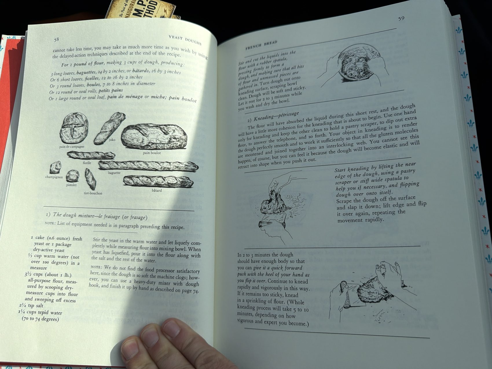
*Source pages 58–59: every shape this dough can become, the yeast-and-flour mixing, and the flip-and-slap kneading sequence for Steps 1–2.*

**3. First rising — pointage premier temps. 3 to 5 hours at around 70°F.**
You now have about 3 cups of dough that is to rise to 3½ times its volume — about 10½ cups. Fill the bowl with 10½ cups of tepid water and mark that level (the bowl should have fairly upright sides; if they slant out too much the dough has trouble). Pour out the water, dry the bowl, and put in the dough. Slip the bowl into a large plastic bag or cover with plastic, and top with a folded bath towel. Set on a wooden surface — marble or stone are too cold — or on a folded towel or pillow, anyplace free from drafts at around 70°F. If your room is too hot, set the bowl in water and keep renewing it to hold the temperature. **The dough should take at least 3 hours to reach the mark; if the temperature is lower it simply takes longer.** When fully risen it will be humped into a slight dome, light and spongy when pressed, with big bubbly blisters on the surface.

**4. Deflating and second rising — rupture; pointage deuxième temps. 1½ to 2 hours at around 70°F.**
The dough is ready to be deflated, which releases the yeast-engendered gases and redistributes the yeast cells for the next rise. With a rubber spatula, dislodge the dough from the inside of the bowl and turn it out onto a lightly floured surface, scraping the bowl clean. If the dough seems damp and sweaty, sprinkle it with a tablespoon of flour. Lightly flour your palms and flatten the dough firmly but not too roughly into a circle, deflating any gas bubbles by pinching them. Lift a corner of the near side and flip it down onto the far side; do the same with the left side, then the right, then the near side, tucking that last edge under — the mass will look like a rounded cushion. Slip the sides of your hands under it and return it to the bowl. Cover and let rise again — **this time to not quite triple** — until dome-shaped, light, and spongy when touched.

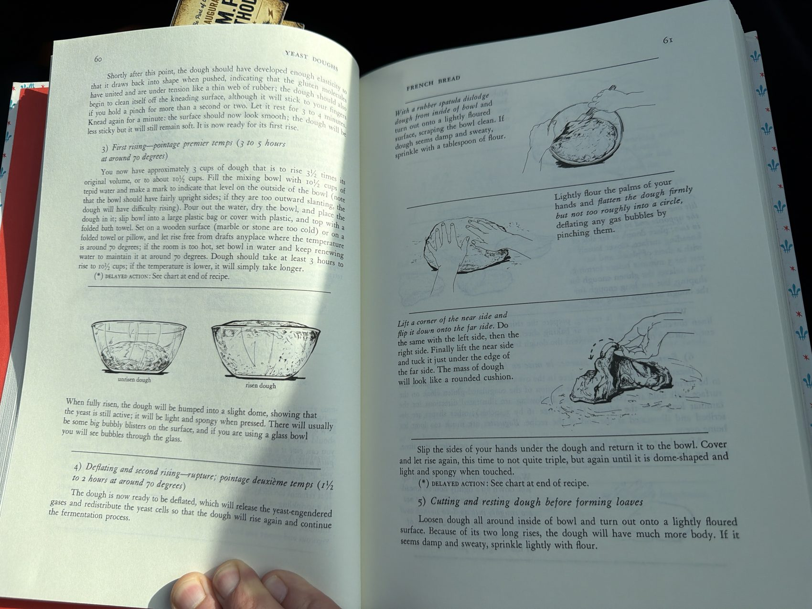
*Source pages 60–61: what "fully risen" looks like through a glass bowl, and the deflating moves of Step 4.*

**5. Cutting and resting the dough before forming loaves.**
Loosen the dough all around the inside of the bowl and turn it out onto a lightly floured surface. Because of its two long rises it will have much more body now. If it's damp and sweaty, sprinkle lightly with flour. Making clean, sure cuts with a large knife or scraper, divide the dough into 3 equal pieces (for long loaves — or whatever count your chosen shape calls for). After each cut, lift one end of the piece and flip it over onto its opposite end to fold it in two; place it at the far side of the work surface. Cover loosely with plastic and let rest **5 minutes** before forming — this relaxes the gluten enough for shaping, but not so long that the dough starts rising again.

**6. Forming loaves — la mise en forme des pâtons.**
*(The bâtard — 16 by 3 inches baked — is the shape illustrated.)* Working rapidly, turn a piece upside down on a lightly floured surface and pat it firmly but not too roughly into an 8- to 10-inch oval with your lightly floured palms, deflating any gas bubbles by pinching. Fold in half lengthwise, bringing the far edge down over the near edge, and seal the edges together. Roll the dough a quarter turn forward so the seal is on top. Flatten again into an oval with your palms. Press a trench along the central length with the side of one hand. Fold in half again lengthwise, and this time seal the edges with the heel of your hand, rolling the dough a quarter turn toward you so the seal is on the bottom.

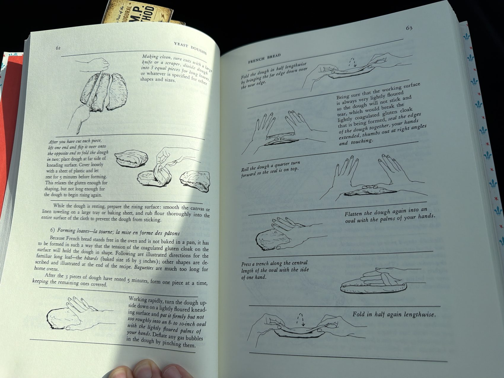
*Source pages 62–63: cutting and resting (Step 5) and the fold-seal-trench-fold sequence of Step 6, drawn move by move.*

Now, rolling the dough back and forth under your palms — starting in the middle, right palm on the dough, left palm on top of your right hand — lengthen it into a sausage shape, gradually sliding your hands toward the two ends as it grows. Deflate any gas blisters by pinching. Repeat until the dough is 16 inches long, or whatever length fits your baking sheet, keeping the circumference as even as possible and the line of seal straight — if the seal disappears, don't worry. Place the shaped piece **sealed side up** at one side of a flour-rubbed canvas, leaving a free end of canvas 3 to 4 inches wide, then pinch a ridge of canvas 2½ to 3 inches high to make a trough for the next piece. Cover the waiting dough with plastic as you form the rest. After all the pieces are in place, brace the two sides of the canvas with long rolling pins, baking pans, or books if the dough seems very soft, and cover loosely with a flour-rubbed towel or canvas and a sheet of plastic. Proceed immediately to the final rising.

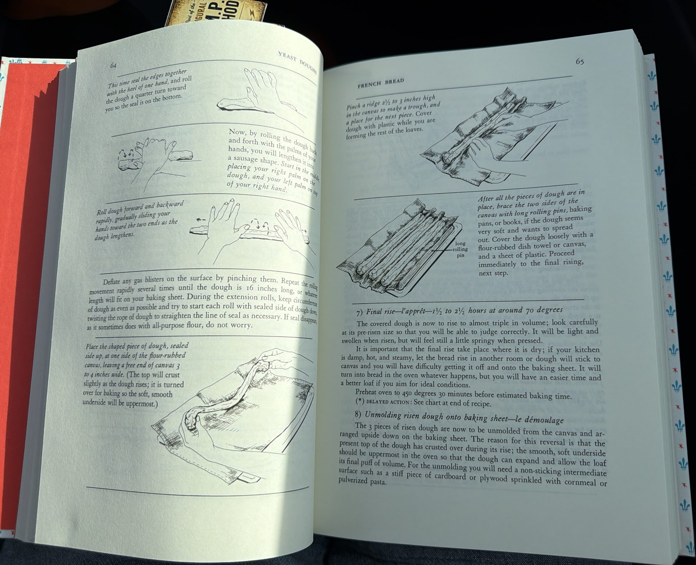
*Source pages 64–65: lengthening the sausage shape, pinching the canvas ridges, bracing with rolling pins — the end of Step 6 into Step 7.*

**7. Final rise — l'apprêt. 1½ to 2½ hours at around 70°F.**
The covered dough now rises to almost triple its volume — look carefully at its pre-risen size so you can judge. It will be light and swollen, but still feel a little springy when pressed. **This rise must happen somewhere dry and draft-free**: if your kitchen is damp, hot, and steamy, let it rise in another room, or the dough will stick to the canvas and you'll have trouble getting it off. **Preheat the oven to 450°F thirty minutes before your estimated baking time.**

**8. Unmolding the risen dough onto the baking sheet — le démoulage.**
The 3 pieces are now unmolded from the canvas and arranged **upside down** on the baking sheet — the reversal matters, because the exposed top has crusted slightly during the rise, and the smooth, soft underside must be uppermost so the loaf can expand into its final puff of volume. You'll need the non-sticking intermediate surface: the stiff cardboard or plywood, sprinkled with cornmeal or pulverized pasta. Remove the rolling pins or braces. Place the long side of the board at one side of the dough; pull the edge of the canvas to flatten it; then raise and flip the dough softly upside down onto the board. The dough now lies along one edge of the board: rest that edge on the right side of a lightly buttered baking sheet and gently dislodge the dough onto the sheet, keeping the same side uppermost. If necessary, run the sides of your hands lightly down the length of the dough to straighten it. Unmold the next piece to its left, leaving a 3-inch space, and the final piece near the left side.

**9. Slashing the top of the dough — la coupe.**
The top of each piece is now slashed in several places, which opens the covering cloak of gluten and lets a bulge of dough underneath swell up through the cuts during the first 10 minutes of baking — that's where the decorative crust patterns come from. The cuts are made with a blade slicing **almost horizontally** into the dough, less than half an inch deep. Start the cut at the middle of the blade and draw it toward you in a swift, clean sweep. *"This is not quite as easy as it sounds, and you will probably make ragged cuts at first; never mind, you will improve with practice."* Use an ordinary razor blade with one side slid into a cork for safety, or a barber's straight razor. For a 16- to 18-inch loaf make **3 slashes**: the two at the ends go straight down the loaf but slightly off center; the middle one runs at a slight angle between them. Cut the far one first, then the middle, then the third — blade almost parallel to the surface.

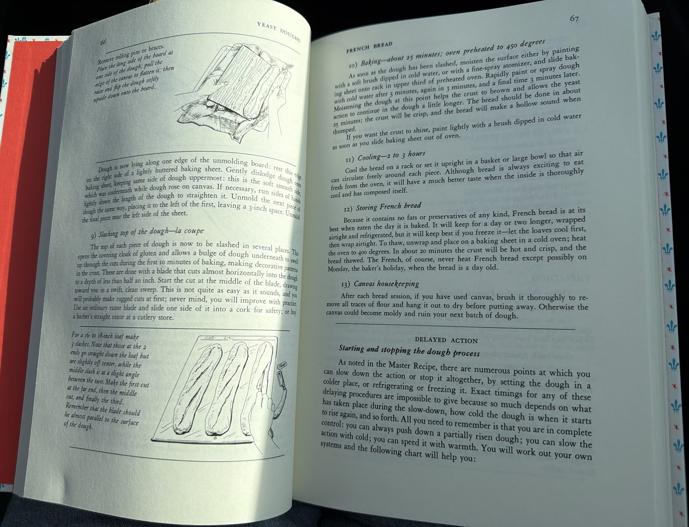
*Source pages 66–67: the unmolding flip of Step 8, and Step 9's slash pattern — plus the baking, cooling, and storing text of Steps 10–13.*

**10. Baking — about 25 minutes, oven preheated to 450°F.**
As soon as the dough has been slashed, moisten the surface — either painting with a soft brush dipped in cold water or with a fine-spray atomizer — and slide the baking sheet onto a rack in the upper third of the preheated oven. Rapidly paint or spray the dough with cold water again after 3 minutes, again 3 minutes later, and a final time 3 minutes after that. The moistening helps the crust brown and lets the yeast act a little longer. The bread should be done in about 25 minutes: **the crust will be crisp, and the bread will make a hollow sound when thumped.** If you want the crust to shine, paint it lightly with cold water the moment the sheet comes out of the oven.

**11. Cooling — 2 to 3 hours.**
Cool the bread on a rack, or set it upright in a basket or large bowl so air can circulate freely around each piece. *"Although bread is always exciting to eat fresh from the oven, it will have a much better taste when the inside is thoroughly cool and has composed itself."*

**12. Storing French bread.**
Because it contains no fats or preservatives of any kind, French bread is at its best the day it's baked. It keeps a day or two longer wrapped airtight and refrigerated, but it keeps best **frozen** — cool the loaves first, then wrap airtight. To thaw: unwrap, place on a baking sheet in a **cold** oven, and heat to 400°F; in about 20 minutes the crust will be hot and crisp and the bread thawed. *"The French, of course, never heat French bread except possibly on Monday, the baker's holiday, when the bread is a day old."*

**13. Canvas housekeeping.**
After each bread session, brush the canvas thoroughly to remove all traces of flour and hang it out to dry before putting it away — otherwise it can go moldy and ruin your next batch of dough.

#### C. Delayed Action — Starting and Stopping the Dough

The source's own chart for bending the schedule around your day, since exact timings depend on how cold the dough is and what's already happened:

| To delay the **first rising** | Approximate hours of rise |
|---|---|
| At 65°F | 5–6 |
| At 55°F | 7–8 |
| Refrigerator | 9–10 |

- **To stop action altogether after the first or second rise:** deflate, wrap airtight, and freeze. *Limit: a week to 10 days* for plain French bread dough (and risky past 10 days for doughs with butter and eggs — *"we shall not venture farther upon this uncertain limb"*).
- **To delay the second rising:** set the dough in a colder place, or set a plate on top of it with a 5-lb weight and refrigerate.
- **To delay or freeze after the dough is formed:** set in a colder place, or form the dough on a lightly oiled sheet, cover airtight, and refrigerate or freeze (same time limit).
- **To start action after thawing:** thaw overnight in the refrigerator and complete the rise at room temperature — or set at 80°F until thawed, then finish the rise at room temperature.

#### D. Variations — Other Forms for French Bread

- **Long thin loaves** *(ficelles, baked size 12 to 16 by 1½ inches)*: cut the Step 5 dough into 5 or 6 pieces and form as in the recipe, but into thinner sausage shapes about ½ inch in diameter. Slash as in Step 9 once risen.
- **Oval rolls** *(petits pains, tire-bouchons)*: cut into 10 or 12 pieces and form like bâtards — you probably won't need to lengthen them at all after the two foldings and sealings. Once risen, make either 2 parallel slashes or a single slash end to end.
- **Round loaves** *(pain de ménage, miches, boules)*: for big sandwiches or toast. The object is to force the cloak of coagulated gluten to hold the ball of dough in shape — the first movement makes a cushion; the second seals and rounds the ball, establishing surface tension. After the cut dough has rested its 5 minutes, place it on a lightly floured surface. Lift the left side of the dough with the side of your left hand and bring it down almost to the other side; scoop up that side and push it back almost to the left. Revolve the dough a quarter turn clockwise and repeat, eight to ten times — *"think of the surface of the dough as if it were a fine sheet of rubber you were stretching in every direction."* Then turn the dough smooth side up and rotate it between the palms of your hands, tucking a bit of dough under the ball as you rotate: in a dozen turns you'll have a neat ball with a little pucker underneath — ***la clé***, where the edges all joined. Rise pucker side **up** on the canvas, seal the pucker by pinching, and after unmolding upside down onto the baking sheet, slash: **large loaves get a cross** (one vertical slash, then the horizontal cuts); medium loaves may take a cross, a single central slash, or a semicircular slash around half the circumference.
- **Round rolls** *(petits pains, champignons)*: cut into 10 to 12 pieces; same principle as round loaves, but make the preliminary cushion with your fingers rather than your palms, and for the second stage roll each ball under the palm of one hand, using your thumb and little finger to push the edges of the dough underneath to form the pucker. Rise pucker side up, 2 inches apart; bake pucker side down. Rolls are usually too small for a cross — one central slash or the semicircular cut.

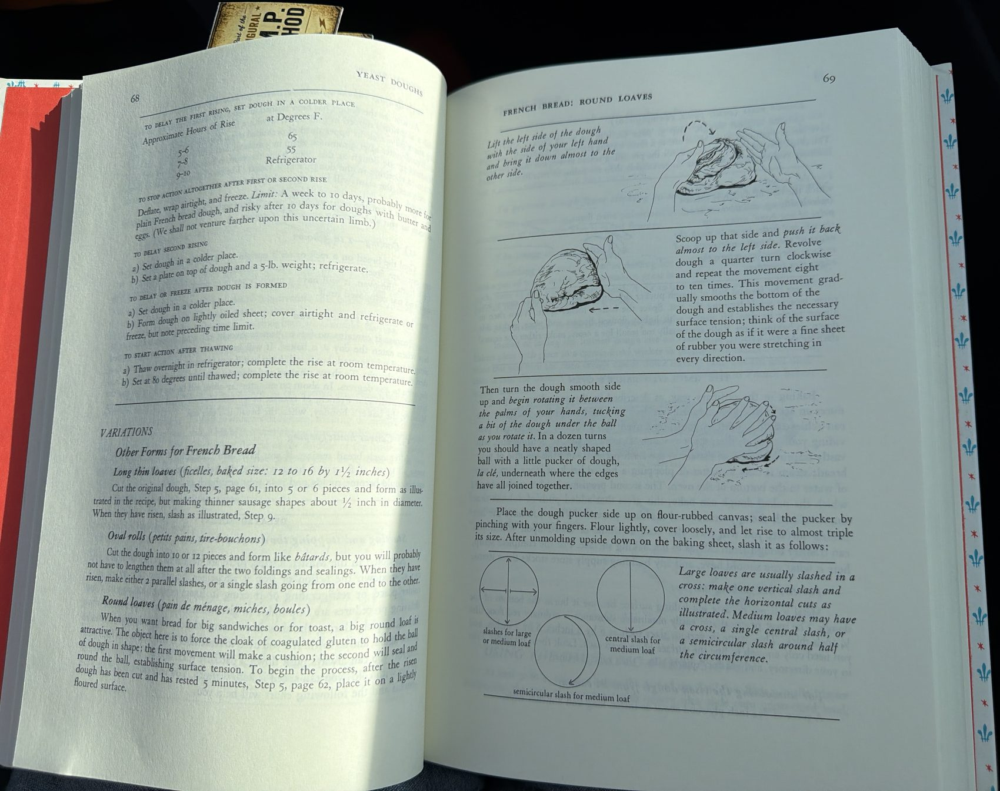
*Source pages 68–69: the delayed-action chart, and the round-loaf shaping and slashing patterns.*

#### E. The Simulated Baker's Oven

*"Baking in the ordinary way... produces an acceptable loaf of bread, but does not nearly approach the glory you can achieve when you turn your home oven into a baker's oven."* Two provisions make the difference — **steam**, which alone will vastly improve the crust, the color, the slash patterns, and the volume; and a **hot baking surface**, which gives the naked dough that added push of volume. Merely providing the steam, if you do nothing else, is worth it.

- **The hot baking surface:** metal won't do — it burns the bottom of the dough. Ordinary red floor tiles ¼ inch thick ("quarry tiles," from any building-supply store) lining the surface of an oven rack.
- **The sliding board:** a piece of 5/16-inch plywood slightly longer but 2 inches narrower than your oven rack — it takes the place of the baker's wooden paddle, *la pelle*.
- **To prevent sticking** to the unmolding and sliding boards: white cornmeal, or small pasta pulverized in the blender until it's the consistency of table salt — this is called ***fleurage***.
- **The steam contraption:** something you can heat to sizzling on the stovetop and slide into a pan of water in the oven for a great burst of steam — a brick, a solid 10-lb rock, or a piece of cast iron, plus a 9 × 12-inch roasting pan 2 inches deep holding an inch of water. *(The source's own note: a spray bottle works reasonably well instead, though less dramatically.)*
- **Nonessential professional gear:** the *banneton* (a canvas-lined wicker or plastic rising form, in place of the canvas couche) and bakers' blades, *lames* — about 4 inches long and ¼ inch wide with very sharp, curved ends.

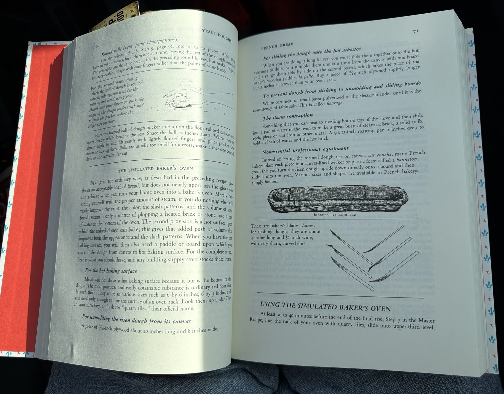
*Source pages 70–71: round rolls, the hot-surface and steam equipment list, the 24-inch banneton, and the lames.*

**Using it:** at least 30 to 40 minutes before the end of the final rise, line the oven rack with the quarry tiles, slide it onto the upper-third level, and preheat to 450°F. At the same time set the brick over very high heat on the stovetop so it gets sizzling hot — the hotter the better (test lifting it first, with two stiff spoons, spatulas, or fire tongs). When the final rise is complete, sprinkle *fleurage* on the unmolding board and the sliding board, unmold the loaves one at a time from the canvas, and line them up side by side — still upside down — on the sliding board. Slash as in Step 9. Place the pan of cold water on the lowest rack of an electric oven or the floor of a gas oven, add the sizzling brick, and close the door. Now the three loaves slide together off the board onto the hot tiles: **one quick, smooth jerk, like the old magician's trick of pulling the cloth from under a tableful of dishes.** Open the oven, rest the far end of the board on the far end of the tiles, and with one quick pull draw the board toward you — the loaves slide off onto the tiles. It must be a fast, confident action; pause midway and the dough rumples off the board, and once it touches the hot tiles it can't be moved or reshaped (though it comes loose after 5 to 6 minutes of baking). *"You may muff this every once in a while, and produce some queerly deformed shapes, but they will all bake into bread."* Remove the brick and pan of water after 5 to 8 minutes — the oven should be dry for the rest of the baking. Total time about 25 minutes for bâtards, same doneness cues as Step 10.

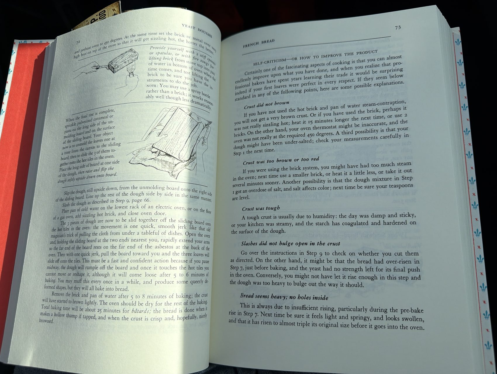
*Source pages 72–73: the brick, the board-to-tiles slide, and the start of the self-criticism guide below.*

#### F. Self-Criticism — Or How to Improve the Product

The source's own troubleshooting guide, kept whole because every line of it earns its place:

| Problem | Likely cause, per the source |
|---|---|
| **Crust did not brown** | No steam contraption; brick not really sizzling (heat it 15 min longer next time, or use 2); oven thermostat not truly at 450°F; or the dough was under-salted — check the Step 1 measurements |
| **Crust too brown or too red** | Too much steam — smaller brick, heat it less, or take it out sooner; or an overdose of salt in Step 1 — level teaspoons |
| **Crust was tough** | Humidity — the day was damp and sticky or the kitchen steamy, and the starch coagulated and hardened on the dough's surface |
| **Slashes did not bulge open** | Cuts not made as directed in Step 9; or the bread over-rose in Step 7 and the yeast had no strength left for its final push; or it didn't rise enough and the dough was too heavy to bulge |
| **Bread seems heavy; no holes inside** | Always insufficient rising, particularly the pre-bake rise of Step 7 — it must feel light and springy, look swollen, and have risen to almost triple before it goes in the oven |
| **Flavor is uninteresting** | Insufficient rising time — the slow aging and maturing of the yeast is what develops flavor; follow the timing and temperature requirements, particularly Step 3's first rise |
| **Flavor unpleasantly yeasty or sour** | Over-fermented — risen at too high a temperature, or over-risen; in hot weather take a longer rise in the refrigerator |

#### G. Grocery Shopping List

**🛒 General grocery**

- 🛒 All-purpose flour — 3½ cups (about 1 lb) *(plain all-purpose — not high-gluten bread flour)*
- 🛒 Yeast — 1 cake (0.6 oz) fresh, or 1 package dry-active
- 🛒 Salt
- 🛒 Cornmeal, finely ground — or a little dry pasta to pulverize, for the *fleurage*

**🏪 Specific store — building-supply/hardware** *(optional, only for the simulated baker's oven upgrade)*

- 🏪 Quarry tiles — ¼ inch thick, enough to line an oven rack
- 🏪 Plywood, 5/16 inch — one unmolding board (18–20 × 6–8 in) and one sliding board (2 inches narrower than your oven rack)
- 🏪 A brick

#### Nutrition *(estimated)*

| | Calories | Fat | Protein | Carbs | Fiber |
|---|---|---|---|---|---|
| **Whole batch** *(3 bâtards)* | ~1,660 | 4.5 g | 47 g | 348 g | 12 g |
| **Per loaf** *(1 bâtard)* | ~555 | 1.5 g | 15.5 g | 116 g | 4 g |
| **Per serving** *(12 servings, ¼ loaf)* | ~140 | 0.4 g | 4 g | 29 g | 1 g |

**What a serving is:** about a quarter of a bâtard — a generous hand-torn chunk alongside dinner. Flour, water, salt, and yeast is the entire ingredient list, which is why the fat column is nearly empty; whatever butter lands on it at the table is its own decision.

[↑ Table of Contents](#table-of-contents)

---

### 15.2 Butter Dips

Transcribed from a printed page — ***Talk About Good!*** (p. 28), credited to **Mrs. Jess W. Griffith**. **Called out by Cody as a featured recipe** — worth making, not just archiving. Buttery bread sticks: the dough strips are dipped in the same melted butter the pan was greased with, then baked close together so they pull apart golden and rich.

**Yield:** makes 32 sticks

**🟢 Easy** · **Prep ~20 min** *(melting the butter, mixing the dough, rolling, cutting, dipping)* · **Cook ~18 min** *(15–20 min bake, per the source)* · **Start to finish ~40 min**

#### A. Ingredients

- ⅓ cup butter
- 2¼ cups sifted flour
- 1 Tbsp sugar
- 3½ tsp baking powder
- 1½ tsp salt
- 1 cup milk

**Variations, per the source — pick one:**

1. Add ½ cup grated sharp American cheese to the dry ingredients
2. Add ½ clove finely minced garlic to the butter before melting
3. Sprinkle paprika, celery seed, or garlic salt over the dips before baking
4. Add ½ cup minced chives or parsley to the flour mixture

#### B. Cooking Instructions

**1. Melt the butter in the pan, in the oven.**
Heat the oven to 400°F. Melt the butter directly in an oblong 13 × 9½ × 2-inch pan while the oven heats.

**2. Sift the dry ingredients.**
Sift together the flour, sugar, baking powder, and salt.

**3. Remove the pan and mix the dough.**
Once the butter's melted, take the pan out. Stir the milk into the dry ingredients slowly with a fork, just until the dough clings together.

**4. Knead about 10 times, then roll out on a floured board.**
Turn the dough onto a well-floured board and roll it over to coat with flour. Knead lightly, about 10 times. Roll out ½ inch thick into a 12 × 8-inch rectangle.

**5. Cut into 32 strips.**
With a floured knife, cut the dough in half lengthwise, then crosswise into 16 strips — 32 sticks total.

**6. Dip each strip in the melted butter, then arrange in the pan.**
Pick up each cut strip and dip it in the butter still in the pan, then lay the strips close together in the same pan.

**7. Bake. 15–20 minutes, until golden brown.**
Serve hot.

#### C. Grocery Shopping List

**🛒 General grocery**

- 🛒 Butter — ⅓ cup
- 🛒 All-purpose flour — 2¼ cups, sifted
- 🛒 Sugar — 1 Tbsp
- 🛒 Baking powder — 3½ tsp
- 🛒 Salt — 1½ tsp
- 🛒 Milk — 1 cup

#### Nutrition *(estimated)*

| | Calories | Fat | Protein | Carbs | Fiber |
|---|---|---|---|---|---|
| **Whole batch** *(32 sticks)* | ~1,695 | 69 g | 36 g | 230 g | 8 g |
| **Per stick** | ~53 | 2 g | 1 g | 7 g | <1 g |

**What a serving is:** one stick — most people eat several.

[↑ Table of Contents](#table-of-contents)

---

### 15.3 Basic Biscuits (Cheese or Bacon Variation)

Transcribed from a printed page — ***Talk About Good!***, credited to **Mrs. Jack McCord**. **This entry's title and most of its ingredient list weren't captured in the photo** — the crop cuts in mid-instruction, only showing the tail end of the method plus two variations. Named here from what's visible rather than invented; flagged for a follow-up photo.

**Yield:** makes about 16 biscuits *(as printed)*

**🟢 Easy** *(standard cut-in-shortening biscuit technique, based on what's visible)* · **Prep not calculable** — see Open Questions · **Cook ~12 min** *(10–15 min bake, per the source)*

#### A. Ingredients

**Not fully visible in the photo.** What's confirmed from the instructions: flour, shortening (cut in "until it is in fine particles"), and presumably a leavening agent and liquid, none of which are legible in this crop.

**Variations, per the source:**

- Add ½ cup grated cheese to the flour-and-shortening mixture, for cheese biscuits
- Add ¼ cup diced, cooked bacon to the flour-and-shortening mixture, for bacon biscuits

#### B. Cooking Instructions

**1. Cut the shortening into the dry ingredients until it's in fine particles.**
*(The step before this — measuring and combining the dry ingredients — is above the photographed crop.)*

**2. Shape the dough.**
Shape the dough into a ball and knead lightly. Roll the dough out and cut with a floured cutter.

**3. Bake. 10–15 minutes at 400°F, in a very hot oven.**
Place on an ungreased baking sheet and bake 10 to 15 minutes, until brown.

#### C. Grocery Shopping List

Not calculable until the rest of the ingredient list is photographed. Presumed: flour, shortening, a leavening agent, and a liquid, plus optional grated cheese or diced cooked bacon.

#### D. Nutrition

Not calculable — most of the ingredient list, including all quantities, is missing from the photographed crop.

#### E. Open Questions

- **The recipe's title and most of its ingredients are missing** — the photo starts mid-instruction. 🚫 2026-09-07 — Cody: not pursuing the top of the page; the entry stays as is (same call as [§5.27 Smothered Eggplant, Onion & Bell Pepper](#527-smothered-eggplant-onion--bell-pepper), from an earlier page in this same source).

[↑ Table of Contents](#table-of-contents)

---

### 15.4 Angel Biscuits

Transcribed from a printed page — ***Talk About Good!*** (p. 27), credited to **Mrs. Richard P. Sevier**. A yeast-leavened biscuit dough that also freezes cut and unbaked, so it's ready whenever needed.

**Yield:** not stated; estimated to make about 24 biscuits, flagged below.

**🟢 Easy** · **Prep ~20 min** *(dissolving the yeast, sifting, cutting in shortening, mixing, rolling, cutting)* · **Cook ~20 min** *(bake at 400°F, per the source)* · **Start to finish ~40 min** *(or, if freezing cut biscuits for later: add 2–3 hr to thaw and rise before baking, per the source)*

#### A. Ingredients

- 1 pkg yeast
- 2 Tbsp lukewarm water
- 1 cup shortening
- 5 cups unsifted flour
- 3 tsp baking powder
- ¼ cup sugar
- 2 tsp salt
- 1 tsp soda
- 1½–2 cups buttermilk, room temperature

#### B. Cooking Instructions

**1. Dissolve the yeast in the water.**

**2. Sift the dry ingredients together.**

**3. Cut in the shortening.**
Into half of the dry ingredients.

**4. Add the remaining dry ingredients, then the buttermilk and yeast.**
Add the rest of the dry ingredients to the shortening mixture. Pour the dissolved yeast into the buttermilk, then add that to the dry ingredients.

**5. Roll and cut.**
Roll on a floured board and cut biscuits with a cutter — not too thin. The dough handles better if it's been chilled first.

**6. Bake, now or later.**
Bake in a 400°F oven for 20 minutes. Or, if you like, freeze the cut biscuits and bake later — allow 2 to 3 hours for them to thaw and rise in a warm place before baking.

#### C. Grocery Shopping List

**🛒 General grocery**

- 🛒 Active dry yeast — 1 package
- 🛒 Shortening — 1 cup
- 🛒 All-purpose flour — 5 cups, unsifted
- 🛒 Baking powder — 3 tsp
- 🛒 Sugar — ¼ cup
- 🛒 Salt — 2 tsp
- 🛒 Baking soda — 1 tsp
- 🛒 Buttermilk — 1½–2 cups

#### Nutrition *(estimated)*

| | Calories | Fat | Protein | Carbs | Fiber |
|---|---|---|---|---|---|
| **Whole batch** | ~4,360 | 209 g | 76 g | 529 g | 17 g |
| **Per biscuit** *(estimated 24 biscuits)* | ~182 | 9 g | 3 g | 22 g | 1 g |

**What a serving is:** one biscuit.

#### D. Open Questions

- **No biscuit count given** — 24 is Claude's estimate from the batch size.

[↑ Table of Contents](#table-of-contents)

---

### 15.5 Fancy Biscuits

Transcribed from a printed page — ***Talk About Good!*** (p. 27), credited to **Mrs. Philip R. Allin**. A make-ahead, refrigerator biscuit dough — mixed once, then baked in batches as needed, never left to rise on the counter.

**Yield:** not stated; estimated to make about 24 biscuits, flagged below.

**🟢 Easy** · **Prep ~15 min** *(dissolving the yeast and combining the dough — the dough itself keeps in the fridge, portions baked as needed)* · **Cook ~10 min** *(bake at 450°F, per the source)* · **Start to finish ~25 min** *(per batch baked; the dough can be stored and used over several days)*

#### A. Ingredients

- 1 yeast cake
- 2 Tbsp warm water
- 2 cups buttermilk
- 5 cups flour
- 1 tsp salt
- 1 tsp soda
- 3 Tbsp baking powder
- 1 cup shortening
- 3 Tbsp sugar

#### B. Cooking Instructions

**1. Dissolve the yeast in the warm water.**

**2. Combine everything as you would for regular biscuits.**
Mix the flour, salt, soda, baking powder, shortening, sugar, buttermilk, and the dissolved yeast together.

**3. Store the dough in the refrigerator.**
Keep it in a tightly closed plastic bag or a covered bowl. **Do not let it rise at any point** — this dough is meant to stay cold until it's rolled out. Use it as needed.

**4. Roll out and bake. 10 minutes at 450°F.**
Bake on a greased pan.

#### C. Grocery Shopping List

**🛒 General grocery**

- 🛒 Yeast cake (or equivalent active dry yeast)
- 🛒 Buttermilk — 2 cups
- 🛒 All-purpose flour — 5 cups
- 🛒 Salt — 1 tsp
- 🛒 Baking soda — 1 tsp
- 🛒 Baking powder — 3 Tbsp
- 🛒 Shortening — 1 cup
- 🛒 Sugar — 3 Tbsp

#### Nutrition *(estimated)*

| | Calories | Fat | Protein | Carbs | Fiber |
|---|---|---|---|---|---|
| **Whole batch** | ~4,350 | 210 g | 78 g | 520 g | 17 g |
| **Per biscuit** *(estimated 24 biscuits)* | ~181 | 9 g | 3 g | 22 g | 1 g |

**What a serving is:** one biscuit.

#### D. Open Questions

- **No biscuit count given** — 24 is Claude's estimate from the batch size.

[↑ Table of Contents](#table-of-contents)

---

### 15.6 Pastry Biscuits

Transcribed from a printed page — ***Talk About Good!*** (p. 27), credited to **Deborah Crawford**. A rich, butter-heavy dough with no leavening at all — worked by hand to a cornmeal texture, closer to a shortbread than a risen biscuit. Doubles as a strawberry shortcake base.

**Yield:** not stated; estimated to make about 24 small biscuits, flagged below

**🟢 Easy** · **Prep ~15 min** *(working the butter into the flour by hand, adding ice water, shaping)* · **Cook ~12 min** *(estimated — the source gives the 450°F oven but no bake time)* · **Start to finish ~1 hr** *(includes an assumed ~30 min chill — the source says to chill the dough but doesn't give a time)*

#### A. Ingredients

- 2 sticks butter
- 2⅓ cups flour
- Ice water

#### B. Cooking Instructions

**1. Work the butter into the flour by hand.**
Slice the butter into a bowl and work in the flour with your hands until it reaches the consistency of cornmeal.

**2. Add ice water to moisten.**
As little as possible, working it in with a fork.

**3. Shape, wrap, and chill.**
Shape the dough into a ball, wrap in waxed paper, and chill.

**4. Roll thin and cut.**
Roll the dough thin and cut into small biscuits.

**5. Bake. At 450°F, until done — about 12 minutes (estimated).**
On an ungreased griddle, in a hot oven. The source prints the temperature but no time; thin, small pastry biscuits at 450°F are typically done in 10–12 minutes — watch the edges for color.

> **Per the source:** this dough may be prepared ahead and keeps in the refrigerator for a week. It's delicious served with coffee or sherry, and also makes a good strawberry shortcake base with plenty of berries and sweetened whipped cream.

#### C. Grocery Shopping List

**🛒 General grocery**

- 🛒 Butter — 2 sticks
- 🛒 All-purpose flour — 2⅓ cups
- 🛒 Ice water

#### Nutrition *(estimated)*

| | Calories | Fat | Protein | Carbs | Fiber |
|---|---|---|---|---|---|
| **Whole batch** | ~2,650 | 183 g | 31 g | 214 g | 8 g |
| **Per biscuit** *(estimated 24 small biscuits)* | ~110 | 8 g | 1 g | 9 g | <1 g |

**What a serving is:** one small biscuit.

#### D. Open Questions

- **No biscuit count, chill time, or bake time given** — 24 biscuits, a ~30 min chill, and a ~12 min bake are Claude's estimates. *(The bake time used to read as printed; the 2026-09-07 re-verification found the page gives only the 450°F oven.)*

[↑ Table of Contents](#table-of-contents)

---

### 15.7 Yorkshire Pudding on the Grill

Transcribed from the same **Steven Raichlen** book as [§5.33](#533-quick-and-smoky-baked-beans) and [§5.34](#534-brazilian-black-beans-with-bacon-tutu-mineira) (p. 439), tagged **England**. **Filed here in §15 Breads rather than with the sides** — it's a flour-egg-milk batter baked into a bread, and it sits naturally beside [§15.2 Butter Dips](#152-butter-dips) and the biscuits, even though it's served alongside a roast.

> **Where the beef fat comes from, if you want it authentic.** The source below calls for melted meat drippings for the most authentic flavor. **[§7.149 The Ultimate Prime Rib Roast](#7149-the-ultimate-prime-rib-roast) renders about a cup of golden beef tallow** out of its own trimmings (8 hours in a 200°F oven) and sends the leftover half-cup to the fridge **specifically for Yorkshire pudding** — the two recipes are built to feed each other, in different books by different authors.

> **Per the source:** *"Grilled Prime Ribs of Beef with Garlic and Rosemary just isn't complete without Yorkshire pudding. And you can cook the pudding on the grill while the meat rests before you carve it. The trick to achieving a dramatic puff is to start with ice-cold batter and add it to a smoking hot pan. For the most authentic flavor, use melted meat drippings — however nutritionally incorrect they may be."*

**Yield:** serves 8 *(as printed)*

**Advance preparation:** 30 minutes to chill the batter.

**🟡 Medium** *(the puff is the whole dish, and it has two real failure points — batter that isn't cold enough, or a pan that isn't smoking hot when the batter hits it. Opening the grill to check will also collapse it. Nothing burns or breaks, but you can absolutely end up with a flat pudding)* · **Prep ~10 min** · **Cook ~25–35 min** *(3 min heating the pan, then 20–30 min covered)* · **Start to finish ~1 hr 5 min – 1 hr 15 min** *(includes the 30 min batter chill in the freezer)*

**Techniques used:** indirect grilling · [§T30 How to Use Fat](#t30-how-to-use-fat) — *this recipe is that entry's cold-into-screaming-hot principle in its purest form; the steam from the cold batter hitting hot fat is what does the lifting*

#### A. Ingredients

- 6 large eggs
- 2¼ cups milk
- 1 tsp salt
- ½ tsp freshly ground black pepper *(corrected 2026-09-07 from ¼ tsp — the page prints ½; the photo is soft at this line, but the fraction glyph is visibly different from the "¼ cup" printed two lines below for the drippings)*
- 2 cups all-purpose unbleached flour
- ¼ cup prime rib drippings, melted unsalted butter, or extra-virgin olive oil, divided

#### B. Cooking Instructions

**1. Make the batter and chill it — in the freezer. 30 minutes.**
Whisk the eggs, milk, salt, and pepper together in a large bowl. Whisk in the flour and 2 Tbsp of the drippings. Cover and **chill the batter in the freezer for 30 minutes** — the source says freezer, not refrigerator. **The batter needs to go into the pan ice-cold** — that temperature difference is what makes it puff.

**2. Set up the grill for indirect grilling and preheat to high.**
No drip pan needed. *If you've just cooked a roast, the grill is already set up — for charcoal, just add 10 to 12 fresh coals per side.*

**3. Heat the pan and the fat until smoking. About 3 minutes.**
Add the remaining 2 Tbsp of drippings to a clean 13 × 9-inch roasting pan and set it in the center of the hot grate.

**4. Pour in the cold batter and cover the grill tightly. 20–30 minutes.**
Pour the chilled batter into the smoking-hot pan and cover the grill tightly. Cook until puffed and nicely browned, 20 to 30 minutes. **Don't peek** — opening the lid drops the temperature and the pudding falls.

**5. Cut into squares and serve at once.**

> **On the drippings, per the source:** collect them from a roast while it cooks by pulling them out of the drip pan with a turkey baster, or save drippings from a previous grill session. Melted unsalted butter or olive oil both work if you don't have any.

#### C. Grocery Shopping List

**🛒 General grocery**

- 🛒 Eggs — 6 large
- 🛒 Milk — 2¼ cups
- 🛒 All-purpose unbleached flour — 2 cups
- 🛒 Unsalted butter or extra-virgin olive oil — ¼ cup, *if you don't have beef drippings saved*
- 🛒 Salt, black pepper
- 🛒 *Free if you're roasting beef:* save the drippings — that's the authentic version

#### Nutrition *(estimated, made with beef drippings)*

| | Calories | Fat | Protein | Carbs | Fiber |
|---|---|---|---|---|---|
| **Whole pan** | ~2,000 | 89 g | 76 g | 220 g | 7 g |
| **Per serving** *(serves 8, as printed)* | ~250 | 11 g | 9.5 g | 27 g | <1 g |

**What a serving is:** one square cut from the pan, about ⅛ of it.

[↑ Table of Contents](#table-of-contents)

---

### 15.8 Old-Fashioned Skillet Cornbread and Hush Puppies

Transcribed from **Meathead Goldwyn**, ***The Meathead Method*** — the "Desserts" chapter (book p. 372–374); despite its source chapter, this is a savory quick bread, so it's filed here in §15 Breads alongside this cookbook's other biscuits and quick breads rather than with the sweets. **Genuinely different from this cookbook's existing [§11.3 Keto Skillet Cornbread](#113-keto-skillet-cornbread)** — that one uses almond flour, flaxseed meal, and an optional sweet corn extract with no actual corn or wheat flour in it; this one is the real, wheat-flour-and-cornmeal, non-keto version. Both kept, cross-referenced.

> ✅ **Photo-verified line by line, 2026-09-06 — one real ingredient error found, one dropped step restored, and one invented figure removed.** Cody supplied a clear photograph of the whole book p. 372–373 spread; Steps 4–6 (book p. 374) were checked against both his own verbatim text and the original PDF, and match word for word. **The three fixes:** **(1) the sour cream was ⅔ cup against the printed ¾ cup** — a real shortfall in a recipe formulated around sour cream rather than buttermilk; **(2) Step 2 never actually added the butter** — the source's Step 2 ends *"Melt the butter (or brown it, as on page 189) and whisk it in,"* which had been dropped entirely, leaving 2 ounces of butter in the ingredient list with nowhere to go; and **(3) the muffin note claimed a 375°F bake**, but the source's 375°F belongs to the **hush-puppy deep-fry** — it prints no temperature for muffins at all. **Everything else checks out exactly:** MAKES *8 nice-sized wedges*, TAKES *20 minutes to prep, 25 minutes to cook*, all ten ingredients (including **1 tsp Morton Coarse Kosher Salt** — unchanged, no salt quantity was altered), the optional corn/bell-pepper line, all three "About" sidebars, and Steps 1 through 6.

> ✅ **Re-verified a second time, 2026-09-07, by an independent read of the pp. 372–373 photograph and the PDF scan of p. 374 — correct as written.** All ten ingredients (¾ cup sour cream and **1 teaspoon Morton Coarse Kosher Salt** confirmed), the optional line, MAKES 8 nice-sized wedges, TAKES 20 minutes to prep / 25 minutes to cook, the 325°F narrower-pan note, the 375°F hush-puppy fry, and all six steps (400°F, the 2 tablespoons of pan fat, the ~30-second stir, the ~20-minute bake) match the page exactly. No change.

> ✅ **2026-09-07 second-pass QC against pp. 372–374 (PDF scan, including the p. 374 close-up of Steps 4–6): verified, no change.** All ten ingredients, the optional corn/pepper line, all three "About" notes, the muffin/hush-puppy option (375°F fry), MAKES 8 nice-sized wedges / TAKES 20 minutes to prep and 25 to cook, the 325°F narrower-pan note, and Steps 1–6 (400°F oven or indirect side, 12-inch skillet preheated, 2 Tbsp fat rolled around the hot pan, ~30-second stir, ~20-minute bake with the toothpick test) match the page. The "nuttier flavor" aside on browning the butter and the "tough and dense" reason for not overmixing are cookbook gloss, not printed.

> Per the source: cornbread is a classic sidekick for barbecue with good reason — its flavor and texture are a perfect foil for sweet barbecue sauce and Southern sweet tea, and it's just as good eaten straight or buttered (a honey butter or hot honey will generate smiles; the source's own recipes for those live at AmazingRibs.com/mm, not in the book). **It also makes a fabulous breakfast substitute for pancakes or waffles** — warm, with a dab of butter and a glug of maple syrup. Classic cornbread is baked in a cast-iron skillet greased with **bacon fat, lard, tallow, duck fat, schmaltz, or other meat grease**, although butter works fine — the hot black metal creates a brown crunchy crust that really amps up the flavor and texture. **This recipe is designed for a 12-inch cast-iron skillet**, but a 10-inch cast-iron skillet, any other skillet, or an **8 × 8 × 2-inch baking dish** will do, though it may not brown as well as a black pan. **In a narrower pan the mass of batter is thicker and will take longer to cook, so lower the oven temperature to 325°F.**

**Makes 8 nice-sized wedges · Takes 20 minutes to prep, 25 minutes to cook** *(as printed)*

**🟢 Easy** · **Prep ~20 min** · **Cook ~25 min** · **Start to finish ~45 min**

#### A. Ingredients

- 1 cup yellow cornmeal
- 1 cup all-purpose flour
- 1 Tbsp baking powder
- ½ tsp baking soda
- 1 tsp Morton Coarse Kosher Salt
- 3 large eggs
- 3 Tbsp honey
- **¾ cup sour cream** *(corrected 2026-09-06 from ⅔ cup — the page prints ¾)*
- 4 Tbsp (2 ounces) unsalted butter
- 2 Tbsp bacon grease or butter, for the pan

**Optional mix-ins**

- ¼ cup grilled sweet corn kernels and ¼ cup grilled sweet red bell pepper
- Up to 2 or 3 of: 4 slices crumbled cooked bacon, chunks of cooked sausage, cracklins (a Southern tradition), 5 ounces grated cheddar, or a minced jalapeño — don't go crazy with the mix-ins

> **About the sour cream.** Many cornbread recipes call for buttermilk, but **this recipe has been formulated for sour cream.**
>
> **About the corn kernels and peppers.** These ingredients are optional, *"but they really should be required."* If you wish, you can amp raw frozen corn up a bit by rolling it around in a hot pan for **2 to 3 minutes** until it browns slightly. **Don't use canned corn.**
>
> **About other mix-ins.** You can add 4 slices of crumbled cooked bacon or some chunks of cooked sausage; **cracklins are a Southern tradition, too**; or add 5 ounces of grated cheddar. A minced jalapeño gives the mix a spice of life. **Don't go crazy — use just 2 or 3 max.**
>
> **Optional: muffins, or hush puppies.** Make cornbread **muffins** — more crunch! **Or make balls and deep-fry them at 375°F into hush puppies** — a Southern offshoot of the same cornbread batter, fried into small golden balls instead of baked flat. Still more crunch. *(The source prints no temperature or time for the muffin version — only the 375°F fry temperature for the hush puppies. Noted rather than invented.)*

#### B. Cooking Instructions

**1. Mix the dry ingredients.**
In a bowl, mix together the cornmeal, flour, baking powder, baking soda, and salt. **If you are using the grilled corn and/or bell pepper — or any other mix-ins — now's the time to mix them in**, while the batter is still dry and they'll distribute evenly.

**2. Mix the wet ingredients.**
In another bowl add the eggs, honey, and sour cream and whisk until smooth. **Melt the butter — or brown it, if you want the nuttier flavor — and whisk it in.**

**3. Make the batter. About 30 seconds of stirring, no more.**
Pour the wet ingredients into the dry ingredients. **Gently stir until everything is mixed, only about 30 seconds. The batter will be lumpy. That's OK. Do not overmix**, or the cornbread turns tough and dense instead of tender.

**4. Fire up.**
Preheat the oven to 400°F, or the grill's indirect side to 400°F, and put a 12-inch cast-iron skillet in to preheat along with it.

**5. Grease the pan.**
Take the hot skillet out and add the bacon grease or butter. Roll the fat around as it melts, coating the inside of the pan including the sides. Work quickly so the pan doesn't cool off.

**6. Bake. About 20 minutes.**
Pour the batter into the hot, greased skillet and level it out roughly. Return the pan to the oven or grill. Keep an eye on it so the edges don't burn. Bake until the top is golden and a wooden toothpick inserted in the center comes out dry, about 20 minutes.

#### C. Grocery Shopping List

**🛒 General grocery**

- 🛒 Yellow cornmeal — 1 cup
- 🛒 All-purpose flour — 1 cup
- 🛒 Baking powder — 1 Tbsp
- 🛒 Baking soda — ½ tsp
- 🛒 Morton Coarse Kosher Salt — 1 tsp
- 🛒 Eggs — 3 large
- 🛒 Honey — 3 Tbsp
- 🛒 Sour cream — ¾ cup
- 🛒 Unsalted butter — 4 Tbsp (2 oz), plus 2 Tbsp bacon grease or butter for the pan
- 🛒 *Optional:* sweet corn, red bell pepper, bacon, sausage, cracklins, cheddar, or a jalapeño for mix-ins

#### Nutrition *(estimated, base recipe without optional mix-ins)*

| | Calories | Fat | Protein | Carbs | Fiber |
|---|---|---|---|---|---|
| **Whole skillet** | ~2,150 | 108 g | 45 g | 242 g | 12 g |
| **Per serving** *(1 of 8 nice-sized wedges)* | ~270 | 13.5 g | 5.5 g | 30 g | 1.5 g |

**What a serving is:** one nice-sized wedge, ⅛ of the skillet. Add-ins (cheese, bacon, sausage) will push these numbers up. *(Recalculated 2026-09-06 for the corrected ¾ cup of sour cream.)*

#### D. Open Questions

- **🚫 Dropped at Cody's request, 2026-09-06 — no longer tracked as a gap.** A **"PANKO PERFECT"** callout box sits adjacent to this recipe, its title at the bottom edge of book p. 374 with the body text past the frame of every photograph that exists of that page (re-checked 2026-09-06 against Cody's new p. 372–373 shot and the original PDF — **still cut off, confirmed rather than assumed**). **Cody has since said he doesn't want it**, so it's recorded here for the record rather than carried forward as something to chase.
- **The source's own honey butter and hot honey recipes** are linked rather than printed (AmazingRibs.com/mm) and aren't in this cookbook — named, not invented.
- **The browned-butter option in Step 2** points to the source's own book p. 189. 🚫 2026-09-08 — Cody: not pursuing; the page reference stays a pointer into *The Meathead Method* and this cookbook won't carry it. **Nothing is missing** — browning butter is already written up here at [§4.86 Beurre Noir / Beurre Noisette](#486-beurre-noir--beurre-noisette-brown-butter-sauce), with the science at [§T39 Maillard vs. Caramelization](#t39-maillard-vs-caramelization--gbd). Use either one for the option.

[↑ Table of Contents](#table-of-contents)

---

## 16. Beverages

A new top-level section — numbered 16 and appended at the end, the same reasoning as [§14 Desserts](#14-desserts) and [§15 Breads](#15-breads): inserting it earlier would renumber existing sections and break their links. This cookbook's first drink.

### 16.1 Hot Apple Cider

Transcribed from a handwritten recipe card — a hot spiced cranberry-pineapple-apple cider punch, mulled with whole cloves, allspice, and cinnamon sticks. **The card's own fix for not owning a percolator is kept as the method**: a big pot on the stove instead, brought to a boil and then simmered.

> *"This is supposed to be made in a percolator, but I don't have one; so I put in a big pot and get it up to boiling point & then turn down & simmer 30–45 minutes. Strain. (Do not leave spices in after it is through cooking or it will become bitter.)"*

> **📌 Corrected — the apple cider itself was missing from this entry.** A later, cleaner copy of this same card (Cody's own recipe spreadsheet) confirmed every other ingredient matched exactly, but also listed **1 gallon of apple cider**, which the original handwritten-card transcription had missed entirely — a real gap for a recipe named "Hot Apple Cider." Added below, along with a brand call Cody gave specifically: **Musselman's Fresh Pressed** — *"it should be that one because it will balance with the sweetness"* of the cranberry, pineapple, and brown sugar. Yield and Nutrition are both recalculated for the added gallon.

**Yield:** about 7 quarts (28 cups)

**🟢 Easy** · **Prep ~10 min** · **Cook ~40 min** *(bring to a boil, then simmer 30–45 min, mostly unattended)* · **Start to finish ~50 min**

#### A. Ingredients

- 1 gallon apple cider, **Musselman's Fresh Pressed** specifically
- 32 oz cranberry juice
- 46 oz pineapple juice
- 3 cups water
- 2 Tbsp whole cloves
- 1 Tbsp whole allspice
- 4–6 cinnamon sticks
- ½ tsp salt
- 1 cup firmly packed brown sugar

#### B. Cooking Instructions

**1. Combine everything in a big pot.**
The card calls for a percolator, but a big pot on the stove works the same way — combine the apple cider, cranberry juice, pineapple juice, water, cloves, allspice, cinnamon sticks, salt, and brown sugar.

**2. Bring to a boil, then turn down and simmer. 30–45 minutes.**
Get it up to a boil, then reduce the heat and let it simmer, mostly unattended.

**3. Strain right away.**
Strain out the spices as soon as it's done cooking. **Don't leave the spices sitting in the finished cider** — left in, they turn it bitter.

#### C. Grocery Shopping List

**🛒 General grocery**

- 🛒 Apple cider — 1 gallon, Musselman's Fresh Pressed
- 🛒 Cranberry juice — 32 oz
- 🛒 Pineapple juice — 46 oz
- 🛒 Whole cloves — 2 Tbsp
- 🛒 Whole allspice — 1 Tbsp
- 🛒 Cinnamon sticks — 4–6
- 🛒 Salt
- 🛒 Brown sugar, firmly packed — 1 cup

#### Nutrition *(estimated)*

| | Calories | Fat | Protein | Carbs | Fiber |
|---|---|---|---|---|---|
| **Whole batch** *(about 28 cups)* | ~4,000 | 0 g | 5 g | 990 g | 9 g |
| **Per serving** *(28 servings, 1 cup each)* | ~140 | 0 g | <1 g | 35 g | <1 g |

**What a serving is:** 1 cup (8 oz) — a normal warm mug. This is a sweet punch, not a light drink — the brown sugar and all three juices are concentrated sources of sugar, so the carb count is real, even though it reads a bit lower per cup than before now that the gallon of cider spreads the same sweetness across a much bigger batch.

[↑ Table of Contents](#table-of-contents)

---

## 17. Meats & Cuts (Reference Index)

A new top-level section — numbered 17, appended at the end, same reasoning as §14–§16. **This isn't a recipe — it's a cross-reference index**, built per Cody's own request: *"the cookbook should have a meats section with different cuts and methods of cooking being organized in that way."* Every cut of meat already used somewhere in this cookbook is listed here by protein, pointing to whichever recipe (or placeholder) already covers it, with the cooking method noted in parentheses. Nothing here duplicates a recipe — it's a map to what's already written up elsewhere, plus [§7.77 Carne Asada (Flank Steak)](#777-carne-asada-flank-steak), the placeholder that prompted this section.

**How to read this:** [§T36 What Meat Actually Is](#t36-what-meat-actually-is--composition-connective-tissue-and-buying-it-right) is worth reading alongside it — it explains *why* the method column matters as much as the cut. Collagen-rich, well-worked cuts (chuck, brisket, shoulder, short ribs, oxtail) want low, slow heat until the collagen melts to gelatin; lean, tender cuts (tenderloin, loin, ribeye, chicken breast) want quick, hot cooking instead, per [§T32](#t32-how-to-use-heat)/[§T41 Reverse Sear](#t41-reverse-sear--two-stage-cooking). Doneness targets by cut live at [§T44's target temperature table](#t44-food-safety--the-real-logic-and-the-target-temperature-table).

### Beef

- **Chuck roast** — [§1 Cody's Pho](#1-codys-pho) *(sous vide, 24–48 hr)* · [§7.54 Boeuf Bourguignon](#754-boeuf-bourguignon-beef-stew-in-red-wine-with-bacon-onions-and-mushrooms) · [§7.55 Braised Beef-Pot Roast](#755-braised-beef-pot-roast--boeuf-à-la-mode-beef-braised-in-red-wine) *(both braised)* · [§7.133 Clint's Chuck Roast Sandwiches](#7133-clints-chuck-roast-sandwiches) *(smoked whole, sliced)*
- **Oxtail** — [§1 Cody's Pho](#1-codys-pho) *(simmered for broth flavor, then discarded)*
- **Brisket** — [§6.1 Smoked Brisket](#61-smoked-brisket) *(placeholder — Cody's own method still to come)* · [§6.7 Texas-Style Barbecued Brisket](#67-texas-style-barbecued-brisket) *(smoked, 5–6 lb, foil-pan basted)* · [§7.112 Texas Beef Brisket](#7112-texas-beef-brisket) *(smoked, whole 12-lb packer, bare on the grate — distinct from §6.7, see entry)* · [§7.135 Championship Brisket and Burnt Ends](#7135-championship-brisket-and-burnt-ends) *(smoked, competition method — point and flat separated, injected, and pulled to two different targets, then the point re-glazed into burnt ends — distinct from §7.112, see entry)*
- **Beef back ribs** — [§7.130 Beef Back Ribs](#7130-beef-back-ribs) *(smoked whole slab, carved "Cadillac cut" — distinct from [§6.8 Memphis-Style Beef Ribs](#68-memphis-style-beef-ribs), also back ribs but a different method)*
- **Ribeye or strip steak** — [§7.131 Smoked Sous-Vide Steak](#7131-smoked-sous-vide-steak) *(sous vide, smoked, then seared — distinct from [§7.106 Big, Thick Steakhouse Steaks](#7106-big-thick-steakhouse-steaks)/[§7.107 Skinny Steaks](#7107-skinny-steaks), both grill-only)*
- **Filet mignon** — [§7.132 Kōji Filet Mignon](#7132-kōji-filet-mignon) *(kōji-marinated, bacon-wrapped, pan-seared in a mushroom cream sauce)*
- **Outside skirt steak** — [§7.134 Afterburner Fajitas](#7134-afterburner-fajitas) *(citrus-marinated, seared over a charcoal chimney)*
- **Beef ribs** — [§6.8 Memphis-Style Beef Ribs](#68-memphis-style-beef-ribs) *(smoked, back ribs)* · [§7.110 Short Ribs, Texas Style](#7110-short-ribs-texas-style) *(smoked short ribs)* · [§7.111 Short Ribs, Brazilian Steakhouse Style](#7111-short-ribs-brazilian-steakhouse-style) *(rotisserie or direct-grilled, sliced and re-seared)*
- **Corned beef (a cured brisket)** — [§7.11 Corned Beef and Cabbage](#711-corned-beef-and-cabbage), [§7.48 Corned Beef & Cabbage](#748-corned-beef--cabbage) *(both boiled/braised)* · [§9.27 Reuben](#927-reuben) *(cold, already-cooked)* · [§7.113 Close to Katz's Pastrami](#7113-close-to-katzs-pastrami) *(rubbed and smoked into pastrami)*
- **Beef tenderloin** — [§7.32 Herb-Crusted Grilled Beef Tenderloin](#732-herb-crusted-grilled-beef-tenderloin), [§7.35 Whole Beef Tenderloin, Peppered & Grilled](#735-whole-beef-tenderloin-peppered--grilled) *(grilled)* · [§7.69](#769-bengali-shish-kebabs)/[§7.72](#772-quick-persian-beef-kebabs)/[§7.74](#774-madeira-beef-and-bay-leaf-kebabs-espetadas) kebabs *(grilled)* · [§7.109 Chateaubriand with Compound Butter](#7109-chateaubriand-with-compound-butter) *(reverse-seared)*
- **Flank steak** — [§7.34 Rolled Flank Steak with Pesto](#734-rolled-flank-steak-with-pesto) *(grilled, rolled and tied)* · [§7.77 Carne Asada](#777-carne-asada-flank-steak) *(method not yet documented, per Cody)*
- **Ribeye, boneless or bone-in** — [§7.36 Two Steaks Feed Four](#736-two-steaks-feed-four) *(grilled)* · [§7.106 Big, Thick Steakhouse Steaks](#7106-big-thick-steakhouse-steaks) *(reverse-seared, 1½–2" thick)* · [§7.107 Skinny Steaks](#7107-skinny-steaks) *(very high direct heat, kept moving, 1" or less)*
- **Tri-tip (bottom sirloin)** — [§7.108 Santa Maria Tri-Tip](#7108-santa-maria-tri-tip) *(indirect then direct-seared, "Poor Man's Prime Rib")*
- **Sirloin** — [§7.68](#768-peruvian-beef-kebabs-anticuchos)/[§7.70](#770-russian-shashlik)/[§7.71](#771-fiery-stick-meat-suyas)/[§7.73](#773-bani-marine-street-beef-kebabs)/[§7.75](#775-lettuce-bundles-with-grilled-beef) kebabs *(all grilled)*
- **Ground beef** — [§7.76 Hamburgers with Herb Butter](#776-hamburgers-with-herb-butter) *(grilled)* · [§9.6 Beef Jerky](#96-beef-jerky) *(dehydrated)* · [§8.1 Chili Mac](#81-chili-mac) *(browned, then slow-cooked)* · [§7.115 The Great American Steakhouse Steakburger](#7115-the-great-american-steakhouse-steakburger) *(two-zone smoked, then direct-seared — distinct from §7.76, see entry)*
- **Short ribs** — [§8.14 Restorative Beef Broth](#814-restorative-beef-broth) *(simmered)* · [§7.79 Short Rib Ragù](#779-short-rib-ragù) *(bone-in, sous vide 24–30 hr then shredded into a stovetop sauce)* · [§7.83 Short Rib Korean-Style Lettuce Wraps](#783-short-rib-korean-style-lettuce-wraps) *(sous vide 48–72 hr to a medium-rare, steak-like texture, then seared)* · [§7.110 Short Ribs, Texas Style](#7110-short-ribs-texas-style) *(smoked to 203°F)* · [§7.111 Short Ribs, Brazilian Steakhouse Style](#7111-short-ribs-brazilian-steakhouse-style) *(rotisserie or direct-grilled)*
- **Hanger steak** — [§7.85 Hanger Steak with Duck Fat Wild Mushrooms](#785-hanger-steak-with-duck-fat-wild-mushrooms) *(sous vide in duck fat, then seared)*
- **Stew meat (beef or venison)** — [§8.33 Mamma's Deer/Beef Stew](#833-mammas-deerbeef-stew) *(braised/simmered)*
- **Veal or beef steaks, ground after cooking** — [§7.82 Ragù alla Bolognese (Sous Vide)](#782-ragù-alla-bolognese-sous-vide) *(browned whole, cooled, ground, built into a sauce, then finished sous vide 24 hr)*
- **Prime rib / whole bone-in rib roast** — [§7.114 Prime Rib](#7114-prime-rib) *(reverse-seared)*; drippings alone also appear in [§15.7 Yorkshire Pudding on the Grill](#157-yorkshire-pudding-on-the-grill)
- **Beef knuckle and marrow bones** — [§8.40 Chicken Stock](#840-chicken-stock)'s Beef Stock variation *(bones browned in the oven, then simmered)* · [§7.146 Pho with Leftover Brisket and Smoked Bone Broth](#7146-pho-with-leftover-brisket-and-smoked-bone-broth) *(5 lb beef femurs **split lengthwise**, smoked marrow-side up at 225°F for an hour or two, then simmered 4–5 hours — ask the butcher for 6-inch bones halved lengthwise, not the usual crosswise cut)*
- **Leftover smoked brisket** — [§7.146 Pho with Leftover Brisket and Smoked Bone Broth](#7146-pho-with-leftover-brisket-and-smoked-bone-broth) *(1½ lb sliced thick, rewarmed and laid into the bowl — a use for the leftovers from [§7.135](#7135-championship-brisket-and-burnt-ends)/[§7.112](#7112-texas-beef-brisket)/[§6.7](#67-texas-style-barbecued-brisket))*

### Pork

- **Pork belly** — [§2 Geoff's Pork Belly Thai Basil](#2-geoffs-pork-belly-thai-basil) *(braised, then stir-fried)* · [§7.105 Momofuku-Inspired Ramen Bowl](#7105-momofuku-inspired-ramen-bowl) *(indirect-smoked, then sliced into ramen)*
- **Pork shoulder / Boston butt** — [§6.2 Pulled Pork](#62-pulled-pork) *(indirect-grilled or smoked)* · [§6.6 North Carolina Pulled Pork (Karmel Version)](#66-north-carolina-pulled-pork-karmel-version) *(smoked)* · [§6.9 Cody's Pulled Pork](#69-codys-pulled-pork) *(Cody's own — heavy overnight dry brine, mustard slather + Memphis Dust, **225°F overnight, 12–14+ hr**, fat side up, no wrap or mop, 203°F, 1–3 hr cooler rest, pecan; four or five bone-in 7–10 lb butts at a time)* · [§7.1 Pulled Pork Tacos](#71-pulled-pork-tacos) *(uses §6.2)* · [§7.38 Roast Pork with Salmoriglio](#738-roast-pork-with-salmoriglio) *(covered braise)* · [§7.51 Boudin Blanc](#751-boudin-blanc-boudin) *(simmered, with liver)* · [§7.95 Perfect Pulled Pork](#795-perfect-pulled-pork) *(indirect-grilled or smoked; distinct from [§6.2](#62-pulled-pork))* · [§7.96 Really Loaded Potato Canoes](#796-really-loaded-potato-canoes) *(uses §7.95's leftovers)* · [§7.137 Tuffy Stone's Championship Pork Butt](#7137-tuffy-stones-championship-pork-butt) *(competition method — injected, rubbed, smoked hot at 300°F, Texas-crutched — distinct from §7.95, see entry)*
- **Pork tenderloin** — [§T14 How to Grill Pork Tenderloin (Cuban Mojo)](#t14-how-to-grill-pork-tenderloin-cuban-mojo) *(grilled)* · [§7.59 Mediterranean Pork Tenderloin Platter](#759-mediterranean-pork-tenderloin-platter-vegeta-rubbed-sous-vide--seared) *(sous vide, then seared)* · [§7.100 Pork Tenderloin with Cowboy Java Rub](#7100-pork-tenderloin-with-cowboy-java-rub) *(hot direct grill, lid up, to 135–140°F)* · [§7.101 Sweet and Sour Pork Tenderloin](#7101-sweet-and-sour-pork-tenderloin) *(halved lengthwise and grilled direct, chunked with grilled pineapple and peppers — no skewers)*
- **Pork loin** — [§7.102 Pesto-Crusted Pork Loin Roast](#7102-pesto-crusted-pork-loin-roast) *(injected, pesto-slathered, parchment-wrapped, smoked at 225°F)* · [§7.103 Stuffed Pork Loin Roast](#7103-stuffed-pork-loin-roast) *(unrolled into a slab, spread with bread stuffing, rolled and tied, smoked at 225°F)*
- **Pork chops** — [§7.4 Pork Chops](#74-pork-chops) *(placeholder — [§T11 How to Sauté](#t11-how-to-sauté-master-technique-for-sautéed-cuts) is the likely method)* · [§7.99 Kermit's Second-Favorite Pork Chops](#799-kermits-second-favorite-pork-chops) *(wet-brined, then grilled)* · [§7.147 Dorie's Pork à la Normande](#7147-dories-pork-à-la-normande) *(**2-inch-thick** chops, dry-brined, smoked at 225°F to 120°F, then finished over direct heat to 135–140°F and served under an apple-mushroom-Calvados cream sauce — see [§T62 Types of Pork Chops](#t62-types-of-pork-chops), since thickness is the whole method here)*
- **Baby back / spare ribs** — [§7.50 Asian Flavor Baby Back Ribs](#750-asian-flavor-baby-back-ribs) *(indirect-grilled)* · [§7.97 Last-Meal Ribs](#797-last-meal-ribs) *(indirect-smoked)* · [§7.145 60-Minute Ribs, Dreamland Style](#7145-60-minute-ribs-dreamland-style) *(hot and fast over wood embers — the direct-heat opposite of §7.97, see entry)* · [§7.98 Happy Mouth Yakitori Ribs](#798-happy-mouth-yakitori-ribs) *(indirect-grilled, then glazed)* · [§7.136 Championship Pork Ribs](#7136-championship-pork-ribs) *(indirect-smoked, competition method — Texas-crutched and glazed — distinct from §7.97/§7.98, see entry)*
- **Ribs, cut unspecified** — [§6.5 Smoked Ribs](#65-smoked-ribs) *(placeholder, smoked)*
- **Pork bones** — [§7.104 Smoked Bone Broth](#7104-smoked-bone-broth) *(smoke-roasted at 325°F, then simmered 4 to 5 hours)*
- **Prosciutto and pancetta (cured pork, used as a flavor base)** — [§7.82 Ragù alla Bolognese (Sous Vide)](#782-ragù-alla-bolognese-sous-vide) *(250 g of each, minced into the sofritto — the prosciutto was recovered by the 2026-09-06 source audit)* · [§7.76 Hamburgers with Herb Butter](#776-hamburgers-with-herb-butter) *(pancetta, grilled in rounds as a burger topping)*

### Boar

- **Boar tenderloin** — [§7.78 Boar Tenderloin with Cherry Chutney](#778-boar-tenderloin-with-cherry-chutney) *(sous vide 140°F, then seared — the source treats boar as behaving just like pork)*

### Poultry

- **Whole chicken/hen** — [§6.3 Smoked Whole Hen](#63-smoked-whole-hen) *(placeholder, smoked)* · [§7.37 The Fry Queen's Fried Chicken](#737-the-fry-queens-fried-chicken) *(fried)* · [§7.39 Fennel & Ginger-Rubbed Chicken with Cauliflower](#739-fennel--ginger-rubbed-chicken-with-cauliflower) *(roasted)* · [§7.57 Poulet au Porto](#757-poulet-au-porto-roast-chicken-steeped-with-port-wine-cream-and-mushrooms) *(roasted/braised)* · [§8.3 Chicken and Andouille Gumbo](#83-chicken-and-andouille-smoked-sausage-gumbo), [§8.16 Cleansing Ginger-Chicken Soup](#816-cleansing-ginger-chicken-soup) *(simmered)* · [§7.118 Simon & Garfunkel Chicken](#7118-simon--garfunkel-chicken) *(broken into parts, two-zone grilled)* · [§7.119 Big Bob Gibson's Chicken in 'Bama White Sauce](#7119-big-bob-gibsons-chicken-in-bama-white-sauce) *(smoked, dipped in white sauce)* · [§7.126 Chicken with Vinegar](#7126-chicken-with-vinegar) *(cut into 8, dredged and pan-browned, then braised in a wine-vinegar-cream pan sauce)* · [§7.127 Buttermilk-Marinated Roast Chicken](#7127-buttermilk-marinated-roast-chicken) *(buttermilk- or, for Persian Roast Chicken, saffron-yogurt-marinated, then roasted)* · [§7.128 Glazed Five-Spice Chicken](#7128-glazed-five-spice-chicken) *(whole or thighs, marinated and roasted, glazed at high heat)* · [§7.138 Real Fried Chicken on a Gas Grill](#7138-real-fried-chicken-on-a-gas-grill-its-safe) *(cut into 10 pieces, deep-fried in a Dutch oven on the grill's side burner — distinct from §7.37, both kept)* · [§7.140 Tandoori Chicken](#7140-tandoori-chicken) *(yogurt-marinated, whole bird on a rotisserie/spit or grill grate)*
- **Chicken thighs / drumsticks** — [§7.5 Chicken Thighs](#75-chicken-thighs) *(placeholder)* · [§7.29 Panéed Chicken and Fettucini](#729-panéed-chicken-and-fettucini) *(pan-fried)* · [§7.33 Grilled Stuffed Chicken Breasts](#733-grilled-stuffed-chicken-breasts) *(thigh variant noted)* · [§8.4 Lemon Chicken Soup](#84-lemon-chicken-soup-with-spinach-and-rice) *(simmered)* · [§7.80 BBQ Fried Chicken](#780-bbq-fried-chicken) *(dark meat/drumsticks preferred — sous vide 150°F, then double-dredged and fried)* · [§7.128 Glazed Five-Spice Chicken](#7128-glazed-five-spice-chicken) *(8 bone-in, skin-on thighs, as an alternative to a whole bird)* · [§7.141 Championship Chicken](#7141-championship-chicken) *(12 bone-in, skin-on thighs — trimmed, injected, smoked, direct-seared, and sauced, competition style)*
- **Chicken breasts** — [§7.14 Chicken Oscar](#714-chicken-oscar-court-of-2-sisters), [§7.19 Honey Chicken Marinade & Kabobs](#719-honey-chicken-marinade--kabobs) *(grilled)* · [§7.21 Fried Chicken](#721-fried-chicken-low-carb-whey-breaded) *(fried)* · [§7.33 Grilled Stuffed Chicken Breasts](#733-grilled-stuffed-chicken-breasts) *(grilled)* · [§9.5 Buffalo Chicken Dip](#95-franks-redhot-buffalo-chicken-dip), [§9.7 Chicken Salad](#97-chicken-salad)
- **Chicken wings** — [§7.9 Caveman Chicken Wings](#79-caveman-chicken-wings) *(Cody's own — **whole, uncut wings, drumette still attached**; Tony's **and baking powder** overnight dry brine, oil sprayed the next day, rack at 400°F, oven or Big Green Egg, finished in bottled Buffalo Wild Wings sauce)* · [§7.120 Blasphemy Buffalo Chicken Wings](#7120-blasphemy-buffalo-chicken-wings) *(smoked/grilled, tossed in Buffalo sauce — distinct from §7.9, both kept)* · [§7.139 Extra Crispy Chicken Wings Without Frying](#7139-extra-crispy-chicken-wings-without-frying) *(baking-powder dry brine, 24 hr air-dry, roasted then direct-seared — no frying at all)*
- **Chicken hearts / livers** — [§7.6 Chicken Hearts](#76-chicken-hearts), [§7.7 Chicken Livers](#77-chicken-livers) *(both placeholders)*
- **Chicken bones, backs, necks, feet, wingtips** — [§8.40 Chicken Stock](#840-chicken-stock) *(simmered 6–8 hr, per [§T87 Stock](#t87-stock--saving-scraps-for-the-pot)'s scrap-saving habit)*
- **Cornish game hen** — [§7.121 Marinated Cornish Game Hens](#7121-marinated-cornish-game-hens) *(marinated, two-zone grilled)*
- **Whole turkey / turkey breast** — [§8.12 Turkey & Potato Soup](#812-turkey--potato-soup) *(simmered)* · [§9.19 Day-After-Thanksgiving Turkey Sandwich](#919-day-after-thanksgiving-turkey-sandwich) *(cold, leftover roast)* · [§7.122 The Ultimate Smoked Turkey](#7122-the-ultimate-smoked-turkey) *(whole, dry-brined and smoked, with pan-drippings gravy)* · [§7.142 Buttered-Up Turkey Breast with Drunken Cranberries and Crunchy Skin](#7142-buttered-up-turkey-breast-with-drunken-cranberries-and-crunchy-skin) *(boneless breast lobe, dry-brined and butter-injected, smoked, with rendered-skin cracklins — distinct from §7.122's whole bird)*
- **Whole duck** — [§8.9 Duck Soup with Cabbage, Ham & Chinese Rice Noodles](#89-duck-soup-with-cabbage-ham--chinese-rice-noodles), [§8.23 Duck & Sausage Gumbo](#823-duck--sausage-gumbo), [§8.24 Duck and Guinea Gumbo](#824-duck-and-guinea-gumbo) *(all simmered)*
- **Whole goose** — [§8.25 Wild Goose Gumbo with Oysters](#825-wild-goose-gumbo-with-oysters), [§8.26 Felecia's Goose Gumbo](#826-felecias-goose-gumbo) *(simmered)*
- **Quail** — [§7.67 Grilled Quail with Pear and Pine Nut Salad](#767-grilled-quail-with-pear-and-pine-nut-salad) *(grilled)*

### Venison / Game

- **Stew meat** — [§8.33 Mamma's Deer/Beef Stew](#833-mammas-deerbeef-stew) *(braised/simmered)*
- **Ground venison** — [§9.29 Deer Jerky](#929-deer-jerky) *(dehydrated)* · [§8.1 Chili Mac](#81-chili-mac) *(beef-or-venison option, browned then slow-cooked)*

### Veal

- [§7.42 Breast of Veal Braised with Green Olives & Tomatoes](#742-breast-of-veal-braised-with-green-olives--tomatoes), [§7.49 "Brunette" de Veau](#749-brunette-de-veau) — methods documented in their own entries

### Lamb

**Nothing here yet.** Every "lamb" mention elsewhere in this cookbook — §4.18, §4.70, §7.67, §7.73, §7.76, §9.13 — is a pairing suggestion lifted from a source's own text, not an actual lamb recipe in this cookbook. This row is ready for the first real one.

> **Keeping this index current:** whenever a new meat recipe or placeholder gets added anywhere in the cookbook, add a line for its cut here too, in the matching protein group.

[↑ Table of Contents](#table-of-contents)

---

*Cody's Cookbook*